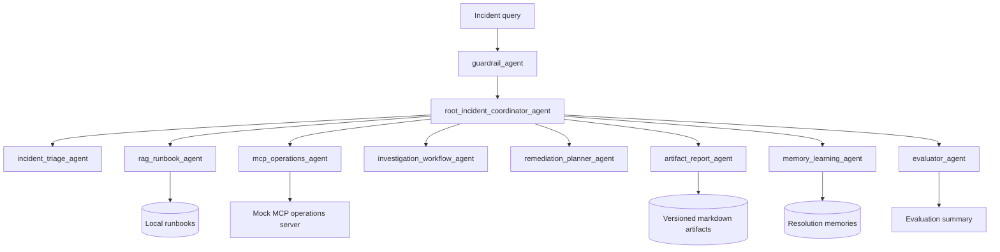
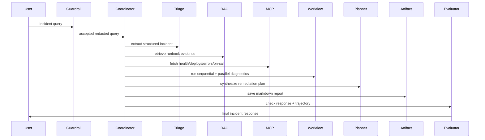

# adk-enterprise-ops-lab

Production-style Google ADK reference project for an **Enterprise Operations Intelligence Agent**.

This is not a Q&A bot. It is an end-to-end agentic backend that simulates how an enterprise operations platform investigates incidents with RAG, MCP tools, sessions, memory, artifacts, callbacks, workflows, guardrails, evaluation, and observability.

## Why This Project Exists

ADK examples are easiest to learn when each concept is isolated, but production systems need those concepts working together. This project is a reusable lab you can revisit when you need examples for:

- root and specialist agents;
- function tools and typed tool outputs;
- RAG over local runbooks;
- MCP tool consumption and MCP exposure patterns;
- session state versus durable memory;
- artifact generation and versioning;
- sequential, parallel, loop, router, and approval workflows;
- lifecycle callbacks and traces;
- golden, trajectory, and RAG grounding evaluation;
- deployment and production-readiness docs.

## ADK Concepts Covered

| Concept | Where |
|---|---|
| Agents and sub-agents | `src/enterprise_ops_lab/agents/` |
| Agent factory and ADK adapter | `agents/agent_factory.py` |
| Function tools | `tools/` |
| MCP tools | `mcp/`, `tools/mcp_client_tools.py` |
| RAG | `rag/`, `tools/rag_tools.py`, `data/runbooks/` |
| Sessions and state | `sessions/` |
| Memory | `memory/`, `tools/memory_tools.py` |
| Artifacts | `artifacts/`, `tools/artifact_tools.py` |
| Workflows | `workflows/` |
| Callbacks | `callbacks/` |
| Evaluation | `evals/`, `data/eval/` |
| Observability | `observability/` |
| Guardrails | `guardrails/` |
| Deployment | `deploy/` |

## Architecture



## Execution Flow



## Folder Structure

```text
adk-enterprise-ops-lab/
  data/                  runbooks, sample incidents, eval cases
  docs/                  concept docs and production notes
  src/enterprise_ops_lab agents, tools, RAG, MCP, workflows, runtime
  tests/                 regression tests
  scripts/               local commands
  deploy/                Docker, Cloud Run, Vertex Agent Engine, Kubernetes notes
```

## Setup

```bash
cd adk-enterprise-ops-lab
python3 -m venv .venv
source .venv/bin/activate
python -m pip install -e ".[dev]"
```

Install optional ADK/API extras:

```bash
python -m pip install -e ".[adk,api,dev]"
```

## Environment Variables

Copy `.env.example` to `.env` for local overrides. Secrets stay in environment variables, not source files.

Key variables:

- `OPS_LAB_MODEL`
- `OPS_LAB_ARTIFACT_DIR`
- `OPS_LAB_TRACE_DIR`
- `MCP_TIMEOUT_MS`
- `GOOGLE_API_KEY`
- `GOOGLE_CLOUD_PROJECT`
- `VERTEX_RAG_CORPUS`
- `GCS_ARTIFACT_BUCKET`

## Run CLI

```bash
ops-lab run --query "Investigate high latency in payments-api after last deployment."
```

## Run FastAPI

```bash
python -m pip install -e ".[api]"
uvicorn enterprise_ops_lab.api.app:app --reload
```

## Run MCP Server

```bash
python -m enterprise_ops_lab.mcp.mock_mcp_server get_service_health --service payments-api
```

## Run Demos

```bash
python -m enterprise_ops_lab.examples.run_rag_demo
python -m enterprise_ops_lab.examples.run_mcp_demo
python -m enterprise_ops_lab.examples.run_workflow_demo
python -m enterprise_ops_lab.examples.run_memory_demo
python -m enterprise_ops_lab.examples.run_artifact_demo
```

## Run Evaluations

```bash
python -m enterprise_ops_lab.evals.evaluation_runner
```

## Add A New Agent

1. Add a prompt in `prompts/`.
2. Add an agent module in `agents/`.
3. Register an agent spec in `agents/agent_factory.py`.
4. Wire it into `runner.py` or a workflow.
5. Add evaluation coverage.

## Add A New Tool

1. Implement the function in `tools/`.
2. Return structured data or `ToolResult`.
3. Register metadata in `tools/tool_registry.py`.
4. Add guardrail checks if it can mutate production.
5. Add tests.

## Add A New MCP Server

1. Add connection config in `mcp/mcp_toolset_config.py`.
2. Add a client wrapper in `mcp/mcp_client.py` or a new module.
3. Normalize outputs in `tools/mcp_client_tools.py`.
4. Document timeout and error behavior in `docs/04_mcp_design.md`.

## Add A New RAG Data Source

1. Add documents to `data/runbooks/` or replace the loader.
2. Tune chunking in `rag/chunker.py`.
3. Add retrieval tests and grounding eval cases.
4. For production, replace `LocalVectorStore` with Vertex AI RAG Engine or Vertex AI Search.

## Add A New Workflow

1. Add a deterministic module in `workflows/`.
2. Call it from the relevant agent.
3. Record trajectory names.
4. Add trajectory eval expectations.

## Deploy

See:

- `deploy/Dockerfile`
- `deploy/cloud_run.md`
- `deploy/vertex_ai_agent_engine.md`
- `deploy/kubernetes.md`
- `docs/12_deployment.md`

## Troubleshooting

- If API import fails, install `.[api]`.
- If ADK import fails, install `.[adk]`; local runtime still works without cloud credentials.
- If evals fail after changing tools, inspect `.traces/<request_id>.jsonl`.
- If artifacts are missing, check `OPS_LAB_ARTIFACT_DIR`.

## Production Hardening Checklist

- Replace local vector search with managed retrieval.
- Add real authn/authz around API routes and tools.
- Add OpenTelemetry export for traces and metrics.
- Store artifacts in GCS with retention policy.
- Store memory in a durable backend.
- Add adversarial guardrail tests.
- Add CI evaluation gate before deployment.
- Add secret manager integration.
- Add approval workflow for production-changing tools.

