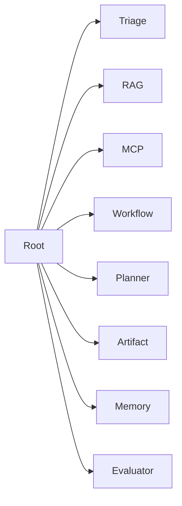

# Architecture

## What It Is

A root coordinator delegates to specialist agents for triage, RAG, MCP operations, workflows, remediation, artifacts, memory, evaluation, and guardrails.

## Where It Appears

- `agents/agent_factory.py`
- `runner.py`

## Why It Matters

Complex agents become easier to evaluate when each responsibility has a named owner.

## Mermaid

## Extend It

Add a specialist module, register it in `build_all_agent_specs`, and add trajectory tests.

