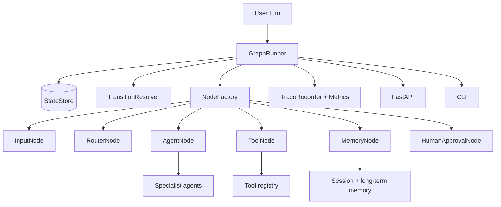
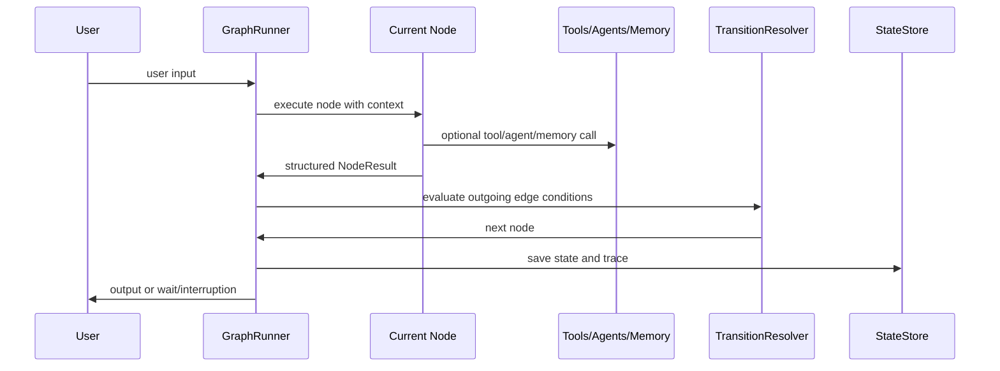

# conversational-graph-enterprise-lab

Production-style reference project for **Conversational Graph systems**.

This is not a FAQ bot and not a prompt-only chatbot. It models conversations as executable graphs: nodes are states, edges are transitions, conditions select paths, context flows through the graph, tools and agents run as nodes, and traces show exactly what happened.

## Why Graphs Over Linear Chat Flows

Linear chat flows break when conversations need branching, retries, handoffs, tool failures, memory, or long-running workflows. Conversational graphs make those paths explicit and debuggable. You can inspect the current node, selected edge, context slots, retry counts, and trace history.

## What This Demonstrates

| Area | Where |
|---|---|
| Conversation graph fundamentals | `schema/models.py`, `graph_engine/` |
| Node types | `nodes/node_types.py` |
| Graph runner, transitions, loop limits, resume | `graph_engine/runner.py`, `transitions/` |
| Multi-agent orchestration | `agents/agent_registry.py` |
| Session state, context, slots, memory | `memory/memory_store.py` |
| Tool invocation, typed tool specs, and failure handling | `tools/registry.py`, `nodes/ToolNode` |
| DSL and graph compilation | `data/sample_graphs/enterprise_orchestrator.json`, `graph_engine/compiler.py` |
| Graph modeling reports | `graph_engine/modeling.py` |
| Observability and debug reports | `observability/`, execution traces, state snapshots |
| Visualization | `visualization/exporters.py` |
| Evaluation | `evals/runner.py`, `data/eval_cases/` |
| API and CLI | `api/`, `cli/` |

## Architecture



## Execution Flow



## Setup

```bash
cd Projects/conversational-graph-enterprise-lab
python3 -m venv .venv
source .venv/bin/activate
python -m pip install -e ".[dev]"
```

Optional API install:

```bash
python -m pip install -e ".[api,dev]"
```

## Run CLI

```bash
convgraph-lab run-graph --input "Investigate INC-1001 latency"
convgraph-lab start-conversation --session-id demo --input "I need help"
convgraph-lab send-input --session-id demo --input "account unlock user-101"
convgraph-lab resume-conversation --session-id demo --approved
convgraph-lab debug-conversation --input "Search docs for provider-search-service timeout"
convgraph-lab inspect-graph
convgraph-lab visualize-graph --format mermaid
convgraph-lab run-evals
```

Without installing:

```bash
PYTHONPATH=src python -m convo_graph_lab.cli.commands run-graph --input "Investigate INC-1001 latency"
```

## Run API

```bash
python -m pip install -e ".[api]"
uvicorn convo_graph_lab.api.app:app --reload --port 8010
```

Endpoints:

- `POST /conversation/start`
- `POST /conversation/input`
- `POST /conversation/resume`
- `GET /conversation/state`
- `GET /conversation/history`
- `GET /conversation/trace`
- `GET /conversation/debug`
- `POST /graph/execute`
- `GET /graph/visualize`
- `GET /graph/inspect`
- `POST /eval/run`

## Graph Modeling Guide

Graph definitions live in `data/sample_graphs/`. A graph has:

- `nodes`: typed conversation states
- `edges`: directed transitions
- `condition`: safe expressions like `intent == 'incident'`
- `metadata`: domain and pattern tags

The compiler validates start node, node types, node configuration compatibility, edge endpoints, unreachable nodes, and cycles. The modeling report identifies terminal nodes, branching nodes, node type counts, cycle presence, and pattern coverage.

## Create A New Node

1. Add a class in `nodes/node_types.py`.
2. Return a structured `NodeResult`.
3. Register it in `nodes/factory.py`.
4. Add a graph definition node and tests.

## Design New Flows

Use reusable flow patterns from `workflows/sample_flows.py`: greeting, intent routing, clarification loop, disambiguation, tool workflow, retry, human handoff, multi-agent orchestration, and interrupt/resume.

## Debug Conversations

Use:

```bash
convgraph-lab debug-conversation --input "Escalate billing support to human"
```

Inspect:

- path
- selected edges
- state snapshots
- tool outputs
- retry counts
- detected conversational patterns
- failures and slow nodes
- metrics

## Production Extension Points

- Replace mock agents with LLM-backed agents.
- Replace in-memory state store with Redis/Postgres.
- Replace local memory with vector-backed long-term memory.
- Add auth and RBAC to API routes.
- Emit traces through OpenTelemetry.
- Store graph definitions in versioned config.
- Run evals in CI before graph changes.
