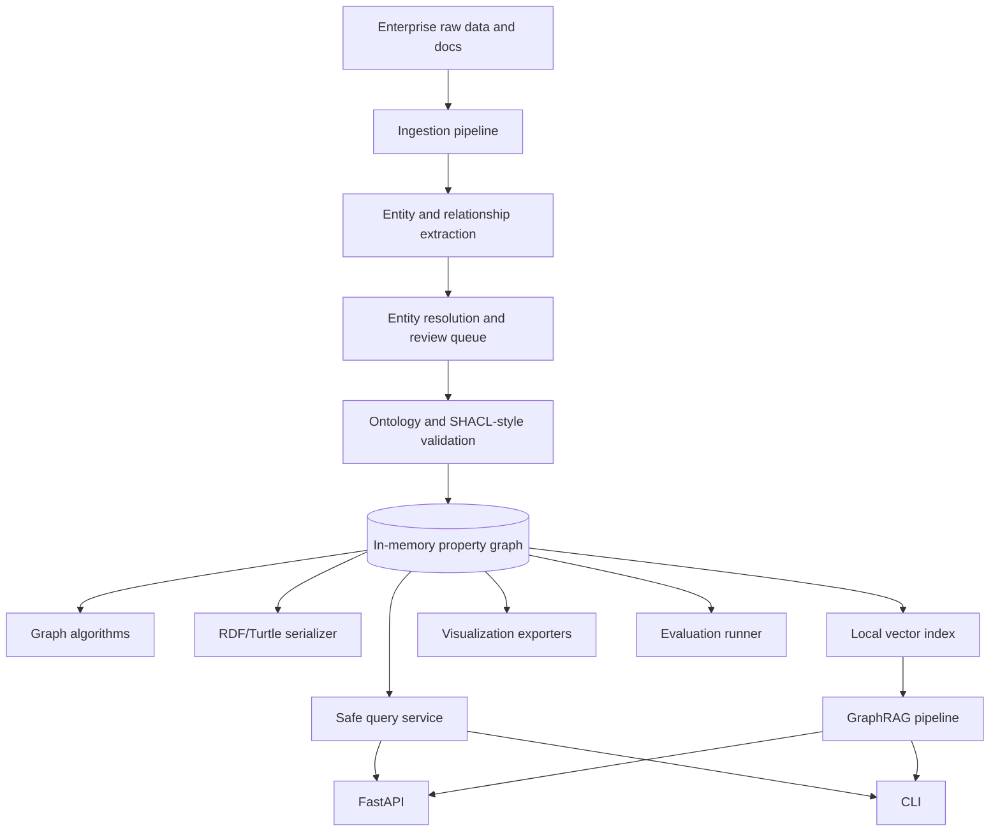
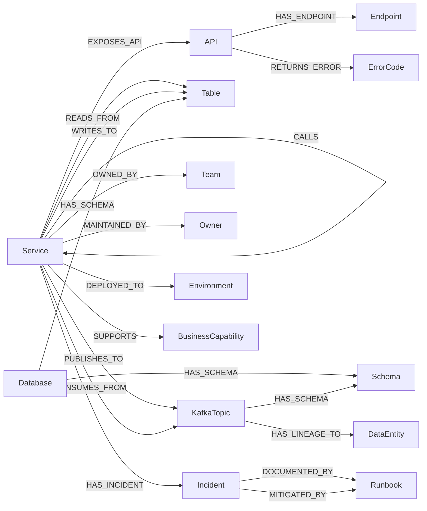
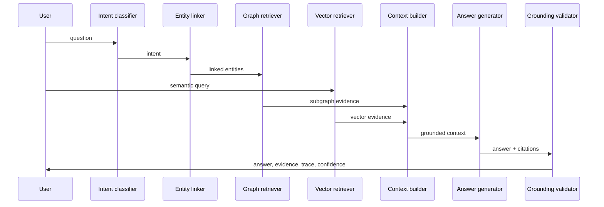

# knowledge-graph-enterprise-lab

Production-style reference project for an **Enterprise System Knowledge Graph Platform**.

This is not a graph visualization toy and not a chatbot-only demo. It models microservices, APIs, databases, Kafka topics, incidents, runbooks, teams, owners, deployments, schemas, business capabilities, lineage, and operational blast radius. The project runs locally with an in-memory property graph, while keeping clear extension points for Neo4j, RDF triple stores, vector databases, and LLM extraction.

## Why Knowledge Graphs Matter

Vector search is strong when the answer is mostly semantic similarity. Enterprise systems questions often need relationships: who owns this service, what calls it, which table it reads, what incident touched it, what breaks downstream, and why a workflow is slow. A knowledge graph makes those relationships first-class, queryable, auditable, and explainable.

## Concepts Covered

| Area | Where |
|---|---|
| Property graph nodes, relationships, labels, properties, paths | `src/kg_enterprise_lab/graph/` |
| RDF triples, Turtle, SPARQL templates and local execution | `ontology/rdf_serializer.py`, `graph/rdf_triple_store.py`, `query/sparql_templates.py`, `query/sparql_executor.py` |
| Ontology and SHACL-style validation | `src/kg_enterprise_lab/ontology/`, `data/ontology/` |
| Structured and document ingestion | `src/kg_enterprise_lab/ingestion/`, `data/raw/` |
| Entity and relationship extraction | `src/kg_enterprise_lab/extraction/` |
| Entity resolution and duplicate detection | `src/kg_enterprise_lab/resolution/` |
| Graph algorithms | `src/kg_enterprise_lab/algorithms/` |
| Graph embeddings and hybrid retrieval | `src/kg_enterprise_lab/embeddings/` |
| GraphRAG | `src/kg_enterprise_lab/graphrag/` |
| Query safety and governance | `src/kg_enterprise_lab/governance/` |
| Evaluation and observability | `src/kg_enterprise_lab/evaluation/`, `src/kg_enterprise_lab/observability/` |
| API, CLI, examples | `src/kg_enterprise_lab/api/`, `cli/`, `examples/` |

## Architecture



## Data Model



## GraphRAG Flow



## Folder Structure

```text
knowledge-graph-enterprise-lab/
  data/                  raw enterprise data, ontology, eval cases, exports
  docs/                  concept docs and production guide
  src/kg_enterprise_lab/ API, CLI, graph, ontology, extraction, GraphRAG
  tests/                 regression tests for core logic
  scripts/               shell helpers for common workflows
  deploy/                Docker, Neo4j, cloud, production notes
```

## Setup

```bash
cd Projects/knowledge-graph-enterprise-lab
python3 -m venv .venv
source .venv/bin/activate
python -m pip install -e ".[dev]"
```

Install API or graph database extras when needed:

```bash
python -m pip install -e ".[api,dev]"
python -m pip install -e ".[graphdb,dev]"
```

## Environment Variables

Copy `.env.example` to `.env` for local overrides.

- `KG_LAB_DATA_DIR`: data folder, default `./data`
- `KG_LAB_EXPORT_DIR`: export folder, default `./data/exports`
- `KG_LAB_GRAPH_STATE`: persisted graph JSON path
- `KG_LAB_MAX_TRAVERSAL_DEPTH`: safety limit for traversals
- `KG_LAB_MIN_CONFIDENCE`: extraction/retrieval threshold
- `NEO4J_URI`, `NEO4J_USER`, `NEO4J_PASSWORD`: optional Neo4j connection
- `RDF_ENDPOINT_URL`: optional RDF triple-store endpoint

## Run CLI

```bash
kg-lab ingest-sample-data
kg-lab build-graph
kg-lab query-graph --question "What services depend on provider-search-service?"
kg-lab query-graph --question "Show blast radius for payments-api."
kg-lab query-graph --question "Find shortest path between mobile-app and provider-db."
kg-lab graph-summary
kg-lab run-sparql --template service_dependencies
kg-lab run-graphrag --question "Use GraphRAG to explain why provider-search-service may be slow."
kg-lab run-algorithms
kg-lab validate-ontology
kg-lab detect-duplicates
kg-lab run-evals
```

Without installing the package, use:

```bash
python -m kg_enterprise_lab.cli.commands query-graph --question "Which service has highest dependency centrality?"
```

## Run API

```bash
python -m pip install -e ".[api]"
uvicorn kg_enterprise_lab.api.app:app --reload
```

Endpoints:

- `POST /ingest`
- `POST /extract/entities`
- `POST /extract/relationships`
- `POST /graph/query`
- `POST /graph/graphrag`
- `GET /graph/summary`
- `GET /graph/sparql/{template}`
- `GET /graph/node/{id}`
- `GET /graph/neighbors/{id}`
- `GET /graph/path?source=mobile-app&target=provider-db`
- `GET /graph/blast-radius/{service}`
- `GET /graph/lineage/{service}`
- `GET /graph/visualize/{view}`
- `POST /graph/validate`
- `POST /eval/run`
- `GET /health`

## Export Visualizations

```bash
kg-lab export-graph --format json --view full
kg-lab export-graph --format mermaid --view blast-radius --anchor payments-api
kg-lab export-graph --format dot --view lineage --anchor mobile-app
kg-lab export-graph --format ttl
```

## Add A New Node Type

1. Add the label to `ontology/ontology_models.py` and `data/ontology/enterprise_ontology.yaml`.
2. Add sample raw records under `data/raw/`.
3. Extend `graph/graph_builder.py`.
4. Add query, validation, and visualization tests when the label affects behavior.

## Add A New Relationship Type

1. Add the type to `RELATIONSHIP_TYPES`.
2. Add direction and cardinality rules if needed.
3. Add Cypher and SPARQL templates if it should be user-queryable.
4. Add blast-radius or lineage behavior if it changes impact analysis.

## Add A New Ontology Rule

1. Add a `CardinalityRule` in `ontology_models.py`.
2. Mirror it in `data/ontology/shacl_constraints.yaml`.
3. Add a test in `tests/test_ontology_validation.py`.

## Add A New Cypher Template

1. Add it to `query/cypher_templates.py`.
2. Route it through `query_planner.py`.
3. Keep parameters separate from query strings.
4. Add a safe executor test before exposing it through API.

## Add A New SPARQL Template

1. Add it to `query/sparql_templates.py`.
2. Keep URI prefixes explicit.
3. Add a Turtle export test if the template depends on new predicates.

## Connect Neo4j

The local implementation runs in memory. To connect Neo4j:

1. Install `python -m pip install -e ".[graphdb]"`.
2. Set `NEO4J_URI`, `NEO4J_USER`, `NEO4J_PASSWORD`.
3. Use `graph/neo4j_repository.py` to generate MERGE statements.
4. Create uniqueness constraints on `id` for each label.
5. Use transactions and retries for batch ingestion.

## Extend To RDF Triple Store

1. Export Turtle with `kg-lab export-graph --format ttl`.
2. Load the TTL into Fuseki, GraphDB, Neptune RDF, or another SPARQL endpoint.
3. Use `query/sparql_templates.py` as the allowlisted query catalog.
4. Run SHACL validation with a production engine such as pySHACL.

## Productionize

- Replace local JSON loading with catalog, deployment, incident, Kafka, and schema registry connectors.
- Replace mock LLM extraction with schema-constrained extraction and human review thresholds.
- Replace local vectors with a vector database and versioned embedding model.
- Add Neo4j or Neptune write transactions, retries, dead-letter handling, and idempotency keys.
- Add RBAC/ABAC around sensitive owners, incidents, and deployment metadata.
- Add OpenTelemetry traces, latency histograms, query logs, and GraphRAG evaluation gates.
- Run ontology migrations through review before graph writes.

## Troubleshooting

- `No module named pytest`: install `python -m pip install -e ".[dev]"`.
- `FastAPI missing`: install `python -m pip install -e ".[api]"`.
- Empty query result: run `kg-lab ingest-sample-data` and check entity spelling.
- Huge traversal result: lower `KG_LAB_MAX_TRAVERSAL_DEPTH`.
- Duplicate entities: run `kg-lab detect-duplicates` and review alias rules.

## Production Checklist

- Ontology labels and relationship types reviewed.
- Unique IDs and aliases defined for every source.
- Batch ingestion is idempotent.
- Graph writes are transactional.
- Sensitive fields are redacted.
- Query templates are allowlisted in the main query path.
- Traversal depth and result-size limits are enforced.
- GraphRAG answers include evidence and confidence.
- Golden evals run in CI.
- Ownership and runbook coverage are validated.
