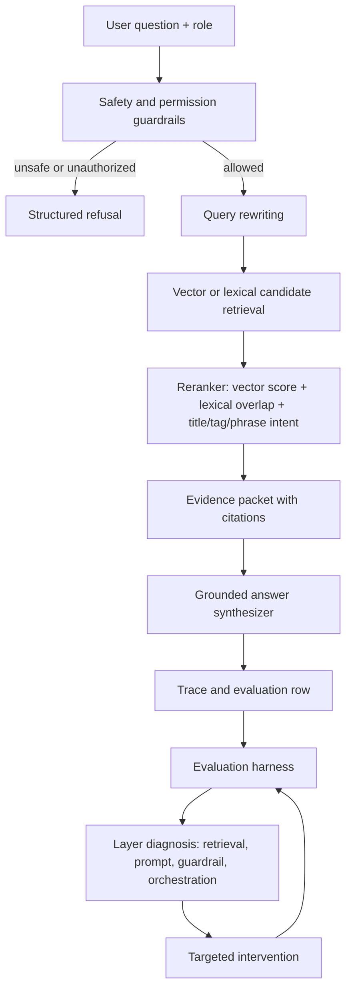

# Architecture Diagram

## Data Flow

1. The user sends a question and role.
2. Guardrails decide whether the request is safe and authorized.
3. Allowed questions are rewritten into retrieval-oriented query variants.
4. Retrieval gathers candidate chunks or documents.
5. Reranking promotes evidence that matches intent, title, tags, and high-signal phrases.
6. The answer layer can only answer from the evidence packet.
7. Citations and traces are stored for evaluation and debugging.

## Control Flow

1. Unsafe or unauthorized requests stop before retrieval.
2. Low-evidence requests refuse instead of guessing.
3. Failed evaluation rows are diagnosed by layer.
4. The remediation changes one layer at a time so improvement is attributable.

## Reviewer Takeaway

This is not just a RAG demo. It is an engineering loop: build, evaluate, diagnose, remediate, and preserve evidence.

