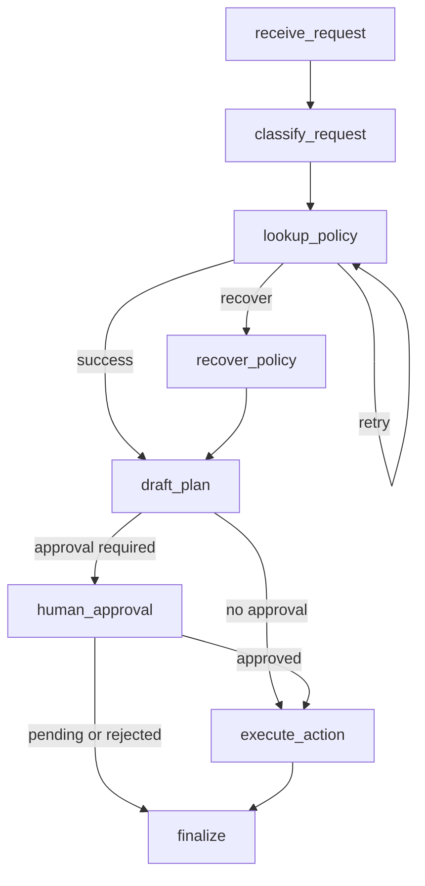

# Project 5: LangGraph Workflow Agent

This project implements a **workflow triage agent** using LangGraph.

The agent receives an operational request, classifies it, uses a policy lookup tool, drafts an action plan, handles tool failures with retry/recovery, and requires human approval before executing high-risk changes.

## Project Requirements Coverage

| Spec requirement | How this project handles it |
|---|---|
| Explicit state schema | `workflow/state.py` defines `TriageWorkflowState`; `schemas.py` defines typed outputs. |
| At least 3 graph nodes with conditional routing | The graph has receive, classify, lookup policy, recover, draft, approval, execute, and finalize nodes. |
| Retry or recovery branch | Policy lookup retries once, then routes to fallback recovery policy. |
| Human approval or interrupt step | High-risk requests stop at `pending_human_approval` unless `human_decision=approved`. |
| Trace capture or state inspection | Every node appends trace events; CLI can write the final state to JSON. |

## Scenario

The workflow handles operational intake requests such as:

- "Restart the support dashboard worker."
- "Grant temporary admin access to a reviewer."
- "Delete stale production records after export."
- "Investigate billing dispute escalation."

Low-risk requests can be executed automatically after policy lookup. High-risk requests require explicit human approval.

## Graph Diagram



## Node Responsibilities

- `receive_request`: initialize workflow state and trace.
- `classify_request`: determine category, risk, and whether approval is required.
- `lookup_policy`: call a tool and retry transient failures.
- `recover_policy`: use a conservative fallback policy when the tool keeps failing.
- `draft_plan`: create a concrete action plan.
- `human_approval`: pause, approve, or reject high-risk plans.
- `execute_action`: simulate tool execution of approved/low-risk plans.
- `finalize`: return a stable workflow result.

## Run Locally

```bash
cd Projects/project-5-langgraph-workflow-agent
python3 -m venv .venv
source .venv/bin/activate
python -m pip install -e ".[dev]"
```

Low-risk request:

```bash
workflow-triage run \
  --request "Restart the support dashboard worker after business hours." \
  --trace-output docs/last_state.json
```

High-risk request awaiting approval:

```bash
workflow-triage run \
  --request "Grant temporary admin access to a reviewer for production records." \
  --trace-output docs/pending_state.json
```

High-risk request with approval:

```bash
workflow-triage run \
  --request "Grant temporary admin access to a reviewer for production records." \
  --decision approved
```

Recovery path:

```bash
workflow-triage run \
  --request "Simulate policy outage while routing a billing escalation." \
  --simulate-policy-failures 2
```

## Tests

```bash
pytest
```

The tests cover successful execution, pending human approval, rejection, retry, and fallback recovery.
