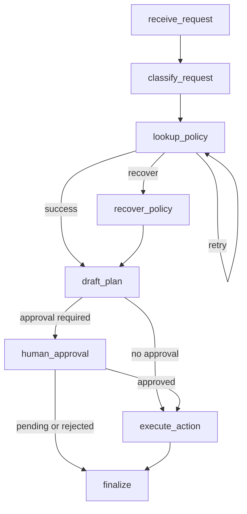

# Graph Diagram

## Why This Graph Matters

The graph makes control flow visible:

- policy lookup failure loops are explicit;
- recovery is a named branch;
- human approval is a real gate before execution;
- final state inspection shows every node transition.
