# Module 1 - GenAI Landscape And Mental Models

This is the evolving knowledge base for Module 1.

## Quick Topic Index

- [Topic 1.1: GenAI System Taxonomy and Vocabulary](#topic-11-genai-system-taxonomy-and-vocabulary)
- [Topic 1.2: Anatomy of a GenAI Application](#topic-12-anatomy-of-a-genai-application)
- [Subtopic 1.2.a: Model Layer, Prompt Layer, Tool Layer, Retrieval Layer](#subtopic-12a-model-layer-prompt-layer-tool-layer-retrieval-layer)
- [Subtopic 1.2.b: Memory, Knowledge Grounding, and Feedback Loops](#subtopic-12b-memory-knowledge-grounding-and-feedback-loops)
- [Subtopic 1.2.c: Evaluation, Tracing, and Safety as System Components](#subtopic-12c-evaluation-tracing-and-safety-as-system-components)
- [Subtopic 1.2.d: Reliability, Latency, and Cost as Product Constraints](#subtopic-12d-reliability-latency-and-cost-as-product-constraints)
- [Topic 1.3: Failure Modes and Thinking Patterns](#topic-13-failure-modes-and-thinking-patterns)
- [Subtopic 1.3.a: Hallucination, Omission, Shallow Retrieval, and Overconfident Answers](#subtopic-13a-hallucination-omission-shallow-retrieval-and-overconfident-answers)
- [Subtopic 1.3.b: Prompt Brittleness, Hidden State, and Context Overload](#subtopic-13b-prompt-brittleness-hidden-state-and-context-overload)
- [Subtopic 1.3.c: Tool Misuse, Stale Knowledge, and Permission Blind Spots](#subtopic-13c-tool-misuse-stale-knowledge-and-permission-blind-spots)
- [Subtopic 1.3.d: Root-Cause Decomposition Across Model, Retrieval, Tool, and Orchestration Bugs](#subtopic-13d-root-cause-decomposition-across-model-retrieval-tool-and-orchestration-bugs)
- [Module 1 Checkpoint Deep Explanation](#module-1-checkpoint-deep-explanation)

Covered so far:

- Topic 1.1.a: Foundation model vs instruct model vs reasoning-oriented model
- Topic 1.1.b: Assistant vs copilot vs workflow vs agent
- Topic 1.1.c: Hosted vs open-weight vs self-hosted model ecosystems
- Topic 1.1.d: Tokens, context windows, latency, throughput, and cost basics
- Topic 1.2.a: Model layer, prompt layer, tool layer, retrieval layer
- Topic 1.2.b: Memory, knowledge grounding, and feedback loops
- Topic 1.2.c: Evaluation, tracing, and safety as system components
- Topic 1.2.d: Reliability, latency, and cost as product constraints
- Topic 1.3.a: Hallucination, omission, shallow retrieval, and overconfident answers
- Topic 1.3.b: Prompt brittleness, hidden state, and context overload
- Topic 1.3.c: Tool misuse, stale knowledge, and permission blind spots
- Topic 1.3.d: Root-cause decomposition: model bug vs retrieval bug vs tool bug vs orchestration bug
- Module 1 checkpoint: system anatomy, workflow vs RAG vs agentic behavior, and layer-based diagnosis

---

## Topic 1.1: GenAI System Taxonomy and Vocabulary

**Topic time:** 4h

Subtopics in this topic:

- 1.1.a Foundation model vs instruct model vs reasoning-oriented model - 45m
- 1.1.b Assistant vs copilot vs workflow vs agent - 45m
- 1.1.c Hosted vs open-weight vs self-hosted model ecosystems - 60m
- 1.1.d Tokens, context windows, latency, throughput, and cost basics - 90m

Learning rule for this module file:

- We cover one subtopic at a time.
- We do not complete the full parent topic in a single pass.
- Each new subtopic is appended only after the previous one is understood.

---

## Subtopic 1.1.a: Foundation Model vs Instruct Model vs Reasoning-Oriented Model

### 1) The Intuition (Plain English)

These three labels describe different kinds of behavior, not three unrelated species of AI.

- A foundation model is the broad raw base.
- An instruct model is that base adapted to follow directions better.
- A reasoning-oriented model is optimized to stay coherent across longer chains of thought, multi-step decomposition, tool use, or harder decision sequences.

Simple mental model:

- Foundation model = general knowledge engine
- Instruct model = conversationally aligned task follower
- Reasoning-oriented model = more deliberate problem solver for complex tasks

Analogy:

Think of three versions of the same engineer.

- The foundation model is the engineer fresh out of school with lots of broad knowledge but not much structure in how to respond to business requests.
- The instruct model is the same engineer after being trained to answer stakeholders clearly, follow instructions, and stay on task.
- The reasoning-oriented model is the same engineer after learning how to break down ambiguous or difficult problems systematically over multiple steps.

Important intuition:

The jump from foundation to instruct is mostly about usability and alignment.
The jump from instruct to reasoning-oriented behavior is mostly about task difficulty, control of longer problem-solving chains, and better performance on multi-step decisions.

#### Clarification: What does "reasoning" mean in AI?

In AI, "reasoning" does not mean the model has human consciousness or true human-style understanding.

In practical system terms, reasoning means the model is better at:

- breaking a hard problem into smaller steps
- keeping track of intermediate conclusions
- comparing alternatives before answering
- choosing when to use a tool or more evidence
- avoiding shallow first-answer behavior on complex tasks

So when we call a model "reasoning-oriented," we usually mean it is more reliable on tasks like:

- multi-step diagnosis
- planning
- hypothesis comparison
- tool-using workflows
- long-form problem decomposition

The safest engineering interpretation is this:

Reasoning is observable as better multi-step task performance, not as proof that the model "thinks like a human."

#### Clarification: If the foundation model is raw, why is it still used at all?

You are right that most end users do not directly interact with a raw foundation model in production-facing applications.

But foundation models still matter for several reasons:

1. They are the base capability layer.

- Instruct models and reasoning-oriented variants are usually built on top of a strong foundation model.
- If the base model is weak, the tuned versions have a lower ceiling.

2. They are used by model builders and platform teams.

- alignment
- instruction tuning
- fine-tuning
- distillation
- evaluation research

3. They are useful in controlled backend settings.

Sometimes teams use base-style models for:

- offline experimentation
- synthetic data generation
- internal benchmarking
- research workflows
- specialized tuning pipelines

4. They help explain model behavior correctly.

If you do not understand the difference between base capability and instruction alignment, you will misdiagnose failures. You may think the model "does not know" something when the real issue is that it was not optimized to respond in a user-safe or instruction-following way.

So the correct mental model is not:

- foundation model = useless for practice

It is:

- foundation model = rarely the direct end-user interface, but still the base layer that makes the downstream instruct and reasoning systems possible.

### Visual Diagram (Mermaid)

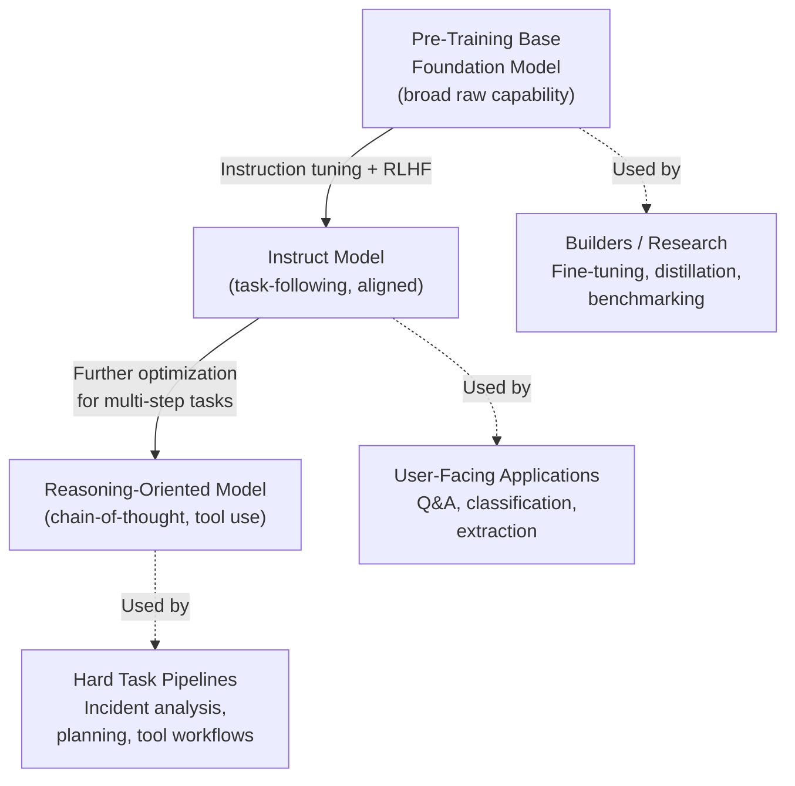

### 2) Real-World Industry Scenarios

#### Scenario A: Internal policy assistant

- Product context: employees ask straightforward questions about benefits, leave, policy, and onboarding.
- Constraints: low hallucination tolerance, moderate latency sensitivity, clear formatting, predictable behavior.
- What good looks like in production: the system follows user requests reliably, formats answers well, and stays within policy boundaries.

Why this matters here:

- A raw foundation model is usually the wrong choice.
- An instruct model is usually the right default because the task is mostly about clear task following, not deep multi-step reasoning.

#### Scenario B: Multi-step incident triage or research workflow

- Product context: the system must examine logs, propose hypotheses, compare evidence, maybe call tools, and decide on the next action.
- Constraints: higher reasoning depth, better trajectory quality, stronger debugging trace needs, possibly higher latency tolerance.
- What good looks like in production: the system maintains coherence across multiple steps, does not collapse into shallow answers too early, and can justify intermediate decisions.

Why this matters here:

- A reasoning-oriented model may be worth the extra latency or cost.
- Using a cheaper instruct model may still work, but only if orchestration and verification are strong enough.

### 3) System View (Think like a systems engineer)

#### Inputs -> Transformations -> Outputs

- Inputs: task type, model choice, prompt structure, tool availability, evaluation target.
- Transformations:
  - classify whether the task is straightforward instruction-following or deeper multi-step reasoning
  - route to the most appropriate model family
  - optionally add retrieval or tools
  - verify output quality
- Outputs: direct answer, structured extraction, plan, decision, or tool-driven next action.

#### Observability

What we log and compare:

- model family chosen
- latency
- cost per request
- token usage
- quality on simple tasks vs multi-step tasks
- failure mode type: off-task behavior, shallow reasoning, formatting error, hallucination, tool misuse

#### Failure points

- Using a foundation model directly where user-facing behavior requires instruction following.
- Using an instruct model for tasks that need sustained multi-step reasoning without enough scaffolding.
- Assuming a reasoning-oriented model automatically fixes poor retrieval, poor tools, or poor orchestration.

### 4) System Design Flavor (practical and concise)

#### Key design question

Do we need better task following, or do we need better multi-step reasoning?

That question usually determines the right model class faster than brand comparisons do.

#### Tradeoffs

- Foundation vs instruct: instruct models are usually more usable for applications, but the foundation model matters underneath because it sets the base capability ceiling.
- Instruct vs reasoning-oriented: reasoning-oriented models can improve hard-task performance, but often cost more and take longer.
- Model strength vs system design: a stronger model helps, but it cannot fully compensate for bad retrieval, unclear task framing, or weak evaluation.

#### One scaling consideration

At scale, the wrong model class causes silent waste.

- If simple tasks are routed to expensive reasoning models, cost explodes.
- If complex tasks are routed to shallow instruct models, quality degrades and humans end up redoing the work.

### 5) Common Mistakes + Debugging

#### Mistake 1

- Symptom: outputs are awkward, off-format, or ignore user instructions.
- Likely cause: the system is too close to a raw foundation-style behavior and lacks instruction tuning or strong response constraints.
- First debugging step: compare the same task across an instruct model and the current model under identical prompt conditions.

#### Mistake 2

- Symptom: the system gives fast but shallow answers on hard multi-step tasks.
- Likely cause: an instruct model is being used for a reasoning-heavy task without enough scaffolding, decomposition, or model capability.
- First debugging step: inspect traces for premature answer generation and test whether decomposition or a reasoning-oriented model improves the trajectory.

#### Mistake 3

- Symptom: the team upgrades to a reasoning-oriented model but quality barely improves.
- Likely cause: the real bottleneck is retrieval quality, tool reliability, or workflow design rather than model reasoning depth.
- First debugging step: isolate one fixed task and compare evidence quality, tool success, and prompt clarity before blaming or praising the model class.

### Hands-On Lab (Concept → Build → Break → Measure → Explain)

> This subtopic is a taxonomy distinction. The lab uses a decision drill instead of a coding exercise.

**Build — Classification drill**

For each task, write: (a) which model class is the best default and (b) one sentence why.

| Task | Model class | Why |
|---|---|---|
| Summarize a 3-sentence Slack message | ? | |
| Extract JSON fields from an invoice | ? | |
| Investigate an incident by comparing 5 hypotheses and recommending a fix | ? | |
| Generate 10 product description variants | ? | |
| Plan a multi-step code migration with tool calls at each step | ? | |

**Answers:**

| Task | Model class | Why |
|---|---|---|
| Summarize a Slack message | Instruct-first | Clear instruction-following task; short output |
| Extract JSON fields | Instruct-first | Structured extraction; no multi-step reasoning needed |
| Investigate incident + compare hypotheses | Reasoning-oriented-first | Must hold intermediate conclusions and compare alternatives |
| Generate 10 product descriptions | Instruct-first | Repetitive creative generation; not multi-step problem solving |
| Multi-step code migration with tools | Reasoning-oriented-first | Must plan steps, call tools, adjust based on intermediate results |

**Break — Force the wrong class**

Deliberately assign the wrong class:
- Use an instruct model for the incident investigation task.
- Use a reasoning-oriented model for the Slack summary.

Predict one symptom per wrong assignment:

- Instruct model on incident investigation: gives a shallow first-guess answer without comparing all hypotheses; skips the weakest-evidence scenario.
- Reasoning-oriented model on Slack summary: adds unnecessary hedging and spends far more tokens than the task requires.

**Measure — Observe the gap**

If you have API access, run the incident task on a fast instruct model vs. a reasoning-oriented model and compare:
- Were all 5 hypotheses addressed?
- Did the instruct model skip any low-evidence hypothesis?
- Was the final recommendation justified step by step?

**Explain — Why the wrong class causes this specific failure**

An instruct model is optimized for following explicit instructions efficiently, not for maintaining a multi-step reasoning chain. On a task that requires revisiting and comparing evidence, it collapses to the highest-confidence surface answer rather than exploring alternatives. The reasoning-oriented model overhead on a simple summary wastes tokens and latency without adding quality because the task does not need sustained multi-step thought.

### 6) Active Recall (Spaced Repetition)

1. What is the simplest difference between a foundation model and an instruct model?
2. Why is an instruct model usually the safer default for user-facing applications?
3. What kind of task makes a reasoning-oriented model more justifiable?
4. Why can a stronger reasoning model still fail in a badly designed system?
5. What is the first question you should ask before choosing between instruct and reasoning-oriented behavior?

#### Active Recall Answers

1. A foundation model is the broad raw base, while an instruct model is adapted to follow user requests more reliably, safely, and clearly.
2. Because most user-facing applications need stable instruction-following behavior, cleaner formatting, and better alignment with human requests.
3. A task that requires multi-step decomposition, comparing alternatives, tool use, or sustained decision-making, such as incident analysis or research workflows.
4. Because the real bottleneck may be retrieval quality, tool reliability, prompt framing, or workflow design rather than raw model reasoning depth.
5. Ask: do we mainly need better task following, or do we mainly need better multi-step reasoning?

### 7) Practice

#### Mini-exercise

Classify the following tasks by default model need: foundation-style base capability, instruct-first, or reasoning-oriented-first.

- summarize a leave policy
- extract invoice fields into JSON
- compare three outage hypotheses using logs and retrieved runbooks
- answer a simple FAQ from a company handbook
- decide a sequence of actions for a support escalation workflow

For each one, write one sentence explaining why.

#### Mini-exercise Answers

- summarize a leave policy -> instruct-first
  Why: the task is mostly about following a user request clearly, staying grounded, and producing a readable answer.

- extract invoice fields into JSON -> instruct-first
  Why: this is mainly structured extraction and instruction-following, not deep multi-step reasoning.

- compare three outage hypotheses using logs and retrieved runbooks -> reasoning-oriented-first
  Why: the task requires comparing alternatives, holding intermediate conclusions, and making a better multi-step judgment.

- answer a simple FAQ from a company handbook -> instruct-first
  Why: this is a straightforward retrieval-plus-response task where stable instruction following matters more than deeper reasoning.

- decide a sequence of actions for a support escalation workflow -> reasoning-oriented-first
  Why: the system must plan over multiple steps and choose a sensible next action path rather than return one direct answer.

#### Capstone-style system design question

You are designing a support platform with two user flows:

- Flow A: answer common support questions from documentation
- Flow B: investigate recurring incidents by inspecting logs, proposing hypotheses, and escalating the right next action

Which flow should default to an instruct model, which might justify a reasoning-oriented model, and why would a raw foundation model usually stay behind the scenes rather than face the user directly?

#### Capstone-style Answer Outline

- Flow A should default to an instruct model.
  Why: answering common support questions is mainly about clear task following, helpful formatting, grounded retrieval use, and predictable user-facing behavior.

- Flow B may justify a reasoning-oriented model.
  Why: incident investigation requires comparing evidence, maintaining a multi-step hypothesis chain, possibly using tools, and deciding a next action rather than just producing a direct answer.

- A raw foundation model usually stays behind the scenes because end-user systems need alignment, safe behavior, and reliable instruction following.
  The foundation model still matters as the base capability layer underneath tuned instruct or reasoning-oriented variants.

### 8) Production Reality Check (Mandatory Ending)

If this fails in prod, what is the first thing we inspect?

We inspect task-to-model routing.

Why:

The most common failure here is not that the model is universally weak. It is that the wrong class of model is assigned to the wrong class of task, which shows up as unnecessary cost, shallow reasoning, or poor instruction following.

### 9) Curiosity Bridge (Mandatory Ending)

Now that the model-class difference is clearer, the next question is not about models at all.

The next subtopic asks what kind of system you are actually building: assistant, copilot, workflow, or agent. That distinction often matters more than the model brand name.

---

## Subtopic 1.1.b: Assistant vs Copilot vs Workflow vs Agent

### 1) The Intuition (Plain English)

These four words are often mixed together, but they describe different system roles.

- An assistant mainly answers or helps when the user asks.
- A copilot helps inside an existing task flow, usually alongside a human.
- A workflow executes a predefined sequence of steps.
- An agent chooses its next action dynamically to reach a goal.

Simple mental model:

- Assistant = answers and helps
- Copilot = collaborates while you work
- Workflow = follows a defined path
- Agent = chooses the path

Analogy:

Think of air travel.

- An assistant is the airport help desk answering your questions.
- A copilot is the flight-support system helping the pilot during flight operations.
- A workflow is the standard boarding process with fixed stages.
- An agent is the operations controller dynamically rerouting flights and staff based on changing conditions.

The most important distinction is not “which one sounds smarter.”
It is “how much decision-making freedom should this system be allowed to have?”

If you get that wrong, the whole design becomes either too rigid or too chaotic.

#### Clarification: Why do people confuse these terms so often?

Because all four can use the same underlying LLMs, tools, retrieval, and UI patterns.

From the outside, they may all look like “chat with AI.”

But from a systems perspective, they differ in:

- how many decisions are predefined
- how much autonomy the model has
- whether the human stays in the loop continuously
- whether the system is mostly responding, assisting, executing, or deciding

That is why naming the system correctly matters before choosing architecture.

### Visual Diagram (Mermaid)

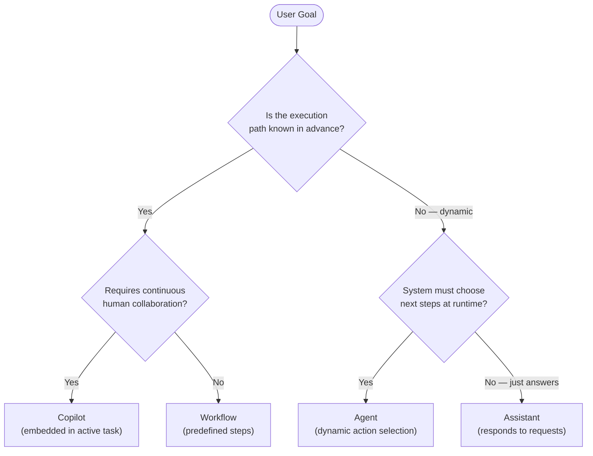

### 2) Real-World Industry Scenarios

#### Scenario A: IDE coding helper

- Product context: a developer writes code, asks questions, gets inline suggestions, explanations, refactors, and test help.
- Constraints: low interruption tolerance, high usefulness pressure, human remains actively in control, suggestions must be reversible.
- What good looks like in production: the system behaves as a copilot, stays context-aware, helps during the task, and does not act autonomously on risky changes.

Why this matters here:

- Calling this an “agent” by default is usually misleading.
- The human is still the primary operator.
- The AI is assisting inside an existing workflow.

#### Scenario B: Invoice processing pipeline

- Product context: invoices arrive, fields are extracted, anomalies are checked, records are routed, and exceptions go to human review.
- Constraints: repeatability, auditability, predictable latency, strong control boundaries.
- What good looks like in production: the system behaves mostly as a workflow with a few LLM-powered steps, not as a free-moving agent.

Why this matters here:

- Most business automation is workflow-first.
- The model may classify or extract, but the path is still predefined.

#### Scenario C: Incident response coordinator

- Product context: the system gathers logs, checks runbooks, compares likely causes, asks for missing evidence, and recommends or triggers next steps.
- Constraints: ambiguity, changing state, tool use, stronger reasoning demand, need for approval boundaries.
- What good looks like in production: the system may justify limited agentic behavior because the next step depends on what is discovered during execution.

Why this matters here:

- This is closer to a real agent problem because the path is not fully known in advance.
- But even here, autonomy should be bounded and observable.

### 3) System View (Think like a systems engineer)

#### Inputs -> Transformations -> Outputs

- Inputs: user goal, task state, available tools, business rules, approval rules, retrieved context.
- Transformations:
  - classify whether the system is only answering, assisting, executing a known sequence, or dynamically choosing actions
  - determine how much control stays with the human
  - apply retrieval, tools, prompts, or orchestration accordingly
  - produce a response, suggestion, workflow step, or next-action decision
- Outputs: answer, recommendation, structured result, executed step, or delegated next action.

#### Observability

What we log and inspect:

- system role assumed: assistant, copilot, workflow, or agent
- human approvals and overrides
- tool calls and execution path
- whether the route was deterministic or dynamic
- latency, cost, and failure points by step
- where the model made a decision vs where the system followed rules

#### Failure points

- Designing a workflow as an agent and losing predictability.
- Designing an agent as a workflow and losing adaptability.
- Calling a copilot an assistant and under-investing in task context.
- Giving an assistant unsafe action authority it should never have.

### 4) System Design Flavor (practical and concise)

#### Key design question

Is the next step known in advance, or must the system decide it dynamically?

That single question separates workflows from real agentic systems surprisingly often.

#### Tradeoffs

- Assistant vs copilot: assistants are simpler, but copilots are more context-aware within active work.
- Workflow vs agent: workflows are easier to test and audit, but agents can adapt better when paths are unknown.
- Human control vs autonomy: more autonomy may improve speed, but raises safety, debugging, and accountability costs.

#### One scaling consideration

At scale, false autonomy is expensive.

- If you over-label systems as agents, cost, unpredictability, and debugging burden rise.
- If you over-force workflow logic where reality is dynamic, humans end up manually compensating for rigidity.

### 5) Common Mistakes + Debugging

#### Mistake 1

- Symptom: the system behaves unpredictably and is hard to audit.
- Likely cause: a workflow problem was incorrectly designed as an agent problem.
- First debugging step: inspect whether the execution path should have been deterministic and identify which decisions could be converted into rules.

#### Mistake 2

- Symptom: the system feels dumb and brittle on dynamic tasks.
- Likely cause: an agent-like problem was forced into a rigid workflow with no room for conditional adaptation.
- First debugging step: inspect where failures occur because the next step depends on information discovered only during runtime.

#### Mistake 3

- Symptom: a so-called assistant accidentally performs risky actions or oversteps user intent.
- Likely cause: action authority and role boundaries were defined poorly.
- First debugging step: review tool permissions, approval gates, and which component is allowed to make execution decisions.

### Hands-On Lab (Concept → Build → Break → Measure → Explain)

> This subtopic is a role/taxonomy distinction. The lab uses a system design drill.

**Build — Role classification drill**

| System | Role (assistant/copilot/workflow/agent) | Justification |
|---|---|---|
| Slack bot answering "where is the vacation policy?" | ? | |
| AI tab in a code editor suggesting refactors as you type | ? | |
| Invoice → validate → route → archive pipeline | ? | |
| Outage bot that checks logs, calls tools, proposes a fix | ? | |

**Answers:**

| System | Role | Justification |
|---|---|---|
| Slack policy bot | Assistant | Responds to isolated questions; no active task context |
| Code editor AI tab | Copilot | Embedded in an active coding session; supports ongoing work |
| Invoice pipeline | Workflow | Fixed, repeatable, auditable path; LLM is one step inside it |
| Outage investigation bot | Agent (bounded) | Next action depends on what logs reveal at runtime |

**Break — Give the assistant agent-level authority**

Take the Slack policy bot. Add the ability to update a user's leave balance based on its answer.

Write down 3 things that can go wrong now:

1. Model misclassifies a question and deducts leave for the wrong user based on a confident but wrong policy interpretation.
2. No approval gate means the change takes effect immediately with no human review.
3. An adversarial input ("set my leave balance to 30 days") gets incorrectly interpreted as a policy question and executed.

**Measure — Estimated blast radius**

For a 500-user company, 50 policy questions/day, 2% wrong action rate (no approval gate) = 1 erroneous leave update per day. After one week: 7 incorrect updates before anyone notices.

**Explain — Why role boundary violation causes real harm**

Assistant systems are designed for information retrieval and answering, not for executing state changes. Adding action authority without approval gates converts a safe information tool into an unconstrained action surface. The model's 2% error rate on intent classification becomes consequential at scale when actions are irreversible.

### 6) Active Recall (Spaced Repetition)

1. What is the simplest difference between a workflow and an agent?
2. Why is a coding helper usually better described as a copilot than a plain assistant?
3. What makes an assistant different from a copilot in system design terms?
4. Why is overusing the word “agent” harmful in architecture design?
5. What is the first question you should ask before deciding between workflow and agent?

#### Active Recall Answers

1. A workflow follows a predefined path, while an agent chooses the next step dynamically based on the evolving state.
2. Because it helps inside an active human task flow and collaborates with the user continuously rather than simply answering isolated questions.
3. An assistant mainly responds to requests, while a copilot is embedded into an ongoing task context and helps the human perform work step by step.
4. Because it encourages unnecessary autonomy, complexity, and unpredictability where a simpler workflow or assistant design would be safer and cheaper.
5. Ask: is the next step known in advance, or does the system need to decide it dynamically during execution?

### 7) Practice

#### Mini-exercise

Classify each use case as assistant, copilot, workflow, or agent.

- HR chatbot that answers policy questions with citations
- AI feature inside a CRM that drafts replies while sales reps work
- document ingestion pipeline that classifies, extracts, and routes files through fixed stages
- system that investigates incidents by checking logs, comparing hypotheses, and selecting the next tool to call
- support bot that answers simple questions but requires approval before refund actions

For each one, explain why the label fits better than the other three.

#### Mini-exercise Answers

- HR chatbot that answers policy questions with citations -> assistant
  Why: its primary role is to answer user questions directly, not collaborate inside an active task flow or choose a dynamic execution path.

- AI feature inside a CRM that drafts replies while sales reps work -> copilot
  Why: it supports a human inside an existing workflow and stays embedded in the user’s live task context.

- document ingestion pipeline that classifies, extracts, and routes files through fixed stages -> workflow
  Why: the sequence is predefined and repeatable even if some steps use LLMs internally.

- system that investigates incidents by checking logs, comparing hypotheses, and selecting the next tool to call -> agent
  Why: the next action depends on what is discovered during execution, so the path is not fully predetermined.

- support bot that answers simple questions but requires approval before refund actions -> assistant with guarded workflow steps
  Why: the answer behavior is assistant-like, but any risky action should move into an approval-bound workflow rather than full autonomous agency.

#### Capstone-style system design question

Design a customer support platform that must do four things: answer FAQ questions, help support reps draft responses, process routine ticket-routing steps, and investigate unusual incidents that require adaptive next steps. Which parts should be assistant behavior, which should be copilot behavior, which should be workflows, and which, if any, justify an agent?

#### Capstone-style Answer Outline

- FAQ question answering should be assistant behavior.
  Why: the job is mostly direct Q&A with retrieval and clear user-facing responses.

- helping support reps draft responses should be copilot behavior.
  Why: the system is assisting humans inside their ongoing work rather than acting alone.

- routine ticket-routing steps should be workflows.
  Why: fixed, auditable, repeatable paths are better than dynamic autonomy for predictable operations.

- unusual incident investigation may justify bounded agent behavior.
  Why: the next action may depend on runtime evidence, but the agent should still operate within tool, policy, and approval boundaries.

### 8) Production Reality Check (Mandatory Ending)

If this fails in prod, what is the first thing we inspect?

We inspect role boundaries and autonomy boundaries.

Why:

Many failures here happen because the system is doing the wrong kind of job, for example, a workflow disguised as an agent, or an assistant given action authority it should not have.

### 9) Curiosity Bridge (Mandatory Ending)

Now the system roles are clearer, but there is still another layer of confusion people run into.

Even after you know whether you are building an assistant, workflow, or agent, you still need to decide how you want to run the model itself: hosted, open-weight, or self-hosted. That deployment choice changes cost, control, privacy, and operational complexity.

---

## Subtopic 1.1.c: Hosted vs Open-Weight vs Self-Hosted Model Ecosystems

### 1) The Intuition (Plain English)

These three labels answer a very practical question: who owns and runs the model layer?

- Hosted means a model provider runs the inference infrastructure and you call it through an API.
- Open-weight means the model weights are available for you to obtain and run, subject to the model's license.
- Self-hosted means you run the model infrastructure yourself, usually on your own cloud account, cluster, or hardware.

The key thing people miss is this:

- hosted is a deployment choice
- open-weight is an availability and licensing characteristic
- self-hosted is an operational choice

So open-weight does not automatically mean self-hosted, and self-hosted usually relies on open-weight models.

Analogy:

Think of food service.

- Hosted is ordering from a restaurant delivery app. Someone else runs the kitchen.
- Open-weight is getting the recipe and ingredients list.
- Self-hosted is cooking in your own kitchen and managing the whole process yourself.

The more control you want, the more operational responsibility you accept.

#### Clarification: Why do people confuse open-weight with open-source?

Because many people hear "open" and assume full freedom.

But open-weight usually means the model parameters are accessible, not that every training detail, dataset, codebase, or commercial usage right is fully open.

As a systems engineer, you should separate these questions:

- Can I access the weights?
- Can I commercially use them under the license?
- Can I fine-tune and redistribute?
- Do I have the infra and operational skill to serve them reliably?

#### Clarification: Open-weight is not the same as temperature, top-p, or top-k controls

No. Open-weight does not mean the provider is giving you sampling controls like temperature, top-p, or top-k.

Those are inference-time decoding parameters.
They control how the model generates an answer for a specific request.

Open-weight refers to something deeper: access to the model's learned parameters themselves, which are the large numerical tensors produced during training.

Simple separation:

- model weights = what the model has learned
- temperature, top-p, top-k = how you ask the serving system to generate from that model at runtime
- model selection = which model endpoint or checkpoint you choose to call

So these are different layers of the stack.

| Layer | What it means | Example |
|---|---|---|
| Model artifact | The actual trained model parameters | Llama weights, Mistral weights |
| Serving / inference controls | Runtime generation knobs | temperature, top-p, top-k, max tokens |
| API routing choice | Which model or endpoint you invoke | choose GPT-4.1 vs a Llama deployment |

Why this distinction matters:

- A closed hosted API can still expose temperature and top-p even though the weights are not available to you.
- An open-weight model may be served through a simple endpoint that exposes only a few runtime controls.
- Self-hosting an open-weight model often gives you more flexibility over inference settings, batching, quantization, and serving stack design, but that flexibility comes from owning the serving layer, not from the phrase open-weight by itself.

Another way to think about it:

- open-weight answers: "Do I have access to the trained model itself?"
- temperature/top-p/top-k answer: "How should decoding behave for this request?"
- self-hosted answers: "Who runs the inference system?"

Example:

- If you call a hosted API for a closed model and set temperature to 0.2, you are controlling decoding, not accessing weights.
- If you download an open-weight model and run it on your own GPU, you have access to the weights.
- If you then expose an API on top of that model with temperature and top-p controls, those controls are part of your serving interface, not the definition of open-weight.

This is the clean mental model to keep:

- Open-weight is about model access.
- Hosted vs self-hosted is about deployment ownership.
- Temperature, top-p, and top-k are about output generation behavior at inference time.

### Visual Diagram (Mermaid)

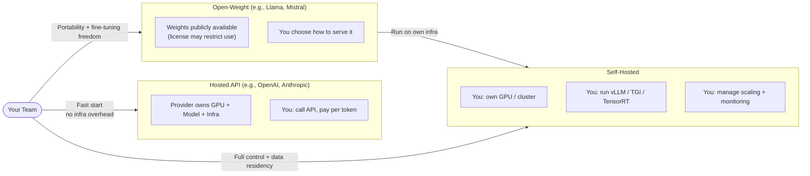

### 2) Real-World Industry Scenarios

#### Scenario A: Startup building a customer support copilot fast

- Product context: a small team wants to launch quickly, validate product value, and avoid infrastructure complexity.
- Constraints: low engineering bandwidth, fast iteration, acceptable vendor dependency, moderate privacy requirements.
- What good looks like in production: the team uses hosted models first, ships quickly, measures value, and delays heavy infra decisions until they are justified.

Why this matters here:

- Hosted wins when speed matters more than deep control.
- Most early-stage teams should not start by running model infra themselves.

#### Scenario B: Enterprise document intelligence with tighter governance

- Product context: sensitive documents, compliance controls, approval-heavy environments, and stronger data residency requirements.
- Constraints: privacy, auditability, policy review, possible restrictions on external API exposure.
- What good looks like in production: the team evaluates open-weight and possibly self-hosted deployment to get stronger control over data handling and platform behavior.

Why this matters here:

- Control and compliance can justify more operational complexity.
- The right answer may still be hybrid rather than fully self-hosted.

#### Scenario C: High-volume retrieval and extraction platform

- Product context: millions of repetitive requests, cost pressure, predictable task shape, and strong optimization incentives.
- Constraints: inference cost, throughput, batching efficiency, latency SLOs.
- What good looks like in production: the team may adopt open-weight models and eventually self-host parts of the stack if traffic scale makes the economics favorable.

Why this matters here:

- At higher scale, per-request cost and infrastructure efficiency become first-class design concerns.

### 3) System View (Think like a systems engineer)

#### Inputs -> Transformations -> Outputs

- Inputs: product requirements, privacy constraints, latency targets, cost targets, traffic patterns, model quality needs, licensing limits, infra capability.
- Transformations:
  - choose whether model access is hosted, open-weight, self-hosted, or hybrid
  - route requests through provider APIs or internal inference infrastructure
  - apply fallback logic, observability, caching, and cost controls
  - monitor performance, quality, and operational risk
- Outputs: reliable model responses under the chosen control, cost, and compliance envelope.

#### Observability

What we log and inspect:

- provider, model, and deployment mode per request
- latency by stage: network, queue, inference, post-processing
- token usage and cost per request
- rate-limit events and provider errors
- GPU utilization, queue depth, and throughput for self-hosted paths
- fallback frequency across models or providers
- model version and rollout history

#### Failure points

- Hosted path: provider outage, quota exhaustion, rate limits, regional unavailability, sudden pricing changes.
- Open-weight path: licensing misunderstandings, poor model benchmarking, underestimated serving complexity.
- Self-hosted path: GPU instability, bad autoscaling, memory pressure, cold starts, weak observability, operational overload.

### 4) System Design Flavor (practical and concise)

#### Key design question

Who should own the inference layer for this product right now?

That question is usually more important than asking which model brand is best.

#### Tradeoffs

- Hosted vs self-hosted: hosted gives speed and simplicity, while self-hosted gives deeper control at the cost of much more operational burden.
- Hosted vs open-weight: hosted is easier to start with, while open-weight gives more portability and tuning freedom if the license and infra support it.
- Single provider vs hybrid: one provider is simpler, but multi-provider or hybrid setups improve resilience and negotiation power.

#### One scaling consideration

At 10x traffic, the bottleneck changes.

- Hosted systems start feeling provider cost, rate limits, and vendor concentration risk.
- Self-hosted systems start feeling GPU scheduling, batching strategy, observability depth, and capacity planning pressure.

### 5) Common Mistakes + Debugging

#### Mistake 1

- Symptom: the team assumes an open-weight model automatically means cheap and easy deployment.
- Likely cause: they confused model access with production serving complexity.
- First debugging step: separate model-license questions from inference-infrastructure questions and estimate the full serving path realistically.

#### Mistake 2

- Symptom: a team self-hosts too early and spends more time on infra than on product quality.
- Likely cause: self-hosting was chosen for prestige or perceived control rather than a measured business need.
- First debugging step: compare current quality, latency, and cost goals against a hosted baseline and calculate whether self-hosting is actually justified.

#### Mistake 3

- Symptom: a hosted deployment later becomes blocked by privacy, compliance, or residency constraints.
- Likely cause: data-handling requirements were not evaluated early enough.
- First debugging step: map the exact data path, including prompts, retrieved context, logs, and provider retention behavior.

### Hands-On Lab (Concept → Build → Break → Measure → Explain)

> This subtopic is a deployment decision. The lab uses a decision-matrix drill and a cost estimation exercise.

**Build — Deployment decision matrix**

| Scenario | Decision | Key reason |
|---|---|---|
| 2-person startup building an internal FAQ bot | ? | |
| Healthcare company with strict data residency | ? | |
| High-volume classification: 5M requests/day | ? | |
| Research team benchmarking 10 models in parallel | ? | |

**Answers:**

| Scenario | Decision | Key reason |
|---|---|---|
| 2-person startup FAQ bot | Hosted | Speed and ops simplicity outweigh control; infra is a distraction at this stage |
| Healthcare with data residency | Open-weight + self-hosted | Data cannot leave org boundary; compliance overrides convenience |
| 5M req/day classification | Open-weight + managed/self-hosted | At this volume, per-token cost dominates; infra investment has clear ROI |
| Research benchmarking 10 models | Hosted or hybrid | Fast API access to many models is faster than running all locally |

**Break — Start with hosted, ignore privacy requirements**

Build the healthcare FAQ on a hosted API without checking the provider's data retention policy. After 6 months you discover the provider retains prompts for 30 days for abuse monitoring.

Three things that are now broken from a compliance standpoint:
1. PHI (patient health information) may have been retained on a third-party server, potentially violating HIPAA BAA requirements.
2. Data residency requirements may have been violated if the provider routes traffic through multiple regions.
3. Contractual audit obligations have a gap: you cannot produce evidence that data was not retained.

**Measure — Approximate cost comparison at scale**

At 5M requests/day, 1,200 avg input tokens, 400 avg output tokens:
- Hosted API at ~$0.002/1k tokens combined → ~$1,600/day, ~$48k/month
- Self-hosted open-weight at ~$0.0002/1k tokens (after GPU amortization) → ~$160/day, ~$4.8k/month

Cost ratio: ~10× cheaper at self-hosted scale — but only if ops overhead is properly staffed.

**Explain — Why early deployment decisions are hard to reverse**

Data handling decisions set legal obligations from day one. If PHI flows into a hosted system without proper contracts, the retroactive cleanup is expensive: security review, legal assessment, provider audit, and potentially notifying affected users. The economic case for self-hosting only materializes at scale with a functioning ops team — starting self-hosted too early trades product velocity for infra debt.

### 6) Active Recall (Spaced Repetition)

1. What is the simplest difference between hosted and self-hosted model usage?
2. Why does open-weight not automatically mean self-hosted?
3. What kind of team usually benefits most from starting with hosted models?
4. What usually becomes more important at higher traffic volume: raw model branding or inference economics?
5. What is the first question you should ask before choosing between hosted and self-hosted?

#### Active Recall Answers

1. Hosted means a provider runs the inference stack for you, while self-hosted means you run the inference infrastructure yourself.
2. Because open-weight describes model availability and licensing, while self-hosted describes where and by whom the model is actually served.
3. A team that needs fast iteration, low operational burden, and quick time to market usually benefits most from hosted models first.
4. Inference economics, operational reliability, and control boundaries usually become more important at scale than model branding alone.
5. Ask: who should own the inference layer for this product right now, given our privacy, cost, latency, and operational constraints?

### 7) Practice

#### Mini-exercise

Choose the best default deployment approach for each use case: hosted, open-weight with managed serving, self-hosted, or hybrid.

- early-stage startup building a support assistant and validating product-market fit
- enterprise legal document assistant with strict data governance and region restrictions
- high-volume classification pipeline where request cost is starting to dominate margins
- internal research team experimenting with many models and benchmarking options quickly
- production system that needs a primary provider plus a fallback path during outages

For each one, explain why the choice fits better than the others.

#### Mini-exercise Answers

- early-stage startup building a support assistant and validating product-market fit -> hosted
  Why: the team should optimize for shipping speed, lower ops burden, and fast iteration before taking on inference infrastructure complexity.

- enterprise legal document assistant with strict data governance and region restrictions -> open-weight with managed serving or self-hosted, depending compliance depth
  Why: stronger control over data handling may be required, but the exact answer depends on whether the organization can operate the infra safely itself.

- high-volume classification pipeline where request cost is starting to dominate margins -> open-weight with managed serving or self-hosted
  Why: once traffic is large and task shape is stable, controlling inference economics becomes more valuable and can justify more operational ownership.

- internal research team experimenting with many models and benchmarking options quickly -> hosted or hybrid
  Why: broad experimentation is usually faster with hosted access, though hybrid setups may help if some open-weight models need side-by-side evaluation.

- production system that needs a primary provider plus a fallback path during outages -> hybrid
  Why: resilience improves when the system is not completely dependent on one serving path or one vendor.

#### Capstone-style system design question

You are designing an enterprise GenAI platform for three workloads: a general knowledge assistant, a sensitive contract-analysis system, and a high-volume document extraction service. For each workload, decide whether hosted, open-weight, self-hosted, or a hybrid approach is the best starting point, and explain how privacy, cost, and operational maturity change the answer.

#### Capstone-style Answer Outline

- The general knowledge assistant usually starts hosted.
  Why: speed, simplicity, and broad capability matter more than deep infrastructure control at the start.

- The sensitive contract-analysis system may justify open-weight plus stronger control, possibly self-hosted if compliance and residency needs are strict enough.
  Why: privacy and governance can outweigh the simplicity advantage of hosted APIs.

- The high-volume document extraction service may move toward open-weight or self-hosted serving as traffic grows.
  Why: predictable workloads and sustained volume make cost and throughput optimization more important.

- A hybrid platform is often the most realistic answer.
  Why: different workloads have different risk, cost, and control needs, so one deployment model is rarely optimal for everything.

### 8) Production Reality Check (Mandatory Ending)

If this fails in prod, what is the first thing we inspect?

We inspect the inference ownership boundary and the actual request path.

Why:

Many production failures here come from misunderstanding where the model is really running, what dependencies are in the request path, and which privacy, rate-limit, or infrastructure bottleneck is actually in control.

### 9) Curiosity Bridge (Mandatory Ending)

Now the deployment ecosystem is clearer, but one more layer still decides whether the product feels viable in the real world.

Even a great hosted or self-hosted setup can fail if you do not understand token usage, context limits, latency, throughput, and cost. That is the next subtopic because those mechanics drive real production tradeoffs every day.

---

## Subtopic 1.1.d: Tokens, Context Windows, Latency, Throughput, and Cost Basics

### 1) The Intuition (Plain English)

This is the operations physics of GenAI systems.

- Tokens are the billable and computational units.
- Context window is the total token budget the model can consider in one request.
- Latency is how long one request takes.
- Throughput is how many requests (or tokens) the system can handle over time.
- Cost is the money spent to process input and output tokens, plus infrastructure overhead.

If model quality is your engine, these metrics are your fuel, road width, speed, traffic flow, and toll cost.

Analogy:

Think of a highway toll system.

- Tokens = number of vehicles passing through.
- Context window = maximum vehicles allowed in one lane segment.
- Latency = time one vehicle takes from entry to exit.
- Throughput = vehicles processed per minute.
- Cost = toll paid per vehicle.

You cannot optimize only one of these forever. If you push one too hard, another gets worse.

#### Core formulas you should remember

- total_tokens = input_tokens + output_tokens
- estimated_cost_per_request = (input_tokens * input_price_per_token) + (output_tokens * output_price_per_token)
- throughput_rps = completed_requests / second
- p95_latency = 95th percentile response time

#### Clarification: Throughput vs context window (they both involve tokens, but they are not the same)

They are different dimensions.

- Context window is a per-request limit.
  It answers: how many tokens can fit into one model call.
- Throughput is a rate over time.
  It answers: how much work the system can process per second or per minute.

Both can be measured using tokens, but units are different:

- context window -> tokens per request (capacity per call)
- throughput -> tokens per second or requests per second (flow over time)

Quick example:

- A model may support a 128k-token context window.
- Your service may still process only 2,000 tokens per second at peak.

So a large context window does not automatically mean high throughput.

### Practical mental model

- Context window is bucket size.
- Throughput is water flow rate.

Big bucket with slow pipe is still slow. Fast pipe with tiny bucket still cannot hold large requests.

### Visual Diagram (Mermaid)

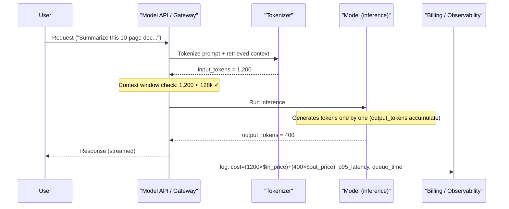

### 2) Real-World Industry Scenarios

#### Scenario A: Customer support assistant spikes during business hours

- Product context: many short user queries, moderate answers, occasional retrieval augmentation.
- Constraints: low p95 latency target, stable UX, budget limits, spiky traffic.
- What good looks like in production: bounded prompts, cached context, predictable token usage, and autoscaling that keeps p95 within SLA.

Why this matters:

- Small token savings multiplied across high volume create major cost and latency improvements.

#### Scenario B: Legal document analysis with long context

- Product context: large contracts, clause comparison, citation-heavy outputs.
- Constraints: large context demand, slower responses acceptable, high accuracy and traceability required.
- What good looks like in production: chunking and retrieval reduce unnecessary full-context calls, while output length is constrained to control cost.

Why this matters:

- Large context windows solve some problems, but unbounded context growth can destroy cost and latency.

#### Scenario C: Internal analytics copilot serving many teams

- Product context: mixed workload from small queries to deep analysis requests.
- Constraints: shared quota, noisy-neighbor effects, variable output lengths.
- What good looks like in production: request classes with different limits, queue management, and cost guardrails per tenant.

Why this matters:

- Throughput and fairness become architecture concerns, not just model concerns.

### 3) System View (Think like a systems engineer)

#### Inputs -> Transformations -> Outputs

- Inputs: request text, retrieved context, system prompt, user tier, target model, output format needs.
- Transformations:
  - tokenize input
  - enforce context limits and trim or compress context
  - run inference with decoding limits
  - stream or return output
  - record token counts, latency, and cost metadata
- Outputs: generated response plus observability and billing signals.

#### Observability

What we must track per request:

- input_tokens, output_tokens, total_tokens
- p50, p95, p99 latency
- time-to-first-token for streaming systems
- model, prompt version, retrieval payload size
- queue wait time vs inference time
- estimated and realized cost by request, user, and feature
- rate-limit errors, truncation events, timeout events

#### Failure points

- Context overflow: prompt + retrieved chunks exceed window and force truncation.
- Latency blow-up: oversized prompts or long outputs degrade p95.
- Throughput collapse: queue growth during spikes causes cascading timeouts.
- Cost drift: output length or retrieval payload silently grows over time.

### 4) System Design Flavor (practical and concise)

#### Key design question

What token budget and latency budget does each request class get?

Without class-based budgets, systems over-serve simple tasks and under-serve complex tasks.

#### Clarification: What class-based budgets are, where we use them, and why they help

Class-based budgets means assigning different limits and targets to different request types instead of using one global default.

Typical classes:

- FAQ lookup
- summarization
- long-form analysis
- agent/tool-heavy workflows
- premium tier vs free tier traffic

What we usually budget per class:

- max input tokens
- max output tokens
- retrieval depth or number of chunks
- latency target (for example p95 SLA)
- concurrency quota and rate limit
- cost ceiling per request or per user/day

Where we use class-based budgets:

- multi-feature products where tasks have very different complexity
- multi-tenant systems where one tenant can otherwise consume shared capacity
- tiered products (free/pro/enterprise)
- systems with strict SLA and cost constraints

Why class-based budgets are helpful:

- prevent expensive tasks from starving simple high-volume flows
- improve predictability of p95 latency and monthly spend
- make throttling and graceful degradation smarter during traffic spikes
- align business priorities with technical resource allocation

Concrete example:

- FAQ class: 2k input cap, 300 output cap, 2 retrieval chunks, tight p95 latency target.
- Deep-analysis class: 16k input cap, 1k output cap, 8 retrieval chunks, relaxed latency target.

If everything used deep-analysis limits, cost and latency would explode for common FAQ requests.

#### Tradeoffs

- Larger context vs lower latency: more context can improve grounding but increases compute time.
- Longer outputs vs lower cost: richer answers cost more and can slow UX.
- Higher throughput vs tighter quality controls: aggressive concurrency helps capacity but can stress retrieval and guardrail checks.

#### One scaling consideration

At 10x traffic, global defaults fail.

You need per-route budgets, tenant-aware throttling, and degradation policies (for example, shorter outputs or smaller retrieval sets during peak load).

### 5) Common Mistakes + Debugging

#### Mistake 1

- Symptom: p95 latency rises gradually over weeks.
- Likely cause: prompt or retrieval payload bloat increased average input tokens.
- First debugging step: compare token histograms by prompt version and retrieval chunk count before and after regression.

#### Mistake 2

- Symptom: monthly spend exceeds forecast even though request volume is stable.
- Likely cause: output token growth from verbose prompting or missing output caps.
- First debugging step: inspect output token distribution and enforce max output tokens per route.

#### Mistake 3

- Symptom: intermittent failures during peak traffic.
- Likely cause: throughput bottleneck in queueing, model concurrency, or shared rate limits.
- First debugging step: separate queue wait time from inference time to identify where saturation begins.

### Hands-On Lab (Concept → Build → Break → Measure → Explain)

**Build — Token and cost calculator**

Run this in Python (requires `tiktoken`):

```python
import tiktoken

enc = tiktoken.encoding_for_model("gpt-4o")

system_prompt = "You are a helpful support assistant. Answer only from the provided context."
user_message = "What is the refund policy for orders placed more than 30 days ago?"
retrieved_context = (
    "Our refund policy allows returns within 30 days of purchase with original receipt. "
    "After 30 days, store credit may be issued at manager discretion. "
    "Orders placed during promotional periods are non-refundable."
) * 3  # simulate 3 retrieved chunks

full_prompt = system_prompt + "\n\n" + retrieved_context + "\n\nQuestion: " + user_message
input_tokens = len(enc.encode(full_prompt))
print(f"Input tokens: {input_tokens}")

for output_tokens in [50, 150, 300]:
    total = input_tokens + output_tokens
    # Approximate GPT-4o pricing: $2.50/1M input, $10/1M output
    cost = (input_tokens * 2.50 / 1_000_000) + (output_tokens * 10.0 / 1_000_000)
    print(f"Output ~{output_tokens} tokens -> total {total} tokens -> ~${cost:.5f}/request")
```

**Break — Force context overflow**

Multiply retrieved context by 50x (simulate a large document dump) and re-run:

```python
retrieved_context_large = retrieved_context * 50
full_prompt_large = system_prompt + "\n\n" + retrieved_context_large + "\n\nQuestion: " + user_message
input_tokens_large = len(enc.encode(full_prompt_large))
print(f"Overflow input tokens: {input_tokens_large}")
# If this exceeds the model context window, truncation occurs silently
```

**Measure — Observe three signals**

| Signal | Normal | Overflow |
|---|---|---|
| Input tokens | ~350 | ~17,000+ |
| Estimated cost/request | ~$0.001 | ~$0.045 |
| Risk | None | Truncation silently drops evidence from the end |

At 100,000 requests/day: normal ~$100/day; overflow version ~$4,500/day plus retrieval failures from truncation.

**Explain — Why context overflow is a silent production risk**

Most model APIs truncate silently rather than erroring. A prompt past the context limit will not crash — it will quietly drop the most recently appended content (usually the most relevant retrieved evidence), causing hallucination or degraded grounding with no error signal. The only way to catch this is explicit token counting and context-size alerting inside the pipeline.

### 6) Active Recall (Spaced Repetition)

1. What is the simplest formula for total tokens in one request?
2. Why can increasing context window usage hurt latency and cost?
3. What does p95 latency tell you that average latency can hide?
4. Why should teams measure queue wait time separately from inference time?
5. What is one common reason cost rises even when request count is flat?

#### Active Recall Answers

1. total_tokens = input_tokens + output_tokens.
2. More tokens require more compute and memory, which usually increases response time and token charges.
3. p95 shows tail behavior for slower requests, which better reflects real user pain than averages.
4. Because queue delay and model compute delay have different root causes and require different fixes.
5. Output tokens or retrieval payload size can grow silently, increasing per-request cost.

### 7) Practice

#### Mini-exercise

A support feature handles 1,000,000 requests per month.

- Current average per request: input 1,200 tokens, output 500 tokens
- New prompt design would reduce input by 20 percent but increase output by 10 percent

1. Compute old total tokens per request.
2. Compute new total tokens per request.
3. Decide whether this change is likely to help or hurt cost, assuming equal price per token for quick estimation.
4. Name one latency risk and one mitigation.

#### Mini-exercise Answers

1. Old total = 1,200 + 500 = 1,700 tokens.
2. New input = 1,200 * 0.8 = 960 tokens. New output = 500 * 1.1 = 550 tokens. New total = 960 + 550 = 1,510 tokens.
3. Likely helps cost in this simplified estimate because total tokens drop from 1,700 to 1,510 per request.
4. Latency risk: longer outputs can still increase generation time for some requests. Mitigation: set output caps and monitor p95 with route-level alerts.

#### Capstone-style system design question

Design token and latency guardrails for a three-tier GenAI product (free, pro, enterprise) where all tiers share the same base model but have different SLA and cost expectations. Define per-tier limits, what you will monitor, and what degradation strategy you apply under overload.

#### Capstone-style Answer Outline

- Free tier: strict token caps, smaller retrieval payload, relaxed latency SLA.
- Pro tier: moderate token caps, better retrieval depth, tighter latency SLA.
- Enterprise tier: highest limits with dedicated quotas and stronger isolation controls.
- Monitor: token distributions, p95 latency, queue depth, timeout rate, per-tenant spend.
- Overload strategy: reduce retrieval depth, reduce max output tokens, prioritize higher SLA tiers, and shed non-critical traffic gracefully.

### 8) Production Reality Check (Mandatory Ending)

If this fails in prod, what is the first thing we inspect?

We inspect per-route token distributions and the split between queue wait time and inference time.

Why:

Most real failures here come from budget drift (token growth) or saturation (queue and concurrency pressure), and those two signals identify root cause fastest.

### 9) Curiosity Bridge (Mandatory Ending)

Now you can reason about the core operating metrics of any GenAI call.

The next step is to connect these metrics to architecture choices in the full GenAI application anatomy: model layer, prompt layer, tool layer, and retrieval layer. That is where optimization becomes system design, not only prompt tuning.

---

## Topic 1.2: Anatomy of a GenAI Application

**Topic time:** 6h

Subtopics in this topic:

- 1.2.a Model layer, prompt layer, tool layer, retrieval layer - 90m
- 1.2.b Memory, knowledge grounding, and feedback loops - 90m
- 1.2.c Evaluation, tracing, and safety as system components - 90m
- 1.2.d Reliability, latency, and cost as product constraints - 90m

---

## Subtopic 1.2.a: Model Layer, Prompt Layer, Tool Layer, Retrieval Layer

### 1) The Intuition (Plain English)

Most weak GenAI designs treat the model as the whole system.
Strong designs split behavior into layers so each problem has a clear owner.

- Model layer decides raw reasoning and generation capability.
- Prompt layer decides task framing, constraints, and output behavior.
- Tool layer gives action ability (APIs, DB calls, calculators, workflows).
- Retrieval layer supplies relevant external knowledge at runtime.

Simple mental model:

- Model = brain capacity
- Prompt = instructions and role framing
- Tools = hands and instruments
- Retrieval = reference library

Analogy:

Think of a consultant solving a client problem.

- Model layer is the consultant's raw skill level.
- Prompt layer is the brief and success criteria.
- Retrieval layer is the project documents and evidence.
- Tool layer is spreadsheets, SQL, ticketing systems, and internal APIs.

If the answer is wrong, you must know which layer failed.
Otherwise teams keep changing prompts for problems caused by missing retrieval, broken tools, or wrong model routing.

### Visual Diagram (Mermaid)

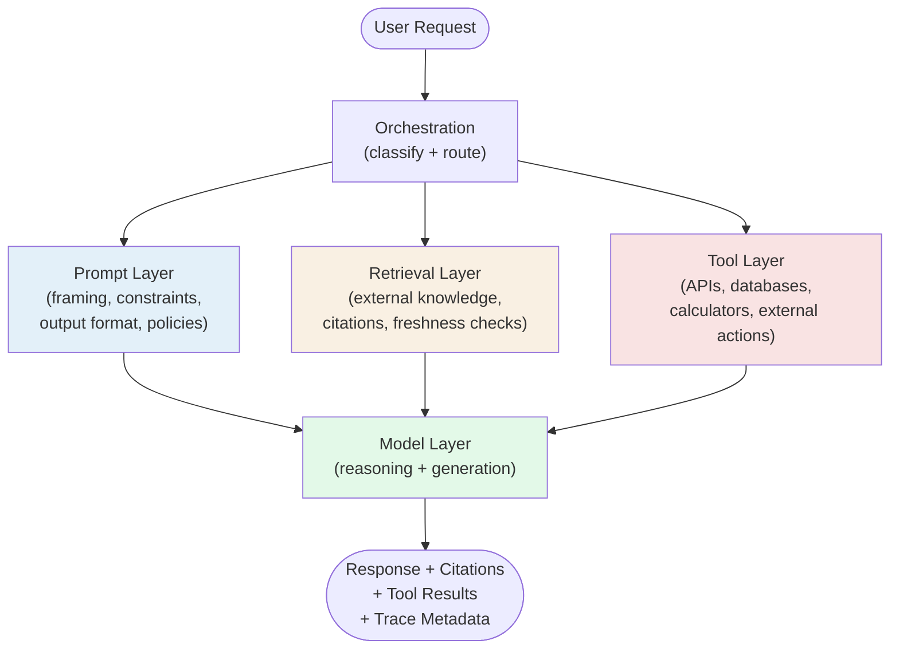

### 2) Real-World Industry Scenarios

#### Scenario A: Policy assistant with citations

- Product context: employees ask policy questions and expect grounded answers with references.
- Constraints: low hallucination tolerance, high trust requirement, moderate latency SLA.
- What good looks like in production: retrieval fetches the right policy chunks, prompt enforces citation format, model stays concise, and tool layer logs citation provenance.

Why this matters:

- If retrieval is weak, no prompt magic can reliably fix factual grounding.

#### Scenario B: Support copilot with action buttons

- Product context: support agents receive draft replies and can trigger actions like ticket updates or refunds.
- Constraints: action safety, auditability, role-based permissions, human approval.
- What good looks like in production: tool layer has strict permission boundaries, prompt policy forbids unsafe actions, and model only calls tools when justified.

Why this matters:

- Many incidents come from tool-layer permission design, not model intelligence.

#### Scenario C: Incident diagnosis assistant

- Product context: system investigates errors using logs, runbooks, and service metrics.
- Constraints: noisy data, time pressure, mixed tool reliability.
- What good looks like in production: retrieval ranks relevant evidence, tools fetch current telemetry, prompt enforces structured reasoning output, and model routing picks stronger reasoning capacity for hard cases.

Why this matters:

- Real performance depends on layer coordination, not any single layer in isolation.

### 3) System View (Think like a systems engineer)

#### Inputs -> Transformations -> Outputs

- Inputs: user request, user role, session context, available tools, indexed knowledge, model options.
- Transformations:
  - classify task type and risk
  - retrieve relevant context
  - construct prompt with policies and formatting rules
  - select model and call tools if needed
  - validate and format response
- Outputs: response text, structured payload, citations, action results, and trace metadata.

#### Layer ownership map

- Model layer owns capability, latency profile, and cost-per-token characteristics.
- Prompt layer owns instruction quality, output structure, and behavioral guardrails.
- Retrieval layer owns freshness, relevance, and grounding quality.
- Tool layer owns external actions, data writes, permission controls, and side effects.

#### Observability

What we log per request:

- model selected and model latency
- prompt template/version and token budget
- retrieval query, retrieved chunks, and relevance scores
- tool calls attempted, succeeded, failed, and blocked
- final answer quality signals and safety checks

#### Failure points

- Model-layer mismatch: cheap model routed to hard reasoning task.
- Prompt-layer brittleness: format failures after small input variation.
- Retrieval-layer miss: relevant data not found or poorly ranked.
- Tool-layer failure: permission denial, timeout, or side-effect error.

### 4) System Design Flavor (practical and concise)

#### Key design question

Which layer should own this failure mode?

If ownership is vague, teams debug blindly and ship unstable behavior.

#### Tradeoffs

- Stronger model vs stronger retrieval: stronger models help reasoning, but retrieval usually improves factual reliability faster per dollar.
- More prompt constraints vs flexibility: strict templates improve consistency, but can reduce adaptability for edge cases.
- More tool access vs safety risk: richer tool access increases capability, but multiplies security and approval complexity.

#### One scaling consideration

At 10x usage, layer contracts become critical.

Define stable interfaces between retrieval, prompting, and tool invocation so each layer can evolve independently without breaking the whole pipeline.

### 5) Common Mistakes + Debugging

#### Mistake 1

- Symptom: hallucinations persist despite heavy prompt edits.
- Likely cause: retrieval layer is weak (bad indexing, chunking, or ranking), not prompt quality.
- First debugging step: inspect retrieval hit quality and compare returned chunks against expected ground truth.

#### Mistake 2

- Symptom: dangerous tool actions happen unexpectedly.
- Likely cause: tool permissions are broad and prompt-only safety is used as the primary control.
- First debugging step: enforce tool-side authorization and explicit approval gates independent of prompt instructions.

#### Mistake 3

- Symptom: latency spikes with complex requests.
- Likely cause: all requests follow the same expensive path (heavy retrieval + tool calls + large model) without routing.
- First debugging step: add request classification and route simple vs complex tasks to different layer budgets.

### Hands-On Lab (Concept → Build → Break → Measure → Explain)

**Build — Layer-based failure triage drill**

A finance assistant gives this response:
> "Employees hired after January 2024 are eligible for the enhanced 401k match starting on day 1."

But the actual policy says: "Enhanced match starts after 90-day probationary period for all employees."

Map the failure to each layer:

| Layer | Hypothesis | Initial confidence |
|---|---|---|
| Model layer | Model hallucinated the start date | Low |
| Prompt layer | Prompt asked for a direct answer with no citation rule | Medium |
| Retrieval layer | The correct policy chunk was not retrieved | High |
| Tool layer | N/A | Not applicable |

**Break — Isolate the retrieval layer**

Run retrieval in isolation: query your vector store for "401k enhanced match eligibility 2024". Check if the correct policy chunk appears in the top-5 results.

- If it does NOT appear → the bug is in retrieval (chunking, embedding, indexing).
- If it appears but was not used → the bug is in context assembly (prompt packing) or attention positioning.

**Measure — Count failure rate per layer**

Try 10 similar policy queries. Count:
- Queries where the correct policy was NOT in the top-5 retrieved chunks.
- Queries where policy was in context but still answered wrongly.

If more than 50% fail at retrieval, fix retrieval first before touching the prompt or model.

**Explain — Why layer ownership prevents prompt-first debugging waste**

The most common debugging waste in GenAI is changing prompts for retrieval failures. If the model never received the correct policy chunk, no prompt instruction will fix it — you can only instruct the model to use evidence it already has. Starting with layer-level triage before changing anything prevents expensive prompt iteration on problems the prompt literally cannot solve.

### 6) Active Recall (Spaced Repetition)

1. What does each of the four layers primarily own?
2. Why can prompt engineering not fully fix retrieval failures?
3. Where should action safety primarily live: prompt text or tool layer controls?
4. What is a common symptom of model-layer routing mismatch?
5. What is the first debugging question when output quality drops suddenly?

#### Active Recall Answers

1. Model owns capability, prompt owns instruction behavior, retrieval owns grounding, and tools own actions/side effects.
2. Because prompts cannot supply missing facts that were never retrieved; they only frame how the model uses available context.
3. Tool layer controls, with prompt constraints as secondary guidance.
4. Hard tasks get shallow or inconsistent answers because an underpowered model was selected.
5. Ask which layer changed: model version, prompt template, retrieval pipeline, or tool behavior.

### 7) Practice

#### Mini-exercise

A finance assistant gives incorrect reimbursement answers and sometimes triggers the wrong workflow action.

1. Map likely issues across the four layers.
2. For each layer, list one metric or log you would inspect first.
3. Propose one immediate containment step and one durable fix.

#### Mini-exercise Answers

1. Likely issues by layer:
   - model layer: wrong model routed for policy interpretation edge cases
   - prompt layer: ambiguous policy instructions and weak output constraints
   - retrieval layer: stale policy documents or poor ranking
   - tool layer: weak action authorization and missing approval checks
2. First metric/log by layer:
   - model: route decisions and error rate by model
   - prompt: prompt template version vs failure clusters
   - retrieval: top-k hit relevance and document freshness timestamps
   - tool: blocked vs allowed action audit logs
3. Immediate containment: disable high-risk automated actions and require approval.
   Durable fix: tighten retrieval quality checks, add model routing rules, harden tool authorization, and regression-test prompt templates.

#### Capstone-style system design question

Design a GenAI support platform where the same user request may need retrieval, tool execution, and model generation. Define the interface contracts between model, prompt, retrieval, and tool layers, and explain how you will isolate and debug failures per layer in production.

#### Capstone-style Answer Outline

- Contracts:
  - retrieval returns ranked chunks with provenance metadata
  - prompt builder consumes user intent + retrieved context + policy rules and emits a versioned prompt package
  - model runtime accepts prompt package and returns structured output schema
  - tool orchestrator executes only approved actions with role-based checks and full audit logs
- Isolation strategy:
  - per-layer tracing IDs
  - layer-specific metrics dashboards
  - replay harness for prompt/retrieval/model combinations
  - kill switches for risky tools and fallback responses

### 8) Production Reality Check (Mandatory Ending)

If this fails in prod, what is the first thing we inspect?

We inspect per-layer traces for the failing request class, starting with retrieval output quality and tool-call authorization outcomes.

Why:

Most critical incidents come from layer mismatch: bad grounding, unsafe tool boundaries, or wrong routing. Layer-level traces identify root cause faster than prompt-only debugging.

### 9) Curiosity Bridge (Mandatory Ending)

Now the core four-layer anatomy is clear, but real systems still need state over time.

That leads to the next subtopic: memory, knowledge grounding, and feedback loops, where we separate short-term conversational state from durable product memory and show how systems learn from usage without drifting into unsafe behavior.

---

## Subtopic 1.2.b: Memory, Knowledge Grounding, and Feedback Loops

### 1) The Intuition (Plain English)

A GenAI system is useful only when it stays consistent over time and stays tied to real evidence.

- Memory decides what the system remembers across turns, sessions, or users.
- Knowledge grounding decides what evidence the system should trust for this answer.
- Feedback loops decide how the system improves from usage without repeating mistakes.

Simple mental model:

- Memory = state over time
- Grounding = truth anchor
- Feedback loop = learning control system

Analogy:

Think of a high-performing support engineer.

- Memory is their case history and prior context.
- Grounding is their habit of checking current runbooks and source-of-truth docs.
- Feedback loop is the post-incident review that updates playbooks.

Without memory, each conversation restarts from zero.
Without grounding, memory can amplify errors.
Without feedback loops, the same failure repeats at scale.

### Visual Diagram (Mermaid)

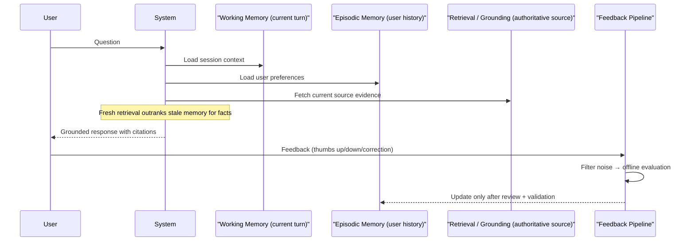

### 2) Real-World Industry Scenarios

#### Scenario A: Customer support assistant with returning users

- Product context: users reopen old issues and expect continuity.
- Constraints: privacy boundaries, stale-context risk, consistent identity mapping.
- What good looks like in production: short-term conversation state is preserved, long-term user profile memory is scoped and permissioned, and answers are grounded to latest docs before acting on old memory.

Why this matters:

- Memory improves UX, but stale memory without grounding creates confident errors.

#### Scenario B: Enterprise policy assistant

- Product context: employees ask compliance and HR policy questions.
- Constraints: policy updates are frequent, old answers can become invalid.
- What good looks like in production: retrieval grounding always checks current policy versions, and feedback from policy reviewers updates ranking and answer templates.

Why this matters:

- In regulated domains, freshness and provenance are more important than fluent answers.

#### Scenario C: Product analytics copilot

- Product context: analysts use repeated workflows and tool queries.
- Constraints: noisy user feedback, changing schema, multi-tenant data access.
- What good looks like in production: memory captures reusable preferences, grounding validates data-source freshness, and feedback loops improve prompt/tool routing from measured outcomes.

Why this matters:

- Real value comes from learning safely from repeated usage patterns.

### 3) System View (Think like a systems engineer)

#### Inputs -> Transformations -> Outputs

- Inputs: user request, session history, user profile memory, retrieved documents, tool outputs, feedback events.
- Transformations:
  - select relevant memory slice (session, user, org)
  - retrieve authoritative external evidence
  - build grounded prompt with citations/provenance
  - generate response and capture feedback signals
  - decide whether and what to write back to memory
- Outputs: grounded response, citation trail, memory updates, feedback events for improvement pipelines.

#### Memory layers (practical split)

- Working memory: current turn/session context, high volatility, short TTL.
- Episodic memory: user/task history, medium retention, strict privacy controls.
- Semantic memory: distilled facts/preferences learned over time, high governance and validation requirements.

#### Observability

What we log and inspect:

- which memory store contributed context
- memory hit rate vs retrieval grounding hit rate
- provenance coverage (what percent of answers cite current sources)
- stale-memory incidents and memory-write rejection rate
- feedback type distribution (thumbs down, correction, escalation)
- quality deltas after feedback-policy updates

#### Failure points

- Memory leakage across users/tenants.
- Stale memory overriding fresh retrieved evidence.
- Feedback loops learning from noisy or adversarial signals.
- Over-writing memory with unverified generated content.

### 4) System Design Flavor (practical and concise)

#### Key design question

What can be remembered automatically, and what must always be re-grounded from source-of-truth data?

This boundary prevents both amnesia and unsafe persistence.

#### Tradeoffs

- More memory vs more risk: richer continuity improves UX, but raises privacy and stale-data risk.
- Aggressive grounding vs lower latency: stronger grounding improves factuality, but may add retrieval and validation cost.
- Fast feedback adaptation vs stability: rapid updates help learning, but can overfit to noisy feedback.

#### One scaling consideration

At 10x usage, uncontrolled memory writes become technical debt.

You need write policies, retention rules, and offline evaluation before promoting feedback-driven changes globally.

### 5) Common Mistakes + Debugging

#### Mistake 1

- Symptom: assistant repeats outdated facts even after source docs were updated.
- Likely cause: memory content is trusted over retrieval grounding freshness.
- First debugging step: compare response evidence paths and enforce freshness-priority policy (current source beats old memory).

#### Mistake 2

- Symptom: one user's preferences appear in another user's answers.
- Likely cause: memory partitioning or tenant scoping is broken.
- First debugging step: audit memory keys and access controls for cross-tenant leakage.

#### Mistake 3

- Symptom: system quality oscillates after adding automatic feedback updates.
- Likely cause: noisy feedback is being written directly into behavior policies without filtering.
- First debugging step: gate feedback ingestion with confidence thresholds and offline replay evaluation.

### Hands-On Lab (Concept → Build → Break → Measure → Explain)

> This subtopic is a design-decision drill focused on memory placement and freshness control.

**Build — Memory triage design**

For an HR assistant, decide: working memory, episodic memory, semantic memory, or "re-ground every time":

| Data point | Memory type | Why |
|---|---|---|
| User's preferred response language | ? | |
| Today's maternity leave policy | ? | |
| User corrected the bot's summary of their team name | ? | |
| User's preferred response length (concise vs. detailed) | ? | |
| Current fiscal year holiday calendar | ? | |

**Answers:**

| Data point | Memory type | Why |
|---|---|---|
| Preferred response language | Episodic memory | Low-risk stable preference; improves UX safely |
| Today's maternity leave policy | Re-ground every time | Policy updates frequently; must always retrieve current version |
| Team name correction | Working memory (this session) | Relevant only for the current conversation; do not persist |
| Preferred response length | Episodic memory | Stable preference; safe to persist |
| Holiday calendar | Re-ground every time | Subject to change; stale calendar creates real user harm |

**Break — Write stale data into persistent memory**

Simulate this bug: the bot caches "Parental leave = 12 weeks" in episodic memory from a January conversation. In March, the policy changes to 16 weeks. In April, no cache invalidation runs.

Failure chain:
1. Memory returns "12 weeks" for any parental leave question.
2. Retrieval for the updated policy is never called because memory was trusted first.
3. Employees get incorrect guidance for 3 months — a compliance and trust issue.

**Measure — Freshness failure rate**

If policy changes quarterly and the cache has no TTL, ~500 queries over 3 months all receive stale guidance before someone flushes the cache manually.

**Explain — Why freshness priority must be enforced architecturally**

Memory is correct for preferences but architecturally wrong for mutable facts. The correct pattern: use memory for preferences and conversational continuity; always retrieve for factual claims from external authoritative sources. This hierarchy must be enforced in code, not described in a prompt.

### 6) Active Recall (Spaced Repetition)

1. What is the difference between memory and grounding in a GenAI system?
2. Why can memory improve UX but also increase factual risk?
3. What should usually win in conflict: stale memory or fresh authoritative retrieval?
4. Why are feedback loops dangerous without filtering and evaluation?
5. What is the first architectural control for preventing memory leakage?

#### Active Recall Answers

1. Memory stores prior state over time, while grounding ties the current answer to authoritative evidence.
2. Memory adds continuity, but if stale or wrong it can be reused confidently unless re-grounded.
3. Fresh authoritative retrieval should usually win.
4. Because noisy or adversarial feedback can degrade behavior if applied directly.
5. Strong partitioning and access controls by user/tenant plus audited memory keys.

### 7) Practice

#### Mini-exercise

You are building an HR assistant.

- It should remember user preferences (tone, language, office location).
- It must answer policy questions from latest policy documents.
- It receives thumbs-up/down and human corrections.

1. Decide what goes to working memory, episodic memory, and semantic memory.
2. Define one rule for when memory can be auto-written and one rule for when it must be human-reviewed.
3. Define one feedback signal you would trust directly and one you would route to offline review.

#### Mini-exercise Answers

1. Memory placement:
   - working memory: current conversation context and immediate clarifications
   - episodic memory: user preferences like tone/language/location with user scope
   - semantic memory: validated long-term preference summaries, not policy facts
2. Auto-write rule: low-risk user preference updates with clear explicit user intent.
   Human-review rule: any memory write that could affect policy/compliance interpretation.
3. Trust directly: explicit user-set preference changes.
   Route offline: ambiguous thumbs-down patterns without clear corrective labels.

#### Capstone-style system design question

Design a memory and grounding architecture for a multi-tenant enterprise assistant where answers must remain policy-accurate even as policies change weekly. Specify memory stores, grounding precedence, feedback ingestion pipeline, and rollback controls.

#### Capstone-style Answer Outline

- Memory stores:
  - session cache for working memory
  - tenant-scoped profile store for episodic memory
  - validated preference store for semantic memory
- Grounding precedence:
  - policy retrieval with version/provenance outranks memory for factual claims
  - memory used for personalization only unless explicitly validated
- Feedback pipeline:
  - collect feedback events
  - classify confidence and risk
  - replay on evaluation set before promotion
- Rollback controls:
  - versioned memory-write policies
  - canary rollout for feedback-based updates
  - one-click revert to prior prompt/ranking policy

### 8) Production Reality Check (Mandatory Ending)

If this fails in prod, what is the first thing we inspect?

We inspect evidence precedence and memory-write logs for the failing answer path.

Why:

Most severe failures come from stale or leaked memory being trusted over fresh grounded evidence, and that is visible first in precedence traces and write-audit records.

### 9) Curiosity Bridge (Mandatory Ending)

Now we have the time dimension of GenAI systems: what to remember, what to re-ground, and how to learn safely.

The next subtopic moves from architecture to assurance: evaluation, tracing, and safety as system components, where we make quality and risk measurable instead of subjective.

---

## Subtopic 1.2.c: Evaluation, Tracing, and Safety as System Components

### 1) The Intuition (Plain English)

You cannot fix what you cannot measure or see.

- Evaluation decides whether the system is working and which problems are real.
- Tracing shows exactly what happened on the request path when something went wrong.
- Safety components enforce guardrails so mistakes do not cause harm.

Simple mental model:

- Evaluation = measurement and test
- Tracing = visibility
- Safety = preventive control

Analogy:

Think of aircraft operations.

- Evaluation is the flight metrics and performance scoring.
- Tracing is the black box flight recorder showing every step.
- Safety components are the redundant systems and circuit breakers.

Without evaluation, you ship broken things.
Without tracing, you cannot debug fast enough.
Without safety, a failure becomes a catastrophe.

### Visual Diagram (Mermaid)

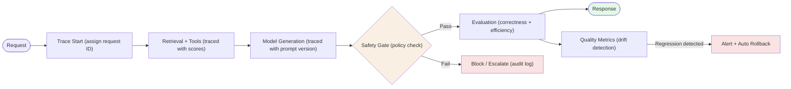

### 2) Real-World Industry Scenarios

#### Scenario A: Support assistant with measured quality targets

- Product context: service-level goals on accuracy, latency, cost per ticket.
- Constraints: business metrics matter more than perfect answers, human review is the backstop.
- What good looks like in production: automated metrics flag quality drops, traces show why, and safety gates hold risky deployments until reviewed.

Why this matters:

- Measurement discipline prevents silent regressions.

#### Scenario B: Regulated financial advice system

- Product context: compliance rules, audit trails, liability exposure.
- Constraints: every decision must be auditable and reversible, safety is non-negotiable.
- What good looks like in production: full request traces with decision provenance, evaluation on curated test sets, and automated blocks on policy violations.

Why this matters:

- In regulated domains, safety controls are the primary product.

#### Scenario C: Internal research tool with learned behavior

- Product context: analysts experiment, and systems improve from feedback.
- Constraints: must measure learning stability, trace improvement experiments, prevent risky behavior changes.
- What good looks like in production: offline evaluation before canary, trace logs compare old vs new behavior on fixed test sets, and rollback is one-click.

Why this matters:

- Safety and measurement are how you scale learned improvements without cascading failures.

### 3) System View (Think like a systems engineer)

#### Inputs -> Transformations -> Outputs

- Inputs: model outputs, user feedback, retrieved evidence, tool results, expected ground truth.
- Transformations:
  - evaluate quality metrics (accuracy, latency, safety score)
  - trace request path and decision points
  - apply safety checks (policy violation, confidence thresholds)
  - log full context for post-incident review
  - decide whether to return, modify, or reject response
- Outputs: response with confidence and safety signals, trace logs, quality metrics, safety audit trails.

#### Evaluation dimensions (must measure all three)

- Correctness: does the answer match ground truth or expert judgment?
- Safety: does the answer violate policies or expose risk?
- Efficiency: latency, cost, resource utilization?

#### Observability

What we log and inspect:

- model output and confidence score
- retrieved context and relevance scores
- tool calls and side effects
- safety check results and policy hits
- actual vs predicted quality
- user feedback distribution
- end-to-end latency breakdown per component
- failure classification (model, retrieval, tool, orchestration, policy)

#### Failure points

- Evaluation on the wrong distribution (past data vs live data drift).
- Tracing too sparse to debug failures (missing intermediate steps).
- Safety gates too loose (policy violations escape) or too tight (false positives block good requests).
- Feedback treated as truth without confidence filtering.

### 4) System Design Flavor (practical and concise)

#### Key design question

What is your ground truth for "right answer" and how do you measure drift from it?

Without this anchor, you cannot reason about whether changes are improvements.

#### Tradeoffs

- Strict safety vs throughput: tighter gates improve safety but may reject valid requests.
- Offline evaluation vs online metrics: offline is reproducible but misses live-data drift; online is immediate but noisy.
- Rich tracing vs performance cost: full traces help debugging but add latency and storage burden.

#### One scaling consideration

At 10x scale, evaluation must be automated and continuous.

Manual review cannot keep up, so you need statistical tests, drift detectors, and automated rollback policies.

### 5) Common Mistakes + Debugging

#### Mistake 1

- Symptom: quality metrics look good, but user complaints increase.
- Likely cause: evaluation metrics do not match real user needs (measuring wrong signal).
- First debugging step: compare metric scores against user feedback classification and recalibrate metrics.

#### Mistake 2

- Symptom: incident takes hours to diagnose even with logs.
- Likely cause: traces are too coarse (missing decision points) or lack request IDs linking layers.
- First debugging step: add structured trace IDs, log at every layer boundary, and build request replay harness.

#### Mistake 3

- Symptom: safety gates block legitimate requests from power users.
- Likely cause: one-size-fits-all safety policy does not account for user/context/risk profiles.
- First debugging step: segment safety rules by user tier and use-case risk level.

### Hands-On Lab (Concept → Build → Break → Measure → Explain)

**Build — Minimal observability payload**

Define the minimal set of fields to track per request for a support assistant:

```python
import time, uuid

def observe_request(prompt, retrieved_chunks, response, expected_answer=None):
    return {
        "request_id": str(uuid.uuid4()),
        "timestamp": time.time(),
        "input_tokens": len(prompt.split()),      # proxy; use tiktoken in production
        "output_tokens": len(response.split()),
        "retrieved_chunk_count": len(retrieved_chunks),
        "top_chunk_score": retrieved_chunks[0]["score"] if retrieved_chunks else 0,
        "safety_flagged": contains_policy_violation(response),
        "correct": (response.strip() == expected_answer.strip()) if expected_answer else None,
    }

def contains_policy_violation(text):
    forbidden = ["I guarantee", "definitely eligible", "100% certain"]
    return any(phrase in text for phrase in forbidden)
```

**Break — Remove safety gate and tracing**

Remove `safety_flagged` and `correct` from the payload. Simulate 1,000 requests.

What is now invisible:
- Whether the model is making overconfident claims ("I guarantee you are eligible")
- Whether answer quality is drifting from the expected baseline
- Which requests are failing policy — you learn only when a user escalates

**Measure — Impact of missing observability**

With 1,000 requests/day and a 3% estimated policy violation rate: ~30 violations per day go undetected. Within one week: ~210 policy-violating records with no audit trail.

**Explain — Why evaluation and safety must be system components, not afterthoughts**

When evaluation and tracing are left out of the pipeline, the system appears to work until a user escalates or a compliance audit surfaces violations. First-class evaluation from day one gives immediate alerting on quality drift, direct evidence for rollback decisions, and a safety audit trail required for regulated use cases.

### 6) Active Recall (Spaced Repetition)

1. What are the three mandatory dimensions of evaluation in GenAI systems?
2. Why does offline evaluation sometimes mislead even with good metrics?
3. What is the most common problem with tracing that makes debugging slow?
4. Why are safety gates in prompts insufficient without tool-layer controls?
5. How should feedback signals be treated: as truth or as noisy input?

#### Active Recall Answers

1. Correctness (accuracy), safety (policy compliance), and efficiency (latency/cost).
2. Because live data distribution shifts from training/test data, and metrics become stale.
3. Missing intermediate decision points makes it impossible to isolate where failures begin.
4. Because prompts are advisory; tool-layer controls are enforceable and independent of model output.
5. As noisy input that needs filtering and offline validation before being written into behavior.

### 7) Practice

#### Mini-exercise

You deploy a new retrieval ranking model and notice a 2% drop in a key metric.

1. Name three possible root causes.
2. Define the exact trace/log data you would pull first.
3. Name one safety check to prevent silent regressions in the future.

#### Mini-exercise Answers

1. Three possible causes:
   - the ranking model ranks differently and retrieval context changed
   - live data distribution drifted and ranking generalizes poorly
   - metric is sensitive to query distribution shift in this batch

2. Exact trace data:
   - top-k retrieval results before/after ranking model
   - queries grouped by embedding query-type clusters
   - correlation between new-ranking changes and metric drops

3. Future safety check:
   - offline replay on held-out test queries before canary
   - alert on metric delta > 1% in canary phase
   - automatic rollback if p95 latency increases or safety score drops

#### Capstone-style system design question

Design an evaluation, tracing, and safety framework for a multi-tenant support assistant where different tiers have different SLAs and risk tolerances. Include metric definitions, trace requirements, safety policies, and a rollback strategy.

#### Capstone-style Answer Outline

- Metrics by tier:
  - free: throughput + cost focus, relaxed accuracy SLA
  - pro: balanced accuracy + SLA target, cost guardrails
  - enterprise: tight accuracy + SLA, strict safety audit

- Tracing requirements:
  - layer-level request IDs (retrieval → model → tool → response)
  - structured logs at each decision point with confidence/scores
  - full user input + system output + evidence path

- Safety policies:
  - free tier: basic policy gates (no refund promises)
  - pro tier: moderate policy gates with user-scoped overrides
  - enterprise tier: strict enforcement + audit trail + escalation rules

- Rollback strategy:
  - canary at 5% with metric thresholds
  - one-click revert to prior model/prompt version
  - automatic rollback if p95 latency +50ms or accuracy drop >2%

### 8) Production Reality Check (Mandatory Ending)

If this fails in prod, what is the first thing we inspect?

We inspect the ground-truth metric vs live metric, and pull the full trace for anomalous requests.

Why:

Most severe production failures come from undetected quality drift or unsafe outputs that escaped safety gates. Metrics and traces surface both immediately.

### 9) Curiosity Bridge (Mandatory Ending)

Now you understand the safety and visibility layer that holds GenAI systems accountable.

The next subtopic takes this further: reliability, latency, and cost as product constraints, where we show how to balance all the tradeoffs at scale without sacrificing any single dimension.

---

## Subtopic 1.2.d: Reliability, Latency, and Cost as Product Constraints

### 1) The Intuition (Plain English)

In production GenAI, a "good answer" is not enough.
The answer must be dependable, fast enough for the user experience, and financially sustainable.

- Reliability = does the system work consistently under normal and failure conditions?
- Latency = does it respond within the user and business SLA?
- Cost = can we run it at scale without destroying margins?

Simple mental model:

- Reliability keeps trust.
- Latency keeps engagement.
- Cost keeps the business alive.

If any one of these is ignored, the product eventually fails no matter how strong the model is.

Analogy:

Think of a ride-sharing app.

- Reliability: a driver actually arrives every time.
- Latency: pickup is fast enough that users do not abandon.
- Cost: fares and incentives remain economically viable.

GenAI systems follow the same physics.

### Visual Diagram (Mermaid)

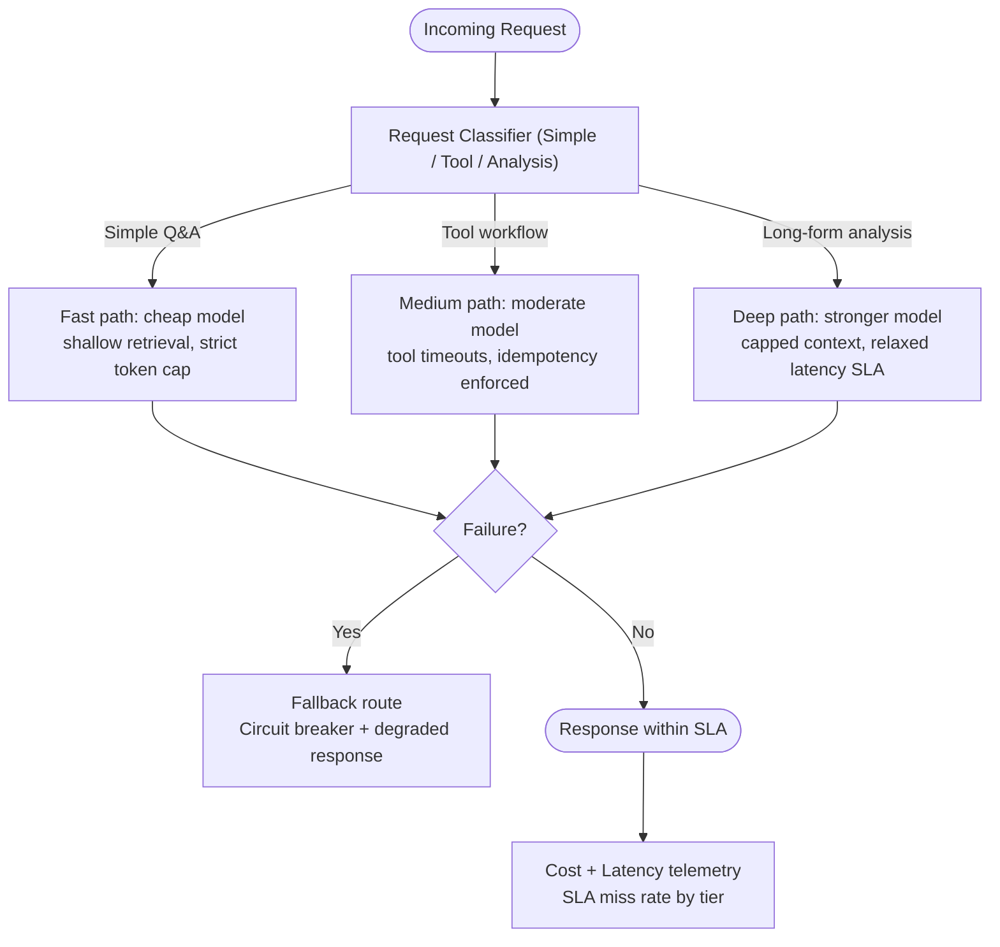

### 2) Real-World Industry Scenarios

#### Scenario A: Customer support assistant

- Product context: high-volume, repetitive requests with strict response expectations.
- Constraints: low p95 latency targets, low failure tolerance, tight per-ticket cost targets.
- What good looks like in production: routing simple tasks to cheaper paths, graceful fallback on failures, and steady SLA adherence during peak traffic.

Why this matters:

- Support systems fail not from one bad answer, but from sustained latency spikes and cost drift.

#### Scenario B: Enterprise operations copilot

- Product context: complex queries, tool calls, and occasional high-risk actions.
- Constraints: stronger correctness/reliability needs, moderate latency tolerance, higher acceptable cost for critical workflows.
- What good looks like in production: reliability-first orchestration with retries, circuit breakers, and action gating, while controlling cost using class-based budgets.

Why this matters:

- Reliability requirements vary by workflow criticality, so one global policy is usually wrong.

#### Scenario C: Consumer creative assistant

- Product context: subjective output quality, high concurrent users, sensitive churn behavior.
- Constraints: low perceived latency is critical, cost pressure from high output tokens.
- What good looks like in production: streaming response, output-length controls, dynamic model routing by request complexity.

Why this matters:

- Fast perceived response often matters more than perfect reasoning depth for retention.

### 3) System View (Think like a systems engineer)

#### Inputs -> Transformations -> Outputs

- Inputs: request class, SLA tier, model options, queue depth, budget policy, tool availability.
- Transformations:
  - classify request by complexity and risk
  - route to model/tool/retrieval path based on SLA and budget
  - apply reliability controls (retry, timeout, fallback)
  - enforce token and cost budgets
  - emit response with trace and cost metadata
- Outputs: response quality under SLA, reliability signals, and budget-compliant spend.

#### Reliability toolkit

- timeout policies
- retry with backoff for transient failures
- circuit breakers for failing dependencies
- fallback models/routes
- idempotency controls for tool actions
- graceful degradation modes

#### Observability

What we track per route/class:

- success rate and failure rate
- p50/p95/p99 latency
- queue wait time vs inference time
- timeout/retry/circuit-breaker events
- token usage and cost per request
- fallback rate and degraded-response rate
- SLA miss rate by tier

#### Failure points

- Reliability debt: no fallback path for upstream outages.
- Latency debt: long-tail requests dominate p95 due to unbounded context or tool chains.
- Cost debt: permissive output lengths and expensive model overuse.
- Coupling debt: same heavy path used for all request classes.

### 4) System Design Flavor (practical and concise)

#### Key design question

What is the minimum system quality that still satisfies user value and business constraints?

This drives route-level SLAs, budget caps, and fallback policy design.

#### Tradeoffs

- Higher reliability vs higher cost: redundancy and fallback paths improve uptime but add infra and token spend.
- Lower latency vs output depth: shorter outputs and smaller contexts are faster but may reduce completeness.
- Lower cost vs quality headroom: cheaper models reduce spend but may degrade hard-task performance.

#### One scaling consideration

At 10x traffic, tail latency and cost variance become bigger problems than average metrics.

You need class-aware routing, bounded contexts, and strict budget governance to prevent runaway spend and SLA collapse.

### 5) Common Mistakes + Debugging

#### Mistake 1

- Symptom: p95 latency keeps rising even after model upgrades.
- Likely cause: retrieval and tool-chain depth increased, so non-model latency dominates.
- First debugging step: split end-to-end latency into queue, retrieval, model, tool, and post-processing components.

#### Mistake 2

- Symptom: spend grows faster than traffic.
- Likely cause: token creep (longer prompts/outputs) and expensive model over-routing.
- First debugging step: compare token histograms and route-level model mix week over week.

#### Mistake 3

- Symptom: outages in one dependency cause full product failure.
- Likely cause: missing circuit breaker and fallback path.
- First debugging step: run failure-injection tests and confirm degrade/fallback behavior per dependency.

### Hands-On Lab (Concept → Build → Break → Measure → Explain)

**Build — Class-based budget configuration**

```python
REQUEST_CLASSES = {
    "simple_qa": {
        "max_input_tokens": 2000,
        "max_output_tokens": 300,
        "retrieval_chunks": 3,
        "p95_latency_ms": 1500,
        "model": "gpt-4o-mini",
    },
    "tool_workflow": {
        "max_input_tokens": 8000,
        "max_output_tokens": 800,
        "retrieval_chunks": 8,
        "p95_latency_ms": 5000,
        "model": "gpt-4o",
    },
    "long_form_analysis": {
        "max_input_tokens": 16000,
        "max_output_tokens": 2000,
        "retrieval_chunks": 15,
        "p95_latency_ms": 15000,
        "model": "gpt-4o",
    },
}

def estimate_daily_cost(class_name, n_requests=10000):
    cfg = REQUEST_CLASSES[class_name]
    pricing = {"gpt-4o-mini": (0.15, 0.60), "gpt-4o": (2.50, 10.0)}
    in_p, out_p = pricing[cfg["model"]]
    cost_per_req = (cfg["max_input_tokens"] * in_p + cfg["max_output_tokens"] * out_p) / 1_000_000
    return cost_per_req * n_requests

for cls in REQUEST_CLASSES:
    print(f"{cls}: ~${estimate_daily_cost(cls):.2f}/day at 10k requests")
```

**Break — Route everything through the most expensive path**

Assign all requests (including simple FAQ) to the `long_form_analysis` config and re-run cost estimates:

| Class | Correct path cost/10k/day | Wrong path cost/10k/day |
|---|---|---|
| Simple Q&A | ~$0.18 (mini, 2k/300t) | ~$40.00 (gpt-4o, 16k/2k) |
| Tool workflow | ~$4.00 | ~$40.00 |
| Analysis | ~$40.00 | ~$40.00 (same) |

**Measure — Cost blow-up at scale**

Simple Q&A on the wrong path is ~222× more expensive. At 100k FAQ requests/day: ~$4,000/day vs ~$18/day.

**Explain — Why class-based routing is cost governance, not just performance tuning**

Without request classification and class-specific token budgets, your most common (and simplest) requests run through the most expensive path. At 10x traffic growth the cost difference compounds. Class-based routing is the single highest-leverage cost control in most GenAI systems because it prevents expensive model configurations from being the global default.

### 6) Active Recall (Spaced Repetition)

1. Why is "best answer quality" alone an incomplete production objective?
2. What is the difference between average latency and p95 latency in product impact?
3. Name two controls that improve reliability during dependency failures.
4. What is one common cause of cost growth faster than traffic growth?
5. What is the first diagnostic step when SLA misses increase?

#### Active Recall Answers

1. Because products also need stable uptime, acceptable response time, and sustainable cost.
2. Average hides tail pain, while p95 reflects the slow experiences that users actually feel and abandon on.
3. Circuit breakers and fallback routes (or retries with backoff for transient failures).
4. Token and routing drift, such as longer outputs and overuse of expensive model paths.
5. Break down SLA misses by request class and latency stage (queue/retrieval/model/tool).

### 7) Practice

#### Mini-exercise

You run a three-tier GenAI app:

- Free tier: high volume, low margin
- Pro tier: medium volume, balanced expectations
- Enterprise tier: lower volume, strict SLA and reliability needs

1. Define one SLA target per tier.
2. Define one fallback strategy per tier.
3. Define one cost guardrail per tier.

#### Mini-exercise Answers

1. SLA targets:
   - Free: p95 < 4.0s
   - Pro: p95 < 2.5s
   - Enterprise: p95 < 1.8s with stronger uptime objective
2. Fallback strategy:
   - Free: fallback to smaller model and shorter response cap
   - Pro: fallback to alternate model with same schema guarantees
   - Enterprise: multi-route redundancy with failover and priority queues
3. Cost guardrail:
   - Free: strict max output tokens and daily spend cap
   - Pro: route-level token budgets with soft caps and alerts
   - Enterprise: committed budget envelope with per-workflow cost attribution

#### Capstone-style system design question

Design a reliability-latency-cost control plane for a GenAI assistant that serves three request classes (simple Q&A, tool-driven workflow, long-form analysis). Specify routing rules, fallback hierarchy, SLA policy, and budget enforcement.

#### Capstone-style Answer Outline

- Routing rules:
  - simple Q&A -> fast, lower-cost model and shallow retrieval
  - tool workflow -> moderate model + strict tool timeouts + idempotency
  - long-form analysis -> stronger model with capped context and output budgets
- Fallback hierarchy:
  - primary model -> alternate model -> degraded response template
  - dependency failures trigger circuit breaker and route switch
- SLA policy:
  - class-specific p95 targets and queue priority
  - automated alerts on SLA miss rates
- Budget enforcement:
  - per-class token caps
  - monthly spend budget by tenant/tier
  - automated throttling or degradation when crossing thresholds

### 8) Production Reality Check (Mandatory Ending)

If this fails in prod, what is the first thing we inspect?

We inspect request-class SLA misses with stage-level latency and route-level cost drift.

Why:

Most production incidents here are not random. They come from specific overloaded routes or budget leaks, and class/stage breakdown finds the root cause quickly.

### 9) Curiosity Bridge (Mandatory Ending)

Now you have the full anatomy of a GenAI application with measurable constraints.

The next topic moves into failure-mode thinking: hallucination, omission, brittle prompts, stale retrieval, and tool misuse, so you can diagnose failures by layer instead of guessing.

---

## Topic 1.3: Failure Modes and Thinking Patterns

**Topic time:** 8h

Subtopics in this topic:

- 1.3.a Hallucination, omission, shallow retrieval, and overconfident answers - 2h
- 1.3.b Prompt brittleness, hidden state, and context overload - 2h
- 1.3.c Tool misuse, stale knowledge, and permission blind spots - 2h
- 1.3.d Root-cause decomposition: model bug vs retrieval bug vs tool bug vs orchestration bug - 2h

Learning rule adjustment for this topic:

- This topic is covered in one integrated pass because the failure modes are tightly connected.
- The goal is not memorizing names. The goal is learning to map symptoms to the correct failing layer.

---

## Subtopic 1.3.a: Hallucination, Omission, Shallow Retrieval, and Overconfident Answers

### 1) The Intuition (Plain English)

These are answer-quality failures, but they are not all the same failure.

- Hallucination: the system invents unsupported information.
- Omission: the system leaves out important information that should have been included.
- Shallow retrieval: the system retrieves weak or partial evidence and answers from that thin context.
- Overconfident answer: the system sounds certain even when evidence is weak or missing.

Simple mental model:

- Hallucination = says what is not supported
- Omission = misses what matters
- Shallow retrieval = answers from weak evidence
- Overconfidence = certainty does not match evidence

Analogy:

Think of a junior analyst writing a report.

- Hallucination is inventing a statistic.
- Omission is forgetting a key risk.
- Shallow retrieval is reading only the first search result.
- Overconfidence is presenting guesses like audited facts.

### Visual Diagram (Mermaid)

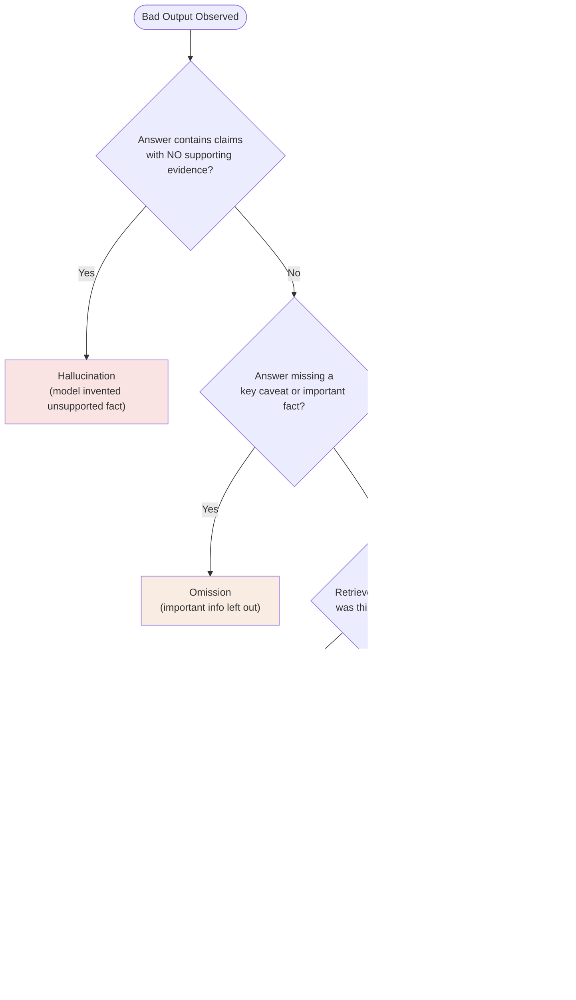

### 2) Real-World Industry Scenarios

#### Scenario A: HR policy assistant

- Product context: employees ask leave, benefits, and eligibility questions.
- Constraints: policy accuracy, source citations, low tolerance for confident errors.
- What good looks like in production: answers cite current policy, mention caveats, and refuse when evidence is insufficient.

Why this matters:

- Hallucinated policy guidance can create real employee harm and compliance risk.

#### Scenario B: RAG customer support assistant

- Product context: users ask product troubleshooting questions.
- Constraints: docs may be incomplete, retrieval may miss version-specific details.
- What good looks like in production: the assistant distinguishes supported steps from uncertain suggestions and escalates when retrieval confidence is low.

Why this matters:

- Many hallucinations are actually retrieval failures wearing a fluent-answer mask.

### 3) System View (Think like a systems engineer)

#### Inputs -> Transformations -> Outputs

- Inputs: user question, retrieved evidence, prompt instructions, model response.
- Transformations:
  - retrieve and rank evidence
  - check whether evidence is sufficient
  - generate answer constrained to evidence
  - validate citation and confidence behavior
- Outputs: grounded answer, refusal, escalation, or clarification question.

#### Observability

What we log and inspect:

- retrieved chunks and relevance scores
- answer claims mapped to evidence
- citation coverage
- refusal/escalation rate
- unsupported-claim rate
- omission labels from human review

#### Failure points

- Retrieval misses source-of-truth documents.
- Prompt asks for an answer even when evidence is weak.
- Model fills gaps instead of refusing.
- Evaluation rewards polished answers instead of grounded answers.

### 4) System Design Flavor (practical and concise)

#### Key design question

Does every important claim have enough supporting evidence?

This is the central question for grounding failures.

#### Tradeoffs

- More refusal vs more helpfulness: refusals reduce hallucination but may frustrate users.
- Higher top-k retrieval vs lower latency: more evidence can improve recall but increases cost and context size.
- Concise answers vs completeness: shorter answers reduce latency but may omit important caveats.

#### One scaling consideration

At 10x usage, unsupported claims become a statistical certainty unless you measure them continuously.

Use claim-level evaluation, citation checks, and sampled human review.

### 5) Common Mistakes + Debugging

#### Mistake 1

- Symptom: answer is fluent but factually unsupported.
- Likely cause: model generated beyond retrieved evidence.
- First debugging step: map each answer claim to retrieved chunks and identify unsupported claims.

#### Mistake 2

- Symptom: answer is technically correct but misses the key caveat.
- Likely cause: retrieval found partial evidence or prompt optimized for brevity over completeness.
- First debugging step: inspect expected source documents and compare against retrieved top-k.

#### Mistake 3

- Symptom: system never says "I do not know."
- Likely cause: prompt and evaluation reward always-answer behavior.
- First debugging step: add insufficient-evidence test cases and measure refusal correctness.

### Hands-On Lab (Concept → Build → Break → Measure → Explain)

**Build — Claim-to-evidence mapping drill**

Given this retrieved context and model output, map each claim:

**Retrieved context:**
> "Full-time employees are eligible for parental leave of up to 12 weeks at 100% pay. Eligibility begins after 6 months of employment."

**Model output:**
> "All employees, including part-time and contract workers, are eligible for parental leave of up to 12 weeks at full pay. There is no waiting period."

| Claim | Supported by context? | Failure type |
|---|---|---|
| All employees including part-time/contract | ? | ? |
| Up to 12 weeks at full pay | ? | ? |
| No waiting period | ? | ? |

**Answers:**

| Claim | Supported? | Failure type |
|---|---|---|
| All employees including part-time/contract | No — context says full-time only | Hallucination |
| Up to 12 weeks at full pay | Yes — directly stated | Correct |
| No waiting period | No — context says 6-month requirement | Hallucination + Overconfidence |

**Break — Remove retrieval and run the same question**

Prompt: "Are part-time employees eligible for parental leave? How long and at what pay rate?"

Expected failure: the model generates plausible-sounding but entirely unsupported numbers and eligibility rules from its training distribution.

**Measure — Claim-level hallucination rate**

For 10 policy questions:
- With full retrieval: measure unsupported claims (target: 0–5%)
- With empty retrieval: measure unsupported claims (typically 40–80% on factual policy questions)

**Explain — Why hallucination is primarily a retrieval failure**

When a model generates an answer, it fills the gap between retrieved evidence and a complete response using its training distribution. The more evidence gaps there are, the more the model fills in — and the more confident it sounds, because fluency is trained independently of factual accuracy. Fixing hallucination means ensuring the retrieval layer supplies complete, relevant evidence, not prompting the model to "be accurate."

### 6) Active Recall (Spaced Repetition)

1. What is the difference between hallucination and omission?
2. Why can shallow retrieval lead to overconfident answers?
3. What is the first debugging step for a suspected hallucination?
4. Why is citation presence not enough to prove groundedness?
5. What behavior should a system show when evidence is insufficient?

#### Active Recall Answers

1. Hallucination adds unsupported information; omission leaves out important supported information.
2. The model may answer confidently from incomplete evidence unless the system checks evidence sufficiency.
3. Map each generated claim to retrieved evidence and find unsupported claims.
4. A citation can point to a document without actually supporting the specific claim.
5. It should ask a clarification, refuse, or escalate rather than invent.

### 7) Practice

#### Mini-exercise

A policy assistant says: "Contractors are eligible for 12 weeks of paid parental leave," but the retrieved policy only mentions full-time employees.

1. Classify the failure.
2. Identify the likely failing layer.
3. Give the first debugging step.

#### Mini-exercise Answers

1. Failure: hallucination plus overconfidence.
2. Likely failing layer: retrieval/prompt/model interaction. The evidence is insufficient, and the model filled the gap.
3. First debugging step: inspect retrieved chunks and claim-to-evidence mapping for the contractor eligibility claim.

#### Capstone-style system design question

Design a grounded-answer policy for a RAG assistant that must avoid hallucinations and omissions. Include evidence sufficiency checks, citation validation, and refusal behavior.

#### Capstone-style Answer Outline

- Require claim-to-evidence mapping for factual claims.
- Validate that citations support the exact claim, not merely the topic.
- Use insufficient-evidence thresholds based on retrieval score and coverage.
- Return refusal or clarification when evidence is weak.
- Track unsupported-claim and omission rates in evaluation.

### 8) Production Reality Check (Mandatory Ending)

If this fails in prod, what is the first thing we inspect?

We inspect retrieved evidence and claim-to-evidence mapping for the failing answer.

Why:

Most hallucination and omission bugs become clear once you compare what the model said against what evidence it actually received.

### 9) Curiosity Bridge (Mandatory Ending)

Answer-quality failures are only one family of failures.

Next we look at prompt brittleness, hidden state, and context overload, where the system may have the right evidence but still fail because the instruction/context package is unstable.

---

## Subtopic 1.3.b: Prompt Brittleness, Hidden State, and Context Overload

### 1) The Intuition (Plain English)

Prompt failures happen when behavior changes unexpectedly because the instruction package is fragile.

- Prompt brittleness: small input or template changes cause large behavior changes.
- Hidden state: invisible context or previous turns influence behavior in ways the developer forgets.
- Context overload: too much instruction, evidence, chat history, or tool output makes the model miss what matters.

Simple mental model:

- Prompt brittleness = fragile instructions
- Hidden state = invisible baggage
- Context overload = too much on the desk

Analogy:

Think of giving instructions to a busy teammate.

- If the instructions are brittle, one wording change breaks the task.
- If hidden state exists, they act based on something you did not know they remembered.
- If overloaded, they miss key details because the brief is too crowded.

### Visual Diagram (Mermaid)

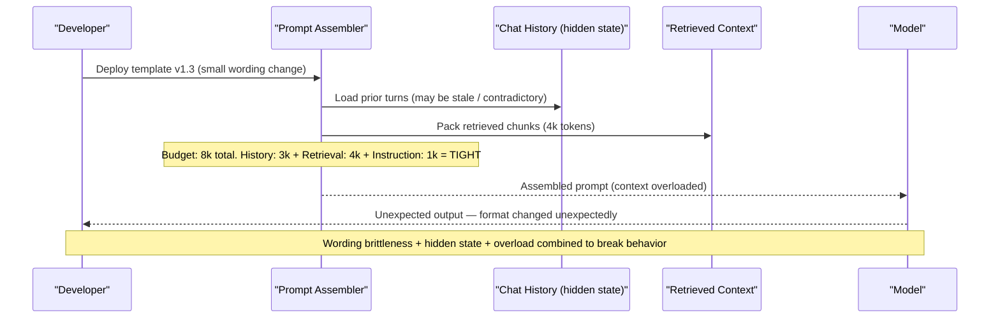

### 2) Real-World Industry Scenarios

#### Scenario A: Structured extraction pipeline

- Product context: model extracts fields into JSON from invoices.
- Constraints: strict schema, low tolerance for missing fields, lots of document variation.
- What good looks like in production: prompt templates are versioned, tested on fixtures, and protected with schema validation/retry.

Why this matters:

- A small prompt change can silently break downstream systems.

#### Scenario B: Long-running chat assistant

- Product context: user has multi-turn support conversation.
- Constraints: old turns may become irrelevant, but recent user corrections matter.
- What good looks like in production: context is summarized, stale turns are dropped, and hidden assumptions are surfaced before action.

Why this matters:

- Hidden state causes confusing behavior that looks like model randomness.

### 3) System View (Think like a systems engineer)

#### Inputs -> Transformations -> Outputs

- Inputs: system prompt, developer instructions, user request, chat history, retrieved context, tool outputs.
- Transformations:
  - assemble prompt package
  - rank and compress context
  - enforce instruction precedence
  - validate output format and policy constraints
- Outputs: generated response or structured object with traceable prompt version.

#### Observability

What we log and inspect:

- prompt version and rendered prompt
- context size by component
- instruction hierarchy and conflicting instructions
- output schema failures
- behavior drift by prompt version
- context truncation events

#### Failure points

- Prompt template changes without regression tests.
- Long chat history pushes important retrieval evidence out of attention.
- Tool outputs are pasted unfiltered into the context.
- Conflicting instructions appear across system, developer, user, and retrieved content.

### 4) System Design Flavor (practical and concise)

#### Key design question

Is the model seeing the right context, in the right order, under non-conflicting instructions?

That question explains many "random" LLM failures.

#### Tradeoffs

- More instructions vs clarity: more rules can help edge cases but also create contradictions.
- More history vs relevance: history improves continuity but can overload the prompt.
- More examples vs token budget: examples improve format reliability but consume context.

#### One scaling consideration

At 10x prompt/template complexity, manual prompt management collapses.

You need prompt versioning, regression tests, render inspection, and diff discipline.

### 5) Common Mistakes + Debugging

#### Mistake 1

- Symptom: same task behaves differently after a harmless wording change.
- Likely cause: brittle prompt template or missing regression tests.
- First debugging step: diff rendered prompts and replay fixed test cases across both versions.

#### Mistake 2

- Symptom: assistant uses old assumptions the user corrected earlier.
- Likely cause: hidden state or stale conversation summary.
- First debugging step: inspect full assembled context and summary memory.

#### Mistake 3

- Symptom: model ignores key retrieved evidence.
- Likely cause: context overload or poor ordering.
- First debugging step: measure token allocation by component and move key evidence closer to the task instruction.

### Hands-On Lab (Concept → Build → Break → Measure → Explain)

**Build — Prompt regression test fixture**

For a JSON extraction prompt, define a minimal regression fixture set:

```python
EXTRACTION_FIXTURES = [
    {
        "id": "basic_invoice",
        "input": "Invoice #1042 from Acme Corp, dated 2024-03-15, total $1,250.00",
        "expected": {"invoice_id": "1042", "vendor": "Acme Corp", "amount": 1250.00},
    },
    {
        "id": "missing_vendor",
        "input": "Invoice dated 2024-03-15, total $500. No vendor name provided.",
        "expected": {"invoice_id": None, "vendor": None, "amount": 500.00},
    },
    {
        "id": "informal_format",
        "input": "Got an invoice from Bob's Plumbing for $340 for work done March 10th.",
        "expected": {"invoice_id": None, "vendor": "Bob's Plumbing", "amount": 340.00},
    },
]

def run_regression(prompt_template, fixtures, model_fn):
    failures = []
    for f in fixtures:
        result = model_fn(prompt_template, f["input"])
        if result != f["expected"]:
            failures.append({"id": f["id"], "got": result, "expected": f["expected"]})
    return failures
```

**Break — Make a small wording change and re-run**

Original: `"Extract invoice fields as JSON: invoice_id, vendor, amount"`
Changed to: `"Please provide the invoice details in JSON format with fields invoice_id, vendor, and amount"`

Predicted symptoms: the model may return prose around the JSON, wrap it in markdown code fences, or use different key names (`vendor_name` instead of `vendor`).

**Measure — Brittleness score**

```python
original_failures = run_regression(original_prompt, EXTRACTION_FIXTURES, model_fn)
changed_failures  = run_regression(changed_prompt,  EXTRACTION_FIXTURES, model_fn)
print(f"Original: {len(original_failures)}/3 failures")
print(f"Changed:  {len(changed_failures)}/3 failures")
```

If the changed version fails even 1 additional fixture, you have confirmed prompt brittleness: a small wording change broke a downstream schema contract.

**Explain — Why rendered prompt inspection is more valuable than template inspection**

A template file shows your intentions. A rendered prompt shows exactly what the model received — including variable substitutions, history injections, and retrieved context. Brittleness bugs always live in the rendered output, not the template. Building a render-and-test harness makes brittleness visible before it reaches production.

### 6) Active Recall (Spaced Repetition)

1. What is prompt brittleness?
2. Why is hidden state dangerous in multi-turn systems?
3. What is context overload?
4. What should you inspect first when behavior changes after a prompt edit?
5. Why are rendered prompts more useful than template files during debugging?

#### Active Recall Answers

1. Prompt brittleness is when small wording/template changes cause large behavior changes.
2. Because invisible prior context can influence behavior in ways the user/developer does not expect.
3. Context overload is when too much information makes the model miss important instructions or evidence.
4. Diff rendered prompts and replay fixed regression examples.
5. Because rendered prompts show the exact text the model saw, including variables, history, and retrieved context.

### 7) Practice

#### Mini-exercise

A JSON extractor starts returning prose after a prompt refactor, but the model and input documents are unchanged.

1. Classify the failure.
2. Identify the likely failing layer.
3. Give the first debugging step.

#### Mini-exercise Answers

1. Failure: prompt brittleness and schema-following regression.
2. Likely failing layer: prompt layer, possibly validation layer if schema enforcement is weak.
3. First debugging step: compare old vs new rendered prompts and replay the same document fixtures.

#### Capstone-style system design question

Design a prompt governance system for a production GenAI app. Include versioning, regression tests, context-packing checks, and rollback.

#### Capstone-style Answer Outline

- Store prompt templates with semantic versions.
- Log rendered prompts for sampled requests.
- Maintain fixtures for common and edge cases.
- Run schema validation and golden-set regression before rollout.
- Use canary release and one-click prompt rollback.

### 8) Production Reality Check (Mandatory Ending)

If this fails in prod, what is the first thing we inspect?

We inspect the rendered prompt package for the failing request.

Why:

The actual rendered prompt reveals hidden state, context order, token pressure, and instruction conflicts that templates alone hide.

### 9) Curiosity Bridge (Mandatory Ending)

Now we have covered failures inside answers and prompts.

Next comes the more dangerous category: tool misuse, stale knowledge, and permission blind spots, where model mistakes can trigger real actions or expose data.

---

## Subtopic 1.3.c: Tool Misuse, Stale Knowledge, and Permission Blind Spots

### 1) The Intuition (Plain English)

Tool-using systems fail differently because they can affect the outside world.

- Tool misuse: the system calls the wrong tool, calls the right tool with bad arguments, or acts at the wrong time.
- Stale knowledge: the system relies on outdated docs, memory, or cached data.
- Permission blind spot: the system can see or do something the user should not be allowed to access or trigger.

Simple mental model:

- Tool misuse = wrong action
- Stale knowledge = old truth treated as current truth
- Permission blind spot = missing access boundary

Analogy:

Think of an assistant with access to company systems.

- A bad answer is embarrassing.
- A bad tool call can update records, send messages, refund money, or expose restricted data.

That is why tool failures need stricter controls than plain chat failures.

### Visual Diagram (Mermaid)

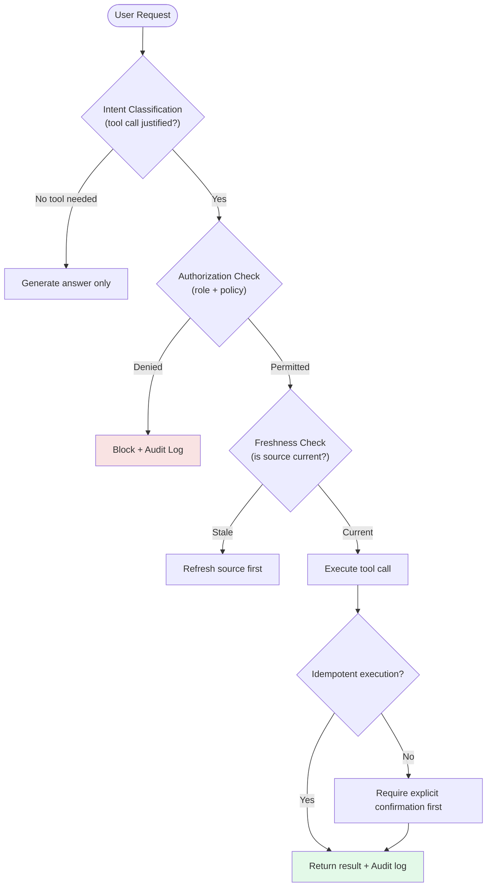

### 2) Real-World Industry Scenarios

#### Scenario A: Refund workflow assistant

- Product context: support rep can approve refunds with AI assistance.
- Constraints: financial impact, policy limits, audit trail, human approval.
- What good looks like in production: tool calls require role checks, amount limits, explicit confirmation, and idempotent execution.

Why this matters:

- Prompt instructions are not enough when real money can move.

#### Scenario B: Internal knowledge assistant with permissions

- Product context: employees query documents from multiple departments.
- Constraints: tenant/team permissions, restricted docs, stale docs.
- What good looks like in production: retrieval is permission-aware, freshness-aware, and logs every source access.

Why this matters:

- Security failures often happen before generation, inside retrieval and tool access.

### 3) System View (Think like a systems engineer)

#### Inputs -> Transformations -> Outputs

- Inputs: user identity, role, request, available tools, document permissions, freshness metadata.
- Transformations:
  - authorize user/tool/document access
  - retrieve only permitted and fresh sources
  - validate tool arguments
  - require confirmation for risky actions
  - execute action idempotently and log result
- Outputs: safe answer, blocked action, approval request, or audited tool result.

#### Observability

What we log and inspect:

- tool selected and arguments
- authorization decision and policy version
- document freshness and source version
- approval events and user confirmations
- tool result and side effects
- blocked action reasons

#### Failure points

- Model chooses a tool based on weak intent classification.
- Retrieval returns stale or unauthorized sources.
- Tool schema allows ambiguous arguments.
- Tool execution is not idempotent.
- Permissions are checked in UI but not in backend tool layer.

### 4) System Design Flavor (practical and concise)

#### Key design question

Can this action or data access cause harm if the model is wrong?

If yes, the control must live outside the prompt.

#### Tradeoffs

- More tool power vs more risk: broad tools increase capability but expand blast radius.
- Strict permissions vs convenience: tighter gates reduce accidents but may add friction.
- Freshness checks vs latency: verifying current sources improves correctness but can slow response.

#### One scaling consideration

At 10x tools, tool governance becomes a platform problem.

You need tool catalogs, risk tiers, schema reviews, audit logs, and approval policies.

### 5) Common Mistakes + Debugging

#### Mistake 1

- Symptom: assistant calls a tool when it should only answer.
- Likely cause: weak intent classification and no action threshold.
- First debugging step: inspect tool-selection trace and add confidence/approval gates.

#### Mistake 2

- Symptom: assistant answers using outdated documentation.
- Likely cause: stale retrieval index or memory overriding fresh source data.
- First debugging step: inspect source version, index refresh time, and freshness metadata.

#### Mistake 3

- Symptom: user sees information from another team or tenant.
- Likely cause: permission-aware retrieval or tool authorization is missing.
- First debugging step: audit authorization checks at retrieval and tool execution layers.

### Hands-On Lab (Concept → Build → Break → Measure → Explain)

**Build — Tool authorization checklist**

For each tool in a support assistant, define risk tier and required controls:

| Tool | Risk tier | Required controls |
|---|---|---|
| `search_knowledge_base(query)` | Read-only | Permission scope check (user/tenant), freshness metadata |
| `get_customer_order(order_id)` | Read-only | User identity → customer ownership validation |
| `submit_refund(order_id, amount)` | High-risk write | Role check + amount policy limit + explicit confirmation + idempotency key |
| `send_email(user_id, subject, body)` | Medium write | Role check + content policy validation + rate limit per user |

**Break — Remove the authorization check from `submit_refund`**

User message: "Can you process my refund for order 9814?"

Without authorization check:
1. Model calls `submit_refund("9814", <amount from context>)` based on intent classification alone.
2. If the amount was retrieved from a stale or wrong data source, the wrong amount executes.
3. No confirmation gate means the user never explicitly approved the action.
4. No idempotency key means a retry doubles the refund.

**Measure — Blast radius calculation**

At 5,000 support interactions/day, assume 0.5% trigger refund tool calls (25/day). Without authorization + idempotency:
- Even 1 duplicate execution per week = unexpected financial exposure.
- Without the confirmation gate, 2% intent-classification errors = ~0.5 wrong refunds/day.

**Explain — Why authorization must live in the tool layer, not the prompt**

Prompts set behavioral intent; tool-layer controls enforce behavioral boundaries. The model's instruction-following capability is probabilistic. A 0.1% error rate on intent interpretation at scale means real money moves incorrectly. Tool-layer authorization is deterministic and cannot be bypassed by a user reformulating a request in prompt space.

### 6) Active Recall (Spaced Repetition)

1. Why are tool failures more dangerous than plain answer failures?
2. What is stale knowledge in a GenAI system?
3. Why should permission checks live outside prompts?
4. What does idempotency protect against in tool execution?
5. What is the first debugging step for suspected data leakage?

#### Active Recall Answers

1. Because tools can cause real side effects like data changes, messages, refunds, or external actions.
2. Outdated docs, memory, cache, or indexed content being treated as current truth.
3. Prompts are not enforceable security controls; backend authorization is enforceable.
4. It prevents duplicate or repeated tool calls from causing repeated side effects.
5. Audit retrieval and tool authorization decisions for the failing request/user/tenant.

### 7) Practice

#### Mini-exercise

A sales assistant summarizes an account and includes a restricted internal note from another region.

1. Classify the failure.
2. Identify the likely failing layer.
3. Give the first debugging step.

#### Mini-exercise Answers

1. Failure: permission blind spot and retrieval security failure.
2. Likely failing layer: retrieval permissions or backend authorization, not model reasoning.
3. First debugging step: inspect source document permissions and retrieval filters for that user/tenant.

#### Capstone-style system design question

Design a safe tool-using assistant for support operations. Include tool risk tiers, permission checks, confirmation flows, and audit logging.

#### Capstone-style Answer Outline

- Risk tier tools: read-only, low-risk write, high-risk action.
- Enforce backend authorization before retrieval and tool execution.
- Require explicit confirmation and human approval for high-risk actions.
- Make write operations idempotent with action IDs.
- Log tool selection, arguments, policy decision, user confirmation, and result.

### 8) Production Reality Check (Mandatory Ending)

If this fails in prod, what is the first thing we inspect?

We inspect authorization traces and tool-call logs for the failing request.

Why:

Tool and permission failures are usually caused by missing enforcement boundaries, not by lack of model intelligence.

### 9) Curiosity Bridge (Mandatory Ending)

We now have the main failure families: answer quality, prompt/context instability, and tool/security failures.

The final subtopic turns these into a repeatable debugging method: root-cause decomposition across model, retrieval, tool, and orchestration layers.

---

## Subtopic 1.3.d: Root-Cause Decomposition Across Model, Retrieval, Tool, and Orchestration Bugs

### 1) The Intuition (Plain English)

Senior GenAI debugging is mostly about refusing to blame "the model" too early.

Every failure should be mapped to the layer that actually caused it.

- Model bug: model lacks capability or makes an unsupported reasoning/generation error.
- Retrieval bug: the right evidence was missing, stale, poorly chunked, or poorly ranked.
- Tool bug: tool was wrong, unavailable, miscalled, unauthorized, or unsafe.
- Orchestration bug: the system routed, sequenced, retried, summarized, or recovered incorrectly.

Simple mental model:

- Model = thinking/generation
- Retrieval = evidence supply
- Tool = action/data interface
- Orchestration = control flow

Analogy:

Think of a hospital diagnosis workflow.

- Model bug: doctor reasons poorly.
- Retrieval bug: lab results are missing.
- Tool bug: diagnostic machine gives bad output.
- Orchestration bug: patient is sent to the wrong department.

The fix depends entirely on which layer failed.

### Visual Diagram (Mermaid)

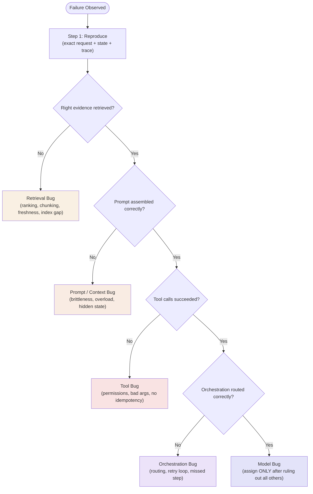

### 2) Real-World Industry Scenarios

#### Scenario A: RAG assistant gives wrong policy answer

- Product context: user asks about eligibility.
- Constraints: accurate source use, auditability, freshness.
- What good looks like in production: trace shows retrieval candidates, prompt, model output, and evidence validation.

Why this matters:

- The failure may be missing docs, bad ranking, prompt overreach, or model reasoning. You need evidence before choosing a fix.

#### Scenario B: Agentic workflow loops or stalls

- Product context: system should inspect logs, call tools, then recommend action.
- Constraints: tool reliability, bounded steps, recoverability.
- What good looks like in production: graph/trajectory traces reveal repeated states, failed transitions, and tool errors.

Why this matters:

- Agent failures are often control-flow bugs, not raw model bugs.

### 3) System View (Think like a systems engineer)

#### Inputs -> Transformations -> Outputs

- Inputs: failing request, expected behavior, actual output, trace, retrieved docs, tool logs, prompt package.
- Transformations:
  - reproduce failure
  - isolate layer evidence
  - test layer hypotheses one at a time
  - apply smallest targeted fix
  - add regression case
- Outputs: root-cause label, remediation, test coverage, monitoring signal.

#### Debugging ladder

1. Reproduce the failure with the exact request and state.
2. Inspect retrieval evidence.
3. Inspect rendered prompt and context order.
4. Inspect tool calls and permissions.
5. Inspect orchestration route/step history.
6. Only then evaluate model capability as the primary cause.

#### Observability

What we need for decomposition:

- request ID across all layers
- rendered prompt and model output
- retrieved chunks and scores
- tool calls, arguments, results, and failures
- orchestration state transitions
- evaluation labels and expected answer

#### Failure points

- No trace correlation across layers.
- No golden expected answer for comparison.
- Changing multiple layers at once during debugging.
- Treating user feedback as root cause instead of symptom.

### 4) System Design Flavor (practical and concise)

#### Key design question

What evidence would disprove my first guess about the failure?

This prevents narrative debugging and forces disciplined investigation.

#### Tradeoffs

- Faster fix vs correct fix: quick prompt edits may hide a retrieval or orchestration bug.
- Rich traces vs storage/privacy cost: more trace detail improves debugging but must be governed.
- Layer isolation vs integrated realism: unit tests isolate causes, but end-to-end replay catches interaction failures.

#### One scaling consideration

At 10x usage, debugging must become a playbook, not hero work.

Use failure labels, replay fixtures, and recurring dashboards by failure layer.

### 5) Common Mistakes + Debugging

#### Mistake 1

- Symptom: team keeps changing prompts for every bad answer.
- Likely cause: no layer-based failure taxonomy.
- First debugging step: classify the failure as model, retrieval, prompt, tool, or orchestration before changing anything.

#### Mistake 2

- Symptom: fix improves one case but breaks many others.
- Likely cause: patch was made without regression suite.
- First debugging step: replay golden cases before and after the fix.

#### Mistake 3

- Symptom: incident review cannot identify why an agent acted oddly.
- Likely cause: missing state transition and tool-call traces.
- First debugging step: add trajectory tracing with state snapshots and decision reasons.

### Hands-On Lab (Concept → Build → Break → Measure → Explain)

**Build — Layer-by-layer debugging walkthrough**

System: HR policy RAG assistant
User question: "What is the notice period for voluntary resignation?"
Expected answer: "2 weeks per company policy, effective upon written notice."
Actual answer: "There is no formal notice period requirement. Standard practice is to give 2 weeks' notice."

Apply the debugging ladder:

| Step | Check | Action |
|---|---|---|
| 1. Reproduce | Same input → same output? | Confirmed reproducible |
| 2. Retrieval | Top-5 chunks contain notice period policy? | Run retrieval in isolation |
| 3. Prompt | Prompt instructs model to cite source? | Inspect rendered prompt |
| 4. Tool | Any tool calls in this flow? | Skip (no tools) |
| 5. Orchestration | Routing and model selection correct? | Check route config |
| 6. Model | Did model have evidence but still answer wrongly? | Check only after all above |

**Break — Inject the retrieval bug deliberately**

Remove the notice period policy document from the retrieval index. Re-run the same query.

Expected: retrieval fails → model fills gap from training distribution → outputs "standard practice" (a generic confident answer that is not policy-grounded).

**Measure — Layer attribution**

```python
results_with_policy    = retrieve("voluntary resignation notice period", top_k=5)
results_without_policy = retrieve("voluntary resignation notice period", top_k=5)

policy_found_with    = any("2 weeks" in r["text"] and "notice" in r["text"] for r in results_with_policy)
policy_found_without = any("2 weeks" in r["text"] and "notice" in r["text"] for r in results_without_policy)

print(f"Policy found WITH index:    {policy_found_with}")    # True
print(f"Policy found WITHOUT index: {policy_found_without}") # False -> confirms retrieval bug
```

**Explain — Why the debugging ladder prevents prompt-first bias**

Engineers trained on non-GenAI systems instinctively jump to "fix the model output" because the model is the most visible component. In GenAI systems, most failures have an upstream cause: missing evidence, bad context assembly, wrong routing, or broken tools. Applying the ladder proves the bug is NOT in each upstream layer before assigning it to the model — saving hours of prompt iteration on problems the prompt literally cannot fix.

### 6) Active Recall (Spaced Repetition)

1. Why should you avoid blaming the model first?
2. What is the difference between retrieval bug and model bug?
3. What is an orchestration bug?
4. Why should you change one layer at a time during debugging?
5. What is the first step in a serious failure investigation?

#### Active Recall Answers

1. Because many failures come from missing evidence, bad prompts, broken tools, or bad routing rather than model capability.
2. Retrieval bug means the model did not receive the right evidence; model bug means it had enough evidence but still failed to reason/generate correctly.
3. A control-flow failure in routing, sequencing, retrying, summarizing, or recovering.
4. So you can attribute improvement or regression to a specific cause.
5. Reproduce the exact failure with the same request, context, model, and state.

### 7) Practice

#### Mini-exercise

A RAG assistant gives the wrong answer. The correct policy exists in the document store, but it was not included in the retrieved top-k chunks.

1. Classify the failure.
2. Which layer should you debug first?
3. Name two targeted experiments.

#### Mini-exercise Answers

1. Failure: retrieval bug, specifically recall/ranking failure.
2. Debug retrieval first, not the model.
3. Experiments:
   - test query rewriting or higher top-k to see if correct chunk appears
   - inspect chunking/metadata filters to see whether the correct policy is indexed and eligible

#### Capstone-style system design question

Create a first-pass GenAI incident triage playbook for a production assistant. It must classify failures by layer, define evidence needed for each classification, and produce a remediation plan.

#### Capstone-style Answer Outline

- Collect request ID, user input, expected behavior, actual behavior.
- Pull rendered prompt, retrieval chunks, tool logs, and orchestration trace.
- Classify primary failure layer and secondary contributing layers.
- Run one isolating experiment per hypothesis.
- Apply smallest targeted fix.
- Add regression test and monitoring label.

### 8) Production Reality Check (Mandatory Ending)

If this fails in prod, what is the first thing we inspect?

We inspect the full request trace and classify the failure by layer before changing prompts or models.

Why:

Layer-first diagnosis prevents expensive guesswork and stops teams from treating every GenAI failure as a model problem.

### 9) Curiosity Bridge (Mandatory Ending)

Module 1 now gives you the mental model for how GenAI systems are structured and how they fail.

The next learning jump depends on our roadmap path: either move to Prompting and Structured Generation for market-fast system building, or enter Transformer internals when you want the deeper theory layer behind model behavior.

---

## Module 1 Checkpoint Deep Explanation

### Checkpoint Skills

By the end of Module 1, you should be able to do three things without vague language:

- Explain the full anatomy of a GenAI system.
- Distinguish workflow automation, RAG, and agentic behavior.
- Diagnose a bad answer by mapping it to the correct failure layer.

### 1) The Intuition (Plain English)

A real GenAI product is not "an LLM plus a prompt."

It is a system made of layers:

- user experience layer: where the user asks, reviews, approves, or corrects
- orchestration layer: decides which path the request should take
- prompt layer: frames the task, constraints, role, format, and policy
- model layer: generates, reasons, classifies, or selects actions
- retrieval layer: brings in external knowledge and citations
- tool layer: reads/writes external systems and performs actions
- memory layer: preserves useful state over time
- evaluation/tracing layer: measures quality and records what happened
- safety/reliability/cost layer: enforces boundaries, fallbacks, budgets, and SLAs

Simple mental model:

- model = language/reasoning engine
- prompt = task contract
- retrieval = evidence supply
- tools = action surface
- memory = state over time
- orchestration = control flow
- evaluation/tracing = visibility and measurement
- safety/reliability/cost = production constraints

Analogy:

Think of a hospital operating room.

- The surgeon is the model.
- The procedure checklist is the prompt.
- Patient records and lab reports are retrieval.
- Surgical instruments are tools.
- Medical history is memory.
- The operating protocol is orchestration.
- Monitors and logs are tracing/evaluation.
- Sterile rules, approvals, and emergency fallback plans are safety/reliability.

If something goes wrong, you do not say "the surgeon failed" immediately. You inspect the whole operating system.

### Visual Diagram (Mermaid)

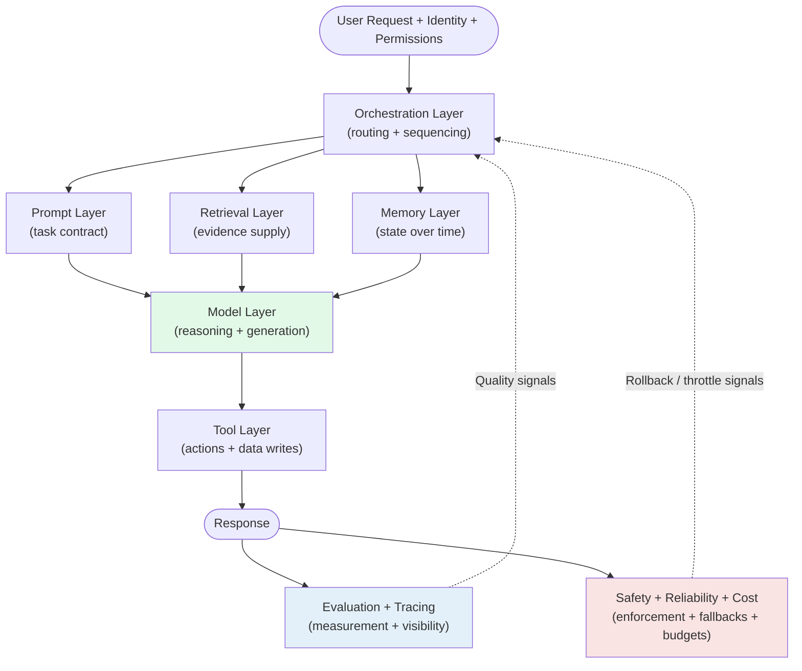

### 2) Real-World Industry Scenarios

#### Scenario A: Enterprise policy assistant

- Product context: employees ask HR/compliance questions and expect cited answers.
- Constraints: current policy, low hallucination tolerance, privacy, readable output.
- What good looks like in production: retrieval brings current policy, prompt enforces grounded response, model answers with citations, and tracing proves which source supported each claim.

System type:

- Mostly RAG.
- It may include workflow steps for escalation, but the core job is grounded answering.

#### Scenario B: Invoice processing automation

- Product context: invoices enter the system, fields are extracted, validations run, exceptions route to review.
- Constraints: repeatability, auditability, cost, schema reliability.
- What good looks like in production: deterministic workflow controls the path, LLM extraction is one step, and exceptions are routed predictably.

System type:

- Mostly workflow automation.
- The LLM helps inside a fixed process, but it does not decide the whole path freely.

#### Scenario C: Incident investigation assistant

- Product context: system reviews logs, checks runbooks, calls tools, compares hypotheses, and recommends next action.
- Constraints: tool reliability, state tracking, safety, approval boundaries, traceability.
- What good looks like in production: the system can choose next steps dynamically within boundaries, but every tool call and decision is traced.

System type:

- Potentially agentic behavior.
- The path depends on what the system discovers during execution.

### 3) System View (Think like a systems engineer)

#### Full anatomy: Inputs -> Transformations -> Outputs

- Inputs:
  - user request
  - user identity and permissions
  - conversation state
  - retrieved documents
  - tool outputs
  - memory
  - product constraints (latency, cost, safety)
- Transformations:
  - classify task and risk
  - retrieve evidence if needed
  - assemble prompt/context package
  - select model and route
  - call tools if needed
  - validate answer, citations, schema, and safety
  - log trace and metrics
- Outputs:
  - answer
  - citation/evidence trail
  - tool result or action
  - refusal/escalation/clarification
  - trace and evaluation signals

#### Workflow automation vs RAG vs agentic behavior

| System type | Core question | Main mechanism | Best fit | Main risk |
|---|---|---|---|---|
| Workflow automation | What fixed process should run? | predefined steps and rules | repeatable business processes | too rigid for ambiguous tasks |
| RAG | What evidence supports the answer? | retrieval + grounded generation | knowledge assistants and cited Q&A | bad retrieval causes bad answers |
| Agentic behavior | What should the system do next? | dynamic planning/tool use/state updates | open-ended investigation or adaptive workflows | unsafe autonomy and hard debugging |

#### Clean distinction

- Workflow automation follows a mostly known path.
- RAG answers using retrieved knowledge.
- Agentic behavior chooses actions dynamically based on intermediate state.

They can be combined, but they are not the same thing.

Example combined system:

- A support platform may use RAG to answer a policy question.
- It may use workflow automation to route a refund approval.
- It may use agentic behavior to investigate a complex incident where the next step depends on tool results.

### 4) System Design Flavor (practical and concise)

#### Key design question

What part of the system should own the decision?

- If the path is known, use workflow automation.
- If the answer depends on external knowledge, use RAG.
- If the next step depends on runtime discoveries, consider bounded agentic behavior.

#### Tradeoffs

- Workflow vs agentic behavior: workflows are safer and easier to test, but less adaptive.
- RAG vs pure model answering: RAG improves freshness and grounding, but adds retrieval failure modes.
- Agentic tools vs simple Q&A: tool use increases capability, but adds permissions, side effects, and recovery complexity.

#### One scaling consideration

At 10x usage, unclear boundaries become incidents.

You need explicit ownership per layer:

- retrieval owns evidence
- prompt owns framing
- model owns generation/reasoning
- tools own actions
- orchestration owns control flow
- safety owns enforcement
- evaluation/tracing owns measurement and debugging

### 5) Common Mistakes + Debugging

#### Mistake 1

- Symptom: team says "the LLM is wrong" for every bad output.
- Likely cause: they do not separate model, retrieval, prompt, tool, and orchestration layers.
- First debugging step: inspect the full trace and identify the first layer where expected behavior diverged.

#### Mistake 2

- Symptom: a deterministic process becomes unpredictable after adding an agent.
- Likely cause: workflow automation was replaced by unnecessary autonomy.
- First debugging step: identify which decisions can be converted back into fixed rules or approval-gated steps.

#### Mistake 3

- Symptom: RAG answer is wrong despite a strong model.
- Likely cause: answer-bearing evidence was missing, stale, poorly ranked, or buried in context.
- First debugging step: inspect retrieved chunks, source freshness, and claim-to-evidence mapping.

#### Mistake 4

- Symptom: assistant triggers an unsafe action.
- Likely cause: tool permission and approval controls rely too much on prompt instructions.
- First debugging step: audit backend tool authorization, risk tier, confirmation, and idempotency checks.

### Hands-On Lab (Concept → Build → Break → Measure → Explain)

**Build — System anatomy classification**

For this production support platform description, map each component to its GenAI system layer:

> The system receives a user query. It loads the user's conversation history and preference profile. It searches the policy knowledge base for relevant documents. It constructs a prompt with role, context, and formatting rules. It calls the model API. If the model suggests a refund, it calls the refund API with the user's confirmed intent. A quality scorer evaluates the response for safety and accuracy. Cost and latency are logged per request.

| Component | Layer |
|---|---|
| Loads conversation history and preference profile | ? |
| Searches policy knowledge base | ? |
| Constructs prompt with role + context + rules | ? |
| Calls model API | ? |
| Calls refund API with confirmed intent | ? |
| Quality scorer evaluates safety and accuracy | ? |
| Cost and latency logged per request | ? |

**Answers:**

| Component | Layer |
|---|---|
| Conversation history + preference profile | Memory layer |
| Searches policy knowledge base | Retrieval layer |
| Constructs prompt with role + context + rules | Prompt layer |
| Calls model API | Model layer |
| Calls refund API with confirmation | Tool layer (+ safety gate) |
| Quality scorer | Evaluation + Safety layer |
| Cost and latency logging | Tracing / Observability layer |

**Break — Remove the retrieval layer and the evaluation layer**

Predict what breaks in production:
1. Without retrieval → model answers from training data only → hallucinated policy answers
2. Without evaluation → no quality or safety signals → policy violations go undetected until a user escalates

**Measure — Failure accumulation rate**

For 500 employees, 20 policy questions/day, 3% hallucination rate:
- With evaluation: flagged daily, fixed within hours
- Without evaluation: ~15 incorrect policy answers/week before anyone notices

**Explain — Why the system view prevents "all LLM, no engineering" thinking**

When teams treat the model as the whole system, every failure becomes "the model is wrong." The system anatomy lens shifts responsibility correctly: failures have owners per layer, and fixes are targeted — improve retrieval, tighten prompt, harden tool authorization, add safety gate — rather than generic. This makes GenAI systems predictable, debuggable, and improvable by the same discipline applied to any distributed system.

### 6) Active Recall (Spaced Repetition)

1. Name the major layers in a production GenAI system.
2. What is the core difference between workflow automation and agentic behavior?
3. What is the core difference between RAG and pure model answering?
4. Why is a bad answer not automatically a model bug?
5. What does orchestration own in a GenAI system?
6. What is the first question to ask when diagnosing a bad answer?

#### Active Recall Answers

1. UX, orchestration, prompt, model, retrieval, tool, memory, evaluation/tracing, and safety/reliability/cost layers.
2. Workflow automation follows a predefined path; agentic behavior chooses next steps dynamically based on runtime state.
3. RAG grounds answers in retrieved external evidence; pure model answering relies mostly on the model's internal learned patterns.
4. The failure may come from missing retrieval evidence, bad prompt framing, stale memory, tool misuse, permissions, or orchestration.
5. Orchestration owns routing, sequencing, retries, state transitions, and deciding which layer runs next.
6. Ask: where did the system first lose the truth?

### 7) Practice

#### Mini-exercise

Classify each system as workflow automation, RAG, agentic behavior, or a combination.

- A bot answers employee policy questions with citations.
- A pipeline extracts invoice fields, validates them, and routes exceptions.
- A system investigates an outage by checking logs, calling tools, and selecting the next diagnostic step.
- A support assistant answers refund policy questions and then opens an approval workflow if the user qualifies.

#### Mini-exercise Answers

- Policy questions with citations -> RAG.
  Why: the core job is grounded answering from retrieved policy evidence.

- Invoice extraction and routing -> workflow automation with an LLM step.
  Why: the process path is mostly predefined and repeatable.

- Outage investigation -> bounded agentic behavior.
  Why: the next step depends on what the system discovers during tool use.

- Refund policy plus approval workflow -> combination of RAG and workflow automation.
  Why: RAG answers the policy question, then workflow handles the approval path.

#### Capstone-style system design question

Design a customer support GenAI system that can answer policy questions, route routine workflows, and investigate unusual incidents. Explain which parts are RAG, which parts are workflow automation, which parts are agentic, and how you would debug a bad answer.

#### Capstone-style Answer Outline

- RAG:
  - policy Q&A with citations
  - source freshness and claim-to-evidence validation
- Workflow automation:
  - ticket routing, refund approval, escalation steps
  - deterministic state machine with approval gates
- Agentic behavior:
  - unusual incident investigation where next steps depend on logs/tool results
  - bounded tool access and trajectory tracing
- Debugging:
  - reproduce request
  - inspect retrieved evidence
  - inspect rendered prompt
  - inspect model output
  - inspect tool calls and permissions
  - inspect orchestration state
  - add regression test for the failing layer

### 8) Production Reality Check (Mandatory Ending)

If this fails in prod, what is the first thing we inspect?

We inspect the full request trace and map the failure to the first broken layer: retrieval, prompt, model, tool, memory, permission, or orchestration.

Why:

The visible bad answer is usually the final symptom. The root cause is often earlier in the system chain.

### 9) Curiosity Bridge (Mandatory Ending)

Module 1 gives you the system map and debugging lens.

The next natural step is Module 3: Prompting and Structured Generation, where we make prompt behavior testable through roles, constraints, schemas, validation, and repair loops instead of relying on free-form generation.

---

## Module Glossary

Key terms from this module, ordered alphabetically for fast revision and interview prep.

| Term | One-line definition |
|---|---|
| Agent | A system that chooses its next action dynamically based on runtime discoveries; the path is not predefined |
| Assistant | A GenAI system role focused on answering questions and responding to user requests |
| Canary rollout | Deploying a change to a small percentage of traffic to measure impact before full rollout |
| Circuit breaker | A reliability pattern that stops calling a failing dependency after a threshold, returning a fallback instead |
| Class-based budgets | Assigning different token limits, latency targets, and cost caps to different request types instead of a single global default |
| Context overload | When too much content is packed into a prompt, causing the model to miss key instructions or evidence |
| Context window | The maximum number of tokens (input + output) a model can process in a single call |
| Copilot | A GenAI system embedded inside an active human workflow to provide context-aware assistance |
| Episodic memory | User-scoped history and preferences retained across sessions |
| Evaluation | Systematic measurement of output quality across correctness, safety, and efficiency dimensions |
| Foundation model | A pre-trained large model with broad capabilities; the raw base before instruction tuning |
| Grounding | Tying model outputs to authoritative external evidence to reduce hallucination |
| Hallucination | A model generating factual claims not supported by the available evidence |
| Hidden state | Prior context or memory that influences model behavior without the developer being aware |
| Hosted model | A model served by a provider over an API; the provider owns the infrastructure |
| Idempotency | Property of an operation that can be called multiple times without causing duplicate side effects |
| Instruct model | A foundation model adapted via instruction tuning and RLHF to follow user requests reliably |
| Memory layer | The component responsible for preserving useful state across turns, sessions, or users |
| Model layer | The component responsible for reasoning and text generation |
| Omission | A model leaving out important information that should have been included in the response |
| Open-weight model | A model whose parameters are publicly accessible under a license; does not imply self-hosted |
| Orchestration | The control flow layer that routes requests, sequences steps, manages retries, and coordinates layers |
| Overconfident answer | A response that presents claims with higher certainty than the evidence actually supports |
| p95 latency | The 95th-percentile response time; 95% of requests complete within this value |
| Permission blind spot | Missing authorization controls that allow the model to access or act on data/systems it should not |
| Prompt brittleness | When small wording or template changes cause large, unexpected behavior changes |
| Prompt layer | The component responsible for task framing, constraints, output format, and behavioral guardrails |
| RAG (Retrieval-Augmented Generation) | A pattern that combines retrieval of external evidence with model generation to produce grounded answers |
| Reasoning-oriented model | A model optimized for multi-step problem-solving, chain-of-thought reasoning, and sustained coherence over complex tasks |
| Retrieval layer | The component responsible for supplying relevant external knowledge to the model at runtime |
| RLHF | Reinforcement Learning from Human Feedback; a training technique used to align model outputs with human preferences |
| Safety gate | A policy enforcement component that checks responses for violations before returning them to users |
| Self-hosted | Running model inference on infrastructure you own and operate |
| Semantic memory | Distilled, validated long-term facts and preferences; highest governance and validation requirements |
| Shallow retrieval | Retrieving incomplete or low-quality evidence, causing the model to answer from a thin evidence base |
| throughput | The rate at which a system processes requests or tokens over time (requests/second or tokens/second) |
| Token | The fundamental unit of text processed by an LLM; roughly 4 characters or 0.75 words in English |
| Tool layer | The component responsible for calling external APIs, databases, and performing actions with real-world side effects |
| Tool misuse | Calling the wrong tool, using incorrect arguments, or triggering an action at the wrong time |
| Tracing | Recording the full request path (retrieval, prompt, model, tool calls, outputs) for observability and debugging |
| Working memory | Short-term context held within a single conversation turn or session |
| Workflow | A GenAI system role that executes a predefined, repeatable sequence of steps; the path is known in advance |