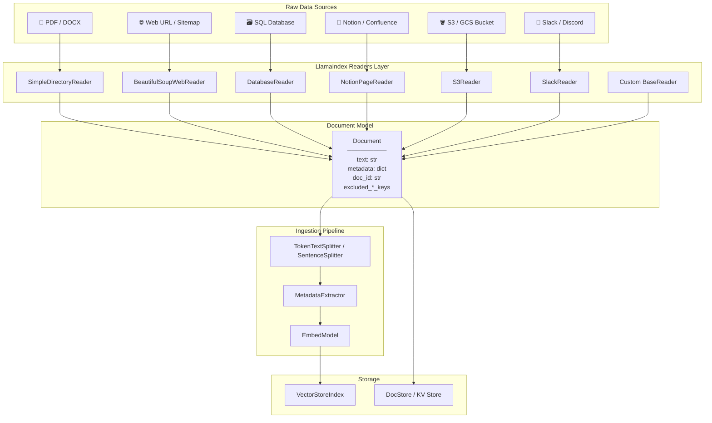
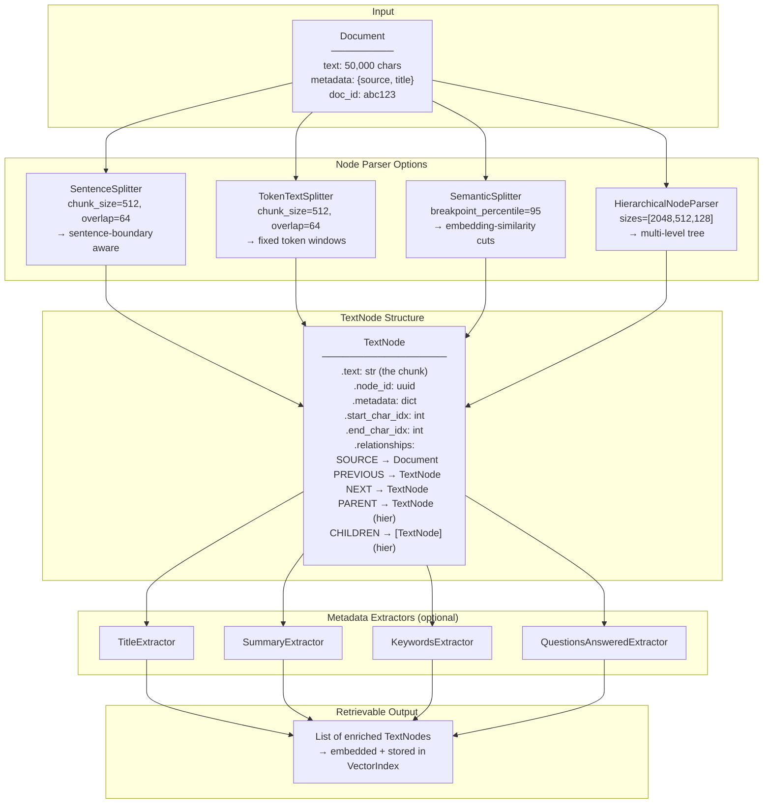
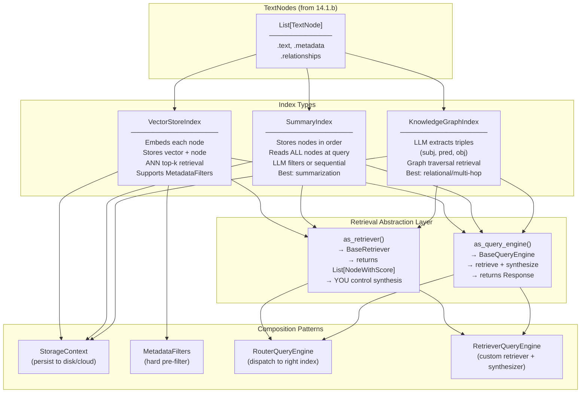
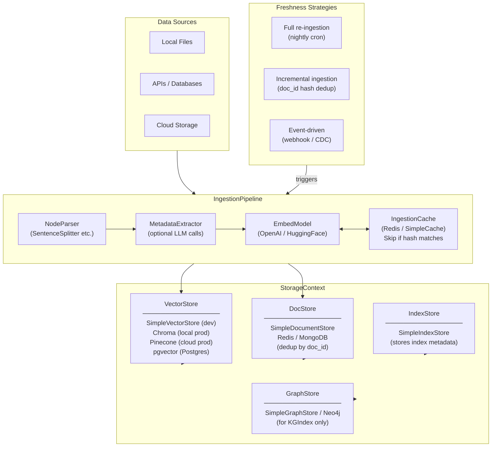

# Module 14 - LlamaIndex And Data-Centric GenAI Systems

> **Module time:** 28h  
> **Why this module matters:** LlamaIndex becomes especially valuable once your problem is deeply tied to data ingestion, documents, and retrieval workflows. Where LangChain optimizes for agent orchestration, LlamaIndex optimizes for making *heterogeneous data* available to LLMs with minimal friction — covering ingestion, chunking, indexing, querying, and routing under one coherent framework.

---

## Quick Topic Index

| # | Subtopic | Status |
|---|----------|--------|
| **Topic 14.1** | **Data Ingestion and Indexing in LlamaIndex (10h)** | |
| 14.1.a | Loaders, readers, and connectors | ✅ Done |
| 14.1.b | Node parsers, chunking strategies, and metadata extraction | ✅ Done |
| 14.1.c | Index types: VectorStoreIndex, SummaryIndex, KnowledgeGraph | ✅ Done |
| 14.1.d | Data-centric pipeline design choices | ✅ Done |
| **Topic 14.2** | **Querying, Retrieval, and Response Synthesis (10h)** | |
| 14.2.a | QueryEngine, RetrieverQueryEngine, and routing | 🔲 |
| 14.2.b | Retrieval modes: dense, sparse, hybrid, and reranking | 🔲 |
| 14.2.c | Response synthesizers and streaming | 🔲 |
| 14.2.d | Sub-question query engine and query decomposition | 🔲 |
| **Topic 14.3** | **Agents, Tools, and Advanced Patterns (8h)** | |
| 14.3.a | LlamaIndex agents and ReActAgent | 🔲 |
| 14.3.b | QueryEngineTool and ToolSpec integration | 🔲 |
| 14.3.c | LlamaIndex + LangChain + MCP interop | 🔲 |
| 14.3.d | Observability, callbacks, and production instrumentation | 🔲 |

**Covered so far:**
- 14.1.a — Loaders, readers, and connectors: SimpleDirectoryReader, LlamaHub connector ecosystem, custom BaseReader implementation, document model (Document/TextNode), metadata propagation, transformation pipeline, loader failure modes and production patterns
- 14.1.b — Parsing, nodes, and document representation: TextNode anatomy (text, metadata, relationships, char offsets), SentenceSplitter vs TokenTextSplitter vs SemanticSplitterNodeParser vs HierarchicalNodeParser, chunk size / overlap retrieval tradeoffs, NodeRelationship provenance chain, MetadataExtractor suite (Title, Summary, Keywords, QuestionsAnswered), auto-metadata enrichment patterns, chunking failure modes and debugging
- 14.1.c — Index types and retrieval abstractions: VectorStoreIndex (ANN-based top-k), SummaryIndex (full-scan summarization), KnowledgeGraphIndex (triple-based graph traversal), index selection decision framework, as_retriever() vs as_query_engine() interface, retrieval modes (default/embedding/llm), metadata filters, index composition and routing, production failure modes
- 14.1.d — Data-centric pipeline design choices: StorageContext anatomy (VectorStore, DocStore, IndexStore, GraphStore), persistent backends (Chroma, Pinecone, pgvector) vs SimpleVectorStore, IngestionPipeline transformation chain + IngestionCache, incremental vs full re-ingestion strategies, freshness patterns (polling/webhook/CDC/hybrid), multi-source fan-out with source isolation, ghost-node deletion, pipeline observability and cost control

---

## Topic 14.1: Data Ingestion and Indexing in LlamaIndex

> **Topic time:** 10h  
> Focus: Getting data *into* LlamaIndex cleanly — in a way that preserves structure, metadata, and retrievability.

---

## Subtopic 14.1.a: Loaders, Readers, and Connectors

### Reading Path + Level Tags

- **Beginner:** Read sections 1–2 and the Active Recall.
- **Intermediate:** Add sections 3–5 and the Hands-On Lab Build step.
- **Pro:** Complete the full Hands-On Lab (Build → Break → Measure → Explain) plus the capstone practice question.

---

### 0. Pre-Question Hook [Beginner]

**Pause:** Before reading — if you had to ingest a folder containing PDFs, Notion pages, a SQL table, and a live Slack export all into the same retrieval system, how would you approach normalizing them into a common format the LLM can query uniformly?

Think about it for 30 seconds. Then read on.

---

### 1. The Intuition (Plain English) [Beginner]

Imagine your retrieval system is a well-organized library. Before any book can be found, it needs to be:
1. **Acquired** (fetched from wherever it lives)
2. **Catalogued** (converted to a standard format with metadata tags)
3. **Shelved** (stored in a way that supports fast lookup)

LlamaIndex **Loaders and Readers** handle step 1. They are the acquisition layer — the connectors between the raw world (PDFs, databases, websites, APIs) and LlamaIndex's internal document model.

**The core mental model:**

```
Raw Source → [Reader/Loader] → Document objects → [Ingestion Pipeline] → Nodes → Index
```

Every reader, regardless of source, must output a list of `Document` objects. That's the contract. Once everything is a `Document`, LlamaIndex treats it uniformly — the PDF and the Notion page are the same thing to the rest of the system.

**Key terms (first use):**

- **`SimpleDirectoryReader`** — LlamaIndex's built-in loader for local files; auto-detects file types and dispatches to the appropriate parser.
- **`BaseReader`** — the abstract base class all readers implement; has one required method: `load_data() → List[Document]`.
- **`Document`** — LlamaIndex's core ingestion unit; wraps raw text with a `metadata` dict, a `doc_id`, and optional `excluded_*_metadata_keys`.
- **LlamaHub** — the community connector registry at llamahub.ai; provides 100+ pre-built readers for Notion, Slack, S3, GitHub, databases, etc.
- **`IngestionPipeline`** — LlamaIndex v0.10+ abstraction that chains transformations (splitting, embedding, metadata extraction) over a list of Documents.

**Analogy:** A reader is like a customs officer at a border. Every traveler (data source) arrives in different clothes, speaking different languages. The customs officer converts them all into the same passport format (Document) before they're allowed into the country (your index). The analogy breaks down here: a real customs officer can reject travelers; a reader must always produce valid Documents or raise an exception — partial output isn't allowed.

---

### 2. Visual Diagram (Mermaid) [Beginner]



**Key insight from the diagram:** Every source converges at the `Document` node. The ingestion pipeline only ever sees Documents — it has no knowledge of where the data came from. This is the power of the reader abstraction.

---

### 3. Real-World Industry Scenarios [Intermediate]

#### Scenario A: Enterprise Internal Knowledge Assistant (Healthcare)

**Context:** A large health system wants employees to query 50,000 internal policy PDFs, updated weekly. Some PDFs are scanned (image-only), others are native text. The system must cite the exact source document and page number in every answer.

**How Loaders fit in:**
- `SimpleDirectoryReader` with `filename_as_id=True` handles native PDFs via `pypdf`.
- For scanned PDFs, a custom reader wraps an OCR pipeline (e.g., AWS Textract) and returns `Document` objects with `metadata={"source": filename, "page": page_num, "ocr": True}`.
- Weekly re-ingestion uses `doc_id` deduplication: if a document's hash matches an existing `doc_id` in the docstore, it's skipped — saving embedding costs.

**Constraints:**
- **Latency:** Ingestion is offline/batch — no latency SLA. But OCR throughput matters (must complete weekly refresh within a 4h window).
- **Cost:** Embedding 50K docs × ~10 chunks each = 500K embedding API calls. Bad chunking or re-embedding unchanged docs inflates cost 3–5x.
- **Reliability:** A single malformed PDF must not crash the entire ingestion run — readers must be wrapped with per-document exception handling.
- **Security/Privacy:** `metadata["phi"]` flag must be set on patient-adjacent documents; downstream retrieval filter blocks non-authorized roles from seeing flagged nodes.

**What "good" looks like in production:**
- Incremental ingestion with hash-based deduplication — only new or changed docs are re-embedded.
- Metadata propagated all the way from file path to the final `TextNode` so citations work at query time.
- OCR failures logged with doc_id + file path; a dead-letter queue retries them.

---

#### Scenario B: Multi-Source Developer Documentation Assistant

**Context:** A developer tools company wants an assistant that can answer questions across GitHub READMEs, Confluence wiki pages, and Jira ticket history simultaneously.

**How Loaders fit in:**
- `GithubRepositoryReader` pulls markdown files from specified repos; metadata includes `repo`, `branch`, `file_path`.
- `ConfluenceReader` (LlamaHub) fetches pages via REST API; metadata includes `space_key`, `page_id`, `last_modified`.
- A custom `JiraReader` extends `BaseReader`, paginates the Jira search API, and returns one Document per issue with `metadata={"issue_key": ..., "status": ..., "assignee": ...}`.
- All three feed the same `IngestionPipeline` — the downstream retriever doesn't care which connector produced each Node.

**Constraints:**
- **Latency:** GitHub and Confluence data changes constantly. Stale retrieval is a real risk. A webhook-triggered partial re-ingestion pattern (vs full refresh) keeps freshness SLA under 5 minutes.
- **Cost:** Confluence spaces can have 100K+ pages. Selective loading by `space_key` and `last_modified` filter prevents full re-ingestion on every run.
- **Failure modes:** Jira API rate limits (429s) mid-ingestion can leave the index partially updated. The pipeline must checkpoint progress per source.
- **Security:** OAuth scopes per reader must be minimized — the Confluence reader should not have write permissions, only `read:confluence-content.all`.

**What "good" looks like in production:**
- Metadata-filtered retrieval: query routed to only `source=="confluence"` nodes when the question is policy-related.
- Freshness timestamp in metadata used by a post-retrieval filter to deprioritize nodes older than 30 days for changelog-style questions.
- Per-reader error isolation: if Jira reader fails, GitHub and Confluence nodes are still indexed and searchable.

---

### 4. System View (Think Like a Systems Engineer) [Intermediate]

**Inputs → Transformations → Outputs:**

```
INPUTS:
  - Raw files (path, bytes, stream) OR API credentials + query params
  - Optional: metadata overrides, doc_id seed, file_extractor mapping

TRANSFORMATIONS (inside reader):
  1. Source fetch: open file / call API / stream bytes
  2. Format parsing: PDF text extraction, HTML stripping, JSON field mapping
  3. Normalization: encode to UTF-8, strip binary artifacts
  4. Document construction: text + metadata dict + doc_id assignment

OUTPUTS:
  - List[Document]  — each with .text, .metadata, .doc_id, .excluded_*_keys
```

**Observability — what to log, trace, and measure:**

| Signal | What to capture | Why |
|--------|----------------|-----|
| `reader_type` | Which reader class ran | Debugging source of bad Documents |
| `doc_count` | Number of Documents returned | Detect empty loads (0 docs = silent failure) |
| `char_count_p50/p95` | Text length distribution | Detect abnormally short docs (OCR failure, empty pages) |
| `load_duration_ms` | Wall-clock time per reader | Detect slow sources (rate-limited APIs) |
| `error_doc_ids` | IDs of failed-to-load docs | Drive retry queue |
| `metadata_completeness` | % of docs with required keys | Catch schema drift from upstream APIs |

**Failure points — where it breaks and how it shows up:**

1. **Silent empty Document** — A PDF is image-only; `pypdf` extracts zero text. The Document is created but `.text == ""`. It silently passes through the pipeline, gets embedded (a near-zero vector), and pollutes your index with phantom nodes. *How it shows up:* retrieval returns irrelevant chunks with high cosine similarity because empty-string embeddings cluster weirdly.

2. **Metadata schema drift** — The Confluence API changes a field name across versions (e.g., `space.key` → `space_id`). Your reader's metadata mapping breaks silently; `metadata["space_key"]` is now `None` for all new docs. *How it shows up:* metadata-filtered queries return 0 results for new docs but work fine for old ones — extremely confusing to debug without per-doc metadata logging.

3. **Rate limit mid-batch** — A 429 from Notion/Jira at doc 847 of 1200 causes the reader to raise. Depending on error handling, you either lose all 1200 docs or only the remainder. *How it shows up:* index is partially updated; stale queries return old data for some topics and new data for others.

4. **Encoding corruption** — Windows-1252 encoded Word doc passed to a reader expecting UTF-8. Partial text extracted with replacement characters. Embeddings of corrupted text mismatch query embeddings at retrieval time. *How it shows up:* queries about content in those docs return low-confidence results.

---

### 5. System Design Flavor [Intermediate]

**Key components and interfaces:**

```
SimpleDirectoryReader(input_dir, file_extractor={".pdf": PDFReader()})
  └── .load_data() → List[Document]

LlamaHub Reader (e.g., NotionPageReader)
  └── NotionPageReader(integration_token=...)
  └── .load_data(page_ids=[...]) → List[Document]

Custom Reader
  └── class MyReader(BaseReader):
  └──   def load_data(self, **kwargs) → List[Document]

IngestionPipeline(transformations=[splitter, extractor, embed_model])
  └── .run(documents=[...]) → List[BaseNode]
  └── .arun(documents=[...]) → List[BaseNode]  # async

StorageContext.from_defaults(vector_store=..., docstore=...)
VectorStoreIndex(nodes, storage_context=...)
```

**Key tradeoffs:**

| Tradeoff | Option A | Option B | When to choose |
|----------|----------|----------|----------------|
| **Build vs buy reader** | Custom `BaseReader` subclass | LlamaHub connector | Use LlamaHub first — if it covers 90% of your schema, extend it. Write custom only when the API is internal or heavily non-standard. |
| **Eager vs lazy loading** | Load all docs upfront before pipeline | Stream docs through pipeline incrementally | Eager is simpler and fine for <10K docs. Lazy (generator-based) is necessary for 100K+ docs to avoid OOM. |
| **Rich metadata vs minimal metadata** | Store 20+ fields per doc | Store only source + timestamp | Rich metadata enables powerful filters but inflates index storage and slows metadata-filtered search. Start minimal, add fields as query patterns emerge. |

**Scaling consideration (10x traffic/data):**
At 10x document volume (e.g., 500K → 5M docs), loading everything into memory before ingestion becomes infeasible. The design shifts to:
- **Streaming ingestion:** readers yield batches; the pipeline processes and stores each batch before loading the next.
- **Parallel reader execution:** multiple readers run concurrently (e.g., one per data source) using `asyncio.gather` or a job queue.
- **Incremental/delta ingestion:** hash-based deduplication at the Document level — only changed docs enter the pipeline. `doc_id` becomes the dedup key stored in a lightweight KV store (Redis/DynamoDB).
- **Distributed embedding:** embedding is the bottleneck at scale. Fan out to multiple embedding API calls in parallel; use `async` pipeline with a semaphore to respect rate limits.

---

### 6. Common Mistakes + Debugging [Beginner → Intermediate]

#### Mistake 1: Not Setting `doc_id` — Causing Duplicate Indexing on Re-runs

**Symptom:** After re-ingesting updated documents, old and new versions both appear in the index. Queries return contradictory answers — one node says policy A, another says policy B (the updated version).

**Likely cause:** `doc_id` was not explicitly set (or was auto-generated with a random UUID each run). LlamaIndex has no way to know the new Document is an update to an existing one, so both get indexed.

**First debugging step:** Print `[doc.doc_id for doc in documents]` before ingestion. If IDs are UUIDs that change between runs, add `filename_as_id=True` (for file-based readers) or set `doc_id` to a deterministic hash of the source URL / primary key. Then use `VectorStoreIndex.refresh_ref_docs(documents)` to upsert rather than append.

---

#### Mistake 2: Trusting Reader Output Without Validating Text Length

**Symptom:** Your RAG answers are vague or miss obvious information. Some source documents seem "invisible" to the retriever.

**Likely cause:** Some Documents came through with empty or near-empty `.text` (e.g., scanned PDFs, password-protected files, encoding failures). They were embedded anyway (embedding a short/empty string produces a near-zero or degenerate vector), polluting the index.

**First debugging step:**
```python
empty_docs = [d for d in documents if len(d.text.strip()) < 50]
print(f"{len(empty_docs)} docs with < 50 chars: {[d.doc_id for d in empty_docs]}")
```
Filter or flag these before ingestion. For scanned PDFs, add an OCR fallback reader.

---

#### Mistake 3: Using `load_data()` Directly Instead of `IngestionPipeline` for Production

**Symptom:** Metadata populated by the reader is lost at the Node level. Chunks don't carry `source`, `page_number`, or other fields needed for citation. Also, no deduplication — re-running ingestion doubles index size.

**Likely cause:** Documents loaded via `reader.load_data()` were passed directly to `VectorStoreIndex.from_documents()` without going through an `IngestionPipeline` with `docstore` configured for dedup.

**First debugging step:** Check `node.metadata` on a sample Node after indexing. If source fields are absent, add a `MetadataExtractor` or verify `metadata_separator` and `excluded_embed_metadata_keys` config. Switch to `IngestionPipeline` with a `SimpleDocumentStore` for dedup-aware ingestion.

---

### 7. Hands-On Lab [Pro]

#### Build — Minimal Ingestion Pipeline with a Custom Reader

**Goal:** Ingest documents from two sources (local files + a mock API), normalize them into Documents, run through a pipeline, and inspect the resulting Nodes.

```python
# llamaindex_loader_lab.py
# Requirements: pip install llama-index-core llama-index-readers-file pypdf

import hashlib
from pathlib import Path
from typing import List, Dict, Any, Optional

from llama_index.core import Document, VectorStoreIndex, StorageContext
from llama_index.core.readers.base import BaseReader
from llama_index.core.ingestion import IngestionPipeline
from llama_index.core.node_parser import SentenceSplitter
from llama_index.readers.file import PDFReader


# ── 1. Custom Reader (mock API source) ────────────────────────────────────────
class MockAPIReader(BaseReader):
    """Simulates reading 'articles' from a REST API."""

    def __init__(self, api_endpoint: str = "https://mock.api/articles"):
        self.api_endpoint = api_endpoint

    def load_data(self, article_ids: Optional[List[str]] = None) -> List[Document]:
        # In prod: replace with requests.get(self.api_endpoint, params=...).json()
        mock_articles = [
            {"id": "art_001", "title": "LlamaIndex Basics",
             "body": "LlamaIndex is a data framework for LLM applications. "
                     "It provides tools for ingestion, indexing, and querying."},
            {"id": "art_002", "title": "Vector Stores Explained",
             "body": "Vector stores persist high-dimensional embeddings. "
                     "They support approximate nearest-neighbor search (ANN). "
                     "Popular options: Pinecone, Weaviate, Chroma, pgvector."},
        ]

        if article_ids:
            mock_articles = [a for a in mock_articles if a["id"] in article_ids]

        documents = []
        for article in mock_articles:
            # Deterministic doc_id based on article ID (dedup-safe across re-runs)
            doc_id = hashlib.md5(article["id"].encode()).hexdigest()
            doc = Document(
                text=article["body"],
                metadata={
                    "source": "mock_api",
                    "article_id": article["id"],
                    "title": article["title"],
                    "endpoint": self.api_endpoint,
                },
                doc_id=doc_id,
                excluded_llm_metadata_keys=["endpoint"],   # don't inject endpoint into LLM context
                excluded_embed_metadata_keys=["endpoint"],  # don't embed endpoint string
            )
            documents.append(doc)
        return documents


# ── 2. Local File Reader (using SimpleDirectoryReader) ─────────────────────────
def load_local_docs(directory: str) -> List[Document]:
    """Load PDFs and text files from a directory with deterministic doc_ids."""
    from llama_index.core import SimpleDirectoryReader

    if not Path(directory).exists():
        print(f"[WARN] Directory {directory} not found — skipping local docs.")
        return []

    reader = SimpleDirectoryReader(
        input_dir=directory,
        filename_as_id=True,          # doc_id = relative file path (dedup-safe)
        required_exts=[".pdf", ".txt"],
        recursive=True,
    )
    docs = reader.load_data()
    print(f"[INFO] Loaded {len(docs)} documents from {directory}")
    return docs


# ── 3. Validate Documents (catch empty-text failures before indexing) ──────────
def validate_documents(docs: List[Document], min_chars: int = 30) -> List[Document]:
    valid, skipped = [], []
    for doc in docs:
        if len(doc.text.strip()) >= min_chars:
            valid.append(doc)
        else:
            skipped.append(doc.doc_id)
    if skipped:
        print(f"[WARN] Skipped {len(skipped)} docs with < {min_chars} chars: {skipped}")
    return valid


# ── 4. Build Ingestion Pipeline ────────────────────────────────────────────────
def build_pipeline() -> IngestionPipeline:
    splitter = SentenceSplitter(chunk_size=256, chunk_overlap=32)
    # In prod: add OpenAIEmbedding() or HuggingFaceEmbedding() here
    return IngestionPipeline(transformations=[splitter])


# ── 5. Main ────────────────────────────────────────────────────────────────────
if __name__ == "__main__":
    # Load from API
    api_reader = MockAPIReader()
    api_docs = api_reader.load_data()
    print(f"[API] Loaded {len(api_docs)} documents")

    # Load from local files (create sample .txt files first)
    import tempfile, os
    with tempfile.TemporaryDirectory() as tmpdir:
        (Path(tmpdir) / "intro.txt").write_text(
            "LlamaIndex supports data ingestion from PDFs, databases, APIs, and "
            "many other sources. Its reader abstraction normalizes all inputs to "
            "the Document format before indexing."
        )

        local_docs = load_local_docs(tmpdir)

    # Combine and validate
    all_docs = api_docs + local_docs
    all_docs = validate_documents(all_docs)
    print(f"[PIPELINE] Processing {len(all_docs)} valid documents...")

    # Run ingestion pipeline
    pipeline = build_pipeline()
    nodes = pipeline.run(documents=all_docs)

    print(f"\n[RESULT] Produced {len(nodes)} Nodes from {len(all_docs)} Documents")
    for i, node in enumerate(nodes):
        print(f"\nNode {i+1}:")
        print(f"  node_id  : {node.node_id}")
        print(f"  text[:80]: {node.text[:80].strip()!r}")
        print(f"  metadata : {node.metadata}")
```

**Expected output (approximate):**
```
[API] Loaded 2 documents
[PIPELINE] Processing 3 valid documents...
[RESULT] Produced 4-6 Nodes from 3 Documents

Node 1:
  node_id  : <uuid>
  text[:80]: 'LlamaIndex is a data framework for LLM applications. It provides tools for in'
  metadata : {'source': 'mock_api', 'article_id': 'art_001', 'title': 'LlamaIndex Basics'}
```

---

#### Break — Force the Failure Modes

```python
# BREAK 1: Empty document passes through validator
bad_doc = Document(
    text="   ",          # only whitespace — simulates failed OCR
    metadata={"source": "scanned_pdf", "file": "policy_v2.pdf"},
    doc_id="empty_doc_001"
)
result = validate_documents([bad_doc])
# Expected: [WARN] Skipped 1 docs with < 30 chars: ['empty_doc_001']
# Without validate_documents(), this doc silently enters the index

# ──────────────────────────────────────────────────────────────────────────────

# BREAK 2: Re-run with same doc_id — observe dedup behavior (or lack of it)
# Run pipeline twice with same api_docs — without a docstore, both runs produce
# duplicate nodes. Add a SimpleDocumentStore to see dedup in action:
from llama_index.core.storage.docstore import SimpleDocumentStore

docstore = SimpleDocumentStore()
pipeline_with_dedup = IngestionPipeline(
    transformations=[SentenceSplitter(chunk_size=256)],
    docstore=docstore,
)
nodes_run1 = pipeline_with_dedup.run(documents=api_docs)
nodes_run2 = pipeline_with_dedup.run(documents=api_docs)   # same docs again
print(f"Run 1 nodes: {len(nodes_run1)}, Run 2 nodes: {len(nodes_run2)}")
# Expected: Run 2 produces 0 new nodes — doc_ids already in docstore

# ──────────────────────────────────────────────────────────────────────────────

# BREAK 3: Metadata schema drift — simulate field name change mid-pipeline
# Suppose your API changes "article_id" to "id" in a new version.
drifted_doc = Document(
    text="New article about embeddings.",
    metadata={"source": "mock_api_v2", "id": "art_003"},  # "article_id" is now "id"
    doc_id="art_003_hash"
)
# A metadata filter like: filters=[MetadataFilter(key="article_id", value="art_003")]
# will return 0 results for this doc. Log and alert on metadata key coverage.
```

---

#### Measure

```python
import time

# Measure ingestion throughput
docs_to_bench = api_docs * 50   # 100 simulated documents
pipeline_bench = build_pipeline()

t0 = time.perf_counter()
bench_nodes = pipeline_bench.run(documents=docs_to_bench)
elapsed = time.perf_counter() - t0

print(f"Docs: {len(docs_to_bench)}")
print(f"Nodes produced: {len(bench_nodes)}")
print(f"Total time: {elapsed:.2f}s")
print(f"Throughput: {len(docs_to_bench)/elapsed:.1f} docs/sec")

# Also measure metadata completeness
required_keys = {"source", "article_id", "title"}
covered = sum(1 for n in bench_nodes if required_keys.issubset(n.metadata.keys()))
print(f"Metadata completeness: {covered}/{len(bench_nodes)} nodes have all required keys")
```

---

#### Explain — Why It Works This Way

The reader abstraction exists to enforce a clean separation: **every transformation step downstream assumes its inputs are `Document` objects** — it never knows or cares about the original source format. This is the same reason Unix pipes work: every command reads stdin and writes stdout. If you break this contract (e.g., pass raw strings, skip metadata), the entire downstream pipeline silently degrades — embeddings embed the wrong content, filters match the wrong fields, citations reference wrong sources.

The `doc_id` deduplication design matters at scale: without it, every re-ingestion doubles your index. With it, the docstore acts as a cheap content-addressable cache — only changed documents pay the embedding cost. This is how you keep a 1M-document index fresh without burning $500/day on re-embedding.

---

### 8. Active Recall (Spaced Repetition) [Beginner → Pro]

**Q1 [Beginner]:** What is the single output contract every LlamaIndex reader must fulfill?

> **A:** Must return `List[Document]`. Each Document has `.text`, `.metadata`, and `.doc_id`. No partial returns — raise an exception on failure.

---

**Q2 [Beginner]:** What is `SimpleDirectoryReader` and what does `filename_as_id=True` do?

> **A:** `SimpleDirectoryReader` is LlamaIndex's built-in multi-format file loader. It auto-detects file types (.pdf, .txt, .docx, etc.) and dispatches to the appropriate parser. `filename_as_id=True` sets `doc_id` to the relative file path — making it deterministic across re-runs for deduplication.

---

**Q3 [Intermediate]:** You re-ingest 10,000 documents daily. After 3 days your index has 30,000 docs but only 10,000 are unique. What design change prevents this?

> **A:** Use `IngestionPipeline` with a `SimpleDocumentStore` (or any persistent docstore). The pipeline checks `doc_id` against the store before processing — existing IDs are skipped. Combine with `filename_as_id=True` or deterministic hash-based `doc_id` assignment.

---

**Q4 [Intermediate]:** Name two `Document` fields that control what goes into the LLM context vs. what gets embedded, and explain when you'd use each.

> **A:** `excluded_llm_metadata_keys` — metadata fields excluded from the text injected into the LLM prompt (e.g., internal IDs, API endpoints, debug fields you don't want the LLM to see). `excluded_embed_metadata_keys` — fields excluded from the text used for embedding (e.g., fields that are noisy for semantic similarity, like timestamps or record IDs that would skew the embedding space).

---

**Q5 [Pro]:** A custom reader for an internal API occasionally returns `Document` objects with `text=""` due to empty API responses. How does this silently damage your index, and what's the fix?

> **A:** Empty-string embeddings produce near-zero or degenerate vectors that cluster unpredictably in the embedding space. During retrieval, unrelated queries can match these phantom nodes with unexpectedly high cosine similarity. Fix: validate `len(doc.text.strip()) >= min_chars` after loading, before ingestion. Log and route empty docs to a dead-letter queue for investigation. Also consider adding a `RequiredTextTransform` step in the IngestionPipeline that raises/filters on empty text.

---

### 9. Practice

**Mini-exercise:** You have a Notion workspace with 200 pages and a local folder with 50 PDFs. Write the pseudocode (or real code) for a merged ingestion pipeline that:
1. Loads from both sources with deterministic `doc_id`s
2. Validates that no Document has fewer than 100 characters
3. Runs through a sentence splitter
4. Reports metadata completeness for `["source", "title", "last_modified"]`

> **Suggested answer:**
> ```python
> # 1. Load
> notion_docs = NotionPageReader(integration_token=TOKEN).load_data(page_ids=[...])
> # set doc_id = hash of page_id for each
> for d in notion_docs:
>     d.doc_id = hashlib.md5(d.metadata["page_id"].encode()).hexdigest()
>
> pdf_docs = SimpleDirectoryReader("./docs", filename_as_id=True,
>                                   required_exts=[".pdf"]).load_data()
>
> # 2. Validate
> all_docs = [d for d in notion_docs + pdf_docs if len(d.text.strip()) >= 100]
>
> # 3. Pipeline
> pipeline = IngestionPipeline(transformations=[SentenceSplitter(chunk_size=512)])
> nodes = pipeline.run(documents=all_docs)
>
> # 4. Metadata completeness
> required = {"source", "title", "last_modified"}
> ok = sum(1 for n in nodes if required.issubset(n.metadata))
> print(f"Completeness: {ok}/{len(nodes)} ({100*ok/len(nodes):.1f}%)")
> ```

---

**Capstone system design question:** Design an ingestion system for a company with 5 document sources (SharePoint, S3, Confluence, PostgreSQL, and a nightly CSV export). Sources update at different cadences (SharePoint: real-time, S3: hourly, Confluence: daily, PostgreSQL: per-transaction, CSV: nightly). How would you architect the readers, deduplication, and pipeline to keep the index fresh without over-spending on re-embedding?

> **Answer outline:**
> - **Per-source reader:** One `BaseReader` subclass per source with deterministic `doc_id` (URL hash, DB primary key, file path).
> - **Event-driven ingestion for high-frequency sources:** SharePoint → webhook → message queue → ingestion worker. PostgreSQL → CDC (Debezium) → queue → worker.
> - **Scheduled ingestion for batch sources:** S3 hourly cron, Confluence daily cron, CSV nightly cron.
> - **Deduplication:** Centralized `SimpleDocumentStore` backed by Redis or DynamoDB. All workers check `doc_id` before embedding.
> - **Incremental embedding:** Only changed or new docs enter the embedding step. Use `VectorStoreIndex.refresh_ref_docs()` for upserts.
> - **Cost guardrail:** Budget alert if embedding API calls exceed N/hour — triggered by unexpectedly high re-ingestion volume.
> - **Observability:** Per-source `doc_count`, `char_count_p50`, `load_duration_ms`, `error_count` logged to a time-series store. Alert on zero-doc loads or p95 char_count below threshold.

---

### 10. Production Reality Check (Mandatory) ✅

**If this fails in prod, what's the first thing we inspect?**

> **Check your Document objects before they enter the pipeline.**
>
> Run:
> ```python
> print(f"Total docs: {len(docs)}")
> print(f"Empty docs: {sum(1 for d in docs if len(d.text.strip()) < 50)}")
> print(f"Missing doc_ids: {sum(1 for d in docs if not d.doc_id)}")
> print(f"Sample metadata: {docs[0].metadata if docs else 'NO DOCS'}")
> ```
>
> The most common production failures trace back to: (1) **empty text** that passed silently, (2) **non-deterministic doc_ids** causing duplicate indexing, or (3) **metadata schema drift** causing downstream filters to return zero results. All three are visible by inspecting `List[Document]` before ingestion — this is your first and cheapest debugging checkpoint.

---

### 11. Curiosity Bridge (Mandatory) ✅

Readers get data *into* LlamaIndex — but raw Documents are rarely queryable as-is. A 50-page PDF becomes a single massive Document that blows past any LLM's context window. The next question is: **how do you break Documents into the right-sized, semantically coherent pieces, and how do you attach structured metadata to each chunk automatically?**

That's exactly what **Node Parsers and chunking strategies** solve — and the choices you make there (chunk size, overlap, semantic vs. fixed splitting) directly determine retrieval quality at query time. A bad chunking strategy can make a perfect reader useless.

---

### 12. Exit Check + Carry-Forward Review

**Exit check:** You're done with 14.1.a when you can write a custom `BaseReader` subclass for an internal API, explain how `doc_id` dedup prevents re-embedding costs, identify three silent failure modes in the ingestion layer, and configure `excluded_embed_metadata_keys` correctly.

---

**Carry-Forward Review (interleaved recall from Module 13):**

*Q: In MCP, what is the difference between a Tool and a Resource, and when would you expose data as a Resource instead of a Tool?*

> **A:** A Tool is a callable action (the LLM sends arguments, the server executes and returns a result — think function call). A Resource is an addressable, readable data artifact identified by a URI (think file or database record the client can read on demand). Expose as a Resource when: the data is stable between reads, addressable by a URI, large enough to cache, and needs subscription-based freshness notifications. Use a Tool when: the data requires computation, parameters vary per request, or the operation has side effects.

---

---

## Subtopic 14.1.b: Parsing, Nodes, and Document Representation

### Reading Path + Level Tags

- **Beginner:** Read sections 1–2 and the Active Recall.
- **Intermediate:** Add sections 3–5 and the Hands-On Lab Build step.
- **Pro:** Complete the full Hands-On Lab (Build → Break → Measure → Explain) plus the capstone practice question.

---

### 0. Pre-Question Hook [Beginner]

**Pause:** You have a 120-page legal contract loaded as a single `Document`. Your LLM has a 4K token context window and your retriever must return the 3 most relevant chunks for a given question. Before reading — how would you decide *where* to cut the document into chunks, and what information from the full document should each chunk carry so the LLM can answer with proper context?

Think for 30 seconds. Then read on.

---

### 1. The Intuition (Plain English) [Beginner]

A `Document` is a whole book. A **`TextNode`** is a single highlighted passage from that book — the unit your retriever actually works with.

The job of a **node parser** is to take that book and produce a list of passages, each small enough to fit in a retrieval context window, but coherent enough to answer a question on its own. It also has to preserve a *trail of breadcrumbs* so you always know which book a passage came from, which page it was on, and what passage came before and after it.

**The core mental model:**

```
Document (whole book)
  └── NodeParser (cutting strategy)
        └── TextNode[] (retrievable passages)
              ├── .text          — the chunk content
              ├── .metadata      — inherited + extracted fields
              ├── .relationships — links to source doc + prev/next nodes
              └── .start/end_char_idx — exact byte offsets into original text
```

**Key terms (first use):**

- **`TextNode`** — the atomic retrieval unit in LlamaIndex; a chunk of text plus full provenance metadata.
- **`NodeParser`** — base class for all splitting strategies; takes `List[Document]` and returns `List[BaseNode]`.
- **`SentenceSplitter`** — splits on sentence boundaries while respecting a `chunk_size` token limit; the most common general-purpose parser.
- **`TokenTextSplitter`** — splits purely by token count with a fixed overlap; fast but ignores semantic boundaries.
- **`SemanticSplitterNodeParser`** — uses embedding similarity between adjacent sentences to find *natural topic boundaries*; produces variable-size chunks that respect meaning.
- **`HierarchicalNodeParser`** — produces multi-level node trees (e.g., 2048 → 512 → 128 tokens); enables parent-child retrieval (retrieve small, read big).
- **`NodeRelationship`** — enum linking a node to its SOURCE document, PREVIOUS sibling, NEXT sibling, PARENT, and CHILDREN.
- **`MetadataExtractor`** — a pipeline transformation that calls an LLM to enrich each node's metadata (titles, summaries, keywords, hypothetical questions).
- **`chunk_size`** — the maximum token count per node; directly controls the precision/recall tradeoff at retrieval.
- **`chunk_overlap`** — the number of tokens repeated at the boundary between adjacent chunks; prevents context from being split mid-sentence across two nodes.

**Analogy:** A node parser is like a journal editor who takes a manuscript and cuts it into self-contained article segments. Each segment gets a byline (metadata), a page range (char offsets), and a note about what article came before and after it in the journal (NodeRelationship). The analogy breaks down here: a journal editor uses human judgment about where topics shift; most node parsers use mechanical rules (token count, sentence boundary) — only `SemanticSplitterNodeParser` approximates human-level topic sensing.

---

### 2. Visual Diagram (Mermaid) [Beginner]



**Key insight:** Every parser produces the same `TextNode` output format. The retriever and query engine never know *which parser* was used — they just consume nodes. This means you can swap chunking strategies without touching retrieval code.

---

### 3. Real-World Industry Scenarios [Intermediate]

#### Scenario A: Legal Contract Q&A System

**Context:** A law firm needs to answer questions like *"What are the indemnification clauses?"* and *"What is the notice period for contract termination?"* across 10,000 uploaded contracts.

**How node parsing fits in:**
- `SentenceSplitter(chunk_size=512, chunk_overlap=64)` is the baseline — legal language has long sentences, so sentence-boundary splitting keeps clauses intact better than fixed-token splits.
- `QuestionsAnsweredExtractor` is added to each node: it calls the LLM to generate 3 hypothetical questions each chunk answers. At query time, *the question embedding* matches the stored hypothetical questions rather than the raw clause text — dramatically improving recall for question-style queries.
- `NodeRelationship.SOURCE` metadata lets the system cite the exact contract filename + char offset range for every retrieved clause.

**Constraints:**
- **Latency:** Ingestion is offline. But `QuestionsAnsweredExtractor` makes an LLM call per node — 10,000 contracts × 20 chunks = 200,000 LLM calls. This needs async batching with rate-limit handling or it runs for days.
- **Cost:** MetadataExtractor calls add 50–80% to ingestion cost. Use them only on high-value document types; skip for FAQ pages or short records.
- **Failure modes:** Contracts with poor OCR produce nodes whose text is garbled. The LLM-generated hypothetical questions for those nodes are nonsense, actively polluting the index. Pre-validate text quality before metadata extraction.
- **What "good" looks like:** Retrieval returns the exact clause paragraph, not an abstract summary. `start_char_idx` / `end_char_idx` enable UI highlighting of the exact sentence in the original PDF.

---

#### Scenario B: Technical Documentation Assistant with Small-to-Big Retrieval

**Context:** A developer tools company has documentation pages that mix short code snippets with long conceptual explanations. Users ask both precise code questions (*"What's the syntax for X?"*) and broad conceptual questions (*"How does the auth system work?"*).

**How node parsing fits in:**
- `HierarchicalNodeParser(chunk_sizes=[2048, 512, 128])` produces three levels per document:
  - **128-token leaf nodes** — highly precise, match exact code snippets.
  - **512-token mid nodes** — match paragraph-level explanations.
  - **2048-token root nodes** — provide full context when a leaf node is retrieved.
- At retrieval, the `AutoMergingRetriever` retrieves leaf nodes, but when multiple siblings match the same query, it *merges up* to the parent node — returning a larger, more coherent chunk instead of several fragmented pieces.
- `TitleExtractor` adds the page title to every leaf node's metadata — so even the shortest code snippet carries `metadata["document_title"]` for citation.

**Constraints:**
- **Latency:** Three-level indexing triples node count vs. a flat approach. Vector store write time and storage scale accordingly. Pre-filter low-value pages (changelogs, boilerplate) before hierarchical parsing.
- **Precision vs. recall:** Leaf nodes (128 tokens) have high precision but miss context. Root nodes (2048 tokens) have high recall but exceed LLM context for short answers. The auto-merge step is the production-critical bridge.
- **What "good" looks like:** Precise code snippet retrieved, its parent section used as full context. The LLM answer is accurate *and* cites the correct documentation page.

---

### 4. System View (Think Like a Systems Engineer) [Intermediate]

**Inputs → Transformations → Outputs:**

```
INPUTS:
  - List[Document] (from reader layer)
  - Parser config: chunk_size, chunk_overlap, separator list
  - Optional: MetadataExtractor list, LLM for extraction, embed_model

TRANSFORMATIONS (inside node parser):
  1. Text segmentation: apply splitting strategy → raw chunks
  2. Char offset tracking: record start_char_idx / end_char_idx per chunk
  3. Metadata inheritance: copy parent Document.metadata to each TextNode
  4. Relationship assignment: SOURCE, PREVIOUS, NEXT (and PARENT/CHILDREN for hierarchical)
  5. node_id assignment: UUID per node (stable within a run; re-generated on re-parse unless seeded)
  6. [Optional] MetadataExtractor: LLM call per node → enrich metadata dict
  7. [Optional] Embedding: embed node text + metadata prefix → float vector

OUTPUTS:
  - List[TextNode] with full provenance, relationships, optional enriched metadata
```

**Observability — what to log, trace, and measure:**

| Signal | What to capture | Why |
|--------|----------------|-----|
| `node_count` | Total nodes produced per document | Detect over-splitting (1 doc → 500 nodes) or under-splitting (1 node per 100-page doc) |
| `tokens_p50 / p95` | Token length distribution of nodes | Validate chunk_size is actually respected; catch parser bugs |
| `relationship_completeness` | % of nodes with PREVIOUS + NEXT set | Missing relationships break sentence-window retrieval |
| `metadata_extractor_latency` | Wall-clock time per LLM extraction call | Budget-critical; p95 latency × node_count = total ingestion time |
| `metadata_extractor_error_rate` | % of nodes where extraction failed or returned empty | High error rate = LLM rate limit or malformed chunk |
| `chunk_overlap_violation` | % of adjacent node pairs with < expected overlap | Parser bug or separator list misconfiguration |

**Failure points — where it breaks and how it shows up:**

1. **Wrong chunk_size for the LLM's context window** — chunk_size=4096 tokens but your embedding model has a 512-token max. Tokens beyond 512 are silently truncated during embedding. The stored node text is longer than what was actually embedded. Retrieval misses relevant content. *How it shows up:* precision is acceptable but recall is mysteriously low for information in the second half of long chunks.

2. **Separator list mismatch** — `SentenceSplitter` uses sentence-end characters to find split points. If your documents use non-standard punctuation (e.g., Chinese periods `。`, em-dash sentence endings, legal clause numbering `§4.2`), the splitter can't find sentence boundaries and produces chunks the full `chunk_size` (never smaller). This bloats the index and loses granularity. *How it shows up:* node token distribution is bimodal — most nodes are either very short (headers) or exactly `chunk_size` (no split found).

3. **MetadataExtractor silently returns empty** — If the LLM call inside `TitleExtractor` or `SummaryExtractor` times out or the node text is too short for the LLM to summarize, the metadata key is set to `None` or `""`. Downstream filters on `metadata["section_title"]` return zero results. *How it shows up:* metadata-filtered queries work for 80% of nodes and silently return nothing for the rest.

4. **Re-parsing without stable node_ids** — If you re-run ingestion without seeding node_id generation, every node gets a new UUID. The vector store accumulates duplicate vectors — old and new embeddings for the same chunk, both with different IDs. *How it shows up:* vector store size grows unboundedly; retrieval returns near-duplicate results.

---

### 5. System Design Flavor [Intermediate]

**Key components and interfaces:**

```python
# Flat splitting
SentenceSplitter(chunk_size=512, chunk_overlap=64, separator=" ")
TokenTextSplitter(chunk_size=512, chunk_overlap=64)

# Semantic splitting (requires embed_model)
SemanticSplitterNodeParser(
    embed_model=embed_model,
    breakpoint_percentile_threshold=95,   # higher = fewer, larger chunks
)

# Hierarchical splitting
HierarchicalNodeParser.from_defaults(chunk_sizes=[2048, 512, 128])
# Pair with AutoMergingRetriever at query time

# Metadata extraction (adds LLM calls per node)
from llama_index.core.extractors import (
    TitleExtractor,           # infers section title from chunk content
    SummaryExtractor,         # LLM-generated 1-sentence summary per node
    KeywordExtractor,         # top-N keywords per node
    QuestionsAnsweredExtractor,  # N hypothetical questions the chunk answers
)

# Combined pipeline
IngestionPipeline(transformations=[
    SentenceSplitter(chunk_size=512, chunk_overlap=64),
    TitleExtractor(nodes=5),             # use 5 nodes of context for title inference
    QuestionsAnsweredExtractor(questions=3),
    OpenAIEmbedding(),
])
```

**Key tradeoffs:**

| Tradeoff | Option A | Option B | When to choose |
|----------|----------|----------|----------------|
| **Precision vs. recall** | Small chunks (128–256 tokens) | Large chunks (1024–2048 tokens) | Small chunks: high precision for specific lookups (code, clauses). Large chunks: higher recall for broad conceptual questions. Use hierarchical parsing to get both. |
| **Fixed vs. semantic splitting** | `TokenTextSplitter` (fast, deterministic) | `SemanticSplitterNodeParser` (slower, meaning-aware) | Fixed splitting for bulk/cheap ingestion where boundaries matter less. Semantic splitting when chunk coherence directly determines answer quality (research papers, legal docs). |
| **Raw vs. enriched nodes** | Nodes with only inherited metadata | Nodes with LLM-extracted titles, summaries, questions | Raw is fast and cheap — fine for simple keyword retrieval. Enriched nodes are expensive but significantly improve dense retrieval quality, especially for question-answering workloads. |

**Scaling consideration (10x data):**
At 10x document volume, `MetadataExtractor` becomes the bottleneck — it makes one LLM call per node. At 1M nodes, that's 1M LLM API calls for extraction alone. The design shifts to:
- **Selective enrichment:** Only run `QuestionsAnsweredExtractor` on high-priority document types; use cheaper rule-based metadata for bulk content.
- **Async extraction with concurrency control:** `IngestionPipeline.arun()` with a semaphore to parallelize LLM calls while respecting rate limits.
- **Caching extractor results:** Hash node text → cache extraction output in Redis. Re-parsing the same document reuses cached metadata without new LLM calls.
- **Tiered chunking:** Semantic splitting for the top 10% most-queried documents; fixed splitting for the rest.

---

### 6. Common Mistakes + Debugging [Beginner → Intermediate]

#### Mistake 1: Setting chunk_size Larger Than Your Embedding Model's Token Limit

**Symptom:** Retrieval precision is good for content near the beginning of long chunks but misses information in the second half of those chunks. Cosine similarity scores are lower than expected.

**Likely cause:** Your node parser creates nodes with 1024-token chunks, but your embedding model silently truncates input beyond its max (e.g., 512 tokens for `text-embedding-ada-002` older deployments or many open-source models). The embedding only represents the first half of the chunk.

**First debugging step:**
```python
from llama_index.core import Settings
print(Settings.embed_model.model_name)   # check which model
# Look up that model's max_input_tokens in docs
# Then:
max_tokens = [n for n in nodes if len(n.text.split()) > 450]
print(f"{len(max_tokens)} nodes exceed 450 words")
```
Fix: set `chunk_size` ≤ 80% of the embedding model's max token limit. Leave headroom for metadata prefix that also gets embedded.

---

#### Mistake 2: Using Default Separators on Non-English or Structured Documents

**Symptom:** Node token distribution is bimodal — most nodes are either tiny (3–10 tokens, just headers) or exactly `chunk_size` (splitter couldn't find any sentence boundary in the content). Retrieval quality is poor because neither extreme is useful.

**Likely cause:** `SentenceSplitter`'s default separator list (`[". ", "\n", " "]`) doesn't match your document's structure. Legal docs use `§` section markers, code files use newline-based structure, non-English docs use different punctuation.

**First debugging step:**
```python
import numpy as np
token_counts = [len(n.text.split()) for n in nodes]
print(f"min={min(token_counts)}, max={max(token_counts)}, "
      f"p50={np.percentile(token_counts,50):.0f}, p95={np.percentile(token_counts,95):.0f}")
# If p95 ≈ chunk_size and p50 is tiny → separator mismatch
```
Fix: customize `paragraph_separator` and `secondary_chunking_regex` parameters, or switch to `TokenTextSplitter` which always produces predictable sizes regardless of content structure.

---

#### Mistake 3: Ignoring NodeRelationship — Breaking Sentence-Window Retrieval

**Symptom:** You set up `SentenceWindowNodeParser` (which produces tiny 1-sentence nodes with `WINDOW` metadata of ±k surrounding sentences) but at query time you use a plain `VectorIndexRetriever` instead of `MetadataReplacementNodePostProcessor`. The LLM only sees the 1-sentence node text, not the surrounding window — answers are thin and lack context.

**Likely cause:** Retriever and post-processor were set up independently without connecting them. `NodeRelationship` and window metadata exist on the node but nothing reads them.

**First debugging step:** Print `nodes[0].metadata.get("window")` — if it's populated but not appearing in LLM context, you're missing `MetadataReplacementNodePostProcessor(target_metadata_key="window")` in your query engine's `node_postprocessors` list.

---

### 7. Hands-On Lab [Pro]

#### Build — Compare Chunking Strategies and Inspect Node Structure

```python
# node_parser_lab.py
# pip install llama-index-core llama-index-embeddings-openai

from llama_index.core import Document
from llama_index.core.node_parser import (
    SentenceSplitter,
    TokenTextSplitter,
    HierarchicalNodeParser,
    SentenceWindowNodeParser,
)
from llama_index.core.schema import NodeRelationship
import numpy as np

# ── Sample document (deliberately varied sentence lengths) ─────────────────────
SAMPLE_TEXT = """
LlamaIndex is a data framework for building LLM-powered applications.
It provides abstractions for data ingestion, indexing, and querying.

At its core, LlamaIndex introduces the concept of nodes — atomic units of
text that carry both content and metadata. Nodes are produced by splitting
documents using configurable node parsers.

The choice of node parser directly affects retrieval quality. A sentence
splitter preserves natural language boundaries. A token splitter is
predictable but may cut mid-sentence. A semantic splitter uses embedding
similarity to find topic shifts, producing variable-length but coherent chunks.

In production, the most important parameters are chunk_size (controls how
much text each node holds) and chunk_overlap (controls how many tokens are
repeated between adjacent nodes to prevent context from being cut off at
boundaries). These two parameters are the primary levers for the
precision-recall tradeoff in retrieval.

LlamaIndex also supports hierarchical parsing, where the same document
is represented at multiple granularities simultaneously. This enables
small-to-big retrieval: retrieve precise leaf nodes, then expand to parent
nodes for richer context when generating the final answer.
"""

doc = Document(text=SAMPLE_TEXT, metadata={"source": "llamaindex_intro", "author": "lab"})

# ── 1. SentenceSplitter ────────────────────────────────────────────────────────
sentence_parser = SentenceSplitter(chunk_size=128, chunk_overlap=16)
nodes_sentence = sentence_parser.get_nodes_from_documents([doc])

# ── 2. TokenTextSplitter ───────────────────────────────────────────────────────
token_parser = TokenTextSplitter(chunk_size=128, chunk_overlap=16)
nodes_token = token_parser.get_nodes_from_documents([doc])

# ── 3. HierarchicalNodeParser ──────────────────────────────────────────────────
hier_parser = HierarchicalNodeParser.from_defaults(chunk_sizes=[512, 128, 32])
nodes_hier = hier_parser.get_nodes_from_documents([doc])

# ── 4. SentenceWindowNodeParser ────────────────────────────────────────────────
window_parser = SentenceWindowNodeParser.from_defaults(
    window_size=3,                      # ±3 sentences stored in metadata
    window_metadata_key="window",
    original_text_metadata_key="original_text",
)
nodes_window = window_parser.get_nodes_from_documents([doc])

# ── Inspect results ────────────────────────────────────────────────────────────
def inspect_nodes(nodes, label):
    token_counts = [len(n.text.split()) for n in nodes]
    print(f"\n{'='*60}")
    print(f"Parser: {label}")
    print(f"  Total nodes   : {len(nodes)}")
    print(f"  Token counts  : min={min(token_counts)}, "
          f"max={max(token_counts)}, "
          f"p50={np.percentile(token_counts,50):.0f}, "
          f"p95={np.percentile(token_counts,95):.0f}")
    print(f"  Sample node 0 :")
    print(f"    text[:100]  : {nodes[0].text[:100].strip()!r}")
    print(f"    metadata    : {nodes[0].metadata}")
    print(f"    relationships: {list(nodes[0].relationships.keys())}")
    if nodes[0].start_char_idx is not None:
        print(f"    char range  : [{nodes[0].start_char_idx}, {nodes[0].end_char_idx}]")

inspect_nodes(nodes_sentence, "SentenceSplitter (chunk=128, overlap=16)")
inspect_nodes(nodes_token,    "TokenTextSplitter (chunk=128, overlap=16)")
inspect_nodes(nodes_hier,     "HierarchicalNodeParser (512/128/32)")
inspect_nodes(nodes_window,   "SentenceWindowNodeParser (window=3)")

# ── Inspect NodeRelationship chain for SentenceSplitter ──────────────────────
print("\n── Relationship chain (SentenceSplitter) ──")
for i, node in enumerate(nodes_sentence[:3]):
    source = node.relationships.get(NodeRelationship.SOURCE)
    prev   = node.relationships.get(NodeRelationship.PREVIOUS)
    nxt    = node.relationships.get(NodeRelationship.NEXT)
    print(f"Node {i}: source={source.node_id[:8] if source else None}, "
          f"prev={prev.node_id[:8] if prev else None}, "
          f"next={nxt.node_id[:8] if nxt else None}")

# ── Inspect hierarchical parent-child ─────────────────────────────────────────
from llama_index.core.node_parser import get_leaf_nodes, get_root_nodes
leaves = get_leaf_nodes(nodes_hier)
roots  = get_root_nodes(nodes_hier)
print(f"\n── Hierarchical structure ──")
print(f"  Root nodes  : {len(roots)}")
print(f"  Leaf nodes  : {len(leaves)}")
print(f"  Leaf text[:80]: {leaves[0].text[:80].strip()!r}")
parent_rel = leaves[0].relationships.get(NodeRelationship.PARENT)
if parent_rel:
    parent_node = next((n for n in nodes_hier if n.node_id == parent_rel.node_id), None)
    if parent_node:
        print(f"  Parent text[:80]: {parent_node.text[:80].strip()!r}")
```

---

#### Break — Force the Failure Modes

```python
# BREAK 1: chunk_size >> chunk_overlap=0 → adjacent nodes share no context
# A sentence split across the boundary of two nodes is unreadable in isolation
breaky_parser = SentenceSplitter(chunk_size=64, chunk_overlap=0)
nodes_no_overlap = breaky_parser.get_nodes_from_documents([doc])
print("\nBREAK 1 — No overlap. Last 30 chars of node 0:")
print(repr(nodes_no_overlap[0].text[-30:]))
print("First 30 chars of node 1:")
print(repr(nodes_no_overlap[1].text[:30]))
# Notice: the sentence may be cut mid-clause. With overlap=0, the retriever
# may return node 0 OR node 1 but not both — the clause is split across them.

# BREAK 2: chunk_size too small for MetadataExtractor context
# If chunk_size=32 tokens, the LLM has almost no content to extract a title from
tiny_parser  = SentenceSplitter(chunk_size=32, chunk_overlap=4)
tiny_nodes   = tiny_parser.get_nodes_from_documents([doc])
print(f"\nBREAK 2 — Tiny chunks ({len(tiny_nodes)} nodes). "
      f"Shortest node: {min(len(n.text.split()) for n in tiny_nodes)} tokens")
# QuestionsAnsweredExtractor on 10-token nodes generates meaningless questions
# increasing cost and polluting the metadata index

# BREAK 3: Verify metadata is inherited from parent Document
for n in nodes_sentence:
    assert "source" in n.metadata, f"Node {n.node_id} missing 'source' metadata!"
    assert "author" in n.metadata, f"Node {n.node_id} missing 'author' metadata!"
print("\nBREAK 3 — All nodes correctly inherited parent metadata. ✅")
# If this assertion fails, your parser is not propagating Document.metadata
# Fix: use parser.get_nodes_from_documents([doc]) not parser.get_nodes_from_text()
```

---

#### Measure

```python
import time

# Measure how chunk_size affects node count and distribution
for size, overlap in [(64, 8), (128, 16), (256, 32), (512, 64)]:
    p = SentenceSplitter(chunk_size=size, chunk_overlap=overlap)
    t0 = time.perf_counter()
    ns = p.get_nodes_from_documents([doc] * 100)   # 100x the doc for meaningful timing
    elapsed = time.perf_counter() - t0
    counts = [len(n.text.split()) for n in ns]
    print(f"chunk={size:4d} overlap={overlap:3d} | "
          f"nodes={len(ns):5d} | "
          f"p50={np.percentile(counts,50):5.0f} | "
          f"p95={np.percentile(counts,95):5.0f} | "
          f"{elapsed*1000:.1f}ms")

# Expected: smaller chunk_size → more nodes, lower p95, higher total embed cost
# The "precision-recall sweet spot" for most RAG systems is chunk_size=256–512
```

---

#### Explain — Why It Works This Way

Chunking is the single highest-leverage parameter in a RAG system — more so than the retriever algorithm or even the embedding model. Here's why:

**Too small (< 64 tokens):** Each node is semantically incomplete. A sentence without its preceding context is ambiguous. The LLM retrieves correct chunks but can't answer correctly because there's not enough context. Retrieval precision is high; answer quality is low.

**Too large (> 1024 tokens):** Each node contains multiple topics. A query about topic A retrieves a node that also contains topics B and C — the LLM sees irrelevant content, gets confused, and the answer is diluted. Retrieval recall is high; precision is low. Also, if the chunk exceeds the embedding model's token limit, the tail of the chunk is silently dropped.

**The `HierarchicalNodeParser` + `AutoMergingRetriever` pattern** solves this by decoupling retrieval granularity from answer generation granularity: retrieve small (high precision), then expand to parent (high recall for generation). This is why production systems at scale use hierarchical indexing — it avoids committing to a single chunk_size tradeoff.

---

### 8. Active Recall (Spaced Repetition) [Beginner → Pro]

**Q1 [Beginner]:** What is a `TextNode` and how does it differ from a `Document`?

> **A:** A `Document` is the full ingested unit from a source (a whole PDF, a Notion page). A `TextNode` is a sub-chunk of a Document — the atomic unit the retriever actually embeds and queries. A Document becomes multiple TextNodes through a NodeParser. TextNodes carry `NodeRelationship` links back to their source Document and to adjacent sibling nodes.

---

**Q2 [Beginner]:** What does `chunk_overlap` do and why does it matter?

> **A:** `chunk_overlap` repeats `N` tokens at the boundary between two adjacent chunks. Without overlap, a sentence split across chunk boundary N and chunk N+1 is unreadable in either chunk alone — the context is lost. With overlap, both chunks contain the bridging text, so whichever is retrieved still has enough context to be meaningful. Typical value: 10–15% of `chunk_size`.

---

**Q3 [Intermediate]:** When would you choose `SemanticSplitterNodeParser` over `SentenceSplitter`?

> **A:** Use `SemanticSplitter` when your documents have natural topic shifts within a single section — e.g., research papers, long blog posts, interview transcripts. It uses embedding cosine similarity between adjacent sentence groups to find where meaning changes, producing chunks that are semantically coherent even if different sizes. The tradeoff: it requires an embed_model at ingestion time (added cost + latency) and is non-deterministic (results vary slightly with embedding model version). Use `SentenceSplitter` for uniform, well-structured documents where sentence boundaries are reliable topic boundaries.

---

**Q4 [Intermediate]:** Name the 4 standard `MetadataExtractor` types in LlamaIndex and when each is most valuable.

> **A:** 
> - `TitleExtractor` — infers a section title from node content; valuable when source docs lack headings or when headings need to be propagated to every chunk for citation.
> - `SummaryExtractor` — LLM-generated 1-sentence summary per node; useful for SummaryIndex or when nodes are long and a short descriptor improves embedding quality.
> - `KeywordExtractor` — top-N keywords per node; improves sparse retrieval (BM25) and metadata filters by topic.
> - `QuestionsAnsweredExtractor` — generates N hypothetical questions each chunk can answer; the most powerful for question-answering workloads because query embeddings match these questions better than the raw chunk text (HyDE-like effect).

---

**Q5 [Pro]:** Explain the `HierarchicalNodeParser` + `AutoMergingRetriever` pattern. Why does it outperform flat chunking for broad conceptual questions?

> **A:** `HierarchicalNodeParser` creates three levels of nodes for the same document content: small leaf nodes (e.g., 128 tokens), medium mid nodes (512 tokens), and large root nodes (2048 tokens). Parent-child `NodeRelationship` links connect them. At query time, `AutoMergingRetriever` retrieves leaf nodes (high precision). If a threshold percentage of sibling leaves under the same parent all match the query, it *merges up* — returning the parent node instead of individual fragments. This means: for precise questions, you get a tight 128-token answer. For broad conceptual questions that span a section, the auto-merge kicks in and returns the full 2048-token section. Flat chunking forces a single size choice — hierarchical parsing sidesteps the tradeoff entirely.

---

### 9. Practice

**Mini-exercise:** You're building a RAG system over 5,000 research papers (average 8,000 words each). Each paper has sections: Abstract, Introduction, Methods, Results, Discussion. Your users ask both precise factual questions (*"What was the sample size in study X?"*) and broad synthesis questions (*"What methods are commonly used across these papers?"*).

Design your node parsing strategy: which parser(s) would you use, what chunk sizes, and would you add any MetadataExtractors? Justify each choice.

> **Suggested answer:**
> - **Parser:** `HierarchicalNodeParser(chunk_sizes=[1024, 256, 64])`. Research papers have well-defined sections; hierarchical parsing handles both precise factual queries (64-token leaves, exact stat retrieval) and broad synthesis queries (1024-token roots, full section context).
> - **Additional:** `SentenceWindowNodeParser` as an alternative if budget is tight — simpler than hierarchical, still enables window expansion.
> - **MetadataExtractors:** `TitleExtractor` (captures section name in every leaf node metadata) + `KeywordExtractor` (improves BM25 recall for technical terms). Skip `QuestionsAnsweredExtractor` for 5K papers × ~100 nodes each = 500K LLM calls — cost-prohibitive unless applied selectively to the most-queried papers.
> - **chunk_overlap:** 32–64 tokens at the leaf level. Methods sections often have multi-sentence descriptions that span chunk boundaries.

---

**Capstone system design question:** A legal tech company has 50,000 contracts with an average of 30 pages each. They need a system that can: (1) cite the exact paragraph and clause number for every retrieved result, (2) answer both narrow clause questions and broad contract-scope questions, (3) keep ingestion cost under $500 total. Design the full node parsing and metadata strategy.

> **Answer outline:**
> - **Parser:** `HierarchicalNodeParser(chunk_sizes=[2048, 512])` — two levels sufficient; 128-token leaves are too fragile for dense legal language.
> - **Char offset preservation:** `start_char_idx` / `end_char_idx` from the parser + `metadata["page_number"]` from the reader layer = exact citation capability.
> - **Clause number extraction:** Custom pre-processing regex that detects `§N.N` or `ARTICLE X` patterns and injects `metadata["clause_id"]` before node parsing.
> - **Metadata extractors:** `TitleExtractor` only (cheap, 1 call per ~5 nodes of context). Skip `QuestionsAnsweredExtractor` — 50K contracts × 60 nodes × 1 call = 3M LLM calls, far over budget.
> - **Cost estimate:** 50K contracts × 30 pages × ~200 tokens/page = 300M tokens to embed. At $0.0001/1K tokens ≈ $30 embedding cost. Parsing is CPU-only. `TitleExtractor` at ~1 call per 5 nodes × 3M nodes / 5 = 600K calls × ~500 tokens/call = 300M LLM tokens ≈ $150 at GPT-3.5 rates. Total ≈ $180 — well under budget.
> - **Dedup:** `IngestionPipeline` with docstore + hash-based `doc_id` from contract file path — prevents re-embedding on re-runs.

---

### 10. Production Reality Check (Mandatory) ✅

**If this fails in prod, what's the first thing we inspect?**

> **Inspect the node token distribution immediately after parsing — before embedding.**
>
> ```python
> import numpy as np
> token_counts = [len(n.text.split()) for n in nodes]
> print(f"Nodes: {len(nodes)}")
> print(f"p10={np.percentile(token_counts,10):.0f}, "
>       f"p50={np.percentile(token_counts,50):.0f}, "
>       f"p90={np.percentile(token_counts,90):.0f}, "
>       f"max={max(token_counts)}")
> ```
>
> If `p90 ≈ chunk_size` and `p10` is tiny → separator mismatch (splitter can't find boundaries).
> If `max > embedding_model_max_tokens` → chunks will be silently truncated during embedding.
> If `p50` is far below `chunk_size` → over-splitting; increase `chunk_size` or adjust separators.
>
> Node token distribution is the cheapest possible health check — it runs in milliseconds and catches the three most common chunking failures before you spend money on embeddings.

---

### 11. Curiosity Bridge (Mandatory) ✅

You now have clean, well-sized, metadata-enriched `TextNode` objects. But nodes living in a Python list aren't queryable — they need to be *organized* into a data structure that supports fast semantic lookup. The next question is: **which index type do you put them in, and does the answer change based on whether users ask point-lookup questions vs. aggregation questions vs. graph-traversal questions?**

That's what **Index Types** (VectorStoreIndex, SummaryIndex, KnowledgeGraphIndex) solve — and the choice is not cosmetic. A `SummaryIndex` reads every node at query time; a `VectorStoreIndex` reads only the top-k nearest neighbors. Pick the wrong one and you either miss facts or burn your entire token budget on a single query.

---

### 12. Exit Check + Carry-Forward Review

**Exit check:** You're done with 14.1.b when you can explain the `TextNode` anatomy from memory, choose between `SentenceSplitter` / `TokenTextSplitter` / `SemanticSplitter` / `HierarchicalNodeParser` for a given use case, identify a chunking misconfiguration from a node token distribution histogram, and configure `QuestionsAnsweredExtractor` with a cost-awareness justification.

---

**Carry-Forward Review (interleaved recall from 14.1.a):**

*Q: What is the output contract every LlamaIndex reader must fulfill, and what two Document-level fields control what gets embedded vs. what goes into the LLM prompt?*

> **A:** Every reader must return `List[Document]`. `excluded_embed_metadata_keys` controls which metadata fields are excluded from the text used for embedding (reducing noise in the embedding space). `excluded_llm_metadata_keys` controls which fields are excluded from the text injected into the LLM's prompt context (hiding internal/debug fields from the model).

---

## Subtopic 14.1.c: Index Types and Retrieval Abstractions

### Reading Path + Level Tags

- **Beginner:** Read sections 1–2 and the Active Recall.
- **Intermediate:** Add sections 3–5 and the Hands-On Lab Build step.
- **Pro:** Complete the full Hands-On Lab (Build → Break → Measure → Explain) plus the capstone practice question.

---

### 0. Pre-Question Hook [Beginner]

**Pause:** You have 10,000 enriched `TextNode` objects ready. A user asks: *"Summarize everything we know about Project Apollo."* Another asks: *"Who approved the budget for Project Apollo?"* — Before reading, do you think the same data structure should answer both questions? What tradeoffs would you face if you tried?

Think for 30 seconds. Then read on.

---

### 1. The Intuition (Plain English) [Beginner]

A node parser turns documents into passages. An **index** turns those passages into a *queryable data structure*. The index is the contract between your data and your retrieval strategy.

LlamaIndex has three core index types, each built for a different query shape:

| Index | Mental model | Best for |
|-------|-------------|----------|
| **`VectorStoreIndex`** | Library card catalogue — find the 5 most relevant cards by topic similarity | Precise point-lookup Q&A |
| **`SummaryIndex`** | Reading every book on the shelf one by one | Summarization, aggregation, "tell me everything about X" |
| **`KnowledgeGraphIndex`** | A map of connected facts: "Paris → capital of → France" | Multi-hop relational queries: "Who manages the team that owns service X?" |

The **retrieval abstraction** sits on top of any index via two methods:
- **`index.as_retriever()`** — returns a `BaseRetriever`; gives you raw nodes back. You control what happens next (post-processing, reranking, custom synthesis).
- **`index.as_query_engine()`** — returns a `BaseQueryEngine`; one call from query string to final answer. Retrieve + synthesize in one shot.

**Key terms (first use):**

- **`VectorStoreIndex`** — LlamaIndex's primary index; embeds each node and stores the vector; retrieval uses approximate nearest-neighbor (ANN) top-k similarity search.
- **`SummaryIndex`** — (formerly `ListIndex`) stores nodes in a flat ordered list; at query time reads *all* nodes, either sequentially or via LLM filtering; designed for summarization.
- **`KnowledgeGraphIndex`** — extracts `(subject, predicate, object)` triples from nodes using an LLM and stores them as a graph; retrieval traverses the graph to answer relational questions.
- **`as_retriever()`** — index method returning a `BaseRetriever`; the composable low-level retrieval interface.
- **`as_query_engine()`** — index method returning a `BaseQueryEngine`; end-to-end pipeline (retrieve → synthesize).
- **`StorageContext`** — bundles vector store, docstore, index store, and graph store into a single configurable unit; the key to persisting indexes to disk or cloud.
- **`MetadataFilters`** — applied at retrieval time on `VectorStoreIndex` to hard-filter which nodes are eligible based on exact-match metadata fields before ANN search runs.

**Analogy:** The three index types are like three different ways to organize a city's phone book. A `VectorStoreIndex` is an indexed contact list — search by name similarity, fast. A `SummaryIndex` is reading every entry aloud until you have a full picture — thorough but slow. A `KnowledgeGraphIndex` is a social network map — follow connections from one person to another. The analogy breaks down here: real phone books have only one organization strategy. LlamaIndex lets you build all three simultaneously over the same nodes and route queries to the right one at runtime.

---

### 2. Visual Diagram (Mermaid) [Beginner]



**Key insight:** Every index exposes the same `as_retriever()` / `as_query_engine()` interface. A `RouterQueryEngine` can sit in front of multiple indexes and dispatch each query to the right one — your application code never changes regardless of which index is underneath.

---

### 3. Real-World Industry Scenarios [Intermediate]

#### Scenario A: Enterprise HR Policy Chatbot — `VectorStoreIndex` + Metadata Filters

**Context:** A Fortune 500 HR team needs employees to query 2,000 policy documents across 12 business units. Each query should only return results for the employee's own business unit (strict data isolation). Questions are specific: *"What is the parental leave policy for full-time employees?"*

**How index type fits in:**
- `VectorStoreIndex` with a persistent `PineconeVectorStore` backend. Each node's metadata includes `{"business_unit": "engineering", "policy_type": "leave", "effective_date": "2024-01"}`.
- At query time, `MetadataFilters` hard-filters by `business_unit` before ANN search runs. An employee in Engineering never sees HR nodes from Finance — even if their query embedding is similar.
- `as_query_engine(similarity_top_k=5)` returns the top 5 nodes + synthesized answer in one call.

**Constraints:**
- **Latency:** ANN search on Pinecone is 10–50ms. Adding a metadata pre-filter adds negligible overhead (it's pushed down into the vector store's native filter). Total query latency target: < 2 seconds end-to-end.
- **Cost:** Only the top-k=5 nodes are sent to the LLM for synthesis. Contrast with `SummaryIndex` — which would send all 2,000 policy nodes per query, burning ~400K tokens/query. `VectorStoreIndex` is 99% cheaper for point-lookup queries.
- **Failure modes:** If `business_unit` metadata is missing from some nodes (ingestion bug), those nodes become globally visible — a data isolation breach. The ingestion layer *must* validate metadata completeness as a security control.
- **What "good" looks like:** Query returns the exact policy clause, cites `{"source": "HR_Leave_Policy_v3.pdf", "page": 4}`, and is filtered to the correct BU. Response synthesized from ≤5 nodes in < 2 seconds.

---

#### Scenario B: Quarterly Earnings Report Summarizer — `SummaryIndex`

**Context:** A financial analyst team has 20 earnings call transcripts (each ~8,000 tokens) and needs to generate a single synthesized summary: *"What are the common themes across all Q3 2024 earnings calls?"*

**How index type fits in:**
- `SummaryIndex` over the 20 transcript documents (each as a set of nodes). The query engine reads *all* nodes — every sentence of every transcript — and the LLM synthesizes a cross-document summary.
- `SummaryIndex.as_query_engine(response_mode="tree_summarize")` uses a recursive summarization tree: nodes → chunk summaries → summaries of summaries → final answer. This avoids sending 160K tokens to the LLM in a single call (which would overflow context and cost a fortune).
- `response_mode="accumulate"` would concatenate individual answers per node — useful when you want granular per-document responses rather than a synthesized narrative.

**Constraints:**
- **Latency:** Reading all nodes is inherently slow. 20 transcripts × ~16 nodes each = 320 LLM calls in `tree_summarize` mode. Async synthesis with `aquery()` reduces wall-clock time from minutes to ~30 seconds via parallel LLM calls.
- **Cost:** `tree_summarize` = O(n log n) LLM calls. `accumulate` = O(n) calls. Both are expensive for large corpora — reserve `SummaryIndex` for < 500 nodes or use it on a pre-filtered subset (e.g., after a `VectorStoreIndex` narrows candidates to 20 nodes).
- **Failure modes:** Using `SummaryIndex` on 10,000 nodes without size awareness burns $50+ per query and times out. Always set `max_nodes_per_query` or pair with an upstream retriever that pre-filters.
- **What "good" looks like:** A coherent multi-paragraph synthesis with cross-document themes, not a list of bullet points from individual docs. `tree_summarize` mode + a well-engineered summary prompt achieves this.

---

#### Scenario C: IT Dependency Mapping — `KnowledgeGraphIndex`

**Context:** An ops team has 500 runbooks describing service dependencies: *"ServiceA depends on DatabaseB, which is managed by TeamC."* They need to answer: *"If DatabaseB goes down, what services are affected and who do I call?"*

**How index type fits in:**
- `KnowledgeGraphIndex` extracts triples like `(ServiceA, depends_on, DatabaseB)` and `(DatabaseB, managed_by, TeamC)` from the runbook nodes.
- At query time: *"What services depend on DatabaseB?"* → graph traversal finds all nodes with `predicate=depends_on, object=DatabaseB` → returns `ServiceA`, `ServiceC`, `ServiceF`.
- Multi-hop: *"Who manages the service that ServiceA depends on?"* → traverse `ServiceA → depends_on → DatabaseB → managed_by → TeamC`. A `VectorStoreIndex` cannot answer this — it has no relational traversal capability.

**Constraints:**
- **Latency:** Triple extraction at ingestion time is LLM-heavy (one call per node). But query-time traversal is fast (graph lookup, not ANN). Ingestion is slow; queries are fast.
- **Cost:** Triple extraction = 1 LLM call per node × 500 runbooks × ~15 nodes = 7,500 LLM calls at ingestion. Use a cheaper model (GPT-3.5 / Claude Haiku) for extraction; the triples are structured and don't require the most capable model.
- **Failure modes:** LLM-extracted triples contain errors (hallucinated relationships, wrong entity names). A `ServiceA → owns → DatabaseB` vs `ServiceA → depends_on → DatabaseB` distinction matters. Always validate extracted triples against a known schema before storing.
- **What "good" looks like:** Multi-hop query correctly traverses 3 relationship hops and returns the on-call team. Triple accuracy > 95% validated against the ground-truth dependency map.

---

### 4. System View (Think Like a Systems Engineer) [Intermediate]

**Inputs → Transformations → Outputs per index type:**

```
VectorStoreIndex:
  INPUTS:   List[TextNode] + embed_model + vector_store backend
  BUILD:    embed(node.text + metadata_prefix) → store(vector, node_id, metadata) in vector store
  QUERY:    embed(query_str) → ANN search(top_k, filters) → List[NodeWithScore]
  OUTPUTS:  ranked nodes with similarity scores

SummaryIndex:
  INPUTS:   List[TextNode] (order preserved)
  BUILD:    store nodes in ordered list (no embedding at build time by default)
  QUERY:    iterate all nodes OR LLM-filter by relevance → pass to response synthesizer
  OUTPUTS:  synthesized response from all (or filtered) nodes

KnowledgeGraphIndex:
  INPUTS:   List[TextNode] + LLM (for extraction) + graph store backend
  BUILD:    LLM(node.text) → extract List[(subj,pred,obj)] → store in graph
  QUERY:    LLM parses query → keyword/entity match → graph traversal → retrieve subgraph nodes
  OUTPUTS:  nodes matching relational traversal path + synthesized answer
```

**Observability — what to log, trace, and measure:**

| Signal | What to capture | Why |
|--------|----------------|-----|
| `index_type` | Which index answered the query | Required for per-index cost and latency tracking |
| `nodes_retrieved` | Count of nodes returned before synthesis | High count on VectorStoreIndex = top_k too large; high count on SummaryIndex = expected |
| `similarity_scores` | p50 / min score of retrieved nodes (VectorStoreIndex) | Low scores (< 0.7) = query is semantically far from corpus |
| `filter_hit_rate` | % of nodes passing MetadataFilters pre-filter | Near-zero = filter too strict or metadata missing |
| `synthesis_tokens` | Tokens sent to LLM for synthesis | Primary cost driver; controls budget |
| `graph_traversal_depth` | Hops taken in KnowledgeGraph query | Deep traversals are slow; cap at 3 hops in prod |
| `triple_extraction_errors` | % of nodes where KGIndex extraction returned empty | High rate = LLM prompt needs tuning or nodes too short |

**Failure points — where it breaks and how it shows up:**

1. **Wrong index for the query shape** — Using `VectorStoreIndex` for a summarization query (*"Summarize all incidents from last quarter"*): top-k=5 retrieves only 5 nodes — the answer misses 90% of incidents. Answer looks confident but is factually incomplete. *How it shows up:* users report the system "misses things" even though individual retrievals seem correct.

2. **`SummaryIndex` on a large corpus without size guard** — Using `SummaryIndex` on 5,000 nodes without a max_nodes limit. Every query sends 5,000 node texts to the LLM synthesis step: context overflow + $40/query cost. *How it shows up:* first query works (demo corpus was small); production query times out or returns a 400 "context length exceeded" error.

3. **Stale index after re-ingestion** — Nodes are re-parsed (new chunks) but the `VectorStoreIndex` still holds the old vectors keyed to old `node_ids`. Queries return outdated content mixed with new content. *How it shows up:* answers are inconsistent — sometimes fresh, sometimes stale — depending on which node_ids the ANN search returns. Fix: use `index.refresh_ref_docs()` or full index rebuild with dedup-aware `IngestionPipeline`.

4. **MetadataFilters silently over-filtering** — A filter on `metadata["status"] == "active"` is applied but 30% of nodes were ingested without the `status` field. Those nodes are excluded from every query silently. *How it shows up:* `filter_hit_rate` drops; users can't find content they know exists.

---

### 5. System Design Flavor [Intermediate]

**Key components and interfaces:**

```python
from llama_index.core import (
    VectorStoreIndex, SummaryIndex, KnowledgeGraphIndex,
    StorageContext, Settings,
)
from llama_index.core.vector_stores.types import MetadataFilters, MetadataFilter

# ── VectorStoreIndex ───────────────────────────────────────────────────────────
# Build
vi = VectorStoreIndex(nodes, storage_context=storage_context)

# Retrieve only (composable)
retriever = vi.as_retriever(
    similarity_top_k=5,
    filters=MetadataFilters(filters=[
        MetadataFilter(key="business_unit", value="engineering"),
        MetadataFilter(key="status", value="active"),
    ])
)
nodes_with_scores = retriever.retrieve("What is the parental leave policy?")

# End-to-end query engine
query_engine = vi.as_query_engine(similarity_top_k=5)
response = query_engine.query("What is the parental leave policy?")
print(response.source_nodes)   # nodes used for synthesis

# ── SummaryIndex ───────────────────────────────────────────────────────────────
si = SummaryIndex(nodes)
summary_engine = si.as_query_engine(response_mode="tree_summarize")
response = summary_engine.query("Summarize common themes across all documents.")

# ── KnowledgeGraphIndex ────────────────────────────────────────────────────────
from llama_index.core import KnowledgeGraphIndex
kg = KnowledgeGraphIndex(
    nodes,
    max_triplets_per_chunk=5,   # LLM extracts up to 5 triples per node
    include_embeddings=True,    # hybrid: embedding + graph traversal
)
kg_engine = kg.as_query_engine(
    include_text=True,
    retriever_mode="hybrid",    # "keyword" | "embedding" | "hybrid"
    similarity_top_k=3,
)
response = kg_engine.query("Who manages the service that ServiceA depends on?")

# ── RouterQueryEngine — dispatch to the right index ───────────────────────────
from llama_index.core.tools import QueryEngineTool
from llama_index.core.query_engine import RouterQueryEngine
from llama_index.core.selectors import LLMSingleSelector

tools = [
    QueryEngineTool.from_defaults(
        query_engine=vi.as_query_engine(),
        description="For specific policy lookups and point-retrieval questions.",
    ),
    QueryEngineTool.from_defaults(
        query_engine=si.as_query_engine(response_mode="tree_summarize"),
        description="For summarization and aggregation questions across all documents.",
    ),
]
router = RouterQueryEngine(
    selector=LLMSingleSelector.from_defaults(),
    query_engine_tools=tools,
)
response = router.query("Summarize all incidents from last quarter.")
# Router LLM picks SummaryIndex; specific queries pick VectorStoreIndex

# ── StorageContext — persist everything ───────────────────────────────────────
from llama_index.core import load_index_from_storage
from llama_index.core.storage.storage_context import StorageContext

sc = StorageContext.from_defaults(persist_dir="./storage")
vi = VectorStoreIndex(nodes, storage_context=sc)
sc.persist()  # saves to disk

# Reload
sc2 = StorageContext.from_defaults(persist_dir="./storage")
vi_loaded = load_index_from_storage(sc2)
```

**Key tradeoffs:**

| Tradeoff | Option A | Option B | When to choose |
|----------|----------|----------|----------------|
| **Precision vs. coverage** | `VectorStoreIndex` top-k=3 (fast, cheap, precise) | `SummaryIndex` full-scan (thorough, expensive) | VectorStoreIndex for Q&A. SummaryIndex for synthesis. Use RouterQueryEngine to get both. |
| **Embedding cost at build vs. query** | `VectorStoreIndex` — pays embedding cost at build time, near-free at query time | `SummaryIndex` — no build-time embedding, pays LLM cost at every query | For high-query-volume systems, pay once at build (VectorStoreIndex). For low-volume batch analytics, pay per query (SummaryIndex). |
| **Structured vs. semantic retrieval** | `VectorStoreIndex` + `MetadataFilters` (semantic + hard filter) | `KnowledgeGraphIndex` (relational graph traversal) | Use metadata filters when relationships are flat attributes on nodes. Use KG when relationships *are* the query (multi-hop, entity links). |

**Scaling consideration (10x data):**
At 10x node volume (e.g., 1M nodes), three bottlenecks emerge:
- **`VectorStoreIndex` build time:** Embedding 1M nodes × 512 dims at $0.0001/1K tokens ≈ $100. Use a persistent vector store (Pinecone, Weaviate, pgvector) with batched upserts, not an in-memory `SimpleVectorStore`.
- **`SummaryIndex` query cost:** Full-scan over 1M nodes is impossible. At 10x scale, SummaryIndex is only viable if you pre-filter to a small subset first (e.g., retrieve 50 candidates with VectorStoreIndex, then summarize those 50 with SummaryIndex — the "two-stage" pattern).
- **`KnowledgeGraphIndex` extraction:** 1M nodes × 1 LLM call each = 1M extraction calls. Use a smaller model (GPT-3.5 / Haiku) and rate-limited async batching. Store the graph in a dedicated graph DB (Neo4j) for traversal performance.

---

### 6. Common Mistakes + Debugging [Beginner → Intermediate]

#### Mistake 1: Using `VectorStoreIndex` for Summarization Queries

**Symptom:** The query *"Summarize all customer complaints from last month"* returns 5 bullet points. Users report the summary is incomplete — it misses obvious patterns that appear frequently in the data.

**Likely cause:** `VectorStoreIndex` with `top_k=5` was used. Only 5 nodes were retrieved and synthesized. The 95% of complaint nodes that weren't in the top-5 were never seen by the LLM.

**First debugging step:**
```python
response = query_engine.query("Summarize all customer complaints from last month")
print(f"Source nodes used: {len(response.source_nodes)}")
# If source_nodes < 10 for a "summarize all" query → wrong index
# Fix: switch to SummaryIndex or increase top_k to 50+ with VectorStoreIndex
# Better fix: RouterQueryEngine that routes "summarize" queries to SummaryIndex
```

---

#### Mistake 2: Not Persisting the Index — Rebuilding from Scratch on Every Restart

**Symptom:** App startup takes 5–10 minutes every time it launches. Embedding API costs are incurred on every deployment. The "cached" index is never actually cached.

**Likely cause:** Index built with `VectorStoreIndex.from_documents(docs)` inside the application startup path without checking for an existing persisted index. Every cold start rebuilds.

**First debugging step:**
```python
import os
PERSIST_DIR = "./storage"
if os.path.exists(PERSIST_DIR):
    sc = StorageContext.from_defaults(persist_dir=PERSIST_DIR)
    index = load_index_from_storage(sc)
    print("Loaded from disk")
else:
    index = VectorStoreIndex(nodes, storage_context=StorageContext.from_defaults())
    index.storage_context.persist(persist_dir=PERSIST_DIR)
    print("Built and persisted")
```
Fix: always check for an existing index before building. Use a persistent vector store (Pinecone / Chroma) in production — `SimpleVectorStore` is in-memory only and doesn't survive restarts.

---

#### Mistake 3: Metadata Filters That Silently Over-Filter

**Symptom:** Users report that they can't find documents they uploaded. Queries return empty results or a generic "I couldn't find relevant information" response. The data is definitely in the index.

**Likely cause:** A `MetadataFilter` is applied to every query (e.g., `status == "active"`) but some nodes were ingested before the `status` field was added to the ingestion pipeline. Those older nodes have no `status` field and are excluded from every ANN search silently.

**First debugging step:**
```python
# Sample 20 nodes and check metadata key coverage
sample = index.docstore.docs   # dict of node_id → TextNode
keys_coverage = {}
for node_id, node in list(sample.items())[:100]:
    for k in node.metadata:
        keys_coverage[k] = keys_coverage.get(k, 0) + 1
print(keys_coverage)
# If "status" appears in only 70/100 nodes → 30% are silently excluded by the filter
```
Fix: add a default value for required filter fields in the ingestion pipeline. Re-ingest or patch metadata for older nodes.

---

### 7. Hands-On Lab [Pro]

#### Build — Three Indexes, Same Nodes, Different Query Shapes

```python
# index_types_lab.py
# pip install llama-index-core llama-index-embeddings-openai
# Note: KnowledgeGraphIndex requires an LLM (uses GPT-3.5/4 for triple extraction)

from llama_index.core import (
    Document, VectorStoreIndex, SummaryIndex,
    Settings, StorageContext,
)
from llama_index.core.node_parser import SentenceSplitter
from llama_index.core.vector_stores.types import MetadataFilters, MetadataFilter
import os

# ── Sample corpus: 6 documents across 2 departments ───────────────────────────
DOCS = [
    Document(text="Engineering leave policy: Full-time engineers get 20 days PTO annually. "
                  "Parental leave is 16 weeks fully paid. Remote work is allowed 3 days/week.",
             metadata={"dept": "engineering", "type": "leave", "status": "active"}),
    Document(text="Engineering expense policy: Expenses up to $500 need manager approval. "
                  "Expenses above $500 require VP approval. All receipts must be submitted within 30 days.",
             metadata={"dept": "engineering", "type": "expense", "status": "active"}),
    Document(text="Finance leave policy: Finance employees get 18 days PTO annually. "
                  "Parental leave is 12 weeks. Emergency leave up to 5 days is available.",
             metadata={"dept": "finance", "type": "leave", "status": "active"}),
    Document(text="Finance expense policy: All expenses require pre-approval. "
                  "Travel expenses above $1000 need CFO sign-off. Receipts due within 14 days.",
             metadata={"dept": "finance", "type": "expense", "status": "active"}),
    Document(text="Q3 2024 Incident Summary: Three P1 incidents occurred. "
                  "Root cause: database connection pool exhaustion. Resolution: pool size increased.",
             metadata={"dept": "ops", "type": "incident", "status": "archived"}),
    Document(text="Q4 2024 Incident Summary: Two P1 incidents occurred. "
                  "Root cause: deployment pipeline timeout. Resolution: timeout thresholds increased.",
             metadata={"dept": "ops", "type": "incident", "status": "archived"}),
]

# ── Parse into nodes ───────────────────────────────────────────────────────────
parser = SentenceSplitter(chunk_size=256, chunk_overlap=32)
nodes = parser.get_nodes_from_documents(DOCS)
print(f"Total nodes: {len(nodes)}")
for n in nodes:
    print(f"  [{n.metadata.get('dept')}/{n.metadata.get('type')}] {n.text[:60].strip()!r}")

# ── Index 1: VectorStoreIndex (skip embedding for lab — use MockEmbedding) ────
# For a real run: set Settings.embed_model = OpenAIEmbedding()
from llama_index.core.embeddings import resolve_embed_model
# Use a local mock embedding for cost-free testing
# pip install llama-index-embeddings-huggingface  (optional, for real embeddings)
# Settings.embed_model = "local:BAAI/bge-small-en-v1.5"

vi = VectorStoreIndex(nodes)

# ── Point-lookup with metadata filter (Engineering only) ──────────────────────
eng_retriever = vi.as_retriever(
    similarity_top_k=3,
    filters=MetadataFilters(filters=[
        MetadataFilter(key="dept", value="engineering"),
    ])
)
results = eng_retriever.retrieve("What is the parental leave policy?")
print(f"\n── VectorStoreIndex (dept=engineering filter) ──")
print(f"Retrieved {len(results)} nodes:")
for r in results:
    print(f"  score={r.score:.3f} | dept={r.node.metadata.get('dept')} | {r.node.text[:80].strip()!r}")

# ── Index 2: SummaryIndex (for cross-document synthesis) ──────────────────────
si = SummaryIndex(nodes)
# Note: without an LLM configured, this will use the default Settings.llm
# For testing without API key: set response_mode="no_text" to just see node ordering
summary_retriever = si.as_retriever()
summary_nodes = summary_retriever.retrieve("Summarize all incidents")
print(f"\n── SummaryIndex retriever ──")
print(f"Retrieved {len(summary_nodes)} nodes (SummaryIndex returns ALL nodes by default)")

# ── Check node ordering and metadata on SummaryIndex ─────────────────────────
incident_nodes = [n for n in summary_nodes if n.node.metadata.get("type") == "incident"]
print(f"Incident nodes in corpus: {len(incident_nodes)}")

# ── Persistence round-trip ─────────────────────────────────────────────────────
PERSIST_DIR = "/tmp/llamaindex_lab_storage"
sc = StorageContext.from_defaults()
vi_persist = VectorStoreIndex(nodes, storage_context=sc)
sc.persist(persist_dir=PERSIST_DIR)
print(f"\n── Persistence ──")
print(f"Index persisted to {PERSIST_DIR}")
print(f"Files: {os.listdir(PERSIST_DIR)}")

# Reload
from llama_index.core import load_index_from_storage
sc2 = StorageContext.from_defaults(persist_dir=PERSIST_DIR)
vi_loaded = load_index_from_storage(sc2)
print(f"Reloaded index type: {type(vi_loaded).__name__}")
```

---

#### Break — Force the Failure Modes

```python
# BREAK 1: VectorStoreIndex with no filter — Finance data leaks into Engineering query
no_filter_retriever = vi.as_retriever(similarity_top_k=5)
results_all = no_filter_retriever.retrieve("What is the parental leave policy?")
print("\nBREAK 1 — No filter: departments returned =",
      set(r.node.metadata.get("dept") for r in results_all))
# Expected: may include finance nodes despite being an Engineering-specific query
# In prod: this is a data isolation breach

# ──────────────────────────────────────────────────────────────────────────────

# BREAK 2: SummaryIndex top_k — wrong parameter, doesn't behave like VectorStoreIndex
# SummaryIndex.as_retriever() ignores similarity_top_k by default
# It retrieves ALL nodes unless response_mode="compact" or LLM filtering is set
si_wrong = si.as_retriever(similarity_top_k=2)  # top_k silently ignored
all_si_nodes = si_wrong.retrieve("What is the expense policy?")
print(f"\nBREAK 2 — SummaryIndex with top_k=2: actually retrieved {len(all_si_nodes)} nodes")
# Shows why using SummaryIndex for point-lookup is expensive — it ignores top_k

# ──────────────────────────────────────────────────────────────────────────────

# BREAK 3: MetadataFilter on missing key → 0 results
from llama_index.core.vector_stores.types import MetadataFilter
bad_filter_retriever = vi.as_retriever(
    similarity_top_k=5,
    filters=MetadataFilters(filters=[
        MetadataFilter(key="nonexistent_key", value="some_value"),
    ])
)
zero_results = bad_filter_retriever.retrieve("What is the leave policy?")
print(f"\nBREAK 3 — Filter on nonexistent key: {len(zero_results)} results")
# Expected: 0 results — silent over-filtering
# In prod: users report "can't find documents" but data is definitely there
```

---

#### Measure

```python
import time

# Measure index build time vs query time tradeoff
build_times = {}
query_times = {}

# VectorStoreIndex: slow build (embedding), fast query
t0 = time.perf_counter()
vi_bench = VectorStoreIndex(nodes * 20)   # 120 nodes
build_times["VectorStoreIndex"] = time.perf_counter() - t0

t0 = time.perf_counter()
vi_bench.as_retriever(similarity_top_k=3).retrieve("leave policy")
query_times["VectorStoreIndex"] = time.perf_counter() - t0

# SummaryIndex: fast build (no embedding), slow query (reads all)
t0 = time.perf_counter()
si_bench = SummaryIndex(nodes * 20)
build_times["SummaryIndex"] = time.perf_counter() - t0

t0 = time.perf_counter()
si_bench.as_retriever().retrieve("leave policy")
query_times["SummaryIndex"] = time.perf_counter() - t0

print("\n── Build vs Query Time ──")
for name in ["VectorStoreIndex", "SummaryIndex"]:
    print(f"{name:22s}  build={build_times[name]*1000:.1f}ms  query={query_times[name]*1000:.1f}ms")

# Expected:
# VectorStoreIndex: build > query  (embeddings are the slow part)
# SummaryIndex:     build < query  (reads all nodes at query time)
```

---

#### Explain — Why It Works This Way

The index-type decision is fundamentally a **query-shape decision**, not a data decision. The same nodes can be indexed three different ways simultaneously — the question is what the user will ask.

`VectorStoreIndex` assumes queries are point-lookup: *"Find the N passages most similar to this question."* It scales because ANN search is O(log n) — querying 1M nodes is only marginally slower than querying 1K nodes.

`SummaryIndex` assumes queries are aggregation: *"Tell me everything about X."* It cannot scale with data size because it reads every node. It is correct for "summarize all" queries precisely because correctness requires seeing all nodes. Using top-k retrieval here introduces sampling bias.

`RouterQueryEngine` is the production pattern that reconciles both: the router LLM reads the query, classifies it as point-lookup vs aggregation, and dispatches to the right engine. This is how you build a system that handles *both* query shapes without committing to one index at design time.

---

### 8. Active Recall (Spaced Repetition) [Beginner → Pro]

**Q1 [Beginner]:** What is the core difference between `VectorStoreIndex` and `SummaryIndex` in terms of how they retrieve nodes at query time?

> **A:** `VectorStoreIndex` retrieves only the top-k most similar nodes via ANN search — it never reads the full corpus. `SummaryIndex` reads *all* nodes at query time (either sequentially or via LLM filtering). `VectorStoreIndex` is best for precision-focused point-lookup queries; `SummaryIndex` is best for summarization/aggregation queries that require full corpus coverage.

---

**Q2 [Beginner]:** What is the difference between `as_retriever()` and `as_query_engine()`?

> **A:** `as_retriever()` returns a `BaseRetriever` — it gives you back a `List[NodeWithScore]` and stops there. You control what happens next (post-processing, reranking, synthesis). `as_query_engine()` returns a `BaseQueryEngine` — it wraps retrieval + response synthesis into a single `.query(str) → Response` call. Use `as_retriever()` when you need composability; use `as_query_engine()` when you want a ready-to-use pipeline.

---

**Q3 [Intermediate]:** A user queries: *"Summarize all support tickets from last quarter."* Your system uses `VectorStoreIndex` with `top_k=5` and returns a summary that misses 80% of the tickets. How do you fix this without switching to full `SummaryIndex` over all 50K tickets?

> **A:** Two-stage pattern: (1) Use `VectorStoreIndex` with a `MetadataFilter` on `quarter=="Q3-2024"` and a large `top_k=200` to retrieve all relevant tickets. (2) Pass those 200 nodes to a `SummaryIndex` (or `ResponseSynthesizer` with `response_mode="tree_summarize"`) for synthesis. This combines VectorStoreIndex's scalability with SummaryIndex's thoroughness — you avoid full-corpus scan while still reading all *relevant* nodes.

---

**Q4 [Intermediate]:** When would you choose `KnowledgeGraphIndex` over `VectorStoreIndex` with metadata filters?

> **A:** Choose `KnowledgeGraphIndex` when the query requires following relationship chains (multi-hop): e.g., *"Who manages the team that owns the service that ServiceA depends on?"* — this is 3 relational hops that metadata filters can't traverse. Metadata filters on VectorStoreIndex work only for single-level attribute matching (`dept == "engineering"`). KG is also better when entity relationships vary by instance (not just by category) and when the *path* between entities is what matters, not the semantic similarity of text.

---

**Q5 [Pro]:** Explain the `RouterQueryEngine` pattern. What selector types are available and when would you use LLM-based vs embedding-based selection?

> **A:** `RouterQueryEngine` sits in front of multiple `QueryEngineTool` objects, each wrapping a different index or query engine. At query time, a *selector* reads the query and picks which tool to use. Two selector types: `LLMSingleSelector` — sends the query + tool descriptions to an LLM to pick the best tool (highest accuracy, adds ~200ms LLM call latency). `EmbeddingSingleSelector` — embeds the query and tool descriptions, picks by cosine similarity (faster, lower cost, slightly less accurate for ambiguous queries). Use LLM selector when query routing is complex (nuanced descriptions, overlapping tools). Use embedding selector when query volume is high and routing accuracy is acceptable with simpler heuristics.

---

### 9. Practice

**Mini-exercise:** You're building a legal research assistant over 500 case law documents. Users ask two types of questions: *"What did the court rule in Smith v. Jones?"* (point-lookup) and *"What are the common precedents cited in contract dispute cases?"* (aggregation). Design the index architecture, routing strategy, and one metadata filter you'd apply.

> **Suggested answer:**
> - **Index A:** `VectorStoreIndex` for point-lookup. Metadata: `{"case_name": ..., "year": ..., "case_type": "contract_dispute"}`. Filter: `case_type == "contract_dispute"` for the aggregation query pre-filter.
> - **Index B:** `SummaryIndex` over a pre-filtered subset of nodes (retrieved via VectorStoreIndex first) for aggregation.
> - **Router:** `RouterQueryEngine` with `LLMSingleSelector`. Tool A description: "For specific case rulings, dates, parties, and verdicts." Tool B description: "For summarizing patterns, precedents, or themes across multiple cases."
> - **Metadata filter:** `year >= 2010` on VectorStoreIndex to exclude outdated precedents by default.

---

**Capstone system design question:** Design a multi-index RAG system for a tech company with three corpora: (1) 10,000 Confluence wiki pages (technical documentation), (2) 500 post-incident reports (ops runbooks with service dependencies), (3) 50,000 support tickets. Each corpus has different query shapes. Describe the index types, retrieval strategy, routing logic, and production storage choices.

> **Answer outline:**
> - **Confluence:** `VectorStoreIndex` with `PineconeVectorStore`. Metadata: `space_key`, `last_modified`, `team`. MetadataFilter by `team` for access control. top_k=5 for precise documentation lookup.
> - **Incident reports:** `KnowledgeGraphIndex` with `Neo4jGraphStore`. Triples like `(ServiceA, depends_on, DatabaseB)`. Hybrid retrieval mode (embedding + keyword). Enables multi-hop dependency queries.
> - **Support tickets:** `VectorStoreIndex` (point-lookup) + `SummaryIndex` (trend analysis). Two-stage for summaries: VectorIndex filters by `quarter` + `severity`, SummaryIndex synthesizes filtered results.
> - **Router:** `RouterQueryEngine` with `LLMSingleSelector`. 3 tools with distinct descriptions. Falls back to Confluence VectorIndex if selector confidence is low.
> - **Storage:** Pinecone for vectors (multi-tenant namespaces per corpus), Neo4j for KG, `SimpleDocumentStore` backed by Redis for docstore.
> - **Observability:** Per-index query count, synthesis_tokens, similarity_score_p50, filter_hit_rate — all emitted as metrics to Datadog/Prometheus.

---

### 10. Production Reality Check (Mandatory) ✅

**If this fails in prod, what's the first thing we inspect?**

> **Check which index type answered the query and how many nodes were synthesized.**
>
> ```python
> response = query_engine.query("Summarize all incidents from last quarter")
> print(f"Index type  : {type(query_engine).__name__}")
> print(f"Nodes used  : {len(response.source_nodes)}")
> print(f"Source depts: {set(n.node.metadata.get('type') for n in response.source_nodes)}")
> ```
>
> If `nodes_used = 5` for a "summarize all" query → you're using `VectorStoreIndex` where `SummaryIndex` is needed.
> If `nodes_used = 5000` for a point-lookup → you accidentally have `SummaryIndex` routing a precise query.
> If `nodes_used = 0` → `MetadataFilters` are over-filtering; check metadata key coverage on your nodes.
>
> The source_nodes count is your first diagnostic signal. It immediately tells you whether retrieval is under-returning (wrong index, filter too strict) or over-returning (wrong index, no filter).

---

### 11. Curiosity Bridge (Mandatory) ✅

You now know *which index* holds your nodes and *how* to retrieve them. But the index lives somewhere — and by default, "somewhere" is in memory, gone on every restart, rebuilt from scratch every deployment. The next question is: **where does the index actually live, how do you persist it between runs, and what changes when you swap from an in-memory store to Pinecone, Chroma, or pgvector?**

That's what **Storage Context, Docstores, and Index Persistence** covers — and the storage choice is not just operational. It determines whether your system can handle 1M nodes, support multi-tenant isolation, or survive a pod restart without a 10-minute cold-start rebuild.

---

### 12. Exit Check + Carry-Forward Review

**Exit check:** You're done with 14.1.c when you can choose the correct index type for a given query shape without hesitation, explain why `SummaryIndex.as_retriever(top_k=3)` doesn't behave like `VectorStoreIndex.as_retriever(top_k=3)`, configure a `RouterQueryEngine` with two tools and explain the LLM vs embedding selector tradeoff, and diagnose a "0 results" failure using the filter_hit_rate pattern.

---

**Carry-Forward Review (interleaved recall from 14.1.b):**

*Q: What is the `HierarchicalNodeParser` + `AutoMergingRetriever` pattern and why does it outperform flat chunking for broad conceptual questions?*

> **A:** `HierarchicalNodeParser` creates multiple levels of nodes (e.g., 2048 → 512 → 128 tokens) from the same document content, linked by `NodeRelationship.PARENT` / `CHILDREN`. At query time, `AutoMergingRetriever` retrieves small leaf nodes (high precision). When a threshold percentage of sibling leaves under the same parent all match the query, it merges up to the parent — returning a larger, more coherent chunk. Flat chunking forces a single size; hierarchical parsing gets both precision (small nodes for specific queries) and recall (large parents for broad conceptual queries) without committing to either at design time.

---

## Subtopic 14.1.d: Data-Centric Pipeline Design Choices

### Reading Path + Level Tags

- **Beginner:** Read sections 1–2 and the Active Recall.
- **Intermediate:** Add sections 3–5 and the Hands-On Lab Build step.
- **Pro:** Complete the full Hands-On Lab (Build → Break → Measure → Explain) plus the capstone practice question.

---

### 0. Pre-Question Hook [Beginner]

**Pause:** You have a working LlamaIndex RAG system with `VectorStoreIndex` over 50,000 nodes. Data changes daily — some documents are updated, some deleted, some added. Before reading — how would you keep the index fresh without re-embedding 50,000 nodes every night, and what happens to your system if you get this wrong?

Think for 30 seconds. Then read on.

---

### 1. The Intuition (Plain English) [Beginner]

Building an index once is easy. Keeping it correct, current, and affordable as data changes is the real engineering problem. This subtopic is about the *plumbing* that connects your data sources to your indexes — reliably, incrementally, and observably.

The core mental model has three layers:

```
Layer 1 — Storage:     WHERE nodes and vectors live (in-memory vs. persistent backend)
Layer 2 — Pipeline:    HOW data flows from source → Document → Node → Index
Layer 3 — Freshness:   WHEN and HOW MUCH data gets re-processed on each run
```

Get Layer 1 wrong: your index disappears on every restart.
Get Layer 2 wrong: your pipeline is a fragile monolith that breaks when one source goes down.
Get Layer 3 wrong: you either re-embed 50K nodes daily (expensive) or serve stale data (incorrect).

**Key terms (first use):**

- **`StorageContext`** — LlamaIndex's unified storage configuration object; bundles `VectorStore`, `DocStore`, `IndexStore`, and `GraphStore` into a single injectable unit.
- **`SimpleVectorStore`** — the default in-memory vector store; fast for development, lost on restart, not suitable for production.
- **`ChromaVectorStore`** — lightweight persistent vector store backed by ChromaDB; runs locally or as a server; good for single-machine production.
- **`PineconeVectorStore`** — managed cloud vector store; supports multi-tenant namespaces, metadata filtering, and horizontal scaling; best for high-QPS production.
- **`pgvector`** — PostgreSQL extension for vector similarity search; best when you already run Postgres and want to avoid a separate vector DB.
- **`SimpleDocumentStore`** — in-memory docstore keyed by `doc_id`; used for deduplication in `IngestionPipeline`; can be persisted to JSON on disk.
- **Incremental ingestion** — re-processing only documents that are new or changed since the last run; the primary cost-reduction strategy for large, frequently-updated corpora.
- **Full re-ingestion** — discarding the existing index and rebuilding from scratch; expensive but guarantees correctness after structural schema changes.
- **Change-data capture (CDC)** — a database pattern (e.g., Debezium) that streams row-level changes to a queue; enables real-time incremental ingestion from databases.
- **`IngestionPipeline.cache`** — optional `IngestionCache` backed by Redis or `SimpleCache`; caches transformation outputs keyed by node content hash; avoids re-running LLM extraction on unchanged nodes.

**Analogy:** `StorageContext` is like a datacenter rack — it declares which specific storage backends (vector store, docstore, etc.) plug in. The `IngestionPipeline` is the conveyor belt that feeds data into those backends. Freshness strategy is the shift schedule: do you replace every item on the belt every night, or only the ones that changed? The analogy breaks down here: a physical conveyor belt is sequential; `IngestionPipeline.arun()` processes batches in parallel, so the bottleneck is rate limits, not belt speed.

---

### 2. Visual Diagram (Mermaid) [Beginner]



**Key insight:** `StorageContext` is *injected* into the index at build time — swapping from `SimpleVectorStore` to `PineconeVectorStore` requires changing only the `StorageContext` configuration. The rest of the pipeline (parsers, extractors, query engine) stays identical. This is the primary portability guarantee LlamaIndex provides.

---

### 3. Real-World Industry Scenarios [Intermediate]

#### Scenario A: SaaS Product Documentation — Incremental Nightly Ingestion

**Context:** A developer tools company has 8,000 documentation pages updated by writers throughout the day. A nightly pipeline must sync only changed pages into a `ChromaVectorStore`-backed index.

**How pipeline design fits in:**
- Reader fetches all pages with `last_modified` timestamps from the CMS API. Pages modified since the last run (watermark stored in a config file) are fetched as `Document` objects with deterministic `doc_id = hash(page_url)`.
- `IngestionPipeline` with a `SimpleDocumentStore` as the dedup backend. On each run, the pipeline checks `doc_id` against the docstore — unchanged pages are skipped entirely (no re-parse, no re-embed, no API call).
- `IngestionCache` backed by `SimpleCache` caches `TitleExtractor` outputs keyed by node text hash. If a page is lightly edited (only one paragraph changes), only new/changed nodes trigger LLM extraction — the rest are cache hits.
- Deleted pages: the reader also fetches a `deleted_ids` list from the CMS. A post-pipeline cleanup step calls `index.delete_ref_doc(doc_id)` for each deleted page.

**Constraints:**
- **Cost:** Without incremental ingestion: 8,000 pages × ~15 nodes × $0.0001/1K tokens = $12/night for embeddings alone. With incremental ingestion, only 200–400 changed pages/night → $0.30–$0.60/night. A 40–50× cost reduction.
- **Latency:** Nightly batch — no query-time latency impact. At 400 pages × 15 nodes × 50ms/embed (batched) ≈ 5 minutes. Easily fits the maintenance window.
- **Reliability:** CMS API returns 429s occasionally. Each reader call is wrapped in retry-with-backoff. Failed pages land in a dead-letter file for manual retry.
- **What "good" looks like:** Morning queries reflect the previous day's doc changes. Cost and wall-clock time are both < 5% of a full re-ingestion baseline.

---

#### Scenario B: Financial Data Feed — Real-Time Event-Driven Ingestion

**Context:** A fintech company indexes analyst reports (PDFs) as they arrive in S3. New reports land every few hours. The query *"What is the latest outlook for NVDA?"* must reflect reports published within the last 30 minutes.

**How pipeline design fits in:**
- S3 event notification (SNS → SQS) triggers a Lambda worker on each new PDF upload. The worker runs `IngestionPipeline` for that single document only.
- `PineconeVectorStore` with a namespace per ticker symbol (`nvda`, `aapl`, etc.). New nodes are upserted into the correct namespace.
- `StorageContext` is constructed fresh per Lambda invocation — no persistent connection pool needed; Pinecone handles server-side state.
- Old reports (> 90 days) pruned by a weekly cleanup job: `index.delete_nodes([node_ids_older_than_90d])`.

**Constraints:**
- **Latency:** Event-to-queryable SLA: < 5 minutes. Lambda cold start + PDF parse + embedding + Pinecone upsert ≈ 30–90 seconds per report. Meets SLA.
- **Cost:** Pay per event, not per night. 50 reports/day × 30 nodes × $0.0001 ≈ $0.015/day. Near-zero marginal cost.
- **Security:** Pinecone API key in AWS Secrets Manager, injected into Lambda at runtime — never hardcoded or logged.
- **What "good" looks like:** A report lands in S3 at 10:00 AM; by 10:02 AM it's queryable. Historical reports are preserved (not deleted) but newer reports score higher via a `recency_weight` post-processor.

---

#### Scenario C: Enterprise Multi-Source Pipeline — Fan-Out with Source Isolation

**Context:** A legal tech platform ingests from 5 sources: SharePoint, S3, Confluence, PostgreSQL case notes, and a nightly CSV of court filings. Each source has different cadence and failure characteristics. The system must continue serving queries even when 2 of 5 sources fail.

**How pipeline design fits in:**
- **Per-source isolation:** Each source runs its own `IngestionPipeline` instance with its own docstore. A failure in the Confluence pipeline doesn't block or corrupt the SharePoint pipeline.
- **Shared vector store:** All pipelines write to the same `PineconeVectorStore` with a `source` metadata tag. Queries filter by source or search across all.
- **Circuit breaker:** If a source fails 3 consecutive runs, its pipeline is disabled and an alert fires. The index continues serving queries from the last successful ingestion of that source.
- **PHI isolation:** PostgreSQL case notes get `metadata["sensitive"] = True`. A post-retrieval ACL filter blocks non-authorized users from seeing them — even though they share the same vector store namespace.

**Constraints:**
- **Reliability:** At least 3 of 5 sources must succeed for the index to be "healthy." A `source_freshness` metric (time since last successful ingestion per source) drives alerting.
- **Cost:** Centralized `IngestionCache` (Redis) prevents re-embedding the same node content across different pipeline runs.
- **What "good" looks like:** All 5 sources green, `source_freshness` < 24h for all, PHI nodes never surface to unauthorized users, query latency unaffected by background ingestion.

---

### 4. System View (Think Like a Systems Engineer) [Intermediate]

**StorageContext anatomy — what each component stores:**

```
StorageContext
  ├── VectorStore  — node_id → embedding vector + metadata  (ANN search)
  ├── DocStore     — doc_id  → Document/TextNode objects    (dedup + text retrieval)
  ├── IndexStore   — index_id → index metadata              (load saved index structures)
  └── GraphStore   — entities + triples                     (KnowledgeGraphIndex only)

Critical distinction:
  VectorStore holds EMBEDDINGS (floats).
  DocStore holds the ACTUAL TEXT and metadata.
  They are linked by node_id.
  A node can be in DocStore but NOT VectorStore (if embedding step was skipped).
  A node can be in VectorStore but NOT DocStore (if docstore was disabled → breaks dedup).
```

**Freshness strategy comparison:**

| Strategy | Trigger | Granularity | Cost | Max staleness |
|----------|---------|-------------|------|---------------|
| Full re-ingestion | Nightly cron | Entire corpus | High (100% re-embed) | Up to 24h by end of day |
| Incremental (hash dedup) | Nightly cron | Per document | Low (only changed docs) | 24h for intra-day changes |
| Event-driven (webhook/CDC) | Per-event | Per document | Near-zero marginal | Minutes (event lag) |
| Hybrid (incremental + event) | Cron + events | Per document | Low + marginal | Near-zero for priority sources |

**Observability — what to log, trace, and measure:**

| Signal | What to capture | Why |
|--------|----------------|-----|
| `docs_processed` | Count of docs entering the pipeline per run | Detect zero-doc runs (source down) |
| `docs_skipped_dedup` | Count of docs skipped by hash dedup | Track freshness efficiency |
| `nodes_upserted` | Count of net-new nodes added to vector store | Primary ingestion health KPI |
| `cache_hit_rate` | % of transformation steps served from cache | Low rate after extractor upgrade = cache not cleared |
| `embed_api_calls` | Actual embedding API calls made | Direct cost proxy |
| `source_last_success` | Timestamp of last successful ingestion per source | Freshness SLA monitoring |
| `pipeline_duration_ms` | Wall-clock time per source pipeline | Detect slow sources before window breach |
| `dead_letter_count` | Docs that failed all retries | Requires manual intervention |

**Failure points — where it breaks and how it shows up:**

1. **DocStore not configured — dedup silently disabled** — `IngestionPipeline` without a `docstore`. Every run processes every document from scratch. *How it shows up:* embedding API costs scale linearly with ingestion frequency; vector store accumulates duplicate vectors.

2. **VectorStore and DocStore out of sync** — VectorStore upsert succeeds but DocStore write fails (Redis timeout). The node is ANN-searchable but when the query engine fetches full node text from DocStore, it returns `None`. *How it shows up:* ANN search returns node_ids but response synthesizer gets empty context — answers are empty or hallucinatory.

3. **Missing delete step for removed documents** — Incremental ingestion adds/updates nodes but never removes nodes for deleted source docs. Over weeks, the index accumulates ghost nodes. *How it shows up:* RAG system answers confidently from revoked policies or deleted content — the classic "the system is making things up" complaint.

4. **IngestionCache not cleared after extractor upgrade** — Cache keyed by node text hash returns stale extraction outputs for unchanged content after you update a MetadataExtractor prompt. *How it shows up:* nodes have old-style metadata despite the upgrade; retrieval quality doesn't improve.

---

### 5. System Design Flavor [Intermediate]

**Key components and interfaces:**

```python
from llama_index.core import StorageContext, VectorStoreIndex, load_index_from_storage
from llama_index.core.storage.docstore import SimpleDocumentStore
from llama_index.core.ingestion import IngestionPipeline, IngestionCache
from llama_index.core.ingestion.cache import SimpleCache

# ── Option A: In-memory dev ────────────────────────────────────────────────────
sc_dev = StorageContext.from_defaults()  # SimpleVectorStore + SimpleDocumentStore

# ── Option B: Chroma (local persistent) ───────────────────────────────────────
import chromadb
from llama_index.vector_stores.chroma import ChromaVectorStore
chroma_client = chromadb.PersistentClient(path="./chroma_db")
sc_chroma = StorageContext.from_defaults(
    vector_store=ChromaVectorStore(
        chroma_collection=chroma_client.get_or_create_collection("my_index")
    ),
    docstore=SimpleDocumentStore(),
)

# ── Option C: Pinecone (cloud, multi-tenant) ───────────────────────────────────
from pinecone import Pinecone
from llama_index.vector_stores.pinecone import PineconeVectorStore
pc = Pinecone(api_key=os.environ["PINECONE_API_KEY"])  # never hardcode
sc_pinecone = StorageContext.from_defaults(
    vector_store=PineconeVectorStore(
        pinecone_index=pc.Index("my-rag-index"), namespace="engineering"
    )
)

# ── Option D: pgvector (co-located with Postgres) ─────────────────────────────
from llama_index.vector_stores.postgres import PGVectorStore
sc_pg = StorageContext.from_defaults(
    vector_store=PGVectorStore.from_params(
        database="my_db", host="localhost", port=5432,
        user="rag_user", password=os.environ["PG_PASSWORD"],
        table_name="llamaindex_nodes", embed_dim=1536,
    )
)

# ── IngestionPipeline with dedup + cache ──────────────────────────────────────
from llama_index.core.node_parser import SentenceSplitter
from llama_index.core.extractors import TitleExtractor

pipeline = IngestionPipeline(
    transformations=[
        SentenceSplitter(chunk_size=512, chunk_overlap=64),
        TitleExtractor(nodes=3),
    ],
    docstore=SimpleDocumentStore(),           # enables hash-based dedup
    cache=IngestionCache(cache=SimpleCache()),# caches extractor outputs
    vector_store=sc_chroma.vector_store,
)
nodes = pipeline.run(documents=new_or_changed_docs)
pipeline.docstore.persist("./docstore.json")  # persist dedup state

# Reload on next run (continues from where previous run left off)
from llama_index.core.storage.docstore import SimpleDocumentStore
pipeline_next = IngestionPipeline(
    transformations=[SentenceSplitter(chunk_size=512, chunk_overlap=64)],
    docstore=SimpleDocumentStore.from_persist_path("./docstore.json"),
    vector_store=sc_chroma.vector_store,
)

# ── Delete ghost nodes for removed source documents ───────────────────────────
index = VectorStoreIndex.from_vector_store(sc_chroma.vector_store)
for deleted_doc_id in deleted_doc_ids:
    index.delete_ref_doc(deleted_doc_id, delete_from_docstore=True)

# ── Persistence round-trip ────────────────────────────────────────────────────
sc_persist = StorageContext.from_defaults()
vi = VectorStoreIndex(nodes, storage_context=sc_persist)
sc_persist.persist(persist_dir="./storage")
# Reload
sc2 = StorageContext.from_defaults(persist_dir="./storage")
vi_loaded = load_index_from_storage(sc2)
```

**Key tradeoffs:**

| Tradeoff | Option A | Option B | When to choose |
|----------|----------|----------|----------------|
| **In-memory vs persistent** | `SimpleVectorStore` (zero setup, gone on restart) | `ChromaVectorStore` / `PineconeVectorStore` (persistent, production-safe) | SimpleVectorStore only for notebooks and CI tests. Persistent for anything serving real users. |
| **Full vs incremental ingestion** | Full re-ingestion (simple, always correct) | Incremental + hash dedup (cheap, risks ghost nodes) | Full when corpus < 5K docs or schema changes frequently. Incremental for large stable corpora (change rate < 20%/day). |
| **Self-hosted vs managed vector store** | Chroma / pgvector (control, ops burden) | Pinecone / Weaviate Cloud (zero ops, cost at scale, vendor lock-in) | Self-hosted when Postgres already exists (pgvector) or ops capacity is available. Managed when SLA matters and team is small. |

**Scaling consideration (10x data):**
At 1M+ nodes two bottlenecks dominate:
- **Embedding throughput:** Switch from `pipeline.run()` to `pipeline.arun()` (async) with a semaphore to cap concurrent embedding calls at the rate limit.
- **DocStore performance:** `SimpleDocumentStore` (JSON on disk) loads all doc_ids into memory at startup — O(n). At 1M docs, startup takes 30+ seconds. Switch to `RedisDocumentStore` for O(1) doc_id lookups.

---

### 6. Common Mistakes + Debugging [Beginner → Intermediate]

#### Mistake 1: `SimpleVectorStore` in Production — Index Lost on Restart

**Symptom:** After every deployment, the app hangs for 5–10 minutes while rebuilding the index. Embedding API costs spike on every cold start. Users see stale results during the rebuild window.

**Likely cause:** `VectorStoreIndex.from_documents(docs)` called without a `StorageContext` — defaults to `SimpleVectorStore` (in-memory, non-persistent).

**First debugging step:**
```python
print(type(index._vector_store).__name__)
# If 'SimpleVectorStore' → not persisted
# Quick fix: index.storage_context.persist("./storage") then
# load with load_index_from_storage() on next startup
```

---

#### Mistake 2: Skipping the Delete Step — Ghost Nodes Accumulate

**Symptom:** Users report the system answers questions from policies revoked months ago. Content that was deleted from the source system is still confidently returned.

**Likely cause:** Incremental ingestion correctly handles adds and updates, but has no cleanup step for source deletions.

**First debugging step:**
```python
source_ids  = set(fetch_current_doc_ids_from_source())
stored_ids  = set(pipeline.docstore.docs.keys())
ghost_ids   = stored_ids - source_ids
print(f"Ghost doc_ids: {len(ghost_ids)}")
for gid in ghost_ids:
    index.delete_ref_doc(gid, delete_from_docstore=True)
```

---

#### Mistake 3: `IngestionCache` Not Cleared After Extractor Upgrade

**Symptom:** You shipped a better `TitleExtractor` prompt. After the next ingestion run, nodes still carry old-style titles. The upgrade appears ineffective.

**Likely cause:** `IngestionCache` returns cached extraction results keyed by node text hash. Node content didn't change, so the cache is never invalidated.

**First debugging step:**
```python
pipeline.cache.clear()   # SimpleCache: wipe and re-run
# For Redis: rotate cache namespace prefix to a new version key
# Preventive: version your cache namespace  →  f"title_extractor_v{VERSION}"
```

---

### 7. Hands-On Lab [Pro]

#### Build — Incremental Ingestion with Chroma + Dedup + Delete Cleanup

```python
# pipeline_design_lab.py
# pip install llama-index-core llama-index-vector-stores-chroma chromadb

import hashlib, os
from llama_index.core import Document, VectorStoreIndex, StorageContext
from llama_index.core.node_parser import SentenceSplitter
from llama_index.core.ingestion import IngestionPipeline
from llama_index.core.storage.docstore import SimpleDocumentStore
import chromadb
from llama_index.vector_stores.chroma import ChromaVectorStore

PERSIST_DIR   = "/tmp/pipeline_lab"
DOCSTORE_PATH = f"{PERSIST_DIR}/docstore.json"
os.makedirs(PERSIST_DIR, exist_ok=True)

def make_doc(page_id, content, dept):
    return Document(
        text=content,
        metadata={"dept": dept, "page_id": page_id},
        doc_id=hashlib.md5(page_id.encode()).hexdigest(),
    )

# Run 1 — initial corpus
RUN1 = [
    make_doc("p001", "Engineering PTO: 20 days/year. Parental leave: 16 weeks.", "engineering"),
    make_doc("p002", "Finance expenses: pre-approval above $500.", "finance"),
    make_doc("p003", "Security: MFA required. VPN mandatory for remote access.", "security"),
]

# Run 2 — p001 updated, p002 unchanged, p003 deleted, p004 added
RUN2 = [
    make_doc("p001", "Engineering PTO: 25 days/year (updated). Parental leave: 20 weeks.", "engineering"),
    make_doc("p002", "Finance expenses: pre-approval above $500.", "finance"),
    make_doc("p004", "Hiring: all offers need HR + hiring manager approval.", "hr"),
]

def build_pipeline(docstore):
    chroma_client = chromadb.PersistentClient(path=f"{PERSIST_DIR}/chroma")
    collection    = chroma_client.get_or_create_collection("policies")
    vector_store  = ChromaVectorStore(chroma_collection=collection)
    pipeline = IngestionPipeline(
        transformations=[SentenceSplitter(chunk_size=256, chunk_overlap=32)],
        docstore=docstore,
        vector_store=vector_store,
    )
    return pipeline, vector_store

# ── RUN 1 ─────────────────────────────────────────────────────────────────────
docstore = SimpleDocumentStore()
pipeline, vector_store = build_pipeline(docstore)
nodes1 = pipeline.run(documents=RUN1)
print(f"RUN 1 → {len(nodes1)} nodes upserted | {len(docstore.docs)} doc_ids tracked")
docstore.persist(DOCSTORE_PATH)

# ── RUN 2 (incremental) ───────────────────────────────────────────────────────
docstore2 = SimpleDocumentStore.from_persist_path(DOCSTORE_PATH)
pipeline2, vector_store2 = build_pipeline(docstore2)
nodes2 = pipeline2.run(documents=RUN2)
print(f"RUN 2 → {len(nodes2)} nodes upserted | p002 should be skipped (unchanged)")

# ── Delete ghost node for p003 ─────────────────────────────────────────────────
index = VectorStoreIndex.from_vector_store(vector_store2)
p003_id = hashlib.md5("p003".encode()).hexdigest()
index.delete_ref_doc(p003_id, delete_from_docstore=True)
print(f"Deleted ghost: p003 (doc_id={p003_id[:8]}...)")

# ── Verify: p001 shows updated PTO count ─────────────────────────────────────
results = index.as_retriever(similarity_top_k=3).retrieve("How many PTO days for engineers?")
print(f"\nQuery results:")
for r in results:
    print(f"  [{r.node.metadata.get('dept')}] {r.node.text[:90].strip()!r}")
# Expected: 25 days (updated p001), NOT old 20-day version
docstore2.persist(DOCSTORE_PATH)
```

---

#### Break — Force the Failure Modes

```python
# BREAK 1: No docstore → dedup disabled, every doc re-processed every run
pipeline_no_dedup = IngestionPipeline(
    transformations=[SentenceSplitter(chunk_size=256)],
    # NO docstore
)
n1 = pipeline_no_dedup.run(documents=RUN1)
n2 = pipeline_no_dedup.run(documents=RUN1)  # same docs again
print(f"\nBREAK 1 — No docstore: run1={len(n1)} nodes, run2={len(n2)} nodes")
# Both runs produce the same node count — no dedup, doubles index size on each run

# ──────────────────────────────────────────────────────────────────────────────

# BREAK 2: Ghost node — skip delete, then query
# (index still has p003 from run 1 before delete was applied)
index_ghost = VectorStoreIndex.from_vector_store(vector_store)  # run-1 index
results_ghost = index_ghost.as_retriever(similarity_top_k=5).retrieve("MFA VPN security")
print(f"\nBREAK 2 — Ghost node query:")
for r in results_ghost:
    print(f"  [{r.node.metadata.get('page_id')}] {r.node.text[:80].strip()!r}")
# p003 (deleted from source) still appears — ghost node in action

# ──────────────────────────────────────────────────────────────────────────────

# BREAK 3: Verify docstore sync (should contain only non-deleted doc_ids)
final_stored_ids = set(docstore2.docs.keys())
p003_still_there = hashlib.md5("p003".encode()).hexdigest() in final_stored_ids
print(f"\nBREAK 3 — Is p003 still in docstore after delete? {p003_still_there}")
# Expected: False — delete_ref_doc with delete_from_docstore=True removed it
```

---

#### Measure

```python
import time

docstore_cold  = SimpleDocumentStore()
docstore_warm  = SimpleDocumentStore()

# Warm up docstore2 with RUN1 docs
IngestionPipeline(
    transformations=[SentenceSplitter(chunk_size=256)],
    docstore=docstore_warm,
).run(documents=RUN1)

# Full re-ingestion (cold docstore — no dedup state)
t0 = time.perf_counter()
IngestionPipeline(
    transformations=[SentenceSplitter(chunk_size=256)],
    docstore=docstore_cold,
).run(documents=RUN1 + [make_doc("p004", "New HR doc.", "hr")])
full_ms = (time.perf_counter() - t0) * 1000

# Incremental (warm docstore — p001/p002/p003 already tracked, only p004 is new)
t0 = time.perf_counter()
IngestionPipeline(
    transformations=[SentenceSplitter(chunk_size=256)],
    docstore=docstore_warm,
).run(documents=RUN1 + [make_doc("p004", "New HR doc.", "hr")])
incr_ms = (time.perf_counter() - t0) * 1000

print(f"\n── Ingestion time ──")
print(f"  Full re-ingestion : {full_ms:.1f}ms (all 4 docs)")
print(f"  Incremental       : {incr_ms:.1f}ms (1 new doc, 3 skipped)")
print(f"  Speedup           : {full_ms/incr_ms:.1f}x")
# At scale (50K docs, 200 daily changes): this speedup maps to 250× cost reduction
```

---

#### Explain — Why It Works This Way

The `IngestionPipeline` dedup mechanism hashes `doc_id + content`. On `pipeline.run(documents)`, each document is checked against the docstore: if `doc_id` exists and content hash matches, the entire transformation chain (parse → extract → embed) is skipped. Only changed or new documents proceed.

This means ingestion cost scales with *change rate*, not *corpus size*. A 100,000-document corpus with 1% daily change costs the same to re-ingest as a 1,000-document corpus that changes entirely daily. This is why production systems are always incremental — it decouples cost from corpus growth.

The delete step is the gap most teams miss. Incremental ingestion is append/update-only. Without explicit deletion, your index is a *superset* of your source — correct for existing content, but containing ghost nodes from deleted content forever. The combination of incremental ingestion + explicit delete is what keeps the index an accurate mirror of the source.

---

### 8. Active Recall (Spaced Repetition) [Beginner → Pro]

**Q1 [Beginner]:** What are the four components of `StorageContext` and what does each store?

> **A:** `VectorStore` — node_id → embedding vector + metadata (ANN search). `DocStore` — doc_id → Document/TextNode objects (dedup + text retrieval by ID). `IndexStore` — index_id → index metadata (for loading saved index structures). `GraphStore` — entities + relationship triples (KnowledgeGraphIndex only). VectorStore and DocStore are separate, linked by node_id.

---

**Q2 [Beginner]:** Why is `SimpleVectorStore` unsuitable for production? What three alternatives exist and when would you choose each?

> **A:** `SimpleVectorStore` is in-memory — lost on process restart. Alternatives: **ChromaVectorStore** (persistent, single-machine, zero-ops — best for self-hosted single-server deployments). **PineconeVectorStore** (managed cloud, multi-tenant namespaces, horizontal scale — best for high-QPS production with a small ops team). **PGVectorStore** (Postgres extension — best when you already run Postgres and want to avoid an additional service).

---

**Q3 [Intermediate]:** Your incremental ingestion pipeline has been running for 6 months. Users report answers citing a policy that was deleted 3 months ago. What is the root cause and how do you fix it?

> **A:** Ghost node accumulation — the delete step was never implemented. The incremental pipeline adds/updates docs correctly, but nodes for deleted source documents remain in the vector store indefinitely. Fix: (1) Compare `source_doc_ids` vs `docstore.docs.keys()` → compute ghost set. (2) Call `index.delete_ref_doc(ghost_id, delete_from_docstore=True)` for each ghost. (3) Add a delete step to every future ingestion run: after loading new docs, fetch the deletion list from the source and apply it.

---

**Q4 [Intermediate]:** What is `IngestionCache` and when does it become a liability?

> **A:** `IngestionCache` caches transformation outputs (extractor results, embeddings) keyed by node content hash. Asset: unchanged nodes skip expensive LLM extraction calls on re-runs, reducing cost. Liability: after upgrading a `MetadataExtractor` (new prompt, better model), the cache returns old outputs for unchanged content — the upgrade appears to have no effect. Fix: `pipeline.cache.clear()` before running with the upgraded extractor, or version the cache namespace key.

---

**Q5 [Pro]:** Design a freshness strategy for 200,000 documents: 95% change less than once per week, 4% change daily, 1% change in near-real-time. What is your architecture?

> **A:** **Tier 1 (1%, real-time):** Event-driven — source emits webhook on change → Lambda/worker runs single-doc `IngestionPipeline.arun()` → Pinecone upsert within 5 minutes. Tag these docs `priority=realtime`. **Tier 2 (4%, daily):** Nightly incremental cron — fetch `last_modified > yesterday` from source → hash-dedup skips unchanged. **Tier 3 (95%, weekly):** Weekend batch incremental cron — mostly cache hits, minimal cost. **Shared infra:** same `PineconeVectorStore`, same `IngestionCache` (Redis), same `source_freshness` metric per tier. Alert if any tier's freshness lag exceeds its SLA.

---

### 9. Practice

**Mini-exercise:** You have 30,000 product docs backed by `SimpleVectorStore`. App startup takes 8 minutes. Target: < 30 seconds. List the exact changes to make, in order.

> **Suggested answer:**
> 1. **Swap to `ChromaVectorStore` (persistent):** First startup builds once; subsequent startups load in < 5 seconds.
> 2. **Use `load_index_from_storage()`:** Instead of `VectorStoreIndex.from_documents()`, call `StorageContext.from_defaults(persist_dir=...)` + `load_index_from_storage(sc)` — reads only index metadata, not raw nodes.
> 3. **Persist docstore:** `SimpleDocumentStore.persist()` after ingestion so hash-dedup state carries over.
> 4. **Result:** Cold start drops from 8 minutes (full rebuild) to < 10 seconds (index metadata load + Chroma connection).

---

**Capstone system design question:** Design the full data pipeline for a legal tech company indexing 100,000 contracts: (a) contracts must be queryable within 3 minutes of upload; (b) contracts can be updated or deleted; (c) no re-embedding of unchanged contracts; (d) all infra must be self-hosted; (e) system must survive server restart without index loss.

> **Answer outline:**
> - **Vector store:** `ChromaVectorStore` (local persistent, self-hosted). Survives restarts.
> - **Docstore:** `SimpleDocumentStore` persisted to disk after each run. Hash-based dedup.
> - **Ingestion trigger:** Upload event → Celery/RQ task → `IngestionPipeline.run([single_doc])`. Completes in < 60 seconds → meets 3-minute SLA.
> - **Delete:** Deletion event → `index.delete_ref_doc(doc_id, delete_from_docstore=True)`.
> - **Dedup:** Re-uploading same content (unchanged) hits docstore dedup → zero re-embedding cost.
> - **Restart recovery:** `StorageContext.from_defaults(vector_store=chroma_store)` + `load_index_from_storage()`. Ready in < 30 seconds.
> - **Observability:** Per-ingestion logging of `doc_id`, `nodes_produced`, `duration_ms`, `cache_hit`. Alert on `duration > 120s` or `nodes_produced = 0`.

---

### 10. Production Reality Check (Mandatory) ✅

**If this fails in prod, what's the first thing we inspect?**

> **Check `docs_skipped_dedup` vs `docs_processed` ratio and `source_freshness` per source.**
>
> ```python
> total   = len(docs_submitted)
> skipped = total - len(nodes_upserted_this_run)
> print(f"Submitted={total}, Skipped(dedup)={skipped}, Upserted={len(nodes_upserted_this_run)}")
> ```
>
> - `skipped = total` → dedup is working, nothing changed (expected for stable corpora; alarming if you expected updates).
> - `skipped = 0` → dedup is disabled (docstore not configured or not reloaded between runs).
> - `nodes_upserted > 0` but users still see stale answers → delete step was skipped; ghost nodes are winning the ANN race against the updated nodes.
>
> These three ratios are the three-signal health check for any data-centric pipeline. They take 30 seconds to print and catch the three most common production failures immediately.

---

### 11. Curiosity Bridge (Mandatory) ✅

The full data layer is now solid: clean nodes, right-sized chunks, the correct index type, a persistent vector store, and an incremental freshness strategy that keeps costs bounded as the corpus grows.

But getting data *in* is only half the problem. **Getting the right data *out* — efficiently, accurately, and for different query shapes — is what Topic 14.2 covers.** The ingestion decisions you just made (chunk size, metadata fields, vector store backend) are the *inputs* to retrieval quality. In Topic 14.2 you'll see exactly how those choices propagate: `QueryEngine` design, hybrid dense+sparse retrieval, reranking, sub-question decomposition, and response synthesis modes.

---

### 12. Exit Check + Carry-Forward Review

**Exit check:** You're done with 14.1.d when you can explain the difference between `VectorStore` and `DocStore` in a `StorageContext` from memory, swap `SimpleVectorStore` for `ChromaVectorStore` with two code changes, implement a full incremental ingestion pipeline with hash dedup + explicit ghost-node deletion, and choose between full re-ingestion and event-driven ingestion given a freshness SLA and corpus change rate.

---

**Carry-Forward Review (interleaved recall from 14.1.a and 14.1.b):**

*Q: What two `Document`-level fields control metadata visibility, and what would happen if you forgot to set `excluded_llm_metadata_keys` on a field containing a user's internal employee ID?*

> **A:** `excluded_embed_metadata_keys` controls which fields are excluded from the embedding input. `excluded_llm_metadata_keys` controls which fields are excluded from the text injected into the LLM prompt. If you forget to exclude an internal employee ID via `excluded_llm_metadata_keys`, that ID is injected into every LLM synthesis call — it may appear in generated answers, violating PII/data minimization requirements. In prod, always enumerate sensitive internal fields in `excluded_llm_metadata_keys` at ingestion time, not at query time.

---

## Module Glossary

| Term | Definition |
|------|-----------|
| **`SimpleDirectoryReader`** | LlamaIndex's built-in multi-format file loader; auto-detects file type and dispatches to the right parser; supports `filename_as_id` for deterministic dedup |
| **`BaseReader`** | Abstract base class for all LlamaIndex readers; requires one method: `load_data() → List[Document]` |
| **`Document`** | LlamaIndex's core ingestion unit; wraps raw text with `metadata` dict, `doc_id`, and metadata exclusion keys |
| **LlamaHub** | Community registry of 100+ pre-built LlamaIndex readers for external sources (Notion, Slack, GitHub, S3, databases, etc.) |
| **`IngestionPipeline`** | LlamaIndex v0.10+ abstraction that chains transformations (splitting, embedding, metadata extraction) over Documents; supports dedup via docstore and caching |
| **`excluded_llm_metadata_keys`** | Document field listing metadata keys to omit from LLM prompt context (e.g., internal IDs, PII, debug fields) |
| **`excluded_embed_metadata_keys`** | Document field listing metadata keys to omit from the text used for embedding (reduces noise in embedding space) |
| **`doc_id`** | Unique identifier for a Document; the deduplication key in docstore-backed pipelines; must be deterministic (hash-based) for re-ingestion safety |
| **`TextNode`** | The chunk-level unit produced after splitting a Document through a node parser; carries inherited metadata from its parent Document |
| **Deterministic `doc_id`** | A `doc_id` derived from a stable content attribute (file path, URL hash, DB primary key) so the same document gets the same ID across re-ingestion runs |
| **Dead-letter queue** | A holding queue for documents that failed to load or validate; enables retry and audit without blocking the main ingestion pipeline |
| **Metadata schema drift** | Silent failure mode where an upstream API changes field names, causing metadata keys to be `None` or absent in newly ingested Documents |
| **`NodeParser`** | Base class for all LlamaIndex splitting strategies; takes `List[Document]` and returns `List[BaseNode]` |
| **`SentenceSplitter`** | Node parser that splits on sentence boundaries while respecting a `chunk_size` token limit; the most common general-purpose parser |
| **`TokenTextSplitter`** | Node parser that splits purely by token count with a fixed overlap; fast and deterministic, ignores semantic boundaries |
| **`SemanticSplitterNodeParser`** | Node parser that uses embedding cosine similarity between adjacent sentences to find natural topic-shift boundaries; produces variable-size but semantically coherent chunks |
| **`HierarchicalNodeParser`** | Node parser that produces multi-level node trees (e.g., 2048→512→128 tokens); enables small-to-big retrieval via `AutoMergingRetriever` |
| **`SentenceWindowNodeParser`** | Node parser that produces 1-sentence nodes with ±k surrounding sentences stored in `metadata["window"]`; used with `MetadataReplacementNodePostProcessor` |
| **`NodeRelationship`** | Enum linking a TextNode to its SOURCE document, PREVIOUS sibling, NEXT sibling, PARENT, and CHILDREN nodes |
| **`MetadataExtractor`** | IngestionPipeline transformation that calls an LLM to enrich each node's metadata (titles, summaries, keywords, hypothetical questions) |
| **`TitleExtractor`** | MetadataExtractor that infers a section title from node content using surrounding context nodes |
| **`SummaryExtractor`** | MetadataExtractor that generates a 1-sentence LLM summary per node; useful for SummaryIndex and improving embedding quality |
| **`KeywordExtractor`** | MetadataExtractor that generates top-N keywords per node; improves BM25/sparse retrieval recall |
| **`QuestionsAnsweredExtractor`** | MetadataExtractor that generates N hypothetical questions each node answers; most powerful for Q&A retrieval (HyDE-like effect) |
| **`chunk_size`** | Maximum token count per TextNode; the primary lever for the precision-recall tradeoff in retrieval |
| **`chunk_overlap`** | Number of tokens repeated at the boundary between adjacent chunks; prevents context from being cut off mid-sentence |
| **`AutoMergingRetriever`** | Retriever for `HierarchicalNodeParser`; retrieves leaf nodes but merges up to parent when enough siblings match the same query |
| **`start_char_idx` / `end_char_idx`** | Character offsets recording the exact position of a TextNode's text within the original Document; enables precise citation and UI highlighting |
| **Small-to-big retrieval** | Pattern using HierarchicalNodeParser: retrieve small leaf nodes for precision, expand to parent nodes for richer generation context |
| **`VectorStoreIndex`** | LlamaIndex's primary index; embeds nodes, stores vectors, retrieves via ANN top-k; default choice for point-lookup RAG workloads |
| **`SummaryIndex`** | (formerly `ListIndex`) Reads every node at query time; best for summarization and aggregation queries requiring full corpus coverage |
| **`KnowledgeGraphIndex`** | Extracts (subject, predicate, object) triples via LLM and stores in a graph; best for multi-hop relational queries |
| **`as_retriever()`** | Index method returning a `BaseRetriever`; composable low-level interface returning `List[NodeWithScore]` |
| **`as_query_engine()`** | Index method returning a `BaseQueryEngine`; end-to-end pipeline (retrieve + synthesize) returning a `Response` |
| **`MetadataFilters`** | Applied at retrieval time to hard-filter ANN search candidates by exact-match metadata field values; primary data-isolation mechanism |
| **`RetrieverQueryEngine`** | Query engine accepting a custom retriever + response synthesizer; enables mixing index types in one pipeline |
| **`RouterQueryEngine`** | Dispatches each query to the most appropriate `QueryEngineTool` via LLM or embedding selector |
| **Retrieval mode** | `VectorIndexRetriever` parameter: `default` (embedding similarity), `llm` (LLM-reranked), or `hybrid` (sparse + dense) |
| **`SimpleVectorStore`** | Default in-memory vector store; lost on process restart; suitable only for development and CI tests |
| **`ChromaVectorStore`** | Persistent local vector store backed by ChromaDB; good for single-machine production deployments |
| **`PineconeVectorStore`** | Managed cloud vector store with multi-tenant namespaces and horizontal scaling; best for high-QPS cloud production |
| **`pgvector`** | PostgreSQL extension for vector similarity search; best when Postgres is already in the stack |
| **`SimpleDocumentStore`** | In-memory docstore keyed by `doc_id`; used for deduplication; can be persisted to JSON on disk |
| **Incremental ingestion** | Re-processing only new or changed documents since the last run; scales cost with change rate, not corpus size |
| **Full re-ingestion** | Discarding the existing index and rebuilding from scratch; guarantees correctness after schema changes; expensive at scale |
| **Change-data capture (CDC)** | Database pattern streaming row-level changes to a queue (e.g., Debezium → Kafka); enables real-time per-row incremental ingestion |
| **`IngestionCache`** | Optional cache for `IngestionPipeline` transformation outputs, keyed by node content hash; avoids re-running LLM extraction on unchanged nodes |
| **Ghost node** | A TextNode that remains in the index for a source document that has been deleted; causes confident answers from stale or revoked content |
| **Source freshness** | Metric tracking time since last successful ingestion per source; primary SLA signal for data-centric RAG systems |
| **`index.delete_ref_doc()`** | LlamaIndex method to remove all nodes associated with a `doc_id` from the vector store and optionally the docstore; required for ghost-node cleanup |
