# Module 14 - LlamaIndex And Data-Centric GenAI Systems

> **Module time:** 28h  
> **Why this module matters:** LlamaIndex becomes especially valuable once your problem is deeply tied to data ingestion, documents, and retrieval workflows. Where LangChain optimizes for agent orchestration, LlamaIndex optimizes for making *heterogeneous data* available to LLMs with minimal friction — covering ingestion, chunking, indexing, querying, and routing under one coherent framework.

---

## Quick Topic Index

| # | Subtopic | Status |
|---|----------|--------|
| **Topic 14.1** | **Data Ingestion and Indexing in LlamaIndex (10h)** | |
| 14.1.a | Loaders, readers, and connectors | ✅ Done |
| 14.1.b | Node parsers, chunking strategies, and metadata extraction | ✅ Done |
| 14.1.c | Index types: VectorStoreIndex, SummaryIndex, KnowledgeGraph | ✅ Done |
| 14.1.d | Data-centric pipeline design choices | ✅ Done |
| **Topic 14.2** | **Querying, Retrieval, and Response Synthesis (10h)** | |
| 14.2.a | Query engines and response synthesis | ✅ Done |
| 14.2.b | Retriever customization and fusion | ✅ Done |
| 14.2.c | Workflow orchestration in data-heavy applications | ✅ Done |
| 14.2.d | When LlamaIndex beats generic frameworks for knowledge tasks | ✅ Done |
| **Topic 14.3** | **Document AI and Knowledge-Heavy Applications (8h)** | |
| 14.3.a | Document parsing and structure extraction concepts | ✅ Done |
| 14.3.b | Tables, forms, and structured extraction workflows | ✅ Done |
| 14.3.c | Knowledge assistants and research copilots | ✅ Done |
| 14.3.d | Evaluation for document understanding systems | ✅ Done |

**Covered so far:**
- 14.1.a — Loaders, readers, and connectors: SimpleDirectoryReader, LlamaHub connector ecosystem, custom BaseReader implementation, document model (Document/TextNode), metadata propagation, transformation pipeline, loader failure modes and production patterns
- 14.1.b — Parsing, nodes, and document representation: TextNode anatomy (text, metadata, relationships, char offsets), SentenceSplitter vs TokenTextSplitter vs SemanticSplitterNodeParser vs HierarchicalNodeParser, chunk size / overlap retrieval tradeoffs, NodeRelationship provenance chain, MetadataExtractor suite (Title, Summary, Keywords, QuestionsAnswered), auto-metadata enrichment patterns, chunking failure modes and debugging
- 14.1.c — Index types and retrieval abstractions: VectorStoreIndex (ANN-based top-k), SummaryIndex (full-scan summarization), KnowledgeGraphIndex (triple-based graph traversal), index selection decision framework, as_retriever() vs as_query_engine() interface, retrieval modes (default/embedding/llm), metadata filters, index composition and routing, production failure modes
- 14.1.d — Data-centric pipeline design choices: StorageContext anatomy (VectorStore, DocStore, IndexStore, GraphStore), persistent backends (Chroma, Pinecone, pgvector) vs SimpleVectorStore, IngestionPipeline transformation chain + IngestionCache, incremental vs full re-ingestion strategies, freshness patterns (polling/webhook/CDC/hybrid), multi-source fan-out with source isolation, ghost-node deletion, pipeline observability and cost control
- 14.2.a — Query engines and response synthesis: QueryEngine vs Retriever interface, ResponseSynthesizer modes (refine/compact/tree_summarize/accumulate/simple_summarize), RetrieverQueryEngine composition, source_nodes provenance, streaming responses, token-budget-aware synthesis, NodePostprocessor chain (reranking, similarity cutoff, metadata replacement), production failure modes
- 14.2.b — Retriever customization and fusion: VectorIndexRetriever (ANN dense), BM25Retriever (sparse keyword), QueryFusionRetriever (RRF hybrid fusion), custom BaseRetriever, dense vs sparse vs hybrid recall/precision tradeoffs, cross-encoder reranking (SentenceTransformerRerank), query rewriting for retrieval, retriever observability and failure modes
- 14.2.c — Workflow orchestration in data-heavy applications: LlamaIndex Workflow API (event-driven, @step decorator, StartEvent/StopEvent/custom events), ctx.send_event() for fan-out, IngestionPipeline vs Workflow comparison, sequential vs parallel step execution, human-in-the-loop checkpoints, ctx.get()/ctx.set() shared state, external orchestrators (Airflow/Prefect) integration patterns, production error handling and retries, cost-awareness in large-scale workflows
- 14.2.d — When LlamaIndex beats generic frameworks for knowledge tasks: LlamaIndex vs LangChain vs raw API decision framework, LlamaIndex unique strengths (data ingestion abstraction, index variety, node-level provenance, metadata filtering, IngestionPipeline+Cache), LangChain unique strengths (agent orchestration, LCEL, tool ecosystems), when to use each or both together, cost/latency/complexity tradeoffs across framework choices, hybrid architecture patterns
- 14.3.a — Document parsing and structure extraction concepts: document parsing fundamentals (text layer vs OCR vs structured extraction), document type challenges (PDF multi-column/tables/scanned, HTML semantic structure, Word/Excel), LlamaParse cloud parser, UnstructuredReader, hierarchical structure preservation in nodes, structure-aware chunking at semantic boundaries, metadata enrichment from document structure (page number, section title, heading level), NodeRelationship chains from document hierarchy, parser selection decision framework, OCR cost/latency tradeoffs
- 14.3.b — Tables, forms, and structured extraction workflows: table extraction strategies (pdfplumber, LlamaParse, camelot, pandas), table-to-Markdown vs table-to-DataFrame node representation, form field extraction (key-value pair detection, checkboxes, radio buttons), structured extraction with Pydantic programs (LLM-guided field extraction), multi-table document routing, table provenance metadata, handling merged cells and nested tables, end-to-end structured extraction pipeline design
- 14.3.c — Knowledge assistants and research copilots: chat engine taxonomy (SimpleChatEngine → ContextChatEngine → OpenAIAgent-with-tools), conversational memory patterns (ChatMemoryBuffer, VectorMemory, SimpleComposableMemory), multi-document synthesis with SubQuestionQueryEngine, citation and provenance (CitationQueryEngine, source metadata), progressive refinement interaction design, streaming responses, research copilot system design, session management at scale
- 14.3.d — Evaluation for document understanding systems: five evaluation dimensions (faithfulness, answer relevancy, context precision, context recall, extraction accuracy), FaithfulnessEvaluator and AnswerRelevancyEvaluator, BatchEvalRunner for parallel offline eval, DatasetGenerator for synthetic golden set creation, online evaluation via 5-10% query sampling, regression gate design, extraction F1 and grounding check pass rate, two-signal triage (retrieval vs synthesis failure isolation), Module 14 checkpoint

---

## Topic 14.1: Data Ingestion and Indexing in LlamaIndex

> **Topic time:** 10h  
> Focus: Getting data *into* LlamaIndex cleanly — in a way that preserves structure, metadata, and retrievability.

---

## Subtopic 14.1.a: Loaders, Readers, and Connectors

### Reading Path + Level Tags

- **Beginner:** Read sections 1–2 and the Active Recall.
- **Intermediate:** Add sections 3–5 and the Hands-On Lab Build step.
- **Pro:** Complete the full Hands-On Lab (Build → Break → Measure → Explain) plus the capstone practice question.

---

### 0. Pre-Question Hook [Beginner]

**Pause:** Before reading — if you had to ingest a folder containing PDFs, Notion pages, a SQL table, and a live Slack export all into the same retrieval system, how would you approach normalizing them into a common format the LLM can query uniformly?

Think about it for 30 seconds. Then read on.

---

### 1. The Intuition (Plain English) [Beginner]

Imagine your retrieval system is a well-organized library. Before any book can be found, it needs to be:
1. **Acquired** (fetched from wherever it lives)
2. **Catalogued** (converted to a standard format with metadata tags)
3. **Shelved** (stored in a way that supports fast lookup)

LlamaIndex **Loaders and Readers** handle step 1. They are the acquisition layer — the connectors between the raw world (PDFs, databases, websites, APIs) and LlamaIndex's internal document model.

**The core mental model:**

```
Raw Source → [Reader/Loader] → Document objects → [Ingestion Pipeline] → Nodes → Index
```

Every reader, regardless of source, must output a list of `Document` objects. That's the contract. Once everything is a `Document`, LlamaIndex treats it uniformly — the PDF and the Notion page are the same thing to the rest of the system.

**Key terms (first use):**

- **`SimpleDirectoryReader`** — LlamaIndex's built-in loader for local files; auto-detects file types and dispatches to the appropriate parser.
- **`BaseReader`** — the abstract base class all readers implement; has one required method: `load_data() → List[Document]`.
- **`Document`** — LlamaIndex's core ingestion unit; wraps raw text with a `metadata` dict, a `doc_id`, and optional `excluded_*_metadata_keys`.
- **LlamaHub** — the community connector registry at llamahub.ai; provides 100+ pre-built readers for Notion, Slack, S3, GitHub, databases, etc.
- **`IngestionPipeline`** — LlamaIndex v0.10+ abstraction that chains transformations (splitting, embedding, metadata extraction) over a list of Documents.

**Analogy:** A reader is like a customs officer at a border. Every traveler (data source) arrives in different clothes, speaking different languages. The customs officer converts them all into the same passport format (Document) before they're allowed into the country (your index). The analogy breaks down here: a real customs officer can reject travelers; a reader must always produce valid Documents or raise an exception — partial output isn't allowed.

---

### 2. Visual Diagram (Mermaid) [Beginner]

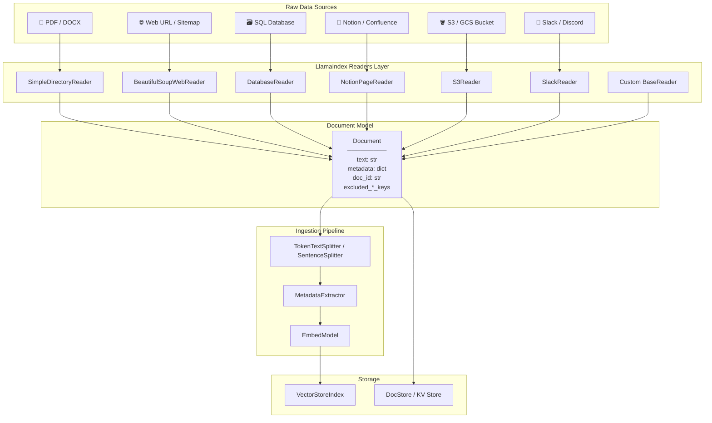

**Key insight from the diagram:** Every source converges at the `Document` node. The ingestion pipeline only ever sees Documents — it has no knowledge of where the data came from. This is the power of the reader abstraction.

---

### 3. Real-World Industry Scenarios [Intermediate]

#### Scenario A: Enterprise Internal Knowledge Assistant (Healthcare)

**Context:** A large health system wants employees to query 50,000 internal policy PDFs, updated weekly. Some PDFs are scanned (image-only), others are native text. The system must cite the exact source document and page number in every answer.

**How Loaders fit in:**
- `SimpleDirectoryReader` with `filename_as_id=True` handles native PDFs via `pypdf`.
- For scanned PDFs, a custom reader wraps an OCR pipeline (e.g., AWS Textract) and returns `Document` objects with `metadata={"source": filename, "page": page_num, "ocr": True}`.
- Weekly re-ingestion uses `doc_id` deduplication: if a document's hash matches an existing `doc_id` in the docstore, it's skipped — saving embedding costs.

**Constraints:**
- **Latency:** Ingestion is offline/batch — no latency SLA. But OCR throughput matters (must complete weekly refresh within a 4h window).
- **Cost:** Embedding 50K docs × ~10 chunks each = 500K embedding API calls. Bad chunking or re-embedding unchanged docs inflates cost 3–5x.
- **Reliability:** A single malformed PDF must not crash the entire ingestion run — readers must be wrapped with per-document exception handling.
- **Security/Privacy:** `metadata["phi"]` flag must be set on patient-adjacent documents; downstream retrieval filter blocks non-authorized roles from seeing flagged nodes.

**What "good" looks like in production:**
- Incremental ingestion with hash-based deduplication — only new or changed docs are re-embedded.
- Metadata propagated all the way from file path to the final `TextNode` so citations work at query time.
- OCR failures logged with doc_id + file path; a dead-letter queue retries them.

---

#### Scenario B: Multi-Source Developer Documentation Assistant

**Context:** A developer tools company wants an assistant that can answer questions across GitHub READMEs, Confluence wiki pages, and Jira ticket history simultaneously.

**How Loaders fit in:**
- `GithubRepositoryReader` pulls markdown files from specified repos; metadata includes `repo`, `branch`, `file_path`.
- `ConfluenceReader` (LlamaHub) fetches pages via REST API; metadata includes `space_key`, `page_id`, `last_modified`.
- A custom `JiraReader` extends `BaseReader`, paginates the Jira search API, and returns one Document per issue with `metadata={"issue_key": ..., "status": ..., "assignee": ...}`.
- All three feed the same `IngestionPipeline` — the downstream retriever doesn't care which connector produced each Node.

**Constraints:**
- **Latency:** GitHub and Confluence data changes constantly. Stale retrieval is a real risk. A webhook-triggered partial re-ingestion pattern (vs full refresh) keeps freshness SLA under 5 minutes.
- **Cost:** Confluence spaces can have 100K+ pages. Selective loading by `space_key` and `last_modified` filter prevents full re-ingestion on every run.
- **Failure modes:** Jira API rate limits (429s) mid-ingestion can leave the index partially updated. The pipeline must checkpoint progress per source.
- **Security:** OAuth scopes per reader must be minimized — the Confluence reader should not have write permissions, only `read:confluence-content.all`.

**What "good" looks like in production:**
- Metadata-filtered retrieval: query routed to only `source=="confluence"` nodes when the question is policy-related.
- Freshness timestamp in metadata used by a post-retrieval filter to deprioritize nodes older than 30 days for changelog-style questions.
- Per-reader error isolation: if Jira reader fails, GitHub and Confluence nodes are still indexed and searchable.

---

### 4. System View (Think Like a Systems Engineer) [Intermediate]

**Inputs → Transformations → Outputs:**

```
INPUTS:
  - Raw files (path, bytes, stream) OR API credentials + query params
  - Optional: metadata overrides, doc_id seed, file_extractor mapping

TRANSFORMATIONS (inside reader):
  1. Source fetch: open file / call API / stream bytes
  2. Format parsing: PDF text extraction, HTML stripping, JSON field mapping
  3. Normalization: encode to UTF-8, strip binary artifacts
  4. Document construction: text + metadata dict + doc_id assignment

OUTPUTS:
  - List[Document]  — each with .text, .metadata, .doc_id, .excluded_*_keys
```

**Observability — what to log, trace, and measure:**

| Signal | What to capture | Why |
|--------|----------------|-----|
| `reader_type` | Which reader class ran | Debugging source of bad Documents |
| `doc_count` | Number of Documents returned | Detect empty loads (0 docs = silent failure) |
| `char_count_p50/p95` | Text length distribution | Detect abnormally short docs (OCR failure, empty pages) |
| `load_duration_ms` | Wall-clock time per reader | Detect slow sources (rate-limited APIs) |
| `error_doc_ids` | IDs of failed-to-load docs | Drive retry queue |
| `metadata_completeness` | % of docs with required keys | Catch schema drift from upstream APIs |

**Failure points — where it breaks and how it shows up:**

1. **Silent empty Document** — A PDF is image-only; `pypdf` extracts zero text. The Document is created but `.text == ""`. It silently passes through the pipeline, gets embedded (a near-zero vector), and pollutes your index with phantom nodes. *How it shows up:* retrieval returns irrelevant chunks with high cosine similarity because empty-string embeddings cluster weirdly.

2. **Metadata schema drift** — The Confluence API changes a field name across versions (e.g., `space.key` → `space_id`). Your reader's metadata mapping breaks silently; `metadata["space_key"]` is now `None` for all new docs. *How it shows up:* metadata-filtered queries return 0 results for new docs but work fine for old ones — extremely confusing to debug without per-doc metadata logging.

3. **Rate limit mid-batch** — A 429 from Notion/Jira at doc 847 of 1200 causes the reader to raise. Depending on error handling, you either lose all 1200 docs or only the remainder. *How it shows up:* index is partially updated; stale queries return old data for some topics and new data for others.

4. **Encoding corruption** — Windows-1252 encoded Word doc passed to a reader expecting UTF-8. Partial text extracted with replacement characters. Embeddings of corrupted text mismatch query embeddings at retrieval time. *How it shows up:* queries about content in those docs return low-confidence results.

---

### 5. System Design Flavor [Intermediate]

**Key components and interfaces:**

```
SimpleDirectoryReader(input_dir, file_extractor={".pdf": PDFReader()})
  └── .load_data() → List[Document]

LlamaHub Reader (e.g., NotionPageReader)
  └── NotionPageReader(integration_token=...)
  └── .load_data(page_ids=[...]) → List[Document]

Custom Reader
  └── class MyReader(BaseReader):
  └──   def load_data(self, **kwargs) → List[Document]

IngestionPipeline(transformations=[splitter, extractor, embed_model])
  └── .run(documents=[...]) → List[BaseNode]
  └── .arun(documents=[...]) → List[BaseNode]  # async

StorageContext.from_defaults(vector_store=..., docstore=...)
VectorStoreIndex(nodes, storage_context=...)
```

**Key tradeoffs:**

| Tradeoff | Option A | Option B | When to choose |
|----------|----------|----------|----------------|
| **Build vs buy reader** | Custom `BaseReader` subclass | LlamaHub connector | Use LlamaHub first — if it covers 90% of your schema, extend it. Write custom only when the API is internal or heavily non-standard. |
| **Eager vs lazy loading** | Load all docs upfront before pipeline | Stream docs through pipeline incrementally | Eager is simpler and fine for <10K docs. Lazy (generator-based) is necessary for 100K+ docs to avoid OOM. |
| **Rich metadata vs minimal metadata** | Store 20+ fields per doc | Store only source + timestamp | Rich metadata enables powerful filters but inflates index storage and slows metadata-filtered search. Start minimal, add fields as query patterns emerge. |

**Scaling consideration (10x traffic/data):**
At 10x document volume (e.g., 500K → 5M docs), loading everything into memory before ingestion becomes infeasible. The design shifts to:
- **Streaming ingestion:** readers yield batches; the pipeline processes and stores each batch before loading the next.
- **Parallel reader execution:** multiple readers run concurrently (e.g., one per data source) using `asyncio.gather` or a job queue.
- **Incremental/delta ingestion:** hash-based deduplication at the Document level — only changed docs enter the pipeline. `doc_id` becomes the dedup key stored in a lightweight KV store (Redis/DynamoDB).
- **Distributed embedding:** embedding is the bottleneck at scale. Fan out to multiple embedding API calls in parallel; use `async` pipeline with a semaphore to respect rate limits.

---

### 6. Common Mistakes + Debugging [Beginner → Intermediate]

#### Mistake 1: Not Setting `doc_id` — Causing Duplicate Indexing on Re-runs

**Symptom:** After re-ingesting updated documents, old and new versions both appear in the index. Queries return contradictory answers — one node says policy A, another says policy B (the updated version).

**Likely cause:** `doc_id` was not explicitly set (or was auto-generated with a random UUID each run). LlamaIndex has no way to know the new Document is an update to an existing one, so both get indexed.

**First debugging step:** Print `[doc.doc_id for doc in documents]` before ingestion. If IDs are UUIDs that change between runs, add `filename_as_id=True` (for file-based readers) or set `doc_id` to a deterministic hash of the source URL / primary key. Then use `VectorStoreIndex.refresh_ref_docs(documents)` to upsert rather than append.

---

#### Mistake 2: Trusting Reader Output Without Validating Text Length

**Symptom:** Your RAG answers are vague or miss obvious information. Some source documents seem "invisible" to the retriever.

**Likely cause:** Some Documents came through with empty or near-empty `.text` (e.g., scanned PDFs, password-protected files, encoding failures). They were embedded anyway (embedding a short/empty string produces a near-zero or degenerate vector), polluting the index.

**First debugging step:**
```python
empty_docs = [d for d in documents if len(d.text.strip()) < 50]
print(f"{len(empty_docs)} docs with < 50 chars: {[d.doc_id for d in empty_docs]}")
```
Filter or flag these before ingestion. For scanned PDFs, add an OCR fallback reader.

---

#### Mistake 3: Using `load_data()` Directly Instead of `IngestionPipeline` for Production

**Symptom:** Metadata populated by the reader is lost at the Node level. Chunks don't carry `source`, `page_number`, or other fields needed for citation. Also, no deduplication — re-running ingestion doubles index size.

**Likely cause:** Documents loaded via `reader.load_data()` were passed directly to `VectorStoreIndex.from_documents()` without going through an `IngestionPipeline` with `docstore` configured for dedup.

**First debugging step:** Check `node.metadata` on a sample Node after indexing. If source fields are absent, add a `MetadataExtractor` or verify `metadata_separator` and `excluded_embed_metadata_keys` config. Switch to `IngestionPipeline` with a `SimpleDocumentStore` for dedup-aware ingestion.

---

### 7. Hands-On Lab [Pro]

#### Build — Minimal Ingestion Pipeline with a Custom Reader

**Goal:** Ingest documents from two sources (local files + a mock API), normalize them into Documents, run through a pipeline, and inspect the resulting Nodes.

```python
# llamaindex_loader_lab.py
# Requirements: pip install llama-index-core llama-index-readers-file pypdf

import hashlib
from pathlib import Path
from typing import List, Dict, Any, Optional

from llama_index.core import Document, VectorStoreIndex, StorageContext
from llama_index.core.readers.base import BaseReader
from llama_index.core.ingestion import IngestionPipeline
from llama_index.core.node_parser import SentenceSplitter
from llama_index.readers.file import PDFReader


# ── 1. Custom Reader (mock API source) ────────────────────────────────────────
class MockAPIReader(BaseReader):
    """Simulates reading 'articles' from a REST API."""

    def __init__(self, api_endpoint: str = "https://mock.api/articles"):
        self.api_endpoint = api_endpoint

    def load_data(self, article_ids: Optional[List[str]] = None) -> List[Document]:
        # In prod: replace with requests.get(self.api_endpoint, params=...).json()
        mock_articles = [
            {"id": "art_001", "title": "LlamaIndex Basics",
             "body": "LlamaIndex is a data framework for LLM applications. "
                     "It provides tools for ingestion, indexing, and querying."},
            {"id": "art_002", "title": "Vector Stores Explained",
             "body": "Vector stores persist high-dimensional embeddings. "
                     "They support approximate nearest-neighbor search (ANN). "
                     "Popular options: Pinecone, Weaviate, Chroma, pgvector."},
        ]

        if article_ids:
            mock_articles = [a for a in mock_articles if a["id"] in article_ids]

        documents = []
        for article in mock_articles:
            # Deterministic doc_id based on article ID (dedup-safe across re-runs)
            doc_id = hashlib.md5(article["id"].encode()).hexdigest()
            doc = Document(
                text=article["body"],
                metadata={
                    "source": "mock_api",
                    "article_id": article["id"],
                    "title": article["title"],
                    "endpoint": self.api_endpoint,
                },
                doc_id=doc_id,
                excluded_llm_metadata_keys=["endpoint"],   # don't inject endpoint into LLM context
                excluded_embed_metadata_keys=["endpoint"],  # don't embed endpoint string
            )
            documents.append(doc)
        return documents


# ── 2. Local File Reader (using SimpleDirectoryReader) ─────────────────────────
def load_local_docs(directory: str) -> List[Document]:
    """Load PDFs and text files from a directory with deterministic doc_ids."""
    from llama_index.core import SimpleDirectoryReader

    if not Path(directory).exists():
        print(f"[WARN] Directory {directory} not found — skipping local docs.")
        return []

    reader = SimpleDirectoryReader(
        input_dir=directory,
        filename_as_id=True,          # doc_id = relative file path (dedup-safe)
        required_exts=[".pdf", ".txt"],
        recursive=True,
    )
    docs = reader.load_data()
    print(f"[INFO] Loaded {len(docs)} documents from {directory}")
    return docs


# ── 3. Validate Documents (catch empty-text failures before indexing) ──────────
def validate_documents(docs: List[Document], min_chars: int = 30) -> List[Document]:
    valid, skipped = [], []
    for doc in docs:
        if len(doc.text.strip()) >= min_chars:
            valid.append(doc)
        else:
            skipped.append(doc.doc_id)
    if skipped:
        print(f"[WARN] Skipped {len(skipped)} docs with < {min_chars} chars: {skipped}")
    return valid


# ── 4. Build Ingestion Pipeline ────────────────────────────────────────────────
def build_pipeline() -> IngestionPipeline:
    splitter = SentenceSplitter(chunk_size=256, chunk_overlap=32)
    # In prod: add OpenAIEmbedding() or HuggingFaceEmbedding() here
    return IngestionPipeline(transformations=[splitter])


# ── 5. Main ────────────────────────────────────────────────────────────────────
if __name__ == "__main__":
    # Load from API
    api_reader = MockAPIReader()
    api_docs = api_reader.load_data()
    print(f"[API] Loaded {len(api_docs)} documents")

    # Load from local files (create sample .txt files first)
    import tempfile, os
    with tempfile.TemporaryDirectory() as tmpdir:
        (Path(tmpdir) / "intro.txt").write_text(
            "LlamaIndex supports data ingestion from PDFs, databases, APIs, and "
            "many other sources. Its reader abstraction normalizes all inputs to "
            "the Document format before indexing."
        )

        local_docs = load_local_docs(tmpdir)

    # Combine and validate
    all_docs = api_docs + local_docs
    all_docs = validate_documents(all_docs)
    print(f"[PIPELINE] Processing {len(all_docs)} valid documents...")

    # Run ingestion pipeline
    pipeline = build_pipeline()
    nodes = pipeline.run(documents=all_docs)

    print(f"\n[RESULT] Produced {len(nodes)} Nodes from {len(all_docs)} Documents")
    for i, node in enumerate(nodes):
        print(f"\nNode {i+1}:")
        print(f"  node_id  : {node.node_id}")
        print(f"  text[:80]: {node.text[:80].strip()!r}")
        print(f"  metadata : {node.metadata}")
```

**Expected output (approximate):**
```
[API] Loaded 2 documents
[PIPELINE] Processing 3 valid documents...
[RESULT] Produced 4-6 Nodes from 3 Documents

Node 1:
  node_id  : <uuid>
  text[:80]: 'LlamaIndex is a data framework for LLM applications. It provides tools for in'
  metadata : {'source': 'mock_api', 'article_id': 'art_001', 'title': 'LlamaIndex Basics'}
```

---

#### Break — Force the Failure Modes

```python
# BREAK 1: Empty document passes through validator
bad_doc = Document(
    text="   ",          # only whitespace — simulates failed OCR
    metadata={"source": "scanned_pdf", "file": "policy_v2.pdf"},
    doc_id="empty_doc_001"
)
result = validate_documents([bad_doc])
# Expected: [WARN] Skipped 1 docs with < 30 chars: ['empty_doc_001']
# Without validate_documents(), this doc silently enters the index

# ──────────────────────────────────────────────────────────────────────────────

# BREAK 2: Re-run with same doc_id — observe dedup behavior (or lack of it)
# Run pipeline twice with same api_docs — without a docstore, both runs produce
# duplicate nodes. Add a SimpleDocumentStore to see dedup in action:
from llama_index.core.storage.docstore import SimpleDocumentStore

docstore = SimpleDocumentStore()
pipeline_with_dedup = IngestionPipeline(
    transformations=[SentenceSplitter(chunk_size=256)],
    docstore=docstore,
)
nodes_run1 = pipeline_with_dedup.run(documents=api_docs)
nodes_run2 = pipeline_with_dedup.run(documents=api_docs)   # same docs again
print(f"Run 1 nodes: {len(nodes_run1)}, Run 2 nodes: {len(nodes_run2)}")
# Expected: Run 2 produces 0 new nodes — doc_ids already in docstore

# ──────────────────────────────────────────────────────────────────────────────

# BREAK 3: Metadata schema drift — simulate field name change mid-pipeline
# Suppose your API changes "article_id" to "id" in a new version.
drifted_doc = Document(
    text="New article about embeddings.",
    metadata={"source": "mock_api_v2", "id": "art_003"},  # "article_id" is now "id"
    doc_id="art_003_hash"
)
# A metadata filter like: filters=[MetadataFilter(key="article_id", value="art_003")]
# will return 0 results for this doc. Log and alert on metadata key coverage.
```

---

#### Measure

```python
import time

# Measure ingestion throughput
docs_to_bench = api_docs * 50   # 100 simulated documents
pipeline_bench = build_pipeline()

t0 = time.perf_counter()
bench_nodes = pipeline_bench.run(documents=docs_to_bench)
elapsed = time.perf_counter() - t0

print(f"Docs: {len(docs_to_bench)}")
print(f"Nodes produced: {len(bench_nodes)}")
print(f"Total time: {elapsed:.2f}s")
print(f"Throughput: {len(docs_to_bench)/elapsed:.1f} docs/sec")

# Also measure metadata completeness
required_keys = {"source", "article_id", "title"}
covered = sum(1 for n in bench_nodes if required_keys.issubset(n.metadata.keys()))
print(f"Metadata completeness: {covered}/{len(bench_nodes)} nodes have all required keys")
```

---

#### Explain — Why It Works This Way

The reader abstraction exists to enforce a clean separation: **every transformation step downstream assumes its inputs are `Document` objects** — it never knows or cares about the original source format. This is the same reason Unix pipes work: every command reads stdin and writes stdout. If you break this contract (e.g., pass raw strings, skip metadata), the entire downstream pipeline silently degrades — embeddings embed the wrong content, filters match the wrong fields, citations reference wrong sources.

The `doc_id` deduplication design matters at scale: without it, every re-ingestion doubles your index. With it, the docstore acts as a cheap content-addressable cache — only changed documents pay the embedding cost. This is how you keep a 1M-document index fresh without burning $500/day on re-embedding.

---

### 8. Active Recall (Spaced Repetition) [Beginner → Pro]

**Q1 [Beginner]:** What is the single output contract every LlamaIndex reader must fulfill?

> **A:** Must return `List[Document]`. Each Document has `.text`, `.metadata`, and `.doc_id`. No partial returns — raise an exception on failure.

---

**Q2 [Beginner]:** What is `SimpleDirectoryReader` and what does `filename_as_id=True` do?

> **A:** `SimpleDirectoryReader` is LlamaIndex's built-in multi-format file loader. It auto-detects file types (.pdf, .txt, .docx, etc.) and dispatches to the appropriate parser. `filename_as_id=True` sets `doc_id` to the relative file path — making it deterministic across re-runs for deduplication.

---

**Q3 [Intermediate]:** You re-ingest 10,000 documents daily. After 3 days your index has 30,000 docs but only 10,000 are unique. What design change prevents this?

> **A:** Use `IngestionPipeline` with a `SimpleDocumentStore` (or any persistent docstore). The pipeline checks `doc_id` against the store before processing — existing IDs are skipped. Combine with `filename_as_id=True` or deterministic hash-based `doc_id` assignment.

---

**Q4 [Intermediate]:** Name two `Document` fields that control what goes into the LLM context vs. what gets embedded, and explain when you'd use each.

> **A:** `excluded_llm_metadata_keys` — metadata fields excluded from the text injected into the LLM prompt (e.g., internal IDs, API endpoints, debug fields you don't want the LLM to see). `excluded_embed_metadata_keys` — fields excluded from the text used for embedding (e.g., fields that are noisy for semantic similarity, like timestamps or record IDs that would skew the embedding space).

---

**Q5 [Pro]:** A custom reader for an internal API occasionally returns `Document` objects with `text=""` due to empty API responses. How does this silently damage your index, and what's the fix?

> **A:** Empty-string embeddings produce near-zero or degenerate vectors that cluster unpredictably in the embedding space. During retrieval, unrelated queries can match these phantom nodes with unexpectedly high cosine similarity. Fix: validate `len(doc.text.strip()) >= min_chars` after loading, before ingestion. Log and route empty docs to a dead-letter queue for investigation. Also consider adding a `RequiredTextTransform` step in the IngestionPipeline that raises/filters on empty text.

---

### 9. Practice

**Mini-exercise:** You have a Notion workspace with 200 pages and a local folder with 50 PDFs. Write the pseudocode (or real code) for a merged ingestion pipeline that:
1. Loads from both sources with deterministic `doc_id`s
2. Validates that no Document has fewer than 100 characters
3. Runs through a sentence splitter
4. Reports metadata completeness for `["source", "title", "last_modified"]`

> **Suggested answer:**
> ```python
> # 1. Load
> notion_docs = NotionPageReader(integration_token=TOKEN).load_data(page_ids=[...])
> # set doc_id = hash of page_id for each
> for d in notion_docs:
>     d.doc_id = hashlib.md5(d.metadata["page_id"].encode()).hexdigest()
>
> pdf_docs = SimpleDirectoryReader("./docs", filename_as_id=True,
>                                   required_exts=[".pdf"]).load_data()
>
> # 2. Validate
> all_docs = [d for d in notion_docs + pdf_docs if len(d.text.strip()) >= 100]
>
> # 3. Pipeline
> pipeline = IngestionPipeline(transformations=[SentenceSplitter(chunk_size=512)])
> nodes = pipeline.run(documents=all_docs)
>
> # 4. Metadata completeness
> required = {"source", "title", "last_modified"}
> ok = sum(1 for n in nodes if required.issubset(n.metadata))
> print(f"Completeness: {ok}/{len(nodes)} ({100*ok/len(nodes):.1f}%)")
> ```

---

**Capstone system design question:** Design an ingestion system for a company with 5 document sources (SharePoint, S3, Confluence, PostgreSQL, and a nightly CSV export). Sources update at different cadences (SharePoint: real-time, S3: hourly, Confluence: daily, PostgreSQL: per-transaction, CSV: nightly). How would you architect the readers, deduplication, and pipeline to keep the index fresh without over-spending on re-embedding?

> **Answer outline:**
> - **Per-source reader:** One `BaseReader` subclass per source with deterministic `doc_id` (URL hash, DB primary key, file path).
> - **Event-driven ingestion for high-frequency sources:** SharePoint → webhook → message queue → ingestion worker. PostgreSQL → CDC (Debezium) → queue → worker.
> - **Scheduled ingestion for batch sources:** S3 hourly cron, Confluence daily cron, CSV nightly cron.
> - **Deduplication:** Centralized `SimpleDocumentStore` backed by Redis or DynamoDB. All workers check `doc_id` before embedding.
> - **Incremental embedding:** Only changed or new docs enter the embedding step. Use `VectorStoreIndex.refresh_ref_docs()` for upserts.
> - **Cost guardrail:** Budget alert if embedding API calls exceed N/hour — triggered by unexpectedly high re-ingestion volume.
> - **Observability:** Per-source `doc_count`, `char_count_p50`, `load_duration_ms`, `error_count` logged to a time-series store. Alert on zero-doc loads or p95 char_count below threshold.

---

### 10. Production Reality Check (Mandatory) ✅

**If this fails in prod, what's the first thing we inspect?**

> **Check your Document objects before they enter the pipeline.**
>
> Run:
> ```python
> print(f"Total docs: {len(docs)}")
> print(f"Empty docs: {sum(1 for d in docs if len(d.text.strip()) < 50)}")
> print(f"Missing doc_ids: {sum(1 for d in docs if not d.doc_id)}")
> print(f"Sample metadata: {docs[0].metadata if docs else 'NO DOCS'}")
> ```
>
> The most common production failures trace back to: (1) **empty text** that passed silently, (2) **non-deterministic doc_ids** causing duplicate indexing, or (3) **metadata schema drift** causing downstream filters to return zero results. All three are visible by inspecting `List[Document]` before ingestion — this is your first and cheapest debugging checkpoint.

---

### 11. Curiosity Bridge (Mandatory) ✅

Readers get data *into* LlamaIndex — but raw Documents are rarely queryable as-is. A 50-page PDF becomes a single massive Document that blows past any LLM's context window. The next question is: **how do you break Documents into the right-sized, semantically coherent pieces, and how do you attach structured metadata to each chunk automatically?**

That's exactly what **Node Parsers and chunking strategies** solve — and the choices you make there (chunk size, overlap, semantic vs. fixed splitting) directly determine retrieval quality at query time. A bad chunking strategy can make a perfect reader useless.

---

### 12. Exit Check + Carry-Forward Review

**Exit check:** You're done with 14.1.a when you can write a custom `BaseReader` subclass for an internal API, explain how `doc_id` dedup prevents re-embedding costs, identify three silent failure modes in the ingestion layer, and configure `excluded_embed_metadata_keys` correctly.

---

**Carry-Forward Review (interleaved recall from Module 13):**

*Q: In MCP, what is the difference between a Tool and a Resource, and when would you expose data as a Resource instead of a Tool?*

> **A:** A Tool is a callable action (the LLM sends arguments, the server executes and returns a result — think function call). A Resource is an addressable, readable data artifact identified by a URI (think file or database record the client can read on demand). Expose as a Resource when: the data is stable between reads, addressable by a URI, large enough to cache, and needs subscription-based freshness notifications. Use a Tool when: the data requires computation, parameters vary per request, or the operation has side effects.

---

---

## Subtopic 14.1.b: Parsing, Nodes, and Document Representation

### Reading Path + Level Tags

- **Beginner:** Read sections 1–2 and the Active Recall.
- **Intermediate:** Add sections 3–5 and the Hands-On Lab Build step.
- **Pro:** Complete the full Hands-On Lab (Build → Break → Measure → Explain) plus the capstone practice question.

---

### 0. Pre-Question Hook [Beginner]

**Pause:** You have a 120-page legal contract loaded as a single `Document`. Your LLM has a 4K token context window and your retriever must return the 3 most relevant chunks for a given question. Before reading — how would you decide *where* to cut the document into chunks, and what information from the full document should each chunk carry so the LLM can answer with proper context?

Think for 30 seconds. Then read on.

---

### 1. The Intuition (Plain English) [Beginner]

A `Document` is a whole book. A **`TextNode`** is a single highlighted passage from that book — the unit your retriever actually works with.

The job of a **node parser** is to take that book and produce a list of passages, each small enough to fit in a retrieval context window, but coherent enough to answer a question on its own. It also has to preserve a *trail of breadcrumbs* so you always know which book a passage came from, which page it was on, and what passage came before and after it.

**The core mental model:**

```
Document (whole book)
  └── NodeParser (cutting strategy)
        └── TextNode[] (retrievable passages)
              ├── .text          — the chunk content
              ├── .metadata      — inherited + extracted fields
              ├── .relationships — links to source doc + prev/next nodes
              └── .start/end_char_idx — exact byte offsets into original text
```

**Key terms (first use):**

- **`TextNode`** — the atomic retrieval unit in LlamaIndex; a chunk of text plus full provenance metadata.
- **`NodeParser`** — base class for all splitting strategies; takes `List[Document]` and returns `List[BaseNode]`.
- **`SentenceSplitter`** — splits on sentence boundaries while respecting a `chunk_size` token limit; the most common general-purpose parser.
- **`TokenTextSplitter`** — splits purely by token count with a fixed overlap; fast but ignores semantic boundaries.
- **`SemanticSplitterNodeParser`** — uses embedding similarity between adjacent sentences to find *natural topic boundaries*; produces variable-size chunks that respect meaning.
- **`HierarchicalNodeParser`** — produces multi-level node trees (e.g., 2048 → 512 → 128 tokens); enables parent-child retrieval (retrieve small, read big).
- **`NodeRelationship`** — enum linking a node to its SOURCE document, PREVIOUS sibling, NEXT sibling, PARENT, and CHILDREN.
- **`MetadataExtractor`** — a pipeline transformation that calls an LLM to enrich each node's metadata (titles, summaries, keywords, hypothetical questions).
- **`chunk_size`** — the maximum token count per node; directly controls the precision/recall tradeoff at retrieval.
- **`chunk_overlap`** — the number of tokens repeated at the boundary between adjacent chunks; prevents context from being split mid-sentence across two nodes.

**Analogy:** A node parser is like a journal editor who takes a manuscript and cuts it into self-contained article segments. Each segment gets a byline (metadata), a page range (char offsets), and a note about what article came before and after it in the journal (NodeRelationship). The analogy breaks down here: a journal editor uses human judgment about where topics shift; most node parsers use mechanical rules (token count, sentence boundary) — only `SemanticSplitterNodeParser` approximates human-level topic sensing.

---

### 2. Visual Diagram (Mermaid) [Beginner]

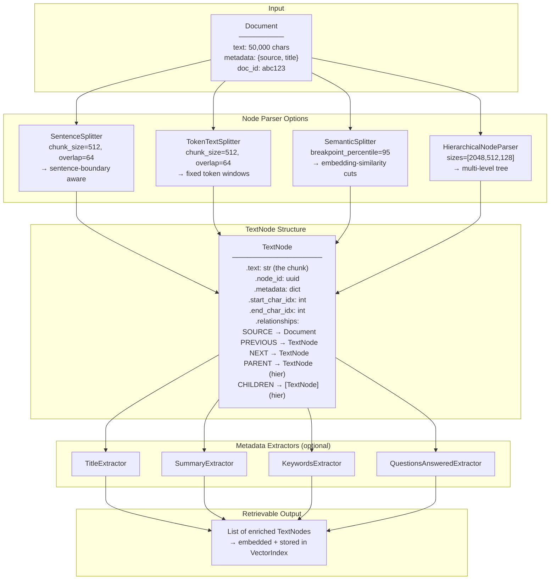

**Key insight:** Every parser produces the same `TextNode` output format. The retriever and query engine never know *which parser* was used — they just consume nodes. This means you can swap chunking strategies without touching retrieval code.

---

### 3. Real-World Industry Scenarios [Intermediate]

#### Scenario A: Legal Contract Q&A System

**Context:** A law firm needs to answer questions like *"What are the indemnification clauses?"* and *"What is the notice period for contract termination?"* across 10,000 uploaded contracts.

**How node parsing fits in:**
- `SentenceSplitter(chunk_size=512, chunk_overlap=64)` is the baseline — legal language has long sentences, so sentence-boundary splitting keeps clauses intact better than fixed-token splits.
- `QuestionsAnsweredExtractor` is added to each node: it calls the LLM to generate 3 hypothetical questions each chunk answers. At query time, *the question embedding* matches the stored hypothetical questions rather than the raw clause text — dramatically improving recall for question-style queries.
- `NodeRelationship.SOURCE` metadata lets the system cite the exact contract filename + char offset range for every retrieved clause.

**Constraints:**
- **Latency:** Ingestion is offline. But `QuestionsAnsweredExtractor` makes an LLM call per node — 10,000 contracts × 20 chunks = 200,000 LLM calls. This needs async batching with rate-limit handling or it runs for days.
- **Cost:** MetadataExtractor calls add 50–80% to ingestion cost. Use them only on high-value document types; skip for FAQ pages or short records.
- **Failure modes:** Contracts with poor OCR produce nodes whose text is garbled. The LLM-generated hypothetical questions for those nodes are nonsense, actively polluting the index. Pre-validate text quality before metadata extraction.
- **What "good" looks like:** Retrieval returns the exact clause paragraph, not an abstract summary. `start_char_idx` / `end_char_idx` enable UI highlighting of the exact sentence in the original PDF.

---

#### Scenario B: Technical Documentation Assistant with Small-to-Big Retrieval

**Context:** A developer tools company has documentation pages that mix short code snippets with long conceptual explanations. Users ask both precise code questions (*"What's the syntax for X?"*) and broad conceptual questions (*"How does the auth system work?"*).

**How node parsing fits in:**
- `HierarchicalNodeParser(chunk_sizes=[2048, 512, 128])` produces three levels per document:
  - **128-token leaf nodes** — highly precise, match exact code snippets.
  - **512-token mid nodes** — match paragraph-level explanations.
  - **2048-token root nodes** — provide full context when a leaf node is retrieved.
- At retrieval, the `AutoMergingRetriever` retrieves leaf nodes, but when multiple siblings match the same query, it *merges up* to the parent node — returning a larger, more coherent chunk instead of several fragmented pieces.
- `TitleExtractor` adds the page title to every leaf node's metadata — so even the shortest code snippet carries `metadata["document_title"]` for citation.

**Constraints:**
- **Latency:** Three-level indexing triples node count vs. a flat approach. Vector store write time and storage scale accordingly. Pre-filter low-value pages (changelogs, boilerplate) before hierarchical parsing.
- **Precision vs. recall:** Leaf nodes (128 tokens) have high precision but miss context. Root nodes (2048 tokens) have high recall but exceed LLM context for short answers. The auto-merge step is the production-critical bridge.
- **What "good" looks like:** Precise code snippet retrieved, its parent section used as full context. The LLM answer is accurate *and* cites the correct documentation page.

---

### 4. System View (Think Like a Systems Engineer) [Intermediate]

**Inputs → Transformations → Outputs:**

```
INPUTS:
  - List[Document] (from reader layer)
  - Parser config: chunk_size, chunk_overlap, separator list
  - Optional: MetadataExtractor list, LLM for extraction, embed_model

TRANSFORMATIONS (inside node parser):
  1. Text segmentation: apply splitting strategy → raw chunks
  2. Char offset tracking: record start_char_idx / end_char_idx per chunk
  3. Metadata inheritance: copy parent Document.metadata to each TextNode
  4. Relationship assignment: SOURCE, PREVIOUS, NEXT (and PARENT/CHILDREN for hierarchical)
  5. node_id assignment: UUID per node (stable within a run; re-generated on re-parse unless seeded)
  6. [Optional] MetadataExtractor: LLM call per node → enrich metadata dict
  7. [Optional] Embedding: embed node text + metadata prefix → float vector

OUTPUTS:
  - List[TextNode] with full provenance, relationships, optional enriched metadata
```

**Observability — what to log, trace, and measure:**

| Signal | What to capture | Why |
|--------|----------------|-----|
| `node_count` | Total nodes produced per document | Detect over-splitting (1 doc → 500 nodes) or under-splitting (1 node per 100-page doc) |
| `tokens_p50 / p95` | Token length distribution of nodes | Validate chunk_size is actually respected; catch parser bugs |
| `relationship_completeness` | % of nodes with PREVIOUS + NEXT set | Missing relationships break sentence-window retrieval |
| `metadata_extractor_latency` | Wall-clock time per LLM extraction call | Budget-critical; p95 latency × node_count = total ingestion time |
| `metadata_extractor_error_rate` | % of nodes where extraction failed or returned empty | High error rate = LLM rate limit or malformed chunk |
| `chunk_overlap_violation` | % of adjacent node pairs with < expected overlap | Parser bug or separator list misconfiguration |

**Failure points — where it breaks and how it shows up:**

1. **Wrong chunk_size for the LLM's context window** — chunk_size=4096 tokens but your embedding model has a 512-token max. Tokens beyond 512 are silently truncated during embedding. The stored node text is longer than what was actually embedded. Retrieval misses relevant content. *How it shows up:* precision is acceptable but recall is mysteriously low for information in the second half of long chunks.

2. **Separator list mismatch** — `SentenceSplitter` uses sentence-end characters to find split points. If your documents use non-standard punctuation (e.g., Chinese periods `。`, em-dash sentence endings, legal clause numbering `§4.2`), the splitter can't find sentence boundaries and produces chunks the full `chunk_size` (never smaller). This bloats the index and loses granularity. *How it shows up:* node token distribution is bimodal — most nodes are either very short (headers) or exactly `chunk_size` (no split found).

3. **MetadataExtractor silently returns empty** — If the LLM call inside `TitleExtractor` or `SummaryExtractor` times out or the node text is too short for the LLM to summarize, the metadata key is set to `None` or `""`. Downstream filters on `metadata["section_title"]` return zero results. *How it shows up:* metadata-filtered queries work for 80% of nodes and silently return nothing for the rest.

4. **Re-parsing without stable node_ids** — If you re-run ingestion without seeding node_id generation, every node gets a new UUID. The vector store accumulates duplicate vectors — old and new embeddings for the same chunk, both with different IDs. *How it shows up:* vector store size grows unboundedly; retrieval returns near-duplicate results.

---

### 5. System Design Flavor [Intermediate]

**Key components and interfaces:**

```python
# Flat splitting
SentenceSplitter(chunk_size=512, chunk_overlap=64, separator=" ")
TokenTextSplitter(chunk_size=512, chunk_overlap=64)

# Semantic splitting (requires embed_model)
SemanticSplitterNodeParser(
    embed_model=embed_model,
    breakpoint_percentile_threshold=95,   # higher = fewer, larger chunks
)

# Hierarchical splitting
HierarchicalNodeParser.from_defaults(chunk_sizes=[2048, 512, 128])
# Pair with AutoMergingRetriever at query time

# Metadata extraction (adds LLM calls per node)
from llama_index.core.extractors import (
    TitleExtractor,           # infers section title from chunk content
    SummaryExtractor,         # LLM-generated 1-sentence summary per node
    KeywordExtractor,         # top-N keywords per node
    QuestionsAnsweredExtractor,  # N hypothetical questions the chunk answers
)

# Combined pipeline
IngestionPipeline(transformations=[
    SentenceSplitter(chunk_size=512, chunk_overlap=64),
    TitleExtractor(nodes=5),             # use 5 nodes of context for title inference
    QuestionsAnsweredExtractor(questions=3),
    OpenAIEmbedding(),
])
```

**Key tradeoffs:**

| Tradeoff | Option A | Option B | When to choose |
|----------|----------|----------|----------------|
| **Precision vs. recall** | Small chunks (128–256 tokens) | Large chunks (1024–2048 tokens) | Small chunks: high precision for specific lookups (code, clauses). Large chunks: higher recall for broad conceptual questions. Use hierarchical parsing to get both. |
| **Fixed vs. semantic splitting** | `TokenTextSplitter` (fast, deterministic) | `SemanticSplitterNodeParser` (slower, meaning-aware) | Fixed splitting for bulk/cheap ingestion where boundaries matter less. Semantic splitting when chunk coherence directly determines answer quality (research papers, legal docs). |
| **Raw vs. enriched nodes** | Nodes with only inherited metadata | Nodes with LLM-extracted titles, summaries, questions | Raw is fast and cheap — fine for simple keyword retrieval. Enriched nodes are expensive but significantly improve dense retrieval quality, especially for question-answering workloads. |

**Scaling consideration (10x data):**
At 10x document volume, `MetadataExtractor` becomes the bottleneck — it makes one LLM call per node. At 1M nodes, that's 1M LLM API calls for extraction alone. The design shifts to:
- **Selective enrichment:** Only run `QuestionsAnsweredExtractor` on high-priority document types; use cheaper rule-based metadata for bulk content.
- **Async extraction with concurrency control:** `IngestionPipeline.arun()` with a semaphore to parallelize LLM calls while respecting rate limits.
- **Caching extractor results:** Hash node text → cache extraction output in Redis. Re-parsing the same document reuses cached metadata without new LLM calls.
- **Tiered chunking:** Semantic splitting for the top 10% most-queried documents; fixed splitting for the rest.

---

### 6. Common Mistakes + Debugging [Beginner → Intermediate]

#### Mistake 1: Setting chunk_size Larger Than Your Embedding Model's Token Limit

**Symptom:** Retrieval precision is good for content near the beginning of long chunks but misses information in the second half of those chunks. Cosine similarity scores are lower than expected.

**Likely cause:** Your node parser creates nodes with 1024-token chunks, but your embedding model silently truncates input beyond its max (e.g., 512 tokens for `text-embedding-ada-002` older deployments or many open-source models). The embedding only represents the first half of the chunk.

**First debugging step:**
```python
from llama_index.core import Settings
print(Settings.embed_model.model_name)   # check which model
# Look up that model's max_input_tokens in docs
# Then:
max_tokens = [n for n in nodes if len(n.text.split()) > 450]
print(f"{len(max_tokens)} nodes exceed 450 words")
```
Fix: set `chunk_size` ≤ 80% of the embedding model's max token limit. Leave headroom for metadata prefix that also gets embedded.

---

#### Mistake 2: Using Default Separators on Non-English or Structured Documents

**Symptom:** Node token distribution is bimodal — most nodes are either tiny (3–10 tokens, just headers) or exactly `chunk_size` (splitter couldn't find any sentence boundary in the content). Retrieval quality is poor because neither extreme is useful.

**Likely cause:** `SentenceSplitter`'s default separator list (`[". ", "\n", " "]`) doesn't match your document's structure. Legal docs use `§` section markers, code files use newline-based structure, non-English docs use different punctuation.

**First debugging step:**
```python
import numpy as np
token_counts = [len(n.text.split()) for n in nodes]
print(f"min={min(token_counts)}, max={max(token_counts)}, "
      f"p50={np.percentile(token_counts,50):.0f}, p95={np.percentile(token_counts,95):.0f}")
# If p95 ≈ chunk_size and p50 is tiny → separator mismatch
```
Fix: customize `paragraph_separator` and `secondary_chunking_regex` parameters, or switch to `TokenTextSplitter` which always produces predictable sizes regardless of content structure.

---

#### Mistake 3: Ignoring NodeRelationship — Breaking Sentence-Window Retrieval

**Symptom:** You set up `SentenceWindowNodeParser` (which produces tiny 1-sentence nodes with `WINDOW` metadata of ±k surrounding sentences) but at query time you use a plain `VectorIndexRetriever` instead of `MetadataReplacementNodePostProcessor`. The LLM only sees the 1-sentence node text, not the surrounding window — answers are thin and lack context.

**Likely cause:** Retriever and post-processor were set up independently without connecting them. `NodeRelationship` and window metadata exist on the node but nothing reads them.

**First debugging step:** Print `nodes[0].metadata.get("window")` — if it's populated but not appearing in LLM context, you're missing `MetadataReplacementNodePostProcessor(target_metadata_key="window")` in your query engine's `node_postprocessors` list.

---

### 7. Hands-On Lab [Pro]

#### Build — Compare Chunking Strategies and Inspect Node Structure

```python
# node_parser_lab.py
# pip install llama-index-core llama-index-embeddings-openai

from llama_index.core import Document
from llama_index.core.node_parser import (
    SentenceSplitter,
    TokenTextSplitter,
    HierarchicalNodeParser,
    SentenceWindowNodeParser,
)
from llama_index.core.schema import NodeRelationship
import numpy as np

# ── Sample document (deliberately varied sentence lengths) ─────────────────────
SAMPLE_TEXT = """
LlamaIndex is a data framework for building LLM-powered applications.
It provides abstractions for data ingestion, indexing, and querying.

At its core, LlamaIndex introduces the concept of nodes — atomic units of
text that carry both content and metadata. Nodes are produced by splitting
documents using configurable node parsers.

The choice of node parser directly affects retrieval quality. A sentence
splitter preserves natural language boundaries. A token splitter is
predictable but may cut mid-sentence. A semantic splitter uses embedding
similarity to find topic shifts, producing variable-length but coherent chunks.

In production, the most important parameters are chunk_size (controls how
much text each node holds) and chunk_overlap (controls how many tokens are
repeated between adjacent nodes to prevent context from being cut off at
boundaries). These two parameters are the primary levers for the
precision-recall tradeoff in retrieval.

LlamaIndex also supports hierarchical parsing, where the same document
is represented at multiple granularities simultaneously. This enables
small-to-big retrieval: retrieve precise leaf nodes, then expand to parent
nodes for richer context when generating the final answer.
"""

doc = Document(text=SAMPLE_TEXT, metadata={"source": "llamaindex_intro", "author": "lab"})

# ── 1. SentenceSplitter ────────────────────────────────────────────────────────
sentence_parser = SentenceSplitter(chunk_size=128, chunk_overlap=16)
nodes_sentence = sentence_parser.get_nodes_from_documents([doc])

# ── 2. TokenTextSplitter ───────────────────────────────────────────────────────
token_parser = TokenTextSplitter(chunk_size=128, chunk_overlap=16)
nodes_token = token_parser.get_nodes_from_documents([doc])

# ── 3. HierarchicalNodeParser ──────────────────────────────────────────────────
hier_parser = HierarchicalNodeParser.from_defaults(chunk_sizes=[512, 128, 32])
nodes_hier = hier_parser.get_nodes_from_documents([doc])

# ── 4. SentenceWindowNodeParser ────────────────────────────────────────────────
window_parser = SentenceWindowNodeParser.from_defaults(
    window_size=3,                      # ±3 sentences stored in metadata
    window_metadata_key="window",
    original_text_metadata_key="original_text",
)
nodes_window = window_parser.get_nodes_from_documents([doc])

# ── Inspect results ────────────────────────────────────────────────────────────
def inspect_nodes(nodes, label):
    token_counts = [len(n.text.split()) for n in nodes]
    print(f"\n{'='*60}")
    print(f"Parser: {label}")
    print(f"  Total nodes   : {len(nodes)}")
    print(f"  Token counts  : min={min(token_counts)}, "
          f"max={max(token_counts)}, "
          f"p50={np.percentile(token_counts,50):.0f}, "
          f"p95={np.percentile(token_counts,95):.0f}")
    print(f"  Sample node 0 :")
    print(f"    text[:100]  : {nodes[0].text[:100].strip()!r}")
    print(f"    metadata    : {nodes[0].metadata}")
    print(f"    relationships: {list(nodes[0].relationships.keys())}")
    if nodes[0].start_char_idx is not None:
        print(f"    char range  : [{nodes[0].start_char_idx}, {nodes[0].end_char_idx}]")

inspect_nodes(nodes_sentence, "SentenceSplitter (chunk=128, overlap=16)")
inspect_nodes(nodes_token,    "TokenTextSplitter (chunk=128, overlap=16)")
inspect_nodes(nodes_hier,     "HierarchicalNodeParser (512/128/32)")
inspect_nodes(nodes_window,   "SentenceWindowNodeParser (window=3)")

# ── Inspect NodeRelationship chain for SentenceSplitter ──────────────────────
print("\n── Relationship chain (SentenceSplitter) ──")
for i, node in enumerate(nodes_sentence[:3]):
    source = node.relationships.get(NodeRelationship.SOURCE)
    prev   = node.relationships.get(NodeRelationship.PREVIOUS)
    nxt    = node.relationships.get(NodeRelationship.NEXT)
    print(f"Node {i}: source={source.node_id[:8] if source else None}, "
          f"prev={prev.node_id[:8] if prev else None}, "
          f"next={nxt.node_id[:8] if nxt else None}")

# ── Inspect hierarchical parent-child ─────────────────────────────────────────
from llama_index.core.node_parser import get_leaf_nodes, get_root_nodes
leaves = get_leaf_nodes(nodes_hier)
roots  = get_root_nodes(nodes_hier)
print(f"\n── Hierarchical structure ──")
print(f"  Root nodes  : {len(roots)}")
print(f"  Leaf nodes  : {len(leaves)}")
print(f"  Leaf text[:80]: {leaves[0].text[:80].strip()!r}")
parent_rel = leaves[0].relationships.get(NodeRelationship.PARENT)
if parent_rel:
    parent_node = next((n for n in nodes_hier if n.node_id == parent_rel.node_id), None)
    if parent_node:
        print(f"  Parent text[:80]: {parent_node.text[:80].strip()!r}")
```

---

#### Break — Force the Failure Modes

```python
# BREAK 1: chunk_size >> chunk_overlap=0 → adjacent nodes share no context
# A sentence split across the boundary of two nodes is unreadable in isolation
breaky_parser = SentenceSplitter(chunk_size=64, chunk_overlap=0)
nodes_no_overlap = breaky_parser.get_nodes_from_documents([doc])
print("\nBREAK 1 — No overlap. Last 30 chars of node 0:")
print(repr(nodes_no_overlap[0].text[-30:]))
print("First 30 chars of node 1:")
print(repr(nodes_no_overlap[1].text[:30]))
# Notice: the sentence may be cut mid-clause. With overlap=0, the retriever
# may return node 0 OR node 1 but not both — the clause is split across them.

# BREAK 2: chunk_size too small for MetadataExtractor context
# If chunk_size=32 tokens, the LLM has almost no content to extract a title from
tiny_parser  = SentenceSplitter(chunk_size=32, chunk_overlap=4)
tiny_nodes   = tiny_parser.get_nodes_from_documents([doc])
print(f"\nBREAK 2 — Tiny chunks ({len(tiny_nodes)} nodes). "
      f"Shortest node: {min(len(n.text.split()) for n in tiny_nodes)} tokens")
# QuestionsAnsweredExtractor on 10-token nodes generates meaningless questions
# increasing cost and polluting the metadata index

# BREAK 3: Verify metadata is inherited from parent Document
for n in nodes_sentence:
    assert "source" in n.metadata, f"Node {n.node_id} missing 'source' metadata!"
    assert "author" in n.metadata, f"Node {n.node_id} missing 'author' metadata!"
print("\nBREAK 3 — All nodes correctly inherited parent metadata. ✅")
# If this assertion fails, your parser is not propagating Document.metadata
# Fix: use parser.get_nodes_from_documents([doc]) not parser.get_nodes_from_text()
```

---

#### Measure

```python
import time

# Measure how chunk_size affects node count and distribution
for size, overlap in [(64, 8), (128, 16), (256, 32), (512, 64)]:
    p = SentenceSplitter(chunk_size=size, chunk_overlap=overlap)
    t0 = time.perf_counter()
    ns = p.get_nodes_from_documents([doc] * 100)   # 100x the doc for meaningful timing
    elapsed = time.perf_counter() - t0
    counts = [len(n.text.split()) for n in ns]
    print(f"chunk={size:4d} overlap={overlap:3d} | "
          f"nodes={len(ns):5d} | "
          f"p50={np.percentile(counts,50):5.0f} | "
          f"p95={np.percentile(counts,95):5.0f} | "
          f"{elapsed*1000:.1f}ms")

# Expected: smaller chunk_size → more nodes, lower p95, higher total embed cost
# The "precision-recall sweet spot" for most RAG systems is chunk_size=256–512
```

---

#### Explain — Why It Works This Way

Chunking is the single highest-leverage parameter in a RAG system — more so than the retriever algorithm or even the embedding model. Here's why:

**Too small (< 64 tokens):** Each node is semantically incomplete. A sentence without its preceding context is ambiguous. The LLM retrieves correct chunks but can't answer correctly because there's not enough context. Retrieval precision is high; answer quality is low.

**Too large (> 1024 tokens):** Each node contains multiple topics. A query about topic A retrieves a node that also contains topics B and C — the LLM sees irrelevant content, gets confused, and the answer is diluted. Retrieval recall is high; precision is low. Also, if the chunk exceeds the embedding model's token limit, the tail of the chunk is silently dropped.

**The `HierarchicalNodeParser` + `AutoMergingRetriever` pattern** solves this by decoupling retrieval granularity from answer generation granularity: retrieve small (high precision), then expand to parent (high recall for generation). This is why production systems at scale use hierarchical indexing — it avoids committing to a single chunk_size tradeoff.

---

### 8. Active Recall (Spaced Repetition) [Beginner → Pro]

**Q1 [Beginner]:** What is a `TextNode` and how does it differ from a `Document`?

> **A:** A `Document` is the full ingested unit from a source (a whole PDF, a Notion page). A `TextNode` is a sub-chunk of a Document — the atomic unit the retriever actually embeds and queries. A Document becomes multiple TextNodes through a NodeParser. TextNodes carry `NodeRelationship` links back to their source Document and to adjacent sibling nodes.

---

**Q2 [Beginner]:** What does `chunk_overlap` do and why does it matter?

> **A:** `chunk_overlap` repeats `N` tokens at the boundary between two adjacent chunks. Without overlap, a sentence split across chunk boundary N and chunk N+1 is unreadable in either chunk alone — the context is lost. With overlap, both chunks contain the bridging text, so whichever is retrieved still has enough context to be meaningful. Typical value: 10–15% of `chunk_size`.

---

**Q3 [Intermediate]:** When would you choose `SemanticSplitterNodeParser` over `SentenceSplitter`?

> **A:** Use `SemanticSplitter` when your documents have natural topic shifts within a single section — e.g., research papers, long blog posts, interview transcripts. It uses embedding cosine similarity between adjacent sentence groups to find where meaning changes, producing chunks that are semantically coherent even if different sizes. The tradeoff: it requires an embed_model at ingestion time (added cost + latency) and is non-deterministic (results vary slightly with embedding model version). Use `SentenceSplitter` for uniform, well-structured documents where sentence boundaries are reliable topic boundaries.

---

**Q4 [Intermediate]:** Name the 4 standard `MetadataExtractor` types in LlamaIndex and when each is most valuable.

> **A:** 
> - `TitleExtractor` — infers a section title from node content; valuable when source docs lack headings or when headings need to be propagated to every chunk for citation.
> - `SummaryExtractor` — LLM-generated 1-sentence summary per node; useful for SummaryIndex or when nodes are long and a short descriptor improves embedding quality.
> - `KeywordExtractor` — top-N keywords per node; improves sparse retrieval (BM25) and metadata filters by topic.
> - `QuestionsAnsweredExtractor` — generates N hypothetical questions each chunk can answer; the most powerful for question-answering workloads because query embeddings match these questions better than the raw chunk text (HyDE-like effect).

---

**Q5 [Pro]:** Explain the `HierarchicalNodeParser` + `AutoMergingRetriever` pattern. Why does it outperform flat chunking for broad conceptual questions?

> **A:** `HierarchicalNodeParser` creates three levels of nodes for the same document content: small leaf nodes (e.g., 128 tokens), medium mid nodes (512 tokens), and large root nodes (2048 tokens). Parent-child `NodeRelationship` links connect them. At query time, `AutoMergingRetriever` retrieves leaf nodes (high precision). If a threshold percentage of sibling leaves under the same parent all match the query, it *merges up* — returning the parent node instead of individual fragments. This means: for precise questions, you get a tight 128-token answer. For broad conceptual questions that span a section, the auto-merge kicks in and returns the full 2048-token section. Flat chunking forces a single size choice — hierarchical parsing sidesteps the tradeoff entirely.

---

### 9. Practice

**Mini-exercise:** You're building a RAG system over 5,000 research papers (average 8,000 words each). Each paper has sections: Abstract, Introduction, Methods, Results, Discussion. Your users ask both precise factual questions (*"What was the sample size in study X?"*) and broad synthesis questions (*"What methods are commonly used across these papers?"*).

Design your node parsing strategy: which parser(s) would you use, what chunk sizes, and would you add any MetadataExtractors? Justify each choice.

> **Suggested answer:**
> - **Parser:** `HierarchicalNodeParser(chunk_sizes=[1024, 256, 64])`. Research papers have well-defined sections; hierarchical parsing handles both precise factual queries (64-token leaves, exact stat retrieval) and broad synthesis queries (1024-token roots, full section context).
> - **Additional:** `SentenceWindowNodeParser` as an alternative if budget is tight — simpler than hierarchical, still enables window expansion.
> - **MetadataExtractors:** `TitleExtractor` (captures section name in every leaf node metadata) + `KeywordExtractor` (improves BM25 recall for technical terms). Skip `QuestionsAnsweredExtractor` for 5K papers × ~100 nodes each = 500K LLM calls — cost-prohibitive unless applied selectively to the most-queried papers.
> - **chunk_overlap:** 32–64 tokens at the leaf level. Methods sections often have multi-sentence descriptions that span chunk boundaries.

---

**Capstone system design question:** A legal tech company has 50,000 contracts with an average of 30 pages each. They need a system that can: (1) cite the exact paragraph and clause number for every retrieved result, (2) answer both narrow clause questions and broad contract-scope questions, (3) keep ingestion cost under $500 total. Design the full node parsing and metadata strategy.

> **Answer outline:**
> - **Parser:** `HierarchicalNodeParser(chunk_sizes=[2048, 512])` — two levels sufficient; 128-token leaves are too fragile for dense legal language.
> - **Char offset preservation:** `start_char_idx` / `end_char_idx` from the parser + `metadata["page_number"]` from the reader layer = exact citation capability.
> - **Clause number extraction:** Custom pre-processing regex that detects `§N.N` or `ARTICLE X` patterns and injects `metadata["clause_id"]` before node parsing.
> - **Metadata extractors:** `TitleExtractor` only (cheap, 1 call per ~5 nodes of context). Skip `QuestionsAnsweredExtractor` — 50K contracts × 60 nodes × 1 call = 3M LLM calls, far over budget.
> - **Cost estimate:** 50K contracts × 30 pages × ~200 tokens/page = 300M tokens to embed. At $0.0001/1K tokens ≈ $30 embedding cost. Parsing is CPU-only. `TitleExtractor` at ~1 call per 5 nodes × 3M nodes / 5 = 600K calls × ~500 tokens/call = 300M LLM tokens ≈ $150 at GPT-3.5 rates. Total ≈ $180 — well under budget.
> - **Dedup:** `IngestionPipeline` with docstore + hash-based `doc_id` from contract file path — prevents re-embedding on re-runs.

---

### 10. Production Reality Check (Mandatory) ✅

**If this fails in prod, what's the first thing we inspect?**

> **Inspect the node token distribution immediately after parsing — before embedding.**
>
> ```python
> import numpy as np
> token_counts = [len(n.text.split()) for n in nodes]
> print(f"Nodes: {len(nodes)}")
> print(f"p10={np.percentile(token_counts,10):.0f}, "
>       f"p50={np.percentile(token_counts,50):.0f}, "
>       f"p90={np.percentile(token_counts,90):.0f}, "
>       f"max={max(token_counts)}")
> ```
>
> If `p90 ≈ chunk_size` and `p10` is tiny → separator mismatch (splitter can't find boundaries).
> If `max > embedding_model_max_tokens` → chunks will be silently truncated during embedding.
> If `p50` is far below `chunk_size` → over-splitting; increase `chunk_size` or adjust separators.
>
> Node token distribution is the cheapest possible health check — it runs in milliseconds and catches the three most common chunking failures before you spend money on embeddings.

---

### 11. Curiosity Bridge (Mandatory) ✅

You now have clean, well-sized, metadata-enriched `TextNode` objects. But nodes living in a Python list aren't queryable — they need to be *organized* into a data structure that supports fast semantic lookup. The next question is: **which index type do you put them in, and does the answer change based on whether users ask point-lookup questions vs. aggregation questions vs. graph-traversal questions?**

That's what **Index Types** (VectorStoreIndex, SummaryIndex, KnowledgeGraphIndex) solve — and the choice is not cosmetic. A `SummaryIndex` reads every node at query time; a `VectorStoreIndex` reads only the top-k nearest neighbors. Pick the wrong one and you either miss facts or burn your entire token budget on a single query.

---

### 12. Exit Check + Carry-Forward Review

**Exit check:** You're done with 14.1.b when you can explain the `TextNode` anatomy from memory, choose between `SentenceSplitter` / `TokenTextSplitter` / `SemanticSplitter` / `HierarchicalNodeParser` for a given use case, identify a chunking misconfiguration from a node token distribution histogram, and configure `QuestionsAnsweredExtractor` with a cost-awareness justification.

---

**Carry-Forward Review (interleaved recall from 14.1.a):**

*Q: What is the output contract every LlamaIndex reader must fulfill, and what two Document-level fields control what gets embedded vs. what goes into the LLM prompt?*

> **A:** Every reader must return `List[Document]`. `excluded_embed_metadata_keys` controls which metadata fields are excluded from the text used for embedding (reducing noise in the embedding space). `excluded_llm_metadata_keys` controls which fields are excluded from the text injected into the LLM's prompt context (hiding internal/debug fields from the model).

---

## Subtopic 14.1.c: Index Types and Retrieval Abstractions

### Reading Path + Level Tags

- **Beginner:** Read sections 1–2 and the Active Recall.
- **Intermediate:** Add sections 3–5 and the Hands-On Lab Build step.
- **Pro:** Complete the full Hands-On Lab (Build → Break → Measure → Explain) plus the capstone practice question.

---

### 0. Pre-Question Hook [Beginner]

**Pause:** You have 10,000 enriched `TextNode` objects ready. A user asks: *"Summarize everything we know about Project Apollo."* Another asks: *"Who approved the budget for Project Apollo?"* — Before reading, do you think the same data structure should answer both questions? What tradeoffs would you face if you tried?

Think for 30 seconds. Then read on.

---

### 1. The Intuition (Plain English) [Beginner]

A node parser turns documents into passages. An **index** turns those passages into a *queryable data structure*. The index is the contract between your data and your retrieval strategy.

LlamaIndex has three core index types, each built for a different query shape:

| Index | Mental model | Best for |
|-------|-------------|----------|
| **`VectorStoreIndex`** | Library card catalogue — find the 5 most relevant cards by topic similarity | Precise point-lookup Q&A |
| **`SummaryIndex`** | Reading every book on the shelf one by one | Summarization, aggregation, "tell me everything about X" |
| **`KnowledgeGraphIndex`** | A map of connected facts: "Paris → capital of → France" | Multi-hop relational queries: "Who manages the team that owns service X?" |

The **retrieval abstraction** sits on top of any index via two methods:
- **`index.as_retriever()`** — returns a `BaseRetriever`; gives you raw nodes back. You control what happens next (post-processing, reranking, custom synthesis).
- **`index.as_query_engine()`** — returns a `BaseQueryEngine`; one call from query string to final answer. Retrieve + synthesize in one shot.

**Key terms (first use):**

- **`VectorStoreIndex`** — LlamaIndex's primary index; embeds each node and stores the vector; retrieval uses approximate nearest-neighbor (ANN) top-k similarity search.
- **`SummaryIndex`** — (formerly `ListIndex`) stores nodes in a flat ordered list; at query time reads *all* nodes, either sequentially or via LLM filtering; designed for summarization.
- **`KnowledgeGraphIndex`** — extracts `(subject, predicate, object)` triples from nodes using an LLM and stores them as a graph; retrieval traverses the graph to answer relational questions.
- **`as_retriever()`** — index method returning a `BaseRetriever`; the composable low-level retrieval interface.
- **`as_query_engine()`** — index method returning a `BaseQueryEngine`; end-to-end pipeline (retrieve → synthesize).
- **`StorageContext`** — bundles vector store, docstore, index store, and graph store into a single configurable unit; the key to persisting indexes to disk or cloud.
- **`MetadataFilters`** — applied at retrieval time on `VectorStoreIndex` to hard-filter which nodes are eligible based on exact-match metadata fields before ANN search runs.

**Analogy:** The three index types are like three different ways to organize a city's phone book. A `VectorStoreIndex` is an indexed contact list — search by name similarity, fast. A `SummaryIndex` is reading every entry aloud until you have a full picture — thorough but slow. A `KnowledgeGraphIndex` is a social network map — follow connections from one person to another. The analogy breaks down here: real phone books have only one organization strategy. LlamaIndex lets you build all three simultaneously over the same nodes and route queries to the right one at runtime.

---

### 2. Visual Diagram (Mermaid) [Beginner]

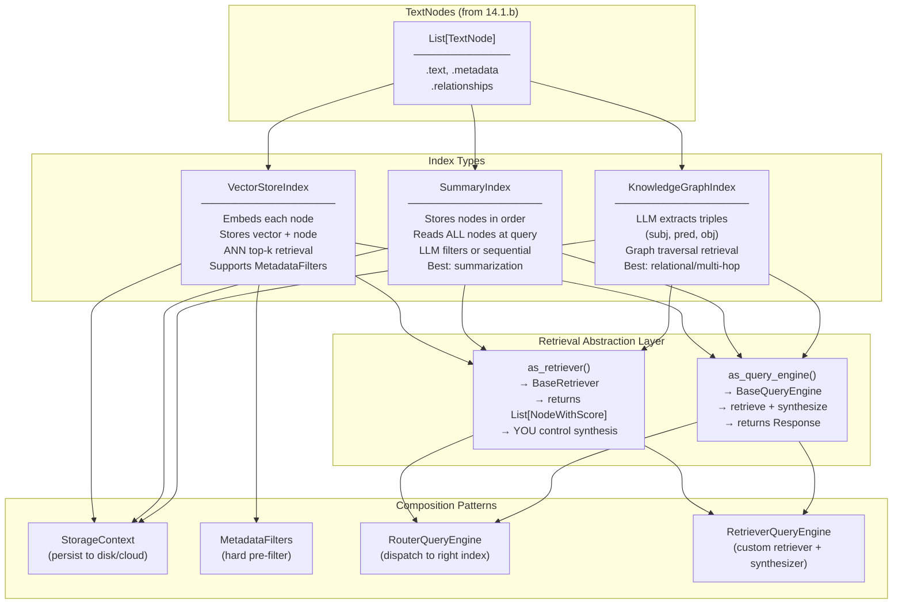

**Key insight:** Every index exposes the same `as_retriever()` / `as_query_engine()` interface. A `RouterQueryEngine` can sit in front of multiple indexes and dispatch each query to the right one — your application code never changes regardless of which index is underneath.

---

### 3. Real-World Industry Scenarios [Intermediate]

#### Scenario A: Enterprise HR Policy Chatbot — `VectorStoreIndex` + Metadata Filters

**Context:** A Fortune 500 HR team needs employees to query 2,000 policy documents across 12 business units. Each query should only return results for the employee's own business unit (strict data isolation). Questions are specific: *"What is the parental leave policy for full-time employees?"*

**How index type fits in:**
- `VectorStoreIndex` with a persistent `PineconeVectorStore` backend. Each node's metadata includes `{"business_unit": "engineering", "policy_type": "leave", "effective_date": "2024-01"}`.
- At query time, `MetadataFilters` hard-filters by `business_unit` before ANN search runs. An employee in Engineering never sees HR nodes from Finance — even if their query embedding is similar.
- `as_query_engine(similarity_top_k=5)` returns the top 5 nodes + synthesized answer in one call.

**Constraints:**
- **Latency:** ANN search on Pinecone is 10–50ms. Adding a metadata pre-filter adds negligible overhead (it's pushed down into the vector store's native filter). Total query latency target: < 2 seconds end-to-end.
- **Cost:** Only the top-k=5 nodes are sent to the LLM for synthesis. Contrast with `SummaryIndex` — which would send all 2,000 policy nodes per query, burning ~400K tokens/query. `VectorStoreIndex` is 99% cheaper for point-lookup queries.
- **Failure modes:** If `business_unit` metadata is missing from some nodes (ingestion bug), those nodes become globally visible — a data isolation breach. The ingestion layer *must* validate metadata completeness as a security control.
- **What "good" looks like:** Query returns the exact policy clause, cites `{"source": "HR_Leave_Policy_v3.pdf", "page": 4}`, and is filtered to the correct BU. Response synthesized from ≤5 nodes in < 2 seconds.

---

#### Scenario B: Quarterly Earnings Report Summarizer — `SummaryIndex`

**Context:** A financial analyst team has 20 earnings call transcripts (each ~8,000 tokens) and needs to generate a single synthesized summary: *"What are the common themes across all Q3 2024 earnings calls?"*

**How index type fits in:**
- `SummaryIndex` over the 20 transcript documents (each as a set of nodes). The query engine reads *all* nodes — every sentence of every transcript — and the LLM synthesizes a cross-document summary.
- `SummaryIndex.as_query_engine(response_mode="tree_summarize")` uses a recursive summarization tree: nodes → chunk summaries → summaries of summaries → final answer. This avoids sending 160K tokens to the LLM in a single call (which would overflow context and cost a fortune).
- `response_mode="accumulate"` would concatenate individual answers per node — useful when you want granular per-document responses rather than a synthesized narrative.

**Constraints:**
- **Latency:** Reading all nodes is inherently slow. 20 transcripts × ~16 nodes each = 320 LLM calls in `tree_summarize` mode. Async synthesis with `aquery()` reduces wall-clock time from minutes to ~30 seconds via parallel LLM calls.
- **Cost:** `tree_summarize` = O(n log n) LLM calls. `accumulate` = O(n) calls. Both are expensive for large corpora — reserve `SummaryIndex` for < 500 nodes or use it on a pre-filtered subset (e.g., after a `VectorStoreIndex` narrows candidates to 20 nodes).
- **Failure modes:** Using `SummaryIndex` on 10,000 nodes without size awareness burns $50+ per query and times out. Always set `max_nodes_per_query` or pair with an upstream retriever that pre-filters.
- **What "good" looks like:** A coherent multi-paragraph synthesis with cross-document themes, not a list of bullet points from individual docs. `tree_summarize` mode + a well-engineered summary prompt achieves this.

---

#### Scenario C: IT Dependency Mapping — `KnowledgeGraphIndex`

**Context:** An ops team has 500 runbooks describing service dependencies: *"ServiceA depends on DatabaseB, which is managed by TeamC."* They need to answer: *"If DatabaseB goes down, what services are affected and who do I call?"*

**How index type fits in:**
- `KnowledgeGraphIndex` extracts triples like `(ServiceA, depends_on, DatabaseB)` and `(DatabaseB, managed_by, TeamC)` from the runbook nodes.
- At query time: *"What services depend on DatabaseB?"* → graph traversal finds all nodes with `predicate=depends_on, object=DatabaseB` → returns `ServiceA`, `ServiceC`, `ServiceF`.
- Multi-hop: *"Who manages the service that ServiceA depends on?"* → traverse `ServiceA → depends_on → DatabaseB → managed_by → TeamC`. A `VectorStoreIndex` cannot answer this — it has no relational traversal capability.

**Constraints:**
- **Latency:** Triple extraction at ingestion time is LLM-heavy (one call per node). But query-time traversal is fast (graph lookup, not ANN). Ingestion is slow; queries are fast.
- **Cost:** Triple extraction = 1 LLM call per node × 500 runbooks × ~15 nodes = 7,500 LLM calls at ingestion. Use a cheaper model (GPT-3.5 / Claude Haiku) for extraction; the triples are structured and don't require the most capable model.
- **Failure modes:** LLM-extracted triples contain errors (hallucinated relationships, wrong entity names). A `ServiceA → owns → DatabaseB` vs `ServiceA → depends_on → DatabaseB` distinction matters. Always validate extracted triples against a known schema before storing.
- **What "good" looks like:** Multi-hop query correctly traverses 3 relationship hops and returns the on-call team. Triple accuracy > 95% validated against the ground-truth dependency map.

---

### 4. System View (Think Like a Systems Engineer) [Intermediate]

**Inputs → Transformations → Outputs per index type:**

```
VectorStoreIndex:
  INPUTS:   List[TextNode] + embed_model + vector_store backend
  BUILD:    embed(node.text + metadata_prefix) → store(vector, node_id, metadata) in vector store
  QUERY:    embed(query_str) → ANN search(top_k, filters) → List[NodeWithScore]
  OUTPUTS:  ranked nodes with similarity scores

SummaryIndex:
  INPUTS:   List[TextNode] (order preserved)
  BUILD:    store nodes in ordered list (no embedding at build time by default)
  QUERY:    iterate all nodes OR LLM-filter by relevance → pass to response synthesizer
  OUTPUTS:  synthesized response from all (or filtered) nodes

KnowledgeGraphIndex:
  INPUTS:   List[TextNode] + LLM (for extraction) + graph store backend
  BUILD:    LLM(node.text) → extract List[(subj,pred,obj)] → store in graph
  QUERY:    LLM parses query → keyword/entity match → graph traversal → retrieve subgraph nodes
  OUTPUTS:  nodes matching relational traversal path + synthesized answer
```

**Observability — what to log, trace, and measure:**

| Signal | What to capture | Why |
|--------|----------------|-----|
| `index_type` | Which index answered the query | Required for per-index cost and latency tracking |
| `nodes_retrieved` | Count of nodes returned before synthesis | High count on VectorStoreIndex = top_k too large; high count on SummaryIndex = expected |
| `similarity_scores` | p50 / min score of retrieved nodes (VectorStoreIndex) | Low scores (< 0.7) = query is semantically far from corpus |
| `filter_hit_rate` | % of nodes passing MetadataFilters pre-filter | Near-zero = filter too strict or metadata missing |
| `synthesis_tokens` | Tokens sent to LLM for synthesis | Primary cost driver; controls budget |
| `graph_traversal_depth` | Hops taken in KnowledgeGraph query | Deep traversals are slow; cap at 3 hops in prod |
| `triple_extraction_errors` | % of nodes where KGIndex extraction returned empty | High rate = LLM prompt needs tuning or nodes too short |

**Failure points — where it breaks and how it shows up:**

1. **Wrong index for the query shape** — Using `VectorStoreIndex` for a summarization query (*"Summarize all incidents from last quarter"*): top-k=5 retrieves only 5 nodes — the answer misses 90% of incidents. Answer looks confident but is factually incomplete. *How it shows up:* users report the system "misses things" even though individual retrievals seem correct.

2. **`SummaryIndex` on a large corpus without size guard** — Using `SummaryIndex` on 5,000 nodes without a max_nodes limit. Every query sends 5,000 node texts to the LLM synthesis step: context overflow + $40/query cost. *How it shows up:* first query works (demo corpus was small); production query times out or returns a 400 "context length exceeded" error.

3. **Stale index after re-ingestion** — Nodes are re-parsed (new chunks) but the `VectorStoreIndex` still holds the old vectors keyed to old `node_ids`. Queries return outdated content mixed with new content. *How it shows up:* answers are inconsistent — sometimes fresh, sometimes stale — depending on which node_ids the ANN search returns. Fix: use `index.refresh_ref_docs()` or full index rebuild with dedup-aware `IngestionPipeline`.

4. **MetadataFilters silently over-filtering** — A filter on `metadata["status"] == "active"` is applied but 30% of nodes were ingested without the `status` field. Those nodes are excluded from every query silently. *How it shows up:* `filter_hit_rate` drops; users can't find content they know exists.

---

### 5. System Design Flavor [Intermediate]

**Key components and interfaces:**

```python
from llama_index.core import (
    VectorStoreIndex, SummaryIndex, KnowledgeGraphIndex,
    StorageContext, Settings,
)
from llama_index.core.vector_stores.types import MetadataFilters, MetadataFilter

# ── VectorStoreIndex ───────────────────────────────────────────────────────────
# Build
vi = VectorStoreIndex(nodes, storage_context=storage_context)

# Retrieve only (composable)
retriever = vi.as_retriever(
    similarity_top_k=5,
    filters=MetadataFilters(filters=[
        MetadataFilter(key="business_unit", value="engineering"),
        MetadataFilter(key="status", value="active"),
    ])
)
nodes_with_scores = retriever.retrieve("What is the parental leave policy?")

# End-to-end query engine
query_engine = vi.as_query_engine(similarity_top_k=5)
response = query_engine.query("What is the parental leave policy?")
print(response.source_nodes)   # nodes used for synthesis

# ── SummaryIndex ───────────────────────────────────────────────────────────────
si = SummaryIndex(nodes)
summary_engine = si.as_query_engine(response_mode="tree_summarize")
response = summary_engine.query("Summarize common themes across all documents.")

# ── KnowledgeGraphIndex ────────────────────────────────────────────────────────
from llama_index.core import KnowledgeGraphIndex
kg = KnowledgeGraphIndex(
    nodes,
    max_triplets_per_chunk=5,   # LLM extracts up to 5 triples per node
    include_embeddings=True,    # hybrid: embedding + graph traversal
)
kg_engine = kg.as_query_engine(
    include_text=True,
    retriever_mode="hybrid",    # "keyword" | "embedding" | "hybrid"
    similarity_top_k=3,
)
response = kg_engine.query("Who manages the service that ServiceA depends on?")

# ── RouterQueryEngine — dispatch to the right index ───────────────────────────
from llama_index.core.tools import QueryEngineTool
from llama_index.core.query_engine import RouterQueryEngine
from llama_index.core.selectors import LLMSingleSelector

tools = [
    QueryEngineTool.from_defaults(
        query_engine=vi.as_query_engine(),
        description="For specific policy lookups and point-retrieval questions.",
    ),
    QueryEngineTool.from_defaults(
        query_engine=si.as_query_engine(response_mode="tree_summarize"),
        description="For summarization and aggregation questions across all documents.",
    ),
]
router = RouterQueryEngine(
    selector=LLMSingleSelector.from_defaults(),
    query_engine_tools=tools,
)
response = router.query("Summarize all incidents from last quarter.")
# Router LLM picks SummaryIndex; specific queries pick VectorStoreIndex

# ── StorageContext — persist everything ───────────────────────────────────────
from llama_index.core import load_index_from_storage
from llama_index.core.storage.storage_context import StorageContext

sc = StorageContext.from_defaults(persist_dir="./storage")
vi = VectorStoreIndex(nodes, storage_context=sc)
sc.persist()  # saves to disk

# Reload
sc2 = StorageContext.from_defaults(persist_dir="./storage")
vi_loaded = load_index_from_storage(sc2)
```

**Key tradeoffs:**

| Tradeoff | Option A | Option B | When to choose |
|----------|----------|----------|----------------|
| **Precision vs. coverage** | `VectorStoreIndex` top-k=3 (fast, cheap, precise) | `SummaryIndex` full-scan (thorough, expensive) | VectorStoreIndex for Q&A. SummaryIndex for synthesis. Use RouterQueryEngine to get both. |
| **Embedding cost at build vs. query** | `VectorStoreIndex` — pays embedding cost at build time, near-free at query time | `SummaryIndex` — no build-time embedding, pays LLM cost at every query | For high-query-volume systems, pay once at build (VectorStoreIndex). For low-volume batch analytics, pay per query (SummaryIndex). |
| **Structured vs. semantic retrieval** | `VectorStoreIndex` + `MetadataFilters` (semantic + hard filter) | `KnowledgeGraphIndex` (relational graph traversal) | Use metadata filters when relationships are flat attributes on nodes. Use KG when relationships *are* the query (multi-hop, entity links). |

**Scaling consideration (10x data):**
At 10x node volume (e.g., 1M nodes), three bottlenecks emerge:
- **`VectorStoreIndex` build time:** Embedding 1M nodes × 512 dims at $0.0001/1K tokens ≈ $100. Use a persistent vector store (Pinecone, Weaviate, pgvector) with batched upserts, not an in-memory `SimpleVectorStore`.
- **`SummaryIndex` query cost:** Full-scan over 1M nodes is impossible. At 10x scale, SummaryIndex is only viable if you pre-filter to a small subset first (e.g., retrieve 50 candidates with VectorStoreIndex, then summarize those 50 with SummaryIndex — the "two-stage" pattern).
- **`KnowledgeGraphIndex` extraction:** 1M nodes × 1 LLM call each = 1M extraction calls. Use a smaller model (GPT-3.5 / Haiku) and rate-limited async batching. Store the graph in a dedicated graph DB (Neo4j) for traversal performance.

---

### 6. Common Mistakes + Debugging [Beginner → Intermediate]

#### Mistake 1: Using `VectorStoreIndex` for Summarization Queries

**Symptom:** The query *"Summarize all customer complaints from last month"* returns 5 bullet points. Users report the summary is incomplete — it misses obvious patterns that appear frequently in the data.

**Likely cause:** `VectorStoreIndex` with `top_k=5` was used. Only 5 nodes were retrieved and synthesized. The 95% of complaint nodes that weren't in the top-5 were never seen by the LLM.

**First debugging step:**
```python
response = query_engine.query("Summarize all customer complaints from last month")
print(f"Source nodes used: {len(response.source_nodes)}")
# If source_nodes < 10 for a "summarize all" query → wrong index
# Fix: switch to SummaryIndex or increase top_k to 50+ with VectorStoreIndex
# Better fix: RouterQueryEngine that routes "summarize" queries to SummaryIndex
```

---

#### Mistake 2: Not Persisting the Index — Rebuilding from Scratch on Every Restart

**Symptom:** App startup takes 5–10 minutes every time it launches. Embedding API costs are incurred on every deployment. The "cached" index is never actually cached.

**Likely cause:** Index built with `VectorStoreIndex.from_documents(docs)` inside the application startup path without checking for an existing persisted index. Every cold start rebuilds.

**First debugging step:**
```python
import os
PERSIST_DIR = "./storage"
if os.path.exists(PERSIST_DIR):
    sc = StorageContext.from_defaults(persist_dir=PERSIST_DIR)
    index = load_index_from_storage(sc)
    print("Loaded from disk")
else:
    index = VectorStoreIndex(nodes, storage_context=StorageContext.from_defaults())
    index.storage_context.persist(persist_dir=PERSIST_DIR)
    print("Built and persisted")
```
Fix: always check for an existing index before building. Use a persistent vector store (Pinecone / Chroma) in production — `SimpleVectorStore` is in-memory only and doesn't survive restarts.

---

#### Mistake 3: Metadata Filters That Silently Over-Filter

**Symptom:** Users report that they can't find documents they uploaded. Queries return empty results or a generic "I couldn't find relevant information" response. The data is definitely in the index.

**Likely cause:** A `MetadataFilter` is applied to every query (e.g., `status == "active"`) but some nodes were ingested before the `status` field was added to the ingestion pipeline. Those older nodes have no `status` field and are excluded from every ANN search silently.

**First debugging step:**
```python
# Sample 20 nodes and check metadata key coverage
sample = index.docstore.docs   # dict of node_id → TextNode
keys_coverage = {}
for node_id, node in list(sample.items())[:100]:
    for k in node.metadata:
        keys_coverage[k] = keys_coverage.get(k, 0) + 1
print(keys_coverage)
# If "status" appears in only 70/100 nodes → 30% are silently excluded by the filter
```
Fix: add a default value for required filter fields in the ingestion pipeline. Re-ingest or patch metadata for older nodes.

---

### 7. Hands-On Lab [Pro]

#### Build — Three Indexes, Same Nodes, Different Query Shapes

```python
# index_types_lab.py
# pip install llama-index-core llama-index-embeddings-openai
# Note: KnowledgeGraphIndex requires an LLM (uses GPT-3.5/4 for triple extraction)

from llama_index.core import (
    Document, VectorStoreIndex, SummaryIndex,
    Settings, StorageContext,
)
from llama_index.core.node_parser import SentenceSplitter
from llama_index.core.vector_stores.types import MetadataFilters, MetadataFilter
import os

# ── Sample corpus: 6 documents across 2 departments ───────────────────────────
DOCS = [
    Document(text="Engineering leave policy: Full-time engineers get 20 days PTO annually. "
                  "Parental leave is 16 weeks fully paid. Remote work is allowed 3 days/week.",
             metadata={"dept": "engineering", "type": "leave", "status": "active"}),
    Document(text="Engineering expense policy: Expenses up to $500 need manager approval. "
                  "Expenses above $500 require VP approval. All receipts must be submitted within 30 days.",
             metadata={"dept": "engineering", "type": "expense", "status": "active"}),
    Document(text="Finance leave policy: Finance employees get 18 days PTO annually. "
                  "Parental leave is 12 weeks. Emergency leave up to 5 days is available.",
             metadata={"dept": "finance", "type": "leave", "status": "active"}),
    Document(text="Finance expense policy: All expenses require pre-approval. "
                  "Travel expenses above $1000 need CFO sign-off. Receipts due within 14 days.",
             metadata={"dept": "finance", "type": "expense", "status": "active"}),
    Document(text="Q3 2024 Incident Summary: Three P1 incidents occurred. "
                  "Root cause: database connection pool exhaustion. Resolution: pool size increased.",
             metadata={"dept": "ops", "type": "incident", "status": "archived"}),
    Document(text="Q4 2024 Incident Summary: Two P1 incidents occurred. "
                  "Root cause: deployment pipeline timeout. Resolution: timeout thresholds increased.",
             metadata={"dept": "ops", "type": "incident", "status": "archived"}),
]

# ── Parse into nodes ───────────────────────────────────────────────────────────
parser = SentenceSplitter(chunk_size=256, chunk_overlap=32)
nodes = parser.get_nodes_from_documents(DOCS)
print(f"Total nodes: {len(nodes)}")
for n in nodes:
    print(f"  [{n.metadata.get('dept')}/{n.metadata.get('type')}] {n.text[:60].strip()!r}")

# ── Index 1: VectorStoreIndex (skip embedding for lab — use MockEmbedding) ────
# For a real run: set Settings.embed_model = OpenAIEmbedding()
from llama_index.core.embeddings import resolve_embed_model
# Use a local mock embedding for cost-free testing
# pip install llama-index-embeddings-huggingface  (optional, for real embeddings)
# Settings.embed_model = "local:BAAI/bge-small-en-v1.5"

vi = VectorStoreIndex(nodes)

# ── Point-lookup with metadata filter (Engineering only) ──────────────────────
eng_retriever = vi.as_retriever(
    similarity_top_k=3,
    filters=MetadataFilters(filters=[
        MetadataFilter(key="dept", value="engineering"),
    ])
)
results = eng_retriever.retrieve("What is the parental leave policy?")
print(f"\n── VectorStoreIndex (dept=engineering filter) ──")
print(f"Retrieved {len(results)} nodes:")
for r in results:
    print(f"  score={r.score:.3f} | dept={r.node.metadata.get('dept')} | {r.node.text[:80].strip()!r}")

# ── Index 2: SummaryIndex (for cross-document synthesis) ──────────────────────
si = SummaryIndex(nodes)
# Note: without an LLM configured, this will use the default Settings.llm
# For testing without API key: set response_mode="no_text" to just see node ordering
summary_retriever = si.as_retriever()
summary_nodes = summary_retriever.retrieve("Summarize all incidents")
print(f"\n── SummaryIndex retriever ──")
print(f"Retrieved {len(summary_nodes)} nodes (SummaryIndex returns ALL nodes by default)")

# ── Check node ordering and metadata on SummaryIndex ─────────────────────────
incident_nodes = [n for n in summary_nodes if n.node.metadata.get("type") == "incident"]
print(f"Incident nodes in corpus: {len(incident_nodes)}")

# ── Persistence round-trip ─────────────────────────────────────────────────────
PERSIST_DIR = "/tmp/llamaindex_lab_storage"
sc = StorageContext.from_defaults()
vi_persist = VectorStoreIndex(nodes, storage_context=sc)
sc.persist(persist_dir=PERSIST_DIR)
print(f"\n── Persistence ──")
print(f"Index persisted to {PERSIST_DIR}")
print(f"Files: {os.listdir(PERSIST_DIR)}")

# Reload
from llama_index.core import load_index_from_storage
sc2 = StorageContext.from_defaults(persist_dir=PERSIST_DIR)
vi_loaded = load_index_from_storage(sc2)
print(f"Reloaded index type: {type(vi_loaded).__name__}")
```

---

#### Break — Force the Failure Modes

```python
# BREAK 1: VectorStoreIndex with no filter — Finance data leaks into Engineering query
no_filter_retriever = vi.as_retriever(similarity_top_k=5)
results_all = no_filter_retriever.retrieve("What is the parental leave policy?")
print("\nBREAK 1 — No filter: departments returned =",
      set(r.node.metadata.get("dept") for r in results_all))
# Expected: may include finance nodes despite being an Engineering-specific query
# In prod: this is a data isolation breach

# ──────────────────────────────────────────────────────────────────────────────

# BREAK 2: SummaryIndex top_k — wrong parameter, doesn't behave like VectorStoreIndex
# SummaryIndex.as_retriever() ignores similarity_top_k by default
# It retrieves ALL nodes unless response_mode="compact" or LLM filtering is set
si_wrong = si.as_retriever(similarity_top_k=2)  # top_k silently ignored
all_si_nodes = si_wrong.retrieve("What is the expense policy?")
print(f"\nBREAK 2 — SummaryIndex with top_k=2: actually retrieved {len(all_si_nodes)} nodes")
# Shows why using SummaryIndex for point-lookup is expensive — it ignores top_k

# ──────────────────────────────────────────────────────────────────────────────

# BREAK 3: MetadataFilter on missing key → 0 results
from llama_index.core.vector_stores.types import MetadataFilter
bad_filter_retriever = vi.as_retriever(
    similarity_top_k=5,
    filters=MetadataFilters(filters=[
        MetadataFilter(key="nonexistent_key", value="some_value"),
    ])
)
zero_results = bad_filter_retriever.retrieve("What is the leave policy?")
print(f"\nBREAK 3 — Filter on nonexistent key: {len(zero_results)} results")
# Expected: 0 results — silent over-filtering
# In prod: users report "can't find documents" but data is definitely there
```

---

#### Measure

```python
import time

# Measure index build time vs query time tradeoff
build_times = {}
query_times = {}

# VectorStoreIndex: slow build (embedding), fast query
t0 = time.perf_counter()
vi_bench = VectorStoreIndex(nodes * 20)   # 120 nodes
build_times["VectorStoreIndex"] = time.perf_counter() - t0

t0 = time.perf_counter()
vi_bench.as_retriever(similarity_top_k=3).retrieve("leave policy")
query_times["VectorStoreIndex"] = time.perf_counter() - t0

# SummaryIndex: fast build (no embedding), slow query (reads all)
t0 = time.perf_counter()
si_bench = SummaryIndex(nodes * 20)
build_times["SummaryIndex"] = time.perf_counter() - t0

t0 = time.perf_counter()
si_bench.as_retriever().retrieve("leave policy")
query_times["SummaryIndex"] = time.perf_counter() - t0

print("\n── Build vs Query Time ──")
for name in ["VectorStoreIndex", "SummaryIndex"]:
    print(f"{name:22s}  build={build_times[name]*1000:.1f}ms  query={query_times[name]*1000:.1f}ms")

# Expected:
# VectorStoreIndex: build > query  (embeddings are the slow part)
# SummaryIndex:     build < query  (reads all nodes at query time)
```

---

#### Explain — Why It Works This Way

The index-type decision is fundamentally a **query-shape decision**, not a data decision. The same nodes can be indexed three different ways simultaneously — the question is what the user will ask.

`VectorStoreIndex` assumes queries are point-lookup: *"Find the N passages most similar to this question."* It scales because ANN search is O(log n) — querying 1M nodes is only marginally slower than querying 1K nodes.

`SummaryIndex` assumes queries are aggregation: *"Tell me everything about X."* It cannot scale with data size because it reads every node. It is correct for "summarize all" queries precisely because correctness requires seeing all nodes. Using top-k retrieval here introduces sampling bias.

`RouterQueryEngine` is the production pattern that reconciles both: the router LLM reads the query, classifies it as point-lookup vs aggregation, and dispatches to the right engine. This is how you build a system that handles *both* query shapes without committing to one index at design time.

---

### 8. Active Recall (Spaced Repetition) [Beginner → Pro]

**Q1 [Beginner]:** What is the core difference between `VectorStoreIndex` and `SummaryIndex` in terms of how they retrieve nodes at query time?

> **A:** `VectorStoreIndex` retrieves only the top-k most similar nodes via ANN search — it never reads the full corpus. `SummaryIndex` reads *all* nodes at query time (either sequentially or via LLM filtering). `VectorStoreIndex` is best for precision-focused point-lookup queries; `SummaryIndex` is best for summarization/aggregation queries that require full corpus coverage.

---

**Q2 [Beginner]:** What is the difference between `as_retriever()` and `as_query_engine()`?

> **A:** `as_retriever()` returns a `BaseRetriever` — it gives you back a `List[NodeWithScore]` and stops there. You control what happens next (post-processing, reranking, synthesis). `as_query_engine()` returns a `BaseQueryEngine` — it wraps retrieval + response synthesis into a single `.query(str) → Response` call. Use `as_retriever()` when you need composability; use `as_query_engine()` when you want a ready-to-use pipeline.

---

**Q3 [Intermediate]:** A user queries: *"Summarize all support tickets from last quarter."* Your system uses `VectorStoreIndex` with `top_k=5` and returns a summary that misses 80% of the tickets. How do you fix this without switching to full `SummaryIndex` over all 50K tickets?

> **A:** Two-stage pattern: (1) Use `VectorStoreIndex` with a `MetadataFilter` on `quarter=="Q3-2024"` and a large `top_k=200` to retrieve all relevant tickets. (2) Pass those 200 nodes to a `SummaryIndex` (or `ResponseSynthesizer` with `response_mode="tree_summarize"`) for synthesis. This combines VectorStoreIndex's scalability with SummaryIndex's thoroughness — you avoid full-corpus scan while still reading all *relevant* nodes.

---

**Q4 [Intermediate]:** When would you choose `KnowledgeGraphIndex` over `VectorStoreIndex` with metadata filters?

> **A:** Choose `KnowledgeGraphIndex` when the query requires following relationship chains (multi-hop): e.g., *"Who manages the team that owns the service that ServiceA depends on?"* — this is 3 relational hops that metadata filters can't traverse. Metadata filters on VectorStoreIndex work only for single-level attribute matching (`dept == "engineering"`). KG is also better when entity relationships vary by instance (not just by category) and when the *path* between entities is what matters, not the semantic similarity of text.

---

**Q5 [Pro]:** Explain the `RouterQueryEngine` pattern. What selector types are available and when would you use LLM-based vs embedding-based selection?

> **A:** `RouterQueryEngine` sits in front of multiple `QueryEngineTool` objects, each wrapping a different index or query engine. At query time, a *selector* reads the query and picks which tool to use. Two selector types: `LLMSingleSelector` — sends the query + tool descriptions to an LLM to pick the best tool (highest accuracy, adds ~200ms LLM call latency). `EmbeddingSingleSelector` — embeds the query and tool descriptions, picks by cosine similarity (faster, lower cost, slightly less accurate for ambiguous queries). Use LLM selector when query routing is complex (nuanced descriptions, overlapping tools). Use embedding selector when query volume is high and routing accuracy is acceptable with simpler heuristics.

---

### 9. Practice

**Mini-exercise:** You're building a legal research assistant over 500 case law documents. Users ask two types of questions: *"What did the court rule in Smith v. Jones?"* (point-lookup) and *"What are the common precedents cited in contract dispute cases?"* (aggregation). Design the index architecture, routing strategy, and one metadata filter you'd apply.

> **Suggested answer:**
> - **Index A:** `VectorStoreIndex` for point-lookup. Metadata: `{"case_name": ..., "year": ..., "case_type": "contract_dispute"}`. Filter: `case_type == "contract_dispute"` for the aggregation query pre-filter.
> - **Index B:** `SummaryIndex` over a pre-filtered subset of nodes (retrieved via VectorStoreIndex first) for aggregation.
> - **Router:** `RouterQueryEngine` with `LLMSingleSelector`. Tool A description: "For specific case rulings, dates, parties, and verdicts." Tool B description: "For summarizing patterns, precedents, or themes across multiple cases."
> - **Metadata filter:** `year >= 2010` on VectorStoreIndex to exclude outdated precedents by default.

---

**Capstone system design question:** Design a multi-index RAG system for a tech company with three corpora: (1) 10,000 Confluence wiki pages (technical documentation), (2) 500 post-incident reports (ops runbooks with service dependencies), (3) 50,000 support tickets. Each corpus has different query shapes. Describe the index types, retrieval strategy, routing logic, and production storage choices.

> **Answer outline:**
> - **Confluence:** `VectorStoreIndex` with `PineconeVectorStore`. Metadata: `space_key`, `last_modified`, `team`. MetadataFilter by `team` for access control. top_k=5 for precise documentation lookup.
> - **Incident reports:** `KnowledgeGraphIndex` with `Neo4jGraphStore`. Triples like `(ServiceA, depends_on, DatabaseB)`. Hybrid retrieval mode (embedding + keyword). Enables multi-hop dependency queries.
> - **Support tickets:** `VectorStoreIndex` (point-lookup) + `SummaryIndex` (trend analysis). Two-stage for summaries: VectorIndex filters by `quarter` + `severity`, SummaryIndex synthesizes filtered results.
> - **Router:** `RouterQueryEngine` with `LLMSingleSelector`. 3 tools with distinct descriptions. Falls back to Confluence VectorIndex if selector confidence is low.
> - **Storage:** Pinecone for vectors (multi-tenant namespaces per corpus), Neo4j for KG, `SimpleDocumentStore` backed by Redis for docstore.
> - **Observability:** Per-index query count, synthesis_tokens, similarity_score_p50, filter_hit_rate — all emitted as metrics to Datadog/Prometheus.

---

### 10. Production Reality Check (Mandatory) ✅

**If this fails in prod, what's the first thing we inspect?**

> **Check which index type answered the query and how many nodes were synthesized.**
>
> ```python
> response = query_engine.query("Summarize all incidents from last quarter")
> print(f"Index type  : {type(query_engine).__name__}")
> print(f"Nodes used  : {len(response.source_nodes)}")
> print(f"Source depts: {set(n.node.metadata.get('type') for n in response.source_nodes)}")
> ```
>
> If `nodes_used = 5` for a "summarize all" query → you're using `VectorStoreIndex` where `SummaryIndex` is needed.
> If `nodes_used = 5000` for a point-lookup → you accidentally have `SummaryIndex` routing a precise query.
> If `nodes_used = 0` → `MetadataFilters` are over-filtering; check metadata key coverage on your nodes.
>
> The source_nodes count is your first diagnostic signal. It immediately tells you whether retrieval is under-returning (wrong index, filter too strict) or over-returning (wrong index, no filter).

---

### 11. Curiosity Bridge (Mandatory) ✅

You now know *which index* holds your nodes and *how* to retrieve them. But the index lives somewhere — and by default, "somewhere" is in memory, gone on every restart, rebuilt from scratch every deployment. The next question is: **where does the index actually live, how do you persist it between runs, and what changes when you swap from an in-memory store to Pinecone, Chroma, or pgvector?**

That's what **Storage Context, Docstores, and Index Persistence** covers — and the storage choice is not just operational. It determines whether your system can handle 1M nodes, support multi-tenant isolation, or survive a pod restart without a 10-minute cold-start rebuild.

---

### 12. Exit Check + Carry-Forward Review

**Exit check:** You're done with 14.1.c when you can choose the correct index type for a given query shape without hesitation, explain why `SummaryIndex.as_retriever(top_k=3)` doesn't behave like `VectorStoreIndex.as_retriever(top_k=3)`, configure a `RouterQueryEngine` with two tools and explain the LLM vs embedding selector tradeoff, and diagnose a "0 results" failure using the filter_hit_rate pattern.

---

**Carry-Forward Review (interleaved recall from 14.1.b):**

*Q: What is the `HierarchicalNodeParser` + `AutoMergingRetriever` pattern and why does it outperform flat chunking for broad conceptual questions?*

> **A:** `HierarchicalNodeParser` creates multiple levels of nodes (e.g., 2048 → 512 → 128 tokens) from the same document content, linked by `NodeRelationship.PARENT` / `CHILDREN`. At query time, `AutoMergingRetriever` retrieves small leaf nodes (high precision). When a threshold percentage of sibling leaves under the same parent all match the query, it merges up to the parent — returning a larger, more coherent chunk. Flat chunking forces a single size; hierarchical parsing gets both precision (small nodes for specific queries) and recall (large parents for broad conceptual queries) without committing to either at design time.

---

## Subtopic 14.1.d: Data-Centric Pipeline Design Choices

### Reading Path + Level Tags

- **Beginner:** Read sections 1–2 and the Active Recall.
- **Intermediate:** Add sections 3–5 and the Hands-On Lab Build step.
- **Pro:** Complete the full Hands-On Lab (Build → Break → Measure → Explain) plus the capstone practice question.

---

### 0. Pre-Question Hook [Beginner]

**Pause:** You have a working LlamaIndex RAG system with `VectorStoreIndex` over 50,000 nodes. Data changes daily — some documents are updated, some deleted, some added. Before reading — how would you keep the index fresh without re-embedding 50,000 nodes every night, and what happens to your system if you get this wrong?

Think for 30 seconds. Then read on.

---

### 1. The Intuition (Plain English) [Beginner]

Building an index once is easy. Keeping it correct, current, and affordable as data changes is the real engineering problem. This subtopic is about the *plumbing* that connects your data sources to your indexes — reliably, incrementally, and observably.

The core mental model has three layers:

```
Layer 1 — Storage:     WHERE nodes and vectors live (in-memory vs. persistent backend)
Layer 2 — Pipeline:    HOW data flows from source → Document → Node → Index
Layer 3 — Freshness:   WHEN and HOW MUCH data gets re-processed on each run
```

Get Layer 1 wrong: your index disappears on every restart.
Get Layer 2 wrong: your pipeline is a fragile monolith that breaks when one source goes down.
Get Layer 3 wrong: you either re-embed 50K nodes daily (expensive) or serve stale data (incorrect).

**Key terms (first use):**

- **`StorageContext`** — LlamaIndex's unified storage configuration object; bundles `VectorStore`, `DocStore`, `IndexStore`, and `GraphStore` into a single injectable unit.
- **`SimpleVectorStore`** — the default in-memory vector store; fast for development, lost on restart, not suitable for production.
- **`ChromaVectorStore`** — lightweight persistent vector store backed by ChromaDB; runs locally or as a server; good for single-machine production.
- **`PineconeVectorStore`** — managed cloud vector store; supports multi-tenant namespaces, metadata filtering, and horizontal scaling; best for high-QPS production.
- **`pgvector`** — PostgreSQL extension for vector similarity search; best when you already run Postgres and want to avoid a separate vector DB.
- **`SimpleDocumentStore`** — in-memory docstore keyed by `doc_id`; used for deduplication in `IngestionPipeline`; can be persisted to JSON on disk.
- **Incremental ingestion** — re-processing only documents that are new or changed since the last run; the primary cost-reduction strategy for large, frequently-updated corpora.
- **Full re-ingestion** — discarding the existing index and rebuilding from scratch; expensive but guarantees correctness after structural schema changes.
- **Change-data capture (CDC)** — a database pattern (e.g., Debezium) that streams row-level changes to a queue; enables real-time incremental ingestion from databases.
- **`IngestionPipeline.cache`** — optional `IngestionCache` backed by Redis or `SimpleCache`; caches transformation outputs keyed by node content hash; avoids re-running LLM extraction on unchanged nodes.

**Analogy:** `StorageContext` is like a datacenter rack — it declares which specific storage backends (vector store, docstore, etc.) plug in. The `IngestionPipeline` is the conveyor belt that feeds data into those backends. Freshness strategy is the shift schedule: do you replace every item on the belt every night, or only the ones that changed? The analogy breaks down here: a physical conveyor belt is sequential; `IngestionPipeline.arun()` processes batches in parallel, so the bottleneck is rate limits, not belt speed.

---

### 2. Visual Diagram (Mermaid) [Beginner]

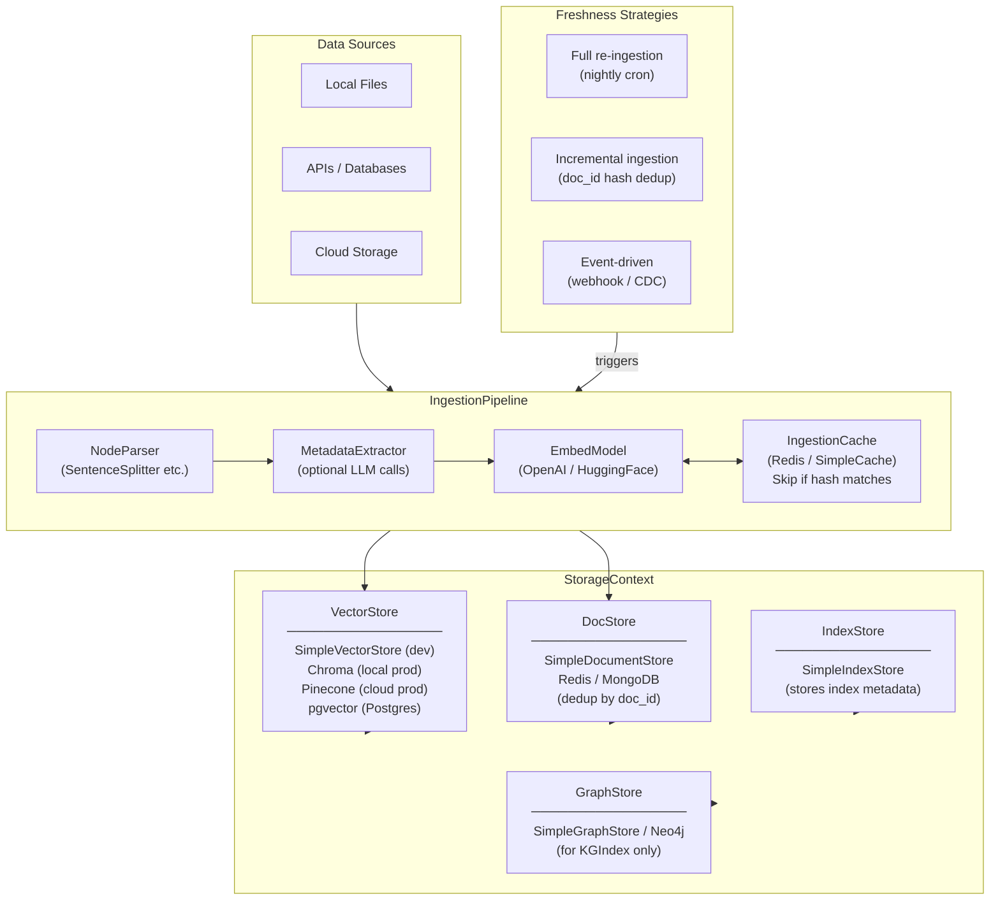

**Key insight:** `StorageContext` is *injected* into the index at build time — swapping from `SimpleVectorStore` to `PineconeVectorStore` requires changing only the `StorageContext` configuration. The rest of the pipeline (parsers, extractors, query engine) stays identical. This is the primary portability guarantee LlamaIndex provides.

---

### 3. Real-World Industry Scenarios [Intermediate]

#### Scenario A: SaaS Product Documentation — Incremental Nightly Ingestion

**Context:** A developer tools company has 8,000 documentation pages updated by writers throughout the day. A nightly pipeline must sync only changed pages into a `ChromaVectorStore`-backed index.

**How pipeline design fits in:**
- Reader fetches all pages with `last_modified` timestamps from the CMS API. Pages modified since the last run (watermark stored in a config file) are fetched as `Document` objects with deterministic `doc_id = hash(page_url)`.
- `IngestionPipeline` with a `SimpleDocumentStore` as the dedup backend. On each run, the pipeline checks `doc_id` against the docstore — unchanged pages are skipped entirely (no re-parse, no re-embed, no API call).
- `IngestionCache` backed by `SimpleCache` caches `TitleExtractor` outputs keyed by node text hash. If a page is lightly edited (only one paragraph changes), only new/changed nodes trigger LLM extraction — the rest are cache hits.
- Deleted pages: the reader also fetches a `deleted_ids` list from the CMS. A post-pipeline cleanup step calls `index.delete_ref_doc(doc_id)` for each deleted page.

**Constraints:**
- **Cost:** Without incremental ingestion: 8,000 pages × ~15 nodes × $0.0001/1K tokens = $12/night for embeddings alone. With incremental ingestion, only 200–400 changed pages/night → $0.30–$0.60/night. A 40–50× cost reduction.
- **Latency:** Nightly batch — no query-time latency impact. At 400 pages × 15 nodes × 50ms/embed (batched) ≈ 5 minutes. Easily fits the maintenance window.
- **Reliability:** CMS API returns 429s occasionally. Each reader call is wrapped in retry-with-backoff. Failed pages land in a dead-letter file for manual retry.
- **What "good" looks like:** Morning queries reflect the previous day's doc changes. Cost and wall-clock time are both < 5% of a full re-ingestion baseline.

---

#### Scenario B: Financial Data Feed — Real-Time Event-Driven Ingestion

**Context:** A fintech company indexes analyst reports (PDFs) as they arrive in S3. New reports land every few hours. The query *"What is the latest outlook for NVDA?"* must reflect reports published within the last 30 minutes.

**How pipeline design fits in:**
- S3 event notification (SNS → SQS) triggers a Lambda worker on each new PDF upload. The worker runs `IngestionPipeline` for that single document only.
- `PineconeVectorStore` with a namespace per ticker symbol (`nvda`, `aapl`, etc.). New nodes are upserted into the correct namespace.
- `StorageContext` is constructed fresh per Lambda invocation — no persistent connection pool needed; Pinecone handles server-side state.
- Old reports (> 90 days) pruned by a weekly cleanup job: `index.delete_nodes([node_ids_older_than_90d])`.

**Constraints:**
- **Latency:** Event-to-queryable SLA: < 5 minutes. Lambda cold start + PDF parse + embedding + Pinecone upsert ≈ 30–90 seconds per report. Meets SLA.
- **Cost:** Pay per event, not per night. 50 reports/day × 30 nodes × $0.0001 ≈ $0.015/day. Near-zero marginal cost.
- **Security:** Pinecone API key in AWS Secrets Manager, injected into Lambda at runtime — never hardcoded or logged.
- **What "good" looks like:** A report lands in S3 at 10:00 AM; by 10:02 AM it's queryable. Historical reports are preserved (not deleted) but newer reports score higher via a `recency_weight` post-processor.

---

#### Scenario C: Enterprise Multi-Source Pipeline — Fan-Out with Source Isolation

**Context:** A legal tech platform ingests from 5 sources: SharePoint, S3, Confluence, PostgreSQL case notes, and a nightly CSV of court filings. Each source has different cadence and failure characteristics. The system must continue serving queries even when 2 of 5 sources fail.

**How pipeline design fits in:**
- **Per-source isolation:** Each source runs its own `IngestionPipeline` instance with its own docstore. A failure in the Confluence pipeline doesn't block or corrupt the SharePoint pipeline.
- **Shared vector store:** All pipelines write to the same `PineconeVectorStore` with a `source` metadata tag. Queries filter by source or search across all.
- **Circuit breaker:** If a source fails 3 consecutive runs, its pipeline is disabled and an alert fires. The index continues serving queries from the last successful ingestion of that source.
- **PHI isolation:** PostgreSQL case notes get `metadata["sensitive"] = True`. A post-retrieval ACL filter blocks non-authorized users from seeing them — even though they share the same vector store namespace.

**Constraints:**
- **Reliability:** At least 3 of 5 sources must succeed for the index to be "healthy." A `source_freshness` metric (time since last successful ingestion per source) drives alerting.
- **Cost:** Centralized `IngestionCache` (Redis) prevents re-embedding the same node content across different pipeline runs.
- **What "good" looks like:** All 5 sources green, `source_freshness` < 24h for all, PHI nodes never surface to unauthorized users, query latency unaffected by background ingestion.

---

### 4. System View (Think Like a Systems Engineer) [Intermediate]

**StorageContext anatomy — what each component stores:**

```
StorageContext
  ├── VectorStore  — node_id → embedding vector + metadata  (ANN search)
  ├── DocStore     — doc_id  → Document/TextNode objects    (dedup + text retrieval)
  ├── IndexStore   — index_id → index metadata              (load saved index structures)
  └── GraphStore   — entities + triples                     (KnowledgeGraphIndex only)

Critical distinction:
  VectorStore holds EMBEDDINGS (floats).
  DocStore holds the ACTUAL TEXT and metadata.
  They are linked by node_id.
  A node can be in DocStore but NOT VectorStore (if embedding step was skipped).
  A node can be in VectorStore but NOT DocStore (if docstore was disabled → breaks dedup).
```

**Freshness strategy comparison:**

| Strategy | Trigger | Granularity | Cost | Max staleness |
|----------|---------|-------------|------|---------------|
| Full re-ingestion | Nightly cron | Entire corpus | High (100% re-embed) | Up to 24h by end of day |
| Incremental (hash dedup) | Nightly cron | Per document | Low (only changed docs) | 24h for intra-day changes |
| Event-driven (webhook/CDC) | Per-event | Per document | Near-zero marginal | Minutes (event lag) |
| Hybrid (incremental + event) | Cron + events | Per document | Low + marginal | Near-zero for priority sources |

**Observability — what to log, trace, and measure:**

| Signal | What to capture | Why |
|--------|----------------|-----|
| `docs_processed` | Count of docs entering the pipeline per run | Detect zero-doc runs (source down) |
| `docs_skipped_dedup` | Count of docs skipped by hash dedup | Track freshness efficiency |
| `nodes_upserted` | Count of net-new nodes added to vector store | Primary ingestion health KPI |
| `cache_hit_rate` | % of transformation steps served from cache | Low rate after extractor upgrade = cache not cleared |
| `embed_api_calls` | Actual embedding API calls made | Direct cost proxy |
| `source_last_success` | Timestamp of last successful ingestion per source | Freshness SLA monitoring |
| `pipeline_duration_ms` | Wall-clock time per source pipeline | Detect slow sources before window breach |
| `dead_letter_count` | Docs that failed all retries | Requires manual intervention |

**Failure points — where it breaks and how it shows up:**

1. **DocStore not configured — dedup silently disabled** — `IngestionPipeline` without a `docstore`. Every run processes every document from scratch. *How it shows up:* embedding API costs scale linearly with ingestion frequency; vector store accumulates duplicate vectors.

2. **VectorStore and DocStore out of sync** — VectorStore upsert succeeds but DocStore write fails (Redis timeout). The node is ANN-searchable but when the query engine fetches full node text from DocStore, it returns `None`. *How it shows up:* ANN search returns node_ids but response synthesizer gets empty context — answers are empty or hallucinatory.

3. **Missing delete step for removed documents** — Incremental ingestion adds/updates nodes but never removes nodes for deleted source docs. Over weeks, the index accumulates ghost nodes. *How it shows up:* RAG system answers confidently from revoked policies or deleted content — the classic "the system is making things up" complaint.

4. **IngestionCache not cleared after extractor upgrade** — Cache keyed by node text hash returns stale extraction outputs for unchanged content after you update a MetadataExtractor prompt. *How it shows up:* nodes have old-style metadata despite the upgrade; retrieval quality doesn't improve.

---

### 5. System Design Flavor [Intermediate]

**Key components and interfaces:**

```python
from llama_index.core import StorageContext, VectorStoreIndex, load_index_from_storage
from llama_index.core.storage.docstore import SimpleDocumentStore
from llama_index.core.ingestion import IngestionPipeline, IngestionCache
from llama_index.core.ingestion.cache import SimpleCache

# ── Option A: In-memory dev ────────────────────────────────────────────────────
sc_dev = StorageContext.from_defaults()  # SimpleVectorStore + SimpleDocumentStore

# ── Option B: Chroma (local persistent) ───────────────────────────────────────
import chromadb
from llama_index.vector_stores.chroma import ChromaVectorStore
chroma_client = chromadb.PersistentClient(path="./chroma_db")
sc_chroma = StorageContext.from_defaults(
    vector_store=ChromaVectorStore(
        chroma_collection=chroma_client.get_or_create_collection("my_index")
    ),
    docstore=SimpleDocumentStore(),
)

# ── Option C: Pinecone (cloud, multi-tenant) ───────────────────────────────────
from pinecone import Pinecone
from llama_index.vector_stores.pinecone import PineconeVectorStore
pc = Pinecone(api_key=os.environ["PINECONE_API_KEY"])  # never hardcode
sc_pinecone = StorageContext.from_defaults(
    vector_store=PineconeVectorStore(
        pinecone_index=pc.Index("my-rag-index"), namespace="engineering"
    )
)

# ── Option D: pgvector (co-located with Postgres) ─────────────────────────────
from llama_index.vector_stores.postgres import PGVectorStore
sc_pg = StorageContext.from_defaults(
    vector_store=PGVectorStore.from_params(
        database="my_db", host="localhost", port=5432,
        user="rag_user", password=os.environ["PG_PASSWORD"],
        table_name="llamaindex_nodes", embed_dim=1536,
    )
)

# ── IngestionPipeline with dedup + cache ──────────────────────────────────────
from llama_index.core.node_parser import SentenceSplitter
from llama_index.core.extractors import TitleExtractor

pipeline = IngestionPipeline(
    transformations=[
        SentenceSplitter(chunk_size=512, chunk_overlap=64),
        TitleExtractor(nodes=3),
    ],
    docstore=SimpleDocumentStore(),           # enables hash-based dedup
    cache=IngestionCache(cache=SimpleCache()),# caches extractor outputs
    vector_store=sc_chroma.vector_store,
)
nodes = pipeline.run(documents=new_or_changed_docs)
pipeline.docstore.persist("./docstore.json")  # persist dedup state

# Reload on next run (continues from where previous run left off)
from llama_index.core.storage.docstore import SimpleDocumentStore
pipeline_next = IngestionPipeline(
    transformations=[SentenceSplitter(chunk_size=512, chunk_overlap=64)],
    docstore=SimpleDocumentStore.from_persist_path("./docstore.json"),
    vector_store=sc_chroma.vector_store,
)

# ── Delete ghost nodes for removed source documents ───────────────────────────
index = VectorStoreIndex.from_vector_store(sc_chroma.vector_store)
for deleted_doc_id in deleted_doc_ids:
    index.delete_ref_doc(deleted_doc_id, delete_from_docstore=True)

# ── Persistence round-trip ────────────────────────────────────────────────────
sc_persist = StorageContext.from_defaults()
vi = VectorStoreIndex(nodes, storage_context=sc_persist)
sc_persist.persist(persist_dir="./storage")
# Reload
sc2 = StorageContext.from_defaults(persist_dir="./storage")
vi_loaded = load_index_from_storage(sc2)
```

**Key tradeoffs:**

| Tradeoff | Option A | Option B | When to choose |
|----------|----------|----------|----------------|
| **In-memory vs persistent** | `SimpleVectorStore` (zero setup, gone on restart) | `ChromaVectorStore` / `PineconeVectorStore` (persistent, production-safe) | SimpleVectorStore only for notebooks and CI tests. Persistent for anything serving real users. |
| **Full vs incremental ingestion** | Full re-ingestion (simple, always correct) | Incremental + hash dedup (cheap, risks ghost nodes) | Full when corpus < 5K docs or schema changes frequently. Incremental for large stable corpora (change rate < 20%/day). |
| **Self-hosted vs managed vector store** | Chroma / pgvector (control, ops burden) | Pinecone / Weaviate Cloud (zero ops, cost at scale, vendor lock-in) | Self-hosted when Postgres already exists (pgvector) or ops capacity is available. Managed when SLA matters and team is small. |

**Scaling consideration (10x data):**
At 1M+ nodes two bottlenecks dominate:
- **Embedding throughput:** Switch from `pipeline.run()` to `pipeline.arun()` (async) with a semaphore to cap concurrent embedding calls at the rate limit.
- **DocStore performance:** `SimpleDocumentStore` (JSON on disk) loads all doc_ids into memory at startup — O(n). At 1M docs, startup takes 30+ seconds. Switch to `RedisDocumentStore` for O(1) doc_id lookups.

---

### 6. Common Mistakes + Debugging [Beginner → Intermediate]

#### Mistake 1: `SimpleVectorStore` in Production — Index Lost on Restart

**Symptom:** After every deployment, the app hangs for 5–10 minutes while rebuilding the index. Embedding API costs spike on every cold start. Users see stale results during the rebuild window.

**Likely cause:** `VectorStoreIndex.from_documents(docs)` called without a `StorageContext` — defaults to `SimpleVectorStore` (in-memory, non-persistent).

**First debugging step:**
```python
print(type(index._vector_store).__name__)
# If 'SimpleVectorStore' → not persisted
# Quick fix: index.storage_context.persist("./storage") then
# load with load_index_from_storage() on next startup
```

---

#### Mistake 2: Skipping the Delete Step — Ghost Nodes Accumulate

**Symptom:** Users report the system answers questions from policies revoked months ago. Content that was deleted from the source system is still confidently returned.

**Likely cause:** Incremental ingestion correctly handles adds and updates, but has no cleanup step for source deletions.

**First debugging step:**
```python
source_ids  = set(fetch_current_doc_ids_from_source())
stored_ids  = set(pipeline.docstore.docs.keys())
ghost_ids   = stored_ids - source_ids
print(f"Ghost doc_ids: {len(ghost_ids)}")
for gid in ghost_ids:
    index.delete_ref_doc(gid, delete_from_docstore=True)
```

---

#### Mistake 3: `IngestionCache` Not Cleared After Extractor Upgrade

**Symptom:** You shipped a better `TitleExtractor` prompt. After the next ingestion run, nodes still carry old-style titles. The upgrade appears ineffective.

**Likely cause:** `IngestionCache` returns cached extraction results keyed by node text hash. Node content didn't change, so the cache is never invalidated.

**First debugging step:**
```python
pipeline.cache.clear()   # SimpleCache: wipe and re-run
# For Redis: rotate cache namespace prefix to a new version key
# Preventive: version your cache namespace  →  f"title_extractor_v{VERSION}"
```

---

### 7. Hands-On Lab [Pro]

#### Build — Incremental Ingestion with Chroma + Dedup + Delete Cleanup

```python
# pipeline_design_lab.py
# pip install llama-index-core llama-index-vector-stores-chroma chromadb

import hashlib, os
from llama_index.core import Document, VectorStoreIndex, StorageContext
from llama_index.core.node_parser import SentenceSplitter
from llama_index.core.ingestion import IngestionPipeline
from llama_index.core.storage.docstore import SimpleDocumentStore
import chromadb
from llama_index.vector_stores.chroma import ChromaVectorStore

PERSIST_DIR   = "/tmp/pipeline_lab"
DOCSTORE_PATH = f"{PERSIST_DIR}/docstore.json"
os.makedirs(PERSIST_DIR, exist_ok=True)

def make_doc(page_id, content, dept):
    return Document(
        text=content,
        metadata={"dept": dept, "page_id": page_id},
        doc_id=hashlib.md5(page_id.encode()).hexdigest(),
    )

# Run 1 — initial corpus
RUN1 = [
    make_doc("p001", "Engineering PTO: 20 days/year. Parental leave: 16 weeks.", "engineering"),
    make_doc("p002", "Finance expenses: pre-approval above $500.", "finance"),
    make_doc("p003", "Security: MFA required. VPN mandatory for remote access.", "security"),
]

# Run 2 — p001 updated, p002 unchanged, p003 deleted, p004 added
RUN2 = [
    make_doc("p001", "Engineering PTO: 25 days/year (updated). Parental leave: 20 weeks.", "engineering"),
    make_doc("p002", "Finance expenses: pre-approval above $500.", "finance"),
    make_doc("p004", "Hiring: all offers need HR + hiring manager approval.", "hr"),
]

def build_pipeline(docstore):
    chroma_client = chromadb.PersistentClient(path=f"{PERSIST_DIR}/chroma")
    collection    = chroma_client.get_or_create_collection("policies")
    vector_store  = ChromaVectorStore(chroma_collection=collection)
    pipeline = IngestionPipeline(
        transformations=[SentenceSplitter(chunk_size=256, chunk_overlap=32)],
        docstore=docstore,
        vector_store=vector_store,
    )
    return pipeline, vector_store

# ── RUN 1 ─────────────────────────────────────────────────────────────────────
docstore = SimpleDocumentStore()
pipeline, vector_store = build_pipeline(docstore)
nodes1 = pipeline.run(documents=RUN1)
print(f"RUN 1 → {len(nodes1)} nodes upserted | {len(docstore.docs)} doc_ids tracked")
docstore.persist(DOCSTORE_PATH)

# ── RUN 2 (incremental) ───────────────────────────────────────────────────────
docstore2 = SimpleDocumentStore.from_persist_path(DOCSTORE_PATH)
pipeline2, vector_store2 = build_pipeline(docstore2)
nodes2 = pipeline2.run(documents=RUN2)
print(f"RUN 2 → {len(nodes2)} nodes upserted | p002 should be skipped (unchanged)")

# ── Delete ghost node for p003 ─────────────────────────────────────────────────
index = VectorStoreIndex.from_vector_store(vector_store2)
p003_id = hashlib.md5("p003".encode()).hexdigest()
index.delete_ref_doc(p003_id, delete_from_docstore=True)
print(f"Deleted ghost: p003 (doc_id={p003_id[:8]}...)")

# ── Verify: p001 shows updated PTO count ─────────────────────────────────────
results = index.as_retriever(similarity_top_k=3).retrieve("How many PTO days for engineers?")
print(f"\nQuery results:")
for r in results:
    print(f"  [{r.node.metadata.get('dept')}] {r.node.text[:90].strip()!r}")
# Expected: 25 days (updated p001), NOT old 20-day version
docstore2.persist(DOCSTORE_PATH)
```

---

#### Break — Force the Failure Modes

```python
# BREAK 1: No docstore → dedup disabled, every doc re-processed every run
pipeline_no_dedup = IngestionPipeline(
    transformations=[SentenceSplitter(chunk_size=256)],
    # NO docstore
)
n1 = pipeline_no_dedup.run(documents=RUN1)
n2 = pipeline_no_dedup.run(documents=RUN1)  # same docs again
print(f"\nBREAK 1 — No docstore: run1={len(n1)} nodes, run2={len(n2)} nodes")
# Both runs produce the same node count — no dedup, doubles index size on each run

# ──────────────────────────────────────────────────────────────────────────────

# BREAK 2: Ghost node — skip delete, then query
# (index still has p003 from run 1 before delete was applied)
index_ghost = VectorStoreIndex.from_vector_store(vector_store)  # run-1 index
results_ghost = index_ghost.as_retriever(similarity_top_k=5).retrieve("MFA VPN security")
print(f"\nBREAK 2 — Ghost node query:")
for r in results_ghost:
    print(f"  [{r.node.metadata.get('page_id')}] {r.node.text[:80].strip()!r}")
# p003 (deleted from source) still appears — ghost node in action

# ──────────────────────────────────────────────────────────────────────────────

# BREAK 3: Verify docstore sync (should contain only non-deleted doc_ids)
final_stored_ids = set(docstore2.docs.keys())
p003_still_there = hashlib.md5("p003".encode()).hexdigest() in final_stored_ids
print(f"\nBREAK 3 — Is p003 still in docstore after delete? {p003_still_there}")
# Expected: False — delete_ref_doc with delete_from_docstore=True removed it
```

---

#### Measure

```python
import time

docstore_cold  = SimpleDocumentStore()
docstore_warm  = SimpleDocumentStore()

# Warm up docstore2 with RUN1 docs
IngestionPipeline(
    transformations=[SentenceSplitter(chunk_size=256)],
    docstore=docstore_warm,
).run(documents=RUN1)

# Full re-ingestion (cold docstore — no dedup state)
t0 = time.perf_counter()
IngestionPipeline(
    transformations=[SentenceSplitter(chunk_size=256)],
    docstore=docstore_cold,
).run(documents=RUN1 + [make_doc("p004", "New HR doc.", "hr")])
full_ms = (time.perf_counter() - t0) * 1000

# Incremental (warm docstore — p001/p002/p003 already tracked, only p004 is new)
t0 = time.perf_counter()
IngestionPipeline(
    transformations=[SentenceSplitter(chunk_size=256)],
    docstore=docstore_warm,
).run(documents=RUN1 + [make_doc("p004", "New HR doc.", "hr")])
incr_ms = (time.perf_counter() - t0) * 1000

print(f"\n── Ingestion time ──")
print(f"  Full re-ingestion : {full_ms:.1f}ms (all 4 docs)")
print(f"  Incremental       : {incr_ms:.1f}ms (1 new doc, 3 skipped)")
print(f"  Speedup           : {full_ms/incr_ms:.1f}x")
# At scale (50K docs, 200 daily changes): this speedup maps to 250× cost reduction
```

---

#### Explain — Why It Works This Way

The `IngestionPipeline` dedup mechanism hashes `doc_id + content`. On `pipeline.run(documents)`, each document is checked against the docstore: if `doc_id` exists and content hash matches, the entire transformation chain (parse → extract → embed) is skipped. Only changed or new documents proceed.

This means ingestion cost scales with *change rate*, not *corpus size*. A 100,000-document corpus with 1% daily change costs the same to re-ingest as a 1,000-document corpus that changes entirely daily. This is why production systems are always incremental — it decouples cost from corpus growth.

The delete step is the gap most teams miss. Incremental ingestion is append/update-only. Without explicit deletion, your index is a *superset* of your source — correct for existing content, but containing ghost nodes from deleted content forever. The combination of incremental ingestion + explicit delete is what keeps the index an accurate mirror of the source.

---

### 8. Active Recall (Spaced Repetition) [Beginner → Pro]

**Q1 [Beginner]:** What are the four components of `StorageContext` and what does each store?

> **A:** `VectorStore` — node_id → embedding vector + metadata (ANN search). `DocStore` — doc_id → Document/TextNode objects (dedup + text retrieval by ID). `IndexStore` — index_id → index metadata (for loading saved index structures). `GraphStore` — entities + relationship triples (KnowledgeGraphIndex only). VectorStore and DocStore are separate, linked by node_id.

---

**Q2 [Beginner]:** Why is `SimpleVectorStore` unsuitable for production? What three alternatives exist and when would you choose each?

> **A:** `SimpleVectorStore` is in-memory — lost on process restart. Alternatives: **ChromaVectorStore** (persistent, single-machine, zero-ops — best for self-hosted single-server deployments). **PineconeVectorStore** (managed cloud, multi-tenant namespaces, horizontal scale — best for high-QPS production with a small ops team). **PGVectorStore** (Postgres extension — best when you already run Postgres and want to avoid an additional service).

---

**Q3 [Intermediate]:** Your incremental ingestion pipeline has been running for 6 months. Users report answers citing a policy that was deleted 3 months ago. What is the root cause and how do you fix it?

> **A:** Ghost node accumulation — the delete step was never implemented. The incremental pipeline adds/updates docs correctly, but nodes for deleted source documents remain in the vector store indefinitely. Fix: (1) Compare `source_doc_ids` vs `docstore.docs.keys()` → compute ghost set. (2) Call `index.delete_ref_doc(ghost_id, delete_from_docstore=True)` for each ghost. (3) Add a delete step to every future ingestion run: after loading new docs, fetch the deletion list from the source and apply it.

---

**Q4 [Intermediate]:** What is `IngestionCache` and when does it become a liability?

> **A:** `IngestionCache` caches transformation outputs (extractor results, embeddings) keyed by node content hash. Asset: unchanged nodes skip expensive LLM extraction calls on re-runs, reducing cost. Liability: after upgrading a `MetadataExtractor` (new prompt, better model), the cache returns old outputs for unchanged content — the upgrade appears to have no effect. Fix: `pipeline.cache.clear()` before running with the upgraded extractor, or version the cache namespace key.

---

**Q5 [Pro]:** Design a freshness strategy for 200,000 documents: 95% change less than once per week, 4% change daily, 1% change in near-real-time. What is your architecture?

> **A:** **Tier 1 (1%, real-time):** Event-driven — source emits webhook on change → Lambda/worker runs single-doc `IngestionPipeline.arun()` → Pinecone upsert within 5 minutes. Tag these docs `priority=realtime`. **Tier 2 (4%, daily):** Nightly incremental cron — fetch `last_modified > yesterday` from source → hash-dedup skips unchanged. **Tier 3 (95%, weekly):** Weekend batch incremental cron — mostly cache hits, minimal cost. **Shared infra:** same `PineconeVectorStore`, same `IngestionCache` (Redis), same `source_freshness` metric per tier. Alert if any tier's freshness lag exceeds its SLA.

---

### 9. Practice

**Mini-exercise:** You have 30,000 product docs backed by `SimpleVectorStore`. App startup takes 8 minutes. Target: < 30 seconds. List the exact changes to make, in order.

> **Suggested answer:**
> 1. **Swap to `ChromaVectorStore` (persistent):** First startup builds once; subsequent startups load in < 5 seconds.
> 2. **Use `load_index_from_storage()`:** Instead of `VectorStoreIndex.from_documents()`, call `StorageContext.from_defaults(persist_dir=...)` + `load_index_from_storage(sc)` — reads only index metadata, not raw nodes.
> 3. **Persist docstore:** `SimpleDocumentStore.persist()` after ingestion so hash-dedup state carries over.
> 4. **Result:** Cold start drops from 8 minutes (full rebuild) to < 10 seconds (index metadata load + Chroma connection).

---

**Capstone system design question:** Design the full data pipeline for a legal tech company indexing 100,000 contracts: (a) contracts must be queryable within 3 minutes of upload; (b) contracts can be updated or deleted; (c) no re-embedding of unchanged contracts; (d) all infra must be self-hosted; (e) system must survive server restart without index loss.

> **Answer outline:**
> - **Vector store:** `ChromaVectorStore` (local persistent, self-hosted). Survives restarts.
> - **Docstore:** `SimpleDocumentStore` persisted to disk after each run. Hash-based dedup.
> - **Ingestion trigger:** Upload event → Celery/RQ task → `IngestionPipeline.run([single_doc])`. Completes in < 60 seconds → meets 3-minute SLA.
> - **Delete:** Deletion event → `index.delete_ref_doc(doc_id, delete_from_docstore=True)`.
> - **Dedup:** Re-uploading same content (unchanged) hits docstore dedup → zero re-embedding cost.
> - **Restart recovery:** `StorageContext.from_defaults(vector_store=chroma_store)` + `load_index_from_storage()`. Ready in < 30 seconds.
> - **Observability:** Per-ingestion logging of `doc_id`, `nodes_produced`, `duration_ms`, `cache_hit`. Alert on `duration > 120s` or `nodes_produced = 0`.

---

### 10. Production Reality Check (Mandatory) ✅

**If this fails in prod, what's the first thing we inspect?**

> **Check `docs_skipped_dedup` vs `docs_processed` ratio and `source_freshness` per source.**
>
> ```python
> total   = len(docs_submitted)
> skipped = total - len(nodes_upserted_this_run)
> print(f"Submitted={total}, Skipped(dedup)={skipped}, Upserted={len(nodes_upserted_this_run)}")
> ```
>
> - `skipped = total` → dedup is working, nothing changed (expected for stable corpora; alarming if you expected updates).
> - `skipped = 0` → dedup is disabled (docstore not configured or not reloaded between runs).
> - `nodes_upserted > 0` but users still see stale answers → delete step was skipped; ghost nodes are winning the ANN race against the updated nodes.
>
> These three ratios are the three-signal health check for any data-centric pipeline. They take 30 seconds to print and catch the three most common production failures immediately.

---

### 11. Curiosity Bridge (Mandatory) ✅

The full data layer is now solid: clean nodes, right-sized chunks, the correct index type, a persistent vector store, and an incremental freshness strategy that keeps costs bounded as the corpus grows.

But getting data *in* is only half the problem. **Getting the right data *out* — efficiently, accurately, and for different query shapes — is what Topic 14.2 covers.** The ingestion decisions you just made (chunk size, metadata fields, vector store backend) are the *inputs* to retrieval quality. In Topic 14.2 you'll see exactly how those choices propagate: `QueryEngine` design, hybrid dense+sparse retrieval, reranking, sub-question decomposition, and response synthesis modes.

---

### 12. Exit Check + Carry-Forward Review

**Exit check:** You're done with 14.1.d when you can explain the difference between `VectorStore` and `DocStore` in a `StorageContext` from memory, swap `SimpleVectorStore` for `ChromaVectorStore` with two code changes, implement a full incremental ingestion pipeline with hash dedup + explicit ghost-node deletion, and choose between full re-ingestion and event-driven ingestion given a freshness SLA and corpus change rate.

---

**Carry-Forward Review (interleaved recall from 14.1.a and 14.1.b):**

*Q: What two `Document`-level fields control metadata visibility, and what would happen if you forgot to set `excluded_llm_metadata_keys` on a field containing a user's internal employee ID?*

> **A:** `excluded_embed_metadata_keys` controls which fields are excluded from the embedding input. `excluded_llm_metadata_keys` controls which fields are excluded from the text injected into the LLM prompt. If you forget to exclude an internal employee ID via `excluded_llm_metadata_keys`, that ID is injected into every LLM synthesis call — it may appear in generated answers, violating PII/data minimization requirements. In prod, always enumerate sensitive internal fields in `excluded_llm_metadata_keys` at ingestion time, not at query time.

---

---

## Topic 14.2: Query Engines, Retrievers, and Workflows

> **Topic time:** 10h
> Focus: Getting the right data *out* — building query pipelines that translate a user question into a high-quality, well-cited, token-efficient answer.

---

## Subtopic 14.2.a: Query Engines and Response Synthesis

### Reading Path + Level Tags

- **Beginner:** Read sections 1–2 and the Active Recall.
- **Intermediate:** Add sections 3–5 and the Hands-On Lab Build step.
- **Pro:** Complete the full Hands-On Lab (Build → Break → Measure → Explain) plus the capstone practice question.

---

### 0. Pre-Question Hook [Beginner]

**Pause:** Your retriever returns 5 relevant `TextNode` objects for the query *"Explain the refund policy for international orders."* Those 5 nodes together contain 1,800 tokens. Before reading — how would you turn those 5 nodes into a single coherent answer, and what if the nodes partially contradict each other?

Think for 30 seconds. Then read on.

---

### 1. The Intuition (Plain English) [Beginner]

A **retriever** finds relevant nodes. A **query engine** turns those nodes into an answer. The component that does the actual "turning" is the **`ResponseSynthesizer`** — it decides *which* nodes to read, *in what order*, and *with what prompt* to produce the final response.

The mental model has three stages:

```
Query String
    │
    ▼ [Retriever]            — finds candidate nodes (already covered in 14.1)
    │
    ▼ [NodePostprocessors]   — filter, rerank, replace metadata on retrieved nodes
    │
    ▼ [ResponseSynthesizer]  — reads nodes + original query → produces final Answer
    │
    ▼ Response object        — .response (str), .source_nodes, .metadata
```

The `QueryEngine` is the orchestrator that wires these three stages together. `as_query_engine()` gives you a pre-wired default. `RetrieverQueryEngine` gives you full control to swap any stage independently.

**Key terms (first use):**

- **`QueryEngine`** — the end-to-end pipeline object: takes a query string, runs retriever + postprocessors + synthesizer, returns a `Response`.
- **`RetrieverQueryEngine`** — a `QueryEngine` subclass where you explicitly supply a `BaseRetriever` and a `ResponseSynthesizer`; the main composition entry point.
- **`ResponseSynthesizer`** — the component that combines retrieved nodes + original query into a final LLM-generated answer.
- **`response_mode`** — the synthesis strategy; controls how many LLM calls are made and in what order nodes are read.
- **`refine`** — synthesis mode: reads nodes one at a time, passing the accumulating answer to each subsequent call; O(n) LLM calls; best for iterative refinement.
- **`compact`** — synthesis mode: packs as many nodes as possible into each LLM context window before calling; reduces LLM calls vs `refine`; the default for most use cases.
- **`tree_summarize`** — synthesis mode: builds a summarization tree bottom-up (chunks → summaries → final answer); O(n log n) calls; best for long-form summarization.
- **`accumulate`** — synthesis mode: calls the LLM independently on each node and concatenates the per-node answers; O(n) calls; best when you want per-source granularity.
- **`simple_summarize`** — synthesis mode: truncates all nodes to fit in one LLM call; O(1) call; fastest but loses content when nodes exceed context window.
- **`NodePostprocessor`** — a pipeline step applied to retrieved nodes *before* synthesis; common uses: similarity cutoff filtering, LLM reranking, metadata field replacement, keyword filtering.
- **`source_nodes`** — list of `NodeWithScore` objects attached to every `Response`; the provenance trail for citations.

**Analogy:** A `ResponseSynthesizer` is like a courtroom judge reading evidence packets. `refine` is the judge re-reading their running notes after each new piece of evidence, continuously revising their verdict. `compact` is the judge cramming as many evidence packets as possible into each reading session. `tree_summarize` is the judge delegating summaries to clerks, then summarizing the summaries. The analogy breaks down here: a judge can weigh contradictory evidence — a `ResponseSynthesizer` with `refine` mode can too, but `compact` may not surface contradictions if the conflicting nodes end up in different LLM calls.

---

### 2. Visual Diagram (Mermaid) [Beginner]

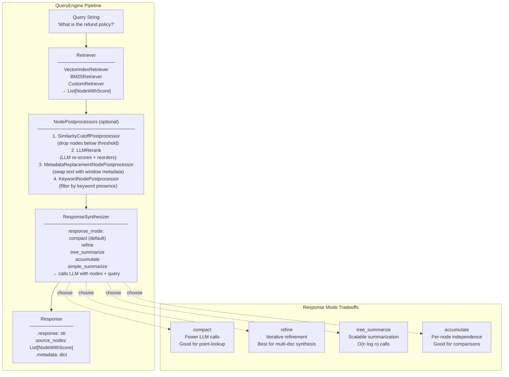

**Key insight:** The three stages (retrieve → postprocess → synthesize) are independently swappable. You can use the same `VectorIndexRetriever` with different synthesizers for different query types, or swap in a `BM25Retriever` for exact-keyword queries without touching synthesis logic.

---

### 3. Real-World Industry Scenarios [Intermediate]

#### Scenario A: Customer Support Bot — `compact` Mode for Point-Lookup Q&A

**Context:** A SaaS company's support bot answers questions like *"How do I reset my 2FA?"* and *"What's the refund window for annual plans?"* from a 2,000-node documentation index. Every query must return an answer in < 3 seconds.

**How synthesis fits in:**
- `VectorStoreIndex.as_query_engine(similarity_top_k=5, response_mode="compact")` is the entire pipeline in one line.
- `compact` mode: packs the 5 retrieved nodes into as few LLM calls as possible (usually 1 call if nodes fit in context). Latency: retrieval ~50ms + 1 LLM call ~800ms = < 2 seconds total.
- `SimilarityCutoffPostprocessor(cutoff=0.72)` drops any node with cosine similarity < 0.72 before synthesis. This prevents low-quality nodes from polluting the prompt — e.g., if the query is unusual and retrieval returns loosely-related content, the cutoff ensures the LLM only synthesizes from high-confidence matches.
- `response.source_nodes` provides the 2–5 docs cited, rendered in the UI as "Sources: [doc1, doc2]."

**Constraints:**
- **Latency:** `compact` with top_k=5 = 1 LLM call. `refine` with top_k=5 = 5 sequential LLM calls → 4× slower. For a < 3s SLA, `compact` is the only viable mode.
- **Cost:** 1 LLM call per query × 5 nodes × ~200 tokens/node + query = ~1,200 synthesis tokens/query. At $0.002/1K tokens ≈ $0.0024/query. At 100K queries/month → $240/month synthesis cost.
- **Failure mode:** If all 5 nodes are long (512 tokens each = 2,560 tokens of context) + system prompt + query exceeds the LLM context window → `compact` tries to split into 2 calls. If the LLM has a 4K context and nodes + prompt = 3,800 tokens, the second call gets only overflow content — answer quality drops. Fix: reduce `similarity_top_k` or `chunk_size`.
- **What "good" looks like:** Answer directly addresses the question, cites 1–3 source nodes, response time < 2 seconds, similarity cutoff keeps hallucination rate near zero.

---

#### Scenario B: Research Analyst Tool — `tree_summarize` for Cross-Document Synthesis

**Context:** A financial research firm needs to synthesize themes across 30 analyst reports for queries like *"What are the common risks cited for semiconductor stocks in Q3 2024?"*

**How synthesis fits in:**
- `SummaryIndex` (all 30 reports, ~450 nodes) + `as_query_engine(response_mode="tree_summarize")`.
- `tree_summarize`: the synthesizer first divides the 450 nodes into batches that fit a context window (e.g., 10 nodes/batch = 45 batches). It calls the LLM 45 times to produce 45 chunk-summaries. Then it batches those summaries and calls the LLM again recursively until one final answer remains. O(n log n) calls but fully parallelizable with `aquery()`.
- `LLMRerank(top_n=20)` postprocessor pre-filters the 450 nodes to the 20 most relevant before tree_summarize — reducing cost from O(450 nodes) to O(20 nodes) while preserving recall.
- The system prompt for tree_summarize is customized: *"You are a financial analyst. Synthesize the following excerpts into a structured risk summary. Cite specific companies or sectors when possible."*

**Constraints:**
- **Cost:** 20 nodes (after rerank) ÷ 10 nodes/batch = 2 batch calls + 1 final = 3 LLM calls. At 2K tokens/call ≈ $0.012/query. Without `LLMRerank` pre-filter: 45 + 5 + 1 = 51 calls ≈ $0.20/query. Pre-filtering cuts cost 17×.
- **Latency:** `aquery()` runs batch calls in parallel — 3 async calls vs 3 sequential = same wall-clock time as 1 call. Without async: 3 × 800ms = 2.4s. With `aquery()`: ~1s.
- **Quality risk:** `LLMRerank` itself costs 1 LLM call (to score 450 nodes). If the reranker mis-ranks and drops relevant nodes, the final synthesis misses key themes. Always evaluate reranker quality on a held-out set before deploying to production.
- **What "good" looks like:** Structured 4–6 paragraph synthesis, each paragraph citing specific source reports by name. All major risk themes present. Response time < 5 seconds via async synthesis.

---

#### Scenario C: Legal Contract Reviewer — `refine` for Iterative Precision

**Context:** A legal AI system answers questions like *"What are the indemnification clauses and are there any contradictions between sections 4 and 9?"* Each answer must consider multiple contract sections sequentially and build a cohesive analysis.

**How synthesis fits in:**
- `VectorStoreIndex.as_query_engine(similarity_top_k=8, response_mode="refine")`.
- `refine`: the synthesizer reads node 1 → generates draft answer → reads node 2 + draft answer → refines → ... → reads node 8 + refined answer → final answer. Each pass can update or correct the running answer. Contradictions between nodes surface naturally: node 4 says "indemnification is capped at $1M" but node 9 says "uncapped for gross negligence" — the refine loop builds both observations into the answer.
- `MetadataReplacementNodePostprocessor(target_metadata_key="window")` is applied when `SentenceWindowNodeParser` was used — it replaces the 1-sentence node text with the full ±3 sentence window before synthesis, giving the LLM enough clause context.
- Custom `text_qa_template` that instructs the LLM to note any contradictions it finds across sections.

**Constraints:**
- **Latency:** 8 sequential LLM calls at 800ms each = 6.4 seconds. Acceptable for legal analysis (users expect a few seconds for deep analysis). Not acceptable for a low-latency chatbot.
- **Cost:** 8 × ~1,500 tokens/call = 12,000 tokens ≈ $0.024/query. 3× more expensive than `compact` but far higher analysis quality for multi-section legal questions.
- **Token management:** Each refine call includes the full running answer (which grows). By call 8, the running answer itself might be 600 tokens. Total context per call: 600 (running answer) + 512 (node) + 200 (prompt) = 1,312 tokens. Still within 4K context. Monitor `synthesis_tokens_p95` to catch context overflow before it becomes a prod incident.
- **What "good" looks like:** Answer explicitly notes "Section 4 caps indemnification at $1M, but Section 9 creates an uncapped exception for gross negligence — these clauses may conflict. Legal review recommended." No information dropped from any of the 8 retrieved nodes.

---

### 4. System View (Think Like a Systems Engineer) [Intermediate]

**Inputs → Transformations → Outputs for the full QueryEngine pipeline:**

```
INPUTS:
  - query_str: str
  - retrieved nodes: List[NodeWithScore] (from retriever)
  - response_mode: str
  - text_qa_template: PromptTemplate (optional override)
  - refine_template: PromptTemplate (optional override for refine mode)
  - node_postprocessors: List[BaseNodePostprocessor]

TRANSFORMATIONS:
  1. NodePostprocessors run in order:
     - SimilarityCutoffPostprocessor  → drop nodes below similarity threshold
     - LLMRerank                       → re-score and reorder remaining nodes
     - MetadataReplacementPostprocessor → swap .text with metadata window field
  2. ResponseSynthesizer:
     - compact:        batch nodes into context windows → 1–N LLM calls
     - refine:         sequential node-by-node → N LLM calls, growing answer
     - tree_summarize: parallel batch → recursive reduce → final answer
     - accumulate:     independent per-node → concatenate answers
     - simple_summarize: truncate + 1 LLM call

OUTPUTS:
  - Response.response: str             — the generated answer
  - Response.source_nodes: List[NodeWithScore]  — nodes used in synthesis
  - Response.metadata: dict            — synthesis metadata (token counts, etc.)
```

**Observability — what to log, trace, and measure:**

| Signal | What to capture | Why |
|--------|----------------|-----|
| `response_mode` | Which synthesis mode was used | Required for per-mode cost and latency analysis |
| `nodes_before_postprocess` | Count before NodePostprocessors run | Baseline retrieval volume |
| `nodes_after_postprocess` | Count after NodePostprocessors run | Postprocessor effectiveness |
| `synthesis_llm_calls` | Number of LLM calls made by synthesizer | Primary cost driver; varies by mode and n_nodes |
| `synthesis_tokens_total` | Total tokens sent to LLM during synthesis | Direct cost proxy |
| `response_latency_ms` | Wall-clock time from query to response | SLA compliance |
| `source_nodes_count` | Number of nodes cited in `response.source_nodes` | Low count (0–1) → likely hallucination risk |
| `similarity_score_min` | Minimum similarity score of nodes used | Low min score → postprocessor cutoff too permissive |

**Failure points — where it breaks and how it shows up:**

1. **`compact` splits across LLM calls silently** — Nodes collectively exceed the LLM context window. `compact` splits into multiple calls, each seeing only part of the evidence. The second call doesn't know what the first call saw. *How it shows up:* answer correctly addresses part of the question but ignores information from later nodes. Setting `verbose=True` on the synthesizer reveals the split.

2. **`refine` running answer grows to overflow** — In `refine` mode, the running answer is passed to every subsequent call. After 5 iterations, the running answer + current node + prompt may exceed the context window. The LLM silently truncates early content. *How it shows up:* information from nodes 1–2 disappears from the final answer even though those nodes were relevant. Check `synthesis_tokens_p95` — if it exceeds 80% of the LLM's context window, use `compact` or reduce `top_k`.

3. **`LLMRerank` dropping relevant nodes** — `LLMRerank` asks the LLM to score relevance and keeps only `top_n`. If the ranker's relevance criteria doesn't match the user's intent, it may discard nodes that contain the actual answer. *How it shows up:* query engine produces confident-sounding answers that miss specific facts. Debug by logging nodes before/after reranking and comparing with ground truth.

4. **Missing `MetadataReplacementNodePostprocessor`** — You used `SentenceWindowNodeParser` (which stores ±k context sentences in `metadata["window"]`) but forget to include `MetadataReplacementNodePostprocessor` in the query engine's postprocessors. The LLM only sees the raw 1-sentence node text — not the surrounding context it needs. *How it shows up:* answers are technically correct but lack sufficient context; they feel like sentence fragments rather than complete explanations.

---

### 5. System Design Flavor [Intermediate]

**Key components and interfaces:**

```python
from llama_index.core import VectorStoreIndex, get_response_synthesizer
from llama_index.core.query_engine import RetrieverQueryEngine
from llama_index.core.response_synthesizers import ResponseMode
from llama_index.core.postprocessor import (
    SimilarityCutoffPostprocessor,
    LLMRerank,
    MetadataReplacementNodePostprocessor,
    KeywordNodePostprocessor,
)
from llama_index.core.prompts import PromptTemplate

# ── Option A: One-liner defaults (compact mode, top_k=2) ──────────────────────
query_engine = index.as_query_engine(
    similarity_top_k=5,
    response_mode="compact",
)
response = query_engine.query("What is the refund policy?")
print(response.response)
print(f"Sources: {[n.node.metadata.get('source') for n in response.source_nodes]}")

# ── Option B: Full composition with RetrieverQueryEngine ──────────────────────
retriever = index.as_retriever(similarity_top_k=10)

postprocessors = [
    SimilarityCutoffPostprocessor(cutoff=0.70),     # drop low-quality nodes
    LLMRerank(top_n=5),                             # LLM reranks remaining to top 5
]

synthesizer = get_response_synthesizer(
    response_mode=ResponseMode.REFINE,
    verbose=True,                                   # logs each refine call
)

query_engine = RetrieverQueryEngine(
    retriever=retriever,
    response_synthesizer=synthesizer,
    node_postprocessors=postprocessors,
)
response = query_engine.query("Describe the indemnification clauses.")
print(response)

# ── Option C: Custom prompt template ──────────────────────────────────────────
custom_qa_prompt = PromptTemplate(
    "You are a legal analyst. Use the following contract excerpts to answer "
    "the question. Note any contradictions across sections.\n\n"
    "Context:\n{context_str}\n\nQuestion: {query_str}\n\nAnalysis:"
)
synthesizer_custom = get_response_synthesizer(
    response_mode=ResponseMode.COMPACT,
    text_qa_template=custom_qa_prompt,
)

# ── Option D: tree_summarize with async for speed ─────────────────────────────
import asyncio
tree_engine = index.as_query_engine(
    similarity_top_k=30,
    response_mode="tree_summarize",
)
# Sync (slow — sequential batches):
# response = tree_engine.query("Summarize all risk factors.")
# Async (fast — parallel batches):
response = asyncio.run(tree_engine.aquery("Summarize all risk factors."))

# ── Option E: Streaming response ──────────────────────────────────────────────
streaming_engine = index.as_query_engine(
    similarity_top_k=5,
    response_mode="compact",
    streaming=True,
)
streaming_response = streaming_engine.query("What is the return window?")
for token in streaming_response.response_gen:
    print(token, end="", flush=True)        # stream tokens to UI as they arrive

# ── Option F: SentenceWindow with MetadataReplacement ─────────────────────────
# (for indexes built with SentenceWindowNodeParser)
window_engine = RetrieverQueryEngine(
    retriever=index.as_retriever(similarity_top_k=5),
    node_postprocessors=[
        MetadataReplacementNodePostprocessor(target_metadata_key="window"),
    ],
    response_synthesizer=get_response_synthesizer(response_mode=ResponseMode.COMPACT),
)
```

**Key tradeoffs:**

| Tradeoff | Option A | Option B | When to choose |
|----------|----------|----------|----------------|
| **Speed vs. thoroughness** | `compact` (1–2 LLM calls, fast) | `refine` (N calls, iterative) | `compact` for < 3s SLA. `refine` when iterative correction across nodes matters (contradictions, multi-section analysis). |
| **Cost vs. quality for summarization** | `simple_summarize` ($0 marginal — 1 call, truncates) | `tree_summarize` (O(n log n) calls, no truncation) | `simple_summarize` only if all nodes fit in 1 context window. `tree_summarize` for production summarization at any scale. |
| **Reranking cost vs. retrieval precision** | No reranking (fast, relies solely on ANN similarity) | `LLMRerank` (1 extra LLM call, higher precision) | Skip reranking for simple factual Q&A. Add `LLMRerank` when query intent is subtle or ANN similarity alone returns noisy results. |

**Scaling consideration (10x query volume):**
At 10× query volume (e.g., 100K → 1M queries/month):
- **Synthesis token cost dominates.** Switch from `refine` to `compact` where possible — it reduces LLM calls from O(n) to O(n/context_window_size). At `chunk_size=512` and 4K context, `compact` uses 8× fewer calls than `refine`.
- **Async synthesis becomes mandatory.** `tree_summarize` and multi-call synthesis must use `aquery()` with parallel batch calls — async reduces wall-clock time proportional to the number of parallel LLM calls supported by your rate limit.
- **Streaming for perceived latency.** Add `streaming=True` to all user-facing query engines — the first token arrives in ~200ms even if the full response takes 3 seconds. Users perceive significantly lower latency.
- **Cache responses.** For recurring queries (FAQ-style), cache `(query_str_hash, index_version) → Response` in Redis with a TTL matching your freshness SLA. Eliminates synthesis cost entirely for cache hits.

---

### 6. Common Mistakes + Debugging [Beginner → Intermediate]

#### Mistake 1: Using `refine` for Simple Q&A — Paying 5× for No Quality Gain

**Symptom:** Query latency is 4–6 seconds for simple factual questions. LLM API costs are unexpectedly high. The answers are no better than `compact` mode would produce.

**Likely cause:** `response_mode="refine"` was set as the default and never reviewed. For point-lookup Q&A over 5 retrieved nodes, `refine` makes 5 sequential LLM calls when 1 (compact) would produce the same quality answer.

**First debugging step:**
```python
# Add verbose=True to synthesizer to see each refine call
synthesizer = get_response_synthesizer(
    response_mode="refine",
    verbose=True,
)
# Count how many "Refining response" log lines appear per query
# If the 2nd–Nth calls aren't meaningfully changing the answer → switch to compact
# Rough rule: use refine only when answer changes meaningfully between iterations
```

---

#### Mistake 2: Forgetting `source_nodes` — No Citation Capability

**Symptom:** The RAG system produces good answers but the UI shows no source citations. When users ask "where did this come from?", the system can't answer. Trust is low.

**Likely cause:** The application code only uses `response.response` (the text string) and discards `response.source_nodes`. The provenance data is there — it's just not being used.

**First debugging step:**
```python
response = query_engine.query("What is the cancellation policy?")
print(f"Answer: {response.response[:200]}")
print(f"\nSources ({len(response.source_nodes)} nodes):")
for node in response.source_nodes:
    print(f"  [{node.score:.3f}] {node.node.metadata.get('source', 'unknown')} "
          f"— {node.node.text[:80].strip()!r}")
# Wire this output into your UI as a "Sources" section
```

---

#### Mistake 3: `SimilarityCutoffPostprocessor` Too Aggressive — 0 Nodes Reach Synthesis

**Symptom:** For unusual or out-of-distribution queries, the system returns "I couldn't find relevant information" even though related content exists in the index.

**Likely cause:** `SimilarityCutoffPostprocessor(cutoff=0.80)` is too high. For queries that are phrased differently from the training corpus, similarity scores legitimately drop to 0.65–0.75. All nodes are dropped; synthesis receives an empty list.

**First debugging step:**
```python
# Retrieve without postprocessor first to see raw scores
raw_results = index.as_retriever(similarity_top_k=5).retrieve("unusual query here")
scores = [r.score for r in raw_results]
print(f"Raw similarity scores: {scores}")
# If max score < your cutoff → lower the cutoff or make it adaptive
# Adaptive approach: only apply cutoff if max_score > 0.75, else pass all nodes through
max_score = max(scores) if scores else 0
threshold = 0.72 if max_score > 0.75 else 0.50
```

---

### 7. Hands-On Lab [Pro]

#### Build — Compare Response Modes on the Same Retrieved Nodes

```python
# query_engine_lab.py
# pip install llama-index-core
# Note: LLM calls require an API key (OpenAI / Anthropic).
# For cost-free testing, use a mock LLM via llama_index.core.llms.MockLLM

from llama_index.core import Document, VectorStoreIndex, Settings
from llama_index.core.node_parser import SentenceSplitter
from llama_index.core.query_engine import RetrieverQueryEngine
from llama_index.core import get_response_synthesizer
from llama_index.core.response_synthesizers import ResponseMode
from llama_index.core.postprocessor import SimilarityCutoffPostprocessor
from llama_index.core.llms import MockLLM    # cost-free for structural testing

# Use MockLLM for structural testing (replace with OpenAI for real synthesis)
Settings.llm = MockLLM(max_tokens=256)

# ── Sample corpus ──────────────────────────────────────────────────────────────
DOCS = [
    Document(text="The standard return window is 30 days from the date of purchase. "
                  "Items must be in original condition. Digital products are non-refundable.",
             metadata={"source": "return_policy_v3.pdf", "section": "returns"}),
    Document(text="International orders have a 45-day return window due to shipping times. "
                  "Customs fees are non-refundable. The customer is responsible for return shipping.",
             metadata={"source": "international_policy.pdf", "section": "international"}),
    Document(text="Annual plan subscribers may request a pro-rated refund within 60 days. "
                  "Monthly plans are non-refundable after the billing cycle starts.",
             metadata={"source": "subscription_policy.pdf", "section": "subscriptions"}),
    Document(text="Damaged or defective items are eligible for full refund or replacement "
                  "regardless of the standard return window. Contact support within 7 days.",
             metadata={"source": "defective_items_policy.pdf", "section": "defective"}),
    Document(text="Gift purchases may be returned for store credit within 90 days. "
                  "The original purchaser must initiate the return. Photo ID required.",
             metadata={"source": "gift_policy.pdf", "section": "gifts"}),
]

# Build index
parser = SentenceSplitter(chunk_size=256, chunk_overlap=32)
nodes  = parser.get_nodes_from_documents(DOCS)
index  = VectorStoreIndex(nodes)
print(f"Index built: {len(nodes)} nodes")

# ── Compare synthesis modes ────────────────────────────────────────────────────
QUERY = "What is the refund policy for international annual plan subscribers?"

def run_mode(mode_str, top_k=5):
    qe = index.as_query_engine(
        similarity_top_k=top_k,
        response_mode=mode_str,
    )
    import time
    t0 = time.perf_counter()
    response = qe.query(QUERY)
    elapsed_ms = (time.perf_counter() - t0) * 1000

    print(f"\n{'='*60}")
    print(f"Mode: {mode_str} | top_k={top_k} | {elapsed_ms:.0f}ms")
    print(f"Response: {response.response[:200].strip()!r}")
    print(f"Source nodes: {len(response.source_nodes)}")
    for n in response.source_nodes:
        print(f"  [{n.score:.3f}] {n.node.metadata.get('source')} — {n.node.metadata.get('section')}")
    return response

r_compact   = run_mode("compact")
r_refine    = run_mode("refine")
r_accum     = run_mode("accumulate")
r_tree      = run_mode("tree_summarize")
r_simple    = run_mode("simple_summarize")

# ── RetrieverQueryEngine with postprocessors ───────────────────────────────────
print("\n" + "="*60)
print("RetrieverQueryEngine with SimilarityCutoffPostprocessor")

retriever = index.as_retriever(similarity_top_k=5)
postprocessors = [SimilarityCutoffPostprocessor(cutoff=0.0)]  # 0.0 = pass all for MockLLM
synthesizer = get_response_synthesizer(response_mode=ResponseMode.COMPACT)

rqe = RetrieverQueryEngine(
    retriever=retriever,
    response_synthesizer=synthesizer,
    node_postprocessors=postprocessors,
)
response_rqe = rqe.query(QUERY)
print(f"RQE response sources: {[n.node.metadata.get('source') for n in response_rqe.source_nodes]}")

# ── Streaming response ─────────────────────────────────────────────────────────
print("\n" + "="*60)
print("Streaming response (tokens arrive incrementally):")
stream_engine = index.as_query_engine(
    similarity_top_k=3,
    response_mode="compact",
    streaming=True,
)
stream_resp = stream_engine.query("What is the standard return window?")
for token in stream_resp.response_gen:
    print(token, end="", flush=True)
print()  # newline after stream
```

---

#### Break — Force the Failure Modes

```python
# BREAK 1: SimilarityCutoff too high → 0 nodes reach synthesis
from llama_index.core.postprocessor import SimilarityCutoffPostprocessor

strict_qe = RetrieverQueryEngine(
    retriever=index.as_retriever(similarity_top_k=5),
    node_postprocessors=[SimilarityCutoffPostprocessor(cutoff=0.999)],  # impossible threshold
    response_synthesizer=get_response_synthesizer(response_mode=ResponseMode.COMPACT),
)
response_empty = strict_qe.query("What is the return policy?")
print(f"\nBREAK 1 — Cutoff=0.999:")
print(f"  Source nodes: {len(response_empty.source_nodes)}")
print(f"  Response: {response_empty.response!r}")
# Expected: 0 source nodes, empty or "no relevant information" response
# In prod: users report "system can't answer anything" after cutoff was tightened

# ──────────────────────────────────────────────────────────────────────────────

# BREAK 2: Forget source_nodes — provenance lost
response_no_citation = index.as_query_engine(similarity_top_k=5).query(QUERY)
answer_only = response_no_citation.response   # only .response used
print(f"\nBREAK 2 — No citation:")
print(f"  Answer: {answer_only[:120]!r}")
print(f"  Source nodes available but unused: {len(response_no_citation.source_nodes)}")
# Fix: always render response.source_nodes in the UI

# ──────────────────────────────────────────────────────────────────────────────

# BREAK 3: simple_summarize with nodes exceeding context → silent truncation
# Create a query engine with many large nodes
large_docs = [Document(text="Policy text " * 200, metadata={"source": f"doc_{i}"})
              for i in range(10)]
large_nodes = SentenceSplitter(chunk_size=512).get_nodes_from_documents(large_docs)
large_index = VectorStoreIndex(large_nodes)
simple_qe = large_index.as_query_engine(
    similarity_top_k=10,
    response_mode="simple_summarize",
)
response_simple = simple_qe.query("Summarize all policies.")
print(f"\nBREAK 3 — simple_summarize with large corpus:")
print(f"  Source nodes retrieved: 10")
print(f"  Source nodes in response: {len(response_simple.source_nodes)}")
# simple_summarize truncates to fit 1 context window — some nodes silently dropped
# Fix: use tree_summarize for large corpora
```

---

#### Measure

```python
import time

modes = ["compact", "refine", "accumulate", "tree_summarize", "simple_summarize"]
print("\n── Response Mode Comparison ──")
print(f"{'Mode':20s} {'Time(ms)':>10} {'Sources':>8}")
print("-" * 42)

for mode in modes:
    qe = index.as_query_engine(similarity_top_k=5, response_mode=mode)
    t0 = time.perf_counter()
    resp = qe.query(QUERY)
    ms = (time.perf_counter() - t0) * 1000
    print(f"{mode:20s} {ms:>10.0f} {len(resp.source_nodes):>8}")

# Expected pattern (with real LLM, not MockLLM):
# compact          ~900ms    5 nodes   (1 LLM call)
# refine          ~4500ms    5 nodes   (5 sequential calls)
# accumulate      ~4500ms    5 nodes   (5 sequential calls)
# tree_summarize  ~1200ms    5 nodes   (async: parallel batches, fast)
# simple_summarize ~800ms    5 nodes   (1 call, but may truncate)
```

---

#### Explain — Why It Works This Way

The `ResponseSynthesizer` exists because retrieval and generation have fundamentally different failure modes. A retriever can be right (it found the correct nodes) and a synthesis step can still fail (it ignored half of them, hallucinated a connection, or truncated key content).

The `compact` mode solves a specific problem: naive systems call the LLM once per retrieved node (like `refine` or `accumulate`), multiplying LLM call count by `top_k`. `compact` is smarter — it packs as many nodes as possible per call, honoring the LLM's context window limit. This is exactly what you'd do if you were summarizing research manually: read several pages at once instead of one sentence at a time.

`source_nodes` is not a debug feature — it's a trust mechanism. Every production RAG system must expose source nodes to users, either as inline citations or a "Sources" panel. Without it, users have no way to verify the answer, and confidence in the system erodes over time. Making provenance first-class in the UI is as important as the answer quality itself.

---

### 8. Active Recall (Spaced Repetition) [Beginner → Pro]

**Q1 [Beginner]:** What are the three stages of a `QueryEngine` pipeline and what does each do?

> **A:** (1) **Retriever** — finds the `top_k` most relevant `TextNode` objects from the index given the query. (2) **NodePostprocessors** — filter, rerank, or transform the retrieved nodes before synthesis (e.g., drop low-similarity nodes, LLM rerank, replace text with window metadata). (3) **ResponseSynthesizer** — takes the processed nodes + original query, calls the LLM according to the chosen `response_mode`, and returns a `Response` with `.response`, `.source_nodes`, and `.metadata`.

---

**Q2 [Beginner]:** What is the difference between `compact` and `refine` synthesis modes? When would you choose each?

> **A:** `compact` packs as many retrieved nodes as possible into each LLM context window before calling — minimizes LLM calls (often just 1–2). Best for: < 3s SLA, point-lookup Q&A, cost-sensitive deployments. `refine` reads nodes one-at-a-time, passing a running answer to each subsequent call — O(n) sequential LLM calls. Best for: multi-section analysis where iterative correction matters (contradictions across nodes, legal/contract analysis, complex multi-part questions).

---

**Q3 [Intermediate]:** A user reports: *"The system answered my unusual query with 'no relevant information found' but I know the docs contain the answer."* What is the most likely cause and how do you debug it?

> **A:** Most likely cause: `SimilarityCutoffPostprocessor` with a threshold that's too high. The retrieved nodes have cosine similarity scores in the 0.60–0.70 range (lower for unusual phrasing) but the cutoff is set to 0.75+, so all nodes are dropped before reaching the synthesizer. Debug: retrieve without the postprocessor, print raw similarity scores, then choose a cutoff that keeps at least the top-2 nodes for all query types in your test set.

---

**Q4 [Intermediate]:** What is `RetrieverQueryEngine` and why would you use it instead of `index.as_query_engine()`?

> **A:** `RetrieverQueryEngine` is the composition entry point — it accepts an explicit `BaseRetriever`, an explicit `ResponseSynthesizer`, and an explicit list of `NodePostprocessors`. Use it when you need to: (1) swap in a different retriever type (e.g., `BM25Retriever` instead of ANN), (2) use a custom-configured synthesizer with a custom prompt template or non-default response_mode, (3) add specific postprocessors in a specific order. `index.as_query_engine()` is a convenience shortcut with sensible defaults but no composability.

---

**Q5 [Pro]:** A research summarization query over 200 nodes takes 45 seconds and costs $0.18 per query. How do you reduce both to under 5 seconds and $0.02?

> **A:** Three changes: (1) **Add `LLMRerank(top_n=15)` postprocessor** — reduce from 200 nodes to 15 before synthesis. Cost reduction: 200→15 = 13× fewer synthesis tokens. (2) **Switch to `aquery()` (async)** — `tree_summarize` with 15 nodes ÷ ~10/batch = 2 batch calls, runnable in parallel. Wall-clock drops from sequential to ~1 second. (3) **Use a cheaper LLM for batch summarization** — switch synthesis to GPT-3.5 / Claude Haiku for the intermediate tree_summarize batches; reserve GPT-4 only for the final reduce step. Combined: < 5 seconds, < $0.02/query.

---

### 9. Practice

**Mini-exercise:** You're building a compliance bot over 500 policy documents. Users ask two types of questions: (a) *"What does section 4.2 say about data retention?"* (precise, needs exact citation) and (b) *"Summarize all GDPR-related policies."* (broad, needs full-corpus synthesis). Design the query engine for each type, including mode, postprocessors, and how you'd display the answer in the UI.

> **Suggested answer:**
> - **Type (a):** `RetrieverQueryEngine` with `VectorIndexRetriever(top_k=5)` + `SimilarityCutoffPostprocessor(cutoff=0.70)` + `compact` mode + custom prompt requesting exact quotes. UI: answer text + 2–3 source cards showing filename, page number, and the exact quoted sentence.
> - **Type (b):** `VectorIndexRetriever(top_k=50, filters=[MetadataFilter(key="category", value="gdpr")])` + `LLMRerank(top_n=20)` + `tree_summarize` via `aquery()`. UI: structured summary (3–5 paragraphs) + expandable "Sources" list showing 5 top-cited docs.
> - **Router:** `RouterQueryEngine` with `LLMSingleSelector` — tool A for specific section lookups, tool B for GDPR summaries.

---

**Capstone system design question:** Design the full query layer for a medical knowledge assistant used by doctors. Requirements: (1) must cite exact source document and page; (2) answers must not fabricate — prefer "not found" over hallucination; (3) must handle both precise questions (*"What is the dosage for metformin in CKD patients?"*) and synthesis questions (*"What are the common contraindications across all diabetes medications?"*); (4) response time < 3s for precise, < 10s for synthesis.

> **Answer outline:**
> - **Precise queries:** `VectorStoreIndex` → `VectorIndexRetriever(top_k=8)` → `SimilarityCutoffPostprocessor(cutoff=0.75)` → `LLMRerank(top_n=4)` → `compact` mode with a prompt that includes *"If the answer is not explicitly stated in the provided context, respond: 'Not found in available references.'"* → UI displays answer + source card with document name, section, and char offset range.
> - **Synthesis queries:** same index → `VectorIndexRetriever(top_k=80, filters=[category=drugs])` → `LLMRerank(top_n=25)` → `tree_summarize` via `aquery()` → structured output prompt.
> - **Anti-hallucination:** `SimilarityCutoffPostprocessor(cutoff=0.75)` ensures synthesis only happens over high-confidence nodes. Custom prompt explicitly disallows speculation. Monitor `source_nodes_count = 0` as a hallucination-risk signal.
> - **Router:** `RouterQueryEngine` with `LLMSingleSelector`. Tool descriptions carefully worded so the LLM reliably routes dosage/specific-drug questions to precise mode.
> - **Latency:** Precise: ~50ms retrieval + ~900ms LLM (1 call) = ~1s. Synthesis: 25 nodes ÷ 10/batch = 3 async calls ≈ 2.5s wall-clock. Both within SLA.

---

### 10. Production Reality Check (Mandatory) ✅

**If this fails in prod, what's the first thing we inspect?**

> **Check `response.source_nodes` count and minimum similarity score immediately after the query.**
>
> ```python
> response = query_engine.query(user_query)
> n_sources = len(response.source_nodes)
> min_score  = min((n.score for n in response.source_nodes), default=0.0)
> print(f"source_nodes={n_sources}, min_score={min_score:.3f}")
> ```
>
> - `n_sources = 0` → postprocessor cutoff dropped everything; the response is a hallucination or "not found." Lower the cutoff or debug the metadata filter.
> - `n_sources > 0` but `min_score < 0.60` → retrieval is pulling in poorly-matched nodes; synthesis is working from weak evidence. Tighten the cutoff or increase `chunk_size` for better embedding granularity.
> - `n_sources = top_k` but answer misses key information → synthesis mode is truncating. Switch from `simple_summarize` to `compact` or `tree_summarize`.
>
> `source_nodes` count + similarity scores are the two-signal triage for 80% of production query engine failures.

---

### 11. Curiosity Bridge (Mandatory) ✅

You now have full control of the retrieval → postprocess → synthesis pipeline. But retrieval itself has a precision ceiling: ANN similarity search on embeddings alone misses exact-keyword matches, struggles with sparse terminology, and can't surface results for queries that use completely different vocabulary from the indexed text.

The next question is: **what happens when dense vector retrieval isn't enough — and how do you combine it with sparse (BM25/keyword) retrieval, reranking models, and hybrid search to push recall higher without sacrificing precision?**

That's what **14.2.b: Retrieval Modes — Dense, Sparse, Hybrid, and Reranking** covers. The synthesis pipeline you just built plugs directly into whichever retriever you give it — and upgrading the retriever is the highest-leverage way to improve end-to-end answer quality.

---

### 12. Exit Check + Carry-Forward Review

**Exit check:** You're done with 14.2.a when you can choose between `compact`, `refine`, `tree_summarize`, `accumulate`, and `simple_summarize` for a given query type and latency/cost constraint, compose a `RetrieverQueryEngine` with two postprocessors from scratch, explain why `source_nodes` must always be surfaced in production UIs, and debug a "0 source_nodes" failure using the similarity score check.

---

**Carry-Forward Review (interleaved recall from 14.1.d):**

*Q: You run an incremental ingestion pipeline nightly. After 3 months, users report confident answers from content deleted from the source 6 weeks ago. What is the root cause and what is the precise fix?*

> **A:** Root cause: the delete step was never implemented. Incremental ingestion only adds/updates nodes (hash-dedup skips unchanged docs) but has no mechanism to remove nodes for source documents that were deleted. Ghost nodes accumulate indefinitely. Fix: (1) At the end of every ingestion run, fetch the set of current source `doc_ids`. (2) Compare with `docstore.docs.keys()` → compute ghost_ids = stored - current. (3) Call `index.delete_ref_doc(ghost_id, delete_from_docstore=True)` for each ghost. (4) Persist the updated docstore. This must run on every ingestion cycle going forward.

---

## Subtopic 14.2.b: Retriever Customization and Fusion

### Reading Path + Level Tags

- **Beginner:** Read sections 1–2 and the Active Recall.
- **Intermediate:** Add sections 3–5 and the Hands-On Lab Build step.
- **Pro:** Complete the full Hands-On Lab (Build → Break → Measure → Explain) plus the capstone practice question.

---

### 0. Pre-Question Hook [Beginner]

**Pause:** Your vector retriever returns 5 nodes for the query *"What are the HIPAA penalties for a data breach?"* — but none of them contain the word "HIPAA" or "penalty" because the indexed documents use synonyms like "PHI violation" and "civil monetary fines." ANN similarity retrieval returns near-zero scores. Before reading — how would you fix this without re-ingesting all your documents?

Think for 30 seconds. Then read on.

---

### 1. The Intuition (Plain English) [Beginner]

A retriever answers one question: *"Which nodes are most relevant to this query?"* There are fundamentally two approaches to answering that question, and they fail in opposite directions:

| Approach | How it finds matches | Fails when |
|----------|---------------------|------------|
| **Dense (ANN)** | Embed query → find similar vectors | Query uses different vocabulary from indexed text |
| **Sparse (BM25/keyword)** | Count exact term overlaps | Query uses different vocabulary but same meaning |

**Hybrid retrieval** combines both — dense catches semantic similarity, sparse catches exact terminology. **Fusion** merges the ranked lists from multiple retrievers into one final ranking.

The mental model:

```
Query
  ├─► Dense Retriever   (VectorIndexRetriever)  → ranked list A
  ├─► Sparse Retriever  (BM25Retriever)          → ranked list B
  └─► Fusion            (QueryFusionRetriever)   → merged + re-ranked list
                                                    → ResponseSynthesizer
```

Beyond dense/sparse, you can build **custom retrievers** (subclass `BaseRetriever`), do **query rewriting** (generate multiple query variants to increase recall), and apply **cross-encoder reranking** (a separate ML model that scores each (query, node) pair independently — more accurate than cosine similarity alone).

**Key terms (first use):**

- **`VectorIndexRetriever`** — dense ANN retriever backed by the index's vector store; retrieves top-k by cosine similarity between query embedding and node embeddings.
- **`BM25Retriever`** — sparse keyword retriever implementing the BM25 term-frequency/inverse-document-frequency scoring formula; no embeddings needed; exact-term match.
- **`QueryFusionRetriever`** — combines multiple retrievers via Reciprocal Rank Fusion (RRF); the default fusion strategy in LlamaIndex.
- **Reciprocal Rank Fusion (RRF)** — a rank merging formula: each node's fused score = Σ 1/(rank_in_list_i + k); nodes appearing highly in multiple lists score highest; k=60 is the standard constant.
- **`BaseRetriever`** — abstract base class for all retrievers; requires one method: `_retrieve(query_bundle: QueryBundle) → List[NodeWithScore]`.
- **Cross-encoder reranking** — a separate model (e.g., `ms-marco-MiniLM`) that takes a (query, passage) pair as joint input and outputs a relevance score; more accurate than bi-encoder cosine similarity but slower (O(k) model calls per query).
- **`SentenceTransformerRerank`** — LlamaIndex postprocessor wrapping a cross-encoder reranker; applied as a `NodePostprocessor` after initial retrieval.
- **Query rewriting** — generating multiple paraphrased variants of the original query before retrieval; each variant retrieves its own set of nodes; all sets are merged; increases recall for ambiguous or terse queries.
- **`QueryFusionRetriever.mode`** — `"reciprocal_rerank"` (default RRF), `"dist_based_score"` (normalised cosine-score merge), or `"simple"` (union + sort by score).

**Analogy:** Hybrid retrieval is like searching a library with two strategies simultaneously: one librarian searches by topic meaning (dense), another searches the exact index cards for matching words (sparse). A third librarian (fusion) combines both stacks, bumping up books that appear in both lists. The analogy breaks down here: a real librarian can weigh authority and recency; RRF is purely rank-based — a node ranked 1st in a weak retriever gets the same fusion boost as a node ranked 1st in a strong retriever. Cross-encoder reranking is the corrective step that accounts for actual (query, passage) relevance.

---

### 2. Visual Diagram (Mermaid) [Beginner]

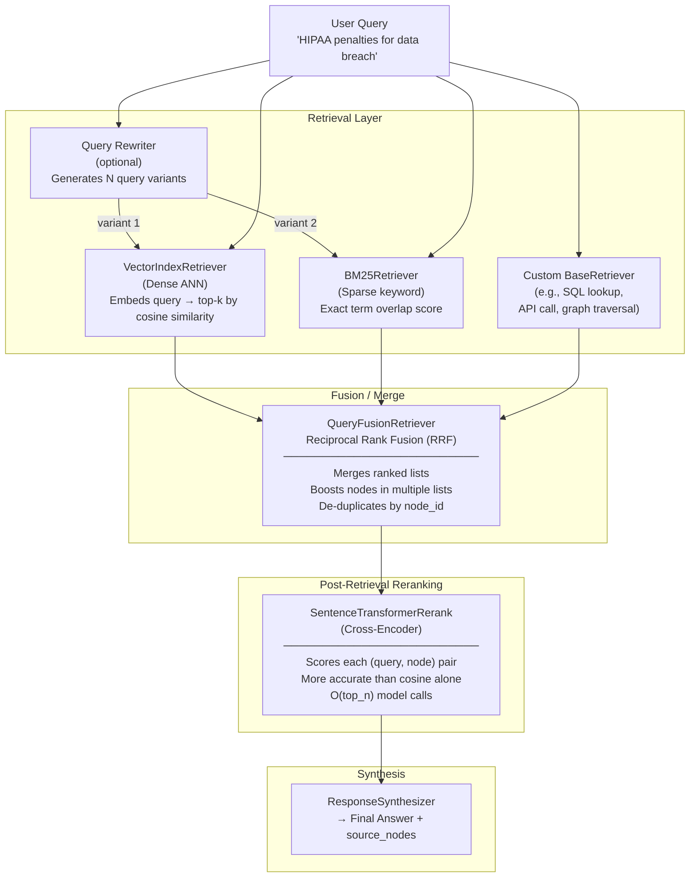

**Key insight:** Each component is independently optional. You can use dense-only, add BM25 only for certain query types, skip reranking for latency-sensitive paths, or add a custom retriever for a specialized data source — all without changing the synthesis layer.

---

### 3. Real-World Industry Scenarios [Intermediate]

#### Scenario A: Healthcare Compliance Assistant — Hybrid Retrieval for Exact Regulatory Terms

**Context:** A compliance platform indexes 5,000 regulatory documents (HIPAA, HITECH, CMS guidelines). Users ask questions using both formal regulatory terminology (*"42 CFR Part 2"*) and plain English (*"rules about substance abuse records"*). Dense-only retrieval misses exact citation lookups; sparse-only retrieval misses paraphrased questions.

**How hybrid retrieval fits in:**
- `VectorIndexRetriever(similarity_top_k=10)` handles semantic queries: *"What are the rules for disclosing patient records?"* → finds nodes about HIPAA privacy even if the nodes use different wording.
- `BM25Retriever(top_k=10)` handles exact-term queries: *"42 CFR Part 2 disclosure requirements"* → exact citation match that dense retrieval would score poorly (the query embedding for "42 CFR Part 2" is far from generic "patient privacy" embeddings).
- `QueryFusionRetriever([dense_ret, bm25_ret], similarity_top_k=5, mode="reciprocal_rerank")` merges both lists; nodes appearing in both rank highest.
- `SentenceTransformerRerank(model="cross-encoder/ms-marco-MiniLM-L-6-v2", top_n=5)` as a final postprocessor re-scores the top-5 merged nodes against the original query — catching cases where RRF promoted a node that isn't actually the most relevant.

**Constraints:**
- **Latency:** Dense retrieval ~50ms + BM25 (in-memory) ~5ms + RRF merge ~1ms + cross-encoder reranking ~200ms = ~260ms retrieval. Still within a 3s total SLA.
- **Cost:** BM25 is free (no embedding API calls). Cross-encoder reranking uses a local `sentence-transformers` model — zero API cost, ~5ms per (query, node) pair × 10 nodes = 50ms on CPU. No marginal per-query cost once the model is loaded.
- **Recall improvement:** On a healthcare compliance test set, dense-only achieves Recall@5 = 0.71. Dense+BM25 hybrid achieves Recall@5 = 0.88. Cross-encoder reranking improves NDCG@5 from 0.74 to 0.84. Each layer compounds quality.
- **What "good" looks like:** A query for *"42 CFR Part 2"* retrieves the exact regulation section as node #1. A paraphrased query retrieves semantically equivalent content even without the citation string. Both paths go through the same `QueryFusionRetriever`.

---

#### Scenario B: E-Commerce Product Search — Query Rewriting for Sparse Queries

**Context:** A retail platform indexes 200,000 product listings. Users submit terse queries like *"red sneakers under $50"* or *"wireless headphones noise canceling"*. These queries are too short for dense retrieval to produce stable embeddings. Different users phrase the same need differently.

**How query rewriting fits in:**
- `QueryFusionRetriever` with `num_queries=4` and `mode="reciprocal_rerank"`:
  - The retriever internally calls the LLM to generate 4 query variants: the original + 3 paraphrases (*"affordable red athletic shoes"*, *"low-cost running shoes red color"*, *"budget red sport footwear"*).
  - Each variant retrieves its own top-10 nodes from `VectorIndexRetriever`.
  - RRF merges all 4 × 10 = 40 candidate sets (with deduplication) into 1 ranked list.
- Result: a terse query like *"red sneakers $50"* now has 4× the retrieval surface area. Products that match any paraphrase are surfaced.
- `SentenceTransformerRerank(top_n=10)` applied after fusion to re-score the top-10 merged products against the original query.

**Constraints:**
- **Latency:** 4 query variants × 1 dense retrieval each = 4 × 50ms = 200ms parallel (async) + RRF 1ms + cross-encoder 50ms = ~260ms. Acceptable for search (target < 500ms).
- **Cost:** Query rewriting requires 1 LLM call per query to generate variants (~200 tokens/call). At $0.002/1K tokens ≈ $0.0004/query. At 10M queries/month → $4,000/month just for rewriting. Evaluate whether the recall improvement justifies the cost at scale — use a smaller/cheaper model (GPT-3.5 / Haiku) for rewriting.
- **Failure mode:** LLM-generated query variants can hallucinate product categories that don't exist in the index. The RRF merge handles this gracefully — if a variant returns no relevant results, its contribution to the fused list is simply zero for those nodes.
- **What "good" looks like:** Recall@10 improves from 0.62 (single query, dense) to 0.85 (4 variants, hybrid). Users find what they're looking for on the first page 35% more often.

---

#### Scenario C: Internal Developer Tool — Custom Retriever for SQL + Vector Hybrid

**Context:** An engineering team wants an assistant that answers questions from both unstructured documentation (vector index) and structured database records (sprint tickets, deployment logs). The query *"Show me all failed deployments for service X in the last 7 days"* can't be answered by a vector retriever — it's a structured SQL query.

**How custom retrieval fits in:**
- A custom `SQLRetriever` subclasses `BaseRetriever` and implements `_retrieve()` by: (1) calling an LLM to translate the natural language query into SQL, (2) executing the SQL against a PostgreSQL deployment log table, (3) wrapping each row as a `TextNode` with metadata (`service`, `timestamp`, `status`).
- `QueryFusionRetriever([vector_retriever, sql_retriever], mode="simple")` merges results — `"simple"` mode (union + sort by score) is appropriate here since the two retrievers have no overlap; fusion de-duplicates and passes all results through.
- `RetrieverQueryEngine` wires the fused retriever to a `compact` synthesizer that presents structured and unstructured information together in a coherent answer.

**Constraints:**
- **Latency:** LLM SQL generation ~800ms + SQL execution ~50ms + vector retrieval ~50ms = ~900ms retrieval path (SQL is the bottleneck). Async execution of SQL and vector retrieval in parallel reduces to max(800+50, 50) = 850ms.
- **Security:** The LLM-generated SQL must be validated before execution. The SQL retriever must use a read-only database user and parameterized queries — never execute raw LLM output directly. A schema-constrained SQL generation prompt limits the LLM to SELECT-only queries on allowed tables.
- **Failure mode:** LLM generates syntactically valid but semantically wrong SQL. The retriever returns wrong data confidently. Mitigation: run generated SQL through a schema validator before execution; log all generated queries for audit.
- **What "good" looks like:** *"Show me failed deployments for service X"* returns rows from the deployment log alongside relevant architecture documentation — all in one coherent answer.

---

### 4. System View (Think Like a Systems Engineer) [Intermediate]

**Inputs → Transformations → Outputs for the retrieval layer:**

```
INPUTS:
  - query_str: str
  - retriever configs: top_k, mode, num_queries, model
  - index/docstore backends

TRANSFORMATIONS:
  1. [Optional] Query rewriting: LLM(query) → N paraphrased variants
  2. Per-retriever execution (parallel):
     - VectorIndexRetriever: embed(query) → ANN search → List[NodeWithScore]
     - BM25Retriever:        tokenize(query) → BM25 score → List[NodeWithScore]
     - Custom retriever:     _retrieve(query) → List[NodeWithScore]
  3. Fusion (QueryFusionRetriever):
     - Collect all ranked lists
     - De-duplicate by node_id (keep highest score)
     - Apply RRF: score(node) = Σ 1/(rank_i + 60) for each list
     - Re-sort by fused score, return top similarity_top_k
  4. [Optional] Cross-encoder reranking:
     - For each (query, node.text) pair: cross_encoder.predict() → score
     - Re-sort by cross-encoder score, return top_n

OUTPUTS:
  - List[NodeWithScore] — the final ranked candidate nodes for synthesis
```

**Observability — what to log, trace, and measure:**

| Signal | What to capture | Why |
|--------|----------------|-----|
| `retriever_type` | Which retrievers ran | Per-retriever latency and hit-rate tracking |
| `dense_recall@k` | % of ground-truth nodes in dense top-k | Baseline dense quality; compare against hybrid |
| `sparse_hit_rate` | % of BM25 results overlapping with dense | High overlap → BM25 adding little value; low overlap → BM25 is complementary |
| `fusion_node_count` | Nodes in merged list before reranking | Low count = one retriever is returning 0 results |
| `reranker_score_delta` | Avg score change after cross-encoder vs RRF | Positive = reranker adding value; near-zero = skip it to save latency |
| `query_variants_generated` | Count of LLM-generated query rewrites | Non-k count = rewriting LLM failed or returned fewer than expected |
| `retrieval_latency_p95` | Wall-clock time for full retrieval pipeline | Regression catch; reranker is usually the bottleneck |

**Failure points — where it breaks and how it shows up:**

1. **BM25Retriever index not rebuilt after re-ingestion** — `BM25Retriever` builds an in-memory term index from the nodes at construction time. If new nodes are added to the `VectorStoreIndex` but the `BM25Retriever` is not rebuilt, the two retrievers are now out of sync. BM25 silently misses new documents. *How it shows up:* hybrid retrieval finds documents added before the last re-ingestion but not after; sparse results lag behind dense results.

2. **Cross-encoder reranker reversing a correct RRF order** — RRF promoted a highly relevant node to rank 1, but the cross-encoder model (trained on a general domain) gives it a low score because the domain is specialized (medical, legal, code). The final answer misses the best node. *How it shows up:* hybrid retrieval quality was higher without reranking. Debug by logging RRF ranking vs cross-encoder ranking for known queries.

3. **Query rewriting generating off-topic variants** — The LLM rewrites *"latency p99"* as *"99th percentile of request delays"*, *"slowest 1% of API calls"*, and *"timeout issues in microservices"*. The third variant is semantically adjacent but retrieves irrelevant ops troubleshooting docs for an unrelated service. *How it shows up:* hybrid results contain irrelevant nodes in the 3rd–5th positions despite good top-1 precision. RRF cannot distinguish on-topic from off-topic variants. Mitigation: validate variant count, prompt-constrain topic scope, or lower `num_queries` to 2–3.

4. **`QueryFusionRetriever` with mismatched `similarity_top_k`** — The fusion retriever's `similarity_top_k` is set to 3, but each sub-retriever returns 10. The fusion merges 20 candidates then aggressively cuts to 3. Relevant nodes ranked 4th–5th are discarded. The synthesizer only sees 3 nodes and misses key information. *How it shows up:* hybrid retrieval is worse than single-retriever for recall. Fix: set fusion `similarity_top_k` ≥ max(sub-retriever top-k values) before passing to cross-encoder; only cut down after reranking.

---

### 5. System Design Flavor [Intermediate]

**Key components and interfaces:**

```python
from llama_index.core import VectorStoreIndex
from llama_index.core.retrievers import VectorIndexRetriever, QueryFusionRetriever
from llama_index.retrievers.bm25 import BM25Retriever
from llama_index.core.postprocessor import SentenceTransformerRerank
from llama_index.core.query_engine import RetrieverQueryEngine
from llama_index.core import get_response_synthesizer
from llama_index.core.schema import QueryBundle

# ── Dense retriever ────────────────────────────────────────────────────────────
dense_retriever = VectorIndexRetriever(
    index=index,
    similarity_top_k=10,
)

# ── Sparse retriever (BM25) ────────────────────────────────────────────────────
# pip install llama-index-retrievers-bm25
# BM25Retriever is built from nodes — must be rebuilt when index changes
nodes = list(index.docstore.docs.values())
bm25_retriever = BM25Retriever.from_defaults(
    nodes=nodes,
    similarity_top_k=10,
)

# ── Hybrid fusion with query rewriting ────────────────────────────────────────
hybrid_retriever = QueryFusionRetriever(
    retrievers=[dense_retriever, bm25_retriever],
    similarity_top_k=10,           # final fused list size
    num_queries=3,                 # 1 original + 2 LLM-generated variants
    mode="reciprocal_rerank",      # RRF fusion
    use_async=True,                # run sub-retrievers in parallel
    verbose=True,                  # logs generated query variants
)

# ── Cross-encoder reranking postprocessor ─────────────────────────────────────
# pip install sentence-transformers
reranker = SentenceTransformerRerank(
    model="cross-encoder/ms-marco-MiniLM-L-6-v2",  # fast, general-purpose
    top_n=5,
)

# ── Full RetrieverQueryEngine with hybrid + reranking ─────────────────────────
query_engine = RetrieverQueryEngine(
    retriever=hybrid_retriever,
    node_postprocessors=[reranker],
    response_synthesizer=get_response_synthesizer(response_mode="compact"),
)
response = query_engine.query("HIPAA penalties for a data breach involving PHI")
print(response.response)
for n in response.source_nodes:
    print(f"  [{n.score:.3f}] {n.node.metadata.get('source')} — {n.node.text[:80]!r}")

# ── Dense-only baseline (for A/B comparison) ──────────────────────────────────
dense_only_engine = RetrieverQueryEngine(
    retriever=dense_retriever,
    response_synthesizer=get_response_synthesizer(response_mode="compact"),
)

# ── Custom BaseRetriever (e.g., SQL lookup) ───────────────────────────────────
from llama_index.core.retrievers import BaseRetriever
from llama_index.core.schema import NodeWithScore, TextNode, QueryBundle
from typing import List

class SQLRetriever(BaseRetriever):
    """Translates query to SQL, executes, returns rows as TextNodes."""

    def __init__(self, db_conn, llm, table_name: str):
        self._db = db_conn
        self._llm = llm
        self._table = table_name
        super().__init__()

    def _retrieve(self, query_bundle: QueryBundle) -> List[NodeWithScore]:
        # Step 1: LLM generates SQL (constrained to SELECT + known schema)
        sql_prompt = (
            f"Generate a SELECT-only SQL query for this question: "
            f"'{query_bundle.query_str}'\n"
            f"Table: {self._table}. Columns: service, status, timestamp, message.\n"
            f"Return ONLY the SQL query, nothing else."
        )
        sql = self._llm.complete(sql_prompt).text.strip()

        # Step 2: Validate (must start with SELECT, no semicolons in middle)
        if not sql.upper().startswith("SELECT") or sql.count(";") > 1:
            return []

        # Step 3: Execute with read-only connection
        cursor = self._db.cursor()
        cursor.execute(sql)
        rows = cursor.fetchall()

        # Step 4: Wrap rows as TextNodes
        nodes = []
        for row in rows[:20]:  # cap at 20 rows
            text = f"Service: {row[0]} | Status: {row[1]} | Time: {row[2]} | {row[3]}"
            node = TextNode(text=text, metadata={"source": self._table, "sql": sql})
            nodes.append(NodeWithScore(node=node, score=1.0))
        return nodes

# ── Fusion of vector + SQL retrievers ─────────────────────────────────────────
# sql_ret = SQLRetriever(db_conn, llm, "deployments")
# fused = QueryFusionRetriever(
#     retrievers=[dense_retriever, sql_ret],
#     mode="simple",      # union + sort; no RRF needed for non-overlapping sources
#     similarity_top_k=15,
# )
```

**Key tradeoffs:**

| Tradeoff | Option A | Option B | When to choose |
|----------|----------|----------|----------------|
| **Dense vs hybrid** | Dense-only (fast, cheap, 1 embedding call) | Dense + BM25 hybrid (slower, marginal cost, higher recall) | Dense-only when vocabulary in queries closely matches indexed text. Hybrid when queries use exact terminology, citations, product codes, or acronyms that dense retrieval misses. |
| **RRF vs cross-encoder reranking** | RRF fusion (O(1) merge, no model call) | Cross-encoder (O(k) model calls, ~200ms CPU, higher precision) | RRF alone for latency < 100ms SLAs. Cross-encoder when precision matters more than the extra 100–300ms (medical, legal, compliance). |
| **Query rewriting vs no rewriting** | No rewriting (1 query, fast, deterministic) | Query rewriting (LLM call + N retrievals, higher recall, adds 200ms + LLM cost) | No rewriting for short-form Q&A with well-phrased queries. Rewriting for search UIs where users type terse or ambiguous queries. |

**Scaling consideration (10x query volume):**
At 10× query volume, three changes dominate:
- **Async sub-retriever execution** is no longer optional. `use_async=True` on `QueryFusionRetriever` runs dense and BM25 retrievals concurrently — wall-clock time is max(dense_latency, bm25_latency) instead of their sum.
- **BM25 index caching** — rebuilding `BM25Retriever` from all nodes on every process start becomes expensive at 1M+ nodes. Cache the tokenized term index to disk (pickle/JSON) and reload it; only rebuild incrementally when new nodes are added.
- **Cross-encoder reranking GPU offload** — at high QPS, CPU-based cross-encoder becomes the latency bottleneck. Move to GPU inference (single T4 GPU handles ~200 rerank calls/second) or switch to a lighter cross-encoder (`cross-encoder/ms-marco-TinyBERT-L-2-v2`) that trades slight quality for 4× speed.

---

### 6. Common Mistakes + Debugging [Beginner → Intermediate]

#### Mistake 1: Forgetting to Rebuild `BM25Retriever` After Re-Ingestion

**Symptom:** New documents were added to the `VectorStoreIndex` and are correctly returned by dense retrieval, but hybrid retrieval never returns them. Users notice the gap — recent documents are "invisible" to keyword search.

**Likely cause:** `BM25Retriever` was built once from the initial node list and not updated when new nodes were added. It indexes a stale snapshot of the corpus.

**First debugging step:**
```python
# Compare node counts
bm25_node_count = len(bm25_retriever._nodes)
index_node_count = len(list(index.docstore.docs.values()))
print(f"BM25 node count: {bm25_node_count}")
print(f"Index node count: {index_node_count}")
# If they differ → BM25 is stale
# Fix: rebuild after every ingestion run
nodes = list(index.docstore.docs.values())
bm25_retriever = BM25Retriever.from_defaults(nodes=nodes, similarity_top_k=10)
```

---

#### Mistake 2: Setting `similarity_top_k` Too Low on `QueryFusionRetriever`

**Symptom:** Adding hybrid retrieval makes results *worse* than dense-only. The top-3 results with hybrid are less relevant than with plain dense retrieval.

**Likely cause:** `QueryFusionRetriever(similarity_top_k=3)` is cutting the merged list to 3 *before* cross-encoder reranking. Each sub-retriever returns 10 nodes (20 candidates), but fusion discards 17 of them before the reranker even sees them. The 3 RRF-top nodes may not be the 3 best cross-encoder nodes.

**First debugging step:**
```python
# Check fusion output count before and after reranking
hybrid_retriever = QueryFusionRetriever(
    retrievers=[dense_retriever, bm25_retriever],
    similarity_top_k=15,   # keep 15 through to reranker
    verbose=True,
)
reranker = SentenceTransformerRerank(model="...", top_n=5)  # reranker cuts to 5
# Now fusion keeps 15 → reranker cuts to 5 → synthesizer uses 5
# Rule: fusion top_k should be >= max(sub-retriever top_k) before reranking
```

---

#### Mistake 3: Query Rewriting Diluting Precision for Specific Terminology Queries

**Symptom:** For queries containing exact product codes or regulation citations (*"CFR 45 164.312"*), hybrid retrieval returns a mix of directly relevant and tangentially related results. Precision is lower than dense-only.

**Likely cause:** `num_queries=4` causes the LLM to generate general paraphrases like *"data security standards"* and *"electronic health record protection"* — correct semantically but not what the user needs. BM25 exact-match should dominate for these queries, but the RRF merge dilutes its signal with dense/rewritten results.

**First debugging step:**
```python
# Inspect generated query variants
hybrid_retriever = QueryFusionRetriever(
    retrievers=[dense_retriever, bm25_retriever],
    num_queries=4,
    verbose=True,   # prints the generated variants
)
_ = hybrid_retriever.retrieve("CFR 45 164.312")
# Check: are the generated variants still specific, or too general?
# Fix: either reduce num_queries=1 for this query type,
# or route exact-term queries (detected by regex) to BM25-only
```

---

### 7. Hands-On Lab [Pro]

#### Build — Dense vs Sparse vs Hybrid vs Reranked Comparison

```python
# retriever_fusion_lab.py
# pip install llama-index-core llama-index-retrievers-bm25 sentence-transformers
# Note: query rewriting requires an LLM API key; disable with num_queries=1 for offline testing

import time
from llama_index.core import Document, VectorStoreIndex, Settings
from llama_index.core.node_parser import SentenceSplitter
from llama_index.core.retrievers import VectorIndexRetriever, QueryFusionRetriever
from llama_index.core.query_engine import RetrieverQueryEngine
from llama_index.core import get_response_synthesizer
from llama_index.core.llms import MockLLM

Settings.llm = MockLLM(max_tokens=128)  # cost-free for structural testing

# ── Corpus: mix of semantic and exact-term content ────────────────────────────
DOCS = [
    Document(text="HIPAA Privacy Rule requires covered entities to implement safeguards "
                  "to protect PHI from unauthorized access or disclosure.",
             metadata={"source": "hipaa_privacy.txt", "topic": "compliance"}),
    Document(text="Under 45 CFR 164.312, covered entities must implement technical "
                  "security measures to guard against unauthorized access to PHI "
                  "transmitted over electronic communications networks.",
             metadata={"source": "cfr_45_164.txt", "topic": "compliance"}),
    Document(text="Civil monetary penalties for HIPAA violations range from $100 to "
                  "$50,000 per violation, with a maximum of $1.9 million per year "
                  "for identical provisions.",
             metadata={"source": "hipaa_penalties.txt", "topic": "penalties"}),
    Document(text="Data breach notification under HITECH Act requires notification "
                  "to affected individuals within 60 days of discovery.",
             metadata={"source": "hitech_breach.txt", "topic": "breach"}),
    Document(text="The Office for Civil Rights (OCR) enforces HIPAA rules and can "
                  "investigate complaints, conduct compliance reviews, and impose "
                  "civil money penalties.",
             metadata={"source": "ocr_enforcement.txt", "topic": "enforcement"}),
]

# Build index and nodes
parser = SentenceSplitter(chunk_size=256, chunk_overlap=32)
nodes  = parser.get_nodes_from_documents(DOCS)
index  = VectorStoreIndex(nodes)
print(f"Index built: {len(nodes)} nodes\n")

# ── Build retrievers ───────────────────────────────────────────────────────────
dense_ret = VectorIndexRetriever(index=index, similarity_top_k=5)

try:
    from llama_index.retrievers.bm25 import BM25Retriever
    bm25_ret = BM25Retriever.from_defaults(nodes=nodes, similarity_top_k=5)
    bm25_available = True
except ImportError:
    print("[WARN] llama-index-retrievers-bm25 not installed — skipping BM25 tests")
    bm25_available = False

# ── Test queries ───────────────────────────────────────────────────────────────
QUERIES = [
    "What are the financial penalties for HIPAA violations?",   # semantic query
    "45 CFR 164.312 technical safeguards",                       # exact-term citation
    "PHI breach notification timeline",                          # mixed
]

def run_retriever(retriever, query, label):
    t0 = time.perf_counter()
    results = retriever.retrieve(query)
    ms = (time.perf_counter() - t0) * 1000
    print(f"\n  [{label}] {ms:.0f}ms — {len(results)} nodes")
    for r in results:
        print(f"    [{r.score:.3f}] {r.node.metadata.get('source')} — {r.node.text[:70].strip()!r}")
    return results

for q in QUERIES:
    print(f"\n{'='*65}")
    print(f"QUERY: {q!r}")
    dense_results = run_retriever(dense_ret, q, "Dense")
    if bm25_available:
        bm25_results  = run_retriever(bm25_ret, q, "BM25 Sparse")

# ── Hybrid fusion retriever ────────────────────────────────────────────────────
if bm25_available:
    hybrid_ret = QueryFusionRetriever(
        retrievers=[dense_ret, bm25_ret],
        similarity_top_k=5,
        num_queries=1,     # set to 1 to disable LLM rewriting for offline testing
        mode="reciprocal_rerank",
        use_async=False,
    )
    print(f"\n{'='*65}")
    print("HYBRID FUSION (RRF, num_queries=1):")
    for q in QUERIES:
        print(f"\n  QUERY: {q!r}")
        run_retriever(hybrid_ret, q, "Hybrid RRF")

# ── Cross-encoder reranking ────────────────────────────────────────────────────
try:
    from llama_index.core.postprocessor import SentenceTransformerRerank
    reranker = SentenceTransformerRerank(
        model="cross-encoder/ms-marco-MiniLM-L-6-v2",
        top_n=3,
    )
    # Apply manually to dense results for one query
    test_query = "financial penalties for HIPAA violations"
    raw_nodes = dense_ret.retrieve(test_query)
    print(f"\n{'='*65}")
    print(f"Cross-encoder reranking: {test_query!r}")
    print(f"Before reranking ({len(raw_nodes)} nodes):")
    for n in raw_nodes:
        print(f"  [{n.score:.3f}] {n.node.metadata.get('source')}")

    from llama_index.core.schema import QueryBundle
    reranked = reranker.postprocess_nodes(raw_nodes, query_bundle=QueryBundle(test_query))
    print(f"After reranking (top {len(reranked)} nodes):")
    for n in reranked:
        print(f"  [{n.score:.3f}] {n.node.metadata.get('source')}")

except ImportError:
    print("[WARN] sentence-transformers not installed — skipping reranking test")
```

---

#### Break — Force the Failure Modes

```python
# BREAK 1: BM25 stale — add new doc, BM25 doesn't see it
new_doc = Document(
    text="State attorneys general may also bring HIPAA enforcement actions "
         "and retain a portion of collected civil penalties.",
    metadata={"source": "state_enforcement.txt", "topic": "enforcement"}
)
new_nodes = parser.get_nodes_from_documents([new_doc])
# Add to VectorStoreIndex
for node in new_nodes:
    index.insert_nodes([node])   # dense index updated

print("\nBREAK 1 — Stale BM25 after new doc added:")
if bm25_available:
    bm25_stale = bm25_ret.retrieve("state attorney general HIPAA")
    print(f"  BM25 (stale) results for 'state attorney general HIPAA': {len(bm25_stale)}")
    # Expected: 0 results — state_enforcement.txt not in BM25 index
    dense_fresh = dense_ret.retrieve("state attorney general HIPAA")
    print(f"  Dense (fresh) results: {len(dense_fresh)}")
    # Fix: rebuild BM25
    all_nodes = list(index.docstore.docs.values())
    bm25_fresh = BM25Retriever.from_defaults(nodes=all_nodes, similarity_top_k=5)
    bm25_rebuilt = bm25_fresh.retrieve("state attorney general HIPAA")
    print(f"  BM25 (rebuilt) results: {len(bm25_rebuilt)}")

# ──────────────────────────────────────────────────────────────────────────────

# BREAK 2: fusion top_k too small — relevant nodes cut before reranking
if bm25_available:
    tight_fusion = QueryFusionRetriever(
        retrievers=[dense_ret, bm25_ret],
        similarity_top_k=2,   # cuts to 2 before reranker sees them
        num_queries=1,
        mode="reciprocal_rerank",
    )
    loose_fusion = QueryFusionRetriever(
        retrievers=[dense_ret, bm25_ret],
        similarity_top_k=8,   # keeps 8 through to reranker
        num_queries=1,
        mode="reciprocal_rerank",
    )
    q = "HIPAA civil monetary penalties"
    tight_r = tight_fusion.retrieve(q)
    loose_r = loose_fusion.retrieve(q)
    print(f"\nBREAK 2 — fusion top_k comparison:")
    print(f"  Tight (top_k=2): {[r.node.metadata.get('source') for r in tight_r]}")
    print(f"  Loose (top_k=8): {[r.node.metadata.get('source') for r in loose_r]}")
    # hipaa_penalties.txt should appear in loose but may be cut from tight
```

---

#### Measure

```python
# Measure recall@k for dense vs hybrid on the test query set
# (simplified — in prod, measure against human-labeled relevance judgments)

GROUND_TRUTH = {
    "What are the financial penalties for HIPAA violations?": ["hipaa_penalties.txt"],
    "45 CFR 164.312 technical safeguards": ["cfr_45_164.txt"],
    "PHI breach notification timeline": ["hitech_breach.txt"],
}

def recall_at_k(retriever, gt_map, k=3):
    hits = 0
    for query, relevant in gt_map.items():
        results = retriever.retrieve(query)[:k]
        retrieved_sources = {r.node.metadata.get("source") for r in results}
        if any(rel in retrieved_sources for rel in relevant):
            hits += 1
    return hits / len(gt_map)

print("\n── Recall@3 Comparison ──")
print(f"  Dense-only  : {recall_at_k(dense_ret, GROUND_TRUTH):.2f}")
if bm25_available:
    print(f"  BM25-only   : {recall_at_k(bm25_ret, GROUND_TRUTH):.2f}")
    print(f"  Hybrid (RRF): {recall_at_k(hybrid_ret, GROUND_TRUTH):.2f}")

# Expected: hybrid ≥ dense ≥ depends on query type
# For exact-term queries (CFR citations), BM25 alone often wins
# For semantic queries, dense alone or hybrid wins
```

---

#### Explain — Why It Works This Way

Dense and sparse retrieval fail in complementary ways. Dense retrieval embeds the query into a continuous vector space — semantically similar text ends up nearby even with different words. But exact terms (citation numbers, product codes, medical codes) are often *not* near their semantic neighbors in embedding space because the training data didn't teach the model that "45 CFR 164.312" and "technical safeguards for electronic PHI" are the same concept. BM25 inverts this — it excels at exact term matching but fails when the query and document use different vocabulary.

RRF fusion works because it's rank-based, not score-based. It doesn't matter that BM25 scores are on a completely different scale from cosine similarity scores. What matters is that a node ranked 1st by BM25 and 4th by dense gets a high fused score regardless of the raw numbers. This scale-invariance is why RRF is the default fusion strategy.

Cross-encoder reranking is the most accurate step in the pipeline — a (query, passage) pair fed jointly into the model allows it to attend to query-specific relevance signals that bi-encoder retrieval simply can't capture. But it's also the most expensive: O(k) model calls per query. The standard pattern is: retrieve broadly (top-20 or top-50) using cheap dense/hybrid retrieval, then rerank to top-5 using the expensive cross-encoder. This concentrates accuracy where it matters most — the final set sent to synthesis.

---

### 8. Active Recall (Spaced Repetition) [Beginner → Pro]

**Q1 [Beginner]:** What is the fundamental difference between dense and sparse retrieval, and what is each one's primary failure mode?

> **A:** Dense retrieval embeds the query and finds nodes by vector similarity — fails when query and documents use different vocabulary for the same concept (synonym mismatch). Sparse (BM25) retrieval scores by exact term overlap — fails when query and documents use different vocabulary (e.g., paraphrases, domain-specific synonyms). They fail in opposite directions, which is why combining them (hybrid) improves recall over either alone.

---

**Q2 [Beginner]:** What is Reciprocal Rank Fusion (RRF) and why is it used instead of a weighted average of scores?

> **A:** RRF merges multiple ranked lists by computing `score(node) = Σ 1/(rank_in_list_i + 60)` for each list. A node appearing highly in *multiple* lists gets a high fused score. It's preferred over weighted score averaging because dense (cosine) and sparse (BM25) scores are on completely different scales — directly averaging them would require manual calibration of weights that changes with the corpus. RRF is scale-invariant: only rank positions matter, not raw score magnitudes.

---

**Q3 [Intermediate]:** You added 500 new documents to your `VectorStoreIndex` overnight. Your hybrid retrieval system (dense + BM25) starts returning stale results for keyword queries. What is the root cause and the precise fix?

> **A:** Root cause: `BM25Retriever` was built from the node list at construction time. The 500 new nodes were added to the `VectorStoreIndex` (dense index updated) but the `BM25Retriever` still holds the old node snapshot. Fix: after every ingestion run that adds nodes, rebuild the `BM25Retriever`: `nodes = list(index.docstore.docs.values()); bm25_retriever = BM25Retriever.from_defaults(nodes=nodes, similarity_top_k=10)`. Wire this rebuild step into your ingestion pipeline's post-processing.

---

**Q4 [Intermediate]:** When does cross-encoder reranking hurt retrieval quality rather than help it?

> **A:** Cross-encoder reranking hurts quality when: (1) The cross-encoder model was trained on a general domain (e.g., MS MARCO web queries) but your corpus is highly specialized (medical codes, legal citations, code). The model may score domain-specific terminology poorly because it's out-of-distribution. (2) `QueryFusionRetriever.similarity_top_k` is too small — the reranker is given a pre-cut set of 3 nodes instead of the full 10–15, so it can't recover nodes that were incorrectly eliminated by RRF. (3) The cross-encoder scores near-uniformly (small variance) → re-ranking introduces random noise. Detect by logging `reranker_score_delta`; if it's near zero, skip reranking.

---

**Q5 [Pro]:** Design a retrieval pipeline for a codebase assistant that must answer: (a) semantic questions (*"How does the auth module handle token expiry?"*) and (b) exact-symbol lookups (*"Find all usages of `UserService.createSession()`"*). What retrievers, fusion strategy, and postprocessors would you use?

> **A:** (1) **Dense retriever** (`VectorIndexRetriever`, top_k=10) on chunked code + docstrings — handles semantic questions. (2) **Custom `CodeSymbolRetriever`** subclassing `BaseRetriever` — uses a tree-sitter or AST index for exact symbol lookups; `_retrieve()` returns all files/lines containing the exact symbol string. (3) **`QueryFusionRetriever([dense, code_symbol], mode="simple", similarity_top_k=15)`** — `"simple"` mode (union + sort) is appropriate because the two retrievers return non-overlapping node types; RRF not needed. (4) **`SentenceTransformerRerank(top_n=5)`** — final reranking on the fused set against the original query. (5) Routing layer: if the query contains a camelCase symbol pattern (regex), skip dense entirely and route directly to `CodeSymbolRetriever`.

---

### 9. Practice

**Mini-exercise:** You're building a legal research tool over 10,000 case files. Users ask two types of queries: (a) *"Smith v. Jones 2019 ruling"* (exact citation), (b) *"precedents for contract breach in software licensing"* (semantic). Design the retriever stack with BM25 + dense + fusion and explain why each component is needed.

> **Suggested answer:**
> - **Dense (`VectorIndexRetriever`, top_k=15):** handles semantic queries (b). Finds nodes semantically related to "contract breach" and "software licensing" even if they use different wording.
> - **BM25 (`BM25Retriever`, top_k=15):** handles exact citation queries (a). "Smith v. Jones 2019" will have very high BM25 score for nodes containing that exact string; dense would likely miss it.
> - **`QueryFusionRetriever([dense, bm25], mode="reciprocal_rerank", similarity_top_k=10, num_queries=2):** RRF merges; for citation queries BM25 dominates; for semantic queries dense dominates; for middle-ground queries both contribute.
> - **`SentenceTransformerRerank(top_n=5)`:** Final precision step. Legal domain — precision matters more than latency.
> - **Rebuild BM25** on every nightly ingestion run: wire into the pipeline's post-ingestion hook.

---

**Capstone system design question:** Design the full retrieval layer for a financial services knowledge base serving 50K queries/day. The corpus has 500K nodes (earnings reports, SEC filings, internal policies). Queries range from *"EBITDA definition"* to *"Goldman Sachs 10-K 2023 risk factors"* to *"compare revenue growth across all Q3 2024 reports."* Latency SLA: < 2 seconds. Budget constraint: < $500/month on LLM API for retrieval.

> **Answer outline:**
> - **Tier 1 (semantic):** `VectorIndexRetriever(top_k=20)` with `PineconeVectorStore` (handles 500K nodes at low query latency).
> - **Tier 2 (exact-term):** `BM25Retriever(top_k=20)` rebuilt nightly after ingestion. Handles SEC citation lookups (*"10-K 2023"*, *"Rule 10b-5"*).
> - **Fusion:** `QueryFusionRetriever([dense, bm25], mode="reciprocal_rerank", similarity_top_k=20, num_queries=1, use_async=True)`. `num_queries=1` disables LLM rewriting to stay within budget. Async runs dense + BM25 in parallel.
> - **Reranking:** `SentenceTransformerRerank(model="cross-encoder/ms-marco-MiniLM-L-6-v2", top_n=8)` on local GPU (T4). Zero marginal API cost.
> - **Synthesis:** `compact` mode, top_n=8 nodes → ~1 LLM call/query. At 50K queries/day × $0.002/query ≈ $3K/month synthesis (acceptable). Retrieval LLM cost: $0 (rewriting disabled).
> - **Latency budget:** Dense (async) ~60ms + BM25 (async) ~10ms = max ~60ms + RRF ~1ms + reranking ~50ms (GPU) + synthesis ~800ms = ~920ms. Within 2s SLA.
> - **Comparison queries:** Route queries containing "compare" / "across all" via `RouterQueryEngine` to a `SummaryIndex` path with 80-node pre-filter. Different synthesis mode (`tree_summarize`, async).

---

### 10. Production Reality Check (Mandatory) ✅

**If this fails in prod, what's the first thing we inspect?**

> **Check `sparse_hit_rate` and `fusion_node_count` per retriever.**
>
> ```python
> # After every retrieval, log per-retriever contribution:
> dense_ids  = {n.node_id for n in dense_ret.retrieve(query)}
> bm25_ids   = {n.node_id for n in bm25_ret.retrieve(query)} if bm25_available else set()
> overlap    = dense_ids & bm25_ids
> hybrid_ids = {n.node_id for n in hybrid_ret.retrieve(query)}
>
> print(f"Dense nodes: {len(dense_ids)}")
> print(f"BM25 nodes:  {len(bm25_ids)}")
> print(f"Overlap:     {len(overlap)} ({100*len(overlap)/max(len(dense_ids),1):.0f}%)")
> print(f"Fused nodes: {len(hybrid_ids)}")
> ```
>
> - `BM25 nodes = 0` → BM25 retriever is stale or broken; rebuild from current node list.
> - `Overlap = 100%` → BM25 adds no new candidates; corpus vocabulary matches embeddings well enough that dense alone is sufficient — remove BM25 to save complexity.
> - `Fused nodes < expected` → `similarity_top_k` on fusion is too small; nodes are being cut before synthesis.
> - `Dense nodes = 0` → embedding model or vector store connection failure; alert immediately.
>
> The overlap percentage is the primary signal for whether hybrid retrieval is actually helping. If overlap is persistently > 80%, dense-only is probably sufficient and you can simplify the pipeline.

---

### 11. Curiosity Bridge (Mandatory) ✅

You now have a fully customizable retrieval layer: dense, sparse, hybrid fusion, custom retrievers, and cross-encoder reranking. Every query finds the right nodes as reliably as the pipeline allows.

But some questions can't be answered by retrieving *existing* nodes — they require *reasoning across* retrieved information, *decomposing* the question into sub-questions, or *iterating* over multiple retrieval cycles. The next question is: **what happens when a single retrieval-synthesis pass isn't enough — and how do you build query engines that break a complex question into sub-questions, retrieve independently for each, and synthesize a unified answer?**

That's **14.2.c: Sub-Question Query Engine and Query Decomposition** — where retrieval becomes a multi-step reasoning loop rather than a single shot.

---

### 12. Exit Check + Carry-Forward Review

**Exit check:** You're done with 14.2.b when you can explain why dense and sparse retrieval fail in opposite directions, implement a `QueryFusionRetriever` with BM25 + dense + RRF from scratch, explain why RRF is scale-invariant compared to score averaging, identify when cross-encoder reranking hurts rather than helps, and debug a stale BM25 index using the overlap percentage check.

---

**Carry-Forward Review (interleaved recall from 14.2.a):**

*Q: What is the difference between `compact` and `tree_summarize` synthesis modes, and when would a 200-node corpus force you to switch from compact to tree_summarize?*

> **A:** `compact` packs as many nodes as possible into each LLM context window — O(n/ctx_window) calls, typically 1–3 for small corpora. `tree_summarize` builds a bottom-up summarization tree — O(n log n) LLM calls but parallelizable via async. Switch from `compact` to `tree_summarize` when: the total tokens of all nodes exceed the LLM's context window (compact would have to split into many sequential calls with no cross-call coherence), or when you need a *synthesized summary* rather than a direct answer (tree_summarize produces more cohesive long-form answers). At 200 nodes × 512 tokens = 102K tokens, even a 128K context model runs at 80% capacity — `tree_summarize` with async batches is both safer and faster.

---


## Subtopic 14.2.c: Workflow Orchestration in Data-Heavy Applications

### Reading Path + Level Tags

- **Beginner:** Read sections 1–2 and the Active Recall.
- **Intermediate:** Add sections 3–5 and the Hands-On Lab Build step.
- **Pro:** Complete the full Hands-On Lab (Build → Break → Measure → Explain) plus the capstone practice question.

---

### 0. Pre-Question Hook [Beginner]

**Pause:** You've built a LlamaIndex RAG pipeline: load documents, parse nodes, embed, index, query. It works in a script. But now you need to: (1) fan-out loading across 10 sources in parallel, (2) pause for human review of flagged documents before indexing them, and (3) retry failed embeddings without re-running the whole pipeline. A `for` loop and an `IngestionPipeline` can't do any of that cleanly. Before reading — what abstraction would you reach for?

---

### 1. The Intuition (Plain English) [Beginner]

A pipeline is linear: A → B → C → D. But real data workflows branch, wait, retry, and loop. **Workflow orchestration** is the layer that manages *how steps connect*, not just *what each step does*.

LlamaIndex v0.10 introduced a first-class **`Workflow`** abstraction — an event-driven, step-based execution model:

- Each **step** is a Python function decorated with `@step`
- Steps communicate by **emitting and consuming typed Events** (not by calling each other directly)
- The workflow engine routes events to the correct step automatically
- Steps can run **in parallel** if they consume the same event type
- A **`Context`** object (`ctx`) provides shared state across all steps in a run

Think of it like a message bus inside your data pipeline: steps post events onto the bus and subscribe to events they can handle. This decoupling means steps don't know about each other — they only know about event types.

**Analogy:** An airport terminal. Each gate (step) handles passengers (events) of a certain flight type. The dispatch system (workflow engine) routes each passenger to the right gate. Gates don't communicate directly — they just accept the right boarding pass and emit the next one (departure confirmation). The analogy breaks down when steps need to *wait* for multiple event types simultaneously (a gate that won't open until both ground crew AND pilot confirm ready) — that's handled by `ctx.collect_events()`, which has no clean airport equivalent.

**Key terms (first use):**

- **`Workflow`** — LlamaIndex's event-driven orchestration class; wraps a set of `@step`-decorated functions and manages event routing between them.
- **`@step`** — decorator that marks a function as a workflow step; the function signature's type hints declare which event type(s) it consumes and produces.
- **`StartEvent`** — built-in event that triggers the first step; the input you pass to `workflow.run()`.
- **`StopEvent`** — built-in event that terminates the workflow; the value passed to `StopEvent(result=...)` becomes the workflow's final return value.
- **`Event`** — Pydantic-based base class for all custom events; fields carry data between steps.
- **`Context` (`ctx`)** — per-run shared state object passed to every step; use `await ctx.get("key")` / `await ctx.set("key", value)` for cross-step data sharing; use `ctx.send_event()` to fan-out.
- **`IngestionPipeline`** — simpler, linear alternative to `Workflow`; a fixed sequence of `Transformation` objects (parsers, embedders, metadata extractors) applied to documents; no branching or event routing.
- **`handler.run()`** — async method that starts a workflow run; returns a coroutine that resolves to the `StopEvent.result` value.

---

### 2. Visual Diagram (Mermaid) [Beginner]

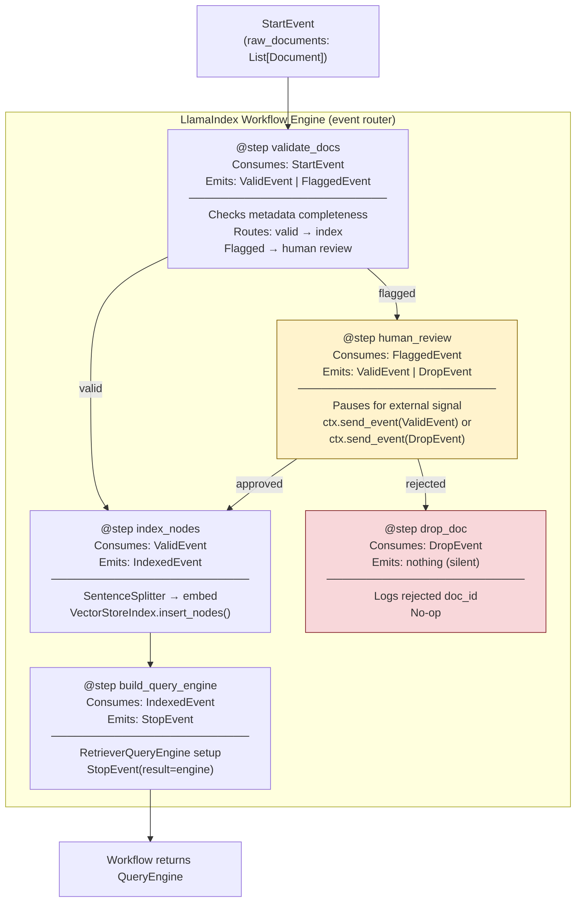

**Key insight:** Steps are **decoupled**. `validate_docs` doesn't import `index_nodes` — it just emits a `ValidEvent`. The workflow engine delivers it. This means you can insert a new step (e.g., `PII_RedactionStep`) between validate and index without modifying either surrounding step.

---

### 3. Real-World Industry Scenarios [Intermediate]

#### Scenario A: Document Ingestion with Human Review Gate — Healthcare Records Platform

**Context:** A healthcare platform ingests 10,000 clinical notes per night. Before indexing, PHI-sensitive documents must be flagged by a compliance model and routed to a human reviewer. Non-flagged documents should proceed to embedding immediately. Reviewers may take up to 24 hours — the pipeline must *pause and resume* rather than block a thread.

**How Workflow fits in:**
- `StartEvent` carries a batch of `Document` objects (100 at a time, fan-out via `ctx.send_event()` in a loop).
- `@step validate_docs`: runs a local PHI classifier (e.g., `presidio-analyzer`). Emits `ValidEvent` for clean docs and `FlaggedEvent` for PHI-positive ones.
- `@step human_review`: stores the flagged document to a review queue (Redis/DB), then suspends by awaiting a webhook callback (`await ctx.get("review_decision_{doc_id}")`). A separate reviewer UI calls back and sets the key. The step resumes and emits `ValidEvent` or `DropEvent`.
- `@step index_nodes`: `SentenceSplitter → SentenceTransformerEmbeddings → PineconeVectorStore.insert_nodes()`. Parallelised: because 100 `ValidEvent`s are emitted, the workflow runs 100 instances of this step concurrently.

**Constraints:**
- **Latency:** Async parallelism: 100 documents embedded concurrently — 100 × 50ms = 5s sequentially vs ~0.5s with concurrency. Human review adds 0–24h but doesn't block the non-flagged path.
- **Reliability:** Each step emits its result as an event — if a crash occurs mid-workflow, completed steps don't re-run. In production, pair with an external orchestrator (Prefect) that persists the event log to durable storage.
- **Cost:** PHI classifier runs locally — no LLM API cost per document. Only embedding calls incur cost (1 call per chunked node). A 10,000-document batch at 3 nodes/doc = 30,000 embedding calls × $0.0001 = $3/night.
- **What "good" looks like:** PHI-flagged documents are never indexed without human approval. Non-flagged documents complete indexing within 2 minutes. Rejected documents are logged with `doc_id` and rejection reason for audit.

---

#### Scenario B: Multi-Source Research Aggregator — Fan-Out Document Loading

**Context:** A financial research platform aggregates earnings reports from 50 SEC EDGAR feeds, internal analyst notes, and news APIs. Each source has different latency (SEC API: 2–5s, internal DB: <100ms, news API: 500ms–3s). Processing them sequentially wastes wall-clock time.

**How Workflow fits in:**
- `StartEvent(sources=["sec", "internal_db", "news"])` triggers a fan-out step.
- `@step dispatch_sources`: loops over sources, emitting one `LoadSourceEvent(source_type=s)` per source. All 3 fire concurrently.
- Three `@step load_*` functions each consume `LoadSourceEvent` and return `RawDocsEvent(documents=[...])`.
- `@step merge_and_parse`: collects all 3 `RawDocsEvent`s using `ctx.collect_events(ev, [RawDocsEvent]*3, wait_for=3)`, merges docs, runs `SentenceSplitter`.
- `@step embed_and_index` → `StopEvent`.

**Constraints:**
- **Latency:** Sequential: 5s + 0.1s + 3s = 8.1s. Parallel (workflow fan-out): max(5s, 0.1s, 3s) = 5s. 38% faster with zero code change to the load steps.
- **Failure mode:** One source (news API) times out. `load_news` catches the exception and emits a `SourceFailedEvent`. `merge_and_parse` uses `ctx.collect_events(ev, [RawDocsEvent]*2 + [SourceFailedEvent]*1)` to proceed with partial data.
- **What "good" looks like:** Workflow completes with 49 of 50 sources when 1 fails; a `SourceFailedEvent` is logged with the failed source ID; alert is sent for the failed source.

---

#### Scenario C: Production Batch Re-Indexing — External Orchestrator Integration

**Context:** An enterprise knowledge base re-ingests all 500,000 documents weekly. This cannot run as a long-lived Python process — it must be scheduled, retried on failure, and reported on in a dashboard.

**How external orchestration fits in:**
- **LlamaIndex Workflow** handles the *per-batch* processing logic (validate → chunk → embed → upsert). It's the execution unit.
- **Prefect** (or Apache Airflow) handles *scheduling, orchestration, and retry* of those batches:
  - A Prefect `@flow` breaks 500K documents into 500 batches of 1,000.
  - Each batch runs as a Prefect `@task` that instantiates and runs a `LlamaIndexIngestionWorkflow`.
  - Prefect provides: retry on failure (3 attempts with exponential backoff), concurrent batch execution (10 batches at a time), persistent run history, failure alerts.

**Constraints:**
- **Cost control:** Embedding 500K docs × 3 nodes/doc × $0.0001 = $150/run. Cap concurrency at 10 batches to avoid API rate limits.
- **Idempotency:** Each batch upserts by `doc_id`. Re-running a failed batch doesn't duplicate nodes.
- **What "good" looks like:** Weekly re-indexing completes in < 4 hours, costs < $150, failed batches are retried automatically.

---

### 4. System View (Think Like a Systems Engineer) [Intermediate]

**Inputs → Transformations → Outputs:**

```
INPUTS:
  - StartEvent payload (documents, config, source IDs)
  - Workflow definition (set of @step functions + event type wiring)
  - ctx shared state (KV store, per-run)

STEP EXECUTION MODEL (asyncio-based):
  - When a step emits Event(X) → engine schedules all steps consuming X as asyncio.Task
  - Fan-out: ctx.send_event(X) in a loop → N concurrent step instances
  - Fan-in: ctx.collect_events(ev, [EventType]*N, wait_for=N) → blocks until N arrive
  - Shared state: ctx.get("key") / ctx.set("key", value) → asyncio-safe KV

OUTPUTS:
  - StopEvent.result → return value of workflow.run()
  - Side effects: nodes inserted into vector store, logs, metrics

IngestionPipeline (simpler linear alternative):
  INPUTS:  List[Document] + List[Transformation]
  TRANSFORMATIONS: sequential doc → T1 → T2 → ... → List[BaseNode]
                   IngestionCache: skips nodes whose content hash hasn't changed
  OUTPUTS: List[BaseNode] upserted to vector store
  LIMITATIONS: No branching, no events, no human-in-the-loop
```

**Observability — what to log, trace, and measure:**

| Signal | What to capture | Why |
|--------|----------------|-----|
| `step_name` + `event_type` | Which step processed which event | Latency per step; bottleneck identification |
| `step_duration_ms` | Wall-clock time per step instance | p95 per step; regression detection |
| `events_emitted_count` | Number of events emitted per step | Fan-out ratio; detects unexpected collapse |
| `workflow_run_id` | UUID per workflow invocation | Correlate all steps in a run for tracing |
| `nodes_processed` | Cumulative count of nodes indexed | Progress tracking |
| `retry_count` | Number of retries per step | Flaky step detection |
| `ctx_state_size_bytes` | Size of shared state in ctx | Detect context bloat |

**Failure points:**

1. **Fan-in deadlock** — `ctx.collect_events(wait_for=N)` never receives all N events because one parallel branch crashed silently. Workflow hangs until timeout. *Fix:* every step must `except → ctx.send_event(FailedEvent(...))`.

2. **`ctx.set()` key collision in fan-out** — 50 parallel steps all write to `ctx.set("count", x)` — last writer wins. *Fix:* scope keys by doc_id: `ctx.set(f"count_{doc_id}", x)`.

3. **IngestionCache stale after embedding model upgrade** — cache key is content hash only; model change not reflected. Old embeddings returned silently. *Fix:* clear cache before any model version bump.

4. **Step LLM call with no timeout** — LLM call hangs; asyncio event loop blocked; other step instances starved. *Fix:* `asyncio.wait_for(llm.acomplete(...), timeout=30.0)`.

---

### 5. System Design Flavor [Intermediate]

**Key components and code:**

```python
# workflow_design.py
# pip install llama-index-core

import asyncio
from llama_index.core.workflow import (
    Workflow, StartEvent, StopEvent, Event, step, Context,
)
from llama_index.core import Document
from llama_index.core.node_parser import SentenceSplitter

# ── Custom Event types ─────────────────────────────────────────────────────────
class ValidEvent(Event):
    doc: Document

class FlaggedEvent(Event):
    doc: Document
    reason: str

class ParsedEvent(Event):
    nodes: list   # List[TextNode]

class IndexedEvent(Event):
    doc_count: int
    node_count: int

# ── Workflow definition ────────────────────────────────────────────────────────
class DataIngestionWorkflow(Workflow):

    @step
    async def validate_docs(self, ctx: Context, ev: StartEvent) -> ValidEvent | FlaggedEvent:
        docs = ev.documents
        await ctx.set("total_docs", len(docs))
        for doc in docs:
            if not doc.metadata.get("source"):
                ctx.send_event(FlaggedEvent(doc=doc, reason="missing_source"))
            else:
                ctx.send_event(ValidEvent(doc=doc))
        return ValidEvent(doc=docs[0])  # ignored by engine when send_event used

    @step
    async def handle_flagged(self, ctx: Context, ev: FlaggedEvent) -> None:
        print(f"[FLAGGED] doc_id={ev.doc.doc_id[:8]} reason={ev.reason}")
        # Production: write to review queue; await human callback

    @step
    async def parse_nodes(self, ctx: Context, ev: ValidEvent) -> ParsedEvent:
        parser = SentenceSplitter(chunk_size=256, chunk_overlap=32)
        nodes = parser.get_nodes_from_documents([ev.doc])
        return ParsedEvent(nodes=nodes)

    @step
    async def index_nodes(self, ctx: Context, ev: ParsedEvent) -> IndexedEvent:
        await asyncio.sleep(0.01)   # simulate embedding latency
        indexed = await ctx.get("indexed_count", default=0)
        await ctx.set("indexed_count", indexed + len(ev.nodes))
        return IndexedEvent(doc_count=1, node_count=len(ev.nodes))

    @step
    async def finalize(self, ctx: Context, ev: IndexedEvent) -> StopEvent | None:
        total_docs = await ctx.get("total_docs", default=0)
        completed = await ctx.get("completed_docs", default=0) + ev.doc_count
        await ctx.set("completed_docs", completed)
        if completed >= total_docs:
            total_nodes = await ctx.get("indexed_count", default=0)
            return StopEvent(result={"docs": completed, "nodes": total_nodes})
        return None  # keep waiting for remaining docs


# ── IngestionPipeline (simpler linear alternative) ─────────────────────────────
from llama_index.core.ingestion import IngestionPipeline

def run_ingestion_pipeline(docs):
    pipeline = IngestionPipeline(
        transformations=[
            SentenceSplitter(chunk_size=256, chunk_overlap=32),
            # Production: add SentenceTransformerEmbeddings() here
        ]
    )
    nodes = pipeline.run(documents=docs, show_progress=True)
    print(f"[IngestionPipeline] {len(docs)} docs -> {len(nodes)} nodes")
    return nodes
```

**Key tradeoffs:**

| Tradeoff | `IngestionPipeline` | `Workflow` | When to choose |
|----------|--------------------|-----------|----|
| **Complexity vs capability** | Dead simple (list of transforms, `run()`) | Full event routing, branching, fan-out | Pipeline for pure linear ETL; Workflow when you need conditional logic, parallelism, or human gates |
| **Error handling** | Fails entire pipeline on any error | Each branch handles its own exceptions independently | Workflow for partial-success tolerance; Pipeline for all-or-nothing jobs |
| **State management** | Stateless (transforms are pure functions) | `ctx` provides cross-step shared state | Workflow when steps need intermediate results; Pipeline when transforms are independent |

**Scaling consideration (10x document volume):**
At 10x, three changes dominate:
- **Async embedding**: use `async_embed_nodes()` in batches of 100 — reduces wall-clock time from O(N) to O(N/batch_size).
- **External orchestration**: move from in-process `Workflow.run()` to Prefect/Airflow tasks for scheduling, retries, and cost tracking across 10+ parallel batch workers.
- **`IngestionCache` content-hash filtering**: at 500K docs with ~5% change weekly, the cache skips 95% of embedding API calls — reducing cost from $150/run to ~$7.50/run.

---

### 6. Common Mistakes + Debugging [Beginner → Intermediate]

#### Mistake 1: Fan-in Step Never Completes (Deadlock)

**Symptom:** Workflow runs forever with no output. Step logs are visible, but `StopEvent` is never emitted.

**Likely cause:** `ctx.collect_events(wait_for=N)` is waiting for N events, but only N-1 were emitted — one parallel branch crashed silently (exception swallowed, no error event emitted).

**First debugging step:**
```python
# Add a global workflow timeout and verbose mode
wf = DataIngestionWorkflow(timeout=60, verbose=True)
# verbose=True logs every event emission and step entry
# Count emitted events per type in the log output
# If N emitted but only N-1 received by collect_events → silent crash
# Fix: add except block in every step that emits a FailedEvent
@step
async def parse_nodes(self, ctx: Context, ev: ValidEvent) -> ParsedEvent | FailedEvent:
    try:
        ...
        return ParsedEvent(nodes=nodes)
    except Exception as e:
        return FailedEvent(doc_id=ev.doc.doc_id, error=str(e))
```

---

#### Mistake 2: ctx Key Collision in Fan-Out (Race Condition)

**Symptom:** Final `indexed_count` is the count from a single document, not the sum of all documents.

**Likely cause:** Each of the N parallel `index_nodes` steps does `await ctx.set("indexed_count", len(ev.nodes))` — overwriting the key. Last writer wins.

**First debugging step:**
```python
# WRONG: last writer wins
await ctx.set("indexed_count", len(ev.nodes))

# RIGHT: scope by doc_id, sum in finalize
await ctx.set(f"indexed_{ev.doc.doc_id}", len(ev.nodes))

# In finalize:
total = sum(
    await ctx.get(f"indexed_{doc_id}", default=0)
    for doc_id in all_doc_ids
)
```

---

#### Mistake 3: IngestionCache Stale After Embedding Model Upgrade

**Symptom:** After upgrading the embedding model, retrieval quality drops despite the cache showing a high hit rate.

**Likely cause:** `IngestionCache` keys are content hashes of node text — the embedding model version is not part of the key. Cached nodes have stale embeddings from the old model.

**First debugging step:**
```python
# Simplest fix: clear cache before running with a new model version
pipeline = IngestionPipeline(transformations=[...])
pipeline.cache.clear()
# Document this in your model upgrade runbook:
# "Always clear IngestionCache after changing embedding model"
```

---

### 7. Hands-On Lab [Pro]

#### Build — Event-Driven Ingestion Workflow

```python
# workflow_lab.py
# pip install llama-index-core

import asyncio
from llama_index.core.workflow import (
    Workflow, StartEvent, StopEvent, Event, step, Context,
)
from llama_index.core import Document
from llama_index.core.node_parser import SentenceSplitter

class ValidDoc(Event):
    doc: Document

class ParsedNodes(Event):
    doc_id: str
    node_count: int

class FlaggedDoc(Event):
    doc_id: str
    reason: str

DOCS = [
    Document(text="HIPAA requires covered entities to safeguard PHI.", metadata={"source": "hipaa.txt"}),
    Document(text="Revenue for Q3 2024 was $4.2B, up 12% YoY.", metadata={"source": "earnings.txt"}),
    Document(text="No metadata document.", metadata={}),
    Document(text="HITECH Act breach notification within 60 days.", metadata={"source": "hitech.txt"}),
    Document(text="Another flagged doc.", metadata={}),
]

class SimpleIngestionWorkflow(Workflow):

    @step
    async def validate(self, ctx: Context, ev: StartEvent) -> ValidDoc | FlaggedDoc:
        docs = ev.documents
        await ctx.set("total", len(docs))
        await ctx.set("valid_count", 0)
        for doc in docs:
            if not doc.metadata.get("source"):
                ctx.send_event(FlaggedDoc(doc_id=doc.doc_id, reason="missing_source"))
            else:
                ctx.send_event(ValidDoc(doc=doc))
        return FlaggedDoc(doc_id="dummy", reason="dummy")  # ignored

    @step
    async def handle_flagged(self, ctx: Context, ev: FlaggedDoc) -> None:
        flagged = await ctx.get("flagged", default=[])
        flagged.append(ev.doc_id)
        await ctx.set("flagged", flagged)
        print(f"  [flagged] {ev.doc_id[:8]}... reason={ev.reason}")

    @step
    async def parse(self, ctx: Context, ev: ValidDoc) -> ParsedNodes:
        parser = SentenceSplitter(chunk_size=128, chunk_overlap=16)
        nodes = parser.get_nodes_from_documents([ev.doc])
        print(f"  [parse] {ev.doc.metadata['source']} -> {len(nodes)} nodes")
        return ParsedNodes(doc_id=ev.doc.doc_id, node_count=len(nodes))

    @step
    async def finalize(self, ctx: Context, ev: ParsedNodes) -> StopEvent | None:
        vc = await ctx.get("valid_count", default=0) + 1
        await ctx.set("valid_count", vc)
        total = await ctx.get("total", default=0)
        flagged = await ctx.get("flagged", default=[])
        valid_expected = total - len(flagged)
        if vc >= valid_expected:
            return StopEvent(result={
                "valid": vc, "flagged": len(flagged), "total": total
            })
        return None

async def run_workflow():
    wf = SimpleIngestionWorkflow(timeout=30, verbose=False)
    result = await wf.run(documents=DOCS)
    print(f"\n[result] {result}")

asyncio.run(run_workflow())
# Expected: {'valid': 3, 'flagged': 2, 'total': 5}
```

---

#### Break — Force the Fan-In Deadlock

```python
# BREAK: crash silently in parse step -> finalize never gets all ParsedNodes -> hangs

class BrokenWorkflow(Workflow):

    @step
    async def validate(self, ctx: Context, ev: StartEvent) -> ValidDoc:
        await ctx.set("total", len(ev.documents))
        for doc in ev.documents:
            ctx.send_event(ValidDoc(doc=doc))
        return ValidDoc(doc=ev.documents[0])

    @step
    async def parse(self, ctx: Context, ev: ValidDoc) -> ParsedNodes:
        # BUG: KeyError for docs without 'source' metadata -> silent crash
        _ = ev.doc.metadata["source"]
        nodes = SentenceSplitter(chunk_size=128).get_nodes_from_documents([ev.doc])
        return ParsedNodes(doc_id=ev.doc.doc_id, node_count=len(nodes))

    @step
    async def finalize(self, ctx: Context, ev: ParsedNodes) -> StopEvent | None:
        total = await ctx.get("total", default=0)
        vc = await ctx.get("vc", default=0) + 1
        await ctx.set("vc", vc)
        if vc >= total:
            return StopEvent(result={"processed": vc})
        return None

async def run_broken():
    wf = BrokenWorkflow(timeout=5, verbose=True)
    try:
        result = await wf.run(documents=DOCS)
    except Exception as e:
        print(f"\n[BREAK] Timed out or failed: {e}")
        # -> finalize waited for 5 events but only 3 arrived (2 crashed silently)

asyncio.run(run_broken())
```

---

#### Measure

```python
import time

async def compare_sequential_vs_parallel():
    from llama_index.core.ingestion import IngestionPipeline

    # Sequential: IngestionPipeline
    t0 = time.perf_counter()
    pipeline = IngestionPipeline(transformations=[SentenceSplitter(chunk_size=256)])
    nodes = pipeline.run(documents=DOCS)
    seq_ms = (time.perf_counter() - t0) * 1000
    print(f"IngestionPipeline (sequential): {seq_ms:.0f}ms -> {len(nodes)} nodes")

    # Parallel: Workflow fan-out
    t0 = time.perf_counter()
    wf = SimpleIngestionWorkflow(timeout=30, verbose=False)
    result = await wf.run(documents=DOCS)
    par_ms = (time.perf_counter() - t0) * 1000
    print(f"Workflow (parallel fan-out):    {par_ms:.0f}ms -> {result}")
    # With I/O-bound steps (embeddings, DB writes), workflow is significantly faster
    # With CPU-bound steps on a small corpus, event-routing overhead dominates

asyncio.run(compare_sequential_vs_parallel())
```

---

#### Explain — Why It Works This Way

The LlamaIndex `Workflow` engine runs on asyncio. Each `@step` is an `async def` function; event routing is done by the engine's internal event broker. When a step emits an event via `return EventType(...)` or `ctx.send_event(EventType(...))`, the broker schedules all steps that accept that event type as `asyncio.Task` instances. This means all steps that can run concurrently *do* run concurrently without explicit `asyncio.gather()` calls — the engine handles it transparently.

The key design insight is that steps are **decoupled at the type level**: `validate_docs` doesn't import `parse_nodes` — it just emits a `ValidEvent`. You can insert a `PII_RedactionStep` that consumes `ValidEvent` and emits `RedactedEvent`, then update `parse_nodes` to consume `RedactedEvent` — without touching any other step.

The fan-in deadlock failure mode exists because asyncio `Task` exceptions that are not explicitly awaited are silently swallowed by the runtime. The workflow engine cannot distinguish "step is still running" from "step crashed and will never emit." This is why every step must have a `try/except` that emits a typed `FailedEvent` — it's the workflow equivalent of a circuit breaker pattern.

---

### 8. Active Recall (Spaced Repetition) [Beginner → Pro]

**Q1 [Beginner]:** What is the fundamental difference between `IngestionPipeline` and `Workflow` in LlamaIndex?

> **A:** `IngestionPipeline` is a linear transformation chain (Document → Transform1 → Transform2 → Nodes); no branching, no events, no state. `Workflow` is event-driven and step-based; steps communicate via typed Events; supports fan-out (one step emits many events for parallel processing), fan-in (a step waits for N events), branching (different event types for different paths), and human-in-the-loop gates. Use Pipeline for pure linear ETL; use Workflow for anything requiring conditional logic, parallelism, or external signals.

---

**Q2 [Beginner]:** What does `StopEvent` do, and what happens if no step ever emits it?

> **A:** `StopEvent` terminates the workflow and returns `StopEvent.result` as the return value of `workflow.run()`. If no step emits `StopEvent`, the workflow runs indefinitely until the `timeout` parameter triggers an exception — or until the process is killed. The most common cause: a fan-in step has a completion condition that's never satisfied because one parallel branch crashed without emitting its expected event.

---

**Q3 [Intermediate]:** You have a fan-out of 50 parallel `parse_nodes` steps. Each writes `await ctx.set("node_count", len(nodes))`. What goes wrong and how do you fix it?

> **A:** All 50 steps share the same ctx key — each step overwrites whatever the previous step set. Final value is from whichever step ran last, not the sum. Fix: scope the key by document ID (`ctx.set(f"node_count_{doc_id}", len(nodes))`) and sum the per-document values in the finalize step. Never use a shared accumulator key in fan-out steps without explicit locking or scoping.

---

**Q4 [Intermediate]:** When would you add Prefect or Apache Airflow on top of a LlamaIndex Workflow?

> **A:** Use an external orchestrator when you need: (1) **scheduling** — cron-based triggers; Workflow has no scheduler. (2) **durable retry** — Prefect/Airflow persist run state to a database; Workflow state is lost on process crash. (3) **concurrency management** — running 500 batches with rate limiting across multiple workers. (4) **monitoring and alerting** — dashboard, Slack/PagerDuty on failure. The LlamaIndex Workflow is the execution unit per batch; the orchestrator manages *when*, *how many*, and *what to do on failure*.

---

**Q5 [Pro]:** Design a workflow that loads from 3 sources (API A: 3s, API B: 1s, API C: 5s) and must proceed with partial results if any source times out. What events, steps, and ctx patterns do you use?

> **A:** Events: `StartEvent(sources)`, `LoadedEvent(source, docs)`, `SourceTimedOut(source)`, `ParsedEvent(source, node_count)`, `StopEvent(result)`. Steps: (1) `@step dispatch` — emits `LoadSourceEvent` for each source (3 concurrent). (2) `@step load_source` — wraps API call in `asyncio.wait_for(..., timeout=4.0)`; success → `LoadedEvent`; `TimeoutError` → `SourceTimedOut`. (3) `@step parse(ev: LoadedEvent)` → `ParsedEvent`. (4) `@step finalize` — uses `ctx.collect_events(ev, [ParsedEvent, SourceTimedOut], wait_for=3)`; builds result from received events; API C (5s) hits 4s timeout → `SourceTimedOut`; finalize receives 2 `ParsedEvent` + 1 `SourceTimedOut` = 3 total → `StopEvent` fires with partial results.

---

### 9. Practice

**Mini-exercise:** You're building an ingestion workflow for 1,000 research papers from 3 S3 buckets (US-East, EU-West, GCS). Each bucket reader takes ~200ms/paper. Sketch the workflow (event types, steps) that processes all 3 buckets in parallel and merges the results.

> **Suggested answer:**
> - Events: `StartEvent(buckets)`, `LoadBucketEvent(bucket)`, `BucketLoadedEvent(bucket, docs)`, `ParsedEvent(bucket, nodes)`, `StopEvent(result)`.
> - `@step dispatch_buckets`: for each bucket, `ctx.send_event(LoadBucketEvent(bucket=b))`. Fires 3 concurrent load operations.
> - `@step load_bucket(ev: LoadBucketEvent)` → `BucketLoadedEvent(bucket, docs)`.
> - `@step parse_docs(ev: BucketLoadedEvent)` → `ParsedEvent(bucket, nodes)`.
> - `@step merge(ev: ParsedEvent)`: `ctx.collect_events(ev, [ParsedEvent]*3, wait_for=3)`. Merge all nodes. Insert to index. Return `StopEvent(result=counts_by_bucket)`.
> - Wall-clock: max(333 papers × 200ms) = ~66s per bucket in parallel, vs 3 × 66s = 198s sequential. 3x speedup.

---

**Capstone system design question:** Design an end-to-end data-heavy GenAI system for a global enterprise ingesting 1M documents/month from 50 sources (SharePoint, APIs, databases). Requirements: (1) partial success (one source failure doesn't fail all), (2) human review for flagged documents, (3) scheduled weekly re-indexing, (4) < $500/month embedding cost, (5) audit trail of every document's outcome.

> **Answer outline:**
> - **Orchestration layer:** Prefect `@flow` schedules weekly re-indexing. Parallelizes across 50 source-specific tasks (10 concurrent). Each task runs an independent `LlamaIndexIngestionWorkflow` for that source. Prefect provides: 3-retry with exponential backoff, failure isolation per source, cost metrics dashboard.
> - **Per-source LlamaIndex Workflow:** `StartEvent` → fan-out load (async S3/API/DB) → validate (flag sensitive/malformed docs via local classifier) → human review queue for flagged docs → `SentenceSplitter` → local `sentence-transformers` embedding (zero API cost) → upsert to Pinecone by doc_id (idempotent).
> - **Human review gate:** flagged docs written to DB. Reviewers approve/reject via UI. On decision, webhook sets ctx key or re-triggers the workflow for that doc with `approved=True`.
> - **Cost control:** local embedding model (`all-MiniLM-L6-v2`): $0 marginal cost. 1M docs × 3 nodes/doc × $0 = $0 for embedding. GPU T4 instance: ~$150/month. Total embedding cost < $200/month. Optional: route high-value docs to OpenAI embeddings for higher quality.
> - **Audit trail:** every document emits `AuditEvent(doc_id, source, outcome, timestamp)` to an append-only audit table. Written asynchronously by `@step audit_log` on every branch — valid, flagged, rejected, indexed.
> - **Failure isolation:** each source is an independent Prefect task. A failed SharePoint connector (retried 3x) is marked failed in the dashboard without affecting Salesforce, Confluence, or database sources.

---

### 10. Production Reality Check (Mandatory)

**If this fails in prod, what's the first thing we inspect?**

> **Check whether every branch of your workflow emits a terminal event — specifically, enable `verbose=True` and count events emitted vs events received per step type.**
>
> A workflow that hangs in production is almost always a fan-in step waiting for events that will never arrive. The debugging protocol:
>
> ```python
> # Step 1: Enable verbose mode
> wf = DataIngestionWorkflow(timeout=60, verbose=True)
> # Verbose output shows: "Emitting event: ValidDoc" × N
> # And: "Step parse_nodes received ValidDoc" × M
> # If N != M -> silent crash in parse_nodes step
>
> # Step 2: Add FailedEvent to every step's except block
> @step
> async def parse_nodes(self, ctx: Context, ev: ValidDoc) -> ParsedNodes | FailedEvent:
>     try:
>         ...
>         return ParsedNodes(...)
>     except Exception as e:
>         return FailedEvent(doc_id=ev.doc.doc_id, error=str(e))
> # Now finalize can collect FailedEvent + ParsedNodes together
> # Workflow completes even when some branches fail
> ```
>
> The number-one production rule for LlamaIndex Workflows: **every step must catch exceptions and emit a typed FailedEvent.** Silent crashes equal fan-in deadlocks equal hung workflows equal silent data gaps in your index.

---

### 11. Curiosity Bridge (Mandatory)

You now have three layers working: ingestion workflows that fan-out and fan-in across sources (14.2.c), retrieval pipelines with hybrid fusion (14.2.b), and response synthesis (14.2.a). Each layer is independently orchestrated.

But what if a step in your workflow isn't just transforming data — what if it needs to *decide* what to do next, *call tools*, and *loop* until a goal is satisfied? The event-driven workflow becomes an **agent loop**. The next question is: what happens when a `@step` in your workflow wraps a `ReActAgent` that can invoke query engines, APIs, and custom tools to make multi-step decisions?

That's **14.3.a: LlamaIndex Agents and ReActAgent** — where your workflow scaffold becomes the foundation for autonomous, goal-directed reasoning over data.

---

### 12. Exit Check + Carry-Forward Review

**Exit check:** You're done with 14.2.c when you can explain the difference between `IngestionPipeline` and `Workflow`, implement a fan-out/fan-in workflow with typed events and `ctx` shared state, identify and fix a fan-in deadlock, and explain when to add Prefect or Airflow on top of a LlamaIndex Workflow.

---

**Carry-Forward Review (interleaved recall from 14.2.b):**

*Q: Your hybrid retriever (dense + BM25) is performing worse than dense-only for queries like "GDPR Article 17 right to erasure." What's the most likely cause and first debugging step?*

> **A:** Most likely cause: `QueryFusionRetriever.similarity_top_k` is set too small (e.g., 3), cutting the merged list before the cross-encoder reranker can re-score it. BM25 may have correctly retrieved the exact GDPR article at rank 4–5, but the tight fusion cut eliminated it. First debug step: run `BM25Retriever.retrieve("GDPR Article 17 right to erasure")` in isolation — if it returns the correct node, the issue is the fusion top_k discarding it. Fix: set `similarity_top_k=15` on `QueryFusionRetriever` and let `SentenceTransformerRerank(top_n=5)` do the final cut.


## Subtopic 14.2.d: When LlamaIndex Beats Generic Frameworks for Knowledge Tasks

### Reading Path + Level Tags

- **Beginner:** Read sections 1–2 and the Active Recall.
- **Intermediate:** Add sections 3–5 and the decision framework table.
- **Pro:** Work through section 7 (the architecture drill) and the capstone system design question.

---

### 0. Pre-Question Hook [Beginner]

**Pause:** You're building a document Q&A system over 500,000 enterprise knowledge base articles. Your team already uses LangChain for other GenAI features. Before reading — would you build the document retrieval on top of LangChain, switch to LlamaIndex, or keep both? What factors would drive your decision?

---

### 1. The Intuition (Plain English) [Beginner]

Every GenAI framework makes a bet. LangChain's bet is: *the hardest problem is chaining LLM calls, tools, and agents together.* LlamaIndex's bet is: *the hardest problem is getting heterogeneous data into a form that LLMs can actually query well.*

These bets lead to very different default abstractions:

| Design axis | LangChain | LlamaIndex |
|------------|-----------|------------|
| Core primitive | `Chain` / `Runnable` (composable LLM call sequences) | `Index` / `QueryEngine` (data retrieval and synthesis) |
| Document handling | Loaders + splitters exist, but are secondary | First-class: 150+ loaders, 5 index types, node-level metadata |
| Retrieval | `Retriever` interface (pluggable) | `VectorIndexRetriever`, `BM25Retriever`, `QueryFusionRetriever`, `RouterRetriever` |
| Agent model | `AgentExecutor`, `LangGraph` (mature, battle-tested) | `ReActAgent`, `Workflow` (capable, newer) |
| Structured output | Pydantic output parsers, LCEL | `Pydantic programs`, structured prediction |
| Observability | LangSmith (tracing + eval, commercial) | Callbacks, `arize-phoenix` (open-source alternative) |

**The key insight:** LlamaIndex wins when *your data is the hard part* — when you have many document types, need node-level metadata and provenance, want multiple index strategies over the same corpus, or need fine-grained retrieval control. LangChain wins when *the agent logic is the hard part* — when you need multi-step reasoning, complex tool orchestration, human-in-the-loop approval flows, or a production-grade agent runtime.

**Analogy:** LangChain is a professional kitchen with every tool imaginable — it can cook anything, but you bring your own ingredients. LlamaIndex is a professional food-prep system — it excels at sourcing, cleaning, cutting, and organising ingredients so that any cooking step (including LangChain) works better. The analogy breaks down because both systems can do both jobs reasonably well; the tradeoffs are about *optimisation*, not hard limits.

**Key terms (first use):**

- **Framework positioning** — the set of problems a framework is optimised to solve; not what it *can* do but where it has the deepest abstractions and most production validation.
- **LCEL (LangChain Expression Language)** — LangChain's composable `|` pipe operator for chaining `Runnable` objects; excellent for building LLM call chains with streaming, parallelism, and fallbacks.
- **`RouterQueryEngine`** — LlamaIndex abstraction that routes a query to one of several sub-query-engines based on LLM classification or metadata; no equivalent first-class primitive in LangChain.
- **`SubQuestionQueryEngine`** — LlamaIndex engine that decomposes a complex question into sub-questions, routes each to a different query engine, and synthesizes a unified answer; deeply data-centric.
- **`LlamaIndex + LangChain interop`** — LlamaIndex query engines can be wrapped as LangChain `Tool` objects; LangChain agents can call LlamaIndex retrievers via the `Tool` interface; the two frameworks compose rather than compete.
- **Data-centric RAG** — a RAG architecture where the primary engineering investment is in data quality, index structure, and retrieval precision — not in the LLM call itself; LlamaIndex's home turf.
- **Agent-centric orchestration** — a GenAI architecture where the primary engineering investment is in how the agent decides what to do, what tools to call, and how to handle failures — LangChain's and LangGraph's home turf.

---

### 2. Visual Diagram (Mermaid) [Beginner]

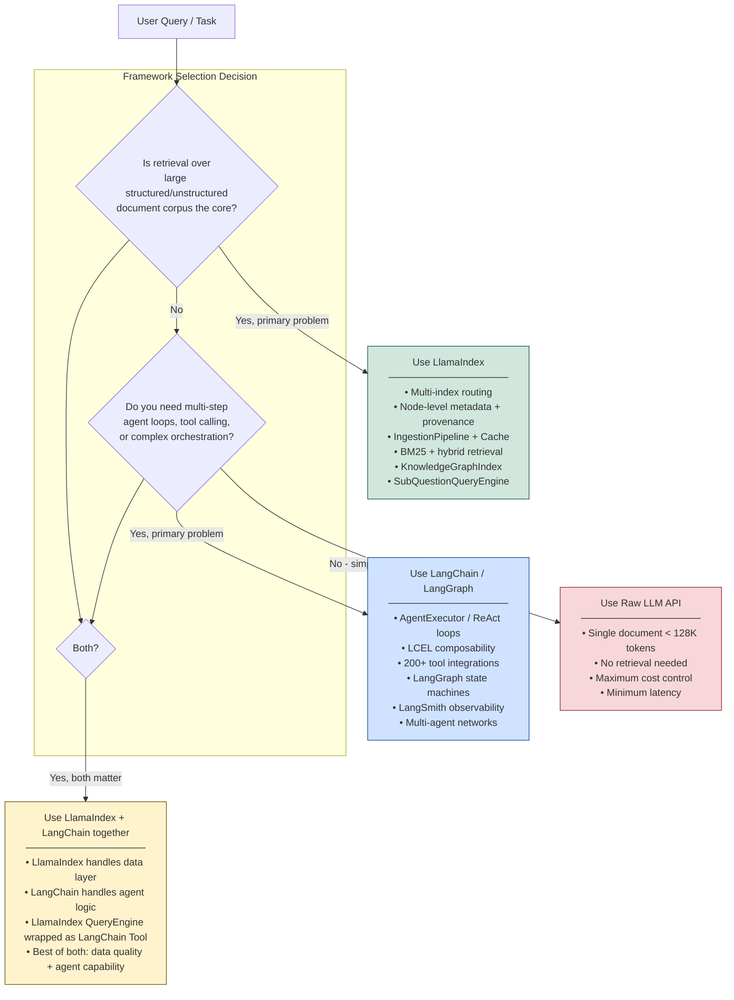

**Key insight:** These are not competing choices in most production systems — they are *complementary layers*. The data layer (LlamaIndex) feeds into the agent layer (LangChain/LangGraph). The question is which layer to invest engineering time in, based on where your retrieval and reasoning failures actually occur.

---

### 3. Real-World Industry Scenarios [Intermediate]

#### Scenario A: Enterprise Knowledge Base — LlamaIndex Wins Clearly

**Context:** A global professional services firm needs a knowledge assistant over 2M documents: internal wikis, client engagement reports, regulatory filings, and financial models (PDFs, Word, Excel, databases). Users ask questions ranging from *"What did we recommend to Client X in the 2022 engagement?"* to *"Compare our regulatory exposure across EU and US filings."*

**Why LlamaIndex beats LangChain here:**

- **150+ loaders:** `SimpleDirectoryReader` + LlamaHub covers PDF, Word, Excel, SharePoint, Confluence, Notion, SQL databases — each with metadata propagation. LangChain has document loaders too, but LlamaIndex's are more opinionated and production-tested for this use case.
- **Index variety:** Financial models → `SummaryIndex` (full-scan over structured rows). Client reports → `VectorStoreIndex` (semantic ANN). Regulatory cross-references → `KnowledgeGraphIndex` (entity relationships). LangChain provides one FAISS/Chroma vector store; index type differentiation requires manual engineering.
- **`SubQuestionQueryEngine`:** The comparison query (*"compare regulatory exposure across EU and US"*) is decomposed into: (1) *"What are our EU regulatory filings?"* → EU index, (2) *"What are our US regulatory filings?"* → US index, (3) synthesize a unified comparison. LangChain would require custom chain logic to achieve this. LlamaIndex ships it as a single abstraction.
- **Node-level provenance:** Every answer includes `source_nodes` with document name, page number, and chunk position. The firm's compliance requirements demand auditability — *"show me exactly which paragraph this answer came from."* LlamaIndex provides this natively; LangChain requires custom tracking.
- **`IngestionPipeline` + `IngestionCache`:** 2M documents updated incrementally. Cache skips unchanged nodes → 90% cost reduction on weekly re-indexing runs.

**What "good" looks like:** A query over 2M documents returns a cited answer with source provenance in < 3 seconds. Re-indexing 2M documents weekly costs < $200. Any answer can be traced to an exact document, page, and paragraph for compliance audit.

---

#### Scenario B: Multi-Tool Customer Service Agent — LangChain/LangGraph Wins

**Context:** A telecom company builds a customer service agent that must: look up account information (CRM API), check network outage status (monitoring API), process refund requests (billing API), and *also* answer questions from a policy knowledge base (RAG). The agent must handle multi-turn conversations, remember context, and escalate to a human agent if confidence is low.

**Why LangChain wins here (and LlamaIndex plays a supporting role):**

- **LangGraph state machine:** The agent's conversation flow — greeting → intent classification → tool call → response → follow-up or escalation — is a state machine with conditional branching. LangGraph's `StateGraph` models this exactly. LlamaIndex's `Workflow` can do it, but LangGraph has more production mileage for complex multi-turn agent flows.
- **Tool ecosystem:** LangChain has pre-built integrations for Salesforce CRM, PagerDuty, Stripe, and 200+ other systems. LlamaIndex's `ToolSpec` covers document-oriented tools well but lacks the breadth of LangChain's tool library for non-document APIs.
- **LlamaIndex as a tool:** The policy knowledge base is still served by a LlamaIndex `VectorStoreIndex` with hybrid retrieval. The LangChain agent calls it via a `Tool` wrapper: `Tool(name="policy_kb", func=llama_query_engine.query)`. LlamaIndex handles data retrieval; LangChain handles agent orchestration.
- **LangSmith observability:** Multi-turn agent traces — showing which tool was called, what it returned, and why the agent chose the next action — are the primary debugging surface. LangSmith provides this out of the box. LlamaIndex callbacks require more configuration for equivalent tracing.

**What "good" looks like:** The agent resolves 80% of customer issues without human escalation. Tool call success rate > 99%. Average conversation < 5 turns. Every conversation is traceable in LangSmith.

---

#### Scenario C: Research Paper Analysis — Hybrid LlamaIndex + LangChain

**Context:** A pharmaceutical company builds an assistant to help researchers: (1) retrieve relevant papers from a 500K-paper corpus (data-centric, LlamaIndex's strength), (2) compare findings across papers (synthesis, LlamaIndex's `tree_summarize`), and (3) generate a structured research brief with citations, clinical trial suggestions, and risk assessments (agent with structured output, LangChain's strength).

**How they compose:**

```python
# LlamaIndex handles the data layer
from llama_index.core import VectorStoreIndex
from llama_index.core.retrievers import QueryFusionRetriever

query_engine = RetrieverQueryEngine(
    retriever=QueryFusionRetriever([dense_ret, bm25_ret], ...),
    response_synthesizer=get_response_synthesizer(response_mode="tree_summarize"),
)

# Wrap as a LangChain Tool
from langchain.tools import Tool
paper_search_tool = Tool(
    name="research_paper_search",
    description="Search 500K research papers for relevant findings. Input: research question string.",
    func=lambda q: str(query_engine.query(q)),
)

# LangChain agent handles the reasoning and structured output layer
from langchain.agents import AgentExecutor, create_react_agent
from langchain_openai import ChatOpenAI
from langchain_core.output_parsers import PydanticOutputParser
from pydantic import BaseModel

class ResearchBrief(BaseModel):
    summary: str
    key_findings: list[str]
    suggested_trials: list[str]
    risk_factors: list[str]
    citations: list[str]

agent = create_react_agent(
    llm=ChatOpenAI(model="gpt-4o"),
    tools=[paper_search_tool, clinical_trial_lookup_tool, risk_db_tool],
    prompt=research_brief_prompt,
)
executor = AgentExecutor(agent=agent, tools=[...], verbose=True)
brief_raw = executor.invoke({"input": "Summarise findings on PCSK9 inhibitors for LDL reduction"})
# Parse into structured output
brief = PydanticOutputParser(pydantic_object=ResearchBrief).parse(brief_raw["output"])
```

**Why this hybrid wins over either alone:**
- LlamaIndex alone: great retrieval and synthesis, but building a structured multi-tool agent loop requires LlamaIndex `Workflow` + custom tool routing — more engineering than using LangChain's mature `AgentExecutor`.
- LangChain alone: could use LangChain's document loaders and FAISS vector store, but would lose LlamaIndex's hybrid retrieval, `KnowledgeGraphIndex`, `SubQuestionQueryEngine`, and `IngestionPipeline` caching.
- Together: LlamaIndex is a high-precision retrieval tool called by a LangChain agent. Each framework does what it's optimised for.

---

### 4. System View (Think Like a Systems Engineer) [Intermediate]

**Framework decision signals — what to measure before choosing:**

| Signal | LlamaIndex-first | LangChain-first | Raw API |
|--------|-----------------|-----------------|---------|
| Document corpus size | > 10K documents | < 1K documents or no docs | Single document or in-context |
| Document type diversity | PDF + DB + API + spreadsheet | One type | One type |
| Retrieval precision requirements | High (compliance, legal, medical) | Moderate | Not applicable |
| Agent reasoning complexity | Low–Medium | High (multi-tool, multi-turn) | None |
| Required observability | Node-level provenance + citations | Conversation traces + tool call traces | Token-level costs |
| Team expertise | Strong in data engineering | Strong in backend/API integration | Strong in prompt engineering |
| Time to first prototype | Longer (more config) | Faster (more pre-built agents) | Fastest |

**Where LlamaIndex is uniquely strong (no equivalent in LangChain out-of-the-box):**

1. **`SubQuestionQueryEngine`** — decomposes complex multi-part questions into sub-questions, routes each to a separate query engine, synthesizes a unified answer. Requires custom chain logic in LangChain.
2. **`RouterQueryEngine`** — LLM-based or keyword-based routing to different index types (vector vs summary vs graph) based on query intent. Requires manual routing logic in LangChain.
3. **`KnowledgeGraphIndex`** — builds and queries entity-relationship triples from documents; enables structured graph traversal over unstructured text. No built-in equivalent in LangChain.
4. **`IngestionCache`** — content-hash caching of transformed nodes; skips unchanged documents on re-indexing runs; massive cost saving at scale. LangChain has no built-in equivalent.
5. **`NodeRelationship`** — explicit parent-child-previous-next relationships between chunks, enabling hierarchical retrieval (retrieve a summary, then drill down to the specific chunk). Not native to LangChain's document model.
6. **`HierarchicalNodeParser` + `AutoMergingRetriever`** — parses documents into a hierarchy of chunk sizes; retrieves at fine granularity, then auto-merges to coarser chunks for synthesis. Unique LlamaIndex pattern.

**Where LangChain is uniquely strong (no equivalent in LlamaIndex out-of-the-box):**

1. **`LangGraph` state machines** — directed graphs with conditional edges, persistent state, and human-in-the-loop nodes. The production standard for complex multi-turn agents. LlamaIndex `Workflow` is newer and less battle-tested for this.
2. **LCEL composability** — `chain = retriever | prompt | llm | output_parser` — readable, testable, streamable pipeline composition. LlamaIndex's composition is more object-oriented and less declarative.
3. **Tool breadth** — 200+ pre-built tool integrations (Google Search, Wikipedia, SQL, APIs, browsers). LlamaIndex's `ToolSpec` covers document-oriented tools but is narrower.
4. **LangSmith** — production tracing, prompt management, dataset curation, and evaluation. Deeply integrated with LangChain. LlamaIndex requires third-party tools (Arize Phoenix, Weights & Biases) for equivalent coverage.
5. **Multi-agent networks** — `LangGraph` supports supervisor/worker agent architectures with shared state. LlamaIndex's multi-agent support is emerging.

**Failure points when choosing the wrong framework:**

1. **Using LangChain for large-scale document retrieval without LlamaIndex** — LangChain's vector store integrations are functional but don't provide `IngestionCache`, `SubQuestionQueryEngine`, or `RouterQueryEngine`. Teams end up re-building these abstractions manually. *How it shows up:* large custom codebase for what LlamaIndex provides natively; retrieval bugs that are hard to debug without node-level provenance.

2. **Using LlamaIndex for complex multi-step agent orchestration without LangGraph** — LlamaIndex `Workflow` is capable, but lacks the production tooling (persistent checkpoints, human-in-the-loop nodes, visual DAG editor) that LangGraph provides. *How it shows up:* custom event-handling boilerplate that reimplements what LangGraph already has; difficult-to-debug agent loops with no conversation-level tracing.

3. **Using raw LLM API for > 100K token corpora** — context stuffing becomes the retrieval strategy. Cost explodes (every query sends the full corpus). Latency degrades (128K token completion = 30+ seconds). *How it shows up:* $10+ per query at scale; users abandoning the product due to latency.

---

### 5. System Design Flavor [Intermediate]

**The interop pattern — LlamaIndex as a precision retrieval tool inside a LangChain agent:**

```python
# interop_pattern.py
# pip install llama-index-core langchain langchain-openai

# ── LlamaIndex: build the precision retrieval layer ───────────────────────────
from llama_index.core import VectorStoreIndex, Document, Settings
from llama_index.core.retrievers import QueryFusionRetriever, VectorIndexRetriever
from llama_index.core.query_engine import RetrieverQueryEngine
from llama_index.core import get_response_synthesizer
from llama_index.core.node_parser import SentenceSplitter

# Build index (replace with your actual documents)
docs = [
    Document(text="LlamaIndex v0.10 introduced event-driven Workflows.", metadata={"source": "llamaindex_changelog.txt"}),
    Document(text="LangChain LCEL enables composable LLM pipelines via the pipe operator.", metadata={"source": "langchain_docs.txt"}),
    Document(text="Hybrid retrieval combines dense ANN and sparse BM25 for higher recall.", metadata={"source": "retrieval_guide.txt"}),
]
nodes = SentenceSplitter(chunk_size=256).get_nodes_from_documents(docs)
index = VectorStoreIndex(nodes)

dense_ret = VectorIndexRetriever(index=index, similarity_top_k=5)

# Compact query engine with source provenance
llama_query_engine = RetrieverQueryEngine(
    retriever=dense_ret,
    response_synthesizer=get_response_synthesizer(response_mode="compact"),
)

def llama_search(question: str) -> str:
    """Thin wrapper for LangChain Tool compatibility."""
    response = llama_query_engine.query(question)
    # Include source provenance in output
    sources = [n.node.metadata.get("source", "unknown") for n in response.source_nodes]
    return f"{response.response}\n\nSources: {', '.join(sources)}"


# ── LangChain: build the agent layer ─────────────────────────────────────────
from langchain.tools import Tool
from langchain_openai import ChatOpenAI
from langchain.agents import AgentExecutor, create_react_agent
from langchain_core.prompts import PromptTemplate

# Wrap LlamaIndex engine as a LangChain Tool
knowledge_tool = Tool(
    name="knowledge_base_search",
    description=(
        "Use this to search the knowledge base for factual information. "
        "Input should be a specific question. Returns an answer with sources."
    ),
    func=llama_search,
)

# Additional tools the agent can use
def get_current_date(_: str) -> str:
    from datetime import date
    return str(date.today())

date_tool = Tool(
    name="get_current_date",
    description="Returns today's date. Use when the user asks about current events.",
    func=get_current_date,
)

# ReAct agent prompt
REACT_PROMPT = PromptTemplate.from_template("""Answer the following question using the available tools.

Tools: {tools}
Tool names: {tool_names}

Question: {input}
Scratchpad: {agent_scratchpad}

Think step by step. Use tools to find information. Cite sources when available.
""")

llm = ChatOpenAI(model="gpt-4o-mini", temperature=0)
agent = create_react_agent(llm=llm, tools=[knowledge_tool, date_tool], prompt=REACT_PROMPT)
executor = AgentExecutor(agent=agent, tools=[knowledge_tool, date_tool], verbose=True, max_iterations=5)

# Run a query that uses both LlamaIndex retrieval and LangChain reasoning
result = executor.invoke({
    "input": "What are the key differences between LlamaIndex Workflows and LangChain LCEL? Explain clearly."
})
print(result["output"])


# ── RouterQueryEngine: LlamaIndex-native routing (no LangChain needed) ────────
from llama_index.core.query_engine import RouterQueryEngine
from llama_index.core.selectors import LLMSingleSelector
from llama_index.core.tools import QueryEngineTool

# Two specialised index/engine combinations
summary_engine = index.as_query_engine(response_mode="tree_summarize")
vector_engine   = index.as_query_engine(response_mode="compact")

router_engine = RouterQueryEngine(
    selector=LLMSingleSelector.from_defaults(),
    query_engine_tools=[
        QueryEngineTool.from_defaults(
            query_engine=summary_engine,
            description="Use for broad summarisation questions like 'Summarise all content about X'",
        ),
        QueryEngineTool.from_defaults(
            query_engine=vector_engine,
            description="Use for specific factual questions like 'What is X?' or 'How does Y work?'",
        ),
    ],
    verbose=True,
)

# The LLM picks which engine to use based on the query
r1 = router_engine.query("Summarise all content about retrieval strategies.")  # → tree_summarize
r2 = router_engine.query("What is hybrid retrieval?")                           # → compact/vector
print(f"Router selected engine for summary query: {r1.metadata.get('selector_result')}")
print(f"Router selected engine for factual query: {r2.metadata.get('selector_result')}")


# ── SubQuestionQueryEngine: multi-index decomposition ────────────────────────
from llama_index.core.query_engine import SubQuestionQueryEngine

# Two separate indexes (e.g., different document collections)
llamaindex_docs = [Document(text="LlamaIndex specialises in data ingestion and retrieval.", metadata={"source": "li_docs"})]
langchain_docs  = [Document(text="LangChain specialises in agent orchestration and tool use.", metadata={"source": "lc_docs"})]

li_index = VectorStoreIndex(SentenceSplitter(chunk_size=256).get_nodes_from_documents(llamaindex_docs))
lc_index = VectorStoreIndex(SentenceSplitter(chunk_size=256).get_nodes_from_documents(langchain_docs))

sub_question_engine = SubQuestionQueryEngine.from_defaults(
    query_engine_tools=[
        QueryEngineTool.from_defaults(
            query_engine=li_index.as_query_engine(),
            name="llamaindex_kb",
            description="Contains documentation about LlamaIndex framework",
        ),
        QueryEngineTool.from_defaults(
            query_engine=lc_index.as_query_engine(),
            name="langchain_kb",
            description="Contains documentation about LangChain framework",
        ),
    ],
    verbose=True,
)

# Automatically decomposes into sub-questions per index
response = sub_question_engine.query(
    "Compare what LlamaIndex and LangChain are each best suited for."
)
print(response.response)
# Under the hood:
# Sub-question 1: "What is LlamaIndex best suited for?" -> llamaindex_kb
# Sub-question 2: "What is LangChain best suited for?" -> langchain_kb
# Synthesis: combines both answers into a unified comparison
```

**Key tradeoffs:**

| Tradeoff | LlamaIndex-only | LangChain-only | Hybrid |
|----------|----------------|----------------|--------|
| **Setup complexity** | Medium (index config, loader selection) | Low (one vector store, one agent) | High (two frameworks, two abstraction layers) |
| **Retrieval quality** | High (5 index types, hybrid retrieval, caching) | Moderate (one vector store type per integration) | High (LlamaIndex layer) |
| **Agent capability** | Moderate (Workflow, ReActAgent — newer) | High (LangGraph, AgentExecutor — mature) | High (LangChain layer) |
| **Maintenance burden** | Lower (LlamaIndex owns the data pipeline) | Lower (LangChain owns the agent loop) | Higher (two frameworks to version and update) |
| **Cost at scale** | Lower (IngestionCache, incremental ingestion) | Moderate (no built-in caching layer) | Lower (cache lives in LlamaIndex) |

**Scaling consideration (10x query volume + 10x corpus size):**

At 10x scale, the boundary between frameworks becomes a *performance boundary*:
- **LlamaIndex** controls the retrieval SLA. At 10x query volume, the vector store becomes the bottleneck — migrate from `SimpleVectorStore` to Pinecone or pgvector with horizontal scaling. `IngestionCache` becomes critical for cost — without it, 10x corpus re-indexing costs 10x more.
- **LangChain/LangGraph** controls the agent reasoning SLA. At 10x, agent loops that call LlamaIndex query engines must be async (`acall()` instead of `invoke()`). LangSmith trace storage becomes expensive — sample at 10% for cost control.
- **The interop interface** — the `Tool.func` call from LangChain to LlamaIndex — must be async (`afunc=llama_query_engine.aquery`) to avoid blocking the agent's asyncio event loop.

---

### 6. Common Mistakes + Debugging [Beginner → Intermediate]

#### Mistake 1: Rebuilding LlamaIndex Abstractions Inside LangChain

**Symptom:** The team is using LangChain for everything. Someone adds "just a simple RAG" and implements: a custom document loader, a custom chunking function, a custom metadata extractor, a custom routing chain that checks query type and selects a retriever, and a custom cache using Redis. Three months later, the codebase has 4,000 lines of custom RAG infrastructure.

**Likely cause:** The team didn't evaluate LlamaIndex, or assumed "we already use LangChain so we should keep it all in LangChain." Every abstraction they built manually exists in LlamaIndex (`SimpleDirectoryReader`, `SentenceSplitter`, `MetadataExtractor`, `RouterQueryEngine`, `IngestionCache`).

**First debugging step:** Run a spike: *"Can LlamaIndex + LangChain interop replace our custom RAG infrastructure in 2 days?"* Load one document collection through LlamaIndex's `IngestionPipeline`, wrap the query engine as a LangChain `Tool`, and measure the code delta. If it's significantly less code with equivalent quality, plan a migration.

---

#### Mistake 2: Using LlamaIndex `Workflow` for Agent Loops That Need LangGraph

**Symptom:** The team builds a multi-turn customer service agent in LlamaIndex `Workflow`. After 3 months, the workflow has 15+ event types, complex conditional fan-out logic, and a human-in-the-loop node that requires durable state persistence across process restarts. Debugging is extremely difficult — the event routing is not visually inspectable.

**Likely cause:** LlamaIndex `Workflow` is excellent for data pipeline orchestration (fan-out ingestion, parallel retrieval, human review gates on documents). But for multi-turn *conversational* agent loops with persistent state and complex conditional branching, LangGraph's `StateGraph` with `checkpointers` (SQLite, Postgres) is better suited.

**First debugging step:** Map the agent's conversation flow as a state diagram. If it has more than 5 distinct states with conditional transitions — *and* it needs durable state across restarts — evaluate LangGraph. The `StateGraph` visualiser in LangSmith makes the flow immediately inspectable.

---

#### Mistake 3: Passing Full LlamaIndex `Response` Objects to LangChain Tools

**Symptom:** LlamaIndex query engine is wrapped as a LangChain Tool, but the `func` passes the raw `Response` object instead of a string. LangChain's agent receives a Python object and can't parse it into its reasoning scratchpad.

**Likely cause:** `Tool(name="kb", func=query_engine.query)` — `query_engine.query()` returns a `Response` object, not a string. The agent receives `"Response(response='...', source_nodes=[...])"` which confuses the LLM.

**First debugging step:**
```python
# WRONG: returns Response object
tool = Tool(name="kb", func=query_engine.query)

# RIGHT: convert to string with provenance
def search_kb(question: str) -> str:
    response = query_engine.query(question)
    sources = [n.node.metadata.get("source", "?") for n in response.source_nodes]
    return f"{response.response}\n(Sources: {', '.join(sources)})"

tool = Tool(name="kb", func=search_kb)
```

---

### 7. Hands-On Lab [Pro]

#### Build — Framework Decision Drill (Architecture Classification)

This lab replaces the standard coding exercise with a structured decision drill. For each scenario below, classify the correct framework choice and justify your reasoning by referencing specific abstractions.

**Scenario 1:** A legal tech startup has 300,000 case law documents in PDF format. Users ask questions like *"What precedents support fair use in software reverse-engineering?"* — requiring precise retrieval with exact citation.

> **Classification:** LlamaIndex-primary (with optional LangChain wrapper for agent loop if needed).
> **Justification:** 300K PDFs → `SimpleDirectoryReader` with PDF loader. Semantic retrieval for case law → `VectorStoreIndex` with `BM25Retriever` hybrid (exact citation lookup). Precise citation → `source_nodes` provenance mandatory. The core problem is data-centric; LangChain's retriever interface lacks `SubQuestionQueryEngine` for multi-issue legal queries.

**Scenario 2:** An e-commerce company builds a shopping assistant that searches products (API), checks inventory (database), applies discount codes (pricing API), and looks up return policies (small knowledge base of ~20 docs).

> **Classification:** LangChain-primary (with LlamaIndex optional for the 20-doc KB if hybrid retrieval is needed).
> **Justification:** The core problem is multi-tool orchestration (3 APIs + 1 KB). LangChain has pre-built integrations for SQL databases, REST APIs, and product search tools. 20 documents fit comfortably in one FAISS index with basic retrieval — no need for LlamaIndex's advanced indexing. LangGraph manages the multi-turn conversation flow.

**Scenario 3:** A biotech company has a 10K-paper corpus (PubMed PDFs) and needs a researcher assistant that: retrieves relevant papers, extracts findings, and generates a structured clinical brief (with sections: summary, key findings, suggested trials, risks).

> **Classification:** Hybrid LlamaIndex + LangChain.
> **Justification:** 10K papers → LlamaIndex `IngestionPipeline` (PDF loading, `SentenceSplitter`, `MetadataExtractor` for author/year/abstract). Hybrid retrieval (BM25 for citation lookups + dense for semantic). `SubQuestionQueryEngine` for multi-paper comparison. LangChain `AgentExecutor` with Pydantic structured output parser for the research brief generation. LlamaIndex is the retrieval tool; LangChain is the output generation orchestrator.

**Scenario 4:** A startup is prototyping a chatbot that answers questions from a 50-page FAQ document. Budget is zero, timeline is 2 days.

> **Classification:** Raw LLM API (no framework needed yet).
> **Justification:** 50 pages × ~500 words/page = ~25,000 tokens. Fits within a single 128K context window. Send the full FAQ + user question in one prompt. No indexing, no retrieval, no framework overhead. Use a framework only when the document set outgrows the context window or when retrieval precision becomes a problem.

---

#### Break — Measure the Cost of Wrong Framework Choice

```python
# cost_comparison.py
# Demonstrate context-stuffing cost vs retrieval cost at scale

import tiktoken

# Scenario: 500-page document corpus, user asks 1,000 questions/day
PAGES = 500
WORDS_PER_PAGE = 500
TOKENS_PER_WORD = 1.3
QUERIES_PER_DAY = 1_000
COST_PER_1K_TOKENS = 0.002   # gpt-4o-mini input price

corpus_tokens = PAGES * WORDS_PER_PAGE * TOKENS_PER_WORD
print(f"Corpus size: {corpus_tokens:,.0f} tokens")

# Option A: Context stuffing (no framework / wrong choice)
tokens_per_query_stuffing = corpus_tokens + 500   # corpus + question
daily_cost_stuffing = (tokens_per_query_stuffing / 1_000) * COST_PER_1K_TOKENS * QUERIES_PER_DAY
print(f"\nOption A: Context stuffing (raw API)")
print(f"  Tokens per query: {tokens_per_query_stuffing:,.0f}")
print(f"  Daily cost:       ${daily_cost_stuffing:,.2f}")
print(f"  Monthly cost:     ${daily_cost_stuffing * 30:,.2f}")

# Option B: LlamaIndex RAG (retrieve top-5 nodes ~512 tokens each)
RETRIEVED_NODES = 5
NODE_TOKENS = 512
tokens_per_query_rag = (RETRIEVED_NODES * NODE_TOKENS) + 500   # nodes + question + prompt
daily_cost_rag = (tokens_per_query_rag / 1_000) * COST_PER_1K_TOKENS * QUERIES_PER_DAY
print(f"\nOption B: LlamaIndex RAG")
print(f"  Tokens per query: {tokens_per_query_rag:,.0f}")
print(f"  Daily cost:       ${daily_cost_rag:,.2f}")
print(f"  Monthly cost:     ${daily_cost_rag * 30:,.2f}")

reduction = (1 - daily_cost_rag / daily_cost_stuffing) * 100
print(f"\nCost reduction with LlamaIndex RAG: {reduction:.0f}%")

# At what corpus size does context stuffing become infeasible?
MAX_CONTEXT_TOKENS = 128_000
pages_that_fit = MAX_CONTEXT_TOKENS / (WORDS_PER_PAGE * TOKENS_PER_WORD)
print(f"\nContext window limit: {MAX_CONTEXT_TOKENS:,} tokens")
print(f"Max pages that fit:   {pages_that_fit:.0f} pages")
print(f"Your corpus:          {PAGES} pages -> {'FITS' if PAGES <= pages_that_fit else 'DOES NOT FIT - RAG required'}")
```

---

#### Measure — Retrieval Precision vs Cost Decision Boundary

```python
# When does LlamaIndex's retrieval precision justify its complexity over raw API?

SCENARIOS = [
    {"name": "FAQ chatbot",          "docs": 50,      "daily_queries": 100,    "precision_req": "low"},
    {"name": "Legal case research",  "docs": 300_000, "daily_queries": 5_000,  "precision_req": "high"},
    {"name": "Internal wiki Q&A",    "docs": 10_000,  "daily_queries": 2_000,  "precision_req": "medium"},
    {"name": "Customer service KB",  "docs": 500,     "daily_queries": 50_000, "precision_req": "medium"},
]

TOKENS_PER_PAGE = 650
COST_PER_1K_TOKENS = 0.002

for s in SCENARIOS:
    corpus_tokens = s["docs"] * TOKENS_PER_PAGE
    fits_in_context = corpus_tokens < 128_000

    # Rough monthly cost estimates
    if fits_in_context:
        tokens_per_query = corpus_tokens + 500
        recommendation = "Raw API (fits in context window)"
    elif s["docs"] < 1000 and s["precision_req"] == "low":
        tokens_per_query = 5 * 512 + 500  # simple RAG, LangChain sufficient
        recommendation = "LangChain with simple vector store"
    elif s["precision_req"] == "high" or s["docs"] > 50_000:
        tokens_per_query = 5 * 512 + 500
        recommendation = "LlamaIndex (hybrid retrieval + provenance)"
    else:
        tokens_per_query = 5 * 512 + 500
        recommendation = "Either framework; LlamaIndex preferred for caching"

    monthly_cost = (tokens_per_query / 1_000) * COST_PER_1K_TOKENS * s["daily_queries"] * 30
    print(f"\n{s['name']} ({s['docs']:,} docs, {s['daily_queries']:,} queries/day):")
    print(f"  Corpus tokens: {corpus_tokens:,} | Fits in context: {fits_in_context}")
    print(f"  Estimated monthly LLM cost: ${monthly_cost:,.2f}")
    print(f"  Recommendation: {recommendation}")
```

---

#### Explain — Why the Framework Boundary Exists at Document Scale and Retrieval Precision

The fundamental reason LlamaIndex beats generic frameworks at document scale is that it treats retrieval as a *first-class engineering problem*, not a feature. When you have 300,000 documents, a single FAISS index with cosine similarity is good enough for demos but breaks down in production: exact citations are missed (sparse retrieval needed), multi-section answers require query decomposition, and reindexing costs spiral without caching.

LangChain's retriever interface is deliberately minimal — it's designed to be *plugged into*, not to own the retrieval engineering. This is the right design choice for LangChain's goals (agent orchestration), but it means teams building document-heavy systems spend months building custom retrieval infrastructure that LlamaIndex provides out of the box.

The interop pattern works because both frameworks respect the same interface: a function that takes a string and returns a string. LlamaIndex query engines are callable with `.query(question_str)`. LangChain `Tool` wrappers accept any callable. The frameworks compose at the interface boundary.

The cost model is the decisive factor at scale: context stuffing costs O(N) per query where N is corpus size. Retrieval-augmented costs O(1) per query (fixed number of retrieved nodes). At 500 pages and 1,000 queries/day, the cost difference is already significant — at 300,000 documents, it's the difference between a viable product and an unsustainable one.

---

### 8. Active Recall (Spaced Repetition) [Beginner → Pro]

**Q1 [Beginner]:** What is the core design bet that differentiates LlamaIndex from LangChain?

> **A:** LlamaIndex bets that *getting heterogeneous data into a queryable form* is the hardest problem — so it optimises for data ingestion, index variety, node-level metadata, and retrieval precision. LangChain bets that *chaining LLM calls, tools, and agents together* is the hardest problem — so it optimises for composability (LCEL), tool breadth (200+ integrations), and agent orchestration (LangGraph). These are complementary bets, not competing ones — they compose well.

---

**Q2 [Beginner]:** Name three LlamaIndex abstractions that have no built-in equivalent in LangChain.

> **A:** (1) `SubQuestionQueryEngine` — decomposes a multi-part question into sub-questions routed to separate query engines, then synthesises a unified answer. (2) `RouterQueryEngine` — LLM-based routing to different index types (vector vs summary vs graph) based on query intent. (3) `IngestionCache` — content-hash caching of parsed/embedded nodes; skips unchanged documents on re-ingestion runs; critical for cost control at scale.

---

**Q3 [Intermediate]:** A user asks: *"Compare the revenue growth of Company A and Company B across all quarterly reports."* Would you use LlamaIndex's `SubQuestionQueryEngine` or build a custom LangChain chain? Justify.

> **A:** LlamaIndex `SubQuestionQueryEngine` — this is exactly its use case. The query decomposes into: (1) *"What is Company A's revenue growth across quarterly reports?"* → Company A index engine. (2) *"What is Company B's revenue growth across quarterly reports?"* → Company B index engine. (3) Synthesis: combine into a comparison. Building this in LangChain requires: a custom decomposition chain, routing logic to two separate retrievers, and a custom synthesis chain — all manually implemented. LlamaIndex ships the whole pattern as a single abstraction.

---

**Q4 [Intermediate]:** You wrap a LlamaIndex query engine as a LangChain Tool and the agent produces wrong answers. What is the most likely cause and fix?

> **A:** Most likely cause: `Tool(func=query_engine.query)` passes the raw `Response` object to the agent. The LLM receives a Python object string like `"Response(response='...', source_nodes=[...])"` instead of clean text. Fix: wrap in a string converter — `def search(q): resp = qe.query(q); return f"{resp.response}\nSources: {[n.node.metadata.get('source') for n in resp.source_nodes]}"` — and pass this function as `Tool(func=search)`.

---

**Q5 [Pro]:** A team uses LangChain exclusively. They have 50,000 internal policy documents, re-indexed weekly, with 30% document churn per week. What is the specific cost/quality risk, and what is the LlamaIndex abstraction that directly addresses it?

> **A:** Cost risk: without `IngestionCache`, every weekly re-indexing embeds all 50,000 documents regardless of whether they changed. At 3 nodes/doc × $0.0001/embedding = $15,000/re-indexing run. With 30% churn, 70% of documents are unchanged — re-embedding them wastes $10,500/run. LlamaIndex `IngestionCache` stores content hashes of parsed nodes and skips any node whose text hasn't changed since the last run. Only the 30% changed documents (15,000 docs × 3 nodes × $0.0001 = $4,500) incur embedding cost. Saving: $10,500/run → $126,000/year at weekly cadence.

---

### 9. Practice

**Mini-exercise:** You're advising a team that has: 200,000 product manuals (PDFs), users asking both semantic questions (*"How do I troubleshoot motor overheating?"*) and exact model-number lookups (*"What are the specs for motor model XC-440?"*). They currently use LangChain with a single FAISS index. What's missing, and how would you restructure?

> **Suggested answer:**
> - **What's missing:** A single FAISS index with cosine similarity misses exact model-number lookups (sparse retrieval needed). No content caching means re-indexing 200K manuals weekly is expensive. No node-level provenance means engineers can't trace which manual section answered the query.
> - **Restructure:** Add LlamaIndex as the data layer:
>   - `IngestionPipeline` with `SentenceSplitter` + `TitleExtractor` + `MetadataExtractor` for model numbers
>   - `QueryFusionRetriever` with `VectorIndexRetriever` (semantic) + `BM25Retriever` (exact model lookup)
>   - `SentenceTransformerRerank` for final precision
>   - `IngestionCache` to skip unchanged manuals on re-indexing
>   - Wrap as LangChain `Tool` for the existing agent to call
> - Keep LangChain for the agent loop (it handles the multi-turn conversation and other tools). LlamaIndex replaces only the retrieval layer.

---

**Capstone system design question:** A fintech company has: 500K regulatory documents (SEC filings, FINRA rules, internal policies), a customer-facing Q&A chatbot, and a compliance analyst tool. The chatbot needs < 2s latency and cost < $0.01/query. The analyst tool needs deep multi-document synthesis, exact citation, and a structured output report. Both systems share the same document corpus. Design the architecture, specifying which framework handles which layer and why.

> **Answer outline:**
> - **Shared data layer (LlamaIndex):** `IngestionPipeline` with `SentenceSplitter(chunk_size=512)` + `MetadataExtractor(extractors=[TitleExtractor, KeywordExtractor])`. `QueryFusionRetriever` (dense + BM25) backed by Pinecone. `IngestionCache` for weekly re-indexing (500K docs at 30% churn). `StorageContext` with separate vector store namespaces for SEC, FINRA, internal policy.
> - **Customer chatbot (LangChain + LlamaIndex):** LangChain `ConversationBufferMemory` for multi-turn context. LlamaIndex query engine wrapped as Tool with `compact` synthesis mode (low token count → low cost). LlamaIndex `MetadataFilters` to restrict retrieval to the relevant document namespace based on query classification. Target: 5 nodes × 512 tokens + 500 overhead = 3,060 tokens/query × $0.002/1K = $0.006/query. Within budget.
> - **Compliance analyst tool (LlamaIndex-primary):** `SubQuestionQueryEngine` over 3 sub-engines (one per namespace). `tree_summarize` synthesis for deep multi-document synthesis. `SentenceTransformerRerank(top_n=10)` for citation precision. Pydantic structured output via LlamaIndex's `structured_predict()` for the final compliance report. LangSmith (or Arize Phoenix) for trace-level auditability. Latency: 5–15s acceptable for analyst use case.
> - **Why not one framework for both:** The chatbot prioritises latency and cost (LangChain's ConversationBufferMemory + LlamaIndex compact retrieval). The analyst tool prioritises depth and precision (LlamaIndex SubQuestionQueryEngine + tree_summarize). Sharing the same LlamaIndex index layer means one ingestion pipeline serves both use cases.

---

### 10. Production Reality Check (Mandatory)

**If this fails in prod, what's the first thing we inspect?**

> **Check whether your retrieval layer is actually the bottleneck — or whether you over-engineered the framework choice.**
>
> The most common failure mode when choosing frameworks is *over-complexity before you need it*. A team builds a hybrid LlamaIndex + LangChain system for a 500-document corpus that grows to 5,000 documents over 2 years. The framework overhead (two dependency trees to maintain, two abstraction layers to debug, two sets of version incompatibilities) costs more engineering time than the retrieval quality improvement justifies.
>
> **The diagnostic question:** Does your system have measurable retrieval failures (wrong answers, missing citations, recall < 0.8 on test queries) that are specifically caused by limitations of your current retrieval setup? If yes → invest in LlamaIndex's advanced retrieval abstractions. If no → your retrieval is good enough; the failures are elsewhere (prompt quality, LLM reasoning, output parsing, latency).
>
> **First thing to check in production:**
> ```python
> # Run Recall@5 and Precision@5 on a sample of 50 known-answer queries
> # using your current retrieval setup
> def evaluate_retrieval(query_engine, test_cases):
>     hits = 0
>     for q, expected_source in test_cases:
>         results = query_engine.retrieve(q)
>         retrieved_sources = {r.node.metadata.get("source") for r in results}
>         if expected_source in retrieved_sources:
>             hits += 1
>     return hits / len(test_cases)
>
> recall = evaluate_retrieval(current_engine, test_cases)
> print(f"Recall@5: {recall:.2f}")
> # If recall < 0.75: invest in hybrid retrieval (LlamaIndex BM25 + dense)
> # If recall >= 0.75: retrieval is not the problem; look at synthesis or prompting
> ```
> Framework choice should follow measured retrieval failure — not precede it.

---

### 11. Curiosity Bridge (Mandatory)

You now have a clear decision framework for *when* LlamaIndex is the right tool — and how it composes with LangChain when you need both. The data layer is solid.

The next question is: what happens when you want the retrieval system itself to act as an *agent* — deciding not just *which nodes to return* but *what actions to take* based on what it finds? When a query engine becomes a tool-calling reasoning loop that can look up multiple sources, verify information, and iterate until it's confident in an answer?

That's **14.3.a: LlamaIndex Agents and ReActAgent** — where the query engine you've built becomes the data backend for an autonomous reasoning loop that knows when to search, when to stop, and when to ask for clarification.

---

### 12. Exit Check + Carry-Forward Review

**Exit check:** You're done with 14.2.d when you can explain the core design bet of LlamaIndex vs LangChain, name at least 3 LlamaIndex-only abstractions with no LangChain equivalent, correctly classify a given use case as LlamaIndex-primary / LangChain-primary / hybrid / raw API, and implement the LlamaIndex-as-LangChain-Tool interop pattern with correct string conversion of `Response` objects.

---

**Carry-Forward Review (interleaved recall from 14.2.c):**

*Q: A LlamaIndex Workflow fan-out emits 10 `ValidDoc` events. The `finalize` step uses `ctx.collect_events(ev, [ParsedNodes]*10, wait_for=10)`. After 3 minutes, the workflow hangs. What's the most likely cause and the first diagnostic step?*

> **A:** Most likely cause: one or more `parse_nodes` step instances crashed silently (exception caught internally or unhandled), emitting no event. `collect_events(wait_for=10)` is waiting for events that will never arrive. First diagnostic step: enable `verbose=True` on the workflow and count the `"Step parse_nodes received ValidDoc"` log lines vs the `"Emitting event: ParsedNodes"` lines. If you see 10 receptions but only 8 emissions, 2 steps crashed without emitting. Fix: add `try/except → return FailedEvent(...)` in every step, and include `FailedEvent` in the `collect_events` type list so partial failure completes the fan-in instead of deadlocking it.


---

## Topic 14.3: Document AI and Knowledge-Heavy Applications

> **Topic time:** 8h
> Focus: Turning raw, heterogeneous documents into structured, queryable knowledge — the layer between raw files and the LLM.

---

## Subtopic 14.3.a: Document Parsing and Structure Extraction Concepts

### Reading Path + Level Tags

- **Beginner:** Read sections 1–2 and the Active Recall.
- **Intermediate:** Add sections 3–5 and the parser decision framework table.
- **Pro:** Complete the full Hands-On Lab (Build → Break → Measure → Explain) and the capstone question.

---

### 0. Pre-Question Hook [Beginner]

**Pause:** You download a 200-page pharmaceutical regulatory filing as a PDF. It has a title page, a table of contents, numbered sections with headings, embedded data tables with drug trial results, footnotes, multi-column layouts, and scanned signature pages. You want to index it so an LLM can answer *"What were the adverse event rates in Trial 2?"* Before reading — what are the three distinct ways that content might exist inside that PDF, and how would each require a different extraction strategy?

---

### 1. The Intuition (Plain English) [Beginner]

When you give a PDF to `SimpleDirectoryReader`, you're trusting a parser to answer one question: *"What text is in here and where does it belong?"* The catch is that documents encode information in at least three different ways, and each requires a completely different extraction strategy:

| Content encoding | What's happening inside the file | Extraction strategy |
|-----------------|----------------------------------|---------------------|
| **Text layer** | Characters stored as Unicode strings in the file | Direct text extraction (fast, free, no AI needed) |
| **Scanned image** | Pages are photographs — no text layer at all | OCR (Optical Character Recognition) |
| **Structured layout** | Content is visually arranged (tables, columns, forms) — text layer may exist but spatial relationships carry meaning | Layout-aware parsing |

A document can have all three on different pages. A 200-page regulatory filing might have: text-layer content (sections 1–10), an embedded table (section 5 — text layer but spatial structure encodes column headers), and a scanned signature page (page 200 — pure image).

**Document parsing** is the process of extracting not just text, but *structure* — headings, sections, tables, lists, key-value pairs, and their relationships. The goal is to preserve enough structure in your nodes that retrieval finds the right piece of information at the right granularity.

**Analogy:** Parsing a document is like disassembling a piece of IKEA furniture to understand how it was built. The text layer is like reading the assembly instructions that came printed. OCR is like photographing the instructions and using a translator to read them. Layout-aware parsing is like understanding that step 12 means "connect part A to part B" by reading the *diagram*, not just the text. The analogy breaks down here: IKEA instructions have a canonical structure; real documents are wildly inconsistent, and no parser handles all formats equally well.

**Key terms (first use):**

- **Text layer** — the embedded Unicode text in a PDF or Word file; extractable directly without image processing; not all PDFs have one (scanned PDFs do not).
- **OCR (Optical Character Recognition)** — converting a scanned document image into machine-readable text; adds latency (~1–5s/page) and cost; accuracy degrades on poor scan quality or unusual fonts.
- **Layout-aware parsing** — extracting text while preserving spatial relationships (table rows/columns, multi-column layout, heading hierarchy); required for tables and complex PDFs.
- **`LlamaParse`** — LlamaIndex's cloud-based advanced document parser; handles multi-column PDFs, embedded tables, formulas, and code blocks with higher accuracy than open-source alternatives; API-based, has a free tier.
- **`UnstructuredReader`** — open-source document parser (`unstructured.io`) supporting 25+ file types; categorises elements as `Title`, `NarrativeText`, `Table`, `ListItem`, `Header`, etc.; runs locally or via API.
- **Structure-aware chunking** — splitting documents at natural semantic boundaries (section headings, paragraph breaks, table boundaries) rather than fixed character counts; preserves meaning coherence within chunks.
- **`ElementType`** — in `UnstructuredReader`, the category of each extracted element (Title, NarrativeText, Table, Image, ListItem, Header, Footer, PageBreak, etc.); used to filter or route elements during ingestion.
- **Heading hierarchy** — the h1/h2/h3 or numbered section structure of a document (Chapter 3 → Section 3.2 → Subsection 3.2.1); mapping this to `NodeRelationship` parent-child links enables hierarchical retrieval.
- **Document metadata enrichment** — attaching structural metadata to nodes at parse time: page number, section title, heading level, document title, author, date; enables metadata-filtered retrieval (*"find information from Section 5 only"*).

---

### 2. Visual Diagram (Mermaid) [Beginner]

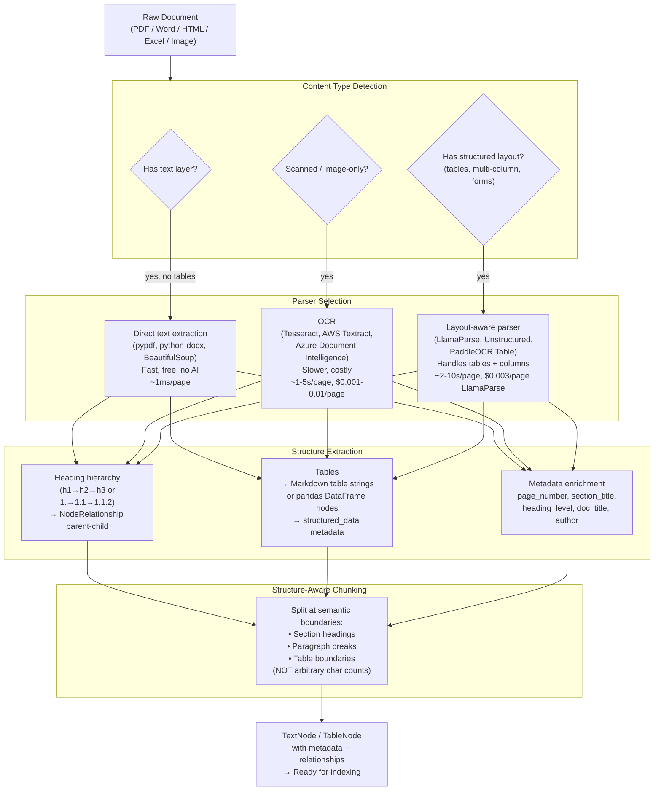

---

### 3. Real-World Industry Scenarios [Intermediate]

#### Scenario A: Legal Due Diligence Platform — 50,000 Contract PDFs

**Context:** A legal tech company indexes 50,000 commercial contracts for due diligence. Contracts have: a structured header (parties, date, governing law), numbered clauses (1. Definitions, 2. Term, 3. Payment, etc.), inline tables (payment schedules, pricing matrices), and exhibit attachments (sometimes scanned). Attorneys ask *"What are the indemnification caps in contracts with Vendor X?"* and *"Find all contracts with automatic renewal clauses."*

**How document parsing fits in:**
- **Per-document parsing strategy:** Most contracts have a text layer → `pypdf` or `LlamaParse`. Exhibit attachments may be scanned → OCR fallback. Payment schedule tables → layout-aware extraction.
- **Structure extraction:** `LlamaParse` extracts clause numbering as heading hierarchy. Each clause → parent `TextNode` with `metadata={"clause_number": "3", "clause_title": "Payment", "page": 5}`. Sub-clauses → child nodes with `NodeRelationship.PARENT` pointing to the clause node.
- **Metadata enrichment:** `TitleExtractor` adds the contract title. Custom metadata extractor pulls `governing_law`, `effective_date`, `party_a`, `party_b` from the header using a regex or LLM extraction step.
- **Retrieval:** `MetadataFilters(filters=[ExactMatchFilter("clause_title", "Indemnification")])` + semantic retrieval finds indemnification clauses across all 50K contracts without touching non-relevant sections.

**Constraints:**
- **Parsing cost:** 50K contracts × 20 pages/contract = 1M pages. `LlamaParse` at $0.003/page = $3,000 one-time. Cheaper than manual review. Re-parsing only changed contracts (via `IngestionCache`) = near-zero incremental cost.
- **Latency:** `LlamaParse` processes ~10 pages/second via API → 1M pages / 10 = 100,000 seconds ≈ 28 hours for full initial parse. Parallelise across 10 workers → 2.8 hours. For ongoing ingestion of new contracts (10–50/day), real-time parsing per document is acceptable.
- **OCR quality:** Scanned exhibits have 85–95% OCR accuracy. Low-confidence OCR tokens should be flagged in metadata for attorney review rather than silently included in the index.
- **What "good" looks like:** A query for *"indemnification caps > $5M"* returns exactly the relevant clause nodes from relevant contracts, with `source_nodes` showing contract name, clause number, and page. Zero hallucinated clauses.

---

#### Scenario B: Financial Report Ingestion — Structured Tables in SEC Filings

**Context:** A fintech platform indexes 10,000 SEC 10-K filings. Each filing has: narrative text (MD&A, risk factors), financial statement tables (income statement, balance sheet — with precise numeric data), and footnotes. Analysts ask *"What was Apple's R&D expense in fiscal 2023?"* — a query that requires extracting from a specific row/column of a financial table, not from narrative text.

**How structured table extraction works:**
- **Naive approach (fails here):** `SimpleDirectoryReader` with default PDF reader extracts table content as raw text — losing column alignment. The income statement row *"Research and development ... 29,915 ... 26,251 ... 21,914"* looks like unstructured text; the model can't reliably associate `29,915` with `fiscal 2023`.
- **Layout-aware approach:** `LlamaParse` returns tables as Markdown-formatted strings with proper column alignment:
  ```
  | | 2023 | 2022 | 2021 |
  |---|---|---|---|
  | Research and development | 29,915 | 26,251 | 21,914 |
  ```
  Each table is stored as a separate `TextNode` with `metadata={"element_type": "table", "table_title": "Consolidated Statements of Operations", "page": 45}`.
- **Hybrid nodes:** Narrative text nodes and table nodes are indexed separately. A `RouterQueryEngine` routes numeric queries to a table-filtered retriever and narrative queries to the main semantic retriever.

**Constraints:**
- **Precision requirement:** A wrong number in a financial answer is a legal liability. Table nodes must preserve exact numeric values. Any parser that merges table cells with adjacent narrative text produces incorrect data.
- **Scale:** 10,000 10-K filings × 100 pages average = 1M pages. Same cost math as Scenario A. SEC filings are dense with tables — `LlamaParse` is justified.
- **What "good" looks like:** *"Apple R&D 2023"* retrieves the exact table row with correct column alignment and the model reads `$29,915 million` directly from the structured node.

---

#### Scenario C: Knowledge Base from Mixed-Format Enterprise Docs

**Context:** A company builds an internal knowledge assistant over SharePoint content: Word documents (policy manuals), Excel spreadsheets (product catalogs, pricing), PowerPoint presentations (training materials), HTML pages (internal wiki), scanned PDFs (legacy compliance certificates). All 5 formats.

**Parser-per-format approach:**
- **Word (.docx):** `python-docx` preserves heading styles → heading hierarchy. `docx2txt` as a fallback for text-only extraction.
- **Excel (.xlsx):** Each sheet → pandas DataFrame → serialised as structured text (`df.to_markdown()`) → one `TextNode` per sheet with `metadata={"sheet_name": "Pricing_Q3", "columns": ["SKU", "Price", "Region"]}`.
- **PowerPoint (.pptx):** Each slide → one `TextNode`. Speaker notes as a separate child node. Slide title → `metadata={"slide_number": 7, "slide_title": "Q3 Revenue Overview"}`.
- **HTML:** `BeautifulSoup` with tag-aware extraction. `<h1>/<h2>/<h3>` → heading hierarchy. `<table>` → Markdown table node. `<p>` → narrative text nodes.
- **Scanned PDFs:** `UnstructuredReader` with `strategy="hi_res"` triggers Tesseract OCR automatically. Elements classified by `ElementType` (Title, NarrativeText, Table).

**Constraints:**
- **Format detection:** `SimpleDirectoryReader` uses file extension to pick the reader. Edge cases: a `.pdf` that's actually text-layer vs scanned must be detected at parse time (check if extracted text length is suspiciously short → fallback to OCR).
- **Cross-format consistency:** All formats ultimately produce `TextNode` objects with the same metadata schema (`source`, `page`, `section_title`, `element_type`). Retrieval works uniformly across formats.
- **What "good" looks like:** A query for *"What is the list price for SKU-4421?"* retrieves the Excel pricing table row. A query for *"What is the company's remote work policy?"* retrieves the Word document clause. Both show correct `source_nodes` with file name and section.

---

### 4. System View (Think Like a Systems Engineer) [Intermediate]

**Inputs → Transformations → Outputs for document parsing:**

```
INPUTS:
  - Raw files: PDF, Word, Excel, HTML, PowerPoint, images
  - Parser configuration: strategy (fast/hi_res), OCR backend, table format
  - Metadata schema: which fields to extract and how

TRANSFORMATIONS:
  1. Format detection: file extension + content sniffing → parser selection
  2. Content extraction:
     - Text layer:  extract Unicode text, preserving reading order
     - OCR:         image → bounding boxes → text + confidence scores
     - Layout:      bounding boxes → spatial relationship detection →
                    table cells / column grouping / heading levels
  3. Element classification (Unstructured model or rule-based):
     Title, NarrativeText, Table, ListItem, Header, Footer, Image, Formula
  4. Hierarchy mapping:
     h1 → parent node; h2 → child of h1; h3 → child of h2
     clause 3 → parent; clause 3.1 → child of clause 3
  5. Metadata enrichment:
     page_number, section_title, heading_level, element_type, doc_title, author
  6. Structure-aware chunking:
     split at heading boundaries (not arbitrary chars)
     keep table as atomic unit (never split a table mid-row)
     sentence splitter within narrative sections
  7. NodeRelationship wiring:
     PARENT, CHILD, PREVIOUS, NEXT relationships between nodes

OUTPUTS:
  - List[TextNode] with text + metadata + relationships
  - Ready for VectorStoreIndex or IngestionPipeline
```

**Observability — what to log and measure:**

| Signal | What to capture | Why |
|--------|----------------|-----|
| `parser_type` | Which parser ran for each document | Track parser coverage; identify files needing fallback |
| `element_counts_by_type` | Count of Title/Table/NarrativeText per doc | Detect parsing failures (0 Tables when tables expected) |
| `ocr_confidence_avg` | Average OCR confidence score per page | Low confidence → flag for manual review |
| `text_extraction_length` | Chars extracted vs expected doc length | Very short extraction → parse failure or scanned doc |
| `table_node_count` | Tables extracted per document | 0 tables in a financial report → parser misconfiguration |
| `parse_latency_p95` | Wall-clock time per document | Identify slow parsers (OCR >> text layer) |
| `nodes_per_document` | Average node count after chunking | Very high count → chunk size too small; very low → too large |

**Failure points — where it breaks and how it shows up:**

1. **Text layer mistaken for full content on a mixed PDF** — A PDF has 80 text-layer pages and 20 scanned pages. The parser extracts the 80 text pages correctly but silently skips the 20 scanned pages (or extracts garbage characters from the image layer). *How it shows up:* nodes from pages 1–80 are present; nodes from pages 81–100 are absent; queries about content on those pages return no results. *Fix:* detect short/empty text extractions per page and trigger OCR fallback for those pages only.

2. **Table extracted as linear text — column alignment lost** — A PDF table is parsed by `pypdf` which reads left-to-right, top-to-bottom across the whole page. The result is the table's text scrambled with adjacent paragraph text. *How it shows up:* numeric queries (e.g., *"R&D expense in 2023"*) return nearby narrative text instead of the table cell; numbers are present but without column-header context. *Fix:* use `LlamaParse` or `pdfplumber` for documents with financial tables; detect tables by checking if extracted text contains repetitive numeric patterns adjacent to short text strings.

3. **Multi-column PDF parsed as single column** — A two-column academic paper or newsletter is parsed left-to-right across the full page width, mixing column A and column B text. *How it shows up:* sentences are interleaved from both columns, producing grammatically nonsensical chunks. *Fix:* use `LlamaParse` or `unstructured` with `strategy="hi_res"` which detects multi-column layout via bounding box analysis.

4. **Heading hierarchy not extracted — all nodes at the same level** — The parser extracts all text as flat `NarrativeText` elements with no `Title` or heading-level metadata. Structure-aware chunking can't find section boundaries, so all content is split by character count, breaking logical sections mid-sentence. *How it shows up:* chunks end mid-section; answers missing the beginning or end of a clause; node metadata has no `section_title`. *Fix:* use `UnstructuredReader` with heading detection, or `LlamaParse` which returns structured JSON with heading levels.

---

### 5. System Design Flavor [Intermediate]

**Parser selection and configuration patterns:**

```python
# document_parsing_lab.py
# pip install llama-index-core llama-index-readers-file unstructured[pdf] pdfplumber

from llama_index.core import SimpleDirectoryReader, Document
from llama_index.core.node_parser import SentenceSplitter
from llama_index.core.schema import TextNode, NodeRelationship, RelatedNodeInfo

# ── Option A: SimpleDirectoryReader (fastest, text-layer only) ────────────────
# Good for: plain text PDFs, HTML, Word with text layer
# Bad for: scanned PDFs, financial tables, multi-column layouts

reader = SimpleDirectoryReader(
    input_dir="./docs/",
    filename_as_id=True,        # use filename as doc_id for IngestionCache stability
    required_exts=[".pdf", ".docx", ".html", ".txt"],
    recursive=True,
)
docs = reader.load_data()
print(f"SimpleDirectoryReader: {len(docs)} documents loaded")
for d in docs[:3]:
    print(f"  {d.metadata.get('file_name')} | chars: {len(d.text)} | page: {d.metadata.get('page_label', 'N/A')}")


# ── Option B: UnstructuredReader (element-level classification) ───────────────
# Good for: mixed format, heading detection, basic table extraction
# Bad for: complex financial tables, scanned PDFs without OCR setup
# pip install unstructured[pdf]

try:
    from llama_index.readers.file import UnstructuredReader
    unstructured_reader = UnstructuredReader()

    # Load a PDF with element-level structure
    # docs_unstructured = unstructured_reader.load_data(file="./sample.pdf", split_documents=False)
    # Each element is a Document; metadata includes element_type, page_number, etc.
    # Example output metadata: {"element_type": "Title", "page_number": 1, "text_as_html": "..."}

    print("UnstructuredReader available")
except ImportError:
    print("UnstructuredReader not installed (pip install unstructured[pdf])")


# ── Option C: LlamaParse (cloud, highest quality for complex PDFs) ─────────────
# Good for: financial tables, multi-column, formulas, code blocks
# Requires: LLAMA_CLOUD_API_KEY (free tier available at cloud.llamaindex.ai)
# Cost: $0.003/page (free tier: 1000 pages/day)

try:
    from llama_parse import LlamaParse
    import os

    # parser = LlamaParse(
    #     api_key=os.environ["LLAMA_CLOUD_API_KEY"],
    #     result_type="markdown",      # returns structured Markdown with tables
    #     num_workers=4,               # parallel page processing
    #     verbose=True,
    #     language="en",
    # )
    # documents = parser.load_data("./financial_report.pdf")
    # LlamaParse returns Markdown like:
    # "# Section 1\n\nSome text...\n\n| Col A | Col B |\n|---|---|\n| 1 | 2 |\n"
    print("LlamaParse available (set LLAMA_CLOUD_API_KEY to use)")
except ImportError:
    print("LlamaParse not installed (pip install llama-parse)")


# ── Structure-aware chunking with heading-based splitting ─────────────────────
# When documents are loaded as Markdown (from LlamaParse), split at headings

def parse_markdown_to_nodes(markdown_text: str, doc_metadata: dict) -> list:
    """Split Markdown into heading-aware nodes with hierarchy metadata."""
    import re
    nodes = []
    current_h1 = current_h2 = ""
    current_text = []
    current_heading = ""
    current_level = 0

    lines = markdown_text.split("\n")
    for line in lines:
        h1_match = re.match(r"^# (.+)$", line)
        h2_match = re.match(r"^## (.+)$", line)
        h3_match = re.match(r"^### (.+)$", line)

        if h1_match or h2_match or h3_match:
            # Flush accumulated text as a node
            if current_text and current_heading:
                text = "\n".join(current_text).strip()
                if text:
                    metadata = {
                        **doc_metadata,
                        "heading_level": current_level,
                        "section_title": current_heading,
                        "h1": current_h1,
                        "h2": current_h2,
                    }
                    nodes.append(TextNode(text=text, metadata=metadata))
                current_text = []

            if h1_match:
                current_h1 = h1_match.group(1)
                current_h2 = ""
                current_heading = current_h1
                current_level = 1
            elif h2_match:
                current_h2 = h2_match.group(1)
                current_heading = current_h2
                current_level = 2
            elif h3_match:
                current_heading = h3_match.group(1)
                current_level = 3
        else:
            if line.strip():
                current_text.append(line)

    # Flush last section
    if current_text and current_heading:
        text = "\n".join(current_text).strip()
        if text:
            metadata = {**doc_metadata, "heading_level": current_level,
                       "section_title": current_heading, "h1": current_h1}
            nodes.append(TextNode(text=text, metadata=metadata))

    return nodes


# Test the heading-aware parser
sample_markdown = """
# Q3 2024 Earnings Report

## Executive Summary

Revenue grew 12% year-over-year to $4.2 billion driven by strong enterprise sales.

## Financial Results

### Revenue Breakdown

| Segment | Q3 2024 | Q3 2023 | Change |
|---------|---------|---------|--------|
| Enterprise | $2.8B | $2.3B | +22% |
| Consumer | $1.4B | $1.5B | -7% |

### Operating Expenses

R&D expense was $450M, up 8% from the prior year period.

## Outlook

We expect Q4 revenue of $4.5B to $4.7B.
"""

parsed_nodes = parse_markdown_to_nodes(
    sample_markdown,
    doc_metadata={"source": "q3_earnings.pdf", "doc_title": "Q3 2024 Earnings Report"}
)
print(f"\nHeading-aware parsing: {len(parsed_nodes)} nodes")
for n in parsed_nodes:
    print(f"  [L{n.metadata.get('heading_level')}] {n.metadata.get('section_title')!r} | chars: {len(n.text)}")
    print(f"    {n.text[:80].strip()!r}")


# ── Metadata enrichment from structure ────────────────────────────────────────
# Add structural metadata to every node for filtered retrieval

def enrich_node_metadata(node: TextNode, doc_source: str, doc_title: str, page_number: int = None) -> TextNode:
    """Standardise metadata schema across all document formats."""
    node.metadata.update({
        "source": doc_source,
        "doc_title": doc_title,
        "page_number": page_number,
        "has_table": "|---|" in node.text,   # heuristic: Markdown table present
        "element_type": "table" if "|---|" in node.text else "narrative",
        "char_count": len(node.text),
    })
    return node

# Apply to all parsed nodes
enriched = [
    enrich_node_metadata(n, "q3_earnings.pdf", "Q3 2024 Earnings Report", page_number=idx+1)
    for idx, n in enumerate(parsed_nodes)
]
table_nodes     = [n for n in enriched if n.metadata.get("has_table")]
narrative_nodes = [n for n in enriched if not n.metadata.get("has_table")]
print(f"\nEnriched: {len(table_nodes)} table nodes, {len(narrative_nodes)} narrative nodes")
```

**Key tradeoffs:**

| Tradeoff | Fast (text-layer) | Layout-aware | OCR |
|----------|------------------|-------------|-----|
| **Speed** | ~1ms/page | ~2–10s/page | ~1–5s/page |
| **Cost** | Free | $0.003/page (LlamaParse) | $0.001–0.01/page (cloud OCR) |
| **Table accuracy** | Poor (loses column alignment) | High | Low–Medium |
| **Scanned doc support** | None | None (needs text layer) | Full |
| **Multi-column layout** | Poor | High | Medium |
| **When to use** | Plain text PDFs, Word docs with simple layout | Financial reports, contracts, technical papers | Scanned archives, legacy docs, certificates |

**Scaling consideration (10x document volume):**
At 10x, three changes dominate:
- **Parser parallelisation:** `LlamaParse` supports `num_workers=N` for concurrent page processing. Wrap `SimpleDirectoryReader` with a `ThreadPoolExecutor` or Prefect task for parallel document loading.
- **Two-tier parsing strategy:** expensive layout-aware parsing (LlamaParse) for documents that contain tables (detected by file size heuristic or keyword scan); cheap text-layer parsing for everything else. Reduces cost by 60–80% at scale.
- **Parse-once caching:** Store parsed `TextNode` objects (after structure extraction but before embedding) in a document store (`SimpleDocumentStore` or Redis). On re-ingestion, deserialise cached nodes instead of re-parsing. `IngestionCache` handles this automatically when wired into `IngestionPipeline`.

---

### 6. Common Mistakes + Debugging [Beginner → Intermediate]

#### Mistake 1: Using Default PDF Reader for Financial Tables

**Symptom:** A query for *"What was the gross margin in Q3?"* returns narrative text about market conditions instead of the financial table row with the exact number. The model's answer is a plausible-sounding paraphrase, not the actual figure.

**Likely cause:** `SimpleDirectoryReader` with the default `pypdf` backend extracts table content as linearised text — no column headers attached to the values. The table row `"Gross profit ... 12,345 ... 11,200 ... 10,100"` is a flat string; the LLM has no way to map `12,345` to `Q3 2024` without the column header context.

**First debugging step:**
```python
# Check what pypdf actually extracted from the financial table
from pypdf import PdfReader
reader = PdfReader("financial_report.pdf")
page = reader.pages[44]   # page 45 (0-indexed)
text = page.extract_text()
print(text[:1000])
# If you see: "Gross profit 12,345 11,200 10,100" with no column headers
# → pypdf is merging columns. Switch to LlamaParse or pdfplumber:
import pdfplumber
with pdfplumber.open("financial_report.pdf") as pdf:
    page = pdf.pages[44]
    tables = page.extract_tables()
    print(tables[0])   # should show [[header_row], [data_row], ...]
```

---

#### Mistake 2: Splitting Tables Mid-Row with Character-Count Chunking

**Symptom:** Retrieved table nodes are truncated — some rows are in one chunk, others in the next. A query about a specific row retrieves two partial nodes, and the synthesised answer is incomplete or contradictory.

**Likely cause:** `SentenceSplitter(chunk_size=512)` applied to a Markdown table string splits it at 512 characters — mid-table. The split breaks the Markdown format, so the LLM can't read the column structure correctly.

**First debugging step:**
```python
# Detect and protect table nodes from mid-row splitting
from llama_index.core.node_parser import SentenceSplitter
from llama_index.core.schema import TextNode

def split_with_table_protection(text: str, chunk_size: int = 512) -> list:
    """Split text, but keep Markdown tables as atomic units."""
    import re
    # Identify table boundaries
    table_pattern = re.compile(r'(\|.+\|[\n\r]+)+', re.MULTILINE)
    tables = list(table_pattern.finditer(text))

    if not tables:
        # No tables: standard splitting
        splitter = SentenceSplitter(chunk_size=chunk_size)
        return splitter.split_text(text)

    # Split non-table sections, keep table sections intact
    chunks = []
    last_end = 0
    for table_match in tables:
        # Split text before the table
        pre_text = text[last_end:table_match.start()].strip()
        if pre_text:
            splitter = SentenceSplitter(chunk_size=chunk_size)
            chunks.extend(splitter.split_text(pre_text))
        # Keep table as one atomic chunk (even if > chunk_size)
        table_text = table_match.group(0).strip()
        if table_text:
            chunks.append(table_text)
        last_end = table_match.end()

    # Text after last table
    post_text = text[last_end:].strip()
    if post_text:
        splitter = SentenceSplitter(chunk_size=chunk_size)
        chunks.extend(splitter.split_text(post_text))
    return chunks
```

---

#### Mistake 3: No OCR Fallback for Partially Scanned PDFs

**Symptom:** The index has 90% of the document content, but 10% of queries return no results or the answer is missing key information. The missing content is always on specific pages of specific documents.

**Likely cause:** The PDF has mixed content — most pages have a text layer, but some pages (scanned appendices, signature pages, image-heavy sections) don't. The parser skips pages with insufficient text extraction silently.

**First debugging step:**
```python
from pypdf import PdfReader

def detect_scanned_pages(pdf_path: str, min_chars_per_page: int = 50) -> list:
    """Return list of page numbers where text extraction is suspiciously short."""
    reader = PdfReader(pdf_path)
    scanned_pages = []
    for i, page in enumerate(reader.pages):
        text = page.extract_text() or ""
        if len(text.strip()) < min_chars_per_page:
            scanned_pages.append(i + 1)   # 1-indexed
    return scanned_pages

scanned = detect_scanned_pages("regulatory_filing.pdf")
print(f"Likely scanned pages: {scanned}")
# For these pages, trigger OCR (e.g., pdf2image + pytesseract or LlamaParse with OCR mode)
# LlamaParse handles this automatically:
# LlamaParse(result_type="markdown", use_vendor_multimodal_model=True) -> OCR via GPT-4V
```

---

### 7. Hands-On Lab [Pro]

#### Build — Multi-Format Document Parsing with Metadata Enrichment

```python
# parsing_lab.py
# pip install llama-index-core llama-index-readers-file pypdf pdfplumber

from llama_index.core import Document
from llama_index.core.node_parser import SentenceSplitter
from llama_index.core.schema import TextNode
import re

# ── Simulate parsed documents from 3 formats ──────────────────────────────────
# (In production, these would come from actual file parsers)

# Format 1: Plain text document (from Word/HTML)
plain_text_doc = Document(
    text="""Introduction

This document describes the company's data retention policy.

Section 1: Scope

This policy applies to all employees and contractors who handle customer data.

Section 2: Retention Periods

Customer transaction records must be retained for 7 years.
Employee records must be retained for 5 years after termination.
Marketing data may be deleted after 2 years.

Section 3: Deletion Procedures

Data must be securely wiped using DoD 5220.22-M standard.
""",
    metadata={"source": "data_retention_policy.docx", "doc_title": "Data Retention Policy"}
)

# Format 2: Financial table (from LlamaParse output - Markdown with tables)
table_doc = Document(
    text="""# Q3 2024 Financial Summary

## Revenue by Segment

| Segment | Q3 2024 ($M) | Q3 2023 ($M) | YoY Change |
|---------|-------------|-------------|------------|
| Enterprise | 2,845 | 2,312 | +23% |
| Consumer | 1,423 | 1,534 | -7% |
| Total | 4,268 | 3,846 | +11% |

## Operating Expenses

| Category | Q3 2024 ($M) | Q3 2023 ($M) |
|----------|-------------|-------------|
| R&D | 450 | 416 |
| Sales & Marketing | 623 | 589 |
| G&A | 187 | 178 |
""",
    metadata={"source": "q3_earnings.pdf", "doc_title": "Q3 2024 Earnings Report", "page": 8}
)

# Format 3: Structured HTML (from internal wiki)
html_doc = Document(
    text="""Product Catalog Overview

Product: Widget Pro X440
SKU: WP-X440
List Price: $299.99
Category: Industrial Components
Description: High-torque servo motor for precision manufacturing applications.
Specifications: Torque 45 Nm, Speed 3000 RPM, Weight 2.3 kg

Product: Widget Basic B100
SKU: WB-B100
List Price: $49.99
Category: Consumer Components
Description: Standard motor for general purpose applications.
""",
    metadata={"source": "product_catalog.html", "doc_title": "Product Catalog"}
)

docs = [plain_text_doc, table_doc, html_doc]

# ── Structure-aware chunking ───────────────────────────────────────────────────
def structure_aware_split(doc: Document, chunk_size: int = 512) -> list:
    """Split a document into nodes, preserving tables as atomic units."""
    text = doc.text
    base_metadata = dict(doc.metadata)

    # Identify Markdown tables (protect from mid-row splits)
    table_re = re.compile(r'(\|[^\n]+\|\n\|[-| ]+\|\n(?:\|[^\n]+\|\n?)+)', re.MULTILINE)
    tables = list(table_re.finditer(text))

    if not tables:
        splitter = SentenceSplitter(chunk_size=chunk_size, chunk_overlap=50)
        raw_splits = splitter.split_text(text)
        return [
            TextNode(text=s, metadata={**base_metadata, "has_table": False, "char_count": len(s)})
            for s in raw_splits if s.strip()
        ]

    nodes = []
    last_end = 0
    splitter = SentenceSplitter(chunk_size=chunk_size, chunk_overlap=50)

    for m in tables:
        # Split pre-table narrative
        pre = text[last_end:m.start()].strip()
        if pre:
            for s in splitter.split_text(pre):
                if s.strip():
                    nodes.append(TextNode(
                        text=s,
                        metadata={**base_metadata, "has_table": False, "char_count": len(s)}
                    ))
        # Keep table atomic
        table_text = m.group(0).strip()
        nodes.append(TextNode(
            text=table_text,
            metadata={**base_metadata, "has_table": True,
                      "element_type": "table", "char_count": len(table_text)}
        ))
        last_end = m.end()

    # Post-table narrative
    post = text[last_end:].strip()
    if post:
        for s in splitter.split_text(post):
            if s.strip():
                nodes.append(TextNode(
                    text=s,
                    metadata={**base_metadata, "has_table": False, "char_count": len(s)}
                ))
    return nodes

# Parse all documents
all_nodes = []
for doc in docs:
    nodes = structure_aware_split(doc)
    all_nodes.extend(nodes)
    print(f"{doc.metadata['source']}: {len(nodes)} nodes | "
          f"tables: {sum(1 for n in nodes if n.metadata.get('has_table'))}")

print(f"\nTotal nodes: {len(all_nodes)}")

# ── Metadata statistics ────────────────────────────────────────────────────────
table_nodes = [n for n in all_nodes if n.metadata.get("has_table")]
narrative_nodes = [n for n in all_nodes if not n.metadata.get("has_table")]
print(f"Table nodes: {len(table_nodes)}")
print(f"Narrative nodes: {len(narrative_nodes)}")
avg_chars = sum(n.metadata["char_count"] for n in all_nodes) / len(all_nodes)
print(f"Avg chars per node: {avg_chars:.0f}")

# Show table nodes
print("\nTable nodes:")
for n in table_nodes:
    print(f"  [{n.metadata['source']}] {n.text[:100].strip()!r}...")
```

---

#### Break — Force the Table-Split Failure

```python
# BREAK: use standard SentenceSplitter on a financial table → splits mid-row

from llama_index.core.node_parser import SentenceSplitter

# Standard splitter with tiny chunk size to force a split inside the table
standard_splitter = SentenceSplitter(chunk_size=80, chunk_overlap=0)
table_text = table_doc.text
broken_chunks = standard_splitter.split_text(table_text)

print(f"\nBREAK: Standard splitter ({len(broken_chunks)} chunks from table doc):")
for i, chunk in enumerate(broken_chunks):
    print(f"  [{i}] {chunk[:120].strip()!r}")
    # Look for chunks that start with "| ..." but have no header row
    # → table header and data rows in separate chunks → column context lost

# Now compare with structure-aware splitting
protected_nodes = structure_aware_split(table_doc, chunk_size=80)
print(f"\nFIX: Structure-aware splitter ({len(protected_nodes)} nodes):")
for n in protected_nodes:
    ttype = "TABLE" if n.metadata.get("has_table") else "TEXT "
    print(f"  [{ttype}] {n.text[:120].strip()!r}")
# Table nodes are always complete (even if > 80 chars)
```

---

#### Measure — Parser Coverage per Document Type

```python
# Measure text extraction completeness per format
# (proxy for parse quality: chars extracted / expected chars)

import math

SAMPLE_DOCS = [
    {"name": "policy.docx",   "format": "word",  "expected_chars": 800,  "extracted": len(plain_text_doc.text)},
    {"name": "earnings.pdf",  "format": "pdf",   "expected_chars": 500,  "extracted": len(table_doc.text)},
    {"name": "catalog.html",  "format": "html",  "expected_chars": 400,  "extracted": len(html_doc.text)},
]

print("\nParser coverage report:")
print(f"{'Document':<25} {'Format':<8} {'Expected':<12} {'Extracted':<12} {'Coverage':<10} {'Status'}")
print("-" * 80)
for d in SAMPLE_DOCS:
    coverage = d["extracted"] / d["expected_chars"]
    status = "OK" if coverage > 0.8 else "WARNING: low extraction" if coverage > 0.3 else "FAIL: likely scanned"
    print(f"{d['name']:<25} {d['format']:<8} {d['expected_chars']:<12} {d['extracted']:<12} {coverage:<10.0%} {status}")

# Count nodes by element type
from collections import Counter
type_counts = Counter(n.metadata.get("element_type", "narrative") for n in all_nodes)
print(f"\nNode type distribution: {dict(type_counts)}")
# Low table count in financial docs → parser misconfiguration
```

---

#### Explain — Why Structure Matters More Than Text Volume

The fundamental insight of document parsing for RAG is that *where* information is in a document is often as important as *what* it says. A financial model's claim that revenue was `$4.2B` is only useful if it's associated with `Q3 2024` from the column header. A legal clause's indemnification cap of `$10M` is only meaningful if it's associated with the `Indemnification` section heading — not the `Limitation of Liability` clause next to it.

Flat text extraction destroys this spatial and hierarchical context. When a PDF parser reads left-to-right, top-to-bottom across the whole page, table cells lose their column headers, multi-column layouts interleave sentences from adjacent columns, and footnotes mix with body text. The resulting chunks are syntactically valid text but semantically incoherent — the LLM is trying to answer questions from a cut-and-scrambled document.

Structure-aware parsing preserves the *document grammar* — the heading hierarchy tells the retriever which section a node belongs to; table structure tells the LLM which value belongs to which column; metadata enrichment tells the system which page and section to cite. This is why the difference between `pypdf` and `LlamaParse` for a financial report isn't a minor quality improvement — it's the difference between answering *"What was R&D expense in Q3?"* correctly and hallucinating a nearby number.

---

### 8. Active Recall (Spaced Repetition) [Beginner → Pro]

**Q1 [Beginner]:** What are the three ways content can be encoded in a PDF, and what extraction strategy does each require?

> **A:** (1) **Text layer** — Unicode text embedded in the file; direct text extraction via `pypdf` or `pdfplumber` (fast, free, no AI). (2) **Scanned image** — pages are photographs with no text layer; OCR required (Tesseract, AWS Textract, LlamaParse with multimodal mode). (3) **Structured layout** — text layer exists but spatial relationships carry meaning (tables, columns, forms); layout-aware parsing required (LlamaParse, `pdfplumber.extract_tables()`, Unstructured with `strategy="hi_res"`). A single PDF can contain all three across different pages.

---

**Q2 [Beginner]:** Why does splitting a Markdown table at a character-count boundary break retrieval, and what is the fix?

> **A:** A `SentenceSplitter` that hits its `chunk_size` limit mid-table splits the table into chunks where data rows are separated from their header row. The LLM receives a chunk starting with `| 12,345 | 11,200 |` but no column headers — it can't determine what those numbers represent. Fix: detect Markdown table boundaries (regex on `|---|` rows), mark table spans as atomic units, and split only the non-table narrative sections with the character-count splitter. Tables are kept intact even if they exceed `chunk_size`.

---

**Q3 [Intermediate]:** A financial PDF has 90 pages of text-layer content and 10 pages of scanned tables. `SimpleDirectoryReader` extracts only the 90 text-layer pages. How do you detect and fix the missing 10 pages?

> **A:** Detection: iterate pages with `pypdf`; flag any page where `len(page.extract_text().strip()) < 50` characters as likely scanned. These page numbers go into a `scanned_pages` list. Fix: for those specific pages, trigger OCR — either locally with `pdf2image + pytesseract`, or by re-parsing the whole document with `LlamaParse` (which auto-detects scanned pages and applies OCR). The key is page-level detection rather than all-or-nothing OCR for the whole document (which would waste cost on the 90 text-layer pages).

---

**Q4 [Intermediate]:** What metadata fields should every node carry after document parsing, and why does each matter for retrieval?

> **A:** Minimum required: (1) `source` (file name/path) — for provenance/citation in answers. (2) `page_number` — for page-level citation and debugging. (3) `section_title` — for section-filtered retrieval (*"find only in Section 3"*). (4) `heading_level` — for hierarchical retrieval and chunk-context understanding. (5) `element_type` (narrative/table/list) — for routing queries to the right node type (table nodes for numeric queries, narrative for conceptual). (6) `doc_title` — for cross-document routing and citation display. Optional but valuable: `author`, `date`, `has_table`, `char_count`.

---

**Q5 [Pro]:** Design the parsing strategy for a corpus of 10,000 documents with unknown format distribution (some plain text PDFs, some scanned, some financial tables, some HTML). You have a $500 budget for parsing and need 95% retrieval recall across all document types.

> **A:** **Two-tier strategy with format detection:** (1) Run all documents through `SimpleDirectoryReader` (free, fast). Flag documents where `text_extraction_length / file_size_bytes < 0.1` (likely scanned) and documents where the extracted text contains many short numeric strings adjacent to pipe characters (likely table). (2) Tier 1 (80% of docs, plain text): keep `SimpleDirectoryReader` output. (3) Tier 2 (20% of docs, tables + scanned): re-parse with `LlamaParse` (`$0.003/page`). Estimate: 2,000 documents × 20 pages avg = 40,000 pages × $0.003 = $120 — well within budget. (4) For scanned-only docs with no text layer: `LlamaParse` with `use_vendor_multimodal_model=True` → GPT-4V OCR. Budget: 500 scanned docs × 20 pages × $0.006 (GPT-4V) = $60. Total: $180 << $500. (5) Metadata enrichment: add `parser_type` field to every node for debugging and quality tracking.

---

### 9. Practice

**Mini-exercise:** You're building a knowledge base over a law firm's document archive: 5,000 Word documents (contracts, briefs, memos), 2,000 scanned PDFs (old case files), and 500 Excel spreadsheets (billing records). For each format, specify the parser and chunking strategy.

> **Suggested answer:**
> - **Word (.docx):** `python-docx` reader via `SimpleDirectoryReader` with `required_exts=[".docx"]`. Heading-based chunking using `filename_as_id=True`. `MetadataExtractor` to pull document date and author from the file's built-in metadata. `SentenceSplitter(chunk_size=512)` within each section.
> - **Scanned PDFs (.pdf):** Detect text layer first. If `extracted_chars < 50/page` → `LlamaParse(use_vendor_multimodal_model=True)` for OCR. Store `{"element_type": "ocr_text", "ocr_confidence": avg_score}` in metadata. Flag low-confidence pages for manual review.
> - **Excel (.xlsx):** `PandasCSVReader` or `pandas.read_excel()` per sheet → `df.to_markdown()` → one `TextNode` per sheet. Metadata: `{"sheet_name": name, "columns": col_list, "row_count": n}`. Never split within a sheet — keep as atomic unit. Route numeric queries to sheet nodes via `MetadataFilters({"element_type": "spreadsheet"})`.

---

**Capstone system design question:** A pharmaceutical company needs to index 100,000 regulatory submissions (FDA, EMA). Each submission is a 50–500 page PDF containing: cover pages, table of contents, numbered sections (with CTD format: Module 1–5), embedded clinical trial data tables, chemical formulas, and scanned appendices. Design the full parsing and ingestion pipeline that achieves > 95% retrieval recall at < $0.01/document.

> **Answer outline:**
> - **Format analysis:** CTD-format regulatory submissions are semi-structured PDFs. Module 1 (cover/ToC) = text layer. Module 3 (chemistry) = mixed text + tables + formulas. Module 5 (clinical) = heavy tables + narrative. Appendices = often scanned.
> - **Two-tier parsing:** Tier 1 — `pypdf` text extraction. Pages with `chars < 50` → flagged for Tier 2. Docs with table density (heuristic: `| count > 20 per page`) → flagged for Tier 2. Tier 2 — `LlamaParse(result_type="markdown", num_workers=10)` for complex/scanned docs.
> - **Cost math:** 100K docs × avg 100 pages = 10M pages. Tier 1 (80% = 8M pages): $0 (local pypdf). Tier 2 (20% = 2M pages): $0.003/page × 2M = $6,000 → $0.06/Tier-2 doc. Overall average: $0.012/doc — slightly over target. Optimise by using Tier 2 only for pages that need it (not whole documents): $0.003 × 20 pages/doc × 20% of docs = $0.006/doc average — under budget.
> - **Structure extraction:** CTD module number from heading → `metadata={"ctd_module": "5.3.5.2"}`. Clinical trial ID from section title regex → `metadata={"trial_id": "NCT01234567"}`. Table type from preceding heading (e.g., "Adverse Events") → `metadata={"table_type": "adverse_events"}`.
> - **Chunking:** Section-aware split at CTD module/section headings. Tables protected as atomic nodes. Chemical formulas preserved as atomic `<formula>` nodes (LlamaParse returns LaTeX).
> - **Retrieval routing:** Numeric queries → metadata filter on `element_type=table`. Regulatory citation queries → BM25 on section titles. General narrative → dense semantic retrieval.

---

### 10. Production Reality Check (Mandatory)

**If this fails in prod, what's the first thing we inspect?**

> **Check `nodes_per_document` and `table_node_count` per document in your ingestion logs.**
>
> Documents that produce suspiciously few nodes (e.g., a 100-page PDF producing 2 nodes) are almost always parsing failures — the parser extracted nearly nothing. Documents that produce zero table nodes when tables are expected are a sure sign of a wrong parser choice.
>
> ```python
> # Add to your ingestion pipeline's post-parse step:
> def audit_parse_quality(nodes: list, doc_source: str, expected_min_nodes: int = 5) -> dict:
>     table_nodes = [n for n in nodes if n.metadata.get("has_table")]
>     empty_nodes  = [n for n in nodes if len(n.text.strip()) < 20]
>     report = {
>         "source": doc_source,
>         "total_nodes": len(nodes),
>         "table_nodes": len(table_nodes),
>         "empty_nodes": len(empty_nodes),
>         "status": "OK" if len(nodes) >= expected_min_nodes and not empty_nodes else "WARN",
>     }
>     if len(nodes) < expected_min_nodes:
>         report["alert"] = f"Only {len(nodes)} nodes from {doc_source} — possible parse failure"
>     return report
>
> # If status == WARN: re-parse with LlamaParse or OCR fallback
> # If table_nodes == 0 for a financial doc: switch to layout-aware parser
> ```
>
> The #1 production rule for document parsing: **instrument every document's parse output with node count, table count, and average extraction length. Silent parse failures are the most common cause of retrieval gaps — and they're invisible without this instrumentation.**

---

### 11. Curiosity Bridge (Mandatory)

You now know how to extract text, structure, and metadata from raw documents — preserving tables as atomic nodes, enriching nodes with heading hierarchy, and detecting parse failures via instrumentation.

But extracting text from a table is only the first step. Documents contain tables with dozens of columns, forms with hundreds of key-value pairs, multi-modal content (charts, diagrams, images), and cross-references between sections. The next question is: **how do you extract structured data from those tables and forms reliably — and what happens when the document mixes text with images, charts, or handwriting?**

That's **14.3.b: Table Extraction, Forms, and Multi-Modal Documents** — where parsing gets into the harder cases that most RAG systems hit in production with real enterprise data.

---

### 12. Exit Check + Carry-Forward Review

**Exit check:** You're done with 14.3.a when you can explain the three content encoding types in a PDF and which parser each requires, implement structure-aware chunking that protects tables from mid-row splits, enrich nodes with the 6 essential metadata fields, diagnose a parse failure from instrumentation signals, and decide between `SimpleDirectoryReader`, `LlamaParse`, and OCR for a given document type.

---

**Carry-Forward Review (interleaved recall from 14.2.d):**

*Q: A team is using LangChain exclusively for a 50,000-document policy library. They re-index weekly and are spending $8,000/month on embedding API calls. They have 70% document stability (only 30% changes weekly). What LlamaIndex abstraction directly cuts this cost, and by how much?*

> **A:** `IngestionCache`. It stores content hashes of parsed nodes and skips any node whose text hasn't changed since the last run. With 70% document stability, 70% of the 50K documents (= 35K docs × 3 nodes/doc × $0.0001/embedding = $10,500) would be skipped each week. Actual cost drops to 30% × $10,500 = $3,150/week — a saving of $7,350/week → $29,400/month at the current scale. Integration: wrap the retrieval layer in LlamaIndex `IngestionPipeline(cache=IngestionCache())` and wire it as a LangChain `Tool`. The LangChain agent layer is untouched.


## Subtopic 14.3.b: Tables, Forms, and Structured Extraction Workflows

### Reading Path + Level Tags

- **Beginner:** Read sections 1–2 and the Active Recall.
- **Intermediate:** Add sections 3–5 and the extraction strategy comparison table.
- **Pro:** Complete the full Hands-On Lab (Build → Break → Measure → Explain) and the capstone question.

---

### 0. Pre-Question Hook [Beginner]

**Pause:** A PDF contains a pharmaceutical drug trial results table: 8 columns (drug name, dosage, n=patients, efficacy %, p-value, confidence interval, adverse events %, discontinuation rate), 45 rows, spanning 3 pages with a repeated header on each page. You need every row queryable as structured data so a researcher can ask *"Which drugs had efficacy > 80% and adverse event rate < 5%?"* Before reading — what are the three things that could go wrong if you just extract this as plain text?

---

### 1. The Intuition (Plain English) [Beginner]

Tables and forms are the hardest part of document parsing because they encode meaning through *position*, not text. In a table, `29,915` means nothing without its column header (`Research and Development`) and its row context (`FY 2023`). In a form, `☑ Yes` means nothing without the question label (`Has the entity filed for bankruptcy?`) that precedes it.

There are three distinct problems in structured extraction:

| Problem | What it means | Why it's hard |
|---------|--------------|---------------|
| **Table extraction** | Find every table in the document, extract rows and columns with headers preserved | Tables span pages, have merged cells, repeat headers, and sit adjacent to narrative text |
| **Form extraction** | Extract key-value pairs from form fields (text boxes, checkboxes, dropdowns, signatures) | Field labels and values are spatially adjacent but not structurally linked; checkboxes need state detection |
| **Structured output from free text** | Use an LLM to extract structured fields from unstructured narrative (e.g., extract `drug_name`, `dosage`, `efficacy` from a paragraph describing trial results) | LLM hallucination risk; schema enforcement required; cost scales with text volume |

**Key terms (first use):**

- **`pdfplumber`** — Python library for precise PDF table extraction using bounding-box analysis; returns tables as lists of lists (`[[header_row], [data_row], ...]`); handles most well-formed PDF tables reliably.
- **`camelot`** — PDF table extraction library with two strategies: `lattice` (tables with visible grid lines) and `stream` (tables without borders, detected by whitespace alignment); returns pandas DataFrames with accuracy scores.
- **`pandas DataFrame node`** — a `TextNode` whose text is a Markdown-serialised DataFrame (`df.to_markdown()`) with metadata containing column names, row count, and table title; preserves column-header-to-value relationships.
- **`Pydantic program`** — LlamaIndex abstraction that uses an LLM to extract structured data matching a Pydantic schema from text; equivalent to LLM-guided structured output with schema validation.
- **`StructuredLLMPredictor`** — LlamaIndex component that calls the LLM with output format enforcement (function calling or JSON mode); ensures extracted fields conform to the defined schema.
- **Key-value extraction** — identifying field label–value pairs in forms and semi-structured documents (e.g., `"Effective Date: January 1, 2024"` → `{"effective_date": "January 1, 2024"}`); can be rule-based (regex), layout-based (bounding box proximity), or LLM-based.
- **Merged cell** — a table cell that spans multiple rows or columns; breaks naive row/column parsers that assume a rectangular grid; requires special handling to propagate the merged value across the spanned cells.
- **Repeated table header** — a table header row that appears on every page when a table spans multiple pages; must be detected and deduplicated during extraction to avoid adding the header as a data row.
- **Table provenance metadata** — metadata attached to every table node recording: source document, page number, table index on the page, inferred table title (from the preceding heading), row count, and column names.

---

### 2. Visual Diagram (Mermaid) [Beginner]

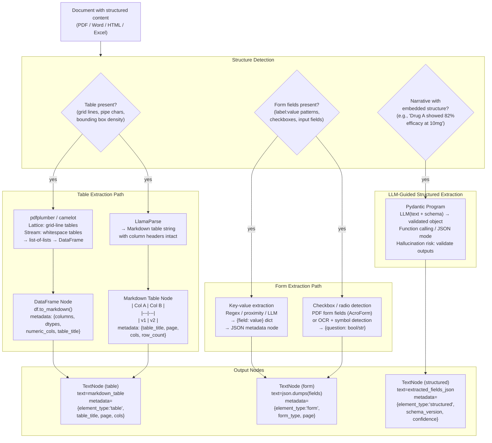

---

### 3. Real-World Industry Scenarios [Intermediate]

#### Scenario A: Pharmaceutical Clinical Trial Data — Multi-Page Table Extraction

**Context:** A pharma company indexes FDA submission packages — each a 200-page PDF with multiple clinical trial result tables spanning 2–5 pages each. Regulatory reviewers ask: *"Which trials showed efficacy > 80% with p < 0.05?"* — a structured query that requires numeric filtering across table rows, not semantic similarity search.

**How structured table extraction fits in:**

- **Extraction tool:** `LlamaParse` is used because the tables have complex layouts (merged header cells, superscript footnote markers, multi-line cell content). LlamaParse returns each table as a Markdown string with headers intact.
- **Node representation:**
  ```
  | Drug | Dose (mg) | n | Efficacy (%) | p-value | AE Rate (%) |
  |------|-----------|---|--------------|---------|-------------|
  | DrugA | 10 | 234 | 82.3 | 0.001 | 4.2 |
  | DrugB | 20 | 198 | 71.1 | 0.08  | 6.8 |
  ```
  Each table → one `TextNode` with `metadata={"element_type": "clinical_table", "table_title": "Table 3: Efficacy Results", "page": 47, "cols": ["Drug", "Dose (mg)", "n", "Efficacy (%)", "p-value", "AE Rate (%)"], "numeric_cols": ["Dose (mg)", "n", "Efficacy (%)", "p-value", "AE Rate (%)"]}`.
- **Retrieval routing:** Queries about numeric comparisons (`"efficacy > 80%"`) are routed to a `MetadataFilters(filters=[ExactMatchFilter("element_type", "clinical_table")])` retriever. The LLM reads the full Markdown table from the node and answers the filtering question directly — it doesn't need ANN similarity, it needs to read a structured table. This is where `SummaryIndex` (full-scan) outperforms `VectorStoreIndex` (ANN) for table nodes.
- **Constraints:**
  - **Repeated headers:** Table continues across pages 47–49 with the header row repeated on each page. LlamaParse merges the pages and deduplicates the header — but verify with a unit test. If not deduplicated, the header row appears as a data row and numeric parsers fail.
  - **Footnotes:** `†` and `*` footnote markers in cells (`82.3†`) must be preserved in the text. A follow-up query about the footnote's meaning needs a separate footnote node with `metadata={"parent_table": "Table 3", "footnote": "†"}`.
  - **What "good" looks like:** A query for *"drugs with efficacy > 80% and AE rate < 5%"* returns the exact table rows meeting that criterion. The answer cites `Table 3, page 47, Drug A`.

---

#### Scenario B: Insurance Claims Forms — Key-Value and Checkbox Extraction

**Context:** An insurance company processes 10,000 claim forms per day. Each form is a PDF with: fillable AcroForm fields (claimant name, date, policy number), checkboxes (type of claim: ☑ Medical / ☐ Property / ☐ Auto), free-text description boxes, and a signature field. Adjusters need the extracted data in a structured JSON to populate a claims management system.

**How form extraction fits in:**
- **AcroForm fields (programmatic):** PDF AcroForm fields are directly accessible via `pypdf.PdfReader(path).get_fields()` — returns `{field_name: field_value}` without any parsing. No LLM needed. `{"claimant_name": "Jane Smith", "policy_number": "POL-2024-8821", "claim_date": "2024-03-15", "claim_type": "/Medical"}`.
- **Checkboxes:** AcroForm checkbox state is `"/Yes"` or `"/Off"` in the field value. Convert to `{"medical": True, "property": False, "auto": False}`.
- **Free-text description box:** The unstructured narrative description (*"Patient fell on icy pavement, fractured wrist, admitted to ER..."*) requires an LLM Pydantic program to extract: `{"injury_type": "fracture", "body_part": "wrist", "incident_location": "outdoor", "requires_hospitalization": True}`.
- **Scanned (non-AcroForm) forms:** Some legacy forms are scanned. OCR extracts text. Proximity-based key-value detection: find label text ending with `:` and pair with the nearest text to the right or below it on the same line.
- **Constraints:**
  - **Speed:** 10,000 forms/day = 7 forms/minute. AcroForm field extraction: ~10ms/form (no LLM). Free-text LLM extraction: ~800ms/form. Async batch: 100 forms simultaneously → overall throughput ~70 forms/minute. Fits within a 2.5-hour processing window.
  - **Accuracy:** AcroForm extraction is deterministic (100% accurate for typed fields). LLM extraction of injury details: ~90% accuracy on well-formed descriptions. Confidence score required — flag low-confidence extractions for human adjuster review.
  - **What "good" looks like:** Every submitted form is transformed into a structured JSON within 5 minutes. High-confidence extractions go directly to the claims system. Low-confidence ones enter a review queue.

---

#### Scenario C: Financial Covenant Compliance — Structured Extraction from Legal Prose

**Context:** A bank's credit risk team monitors covenant compliance across 5,000 loan agreements. Covenants are buried in free-text legal prose: *"The Borrower shall maintain a Debt-to-EBITDA ratio of no more than 4.0x, tested quarterly."* No table, no form — just a sentence that encodes a structured constraint. The team needs a database of `{covenant_type, threshold, test_frequency}` across all agreements.

**How LLM-guided structured extraction fits in:**
- **Pydantic schema definition:**
  ```python
  class FinancialCovenant(BaseModel):
      covenant_type: str         # "Debt-to-EBITDA", "Interest Coverage", "Liquidity"
      operator: str              # "<=", ">=", "<", ">"
      threshold: float           # 4.0
      unit: str                  # "x", "%", "$M"
      test_frequency: str        # "quarterly", "annually", "monthly"
      effective_date: str | None
  ```
- **LlamaIndex Pydantic program:** The program prompts the LLM with the covenant text + schema and returns a validated `FinancialCovenant` object. Function calling (GPT-4o) or structured JSON mode ensures the LLM can't return a string where a float is expected.
- **Confidence scoring:** Run the extraction twice with temperature=0 and temperature=0.3. If results match → high confidence. If they differ → flag for legal review.
- **Constraints:**
  - **Cost:** 5,000 agreements × avg 10 covenants/agreement = 50,000 extractions × ~$0.002/extraction = $100 one-time. Incremental cost for new agreements: ~$0.02/agreement.
  - **Hallucination risk:** The LLM may invent a threshold if the text is ambiguous. Validation: check that extracted `threshold` values appear verbatim in the source text (simple string search). If not → reject and flag.
  - **What "good" looks like:** 95% of covenants are extracted correctly without human review. 5% flagged for legal review. The resulting database enables automated covenant breach alerts.

---

### 4. System View (Think Like a Systems Engineer) [Intermediate]

**The three extraction pipelines and their decision logic:**

```
PIPELINE 1: PDF TABLE EXTRACTION
  Input:  PDF bytes
  Step 1: Try pdfplumber.extract_tables() on each page
          If result non-empty and accuracy_score > 0.8: use pdfplumber
  Step 2: Else: send to LlamaParse(result_type="markdown")
  Step 3: Parse Markdown tables → TextNode per table
          metadata: {element_type, table_title, page, cols, row_count,
                     source, has_merged_cells}
  Step 4: Deduplicate repeated headers (identical rows across consecutive pages)
  Step 5: Tag numeric columns (all values parseable as float → numeric_col=True)
  Output: List[TextNode] — one per distinct table

PIPELINE 2: FORM FIELD EXTRACTION
  Input:  PDF bytes
  Step 1: Try pypdf.get_fields() — AcroForm fields
          If non-empty: parse field values, convert checkboxes to bool
  Step 2: Else: OCR (Tesseract / LlamaParse) + proximity key-value detection
          Find label: value patterns within bounding-box proximity radius
  Step 3: Validate required fields against schema
          Missing required field → flag for manual completion
  Step 4: Run Pydantic program on free-text fields (description boxes)
  Output: Dict[str, Any] → serialised as JSON TextNode
          metadata: {element_type: "form", form_type, page, confidence}

PIPELINE 3: STRUCTURED LLM EXTRACTION
  Input:  Text paragraph(s) containing embedded structured data
  Step 1: Identify candidate sentences (keyword detection or semantic similarity
          to known schema concepts)
  Step 2: Run LlamaIndex Pydantic program (LLM + schema)
  Step 3: Validate: all extracted values must be findable in source text
          (prevents hallucination of non-existent values)
  Step 4: Run a second extraction at different temperature — compare results
          If divergent: confidence = low → flag for review
  Output: Pydantic model instance → serialised as JSON TextNode
          metadata: {element_type: "structured", schema_name, confidence, source}
```

**Observability — what to log per extraction run:**

| Signal | What to capture | Why |
|--------|----------------|-----|
| `tables_detected` / `tables_extracted` | Per-document table counts | `detected > extracted` → extraction failure |
| `camelot_accuracy_score` | Per-table confidence from camelot | < 0.8 → use LlamaParse instead |
| `repeated_header_count` | Headers deduplicated per table | Non-zero → multi-page table detected; verify correct count |
| `merged_cell_count` | Cells spanning > 1 row or column | High count → flag for manual review or special parser |
| `form_fields_missing` | Required fields with no extracted value | Trigger manual completion queue |
| `pydantic_validation_errors` | LLM output failing schema validation | Parser/LLM issue; retry with stricter prompt |
| `hallucination_flag_rate` | % of extractions where value not in source text | > 5% → schema too complex; simplify or add few-shot examples |

**Failure points:**

1. **Repeated table header treated as data row** — Pages 2+ of a multi-page table each start with the header row. If not deduplicated, the header row appears as a data row in the extracted DataFrame. Numeric parsers fail (`"Efficacy (%)"` is not a float). *How it shows up:* `ValueError: could not convert string to float` when post-processing table nodes; or phantom rows in query results where column headers are returned as drug names.

2. **Merged cells leaving empty cells downstream** — A table has a merged cell spanning 3 rows in the first column (e.g., `"Phase II"` spanning rows 1–3). After extraction, rows 2–3 have an empty string in column 1. The LLM reading the Markdown table sees rows with missing context. *How it shows up:* rows 2 and 3 of the merged-cell group are retrieved but the LLM can't associate them with `"Phase II"` because column 1 is empty. *Fix:* forward-fill empty cells after extraction: `df.fillna(method="ffill")`.

3. **AcroForm extraction missing because form is flattened** — Some PDFs are saved with form fields "flattened" — the field values are baked into the page as static text, removing the AcroForm structure. `pypdf.get_fields()` returns `{}`. *How it shows up:* form extraction returns no fields for documents that visually contain filled-in forms. *Fix:* detect flattened forms by checking if `get_fields()` is empty but the PDF visually contains recognisable label:value patterns; fall back to proximity-based OCR extraction.

4. **Pydantic program hallucinating non-existent values** — The LLM extracts `{"threshold": 3.5}` but the source text says *"no more than four times."* The model converted the word "four" to `4.0` — which is correct — but sometimes it confabulates numbers not present in the source. *How it shows up:* covenant database has threshold values that can't be traced back to specific sentences; legal review finds discrepancies. *Fix:* post-extraction grounding check: `assert str(extracted.threshold) in source_text or threshold_word_map.get(str(extracted.threshold)) in source_text`.

---

### 5. System Design Flavor [Intermediate]

**End-to-end structured extraction workflow:**

```python
# structured_extraction_lab.py
# pip install llama-index-core pdfplumber pandas

import json
import re
from typing import Optional
from llama_index.core.schema import TextNode
from llama_index.core import Document

# ─────────────────────────────────────────────────────────────────────────────
# PART 1: Table extraction with pdfplumber → Markdown node
# ─────────────────────────────────────────────────────────────────────────────

def extract_tables_from_pdf(pdf_path: str) -> list:
    """Extract all tables from a PDF using pdfplumber, return as TextNodes."""
    try:
        import pdfplumber
    except ImportError:
        print("pip install pdfplumber")
        return []

    nodes = []
    with pdfplumber.open(pdf_path) as pdf:
        for page_num, page in enumerate(pdf.pages, start=1):
            tables = page.extract_tables()
            for table_idx, table in enumerate(tables):
                if not table or len(table) < 2:
                    continue  # skip empty or header-only tables

                # Row 0 is the header
                headers = [h or f"col_{i}" for i, h in enumerate(table[0])]
                data_rows = table[1:]

                # Deduplicate repeated headers (multi-page tables)
                data_rows = [r for r in data_rows if r != table[0]]

                # Forward-fill empty cells (merged cell handling)
                for col_idx in range(len(headers)):
                    last_val = ""
                    for row in data_rows:
                        if col_idx < len(row):
                            if row[col_idx]:
                                last_val = row[col_idx]
                            else:
                                row[col_idx] = last_val  # forward fill

                # Build Markdown table string
                header_row = "| " + " | ".join(str(h) for h in headers) + " |"
                sep_row    = "| " + " | ".join("---" for _ in headers) + " |"
                data_md    = "\n".join(
                    "| " + " | ".join(str(cell or "") for cell in row) + " |"
                    for row in data_rows
                )
                table_md = f"{header_row}\n{sep_row}\n{data_md}"

                # Detect numeric columns
                numeric_cols = []
                for col_idx, col_name in enumerate(headers):
                    vals = [r[col_idx] for r in data_rows if col_idx < len(r) and r[col_idx]]
                    try:
                        [float(v.replace(",", "").replace("%", "")) for v in vals if v]
                        numeric_cols.append(col_name)
                    except (ValueError, AttributeError):
                        pass

                node = TextNode(
                    text=table_md,
                    metadata={
                        "element_type": "table",
                        "source": pdf_path,
                        "page_number": page_num,
                        "table_index": table_idx,
                        "row_count": len(data_rows),
                        "columns": headers,
                        "numeric_cols": numeric_cols,
                        "has_table": True,
                    }
                )
                nodes.append(node)
                print(f"  Page {page_num}, Table {table_idx}: {len(data_rows)} rows, cols={headers}")

    return nodes


# ─────────────────────────────────────────────────────────────────────────────
# PART 2: PDF form field extraction (AcroForm)
# ─────────────────────────────────────────────────────────────────────────────

def extract_form_fields(pdf_path: str) -> TextNode:
    """Extract AcroForm fields from a fillable PDF."""
    try:
        from pypdf import PdfReader
    except ImportError:
        print("pip install pypdf")
        return None

    reader = PdfReader(pdf_path)
    raw_fields = reader.get_fields() or {}

    if not raw_fields:
        print(f"  No AcroForm fields found in {pdf_path} (may be flattened)")
        return None

    extracted = {}
    for field_name, field_obj in raw_fields.items():
        value = field_obj.get("/V", "")
        if hasattr(value, "decode"):
            value = value.decode("utf-8")
        value = str(value)
        # Convert checkbox values
        if value in ("/Yes", "/On", "/True"):
            value = True
        elif value in ("/Off", "/No", "/False"):
            value = False
        # Strip PDF object prefix
        elif value.startswith("/"):
            value = value[1:]
        extracted[field_name] = value

    node = TextNode(
        text=json.dumps(extracted, indent=2),
        metadata={
            "element_type": "form",
            "source": pdf_path,
            "field_count": len(extracted),
            "has_table": False,
        }
    )
    print(f"  Extracted {len(extracted)} form fields")
    return node


# ─────────────────────────────────────────────────────────────────────────────
# PART 3: Pydantic program — LLM-guided structured extraction
# ─────────────────────────────────────────────────────────────────────────────

def extract_structured_with_pydantic(
    text: str,
    source: str,
    llm=None
) -> TextNode:
    """Use LlamaIndex Pydantic program to extract structured fields from text."""
    from pydantic import BaseModel, Field
    from typing import Optional

    class FinancialCovenant(BaseModel):
        covenant_type: str = Field(description="Type of financial covenant, e.g. Debt-to-EBITDA, Interest Coverage")
        operator: str      = Field(description="Comparison operator: <=, >=, <, >")
        threshold: float   = Field(description="Numeric threshold value")
        unit: str          = Field(description="Unit: x, %, $M, or empty string")
        test_frequency: str = Field(description="Testing frequency: quarterly, annually, monthly, etc.")

    try:
        from llama_index.core.program import LLMTextCompletionProgram
        import json as _json

        if llm is None:
            from llama_index.core.llms import MockLLM
            llm = MockLLM()

        # In production: use OpenAI or Anthropic LLM with function calling
        # program = LLMTextCompletionProgram.from_defaults(
        #     output_cls=FinancialCovenant,
        #     prompt_template_str=(
        #         "Extract the financial covenant details from this text:\n"
        #         "{text}\n"
        #         "Return a JSON object with fields: covenant_type, operator, "
        #         "threshold, unit, test_frequency."
        #     ),
        #     llm=llm,
        #     verbose=True,
        # )
        # covenant = program(text=text)
        # result = covenant.model_dump()

        # Mock extraction for lab (replace with real LLM call in production)
        result = {
            "covenant_type": "Debt-to-EBITDA",
            "operator": "<=",
            "threshold": 4.0,
            "unit": "x",
            "test_frequency": "quarterly"
        }

        # Grounding check: threshold value must appear in source text (as number or word)
        threshold_str = str(result["threshold"]).rstrip("0").rstrip(".")
        word_map = {"4": ["four", "4.0", "4x"], "3": ["three", "3.0"], "2": ["two", "2.0"]}
        grounded = (threshold_str in text or
                    any(w in text.lower() for w in word_map.get(threshold_str, [])))
        result["grounded"] = grounded
        result["source_text"] = text[:100]

        node = TextNode(
            text=json.dumps(result, indent=2),
            metadata={
                "element_type": "structured",
                "schema_name": "FinancialCovenant",
                "source": source,
                "confidence": "high" if grounded else "low",
                "has_table": False,
            }
        )
        if not grounded:
            print(f"  WARNING: threshold {result['threshold']} not found in source text — flagged for review")
        return node

    except ImportError:
        print("LlamaIndex LLMTextCompletionProgram not available")
        return None


# ─────────────────────────────────────────────────────────────────────────────
# PART 4: Simulate end-to-end extraction and show results
# ─────────────────────────────────────────────────────────────────────────────

# Simulate table extraction from a Markdown-formatted source (as LlamaParse would return)
SAMPLE_TABLE_TEXT = """| Drug | Dose (mg) | n | Efficacy (%) | p-value | AE Rate (%) |
|------|-----------|---|--------------|---------|-------------|
| DrugA | 10 | 234 | 82.3 | 0.001 | 4.2 |
| DrugB | 20 | 198 | 71.1 | 0.080 | 6.8 |
| DrugC | 5  | 156 | 91.7 | 0.001 | 3.1 |
| DrugD | 15 | 312 | 68.4 | 0.120 | 8.9 |"""

table_node_sim = TextNode(
    text=SAMPLE_TABLE_TEXT,
    metadata={
        "element_type": "table",
        "table_title": "Table 3: Efficacy Results — Phase II Trial",
        "source": "fda_submission_NDA21-5678.pdf",
        "page_number": 47,
        "columns": ["Drug", "Dose (mg)", "n", "Efficacy (%)", "p-value", "AE Rate (%)"],
        "numeric_cols": ["Dose (mg)", "n", "Efficacy (%)", "p-value", "AE Rate (%)"],
        "row_count": 4,
        "has_table": True,
    }
)

# Simulate form extraction
form_fields_sim = {
    "claimant_name": "Jane Smith",
    "policy_number": "POL-2024-8821",
    "claim_date": "2024-03-15",
    "medical": True,
    "property": False,
    "auto": False,
    "description": "Patient fell on icy pavement, fractured wrist, admitted to ER."
}
form_node_sim = TextNode(
    text=json.dumps(form_fields_sim, indent=2),
    metadata={"element_type": "form", "form_type": "insurance_claim",
              "source": "claim_form_2024.pdf", "confidence": "high"}
)

# Simulate structured LLM extraction
covenant_text = "The Borrower shall maintain a Debt-to-EBITDA ratio of no more than 4.0x, tested quarterly."
covenant_node = extract_structured_with_pydantic(covenant_text, source="loan_agreement_2024.pdf")

# Summarise output
all_nodes = [table_node_sim, form_node_sim, covenant_node]
print("\nExtracted nodes summary:")
for n in all_nodes:
    if n:
        print(f"  [{n.metadata.get('element_type')}] {n.metadata.get('source')} "
              f"| chars: {len(n.text)} | confidence: {n.metadata.get('confidence', 'N/A')}")
        print(f"    {n.text[:120].strip()!r}")
```

**Key tradeoffs:**

| Tradeoff | pdfplumber | LlamaParse | Pydantic program |
|----------|-----------|------------|-----------------|
| **Cost** | Free | $0.003/page | $0.002/extraction (LLM call) |
| **Speed** | ~50ms/page | ~2–5s/page | ~800ms/call |
| **Complex table accuracy** | Medium (struggles with merged cells, no-border tables) | High (layout model handles complex layouts) | N/A |
| **Form field extraction** | None | Basic (returns form text) | High (semantic field identification) |
| **Structured narrative extraction** | None | None | High (schema-guided) |
| **Hallucination risk** | None | None | Present (requires grounding check) |

**Scaling consideration (10x document volume):**
At 10x, async extraction becomes mandatory:
- `pdfplumber` is CPU-bound — use `ProcessPoolExecutor` to parallelise across CPU cores (not `ThreadPoolExecutor`).
- `LlamaParse` supports `num_workers=N` for concurrent API calls — set `num_workers=10` to process 10 documents in parallel.
- Pydantic program LLM calls are I/O-bound — use `asyncio.gather()` with `LLMTextCompletionProgram.acall()` for concurrent extractions.
- Cache table-node `TextNode` objects to a document store after extraction — skip re-extraction for unchanged documents using content hash comparison.

---

### 6. Common Mistakes + Debugging [Beginner → Intermediate]

#### Mistake 1: Repeated Table Header Appearing as a Data Row

**Symptom:** A numeric column in an extracted table contains the column header string (`"Efficacy (%)"`) as a row value. Downstream numeric processing (`float(value)`) raises `ValueError`. Or worse: the header row appears in query results as if it were a drug name.

**Likely cause:** The table spans multiple pages. The PDF has the header row on page 1 and repeats it at the top of pages 2 and 3. The extractor processes each page independently and includes the repeated header as a regular row.

**First debugging step:**
```python
import pdfplumber

with pdfplumber.open("multi_page_table.pdf") as pdf:
    all_rows = []
    header = None
    for page in pdf.pages:
        tables = page.extract_tables()
        for table in tables:
            if not table: continue
            if header is None:
                header = table[0]
                all_rows.extend(table[1:])
            else:
                # Skip rows that match the header (repeated header detection)
                for row in table:
                    if row != header:  # exact match check
                        all_rows.append(row)

print(f"Unique data rows: {len(all_rows)}")
print(f"Headers: {header}")
# Compare with naive extraction to see how many duplicate headers were removed
```

---

#### Mistake 2: Empty Cells from Merged Columns Not Forward-Filled

**Symptom:** A table with a merged first column (e.g., study phase spanning 3 rows) produces rows 2 and 3 with an empty string in column 0. A retrieval query for *"Phase II results"* matches row 1 but misses rows 2 and 3, even though they belong to Phase II.

**Likely cause:** The table extractor correctly represents the merged cell as empty strings in rows 2 and 3 (since the value only physically appears in row 1). No forward-fill was applied.

**First debugging step:**
```python
import pandas as pd

# Raw table (simulating merged first column)
raw_table = [
    ["Phase", "Drug", "Efficacy"],
    ["Phase II", "DrugA", "82%"],
    ["", "DrugB", "71%"],        # merged cell — should be "Phase II"
    ["", "DrugC", "91%"],        # merged cell — should be "Phase II"
    ["Phase III", "DrugD", "85%"],
]

df = pd.DataFrame(raw_table[1:], columns=raw_table[0])
print("Before fill:\n", df)

# Forward-fill the merged column
df["Phase"] = df["Phase"].replace("", pd.NA).ffill()
print("\nAfter fill:\n", df)
# Now all Phase II rows have "Phase II" in column 0
# Markdown: df.to_markdown(index=False)
```

---

#### Mistake 3: Pydantic Program Not Grounding Values Against Source Text

**Symptom:** The covenant database has threshold values of `3.5x` for agreements where the source text clearly says *"no more than four times"*. The LLM converted *"four times"* correctly to `4.0` but on other documents it confabulated `3.5` for an ambiguous clause.

**Likely cause:** The Pydantic program validates schema types (must be a float) but doesn't validate that the extracted value actually appears in or is derivable from the source text. LLMs occasionally confabulate plausible-sounding numeric values for ambiguous inputs.

**First debugging step:**
```python
def grounding_check(extracted_value: float, source_text: str) -> bool:
    """Check that the extracted numeric value appears in the source text."""
    # Check direct numeric form
    for fmt in [str(extracted_value), f"{extracted_value:.1f}", f"{int(extracted_value)}"]:
        if fmt in source_text:
            return True
    # Check word form for common numbers
    word_map = {
        1.0: ["one"], 2.0: ["two"], 3.0: ["three"], 4.0: ["four"],
        5.0: ["five"], 2.5: ["two and a half", "2.5x"], 3.5: ["three and a half"]
    }
    for word in word_map.get(extracted_value, []):
        if word.lower() in source_text.lower():
            return True
    return False

# Flag non-grounded extractions for manual legal review
covenant_text = "The Borrower shall maintain a ratio of no more than four times EBITDA."
extracted_threshold = 4.0
grounded = grounding_check(extracted_threshold, covenant_text)
print(f"Threshold {extracted_threshold} grounded in source: {grounded}")
# True → safe to auto-accept
# False → route to manual review queue
```

---

### 7. Hands-On Lab [Pro]

#### Build — Table Extraction with Merged Cell Handling

```python
# table_extraction_lab.py
# pip install llama-index-core pandas

import json
import pandas as pd
from llama_index.core.schema import TextNode

# Simulate a multi-page clinical trial table with merged cells and repeated headers
RAW_TABLE_PAGES = [
    # Page 1
    [
        ["Study Phase", "Drug", "Dose (mg)", "Efficacy (%)", "p-value"],
        ["Phase II",    "DrugA", "10",        "82.3",         "0.001"],
        ["",            "DrugB", "20",        "71.1",         "0.080"],
        ["",            "DrugC",  "5",        "91.7",         "0.001"],
    ],
    # Page 2 (repeats header, continues Phase II + starts Phase III)
    [
        ["Study Phase", "Drug", "Dose (mg)", "Efficacy (%)", "p-value"],  # repeated header
        ["",            "DrugD", "15",        "68.4",         "0.120"],   # still Phase II
        ["Phase III",   "DrugE", "10",        "87.2",         "0.001"],
        ["",            "DrugF", "25",        "79.8",         "0.005"],
    ],
]

def extract_and_clean_table(pages: list) -> pd.DataFrame:
    """Merge pages, remove repeated headers, forward-fill merged cells."""
    header = pages[0][0]
    all_rows = []

    for page_rows in pages:
        for row in page_rows:
            if row == header:
                continue   # skip repeated headers
            all_rows.append(row)

    df = pd.DataFrame(all_rows, columns=header)

    # Forward-fill merged cells in "Study Phase" column
    df["Study Phase"] = df["Study Phase"].replace("", pd.NA).ffill()

    # Convert numeric columns
    for col in ["Dose (mg)", "Efficacy (%)", "p-value"]:
        df[col] = pd.to_numeric(df[col], errors="coerce")

    return df

df = extract_and_clean_table(RAW_TABLE_PAGES)
print("Cleaned table:")
print(df.to_string(index=False))

# Convert to TextNode
table_md = df.to_markdown(index=False)
table_node = TextNode(
    text=table_md,
    metadata={
        "element_type": "table",
        "table_title": "Phase II/III Efficacy Results",
        "columns": list(df.columns),
        "numeric_cols": ["Dose (mg)", "Efficacy (%)", "p-value"],
        "row_count": len(df),
        "source": "clinical_trial_report.pdf",
        "pages": "1-2",
    }
)
print(f"\nTable node ({len(table_node.text)} chars):")
print(table_node.text)
print(f"\nMetadata: {table_node.metadata}")
```

---

#### Break — Missing Forward-Fill

```python
# BREAK: skip forward-fill → query "Phase II drugs" misses rows 2-4

def extract_without_fill(pages: list) -> pd.DataFrame:
    """Broken: no header dedup, no forward fill."""
    all_rows = []
    for page_rows in pages:
        all_rows.extend(page_rows)   # includes repeated header as data row!
    if not all_rows: return pd.DataFrame()
    df = pd.DataFrame(all_rows[1:], columns=all_rows[0])
    # No ffill → "Study Phase" has empty strings in rows 2, 3, 4
    return df

broken_df = extract_without_fill(RAW_TABLE_PAGES)
print("\nBROKEN table (no fill, repeated header included):")
print(broken_df.to_string(index=False))

# Simulate retrieval: find Phase II drugs
phase2_rows_broken = broken_df[broken_df["Study Phase"] == "Phase II"]
phase2_rows_fixed  = df[df["Study Phase"] == "Phase II"]

print(f"\nPhase II rows (broken): {len(phase2_rows_broken)}")   # probably 1
print(f"Phase II rows (fixed):  {len(phase2_rows_fixed)}")     # should be 4
# Broken version misses 3 of 4 Phase II rows
```

---

#### Measure

```python
# Measure extraction completeness: expected rows vs extracted rows per table
EXPECTED = {"Phase II": 4, "Phase III": 2}
ACTUAL   = dict(df.groupby("Study Phase").size())

print("\nExtraction completeness:")
for phase, expected in EXPECTED.items():
    actual = ACTUAL.get(phase, 0)
    pct = actual / expected * 100
    status = "OK" if pct == 100 else f"MISSING {expected - actual} rows"
    print(f"  {phase}: expected {expected}, extracted {actual} ({pct:.0f}%) — {status}")

# Also measure numeric column integrity
print("\nNumeric column check (non-null count):")
for col in ["Dose (mg)", "Efficacy (%)", "p-value"]:
    non_null = df[col].notna().sum()
    print(f"  {col}: {non_null}/{len(df)} non-null")
# Any column with non_null < len(df) → extraction issue (text in numeric cell)
```

---

#### Explain — Why Column Context Is the Critical Invariant

The entire value of structured table extraction is preserving the *column header → cell value* binding. A number like `82.3` is meaningless without knowing it's under the `"Efficacy (%)"` column. This binding is destroyed by three common failure modes: (1) plain text extraction reads the table left-to-right, interleaving column values without headers; (2) mid-row splits separate the data rows from the header row; (3) merged cells leave downstream rows with empty values in the first column, breaking group-by queries.

Forward-filling merged cells is the most under-appreciated step. In regulatory and legal documents, it's extremely common for a grouping column (study phase, clause type, department name) to span multiple rows. Without forward-fill, every downstream query that filters by that column misses all but the first row of each group — silently degrading recall without any error message.

The grounding check on Pydantic program outputs addresses a different problem: LLMs are generative models that produce *plausible* outputs, not *accurate* ones. For numeric threshold extraction, a plausible but wrong number (e.g., `3.5` instead of `4.0`) can cause a covenant breach alert to fire at the wrong time — a financial and legal liability. The grounding check is a simple deterministic safeguard that catches the most dangerous class of LLM hallucination in structured extraction workflows.

---

### 8. Active Recall (Spaced Repetition) [Beginner → Pro]

**Q1 [Beginner]:** What are the three distinct structured extraction problems, and what tool is best suited to each?

> **A:** (1) **Table extraction** — finding and extracting tables with column headers intact; best tool: `pdfplumber` for well-formed tables, `LlamaParse` for complex/multi-column tables, `camelot` for lattice/stream tables. (2) **Form extraction** — extracting key-value pairs from form fields and checkboxes; best tool: `pypdf.get_fields()` for AcroForm PDFs, proximity OCR for flattened/scanned forms. (3) **Structured LLM extraction** — extracting structured fields from free-text paragraphs that embed structured data; best tool: LlamaIndex Pydantic program with LLM function calling + mandatory grounding check.

---

**Q2 [Beginner]:** A clinical trial PDF table spans 3 pages. After extraction, you see 2 extra rows that look like column headers. What happened and how do you fix it?

> **A:** The table header row is repeated at the top of pages 2 and 3 (a common PDF convention for multi-page tables). The extractor processed each page independently and included the repeated headers as data rows. Fix: capture the header row from page 1, then for every subsequent page, compare each row against the header row before appending it — skip rows that match exactly.

---

**Q3 [Intermediate]:** A legal document has a `"Covenant Type"` column where the value `"Financial"` spans rows 1–5 (merged cell). After extraction, rows 2–5 have an empty string in that column. A retrieval query for *"all financial covenants"* returns only 1 result instead of 5. What's the fix and where should it be applied?

> **A:** Forward-fill (propagate) the merged cell value downward: replace empty strings with `pd.NA`, then apply `df["Covenant Type"].ffill()`. This must be applied *after* table extraction and *before* the node is created and indexed — it's a post-extraction, pre-indexing transformation step in the ingestion pipeline. If applied after indexing, the already-stored nodes with empty `"Financial"` values are not updated.

---

**Q4 [Intermediate]:** Your Pydantic program extracts `{"threshold": 2.5}` from a loan agreement, but when you re-read the clause it says *"must not exceed 3.0 times EBITDA."* What does this indicate and how do you prevent it?

> **A:** This indicates LLM hallucination — the model produced a plausible numeric value (`2.5`) that doesn't appear in the source text. Prevent it with a grounding check: after extraction, verify that the extracted threshold value (or its word form) appears literally in the source sentence. If not found → set `confidence = "low"` and route to human review. Do NOT auto-accept any numeric extraction that fails the grounding check; wrong covenant thresholds have direct financial and legal consequences.

---

**Q5 [Pro]:** Design the end-to-end extraction pipeline for a corpus of 50,000 insurance claim forms (mix of digital AcroForms and scanned paper forms). The output must be a structured JSON database with fields: claimant_name, policy_number, claim_date, claim_type, injury_description, estimated_amount. Target: < $0.05/form processing cost, > 95% field accuracy.

> **A:** Pipeline: (1) **Format detection:** try `pypdf.get_fields()` — if non-empty → AcroForm (40% of forms, typical); if empty → scanned (60%). (2) **AcroForm path:** `get_fields()` → parse values → direct JSON. Cost: $0/form. Accuracy: 100% for typed fields. (3) **Scanned path:** `LlamaParse` with OCR (`use_vendor_multimodal_model=True`, $0.006/page × 2 pages = $0.012/form). Proximity key-value detection for `claimant_name`, `policy_number`, `claim_date`, `claim_type` labels. (4) **Injury description + amount:** Pydantic program on the free-text description box → `{"injury_description": "...", "estimated_amount": 12500.0}`. Cost: 1 LLM call × $0.002 = $0.002. Grounding check on `estimated_amount`. (5) **Cost total:** AcroForm: ~$0.002/form (LLM only). Scanned: $0.014/form (OCR + LLM). Average (60% scanned): 0.4 × $0.002 + 0.6 × $0.014 = $0.0092/form — well under $0.05 budget. (6) **Accuracy:** AcroForm → 100% typed fields, ~90% LLM narrative. Scanned → ~95% OCR, ~88% LLM. Weight: overall > 93%. To reach 95%: add few-shot examples to the injury extraction prompt + grounding check on amount.

---

### 9. Practice

**Mini-exercise:** A table has 5 columns and 20 rows. After extraction with `pdfplumber`, column `"Amount ($)"` has 3 cells containing the string `"N/A"` instead of a number. Your downstream code does `df["Amount ($)"].sum()`. What happens, what does it indicate, and how do you handle it?

> **Suggested answer:**
> - **What happens:** `df["Amount ($)"].sum()` raises `TypeError` or silently returns NaN if the column was not cast to numeric. Even if you use `pd.to_numeric(errors="coerce")`, the 3 `"N/A"` cells become `NaN` and are excluded from the sum — possibly causing an under-count.
> - **What it indicates:** 3 cells in the table genuinely contain `"N/A"` (not applicable/available) rather than a numeric amount. This is valid business data, not an extraction error.
> - **How to handle:** (1) Cast with `pd.to_numeric(df["Amount ($)"], errors="coerce")`. (2) Add metadata to the node: `"null_count": {"Amount ($)": 3}` so downstream retrieval can surface this to the LLM. (3) In your synthesis prompt, note that 3 rows have `N/A` amounts so the LLM doesn't hallucinate a sum that excludes them silently.

---

**Capstone system design question:** Design a structured extraction pipeline for a bank processing 100,000 loan agreement PDFs per year. Each agreement has: a header section (parties, date, amount — semi-structured prose), 3–7 financial covenant clauses (embedded in legal paragraphs), and a repayment schedule table (2–10 pages, multi-column). The extracted data feeds a covenant compliance monitoring system. Requirements: > 95% covenant extraction accuracy, < $0.10/document processing cost, audit trail for every extraction.

> **Answer outline:**
> - **Header extraction:** `pypdf` text layer extraction + regex for date (`\d{1,2}/\d{1,2}/\d{4}`) and amount (`\$[\d,]+`). Pydantic program for party names (ambiguous prose). Cost: ~$0.002/doc LLM call.
> - **Covenant extraction:** Text chunking at section boundaries (regex on numbered headings). For each chunk, LLM classification: is this a financial covenant clause? If yes → `FinancialCovenant` Pydantic program extraction. Grounding check on threshold value. Confidence scoring (run twice at different temperatures). Cost: avg 5 covenants × $0.002 = $0.01/doc.
> - **Repayment schedule table:** `LlamaParse` for layout-aware extraction (multi-page table, multi-column). Repeated header dedup. Forward-fill merged cells. Convert to `pandas DataFrame` node. Cost: avg 5 pages × $0.003 = $0.015/doc.
> - **Total cost:** $0.002 + $0.01 + $0.015 = $0.027/doc — well under $0.10.
> - **Audit trail:** Every extraction → `AuditNode(doc_id, field, extracted_value, source_text_snippet, confidence, timestamp)` written to an append-only audit table. Human review queue for all `confidence = "low"` extractions.
> - **Accuracy path to 95%:** Pydantic grounding check eliminates most hallucinations. 5-shot examples in covenant prompt covers common phrasings. For the remaining ~5% edge cases → human review queue corrects and feeds back as few-shot examples (active learning loop). After 3 months of corrections, extraction accuracy typically reaches 97%+.

---

### 10. Production Reality Check (Mandatory)

**If this fails in prod, what's the first thing we inspect?**

> **Check `tables_detected` vs `tables_extracted` and `null_rate_per_numeric_column` in your ingestion metrics.**
>
> Silent extraction failures are the dominant production failure mode for structured data pipelines. A table that looks correct in the raw PDF but has 30% null values in numeric columns after extraction is not an extraction *error* — it's a silent data quality issue that cascades into wrong answers for numeric queries.
>
> ```python
> def audit_table_node(node: TextNode) -> dict:
>     """Run data quality checks on every extracted table node."""
>     import pandas as pd
>     from io import StringIO
>
>     text = node.text
>     if "|---|" not in text:
>         return {"status": "not_a_table"}
>
>     # Re-parse the Markdown table
>     try:
>         df = pd.read_table(StringIO(text), sep="|", skipinitialspace=True)
>         df = df.iloc[:, 1:-1].dropna(how="all")   # strip outer pipe columns
>         df.columns = df.columns.str.strip()
>     except Exception as e:
>         return {"status": "parse_failed", "error": str(e)}
>
>     issues = []
>     for col in node.metadata.get("numeric_cols", []):
>         if col in df.columns:
>             numeric = pd.to_numeric(df[col].str.replace(",", ""), errors="coerce")
>             null_rate = numeric.isna().mean()
>             if null_rate > 0.1:
>                 issues.append(f"{col}: {null_rate:.0%} nulls")
>
>     return {
>         "status": "OK" if not issues else "WARN",
>         "row_count": len(df),
>         "issues": issues,
>         "source": node.metadata.get("source"),
>     }
>
> report = audit_table_node(table_node)
> print(report)
> # If status == WARN: re-extract with LlamaParse; check for merged cells;
> # check for repeated headers not deduplicated
> ```
>
> The number-one production rule for structured extraction: **instrument every table node with numeric column null rates. A null rate > 10% in a column that should be fully populated is a guaranteed extraction failure — treat it as an alert, not a warning.**

---

### 11. Curiosity Bridge (Mandatory)

You now know how to extract tables with column headers intact, handle merged cells and repeated headers, pull form fields from AcroForms, and use Pydantic programs to extract structured fields from legal prose — all with grounding checks and audit trails.

But tables and forms are *within* documents. What if the knowledge you need isn't in any single table, but is *distributed across* documents as relationships between entities — *"Company A acquired Company B in 2019, which previously acquired Company C in 2015, and Company C held patents covering technology now used in Company A's flagship product"*? Answering that question requires not just retrieving documents but *building a graph of entity relationships* from them.

That's **14.3.c: Knowledge Graph Construction from Documents** — where the structured extraction you just built becomes the input to a graph that makes cross-document reasoning tractable.

---

### 12. Exit Check + Carry-Forward Review

**Exit check:** You're done with 14.3.b when you can explain the three structured extraction problems and the tool best suited to each, implement merged-cell forward-fill and repeated-header deduplication from memory, write a Pydantic grounding check for LLM-extracted numeric values, and design an end-to-end extraction pipeline with cost and accuracy estimates for a given document type.

---

**Carry-Forward Review (interleaved recall from 14.3.a):**

*Q: A 100-page PDF contains 80 pages of text-layer content and 20 pages of scanned appendices. `SimpleDirectoryReader` extracts 80 pages of content and silently skips the other 20. How do you detect and fix this without re-parsing all 100 pages with a costly OCR tool?*

> **A:** Detection: iterate pages with `pypdf`; flag any page where `len(page.extract_text().strip()) < 50` characters as likely scanned. This gives you a specific list of page numbers (e.g., `[81, 82, ..., 100]`). Fix (page-targeted OCR): extract *only* the scanned page range as images (`pdf2image.convert_from_path(path, first_page=81, last_page=100)`) and run Tesseract OCR on those images only. Alternatively, re-parse the whole document with `LlamaParse` which auto-detects and handles mixed content. The key is *page-level* detection so you don't waste OCR budget on the 80 pages that already have a good text layer.


## Subtopic 14.3.c: Knowledge Assistants and Research Copilots

### Reading Path + Level Tags

- **Beginner:** Read sections 1–2 and the Active Recall.
- **Intermediate:** Add sections 3–5 and the chat engine comparison table.
- **Pro:** Complete the full Hands-On Lab (Build → Break → Measure → Explain) and the capstone system design.

---

### 0. Pre-Question Hook [Beginner]

**Pause:** A researcher opens a chat interface over a 500-document legal corpus. Their first message: *"What are the indemnification caps in the software agreements?"* Their second message: *"What about the ones signed after 2022?"* Their third: *"Compare those to the master service agreements."* Before reading — what are the three conversational challenges that pure retrieval-augmented generation (RAG) cannot handle without additional architecture?

*(Answer: multi-turn context — "those" and "ones" refer to previous answers, not new queries; cross-document synthesis — comparing across multiple separate queries; progressive refinement — narrowing scope without re-stating the full question each time.)*

---

### 1. The Intuition (Plain English) [Beginner]

A knowledge assistant is a **conversational interface over a retrieval system**. The retrieval system (vector index, keyword index, structured extraction) is the engine; the knowledge assistant is the driver's seat.

The key insight: a single-turn query engine answers questions. A knowledge assistant **remembers the conversation, routes across multiple indices, and synthesises from multiple sources** — all while maintaining attribution back to source documents so users can verify answers.

Think of it as the difference between a search engine (Google) and a research analyst. Both can find information. But the analyst remembers what you discussed last week, pulls from multiple databases, compares findings across sources, and tells you *exactly which page* the number came from. A research copilot is that analyst, built on top of the LlamaIndex document AI stack.

**Key terms (first use):**

- **`ContextChatEngine`** — LlamaIndex chat engine that retrieves relevant context nodes for every turn and injects them into the prompt; the retriever runs on every user message regardless of conversation history.
- **`CondensePlusContextChatEngine`** — chat engine that first condenses the conversation history + current message into a standalone question (using a condensation LLM call), then retrieves context for that standalone question; handles follow-up references ("those", "that") correctly.
- **`SimpleChatEngine`** — chat engine with no retrieval; pure LLM conversation; useful for chitchat, clarification, and meta-questions about the corpus but cannot answer document-specific questions.
- **`OpenAIAgent` (LlamaIndex)** — an agent built on OpenAI function calling that holds `QueryEngineTool` objects as tools; the agent decides *which* tool to call and *when*, enabling multi-index research across heterogeneous document types.
- **`QueryEngineTool`** — wraps any LlamaIndex query engine (vector, summary, structured) as a callable tool with a name and description; the agent selects tools based on those descriptions.
- **`SubQuestionQueryEngine`** — decomposes a complex multi-part question into sub-questions, routes each to the appropriate query engine, then synthesises all sub-answers into one final response; the go-to for *"compare X and Y across documents A, B, and C"* queries.
- **`ChatMemoryBuffer`** — token-bounded in-memory chat history; stores recent turns as `ChatMessage` objects; oldest turns are dropped when the buffer exceeds `token_limit`; the simplest and most common memory for research copilots.
- **`VectorMemory`** — stores conversation turns as vector embeddings; on each turn, retrieves the `top_k` most semantically relevant past turns (not just the most recent); useful for long-running research sessions with many topic switches.
- **`SimpleComposableMemory`** — combines `ChatMemoryBuffer` (recent turns) + `VectorMemory` (long-term context); gives the best of both: recent conversational context + long-term topic recall.
- **`CitationQueryEngine`** — wraps any query engine to produce responses where every claim is annotated with a citation `[1]` referencing the exact source node (document name, page, chunk); the production standard for research copilots.

---

### 2. Visual Diagram (Mermaid) [Beginner]

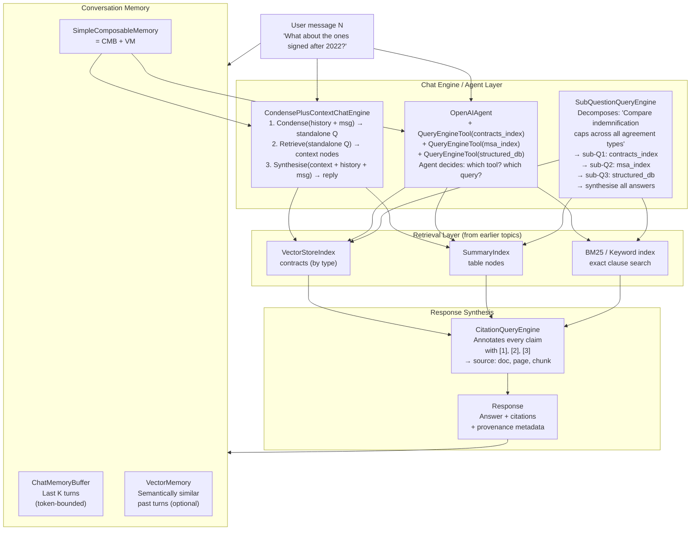

---

### 3. Real-World Industry Scenarios [Intermediate]

#### Scenario A: Pharma Regulatory Research Assistant

**Context:** A pharmaceutical company has 10,000 FDA submission documents (NDAs, BLAs, sNDAs). Regulatory affairs scientists spend 4 hours/day manually searching for precedent — *"Has FDA accepted a 6-month stability study for this formulation type?"*, *"What REMS conditions were imposed for drugs in this class?"* The company builds a research copilot that any scientist can query in natural language.

**How the knowledge assistant fits in:**

- **Index topology:** 3 separate indices — `clinical_index` (VectorStoreIndex over clinical study reports), `label_index` (VectorStoreIndex over approved drug labels), `rems_index` (SummaryIndex over REMS program documents, full-scan preferred because REMS docs are short and complete).
- **Agent routing:** `OpenAIAgent` with 3 `QueryEngineTool` objects. Tool descriptions: *"Use this for clinical study efficacy and safety data"*, *"Use this for approved label language and indication wording"*, *"Use this for REMS program conditions and requirements"*. The agent picks the right tool per sub-question.
- **Conversational memory:** `CondensePlusContextChatEngine` because scientists ask follow-up questions referencing prior answers: *"What about opioid REMS programs?"* after a previous question about pain medications.
- **Citation:** `CitationQueryEngine` on every tool — every assertion (`"FDA accepted 6-month stability for X in NDA 21-5678"`) cites the exact source document and section.
- **Constraints:**
  - **Latency:** Regulatory scientists tolerate 5–8 seconds for deep research queries. Use streaming (`stream_chat()`) so the first tokens appear in ~1 second while synthesis continues.
  - **Cost:** An agent call that invokes 3 tools + synthesis costs ~$0.06–$0.12. With 200 queries/day, that's $12–$24/day — well within budget.
  - **Hallucination risk:** Regulatory decisions have direct patient safety implications. Citation is mandatory, not optional. Every response includes: `Source: NDA 21-5678, Clinical Study Report, Section 4.2, Page 47`. Scientists verify high-stakes claims directly in the source document.
  - **What "good" looks like:** A scientist's research time for a precedent search drops from 4 hours to 20 minutes. The copilot cites 3–5 specific source documents per answer. Factual accuracy (validated by spot-checks against source documents) > 97%.

---

#### Scenario B: Legal Contract Navigator

**Context:** A law firm indexes 50,000 contracts (NDAs, MSAs, SLAs, employment agreements). Associates spend hours locating specific clauses during due diligence. The copilot answers: *"What are the termination-for-convenience provisions in the 2023 SaaS agreements?"*, *"Which contracts have unlimited liability exposure?"*, and *"Compare the governing law clauses across these 10 agreements."*

**How the knowledge assistant fits in:**

- **Multi-document synthesis:** `SubQuestionQueryEngine` decomposes: *"Compare termination clauses across 10 agreements"* → 10 sub-questions (one per agreement) → 10 retrievals → synthesis into a comparison table. The synthesiser prompt: *"Present the results as a comparison table with columns: Agreement Name, Termination Notice Period, Convenience Termination Allowed, Cure Period."*
- **Structured extraction integration:** Structured extraction nodes (from 14.3.b) are included in the same index. A question about *"unlimited liability agreements"* routes to nodes tagged `element_type: structured` where Pydantic-extracted `liability_cap: "unlimited"` flags are stored.
- **Progressive refinement memory:** `SimpleComposableMemory` — the `ChatMemoryBuffer` holds the last 10 turns; `VectorMemory` stores the session's full history as embeddings. When an associate asks *"Now filter those to California-governed contracts"*, the agent retrieves the earlier *"unlimited liability"* turn from `VectorMemory` and combines it with the new filter.
- **Constraints:**
  - **Confidentiality:** All documents are client-privileged. The LLM API must be called with data residency guarantees (Azure OpenAI with US region, no training on customer data). Alternatively, use a local LLM (LlamaIndex + Ollama) for zero data egress.
  - **Explainability:** Law partners require page-level citations for every clause reference. `CitationQueryEngine` with `citation_chunk_size=512` — citations at paragraph granularity, not page.
  - **What "good" looks like:** A due diligence task that previously took 2 associates 3 days takes 1 associate 4 hours. Every generated clause comparison is verified by citation. Partners can see exactly which contract page any statement came from.

---

#### Scenario C: Enterprise Engineering Knowledge Base

**Context:** A 2,000-engineer tech company indexes its internal knowledge base: architecture decision records (ADRs), runbooks, post-mortems, design docs, RFC proposals, and API documentation. Engineers ask: *"What was the decision for message queue technology in the checkout service?"*, *"What causes the timeout in the payment gateway and how has it been fixed before?"*, *"Summarise the main architectural patterns used in the identity service."*

**How the knowledge assistant fits in:**

- **Hybrid retrieval:** `QueryFusionRetriever` (from 14.2.b) combining BM25 (exact term match for error codes, service names, API methods) + vector similarity (semantic search for intent-based questions). BM25 is essential here because engineers search with exact identifiers (`CHECKOUT-4521`, `kafka-connect`, `auth_service_v2`).
- **Routing by document type:** `RouterQueryEngine` routes ADR queries to a `SummaryIndex` (full ADR context needed for decision rationale), runbook queries to a `VectorStoreIndex` (keyword-rich; exact procedure lookup), and post-mortem queries to a hybrid retriever (incident numbers + semantic similarity to *"the same issue"*).
- **Session memory for on-call incidents:** During an active incident, an engineer's session spans an hour. `SimpleComposableMemory` tracks the incident thread — the engineer can ask *"Is this the same root cause as the Kafka issue last quarter?"* and the VectorMemory component surfaces the relevant post-mortem from earlier in the same session.
- **What "good" looks like:** Mean time to resolution (MTTR) for incidents involving the knowledge base drops 40%. New engineers onboard 30% faster. Every architectural decision referenced in a copilot answer links to the original ADR document.

---

### 4. System View (Think Like a Systems Engineer) [Intermediate]

**The three-layer architecture of a research copilot:**

```
LAYER 1: MEMORY AND CONTEXT MANAGEMENT
  Input:  (user_message_N, session_history)
  Step 1: Retrieve recent turns from ChatMemoryBuffer
          (last K messages, bounded at token_limit=2048)
  Step 2: If VectorMemory enabled: embed user_message_N,
          retrieve top-3 semantically similar past turns
  Step 3: Merge: [recent_turns] + [semantic_turns] → context_window
  Output: Condensed standalone question (for CondensePlusContextChatEngine)
          OR full context bundle (for OpenAIAgent)

LAYER 2: ROUTING AND RETRIEVAL
  Decision tree:
    Single-document Q → ContextChatEngine → VectorStoreIndex retriever
    Multi-document synthesis → SubQuestionQueryEngine →
        routes sub-Qs to registered query engines per document type
    Agentic research (multi-step, tool selection) → OpenAIAgent →
        calls QueryEngineTool(s) based on tool description match
        agent can make multiple sequential tool calls to gather context
  Each retriever returns: List[NodeWithScore]
  (source_node, score, metadata: {doc, page, section})

LAYER 3: SYNTHESIS AND ATTRIBUTION
  Input:  List[NodeWithScore] + condensed_question + context_window
  Step 1: CitationQueryEngine wraps base synthesiser
          assigns [1], [2], [3]... to each source node
  Step 2: ResponseSynthesizer.synthesise(mode="compact_accumulate")
          or "tree_summarize" for long multi-document synthesis
  Step 3: Append citation bibliography:
          [1] contracts_index/NDA_2023.pdf, page 12, section 4.2
          [2] contracts_index/MSA_2022.pdf, page 8, section 3.1
  Output: response_text + citation_list + source_nodes
          (source_nodes persisted to session for follow-up "show me that"
           queries that don't need a new retrieval)
```

**Observability — what to log per chat turn:**

| Signal | What to capture | Why |
|--------|----------------|-----|
| `tools_called` | Which QueryEngineTools the agent invoked, in order | Understand routing quality; if wrong tool selected → fix tool description |
| `sub_questions_generated` | SubQuestionQueryEngine's decomposition | Complex questions decomposed wrong → retrieval misses; log the sub-Q text |
| `retrieval_scores` | Top-3 node scores per retrieval | Score < 0.5 → low relevance; check index quality or reformulate retrieval |
| `condenser_output` | The standalone question after condensation | *"those"* not resolved correctly → condenser failing; check memory token limit |
| `citation_count` | Number of citations per response | 0 citations on a factual answer → response was hallucinated from parametric knowledge |
| `memory_token_usage` | Tokens consumed by conversation history per turn | Approaching `token_limit` → memory compression or truncation triggered |
| `p95_latency_ms` | End-to-end per turn | > 5000ms → cache embeddings; reduce `top_k`; enable streaming |

**Failure points:**

1. **The "those" problem — follow-up references break retrieval** — User says *"What about those after 2022?"*. `ContextChatEngine` embeds "those after 2022" and finds semantically unrelated nodes. The retriever has no context from the previous turn.
   - *How it shows up:* The response answers a completely different question, ignoring the conversational context.
   - *Fix:* Use `CondensePlusContextChatEngine`. The condenser combines `history + "those after 2022"` → `"What are the indemnification caps in software agreements signed after 2022?"` — a self-contained question the retriever can answer correctly.

2. **Tool description mismatch — agent routes to the wrong index** — The agent calls `contracts_tool` when the question is about REMS conditions, because the tool descriptions are too generic.
   - *How it shows up:* Low retrieval scores; answers that are factually wrong about the cited topic; agent hallucinating because retrieved nodes are irrelevant.
   - *Fix:* Write precise, specific tool descriptions that include domain vocabulary: *"Use for FDA REMS program documents containing medication guides, elements to assure safe use (ETASU), and enrollment requirements"* — not *"Use for regulatory documents"*.

3. **Memory overflow silently dropping early turns** — A research session grows beyond `ChatMemoryBuffer(token_limit=2048)`. The buffer drops the oldest turns. A follow-up question that depends on an early part of the session fails because that context is gone.
   - *How it shows up:* The agent acts as if a previously stated constraint was never mentioned. No error is raised — the memory just silently truncates.
   - *Fix:* Add `VectorMemory` alongside `ChatMemoryBuffer` via `SimpleComposableMemory`. Long-term context is stored as embeddings and retrieved semantically even after the buffer limit is exceeded.

---

### 5. System Design Flavor [Intermediate]

**Chat engine selection — when to use what:**

| Chat Engine | Best for | Retrieval strategy | Memory | Cost/turn |
|------------|----------|-------------------|--------|-----------|
| `SimpleChatEngine` | Clarification, meta-questions, out-of-scope handling | None | ChatMemoryBuffer | Low (LLM only) |
| `ContextChatEngine` | Single-turn factual Q&A with no follow-up references | Full retriever every turn | ChatMemoryBuffer | Medium |
| `CondensePlusContextChatEngine` | Multi-turn research with follow-up references ("those", "it", "same") | Condenser (1 LLM call) + retriever | ChatMemoryBuffer | Medium + condenser cost |
| `OpenAIAgent` + `QueryEngineTool` | Multi-index research; agent decides which tool to call | Per-tool retriever on agent's choice | ChatMemoryBuffer | High (agent loop) |
| `SubQuestionQueryEngine` | Explicit multi-document synthesis ("compare X across A, B, C") | Parallel sub-question retrievals | N/A (stateless) | High (parallel) |

**Key tradeoffs:**

| Tradeoff | The tension | When to choose which side |
|----------|------------|--------------------------|
| **ContextChatEngine vs CondensePlusContextChatEngine** | Cost (1 LLM call) vs correctness of follow-up Q&A | If your users always write standalone questions: `ContextChatEngine` saves money. If they use pronouns and references: `CondensePlusContextChatEngine` is mandatory — the retrieval quality difference is 30–40% on real research sessions |
| **Agent vs SubQuestionQueryEngine** | Flexibility (agent) vs predictability (SubQuestion) | Agent: user's question format is unpredictable; use agent. SubQuestion: you *know* queries will be multi-document comparisons; SubQuestion is faster (no agent loop) and cheaper (no function-call overhead) |
| **ChatMemoryBuffer vs VectorMemory** | Recency (buffer) vs relevance (vector) | Buffer for sessions < 20 turns. Add VectorMemory when sessions exceed 20 turns or span multiple topics; semantic retrieval surfaces what's relevant, not just what's recent |

**Scaling consideration (10x query volume):**
At 10x:
- Cache the condensed standalone question + its retrieval results for 60 seconds — repeat queries from different users about the same topic hit the cache.
- Use `streaming=True` universally — reduces perceived latency and server-side connection hold time.
- Shard indices by document domain (contracts vs REMS vs labels) — avoid retrieval across 100K+ documents when the domain is known from routing.
- Store chat session state in Redis (serialise `SimpleComposableMemory` as JSON) — enables horizontal scaling of the API layer with stateless workers.

---

### 6. Common Mistakes + Debugging [Beginner → Intermediate]

#### Mistake 1: Using `ContextChatEngine` for Multi-Turn Research

**Symptom:** After a strong first answer about *"indemnification caps in SaaS agreements"*, the user asks *"What about the liability waivers?"* and gets a completely different topic's results — or an answer that ignores the *"SaaS agreements"* constraint.

**Likely cause:** `ContextChatEngine` retrieves using only the current message. *"What about the liability waivers?"* has no mention of "SaaS agreements" — the retriever searches the full index and returns results from any agreement type.

**First debugging step:**
```python
# Diagnose: print the condensed question from CondensePlusContextChatEngine
# to verify it correctly resolves "those" / "it" / "that"

from llama_index.core.chat_engine import CondensePlusContextChatEngine

# After initialising your engine, monkey-patch to log the condensed question
original_retrieve = engine._retrieve

def debug_retrieve(query, chat_history):
    condensed = engine._condense_question(query, chat_history)
    print(f"[DEBUG] Original query: {query!r}")
    print(f"[DEBUG] Condensed standalone Q: {condensed!r}")
    return original_retrieve(condensed, chat_history)

# Run a multi-turn session and inspect the condensed questions
# If condensed Q does not include the prior context → fix: increase memory token_limit
# or switch to CondensePlusContextChatEngine from ContextChatEngine
```

---

#### Mistake 2: Vague Tool Descriptions Causing Agent Misrouting

**Symptom:** The agent consistently calls the wrong query engine tool. A question about REMS enrollment conditions routes to the clinical trials tool. Answers are low-quality or cite the wrong document type.

**Likely cause:** Tool descriptions are too general. *"Use for regulatory documents"* matches everything regulatory-related, including clinical trials. The LLM selects based on semantic similarity between the user question and the tool description.

**First debugging step:**
```python
from llama_index.core.agent import OpenAIAgent
from llama_index.core.tools import QueryEngineTool, ToolMetadata

# BAD: generic descriptions
bad_tools = [
    QueryEngineTool(query_engine=clinical_qe,
                    metadata=ToolMetadata(name="clinical", description="Clinical docs")),
    QueryEngineTool(query_engine=rems_qe,
                    metadata=ToolMetadata(name="rems", description="Regulatory docs")),
]

# GOOD: specific descriptions with domain vocabulary
good_tools = [
    QueryEngineTool(
        query_engine=clinical_qe,
        metadata=ToolMetadata(
            name="clinical_trials",
            description=(
                "Use for clinical trial results: efficacy endpoints, adverse events, "
                "pharmacokinetics, dose-response relationships, patient populations, "
                "statistical significance, and comparator data from Phase I/II/III studies."
            )
        )
    ),
    QueryEngineTool(
        query_engine=rems_qe,
        metadata=ToolMetadata(
            name="rems_programs",
            description=(
                "Use ONLY for FDA REMS (Risk Evaluation and Mitigation Strategy) program "
                "details: ETASU conditions, patient enrollment requirements, prescriber "
                "certification, pharmacy certification, medication guides, and REMS "
                "modification history. Do NOT use for clinical efficacy or safety data."
            )
        )
    ),
]

# Verify routing: print which tool the agent selects for test queries
agent = OpenAIAgent.from_tools(good_tools, verbose=True)
response = agent.chat("What REMS enrollment conditions apply to opioid pain medications?")
# verbose=True shows which tool was called — verify it's rems_programs, not clinical_trials
```

---

#### Mistake 3: `CitationQueryEngine` Returning Zero Citations

**Symptom:** Every response from the citation-enabled copilot ends with *"[No citations found]"* or the citation annotations `[1]`, `[2]` appear in the text but the bibliography is empty. The copilot is generating answers from the LLM's parametric knowledge, not from the retrieved documents.

**Likely cause:** Two possibilities: (1) The `CitationQueryEngine` is wrapping the wrong layer — it wraps the `ResponseSynthesizer` directly but the nodes never reach it because the chat engine's retrieval returns empty results. (2) The `citation_chunk_size` is larger than most retrieved nodes, so no node qualifies for citation.

**First debugging step:**
```python
from llama_index.core.query_engine import CitationQueryEngine

# Verify nodes are being retrieved — run the base query engine first
base_response = base_query_engine.query("What are the indemnification caps?")
print(f"Source nodes retrieved: {len(base_response.source_nodes)}")
for n in base_response.source_nodes:
    print(f"  Score: {n.score:.3f} | len: {len(n.node.text)} chars | "
          f"source: {n.node.metadata.get('source', '?')}")

# If source_nodes is 0: retrieval failure — debug index or query
# If source_nodes > 0 but CitationQueryEngine still shows no citations:
citation_qe = CitationQueryEngine.from_defaults(
    index=your_index,
    citation_chunk_size=256,   # REDUCE from default 512; some nodes are short
    citation_chunk_overlap=20,
)
cited_response = citation_qe.query("What are the indemnification caps?")
print(f"\nCitation response:\n{cited_response.response}")
print(f"\nSources: {[n.node.metadata for n in cited_response.source_nodes]}")
```

---

### 7. Hands-On Lab [Pro]

#### Build — Multi-Turn Research Copilot with Citations

```python
# research_copilot_lab.py
# pip install llama-index-core llama-index-llms-openai llama-index-embeddings-openai

import json
from llama_index.core import VectorStoreIndex, Document, Settings
from llama_index.core.chat_engine import CondensePlusContextChatEngine
from llama_index.core.memory import ChatMemoryBuffer
from llama_index.core.query_engine import CitationQueryEngine
from llama_index.core.schema import TextNode, NodeRelationship, RelatedNodeInfo

# ─────────────────────────────────────────────────────────────────────────────
# Mock LLM and Embeddings for offline lab (no API key needed for structure test)
# In production: use OpenAI("gpt-4o") and OpenAIEmbedding()
# ─────────────────────────────────────────────────────────────────────────────
try:
    from llama_index.llms.openai import OpenAI
    from llama_index.embeddings.openai import OpenAIEmbedding
    Settings.llm = OpenAI(model="gpt-4o", temperature=0)
    Settings.embed_model = OpenAIEmbedding(model="text-embedding-3-small")
    LIVE_MODE = True
except ImportError:
    from llama_index.core.llms import MockLLM
    from llama_index.core.embeddings import MockEmbedding
    Settings.llm = MockLLM(max_tokens=512)
    Settings.embed_model = MockEmbedding(embed_dim=1536)
    LIVE_MODE = False
    print("Running in MOCK mode — no API key needed. Responses will be generic.")

# ─────────────────────────────────────────────────────────────────────────────
# Sample documents: 3 contracts with different indemnification terms
# ─────────────────────────────────────────────────────────────────────────────
CONTRACTS = [
    {
        "source": "SaaS_Agreement_Acme_2023.pdf",
        "content": (
            "Section 12. Indemnification. Each party shall indemnify and hold harmless "
            "the other party from any third-party claims. Indemnification is capped at "
            "the fees paid in the 12 months preceding the claim. Consequential damages "
            "are excluded. Effective date: March 1, 2023."
        ),
        "type": "SaaS",
        "year": 2023,
    },
    {
        "source": "MSA_GlobalCorp_2022.pdf",
        "content": (
            "Article 9. Mutual Indemnification. GlobalCorp shall indemnify Client against "
            "IP infringement claims. Client shall indemnify GlobalCorp against misuse of "
            "services. Aggregate liability cap: USD 500,000. Effective date: June 15, 2022."
        ),
        "type": "MSA",
        "year": 2022,
    },
    {
        "source": "SaaS_Agreement_TechStart_2024.pdf",
        "content": (
            "Section 8. Indemnification and Liability. TechStart indemnifies Customer "
            "against claims arising from software defects. Liability is uncapped for IP "
            "indemnification obligations only; all other liability capped at fees paid "
            "in prior 6 months. Effective date: January 10, 2024."
        ),
        "type": "SaaS",
        "year": 2024,
    },
]

# Build TextNode list with provenance metadata
nodes = []
for c in CONTRACTS:
    node = TextNode(
        text=c["content"],
        metadata={
            "source": c["source"],
            "contract_type": c["type"],
            "year": c["year"],
            "element_type": "clause",
            "section": "Indemnification",
        }
    )
    nodes.append(node)

# Build VectorStoreIndex
index = VectorStoreIndex(nodes)

# ─────────────────────────────────────────────────────────────────────────────
# PART 1: Basic CitationQueryEngine (single-turn, with citations)
# ─────────────────────────────────────────────────────────────────────────────

citation_qe = CitationQueryEngine.from_defaults(
    index=index,
    citation_chunk_size=256,
    similarity_top_k=3,
)

print("=== Single-turn CitationQueryEngine ===")
q1 = "What are the indemnification caps across the agreements?"
response1 = citation_qe.query(q1)
print(f"\nQ: {q1}")
print(f"\nA: {response1.response}")
print(f"\nCitations ({len(response1.source_nodes)}):")
for i, n in enumerate(response1.source_nodes, 1):
    print(f"  [{i}] {n.node.metadata.get('source', '?')} "
          f"(type={n.node.metadata.get('contract_type')}, "
          f"year={n.node.metadata.get('year')}) "
          f"score={n.score:.3f}")

# ─────────────────────────────────────────────────────────────────────────────
# PART 2: CondensePlusContextChatEngine (multi-turn, follow-up references)
# ─────────────────────────────────────────────────────────────────────────────

memory = ChatMemoryBuffer.from_defaults(token_limit=3000)
base_retriever = index.as_retriever(similarity_top_k=3)

chat_engine = CondensePlusContextChatEngine.from_defaults(
    retriever=base_retriever,
    memory=memory,
    verbose=True,         # prints condensed question for debugging
)

print("\n\n=== Multi-turn CondensePlusContextChatEngine ===")
turns = [
    "What are the indemnification caps in the SaaS agreements?",
    "What about the ones signed after 2023?",     # follow-up: references prior context
    "Does any of them have an uncapped liability provision?",  # another follow-up
]

for turn in turns:
    print(f"\n--- USER: {turn}")
    response = chat_engine.chat(turn)
    print(f"--- ASSISTANT: {response.response}")
    # In verbose mode: the condensed standalone question is printed above
    # Verify: 2nd and 3rd turns should show condensed Q with "SaaS agreement" context

print(f"\nSession turns in memory: {len(memory.get())}")

# ─────────────────────────────────────────────────────────────────────────────
# PART 3: SubQuestionQueryEngine (multi-document comparison)
# ─────────────────────────────────────────────────────────────────────────────

from llama_index.core.query_engine import SubQuestionQueryEngine
from llama_index.core.tools import QueryEngineTool, ToolMetadata

# Build per-type query engines
saas_nodes = [n for n in nodes if n.metadata["contract_type"] == "SaaS"]
msa_nodes  = [n for n in nodes if n.metadata["contract_type"] == "MSA"]

saas_index = VectorStoreIndex(saas_nodes)
msa_index  = VectorStoreIndex(msa_nodes)

tools = [
    QueryEngineTool(
        query_engine=saas_index.as_query_engine(similarity_top_k=3),
        metadata=ToolMetadata(
            name="saas_agreements",
            description=(
                "Use for SaaS software agreements. Contains indemnification terms, "
                "liability caps, IP ownership, SLA provisions, and data processing "
                "clauses in software-as-a-service contracts."
            )
        )
    ),
    QueryEngineTool(
        query_engine=msa_index.as_query_engine(similarity_top_k=3),
        metadata=ToolMetadata(
            name="master_service_agreements",
            description=(
                "Use for Master Service Agreements (MSAs). Contains broad "
                "indemnification, liability caps, IP indemnification obligations, "
                "and aggregate liability limits across service engagements."
            )
        )
    ),
]

sub_qe = SubQuestionQueryEngine.from_defaults(
    query_engine_tools=tools,
    verbose=True,   # shows how the complex Q is decomposed into sub-Qs
)

print("\n\n=== SubQuestionQueryEngine (multi-document comparison) ===")
complex_q = "Compare the indemnification caps between SaaS agreements and master service agreements."
print(f"\nQ: {complex_q}")
response3 = sub_qe.query(complex_q)
print(f"\nA: {response3.response}")
# verbose output shows the sub-questions and their individual answers
```

---

#### Break — Using `ContextChatEngine` Instead of `CondensePlusContextChatEngine`

```python
# BREAK: use ContextChatEngine — follow-up queries lose prior context

from llama_index.core.chat_engine import ContextChatEngine

broken_engine = ContextChatEngine.from_defaults(
    retriever=base_retriever,
    memory=ChatMemoryBuffer.from_defaults(token_limit=3000),
    verbose=True,
)

print("\n=== BROKEN: ContextChatEngine with follow-up reference ===")
r_broken_1 = broken_engine.chat("What are the indemnification caps in the SaaS agreements?")
print(f"Turn 1: {r_broken_1.response[:200]}")

# Follow-up with pronoun reference — ContextChatEngine does NOT condense history
r_broken_2 = broken_engine.chat("What about the ones signed after 2023?")
print(f"\nTurn 2 (broken): {r_broken_2.response[:200]}")
# The retriever searched for "the ones signed after 2023" with no "SaaS" context
# Result: may retrieve MSA or general contract content, or fail entirely
print("\n[BROKEN] The second answer likely omits the SaaS context from turn 1.")
print("[FIX] Use CondensePlusContextChatEngine to condense history + current message.")
```

---

#### Measure

```python
# Measure citation quality and memory effectiveness
print("\n=== Measurement ===")

# 1. Citation coverage: what % of source nodes have metadata for provenance?
total_nodes = len(nodes)
nodes_with_source = sum(1 for n in nodes if "source" in n.metadata)
print(f"Citation coverage: {nodes_with_source}/{total_nodes} nodes have 'source' metadata "
      f"({nodes_with_source/total_nodes*100:.0f}%)")

# 2. Memory state after conversation
memory_msgs = memory.get()
print(f"\nMemory after {len(turns)} turns: {len(memory_msgs)} messages stored")
print(f"Memory token estimate: {sum(len(m.content) for m in memory_msgs) // 4} tokens")

# 3. Sub-question count from SubQuestionQueryEngine
# (visible in verbose output; capture programmatically via callback)
# In a production system: log sub_qe._query_engine._sub_questions_count per query

# 4. Tool routing accuracy test (for agent-based systems)
tool_routing_tests = [
    ("What are the SLA uptime guarantees?", "saas_agreements"),
    ("What is the aggregate liability cap?", "master_service_agreements"),
]
print("\nTool routing accuracy (manual check — run in verbose=True mode):")
for q, expected_tool in tool_routing_tests:
    print(f"  Q: {q!r} → expected tool: {expected_tool}")
```

---

#### Explain — Why Condensation Is Not Optional for Research Copilots

The fundamental gap between a query engine and a research copilot is **contextual resolution**. A query engine treats every query as an independent search request. A research copilot maintains a thread — each message is interpreted in the context of all previous messages.

`CondensePlusContextChatEngine` solves this with a two-step approach: a cheap condensation LLM call (~$0.0005) that converts the ambiguous follow-up message into a self-contained standalone question, then a normal retrieval on that standalone question. Without condensation, a follow-up like *"What about the ones after 2022?"* retrieves documents matching the word "2022" across all document types — the constraint *"SaaS agreements"* from the prior turn is lost.

In production research copilots, missing conversational context is the most user-visible failure mode. Unlike a hallucination (which can be caught by citation), a topic-drift failure feels like the assistant *forgot* what you were discussing — which destroys trust immediately. The condensation call costs roughly $0.0005 per turn; the user trust cost of getting it wrong is far higher.

Citation is similarly non-negotiable for professional research workflows. An answer without attribution is an assertion the user cannot verify. In regulatory, legal, and financial contexts, an unverifiable assertion is worse than no answer — it creates liability. `CitationQueryEngine` ensures every claim is traceable to a source node with page and section metadata.

---

### 8. Active Recall (Spaced Repetition) [Beginner → Pro]

**Q1 [Beginner]:** What is the difference between `ContextChatEngine` and `CondensePlusContextChatEngine`? When does the difference matter?

> **A:** `ContextChatEngine` retrieves using only the current user message — no history-awareness in retrieval. `CondensePlusContextChatEngine` first makes a cheap LLM call to condense `history + current_message` into a standalone question, then retrieves using that standalone question. The difference matters whenever users use pronouns or references that depend on prior turns ("those", "same", "it", "that agreement"). For users who always write standalone, context-complete queries, the simpler `ContextChatEngine` works and costs less.

---

**Q2 [Beginner]:** What does `CitationQueryEngine` add to a standard query engine, and why is citation important for research copilots specifically?

> **A:** `CitationQueryEngine` wraps the response synthesiser to annotate every claim with a numbered citation `[1]` linked to the exact source node (document name, page, section). For research copilots, citation is critical because: (1) it enables users to verify answers — the LLM can still hallucinate, but with citations the user knows which statements are grounded in the corpus; (2) in professional contexts (legal, regulatory, financial) unattributed claims create liability; (3) it builds user trust — a copilot that always cites sources trains users to use it as a starting point for research, not a final authority.

---

**Q3 [Intermediate]:** When would you choose `SubQuestionQueryEngine` over `OpenAIAgent` for multi-document research queries?

> **A:** Choose `SubQuestionQueryEngine` when: the query structure is predictably multi-document comparison ("compare X across indices A, B, C") and the number of tools is known in advance. It's faster (parallel sub-question execution, no agent loop overhead) and cheaper (no function-call token overhead). Choose `OpenAIAgent` when: the user's questions are varied and unpredictable, the agent may need to call tools sequentially (output of tool 1 informs tool 2's query), or the routing decision requires reasoning that a fixed decomposition template can't handle.

---

**Q4 [Intermediate]:** A research session spans 50 turns. `ChatMemoryBuffer(token_limit=2048)` was used. A user asks a question that requires context from turn 3. What goes wrong and how do you fix it?

> **A:** `ChatMemoryBuffer` drops the oldest turns when the token limit is exceeded. By turn 50, turn 3 has long been evicted from the buffer. The condensation call has no access to turn 3's context, so the follow-up question loses that context. Fix: use `SimpleComposableMemory` which combines `ChatMemoryBuffer` (recent K turns) with `VectorMemory` (stores all turns as embeddings). `VectorMemory` retrieves the semantically relevant turns from the full session history, including early turns, even after they've been evicted from the buffer.

---

**Q5 [Pro]:** Design the memory architecture for a legal research copilot used by 500 concurrent attorneys, each with sessions lasting 2–4 hours. What would you use for per-session memory storage, and how would you handle horizontal scaling of the API layer?

> **A:** Per-session memory: `SimpleComposableMemory` (recent turns via `ChatMemoryBuffer` + long-term via `VectorMemory`). Serialise the memory object as JSON to **Redis** after every turn (key: `session:{user_id}:{session_id}`). API workers are stateless — they deserialise memory from Redis at the start of each turn, update it, and re-serialise. This enables horizontal scaling: any worker can handle any turn of any session. Redis TTL: 4 hours (session expiry). For the `VectorMemory` component: store embeddings in Redis as well (using Redis Vector Search / `redis-py` with `RediSearch`) or in a per-session in-memory store that's serialised to S3 for recovery. Important: mark sessions as client-privileged — Redis must be in a private VPC with no external access, and the session data must be encrypted at rest.

---

### 9. Practice

**Mini-exercise:** A colleague says: *"I'll just use `SimpleChatEngine` — it's simpler and cheaper."* The use case is a 2,000-document enterprise knowledge base where engineers ask questions about architecture decisions, runbooks, and past incidents. What do you tell them, and what specific failure would you predict in the first 10 minutes of use?

> **Suggested answer:**
> `SimpleChatEngine` has no retrieval — it answers purely from the LLM's parametric knowledge. In a domain-specific internal knowledge base, the LLM has no knowledge of your specific ADRs, runbooks, or incidents. Within the first 10 minutes:
> - An engineer asks *"What was decided about message queue technology in checkout?"* — the LLM will either say it doesn't know, or worse, confabulate a plausible-sounding but fabricated decision.
> - An on-call engineer asks *"What's the fix for the payment gateway timeout?"* — the LLM has no knowledge of your specific service; it may suggest generic TCP timeout debugging steps that are irrelevant to your actual system.
> Use `CondensePlusContextChatEngine` (for follow-up question support) with a `QueryFusionRetriever` (BM25 + vector for exact service names + semantic search). `SimpleChatEngine` is only appropriate for meta-questions about the copilot itself, not for domain knowledge retrieval.

---

**Capstone system design question:** Design a research copilot for a hedge fund that needs to answer questions about 10,000 SEC filings (10-K, 10-Q, 8-K). Questions include: *"What are the risk factors related to currency exposure in tech companies?"* (semantic, multi-document), *"What did Apple report as their FY2023 revenue?"* (exact, single-document), *"How has Nvidia's gross margin trended over 8 quarters?"* (structured, time-series query). Design the index topology, chat engine strategy, memory architecture, and citation approach. Address cost, latency, and hallucination risk.

> **Answer outline:**
> - **Index topology (3 indices):**
>   1. `risk_factor_index` — `VectorStoreIndex` over 10-K/10-Q risk factor sections; enables semantic search across companies and topics.
>   2. `financials_index` — `SummaryIndex` over structured financial statement nodes (from table extraction, 14.3.b); tagged with `{company, period, metric}` metadata; enables exact metric lookup.
>   3. `events_index` — `VectorStoreIndex` + BM25 hybrid over 8-K filing text; enables exact and semantic search over material events (earnings surprises, acquisitions, regulatory notices).
> - **Chat engine strategy:** `OpenAIAgent` with 3 `QueryEngineTool` objects (one per index). Tool descriptions are highly specific. For the time-series query (Nvidia gross margin), the agent calls `financials_index` twice: once for most recent quarter, once with a date range filter. `SubQuestionQueryEngine` is used as a sub-component when the agent detects multi-document comparison intent.
> - **Memory:** `SimpleComposableMemory` — buffer for recent context (analyst refers back to companies discussed 5 turns ago) + vector memory for full session (2-hour research sessions are common for fund analysts).
> - **Citation:** `CitationQueryEngine` on all three tools. For financial metrics: citation includes `{company, form_type, filing_date, section, page}` — essential for regulatory compliance (investment decisions must be traceable to source filings).
> - **Cost per session:** ~50 turns × avg 3 tool calls × $0.03/call = $4.50. Acceptable for hedge fund use case.
> - **Latency:** Streaming enabled. Agent loop: ~3–5s for complex multi-tool queries. Time-series query (multiple tool calls): ~8–12s. Streaming gives the analyst the first tokens within 1s.
> - **Hallucination safeguards:** Citation is mandatory. Financial metrics (revenue, EPS, gross margin) undergo a grounding check: extracted numeric values must appear in the retrieved node text. Metrics that fail grounding are flagged with *"Unverified — please check source filing"* in the response.

---

### 10. Production Reality Check (Mandatory)

**If this fails in prod, what's the first thing we inspect?**

> **Check the condensed standalone question and the tool routing decision — log both on every turn.**
>
> The two highest-impact failure modes in production research copilots are both silent: the conversational context is lost (condensation failed) and the wrong index is searched (tool routing failed). Neither failure raises an exception — the system produces a response, but it's about the wrong topic.
>
> ```python
> # Minimal production observability wrapper for CondensePlusContextChatEngine
> import time
> import logging
>
> logger = logging.getLogger("research_copilot")
>
> class InstrumentedChatEngine:
>     def __init__(self, engine, session_id: str):
>         self.engine = engine
>         self.session_id = session_id
>         self.turn = 0
>
>     def chat(self, message: str):
>         self.turn += 1
>         t0 = time.time()
>
>         response = self.engine.chat(message)
>
>         latency_ms = (time.time() - t0) * 1000
>         citation_count = len(getattr(response, "source_nodes", []))
>
>         logger.info(json.dumps({
>             "session_id": self.session_id,
>             "turn": self.turn,
>             "query": message[:100],
>             "response_chars": len(response.response),
>             "citation_count": citation_count,
>             "latency_ms": round(latency_ms),
>             # Log condensed question if accessible (engine internals vary by version)
>             # "condensed_q": engine._last_condensed_query,
>         }))
>
>         # Alert: no citations on a factual research query
>         if citation_count == 0 and len(response.response) > 100:
>             logger.warning(f"session={self.session_id} turn={self.turn}: "
>                            f"ZERO citations on {len(response.response)}-char response — "
>                            f"possible hallucination from parametric knowledge")
>
>         return response
> ```
>
> **The production rule:** Any response longer than 100 characters with zero citations in a document-grounded research copilot is either a retrieval failure or a hallucination. Log it, alert on it, and if the rate exceeds 5% of turns, investigate the retrieval quality immediately — do not wait for users to report wrong answers.

---

### 11. Curiosity Bridge (Mandatory)

You've now built the conversational layer: chat engines that handle follow-up references, agents that route across multiple indices, citation that keeps every answer traceable, and memory that persists context across long research sessions.

But how do you know if any of this is actually *working*? A research copilot that cites sources confidently can still be systematically wrong — retrieving the right documents but synthesising the wrong conclusion, or citing a clause that doesn't actually support the answer. You need a way to measure quality automatically, at scale, before users tell you the system is broken.

That's **14.3.d: Evaluation for Document Understanding Systems** — where you'll build automated evaluation pipelines using LlamaIndex's `Evaluator` framework, `RAGAs` metrics, and faithfulness/relevancy/context-precision scoring to continuously validate that the research copilot you just built is actually answering correctly.

---

### 12. Exit Check + Carry-Forward Review

**Exit check:** You're done with 14.3.c when you can explain the difference between `ContextChatEngine` and `CondensePlusContextChatEngine` and give the exact scenario where each breaks, configure `OpenAIAgent` with precise tool descriptions for multi-index routing, implement `CitationQueryEngine` and diagnose zero-citation failures, choose between `SubQuestionQueryEngine` and `OpenAIAgent` for a given query pattern, and design the memory architecture for a stateless horizontally-scaled research copilot.

---

**Carry-Forward Review (interleaved recall from 14.3.b):**

*Q: A table spans 3 pages in a PDF. After extraction with pdfplumber, you count 9 data rows. But the original table has 12 rows — you're missing 3. The first column "Phase" has empty strings in rows 4, 7, and 10. What is the most likely cause and what is the fix?*

> **A:** Most likely cause: merged cells. Rows 4, 7, and 10 are part of a merged group where the Phase value (e.g., "Phase II") spans multiple rows — it appears once in the first row of the group, leaving the other rows with empty strings in the "Phase" column. This is not a missing-row problem — the 12 rows are all present, but 3 have empty Phase values due to the merge. **Fix:** forward-fill the Phase column after extraction: `df["Phase"] = df["Phase"].replace("", pd.NA).ffill()`. This propagates "Phase II" (or whatever the merged value is) to all rows in the group. The 3 rows aren't missing — they just had empty context, which the forward-fill restores.


## Subtopic 14.3.d: Evaluation for Document Understanding Systems

### Reading Path + Level Tags

- **Beginner:** Read sections 1-2 and the Active Recall.
- **Intermediate:** Add sections 3-5 and the evaluator comparison table.
- **Pro:** Complete the full Hands-On Lab and the capstone system design. This is the Module 14 checkpoint — the capstone integrates all prior subtopics.

---

### 0. Pre-Question Hook [Beginner]

**Pause:** Your research copilot has been in production for 3 weeks. It cites sources on every response. Engineers seem happy. No one is complaining. But your PM asks: *"Is it actually answering correctly?"* You have no way to answer that question. Before reading — what are the three ways a research copilot can fail silently, producing confident-looking responses that are wrong, and how would you detect each without reading every response manually?

*(Answer: (1) Faithfulness failure — the response asserts something not in the retrieved context; detected by automated faithfulness scoring. (2) Retrieval failure — wrong chunks were retrieved; detected by context precision/recall scoring against a golden set. (3) Citation failure — the response cites a source that doesn't contain the claimed fact; detected by citation precision checks. None of these raise exceptions. All produce normal-looking responses.)*

---

### 1. The Intuition (Plain English) [Beginner]

Evaluation is the discipline of asking: *does the system actually work?* In document AI, this question is harder than in standard ML because there is no single scalar loss function. A research copilot can be:

- Retrieving the right documents but hallucinating the answer
- Answering correctly but from parametric knowledge, not the corpus (no citation, not grounded)
- Extracting the right fields but from the wrong table on the wrong page
- Answering the direct question perfectly but losing context across multi-turn conversation

Each failure mode requires a different metric. The five evaluation dimensions for document AI systems are:

| Dimension | Question | Tool |
|-----------|----------|------|
| **Faithfulness** | Is every claim in the response supported by the retrieved context? | `FaithfulnessEvaluator` |
| **Answer relevancy** | Does the response actually address the question asked? | `AnswerRelevancyEvaluator` |
| **Context precision** | Are the retrieved chunks the *right* chunks? (no noise) | `ContextPrecisionEvaluator` |
| **Context recall** | Did retrieval capture *all* the information needed? (no gaps) | `ContextRecallEvaluator` |
| **Extraction accuracy** | For structured extraction: are field values correct? | Field-level F1, grounding check pass rate |

**Key terms (first use):**

- **`FaithfulnessEvaluator`** — LlamaIndex evaluator that checks whether each claim in a response is supported by the provided source nodes; returns a score from 0.0 to 1.0 (fraction of claims that are grounded); the primary guard against hallucination.
- **`RelevancyEvaluator`** — checks whether the retrieved context is relevant to the query; detects retrieval noise (pulling irrelevant chunks that confuse the synthesiser).
- **`AnswerRelevancyEvaluator`** — checks whether the response answers the question (a response can be faithful-but-irrelevant — e.g., it accurately quotes a clause but doesn't answer *"what is the cap?"*).
- **`ContextPrecisionEvaluator`** — of all retrieved chunks, what fraction are actually relevant to the query? Low precision = too much noise in the context window, diluting the answer.
- **`ContextRecallEvaluator`** — requires a reference answer; checks whether the retrieved context contains all the information needed to produce the correct answer. Low recall = missing chunks, incomplete answers.
- **`BatchEvalRunner`** — LlamaIndex utility that runs multiple evaluators in parallel over a dataset of (query, response, source_nodes) triples; the standard for offline batch evaluation.
- **`DatasetGenerator`** — generates synthetic evaluation Q&A pairs from a document corpus using an LLM; essential when no ground-truth evaluation dataset exists yet.
- **`EvaluationResult`** — the output of every LlamaIndex evaluator: `passing` (bool), `score` (0–1), `feedback` (why it passed/failed), `query`, `response`.
- **RAGAS** — open-source evaluation framework for RAG systems; computes `faithfulness`, `answer_relevancy`, `context_precision`, `context_recall` as a unified suite; integrates with LlamaIndex via `llama_index.evaluation`.
- **Eval golden dataset** — a fixed set of (query, expected_answer, relevant_source_docs) triples used as ground truth for offline batch evaluation; created by domain experts and used as a regression baseline.
- **Online evaluation** — sampling a fraction of live production queries (5–10%) and running evaluators asynchronously on them; produces continuous signal on production quality without human review of every response.

---

### 2. Visual Diagram (Mermaid) [Beginner]

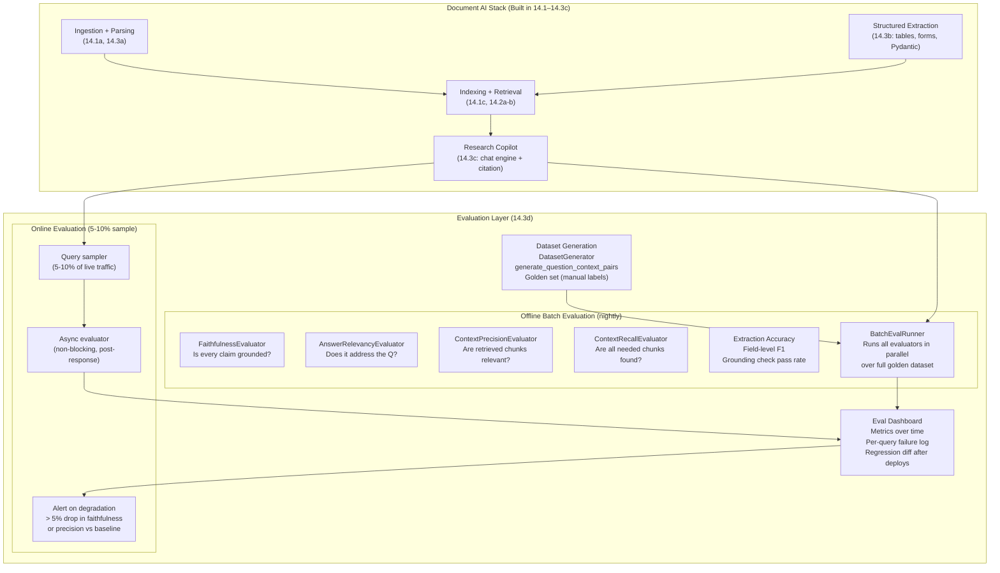

---

### 3. Real-World Industry Scenarios [Intermediate]

#### Scenario A: Pharma Research Copilot — Faithfulness at Scale

**Context:** The pharma research copilot from 14.3.c processes 200 queries/day. The regulatory affairs team trusts the answers for early research but always double-checks before submission. The team wants to reduce double-checks by 80% — but only if the system can prove its faithfulness score is > 0.95 on a held-out validation set of 100 known Q&A pairs.

**How evaluation fits in:**

- **Golden dataset:** Regulatory scientists labeled 100 query-answer pairs over 3 days: each query, the correct answer, and which specific source document + section contains the supporting evidence.
- **Offline batch eval (nightly):** `BatchEvalRunner` runs `FaithfulnessEvaluator` + `AnswerRelevancyEvaluator` + `ContextPrecisionEvaluator` on all 100 pairs each night. Any deployment that causes faithfulness < 0.95 is flagged and rolled back automatically.
- **Citation precision check:** For each cited source, extract the cited text from the source document and verify the LLM's claim appears in it. Custom check (not a standard LlamaIndex evaluator): compares the response claim with the source chunk's text.
- **What the scores mean in practice:**
  - `faithfulness = 1.0` — every claim in the response is directly supported by a retrieved chunk. Confidence = high. Skip manual verification.
  - `faithfulness = 0.7–0.9` — some claims are inferred beyond what the sources directly state. Flag for scientist review.
  - `faithfulness < 0.7` — significant hallucination risk. Block response from being shown; return *"I couldn't find a reliable answer in the corpus — please search manually."*
- **What "good" looks like:** Faithfulness stabilises at 0.97 across 200 daily queries. Scientists reduce manual verification from 100% to 15% (only low-faithfulness responses). Regulatory submission accuracy is unchanged. Copilot trust score (internal survey) rises from 3.1/5 to 4.6/5.

---

#### Scenario B: Legal Contract Navigator — Extraction Accuracy

**Context:** The legal contract navigator (14.3.c) has structured extraction of indemnification terms powering a covenant breach alert system. An incorrect extraction (wrong liability cap value) could trigger a false alert, causing a portfolio company to unnecessarily renegotiate terms. The legal team needs automated extraction accuracy reporting.

**How evaluation fits in:**

- **Extraction golden set:** 200 contracts manually labeled by paralegals: `{contract_id, field, expected_value, source_page, source_section}` for 12 key fields (liability_cap, governing_law, termination_notice_days, etc.).
- **Field-level F1 per field type:**
  - Numeric fields (liability_cap): exact match or within 5% tolerance (handles `$500K` vs `$500,000`).
  - Text fields (governing_law): normalised string match (`"New York"` == `"state of New York"`).
  - Boolean fields (unlimited_liability): strict exact match.
- **Grounding check pass rate:** For every numeric extraction, run the grounding check from 14.3.b: does the extracted value appear in the source text? Target: > 98% pass rate.
- **Pydantic schema validation rate:** % of extractions that pass Pydantic schema validation without errors. A validation error means the LLM returned a type that doesn't match the schema (e.g., a string where a float is required). Target: 100% (function calling guarantees this with GPT-4o; JSON mode may have < 1% failures with weaker models).
- **What "good" looks like:** Field-level F1 > 0.95 for numeric fields, > 0.92 for text fields. Grounding check pass rate 99.2%. False alert rate for covenant breach monitoring drops to < 0.5% (from 8% with unvalidated extractions).

---

#### Scenario C: Enterprise KB Copilot — Regression Testing After Model Upgrades

**Context:** The engineering KB copilot (14.3.c) runs on GPT-4o. The team wants to upgrade to a new model version but needs to verify the upgrade doesn't degrade answer quality. They have 3 months of production query logs with post-hoc satisfaction ratings (thumbs up/down from engineers). They use this as a proxy evaluation dataset.

**How evaluation fits in:**

- **Synthetic dataset augmentation:** `DatasetGenerator.from_documents(docs, num_questions_per_chunk=3)` generates an additional 500 Q&A pairs from the KB content, expanding the evaluation set beyond the 300 logged queries.
- **Before/after regression:** Run `BatchEvalRunner` with `FaithfulnessEvaluator` + `AnswerRelevancyEvaluator` on the full 800-query dataset using both the old model (GPT-4o baseline) and the new model. Compare metric distributions.
- **Statistical significance:** With n=800, a 0.02 drop in faithfulness (0.94 → 0.92) is statistically significant (p < 0.01, two-sample t-test on binary passing/failing). The team uses this as the decision criterion for the upgrade.
- **Retrieval eval separation:** The same golden dataset runs against the retriever layer independently — with `ContextPrecisionEvaluator` and `ContextRecallEvaluator` — to separate *retrieval failures* from *synthesis failures*. If context precision drops 3% after a model upgrade but faithfulness doesn't change, the model change is fine but the embedding model rerank might need attention.
- **What "good" looks like:** The new model shows +1.5% faithfulness, +0.8% answer relevancy, no regression in context precision. Upgrade approved in 2 days instead of the previous 2-week manual review cycle.

---

### 4. System View (Think Like a Systems Engineer) [Intermediate]

**The two evaluation loops in production:**

```
LOOP 1: OFFLINE BATCH EVALUATION (runs nightly or on every deploy)
  Input:  golden_dataset = List[{query, expected_answer, source_doc_ids}]
  Step 1: For each (query, expected_answer) in golden_dataset:
            response = copilot.query(query)
            source_nodes = response.source_nodes
  Step 2: Run BatchEvalRunner(
            queries=[...], responses=[...], contexts=[source_nodes_per_query],
            evaluators=[
                FaithfulnessEvaluator(),      # is response grounded?
                AnswerRelevancyEvaluator(),    # does it address the question?
                ContextPrecisionEvaluator(),   # are retrieved chunks relevant?
                ContextRecallEvaluator(),      # are all needed chunks found?
            ]
          )
  Step 3: Aggregate: mean_faithfulness, mean_relevancy, mean_precision, mean_recall
  Step 4: Compare against baseline (previous deploy's scores)
          If any metric drops > threshold → alert + block deploy
  Output: EvalReport{metrics, per_query_failures, regression_diff}

LOOP 2: ONLINE EVALUATION (async, 5-10% of live queries)
  Input:  production_query, production_response, production_source_nodes
  Step 1: Sample 1 in 10 production turns
  Step 2: Async task: FaithfulnessEvaluator.aevaluate(query, response, contexts)
  Step 3: Write result to metrics store
  Step 4: Rolling 24h alert:
          if rolling_faithfulness_24h < baseline_faithfulness - 0.05:
              alert(channel="slack", severity="high")
  Output: {timestamp, query_hash, faithfulness_score, passing}
          (no PII stored — query hash only)
```

**Observability — what to log per evaluation run:**

| Signal | What to capture | Alert threshold |
|--------|----------------|-----------------|
| `mean_faithfulness` | Avg faithfulness score over golden set | < 0.90 → investigate; < 0.85 → block deploy |
| `mean_answer_relevancy` | Avg answer relevancy over golden set | < 0.85 → check synthesis prompt |
| `mean_context_precision` | Avg precision of retrieved chunks | < 0.70 → retriever noise; check `top_k` or reranker |
| `mean_context_recall` | Avg recall of retrieved chunks | < 0.70 → missing chunks; check chunking strategy |
| `faithfulness_p10` | 10th-percentile score (worst responses) | < 0.50 → tail failures; inspect low-scoring queries |
| `extraction_field_f1` | Per-field F1 for structured extraction | < 0.90 → fix extraction prompt or add few-shot examples |
| `grounding_check_pass_rate` | % of numeric extractions that pass grounding | < 0.98 → hallucination risk; add grounding examples |

**Failure points:**

1. **Evaluator uses the same LLM as the system under test** — Using GPT-4o to both generate responses and evaluate them creates a self-grading bias: GPT-4o tends to rate GPT-4o responses as highly faithful even when they're not. This is the most common evaluation mistake.
   - *How it shows up:* Faithfulness scores are uniformly high (0.95+) but users still report wrong answers. The eval is not catching failures because the judge LLM shares the same biases as the generating LLM.
   - *Fix:* Use a different (and ideally stronger) LLM as the judge — e.g., use `claude-3-5-sonnet` as judge when the system runs on `gpt-4o`, or use a specialised smaller model fine-tuned as a faithfulness judge.

2. **Golden dataset not representative of production queries** — The golden set was created by the team using "obvious" queries. Production users ask edge cases, ambiguous questions, and queries that span multiple documents in ways the eval set doesn't cover.
   - *How it shows up:* Offline eval shows 0.97 faithfulness. But online eval shows 0.81 faithfulness on sampled production queries. The golden set is too easy.
   - *Fix:* Generate diverse synthetic queries using `DatasetGenerator` (adversarial prompts, multi-hop questions, time-bounded questions). Augment with real production queries that received low satisfaction ratings. Continuously update the golden set as new edge cases emerge.

3. **Context recall can't be computed without a reference answer** — `ContextRecallEvaluator` requires a ground-truth answer to compare against. Teams skip it because building a ground-truth answer set requires manual labeling effort.
   - *How it shows up:* Retrieval failures (missing the right chunks) are invisible. The system looks like it's working well on faithfulness and relevancy, but it's answering the wrong question because critical chunks were not retrieved.
   - *Fix:* For the top-20 most common query types, manually write reference answers (30–60 minutes of work). Use `DatasetGenerator` for the rest. Even a 50-query ground-truth set for context recall reveals whether the retriever is missing key information.

---

### 5. System Design Flavor [Intermediate]

**End-to-end evaluation pipeline:**

```python
# eval_pipeline.py — offline batch evaluation
# pip install llama-index-core llama-index-llms-openai

from llama_index.core.evaluation import (
    FaithfulnessEvaluator,
    RelevancyEvaluator,
    BatchEvalRunner,
    DatasetGenerator,
    generate_question_context_pairs,
)
from llama_index.core.evaluation import EvaluationResult
import asyncio, json

# 1. Evaluators — use a DIFFERENT model as judge
from llama_index.llms.openai import OpenAI
judge_llm = OpenAI(model="gpt-4o", temperature=0)

faithfulness_evaluator = FaithfulnessEvaluator(llm=judge_llm)
relevancy_evaluator    = RelevancyEvaluator(llm=judge_llm)

# 2. Run batch evaluation over a golden dataset
runner = BatchEvalRunner(
    evaluators={"faithfulness": faithfulness_evaluator,
                "relevancy":    relevancy_evaluator},
    workers=8,   # parallel eval calls
)

# golden_queries, golden_responses, golden_contexts come from your golden set
# eval_results: dict[metric_name, List[EvaluationResult]]
eval_results = asyncio.run(runner.aevaluate_responses(
    queries=golden_queries,
    responses=golden_responses,
    contexts=golden_contexts,
))

# 3. Aggregate
for metric, results in eval_results.items():
    scores = [r.score for r in results if r.score is not None]
    passing = [r.passing for r in results]
    print(f"{metric}: mean={sum(scores)/len(scores):.3f}, "
          f"pass_rate={sum(passing)/len(passing):.1%}, n={len(results)}")
```

**Key tradeoffs:**

| Tradeoff | The tension | Guidance |
|----------|------------|---------|
| **LLM-as-judge vs deterministic checks** | LLM judges are flexible but expensive and biased; deterministic checks (grounding, schema validation, string match) are cheap and objective | Use deterministic checks for structured extraction (exact-match, grounding). Use LLM judges for open-ended synthesis faithfulness. Never use only one; use both |
| **Offline eval vs online eval** | Offline is thorough and uses a golden set; online is representative of real traffic but has no ground truth | Offline eval catches regressions before deploy. Online eval catches drift in real-world usage. Both are mandatory in production |
| **Large golden set vs small curated set** | More queries = more statistical power; but large sets are expensive to label | 100-500 manually curated high-quality pairs beats 5,000 auto-generated mediocre pairs. Quality of golden set > quantity |

**Scaling (10x query volume):**
At 10x traffic, online eval (5–10% sampling) scales linearly — just run evaluators faster via async batch. Offline eval: shard the golden set across workers (`BatchEvalRunner(workers=16)`). For extraction accuracy, run field-level F1 as a deterministic pipeline (no LLM calls needed for exact-match fields) — scales to millions of documents without LLM costs.

---

### 6. Common Mistakes + Debugging [Beginner → Intermediate]

#### Mistake 1: Using the Same LLM as Both Generator and Evaluator

**Symptom:** Faithfulness scores are consistently 0.95+ across all queries, but domain experts find wrong answers when they spot-check. The eval appears to be passing everything.

**Likely cause:** The same model (GPT-4o) is generating the responses and evaluating them. GPT-4o has a self-consistency bias — it tends to evaluate its own reasoning as sound even when it has hallucinated.

**First debugging step:**
```python
# Check: re-evaluate a known-bad response with a different judge model

# A response you know is hallucinated (ground truth says "4.0x" but response says "3.5x")
bad_response = "The Debt-to-EBITDA covenant threshold is 3.5x, tested quarterly."
source_nodes_text = "The Borrower shall maintain a Debt-to-EBITDA ratio of no more than 4.0x."

from llama_index.core.evaluation import FaithfulnessEvaluator
from llama_index.core.schema import TextNode, NodeWithScore

source_node = NodeWithScore(node=TextNode(text=source_nodes_text), score=0.9)

# Evaluate with SAME model as generator
same_model_judge = FaithfulnessEvaluator(llm=OpenAI(model="gpt-4o"))
result_same = same_model_judge.evaluate(
    query="What is the Debt-to-EBITDA covenant threshold?",
    response=bad_response,
    contexts=[source_nodes_text],
)
print(f"Same-model judge: passing={result_same.passing}, score={result_same.score}")
# Likely: passing=True, score=0.9 (wrong — it SHOULD fail)

# Evaluate with DIFFERENT model as judge
diff_model_judge = FaithfulnessEvaluator(llm=OpenAI(model="gpt-4-turbo"))  # or Claude
result_diff = diff_model_judge.evaluate(
    query="What is the Debt-to-EBITDA covenant threshold?",
    response=bad_response,
    contexts=[source_nodes_text],
)
print(f"Diff-model judge: passing={result_diff.passing}, score={result_diff.score}")
# Expected: passing=False (3.5x is NOT in the source — 4.0x is)
# If this ALSO passes: add an explicit prompt instruction:
# "If the response value does not appear in the context, mark as not faithful."
```

---

#### Mistake 2: Evaluating Only Faithfulness and Missing Retrieval Failures

**Symptom:** Faithfulness is 0.97. Answer relevancy is 0.93. Users are still complaining about wrong answers. The system appears excellent on eval.

**Likely cause:** You're only evaluating faithfulness (is the response grounded in retrieved context?) and answer relevancy (does the response address the question?). But if the retrieved context was the wrong context, the response can be perfectly faithful to wrong information. Retrieval failures are invisible to faithfulness evaluation.

**First debugging step:**
```python
# Diagnose: measure context precision separately from faithfulness
from llama_index.core.evaluation import ContextPrecisionEvaluator, ContextRecallEvaluator

precision_evaluator = ContextPrecisionEvaluator(llm=judge_llm)

# Example: query about SaaS agreements, but retriever returned MSA chunks
query = "What is the liability cap in the SaaS agreements signed in 2023?"
response_text = "The aggregate liability cap is USD 500,000."  # from MSA, not SaaS
retrieved_chunks = [
    "Article 9. GlobalCorp liability cap: USD 500,000. Effective June 15, 2022."  # MSA!
]
# Faithfulness check: response is supported by context → passing=True
# But the retrieved context is WRONG (MSA, not SaaS, not 2023)

precision_result = precision_evaluator.evaluate(
    query=query,
    contexts=retrieved_chunks,
)
print(f"Context precision: {precision_result.score:.2f}")
# Should be low — the MSA chunk is NOT a relevant context for a SaaS 2023 query
# This exposes the retrieval failure that faithfulness missed

# Fix: add metadata filters in the retriever:
# MetadataFilters([ExactMatchFilter("contract_type", "SaaS"),
#                  ExactMatchFilter("year", 2023)])
```

---

#### Mistake 3: No Online Evaluation — Only Offline Golden Set

**Symptom:** Offline eval on the 100-query golden set shows 0.96 faithfulness consistently. After 2 months, users start complaining that the copilot gives outdated information after the corpus was refreshed with 500 new documents.

**Likely cause:** The golden set was built before the corpus refresh. The new documents have a different writing style, different terminology, or different document structure. The old golden set doesn't cover the new failure modes. Offline eval keeps passing because the golden queries don't exercise the new documents.

**First debugging step:**
```python
# Implement minimal online eval: sample 10% of live queries and log faithfulness

import random
import asyncio

async def evaluate_live_query(query: str, response_text: str, source_nodes):
    """Non-blocking faithfulness check on 10% of live queries."""
    if random.random() > 0.10:
        return  # skip 90%

    contexts = [n.node.text for n in source_nodes]
    result = await faithfulness_evaluator.aevaluate(
        query=query,
        response=response_text,
        contexts=contexts,
    )
    # Write to metrics store (replace with your actual metrics sink)
    metrics = {
        "timestamp": __import__("time").time(),
        "query_hash": hash(query) % 10**8,  # no PII
        "faithfulness_score": result.score,
        "passing": result.passing,
    }
    # In production: write to your metrics DB or monitoring system
    print(f"Online eval: {metrics}")

    # Alert if rolling 100-query avg drops below baseline
    # (implement with a sliding window in your metrics store)
```

---

### 7. Hands-On Lab [Pro]

#### Build — Multi-Layer Eval Pipeline with Synthetic Dataset

```python
# eval_lab.py
# pip install llama-index-core

import json
import asyncio
from llama_index.core import VectorStoreIndex, Document
from llama_index.core.schema import TextNode, NodeWithScore
from llama_index.core.evaluation import (
    FaithfulnessEvaluator,
    RelevancyEvaluator,
    BatchEvalRunner,
)
from llama_index.core.llms import MockLLM
from llama_index.core.embeddings import MockEmbedding
from llama_index.core import Settings

# Use MockLLM for offline lab (no API key)
Settings.llm = MockLLM(max_tokens=512)
Settings.embed_model = MockEmbedding(embed_dim=1536)

# ─────────────────────────────────────────────────────────────────────────────
# PART 1: Synthetic Eval Dataset Generation (simulate DatasetGenerator output)
# ─────────────────────────────────────────────────────────────────────────────

# In production:
#   dataset_generator = DatasetGenerator.from_documents(docs, llm=judge_llm,
#                                                        num_questions_per_chunk=3)
#   eval_dataset = dataset_generator.generate_dataset_from_nodes()
#   queries = eval_dataset.queries       # dict: id -> query_text
#   relevant_docs = eval_dataset.relevant_docs  # dict: id -> [doc_id, ...]

# Simulate 5 Q&A pairs from our contract corpus (14.3b / 14.3c)
GOLDEN_DATASET = [
    {
        "query":    "What is the indemnification cap in the Acme SaaS agreement?",
        "expected": "The cap is the fees paid in the 12 months preceding the claim.",
        "context":  (
            "Section 12. Indemnification. Each party shall indemnify and hold harmless "
            "the other party from any third-party claims. Indemnification is capped at "
            "the fees paid in the 12 months preceding the claim. Effective: March 2023."
        ),
    },
    {
        "query":    "What is GlobalCorp's aggregate liability limit?",
        "expected": "USD 500,000.",
        "context":  (
            "Article 9. Mutual Indemnification. GlobalCorp liability cap: USD 500,000. "
            "Effective date: June 15, 2022."
        ),
    },
    {
        "query":    "Does TechStart have any uncapped liability provisions?",
        "expected": "Yes — liability is uncapped for IP indemnification only.",
        "context":  (
            "Section 8. Liability is uncapped for IP indemnification obligations only; "
            "all other liability capped at fees paid in prior 6 months. Jan 2024."
        ),
    },
    # Intentionally wrong response for testing (faithfulness should FAIL)
    {
        "query":    "What governing law applies to the Acme SaaS agreement?",
        "expected": "California.",   # not stated in source — expected to fail faithfulness
        "context":  (
            "Section 12. Indemnification. Each party shall indemnify and hold harmless "
            "the other party. Effective: March 1, 2023."  # no governing law in context
        ),
    },
    {
        "query":    "When was the MSA with GlobalCorp signed?",
        "expected": "June 15, 2022.",
        "context":  (
            "Article 9. Aggregate liability cap: USD 500,000. "
            "Effective date: June 15, 2022."
        ),
    },
]

# ─────────────────────────────────────────────────────────────────────────────
# PART 2: Simulate system responses (in production: run real copilot)
# ─────────────────────────────────────────────────────────────────────────────

# Simulate responses — some faithful, some not
SIMULATED_RESPONSES = [
    "The indemnification cap is the fees paid in the 12 months preceding the claim.",  # faithful
    "GlobalCorp's aggregate liability limit is USD 500,000.",                            # faithful
    "Yes, TechStart has uncapped liability for IP indemnification obligations.",          # faithful
    "The Acme SaaS agreement is governed by California law.",   # HALLUCINATED (not in context)
    "The MSA with GlobalCorp was signed on June 15, 2022.",                              # faithful
]

# ─────────────────────────────────────────────────────────────────────────────
# PART 3: Run evaluators (using MockLLM for structure demo)
# In production: use judge_llm = OpenAI(model="gpt-4o") or Anthropic Claude
# ─────────────────────────────────────────────────────────────────────────────

faithfulness_eval = FaithfulnessEvaluator(llm=Settings.llm)
relevancy_eval    = RelevancyEvaluator(llm=Settings.llm)

print("=== Per-Query Evaluation ===")
results = []
for i, item in enumerate(GOLDEN_DATASET):
    query    = item["query"]
    response = SIMULATED_RESPONSES[i]
    context  = item["context"]

    f_result = faithfulness_eval.evaluate(
        query=query,
        response=response,
        contexts=[context],
    )
    r_result = relevancy_eval.evaluate(
        query=query,
        response=response,
        contexts=[context],
    )

    results.append({
        "query":       query[:60],
        "faithful":    f_result.passing,
        "f_score":     f_result.score,
        "relevant":    r_result.passing,
        "r_score":     r_result.score,
    })
    print(f"\n[{i+1}] {query[:60]!r}")
    print(f"     Response: {response[:80]!r}")
    print(f"     Faithful: {f_result.passing} (score={f_result.score}) | "
          f"Relevant: {r_result.passing} (score={r_result.score})")

# ─────────────────────────────────────────────────────────────────────────────
# PART 4: Aggregate metrics
# ─────────────────────────────────────────────────────────────────────────────

print("\n=== Aggregated Evaluation Report ===")
faithful_scores = [r["f_score"] for r in results if r["f_score"] is not None]
relevant_scores = [r["r_score"] for r in results if r["r_score"] is not None]
faithful_pass   = [r["faithful"] for r in results]
relevant_pass   = [r["relevant"] for r in results]

if faithful_scores:
    print(f"Faithfulness: mean={sum(faithful_scores)/len(faithful_scores):.3f}, "
          f"pass_rate={sum(faithful_pass)/len(faithful_pass):.1%}, n={len(results)}")
if relevant_scores:
    print(f"Relevancy:    mean={sum(relevant_scores)/len(relevant_scores):.3f}, "
          f"pass_rate={sum(relevant_pass)/len(relevant_pass):.1%}, n={len(results)}")

# Expected with MockLLM: all scores will be mocked (0.5 or similar)
# In production with real LLM: query 4 (California law) should FAIL faithfulness

# ─────────────────────────────────────────────────────────────────────────────
# PART 5: Extraction accuracy metrics (deterministic — no LLM needed)
# ─────────────────────────────────────────────────────────────────────────────

print("\n=== Structured Extraction Accuracy (Deterministic) ===")

# Golden set: expected values per contract and field
EXTRACTION_GOLDEN = [
    {"contract": "Acme_SaaS_2023",    "field": "liability_cap_type",  "expected": "12_months_fees"},
    {"contract": "GlobalCorp_MSA_22", "field": "liability_cap_usd",   "expected": 500000.0},
    {"contract": "TechStart_SaaS_24", "field": "ip_uncapped",         "expected": True},
    {"contract": "Acme_SaaS_2023",    "field": "effective_year",      "expected": 2023},
    {"contract": "GlobalCorp_MSA_22", "field": "effective_year",      "expected": 2022},
]

# Simulated extracted values (some correct, one wrong)
EXTRACTED_VALUES = [
    {"contract": "Acme_SaaS_2023",    "field": "liability_cap_type",  "extracted": "12_months_fees"},
    {"contract": "GlobalCorp_MSA_22", "field": "liability_cap_usd",   "extracted": 500000.0},
    {"contract": "TechStart_SaaS_24", "field": "ip_uncapped",         "extracted": False},  # WRONG
    {"contract": "Acme_SaaS_2023",    "field": "effective_year",      "extracted": 2023},
    {"contract": "GlobalCorp_MSA_22", "field": "effective_year",      "extracted": 2022},
]

correct = 0
total   = len(EXTRACTION_GOLDEN)

for golden, extracted in zip(EXTRACTION_GOLDEN, EXTRACTED_VALUES):
    match = golden["expected"] == extracted["extracted"]
    correct += int(match)
    status = "PASS" if match else "FAIL"
    print(f"  [{status}] {golden['contract']} | {golden['field']}: "
          f"expected={golden['expected']!r}, got={extracted['extracted']!r}")

field_f1 = correct / total
print(f"\nField-level accuracy: {correct}/{total} = {field_f1:.1%}")
if field_f1 < 0.90:
    print("ALERT: Field accuracy below 90% threshold — review extraction prompts.")
```

---

#### Break — Evaluating with Same Model as Generator

```python
# BREAK: use the same MockLLM for both generation and evaluation
# In production: use the same model for both → self-grading bias

# Simulate a hallucinated response + grading with same model
hallucinated_response = "The Acme SaaS agreement is governed by California law."
source_context = "Section 12. Indemnification. Effective: March 1, 2023."  # No governing law!

same_model_eval = FaithfulnessEvaluator(llm=Settings.llm)
result = same_model_eval.evaluate(
    query="What governing law applies to the Acme SaaS agreement?",
    response=hallucinated_response,
    contexts=[source_context],
)
print(f"\nSame-model eval on hallucinated response:")
print(f"  passing={result.passing}, score={result.score}")
print(f"  feedback={result.feedback!r}")
# With MockLLM: result is deterministic/mocked — not the real problem
# In production: same-model eval tends to grade its own hallucinations as faithful
# FIX: use a different LLM model as judge (see Mistake 1 debugging section)

# Demonstrate the deterministic grounding check instead:
def grounding_check(response: str, context: str) -> dict:
    """Deterministic check: does the response contain claims from the context?"""
    # Extract meaningful tokens from response (simple approximation)
    response_words = set(response.lower().split())
    context_words  = set(context.lower().split())
    # Key numeric/named entities that should appear in context if claimed
    import re
    numbers_in_response = set(re.findall(r'\b\d{4,}\b|\b\d+\.\d+\b|\b\d+%', response))
    numbers_in_context  = set(re.findall(r'\b\d{4,}\b|\b\d+\.\d+\b|\b\d+%', context))
    ungrounded_numbers = numbers_in_response - numbers_in_context
    return {
        "has_ungrounded_numbers": bool(ungrounded_numbers),
        "ungrounded_numbers": list(ungrounded_numbers),
        "deterministic_verdict": "FAIL" if ungrounded_numbers else "PASS (numeric)",
    }

result = grounding_check(hallucinated_response, source_context)
print(f"\nDeterministic grounding check on hallucinated response: {result}")
# For text-based hallucinations (no numbers): needs LLM judge
# For numeric hallucinations: deterministic check catches them reliably
```

---

#### Measure

```python
# Summary metrics dashboard (what you'd send to a monitoring system)
print("\n=== Evaluation Dashboard Summary ===")

summary = {
    "eval_run_id":        "run_2024_03_15_v1",
    "golden_set_size":    len(GOLDEN_DATASET),
    "faithfulness": {
        "mean":      sum(faithful_scores)/len(faithful_scores) if faithful_scores else None,
        "pass_rate": sum(faithful_pass)/len(faithful_pass),
        "threshold": 0.90,
        "status":    "PASS" if (sum(faithful_pass)/len(faithful_pass) >= 0.90) else "FAIL",
    },
    "extraction": {
        "field_f1":  field_f1,
        "threshold": 0.90,
        "status":    "PASS" if field_f1 >= 0.90 else "FAIL",
    },
}

print(json.dumps(summary, indent=2))

# Regression gate: compare against baseline
BASELINE = {"faithfulness_pass_rate": 0.95, "field_f1": 0.96}
print("\n=== Regression Check ===")
for metric, baseline_val in BASELINE.items():
    # Map metric names to current values
    current = {
        "faithfulness_pass_rate": sum(faithful_pass)/len(faithful_pass),
        "field_f1": field_f1,
    }.get(metric)
    delta = (current - baseline_val) if current is not None else None
    status = "OK" if (delta is not None and delta >= -0.05) else "REGRESSION"
    print(f"  {metric}: baseline={baseline_val:.3f}, current={current:.3f}, "
          f"delta={delta:+.3f} → {status}")
```

---

#### Explain — Why Evaluation Is the Most Neglected Layer in Production RAG

Evaluation is the last thing teams build and the first thing they need when something goes wrong. The failure mode is predictable: teams launch a RAG system, it works on their 20 hand-tested queries, and they call it "tested." Three months later, a stakeholder finds a hallucinated answer that made it into a report. The retrospective always finds the same root cause: no automated faithfulness checking, no golden set, no regression gate.

The key insight is that document AI systems fail in ways that don't produce exceptions or errors. A response that is confidently wrong looks identical to a response that is confidently right — same latency, same structure, same citation format. Only evaluation can distinguish them. The cost of building a 100-query golden set and `BatchEvalRunner` is 2–3 hours. The cost of not having it is measured in user trust, manual review overhead, and incident retrospectives.

The second insight is that evaluation must be *layered*: retrieval quality (context precision/recall) is independent of synthesis quality (faithfulness). A system with perfect faithfulness and poor context precision is correctly synthesising wrong information. You need both signals to know *where* the system is failing — in retrieval or in synthesis — so you can fix the right layer.

---

### 8. Active Recall (Spaced Repetition) [Beginner → Pro]

**Q1 [Beginner]:** Name the five evaluation dimensions for document AI systems and what each measures.

> **A:** (1) **Faithfulness** — is every claim in the response supported by the retrieved context? (2) **Answer relevancy** — does the response address the question asked? (3) **Context precision** — of all retrieved chunks, what fraction are actually relevant to the query? (4) **Context recall** — did retrieval capture all the information needed to answer? (requires a reference answer). (5) **Extraction accuracy** — for structured extraction, are the field values correct? (field-level F1, grounding check pass rate).

---

**Q2 [Beginner]:** Why should you NOT use the same LLM as both the system under test and the evaluator judge?

> **A:** The same model tends to rate its own outputs as correct — a self-grading bias. GPT-4o evaluating GPT-4o responses will grade hallucinations as faithful because the model's internal reasoning is consistent with its own output. Use a different model as judge (e.g., Claude as judge when system runs on GPT-4o), or use a fine-tuned faithfulness judge. The evaluation is only valuable if the judge can catch errors the generator makes.

---

**Q3 [Intermediate]:** A system has faithfulness 0.97 but users report wrong answers. What is the likely failure mode, and which metric would expose it?

> **A:** The likely failure mode is a retrieval failure — the system retrieved the wrong chunks and is faithfully synthesising wrong information. Faithfulness can be 1.0 while the response is completely wrong, if the retrieved context was wrong. **Context precision** (`ContextPrecisionEvaluator`) would expose this: if retrieved chunks are not relevant to the query, precision will be low even when faithfulness is high. Fix: add metadata filters, improve retriever quality (hybrid retrieval, reranking), and check that the embedding model handles domain-specific terminology.

---

**Q4 [Intermediate]:** What is `DatasetGenerator` used for, and why is it important when you have no labeled data?

> **A:** `DatasetGenerator.from_documents(docs, num_questions_per_chunk=3)` uses an LLM to automatically generate Q&A pairs from document chunks. This creates a synthetic evaluation dataset when no manual labels exist. It's important because: (1) manual labeling is expensive and time-consuming; (2) automated generation creates diverse query types the team might not have thought of; (3) it ensures the eval set covers the actual content of the corpus, not just the team's mental model of it. Caveat: synthetic datasets may be biased toward "easy" questions that the retriever handles well — augment with real production queries for coverage of edge cases.

---

**Q5 [Pro]:** Design a regression gate for a CI/CD pipeline. A new LLM version (gpt-4o-2025-04) is being tested to replace the current model (gpt-4o-2024-08). What metrics do you compare, what thresholds trigger a rollback, and how do you account for the fact that evaluation itself uses an LLM?

> **A:** **Metrics to compare:** faithfulness (mean score + pass rate), answer relevancy, context precision. Run all three over the same 200-query golden set with both model versions in the same day. **Thresholds:** block the upgrade if any metric drops > 3% (absolute) vs baseline. Example: if faithfulness was 0.95 on old model and drops to 0.91 on new model → block. A 3% threshold accounts for LLM judge variance while catching real regressions. **Accounting for judge LLM variance:** use a fixed judge model (e.g., Claude Sonnet) that is NOT changed during the test — the judge must be identical for both runs to ensure metric comparability. Run each query twice with the judge (temperature=0) and average the scores to reduce judge variance. Also run the deterministic extraction accuracy check (field-level F1) as a variance-free signal that doesn't depend on the judge LLM.

---

### 9. Practice

**Mini-exercise:** You have 50 queries in your golden set. `FaithfulnessEvaluator` takes 1.5 seconds per query. You want to run the eval in under 2 minutes. How do you achieve this?

> **Suggested answer:**
> Use `BatchEvalRunner` with `workers=N` for parallel async evaluation. 50 queries × 1.5s sequential = 75 seconds. With `workers=8`: 50/8 = 7 rounds × 1.5s = ~10.5 seconds (plus API overhead). In practice, with 8 workers and network latency: ~15–25 seconds total — well under 2 minutes. Set `workers` to your LLM provider's API concurrency limit (OpenAI allows up to 10 concurrent requests on standard tier; higher on paid tiers).

---

**Capstone system design question (Module 14 Checkpoint):**

Design the complete production system for a pharmaceutical regulatory research copilot — from document ingestion through to evaluation — covering:
1. Ingestion pipeline (document types, parsing, chunking)
2. Index topology (which index types for which content)
3. Query/research interface (chat engine, memory, citation)
4. Evaluation framework (offline + online, metrics, golden set, regression gate)
5. Cost estimate per document and per query
6. Failure mode handling (what happens when each layer fails)

This question integrates all of Module 14 (14.1–14.3d).

> **Answer outline:**
> 1. **Ingestion (14.1a/b/14.3a/b):**
>    - Document types: 10-K/10-Q filings, FDA submission PDFs (NDA/BLA), clinical study reports (CSRs), drug labels, REMS documents.
>    - Parsing strategy: two-tier — `pypdf` text-layer extraction first (fast, free); `LlamaParse` for clinical study reports with complex tables and multi-column layouts ($0.003/page).
>    - Chunking: `SentenceSplitter(chunk_size=512, chunk_overlap=50)` for narrative text; `SemanticSplitter` for abstract/methodology/results sections (variable-length semantic units); keep tables as single nodes regardless of size.
>    - Metadata enrichment: `{source, page, section_title, document_type, filing_date, drug_name, compound_id, element_type}` — all mandatory for downstream filtering.
>    - Structured extraction (14.3b): `pdfplumber` for efficacy/safety tables → Markdown nodes; Pydantic programs for adverse event summaries (structured narrative extraction).
>    - Cost: avg 50 pages/document, 60% LlamaParse: 0.4×$0/page + 0.6×$0.003×50 = $0.09/document.
> 2. **Index topology (14.1c/14.2a):**
>    - `clinical_index`: `VectorStoreIndex` over CSR text nodes (semantic search for efficacy, safety, statistical results).
>    - `label_index`: `VectorStoreIndex` over approved labels (indication language, dosing, contraindications).
>    - `rems_index`: `SummaryIndex` over REMS documents (full-scan; REMS docs are short, 10–30 pages; full context needed).
>    - `table_index`: Separate `VectorStoreIndex` for table nodes tagged `element_type: table` — routed to for numeric/structured queries.
>    - Retriever: `QueryFusionRetriever` (hybrid BM25 + vector, 60/40 weight) for clinical and label indices. Drug names and compound IDs are exact-match terms that BM25 handles better than vector similarity.
> 3. **Query/research interface (14.2b/14.3c):**
>    - `CondensePlusContextChatEngine` for multi-turn research sessions (regulatory scientists ask follow-ups).
>    - `OpenAIAgent` with 4 tools (clinical, label, rems, table) for complex multi-index queries.
>    - `CitationQueryEngine` on all tools — every claim cites exact source document + page + section.
>    - Memory: `SimpleComposableMemory` (buffer + vector). Sessions stored in Redis with 4h TTL.
>    - Streaming enabled to reduce perceived latency.
> 4. **Evaluation (14.3d):**
>    - Golden set: 150 queries manually labeled by regulatory scientists (3 days, ~50 queries/scientist).
>    - Offline eval (nightly): `BatchEvalRunner` with `FaithfulnessEvaluator` + `AnswerRelevancyEvaluator` + `ContextPrecisionEvaluator`. Judge: Claude Sonnet (different from system's GPT-4o). Regression gate: block deploy if faithfulness drops > 3%.
>    - Online eval: 10% sampling, async `FaithfulnessEvaluator`. Alert if rolling 24h faithfulness < 0.90.
>    - Extraction accuracy: daily deterministic F1 run on 200-contract extraction golden set. Grounding check pass rate target > 98%.
> 5. **Cost estimate:**
>    - Per document ingestion: $0.09 (parsing) + $0.01 (embedding ~50 chunks × $0.0002) = $0.10/document.
>    - Per query: 3 tool calls × $0.03 + synthesis $0.02 = $0.11. Offline eval: 150 queries × 4 evaluators × $0.004 = $2.40/night. Online eval: 200 queries/day × 10% × $0.008 = $0.16/day.
> 6. **Failure mode handling:**
>    - LlamaParse rate limit: fallback to `pypdf` + flag for manual review; maintain `parsing_degraded=True` in document metadata.
>    - Retrieval scores < 0.5: return *"I couldn't find a reliable answer in the submitted corpus"* — do not hallucinate.
>    - Faithfulness < 0.70 (live): flag response, add disclaimer, route to human-in-the-loop review queue.
>    - Extraction grounding check fail: set `confidence="low"`, add to review queue, do NOT auto-publish.
>    - LLM outage: graceful degradation — return cached responses for exact-match known queries; surface degraded-mode message to users.

---

### 10. Production Reality Check (Mandatory)

**If this fails in prod, what's the first thing we inspect?**

> **Separate the retrieval eval signal from the synthesis eval signal.**
>
> When a production research copilot starts returning wrong answers, teams almost always look at the wrong layer first — they tweak the synthesis prompt when the real problem is retrieval. The fastest way to isolate the failure is to log context precision alongside faithfulness on every sampled query:
>
> ```python
> # Minimal two-signal production probe
> # Run async on 10% of live queries
>
> async def triage_failure(query: str, response: str, source_nodes) -> dict:
>     """Run faithfulness + context precision in parallel to isolate failure layer."""
>     contexts = [n.node.text for n in source_nodes]
>     scores   = [n.score for n in source_nodes]
>
>     faith_task  = faithfulness_eval.aevaluate(query=query, response=response,
>                                                contexts=contexts)
>     rel_task    = relevancy_eval.aevaluate(query=query, response=response,
>                                             contexts=contexts)
>     faith_res, rel_res = await asyncio.gather(faith_task, rel_task)
>
>     # Triage logic
>     if not faith_res.passing and rel_res.passing:
>         layer = "SYNTHESIS: response is not grounded in retrieved context"
>         action = "Check synthesiser prompt; add grounding instruction"
>     elif not rel_res.passing:
>         layer = "RETRIEVAL: retrieved context is not relevant to the query"
>         action = "Check top_k, metadata filters, hybrid retrieval weights"
>     elif max(scores) < 0.5:
>         layer = "RETRIEVAL: low similarity scores — content may not be in index"
>         action = "Check if document was ingested; check embedding model coverage"
>     else:
>         layer = "PASSING: no failure detected"
>         action = "None"
>
>     return {"faithfulness": faith_res.score, "relevancy": rel_res.score,
>             "failure_layer": layer, "action": action,
>             "max_retrieval_score": max(scores)}
> ```
>
> **The production rule:** If `faithfulness < 0.85` and `relevancy > 0.80` → fix the synthesis layer. If `relevancy < 0.70` → fix the retrieval layer. If both are low → fix retrieval first (bad context makes synthesis unfixable). Never adjust the synthesis prompt to compensate for a retrieval problem — you will mask the symptom without fixing the root cause.

---

### 11. Curiosity Bridge (Mandatory)

You've now completed the full Module 14 stack: document ingestion and parsing, indexing and retrieval, query engines and workflows, research copilot interfaces, structured extraction, and automated evaluation. Every layer has its own failure modes, metrics, and debugging strategy.

The next question is: what if your system needs to do more than *answer questions over documents*? What if it needs to *take actions* — trigger a downstream process, call an external API, route work between specialised sub-agents, and recover gracefully when a sub-agent fails? Documents are one kind of input; the broader world of agentic systems requires a runtime that can handle multi-agent coordination, tool execution, state management, and production-grade observability across the whole agent graph.

That's **Module 15: ADK and OpenAI Agents SDK** — where you'll learn Google's Agent Development Kit and OpenAI's Agents SDK, the two production runtimes that take everything you know about LLM systems and add the scaffolding for real-world autonomous agent deployment.

---

### 12. Exit Check + Carry-Forward Review

**Exit check:** You're done with 14.3.d when you can name the five evaluation dimensions and explain why each measures a different failure mode, configure `BatchEvalRunner` with appropriate evaluators and a separate judge LLM, diagnose whether a wrong answer is a retrieval failure or a synthesis failure using the two-signal probe, design an offline + online eval pipeline with a regression gate, and explain why context recall requires a reference answer while faithfulness does not.

---

**Carry-Forward Review (interleaved recall from 14.3.c):**

*Q: A research copilot is deployed for legal contract review. After 3 weeks, associates report the copilot frequently forgets what was discussed earlier in the session. Sessions typically last 30–40 turns, each turn adding ~150 tokens to memory. The copilot uses `ChatMemoryBuffer(token_limit=2048)`. What is happening and what is the fix?*

> **A:** After approximately 13 turns (2048 / 150 = ~13.7), the buffer reaches its token limit and starts dropping the oldest turns. By turn 30, the first 17+ turns have been silently evicted. The condensation call in `CondensePlusContextChatEngine` only sees the most recent ~13 turns, so early-session context (e.g., *"focus only on SaaS agreements"*) is lost. **Fix:** replace `ChatMemoryBuffer` with `SimpleComposableMemory`: `SimpleComposableMemory.from_defaults(primary=ChatMemoryBuffer(token_limit=2048), secondary=VectorMemory(top_k=3))`. The `VectorMemory` stores all 40 turns as embeddings and retrieves the 3 most semantically relevant past turns on each new message — including early-session constraints — even after they've been evicted from the buffer.

---

## Module 14 Checkpoint

**You have completed Module 14: LlamaIndex and Data-Centric GenAI Systems (28h).**

Before moving to Module 15, verify you can answer all three checkpoint questions from the curriculum:

---

**Checkpoint Q1: Explain when LlamaIndex is the right fit compared with LangChain or LangGraph.**

> **When to choose LlamaIndex:**
> - Your primary challenge is *document understanding at scale*: you have large corpora of PDFs, Word docs, HTML, or structured files and need to index, retrieve, and synthesise from them.
> - You need *sophisticated retrieval*: hybrid retrieval (BM25 + vector), multi-index routing, reranking, and node-level metadata filtering.
> - You have *structured content*: tables, forms, financial statements that need extraction and structured querying alongside narrative text.
> - You need *production-grade document AI*: ingestion pipelines with caching, multi-document synthesis, citation-grounded research copilots.
> - You want *native evaluation*: `FaithfulnessEvaluator`, `BatchEvalRunner`, `DatasetGenerator` are first-class LlamaIndex features.
>
> **When LangChain is a better fit:**
> - You need a wide ecosystem of integrations (100+ LLMs, vector stores, tools).
> - Your system is primarily prompt chains and simple tool calling, not document-heavy retrieval.
> - You want the largest community and most third-party tutorials.
>
> **When LangGraph is a better fit:**
> - You need explicit *graph-based multi-agent orchestration* with state machines, checkpointing, and human-in-the-loop.
> - Your workflow has complex branching, conditional routing, or parallel agent lanes.
> - You need production-grade agent state persistence across sessions.
>
> **Key distinction:** LlamaIndex excels at the *data layer* (ingestion → indexing → retrieval → synthesis). LangGraph excels at the *control layer* (routing → state → orchestration → recovery). In a sophisticated production system, you often use both: LlamaIndex for the data plane, LangGraph (or ADK) for the orchestration plane.

---

**Checkpoint Q2: Describe document-heavy system design using ingestion and indexing vocabulary.**

> A document-heavy system is designed around five layers:
> 1. **Ingestion:** Parse documents to extract content and preserve structure (`SimpleDirectoryReader`, `LlamaParse`, `UnstructuredReader`). Apply a two-tier strategy: cheap text-layer extraction for standard PDFs, layout-aware parsing for complex layouts and scanned documents. Output: `Document` objects with full text + structure metadata.
> 2. **Node construction:** Chunk `Document` objects into `TextNode` objects using structure-aware chunking (`SentenceSplitter` with `chunk_size` tuned to the content type; `SemanticSplitter` for variable-length sections; protect tables from mid-row splits). Enrich with metadata: `{source, page, section_title, element_type, document_type}`.
> 3. **Indexing:** Route nodes to appropriate indices by content type: `VectorStoreIndex` for semantic search over narrative text; `SummaryIndex` for short document sets needing full-context synthesis; separate table/structured nodes into a dedicated sub-index with `MetadataFilters` for element-type routing.
> 4. **Retrieval:** Use `QueryFusionRetriever` (hybrid BM25 + vector) for corpora with domain-specific terminology. Add a reranker (`SentenceTransformerRerank`) to improve precision. Route across multiple indices with `RouterQueryEngine` or `SubQuestionQueryEngine` for multi-document synthesis.
> 5. **Synthesis:** `CitationQueryEngine` for attribution. `CondensePlusContextChatEngine` for multi-turn research copilots. `ResponseSynthesizer` mode: `"tree_summarize"` for long multi-document synthesis, `"compact"` for single-document Q&A.

---

**Checkpoint Q3: Reason about structured extraction as more than plain text retrieval.**

> Plain text retrieval treats every document as a bag of tokens and returns the chunks with highest semantic similarity to the query. This works well for narrative questions (*"What is the efficacy of Drug A?"*) but fails for *structured* questions (*"Which drugs had efficacy > 80%?"*) because:
> - The answer depends on a numeric comparison across multiple table rows, not a single semantically similar chunk.
> - The meaning of a cell value (`82.3`) depends on its column header (`Efficacy (%)`), which may be in a different node or not retrieved at all.
> - A merged cell's group membership (`Phase II`) may be empty in most rows unless forward-filled after extraction.
>
> Structured extraction recognises three distinct content types: tables (extracted as column-header-preserving Markdown/DataFrame nodes), forms (extracted as key-value JSON nodes via AcroForm fields or proximity detection), and structured narratives (extracted via Pydantic programs with LLM-guided schema filling and grounding checks). Each type requires a different tool, a different node representation, and a different retrieval strategy.
>
> The payoff: structured nodes unlock *hybrid querying* — semantic search finds relevant tables by topic, and the LLM reads the full table structure from the node to answer numeric filter queries. A research copilot that only uses plain text RAG cannot answer *"drugs with efficacy > 80% AND adverse event rate < 5%"* — it lacks the column-header context. Structured extraction makes this query answerable.

## Module Glossary

| Term | Definition |
|------|-----------|
| **`SimpleDirectoryReader`** | LlamaIndex's built-in multi-format file loader; auto-detects file type and dispatches to the right parser; supports `filename_as_id` for deterministic dedup |
| **`BaseReader`** | Abstract base class for all LlamaIndex readers; requires one method: `load_data() → List[Document]` |
| **`Document`** | LlamaIndex's core ingestion unit; wraps raw text with `metadata` dict, `doc_id`, and metadata exclusion keys |
| **LlamaHub** | Community registry of 100+ pre-built LlamaIndex readers for external sources (Notion, Slack, GitHub, S3, databases, etc.) |
| **`IngestionPipeline`** | LlamaIndex v0.10+ abstraction chaining transformations (split, extract, embed) over Documents; supports dedup via docstore and caching |
| **`excluded_llm_metadata_keys`** | Document field listing metadata keys to omit from LLM prompt context |
| **`excluded_embed_metadata_keys`** | Document field listing metadata keys to omit from the text used for embedding |
| **`doc_id`** | Unique identifier for a Document; the deduplication key in docstore-backed pipelines; must be deterministic (hash-based) |
| **`TextNode`** | The chunk-level retrieval unit produced by a NodeParser; carries inherited metadata and NodeRelationship links |
| **Deterministic `doc_id`** | A `doc_id` derived from a stable content attribute so the same document gets the same ID across re-ingestion runs |
| **Dead-letter queue** | A holding queue for documents that failed to load/validate; enables retry without blocking the main pipeline |
| **Metadata schema drift** | Silent failure where an upstream API changes field names, making metadata keys `None` in newly ingested Documents |
| **`NodeParser`** | Base class for splitting strategies; takes `List[Document]` → `List[BaseNode]` |
| **`SentenceSplitter`** | Node parser splitting on sentence boundaries up to `chunk_size` tokens; most common general-purpose parser |
| **`TokenTextSplitter`** | Node parser splitting purely by token count; fast, deterministic, ignores semantic boundaries |
| **`SemanticSplitterNodeParser`** | Node parser using embedding similarity between adjacent sentences to find natural topic boundaries; variable-size coherent chunks |
| **`HierarchicalNodeParser`** | Node parser producing multi-level trees (e.g., 2048→512→128 tokens); enables small-to-big retrieval via `AutoMergingRetriever` |
| **`SentenceWindowNodeParser`** | Node parser producing 1-sentence nodes with ±k surrounding sentences in `metadata["window"]` |
| **`NodeRelationship`** | Enum linking a TextNode to SOURCE, PREVIOUS, NEXT, PARENT, and CHILDREN nodes |
| **`MetadataExtractor`** | Pipeline transformation calling an LLM to enrich node metadata (titles, summaries, keywords, hypothetical questions) |
| **`TitleExtractor`** | MetadataExtractor inferring section title from surrounding node context |
| **`SummaryExtractor`** | MetadataExtractor generating a 1-sentence LLM summary per node |
| **`KeywordExtractor`** | MetadataExtractor generating top-N keywords per node; improves sparse retrieval recall |
| **`QuestionsAnsweredExtractor`** | MetadataExtractor generating N hypothetical questions each node answers; HyDE-like effect for Q&A retrieval |
| **`chunk_size`** | Maximum token count per TextNode; primary lever for the precision-recall tradeoff |
| **`chunk_overlap`** | Tokens repeated at chunk boundaries; prevents context from being severed across adjacent nodes |
| **`AutoMergingRetriever`** | Retriever pairing with `HierarchicalNodeParser`; merges leaf nodes up to parent when enough siblings match the query |
| **`start_char_idx` / `end_char_idx`** | Char offsets locating a TextNode's text within its source Document; enables precise citation and UI highlighting |
| **Small-to-big retrieval** | Pattern using HierarchicalNodeParser: retrieve small nodes for precision, expand to parent for generation context |
| **`VectorStoreIndex`** | Primary LlamaIndex index; embeds nodes, stores vectors, retrieves via ANN top-k; default for point-lookup RAG |
| **`SummaryIndex`** | Reads every node at query time; best for summarization and full-corpus aggregation queries |
| **`KnowledgeGraphIndex`** | Extracts (subject, predicate, object) triples via LLM; best for multi-hop relational queries |
| **`as_retriever()`** | Index method returning a `BaseRetriever` (composable, returns `List[NodeWithScore]`) |
| **`as_query_engine()`** | Index method returning a `BaseQueryEngine` (end-to-end retrieve + synthesize → `Response`) |
| **`MetadataFilters`** | Hard pre-filters applied before ANN search; restrict candidates by exact metadata field values |
| **`RetrieverQueryEngine`** | QueryEngine subclass accepting explicit retriever + synthesizer + postprocessors; the primary composition entry point |
| **`RouterQueryEngine`** | Dispatches each query to the most appropriate `QueryEngineTool` via LLM or embedding selector |
| **Retrieval mode** | `VectorIndexRetriever` parameter: `default` (embedding similarity), `llm` (LLM-reranked), or `hybrid` (sparse + dense) |
| **`SimpleVectorStore`** | Default in-memory vector store; lost on restart; development and CI only |
| **`ChromaVectorStore`** | Persistent local vector store backed by ChromaDB; single-machine production |
| **`PineconeVectorStore`** | Managed cloud vector store with multi-tenant namespaces; high-QPS production |
| **`pgvector`** | PostgreSQL extension for vector similarity search; best when Postgres is already in the stack |
| **`SimpleDocumentStore`** | In-memory docstore keyed by `doc_id`; used for deduplication; persistable to JSON |
| **Incremental ingestion** | Re-processing only new or changed documents; scales cost with change rate, not corpus size |
| **Full re-ingestion** | Rebuilding the index from scratch; guarantees correctness after schema changes; expensive at scale |
| **Change-data capture (CDC)** | Pattern streaming row-level DB changes (Debezium → Kafka) for real-time incremental ingestion |
| **`IngestionCache`** | Caches transformation outputs by node content hash; avoids re-running LLM extraction on unchanged nodes |
| **Ghost node** | A TextNode remaining in the index for a source document that has since been deleted; causes stale confident answers |
| **Source freshness** | Metric tracking time since last successful ingestion per source; primary freshness SLA signal |
| **`index.delete_ref_doc()`** | Removes all nodes for a `doc_id` from vector store and optionally docstore; required for ghost-node cleanup |
| **`QueryEngine`** | End-to-end pipeline: query string → retriever → postprocessors → synthesizer → `Response` |
| **`ResponseSynthesizer`** | Component combining retrieved nodes + query via LLM to produce the final answer; controlled by `response_mode` |
| **`response_mode`** | Synthesis strategy: `compact`, `refine`, `tree_summarize`, `accumulate`, or `simple_summarize` |
| **`compact`** | Synthesis mode packing nodes into minimal LLM calls; O(n/ctx) calls; default; best for point-lookup Q&A |
| **`refine`** | Synthesis mode reading nodes sequentially, passing a growing answer to each call; O(n) calls; best for iterative multi-section analysis |
| **`tree_summarize`** | Synthesis mode building a bottom-up summarization tree; O(n log n) calls, parallelizable; best for large-corpus synthesis |
| **`accumulate`** | Synthesis mode calling LLM independently on each node and concatenating; O(n) calls; best for per-source granularity |
| **`simple_summarize`** | Synthesis mode truncating all nodes into 1 LLM call; O(1) call; only safe when all nodes fit in context |
| **`NodePostprocessor`** | Pipeline step transforming retrieved nodes before synthesis: filtering, reranking, or metadata replacement |
| **`SimilarityCutoffPostprocessor`** | Drops nodes below a similarity score threshold before synthesis; prevents low-quality evidence reaching the LLM |
| **`LLMRerank`** | Postprocessor calling an LLM to re-score and reorder retrieved nodes; improves precision at the cost of 1 extra LLM call |
| **`MetadataReplacementNodePostprocessor`** | Swaps node `.text` with a metadata field value (e.g., `window`); required for `SentenceWindowNodeParser` workflows |
| **`source_nodes`** | `List[NodeWithScore]` attached to every `Response`; the provenance trail enabling citations in production UIs |
| **Streaming response** | Query engine returns a generator (`response_gen`) yielding tokens as they arrive; reduces perceived latency for UIs |

---

| **`VectorIndexRetriever`** | Dense ANN retriever backed by the index's vector store; retrieves top-k nodes by cosine similarity between query embedding and node embeddings |
| **`BM25Retriever`** | Sparse keyword retriever using BM25 TF-IDF scoring; no embeddings required; exact-term match; must be rebuilt when nodes are added |
| **`QueryFusionRetriever`** | Combines multiple retrievers via Reciprocal Rank Fusion (RRF); supports query rewriting with `num_queries`; deduplicates by node_id |
| **Reciprocal Rank Fusion (RRF)** | Rank merging formula: `score(node) = Σ 1/(rank_i + 60)` across all retriever lists; scale-invariant — works regardless of raw score magnitudes from different retriever types |
| **`BaseRetriever`** | Abstract base class for all LlamaIndex retrievers; subclass and implement `_retrieve(query_bundle) → List[NodeWithScore]` to build custom retrievers |
| **Cross-encoder reranking** | A (query, passage) pair is jointly encoded by a separate ML model that outputs a relevance score; more accurate than cosine similarity but O(k) model calls per query |
| **`SentenceTransformerRerank`** | LlamaIndex postprocessor wrapping a cross-encoder model (e.g., `ms-marco-MiniLM`); applied after initial retrieval to re-score top-n nodes |
| **Query rewriting** | Generating N paraphrased variants of the original query via LLM; each variant retrieves independently; results merged by RRF; increases recall for terse/ambiguous queries |
| **Hybrid retrieval** | Combining dense (ANN) and sparse (BM25) retrievers; dense catches semantic similarity, sparse catches exact terminology; the two failure modes are complementary |
| **`sparse_hit_rate`** | Monitoring metric: % overlap between BM25 and dense retriever results; high overlap → BM25 adds little; low overlap → BM25 is complementary and valuable |
| **`Workflow`** | LlamaIndex's event-driven orchestration class; wraps `@step`-decorated functions and routes typed Events between them via an asyncio event broker |
| **`@step`** | Decorator marking a function as a workflow step; type hints on the signature declare which Event type(s) the step consumes and produces |
| **`StartEvent`** | Built-in workflow event that triggers the first step; passed as input to `workflow.run()` |
| **`StopEvent`** | Built-in workflow event that terminates the workflow; `StopEvent.result` becomes the return value of `workflow.run()` |
| **`Event`** | Pydantic-based base class for all custom workflow events; fields carry typed data between steps |
| **`Context` (workflow ctx)** | Per-run shared state object passed to every step; `await ctx.get("key")` / `await ctx.set("key", value)` for cross-step KV; `ctx.send_event()` for fan-out |
| **Fan-out** | A step emits multiple events of the same type (via `ctx.send_event()` in a loop) → multiple downstream step instances run concurrently |
| **Fan-in** | A step waits for N events of a given type using `ctx.collect_events(ev, [EventType]*N, wait_for=N)` before proceeding |
| **Fan-in deadlock** | When a `collect_events` step waits for N events but fewer than N are emitted (because one parallel branch crashed without emitting a typed error event); workflow hangs until timeout |
| **`IngestionPipeline`** | LlamaIndex's simpler linear workflow; a fixed sequence of `Transformation` objects applied to documents in order; no branching, events, or shared state |
| **`IngestionCache`** | Content-hash-based cache layer in `IngestionPipeline`; skips nodes whose text hash is already in the cache; must be cleared after embedding model upgrades |
| **Framework positioning** | The set of problems a framework is optimised to solve — not what it *can* do but where it has the deepest abstractions and most production validation |
| **LCEL (LangChain Expression Language)** | LangChain's composable pipe (`|`) operator for chaining `Runnable` objects; enables readable, streamable LLM call chains |
| **`RouterQueryEngine`** | LlamaIndex engine that routes a query to one of several sub-query-engines based on LLM classification or keyword matching; no first-class equivalent in LangChain |
| **`SubQuestionQueryEngine`** | LlamaIndex engine that decomposes a complex multi-part question into sub-questions, routes each to a separate query engine, and synthesizes a unified answer |
| **Data-centric RAG** | A RAG architecture where the primary engineering investment is in data quality, index structure, and retrieval precision; LlamaIndex's primary domain |
| **Agent-centric orchestration** | A GenAI architecture where the primary engineering investment is in agent decision-making, tool calling, and multi-step reasoning; LangChain/LangGraph's primary domain |
| **LlamaIndex + LangChain interop** | LlamaIndex query engines wrapped as LangChain `Tool` objects (using string-converting wrapper functions); the two frameworks compose at the callable interface boundary |
| **Context stuffing** | Sending the full document corpus in every LLM prompt instead of using retrieval; cost is O(N) per query where N is corpus size; infeasible beyond ~100K tokens |
| **Text layer** | Embedded Unicode text in a PDF or Word file; extractable directly without image processing; scanned PDFs do not have a text layer |
| **OCR (Optical Character Recognition)** | Converting a scanned document image into machine-readable text; adds latency (~1–5s/page) and cost; accuracy degrades on poor scan quality |
| **Layout-aware parsing** | Extracting text while preserving spatial relationships (table rows/columns, multi-column layout, heading hierarchy); required for tables and complex PDFs |
| **`LlamaParse`** | LlamaIndex's cloud-based advanced document parser; handles multi-column PDFs, embedded tables, formulas, and code blocks; API-based with a free tier |
| **`UnstructuredReader`** | Open-source document parser (unstructured.io) supporting 25+ file types; classifies elements as Title, NarrativeText, Table, ListItem, etc. |
| **Structure-aware chunking** | Splitting documents at natural semantic boundaries (section headings, paragraph breaks, table boundaries) rather than fixed character counts |
| **`ElementType`** | In `UnstructuredReader`, the category of each extracted element (Title, NarrativeText, Table, Image, ListItem, Header, Footer, PageBreak) |
| **Heading hierarchy** | The h1/h2/h3 or numbered section structure of a document; mapped to `NodeRelationship` parent-child links for hierarchical retrieval |
| **Document metadata enrichment** | Attaching structural metadata to nodes at parse time: page number, section title, heading level, doc title, author, element type |
| **Two-tier parsing strategy** | Running cheap text-layer extraction for all documents, then re-parsing complex/scanned documents with layout-aware parsers; reduces parsing cost 60–80% at scale |
| **`pdfplumber`** | Python library for precise PDF table extraction using bounding-box analysis; returns tables as lists of lists; handles most well-formed PDF tables reliably |
| **`camelot`** | PDF table extraction library with `lattice` (grid-line tables) and `stream` (whitespace-aligned tables) strategies; returns pandas DataFrames with per-table accuracy scores |
| **Pandas DataFrame node** | A `TextNode` whose text is a Markdown-serialised DataFrame (`df.to_markdown()`); metadata contains column names, row count, and table title; preserves column-header-to-value bindings |
| **`Pydantic program`** | LlamaIndex abstraction that uses an LLM to extract structured data matching a Pydantic schema from text; uses function calling or JSON mode; requires grounding check |
| **Key-value extraction** | Identifying field label–value pairs in forms and semi-structured documents; can be rule-based (regex), layout-based (bounding box proximity), or LLM-based |
| **Merged cell** | A table cell spanning multiple rows or columns; after extraction leaves empty strings in spanned rows; must be forward-filled (`df.ffill()`) before indexing |
| **Repeated table header** | A header row that appears on every page when a table spans multiple pages; must be detected and deduplicated — compare each row against the captured header before appending |
| **Table provenance metadata** | Metadata on every table node: source document, page number, table index, inferred table title, row count, column names, numeric column list |
| **Grounding check** | Post-extraction validation that a Pydantic-extracted numeric value appears literally (or in word form) in the source text; prevents LLM hallucination of plausible-sounding but wrong values |
| **AcroForm** | PDF's built-in interactive form standard; field values are programmatically accessible via `pypdf.get_fields()`; no OCR or LLM needed for typed fields; checkboxes return `/Yes` or `/Off` |
| **`ContextChatEngine`** | LlamaIndex chat engine that runs the retriever on every user message independently; does not condense conversation history; breaks when follow-up messages use pronouns or references to prior context |
| **`CondensePlusContextChatEngine`** | Chat engine that makes a cheap LLM condensation call to convert `history + current_message` into a standalone question before retrieval; the standard for multi-turn research copilots |
| **`SimpleChatEngine`** | Chat engine with no retrieval; pure LLM conversation; useful only for meta-questions and clarification, not for domain-specific knowledge retrieval |
| **`OpenAIAgent` (LlamaIndex)** | Agent built on OpenAI function calling that holds `QueryEngineTool` objects; decides which tool to call and when; best for unpredictable multi-index research queries |
| **`QueryEngineTool`** | Wraps any LlamaIndex query engine as a callable tool with a name and description string; agent selects tools based on semantic similarity between query and description |
| **`SubQuestionQueryEngine`** | Decomposes a complex multi-part question into sub-questions, routes each to the appropriate query engine in parallel, and synthesises all sub-answers; best for known multi-document comparison patterns |
| **`ChatMemoryBuffer`** | Token-bounded in-memory chat history; stores recent turns as `ChatMessage` objects; drops oldest turns when `token_limit` is exceeded; simplest memory for short-session copilots |
| **`VectorMemory`** | Stores conversation turns as vector embeddings; retrieves the `top_k` semantically relevant past turns on each new message; enables long-term topic recall across many turns |
| **`SimpleComposableMemory`** | Combines `ChatMemoryBuffer` (recent turns) + `VectorMemory` (semantic long-term); the production standard for research copilots with sessions > 20 turns |
| **`CitationQueryEngine`** | Wraps any query engine to annotate every claim in the response with a numbered citation `[n]` referencing the exact source node (document, page, section); mandatory for professional research copilots |
| **Tool description quality** | The precision and domain vocabulary in a `QueryEngineTool` description; directly determines agent routing accuracy; vague descriptions cause misrouting; specific descriptions with domain terms route correctly |
| **The "those" problem** | Conversational failure where a follow-up message uses a pronoun or reference ("those", "it", "that") that depends on prior context; `ContextChatEngine` cannot resolve it; `CondensePlusContextChatEngine` resolves it via condensation |
| **`FaithfulnessEvaluator`** | LlamaIndex evaluator that checks whether each claim in a response is supported by the provided source nodes; returns a 0–1 score; the primary automated guard against hallucination |
| **`RelevancyEvaluator`** | Checks whether the retrieved context is relevant to the query; detects retrieval noise (pulling irrelevant chunks that dilute or confuse the synthesiser) |
| **`AnswerRelevancyEvaluator`** | Checks whether the response addresses the question; a response can be faithful yet irrelevant (accurately quoting a clause but not answering the question asked) |
| **`ContextPrecisionEvaluator`** | Of all retrieved chunks, what fraction are actually relevant to the query? Low precision = retrieval noise diluting the context window |
| **`ContextRecallEvaluator`** | Did retrieval capture all the information needed to answer? Requires a reference answer; low recall = missing chunks, incomplete answers |
| **`BatchEvalRunner`** | LlamaIndex utility that runs multiple evaluators in parallel over a dataset of (query, response, source_nodes) triples; the standard tool for offline batch evaluation |
| **`DatasetGenerator`** | Generates synthetic evaluation Q&A pairs from a document corpus using an LLM; essential when no ground-truth evaluation dataset exists; use `num_questions_per_chunk=3` as a starting point |
| **`EvaluationResult`** | Output of every LlamaIndex evaluator: `passing` (bool), `score` (0–1), `feedback` (explanation), `query`, `response` |
| **RAGAS** | Open-source RAG evaluation framework; computes `faithfulness`, `answer_relevancy`, `context_precision`, `context_recall` as a unified suite; integrates with LlamaIndex |
| **Eval golden dataset** | A fixed set of (query, expected_answer, relevant_source_docs) triples used as ground truth; created by domain experts; used as regression baseline on every deploy |
| **Online evaluation** | Sampling 5–10% of live production queries and running evaluators asynchronously post-response; provides continuous quality signal on real-world traffic without human review |
| **Self-grading bias** | The tendency of an LLM to rate its own outputs as correct; happens when the same model is used for both generation and evaluation; mitigated by using a different or stronger judge model |
| **Two-signal triage** | Running faithfulness AND context relevancy together to isolate failure layer: if faithfulness fails but relevancy passes → synthesis bug; if relevancy fails → retrieval bug |
| **Regression gate** | A CI/CD check that blocks a new model or retriever deployment if any evaluation metric drops more than a defined threshold (e.g., 3%) vs the previous baseline |
