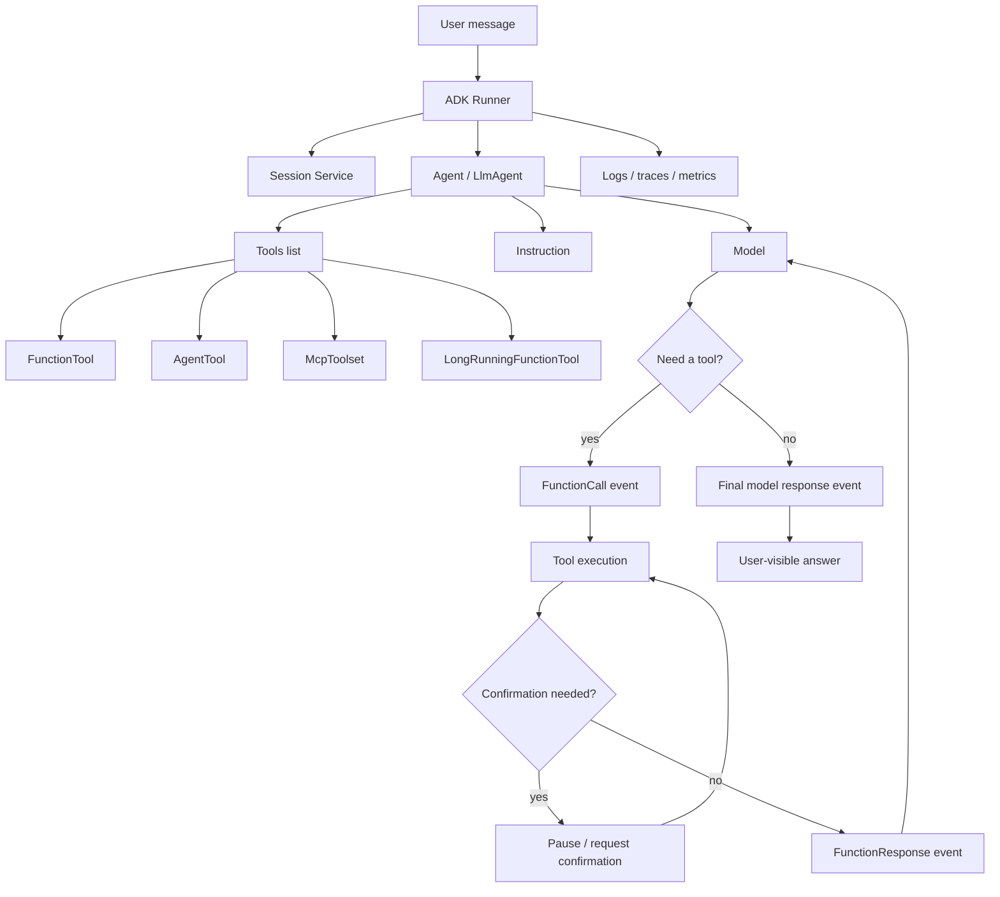
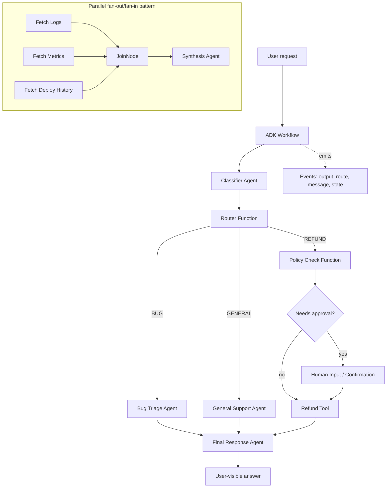
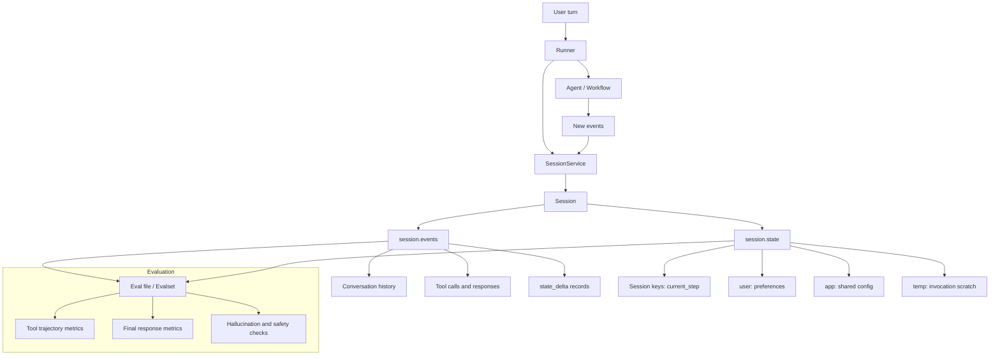
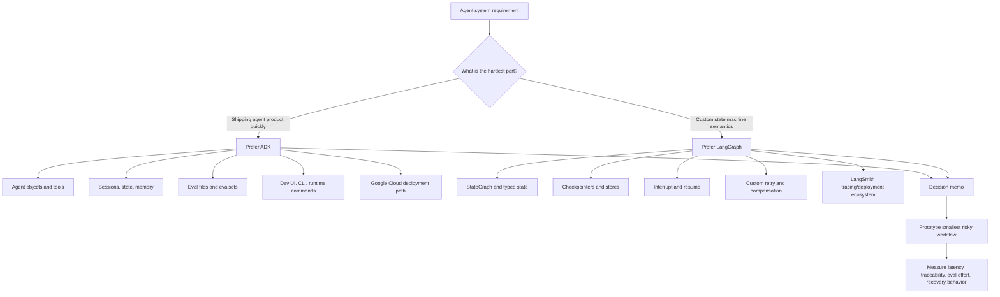

# Module 15 - ADK And OpenAI Agents SDK

> **Module time:** 30h  
> **Why this module matters:** These are important modern runtimes to understand after you already have strong fundamentals. ADK and OpenAI Agents SDK sit one layer above raw model APIs: they give you agent objects, tool wiring, runtime loops, sessions, guardrails, tracing, and deployment paths. The value of this module is not memorizing framework syntax; it is learning how to choose and operate an agent runtime in production.

---

## Quick Topic Index

| # | Subtopic | Status |
|---|----------|--------|
| **Topic 15.1** | **Google ADK graph and runtime model (10h)** | |
| 15.1.a | ADK agent model and tool patterns | ✅ Done |
| 15.1.b | Graph workflows and routing | ✅ Done |
| 15.1.c | Sessions, state, and evaluation concepts | ✅ Done |
| 15.1.d | When ADK is a better fit than LangGraph | ✅ Done |
| **Topic 15.2** | **OpenAI Agents SDK patterns (10h)** | |
| 15.2.a | Agent, runner, tools, and handoffs | 🔲 |
| 15.2.b | Guardrails and sessions | 🔲 |
| 15.2.c | MCP integration and sandbox agents | 🔲 |
| 15.2.d | Realtime and voice-oriented pathways | 🔲 |
| **Topic 15.3** | **Runtime comparison and selection (10h)** | |
| 15.3.a | LangGraph vs ADK vs OpenAI Agents SDK | 🔲 |
| 15.3.b | Lock-in, control, observability, and runtime tradeoffs | 🔲 |
| 15.3.c | Team skill fit and ecosystem maturity | 🔲 |
| 15.3.d | Building a framework-selection rubric | 🔲 |
| **CHECKPOINT** | **Module 15 checkpoint - runtime comparison memo** | 🔲 |

**Covered so far:**
- 15.1.a — ADK agent model and tool patterns: `Agent` / `LlmAgent` mental model, instruction + model + tools contract, FunctionTool schema generation, ToolContext, AgentTool, McpToolset, runtime event loop basics, tool design rules, confirmation patterns, production debugging signals
- 15.1.b — Graph workflows and routing: `Workflow` mental model, nodes and edges, `START` routes, sequential execution, conditional `Event.route` branching, `Event.output` data passing, parallel fan-out/fan-in with `JoinNode`, nested workflows, graph observability, graph routing vs `RoutedAgent`
- 15.1.c — Sessions, state, and evaluation concepts: `Session` and `SessionService` lifecycle, `events` vs `state`, state prefixes (`user:`, `app:`, `temp:`), persistent vs in-memory session storage, safe state updates through events/context, trace debugging, eval files/evalsets, trajectory metrics, response metrics, hallucination/safety checks, multi-turn evaluation
- 15.1.d — When ADK is a better fit than LangGraph: ADK-vs-LangGraph decision model, agent product runtime vs orchestration runtime, managed sessions/evals/deployment/observability tradeoffs, Google Cloud fit, team-skill fit, migration warning signs, production debugging checklist

---

## Topic 15.1: Google ADK Graph and Runtime Model

> **Topic time:** 10h  
> Focus: Understanding ADK as a production agent runtime: agent objects, tool execution, sessions, events, graph workflows, routing, evaluation, and when its managed runtime shape is a better fit than lower-level orchestration frameworks.

---

## Subtopic 15.1.a: ADK Agent Model and Tool Patterns

### ✅ Add to Knowledge Base

### Reading Path + Level Tags

- **Beginner:** Read sections 1-2 and Active Recall.
- **Intermediate:** Add sections 3-5 and the Hands-On Lab Build step.
- **Pro:** Complete the full Hands-On Lab (Build -> Break -> Measure -> Explain) plus the capstone practice question.

---

### 0. Pre-Question Hook [Beginner]

**Pause:** Before reading, imagine you are building a customer-support agent that can answer questions, look up orders, request refunds, and escalate risky cases to a human. What should be inside the agent object, and what should stay outside as tools, runtime services, or approval flows?

Think about that split for 30 seconds. Then read on.

---

### 1. The Intuition (Plain English) [Beginner]

**ADK** is Google's Agent Development Kit: a framework and runtime for building agents that can use models, instructions, tools, sessions, callbacks, artifacts, evaluation, and deployment surfaces. The simplest ADK agent is not mysterious. It is mostly this contract:

```text
model + instruction + tools -> runtime loop -> events + final answer
```

An ADK agent is like a trained service-desk employee sitting inside a controlled workstation. The employee has a role guide (instruction), a brain (model), approved applications (tools), an activity log (events/traces), and a supervisor workflow for risky actions (confirmation or human-in-the-loop). The agent does not directly become the database, payment system, or file system. It calls tools that expose those capabilities through clear contracts.

Where the analogy breaks down: a human employee has judgment and memory outside the explicit process. An ADK agent only has what the runtime gives it: prompt context, session state, tool responses, model behavior, and any external memory or artifacts you wire in.

**Key terms (first use):**

- **`Agent` / `LlmAgent`** — ADK's basic model-backed execution unit; it combines a model, instructions, optional tools, and metadata such as name/description.
- **Tool** — a callable capability exposed to the agent, usually backed by deterministic code, an API, another agent, or an MCP server.
- **`FunctionTool`** — ADK's wrapper around a normal function; ADK can infer a tool schema from the function name, type hints, parameters, defaults, return type, and docstring.
- **`ToolContext`** — runtime context available to tools for state, confirmations, auth-related flows, and per-invocation coordination.
- **`Runner`** — the runtime component that executes an agent against a session and streams/events back model outputs, tool calls, tool responses, and final messages.
- **Session** — a per-user or per-conversation continuity object that stores interaction history and state across turns.
- **Event** — an emitted runtime record such as a model message, function call, function response, state delta, artifact delta, or confirmation request.
- **`AgentTool`** — a pattern where one agent is wrapped and called as a tool by another agent; the caller keeps control.
- **`McpToolset`** — ADK's bridge for consuming tools exposed by an MCP server and presenting them to an ADK agent as native tools.

The mental shift: ADK is not just a helper library for function calling. It is an agent application runtime. It gives you a standard place to define agents, attach tools, run sessions, observe event streams, deploy through supported entry points, and later evolve from a single agent into graph or multi-agent workflows.

---

### 2. Visual Diagram (Mermaid) [Beginner]



**What this diagram teaches:**
- The agent definition is declarative: model, instructions, and tools.
- The `Runner` owns execution. It turns a user message into a sequence of events.
- Tools are not just Python functions. They can be functions, long-running operations, other agents, or MCP-connected external toolsets.
- The first production debugging surface is the event stream: did the model choose the right tool, pass valid args, get the right response, and synthesize correctly?

---

### 3. Real-World Industry Scenarios [Intermediate]

#### Scenario A: Healthcare Benefits Support Agent

**Product/use case context:** A healthcare company wants an internal assistant that helps support representatives answer benefits questions. The agent can retrieve plan facts, check claim status, draft an explanation, and escalate ambiguous or regulated cases to a human reviewer.

**How ADK fits:**
- A root `Agent` handles the conversation and policy-following instruction.
- A `FunctionTool` wraps deterministic internal APIs like `lookup_claim_status(claim_id: str)`.
- A retrieval tool connects to an approved policy knowledge system, potentially through MCP if the enterprise already standardized tools that way.
- Refunds, appeal submissions, and PHI-heavy actions require confirmation or human approval before execution.
- The runtime's events become the audit trail: user request, tool call, arguments, tool response, and final answer.

**Constraints and how they affect design:**
- **Latency:** Support reps expect answers in a few seconds. A single tool call may be fine, but five serial calls can make the assistant feel slow. Good tool design combines related data reads, such as claim summary + denial code + appeal deadline, into one read-only lookup.
- **Cost:** Every tool response becomes model context. Returning a 20-page policy document into the agent can waste tokens and increase hallucination risk. Return a targeted excerpt, structured fields, and a citation pointer instead.
- **Reliability:** Backend claims systems fail or time out. Tool outputs should return structured `status: "error"` with a human-readable explanation instead of throwing opaque exceptions into the agent loop.
- **Security/privacy:** PHI must not be logged casually. Tool arguments and responses need redaction or field-level logging rules. High-risk actions require confirmation and role checks.
- **Failure modes:** The model may call the right tool with the wrong claim ID, skip the tool and answer from memory, or over-trust a stale policy result.

**What good looks like in production:**
- Every external action is represented as a named tool with a narrow schema.
- Tool responses include `status`, `source`, `freshness`, and enough structured data for the model to reason safely.
- Event traces are searchable by session ID, user ID, tool name, and error status.
- Risky tools require confirmation or are routed to a human review step.

#### Scenario B: Developer Operations Agent

**Product/use case context:** A platform team wants an agent that can inspect deployment health, summarize logs, open incident tickets, and suggest rollback steps.

**How ADK fits:**
- The root agent has read-only tools for logs, metrics, deploy history, and service ownership.
- A write tool like `create_incident_ticket()` is allowed without human approval because it is low-risk and reversible.
- A destructive tool like `rollback_service()` requires explicit confirmation and captures the proposed target version in the confirmation payload.
- An `AgentTool` can delegate a narrow subtask to a specialist log-analysis agent, then return the summary to the root agent.

**Constraints and how they affect design:**
- **Latency:** During incidents, p95 response time matters. Tool calls should favor pre-aggregated observability APIs instead of raw log scans.
- **Cost:** Log snippets can be massive. The tool should summarize and sample before returning to the model.
- **Reliability:** During outages, observability APIs may be partially degraded. The agent must expose uncertainty rather than presenting a confident root cause.
- **Security/privacy:** Deployment controls should enforce service ownership and environment boundaries in code, not just in the prompt.
- **Failure modes:** The model may conflate staging and production, call rollback with an unsafe version, or miss that metrics are stale.

**What good looks like in production:**
- Read tools are broad enough to diagnose quickly; write tools are narrow, validated, and approval-gated.
- Tool results include timestamps and environment names in every response.
- The runtime trace shows the exact sequence from user question to metric lookup to recommendation.

---

### 4. System View (Think Like a Systems Engineer) [Intermediate]

**Inputs -> Transformations -> Outputs:**

```text
[User message]
    -> Runner loads session + state
    -> Agent instruction + available tools are assembled
    -> Model chooses: answer directly or emit a tool call
    -> ADK validates tool args against schema
    -> Tool executes deterministic code / API / MCP / another agent
    -> Tool response is emitted as an event
    -> Model receives tool result and continues reasoning
    -> Runner emits final response events and state/artifact updates
```

**Observability: what we log, trace, and measure:**
- `session_id`, `user_id`, `app_name`, `agent_name`, `invocation_id`.
- Tool choice: tool name, schema version, validated arguments, success/error status.
- Latency: model latency, tool latency, total run latency, p50/p95 by tool.
- Quality signals: tool-call accuracy, invalid argument rate, fallback rate, confirmation rate, final-answer acceptance.
- Safety signals: blocked calls, confirmation denials, policy violations, sensitive-field redactions.
- Cost signals: model tokens, tool payload size, number of model turns per user request.

**Failure points: where it breaks and how it shows up:**
- Poor instruction: the model answers from memory instead of using the required tool.
- Poor tool schema: the model passes missing, ambiguous, or malformed arguments.
- Tool implementation bug: the function returns inconsistent shapes or raises unhelpful exceptions.
- Oversized tool response: the model loses focus or context cost spikes.
- Missing confirmation: a side-effect tool executes before approval.
- Session/state bug: the agent uses stale state from a previous turn or user.
- Runtime/deployment issue: `adk web` works locally, but deployed agent fails because subprocess tools, env vars, or MCP connections are not packaged correctly.

---

### 5. System Design Flavor (Practical and Concise) [Intermediate]

**Key components/interfaces:**

- **Agent definition:** `name`, `model`, `description`, `instruction`, `tools`.
- **Tool layer:** Function tools for internal business logic, `AgentTool` for delegation, `McpToolset` for standardized external tool servers, long-running tools for asynchronous operations.
- **Runtime layer:** `Runner`, session service, artifact service, callbacks, event stream.
- **App surface:** `adk web` for local interactive debugging, `adk run` for CLI testing, `adk api_server` for REST/SSE integration, managed/cloud deployment when moving to production.
- **Governance layer:** confirmations, auth checks, policy enforcement, audit logs, evaluation datasets.

**Important tradeoffs:**

| Tradeoff | Choose this when... | Layman version |
|----------|---------------------|----------------|
| Single agent with many tools vs multiple focused agents | Use one agent when the task is simple and the tool list is small. Split when instructions get long, tools become unrelated, or failures are hard to debug. | One skilled worker is fine for a small desk. For a hospital, you need departments. |
| FunctionTool vs MCP tool | Use `FunctionTool` for code owned by your app. Use MCP when the tool should be reusable across clients/runtimes or already exists as an MCP server. | Local function is a private extension cord. MCP is a standard wall outlet. |
| Let the model choose tools vs deterministic routing | Let the model choose when user intent is flexible. Route deterministically when compliance, cost, or correctness requires a fixed path. | Ask the assistant to decide for open-ended help; use a checklist for regulated work. |
| Direct side-effect tool vs confirmation-gated tool | Direct is OK for low-risk, reversible actions. Require confirmation for money movement, production changes, data deletion, PHI disclosure, or customer-impacting writes. | If undo is hard, pause before doing it. |

**Scaling consideration at 10x traffic/data:**

At low traffic, local tools and in-memory sessions are enough. At 10x, the runtime needs externalized session storage, strict timeout budgets, per-tool concurrency limits, structured logs, retry/circuit-breaker behavior, and deployment packaging that handles subprocesses or remote MCP connections cleanly. Otherwise the agent fails in non-obvious ways: sessions disappear, tool calls pile up, long-running operations block workers, or a single flaky tool drags down every request.

---

### 6. Common Mistakes + Debugging [Intermediate]

| Mistake | Symptom | Likely cause | First debugging step |
|---------|---------|--------------|----------------------|
| Vague tool names and docstrings | Agent calls the wrong tool or avoids tools entirely | The model cannot infer when to use each tool | Inspect the generated tool schema and rewrite names/docstrings with task-specific language |
| Too many broad tools on one agent | Tool selection becomes inconsistent as the app grows | The agent's action space is too large and semantically overlapping | Group tools by workflow and split into focused agents or deterministic routes |
| Returning raw API payloads | High token cost, slow answers, confused synthesis | Tool returns data for machines, not compact evidence for the model | Replace raw payloads with structured summaries, `status`, source IDs, timestamps, and bounded excerpts |
| Side-effect tools without confirmation | Agent performs a risky action from an ambiguous request | Prompt-only safety was trusted instead of runtime gating | Add confirmation or policy checks inside the tool boundary, then replay the trace |
| Global variables for per-user state | User A's context leaks into User B or stale data appears | State is stored outside session scope | Move user/session data into ADK session state or external storage keyed by user/session |

**Debugging mindset:** In ADK, do not start by staring at the final answer. Start with the event trace. The trace tells you whether the failure is tool selection, argument construction, tool execution, confirmation, state, or synthesis.

---

### 7. Hands-On Lab: Build -> Break -> Measure -> Explain [Pro]

#### Goal

Build the smallest ADK-style support agent with one read-only tool and one risky tool. Then intentionally break the tool design and measure how the runtime behavior changes.

#### Build: minimal agent with clear tool boundaries

Create an ADK agent package like this:

```text
adk_support_agent/
  __init__.py
  agent.py
```

`__init__.py`:

```python
from . import agent
```

`agent.py`:

```python
from google.adk.agents import Agent
from google.adk.tools import FunctionTool


def lookup_order(order_id: str) -> dict:
    """
    Look up an order by its exact order ID.

    Args:
        order_id: The customer order ID, such as ORD-1001.
    """
    fake_orders = {
        "ORD-1001": {"state": "shipped", "eta": "2026-06-23"},
        "ORD-1002": {"state": "delayed", "eta": "2026-06-27"},
    }
    order = fake_orders.get(order_id)
    if not order:
        return {"status": "error", "error_message": "Order not found", "order_id": order_id}
    return {"status": "success", "order_id": order_id, **order}


def issue_refund(order_id: str, reason: str) -> dict:
    """
    Issue a refund for a specific order after the user clearly requests a refund.

    Args:
        order_id: The exact order ID to refund.
        reason: The reason the customer gave for requesting a refund.
    """
    return {"status": "success", "order_id": order_id, "refund_id": "RF-9001", "reason": reason}


root_agent = Agent(
    name="order_support_agent",
    model="gemini-flash-latest",
    description="Helps support representatives answer order questions and handle simple refund requests.",
    instruction=(
        "You are an order-support assistant. "
        "Use lookup_order before answering order-status questions. "
        "Do not invent order status. "
        "Only use issue_refund when the user explicitly requests a refund and provides an order ID."
    ),
    tools=[
        lookup_order,
        FunctionTool(issue_refund, require_confirmation=True),
    ],
)
```

Run locally from the parent directory:

```bash
adk web
```

Try prompts:

```text
Where is ORD-1001?
Refund ORD-1002 because it is delayed.
Can I get my money back for that delayed one?
```

Expected behavior:
- Order-status questions should call `lookup_order`.
- Refund requests should call `issue_refund` only after enough information is available.
- The refund tool should require confirmation before execution.
- The terminal/runtime event stream should show function call and function response events.

#### Break: make the tool harder for the model to use

Change the tool names/docstrings to be vague:

```python
def get(x: str) -> dict:
    """Gets stuff."""
    return {"status": "success"}


def do_it(x: str, y: str) -> dict:
    """Does the thing."""
    return {"status": "success"}
```

Then update the agent's tools list to use `get` and `do_it`.

Run the same prompts again.

#### Measure: capture concrete signals

Create a tiny manual evaluation table:

| Prompt | Expected tool | Actual tool | Args valid? | Confirmation? | Final answer correct? |
|--------|---------------|-------------|-------------|---------------|-----------------------|
| Where is ORD-1001? | `lookup_order` | | | N/A | |
| Refund ORD-1002 because it is delayed. | `issue_refund` | | | yes | |
| Can I get my money back for that delayed one? | clarification or refund after context | | | yes if refund | |

Measure:
- Tool-call accuracy = correct tool calls / total tool-required prompts.
- Invalid argument rate = malformed or missing args / total tool calls.
- Confirmation coverage = risky tool calls with confirmation / total risky tool calls.
- Tool payload size = approximate characters returned by each tool response.
- p95 latency, if using real APIs, by looking at runtime logs or traces.

#### Explain: why it broke and what fixes it

The vague version breaks because the model sees tool schemas as its API manual. If the function name, parameter names, and docstring do not describe the business action, the model has to guess. ADK can validate the shape of a call, but it cannot infer missing domain semantics from a bad tool contract.

The fix is to design tools like production APIs for an LLM caller:
- Use action-specific names: `lookup_order`, `issue_refund`, `search_policy`.
- Keep parameters few, typed, and explicit.
- Return compact dictionaries with `status`, useful fields, and human-readable error messages.
- Put irreversible or customer-impacting actions behind confirmation or policy checks.

---

### 8. Active Recall (Spaced Repetition) [Beginner -> Pro]

**Questions:**

1. What are the three minimum pieces of a simple ADK agent?
2. Why is a function docstring operationally important in ADK tool design?
3. What is the difference between `AgentTool` and a sub-agent handoff?
4. Why should tool responses usually be structured dictionaries instead of raw strings or raw API JSON?
5. If an ADK agent gives a wrong final answer, why should you inspect the event stream before editing the prompt?

**Answer key:**

1. A model, instructions, and optional tools. The runtime/runner executes the agent against a session.
2. ADK uses function name/signature/docstring to build the tool schema the model reads; vague docstrings cause bad tool selection or bad arguments.
3. `AgentTool` lets a root agent call another agent and keep control. A sub-agent handoff transfers responsibility for the conversation/workflow.
4. Structured dictionaries give the model explicit status, fields, errors, and provenance; raw payloads are noisy, expensive, and easy to misread.
5. The event stream reveals whether the failure happened during tool choice, argument generation, tool execution, confirmation, state handling, or final synthesis.

---

### 9. Practice [Intermediate -> Pro]

#### Mini-exercise: tool contract rewrite

Rewrite this weak tool into a production-quality ADK function tool:

```python
def update(data: dict) -> str:
    """Updates customer."""
    ...
```

**Suggested answer outline:**

```python
def update_customer_email(customer_id: str, new_email: str, reason: str) -> dict:
    """
    Update a customer's email address after the user has confirmed the new email.

    Args:
        customer_id: Stable internal customer identifier.
        new_email: The replacement email address to store.
        reason: Short explanation for the change, used in the audit log.
    """
    ...
    return {
        "status": "success",
        "customer_id": customer_id,
        "updated_field": "email",
        "audit_event_id": "...",
    }
```

Why this is better:
- The function name says exactly what changes.
- Inputs are typed and narrow.
- The return value gives the model a clear success signal and audit reference.
- Because this mutates customer data, wrap it with confirmation and enforce authorization inside the tool boundary.

#### Capstone-style system design question

Design an ADK-based travel operations assistant for employees. It can search policy, estimate trip cost, book refundable hotels, and cancel reservations. Which tools do you expose, which require confirmation, and what do you log?

**Suggested answer outline:**

- Expose read tools: `search_travel_policy(destination, trip_type)`, `estimate_trip_cost(origin, destination, dates)`, `lookup_reservation(reservation_id)`.
- Expose write tools: `book_refundable_hotel(...)`, `cancel_reservation(reservation_id, reason)`.
- Require confirmation for booking/canceling because they affect money and customer/vendor systems.
- Tool outputs should include `status`, price, cancellation deadline, policy citation, reservation ID, and timestamp.
- Logs/traces should include session ID, user ID, tool name, arguments after sensitive redaction, confirmation decision, policy source, latency, and final outcome.
- Keep authorization inside tools: the model should not decide whether a user is allowed to book outside policy.

---

### 10. Production Reality Check (Mandatory Ending) ✅

**If this fails in prod, what's the first thing we inspect?**

Inspect the ADK event trace for the failing invocation, especially the sequence around `FunctionCall` and `FunctionResponse` events.

Why: most ADK production failures are not mysterious model failures. They are usually one of these:
- The model did not call the required tool.
- It called the wrong tool.
- It passed invalid or ambiguous arguments.
- The tool returned an error, stale data, or an oversized payload.
- A confirmation or auth step was skipped or mishandled.
- The final synthesis ignored an important tool result.

The event trace tells you which layer failed before you change prompts, rewrite tools, or blame the model.

---

### 11. Curiosity Bridge (Mandatory Ending) ✅

This works well for a single agent with a small set of clean tools, but breaks when the task needs explicit branching, retries, parallel checks, human input, or deterministic control around non-deterministic model calls.

That unlocks the next concept: **ADK graph workflows and routing**. Instead of hoping one long instruction makes the agent follow a process, you can make the process itself part of the runtime structure.

---

### 12. Exit Check + Carry-Forward Review

**Exit check:** You're done with 15.1.a when you can define an ADK agent from memory, design a safe FunctionTool schema, explain how `Runner` events reveal tool-call failures, choose between FunctionTool / AgentTool / McpToolset, and identify which tools need confirmation.

---

**Carry-Forward Review (interleaved recall from Module 14):**

*Q: In a production knowledge assistant, why might you combine LlamaIndex with ADK instead of using only one framework?*

> **A:** LlamaIndex is strongest at the data plane: ingestion, parsing, indexing, retrieval, metadata, and response synthesis over documents. ADK is strongest at the runtime/control plane: agents, tools, sessions, events, confirmations, deployment, and workflow evolution. A common design is LlamaIndex powering a `search_policy()` or `retrieve_evidence()` tool while ADK manages the user-facing agent runtime and safe action execution.

---

## Subtopic 15.1.b: Graph Workflows and Routing

### ✅ Add to Knowledge Base

### Reading Path + Level Tags

- **Beginner:** Read sections 1-2 and Active Recall.
- **Intermediate:** Add sections 3-5 and the Hands-On Lab Build step.
- **Pro:** Complete the full Hands-On Lab (Build -> Break -> Measure -> Explain) plus the capstone practice question.

---

### 0. Pre-Question Hook [Beginner]

**Pause:** Before reading, imagine a support agent must classify a request, check policy, route refunds to finance, route technical issues to engineering, and ask a human before any customer-impacting action. Which parts should be model reasoning, and which parts should be explicit workflow structure?

Hold that split in your head. This subtopic is about moving from "the prompt says follow these steps" to "the runtime enforces these steps."

---

### 1. The Intuition (Plain English) [Beginner]

A single ADK agent can follow a long instruction, but long instructions become brittle. The model may skip a step, reorder a process, forget a constraint, or choose the wrong tool when the task branches. **Workflow** means the process itself becomes code: a graph of explicit execution steps that the runtime follows.

Think of a graph workflow like an airport baggage routing system. A bag is scanned, classified, moved through conveyor belts, routed to domestic/international/security/manual-review paths, and finally delivered to a gate. Some steps are automatic machines. Some are human checkpoints. Some are expert stations. The bag does not decide the process; the routing system does.

Where the analogy breaks down: ADK graph nodes can include LLM agents, so some stations are non-deterministic reasoning units. The graph makes the path explicit, but model nodes can still produce uncertain outputs that need schemas, validation, and fallback paths.

**Key terms (first use):**

- **`Workflow`** — ADK's graph-based agent construct; it defines execution as nodes connected by edges instead of one large prompt.
- **Node** — one executable step in a workflow graph; it can be an ADK agent, tool, human input task, or code function.
- **Edge** — an explicit transition between nodes; ADK defines these in an `edges` array.
- **`START`** — the reserved starting point used in an ADK graph's edges list.
- **Route** — a named path selected at runtime, usually emitted by a router node with `Event(route=...)`.
- **`Event.output`** — the standard payload used to pass data from one node to the next.
- **`Event.message`** — event data intended as a user-visible message rather than internal workflow data.
- **`Event.state`** — small session-scoped workflow state that persists across nodes.
- **`JoinNode`** — a node that waits for multiple upstream branches to complete, then passes their collected outputs onward.
- **Nested workflow** — using one `Workflow` as a node inside another workflow to package a reusable sub-process.
- **`RoutedAgent`** — ADK TypeScript routing pattern that selects one agent per invocation with an explicit router function; related to routing, but not the same as Python graph workflows.

The core mental model:

```text
Prompt-based agent:
User -> one agent with long instructions -> maybe tools -> final answer

Graph workflow:
User -> node A -> router -> branch B/C/D -> join or finish -> final message
```

Graph workflows are useful when correctness depends on step order, branching, parallel checks, human review, or separating deterministic code from model reasoning.

---

### 2. Visual Diagram (Mermaid) [Beginner]



**What this diagram teaches:**
- The graph owns the process path.
- LLM agents can still classify, reason, and write final responses, but deterministic nodes can enforce routing and validation.
- `Event.output` moves internal data. `Event.route` chooses branches. `Event.message` communicates with the user.
- Mutually exclusive routes usually flow directly to the next branch-specific or final node.
- `JoinNode` is for parallel fan-out/fan-in: it waits for multiple upstream paths before continuing.

---

### 3. Real-World Industry Scenarios [Intermediate]

#### Scenario A: Regulated Refund and Appeals Workflow

**Product/use case context:** A healthcare or insurance support system receives messages like "My claim was denied" or "Refund my premium." A plain agent can be prompted to classify, check policy, and request approval, but that puts too much process control inside model behavior.

**Graph workflow shape:**
- Classifier agent turns the user request into `CLAIM_APPEAL`, `REFUND`, `GENERAL_SUPPORT`, or `ESCALATE`.
- Router function maps the classification to a branch.
- Claim appeal branch calls policy retrieval, checks deadlines, and drafts an appeal explanation.
- Refund branch validates eligibility, requests confirmation, then calls the refund tool.
- Escalation branch emits a user-visible message and creates a review ticket.

**Constraints and how they affect design:**
- **Latency:** Classification + retrieval + validation + final response can become slow if each step calls a large model. Good graph design uses small models or functions for cheap steps and reserves stronger models for synthesis or nuanced decisions.
- **Cost:** Branching prevents unnecessary work. A general support question should not run refund eligibility, appeal policy lookup, and human review just because they exist in the system.
- **Reliability:** The refund path must always run eligibility and confirmation before execution. In a graph, this is enforced by topology, not merely instruction text.
- **Failure modes:** Classifier misroutes, router emits a route not present in the edge map, a node fails to emit `Event.output`, or a human-review branch never returns.
- **Security/privacy:** Sensitive data should be passed as structured fields, not copied into broad prompts. Audit logs should capture route choice and approval events.

**What good looks like in production:**
- Every route has a known owner, expected input schema, output schema, timeout, and fallback.
- Dangerous branches have confirmation or human input nodes in the graph.
- Observability shows route distribution, failed routes, stuck nodes, and branch-level p95 latency.

#### Scenario B: Incident Response Assistant

**Product/use case context:** A developer operations assistant triages production incidents. It needs to classify severity, query metrics, inspect logs, check deploy history, decide whether rollback is allowed, and generate an incident summary.

**Graph workflow shape:**
- Severity classifier decides `SEV1`, `SEV2`, or `INFO`.
- Parallel branches fetch logs, metrics, deploy events, and ownership metadata.
- `JoinNode` collects the evidence.
- Root-cause agent synthesizes the likely cause.
- Router sends rollback recommendations to human approval and simple informational cases to a final response node.

**Constraints and how they affect design:**
- **Latency:** Parallel branches reduce elapsed time. Logs, metrics, and deploy history can run concurrently instead of serially.
- **Cost:** Deterministic observability calls are cheaper than asking the model to infer everything from a broad prompt. The model should reason over compact evidence.
- **Reliability:** If one upstream branch does not emit output, a join can get stuck. Each parallel node needs a failsafe output like `{"status": "error", "source": "logs", "message": "timeout"}`.
- **Security:** Rollback or production mutation paths require approval and service-owner authorization inside code.
- **Failure modes:** A stale metrics response can produce a confident but wrong summary unless every output includes timestamps and freshness.

**What good looks like in production:**
- Each branch has timeout and fallback output.
- The join step never waits forever.
- Final synthesis cites which evidence was available and which sources failed.
- Route and node-level traces make post-incident review possible.

---

### 4. System View (Think Like a Systems Engineer) [Intermediate]

**Inputs -> Transformations -> Outputs:**

```text
[User message]
    -> Workflow starts at START
    -> Node receives node_input or Context
    -> Node emits Event.output, Event.route, Event.message, or Event.state
    -> Edges array determines next node or branch
    -> Optional parallel branches run
    -> Optional JoinNode waits for upstream outputs
    -> Final node emits user-visible message or final answer
```

**What each part does:**
- **Input:** user message, session state, and any previous workflow context.
- **Transformation:** agents classify/write/reason; functions validate/route/reshape data; tools call external systems.
- **Output:** internal `Event.output` for downstream nodes, `Event.message` for users, `Event.state` for small state updates, and final user response.

**Observability: what we log, trace, and measure:**
- Workflow name, invocation ID, session ID, user ID.
- Node start/end events, node type, node input/output schema validation status.
- Route value emitted by router nodes and whether it matched a configured edge.
- Branch latency and failure rate by node.
- Join wait time and missing upstream node count.
- Number of model nodes invoked per workflow.
- Percent of workflows that enter human input or confirmation branches.
- Final status: success, routed fallback, timeout, human-review pending, or failed.

**Failure points: where it breaks and how it shows up:**
- Router emits an unknown route -> branch not found or workflow error.
- Node returns raw data instead of an `Event` where the next node expects event-shaped output -> downstream schema mismatch.
- Parallel branch never emits output -> `JoinNode` waits and workflow appears stuck.
- Agent node output is free text when a router expects exact labels -> route instability.
- `Event.state` stores large payloads -> session bloat, slow execution, or persistence issues.
- Graph includes incompatible interactive or streaming patterns -> local test or runtime deployment behaves differently than expected.

---

### 5. System Design Flavor (Practical and Concise) [Intermediate]

**Key components/interfaces:**

- **`Workflow` root:** the graph-based agent object that ADK runs.
- **`edges` array:** the process map; sequential edges, conditional route maps, parallel starts, joins, and nested workflow nodes.
- **Agent nodes:** LLM-backed steps for classification, summarization, judgment, or final response.
- **Function nodes:** deterministic code for parsing, validation, routing, score calculation, data reshaping, or policy checks.
- **Tool nodes:** external actions or reads; useful when a graph step should call an API/tool directly.
- **Human input/confirmation nodes:** approval or structured input checkpoints.
- **Schemas:** `input_schema` / `output_schema` to force structured data at node boundaries.
- **Events:** runtime data carriers across nodes.

**Important tradeoffs:**

| Tradeoff | Choose this when... | Layman version |
|----------|---------------------|----------------|
| Long prompt vs graph workflow | Use a prompt for simple flexible behavior. Use a graph when step order, branching, approval, or auditability matters. | A checklist in someone's head is fine for errands; surgery needs a procedure. |
| Agent router vs function router | Use an agent classifier when intent is fuzzy. Use a function router when the branch decision is rule-based or compliance-sensitive. | Let a person interpret messy language; use a switchboard for known labels. |
| Sequential vs parallel branches | Sequential when later steps depend on earlier outputs. Parallel when evidence sources are independent. | Do dependent tasks in order; fetch independent facts at the same time. |
| `Event.output` vs `Event.message` | Use `output` for internal data passed to the next node. Use `message` when the user should see it. | Internal memo vs customer-facing email. |
| State vs artifact/database | Use `Event.state` for small control values. Use artifacts or databases for large files, long evidence, or durable records. | Keep a sticky note in state; store the file in a filing system. |

**Scaling consideration at 10x traffic/data:**

At small scale, a graph can be debugged by reading terminal events. At 10x, you need graph-level observability: route distribution, node-level p95 latency, unknown route count, join wait time, branch error rates, and cost by model node. Otherwise, graphs become hard to operate because failures are distributed across many small steps instead of one obvious agent call.

---

### 6. Common Mistakes + Debugging [Intermediate]

| Mistake | Symptom | Likely cause | First debugging step |
|---------|---------|--------------|----------------------|
| Router returns messy labels | Workflow falls into wrong branch or route not found | Classifier emits natural language instead of exact route values | Add an output schema or normalize route strings before `Event(route=...)` |
| Using `Event.message` for internal data | User sees intermediate implementation details or downstream node misses input | Confusing user-visible messages with workflow payloads | Replace internal handoff data with `Event.output` |
| No failsafe output before `JoinNode` | Workflow hangs after parallel fan-out | One upstream branch failed or returned without output | Ensure every upstream node emits success or error output |
| Overusing graph nodes | Simple requests feel slow and expensive | Every minor step became a separate model call | Collapse deterministic transforms into functions and reserve model nodes for real reasoning |
| State used as a data lake | Sessions become large, slow, or confusing | Large payloads stored in `Event.state` | Move large data to artifacts/database and store only references in state |

**Debugging mindset:** In graph workflows, inspect the path, not only the answer. Ask: which node ran, what did it emit, which route was selected, did schemas pass, did every join input arrive, and did the final node see the intended evidence?

---

### 7. Hands-On Lab: Build -> Break -> Measure -> Explain [Pro]

#### Goal

Build a minimal ADK graph workflow that classifies a support request and routes it to one of three branches. Then break routing on purpose and measure failure signals.

#### Build: a classifier + router + branch workflow

Create a package:

```text
adk_routing_workflow/
  __init__.py
  agent.py
```

`__init__.py`:

```python
from . import agent
```

`agent.py`:

```python
from google.adk import Agent, Event, Workflow


classifier = Agent(
    name="support_classifier",
    model="gemini-flash-latest",
    instruction=(
        "Classify the user's request as exactly one label: "
        "BUG, REFUND, or GENERAL. Return only the label."
    ),
    output_schema=str,
)


def route_request(node_input: str):
    label = node_input.strip().upper()
    if label not in {"BUG", "REFUND", "GENERAL"}:
        return Event(route="GENERAL", output={"raw_label": node_input, "fallback": True})
    return Event(route=label, output={"label": label, "fallback": False})


def bug_branch(node_input: dict):
    return Event(message="I will collect technical details and route this as a bug report.")


def refund_branch(node_input: dict):
    return Event(message="I will check refund eligibility before taking any account action.")


def general_branch(node_input: dict):
    return Event(message="I can help with that general support question.")


root_agent = Workflow(
    name="support_routing_workflow",
    edges=[
        ("START", classifier, route_request),
        (
            route_request,
            {
                "BUG": bug_branch,
                "REFUND": refund_branch,
                "GENERAL": general_branch,
            },
        ),
    ],
)
```

Run:

```bash
adk web
```

Try prompts:

```text
The app crashes when I upload a PDF.
I want a refund for order ORD-1002.
What are your support hours?
```

Expected behavior:
- Bug-like requests route to `BUG`.
- Refund requests route to `REFUND`.
- General support requests route to `GENERAL`.
- The trace shows classifier -> router -> branch.

#### Break: introduce unstable route labels

Change the classifier instruction to:

```python
instruction="Explain whether this is a technical, money, or normal support question."
```

Now the classifier may emit prose like "This is a money-related support question" instead of `REFUND`. Run the same prompts again.

#### Measure: capture concrete signals

Create a small routing eval table:

| Prompt | Expected route | Raw classifier output | Actual route | Fallback? | Correct branch? |
|--------|----------------|-----------------------|--------------|-----------|-----------------|
| The app crashes when I upload a PDF. | BUG | | | | |
| I want a refund for order ORD-1002. | REFUND | | | | |
| What are your support hours? | GENERAL | | | | |

Measure:
- Route accuracy = correct route / total prompts.
- Unknown route rate = classifier outputs outside allowed labels / total prompts.
- Fallback rate = fallback branch count / total prompts.
- Branch latency = time from workflow start to branch message.
- Model-call count = how many LLM-backed nodes were used per request.

#### Explain: why it broke and what fixes it

The graph did not fail because graphs are unreliable. It failed because the router boundary depended on free-form model text. Graph routing works best when model nodes emit constrained outputs and function nodes normalize/validate before selecting a route.

Fixes:
- Force exact labels in the classifier instruction.
- Add `output_schema` when available.
- Normalize route strings in a function node.
- Include a safe fallback route.
- Track unknown-route and fallback rates as production metrics.

---

### 8. Active Recall (Spaced Repetition) [Beginner -> Pro]

**Questions:**

1. What problem do ADK graph workflows solve compared with one long agent instruction?
2. What is the difference between a node and an edge?
3. When should you use `Event.output` instead of `Event.message`?
4. Why can a `JoinNode` get stuck?
5. How is graph routing different from TypeScript `RoutedAgent`?

**Answer key:**

1. They make process order, branching, approval, and deterministic control explicit in code instead of relying only on the model to follow instructions.
2. A node is an executable step; an edge is the configured transition/path between steps.
3. Use `Event.output` for internal data passed to downstream nodes. Use `Event.message` only for user-visible communication.
4. It waits for all upstream branches; if one branch fails or emits no output, the join has nothing to collect and execution can stop.
5. Graph routing controls paths inside a workflow of many nodes. `RoutedAgent` selects one agent per invocation with a router function and is a separate TypeScript routing pattern.

---

### 9. Practice [Intermediate -> Pro]

#### Mini-exercise: route design

You receive these support request categories: `BUG`, `BILLING`, `SECURITY`, `GENERAL`. Which route should require the strongest validation and why?

**Suggested answer outline:**

`SECURITY` and `BILLING` need stronger validation than `GENERAL`. Security may involve account access, sensitive data, or incident escalation. Billing may involve money movement or customer-impacting changes. These routes should have explicit schemas, authorization checks, confirmation/human review for side effects, and audit events. `BUG` may need structured technical details but usually does not require the same approval level unless it triggers production action.

#### Capstone-style system design question

Design an ADK graph workflow for a production incident assistant. The assistant must classify severity, collect metrics/logs/deploy history in parallel, decide whether rollback is recommended, and request human approval before rollback.

**Suggested answer outline:**

- `START -> severity_classifier -> severity_router`.
- `SEV1` and `SEV2` routes fan out to `fetch_metrics`, `fetch_logs`, `fetch_deploy_history`, and `lookup_owner`.
- Each fetch node emits `Event.output` with `status`, `source`, `timestamp`, and compact evidence or error.
- `JoinNode` collects evidence; every branch emits failsafe output to prevent stuck joins.
- `root_cause_agent` synthesizes likely cause and confidence.
- `rollback_policy_function` checks whether rollback is allowed.
- `approval_node` or confirmation step gates rollback.
- `rollback_tool` executes only after approval and ownership checks.
- `final_response_agent` summarizes evidence, action taken, pending risks, and links to traces.

---

### 10. Production Reality Check (Mandatory Ending) ✅

**If this fails in prod, what's the first thing we inspect?**

Inspect the workflow trace at the node and route level: the node that emitted the route, the exact route value, the configured edge map, and whether every upstream node emitted `Event.output` before a join.

Why: graph workflow failures usually show up as wrong branch, missing branch, stuck join, schema mismatch, or user-visible intermediate messages. The fastest debugging path is to reconstruct the graph path from emitted events before touching prompts or tools.

---

### 11. Curiosity Bridge (Mandatory Ending) ✅

This works well when the process structure is explicit, but breaks when the workflow needs memory across turns, durable state, replay, evaluation datasets, or controlled resume after human input.

That leads directly into **sessions, state, and evaluation concepts**: the part of ADK that makes an agent workflow inspectable and improvable across real user interactions instead of only correct in a one-off demo.

---

### 12. Exit Check + Carry-Forward Review

**Exit check:** You're done with 15.1.b when you can sketch an ADK `Workflow` with sequential, conditional, and parallel branches; explain `Event.output` vs `Event.route` vs `Event.message`; identify why a `JoinNode` is stuck; and choose when graph structure is better than a long prompt.

---

**Carry-Forward Review (interleaved recall from 15.1.a):**

*Q: Why is a clean `FunctionTool` schema still important inside a graph workflow?*

> **A:** The graph controls when a tool-like step runs, but the model or downstream node still depends on clear inputs and outputs. A bad function/tool contract can still cause malformed arguments, noisy payloads, poor synthesis, or unsafe action execution even if the graph path is correct.

---

## Subtopic 15.1.c: Sessions, State, and Evaluation Concepts

### ✅ Add to Knowledge Base

### Reading Path + Level Tags

- **Beginner:** Read sections 1-2 and Active Recall.
- **Intermediate:** Add sections 3-5 and the Hands-On Lab Build step.
- **Pro:** Complete the full Hands-On Lab (Build -> Break -> Measure -> Explain) plus the capstone practice question.

---

### 0. Pre-Question Hook [Beginner]

**Pause:** Before reading, imagine a user tells an agent their preferred airport, asks for a trip plan, later changes the date, and then asks, "Can you book the cheaper option from before?" What must the runtime remember, where should it store it, and how would you test that the agent still behaves correctly after a code change?

This subtopic answers that: sessions make the conversation continuous, state makes relevant facts available, and evaluation makes behavior measurable.

---

### 1. The Intuition (Plain English) [Beginner]

A stateless agent is like a call-center worker who forgets everything after each sentence. A stateful agent is like a worker with a case file: it can see the conversation history, current task status, preferences, tool results, and what happened in previous turns.

In ADK, **`Session`** is the current conversation thread. It contains **events**: the chronological record of user messages, model responses, tool calls, tool responses, state changes, and other runtime actions. It also contains **`session.state`**, a key-value scratchpad for dynamic facts the agent needs during the conversation.

**Evaluation** is the discipline of turning agent behavior into testable evidence. For agents, you do not only evaluate the final answer. You also evaluate the **trajectory**: which tools were called, in what order, with what arguments, and whether the agent followed the expected workflow.

Analogy: a session is a patient chart in a hospital. Events are the chronological notes: symptoms, tests ordered, results, medication given. State is the current summary: allergies, current diagnosis, next step. Evaluation is the quality audit: did the doctor order the right test, interpret the result correctly, and give safe advice?

Where the analogy breaks down: ADK sessions are structured runtime objects, not human memory. If you store the wrong data, mutate it outside the event system, or use the wrong persistence backend, the runtime will not magically recover intent.

**Key terms (first use):**

- **`Session`** — ADK object representing one conversation thread for an `app_name`, `user_id`, and session `id`.
- **`SessionService`** — service responsible for creating, retrieving, updating, listing, and deleting sessions.
- **`session.events`** — chronological event history for a session: messages, tool calls, tool responses, state deltas, and runtime actions.
- **`session.state`** — serializable key-value scratchpad used to store dynamic data relevant to the session.
- **`InMemorySessionService`** — non-persistent session backend for local development and tests; state is lost on restart.
- **`DatabaseSessionService`** — persistent relational-database-backed session service for apps that manage their own storage.
- **`VertexAiSessionService`** — Google Cloud / Agent Runtime session backend for scalable managed persistence.
- **State prefix** — naming convention that controls state scope, such as no prefix for session scope, `user:` for user scope, `app:` for app scope, and `temp:` for current invocation scope.
- **`state_delta`** — event-attached set of state changes applied by the `SessionService` when an event is appended.
- **Eval file** — ADK test JSON file, usually ending in `.test.json`, containing one focused session scenario and expected behavior.
- **Evalset** — larger evaluation dataset containing multiple sessions or longer multi-turn cases.
- **Tool trajectory** — the ordered or expected list of tools an agent called while solving a task.
- **LLM-as-a-judge** — evaluation pattern where a model judges semantic response quality, rubric adherence, groundedness, or tool-use quality.

The core mental model:

```text
Session = current conversation container
Events  = what happened, in order
State   = small current facts the runtime should remember
Memory  = searchable cross-session or external knowledge
Eval    = repeatable evidence that behavior still works
```

---

### 2. Visual Diagram (Mermaid) [Beginner]



**What this diagram teaches:**
- The `Runner` does not operate in a vacuum; it runs against a session.
- `SessionService` is the source of truth for session lifecycle and persistence.
- Events are audit history. State is a compact mutable scratchpad.
- Evaluation can assert both the path the agent took and the final answer it produced.

---

### 3. Real-World Industry Scenarios [Intermediate]

#### Scenario A: Multi-Turn Travel Booking Agent

**Product/use case context:** A travel assistant helps employees search flights, remember preferences, check policy, request approval, and book travel. The user may provide information across many turns: "I'm flying from Newark," then "Actually make it Monday," then "Use my usual aisle preference."

**How sessions and state fit:**
- `Session` holds the active conversation thread and event history.
- `session.state["origin_airport"] = "EWR"` can track the current booking context.
- `session.state["user:seat_preference"] = "aisle"` can persist a user preference across that user's sessions when backed by a persistent service.
- `session.state["temp:fare_search_results"]` can hold intermediate results during one invocation, but should not be relied on next turn.
- Evaluation captures scenarios like date correction, policy check, approval gating, and booking confirmation.

**Constraints and how they affect design:**
- **Latency:** Loading too much event history into every model call can slow responses. Good systems summarize or retrieve only relevant context when sessions become long.
- **Cost:** Tool outputs in history can be large. State should store compact IDs or summaries, not full raw API responses.
- **Reliability:** If state is mutated directly outside ADK's event/update flow, persistence and auditability can break. Use context/state update mechanisms so state changes become traceable `state_delta`s.
- **Security/privacy:** User preferences may persist, but sensitive booking details or approvals need retention policies. Do not store secrets in session state.
- **Failure modes:** The agent books with stale state, mixes sessions, treats `temp:` data as durable, or loses state because `InMemorySessionService` was used beyond local development.

**What good looks like in production:**
- Session IDs, user IDs, and app names are explicit in logs and traces.
- Persistent services are used for real user workflows.
- State keys have scope prefixes and small serializable values.
- Eval cases include multi-turn corrections and approval flows, not only happy-path single prompts.

#### Scenario B: Enterprise Support Agent with Regression Tests

**Product/use case context:** An enterprise support assistant uses tools to look up policies, create tickets, and escalate sensitive issues. The team updates prompts and tools weekly. They need confidence that fixes do not break established flows.

**How evaluation fits:**
- `.test.json` files cover focused unit-like cases: "refund request should call policy lookup before refund tool."
- Evalsets cover longer sessions: user ambiguity, clarification, tool use, escalation, final answer.
- `tool_trajectory_avg_score` validates expected tool call behavior.
- `final_response_match_v2` validates semantic response correctness when phrasing can vary.
- `hallucinations_v1` checks whether responses are grounded in context/tool outputs.
- `multi_turn_task_success_v1` checks whether the agent completes the goal across turns.

**Constraints and how they affect design:**
- **Latency:** Evaluations must run quickly enough for CI where possible. Keep fast trajectory and response checks for PR gates; run slower LLM-judge or multi-turn evals nightly.
- **Cost:** LLM-as-judge metrics can add cost. Use deterministic trajectory checks for frequent tests and reserve judge-based metrics for nuanced quality.
- **Reliability:** Agent behavior can shift when model versions or prompts change. Evalsets provide regression detection.
- **Security/privacy:** Eval data must avoid real customer secrets. Use synthetic or sanitized sessions.
- **Failure modes:** Passing final response while taking the wrong tool path, passing a single-turn eval while failing multi-turn clarification, or overfitting prompts to eval examples.

**What good looks like in production:**
- Every risky workflow has at least one trajectory eval.
- Every high-volume workflow has multi-turn eval cases.
- Eval failures link to traces showing actual vs expected tool calls and final responses.
- Metrics are tracked over time, not only pass/fail at one release.

---

### 4. System View (Think Like a Systems Engineer) [Intermediate]

**Inputs -> Transformations -> Outputs:**

```text
[User message + app_name + user_id + session_id]
        -> SessionService retrieves Session
        -> Runner provides events + state to the agent/workflow
        -> Agent reads relevant context and may call tools
        -> Runtime emits new Events
        -> Events include messages, tool calls, tool responses, and state_delta
        -> SessionService append_event persists event history and state changes
        -> Evaluation replays or compares sessions against expected behavior
```

**Session and state mechanics:**
- A `Session` is identified by `id`, `app_name`, and `user_id`.
- `session.events` is append-oriented history.
- `session.state` is mutable, but safe updates should flow through the managed runtime: `output_key`, `EventActions.state_delta`, `CallbackContext.state`, or `ToolContext.state`.
- `InMemorySessionService` is for local development and examples.
- `DatabaseSessionService` or `VertexAiSessionService` are for persistence.
- State values should be serializable: strings, numbers, booleans, lists, and simple dictionaries.
- State key prefixes define scope:

| Prefix | Scope | Use case |
|--------|-------|----------|
| none | Current session | `current_booking_step`, `selected_claim_id` |
| `user:` | Same user across sessions | `user:preferred_language`, `user:seat_preference` |
| `app:` | Shared across app | `app:policy_version`, `app:support_phone` |
| `temp:` | Current invocation only | `temp:tool_result_cache`, `temp:validation_needed` |

**Observability: what we log, trace, and measure:**
- Session identifiers: `app_name`, `user_id`, `session_id`, invocation ID.
- Event counts and event types per turn.
- State deltas, with sensitive-value redaction.
- Session backend type and persistence errors.
- State read/write keys and missing-placeholder errors.
- Evaluation scores by eval set, route, tool, and model version.
- Tool trajectory mismatch reasons: missing tool, extra tool, wrong order, wrong args.
- Final response failures: lexical mismatch, semantic mismatch, hallucination, safety, rubric failure.

**Failure points: where it breaks and how it shows up:**
- Missing session ID -> user loses continuity.
- Reused session ID across users -> privacy leak.
- `InMemorySessionService` in production -> state disappears after restart.
- Directly mutating retrieved `session.state` -> changes are not tracked or persisted reliably.
- Large tool payloads stored in state -> bloated sessions and slow context.
- Incorrect state prefix -> user preference becomes session-only or temporary data leaks into future turns.
- Evaluation checks only final answer -> wrong tool path goes unnoticed.

---

### 5. System Design Flavor (Practical and Concise) [Intermediate]

**Key components/interfaces:**

- **Session object:** `id`, `app_name`, `user_id`, `events`, `state`, `last_update_time`.
- **SessionService:** creates, retrieves, appends events, persists state updates, lists, and deletes sessions.
- **State access:** agent instruction templating with `{key}`, context-based state updates, `state_delta` through events.
- **MemoryService:** cross-session/searchable knowledge store; different from current-session state.
- **Trace view:** debugging surface for events, model requests/responses, tool calls, and graph flow.
- **Eval files/evalsets:** structured test data for single sessions or larger multi-turn suites.
- **Evaluation criteria:** trajectory, final response, rubrics, hallucination, safety, and multi-turn metrics.

**Important tradeoffs:**

| Tradeoff | Choose this when... | Layman version |
|----------|---------------------|----------------|
| Session state vs memory | Use state for current or scoped working facts. Use memory for searchable cross-session knowledge. | State is the open case file; memory is the archive. |
| `InMemorySessionService` vs persistent service | Use in-memory for demos/tests. Use database or Vertex AI when users expect continuity. | A sticky note vanishes; a database survives. |
| Store value vs store reference | Store small facts directly. Store large documents/tool payloads elsewhere and keep IDs in state. | Keep the receipt number, not the whole store inventory. |
| Deterministic eval vs LLM-judge eval | Use deterministic checks for exact tool paths and CI. Use LLM judges for semantic quality and rubrics. | Count exact steps with code; ask a reviewer for nuanced writing quality. |
| Single-turn eval vs multi-turn eval | Use single-turn for narrow behavior. Use multi-turn for clarification, state, corrections, and goal completion. | One question tests facts; a conversation tests memory and process. |

**Scaling consideration at 10x traffic/data:**

At 10x, session management becomes infrastructure, not just convenience. You need durable storage, concurrency control, TTL/retention policies, redaction, state schema governance, session-size monitoring, and eval dashboards sliced by route/model/tool version. Otherwise, you get silent regressions: stale state, growing latency, privacy leaks, and agent updates that pass manual demos but fail real multi-turn workflows.

---

### 6. Common Mistakes + Debugging [Intermediate]

| Mistake | Symptom | Likely cause | First debugging step |
|---------|---------|--------------|----------------------|
| Using in-memory sessions in production | Conversations reset after deploy/restart | `InMemorySessionService` is non-persistent | Check configured `SessionService` and restart behavior |
| Directly mutating retrieved `session.state` | State appears changed locally but missing later | Update bypassed event/state_delta tracking | Inspect event history for missing `state_delta`; update via context or event actions |
| Wrong state prefix | User preference does not persist or temporary data leaks | Confused session/user/app/temp scope | List state keys and verify prefix against intended lifetime |
| Storing raw tool payloads in state | Slow sessions, high token usage, messy prompts | State used as a blob store | Replace payloads with compact summaries or external references |
| Evaluating only final text | Agent passes tests but calls wrong tools | No trajectory evaluation | Add `tool_trajectory_avg_score` or tool-use rubrics |
| No multi-turn evals | Agent fails corrections or follow-ups | Tests cover isolated prompts only | Add eval cases with clarifications, state changes, and resumed context |

**Debugging mindset:** State bugs are usually lifecycle bugs. Ask: which session did this run use, which events were appended, which `state_delta` was applied, which backend persisted it, and which eval would catch the failure next time?

---

### 7. Hands-On Lab: Build -> Break -> Measure -> Explain [Pro]

#### Goal

Build a small stateful ADK-style agent flow, capture a regression test, then intentionally break state persistence or tool trajectory expectations.

#### Build: stateful session + focused eval case

Create a mental or runnable lab package like:

```text
adk_state_eval_agent/
    __init__.py
    agent.py
    tests/
        remember_preference.test.json
        test_config.json
```

`agent.py` concept:

```python
from google.adk.agents import LlmAgent


root_agent = LlmAgent(
        name="preference_agent",
        model="gemini-flash-latest",
        instruction=(
                "You help users plan travel. "
                "If the user's seat preference is known, use it when suggesting flights. "
                "Known seat preference: {user:seat_preference?}"
        ),
)
```

Focused eval file shape:

```json
{
    "eval_set_id": "preference_agent_unit_tests",
    "name": "Preference state behavior",
    "description": "Checks that the agent uses existing session/user state in travel advice.",
    "eval_cases": [
        {
            "eval_id": "uses_seat_preference",
            "conversation": [
                {
                    "invocation_id": "eval-001",
                    "user_content": {
                        "role": "user",
                        "parts": [{ "text": "Suggest a flight option for my business trip." }]
                    },
                    "final_response": {
                        "role": "model",
                        "parts": [{ "text": "I will prioritize aisle-seat options when suggesting flights." }]
                    },
                    "intermediate_data": {
                        "tool_uses": [],
                        "intermediate_responses": []
                    }
                }
            ],
            "session_input": {
                "app_name": "preference_agent",
                "user_id": "test_user",
                "state": {
                    "user:seat_preference": "aisle"
                }
            }
        }
    ]
}
```

`test_config.json` concept:

```json
{
    "criteria": {
        "final_response_match_v2": {
            "threshold": 0.8,
            "judge_model_options": {
                "judge_model": "gemini-flash-latest",
                "num_samples": 3
            }
        },
        "hallucinations_v1": {
            "threshold": 0.8,
            "judge_model_options": {
                "judge_model": "gemini-flash-latest"
            }
        }
    }
}
```

Run options:

```bash
adk eval adk_state_eval_agent adk_state_eval_agent/tests/remember_preference.test.json --config_file_path=adk_state_eval_agent/tests/test_config.json --print_detailed_results
pytest tests/integration/
```

#### Break: state scope bug

Change the eval state key from:

```json
"user:seat_preference": "aisle"
```

to:

```json
"temp:seat_preference": "aisle"
```

or change the instruction placeholder from:

```text
{user:seat_preference?}
```

to:

```text
{seat_preference?}
```

Now the agent may not see the preference where expected.

#### Measure: capture concrete signals

Track:

- State visibility: did the instruction receive the expected value?
- Eval pass rate: percentage of eval cases passing.
- Final response match score: semantic match against expected answer.
- Hallucination score: whether claims are grounded in state/tool context.
- Tool trajectory score, if tools are involved.
- Missing state key count in traces/logs.

Manual debugging table:

| Case | Expected state key | Actual state key | Agent saw value? | Eval score | Root cause |
|------|--------------------|------------------|------------------|------------|------------|
| uses_seat_preference | `user:seat_preference` | | | | |

#### Explain: why it broke and what fixes it

The agent did not fail because it forgot like a human. It failed because the runtime state contract changed. State keys are API-like contracts between your app, session service, agent instructions, tools, callbacks, and eval cases.

Fixes:
- Use explicit state key naming conventions.
- Treat prefixes as scope contracts.
- Add eval cases for session state, user state, and temporary invocation state.
- Inspect trace/request payloads to verify injected state.
- Avoid storing large or secret data in state.

---

### 8. Active Recall (Spaced Repetition) [Beginner -> Pro]

**Questions:**

1. What is the difference between `session.events` and `session.state`?
2. Why is `InMemorySessionService` unsafe for real production continuity?
3. What do the prefixes `user:`, `app:`, and `temp:` mean?
4. Why should state updates flow through events/context instead of direct mutation on a retrieved session object?
5. Why does agent evaluation need trajectory checks, not only final answer checks?

**Answer key:**

1. `events` is chronological history of what happened; `state` is the compact mutable scratchpad of current facts.
2. It stores data only in process memory, so sessions and state disappear on restart or redeploy.
3. `user:` persists/shared for a user, `app:` is shared for the app, `temp:` lasts only for the current invocation.
4. Event/context updates create tracked `state_delta`s, preserve auditability, persistence, timestamps, and concurrency safety.
5. Agents can arrive at a plausible final answer through unsafe, wrong, or inefficient tool paths; trajectory eval catches process failures.

---

### 9. Practice [Intermediate -> Pro]

#### Mini-exercise: choose the right storage scope

Classify each item as session state, user state, app state, temp state, memory, or external artifact/database:

1. Current refund workflow step.
2. User's preferred language.
3. Company-wide support phone number.
4. Raw 200 KB API response from a claims system.
5. Intermediate validation result used only during one tool-call chain.
6. Searchable facts from previous support sessions.

**Suggested answers:**

1. Session state, no prefix: `current_refund_step`.
2. User state: `user:preferred_language`.
3. App state: `app:support_phone_number`.
4. External artifact/database; store only a reference in state.
5. Temp state: `temp:validation_result`.
6. Memory service or external knowledge store, depending on privacy and retrieval design.

#### Capstone-style system design question

Design an evaluation strategy for an ADK claim assistant that supports multi-turn claim status lookup, missing-document collection, appeal drafting, and human escalation.

**Suggested answer outline:**

- Use `.test.json` files for fast regression cases: claim lookup calls `lookup_claim`, appeal drafting calls `retrieve_policy` before drafting, escalation happens for high-risk prompts.
- Use evalsets for multi-turn flows: user provides claim ID late, changes claim type, uploads missing document, asks follow-up about prior status.
- Use `tool_trajectory_avg_score` for exact regulated tool paths.
- Use `final_response_match_v2` for semantic response correctness.
- Use `rubric_based_tool_use_quality_v1` for flexible but policy-important tool use.
- Use `hallucinations_v1` to ensure responses stay grounded in policy/tool outputs.
- Use `multi_turn_task_success_v1` and `multi_turn_trajectory_quality_v1` for end-to-end conversations.
- Run fast deterministic checks in CI and slower LLM-judge/multi-turn suites nightly or before release.

---

### 10. Production Reality Check (Mandatory Ending) ✅

**If this fails in prod, what's the first thing we inspect?**

Inspect the session trace: `app_name`, `user_id`, `session_id`, appended events, and `state_delta`s for the failing turn.

Why: stateful agent failures usually come from the wrong session, missing event, missing state key, wrong prefix, non-persistent backend, or a state update that bypassed ADK's event lifecycle. The trace tells you whether the agent actually had the context you assumed it had before you change prompts or tools.

---

### 11. Curiosity Bridge (Mandatory Ending) ✅

This works well when you understand how ADK remembers, persists, and evaluates behavior, but it raises the framework-selection question: when should you choose ADK's opinionated runtime instead of LangGraph's lower-level state graph control?

That leads into **when ADK is a better fit than LangGraph**: the practical decision point where runtime services, deployment shape, team skill, and observability matter as much as graph expressiveness.

---

### 12. Exit Check + Carry-Forward Review

**Exit check:** You're done with 15.1.c when you can explain the difference between events/state/memory, choose a `SessionService`, design safe state keys with prefixes, debug missing state through traces, and select evaluation criteria for tool trajectory, final response quality, hallucination, safety, and multi-turn success.

---

**Carry-Forward Review (interleaved recall from 15.1.b):**

*Q: In a graph workflow, why should route labels be treated like API contracts?*

> **A:** The `edges` map dispatches based on exact route values. If a router emits freeform or inconsistent labels, the wrong branch may run or no branch may match. Route labels should be constrained, normalized, logged, and covered by eval cases.

---

## Subtopic 15.1.d: When ADK Is a Better Fit Than LangGraph

### ✅ Add to Knowledge Base

### 0. Reading Path + Level Tags

- **Beginner:** Read sections 1-2 and Active Recall. Your goal is to explain the decision in plain English.
- **Intermediate:** Add sections 3-6 and the Hands-On Lab. Your goal is to choose a framework from product constraints.
- **Pro:** Do the full lab and capstone. Your goal is to defend the choice under reliability, observability, lock-in, and team-skill pressure.

---

### 1. Pre-Question Hook + The Intuition

**Pause:** before reading, imagine your team must ship a support agent in 8 weeks. It needs sessions, tool calls, evaluation, trace debugging, and cloud deployment. Would you rather pick a framework that gives more runtime services out of the box, or one that gives you lower-level graph control?

[Beginner]

The practical mental model:

- Choose ADK when you are building an **agent product runtime**: an opinionated environment for agent objects, tools, sessions, traces, evaluations, local dev commands, and deployment paths.
- Choose LangGraph when you are building a custom **orchestration runtime**: a lower-level state graph where you want precise control over nodes, state, persistence, interrupts, retries, and execution semantics.

This is not a winner/loser decision. It is a control-surface decision.

ADK is often a better fit when the hard part is not drawing the graph. The hard part is shipping the agent as a product: keeping sessions consistent, seeing tool traces, running evaluations, integrating with Google Cloud, supporting streaming, and giving a team standard patterns to follow.

LangGraph is often a better fit when the hard part is the graph itself: custom state transitions, durable resumable workflows, precise interrupt behavior, provider-neutral orchestration, unusual retry/compensation logic, or deep integration with the LangChain/LangSmith ecosystem.

**Analogy:** ADK is like buying a modern call-center platform: agents, routing, session logs, quality review, dashboards, and deployment are designed to work together. LangGraph is like building your own operations control room: you decide the exact workflow, state model, approval points, and recovery mechanics.

Where the analogy breaks: LangGraph is not raw infrastructure, and ADK still allows custom tools/workflows. The difference is where each framework places the default center of gravity.

---

### 2. Visual Diagram (Mermaid)



---

### 3. Real-World Industry Scenarios

#### Scenario A: Enterprise Support Agent on Google Cloud

**Context:** A healthcare or financial-services platform team wants a customer-support agent that can answer policy questions, look up accounts, create tickets, and escalate risky cases. The company already uses Google Cloud and wants a runtime path that can support local development, API serving, managed session persistence, observability, and deployment.

**Better fit: ADK.**

**Why:** The value is the full agent product shape: `Agent`/`LlmAgent`, tools, sessions, events, evalsets, observability, `adk web`, `adk run`, `adk api_server`, and deployment options such as Agent Runtime, Cloud Run, GKE, or other container-friendly infrastructure. The team can focus on tool contracts, prompts, policies, eval cases, and production governance instead of assembling every runtime piece manually.

**Constraints:**

- **Latency:** Users expect interactive response times. ADK helps by giving a standard runtime/event model, but you still need to profile model latency, tool latency, and session-store latency.
- **Cost:** The biggest cost drivers are model calls, repeated tool calls, and over-long session context. ADK evals and traces help you catch wasteful tool trajectories.
- **Reliability:** The agent must preserve conversation continuity. ADK sessions/state reduce custom glue code, but session IDs and state scopes must be designed carefully.
- **Security/privacy:** Healthcare/finance data must not leak across users. ADK's explicit `app_name`, `user_id`, `session_id`, and state prefixes make review easier, but access control still lives in your app/tool layer.

**What good looks like in production:** Every risky tool call is confirmed or policy-gated, every turn has traceable events, evalsets run before deployment, session state is scoped correctly, and cloud logs/traces reveal whether failures are model, tool, state, or policy failures.

#### Scenario B: Research Workflow With Complex Human Review

**Context:** A legal research product runs long workflows: retrieve cases, classify relevance, summarize arguments, route uncertain evidence to human reviewers, pause for edits, resume later, and maintain typed state across many branches.

**Better fit: LangGraph.**

**Why:** The hard problem is the custom state graph. LangGraph's `StateGraph`, checkpointers, stores, dynamic `interrupt()`/resume patterns, typed state, node-level retries, and human-in-the-loop semantics give the team precise control over how the workflow pauses, resumes, branches, and recovers.

**Constraints:**

- **Latency:** This workflow may be long-running, so per-turn latency matters less than resumability and correct checkpointing.
- **Cost:** The graph can store raw intermediate results and avoid re-running expensive retrieval or summarization nodes after resume.
- **Reliability:** Durable execution matters because a workflow may pause for hours or days while humans review evidence.
- **Security/privacy:** Human reviewers need carefully scoped state snapshots; LangGraph lets you decide exactly what payload an interrupt exposes.

**What good looks like in production:** Each node has a narrow responsibility, state is raw and inspectable, checkpoints exist before/after risky stages, resume behavior is tested, and human review payloads are JSON-serializable and privacy-filtered.

#### Scenario C: Small AI Platform Team Standardizing Internal Agents

**Context:** A platform team supports several internal agents: HR assistant, IT ticket assistant, analytics assistant, and sales enablement assistant. Most use cases need the same patterns: instructions, tools, session continuity, evals, traces, and deployment. Few need exotic graph control.

**Better fit: ADK.**

**Why:** Standardization is the win. ADK gives a more opinionated agent shape, which helps multiple teams build agents in the same way. That reduces review burden: architecture reviewers can ask the same questions for every agent: What tools are exposed? What state prefixes exist? What evalset covers regressions? What deployment path is used? What traces are logged?

**What good looks like in production:** New agents reuse templates, tool design rules, eval configs, deployment scripts, and monitoring dashboards. The team spends less time debating framework plumbing and more time validating behavior.

---

### 4. System View (Think Like a Systems Engineer)

[Intermediate]

#### Inputs -> Transformations -> Outputs

**Inputs:**

- Product requirements: latency, uptime, data sensitivity, human review needs, deployment target.
- Workflow complexity: number of steps, branches, pauses, retries, and long-running tasks.
- Team constraints: familiarity with Google Cloud, LangChain, typed state graphs, infra ownership, evaluation discipline.
- Integration surface: tools, MCP servers, databases, auth, monitoring, CI/CD, secrets, artifact storage.

**Transformations:**

1. Classify the system's hard part: product runtime vs custom orchestration.
2. Map must-have runtime services: sessions, persistence, evals, observability, deployment, streaming, human approval.
3. Prototype the riskiest path in both frameworks only if the choice is unclear.
4. Measure operational effort, not just demo effort.

**Outputs:**

- A framework-selection decision memo.
- A smallest-risky-prototype result.
- A list of required guardrails, evals, traces, deployment steps, and ownership boundaries.

#### Observability: What We Log, Trace, and Measure

For ADK-fit systems, inspect:

- `session_id`, `user_id`, `app_name`, state keys, and state deltas.
- agent name/model/instruction version.
- tool name, tool args, confirmation status, tool result shape.
- evalset pass/fail, trajectory score, hallucination score, final response score.
- deployment/runtime metrics: p50/p95 latency, error rate, tool timeout rate, session-store failures.

For LangGraph-fit systems, inspect:

- graph thread ID, current node, next route, checkpoint version.
- state before/after each node.
- interrupt payloads and resume values.
- retry attempts, compensation branches, idempotency markers.
- LangSmith traces or equivalent node-level traces.

#### Failure Points: Where It Breaks and How It Shows Up

- **Wrong framework fit:** engineers spend more time fighting the framework than building behavior.
- **State mismatch:** agent forgets context, resumes incorrectly, or leaks state across users.
- **Tool governance gap:** dangerous tools execute without confirmation or audit trails.
- **Eval gap:** demo works, but regressions appear after prompt/model/tool changes.
- **Deployment mismatch:** local prototype has no clean path to production runtime, scaling, tracing, or policy enforcement.

---

### 5. System Design Flavor

[Intermediate]

#### Key Components / Interfaces

**ADK-oriented design:**

- ADK `Agent` / `LlmAgent` for the agent role.
- Tools as `FunctionTool`, MCP toolsets, long-running tools, or `AgentTool`.
- `Runner` to execute the agent against a `Session`.
- `SessionService` for local, database-backed, or managed persistence.
- Eval files/evalsets for tool trajectory and final-answer quality.
- `adk web`, `adk run`, `adk api_server`, and deployment target.

**LangGraph-oriented design:**

- `StateGraph` with typed state.
- Nodes as LLM steps, data steps, action steps, and human input steps.
- Edges/conditional routing through state and `Command`.
- Checkpointers for thread-scoped state snapshots.
- Stores for cross-thread durable memory.
- `interrupt()` for human-in-loop pause/resume.
- LangSmith or equivalent tracing/evaluation.

#### 3 Important Tradeoffs

| Tradeoff | Prefer ADK When... | Prefer LangGraph When... |
|---|---|---|
| Opinionated runtime vs custom control | You want a standard agent object, session model, eval path, runtime commands, and deployment shape. | You want to design the state graph, checkpoint/resume rules, and routing semantics yourself. |
| Google Cloud fit vs provider neutrality | Your org already uses Google Cloud or wants Agent Runtime/Vertex-style managed paths. | You need a framework-neutral orchestration layer across providers, clouds, or custom infra. |
| Team speed vs graph expressiveness | Your team benefits from templates and consistent runtime conventions. | Your team is comfortable owning low-level graph state, retries, interrupts, and custom observability. |

In layman's terms: choose ADK when you want the platform to give you a strong default operating model. Choose LangGraph when your workflow is unique enough that strong defaults become friction.

#### Scaling Consideration at 10x Traffic/Data

At 10x traffic, ADK systems usually need sharper session-store capacity planning, eval automation, trace sampling, tool-rate limits, and deployment autoscaling.

At 10x workflow complexity, LangGraph systems usually need stricter state schemas, smaller node boundaries, durable checkpointers, idempotent side effects, and stronger replay/resume tests.

---

### 6. Common Mistakes + Debugging

#### Mistake 1: Choosing ADK Because It Has Graphs

**Symptom:** The team builds a complex custom workflow in ADK, but every unusual branch, retry, or resume behavior needs workaround code.

**Likely cause:** The real requirement is not an agent runtime. It is a custom state machine with fine-grained control.

**First debugging step:** Draw the workflow as states, transitions, retries, human pauses, and persistence boundaries. If the diagram is mostly custom orchestration semantics, prototype that path in LangGraph.

#### Mistake 2: Choosing LangGraph Because It Feels More Powerful

**Symptom:** The prototype works, but production work stalls around sessions, evals, deployment, runtime APIs, trace conventions, and team onboarding.

**Likely cause:** The use case needed a production agent runtime more than low-level graph control.

**First debugging step:** List what your team must build or integrate around the graph: API server, session persistence, eval pipeline, deployment, monitoring, auth, and operational runbooks. If those dominate the work, ADK may be the better fit.

#### Mistake 3: Comparing Demo Code Instead of Operational Cost

**Symptom:** A 20-line sample looks easy in both frameworks, but the real system becomes hard after adding evals, failures, approvals, and deployment.

**Likely cause:** The comparison measured syntax, not production behavior.

**First debugging step:** Build the smallest risky workflow: one multi-turn session, one tool call, one failure, one human approval, one eval case, one deployment path. Measure the effort and trace quality.

---

### 7. Hands-On Lab: Framework Fit Decision Drill

[Pro]

This is a reasoning lab rather than a coding lab. The goal is to make framework selection testable.

#### Build: Create a Decision Matrix

Score each dimension from 1-5. Higher means stronger need.

| Dimension | Score | ADK Signal | LangGraph Signal |
|---|---:|---|---|
| Need built-in agent/session runtime |  | Strong | Medium |
| Need evals/traces/deployment path quickly |  | Strong | Medium via LangSmith/platform setup |
| Need custom state graph control |  | Medium | Strong |
| Need durable pause/resume/human-in-loop |  | Medium/strong depending pattern | Strong |
| Need Google Cloud managed path |  | Strong | Medium |
| Need provider-neutral orchestration |  | Medium | Strong |
| Team wants opinionated templates |  | Strong | Medium |
| Team can own low-level graph semantics |  | Medium | Strong |

**Example scenario:** Internal IT support agent with ticket lookup, password-reset guidance, session continuity, evals, and Cloud Run deployment.

Expected result: ADK should score higher because runtime services, sessions, evals, and deployment path dominate.

#### Break: Force an Ambiguous Case

Now add these requirements:

- A ticket may pause for manager approval for 3 days.
- The workflow must resume exactly from the approval step.
- A rejected approval must route to compensation logic.
- Support engineers must edit intermediate state before resume.
- The workflow must run on multiple model providers and clouds.

Expected result: LangGraph becomes more attractive because durable execution, interrupts, custom state, and provider-neutral control are now central.

#### Measure: Capture Concrete Signals

For each prototype, measure:

- **Implementation time:** hours to working risky path.
- **Trace completeness:** can you see every model call, tool call, route, state update, and failure?
- **Resume correctness:** can the workflow pause/resume without duplicate side effects?
- **Eval friction:** how much work to create and run regression tests?
- **Deployment friction:** how much glue code is needed for API serving, sessions, observability, and scaling?

#### Explain: Why It Broke

If ADK feels hard in the ambiguous case, it is probably because the workflow wants graph semantics beyond the default agent runtime shape.

If LangGraph feels hard in the simple IT-support case, it is probably because your team is assembling runtime services that ADK already makes first-class.

The guardrail is a decision memo: choose the framework based on the hardest production requirement, not the most elegant quickstart.

---

### 8. Active Recall (Spaced Repetition)

**Q1 [Beginner]:** What is the simplest mental model for ADK vs LangGraph?

> **A:** ADK is better when you need an opinionated agent product runtime. LangGraph is better when you need a lower-level custom orchestration runtime.

**Q2 [Intermediate]:** Name three signals that ADK may be the better fit.

> **A:** You need standard sessions/state, built-in eval workflows, dev UI/CLI/runtime commands, Google Cloud deployment paths, and consistent team templates.

**Q3 [Intermediate]:** Name three signals that LangGraph may be the better fit.

> **A:** You need custom typed state graphs, durable checkpoint/resume, precise human-in-loop interrupts, custom retries/compensation, or provider-neutral orchestration.

**Q4 [Pro]:** Why is comparing quickstart code a weak framework-selection method?

> **A:** Quickstarts hide production costs: persistence, evals, trace debugging, deployment, approval flows, idempotency, and failure recovery. The right comparison is the smallest risky production workflow.

---

### 9. Practice

#### Mini-Exercise: Choose the Framework

You are designing an agent that answers employee benefits questions, remembers user preferences, calls HR tools, runs evals before deployment, and is deployed by a Google Cloud platform team. It has simple routing and only occasional human escalation.

**Suggested answer:** Prefer ADK. The workflow is not graph-heavy; the hard parts are sessions, tool governance, evals, observability, and deployment. ADK's opinionated runtime shape reduces operational glue.

#### Capstone-Style System Design Question

Design a claims-processing assistant for an insurance company. It must ingest a claim, retrieve policy details, classify risk, ask a human adjuster for approval on borderline cases, resume days later, create a payment task if approved, and maintain a full audit trail.

**Answer outline:**

- If the team's main concern is managed agent runtime, Google Cloud deployment, session/event traces, and standardized evals, start with ADK.
- If the core workflow has many long-running approval states, custom compensation logic, exact resume behavior, and state edits by humans, prototype LangGraph.
- For either choice, require: durable state, idempotent payment/task creation, approval audit events, tool confirmation, state-scoped privacy controls, eval cases for approval routing, and traces for each model/tool/state transition.
- Final decision should come from the smallest risky prototype: one approved claim, one rejected claim, one resumed claim, one tool failure, and one eval regression.

---

### 10. Production Reality Check (Mandatory Ending)

**If this fails in prod, what's the first thing we inspect?**

Inspect the failed run trace and classify the failure by layer: model decision, tool contract, state/session persistence, routing/checkpointing, eval gap, or deployment/runtime issue.

Why: framework-selection failures usually masquerade as prompt bugs. If traces show missing session state, duplicate side effects, unobservable routes, or painful deployment glue, the problem may be framework fit or runtime design, not just model behavior.

---

### 11. Curiosity Bridge (Mandatory Ending)

This works well for deciding when ADK's runtime shape is enough, but it raises the next comparison: what does OpenAI's Agents SDK consider first-class?

That leads into **OpenAI Agents SDK patterns**: agents, runners, tools, handoffs, guardrails, sessions, MCP integration, and realtime pathways.

---

### 12. Exit Check + Carry-Forward Review

**Exit check:** You're done with 15.1.d when you can defend ADK vs LangGraph using production requirements: sessions, evals, observability, deployment, custom state control, pause/resume, human approval, provider strategy, and team ownership.

---

**Carry-Forward Review (interleaved recall from 15.1.c):**

*Q: Why should state updates go through ADK's event/session lifecycle instead of being mutated casually in random helper code?*

> **A:** Because the session trace is the source of truth for debugging and replay. State changes attached to events make it possible to inspect what changed, when it changed, and which turn/tool/model decision caused it.

---

## Module Glossary

| Term | Definition |
|------|------------|
| **Agent product runtime** | Opinionated runtime shape for shipping agents with tools, sessions, events, evaluation, observability, and deployment conventions. |
| **Orchestration runtime** | Lower-level execution layer focused on controlling workflow state, node transitions, persistence, retries, interrupts, and long-running behavior. |
| **Durable execution** | Ability for a workflow to persist progress through failures, pauses, or restarts and resume from a saved execution state. |
| **Checkpointer** | LangGraph persistence component that stores thread-scoped graph state snapshots for continuity, time travel, fault tolerance, and resume. |
| **Store** | LangGraph persistence component for application-defined durable data across threads, such as user preferences or shared facts. |
| **Human-in-the-loop** | Pattern where execution pauses for human approval, review, editing, or missing input before continuing. |
| **State graph** | Graph-based workflow model where nodes read/write shared state and edges determine execution transitions. |
| **Provider neutrality** | Design property where orchestration is not tightly coupled to one model vendor, cloud provider, or managed runtime. |
| **Framework-selection decision memo** | Short architecture note that states the chosen framework, constraints, tradeoffs, prototype evidence, and operational ownership. |
| **ADK** | Google's Agent Development Kit; a framework/runtime for building, running, observing, evaluating, and deploying model-backed agents and workflows. |
| **`Agent` / `LlmAgent`** | ADK's basic model-backed execution unit combining a model, instructions, metadata, and optional tools. |
| **Tool** | A callable capability exposed to an agent, backed by deterministic code, APIs, MCP servers, long-running operations, or other agents. |
| **`FunctionTool`** | ADK wrapper around a function; the framework infers the tool schema from name, signature, type hints, defaults, return type, and docstring. |
| **`ToolContext`** | Runtime context passed to tools for accessing invocation/session state, requesting confirmation, handling auth-related flows, and coordinating tool behavior. |
| **`Runner`** | Runtime executor that runs an agent against a session and emits events for model messages, tool calls, tool responses, state changes, and final answers. |
| **Session** | Conversation or user-scoped continuity object used to preserve history and state across turns. |
| **Event** | Structured runtime record emitted during execution, such as a model output, function call, function response, state delta, artifact delta, or confirmation request. |
| **`AgentTool`** | ADK pattern that wraps one agent as a tool callable by another agent while the caller retains control of the interaction. |
| **`McpToolset`** | ADK integration that connects to an MCP server, discovers available MCP tools, adapts them to ADK-compatible tools, and proxies tool calls. |
| **Long-running tool** | Tool pattern for operations that initiate external work, pause or return progress, and later resume with intermediate or final results. |
| **Tool confirmation** | Runtime approval pattern that pauses a risky tool call until a user or supervising system confirms or supplies structured approval data. |
| **Tool-call accuracy** | Evaluation metric measuring whether the agent selected the expected tool for prompts that require tool use. |
| **Invalid argument rate** | Evaluation metric measuring how often tool calls contain missing, malformed, or semantically incorrect arguments. |
| **`Workflow`** | ADK graph-based agent construct that defines execution as connected nodes and edges. |
| **Node** | Executable step in a workflow graph; can be an agent, function, tool, human input task, or nested workflow. |
| **Edge** | Explicit transition between workflow nodes, configured in the `edges` array. |
| **`START`** | Reserved starting point for an ADK workflow graph. |
| **Route** | Named branch selected at runtime, usually emitted with `Event(route=...)`. |
| **`Event.output`** | Event payload used to pass internal data from one node to downstream nodes. |
| **`Event.message`** | Event payload intended for user-visible communication. |
| **`Event.state`** | Small session-scoped state update persisted across workflow nodes. |
| **`JoinNode`** | Workflow node that waits for multiple upstream branches and passes their collected outputs onward. |
| **Nested workflow** | Pattern where one `Workflow` is used as a node inside another workflow. |
| **`RoutedAgent`** | ADK TypeScript routing pattern that selects one agent per invocation with an explicit router function. |
| **`SessionService`** | Service that manages session lifecycle: create, retrieve, append events, update state, list, and delete sessions. |
| **`session.events`** | Chronological event history for a session, including user messages, model outputs, tool calls, tool responses, and state changes. |
| **`session.state`** | Serializable key-value scratchpad for dynamic facts relevant to the current session or scoped state prefix. |
| **`InMemorySessionService`** | Non-persistent session backend for local development, examples, and tests; data is lost on restart. |
| **`DatabaseSessionService`** | Persistent relational-database-backed session service for apps that manage their own storage. |
| **`VertexAiSessionService`** | Google Cloud / Agent Runtime session service for managed scalable persistence. |
| **State prefix** | Key naming convention that controls state scope: no prefix, `user:`, `app:`, or `temp:`. |
| **`state_delta`** | Event-attached state update applied by `SessionService.append_event()`. |
| **Eval file** | Focused ADK evaluation JSON file, usually ending in `.test.json`, for one small session scenario. |
| **Evalset** | Larger ADK evaluation dataset containing multiple sessions or longer multi-turn scenarios. |
| **Tool trajectory** | Ordered or expected set of tool calls an agent takes while solving a task. |
| **LLM-as-a-judge** | Evaluation approach where a model judges semantic match, rubric quality, groundedness, safety, or tool-use quality. |
| **`tool_trajectory_avg_score`** | ADK criterion comparing actual tool calls against expected tool calls using exact, in-order, or any-order matching. |
| **`final_response_match_v2`** | ADK LLM-judge criterion for semantic match between final response and reference response. |
| **`hallucinations_v1`** | ADK criterion checking whether agent responses are grounded in available context and tool outputs. |
