# Module 15 - ADK And OpenAI Agents SDK

> **Module time:** 30h  
> **Why this module matters:** These are important modern runtimes to understand after you already have strong fundamentals. ADK and OpenAI Agents SDK sit one layer above raw model APIs: they give you agent objects, tool wiring, runtime loops, sessions, guardrails, tracing, and deployment paths. The value of this module is not memorizing framework syntax; it is learning how to choose and operate an agent runtime in production.

---

## Quick Topic Index

| # | Subtopic | Status |
|---|----------|--------|
| **Topic 15.1** | **Google ADK graph and runtime model (10h)** | |
| 15.1.a | ADK agent model and tool patterns | ✅ Done |
| 15.1.b | Graph workflows and routing | ✅ Done |
| 15.1.c | Sessions, state, and evaluation concepts | ✅ Done |
| 15.1.d | When ADK is a better fit than LangGraph | ✅ Done |
| **Topic 15.2** | **OpenAI Agents SDK patterns (10h)** | |
| 15.2.a | Agent, runner, tools, and handoffs | ✅ Done |
| 15.2.b | Guardrails and sessions | ✅ Done |
| 15.2.c | MCP integration and sandbox agents | ✅ Done |
| 15.2.d | Realtime and voice-oriented pathways | ✅ Done |
| **Topic 15.3** | **Runtime comparison and selection (10h)** | |
| 15.3.a | LangGraph vs ADK vs OpenAI Agents SDK | ✅ Done |
| 15.3.b | Lock-in, control, observability, and runtime tradeoffs | ✅ Done |
| 15.3.c | Team skill fit and ecosystem maturity | ✅ Done |
| 15.3.d | Building a framework-selection rubric | ✅ Done |
| **CHECKPOINT** | **Module 15 checkpoint - runtime comparison memo** | ✅ Done |

**Covered so far:**
- 15.1.a — ADK agent model and tool patterns: `Agent` / `LlmAgent` mental model, instruction + model + tools contract, FunctionTool schema generation, ToolContext, AgentTool, McpToolset, runtime event loop basics, tool design rules, confirmation patterns, production debugging signals
- 15.1.b — Graph workflows and routing: `Workflow` mental model, nodes and edges, `START` routes, sequential execution, conditional `Event.route` branching, `Event.output` data passing, parallel fan-out/fan-in with `JoinNode`, nested workflows, graph observability, graph routing vs `RoutedAgent`
- 15.1.c — Sessions, state, and evaluation concepts: `Session` and `SessionService` lifecycle, `events` vs `state`, state prefixes (`user:`, `app:`, `temp:`), persistent vs in-memory session storage, safe state updates through events/context, trace debugging, eval files/evalsets, trajectory metrics, response metrics, hallucination/safety checks, multi-turn evaluation
- 15.1.d — When ADK is a better fit than LangGraph: ADK-vs-LangGraph decision model, agent product runtime vs orchestration runtime, managed sessions/evals/deployment/observability tradeoffs, Google Cloud fit, team-skill fit, migration warning signs, production debugging checklist
- 15.2.a — Agent, runner, tools, and handoffs: OpenAI Agents SDK primitive model, `Agent` configuration, `Runner` loop, `RunResult`, function tools, hosted tools, agents-as-tools, handoffs, handoff filters, structured outputs, context injection, tool-use behavior, max-turn debugging
- 15.2.b — Guardrails and sessions: input/output/tool guardrails, tripwire behavior, blocking vs parallel guardrail execution, tool approval pause/resume, `RunState`, session-backed memory, history merge callbacks, session backends, server-managed conversation state, compaction, session debugging
- 15.2.c — MCP integration and sandbox agents: hosted MCP vs local MCP servers, MCP transports, approval policies, tool filtering, prompts, caching, tracing, SandboxAgent workspace execution, manifests, capabilities, sandbox clients, sandbox lifecycle, snapshots, session-state resume, composition with handoffs/tools/MCP
- 15.2.d — Realtime and voice-oriented pathways: server-side realtime WebSocket sessions, SIP attach flows, `RealtimeAgent`, `RealtimeRunner`, `RealtimeSession`, audio input/output settings, turn detection, event streams, interruptions, playback tracking, realtime tools/approvals/handoffs/guardrails, voice pipeline STT -> workflow -> TTS path, tracing and latency debugging
- 15.3.a — LangGraph vs ADK vs OpenAI Agents SDK: runtime-selection mental model, orchestration runtime vs agent product runtime vs lightweight Responses-centered SDK, durable state and human-in-loop differences, Google ecosystem fit, OpenAI-native fit, sandbox/realtime distinctions, framework comparison matrix, scenario-based selection, migration warning signs
- 15.3.b — Lock-in, control, observability, and runtime tradeoffs: lock-in surface model, control premium, observability boundary, trace portability, managed vs owned state, provider/runtime/deployment coupling, exit strategy, operational risk matrix, debugging runtime-fit failures, hands-on tradeoff ledger
- 15.3.c — Team skill fit and ecosystem maturity: team-fit lens for framework selection, orchestration maturity vs platform maturity vs Python/OpenAI speed, skill inventory, operational maturity, ecosystem gravity, staffing risk, runbook readiness, change velocity, learning curve debugging, adoption strategy
- 15.3.d — Building a framework-selection rubric: repeatable runtime decision rubric, knockout criteria, weighted scoring, sensitivity analysis, pilot spikes, decision memo structure, risk register, migration/exit plan, LangGraph/ADK/OpenAI Agents SDK scoring examples, production-first evaluation workflow
- CHECKPOINT — Runtime comparison memo: framework-neutral engineering argument structure, workflow-shape-first selection, LangGraph/ADK/OpenAI Agents SDK comparison, vendor-popularity trap, why LangGraph remains the anchor runtime, split-architecture reasoning, final Project 7 memo template

---

## Topic 15.1: Google ADK Graph and Runtime Model

> **Topic time:** 10h  
> Focus: Understanding ADK as a production agent runtime: agent objects, tool execution, sessions, events, graph workflows, routing, evaluation, and when its managed runtime shape is a better fit than lower-level orchestration frameworks.

---

## Subtopic 15.1.a: ADK Agent Model and Tool Patterns

### ✅ Add to Knowledge Base

### Reading Path + Level Tags

- **Beginner:** Read sections 1-2 and Active Recall.
- **Intermediate:** Add sections 3-5 and the Hands-On Lab Build step.
- **Pro:** Complete the full Hands-On Lab (Build -> Break -> Measure -> Explain) plus the capstone practice question.

---

### 0. Pre-Question Hook [Beginner]

**Pause:** Before reading, imagine you are building a customer-support agent that can answer questions, look up orders, request refunds, and escalate risky cases to a human. What should be inside the agent object, and what should stay outside as tools, runtime services, or approval flows?

Think about that split for 30 seconds. Then read on.

---

### 1. The Intuition (Plain English) [Beginner]

**ADK** is Google's Agent Development Kit: a framework and runtime for building agents that can use models, instructions, tools, sessions, callbacks, artifacts, evaluation, and deployment surfaces. The simplest ADK agent is not mysterious. It is mostly this contract:

```text
model + instruction + tools -> runtime loop -> events + final answer
```

An ADK agent is like a trained service-desk employee sitting inside a controlled workstation. The employee has a role guide (instruction), a brain (model), approved applications (tools), an activity log (events/traces), and a supervisor workflow for risky actions (confirmation or human-in-the-loop). The agent does not directly become the database, payment system, or file system. It calls tools that expose those capabilities through clear contracts.

Where the analogy breaks down: a human employee has judgment and memory outside the explicit process. An ADK agent only has what the runtime gives it: prompt context, session state, tool responses, model behavior, and any external memory or artifacts you wire in.

**Key terms (first use):**

- **`Agent` / `LlmAgent`** — ADK's basic model-backed execution unit; it combines a model, instructions, optional tools, and metadata such as name/description.
- **Tool** — a callable capability exposed to the agent, usually backed by deterministic code, an API, another agent, or an MCP server.
- **`FunctionTool`** — ADK's wrapper around a normal function; ADK can infer a tool schema from the function name, type hints, parameters, defaults, return type, and docstring.
- **`ToolContext`** — runtime context available to tools for state, confirmations, auth-related flows, and per-invocation coordination.
- **`Runner`** — the runtime component that executes an agent against a session and streams/events back model outputs, tool calls, tool responses, and final messages.
- **Session** — a per-user or per-conversation continuity object that stores interaction history and state across turns.
- **Event** — an emitted runtime record such as a model message, function call, function response, state delta, artifact delta, or confirmation request.
- **`AgentTool`** — a pattern where one agent is wrapped and called as a tool by another agent; the caller keeps control.
- **`McpToolset`** — ADK's bridge for consuming tools exposed by an MCP server and presenting them to an ADK agent as native tools.

The mental shift: ADK is not just a helper library for function calling. It is an agent application runtime. It gives you a standard place to define agents, attach tools, run sessions, observe event streams, deploy through supported entry points, and later evolve from a single agent into graph or multi-agent workflows.

---

### 2. Visual Diagram (Mermaid) [Beginner]

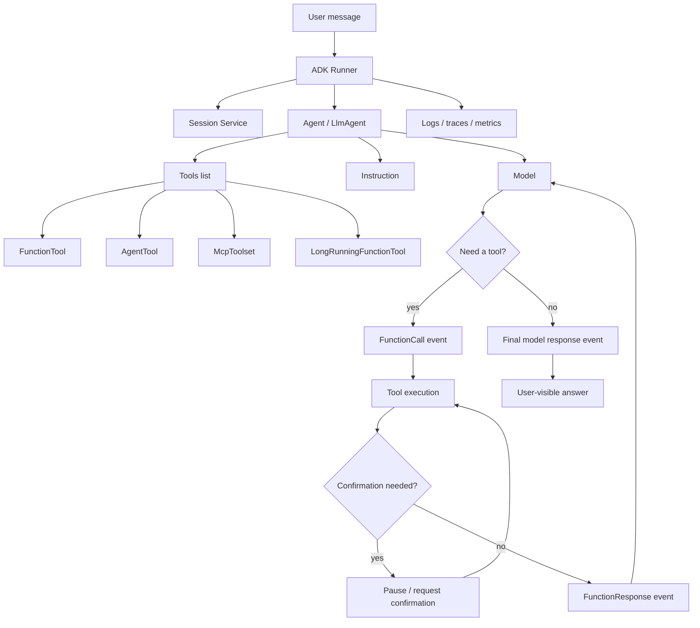

**What this diagram teaches:**
- The agent definition is declarative: model, instructions, and tools.
- The `Runner` owns execution. It turns a user message into a sequence of events.
- Tools are not just Python functions. They can be functions, long-running operations, other agents, or MCP-connected external toolsets.
- The first production debugging surface is the event stream: did the model choose the right tool, pass valid args, get the right response, and synthesize correctly?

---

### 3. Real-World Industry Scenarios [Intermediate]

#### Scenario A: Healthcare Benefits Support Agent

**Product/use case context:** A healthcare company wants an internal assistant that helps support representatives answer benefits questions. The agent can retrieve plan facts, check claim status, draft an explanation, and escalate ambiguous or regulated cases to a human reviewer.

**How ADK fits:**
- A root `Agent` handles the conversation and policy-following instruction.
- A `FunctionTool` wraps deterministic internal APIs like `lookup_claim_status(claim_id: str)`.
- A retrieval tool connects to an approved policy knowledge system, potentially through MCP if the enterprise already standardized tools that way.
- Refunds, appeal submissions, and PHI-heavy actions require confirmation or human approval before execution.
- The runtime's events become the audit trail: user request, tool call, arguments, tool response, and final answer.

**Constraints and how they affect design:**
- **Latency:** Support reps expect answers in a few seconds. A single tool call may be fine, but five serial calls can make the assistant feel slow. Good tool design combines related data reads, such as claim summary + denial code + appeal deadline, into one read-only lookup.
- **Cost:** Every tool response becomes model context. Returning a 20-page policy document into the agent can waste tokens and increase hallucination risk. Return a targeted excerpt, structured fields, and a citation pointer instead.
- **Reliability:** Backend claims systems fail or time out. Tool outputs should return structured `status: "error"` with a human-readable explanation instead of throwing opaque exceptions into the agent loop.
- **Security/privacy:** PHI must not be logged casually. Tool arguments and responses need redaction or field-level logging rules. High-risk actions require confirmation and role checks.
- **Failure modes:** The model may call the right tool with the wrong claim ID, skip the tool and answer from memory, or over-trust a stale policy result.

**What good looks like in production:**
- Every external action is represented as a named tool with a narrow schema.
- Tool responses include `status`, `source`, `freshness`, and enough structured data for the model to reason safely.
- Event traces are searchable by session ID, user ID, tool name, and error status.
- Risky tools require confirmation or are routed to a human review step.

#### Scenario B: Developer Operations Agent

**Product/use case context:** A platform team wants an agent that can inspect deployment health, summarize logs, open incident tickets, and suggest rollback steps.

**How ADK fits:**
- The root agent has read-only tools for logs, metrics, deploy history, and service ownership.
- A write tool like `create_incident_ticket()` is allowed without human approval because it is low-risk and reversible.
- A destructive tool like `rollback_service()` requires explicit confirmation and captures the proposed target version in the confirmation payload.
- An `AgentTool` can delegate a narrow subtask to a specialist log-analysis agent, then return the summary to the root agent.

**Constraints and how they affect design:**
- **Latency:** During incidents, p95 response time matters. Tool calls should favor pre-aggregated observability APIs instead of raw log scans.
- **Cost:** Log snippets can be massive. The tool should summarize and sample before returning to the model.
- **Reliability:** During outages, observability APIs may be partially degraded. The agent must expose uncertainty rather than presenting a confident root cause.
- **Security/privacy:** Deployment controls should enforce service ownership and environment boundaries in code, not just in the prompt.
- **Failure modes:** The model may conflate staging and production, call rollback with an unsafe version, or miss that metrics are stale.

**What good looks like in production:**
- Read tools are broad enough to diagnose quickly; write tools are narrow, validated, and approval-gated.
- Tool results include timestamps and environment names in every response.
- The runtime trace shows the exact sequence from user question to metric lookup to recommendation.

---

### 4. System View (Think Like a Systems Engineer) [Intermediate]

**Inputs -> Transformations -> Outputs:**

```text
[User message]
    -> Runner loads session + state
    -> Agent instruction + available tools are assembled
    -> Model chooses: answer directly or emit a tool call
    -> ADK validates tool args against schema
    -> Tool executes deterministic code / API / MCP / another agent
    -> Tool response is emitted as an event
    -> Model receives tool result and continues reasoning
    -> Runner emits final response events and state/artifact updates
```

**Observability: what we log, trace, and measure:**
- `session_id`, `user_id`, `app_name`, `agent_name`, `invocation_id`.
- Tool choice: tool name, schema version, validated arguments, success/error status.
- Latency: model latency, tool latency, total run latency, p50/p95 by tool.
- Quality signals: tool-call accuracy, invalid argument rate, fallback rate, confirmation rate, final-answer acceptance.
- Safety signals: blocked calls, confirmation denials, policy violations, sensitive-field redactions.
- Cost signals: model tokens, tool payload size, number of model turns per user request.

**Failure points: where it breaks and how it shows up:**
- Poor instruction: the model answers from memory instead of using the required tool.
- Poor tool schema: the model passes missing, ambiguous, or malformed arguments.
- Tool implementation bug: the function returns inconsistent shapes or raises unhelpful exceptions.
- Oversized tool response: the model loses focus or context cost spikes.
- Missing confirmation: a side-effect tool executes before approval.
- Session/state bug: the agent uses stale state from a previous turn or user.
- Runtime/deployment issue: `adk web` works locally, but deployed agent fails because subprocess tools, env vars, or MCP connections are not packaged correctly.

---

### 5. System Design Flavor (Practical and Concise) [Intermediate]

**Key components/interfaces:**

- **Agent definition:** `name`, `model`, `description`, `instruction`, `tools`.
- **Tool layer:** Function tools for internal business logic, `AgentTool` for delegation, `McpToolset` for standardized external tool servers, long-running tools for asynchronous operations.
- **Runtime layer:** `Runner`, session service, artifact service, callbacks, event stream.
- **App surface:** `adk web` for local interactive debugging, `adk run` for CLI testing, `adk api_server` for REST/SSE integration, managed/cloud deployment when moving to production.
- **Governance layer:** confirmations, auth checks, policy enforcement, audit logs, evaluation datasets.

**Important tradeoffs:**

| Tradeoff | Choose this when... | Layman version |
|----------|---------------------|----------------|
| Single agent with many tools vs multiple focused agents | Use one agent when the task is simple and the tool list is small. Split when instructions get long, tools become unrelated, or failures are hard to debug. | One skilled worker is fine for a small desk. For a hospital, you need departments. |
| FunctionTool vs MCP tool | Use `FunctionTool` for code owned by your app. Use MCP when the tool should be reusable across clients/runtimes or already exists as an MCP server. | Local function is a private extension cord. MCP is a standard wall outlet. |
| Let the model choose tools vs deterministic routing | Let the model choose when user intent is flexible. Route deterministically when compliance, cost, or correctness requires a fixed path. | Ask the assistant to decide for open-ended help; use a checklist for regulated work. |
| Direct side-effect tool vs confirmation-gated tool | Direct is OK for low-risk, reversible actions. Require confirmation for money movement, production changes, data deletion, PHI disclosure, or customer-impacting writes. | If undo is hard, pause before doing it. |

**Scaling consideration at 10x traffic/data:**

At low traffic, local tools and in-memory sessions are enough. At 10x, the runtime needs externalized session storage, strict timeout budgets, per-tool concurrency limits, structured logs, retry/circuit-breaker behavior, and deployment packaging that handles subprocesses or remote MCP connections cleanly. Otherwise the agent fails in non-obvious ways: sessions disappear, tool calls pile up, long-running operations block workers, or a single flaky tool drags down every request.

---

### 6. Common Mistakes + Debugging [Intermediate]

| Mistake | Symptom | Likely cause | First debugging step |
|---------|---------|--------------|----------------------|
| Vague tool names and docstrings | Agent calls the wrong tool or avoids tools entirely | The model cannot infer when to use each tool | Inspect the generated tool schema and rewrite names/docstrings with task-specific language |
| Too many broad tools on one agent | Tool selection becomes inconsistent as the app grows | The agent's action space is too large and semantically overlapping | Group tools by workflow and split into focused agents or deterministic routes |
| Returning raw API payloads | High token cost, slow answers, confused synthesis | Tool returns data for machines, not compact evidence for the model | Replace raw payloads with structured summaries, `status`, source IDs, timestamps, and bounded excerpts |
| Side-effect tools without confirmation | Agent performs a risky action from an ambiguous request | Prompt-only safety was trusted instead of runtime gating | Add confirmation or policy checks inside the tool boundary, then replay the trace |
| Global variables for per-user state | User A's context leaks into User B or stale data appears | State is stored outside session scope | Move user/session data into ADK session state or external storage keyed by user/session |

**Debugging mindset:** In ADK, do not start by staring at the final answer. Start with the event trace. The trace tells you whether the failure is tool selection, argument construction, tool execution, confirmation, state, or synthesis.

---

### 7. Hands-On Lab: Build -> Break -> Measure -> Explain [Pro]

#### Goal

Build the smallest ADK-style support agent with one read-only tool and one risky tool. Then intentionally break the tool design and measure how the runtime behavior changes.

#### Build: minimal agent with clear tool boundaries

Create an ADK agent package like this:

```text
adk_support_agent/
  __init__.py
  agent.py
```

`__init__.py`:

```python
from . import agent
```

`agent.py`:

```python
from google.adk.agents import Agent
from google.adk.tools import FunctionTool


def lookup_order(order_id: str) -> dict:
    """
    Look up an order by its exact order ID.

    Args:
        order_id: The customer order ID, such as ORD-1001.
    """
    fake_orders = {
        "ORD-1001": {"state": "shipped", "eta": "2026-06-23"},
        "ORD-1002": {"state": "delayed", "eta": "2026-06-27"},
    }
    order = fake_orders.get(order_id)
    if not order:
        return {"status": "error", "error_message": "Order not found", "order_id": order_id}
    return {"status": "success", "order_id": order_id, **order}


def issue_refund(order_id: str, reason: str) -> dict:
    """
    Issue a refund for a specific order after the user clearly requests a refund.

    Args:
        order_id: The exact order ID to refund.
        reason: The reason the customer gave for requesting a refund.
    """
    return {"status": "success", "order_id": order_id, "refund_id": "RF-9001", "reason": reason}


root_agent = Agent(
    name="order_support_agent",
    model="gemini-flash-latest",
    description="Helps support representatives answer order questions and handle simple refund requests.",
    instruction=(
        "You are an order-support assistant. "
        "Use lookup_order before answering order-status questions. "
        "Do not invent order status. "
        "Only use issue_refund when the user explicitly requests a refund and provides an order ID."
    ),
    tools=[
        lookup_order,
        FunctionTool(issue_refund, require_confirmation=True),
    ],
)
```

Run locally from the parent directory:

```bash
adk web
```

Try prompts:

```text
Where is ORD-1001?
Refund ORD-1002 because it is delayed.
Can I get my money back for that delayed one?
```

Expected behavior:
- Order-status questions should call `lookup_order`.
- Refund requests should call `issue_refund` only after enough information is available.
- The refund tool should require confirmation before execution.
- The terminal/runtime event stream should show function call and function response events.

#### Break: make the tool harder for the model to use

Change the tool names/docstrings to be vague:

```python
def get(x: str) -> dict:
    """Gets stuff."""
    return {"status": "success"}


def do_it(x: str, y: str) -> dict:
    """Does the thing."""
    return {"status": "success"}
```

Then update the agent's tools list to use `get` and `do_it`.

Run the same prompts again.

#### Measure: capture concrete signals

Create a tiny manual evaluation table:

| Prompt | Expected tool | Actual tool | Args valid? | Confirmation? | Final answer correct? |
|--------|---------------|-------------|-------------|---------------|-----------------------|
| Where is ORD-1001? | `lookup_order` | | | N/A | |
| Refund ORD-1002 because it is delayed. | `issue_refund` | | | yes | |
| Can I get my money back for that delayed one? | clarification or refund after context | | | yes if refund | |

Measure:
- Tool-call accuracy = correct tool calls / total tool-required prompts.
- Invalid argument rate = malformed or missing args / total tool calls.
- Confirmation coverage = risky tool calls with confirmation / total risky tool calls.
- Tool payload size = approximate characters returned by each tool response.
- p95 latency, if using real APIs, by looking at runtime logs or traces.

#### Explain: why it broke and what fixes it

The vague version breaks because the model sees tool schemas as its API manual. If the function name, parameter names, and docstring do not describe the business action, the model has to guess. ADK can validate the shape of a call, but it cannot infer missing domain semantics from a bad tool contract.

The fix is to design tools like production APIs for an LLM caller:
- Use action-specific names: `lookup_order`, `issue_refund`, `search_policy`.
- Keep parameters few, typed, and explicit.
- Return compact dictionaries with `status`, useful fields, and human-readable error messages.
- Put irreversible or customer-impacting actions behind confirmation or policy checks.

---

### 8. Active Recall (Spaced Repetition) [Beginner -> Pro]

**Questions:**

1. What are the three minimum pieces of a simple ADK agent?
2. Why is a function docstring operationally important in ADK tool design?
3. What is the difference between `AgentTool` and a sub-agent handoff?
4. Why should tool responses usually be structured dictionaries instead of raw strings or raw API JSON?
5. If an ADK agent gives a wrong final answer, why should you inspect the event stream before editing the prompt?

**Answer key:**

1. A model, instructions, and optional tools. The runtime/runner executes the agent against a session.
2. ADK uses function name/signature/docstring to build the tool schema the model reads; vague docstrings cause bad tool selection or bad arguments.
3. `AgentTool` lets a root agent call another agent and keep control. A sub-agent handoff transfers responsibility for the conversation/workflow.
4. Structured dictionaries give the model explicit status, fields, errors, and provenance; raw payloads are noisy, expensive, and easy to misread.
5. The event stream reveals whether the failure happened during tool choice, argument generation, tool execution, confirmation, state handling, or final synthesis.

---

### 9. Practice [Intermediate -> Pro]

#### Mini-exercise: tool contract rewrite

Rewrite this weak tool into a production-quality ADK function tool:

```python
def update(data: dict) -> str:
    """Updates customer."""
    ...
```

**Suggested answer outline:**

```python
def update_customer_email(customer_id: str, new_email: str, reason: str) -> dict:
    """
    Update a customer's email address after the user has confirmed the new email.

    Args:
        customer_id: Stable internal customer identifier.
        new_email: The replacement email address to store.
        reason: Short explanation for the change, used in the audit log.
    """
    ...
    return {
        "status": "success",
        "customer_id": customer_id,
        "updated_field": "email",
        "audit_event_id": "...",
    }
```

Why this is better:
- The function name says exactly what changes.
- Inputs are typed and narrow.
- The return value gives the model a clear success signal and audit reference.
- Because this mutates customer data, wrap it with confirmation and enforce authorization inside the tool boundary.

#### Capstone-style system design question

Design an ADK-based travel operations assistant for employees. It can search policy, estimate trip cost, book refundable hotels, and cancel reservations. Which tools do you expose, which require confirmation, and what do you log?

**Suggested answer outline:**

- Expose read tools: `search_travel_policy(destination, trip_type)`, `estimate_trip_cost(origin, destination, dates)`, `lookup_reservation(reservation_id)`.
- Expose write tools: `book_refundable_hotel(...)`, `cancel_reservation(reservation_id, reason)`.
- Require confirmation for booking/canceling because they affect money and customer/vendor systems.
- Tool outputs should include `status`, price, cancellation deadline, policy citation, reservation ID, and timestamp.
- Logs/traces should include session ID, user ID, tool name, arguments after sensitive redaction, confirmation decision, policy source, latency, and final outcome.
- Keep authorization inside tools: the model should not decide whether a user is allowed to book outside policy.

---

### 10. Production Reality Check (Mandatory Ending) ✅

**If this fails in prod, what's the first thing we inspect?**

Inspect the ADK event trace for the failing invocation, especially the sequence around `FunctionCall` and `FunctionResponse` events.

Why: most ADK production failures are not mysterious model failures. They are usually one of these:
- The model did not call the required tool.
- It called the wrong tool.
- It passed invalid or ambiguous arguments.
- The tool returned an error, stale data, or an oversized payload.
- A confirmation or auth step was skipped or mishandled.
- The final synthesis ignored an important tool result.

The event trace tells you which layer failed before you change prompts, rewrite tools, or blame the model.

---

### 11. Curiosity Bridge (Mandatory Ending) ✅

This works well for a single agent with a small set of clean tools, but breaks when the task needs explicit branching, retries, parallel checks, human input, or deterministic control around non-deterministic model calls.

That unlocks the next concept: **ADK graph workflows and routing**. Instead of hoping one long instruction makes the agent follow a process, you can make the process itself part of the runtime structure.

---

### 12. Exit Check + Carry-Forward Review

**Exit check:** You're done with 15.1.a when you can define an ADK agent from memory, design a safe FunctionTool schema, explain how `Runner` events reveal tool-call failures, choose between FunctionTool / AgentTool / McpToolset, and identify which tools need confirmation.

---

**Carry-Forward Review (interleaved recall from Module 14):**

*Q: In a production knowledge assistant, why might you combine LlamaIndex with ADK instead of using only one framework?*

> **A:** LlamaIndex is strongest at the data plane: ingestion, parsing, indexing, retrieval, metadata, and response synthesis over documents. ADK is strongest at the runtime/control plane: agents, tools, sessions, events, confirmations, deployment, and workflow evolution. A common design is LlamaIndex powering a `search_policy()` or `retrieve_evidence()` tool while ADK manages the user-facing agent runtime and safe action execution.

---

## Subtopic 15.1.b: Graph Workflows and Routing

### ✅ Add to Knowledge Base

### Reading Path + Level Tags

- **Beginner:** Read sections 1-2 and Active Recall.
- **Intermediate:** Add sections 3-5 and the Hands-On Lab Build step.
- **Pro:** Complete the full Hands-On Lab (Build -> Break -> Measure -> Explain) plus the capstone practice question.

---

### 0. Pre-Question Hook [Beginner]

**Pause:** Before reading, imagine a support agent must classify a request, check policy, route refunds to finance, route technical issues to engineering, and ask a human before any customer-impacting action. Which parts should be model reasoning, and which parts should be explicit workflow structure?

Hold that split in your head. This subtopic is about moving from "the prompt says follow these steps" to "the runtime enforces these steps."

---

### 1. The Intuition (Plain English) [Beginner]

A single ADK agent can follow a long instruction, but long instructions become brittle. The model may skip a step, reorder a process, forget a constraint, or choose the wrong tool when the task branches. **Workflow** means the process itself becomes code: a graph of explicit execution steps that the runtime follows.

Think of a graph workflow like an airport baggage routing system. A bag is scanned, classified, moved through conveyor belts, routed to domestic/international/security/manual-review paths, and finally delivered to a gate. Some steps are automatic machines. Some are human checkpoints. Some are expert stations. The bag does not decide the process; the routing system does.

Where the analogy breaks down: ADK graph nodes can include LLM agents, so some stations are non-deterministic reasoning units. The graph makes the path explicit, but model nodes can still produce uncertain outputs that need schemas, validation, and fallback paths.

**Key terms (first use):**

- **`Workflow`** — ADK's graph-based agent construct; it defines execution as nodes connected by edges instead of one large prompt.
- **Node** — one executable step in a workflow graph; it can be an ADK agent, tool, human input task, or code function.
- **Edge** — an explicit transition between nodes; ADK defines these in an `edges` array.
- **`START`** — the reserved starting point used in an ADK graph's edges list.
- **Route** — a named path selected at runtime, usually emitted by a router node with `Event(route=...)`.
- **`Event.output`** — the standard payload used to pass data from one node to the next.
- **`Event.message`** — event data intended as a user-visible message rather than internal workflow data.
- **`Event.state`** — small session-scoped workflow state that persists across nodes.
- **`JoinNode`** — a node that waits for multiple upstream branches to complete, then passes their collected outputs onward.
- **Nested workflow** — using one `Workflow` as a node inside another workflow to package a reusable sub-process.
- **`RoutedAgent`** — ADK TypeScript routing pattern that selects one agent per invocation with an explicit router function; related to routing, but not the same as Python graph workflows.

The core mental model:

```text
Prompt-based agent:
User -> one agent with long instructions -> maybe tools -> final answer

Graph workflow:
User -> node A -> router -> branch B/C/D -> join or finish -> final message
```

Graph workflows are useful when correctness depends on step order, branching, parallel checks, human review, or separating deterministic code from model reasoning.

---

### 2. Visual Diagram (Mermaid) [Beginner]

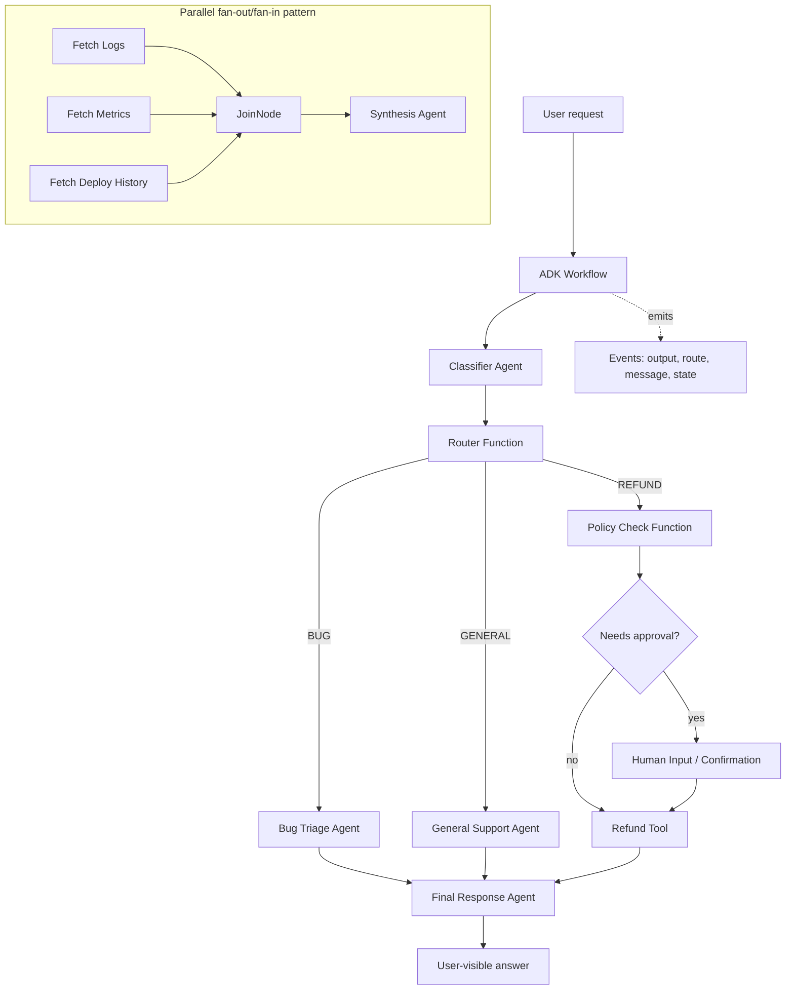

**What this diagram teaches:**
- The graph owns the process path.
- LLM agents can still classify, reason, and write final responses, but deterministic nodes can enforce routing and validation.
- `Event.output` moves internal data. `Event.route` chooses branches. `Event.message` communicates with the user.
- Mutually exclusive routes usually flow directly to the next branch-specific or final node.
- `JoinNode` is for parallel fan-out/fan-in: it waits for multiple upstream paths before continuing.

---

### 3. Real-World Industry Scenarios [Intermediate]

#### Scenario A: Regulated Refund and Appeals Workflow

**Product/use case context:** A healthcare or insurance support system receives messages like "My claim was denied" or "Refund my premium." A plain agent can be prompted to classify, check policy, and request approval, but that puts too much process control inside model behavior.

**Graph workflow shape:**
- Classifier agent turns the user request into `CLAIM_APPEAL`, `REFUND`, `GENERAL_SUPPORT`, or `ESCALATE`.
- Router function maps the classification to a branch.
- Claim appeal branch calls policy retrieval, checks deadlines, and drafts an appeal explanation.
- Refund branch validates eligibility, requests confirmation, then calls the refund tool.
- Escalation branch emits a user-visible message and creates a review ticket.

**Constraints and how they affect design:**
- **Latency:** Classification + retrieval + validation + final response can become slow if each step calls a large model. Good graph design uses small models or functions for cheap steps and reserves stronger models for synthesis or nuanced decisions.
- **Cost:** Branching prevents unnecessary work. A general support question should not run refund eligibility, appeal policy lookup, and human review just because they exist in the system.
- **Reliability:** The refund path must always run eligibility and confirmation before execution. In a graph, this is enforced by topology, not merely instruction text.
- **Failure modes:** Classifier misroutes, router emits a route not present in the edge map, a node fails to emit `Event.output`, or a human-review branch never returns.
- **Security/privacy:** Sensitive data should be passed as structured fields, not copied into broad prompts. Audit logs should capture route choice and approval events.

**What good looks like in production:**
- Every route has a known owner, expected input schema, output schema, timeout, and fallback.
- Dangerous branches have confirmation or human input nodes in the graph.
- Observability shows route distribution, failed routes, stuck nodes, and branch-level p95 latency.

#### Scenario B: Incident Response Assistant

**Product/use case context:** A developer operations assistant triages production incidents. It needs to classify severity, query metrics, inspect logs, check deploy history, decide whether rollback is allowed, and generate an incident summary.

**Graph workflow shape:**
- Severity classifier decides `SEV1`, `SEV2`, or `INFO`.
- Parallel branches fetch logs, metrics, deploy events, and ownership metadata.
- `JoinNode` collects the evidence.
- Root-cause agent synthesizes the likely cause.
- Router sends rollback recommendations to human approval and simple informational cases to a final response node.

**Constraints and how they affect design:**
- **Latency:** Parallel branches reduce elapsed time. Logs, metrics, and deploy history can run concurrently instead of serially.
- **Cost:** Deterministic observability calls are cheaper than asking the model to infer everything from a broad prompt. The model should reason over compact evidence.
- **Reliability:** If one upstream branch does not emit output, a join can get stuck. Each parallel node needs a failsafe output like `{"status": "error", "source": "logs", "message": "timeout"}`.
- **Security:** Rollback or production mutation paths require approval and service-owner authorization inside code.
- **Failure modes:** A stale metrics response can produce a confident but wrong summary unless every output includes timestamps and freshness.

**What good looks like in production:**
- Each branch has timeout and fallback output.
- The join step never waits forever.
- Final synthesis cites which evidence was available and which sources failed.
- Route and node-level traces make post-incident review possible.

---

### 4. System View (Think Like a Systems Engineer) [Intermediate]

**Inputs -> Transformations -> Outputs:**

```text
[User message]
    -> Workflow starts at START
    -> Node receives node_input or Context
    -> Node emits Event.output, Event.route, Event.message, or Event.state
    -> Edges array determines next node or branch
    -> Optional parallel branches run
    -> Optional JoinNode waits for upstream outputs
    -> Final node emits user-visible message or final answer
```

**What each part does:**
- **Input:** user message, session state, and any previous workflow context.
- **Transformation:** agents classify/write/reason; functions validate/route/reshape data; tools call external systems.
- **Output:** internal `Event.output` for downstream nodes, `Event.message` for users, `Event.state` for small state updates, and final user response.

**Observability: what we log, trace, and measure:**
- Workflow name, invocation ID, session ID, user ID.
- Node start/end events, node type, node input/output schema validation status.
- Route value emitted by router nodes and whether it matched a configured edge.
- Branch latency and failure rate by node.
- Join wait time and missing upstream node count.
- Number of model nodes invoked per workflow.
- Percent of workflows that enter human input or confirmation branches.
- Final status: success, routed fallback, timeout, human-review pending, or failed.

**Failure points: where it breaks and how it shows up:**
- Router emits an unknown route -> branch not found or workflow error.
- Node returns raw data instead of an `Event` where the next node expects event-shaped output -> downstream schema mismatch.
- Parallel branch never emits output -> `JoinNode` waits and workflow appears stuck.
- Agent node output is free text when a router expects exact labels -> route instability.
- `Event.state` stores large payloads -> session bloat, slow execution, or persistence issues.
- Graph includes incompatible interactive or streaming patterns -> local test or runtime deployment behaves differently than expected.

---

### 5. System Design Flavor (Practical and Concise) [Intermediate]

**Key components/interfaces:**

- **`Workflow` root:** the graph-based agent object that ADK runs.
- **`edges` array:** the process map; sequential edges, conditional route maps, parallel starts, joins, and nested workflow nodes.
- **Agent nodes:** LLM-backed steps for classification, summarization, judgment, or final response.
- **Function nodes:** deterministic code for parsing, validation, routing, score calculation, data reshaping, or policy checks.
- **Tool nodes:** external actions or reads; useful when a graph step should call an API/tool directly.
- **Human input/confirmation nodes:** approval or structured input checkpoints.
- **Schemas:** `input_schema` / `output_schema` to force structured data at node boundaries.
- **Events:** runtime data carriers across nodes.

**Important tradeoffs:**

| Tradeoff | Choose this when... | Layman version |
|----------|---------------------|----------------|
| Long prompt vs graph workflow | Use a prompt for simple flexible behavior. Use a graph when step order, branching, approval, or auditability matters. | A checklist in someone's head is fine for errands; surgery needs a procedure. |
| Agent router vs function router | Use an agent classifier when intent is fuzzy. Use a function router when the branch decision is rule-based or compliance-sensitive. | Let a person interpret messy language; use a switchboard for known labels. |
| Sequential vs parallel branches | Sequential when later steps depend on earlier outputs. Parallel when evidence sources are independent. | Do dependent tasks in order; fetch independent facts at the same time. |
| `Event.output` vs `Event.message` | Use `output` for internal data passed to the next node. Use `message` when the user should see it. | Internal memo vs customer-facing email. |
| State vs artifact/database | Use `Event.state` for small control values. Use artifacts or databases for large files, long evidence, or durable records. | Keep a sticky note in state; store the file in a filing system. |

**Scaling consideration at 10x traffic/data:**

At small scale, a graph can be debugged by reading terminal events. At 10x, you need graph-level observability: route distribution, node-level p95 latency, unknown route count, join wait time, branch error rates, and cost by model node. Otherwise, graphs become hard to operate because failures are distributed across many small steps instead of one obvious agent call.

---

### 6. Common Mistakes + Debugging [Intermediate]

| Mistake | Symptom | Likely cause | First debugging step |
|---------|---------|--------------|----------------------|
| Router returns messy labels | Workflow falls into wrong branch or route not found | Classifier emits natural language instead of exact route values | Add an output schema or normalize route strings before `Event(route=...)` |
| Using `Event.message` for internal data | User sees intermediate implementation details or downstream node misses input | Confusing user-visible messages with workflow payloads | Replace internal handoff data with `Event.output` |
| No failsafe output before `JoinNode` | Workflow hangs after parallel fan-out | One upstream branch failed or returned without output | Ensure every upstream node emits success or error output |
| Overusing graph nodes | Simple requests feel slow and expensive | Every minor step became a separate model call | Collapse deterministic transforms into functions and reserve model nodes for real reasoning |
| State used as a data lake | Sessions become large, slow, or confusing | Large payloads stored in `Event.state` | Move large data to artifacts/database and store only references in state |

**Debugging mindset:** In graph workflows, inspect the path, not only the answer. Ask: which node ran, what did it emit, which route was selected, did schemas pass, did every join input arrive, and did the final node see the intended evidence?

---

### 7. Hands-On Lab: Build -> Break -> Measure -> Explain [Pro]

#### Goal

Build a minimal ADK graph workflow that classifies a support request and routes it to one of three branches. Then break routing on purpose and measure failure signals.

#### Build: a classifier + router + branch workflow

Create a package:

```text
adk_routing_workflow/
  __init__.py
  agent.py
```

`__init__.py`:

```python
from . import agent
```

`agent.py`:

```python
from google.adk import Agent, Event, Workflow


classifier = Agent(
    name="support_classifier",
    model="gemini-flash-latest",
    instruction=(
        "Classify the user's request as exactly one label: "
        "BUG, REFUND, or GENERAL. Return only the label."
    ),
    output_schema=str,
)


def route_request(node_input: str):
    label = node_input.strip().upper()
    if label not in {"BUG", "REFUND", "GENERAL"}:
        return Event(route="GENERAL", output={"raw_label": node_input, "fallback": True})
    return Event(route=label, output={"label": label, "fallback": False})


def bug_branch(node_input: dict):
    return Event(message="I will collect technical details and route this as a bug report.")


def refund_branch(node_input: dict):
    return Event(message="I will check refund eligibility before taking any account action.")


def general_branch(node_input: dict):
    return Event(message="I can help with that general support question.")


root_agent = Workflow(
    name="support_routing_workflow",
    edges=[
        ("START", classifier, route_request),
        (
            route_request,
            {
                "BUG": bug_branch,
                "REFUND": refund_branch,
                "GENERAL": general_branch,
            },
        ),
    ],
)
```

Run:

```bash
adk web
```

Try prompts:

```text
The app crashes when I upload a PDF.
I want a refund for order ORD-1002.
What are your support hours?
```

Expected behavior:
- Bug-like requests route to `BUG`.
- Refund requests route to `REFUND`.
- General support requests route to `GENERAL`.
- The trace shows classifier -> router -> branch.

#### Break: introduce unstable route labels

Change the classifier instruction to:

```python
instruction="Explain whether this is a technical, money, or normal support question."
```

Now the classifier may emit prose like "This is a money-related support question" instead of `REFUND`. Run the same prompts again.

#### Measure: capture concrete signals

Create a small routing eval table:

| Prompt | Expected route | Raw classifier output | Actual route | Fallback? | Correct branch? |
|--------|----------------|-----------------------|--------------|-----------|-----------------|
| The app crashes when I upload a PDF. | BUG | | | | |
| I want a refund for order ORD-1002. | REFUND | | | | |
| What are your support hours? | GENERAL | | | | |

Measure:
- Route accuracy = correct route / total prompts.
- Unknown route rate = classifier outputs outside allowed labels / total prompts.
- Fallback rate = fallback branch count / total prompts.
- Branch latency = time from workflow start to branch message.
- Model-call count = how many LLM-backed nodes were used per request.

#### Explain: why it broke and what fixes it

The graph did not fail because graphs are unreliable. It failed because the router boundary depended on free-form model text. Graph routing works best when model nodes emit constrained outputs and function nodes normalize/validate before selecting a route.

Fixes:
- Force exact labels in the classifier instruction.
- Add `output_schema` when available.
- Normalize route strings in a function node.
- Include a safe fallback route.
- Track unknown-route and fallback rates as production metrics.

---

### 8. Active Recall (Spaced Repetition) [Beginner -> Pro]

**Questions:**

1. What problem do ADK graph workflows solve compared with one long agent instruction?
2. What is the difference between a node and an edge?
3. When should you use `Event.output` instead of `Event.message`?
4. Why can a `JoinNode` get stuck?
5. How is graph routing different from TypeScript `RoutedAgent`?

**Answer key:**

1. They make process order, branching, approval, and deterministic control explicit in code instead of relying only on the model to follow instructions.
2. A node is an executable step; an edge is the configured transition/path between steps.
3. Use `Event.output` for internal data passed to downstream nodes. Use `Event.message` only for user-visible communication.
4. It waits for all upstream branches; if one branch fails or emits no output, the join has nothing to collect and execution can stop.
5. Graph routing controls paths inside a workflow of many nodes. `RoutedAgent` selects one agent per invocation with a router function and is a separate TypeScript routing pattern.

---

### 9. Practice [Intermediate -> Pro]

#### Mini-exercise: route design

You receive these support request categories: `BUG`, `BILLING`, `SECURITY`, `GENERAL`. Which route should require the strongest validation and why?

**Suggested answer outline:**

`SECURITY` and `BILLING` need stronger validation than `GENERAL`. Security may involve account access, sensitive data, or incident escalation. Billing may involve money movement or customer-impacting changes. These routes should have explicit schemas, authorization checks, confirmation/human review for side effects, and audit events. `BUG` may need structured technical details but usually does not require the same approval level unless it triggers production action.

#### Capstone-style system design question

Design an ADK graph workflow for a production incident assistant. The assistant must classify severity, collect metrics/logs/deploy history in parallel, decide whether rollback is recommended, and request human approval before rollback.

**Suggested answer outline:**

- `START -> severity_classifier -> severity_router`.
- `SEV1` and `SEV2` routes fan out to `fetch_metrics`, `fetch_logs`, `fetch_deploy_history`, and `lookup_owner`.
- Each fetch node emits `Event.output` with `status`, `source`, `timestamp`, and compact evidence or error.
- `JoinNode` collects evidence; every branch emits failsafe output to prevent stuck joins.
- `root_cause_agent` synthesizes likely cause and confidence.
- `rollback_policy_function` checks whether rollback is allowed.
- `approval_node` or confirmation step gates rollback.
- `rollback_tool` executes only after approval and ownership checks.
- `final_response_agent` summarizes evidence, action taken, pending risks, and links to traces.

---

### 10. Production Reality Check (Mandatory Ending) ✅

**If this fails in prod, what's the first thing we inspect?**

Inspect the workflow trace at the node and route level: the node that emitted the route, the exact route value, the configured edge map, and whether every upstream node emitted `Event.output` before a join.

Why: graph workflow failures usually show up as wrong branch, missing branch, stuck join, schema mismatch, or user-visible intermediate messages. The fastest debugging path is to reconstruct the graph path from emitted events before touching prompts or tools.

---

### 11. Curiosity Bridge (Mandatory Ending) ✅

This works well when the process structure is explicit, but breaks when the workflow needs memory across turns, durable state, replay, evaluation datasets, or controlled resume after human input.

That leads directly into **sessions, state, and evaluation concepts**: the part of ADK that makes an agent workflow inspectable and improvable across real user interactions instead of only correct in a one-off demo.

---

### 12. Exit Check + Carry-Forward Review

**Exit check:** You're done with 15.1.b when you can sketch an ADK `Workflow` with sequential, conditional, and parallel branches; explain `Event.output` vs `Event.route` vs `Event.message`; identify why a `JoinNode` is stuck; and choose when graph structure is better than a long prompt.

---

**Carry-Forward Review (interleaved recall from 15.1.a):**

*Q: Why is a clean `FunctionTool` schema still important inside a graph workflow?*

> **A:** The graph controls when a tool-like step runs, but the model or downstream node still depends on clear inputs and outputs. A bad function/tool contract can still cause malformed arguments, noisy payloads, poor synthesis, or unsafe action execution even if the graph path is correct.

---

## Subtopic 15.1.c: Sessions, State, and Evaluation Concepts

### ✅ Add to Knowledge Base

### Reading Path + Level Tags

- **Beginner:** Read sections 1-2 and Active Recall.
- **Intermediate:** Add sections 3-5 and the Hands-On Lab Build step.
- **Pro:** Complete the full Hands-On Lab (Build -> Break -> Measure -> Explain) plus the capstone practice question.

---

### 0. Pre-Question Hook [Beginner]

**Pause:** Before reading, imagine a user tells an agent their preferred airport, asks for a trip plan, later changes the date, and then asks, "Can you book the cheaper option from before?" What must the runtime remember, where should it store it, and how would you test that the agent still behaves correctly after a code change?

This subtopic answers that: sessions make the conversation continuous, state makes relevant facts available, and evaluation makes behavior measurable.

---

### 1. The Intuition (Plain English) [Beginner]

A stateless agent is like a call-center worker who forgets everything after each sentence. A stateful agent is like a worker with a case file: it can see the conversation history, current task status, preferences, tool results, and what happened in previous turns.

In ADK, **`Session`** is the current conversation thread. It contains **events**: the chronological record of user messages, model responses, tool calls, tool responses, state changes, and other runtime actions. It also contains **`session.state`**, a key-value scratchpad for dynamic facts the agent needs during the conversation.

**Evaluation** is the discipline of turning agent behavior into testable evidence. For agents, you do not only evaluate the final answer. You also evaluate the **trajectory**: which tools were called, in what order, with what arguments, and whether the agent followed the expected workflow.

Analogy: a session is a patient chart in a hospital. Events are the chronological notes: symptoms, tests ordered, results, medication given. State is the current summary: allergies, current diagnosis, next step. Evaluation is the quality audit: did the doctor order the right test, interpret the result correctly, and give safe advice?

Where the analogy breaks down: ADK sessions are structured runtime objects, not human memory. If you store the wrong data, mutate it outside the event system, or use the wrong persistence backend, the runtime will not magically recover intent.

**Key terms (first use):**

- **`Session`** — ADK object representing one conversation thread for an `app_name`, `user_id`, and session `id`.
- **`SessionService`** — service responsible for creating, retrieving, updating, listing, and deleting sessions.
- **`session.events`** — chronological event history for a session: messages, tool calls, tool responses, state deltas, and runtime actions.
- **`session.state`** — serializable key-value scratchpad used to store dynamic data relevant to the session.
- **`InMemorySessionService`** — non-persistent session backend for local development and tests; state is lost on restart.
- **`DatabaseSessionService`** — persistent relational-database-backed session service for apps that manage their own storage.
- **`VertexAiSessionService`** — Google Cloud / Agent Runtime session backend for scalable managed persistence.
- **State prefix** — naming convention that controls state scope, such as no prefix for session scope, `user:` for user scope, `app:` for app scope, and `temp:` for current invocation scope.
- **`state_delta`** — event-attached set of state changes applied by the `SessionService` when an event is appended.
- **Eval file** — ADK test JSON file, usually ending in `.test.json`, containing one focused session scenario and expected behavior.
- **Evalset** — larger evaluation dataset containing multiple sessions or longer multi-turn cases.
- **Tool trajectory** — the ordered or expected list of tools an agent called while solving a task.
- **LLM-as-a-judge** — evaluation pattern where a model judges semantic response quality, rubric adherence, groundedness, or tool-use quality.

The core mental model:

```text
Session = current conversation container
Events  = what happened, in order
State   = small current facts the runtime should remember
Memory  = searchable cross-session or external knowledge
Eval    = repeatable evidence that behavior still works
```

---

### 2. Visual Diagram (Mermaid) [Beginner]

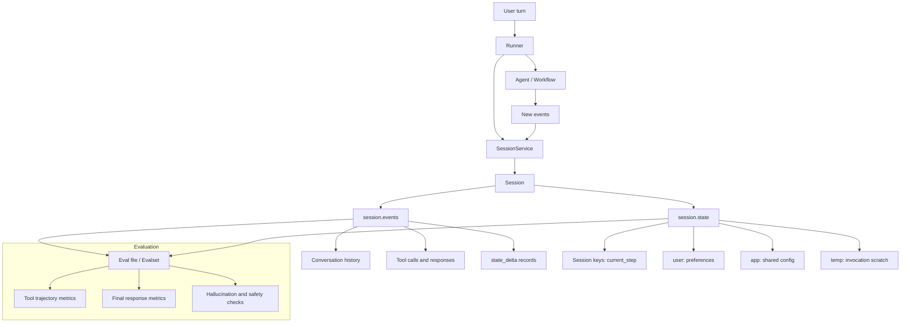

**What this diagram teaches:**
- The `Runner` does not operate in a vacuum; it runs against a session.
- `SessionService` is the source of truth for session lifecycle and persistence.
- Events are audit history. State is a compact mutable scratchpad.
- Evaluation can assert both the path the agent took and the final answer it produced.

---

### 3. Real-World Industry Scenarios [Intermediate]

#### Scenario A: Multi-Turn Travel Booking Agent

**Product/use case context:** A travel assistant helps employees search flights, remember preferences, check policy, request approval, and book travel. The user may provide information across many turns: "I'm flying from Newark," then "Actually make it Monday," then "Use my usual aisle preference."

**How sessions and state fit:**
- `Session` holds the active conversation thread and event history.
- `session.state["origin_airport"] = "EWR"` can track the current booking context.
- `session.state["user:seat_preference"] = "aisle"` can persist a user preference across that user's sessions when backed by a persistent service.
- `session.state["temp:fare_search_results"]` can hold intermediate results during one invocation, but should not be relied on next turn.
- Evaluation captures scenarios like date correction, policy check, approval gating, and booking confirmation.

**Constraints and how they affect design:**
- **Latency:** Loading too much event history into every model call can slow responses. Good systems summarize or retrieve only relevant context when sessions become long.
- **Cost:** Tool outputs in history can be large. State should store compact IDs or summaries, not full raw API responses.
- **Reliability:** If state is mutated directly outside ADK's event/update flow, persistence and auditability can break. Use context/state update mechanisms so state changes become traceable `state_delta`s.
- **Security/privacy:** User preferences may persist, but sensitive booking details or approvals need retention policies. Do not store secrets in session state.
- **Failure modes:** The agent books with stale state, mixes sessions, treats `temp:` data as durable, or loses state because `InMemorySessionService` was used beyond local development.

**What good looks like in production:**
- Session IDs, user IDs, and app names are explicit in logs and traces.
- Persistent services are used for real user workflows.
- State keys have scope prefixes and small serializable values.
- Eval cases include multi-turn corrections and approval flows, not only happy-path single prompts.

#### Scenario B: Enterprise Support Agent with Regression Tests

**Product/use case context:** An enterprise support assistant uses tools to look up policies, create tickets, and escalate sensitive issues. The team updates prompts and tools weekly. They need confidence that fixes do not break established flows.

**How evaluation fits:**
- `.test.json` files cover focused unit-like cases: "refund request should call policy lookup before refund tool."
- Evalsets cover longer sessions: user ambiguity, clarification, tool use, escalation, final answer.
- `tool_trajectory_avg_score` validates expected tool call behavior.
- `final_response_match_v2` validates semantic response correctness when phrasing can vary.
- `hallucinations_v1` checks whether responses are grounded in context/tool outputs.
- `multi_turn_task_success_v1` checks whether the agent completes the goal across turns.

**Constraints and how they affect design:**
- **Latency:** Evaluations must run quickly enough for CI where possible. Keep fast trajectory and response checks for PR gates; run slower LLM-judge or multi-turn evals nightly.
- **Cost:** LLM-as-judge metrics can add cost. Use deterministic trajectory checks for frequent tests and reserve judge-based metrics for nuanced quality.
- **Reliability:** Agent behavior can shift when model versions or prompts change. Evalsets provide regression detection.
- **Security/privacy:** Eval data must avoid real customer secrets. Use synthetic or sanitized sessions.
- **Failure modes:** Passing final response while taking the wrong tool path, passing a single-turn eval while failing multi-turn clarification, or overfitting prompts to eval examples.

**What good looks like in production:**
- Every risky workflow has at least one trajectory eval.
- Every high-volume workflow has multi-turn eval cases.
- Eval failures link to traces showing actual vs expected tool calls and final responses.
- Metrics are tracked over time, not only pass/fail at one release.

---

### 4. System View (Think Like a Systems Engineer) [Intermediate]

**Inputs -> Transformations -> Outputs:**

```text
[User message + app_name + user_id + session_id]
        -> SessionService retrieves Session
        -> Runner provides events + state to the agent/workflow
        -> Agent reads relevant context and may call tools
        -> Runtime emits new Events
        -> Events include messages, tool calls, tool responses, and state_delta
        -> SessionService append_event persists event history and state changes
        -> Evaluation replays or compares sessions against expected behavior
```

**Session and state mechanics:**
- A `Session` is identified by `id`, `app_name`, and `user_id`.
- `session.events` is append-oriented history.
- `session.state` is mutable, but safe updates should flow through the managed runtime: `output_key`, `EventActions.state_delta`, `CallbackContext.state`, or `ToolContext.state`.
- `InMemorySessionService` is for local development and examples.
- `DatabaseSessionService` or `VertexAiSessionService` are for persistence.
- State values should be serializable: strings, numbers, booleans, lists, and simple dictionaries.
- State key prefixes define scope:

| Prefix | Scope | Use case |
|--------|-------|----------|
| none | Current session | `current_booking_step`, `selected_claim_id` |
| `user:` | Same user across sessions | `user:preferred_language`, `user:seat_preference` |
| `app:` | Shared across app | `app:policy_version`, `app:support_phone` |
| `temp:` | Current invocation only | `temp:tool_result_cache`, `temp:validation_needed` |

**Observability: what we log, trace, and measure:**
- Session identifiers: `app_name`, `user_id`, `session_id`, invocation ID.
- Event counts and event types per turn.
- State deltas, with sensitive-value redaction.
- Session backend type and persistence errors.
- State read/write keys and missing-placeholder errors.
- Evaluation scores by eval set, route, tool, and model version.
- Tool trajectory mismatch reasons: missing tool, extra tool, wrong order, wrong args.
- Final response failures: lexical mismatch, semantic mismatch, hallucination, safety, rubric failure.

**Failure points: where it breaks and how it shows up:**
- Missing session ID -> user loses continuity.
- Reused session ID across users -> privacy leak.
- `InMemorySessionService` in production -> state disappears after restart.
- Directly mutating retrieved `session.state` -> changes are not tracked or persisted reliably.
- Large tool payloads stored in state -> bloated sessions and slow context.
- Incorrect state prefix -> user preference becomes session-only or temporary data leaks into future turns.
- Evaluation checks only final answer -> wrong tool path goes unnoticed.

---

### 5. System Design Flavor (Practical and Concise) [Intermediate]

**Key components/interfaces:**

- **Session object:** `id`, `app_name`, `user_id`, `events`, `state`, `last_update_time`.
- **SessionService:** creates, retrieves, appends events, persists state updates, lists, and deletes sessions.
- **State access:** agent instruction templating with `{key}`, context-based state updates, `state_delta` through events.
- **MemoryService:** cross-session/searchable knowledge store; different from current-session state.
- **Trace view:** debugging surface for events, model requests/responses, tool calls, and graph flow.
- **Eval files/evalsets:** structured test data for single sessions or larger multi-turn suites.
- **Evaluation criteria:** trajectory, final response, rubrics, hallucination, safety, and multi-turn metrics.

**Important tradeoffs:**

| Tradeoff | Choose this when... | Layman version |
|----------|---------------------|----------------|
| Session state vs memory | Use state for current or scoped working facts. Use memory for searchable cross-session knowledge. | State is the open case file; memory is the archive. |
| `InMemorySessionService` vs persistent service | Use in-memory for demos/tests. Use database or Vertex AI when users expect continuity. | A sticky note vanishes; a database survives. |
| Store value vs store reference | Store small facts directly. Store large documents/tool payloads elsewhere and keep IDs in state. | Keep the receipt number, not the whole store inventory. |
| Deterministic eval vs LLM-judge eval | Use deterministic checks for exact tool paths and CI. Use LLM judges for semantic quality and rubrics. | Count exact steps with code; ask a reviewer for nuanced writing quality. |
| Single-turn eval vs multi-turn eval | Use single-turn for narrow behavior. Use multi-turn for clarification, state, corrections, and goal completion. | One question tests facts; a conversation tests memory and process. |

**Scaling consideration at 10x traffic/data:**

At 10x, session management becomes infrastructure, not just convenience. You need durable storage, concurrency control, TTL/retention policies, redaction, state schema governance, session-size monitoring, and eval dashboards sliced by route/model/tool version. Otherwise, you get silent regressions: stale state, growing latency, privacy leaks, and agent updates that pass manual demos but fail real multi-turn workflows.

---

### 6. Common Mistakes + Debugging [Intermediate]

| Mistake | Symptom | Likely cause | First debugging step |
|---------|---------|--------------|----------------------|
| Using in-memory sessions in production | Conversations reset after deploy/restart | `InMemorySessionService` is non-persistent | Check configured `SessionService` and restart behavior |
| Directly mutating retrieved `session.state` | State appears changed locally but missing later | Update bypassed event/state_delta tracking | Inspect event history for missing `state_delta`; update via context or event actions |
| Wrong state prefix | User preference does not persist or temporary data leaks | Confused session/user/app/temp scope | List state keys and verify prefix against intended lifetime |
| Storing raw tool payloads in state | Slow sessions, high token usage, messy prompts | State used as a blob store | Replace payloads with compact summaries or external references |
| Evaluating only final text | Agent passes tests but calls wrong tools | No trajectory evaluation | Add `tool_trajectory_avg_score` or tool-use rubrics |
| No multi-turn evals | Agent fails corrections or follow-ups | Tests cover isolated prompts only | Add eval cases with clarifications, state changes, and resumed context |

**Debugging mindset:** State bugs are usually lifecycle bugs. Ask: which session did this run use, which events were appended, which `state_delta` was applied, which backend persisted it, and which eval would catch the failure next time?

---

### 7. Hands-On Lab: Build -> Break -> Measure -> Explain [Pro]

#### Goal

Build a small stateful ADK-style agent flow, capture a regression test, then intentionally break state persistence or tool trajectory expectations.

#### Build: stateful session + focused eval case

Create a mental or runnable lab package like:

```text
adk_state_eval_agent/
    __init__.py
    agent.py
    tests/
        remember_preference.test.json
        test_config.json
```

`agent.py` concept:

```python
from google.adk.agents import LlmAgent


root_agent = LlmAgent(
        name="preference_agent",
        model="gemini-flash-latest",
        instruction=(
                "You help users plan travel. "
                "If the user's seat preference is known, use it when suggesting flights. "
                "Known seat preference: {user:seat_preference?}"
        ),
)
```

Focused eval file shape:

```json
{
    "eval_set_id": "preference_agent_unit_tests",
    "name": "Preference state behavior",
    "description": "Checks that the agent uses existing session/user state in travel advice.",
    "eval_cases": [
        {
            "eval_id": "uses_seat_preference",
            "conversation": [
                {
                    "invocation_id": "eval-001",
                    "user_content": {
                        "role": "user",
                        "parts": [{ "text": "Suggest a flight option for my business trip." }]
                    },
                    "final_response": {
                        "role": "model",
                        "parts": [{ "text": "I will prioritize aisle-seat options when suggesting flights." }]
                    },
                    "intermediate_data": {
                        "tool_uses": [],
                        "intermediate_responses": []
                    }
                }
            ],
            "session_input": {
                "app_name": "preference_agent",
                "user_id": "test_user",
                "state": {
                    "user:seat_preference": "aisle"
                }
            }
        }
    ]
}
```

`test_config.json` concept:

```json
{
    "criteria": {
        "final_response_match_v2": {
            "threshold": 0.8,
            "judge_model_options": {
                "judge_model": "gemini-flash-latest",
                "num_samples": 3
            }
        },
        "hallucinations_v1": {
            "threshold": 0.8,
            "judge_model_options": {
                "judge_model": "gemini-flash-latest"
            }
        }
    }
}
```

Run options:

```bash
adk eval adk_state_eval_agent adk_state_eval_agent/tests/remember_preference.test.json --config_file_path=adk_state_eval_agent/tests/test_config.json --print_detailed_results
pytest tests/integration/
```

#### Break: state scope bug

Change the eval state key from:

```json
"user:seat_preference": "aisle"
```

to:

```json
"temp:seat_preference": "aisle"
```

or change the instruction placeholder from:

```text
{user:seat_preference?}
```

to:

```text
{seat_preference?}
```

Now the agent may not see the preference where expected.

#### Measure: capture concrete signals

Track:

- State visibility: did the instruction receive the expected value?
- Eval pass rate: percentage of eval cases passing.
- Final response match score: semantic match against expected answer.
- Hallucination score: whether claims are grounded in state/tool context.
- Tool trajectory score, if tools are involved.
- Missing state key count in traces/logs.

Manual debugging table:

| Case | Expected state key | Actual state key | Agent saw value? | Eval score | Root cause |
|------|--------------------|------------------|------------------|------------|------------|
| uses_seat_preference | `user:seat_preference` | | | | |

#### Explain: why it broke and what fixes it

The agent did not fail because it forgot like a human. It failed because the runtime state contract changed. State keys are API-like contracts between your app, session service, agent instructions, tools, callbacks, and eval cases.

Fixes:
- Use explicit state key naming conventions.
- Treat prefixes as scope contracts.
- Add eval cases for session state, user state, and temporary invocation state.
- Inspect trace/request payloads to verify injected state.
- Avoid storing large or secret data in state.

---

### 8. Active Recall (Spaced Repetition) [Beginner -> Pro]

**Questions:**

1. What is the difference between `session.events` and `session.state`?
2. Why is `InMemorySessionService` unsafe for real production continuity?
3. What do the prefixes `user:`, `app:`, and `temp:` mean?
4. Why should state updates flow through events/context instead of direct mutation on a retrieved session object?
5. Why does agent evaluation need trajectory checks, not only final answer checks?

**Answer key:**

1. `events` is chronological history of what happened; `state` is the compact mutable scratchpad of current facts.
2. It stores data only in process memory, so sessions and state disappear on restart or redeploy.
3. `user:` persists/shared for a user, `app:` is shared for the app, `temp:` lasts only for the current invocation.
4. Event/context updates create tracked `state_delta`s, preserve auditability, persistence, timestamps, and concurrency safety.
5. Agents can arrive at a plausible final answer through unsafe, wrong, or inefficient tool paths; trajectory eval catches process failures.

---

### 9. Practice [Intermediate -> Pro]

#### Mini-exercise: choose the right storage scope

Classify each item as session state, user state, app state, temp state, memory, or external artifact/database:

1. Current refund workflow step.
2. User's preferred language.
3. Company-wide support phone number.
4. Raw 200 KB API response from a claims system.
5. Intermediate validation result used only during one tool-call chain.
6. Searchable facts from previous support sessions.

**Suggested answers:**

1. Session state, no prefix: `current_refund_step`.
2. User state: `user:preferred_language`.
3. App state: `app:support_phone_number`.
4. External artifact/database; store only a reference in state.
5. Temp state: `temp:validation_result`.
6. Memory service or external knowledge store, depending on privacy and retrieval design.

#### Capstone-style system design question

Design an evaluation strategy for an ADK claim assistant that supports multi-turn claim status lookup, missing-document collection, appeal drafting, and human escalation.

**Suggested answer outline:**

- Use `.test.json` files for fast regression cases: claim lookup calls `lookup_claim`, appeal drafting calls `retrieve_policy` before drafting, escalation happens for high-risk prompts.
- Use evalsets for multi-turn flows: user provides claim ID late, changes claim type, uploads missing document, asks follow-up about prior status.
- Use `tool_trajectory_avg_score` for exact regulated tool paths.
- Use `final_response_match_v2` for semantic response correctness.
- Use `rubric_based_tool_use_quality_v1` for flexible but policy-important tool use.
- Use `hallucinations_v1` to ensure responses stay grounded in policy/tool outputs.
- Use `multi_turn_task_success_v1` and `multi_turn_trajectory_quality_v1` for end-to-end conversations.
- Run fast deterministic checks in CI and slower LLM-judge/multi-turn suites nightly or before release.

---

### 10. Production Reality Check (Mandatory Ending) ✅

**If this fails in prod, what's the first thing we inspect?**

Inspect the session trace: `app_name`, `user_id`, `session_id`, appended events, and `state_delta`s for the failing turn.

Why: stateful agent failures usually come from the wrong session, missing event, missing state key, wrong prefix, non-persistent backend, or a state update that bypassed ADK's event lifecycle. The trace tells you whether the agent actually had the context you assumed it had before you change prompts or tools.

---

### 11. Curiosity Bridge (Mandatory Ending) ✅

This works well when you understand how ADK remembers, persists, and evaluates behavior, but it raises the framework-selection question: when should you choose ADK's opinionated runtime instead of LangGraph's lower-level state graph control?

That leads into **when ADK is a better fit than LangGraph**: the practical decision point where runtime services, deployment shape, team skill, and observability matter as much as graph expressiveness.

---

### 12. Exit Check + Carry-Forward Review

**Exit check:** You're done with 15.1.c when you can explain the difference between events/state/memory, choose a `SessionService`, design safe state keys with prefixes, debug missing state through traces, and select evaluation criteria for tool trajectory, final response quality, hallucination, safety, and multi-turn success.

---

**Carry-Forward Review (interleaved recall from 15.1.b):**

*Q: In a graph workflow, why should route labels be treated like API contracts?*

> **A:** The `edges` map dispatches based on exact route values. If a router emits freeform or inconsistent labels, the wrong branch may run or no branch may match. Route labels should be constrained, normalized, logged, and covered by eval cases.

---

## Subtopic 15.1.d: When ADK Is a Better Fit Than LangGraph

### ✅ Add to Knowledge Base

### 0. Reading Path + Level Tags

- **Beginner:** Read sections 1-2 and Active Recall. Your goal is to explain the decision in plain English.
- **Intermediate:** Add sections 3-6 and the Hands-On Lab. Your goal is to choose a framework from product constraints.
- **Pro:** Do the full lab and capstone. Your goal is to defend the choice under reliability, observability, lock-in, and team-skill pressure.

---

### 1. Pre-Question Hook + The Intuition

**Pause:** before reading, imagine your team must ship a support agent in 8 weeks. It needs sessions, tool calls, evaluation, trace debugging, and cloud deployment. Would you rather pick a framework that gives more runtime services out of the box, or one that gives you lower-level graph control?

[Beginner]

The practical mental model:

- Choose ADK when you are building an **agent product runtime**: an opinionated environment for agent objects, tools, sessions, traces, evaluations, local dev commands, and deployment paths.
- Choose LangGraph when you are building a custom **orchestration runtime**: a lower-level state graph where you want precise control over nodes, state, persistence, interrupts, retries, and execution semantics.

This is not a winner/loser decision. It is a control-surface decision.

ADK is often a better fit when the hard part is not drawing the graph. The hard part is shipping the agent as a product: keeping sessions consistent, seeing tool traces, running evaluations, integrating with Google Cloud, supporting streaming, and giving a team standard patterns to follow.

LangGraph is often a better fit when the hard part is the graph itself: custom state transitions, durable resumable workflows, precise interrupt behavior, provider-neutral orchestration, unusual retry/compensation logic, or deep integration with the LangChain/LangSmith ecosystem.

**Analogy:** ADK is like buying a modern call-center platform: agents, routing, session logs, quality review, dashboards, and deployment are designed to work together. LangGraph is like building your own operations control room: you decide the exact workflow, state model, approval points, and recovery mechanics.

Where the analogy breaks: LangGraph is not raw infrastructure, and ADK still allows custom tools/workflows. The difference is where each framework places the default center of gravity.

---

### 2. Visual Diagram (Mermaid)

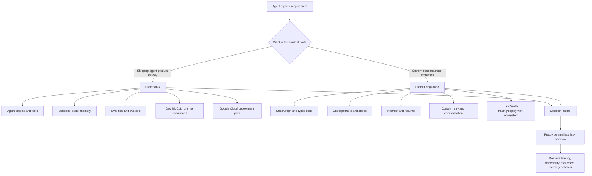

---

### 3. Real-World Industry Scenarios

#### Scenario A: Enterprise Support Agent on Google Cloud

**Context:** A healthcare or financial-services platform team wants a customer-support agent that can answer policy questions, look up accounts, create tickets, and escalate risky cases. The company already uses Google Cloud and wants a runtime path that can support local development, API serving, managed session persistence, observability, and deployment.

**Better fit: ADK.**

**Why:** The value is the full agent product shape: `Agent`/`LlmAgent`, tools, sessions, events, evalsets, observability, `adk web`, `adk run`, `adk api_server`, and deployment options such as Agent Runtime, Cloud Run, GKE, or other container-friendly infrastructure. The team can focus on tool contracts, prompts, policies, eval cases, and production governance instead of assembling every runtime piece manually.

**Constraints:**

- **Latency:** Users expect interactive response times. ADK helps by giving a standard runtime/event model, but you still need to profile model latency, tool latency, and session-store latency.
- **Cost:** The biggest cost drivers are model calls, repeated tool calls, and over-long session context. ADK evals and traces help you catch wasteful tool trajectories.
- **Reliability:** The agent must preserve conversation continuity. ADK sessions/state reduce custom glue code, but session IDs and state scopes must be designed carefully.
- **Security/privacy:** Healthcare/finance data must not leak across users. ADK's explicit `app_name`, `user_id`, `session_id`, and state prefixes make review easier, but access control still lives in your app/tool layer.

**What good looks like in production:** Every risky tool call is confirmed or policy-gated, every turn has traceable events, evalsets run before deployment, session state is scoped correctly, and cloud logs/traces reveal whether failures are model, tool, state, or policy failures.

#### Scenario B: Research Workflow With Complex Human Review

**Context:** A legal research product runs long workflows: retrieve cases, classify relevance, summarize arguments, route uncertain evidence to human reviewers, pause for edits, resume later, and maintain typed state across many branches.

**Better fit: LangGraph.**

**Why:** The hard problem is the custom state graph. LangGraph's `StateGraph`, checkpointers, stores, dynamic `interrupt()`/resume patterns, typed state, node-level retries, and human-in-the-loop semantics give the team precise control over how the workflow pauses, resumes, branches, and recovers.

**Constraints:**

- **Latency:** This workflow may be long-running, so per-turn latency matters less than resumability and correct checkpointing.
- **Cost:** The graph can store raw intermediate results and avoid re-running expensive retrieval or summarization nodes after resume.
- **Reliability:** Durable execution matters because a workflow may pause for hours or days while humans review evidence.
- **Security/privacy:** Human reviewers need carefully scoped state snapshots; LangGraph lets you decide exactly what payload an interrupt exposes.

**What good looks like in production:** Each node has a narrow responsibility, state is raw and inspectable, checkpoints exist before/after risky stages, resume behavior is tested, and human review payloads are JSON-serializable and privacy-filtered.

#### Scenario C: Small AI Platform Team Standardizing Internal Agents

**Context:** A platform team supports several internal agents: HR assistant, IT ticket assistant, analytics assistant, and sales enablement assistant. Most use cases need the same patterns: instructions, tools, session continuity, evals, traces, and deployment. Few need exotic graph control.

**Better fit: ADK.**

**Why:** Standardization is the win. ADK gives a more opinionated agent shape, which helps multiple teams build agents in the same way. That reduces review burden: architecture reviewers can ask the same questions for every agent: What tools are exposed? What state prefixes exist? What evalset covers regressions? What deployment path is used? What traces are logged?

**What good looks like in production:** New agents reuse templates, tool design rules, eval configs, deployment scripts, and monitoring dashboards. The team spends less time debating framework plumbing and more time validating behavior.

---

### 4. System View (Think Like a Systems Engineer)

[Intermediate]

#### Inputs -> Transformations -> Outputs

**Inputs:**

- Product requirements: latency, uptime, data sensitivity, human review needs, deployment target.
- Workflow complexity: number of steps, branches, pauses, retries, and long-running tasks.
- Team constraints: familiarity with Google Cloud, LangChain, typed state graphs, infra ownership, evaluation discipline.
- Integration surface: tools, MCP servers, databases, auth, monitoring, CI/CD, secrets, artifact storage.

**Transformations:**

1. Classify the system's hard part: product runtime vs custom orchestration.
2. Map must-have runtime services: sessions, persistence, evals, observability, deployment, streaming, human approval.
3. Prototype the riskiest path in both frameworks only if the choice is unclear.
4. Measure operational effort, not just demo effort.

**Outputs:**

- A framework-selection decision memo.
- A smallest-risky-prototype result.
- A list of required guardrails, evals, traces, deployment steps, and ownership boundaries.

#### Observability: What We Log, Trace, and Measure

For ADK-fit systems, inspect:

- `session_id`, `user_id`, `app_name`, state keys, and state deltas.
- agent name/model/instruction version.
- tool name, tool args, confirmation status, tool result shape.
- evalset pass/fail, trajectory score, hallucination score, final response score.
- deployment/runtime metrics: p50/p95 latency, error rate, tool timeout rate, session-store failures.

For LangGraph-fit systems, inspect:

- graph thread ID, current node, next route, checkpoint version.
- state before/after each node.
- interrupt payloads and resume values.
- retry attempts, compensation branches, idempotency markers.
- LangSmith traces or equivalent node-level traces.

#### Failure Points: Where It Breaks and How It Shows Up

- **Wrong framework fit:** engineers spend more time fighting the framework than building behavior.
- **State mismatch:** agent forgets context, resumes incorrectly, or leaks state across users.
- **Tool governance gap:** dangerous tools execute without confirmation or audit trails.
- **Eval gap:** demo works, but regressions appear after prompt/model/tool changes.
- **Deployment mismatch:** local prototype has no clean path to production runtime, scaling, tracing, or policy enforcement.

---

### 5. System Design Flavor

[Intermediate]

#### Key Components / Interfaces

**ADK-oriented design:**

- ADK `Agent` / `LlmAgent` for the agent role.
- Tools as `FunctionTool`, MCP toolsets, long-running tools, or `AgentTool`.
- `Runner` to execute the agent against a `Session`.
- `SessionService` for local, database-backed, or managed persistence.
- Eval files/evalsets for tool trajectory and final-answer quality.
- `adk web`, `adk run`, `adk api_server`, and deployment target.

**LangGraph-oriented design:**

- `StateGraph` with typed state.
- Nodes as LLM steps, data steps, action steps, and human input steps.
- Edges/conditional routing through state and `Command`.
- Checkpointers for thread-scoped state snapshots.
- Stores for cross-thread durable memory.
- `interrupt()` for human-in-loop pause/resume.
- LangSmith or equivalent tracing/evaluation.

#### 3 Important Tradeoffs

| Tradeoff | Prefer ADK When... | Prefer LangGraph When... |
|---|---|---|
| Opinionated runtime vs custom control | You want a standard agent object, session model, eval path, runtime commands, and deployment shape. | You want to design the state graph, checkpoint/resume rules, and routing semantics yourself. |
| Google Cloud fit vs provider neutrality | Your org already uses Google Cloud or wants Agent Runtime/Vertex-style managed paths. | You need a framework-neutral orchestration layer across providers, clouds, or custom infra. |
| Team speed vs graph expressiveness | Your team benefits from templates and consistent runtime conventions. | Your team is comfortable owning low-level graph state, retries, interrupts, and custom observability. |

In layman's terms: choose ADK when you want the platform to give you a strong default operating model. Choose LangGraph when your workflow is unique enough that strong defaults become friction.

#### Scaling Consideration at 10x Traffic/Data

At 10x traffic, ADK systems usually need sharper session-store capacity planning, eval automation, trace sampling, tool-rate limits, and deployment autoscaling.

At 10x workflow complexity, LangGraph systems usually need stricter state schemas, smaller node boundaries, durable checkpointers, idempotent side effects, and stronger replay/resume tests.

---

### 6. Common Mistakes + Debugging

#### Mistake 1: Choosing ADK Because It Has Graphs

**Symptom:** The team builds a complex custom workflow in ADK, but every unusual branch, retry, or resume behavior needs workaround code.

**Likely cause:** The real requirement is not an agent runtime. It is a custom state machine with fine-grained control.

**First debugging step:** Draw the workflow as states, transitions, retries, human pauses, and persistence boundaries. If the diagram is mostly custom orchestration semantics, prototype that path in LangGraph.

#### Mistake 2: Choosing LangGraph Because It Feels More Powerful

**Symptom:** The prototype works, but production work stalls around sessions, evals, deployment, runtime APIs, trace conventions, and team onboarding.

**Likely cause:** The use case needed a production agent runtime more than low-level graph control.

**First debugging step:** List what your team must build or integrate around the graph: API server, session persistence, eval pipeline, deployment, monitoring, auth, and operational runbooks. If those dominate the work, ADK may be the better fit.

#### Mistake 3: Comparing Demo Code Instead of Operational Cost

**Symptom:** A 20-line sample looks easy in both frameworks, but the real system becomes hard after adding evals, failures, approvals, and deployment.

**Likely cause:** The comparison measured syntax, not production behavior.

**First debugging step:** Build the smallest risky workflow: one multi-turn session, one tool call, one failure, one human approval, one eval case, one deployment path. Measure the effort and trace quality.

---

### 7. Hands-On Lab: Framework Fit Decision Drill

[Pro]

This is a reasoning lab rather than a coding lab. The goal is to make framework selection testable.

#### Build: Create a Decision Matrix

Score each dimension from 1-5. Higher means stronger need.

| Dimension | Score | ADK Signal | LangGraph Signal |
|---|---:|---|---|
| Need built-in agent/session runtime |  | Strong | Medium |
| Need evals/traces/deployment path quickly |  | Strong | Medium via LangSmith/platform setup |
| Need custom state graph control |  | Medium | Strong |
| Need durable pause/resume/human-in-loop |  | Medium/strong depending pattern | Strong |
| Need Google Cloud managed path |  | Strong | Medium |
| Need provider-neutral orchestration |  | Medium | Strong |
| Team wants opinionated templates |  | Strong | Medium |
| Team can own low-level graph semantics |  | Medium | Strong |

**Example scenario:** Internal IT support agent with ticket lookup, password-reset guidance, session continuity, evals, and Cloud Run deployment.

Expected result: ADK should score higher because runtime services, sessions, evals, and deployment path dominate.

#### Break: Force an Ambiguous Case

Now add these requirements:

- A ticket may pause for manager approval for 3 days.
- The workflow must resume exactly from the approval step.
- A rejected approval must route to compensation logic.
- Support engineers must edit intermediate state before resume.
- The workflow must run on multiple model providers and clouds.

Expected result: LangGraph becomes more attractive because durable execution, interrupts, custom state, and provider-neutral control are now central.

#### Measure: Capture Concrete Signals

For each prototype, measure:

- **Implementation time:** hours to working risky path.
- **Trace completeness:** can you see every model call, tool call, route, state update, and failure?
- **Resume correctness:** can the workflow pause/resume without duplicate side effects?
- **Eval friction:** how much work to create and run regression tests?
- **Deployment friction:** how much glue code is needed for API serving, sessions, observability, and scaling?

#### Explain: Why It Broke

If ADK feels hard in the ambiguous case, it is probably because the workflow wants graph semantics beyond the default agent runtime shape.

If LangGraph feels hard in the simple IT-support case, it is probably because your team is assembling runtime services that ADK already makes first-class.

The guardrail is a decision memo: choose the framework based on the hardest production requirement, not the most elegant quickstart.

---

### 8. Active Recall (Spaced Repetition)

**Q1 [Beginner]:** What is the simplest mental model for ADK vs LangGraph?

> **A:** ADK is better when you need an opinionated agent product runtime. LangGraph is better when you need a lower-level custom orchestration runtime.

**Q2 [Intermediate]:** Name three signals that ADK may be the better fit.

> **A:** You need standard sessions/state, built-in eval workflows, dev UI/CLI/runtime commands, Google Cloud deployment paths, and consistent team templates.

**Q3 [Intermediate]:** Name three signals that LangGraph may be the better fit.

> **A:** You need custom typed state graphs, durable checkpoint/resume, precise human-in-loop interrupts, custom retries/compensation, or provider-neutral orchestration.

**Q4 [Pro]:** Why is comparing quickstart code a weak framework-selection method?

> **A:** Quickstarts hide production costs: persistence, evals, trace debugging, deployment, approval flows, idempotency, and failure recovery. The right comparison is the smallest risky production workflow.

---

### 9. Practice

#### Mini-Exercise: Choose the Framework

You are designing an agent that answers employee benefits questions, remembers user preferences, calls HR tools, runs evals before deployment, and is deployed by a Google Cloud platform team. It has simple routing and only occasional human escalation.

**Suggested answer:** Prefer ADK. The workflow is not graph-heavy; the hard parts are sessions, tool governance, evals, observability, and deployment. ADK's opinionated runtime shape reduces operational glue.

#### Capstone-Style System Design Question

Design a claims-processing assistant for an insurance company. It must ingest a claim, retrieve policy details, classify risk, ask a human adjuster for approval on borderline cases, resume days later, create a payment task if approved, and maintain a full audit trail.

**Answer outline:**

- If the team's main concern is managed agent runtime, Google Cloud deployment, session/event traces, and standardized evals, start with ADK.
- If the core workflow has many long-running approval states, custom compensation logic, exact resume behavior, and state edits by humans, prototype LangGraph.
- For either choice, require: durable state, idempotent payment/task creation, approval audit events, tool confirmation, state-scoped privacy controls, eval cases for approval routing, and traces for each model/tool/state transition.
- Final decision should come from the smallest risky prototype: one approved claim, one rejected claim, one resumed claim, one tool failure, and one eval regression.

---

### 10. Production Reality Check (Mandatory Ending)

**If this fails in prod, what's the first thing we inspect?**

Inspect the failed run trace and classify the failure by layer: model decision, tool contract, state/session persistence, routing/checkpointing, eval gap, or deployment/runtime issue.

Why: framework-selection failures usually masquerade as prompt bugs. If traces show missing session state, duplicate side effects, unobservable routes, or painful deployment glue, the problem may be framework fit or runtime design, not just model behavior.

---

### 11. Curiosity Bridge (Mandatory Ending)

This works well for deciding when ADK's runtime shape is enough, but it raises the next comparison: what does OpenAI's Agents SDK consider first-class?

That leads into **OpenAI Agents SDK patterns**: agents, runners, tools, handoffs, guardrails, sessions, MCP integration, and realtime pathways.

---

### 12. Exit Check + Carry-Forward Review

**Exit check:** You're done with 15.1.d when you can defend ADK vs LangGraph using production requirements: sessions, evals, observability, deployment, custom state control, pause/resume, human approval, provider strategy, and team ownership.

---

**Carry-Forward Review (interleaved recall from 15.1.c):**

*Q: Why should state updates go through ADK's event/session lifecycle instead of being mutated casually in random helper code?*

> **A:** Because the session trace is the source of truth for debugging and replay. State changes attached to events make it possible to inspect what changed, when it changed, and which turn/tool/model decision caused it.

---

## Topic 15.2: OpenAI Agents SDK Patterns

> **Topic time:** 10h  
> Focus: Understanding the OpenAI Agents SDK as a lightweight Python-first runtime around the Responses API: agents, runners, tools, handoffs, guardrails, sessions, MCP, sandbox agents, realtime pathways, tracing, and when to use the SDK instead of lower-level model calls.

---

## Subtopic 15.2.a: Agent, Runner, Tools, and Handoffs

### ✅ Add to Knowledge Base

### 0. Reading Path + Level Tags

- **Beginner:** Read sections 1-2 and Active Recall. Your goal is to explain the four core pieces: agent, runner, tool, handoff.
- **Intermediate:** Add sections 3-6 and the Hands-On Lab. Your goal is to design a small multi-agent support workflow.
- **Pro:** Do the full lab and capstone. Your goal is to debug loops, bad tool calls, incorrect handoffs, and state/history mistakes.

---

### 1. Pre-Question Hook + The Intuition

**Pause:** before reading, imagine you have three specialists: a general support rep, a billing expert, and a refund expert. When should the general rep call a specialist as a tool, and when should the specialist take over the conversation entirely?

[Beginner]

The **OpenAI Agents SDK** is a lightweight Python runtime for building agentic apps on top of model calls. Its main idea is simple: define agents, give them tools, run them through a runner, and let the SDK manage the loop of model call -> tool call -> tool result -> next model call -> final answer.

The core pieces:

- **OpenAI `Agent`**: an LLM configured with `name`, `instructions`, optional `model`, `tools`, `handoffs`, `guardrails`, `output_type`, `model_settings`, and runtime hooks.
- **`Runner`**: the execution engine that runs an agent against input. It handles model calls, tool execution, handoffs, streaming, sessions/history, max-turn limits, and final output.
- **Tool**: a capability the model may call. Tools can be hosted OpenAI tools, Python function tools, local runtime tools, MCP tools, or even other agents exposed as tools.
- **Handoff**: a delegation pattern where one agent transfers control to another specialist agent. The receiving agent takes over the conversation.

The best mental model: an `Agent` defines the worker, tools define what the worker can do, handoffs define who the worker can transfer the case to, and `Runner` is the supervisor that keeps the work loop moving until a final answer appears.

**Analogy:** Think of a hospital intake desk. The triage nurse handles simple questions, uses internal systems to look up patient info, calls a specialist for small checks, or transfers the patient to cardiology/orthopedics when that team should own the case.

Where the analogy breaks: software handoffs are represented as model-callable tools, and the receiving agent sees conversation history according to SDK rules and filters. It is not a human memory transfer; it is structured transcript/control transfer.

---

### 2. Visual Diagram (Mermaid)

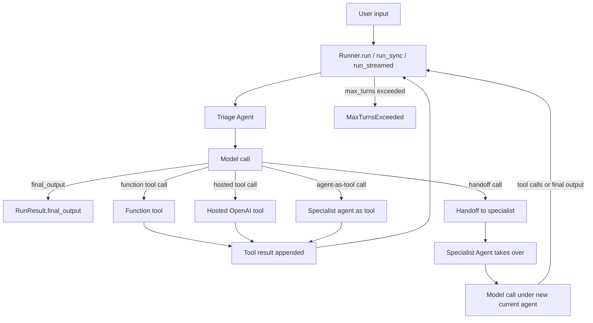

---

### 3. Real-World Industry Scenarios

#### Scenario A: Customer Support Triage With Billing and Refund Specialists

**Context:** A SaaS company wants a support assistant that answers FAQs, looks up subscriptions, routes billing disputes to a billing specialist, and routes refund requests to a refund specialist.

**How the pieces map:**

- `triage_agent`: user-facing agent that decides whether to answer, call a lookup tool, call a specialist as a tool, or hand off.
- `lookup_subscription`: function tool that fetches plan/status from internal billing data.
- `billing_agent.as_tool(...)`: useful when the triage agent wants a specialist answer but should keep control.
- `handoff(refund_agent)`: useful when the refund specialist should take over the conversation.

**Constraints:**

- **Latency:** Each handoff/tool loop can add another model call. What looks like one user turn may be multiple model calls under the runner.
- **Cost:** Tool-heavy and handoff-heavy flows can multiply token usage because conversation history and tool schemas are included in model calls.
- **Reliability:** Wrong specialist selection leads to poor customer experience. Clear `handoff_description`, tool descriptions, and eval cases are needed.
- **Privacy:** Billing/refund tools may touch sensitive data. Tools should enforce auth and return minimal data to the model.

**What good looks like in production:** The triage agent handles simple issues directly, uses tools for deterministic lookup, hands off only when ownership should transfer, traces show every tool/handoff decision, and evals test common routing cases.

#### Scenario B: Compliance Assistant With Structured Output

**Context:** A bank needs an assistant that reads a customer message, classifies risk, checks policy, and returns a structured compliance decision.

**How the pieces map:**

- `Agent(output_type=ComplianceDecision)` forces the final answer into a Pydantic shape.
- `policy_lookup` is a function tool with a strict argument schema.
- `RunConfig` can add tracing metadata and global guardrails.
- A handoff to `escalation_agent` occurs only for high-risk cases.

**Constraints:**

- **Latency:** Structured output may require retries if the model violates schema. Keep schemas small and precise.
- **Cost:** Policy lookups should return focused snippets, not huge policy documents.
- **Reliability:** The model must not invent policy. Tool outputs and citations should be audited.
- **Security/privacy:** Tool output must redact irrelevant customer details before the model sees them.

**What good looks like in production:** Final outputs validate against the schema, every escalation includes a structured reason, tool errors are model-visible but sanitized, and traces can prove what policy was used.

#### Scenario C: Internal Analytics Agent With Agents-As-Tools

**Context:** A data team builds an assistant that can explain metrics, create SQL, summarize dashboards, and translate results for executives.

**How the pieces map:**

- A manager agent owns the conversation.
- SQL agent, chart explainer agent, and executive summary agent are exposed with `as_tool(...)`.
- The manager can call multiple specialist tools and synthesize one final answer.

**Why agents-as-tools instead of handoffs:** The user should experience one coherent assistant. Specialists contribute bounded outputs, but the manager keeps control of the final response.

**What good looks like in production:** Specialist tools have narrow descriptions, structured inputs where useful, tool results are traceable, and the final response clearly separates facts from interpretation.

---

### 4. System View (Think Like a Systems Engineer)

[Intermediate]

#### Inputs -> Transformations -> Outputs

**Inputs:**

- User input: string or list of Responses API input items.
- Agent definition: `name`, `instructions`, `model`, `tools`, `handoffs`, `output_type`, `model_settings`.
- Runtime context: app dependencies, user/session data, auth handles, feature flags.
- Run configuration: model overrides, guardrails, tracing metadata, tool execution settings, handoff filters, max turns.

**Transformations inside `Runner`:**

1. Call the model for the current agent.
2. If the model returns final output, stop.
3. If the model calls tools, execute tools, append results, and call the model again.
4. If the model chooses a handoff, switch the current agent, prepare handoff input/history, and continue.
5. If `max_turns` is exceeded or a tool/model behavior error occurs, raise or route through configured error handling.

**Outputs:**

- `RunResult.final_output`: the final user-facing output, plain text or structured object.
- `RunResult.new_items`: model outputs, tool calls, tool outputs, handoff items, and other run artifacts.
- Usage/tracing data: token use, spans, tool activity, agent transitions, and errors.
- Optional session/conversation state for future turns.

#### Observability: What We Log, Trace, and Measure

- `workflow_name`, `trace_id`, `group_id`, and `trace_metadata`.
- Current agent name and every agent transition.
- Tool name, arguments, call ID, approval state, timeout, and result shape.
- Handoff source agent, target agent, input payload, and applied input filter.
- `max_turns`, actual turn count, model calls per user turn, and total tokens.
- Final output type validation success/failure.

#### Failure Points: Where It Breaks and How It Shows Up

- **Bad tool schema:** model calls tool with malformed or semantically wrong arguments.
- **Vague tool descriptions:** model picks the wrong tool or ignores the correct tool.
- **Wrong orchestration pattern:** using handoff when the manager should retain control, or agents-as-tools when a specialist should own the conversation.
- **Looping behavior:** model repeatedly calls tools without reaching final output.
- **History bloat:** handoffs and repeated runs forward too much transcript, increasing cost and lowering accuracy.
- **Context confusion:** app state is passed through conversation history instead of typed runtime context.

---

### 5. System Design Flavor

[Intermediate]

#### Key Components / Interfaces

**Minimal agent:**

```python
from agents import Agent, Runner

agent = Agent(
    name="Assistant",
    instructions="Answer clearly and concisely.",
)

result = Runner.run_sync(agent, "Explain recursion in one sentence.")
print(result.final_output)
```

**Function tool:**

```python
from agents import Agent, Runner, function_tool

@function_tool
def lookup_order(order_id: str) -> str:
    """Look up order status by order ID."""
    return f"Order {order_id} is in transit."

agent = Agent(
    name="Support agent",
    instructions="Use tools for order-specific questions.",
    tools=[lookup_order],
)

result = Runner.run_sync(agent, "Where is order A123?")
```

**Agents-as-tools vs handoffs:**

```python
from agents import Agent, handoff

billing_agent = Agent(
    name="Billing agent",
    instructions="Handle subscription, invoice, and payment questions.",
    handoff_description="Use for billing or invoice ownership.",
)

refund_agent = Agent(
    name="Refund agent",
    instructions="Own refund eligibility and refund request conversations.",
    handoff_description="Use when the user wants a refund decision.",
)

triage_agent = Agent(
    name="Triage agent",
    instructions="Answer simple questions. Delegate carefully.",
    tools=[
        billing_agent.as_tool(
            tool_name="ask_billing_specialist",
            tool_description="Get a billing specialist answer while retaining control.",
        )
    ],
    handoffs=[handoff(refund_agent)],
)
```

#### 3 Important Tradeoffs

| Tradeoff | Choose This When... | Watch Out For... |
|---|---|---|
| Function tool vs hosted tool | Use function tools when your app owns the API/data. Use hosted tools for OpenAI-managed web/file/code/search surfaces. | Hosted tools may be model/provider-specific; function tools require your own auth, retries, and sanitization. |
| Agent-as-tool vs handoff | Use agent-as-tool when the manager should keep control. Use handoff when the specialist should own the conversation. | A bad choice creates either over-centralized answers or fragmented user experience. |
| Manual history vs sessions/server state | Use manual `to_input_list()` for small loops and full control. Use sessions/conversations for persistent multi-turn apps. | Mixing persistence strategies can duplicate context or confuse the runner. |

In layman's terms: a tool answers a subquestion; a handoff changes who is responsible for the conversation.

#### Scaling Consideration at 10x Traffic/Data

At 10x traffic, the expensive parts are model turns, tool latency, and trace volume. You need max-turn limits, focused tool schemas, good tool timeouts, trace sampling/redaction, and eval coverage for routing decisions.

At 10x tool count, do not dump every tool into every agent. Use specialist agents, tool namespaces, deferred loading/tool search, or MCP boundaries so the model sees a manageable action surface.

---

### 6. Common Mistakes + Debugging

#### Mistake 1: Using a Handoff When an Agent-As-Tool Is Better

**Symptom:** The user asks one question, but the conversation suddenly changes voice or loses the original triage context.

**Likely cause:** The triage agent transferred control when it only needed a specialist answer.

**First debugging step:** Inspect run items for a handoff call. If the specialist should have returned a bounded result, expose it with `agent.as_tool(...)` instead.

#### Mistake 2: Tool Schema Is Technically Valid but Semantically Weak

**Symptom:** The model calls `lookup_user` with email when the tool needs user ID, or calls a broad tool for a narrow task.

**Likely cause:** Tool name, docstring, argument descriptions, or Pydantic constraints are too vague.

**First debugging step:** Print the generated tool schema and compare it to real user requests. Add precise descriptions, argument constraints, and eval cases for wrong-argument prompts.

#### Mistake 3: Infinite or Wasteful Tool Loops

**Symptom:** The runner keeps calling tools and eventually hits `MaxTurnsExceeded`.

**Likely cause:** Forced tool use was not reset, the tool result does not answer the model's question, or instructions require a tool even after the answer is known.

**First debugging step:** Inspect `new_items` and trace spans in order. Check `ModelSettings.tool_choice`, `agent.reset_tool_choice`, `tool_use_behavior`, and the exact text returned by each tool.

---

### 7. Hands-On Lab: Build -> Break -> Measure -> Explain

[Pro]

#### Build: Small Support Workflow

Install when you are ready to run locally:

```bash
pip install openai-agents
```

Then build a tiny support workflow:

```python
from agents import Agent, Runner, function_tool, handoff

@function_tool
def lookup_order(order_id: str) -> str:
    """Look up shipping status for a customer order ID."""
    if order_id == "A123":
        return "Order A123 shipped yesterday and arrives Friday."
    return "No order found for that ID."

billing_agent = Agent(
    name="Billing agent",
    instructions="Answer billing questions. Be precise and ask for invoice ID if missing.",
    handoff_description="Use when the user has a billing or invoice problem.",
)

refund_agent = Agent(
    name="Refund agent",
    instructions="Own refund request conversations and explain next steps.",
    handoff_description="Use when the user explicitly requests a refund.",
)

triage_agent = Agent(
    name="Triage agent",
    instructions=(
        "Help support users. Use lookup_order for order status. "
        "Ask billing specialist as a tool for invoice questions. "
        "Hand off to refund agent when the user wants a refund."
    ),
    tools=[
        lookup_order,
        billing_agent.as_tool(
            tool_name="ask_billing_specialist",
            tool_description="Get a billing expert answer without transferring the conversation.",
        ),
    ],
    handoffs=[handoff(refund_agent)],
)

result = Runner.run_sync(triage_agent, "Where is order A123?")
print(result.final_output)
```

#### Break: Force Three Failure Modes

1. Make the tool vague: rename `lookup_order` to `lookup` and remove the docstring.
2. Force a loop: set model/tool instructions that require a tool call even after the answer is known.
3. Misuse handoff: hand off billing questions to `billing_agent` even when the triage agent only needs one billing fact.

#### Measure: Capture Concrete Signals

Record:

- Number of model calls per user turn.
- Number of tool calls and handoffs.
- Whether `final_output` arrived before `max_turns`.
- Whether the correct tool/handoff was selected.
- Whether tool arguments matched schema and business meaning.
- Whether trace/run items explain the failure without guessing.

#### Explain: Why It Broke

Vague tools break because the model chooses from names/descriptions/schemas, not from your hidden intent.

Loops happen because the runner faithfully continues the agent loop until final output or `max_turns`; if instructions/tool behavior never create a final-answer path, the SDK cannot invent one safely.

Handoff mistakes happen because handoffs transfer conversation ownership. If you only need a specialist computation, use an agent-as-tool and let the manager synthesize the response.

---

### 8. Active Recall (Spaced Repetition)

**Q1 [Beginner]:** What does `Runner` do in the OpenAI Agents SDK?

> **A:** It executes the agent loop: calls the model, runs tools, handles handoffs, repeats until final output, and returns a result.

**Q2 [Beginner]:** What is the difference between an agent-as-tool and a handoff?

> **A:** Agent-as-tool lets a manager agent call a specialist and keep control. A handoff transfers control so the specialist becomes the current agent.

**Q3 [Intermediate]:** Why are function tool names, docstrings, and argument descriptions production-critical?

> **A:** They become the action schema the model uses to decide whether and how to call the tool. Vague schemas cause wrong tools and wrong arguments.

**Q4 [Pro]:** What should you inspect when a run hits `MaxTurnsExceeded`?

> **A:** Inspect `new_items`/trace spans: model outputs, tool calls, tool outputs, handoffs, `tool_choice`, `tool_use_behavior`, and whether any step gave the model enough information to produce final output.

---

### 9. Practice

#### Mini-Exercise: Pick the Coordination Pattern

A user asks: "Can you translate this paragraph into Spanish and French, then summarize both translations in English?"

**Suggested answer:** Use a manager agent with Spanish and French agents as tools. The manager should call both specialists, receive bounded translations, and synthesize the final English summary. A handoff would be awkward because no single specialist should own the whole conversation.

#### Capstone-Style System Design Question

Design an OpenAI Agents SDK workflow for an ecommerce assistant that can answer order questions, handle billing disputes, and process refund requests.

**Answer outline:**

- Start with a `triage_agent` that owns the user conversation.
- Add `lookup_order(order_id)` and `lookup_invoice(invoice_id)` as function tools with precise schemas.
- Expose a billing specialist as `billing_agent.as_tool(...)` if billing advice should be folded into the triage response.
- Use `handoff(refund_agent, input_type=RefundReason)` when the refund specialist should own the next part of the conversation.
- Add handoff descriptions so the model can choose correctly.
- Use trace metadata: `workflow_name="ecommerce_support"`, customer/session group ID, and redaction settings.
- Add eval cases for: order lookup, missing order ID, invoice dispute, refund request, wrong-tool prevention, and max-turn loop prevention.

---

### 10. Production Reality Check (Mandatory Ending)

**If this fails in prod, what's the first thing we inspect?**

Inspect the run trace/run items in chronological order: current agent, model output, tool calls, tool arguments, tool results, handoff calls, and final output decision.

Why: most SDK failures are loop failures, tool-contract failures, or delegation failures. The trace tells you whether the model chose the wrong capability, received a bad tool result, handed off to the wrong agent, or simply never got a clean final-answer path.

---

### 11. Curiosity Bridge (Mandatory Ending)

This unlocks the basic OpenAI Agents SDK loop, but it also exposes the next risk: what prevents bad inputs, unsafe outputs, or messy conversation history from reaching users?

That leads into **guardrails and sessions**: input/output checks, session-backed memory, conversation-state choices, and safer multi-turn execution.

---

### 12. Exit Check + Carry-Forward Review

**Exit check:** You're done with 15.2.a when you can build a small SDK workflow with one triage agent, one function tool, one specialist agent-as-tool, one handoff, and explain how `Runner` reaches `final_output` or fails with a traceable reason.

---

**Carry-Forward Review (interleaved recall from 15.1.d):**

*Q: What is the framework-selection difference between ADK and the OpenAI Agents SDK at a high level?*

> **A:** ADK leans toward an opinionated Google-oriented agent product runtime with sessions/evals/deployment patterns. The OpenAI Agents SDK is a lightweight Python-first runtime around the Responses API with a small primitive set: agents, tools, handoffs, guardrails, sessions, and tracing.

---

## Subtopic 15.2.b: Guardrails and Sessions

### ✅ Add to Knowledge Base

### 0. Reading Path + Level Tags

- **Beginner:** Read sections 1-2 and Active Recall. Your goal is to explain guardrails and sessions in plain English.
- **Intermediate:** Add sections 3-6 and the Hands-On Lab. Your goal is to design safe multi-turn behavior.
- **Pro:** Do the full lab and capstone. Your goal is to debug guardrail tripwires, approval pauses, history bloat, and session persistence choices.

---

### 1. Pre-Question Hook + The Intuition

**Pause:** before reading, imagine a customer asks your support agent: "Delete my account, refund my card, and forget everything I said before." Which parts should be blocked, checked, remembered, forgotten, or sent for approval?

[Beginner]

The OpenAI Agents SDK gives you two major safety and continuity tools:

- **Guardrail**: a programmable check that inspects input, output, or function-tool calls and can stop, reject, replace, or flag unsafe behavior.
- **Session**: SDK-managed conversation memory that stores prior input/output/tool items so future runs can continue the same conversation without manually calling `result.to_input_list()`.

Think of guardrails as gates and sessions as memory.

Guardrails answer: "Should this input, output, or tool call be allowed?"

Sessions answer: "What should the agent remember from previous turns?"

The important engineering point: these are different layers. A session can accidentally preserve bad or sensitive history. A guardrail can block an unsafe request but still needs access to the right context. Good production design uses both: sessions for continuity, guardrails for boundaries, and approvals for risky actions.

**Analogy:** A bank branch has customer records and security checks. The records help staff remember your account history. The security checks decide whether a wire transfer, password reset, or account closure should proceed. Good memory without security is dangerous; strong security without memory is frustrating.

Where the analogy breaks: agent memory is not human memory. It is a stored list of model input items, tool calls, outputs, and generated items. You must decide what gets stored, retrieved, filtered, compacted, encrypted, or deleted.

---

### 2. Visual Diagram (Mermaid)

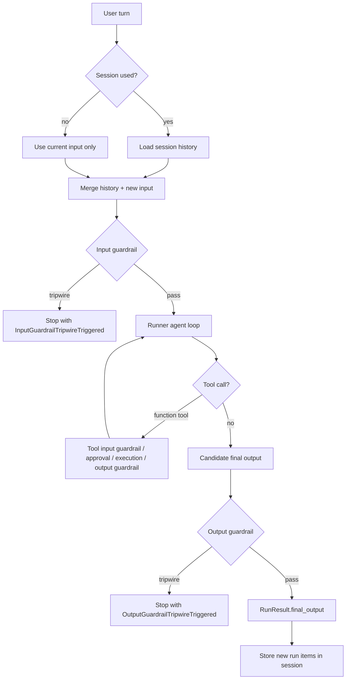

---

### 3. Real-World Industry Scenarios

#### Scenario A: Customer Support Agent With Unsafe Requests

**Context:** A support assistant answers account questions, looks up orders, updates shipping address, and can initiate cancellations. The company wants multi-turn continuity but must block off-topic abuse, redact sensitive data, and require approval for destructive actions.

**Design:**

- Use an **input guardrail** to detect off-topic, abusive, or policy-disallowed requests before expensive model/tool work.
- Use **tool guardrails** around function tools that touch account data.
- Use `needs_approval=True` or a dynamic approval function for cancellations, refunds, account closure, and emails.
- Use a `SQLiteSession` locally and a production session backend such as `SQLAlchemySession`, `RedisSession`, `MongoDBSession`, `DaprSession`, or encrypted wrapper depending on infrastructure.

**Constraints:**

- **Latency:** Blocking input guardrails add upfront latency, but prevent wasted tokens and side effects. Parallel guardrails reduce latency, but the agent may start spending tokens before the guardrail trips.
- **Cost:** Sessions can replay long histories. Use `SessionSettings(limit=N)`, `session_input_callback`, or compaction when conversations grow.
- **Reliability:** Approvals must resume with the same `RunState` and same session/backing store, or the agent may lose context.
- **Security/privacy:** Session history may include sensitive tool outputs. Use redaction, encryption, TTL, and trace settings such as sensitive-data controls.

**What good looks like in production:** Unsafe requests trip early; destructive tools pause for approval; rejected tools return safe model-visible messages; session history is scoped per user/thread; long histories are pruned or compacted; traces show which guardrail or approval decision fired.

#### Scenario B: Regulated Advice Assistant

**Context:** A financial guidance assistant explains account options but must not provide personalized investment advice unless a licensed workflow is active.

**Design:**

- Input guardrail detects when the user asks for regulated advice.
- Output guardrail checks final answers for prohibited claims or missing disclaimers.
- Session tracks prior user goals and preferences, but sensitive attributes are minimized.
- `call_model_input_filter` redacts or drops old details right before model calls.

**Constraints:**

- **Latency:** Output guardrails run after final output, so the user waits longer on every answer that needs compliance checking.
- **Cost:** Guardrails implemented with separate model calls add cost. Use deterministic checks for simple policies and smaller/cheaper models for classification when possible.
- **Reliability:** A guardrail that is too broad blocks helpful answers; too narrow lets unsafe advice through.
- **Privacy:** Compliance traces must avoid storing raw account details unless required and protected.

**What good looks like in production:** Guardrail outputs include `output_info` explaining what was checked, tripwire rates are monitored, false positives are reviewed, and final answers can be traced back to policy/tool context.

#### Scenario C: Long-Running Approval Workflow

**Context:** An internal operations agent can run a shell tool, call an MCP deployment tool, and open tickets. Some actions require human approval and may sit for hours.

**Design:**

- Tools declare `needs_approval` or MCP `require_approval`.
- When the run pauses, inspect `result.interruptions`, convert to `RunState` with `result.to_state()`, serialize it, and resume after approval or rejection.
- Pass the same session instance or another instance pointed at the same store when resuming.

**Constraints:**

- **Latency:** Approval latency may be minutes or days; the important property is resumability, not instant response.
- **Cost:** Avoid re-running long histories unnecessarily after approval. Use session limits or compaction.
- **Reliability:** Store agent/tool definition version next to serialized state so old approvals can resume under compatible code.
- **Security/privacy:** Serialized `RunState` can include app context, approvals, tool input, trace metadata, and server-managed conversation settings. Treat it as sensitive data.

**What good looks like in production:** Pending approvals survive process restarts, decisions are auditable, rejected actions give the model a safe explanation, and resumed runs continue in the correct conversation/session.

---

### 4. System View (Think Like a Systems Engineer)

[Intermediate]

#### Inputs -> Transformations -> Outputs

**Inputs:**

- User input and prior session history.
- Guardrail functions: input, output, and tool-level checks.
- Tool approval policies and approval decisions.
- Session backend and session ID.
- `RunConfig`: session settings, callbacks, guardrails, tracing, tool execution behavior.

**Transformations:**

1. Retrieve session history, if session-backed memory is used.
2. Merge history and current input, optionally through `session_input_callback`.
3. Run input guardrails in parallel or blocking mode.
4. Execute the agent loop: model calls, tool calls, handoffs, and final output.
5. For function tools, run tool guardrails and approvals around tool execution.
6. Run output guardrails on final output.
7. Store new run items back into the session.

**Outputs:**

- Final answer or structured output.
- Guardrail result/tripwire exception.
- Pending approval interruptions and resumable `RunState`.
- Updated session history.
- Trace spans and run items for debugging.

#### Observability: What We Log, Trace, and Measure

- Guardrail name, type, execution mode, latency, result, `output_info`, and tripwire status.
- Exception type: `InputGuardrailTripwireTriggered`, `OutputGuardrailTripwireTriggered`, tool guardrail rejection, or approval rejection.
- Session ID, backend type, item count retrieved, item count stored, and history limit.
- Whether `session_input_callback` or `call_model_input_filter` changed model input.
- Approval interruption details: tool name, arguments, agent name, approval/rejection outcome.
- Session store errors, duplicate items, stale history, compaction latency, and resume success rate.

#### Failure Points: Where It Breaks and How It Shows Up

- **Guardrail scope mismatch:** input guardrails only run for the first agent; output guardrails only run for the final-output agent; tool guardrails apply to function tools, not every hosted/built-in/handoff surface.
- **Parallel guardrail surprise:** a parallel input guardrail may trip after tokens were already spent or after early side effects began.
- **Session/history bloat:** the agent becomes slower, more expensive, or confused by stale history.
- **Mixed persistence strategies:** sessions plus `conversation_id`/`previous_response_id` duplicate or conflict with state.
- **Unsafe serialized state:** `RunState` or sessions contain secrets because app context or tool outputs were not minimized.

---

### 5. System Design Flavor

[Intermediate]

#### Key Components / Interfaces

**Input guardrail:**

```python
from pydantic import BaseModel
from agents import Agent, GuardrailFunctionOutput, Runner, input_guardrail

class SafetyCheck(BaseModel):
    blocked: bool
    reason: str

safety_agent = Agent(
    name="Safety check",
    instructions="Decide whether the user request is unsafe or off-topic.",
    output_type=SafetyCheck,
)

@input_guardrail(name="support_input_policy", run_in_parallel=False)
async def support_input_policy(ctx, agent, input):
    result = await Runner.run(safety_agent, input, context=ctx.context)
    return GuardrailFunctionOutput(
        output_info=result.final_output,
        tripwire_triggered=result.final_output.blocked,
    )
```

**Session-backed multi-turn conversation:**

```python
from agents import Agent, Runner, SQLiteSession

agent = Agent(name="Assistant", instructions="Reply concisely.")
session = SQLiteSession("support_thread_123", "conversations.db")

first = await Runner.run(agent, "Where is the Golden Gate Bridge?", session=session)
second = await Runner.run(agent, "What state is it in?", session=session)
```

**Approval pause/resume:**

```python
from agents import Agent, Runner, function_tool

@function_tool(needs_approval=True)
async def cancel_order(order_id: str) -> str:
    return f"Cancelled order {order_id}."

agent = Agent(name="Support agent", tools=[cancel_order])
result = await Runner.run(agent, "Cancel order A123", session=session)

if result.interruptions:
    state = result.to_state()
    for interruption in result.interruptions:
        state.approve(interruption)
    result = await Runner.run(agent, state, session=session)
```

#### 3 Important Tradeoffs

| Tradeoff | Choose This When... | Watch Out For... |
|---|---|---|
| Blocking vs parallel input guardrails | Blocking when unsafe inputs must not spend tokens or trigger tools. Parallel when latency matters and early work is acceptable. | Parallel guardrails can trip after work has already started. |
| Client-managed sessions vs OpenAI server-managed state | Sessions when you want your app/storage to own history. `conversation_id` or `previous_response_id` when OpenAI-managed continuation is simpler. | Do not combine session persistence with server-managed conversation settings in the same run. |
| Full history vs limited/filtered/compacted history | Full history for short conversations. Limits, filters, or compaction for long conversations. | Aggressive pruning can drop facts the user expects the agent to remember. |

In layman's terms: guardrails decide what is allowed; sessions decide what is remembered; approvals decide which risky actions must wait for a human or policy decision.

#### Scaling Consideration at 10x Traffic/Data

At 10x traffic, guardrails become their own production subsystem. Track tripwire rates, false positives, false negatives, latency, and cost separately from the main agent.

At 10x conversation length, session strategy becomes a quality and cost problem. You need history limits, summarization/compaction, session TTL, encryption, and tools to inspect or clear bad session history.

---

### 6. Common Mistakes + Debugging

#### Mistake 1: Assuming Input Guardrails Run on Every Agent After Handoff

**Symptom:** A request passes initial triage, then a specialist agent produces behavior that you expected an input guardrail to catch.

**Likely cause:** Agent-level input guardrails run only for the first agent in the chain.

**First debugging step:** Inspect the trace for which agent started the run and which guardrail spans executed. Put checks at the correct boundary: initial input guardrail, handoff filter, specialist instructions, tool guardrails, or output guardrail.

#### Mistake 2: Mixing Session Memory With Server-Managed Conversation State

**Symptom:** The model repeats context, sees duplicated history, or behaves as if older messages were sent twice.

**Likely cause:** The app combines `session` with `conversation_id`, `previous_response_id`, or `auto_previous_response_id`.

**First debugging step:** Choose one persistence strategy per conversation and log it. If using SDK sessions, pass the same session/backing store. If using OpenAI server-managed state, pass only the new turn plus the correct conversation/response ID.

#### Mistake 3: Treating `RunState` as Harmless Metadata

**Symptom:** Pending approvals are stored in a queue or database and later discovered to contain secrets, raw tool inputs, or app context.

**Likely cause:** Serialized `RunState` includes more than approval IDs; it can include context, tool input, nested resumptions, trace metadata, usage, and conversation settings.

**First debugging step:** Inspect serialized `RunState` in a safe environment, define a serializer/deserializer policy, avoid putting secrets in run context, and version stored pending tasks.

---

### 7. Hands-On Lab: Build -> Break -> Measure -> Explain

[Pro]

#### Build: Guarded Multi-Turn Support Agent

```python
from pydantic import BaseModel
from agents import (
    Agent,
    GuardrailFunctionOutput,
    Runner,
    SQLiteSession,
    function_tool,
    input_guardrail,
)

class InputPolicy(BaseModel):
    blocked: bool
    reason: str

policy_agent = Agent(
    name="Input policy checker",
    instructions="Block requests for destructive account actions unless they ask for guidance only.",
    output_type=InputPolicy,
)

@input_guardrail(name="destructive_intent_check", run_in_parallel=False)
async def destructive_intent_check(ctx, agent, input):
    result = await Runner.run(policy_agent, input, context=ctx.context)
    return GuardrailFunctionOutput(
        output_info=result.final_output,
        tripwire_triggered=result.final_output.blocked,
    )

@function_tool(needs_approval=True)
async def close_account(account_id: str) -> str:
    """Close a customer account after approval."""
    return f"Account {account_id} closed."

support_agent = Agent(
    name="Support agent",
    instructions="Help users safely. Use close_account only after approval.",
    tools=[close_account],
    input_guardrails=[destructive_intent_check],
)

session = SQLiteSession("support_thread_001", "support_history.db")
```

Run two turns:

```python
first = await Runner.run(support_agent, "My account ID is acct_123.", session=session)
second = await Runner.run(support_agent, "Close it now.", session=session)
```

#### Break: Force Three Failure Modes

1. Set `run_in_parallel=True` and watch whether the agent begins work before the guardrail finishes.
2. Remove the session and ask a follow-up that depends on prior context.
3. Trigger `close_account`, leave `result.interruptions` unresolved, then try to resume without the same session/backing store.

#### Measure: Capture Concrete Signals

- Guardrail latency and whether the main agent started before guardrail completion.
- Tripwire rate and `output_info.reason` quality.
- Session item count before/after each turn.
- Whether follow-up questions work with and without session.
- Whether approval interruptions appear with tool name, arguments, and agent name.
- Whether resumed runs preserve conversation history and pending approvals.

#### Explain: Why It Broke

Parallel guardrails optimize latency but allow work to begin before safety completes. That is fine for low-risk text-only flows and risky for side-effecting tools.

Without a session, the SDK treats the next run as a fresh call unless you manually pass prior input items or use server-managed state.

Resuming approval flows requires the saved `RunState` and compatible session/history. Otherwise the run may continue without the context that caused the pending tool call.

---

### 8. Active Recall (Spaced Repetition)

**Q1 [Beginner]:** What is the difference between a guardrail and a session?

> **A:** A guardrail checks whether input/output/tool behavior is allowed. A session stores conversation history so future runs remember prior turns.

**Q2 [Intermediate]:** When should you use blocking input guardrails instead of parallel input guardrails?

> **A:** Use blocking guardrails when unsafe input must not consume tokens or trigger tool side effects before the check completes.

**Q3 [Intermediate]:** Why should you avoid mixing SDK sessions with `conversation_id` or `previous_response_id` in the same run?

> **A:** They are different persistence strategies. Combining them can duplicate history or create confusing state because both layers try to carry conversation context.

**Q4 [Pro]:** What does a pending approval resume require?

> **A:** The original top-level agent, serialized or in-memory `RunState` with approval/rejection decisions, and the same session instance or another session pointing at the same backing store if session memory is used.

---

### 9. Practice

#### Mini-Exercise: Place the Guardrail

An ecommerce assistant has a `refund_payment` function tool. You need to block refund amounts over $500 unless a human approves. Where should the check live?

**Suggested answer:** Put deterministic amount validation as a function-tool input guardrail or inside the tool itself. Add `needs_approval` for refunds above the policy threshold. Do not rely only on an agent-level output guardrail, because by then the tool may already have executed.

#### Capstone-Style System Design Question

Design a safe multi-turn support assistant for a healthcare portal. It can answer benefit questions, remember conversation context, update contact preferences, and escalate account deletion requests.

**Answer outline:**

- Use sessions with a production backend and per-user/thread session IDs.
- Use encrypted sessions or app-level encryption/TTL if sensitive data is stored.
- Use input guardrails for off-topic, abusive, or unsafe requests.
- Use tool guardrails for contact update tools and PHI-minimizing tool outputs.
- Use `needs_approval` and `RunState` for account deletion or irreversible actions.
- Use `SessionSettings(limit=N)` and `session_input_callback` to limit stale history.
- Do not combine SDK sessions with OpenAI server-managed conversation state unless intentionally migrating.
- Trace guardrail tripwires, approval decisions, history size, and session-store errors.

---

### 10. Production Reality Check (Mandatory Ending)

**If this fails in prod, what's the first thing we inspect?**

Inspect the trace and session state together: which guardrails ran, whether a tripwire fired, what session items were loaded, what tool/approval state existed, and what new items were stored after the run.

Why: guardrail/session failures often look like model failures. The real issue is usually a boundary problem: the wrong guardrail ran, history was missing/stale/duplicated, approval state was not resumed, or sensitive context was stored and replayed.

---

### 11. Curiosity Bridge (Mandatory Ending)

This works well for safe text-agent loops, but the next production jump is tool surfaces beyond local Python functions.

That leads into **MCP integration and sandbox agents**: connecting external tool servers, isolating workspace actions, and deciding when an agent needs a real execution environment.

---

### 12. Exit Check + Carry-Forward Review

**Exit check:** You're done with 15.2.b when you can design a multi-turn SDK agent with session memory, input/output/tool guardrails, approval pause/resume, and a clear persistence strategy without mixing incompatible history mechanisms.

---

**Carry-Forward Review (interleaved recall from 15.2.a):**

*Q: In the OpenAI Agents SDK, what is the difference between a specialist agent used as a tool and a specialist reached by handoff?*

> **A:** An agent-as-tool returns a bounded specialist result to the manager agent, which keeps conversation control. A handoff transfers control so the specialist becomes the current agent and owns the next part of the conversation.

---

## Subtopic 15.2.c: MCP Integration and Sandbox Agents

### ✅ Add to Knowledge Base

---

### 0. Reading Path + Level Tags

**Beginner:** Read sections 1-2, the decision table in section 5, and Active Recall.

**Intermediate:** Add sections 3-7 so you understand how MCP and sandbox execution behave in real systems.

**Pro:** Do the Hands-On Lab, the capstone prompt, and the production debugging checklist. This is where the topic becomes design skill instead of vocabulary.

---

### 1. Pre-Question Hook + The Intuition (Plain English)

**Pause:** before reading, if an agent needed to inspect a private repo, call a calendar API, edit files, and run tests, which pieces should run in your app, which should run near the model, and which should run in an isolated workspace?

**Model Context Protocol (MCP)** is a standard way for tools, resources, and prompts to be exposed to an AI system through a server interface. In the OpenAI Agents SDK, MCP gives an agent access to tool servers without rewriting every tool as a Python function.

**Sandbox agents** are Agents SDK agents paired with an execution workspace. A `SandboxAgent` is still an `Agent`, but it gets a live filesystem, shell/filesystem capabilities, a `Manifest` that defines what should exist in a fresh workspace, and a `SandboxRunConfig` that decides where and how that workspace runs.

Mental model: MCP is the agent's adapter plug; sandbox agents are the agent's temporary workbench. MCP connects the agent to external tool systems. A sandbox gives the agent a bounded place to manipulate files and run commands.

Where the analogy breaks: real MCP and sandbox systems are not passive plugs and workbenches. They have auth, lifecycle, state, approval policy, tracing, failure modes, and cost/latency implications.

**HostedMCPTool** is the SDK tool type that lets the OpenAI Responses API call a publicly reachable or connector-backed MCP server on the model's behalf.

**MCPServerStreamableHttp** is the SDK local-runtime client for MCP servers reachable over the newer Streamable HTTP transport.

**MCPServerStdio** is the SDK local-runtime client that launches an MCP server as a local subprocess and communicates through stdin/stdout.

**SandboxAgent** is an agent subclass/configuration that keeps the normal Agents SDK surface while adding sandbox-specific defaults such as a workspace manifest, capabilities, and run identity.

**Manifest** is the fresh-workspace contract: files, directories, repos, mounts, environment, users, groups, and path grants that should exist when a fresh sandbox starts.

**SandboxRunConfig** is the per-run configuration that decides whether the run creates, injects, resumes, or snapshots a sandbox session.

---

### 2. Visual Diagram (Mermaid)

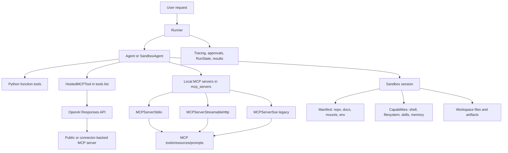

Key distinction: hosted MCP is configured as a hosted tool because OpenAI's infrastructure performs the tool round trip. Local MCP servers are configured in `mcp_servers` because your Python process connects, lists tools, calls tools, and cleans up connections.

---

### 3. Real-World Industry Scenarios

#### Scenario A: Enterprise Knowledge Assistant with Connector-Backed MCP [Intermediate]

Product context: a workplace assistant answers questions from Google Calendar, internal wiki pages, ticket systems, and project docs. Some tools are read-only, while others can create tickets or update calendar events.

How MCP affects the system: instead of baking every integration into the agent process, each integration can be exposed through an MCP server or connector-backed hosted MCP tool. The agent sees a tool surface; the integration team owns auth, API mapping, schemas, and rate limits behind the server.

Constraints:
- Latency: hosted MCP avoids an extra Python callback for every remote MCP tool call, but remote connector latency still matters. Local MCP adds network hops through your app runtime.
- Cost: large tool surfaces inflate tool-schema tokens unless you filter tools or defer loading through hosted tool search.
- Reliability: the assistant can fail because the model chose the wrong tool, the MCP server failed `list_tools()`, auth expired, the remote API rate-limited, or the server returned ambiguous tool output.
- Security/privacy: connector tokens, tenant IDs, and user scopes must be enforced outside the model. The model should never choose its own tenant or permission boundary.

What good looks like in production: each MCP server exposes a small, well-described tool set; sensitive tools require approval; tenant metadata is injected by trusted code through `_meta` or connector auth; traces show `list_tools`, tool calls, approval decisions, and server failures.

#### Scenario B: Coding or Document Agent with a Sandbox Workspace [Intermediate]

Product context: a support engineering assistant receives a bug report, opens a repository, edits files, runs a targeted test, and writes a patch summary. Another variant receives a document bundle, extracts facts, and writes completed output files.

How sandbox agents affect the system: the agent needs a living filesystem, not just chat memory. The `Manifest` stages a repo or document packet; capabilities expose shell and filesystem tools; the sandbox session contains file changes and command outputs.

Constraints:
- Latency: creating and materializing a workspace can dominate the first run, especially with large repos or mounted storage.
- Cost: long file inspections and test logs consume tokens if they are returned to the model too verbosely.
- Reliability: commands can hang, tests can be flaky, repo paths may be wrong, or snapshots may restore stale artifacts.
- Security/privacy: Unix-local is convenient for development, but production generally needs stronger isolation, constrained mounts, restricted users, network policy, and audit logs.

What good looks like in production: the sandbox starts from a narrow manifest, runs under a least-privilege user, writes outputs to a known directory, persists snapshots intentionally, and reports the exact files/commands used for verification.

#### Scenario C: Multi-Agent Review System with Shared or Separate Sandboxes [Pro]

Product context: a release-review assistant coordinates specialist agents: one reviews pricing docs, one inspects code changes, one checks compliance language, and one writes the final report.

How composition changes design: if specialists only inspect the same workspace, they can reuse a live sandbox session with different `run_as` users and permissions. If specialists can mutate files or run untrusted commands, each specialist should get its own sandbox boundary through its own `RunConfig`.

Constraints:
- Latency: separate sandboxes improve isolation but repeat workspace hydration.
- Reliability: shared workspaces risk accidental interference; separate workspaces risk divergent views of the source material.
- Security/privacy: read-only reviewers should not have write permissions just because the coordinator does.
- Observability: nested agent-as-tool runs need separate tracing and approval visibility so the outer run can resume correctly.

What good looks like in production: the design explicitly says which agents share state, which agents isolate state, which actions require approval, and how final artifacts are merged.

---

### 4. System View (Think Like a Systems Engineer)

#### MCP Integration Flow [Intermediate]

Inputs:
- User request
- Agent instructions
- Local Python tools
- Hosted MCP tool configs or local MCP server objects
- Run context such as tenant ID, user ID, auth scope, or trace ID

Transformations:
1. The runner prepares the agent and available tool surfaces.
2. For local MCP, the SDK connects to servers and calls `list_tools()`.
3. Tool filtering and schema conversion decide what the model sees.
4. The model chooses a tool.
5. The SDK or OpenAI-hosted runtime calls the MCP server.
6. Tool output returns as text, structured content, images, or an error message.
7. The runner appends the tool result and continues the agent loop.

Outputs:
- Final answer
- Tool call items
- MCP traces
- Approval interruptions if sensitive MCP tools require approval
- Server errors or model-visible tool failure messages

Observability:
- Log server connection success/failure, tool-list latency, tool names exposed, tool call latency, approval decisions, auth/tenant metadata presence, and error type.
- Trace `list_tools()` separately from `call_tool()`. A tool-call failure means something different from a discovery failure.
- Track tool-schema size and loaded tool count because huge tool surfaces increase cost and decision noise.

Failure points:
- Tool discovery fails because the MCP process did not start, URL is wrong, auth headers are missing, or network policy blocks the server.
- The model picks the wrong MCP tool because descriptions are weak or too many tools are visible.
- A sensitive mutation runs without approval because the approval policy was configured too broadly.
- Structured content is duplicated if both `content` and `structured_content` are sent and `use_structured_content` is set incorrectly.

#### Sandbox Agent Flow [Intermediate]

Inputs:
- `SandboxAgent` definition
- `Manifest` or run-level manifest override
- `SandboxRunConfig` with client/session/session_state/snapshot
- Capabilities such as shell, filesystem, skills, memory, compaction
- User prompt

Transformations:
1. The runner resolves the live sandbox session.
2. For fresh sessions, it materializes manifest entries: files, dirs, local dirs, Git repos, mounts, environment, users, groups.
3. Capabilities process the manifest and attach sandbox-native tools.
4. The final instructions are prepared: sandbox base instructions, agent instructions, capability instructions, mount policy text, and workspace tree.
5. The normal agent loop runs, but tool calls can now inspect/edit files or run commands inside the sandbox session.
6. The runner saves state, snapshots workspace contents, and returns final output.

Outputs:
- Final answer
- Workspace changes
- Generated artifacts
- Command/test output
- Snapshot or session-state payload for resume
- Trace with sandbox capability tool calls

Observability:
- Log sandbox client type, workspace materialization time, manifest entry count/size, command duration, exit codes, changed files, snapshot persistence status, and resumed state source.
- Store enough metadata to answer: Which workspace did the model actually see? Which user executed commands? Which snapshot/session state was used?

Failure points:
- The manifest staged the wrong path or too much data.
- A local source path is blocked by the manifest trust boundary or missing `extra_path_grants`.
- The sandbox client does not support the capability or mount strategy you configured.
- A resumed sandbox state wins over a manifest override, so the expected fresh files are not present.
- The agent edits the wrong path because `apply_patch` paths are workspace-root-relative.

---

### 5. System Design Flavor (Practical and Concise)

#### Key Components and Interfaces

| Need | SDK surface | Production meaning |
|---|---|---|
| Public or connector-backed MCP tool execution near the model | `HostedMCPTool(...)` inside `Agent.tools` | OpenAI Responses API performs MCP tool calls; your app configures server label, URL/connector, auth, approval. |
| MCP server controlled by your runtime | `MCPServerStreamableHttp`, `MCPServerStdio`, `MCPServerSse` in `Agent.mcp_servers` | Your Python process owns connection, discovery, tool calls, failures, cleanup. |
| Multiple MCP servers with partial failure handling | `MCPServerManager` | Connect many servers, drop failed ones, retry/reconnect, expose active servers. |
| Narrow MCP tool surface | `tool_filter`, `create_static_tool_filter`, dynamic filter callbacks | Hide tools the agent should not see for this run/user/tenant. |
| Workspace execution | `SandboxAgent` + `SandboxRunConfig` | Agent runs with a live filesystem and sandbox-native capabilities. |
| Fresh workspace contents | `Manifest` | Defines repo/docs/files/mounts/env/users for new sandbox sessions. |
| Runtime sandbox location | `UnixLocalSandboxClient`, `DockerSandboxClient`, hosted sandbox clients | Choose local speed, container isolation, or provider-managed execution. |
| Resume workspace work | `RunState`, `SandboxRunConfig.session_state`, `SnapshotSpec` | Continue a previous sandbox session or seed a new one from saved workspace contents. |

#### Tradeoff 1: Hosted MCP vs Local MCP [Intermediate]

Choose hosted MCP when the MCP server is publicly reachable, supported by Responses API hosted MCP, or connector-backed, and you want fewer round trips through your app runtime.

Choose local MCP when the server is private, local, development-only, needs your network, uses stdio, or must receive trusted runtime context from your app.

Plain-English version: hosted MCP is cleaner when OpenAI can safely reach the tool server. Local MCP is better when the tool lives inside your house and should stay there.

#### Tradeoff 2: Tool Filtering vs Tool Search [Intermediate]

Use filtering when the app knows a tool should never be visible for this user/run.

Use hosted tool search when the tool set is valid but too large to load upfront and the model should search/load only the relevant subset.

Plain-English version: filtering is permission and relevance control. Tool search is token and discovery control.

#### Tradeoff 3: Hosted Shell/Code Interpreter vs SandboxAgent [Intermediate]

Use hosted shell or code interpreter for one-off computation, lightweight scripts, or generated analysis.

Use `SandboxAgent` when the workspace boundary itself matters: repos, multi-file edits, document packets, snapshots, user permissions, capabilities, or repeated runs over the same artifact set.

Plain-English version: a hosted shell is a tool. A sandbox agent is a work environment.

#### Scaling Consideration: 10x Traffic/Data [Pro]

At 10x traffic, MCP and sandbox bottlenecks move away from model output quality and toward infrastructure pressure:
- MCP servers need connection pooling, tool-list caching, rate-limit handling, auth refresh, and partial-failure behavior.
- Sandbox systems need workspace hydration limits, archive extraction limits, snapshot storage lifecycle, job queues, timeout controls, and provider capacity planning.
- Tool traces become operational data: p95 `list_tools`, p95 command duration, tool error rate, approval queue time, snapshot restore/persist time, and token cost per workspace task.

---

### 6. Common Mistakes + Debugging

#### Mistake 1: Exposing Every MCP Tool to Every Agent

Symptom: the model picks strange tools, tool-call cost rises, tool selection becomes inconsistent, or tool names collide across servers.

Likely cause: the MCP server publishes a broad tool set and the agent receives all of it without `tool_filter`, namespacing, or `include_server_in_tool_names`.

First debugging step: inspect the trace/tool list for the actual tool names and descriptions exposed to the model. Then add static or dynamic filtering and enable server-prefixed names when multiple servers can publish overlapping names.

#### Mistake 2: Treating MCP Approval as a Prompting Problem

Symptom: a destructive MCP tool, such as delete/update/send, executes because the prompt said "ask first" but no runtime approval policy blocked it.

Likely cause: approval was described in natural language but not configured with `require_approval` or a hosted MCP `on_approval_request` callback.

First debugging step: inspect whether the MCP server/tool config has `require_approval` for sensitive tool names. If not, add a deterministic policy and test that the run pauses before execution.

#### Mistake 3: Using a SandboxAgent for Simple Tool Calls

Symptom: slow startup, high infrastructure cost, and more complex cleanup for an agent that only needed one API call or one small script.

Likely cause: the design used a full workspace runtime when a function tool, hosted shell, code interpreter, or local MCP server was enough.

First debugging step: write down the required state boundary. If the task does not need persistent files, multi-file context, command execution over staged material, snapshots, or workspace permissions, remove the sandbox.

#### Mistake 4: Assuming the Manifest Always Wins

Symptom: expected files are missing or stale files appear even though the `Manifest` looks correct.

Likely cause: the run reused a live sandbox, resumed from `RunState`, resumed from `session_state`, or restored a snapshot. Those runtime sources can override the fresh-session manifest path.

First debugging step: inspect `SandboxRunConfig`: did the run pass `session`, resume from `RunState`, pass `session_state`, pass `snapshot`, or create a fresh session? Then inspect the actual workspace tree at run start.

---

### 7. Hands-On Lab (Concept -> Build -> Break -> Measure -> Explain)

This lab is a design-and-code drill. You can run the MCP half if you have an MCP server; the sandbox half is intentionally small and local-development oriented.

#### Build A: Local MCP Filesystem Server [Pro]

Goal: connect an SDK agent to a filesystem MCP server through stdio, expose only safe read tools, and inspect tool discovery.

```python
import asyncio
from pathlib import Path

from agents import Agent, Runner
from agents.mcp import MCPServerStdio, create_static_tool_filter


async def main() -> None:
    sample_dir = Path("sample_files").resolve()

    async with MCPServerStdio(
        name="safe_filesystem",
        params={
            "command": "npx",
            "args": ["-y", "@modelcontextprotocol/server-filesystem", str(sample_dir)],
        },
        cache_tools_list=True,
        tool_filter=create_static_tool_filter(
            allowed_tool_names=["read_file", "list_directory"]
        ),
        require_approval={"always": {"tool_names": ["write_file", "delete_file"]}},
    ) as server:
        agent = Agent(
            name="Filesystem analyst",
            instructions="Use filesystem MCP tools only to inspect files and answer briefly.",
            mcp_servers=[server],
            mcp_config={"include_server_in_tool_names": True},
        )

        print([tool.name for tool in await server.list_tools()])
        result = await Runner.run(agent, "List the available files and summarize them.")
        print(result.final_output)


if __name__ == "__main__":
    asyncio.run(main())
```

Break it on purpose:
- Remove `tool_filter` and observe how many tools become visible.
- Disable `cache_tools_list` and measure repeated `list_tools()` latency.
- Point `sample_dir` to a missing directory and observe startup/tool discovery failure.

Measure:
- Tool count exposed to the model
- `list_tools()` latency with and without caching
- Tool call success/error rate
- Whether sensitive tools pause or stay hidden

Explain:
Filtering is not just a convenience. It changes the model's action space. Caching is not just performance polish; repeated remote discovery can dominate short runs. Approval should be runtime policy, not only an instruction.

#### Build B: SandboxAgent for a Tiny Repo Task [Pro]

Goal: stage a local repo into a sandbox workspace, let the agent inspect/edit/run a test, and keep the workspace boundary explicit.

```python
import asyncio
from pathlib import Path

from agents import Runner
from agents.run import RunConfig
from agents.sandbox import Manifest, SandboxAgent, SandboxRunConfig
from agents.sandbox.entries import LocalDir
from agents.sandbox.sandboxes.unix_local import UnixLocalSandboxClient


HOST_REPO_DIR = Path("./repo").resolve()


def build_agent() -> SandboxAgent[None]:
    return SandboxAgent(
        name="Sandbox engineer",
        instructions=(
            "Read `repo/task.md`, make the smallest correct change, "
            "run the targeted test, and summarize changed files and verification. "
            "Use workspace-root-relative paths when applying patches."
        ),
        default_manifest=Manifest(
            entries={
                "repo": LocalDir(src=HOST_REPO_DIR),
            }
        ),
    )


async def main() -> None:
    result = await Runner.run(
        build_agent(),
        "Fix the issue described in `repo/task.md` and run the test named there.",
        run_config=RunConfig(
            sandbox=SandboxRunConfig(client=UnixLocalSandboxClient()),
            workflow_name="tiny sandbox repair",
        ),
    )
    print(result.final_output)


if __name__ == "__main__":
    asyncio.run(main())
```

Break it on purpose:
- Change `LocalDir(src=HOST_REPO_DIR)` to a wrong source path.
- Put the task under `repo/task.md` but tell the agent to patch `src/...` instead of `repo/src/...`.
- Reuse a prior sandbox session and expect a fresh manifest override; observe stale workspace behavior.

Measure:
- Workspace materialization time
- Number and size of staged files
- Command/test duration and exit code
- Changed files
- Whether snapshot/session-state resume used expected workspace contents

Explain:
Sandbox failures often look like model confusion, but the root cause is frequently workspace setup. The model can only inspect what the runner actually staged or resumed. When debugging, check the effective workspace before judging the agent.

---

### 8. Active Recall (Spaced Repetition)

1. What is the main difference between `HostedMCPTool` and `MCPServerStreamableHttp`?
2. Why is tool filtering usually a production requirement for MCP integrations?
3. When should you choose a `SandboxAgent` instead of a normal `Agent` with a shell tool?
4. What is the difference between `session_state` and a snapshot in sandbox runs?
5. If a sensitive MCP tool should pause before execution, where should that policy live?

**Answer keys:**

1. `HostedMCPTool` lets OpenAI's hosted Responses runtime call the MCP server; `MCPServerStreamableHttp` is a local-runtime MCP client managed by your Python process.
2. It limits tool confusion, reduces schema/token load, enforces least privilege, and prevents irrelevant or dangerous tools from entering the model's action space.
3. Choose `SandboxAgent` when the task needs a real workspace boundary: staged files/repos, multi-file edits, command execution over artifacts, snapshots, resume, mounts, permissions, or sandbox-native capabilities.
4. `session_state` resumes a specific serialized sandbox backend/session; a snapshot seeds a fresh sandbox with saved workspace contents.
5. In deterministic SDK/runtime configuration: hosted MCP `require_approval` plus optional `on_approval_request`, or local MCP server `require_approval`. Do not rely only on instructions.

---

### 9. Practice

#### Mini-Exercise: Pick the Boundary

You are building an assistant that can answer repo questions, edit code, call Jira, and post release notes to Slack. Design the tool/runtime layout.

**Suggested answer:**

- Use a `SandboxAgent` for repo inspection/edit/test because it needs a workspace.
- Use Jira and Slack through MCP only if those integrations already exist as MCP servers or need a shared connector interface.
- Filter Jira/Slack tools by user permission and workflow step.
- Require approval for posting Slack messages or mutating Jira issues.
- Use separate sandbox sessions for independent code-review specialists if they can mutate files; share a live read-only sandbox only if they inspect the same material.

#### Capstone-Style System Design Question

Design a regulated document-processing agent for insurance claims. It receives a document bundle, extracts facts, calls policy/claims systems, creates a draft decision memo, and stores generated artifacts.

**Answer outline:**

- Use `SandboxAgent` because document bundles and generated artifacts need a workspace.
- Use `Manifest` to stage only the claim packet, policy reference files, and an `output/` directory.
- Run as a least-privilege sandbox user; make source documents read-only and `output/` writable.
- Use local/private MCP servers for internal claims/policy systems, with tenant/user metadata injected by trusted code.
- Use tool filtering so the claim agent sees only claim-relevant read/update tools.
- Require approval for claim status changes, payment triggers, or external notifications.
- Persist a snapshot for audit/review, but avoid storing secrets or mounted remote storage as durable workspace contents.
- Trace document reads, MCP calls, approvals, generated files, and final decision output.

---

### 10. Production Reality Check (Mandatory Ending)

**If this fails in prod, what's the first thing we inspect?**

Inspect the run trace plus the effective tool/workspace boundary:
- Which MCP tools were actually exposed?
- Which server/transport handled the call?
- Did approval policy run?
- Which sandbox session source was used: fresh manifest, injected live session, resumed `RunState`, explicit `session_state`, or snapshot?
- What files existed at workspace start?

Why: MCP/sandbox failures usually masquerade as model reasoning failures. The real fault is often boundary drift: wrong tools exposed, missing auth metadata, stale workspace state, unsupported sandbox capability, or a sensitive action not gated at runtime.

---

### 11. Curiosity Bridge (Mandatory Ending)

This works well for text-first agents that occasionally call tools or operate on files, but it breaks when the interaction itself becomes continuous, low-latency, and multimodal.

That leads into **Realtime and voice-oriented pathways**: agent loops where speech, streaming events, interruptions, latency budgets, and turn-taking become the system design center.

---

### 12. Exit Check + Carry-Forward Review

**Exit check:** You're done with 15.2.c when you can decide between hosted MCP, local MCP, hosted shell/code interpreter, and `SandboxAgent`, then explain the security, latency, state, approval, and observability implications of that choice.

---

**Carry-Forward Review (interleaved recall from 15.2.b):**

*Q: How do approval interruptions relate to `RunState`?*

> **A:** A run pauses with pending interruptions. You serialize the result to `RunState`, approve or reject pending items, then resume so the SDK can continue from the saved execution state instead of starting over.

---

## Subtopic 15.2.d: Realtime and Voice-Oriented Pathways

### ✅ Add to Knowledge Base

---

### 0. Reading Path + Level Tags

**Beginner:** Read sections 1-2, the decision table in section 5, and Active Recall.

**Intermediate:** Add sections 3-6 so you can reason about realtime sessions, voice pipelines, and production failure modes.

**Pro:** Do the Hands-On Lab and capstone prompt. Focus on latency budgets, interruptions, playback tracking, tool approval events, and which voice path fits which product.

---

### 1. Pre-Question Hook + The Intuition (Plain English)

**Pause:** before reading, why does a voice assistant feel much harder than a chat assistant even when both call the same model and tools?

The core difference is time. A chat agent can think, call tools, and return one final answer. A realtime voice agent must listen while the user is still speaking, decide when a turn ends, stream partial output, handle interruptions, keep audio playback aligned with conversation history, and still call tools safely.

**RealtimeAgent** is the Agents SDK agent type for low-latency live sessions. It supports instructions, tools, handoffs, output guardrails, MCP servers, and hooks, but it is narrower than regular `Agent`: model choice and most model settings are session-level, structured outputs are not supported, and voice cannot change after the session has already spoken.

**RealtimeRunner** is the realtime equivalent of `Runner`. Instead of returning a final result, it creates a live `RealtimeSession` over a realtime transport.

**RealtimeSession** is the live bidirectional session. It sends text/audio input, streams events, tracks local history, executes tools, runs guardrails, handles handoffs, and exposes approval methods.

**VoicePipeline** is the older pipeline-style voice path: speech-to-text -> your workflow -> text-to-speech. It is useful when you want to turn an existing agent workflow into voice without managing a persistent realtime model session.

Mental model: a regular agent is like email, a streamed text agent is like live chat, and a realtime voice agent is like a phone call. In a phone call, overlap, interruption, silence, delay, and playback matter as much as the words.

Where the analogy breaks: realtime systems still expose programmable events, tools, guardrails, traces, and transport choices. It is not just audio; it is a distributed event loop.

**Turn detection** is the mechanism that decides when the user has finished speaking and the model should respond.

**Semantic VAD** is a voice activity detection mode that uses semantic signals to decide turn boundaries, often improving natural interruptions compared with simple silence thresholds.

**RealtimePlaybackTracker** is the component used when interruption handling must be based on what the user actually heard, especially in delayed playback environments like telephony.

---

### 2. Visual Diagram (Mermaid)

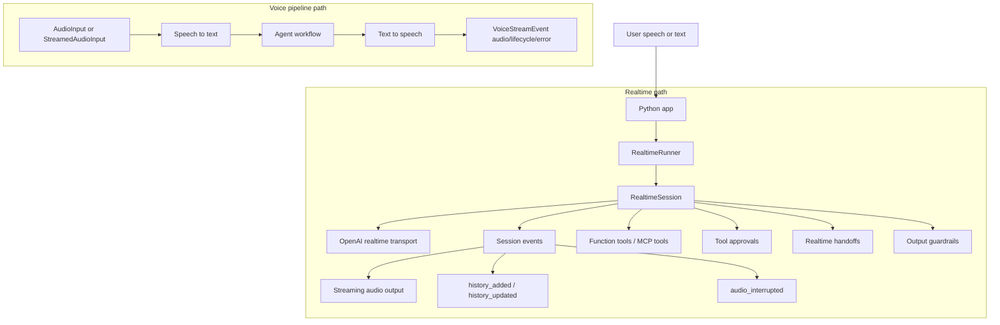

Key distinction: realtime is a long-lived conversation session. Voice pipeline is a staged pipeline that transcribes audio, runs a workflow, and synthesizes audio for each detected input.

---

### 3. Real-World Industry Scenarios

#### Scenario A: Customer Support Voice Assistant [Intermediate]

Product context: a user calls support, explains a billing issue, interrupts the assistant, asks follow-up questions, and may need a human handoff.

How realtime affects the product: the agent cannot wait for a complete chat transcript. It must stream audio, handle partial conversation state, call billing tools, pause for approval when needed, and switch to a specialist agent without dropping the live session.

Constraints:
- Latency: users notice delays above a few hundred milliseconds in turn-taking. Tool calls must be short, asynchronous, or hidden behind conversational filler only when product policy allows it.
- Reliability: dropped WebSocket/SIP sessions, microphone gaps, duplicate audio chunks, tool timeouts, and broken event loops feel like the assistant is ignoring the user.
- Failure modes: bad turn detection causes the model to interrupt too early or wait too long. Bad playback tracking means the history includes words the user never heard.
- Security/privacy: audio transcripts and recordings may contain sensitive data. Tracing must decide whether to include transcripts or raw audio.

What good looks like in production: the app measures time-to-first-audio, turn-end-to-response latency, interruption success rate, tool approval time, and call drop rate. The event loop separates UI/audio playback state from model/tool execution state.

#### Scenario B: Telehealth Intake or Benefits Voice Assistant [Intermediate]

Product context: a patient or member asks about coverage, symptoms, appointment scheduling, or claims. The assistant may call internal systems but must avoid unsafe medical or policy commitments.

How realtime affects the product: voice makes the interaction natural, but also riskier. The user may provide sensitive information aloud. The assistant may need to interrupt itself if an output guardrail catches unsafe content after partial audio has already buffered.

Constraints:
- Latency: conversational delay must stay low, but guardrails and tool checks still need to run.
- Reliability: transcript errors can change meaning; "no chest pain" vs "chest pain" is not a minor typo.
- Safety: tool approvals and guardrails must be runtime policies, not just prompt instructions.
- Privacy: traces should usually avoid raw audio and minimize transcript retention unless compliance requires storage.

What good looks like in production: the assistant confirms high-risk facts, uses structured internal tools for eligibility/appointment data, emits guardrail and escalation events, and logs enough to audit decisions without over-retaining audio.

#### Scenario C: Push-to-Talk Field Operations Assistant [Pro]

Product context: a technician records short audio notes in a noisy environment. The app transcribes each message, runs an agent workflow to create a work order update, and reads back a confirmation.

How voice pipeline affects the product: this may not need a persistent realtime session. A `VoicePipeline` can take a complete or streamed audio input, transcribe it, run a normal `Agent` workflow, and synthesize the response.

Constraints:
- Latency: users tolerate slightly more delay after releasing push-to-talk because the turn boundary is explicit.
- Reliability: the system must handle noisy audio, retries, and workflow failures cleanly.
- Cost: STT, LLM, and TTS are separate stages, so each stage has separate cost and tuning knobs.
- Observability: failures need stage-level traces: transcription quality, workflow output, TTS generation, playback.

What good looks like in production: the pipeline captures stage latencies, shows confidence/confirmation for critical fields, and treats every audio input as an independent workflow run unless application memory is added deliberately.

---

### 4. System View (Think Like a Systems Engineer)

#### Realtime Session Flow [Intermediate]

Inputs:
- User text, structured messages, images, or raw audio chunks
- `RealtimeAgent` definitions with instructions, tools, handoffs, guardrails, MCP servers
- `RealtimeRunner` config with model settings, tool behavior, guardrail settings, and tracing
- `model_config` such as API key, WebSocket URL, headers, `call_id`, or playback tracker

Transformations:
1. The app creates a `RealtimeRunner` with a starting agent.
2. `await runner.run()` returns a `RealtimeSession`, not a final answer.
3. Entering the session opens the realtime transport, usually server-side WebSocket in Python.
4. The app sends messages with `send_message()` or audio chunks with `send_audio()`.
5. The session receives events: audio, audio end, interruptions, tool start/end, approval required, handoff, history updates, guardrail trips, raw model events, and errors.
6. The session executes tools, manages approvals, updates active agents, and keeps local history aligned with server-side conversation state.
7. The app forwards audio events to playback and uses history events to update UI/state.

Outputs:
- Streaming audio chunks
- Local history items
- Tool call events and results
- Approval events
- Handoff events
- Guardrail trip events
- Error events and raw model events

Observability:
- Log time-to-session-open, time-to-first-audio, turn-end-to-first-audio, audio underruns, interruption latency, tool call latency, approval wait time, handoff count, guardrail trips, and reconnect/drop reasons.
- Track whether audio history was truncated correctly after interruption.
- For privacy, separate operational metrics from retained transcript/audio payloads.

Failure points:
- Turn detection commits too early, too late, or not at all.
- Raw audio format does not match configured `audio.input.format`.
- The app fails to stop local playback when `audio_interrupted` arrives.
- A voice changes after the session already produced audio.
- A tool approval event is emitted but the app never calls `approve_tool_call()` or `reject_tool_call()`.
- Custom `headers` are provided without an authorization header, so the SDK does not inject auth automatically.

#### Voice Pipeline Flow [Intermediate]

Inputs:
- `AudioInput` for complete audio, or `StreamedAudioInput` for chunked audio with activity detection
- STT model settings
- `VoiceWorkflow`, often `SingleAgentVoiceWorkflow(agent)`
- TTS model settings
- `VoicePipelineConfig` with tracing options

Transformations:
1. The pipeline receives audio input.
2. STT transcribes audio to text.
3. The workflow runs your normal agentic code.
4. TTS turns the workflow's text result into audio.
5. The result streams `VoiceStreamEvent` items: audio, lifecycle, or error.

Outputs:
- Synthesized audio chunks
- Lifecycle events such as turn start/end
- Error events
- Pipeline trace data

Observability:
- Log STT latency, transcript quality indicators, workflow latency, TTS latency, output audio duration, lifecycle events, and stage errors.
- Configure whether traces include sensitive transcripts or raw audio.

Failure points:
- Activity detection splits turns incorrectly.
- The workflow returns text that is awkward for speech.
- The app expects built-in interruption handling, but `StreamedAudioInput` voice pipeline does not provide it automatically.
- Audio sample rate or dtype does not match what playback expects.

---

### 5. System Design Flavor (Practical and Concise)

#### Decision Table

| Need | Prefer | Why |
|---|---|---|
| Server-managed live voice/chat with tools, handoffs, approvals, and interruptions | Realtime path: `RealtimeAgent` + `RealtimeRunner` + `RealtimeSession` | Long-lived session, bidirectional events, low-latency audio streaming, local history tracking. |
| Phone/SIP integration | Realtime SIP attach with `OpenAIRealtimeSIPModel` and `call_id` | Attaches the agent to an existing realtime call flow. |
| Browser WebRTC client | Realtime API WebRTC docs outside this Python SDK | The Python SDK does not provide browser `RTCPeerConnection` transport. |
| Existing text agent workflow converted to voice | `VoicePipeline` + `SingleAgentVoiceWorkflow` | Simpler STT -> workflow -> TTS path, good for push-to-talk or prerecorded audio. |
| Batch or prerecorded audio task | `VoicePipeline` with `AudioInput` | Clear turn boundary; no need for persistent live session. |
| Continuous audio stream but not full realtime model semantics | `VoicePipeline` with `StreamedAudioInput` | Pipeline activity detection can trigger workflow runs, but interruption handling remains app-owned. |

#### Tradeoff 1: Realtime Session vs Voice Pipeline [Intermediate]

Choose realtime when conversation continuity, interruption handling, live event streams, tool approvals, handoffs, and low-latency audio output are core product requirements.

Choose voice pipeline when audio is mostly an input/output wrapper around an existing agent workflow, especially push-to-talk, prerecorded audio, or simple spoken responses.

Plain-English version: realtime is a phone call. voice pipeline is a voice form submission with spoken output.

#### Tradeoff 2: Server-Side WebSocket vs SIP Attach [Intermediate]

Use server-side WebSocket when your Python service owns the audio pipeline, UI connection, tools, approvals, and session lifecycle.

Use SIP attach when a phone/call flow already exists and the Python agent needs to attach to an existing realtime call through `call_id`.

Plain-English version: WebSocket is your app starting the call. SIP attach is your app joining a call that the telephony system already created.

#### Tradeoff 3: Automatic Turn Detection vs Manual Turn Control [Pro]

Use automatic turn detection, such as semantic VAD, for natural conversation and interruptions.

Use manual turn control when your product has an explicit push-to-talk button, moderation/gating before response, or needs to decide exactly when `response.create` should happen.

Plain-English version: automatic turn detection feels natural but can guess wrong. manual control is less natural but more deterministic.

#### Scaling Consideration: 10x Realtime Traffic [Pro]

At 10x traffic, the bottleneck becomes connection lifecycle, audio bandwidth, event fanout, and operational visibility:
- Keep one event loop per live session clean and non-blocking.
- Move slow tools behind async execution and timeouts.
- Track WebSocket/SIP session count, average duration, reconnect/drop rates, audio bytes in/out, tool concurrency, approval queue time, and p95 turn latency.
- Decide early what audio/transcript data is retained, redacted, or excluded from traces.

---

### 6. Common Mistakes + Debugging

#### Mistake 1: Treating `runner.run()` Like Text-Agent `Runner.run()`

Symptom: code waits for a final result that never arrives or exits before receiving audio/events.

Likely cause: realtime `runner.run()` returns a live `RealtimeSession`, not a completed `RunResult`.

First debugging step: check whether the code enters `async with await runner.run() as session:` and iterates over `async for event in session:`.

#### Mistake 2: Ignoring Playback State During Interruptions

Symptom: the user interrupts, but the transcript/history assumes the user heard audio that was never played, so future responses refer to unheard content.

Likely cause: local or remote playback delay was not reported. The default assumption may not match telephony or buffered playback.

First debugging step: inspect `audio_interrupted` events and configure `RealtimePlaybackTracker` when playback can lag behind generation.

#### Mistake 3: Using Voice Pipeline When You Need Realtime Interruptions

Symptom: every detected user turn starts a separate workflow run, but the app cannot naturally cancel or interrupt ongoing assistant speech.

Likely cause: `VoicePipeline` is a staged STT -> workflow -> TTS pipeline. It does not provide built-in interruption handling for `StreamedAudioInput`.

First debugging step: decide whether the product requires true barge-in/interruption. If yes, move to realtime sessions or implement application-level interruption handling around voice lifecycle events.

#### Mistake 4: Logging Raw Audio by Default

Symptom: traces contain sensitive transcripts or audio payloads that compliance/security did not approve.

Likely cause: tracing configuration was not reviewed for voice/realtime data.

First debugging step: inspect `VoicePipelineConfig` fields such as `trace_include_sensitive_data` and `trace_include_sensitive_audio_data`, and define trace redaction policy before production traffic.

---

### 7. Hands-On Lab (Concept -> Build -> Break -> Measure -> Explain)

#### Build A: Minimal Realtime Session Event Loop [Pro]

Goal: create a realtime session, send one text message, and observe the event stream shape.

```python
import asyncio

from agents.realtime import RealtimeAgent, RealtimeRunner


agent = RealtimeAgent(
    name="Concise Assistant",
    instructions="You are a helpful voice assistant. Keep replies short.",
)

runner = RealtimeRunner(
    starting_agent=agent,
    config={
        "model_settings": {
            "model_name": "gpt-realtime-2",
            "audio": {
                "input": {
                    "format": "pcm16",
                    "transcription": {"model": "gpt-4o-mini-transcribe"},
                    "turn_detection": {
                        "type": "semantic_vad",
                        "interrupt_response": True,
                    },
                },
                "output": {"format": "pcm16", "voice": "ash"},
            },
        }
    },
)


async def main() -> None:
    async with await runner.run() as session:
        await session.send_message("Say hello in one short sentence.")

        async for event in session:
            print(event.type)
            if event.type == "audio":
                # Forward event.audio.data to your audio player.
                pass
            elif event.type == "history_added":
                print(event.item)
            elif event.type == "agent_end":
                break
            elif event.type == "error":
                print(event.error)
                break


if __name__ == "__main__":
    asyncio.run(main())
```

Break it on purpose:
- Remove the `async for event in session` loop and notice that you do not process audio/history/error events.
- Send audio bytes with the wrong format and observe errors or poor transcription.
- Add a tool requiring approval but do not handle `tool_approval_required`; observe the stalled tool execution.

Measure:
- Session open latency
- Time from `send_message()` to first `audio` event
- Number and order of event types
- Tool approval wait time
- Error event count and type

Explain:
Realtime agent code is event-loop code. The model response is not just a return value; it is a stream of state changes. If you do not consume and handle events, the product cannot play audio, update history, approve tools, or recover from errors.

#### Build B: Voice Pipeline Around a Normal Agent [Pro]

Goal: run a normal agent workflow through STT and TTS using a pipeline.

```python
import asyncio

import numpy as np

from agents import Agent
from agents.voice import AudioInput, SingleAgentVoiceWorkflow, VoicePipeline


agent = Agent(
    name="Voice Workflow Assistant",
    instructions="Answer in one short spoken sentence.",
    model="gpt-5.5",
)


async def main() -> None:
    pipeline = VoicePipeline(workflow=SingleAgentVoiceWorkflow(agent))

    # Three seconds of silence as a placeholder for captured microphone audio.
    buffer = np.zeros(24000 * 3, dtype=np.int16)
    audio_input = AudioInput(buffer=buffer)

    result = await pipeline.run(audio_input)

    async for event in result.stream():
        if event.type == "voice_stream_event_audio":
            # Write event.data to an audio output stream.
            pass
        elif event.type == "voice_stream_event_lifecycle":
            print(event)
        elif event.type == "voice_stream_event_error":
            print(event)


if __name__ == "__main__":
    asyncio.run(main())
```

Break it on purpose:
- Use a noisy or empty buffer and inspect transcript/workflow behavior.
- Make the agent return long paragraphs and listen to how poor text formatting becomes poor speech UX.
- Expect barge-in interruption from `VoicePipeline`; observe that interruption handling is application-owned.

Measure:
- STT latency
- Workflow latency
- TTS latency
- Total time to first audio chunk
- Error events by stage

Explain:
Voice pipeline is easier to reason about because it has stages. That also means stage boundaries become your debugging map: if output is wrong, first identify whether transcription, agent reasoning, or TTS caused it.

---

### 8. Active Recall (Spaced Repetition)

1. What does realtime `RealtimeRunner.run()` return, and why is that different from regular `Runner.run()`?
2. When should you prefer `VoicePipeline` over `RealtimeSession`?
3. Why does playback tracking matter for interruptions?
4. What are the highest-value realtime events to handle in a production UI?
5. Why is browser WebRTC outside the Python SDK path?

**Answer keys:**

1. It returns a live `RealtimeSession`, not a final `RunResult`, because realtime work is a long-lived bidirectional event session.
2. Use `VoicePipeline` when audio wraps an existing workflow, especially prerecorded audio, push-to-talk, or simple STT -> agent -> TTS flows that do not need full realtime interruption semantics.
3. Interruption truncation must reflect what the user actually heard. If playback lags, history can otherwise include assistant words that never reached the user.
4. `audio`, `audio_end`, `audio_interrupted`, `history_added`, `history_updated`, `tool_approval_required`, `tool_start`, `tool_end`, `handoff`, `guardrail_tripped`, and `error`.
5. The Python SDK realtime docs cover server-side WebSocket and SIP attach flows; browser WebRTC uses browser/client APIs and official Realtime API WebRTC docs, not a Python transport abstraction.

---

### 9. Practice

#### Mini-Exercise: Choose the Voice Architecture

A claims assistant lets users press and hold a microphone button, describe a document issue, and receive a spoken confirmation after the button is released. It does not need mid-sentence interruption.

**Suggested answer:** Use `VoicePipeline` with `AudioInput` or `StreamedAudioInput` depending on capture style. The explicit button release gives a clean turn boundary. Use a normal `Agent` workflow for claim logic, and configure tracing to avoid retaining sensitive audio unless required.

#### Capstone-Style System Design Question

Design a realtime phone support assistant for benefits questions. It can answer FAQs, look up eligibility, escalate to a human, and handle the caller interrupting while it speaks.

**Answer outline:**

- Use realtime path with `RealtimeAgent`, `RealtimeRunner`, and `RealtimeSession`.
- For telephony, use SIP attach with `OpenAIRealtimeSIPModel` and `call_id` if the call comes through the Realtime Calls/SIP flow.
- Configure nested audio settings: input/output format, transcription model, semantic VAD, interruption support, voice.
- Handle events: audio playback, history updates, interruption, tool start/end, approval required, handoff, guardrail trip, errors.
- Use function tools or MCP for eligibility lookups; require approval for account changes or sensitive actions.
- Use realtime handoffs for specialist flows such as billing, pharmacy, or human escalation.
- Use `RealtimePlaybackTracker` for telephony or any delayed playback path.
- Log time-to-first-audio, turn latency, interruption accuracy, tool latency, approval wait, call drops, and guardrail trips.
- Minimize transcript/audio retention and configure tracing privacy.

---

### 10. Production Reality Check (Mandatory Ending)

**If this fails in prod, what's the first thing we inspect?**

Inspect the event timeline for one affected session:
- Did the session open successfully?
- What input event arrived: text, audio chunks, commit, or raw event?
- Did turn detection fire when expected?
- When did first audio output arrive?
- Were `audio_interrupted`, `history_updated`, tool approval, handoff, guardrail, or error events emitted?
- Did playback tracking match what the user actually heard?

Why: realtime bugs are usually ordering and timing bugs. The same model answer can feel correct in text but broken in voice if turn detection, playback, interruption, tool approval, or event handling is off by a few seconds.

---

### 11. Curiosity Bridge (Mandatory Ending)

Realtime and voice make the SDK feel like a product runtime, not just a model wrapper. But now the bigger question becomes: which runtime should a team choose when LangGraph, ADK, and OpenAI Agents SDK all seem capable?

That leads into **Topic 15.3: Runtime comparison and selection**, where we build the framework-selection rubric instead of memorizing framework features.

---

### 12. Exit Check + Carry-Forward Review

**Exit check:** You're done with 15.2.d when you can choose between realtime sessions, SIP attach, browser WebRTC outside the Python SDK, and voice pipeline, then explain the latency, interruption, tracing, tool approval, and event-loop implications.

---

**Carry-Forward Review (interleaved recall from 15.2.c):**

*Q: If a realtime agent also needs private backend tools, how do MCP and realtime compose?*

> **A:** A `RealtimeAgent` can include `mcp_servers`, but the application must manage local MCP server lifecycle or use `MCPServerManager`. In realtime, MCP tool calls still become live tool events, so latency, approval, and event handling matter more than in a text-only run.

---

## Topic 15.3: Runtime Comparison and Selection

> **Topic time:** 10h  
> Focus: Choosing between LangGraph, Google ADK, and OpenAI Agents SDK based on product constraints, state/control needs, team skill, cloud/vendor fit, observability, deployment shape, and long-term maintenance risk.

---

## Subtopic 15.3.a: LangGraph vs ADK vs OpenAI Agents SDK

### ✅ Add to Knowledge Base

---

### 0. Reading Path + Level Tags

**Beginner:** Read sections 1-2, the comparison table in section 5, and Active Recall.

**Intermediate:** Add sections 3-6 so you can explain the production tradeoffs in interviews and design reviews.

**Pro:** Do the Hands-On Lab and capstone. Your goal is to justify a runtime choice with constraints, not personal preference.

---

### 1. Pre-Question Hook + The Intuition (Plain English)

**Pause:** before reading, imagine a product team asks: "Should we build this agent in LangGraph, ADK, or OpenAI Agents SDK?" What is the first question you ask before naming a framework?

The first question is not "which framework is best?" It is: **what kind of runtime problem are we solving?**

**LangGraph** is a low-level orchestration runtime for long-running, stateful agent workflows. Its strength is control: explicit state, nodes, edges, persistence, durable execution, human-in-the-loop, and provider flexibility.

**Google ADK** is an agent product runtime and ecosystem. Its strength is building, running, observing, evaluating, and deploying agent applications with Google-flavored runtime surfaces: agents, tools, sessions, events, graph workflows, artifacts, integrations, evaluation, observability, deployment, and multi-language support.

**OpenAI Agents SDK** is a lightweight Python-first runtime around OpenAI's Responses ecosystem. Its strength is fast agent construction with few primitives: `Agent`, `Runner`, tools, handoffs, guardrails, sessions, tracing, sandbox agents, MCP, and realtime voice paths.

Mental model: LangGraph is a programmable workflow engine for agent state. ADK is an agent application platform. OpenAI Agents SDK is a compact product SDK for OpenAI-native agent loops.

Where the analogy breaks: all three overlap. LangGraph can ship full products, ADK now has graph workflows, and OpenAI Agents SDK has sandbox/realtime features that go beyond a small wrapper. The correct comparison is about ownership boundaries: who owns orchestration, state, deployment, observability, and model/provider coupling?

**Runtime selection** is the process of choosing the execution framework whose control model, persistence model, observability, deployment path, and team ergonomics match the product constraints.

**Control plane** is the part of the system that decides what runs next, what state changes, when humans approve, and how execution resumes after pauses/failures.

**Agent product runtime** is a framework shape that packages agent execution together with sessions, tools, events, evaluation, deployment, and operational surfaces.

---

### 2. Visual Diagram (Mermaid)

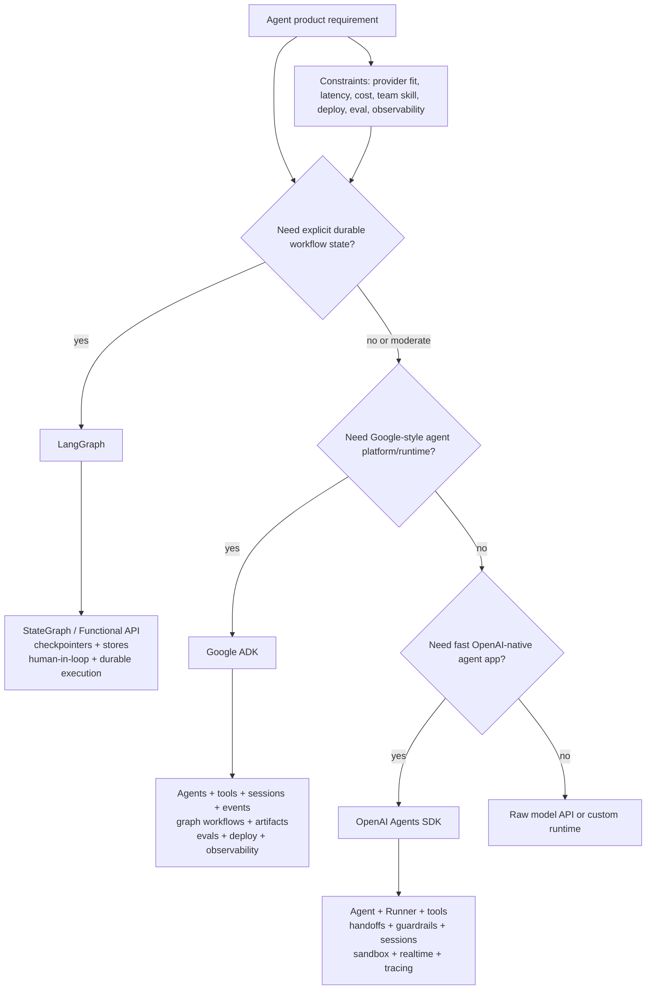

This is not a universal decision tree. It is a way to start the conversation. In real systems, the final choice comes from constraints: state durability, workflow complexity, cloud fit, model neutrality, observability, deployment, and team speed.

---

### 3. Real-World Industry Scenarios

#### Scenario A: Long-Running Claims Workflow [Intermediate]

Product context: an insurance workflow receives a claim, extracts facts, retrieves policy evidence, asks a human for missing documents, waits days, resumes, updates state, and may re-run a branch after new evidence arrives.

How runtime choice affects the system:
- LangGraph is a strong fit if the key problem is durable state, resume, explicit branching, human review, time travel, and long-running workflows.
- ADK can fit if the team wants an agent runtime with sessions, events, graph workflows, evaluation, and Google deployment surfaces.
- OpenAI Agents SDK can fit if the process is mostly a shorter OpenAI-native agent loop with tools, guardrails, sessions, and maybe sandboxed document work.

Constraints:
- Latency: less important than correctness and resumability; workflow steps may be hours or days apart.
- Reliability: the system must recover from worker restarts and human delays without losing state.
- Cost: repeated model calls and retries need traceable budgets.
- Privacy/security: claim data and approvals require strict state scoping and audit logs.

What good looks like in production: a design memo explains where workflow state lives, how humans inspect/edit state, how execution resumes, what traces prove, and how failed steps replay safely.

#### Scenario B: Google Cloud Enterprise Support Agent [Intermediate]

Product context: an enterprise already uses Google Cloud, Gemini, Cloud Run/GKE, Google observability, and wants a support assistant with tools, sessions, artifacts, evaluation, and deployment through a standardized agent runtime.

How runtime choice affects the system:
- ADK is a strong fit because its center of gravity is production agent applications inside Google's ecosystem.
- LangGraph can still fit if the workflow needs deep low-level orchestration and provider neutrality.
- OpenAI Agents SDK may be less natural if the enterprise standardizes on Gemini/Google deployment and wants ADK's runtime/dev/deploy workflow.

Constraints:
- Latency: depends on deployed endpoints and tool services.
- Reliability: platform-managed deployment and observability reduce operational glue.
- Cost: Gemini/model routing and Google infrastructure billing may be easier for the organization to manage.
- Security/privacy: identity, cloud IAM, logging, and approved integrations matter as much as framework syntax.

What good looks like in production: the team can run locally, expose an API, observe events/traces, evaluate agent behavior, deploy to approved infrastructure, and keep tool/auth boundaries auditable.

#### Scenario C: OpenAI-Native Product Assistant with Realtime and Sandbox [Pro]

Product context: a SaaS product wants a Python service that uses OpenAI models, function tools, hosted tools, sessions, guardrails, sandbox coding/document agents, and realtime voice for support.

How runtime choice affects the system:
- OpenAI Agents SDK is a strong fit because it directly packages the OpenAI agent loop, Responses-based tools, tracing, sessions, sandbox agents, and realtime agents.
- LangGraph might be chosen if the app later needs complex durable workflow state across many nested branches.
- ADK might be chosen if the organization wants broader agent runtime surfaces or Google ecosystem alignment.

Constraints:
- Latency: realtime and tool latency are product-critical.
- Reliability: simple primitives reduce development drag, but OpenAI-native coupling must be accepted.
- Cost: OpenAI traces, model settings, sessions, and tool patterns are easier to keep in one mental model.
- Security/privacy: sandbox manifests, tool approvals, guardrails, and trace redaction become runtime design choices.

What good looks like in production: the team can explain which features are OpenAI-specific, which are portable, how conversation state is stored, when sandbox state resumes, and how realtime failures are debugged.

---

### 4. System View (Think Like a Systems Engineer)

#### Inputs

- Product workflow shape: short assistant, multi-step task, long-running process, live voice, document workspace, or backend automation
- State needs: no memory, session memory, durable workflow state, cross-thread memory, replay/time travel, human edits
- Tool/action risk: read-only tools, state-changing tools, financial/health/legal actions, human approval needs
- Deployment environment: local service, managed cloud, Google Cloud, LangSmith deployment, OpenAI-native service, custom infra
- Observability/evaluation needs: traces, metrics, evalsets, simulation, audit logs, state snapshots
- Team constraints: Python skill, LangChain ecosystem familiarity, Google ecosystem familiarity, OpenAI platform dependency, DevOps maturity

#### Transformations

1. Classify the runtime problem: orchestration, agent product runtime, or lightweight agent loop.
2. Identify the highest-risk state boundary: conversation history, workflow state, tool side effects, sandbox workspace, or realtime session.
3. Pick the framework whose primitives make that boundary explicit.
4. Prototype the riskiest flow, not the easiest demo.
5. Evaluate traces, failure recovery, tool behavior, human approval, and operational ownership.

#### Outputs

- A runtime choice with a written rationale
- A small prototype exercising the riskiest behavior
- A state ownership map
- A deployment/observability plan
- A migration warning list if constraints change

#### Observability

Track different signals by runtime:
- LangGraph: node transitions, state diffs, checkpoint writes, store reads/writes, interrupt/resume points, thread IDs, replay behavior.
- ADK: session ID, event stream, function calls/responses, state updates, artifacts, eval results, deployment/runtime logs.
- OpenAI Agents SDK: run items, handoffs, tool calls, guardrail tripwires, interruptions, sessions, `RunState`, sandbox session/snapshot events, realtime event timelines.

#### Failure Points

- Picking OpenAI Agents SDK for a months-long workflow and later discovering you needed explicit durable graph state.
- Picking LangGraph for a simple product assistant and spending too much time building runtime glue.
- Picking ADK because it has graph workflows but ignoring model/provider/cloud fit.
- Treating observability as equivalent across frameworks when each traces different runtime objects.
- Confusing demo speed with production fit.

---

### 5. System Design Flavor (Practical and Concise)

#### Core Comparison Matrix

| Dimension | LangGraph | Google ADK | OpenAI Agents SDK |
|---|---|---|---|
| Best mental model | Low-level orchestration runtime | Agent product runtime/ecosystem | Lightweight OpenAI-native agent runtime |
| Primary strength | Explicit stateful graphs, durable execution, human-in-loop, persistence | Agents, tools, sessions, events, graph workflows, eval/deploy/observability ecosystem | Fast Python agent loops with tools, handoffs, guardrails, sessions, sandbox, realtime |
| State model | Graph state, checkpointers, stores, thread IDs | Sessions, events, state, artifacts, workflow data | Run input/output items, sessions, server-managed state options, `RunState`, sandbox session state |
| Control model | Nodes, edges, conditional routing, functional tasks | Agents, workflows, routing, event loop, runtime config | `Runner` loop, tools, handoffs, agents-as-tools, guardrails, session/realtime events |
| Provider posture | Strongest provider neutrality | Google ecosystem center, multi-model support | OpenAI-first, some model/provider extension options |
| Human-in-loop | Strong state inspection/edit/resume pattern | Runtime/workflow human input and confirmations | Tool approvals, guardrails, interruptions, resumable `RunState` |
| Best for | Complex stateful workflows and long-running agent systems | Enterprise agent apps, Google-aligned deployment/eval/runtime | OpenAI-native product agents, realtime voice, sandbox workspaces, fast app development |
| Main risk | Overkill/complexity for simple assistants | Ecosystem fit and abstraction commitment | OpenAI coupling and less explicit graph-level control |

#### Tradeoff 1: Control vs Speed [Intermediate]

Choose LangGraph when control is the product requirement: explicit state, graph transitions, durable execution, resume, inspection, and complex branching.

Choose OpenAI Agents SDK when speed and OpenAI-native features are more valuable than owning every orchestration detail.

Choose ADK when the team wants a fuller agent runtime path from local development to evaluation, deployment, and Google ecosystem operations.

Plain-English version: LangGraph gives you the steering wheel and transmission. OpenAI Agents SDK gives you a compact, fast vehicle. ADK gives you more of the garage, road signs, and service plan.

#### Tradeoff 2: Provider Neutrality vs Platform Leverage [Intermediate]

LangGraph is strongest when you want orchestration that can sit above different models and tool ecosystems.

ADK is strongest when Google platform alignment is a benefit, not a liability.

OpenAI Agents SDK is strongest when OpenAI-native primitives are exactly what the product needs.

Plain-English version: neutrality lowers lock-in but can increase glue code. platform leverage lowers build effort but increases coupling.

#### Tradeoff 3: Built-In Product Features vs Custom Architecture [Pro]

Built-in sessions, guardrails, sandbox agents, evals, deployment, or tracing can save months if they match your product.

Custom architecture is worth it when built-ins hide the exact state, approval, or recovery behavior you need to own.

Plain-English version: use framework features when they match the system boundary. drop lower when the boundary is the product.

#### Scaling Consideration: 10x Usage [Pro]

At 10x traffic, framework choice becomes operational:
- LangGraph needs checkpoint/store performance, queue/worker design, graph versioning, thread lifecycle, and state growth controls.
- ADK needs session storage, event volume, eval coverage, deployment autoscaling, tool/auth integration, and observability cost controls.
- OpenAI Agents SDK needs session/history limits, tool concurrency, OpenAI API latency/cost monitoring, sandbox capacity, realtime session capacity, and trace privacy controls.

---

### 6. Common Mistakes + Debugging

#### Mistake 1: Choosing by Framework Popularity

Symptom: the team debates popularity, tutorials, or personal familiarity while the product's actual failure mode remains unclear.

Likely cause: no one mapped the runtime problem: state, durability, tools, approvals, deployment, and observability.

First debugging step: write a one-page runtime requirement table before choosing. Include state lifetime, human-in-loop, tool risk, deployment target, model/provider constraints, eval/trace needs, and team ownership.

#### Mistake 2: Using LangGraph as a Default for Every Agent

Symptom: simple assistant features take too long because the team is designing nodes/checkpoints for a problem that only needed a managed agent loop.

Likely cause: confusing "more control" with "better fit."

First debugging step: remove every graph node that does not represent a real state boundary, failure boundary, or reusable process step. If almost nothing remains, use a simpler runtime.

#### Mistake 3: Using OpenAI Agents SDK for a Workflow That Needs Graph Durability

Symptom: the app accumulates ad hoc state tables, resume logic, manual branching, and custom recovery code around a simple SDK loop.

Likely cause: the real product is a durable workflow, not just an agent loop with tools.

First debugging step: draw the state machine. If state transitions, interrupts, and replay dominate the design, evaluate LangGraph or ADK graph workflows.

#### Mistake 4: Choosing ADK Without Owning the Ecosystem Choice

Symptom: the team likes ADK's agent runtime but later resists Google-aligned deployment, observability, or model/tool conventions.

Likely cause: the framework was chosen for features without deciding whether Google ecosystem alignment is desired.

First debugging step: list the platform assumptions: model providers, cloud target, observability, eval, deployment, identity, tool integrations. If those assumptions do not fit, choose a lower-level or more neutral runtime.

---

### 7. Hands-On Lab (Concept -> Build -> Break -> Measure -> Explain)

This lab is a decision drill. The goal is not to run all three frameworks. The goal is to make your runtime choice inspectable and falsifiable.

#### Build: A Runtime Fit Scoring Table [Pro]

Create a small scoring script for a product scenario. Score each framework from 1-5 on the dimensions that matter.

```python
frameworks = {
    "LangGraph": {
        "durable_state": 5,
        "explicit_control": 5,
        "provider_neutrality": 5,
        "openai_native_speed": 2,
        "google_runtime_fit": 2,
        "realtime_sandbox_builtins": 2,
    },
    "Google ADK": {
        "durable_state": 4,
        "explicit_control": 4,
        "provider_neutrality": 3,
        "openai_native_speed": 2,
        "google_runtime_fit": 5,
        "realtime_sandbox_builtins": 3,
    },
    "OpenAI Agents SDK": {
        "durable_state": 3,
        "explicit_control": 3,
        "provider_neutrality": 2,
        "openai_native_speed": 5,
        "google_runtime_fit": 1,
        "realtime_sandbox_builtins": 5,
    },
}

weights = {
    # Example: a live OpenAI-native support assistant with sandbox review.
    "durable_state": 1,
    "explicit_control": 2,
    "provider_neutrality": 1,
    "openai_native_speed": 5,
    "google_runtime_fit": 0,
    "realtime_sandbox_builtins": 5,
}


def score(framework: str) -> int:
    return sum(frameworks[framework][dimension] * weight for dimension, weight in weights.items())


for name in sorted(frameworks, key=score, reverse=True):
    print(name, score(name))
```

Break it on purpose:
- Change the scenario to a claims workflow that waits days for human approval. Increase `durable_state` and `explicit_control`, lower `openai_native_speed`, and rerun.
- Change the scenario to a Google Cloud enterprise deployment. Increase `google_runtime_fit`, eval/deploy assumptions, and rerun.
- Remove all weights and notice the comparison becomes generic and useless.

Measure:
- Which dimensions dominate the decision?
- Which framework wins only because of one assumption?
- Which assumption would force migration later?
- What prototype must prove the decision?

Explain:
Framework selection is not taste. It is weighted constraint matching. A useful comparison makes the hidden assumptions visible enough that another engineer can challenge them.

---

### 8. Active Recall (Spaced Repetition)

1. What is the simplest mental model difference between LangGraph, ADK, and OpenAI Agents SDK?
2. When is LangGraph the strongest fit?
3. When is ADK the strongest fit?
4. When is OpenAI Agents SDK the strongest fit?
5. What is the first production artifact you should create before committing to a runtime?

**Answer keys:**

1. LangGraph is a low-level orchestration runtime; ADK is an agent product runtime/ecosystem; OpenAI Agents SDK is a lightweight OpenAI-native agent runtime.
2. When explicit durable state, complex graph control, human-in-loop, replay/resume, and provider-neutral orchestration dominate.
3. When the team wants a fuller agent runtime with agents, tools, sessions, events, graph workflows, eval/deploy/observability, especially in a Google-aligned environment.
4. When the product is OpenAI-native and benefits from fast Python agent loops, tools, handoffs, guardrails, sessions, sandbox agents, MCP, tracing, or realtime voice.
5. A runtime-selection memo or table that maps product constraints to state/control/deployment/observability requirements and identifies the riskiest prototype.

---

### 9. Practice

#### Mini-Exercise: Choose the Runtime

A product team needs a voice support assistant that uses OpenAI realtime, calls account tools, can hand off to a specialist, and occasionally opens a sandbox to inspect uploaded files. The workflow lasts minutes, not days.

**Suggested answer:** Choose OpenAI Agents SDK first. Its realtime agents, handoffs, guardrails, tool approvals, sessions, tracing, MCP integration, and sandbox agents match the product directly. Revisit LangGraph only if durable cross-day workflow state or complex graph replay becomes central.

#### Capstone-Style System Design Question

Design a runtime choice for a financial compliance review system. It ingests documents, performs extraction, calls policy tools, asks humans to review uncertain sections, resumes after review, and maintains an audit trail.

**Answer outline:**

- Start by classifying this as a durable workflow, not just a chat assistant.
- LangGraph is a strong candidate because graph state, checkpointers, stores, human-in-loop, and replay/resume are central.
- ADK is also a candidate if the organization is Google-aligned and wants agent sessions/events/evals/deployment plus graph workflows.
- OpenAI Agents SDK is useful for OpenAI-native subagents, extraction tools, or sandboxed document work, but may need extra glue if the main requirement is long-running workflow durability.
- Prototype the hardest flow: document extraction -> uncertain field -> human review -> resume -> final decision -> audit trace.
- Pick the runtime that makes state, approval, audit, and replay easiest to inspect.

---

### 10. Production Reality Check (Mandatory Ending)

**If this fails in prod, what's the first thing we inspect?**

Inspect whether the chosen runtime matches the failure boundary:
- Did the failure happen in workflow state/resume? LangGraph-style state/checkpoint inspection may be needed.
- Did it happen in agent session/tool/event behavior? ADK or OpenAI SDK traces/events may be enough.
- Did it happen because the product needed platform features the framework does not own?

Why: many "agent framework failures" are actually runtime-fit failures. The team chose a runtime whose abstractions hide or under-support the exact boundary that later became critical.

---

### 11. Curiosity Bridge (Mandatory Ending)

This comparison tells us which framework tends to fit which runtime shape, but it does not yet quantify the deeper tradeoffs.

That leads into **Lock-in, control, observability, and runtime tradeoffs**: the part where architecture maturity shows up in what you are willing to give up.

---

### 12. Exit Check + Carry-Forward Review

**Exit check:** You're done with 15.3.a when you can defend a LangGraph vs ADK vs OpenAI Agents SDK choice using state durability, control, provider fit, platform leverage, observability, deployment, and team ownership.

---

**Carry-Forward Review (interleaved recall from 15.2.d):**

*Q: Why might realtime voice push you toward OpenAI Agents SDK even if LangGraph is stronger for durable workflows?*

> **A:** If the product's core risk is live audio events, interruption handling, realtime sessions, tool approval during conversation, and OpenAI-native voice behavior, OpenAI Agents SDK has those runtime surfaces built in. LangGraph may still fit for backend durable workflows, but the realtime interaction layer is more directly supported by the OpenAI SDK.

---

## Subtopic 15.3.b: Lock-in, Control, Observability, and Runtime Tradeoffs

### ✅ Add to Knowledge Base

---

### 0. Reading Path + Level Tags

**Beginner:** Read sections 1-2 and the Active Recall. Focus on the mental model: every runtime gives you leverage and takes ownership of something.

**Intermediate:** Add sections 3-6. You should be able to explain lock-in, control, and observability as engineering tradeoffs, not vague warnings.

**Pro:** Do the Hands-On Lab and capstone. The goal is to produce a tradeoff ledger you could attach to a real architecture review.

---

### 1. Pre-Question Hook + The Intuition (Plain English)

**Pause:** before choosing an agent runtime, ask: "If this system fails at 2 a.m., which layer will I need to inspect, and do I own that layer?"

Most framework debates sound like feature comparisons, but production runtime selection is really about four forces:

- **Lock-in** — the future cost of changing model provider, runtime, storage, deployment, tracing, evals, or tool protocol.
- **Control** — how much of the execution loop, state, retries, approvals, and recovery logic your team can directly shape.
- **Observability** — what the runtime shows you when the agent behaves badly.
- **Runtime leverage** — the speed you get by letting a framework own hard operational surfaces for you.

A framework is like renting a specialized workshop. You get tools, benches, lighting, safety rails, and maybe staff who maintain the machines. That is leverage. But the more your process depends on that workshop's custom machines, the harder it is to move to another building later.

Where the analogy breaks: software lock-in is not all-or-nothing. You can isolate tools behind MCP, keep prompts and eval cases portable, store state in your database, and export traces to a neutral observability system. Lock-in becomes dangerous when you do not know which parts are coupled.

**Vendor lock-in** is dependency on one provider's APIs, models, hosted state, tracing, deployment, or runtime-specific features in a way that makes migration expensive.

**Control premium** is the extra engineering cost you pay to own lower-level execution details instead of using a higher-level managed abstraction.

**Observability boundary** is the line between what your runtime can explain through traces/logs/metrics and what remains hidden inside a model, hosted service, or external tool.

**Exit strategy** is a design plan for what must stay portable if the team later changes model provider, runtime, deployment target, tracing system, or state store.

---

### 2. Visual Diagram (Mermaid)

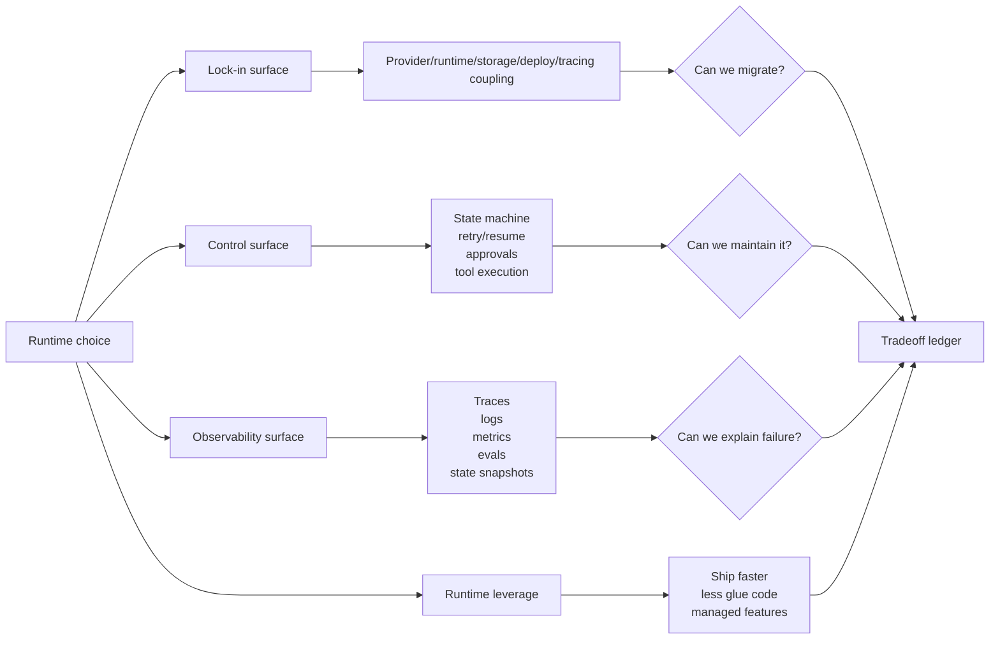

The mature move is not avoiding lock-in at all costs. The mature move is making lock-in explicit, then deciding whether the leverage is worth it.

---

### 3. Real-World Industry Scenarios

#### Scenario A: Healthcare Assistant with Strict Audit Needs [Intermediate]

Product context: a clinical operations assistant summarizes patient support messages, retrieves internal policy, recommends next actions, and routes uncertain cases to humans. The team must preserve audit trails and show why a recommendation happened.

How tradeoffs show up:
- Lock-in: hosted model traces may capture sensitive data unless configured carefully; hosted conversation state may conflict with retention policies.
- Control: human review, state transitions, and audit evidence may need explicit ownership.
- Observability: final answers are not enough; the trace must show retrieval, tool calls, guardrail decisions, and human approval points.
- Runtime leverage: built-in tracing/evals can accelerate compliance testing if they support privacy requirements.

What good looks like in production: the team can answer "what data left our boundary," "which state store is source of truth," "which trace fields are redacted," and "how do we replay this decision?"

#### Scenario B: Fast-Moving SaaS Support Copilot [Intermediate]

Product context: a startup wants a support copilot with ticket search, account tools, handoffs, guardrails, and conversation memory. The team has two backend engineers and wants to ship in weeks.

How tradeoffs show up:
- Lock-in: OpenAI-native sessions, tracing, hosted tools, or realtime features may couple the product to the OpenAI ecosystem.
- Control: the team may accept less graph-level control because the main risk is not long-running workflow durability.
- Observability: default traces and run items may be enough for early product debugging.
- Runtime leverage: built-in `Runner`, sessions, guardrails, handoffs, and tracing reduce time spent building glue.

What good looks like in production: the team documents which features are OpenAI-specific and keeps business tools behind clean interfaces so future migration is not a full rewrite.

#### Scenario C: Enterprise Workflow Platform [Pro]

Product context: an enterprise platform runs agent workflows for procurement, compliance, HR, and finance. Workflows can pause for days and involve approvals, retries, state inspection, and replay.

How tradeoffs show up:
- Lock-in: tying workflow durability to a vendor-specific conversation primitive could become costly.
- Control: state machines, checkpoints, thread IDs, stores, and versioned workflow logic matter more than fast demo speed.
- Observability: engineers need node-level state diffs, checkpoint inspection, online/offline evals, and production dashboards.
- Runtime leverage: LangSmith or ADK managed deployment can be valuable, but only if it matches governance and infrastructure constraints.

What good looks like in production: each workflow has a state ownership map, trace schema, evalset, rollback path, migration boundary, and documented failure-recovery behavior.

---

### 4. System View (Think Like a Systems Engineer)

#### Inputs

- Compliance constraints: data retention, ZDR policies, audit trail, trace redaction, encryption, regional hosting
- Product behavior: short chat, long workflow, realtime, sandbox, document-heavy, human approval, multi-agent handoff
- Runtime ownership: model call loop, tool execution, state persistence, memory compaction, retries, approvals, deployment
- Observability requirements: traces, spans, logs, metrics, evals, dashboards, feedback, state replay
- Migration concerns: model provider, tool protocol, state store, evaluation datasets, deployment target, tracing backend

#### Transformations

1. List every coupled surface: model, prompt format, tool schema, state, deployment, tracing, evals, guardrails, sandbox/realtime APIs.
2. Mark who owns each surface: your app, the runtime, the model provider, cloud platform, or third-party tool.
3. Decide which surfaces are allowed to be coupled because the leverage is worth it.
4. Put portability around the risky surfaces: interfaces, adapters, MCP, neutral eval data, external state stores, exported telemetry.
5. Prototype the failure mode that would make migration or debugging painful.

#### Outputs

- A lock-in surface map
- A control ownership table
- An observability checklist
- An exit strategy
- A prototype proving the riskiest runtime assumption

#### Observability Signals by Runtime

- LangGraph/LangSmith: node transitions, state snapshots, checkpoints, store access, thread IDs, runs, traces, eval experiments, deployment metrics.
- ADK: session IDs, event streams, trace view, function call/function response events, model request/response tabs, graph view, evalsets, conformance baselines, logs/metrics/traces.
- OpenAI Agents SDK: trace/workflow IDs, agent spans, generation spans, function spans, guardrail spans, handoff spans, session history, `RunState`, `RunConfig`, trace sensitive-data settings, custom processors.

#### Failure Points

- You stored source-of-truth workflow state only in a provider-managed conversation primitive.
- You relied on default traces without checking whether sensitive inputs/outputs are captured.
- You chose a low-level runtime but did not staff the team to own retries, deployment, evals, dashboards, and state operations.
- You picked managed deployment but later needed infrastructure controls the managed path does not expose.
- You treated eval data as framework-specific, making migration harder than necessary.

---

### 5. System Design Flavor (Practical and Concise)

#### Runtime Tradeoff Matrix

| Tradeoff | LangGraph | Google ADK | OpenAI Agents SDK |
|---|---|---|---|
| Lock-in shape | Lower model lock-in, higher LangGraph/LangSmith orchestration shape if using managed platform | Google ecosystem/runtime/deploy/eval conventions; container options reduce but do not erase coupling | OpenAI Responses/tracing/sessions/realtime/sandbox coupling when using native features deeply |
| Control | Highest control over workflow state, graph transitions, persistence, and human-in-loop | Medium-high control through agents/workflows/events, with more runtime conventions | Medium control through `Runner`, `RunConfig`, sessions, hooks, guardrails, and integrations |
| Observability | Strong when paired with LangSmith: traces, state transitions, evals, deployment | Strong ADK-native event/trace/eval surfaces plus logs/metrics/traces | Built-in tracing by default; traces/spans for agents, generations, tools, handoffs, guardrails, voice |
| Deployment leverage | LangSmith deployment or own infra | Agent Runtime, Cloud Run, GKE, containers, ADK runtime surfaces | Bring your own service plus OpenAI platform features; durable execution via integrations |
| Cost of ownership | Higher app/runtime engineering, lower abstraction hiding | Balanced if Google ecosystem fits | Lower initial build cost; higher migration risk if OpenAI-native features become core |
| Best when | State/control is product-critical | Agent lifecycle/platform fit is product-critical | OpenAI-native speed/features are product-critical |

#### Tradeoff 1: Lock-In vs Leverage [Beginner]

Lock-in is not automatically bad. If OpenAI realtime is the product advantage, OpenAI coupling may be a rational trade. If Google Cloud deployment and ADK evals fit the enterprise path, ADK coupling may reduce operational risk. If LangGraph gives durable control over business workflows, LangGraph-specific state architecture may be worth it.

The dangerous version is invisible lock-in: you do not realize until later that your conversation memory, trace IDs, eval format, tool protocol, or deployment path cannot move.

#### Tradeoff 2: Control vs Maintenance Burden [Intermediate]

More control means more responsibility. LangGraph gives explicit orchestration, but your team must design graph state, persistence, versioning, retry policy, deployment, and monitoring. OpenAI Agents SDK and ADK can hide more runtime details, but the hidden details may become limiting when you need custom replay, state migration, or special compliance behavior.

Use high control when the control boundary is the product. Use managed leverage when the product does not need to own that boundary.

#### Tradeoff 3: Observability Depth vs Observability Portability [Pro]

Vendor-native tracing often gives better semantic visibility because it understands the runtime objects: agents, tool calls, guardrails, handoffs, sessions, checkpoints, or graph nodes. But the deeper the semantic trace, the more runtime-specific it may be.

The practical answer is dual-layer observability:
- Keep native traces for runtime debugging.
- Export key events to a neutral schema for audits, dashboards, and migration.
- Keep eval datasets in a format that can be replayed outside one framework.

#### Scaling Consideration: When the System Becomes Important [Pro]

At small scale, the best runtime is often the one that ships a reliable prototype fastest. At production scale, the best runtime is the one whose failure surfaces your team can inspect and operate.

At 10x traffic or risk:
- Trace volume becomes a cost/privacy problem.
- Session/history growth becomes a latency problem.
- Tool retries become a side-effect problem.
- Managed conversations become a governance problem if source-of-truth state is unclear.
- Custom orchestration becomes a staffing problem if no one owns operations.

---

### 6. Common Mistakes + Debugging

#### Mistake 1: Treating Lock-In as a Vague Emotion

Symptom: people say "avoid lock-in" but cannot name the locked surface.

Likely cause: no lock-in inventory exists.

First debugging step: list the coupled surfaces: model API, prompt format, tool schema, state store, tracing dashboard, eval format, deployment runtime, sandbox/realtime APIs, guardrails, and human approval flow.

#### Mistake 2: Paying the Control Premium Without Needing Control

Symptom: the team builds custom state machines, retry handlers, eval harnesses, and deployment glue for a simple assistant.

Likely cause: choosing a low-level runtime because it feels more "serious."

First debugging step: identify the product-critical control boundary. If none exists beyond conversation memory and tool calls, a higher-level runtime may be better.

#### Mistake 3: Trusting Default Traces Without Privacy Review

Symptom: traces contain prompts, tool arguments, tool outputs, audio data, customer IDs, or regulated content that should not be stored in that backend.

Likely cause: tracing was enabled before data classification and redaction policies were designed.

First debugging step: inspect one full trace from a realistic production-like scenario and mark every sensitive field. Then configure redaction, disable sensitive capture, or route traces to an approved backend.

#### Mistake 4: No Exit Strategy for State

Symptom: migration is blocked because conversation history, workflow status, approvals, and audit evidence live in runtime-specific objects.

Likely cause: the team never separated convenience memory from source-of-truth state.

First debugging step: build a state ownership map. Mark which data must survive framework migration and move that data to an application-owned store or neutral schema.

---

### 7. Hands-On Lab (Concept -> Build -> Break -> Measure -> Explain)

Build a lightweight tradeoff ledger for a runtime decision. This is the kind of artifact a senior engineer brings to an architecture review.

#### Build: Runtime Tradeoff Ledger [Pro]

```python
surfaces = [
    {"name": "model_api", "owner": "provider", "portability": 2, "risk": "model migration"},
    {"name": "tool_protocol", "owner": "app", "portability": 4, "risk": "tool rewrite"},
    {"name": "conversation_memory", "owner": "runtime", "portability": 2, "risk": "history migration"},
    {"name": "workflow_state", "owner": "app", "portability": 5, "risk": "resume/replay"},
    {"name": "tracing", "owner": "vendor", "portability": 2, "risk": "debug/audit migration"},
    {"name": "eval_dataset", "owner": "app", "portability": 5, "risk": "regression testing"},
]


def migration_risk(item):
    # Lower portability means higher migration risk.
    return 6 - item["portability"]


for item in surfaces:
    print(
        item["name"],
        "owner=", item["owner"],
        "migration_risk=", migration_risk(item),
        "risk=", item["risk"],
    )
```

#### Break

Change `workflow_state` owner from `app` to `provider` and set portability to `1`. Then ask: what happens if we migrate from OpenAI-native conversations to LangGraph or ADK? The risk score should rise.

Change `tracing` owner from `vendor` to `app` and portability to `4`. Then ask: what did we lose? You may gain audit portability but lose rich native trace semantics unless you still keep native traces for debugging.

#### Measure

Record:
- Number of surfaces with portability <= 2.
- Number of source-of-truth surfaces owned by a provider/runtime.
- Number of sensitive data surfaces in traces.
- Number of eval/test artifacts reusable outside the framework.

#### Explain

The ledger exposes architectural debt before it becomes migration pain. A runtime can be the right choice even with lock-in, but only if the locked surfaces are intentional and the exit strategy protects the source-of-truth parts of the system.

---

### 8. Active Recall (Spaced Repetition)

1. Why is lock-in not automatically bad?
2. What is the control premium?
3. What is the observability boundary?
4. Why should source-of-truth state usually stay application-owned?
5. What is the first thing to inspect when default traces are enabled?

**Answer keys:**

1. Lock-in can be rational when platform leverage directly matches the product need; it is dangerous when hidden or accidental.
2. The extra engineering and operations cost paid to own lower-level execution details instead of using managed abstractions.
3. The line between what traces/logs/metrics can explain and what remains hidden inside model/provider/runtime/tool internals.
4. Because workflow status, approvals, audit evidence, and long-term business facts must survive framework or provider migration.
5. Inspect a realistic full trace for sensitive prompts, tool arguments, tool outputs, audio data, IDs, and regulated content.

---

### 9. Practice

#### Mini-Exercise: Identify the Locked Surface

A team says, "We are locked into OpenAI Agents SDK." They use OpenAI models, `SQLiteSession`, function tools written in Python, OpenAI tracing, and no realtime/sandbox features.

**Suggested answer:** The strongest lock-in surfaces are model API and tracing. `SQLiteSession` and Python function tools are easier to port than OpenAI-managed conversation state or realtime APIs. If the app owns its business state and tools have clean interfaces, migration is not as severe as the statement implies.

#### Capstone-Style System Design Question

You are reviewing an architecture proposal for a regulated financial assistant. The team wants OpenAI Agents SDK because it ships fast, OpenAI server-managed conversations for memory, OpenAI traces for debugging, and tool approvals for risky actions. What tradeoff questions do you ask before approval?

**Answer outline:**

- What data is stored in OpenAI-managed conversation state, and does that meet retention/privacy rules?
- Is server-managed conversation state source of truth or just convenience history?
- Are traces allowed to contain prompts, tool args/outputs, or sensitive data? If not, how is sensitive capture disabled or redacted?
- What happens if the assistant must migrate to LangGraph, ADK, or another model provider?
- Are eval datasets stored in a portable format?
- Are risky tool approvals logged in an application-owned audit store?
- Is there a fallback path if OpenAI tracing, conversation state, or model APIs are unavailable?

---

### 10. Production Reality Check (Mandatory Ending)

**If this fails in prod, what's the first thing we inspect?**

Inspect the failure against the ownership map: which layer owned the failed surface?

- If it is state/resume/replay, inspect the source-of-truth state store and runtime checkpoint/session behavior.
- If it is a bad tool action, inspect tool-call traces, approval logs, guardrail logs, and side-effect idempotency.
- If it is observability/privacy, inspect trace payloads and redaction settings before reading only dashboards.
- If it is migration pain, inspect which locked surface was never given an exit strategy.

Why: runtime tradeoff failures usually appear as debugging blindness. You cannot fix what the chosen runtime does not expose, what your app did not own, or what your observability pipeline never recorded.

---

### 11. Curiosity Bridge (Mandatory Ending)

This works when the tradeoff ledger is honest, but it breaks when team capability is misread.

That leads into **Team skill fit and ecosystem maturity**: the same architecture can be brilliant for one team and a maintenance trap for another.

---

### 12. Exit Check + Carry-Forward Review

**Exit check:** You're done with 15.3.b when you can map every major runtime decision to a lock-in surface, a control surface, an observability surface, and an exit strategy.

---

**Carry-Forward Review (interleaved recall from 15.3.a):**

*Q: Why is "LangGraph vs ADK vs OpenAI Agents SDK" not just a feature checklist?*

> **A:** Because the real decision is about runtime fit: durable state, control ownership, provider/platform alignment, observability, deployment, and team operations. Features matter only after you know which failure boundary the product needs the runtime to expose.

---

## Subtopic 15.3.c: Team Skill Fit and Ecosystem Maturity

### ✅ Add to Knowledge Base

---

### 0. Reading Path + Level Tags

**Beginner:** Read sections 1-2 and Active Recall. Focus on the idea that the "best" framework can fail if the team cannot operate it.

**Intermediate:** Add sections 3-6. You should be able to map LangGraph, ADK, and OpenAI Agents SDK to team capability and ecosystem fit.

**Pro:** Do the Hands-On Lab and capstone. The goal is to produce an adoption plan that reduces staffing, maintenance, and migration risk.

---

### 1. Pre-Question Hook + The Intuition (Plain English)

**Pause:** before choosing a runtime, ask: "Which framework can this team debug, deploy, upgrade, and explain six months from now?"

A runtime is not just code. It is a skill requirement. LangGraph, ADK, and OpenAI Agents SDK each assume a different kind of team:

- LangGraph rewards teams that can think in state machines, durable execution, workflow versioning, persistence, and operational debugging.
- ADK rewards teams that want a broader agent application framework with Google ecosystem alignment, multi-language surfaces, built-in agent lifecycle concepts, evals, observability, and deployment paths.
- OpenAI Agents SDK rewards teams that are Python-first, OpenAI-native, product-speed oriented, and comfortable using a compact set of primitives around `Agent`, `Runner`, tools, handoffs, sessions, guardrails, sandbox, and realtime.

An agent framework is like choosing a workshop and a training curriculum for your team. A sophisticated machine is powerful only if the team knows how to set it up, maintain it, inspect failures, and teach new engineers how to use it.

Where the analogy breaks: teams learn. The current skill fit is not destiny. A team can start with a simpler runtime, isolate business tools behind interfaces, and graduate to lower-level orchestration once the product proves the need.

**Team skill fit** is the match between a framework's required mental models and the team's actual ability to build, debug, deploy, evaluate, and maintain systems with those mental models.

**Ecosystem maturity** is the practical strength of a framework's docs, examples, integrations, community, deployment paths, observability, evaluation tooling, release stability, and hiring/knowledge availability.

**Operational maturity** is a team's ability to run a system after launch: incident response, runbooks, metrics, trace interpretation, regression tests, upgrade discipline, and ownership boundaries.

**Staffing risk** is the chance that a framework choice depends on rare expertise or one local expert, making the system hard to maintain when people change roles.

---

### 2. Visual Diagram (Mermaid)

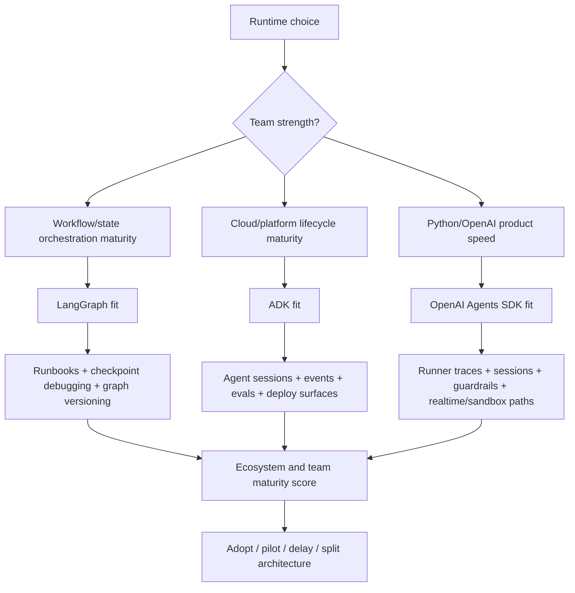

The decision is not only "what can the framework do?" It is "what can this team reliably do with the framework under production pressure?"

---

### 3. Real-World Industry Scenarios

#### Scenario A: Small Python Product Team Shipping a Support Assistant [Beginner]

Product context: a small SaaS team wants a support assistant with account lookup, ticket creation, basic handoff, and traceable outputs. The team uses Python heavily and is already building on OpenAI APIs.

How team fit affects the choice:
- OpenAI Agents SDK fits because the learning curve is small, the primitives are few, and the team can move from raw Responses API calls to `Agent` + `Runner` + tools quickly.
- LangGraph may be too much if the workflow is not durable or graph-heavy yet.
- ADK may be less natural unless the company is already adopting Google Cloud/Gemini/ADK operational paths.

What good looks like in production: the team can read traces, tune sessions/history, write tool tests, configure guardrails, and keep business tools portable even while using OpenAI-native runtime leverage.

#### Scenario B: Enterprise Team Standardized on Google Cloud [Intermediate]

Product context: a large enterprise already uses Google Cloud, Gemini, Cloud Run/GKE, centralized logging/metrics/tracing, and wants a consistent agent development/deployment path across teams.

How team fit affects the choice:
- ADK fits because it aligns with the organization's platform habits, agent runtime surfaces, deployment options, evaluation concepts, and multi-language needs.
- LangGraph can still fit for teams that need deep orchestration and have state-machine expertise.
- OpenAI Agents SDK can be used for OpenAI-native product slices, but may create platform fragmentation if the enterprise standard is Google-aligned.

What good looks like in production: there is a shared ADK project template, approved tool/auth patterns, evalset conventions, trace dashboards, deployment playbooks, and platform support.

#### Scenario C: Platform Team Building Long-Running Agent Workflows [Pro]

Product context: a platform team builds reusable agent workflows for many business units. Workflows may pause, resume, branch, inspect state, replay, and integrate with separate model providers and tools.

How team fit affects the choice:
- LangGraph fits if the team understands graphs, persistence, checkpointing, thread IDs, stores, human-in-loop, and stateful workflow operations.
- ADK fits if the team wants an agent app framework with broader lifecycle surfaces and Google ecosystem compatibility.
- OpenAI Agents SDK fits better as a leaf runtime for OpenAI-native subagents than as the main durable workflow backbone, unless paired with durable execution integrations.

What good looks like in production: the team has graph versioning rules, checkpoint/store ownership, migration plans, evals, trace review habits, and onboarding docs for new engineers.

---

### 4. System View (Think Like a Systems Engineer)

#### Inputs

- Team language strengths: Python, TypeScript, Go, Java, Kotlin, backend platform experience
- Mental model strengths: workflows, graphs, state machines, cloud deployment, model APIs, tool design, evals, observability
- Existing ecosystem: LangChain/LangSmith, Google Cloud/Gemini/Vertex/ADK, OpenAI platform, MCP, existing databases, monitoring tools
- Delivery pressure: prototype in days, production in weeks, enterprise platform over quarters
- Ownership model: product team, platform team, central AI team, shared DevOps/SRE, compliance/security review
- Hiring/onboarding reality: how easy it is to find docs, examples, engineers, and support for the chosen stack

#### Transformations

1. Score the product need: speed, durability, platform alignment, provider neutrality, realtime/sandbox, eval/observability.
2. Score team readiness: framework knowledge, state/debugging skill, deployment maturity, test/eval habits, incident response.
3. Score ecosystem maturity: docs, examples, integrations, deployment options, tracing/eval support, release stability, community/support.
4. Identify the skill gap that would create the worst incident.
5. Choose adoption style: direct adoption, pilot first, split architecture, or delay until the team can operate it.

#### Outputs

- A team-fit scorecard
- A skill-gap list
- An onboarding/runbook plan
- A pilot scope
- A fallback/migration path if the chosen runtime strains the team

#### Observability and Operations Fit

Team fit shows up in incidents:
- LangGraph incidents require engineers who can inspect graph state, checkpoints, stores, interrupts, node transitions, and replay/resume behavior.
- ADK incidents require engineers who can inspect sessions, events, traces, tool trajectories, eval failures, deployment logs, and Google-integrated runtime behavior.
- OpenAI Agents SDK incidents require engineers who can inspect run items, spans, `RunConfig`, sessions/history, guardrail tripwires, handoffs, sandbox state, realtime events, and OpenAI API behavior.

#### Failure Points

- Choosing LangGraph without anyone who understands stateful workflow debugging.
- Choosing ADK without platform agreement around Google Cloud/Gemini/ADK operations.
- Choosing OpenAI Agents SDK because it is fast, then overloading it with long-running workflow responsibilities the team cannot maintain.
- Choosing the most mature ecosystem globally while ignoring local team maturity.
- Depending on one senior engineer as the only person who understands the runtime.

---

### 5. System Design Flavor (Practical and Concise)

#### Team-Fit Matrix

| Team / ecosystem signal | LangGraph | Google ADK | OpenAI Agents SDK |
|---|---|---|---|
| Strongest team profile | Platform/backend team comfortable with state machines and workflow ops | Enterprise/platform team aligned with Google Cloud and agent lifecycle tooling | Python product team already using OpenAI APIs |
| Learning curve | Higher: graph/state/persistence/human-in-loop concepts | Medium: agent runtime, sessions, workflows, eval/deploy ecosystem | Lower initial curve: few primitives, Python-first runtime |
| Operational burden | High unless using managed LangSmith deployment | Medium if ADK/Google operational path fits | Low-medium for short agents; higher for durable workflows unless integrated with Dapr/Temporal/Restate/DBOS |
| Ecosystem advantage | LangChain/LangSmith ecosystem, provider flexibility, durable orchestration | Google ecosystem, multi-language support, agent dev/eval/deploy surfaces | OpenAI platform, Responses API, tracing, sandbox, realtime/voice, simple primitives |
| Hiring/onboarding risk | Need engineers comfortable with explicit orchestration | Need engineers comfortable with ADK/Google agent platform patterns | Easier for Python/OpenAI teams; deeper features still need runtime knowledge |
| Watch-out | Overengineering simple agents | Platform fit assumptions | OpenAI-native coupling and workflow durability limits |

#### Tradeoff 1: Local Skill vs Global Popularity [Beginner]

A framework can be popular and still be wrong for your team. If nobody can debug it during an incident, popularity does not help the user.

Choose based on who will maintain the system, not only who can build the first demo.

#### Tradeoff 2: Learning Curve vs Runtime Power [Intermediate]

LangGraph has a higher learning curve because it exposes more orchestration control. That is valuable when the team needs it. OpenAI Agents SDK has a lower initial curve because the primitive set is smaller. ADK sits closer to a product runtime: more surfaces than OpenAI's small core, but more guided lifecycle support than hand-built orchestration.

Plain-English version: power that the team cannot use becomes complexity. simplicity that hides needed control becomes a ceiling.

#### Tradeoff 3: Ecosystem Gravity vs Architecture Neutrality [Pro]

Ecosystems pull designs toward their native way of working:
- LangGraph pulls toward explicit state graphs, LangSmith observability/evals/deployment, and LangChain-style integrations.
- ADK pulls toward Google agent runtime concepts, Google deployment paths, evals, traces, integrations, and multi-language agent teams.
- OpenAI Agents SDK pulls toward Responses API, OpenAI tracing, OpenAI-native sessions/conversations, sandbox, realtime, and Python-first app code.

This gravity is useful when aligned with the organization. It becomes friction when the organization wants a different platform center.

#### Scaling Consideration: Team Growth [Pro]

At one or two engineers, choose the runtime that minimizes cognitive load and lets you ship safely. At ten-plus engineers, choose the runtime that supports shared conventions: templates, runbooks, eval datasets, trace review rituals, CI checks, deployment playbooks, and ownership boundaries.

The scaling question becomes: can a new engineer fix a production issue in this runtime after two weeks of onboarding?

---

### 6. Common Mistakes + Debugging

#### Mistake 1: Confusing Prototype Skill with Production Skill

Symptom: the team builds a polished demo but cannot explain bad tool calls, state bugs, trace anomalies, or deployment failures.

Likely cause: the team learned only the happy-path tutorial.

First debugging step: run a failure drill. Force a bad tool result, broken session state, guardrail tripwire, and deployment config issue. See who can diagnose each layer.

#### Mistake 2: Picking a Framework for One Expert

Symptom: one engineer understands the graph/session/runtime behavior, and everyone else treats it as magic.

Likely cause: framework choice depended on local hero expertise instead of team-wide maintainability.

First debugging step: require a second engineer to write a runbook and fix a staged incident without help from the expert.

#### Mistake 3: Ignoring Ecosystem Maturity at the Edge Features

Symptom: core examples work, but advanced needs like evals, deployment, sandbox, realtime, multi-language support, or observability integrations are under-documented for your exact stack.

Likely cause: evaluating the ecosystem only by quickstart quality.

First debugging step: validate the exact production path: deploy, trace, evaluate, recover from failure, upgrade, and migrate a small but realistic flow.

#### Mistake 4: Choosing Simplicity Until the System Outgrows It

Symptom: a simple SDK loop accumulates custom state tables, replay logic, approval queues, audit logs, and retry glue.

Likely cause: the product became a workflow platform, but the runtime choice never changed.

First debugging step: compare the custom glue to LangGraph/ADK built-in surfaces. If the glue is becoming your framework, revisit the runtime choice.

---

### 7. Hands-On Lab (Concept -> Build -> Break -> Measure -> Explain)

Build a team-fit scorecard before choosing a runtime. This makes people/process risk visible.

#### Build: Team-Fit Scorecard [Pro]

```python
frameworks = {
    "LangGraph": {
        "team_state_machine_skill": 5,
        "team_google_platform_fit": 2,
        "team_openai_python_speed": 3,
        "ops_runbook_required": 5,
        "ecosystem_alignment": 4,
    },
    "Google ADK": {
        "team_state_machine_skill": 4,
        "team_google_platform_fit": 5,
        "team_openai_python_speed": 2,
        "ops_runbook_required": 4,
        "ecosystem_alignment": 4,
    },
    "OpenAI Agents SDK": {
        "team_state_machine_skill": 2,
        "team_google_platform_fit": 1,
        "team_openai_python_speed": 5,
        "ops_runbook_required": 3,
        "ecosystem_alignment": 4,
    },
}

team = {
    "team_state_machine_skill": 2,
    "team_google_platform_fit": 1,
    "team_openai_python_speed": 5,
    "ops_runbook_required": 2,
    "ecosystem_alignment": 4,
}


def fit_score(framework):
    score = 0
    for dimension, needed in frameworks[framework].items():
        available = team[dimension]
        score += max(0, 6 - abs(needed - available))
    return score


for name in sorted(frameworks, key=fit_score, reverse=True):
    print(name, fit_score(name))
```

#### Break

Change the team profile to a platform team with high state-machine skill and low OpenAI product dependency. LangGraph should rise.

Change the team profile to a Google Cloud enterprise team. ADK should rise.

Then remove `ops_runbook_required` from the scoring. Notice how the result becomes demo-biased and underweights maintenance.

#### Measure

Record:
- Which framework wins for the current team?
- Which skill gap is largest?
- Which runbook must be written before launch?
- Which feature must be piloted before commitment?

#### Explain

Team fit is not an excuse to avoid powerful tools. It is a way to sequence adoption. A team can start with OpenAI Agents SDK for product speed, keep state/tools portable, and later move durable workflow pieces to LangGraph or ADK when the product and team justify it.

---

### 8. Active Recall (Spaced Repetition)

1. What does team skill fit mean in runtime selection?
2. Why might LangGraph be risky for a small product team?
3. Why might ADK be strong for a Google Cloud enterprise?
4. Why might OpenAI Agents SDK be strong for a Python-first team?
5. What is staffing risk?

**Answer keys:**

1. The match between a framework's required mental models and the team's ability to build, debug, deploy, evaluate, and maintain with those models.
2. It can impose graph/state/persistence/operations complexity before the product needs that control.
3. It aligns with Google agent runtime concepts, deployment paths, multi-language support, evals, observability, and platform habits.
4. It has few primitives, Python-first design, OpenAI-native runtime features, and a fast path from prototype to product assistant.
5. The risk that maintenance depends on rare expertise or one local expert rather than team-wide capability.

---

### 9. Practice

#### Mini-Exercise: Diagnose Team Fit

A team has strong Python skills, weak cloud platform maturity, no SRE support, and a two-month deadline for a customer-support assistant. The workflow is short-lived and uses OpenAI models. Which runtime do you start with?

**Suggested answer:** Start with OpenAI Agents SDK. It matches Python/OpenAI speed and avoids unnecessary orchestration complexity. Keep tools and business state behind app-owned interfaces so the team can move parts to LangGraph or ADK later if durable workflow needs appear.

#### Capstone-Style System Design Question

An enterprise architecture board is deciding between LangGraph and ADK for a multi-department agent platform. The platform must support long-running workflows, human approvals, evals, observability, and deployment across regulated teams. What team/ecosystem questions do you ask?

**Answer outline:**

- Do teams already understand graph/state workflow operations, or do they need a more packaged agent runtime?
- Is Google Cloud/Gemini/ADK already a platform standard?
- Who owns deployment, observability, eval datasets, and incident response?
- Can new engineers debug state/resume/tool/eval failures within two weeks?
- Are there shared templates, runbooks, approved tool/auth patterns, and trace redaction policies?
- Which ecosystem has better support for the exact languages, deployment targets, and compliance requirements?
- Should the organization split architecture: LangGraph for durable workflows, ADK for Google-aligned agent apps, OpenAI Agents SDK for OpenAI-native realtime/sandbox slices?

---

### 10. Production Reality Check (Mandatory Ending)

**If this fails in prod, what's the first thing we inspect?**

Inspect whether the failure is a capability gap, not only a code bug:
- Did the team know where to look in traces/events/state?
- Was there a runbook for this failure mode?
- Was the framework's operational model understood by more than one engineer?
- Did the ecosystem provide a documented path for this exact deployment/eval/debug scenario?

Why: many runtime failures persist because the team cannot operate the abstraction it chose. The fix may be training, runbooks, templates, or a different runtime boundary, not a prompt edit.

---

### 11. Curiosity Bridge (Mandatory Ending)

This gives us the human and ecosystem lens, but the module still needs a reusable decision artifact.

That leads into **Building a framework-selection rubric**: turning all these tradeoffs into a repeatable scoring method you can use in real architecture reviews.

---

### 12. Exit Check + Carry-Forward Review

**Exit check:** You're done with 15.3.c when you can explain which team profiles fit LangGraph, ADK, and OpenAI Agents SDK, and name the operational risks created by a mismatch.

---

**Carry-Forward Review (interleaved recall from 15.3.b):**

*Q: How does team skill fit change the lock-in/control discussion?*

> **A:** A team with high operational maturity may safely pay the control premium for LangGraph. A small product team may rationally accept OpenAI-native lock-in for speed. A Google-aligned enterprise may reduce operational risk by adopting ADK. The same lock-in can be acceptable or dangerous depending on who must operate it.

---

## Subtopic 15.3.d: Building a Framework-Selection Rubric

### ✅ Add to Knowledge Base

---

### 0. Reading Path + Level Tags

**Beginner:** Read sections 1-2 and Active Recall. Focus on why a rubric beats opinion-based framework selection.

**Intermediate:** Add sections 3-6. You should be able to build a fair comparison across LangGraph, ADK, and OpenAI Agents SDK.

**Pro:** Do the Hands-On Lab and capstone. The goal is to produce a real architecture-review artifact: weighted scores, knockout criteria, pilot plan, and decision memo.

---

### 1. Pre-Question Hook + The Intuition (Plain English)

**Pause:** before you score frameworks, ask: "What would make a framework unacceptable no matter how high its score is?"

A **framework-selection rubric** turns runtime choice from taste into structured reasoning. It forces you to name the product constraints, disqualifying requirements, weighted priorities, team-fit assumptions, and evidence needed before committing.

The mental model: a rubric is not a spreadsheet that magically chooses for you. It is a debate discipline. It makes assumptions visible so other engineers can challenge them.

A good rubric has four layers:

1. **Knockout criteria** — hard requirements that immediately disqualify a runtime.
2. **Weighted scoring** — soft tradeoffs that matter by degree.
3. **Pilot evidence** — small experiments that test the riskiest assumptions.
4. **Decision memo** — the written rationale, risks, exit plan, and follow-up checks.

Analogy: choosing a runtime is like choosing infrastructure for a hospital department. You do not pick the shiniest machine. You check regulatory constraints, staffing, maintenance, training, uptime, integration, support, and what happens when it fails.

Where the analogy breaks: GenAI runtimes evolve quickly. A rubric must be revisited as frameworks, models, pricing, docs, deployment options, and team skills change.

**Knockout criterion** is a non-negotiable requirement that disqualifies a runtime before weighted scoring, such as data residency, unsupported language, missing deployment approval, or inability to handle durable state.

**Weighted scoring** is a decision method where criteria receive importance weights, frameworks receive scores, and the final result exposes which assumptions drive the choice.

**Sensitivity analysis** is checking whether a decision changes when weights or scores shift, revealing fragile conclusions.

**Pilot spike** is a short, focused prototype that tests the riskiest assumption before full adoption.

---

### 2. Visual Diagram (Mermaid)

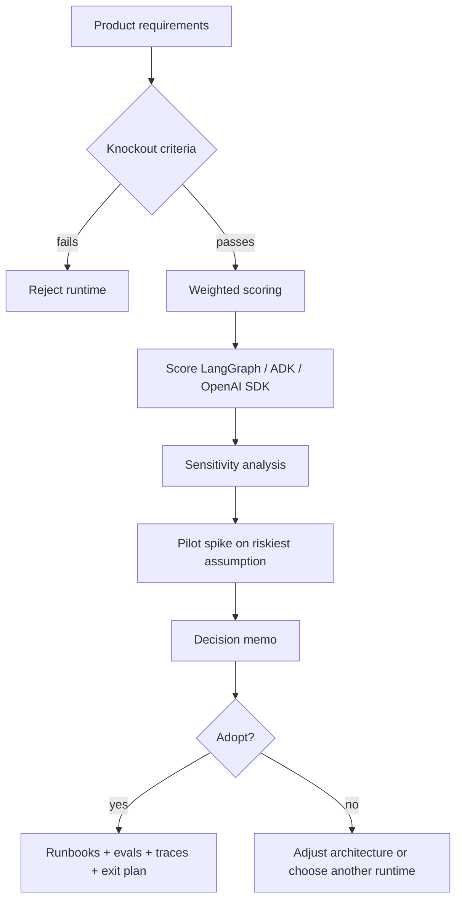

The rubric is useful because it separates "must have" from "nice to have," and separates opinion from evidence.

---

### 3. Real-World Industry Scenarios

#### Scenario A: Customer-Support Copilot [Beginner]

Product context: a SaaS support team needs a chatbot that can search tickets, inspect account status, call safe tools, escalate to billing, and remember session context.

Rubric outcome:
- Knockout criteria: must support Python tools, tracing, guardrails, session memory, and OpenAI models.
- Weighted priorities: speed to market, tool loop simplicity, tracing, team familiarity, future realtime option.
- Likely winner: OpenAI Agents SDK if OpenAI-native coupling is acceptable.
- Pilot spike: build one ticket lookup tool, one billing handoff, one guardrail, one session-backed follow-up, and inspect traces.

What good looks like: the decision memo says why LangGraph was not needed yet, what would trigger migration, and which business state remains app-owned.

#### Scenario B: Enterprise Compliance Workflow [Intermediate]

Product context: a regulated team needs multi-step document review, policy retrieval, uncertain-field human review, cross-day resume, replay, audit trails, and evals.

Rubric outcome:
- Knockout criteria: must support durable workflow state, human-in-loop, replay/resume, audit-friendly traces, and app-owned source-of-truth state.
- Weighted priorities: state control, observability, eval maturity, team orchestration skill, deployment governance.
- Likely candidates: LangGraph or ADK, depending on platform alignment and team skills.
- Pilot spike: document extraction -> uncertain field -> human review -> resume -> final decision -> audit trace.

What good looks like: the team chooses based on state/replay evidence, not demo polish.

#### Scenario C: Multimodal Voice Assistant with Backend Workflows [Pro]

Product context: a product has live voice support, interruptions, realtime tool approvals, and a backend reimbursement workflow that can pause for days.

Rubric outcome:
- Knockout criteria: voice layer must support realtime events and interruptions; workflow layer must support durable state.
- Weighted priorities: realtime latency, voice tooling, durable workflow control, trace stitching, team skill.
- Likely architecture: OpenAI Agents SDK for realtime/voice interaction layer plus LangGraph or ADK for durable backend workflow.
- Pilot spike: realtime call -> tool approval -> backend workflow creation -> human approval -> workflow resume -> voice status update.

What good looks like: the rubric allows a split architecture instead of forcing one runtime to own every layer.

---

### 4. System View (Think Like a Systems Engineer)

#### Inputs

- Product shape: chat, workflow, voice/realtime, sandbox, data-heavy assistant, internal automation, platform runtime
- Hard constraints: data residency, model provider approval, language support, deployment target, latency, durability, human approvals, auditability
- Soft priorities: speed, control, portability, observability, cost, ecosystem maturity, team fit, hiring ease
- Runtime candidates: LangGraph, ADK, OpenAI Agents SDK, raw Responses API, custom runtime, split architecture
- Evidence sources: docs, prototypes, traces, eval results, failure drills, deployment spikes, cost estimates

#### Transformations

1. Convert requirements into knockout criteria.
2. Convert priorities into weighted scoring criteria.
3. Score each runtime with evidence, not vibes.
4. Run sensitivity analysis: change weights and see if the winner changes.
5. Build a pilot spike for the riskiest assumption.
6. Write a decision memo with risks, owners, exit plan, and review date.

#### Outputs

- Framework-selection rubric table
- Runtime scorecard
- Sensitivity analysis notes
- Pilot spike result
- Decision memo
- Risk register and exit plan

#### Observability

The rubric should require observability evidence:
- Can we trace model calls, tool calls, handoffs, guardrails, state changes, approvals, and failures?
- Can we connect traces to eval cases and production incidents?
- Can we redact sensitive fields?
- Can we export enough telemetry for long-term audit/migration?
- Can a new engineer inspect a failed run without the original author?

#### Failure Points

- Scoring without knockout criteria, causing an invalid runtime to win.
- Scoring every criterion equally, hiding what the product actually needs.
- Using generic scores instead of scenario-specific scores.
- Ignoring sensitivity analysis, so a fragile winner looks certain.
- Skipping the pilot and discovering the hard part after adoption.

---

### 5. System Design Flavor (Practical and Concise)

#### Example Rubric Dimensions

| Dimension | What It Measures | When Weight Should Be High |
|---|---|---|
| Durable state/control | Explicit state, resume, replay, human-in-loop, versioning | Long-running workflows, regulated processes, approvals |
| Speed to product | How quickly the team can ship safely | MVPs, small product teams, short-lived assistants |
| Provider/platform fit | Alignment with approved models/cloud/deployment | Enterprises, governed platforms, procurement constraints |
| Observability/eval | Trace depth, eval support, production monitoring | High-risk, regulated, multi-agent, tool-heavy apps |
| Team skill fit | Ability to build/debug/operate | Any production system, especially small teams |
| Lock-in/portability | Migration and exit cost | Multi-provider strategy, uncertain platform future |
| Realtime/sandbox support | Voice, live sessions, isolated workspaces | Voice products, document/code workspace agents |
| Ecosystem maturity | Docs, examples, community, integrations, release stability | Long-lived systems, many teams, hiring/onboarding needs |

#### Scoring Example

| Runtime | Durable Control | Speed | Platform Fit | Observability | Team Fit | Portability | Realtime/Sandbox | Total Shape |
|---|---:|---:|---:|---:|---:|---:|---:|---|
| LangGraph | 5 | 3 | 3 | 5 | depends | 4 | 2 | Strong for durable workflows |
| ADK | 4 | 4 | 5 if Google-aligned | 4 | depends | 3 | 3 | Strong for Google-aligned agent apps |
| OpenAI Agents SDK | 3 | 5 | 5 if OpenAI-aligned | 4 | high for Python/OpenAI teams | 2-3 | 5 | Strong for OpenAI-native product agents |

The table is not the answer. The weights are the answer. A customer-support copilot and a compliance workflow should not weight these dimensions the same way.

#### Tradeoff 1: Rubric Precision vs Decision Speed [Intermediate]

A rubric can become bureaucracy if it is too large. Use enough criteria to reveal the real tradeoffs, then stop. For most teams, 6-8 weighted criteria and 3-5 knockout criteria are enough.

#### Tradeoff 2: Single Runtime vs Split Architecture [Intermediate]

Sometimes the best answer is not one runtime. Use OpenAI Agents SDK for realtime voice, LangGraph for durable workflows, ADK for Google-aligned agent apps, and MCP/tool interfaces to keep boundaries clean.

Plain-English rule: choose one runtime when the product shape is coherent. split when different layers have genuinely different runtime needs.

#### Tradeoff 3: Evidence vs Assumptions [Pro]

Every score should say whether it is evidence-backed or assumed:
- Evidence-backed: built a spike, inspected traces, deployed once, ran evals.
- Assumed: read docs, inferred from examples, team believes it can operate it.

High-impact assumed scores must become pilot spikes before production commitment.

#### Scaling Consideration: Rubric Reuse Across Teams [Pro]

At one team, a rubric prevents bad local decisions. At many teams, a rubric becomes governance:
- Shared scoring dimensions
- Approved knockout criteria
- Standard pilot checklist
- Decision memo template
- Runtime-specific runbook requirements
- Periodic review when frameworks or provider policies change

---

### 6. Common Mistakes + Debugging

#### Mistake 1: Equal Weights for Unequal Priorities

Symptom: the scorecard says two frameworks are close, but engineers still disagree strongly.

Likely cause: critical product constraints were treated as merely one row among many.

First debugging step: move true non-negotiables into knockout criteria and reweight the rest around business risk.

#### Mistake 2: Scoring Frameworks Globally

Symptom: someone says "LangGraph scores 5 for production" or "OpenAI SDK scores 5 for speed" without naming the product scenario.

Likely cause: scores are generic instead of scenario-specific.

First debugging step: rewrite the rubric title as "Runtime choice for [specific product/use case]" and rescore only for that context.

#### Mistake 3: No Sensitivity Analysis

Symptom: the winning runtime changes after one stakeholder says latency, compliance, or team skill matters more.

Likely cause: the decision depends on fragile weights.

First debugging step: run a sensitivity pass. Increase/decrease top weights by 20-30%. If the winner flips, document the assumption and test it with a pilot.

#### Mistake 4: Pilot Tests the Easy Path

Symptom: the pilot succeeds, but production fails at resume, tracing, deployment, approval, or eval maintenance.

Likely cause: the pilot tested the demo path instead of the riskiest path.

First debugging step: define the pilot around the hardest failure boundary: state recovery, human approval, realtime interruption, sandbox resume, trace redaction, or deployment governance.

---

### 7. Hands-On Lab (Concept -> Build -> Break -> Measure -> Explain)

Build a tiny framework-selection rubric you can modify per project.

#### Build: Weighted Runtime Rubric [Pro]

```python
runtimes = {
    "LangGraph": {
        "durable_control": 5,
        "speed_to_product": 3,
        "platform_fit": 3,
        "observability_eval": 5,
        "team_fit": 3,
        "portability": 4,
        "realtime_sandbox": 2,
    },
    "Google ADK": {
        "durable_control": 4,
        "speed_to_product": 4,
        "platform_fit": 5,
        "observability_eval": 4,
        "team_fit": 3,
        "portability": 3,
        "realtime_sandbox": 3,
    },
    "OpenAI Agents SDK": {
        "durable_control": 3,
        "speed_to_product": 5,
        "platform_fit": 4,
        "observability_eval": 4,
        "team_fit": 5,
        "portability": 2,
        "realtime_sandbox": 5,
    },
}

# Example scenario: OpenAI-native support copilot with possible realtime later.
weights = {
    "durable_control": 1,
    "speed_to_product": 5,
    "platform_fit": 4,
    "observability_eval": 3,
    "team_fit": 5,
    "portability": 2,
    "realtime_sandbox": 4,
}

knockouts = {
    "must_support_python_tools": True,
    "must_have_traceable_tool_calls": True,
    "must_support_session_memory": True,
}


def weighted_score(runtime: str) -> int:
    return sum(runtimes[runtime][criterion] * weight for criterion, weight in weights.items())


for runtime in sorted(runtimes, key=weighted_score, reverse=True):
    print(runtime, weighted_score(runtime))
```

#### Break

Change the scenario to a cross-day compliance workflow:
- Raise `durable_control` to 5.
- Raise `observability_eval` to 5.
- Lower `speed_to_product` to 2.
- Lower `realtime_sandbox` to 1.

The winning runtime should likely move toward LangGraph or ADK.

Then add a knockout: `must_run_on_google_approved_platform = True`. ADK may become favored if the organization is Google-aligned.

#### Measure

Record:
- Winner under default weights.
- Winner after sensitivity changes.
- Top two criteria driving the result.
- Any assumed score above 4 that lacks pilot evidence.
- One pilot spike needed before final commitment.

#### Explain

The rubric does not remove judgment. It improves judgment. It turns hidden preferences into inspectable assumptions, then forces the riskiest assumptions into experiments.

---

### 8. Active Recall (Spaced Repetition)

1. What are the four layers of a good framework-selection rubric?
2. Why should knockout criteria happen before weighted scoring?
3. What does sensitivity analysis reveal?
4. Why should the pilot spike target the riskiest path instead of the easiest demo?
5. When might a split architecture beat one runtime?

**Answer keys:**

1. Knockout criteria, weighted scoring, pilot evidence, and decision memo.
2. Because non-negotiable requirements should disqualify invalid runtimes even if they score well on softer dimensions.
3. Whether the decision is stable or depends heavily on fragile assumptions/weights.
4. Because production failures usually happen at hard boundaries: state, approval, tracing, deployment, privacy, realtime, or eval maintenance.
5. When different layers have different runtime needs, such as OpenAI realtime for voice plus LangGraph/ADK for durable backend workflows.

---

### 9. Practice

#### Mini-Exercise: Build the Knockout List

For a regulated healthcare workflow assistant, write three knockout criteria before scoring frameworks.

**Suggested answer:**

- Must support app-owned source-of-truth state and audit trail.
- Must allow sensitive trace redaction or approved tracing backend.
- Must support human review/resume for uncertain or risky decisions.

Other valid knockouts: approved deployment environment, data residency, eval/regression support, identity/auth integration, durable replay.

#### Capstone-Style System Design Question

Create a runtime-selection memo for Project 7: a data-heavy assistant that uses LlamaIndex for document retrieval and must choose between LangGraph, ADK, and OpenAI Agents SDK for the agent runtime.

**Answer outline:**

- State the product: data-heavy assistant with retrieval, citations, tool actions, evals, and possible workflow decisions.
- Knockouts: must integrate with LlamaIndex retrieval tools, preserve citation/evidence logs, support evals/traces, and keep source-of-truth data outside the runtime.
- Weights: retrieval/tool integration, observability/eval, team fit, workflow durability, platform fit, speed, portability.
- Likely choices:
  - LangGraph if durable workflow and explicit state are central.
  - ADK if Google-aligned deployment/eval/runtime is central.
  - OpenAI Agents SDK if OpenAI-native product speed, sandbox, or realtime is central.
- Pilot: retrieval -> answer with citations -> risky tool proposal -> approval -> trace/eval review.
- Decision memo: chosen runtime, why others lost, risks, owners, exit strategy, review date.

---

### 10. Production Reality Check (Mandatory Ending)

**If this fails in prod, what's the first thing we inspect?**

Inspect whether the failed requirement was represented correctly in the rubric.

- If durable state failed, was it weighted high enough or made a knockout?
- If debugging failed, did observability/eval have evidence or just assumed scores?
- If the team cannot operate the runtime, did team fit and staffing risk matter enough?
- If migration is painful, did the decision memo include an exit strategy?

Why: a bad runtime decision often starts as a bad rubric. The production failure reveals which assumption was missing, underweighted, or never tested.

---

### 11. Curiosity Bridge (Mandatory Ending)

This completes the runtime comparison arc: choose by constraints, tradeoffs, team reality, and evidence.

The next step is the **Module 15 checkpoint - runtime comparison memo**, where you turn the rubric into a concise architecture decision artifact for a real project.

---

### 12. Exit Check + Carry-Forward Review

**Exit check:** You're done with 15.3.d when you can create a runtime-selection rubric with knockout criteria, weighted scores, sensitivity analysis, pilot evidence, and a decision memo for LangGraph vs ADK vs OpenAI Agents SDK.

---

**Carry-Forward Review (interleaved recall from 15.3.c):**

*Q: Why must a framework-selection rubric include team skill fit?*

> **A:** Because a runtime that fits the product but not the operators becomes production risk. Team skill fit captures whether the team can debug traces, maintain state, update evals, handle incidents, onboard engineers, and evolve the system after launch.

---

## Module Checkpoint: Runtime Comparison Memo

### ✅ Add to Knowledge Base

---

### Checkpoint Goals

By the end of this checkpoint, you should be able to:

- Compare agent runtimes with engineering arguments rather than fandom.
- Choose a runtime based on workflow shape, not vendor popularity.
- Explain why LangGraph remains your anchor even after learning alternatives.

This checkpoint is the final compression layer for Module 15. It turns ADK, OpenAI Agents SDK, and LangGraph from a list of features into a runtime-selection discipline.

---

### 0. Reading Path + Level Tags

**Beginner:** Read sections 1-3 and the Final Decision Rules. Focus on matching runtime to workflow shape.

**Intermediate:** Add sections 4-7. You should be able to write a runtime comparison memo that explains tradeoffs without framework fandom.

**Pro:** Complete the checkpoint lab and memo template. The target output is a realistic architecture decision note for Project 7 or any agent product.

---

### 1. Pre-Question Hook + The Intuition (Plain English)

**Pause:** if two engineers argue "LangGraph is better" vs "ADK is better" vs "OpenAI Agents SDK is better," what question should you ask before judging either claim?

Ask: "Better for what workflow shape, operated by what team, under what constraints?"

An **engineering argument** is a runtime recommendation backed by workload shape, state needs, observability requirements, deployment constraints, team skill, risk, and evidence.

The core mental model:

- LangGraph is your **anchor runtime** for thinking about explicit stateful orchestration.
- ADK is a strong **agent product runtime** when Google-aligned platform leverage, sessions, evals, deployment, and managed agent patterns matter.
- OpenAI Agents SDK is a strong **OpenAI-native agent runtime** when product speed, OpenAI model/tool integration, guardrails, handoffs, realtime, or sandbox paths matter.

The checkpoint answer is not "always pick LangGraph." The checkpoint answer is: keep LangGraph as your reference model because it teaches you what every runtime must eventually answer: where is state, who owns control flow, how do we pause/resume, how do we observe failures, and what happens when the workflow gets complicated?

Analogy: LangGraph is like learning manual transmission before driving many automatic cars. You may not use manual every day, but it teaches you what the machine is doing underneath. ADK and OpenAI Agents SDK can be faster and smoother in the right vehicle, but LangGraph gives you the mechanical intuition to know when the abstraction is helping or hiding risk.

Where the analogy breaks: software runtimes are not fixed machines. Their capabilities change quickly, and split architectures can combine multiple runtimes in one product.

**Workflow shape** is the structure of an agent problem: its state lifetime, branching, human review, tool risk, latency, modality, deployment needs, and failure-recovery behavior.

**Anchor runtime** is the framework you use as a mental reference point for evaluating other runtimes' control, state, observability, and failure semantics.

---

### 2. Visual Diagram (Mermaid)

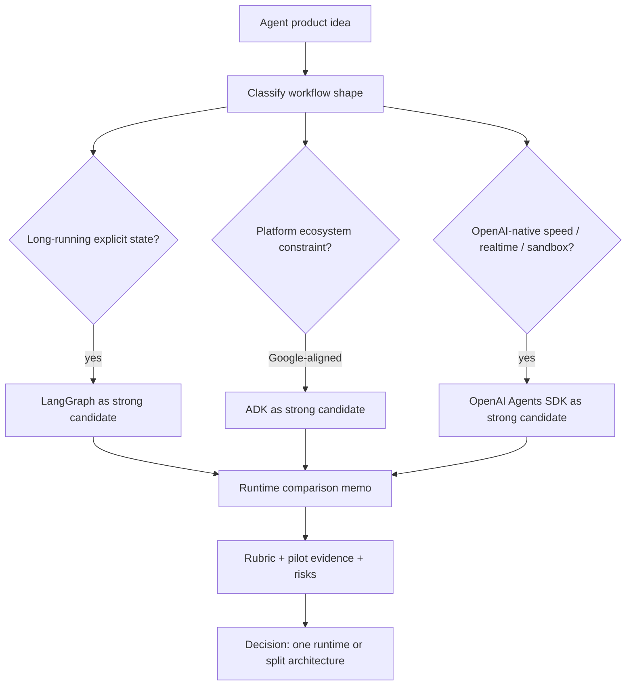

The correct comparison starts from the problem shape, not from the vendor logo.

---

### 3. Final Runtime Decision Rules

#### Rule 1: Choose LangGraph When State and Control Are the Product [Beginner]

Choose LangGraph when the system is mostly a durable workflow:

- Cross-turn or cross-day state matters.
- Human review, pause/resume, replay, retries, or compensation matter.
- You need explicit graph nodes and inspectable state transitions.
- You want provider-neutral orchestration and app-owned state.
- Debugging requires knowing exactly which node changed which state.

Engineering argument: "We choose LangGraph because workflow correctness and state control are the core risk. The product needs durable orchestration more than a managed agent shell."

#### Rule 2: Choose ADK When Google-Aligned Agent Runtime Leverage Matters [Intermediate]

Choose ADK when the system benefits from Google's agent product shape:

- Google Cloud deployment, governance, or tooling is the default path.
- Sessions, events, artifacts, evaluation, and trace tooling should feel integrated.
- Agent-to-agent and workflow composition fit the product.
- The team wants a production runtime with opinionated agent patterns.

Engineering argument: "We choose ADK because platform alignment reduces operational burden, and its agent/runtime/eval/deployment model matches our environment."

#### Rule 3: Choose OpenAI Agents SDK When OpenAI-Native Product Speed Matters [Intermediate]

Choose OpenAI Agents SDK when the product is tightly aligned with OpenAI capabilities:

- Fast Python-first agent development is the priority.
- Function tools, hosted tools, guardrails, handoffs, and tracing are enough.
- Realtime voice, sandbox agents, or OpenAI-native sessions matter.
- The team accepts OpenAI coupling for speed and product leverage.

Engineering argument: "We choose OpenAI Agents SDK because the product is OpenAI-native, the workflow is not primarily a custom durable state machine, and speed/realtime/sandbox leverage dominates."

#### Rule 4: Use Split Architecture When One Runtime Would Distort the Design [Pro]

Use a split architecture when different layers have different runtime shapes:

- OpenAI Agents SDK for realtime voice, LangGraph for durable backend workflow.
- ADK for Google-aligned agent surface, LangGraph for custom long-running orchestration.
- LlamaIndex for data/retrieval, LangGraph/ADK/OpenAI Agents SDK for agent control.

Engineering argument: "We split because forcing one runtime across all layers would either hide state risk, slow product delivery, or overcouple independent concerns."

---

### 4. Runtime Comparison Memo Template

Use this template whenever someone asks, "Which agent framework should we use?"

#### 1. Decision Summary

- Recommended runtime: LangGraph / ADK / OpenAI Agents SDK / split architecture.
- One-sentence reason: tie it to workflow shape and production risk.
- Decision confidence: high / medium / low.
- Review date: when to revisit the decision.

#### 2. Product and Workflow Shape

- Is the product chat, workflow, realtime voice, sandbox, data-heavy assistant, or platform agent?
- How long does state live?
- Does it need human review, approval, replay, retries, or resume?
- Are tool calls low-risk lookups or high-risk business actions?
- What are the latency, cost, compliance, and privacy constraints?

#### 3. Knockout Criteria

- Must support approved deployment environment.
- Must support required model/provider policy.
- Must expose enough traces for incidents/audits.
- Must keep source-of-truth state portable.
- Must support required modality: chat, voice, sandbox, workflow, MCP, or data/RAG tools.

#### 4. Weighted Scoring

Score only after knockouts pass.

| Criterion | Weight | LangGraph | ADK | OpenAI Agents SDK | Notes |
|---|---:|---:|---:|---:|---|
| Durable state/control | 1-5 | | | | Higher for long workflows |
| Product speed | 1-5 | | | | Higher for MVP/chat/realtime |
| Platform fit | 1-5 | | | | Higher for Google/OpenAI constraints |
| Observability/evals | 1-5 | | | | Higher for risky production systems |
| Team skill fit | 1-5 | | | | Higher when team is small or new |
| Portability/exit | 1-5 | | | | Higher when provider strategy is uncertain |
| Realtime/sandbox | 1-5 | | | | Higher for voice/live/code/data workspaces |

#### 5. Evidence and Pilot Results

- What prototype did we build?
- Which failure path did we test?
- What traces/evals/logs did we inspect?
- What remained assumed?
- Which assumption could invalidate the decision?

#### 6. Risks and Mitigations

- Runtime risk: abstraction hides a needed boundary.
- Team risk: operators cannot debug it.
- Lock-in risk: migration becomes expensive.
- Observability risk: incidents cannot be explained.
- Scale risk: state, traces, evals, or deployment do not hold at 10x.

#### 7. Final Recommendation

Use this wording:

> We recommend [runtime] because [workflow shape] makes [top 1-2 criteria] the dominant production risk. [Other runtime] is not selected because [specific mismatch], not because it is weak generally. We will revisit if [trigger condition].

---

### 5. Worked Comparison: Project 7 Data-Heavy Assistant

Project shape: a data-heavy assistant using LlamaIndex for document ingestion/retrieval, with tool calls, citations, evals, and a final framework-selection memo.

#### Step 1: Classify Workflow Shape

This is not just a chatbot. It is a data-centric assistant:

- Retrieval quality and citation correctness matter.
- Tool calls may need permission and audit trails.
- Evaluation must test answer quality, retrieval coverage, and tool trajectory.
- The runtime should not own the canonical document/index state.
- If decisions become multi-step or review-heavy, durable orchestration matters.

#### Step 2: Runtime Arguments

**LangGraph argument:**

Choose LangGraph if the assistant becomes a stateful workflow: retrieve -> reason -> call tools -> request approval -> revise -> store artifact -> resume later. LangGraph keeps orchestration explicit and makes state transitions inspectable.

**ADK argument:**

Choose ADK if the organization is Google-aligned and wants an integrated agent runtime with sessions, events, evaluation, deployment, and managed operational paths. ADK is especially attractive when platform fit reduces governance and deployment friction.

**OpenAI Agents SDK argument:**

Choose OpenAI Agents SDK if the assistant is OpenAI-native, tool/handoff-driven, needs fast product iteration, or may add realtime/sandbox features. It is a strong fit when durable workflow control is not the main complexity.

#### Step 3: Likely Recommendation

For a learning capstone, use **LangGraph as the anchor recommendation** unless the product explicitly prioritizes OpenAI realtime/sandbox or Google platform alignment.

Why: Project 7 is meant to prove data-heavy assistant design and framework selection. LangGraph exposes the orchestration questions most clearly:

- What state do we pass between retrieval, reasoning, tools, and final response?
- Where do citations and evidence live?
- Where do approvals happen?
- How do we resume or replay a failed run?
- How do we evaluate each node or trajectory?

The memo should still compare ADK and OpenAI Agents SDK fairly. The goal is not to crown LangGraph by fandom. The goal is to show why explicit orchestration is the best learning and control anchor for this project shape.

---

### 6. Common Mistakes + Debugging

#### Mistake 1: Choosing by Vendor Popularity

Symptom: the team says "everyone is using X" or "vendor Y is moving fastest" without mapping features to failure modes.

Likely cause: runtime selection is being driven by market noise instead of workflow shape.

First debugging step: write the workflow shape in one paragraph, then list the top three production failure modes. Rescore runtimes against those risks.

#### Mistake 2: Treating LangGraph as Always the Answer

Symptom: simple product agents become over-engineered with custom nodes, checkpointers, and state schemas before the product has real workflow complexity.

Likely cause: confusing anchor runtime with default runtime.

First debugging step: ask whether the system actually needs explicit durable orchestration now, or whether ADK/OpenAI Agents SDK can ship safely with clearer product leverage.

#### Mistake 3: Treating Managed Runtime Leverage as Weakness

Symptom: the team rejects ADK or OpenAI Agents SDK because they feel less customizable, even though the product mostly needs fast safe tool use, sessions, tracing, evals, or realtime.

Likely cause: overvaluing control and undervaluing operational leverage.

First debugging step: estimate the engineering cost of rebuilding what the runtime already provides: session handling, guardrails, tracing, eval hooks, deployment paths, approvals, realtime, or sandbox behavior.

#### Mistake 4: Ignoring the Migration Trigger

Symptom: the first runtime works for the MVP, then fails when workflows become long-running, regulated, or multi-team.

Likely cause: no explicit trigger for revisiting the decision.

First debugging step: add a review trigger to the memo, such as "migrate/revisit if human review, replay, multi-day state, provider portability, or audit requirements become central."

---

### 7. Hands-On Checkpoint Lab (Concept -> Build -> Break -> Measure -> Explain)

#### Build: One-Page Runtime Comparison Memo [Pro]

Create a memo for a data-heavy assistant with this structure:

```markdown
# Runtime Comparison Memo

## Decision
Recommended runtime: LangGraph / ADK / OpenAI Agents SDK / split architecture
Confidence: High / Medium / Low

## Workflow Shape
- State lifetime:
- Human approval/review:
- Tool risk:
- Retrieval/data needs:
- Deployment/platform constraints:
- Observability/eval needs:

## Knockout Criteria
1.
2.
3.

## Weighted Criteria
| Criterion | Weight | Winner | Evidence |
|---|---:|---|---|
| Durable state/control | | | |
| Product speed | | | |
| Platform fit | | | |
| Observability/evals | | | |
| Team skill fit | | | |
| Portability/exit | | | |

## Runtime Comparison
- LangGraph:
- ADK:
- OpenAI Agents SDK:

## Recommendation
We choose ___ because ___. We reject ___ for this use case because ___, not because it is weak generally.

## Risks and Review Triggers
- Risk:
- Mitigation:
- Revisit if:
```

#### Break

Force the memo to fail by writing a recommendation that says only:

> "Choose OpenAI Agents SDK because OpenAI is popular and fast."

Now debug it:

- What is the workflow shape?
- Does the assistant need durable state?
- What owns retrieval indexes and citation evidence?
- What happens when a tool call must pause for approval?
- Which traces/evals prove the choice is safe?

#### Measure

Grade the memo on five signals:

| Signal | Pass Condition |
|---|---|
| Workflow shape clarity | A reader can tell what kind of agent system this is |
| Engineering argument | Recommendation maps to state/control/observability/team constraints |
| Fair comparison | Each runtime is rejected or selected for a specific reason |
| Evidence | At least one pilot or trace/eval result is named |
| Review trigger | The memo says when to revisit the decision |

#### Explain

The broken memo fails because popularity is not an architecture argument. The fixed memo explains the workload, identifies the dominant production risk, compares runtimes against that risk, and states what evidence would change the decision.

---

### 8. Active Recall (Spaced Repetition)

1. What question should you ask before accepting "Framework X is better"?
2. Why does workflow shape matter more than vendor popularity?
3. When is LangGraph the strongest runtime choice?
4. When can ADK be a better fit than LangGraph?
5. When can OpenAI Agents SDK be a better fit than LangGraph?
6. Why does LangGraph remain your anchor even when you choose another runtime?

**Answer keys:**

1. "Better for what workflow shape, operated by what team, under what constraints?"
2. Because production failures come from state, control, observability, deployment, team skill, and data constraints, not brand popularity.
3. When explicit durable state, human-in-loop, replay/resume, provider-neutral orchestration, and inspectable control flow are central.
4. When Google-aligned platform leverage, managed sessions/events/evals/deployment, and agent product runtime conventions reduce operational risk.
5. When OpenAI-native speed, tools, handoffs, guardrails, tracing, realtime, sandbox, or simple session-backed agent patterns dominate.
6. Because LangGraph teaches the underlying control/state/failure model that lets you evaluate higher-level runtimes with engineering clarity.

---

### 9. Practice

#### Mini-Exercise: Reject Without Dismissing

Write one sentence rejecting each runtime for a specific workflow, without implying the runtime is bad generally.

**Suggested answer:**

- LangGraph: "We are not choosing LangGraph for this MVP because the assistant has no durable workflow or human-in-loop state yet, so the control premium is not justified."
- ADK: "We are not choosing ADK because the organization is not Google-aligned and the managed platform benefits do not offset adoption cost for this use case."
- OpenAI Agents SDK: "We are not choosing OpenAI Agents SDK because the core risk is multi-day auditable workflow state, not OpenAI-native tool-loop speed."

#### Capstone: Final Module 15 Memo Prompt

Write a runtime comparison memo for a production data-heavy assistant that must answer questions with citations, call internal tools, support human approval for risky actions, and be evaluated weekly.

**Suggested outline:**

- Workflow shape: data-heavy assistant with retrieval, citations, tool actions, approvals, evals.
- Knockouts: traceability, retrieval/citation evidence, approval support, portable source-of-truth state, approved deployment.
- Weighted priorities: observability/evals, durable state/control, team skill, product speed, platform fit, portability.
- Recommendation: LangGraph if approval/resume/workflow state is central; ADK if Google platform alignment dominates; OpenAI Agents SDK if OpenAI-native speed/realtime/sandbox dominates.
- Why LangGraph remains anchor: it exposes state and control boundaries even if the final implementation uses a higher-level runtime.
- Review trigger: revisit if modality changes, platform policy changes, workflows become more/less durable, or eval failures reveal trace gaps.

---

### 10. Production Reality Check (Mandatory Ending)

**If this fails in prod, what's the first thing we inspect?**

Inspect the mismatch between the selected runtime and the real workflow shape.

Ask:

- Did we choose speed when the system needed durable control?
- Did we choose control when the product needed managed runtime leverage?
- Did we choose platform fit while ignoring team skill or observability?
- Did we choose vendor popularity instead of production failure modes?
- Did the memo include a review trigger and pilot evidence?

Why: runtime failures usually reveal that the dominant production risk was misclassified. The fastest path to root cause is comparing the incident against the original workflow-shape assumptions.

---

### 11. Curiosity Bridge (Mandatory Ending)

This completes Module 15: you now have the runtime-selection vocabulary to compare LangGraph, ADK, and OpenAI Agents SDK without fandom.

This unlocks the next move: using the selected runtime in a real project, where the abstract memo becomes working retrieval, tools, traces, evals, and incident-ready design.

---

### 12. Exit Check + Carry-Forward Review

**Exit check:** You're done with Module 15 when you can write a runtime comparison memo that chooses LangGraph, ADK, OpenAI Agents SDK, or a split architecture based on workflow shape, evidence, team skill, observability, lock-in, and production risk.

---

**Carry-Forward Review (interleaved recall from Module 15):**

*Q: What is the difference between choosing LangGraph as an anchor and choosing LangGraph as the implementation?*

> **A:** Anchor means LangGraph is your mental reference for state, control flow, pause/resume, and observability. Implementation means it is the actual runtime you deploy. You can use LangGraph as the anchor while still choosing ADK or OpenAI Agents SDK when their managed runtime leverage better fits the workflow.

*Q: What is the cleanest runtime-selection sentence?*

> **A:** "We choose [runtime] because [workflow shape] makes [dominant production risk] the deciding factor; we reject [alternative] for this use case because [specific mismatch], not because it is weak generally."

---

## Module Glossary

| Term | Definition |
|------|------------|
| **Engineering argument** | Runtime recommendation backed by workload shape, state needs, observability requirements, deployment constraints, team skill, risk, and evidence. |
| **Workflow shape** | Structure of an agent problem: state lifetime, branching, human review, tool risk, latency, modality, deployment needs, and failure-recovery behavior. |
| **Anchor runtime** | Framework used as a mental reference point for evaluating other runtimes' control, state, observability, and failure semantics. |
| **Runtime comparison memo** | Architecture decision note that compares agent runtimes using workflow shape, knockouts, weighted criteria, evidence, risks, and review triggers. |
| **Split architecture** | Design that uses different runtimes or frameworks for different layers because one runtime would distort the system boundary. |
| **Framework-selection rubric** | Structured decision artifact that compares runtimes using knockout criteria, weighted scoring, pilot evidence, risks, and a written rationale. |
| **Knockout criterion** | Non-negotiable requirement that disqualifies a runtime before weighted scoring. |
| **Weighted scoring** | Decision method where criteria receive importance weights and runtimes receive scores to expose which assumptions drive the result. |
| **Sensitivity analysis** | Process of changing weights or scores to see whether the decision remains stable or depends on fragile assumptions. |
| **Pilot spike** | Short focused prototype that tests the riskiest runtime assumption before full adoption. |
| **Decision memo** | Written architecture artifact explaining the chosen runtime, rejected alternatives, evidence, risks, owners, exit plan, and review date. |
| **Risk register** | List of known runtime risks, their impact, owners, mitigations, and review triggers. |
| **Team skill fit** | Match between a framework's required mental models and the team's ability to build, debug, deploy, evaluate, and maintain with those models. |
| **Ecosystem maturity** | Practical strength of a framework's docs, examples, integrations, community, deployment paths, observability, evaluation tooling, release stability, and support. |
| **Operational maturity** | Team ability to run a system after launch through incident response, runbooks, metrics, trace interpretation, regression tests, upgrades, and ownership boundaries. |
| **Staffing risk** | Risk that a framework choice depends on rare expertise or one local expert, making the system hard to maintain when people change roles. |
| **Ecosystem gravity** | Tendency of a framework ecosystem to pull architecture toward its native models, deployment paths, integrations, and operational habits. |
| **Runbook readiness** | Degree to which the team has documented, tested steps for diagnosing and recovering from expected production failures. |
| **Adoption style** | How a team introduces a runtime: direct adoption, pilot first, split architecture, or delay until the team can operate it safely. |
| **Vendor lock-in** | Dependency on one provider's APIs, models, hosted state, tracing, deployment, or runtime-specific features in a way that makes migration expensive. |
| **Control premium** | Extra engineering cost paid to own lower-level execution details instead of using a higher-level managed abstraction. |
| **Observability boundary** | Line between what traces/logs/metrics can explain and what remains hidden inside a model, hosted service, runtime, or external tool. |
| **Exit strategy** | Design plan for what must remain portable if the team changes model provider, runtime, deployment target, tracing system, or state store. |
| **Lock-in surface** | Specific part of a system that creates migration cost, such as model API, session storage, trace format, deployment runtime, tool schema, or eval format. |
| **Trace portability** | Ability to preserve useful debugging/audit information when moving between tracing backends or runtime frameworks. |
| **Source-of-truth state** | Durable business state that must remain correct and portable regardless of which agent runtime is used. |
| **Runtime leverage** | Build and operations speed gained by letting a framework own agent-loop, tracing, state, eval, deployment, sandbox, or realtime capabilities. |
| **LangGraph** | Low-level orchestration runtime for long-running, stateful agent workflows with graphs, persistence, human-in-loop, streaming, and durable execution. |
| **Runtime selection** | Process of choosing an agent execution framework based on state, control, deployment, observability, provider fit, and team constraints. |
| **Control plane** | System layer that decides execution order, state transitions, approvals, retries, pause/resume behavior, and ownership of workflow progress. |
| **Runtime-fit failure** | Production failure caused by choosing abstractions that do not expose or support the system boundary that later matters most. |
| **Framework fit matrix** | Decision table that maps product constraints to framework strengths, risks, and prototype requirements. |
| **Platform leverage** | Advantage gained by using a framework's native ecosystem features such as managed tools, tracing, evals, deployment, or realtime capabilities. |
| **Provider coupling** | Degree to which a system depends on one model vendor, cloud provider, hosted API, or framework-specific runtime behavior. |
| **State ownership map** | Design artifact that states which layer owns conversation history, workflow state, long-term memory, artifacts, approvals, and replay/resume. |
| **RealtimeAgent** | Agents SDK agent type for live realtime sessions, supporting instructions, tools, handoffs, output guardrails, MCP servers, and hooks with realtime-specific constraints. |
| **RealtimeRunner** | Realtime equivalent of `Runner` that creates live `RealtimeSession` objects instead of returning completed run results. |
| **RealtimeSession** | Live bidirectional session that sends text/audio input, streams events, tracks history, executes tools, handles approvals, and manages handoffs. |
| **RealtimeModel** | Transport abstraction behind realtime sessions; the default Python path uses OpenAI's server-side WebSocket realtime model. |
| **OpenAIRealtimeWebSocketModel** | Default Python SDK realtime model implementation using a server-side WebSocket connection to the Realtime API. |
| **OpenAIRealtimeSIPModel** | Realtime model implementation for attaching an agent session to an existing SIP/realtime call through `call_id`. |
| **RealtimeSessionModelSettings** | Session-level realtime model settings for model name, audio input/output formats, transcription, turn detection, voice, modalities, and tool choice. |
| **Turn detection** | Mechanism that decides when user audio should be committed and the model should respond. |
| **Semantic VAD** | Semantic voice activity detection mode that uses meaning and speech cues to decide turn boundaries and support natural interruptions. |
| **RealtimePlaybackTracker** | Playback tracking helper used to align interruption/history truncation with audio the user actually heard. |
| **`audio_interrupted`** | Realtime session event indicating active assistant audio was interrupted and playback/history should be adjusted. |
| **`tool_approval_required`** | Realtime session event emitted when a tool call pauses until the app approves or rejects it. |
| **Realtime handoff** | Live-session delegation where one realtime agent transfers the active conversation to another specialist. |
| **VoicePipeline** | Voice pathway that transcribes audio, runs an agentic workflow, and synthesizes speech output. |
| **VoiceWorkflow** | Workflow interface used by `VoicePipeline` to run application or agent logic after transcription. |
| **SingleAgentVoiceWorkflow** | Built-in voice workflow wrapper that runs a single regular `Agent` inside a voice pipeline. |
| **AudioInput** | Voice pipeline input type for complete audio where the turn boundary is already known. |
| **StreamedAudioInput** | Voice pipeline input type for chunked audio where activity detection decides when to run the workflow. |
| **StreamedAudioResult** | Voice pipeline result object that streams audio, lifecycle, and error events. |
| **VoiceStreamEvent** | Voice pipeline event type covering generated audio chunks, lifecycle notifications, and errors. |
| **Speech-to-text (STT)** | Audio-to-text stage that converts spoken input into transcript text for the workflow. |
| **Text-to-speech (TTS)** | Text-to-audio stage that turns workflow output into spoken audio. |
| **Model Context Protocol (MCP)** | Open protocol for exposing tools, resources, and prompts to AI applications through standardized server interfaces. |
| **HostedMCPTool** | Agents SDK hosted tool that lets the OpenAI Responses API call a remote or connector-backed MCP server on the model's behalf. |
| **MCPServerStreamableHttp** | Agents SDK local-runtime MCP client for servers using the Streamable HTTP transport. |
| **MCPServerStdio** | Agents SDK local-runtime MCP client that launches an MCP server subprocess and communicates over stdin/stdout. |
| **MCPServerSse** | Agents SDK local-runtime MCP client for legacy HTTP with Server-Sent Events MCP servers. |
| **MCPServerManager** | SDK helper that connects multiple MCP servers, tracks active/failed servers, and supports reconnect behavior. |
| **Tool filtering** | MCP mechanism for exposing only an allowed subset of server tools to an agent, either statically or dynamically per run. |
| **`tool_meta_resolver`** | MCP server option that injects trusted per-call `_meta` data such as tenant ID or trace context before tool execution. |
| **`include_server_in_tool_names`** | Agent MCP configuration that prefixes local MCP tool names with server names to avoid collisions. |
| **SandboxAgent** | Agents SDK agent that keeps the normal agent surface while adding sandbox workspace defaults, capabilities, manifest, and run identity. |
| **Manifest** | Sandbox fresh-session workspace contract defining staged files, dirs, repos, mounts, environment, users, groups, and path grants. |
| **SandboxRunConfig** | Per-run sandbox configuration that decides whether to create, inject, resume, or snapshot a sandbox session. |
| **Sandbox session** | Live isolated execution environment where sandbox commands run and workspace files change. |
| **Sandbox client** | Backend adapter such as Unix-local, Docker, or hosted provider client that creates/resumes sandbox sessions. |
| **Capability** | Sandbox-native extension that can add tools, instructions, files, mounts, or runtime behavior to a SandboxAgent. |
| **SnapshotSpec** | Sandbox policy describing how workspace contents should be restored into a fresh session and persisted afterward. |
| **`session_state`** | Serialized sandbox backend state used to reconnect to a prior sandbox session outside or alongside runner-managed RunState. |
| **`run_as`** | SandboxAgent option selecting the sandbox user identity for model-facing shell, filesystem, and patch actions. |
| **Guardrail** | Programmable check that validates agent input, final output, or function-tool calls and can allow, reject, replace, or halt behavior. |
| **Input guardrail** | Agent-level guardrail that checks the first agent's input and can stop execution by triggering an input tripwire. |
| **Output guardrail** | Agent-level guardrail that checks the final agent output and can stop delivery by triggering an output tripwire. |
| **Tool guardrail** | Function-tool-level check that runs before or after a custom function tool invocation. |
| **Tripwire** | Guardrail signal that halts execution and raises a tripwire exception when a safety or policy condition is met. |
| **`GuardrailFunctionOutput`** | SDK object returned by guardrail functions containing optional `output_info` and `tripwire_triggered`. |
| **`InputGuardrailTripwireTriggered`** | Exception raised when an input guardrail's tripwire is triggered. |
| **`OutputGuardrailTripwireTriggered`** | Exception raised when an output guardrail's tripwire is triggered. |
| **SDK session** | Client-managed Agents SDK memory object that stores and retrieves conversation history for a session ID. |
| **`SQLiteSession`** | Built-in lightweight SQLite-backed SDK session implementation for local development and simple apps. |
| **`SessionSettings`** | Per-run/session configuration for controlling how much session history is retrieved. |
| **`session_input_callback`** | RunConfig callback that customizes how retrieved session history and new input are merged before a model call. |
| **`call_model_input_filter`** | RunConfig hook that edits prepared model input immediately before the model call. |
| **`RunState`** | Serializable SDK state used to resume interrupted runs, including approval decisions and runtime metadata. |
| **`interruptions`** | Run result field containing pending approval items that must be approved or rejected before a paused run can continue. |
| **`needs_approval`** | Tool or agent-as-tool setting that pauses execution until a tool call is approved or rejected. |
| **`conversation_id`** | OpenAI Conversations API identifier for server-managed conversation history. |
| **`previous_response_id`** | Responses API continuation primitive that links a new run to a prior response without replaying full history. |
| **`OpenAIConversationsSession`** | Agents SDK session implementation backed by the OpenAI Conversations API. |
| **`OpenAIResponsesCompactionSession`** | Session wrapper that compacts stored history using the OpenAI Responses API. |
| **OpenAI Agents SDK** | Lightweight Python framework/runtime for building agentic apps with agents, tools, handoffs, guardrails, sessions, and tracing around the OpenAI Responses API. |
| **OpenAI `Agent`** | SDK primitive representing an LLM configured with instructions, tools, optional handoffs, guardrails, output type, model settings, and hooks. |
| **`Runner`** | OpenAI Agents SDK execution engine that runs the agent loop, calls models, executes tools, handles handoffs, streams events, and returns run results. |
| **Agent loop** | Runtime cycle of model call, tool or handoff handling, result appending, and repeated model calls until final output or failure. |
| **`RunResult`** | Result object from a completed run containing final output, newly generated run items, usage, and metadata. |
| **`RunResultStreaming`** | Streaming result object that exposes run events as they arrive and later contains the complete run result. |
| **`RunConfig`** | Per-run configuration for model/provider defaults, sessions, guardrails, handoff filtering, tracing, tool execution, and error behavior. |
| **Function tool** | Python function exposed as a model-callable tool with schema generated from signature, type hints, docstring, and Pydantic validation. |
| **Hosted tool** | OpenAI-managed tool surface such as web search, file search, code interpreter, hosted MCP, image generation, tool search, or hosted shell. |
| **Agent-as-tool** | Pattern where one agent is exposed as a callable tool so a manager agent can use specialist output while retaining conversation control. |
| **Handoff** | Delegation pattern where one agent transfers control to another specialist agent that becomes the current conversation owner. |
| **`handoff()`** | SDK helper for creating configurable handoffs with tool name/description overrides, metadata input, callbacks, filters, and runtime enablement. |
| **`handoff_description`** | Short specialist-agent description used to help the model choose the correct handoff destination. |
| **`input_filter`** | Handoff mechanism for changing what conversation history or items the receiving agent sees. |
| **`output_type`** | Agent configuration that requests structured final output validated against a Pydantic-compatible type. |
| **`tool_use_behavior`** | Agent configuration that controls whether tool results are sent back to the model or treated as final output under specified conditions. |
| **`MaxTurnsExceeded`** | Exception raised when an SDK run exceeds the configured maximum number of agent-loop turns. |
| **Agent product runtime** | Opinionated runtime shape for shipping agents with tools, sessions, events, evaluation, observability, and deployment conventions. |
| **Orchestration runtime** | Lower-level execution layer focused on controlling workflow state, node transitions, persistence, retries, interrupts, and long-running behavior. |
| **Durable execution** | Ability for a workflow to persist progress through failures, pauses, or restarts and resume from a saved execution state. |
| **Checkpointer** | LangGraph persistence component that stores thread-scoped graph state snapshots for continuity, time travel, fault tolerance, and resume. |
| **Store** | LangGraph persistence component for application-defined durable data across threads, such as user preferences or shared facts. |
| **Human-in-the-loop** | Pattern where execution pauses for human approval, review, editing, or missing input before continuing. |
| **State graph** | Graph-based workflow model where nodes read/write shared state and edges determine execution transitions. |
| **Provider neutrality** | Design property where orchestration is not tightly coupled to one model vendor, cloud provider, or managed runtime. |
| **Framework-selection decision memo** | Short architecture note that states the chosen framework, constraints, tradeoffs, prototype evidence, and operational ownership. |
| **ADK** | Google's Agent Development Kit; a framework/runtime for building, running, observing, evaluating, and deploying model-backed agents and workflows. |
| **`Agent` / `LlmAgent`** | ADK's basic model-backed execution unit combining a model, instructions, metadata, and optional tools. |
| **Tool** | A callable capability exposed to an agent, backed by deterministic code, APIs, MCP servers, long-running operations, or other agents. |
| **`FunctionTool`** | ADK wrapper around a function; the framework infers the tool schema from name, signature, type hints, defaults, return type, and docstring. |
| **`ToolContext`** | Runtime context passed to tools for accessing invocation/session state, requesting confirmation, handling auth-related flows, and coordinating tool behavior. |
| **`Runner`** | Runtime executor that runs an agent against a session and emits events for model messages, tool calls, tool responses, state changes, and final answers. |
| **Session** | Conversation or user-scoped continuity object used to preserve history and state across turns. |
| **Event** | Structured runtime record emitted during execution, such as a model output, function call, function response, state delta, artifact delta, or confirmation request. |
| **`AgentTool`** | ADK pattern that wraps one agent as a tool callable by another agent while the caller retains control of the interaction. |
| **`McpToolset`** | ADK integration that connects to an MCP server, discovers available MCP tools, adapts them to ADK-compatible tools, and proxies tool calls. |
| **Long-running tool** | Tool pattern for operations that initiate external work, pause or return progress, and later resume with intermediate or final results. |
| **Tool confirmation** | Runtime approval pattern that pauses a risky tool call until a user or supervising system confirms or supplies structured approval data. |
| **Tool-call accuracy** | Evaluation metric measuring whether the agent selected the expected tool for prompts that require tool use. |
| **Invalid argument rate** | Evaluation metric measuring how often tool calls contain missing, malformed, or semantically incorrect arguments. |
| **`Workflow`** | ADK graph-based agent construct that defines execution as connected nodes and edges. |
| **Node** | Executable step in a workflow graph; can be an agent, function, tool, human input task, or nested workflow. |
| **Edge** | Explicit transition between workflow nodes, configured in the `edges` array. |
| **`START`** | Reserved starting point for an ADK workflow graph. |
| **Route** | Named branch selected at runtime, usually emitted with `Event(route=...)`. |
| **`Event.output`** | Event payload used to pass internal data from one node to downstream nodes. |
| **`Event.message`** | Event payload intended for user-visible communication. |
| **`Event.state`** | Small session-scoped state update persisted across workflow nodes. |
| **`JoinNode`** | Workflow node that waits for multiple upstream branches and passes their collected outputs onward. |
| **Nested workflow** | Pattern where one `Workflow` is used as a node inside another workflow. |
| **`RoutedAgent`** | ADK TypeScript routing pattern that selects one agent per invocation with an explicit router function. |
| **`SessionService`** | Service that manages session lifecycle: create, retrieve, append events, update state, list, and delete sessions. |
| **`session.events`** | Chronological event history for a session, including user messages, model outputs, tool calls, tool responses, and state changes. |
| **`session.state`** | Serializable key-value scratchpad for dynamic facts relevant to the current session or scoped state prefix. |
| **`InMemorySessionService`** | Non-persistent session backend for local development, examples, and tests; data is lost on restart. |
| **`DatabaseSessionService`** | Persistent relational-database-backed session service for apps that manage their own storage. |
| **`VertexAiSessionService`** | Google Cloud / Agent Runtime session service for managed scalable persistence. |
| **State prefix** | Key naming convention that controls state scope: no prefix, `user:`, `app:`, or `temp:`. |
| **`state_delta`** | Event-attached state update applied by `SessionService.append_event()`. |
| **Eval file** | Focused ADK evaluation JSON file, usually ending in `.test.json`, for one small session scenario. |
| **Evalset** | Larger ADK evaluation dataset containing multiple sessions or longer multi-turn scenarios. |
| **Tool trajectory** | Ordered or expected set of tool calls an agent takes while solving a task. |
| **LLM-as-a-judge** | Evaluation approach where a model judges semantic match, rubric quality, groundedness, safety, or tool-use quality. |
| **`tool_trajectory_avg_score`** | ADK criterion comparing actual tool calls against expected tool calls using exact, in-order, or any-order matching. |
| **`final_response_match_v2`** | ADK LLM-judge criterion for semantic match between final response and reference response. |
| **`hallucinations_v1`** | ADK criterion checking whether agent responses are grounded in available context and tool outputs. |
