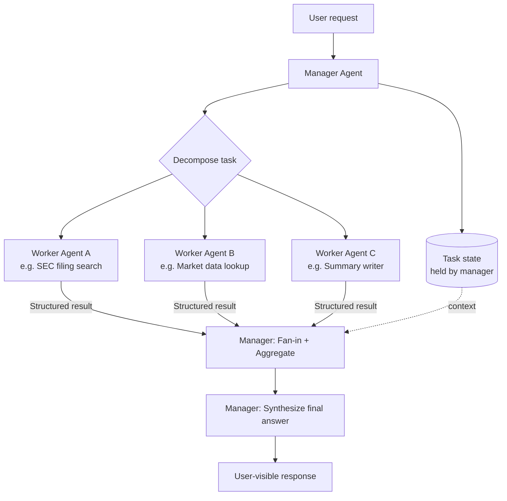
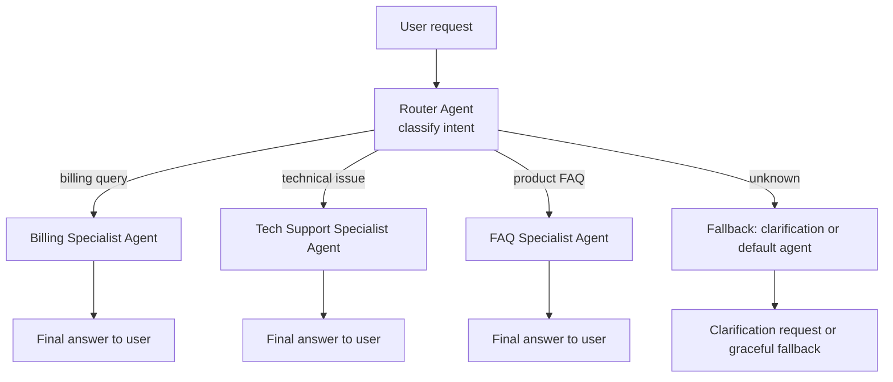
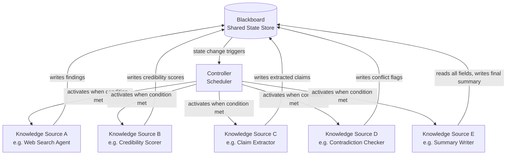
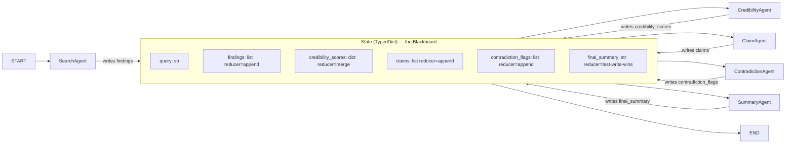
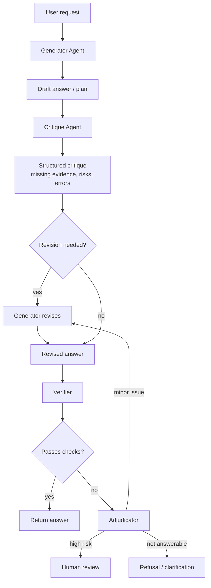
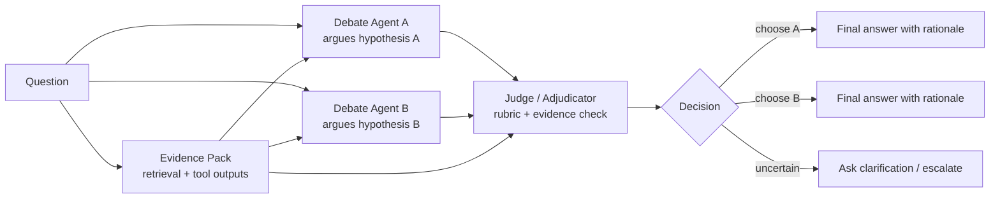
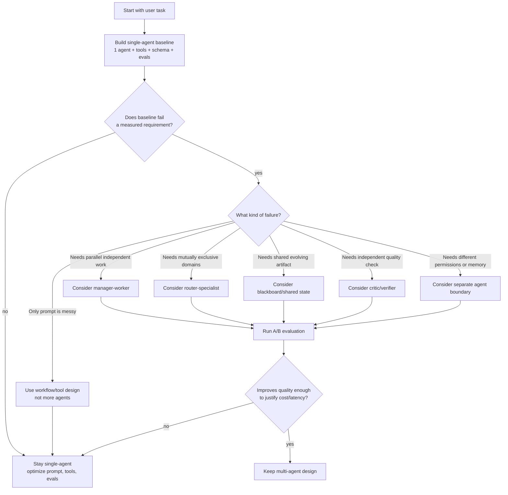
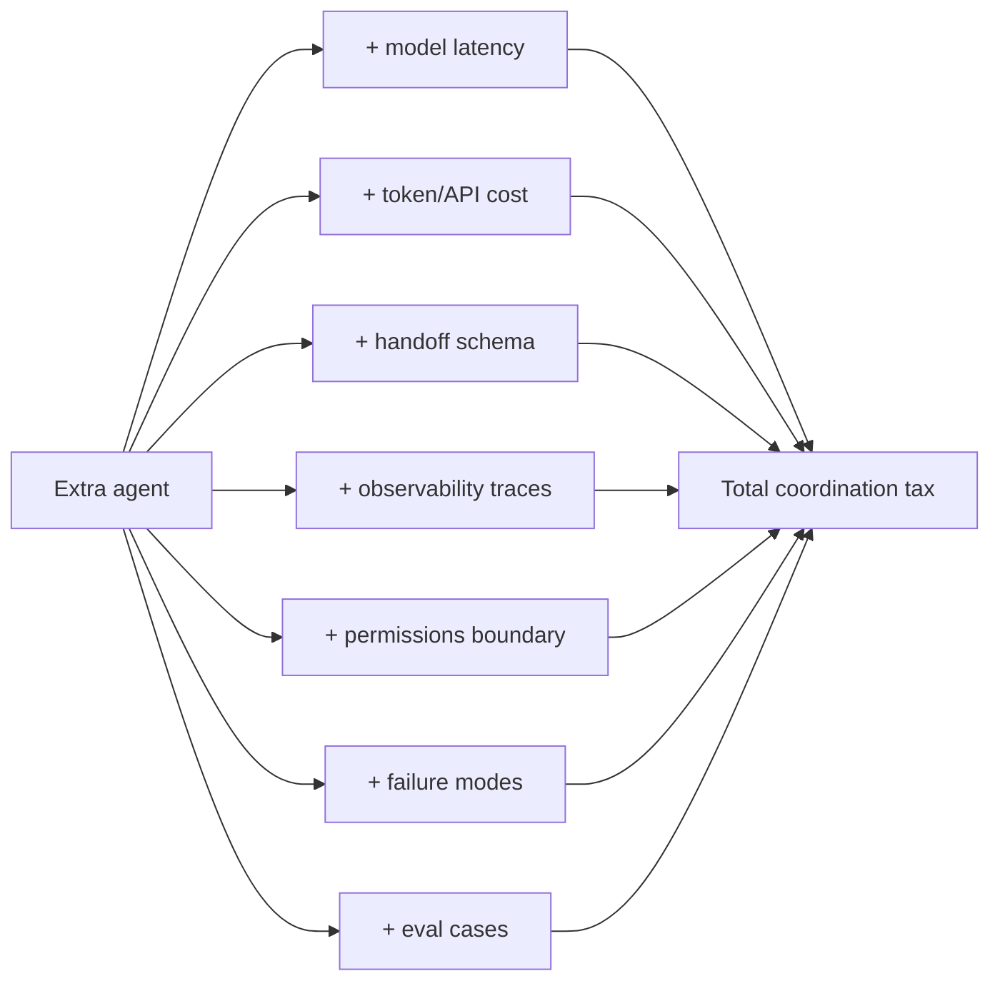
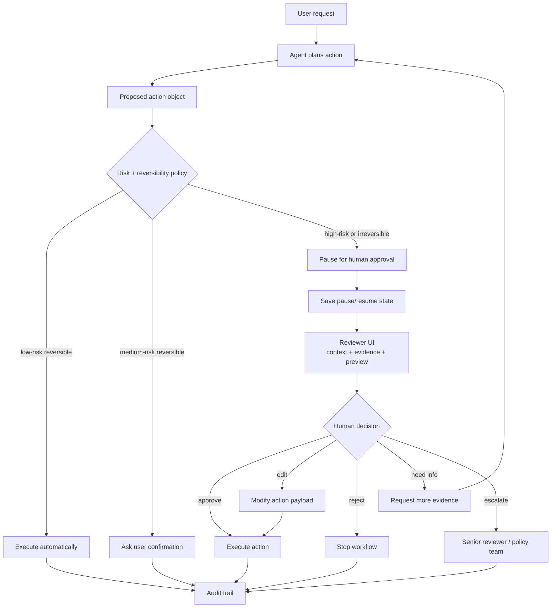
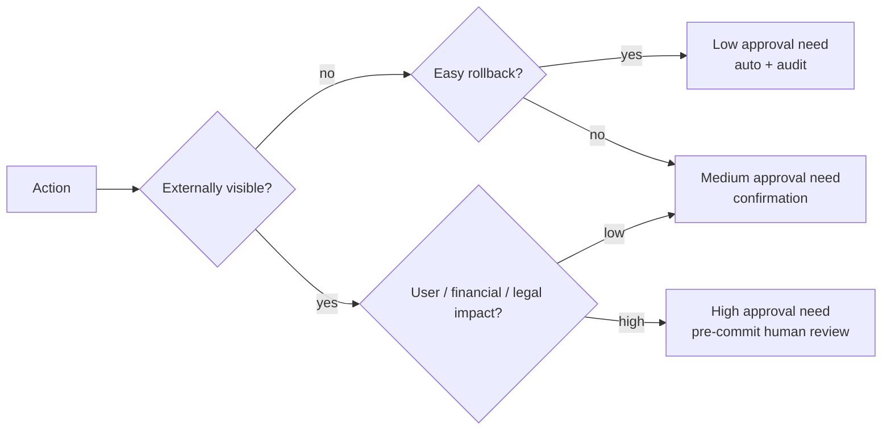

# Module 16 - Multi-Agent, Human-In-The-Loop, And Long-Lived Systems

> **Module time:** 34h
> **Why this module matters:** This is where agent systems become genuinely operational instead of theatrical. Single agents that call a handful of tools are easy to reason about. The moment you introduce multiple agents collaborating, tasks that pause and wait for humans, or workflows that must survive failures, restarts, and long waits, the engineering complexity jumps sharply. This module teaches you how to design, operate, and debug those systems without losing correctness or observability.

---

## Quick Topic Index

| # | Subtopic | Status |
|---|----------|--------|
| **Topic 16.1** | **Coordination patterns for multi-agent systems (10h)** | |
| 16.1.a | Manager-worker and router-specialist patterns | ✅ Done |
| 16.1.b | Blackboard and shared-state coordination | ✅ Done |
| 16.1.c | Debate, critique, and verifier patterns | ✅ Done |
| 16.1.d | Why many multi-agent systems should stay single-agent | ✅ Done |
| **Topic 16.2** | **Human-in-the-loop and approvals (12h)** | |
| 16.2.a | Approval checkpoints and reversible actions | ✅ Done |
| 16.2.b | Confidence thresholds and escalation logic | |
| 16.2.c | UX implications of human review | |
| 16.2.d | Measuring intervention quality and operational cost | |
| **Topic 16.3** | **Memory and long-horizon execution (12h)** | |
| 16.3.a | Episodic, semantic, and procedural memory concepts | |
| 16.3.b | Session memory, summary memory, and retrieval memory | |
| 16.3.c | Memory freshness, drift, and forgetting strategies | |
| 16.3.d | Long-running task decomposition and checkpoint strategy | |

**Covered so far:**
- 16.1.a — Manager-worker and router-specialist patterns: coordination topologies, manager vs router mental model, fan-out/fan-in mechanics, task decomposition, routing classification, result aggregation, real-world scenarios, tradeoffs, failure modes, debugging checklist
- 16.1.b — Blackboard and shared-state coordination: blackboard architecture origin, knowledge sources + blackboard + controller model, modern implementations (LangGraph StateGraph, ADK session state, Redis-backed shared state), reducer pattern for concurrent writes, event-driven vs polling access, schema typing, real-world scenarios (document pipeline, research synthesis), race conditions, state pollution, stale reads, schema drift, hands-on LangGraph-style blackboard lab
- 16.1.c — Debate, critique, and verifier patterns: generator-critic-verifier separation, debate vs critique vs verification, judge models, rubric-based evaluation, grounded verification, deterministic checks, adversarial review, adjudication, failure modes such as critique theater, correlated model errors, weak verifiers, over-rejection, verification cost, hands-on claim verifier lab
- 16.1.d — Why many multi-agent systems should stay single-agent: coordination tax, single-agent baselines, workflow-first design, agent role collapse, tool routing vs agent routing, evaluation gates for adding agents, complexity budget, reliability/cost/latency tradeoffs, anti-patterns, decision rubric, hands-on agent-ablation lab
- 16.2.a — Approval checkpoints and reversible actions: human-in-the-loop mental model, approval checkpoints, reversible vs irreversible actions, action risk tiering, pre-commit review, confirmation payloads, pause/resume state, audit trails, timeout handling, rollback/compensation design, hands-on approval-gated tool lab

---

## Topic 16.1: Coordination Patterns for Multi-Agent Systems

> **Topic time:** 10h
> Focus: Understanding how multiple agents communicate, divide work, share or hand off state, and produce reliable outputs together, without devolving into an untraceable mess.

---

## Subtopic 16.1.a: Manager-Worker and Router-Specialist Patterns

### ✅ Add to Knowledge Base

### Reading Path + Level Tags

- **Beginner:** Read sections 1–2 and Active Recall.
- **Intermediate:** Add sections 3–5 and the Hands-On Lab Build step.
- **Pro:** Complete the full Hands-On Lab (Build → Break → Measure → Explain) plus the capstone practice question.

---

### 0. Pre-Question Hook [Beginner]

**Pause:** You need to build a research assistant that handles three completely different tasks: summarizing SEC filings, answering product FAQs, and writing social media copy. You have three specialist agents ready. How do you decide whether to put a *manager* in front of all three, or a *router* in front of all three? What is the difference? What breaks if you pick the wrong one?

Think about that for 30 seconds. Then read on.

---

### 1. The Intuition (Plain English) [Beginner]

When a single agent tries to do everything, it accumulates responsibilities: a large system prompt, a growing tool list, complex conditional logic, and a fragile instruction set that breaks when requirements change. The natural engineering response is to split the work across multiple specialized agents.

But splitting agents creates a new problem: *who coordinates them?* Two patterns dominate real production systems.

---

#### The Manager-Worker Pattern

A **manager agent** (also called an orchestrator) receives the original user request, determines what subtasks it implies, and dispatches those subtasks to **worker agents** that are each narrowly specialized. When workers respond, the manager collects their outputs, resolves any conflicts, and synthesizes a final answer.

Real-world analogy: a project manager at a consulting firm. The PM takes the client brief, breaks it into workstreams (research, analysis, writing), assigns each to a specialist team, reviews drafts, and assembles the final deliverable. The specialists never talk to each other; they talk to the PM.

**Where the analogy breaks down:** A human PM has continuous judgment and can resolve ambiguous handoff situations implicitly. A manager agent can only reason over what arrives in its context window. If a worker returns an unexpected format or an error, the manager must have been designed to handle it — it cannot improvise like a human can.

**Key terms:**

- **Manager agent** — an agent whose primary job is task decomposition, worker delegation, result collection, and synthesis. It does not do domain-specific work itself.
- **Worker agent** — a narrowly focused agent with a specific capability (e.g., "search SEC filings" or "score writing quality"). It receives a self-contained task and returns a structured result.
- **Task decomposition** — the act of breaking a complex user request into independent or sequential subtasks that can be delegated to workers.
- **Fan-out** — the moment the manager dispatches subtasks to multiple workers (in parallel or sequentially).
- **Fan-in** — the moment the manager collects results from all workers and merges them into a coherent response.
- **Result aggregation** — combining multiple worker outputs, resolving conflicts, and producing a unified answer.

---

#### The Router-Specialist Pattern

A **router agent** (also called a dispatcher or triage agent) receives the user request, classifies its intent or category, and hands it off *entirely* to the correct **specialist agent**, which then handles the request end-to-end. The router does not aggregate results. Once it routes, it is done.

Real-world analogy: a hospital triage nurse. The nurse asks a few quick questions, categorizes the patient (emergency, urgent, routine), and sends them to the right department. The nurse doesn't follow the patient, assist with treatment, or collect the discharge summary. One question, one decision, one handoff.

**Where the analogy breaks down:** A triage nurse can escalate ambiguous cases manually. A router agent that encounters a request that doesn't fit any known category must have a designed fallback — a default specialist, a clarification loop, or a graceful "I cannot route this" response.

**Key terms:**

- **Router agent** — a lightweight agent whose only job is classification and handoff. It has no domain knowledge of the work itself.
- **Specialist agent** — a full-capability agent for a specific domain that handles the entire request after receiving it from the router.
- **Intent classification** — the process of determining which category, domain, or specialist best matches the incoming request.
- **Single-hop dispatch** — the router hands off exactly once; the specialist takes full ownership and returns the final answer to the user.
- **Routing confidence** — how certain the router is about its classification; low confidence should trigger a clarification step or a fallback path.

---

#### Manager vs Router: The Core Distinction

| Dimension | Manager-Worker | Router-Specialist |
|-----------|----------------|-------------------|
| Workers engaged per request | Many (fan-out) | One |
| Result aggregation | Yes — manager merges | No — specialist returns directly |
| Task decomposition | Yes | No |
| Router/manager holds task state | Manager holds it throughout | Router is stateless after dispatch |
| Latency | Higher (multi-step) | Lower (single-hop) |
| Complexity budget | High | Low |
| Best fit | Composite tasks needing multiple perspectives | Clear-cut categorical requests |

---

### 2. Visual Diagram (Mermaid) [Beginner]

#### Manager-Worker Topology



#### Router-Specialist Topology



**What these diagrams teach:**
- In the manager topology, the manager node is the convergence point — it holds state across the full lifecycle of the request.
- In the router topology, the router is a narrow decision gate; it exits the critical path immediately after dispatch.
- Adding a new worker in a manager pattern means adding a new delegation branch. Adding a new specialist in a router pattern means adding a new routing category.

---

### 3. Real-World Industry Scenarios [Intermediate]

---

#### Scenario A: Financial Research Assistant (Manager-Worker)

**Product/use case context:**
A wealth management firm wants an assistant that answers investor questions like *"Give me a risk summary for ticker XYZ."* Answering that well requires: current price data, recent earnings, SEC filing excerpts, and an analyst tone judgment. No single agent can do all four reliably. A manager-worker design assigns each piece to a focused worker.

**How the pattern plays out:**
1. The manager receives the question and decomposes it into four subtasks.
2. It dispatches in parallel: MarketDataAgent, FilingSearchAgent, EarningsSummaryAgent, ToneAgent.
3. Each worker calls its own narrow tools and returns a structured `result` dict.
4. The manager collects all four results (fan-in), checks for any errors or missing fields, then synthesizes a coherent risk narrative.

**Constraints and how they affect design:**

- **Latency:** Parallel fan-out is critical. If you run four workers sequentially each taking 2 seconds, total latency is 8 seconds. With true parallel dispatch, latency is the *longest* single worker. In practice, aim for 3–5 second total response time. Stragglers must be time-boxed: if one worker doesn't respond in 4 seconds, the manager either proceeds with partial data or surfaces a "data unavailable" note to the user — not a silent error.
- **Cost:** Each worker spawns its own model call. If you have 4 workers with 1,500 tokens each, that is 6,000 tokens per request even before the manager's synthesis call. At scale (10,000 requests/day), this cost difference over a single monolithic agent is real. Workers should be designed to return *only* what the manager needs: structured fields, not verbose prose.
- **Reliability:** Worker failures must be typed: is it a transient API error (retry), a missing data gap (continue with partial result), or a validation failure (manager must handle before synthesis)? If every worker failure causes the manager to abort, the system is brittle. Design each worker response to include a `status` field (`ok`, `partial`, `error`) and a `reason` field so the manager can reason gracefully.
- **Failure modes:** The manager may assign the same question differently on each request if its decomposition logic is non-deterministic. Workers can return structurally valid but factually inconsistent results (e.g., different earnings figures from different sources). The manager's synthesis step must reconcile conflicts rather than blindly merge.

**What good looks like in production:**
- Workers run in parallel with explicit timeouts.
- Every worker response has a typed schema (not a free-form string).
- Manager traces show: which workers were dispatched, what each returned, whether any failed, and how the synthesis resolved conflicts.
- Latency is measured at the manager level (total) and at each worker level (fan-out visibility).

---

#### Scenario B: Customer Support Platform (Router-Specialist)

**Product/use case context:**
A SaaS company routes support tickets through an AI triage layer before human escalation. Tickets fall cleanly into: billing disputes, technical troubleshooting, onboarding help, and account security issues. Each category has a distinct knowledge base, distinct tool access, and distinct escalation rules. A single monolithic agent would need four system prompts, four tool sets, and complex conditional logic. A router-specialist design keeps each domain clean.

**How the pattern plays out:**
1. The router receives the raw ticket text, classifies it into one of four categories (or "unknown"), and dispatches it to the matching specialist.
2. The specialist has a targeted system prompt, access to the relevant knowledge base, and domain-specific tools only (e.g., the billing specialist can call `get_invoice()` and `issue_refund()`; the security specialist can call `flag_account()` and `trigger_2fa_reset()`).
3. The specialist returns the full response directly to the user or escalation queue.

**Constraints and how they affect design:**

- **Latency:** The router itself should be fast: a short prompt with a classification schema and a small, capable model. If the router uses a heavy model with a long system prompt, it adds 500–800ms for a decision that should cost 100ms. Use a fast classifier model for the router; reserve the powerful model for the specialists.
- **Cost:** Since only one specialist runs per request, cost is nearly identical to a monolithic single-agent system. The router add-on is cheap. This is the main cost advantage of the router pattern over the manager pattern.
- **Routing confidence and misclassification:** The biggest failure mode in router systems is routing to the wrong specialist. A security issue sent to the billing specialist gets an irrelevant response, and the user escalates frustrated. Mitigation: the router should output a confidence score alongside its classification. Requests below a confidence threshold should go to a "clarification" path where the system asks the user one targeted question before routing.
- **Failure modes:** Edge cases that straddle categories (e.g., "I was charged for a feature I couldn't access due to a bug") fall into neither billing nor technical alone. A router that forces a binary decision will mishandle these. The specialist that receives a misrouted request must be designed to detect "this is not my domain" and return a structured signal to trigger a re-route or escalation, rather than hallucinating an answer outside its competence.

**What good looks like in production:**
- Router model is a fast, cheap classifier fine-tuned or prompted for the category taxonomy.
- Router outputs: `category`, `confidence`, `reason` for every decision.
- Specialists have narrow tool grants; they cannot call tools outside their domain.
- Misrouting rate is tracked as a primary operational metric.
- Unknown or low-confidence categories are never silently dropped; they hit a fallback path.

---

#### Scenario C: Code Review Pipeline (Hybrid — Router then Manager)

**Product/use case context:**
A developer tooling company wants an AI that reviews pull requests. Some PRs are simple (typo fixes, minor refactors) and need only a style check. Others are complex (new APIs, security-sensitive changes) and need style + security + test coverage + API compatibility analysis. A pure manager would over-provision for simple PRs. A pure router would under-serve complex ones.

**Solution: two-tier hybrid.**
1. A lightweight **router** reads the PR diff metadata (file types, size, change category labels) and classifies the PR as `simple` or `complex`.
2. For `simple` PRs: route directly to a StyleSpecialist.
3. For `complex` PRs: route to a **ReviewManager** that fans out to StyleAgent, SecurityAgent, TestCoverageAgent, and APICompatibilityAgent, then produces a unified review comment.

**What this illustrates:**
- Patterns compose. Router and manager are not mutually exclusive.
- The routing decision should be cheap to make, and should be based on observable signals (diff size, touched file categories), not a deep model inference.
- The complexity budget grows only when the incoming request actually justifies it.

---

### 4. System View (Think Like a Systems Engineer) [Intermediate]

**Inputs → Transformations → Outputs:**

```text
Manager-Worker:
[User request]
    → Manager: classify + decompose into N subtasks
    → Fan-out: dispatch each subtask to the appropriate worker
    → Workers: each calls its tools, validates outputs, returns typed result
    → Fan-in: manager collects all results, checks for errors/conflicts
    → Manager: synthesize final answer
    → [Response to user]

Router-Specialist:
[User request]
    → Router: classify intent, output category + confidence
    → Dispatch: single handoff to matching specialist
    → Specialist: calls its domain tools, generates full response
    → [Response to user]
```

**Observability — what we log, trace, and measure:**

| Signal | What it tells you |
|--------|-------------------|
| Manager decomposition output | Which subtasks were created; is decomposition stable across similar requests? |
| Fan-out timing (per worker) | Which worker is the latency bottleneck; who is slow or failing |
| Worker result schema conformance | Are workers returning the expected structure; early catch of format drift |
| Fan-in conflict detection | Did any two workers return contradictory data; how did the manager resolve it? |
| Router classification output + confidence | Is the router routing correctly; what is the misclassification rate by category? |
| End-to-end latency (manager total vs router+specialist) | Where is time being spent; where can parallelism help? |
| Error type per worker / specialist | Transient vs structural; triggers retry vs fallback vs escalation |

**Failure points — where it breaks and how it shows up:**

| Failure | Pattern | Symptom | How it surfaces |
|---------|---------|---------|-----------------|
| Manager over-decomposes | Manager-Worker | Too many worker calls, high latency, high cost | Traces show 8 worker calls for a simple request |
| Worker returns wrong schema | Manager-Worker | Manager synthesis crashes or produces garbage | KeyError / schema validation error in manager logs |
| Fan-out straggler | Manager-Worker | Response is slow with no visible error | One worker's trace shows 15s while others finished in 2s |
| Manager synthesizes conflicting data blindly | Manager-Worker | Factually inconsistent output | Output contains contradictory figures from different workers |
| Router misclassifies | Router-Specialist | Wrong specialist answers; user frustration | Misrouting rate metric spikes; user re-asks in frustration |
| No fallback for unknown category | Router-Specialist | Request silently dropped or crashes | Error rate spikes for edge-case inputs |
| Specialist acts outside its domain | Router-Specialist | Hallucinated answer for misrouted request | Specialist tool calls fail with permission errors; output is irrelevant |

---

### 5. System Design Flavor [Intermediate]

**Key components and interfaces:**

```text
Manager-Worker:
  - Manager Agent: receives request, runs decomposition logic, dispatches, aggregates, synthesizes
  - Worker Registry: mapping of capability name → worker agent endpoint or callable
  - Task Message Schema: typed payload sent from manager to each worker (includes task_id, subtask description, context slice, return schema)
  - Worker Result Schema: typed response including status (ok / partial / error), data fields, source metadata
  - Aggregation Layer: merge logic in the manager for resolving conflicts between workers

Router-Specialist:
  - Router Agent: classification prompt, category taxonomy, confidence output, dispatch table
  - Dispatch Table: mapping of category → specialist agent endpoint or callable
  - Fallback Handler: path for low-confidence or unknown classifications
  - Specialist Agent: full-capability domain agent with its own tools, knowledge, and system prompt
```

**Key tradeoffs:**

1. **Manager-Worker: flexibility vs. coordination overhead**
   - *Manager-Worker* lets you handle arbitrarily complex composite requests. Every new worker adds a capability without touching the others. But every request now requires at least N+1 model calls (N workers + 1 manager). At volume, coordination overhead is real: latency, cost, and complexity all grow. Choose manager-worker when the task *genuinely requires* multiple independent perspectives that must be synthesized.
   - *When to choose:* research pipelines, report generation, multi-domain analysis where partial results alone are insufficient.

2. **Router-Specialist: simplicity vs. misrouting risk**
   - *Router-Specialist* is cheap, fast, and easy to understand. Adding a specialist is adding a routing category. But the entire system's correctness depends on the router classifying accurately. A misroute cannot be corrected downstream unless the specialist signals it. Choose router-specialist when requests have clear, mutually exclusive categories and the specialist can answer fully without needing other agents' outputs.
   - *When to choose:* support ticket triage, intent-based dispatch, domain-specific FAQ systems, modality-based routing (text vs. code vs. image).

3. **Parallel vs. sequential worker dispatch (Manager-Worker)**
   - *Parallel dispatch:* total latency = slowest worker. Preferred when workers are independent. Requires all worker results to be available before aggregation begins, so you need a timeout strategy for stragglers.
   - *Sequential dispatch:* total latency = sum of all workers. Required only when worker B's input depends on worker A's output (a pipeline, not a fan-out). Many "manager-worker" implementations accidentally serialize independent workers, destroying the main latency advantage.
   - *When to choose parallel:* workers are independent. When to choose sequential: genuine data dependencies between steps.

**Scaling consideration (10x traffic/data):**

At 10x request volume, the manager pattern's N+1 model calls per request means your LLM API bill and latency budget scale linearly with the number of workers. Three changes matter:
1. **Cache worker results** for identical subtasks across requests (e.g., the same ticker's market data requested simultaneously by 50 users).
2. **Downsize the manager model** if the decomposition and synthesis logic is structured and repeatable — a smaller, cheaper model with few-shot examples can replace a large reasoning model for the coordination steps.
3. **Shard the routing layer** in the router pattern: stateless routers scale horizontally without state synchronization. They are the least expensive layer to scale.

---

### 6. Common Mistakes + Debugging [Intermediate]

#### Mistake 1: Treating the router like a manager

**Symptom:** A routing agent that receives a "billing + technical" request routes to billing, which then tries to answer the technical part and fails. The user gets a partial or wrong answer with no explanation.

**Likely cause:** The system was designed as a router (single-hop dispatch) but the real business need requires composite handling (a manager). The router was given a hard task that requires fan-out.

**First debugging step:** Audit your routing categories. List the last 20 requests that got poor responses. Are any of them genuinely multi-category requests? If yes, you need either a manager layer on top of the router, or a "composite" specialist that handles cross-category requests with its own tools.

---

#### Mistake 2: Workers return free-form text instead of structured schemas

**Symptom:** The manager's synthesis step produces inconsistent, hallucinated, or garbled outputs — sometimes great, sometimes wrong. Hard to reproduce.

**Likely cause:** Workers were designed to return narrative prose (e.g., "The earnings for Q2 were strong with revenue of $2.1B...") instead of structured data (`{"revenue_q2_usd": 2100000000, "source": "10-Q 2024"}`). The manager's synthesis model must now *parse* prose from multiple workers and reconcile them. Small phrasing differences lead to different model interpretations, causing non-deterministic synthesis quality.

**First debugging step:** Inspect the raw worker outputs in your traces. If they are free-form strings, enforce typed return schemas at the worker level immediately. Use Pydantic models or JSON schemas. The manager should never need to parse a worker's prose — it should receive typed fields and assemble a narrative itself.

---

#### Mistake 3: No fallback for the router's "unknown" category

**Symptom:** A user submits an edge-case request. The system returns a 500 error or a nonsensical answer. Support tickets spike. The failure is silent in your dashboards because it never hit a known specialist's error handler.

**Likely cause:** The router's dispatch table has no default/fallback path. When the router's classification confidence is below threshold or the category doesn't match, the dispatch logic throws a `KeyError` or routes to the last entry in the table by accident.

**First debugging step:** Check your router dispatch table for a `default` or `fallback` branch. Then check your monitoring: is there a metric for `router_category = unknown` and `routing_confidence < threshold`? If those metrics don't exist, the failure is invisible. Add them first, then implement a graceful fallback (clarification loop or human escalation).

---

### 7. Hands-On Lab [Pro]

> **Goal:** Build a minimal manager-worker system and a router-specialist system in pure Python (no framework), then deliberately break each to understand how failures surface. Measure concrete signals.

---

#### Build: Minimal Manager-Worker

```python
import json
from typing import Any

# Simulated "model call" — replace with real LLM API call in production
def call_model(system: str, user: str) -> str:
    """Stub: returns a deterministic response for the lab."""
    # In real code: call openai.chat.completions.create(...)
    raise NotImplementedError("Replace with real LLM call")

# --- Worker Agents ---

def market_data_worker(ticker: str) -> dict:
    """Returns current price and volume for a ticker."""
    # In real code: call a market data API
    return {
        "status": "ok",
        "ticker": ticker,
        "price_usd": 142.50,
        "volume_24h": 12_500_000,
        "source": "market_api",
    }

def filing_search_worker(ticker: str) -> dict:
    """Returns latest SEC filing summary for a ticker."""
    return {
        "status": "ok",
        "ticker": ticker,
        "latest_filing": "10-Q 2024-Q3",
        "revenue_usd": 2_100_000_000,
        "net_income_usd": 320_000_000,
        "source": "sec_edgar",
    }

def risk_tone_worker(ticker: str) -> dict:
    """Returns a risk sentiment score from recent news."""
    return {
        "status": "ok",
        "ticker": ticker,
        "risk_score": 6.2,   # 0=low risk, 10=high risk
        "tone": "cautious",
        "source": "news_sentiment_api",
    }

# --- Manager Agent ---

def manager_agent(user_request: str, ticker: str) -> str:
    """
    Manager: dispatches to all workers in parallel (simulated here as sequential
    for simplicity), collects typed results, and synthesizes a final answer.
    """
    import concurrent.futures

    workers = {
        "market_data": lambda: market_data_worker(ticker),
        "filing_search": lambda: filing_search_worker(ticker),
        "risk_tone": lambda: risk_tone_worker(ticker),
    }

    # Fan-out: run all workers (parallel via ThreadPoolExecutor in real code)
    results = {}
    errors = []
    with concurrent.futures.ThreadPoolExecutor() as executor:
        future_to_name = {executor.submit(fn): name for name, fn in workers.items()}
        for future in concurrent.futures.as_completed(future_to_name, timeout=5.0):
            name = future_to_name[future]
            try:
                results[name] = future.result()
            except Exception as exc:
                errors.append({"worker": name, "error": str(exc)})
                results[name] = {"status": "error", "reason": str(exc)}

    # Fan-in: check for any failed workers
    failed_workers = [r["worker"] for r in errors]
    if failed_workers:
        print(f"[WARN] Workers failed: {failed_workers}")

    # Synthesize (in real code: feed results into a model call)
    mkt = results.get("market_data", {})
    fil = results.get("filing_search", {})
    tone = results.get("risk_tone", {})

    summary = (
        f"Risk summary for {ticker}: "
        f"Current price ${mkt.get('price_usd', 'N/A')}. "
        f"Latest filing {fil.get('latest_filing', 'N/A')} shows revenue "
        f"${fil.get('revenue_usd', 'N/A'):,} and net income "
        f"${fil.get('net_income_usd', 'N/A'):,}. "
        f"Risk sentiment: {tone.get('tone', 'N/A')} (score {tone.get('risk_score', 'N/A')}/10). "
    )
    if failed_workers:
        summary += f"Note: data from {failed_workers} was unavailable."
    return summary


# Run it
print(manager_agent("Give me a risk summary for XYZ", "XYZ"))
```

**Expected output (with stubs returning data):**
```
Risk summary for XYZ: Current price $142.5. Latest filing 10-Q 2024-Q3 shows
revenue $2,100,000,000 and net income $320,000,000. Risk sentiment: cautious (score 6.2/10).
```

---

#### Build: Minimal Router-Specialist

```python
from typing import Callable

# --- Specialists ---

def billing_specialist(request: str) -> str:
    return f"[BILLING SPECIALIST] Handling: '{request}' — checking invoice records..."

def tech_specialist(request: str) -> str:
    return f"[TECH SPECIALIST] Handling: '{request}' — checking error logs..."

def faq_specialist(request: str) -> str:
    return f"[FAQ SPECIALIST] Handling: '{request}' — searching knowledge base..."

def fallback_handler(request: str) -> str:
    return f"[FALLBACK] Could not confidently route: '{request}'. Escalating to human."

# --- Router ---

DISPATCH_TABLE: dict[str, Callable[[str], str]] = {
    "billing": billing_specialist,
    "technical": tech_specialist,
    "faq": faq_specialist,
    "unknown": fallback_handler,
}

def classify_intent(request: str) -> tuple[str, float]:
    """
    Stub classifier. In production: call a model with a classification prompt
    that returns a structured response: {"category": "billing", "confidence": 0.91}
    """
    request_lower = request.lower()
    if any(w in request_lower for w in ["invoice", "charge", "refund", "payment", "billing"]):
        return "billing", 0.92
    elif any(w in request_lower for w in ["error", "bug", "crash", "not working", "broken"]):
        return "technical", 0.88
    elif any(w in request_lower for w in ["how do i", "what is", "can i", "does it"]):
        return "faq", 0.85
    else:
        return "unknown", 0.40

CONFIDENCE_THRESHOLD = 0.70

def router_agent(request: str) -> str:
    category, confidence = classify_intent(request)

    # Log the routing decision (in production: emit a structured metric)
    print(f"[ROUTER] category={category}, confidence={confidence:.2f}")

    if confidence < CONFIDENCE_THRESHOLD:
        print(f"[ROUTER] Low confidence ({confidence:.2f}), routing to fallback")
        category = "unknown"

    specialist = DISPATCH_TABLE.get(category, fallback_handler)
    return specialist(request)


# Run it
print(router_agent("I was charged twice on my last invoice"))
print(router_agent("The app keeps crashing when I upload a file"))
print(router_agent("How do I export my data?"))
print(router_agent("Kj2xp qzwrt nfoo"))  # Garbage → fallback
```

---

#### Break: Force the Relevant Failure Modes

**Break 1 — Straggler worker (manager pattern):**
Add a `time.sleep(10)` inside `market_data_worker`. Observe that `concurrent.futures.as_completed(timeout=5.0)` raises `TimeoutError`. The manager should catch this and proceed with partial data, not crash. If you remove the `try/except` around the future result, the entire request fails because one worker was slow.

```python
# In market_data_worker — add this to simulate a slow upstream API:
import time
time.sleep(10)  # This will trigger the 5s timeout
```

**Expected break behavior:** `concurrent.futures.TimeoutError` surfaces. Without proper error handling, the manager returns nothing. With proper handling (the `try/except` block above), the manager returns a partial summary noting that market data was unavailable.

**Break 2 — Worker returns wrong schema (manager pattern):**
Change `market_data_worker` to return `{"price": 142.50}` instead of `{"price_usd": 142.50}`. The synthesis step silently gets `None` for `mkt.get('price_usd')` and produces `"Current price $None"`. No exception, just corrupted output. This is worse than a crash — it's invisible.

**Break 3 — No fallback in router:**
Remove the `"unknown"` key from `DISPATCH_TABLE` and remove the confidence threshold check. Send the garbage input `"Kj2xp qzwrt nfoo"`. Observe `KeyError: 'unknown'` crashing the router. In production this becomes a 500 response.

---

#### Measure: Concrete Signals

| Measurement | How to capture | What to watch for |
|-------------|----------------|-------------------|
| Fan-out latency per worker | `time.perf_counter()` around each `future.result()` | Any worker > 2x the median latency is a bottleneck |
| Manager total latency | Wall clock from request start to synthesis end | > 5s for user-facing requests is a UX problem |
| Worker schema conformance rate | Assert required keys on every worker result | Any `None` value in synthesis output = schema drift |
| Router confidence distribution | Log confidence for every request | Spike in `confidence < 0.70` = taxonomy drift or new request types |
| Routing accuracy | Human-label a sample of routed requests | Misrouting rate > 5% means retraining or taxonomy revision |
| Partial result rate | Count requests where ≥1 worker returned `status: error` | Sustained > 1% = underlying API reliability issue |

---

#### Explain: Why It Breaks and What Prevents It

The manager pattern fails in two distinct ways:
1. **Coordination failures:** workers time out, return wrong schemas, or fail silently. The manager must treat worker outputs as *untrusted inputs* — the same discipline you apply to external API responses. Every worker result should be validated against a schema before it enters the synthesis step.
2. **Synthesis pollution:** if even one worker injects garbage (a `None`, a wrong unit, a conflicting figure), and the synthesis model is not told to handle it, the final answer inherits the garbage without flagging it. Design worker schemas defensively: every field should have a fallback value and a `source` field so the synthesizer can reason about provenance.

The router pattern fails in one dominant way: **misclassification is invisible until it causes user harm.** The fix is not a smarter classifier alone — it is a measurement layer that tracks routing confidence and a feedback loop that catches misrouted requests in production through user signals (re-asks, escalations, negative ratings).

---

### 8. Active Recall (Spaced Repetition) [Beginner–Intermediate]

**Q1 (Beginner):** What is the core difference between a manager agent and a router agent in terms of what happens *after* the initial dispatch?

> **Answer:** A manager agent collects results from multiple workers, aggregates them, and synthesizes a final answer — it stays in the loop throughout. A router agent hands off entirely to a single specialist and exits the request path; the specialist produces the final answer.

---

**Q2 (Intermediate):** A user asks your support system: "I was charged for a feature that's broken." Your router sends it to the billing specialist, which answers the billing part but misses the technical issue. The user escalates. What went wrong architecturally, and what is the fix?

> **Answer:** The request is genuinely multi-domain (billing + technical), but the system uses a single-hop router that forces a binary classification. The fix is either: (a) add a "composite" routing category that dispatches to a manager-layer agent covering both domains, or (b) add a cross-domain specialist that has tools for both billing and technical inquiry. Alternatively, the specialist should detect domain mismatch and return a structured signal rather than answering outside its competence.

---

**Q3 (Intermediate):** You have a manager with three workers. You are told the total request latency is 9 seconds but each worker takes about 3 seconds. What is the most likely architectural bug?

> **Answer:** The workers are being dispatched *sequentially* instead of in parallel. If workers are independent, parallel dispatch makes total latency equal to the *longest* single worker (~3s), not the sum (~9s). Fix: run workers with `ThreadPoolExecutor` or an async gather pattern.

---

**Q4 (Pro):** A worker in your manager-worker system returns `{"status": "ok", "revenue": "$2.1B"}` as a string instead of a numeric field. The synthesis model reads this and outputs "revenue was approximately two billion." Another worker returns `{"revenue_usd": 2100000000}`. The manager produces an answer that references revenue twice with slightly different phrasing. No error is logged. What category of failure is this, and what prevents it?

> **Answer:** This is a *schema drift* failure combined with a *silent synthesis pollution* failure. No exception fires because the model handles both formats. Prevention: enforce a strict typed schema (e.g., Pydantic) at the worker result boundary. All workers for a given subtask type must conform to the same schema — validated before the result enters the manager's synthesis context. Schema conformance should be tested in CI, not discovered in production.

---

**Q5 (Pro):** You have a router-specialist system. You add a new product category in January, but the router's classification taxonomy was last updated in October. For the first two weeks, 100% of new-category requests route to the wrong specialist. You only find out when a support manager flags unusual escalation patterns. What observability gap caused this, and what is the right instrumentation to catch it proactively?

> **Answer:** The observability gap is the absence of a *routing coverage metric* — there is no alert for "new request pattern not matched by any category" or "confidence < threshold rate is rising." The right instrumentation: (1) log `confidence` for every routing decision and alert when the mean drops below your threshold, (2) log `category = unknown` rate and alert on spikes, (3) run a weekly automated audit that samples misrouted conversations (using user escalation signals as a proxy label). Taxonomy updates should be treated as a deployment event with a corresponding metric baseline reset.

---

### 9. Practice [Intermediate–Pro]

**Mini-exercise:**

You are designing an AI assistant for a law firm. It handles three types of requests: contract drafting, legal research, and billing/invoice management. Sketch the routing decision:

1. Would you use a router-specialist or a manager-worker design?
2. What does your routing taxonomy look like?
3. What is the most dangerous misrouting scenario, and how do you prevent it?

> **Suggested answer outline:**
> 1. **Router-specialist** — the three categories are distinct, mutually exclusive in most cases, and each can be handled fully by one specialist. A manager would add unnecessary overhead for the majority of requests.
> 2. Taxonomy: `contract_drafting` | `legal_research` | `billing` | `composite` (for cross-domain requests like "draft a contract based on this research finding") | `unknown`.
> 3. Most dangerous misroute: a **billing** query routed to the **contract drafting** specialist, which might confabulate a contract clause where an invoice figure was expected — a legally significant error. Prevention: (a) each specialist should detect domain mismatch and signal it rather than answering, (b) billing specialist access is restricted to invoice tools only, so a misrouted billing query to contract-drafting will fail on tool access and surface a structured error, (c) confidence threshold is high (>0.85) for legal domains; anything below escalates to human review.

---

**Capstone system design question:**

Design a multi-agent content moderation pipeline for a social media platform. The pipeline must: (a) classify content into moderation categories (hate speech, spam, misinformation, safe), (b) for borderline cases, gather supporting evidence from multiple sub-analyses (image analysis, link reputation check, user history check), and (c) produce a final moderation decision with an audit trail.

Which coordination pattern(s) would you use at each stage? What are the key failure modes you must design against?

> **Suggested answer outline:**
> - **Stage 1:** Router — fast, cheap intent-triage to classify obvious safe vs. borderline vs. flagged. Confident classifications go straight to a decision; borderline goes to stage 2.
> - **Stage 2:** Manager-Worker — for borderline cases, fan-out to ImageAnalysisAgent, LinkReputationAgent, UserHistoryAgent in parallel. Each returns a typed risk signal. Manager aggregates into a composite risk score.
> - **Stage 3:** Decision Agent — receives the composite risk score + all worker evidence, applies policy thresholds, produces a final decision + structured audit log (which workers ran, what each returned, the policy rule triggered, the final action).
> - **Key failure modes to design against:**
>   - Worker timeout (image analysis can be slow): time-box at 3s, proceed with partial evidence if any worker times out — never block the decision on a straggler.
>   - Schema drift from image analysis model updates: validate every worker response against a locked schema version.
>   - Router over-confidence on edge cases: set a lower confidence threshold for the `safe` category (the cost of a false-safe routing outweighs the cost of a false-borderline routing).
>   - Audit trail completeness: every worker invocation, result, and decision step must be immutably logged before the decision is finalized.

---

### 10. Production Reality Check [Mandatory]

> **If this fails in production, what's the first thing we inspect?**

**For Manager-Worker failures:**
Open your trace system and look at the *fan-out event log* for the failing requests. Answer three questions in order:
1. Which workers were dispatched? (Was decomposition correct, or did the manager skip a needed worker?)
2. What did each worker return, and did it match the expected schema? (A `None` value or a `status: error` here is almost always the root cause.)
3. What input did the synthesis step receive? (If the manager's synthesis context contains malformed data, the output will be wrong regardless of model quality — fix the data, not the model.)

**For Router-Specialist failures:**
Open your routing decision log and look at `category` and `confidence` for the failing requests. Answer:
1. Was the request routed to the right category? (Check the actual category vs. what a human would choose.)
2. What was the confidence score? (If it was near-threshold, the taxonomy may need refinement or the confidence threshold needs adjustment.)
3. Did the specialist detect and report domain mismatch? (If not, the specialist is silently answering outside its competence — enforce domain checks and structured mismatch signals at the specialist level.)

The single most common production bug across both patterns: **silent data contract violations** — a worker or specialist returning data in an unexpected format that the coordinating agent accepts without error and propagates as valid. Add schema validation at every inter-agent boundary. No exceptions.

---

### 11. Curiosity Bridge [Mandatory]

You now know how to split work across agents using topology (fan-out vs. single-hop). But there is a deeper problem: how do those agents *communicate*? Right now the lab used direct function calls and return values — clean in a single process but fragile at scale. In a real distributed system, agents need a message-passing contract: what format do messages take, how does state flow between agents, and how does an agent pick up work from where another left off?

That leads directly to **Subtopic 16.1.b: Blackboard and Shared-State Coordination** — where the coordination pattern becomes a runtime contract, not just a code topology.

---

### 12. Exit Check + Carry-Forward Review

**Exit Check:**
You are done with this subtopic when you can, without notes:
1. Draw both coordination topologies from memory and state when to choose each.
2. Explain why parallel fan-out matters for latency in the manager pattern.
3. Describe one failure that is unique to each pattern and name the first debugging step for each.

---

**Carry-Forward Review (interleaved question from Module 15):**

> *From 15.3.d:* You previously built a framework-selection rubric for choosing between LangGraph, ADK, and OpenAI Agents SDK. Given what you now know about manager-worker vs. router-specialist patterns, which of the three runtimes is architecturally best suited for implementing a complex manager-worker multi-agent system with durable state — and why?

> **Answer:** LangGraph. It gives you direct control over the graph topology (nodes = workers, edges = routing logic), first-class durable state via its checkpointing system (so the manager's task state survives failures and restarts), and explicit human-in-the-loop interrupt/resume primitives. ADK supports multi-agent patterns through `AgentTool` and graph workflows but its managed runtime limits direct control over state persistence across long-running coordination tasks. OpenAI Agents SDK supports handoffs but is optimized for single-agent or shallow delegation rather than durable multi-agent state management.

---

## Subtopic 16.1.b: Blackboard and Shared-State Coordination

### ✅ Add to Knowledge Base

### Reading Path + Level Tags

- **Beginner:** Read sections 1–2 and Active Recall.
- **Intermediate:** Add sections 3–5 and the Hands-On Lab Build step.
- **Pro:** Complete the full Hands-On Lab (Build → Break → Measure → Explain) plus the capstone practice question.

---

### 0. Pre-Question Hook [Beginner]

**Pause:** You have five agents working on the same research task. Agent A finds three sources. Agent B scores their credibility. Agent C extracts key claims. Agent D checks for contradictions. Agent E writes the final summary. How does Agent B know Agent A is done writing? How does Agent E get everything the others produced without each agent directly calling every other agent? What sits in the middle?

Sit with that design problem for 30 seconds. Then read on.

---

### 1. The Intuition (Plain English) [Beginner]

In the previous subtopic, agents coordinated through direct calls — the manager explicitly invoked workers, collected returns, and passed data along. That model works cleanly when the manager knows in advance *who to call* and *in what order*. But what happens when the order of operations is dynamic, when multiple agents need to contribute to the *same evolving artifact*, or when any agent's output might trigger multiple downstream agents that weren't pre-wired to it?

The answer, from a 1975 AI research system, is still the right one today: **the blackboard pattern**.

A **blackboard** is a shared data store that acts as the single source of truth for a multi-agent task. Agents don't talk to each other directly. They all read from and write to the blackboard. Any agent can inspect the current state and decide whether it has something to contribute. The blackboard accumulates partial solutions until the task is complete.

The original system was **HEARSAY-II**, a speech recognition program at Carnegie Mellon. It faced a hard problem: interpreting audio required simultaneously reasoning at acoustic, phonemic, syllabic, word, phrase, and sentence levels — each level requiring different specialists. Instead of chaining them in a fixed pipeline, HEARSAY-II put a shared data structure in the center. Each specialist (called a **knowledge source**) watched the blackboard for conditions it could address, wrote its interpretations back, and those new contributions could activate other knowledge sources in turn.

Real-world analogy: a detective incident board in a war room. Detectives don't call each other's phones to share every lead. They write on the shared board. Anyone can read anything. Someone who was out returns, reads the board, and contributes their piece. The case state is always in one place.

**Where the analogy breaks down:** A physical whiteboard has no concurrency control. Two detectives writing at the same spot at the same time doesn't work. In software, you need explicit rules about what happens when two agents write to the same field simultaneously — that is the hardest engineering problem in blackboard systems.

**Key terms (first use):**

- **Blackboard** — a shared, mutable data store that is the single source of truth for a multi-agent task; agents read from and write to it instead of communicating directly with each other.
- **Knowledge source** — a specialist agent that monitors the blackboard for conditions matching its capability, contributes partial solutions, and triggers further work.
- **Controller** — the scheduler component that decides which knowledge source to activate next, based on the current blackboard state (can be rule-based, priority-based, or event-driven).
- **Partial solution** — an intermediate result contributed by one knowledge source; the blackboard accumulates many partial solutions until a full solution emerges.
- **State schema** — the typed definition of what fields the blackboard holds, their types, and their update semantics; prevents silent schema drift.
- **Reducer** — a function that defines how a new write to a shared state field is merged with the existing value; the core mechanism for safe concurrent writes.
- **Last-write-wins** — a write conflict resolution strategy where the most recent write to a field overwrites all previous writes; simple but lossy under concurrency.
- **Append reducer** — a write strategy where new values are appended to an existing list rather than replacing it; safe for concurrent writes where all contributions matter.
- **Stale read** — when an agent reads a field before another agent has written its intended update; the agent acts on outdated state.
- **State pollution** — when an agent writes incorrect or malformed data to the blackboard, corrupting the input for all downstream agents.

---

### 2. Visual Diagram (Mermaid) [Beginner]

#### Classic Blackboard Architecture



#### Modern Implementation: LangGraph StateGraph as a Blackboard



**What these diagrams teach:**
- The blackboard is the center of the system. Agents orbit it, not each other.
- The controller (or LangGraph's graph edges) defines *when* each agent runs — not the agents themselves.
- Different fields on the blackboard have different write semantics: `findings` is append-safe (multiple agents can contribute without conflict), `final_summary` is last-write-wins (only one writer makes sense).
- Changing what a single agent does never requires rewiring other agents — it only requires updating that agent and ensuring its writes still conform to the schema.

---

### 3. Real-World Industry Scenarios [Intermediate]

---

#### Scenario A: Document Intelligence Pipeline (Blackboard pattern)

**Product/use case context:**
A legal tech company processes contracts. Each uploaded contract must be OCR-processed, have its parties and dates extracted, have its clauses classified, and have a risk score generated. These tasks are partially independent but also build on each other: clause classification needs the raw text, risk scoring needs the classified clauses. A shared contract state document — the blackboard — lets each specialist agent operate without knowing about the others.

**How the blackboard plays out:**
1. A `DocumentState` object is created when the contract is uploaded, with fields: `raw_text`, `parties`, `effective_date`, `clauses`, `risk_score`, `processing_status`.
2. `OCRAgent` reads the uploaded file, writes `raw_text` to the blackboard.
3. `EntityExtractionAgent` reads `raw_text`, writes `parties` and `effective_date`.
4. `ClauseClassifierAgent` reads `raw_text`, writes `clauses` (a list of typed clause objects).
5. `RiskScoringAgent` reads `clauses`, writes `risk_score`.
6. The controller (a simple state machine keyed on which fields are populated) decides which agent to activate next.

**Constraints and how they affect design:**

- **Latency:** Steps 2 and 3 are independent (both need only `raw_text`), so they can run in parallel — both write to different fields with no conflict. Steps 4 and 5 are sequential because clause classification depends on raw text and risk scoring depends on clauses. Correct reducer semantics allow the parallel steps without a race condition.
- **Cost:** The blackboard holds the full document state. If `raw_text` is a 200-page contract (~150,000 tokens), you never pass the full text to every agent. Each agent receives only the slice of state it needs: `ClauseClassifierAgent` gets `raw_text`; `RiskScoringAgent` gets `clauses`, not `raw_text`. Carefully scoped context slices reduce token cost dramatically.
- **Reliability:** If `ClauseClassifierAgent` fails partway through, the blackboard holds the partial clause list. On retry, you must decide: should the agent overwrite the partial list or continue from where it left off? This requires a `processing_status` field per agent (e.g., `clauses_status: "partial" | "complete" | "error"`) so the retry logic knows the current state.
- **Failure modes:** `EntityExtractionAgent` writes `parties: []` (empty, because the contract has an unusual formatting style). `RiskScoringAgent` downstream reads an empty parties list and produces a meaningless risk score with no warning. Prevention: validate every field write against its schema contract — an empty `parties` list should be flagged as `status: "extraction_failed"`, not silently accepted.

**What good looks like in production:**
- Every field on the blackboard has a `status` sub-field: `ok`, `partial`, `error`, `pending`.
- Agents validate their input fields before acting; they do not silently process empty or malformed data.
- The controller emits a structured event for every agent activation: `{agent, input_fields_read, output_fields_written, duration_ms, status}`.
- The full blackboard state is snapshot-able and replayable for debugging.

---

#### Scenario B: Multi-Agent Research Synthesis (LangGraph StateGraph)

**Product/use case context:**
A financial research tool lets analysts ask: *"What are the key risks for the electric vehicle supply chain in 2026?"* The system fans out to three search agents (news, analyst reports, regulatory filings) and then a synthesis agent compiles the answer. All search agents write to a shared `findings` list; the synthesis agent reads the full list. This is a natural blackboard pattern with an append reducer.

**How the blackboard plays out in LangGraph:**
1. `State` has a `findings: Annotated[list[Finding], operator.add]` field (append reducer).
2. `NewsSearchAgent`, `AnalystReportAgent`, and `FilingSearchAgent` all write findings to the same field in parallel — because the reducer appends rather than overwrites, no data is lost.
3. `SynthesisAgent` reads the complete `findings` list and writes `final_answer`.
4. LangGraph's graph edges act as the controller: all three search agents run in parallel (fan-out via conditional edges), join at a `synthesize` node (fan-in via a sync point), then the synthesis agent runs.

**Constraints and how they affect design:**

- **Concurrent writes and the reducer:** Without the append reducer, if two search agents finish at nearly the same time and both try to set `findings = [their_result]`, one overwrites the other and you silently lose data. The reducer makes concurrent writes safe by design. This is one of LangGraph's most powerful primitives — understanding it is non-negotiable for multi-agent LangGraph systems.
- **State size and context window:** The `findings` list grows with every search agent's output. If each agent returns 10 findings and you have 5 parallel agents, the synthesis agent receives 50 findings in its context. At 300 tokens per finding, that is 15,000 tokens before the synthesis prompt. At scale, prune the findings list after ranking by relevance before passing it to the synthesis agent.
- **Ordering guarantees:** Append reducers do not guarantee order. If the synthesis agent's logic depends on findings being in a specific order (e.g., chronological), the synthesis agent must sort them by `published_date` from the finding object, not rely on list position.

**What good looks like in production:**
- `findings` field uses an append reducer; every search agent's output is preserved.
- The synthesis node's context is bounded by a pre-synthesis pruning step that limits findings to the top-k by relevance score.
- State snapshots at each graph step are stored in LangGraph's checkpointer so any step can be replayed or debugged.

---

#### Scenario C: Distributed Multi-Process Shared State (Redis-backed blackboard)

**Product/use case context:**
A large-scale content moderation platform runs agents in separate containers (one per agent type) that must share the moderation state of a content item. A single Python process with an in-memory dict is not viable — agents run on different machines. The blackboard is a Redis hash keyed by `content_id`.

**Constraints and how they affect design:**

- **Consistency:** Redis is eventually consistent under high load if you use simple SET operations. For fields written by multiple agents, use atomic Redis operations: `HSETNX` (set if not exists), `LPUSH` (append to a list), or Lua scripts for compare-and-swap updates. Never use a plain `SET` for fields that multiple agents write to.
- **Stale reads under high throughput:** An agent reads the blackboard at t=0ms. Another agent writes a new field at t=5ms. The first agent's in-flight computation is based on the state at t=0ms — it may act on outdated context. For correctness-sensitive decisions (moderation, financial), agents should re-read the field they depend on *immediately before writing their result*, not rely on the cached value from the start of their run.
- **Blackboard TTL:** Content moderation tasks complete in seconds. Set a TTL on the Redis key (e.g., 5 minutes). Without TTL, abandoned moderation tasks accumulate indefinitely. This is the simplest and most commonly forgotten cleanup mechanism.

---

### 4. System View (Think Like a Systems Engineer) [Intermediate]

**Inputs → Transformations → Outputs:**

```text
[User request or triggering event]
    → Controller: create initial blackboard state with request context
    → Activation loop:
        For each knowledge source (agent) whose precondition is met by current state:
            → Agent reads its required fields from the blackboard
            → Agent computes its partial solution
            → Agent writes its result back to the blackboard (via reducer)
            → Controller re-evaluates: which agents are now unblocked?
    → Termination condition: blackboard contains a complete solution (all required fields populated)
    → [Final answer extracted from blackboard and returned]
```

**Observability — what we log, trace, and measure:**

| Signal | What it tells you |
|--------|-------------------|
| Blackboard state snapshot per agent activation | Full audit trail: who read what, who wrote what, in what order |
| Field write count per field | Identifies hot fields being written by many agents; potential conflict point |
| Reducer collision rate | How often two agents attempted to write to the same field simultaneously; if non-zero, check reducer correctness |
| Agent activation sequence | Was the controller activating agents in the expected order? Unexpected sequences = controller logic bug |
| State growth rate (total bytes per field) | Early warning for unbounded append lists; triggers pruning logic |
| Field validation error rate | Rate at which agents wrote data that failed schema validation; rising = agent output drift |
| Stale read rate | Approximate: how often an agent's input snapshot was >N seconds old at write time |

**Failure points — where it breaks and how it shows up:**

| Failure | Symptom | How it surfaces |
|---------|---------|-----------------|
| Last-write-wins on a concurrent-write field | Some agent contributions silently lost; synthesis uses partial data | Synthesis output is missing expected content; no error logged |
| Missing reducer for a list field | Second agent's write overwrites first agent's list | `findings` field has only 1 agent's results despite 3 agents running |
| State pollution from one bad agent | All downstream agents produce wrong output | Cascade of downstream errors starting at the same timestamp |
| No schema validation on writes | Malformed data accepted silently | Downstream `KeyError` or `TypeError` with no clear origin |
| Unbounded state growth | Blackboard becomes too large to pass to model context; OOM in distributed store | Synthesis agent receives 200k+ token context; model truncates; quality degrades |
| Stale read under high concurrency | Agent acts on outdated field value | Inconsistent results between identical requests processed closely in time |
| No termination condition | Controller keeps activating agents after the task is complete | Infinite loop; runaway compute costs |

---

### 5. System Design Flavor [Intermediate]

**Key components and interfaces:**

```text
Blackboard System:
  - State schema (TypedDict / Pydantic / Redis hash schema): defines fields, types, and reducer semantics
  - Controller / scheduler: determines which agents run and when; may be a graph (LangGraph), a rule engine, or an event subscription model
  - Knowledge sources / agents: each declares its preconditions (what fields it needs) and its effects (what fields it writes)
  - Reducer registry: maps each field name to its merge function (append, merge-dict, last-write-wins, max, sum)
  - State persistence layer: in-memory dict (single process), LangGraph checkpointer (persistent graph), Redis hash (distributed)
  - Termination check: condition that declares the blackboard's task complete and stops the activation loop
```

**Key tradeoffs:**

1. **Blackboard vs. direct message passing: flexibility vs. coupling**
   - *Blackboard:* agents are decoupled from each other. Adding a new knowledge source means adding a new agent that reads/writes fields — no other agent changes. The price is that the blackboard schema becomes a shared contract: changes to a field's name or type require updating every agent that uses it.
   - *Direct message passing:* each agent explicitly calls the next. The call chain is explicit and traceable, but adding a new agent means editing the orchestration logic. Choose blackboard when the number of contributing agents is large or dynamic; choose direct calls when the sequence is known and fixed.
   - *When to choose blackboard:* document pipelines with optional enrichment stages, research tasks where findings accumulate asynchronously, multi-turn tasks where a human might insert data into the shared state at any point.

2. **Reducer strategy: safety vs. simplicity**
   - *Last-write-wins* is the default when no reducer is specified — it is the simplest, but it silently loses concurrent writes. It is only safe for fields that have exactly one writer.
   - *Append reducers* (`operator.add` on lists) are safe for multi-writer fields but accumulate data indefinitely. You need a pruning step before the accumulated list is passed to a context-window-bounded model.
   - *Merge-dict reducers* (for dict fields) are safe for non-overlapping key spaces but require conflict logic when two agents write to the same key.
   - *When to choose what:* last-write-wins for summary/final-answer fields (one writer), append for evidence/findings fields (many writers), merge-dict for keyed lookup fields (many writers, distinct keys).

3. **In-memory vs. persistent blackboard: speed vs. durability**
   - *In-memory:* zero overhead, simple, but volatile. A crash loses all work in progress. Fine for stateless single-request pipelines where the cost of restarting is low (sub-second tasks).
   - *Persistent (LangGraph checkpointer, Redis, DB):* every state transition is durable. You can resume a task after a failure or pause it for human review. Required for any task longer than a few seconds or any task with human-in-the-loop steps. The cost: write latency on every state update (typically 5–50ms per checkpoint write).
   - *When to choose:* persistent blackboard for anything user-facing, anything with HITL, or anything longer than ~5 seconds.

**Scaling consideration (10x traffic/data):**

The blackboard's schema is a shared contract across all agents. At 10x data volume, two pressure points dominate:
1. **State size:** append reducers grow the blackboard linearly with the number of agents and the size of each contribution. At 10x volume, the `findings` list that was 5k tokens at 1x is 50k tokens at 10x — exceeding most models' efficient context range. Add a **pruning node** in the graph: after fan-in, before synthesis, score and trim findings to the top-k. This keeps model context bounded regardless of scale.
2. **Write throughput (distributed blackboard):** Redis handles ~100k ops/sec on a single shard. At 10x agent parallelism, you may need hash-slot sharding (Redis Cluster) keyed by task ID, or a purpose-built state store. The agent's write pattern — many small writes to different fields — is friendly to Redis's hash-field model but unfriendly to document-store patterns like MongoDB where the full document is rewritten on every update.

---

### 6. Common Mistakes + Debugging [Intermediate]

#### Mistake 1: Using last-write-wins for a multi-writer field

**Symptom:** You have three search agents all contributing to a `findings` field. The final synthesis is always based on only one agent's findings — the other two's contributions are missing. No error is logged.

**Likely cause:** The `findings` field has no reducer defined (or uses default last-write-wins). Each agent sets `state["findings"] = [its_own_results]`, overwriting what the previous agent wrote. In LangGraph terms, this means the field was typed as `list[Finding]` without `Annotated[list[Finding], operator.add]`.

**First debugging step:** Print the full state snapshot after the fan-out step and before synthesis. If `findings` contains only one agent's results instead of all three, the reducer is missing. Check the `State` TypedDict definition: is the `findings` field wrapped in `Annotated` with an append reducer? Add it and re-run.

---

#### Mistake 2: No validation gate between blackboard writes and downstream agent reads

**Symptom:** A downstream agent (e.g., the risk scorer) produces garbage output on some requests but not others. The error is non-deterministic and hard to reproduce.

**Likely cause:** An upstream agent occasionally writes a malformed value to the blackboard (e.g., `credibility_scores: None` instead of `credibility_scores: {}`). The downstream agent reads `None`, tries to iterate over it, produces an empty or null result without raising an exception (because the model compensates), and the output is silently wrong.

**First debugging step:** Add a **validation gate node** in the graph between the blackboard write and the downstream agent read. The gate runs a Pydantic validation (or `assert` block) on the relevant fields before the downstream agent is activated. Turn every silent data contract violation into a loud, logged schema error. Once you see the specific malformed inputs, trace them back to the upstream agent that produced them.

---

#### Mistake 3: Unbounded append accumulation without a pruning step

**Symptom:** The system works correctly in testing with 3 search agents returning 5 results each. In production with 10 agents returning 20 results each, the synthesis agent starts truncating or producing lower-quality summaries. Costs spike.

**Likely cause:** The `findings` list accumulates all contributions with no upper bound. After fan-in, the synthesis agent's context is flooded with 200 findings × 400 tokens = 80,000 tokens before the system prompt. The model's effective context is saturated; quality degrades and cost scales linearly.

**First debugging step:** Measure the token count of the `findings` field in your state at the fan-in node. If it consistently exceeds 10,000 tokens, you need a pruning node. Add a `rank_and_prune_findings` node that scores each finding by relevance to the original query and keeps the top-k. Run this as the first step in the synthesis phase, before the synthesis agent sees the state.

---

### 7. Hands-On Lab [Pro]

> **Goal:** Build a minimal blackboard-style research pipeline in Python using a plain TypedDict (no framework), implement append reducers manually, then deliberately break it with the three failure modes above. Finally, port it to a LangGraph-style reducer to see how the framework solves the problem structurally.

---

#### Build: Minimal Blackboard in Pure Python

```python
import copy
import operator
from typing import TypedDict, Annotated
from dataclasses import dataclass, field

# --- State Schema (the Blackboard) ---

@dataclass
class Finding:
    source: str
    content: str
    relevance_score: float

@dataclass
class BlackboardState:
    query: str
    findings: list[Finding] = field(default_factory=list)
    credibility_scores: dict[str, float] = field(default_factory=dict)
    final_summary: str = ""
    # Status flags per stage
    search_status: str = "pending"   # "pending" | "complete" | "error"
    scoring_status: str = "pending"
    summary_status: str = "pending"

# --- Knowledge Sources (Agents) ---

def news_search_agent(state: BlackboardState) -> dict:
    """Reads: query. Writes: findings (append), search_status."""
    print(f"[NEWS_SEARCH] Searching news for: {state.query}")
    new_findings = [
        Finding(source="reuters.com", content="EV supply chain faces lithium shortage in 2026", relevance_score=0.91),
        Finding(source="bloomberg.com", content="Battery manufacturers increase cobalt reserves", relevance_score=0.85),
    ]
    return {"findings": new_findings, "search_status": "complete"}

def analyst_report_agent(state: BlackboardState) -> dict:
    """Reads: query. Writes: findings (append)."""
    print(f"[ANALYST_REPORT] Searching analyst reports for: {state.query}")
    new_findings = [
        Finding(source="goldmansachs.com", content="EV demand exceeds battery production capacity by 22%", relevance_score=0.95),
    ]
    return {"findings": new_findings}

def credibility_agent(state: BlackboardState) -> dict:
    """Reads: findings. Writes: credibility_scores."""
    print(f"[CREDIBILITY] Scoring {len(state.findings)} findings")
    scores = {f.source: min(f.relevance_score + 0.05, 1.0) for f in state.findings}
    return {"credibility_scores": scores, "scoring_status": "complete"}

def summary_agent(state: BlackboardState) -> dict:
    """Reads: findings, credibility_scores. Writes: final_summary."""
    print(f"[SUMMARY] Synthesizing {len(state.findings)} findings")
    # In production: call LLM with findings as context
    top_findings = sorted(state.findings, key=lambda f: f.relevance_score, reverse=True)[:3]
    summary = "Key risks: " + " | ".join(f.content for f in top_findings)
    return {"final_summary": summary, "summary_status": "complete"}

# --- Reducer: apply a dict of updates to the blackboard ---

def apply_update(state: BlackboardState, update: dict) -> BlackboardState:
    """
    Applies an agent's returned update dict to the blackboard.
    Uses APPEND for list fields, MERGE for dict fields, REPLACE for scalars.
    """
    new_state = copy.deepcopy(state)
    for field_name, value in update.items():
        existing = getattr(new_state, field_name)
        if isinstance(existing, list) and isinstance(value, list):
            # Append reducer: safe for concurrent writers
            setattr(new_state, field_name, existing + value)
        elif isinstance(existing, dict) and isinstance(value, dict):
            # Merge reducer: safe for non-overlapping keys
            merged = {**existing, **value}
            setattr(new_state, field_name, merged)
        else:
            # Last-write-wins: safe only for single-writer fields
            setattr(new_state, field_name, value)
    return new_state

# --- Controller: simple sequential activation ---

def run_pipeline(query: str) -> BlackboardState:
    state = BlackboardState(query=query)

    # Activation sequence (controller logic)
    # In production: replace with LangGraph edges or an event-driven scheduler
    for agent_fn in [news_search_agent, analyst_report_agent, credibility_agent, summary_agent]:
        update = agent_fn(state)
        state = apply_update(state, update)
        print(f"  → findings count: {len(state.findings)}, final_summary: '{state.final_summary[:60]}'")

    return state

result = run_pipeline("EV supply chain risks 2026")
print(f"\nFINAL SUMMARY: {result.final_summary}")
print(f"FINDINGS COUNT: {len(result.findings)}")
print(f"CREDIBILITY SCORES: {result.credibility_scores}")
```

**Expected output:**
```
[NEWS_SEARCH] Searching news for: EV supply chain risks 2026
  → findings count: 2, final_summary: ''
[ANALYST_REPORT] Searching analyst reports for: EV supply chain risks 2026
  → findings count: 3, final_summary: ''
[CREDIBILITY] Scoring 3 findings
  → findings count: 3, final_summary: ''
[SUMMARY] Synthesizing 3 findings
  → findings count: 3, final_summary: 'Key risks: EV demand exceeds battery p...'

FINAL SUMMARY: Key risks: EV demand exceeds battery production capacity by 22% | EV supply chain faces lithium shortage in 2026 | Battery manufacturers increase cobalt reserves
FINDINGS COUNT: 3
```

---

#### LangGraph-Style Reducer (Framework Version)

```python
# In a real LangGraph setup, the reducer is declared in the State TypedDict.
# This snippet shows the pattern — replace BlackboardState with this in LangGraph.

from typing import TypedDict, Annotated
import operator

class ResearchState(TypedDict):
    query: str
    findings: Annotated[list[Finding], operator.add]      # APPEND reducer
    credibility_scores: Annotated[dict, lambda a, b: {**a, **b}]  # MERGE reducer
    final_summary: str                                     # LAST-WRITE-WINS (default)

# In LangGraph, each node returns ONLY the fields it updates.
# LangGraph applies the declared reducer automatically.
# No manual apply_update() needed — the framework handles it.
```

---

#### Break: Force the Three Failure Modes

**Break 1 — Missing append reducer (last-write-wins on a list field):**

Remove the list append logic from `apply_update` so all list writes are last-write-wins:
```python
# Change the list branch to:
setattr(new_state, field_name, value)   # overwrites instead of appending
```
Re-run the pipeline. The `analyst_report_agent` runs after `news_search_agent` and overwrites findings with only `[goldman_finding]`. The credibility agent and summary agent see only 1 finding.

**Expected break behavior:** `FINDINGS COUNT: 1`. The news agent's two findings are silently lost. No error is raised. The summary is based on incomplete evidence.

---

**Break 2 — State pollution via bad upstream write:**

Make `credibility_agent` return `None` for `credibility_scores`:
```python
def credibility_agent(state: BlackboardState) -> dict:
    return {"credibility_scores": None, "scoring_status": "complete"}
```
Re-run. `apply_update` now sets `credibility_scores = None`. `summary_agent` calls `state.credibility_scores` but it's `None`. If the summary agent were to iterate over it (e.g., to filter by credibility threshold), it would silently skip the filtering step or crash with `TypeError: 'NoneType' is not iterable`.

**Expected break behavior:** Silent downstream degradation. Fix: add a validation gate after every `apply_update` call that asserts expected field types match the schema. Make schema violations loud failures immediately.

---

**Break 3 — Unbounded accumulation:**

Add a loop that calls `analyst_report_agent` 50 times before the summary step:
```python
for _ in range(50):
    update = analyst_report_agent(state)
    state = apply_update(state, update)
```
Re-run and print `len(state.findings)`. You will have 52 findings. In a real system with 400 tokens per finding, this is 20,800 tokens before the synthesis prompt — well over efficient context ranges for most models.

**Expected break behavior:** `FINDINGS COUNT: 52`. Fix: add a `prune_findings` step after fan-in that keeps only top-k by `relevance_score`.

---

#### Measure: Concrete Signals

| Measurement | How to capture | What to watch for |
|-------------|----------------|-------------------|
| `findings` count after fan-in | `len(state.findings)` before synthesis | > 20 findings = likely context bloat; add pruning |
| Token estimate of `findings` | `sum(len(f.content.split()) * 1.3 for f in state.findings)` | > 8,000 estimated tokens = synthesis context risk |
| Field write sequence | Log `(field_name, writer_agent, timestamp)` on every `apply_update` | Unexpected write order = controller logic bug |
| Schema validation pass rate | Assert field types after every `apply_update` | Any failure = upstream agent output drift |
| Reducer collision count | Count list-field writes that occur within the same agent batch | High collision rate = missing concurrency design |
| State snapshot size (bytes) | `len(json.dumps(asdict(state)))` per pipeline step | Rapid growth = unbounded accumulation in some field |

---

#### Explain: Why It Breaks and What Prevents It

The blackboard's power — that any agent can write to a shared space and any other agent can benefit — is also its failure surface. Because writes are not routed through a mediator, the blackboard is as reliable as its weakest writer. A bad write propagates to every downstream reader.

Three structural fixes prevent the majority of failures:
1. **Declare reducers explicitly for every field at schema definition time.** Never let a field's write semantics be implicit. If a field could ever have more than one writer, it must have a non-default reducer.
2. **Validate every write against the schema immediately** — not lazily when a downstream agent reads. Schema violations that are caught at write time are easy to debug; ones caught at read time are a mystery.
3. **Enforce a maximum size contract on accumulating fields.** Every `list`-type field should have a documented upper bound and a pruning mechanism. Treat unbounded lists the same way you treat unbounded queues: a production time bomb.

---

### 8. Active Recall (Spaced Repetition) [Beginner–Intermediate]

**Q1 (Beginner):** What are the three components of the classic blackboard architecture? What does each do?

> **Answer:** (1) **Blackboard** — the shared data store holding the current problem state; all agents read from and write to it. (2) **Knowledge sources** — specialized agents that monitor the blackboard for conditions they can address and contribute partial solutions. (3) **Controller** — the scheduler that decides which knowledge source to activate next based on current blackboard state.

---

**Q2 (Intermediate):** You have a LangGraph `State` TypedDict with a `citations: list[str]` field. Three agents all write to it. You notice only the last agent's citations appear in the final state. What is wrong and what is the exact fix?

> **Answer:** The field uses default last-write-wins semantics. Each agent's write replaces the previous value. Fix: change the field declaration to `citations: Annotated[list[str], operator.add]`. This registers an append reducer so LangGraph merges all three agents' contributions instead of overwriting.

---

**Q3 (Intermediate):** What is a stale read, and when does it cause correctness problems in a distributed blackboard (e.g., Redis-backed)?

> **Answer:** A stale read occurs when an agent reads a field at time T, but another agent updates that field at T+5ms after the read. The first agent's downstream computation is based on outdated data. It causes correctness problems when the first agent's final write *depends on the field value it read* — for example, appending to a list it read as empty but that now has 3 items. Prevention: re-read the field immediately before writing the final result (a read-modify-write pattern), using atomic Redis operations like `EVAL` (Lua scripts) or `WATCH`/`MULTI`/`EXEC` for optimistic locking.

---

**Q4 (Pro):** Explain why the blackboard pattern naturally supports adding new knowledge sources without modifying existing agents, and what the architectural cost of that flexibility is.

> **Answer:** Each knowledge source only declares its preconditions (what fields it reads) and its effects (what fields it writes). It has no knowledge of other agents. Adding a new knowledge source means defining a new agent with its own read/write contract and registering it with the controller — no existing agent changes. The cost is that the **blackboard schema is a global contract**: every agent that reads a field depends on that field's structure. Renaming a field, changing its type, or altering its reducer semantics requires updating every agent that uses it. The blackboard is decoupled at the agent level but tightly coupled at the schema level.

---

**Q5 (Pro):** A production blackboard system starts showing degraded synthesis quality at 3x normal traffic but passes all unit tests. The code has not changed. What is the most likely cause and first debugging step?

> **Answer:** The most likely cause is **unbounded state accumulation** — at 3x traffic, parallel agents are running more concurrently and the append reducer is accumulating 3x as many findings before synthesis. The synthesis model's effective context is saturated by the oversized `findings` list; it silently truncates or loses the less-prominent entries. **First debugging step:** measure `len(state.findings)` and its estimated token count at the fan-in node under the current traffic load. Compare to baseline at 1x traffic. If findings count is 3x higher, add a top-k pruning step between fan-in and synthesis.

---

### 9. Practice [Intermediate–Pro]

**Mini-exercise:**

You are designing a multi-agent pipeline for processing insurance claims. The pipeline involves: a document OCR agent, a fraud detection agent, a coverage eligibility agent, and a final adjudication agent. Design the blackboard schema:

1. List the fields on the blackboard.
2. Specify the reducer for each field (last-write-wins / append / merge-dict).
3. Identify which fields could be written by multiple agents, and why.

> **Suggested answer outline:**
> ```
> ClaimState:
>   raw_text: str                          # last-write-wins — one writer (OCR agent)
>   fraud_signals: list[FraudSignal]       # append — could be multiple fraud models
>   fraud_risk_score: float                # last-write-wins — one final score writer
>   coverage_determination: CoverageResult # last-write-wins — one eligibility agent
>   adjudication_notes: list[str]          # append — multiple review stages may add notes
>   final_decision: str                    # last-write-wins — one adjudication agent
>   processing_status: dict[str, str]      # merge-dict — each agent writes its own status key
> ```
> Multi-writer fields: `fraud_signals` (if you run multiple fraud models in parallel) and `adjudication_notes` (if both automated and human reviewers can add notes). `processing_status` uses merge-dict so each agent writes `{agent_name: status}` without overwriting others' statuses.

---

**Capstone system design question:**

Design a blackboard-based multi-agent pipeline for real-time medical triage in an emergency department. The system must: accept patient intake data (vitals, symptoms, medications), run parallel specialist analyses (cardiac risk, respiratory risk, medication interaction), produce a priority score, and generate a care plan recommendation. Include: the state schema, reducer choices, controller logic, failure handling, and observability design.

> **Suggested answer outline:**
> - **State schema:** `PatientState` with fields: `vitals` (last-write-wins), `symptom_text` (last-write-wins), `risk_signals: Annotated[list[RiskSignal], operator.add]` (append — all specialist agents contribute), `medication_interactions: list[str]` (append), `priority_score: float` (last-write-wins — computed by aggregator), `care_plan: str` (last-write-wins), `processing_status: dict[str, str]` (merge-dict — per-agent status).
> - **Controller:** event-driven — as soon as `vitals` and `symptom_text` are populated, all three specialist agents are activated in parallel. As soon as all three have written `processing_status[agent] = "complete"`, the aggregator and care plan agent are activated.
> - **Failure handling:** each specialist must write `risk_signals` even on error (with `source`, `error: true`, `reason`). The aggregator must account for partial results. Missing specialist output must result in a conservative (higher) priority score, not a lower one. Medical safety demands fail-safe defaults.
> - **Observability:** log full state snapshot after every write; alert on `processing_status[agent] != "complete"` after 3 seconds (straggler); alert on `priority_score` changing by >2.0 between runs for the same patient (instability signal); retain full blackboard history for post-hoc audit.

---

### 10. Production Reality Check [Mandatory]

> **If this fails in production, what's the first thing we inspect?**

Open your blackboard trace log and look at the **full state snapshot at the fan-in node** — the moment *after* all parallel agents have written their results but *before* the synthesis/aggregation agent runs.

Answer three questions in order:
1. **How many entries are in each append-reducer field?** (e.g., `len(findings)`) — if the count is wrong, a reducer is missing or was overwritten by last-write-wins. This is the #1 cause of "missing data" synthesis failures.
2. **Are there any `None`, empty, or malformed values in fields that downstream agents depend on?** — if yes, the upstream agent that wrote them failed silently. Add schema validation at the write boundary to catch this at the source, not at the read site.
3. **What is the total estimated token size of the state passed to the synthesis agent?** — if it exceeds the model's effective context range, quality will degrade silently at scale. Add a pruning node between fan-in and synthesis if this threshold is exceeded.

The blackboard's failure mode is almost never a loud crash. It is a quiet data quality degradation that only shows up in output quality metrics, not in error rates. If your monitoring only tracks errors and not output quality signals, blackboard failures are invisible until users complain.

---

### 11. Curiosity Bridge [Mandatory]

The blackboard gives you a shared data space where agents write contributions. But right now those contributions arrive as opaque field writes — an agent writes `findings: [...]` and the next agent reads it. What if agents need to send structured messages to each other — not just write to a shared store, but communicate intent, request work, or signal completion? What if you need a full publish-subscribe model where an event from one agent triggers multiple others dynamically, without being hardwired in the graph?

That leads directly to **Subtopic 16.1.c: Debate, Critique, and Verifier Patterns**. Once agents can share state, the next question is quality control: should one agent generate, another challenge it, and a third verify it? This works well for some tasks, but it can also create expensive disagreement theater unless the verifier has stronger evidence, better tools, or a sharper rubric than the original generator.

---

### 12. Exit Check + Carry-Forward Review

**Exit Check:**
You are done with this subtopic when you can, without notes:
1. Name the three components of the classic blackboard architecture and their roles.
2. Explain why append reducers are necessary for multi-writer list fields, and what happens without them.
3. Describe what state pollution is, give a concrete example, and state the structural fix.

---

**Carry-Forward Review (interleaved question from 16.1.a):**

> *From 16.1.a:* You learned that a manager-worker pattern holds task state in the manager. Now that you know the blackboard pattern, what is the key architectural difference in *where state lives* between these two patterns?

> **Answer:** In the manager-worker pattern, task state is held *inside the manager agent* — it flows from manager to workers as task messages and from workers back to manager as results. The state is private to the manager's context window; workers never see each other's outputs. In the blackboard pattern, state is held in the *external shared store* — all agents read from and write to the same artifact. Workers can see each other's contributions (mediated by the blackboard schema). The blackboard externalizes state; the manager internalizes it. This has a concrete implication for durability: a blackboard state can survive a manager crash and be resumed by a new process; a manager's in-context state is lost when the process ends.

---

## Subtopic 16.1.c: Debate, Critique, and Verifier Patterns

### ✅ Add to Knowledge Base

### Reading Path + Level Tags

- **Beginner:** Read sections 1–2 and Active Recall.
- **Intermediate:** Add sections 3–5 and the Hands-On Lab Build step.
- **Pro:** Complete the full Hands-On Lab (Build → Break → Measure → Explain) plus the capstone practice question.

---

### 0. Pre-Question Hook [Beginner]

**Pause:** You ask an agent to answer a medical benefits question. It gives a confident answer. You add a second agent that says, "Looks good." Did reliability improve? What would the second agent need to know, check, or measure for that extra step to actually reduce risk?

Hold that distinction: *more model calls* is not the same as *more verification*.

---

### 1. The Intuition (Plain English) [Beginner]

Debate, critique, and verifier patterns are quality-control patterns for agent systems. They introduce additional reasoning steps after, before, or alongside generation so the system can catch mistakes before a user sees them.

But this family of patterns has one trap: agents can sound like they are improving quality while merely rephrasing the same uncertainty. A critic that uses the same model, same prompt, same evidence, and same blind spots as the generator often becomes **critique theater** — an extra step that sounds careful but does not materially reduce error.

The core mental model:

```text
Generator proposes → Critic challenges → Verifier checks → Adjudicator decides
```

These are different jobs. Do not blur them.

---

#### Debate Pattern

A **debate pattern** uses two or more agents to argue competing interpretations, answers, plans, or policies. Each agent presents a case, often from a specific stance or hypothesis. A judge or adjudicator then chooses, merges, or rejects the arguments.

Real-world analogy: two lawyers arguing before a judge. One presents the strongest case for interpretation A, the other for interpretation B. The judge does not simply count who sounded more confident; the judge compares arguments against evidence and rules.

**Where the analogy breaks down:** In real courts, opposing sides often have different incentives, discovery processes, and evidence sources. Two LLM agents may share the same training distribution and same context, so their errors can be highly correlated. Debate only helps when the agents bring genuinely different perspectives, tools, evidence, or rubrics.

---

#### Critique Pattern

A **critique pattern** asks one agent to review another agent's output for weaknesses: missing assumptions, unsupported claims, unsafe steps, formatting errors, or policy violations. The critic usually does not produce the final answer; it produces feedback.

Real-world analogy: a senior engineer reviewing a design doc. The author proposes a design. The reviewer identifies vague assumptions, missing failure handling, unclear ownership, and untested edge cases. The author then revises.

**Where the analogy breaks down:** A human reviewer can bring lived experience and external context. A model-based critic must be given a concrete rubric, source evidence, expected schema, and authority boundaries. Without those, it often produces generic feedback like "add more detail" or "consider edge cases."

---

#### Verifier Pattern

A **verifier pattern** checks whether an output satisfies objective or semi-objective conditions. A verifier can be deterministic code, a retrieval-grounded LLM check, a schema validator, a unit test runner, a policy evaluator, or a model judge with a strict rubric.

Real-world analogy: quality assurance in manufacturing. A product is not accepted because another worker says it "looks reasonable." It is accepted because it passes defined checks: dimensions, tolerances, electrical tests, safety checks, and inspection records.

**Where the analogy breaks down:** Many GenAI outputs are not purely objective. A verifier may be checking "support from evidence" or "policy compliance" rather than a binary fact. In those cases, the verifier must expose uncertainty and confidence, not pretend every decision is deterministic.

---

**Key terms (first use):**

- **Debate agent** — an agent assigned to argue for a particular answer, interpretation, or plan, often to expose hidden assumptions or alternative hypotheses.
- **Critique agent** — an agent that reviews another agent's output and returns structured feedback about weaknesses, missing evidence, risks, or violations.
- **Verifier** — a component that checks an output against evidence, rules, schemas, tests, or rubrics before the output is accepted.
- **Adjudicator** — the final decision component that chooses among competing proposals, applies a rubric, requests revision, or escalates to a human.
- **Judge model** — an LLM used to score, rank, or compare candidate outputs according to a rubric; useful but vulnerable to bias and inconsistency.
- **Rubric** — a structured scoring guide defining what "good" means, including criteria, thresholds, and failure conditions.
- **Grounded verification** — verification that checks generated claims against supplied sources, retrieved evidence, tool results, or authoritative records.
- **Deterministic check** — a non-LLM validation step such as JSON schema validation, unit tests, regex constraints, database existence checks, or policy rule evaluation.
- **Critique theater** — an extra review/debate step that sounds rigorous but uses no stronger evidence, stricter rubric, or different capability than the original generator.
- **Correlated error** — when multiple agents make the same mistake because they share the same model, prompt context, data source, or reasoning bias.
- **Over-rejection** — when a verifier rejects too many acceptable outputs, harming usefulness, latency, or user experience.

---

### 2. Visual Diagram (Mermaid) [Beginner]

#### Generator-Critic-Verifier Loop



#### Debate + Adjudication



**What these diagrams teach:**
- Critique is feedback. Verification is acceptance testing. Adjudication is decision-making.
- A useful verifier must have a stronger basis than the generator: stricter rubric, authoritative evidence, deterministic tests, or constrained tool access.
- Debate helps when there are genuinely competing hypotheses. It wastes money when the task has a clear, testable answer.

---

### 3. Real-World Industry Scenarios [Intermediate]

---

#### Scenario A: Code Review Assistant (Critique + Deterministic Verification)

**Product/use case context:**
A developer tool generates a suggested patch for a failing test. The patch may compile, fail, be stylistically poor, or introduce a regression. The system should not rely on a second agent saying "LGTM." It needs deterministic verification.

**How the pattern plays out:**
1. `PatchGeneratorAgent` proposes a code change.
2. `CritiqueAgent` reviews the diff for likely logic gaps, test gaps, and maintainability issues using a structured rubric.
3. `Verifier` runs deterministic checks: unit tests, type checks, lint, and maybe a targeted regression test.
4. `Adjudicator` accepts if deterministic checks pass and critique severity is below threshold; otherwise it asks the generator for a revision or routes to a human.

**Constraints and how they affect design:**

- **Latency:** Running the entire test suite may take 15 minutes. The verifier should first run targeted tests based on changed files, then broaden if risk is high. This gives a fast feedback loop without skipping safety for shared code paths.
- **Cost:** Critique is cheap relative to test execution but can still become noise. A critic should return structured findings with severity (`blocker`, `major`, `minor`) so the adjudicator can decide whether revision is worth another model call.
- **Reliability:** The strongest verification signal is deterministic: tests pass or fail. A judge model can assess code clarity, but it should never override failing tests.
- **Failure modes:** The critic may flag stylistic issues endlessly, creating revision loops. Add a max revision count and severity threshold. If deterministic tests pass and only minor critique remains, accept or summarize caveats.

**What good looks like in production:**
- LLM critique is advisory; deterministic checks are authoritative.
- Every accepted patch includes trace metadata: generated diff, critique findings, tests run, test results, final decision reason.
- The system tracks false accepts (bad patches accepted) and false rejects (good patches rejected) over time.

---

#### Scenario B: RAG Answer Verification (Grounded Verifier)

**Product/use case context:**
A healthcare benefits assistant answers questions from plan documents. The generator produces a user-friendly answer with citations. The risk: the answer may cite a document while making a claim that the cited text does not support.

**How the pattern plays out:**
1. `AnswerGenerator` receives the retrieved passages and drafts an answer.
2. `ClaimExtractor` converts the draft into atomic claims: each claim should be individually checkable.
3. `GroundedVerifier` checks each claim against retrieved passages and labels it: `supported`, `contradicted`, `not_found`, or `ambiguous`.
4. `Adjudicator` removes unsupported claims, requests retrieval expansion, or escalates to human review for high-risk benefits questions.

**Constraints and how they affect design:**

- **Latency:** Verification adds at least one model call and often one retrieval expansion. For low-risk FAQs, you may verify only claims containing numbers, eligibility rules, deadlines, or exceptions. For high-risk regulated answers, verify every claim.
- **Cost:** Claim-level verification is more expensive than answer-level scoring but much more actionable. A single answer-level judge score like `8/10 grounded` does not tell you what to remove. Claim-level labels identify the exact sentence to revise.
- **Reliability:** The verifier must see the evidence pack, not the whole internet or model memory. If it can use general knowledge, it may mark unsupported claims as supported because they sound plausible.
- **Failure modes:** If retrieval missed the right passage, the verifier may label a true claim as `not_found`. The adjudicator should distinguish "unsupported by current evidence" from "false." For `not_found`, expand retrieval or ask for clarification; do not automatically contradict.

**What good looks like in production:**
- Claims are atomic and traceable to answer spans.
- Verification labels are stored per claim, with source passage IDs.
- Final answers either remove unsupported claims or explicitly state uncertainty.
- High-risk answer categories require zero `contradicted` claims and no high-impact `not_found` claims.

---

#### Scenario C: Strategic Planning Assistant (Debate + Human Adjudication)

**Product/use case context:**
An enterprise strategy team uses an assistant to evaluate whether to enter a new market. There is no single deterministic answer. The quality comes from surfacing competing assumptions: market growth, regulatory risk, competitive pressure, and execution complexity.

**How the pattern plays out:**
1. `BullCaseAgent` argues for market entry using growth and upside evidence.
2. `BearCaseAgent` argues against entry using risk and downside evidence.
3. `NeutralAnalystAgent` identifies assumptions shared by both sides and points out missing data.
4. `HumanAdjudicator` reads the debate summary and decides what evidence to collect next.

**Constraints and how they affect design:**

- **Latency:** Debate is not for low-latency user interactions. It fits asynchronous analysis workflows where quality and coverage matter more than sub-second response time.
- **Cost:** Debate multiplies cost by the number of agents. Use it when the business value of avoiding a wrong decision is high enough to justify the extra calls.
- **Reliability:** Debate does not prove truth. It broadens the hypothesis space. The output should be a decision memo with assumptions, evidence gaps, and recommended next investigations, not a false binary conclusion.
- **Failure modes:** If both agents receive the same weak evidence pack, they may argue with confidence around bad data. The judge should score evidence quality separately from persuasiveness.

**What good looks like in production:**
- Each debating agent is forced to cite evidence and state assumptions.
- The adjudicator reports unresolved uncertainty rather than forcing a winner.
- Human review remains in the loop for high-stakes decisions.

---

### 4. System View (Think Like a Systems Engineer) [Intermediate]

**Inputs → Transformations → Outputs:**

```text
[User request]
    → Generator produces candidate answer / plan / patch
    → Optional critic reviews candidate against rubric
    → Generator revises using critique
    → Verifier checks revised candidate against evidence, rules, schemas, or tests
    → Adjudicator chooses: accept, revise, retrieve more evidence, escalate, or refuse
    → [User-visible answer + internal verification trace]
```

**Observability — what we log, trace, and measure:**

| Signal | What it tells you |
|--------|-------------------|
| Candidate output version history | Did critique improve the answer or just change wording? |
| Critique findings by severity | Are critics catching meaningful issues or generating generic noise? |
| Verification label distribution | Supported vs contradicted vs not_found; core groundedness metric |
| Revision loop count | High count = generator/critic mismatch or impossible task |
| Verifier false accept rate | Dangerous failures: bad outputs accepted |
| Verifier false reject rate | UX failures: good outputs rejected or escalated unnecessarily |
| Evidence coverage per claim | Whether each important claim has a supporting source passage/tool result |
| Judge agreement over repeated runs | Measures stability of LLM-as-judge decisions |
| Cost per accepted answer | Total model/tool/test cost after revisions and verification |

**Failure points — where it breaks and how it shows up:**

| Failure | Symptom | How it surfaces |
|---------|---------|-----------------|
| Critique theater | Critic says output is good but missed factual errors | User finds unsupported claims; critique logs are vague |
| Correlated model error | Generator and verifier agree on the same wrong fact | Same model family, same evidence, no external check |
| Weak rubric | Judge scores everything 8/10 with no actionable rejection | Low score variance; no clear pass/fail threshold |
| Over-rejection | Many acceptable answers blocked | High escalation rate; user-facing latency increases |
| Under-rejection | Unsafe or unsupported answers pass | Incident reports; contradicted claims in accepted answers |
| Infinite revision loop | Generator keeps revising after minor critique | Loop count hits max; cost spikes |
| Evidence leakage | Verifier uses model memory instead of supplied evidence | Claims marked supported without source IDs |

---

### 5. System Design Flavor [Intermediate]

**Key components and interfaces:**

```text
Quality-control pipeline:
  - Generator: creates candidate output and exposes claims, assumptions, or structured plan
  - Critic: reviews candidate against a rubric and returns structured findings
  - Revision policy: decides whether critique requires a new candidate
  - Verifier: checks candidate against evidence, schemas, rules, tests, or tools
  - Adjudicator: accepts, rejects, revises, retrieves more evidence, or escalates
  - Trace store: records candidate versions, critique findings, verifier labels, and final decision
```

**Key tradeoffs:**

1. **Critique vs verification: cheap feedback vs stronger acceptance testing**
   - *Critique* is flexible and good at finding missing assumptions, vague reasoning, bad formatting, and potential risks. It is weaker for factual truth unless grounded in evidence.
   - *Verification* is stricter and more expensive. It checks the output against a real contract: evidence, tests, policies, or schema. Choose verification when the output has user harm risk, business risk, compliance risk, or downstream automation impact.
   - *When to choose what:* use critique for creative drafts and design review; use verification for claims, code, regulated answers, tool actions, and anything that will be executed.

2. **Same-model judge vs independent verifier: convenience vs correlated error**
   - *Same-model judge* is easy to implement and often improves formatting and consistency. But it may share the generator's blind spots.
   - *Independent verifier* uses a different model, deterministic checks, retrieval evidence, or tool results. It costs more but reduces correlated errors.
   - *When to choose:* same-model judge for low-risk style scoring; independent verifier for factuality, compliance, safety, code execution, or financial/health/legal answers.

3. **Debate vs single verifier: hypothesis coverage vs cost and latency**
   - *Debate* broadens the search space and surfaces assumptions. It is useful when there are multiple plausible interpretations and no immediate ground truth.
   - *Single verifier* is better when correctness can be checked directly. If you can run a test, query a database, validate a schema, or check a citation, do that instead of staging a debate.
   - *When to choose debate:* strategic planning, policy interpretation, complex tradeoff decisions, ambiguous requirements. Avoid debate for simple factual QA, extraction, and deterministic workflows.

**Scaling consideration (10x traffic/data):**

At 10x traffic, always-on debate becomes expensive fast. A robust production design gates verification depth by risk:
1. **Low-risk path:** generator + lightweight schema check.
2. **Medium-risk path:** generator + critic + targeted verifier on high-impact claims.
3. **High-risk path:** generator + claim extraction + grounded verifier + adjudicator + possible human review.

This is risk-tiered verification. It keeps cost proportional to harm. The system should not spend the same verification budget on "write a welcome email" and "explain whether this patient is eligible for a procedure."

---

### 6. Common Mistakes + Debugging [Intermediate]

#### Mistake 1: Using a critic when you needed a verifier

**Symptom:** The system has a "review agent," but unsupported factual claims still reach users. The review agent's feedback sounds polished but rarely blocks anything.

**Likely cause:** The reviewer is a critique agent, not a verifier. It gives general feedback but does not check each claim against sources, rules, or tests.

**First debugging step:** Inspect the reviewer output schema. Does it produce claim-level labels like `supported`, `contradicted`, and `not_found` with source IDs? If not, you have critique, not verification. Add a claim extractor and grounded verifier for factual tasks.

---

#### Mistake 2: Same model, same evidence, same prompt family for every role

**Symptom:** Generator, critic, and verifier all agree. Offline human review later finds the same mistake in every accepted answer.

**Likely cause:** Correlated error. All roles share the same model, context, and failure mode. The verifier has no independent signal.

**First debugging step:** Identify what makes the verifier stronger than the generator. If the answer is "nothing," redesign it. Add deterministic checks, authoritative retrieval, a stricter rubric, a different model family, or tool access that the generator did not have.

---

#### Mistake 3: No max loop or acceptance policy

**Symptom:** The generator revises repeatedly after minor critique. Latency and cost spike, and the final answer is not meaningfully better.

**Likely cause:** The system treats every critique as blocking and has no acceptance threshold. Minor feedback triggers a full regeneration loop.

**First debugging step:** Add a revision policy: revise only for `blocker` or `major` findings; cap revisions at 1–2 attempts; after that, escalate or return the best verified answer with caveats. Track average revision count per accepted answer.

---

### 7. Hands-On Lab [Pro]

> **Goal:** Build a small claim verification pipeline. You will generate an answer, extract claims, verify each claim against provided evidence, break the verifier, then measure false accepts and false rejects.

---

#### Build: Claim-Level Grounded Verifier

```python
from dataclasses import dataclass
from typing import Literal

Label = Literal["supported", "contradicted", "not_found", "ambiguous"]

@dataclass
class Evidence:
    source_id: str
    text: str

@dataclass
class ClaimCheck:
    claim: str
    label: Label
    source_id: str | None
    reason: str


EVIDENCE_PACK = [
    Evidence(
        source_id="plan_doc_001",
        text="For in-network primary care visits, the member copay is $25 after enrollment is active.",
    ),
    Evidence(
        source_id="plan_doc_002",
        text="Specialist visits require a $50 copay. Prior authorization is required for advanced imaging.",
    ),
]


def generate_answer(question: str) -> str:
    """Stub generator with one supported claim and one unsupported claim."""
    return (
        "Your in-network primary care visit has a $25 copay. "
        "Specialist visits are free if your referral is approved."
    )


def extract_claims(answer: str) -> list[str]:
    """Simple claim splitter for the lab. In production, use a structured LLM extractor."""
    return [sentence.strip() for sentence in answer.split(".") if sentence.strip()]


def verify_claim(claim: str, evidence_pack: list[Evidence]) -> ClaimCheck:
    """
    Minimal deterministic-ish verifier for the lab.
    In production, replace this with an LLM verifier constrained to the evidence pack.
    """
    claim_lower = claim.lower()

    for evidence in evidence_pack:
        text_lower = evidence.text.lower()
        if "$25" in claim_lower and "primary care" in claim_lower and "$25" in text_lower:
            return ClaimCheck(
                claim=claim,
                label="supported",
                source_id=evidence.source_id,
                reason="Claim matches primary care copay evidence.",
            )
        if "free" in claim_lower and "specialist" in claim_lower and "$50 copay" in text_lower:
            return ClaimCheck(
                claim=claim,
                label="contradicted",
                source_id=evidence.source_id,
                reason="Claim says specialist visits are free, but evidence says $50 copay.",
            )

    return ClaimCheck(
        claim=claim,
        label="not_found",
        source_id=None,
        reason="No supplied evidence supports or contradicts this claim.",
    )


def adjudicate(answer: str, checks: list[ClaimCheck]) -> str:
    """Accept only if no claim is contradicted and no high-impact claim is unsupported."""
    contradicted = [check for check in checks if check.label == "contradicted"]
    not_found = [check for check in checks if check.label == "not_found"]

    if contradicted:
        return "REJECT: contradicted claim found: " + contradicted[0].claim
    if not_found:
        return "REVISE_OR_RETRIEVE_MORE: unsupported claim found: " + not_found[0].claim
    return "ACCEPT: all claims grounded"


question = "What is my copay for primary care and specialist visits?"
answer = generate_answer(question)
claims = extract_claims(answer)
checks = [verify_claim(claim, EVIDENCE_PACK) for claim in claims]

print("ANSWER:", answer)
for check in checks:
    print(check)
print("DECISION:", adjudicate(answer, checks))
```

**Expected output:**
```text
ANSWER: Your in-network primary care visit has a $25 copay. Specialist visits are free if your referral is approved.
ClaimCheck(... label='supported', source_id='plan_doc_001' ...)
ClaimCheck(... label='contradicted', source_id='plan_doc_002' ...)
DECISION: REJECT: contradicted claim found: Specialist visits are free if your referral is approved
```

---

#### Break: Force the Relevant Failure Modes

**Break 1 — Critique theater:**
Replace `verify_claim()` with a function that returns `supported` whenever the claim sounds plausible:

```python
def verify_claim(claim: str, evidence_pack: list[Evidence]) -> ClaimCheck:
    return ClaimCheck(claim, "supported", None, "Looks reasonable.")
```

The contradicted specialist-visit claim now passes. This shows why a verifier must cite source IDs and compare against evidence, not judge vibes.

**Break 2 — Over-rejection:**
Remove `plan_doc_001` from `EVIDENCE_PACK`. The primary care claim becomes `not_found` even though it is true in the original source. This is a retrieval failure, not a generation failure. The adjudicator should retrieve more evidence before rejecting.

**Break 3 — Correlated error:**
Use the same LLM prompt for generation and verification: "Answer if this claim is likely true." Both roles may agree because both rely on prior model knowledge. Fix by forcing the verifier to answer only from supplied evidence and return `not_found` when evidence is absent.

---

#### Measure: Concrete Signals

| Measurement | How to capture | What to watch for |
|-------------|----------------|-------------------|
| Claim support rate | `supported_claims / total_claims` | Sudden drop = retrieval quality issue or prompt drift |
| Contradicted claim rate | `contradicted_claims / total_claims` | Any high-risk contradicted claim should block output |
| `not_found` rate | Unsupported by current evidence | High rate = retrieval coverage problem, not necessarily hallucination |
| False accept rate | Human audit of accepted answers | Most dangerous metric; accepted wrong answers |
| False reject rate | Human audit of rejected answers | Usefulness cost; may indicate too-strict verifier |
| Revision count | Number of generator revisions per request | High count = weak generator or too-vague critique |
| Verification latency | Time from candidate to adjudication | Determines whether full verification can run synchronously |

---

#### Explain: Why It Breaks and What Prevents It

A critic improves outputs by pointing out likely weaknesses. A verifier improves reliability by checking an explicit contract. If the contract is vague, the verifier becomes another generator. If the verifier lacks evidence, it becomes a confidence amplifier. If the verifier is too strict, it blocks useful answers.

The durable pattern is: **extract atomic claims → check each claim against evidence/tools/tests → adjudicate with explicit policy**. This makes failure visible at the smallest useful unit: the claim, test, rule, or action.

---

### 8. Active Recall (Spaced Repetition) [Beginner–Intermediate]

**Q1 (Beginner):** What is the difference between a critique agent and a verifier?

> **Answer:** A critique agent gives feedback about weaknesses, missing assumptions, or risks. A verifier checks whether an output satisfies a concrete contract: evidence support, tests, schemas, rules, or a strict rubric. Critique is review; verification is acceptance testing.

---

**Q2 (Intermediate):** Why can using the same model as generator and verifier be risky?

> **Answer:** It creates correlated errors. If the generator and verifier share the same training distribution, context, and reasoning bias, they may agree on the same wrong answer. The verifier needs an independent signal: evidence, tools, deterministic checks, a stricter rubric, or a different model family.

---

**Q3 (Intermediate):** In grounded RAG verification, what is the difference between `contradicted` and `not_found`?

> **Answer:** `contradicted` means supplied evidence says the claim is false. `not_found` means the current evidence pack does not support or refute the claim. `not_found` often points to retrieval coverage problems; the correct next step may be retrieval expansion, not rejection as false.

---

**Q4 (Pro):** When is debate better than direct verification?

> **Answer:** Debate is better when the task has multiple plausible interpretations and no direct objective check: strategy, policy interpretation, design tradeoffs, ambiguous requirements. Direct verification is better when correctness can be checked through evidence, tests, schemas, or tools. If you can run a test or validate a claim, do that before staging a debate.

---

**Q5 (Pro):** A verifier rejects 40% of generated answers, but human audit says most rejected answers were acceptable. What is the likely failure and first debugging step?

> **Answer:** The verifier has high false reject rate / over-rejection. First debugging step: sample rejected answers and compare verifier labels against human labels by failure category. Check whether the rubric threshold is too strict, evidence retrieval is incomplete, or the verifier is treating `not_found` as `contradicted`.

---

### 9. Practice [Intermediate–Pro]

**Mini-exercise:**

You are building a travel policy assistant. It answers: "Can I expense business-class travel for this trip?" Design a verifier pipeline.

1. What claims should be extracted from the generated answer?
2. What evidence should the verifier use?
3. What labels should the verifier return?
4. What should happen for `not_found` or `ambiguous` claims?

> **Suggested answer outline:**
> - Extract claims such as: employee level, flight duration, route type, policy exception, approval requirement, reimbursement limit.
> - Evidence: official travel policy sections, employee profile/tool result, trip itinerary, approval records.
> - Labels: `supported`, `contradicted`, `not_found`, `ambiguous`, each with source IDs.
> - For `not_found`: retrieve more policy context or ask for missing trip details. For `ambiguous`: escalate to manager/finance reviewer. Do not return a confident reimbursement answer until high-impact claims are supported.

---

**Capstone system design question:**

Design a verifier-backed multi-agent system for an AI that drafts clinical prior authorization letters. The system must draft the letter, ensure all medical claims are supported by patient records, ensure payer policy criteria are addressed, and route uncertain cases to human review. Include: agents, verifier checks, adjudication policy, observability, and failure handling.

> **Suggested answer outline:**
> - **Agents:** DraftingAgent writes the letter; ClaimExtractor extracts medical and policy claims; PatientRecordVerifier checks claims against EHR snippets; PolicyVerifier checks payer criteria; CritiqueAgent reviews tone/completeness; Adjudicator decides accept/revise/escalate.
> - **Verifier checks:** every diagnosis, medication, lab value, procedure history, and policy criterion must map to a source ID. Unsupported medical claims are blockers. Missing payer criteria trigger revision or human review.
> - **Adjudication policy:** accept only if all high-impact clinical claims are `supported`, zero `contradicted`, and payer criteria are either addressed or explicitly marked unavailable. `ambiguous` clinical evidence routes to human review.
> - **Observability:** store claim-level labels, source IDs, letter version history, verifier latency, revision count, human override decisions, and downstream approval/denial outcomes.
> - **Failure handling:** retrieval gaps trigger expanded retrieval from patient records; repeated ambiguity triggers human review; verifier timeout blocks auto-send and queues for manual review.

---

### 10. Production Reality Check [Mandatory]

> **If this fails in production, what's the first thing we inspect?**

Inspect the **accepted-output verification trace** for the failing case — not just the final answer. The trace should show every candidate version, every critique finding, every extracted claim, every verifier label, and the adjudicator's final decision.

Ask these in order:
1. **Did the verifier check the failing claim at all?** If no, the claim extractor missed it or the verifier scope was too narrow.
2. **What evidence did the verifier use?** If the source pack lacked the right evidence, this is a retrieval/tool coverage problem, not only a verifier problem.
3. **Why did the adjudicator accept it?** If a contradicted or high-impact `not_found` claim passed, the acceptance policy is too weak.

The first production debugging move is usually to replay the exact candidate answer through the verifier with the original evidence pack. If the verifier now catches the issue, you have nondeterminism or prompt drift. If it still misses the issue, your rubric, evidence contract, or claim extraction step is incomplete.

---

### 11. Curiosity Bridge [Mandatory]

Verification patterns are useful, but they also reveal a sobering truth: many "multi-agent" systems exist only because we split one task into theatrical roles. If the generator, critic, and verifier all share the same context and no independent signal, we may have built complexity without reliability.

That leads directly to **Subtopic 16.1.d: Why Many Multi-Agent Systems Should Stay Single-Agent** — the engineering discipline of deciding when coordination is worth the cost, and when a simpler workflow is more reliable.

---

### 12. Exit Check + Carry-Forward Review

**Exit Check:**
You are done with this subtopic when you can, without notes:
1. Distinguish debate, critique, verification, and adjudication.
2. Explain why a verifier must have an independent signal or stricter contract than the generator.
3. Design a claim-level verification pipeline for a RAG answer and name the first production trace to inspect.

---

**Carry-Forward Review (interleaved question from 16.1.b):**

> *From 16.1.b:* In a blackboard system, where would critique and verifier outputs live, and what reducer semantics would you choose?

> **Answer:** They should live on the shared blackboard as typed fields. Example: `candidate_answer: str` is last-write-wins because one generator writes the current candidate; `critique_findings: list[CritiqueFinding]` uses an append reducer because multiple critics may contribute; `claim_checks: list[ClaimCheck]` uses append if claims are verified independently; `verification_status: dict[str, str]` uses merge-dict so each verifier writes its own status. The final `adjudication_decision: Decision` is last-write-wins because one adjudicator owns the final accept/revise/escalate decision.

---

## Subtopic 16.1.d: Why Many Multi-Agent Systems Should Stay Single-Agent

### ✅ Add to Knowledge Base

### Reading Path + Level Tags

- **Beginner:** Read sections 1–2 and Active Recall.
- **Intermediate:** Add sections 3–5 and the Hands-On Lab Build step.
- **Pro:** Complete the full Hands-On Lab (Build → Break → Measure → Explain) plus the capstone practice question.

---

### 0. Pre-Question Hook [Beginner]

**Pause:** You are building a customer-support assistant. One design uses one agent with four tools. Another design uses a router, a billing agent, a refund agent, a policy agent, a critique agent, and a supervisor agent. Which design is more reliable? Which is easier to debug? What evidence would convince you to add the extra agents?

The uncomfortable answer: the multi-agent version is not automatically more advanced. It may simply be a slower, more expensive way to do the same task with more failure points.

---

### 1. The Intuition (Plain English) [Beginner]

Many multi-agent systems should stay single-agent because each additional agent adds a **coordination tax**: extra latency, extra cost, extra state handoff, extra permission boundary, extra observability burden, and extra places for context to be lost or distorted.

The simplest useful rule:

```text
Start with one agent + clear tools + strong evaluation.
Add another agent only when it improves a measured failure mode.
```

This does not mean multi-agent systems are bad. It means multi-agent systems are justified by *separation of capability*, not by aesthetic architecture. You add agents when the system needs different tool permissions, different memory scopes, different evidence sources, parallel work, adversarial review, human handoffs, or durable task ownership.

If those reasons do not exist, a single agent with a good prompt, narrow tools, structured outputs, validation, and a workflow graph is usually better.

Real-world analogy: a small restaurant kitchen. If one chef can prepare a simple sandwich order quickly, adding a manager, a slicer, a sauce specialist, a plating reviewer, and an expeditor makes the process slower and more error-prone. For a large banquet with appetizers, mains, desserts, dietary restrictions, and timed service, specialization becomes necessary. The question is not "Are teams better than individuals?" The question is "Does this workload actually need a team?"

**Where the analogy breaks down:** Humans communicate richly and adaptively. Agents communicate through prompts, tool calls, state schemas, and messages. Every handoff must be explicitly represented. That makes unnecessary agent boundaries more expensive in software than in many human teams.

**Key terms (first use):**

- **Coordination tax** — the additional latency, cost, state management, observability, and failure surface created when work is split across multiple agents.
- **Single-agent baseline** — the simplest version of a system using one agent with tools, structured output, and validation; used as the comparison point before adding agents.
- **Workflow-first design** — designing the deterministic process, data flow, tools, and validation first, then adding agents only where model judgment is actually needed.
- **Agent role collapse** — replacing multiple artificial agent roles with one agent, one workflow node, or one tool because the roles do not require independent capability.
- **Tool routing** — choosing which tool a single agent or workflow should call, without creating separate agents for each tool domain.
- **Agent routing** — choosing which autonomous agent should own a request, usually because different agents have different instructions, tools, memory, permissions, or lifecycle.
- **Complexity budget** — the amount of architectural complexity a system can afford while still meeting reliability, latency, cost, and maintainability constraints.
- **Agent ablation** — an experiment where one agent or coordination step is removed to measure whether quality, latency, cost, or reliability improves or degrades.
- **Measured failure mode** — a failure observed through data (accuracy, groundedness, tool error rate, escalation rate, latency, cost), not a vague feeling that the system needs more agents.

---

### 2. Visual Diagram (Mermaid) [Beginner]

#### Decision Flow: Should This Become Multi-Agent?



#### The Coordination Tax Stack



**What these diagrams teach:**
- Multi-agent should be a response to a measured baseline failure, not the starting assumption.
- Each agent boundary must pay for itself with a real capability: parallelism, isolation, verification, permission separation, or domain ownership.
- If the problem is only "the prompt is long," the first fix is usually workflow decomposition or better tools, not more agents.

---

### 3. Real-World Industry Scenarios [Intermediate]

---

#### Scenario A: Customer Support Assistant That Should Stay Single-Agent

**Product/use case context:**
A SaaS company wants an assistant that answers account, billing, product, and troubleshooting questions. The team proposes four specialist agents: BillingAgent, ProductAgent, TechAgent, and PolicyAgent, plus a RouterAgent. It sounds clean. But the actual ticket data shows that 82% of requests are simple, single-turn FAQs that need one knowledge lookup and one account-status tool call.

**Why single-agent is better here:**
A single support agent with a clear system prompt, four narrow tools, a retrieval layer, and structured output can handle the majority of requests with lower latency and fewer routing errors. The agent does not need separate identities for billing and product if the tool permissions are the same and the output style is the same.

**Constraints and how they affect design:**

- **Latency:** A router adds an extra model call before every request. If the single-agent baseline answers in 1.8s and the router-specialist version answers in 3.0s with no quality gain, users feel the tax. For support, perceived speed matters.
- **Cost:** At 50,000 tickets/month, even a cheap router call becomes real spend. If the router call prevents only a tiny number of failures, it is not justified.
- **Reliability:** Routing errors create a new class of failure that did not exist in the single-agent version. A billing question routed to TechAgent fails even if a single agent could have called `get_invoice()` correctly.
- **Security/privacy:** Separate agents only help if they enforce different tool permissions. If every specialist has access to the same tools and data, the security boundary is performative.

**What good looks like in production:**
- Start with one support agent and measure grounded answer quality, tool-call accuracy, latency, and escalation rate.
- Add specialist agents only for domains with distinct permissions or measurable failure clusters.
- Example: SecurityAgent may deserve separation because it can trigger account lock or MFA reset; FAQAgent does not.

---

#### Scenario B: Code Repair System Where Workflow Beats Multi-Agent

**Product/use case context:**
A code assistant receives a failing test and proposes a patch. A multi-agent design might use BugAnalyzerAgent, PatchWriterAgent, TestRunnerAgent, CritiqueAgent, and RefactorAgent. But most of these are not truly separate agents; they are deterministic workflow steps around one model-driven patching step.

**Better design:**
Use one coding agent inside a workflow:
1. Parse failure logs.
2. Retrieve relevant files.
3. Ask one agent for a patch with a strict diff schema.
4. Run tests deterministically.
5. If tests fail, feed failure output back for one revision.

**Constraints and how they affect design:**

- **Latency:** Running tests already dominates latency. Adding separate agents for "analysis" and "patch writing" may add model calls without improving the patch. The best improvement is often better context selection and targeted test execution.
- **Reliability:** The TestRunner should not be an agent. It should be deterministic code. A model should not "think" tests passed; the system should run them.
- **Failure modes:** Multi-agent code repair often creates context fragmentation: BugAnalyzer sees the stack trace, PatchWriter sees a summary, CritiqueAgent sees the diff but not the full code, and no one has the complete failure state. A single agent with the right context window plus deterministic tests may be more reliable.

**What good looks like in production:**
- Agent boundaries follow actual authority boundaries: model writes patch; test runner verifies patch; workflow controls retries.
- If critique is added, it must catch a measured class of patch failures not already caught by tests.

---

#### Scenario C: Enterprise Research System That Actually Needs Multiple Agents

**Product/use case context:**
A market intelligence platform generates a weekly report across news, filings, earnings calls, competitor pages, and internal sales notes. The task is broad, parallel, source-specific, and evidence-heavy.

**Why multi-agent is justified here:**
Different agents need different retrieval tools and source-specific prompts. NewsSearchAgent, FilingAgent, EarningsCallAgent, and InternalCRMReader can run in parallel and return structured evidence. A synthesis agent then merges evidence and a verifier checks claims. This is not theater; the work is naturally decomposable.

**Constraints and how they affect design:**

- **Latency:** Parallelism offsets coordination cost. If five source agents run concurrently, total latency is near the slowest source instead of the sum.
- **Cost:** The multi-agent design costs more than a single search prompt, but it improves source coverage and auditability. The extra cost is justified if missed evidence leads to worse business decisions.
- **Reliability:** Separate agents allow source-specific extraction schemas and source-specific error handling. A filing parser failure is isolated from a news search failure.
- **Security/privacy:** Internal CRM access should be separated from public web search. Different agents can run under different permissions and logging policies.

**What good looks like in production:**
- The multi-agent version beats the single-agent baseline on source coverage, citation precision, and analyst acceptance rate.
- Each agent has a unique capability or permission boundary.
- Removing any one agent in an ablation test causes a measurable loss in coverage or quality.

---

### 4. System View (Think Like a Systems Engineer) [Intermediate]

**Inputs → Transformations → Outputs:**

```text
[Candidate task]
    → Build single-agent baseline
    → Measure baseline on realistic eval set
    → Identify measured failure mode
    → Map failure mode to possible intervention:
        - better tool?
        - better prompt/schema?
        - deterministic workflow step?
        - retrieval improvement?
        - additional agent boundary?
    → Prototype multi-agent variant only if boundary has a real purpose
    → A/B compare quality, latency, cost, reliability, maintainability
    → Keep simpler design unless multi-agent wins by enough margin
```

**Observability — what we log, trace, and measure:**

| Signal | What it tells you |
|--------|-------------------|
| Single-agent baseline score | The comparison point; without this, multi-agent improvement is vibes |
| Incremental quality gain | Whether adding agents improved task success, groundedness, or acceptance rate |
| Incremental latency | How much each extra agent call slowed the path |
| Incremental cost | Extra token/API/tool spend per accepted answer |
| Handoff error rate | Schema mismatches, missing fields, lost context between agents |
| Routing error rate | Wrong specialist chosen; unique failure mode of router systems |
| Revision/loop count | Detects coordination churn and agent disagreement without progress |
| Agent ablation impact | Whether removing an agent hurts quality; if not, the agent is ornamental |
| Debug time per incident | Multi-agent systems often increase incident diagnosis time; measure it |

**Failure points — where multi-agent designs break:**

| Failure | Symptom | How it surfaces |
|---------|---------|-----------------|
| Artificial role splitting | Many agents with nearly identical prompts | Traces show repeated paraphrasing, no new evidence |
| Context fragmentation | Each agent sees a partial view and makes local decisions | Final answer misses global constraints |
| Handoff loss | Important assumptions disappear between agents | Downstream agent asks redundant questions or contradicts upstream result |
| Router bottleneck | Every request waits for classifier call | Latency increases without quality gain |
| Debugging opacity | Hard to know which agent caused bad output | Incident trace has many model calls with vague outputs |
| Permission theater | Agents have names but identical tool grants | No security improvement despite added boundaries |
| Evaluation blind spot | No baseline or ablation tests | Team cannot prove multi-agent design helps |

---

### 5. System Design Flavor [Intermediate]

**Key components and interfaces for disciplined agent-count decisions:**

```text
Agent-count decision system:
  - Task definition: what user outcome must be achieved?
  - Single-agent baseline: one agent + tools + schema + validation
  - Eval set: representative tasks with expected outcomes and risk labels
  - Failure taxonomy: where baseline fails (retrieval, tool use, reasoning, permissions, latency)
  - Intervention map: choose tool/workflow/retrieval/prompt/agent boundary based on failure type
  - Multi-agent prototype: smallest extra-agent design that targets one measured failure
  - A/B report: quality gain, latency tax, cost tax, reliability change, maintainability impact
```

**Key tradeoffs:**

1. **Single agent vs multi-agent: simplicity vs specialization**
   - *Single-agent* is easier to debug, cheaper, faster, and often more coherent because the full context stays in one place. It is the default for tasks where one agent can access the necessary tools safely.
   - *Multi-agent* is useful when specialists need different tools, memory, permissions, source contexts, or can run independently in parallel. It is not useful when the only difference is role naming.
   - *When to choose:* default single-agent; choose multi-agent only for measured failures around coverage, parallelism, isolation, or verification.

2. **Tool boundary vs agent boundary: capability call vs ownership split**
   - *Tool boundary* means one agent calls a deterministic function or API. Use this when the task is procedural: look up invoice, run test, retrieve policy, validate schema.
   - *Agent boundary* means a separate reasoning unit owns a subtask. Use this when the subtask needs its own instruction set, memory, tool permissions, or long-running lifecycle.
   - *When to choose:* if the subtask can be specified as input → deterministic output, make it a tool. If it requires autonomous interpretation over its own domain, consider an agent.

3. **Workflow decomposition vs agent decomposition: deterministic control vs autonomous roles**
   - *Workflow decomposition* breaks a task into nodes controlled by code: retrieve → generate → validate → respond. It is more predictable and easier to test.
   - *Agent decomposition* breaks a task into autonomous roles: researcher → writer → critic → verifier. It is flexible but less predictable.
   - *When to choose:* use workflow decomposition for known processes; use agent decomposition for open-ended work where the sequence or subtasks are not known ahead of time.

**Scaling consideration (10x traffic/data):**

At 10x traffic, unnecessary agents multiply cost and incidents. A design with five model-backed agents per request creates five times the model-call surface, plus extra retries and traces. The production scaling pattern is **risk-adaptive complexity**:

1. Low-risk, high-volume requests stay single-agent with deterministic validation.
2. Medium-risk requests add targeted verification only for high-impact claims/actions.
3. High-risk, high-value requests use multi-agent decomposition, stronger verification, and human review.

This lets the system spend complexity where it buys safety or quality, not where it merely looks sophisticated.

---

### 6. Common Mistakes + Debugging [Intermediate]

#### Mistake 1: Starting with multi-agent before building a baseline

**Symptom:** The architecture has multiple agents, but nobody can say whether it is better than one agent. Demos look impressive; production metrics are inconclusive.

**Likely cause:** The team skipped the single-agent baseline. Without a baseline, there is no way to measure the incremental value of each agent.

**First debugging step:** Freeze the current multi-agent design and build the simplest single-agent baseline against the same eval set. Compare task success, groundedness, latency, cost, and escalation rate. If the baseline is equal or better, collapse roles.

---

#### Mistake 2: Using agents where deterministic tools belong

**Symptom:** A "TestRunnerAgent" summarizes whether tests pass, but the system occasionally accepts failing code. A "PolicyCheckAgent" says a policy is satisfied without citing the exact rule.

**Likely cause:** The system delegated objective checks to an LLM role instead of deterministic code or grounded verification. The agent is guessing at something the system could measure.

**First debugging step:** List every agent and mark whether its output is objective, semi-objective, or judgment-heavy. Convert objective agents into tools or validators. Tests should run; schemas should validate; database records should be queried; policy clauses should be retrieved and checked.

---

#### Mistake 3: Splitting roles but not splitting capabilities

**Symptom:** ResearchAgent, AnalystAgent, CriticAgent, and SupervisorAgent all use the same model, same context, same tools, and same prompt style. Output improves in wording but not correctness.

**Likely cause:** The architecture created role labels without creating independent capability. This is agent theater.

**First debugging step:** For each agent, fill in this sentence: "This agent must be separate because it has ____ that the others do not." Valid answers: different tools, different permissions, different evidence source, different memory, different runtime lifecycle, independent verification contract, or parallelizable ownership. If the blank cannot be filled, collapse the agent.

---

### 7. Hands-On Lab [Pro]

> **Goal:** Run an agent-ablation experiment. You will compare a single-agent support assistant against a router-specialist design using a small eval set, then decide whether the multi-agent version earns its coordination tax.

---

#### Build: Baseline vs Multi-Agent Evaluation Harness

```python
from dataclasses import dataclass
from typing import Callable
import time


@dataclass
class EvalCase:
    user_request: str
    expected_category: str
    expected_tool: str
    risk: str  # "low" | "medium" | "high"


EVAL_SET = [
    EvalCase("How do I reset my password?", "faq", "search_kb", "low"),
    EvalCase("I was charged twice on my invoice", "billing", "get_invoice", "medium"),
    EvalCase("My account was hacked and I see a strange charge", "security", "lock_account", "high"),
    EvalCase("Can I export my workspace data?", "faq", "search_kb", "low"),
]


def search_kb(request: str) -> str:
    return "KB_RESULT"


def get_invoice(request: str) -> str:
    return "INVOICE_RESULT"


def lock_account(request: str) -> str:
    return "LOCK_ACCOUNT_RESULT"


TOOLS = {
    "search_kb": search_kb,
    "get_invoice": get_invoice,
    "lock_account": lock_account,
}


def single_agent(request: str) -> dict:
    """One agent with tool routing logic. In production this would be an LLM + tools."""
    request_lower = request.lower()
    if "hacked" in request_lower or "strange charge" in request_lower:
        tool_name = "lock_account"
        category = "security"
    elif "invoice" in request_lower or "charged" in request_lower:
        tool_name = "get_invoice"
        category = "billing"
    else:
        tool_name = "search_kb"
        category = "faq"

    tool_result = TOOLS[tool_name](request)
    return {"category": category, "tool": tool_name, "result": tool_result}


def router(request: str) -> str:
    """Router-specialist design: intentionally similar logic plus extra hop."""
    request_lower = request.lower()
    if "hacked" in request_lower or "strange charge" in request_lower:
        return "security"
    if "invoice" in request_lower or "charged" in request_lower:
        return "billing"
    return "faq"


def specialist_agent(category: str, request: str) -> dict:
    if category == "security":
        tool_name = "lock_account"
    elif category == "billing":
        tool_name = "get_invoice"
    else:
        tool_name = "search_kb"

    tool_result = TOOLS[tool_name](request)
    return {"category": category, "tool": tool_name, "result": tool_result}


def multi_agent(request: str) -> dict:
    category = router(request)
    return specialist_agent(category, request)


def evaluate(system_fn: Callable[[str], dict], eval_set: list[EvalCase]) -> dict:
    correct = 0
    total_latency = 0.0

    for case in eval_set:
        start = time.perf_counter()
        output = system_fn(case.user_request)
        elapsed_ms = (time.perf_counter() - start) * 1000
        total_latency += elapsed_ms

        if output["category"] == case.expected_category and output["tool"] == case.expected_tool:
            correct += 1

    return {
        "accuracy": correct / len(eval_set),
        "avg_latency_ms": total_latency / len(eval_set),
        "cases": len(eval_set),
    }


print("SINGLE:", evaluate(single_agent, EVAL_SET))
print("MULTI:", evaluate(multi_agent, EVAL_SET))
```

**Expected result:** both systems likely score the same on this tiny eval set. The multi-agent design has no quality advantage because the router and specialist do not have meaningfully different capabilities.

---

#### Break: Force the Relevant Failure Modes

**Break 1 — Add router error:**
Change `router()` so hacked billing cases route to billing before security:

```python
if "invoice" in request_lower or "charged" in request_lower:
    return "billing"
if "hacked" in request_lower or "strange charge" in request_lower:
    return "security"
```

The high-risk case "My account was hacked and I see a strange charge" now routes to billing. The single-agent version still chooses security because it prioritized account compromise. This demonstrates a new failure mode created by the router boundary.

**Break 2 — Add fake specialist value:**
Make all specialists call the same `search_kb` tool. If eval accuracy does not improve, the specialists are role labels without unique capability.

**Break 3 — Add coordination latency:**
Add `time.sleep(0.2)` inside `router()` to simulate a real model call. The multi-agent version is now slower even when accuracy is unchanged. This is the coordination tax made visible.

---

#### Measure: Concrete Signals

| Measurement | How to capture | What to watch for |
|-------------|----------------|-------------------|
| Baseline accuracy | Single-agent eval score | Must exist before adding agents |
| Multi-agent accuracy gain | Multi-agent score - baseline score | If near zero, agents may not be justified |
| Latency tax | Multi-agent latency - baseline latency | Extra hops must buy quality or safety |
| Cost tax | Extra model calls × token/API cost | Direct measure of coordination expense |
| Routing error rate | Wrong specialist / total routed cases | New failure class introduced by router |
| Ablation impact | Remove one agent and re-run eval | If no metric drops, agent is ornamental |
| High-risk failure rate | Failures on risk=`high` cases | May justify multi-agent/security boundaries even if average score is similar |

---

#### Explain: Why It Breaks and What Prevents It

The multi-agent design fails when it adds roles without adding capability. If the router has no better signal than the single agent's tool-routing logic, it mostly adds latency and misrouting risk. If specialists use the same tools and same context as the original agent, they mostly rename prompt sections into separate model calls.

The prevention is an evaluation gate: no agent is added unless it targets a measured failure mode and improves a metric enough to justify its tax. The winning design is not the one with more agents; it is the one with the best reliability/cost/latency tradeoff under realistic evals.

---

### 8. Active Recall (Spaced Repetition) [Beginner–Intermediate]

**Q1 (Beginner):** What is coordination tax?

> **Answer:** Coordination tax is the extra latency, cost, state handoff, observability work, permission management, and failure surface created by splitting work across multiple agents.

---

**Q2 (Intermediate):** What must you build before claiming a multi-agent design is better?

> **Answer:** A single-agent baseline evaluated on the same realistic eval set. Without a baseline, you cannot measure whether the multi-agent version improves quality, groundedness, safety, cost, latency, or reliability.

---

**Q3 (Intermediate):** When should a subtask be a tool instead of a separate agent?

> **Answer:** When the subtask is objective or procedural: query a database, validate a schema, run tests, compute a score, retrieve a document, or call an API. Use an agent only when the subtask requires autonomous interpretation, its own instructions, different permissions, different memory, or long-running ownership.

---

**Q4 (Pro):** A system has ResearchAgent, AnalystAgent, and SummaryAgent. All use the same model, same documents, same tools, and same prompt except for role names. What is the likely design problem and how do you test it?

> **Answer:** Agent role splitting without capability splitting. Test with agent ablation: remove one agent or collapse the roles into one prompt/workflow, then compare quality, latency, cost, and error rate on the same eval set. If quality stays the same or improves, collapse the architecture.

---

**Q5 (Pro):** Give three legitimate reasons to add a separate agent boundary.

> **Answer:** (1) Different tool permissions or trust boundary, such as a SecurityAgent that can lock accounts while FAQAgent cannot. (2) Parallel independent work, such as separate source-specific research agents. (3) Independent verification, where a verifier has evidence/tools/tests unavailable to the generator. Other valid reasons: different memory scope, different runtime lifecycle, human handoff ownership, or domain-specific instruction set that measurably improves outcomes.

---

### 9. Practice [Intermediate–Pro]

**Mini-exercise:**

You are designing an AI email assistant that can draft replies, search calendar availability, summarize prior threads, and check company policy. Should this be single-agent or multi-agent?

Answer these:
1. What is your single-agent baseline?
2. Which capabilities should be tools?
3. What measured failure would justify adding another agent?
4. Which agent boundary, if any, is most defensible?

> **Suggested answer outline:**
> - Baseline: one email assistant agent with tools: `search_calendar`, `summarize_thread`, `retrieve_policy`, and `draft_reply` structured output.
> - Tools: calendar lookup, thread retrieval, policy retrieval, recipient metadata lookup. These are procedural/tool calls, not agents.
> - Add another agent only if evals show a measured issue: policy compliance failures, poor thread summarization on long conversations, or risky external-send decisions.
> - Most defensible boundary: a PolicyVerifier or SendApprovalAgent for high-risk outbound emails, because it has a distinct verification/approval role and can enforce stricter rules before sending.

---

**Capstone system design question:**

You inherit a 7-agent enterprise assistant: RouterAgent, PlannerAgent, ResearchAgent, ToolAgent, WriterAgent, CriticAgent, SupervisorAgent. It is slow, expensive, and hard to debug. Design a simplification plan without losing quality.

> **Suggested answer outline:**
> - Build a task-level eval set from production traces: FAQs, data lookups, policy questions, report generation, high-risk actions.
> - Measure current metrics: quality, groundedness, latency, cost, routing errors, handoff errors, revision loops, escalation rate.
> - Build a single-agent baseline with the same tools and structured output.
> - Collapse ToolAgent into deterministic tools; collapse PlannerAgent into workflow logic unless open-ended planning is truly needed; collapse WriterAgent into the main assistant unless writing quality drops; keep CriticAgent only if it catches measured failures; keep RouterAgent only if categories require distinct permissions or memory.
> - Run ablation: remove one agent at a time and compare metrics. Keep only agents whose removal causes meaningful degradation or whose boundary enforces security/compliance.
> - Final design may become: MainAssistant + deterministic tools + GroundedVerifier + HumanApproval for high-risk actions.

---

### 10. Production Reality Check [Mandatory]

> **If this fails in production, what's the first thing we inspect?**

Inspect the **single-agent baseline comparison and agent ablation report** for the failing workflow.

Ask three questions in order:
1. **Did the multi-agent design ever beat the baseline on this class of task?** If no, collapse it or route this task to the simpler path.
2. **Which agent boundary introduced the failure?** Look for routing errors, missing handoff fields, stale state, or repeated critique loops.
3. **Does the failing agent have a unique capability?** If it has no unique tools, permissions, evidence, memory, lifecycle, or verifier contract, remove or merge it.

The first production debugging move is not to add another supervisor agent. It is to run ablation: remove the suspected coordination step and see whether quality drops or improves. If removing an agent improves reliability, the architecture was carrying unnecessary complexity.

---

### 11. Curiosity Bridge [Mandatory]

Now you have the full coordination toolbox: manager-worker, router-specialist, blackboard/shared state, debate/critique/verifier, and the discipline to avoid multi-agent theater. The next frontier is not more coordination patterns. It is **human control**.

This unlocks Topic 16.2: **Human-in-the-loop and approvals**. Multi-agent systems become operational when they know which actions can run automatically, which require confirmation, which require human review, and how to resume cleanly after a person intervenes.

---

### 12. Exit Check + Carry-Forward Review

**Exit Check:**
You are done with this subtopic when you can, without notes:
1. Define coordination tax and name at least five components of it.
2. Explain the difference between tool routing and agent routing.
3. Design an ablation experiment that proves whether an agent boundary is useful.

---

**Carry-Forward Review (interleaved questions from Topic 16.1):**

> *From 16.1.a:* When is manager-worker justified over a single agent?

> **Answer:** When the task naturally decomposes into multiple independent or sequential subtasks that require different capabilities and must be synthesized — especially when parallel execution, source-specific tools, or specialist outputs measurably improve quality or coverage.

> *From 16.1.c:* Why is a verifier more defensible than a generic critic in high-risk tasks?

> **Answer:** A verifier checks an explicit contract: source support, tests, schemas, rules, or tool results. A generic critic may only provide subjective feedback. High-risk tasks need acceptance testing, not just commentary.

---

## Topic 16.2: Human-in-the-Loop and Approvals

> **Topic time:** 12h
> Focus: Designing systems where humans are part of the runtime, not an afterthought. Approval systems define which actions can happen automatically, which must pause for human confirmation, what context the human needs, how decisions are logged, and how the workflow resumes safely after intervention.

---

## Subtopic 16.2.a: Approval Checkpoints and Reversible Actions

### ✅ Add to Knowledge Base

### Reading Path + Level Tags

- **Beginner:** Read sections 1–2 and Active Recall.
- **Intermediate:** Add sections 3–5 and the Hands-On Lab Build step.
- **Pro:** Complete the full Hands-On Lab (Build → Break → Measure → Explain) plus the capstone practice question.

---

### 0. Pre-Question Hook [Beginner]

**Pause:** An agent says, "I found the issue. I can refund the customer, cancel their subscription, and send an apology email." Which of those actions should happen automatically? Which should require human approval? Which can be undone? Which would create real harm if the agent is wrong?

That question is the heart of human-in-the-loop design.

---

### 1. The Intuition (Plain English) [Beginner]

An **approval checkpoint** is a deliberate pause before an agent performs an action that may create cost, risk, privacy exposure, customer impact, legal impact, or irreversible state change. The checkpoint gives a human reviewer the proposed action, supporting context, risk level, and available choices: approve, reject, edit, escalate, or request more information.

The key mental model:

```text
Agent proposes action -> system classifies risk -> checkpoint may pause -> human decides -> workflow resumes safely
```

Human-in-the-loop is not "ask a human whenever the agent is unsure." That creates review fatigue and ruins automation value. Good HITL design is about placing approval gates at the exact boundary where automatic action becomes risky.

The most important distinction is **reversibility**.

- A reversible action can be undone or compensated with low harm: save a draft, create an internal ticket, add a label, generate a report, schedule a tentative meeting.
- An irreversible or high-cost action changes the world in a way that is hard to undo: send an external email, issue a refund, delete data, cancel service, approve a claim, lock an account, submit a filing, trigger a medical or financial workflow.

Real-world analogy: a pilot checklist. The autopilot can maintain altitude automatically, but takeoff, landing, emergency override, and system failure handling require explicit human awareness and confirmation. The system does not ask the pilot about every tiny adjustment; it asks at meaningful control boundaries.

**Where the analogy breaks down:** In aviation, the human is continuously trained and actively monitoring. In enterprise software, the reviewer may be busy, under-contextualized, or reviewing many approvals asynchronously. The approval UI must therefore carry enough context and trace history for the human to make a good decision quickly.

**Key terms (first use):**

- **Approval checkpoint** — a runtime pause before a risky action, where a human or policy service decides whether the action may proceed.
- **Reversible action** — an action that can be undone, rolled back, or compensated with low cost and low harm.
- **Irreversible action** — an action that cannot be cleanly undone or has high user, financial, legal, safety, privacy, or operational impact.
- **Pre-commit review** — human review before an action is executed, especially for irreversible or externally visible operations.
- **Post-action review** — human review after an action is executed, usually acceptable only for low-risk reversible actions or monitoring workflows.
- **Confirmation payload** — the structured data shown to the reviewer: proposed action, target, reason, evidence, risk level, diff/preview, and consequences.
- **Pause/resume state** — durable workflow state saved when execution stops for approval and used to resume after the human decision.
- **Compensating action** — a follow-up action that reverses or mitigates a previous action, such as issuing a correction email or reversing a refund where allowed.
- **Approval policy** — rules defining which actions require approval based on risk, reversibility, confidence, user role, amount, data type, or environment.
- **Audit trail** — immutable record of proposal, context, approver, decision, timestamp, executed action, and outcome.
- **Review fatigue** — degradation in human judgment when too many low-value approval requests are sent to reviewers.

---

### 2. Visual Diagram (Mermaid) [Beginner]

#### Approval-Gated Action Flow



#### Reversibility Matrix



**What these diagrams teach:**
- Approval design is a policy problem before it is a UI problem.
- The system should classify action risk before deciding whether to pause.
- A checkpoint must save durable state; otherwise approval breaks the workflow.
- Approval is not binary: approve, reject, edit, request info, and escalate are all real production paths.

---

### 3. Real-World Industry Scenarios [Intermediate]

---

#### Scenario A: Customer Support Refund Agent

**Product/use case context:**
A support assistant can summarize customer complaints, inspect invoice history, draft responses, and issue refunds. The product team wants automation, but refunds create financial impact and possible abuse.

**How approval checkpoints apply:**
- Drafting a refund explanation is reversible and internal until sent, so it can happen automatically.
- Creating an internal refund recommendation is low-risk and can be automatic.
- Issuing a refund under $25 to a long-standing account may require user confirmation but not manager approval.
- Issuing a refund above $250, refunding an account with fraud flags, or overriding policy requires pre-commit human approval.

**Constraints and how they affect design:**

- **Latency:** Customers expect fast support. Low-risk refunds should not wait hours for approval. Use tiered thresholds so only high-impact cases pause.
- **Cost:** Human review is expensive. If every $3 refund requires a manager, the review cost exceeds the refund amount. Approval policy should factor both action risk and operational cost.
- **Reliability:** The agent must present a structured refund proposal: amount, reason, invoice ID, policy clause, customer history, fraud indicators, and confidence. Reviewers should not reconstruct context from scratch.
- **Failure modes:** The agent may propose refunding the wrong invoice or duplicate-refunding a customer. The checkpoint must include idempotency keys and duplicate checks before execution.

**What good looks like in production:**
- Refund actions are classified by amount, account risk, policy exception, and reversibility.
- Reviewers see a clear before/after financial impact.
- Every approved refund stores approver ID, evidence, policy reason, and execution result.

---

#### Scenario B: DevOps Remediation Agent

**Product/use case context:**
An incident-response agent can inspect logs, summarize root cause, open tickets, restart services, roll back deployments, and change traffic routing.

**How approval checkpoints apply:**
- Reading logs and metrics is safe and automatic.
- Opening an incident ticket is reversible enough and useful, so it can be automatic.
- Restarting a non-production worker may require confirmation from the on-call engineer.
- Rolling back production or changing traffic routing requires pre-commit approval because it can affect users at scale.

**Constraints and how they affect design:**

- **Latency:** During incidents, waiting for approval can delay recovery. Approval UIs should support one-click approval with exact proposed command, environment, target version, blast radius, rollback plan, and timeout.
- **Reliability:** The agent must never execute production write actions based only on model confidence. It needs environment validation, service ownership checks, and policy gates.
- **Security:** Approver identity matters. A junior engineer may approve staging restarts but not production rollback. The approval policy must integrate role-based access control.
- **Failure modes:** The agent may propose rolling back to a vulnerable version. The checkpoint should include compatibility and security checks before presenting the proposal.

**What good looks like in production:**
- Production-changing actions are blocked until an authorized human approves.
- The approval payload includes command preview, target environment, expected impact, safety checks, and rollback plan.
- If approval times out, the workflow escalates or switches to a safe mitigation path.

---

#### Scenario C: Healthcare Prior Authorization Assistant

**Product/use case context:**
A healthcare assistant drafts prior authorization submissions using patient records, payer policy, and clinician notes. It can prepare paperwork, but submitting incorrect clinical claims may create compliance and patient-care risk.

**How approval checkpoints apply:**
- Drafting the letter is automatic.
- Verifying claims against patient records is automatic but must be logged.
- Sending the submission to payer requires clinician approval.
- Any unsupported or ambiguous clinical claim blocks auto-submission and must be escalated.

**Constraints and how they affect design:**

- **Privacy:** The approval payload contains PHI. Review UI access, logs, and audit storage must follow privacy rules. Do not dump full patient records into general traces.
- **Reliability:** The reviewer needs claim-level source links, not just a polished letter. The checkpoint should show unsupported claims, missing payer criteria, and evidence snippets.
- **Failure modes:** A clinician may approve too quickly if the UI is noisy. The system should highlight only decision-critical evidence and require explicit acknowledgement for unresolved issues.

**What good looks like in production:**
- No payer submission happens without authorized clinician approval.
- Approval record links exact letter version, evidence version, verifier labels, and reviewer decision.
- Revisions after approval invalidate the approval and require re-approval.

---

### 4. System View (Think Like a Systems Engineer) [Intermediate]

**Inputs → Transformations → Outputs:**

```text
[User request / workflow event]
    → Agent proposes an action with structured arguments
    → Policy engine classifies action risk and reversibility
    → If approval not required: execute + audit
    → If approval required:
        → save pause/resume state
        → create approval request with confirmation payload
        → notify reviewer
        → receive decision: approve / reject / edit / request_info / escalate
        → validate decision authority
        → resume workflow using saved state
        → execute or stop
    → write audit trail and outcome metrics
```

**Observability — what we log, trace, and measure:**

| Signal | What it tells you |
|--------|-------------------|
| Approval request count by action type | Which actions are creating human workload |
| Approval rate / rejection rate | Whether agent proposals are useful or noisy |
| Edit rate | Human often approves after modification; agent may be close but not precise |
| Time-to-decision p50/p95 | Human review latency and workflow blocking cost |
| Timeout / escalation rate | Approval queue health and reviewer availability |
| Reversal / compensation rate | How often approved actions later needed correction |
| Duplicate action prevention hits | Whether idempotency and duplicate guards are working |
| Unauthorized approval attempts | RBAC or policy enforcement issues |
| Approval outcome vs downstream result | Whether approvals actually improve business or safety outcomes |

**Failure points — where approval systems break:**

| Failure | Symptom | How it surfaces |
|---------|---------|-----------------|
| Missing checkpoint | Agent executes high-risk action automatically | Incident, customer harm, compliance issue |
| Over-checkpointing | Humans approve too many low-risk actions | Review fatigue, long queues, automation loses value |
| Weak confirmation payload | Reviewer cannot judge proposal quality | High edit/reject rate, slow decisions |
| Non-durable pause state | Workflow cannot resume after approval | Approved action fails or restarts from scratch |
| Approval stale by resume time | Underlying data changed after review | Action executes on outdated invoice/version/account |
| No idempotency key | Duplicate execution after retry/resume | Double refunds, duplicate emails, repeated tickets |
| No audit trail | Cannot explain who approved what and why | Compliance and incident review failure |

---

### 5. System Design Flavor [Intermediate]

**Key components and interfaces:**

```text
Approval architecture:
  - Action schema: name, target, arguments, risk tier, reversibility, preview, idempotency key
  - Approval policy engine: rules for when approval is required
  - Pause/resume store: durable checkpoint of workflow state before approval
  - Approval queue/UI: reviewer-facing decision surface
  - Authority checker: validates reviewer can approve the action
  - Executor: performs action only after policy + approval pass
  - Audit log: immutable record of proposal, decision, execution, and outcome
  - Compensation handler: rollback or mitigation path when supported
```

**Key tradeoffs:**

1. **Pre-commit approval vs post-action review: safety vs speed**
   - *Pre-commit approval* prevents risky actions before they happen. It is required for irreversible, externally visible, regulated, or high-financial-impact actions.
   - *Post-action review* preserves speed and can work for low-risk reversible actions, but it cannot prevent harm; it only detects and corrects after the fact.
   - *When to choose:* pre-commit for refunds above threshold, production changes, data deletion, clinical submissions, legal communications. Post-action for low-risk internal labels, ticket creation, draft generation, and monitoring.

2. **Binary approval vs editable approval: simplicity vs precision**
   - *Binary approval* is easy: approve or reject. But it forces rejection when the action is mostly right but needs a small change.
   - *Editable approval* lets the reviewer modify amount, message, command, target, or timing. It improves throughput but requires validation after edit.
   - *When to choose:* binary for dangerous commands where edits could create hidden risk; editable for drafts, refund amounts, user-facing messages, and structured submissions.

3. **Human checkpoint vs policy automation: judgment vs scale**
   - *Human checkpoint* handles ambiguity, ethical judgment, exceptions, and high-impact risk. It is expensive and slow.
   - *Policy automation* handles clear rules: amount thresholds, role permissions, environment restrictions, unsupported claims, PII flags.
   - *When to choose:* automate clear policies first; send humans the exceptions and high-impact cases where judgment matters.

**Scaling consideration (10x traffic/data):**

At 10x volume, every unnecessary approval becomes a queue problem. The approval system must be **risk-tiered**:

1. Low-risk reversible actions execute automatically with audit logging.
2. Medium-risk reversible actions require user confirmation or sampled review.
3. High-risk irreversible actions require pre-commit approval by an authorized reviewer.
4. Repeatedly approved low-risk patterns should graduate to policy automation.
5. Repeatedly rejected patterns should feed back into agent prompts, tools, or constraints.

The goal is not maximum human review. The goal is maximum safety per unit of human attention.

---

### 6. Common Mistakes + Debugging [Intermediate]

#### Mistake 1: Treating all tool calls as equal

**Symptom:** The agent can call `search_policy`, `draft_email`, `send_email`, `refund_payment`, and `delete_account` through the same generic tool path.

**Likely cause:** Tool invocation was designed as a technical interface, not a risk interface. Read-only, draft-only, reversible, and irreversible actions were not separated.

**First debugging step:** Inventory every tool and classify it by risk tier, reversibility, external visibility, financial impact, privacy impact, and required approver role. Approval checkpoints should be attached to action classes, not added as vague prompt instructions.

---

#### Mistake 2: Approval payload does not show consequences

**Symptom:** Reviewers approve bad proposals because the approval UI says only "Approve refund?" with no invoice, amount, reason, duplicate check, or policy basis.

**Likely cause:** The system paused for approval but failed to make the human effective. Approval is not just a yes/no button; it is a decision support surface.

**First debugging step:** Inspect the confirmation payload for a rejected or harmful approval. Does it include target, amount, reason, evidence, policy rule, preview, risk tier, and consequences? If not, improve the payload before tuning the model.

---

#### Mistake 3: Workflow resumes from stale state

**Symptom:** A manager approves a refund, but by the time the workflow resumes, the customer has already been refunded through another channel. The system issues a duplicate refund.

**Likely cause:** The approval step saved pause state but did not revalidate the world state before execution. Approval captured intent at time T; execution happened at time T+N when facts changed.

**First debugging step:** Add a pre-execution revalidation step after approval and before execution. Check idempotency key, current invoice status, duplicate actions, permission validity, and whether the proposed action still matches current state.

---

### 7. Hands-On Lab [Pro]

> **Goal:** Build a minimal approval-gated action executor. You will classify actions by risk and reversibility, pause high-risk actions for approval, resume execution, then break the system with stale state and duplicate execution.

---

#### Build: Approval-Gated Tool Execution

```python
from dataclasses import dataclass, field
from enum import Enum
from typing import Literal
import uuid


class RiskTier(str, Enum):
    LOW = "low"
    MEDIUM = "medium"
    HIGH = "high"


Decision = Literal["approve", "reject", "edit", "request_info", "escalate"]


@dataclass
class ProposedAction:
    action_name: str
    target_id: str
    arguments: dict
    risk_tier: RiskTier
    reversible: bool
    externally_visible: bool
    reason: str
    evidence: list[str]
    idempotency_key: str = field(default_factory=lambda: str(uuid.uuid4()))


@dataclass
class ApprovalRequest:
    approval_id: str
    proposed_action: ProposedAction
    status: str = "pending"  # pending | approved | rejected | executed
    approver_id: str | None = None
    decision_reason: str | None = None


APPROVAL_QUEUE: dict[str, ApprovalRequest] = {}
EXECUTED_KEYS: set[str] = set()


def requires_approval(action: ProposedAction) -> bool:
    if action.risk_tier == RiskTier.HIGH:
        return True
    if not action.reversible:
        return True
    if action.externally_visible and action.risk_tier == RiskTier.MEDIUM:
        return True
    return False


def create_approval_request(action: ProposedAction) -> ApprovalRequest:
    approval = ApprovalRequest(
        approval_id=str(uuid.uuid4()),
        proposed_action=action,
    )
    APPROVAL_QUEUE[approval.approval_id] = approval
    return approval


def execute_action(action: ProposedAction) -> str:
    # Idempotency guard: prevents duplicate execution after retry/resume.
    if action.idempotency_key in EXECUTED_KEYS:
        return "SKIPPED_DUPLICATE"

    # In production: re-check current world state here before executing.
    EXECUTED_KEYS.add(action.idempotency_key)
    return f"EXECUTED {action.action_name} on {action.target_id} with {action.arguments}"


def submit_action(action: ProposedAction) -> str:
    if requires_approval(action):
        approval = create_approval_request(action)
        return f"PAUSED_FOR_APPROVAL approval_id={approval.approval_id}"
    return execute_action(action)


def resolve_approval(approval_id: str, decision: Decision, approver_id: str, reason: str) -> str:
    approval = APPROVAL_QUEUE[approval_id]
    approval.approver_id = approver_id
    approval.decision_reason = reason

    if decision == "approve":
        approval.status = "approved"
        result = execute_action(approval.proposed_action)
        approval.status = "executed" if result.startswith("EXECUTED") else approval.status
        return result

    if decision == "reject":
        approval.status = "rejected"
        return "REJECTED"

    return f"DECISION_REQUIRES_WORKFLOW_BRANCH: {decision}"


refund_action = ProposedAction(
    action_name="issue_refund",
    target_id="invoice_123",
    arguments={"amount_usd": 350.00, "customer_id": "cust_456"},
    risk_tier=RiskTier.HIGH,
    reversible=False,
    externally_visible=True,
    reason="Customer was charged twice for annual plan.",
    evidence=["invoice_123 shows duplicate charge", "support_ticket_789 confirms complaint"],
)

pause_result = submit_action(refund_action)
print(pause_result)

approval_id = pause_result.split("approval_id=")[1]
print(resolve_approval(approval_id, "approve", "manager_001", "Duplicate charge verified."))
print(resolve_approval(approval_id, "approve", "manager_001", "Retry after network issue."))
```

**Expected output:**
```text
PAUSED_FOR_APPROVAL approval_id=...
EXECUTED issue_refund on invoice_123 with {'amount_usd': 350.0, 'customer_id': 'cust_456'}
SKIPPED_DUPLICATE
```

---

#### Break: Force the Relevant Failure Modes

**Break 1 — Missing checkpoint:**
Change `requires_approval()` to always return `False`. The $350 irreversible refund executes automatically. This shows why approval must be enforced in code/policy, not only in the agent prompt.

**Break 2 — Duplicate execution:**
Remove the `EXECUTED_KEYS` guard from `execute_action()`. Re-run `resolve_approval()` twice. The same refund executes twice. This is the classic pause/resume retry bug.

**Break 3 — Stale approval:**
Add a fake `INVOICE_STATUS = {"invoice_123": "already_refunded"}` before approval resolution, but do not check it before execution. The workflow executes an outdated action. Fix by adding pre-execution revalidation after approval.

---

#### Measure: Concrete Signals

| Measurement | How to capture | What to watch for |
|-------------|----------------|-------------------|
| Approval rate by action type | approvals / proposed actions | Too high = review fatigue; too low = missing gates |
| Rejection rate | rejected / approvals | High rate = poor proposals or overly broad checkpoints |
| Edit rate | edited / approvals | Agent is close but action payload needs precision |
| Time-to-decision p95 | approval resolved timestamp - created timestamp | Long p95 blocks workflows and harms UX |
| Duplicate prevention count | idempotency guard hits | Non-zero means retries happen; guard is necessary |
| Stale-state block count | pre-execution revalidation failures | Shows how often world state changes during approval wait |
| Harmful auto-execution count | high-risk actions executed without approval | Should be zero |

---

#### Explain: Why It Breaks and What Prevents It

Approval systems fail when the pause is treated as a UI feature instead of a runtime contract. A safe checkpoint needs four hard guarantees:

1. **Policy enforcement in code:** the model cannot decide to skip approval for risky actions.
2. **Durable pause/resume state:** approval may take seconds, hours, or days; the workflow must resume from the exact proposed action.
3. **Idempotent execution:** retries after approval must not execute the same action twice.
4. **Pre-execution revalidation:** facts can change while waiting for approval; check the world again before committing.

Without those, HITL becomes a decorative confirmation step rather than a safety mechanism.

---

### 8. Active Recall (Spaced Repetition) [Beginner–Intermediate]

**Q1 (Beginner):** What is an approval checkpoint?

> **Answer:** A runtime pause before a risky action where a human or policy service decides whether the action may proceed, based on a structured proposal and supporting context.

---

**Q2 (Intermediate):** Why is reversibility central to approval design?

> **Answer:** Reversible actions can be undone or compensated with low harm, so they often need less review. Irreversible or high-impact actions can create lasting user, financial, legal, privacy, safety, or operational harm, so they require pre-commit approval.

---

**Q3 (Intermediate):** What should be inside a confirmation payload?

> **Answer:** Proposed action, target, arguments, reason, evidence, risk tier, reversibility, preview/diff, expected consequences, policy basis, idempotency key, and available reviewer actions.

---

**Q4 (Pro):** Why must a workflow revalidate state after human approval but before execution?

> **Answer:** Approval captures intent at a point in time, but the world may change while waiting. The invoice may already be refunded, the deployment version may change, permissions may expire, or the account may be locked. Revalidation prevents executing stale or unsafe actions.

---

**Q5 (Pro):** What is review fatigue and how do you reduce it without sacrificing safety?

> **Answer:** Review fatigue is degraded human judgment caused by too many low-value approval requests. Reduce it with risk-tiered policies: auto-execute low-risk reversible actions with audit, require confirmation for medium-risk actions, require pre-commit approval only for high-risk or irreversible actions, and automate repeatedly approved low-risk patterns.

---

### 9. Practice [Intermediate–Pro]

**Mini-exercise:**

You are designing approval rules for an AI sales assistant that can draft emails, send emails, update CRM fields, apply discounts, and generate contract redlines.

Classify each action as auto, confirmation, or human approval. Explain why.

> **Suggested answer outline:**
> - Draft email: auto, because it is not externally visible until sent.
> - Send email to existing customer: confirmation or approval depending on content risk; externally visible.
> - Update low-impact CRM note: auto + audit; reversible.
> - Change deal stage or forecast amount: confirmation or manager approval depending on revenue impact.
> - Apply discount under small threshold: confirmation; above threshold: approval.
> - Generate contract redlines: auto draft, but sending or accepting redlines requires legal/sales approval.

---

**Capstone system design question:**

Design an approval-gated agent for enterprise IT access management. The agent can answer access questions, recommend role changes, request access, approve low-risk access, and revoke access. Include risk tiers, reversibility, approval policy, confirmation payload, audit trail, and failure handling.

> **Suggested answer outline:**
> - **Risk tiers:** read-only access questions are low; requesting access to standard internal tools is medium; granting admin, production, finance, HR, or PHI access is high.
> - **Reversibility:** access grants are technically reversible but may expose data before revocation, so sensitive access behaves as high-risk.
> - **Approval policy:** low-risk standard access may be auto-requested; granting requires manager or resource owner approval; high-risk roles require security review and time-bound access.
> - **Confirmation payload:** user, requested role, target system, reason, business justification, current permissions, data sensitivity, duration, policy rule, previous approvals, and revocation plan.
> - **Audit trail:** proposal, approver, decision, timestamp, exact role granted, expiration, execution result, and later revocation status.
> - **Failure handling:** if approval times out, escalate; if user role changes before execution, revalidate; if duplicate request exists, merge instead of creating another grant.

---

### 10. Production Reality Check [Mandatory]

> **If this fails in production, what's the first thing we inspect?**

Inspect the **approval trace for the executed action**. Do not start with the final user-facing answer. Start with the action record.

Ask these in order:
1. **Should this action have required approval according to policy?** If yes but it executed automatically, the policy gate is misplaced or bypassable.
2. **What did the reviewer see?** If the confirmation payload lacked target, evidence, impact, or consequences, the human was not given enough context to make a safe decision.
3. **Was state revalidated after approval and before execution?** If no, the action may have been correct when approved but wrong when executed.
4. **Was the idempotency key reused?** If duplicate execution happened, the pause/resume path is not idempotent.

Most HITL incidents are not caused by humans being careless. They are caused by systems giving humans poor context, asking them to review too much, or resuming workflows without rechecking reality.

---

### 11. Curiosity Bridge [Mandatory]

Approval checkpoints answer the question: "Should this action pause before it happens?" The next question is: "How does the system decide *which* cases are risky enough to pause?" Hard-coded approval rules are a start, but real systems need confidence thresholds, escalation logic, and risk scoring that adapt to the task.

That leads directly to **Subtopic 16.2.b: Confidence Thresholds and Escalation Logic** — where HITL becomes a calibrated routing system rather than a pile of manual approvals.

---

### 12. Exit Check + Carry-Forward Review

**Exit Check:**
You are done with this subtopic when you can, without notes:
1. Classify an agent action by risk, reversibility, and external visibility.
2. Design a confirmation payload that gives a reviewer enough context to approve safely.
3. Explain why idempotency and pre-execution revalidation are mandatory after approval.

---

**Carry-Forward Review (interleaved question from Topic 16.1):**

> *From 16.1.d:* Why is a human approval step more defensible than adding another supervisor agent for high-risk actions?

> **Answer:** A supervisor agent is still a model-based component and may share the same blind spots as the original agent. Human approval creates an accountable decision boundary for actions with financial, legal, privacy, safety, or operational consequences. It is most defensible when paired with strong confirmation payloads, policy enforcement, audit logs, idempotency, and pre-execution revalidation.

---

## Module Glossary

| Term | Definition |
|------|------------|
| **Manager agent** | An agent whose primary job is task decomposition, worker delegation, result collection, and synthesis. Does not do domain-specific work itself. |
| **Worker agent** | A narrowly focused agent with a specific capability; receives a self-contained task and returns a structured result. |
| **Task decomposition** | Breaking a complex user request into independent or sequential subtasks that can be delegated to workers. |
| **Fan-out** | The moment a manager dispatches subtasks to multiple workers (in parallel or sequentially). |
| **Fan-in** | The moment a manager collects results from all workers and merges them into a coherent response. |
| **Result aggregation** | Combining multiple worker outputs, resolving conflicts, and producing a unified answer. |
| **Router agent** | A lightweight agent whose only job is classification and handoff; has no domain knowledge of the work itself. |
| **Specialist agent** | A full-capability domain agent that handles the entire request after receiving it from a router. |
| **Intent classification** | The process of determining which category, domain, or specialist best matches an incoming request. |
| **Single-hop dispatch** | The router hands off exactly once; the specialist takes full ownership and returns the final answer. |
| **Routing confidence** | How certain the router is about its classification; low confidence should trigger clarification or fallback. |
| **Schema drift** | When a worker or specialist's return structure changes without a corresponding update in the consuming agent's parsing logic, causing silent failures. |
| **Parallel fan-out** | Dispatching multiple workers concurrently; total latency equals the slowest worker, not the sum. |
| **Sequential dispatch** | Dispatching workers one at a time; required only when worker B's input depends on worker A's output. |
| **Straggler** | A worker that takes significantly longer than peers, becoming the bottleneck in a parallel fan-out. |
| **Fallback handler** | A designated path for requests that cannot be confidently classified or routed; prevents silent drops or crashes. |
| **Domain mismatch signal** | A structured response from a specialist indicating the received request is outside its competence domain. |
| **Coordination overhead** | The latency and cost added by the manager's decomposition, dispatch, and aggregation steps, beyond the cost of the domain work itself. |
| **Blackboard** | A shared, mutable data store that is the single source of truth for a multi-agent task; agents read from and write to it instead of communicating directly with each other. |
| **Knowledge source** | A specialist agent that monitors the blackboard for conditions matching its capability, contributes partial solutions, and triggers further work. |
| **Controller** | The scheduler component in a blackboard system that decides which knowledge source to activate next, based on current blackboard state. |
| **Partial solution** | An intermediate result contributed by one knowledge source; the blackboard accumulates many partial solutions until a full solution emerges. |
| **State schema** | The typed definition of what fields the blackboard holds, their types, and their update semantics; prevents silent schema drift. |
| **Reducer** | A function that defines how a new write to a shared state field is merged with the existing value (append, merge-dict, last-write-wins). |
| **Last-write-wins** | A write conflict resolution strategy where the most recent write to a field overwrites all previous writes; safe only for single-writer fields. |
| **Append reducer** | A write strategy where new values are appended to an existing list rather than replacing it; safe for concurrent writes where all contributions matter. |
| **Stale read** | When an agent reads a field before another agent has written its intended update; the agent acts on outdated state. |
| **State pollution** | When an agent writes incorrect or malformed data to the blackboard, corrupting the input for all downstream agents. |
| **Pruning node** | A graph node that filters and trims an accumulating state field (e.g., top-k findings by relevance) before passing it to a context-window-bounded model. |
| **Validation gate** | A node or step that asserts field types and values conform to the schema immediately after a write, turning silent data contract violations into loud, logged errors. |
| **Debate agent** | An agent assigned to argue for a particular answer, interpretation, or plan, often to expose hidden assumptions or alternative hypotheses. |
| **Critique agent** | An agent that reviews another agent's output and returns structured feedback about weaknesses, missing evidence, risks, or violations. |
| **Verifier** | A component that checks an output against evidence, rules, schemas, tests, or rubrics before the output is accepted. |
| **Adjudicator** | The final decision component that chooses among competing proposals, applies a rubric, requests revision, or escalates to a human. |
| **Judge model** | An LLM used to score, rank, or compare candidate outputs according to a rubric; useful but vulnerable to bias and inconsistency. |
| **Rubric** | A structured scoring guide defining what good means, including criteria, thresholds, and failure conditions. |
| **Grounded verification** | Verification that checks generated claims against supplied sources, retrieved evidence, tool results, or authoritative records. |
| **Deterministic check** | A non-LLM validation step such as JSON schema validation, unit tests, regex constraints, database existence checks, or policy rule evaluation. |
| **Critique theater** | An extra review/debate step that sounds rigorous but uses no stronger evidence, stricter rubric, or different capability than the original generator. |
| **Correlated error** | When multiple agents make the same mistake because they share the same model, prompt context, data source, or reasoning bias. |
| **Over-rejection** | When a verifier rejects too many acceptable outputs, harming usefulness, latency, or user experience. |
| **Coordination tax** | The additional latency, cost, state management, observability, and failure surface created when work is split across multiple agents. |
| **Single-agent baseline** | The simplest version of a system using one agent with tools, structured output, and validation; used as the comparison point before adding agents. |
| **Workflow-first design** | Designing the deterministic process, data flow, tools, and validation first, then adding agents only where model judgment is actually needed. |
| **Agent role collapse** | Replacing multiple artificial agent roles with one agent, one workflow node, or one tool because the roles do not require independent capability. |
| **Tool routing** | Choosing which tool a single agent or workflow should call, without creating separate agents for each tool domain. |
| **Agent routing** | Choosing which autonomous agent should own a request, usually because different agents have different instructions, tools, memory, permissions, or lifecycle. |
| **Complexity budget** | The amount of architectural complexity a system can afford while still meeting reliability, latency, cost, and maintainability constraints. |
| **Agent ablation** | An experiment where one agent or coordination step is removed to measure whether quality, latency, cost, or reliability improves or degrades. |
| **Measured failure mode** | A failure observed through data such as accuracy, groundedness, tool error rate, escalation rate, latency, or cost, rather than a vague feeling. |
| **Approval checkpoint** | A runtime pause before a risky action, where a human or policy service decides whether the action may proceed. |
| **Reversible action** | An action that can be undone, rolled back, or compensated with low cost and low harm. |
| **Irreversible action** | An action that cannot be cleanly undone or has high user, financial, legal, safety, privacy, or operational impact. |
| **Pre-commit review** | Human review before an action is executed, especially for irreversible or externally visible operations. |
| **Post-action review** | Human review after an action is executed, usually acceptable only for low-risk reversible actions or monitoring workflows. |
| **Confirmation payload** | Structured data shown to the reviewer: proposed action, target, reason, evidence, risk level, preview, and consequences. |
| **Pause/resume state** | Durable workflow state saved when execution stops for approval and used to resume after the human decision. |
| **Compensating action** | A follow-up action that reverses or mitigates a previous action, such as issuing a correction email or reversing a refund where allowed. |
| **Approval policy** | Rules defining which actions require approval based on risk, reversibility, confidence, user role, amount, data type, or environment. |
| **Audit trail** | Immutable record of proposal, context, approver, decision, timestamp, executed action, and outcome. |
| **Review fatigue** | Degradation in human judgment when too many low-value approval requests are sent to reviewers. |
