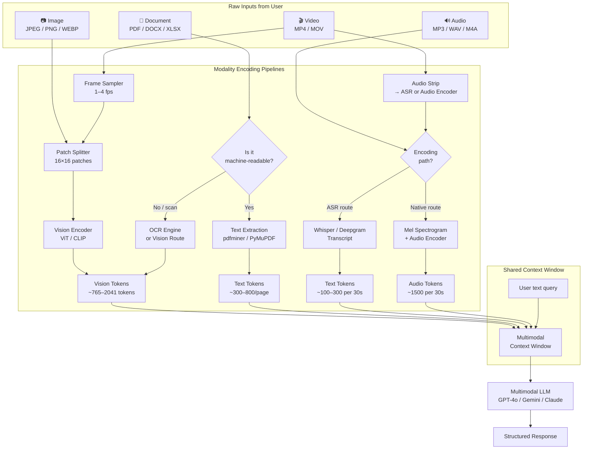
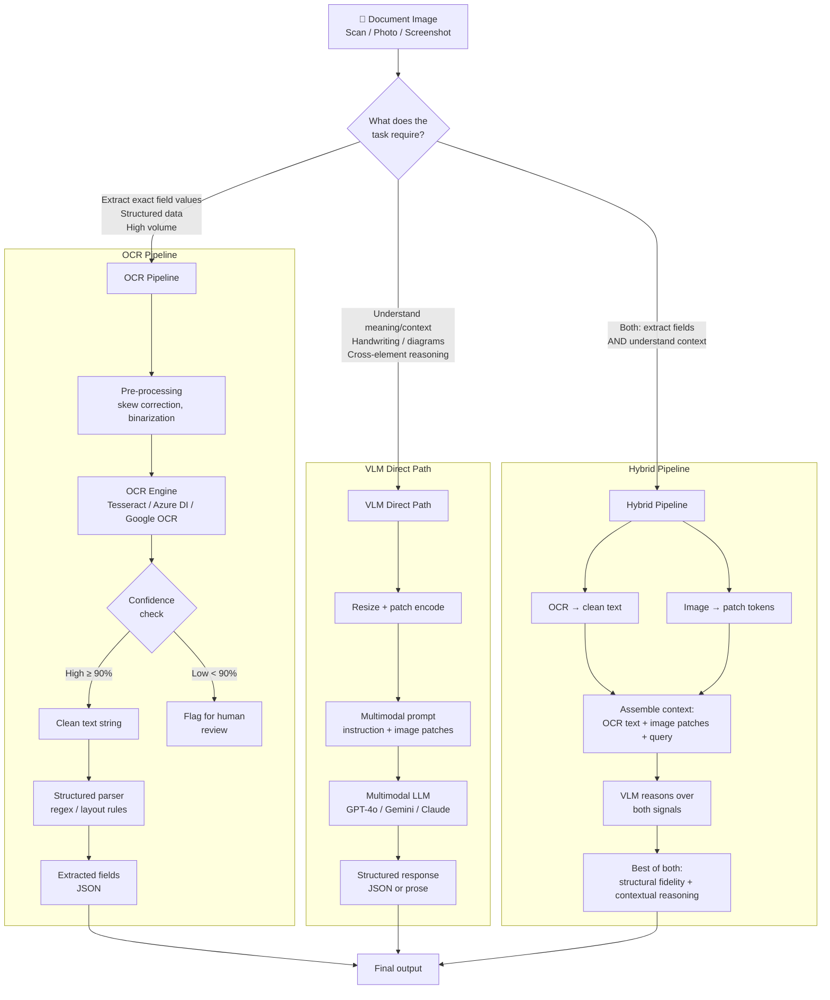

# Module 17 - Multimodal, Voice, And Realtime GenAI

> **Module time:** 30h
> **Why this module matters:** The market is shifting from text-only systems toward multimodal and realtime experiences. Knowing how to ingest images, audio, documents, and video — and how to reason across modalities simultaneously — is what separates a mid-level AI engineer from someone who can ship the next generation of products. This module teaches you to design, build, debug, and operate these systems at production quality.

---

## Quick Topic Index

| # | Subtopic | Status |
|---|----------|--------|
| **Topic 17.1** | **Multimodal input and output fundamentals (10h)** | |
| 17.1.a | Images, documents, audio, and video as inputs | ✅ Done |
| 17.1.b | OCR vs VLM reasoning tradeoffs | ✅ Done |
| 17.1.c | Multimodal prompt construction | ✅ Done |
| 17.1.d | Cross-modal grounding: aligning text reasoning with visual evidence | |
| **Topic 17.2** | **Voice and speech systems (10h)** | |
| 17.2.a | ASR, TTS, and the voice pipeline stack | |
| 17.2.b | Turn-taking, interruption handling, and conversational state | |
| 17.2.c | Voice-to-agent integration and tool-use over voice | |
| 17.2.d | Latency, quality, and cost tradeoffs in voice systems | |
| **Topic 17.3** | **Realtime and streaming GenAI systems (10h)** | |
| 17.3.a | Streaming tokens, partial responses, and client rendering | |
| 17.3.b | WebSockets, SSE, and realtime transport protocols | |
| 17.3.c | Realtime agent loops: perception → reasoning → action at low latency | |
| 17.3.d | Observability and reliability in always-on streaming systems | |

**Covered so far:**
- 17.1.a — Images, documents, audio, and video as inputs: modality taxonomy, encoding pipelines per modality, vision tokens and patch encoding, audio spectrograms and mel-filter banks, document-as-image vs document parsing, video frame sampling, multimodal context budgeting, real-world scenarios (insurance claims, legal discovery, media monitoring), system view, failure modes, debugging checklist, hands-on multimodal routing lab
- 17.1.b — OCR vs VLM reasoning tradeoffs: OCR pipeline anatomy, VLM direct-reasoning path, hybrid pipeline design, decision matrix (when each wins), cost/accuracy/latency tradeoffs table, failure mode taxonomy per approach, real-world scenarios (invoice extraction, handwritten forms, legal contracts), hands-on side-by-side accuracy lab
- 17.1.c — Multimodal prompt construction: modality ordering effects, instruction anchoring, role assignment per modality, grounding instructions, output format specification in multimodal contexts, token interleaving patterns, few-shot multimodal prompting, multi-image labeling, failure modes from vague vs over-specified prompts, hands-on prompt engineering lab

---

## Topic 17.1: Multimodal Input and Output Fundamentals

> **Topic time:** 10h
> Focus: Understanding how non-text data is converted into a form LLMs can reason over, where that pipeline breaks, and how to design it for production reliability.

---

## Subtopic 17.1.a: Images, Documents, Audio, and Video as Inputs

### ✅ Add to Knowledge Base

### Reading Path + Level Tags

- **Beginner:** Read sections 1–2 and Active Recall.
- **Intermediate:** Add sections 3–5 and the Hands-On Lab Build step.
- **Pro:** Complete the full Hands-On Lab (Build → Break → Measure → Explain) plus the capstone practice question.

---

### 0. Pre-Question Hook [Beginner]

**Pause:** A user uploads a 45-second voice memo, a photograph of a receipt, and a scanned PDF contract — all in a single message — and asks: *"Does the contract match what I agreed to in the meeting recording, and are the amounts on the receipt consistent?"*

Before reading on: what does the model actually *see*? The user typed a question, but how do the image, the audio, and the PDF become something an LLM can reason about? What breaks first if you get that pipeline wrong?

Hold that question. The answer is the whole subtopic.

---

### 1. The Intuition (Plain English) [Beginner]

LLMs are, at their core, token processors. They were trained on sequences of tokens. The central challenge of multimodal input is: **how do we turn a pixel, a sound wave, or a PDF scan into tokens that carry semantic meaning?**

Each modality has its own encoding journey before a single token reaches the model.

**Real-world analogy:**
Think of a universal adapter. Different countries have different wall sockets (image jacks, audio ports, document feeds). The multimodal encoding pipeline is the adapter layer that converts each plug format into the single universal format the model's transformer can accept — a sequence of embedding vectors. The analogy breaks down because unlike physical adapters, the encoding process is *lossy*: converting a 4K video frame to patch tokens throws away spatial detail, and that loss has downstream effects on what the model can reason about.

---

#### The Four Modalities: What They Are and How They're Encoded

---

##### 🖼 Images

An **image** is a 2D grid of pixels, each carrying RGB values. Feeding raw pixels to an LLM would be astronomically expensive and unstructured. Instead:

1. The image is divided into a grid of fixed-size **patches** (typically 14×14 or 16×16 pixels each).
2. Each patch is flattened into a vector and projected into the same embedding space the text tokens occupy. This is called **patch encoding** or **visual tokenization**.
3. A **vision encoder** (typically a Vision Transformer, ViT) processes the full grid of patches and produces a sequence of **vision tokens**.
4. Those vision tokens are prepended (or interleaved) with the user's text tokens and passed into the language model.

**What this means for system design:**
- A 512×512 image at 16×16 patch size → 1,024 patches → 1,024 vision tokens. A 1024×1024 image → 4,096 vision tokens. High-resolution inputs eat context budget fast.
- Models like GPT-4o, Claude Sonnet 3.7, and Gemini Pro process images natively through this patch-embedding path.
- **Resolution vs cost:** Every doubling of image resolution quadruples token count. Always resize images to the minimum resolution needed for the task before sending them.

**Key term — Vision Token:** A dense vector embedding representing one image patch. Functionally equivalent to a word token in the attention mechanism.

---

##### 📄 Documents (PDFs, Scans, DOCx, Spreadsheets)

A **document** is not a single thing. It is a container that may hold:
- **Structured text** (machine-readable PDF layers, DOCX text runs)
- **Semi-structured layouts** (tables, headers, columns, form fields)
- **Unstructured raster images** (scanned PDFs, photographs of documents)

The encoding strategy depends on which type you are dealing with:

| Document type | Preferred approach | What you get |
|---|---|---|
| Machine-readable PDF | Text extraction (pdfminer, PyMuPDF) | Clean token stream, low cost |
| Scanned PDF / image | OCR → text, or send as image | Depends on OCR quality; image route loses structure |
| Table-heavy PDF | Layout-aware parser (Unstructured, Azure DI) | Preserves table rows/columns |
| DOCX / Google Docs | Parse via SDK → text + metadata | Full fidelity text |
| Spreadsheet (XLSX) | Parse to Markdown table or CSV | Model can reason over rows |

**The critical insight:** Treating *every* PDF as an image (vision route) feels like the safest bet, but it is expensive and lossy for structure-heavy content. A financial report with 40 tables sent as 40 images at 1,024 tokens each burns 40,960 tokens just on the tables. A layout-aware text parser extracts the same tables in hundreds of tokens, with structure intact.

**Key term — Layout-Aware Parsing:** Document parsing that preserves spatial relationships between elements (header above table, footer annotation, column alignment) rather than streaming text in reading order.

---

##### 🔊 Audio

**Audio** is a 1D time-series signal — a waveform sampled at (typically) 16kHz or 44.1kHz. LLMs do not natively process raw waveforms. Two paths exist:

**Path 1: ASR → Text (dominant for language audio)**
1. Run the audio through an **Automatic Speech Recognition (ASR)** model (Whisper, Google STT, Deepgram).
2. ASR produces a transcript (text).
3. The transcript is then treated as a normal text input to the LLM.

This is cheap and fast. The limitation: you lose prosody, speaker emotion, tone, and non-speech sounds (coughs, background noise context, music cues).

**Path 2: Audio Tokenization (native multimodal models)**
1. The audio waveform is converted to a **spectrogram** — a 2D time-frequency representation.
2. The spectrogram is processed by an **audio encoder** (similar to a vision encoder for patches) into a sequence of **audio tokens**.
3. Those tokens are passed directly to the model alongside text tokens.

Models like GPT-4o Audio, Gemini Flash Audio, and Google's AudioLM use this path. It preserves paralinguistic signals (tone, hesitation, emotion) that matter for tasks like sentiment analysis of customer calls or speaker diarization.

**What is a Mel spectrogram?** Human hearing is not linear — we hear logarithmic differences in frequency. A **Mel-filter bank** maps the raw spectrogram onto a perceptual frequency scale. This makes the spectrogram more meaningful to a model because it mirrors how humans distinguish speech sounds. Think of it as "perceptual pre-processing" before audio encoding.

**Key term — Spectrogram:** A visual representation of audio as a 2D map of frequency vs time, where brightness encodes intensity. The model sees audio as an image of sound.

**Key term — Mel-filter Bank:** A set of frequency filters arranged on the Mel perceptual scale. Applied to the spectrogram before audio encoding to emphasize the frequency ranges most meaningful for speech.

---

##### 🎬 Video

**Video** is the hardest modality. It is a sequence of image frames plus (optionally) an audio track. Feeding every frame of a 60-second video at 30fps = 1,800 frames. At 1,024 vision tokens per frame = 1,843,200 tokens. That is not feasible.

Production systems use **frame sampling strategies**:

| Strategy | When to use | Tradeoff |
|---|---|---|
| Uniform sampling (e.g., 1fps or 1 frame every N seconds) | General scene understanding | May miss fast events |
| Scene-change detection | Narrative or structured video | Computationally expensive upfront |
| Keyframe extraction | Action recognition | Depends on keyframe quality |
| Temporal question-aware sampling | Known query (e.g., "find the moment the product is shown") | Requires a retrieval pre-pass |
| Audio-aligned sampling | Speech-driven video | Aligns frames to speech turns |

After sampling, each selected frame is patch-encoded as an image. The frame sequence is interleaved with audio tokens (if audio is present) and text tokens, and the full multimodal context is passed to the model.

**What this means for system design:**
- For most video tasks (summarization, content moderation, highlight extraction), 1–4 frames per second is sufficient.
- Long-form video (>5 minutes) requires a two-stage pipeline: first pass to identify relevant segments, second pass for deep reasoning on those segments.
- Never stream raw video bytes to a model API. Always pre-process: sample, resize, encode, budget.

**Key term — Frame Sampling:** Selecting a representative subset of video frames to reduce token cost while preserving enough temporal information for the target task.

---

#### Multimodal Context Budget: The Unified View

Every input modality consumes from the same context window. Understanding the approximate token cost of each:

| Input | Approximate token cost |
|---|---|
| 512-word text passage | ~700 tokens |
| 512×512 image (GPT-4o style) | ~765 tokens (low detail) to ~1,105 tokens (high detail) |
| 1024×1024 image | ~2,041 tokens (high detail) |
| 30-second audio (Whisper transcript) | ~100–300 text tokens |
| 30-second audio (native audio token) | ~1,500 audio tokens |
| PDF page (text extraction) | ~300–800 text tokens |
| PDF page (sent as image) | ~765–1,105 image tokens |
| Video 1 minute @ 1fps (60 frames) | ~60 × 765 ≈ 45,900 tokens |

**The practical rule:** Text extraction is always cheaper than the vision route for documents where text is machine-readable. Use vision only when layout or visual elements are essential to the task.

---

### 2. Visual Diagram (Mermaid) [Beginner]



**What this diagram shows:**
- Every modality has its own encoding pipeline that converts raw bytes into tokens.
- All tokens converge into the same context window — they compete for the same budget.
- The document path has a branching decision: machine-readable text extraction is always preferred over the vision route for cost and structure fidelity.
- Video is a compound modality: frame images + audio each get their own pipeline.

---

### 3. Real-World Industry Scenarios [Intermediate]

---

#### Scenario A: Insurance Claims Processing

**Product/use case context:**
A property insurance company processes ~2,000 claims per day. Each claim includes a written description from the claimant, 3–12 photographs of the damage, and sometimes a voice memo recorded at the site. An AI system must:
1. Extract damage type and severity from photos.
2. Cross-reference the visual evidence with the written description.
3. Flag inconsistencies (e.g., claimed "broken window" but photos show intact glass).
4. Generate a preliminary assessment for the adjuster.

**How the multimodal pipeline works here:**
- Photos → patch-encoded as images. Since damage details matter (scratches, cracks, burn marks), resolution matters — use high-detail mode.
- Voice memo → ASR transcript (paralinguistic tone is not needed here). Transcript added as text context.
- Written description → direct text tokens.
- All three modalities are assembled into a single multimodal prompt: `[images × N] + [transcript] + [written description] + [assessment instruction]`.

**Constraints and how they affect design:**

- **Latency:** Adjusters expect preliminary results in under 10 seconds. High-detail images at 2,041 tokens each × 12 images = 24,492 vision tokens before any text. That drives up TTFT (time to first token). Mitigation: cap image input at 6 representative photos (model-selected via a lightweight thumbnail-pass), resize to 512×512 before encoding.
- **Cost:** At roughly $5 per million input tokens (GPT-4o tier), 24,492 vision tokens alone cost ~$0.12 per claim. At 2,000 claims/day, that is $240/day just on image tokens. Using low-detail image mode (765 tokens) where detail is not critical (e.g., wide-angle exterior shots) halves this cost for those images.
- **Reliability and failure modes:** OCR on handwritten notes attached to claims often degrades. If the vision model misclassifies a photo (roof tiles in shadow identified as "missing tiles"), the adjuster gets a false flag. Always surface model confidence and mark "needs human review" when confidence is below threshold. Never surface the raw model output to the claimant.
- **Security/privacy:** Photos of property damage contain personally identifiable location data (house address visible, license plates, faces through windows). Images must be stripped of EXIF metadata, faces and plates blurred before sending to external APIs, and all storage must be encrypted at rest with retention policies enforcing deletion.

**What good looks like in production:**
- Per-claim latency p95 < 8 seconds.
- Inconsistency detection precision > 85% (few false flags that waste adjuster time).
- Image token cost per claim tracked in a billing dashboard; budget alert fires if per-claim cost exceeds $0.15.
- Every model-generated assessment includes a `confidence` field and a `evidence_references` list (which photo, which phrase in transcript).

---

#### Scenario B: Legal Document and Deposition Review

**Product/use case context:**
A legal technology firm builds a discovery assistant. Attorneys upload PDF depositions (300–800 pages each), scanned contracts (often low-quality scans), and occasionally video depositions. The assistant must find contradictions between the testimony and contract terms.

**How the multimodal pipeline works here:**
- Machine-readable PDFs → text extraction via layout-aware parser (Unstructured or Azure Document Intelligence). This preserves table structure (e.g., clause numbering), page numbers for citation, and paragraph boundaries. Far cheaper than vision route.
- Scanned contracts → OCR first; if OCR confidence is below 85%, flag for human pre-processing before ingestion. Do not trust low-confidence OCR output downstream.
- Video depositions → audio stripped, ASR-transcribed with speaker diarization (who said what), timestamps attached. The text transcript is the primary input; video frames are used only if something specifically visual is referenced (e.g., witness pointing at an exhibit).

**Constraints:**

- **Cost:** A 500-page deposition in text-extracted form might be 250,000 text tokens. That still exceeds most model context windows. The solution is a two-stage pipeline: first retrieve the 10–20 most relevant passages using a vector search (RAG), then assemble those passages into the context window with the user's legal question.
- **Reliability:** Legal documents require precise citation. If the model says "Clause 4.3 contradicts the deposition on page 87," both of those references must be verifiable. Source-grounded generation with citation injection (not hallucinated citations) is mandatory.
- **Latency:** Attorneys can tolerate 15–30 second response times for complex cross-document analysis. This is not a realtime system.
- **Failure mode:** Layout-aware parsers often mangle multi-column legal PDF layouts. The safest signal is to validate parsed output by checking that known key terms (party names, dates, clause numbers) appear in the extracted text at expected positions.

**What good looks like in production:**
- Citation accuracy: every claim traced to a specific page and paragraph.
- Contradiction detection recall > 80% on a held-out eval set of known-contradiction pairs.
- OCR confidence threshold enforced: documents below 85% OCR confidence routed to human review queue before ingestion.

---

#### Scenario C: Social Media Content Moderation at Scale

**Product/use case context:**
A platform moderates user-uploaded short videos (15–60 seconds) for policy violations: violence, nudity, misinformation. The system must make a determination in under 3 seconds per video for the upload pipeline.

**How the multimodal pipeline works here:**
- Video frames → uniform sampling at 2fps for a 60-second video = 120 frames. Further reduced by a lightweight binary classifier (safe/not safe at thumbnail level) to send only the 10 most suspicious frames for full vision-model analysis.
- Audio → ASR transcript used to detect keyword violations (slurs, threats). Native audio tokens used for tone analysis (escalating anger in speech often precedes policy violations).
- The combined context: up to 10 vision-encoded frames + ASR transcript + audio confidence signal.

**Constraints:**

- **Latency:** 3-second SLA at the 99th percentile. This means the thumbnail-pass classifier must run in under 500ms to leave budget for the full analysis pass. Anything that adds sequential steps compounds latency directly.
- **Cost:** At millions of uploads per day, per-video cost dominates the platform's AI spend. The two-pass approach (cheap classifier → expensive model only when needed) is not optional; it is the entire cost strategy.
- **Reliability:** False negatives (missing real violations) have brand and regulatory consequences. False positives (blocking legitimate content) have creator trust and revenue consequences. Neither is "free." The tradeoff is calibrated by platform policy, not pure ML metrics.
- **Failure mode:** Frame sampling at 2fps misses instantaneous flashes (subliminal content, split-second violence). For higher-risk categories, increase sampling rate for flagged content categories specifically.

---

### 4. System View [Intermediate]

**Think like a systems engineer.**

```
Inputs:
  - Raw binary files (image, audio, video, document bytes)
  - User text query + intent
  - Metadata (file format, MIME type, source, size, creation time)

Transformations:
  1. Format detection → route to correct encoding pipeline
  2. Pre-processing: resize, resample, normalize, OCR, diarize
  3. Encoding: patches → vision tokens, waveform → audio tokens, text extraction → text tokens
  4. Context assembly: interleave modalities, apply token budget rules, truncate/summarize if over limit
  5. LLM inference: multimodal attention over all token types
  6. Post-processing: parse structured output, attach source references, validate confidence

Outputs:
  - Structured JSON with findings, confidence, evidence references
  - Grounded text response with citations
  - Error/low-confidence flag for human review routing
```

**Observability — what to log, trace, and measure:**

| Signal | Why it matters |
|---|---|
| Token count per modality per request | Cost tracking and budget alerting |
| Encoding latency per modality | Identify pipeline bottlenecks |
| OCR confidence per page | Gate low-quality documents before downstream use |
| Vision model input resolution | Verify resize logic is applied |
| ASR word error rate (WER) | Signal transcription quality; if WER > 20%, output is unreliable |
| TTFT (time to first token) | User-perceived latency; highly sensitive to vision token count |
| Output confidence / refusal rate | Model certainty signals; high refusal rate = poor input quality |

**Failure points and how they show up:**

| Where it breaks | Symptom | Root cause |
|---|---|---|
| Image too large → context overflow | Model returns 400 / context length error | Missing resize step |
| Scanned PDF sent without OCR | Model says "I cannot read this document" | PDF treated as raw image; no text extraction |
| Audio encoding path mismatch | Transcript-based answer misses tone signals needed for task | Sent ASR text when native audio path was required |
| Video frame sampling too sparse | Model misses the key event | Sampling rate too low for content type |
| Token budget exceeded silently | Response is cut off mid-sentence or last document is missing | No budget gate in context assembly step |
| OCR hallucination on low-quality scan | Model reports numbers/names that don't exist in document | OCR errors amplified by model; no confidence threshold enforced |

---

### 5. System Design Flavor [Intermediate]

**Key components and their interfaces:**

```
┌────────────────────────────────────────────────────────────┐
│                   Multimodal Input Service                  │
│                                                            │
│  [File Upload API] → [Format Detector] → [Router]         │
│                                                            │
│  Router dispatches to:                                     │
│    - ImagePipeline: resize → patch → vision encode         │
│    - DocumentPipeline: text extract OR OCR → layout parse  │
│    - AudioPipeline: ASR OR mel encode → audio tokens       │
│    - VideoPipeline: frame sample → ImagePipeline ×N        │
│                                                            │
│  [Context Assembler]: budget check → interleave → truncate │
│  [LLM Gateway]: route to appropriate multimodal model      │
│  [Response Parser]: structure + citation injection         │
└────────────────────────────────────────────────────────────┘
```

**Key tradeoffs:**

| Decision | Option A | Option B | When to choose A | When to choose B |
|---|---|---|---|---|
| Document encoding | Text extraction | Vision (image) route | Structure matters, text is machine-readable, cost is a constraint | Layout is visually encoded (forms, certificates), OCR would destroy structure |
| Audio encoding | ASR → text | Native audio tokens | Language content only, cost-sensitive, low latency needed | Tone/emotion/prosody matters, model supports native audio, latency budget exists |
| Video processing | Uniform frame sampling | Scene-aware sampling | General summarization, low-latency constraint | Narrative video, highlight detection, event-specific query |
| Image resolution | Low-detail (~765 tok) | High-detail (~2041 tok) | Scene context, presence detection | Fine-grained visual details (damage inspection, document scan, medical image) |

**Scaling consideration:**
At 10× traffic, the bottleneck shifts from model latency (single-request) to the encoding pipeline throughput. Vision encoding and OCR are CPU/GPU-intensive preprocessing steps. They must be horizontally scaled independently of the LLM gateway. Use async worker queues (Celery, Cloud Tasks) to decouple upload ingestion from encoding from inference — otherwise a burst of large video uploads will starve the text-query path of resources.

---

### 6. Common Mistakes + Debugging [Intermediate]

---

#### Mistake 1: Sending everything through the vision route "just to be safe"

**Symptom:** Token costs are 5–10× higher than expected for document-heavy workloads. Context windows fill up. Model responses are slow.

**Likely cause:** Engineer treated all PDFs as images (sent as vision input) to avoid dealing with parsing edge cases.

**First debugging step:** Pull 100 recent requests. Check what percentage of input tokens are vision tokens vs text tokens. If vision tokens dominate for document inputs, audit whether those PDFs are machine-readable. Run `pdfminer` or `PyMuPDF` on a sample — if clean text comes out, you don't need the vision route. Switch to text extraction for those files. Expected cost reduction: 60–80% for typical business document workloads.

---

#### Mistake 2: No token budget enforcement in context assembly

**Symptom:** For requests with many attachments, responses are cut off, the last document is silently missing, or the API returns a context-length error.

**Likely cause:** Context assembler concatenates all encoded inputs without checking the running token count against the model's context limit.

**First debugging step:** Add a token counter to the context assembler that tracks cumulative tokens as each modality is added. Define a budget gate (e.g., max 80% of model context for inputs, reserve 20% for output). When the budget is hit, either: (a) truncate lower-priority inputs, (b) summarize earlier content, or (c) surface an explicit error to the user. Never silently drop content.

---

#### Mistake 3: Using ASR path when the task requires native audio reasoning

**Symptom:** Model's analysis of customer call sentiment is flat and misses emotional escalation that human reviewers catch easily.

**Likely cause:** Audio was transcribed to text via ASR. The transcript captures words but loses tone, pace, silence gaps, and volume changes that signal emotional state.

**First debugging step:** Check whether the target model supports native audio token input (GPT-4o Audio, Gemini Flash Audio). If yes, switch the audio pipeline to the mel spectrogram → audio token path. Run a side-by-side eval on 50 calls where human raters flagged escalation — measure recall improvement. If the model does not support native audio, consider a hybrid approach: ASR transcript + prosody feature extraction (a secondary small model for tone classification) piped as additional text features.

---

### 7. Hands-On Lab [Pro]

**Topic:** Multimodal Input Router — Build → Break → Measure → Explain

**Goal:** Build a minimal Python router that accepts files of different types, detects their modality, applies the correct encoding path (image resize + base64, PDF text extraction, audio ASR), assembles a token-budgeted multimodal context, and sends it to a multimodal LLM.

---

#### Build: The Minimal Working Version

```python
import base64
import json
from pathlib import Path

import openai  # pip install openai
import pdfminer.high_level as pdfminer  # pip install pdfminer.six
import whisper  # pip install openai-whisper
from PIL import Image  # pip install Pillow
import io

client = openai.OpenAI()  # reads OPENAI_API_KEY from env

# ── Token estimation (rough approximation) ──────────────────────────────
def estimate_tokens(text: str) -> int:
    return len(text) // 4  # ~4 chars per token (rough GPT estimate)

def image_token_cost(width: int, height: int, detail: str = "low") -> int:
    if detail == "low":
        return 85  # OpenAI flat cost for low-detail
    # High detail: tile calculation
    tiles_w = -(-width // 512)  # ceiling division
    tiles_h = -(-height // 512)
    return 85 + 170 * (tiles_w * tiles_h)

# ── Image encoding ───────────────────────────────────────────────────────
def encode_image(path: str, max_size: int = 512, detail: str = "low") -> dict:
    img = Image.open(path).convert("RGB")
    img.thumbnail((max_size, max_size), Image.LANCZOS)
    buf = io.BytesIO()
    img.save(buf, format="JPEG", quality=85)
    b64 = base64.b64encode(buf.getvalue()).decode()
    tokens = image_token_cost(img.width, img.height, detail)
    print(f"  [Image] {img.width}×{img.height} → ~{tokens} tokens")
    return {
        "type": "image_url",
        "image_url": {"url": f"data:image/jpeg;base64,{b64}", "detail": detail},
        "_token_estimate": tokens,
    }

# ── PDF encoding ─────────────────────────────────────────────────────────
def encode_pdf(path: str) -> dict:
    text = pdfminer.extract_text(path)
    if not text or len(text.strip()) < 50:
        raise ValueError(f"PDF appears to be a scan or empty: {path}")
    tokens = estimate_tokens(text)
    print(f"  [PDF] {len(text)} chars → ~{tokens} tokens")
    return {
        "type": "text",
        "text": f"[Document: {Path(path).name}]\n{text[:8000]}",  # hard truncate at 8k chars for lab
        "_token_estimate": tokens,
    }

# ── Audio encoding (ASR route) ────────────────────────────────────────────
def encode_audio(path: str) -> dict:
    model = whisper.load_model("base")
    result = model.transcribe(path)
    transcript = result["text"]
    tokens = estimate_tokens(transcript)
    print(f"  [Audio] Transcribed {len(transcript)} chars → ~{tokens} tokens")
    return {
        "type": "text",
        "text": f"[Audio Transcript: {Path(path).name}]\n{transcript}",
        "_token_estimate": tokens,
    }

# ── Modality router ──────────────────────────────────────────────────────
EXTENSION_MAP = {
    ".jpg": "image", ".jpeg": "image", ".png": "image", ".webp": "image",
    ".pdf": "document",
    ".mp3": "audio", ".wav": "audio", ".m4a": "audio",
}

def route_and_encode(path: str) -> dict:
    ext = Path(path).suffix.lower()
    modality = EXTENSION_MAP.get(ext)
    if modality is None:
        raise ValueError(f"Unsupported file type: {ext}")
    print(f"  Routing {Path(path).name} → {modality}")
    if modality == "image":
        return encode_image(path, max_size=512, detail="low")
    elif modality == "document":
        return encode_pdf(path)
    elif modality == "audio":
        return encode_audio(path)

# ── Context assembler with budget gate ───────────────────────────────────
TOKEN_BUDGET = 8000  # safe limit for lab; real systems use model's context limit

def assemble_context(user_query: str, file_paths: list[str]) -> list:
    content = []
    running_tokens = estimate_tokens(user_query)
    content.append({"type": "text", "text": user_query})

    for path in file_paths:
        try:
            encoded = route_and_encode(path)
        except Exception as e:
            print(f"  [SKIP] {path}: {e}")
            continue

        cost = encoded.pop("_token_estimate", 0)
        if running_tokens + cost > TOKEN_BUDGET:
            print(f"  [BUDGET] Skipping {Path(path).name} — would exceed {TOKEN_BUDGET} token budget")
            continue

        content.append(encoded)
        running_tokens += cost
        print(f"  Running token total: {running_tokens}")

    return content

# ── Main call ─────────────────────────────────────────────────────────────
def ask_multimodal(user_query: str, file_paths: list[str]) -> str:
    print("\n=== Assembling multimodal context ===")
    content = assemble_context(user_query, file_paths)

    print("\n=== Calling GPT-4o ===")
    response = client.chat.completions.create(
        model="gpt-4o",
        messages=[{"role": "user", "content": content}],
        max_tokens=512,
    )
    return response.choices[0].message.content

# ── Example usage (replace paths with your actual test files) ────────────
if __name__ == "__main__":
    result = ask_multimodal(
        user_query="Describe what you see in each file and summarize the key information.",
        file_paths=[
            "test_receipt.jpg",    # swap in real files
            "test_contract.pdf",
            "test_memo.mp3",
        ],
    )
    print("\n=== Response ===")
    print(result)
```

**What this builds:**
- A format-detecting router that dispatches to the correct encoding pipeline per modality.
- A token budget gate that prevents context overflow by skipping files that would exceed the limit.
- A real GPT-4o call that accepts the assembled multimodal context.

---

#### Break: Force the Failure Mode

**Experiment 1 — Context overflow:**
```python
# Generate 20 test images and pass them all
import os
from PIL import Image

for i in range(20):
    img = Image.new("RGB", (512, 512), color=(i * 12, 100, 200))
    img.save(f"test_img_{i}.jpg")

result = ask_multimodal(
    "Describe all images.",
    [f"test_img_{i}.jpg" for i in range(20)]
)
```
Expected: The budget gate fires after roughly 8 images (8 × 85 low-detail tokens ≈ 680 tokens, but the real budget test becomes visible at higher detail or with text mixed in). Observe the `[BUDGET]` skip messages.

**Experiment 2 — Scanned PDF rejection:**
```python
# Create a fake "scanned" PDF that has no text layer
# In practice, open any image-only PDF
result = ask_multimodal(
    "Extract the contract terms.",
    ["scanned_empty.pdf"]   # a PDF with no text layer
)
```
Expected: `encode_pdf` raises `ValueError: PDF appears to be a scan or empty`. The context assembler catches it and skips with `[SKIP]`. The model receives only the user query and responds honestly that no document was provided.

---

#### Measure: Capture Concrete Signals

Run the following and record results:

| Experiment | Files | Total tokens assembled | TTFT (ms) | Model response quality (1-5) |
|---|---|---|---|---|
| 1 image (low detail) | 1 × 512×512 JPEG | ~85 + query tokens | measure with `time` | |
| 1 image (high detail) | 1 × 1024×1024 JPEG | ~2041 + query tokens | measure with `time` | |
| 3 pages PDF (text) | 1 × 3-page PDF | ~900–2400 tokens | measure with `time` | |
| Mixed: 1 image + 1 PDF + 1 audio | all three | sum of above | measure with `time` | |
| 20 images (budget gate active) | 20 × JPEGs | capped at budget | measure with `time` | |

Capture TTFT:
```python
import time

start = time.perf_counter()
response = client.chat.completions.create(...)
ttft = time.perf_counter() - start
print(f"TTFT: {ttft:.2f}s")
```

---

#### Explain: WHY It Broke and What Prevents It

**Context overflow (Experiment 1):**
Without the budget gate, the API call fails with a `context_length_exceeded` error — or worse, the last files are silently not processed if you use a model that truncates without error. The budget gate prevents this by checking token estimates *before* adding to the context. In production, make the gate configurable per model and track p99 context utilization to catch designs that are always close to the limit.

**Scanned PDF (Experiment 2):**
`pdfminer` extracts an empty or near-empty string from a scan-only PDF. Without the length check, you would pass an essentially empty document to the model. The model would then either hallucinate content or confusingly say "the document appears empty" after the user explicitly uploaded it. The fix is to enforce a minimum extracted-text threshold and route low-confidence documents to a fallback (human review or a dedicated OCR service like Azure Document Intelligence).

---

### 8. Active Recall [All Levels]

Answer these without looking. Then check the key below.

**Q1 [Beginner]:** An image is 1024×1024 pixels. Roughly how many vision tokens does it consume in high-detail mode on a GPT-4o-style model?
**Q2 [Beginner]:** What is the key difference between sending a PDF via the vision route vs the text extraction route?
**Q3 [Intermediate]:** A customer service audio clip needs sentiment and tone analysis. Should you use the ASR route or the native audio token route? Why?
**Q4 [Intermediate]:** A 10-minute video is uploaded. You sample at 1fps. How many frames does that produce, and roughly how many vision tokens does that consume at low-detail?
**Q5 [Pro]:** You are building a budget gate for a context assembler. What are the two strategies for handling content that would exceed the limit, and what are the tradeoffs of each?

---

**Answer Key:**

**A1:** ~2,041 tokens (high-detail tile calculation: 4 × 4 tiles + base = 16 tiles × 170 + 85 ≈ 2,805 by the tile formula — exact number varies by implementation, roughly 2,000–2,800 range. Always check model-specific documentation).

**A2:** Vision route encodes the PDF as an image (preserving visual layout, but expensive: ~765–2,041 tokens per page). Text extraction pulls the text layer as tokens (~300–800 tokens per page), preserving structure cheaply. Use vision only when the PDF is a scan or when visual layout is essential. Use text extraction for machine-readable PDFs.

**A3:** Native audio token route. ASR only captures words. Tone, pace, and prosody (which signal emotional escalation, frustration, or satisfaction) are lost in transcription. If the model supports native audio tokens (GPT-4o Audio, Gemini), use that path for sentiment-critical tasks.

**A4:** 10 min × 60 sec × 1fps = 600 frames. At 85 tokens/frame (low-detail): 600 × 85 = **51,000 vision tokens**. That alone exceeds the context window of most models. In practice, cap video analysis at a subset of frames and use a two-pass retrieval approach.

**A5:**
- **Truncation:** Drop lower-priority inputs (faster, simpler). Tradeoff: content is silently lost. Only acceptable if inputs have a defined priority ordering and the user is informed.
- **Summarization:** Compress earlier content with a summarization step to free up budget. Tradeoff: adds latency and a second model call; summary may lose critical detail. Preferred for important content that cannot be dropped.

---

### 9. Practice

**Mini-Exercise:**
You are designing a multimodal input pipeline for a healthcare application. Users upload: a photo of a medication bottle label, a voice memo describing their symptoms, and a PDF of their previous lab results. List the encoding path you would choose for each file, justify each choice, and identify one failure mode per modality.

**Suggested answer outline:**
- Photo of label → vision route (high-detail). Justification: small text on labels requires spatial fidelity; text extraction is not applicable to photos. Failure mode: low-resolution camera photo → fine print unreadable after resize; mitigation: minimum resolution gate.
- Voice memo → ASR route (not native audio). Justification: symptom description is language content; tone is secondary for this task; cost and latency matter in a high-volume clinical setting. Failure mode: heavy accent or medical terminology → high ASR WER; mitigation: use a domain-fine-tuned ASR model (e.g., Deepgram Medical).
- Lab results PDF → check if machine-readable first. If yes → text extraction with layout-aware parser (table rows in lab results are critical). If scanned → OCR with confidence threshold. Failure mode: column misalignment in parsed tables → reference ranges mixed up with values; mitigation: validate that value column entries are numeric within expected ranges post-parse.

---

**Capstone System Design Question:**
Design the multimodal ingestion pipeline for a real estate listing platform where agents upload: property photos (10–30 per listing), a scanned floor plan PDF, and a voice walkthrough recording (2–5 minutes). The system must generate a structured property description, extract room dimensions from the floor plan, and identify property features from photos. Constraints: total system cost < $0.05 per listing, response time < 15 seconds.

**Answer outline:**
- Photos (10–30): resize to 512×512 low-detail. Use a two-pass approach — pass 1: classify each photo by room type (fast, cheap, small model), pass 2: send top 2 photos per room type for feature extraction. This limits vision input to ~12 key photos × 85 tokens = ~1,020 tokens.
- Floor plan PDF: if machine-readable → text extraction. If scanned → OCR with a layout model (Azure DI floor plan model). Target: dimension strings and room labels extracted as structured JSON. Token cost: ~300–500 text tokens.
- Voice walkthrough: ASR → transcript (~500–1,000 tokens for 5 minutes). Speaker-specific context not needed.
- Total estimated input tokens: ~2,000–3,000 tokens. At $5/M tokens: ~$0.01–0.015 per listing. Well within $0.05 budget.
- Latency: photo classification pass runs async during ASR transcription (parallel). Total p95 < 12 seconds.

---

### 10. Production Reality Check

**If this fails in production, what's the first thing we inspect?**

**Check the token count per modality in your logging pipeline.**

The overwhelming majority of multimodal production failures fall into three buckets: (1) context overflow because image token cost was not accounted for, (2) empty or garbled model output because a scanned PDF was silently passed without OCR, or (3) slow responses because high-detail image mode is being used where low-detail would suffice.

Open your observability dashboard. Look at the token breakdown per request by modality. If vision tokens are consuming more than 60% of your context budget on document-heavy workloads, you are likely on the wrong encoding path. If you see `p99_vision_tokens` growing over time without a corresponding growth in image uploads, check whether your resize middleware was disabled or misconfigured in a recent deploy.

**The second check:** pull 10 recent low-confidence model responses and look at what was in their context. Nine times out of ten, a low-confidence or hallucinated response traces back to a bad input: an unreadable scan, a corrupted audio file that ASR mishandled, or a video where the key moment was sampled out.

---

### 11. Curiosity Bridge

This subtopic established how raw bytes become tokens — the mechanical foundation of all multimodal reasoning. But encoding is only half the story.

The more interesting question is: **how does the model actually reason *across* modalities?** When you show it an image of a chart and ask a question about the numbers in it, what is happening at the attention level? Why can it answer some cross-modal questions brilliantly and completely miss others that seem trivially obvious to a human?

That is the question that leads directly into how **vision-language models** (VLMs) are trained, what contrastive alignment means, and why grounding visual evidence to language claims is still one of the hardest open problems in production multimodal AI. That is Topic 17.1.b.

---

### 12. Exit Check + Carry-Forward Review

**Exit check — you are done with this subtopic when you can:**
Given a set of arbitrary file types (image, PDF, audio, video), describe the correct encoding pipeline for each, estimate the token cost, identify at least one failure mode per modality, and explain how to enforce a token budget gate in a context assembler.

---

**Carry-Forward Review (interleaved question from earlier modules):**

*From Module 16 (Long-Running Tasks):*
> You are building a multimodal pipeline that processes large batches of legal depositions overnight. Each deposition is a 500-page PDF plus a 3-hour video recording. Applying what you learned in Module 16 about long-running task decomposition and checkpoints: how would you structure the ingestion job to be resumable if it fails halfway through?

**Answer outline:**
- Treat each document as an independent task unit with a stable ID (deposition_id).
- Use a progress ledger (database or durable state store) that records which deposition_ids have completed encoding.
- On restart, skip already-encoded depositions (idempotency).
- Chunk the video into 10-minute segments, each encoded independently. Store encoded segments with a status field (`pending`, `encoded`, `failed`).
- Use a dead-letter queue for segments that fail OCR confidence or ASR WER thresholds — route to human review without blocking the rest of the batch.

---

## Subtopic 17.1.b: OCR vs VLM Reasoning Tradeoffs

### ✅ Add to Knowledge Base

### Reading Path + Level Tags

- **Beginner:** Read sections 1–2 and Active Recall.
- **Intermediate:** Add sections 3–5 and the Hands-On Lab Build step.
- **Pro:** Complete the full Hands-On Lab (Build → Break → Measure → Explain) plus the capstone practice question.

---

### 0. Pre-Question Hook [Beginner]

**Pause:** You receive a scanned page from a 1990s insurance policy — slightly skewed, printed in a two-column layout, with a handwritten annotation in the margin. Your task is to extract the policyholder's name, coverage amount, and the meaning of the handwritten note.

Before reading on: would you reach for OCR or send the image directly to GPT-4o? Does one approach clearly win? What fails first in each case?

---

### 1. The Intuition (Plain English) [Beginner]

**OCR** and **VLM direct reasoning** solve overlapping problems in completely different ways, and confusing them is one of the most common mistakes in production document systems.

**OCR (Optical Character Recognition)** is a classical signal-processing pipeline. It looks at an image pixel-by-pixel, detects character shapes, and produces a text string. It is a *transcription* tool. It does not understand meaning, context, or layout relationships. It just copies characters off a page.

**VLM direct reasoning** sends the document image as patches to a multimodal LLM. The model sees *all* visual information simultaneously — text, layout, diagrams, handwriting, color, relative position — and reasons over it holistically. It is a *comprehension* tool, not just a transcription tool.

**Real-world analogy:**
OCR is a court stenographer: fast, accurate (at transcription), produces a faithful character-for-character record, and completely blind to what the words mean or how they relate to each other on the page. A VLM is a senior analyst reading the same document: they may misread a numeral in a small font (their version of OCR hallucination), but they understand that "see section 4.2" in a margin annotation refers to the clause two columns over, and they grasp the document's structure instantly.

**Where the analogy breaks down:** A senior analyst never confidently writes down the wrong number in a report. A VLM absolutely will — it can hallucinate digits that weren't there, especially in low-contrast or small-font text. OCR is deterministic about what it sees; VLMs are probabilistic, and that probabilism bites hardest on exact-value extraction.

**Key terms:**
- **OCR (Optical Character Recognition):** A pipeline that converts images of text into character strings using classical pattern recognition or lightweight ML. Deterministic, fast, cheap, but structurally fragile.
- **VLM (Vision-Language Model):** A multimodal model that receives image patches as tokens and reasons holistically over visual content and text in a single forward pass.
- **Structural fragility:** The failure mode of classical OCR on complex layouts — multi-column pages, rotated text, tables with merged cells — where the character-level output is garbled even if individual characters are technically readable.
- **VLM hallucination:** When a vision-language model generates text not actually present in the image, typically occurring on low-contrast text, small fonts, or visually ambiguous regions.

---

### 2. Visual Diagram (Mermaid) [Beginner]



**What this diagram shows:**
- Three distinct paths with explicit decision criteria at the top.
- OCR has an internal confidence gate — documents below the threshold must not proceed silently.
- The hybrid path feeds *both* OCR text and image patches into the VLM, letting it use whichever signal is stronger for each element of the task.

---

### 3. Real-World Industry Scenarios [Intermediate]

---

#### Scenario A: Invoice Processing at a Logistics Company

**Product/use case context:**
A freight company processes 50,000 invoices per month from suppliers. Each invoice is a digital PDF or a photo taken on a phone. The pipeline must extract: vendor name, invoice number, line items (description, quantity, unit price), total amount, and due date. The extracted fields flow into an ERP system for payment processing.

**Why OCR wins here:**

Invoice fields are in predictable positions, use standardized fonts, and carry exact numeric values that must be *precisely* correct (a payment of $1,245.00 vs $12,450.00 is a $11,205 mistake). The OCR pipeline is:
1. Pre-process the image: deskew, denoise, binarize for contrast.
2. Run through a layout-aware OCR engine (Azure Document Intelligence invoice model, Google Document AI Form Parser).
3. Map extracted text to a JSON schema using field-level confidence scores.
4. Any field with confidence < 90% goes to a human review queue — not to the ERP.

**Constraints and how they affect design:**

- **Cost:** At 50,000 invoices/month, the Azure DI invoice model costs roughly $0.01 per page. That is $500/month. Running each invoice through GPT-4o at $0.005–0.015 per page of vision tokens would cost $250–750/month for similar throughput — comparable, but with higher variance and non-deterministic field extraction. OCR wins on auditability: every extracted value is traceable to a specific character position on the page.
- **Latency:** OCR pipelines run in 200–800ms per page. VLM inference takes 2–5 seconds per page (dominated by vision token processing). For a 50,000-invoice batch, that latency gap is meaningful even in async pipelines.
- **Reliability:** The critical failure in invoice OCR is table structure: when line items span multiple lines or columns merge unexpectedly, classical OCR reads them as a flat text stream and loses the row-column correspondence. The fix is a layout-aware parser (Document Intelligence level) that understands table semantics, not just character positions.
- **Where VLM would help:** When a supplier sends a non-standard invoice format that the layout parser has never seen — a handmade invoice with irregular column positions, for example. A VLM can handle the novel layout by reasoning about it contextually. The hybrid approach: try OCR first; if confidence is low or schema validation fails, escalate to VLM for that invoice only.

**What good looks like in production:**
- Field extraction accuracy (exact match) > 98% for standard invoices.
- Confidence-gated escalation: < 5% of invoices routed to human review.
- Audit trail: every field value linked to its bounding box coordinates in the source image.
- Cost per processed invoice < $0.02 all-in.

---

#### Scenario B: Medical Intake Forms with Handwritten Annotations

**Product/use case context:**
A hospital scans paper patient intake forms — printed templates partially filled out by hand. Printed sections (name, DOB, address) are typed. Clinical annotations (symptoms, medications, notes from triage nurses) are handwritten in free-form margins.

**Why VLM wins here (for the handwritten portions):**

Classical OCR handles printed text well but degrades sharply on handwriting — especially cursive, medical abbreviations, or notes written in narrow margins at odd angles. More critically, the *meaning* of a handwritten annotation often depends on its spatial relationship to the printed form field next to it: "↑ dose" written next to "Metformin 500mg" is contextually inseparable from that printed entry.

A VLM sees the whole page at once and reasons over both the printed structure and the handwritten annotations as an integrated visual document. It can answer: "What medications are listed and are there any handwritten dosage modifications?" — a question that requires cross-element reasoning that an OCR-to-text pipeline cannot provide because it destroys the spatial context.

**Constraints and how they affect design:**

- **Accuracy on exact values:** A VLM reading "500mg" handwritten in low-contrast pencil may confidently output "500mg" or "5000mg" — a 10× error. For exact numeric values (dosages, patient IDs, dates), always use a confidence-gated verification step: if VLM output has low self-reported confidence or the value is in a high-risk field, route to human review. Never pipe medical dosage values directly from a VLM into a medication administration system.
- **Privacy:** Medical forms contain PHI (Protected Health Information). Images must not be sent to external API endpoints unless a Business Associate Agreement (BAA) is in place. Many healthcare deployments use Azure OpenAI (BAA available) or on-premises VLM deployment rather than the public OpenAI API.
- **Latency:** Acceptable for clinical intake (batch processing after admission), not for real-time bedside tools.
- **Failure mode:** VLM misreads medical abbreviations ("qd" → daily, "bd" → twice daily, "prn" → as needed). These abbreviations are visually similar in handwriting. A domain-aware post-processing step that validates extracted values against a medical terminology vocabulary catches these before they reach clinical systems.

**What good looks like in production:**
- Handwritten field extraction recall > 85% for standard abbreviations.
- All dosage/medication values flagged for pharmacist verification before any clinical action.
- PHI handling: BAA in place, no logging of raw image content, data retention policy enforced.

---

#### Scenario C: Legal Contract Review with Complex Layouts

**Product/use case context:**
A legal tech platform processes NDAs, service agreements, and licensing contracts. Lawyers upload PDFs — some machine-readable, some scanned. The system must identify specific clauses (termination, liability cap, IP ownership), extract their text, and flag any unusual terms.

**Why the hybrid approach wins:**

- **OCR extracts the text cheaply and accurately** from machine-readable PDFs (where the text layer exists). The output is clean, token-efficient, and carries no hallucination risk.
- **VLM reasons over the context**: once the text is extracted, a VLM (or an LLM with the text in context) interprets it — finding semantic relationships between clauses, identifying cross-references, and flagging non-standard language.
- For scanned contracts, OCR confidence gates determine whether text extraction is reliable enough. If confidence is low (old scan, poor quality), the document image is sent directly to a VLM as visual input.

**The key insight here:** OCR and VLM are not competing choices for the same task — they serve different layers of the document understanding stack. OCR converts image → text. The LLM/VLM then reasons over the text. The question is whether the OCR step is reliable enough for the task, and whether visual layout context is needed for reasoning.

**Constraints:**
- **Citation precision:** Lawyers need exact clause text with page and paragraph numbers. OCR provides character-position bounding boxes, which can be mapped back to citations. VLM-only paths are harder to audit for citations.
- **Cost:** A 30-page contract as text tokens: ~15,000 tokens. As 30 vision-encoded pages at high detail: ~61,000 tokens. Text is 4× cheaper for machine-readable contracts.

---

### 4. System View [Intermediate]

```
Inputs:
  - Document image (JPEG, PNG, TIFF, PDF rendered as image)
  - Document type signal (invoice, form, contract, medical record, unknown)
  - Quality signal (DPI, skew angle, binarization quality)

Transformations:
  1. Quality assessment: DPI check, skew detection, noise estimation
  2. Routing decision: OCR path / VLM path / hybrid (based on type + quality)
  3. OCR path: pre-process → engine → per-field confidence scoring → schema validation
  4. VLM path: resize → patch encode → context assembly → inference → parse response
  5. Hybrid: OCR text + image patches assembled together into VLM context
  6. Post-processing: validate outputs against known schemas, flag low-confidence values

Outputs:
  - Structured JSON with extracted fields + confidence per field
  - Source bounding boxes for audit trail (OCR path)
  - Confidence flags routing low-certainty outputs to human review
```

**Observability — what to log per path:**

| Signal | OCR path | VLM path |
|---|---|---|
| Per-field confidence score | Always (from engine) | Estimated from model self-report or output parsing |
| OCR engine latency | Yes | N/A |
| Vision token count | N/A | Yes (cost tracking) |
| Schema validation pass rate | Yes | Yes |
| Escalation rate to human review | Yes | Yes |
| Hallucination detection | N/A | Side-by-side spot-check on sampled outputs |

**Failure points:**

| Failure | Path | Symptom | Root cause |
|---|---|---|---|
| Scewed/rotated scan | OCR | Entire page output is garbled characters | Missing pre-processing: deskew step |
| Low-contrast text | Both | Missing or wrong field values | Image quality too poor for either approach; needs re-scan |
| Novel table layout | OCR | Row/column values mixed up | Parser assumes fixed layout; no fallback to VLM |
| Small font numeric field | VLM | Number hallucinated (e.g., $1,200 → $12,000) | Model fills ambiguous visual region with prior; confidence gate missing |
| Silent low-confidence pass | OCR | Wrong value flows downstream undetected | No confidence threshold enforced at extraction |
| VLM citation gap | VLM | Model says "clause 4 says X" but no bounding box trace | No source-grounding mechanism in VLM-only path |

---

### 5. System Design Flavor [Intermediate]

**Key components and interfaces:**

```
┌──────────────────────────────────────────────────────────────────────┐
│                    Document Understanding Service                      │
│                                                                        │
│  [Input API] → [Quality Assessor] → [Route Selector]                 │
│                                                                        │
│  Route Selector logic:                                                 │
│    IF machine_readable PDF AND confidence_threshold_met               │
│      → OCR / text extraction path                                     │
│    IF scanned AND DPI >= 200 AND no handwriting                      │
│      → OCR path (with confidence gating)                              │
│    IF handwriting OR diagram-heavy OR complex layout                  │
│      → VLM path (or hybrid)                                           │
│    IF high-value exact field extraction + novel layout                │
│      → Hybrid: OCR for text + VLM for reasoning                      │
│                                                                        │
│  [Confidence Gate]: per-field threshold → approve / escalate         │
│  [Schema Validator]: check extracted fields against known schema     │
│  [Audit Logger]: bounding box → field → confidence → decision        │
└──────────────────────────────────────────────────────────────────────┘
```

**Key tradeoffs:**

| Dimension | OCR | VLM direct | Hybrid |
|---|---|---|---|
| **Exact value accuracy** | High (deterministic) | Medium (probabilistic, hallucinates on small text) | High (OCR provides text; VLM reasons over it) |
| **Layout understanding** | Low (fragile on complex layouts) | High (holistic visual reasoning) | High |
| **Handwriting support** | Poor | Good (especially modern VLMs) | Good |
| **Cost per page** | Very low ($0.001–0.01) | Medium ($0.005–0.02) | Low-medium (OCR cheap; VLM only when needed) |
| **Latency** | 200–800ms | 2–5s | 300ms–5s (depends on escalation rate) |
| **Auditability / citations** | Excellent (bounding boxes) | Poor (model reasoning is opaque) | Good (OCR provides trace; VLM adds reasoning layer) |
| **Non-determinism** | None | Present | Partial (VLM layer introduces it) |
| **Novel format handling** | Poor | Excellent | Excellent |

**When to choose each (plain language):**
- **OCR only:** You care about exact field values, you have a well-defined document format, volume is high, and cost/latency matter. Standard invoices, forms, IDs, structured reports.
- **VLM only:** The document has handwriting, diagrams, or visual layout that OCR cannot handle. You need semantic understanding, not just character extraction. Low volume, higher latency budget. Novel or ad-hoc document formats.
- **Hybrid:** You need exact values (use OCR for text fidelity) AND contextual understanding (use VLM for reasoning). Most production enterprise document systems end up here: OCR is the cheap reliable backbone; VLM handles the edge cases and reasoning layer.

**Scaling consideration:**
At 10× document volume, the OCR path scales linearly with cheap per-page API calls. The VLM path scales expensively — vision token cost, inference time, and memory pressure all grow. The hybrid approach naturally amortizes: if 80% of documents are standard formats (OCR path), only 20% hit the VLM path. The VLM fleet stays right-sized for the escalation rate, not the full volume. Design the routing gate first; never default everything to VLM at scale.

---

### 6. Common Mistakes + Debugging [Intermediate]

---

#### Mistake 1: No confidence gate — trusting OCR output blindly

**Symptom:** Downstream systems receive wrong field values. Payments go to wrong amounts. Patient records have wrong dosages. Financial reports show incorrect figures. No error was raised anywhere in the pipeline.

**Likely cause:** The OCR engine returned low-confidence output (blurry scan, unusual font, smeared ink), but the pipeline has no per-field confidence check. The low-confidence string was passed directly to the downstream system as if it were correct.

**First debugging step:** Pull the raw OCR response (most engines return per-word or per-character confidence alongside the text). Add a threshold gate: any field with average confidence below 85–90% must be flagged, not passed. Log the confidence distribution over a week — you will likely find that 3–8% of your production documents are below threshold and have been silently producing bad outputs.

---

#### Mistake 2: Using VLM for high-volume exact-value extraction

**Symptom:** Per-document costs are 10–20× higher than expected. Latency is 3–5 seconds per page. Downstream validation occasionally catches numeric values that don't match the source image.

**Likely cause:** A VLM was used for a task (invoice field extraction) that a specialized OCR pipeline handles better, faster, and cheaper. The VLM was chosen because it "seems more capable" — but for structured exact-value extraction, its probabilistic nature is a liability, not an asset.

**First debugging step:** Take 100 recent documents and run them through an OCR pipeline (Azure DI invoice model, Tesseract + layout rules) in parallel with the current VLM path. Compare field extraction accuracy, cost, and latency. In typical invoice/form scenarios, OCR matches or exceeds VLM accuracy at 10–50× lower cost and 5× lower latency. Switch the standard-format documents to OCR. Reserve VLM for the non-standard escalation path.

---

#### Mistake 3: Using OCR on handwriting-heavy documents without a fallback

**Symptom:** Handwritten fields return garbled output (partial characters, random symbols, or empty strings). The pipeline treats these as valid extractions because confidence is not segmented by field type.

**Likely cause:** OCR was applied uniformly. Confidence scores for handwritten regions are not separately tracked from printed regions, so the overall-page confidence looks acceptable even though the handwritten fields are nonsense.

**First debugging step:** Add per-field type confidence tracking. Flag all fields in the "handwriting expected" category separately. If confidence on those fields is below 70%, route those specific fields (not the whole document) to a VLM call with the cropped field image as input. This targeted escalation costs far less than routing entire documents to VLM.

---

### 7. Hands-On Lab [Pro]

**Topic:** OCR vs VLM Side-by-Side Accuracy Benchmark — Build → Break → Measure → Explain

**Goal:** Run the same document through an OCR pipeline and a VLM direct path. Measure field extraction accuracy, token cost, and latency. Then deliberately degrade the document to find where each approach breaks first.

---

#### Build: The Minimal Working Version

```python
import time
import json
import base64
import io

import openai
from PIL import Image, ImageDraw, ImageFont
import pytesseract  # pip install pytesseract; also install tesseract-ocr binary

client = openai.OpenAI()

# ── Create a synthetic test document ────────────────────────────────────
def create_test_invoice(output_path: str = "test_invoice.png") -> dict:
    """Generate a simple synthetic invoice image and return the ground truth."""
    img = Image.new("RGB", (600, 400), color="white")
    draw = ImageDraw.Draw(img)

    # Attempt to use a system font; fall back to default
    try:
        font = ImageFont.truetype("/System/Library/Fonts/Helvetica.ttc", 18)
        small_font = ImageFont.truetype("/System/Library/Fonts/Helvetica.ttc", 14)
    except Exception:
        font = ImageFont.load_default()
        small_font = font

    draw.text((20, 20), "INVOICE", font=font, fill="black")
    draw.text((20, 60), "Vendor: Acme Supplies Co.", font=small_font, fill="black")
    draw.text((20, 90), "Invoice #: INV-2024-0892", font=small_font, fill="black")
    draw.text((20, 120), "Date: 2024-03-15", font=small_font, fill="black")
    draw.text((20, 170), "Item: Server Hardware    Qty: 3    Unit: $4,200.00", font=small_font, fill="black")
    draw.text((20, 200), "Item: Network Switch     Qty: 1    Unit: $890.00", font=small_font, fill="black")
    draw.text((20, 250), "Total Amount Due: $13,490.00", font=font, fill="black")
    draw.text((20, 290), "Due Date: 2024-04-15", font=small_font, fill="black")

    img.save(output_path)
    print(f"[Created] {output_path}")

    return {
        "vendor": "Acme Supplies Co.",
        "invoice_number": "INV-2024-0892",
        "total_amount": "$13,490.00",
        "due_date": "2024-04-15",
    }

# ── OCR path ─────────────────────────────────────────────────────────────
def extract_with_ocr(image_path: str) -> dict:
    """Run Tesseract OCR and parse key fields from the text output."""
    start = time.perf_counter()

    img = Image.open(image_path)
    raw_text = pytesseract.image_to_string(img)
    data = pytesseract.image_to_data(img, output_type=pytesseract.Output.DICT)

    # Compute average confidence (excluding -1 entries for non-text regions)
    confidences = [c for c in data["conf"] if c != -1]
    avg_conf = sum(confidences) / len(confidences) if confidences else 0

    latency = time.perf_counter() - start

    # Naive field extraction from raw text
    lines = raw_text.strip().split("\n")
    fields = {}
    for line in lines:
        if "Vendor:" in line:
            fields["vendor"] = line.split("Vendor:")[-1].strip()
        if "Invoice #:" in line:
            fields["invoice_number"] = line.split("Invoice #:")[-1].strip()
        if "Total Amount Due:" in line:
            fields["total_amount"] = line.split("Total Amount Due:")[-1].strip()
        if "Due Date:" in line:
            fields["due_date"] = line.split("Due Date:")[-1].strip()

    print(f"\n[OCR] Latency: {latency*1000:.0f}ms | Avg confidence: {avg_conf:.1f}%")
    print(f"[OCR] Extracted: {json.dumps(fields, indent=2)}")
    return {"fields": fields, "confidence": avg_conf, "latency_ms": latency * 1000, "path": "ocr"}

# ── VLM path ─────────────────────────────────────────────────────────────
def extract_with_vlm(image_path: str) -> dict:
    """Send the image to GPT-4o and extract fields via structured prompt."""
    start = time.perf_counter()

    with open(image_path, "rb") as f:
        b64 = base64.b64encode(f.read()).decode()

    prompt = """Extract the following fields from this invoice image.
Return a JSON object with keys: vendor, invoice_number, total_amount, due_date.
If a field is not visible or unclear, set its value to null.
Return ONLY valid JSON, no other text."""

    response = client.chat.completions.create(
        model="gpt-4o",
        messages=[
            {
                "role": "user",
                "content": [
                    {"type": "text", "text": prompt},
                    {"type": "image_url", "image_url": {"url": f"data:image/png;base64,{b64}", "detail": "high"}},
                ],
            }
        ],
        max_tokens=200,
    )

    latency = time.perf_counter() - start
    raw_output = response.choices[0].message.content.strip()

    # Strip markdown code block if present
    if raw_output.startswith("```"):
        raw_output = raw_output.split("```")[1]
        if raw_output.startswith("json"):
            raw_output = raw_output[4:]

    try:
        fields = json.loads(raw_output)
    except json.JSONDecodeError:
        fields = {"parse_error": raw_output}

    tokens_used = response.usage.total_tokens
    print(f"\n[VLM] Latency: {latency*1000:.0f}ms | Tokens used: {tokens_used}")
    print(f"[VLM] Extracted: {json.dumps(fields, indent=2)}")
    return {"fields": fields, "tokens": tokens_used, "latency_ms": latency * 1000, "path": "vlm"}

# ── Accuracy scorer ──────────────────────────────────────────────────────
def score_accuracy(extracted: dict, ground_truth: dict) -> float:
    fields = extracted.get("fields", {})
    hits = sum(
        1 for k, v in ground_truth.items()
        if fields.get(k, "").strip().lower() == v.strip().lower()
    )
    score = hits / len(ground_truth) * 100
    print(f"  [{extracted['path'].upper()}] Accuracy: {score:.0f}% ({hits}/{len(ground_truth)} fields correct)")
    return score

# ── Main benchmark ────────────────────────────────────────────────────────
if __name__ == "__main__":
    print("=== Creating test invoice ===")
    ground_truth = create_test_invoice("test_invoice.png")
    print(f"Ground truth: {json.dumps(ground_truth, indent=2)}")

    print("\n=== Running OCR path ===")
    ocr_result = extract_with_ocr("test_invoice.png")

    print("\n=== Running VLM path ===")
    vlm_result = extract_with_vlm("test_invoice.png")

    print("\n=== Accuracy Comparison ===")
    ocr_acc = score_accuracy(ocr_result, ground_truth)
    vlm_acc = score_accuracy(vlm_result, ground_truth)

    print(f"\n  OCR  | Accuracy: {ocr_acc:.0f}% | Latency: {ocr_result['latency_ms']:.0f}ms | Cost: ~$0.00")
    print(f"  VLM  | Accuracy: {vlm_acc:.0f}% | Latency: {vlm_result['latency_ms']:.0f}ms | Tokens: {vlm_result['tokens']}")
```

---

#### Break: Force the Failure Modes

**Experiment 1 — Degrade the image (simulate a bad scan):**
```python
from PIL import ImageFilter
import numpy as np

def degrade_image(input_path: str, output_path: str, rotation: float = 5.0, noise: int = 40):
    """Simulate a bad scan: rotate, add noise, reduce contrast."""
    img = Image.open(input_path).convert("RGB")
    img = img.rotate(rotation, fillcolor="white")  # skew like a misaligned scan

    # Add salt-and-pepper noise
    arr = np.array(img)
    noise_mask = np.random.randint(0, 255, arr.shape[:2])
    arr[noise_mask < noise] = 0    # black specks
    arr[noise_mask > 255 - noise] = 255  # white specks
    img = Image.fromarray(arr.astype(np.uint8))

    img.save(output_path)
    print(f"[Degraded] {output_path} (rotation={rotation}°, noise={noise})")

degrade_image("test_invoice.png", "test_invoice_degraded.png", rotation=7.0, noise=50)

print("\n=== Running OCR on degraded image ===")
ocr_degraded = extract_with_ocr("test_invoice_degraded.png")

print("\n=== Running VLM on degraded image ===")
vlm_degraded = extract_with_vlm("test_invoice_degraded.png")

print("\n=== Accuracy on Degraded Image ===")
score_accuracy(ocr_degraded, ground_truth)
score_accuracy(vlm_degraded, ground_truth)
```

Expected: OCR accuracy drops sharply with rotation + noise (Tesseract is highly sensitive to skew without pre-processing). VLM accuracy stays higher because the model reasons holistically over the visual layout even with degraded text.

**Experiment 2 — Small font / low contrast (trigger VLM hallucination):**
```python
def create_small_font_invoice(output_path: str) -> dict:
    img = Image.new("RGB", (600, 400), color=(240, 240, 240))  # low contrast: light gray bg
    draw = ImageDraw.Draw(img)
    try:
        tiny_font = ImageFont.truetype("/System/Library/Fonts/Helvetica.ttc", 9)  # very small
    except Exception:
        tiny_font = ImageFont.load_default()

    draw.text((20, 20), "Total Amount Due: $13,490.00", font=tiny_font, fill=(180, 180, 180))  # low contrast
    img.save(output_path)
    return {"total_amount": "$13,490.00"}

gt2 = create_small_font_invoice("test_tiny.png")
print("\n=== OCR on small/low-contrast text ===")
ocr_tiny = extract_with_ocr("test_tiny.png")
print("\n=== VLM on small/low-contrast text ===")
vlm_tiny = extract_with_vlm("test_tiny.png")
print("\n=== Accuracy on small/low-contrast ===")
score_accuracy(ocr_tiny, gt2)
score_accuracy(vlm_tiny, gt2)
```

Expected: Both approaches degrade. OCR returns garbled characters or empty string. VLM may hallucinate a plausible-looking number (e.g., "$13,490" vs "$1,3490" vs "$13490.00") — it fills visually ambiguous regions with prior knowledge of what invoice totals look like.

---

#### Measure: Record the signals

| Experiment | OCR accuracy | VLM accuracy | OCR latency | VLM latency | VLM tokens | Winner |
|---|---|---|---|---|---|---|
| Clean invoice | ___ | ___ | ___ ms | ___ ms | ___ | |
| Degraded (skewed + noisy) | ___ | ___ | ___ ms | ___ ms | ___ | |
| Small font / low contrast | ___ | ___ | ___ ms | ___ ms | ___ | |

Fill in from your actual runs. Typical result: OCR wins on clean high-contrast documents; VLM wins on degraded/novel layouts; both lose on extremely low-contrast small text.

---

#### Explain: WHY it broke and what prevents it

**OCR on degraded scan:** Tesseract uses classical pattern matching calibrated for upright, well-contrasted text. A 7° rotation shifts character bounding boxes enough that the engine misidentifies character boundaries. Pre-processing with deskew (OpenCV's `getRotationMatrix2D` or a dedicated deskew library) before OCR fixes this. In production, always run a skew detection pass before the OCR engine.

**VLM hallucination on small text:** The patch encoding at low resolution compresses a 9px font into sub-patch details. The model can no longer "see" the individual digits clearly. It uses contextual prior knowledge to fill the gap — which in invoice context means plausible-but-wrong dollar amounts. The fix is to send the specific region at high-detail (zoomed crop), and to add a numeric range validator post-inference: if the extracted total doesn't match the sum of line items, flag it.

---

### 8. Active Recall [All Levels]

**Q1 [Beginner]:** What is the fundamental difference between what OCR does and what a VLM does with a document image?
**Q2 [Beginner]:** Name two document types where OCR is clearly the better choice and one where VLM is clearly better.
**Q3 [Intermediate]:** You are extracting invoice totals at 100,000 invoices/month. Why is OCR preferred over VLM here even if VLM is technically more capable?
**Q4 [Intermediate]:** What is the hybrid OCR+VLM pattern and when do you reach for it?
**Q5 [Pro]:** A VLM returns "$13490" where the document clearly shows "$13,490.00". Is this a hallucination? How do you catch it in a production pipeline?

---

**Answer Key:**

**A1:** OCR transcribes — it converts image pixels to character strings using pattern recognition. It has no understanding of meaning. A VLM comprehends — it processes the entire image as token patches and reasons over meaning, layout, and context holistically.

**A2:** OCR wins: standard invoices (predictable format, exact values, high volume); government ID parsing (clean printed text, well-defined field positions). VLM wins: medical forms with handwritten annotations (handwriting + spatial cross-referencing required).

**A3:** Cost (OCR ~$0.001–0.01/page vs VLM $0.005–0.02/page at scale), latency (OCR 200–800ms vs VLM 2–5s), determinism (OCR output is reproducible; VLM output varies across runs), and auditability (OCR provides bounding box traces; VLM does not). For a task that is fundamentally about exact character extraction from a known format, VLM's comprehension capability is not needed and its probabilistic nature is a liability.

**A4:** Use OCR to extract the text layer (fast, cheap, auditable). Use the VLM to reason over the OCR text (or over OCR text + image patches together) for tasks requiring contextual understanding — cross-clause relationships, anomaly detection, novel layout interpretation. OCR provides the structural backbone; VLM provides the reasoning layer.

**A5:** Technically this is not a hallucination — the model got the numeric value right but dropped the comma separator and trailing zero. In production this can still break downstream systems that do strict string or regex matching on currency format. Catch it with: (a) a post-processing normalizer that standardizes currency format before comparison, and (b) a numeric range validator that checks extracted totals against the sum of line items. If they don't match within a tolerance, flag for review.

---

### 9. Practice

**Mini-Exercise:**
You work at a fintech company. Loan applications arrive as scanned PDFs. Each has: a printed header section (applicant name, SSN, loan amount — standard fields), a printed financial table (income, debts, assets), and a handwritten section where the loan officer annotates their risk assessment. Design the document processing pipeline. Which path does each section take and why?

**Suggested answer:**
- Printed header → OCR with layout-aware parser. Standard fields, known positions, exact values needed (SSN especially must be precise). Confidence gate at 95% for SSN/amount fields.
- Financial table → Layout-aware OCR (Azure DI form parser). Table structure matters; row-column correspondence must be preserved. Validate numeric column sums for internal consistency.
- Handwritten officer annotation → VLM (cropped region only). Handwriting context requires visual reasoning. Output is qualitative (summarize the risk notes), not an exact-value extraction. Still route to human loan officer for final review — never use VLM output alone for credit decisions.

---

**Capstone System Design Question:**
Design the document pipeline for a government identity verification service. Users upload: a photo of a passport, a photo of a utility bill, and a selfie. The system must: (1) extract name and DOB from the passport, (2) extract name and address from the utility bill, (3) verify the face in the selfie matches the passport photo. Constraints: accuracy on identity field extraction > 99%, processing time < 5 seconds, GDPR-compliant (data must not leave the EU region).

**Answer outline:**
1. Passport field extraction: Use a specialized OCR/Document AI model trained on passport MRZ (Machine Readable Zone) — standard format, extremely high accuracy, deterministic. VLM path is not needed for MRZ fields. For the photo page visual details, a specialized identity document model handles layout. Confidence gate at 99% for name/DOB — escalate to human if below.
2. Utility bill: Layout varies significantly by provider. Use a hybrid: OCR for text extraction → VLM to identify name/address fields from the unstructured layout. Or use a Document Intelligence model with pre-trained support for utility bills. Validate address against a known address verification API.
3. Face verification: A dedicated face recognition model (not a general VLM). Compare selfie embedding vs passport photo embedding using cosine similarity. Threshold at 0.85 similarity. This is a specialized biometric task — general VLMs are not appropriate, not accurate enough, and not auditable for identity verification use cases.
4. GDPR constraint: Deploy on Azure EU region with data residency enforcement. Images must not be logged raw — only embeddings and extracted fields (with appropriate retention limits). Explicit consent flow required for biometric processing.

---

### 10. Production Reality Check

**If this fails in production, what's the first thing we inspect?**

**Check whether the confidence gate is being enforced and what the escalation rate is.**

The single most dangerous failure mode in document extraction is a confident wrong answer — OCR returning "$1,3490" with 92% confidence, or a VLM returning a plausible-looking number that doesn't match the source. These do not raise errors. They silently corrupt downstream data.

Open your pipeline metrics. Look at: (1) the distribution of OCR per-field confidence scores — if more than 5% of fields are below your threshold and you're not seeing a corresponding escalation rate, your confidence gate is misconfigured or not plugged into the right pipeline stage. (2) For VLM-path outputs, run a weekly spot-check: take 50 random VLM-extracted values and manually verify them against source images. If even 2–3 are wrong, that is a signal to tighten validation.

The second check: look at schema validation failure rates. If the extracted JSON doesn't match the expected schema (wrong types, null values in required fields, out-of-range numbers), that is almost always a signal of a bad input that produced garbled OCR output or a VLM reasoning error. Schema validation is your cheapest automated catch for both paths.

---

### 11. Curiosity Bridge

OCR vs VLM is fundamentally a question of *where you do the reasoning* — before the model (OCR extracts, model reasons over text) or inside the model (model sees raw pixels and reasons over everything simultaneously). 

The deeper question this opens is: **how does a VLM actually reason over a document image at the attention level?** When GPT-4o sees patch tokens from a table and correctly identifies which number belongs to which column, what internal mechanism makes that work? And why does it sometimes catastrophically fail on a table that looks trivially simple to a human?

That is exactly what the next subtopic — how vision-language models are trained, what cross-modal attention means, and where visual grounding breaks — is all about.

---

### 12. Exit Check + Carry-Forward Review

**Exit check — you are done when you can:**
Given a document processing task, select the correct path (OCR / VLM / hybrid), justify the decision using cost-accuracy-latency tradeoffs, identify the primary failure mode for each path, and describe what confidence gating looks like in a production pipeline.

---

**Carry-Forward Review (interleaved from Subtopic 17.1.a):**

> In 17.1.a you learned that a 1024×1024 image at high detail consumes ~2,041 vision tokens. You are now building the hybrid OCR+VLM pipeline for a 20-page contract. The OCR step extracts text cleanly. However, for the 3 pages that contain complex visual tables (diagrams with overlapping elements), you want to send those pages to the VLM as images. Estimate the token cost for those 3 pages vs the alternative of sending all 20 pages via vision.

**Answer:** 3 pages × 2,041 tokens = **6,123 vision tokens** for the targeted VLM call. Sending all 20 pages via vision = 20 × 2,041 = **40,820 vision tokens** — 6.7× more expensive. The hybrid approach that OCRs 17 pages (cheap text tokens) and only VLM-routes the 3 complex-table pages saves ~85% of the vision token cost while still getting VLM reasoning where it is needed.

---

## Module Glossary

| Term | Definition |
|---|---|
| **Vision Token** | A dense vector embedding representing one image patch (typically 16×16 pixels). Occupies the same attention space as a text token inside a multimodal LLM. |
| **Patch Encoding** | The process of dividing an image into a grid of fixed-size tiles, flattening each tile into a vector, and projecting it into the model's embedding space. |
| **Vision Encoder** | A neural network (typically a Vision Transformer, ViT) that converts a sequence of image patches into a sequence of contextual vision token embeddings. |
| **Layout-Aware Parsing** | Document parsing that preserves spatial structure (table rows/columns, headers, reading order) rather than extracting text in a flat stream. |
| **ASR (Automatic Speech Recognition)** | A model that converts audio speech to text transcripts. Common examples: Whisper (OpenAI), Deepgram, Google STT. |
| **Spectrogram** | A 2D visual representation of an audio signal showing frequency (y-axis) vs time (x-axis), with pixel intensity representing loudness. |
| **Mel-Filter Bank** | A set of audio frequency filters spaced on the Mel perceptual scale, applied to a spectrogram to emphasize frequencies most informative for speech processing. |
| **Frame Sampling** | The strategy of selecting a representative subset of video frames for model input, to reduce token cost while preserving sufficient temporal information for the task. |
| **Context Budget** | The maximum number of tokens that can be packed into a model's context window. In multimodal systems, all modalities share this budget. |
| **Token Budget Gate** | A guardrail in the context assembler that checks the running token count before adding each new input, and truncates or skips content that would exceed the limit. |
| **Multimodal LLM** | A language model capable of processing inputs from multiple modalities (text, image, audio, video) by accepting their encoded token representations. |
| **TTFT (Time to First Token)** | The elapsed time from sending the API request to receiving the first token of the model's response. Strongly correlated with total input token count. |
| **WER (Word Error Rate)** | The standard metric for ASR quality. Calculated as (substitutions + deletions + insertions) / total reference words. Higher WER = lower transcript quality. |
| **Two-Pass Pipeline** | A multimodal processing pattern where a fast, cheap first pass classifies or filters inputs, and a slower, expensive second pass performs deep analysis only on the high-signal subset. |
| **OCR (Optical Character Recognition)** | A pipeline that converts images of printed or handwritten text into machine-readable character strings. Deterministic, cheap, fast — but structurally fragile and blind to visual context. |
| **VLM (Vision-Language Model)** | A multimodal model that accepts image patches as tokens alongside text, enabling it to reason holistically over visual content, layout, and language in a single forward pass. |
| **OCR Confidence Score** | A per-character or per-word probability assigned by the OCR engine indicating how certain it is about each recognition. Low scores signal unreliable text and should gate downstream use. |
| **Hybrid OCR+VLM Pipeline** | A document understanding architecture that uses OCR for cheap text extraction and a VLM only for tasks requiring visual context (layout reasoning, diagram interpretation, cross-element relationships). |
| **Document Intelligence** | A class of specialized models (Azure Document Intelligence, Google Document AI) that combine OCR with layout analysis and field-extraction ML — sitting between classical OCR and full VLM reasoning. |
| **Hallucination in VLMs** | When a vision-language model generates text that is not actually present in the image — often triggered by low-contrast text, small fonts, or ambiguous visual regions the model fills in from prior knowledge. |
| **Structural Fragility (OCR)** | The tendency of classical OCR to fail on multi-column layouts, merged cells in tables, rotated text, and non-standard fonts, producing garbled output even when individual characters are technically readable. |
