# Module 18 - DSPy, Fine-Tuning, Distillation, And Optimization

> **Module time:** 36h
> **Why this module matters:** This is the layer you reach when prompts and retrieval tuning are no longer enough. At this layer, you stop treating the model call as a magic text box and start treating the full AI program as something measurable, optimizable, and maintainable.

---

## Quick Topic Index

| # | Subtopic | Status |
|---|----------|--------|
| **Topic 18.1** | **When prompting stops being enough (10h)** | |
| 18.1.a | Diagnosing prompt ceiling vs data ceiling vs model ceiling | Done |
| 18.1.b | Systematic error analysis for model adaptation | Done |
| 18.1.c | Synthetic data generation and curation | Done |
| 18.1.d | ROI analysis for optimization work | Done |
| **Topic 18.2** | **DSPy and program optimization (12h)** | |
| 18.2.a | Signatures, modules, and declarative AI programs | Done |
| 18.2.b | Optimizers for few-shot and instruction search | Done |
| 18.2.c | Evaluating optimized programs honestly | Done |
| 18.2.d | Where DSPy fits relative to framework-centric stacks | Done |
| **Topic 18.3** | **Fine-tuning, distillation, and model adaptation (14h)** | |
| 18.3.a | SFT, PEFT, LoRA, and adapter mental models | Done |
| 18.3.b | Distillation and teacher-student pipelines | Done |
| 18.3.c | Fine-tuning for extraction, classification, and domain adaptation | Done |
| 18.3.d | Evaluation, rollback, and maintenance of tuned models | Done |
| **Module checkpoint** | All-round Module 18 checkpoint review | Done |

**Covered so far:**
- 18.1.a - Diagnosing prompt ceiling vs data ceiling vs model ceiling: optimization triage mental model, prompt/data/model ceiling definitions, ceiling diagnosis decision tree, gold-set slicing, oracle-context tests, human-answerability tests, model-family swap tests, production scenarios, observability and failure attribution, tradeoffs, debugging patterns, hands-on diagnostic lab, active recall, optimization decision practice
- 18.1.b - Systematic error analysis for model adaptation: error taxonomy design, root-cause labeling, severity/frequency/impact prioritization, adaptation candidate selection, label guideline construction, confusion matrix analysis, inter-annotator agreement, coverage gaps, hard negatives, feedback loops, production triage workflow, hands-on error-analysis lab, active recall, adaptation decision practice
- 18.1.c - Synthetic data generation and curation: synthetic-data mental model, coverage-gap targeting, seed examples, teacher-model generation, constrained templates, hard-negative synthesis, data curation pipeline, deduplication, label validation, contamination prevention, train/dev/test split hygiene, production scenarios, observability, debugging mistakes, hands-on synthetic-data lab, active recall, curation decision practice
- 18.1.d - ROI analysis for optimization work: ROI mental model, marginal lift, baseline and counterfactual reasoning, expected value, risk-adjusted ROI, total cost of ownership, cost per successful task, break-even analysis, opportunity cost, maintenance burden, value of information, optimization portfolio decisions, production scenarios, observability, debugging mistakes, hands-on ROI calculator lab, active recall, topic 18.1 checkpoint
- 18.2.a - Signatures, modules, and declarative AI programs: DSPy mental model, signature input/output contracts, fields and descriptions, modules as reusable LM components, Predict and ChainOfThought, declarative program design, metrics as optimization targets, program boundaries, composition patterns, production scenarios, observability, debugging mistakes, hands-on DSPy-style classifier lab, active recall, declarative-program design practice
- 18.2.b - Optimizers for few-shot and instruction search: optimizer mental model, teleprompters/compilers, demonstration selection, bootstrapped few-shot learning, teacher-generated rationales, instruction proposal/search, MIPRO-style joint instruction/demo optimization, metric-driven compilation, dev/train/holdout separation, search budget tradeoffs, overfitting and leakage risks, production scenarios, observability, debugging mistakes, hands-on optimizer simulation lab, active recall, optimizer selection practice
- 18.2.c - Evaluating optimized programs honestly: honest evaluation mental model, optimizer bias, locked holdouts, train/dev/test separation, slice analysis, regression gates, baseline reruns, ablations, confidence intervals, statistical power, metric gaming, shadow mode, canary deployment, online vs offline metrics, production monitoring, debugging mistakes, hands-on honest-evaluation harness lab, active recall, deployment decision practice
- 18.2.d - Where DSPy fits relative to framework-centric stacks: DSPy as optimization layer, orchestration vs optimization boundary, LangChain/LangGraph/LlamaIndex/ADK/OpenAI Agents SDK comparison, when to embed DSPy inside broader systems, when not to use DSPy, hybrid architecture patterns, interface contracts, evaluation ownership, production deployment patterns, anti-patterns, hands-on stack-placement drill, active recall, Topic 18.2 checkpoint
- 18.3.a - SFT, PEFT, LoRA, and adapter mental models: fine-tuning as behavior adaptation, full fine-tuning vs supervised fine-tuning, PEFT motivation, LoRA low-rank update intuition, adapters and adapter routing, QLoRA, frozen base model vs trainable parameters, when tuning beats prompting/DSPy, when tuning is wrong, data and evaluation requirements, serving/versioning implications, production scenarios, debugging mistakes, hands-on LoRA planning lab, active recall, adaptation decision practice
- 18.3.b - Distillation and teacher-student pipelines: distillation mental model, teacher vs student roles, behavior cloning, pseudo-labeling, hard-label vs soft-label distillation, rationale and chain-of-thought distillation, synthetic teacher data generation, offline vs online distillation, student capacity limits, teacher bias transfer, quality filters, cost/latency ROI, production pipelines, debugging mistakes, hands-on teacher-student planning lab, active recall, distillation strategy practice
- 18.3.c - Fine-tuning for extraction, classification, and domain adaptation: task-family decision model, extraction vs classification vs domain adaptation, schema-constrained extraction, field-level metrics, exact match vs partial credit, class imbalance, hard negatives, confusion matrices, threshold calibration, domain vocabulary/style/procedure adaptation, retrieval-backed domain facts, production scenarios, debugging mistakes, hands-on task-specific tuning lab, active recall, adaptation strategy practice
- 18.3.d - Evaluation, rollback, and maintenance of tuned models: tuned-model lifecycle mental model, pre-deployment evaluation gates, baseline and regression suites, model/adaptor registry, shadow/canary rollout, rollback strategies, drift monitoring, refresh cadence, incident response, data/model lineage, compatibility testing, production scenarios, debugging mistakes, hands-on tuned-model release checklist lab, active recall, Topic 18.3 and Module 18 checkpoints
- Module checkpoint - All-round Module 18 checkpoint review: optimization justification decision tree, wasted-effort anti-patterns, DSPy as AI-program optimization, fine-tuning maintenance expectations, failure-to-fix matrix, end-to-end case walkthrough, interview-ready summary, active recall, production readiness checklist

---

## Topic 18.1: When Prompting Stops Being Enough

> **Topic time:** 10h
> Focus: Learning to tell whether an LLM system is failing because the prompt is weak, the data/context is insufficient, or the base model cannot reliably perform the task. This topic prevents expensive optimization work from being aimed at the wrong layer.

---

## Subtopic 18.1.a: Diagnosing Prompt Ceiling vs Data Ceiling vs Model Ceiling

### ✅ Add to Knowledge Base

### Reading Path + Level Tags

- **Beginner:** Read sections 0-2 and Active Recall.
- **Intermediate:** Add sections 3-6 and complete the Build part of the Hands-On Lab.
- **Pro:** Complete the full Hands-On Lab, including the Break and Measure phases, then answer the capstone system-design question.

---

### 0. Pre-Question Hook [Beginner]

**Pause:** Your support chatbot is stuck at 72% task success. You rewrite the system prompt five times. You add examples. You tell it to "think step by step." Success moves to 74%, then falls back to 72% on new tickets.

Before reading on: what would prove that the prompt is no longer the bottleneck? What evidence would tell you to improve retrieval data, collect labels, switch models, or fine-tune instead?

That diagnostic question is the whole skill.

---

### 1. The Intuition (Plain English) [Beginner]

When a GenAI system fails, the visible failure is usually text: a bad answer, malformed JSON, missed citation, wrong classification, or weak reasoning chain. Because the visible object is text, engineers often assume the fix is also text: edit the prompt.

That is useful early. It is dangerous late.

A production LLM system has several layers that can fail:

1. The instruction layer: did we ask clearly enough?
2. The context layer: did the model receive the right facts?
3. The model capability layer: can this model perform the task reliably even with good instructions and facts?
4. The task/data distribution layer: do our examples represent what users actually ask?
5. The evaluation layer: are we measuring the right behavior?

A **prompt ceiling** is the point where clearer instructions and better few-shot examples stop producing meaningful quality gains. A **data ceiling** is the point where the model could answer correctly, but the needed facts, examples, labels, or retrieved context are missing, stale, noisy, or underrepresented. A **model ceiling** is the point where the task exceeds the base model's reliable capability under your latency, cost, safety, and format constraints.

**Real-world analogy:**
Think of a student taking an exam. If the question is confusing, rewriting the question helps: that is a prompt problem. If the student never received the textbook chapter, better wording does not help: that is a data/context problem. If the student has the textbook and understands the question but the exam requires advanced math they have not learned, that is a model capability problem.

**Where the analogy breaks down:** LLMs are not human students with stable understanding. They are probabilistic systems sensitive to phrasing, context order, decoding settings, tool outputs, and distribution shift. A ceiling is therefore not a philosophical limit; it is an empirical boundary you measure with controlled tests.

**Key terms:**

- **Prompt ceiling** - the quality plateau reached after reasonable prompt, schema, and few-shot improvements no longer improve measured performance.
- **Data ceiling** - the quality plateau caused by missing, insufficient, noisy, stale, biased, or poorly represented data needed for the model to succeed.
- **Model ceiling** - the quality plateau caused by the model's underlying capability limits for the task, format, domain, reasoning depth, latency budget, or safety constraints.
- **Optimization triage** - the disciplined process of deciding which layer to improve before spending time on prompt work, retrieval work, fine-tuning, distillation, or model migration.
- **Gold set** - a curated evaluation set with representative inputs, expected outputs, scoring criteria, and useful metadata slices.
- **Error slice** - a meaningful subset of failures grouped by feature, task type, user segment, data source, language, document type, risk level, or failure mode.
- **Oracle context** - the ideal facts or retrieved passages supplied directly to the model to test whether retrieval/data access is the bottleneck.
- **Human-answerability test** - a check where a competent human attempts the task using exactly the information given to the model.

---

### 2. Visual Diagram (Mermaid) [Beginner]

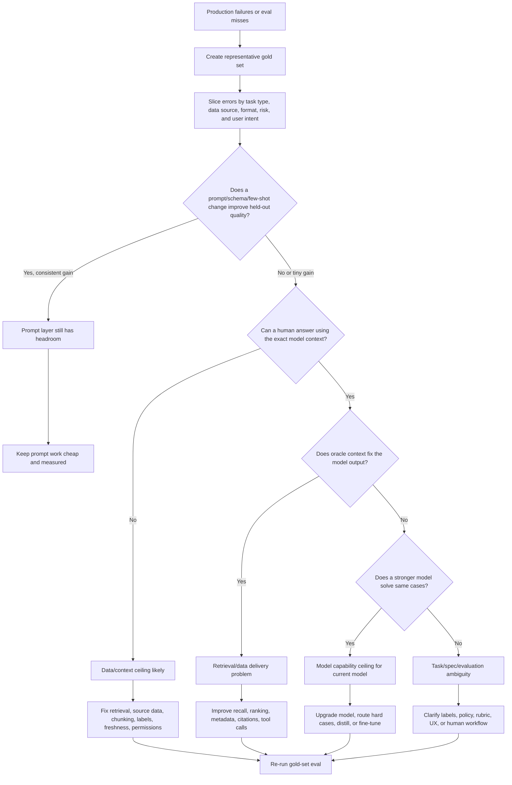

**How to read this diagram:**
Do not jump from "bad output" to "fine-tune." The first job is attribution. You isolate the failure layer by controlling what the model receives, what instructions it follows, and what model is used. Only then do you choose the optimization method.

---

### 3. Real-World Industry Scenarios [Intermediate]

#### Scenario A: Customer Support Resolution Agent

**Product/use case context:**
A SaaS company builds an agent that answers support tickets and drafts resolution steps. It has access to documentation, known incidents, customer plan metadata, and historical tickets. The team starts with prompt engineering and RAG. After several iterations, the agent still fails on roughly 25% of tickets.

**How the ceilings show up:**
- Prompt ceiling: The agent often knows the answer but violates response style, forgets to ask one required clarification, or returns inconsistent JSON. Better schemas, few-shot examples, and stricter output validation still improve results.
- Data ceiling: The agent gives generic answers because the documentation is stale or the relevant internal incident page was never indexed. A human support engineer also cannot answer from the retrieved context alone.
- Model ceiling: The agent has all relevant ticket history and docs, but still fails to reason across multi-step entitlement rules, product version differences, and exception policies. A stronger model or specialized fine-tuned classifier handles these cases reliably.

**Constraints:**
Latency matters because support agents expect draft responses in a few seconds, but correctness matters more for billing, account access, and security issues. Cost matters at volume: if every ticket requires the largest model with 30 retrieved chunks, the support automation budget collapses. Reliability matters because wrong advice can increase ticket reopen rate. Privacy matters because tickets include account identifiers and sometimes sensitive customer content; evaluation logs must redact or permission-gate customer data.

**What good looks like in production:**
The system does not report one aggregate accuracy number. It tracks success by ticket type: password reset, billing dispute, outage follow-up, API integration, enterprise security review. It maintains a gold set for each slice, logs retrieved document IDs, captures whether the answer was possible from context, and routes high-risk or low-confidence cases to humans. Prompt changes are treated like code changes: they must beat the baseline on held-out cases and not regress critical slices.

#### Scenario B: Healthcare Prior Authorization Summarizer

**Product/use case context:**
A healthcare workflow tool summarizes clinical notes and insurance policy rules to help staff prepare prior authorization packets. The LLM must extract diagnosis codes, treatment history, medication failures, and policy criteria.

**How the ceilings show up:**
- Prompt ceiling: Early failures include missing required sections or formatting the packet incorrectly. Better templates and constrained schemas help.
- Data ceiling: The model misses prior medication trials because those notes are in scanned attachments that OCR failed to parse, or because the policy document version is outdated.
- Model ceiling: Even with perfect context, the model may not reliably infer whether clinical evidence satisfies nuanced medical necessity criteria. The task may require a medically specialized model, a classifier trained on adjudication outcomes, or mandatory human review.

**Constraints:**
Reliability and privacy dominate. A wrong packet can delay patient care. Auditability matters: the system must show evidence spans from the chart and policy. Latency is usually less important than correctness because the workflow is asynchronous. Security constraints may prevent using external APIs for PHI, which can force model selection toward approved deployments or fine-tuned internal models.

**What good looks like in production:**
The evaluation set is built from de-identified historical cases with adjudication outcomes and reviewer annotations. The system logs evidence coverage: which clinical note sections were retrieved, which policy clauses were cited, and whether the final summary used only supported facts. A failure is not just "bad summary"; it is labeled as missing clinical evidence, wrong policy version, unsupported inference, formatting failure, or ambiguous criteria requiring human judgment.

#### Scenario C: Enterprise Contract Review Assistant

**Product/use case context:**
A legal ops assistant reviews vendor contracts and flags risky clauses. It compares contract language against playbook standards and suggests redlines.

**How the ceilings show up:**
- Prompt ceiling: The assistant initially fails to produce the right output structure or severity labels. Prompt and rubric examples improve this.
- Data ceiling: The assistant misses risk because the clause library lacks examples for a new jurisdiction, or the parser split definitions away from the clauses they modify.
- Model ceiling: The model sees all relevant language but cannot consistently distinguish acceptable fallback language from non-standard legal risk across jurisdictions. A stronger model, expert-annotated examples, or fine-tuned risk classifier may be required.

**Constraints:**
The product needs high precision. False positives waste lawyer time; false negatives create business risk. Security and confidentiality are strict because contracts contain sensitive commercial terms. Latency can be minutes for long contracts, but traceability is non-negotiable: every flag must point to the clause and policy rule.

**What good looks like in production:**
The team evaluates by clause type and jurisdiction, not just document-level accuracy. It uses oracle clause retrieval to separate parser/retrieval issues from reasoning issues. It also measures reviewer override rate: if lawyers repeatedly reject the model's risk labels for the same clause family, that slice becomes a candidate for data curation or fine-tuning.

---

### 4. System View: Think Like a Systems Engineer [Intermediate]

#### Inputs -> Transformations -> Outputs

**Inputs:**
- User request or production task
- Prompt version and system/developer instructions
- Retrieved context, tool outputs, documents, database records, memory, and metadata
- Model identity, decoding settings, context window, safety settings, and latency budget
- Expected output schema or rubric
- Gold-set label, human judgment, or downstream task outcome

**Transformations:**
1. Input normalization: clean user message, detect task type, apply policy and routing.
2. Context assembly: retrieve documents, call tools, add memory, rank chunks, trim context.
3. Prompt construction: compose system instruction, task instruction, examples, schema, and context.
4. Model inference: generate the output under specific model and decoding settings.
5. Validation: parse schema, check citations, verify tool arguments, run deterministic validators.
6. Scoring: compare against expected output using exact match, rubric grading, semantic judge, human review, or downstream outcome.
7. Attribution: assign failures to prompt, data/context, model, policy/spec, or evaluation ambiguity.

**Outputs:**
- User-visible response or tool action
- Score per metric and per error slice
- Failure label and root-cause hypothesis
- Optimization recommendation: prompt edit, retrieval fix, data curation, synthetic data, model routing, fine-tuning, distillation, or human review

#### Observability: What We Log, Trace, and Measure

A serious optimization pipeline needs enough observability to reconstruct why an answer happened.

Log and trace:
- Prompt version, model version, temperature, max tokens, tool versions, retriever version
- Input task type and metadata slice, with sensitive fields redacted
- Retrieved document IDs, chunk IDs, ranks, scores, timestamps, and permission filters
- Context token budget: prompt tokens, retrieved tokens, memory tokens, output tokens
- Validation results: schema pass/fail, citation coverage, safety filters, tool argument validity
- Final score and failure label
- Human override and reviewer reason code, if available

Measure:
- Overall task success and per-slice success
- Prompt sensitivity: performance variation across prompt variants
- Retrieval recall@k and precision@k where ground truth exists
- Oracle-context accuracy: model performance when perfect evidence is supplied
- Strong-model delta: improvement when using a stronger model on the same cases
- Human-answerability rate: percentage of failures impossible from supplied context
- Cost per successful task, p50/p95 latency, and escalation rate

#### Failure Points: Where It Breaks and How It Shows Up

| Failure point | What breaks | User-visible symptom | Diagnostic signal |
|---|---|---|---|
| Prompt instruction | Task is underspecified or conflicting | Inconsistent format, missed constraints | Prompt variant improves held-out cases |
| Few-shot examples | Examples do not cover edge cases | Model overfits style or wrong pattern | Gains only on similar examples, not new slices |
| Retrieval recall | Correct document/chunk absent | Confident but unsupported answer | Oracle context fixes output |
| Retrieval precision | Too much irrelevant context | Answer mixes facts or cites wrong source | Correct chunk present but buried below distractors |
| Data freshness | Source stale or outdated | Uses old policy, price, or product behavior | Retrieved source timestamp older than expected |
| Parser/chunking | Key evidence split or corrupted | Missed table values, broken clauses | Human cannot answer from assembled context |
| Model capability | Model cannot perform reasoning reliably | Same error persists with ideal context | Stronger model improves substantially |
| Evaluation rubric | Label/spec ambiguous | Human reviewers disagree | Low inter-annotator agreement |
| Product workflow | Task should not be automated fully | High-risk wrong actions | Human review catches non-obvious business judgment |

---

### 5. System Design Flavor [Intermediate]

#### Key Components and Interfaces

A production optimization triage loop usually has these components:

1. **Evaluation store:** Holds gold-set examples, expected outputs, metadata slices, labels, and reviewer notes.
2. **Prompt/model registry:** Tracks prompt versions, model versions, decoding settings, and release history.
3. **Replay runner:** Re-runs the same inputs across prompt variants, retriever variants, model variants, and context conditions.
4. **Retriever diagnostics:** Reports whether expected evidence appears in top-k, whether chunks are stale, and whether permission filters removed necessary data.
5. **Oracle-context runner:** Injects known-good evidence directly into the prompt to test whether retrieval is the bottleneck.
6. **Judge/scorer layer:** Computes exact, rubric, semantic, or human-reviewed scores.
7. **Error analysis dashboard:** Slices failures by task type, source, language, document type, risk tier, user segment, and model/prompt version.
8. **Decision memo:** Records the chosen optimization path and why other paths were rejected.

#### Important Tradeoffs

| Tradeoff | Plain-English meaning | Choose this when... |
|---|---|---|
| Prompting vs data curation | Is the model confused by instructions, or starved of better examples/evidence? | Prompt when mistakes are format/instruction issues; curate data when failures cluster around missing facts or underrepresented cases. |
| Retrieval improvement vs fine-tuning | Should we make facts easier to access, or change model behavior? | Improve retrieval when the answer depends on external changing facts; fine-tune when the behavior pattern is stable and repeated. |
| Stronger model vs optimized smaller model | Pay more per call for capability, or invest in adaptation/optimization? | Use stronger model for low-volume, high-risk reasoning; optimize smaller model for high-volume stable tasks. |
| Synthetic data vs expert labels | Generate scale quickly, or pay for trusted correctness? | Use synthetic data for coverage and bootstrapping; use expert labels for high-stakes decisions and final evals. |
| Aggregate score vs sliced score | One simple metric, or many diagnostic views? | Aggregate is fine for a quick read; slices are required for production because failures hide inside averages. |

#### Scaling Consideration: What Changes at 10x Traffic/Data

At small scale, you can inspect failures manually. At 10x traffic, manual review becomes a sampling system. You need automated slice detection, drift alerts, replay jobs, and annotation queues. The bottleneck shifts from "can we improve this prompt?" to "can we continuously identify which failure slices deserve engineering, data, or model investment?"

At 10x document volume, retrieval problems often become more important than prompt problems. More data means more near-duplicates, stale versions, permission edge cases, and embedding collisions. The same prompt that worked on a small curated corpus can fail when the retriever starts feeding it plausible but wrong context.

---

### 6. Common Mistakes + Debugging [Intermediate]

#### Mistake 1: Treating Every Failure as a Prompt Problem

**Symptom:** The team keeps editing the prompt, adding stronger wording, and injecting more examples, but held-out performance barely moves.

**Likely cause:** The system is at a prompt ceiling. The root issue may be missing evidence, weak retrieval, ambiguous labels, or model capability.

**First debugging step:** Freeze the best current prompt and run a controlled eval across three conditions: current retrieval, oracle context, and stronger model. If oracle context helps, fix data/retrieval. If stronger model helps but oracle context does not, investigate model ceiling. If neither helps, inspect task spec and labels.

#### Mistake 2: Fine-Tuning to Patch Missing Knowledge

**Symptom:** The team wants to fine-tune because the model gives outdated or unsupported answers about policy, product behavior, or customer-specific facts.

**Likely cause:** Data ceiling, not model ceiling. Fine-tuning is poor for volatile facts because the tuned model becomes stale as soon as facts change.

**First debugging step:** Ask whether the correct answer should come from stable learned behavior or external source-of-truth data. If the answer changes weekly, improve retrieval/tooling and freshness checks instead of fine-tuning.

#### Mistake 3: Believing a Stronger Model Means the Current Model Is Worth Fine-Tuning

**Symptom:** GPT-4-class model solves failures that a smaller model misses, so the team assumes fine-tuning the smaller model will close the gap.

**Likely cause:** The stronger model may have qualitatively better reasoning capability, not just better task conditioning. Fine-tuning can teach format, style, domain labels, and recurring mappings; it does not reliably create deep reasoning ability that the base model lacks.

**First debugging step:** Separate behavior imitation from capability. Build a small expert-labeled set and test whether the smaller model succeeds when given demonstrations, decomposed intermediate steps, and oracle evidence. If it still fails, distillation or routing may help some cases, but full capability replacement is unlikely.

#### Mistake 4: Evaluating Only the Happy Path

**Symptom:** Offline eval looks strong, but production users still report failures on edge cases.

**Likely cause:** The gold set does not represent production distribution or critical failure slices. The aggregate metric is masking weak areas.

**First debugging step:** Add metadata and slice the eval: task type, language, customer segment, document type, source age, confidence band, and risk tier. Compare production failure logs to gold-set coverage. If a high-volume or high-risk slice is missing, add it before optimizing.

---

### 7. Hands-On Lab: Diagnose the Ceiling [Pro]

This lab is intentionally small. Its purpose is not to build a full app; it is to train the diagnostic muscle.

#### Concept

You will simulate an LLM evaluation where failures may come from three different sources:

1. Prompt weakness: the instruction does not force a specific output format.
2. Data weakness: the needed policy facts are missing from retrieved context.
3. Model weakness: the task requires reasoning the current model cannot perform reliably.

#### Build: Minimal Diagnostic Harness

Create a small table of eval cases. You can run this manually in a notebook, script, spreadsheet, or eval tool.

```python
from dataclasses import dataclass
from typing import Literal

Ceiling = Literal["prompt", "data", "model", "spec"]

@dataclass
class EvalCase:
    case_id: str
    user_question: str
    retrieved_context: str
    oracle_context: str
    expected_answer: str
    slice: str

cases = [
    EvalCase(
        case_id="billing_format_001",
        user_question="Can this customer get a refund? Return JSON.",
        retrieved_context="Refunds are allowed within 30 days for Pro plans.",
        oracle_context="Refunds are allowed within 30 days for Pro plans.",
        expected_answer='{"eligible": true, "reason": "Pro plan refund within 30 days"}',
        slice="formatting"
    ),
    EvalCase(
        case_id="policy_missing_001",
        user_question="Can an Enterprise customer cancel mid-contract after a security incident?",
        retrieved_context="Enterprise contracts are annual. Standard cancellation is at renewal.",
        oracle_context="Enterprise customers may cancel mid-contract if a verified security incident breaches SLA section 9.2.",
        expected_answer="Yes, if the security incident is verified under SLA section 9.2.",
        slice="missing_policy"
    ),
    EvalCase(
        case_id="reasoning_001",
        user_question="A customer downgraded from Enterprise to Pro 20 days ago, then requested refund for unused annual seats. Eligible?",
        retrieved_context="Enterprise annual seats are non-refundable after 14 days. Pro plan refunds are allowed within 30 days. Downgrades preserve original purchase refund window.",
        oracle_context="Enterprise annual seats are non-refundable after 14 days. Pro plan refunds are allowed within 30 days. Downgrades preserve original purchase refund window.",
        expected_answer="No. The downgrade does not reset the original Enterprise refund window, which expired after 14 days.",
        slice="multi_rule_reasoning"
    ),
]
```

Now define four evaluation conditions:

```python
conditions = [
    "baseline_prompt_current_context",
    "improved_prompt_current_context",
    "improved_prompt_oracle_context",
    "stronger_model_oracle_context",
]
```

For each case, run the same input under each condition and record:

```python
result_row = {
    "case_id": "policy_missing_001",
    "slice": "missing_policy",
    "condition": "improved_prompt_oracle_context",
    "score": 1,  # 1 = pass, 0 = fail
    "failure_label": None,
    "notes": "Oracle policy clause fixed the answer. Retrieval/data issue."
}
```

#### Break: Force the Failure Modes

Break the system on purpose:

1. Prompt break: Ask for JSON but provide no schema. The model may answer in prose.
2. Data break: Remove the key policy sentence from retrieved context. The model may guess.
3. Model break: Add a multi-rule case where the correct answer requires applying precedence rules across contract plan, refund window, and downgrade history.
4. Spec break: Create a case where even humans disagree because the policy wording is ambiguous.

#### Measure: Capture Diagnostic Signals

Use a table like this:

| Slice | Baseline prompt + current context | Improved prompt + current context | Improved prompt + oracle context | Stronger model + oracle context | Likely ceiling |
|---|---:|---:|---:|---:|---|
| Formatting | 60% | 95% | 95% | 95% | Prompt |
| Missing policy | 30% | 35% | 90% | 92% | Data/retrieval |
| Multi-rule reasoning | 40% | 45% | 48% | 86% | Model |
| Ambiguous policy | 45% | 48% | 50% | 52% | Spec/rubric |

Interpretation:

- If improved prompt helps materially on held-out cases, you had prompt headroom.
- If oracle context helps materially, retrieval/data delivery is the bottleneck.
- If stronger model helps materially even with the same oracle context, current model capability is the bottleneck.
- If nothing helps and humans disagree, the task spec or rubric is ambiguous.

#### Explain: Why It Broke and What Fix Prevents It

The diagnostic harness works because it changes one variable at a time. Prompt variants test instruction quality. Oracle context tests whether the model had the facts. Stronger-model comparison tests whether the current model has enough capability. Human-answerability tests whether the task is even well-posed.

The guardrail is disciplined attribution. You should not fine-tune before you know whether the problem is stable behavior, missing evidence, volatile facts, label ambiguity, or model capability. Optimization without attribution is expensive guessing.

---

### 8. Active Recall (Spaced Repetition) [Beginner -> Pro]

#### Questions

1. What is the difference between a prompt ceiling and a data ceiling?
2. Why is oracle context one of the fastest ways to diagnose retrieval problems?
3. A stronger model solves a slice that your current model fails even with the same context. What ceiling does that suggest, and what should you test before fine-tuning?
4. Why is fine-tuning usually a bad fix for stale product policy answers?
5. What does it mean if prompt changes, oracle context, and stronger models all fail to improve a slice?

#### Short Answer Key

1. Prompt ceiling means instruction/schema/example changes no longer improve measured quality; data ceiling means the model lacks the right facts, examples, labels, freshness, or context needed to answer.
2. Oracle context removes retrieval uncertainty. If perfect evidence fixes the answer, the model can do the task and the bottleneck is data delivery.
3. It suggests a model ceiling for the current model. Before fine-tuning, test whether the smaller model can succeed with demonstrations, decomposed steps, oracle evidence, and representative labels.
4. Fine-tuning bakes behavior into weights, but volatile facts change. Use retrieval, tools, freshness checks, and source-of-truth integrations for changing knowledge.
5. The task may be underspecified, labels may be ambiguous, the evaluation rubric may be wrong, or the workflow may require human judgment rather than automation.

---

### 9. Practice [Intermediate -> Pro]

#### Mini-Exercise: Label the Ceiling

For each failure, label the most likely ceiling and first diagnostic test.

| Failure | Likely ceiling | First diagnostic test |
|---|---|---|
| The model returns valid content but not the required JSON structure. | Prompt | Add strict schema, examples, parser validation, and held-out eval. |
| The model says a feature is unavailable, but the product launched it last week. | Data | Check source freshness and whether latest docs are indexed/retrieved. |
| The model has the correct contract clause but still applies the wrong exception rule. | Model or spec | Run stronger model with same oracle context; check human agreement on label. |
| The model cites irrelevant chunks even though the corpus contains the answer. | Data/retrieval | Compute recall@k and inspect ranking/chunking for expected evidence. |
| Human reviewers disagree on whether the answer is correct. | Spec/rubric | Clarify policy, label guidelines, and inter-annotator agreement. |

#### Capstone System Design Question

You own an AI assistant for enterprise procurement. It reviews vendor security questionnaires and drafts answers using internal policy docs, previous questionnaires, and customer-specific contractual commitments. Current task success is 68%. Leadership asks whether you should fine-tune a model.

Design a 2-week diagnostic plan that decides whether the team should prompt, improve retrieval/data, fine-tune, distill, upgrade models, or add human review.

**Suggested answer outline:**

Week 1: Build evidence.
- Create a gold set of 200 representative questionnaire items across security, privacy, compliance, legal, and customer-specific commitments.
- Add metadata slices: domain, customer tier, source document type, risk level, answer volatility, and whether customer-specific terms are needed.
- Capture current prompt version, retrieved chunks, source freshness, citations, model output, human-corrected answer, and reviewer reason code.
- Run baseline eval and inspect top failure slices.

Week 1: Isolate layers.
- Prompt test: run 2-3 prompt/schema/few-shot variants on held-out examples.
- Retrieval test: measure whether expected evidence appears in top-5 chunks.
- Oracle-context test: manually provide correct policy clauses and prior answers for a subset of failures.
- Model test: run the same oracle-context failures through a stronger model.
- Human-answerability test: ask reviewers whether the task is answerable from supplied context.

Week 2: Decide optimization path.
- If formatting and answer style improve strongly with prompt/schema changes, keep prompt optimization and validation.
- If oracle context fixes many failures, improve retrieval, chunking, metadata filters, freshness, and permission-aware search.
- If failures are stable classification/extraction patterns with enough labels, consider fine-tuning or DSPy optimization.
- If a stronger model fixes high-risk reasoning cases, use model routing: stronger model for hard/risky slices, cheaper model for routine questions.
- If answers depend on changing customer commitments, use tools/RAG rather than fine-tuning facts.
- If reviewers disagree or risk is high, add human approval workflow and clarify rubric.

Success criteria:
- A decision memo with per-slice metrics, expected cost/latency impact, label requirements, rollback plan, and the chosen optimization path.
- No fine-tuning begins until the team proves the failures are stable, labelable, and not primarily caused by missing or stale context.

---

### 10. Production Reality Check

**If this fails in prod, what's the first thing we inspect?**

Inspect a small, representative batch of failing cases with the exact prompt, retrieved context, model version, and expected answer side by side.

The first question is: **could a competent human answer correctly using only the context the model received?** If no, the model is not the first suspect; the data/retrieval/tooling layer is. Check missing chunks, stale docs, permission filters, parser damage, and whether the source of truth was indexed.

If a human can answer from the context, run the same case with oracle context and a stronger model. That quickly separates prompt/schema issues from current-model capability limits. This order matters because it prevents the most expensive mistake in GenAI optimization: changing the model when the evidence pipeline is broken.

---

### 11. Curiosity Bridge

This works well for triage, but breaks when your failure labels are vague. "Bad answer" is not enough to optimize a system; you need a taxonomy of recurring errors, confidence signals, and examples that can become training or evaluation data.

That leads directly to **systematic error analysis for model adaptation**: the next subtopic, where we turn raw failures into a map of what to fix, what to label, what to synthesize, and what to leave for human review.

---

### 12. Exit Check + Carry-Forward Review

**Exit check - you are done when you can:**
Given 20 failed LLM outputs, classify each failure as prompt, data/retrieval, model capability, spec/rubric, or workflow risk; justify the classification with one controlled diagnostic test; and recommend the cheapest safe optimization path.

**Carry-Forward Review:**

Question: In Module 17, we learned that multimodal evaluation should isolate failures across modality conversion, retrieval, reasoning, and task outcome. How does that idea carry into Module 18 optimization?

Answer: Module 18 uses the same principle: do not optimize the visible output until you know which layer failed. In multimodal systems, a bad answer might come from OCR/VLM conversion, visual retrieval, reasoning, or final task policy. In optimization systems, a bad answer might come from prompt design, missing data, weak retrieval, model capability, or ambiguous labels. In both cases, controlled evaluation prevents blind tuning.

---

## Subtopic 18.1.b: Systematic Error Analysis for Model Adaptation

### ✅ Add to Knowledge Base

### Reading Path + Level Tags

- **Beginner:** Read sections 0-2 and Active Recall.
- **Intermediate:** Add sections 3-6 and complete the classification drill in the Hands-On Lab.
- **Pro:** Complete the full Hands-On Lab, including the Break and Measure phases, then answer the capstone adaptation-plan question.

---

### 0. Pre-Question Hook [Beginner]

**Pause:** You have 500 failed outputs from a production LLM assistant. Some are hallucinations. Some are missing context. Some are technically correct but unsafe to auto-send. Some are wrong only for one customer segment. Leadership asks: "Should we fine-tune?"

Before reading on: how would you turn those 500 failures into an engineering decision? Which failures become prompt examples, retrieval fixes, fine-tuning data, synthetic data seeds, routing rules, or human-review rules?

That is systematic error analysis.

---

### 1. The Intuition (Plain English) [Beginner]

Raw failures are not yet useful. A folder of bad outputs is like a pile of broken parts on a factory floor: it proves something is wrong, but it does not tell you whether the issue is material quality, machine calibration, worker training, inspection criteria, or product design.

**Systematic error analysis** is the process of converting raw failures into structured evidence: what failed, why it failed, how often it fails, how severe it is, which slice it belongs to, whether humans agree on the correction, and which adaptation method is justified.

**Model adaptation** means changing how the system behaves for your task distribution. It can include prompt changes, few-shot example selection, retrieval improvements, DSPy optimization, fine-tuning, distillation, model routing, tool changes, or human review. The key idea: adaptation is broader than fine-tuning. Fine-tuning is one tool inside the adaptation toolbox.

The mental model is simple:

1. **Observe** failures from evals, production logs, user feedback, and human review.
2. **Label** failures with a consistent taxonomy.
3. **Slice** failures by task, source, risk, user segment, document type, language, and model version.
4. **Prioritize** by severity, frequency, and business impact.
5. **Decide** the adaptation path: prompt, data, retrieval, fine-tune, distill, route, or review.
6. **Verify** improvement on held-out slices, not just the examples you fixed.

**Real-world analogy:**
Think of a doctor diagnosing recurring symptoms. "Patient feels bad" is not a diagnosis. The doctor separates symptoms, runs tests, looks for patterns, checks severity, and chooses treatment. You do the same with model failures. "The answer is bad" is the symptom; error analysis is the diagnosis.

**Where the analogy breaks down:** Medical diagnosis often relies on biological causal mechanisms. LLM behavior is more distributional: the same surface error can have different root causes depending on prompt, context, decoding, retrieval, and model version. That is why controlled replay and sliced evaluation are mandatory.

**Key terms:**

- **Error taxonomy** - a controlled vocabulary of failure categories used to label failures consistently across reviewers and eval runs.
- **Root-cause label** - the best current explanation for why the failure happened, such as missing context, wrong retrieval, weak reasoning, invalid schema, ambiguous policy, or unsafe automation.
- **Severity** - how damaging a failure is if it reaches the user or downstream system.
- **Frequency** - how often a failure appears in representative traffic or evaluation data.
- **Impact** - the business, user, compliance, cost, or safety consequence of the failure.
- **Adaptation candidate** - a failure pattern that is stable, repeated, labelable, and worth improving through a specific adaptation method.
- **Label guideline** - a written rulebook that tells reviewers how to classify failures and produce expected outputs consistently.
- **Confusion matrix** - a table showing which classes or labels the system confuses with which others.
- **Inter-annotator agreement** - a measure of how often independent human reviewers assign the same label or correction.
- **Coverage gap** - a missing or underrepresented slice in the evaluation or training data.
- **Hard negative** - a difficult example that looks similar to a correct/positive case but should receive a different answer or label.
- **Feedback loop** - the pipeline that turns production observations into reviewed examples, evaluation cases, training data, and deployment decisions.

---

### 2. Visual Diagram (Mermaid) [Beginner]

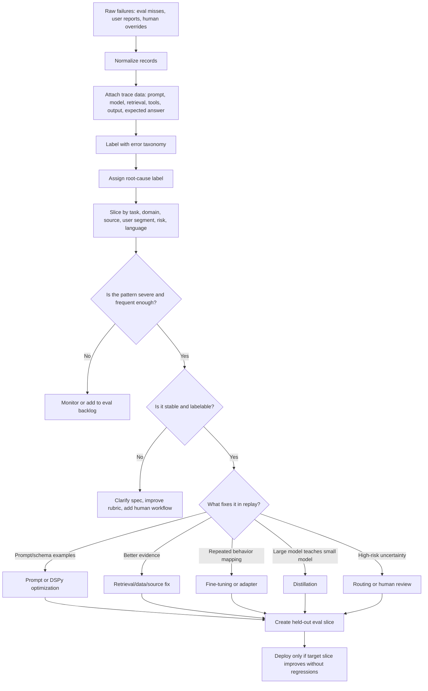

**How to read this diagram:**
Error analysis is not a spreadsheet exercise for its own sake. It is a routing system. Each labeled failure should move toward one of a small set of engineering actions. If your taxonomy does not change decisions, it is too decorative.

---

### 3. Real-World Industry Scenarios [Intermediate]

#### Scenario A: Insurance Claims Triage

**Product/use case context:**
An insurer uses an LLM system to triage incoming claim notes, classify claim type, extract key facts, and recommend the next workflow queue. The system processes auto, property, health, and liability claims. Leadership wants to fine-tune because the model sometimes routes claims to the wrong queue.

**How systematic error analysis changes the decision:**
The team samples 1,000 failures and labels them. The failures are not one problem.

- 35% are parser/context failures: handwritten adjuster notes were OCR'd incorrectly.
- 25% are label ambiguity: human reviewers disagree between "property damage" and "liability investigation" for multi-party incidents.
- 20% are stable classification confusions: windshield damage with injury mentions gets routed to bodily injury instead of auto glass.
- 10% are stale policy issues: queue routing changed after a new regional process.
- 10% are output-format or schema failures.

Only the stable classification confusion is a good adaptation candidate for fine-tuning or distillation. OCR failures need document pipeline fixes. Label ambiguity needs guideline work. Stale policy needs retrieval/tooling. Schema failures need prompt and validation.

**Constraints:**
Latency matters because claims queues operate continuously, but reliability matters more because wrong routing delays payouts and increases operational cost. Compliance matters because claim notes can include sensitive health and financial details. Cost matters at high volume: a full large-model pass for every claim may be too expensive, so one likely architecture is a smaller classifier with escalation to a stronger model or human reviewer for uncertain cases.

**What good looks like in production:**
The claims team maintains a confusion matrix by claim type and region, monitors reviewer override rate by queue, and separately tracks OCR quality. A model adaptation project is approved only for stable, high-frequency, high-impact confusions with clean labels and enough examples. The deployment gate checks that auto-glass, bodily injury, liability, and property slices improve without increasing false negatives in high-risk injury cases.

#### Scenario B: Security Questionnaire Automation

**Product/use case context:**
A B2B SaaS company uses an AI assistant to answer customer security questionnaires from internal policies, SOC 2 evidence, previous questionnaires, and customer-specific commitments.

**How systematic error analysis changes the decision:**
The first aggregate metric says the assistant is 71% correct. That number is not actionable. Error analysis reveals five categories:

- Citation missing: answer is correct but lacks acceptable evidence link.
- Source mismatch: answer uses public docs when customer-specific contract terms override them.
- Overclaim: answer says "yes" when the correct answer is "partially, with exception."
- Outdated evidence: answer cites last year's SOC 2 report.
- Unanswerable: policy owner has not documented the answer.

These categories map to different adaptation paths. Citation missing is prompt/schema plus validation. Source mismatch is retrieval ranking and permission-aware source precedence. Overclaim may benefit from fine-tuning or hard-negative examples because it is a stable behavioral pattern: the model is too eager to answer positively. Outdated evidence needs freshness metadata. Unanswerable cases need a human workflow and knowledge-base backlog.

**Constraints:**
Security questionnaires are high trust. A wrong overclaim can create contractual and compliance risk. Latency is less important than auditability because many questionnaires are asynchronous. Privacy matters because customer-specific commitments must not leak across tenants.

**What good looks like in production:**
The system has a taxonomy that distinguishes factual correctness from evidence correctness. It measures answer accuracy, citation coverage, source precedence accuracy, and abstention quality. Fine-tuning is considered only after the team proves that overclaim examples are stable, reviewer-agreed, and represented in both train and held-out eval sets.

#### Scenario C: Clinical Note Summarization

**Product/use case context:**
A healthcare application summarizes patient visits into structured sections: chief complaint, history, assessment, plan, medications, and follow-up. Clinicians edit the drafts before signing.

**How systematic error analysis changes the decision:**
The team looks at clinician edits rather than thumbs-up/down feedback. Error analysis finds:

- Missing fact: model omitted medication dosage.
- Incorrect inference: model inferred diagnosis not stated by clinician.
- Section placement error: fact is correct but placed under assessment instead of plan.
- Negation error: "no chest pain" becomes "chest pain."
- Style preference: clinician prefers shorter plan wording.

These are not equally important. Negation errors and incorrect inferences are high severity. Style preference is low severity unless it drives large edit time. Section placement may be a good fine-tuning candidate if repeated and labelable. Missing dosage may be a data/transcription issue if ASR missed the dosage.

**Constraints:**
Safety and auditability dominate. A model adaptation project must show that high-severity clinical errors decrease, not merely that summaries sound better. Privacy constraints affect where training can happen and how examples are de-identified. Clinician time is the scarce resource, so edit-distance metrics must be paired with clinical correctness labels.

**What good looks like in production:**
The feedback loop collects structured clinician edits, maps them to error categories, and routes high-severity errors to expert review. The system distinguishes style adaptation from clinical correctness. Any tuned model is evaluated on held-out notes by specialty, note type, speaker accent/transcription quality, and high-risk negation cases.

---

### 4. System View: Think Like a Systems Engineer [Intermediate]

#### Inputs -> Transformations -> Outputs

**Inputs:**
- Failure records: input, retrieved context, tool outputs, prompt version, model output, expected output, score, reviewer feedback.
- Trace metadata: model version, decoding settings, retriever version, source document IDs, chunk ranks, latency, token counts.
- Business metadata: user segment, workflow stage, risk tier, domain, geography, language, source freshness.
- Human review data: corrected answer, reviewer label, reason code, confidence, adjudication status.

**Transformations:**
1. Normalize failures into a common schema so every record can be compared.
2. Redact or permission-gate sensitive fields before analysis or training export.
3. Label each failure with error category, root cause, severity, frequency estimate, and fix owner.
4. Slice failures across product, data, model, and user dimensions.
5. Quantify patterns: counts, rates, confusion matrix, cost impact, latency impact, human override rate.
6. Decide whether each pattern is promptable, retrievable, tunable, distillable, routable, or review-only.
7. Convert approved patterns into eval cases, prompt examples, retrieval tests, training data, or workflow rules.
8. Re-run held-out evaluation before deployment.

**Outputs:**
- Error taxonomy and label guidelines.
- Prioritized failure backlog with owners.
- Adaptation candidate list.
- Training/eval data split recommendations.
- Hard-negative set for common confusions.
- Decision memo: prompt vs retrieval vs fine-tune vs distill vs route vs review.
- Deployment gate metrics by slice.

#### Observability: What We Log, Trace, and Measure

Log enough to answer: "Why did this output happen?" and "Can this failure become useful data?"

Essential fields:
- `example_id`, `timestamp`, `tenant_or_segment`, `task_type`, `risk_tier`
- `prompt_version`, `model_version`, `temperature`, `max_tokens`
- `retriever_version`, `top_k_chunks`, `chunk_scores`, `source_timestamps`
- `tool_calls`, `tool_results`, `validation_errors`
- `model_output`, `expected_output`, `reviewer_correction`
- `error_category`, `root_cause_label`, `severity`, `reviewer_confidence`
- `adaptation_action`, `owner`, `status`, `train_eval_split`

Measure:
- Failure rate by error category and slice.
- Severity-weighted failure rate, not just count.
- Confusion matrix for classification/extraction labels.
- Inter-annotator agreement for labels and expected outputs.
- Human override rate and edit distance, paired with semantic correctness.
- Retrieval recall@k for failures with known evidence.
- Regression rate on previously fixed slices.
- Percentage of production failures covered by the current eval set.

#### Failure Points: Where Error Analysis Itself Breaks

| Failure point | What breaks | How it shows up | Fix |
|---|---|---|---|
| Taxonomy too vague | Everything becomes "bad answer" | No clear engineering action | Split by root cause and fix path |
| Taxonomy too detailed | Reviewers cannot label consistently | Low agreement, slow review | Merge categories that drive same action |
| Missing trace data | Cannot reproduce failures | Root cause is guessed | Log prompt, model, context, retriever, tools |
| Biased sample | Only loud users are represented | Fixes do not improve broad traffic | Sample from evals, production, feedback, overrides |
| No severity weighting | Many low-risk style issues dominate | High-risk rare errors ignored | Prioritize severity x frequency x impact |
| No held-out split | Adaptation memorizes reviewed cases | Offline improvement fails in production | Keep train/dev/test separation |
| Weak label guidelines | Reviewers disagree silently | Training data becomes noisy | Add examples, counterexamples, adjudication |
| Feedback loop leakage | Eval examples enter training accidentally | Inflated eval scores | Track lineage and split membership |

---

### 5. System Design Flavor [Intermediate]

#### Key Components and Interfaces

1. **Failure ingestion pipeline:** Collects eval misses, production thumbs-down, human overrides, validator failures, and incident reports.
2. **Trace joiner:** Joins each failure to prompt version, model version, retrieval context, tool calls, and source metadata.
3. **Review UI:** Lets reviewers label category, root cause, severity, correction, confidence, and evidence spans.
4. **Taxonomy registry:** Versioned list of error labels, definitions, examples, and owner mappings.
5. **Adjudication queue:** Sends disagreements or high-severity labels to expert reviewers.
6. **Analysis warehouse:** Stores failures with slice metadata and supports dashboards/queries.
7. **Adaptation router:** Converts failure patterns into action: prompt, retrieval, fine-tune, distill, route, or human review.
8. **Dataset builder:** Exports approved examples into train/dev/test sets with lineage, deduplication, privacy filters, and hard negatives.
9. **Replay/eval runner:** Tests candidate adaptations against baseline and held-out slices.

#### Important Tradeoffs

| Tradeoff | Plain-English meaning | Choose this when... |
|---|---|---|
| Simple taxonomy vs detailed taxonomy | Fewer labels are easier; more labels diagnose better. | Start simple, then split categories only when they lead to different fixes. |
| Speed vs label quality | Fast labeling gives volume; expert review gives correctness. | Use fast triage for low-risk patterns; use expert adjudication for high-risk or training data. |
| Frequency vs severity | Common failures are visible; severe failures are dangerous. | Prioritize severity-weighted impact, especially in legal, healthcare, finance, and security. |
| Training set vs eval set | Training improves behavior; eval proves it generalizes. | Never spend all reviewed examples on training. Keep a clean held-out set. |
| Human edits vs explicit labels | Edits show what changed; labels explain why. | Capture both when possible. Edits alone are hard to convert into root-cause decisions. |
| Fine-tune vs DSPy optimization | Fine-tuning changes model weights; DSPy searches prompts/examples/program behavior. | Use DSPy when behavior can be optimized at the program/prompt/example layer; fine-tune when stable repeated behavior needs to be internalized. |

#### Scaling Consideration: What Changes at 10x Traffic/Data

At 10x traffic, you no longer need more anecdotes; you need sampling discipline. If you label only user-reported failures, you overrepresent angry users and underrepresent silent bad outcomes. Production systems sample from multiple streams: random traffic, low-confidence outputs, validator failures, high-risk workflows, human overrides, and newly launched product areas.

At 10x data, deduplication becomes critical. If the same failure appears 500 times from one customer template, it can dominate training and evaluation. The dataset builder should cluster near-duplicates and cap per-template examples so the model adapts to the pattern, not the accidental distribution of one noisy source.

---

### 6. Common Mistakes + Debugging [Intermediate]

#### Mistake 1: Building a Taxonomy That Does Not Map to Actions

**Symptom:** Reviewers label failures as "hallucination," "bad answer," "wrong," and "low quality," but engineers still do not know what to fix.

**Likely cause:** The taxonomy describes surface symptoms instead of root causes or adaptation actions.

**First debugging step:** Add an `action_owner` or `fix_path` field to every label. If two labels always map to the same fix, merge them. If one label maps to many fixes, split it.

#### Mistake 2: Fine-Tuning on Noisy Corrections

**Symptom:** A tuned model improves on training examples but gets worse on held-out or production cases.

**Likely cause:** The correction data contains inconsistent labels, mixed policies, duplicate examples, or reviewer disagreements. The model learned noise.

**First debugging step:** Measure inter-annotator agreement on a sample of the training data. Review low-agreement categories, clarify guidelines, remove ambiguous examples, and keep a clean held-out set.

#### Mistake 3: Ignoring Hard Negatives

**Symptom:** The model improves on obvious positive cases but still fails on subtle boundary cases.

**Likely cause:** The training/eval set lacks examples that look similar but require different outputs. The model learns shortcuts.

**First debugging step:** Build hard-negative pairs. For every positive example, add a near-neighbor that should be classified differently, rejected, escalated, or answered with a caveat.

#### Mistake 4: Prioritizing by Count Instead of Risk

**Symptom:** The team spends weeks fixing frequent style complaints while rare high-risk failures continue.

**Likely cause:** Error analysis uses raw frequency without severity or business impact.

**First debugging step:** Compute `priority_score = frequency x severity x impact x confidence`. Review top items by weighted score, not just count.

#### Mistake 5: Letting Training Data Leak Into Evaluation

**Symptom:** Offline metrics look excellent after adaptation, but production does not improve.

**Likely cause:** Reviewed examples, duplicates, or near-duplicates appear in both training and evaluation sets.

**First debugging step:** Add dataset lineage, exact deduplication, semantic deduplication, and split locks. Treat eval membership as protected metadata.

---

### 7. Hands-On Lab: Turn Failures Into Adaptation Decisions [Pro]

#### Concept

You will take a small set of failed model outputs and turn them into a structured adaptation plan. The goal is to practice the Build -> Break -> Measure -> Explain loop, not to train a model yet.

#### Build: Minimal Error Analysis Dataset

Use this schema for failure records:

```python
from dataclasses import dataclass
from typing import Literal

ErrorCategory = Literal[
    "format_error",
    "missing_context",
    "wrong_retrieval",
    "unsupported_claim",
    "classification_confusion",
    "unsafe_auto_action",
    "ambiguous_spec",
]

FixPath = Literal[
    "prompt_schema",
    "retrieval_data",
    "fine_tune_or_distill",
    "model_routing",
    "human_review",
    "spec_clarification",
]

@dataclass
class FailureRecord:
    example_id: str
    task_type: str
    model_output: str
    expected_output: str
    retrieved_context_summary: str
    error_category: ErrorCategory
    root_cause: str
    severity: int  # 1 low, 5 critical
    frequency_estimate: int  # approximate monthly count
    reviewer_agreement: float  # 0.0 to 1.0
    fix_path: FixPath


failures = [
    FailureRecord(
        example_id="sq_001",
        task_type="security_questionnaire",
        model_output="Yes, all customer data is encrypted with customer-managed keys.",
        expected_output="Partially. Platform encryption is standard; customer-managed keys are available only on Enterprise Plus.",
        retrieved_context_summary="Correct enterprise encryption policy was present.",
        error_category="unsupported_claim",
        root_cause="Model overclaims instead of preserving caveat.",
        severity=5,
        frequency_estimate=80,
        reviewer_agreement=0.92,
        fix_path="fine_tune_or_distill",
    ),
    FailureRecord(
        example_id="sq_002",
        task_type="security_questionnaire",
        model_output="Our SOC 2 report is attached from 2024.",
        expected_output="Use the 2026 SOC 2 Type II report.",
        retrieved_context_summary="Retriever returned stale 2024 evidence above 2026 evidence.",
        error_category="wrong_retrieval",
        root_cause="Freshness ranking failure.",
        severity=4,
        frequency_estimate=45,
        reviewer_agreement=0.96,
        fix_path="retrieval_data",
    ),
    FailureRecord(
        example_id="sq_003",
        task_type="security_questionnaire",
        model_output="Encryption: yes. Retention: 90 days.",
        expected_output='{"encryption":"yes","retention":"90 days"}',
        retrieved_context_summary="Correct context present.",
        error_category="format_error",
        root_cause="Prompt did not enforce JSON schema; no parser retry.",
        severity=2,
        frequency_estimate=300,
        reviewer_agreement=1.0,
        fix_path="prompt_schema",
    ),
]
```

Prioritize with a severity-weighted score:

```python
def priority_score(record: FailureRecord) -> float:
    return record.severity * record.frequency_estimate * record.reviewer_agreement

ranked = sorted(failures, key=priority_score, reverse=True)

for record in ranked:
    print(record.example_id, record.fix_path, priority_score(record))
```

Expected ranking:

```text
sq_001 fine_tune_or_distill 368.0
sq_003 prompt_schema 600.0
sq_002 retrieval_data 172.8
```

But do not blindly follow the score. `sq_003` is frequent but low severity and easy to fix. It should be handled quickly through schema validation. `sq_001` is less frequent but high risk and stable; it is a stronger candidate for model adaptation. `sq_002` belongs to retrieval freshness, not model tuning.

#### Break: Add Failure Records That Should Not Be Fine-Tuned

Add these records and classify them:

```python
extra_cases = [
    {
        "example_id": "sq_004",
        "symptom": "Reviewers disagree whether the answer should be yes or partial.",
        "likely_fix": "spec_clarification",
    },
    {
        "example_id": "sq_005",
        "symptom": "Answer requires customer contract terms unavailable to the model.",
        "likely_fix": "retrieval_data",
    },
    {
        "example_id": "sq_006",
        "symptom": "Answer is correct but action would send a legal commitment automatically.",
        "likely_fix": "human_review",
    },
]
```

These cases break naive fine-tuning logic. Fine-tuning cannot fix unclear policy, missing customer-specific data, or product workflows that require approval.

#### Measure: Decide Adaptation Readiness

Create a readiness table:

| Pattern | Stable? | Labelable? | Enough examples? | High impact? | Best fix |
|---|---|---|---|---|---|
| Overclaiming Enterprise features | Yes | Yes | Maybe | High | Fine-tune, distill, or hard-negative prompt examples |
| Stale SOC 2 citation | Yes | Yes | Yes | Medium | Retrieval freshness ranking |
| JSON format miss | Yes | Yes | Yes | Low | Prompt/schema/parser retry |
| Ambiguous yes vs partial | No | No | No | High | Label guideline and policy clarification |
| Missing contract terms | Yes | Yes | Yes | High | Data integration and permission-aware retrieval |
| Auto-send legal commitment | Yes | Yes | Yes | Critical | Human approval workflow |

Then compute three rates:

1. **Adaptation-ready rate:** percent of failures that are stable, labelable, and have an agreed correction.
2. **Data-blocked rate:** percent of failures where correct context was missing or stale.
3. **Spec-blocked rate:** percent of failures with reviewer disagreement or policy ambiguity.

If adaptation-ready rate is low, do not fine-tune yet. Improve labels, specs, and data first.

#### Explain: Why It Broke and What Fix Prevents It

Naive model adaptation fails when it treats every corrected output as training data. Some corrections represent missing facts, some represent policy ambiguity, some represent reviewer preference, and some represent stable behavioral gaps. Fine-tuning on all of them mixes incompatible signals.

The guardrail is a reviewed adaptation dataset. Every candidate example should have a root-cause label, clear expected output, reviewer agreement, privacy clearance, split assignment, and a fix path. If you cannot explain why an example belongs in training rather than retrieval, prompt, or human review, it should not enter the tuning set.

---

### 8. Active Recall (Spaced Repetition) [Beginner -> Pro]

#### Questions

1. Why is "bad answer" not a useful error category for model adaptation?
2. What makes a failure pattern a good adaptation candidate?
3. Why should severity and frequency both matter in prioritization?
4. What does low inter-annotator agreement tell you before fine-tuning?
5. Why are hard negatives important for classification and extraction tasks?

#### Short Answer Key

1. It does not identify root cause or fix path. The failure could require prompt changes, retrieval fixes, data freshness, model routing, fine-tuning, or human review.
2. It is stable, repeated, labelable, high-impact enough to matter, and not primarily caused by missing context or ambiguous policy.
3. Frequency shows how often users are affected; severity shows how damaging each failure is. Production priority should weight both.
4. The labels or expected outputs are ambiguous or guidelines are weak. Fine-tuning on that data will teach inconsistency.
5. They teach the model boundaries. Without near-miss examples, the model may learn superficial shortcuts that fail on subtle cases.

---

### 9. Practice [Intermediate -> Pro]

#### Mini-Exercise: Build an Error Taxonomy

You are analyzing 200 failed outputs from a contract-review assistant. Create a taxonomy with 6 labels. Use labels that map to different actions.

Suggested taxonomy:

| Label | Definition | Likely fix |
|---|---|---|
| Missing clause context | Relevant clause or definition absent from context | Retrieval/chunking |
| Wrong playbook rule | Correct clause present, wrong policy applied | Fine-tune, examples, model routing |
| Unsupported risk flag | Model flags risk without evidence | Prompt grounding, hard negatives, fine-tune |
| Missed jurisdiction caveat | Answer ignores jurisdiction-specific rule | Data enrichment, retrieval filters, tuning if stable |
| Output schema failure | JSON/severity/citation format invalid | Prompt/schema/parser retry |
| Ambiguous legal judgment | Reviewers disagree on expected label | Guideline clarification/human review |

Now ask: which labels should become training data? Not all of them. "Wrong playbook rule," "unsupported risk flag," and stable "missed jurisdiction caveat" examples may become adaptation data if reviewers agree and context is present. "Missing clause context" is a retrieval problem. "Output schema failure" is usually prompt/validation. "Ambiguous legal judgment" should not be training data until policy is clarified.

#### Capstone System Design Question

You lead model quality for an AI coding assistant used inside a large enterprise. The assistant generates pull request summaries, suggests tests, and answers repository questions. Users report that quality is inconsistent. Leadership asks for a fine-tuning roadmap.

Design an error-analysis system that decides what should be fine-tuned, what should be fixed through retrieval/tooling, and what should become human-review or policy logic.

**Suggested answer outline:**

Data collection:
- Ingest thumbs-down feedback, edited PR summaries, failed generated tests, retrieval misses, chat transcripts with user correction, and safety/policy blocks.
- Join each record with repo language, framework, task type, prompt version, model version, retrieved files, tool-call trace, and final user action.

Taxonomy:
- Format/style issue: summary shape, tone, length, missing sections.
- Missing code context: relevant file or diff absent from context.
- Tool misuse: wrong command, stale test output, bad file path.
- Reasoning bug: incorrect causal explanation of code behavior with context present.
- Test generation gap: misses important branch or asserts wrong behavior.
- Policy/security issue: suggests unsafe secret handling or unauthorized code change.
- Ambiguous task: user request underspecified or repo convention unclear.

Prioritization:
- Weight by severity, frequency, developer time lost, repo criticality, and confidence.
- Treat security/policy failures as high severity even if rare.
- Track coverage by language/framework so Python-heavy data does not hide Java or TypeScript failures.

Adaptation decision:
- Retrieval/tooling fixes for missing files, stale test output, bad symbol search, or unavailable repo context.
- Prompt/DSPy optimization for output structure, summary rubrics, and example selection.
- Fine-tuning or distillation for stable repeated behavior: better PR summary style, test suggestion patterns, common code review classifications, or repository-question answer style when context is present.
- Model routing for deep reasoning tasks that smaller models fail but stronger models solve.
- Human review or policy logic for risky code changes, secrets, production config, or destructive commands.

Quality gates:
- Maintain held-out evals by language, framework, task type, and risk category.
- Run regression evals before deploying adapted behavior.
- Prevent training/eval leakage by tracking example lineage and deduplicating near-identical PRs.
- Require reviewer agreement for fine-tuning examples.

---

### 10. Production Reality Check

**If this fails in prod, what's the first thing we inspect?**

Inspect the failure taxonomy and the raw examples behind the largest severity-weighted regression slice.

Do not start by asking, "Which model should we tune?" Start with: **what exact failure pattern increased, who labeled it, what context did the model receive, and did reviewers agree on the correction?** If the slice is mislabeled, underspecified, or contaminated by missing context, any adaptation decision built on it will be wrong.

The fastest first debugging step is to sample 20 failures from the regressed slice and review them with traces: input, prompt, retrieved context, output, expected output, reviewer label, and source metadata. If the examples do not share a stable root cause, the problem is analysis quality, not model quality.

---

### 11. Curiosity Bridge

This unlocks the next step: once you know which failures are stable and labelable, you can create more coverage than production has naturally given you. That leads to **synthetic data generation and curation**.

Synthetic data is powerful when it fills real coverage gaps, but it breaks when it amplifies fake patterns, label noise, or teacher-model bias. The next subtopic is about generating examples without poisoning the very optimization loop you are trying to improve.

---

### 12. Exit Check + Carry-Forward Review

**Exit check - you are done when you can:**
Take a mixed set of 50 LLM failures, build a taxonomy that maps each failure to a fix path, compute a severity-weighted priority list, identify which patterns are adaptation-ready, and explain which examples should not enter a fine-tuning dataset.

**Carry-Forward Review:**

Question: In 18.1.a, how did we separate prompt ceiling, data ceiling, and model ceiling? How does 18.1.b extend that skill?

Answer: 18.1.a used controlled tests: prompt variants, human-answerability checks, oracle context, and stronger-model comparisons. 18.1.b takes the failures from those tests and turns them into a repeatable operating system: taxonomy, root-cause labels, severity, frequency, reviewer agreement, data splits, hard negatives, and adaptation decisions. The first subtopic tells us where the ceiling is; this subtopic tells us what to do with the evidence.

---

## Subtopic 18.1.c: Synthetic Data Generation and Curation

### ✅ Add to Knowledge Base

### Reading Path + Level Tags

- **Beginner:** Read sections 0-2 and Active Recall.
- **Intermediate:** Add sections 3-6 and complete the Build part of the Hands-On Lab.
- **Pro:** Complete the full Hands-On Lab, including the Break and Measure phases, then answer the capstone curation question.

---

### 0. Pre-Question Hook [Beginner]

**Pause:** Your error analysis shows that the model fails on rare but important edge cases: refund exceptions, medical negations, security-questionnaire caveats, unusual document layouts, and near-duplicate product compatibility questions. You only have 40 real examples. Leadership asks: "Can we generate 5,000 synthetic examples and fine-tune?"

Before reading on: what would make those synthetic examples useful? What would make them dangerous? How would you know whether they improve the model or merely make your eval look better?

That is the synthetic data problem.

---

### 1. The Intuition (Plain English) [Beginner]

**Synthetic data** is data created artificially rather than directly observed from production or human-labeled real examples. In GenAI systems, it often means using a strong model, rules, templates, simulations, or transformations to create inputs, expected outputs, rationales, labels, adversarial cases, or preference pairs.

**Data curation** is the process of filtering, validating, deduplicating, balancing, documenting, and splitting data so it becomes trustworthy for evaluation, prompting, DSPy optimization, fine-tuning, or distillation.

The simplest mental model:

- Synthetic data gives you coverage.
- Curation gives you trust.
- Without coverage, the model never sees enough of the cases you care about.
- Without trust, the model learns polished mistakes at scale.

Synthetic data is not magic extra truth. It is controlled imagination. It is useful when it expands a known pattern from real failures. It is dangerous when it invents labels, assumptions, or distributions that do not match reality.

**Real-world analogy:**
Think of flight simulators. Pilots cannot practice every rare emergency in real aircraft, so simulators create realistic engine failures, storms, instrument faults, and landing conditions. The simulator is valuable because it is grounded in real aircraft physics and instructor review. A bad simulator teaches pilots the wrong reflexes.

**Where the analogy breaks down:** Flight simulators are constrained by physics. LLM-generated synthetic data can create examples that are plausible-looking but factually wrong, policy-inconsistent, too clean, too repetitive, or subtly unlike production. That is why curation is not optional.

**Key terms:**

- **Synthetic data** - artificially created examples, labels, rationales, preference pairs, or test cases used to expand coverage for evaluation or adaptation.
- **Data curation** - filtering, validating, deduplicating, balancing, documenting, and splitting data so it is useful and safe for optimization.
- **Seed example** - a real or trusted example used as the starting pattern for generating synthetic variants.
- **Teacher model** - a stronger model used to generate labels, explanations, examples, or demonstrations for a weaker or cheaper model.
- **Student model** - the model being trained, optimized, or evaluated using teacher-generated or curated examples.
- **Data contamination** - leakage of evaluation examples, answers, or near-duplicates into training or prompt-optimization data, causing inflated metrics.
- **Distribution shift** - the mismatch between the data used for training/evaluation and the data seen in real production traffic.
- **Diversity control** - deliberate variation across intents, wording, entities, languages, difficulty, formats, and edge cases so synthetic data does not collapse into repeated patterns.
- **Quality filter** - an automated or human check that removes examples with invalid labels, unsupported facts, schema errors, duplicates, or policy violations.
- **Provenance** - metadata that records where an example came from, how it was generated, who reviewed it, and which dataset split it belongs to.
- **Evaluation contamination** - a specific form of data contamination where benchmark or holdout examples leak into training, tuning, or prompt search.
- **Label noise** - incorrect, inconsistent, ambiguous, or low-confidence labels inside a dataset.

---

### 2. Visual Diagram (Mermaid) [Beginner]

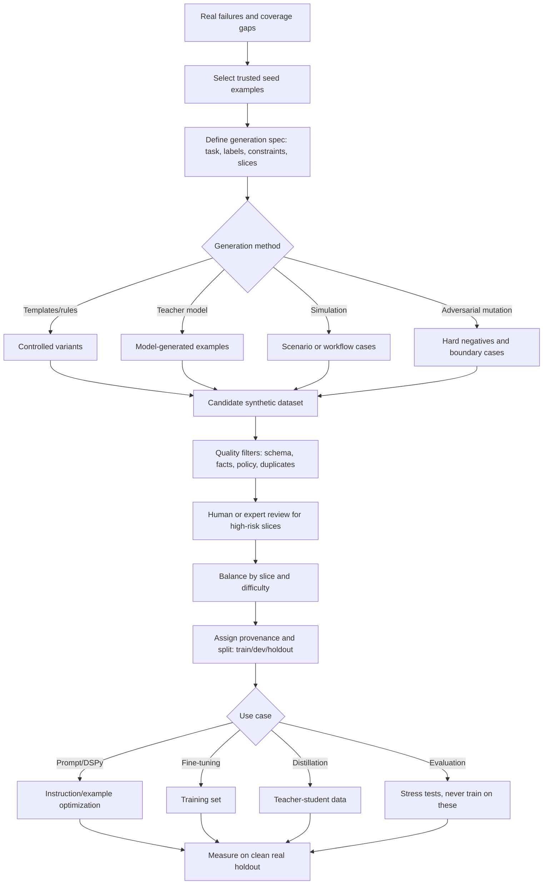

**How to read this diagram:**
Synthetic data starts with real failure evidence, not a blank prompt that says "make examples." Generation is only the middle of the pipeline. The value comes from targeting, filtering, provenance, split hygiene, and evaluation on clean real data.

---

### 3. Real-World Industry Scenarios [Intermediate]

#### Scenario A: Security Questionnaire Caveats

**Product/use case context:**
A B2B SaaS company uses an AI assistant to answer customer security questionnaires. Error analysis shows a repeated failure: the model overclaims with "yes" when the correct answer is "partially," "only for Enterprise Plus," or "requires contractual addendum."

**How synthetic data helps:**
The team has only 60 real overclaim examples, but the pattern is stable and labelable. They create synthetic variants across control areas: encryption, audit logs, data residency, SSO, retention, incident response, subprocessors, and key management. Each synthetic example includes the customer question, retrieved policy snippet, correct caveated answer, source citation, and a label for commitment strength.

**Constraints:**
Reliability and auditability dominate because overclaims can create contractual risk. Synthetic examples must not invent company policy. Every generated answer must be grounded in approved source snippets. Privacy constraints matter because customer-specific commitments cannot leak into generic training examples.

**What good looks like in production:**
Synthetic examples are generated only from approved policy snippets, then reviewed by security/legal owners for high-risk categories. The model is evaluated on real held-out questionnaire items, not on synthetic examples from the same generator. Success means fewer reviewer corrections on commitment strength, no increase in unsupported claims, and preserved citation accuracy.

#### Scenario B: Healthcare Negation and Dosage Extraction

**Product/use case context:**
A clinical documentation system extracts medications, dosages, symptoms, and negations from visit notes. Real failures show that the model sometimes turns "denies chest pain" into "chest pain" or misses dosage changes like "increase metformin from 500mg to 1000mg nightly."

**How synthetic data helps:**
The team generates synthetic note snippets that vary negation phrasing, medication names, dosage units, temporal language, and specialty context. The goal is not to invent patients; it is to cover linguistic patterns that are underrepresented in real data.

**Constraints:**
Safety and privacy dominate. Synthetic clinical notes must not be mixed with real PHI. Expert review is needed for high-risk labels. The synthetic generator must preserve medically valid relationships: dosage, route, frequency, medication class, and negation scope. Latency is irrelevant during dataset generation, but evaluation quality is critical.

**What good looks like in production:**
Synthetic cases become stress tests and training candidates for negation/dosage extraction, but deployment is gated on real de-identified held-out notes by specialty. Metrics report negation accuracy and dosage exact-match separately. The team tracks whether synthetic training reduces high-severity clinical errors without hurting normal note summaries.

#### Scenario C: Ecommerce Product Compatibility

**Product/use case context:**
An ecommerce platform normalizes seller listings. The model confuses "case for iPhone 15" with "iPhone 15 included," and "charger compatible with USB-C laptops" with "USB-C laptop."

**How synthetic data helps:**
The team generates hard negatives: product titles and descriptions that look very similar but require different labels. Examples vary brand, device, accessory type, compatibility wording, bundled items, and multilingual phrasing.

**Constraints:**
Cost and scale matter because millions of listings are processed. Quality matters because incorrect attributes break search, recommendations, and returns. Synthetic data must reflect messy seller language, not clean textbook sentences only.

**What good looks like in production:**
The synthetic dataset is balanced across accessory/device relationships and includes near-miss cases. The model is evaluated on real marketplace listings sampled after generation, plus a clean hard-negative set that is never used for training. Success means improved compatibility F1 and lower return-driving attribute errors.

---

### 4. System View: Think Like a Systems Engineer [Intermediate]

#### Inputs -> Transformations -> Outputs

**Inputs:**
- Error clusters from systematic error analysis
- Trusted seed examples from real evals, production failures, or expert-written cases
- Source-of-truth documents, policies, schemas, ontologies, or allowed labels
- Generation spec: target slices, difficulty, labels, constraints, forbidden assumptions, output format
- Quality rules: schema validators, citation requirements, policy checks, deduplication thresholds
- Human review criteria and risk tiers

**Transformations:**
1. Select target coverage gaps from real failures.
2. Choose generation method: template, teacher model, simulation, mutation, paraphrase, or adversarial hard-negative generation.
3. Generate candidate examples with explicit constraints.
4. Validate schema and deterministic facts.
5. Check grounding against trusted sources.
6. Deduplicate exact and near-duplicate examples.
7. Balance examples by slice, difficulty, label, language, and source.
8. Route risky or low-confidence examples to human review.
9. Assign provenance and split membership.
10. Use the curated data for prompt optimization, DSPy, fine-tuning, distillation, or stress evaluation.

**Outputs:**
- Curated synthetic training set
- Synthetic dev set for rapid iteration
- Synthetic stress-test set for rare failures
- Hard-negative set for boundary cases
- Provenance ledger showing source, generator, reviewer, split, and version
- Curation report: acceptance rate, rejection reasons, slice distribution, known risks

#### Observability: What We Log, Trace, and Measure

Log:
- Seed example ID and source
- Generator prompt/version/model or template version
- Source documents used for grounding
- Generated input, expected output, label, rationale, and metadata
- Quality-filter results and rejection reasons
- Reviewer ID/role, review decision, confidence, and adjudication result
- Dataset split: train, dev, holdout, stress, or excluded
- Deduplication cluster ID and similarity score

Measure:
- Acceptance rate after automated filters and human review
- Label distribution and slice distribution
- Synthetic-to-real similarity and difference by metadata
- Duplicate and near-duplicate rate
- Label-noise estimate from reviewer agreement
- Improvement on target real holdout slice
- Regression on non-target slices
- Contamination risk: overlap with holdout, benchmark, or production eval examples

#### Failure Points: Where It Breaks and How It Shows Up

| Failure point | What breaks | User/system symptom | First diagnostic step |
|---|---|---|---|
| Untargeted generation | Examples are generic | Training does not improve failing slice | Map each generated batch to a real error cluster |
| Teacher hallucination | Generated label is wrong | Student learns confident falsehoods | Ground labels against source and sample human review |
| Too-clean data | Examples lack production messiness | Offline gains fail in real traffic | Compare synthetic distribution to real logs |
| Duplicate variants | Dataset appears large but is narrow | Model memorizes repeated phrasing | Run exact and semantic deduplication |
| Label imbalance | Common label dominates | Model overpredicts majority class | Balance by label and hard-negative rate |
| Evaluation contamination | Holdout leaks into training | Eval score jumps unrealistically | Check lineage and near-duplicate overlap |
| Synthetic-only validation | Model improves on synthetic eval only | Production metrics do not move | Gate on real held-out examples |
| Missing provenance | Cannot audit data origin | Dataset cannot be trusted or reused | Require source, generator, reviewer, split metadata |

---

### 5. System Design Flavor [Intermediate]

#### Key Components and Interfaces

1. **Coverage-gap selector:** Chooses which error clusters need more examples.
2. **Seed store:** Holds trusted real examples, expert-written examples, source snippets, and approved schemas.
3. **Generation orchestrator:** Runs template, teacher-model, simulation, mutation, or paraphrase jobs.
4. **Grounding checker:** Verifies that generated answers are supported by approved source material.
5. **Schema and policy validator:** Rejects malformed outputs, forbidden claims, unsafe content, or invalid labels.
6. **Deduplication service:** Removes exact duplicates and near-duplicates across train/dev/holdout.
7. **Human review queue:** Routes risky or low-confidence generated examples to experts.
8. **Dataset registry:** Tracks provenance, versions, splits, approval status, and downstream usage.
9. **Evaluation harness:** Measures target-slice lift on clean real holdout and synthetic stress tests.

#### Important Tradeoffs

| Tradeoff | Plain-English meaning | Choose this when... |
|---|---|---|
| Synthetic volume vs label quality | More examples are cheap; wrong examples are expensive. | Generate many candidates, but train only on filtered, high-confidence examples. |
| Template generation vs teacher-model generation | Templates are controlled but rigid; teacher models are flexible but can hallucinate. | Use templates for strict schemas and known variables; use teachers for natural language diversity with review. |
| Synthetic train data vs synthetic eval data | Training data teaches; eval data judges. | Keep synthetic stress tests separate from training or they stop being honest tests. |
| Realism vs coverage | Real data reflects production; synthetic data covers rare edges. | Use real data as the anchor and synthetic data to fill targeted gaps. |
| Diversity vs consistency | Diverse examples generalize better; too much variation can blur labels. | Vary wording/entities while keeping label rules and source facts stable. |
| Automation vs human review | Automated filters scale; experts catch subtle label/policy errors. | Use automation for low-risk checks and expert review for high-risk or training-critical examples. |

#### Scaling Consideration: What Changes at 10x Traffic/Data

At small scale, a team can manually inspect most synthetic examples. At 10x, curation becomes a data pipeline. You need batch IDs, generator versions, quality-filter metrics, reviewer sampling, automatic deduplication, and split locks. Otherwise the dataset becomes impossible to audit.

At 10x data, near-duplicate leakage becomes the main silent failure. If a synthetic paraphrase of a holdout example enters training, your evaluation becomes optimistic. Mature systems deduplicate semantically across all splits, not only by exact string match.

---

### 6. Common Mistakes + Debugging [Intermediate]

#### Mistake 1: Generating Data Before Naming the Failure Cluster

**Symptom:** The team creates thousands of synthetic examples, but target-slice accuracy barely improves.

**Likely cause:** The synthetic data is generic. It does not target a real coverage gap or adaptation candidate.

**First debugging step:** For every generation batch, require a `target_error_cluster_id`. If the batch cannot point to a known failure cluster, do not use it for training.

#### Mistake 2: Trusting Teacher-Model Outputs as Ground Truth

**Symptom:** The student model learns polished but incorrect labels, caveats, or explanations.

**Likely cause:** The teacher model generated plausible answers without grounding or expert validation.

**First debugging step:** Sample teacher outputs and verify them against source documents or expert labels. For high-risk domains, require human review before examples enter training.

#### Mistake 3: Evaluating on Synthetic Data From the Same Generator

**Symptom:** Metrics improve dramatically offline, but production quality does not move.

**Likely cause:** The model learned the generator's style rather than the real task. Evaluation is contaminated by the same synthetic distribution used for training.

**First debugging step:** Gate deployment on real held-out examples and production shadow metrics. Use synthetic data mainly for stress tests and targeted training, not as the only proof of improvement.

#### Mistake 4: Ignoring Deduplication and Split Hygiene

**Symptom:** Holdout accuracy is suspiciously high, especially on rare edge cases.

**Likely cause:** Exact or near-duplicate examples leaked from training into evaluation.

**First debugging step:** Run exact-match and embedding-based deduplication across train/dev/holdout. Lock split membership by seed example before generating variants.

#### Mistake 5: Making Synthetic Data Too Clean

**Symptom:** The model performs well on curated synthetic examples but fails on real user inputs with typos, partial context, messy formatting, and ambiguous phrasing.

**Likely cause:** Generated data lacks production messiness.

**First debugging step:** Compare synthetic and real examples by length, vocabulary, missing fields, formatting noise, language mix, entity distribution, and difficulty. Add controlled noise only when it reflects real logs.

---

### 7. Hands-On Lab: Generate, Break, Curate, Measure [Pro]

#### Concept

You will create a tiny synthetic dataset for a security-questionnaire assistant that overclaims. The goal is to learn the full loop: target a real failure, generate examples, break the generation process, curate the data, and measure whether it is safe to use.

#### Build: Start From a Real Error Cluster

Suppose error analysis found this cluster:

```python
error_cluster = {
    "cluster_id": "security_overclaim_caveats",
    "root_cause": "model turns conditional controls into unconditional yes answers",
    "target_behavior": "answer with caveat when policy says feature depends on plan, region, addendum, or configuration",
    "labels": ["yes", "no", "partial", "requires_review"],
}

seed_examples = [
    {
        "question": "Do you support customer-managed encryption keys?",
        "source": "Customer-managed keys are available only for Enterprise Plus customers.",
        "answer": "Partial. Customer-managed keys are available only for Enterprise Plus customers.",
        "label": "partial",
    },
    {
        "question": "Can you guarantee EU-only data residency?",
        "source": "EU-only data residency requires a signed regional hosting addendum.",
        "answer": "Requires review. EU-only data residency requires a signed regional hosting addendum.",
        "label": "requires_review",
    },
]
```

Generate controlled variants with a simple template:

```python
controls = [
    ("customer-managed encryption keys", "Enterprise Plus customers", "partial"),
    ("EU-only data residency", "signed regional hosting addendum", "requires_review"),
    ("24/7 phone support", "Premium Support plan", "partial"),
    ("custom retention period", "contractual addendum", "requires_review"),
]

question_templates = [
    "Do you support {feature}?",
    "Can you guarantee {feature}?",
    "Is {feature} available for all customers?",
]

synthetic = []
for feature, condition, label in controls:
    for template in question_templates:
        question = template.format(feature=feature)
        source = f"{feature.title()} is available only with {condition}."
        if label == "partial":
            answer = f"Partial. {feature.title()} is available only with {condition}."
        else:
            answer = f"Requires review. {feature.title()} requires {condition}."
        synthetic.append({
            "question": question,
            "source": source,
            "answer": answer,
            "label": label,
            "cluster_id": error_cluster["cluster_id"],
            "generator": "template_v1",
        })

len(synthetic)
```

#### Break: Force Bad Synthetic Data

Now intentionally add flawed examples:

```python
bad_examples = [
    {
        "question": "Do you support customer-managed encryption keys?",
        "source": "Customer-managed keys are available only for Enterprise Plus customers.",
        "answer": "Yes, customer-managed encryption keys are supported for all customers.",
        "label": "yes",
        "problem": "label contradicts source",
    },
    {
        "question": "Can you guarantee EU-only data residency?",
        "source": "EU-only data residency requires a signed regional hosting addendum.",
        "answer": "Requires review. EU-only data residency requires a signed regional hosting addendum.",
        "label": "requires_review",
        "problem": "near-duplicate of seed, should not leak into holdout",
    },
    {
        "question": "Are your servers quantum certified?",
        "source": "No approved policy source provided.",
        "answer": "Yes, our servers are quantum certified.",
        "label": "yes",
        "problem": "invented unsupported policy",
    },
]
```

These examples show why generation alone is unsafe. A model can generate fluent examples that violate the source, duplicate protected eval cases, or invent impossible policies.

#### Measure: Curate With Filters

Apply basic quality checks:

```python
def passes_source_grounding(example):
    answer = example["answer"].lower()
    source = example["source"].lower()
    if "for all customers" in answer and "only" in source:
        return False
    if "quantum certified" in answer and "quantum certified" not in source:
        return False
    return True

def passes_schema(example):
    return set(["question", "source", "answer", "label"]).issubset(example.keys())

def curation_status(example):
    if not passes_schema(example):
        return "reject_schema"
    if not passes_source_grounding(example):
        return "reject_grounding"
    return "candidate"

all_candidates = synthetic + bad_examples
curated = []
rejected = []

for example in all_candidates:
    status = curation_status(example)
    example["curation_status"] = status
    if status == "candidate":
        curated.append(example)
    else:
        rejected.append(example)

print("curated", len(curated))
print("rejected", len(rejected))
```

Track a small curation report:

| Metric | Why it matters |
|---|---|
| Acceptance rate | Too high means filters may be weak; too low means generator spec may be poor |
| Rejection reasons | Shows whether the generator hallucinates, duplicates, or violates schema |
| Label balance | Prevents overtraining on one class |
| Source-grounding pass rate | Protects against unsupported synthetic answers |
| Near-duplicate rate | Protects evaluation honesty |
| Real-holdout lift | Final proof that synthetic data helped production-like cases |

#### Explain: Why It Broke and What Fix Prevents It

The bad examples broke because they looked like training data but did not preserve truth. One contradicted the source, one risked holdout leakage, and one invented policy. If these enter a fine-tuning set, the student model learns exactly the behavior we are trying to remove.

The fix is a curation pipeline: every synthetic example needs a target cluster, trusted source, validation checks, deduplication, provenance, and split assignment. Synthetic data should be judged by whether it improves real held-out failures, not by how many examples it creates.

---

### 8. Active Recall (Spaced Repetition) [Beginner -> Pro]

#### Questions

1. What is the difference between synthetic data generation and data curation?
2. Why should synthetic generation usually start from real error clusters?
3. What is data contamination, and why does it make eval results misleading?
4. Why can teacher-model generated labels be dangerous?
5. When is synthetic data better used as a stress test than as training data?

#### Short Answer Key

1. Generation creates candidate examples; curation validates, filters, balances, deduplicates, documents, and assigns them safely.
2. Real error clusters ensure synthetic data targets actual coverage gaps rather than generic cases that may not improve production.
3. Data contamination is leakage of eval/holdout examples or near-duplicates into training or tuning. It inflates metrics because the model has effectively seen the test.
4. Teacher models can hallucinate, encode bias, overfit their own style, or produce unsupported labels. Their outputs need grounding and review.
5. Use synthetic data as stress tests when cases are rare, safety-critical, adversarial, or useful for regression coverage but not trusted enough to teach model behavior.

---

### 9. Practice [Intermediate -> Pro]

#### Mini-Exercise: Synthetic Data Decision Table

For each situation, decide whether to generate synthetic data, and how to use it.

| Situation | Generate? | Best use | Why |
|---|---|---|---|
| Stable refund exception pattern with 30 real examples and clear labels | Yes | Training + held-out stress tests | Synthetic variants can expand a known labelable pattern. |
| Policy facts change weekly | Carefully | Evaluation/stress only, or retrieval tests | Do not bake volatile facts into model weights. |
| Reviewers disagree on expected answer | No, not yet | Rubric clarification | Synthetic data will amplify ambiguity. |
| Rare safety failure with clear rule | Yes | Stress/regression set first | It may be too risky to use as training before expert validation. |
| Model returns invalid JSON | Maybe | Prompt/schema tests | Synthetic input variation may help, but parser validation is likely cheaper. |
| Underrepresented language with expert translators available | Yes | Training/eval after review | Helps coverage if labels are high quality and distribution is realistic. |

#### Capstone System Design Question

You are building an assistant that drafts answers for enterprise procurement questionnaires. Error analysis shows three weak slices: conditional security controls, customer-specific exceptions, and unsupported legal commitments. You have 120 real labeled failures and want to use synthetic data.

Design the synthetic generation and curation pipeline.

**Suggested answer outline:**

Target selection:
- Use real failure clusters as generation targets.
- Generate for conditional controls only if source policies are stable and approved.
- Do not generate generic customer-specific exceptions without contract-grounded source snippets.
- Treat unsupported legal commitments as routing/human-review stress tests, not ordinary fine-tuning examples.

Generation:
- Use approved policy snippets as grounding sources.
- Generate variants across control family, wording, label, customer tier, region, and difficulty.
- Create hard negatives where a similar question requires "yes," "partial," or "requires review."
- Include metadata: source ID, policy version, target cluster, label, generator version, risk tier.

Curation:
- Validate schema and citation coverage.
- Reject examples whose answer is not supported by source.
- Deduplicate against train/dev/holdout and real evals.
- Expert-review high-risk categories: data residency, encryption, legal commitments, subprocessors.
- Balance labels so "yes" does not dominate.

Dataset use:
- Training: only stable, source-grounded, reviewer-approved examples.
- Dev: synthetic variants for prompt/DSPy iteration.
- Holdout: mostly real examples; use synthetic stress tests separately.
- Regression: rare high-risk commitment cases that should trigger human review.

Measurement:
- Gate on real held-out questionnaire items.
- Track commitment-strength accuracy, unsupported-claim rate, citation accuracy, human edit rate, and escalation correctness.
- Monitor regressions on straightforward yes/no questions so caveat training does not make the model overly hesitant.

---

### 10. Production Reality Check

**If this fails in prod, what's the first thing we inspect?**

Inspect the provenance and curation report for the synthetic examples tied to the failing slice.

The first question is: **did the synthetic data actually represent the production failure, and did it pass grounding, deduplication, label-quality, and split-hygiene checks?** If the generated examples were too clean, mislabeled, duplicated from eval, or generated from unsupported assumptions, the model may have learned the wrong boundary.

The fastest debugging move is to compare 20 real production failures against the synthetic training examples for the same cluster. Look for mismatch in wording, source facts, label distribution, difficulty, missing context, and risk tier. If synthetic examples do not look like the real failures they were meant to cover, fix the generation spec and curation filters before blaming the model architecture.

---

### 11. Curiosity Bridge

This works well when synthetic data fills a known gap, but it breaks when the optimization effort costs more than the failure itself. Even good data is not automatically worth generating, reviewing, training on, and maintaining.

That leads directly to **ROI analysis for optimization work**: deciding when prompt tuning, DSPy, retrieval fixes, fine-tuning, distillation, or human review is worth the engineering cost.

---

### 12. Exit Check + Carry-Forward Review

**Exit check - you are done when you can:**
Given an error cluster, design a synthetic-data plan that defines seed examples, generation constraints, quality filters, deduplication strategy, provenance metadata, train/dev/holdout split rules, and a real-holdout metric that proves whether the synthetic data helped.

**Carry-Forward Review:**

Question: How does 18.1.b protect us from bad synthetic data?

Answer: 18.1.b forces us to name the failure cluster, root cause, severity, frequency, labelability, and fix path before generating anything. That prevents generic synthetic data generation. If a failure is caused by missing retrieval, ambiguous labels, or volatile facts, synthetic training data may be the wrong fix. The error-analysis layer tells synthetic generation what to target and what to avoid.

Question: How does 18.1.a still matter after we create synthetic examples?

Answer: 18.1.a reminds us to re-check the ceiling. If synthetic examples improve only synthetic evals but not real held-out cases, we may still have a data-delivery problem, model ceiling, or rubric problem. Synthetic data is a tool for coverage, not proof that adaptation worked.

---

## Subtopic 18.1.d: ROI Analysis for Optimization Work

### ✅ Add to Knowledge Base

### Reading Path + Level Tags

- **Beginner:** Read sections 0-2 and Active Recall.
- **Intermediate:** Add sections 3-6 and complete the Build part of the Hands-On Lab.
- **Pro:** Complete the full Hands-On Lab, including Break -> Measure -> Explain, then answer the capstone optimization-portfolio question.

---

### 0. Pre-Question Hook [Beginner]

**Pause:** Your LLM assistant is 78% successful. A stronger model could raise it to 84% but doubles inference cost. Fine-tuning might raise it to 86%, but needs 2 engineers, expert labels, evaluation infrastructure, and ongoing maintenance. Human review could catch risky cases immediately, but slows the workflow.

Before reading on: which option is actually worth doing? What number would make you stop optimizing? What failure is expensive enough to justify weeks of work?

That is ROI analysis for GenAI optimization.

---

### 1. The Intuition (Plain English) [Beginner]

**ROI analysis** is the practice of comparing the measurable value of an improvement against the full cost of achieving and maintaining it. In GenAI, this means asking: "If we improve this model/system slice, what changes in the real business or user workflow, and is that change worth the engineering, data, inference, review, risk, and maintenance cost?"

**Optimization work** includes prompt tuning, DSPy optimization, retrieval improvement, data curation, synthetic data, fine-tuning, distillation, model routing, tool redesign, evaluation infrastructure, and human-review workflows. These are not free. Even if a model-quality metric improves, the work may still be a bad investment.

The core mental model:

1. Start with a **baseline**: current quality, cost, latency, human effort, risk, and volume.
2. Estimate **marginal lift**: the extra improvement expected from the proposed optimization.
3. Translate lift into value: fewer human reviews, fewer support tickets, faster task completion, reduced risk, higher conversion, better retention, lower model spend.
4. Subtract full cost: engineering time, labels, compute, model inference, maintenance, monitoring, rollout, rollback, and compliance.
5. Compare alternatives: prompt fix vs retrieval fix vs fine-tune vs stronger model vs routing vs human review vs doing nothing.

**Real-world analogy:**
Think of renovating a factory line. You can buy a better machine, retrain workers, reorganize inventory, add inspection stations, or automate one specific step. The best choice is not the fanciest machine; it is the change that removes the most valuable bottleneck for the least total cost and risk.

**Where the analogy breaks down:** Factory machines are usually more deterministic than LLM systems. GenAI optimizations can improve one slice while regressing another, reduce cost while increasing risk, or look good offline while failing in production. So ROI must be measured with evals, slices, shadow tests, and ongoing monitoring.

**Key terms:**

- **Baseline** - the current measured state of the system before optimization: quality, cost, latency, risk, and operational effort.
- **Marginal lift** - the incremental improvement caused by a proposed change compared with the baseline or next-best alternative.
- **Counterfactual** - the realistic comparison case: what would happen if you did not do this optimization, or chose a cheaper alternative instead.
- **Expected value** - the probability-weighted value of an improvement after accounting for how often it happens and how much each success or avoided failure is worth.
- **Risk-adjusted ROI** - ROI that reduces expected value by the probability and severity of regressions, compliance issues, safety failures, and operational risk.
- **Total cost of ownership** - the full lifecycle cost of an optimization, including build, labels, compute, inference, monitoring, maintenance, evaluation, and rollback.
- **Cost per successful task** - total system cost divided by the number of tasks completed correctly.
- **Break-even point** - the traffic volume, time horizon, or quality lift needed for optimization value to equal optimization cost.
- **Opportunity cost** - the value of the best alternative work the team cannot do because it chose this optimization.
- **Maintenance burden** - the recurring effort required to keep an optimization correct as data, policies, models, prompts, and user behavior change.
- **Cost of delay** - the loss created by waiting to improve a failure, especially when failures are high-volume, high-risk, or revenue-blocking.
- **Value of information** - the value gained from running a small diagnostic experiment before committing to a large optimization project.
- **Sensitivity analysis** - testing how the ROI changes when assumptions such as lift, traffic, review cost, model price, or regression risk change.

---

### 2. Visual Diagram (Mermaid) [Beginner]

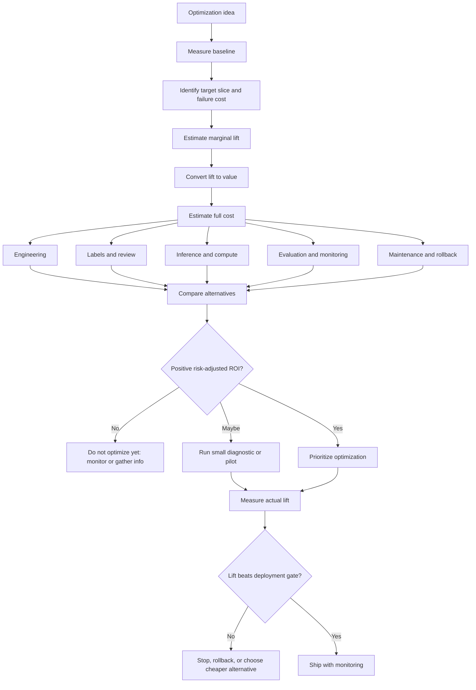

**How to read this diagram:**
ROI analysis is not just a finance spreadsheet. It is a control system for engineering attention. It decides which optimization deserves scarce time, which needs a cheap experiment first, and which should be rejected even if it sounds technically exciting.

---

### 3. Real-World Industry Scenarios [Intermediate]

#### Scenario A: Customer Support Agent Model Upgrade

**Product/use case context:**
A SaaS support assistant drafts replies for 200,000 tickets per month. Current success rate is 74%. A larger model improves eval success to 82%, but inference cost rises from $0.012 to $0.055 per ticket. A retrieval fix improves success to 79% and costs two engineer-weeks. Fine-tuning might reach 83%, but requires labels, evaluation expansion, privacy review, and maintenance.

**ROI reasoning:**
The stronger model adds 8 percentage points, or 16,000 more successful drafts per month. If each successful draft saves 3 minutes of agent time and agent fully loaded cost is $40/hour, gross monthly value is roughly 16,000 x $2 = $32,000. Extra inference cost is 200,000 x $0.043 = $8,600/month. That looks positive.

But the retrieval fix adds 5 points, or 10,000 more successes/month, worth $20,000/month, with no recurring inference increase after the engineering work. If the retrieval failure slice is well understood, it may have higher ROI than the model upgrade.

**Constraints:**
Latency must remain acceptable for live support. Reliability matters because bad drafts increase reopen rate. Cost matters because ticket volume is high. Security matters because customer data enters prompts. The system must also avoid over-automation for billing or account-risk cases.

**What good looks like in production:**
The team computes ROI by ticket slice: password resets, billing, outage follow-up, API integration, enterprise security. It may route easy tickets to the smaller model, use retrieval fixes for stale docs, and reserve the larger model for high-value or high-complexity tickets. The ROI decision is not "upgrade everything"; it is selective routing.

#### Scenario B: Contract Review Fine-Tuning

**Product/use case context:**
A legal-tech assistant flags risky contract clauses. Lawyers spend 12 minutes per contract reviewing AI suggestions. Error analysis shows that most time is lost on false positives for limitation-of-liability clauses. A fine-tune could reduce false positives, but labels require senior legal review.

**ROI reasoning:**
If the company reviews 8,000 contracts/month and the fine-tune saves 3 lawyer minutes per contract, monthly time saved is 24,000 minutes, or 400 hours. At $180/hour loaded legal cost, gross value is $72,000/month. Labeling 2,000 examples at 5 minutes each costs 166 senior-lawyer hours, or about $29,880, plus engineering and evaluation work. The project can break even quickly if quality lift holds.

But risk-adjusted ROI matters. If false negatives increase and risky clauses slip through, one missed clause may erase months of savings. The deployment gate must track both review-time reduction and high-severity false-negative rate.

**Constraints:**
Precision and recall have asymmetric costs. False positives waste lawyer time; false negatives create contractual risk. Auditability and rollback matter. The model may need jurisdiction-specific evaluation because ROI can be positive in one contract family and negative in another.

**What good looks like in production:**
The team runs a shadow evaluation before deployment. It measures reviewer time, false-positive reduction, false-negative rate on high-risk clauses, and lawyer override rate. The fine-tune ships only for clause families where risk-adjusted ROI is positive; other clauses keep human-first review.

#### Scenario C: Healthcare Summarization Optimization

**Product/use case context:**
A clinical-note summarizer reduces documentation time but occasionally produces high-severity negation errors. A prompt fix reduces style edits, while a specialized extraction model reduces negation errors. The style fix improves user satisfaction; the negation fix reduces safety risk.

**ROI reasoning:**
Style improvements have measurable time savings: clinicians spend fewer seconds editing notes. Negation errors are rarer, so raw frequency looks smaller. But their severity is much higher. A risk-adjusted ROI model gives negation fixes priority even if the expected number of affected notes is lower.

**Constraints:**
Patient safety and compliance dominate. Human review may be required for high-risk note sections. Latency matters less than correctness. Model changes require rigorous validation across specialty, note type, and transcription quality.

**What good looks like in production:**
The team separates productivity ROI from safety ROI. Style prompt work can ship faster if it does not affect clinical correctness. Negation optimization requires expert-labeled evals, shadow mode, and high-severity regression gates. The ROI calculation includes avoided safety incidents and reduced clinician correction burden.

---

### 4. System View: Think Like a Systems Engineer [Intermediate]

#### Inputs -> Transformations -> Outputs

**Inputs:**
- Baseline metrics: success rate, failure rate, cost per request, latency, human review rate, escalation rate, user satisfaction, downstream outcome.
- Failure analysis: error clusters, severity, frequency, affected slices, root causes, fixability.
- Candidate optimizations: prompt/DSPy, retrieval, synthetic data, fine-tuning, distillation, model upgrade, routing, validation, human review.
- Cost assumptions: engineering hours, label cost, compute, inference price, review cost, monitoring, maintenance, rollout, rollback.
- Value assumptions: time saved, revenue impact, risk reduction, support cost reduction, conversion lift, retention, compliance exposure.
- Constraints: latency SLOs, privacy, security, compliance, model availability, team capacity, release windows.

**Transformations:**
1. Establish the baseline and the counterfactual.
2. Define the target slice and optimization goal.
3. Estimate marginal lift using evals, pilots, shadow mode, or historical data.
4. Convert lift into business/user value.
5. Estimate total cost of ownership.
6. Adjust for risk: regressions, safety, compliance, drift, rollback, and maintenance.
7. Compare alternatives using the same assumptions.
8. Run a small experiment if uncertainty is high.
9. Prioritize, ship, monitor, or stop.

**Outputs:**
- Optimization decision memo.
- ROI model with assumptions and sensitivity analysis.
- Prioritized optimization backlog.
- Deployment gate metrics by slice.
- Stop/go criteria for pilots.
- Monitoring plan for actual realized ROI.

#### Observability: What We Log, Trace, and Measure

Log and trace:
- Optimization ID, hypothesis, target slice, baseline version, candidate version.
- Prompt/model/retriever/dataset version.
- Per-request cost, tokens, latency, model route, review decision, and downstream outcome.
- Human edit time, reviewer override reason, escalation status, and final disposition.
- Deployment cohort: control, shadow, canary, or treatment.

Measure:
- Success rate and failure rate by slice.
- Marginal lift vs baseline and vs cheaper alternative.
- Cost per successful task.
- p50/p95 latency changes.
- Human-review minutes saved or added.
- Escalation and rollback rate.
- Regression count and severity.
- Actual monthly value realized vs forecast.
- Maintenance effort per month after launch.

#### Failure Points: Where ROI Analysis Breaks

| Failure point | What breaks | How it shows up | First fix |
|---|---|---|---|
| No baseline | Cannot prove improvement | Teams argue from anecdotes | Freeze baseline metrics before changing system |
| Wrong counterfactual | ROI inflated | Expensive option compared to doing nothing, not cheaper fix | Compare against best realistic alternative |
| Aggregate-only ROI | Critical slice regresses | Overall value positive, high-risk users harmed | Compute ROI and gates per slice |
| Ignoring recurring cost | Project looks cheap | Maintenance burns team every month | Include monitoring, labels, drift, retraining, rollback |
| Ignoring risk | Quality lift hides severe failures | Savings erased by one incident | Use risk-adjusted ROI and severity gates |
| Synthetic-only proof | Pilot looks good, prod flat | Lift measured on unrealistic data | Gate on real held-out or production shadow data |
| No sensitivity analysis | Decision depends on fragile assumptions | ROI flips when lift is smaller than expected | Test low/base/high scenarios |

---

### 5. System Design Flavor [Intermediate]

#### Key Components and Interfaces

1. **Metrics warehouse:** Stores cost, latency, quality, review, and business outcome metrics.
2. **Evaluation harness:** Measures candidate quality across target and regression slices.
3. **Experiment platform:** Runs A/B tests, shadow mode, canaries, and route comparisons.
4. **Cost model:** Tracks inference cost, label cost, review cost, engineering cost, and maintenance cost.
5. **Value model:** Converts successful tasks, time saved, avoided escalations, revenue lift, and risk reduction into estimated value.
6. **Risk register:** Tracks safety, compliance, privacy, legal, and operational risks by optimization.
7. **Decision memo template:** Forces assumptions, alternatives, expected lift, break-even point, and stop/go gates.
8. **Post-launch monitor:** Compares realized lift against forecast and triggers rollback or re-prioritization.

#### Important Tradeoffs

| Tradeoff | Plain-English meaning | Choose this when... |
|---|---|---|
| Fast prompt fix vs durable model adaptation | Cheap improvement now or deeper investment later. | Prompt first when lift is obvious and low-risk; adapt model when failure pattern is stable and high-volume. |
| Larger model vs fine-tuning smaller model | Pay recurring inference cost or upfront adaptation cost. | Larger model fits low-volume/high-risk tasks; fine-tune/distill fits stable high-volume tasks. |
| Retrieval work vs weight-based learning | Improve facts/context or teach behavior. | Retrieval wins for volatile external facts; tuning wins for stable mappings and style/classification behavior. |
| Human review vs automation | Pay humans per case or risk automated mistakes. | Human review wins when errors are rare but severe, labels are ambiguous, or actions are irreversible. |
| Optimize narrow slice vs whole system | Fix one costly bottleneck or chase global metric. | Narrow slice wins when a small failure cluster drives most business pain. |
| Build now vs learn first | Commit to project or buy information with a pilot. | Run a pilot when assumptions are uncertain and the full project is expensive. |

#### Scaling Consideration: What Changes at 10x Traffic/Data

At 10x traffic, recurring inference cost can dominate engineering cost. A model upgrade that is cheap at 10,000 requests/month may become expensive at 10 million. Routing and distillation become more attractive because they preserve quality on hard cases while reducing cost on easy cases.

At 10x data, maintenance cost grows. More documents mean more freshness problems, more eval slices, more drift, more permissions, and more regression risk. ROI models must include maintenance and monitoring, not just the initial lift.

---

### 6. Common Mistakes + Debugging [Intermediate]

#### Mistake 1: Optimizing a Metric That Does Not Change the Workflow

**Symptom:** Offline accuracy improves, but users do not save time, trust the system more, or complete more tasks.

**Likely cause:** The metric is disconnected from the real workflow outcome. A 5-point answer-quality lift may not matter if humans still must review every output with the same effort.

**First debugging step:** Map the metric to a workflow variable: review minutes, escalation rate, reopen rate, conversion, task completion, defect rate, or risk reduction. If no workflow metric changes, ROI is weak.

#### Mistake 2: Comparing an Expensive Optimization Only Against Doing Nothing

**Symptom:** Fine-tuning looks positive because it beats the current system, but a retrieval fix or model route would have delivered most of the value faster.

**Likely cause:** The counterfactual is wrong. ROI should compare against the best realistic alternative, not only the status quo.

**First debugging step:** Create a comparison table: prompt/schema fix, retrieval fix, stronger model, fine-tune, distill, route, human review, do nothing. Estimate lift, cost, risk, and time-to-value for each.

#### Mistake 3: Ignoring Tail Risk

**Symptom:** The optimization reduces average cost but introduces rare severe failures.

**Likely cause:** ROI model uses average success rate without severity-weighted risk.

**First debugging step:** Add risk-adjusted ROI and hard gates for critical slices. A project can be rejected even with positive average ROI if it increases legal, clinical, financial, or safety risk.

#### Mistake 4: Treating One-Time Cost as the Full Cost

**Symptom:** A fine-tune or synthetic-data project looks cheap at launch but becomes expensive to maintain.

**Likely cause:** Total cost of ownership omitted drift monitoring, label refresh, eval expansion, retraining, model migrations, and incident response.

**First debugging step:** Add monthly maintenance estimates and expected refresh cadence. Recalculate break-even with recurring cost included.

#### Mistake 5: Continuing Optimization After Marginal Returns Collapse

**Symptom:** Each new iteration takes longer and produces smaller gains, but the team keeps tuning.

**Likely cause:** No stop rule. The team is chasing perfection instead of economic value.

**First debugging step:** Define a stop threshold: minimum expected lift, maximum cost per additional successful task, maximum acceptable maintenance burden, or break-even window.

---

### 7. Hands-On Lab: Build an Optimization ROI Calculator [Pro]

#### Concept

You will compare four optimization options for a support assistant: prompt/DSPy work, retrieval improvement, stronger model routing, and fine-tuning. The goal is to decide what to do first, not to make the spreadsheet look precise.

#### Build: Minimal ROI Model

Use a simple Python script or spreadsheet.

```python
from dataclasses import dataclass

@dataclass
class OptimizationOption:
    name: str
    monthly_tasks: int
    baseline_success_rate: float
    expected_success_rate: float
    value_per_extra_success: float
    one_time_cost: float
    monthly_recurring_cost: float
    risk_penalty_per_month: float
    maintenance_hours_per_month: float
    hourly_cost: float = 100.0

    def extra_successes_per_month(self) -> float:
        return self.monthly_tasks * (self.expected_success_rate - self.baseline_success_rate)

    def gross_value_per_month(self) -> float:
        return self.extra_successes_per_month() * self.value_per_extra_success

    def maintenance_cost_per_month(self) -> float:
        return self.maintenance_hours_per_month * self.hourly_cost

    def net_value_per_month(self) -> float:
        return (
            self.gross_value_per_month()
            - self.monthly_recurring_cost
            - self.risk_penalty_per_month
            - self.maintenance_cost_per_month()
        )

    def break_even_months(self) -> float | None:
        net = self.net_value_per_month()
        if net <= 0:
            return None
        return self.one_time_cost / net


options = [
    OptimizationOption(
        name="prompt_dspy",
        monthly_tasks=200_000,
        baseline_success_rate=0.74,
        expected_success_rate=0.77,
        value_per_extra_success=2.0,
        one_time_cost=8_000,
        monthly_recurring_cost=500,
        risk_penalty_per_month=500,
        maintenance_hours_per_month=4,
    ),
    OptimizationOption(
        name="retrieval_fix",
        monthly_tasks=200_000,
        baseline_success_rate=0.74,
        expected_success_rate=0.79,
        value_per_extra_success=2.0,
        one_time_cost=20_000,
        monthly_recurring_cost=1_000,
        risk_penalty_per_month=500,
        maintenance_hours_per_month=8,
    ),
    OptimizationOption(
        name="stronger_model_for_all",
        monthly_tasks=200_000,
        baseline_success_rate=0.74,
        expected_success_rate=0.82,
        value_per_extra_success=2.0,
        one_time_cost=5_000,
        monthly_recurring_cost=8_600,
        risk_penalty_per_month=1_000,
        maintenance_hours_per_month=4,
    ),
    OptimizationOption(
        name="fine_tune",
        monthly_tasks=200_000,
        baseline_success_rate=0.74,
        expected_success_rate=0.83,
        value_per_extra_success=2.0,
        one_time_cost=70_000,
        monthly_recurring_cost=2_000,
        risk_penalty_per_month=2_000,
        maintenance_hours_per_month=20,
    ),
]

for option in options:
    print({
        "name": option.name,
        "extra_successes": round(option.extra_successes_per_month()),
        "gross_value": round(option.gross_value_per_month()),
        "net_monthly_value": round(option.net_value_per_month()),
        "break_even_months": option.break_even_months(),
    })
```

Interpretation pattern:

- Prompt/DSPy may have the fastest break-even even if lift is smaller.
- Retrieval fix may be the best first durable improvement if failures are data-related.
- Stronger model may be attractive if time-to-value matters and recurring cost is acceptable.
- Fine-tuning may have the highest upside but needs enough stable, labelable failures to justify cost and maintenance.

#### Break: Make the ROI Model Lie

Now intentionally break the model:

1. Remove monthly recurring inference cost.
2. Remove maintenance hours.
3. Compare fine-tuning only against doing nothing, not retrieval or routing.
4. Assume expected success rate improves on all slices equally.
5. Ignore risk penalty for high-severity regressions.

Each broken assumption makes expensive optimization look better than it really is.

#### Measure: Add Sensitivity Analysis

Run low/base/high estimates for lift:

```python
def sensitivity(option, lifts):
    rows = []
    for lift in lifts:
        adjusted = OptimizationOption(
            name=f"{option.name}_lift_{lift:.2f}",
            monthly_tasks=option.monthly_tasks,
            baseline_success_rate=option.baseline_success_rate,
            expected_success_rate=option.baseline_success_rate + lift,
            value_per_extra_success=option.value_per_extra_success,
            one_time_cost=option.one_time_cost,
            monthly_recurring_cost=option.monthly_recurring_cost,
            risk_penalty_per_month=option.risk_penalty_per_month,
            maintenance_hours_per_month=option.maintenance_hours_per_month,
            hourly_cost=option.hourly_cost,
        )
        rows.append((lift, adjusted.net_value_per_month(), adjusted.break_even_months()))
    return rows

print(sensitivity(options[-1], [0.03, 0.06, 0.09]))
```

If fine-tuning is only ROI-positive under the optimistic lift assumption, run a smaller pilot first. That pilot is valuable because it reduces uncertainty before the team commits to the full project.

#### Explain: Why It Broke and What Fix Prevents It

The broken ROI model fails because it ignores recurring cost, risk, and alternatives. GenAI optimization is full of attractive local improvements: higher eval score, cleaner outputs, cheaper model, better style. ROI analysis asks whether those improvements actually change the workflow enough to justify cost.

The guardrail is decision discipline: baseline, counterfactual, target slice, marginal lift, full cost, risk adjustment, sensitivity analysis, and a stop rule.

---

### 8. Active Recall (Spaced Repetition) [Beginner -> Pro]

#### Questions

1. Why is marginal lift more important than absolute model quality for ROI decisions?
2. What costs belong in total cost of ownership for a fine-tuning project?
3. Why should a stronger model be compared against retrieval fixes, routing, and prompt/DSPy work rather than only the current system?
4. What does risk-adjusted ROI add that simple ROI misses?
5. When is a small diagnostic experiment more valuable than starting the full optimization project?

#### Short Answer Key

1. ROI depends on the extra value created beyond the baseline or next-best alternative, not the total quality number by itself.
2. Labels, expert review, engineering, compute, inference, eval expansion, monitoring, retraining, maintenance, privacy/compliance review, rollout, and rollback.
3. The right decision is the best available option, not merely an option that improves over today.
4. It accounts for severe regressions, compliance exposure, safety failures, rollback cost, and operational risk that average metrics hide.
5. When lift, cost, or risk assumptions are uncertain and the full project is expensive. The experiment buys information before commitment.

---

### 9. Practice [Intermediate -> Pro]

#### Mini-Exercise: Choose the Best ROI Path

For each scenario, choose the likely first investment.

| Scenario | Best first investment | Why |
|---|---|---|
| JSON format failures cause parser retries but are low risk | Prompt/schema/DSPy | Cheap, fast, likely enough. |
| Model uses stale policy docs for 18% of failures | Retrieval freshness | Facts are external and changing. |
| High-volume stable classification confusion with clean labels | Fine-tune or lightweight classifier | Stable, labelable, repeated behavior can justify adaptation. |
| Rare legal-commitment failures are severe and ambiguous | Human review/routing | Risk dominates automation value. |
| Larger model improves hard cases but is too expensive for all traffic | Model routing | Use expensive capability only where needed. |
| Synthetic examples help synthetic eval but not real holdout | Stop and re-curate | ROI is not proven on production-like data. |

#### Capstone System Design Question

You own optimization for a GenAI assistant that helps enterprise sales teams answer RFPs. The system handles 100,000 questions per month. Current success rate is 70%. Human reviewers spend 4 minutes correcting failed answers. Fully loaded reviewer cost is $75/hour. You are considering: prompt/DSPy work, retrieval improvement, model upgrade, fine-tuning, and human review routing for high-risk answers.

Design an ROI analysis plan.

**Suggested answer outline:**

Baseline:
- Measure success rate by slice: security, legal, pricing, implementation, customer-specific commitments, product roadmap.
- Measure reviewer minutes per failed answer, model cost per answer, latency, escalation rate, and unsupported-claim rate.
- Establish baseline cost per successful task and monthly review cost.

Failure/value mapping:
- Convert extra success into reviewer time saved: 4 minutes x $75/hour = $5 per avoided failed answer.
- Weight legal/security/customer-commitment failures by risk, not only review time.
- Identify slices where automation is allowed vs slices requiring approval.

Compare options:
- Prompt/DSPy: low cost, likely improves format/style/citation behavior.
- Retrieval improvement: best for stale docs, missing customer terms, source precedence.
- Model upgrade: fast lift for hard reasoning, but recurring inference cost requires routing analysis.
- Fine-tuning: candidate for stable answer style, commitment-strength classification, or repeated RFP categories with clean labels.
- Human review routing: best for high-risk commitments or ambiguous policy.

Experiment design:
- Run each candidate on the same held-out real eval set.
- Use shadow mode for model upgrade and fine-tune candidates.
- Measure marginal lift by slice, recurring cost, review-time reduction, unsupported-claim reduction, and regressions.

Decision rule:
- Ship cheap fixes first if they have positive ROI and low risk.
- Route hard/high-value cases to stronger model if full upgrade is too expensive.
- Start fine-tuning only if error analysis proves a stable, labelable, high-volume cluster and break-even occurs within the acceptable window.
- Keep human approval for irreversible commitments even if automation seems accurate.

---

### 10. Production Reality Check

**If this fails in prod, what's the first thing we inspect?**

Inspect the realized ROI dashboard for the target slice, not the global model-quality score.

The first question is: **did the optimization produce the marginal lift, cost reduction, or risk reduction we forecast on the slice it was meant to improve?** If not, compare forecast vs actual: traffic volume, success-rate lift, human-review savings, inference cost, latency, regression severity, and maintenance effort.

The fastest debugging move is to pull 20 production cases from the target slice and 20 from the main regression slice. Check whether the optimization changed the right behavior, whether routing fired correctly, whether reviewers still spend the same time, and whether any new failure mode appeared. ROI failures are often not model failures; they are measurement, routing, workflow, or assumption failures.

---

### 11. Curiosity Bridge

This completes Topic 18.1. You now have the decision stack: diagnose the ceiling, analyze failures, generate/curate data only where it helps, and justify optimization with ROI instead of enthusiasm.

This unlocks Topic 18.2: **DSPy and program optimization**. The next question is no longer "Should we optimize?" but "Can we describe the AI task declaratively, define a metric, and let an optimizer search for better prompts, examples, and program behavior?"

---

### 12. Exit Check + Carry-Forward Review

**Exit check - you are done when you can:**
Given an optimization proposal, compute baseline, marginal lift, total cost of ownership, risk-adjusted value, break-even point, sensitivity range, and the best counterfactual option; then defend whether to ship, pilot, defer, route, or stop.

**Carry-Forward Review:**

Question: How do the four subtopics in 18.1 form one decision process?

Answer: 18.1.a identifies the ceiling: prompt, data, model, spec, or workflow. 18.1.b turns raw failures into labeled, prioritized clusters. 18.1.c fills targeted data gaps only when the cluster is stable and labelable. 18.1.d decides whether the proposed optimization is economically and operationally worth doing. Together, they prevent blind prompt edits, premature fine-tuning, synthetic-data sprawl, and expensive optimizations with weak business impact.

Question: A fine-tune improves eval accuracy from 82% to 86%, but reviewer time does not change. What should you ask?

Answer: Ask whether the metric is connected to workflow value. Maybe the remaining failures still require full review, maybe confidence is not calibrated enough to reduce review, maybe high-risk slices did not improve, or maybe reviewers distrust the output. ROI depends on realized workflow change, not only an offline score.

---

## Topic 18.1 Checkpoint: When Prompting Stops Being Enough

### Checkpoint Q1: Explain how to decide whether a failure should be fixed with prompting, retrieval, fine-tuning, or human review.

**Reference answer:** Start with controlled diagnosis. If prompt/schema variants reliably improve held-out cases, prompt or DSPy optimization may be enough. If a human cannot answer from the model's context, or oracle context fixes the output, the issue is data/retrieval/tooling. If correct context is present and a stronger model solves the case, the current model may have a capability ceiling; consider model routing, distillation, or fine-tuning depending on volume and stability. If reviewers disagree or the action is high-risk, clarify the rubric or use human review. Then apply ROI: choose the cheapest safe intervention that improves the target workflow without unacceptable regressions.

### Checkpoint Q2: Why is synthetic data dangerous without systematic error analysis?

**Reference answer:** Without error analysis, synthetic generation targets vague ideas rather than real failure clusters. It can create generic examples, amplify label noise, invent unsupported facts, leak eval cases into training, or train on cases that should have been retrieval fixes or human-review workflows. Error analysis supplies the cluster, root cause, labelability, severity, and fix path that synthetic data needs to be useful.

### Checkpoint Q3: What should an optimization decision memo contain?

**Reference answer:** A good memo includes the target slice, baseline metrics, failure taxonomy, proposed intervention, alternatives considered, expected marginal lift, total cost of ownership, risk-adjusted ROI, break-even point, sensitivity analysis, data/eval plan, deployment gate, rollback plan, and post-launch monitoring. It should explicitly explain why cheaper options were accepted or rejected.

### Topic 18.1 Self-Assessment

| Skill | Can you do it without notes? | Confidence (1-5) |
|---|---|---|
| Diagnose prompt ceiling vs data ceiling vs model ceiling | | |
| Build an error taxonomy that maps failures to fix paths | | |
| Decide which examples belong in fine-tuning data vs retrieval/human-review backlogs | | |
| Design a synthetic-data generation and curation pipeline | | |
| Prevent train/dev/holdout contamination | | |
| Calculate marginal lift, TCO, break-even point, and risk-adjusted ROI | | |
| Choose between prompt/DSPy, retrieval, fine-tuning, distillation, routing, and human review | | |

**Score yourself:** 5/5 across all rows = Topic 18.1 mastered. Any row below 3 = revisit that subtopic before starting DSPy optimizers.

---

## Topic 18.2: DSPy and Program Optimization

> **Topic time:** 12h
> Focus: Learning to express LLM behavior as measurable, composable programs that can be optimized. DSPy shifts the workflow from manually tweaking prompt strings to defining input/output contracts, modules, metrics, and training examples that an optimizer can use.

---

## Subtopic 18.2.a: Signatures, Modules, and Declarative AI Programs

### ✅ Add to Knowledge Base

### Reading Path + Level Tags

- **Beginner:** Read sections 0-2 and Active Recall.
- **Intermediate:** Add sections 3-6 and complete the Build part of the Hands-On Lab.
- **Pro:** Complete the full Hands-On Lab, including Break -> Measure -> Explain, then answer the capstone declarative-program question.

---

### 0. Pre-Question Hook [Beginner]

**Pause:** You have a prompt that classifies support tickets. It says: "Read this ticket and output the category, urgency, and explanation." You tweak wording. You add examples. You move instructions around. It improves a little, then breaks on a new slice.

Before reading on: what if, instead of writing a prompt, you declared the task as a program contract?

Input: ticket text and customer tier.
Output: category, urgency, rationale.
Metric: category and urgency must match reviewer labels.

Then an optimizer searches for better instructions and examples.

That is the core DSPy mental shift.

---

### 1. The Intuition (Plain English) [Beginner]

**DSPy** is a framework for building and optimizing language-model programs. Its central idea is: stop treating prompts as hand-crafted strings, and start treating LLM calls as typed, measurable program components.

In ordinary prompt engineering, you write instructions manually:

```text
Classify the ticket below. Return category, urgency, and rationale...
```

In DSPy-style thinking, you define a **signature**:

```text
ticket_text, customer_tier -> category, urgency, rationale
```

That signature says what goes in and what must come out. A **module** then implements the behavior using an LM call pattern such as direct prediction, chain-of-thought reasoning, retrieval-augmented answering, or multi-step composition. A **metric** tells the system what good means. An optimizer can then search prompts, demonstrations, and sometimes program settings to improve metric performance.

The key mental model:

- A prompt is an instruction string.
- A DSPy signature is an interface.
- A DSPy module is a reusable component.
- A DSPy program is a composition of modules.
- A metric is the feedback signal that lets optimization happen.

**Real-world analogy:**
Think about SQL. You do not tell the database exactly which indexes to scan or how to order every low-level operation. You declare what result you want: `SELECT customer_id, total FROM orders WHERE status = 'late'`. The query planner decides how to execute it. DSPy aims for a similar move with LLM systems: declare the input/output behavior and metric, then let optimizers search over prompts/examples/program choices.

**Where the analogy breaks down:** SQL has deterministic semantics and mature cost-based optimizers. LLM programs are probabilistic, metrics are often imperfect, and optimizers can overfit weak eval sets. DSPy helps structure optimization, but it does not remove the need for good data, honest evaluation, and production judgment.

**Key terms:**

- **DSPy** - a framework for declaring and optimizing language-model programs using signatures, modules, examples, and metrics.
- **Signature** - a declarative input/output contract that tells an LM module what fields it receives and what fields it should produce.
- **Input field** - a named value supplied to a DSPy signature, such as `question`, `context`, `ticket_text`, or `document`.
- **Output field** - a named value produced by a DSPy signature, such as `answer`, `category`, `rationale`, or `confidence`.
- **Module** - a reusable DSPy component that runs an LM behavior, such as prediction, chain-of-thought reasoning, retrieval-augmented answering, or composition of submodules.
- **Declarative AI program** - an AI system described by what each component should compute, not by hand-writing every prompt token.
- **Metric** - a scoring function that tells the optimizer whether a program output is good.
- **Example** - a training or development case with inputs and expected outputs used for evaluation or optimization.
- **Demonstration** - an example selected into the prompt to show the LM how to perform the task.
- **Compiler/optimizer** - the DSPy component that searches for better instructions, demonstrations, or program settings to maximize a metric.
- **Compiled program** - the optimized DSPy program artifact produced after an optimizer selects instructions, demonstrations, or settings.
- **Program boundary** - the interface where an LM module receives structured inputs and returns structured outputs.

---

### 2. Visual Diagram (Mermaid) [Beginner]

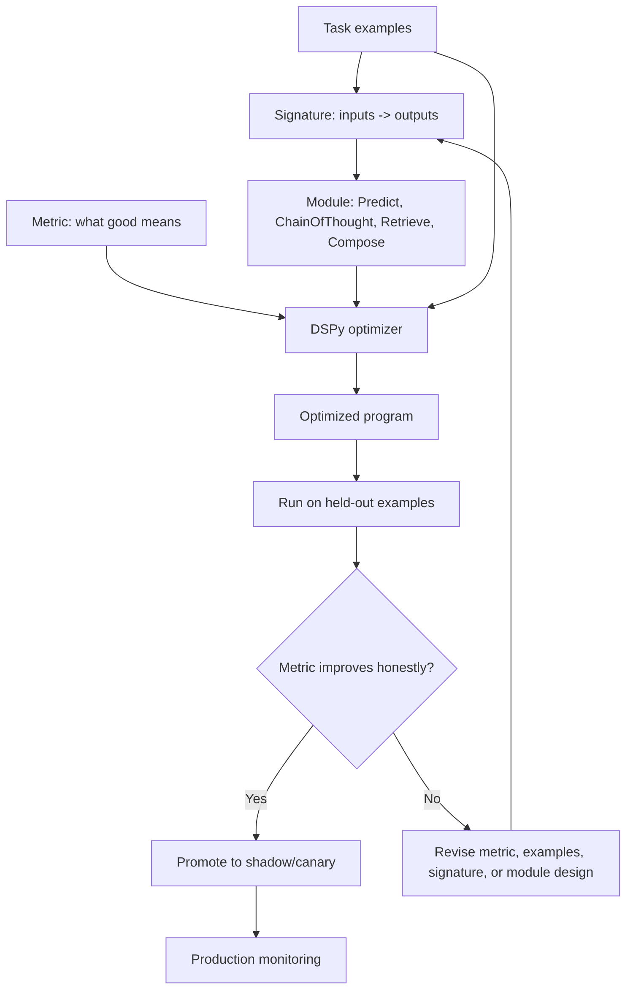

**How to read this diagram:**
DSPy optimization needs four ingredients: examples, a signature, a module/program, and a metric. If one of these is weak, the optimizer may produce something that looks better offline but fails in production. The signature defines the task; the metric defines the target; the module defines the computation shape; the examples define the task distribution.

---

### 3. Real-World Industry Scenarios [Intermediate]

#### Scenario A: Support Ticket Classification

**Product/use case context:**
A SaaS support platform routes tickets to queues: billing, account access, outage, API integration, enterprise security, or product question. The existing prompt is a long hand-written instruction with examples. It performs well on common tickets but fails on ambiguous enterprise cases.

**DSPy-style design:**
Define a signature:

```text
ticket_text, customer_tier, recent_incident_summary -> category, urgency, rationale
```

Use a module such as `Predict` for simple classification or `ChainOfThought` if rationale improves ambiguous cases. Define a metric that checks category exact match, urgency match, and penalty for over-escalating low-risk tickets. Give DSPy a development set of reviewed tickets. The optimizer can search for better demonstrations or instructions.

**Constraints:**
Latency matters because routing should happen quickly. Cost matters at high ticket volume. Reliability matters because wrong routing increases resolution time. Privacy matters because tickets contain customer data. Evaluation must slice by category and customer tier so optimization does not improve common billing tickets while worsening enterprise security tickets.

**What good looks like in production:**
The DSPy program is treated as a versioned component. Each optimized version is evaluated on held-out ticket slices, then deployed in shadow mode before changing routing. Production monitoring tracks route override rate, queue transfer rate, p95 routing latency, and high-priority false negatives.

#### Scenario B: RAG Answer Generation With Citation Fields

**Product/use case context:**
A product-docs assistant answers technical questions using retrieved context. The manual prompt often produces correct answers but weak citations or unsupported claims.

**DSPy-style design:**
Define a signature:

```text
question, retrieved_context -> answer, citations, unsupported_claims
```

The module might first retrieve passages, then generate an answer, then verify citation coverage. The metric rewards answer correctness and citation support, but penalizes unsupported claims heavily.

**Constraints:**
The metric cannot be only semantic similarity to a reference answer because citation quality matters. Latency grows if the program uses multiple modules. Cost grows if verification adds extra model calls. The team must decide whether the quality gain justifies the extra call chain.

**What good looks like in production:**
DSPy optimizes answer behavior against a metric that includes groundedness. The program logs retrieved chunk IDs, cited chunk IDs, unsupported-claim count, and answer correctness. A stronger verifier may run only on high-risk or low-confidence answers.

#### Scenario C: Contract Clause Risk Labeling

**Product/use case context:**
A legal ops assistant labels contract clauses as acceptable, fallback, risky, or requires legal review. The prompt includes a policy playbook and examples, but clause types vary by jurisdiction.

**DSPy-style design:**
Define separate signatures for decomposition:

```text
clause_text, playbook_context -> clause_type
clause_text, clause_type, playbook_context -> risk_label, rationale, evidence_span
```

This creates two module boundaries instead of one giant prompt. Each boundary can be evaluated separately. If clause type classification is weak, optimize that module. If risk labeling is weak with correct clause type, optimize the second module.

**Constraints:**
False negatives are high risk. Legal review remains necessary for critical contracts. Evaluation must be jurisdiction-aware. The output must cite evidence spans. The program may need a human escalation output for ambiguous or high-risk clauses.

**What good looks like in production:**
The team uses DSPy for measurable program structure, not blind automation. The module improves consistency and evidence quality, while high-risk outputs still go to legal review. Metrics are tracked per clause type and jurisdiction.

---

### 4. System View: Think Like a Systems Engineer [Intermediate]

#### Inputs -> Transformations -> Outputs

**Inputs:**
- Task examples with input fields and expected output fields.
- Signature definitions: field names, descriptions, and output contract.
- Module choices: direct prediction, chain-of-thought, retrieval, verification, or composed modules.
- Metric function that scores outputs.
- Optional retrievers, tools, validators, and structured parsers.
- Train/dev/holdout splits.

**Transformations:**
1. Convert a task into a signature with explicit input and output fields.
2. Choose a module type that matches the reasoning shape.
3. Run the baseline program on development examples.
4. Score outputs with a metric.
5. Use an optimizer to search instructions, demonstrations, or program settings.
6. Evaluate the optimized program on held-out examples.
7. Inspect failure slices and traces.
8. Deploy only if quality improves without unacceptable cost, latency, or risk.

**Outputs:**
- A versioned DSPy program.
- Optimized instructions/demonstrations or module settings.
- Per-example predictions and metric scores.
- Failure analysis by slice.
- Deployment candidate with eval report.

#### Observability: What We Log, Trace, and Measure

Log:
- Signature version and field descriptions.
- Module type and program graph.
- Optimizer name, settings, seed, and training examples used.
- Demonstrations selected into the prompt.
- LM model/version, decoding settings, token counts, and latency.
- Inputs, outputs, parsed fields, validation errors, and metric score.
- Dataset split and example provenance.

Measure:
- Metric score by slice.
- Before/after lift vs baseline program.
- Held-out performance, not only development performance.
- Cost and latency per module and full program.
- Parse/schema validity.
- Regression on previously solved slices.
- Demonstration stability: whether optimizer repeatedly chooses similar examples.

#### Failure Points: Where It Breaks and How It Shows Up

| Failure point | What breaks | User/system symptom | First diagnostic step |
|---|---|---|---|
| Vague signature | Output contract unclear | Model returns inconsistent fields | Add precise field descriptions and examples |
| Wrong module shape | Direct prediction used for multi-step task | Optimizer cannot find reliable behavior | Try decomposition or ChainOfThought |
| Weak metric | Optimizer rewards shallow similarity | Output looks good but violates business rules | Add rule checks, citations, or slice penalties |
| Tiny dev set | Optimizer overfits examples | Dev score rises, holdout falls | Increase data and separate holdout |
| Contaminated splits | Examples leak across train/dev/test | Unrealistic eval lift | Deduplicate and lock splits |
| Hidden cost | Multi-module program too slow | Better quality but bad p95 latency | Trace per-module tokens and latency |
| Poor field names | Inputs/outputs are ambiguous | LM misinterprets task | Rename fields and add descriptions |

---

### 5. System Design Flavor [Intermediate]

#### Key Components and Interfaces

1. **Signature layer:** Defines input/output fields and task contract.
2. **Module layer:** Implements LM behavior using `Predict`, `ChainOfThought`, retrieval, verification, or custom composition.
3. **Program layer:** Composes modules into a workflow.
4. **Dataset layer:** Stores examples with train/dev/holdout split and metadata slices.
5. **Metric layer:** Scores outputs according to task-specific correctness.
6. **Optimizer layer:** Searches instructions, demonstrations, and sometimes program choices.
7. **Evaluation layer:** Compares baseline vs optimized program on held-out data.
8. **Deployment layer:** Packages the optimized program with versioning, monitoring, and rollback.

#### Important Tradeoffs

| Tradeoff | Plain-English meaning | Choose this when... |
|---|---|---|
| One big signature vs decomposed signatures | One module is simpler; decomposition isolates failures. | Use one signature for simple tasks; decompose when subtasks have different metrics or failure modes. |
| Predict vs ChainOfThought | Direct answer is faster; reasoning trace may improve hard cases. | Use Predict for simple classification/extraction; use ChainOfThought when intermediate reasoning improves accuracy and is safe to expose/store. |
| Simple metric vs rich metric | Simple metrics are easy; rich metrics align better with production. | Use exact match for clean labels; add groundedness, severity, or schema checks when correctness is multi-dimensional. |
| More demonstrations vs lower latency | Examples improve behavior but consume tokens. | Add demos only if measured lift justifies cost and context usage. |
| Optimizer freedom vs control | More search can find better prompts but overfit or increase cost. | Constrain optimizers when domains are high-risk or eval data is small. |

#### Scaling Consideration: What Changes at 10x Traffic/Data

At 10x traffic, per-call overhead matters. A DSPy program with three LM calls may be too expensive for all requests. You may route easy examples through a cheaper direct module and hard examples through a richer chain-of-thought or verifier path.

At 10x data, the optimizer has more examples but also more risk of hidden slice regressions. You need stratified dev/holdout splits, per-slice metrics, and reproducible optimizer runs. Otherwise optimization may improve average score while hurting low-frequency but important cases.

---

### 6. Common Mistakes + Debugging [Intermediate]

#### Mistake 1: Treating DSPy as a Prompt Magic Wand

**Symptom:** The team wraps a messy prompt in DSPy but sees little improvement.

**Likely cause:** The signature, metric, and examples are weak. DSPy cannot optimize toward an unclear target.

**First debugging step:** Inspect the signature and metric. Can a human understand the input/output contract? Does the metric reward the behavior you actually want?

#### Mistake 2: Optimizing Against a Bad Metric

**Symptom:** DSPy improves the metric, but production users dislike the output.

**Likely cause:** The metric is too shallow, often exact match or semantic similarity without business constraints.

**First debugging step:** Compare high-scoring bad outputs. Add missing checks: groundedness, citation coverage, schema validity, abstention behavior, safety rules, or slice-specific penalties.

#### Mistake 3: Using One Giant Signature for a Multi-Step Task

**Symptom:** The optimized program is brittle, and failures are hard to attribute.

**Likely cause:** Classification, retrieval, reasoning, and formatting are collapsed into one module.

**First debugging step:** Decompose the task into modules with separate signatures and metrics. Evaluate each boundary independently.

#### Mistake 4: Letting Optimizer Data Leak Into Holdout

**Symptom:** Optimized program looks excellent offline, then loses lift in shadow mode.

**Likely cause:** Train/dev/holdout contamination or near-duplicate demonstrations.

**First debugging step:** Audit example provenance, deduplicate semantically, and keep holdout locked before optimizer runs.

#### Mistake 5: Ignoring Cost and Latency

**Symptom:** Quality improves, but p95 latency or token cost becomes unacceptable.

**Likely cause:** The optimized prompt became long, selected too many demonstrations, or added extra modules.

**First debugging step:** Trace token/cost/latency per module. Compare cost per successful task before and after optimization.

---

### 7. Hands-On Lab: Build a DSPy-Style Declarative Classifier [Pro]

#### Concept

This lab uses a lightweight DSPy-style pattern. If DSPy is installed, you can adapt it directly. If not, treat it as executable pseudocode for the design shape: signature, module, examples, metric, and evaluation.

#### Build: Define the Contract Before the Prompt

Start with examples:

```python
examples = [
    {
        "ticket_text": "I was charged twice after upgrading to Pro.",
        "customer_tier": "Pro",
        "category": "billing",
        "urgency": "medium",
    },
    {
        "ticket_text": "Our SSO login is down for all employees.",
        "customer_tier": "Enterprise",
        "category": "account_access",
        "urgency": "high",
    },
    {
        "ticket_text": "How do I rotate API keys without downtime?",
        "customer_tier": "Enterprise",
        "category": "api_integration",
        "urgency": "medium",
    },
]
```

Define a signature in plain DSPy-style form:

```python
class TicketRouteSignature:
    """Classify a support ticket into routing fields."""

    inputs = {
        "ticket_text": "The raw customer support ticket.",
        "customer_tier": "The customer's plan tier: Free, Pro, Enterprise.",
    }

    outputs = {
        "category": "One of: billing, account_access, outage, api_integration, product_question, enterprise_security.",
        "urgency": "One of: low, medium, high.",
        "rationale": "Brief reason for the chosen category and urgency.",
    }
```

Define a module boundary:

```python
class TicketRouterModule:
    def __init__(self, lm_call):
        self.lm_call = lm_call

    def __call__(self, ticket_text, customer_tier):
        prompt = f"""
Task: Classify the support ticket.

Inputs:
- ticket_text: {ticket_text}
- customer_tier: {customer_tier}

Return:
- category: billing | account_access | outage | api_integration | product_question | enterprise_security
- urgency: low | medium | high
- rationale: brief reason
"""
        return self.lm_call(prompt)
```

Define the metric:

```python
def route_metric(expected, predicted):
    category_score = 1 if predicted["category"] == expected["category"] else 0
    urgency_score = 1 if predicted["urgency"] == expected["urgency"] else 0
    return 0.7 * category_score + 0.3 * urgency_score
```

In real DSPy, the optimizer would use examples and the metric to search demonstrations/instructions. The design lesson is the same: the task is now represented as a measurable program component, not just a loose prompt.

#### Break: Make the Program Non-Declarative Again

Break it intentionally:

1. Rename fields to vague names like `input` and `output`.
2. Remove the list of allowed categories.
3. Use a metric that only checks whether the rationale sounds good.
4. Mix examples from train/dev/holdout.
5. Add a hidden business rule: Enterprise outage tickets must be high urgency, but do not encode it in examples or metric.

These breaks make optimization unreliable because the optimizer receives a vague contract and a weak feedback signal.

#### Measure: Evaluate the Declarative Boundary

Use a small eval table:

| Case | Expected category | Expected urgency | Predicted category | Predicted urgency | Metric | Failure label |
|---|---|---|---|---|---:|---|
| Double charge | billing | medium | billing | low | 0.7 | urgency miss |
| SSO down | account_access | high | outage | high | 0.3 | category miss |
| API key rotation | api_integration | medium | api_integration | medium | 1.0 | pass |

Then inspect failures:

- If urgency misses cluster around enterprise customers, add examples or metric penalties for tier-sensitive urgency.
- If categories confuse outage vs account access, clarify labels and add hard negatives.
- If rationale is good but labels are wrong, do not reward rationale enough to hide wrong routing.

#### Explain: Why It Broke and What Fix Prevents It

The broken version fails because the optimizer cannot infer your real product contract from vague names and weak metrics. Declarative does not mean underspecified. It means the task is explicit at the interface level: fields, allowed outputs, examples, metrics, and failure slices.

The fix is to make the program boundary honest. A signature should express exactly what the module receives and produces. A metric should reward what production actually values. Examples should represent the task distribution without contaminating holdout data.

---

### 8. Active Recall (Spaced Repetition) [Beginner -> Pro]

#### Questions

1. What is the difference between a prompt string and a DSPy signature?
2. Why does DSPy need a metric?
3. What is a module in DSPy-style thinking?
4. When should you decompose one large LLM call into multiple signatures/modules?
5. Why can DSPy optimization overfit even if the framework is doing what it was designed to do?

#### Short Answer Key

1. A prompt string gives instructions directly; a signature declares the input/output contract the LM component should satisfy.
2. The metric defines what good means. Without a metric, an optimizer has no target.
3. A module is a reusable LM component that implements behavior such as prediction, reasoning, retrieval, or verification.
4. Decompose when subtasks have different inputs, outputs, metrics, failure modes, or cost/latency needs.
5. If examples are too small, contaminated, unrepresentative, or measured by a weak metric, the optimizer can improve the metric without improving real behavior.

---

### 9. Practice [Intermediate -> Pro]

#### Mini-Exercise: Convert Prompts Into Signatures

Convert each manual prompt into a DSPy-style signature.

| Manual prompt | Signature |
|---|---|
| "Answer this question using the docs and cite sources." | `question, retrieved_context -> answer, citations` |
| "Extract invoice number, vendor, date, and total." | `invoice_text -> invoice_number, vendor_name, invoice_date, total_amount` |
| "Decide if this clause is risky and explain why." | `clause_text, playbook_context -> risk_label, rationale, evidence_span` |
| "Summarize this call for the CRM." | `transcript, account_context -> summary, action_items, risks, follow_up_date` |
| "Route this support ticket." | `ticket_text, customer_tier -> category, urgency, rationale` |

#### Capstone System Design Question

You are building a RAG assistant for internal engineering docs. It answers questions, cites docs, and flags when docs are insufficient. The current prompt is long and brittle. Design a DSPy-style declarative program.

**Suggested answer outline:**

Signatures:
- `question -> search_query` for query rewriting.
- `search_query -> retrieved_context` for retrieval boundary, even if the retriever itself is not an LM.
- `question, retrieved_context -> answer, citations, insufficient_context` for answer generation.
- `question, answer, citations, retrieved_context -> groundedness_label, unsupported_claims` for verification if needed.

Modules:
- Predict or ChainOfThought for query rewriting depending on complexity.
- Retriever module for document search.
- Answer module with citation output fields.
- Optional verifier module for high-risk answers.

Metric:
- Answer correctness.
- Citation coverage.
- Penalty for unsupported claims.
- Reward for correct abstention when context is insufficient.
- Slice metrics by doc area, language, freshness, and question type.

Optimization plan:
- Start with a baseline program and a real dev set.
- Optimize query rewriting and answer generation separately if failures are attributable.
- Keep holdout locked.
- Compare optimized program against manual prompt baseline.
- Measure cost/latency because extra modules may be expensive.

---

### 10. Production Reality Check

**If this fails in prod, what's the first thing we inspect?**

Inspect the signature, metric, and trace for the failing module boundary.

Do not start by blaming the optimizer. First ask: **was the task contract clear, did the metric reward the desired behavior, and did the failing case match the examples the optimizer saw?** If the signature was vague, the optimizer may have optimized ambiguity. If the metric was shallow, it may have rewarded outputs that looked correct but violated product requirements.

The fastest debugging move is to replay the failing case through each module and score each boundary independently. If query rewriting failed, fix that signature/examples. If retrieval succeeded but answer generation hallucinated, fix the answer metric or module. If both succeeded but the final answer still disappointed users, the metric may not represent production value.

---

### 11. Curiosity Bridge

This works well once the program has a clear signature and metric, but it raises the next question: how does DSPy actually improve the program? What does it search over? How do few-shot examples and instructions get selected?

That leads directly to **optimizers for few-shot and instruction search**: the next subtopic, where DSPy starts acting less like a prompt wrapper and more like a measurable optimization system.

---

### 12. Exit Check + Carry-Forward Review

**Exit check - you are done when you can:**
Take a brittle manual prompt and rewrite it as a DSPy-style program with signatures, modules, examples, metrics, held-out evaluation, and clear module boundaries for debugging.

**Carry-Forward Review:**

Question: How does ROI analysis from 18.1.d affect whether you should use DSPy?

Answer: DSPy is an optimization investment. Use it when the task has enough repeated volume, stable examples, and a metric that reflects production value. If the failure is rare, ambiguous, caused by missing retrieval data, or cheaper to fix with a schema validator, DSPy may not have positive ROI yet.

Question: How does systematic error analysis from 18.1.b help design DSPy signatures?

Answer: Error analysis tells you where the system fails and which boundaries need separation. If failures cluster around retrieval, answer generation, citation verification, or classification, those may become separate signatures/modules with separate metrics.

---

## Subtopic 18.2.b: Optimizers for Few-Shot and Instruction Search

### ✅ Add to Knowledge Base

### Reading Path + Level Tags

- **Beginner:** Read sections 0-2 and Active Recall.
- **Intermediate:** Add sections 3-6 and complete the Build part of the Hands-On Lab.
- **Pro:** Complete the full Hands-On Lab, including Break -> Measure -> Explain, then answer the capstone optimizer-selection question.

---

### 0. Pre-Question Hook [Beginner]

**Pause:** You have a DSPy signature and module for ticket routing. It works, but not well enough. You have 200 labeled examples. You could manually choose examples for the prompt, rewrite the instruction ten times, add chain-of-thought, or ask a stronger model to generate demonstrations.

Before reading on: how would you search this space systematically? Which examples should go in the prompt? Which instruction wording should be tried? How do you avoid overfitting the examples you optimize on?

That is what DSPy optimizers are for.

---

### 1. The Intuition (Plain English) [Beginner]

Once a task is expressed as a DSPy signature/module/metric, the next question is: **how do we improve it automatically?** DSPy optimizers, historically often called **teleprompters**, search for better program configurations. Depending on the optimizer, that can mean selecting demonstrations, bootstrapping new examples, generating better instructions, or jointly searching instructions and examples.

The core idea is not mysterious:

1. You provide training examples and a metric.
2. The optimizer tries candidate instructions and/or demonstrations.
3. It runs the program on examples.
4. It scores outputs with your metric.
5. It keeps configurations that score better.
6. You evaluate the compiled program on held-out data.

This is prompt engineering turned into search.

The important distinction:

- **Few-shot search** asks: which examples should be shown to the model?
- **Instruction search** asks: what wording or task framing should guide the model?
- **Joint optimization** asks: which instruction and examples work best together?

**Real-world analogy:**
Think of coaching a junior analyst. You can improve performance by giving better task instructions, better examples of past work, or both. A weak instruction with perfect examples may still confuse them. A perfect instruction with bad examples may still teach bad habits. DSPy optimizers search for the mix that produces the best measured performance.

**Where the analogy breaks down:** A human analyst can ask clarifying questions and build durable understanding. LLMs are sensitive to context, example ordering, wording, and distribution. An optimized prompt can perform well on one development set and fail elsewhere if the metric or examples are weak.

**Key terms:**

- **Optimizer** - a DSPy component that searches for improved instructions, demonstrations, or program configurations using examples and a metric.
- **Teleprompter** - older/common DSPy term for an optimizer that compiles a program by creating better prompts or demonstrations.
- **Few-shot optimization** - selecting or generating demonstrations to include in the model prompt.
- **Instruction search** - generating and evaluating alternative task instructions to improve metric performance.
- **Demonstration selection** - choosing which labeled examples should appear in the prompt as examples.
- **Bootstrapping** - using a teacher program/model to generate candidate demonstrations or rationales, then filtering them by a metric.
- **BootstrapFewShot** - a DSPy optimizer pattern that builds few-shot demonstrations from successful program runs.
- **BootstrapFewShotWithRandomSearch** - a DSPy optimizer pattern that samples different demonstration sets and keeps the best-performing compiled program.
- **MIPRO** - a DSPy optimizer family that searches over instructions and demonstrations, using metric feedback to improve prompt/program configuration.
- **Search budget** - the number of candidate programs, examples, instructions, or trials an optimizer is allowed to test.
- **Development set** - examples used during optimizer search and iteration.
- **Holdout set** - examples kept untouched until final evaluation so optimization gains can be measured honestly.
- **Overfitting** - improving performance on optimizer examples while failing to generalize to new examples.

---

### 2. Visual Diagram (Mermaid) [Beginner]

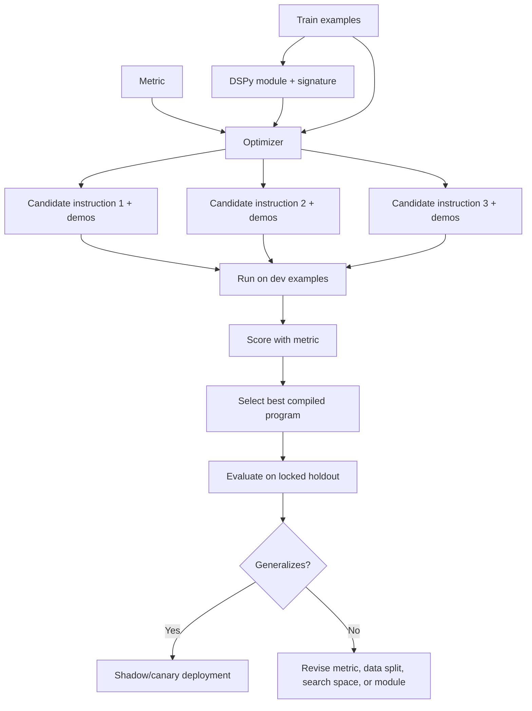

**How to read this diagram:**
The optimizer is only as good as the signal it receives. If the development examples are unrepresentative, or the metric rewards the wrong thing, the optimizer will faithfully search toward the wrong target. The holdout set is what keeps the search honest.

---

### 3. Real-World Industry Scenarios [Intermediate]

#### Scenario A: RAG Answering With Better Demonstrations

**Product/use case context:**
An internal policy assistant answers employee questions from retrieved policy context. The program has a signature: `question, context -> answer, citation, abstain`. The baseline works for common questions but fails when the right answer is "not enough context."

**How optimizer search helps:**
The team uses a few-shot optimizer to select demonstrations where the correct behavior is abstention, citation grounding, and concise answers. The optimizer tries different demonstration sets and keeps the one that improves grounded answer accuracy and abstention precision on a dev set.

**Constraints:**
Latency matters because every demonstration consumes tokens. A 12-shot prompt may improve quality but be too slow or expensive. Reliability matters because unsupported policy answers can create HR or compliance issues. Privacy matters because demonstrations may contain internal policy text, so example provenance and permissions must be controlled.

**What good looks like in production:**
The compiled program improves abstention and citation support on a held-out real eval, not only on the dev set. The team caps demonstration count based on token budget and monitors unsupported-claim rate after deployment.

#### Scenario B: Support Ticket Routing Instruction Search

**Product/use case context:**
A support-ticket classifier confuses security tickets with account-access tickets. Both categories mention login, SSO, MFA, and admin users. The signature is clear, but the instruction does not express the boundary well.

**How optimizer search helps:**
Instruction search proposes alternative category definitions and decision rules. Some instructions emphasize "security incident means suspected unauthorized access or data exposure," while account access means "legitimate user cannot log in." The optimizer scores each instruction on labeled examples and selects the best one.

**Constraints:**
High-risk security tickets need high recall. False positives create extra review cost but are tolerable compared with missed security incidents. Search must be evaluated by slice: if the instruction improves security recall but destroys billing routing, it may not be acceptable.

**What good looks like in production:**
The final compiled classifier is evaluated on a locked holdout and monitored using queue-transfer rates. The team records which instruction version was compiled and why. Security recall has a hard deployment gate.

#### Scenario C: Contract Clause Risk Labeling With Joint Search

**Product/use case context:**
A contract-review assistant labels clauses as acceptable, fallback, risky, or legal-review. The right behavior depends on clause type, jurisdiction, and playbook language. Hand-picked examples fail to cover enough subtle cases.

**How optimizer search helps:**
A MIPRO-style optimizer searches both instructions and demonstrations. It tests different ways of framing the risk labels and different few-shot examples, then chooses a compiled program that improves high-risk false-negative rate.

**Constraints:**
Legal risk is asymmetric. False negatives are much more dangerous than false positives. The metric must weight high-risk misses heavily. The optimizer must not train against the final legal holdout. Jurisdiction slices need separate monitoring.

**What good looks like in production:**
The compiled program improves risk-label accuracy on dev and holdout, with explicit false-negative gates for high-risk clauses. If a program improves average accuracy but worsens high-risk recall, it is rejected.

---

### 4. System View: Think Like a Systems Engineer [Intermediate]

#### Inputs -> Transformations -> Outputs

**Inputs:**
- DSPy program: signatures, modules, predictors, and optional retrievers/tools.
- Training examples: inputs and expected outputs.
- Development set: examples used to evaluate candidate configurations during search.
- Metric: task-specific scoring function.
- Search space: possible instructions, demonstrations, reasoning modes, or module settings.
- Search budget: max trials, candidates, bootstrapped demos, model calls, and cost.
- Holdout set: locked examples for final honest evaluation.

**Transformations:**
1. Generate or select candidate instructions and demonstrations.
2. Compile the program into a candidate configuration.
3. Run candidate programs on development examples.
4. Score outputs using the metric.
5. Rank candidates.
6. Select the best compiled program.
7. Evaluate on holdout and production-like slices.
8. Decide whether quality lift justifies cost/latency.

**Outputs:**
- Compiled DSPy program.
- Selected demonstrations and instruction text.
- Optimizer trace: candidates, scores, rejected variants, search settings.
- Dev and holdout score report.
- Cost/latency report.
- Deployment decision: ship, pilot, revise metric/data, or stop.

#### Observability: What We Log, Trace, and Measure

Log:
- Optimizer name and version.
- Search budget and random seed.
- Train/dev/holdout split IDs.
- Candidate instructions and demonstration IDs.
- Candidate scores by metric and slice.
- LM model used for student and teacher roles.
- Number of model calls, token usage, and cost during compilation.
- Final compiled artifact and deployment version.

Measure:
- Baseline vs compiled dev score.
- Baseline vs compiled holdout score.
- Slice-level lift and regressions.
- Demonstration count and prompt token cost.
- Compilation cost and runtime.
- Variance across optimizer runs with different seeds.
- Overfitting gap: dev score minus holdout score.
- Production shadow lift, if deployed.

#### Failure Points: Where Optimizer Search Breaks

| Failure point | What breaks | Symptom | First debugging step |
|---|---|---|---|
| Weak metric | Optimizer learns the wrong target | Better score, worse user outcomes | Inspect high-scoring bad outputs |
| Tiny dev set | Search overfits examples | High dev lift, no holdout lift | Add examples and slice coverage |
| Contaminated holdout | Eval not honest | Suspiciously high final score | Audit provenance and near-duplicates |
| Search budget too small | Good candidates not explored | No lift despite clear headroom | Increase trials or narrow search space |
| Search budget too large | Overfits dev set and burns cost | Expensive compile, brittle gains | Add validation, early stopping, held-out checks |
| Bad demos selected | Prompt teaches wrong pattern | Repeated systematic errors | Inspect selected demonstrations manually |
| Teacher too weak | Bootstrapped demos are noisy | Student learns flawed rationales | Use stronger teacher or stricter filtering |
| Token bloat | Optimized prompt too long | Latency/cost regression | Cap demo count and measure cost per success |

---

### 5. System Design Flavor [Intermediate]

#### Key Components and Interfaces

1. **Program registry:** Stores baseline DSPy modules and signatures.
2. **Dataset registry:** Tracks train/dev/holdout examples, provenance, labels, and slices.
3. **Metric function:** Encodes task success and penalties.
4. **Optimizer runner:** Executes BootstrapFewShot, random-search, MIPRO-style, or custom search.
5. **Candidate store:** Saves candidate instructions, demonstrations, scores, and traces.
6. **Cost tracker:** Measures compilation and inference cost.
7. **Holdout evaluator:** Runs final locked evaluation.
8. **Deployment gate:** Checks metric lift, regression limits, latency, cost, and risk gates.
9. **Monitoring dashboard:** Compares compiled program performance after deployment.

#### Important Tradeoffs

| Tradeoff | Plain-English meaning | Choose this when... |
|---|---|---|
| Few-shot search vs instruction search | Choose better examples or better wording. | Use few-shot when examples teach boundaries; use instruction search when task framing or label definitions are unclear. |
| Bootstrapped demos vs human-labeled demos | Generate more examples cheaply or use trusted labels. | Bootstrap low-risk patterns; use human labels for high-risk or subtle correctness. |
| Larger search budget vs compile cost | More trials can find better configs but cost more. | Increase budget when ROI justifies it and holdout prevents overfit. |
| More demonstrations vs shorter prompts | More examples help behavior but increase tokens. | Add demos only until marginal lift no longer beats latency/cost. |
| Optimizing average score vs critical slice | Improve overall metric or protect high-risk cases. | Weight or gate critical slices when failure severity is asymmetric. |
| Single optimizer run vs repeated seeds | One run is cheaper; multiple runs reveal variance. | Repeat seeds when deployment is important or search is unstable. |

#### Scaling Consideration: What Changes at 10x Traffic/Data

At 10x traffic, the cost of selected demonstrations matters more than compilation cost. A compiled prompt with six long examples may be fine for 5,000 calls/month and painful for 5 million. Track **cost per successful task**, not just accuracy.

At 10x data, optimizer search can become more powerful but also easier to overfit. Use stratified dev sets, locked holdouts, and per-slice reporting. Consider optimizing separate modules or routes for different slices instead of one global prompt.

---

### 6. Common Mistakes + Debugging [Intermediate]

#### Mistake 1: Letting the Optimizer Optimize a Bad Metric

**Symptom:** The compiled program has a higher metric score but worse human judgment.

**Likely cause:** The metric rewards superficial similarity, verbosity, or easy labels rather than true task success.

**First debugging step:** Pull high-scoring failures and ask what the metric missed. Add citation checks, severity weights, abstention checks, or field-level scoring.

#### Mistake 2: Treating Dev Score as Final Proof

**Symptom:** The compiled program looks excellent during optimization but disappoints in production.

**Likely cause:** The optimizer overfit the dev set or selected demonstrations that exploit dev-set quirks.

**First debugging step:** Evaluate on locked holdout and compare the dev-holdout gap. If the gap is large, reduce search freedom, improve data splits, or expand dev diversity.

#### Mistake 3: Ignoring Selected Demonstrations

**Symptom:** The optimized prompt behaves strangely or repeats a bad pattern.

**Likely cause:** The optimizer selected examples that score well but teach an undesirable boundary or style.

**First debugging step:** Inspect selected demos like production code. Check labels, provenance, slice coverage, length, and whether any demo contains misleading artifacts.

#### Mistake 4: Spending Huge Search Budget Before Fixing the Program Shape

**Symptom:** Many optimizer trials produce tiny gains.

**Likely cause:** The signature or module boundary is wrong. Search cannot compensate for a vague output contract or missing retrieval.

**First debugging step:** Return to 18.2.a: inspect signature clarity, module decomposition, and metric quality before increasing search budget.

#### Mistake 5: Shipping a Token-Bloated Compiled Program

**Symptom:** Quality improves offline, but production latency and cost exceed SLOs.

**Likely cause:** The optimizer selected too many or too-long demonstrations.

**First debugging step:** Add prompt-token budget to the deployment gate. Compare marginal quality lift per additional demonstration.

---

### 7. Hands-On Lab: Simulate Few-Shot and Instruction Search [Pro]

#### Concept

You will simulate a DSPy optimizer loop without needing to run DSPy itself. The goal is to understand what optimizers search over: instructions, demonstrations, metrics, and held-out validation.

#### Build: A Tiny Search Space

Create candidate instructions for a support ticket classifier:

```python
instructions = [
    "Classify the ticket into the best support category.",
    "Classify by the user's core problem, not by incidental keywords.",
    "Security means suspected unauthorized access, data exposure, or abuse. Account access means a legitimate user cannot log in.",
]

demo_sets = [
    ["billing_double_charge", "api_key_rotation"],
    ["security_unknown_admin_login", "account_access_password_reset"],
    ["outage_all_users_down", "product_question_export_csv"],
]

dev_scores = {
    (0, 0): 0.72,
    (0, 1): 0.75,
    (0, 2): 0.70,
    (1, 0): 0.76,
    (1, 1): 0.81,
    (1, 2): 0.73,
    (2, 0): 0.78,
    (2, 1): 0.86,
    (2, 2): 0.77,
}

best = None
for instruction_id, instruction in enumerate(instructions):
    for demo_id, demos in enumerate(demo_sets):
        score = dev_scores[(instruction_id, demo_id)]
        candidate = {
            "instruction_id": instruction_id,
            "instruction": instruction,
            "demo_id": demo_id,
            "demos": demos,
            "dev_score": score,
        }
        if best is None or score > best["dev_score"]:
            best = candidate

print(best)
```

Now evaluate the best candidate on holdout:

```python
holdout_scores = {
    (2, 1): 0.79,  # best dev candidate drops on holdout
    (1, 1): 0.80,
    (2, 0): 0.81,
}

for key, score in holdout_scores.items():
    print(key, score)
```

Lesson: the best dev candidate is not automatically the best deployable candidate. Search needs holdout validation.

#### Break: Force Overfitting

Break the simulation:

1. Add 50 random candidate instructions.
2. Keep the same tiny dev set.
3. Select the best dev score.
4. Do not use holdout.

The more candidates you try against a tiny dev set, the more likely you are to find one that wins by chance. This is optimizer overfitting.

#### Measure: Track Search Health

Use this table:

| Signal | Healthy pattern | Risky pattern |
|---|---|---|
| Dev-holdout gap | Small gap | Large dev lift, no holdout lift |
| Selected demo diversity | Covers key slices | Demos all from one easy slice |
| Metric robustness | Catches bad outputs | Rewards keyword overlap only |
| Search variance | Similar winners across seeds | Different winners every run |
| Token budget | Lift justifies prompt length | Long demos, tiny lift |
| Critical-slice score | Improves or stable | Average improves, critical slice regresses |

#### Explain: Why It Broke and What Fix Prevents It

The broken search overfits because it tests many candidates against too little evidence. Some instruction/demo combination will look best by luck. If you deploy it without holdout validation, you are shipping dev-set luck.

The fix is standard optimization hygiene: split data, lock holdout, inspect selected demonstrations, track search budget, repeat seeds when needed, and use metrics that match production outcomes.

---

### 8. Active Recall (Spaced Repetition) [Beginner -> Pro]

#### Questions

1. What does a DSPy optimizer search over?
2. What is the difference between few-shot optimization and instruction search?
3. Why is a holdout set mandatory after optimizer search?
4. What is bootstrapping in DSPy-style optimization?
5. Why can a larger search budget make results worse?

#### Short Answer Key

1. It can search demonstrations, instructions, prompts, reasoning patterns, or program settings depending on the optimizer.
2. Few-shot optimization chooses examples to show the model; instruction search chooses or generates task wording and decision rules.
3. The optimizer sees dev feedback. Holdout data tests whether gains generalize beyond the search set.
4. Bootstrapping uses a teacher program/model to generate candidate demos or rationales, then filters successful ones using a metric.
5. More search increases the chance of overfitting the dev set, especially when examples are few or the metric is weak.

---

### 9. Practice [Intermediate -> Pro]

#### Mini-Exercise: Choose an Optimizer Strategy

For each case, choose the likely optimizer strategy.

| Case | Strategy | Why |
|---|---|---|
| Clear labels, weak boundary examples | Few-shot demo search | Better examples can teach category boundaries. |
| Category definitions are phrased poorly | Instruction search | The wording/decision rule is the bottleneck. |
| Need both better rule wording and better examples | MIPRO-style joint search | Instruction and demonstrations interact. |
| Very small dev set with high-risk outputs | Minimal search + expert review | Avoid overfitting and unsafe compiled prompts. |
| Stable task, many examples, cheap metric | Larger search budget | More trials may be worth it if holdout is protected. |
| Synthetic teacher rationales are noisy | Stronger teacher or stricter filter | Bad bootstrapped demos teach bad behavior. |

#### Capstone System Design Question

You have a DSPy RAG program for a security-policy assistant. It answers `question, context -> answer, citations, abstain`. Baseline held-out score is 76%. You want to use DSPy optimizers.

Design an optimization plan.

**Suggested answer outline:**

Data:
- Create train/dev/holdout splits with provenance and no near-duplicate leakage.
- Slice examples by policy area, answer type, citation difficulty, and abstention cases.
- Keep final holdout locked before optimizer runs.

Metric:
- Answer correctness.
- Citation validity.
- Unsupported-claim penalty.
- Correct abstention reward.
- Critical-slice gates for legal/security commitments.

Optimizer strategy:
- Start with few-shot demo search because examples can teach citation and abstention behavior.
- Try instruction search if failure analysis shows wording/rule ambiguity.
- Use MIPRO-style joint search only after metric and dev set are strong enough.
- Cap demos to meet latency/cost constraints.

Validation:
- Compare baseline vs compiled program on dev and holdout.
- Track dev-holdout gap.
- Inspect selected demonstrations manually.
- Run shadow mode on real production traffic before routing user-visible answers.

Deployment gate:
- Holdout score improves by agreed threshold.
- Unsupported claims decrease.
- Abstention precision/recall acceptable.
- No regression on high-risk policy slices.
- Cost per successful task remains within budget.

---

### 10. Production Reality Check

**If this fails in prod, what's the first thing we inspect?**

Inspect the compiled program artifact: selected instruction, selected demonstrations, metric score, dev/holdout gap, and the failing production trace.

The first question is: **did the optimizer learn a real task behavior or a dev-set shortcut?** If the selected demos all come from one slice, if holdout lift was weak, if the metric ignored the production failure mode, or if prompt length caused truncation, the optimizer may have produced a locally good but operationally bad program.

The fastest debugging move is to compare the failing production cases against the selected demonstrations and dev examples. If production cases are out of distribution, add coverage. If they match dev examples but still fail, inspect the metric and module boundary. If the compiled prompt is too long, measure truncation and token pressure.

---

### 11. Curiosity Bridge

Optimizer search can improve a DSPy program, but only if you evaluate the result honestly. The next danger is subtle: a compiled program can beat your dev score while being worse in production because the eval split, metric, or deployment gate was weak.

That leads directly to **evaluating optimized programs honestly**: how to validate compiled DSPy programs without fooling yourself.

---

### 12. Exit Check + Carry-Forward Review

**Exit check - you are done when you can:**
Explain how DSPy optimizers search instructions and demonstrations, choose an optimizer strategy for a task, set a search budget, protect a holdout set, inspect selected demos, and reject a compiled program that overfits dev examples or violates cost/risk gates.

**Carry-Forward Review:**

Question: Why did 18.2.a require signatures and metrics before optimizers?

Answer: Optimizers need a stable program surface and feedback signal. A signature defines what the program must produce; a module defines where the LM call happens; a metric tells the optimizer what behavior to prefer. Without those, search collapses back into random prompt tweaking.

Question: How does 18.1.c synthetic data connect to DSPy few-shot optimization?

Answer: Synthetic examples can expand coverage for optimizer search, but only if curated. Bad synthetic demos can be selected into prompts and teach the model wrong behavior. Provenance, deduplication, label validation, and real holdout evaluation still matter.

---

## Subtopic 18.2.c: Evaluating Optimized Programs Honestly

### ✅ Add to Knowledge Base

### Reading Path + Level Tags

- **Beginner:** Read sections 0-2 and Active Recall.
- **Intermediate:** Add sections 3-6 and complete the Build part of the Hands-On Lab.
- **Pro:** Complete the full Hands-On Lab, including Break -> Measure -> Explain, then answer the capstone honest-evaluation question.

---

### 0. Pre-Question Hook [Beginner]

**Pause:** Your DSPy optimizer reports that the compiled program improved from 76% to 88% on the dev set. Everyone celebrates. Then shadow mode on production traffic shows no improvement, and one high-risk slice regresses.

Before reading on: why did the dev score lie? What evaluation would have caught this before deployment?

This subtopic is about not fooling yourself after optimization.

---

### 1. The Intuition (Plain English) [Beginner]

**Honest evaluation** means measuring an optimized program in a way that estimates real future performance, not just how well it performed on examples used during search.

The key issue is that an optimizer is not a neutral observer. It tries many candidate instructions, demonstrations, traces, and program configurations, then selects the candidate that scores best on the development signal. That winning candidate is partly selected because it fits the development set. So the dev score becomes optimistic.

The core rule:

> The more you search against a dataset, the less that dataset can be trusted as final evidence.

That is why optimized DSPy programs need stronger evaluation discipline than ordinary prompt changes.

The mental model:

1. **Train set**: examples used to build candidate demos/traces.
2. **Development set**: examples used to choose among candidates.
3. **Locked holdout** or **test set**: examples never touched during search.
4. **Slice analysis**: checks whether gains are broad or only concentrated in easy cases.
5. **Ablations**: test which part of the optimization actually helped.
6. **Shadow mode**: verifies behavior on production traffic without affecting users.
7. **Canary deployment**: exposes a small amount of real traffic after offline and shadow gates pass.
8. **Monitoring**: checks whether realized lift persists after deployment.

**Real-world analogy:**
Imagine a student practicing from one exam prep booklet. If they score 95% after drilling that booklet, you do not know whether they mastered the subject or memorized the booklet. A fresh exam with new questions is the honest test. DSPy dev sets are like the practice booklet; locked holdouts and shadow traffic are the fresh exam.

**Where the analogy breaks down:** LLM programs can also change latency, cost, safety behavior, citation quality, tool behavior, and workflow outcomes. So honest evaluation is not one fresh accuracy test. It is a bundle of offline, slice-level, ablation, and production checks.

**Key terms:**

- **Honest evaluation** - evaluation designed to estimate future production performance without being biased by optimization search.
- **Optimizer bias** - the optimism introduced when a program is selected because it performed best on a development set.
- **Locked holdout** - an evaluation set frozen before optimization and never used for prompt search, demo selection, instruction tuning, or candidate selection.
- **Test set** - final evaluation data used only after model/program selection decisions are complete.
- **Slice analysis** - evaluating performance by meaningful subsets such as task type, risk tier, language, customer segment, document type, or failure mode.
- **Regression gate** - a release rule that blocks deployment if any critical metric or slice gets worse beyond an allowed threshold.
- **Ablation** - removing or changing one component to measure whether it actually contributed to improvement.
- **Shadow mode** - running a new program on production traffic without showing its outputs to users or changing workflow decisions.
- **Canary deployment** - releasing a new program to a small portion of real traffic before broad rollout.
- **Metric gaming** - when a program learns to score well on the metric without improving the real task.
- **Confidence interval** - a range that expresses uncertainty around a measured metric due to sample size and variance.
- **Statistical power** - the ability of an evaluation to detect a real improvement or regression.

---

### 2. Visual Diagram (Mermaid) [Beginner]

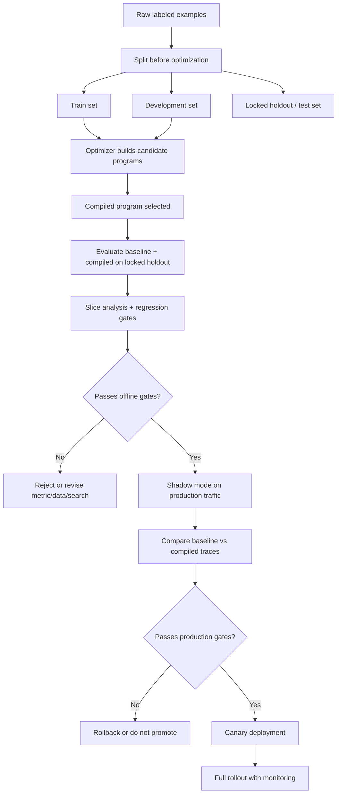

**How to read this diagram:**
Development data is part of the optimization loop. It helps choose the compiled program. Honest evaluation begins after that, with locked holdout and production shadow checks.

---

### 3. Real-World Industry Scenarios [Intermediate]

#### Scenario A: Security Policy RAG Assistant

**Product/use case context:**
A security-policy assistant answers employee and customer-facing questions using retrieved internal policy snippets. A DSPy optimizer improves dev-set citation accuracy from 80% to 91%.

**What honest evaluation reveals:**
The locked holdout improves only to 84%. Slice analysis shows easy policy areas improved, but data residency and customer-specific commitment questions regressed. The optimizer selected demonstrations that strongly encourage concise answers, but those examples underrepresent high-risk caveats.

**Constraints:**
Unsupported claims are high risk. Citation quality matters more than fluency. Latency matters because the assistant is interactive, and selected demonstrations add tokens. Privacy matters because demonstrations may include internal policy text.

**What good looks like in production:**
The compiled program is not deployed based on dev score. The team uses regression gates: unsupported-claim rate must decrease, high-risk commitment escalation must not regress, and p95 latency must remain inside the product budget. It runs shadow mode and samples high-risk disagreements for human review.

#### Scenario B: Support Ticket Routing

**Product/use case context:**
A support-ticket routing program is optimized with few-shot search. Dev accuracy rises from 78% to 86%. Leadership wants to ship immediately.

**What honest evaluation reveals:**
Holdout accuracy is 81%. The optimizer improved billing and API questions but worsened enterprise security recall. A canary would have sent security tickets to the wrong queue.

**Constraints:**
The average metric is misleading because categories have different business costs. Missing security tickets is worse than over-escalating product questions. Latency is strict; too many demonstrations can slow routing.

**What good looks like in production:**
The evaluation report includes confusion matrices, category-level recall, escalation recall, and p95 latency. The program ships only if security recall passes a hard gate. Otherwise the team revises metric weighting and demonstration coverage.

#### Scenario C: Contract Clause Risk Labeling

**Product/use case context:**
A legal assistant labels contract clauses. A MIPRO-style optimizer finds instructions and demonstrations that raise average dev score.

**What honest evaluation reveals:**
Ablation shows most lift came from selected hard-negative demonstrations, not the new instruction. Another ablation shows ChainOfThought improves risky/fallback distinction but adds too much latency for bulk review. The team routes only high-risk clause families through the expensive reasoning path.

**Constraints:**
False negatives create legal exposure. Jurisdiction slices matter. Human review remains part of the workflow. The final metric must weight high-risk misses and evidence-span correctness.

**What good looks like in production:**
The compiled program is deployed only to assisted review, with high-risk clauses still requiring lawyer confirmation. Monitoring tracks false-negative rate, reviewer override, and jurisdiction-specific regressions.

---

### 4. System View: Think Like a Systems Engineer [Intermediate]

#### Inputs -> Transformations -> Outputs

**Inputs:**
- Baseline program and compiled program.
- Train/dev/locked holdout/test splits.
- Example provenance and deduplication metadata.
- Metrics: task score, safety score, cost, latency, schema validity, user/workflow outcomes.
- Slice metadata: task type, risk tier, user segment, language, source, document type, model route.
- Production shadow/canary traces.

**Transformations:**
1. Freeze split membership before optimization.
2. Run optimizer only on allowed train/dev data.
3. Rerun baseline and compiled program under the same environment.
4. Evaluate both programs on locked holdout.
5. Compute aggregate metrics and slice metrics.
6. Compare dev score vs holdout score.
7. Run ablations: remove demos, revert instruction, switch predictor type, disable verifier.
8. Estimate uncertainty with confidence intervals or bootstrap resampling.
9. Run shadow mode on production traffic.
10. Canary only if offline and shadow gates pass.
11. Monitor realized lift and regressions after deployment.

**Outputs:**
- Honest evaluation report.
- Dev vs holdout comparison.
- Slice regression table.
- Ablation report.
- Cost/latency delta.
- Shadow-mode comparison.
- Ship/rollback/defer decision.

#### Observability: What We Log, Trace, and Measure

Log:
- Program version: baseline, candidate, compiled, canary, production.
- Dataset split ID and example provenance.
- Optimizer run ID, search budget, selected demos, instruction text, random seed.
- Metric score per example and per slice.
- Cost, tokens, latency, retries, parsing failures.
- Shadow output and production baseline output for the same request.
- Human review decision or downstream workflow outcome.

Measure:
- Dev score, holdout score, and dev-holdout gap.
- Per-slice lift and regression.
- Critical-slice recall/precision.
- Confidence intervals for key metrics.
- Cost per successful task.
- p95 latency and token budget.
- Selected-demo ablation impact.
- Instruction ablation impact.
- Shadow-mode disagreement rate.
- Canary rollback triggers.

#### Failure Points: Where Honest Evaluation Breaks

| Failure point | What breaks | Symptom | First debugging step |
|---|---|---|---|
| Holdout touched during search | Final eval becomes biased | Impressive holdout score, weak production lift | Audit optimizer access and dataset lineage |
| Near-duplicate leakage | Program has effectively seen test cases | Rare slices look too good | Run semantic deduplication across splits |
| Weak aggregate metric | Critical regressions hidden | Average improves, high-risk slice worsens | Add slice gates and severity weights |
| Small holdout | Noisy conclusions | Big swings between runs | Add confidence intervals and more examples |
| No baseline rerun | Environment drift confuses comparison | Candidate looks better due to model/provider change | Rerun baseline and candidate under same conditions |
| No ablation | Unknown source of lift | Team cannot simplify or debug | Remove demos/instruction/modules one at a time |
| Offline-only eval | Workflow value not proven | Users do not benefit after deployment | Run shadow/canary and measure real outcomes |
| Metric gaming | Program exploits scorer | High score, bad human judgment | Inspect high-scoring failures and revise metric |

---

### 5. System Design Flavor [Intermediate]

#### Key Components and Interfaces

1. **Dataset splitter:** Freezes train/dev/holdout/test membership and prevents leakage.
2. **Lineage tracker:** Records which examples were used for optimization, demos, synthetic generation, or final evaluation.
3. **Baseline runner:** Re-runs the pre-optimization program under the same model/provider conditions.
4. **Candidate evaluator:** Scores compiled programs on locked holdout and slices.
5. **Ablation runner:** Tests which demos, instructions, modules, or predictors cause lift.
6. **Statistical reporter:** Computes confidence intervals and practical significance checks for key metrics.
7. **Shadow evaluator:** Runs compiled program on production traffic without affecting users.
8. **Canary controller:** Gradually exposes real traffic and monitors rollback gates.
9. **Monitoring dashboard:** Tracks realized lift, regressions, cost, latency, and drift.

#### Important Tradeoffs

| Tradeoff | Plain-English meaning | Choose this when... |
|---|---|---|
| Larger holdout vs more optimizer data | More held-out examples gives better proof; fewer training examples may reduce optimizer signal. | Reserve enough holdout for decision confidence, especially high-risk slices. |
| Aggregate score vs slice gates | One score is simple; slices catch hidden regressions. | Use aggregate for summary, but gate on critical slices. |
| Offline eval vs shadow mode | Offline is controlled; shadow reveals real traffic behavior. | Use both before high-impact rollout. |
| Ablation depth vs evaluation cost | More ablations explain lift; they cost model calls and time. | Run ablations for expensive or high-risk optimizations. |
| Strict regression gates vs shipping speed | Strict gates slow release; loose gates risk harm. | Tighten gates for legal, healthcare, finance, security, and irreversible actions. |
| Statistical rigor vs practical iteration | Full significance testing takes data; quick checks are faster. | Use confidence intervals for launch decisions; use quick checks for early exploration. |

#### Scaling Consideration: What Changes at 10x Traffic/Data

At 10x traffic, small metric changes can be economically meaningful. A 1% lift on millions of tasks may justify optimization, but a 0.2% regression in a high-risk slice can also create serious incidents. Evaluation must include both volume-weighted ROI and severity-weighted gates.

At 10x data, leakage becomes harder to detect. You need exact and semantic deduplication, source-level split locks, and provenance tracking. If variants of the same ticket, document, or customer question appear across splits, evaluation becomes optimistic.

---

### 6. Common Mistakes + Debugging [Intermediate]

#### Mistake 1: Reporting Only the Optimizer's Best Dev Score

**Symptom:** The team reports large gains, but shadow mode shows little improvement.

**Likely cause:** Dev score was used for candidate selection, so it is biased upward.

**First debugging step:** Report baseline and compiled scores on locked holdout, plus dev-holdout gap. If no locked holdout exists, create one before making claims.

#### Mistake 2: Ignoring Slice Regressions

**Symptom:** Overall score improves, but support, legal, or safety teams report worse outcomes.

**Likely cause:** Gains came from easy/high-volume slices while critical slices regressed.

**First debugging step:** Break down metrics by task type, risk tier, customer segment, language, document type, and failure category. Add deployment gates for critical slices.

#### Mistake 3: Not Rerunning the Baseline

**Symptom:** Candidate appears better, but the baseline was evaluated weeks ago under different model/provider conditions.

**Likely cause:** Model version, retriever version, corpus, data, or API behavior changed.

**First debugging step:** Rerun baseline and candidate in the same eval job with the same inputs and environment.

#### Mistake 4: Skipping Ablations

**Symptom:** The compiled program is better, but nobody knows whether demos, instructions, ChainOfThought, or verifier changes caused lift.

**Likely cause:** Evaluation compared only full baseline vs full compiled program.

**First debugging step:** Remove one component at a time: demos only, instruction only, verifier off, ChainOfThought -> Predict, fewer demos. Keep the simplest program that preserves lift.

#### Mistake 5: Trusting Offline Eval Without Production Shadowing

**Symptom:** Offline holdout passes, but real users still dislike the program.

**Likely cause:** The offline set misses live distribution, product workflow, latency, or user trust effects.

**First debugging step:** Run shadow mode and compare baseline vs compiled outputs on real traffic. Sample disagreements for human review.

---

### 7. Hands-On Lab: Build an Honest Evaluation Harness [Pro]

#### Concept

You will simulate evaluation of a compiled DSPy program. The goal is to see why dev score is not enough and how holdout, slices, ablations, and confidence intervals change the decision.

#### Build: Compare Baseline and Compiled Results

```python
from dataclasses import dataclass
from math import sqrt


@dataclass
class EvalResult:
    case_id: str
    split: str  # dev or holdout
    slice: str
    baseline_correct: int
    compiled_correct: int
    risk_tier: str


results = [
    EvalResult("d1", "dev", "billing", 1, 1, "low"),
    EvalResult("d2", "dev", "security", 0, 1, "high"),
    EvalResult("d3", "dev", "api", 0, 1, "medium"),
    EvalResult("h1", "holdout", "billing", 1, 1, "low"),
    EvalResult("h2", "holdout", "security", 1, 0, "high"),
    EvalResult("h3", "holdout", "api", 0, 1, "medium"),
    EvalResult("h4", "holdout", "security", 1, 1, "high"),
]


def accuracy(rows, field):
    return sum(getattr(row, field) for row in rows) / len(rows)


def by_split(split):
    return [row for row in results if row.split == split]


for split in ["dev", "holdout"]:
    rows = by_split(split)
    print(split, {
        "baseline": accuracy(rows, "baseline_correct"),
        "compiled": accuracy(rows, "compiled_correct"),
        "lift": accuracy(rows, "compiled_correct") - accuracy(rows, "baseline_correct"),
    })
```

Now compute slice performance:

```python
def slice_report(rows):
    slices = sorted(set(row.slice for row in rows))
    for slice_name in slices:
        slice_rows = [row for row in rows if row.slice == slice_name]
        print(slice_name, {
            "baseline": accuracy(slice_rows, "baseline_correct"),
            "compiled": accuracy(slice_rows, "compiled_correct"),
            "n": len(slice_rows),
        })


slice_report(by_split("holdout"))
```

#### Break: Create a Misleading Evaluation

Break it intentionally:

1. Report only dev score.
2. Merge dev and holdout together.
3. Hide the security slice.
4. Do not rerun the baseline.
5. Ignore sample size.

Each break makes the compiled program look safer than it is. In the toy data, dev improves strongly, but holdout contains a high-risk security regression.

#### Measure: Add Confidence and Gates

Use a simple approximate confidence interval for accuracy:

```python
def accuracy_ci(rows, field):
    p = accuracy(rows, field)
    n = len(rows)
    se = sqrt(p * (1 - p) / n) if n else 0
    return (p, p - 1.96 * se, p + 1.96 * se)


holdout = by_split("holdout")
print("compiled holdout CI", accuracy_ci(holdout, "compiled_correct"))
```

Then define deployment gates:

```python
def passes_gates(rows):
    holdout_rows = [row for row in rows if row.split == "holdout"]
    high_risk = [row for row in holdout_rows if row.risk_tier == "high"]

    overall_lift = accuracy(holdout_rows, "compiled_correct") - accuracy(holdout_rows, "baseline_correct")
    high_risk_lift = accuracy(high_risk, "compiled_correct") - accuracy(high_risk, "baseline_correct")

    return {
        "overall_lift": overall_lift,
        "high_risk_lift": high_risk_lift,
        "ship": overall_lift >= 0.02 and high_risk_lift >= 0,
    }


print(passes_gates(results))
```

#### Explain: Why It Broke and What Fix Prevents It

The misleading evaluation broke because it let the optimizer's preferred data become the proof. It also hid the slice where the compiled program regressed. Honest evaluation separates search data from final proof, reports uncertainty, reruns baselines, and gates critical slices.

The fix is an evaluation ladder: dev for optimization, locked holdout for offline proof, ablations for explanation, shadow mode for real traffic, canary for limited user impact, and monitoring for long-term drift.

---

### 8. Active Recall (Spaced Repetition) [Beginner -> Pro]

#### Questions

1. Why is the optimizer's dev score biased after compilation?
2. What is the difference between a development set and a locked holdout?
3. Why can aggregate accuracy improve while deployment should still be blocked?
4. What does an ablation tell you about an optimized program?
5. Why is shadow mode useful even after a strong offline holdout result?

#### Short Answer Key

1. The optimizer selected the program because it performed well on dev examples, so that score is partly a result of search and is optimistic.
2. Dev data helps choose candidates; locked holdout is untouched by search and estimates generalization.
3. A high-risk slice may regress even while easy/high-volume slices improve. Critical slice gates can block deployment.
4. It tells which component contributed to lift: demos, instruction, reasoning style, verifier, retriever, or other module changes.
5. Shadow mode tests real production distribution, latency, workflow behavior, and baseline-vs-candidate disagreements without affecting users.

---

### 9. Practice [Intermediate -> Pro]

#### Mini-Exercise: Ship, Shadow, or Reject?

| Result | Decision | Why |
|---|---|---|
| Dev +12, holdout +2, no critical regressions | Shadow | Lift may be real but smaller than dev. Verify on production traffic. |
| Dev +9, holdout -1 | Reject/revise | Optimization likely overfit dev or metric. |
| Holdout +5 overall, high-risk slice -4 | Reject | Critical slice regression blocks deployment. |
| Holdout +4, p95 latency +80% | Reconsider/route | Quality lift may not justify latency cost for all traffic. |
| Holdout +3, shadow disagreement review positive | Canary | Offline and production-shadow evidence align. |
| Synthetic holdout +10, real holdout 0 | Re-curate | Synthetic data is not proving real production lift. |

#### Capstone System Design Question

You optimized a DSPy assistant for enterprise RFP answers. It answers questions from evidence, cites sources, and escalates risky commitments. Dev score improved from 74% to 88%. Design the honest evaluation plan before deployment.

**Suggested answer outline:**

Offline proof:
- Rerun baseline and compiled program in the same evaluation job.
- Use a locked holdout not touched by optimizer search or demonstration selection.
- Deduplicate exact and near-duplicate RFP questions across splits.
- Report aggregate and per-slice metrics: security, legal, pricing, implementation, data residency, customer-specific commitments.

Metrics:
- Answer correctness.
- Citation support.
- Unsupported-claim rate.
- Correct abstention.
- Escalation recall for legal/security/customer commitments.
- Cost per successful task and p95 latency.

Ablations:
- Remove selected demonstrations.
- Revert generated instruction.
- Disable verifier module.
- Compare Predict vs ChainOfThought for high-risk questions.
- Keep the simplest variant that preserves lift and passes gates.

Production validation:
- Run shadow mode on live RFP traffic.
- Compare baseline vs compiled outputs with human review on disagreements.
- Canary only for low-risk question types first.
- Keep high-risk commitments in human approval until shadow evidence is strong.

Deployment gates:
- Holdout lift above threshold.
- No regression in high-risk escalation recall.
- Unsupported claims decrease.
- Citation support improves or stays stable.
- p95 latency and cost within budget.
- Rollback trigger defined before canary.

---

### 10. Production Reality Check

**If this fails in prod, what's the first thing we inspect?**

Inspect the gap between offline proof and production reality: holdout results, slice metrics, shadow/canary traces, and the specific production slice that regressed.

The first question is: **did the failing production cases belong to a slice that was represented and gated in the locked holdout?** If no, the evaluation set had a coverage gap. If yes, compare baseline and compiled traces: did the compiled instruction, demos, or module path change the behavior incorrectly? If offline said pass but production says fail, look for distribution shift, metric weakness, latency/context truncation, or workflow mismatch.

The fastest debugging move is to sample 20 production failures and map each back to evaluation coverage: seen slice, missing slice, near-duplicate, new policy, retrieval drift, prompt truncation, or metric blind spot.

---

### 11. Curiosity Bridge

This works well for validating compiled DSPy programs, but it raises a broader architecture question: where should DSPy sit relative to LangChain, LangGraph, LlamaIndex, ADK, OpenAI Agents SDK, or plain custom code?

That leads directly to **where DSPy fits relative to framework-centric stacks**: understanding DSPy as an optimization layer rather than a full application orchestration framework.

---

### 12. Exit Check + Carry-Forward Review

**Exit check - you are done when you can:**
Design an honest evaluation plan for a compiled DSPy program that includes locked holdout, slice gates, baseline rerun, ablations, confidence/uncertainty, shadow mode, canary criteria, rollback triggers, and post-launch monitoring.

**Carry-Forward Review:**

Question: Why does 18.2.b make evaluation harder than ordinary prompt testing?

Answer: Optimizer search tries many candidate instructions/demonstrations and selects the one that performs best on dev data. That selection process biases the dev score upward. After optimization, the dev set is no longer final proof; it is part of the training/search loop.

Question: How does 18.1.d ROI thinking influence honest evaluation?

Answer: Honest evaluation must measure the metrics that determine ROI: workflow lift, cost per successful task, latency, human-review savings, and risk reduction. A compiled program with better offline accuracy but worse cost, latency, or high-risk behavior may have negative ROI.

---

## Subtopic 18.2.d: Where DSPy Fits Relative to Framework-Centric Stacks

### ✅ Add to Knowledge Base

### Reading Path + Level Tags

- **Beginner:** Read sections 0-2 and Active Recall.
- **Intermediate:** Add sections 3-6 and complete the Build part of the Hands-On Lab.
- **Pro:** Complete the full Hands-On Lab, including Break -> Measure -> Explain, then answer the capstone stack-placement question.

---

### 0. Pre-Question Hook [Beginner]

**Pause:** You are building a production agent. LangGraph can orchestrate stateful workflows. LangChain can wire tools and chains. LlamaIndex can build data-centric RAG pipelines. ADK and OpenAI Agents SDK can manage agent runtime patterns. DSPy can optimize prompts and program behavior.

Before reading on: which one owns the application? Which one owns retrieval? Which one owns state? Which one owns prompt/example optimization? What breaks if you treat DSPy as a full app framework instead of an optimization layer?

That boundary is the whole lesson.

---

### 1. The Intuition (Plain English) [Beginner]

**DSPy** is best understood as an **optimization layer** for language-model program behavior. It helps you express LM calls as signatures/modules, define metrics, and optimize instructions, demonstrations, and sometimes program choices.

It is not primarily an **application orchestration framework**. It does not replace all the surrounding production concerns: API routing, user sessions, durable workflows, permissions, vector indexing, event streaming, human approvals, long-running task state, tool governance, deployment, monitoring, and UI/product integration.

The clean mental model:

| Layer | Main question | Typical tools |
|---|---|---|
| Product/application layer | How does the user workflow run? | FastAPI, backend services, UI, auth, queues |
| Orchestration layer | What steps happen, in what state, with what tools? | LangGraph, ADK, OpenAI Agents SDK, custom workflows |
| Data/RAG layer | How do we ingest, index, retrieve, and ground knowledge? | LlamaIndex, vector DBs, search infra, custom retrieval |
| Optimization layer | How do we improve LM call behavior against metrics? | DSPy |
| Model adaptation layer | Should behavior move into weights or adapters? | Fine-tuning, LoRA, distillation |

DSPy is strongest when there is a recurring LM subtask with examples and a metric: classify, extract, answer with citations, abstain, rewrite query, verify support, choose route, score risk, or generate structured fields.

It is weaker when the main challenge is application state, tool permissions, long-running workflow durability, UI/UX, event streaming, data ingestion, or human approval design. In those cases, DSPy can still optimize one LM component, but another framework or custom backend usually owns the system.

**Real-world analogy:**
Think of a race car. LangGraph or a backend service is the chassis and control system: steering, brakes, dashboard, fuel, safety, and race strategy. LlamaIndex is the pit crew and data pipeline that gets the right parts and telemetry. DSPy is the tuning system for a specific engine behavior: fuel mixture, timing, and throttle response. Powerful, but not the whole car.

**Where the analogy breaks down:** Software boundaries are flexible. DSPy can express multi-step programs, and orchestration frameworks can include prompt templates and evaluators. The point is not rigid ownership; the point is choosing the right layer to solve the actual bottleneck.

**Key terms:**

- **Framework-centric stack** - an application architecture organized around a framework that provides orchestration, tools, state, retrieval, or agent runtime patterns.
- **Optimization layer** - the part of the system responsible for improving LM behavior using examples, metrics, and search.
- **Application orchestration** - coordinating user requests, state, tools, permissions, retries, long-running tasks, and outputs across a production workflow.
- **Orchestration framework** - a framework that manages multi-step execution, state transitions, tool calls, and agent workflows.
- **Data-centric RAG framework** - a framework focused on ingestion, indexing, retrieval, chunking, metadata, and data-grounded query pipelines.
- **Agent runtime** - infrastructure for running agent loops, tool calls, sessions, messages, memory, streaming, and guardrails.
- **Hybrid stack** - an architecture where DSPy optimizes selected LM modules inside a broader application, RAG, or agent framework.
- **Optimization boundary** - the interface around the LM behavior DSPy is allowed to optimize.
- **Runtime boundary** - the interface around production execution concerns such as state, permissions, tools, and deployment.
- **Framework impedance mismatch** - friction caused when two frameworks both try to own the same control flow, state, or prompt lifecycle.

---

### 2. Visual Diagram (Mermaid) [Beginner]

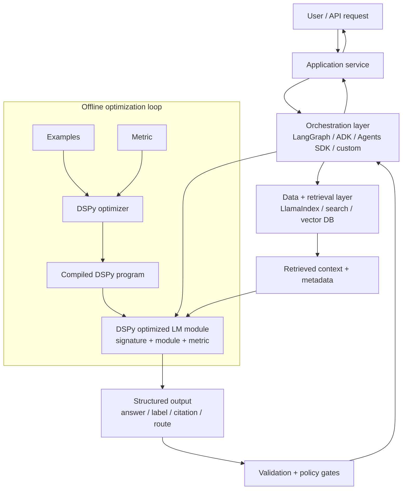

**How to read this diagram:**
DSPy can live inside a larger system. The application and orchestration layers own runtime flow. The data layer owns context quality. DSPy owns the optimized LM subtask. The offline loop compiles a better DSPy module, which is then deployed as one component in production.

---

### 3. Real-World Industry Scenarios [Intermediate]

#### Scenario A: LangGraph Customer Support Agent With DSPy Routing

**Product/use case context:**
A support platform uses LangGraph to manage a stateful workflow: classify ticket, retrieve customer/account context, ask clarifying questions, draft response, route high-risk tickets to humans, and update CRM.

**Where DSPy fits:**
LangGraph owns state transitions, retries, human approval nodes, and tool calls. DSPy optimizes specific LM nodes: ticket classification, escalation decision, response drafting with citations, or answer verification. Each DSPy node exposes a stable input/output contract to the graph.

**Constraints:**
Latency matters because agents use the draft interactively. Reliability matters because state transitions must be deterministic enough to audit. Security matters because customer data and internal tools have permissions. DSPy should not bypass graph-level approval rules or tool permissions.

**What good looks like in production:**
The graph remains readable and debuggable. DSPy compiled modules are versioned as graph node implementations. The team can roll back a compiled classifier without rewriting graph state. Evaluation reports distinguish graph failures from DSPy module failures.

#### Scenario B: LlamaIndex RAG Pipeline With DSPy Answer Module

**Product/use case context:**
An enterprise knowledge assistant uses LlamaIndex-style ingestion, chunking, metadata extraction, indexes, reranking, and query engines. The main issue is not retrieval recall anymore; it is that the final answer sometimes fails to cite evidence or abstain.

**Where DSPy fits:**
The data-centric RAG layer owns document ingestion, parsing, chunking, metadata, indexes, retrievers, and rerankers. DSPy owns the answer-generation signature: `question, retrieved_context, source_metadata -> answer, citations, abstain`. DSPy optimizers improve demonstrations and instructions for grounded answers.

**Constraints:**
Context quality depends on the retrieval layer. DSPy cannot rescue missing or stale evidence. Token budget matters because demos compete with retrieved context. Citation correctness must be validated against source IDs and spans.

**What good looks like in production:**
Retrieval metrics and DSPy answer metrics are separate. If the wrong chunk is retrieved, the RAG layer owns the fix. If the right chunk is present but the answer overclaims, DSPy optimization may help. The boundary prevents prompt tuning from masking data problems.

#### Scenario C: OpenAI Agents SDK or ADK Workflow With DSPy Risk Classifier

**Product/use case context:**
A regulated enterprise workflow uses an agent runtime to handle tool calls, messages, session state, guardrails, and approvals. The team needs a better risk classifier to decide whether an agent action is safe, needs approval, or must be blocked.

**Where DSPy fits:**
The agent runtime owns session execution, tool invocation, message passing, streaming, and guardrail enforcement. DSPy optimizes a risk-classification module that receives proposed action, user intent, tool arguments, policy context, and outputs risk tier plus escalation decision.

**Constraints:**
The risk module must be fast and auditable. False negatives are high severity. The runtime must never let DSPy directly execute tools. DSPy returns structured risk decisions; the runtime enforces the decision through deterministic policy gates.

**What good looks like in production:**
DSPy improves classification quality while the agent runtime remains the source of truth for execution. Risk-classifier outputs are logged and reviewed. High-risk actions stay behind approval checkpoints regardless of model confidence.

---

### 4. System View: Think Like a Systems Engineer [Intermediate]

#### Inputs -> Transformations -> Outputs

**Inputs:**
- Product workflow requirements: user actions, state, tools, approvals, latency, risk.
- Framework responsibilities: orchestration, retrieval, agent runtime, UI/backend, monitoring.
- Candidate DSPy modules: classification, extraction, answer generation, verification, routing, scoring.
- Metrics and examples for each optimizable LM subtask.
- Runtime contracts: structured inputs/outputs, schemas, permissions, trace IDs, error handling.

**Transformations:**
1. Identify which failures are optimization problems vs orchestration/data/runtime problems.
2. Choose the system owner for each responsibility.
3. Define DSPy optimization boundaries around repeated LM subtasks.
4. Keep retrieval, state, permissions, and tool execution outside DSPy unless deliberately wrapped.
5. Compile and evaluate DSPy modules offline.
6. Deploy compiled modules into graph/agent/RAG nodes with versioned interfaces.
7. Monitor module-level and system-level metrics separately.

**Outputs:**
- Stack decision: DSPy alone, framework alone, or hybrid stack.
- Module boundary diagram.
- Interface contracts between DSPy and orchestration/data/runtime layers.
- Evaluation ownership map.
- Deployment and rollback plan for compiled modules.

#### Observability: What We Log, Trace, and Measure

Log:
- Framework node/step ID and DSPy module version.
- Input/output schema version.
- Retrieved context IDs, tool call IDs, session IDs, and trace IDs.
- Compiled program version, selected demos, instruction version.
- Validation results and policy-gate decisions.
- Whether failure occurred in retrieval, orchestration, DSPy prediction, validation, or tool execution.

Measure:
- DSPy module score by task slice.
- End-to-end workflow success.
- Retrieval recall/citation support separately from answer quality.
- Tool-call success/failure separately from LM decision quality.
- Latency and cost per layer.
- Rollback frequency by module version.
- Human override rate for DSPy outputs used in orchestration.

#### Failure Points: Where Stack Boundaries Break

| Failure point | What breaks | Symptom | First debugging step |
|---|---|---|---|
| DSPy owns too much runtime | Optimization code becomes application framework | State, retries, tools, and approvals become tangled | Move orchestration back to workflow layer |
| Framework owns prompt optimization ad hoc | Prompts drift inside graph nodes | No repeatable optimization/eval loop | Extract repeated LM task into DSPy module |
| Retrieval failure blamed on DSPy | Right context missing | Compiled answer still wrong | Run oracle-context test and retrieval eval |
| Tool permission bypass | LM module directly controls sensitive action | Unsafe automation risk | Put deterministic tool gates in runtime layer |
| Double orchestration | DSPy module and agent framework both route state | Confusing traces and loops | Define one owner for control flow |
| Interface mismatch | Compiled module output shape changes | Downstream parser/tool breaks | Version schemas and validate outputs |
| End-to-end metric only | Cannot locate failure layer | All failures look like bad answer | Log per-layer metrics and traces |

---

### 5. System Design Flavor [Intermediate]

#### Key Components and Interfaces

1. **Application service:** Owns user/API request, auth, tenancy, response lifecycle, and product contract.
2. **Orchestration framework:** Owns workflow state, graph transitions, retries, tool routing, and human approvals.
3. **Data/RAG framework:** Owns ingestion, indexing, retrieval, reranking, metadata, and source freshness.
4. **DSPy module:** Owns optimizable LM behavior for a bounded task.
5. **Validation layer:** Owns schema validation, citation checks, policy gates, and deterministic constraints.
6. **Evaluation harness:** Owns module-level and end-to-end metrics.
7. **Deployment registry:** Versions graph, retriever, compiled DSPy module, model config, and prompts/examples.

#### Important Tradeoffs

| Tradeoff | Plain-English meaning | Choose this when... |
|---|---|---|
| DSPy-only vs framework stack | Simpler optimization script or full production workflow. | Use DSPy-only for offline experiments/simple services; use a framework stack for stateful tools, sessions, and approvals. |
| DSPy inside LangGraph vs custom node | Optimization support vs integration complexity. | Wrap DSPy where node behavior is repeated and measurable. Keep custom code for deterministic logic. |
| LlamaIndex retrieval + DSPy answering | Strong data pipeline plus optimized answer module. | Retrieval is complex and answer behavior needs measurable tuning. |
| Agent SDK runtime + DSPy classifier | Managed agent runtime plus optimized decision modules. | Tool/session runtime is hard, but risk/routing/classification needs optimization. |
| End-to-end optimization vs module optimization | Optimize whole workflow or one LM subtask. | Start with module optimization when failures are attributable; use end-to-end eval for deployment gates. |
| Framework convenience vs ownership clarity | More framework features can hide boundaries. | Choose convenience only when traceability and rollback remain clear. |

#### Scaling Consideration: What Changes at 10x Traffic/Data

At 10x traffic, each framework layer becomes a cost and latency contributor. DSPy demonstrations add tokens; graph orchestration adds steps; retrieval adds search/rerank cost; validation adds checks. The system should route simple cases through cheaper paths and reserve optimized/heavier DSPy modules for hard cases.

At 10x data, RAG/data ownership becomes more important. If retrieval quality drifts, DSPy answer optimization may appear to regress even though the compiled module is unchanged. Version retrievers, indexes, prompts, compiled programs, and evaluation sets together.

---

### 6. Common Mistakes + Debugging [Intermediate]

#### Mistake 1: Treating DSPy as a Full Agent Framework

**Symptom:** The DSPy code starts managing user sessions, tool permissions, retries, memory, state transitions, and long-running workflows.

**Likely cause:** The team used DSPy beyond its strongest boundary.

**First debugging step:** Separate optimizable LM subtasks from runtime orchestration. Move stateful workflow control into LangGraph, ADK, OpenAI Agents SDK, or a custom backend.

#### Mistake 2: Treating LangChain/LangGraph Prompts as Untouchable Strings

**Symptom:** Graph nodes contain hand-tuned prompts that drift over time, and nobody can systematically improve them.

**Likely cause:** The orchestration framework owns execution, but no optimization layer owns repeated LM behavior.

**First debugging step:** Extract the repeated prompt into a DSPy signature/module with examples and metrics, then call the compiled module from the graph node.

#### Mistake 3: Using DSPy to Hide Retrieval Problems

**Symptom:** The team keeps optimizing answer generation, but groundedness remains poor.

**Likely cause:** The right evidence is missing, stale, or poorly ranked. DSPy cannot optimize facts that never reach the module.

**First debugging step:** Run retrieval recall and oracle-context tests. Fix ingestion/chunking/ranking before more DSPy optimization.

#### Mistake 4: Double-Owning Control Flow

**Symptom:** A LangGraph route and a DSPy module both decide what step comes next. Traces become confusing and behavior is hard to debug.

**Likely cause:** Runtime boundary and optimization boundary overlap.

**First debugging step:** Assign one owner. Let DSPy return a structured recommendation; let the orchestration layer decide transitions and enforce policies.

#### Mistake 5: Evaluating Only the DSPy Module or Only the Whole App

**Symptom:** Module eval looks great but app fails, or app failure gives no clue which layer broke.

**Likely cause:** Evaluation exists at the wrong granularity.

**First debugging step:** Maintain both module-level evals and end-to-end workflow evals. Use traces to connect them.

---

### 7. Hands-On Lab: Decide the Stack Boundary [Pro]

#### Concept

You will classify components of a GenAI system by ownership: orchestration framework, data/RAG framework, DSPy optimization layer, deterministic validation, or model adaptation.

#### Build: A Stack Placement Table

Use this example system: an enterprise RFP assistant that answers questions, cites evidence, escalates risky commitments, and updates a CRM.

| Component | Best owner | Why |
|---|---|---|
| User auth and tenant permissions | Application backend | Security and tenancy must be deterministic. |
| Multi-step workflow state | LangGraph / ADK / custom orchestration | State transitions, retries, and approvals need runtime control. |
| Document ingestion and indexing | LlamaIndex / retrieval pipeline | Chunking, metadata, indexes, and freshness are data concerns. |
| Query rewriting | DSPy module or retriever layer | Optimizable if examples/metric exist. |
| Answer with citations | DSPy module | Repeated LM behavior with clear metric. |
| Citation validation | Deterministic validator plus eval | Source IDs/spans should be checked mechanically when possible. |
| High-risk commitment escalation | Orchestration policy gate | Runtime layer must enforce approval. |
| CRM update tool call | Orchestration/tool layer | Tool execution needs permissions and audit. |
| Answer style optimization | DSPy or prompt layer | Measurable behavior; use DSPy if repeated and valuable. |

#### Break: Create Bad Boundaries

Break the design intentionally:

1. Let DSPy directly call CRM update tools.
2. Let retrieval failures be scored only as answer-generation failures.
3. Let LangGraph and DSPy both choose next workflow state.
4. Put customer-specific private examples into DSPy demonstrations without tenant controls.
5. Evaluate only final answer quality and ignore retrieval/citation/tool layers.

Each break creates a production failure: unsafe action, wrong attribution, confusing control flow, privacy risk, or invisible failure layer.

#### Measure: Boundary Health Signals

| Signal | Healthy pattern | Risky pattern |
|---|---|---|
| Trace clarity | Each step has one owner and version | Same decision made in multiple layers |
| Rollback scope | Can roll back compiled DSPy module alone | Must redeploy whole app for prompt issue |
| Eval attribution | Retrieval, answer, verifier, tool metrics separate | All failures labeled bad answer |
| Permission safety | Runtime enforces tools and tenant access | LM module controls sensitive actions |
| Cost visibility | Cost per layer visible | Token/tool/retrieval costs blended |
| Optimization repeatability | DSPy modules have examples and metrics | Prompts edited manually inside graph nodes |

#### Explain: Why It Broke and What Fix Prevents It

The bad design broke because it confused optimization with orchestration. DSPy can improve the behavior of a bounded LM call, but production systems also need deterministic ownership of state, permissions, tools, and data. If those boundaries blur, you get unsafe actions and un-debuggable traces.

The fix is explicit contracts: DSPy receives structured inputs and returns structured outputs; the orchestration layer owns state and tools; the retrieval layer owns evidence; validators enforce deterministic checks; evaluation measures both module and end-to-end behavior.

---

### 8. Active Recall (Spaced Repetition) [Beginner -> Pro]

#### Questions

1. What is the simplest way to describe DSPy's role in a larger GenAI stack?
2. Why should DSPy usually not own tool permissions or long-running workflow state?
3. When is DSPy a strong fit inside a LangGraph or agent-runtime system?
4. Why can LlamaIndex and DSPy complement each other in RAG?
5. What is framework impedance mismatch?

#### Short Answer Key

1. DSPy is an optimization layer for bounded LM program behavior.
2. Tool permissions and workflow state are runtime/security concerns that need deterministic enforcement and auditability.
3. When a graph/agent node contains repeated LM behavior with examples, metrics, and measurable failure modes.
4. LlamaIndex can own ingestion/retrieval while DSPy optimizes answer generation, abstention, verification, or query rewriting.
5. It is friction caused when two frameworks both try to own the same control flow, state, or prompt lifecycle.

---

### 9. Practice [Intermediate -> Pro]

#### Mini-Exercise: Pick the Owner

| Task | Best owner | Reason |
|---|---|---|
| Select few-shot examples for answer generation | DSPy | Optimization problem with examples/metric. |
| Store conversation session state | LangGraph / agent runtime / backend | Runtime state concern. |
| Enforce human approval before sending contract commitment | Orchestration/policy layer | Deterministic safety gate. |
| Parse PDFs and build indexes | LlamaIndex / data pipeline | Data ingestion and retrieval concern. |
| Classify risk from proposed tool call | DSPy module called by runtime | Bounded LM decision with metric; runtime enforces result. |
| Execute CRM update | Tool/runtime layer | Requires permissions, audit, retry, idempotency. |

#### Capstone System Design Question

You are designing an enterprise research assistant. It searches internal docs, reasons over retrieved context, calls approved tools, asks for human approval on risky actions, and improves answer quality over time. Decide where DSPy fits relative to LangGraph, LlamaIndex, and the application backend.

**Suggested answer outline:**

Application/backend:
- Owns authentication, tenancy, user/API lifecycle, logging, deployment, and product permissions.

LlamaIndex/data layer:
- Owns document ingestion, chunking, metadata extraction, indexing, retrieval, reranking, source freshness, and citation source IDs.

LangGraph/orchestration:
- Owns workflow state, routing between steps, retries, approvals, tool calls, resumability, and audit trail.

DSPy:
- Optimizes query rewriting, answer generation with citations, risk classification, abstention behavior, and verifier modules where examples/metrics exist.

Validation/policy:
- Enforces schemas, citation checks, tenant permissions, tool allowlists, and human approval gates.

Evaluation:
- Module-level DSPy evals for optimized behavior.
- Retrieval evals for data layer.
- End-to-end graph evals for workflow outcomes.
- Shadow/canary monitoring before full rollout.

---

### 10. Production Reality Check

**If this fails in prod, what's the first thing we inspect?**

Inspect which layer owned the failing decision: retrieval, DSPy module, orchestration transition, validation gate, tool execution, or application permissions.

Do not start by editing the DSPy module. Ask: **did the DSPy module receive the right inputs, and was it responsible for the decision that failed?** If the retrieved context was wrong, fix retrieval. If the graph transitioned incorrectly despite a correct DSPy output, fix orchestration. If a tool executed without approval, fix runtime policy gates. If the right context arrived and the DSPy output was wrong, then evaluate and re-optimize the DSPy module.

The fastest debugging move is to replay the trace by layer: request -> retrieval -> DSPy inputs -> DSPy output -> validators -> orchestration transition -> tool call -> user-visible result.

---

### 11. Curiosity Bridge

This completes Topic 18.2. You now know how DSPy expresses LM tasks as declarative programs, optimizes instructions/demonstrations, evaluates compiled programs honestly, and fits inside broader production stacks.

The next frontier is **fine-tuning, distillation, and model adaptation**: moving beyond prompt/program optimization into changing model behavior more directly, with all the maintenance and rollback responsibilities that come with it.

---

### 12. Exit Check + Carry-Forward Review

**Exit check - you are done when you can:**
Given a GenAI architecture, identify which components belong to DSPy, which belong to orchestration, which belong to data/RAG, which belong to deterministic validation, and which should be solved through model adaptation or human review.

**Carry-Forward Review:**

Question: How does 18.2.c's honest evaluation change how we embed DSPy into a framework stack?

Answer: A DSPy module should not be judged only by its local compiled score. It needs module-level holdout evaluation and end-to-end workflow evaluation after being embedded. A graph or agent runtime can introduce new failures: wrong routing, stale retrieval, truncation, tool errors, or approval bypass. Honest evaluation must measure both the optimized module and the full system.

Question: How does 18.1.a's ceiling diagnosis protect us from overusing DSPy?

Answer: If the bottleneck is missing context, stale data, ambiguous labels, or model capability, DSPy optimization may not be the right first fix. Ceiling diagnosis tells us whether to optimize prompts/examples, improve retrieval, clarify labels, route to stronger models, fine-tune, or add human review.

---

## Topic 18.2 Checkpoint: DSPy and Program Optimization

### Checkpoint Q1: Explain DSPy in one sentence.

**Reference answer:** DSPy is an optimization layer for language-model programs: it lets you define signatures/modules, score outputs with metrics, and compile better instructions/demonstrations instead of hand-tuning prompt strings forever.

### Checkpoint Q2: What must be true before a DSPy optimizer is worth using?

**Reference answer:** The task should be repeated, bounded, and measurable; the signature/module boundary should be clear; examples should be representative and split cleanly; the metric should reflect production value; and ROI should justify the optimization effort.

### Checkpoint Q3: Why is honest evaluation stricter after DSPy optimization?

**Reference answer:** Because the optimizer searches against train/dev data and selects the candidate that scores best. That selection biases dev performance upward. Final proof requires locked holdouts, slice gates, ablations, shadow/canary checks, and monitoring.

### Checkpoint Q4: Where does DSPy fit relative to LangGraph, LlamaIndex, and agent SDKs?

**Reference answer:** LangGraph or agent SDKs usually own workflow runtime, state, tools, and approvals. LlamaIndex or data pipelines own ingestion/retrieval. DSPy owns bounded LM behavior that can be optimized with examples and metrics, such as classification, query rewriting, answer generation, abstention, verification, or risk scoring.

### Topic 18.2 Self-Assessment

| Skill | Can you do it without notes? | Confidence (1-5) |
|---|---|---|
| Convert a prompt into DSPy signatures, modules, and metrics | | |
| Choose between Predict, ChainOfThought, and decomposed modules | | |
| Explain few-shot, instruction, bootstrap, random-search, and MIPRO-style optimization | | |
| Design train/dev/holdout splits for DSPy optimization | | |
| Detect optimizer overfitting and metric gaming | | |
| Evaluate compiled programs with slice gates, ablations, shadow mode, and canary gates | | |
| Place DSPy correctly inside LangGraph/LlamaIndex/agent-runtime stacks | | |

**Score yourself:** 5/5 across all rows = Topic 18.2 mastered. Any row below 3 = revisit that subtopic before moving into fine-tuning and distillation.

---

## Topic 18.3: Fine-Tuning, Distillation, and Model Adaptation

> **Topic time:** 14h
> Focus: Understanding when model behavior should be adapted through training rather than prompts, retrieval, DSPy optimization, or orchestration changes. This topic teaches realistic fine-tuning mental models, maintenance expectations, and production tradeoffs.

---

## Subtopic 18.3.a: SFT, PEFT, LoRA, and Adapter Mental Models

### ✅ Add to Knowledge Base

### Reading Path + Level Tags

- **Beginner:** Read sections 0-2 and Active Recall.
- **Intermediate:** Add sections 3-6 and complete the Build part of the Hands-On Lab.
- **Pro:** Complete the full Hands-On Lab, including Break -> Measure -> Explain, then answer the capstone adaptation strategy question.

---

### 0. Pre-Question Hook [Beginner]

**Pause:** Your RAG system retrieves the right policy. DSPy optimized the prompt. The model still repeatedly overclaims: it turns "available only for Enterprise Plus" into "available for all customers." This happens thousands of times per month, reviewers agree on the correction, and the behavior is stable.

Before reading on: should this behavior stay in prompts and examples, or should the model itself be adapted? If adapted, do you need full fine-tuning, SFT, PEFT, LoRA, or an adapter?

That is the mental-model problem behind fine-tuning.

---

### 1. The Intuition (Plain English) [Beginner]

Fine-tuning is about changing the model's behavior distribution. You are not merely giving the model better instructions at runtime; you are training it so that certain input-output patterns become more natural for that model.

**Supervised fine-tuning** is the most common practical form: train the model on examples of the behavior you want. Each example says, in effect: "when the input looks like this, produce an output like that."

**Full fine-tuning** updates all or most model weights. It can be powerful, but it is expensive, riskier, and harder to operate.

**Parameter-efficient fine-tuning** updates only a small set of additional or selected parameters while keeping the base model frozen. This is often the practical default for open-weight models because it is cheaper and easier to serve/rollback.

**LoRA** is the most important PEFT method to understand. It freezes the original model weights and learns small low-rank update matrices that modify behavior during inference. You can think of LoRA as learning a compact behavioral overlay rather than rewriting the whole model.

**Adapters** are small trainable modules attached to a frozen base model. They let you keep the base model stable while swapping task/domain-specific behavior.

The core decision:

| If the issue is... | Prefer... |
|---|---|
| Missing or stale facts | Retrieval/tools/source-of-truth integration |
| Bad prompt format or examples | Prompt/DSPy optimization |
| Ambiguous labels or policy | Rubric clarification/human review |
| Stable repeated behavior with clean labels | SFT/PEFT/LoRA/adapters |
| Need smaller model to imitate larger model | Distillation |
| Base model lacks required capability | Stronger model, routing, or task redesign |

**Real-world analogy:**
Prompting is like giving someone instructions before a task. RAG is like giving them the right reference book. DSPy is like systematically improving the instruction sheet and examples. Fine-tuning is like training the person through many practice rounds until the behavior becomes habit.

**Where the analogy breaks down:** Models do not learn concepts like humans. Fine-tuning changes statistical tendencies in model weights or adapter weights. It can teach stable patterns, formats, domain mappings, and style, but it can also overfit, forget general behavior, amplify label noise, and fail outside the training distribution.

**Key terms:**

- **Fine-tuning** - additional training of a pretrained model to adapt behavior for a task, domain, style, format, or label distribution.
- **Supervised fine-tuning** - training on labeled input-output examples where the target output demonstrates desired behavior.
- **Full fine-tuning** - updating all or most model parameters during adaptation.
- **Parameter-efficient fine-tuning** - adapting a model by training only a small subset of parameters or added modules while keeping most base weights frozen.
- **LoRA** - low-rank adaptation; a PEFT method that learns small low-rank weight updates while freezing the base model.
- **Adapter** - a small trainable module attached to a frozen model to add task/domain-specific behavior.
- **Frozen base model** - a pretrained model whose original weights are not updated during adapter/LoRA training.
- **Trainable parameters** - the weights updated during training.
- **QLoRA** - quantized LoRA; a method that trains LoRA adapters while loading the base model in low precision to reduce memory use.
- **Catastrophic forgetting** - loss of previously useful general behavior after training too aggressively or on narrow data.
- **Overfitting** - learning training examples or quirks too specifically, causing poor generalization.
- **Adapter routing** - selecting which adapter to use for a request based on task, tenant, domain, or route.

---

### 2. Visual Diagram (Mermaid) [Beginner]

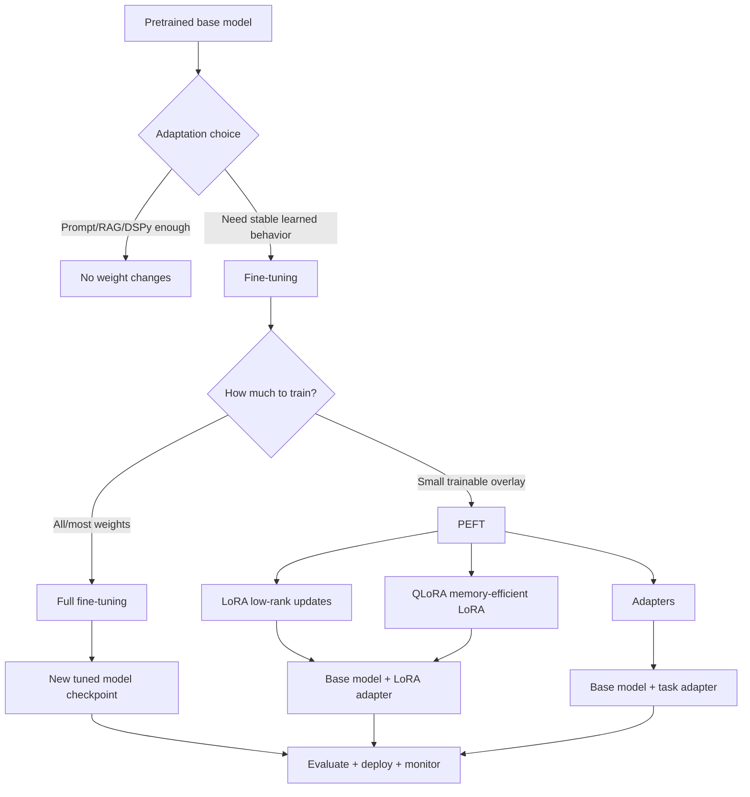

**How to read this diagram:**
Fine-tuning is not one thing. You first decide whether weight/adaptor adaptation is justified at all. Then you decide whether to update the whole model or train a lightweight adaptation layer.

---

### 3. Real-World Industry Scenarios [Intermediate]

#### Scenario A: Security Questionnaire Commitment Strength

**Product/use case context:**
A B2B SaaS assistant drafts answers to security questionnaires. The retrieved policy context is usually correct, but the model repeatedly turns caveated answers into unconditional commitments. Reviewers often change "yes" to "partial" or "requires review."

**Where SFT/LoRA fits:**
The behavior is stable, high-volume, and labelable. A LoRA adapter or SFT job can teach the model the answer style and commitment-strength mapping: yes, no, partial, requires legal review. The training examples should include hard negatives where similar questions require different commitment levels.

**Constraints:**
False positives are legally risky. Customer-specific terms may be volatile and should stay retrieval-backed. The tuned behavior must not memorize customer data. Evaluation must include high-risk slices: data residency, encryption, subprocessors, retention, legal commitments.

**What good looks like in production:**
The model is still grounded by retrieval, but the tuned adapter improves the stable behavior: preserving caveats, abstaining when evidence is insufficient, and routing legal commitments. Deployment has rollback to the base model and per-slice monitoring for unsupported claims.

#### Scenario B: Clinical Extraction and Negation

**Product/use case context:**
A clinical assistant extracts symptoms, medications, dosages, and negations from notes. Prompting reduces format errors, but the model still misses negation scope in phrases like "denies chest pain" or "no evidence of pneumonia."

**Where PEFT/LoRA fits:**
If the base model is good but needs domain-specific extraction behavior, PEFT can adapt it with de-identified expert-labeled examples. LoRA is attractive because clinical deployments often need controlled model versions and rollback.

**Constraints:**
Safety and privacy dominate. Labels must be expert-reviewed. PHI must be removed or handled in approved environments. Evaluation must separate dosage exact match, negation accuracy, medication extraction, and note section placement.

**What good looks like in production:**
The tuned adapter improves negation and dosage extraction on real de-identified held-out notes without worsening normal note summaries. High-risk fields remain validated or reviewed.

#### Scenario C: High-Volume Product Attribute Classification

**Product/use case context:**
An ecommerce platform classifies product listings into attributes: accessory vs device, compatibility, material, safety warning, color, and size. The task runs on millions of listings.

**Where PEFT/LoRA fits:**
The task is stable, high-volume, and labelable. Fine-tuning a smaller open model with LoRA may reduce inference cost compared with using a larger general model for every listing.

**Constraints:**
Cost matters at huge scale. Labels are noisy because sellers write messy descriptions. Distribution shifts with new products and seasonal categories. Evaluation must be per-attribute and include hard negatives.

**What good looks like in production:**
A LoRA-adapted classifier improves compatibility and accessory/device distinction while keeping serving cost low. The team monitors drift by category and periodically refreshes labels.

---

### 4. System View: Think Like a Systems Engineer [Intermediate]

#### Inputs -> Transformations -> Outputs

**Inputs:**
- Adaptation candidate from error analysis.
- Curated training examples with input, target output, labels, metadata, and provenance.
- Dev/holdout/test splits with no leakage.
- Base model choice and serving constraints.
- Training method: full fine-tune, SFT, PEFT, LoRA, QLoRA, adapter.
- Evaluation metrics: task quality, safety, cost, latency, drift, regressions.

**Transformations:**
1. Confirm the failure is stable, repeated, labelable, and not primarily a retrieval/spec issue.
2. Select base model and adaptation method.
3. Prepare train/dev/holdout/test data with deduplication and privacy checks.
4. Train full model or adapter weights.
5. Evaluate against base model, prompt/DSPy baseline, and stronger-model baseline.
6. Run slice and regression tests.
7. Package tuned artifact with versioning.
8. Deploy through shadow/canary with rollback.
9. Monitor realized lift, drift, cost, and safety.

**Outputs:**
- Tuned model checkpoint or adapter artifact.
- Training data lineage and model card/update note.
- Evaluation report against baselines.
- Serving plan: base+adapter, merged model, or model route.
- Rollback and refresh plan.

#### Observability: What We Log, Trace, and Measure

Log:
- Base model version and tokenizer version.
- Training dataset version, filters, split IDs, and provenance.
- Training method, hyperparameters, trainable parameter count, adapter rank, quantization settings.
- Evaluation metrics by slice.
- Serving route: base model, adapter ID, full tuned checkpoint, fallback model.
- Runtime cost, latency, memory, errors, and rollback events.

Measure:
- Target task lift vs base and prompt/DSPy baseline.
- Regression on general capabilities and critical slices.
- Overfitting gap: train/dev/holdout divergence.
- Label-noise sensitivity and reviewer agreement.
- Cost per successful task.
- Adapter load time and serving memory.
- Drift after policy/product/data changes.

#### Failure Points: Where It Breaks and How It Shows Up

| Failure point | What breaks | Symptom | First debugging step |
|---|---|---|---|
| Wrong problem chosen | Tuning used for missing facts | Tuned model guesses stale/unsupported answers | Run oracle-context and retrieval tests |
| Noisy labels | Model learns contradictions | Inconsistent outputs and weak holdout lift | Audit labels and reviewer agreement |
| Too narrow dataset | Overfitting | Train improves, holdout regresses | Add diverse hard negatives and slices |
| Full fine-tune too aggressive | Catastrophic forgetting | General behavior worsens | Try PEFT/LoRA or lower learning rate |
| Adapter version confusion | Wrong behavior served | Production differs from eval | Log adapter ID and base model version |
| Evaluation contamination | Inflated scores | Offline lift disappears in shadow | Deduplicate and lock test set |
| Serving mismatch | Training artifact not production-compatible | Latency/memory errors | Test artifact in production-like serving stack |

---

### 5. System Design Flavor [Intermediate]

#### Key Components and Interfaces

1. **Candidate selector:** Confirms tuning is justified from error analysis and ROI.
2. **Dataset builder:** Creates curated train/dev/holdout/test sets with provenance.
3. **Training pipeline:** Runs SFT, PEFT, LoRA, QLoRA, or full fine-tuning.
4. **Artifact registry:** Stores base model, adapter, tokenizer, config, metrics, and lineage.
5. **Evaluation harness:** Compares tuned model to base, prompt/DSPy, and stronger-model baselines.
6. **Serving layer:** Loads base model and adapters or deployed tuned checkpoints.
7. **Router:** Selects adapter/model by task, tenant, risk, or domain when needed.
8. **Monitoring layer:** Tracks quality, drift, cost, latency, and regressions.

#### Important Tradeoffs

| Tradeoff | Plain-English meaning | Choose this when... |
|---|---|---|
| Full fine-tuning vs PEFT | Update everything or a small adaptation layer. | Use PEFT first when cost, rollback, and serving flexibility matter. |
| Prompt/DSPy vs tuning | Keep behavior in context or move behavior into weights/adapters. | Tune when stable behavior repeats at volume and prompt optimization has plateaued. |
| LoRA vs full checkpoint | Serve base+adapter or a fully merged/tuned model. | Use adapters for flexible routing/rollback; merge only when serving simplicity matters. |
| Larger model vs tuned smaller model | Pay for capability or adapt cheaper model. | Tune smaller model for stable high-volume tasks; use larger model for low-volume hard reasoning. |
| More training data vs better labels | Volume helps coverage; label quality protects behavior. | For high-risk tasks, prioritize label quality and hard negatives over raw count. |
| One adapter vs many adapters | Simpler serving or specialized behavior. | Use many adapters only when domains differ enough and routing is reliable. |

#### Scaling Consideration: What Changes at 10x Traffic/Data

At 10x traffic, tuned smaller models and adapters can become economically attractive because recurring inference savings compound. However, serving many adapters can create operational complexity: adapter loading, routing, caching, versioning, and rollback.

At 10x data, data quality becomes the bottleneck. More labels can help, but noisy labels, duplicates, stale policies, and distribution imbalance can make tuning worse. The dataset pipeline must become a production system, not a one-off CSV.

---

### 6. Common Mistakes + Debugging [Intermediate]

#### Mistake 1: Fine-Tuning for Volatile Knowledge

**Symptom:** Tuned model answers product or policy facts correctly at launch, then becomes stale.

**Likely cause:** The team baked changing facts into weights instead of retrieving them from a source of truth.

**First debugging step:** Classify examples as stable behavior vs volatile knowledge. Move volatile facts back to retrieval/tools; tune only the stable response behavior.

#### Mistake 2: Treating LoRA as Low-Risk Magic

**Symptom:** Adapter training is cheap, but production quality regresses on important slices.

**Likely cause:** PEFT reduces training cost, not evaluation responsibility. It can still overfit or learn bad labels.

**First debugging step:** Run the same locked holdout, slice, and regression gates you would use for full fine-tuning.

#### Mistake 3: Training on Corrections Without Root-Cause Labels

**Symptom:** The tuned model learns to guess around missing context or ambiguous policies.

**Likely cause:** The dataset mixed retrieval failures, spec failures, style edits, and true behavior failures.

**First debugging step:** Filter training data by root cause. Only include stable behavior examples that tuning can actually fix.

#### Mistake 4: Ignoring the Base Model/Adapter Pair

**Symptom:** The adapter works in eval but fails in production.

**Likely cause:** Adapter was loaded with a different base model, tokenizer, quantization, or prompt format.

**First debugging step:** Log and verify base model ID, tokenizer, adapter ID, prompt template, and serving config.

#### Mistake 5: Evaluating Only Target Lift

**Symptom:** Target task improves, but general helpfulness, safety, or adjacent tasks degrade.

**Likely cause:** Evaluation ignored regressions and catastrophic forgetting.

**First debugging step:** Add regression suites: general instruction following, refusal/safety, formatting, adjacent task slices, and business-critical old behavior.

---

### 7. Hands-On Lab: Plan a LoRA Adaptation Job [Pro]

#### Concept

You will design a LoRA/PEFT tuning plan for a stable classification behavior. The goal is not to run a large training job here; it is to build the engineering checklist that prevents bad tuning.

#### Build: Define the Adaptation Candidate

```python
adaptation_candidate = {
    "task": "security_questionnaire_commitment_strength",
    "input_fields": ["question", "retrieved_policy_context"],
    "output_fields": ["answer", "commitment_label", "citation", "requires_review"],
    "labels": ["yes", "no", "partial", "requires_review"],
    "root_cause": "stable overclaiming behavior with correct context present",
    "not_in_scope": ["missing policy facts", "customer-specific contract terms", "ambiguous legal policy"],
}
```

Create a training plan:

```python
training_plan = {
    "method": "LoRA / PEFT SFT",
    "base_model": "approved open-weight instruction model",
    "train_examples": 3000,
    "dev_examples": 500,
    "locked_holdout_examples": 1000,
    "hard_negative_ratio": 0.30,
    "critical_slices": ["data_residency", "encryption", "subprocessors", "retention", "legal_commitments"],
    "deployment_gate": {
        "commitment_label_accuracy_lift": ">= 5 percentage points",
        "unsupported_claim_rate": "must decrease",
        "high_risk_regression": "blocked if any critical slice regresses > 1 percentage point",
        "p95_latency": "within serving budget",
    },
}
```

Sketch a PEFT configuration shape:

```python
peft_config_shape = {
    "method": "LoRA",
    "rank_r": 8,
    "alpha": 16,
    "dropout": 0.05,
    "target_modules": ["q_proj", "v_proj"],
    "base_model_frozen": True,
}
```

This is not a universal recipe. It is a mental model: small trainable update, frozen base, curated examples, locked evaluation, and rollback.

#### Break: Make the Tuning Plan Unsafe

Break it intentionally:

1. Include examples where retrieval missed the policy.
2. Mix customer-specific confidential contract terms into generic training examples.
3. Use the same examples in train and holdout.
4. Train only on easy "yes" examples with few hard negatives.
5. Evaluate only label accuracy and ignore unsupported claims.
6. Deploy adapter without logging base model and adapter version.

Each break creates a realistic production failure: guessing, privacy leakage, inflated eval, poor boundary behavior, risk regression, or rollback confusion.

#### Measure: Signals That Tuning Is Working

| Signal | Healthy pattern | Risky pattern |
|---|---|---|
| Train/dev/holdout gap | Small/moderate gap | Train high, holdout flat or worse |
| Critical-slice performance | No high-risk regressions | Overall lift hides legal/security regressions |
| Unsupported claims | Decrease | Label accuracy up but hallucinations up |
| Hard-negative accuracy | Improves | Model overpredicts majority label |
| Adapter serving | Versioned and reversible | Unknown base/adapter pair in prod |
| ROI | Cost per successful task improves | Tuning cost exceeds workflow value |

#### Explain: Why It Broke and What Fix Prevents It

The unsafe plan broke because it treated tuning data as generic examples rather than behavior-specific evidence. Fine-tuning should not teach the model to compensate for missing retrieval, memorize private facts, or follow ambiguous labels. It should teach stable, repeated behavior that the base model can learn from clean examples.

The fix is adaptation discipline: root-cause filtering, clean splits, hard negatives, privacy review, critical-slice gates, base/adaptor versioning, and rollback.

---

### 8. Active Recall (Spaced Repetition) [Beginner -> Pro]

#### Questions

1. What is the difference between SFT and prompting?
2. Why is PEFT often preferred over full fine-tuning in production?
3. What is the core intuition behind LoRA?
4. Why should volatile facts usually not be fine-tuned into a model?
5. What must be true before a failure pattern becomes a good tuning candidate?

#### Short Answer Key

1. Prompting supplies instructions at runtime; SFT updates model behavior using labeled examples.
2. PEFT trains fewer parameters, costs less, is easier to rollback, and supports adapter-based deployment.
3. LoRA freezes the base model and learns small low-rank update matrices that steer behavior.
4. Volatile facts change; retrieval/tools keep them fresh, while tuned weights become stale.
5. It should be stable, repeated, labelable, high-impact, not caused by missing context/spec ambiguity, and measurable on a locked holdout.

---

### 9. Practice [Intermediate -> Pro]

#### Mini-Exercise: Choose the Adaptation Method

| Situation | Best first choice | Why |
|---|---|---|
| Output JSON sometimes invalid | Prompt/schema/DSPy | Cheaper than tuning. |
| Correct context present, model repeatedly overclaims | SFT/LoRA candidate | Stable behavior mapping. |
| Product pricing changes weekly | Retrieval/tooling | Volatile facts should not live in weights. |
| Smaller model must copy larger model's style at scale | Distillation or SFT | Teacher behavior can train cheaper student. |
| High-risk policy labels have low reviewer agreement | Rubric/adjudication | Do not train on ambiguous labels. |
| Open model needs domain-specific extraction behavior | PEFT/LoRA | Efficient task/domain adaptation. |

#### Capstone System Design Question

You own a support assistant that drafts enterprise responses. Prompting, retrieval, and DSPy improved quality from 62% to 81%, but the model still repeatedly makes three stable mistakes: overclaiming enterprise features, using the wrong escalation label, and writing overly long answers. You have 10,000 reviewed corrections.

Design the SFT/PEFT strategy.

**Suggested answer outline:**

Tuning candidacy:
- Confirm correct context was present for overclaiming cases.
- Exclude retrieval failures, stale policy facts, and ambiguous reviewer disagreements.
- Group examples by stable behavior: commitment strength, escalation label, concise style.

Method:
- Start with LoRA/PEFT rather than full fine-tuning for rollback and cost control.
- Use base model approved for serving/privacy constraints.
- Include hard negatives and critical slices.
- Consider separate adapters only if behaviors differ by domain/tenant and routing is reliable.

Data:
- Train/dev/locked holdout/test split with deduplication.
- Label guidelines and reviewer agreement checks.
- Remove confidential customer-specific facts unless approved and scoped.

Evaluation:
- Compare base, prompt/DSPy baseline, LoRA adapter, and stronger-model baseline.
- Measure commitment-label accuracy, escalation recall, length/style compliance, unsupported claims, latency, cost, and critical-slice regressions.

Deployment:
- Serve base model + adapter with logged adapter ID.
- Shadow mode first; canary if gates pass.
- Rollback by disabling adapter.
- Monitor drift and refresh cadence.

---

### 10. Production Reality Check

**If this fails in prod, what's the first thing we inspect?**

Inspect whether the failure was actually inside the tuned behavior boundary: base model, adapter version, prompt format, retrieved context, input distribution, or serving route.

The first question is: **did production load the exact base model + adapter + tokenizer + prompt format that passed evaluation?** If not, fix the serving/versioning mismatch. If yes, inspect whether the failing case belongs to a slice represented in the locked holdout. If the slice was missing, the issue is evaluation coverage. If the slice was covered but regressed, compare base vs adapter outputs and check for overfitting, label noise, or distribution shift.

The fastest debugging move is to replay the same request through base model, tuned adapter, and previous production route with the same retrieved context. That separates adapter behavior from upstream retrieval or serving issues.

---

### 11. Curiosity Bridge

This works when you want the model to learn stable behavior directly. But sometimes you do not have human labels at scale, or you want a smaller/cheaper model to imitate a stronger one.

That leads directly to **distillation and teacher-student pipelines**: using a stronger model or program to generate training signal for a cheaper deployable model.

---

### 12. Exit Check + Carry-Forward Review

**Exit check - you are done when you can:**
Given a failure cluster, decide whether to use prompt/DSPy, retrieval, SFT, PEFT/LoRA, full fine-tuning, distillation, routing, or human review; then justify the choice using stability, labelability, risk, ROI, serving complexity, and evaluation coverage.

**Carry-Forward Review:**

Question: How does 18.1.a's ceiling diagnosis decide whether tuning is appropriate?

Answer: If oracle context fixes the answer, retrieval/data is the bottleneck and tuning is premature. If prompt/DSPy still improves behavior, use those cheaper methods first. If the failure is stable, repeated, labelable, context-present, and not solved cheaply, tuning becomes a candidate.

Question: How does 18.2.c's honest evaluation apply to LoRA/adapters?

Answer: Adapter training still needs locked holdouts, slice gates, baseline reruns, ablations, shadow mode, canary gates, and rollback. PEFT reduces training cost, not evaluation responsibility.

---

## Subtopic 18.3.b: Distillation and Teacher-Student Pipelines

### ✅ Add to Knowledge Base

### Reading Path + Level Tags

- **Beginner:** Read sections 0-2 and Active Recall.
- **Intermediate:** Add sections 3-6 and complete the Build part of the Hands-On Lab.
- **Pro:** Complete the full Hands-On Lab, including Break -> Measure -> Explain, then answer the capstone teacher-student pipeline question.

---

### 0. Pre-Question Hook [Beginner]

**Pause:** A large model answers enterprise RFP questions well, but it costs too much and is too slow for every request. A smaller model is cheap but misses caveats, citations, and escalation decisions. You have production questions, retrieval context, and a strong evaluation harness.

Before reading on: can the large model teach the smaller model? What exactly should be transferred: final answers, labels, rationales, tool choices, confidence, or refusal behavior? And how do you prevent the smaller model from learning the teacher's mistakes?

That is distillation.

---

### 1. The Intuition (Plain English) [Beginner]

**Distillation** is the process of using a stronger, larger, more expensive, or more accurate **teacher model** or teacher program to train a smaller, cheaper, faster, or more deployable **student model**.

The teacher produces training signal. The student learns to imitate the useful parts of that signal.

In GenAI systems, the teacher is not always just a single model. It can be:

- a frontier model,
- a larger open model,
- a DSPy-optimized program,
- a RAG pipeline with verifier,
- an ensemble of models,
- a human-reviewed workflow,
- or a large model plus tools.

The student can be:

- a smaller model fine-tuned through SFT,
- a LoRA/adapter-tuned model,
- a classifier or reranker,
- a cheaper model route,
- or a compressed task-specific model.

The core idea:

> Distillation converts expensive intelligence into cheaper repeatable behavior.

But it only works when the target behavior is within the student's capacity. A small model can learn a stable classification boundary or answer style. It may not learn deep reasoning that exceeds its architecture/context/capability limits.

**Real-world analogy:**
Think of a senior engineer creating a playbook for junior engineers. The senior engineer solves many examples, explains decisions, and writes good reference answers. Junior engineers study the playbook and become faster on repeated cases. This works for recurring patterns. It does not turn a junior engineer into the senior engineer for every novel architecture problem.

**Where the analogy breaks down:** A human junior can ask questions and build conceptual understanding over time. A student model learns statistical patterns from data. If the teacher examples are biased, wrong, too easy, or missing edge cases, the student learns that flawed distribution.

**Key terms:**

- **Distillation** - training a cheaper/smaller/deployable student system to imitate useful behavior from a stronger teacher system.
- **Teacher-student pipeline** - the data and training workflow where a teacher generates labels, outputs, rationales, traces, or preferences used to train a student.
- **Teacher model** - a stronger model used to produce training signal, labels, rationales, or outputs.
- **Student model** - the model trained to imitate teacher behavior while meeting deployment constraints.
- **Behavior cloning** - training a student to reproduce the teacher's outputs or decisions.
- **Pseudo-labeling** - generating labels for unlabeled examples using a model or program instead of human annotators.
- **Hard-label distillation** - training on the teacher's final discrete label or answer, such as `billing` or `requires_review`.
- **Soft-label distillation** - training on the teacher's probability distribution or confidence over labels, when available.
- **Logits** - raw model scores before probability normalization; often used in classic soft-label distillation.
- **Temperature** - a scaling parameter used to soften probability distributions so the student can learn relative class similarities.
- **Rationale distillation** - training the student using teacher-generated explanations, reasoning steps, or intermediate traces.
- **Response distillation** - training on teacher-generated final responses.
- **Preference distillation** - training a student from teacher/human preferences between candidate outputs.
- **Teacher bias transfer** - the student inheriting systematic teacher mistakes, blind spots, or style biases.
- **Student capacity** - the student's ability to represent the teacher's target behavior given its size, architecture, context window, and training setup.

---

### 2. Visual Diagram (Mermaid) [Beginner]

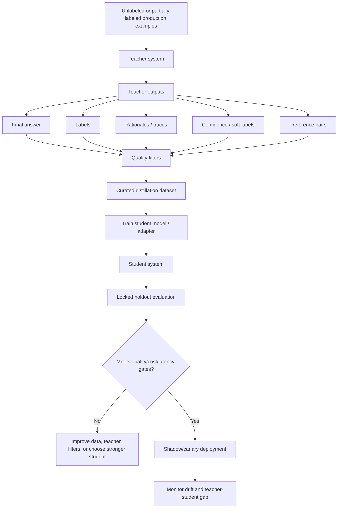

**How to read this diagram:**
Distillation is not "ask a teacher model for lots of answers and train blindly." The central engineering work is the curation/filtering/evaluation loop between teacher outputs and student training.

---

### 3. Real-World Industry Scenarios [Intermediate]

#### Scenario A: High-Volume Support Ticket Routing

**Product/use case context:**
A support platform routes millions of tickets per month. A large teacher model with customer context routes tickets accurately but is too expensive for all traffic. A small model is cheap but weak on boundary cases.

**How distillation helps:**
The teacher model labels a large set of historical tickets with category, urgency, escalation, and rationale. Human reviewers audit high-risk categories. The student is trained on the curated teacher labels plus human labels. The goal is not broad conversation quality; it is fast routing behavior.

**Constraints:**
Latency and cost matter because routing is synchronous and high-volume. High-risk recall matters more than average accuracy. Teacher labels may inherit bias from historical routing patterns. Data must be split by time/customer to avoid duplicate leakage.

**What good looks like in production:**
The student model handles common routing cheaply. Hard/uncertain/high-risk tickets route to the teacher model or human review. Production monitoring tracks teacher-student disagreement, transfer rate, high-risk recall, and cost per routed ticket.

#### Scenario B: Security Questionnaire Answering

**Product/use case context:**
An enterprise RFP assistant uses a strong teacher pipeline: retrieval + frontier model + verifier + human review for risky answers. This pipeline is accurate but slow and costly. The company wants a cheaper model for common question types.

**How distillation helps:**
The teacher pipeline generates answer drafts, citations, caveats, commitment labels, and escalation decisions for thousands of historical RFP questions. The student learns recurring answer behavior: preserve caveats, avoid unsupported claims, cite source IDs, and escalate legal commitments.

**Constraints:**
Facts change, so student outputs must still be grounded in retrieval context. The student should not memorize customer-specific commitments. Legal/security slices need expert review. Teacher rationales may contain internal reasoning that should not be exposed in final answers.

**What good looks like in production:**
The student handles low/medium-risk common questions. The teacher pipeline remains available for hard or high-risk questions. The student is evaluated on real held-out RFP questions, not only teacher-generated synthetic examples. Unsupported-claim rate must decrease or remain below gate.

#### Scenario C: Code Review Comment Generation

**Product/use case context:**
An AI code review assistant uses a strong model to identify likely bugs and suggest review comments. The strong model is expensive for every pull request. A smaller model is fast but misses common bug patterns.

**How distillation helps:**
The teacher reviews diffs and generates structured outputs: issue type, severity, file span, review comment, and suggested test. Human reviewers validate a sample. The student learns common high-confidence review patterns and abstains when uncertain.

**Constraints:**
False positives annoy developers; false negatives miss bugs. Codebases differ by language/framework. Teacher comments may include hallucinated APIs. Security-sensitive suggestions require stricter review.

**What good looks like in production:**
The student handles common low-risk patterns; teacher/human review handles complex architectural or security issues. Evaluation reports precision/recall by language and issue type, plus developer acceptance rate.

---

### 4. System View: Think Like a Systems Engineer [Intermediate]

#### Inputs -> Transformations -> Outputs

**Inputs:**
- Source examples: production queries, tickets, documents, tool traces, or generated cases.
- Teacher system: strong model, DSPy program, RAG+verifier pipeline, ensemble, or human-reviewed workflow.
- Teacher outputs: labels, final answers, rationales, confidence, tool decisions, preference pairs.
- Filters: schema checks, grounding checks, confidence thresholds, safety/policy checks, deduplication.
- Student training method: SFT, PEFT/LoRA, classifier training, preference tuning, or adapter training.
- Evaluation sets: real holdout, critical slices, teacher-student disagreement set, production shadow traffic.

**Transformations:**
1. Select target behavior and student deployment constraints.
2. Generate teacher outputs for source examples.
3. Filter and audit teacher outputs.
4. Split curated data into train/dev/holdout/test with leakage controls.
5. Train student model or adapter.
6. Evaluate student against teacher, human labels, base model, and production baseline.
7. Route easy cases to student and hard cases to teacher/human if needed.
8. Monitor teacher-student gap and drift.

**Outputs:**
- Curated distillation dataset.
- Student model or adapter artifact.
- Teacher-student comparison report.
- Routing policy for student vs teacher/human.
- Deployment and rollback plan.
- Monitoring dashboard for student quality, cost, latency, and drift.

#### Observability: What We Log, Trace, and Measure

Log:
- Teacher model/program version.
- Student model/base/adapter version.
- Source example provenance and generation timestamp.
- Teacher output, confidence, rationale/trace availability, and filter decisions.
- Human audit status for sampled teacher outputs.
- Training split IDs and deduplication cluster IDs.
- Student prediction, teacher prediction, and human label when available.

Measure:
- Student vs teacher agreement.
- Student vs human label quality.
- Target task lift vs base student.
- Teacher error transfer rate.
- Cost and latency reduction.
- Student fallback/escalation rate.
- Critical-slice precision/recall.
- Drift in teacher-student disagreement over time.

#### Failure Points: Where It Breaks and How It Shows Up

| Failure point | What breaks | Symptom | First debugging step |
|---|---|---|---|
| Teacher is wrong | Student learns wrong behavior | Student confidently repeats teacher mistakes | Audit teacher outputs and add filters |
| Teacher too different from production inputs | Distilled data distribution mismatch | Student fails on real traffic | Compare source examples to production distribution |
| Student too small | Cannot represent behavior | Student plateaus below required quality | Use stronger student, simplify task, or route hard cases |
| Rationales are noisy | Student learns spurious reasoning | Good-looking explanations, bad decisions | Train on final labels or filter rationales |
| No human audit | Teacher bias transfers silently | Systematic blind spots persist | Review high-risk slices and disagreements |
| Distilling volatile facts | Student becomes stale | Answers outdated facts | Keep facts in retrieval/tools |
| Eval only against teacher | Student imitates teacher but not truth | High agreement, low human correctness | Evaluate against human/ground-truth holdout |

---

### 5. System Design Flavor [Intermediate]

#### Key Components and Interfaces

1. **Source-example selector:** Chooses production or synthetic examples to send through the teacher.
2. **Teacher runner:** Generates labels, answers, traces, preferences, or tool decisions.
3. **Quality filter:** Removes unsupported, unsafe, low-confidence, duplicated, or malformed teacher outputs.
4. **Human audit queue:** Reviews high-risk examples and teacher-student disagreements.
5. **Distillation dataset builder:** Creates train/dev/holdout/test splits with provenance.
6. **Student trainer:** Runs SFT, LoRA/PEFT, classifier training, or preference training.
7. **Evaluation harness:** Compares student vs teacher vs human labels vs baseline.
8. **Router:** Sends easy cases to student and hard/high-risk cases to teacher or human review.
9. **Monitoring layer:** Tracks quality, cost, latency, disagreement, and drift.

#### Important Tradeoffs

| Tradeoff | Plain-English meaning | Choose this when... |
|---|---|---|
| Teacher-only vs distilled student | Keep maximum quality or reduce runtime cost/latency. | Use teacher-only for low-volume/high-risk tasks; distill when repeated high-volume behavior can be safely imitated. |
| Hard labels vs soft labels | Train on final answers/labels or teacher uncertainty. | Use hard labels when only final outputs are available; use soft labels/logits for classification when uncertainty contains useful signal. |
| Response vs rationale distillation | Teach final output or also teach reasoning traces. | Use response distillation for most production tasks; use rationale distillation only when explanations are reliable, safe, and improve decisions. |
| One student vs routed student/teacher system | Student handles all traffic or only easy/common cases. | Route when risk or difficulty varies and student capacity is limited. |
| More teacher data vs better teacher data | Scale examples quickly or curate carefully. | Prefer curation for high-risk domains; scale volume after filters are proven. |
| Teacher imitation vs real correctness | Match the teacher or match ground truth. | Teacher agreement is useful, but human/ground-truth holdout decides deployment. |

#### Scaling Consideration: What Changes at 10x Traffic/Data

At 10x traffic, distillation can become economically powerful because each request handled by the student avoids a teacher call. The ROI depends on the student success rate, fallback rate, teacher cost, student serving cost, and the cost of errors.

At 10x data, teacher generation becomes an operational pipeline. You need batch IDs, generation timestamps, teacher versions, filter reports, retry logic, reviewer sampling, deduplication, and dataset lineage. Otherwise you create a large training set whose quality nobody can explain.

---

### 6. Common Mistakes + Debugging [Intermediate]

#### Mistake 1: Treating Teacher Outputs as Ground Truth

**Symptom:** The student agrees with the teacher but still fails human review or production outcomes.

**Likely cause:** The teacher made systematic mistakes, and the student copied them.

**First debugging step:** Audit teacher outputs against human-labeled examples by slice. Add grounding, confidence, policy, and consistency filters before training.

#### Mistake 2: Evaluating Only Student-Teacher Agreement

**Symptom:** Student-teacher agreement is high, but real correctness is mediocre.

**Likely cause:** Agreement measures imitation, not truth. If the teacher is wrong or misaligned, agreement can be misleading.

**First debugging step:** Add a locked human-labeled holdout and report student vs human, teacher vs human, and student vs teacher separately.

#### Mistake 3: Distilling Volatile Facts

**Symptom:** The student answers old policy, pricing, product, or customer-specific facts confidently.

**Likely cause:** Teacher outputs included facts that should have stayed in retrieval/tools.

**First debugging step:** Separate stable behavior from volatile knowledge. Train the student to use provided context, preserve caveats, and abstain; do not train it to memorize changing facts.

#### Mistake 4: Asking Too Much of the Student

**Symptom:** More teacher data does not close the quality gap.

**Likely cause:** The student lacks capacity, context window, tool access, or reasoning ability for the task.

**First debugging step:** Slice by difficulty. Route hard cases to the teacher, simplify the task, add retrieval/tool support, or choose a stronger student.

#### Mistake 5: Distilling Unsafe or Private Rationales

**Symptom:** The student produces verbose private reasoning, exposes sensitive policy logic, or learns spurious explanations.

**Likely cause:** Teacher rationales were used as training targets without sanitization or proof that they improve the task.

**First debugging step:** Compare final-answer-only training against rationale training. Use sanitized rationales only when they improve held-out task behavior and are safe to store/serve.

---

### 7. Hands-On Lab: Design a Teacher-Student Pipeline [Pro]

#### Concept

You will design a teacher-student pipeline for a security-questionnaire assistant. The teacher is accurate but expensive; the student should handle common low/medium-risk questions cheaply and route hard cases away.

#### Build: Define Teacher, Student, and Filters

```python
distillation_plan = {
    "task": "security_questionnaire_answering",
    "teacher": "retrieval + strong_model + verifier + human_review_for_high_risk",
    "student": "smaller_instruction_model_with_lora_adapter",
    "target_behavior": [
        "answer from retrieved context",
        "preserve caveats",
        "cite source IDs",
        "abstain when context is insufficient",
        "route risky commitments to review",
    ],
    "not_in_scope": [
        "memorize customer-specific facts",
        "replace legal review",
        "answer without retrieval context",
    ],
}
```

Create a distillation record schema:

```python
from dataclasses import dataclass


@dataclass
class DistillationExample:
    question: str
    retrieved_context: str
    teacher_answer: str
    teacher_label: str
    teacher_citations: list[str]
    teacher_confidence: float
    risk_tier: str
    verifier_passed: bool
    human_approved: bool


def passes_filter(example: DistillationExample) -> bool:
    if example.teacher_confidence < 0.80:
        return False
    if not example.verifier_passed:
        return False
    if not example.teacher_citations:
        return False
    if example.risk_tier == "high" and not example.human_approved:
        return False
    return True
```

Define runtime routing:

```python
def route_after_student(student_confidence, risk_tier, unsupported_claims):
    if risk_tier == "high":
        return "teacher_or_human_review"
    if unsupported_claims > 0:
        return "teacher_or_human_review"
    if student_confidence < 0.75:
        return "teacher_or_human_review"
    return "student_answer"
```

#### Break: Poison the Pipeline

Break it intentionally:

1. Use all teacher outputs without filters.
2. Train on high-risk legal commitment examples without human approval.
3. Include teacher answers where citations do not support the claim.
4. Evaluate only student-teacher agreement.
5. Route all traffic to the student immediately.

Each break creates a real failure mode: cloned teacher errors, legal risk, unsupported claims, fake quality metrics, and unsafe rollout.

#### Measure: Distillation Health Metrics

| Metric | Healthy pattern | Risky pattern |
|---|---|---|
| Student vs human correctness | Improves vs base student | Only teacher agreement improves |
| Teacher-student disagreement | Concentrated in routed hard cases | Common cases disagree unpredictably |
| Unsupported-claim rate | Stable or decreases | Student drops caveats/citations |
| Cost per successful task | Decreases meaningfully | Teacher fallback too frequent |
| High-risk escalation | No regression | Student handles risky cases incorrectly |
| Coverage by slice | Balanced across important slices | Teacher data mostly easy/common cases |

#### Explain: Why It Broke and What Fix Prevents It

The poisoned pipeline broke because it mistook teacher-generated data for verified truth. A teacher is a scalable signal generator, not an oracle. Distillation is safe only when teacher outputs are filtered, audited, evaluated against real labels, and routed by risk/capability at runtime.

The fix is a production-grade teacher-student loop: representative sampling, teacher output filtering, human review calibration, clean holdouts, student training, cost-quality evaluation, fallback routing, and drift monitoring.

---

### 8. Active Recall (Spaced Repetition) [Beginner -> Pro]

#### Questions

1. What is distillation in one sentence?
2. Why is student-teacher agreement not enough?
3. What is the difference between response distillation and rationale distillation?
4. Why does distillation often need fallback routing?
5. What is teacher bias transfer?

#### Short Answer Key

1. Distillation trains a cheaper/smaller/faster student to imitate useful behavior from a stronger teacher model or program.
2. Agreement measures imitation, not correctness. The teacher may be wrong or misaligned.
3. Response distillation trains on final answers/labels; rationale distillation also trains on reasoning traces/explanations.
4. Students often cannot handle hard, rare, or high-risk cases as well as the teacher; routing preserves quality where needed.
5. Teacher bias transfer is when the student inherits the teacher's systematic mistakes, blind spots, or style biases.

---

### 9. Practice [Intermediate -> Pro]

#### Mini-Exercise: Distill or Not?

| Scenario | Distill? | Why |
|---|---|---|
| Large model handles high-volume stable routing well, small model is close but weaker | Yes | Strong cost-quality candidate. |
| Teacher output is often ungrounded | No, not yet | Improve/filter teacher first. |
| Task requires fresh customer-specific facts | Carefully | Distill behavior, keep facts in retrieval/tools. |
| Rare high-risk legal decision | Usually no | Teacher/human route is safer. |
| Smaller model needs low-risk style imitation | Yes | Response/style distillation can work well. |
| Student lacks context length needed for task | Not directly | Add retrieval/summarization or route to teacher. |

#### Capstone System Design Question

You have a strong but expensive RAG + verifier teacher pipeline for enterprise security questionnaire answers. It is accurate but too slow for bulk RFPs. You want a cheaper student for common questions.

Design the teacher-student distillation pipeline.

**Suggested answer outline:**

Teacher:
- Use the full RAG + verifier pipeline as teacher.
- Teacher output includes answer, citation, commitment label, abstain/escalate flag.
- Teacher must ground answers in approved policy snippets.

Data:
- Sample real RFP questions by policy area, customer tier, risk level, and answer type.
- Include hard negatives and abstention cases.
- Exclude or separately handle customer-specific volatile terms.

Filtering:
- Reject unsupported teacher answers.
- Reject stale source citations.
- Human-review high-risk categories.
- Deduplicate and lock holdouts before training.

Student:
- Train smaller model or LoRA adapter on filtered teacher outputs.
- Train stable behavior and answer style; keep facts retrieved at runtime.
- Use fallback routing for high-risk or low-confidence questions.

Evaluation:
- Compare student to base, teacher, and human-labeled holdout.
- Measure unsupported-claim rate, citation support, commitment-label accuracy, escalation recall, p95 latency, and cost per successful answer.
- Shadow mode before canary.

---

### 10. Production Reality Check

**If this fails in prod, what's the first thing we inspect?**

Inspect whether the student failed because the teacher signal was bad, the student lacked capacity, the input slice was missing from distillation data, or fallback routing failed.

The first question is: **did the teacher get this case right during evaluation, and was this slice represented in the distillation dataset?** If the teacher was wrong, fix teacher/filtering. If the teacher was right but the student is wrong, inspect student capacity, training coverage, and whether the case should route to teacher. If the slice was never represented, fix sampling and data coverage.

The fastest debugging move is to replay the failing cases through teacher, student, and baseline with the same context, then classify each failure as teacher error, student gap, data coverage gap, or routing failure.

---

### 11. Curiosity Bridge

This works when the goal is to transfer behavior from a stronger teacher into a cheaper student. But fine-tuning and distillation are not generic; they shine differently by task type.

That leads directly to **fine-tuning for extraction, classification, and domain adaptation**: which task families are strong tuning candidates, what data they need, and where they fail.

---

### 12. Exit Check + Carry-Forward Review

**Exit check - you are done when you can:**
Design a teacher-student pipeline that defines teacher source, input sampling, output filtering, student training method, ground-truth evaluation, fallback routing, cost/latency measurement, and production rollback.

**Carry-Forward Review:**

Question: How is distillation different from SFT?

Answer: SFT trains on labeled input-output examples, usually from humans or curated data. Distillation often uses a stronger teacher model/program to generate the training targets. Distillation can be implemented through SFT, but the source of the supervision is the teacher.

Question: How does 18.3.a's LoRA mental model fit into distillation?

Answer: LoRA can be the student adaptation method. The teacher generates filtered outputs, and the student base model trains a LoRA adapter to imitate that behavior without full fine-tuning.

---

## Subtopic 18.3.c: Fine-Tuning for Extraction, Classification, and Domain Adaptation

### ✅ Add to Knowledge Base

### Reading Path + Level Tags

- **Beginner:** Read sections 0-2 and Active Recall.
- **Intermediate:** Add sections 3-6 and complete the Build part of the Hands-On Lab.
- **Pro:** Complete the full Hands-On Lab, including Break -> Measure -> Explain, then answer the capstone task-family adaptation question.

---

### 0. Pre-Question Hook [Beginner]

**Pause:** You have three possible adaptation projects:

1. Extract invoice totals and due dates from messy PDFs.
2. Classify support tickets into security, billing, outage, account access, or API integration.
3. Make a healthcare assistant write in clinical documentation style.

Before reading on: should all three be fine-tuned the same way? What changes in the dataset, metrics, and deployment gates for extraction vs classification vs domain adaptation?

That is the task-family lens.

---

### 1. The Intuition (Plain English) [Beginner]

Fine-tuning is not a generic quality button. It works best when the task has a stable target behavior and a measurable output. Extraction, classification, and domain adaptation are common task families, but they fail in different ways.

**Extraction fine-tuning** teaches a model to turn messy input into structured fields: invoice totals, diagnosis codes, contract dates, entities, medication dosage, or table values.

**Classification fine-tuning** teaches a model to assign labels: ticket route, risk tier, clause type, sentiment, intent, escalation decision, or product category.

**Domain adaptation** teaches a model a domain's stable language, formats, procedures, and conventions: clinical note style, legal clause labeling norms, insurance claim terminology, support response style, or internal engineering phrasing.

The practical rule:

> Fine-tune stable behavior, not changing facts.

Extraction and classification are often strong fine-tuning candidates because outputs are easy to score. Domain adaptation is powerful but easy to misuse: it should adapt terminology, style, procedure, and stable mappings, not memorize facts that change.

**Real-world analogy:**
Training a model for extraction is like training a clerk to fill out a form from messy documents. Training for classification is like training a triage specialist to choose the right queue. Domain adaptation is like training someone to write and reason according to a profession's conventions. None of these should replace a live database, policy manual, or approval workflow.

**Where the analogy breaks down:** Humans can notice when a fact is outdated and look it up. A tuned model may confidently reproduce stale patterns unless the system forces retrieval, source grounding, or tool use.

**Key terms:**

- **Extraction fine-tuning** - adapting a model to produce structured fields from unstructured or semi-structured inputs.
- **Classification fine-tuning** - adapting a model to assign labels, categories, routes, risk tiers, or decisions.
- **Domain adaptation** - adapting a model to a domain's terminology, style, formats, procedures, and recurring task patterns.
- **Schema-constrained extraction** - extraction where outputs must follow a fixed schema, such as JSON fields or typed records.
- **Field-level metric** - a metric that scores each extracted field separately rather than only the full output.
- **Exact match** - a metric requiring the predicted value to match the reference exactly.
- **Partial credit metric** - a metric that gives credit for near-correct outputs, useful for spans, normalized values, and long fields.
- **Class imbalance** - a dataset problem where some labels are much more common than others.
- **Majority-class collapse** - when a classifier overpredicts the most common label because training/eval distribution is imbalanced.
- **Threshold calibration** - choosing confidence thresholds that trade off automation, escalation, false positives, and false negatives.
- **Domain vocabulary** - specialized terms, abbreviations, formats, and phrasing used in a domain.
- **Label schema** - the set of allowed labels and definitions for a classification or extraction task.

---

### 2. Visual Diagram (Mermaid) [Beginner]

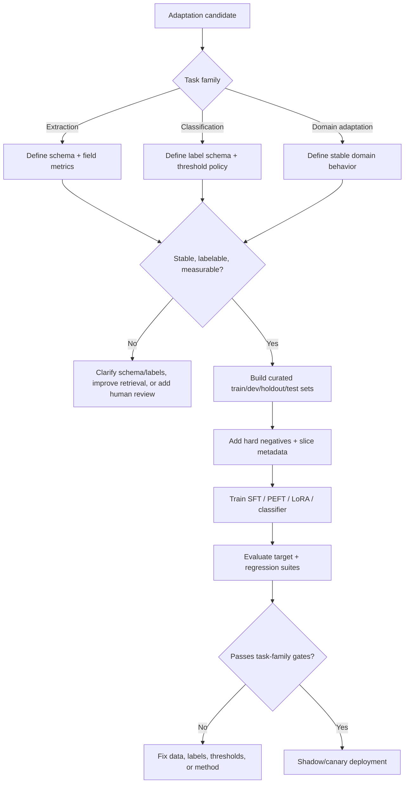

**How to read this diagram:**
Task family determines the tuning plan. Extraction needs schemas and field metrics. Classification needs label definitions, confusion matrices, and thresholds. Domain adaptation needs a bright line between stable behavior and changing facts.

---

### 3. Real-World Industry Scenarios [Intermediate]

#### Scenario A: Invoice and Claims Extraction

**Product/use case context:**
An operations platform extracts invoice number, vendor, subtotal, tax, total, line items, due date, and payment terms from PDFs and emails. The base model often confuses subtotal, tax, and total when layouts vary.

**Where fine-tuning helps:**
Extraction is a strong fine-tuning candidate if the field schema is clear and labels are clean. A LoRA/SFT extractor can learn stable field patterns and output a strict schema. Hard negatives should include discounts, missing tax, multi-page line items, similar subtotal/total values, and vendor-specific layouts.

**Constraints:**
Parser/OCR quality must be measured separately. If the text is missing from the model input, tuning will teach guessing. Financial fields need exact numeric handling or tolerance rules. High-value invoices may require human review.

**What good looks like in production:**
The eval reports field-level exact match, numeric tolerance, date normalization, schema validity, missing-field behavior, and document-type slices. Low-confidence or high-value outputs route to review.

#### Scenario B: Support Ticket Classification

**Product/use case context:**
A SaaS platform routes support tickets to billing, outage, account access, security, API integration, or product question. Overall accuracy is high, but the model confuses security incidents with account-access tickets.

**Where fine-tuning helps:**
Classification is a strong candidate when labels are stable and volume is high. A tuned classifier or LoRA adapter can learn label boundaries and reduce prompt cost.

**Constraints:**
Class imbalance matters. Billing may dominate traffic, while security is rare but high risk. Aggregate accuracy is not enough. Thresholds determine whether uncertain tickets are auto-routed or escalated.

**What good looks like in production:**
The model improves per-class recall for security without creating too many false escalations. Monitoring tracks confusion matrix, queue transfer rate, escalation accuracy, and threshold drift.

#### Scenario C: Clinical Domain Adaptation

**Product/use case context:**
A clinical assistant drafts visit notes. The base model is fluent but does not reliably follow specialty-specific section structure, clinical terminology, medication phrasing, and negation conventions.

**Where fine-tuning helps:**
Domain adaptation can teach stable note conventions and terminology. It can improve assessment/plan placement, phrasing of medication changes, and negation preservation.

**Constraints:**
Patient-specific facts must come from transcript/context, not model memory. Safety matters more than style. Specialty slices may differ enough to require separate adapters or routing.

**What good looks like in production:**
Clinician edit time decreases while unsupported diagnoses, medication errors, and negation errors do not increase. Specialty-level evaluation catches regressions hidden by aggregate note quality.

---

### 4. System View: Think Like a Systems Engineer [Intermediate]

#### Inputs -> Transformations -> Outputs

**Inputs:**
- Task family: extraction, classification, or domain adaptation.
- Field schema, label schema, or domain behavior definition.
- Curated examples with provenance, labels, split IDs, and slice metadata.
- Baselines: prompt/DSPy, base model, rules/classifier, stronger model, or teacher pipeline.
- Training method: SFT, PEFT/LoRA, classifier head, adapter, or distillation.
- Evaluation metrics: field-level, label-level, slice-level, cost, latency, safety, regression.

**Transformations:**
1. Define output schema, label schema, or stable domain behavior.
2. Remove examples caused by missing context, parser failure, or ambiguous labels.
3. Add hard negatives and boundary cases.
4. Balance/weight critical labels or fields.
5. Train selected adaptation method.
6. Evaluate target task and non-target regressions.
7. Calibrate thresholds for automation, escalation, or abstention.
8. Deploy through shadow/canary with monitoring.

**Outputs:**
- Tuned extractor, classifier, or domain-adapted model/adapter.
- Dataset card with schema/label definitions.
- Evaluation report by field, label, and domain slice.
- Threshold/routing policy.
- Rollback and refresh plan.

#### Observability: What We Log, Trace, and Measure

Log:
- Model/adaptor version, dataset version, schema version, label schema version.
- Input metadata, source IDs, parser/OCR confidence, task family.
- Predicted fields/labels, confidence, threshold decision, escalation decision.
- Human correction and reason code.
- Runtime cost, latency, and fallback route.

Measure:
- Extraction: field exact match, numeric tolerance, schema validity, missing/null accuracy.
- Classification: per-class precision/recall/F1, confusion matrix, calibration, escalation rate.
- Domain adaptation: domain rubric score, edit distance, terminology correctness, unsupported fact rate.
- Cross-cutting: high-risk false negatives, cost per successful task, drift by slice.

#### Failure Points: Where It Breaks and How It Shows Up

| Failure point | What breaks | Symptom | First debugging step |
|---|---|---|---|
| Ambiguous schema | Inconsistent labels/fields | Same input labeled differently | Clarify guidelines with examples/counterexamples |
| Parser/OCR error | Input lacks correct text | Extractor misses fields | Inspect raw doc, parser output, model input |
| Class imbalance | Majority label dominates | Rare labels have low recall | Rebalance, weight, add hard negatives |
| Domain facts baked in | Model becomes stale | Outdated answers | Move facts to retrieval/tools |
| Over-broad domain adaptation | General behavior regresses | Better style, worse correctness | Add regression suite and narrow adapter scope |
| Poor thresholds | Unsafe automation or too many escalations | False accepts or review overload | Calibrate threshold by risk/cost |

---

### 5. System Design Flavor [Intermediate]

#### Key Components and Interfaces

1. **Schema/label registry:** Stores field definitions, label definitions, examples, and version history.
2. **Dataset builder:** Creates train/dev/holdout/test sets with hard negatives and slice metadata.
3. **Training pipeline:** Runs SFT, PEFT/LoRA, classifier training, or domain adapter training.
4. **Evaluation harness:** Runs task-specific metrics and regression suites.
5. **Threshold calibrator:** Chooses thresholds for automation, escalation, or abstention.
6. **Serving router:** Sends requests to tuned model, base model, teacher, or human review.
7. **Monitoring dashboard:** Tracks drift, field/label quality, corrections, cost, and latency.

#### Important Tradeoffs

| Tradeoff | Plain-English meaning | Choose this when... |
|---|---|---|
| Extraction tuning vs parser fixes | Train model or fix input quality. | Fix parser/OCR first if text is missing or corrupted. |
| Classifier fine-tune vs prompt classifier | Lower runtime cost or faster iteration. | Fine-tune when labels are stable and volume is high; prompt when labels change often. |
| Domain style vs domain facts | Learn phrasing/conventions or memorize knowledge. | Tune stable style/procedure; retrieve changing facts. |
| Label balance vs real distribution | Train for rare labels or mirror production. | Balance/weight critical rare labels, then calibrate to production priors. |
| One model vs task-specific adapters | Simplicity or specialization. | Use adapters when extraction/classification/domain behavior differs strongly by task. |
| Exact match vs partial credit | Strict correctness or flexible scoring. | Use exact for IDs/dates/labels; partial/rubric for spans or notes. |

#### Scaling Consideration: What Changes at 10x Traffic/Data

At 10x traffic, extraction/classification tuning can pay off because small accuracy and cost improvements compound. Threshold calibration becomes financially important because false accepts and unnecessary human reviews both cost money.

At 10x data, label governance becomes the bottleneck. You need schema versioning, label audits, drift detection, and retraining triggers. Otherwise the model learns yesterday's taxonomy.

---

### 6. Common Mistakes + Debugging [Intermediate]

#### Mistake 1: Fine-Tuning Before Fixing the Label Schema

**Symptom:** Model outputs stay inconsistent after training.

**Likely cause:** Field or label definitions are ambiguous.

**First debugging step:** Audit reviewer disagreements and write label guidelines with positive and negative examples.

#### Mistake 2: Treating Extraction Errors as Model Errors When OCR Failed

**Symptom:** Tuned extractor misses fields that are absent or corrupted in parsed text.

**Likely cause:** Upstream document conversion is broken.

**First debugging step:** Inspect raw document, OCR/parser output, and model input side by side. Track parser confidence separately.

#### Mistake 3: Optimizing Aggregate Classification Accuracy

**Symptom:** Overall accuracy is high, but rare high-risk classes fail.

**Likely cause:** Majority classes dominate the metric and training distribution.

**First debugging step:** Use per-class precision/recall, confusion matrix, class weighting, and high-risk gates.

#### Mistake 4: Calling Stale Knowledge Domain Adaptation

**Symptom:** Domain-adapted model confidently gives old policy or product facts.

**Likely cause:** The tuning dataset included volatile facts that should have remained external.

**First debugging step:** Split examples into stable domain behavior vs changing facts. Move changing facts to retrieval/tools.

#### Mistake 5: Skipping Threshold Calibration

**Symptom:** Offline model quality is decent, but automation either accepts too many wrong outputs or escalates too much.

**Likely cause:** Confidence thresholds were not tuned to risk and business cost.

**First debugging step:** Plot precision/recall vs threshold by slice and choose thresholds by risk tier.

---

### 7. Hands-On Lab: Build a Task-Specific Tuning Plan [Pro]

#### Concept

You will classify three adaptation tasks and define the right dataset, metric, and deployment gate for each.

#### Build: Define Candidate Specs

```python
tasks = [
    {
        "name": "invoice_total_extraction",
        "family": "extraction",
        "schema": ["invoice_id", "vendor", "subtotal", "tax", "total", "due_date"],
        "metric": "field_exact_match_plus_numeric_tolerance",
        "critical_gate": "total_amount_error_rate_below_threshold",
    },
    {
        "name": "ticket_security_routing",
        "family": "classification",
        "labels": ["billing", "account_access", "security", "outage", "api"],
        "metric": "per_class_f1_with_security_recall_gate",
        "critical_gate": "security_recall_must_not_regress",
    },
    {
        "name": "clinical_note_style",
        "family": "domain_adaptation",
        "behavior": ["section_placement", "negation_preservation", "specialty_terminology"],
        "metric": "clinician_edit_time_plus_safety_regression",
        "critical_gate": "negation_and_medication_errors_must_not_increase",
    },
]


def choose_method(task):
    if task["family"] == "extraction":
        return "SFT_or_LoRA_after_parser_quality_is_verified"
    if task["family"] == "classification":
        return "classifier_or_LoRA_with_threshold_calibration"
    if task["family"] == "domain_adaptation":
        return "LoRA_or_SFT_for_stable_style_and_procedure_not_facts"
    return "prompt_or_DSPy_first"


for task in tasks:
    print(task["name"], choose_method(task))
```

#### Break: Make the Plan Unsafe

Break it intentionally:

1. Train invoice extraction on OCR-corrupted examples without parser labels.
2. Report only aggregate classification accuracy.
3. Tune clinical domain facts instead of clinical style/procedure.
4. Use train examples as holdout examples.
5. Deploy one threshold across all risk tiers.

#### Measure: Fit by Task Family

| Family | Must-have metric | Must-have slice/gate |
|---|---|---|
| Extraction | Field-level exact match/schema validity | High-value fields and missing/null behavior |
| Classification | Per-class precision/recall/F1 | Rare/high-risk labels and threshold curves |
| Domain adaptation | Domain rubric + task outcome | Safety/factuality regressions and source grounding |

#### Explain: Why It Broke and What Fix Prevents It

The unsafe plan failed because it ignored task-family differences. Extraction fails field by field. Classification fails at label boundaries and thresholds. Domain adaptation fails when style improvements hide factual regressions or stale knowledge.

The fix is task-specific adaptation design: define schema/labels, isolate upstream data problems, build hard negatives, calibrate thresholds, and keep changing facts outside model weights.

---

### 8. Active Recall (Spaced Repetition) [Beginner -> Pro]

#### Questions

1. Why are extraction and classification often strong fine-tuning candidates?
2. What is the danger of aggregate accuracy for classification?
3. What should domain adaptation learn, and what should it avoid learning?
4. Why should parser/OCR quality be evaluated before extraction tuning?
5. What is threshold calibration used for?

#### Short Answer Key

1. They have stable outputs, clear labels/schemas, and measurable field/label metrics.
2. Aggregate accuracy can hide poor rare-class or high-risk-class performance.
3. It should learn stable terminology, style, formats, and procedures; it should avoid memorizing volatile facts.
4. If input text is corrupted or missing, the model cannot reliably extract the correct field.
5. It chooses confidence thresholds for automation, escalation, or abstention based on risk and cost.

---

### 9. Practice [Intermediate -> Pro]

#### Mini-Exercise: Match Task to Adaptation Design

| Task | Adaptation design | Key eval |
|---|---|---|
| Extract invoice totals | LoRA/SFT extractor after parser validation | Field exact match, numeric tolerance |
| Route security tickets | Fine-tuned classifier or LoRA | Security recall, confusion matrix |
| Format clinical assessment/plan | Domain adapter | Clinician edit time plus safety regression |
| Answer current pricing | Retrieval/tooling, not tuning | Source freshness and grounded answer |
| Label contract clauses | LoRA/SFT with hard negatives | High-risk false-negative gate |
| Normalize product attributes | Classifier/LoRA with balanced labels | Per-attribute F1 and drift |

#### Capstone System Design Question

You are building model adaptation for an enterprise operations platform with three workflows: invoice extraction, support-ticket routing, and RFP answer drafting. Decide where fine-tuning is appropriate.

**Suggested answer outline:**

Invoice extraction:
- Validate parser/OCR first.
- Fine-tune extractor only for fields present in model input.
- Use field-level metrics, numeric tolerance, schema validity, and missing-field handling.

Support routing:
- Fine-tune classifier if labels are stable and volume is high.
- Use per-class metrics, hard negatives, class weighting, and threshold calibration.
- Gate security/outage recall.

RFP drafting:
- Tune stable behavior such as caveat preservation and citation discipline.
- Keep customer-specific and changing policy facts in retrieval/tools.
- Evaluate unsupported claims, citation support, escalation recall, and review time.

Cross-cutting:
- Version schemas and labels.
- Keep locked holdouts and regression suites.
- Shadow/canary before rollout.
- Route high-risk or low-confidence cases to humans/teacher pipeline.

---

### 10. Production Reality Check

**If this fails in prod, what's the first thing we inspect?**

Inspect the task-family boundary: extraction input quality, classification label/threshold behavior, or domain adaptation scope.

The first question is: **did the model fail the behavior it was trained to learn, or did an upstream/adjacent layer fail?** For extraction, inspect OCR/parser output and field schema. For classification, inspect label definitions, confusion matrix, and threshold. For domain adaptation, inspect whether the failing output involved changing facts that should have been retrieved.

The fastest debugging move is to replay failures through the base model, tuned model, and upstream pipeline, then label each as parser issue, schema issue, label-boundary issue, threshold issue, stale-knowledge issue, or true tuning regression.

---

### 11. Curiosity Bridge

This works when you can map adaptation method to task family. But every tuned model becomes a production artifact with lifecycle risk: it must be evaluated, rolled back, refreshed, and monitored.

That leads directly to **evaluation, rollback, and maintenance of tuned models**: how to operate adapted models after training instead of treating the training run as the finish line.

---

### 12. Exit Check + Carry-Forward Review

**Exit check - you are done when you can:**
Given an extraction, classification, or domain-adaptation failure, design the dataset, metric, tuning method, threshold/routing policy, and regression gates appropriate to that task family.

**Carry-Forward Review:**

Question: How does 18.3.b distillation apply to extraction/classification?

Answer: A strong teacher can generate labels for extraction or classification, but those labels still need filters and human audits. Distillation can scale supervision, but evaluation must be against real ground truth, not only teacher agreement.

Question: How does 18.3.a LoRA thinking apply here?

Answer: LoRA is a practical method for adapting behavior for stable extraction, classification, or domain-style patterns while keeping the base model frozen and easier to roll back.

---

## Subtopic 18.3.d: Evaluation, Rollback, and Maintenance of Tuned Models

### ✅ Add to Knowledge Base

### Reading Path + Level Tags

- **Beginner:** Read sections 0-2 and Active Recall.
- **Intermediate:** Add sections 3-6 and complete the Build part of the Hands-On Lab.
- **Pro:** Complete the full Hands-On Lab, including Break -> Measure -> Explain, then answer the capstone tuned-model operations question.

---

### 0. Pre-Question Hook [Beginner]

**Pause:** Your LoRA adapter improves security-questionnaire answer quality from 81% to 88% on holdout. Everyone wants to ship. Two weeks later, a policy update changes data residency language, a new customer segment appears, and support reports that the tuned model is now over-escalating simple questions.

Before reading on: what should have been versioned, monitored, and ready to roll back? Who owns refresh? What tells you the tuned model is stale?

This subtopic is about treating tuning as the beginning of model operations, not the finish line.

---

### 1. The Intuition (Plain English) [Beginner]

A tuned model is a production artifact. It has versions, dependencies, assumptions, failure modes, rollback requirements, and maintenance cost.

Training is only one phase. The real lifecycle is:

1. Decide tuning is justified.
2. Build curated data.
3. Train the model or adapter.
4. Evaluate against baselines and regressions.
5. Package and version the artifact.
6. Shadow and canary the rollout.
7. Monitor production drift and incidents.
8. Roll back or refresh when assumptions break.

The key mental model:

> A tuned model is not a better prompt. It is a new dependency in your production system.

It depends on:

- the base model,
- tokenizer,
- adapter/checkpoint,
- prompt format,
- retrieval/context contract,
- dataset version,
- schema/label definitions,
- evaluation suite,
- serving stack,
- routing policy,
- monitoring dashboard.

If any of those change, the tuned model's behavior can change.

**Real-world analogy:**
Think of deploying a new payment risk model. You do not just train it and turn it on for all traffic. You validate it, run it in shadow mode, canary it, monitor false positives/false negatives, track drift, and keep rollback ready. Tuned GenAI models deserve the same operational seriousness.

**Where the analogy breaks down:** GenAI models can fail in less obvious ways than classical risk models: style drift, unsupported claims, citation errors, refusal behavior, tool misuse, prompt-template mismatch, and hidden regression in adjacent tasks. Monitoring must include qualitative and slice-based signals, not just one accuracy score.

**Key terms:**

- **Tuned model lifecycle** - the full operational path from tuning decision to training, evaluation, deployment, monitoring, refresh, and rollback.
- **Model registry** - a system of record for model versions, adapters, base models, training configs, metrics, and deployment status.
- **Artifact registry** - storage and metadata management for tuned checkpoints, adapters, tokenizers, prompts, and evaluation reports.
- **Evaluation gate** - a required pre-deployment quality, safety, cost, or latency check.
- **Baseline regression suite** - tests that ensure a tuned model does not break previously acceptable behavior.
- **Rollback plan** - a defined way to return traffic to a previous model, adapter, prompt, route, or workflow state.
- **Rollback trigger** - a metric, incident, or threshold that starts rollback.
- **Drift monitoring** - production monitoring for changes in data, labels, behavior, quality, cost, or user outcomes.
- **Data drift** - production inputs change relative to training/evaluation data.
- **Concept drift** - the meaning of labels, policies, user intent, or correct behavior changes over time.
- **Refresh cadence** - planned schedule or trigger policy for updating data, evals, adapters, or tuned models.
- **Model card** - documentation summarizing intended use, data, metrics, limitations, risks, and maintenance expectations.
- **Tuning lineage** - traceability from tuned artifact back to base model, dataset, config, evals, and approval decision.
- **Adapter compatibility** - guarantee that an adapter is served with the correct base model, tokenizer, prompt format, and runtime settings.

---

### 2. Visual Diagram (Mermaid) [Beginner]

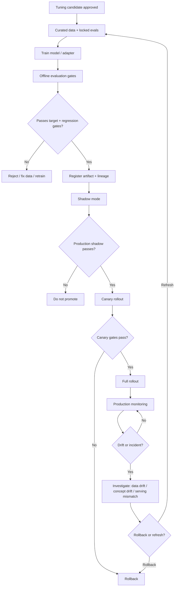

**How to read this diagram:**
Evaluation does not stop at offline holdout. A tuned model must pass offline gates, shadow traffic, canary traffic, and ongoing drift monitoring. Rollback is part of the design, not an emergency improvisation.

---

### 3. Real-World Industry Scenarios [Intermediate]

#### Scenario A: Security Questionnaire LoRA Adapter

**Product/use case context:**
A LoRA adapter improves security-questionnaire answers by preserving caveats and reducing unsupported claims. It is deployed for low/medium-risk RFP questions.

**What lifecycle operations require:**
The team registers base model ID, adapter ID, prompt template, dataset version, policy document version, and evaluation report. Shadow mode compares base+prompt vs adapter outputs. Canary starts with low-risk questions only. High-risk legal commitments remain human-reviewed.

**Constraints:**
Security policies change. Customer-specific commitments differ by contract. Unsupported claims are risky. A new adapter must not bypass legal review. Retrieval source freshness must be monitored separately from adapter behavior.

**What good looks like in production:**
Monitoring tracks unsupported-claim rate, citation support, escalation recall, reviewer override rate, and drift by policy area. A rollback trigger disables the adapter if high-risk regressions appear.

#### Scenario B: Invoice Extraction Adapter

**Product/use case context:**
A tuned extractor improves total/tax/subtotal extraction across common invoice formats. It runs in a batch payables workflow.

**What lifecycle operations require:**
Evaluation includes field-level exact match, numeric tolerance, missing-field handling, and vendor/layout slices. Production monitoring tracks high-value invoice errors and parser/OCR confidence. A fallback sends low-confidence extraction to human review.

**Constraints:**
New vendor layouts appear. OCR quality changes with scan quality. Payment errors have direct financial impact. The tuned extractor should not guess if fields are absent.

**What good looks like in production:**
The model's field-level accuracy is monitored by vendor/layout. A new vendor with high error rate creates a data collection ticket and may route to review until retraining.

#### Scenario C: Support Ticket Classifier

**Product/use case context:**
A fine-tuned classifier routes support tickets at high volume. It replaced a long prompt and reduced cost.

**What lifecycle operations require:**
The team monitors confusion matrix, per-class recall, threshold behavior, queue transfer rate, and human override. Product launches introduce new ticket categories. Label definitions evolve.

**Constraints:**
Class imbalance can hide regressions. Security/outage false negatives are severe. New product features create data drift. Thresholds may need recalibration before retraining.

**What good looks like in production:**
The classifier has a refresh cadence tied to product launches and quarterly label review. Canary compares old and new classifier on live traffic before full route changes.

---

### 4. System View: Think Like a Systems Engineer [Intermediate]

#### Inputs -> Transformations -> Outputs

**Inputs:**
- Tuned artifact: full checkpoint, LoRA adapter, classifier, or domain adapter.
- Base model, tokenizer, prompt template, retrieval contract, serving config.
- Evaluation suites: target task, regression, safety, cost, latency, slice gates.
- Deployment plan: shadow, canary, rollout, rollback triggers.
- Monitoring signals: production inputs, outputs, human corrections, incidents, latency, cost.

**Transformations:**
1. Register tuned artifact and lineage.
2. Run offline evaluation gates against baseline and previous production version.
3. Validate adapter/base/tokenizer/prompt compatibility.
4. Run shadow evaluation on production traffic.
5. Canary limited traffic with rollback triggers.
6. Monitor production drift and incidents.
7. Decide whether to roll back, recalibrate thresholds, refresh data, or retrain.
8. Update model card and release notes.

**Outputs:**
- Deployment decision: reject, shadow, canary, ship, rollback, refresh.
- Model card and release notes.
- Production dashboard.
- Incident tickets and data collection tasks.
- Refresh/retraining plan.

#### Observability: What We Log, Trace, and Measure

Log:
- Base model ID, adapter/checkpoint ID, tokenizer ID, prompt template ID.
- Dataset and eval suite versions.
- Route decision: base, adapter, teacher, human review, fallback.
- Input slice metadata and source IDs.
- Prediction, confidence, validation result, human correction.
- Latency, cost, memory, errors, and rollback state.

Measure:
- Target task quality by slice.
- Regression suite pass/fail.
- Human override and edit rate.
- Unsupported-claim, false-negative, or field-error rates.
- Drift in input distribution and label distribution.
- p95 latency, throughput, adapter load time, cost per successful task.
- Incident rate and rollback frequency.

#### Failure Points: Where It Breaks and How It Shows Up

| Failure point | What breaks | Symptom | First debugging step |
|---|---|---|---|
| Adapter/base mismatch | Wrong artifact combination | Production differs from eval | Verify base model, tokenizer, adapter, prompt IDs |
| Weak regression suite | Non-target behavior breaks | Target lift but adjacent task regressions | Add baseline regression tests |
| No rollback trigger | Incident response slow | Bad model stays live | Define metric and manual kill switch |
| Data drift | Inputs change | Quality decays on new slices | Compare production slices to training/eval data |
| Concept drift | Correct labels change | Model follows old taxonomy/policy | Review label schema and policy versions |
| Threshold drift | Automation becomes unsafe or too conservative | False accepts/escalations change | Recalibrate thresholds by risk tier |
| Monitoring too aggregate | Hidden high-risk regression | Average looks fine, critical slice fails | Add slice-level dashboards |

---

### 5. System Design Flavor [Intermediate]

#### Key Components and Interfaces

1. **Model registry:** Stores model/adaptor versions, status, owner, evals, and deployment history.
2. **Artifact registry:** Stores checkpoints, adapters, tokenizers, prompts, configs, and metadata.
3. **Evaluation harness:** Runs target, regression, safety, cost, and latency gates.
4. **Compatibility tester:** Verifies base model + adapter + tokenizer + prompt template.
5. **Deployment controller:** Manages shadow, canary, rollout, rollback, and traffic routing.
6. **Monitoring dashboard:** Tracks quality, drift, cost, latency, human review, incidents.
7. **Incident workflow:** Connects alerts to rollback, owner paging, and root-cause analysis.
8. **Refresh pipeline:** Rebuilds datasets, reruns training/evals, and proposes new artifacts.

#### Important Tradeoffs

| Tradeoff | Plain-English meaning | Choose this when... |
|---|---|---|
| Fast rollout vs staged rollout | Ship quickly or reduce blast radius. | Use staged rollout for any tuned model affecting users, money, safety, or legal risk. |
| Strict gates vs iteration speed | More safety or faster experimentation. | Use strict gates for production; lighter gates for offline exploration. |
| Rollback vs hotfix | Revert known-good artifact or patch forward. | Roll back when user risk is active; hotfix only when root cause is clear and safe. |
| Retrain vs recalibrate threshold | Change model behavior or decision boundary. | Recalibrate when confidence/risk tradeoff shifted; retrain when behavior/data changed. |
| One global model vs routed adapters | Simpler serving or specialized behavior. | Route adapters when slices differ and routing is reliable. |
| Continuous refresh vs scheduled refresh | Update often or at planned intervals. | Trigger refresh on drift/incidents; schedule refresh for known policy/product cycles. |

#### Scaling Consideration: What Changes at 10x Traffic/Data

At 10x traffic, a small regression becomes visible quickly and can harm many users. Rollback must be fast, automated where possible, and tested. Monitoring must be near real time for critical slices.

At 10x data, maintenance becomes data operations. You need automated drift detection, active sampling, annotation queues, eval expansion, and lineage. The tuned model becomes part of a continuous improvement loop.

---

### 6. Common Mistakes + Debugging [Intermediate]

#### Mistake 1: Treating Training Completion as Launch Readiness

**Symptom:** The model has a good training report but fails in production.

**Likely cause:** Offline training metrics were mistaken for deployment proof.

**First debugging step:** Run production-like evaluation: baseline comparison, regression suite, compatibility test, shadow mode, and canary gates.

#### Mistake 2: No Fast Rollback Path

**Symptom:** A bad adapter remains active while the team debates a fix.

**Likely cause:** Rollback was not designed before launch.

**First debugging step:** Add a traffic switch or configuration flag that routes back to previous model/adapter/prompt without code deployment.

#### Mistake 3: Missing Artifact Compatibility Checks

**Symptom:** Adapter performed well offline but behaves strangely online.

**Likely cause:** Production used a different base model, tokenizer, prompt format, quantization, or adapter version.

**First debugging step:** Log and compare artifact IDs across eval and production. Add preflight compatibility tests.

#### Mistake 4: Monitoring Only Aggregate Quality

**Symptom:** Dashboard looks healthy while one domain/risk slice fails.

**Likely cause:** Aggregate metrics hide slice regressions.

**First debugging step:** Add slice dashboards for task type, risk tier, customer segment, document type, label, and source freshness.

#### Mistake 5: Retraining Before Understanding Drift

**Symptom:** New training run does not fix production failures.

**Likely cause:** The problem was threshold calibration, retrieval drift, label drift, or serving mismatch, not missing training data.

**First debugging step:** Classify production failures as data drift, concept drift, serving mismatch, threshold issue, retrieval issue, or true model gap.

---

### 7. Hands-On Lab: Tuned-Model Release Checklist [Pro]

#### Concept

You will design a release checklist for a LoRA adapter used in security-questionnaire answering.

#### Build: Release Gate Object

```python
release = {
    "artifact": {
        "base_model_id": "base-instruct-v3",
        "adapter_id": "security-rfp-lora-2026-06",
        "tokenizer_id": "base-instruct-v3-tokenizer",
        "prompt_template_id": "rfp-answer-v5",
        "dataset_id": "rfp-reviewed-2026q2",
    },
    "offline_gates": {
        "commitment_label_accuracy_lift": ">= 5pp",
        "unsupported_claim_rate": "must decrease",
        "high_risk_regression": "blocked",
        "general_regression_suite": "pass",
        "p95_latency": "<= baseline + 15%",
    },
    "rollout": {
        "shadow_days": 3,
        "canary_percent": 5,
        "rollback_trigger": "high_risk_regression_or_unsupported_claim_spike",
    },
}
```

Define a simple gate check:

```python
def should_promote(metrics):
    if metrics["high_risk_regression"]:
        return False
    if metrics["unsupported_claim_rate_delta"] > 0:
        return False
    if metrics["target_lift_pp"] < 5:
        return False
    if metrics["p95_latency_delta_pct"] > 15:
        return False
    return True
```

#### Break: Make the Release Unsafe

Break it intentionally:

1. Do not store base model/tokenizer IDs.
2. Skip regression suite.
3. Skip shadow mode.
4. No rollback trigger.
5. Monitor only aggregate score.

#### Measure: Operational Readiness

| Readiness area | Healthy pattern | Risky pattern |
|---|---|---|
| Lineage | Base, adapter, data, eval versions recorded | Unknown artifact chain |
| Eval gates | Target + regression + safety + cost | Target metric only |
| Rollout | Shadow -> canary -> full | Full traffic immediately |
| Rollback | Config switch tested | Manual redeploy required |
| Monitoring | Slice-level dashboard | Aggregate score only |
| Maintenance | Drift and refresh triggers | No owner after launch |

#### Explain: Why It Broke and What Fix Prevents It

The unsafe release failed because it treated a tuned adapter like a static file rather than a production dependency. Without lineage, gates, rollout controls, rollback, and drift monitoring, the team cannot explain or control behavior.

The fix is lifecycle discipline: every tuned artifact must be versioned, evaluated, staged, monitored, and owned.

---

### 8. Active Recall (Spaced Repetition) [Beginner -> Pro]

#### Questions

1. Why is a tuned model a production dependency?
2. What should be versioned with a LoRA adapter?
3. What is the difference between data drift and concept drift?
4. Why is rollback planned before rollout?
5. Why can retraining be the wrong first response to a production failure?

#### Short Answer Key

1. It depends on base model, tokenizer, prompt, data, evals, serving config, and routing; changes can affect behavior.
2. Base model, adapter, tokenizer, prompt template, dataset, training config, eval suite, and serving config.
3. Data drift means inputs change; concept drift means the meaning of labels/correct behavior changes.
4. If a tuned model causes harm, traffic must return to a known-good artifact quickly.
5. The issue may be serving mismatch, threshold calibration, retrieval drift, or label/policy drift rather than missing training examples.

---

### 9. Practice [Intermediate -> Pro]

#### Mini-Exercise: Pick the Operational Response

| Production symptom | First response | Why |
|---|---|---|
| Adapter gives old pricing | Check retrieval/policy source | Pricing should not be in weights. |
| Target lift holds, p95 latency doubled | Route or rollback | Quality may not justify latency. |
| One high-risk slice regresses | Rollback or disable slice route | Critical gate failure. |
| New ticket category appears | Update label schema/eval before retrain | Concept drift. |
| Same adapter behaves differently online | Check base/tokenizer/prompt IDs | Compatibility mismatch likely. |
| Human overrides slowly rise | Drift investigation | Could be data drift or threshold drift. |

#### Capstone System Design Question

You are releasing a LoRA adapter for support-ticket routing. It improves overall holdout accuracy from 84% to 89%, but security tickets are rare and high risk. Design the evaluation, rollout, rollback, and maintenance plan.

**Suggested answer outline:**

Evaluation:
- Rerun baseline and adapter on same locked holdout.
- Report per-class precision/recall and confusion matrix.
- Gate security recall and outage recall.
- Include general regression suite and latency/cost checks.

Rollout:
- Register artifact lineage: base, adapter, tokenizer, prompt, dataset, eval.
- Shadow on live tickets.
- Canary low-risk routes first.
- Keep high-risk tickets routed through previous classifier or human review until canary proves safe.

Rollback:
- Config switch to previous adapter/base route.
- Rollback trigger: security recall drop, queue transfer spike, human override spike, p95 latency breach.

Maintenance:
- Monitor class distribution drift, new product categories, label schema changes.
- Review thresholds monthly or after major product launches.
- Refresh data and retrain only after root-cause analysis shows true model gap.

---

### 10. Production Reality Check

**If this fails in prod, what's the first thing we inspect?**

Inspect artifact lineage and the first failing boundary: base model, adapter, tokenizer, prompt, retrieval/context contract, threshold, or routing.

The first question is: **is production running the exact artifact combination that passed evaluation?** If not, fix compatibility. If yes, classify the failure as data drift, concept drift, threshold drift, retrieval drift, or true tuned-model regression.

The fastest debugging move is to replay the same examples through previous production, current tuned model, and fallback route with identical inputs and log every artifact ID. Then decide rollback, recalibration, retrieval fix, or data refresh.

---

### 11. Curiosity Bridge

This completes Topic 18.3 and Module 18. You now have the full optimization stack: diagnose whether optimization is justified, express optimizable programs with DSPy, decide when behavior should move into adapters or tuned models, and operate those tuned artifacts safely.

This unlocks the next natural capability: debugging and operating GenAI systems over time. Optimization is not a one-time event; it becomes a continuous loop of evaluation, monitoring, incident response, and improvement.

---

### 12. Exit Check + Carry-Forward Review

**Exit check - you are done when you can:**
Take a tuned model proposal and produce a release plan with lineage, offline gates, regression suites, shadow/canary rollout, rollback triggers, drift monitoring, refresh cadence, and owner responsibilities.

**Carry-Forward Review:**

Question: How does 18.3.c task-family thinking affect maintenance?

Answer: Maintenance signals differ by task family. Extraction needs field-level drift and parser/OCR monitoring. Classification needs label distribution, confusion matrix, and threshold monitoring. Domain adaptation needs style/procedure quality plus factuality and safety regression checks.

Question: How does 18.1.d ROI analysis affect rollback and refresh decisions?

Answer: Rollback and refresh are economic decisions as well as quality decisions. A tuned model that improves accuracy but increases review cost, latency, incidents, or maintenance burden may have negative realized ROI.

---

## Topic 18.3 Checkpoint: Fine-Tuning, Distillation, and Model Adaptation

### Checkpoint Q1: When should behavior move from prompts/DSPy into tuning?

**Reference answer:** When the behavior is stable, repeated, labelable, high-impact, not primarily caused by missing retrieval or ambiguous policy, and cheaper runtime prompts/program optimization has plateaued or become too costly.

### Checkpoint Q2: What is the difference between PEFT/LoRA and distillation?

**Reference answer:** PEFT/LoRA describes how the student is trained: a small set of adapter parameters modifies a frozen base model. Distillation describes where supervision comes from: a stronger teacher model/program generates labels, answers, preferences, or traces for a student to learn from.

### Checkpoint Q3: Why are extraction and classification strong adaptation candidates?

**Reference answer:** They often have stable schemas or labels, clear metrics, many examples, and recurring boundaries. Their outputs can be evaluated field-by-field or class-by-class, which makes tuning and regression testing more reliable.

### Checkpoint Q4: What makes tuned-model operations different from prompt operations?

**Reference answer:** Tuned models introduce artifact dependencies: base model, tokenizer, adapter/checkpoint, dataset, eval suite, prompt template, routing, and serving configuration. They require registry, compatibility tests, rollout controls, rollback triggers, drift monitoring, and refresh ownership.

### Topic 18.3 Self-Assessment

| Skill | Can you do it without notes? | Confidence (1-5) |
|---|---|---|
| Explain SFT, PEFT, LoRA, QLoRA, and adapters | | |
| Decide when fine-tuning is better than prompting/DSPy/retrieval | | |
| Design a teacher-student distillation pipeline | | |
| Choose adaptation strategy for extraction, classification, and domain adaptation | | |
| Build task-specific metrics and critical slice gates | | |
| Design tuned-model rollout and rollback | | |
| Monitor drift and define refresh triggers | | |

**Score yourself:** 5/5 across all rows = Topic 18.3 mastered.

---

## ✅ Module 18 Checkpoint

### Module Synthesis Q1: Explain the full optimization decision stack.

**Reference answer:** Start by diagnosing the ceiling: prompt, data/retrieval, model capability, spec, or workflow. Then perform systematic error analysis to identify stable, high-impact, labelable failure clusters. Use synthetic data only to fill known coverage gaps with curation. Use ROI analysis to decide whether optimization is worth doing. If prompt/program behavior is the bottleneck, DSPy can optimize signatures, modules, instructions, and demos. If stable behavior should move into the model, use SFT, PEFT/LoRA, distillation, or task-specific fine-tuning. Finally, operate tuned artifacts with evaluation gates, rollout controls, rollback, monitoring, and refresh.

### Module Synthesis Q2: What should never be solved by fine-tuning first?

**Reference answer:** Missing context, stale facts, changing policies, customer-specific facts, ambiguous labels, weak rubrics, broken retrieval, parser/OCR failures, unsafe irreversible workflow decisions, and low-volume one-off edge cases. These usually need retrieval, tools, specs, workflow gates, human review, or cheaper prompt/DSPy fixes before tuning.

### Module Synthesis Q3: How do DSPy and fine-tuning relate?

**Reference answer:** DSPy optimizes runtime LM programs: signatures, modules, instructions, demos, and metrics. Fine-tuning changes learned behavior through weights/adapters. DSPy is usually easier to iterate and rollback. Fine-tuning can reduce runtime prompt burden and improve stable repeated behavior, but it adds training, serving, evaluation, rollback, and maintenance responsibilities.

### ✅ Add to Knowledge Base: All-Round Module Checkpoint Review

This checkpoint has three outcomes:

1. Know when optimization is justified and when it is wasted effort.
2. Explain DSPy as optimization of AI programs rather than prompt tweaking.
3. Describe fine-tuning with realistic maintenance expectations.

The shortest mastery statement:

> Module 18 teaches that GenAI optimization is an engineering decision loop: diagnose the bottleneck, measure failures, choose the cheapest safe optimization layer, validate honestly, and operate the resulting artifact over time.

---

### Checkpoint Outcome 1: When Optimization Is Justified vs Wasted

Optimization is justified when all five conditions are true:

| Condition | Why it matters |
|---|---|
| The failure is real and measurable | You need a baseline and metric, not anecdotes. |
| The failure has a known root cause | Prompt, retrieval, model, data, spec, workflow, or serving layer must be identified. |
| The failure cluster is frequent or severe enough | Rare low-risk failures may not justify engineering/data/training cost. |
| The target behavior is stable and labelable | If humans disagree or policy changes weekly, optimization may amplify noise. |
| The proposed fix has positive risk-adjusted ROI | Lift must justify cost, latency, maintenance, and regression risk. |

Optimization is usually wasted effort when:

| Situation | Why optimization is wasted | Better first move |
|---|---|---|
| Correct evidence is missing | The model cannot reason from facts it never received. | Fix retrieval, tools, source freshness, permissions. |
| Labels are ambiguous | The model learns disagreement. | Clarify rubric, adjudicate, update policy. |
| Facts change frequently | Tuned weights become stale. | Use RAG/tools/source-of-truth APIs. |
| Failure is low-volume and low-risk | ROI is weak. | Monitor, prompt patch, or human review. |
| The eval metric is weak | The optimizer learns to game the metric. | Fix metrics and slice gates first. |
| The base model lacks capability | More examples may not create missing reasoning ability. | Route to stronger model, decompose task, or redesign workflow. |
| Workflow risk is irreversible | Automation may be unsafe even if accurate. | Add approval gates and rollback paths. |

#### Optimization Decision Tree

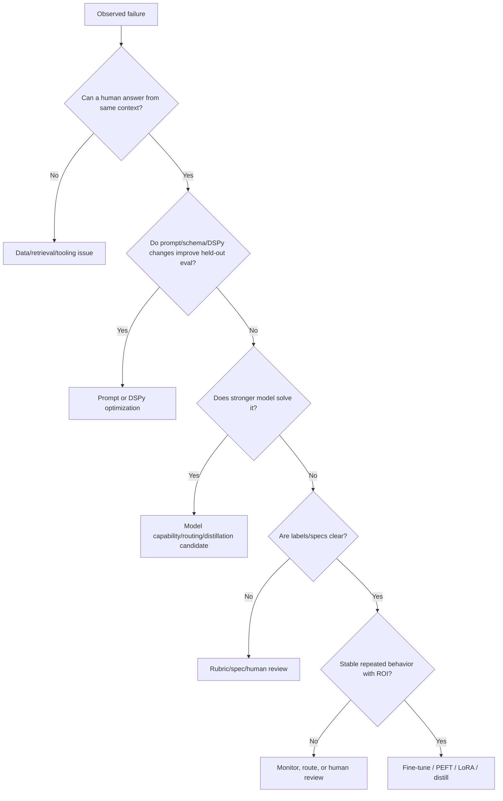

---

### Checkpoint Outcome 2: DSPy Is AI-Program Optimization, Not Prompt Tweaking

DSPy is not mainly a prettier prompt template. It turns an LM workflow into an optimizable program.

| Prompt tweaking | DSPy program optimization |
|---|---|
| Human edits prompt wording manually | System searches instructions/demos against a metric |
| Prompt string is the main artifact | Signature/module/metric is the main artifact |
| Hard to know which edit helped | Optimizer traces candidates and scores |
| Often one giant prompt | Composable modules with explicit boundaries |
| Evaluation may be casual | Compilation requires train/dev/holdout discipline |

DSPy has four core ingredients:

| Ingredient | Meaning | Example |
|---|---|---|
| Signature | Input/output contract | `question, context -> answer, citations` |
| Module | Composable LM program component | answerer, verifier, router, extractor |
| Metric | Definition of success | citation support, exact match, escalation recall |
| Optimizer | Search process | few-shot search, instruction search, MIPRO-style optimization |

Interview-ready sentence:

> DSPy treats prompts as parameters of an AI program, not as the whole system. You define the program interface and metric, then compile better instructions and demonstrations against data.

Where DSPy fits:

| System layer | Owner |
|---|---|
| Workflow state, tools, approvals | LangGraph, ADK, Agents SDK, custom backend |
| Ingestion/retrieval/indexing | LlamaIndex, search layer, vector DB, custom RAG |
| Optimizable LM behavior | DSPy |
| Learned stable behavior | SFT, PEFT/LoRA, distillation |
| Irreversible/risky actions | Deterministic policy and human review |

---

### Checkpoint Outcome 3: Fine-Tuning With Realistic Maintenance Expectations

Fine-tuning is not "make the model smarter." It is behavior adaptation under a maintenance contract.

Fine-tuning is strongest for:

| Task family | Why it works |
|---|---|
| Extraction | Clear fields, schemas, field-level metrics. |
| Classification | Stable labels, confusion matrices, thresholds. |
| Domain style/procedure | Repeated terminology, format, and workflow conventions. |
| Stable answer behavior | Caveat preservation, abstention, citation discipline. |
| Teacher-student compression | Expensive teacher behavior can be learned by cheaper student. |

Fine-tuning is weak or risky for:

| Task | Why |
|---|---|
| Changing facts | Weights go stale. |
| Missing context | Model learns to guess. |
| Ambiguous policies | Model learns inconsistent labels. |
| Rare high-risk decisions | ROI and safety are weak. |
| Deep capability gaps | Student may lack capacity. |
| Unreviewed teacher outputs | Distillation copies teacher errors. |

Maintenance checklist for any tuned model:

| Area | Required discipline |
|---|---|
| Lineage | Base model, tokenizer, adapter, dataset, schema, eval version. |
| Evaluation | Target lift, regression suite, critical slice gates, latency/cost. |
| Rollout | Shadow mode, canary, route-limited exposure. |
| Rollback | Runtime switch to previous model/adapter/route. |
| Monitoring | Drift, human overrides, field/label errors, unsupported claims. |
| Refresh | Triggered by data drift, concept drift, policy changes, incidents. |

Interview-ready sentence:

> Fine-tuning is justified when stable repeated behavior should be internalized, but every tuned model becomes an artifact that must be versioned, evaluated, rolled back, monitored, and refreshed.

---

### Failure-to-Fix Matrix

| Failure symptom | Likely root cause | Best first fix |
|---|---|---|
| Wrong answer because correct doc missing | Retrieval/data ceiling | Improve retrieval/source integration |
| Correct doc present but output overclaims | Stable behavior gap | DSPy first; LoRA/SFT if repeated at volume |
| Invalid JSON | Output control issue | Schema validation, parser retry, DSPy |
| Classification confuses two stable labels | Label-boundary behavior | Fine-tuned classifier or LoRA |
| Rare risky legal commitment | Workflow risk | Human approval/routing |
| Teacher labels are inconsistent | Teacher/data quality issue | Filter/audit/adjudicate before distillation |
| Holdout lift strong, production lift weak | Eval coverage/distribution gap | Shadow analysis and eval expansion |
| Tuned model gets stale after policy update | Concept/data drift | Retrieval update, eval refresh, retrain if needed |

---

### End-to-End Case Walkthrough

**Case:** Enterprise RFP assistant is stuck at 78% success.

1. Ceiling diagnosis:
    - Prompt variants improve only 1 point.
    - Oracle context improves 6 points on some failures.
    - Stronger model improves hard reasoning by 5 points.
    - Human reviewers disagree on legal commitments.

2. Root-cause split:
    - Retrieval freshness: fix RAG/source metadata.
    - Caveat preservation: DSPy, then LoRA candidate if repeated at volume.
    - Hard reasoning: route to stronger model/teacher.
    - Legal commitments: human review gate.

3. Optimization path:
    - Use DSPy for answer/citation/abstention module.
    - Generate curated hard negatives for caveats.
    - Use LoRA only for stable commitment-strength behavior.
    - Distill low-risk common answers from teacher pipeline into cheaper student.
    - Keep volatile customer-specific facts in retrieval.

4. Deployment:
    - Locked holdout and slice gates.
    - Shadow mode on real RFP traffic.
    - Canary only low-risk answers.
    - Human review for high-risk commitments.
    - Roll back adapter route if unsupported claims rise.

This is the full Module 18 mindset: choose the layer, prove the lift, operate the artifact.

---

### Checkpoint Active Recall

1. What evidence tells you optimization is wasted effort?
2. Why is DSPy not just prompt templating?
3. What must be true before fine-tuning is justified?
4. Why should changing facts stay in retrieval/tools?
5. Why is the optimizer's dev score not final proof?
6. What should every tuned-model rollback plan include?

**Answer key:**

1. Missing context, ambiguous labels, weak metrics, volatile facts, low ROI, or model capability gap.
2. DSPy defines signatures/modules/metrics and compiles better instructions/demos against examples.
3. Stable repeated behavior, clean labels, enough volume/impact, clear eval, positive ROI, and maintenance plan.
4. Facts change; weights go stale unless retrained. Retrieval/tools keep knowledge fresh and auditable.
5. The optimizer selected candidates using dev feedback, so dev performance is biased upward.
6. Known-good fallback artifact/route, trigger metrics, owner, runtime switch, and post-rollback investigation path.

### Module 18 Self-Assessment

| Skill | Can you answer without notes? | Confidence (1-5) |
|---|---|---|
| Diagnose prompt/data/model/spec/workflow ceiling | | |
| Build an error taxonomy and adaptation candidate list | | |
| Generate and curate synthetic data safely | | |
| Calculate ROI and compare optimization paths | | |
| Build DSPy signatures, modules, metrics, and optimizer plans | | |
| Evaluate compiled DSPy programs honestly | | |
| Choose SFT/PEFT/LoRA/distillation vs retrieval/DSPy/human review | | |
| Operate tuned models with rollout, rollback, monitoring, and refresh | | |

**Module 18 is complete. Next: model adaptation case studies, debugging playbooks, or the next canon module depending on your roadmap.**

---

## Module Glossary

- **Adapter compatibility** - guarantee that an adapter is served with the correct base model, tokenizer, prompt format, and runtime settings.
- **Artifact registry** - storage and metadata management for tuned checkpoints, adapters, tokenizers, prompts, and evaluation reports.
- **Baseline regression suite** - tests that ensure a tuned model does not break previously acceptable behavior.
- **Concept drift** - the meaning of labels, policies, user intent, or correct behavior changes over time.
- **Data drift** - production inputs change relative to training/evaluation data.
- **Drift monitoring** - production monitoring for changes in data, labels, behavior, quality, cost, or user outcomes.
- **Evaluation gate** - a required pre-deployment quality, safety, cost, or latency check.
- **Model card** - documentation summarizing intended use, data, metrics, limitations, risks, and maintenance expectations.
- **Model registry** - a system of record for model versions, adapters, base models, training configs, metrics, and deployment status.
- **Refresh cadence** - planned schedule or trigger policy for updating data, evals, adapters, or tuned models.
- **Rollback plan** - a defined way to return traffic to a previous model, adapter, prompt, route, or workflow state.
- **Rollback trigger** - a metric, incident, or threshold that starts rollback.
- **Tuned model lifecycle** - the full operational path from tuning decision to training, evaluation, deployment, monitoring, refresh, and rollback.
- **Tuning lineage** - traceability from tuned artifact back to base model, dataset, config, evals, and approval decision.

- **Class imbalance** - a dataset problem where some labels are much more common than others.
- **Classification fine-tuning** - adapting a model to assign labels, categories, routes, risk tiers, or decisions.
- **Domain adaptation** - adapting a model to a domain's terminology, style, formats, procedures, and recurring task patterns.
- **Domain vocabulary** - specialized terms, abbreviations, formats, and phrasing used in a domain.
- **Exact match** - a metric requiring the predicted value to match the reference exactly.
- **Extraction fine-tuning** - adapting a model to produce structured fields from unstructured or semi-structured inputs.
- **Field-level metric** - a metric that scores each extracted field separately rather than only the full output.
- **Label schema** - the set of allowed labels and definitions for a classification or extraction task.
- **Majority-class collapse** - when a classifier overpredicts the most common label because training/eval distribution is imbalanced.
- **Partial credit metric** - a metric that gives credit for near-correct outputs, useful for spans, normalized values, and long fields.
- **Schema-constrained extraction** - extraction where outputs must follow a fixed schema, such as JSON fields or typed records.
- **Threshold calibration** - choosing confidence thresholds that trade off automation, escalation, false positives, and false negatives.

- **Behavior cloning** - training a student to reproduce the teacher's outputs or decisions.
- **Distillation** - training a student model/program to imitate useful behavior from a stronger teacher model/program.
- **Distillation ceiling** - the maximum useful student performance if the student lacks capacity, context, tools, or data coverage.
- **Distillation dataset** - curated examples, labels, outputs, traces, or preferences used to train a student from teacher signal.
- **Hard-label distillation** - training on the teacher's final discrete label or answer.
- **Logits** - raw model scores before probability normalization; often used in classic soft-label distillation.
- **Preference distillation** - training a student from teacher or human preferences between candidate outputs.
- **Pseudo-labeling** - generating labels for unlabeled examples using a model or program instead of human annotators.
- **Rationale distillation** - training the student using teacher-generated explanations, reasoning steps, or intermediate traces.
- **Response distillation** - training on teacher-generated final responses.
- **Soft labels** - probability-like labels or graded targets that preserve uncertainty, rather than only hard class labels.
- **Soft-label distillation** - training on the teacher's probability distribution or confidence over labels, when available.
- **Student capacity** - the student's ability to represent the teacher's target behavior given its size, architecture, context window, and training setup.
- **Student gap** - the quality difference between teacher performance and student performance after distillation.
- **Teacher bias transfer** - the student inheriting systematic teacher mistakes, blind spots, or style biases.
- **Teacher program** - a pipeline, ensemble, DSPy program, or human-reviewed workflow that produces high-quality training targets.
- **Teacher-student pipeline** - the data and training workflow where a teacher generates labels, outputs, rationales, traces, or preferences used to train a student.
- **Temperature** - a scaling parameter used to soften probability distributions so the student can learn relative class similarities.

- **Ablation** - removing or changing one component to measure whether it actually contributed to improvement.
- **Adapter** - a small trainable module attached to a frozen model to add task/domain-specific behavior.
- **Adapter routing** - selecting which adapter to use for a request based on task, tenant, domain, or route.
- **Alpha** - in LoRA, a scaling factor that controls the strength of the low-rank update.
- **Agent runtime** - infrastructure for running agent loops, tool calls, sessions, messages, memory, streaming, and guardrails.
- **Application orchestration** - coordinating user requests, state, tools, permissions, retries, long-running tasks, and outputs across a production workflow.
- **Canary deployment** - releasing a new program to a small portion of real traffic before broad rollout.
- **Catastrophic forgetting** - loss of previously useful general behavior after training too aggressively or on narrow data.
- **Compiler/optimizer** - the DSPy component that searches for better instructions, demonstrations, or program settings to maximize a metric.
- **Compiled program** - the optimized DSPy program artifact produced after an optimizer selects instructions, demonstrations, or settings.
- **Confidence interval** - a range that expresses uncertainty around a measured metric due to sample size and variance.
- **Data ceiling** - the quality plateau caused by missing, insufficient, noisy, stale, biased, or poorly represented data needed for the model to succeed.
- **Automation rate** - the percentage of tasks completed without human intervention while meeting quality and risk gates.
- **Baseline** - the current measured state of the system before optimization: quality, cost, latency, risk, and operational effort.
- **Break-even point** - the traffic volume, time horizon, or quality lift needed for optimization value to equal optimization cost.
- **BootstrapFewShot** - a DSPy optimizer pattern that builds few-shot demonstrations from successful program runs.
- **BootstrapFewShotWithRandomSearch** - a DSPy optimizer pattern that samples different demonstration sets and keeps the best-performing compiled program.
- **Bootstrapping** - using a teacher program/model to generate candidate demonstrations or rationales, then filtering them by a metric.
- **Cost of delay** - the loss created by waiting to improve a failure, especially when failures are high-volume, high-risk, or revenue-blocking.
- **Cost per successful task** - total system cost divided by the number of tasks completed correctly.
- **Counterfactual** - the realistic comparison case: what would happen if you did not do this optimization, or chose a cheaper alternative instead.
- **Data contamination** - leakage of evaluation examples, answers, or near-duplicates into training or prompt-optimization data, causing inflated metrics.
- **Data curation** - filtering, validating, deduplicating, balancing, documenting, and splitting data so it is useful and safe for optimization.
- **Data-centric RAG framework** - a framework focused on ingestion, indexing, retrieval, chunking, metadata, and data-grounded query pipelines.
- **Development set** - examples used during optimizer search and iteration.
- **Distribution shift** - the mismatch between the data used for training/evaluation and the data seen in real production traffic.
- **Diversity control** - deliberate variation across intents, wording, entities, languages, difficulty, formats, and edge cases so synthetic data does not collapse into repeated patterns.
- **DSPy** - a framework for declaring and optimizing language-model programs using signatures, modules, examples, and metrics.
- **Declarative AI program** - an AI system described by what each component should compute, not by hand-writing every prompt token.
- **Demonstration** - an example selected into the prompt to show the LM how to perform the task.
- **Demonstration selection** - choosing which labeled examples should appear in the prompt as examples.
- **Adaptation candidate** - a failure pattern that is stable, repeated, labelable, and worth improving through a specific adaptation method.
- **Confusion matrix** - a table showing which classes or labels the system confuses with which others.
- **Coverage gap** - a missing or underrepresented slice in the evaluation or training data.
- **Error slice** - a meaningful subset of failures grouped by feature, task type, user segment, data source, language, document type, risk level, or failure mode.
- **Error taxonomy** - a controlled vocabulary of failure categories used to label failures consistently across reviewers and eval runs.
- **Evaluation contamination** - leakage of benchmark, dev, or holdout examples into training, tuning, prompt search, or synthetic generation.
- **Expected value** - the probability-weighted value of an improvement after accounting for how often it happens and how much each success or avoided failure is worth.
- **Example** - a training or development case with inputs and expected outputs used for evaluation or optimization.
- **Feedback loop** - the pipeline that turns production observations into reviewed examples, evaluation cases, training data, and deployment decisions.
- **Few-shot optimization** - selecting or generating demonstrations to include in the model prompt.
- **Fine-tuning** - additional training of a pretrained model to adapt behavior for a task, domain, style, format, or label distribution.
- **Framework boundary** - the part of the system owned by orchestration, retrieval, tools, state, infrastructure, or product workflow.
- **Framework impedance mismatch** - friction caused when two frameworks both try to own the same control flow, state, or prompt lifecycle.
- **Framework-centric stack** - an application architecture organized around a framework that provides orchestration, tools, state, retrieval, or agent runtime patterns.
- **Frequency** - how often a failure appears in representative traffic or evaluation data.
- **Frozen base model** - a pretrained model whose original weights are not updated during adapter/LoRA training.
- **Gold set** - a curated evaluation set with representative inputs, expected outputs, scoring criteria, and useful metadata slices.
- **Holdout set** - evaluation examples kept separate from training and optimization so measured gains remain honest.
- **Honest evaluation** - evaluation designed to estimate future production performance without being biased by optimization search.
- **Hybrid stack** - an architecture where DSPy optimizes selected LM modules inside a broader application, RAG, or agent framework.
- **Hard negative** - a difficult example that looks similar to a correct/positive case but should receive a different answer or label.
- **Human-answerability test** - a check where a competent human attempts the task using exactly the information given to the model.
- **Impact** - the business, user, compliance, cost, or safety consequence of the failure.
- **Input field** - a named value supplied to a DSPy signature, such as `question`, `context`, `ticket_text`, or `document`.
- **Instruction search** - generating and evaluating alternative task instructions to improve metric performance.
- **Inter-annotator agreement** - a measure of how often independent human reviewers assign the same label or correction.
- **Label guideline** - a written rulebook that tells reviewers how to classify failures and produce expected outputs consistently.
- **Label noise** - incorrect, inconsistent, ambiguous, or low-confidence labels inside a dataset.
- **Locked holdout** - an evaluation set frozen before optimization and never used for prompt search, demo selection, instruction tuning, or candidate selection.
- **LoRA** - low-rank adaptation; a PEFT method that learns small low-rank weight updates while freezing the base model.
- **Maintenance burden** - the recurring effort required to keep an optimization correct as data, policies, models, prompts, and user behavior change.
- **Marginal lift** - the incremental improvement caused by a proposed change compared with the baseline or next-best alternative.
- **Metric** - a scoring function that tells the optimizer whether a program output is good.
- **Metric gaming** - when a program learns to score well on the metric without improving the real task.
- **MIPRO** - a DSPy optimizer family that searches over instructions and demonstrations using metric feedback.
- **Model adaptation** - changing system behavior for a task distribution through prompting, retrieval, DSPy optimization, fine-tuning, distillation, routing, tooling, or human review.
- **Model ceiling** - the quality plateau caused by the model's underlying capability limits for the task, format, domain, reasoning depth, latency budget, or safety constraints.
- **Module** - a reusable DSPy component that runs an LM behavior, such as prediction, chain-of-thought reasoning, retrieval-augmented answering, or composition of submodules.
- **Optimization triage** - the disciplined process of deciding which layer to improve before spending time on prompt work, retrieval work, fine-tuning, distillation, or model migration.
- **Optimization work** - any engineering, data, model, retrieval, evaluation, or workflow change meant to improve a GenAI system.
- **Optimization boundary** - the interface around the LM behavior DSPy is allowed to optimize.
- **Optimization layer** - the part of the system responsible for improving LM behavior using examples, metrics, and search.
- **Optimizer** - a DSPy component that searches for improved instructions, demonstrations, or program configurations using examples and a metric.
- **Optimizer bias** - the optimism introduced when a program is selected because it performed best on a development set.
- **Opportunity cost** - the value of the best alternative work the team cannot do because it chose this optimization.
- **Oracle context** - the ideal facts or retrieved passages supplied directly to the model to test whether retrieval/data access is the bottleneck.
- **Orchestration framework** - a framework that manages multi-step execution, state transitions, tool calls, and agent workflows.
- **Orchestration layer** - the layer that controls workflow order, state transitions, retries, tool calls, routing, and human approvals.
- **Output field** - a named value produced by a DSPy signature, such as `answer`, `category`, `rationale`, or `confidence`.
- **Parameter-efficient fine-tuning** - adapting a model by training only a small subset of parameters or added modules while keeping most base weights frozen.
- **Overfitting** - improving performance on optimizer examples while failing to generalize to new examples.
- **Program boundary** - the interface where an LM module receives structured inputs and returns structured outputs.
- **Prompt ceiling** - the quality plateau reached after reasonable prompt, schema, and few-shot improvements no longer improve measured performance.
- **Provenance** - metadata that records where an example came from, how it was generated, who reviewed it, and which dataset split it belongs to.
- **Quality filter** - an automated or human check that removes examples with invalid labels, unsupported facts, schema errors, duplicates, or policy violations.
- **QLoRA** - quantized LoRA; a method that trains LoRA adapters while loading the base model in low precision to reduce memory use.
- **Rank** - in LoRA, the size of the low-dimensional update space; higher rank can represent more complex adaptations but costs more.
- **Risk-adjusted ROI** - ROI that reduces expected value by the probability and severity of regressions, compliance issues, safety failures, and operational risk.
- **ROI analysis** - comparing the measurable value of an improvement against the full cost of achieving and maintaining it.
- **Regression gate** - a release rule that blocks deployment if a critical metric or slice gets worse beyond an allowed threshold.
- **Retrieval layer** - the layer that indexes, searches, reranks, and returns external knowledge for the LM program.
- **Runtime boundary** - the interface around production execution concerns such as state, permissions, tools, and deployment.
- **Root-cause label** - the best current explanation for why the failure happened, such as missing context, wrong retrieval, weak reasoning, invalid schema, ambiguous policy, or unsafe automation.
- **Severity** - how damaging a failure is if it reaches the user or downstream system.
- **Systematic error analysis** - the process of converting raw failures into structured evidence about root cause, severity, frequency, impact, and adaptation path.
- **Seed example** - a real or trusted example used as the starting pattern for generating synthetic variants.
- **Sensitivity analysis** - testing how ROI changes when assumptions such as lift, traffic, review cost, model price, or regression risk change.
- **Search budget** - the number of candidate programs, examples, instructions, or trials an optimizer is allowed to test.
- **Shadow mode** - running a new program on production traffic without showing its outputs to users or changing workflow decisions.
- **Signature** - a declarative input/output contract that tells an LM module what fields it receives and what fields it should produce.
- **Slice analysis** - evaluating performance by meaningful subsets such as task type, risk tier, language, customer segment, document type, or failure mode.
- **Statistical power** - the ability of an evaluation to detect a real improvement or regression.
- **Supervised fine-tuning** - training on labeled input-output examples where the target output demonstrates desired behavior.
- **Student model** - the model being trained, optimized, or evaluated using teacher-generated or curated examples.
- **Synthetic data** - artificially created examples, labels, rationales, preference pairs, or test cases used to expand coverage for evaluation or adaptation.
- **Teacher model** - a stronger model used to generate labels, explanations, examples, or demonstrations for a weaker or cheaper model.
- **Teleprompter** - older/common DSPy term for an optimizer that compiles a program by creating better prompts or demonstrations.
- **Test set** - final evaluation data used only after model/program selection decisions are complete.
- **Total cost of ownership** - the full lifecycle cost of an optimization, including build, labels, compute, inference, monitoring, maintenance, evaluation, and rollback.
- **Trainable parameters** - the weights updated during training.
- **Value of information** - the value gained from running a small diagnostic experiment before committing to a large optimization project.
