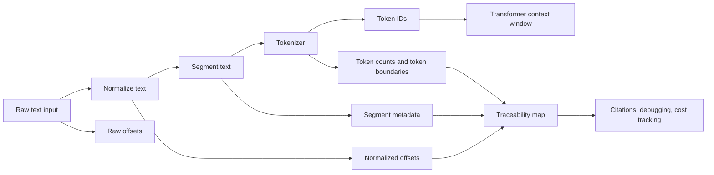
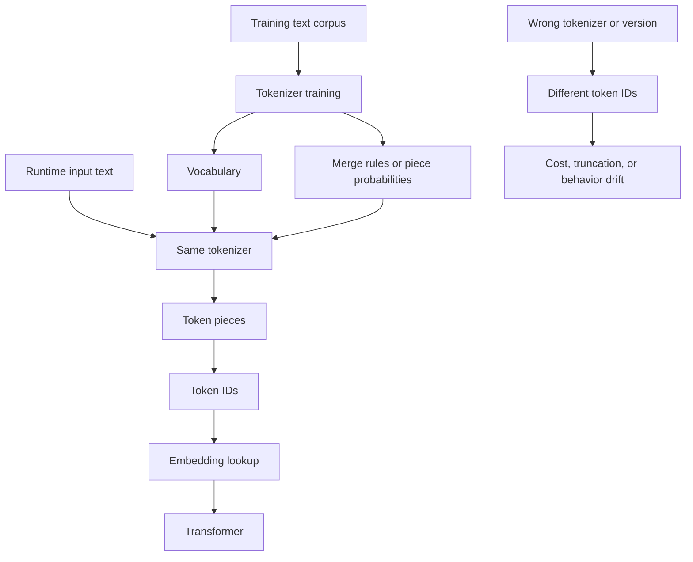
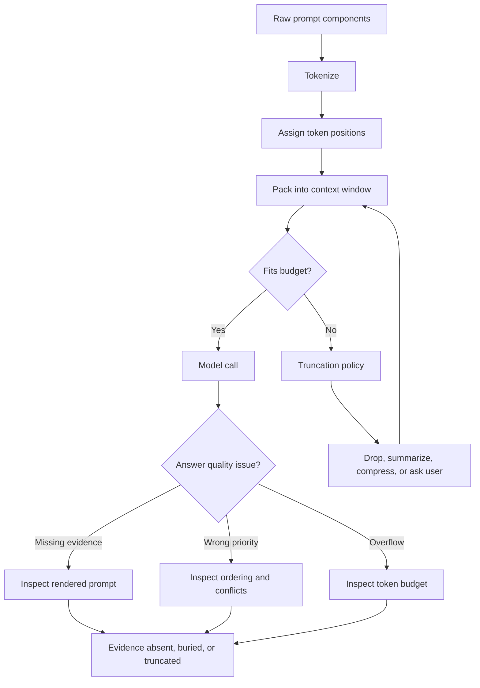

# Module 2 - Transformer And Modern LLM Internals

This is the evolving knowledge base for Module 2.

**Module time:** 30h

**Why this module matters:** This is the theory layer that prevents cargo-cult explanations. If Module 1 taught the map of a GenAI system, Module 2 explains why the model behaves the way it does under real constraints: tokens, context, attention, training, inference, and failure modes.

## Quick Topic Index

- [Topic 2.1: Text Processing, Tokens, and Context](#topic-21-text-processing-tokens-and-context)
- [Subtopic 2.1.a: Text Normalization, Segmentation, and Token Boundaries](#subtopic-21a-text-normalization-segmentation-and-token-boundaries)
- [Subtopic 2.1.b: BPE and SentencePiece Intuition](#subtopic-21b-bpe-and-sentencepiece-intuition)
- [Subtopic 2.1.c: Positional Information, Context Windows, and Truncation Risks](#subtopic-21c-positional-information-context-windows-and-truncation-risks)
- [Module Glossary](#module-glossary)

Covered so far:

- Topic 2.1.a: Text normalization, segmentation, and token boundaries
- Topic 2.1.b: BPE and SentencePiece intuition
- Topic 2.1.c: Positional information, context windows, and truncation risks

---

## Topic 2.1: Text Processing, Tokens, and Context

**Topic time:** 6h

Subtopics in this topic:

- 2.1.a Text normalization, segmentation, and token boundaries - 90m
- 2.1.b BPE and SentencePiece intuition - 90m
- 2.1.c Positional information, context windows, and truncation risks - 90m
- 2.1.d Token budgeting for prompts, retrieval context, and tool results - 90m

Learning rule for this module file:

- We cover one subtopic at a time.
- We do not complete the full parent topic in a single pass.
- Each new subtopic is appended only after the previous one is understood.

---

## Subtopic 2.1.a: Text Normalization, Segmentation, and Token Boundaries

### ✅ Add to Knowledge Base

### 0) Reading Path + Level Tags

Beginner: read sections 1, 2, 6, 8, 10, and 11. Your goal is to understand why text must be converted before a model can use it.

Intermediate: add sections 3, 4, 5, 7, and 9. Your goal is to debug preprocessing problems in RAG, chat, extraction, and agent workflows.

Pro: do the full Hands-On Lab and capstone practice. Your goal is to reason about normalization, segmentation, token boundaries, offsets, and tokenizer parity as production system contracts.

### 1) Pre-Question Hook + The Intuition

Pause: before reading, how would you make a model treat these as the same idea without destroying meaning: `Cafe`, `Café`, `cafe`, `CAFÉ`, `cafe\u0301`, and `cafe!`?

#### [Beginner] Plain-English Mental Model

An LLM does not directly read text the way we do. Before text reaches the transformer, it passes through a conversion pipeline that turns human-written strings into model-readable pieces.

The pipeline usually has three conceptual stages:

- **Text normalization**: standardizing raw text so equivalent-looking forms are represented consistently.
- **Segmentation**: splitting text into useful units such as paragraphs, sentences, chunks, words, or fields.
- **Token boundary**: the exact place where a tokenizer splits text into model-facing pieces.

The critical point:

The model's behavior begins before the model runs. If preprocessing changes the input badly, the model may look confused even though the root cause is earlier in the pipeline.

Simple mental model:

- Normalization decides what the text becomes.
- Segmentation decides how the text is grouped.
- Tokenization decides what symbols the model receives.

#### Analogy

Think of airport baggage handling.

- Normalization is labeling bags consistently so `NYC`, `New York`, and `JFK` can be routed correctly when policy allows.
- Segmentation is putting bags on the right carts by flight, priority, and destination.
- Token boundaries are the final scanner-readable barcodes used by the machines.

Where the analogy breaks down:

Text is not just cargo. Its formatting, symbols, casing, whitespace, order, and offsets can carry meaning, especially in code, legal text, medical notes, invoices, search queries, and multilingual content.

#### [Intermediate] Why This Is Deeper Than "Clean the Text"

Preprocessing is not only cleaning. It is a representation contract.

If ingestion uses one representation and query-time uses another, your system may compare text that looks similar to humans but differs to machines.

Examples:

- `don't` vs `dont`
- `C#` vs `C`
- `10 mg` vs `10mg`
- `resume` vs `résumé`
- `user_id` vs `userid`
- `Section 2.1(a)` vs `Section 21a`

In a GenAI application, that difference can affect:

- retrieval recall
- citation alignment
- token cost
- prompt truncation
- structured extraction accuracy
- multilingual quality
- safety filters
- tool argument construction

#### [Pro] The System Contract

For production systems, preprocessing should be treated as a versioned system contract, not a casual helper function.

At minimum, a serious system should know:

- which normalization rules ran
- which segmentation rules ran
- which tokenizer and tokenizer version ran
- which model family the token IDs belong to
- whether offsets map back to raw text or normalized text
- whether ingestion and query paths use the same preprocessing behavior

### 2) Visual Diagram



What the diagram is showing:

- The model only receives token IDs, not raw human text.
- Debugging requires metadata from every earlier step.
- Citation, retrieval, and cost bugs often come from broken boundary or offset tracking.

### 3) Real-World Industry Scenarios

#### Scenario A: Enterprise Support Chatbot With Multilingual Queries

Product/use case context:

A customer support assistant receives queries like:

- `I can't login!!!`
- `Cannot log in`
- `No puedo iniciar sesión`
- `login issue after MFA reset`
- `SSO error: AADSTS50011`

The assistant retrieves help articles, internal runbooks, and policy snippets before answering.

How the parameters affect the real system:

- Normalization affects whether `login`, `log in`, and `Log-In` match related documents.
- Unicode handling affects whether accented words and composed/decomposed characters match correctly.
- Segmentation affects whether an error code stays attached to the troubleshooting steps that explain it.
- Token boundaries affect cost and how much retrieved context fits into the prompt.

Constraints:

- Latency: support chat needs fast responses, so preprocessing must be cheap and deterministic.
- Cost: token inflation from noisy text, duplicated chunks, or bad segmentation increases every request cost.
- Reliability: query-time preprocessing must match ingestion-time preprocessing, or retrieval becomes inconsistent.
- Failure modes: multilingual text may be over-normalized, error codes may be split away, or punctuation removal may destroy technical meaning.
- Security/privacy: logs should capture preprocessing metadata without leaking sensitive user data.

What good looks like in production:

- The same preprocessing library runs during indexing and query handling.
- Error codes, product names, and domain terms are preserved.
- Token counts are monitored by language, route, and document type.
- Search quality tests include multilingual and technical-support examples.

#### Scenario B: Legal Contract Analysis With OCR Noise

Product/use case context:

A legal assistant extracts obligations from scanned contracts. The raw text may contain broken lines, page headers, footers, watermarks, OCR mistakes, section numbers, and strange whitespace.

Example input:

```text
Section 4.2(a) - Supplier shall provide notice within ten (10)
business days...
CONFIDENTIAL
Page 12 of 48
```

How the parameters affect the real system:

- Normalization can remove page noise, but if too aggressive, it may remove clause numbers or legal punctuation.
- Segmentation must preserve clause boundaries because legal meaning often depends on the section hierarchy.
- Token boundaries matter because citations and extracted obligations must map back to exact source spans.
- Offset tracking matters because normalized text and raw PDF text often differ.

Constraints:

- Latency: batch ingestion can be slower than chat, but query-time lookups still need predictable performance.
- Cost: legal documents are long, so bad chunking can multiply token usage quickly.
- Reliability: citations must point to the exact clause, not merely a nearby paragraph.
- Failure modes: headers pollute chunks, clauses split mid-sentence, offset maps break, or normalization changes legal identifiers.
- Security/privacy: contracts are sensitive; raw text, normalized text, and traces require controlled access.

What good looks like in production:

- Raw text is preserved exactly for audit.
- Normalized text is stored separately for retrieval and model input.
- Offset maps connect normalized spans back to raw document spans.
- Clause-aware segmentation is tested against real contracts.
- Extraction evaluations measure both answer correctness and citation correctness.

#### Scenario C: Code Assistant Over Repository Files

Product/use case context:

A coding assistant indexes source files and answers questions about functions, tests, configs, and error messages.

How the parameters affect the real system:

- Normalization must avoid corrupting code syntax.
- Segmentation should respect file, class, function, and symbol boundaries rather than arbitrary sentence breaks.
- Token boundaries affect how identifiers split, such as `getUserById`, `get_user_by_id`, and `get-user-by-id`.
- Context packing must preserve enough neighboring code to understand dependencies.

Constraints:

- Latency: developer tools need low-latency retrieval and prompt construction.
- Cost: repositories can be large, so duplicate chunks and oversized windows become expensive.
- Reliability: a wrong boundary can make the model hallucinate a function contract or miss an import.
- Failure modes: code comments are retrieved without code, function signatures are split from bodies, or casing is lowercased and symbol identity is damaged.
- Security/privacy: internal code snippets should not be over-logged.

What good looks like in production:

- The pipeline uses syntax-aware splitters when possible.
- Identifiers and punctuation are preserved.
- Token histograms are tracked per language and file type.
- Retrieval tests include exact-symbol queries and natural-language queries.

### 4) System View: Think Like a Systems Engineer

#### [Intermediate] Inputs -> Transformations -> Outputs

Inputs:

- user queries
- chat history
- uploaded documents
- OCR output
- repository files
- database records
- tool results
- locale and encoding metadata

Transformations:

- decode bytes into text with the correct encoding
- normalize Unicode forms, whitespace, casing, punctuation, and line endings as appropriate
- preserve or remove noise depending on domain rules
- segment into paragraphs, clauses, sections, functions, records, or retrieval chunks
- run the model-specific tokenizer
- count tokens before prompt packing
- maintain raw-to-normalized-to-token offset maps when citations or extraction are required

Outputs:

- normalized text
- segments/chunks with metadata
- token IDs
- token counts
- boundary maps
- offset maps
- prompt-ready context blocks

#### [Intermediate] Observability: What We Log, Trace, and Measure

Log carefully, with privacy controls:

- preprocessing version
- tokenizer name and version
- model family tied to the tokenizer
- raw character length vs normalized character length
- segment count per document/query
- average, p50, p95, and max tokens per segment
- percent of chunks truncated during prompt packing
- query normalization route
- citation offset mismatch rate
- retrieval quality by document type/language

Why these metrics matter:

- A sudden token-count increase often means chunking or normalization changed.
- A retrieval-quality drop after ingestion usually means representation drift.
- Citation errors often mean offset maps were computed on one text form and used against another.
- Long-tail token counts expose weird inputs before they become production incidents.

#### [Pro] Failure Points: Where It Breaks and How It Shows Up

1. Encoding failure

- How it shows up: replacement characters, missing accents, broken symbols, corrupted documents.
- Why it matters: the tokenizer sees different text from what the user intended.

2. Unicode normalization mismatch

- How it shows up: visually identical strings do not match in search or filtering.
- Why it matters: composed and decomposed forms can look the same but compare differently.

3. Over-aggressive normalization

- How it shows up: `C++` becomes `C`, `10 mg` becomes `10mg`, legal clause markers disappear.
- Why it matters: the system destroys domain meaning before retrieval or generation.

4. Poor segmentation

- How it shows up: retrieved chunks are related but not answer-bearing.
- Why it matters: the model receives context fragments that lack enough semantic completeness.

5. Tokenizer mismatch

- How it shows up: token counts differ between development and production, or context truncation appears unexpectedly.
- Why it matters: tokenizers are model-specific; the same text can have different token counts across model families.

6. Offset drift

- How it shows up: citations point to the wrong sentence or extracted spans cannot be verified.
- Why it matters: transformations changed text length or structure without preserving mapping metadata.

### 5) System Design Flavor

#### [Intermediate] Key Components and Interfaces

A production preprocessing layer often has these components:

- `TextDecoder`: converts bytes or documents into text.
- `Normalizer`: applies domain-specific, versioned text rules.
- `Segmenter`: splits text into units appropriate for the task.
- `TokenizerAdapter`: wraps the model-specific tokenizer.
- `OffsetMapper`: tracks alignment between raw, normalized, segmented, and tokenized forms.
- `PromptBudgeter`: decides what fits into the context window.
- `PreprocessingTrace`: records versions, counts, and boundary decisions.

Key interface idea:

The rest of the GenAI system should not receive anonymous strings. It should receive text plus metadata.

Example conceptual payload:

```json
{
  "raw_text_id": "doc_184",
  "preprocessing_version": "legal-v3.2.1",
  "tokenizer": "model-family-tokenizer-2026-05",
  "segment_id": "doc_184:section_4_2_a",
  "normalized_text": "Section 4.2(a) - Supplier shall provide notice within ten (10) business days...",
  "raw_span": [10244, 10493],
  "token_count": 32
}
```

#### [Intermediate] Tradeoff 1: Normalization Strength vs Fidelity

Layman version:

Cleaning more can help the machine compare text, but cleaning too much can erase meaning.

Choose stronger normalization when:

- text is noisy and meaning is robust to cleanup
- search should ignore casing/punctuation differences
- user queries are informal
- the domain is broad FAQ or support content

Choose higher fidelity when:

- symbols carry meaning
- exact wording matters
- citations or legal/medical/code evidence is required
- text contains identifiers, formulas, error codes, or units

Practical rule:

Normalize for matching, preserve for truth. Store raw text and normalized text separately when stakes are high.

#### [Intermediate] Tradeoff 2: Coarse Segmentation vs Fine Segmentation

Layman version:

Bigger chunks keep more context together, but they may include too much irrelevant material. Smaller chunks are precise, but they may lose the surrounding explanation.

Choose larger segments when:

- documents are narrative or explanatory
- meaning depends on surrounding paragraphs
- summarization is the main task
- retrieval can afford reranking

Choose smaller segments when:

- users ask narrow factual questions
- citations must be exact
- documents have strong structure
- token budget is tight

Practical rule:

Segment around meaning, not arbitrary character counts. If arbitrary chunking is necessary, add overlap carefully and measure duplicate token cost.

#### [Pro] Tradeoff 3: Token Accuracy vs Runtime Cost

Layman version:

Counting tokens exactly helps avoid truncation and cost surprises, but exact tokenization can add runtime overhead if done repeatedly at high traffic.

Choose exact tokenization when:

- prompts are near the context limit
- cost control matters
- tool results are variable length
- retrieval context is packed dynamically

Choose approximate counting only when:

- prompts are far below budget
- latency is extremely tight
- occasional overestimation does not hurt quality

Practical rule:

Use exact tokenization at prompt assembly boundaries. Cache token counts for indexed chunks.

#### [Pro] Scaling Consideration: What Changes at 10x Traffic or Data?

At 10x traffic/data, preprocessing becomes infrastructure.

You need:

- cached token counts for chunks
- batchable ingestion pipelines
- versioned preprocessing migrations
- dashboards for token inflation and boundary drift
- regression tests before changing normalization or segmentation rules
- sampling-based audits of raw vs normalized vs retrieved spans

The main risk is silent drift. A small preprocessing change can affect every indexed document and every future query.

### 6) Common Mistakes + Debugging

#### Mistake 1: Treating Normalization as Harmless Cleanup

- Symptom: retrieval misses exact terms, code symbols, drug dosages, legal clauses, or product identifiers.
- Likely cause: normalization removed or changed characters that carry domain meaning.
- First debugging step: compare raw text, normalized text, and retrieved text for 5 to 10 failing examples. Look specifically for removed punctuation, casing, units, accents, and identifiers.

#### Mistake 2: Using Different Preprocessing at Ingestion and Query Time

- Symptom: search works in tests but fails in production for similar user queries.
- Likely cause: documents were normalized one way during indexing, while live queries are normalized another way.
- First debugging step: run the same example through both pipelines and diff the normalized output, segment boundaries, tokenizer version, and token counts.

#### Mistake 3: Chunking by Character Count Instead of Meaning

- Symptom: retrieved chunks look related but do not contain enough information to answer correctly.
- Likely cause: segmentation split semantic units such as clauses, troubleshooting steps, tables, functions, or definitions.
- First debugging step: inspect the top retrieved chunks and mark whether each one is answer-bearing, merely related, or distracting.

#### Mistake 4: Ignoring Offset Mapping

- Symptom: answer content is correct, but citations point to the wrong location.
- Likely cause: citation spans were computed against normalized text but displayed against raw text, or the reverse.
- First debugging step: trace one citation from raw document -> normalized text -> segment -> tokenized prompt -> generated answer, checking span coordinates at each stage.

#### Mistake 5: Assuming Token Boundaries Are Word Boundaries

- Symptom: token cost is higher than expected, especially for code, URLs, IDs, multilingual text, emojis, or rare terms.
- Likely cause: the tokenizer splits unfamiliar strings into many smaller tokens.
- First debugging step: inspect the tokenizer output for the expensive examples and compare token counts against common English prose.

### 7) Hands-On Lab: Concept -> Build -> Break -> Measure -> Explain

#### [Pro] Goal

Build a tiny preprocessing experiment that shows how normalization and segmentation choices change retrieval matching, token estimates, and citation offsets.

This lab is intentionally small. The point is not to build a production tokenizer. The point is to feel why representation choices matter.

#### Build: Smallest Working Version

Create a scratch Python file or notebook cell and run this:

```python
import re
import unicodedata

raw_docs = [
    "Café login issue: User can't sign in after MFA reset.",
    "C# service throws AADSTS50011 during SSO callback.",
    "Section 4.2(a) - Supplier shall notify Buyer within ten (10) business days.",
]

queries = [
    "cafe login mfa",
    "C# AADSTS50011",
    "section 4.2(a) notice ten business days",
]

def conservative_normalize(text: str) -> str:
    text = unicodedata.normalize("NFC", text)
    text = re.sub(r"\s+", " ", text).strip()
    return text

def aggressive_normalize(text: str) -> str:
    text = unicodedata.normalize("NFKD", text)
    text = "".join(ch for ch in text if not unicodedata.combining(ch))
    text = text.lower()
    text = re.sub(r"[^a-z0-9\s]", "", text)
    text = re.sub(r"\s+", " ", text).strip()
    return text

def simple_segments(text: str) -> list[str]:
    return [part.strip() for part in re.split(r"[.:;-]", text) if part.strip()]

def rough_token_estimate(text: str) -> int:
    # Crude estimate for the lab only. Real systems should use the model tokenizer.
    return max(1, len(text) // 4)

for normalizer in [conservative_normalize, aggressive_normalize]:
    print("\nNORMALIZER:", normalizer.__name__)
    normalized_docs = [normalizer(doc) for doc in raw_docs]

    for raw_doc, normalized_doc in zip(raw_docs, normalized_docs):
        print("RAW: ", raw_doc)
        print("NORM:", normalized_doc)
        print("SEGMENTS:", simple_segments(normalized_doc))
        print("TOKENS~:", rough_token_estimate(normalized_doc))
        print()

    for query in queries:
        normalized_query = normalizer(query)
        matches = [doc for doc in normalized_docs if all(term in doc for term in normalized_query.split())]
        print("QUERY:", query)
        print("NORM QUERY:", normalized_query)
        print("MATCHES:", matches)
```

What to observe:

- `Café` becomes easier to match as `cafe` under aggressive normalization.
- `C#` may become `c`, which destroys the programming language meaning.
- `Section 4.2(a)` may become `section 42a` or similar, which damages legal traceability.
- Splitting on punctuation may split error codes, section numbers, and clauses badly.

#### Break: Force the Failure Mode

Modify `aggressive_normalize` so it removes all digits too:

```python
text = re.sub(r"[^a-z\s]", "", text)
```

Then rerun the script.

Expected breakage:

- `AADSTS50011` loses its exact identity.
- `4.2(a)` loses clause specificity.
- `ten (10)` loses the numeric cross-check.
- Matching may appear broader but less trustworthy.

#### Measure: Capture Concrete Signals

Track these signals manually or print them:

- normalized character length vs raw character length
- rough token estimate before and after normalization
- number of segments per document
- number of exact query matches
- count of critical symbols preserved: `#`, error code digits, section digits, parentheses

Add this small helper:

```python
critical_patterns = ["C#", "AADSTS50011", "4.2(a)", "10"]

for doc in raw_docs:
    normalized = aggressive_normalize(doc)
    lost = [pattern for pattern in critical_patterns if pattern in doc and pattern not in normalized]
    print({"raw": doc, "normalized": normalized, "lost_patterns": lost})
```

Interpretation warning:

This helper is intentionally naive because some patterns change form legitimately. In production, you would use domain-aware validators, not simple substring checks.

#### Explain: Why It Broke and What Prevents It

The pipeline broke because aggressive normalization optimized for broad matching while ignoring domain meaning. It made text easier to compare in some cases, but it destroyed symbols that the product depends on.

The production fix is not "never normalize." The fix is to separate goals:

- preserve raw text for truth, display, audit, and citations
- create normalized text for matching where appropriate
- use domain-specific allowlists for symbols that must survive
- version preprocessing behavior and test it with failing examples
- keep ingestion and query preprocessing identical unless divergence is intentional and documented

### 8) Active Recall

1. What is the difference between text normalization, segmentation, and token boundaries?
2. Why can visually identical text fail to match in a machine pipeline?
3. Why is lowercasing safe for some support queries but dangerous for code search?
4. What is offset drift, and why does it matter for citations?
5. Why should exact tokenization happen at prompt assembly boundaries?

#### Active Recall Answers

1. Normalization standardizes text; segmentation groups text into processing units; token boundaries are the tokenizer's final splits into model-facing pieces.
2. Unicode and encoding differences can make two strings look identical while having different underlying byte or code point representations.
3. Support queries often tolerate case loss, but code symbols and identifiers may use casing as part of meaning.
4. Offset drift happens when transformed text no longer lines up with raw text spans. Citations break because the system points to the wrong source location.
5. Because the final prompt must fit the target model's context window, and only the actual tokenizer can give reliable counts for that model.

### 9) Practice

#### Mini-Exercise

You own a RAG system for internal HR policies. After a preprocessing update, users report that answers are still fluent but citations are often wrong.

Answer these:

1. Which layer is most suspicious: model, retrieval, preprocessing, or UI?
2. What three artifacts do you inspect first?
3. What metric would you add to catch this earlier next time?

Suggested answer:

1. Preprocessing is most suspicious, especially offset mapping between raw and normalized text.
2. Inspect raw text, normalized text, and citation span maps for failing examples.
3. Add citation alignment error rate, measured by checking whether generated citation spans resolve to the claimed source sentence or chunk.

#### Capstone-Style System Design Question

Design a preprocessing layer for a multilingual enterprise RAG platform that supports support articles, PDFs, policy docs, and code snippets. The system must support retrieval, citations, cost tracking, and future tokenizer migrations.

Your answer should cover:

- normalization policy
- segmentation strategy
- tokenizer versioning
- raw/normalized/segment/token metadata
- observability
- migration strategy

Suggested answer outline:

- Use a shared preprocessing service or library for ingestion and query paths.
- Preserve raw text exactly; store normalized text separately.
- Use domain-specific normalization profiles: support text, legal/policy PDFs, code, and multilingual content.
- Segment with structure-aware splitters where possible: headings for policies, clauses for contracts, syntax-aware units for code.
- Pin tokenizer versions by model family and cache token counts for indexed chunks.
- Store offset maps from raw -> normalized -> segment -> token ranges.
- Log preprocessing version, tokenizer version, token histograms, truncation rate, segment length distribution, and citation alignment errors.
- Before migration, run offline regression on representative corpora and compare retrieval recall, citation accuracy, token cost, and truncation rate.

### 10) Production Reality Check

If this fails in prod, what's the first thing we inspect?

Inspect preprocessing parity between ingestion and query paths: normalization profile, segmentation rules, tokenizer version, and offset mapping.

Why:

Many failures that look like model weakness are representation mismatches. If the indexed documents and live queries are transformed differently, retrieval, citations, token budgeting, and answer quality can all degrade before the transformer ever sees the input.

### 11) Curiosity Bridge

This works well here, but breaks when token boundaries stop looking like human word boundaries.

That leads directly to BPE and SentencePiece: the machinery that explains why `unbelievable`, `AADSTS50011`, emojis, rare names, code identifiers, and multilingual text can have surprisingly different token costs and behavior.

### 12) Exit Check + Carry-Forward Review

Exit Check: You're done when you can inspect a bad RAG answer and explain whether the likely root cause is normalization, segmentation, token counting, offset mapping, retrieval, or the model itself.

Carry-Forward Review:

Question: From Module 1, why should we avoid saying "the model hallucinated" before inspecting retrieval and context?

Answer: Because a bad answer can be caused by missing evidence, poor retrieval, prompt/context overload, stale tool results, or preprocessing mismatch. The model output is only the visible symptom.

---

## Subtopic 2.1.b: BPE and SentencePiece Intuition

### ✅ Add to Knowledge Base

### 0) Reading Path + Level Tags

Beginner: read sections 1, 2, 6, 8, 10, and 11. Your goal is to understand why tokens are often word pieces instead of words.

Intermediate: add sections 3, 4, 5, 7, and 9. Your goal is to debug token-cost surprises, multilingual issues, and tokenizer mismatch problems.

Pro: do the full Hands-On Lab and capstone practice. Your goal is to reason about tokenizer algorithms as production contracts that affect cost, context, retrieval, latency, and model behavior.

### 1) Pre-Question Hook + The Intuition

Pause: before reading, why might `unbelievable` become something like `un`, `believ`, `able`, while `AADSTS50011` might become many tiny pieces?

#### [Beginner] Plain-English Mental Model

LLMs need a finite set of symbols they can process. They cannot have a unique symbol for every possible word, typo, name, code identifier, URL, emoji, language, and product ID humans may write.

So modern LLMs usually use **subword tokenization**: splitting text into pieces that are smaller than many words but larger than individual characters when possible.

Two important tokenizer families are:

- **BPE**: a method that starts with small units and repeatedly merges frequent neighboring pieces.
- **SentencePiece**: a tokenizer framework that can train tokenizers directly from raw text, commonly using BPE or a probabilistic unigram approach.

Simple mental model:

- Character-level tokenization is flexible but long.
- Word-level tokenization is compact but brittle.
- Subword tokenization is the practical middle ground.

Why this matters:

The tokenizer decides how much of your context window gets consumed before the transformer even starts. It also affects latency, cost, truncation, retrieval chunking, and how painful rare strings are for the model.

#### Analogy

Think of building words with reusable Lego pieces.

- Common words may have large ready-made pieces.
- Common prefixes and suffixes may have reusable pieces.
- Rare names, IDs, or typos may need many tiny pieces.

Where the analogy breaks down:

Tokenizer pieces are not guaranteed to be meaningful morphemes. A token can look like a word part, a whole word, whitespace plus a word, punctuation, bytes, or an odd fragment learned from training data frequency.

#### [Intermediate] Why Not Just Use Words?

Word-level tokenization sounds natural, but it breaks quickly.

Problems with word-level tokenization:

- New words appear constantly: product names, usernames, legal entities, slang, typos.
- Languages do not all use spaces between words.
- Code and logs contain identifiers that are not dictionary words.
- URLs, hashes, and IDs would explode the vocabulary.
- Every unknown word would need a fallback strategy.

Problems with character-level tokenization:

- It can represent anything, but sequences become much longer.
- Longer sequences cost more compute.
- Long sequences make context packing harder.
- The model must learn meaning over many more steps.

Subword tokenization is the compromise:

- frequent strings become short token sequences
- rare strings can still be represented
- vocabulary stays finite
- context cost remains manageable

#### [Pro] The Deep Intuition

Tokenization is learned compression under constraints.

A tokenizer builds a **vocabulary**: a fixed set of token pieces known to the model. During training, the model learns embeddings for those token IDs. During inference, the same tokenizer converts input text into those IDs.

This creates a strict contract:

- tokenizer choice affects token IDs
- token IDs select embedding vectors
- embedding vectors feed the transformer
- changing tokenizer behavior changes the model-facing input

So tokenizer mismatch is not a small formatting bug. It can change the actual sequence the model receives.

### 2) Visual Diagram



What the diagram is showing:

- Tokenization has a training side and an inference side.
- The model expects the same tokenizer contract it was trained with.
- Different tokenization can change token counts, truncation behavior, and model inputs.

### 3) Real-World Industry Scenarios

#### Scenario A: Multilingual Customer Support Assistant

Product/use case context:

A support assistant handles English, Spanish, Hindi, Japanese, emojis, product names, and user-typed mistakes. The team notices English queries fit comfortably in the prompt, while some multilingual queries consume more tokens than expected.

How tokenizer behavior affects the real system:

- A tokenizer trained heavily on English may represent English text compactly.
- Less common scripts or mixed-script text may split into more pieces.
- Emojis, accents, and rare names may inflate token counts.
- SentencePiece-style raw-text training can handle languages without relying entirely on whitespace.

Constraints:

- Latency: more tokens means more work for the model, especially during input processing.
- Cost: token-based pricing makes inflated token counts a direct budget issue.
- Reliability: if multilingual content gets truncated first, the answer may lose critical evidence.
- Failure modes: users in one language see worse answers because their text consumes more context.
- Security/privacy: token logging must avoid exposing private user text; aggregate token stats by locale are safer.

What good looks like in production:

- Token counts are monitored by language and route.
- Prompt budgets reserve space for high-token languages.
- Evaluation sets include multilingual and mixed-script examples.
- The team uses the exact tokenizer for the selected model family when estimating cost.

#### Scenario B: Coding Assistant Over Logs, IDs, and Symbols

Product/use case context:

A coding assistant explains errors like:

```text
AADSTS50011: reply URL mismatch in OAuth callback /api/v1/auth/callback
```

It also reads identifiers such as `getUserByTenantId`, `tenant_id`, `auth.callbackUrl`, and commit hashes.

How tokenizer behavior affects the real system:

- Common code tokens may be efficient if the tokenizer saw similar data during training.
- Long IDs and hashes can split into many pieces.
- CamelCase, snake_case, punctuation, and slashes affect boundaries.
- Token cost can rise sharply for stack traces and machine-generated strings.

Constraints:

- Latency: stack traces can be token-heavy and slow down requests.
- Cost: repeated logs in context are expensive.
- Reliability: if the exact error code is split or truncated, retrieval and reasoning degrade.
- Failure modes: the model answers about a similar but wrong error code, or context packing drops the line with the actual failure.
- Security/privacy: logs may contain tokens, secrets, hostnames, and user identifiers; preprocessing must redact before logging.

What good looks like in production:

- Logs are deduplicated and compressed before prompt insertion.
- Exact error codes are preserved.
- Token counts are measured on rendered prompts, not guessed from character counts.
- Retrieval treats IDs and symbols as high-value anchors.

#### Scenario C: Cost Engineering for a RAG Platform

Product/use case context:

A RAG platform retrieves 8 chunks per query. Each chunk is around 1,000 characters, but cost varies wildly across document types. Legal PDFs, code docs, and OCR text are much more expensive than FAQ prose.

How tokenizer behavior affects the real system:

- Character count is not token count.
- OCR noise can produce strange token splits.
- Tables, references, section numbers, and symbols can be token-dense.
- The same chunking policy can produce very different token budgets by domain.

Constraints:

- Latency: more retrieved tokens increase time-to-first-token and total response time.
- Cost: every extra retrieved token is paid repeatedly across queries.
- Reliability: expensive chunks may force truncation of later instructions or answer space.
- Failure modes: context fits in staging but overflows in production with different documents.
- Security/privacy: token accounting should avoid retaining raw sensitive text unnecessarily.

What good looks like in production:

- Token counts are cached per chunk using the actual tokenizer.
- Retrieval packing uses token budgets, not character budgets.
- Chunking policies are tuned by document type.
- Dashboards show p50, p95, and p99 prompt token usage.

### 4) System View: Think Like a Systems Engineer

#### [Intermediate] Inputs -> Transformations -> Outputs

Inputs:

- normalized text
- model family
- tokenizer version
- vocabulary files
- merge rules or piece scoring data
- prompt budget constraints
- retrieval chunks and tool results

Transformations:

- convert text into tokenizer-specific pieces
- map pieces to token IDs
- count tokens for prompt budgeting
- pack retrieved context within model limits
- optionally map token spans back to text spans for debugging or citations

Outputs:

- token pieces
- token IDs
- token count
- token span metadata
- prompt budget decisions
- truncation or overflow signals

#### [Intermediate] BPE: The Core Idea

**BPE** stands for Byte Pair Encoding in the LLM context. The intuition is simple:

1. Start with tiny units, often bytes or characters.
2. Count which adjacent pairs appear most frequently.
3. Merge the most frequent pair into a new token.
4. Repeat until the vocabulary reaches the target size.

Toy example:

```text
Training words: low, lower, lowest

Start pieces:
l o w
l o w e r
l o w e s t

Frequent pair: l + o -> lo
Next frequent pair: lo + w -> low

Possible learned pieces:
low, er, est
```

Result:

- common strings become compact
- rare strings fall back to smaller pieces
- the vocabulary remains finite

Important caveat:

BPE learns frequency, not truth. A learned piece is not automatically semantically meaningful.

#### [Intermediate] SentencePiece: The Core Idea

**SentencePiece** is a tokenizer framework, not just one algorithm. Its key idea is that tokenization can be learned from raw text without assuming that spaces define words.

This matters because not all languages separate words with spaces, and even in English, spaces are not enough for code, logs, URLs, and mixed-language text.

SentencePiece often represents spaces with a visible marker such as `▁` in tokenizer debug output.

Example intuition:

```text
Input: "New York"
Pieces might look like: ▁New ▁York
```

The marker helps the tokenizer remember word-start boundaries while still treating text as a stream of characters or bytes.

SentencePiece can use:

- BPE-style merging
- a **unigram language model tokenizer**, which keeps a vocabulary of candidate pieces and chooses a likely segmentation

Why this matters:

SentencePiece is especially useful for multilingual and whitespace-light text because it does not need a separate pre-tokenizer that says "split on spaces first."

#### [Pro] Observability: What We Log, Trace, and Measure

Measure:

- prompt token count by route
- retrieved-token count per chunk
- token count by language/document type
- token count by tool result type
- truncation rate
- token inflation ratio: tokens per character or tokens per byte
- percentage of requests close to context limit
- tokenizer version attached to each run

Debug traces should show:

- raw or redacted text sample
- token count
- tokenizer name/version
- rendered prompt token breakdown by section
- truncation decision
- high-cost chunks or tool outputs

Privacy note:

In production, prefer aggregate token metrics and redacted samples. Token traces can leak sensitive content if logged carelessly.

#### [Pro] Failure Points

1. Wrong tokenizer used for counting

- How it shows up: prompt passes local estimates but fails at model API with context overflow.
- Why it matters: tokenizers are model-specific.

2. Token-heavy inputs ignored during budgeting

- How it shows up: logs, code, OCR, or multilingual text cause sudden cost spikes.
- Why it matters: character count hides token density.

3. Tokenizer mismatch between index and query path

- How it shows up: chunk sizes look valid during ingestion but overflow during prompt assembly.
- Why it matters: cached counts are only valid for the tokenizer that produced them.

4. Treating tokens as meanings

- How it shows up: debugging focuses on token strings as if each token has a clean concept.
- Why it matters: meaning emerges from embeddings and context, not from token boundaries alone.

### 5) System Design Flavor

#### [Intermediate] Key Components and Interfaces

A tokenizer-aware GenAI system should include:

- `TokenizerRegistry`: maps model families to exact tokenizer implementations and versions.
- `TokenCounter`: counts prompt, chunk, query, and tool-result tokens.
- `TokenBudgeter`: allocates context space across instructions, chat history, retrieval, tools, and answer budget.
- `ChunkTokenCache`: stores token counts for indexed chunks.
- `PromptRenderer`: builds the final prompt and verifies exact token usage before model call.
- `TokenTelemetry`: tracks cost, latency, truncation, and token-density metrics.

Key interface idea:

Prompt assembly should operate on token budgets, not character budgets.

Example conceptual budget:

```json
{
  "model": "example-llm-large",
  "context_window": 128000,
  "system_and_developer_instructions": 1800,
  "chat_history_budget": 12000,
  "retrieval_budget": 60000,
  "tool_result_budget": 20000,
  "answer_budget": 4000,
  "safety_margin": 2000
}
```

#### [Intermediate] Tradeoff 1: Vocabulary Size vs Sequence Length

Layman version:

A bigger vocabulary gives the tokenizer more ready-made pieces, so common text may use fewer tokens. But the model must learn and store embeddings for more token IDs.

Choose larger vocabulary when:

- training supports it
- target languages/domains are broad
- reducing sequence length matters
- inference workload is token-heavy

Choose smaller vocabulary when:

- model size must stay small
- memory footprint matters
- the domain is narrow
- simplicity and robustness matter more than compactness

Practical rule:

Vocabulary size is a compression and modeling tradeoff. It is not automatically better just because it is larger.

#### [Intermediate] Tradeoff 2: Word-Aware Pre-Tokenization vs Raw Text Tokenization

Layman version:

Splitting on spaces first is simple for English-like text, but raw-text tokenization is more flexible across languages and messy inputs.

Choose word-aware pre-tokenization when:

- language uses clear whitespace boundaries
- tooling and debugging simplicity matter
- the domain is mostly standard prose

Choose raw-text tokenization when:

- multilingual support matters
- languages may not use spaces
- code, logs, OCR, and mixed scripts are common
- you want fewer assumptions before learning token pieces

Practical rule:

For modern multilingual LLM systems, avoid assuming spaces are universal word boundaries.

#### [Pro] Tradeoff 3: Exact Token Counting vs Approximate Estimation

Layman version:

Approximate token estimates are useful for quick planning, but exact tokenizer counts are necessary near context limits or cost-sensitive paths.

Use approximate estimates when:

- doing rough planning
- text is far below budget
- no model has been chosen yet

Use exact counting when:

- rendering the final prompt
- caching chunk counts
- enforcing model context limits
- estimating production cost
- comparing model/tokenizer families

Practical rule:

Use approximations for intuition, exact tokenizers for decisions.

#### [Pro] Scaling Consideration: What Changes at 10x Traffic or Data?

At 10x scale, tokenization becomes a cost and latency control plane.

You need:

- cached token counts for every indexed chunk
- per-model tokenizer registries
- prompt token breakdowns by component
- alerts for token inflation
- migration plans when changing model families
- token-aware retrieval packing
- p95 and p99 token telemetry by customer, route, language, and document type

The expensive failure is silent budget drift: prompts slowly get longer, retrieved chunks get noisier, tool outputs grow, and latency/cost rise before anyone changes the model.

### 6) Common Mistakes + Debugging

#### Mistake 1: Assuming One Token Means One Word

- Symptom: cost estimates are consistently wrong, especially for code, IDs, URLs, emojis, non-English text, or OCR.
- Likely cause: the system estimates tokens from word count or character count instead of the model tokenizer.
- First debugging step: run representative expensive examples through the exact tokenizer and compare tokens per character by input type.

#### Mistake 2: Using the Wrong Tokenizer for a Model

- Symptom: prompts overflow context despite passing local checks, or cost estimates differ from provider billing.
- Likely cause: counting with a tokenizer that does not match the deployed model family/version.
- First debugging step: inspect the tokenizer name/version used during prompt rendering and compare it with the deployed model's required tokenizer.

#### Mistake 3: Treating SentencePiece as a Different Kind of Model Knowledge

- Symptom: the team assumes SentencePiece tokens are semantic concepts and overinterprets token strings.
- Likely cause: confusing token pieces with meanings learned by model embeddings and layers.
- First debugging step: remind the team that tokenization only creates IDs; semantic behavior comes from learned embeddings plus transformer computation.

#### Mistake 4: Budgeting Retrieval Chunks by Characters

- Symptom: some document types frequently truncate instructions, answer space, or later chunks.
- Likely cause: chunk sizes are based on characters, but token density varies by language and content type.
- First debugging step: plot token counts per chunk by document type and inspect the top 20 most token-dense chunks.

#### Mistake 5: Changing Model Families Without Recounting Indexed Chunks

- Symptom: an index that worked with one model becomes slower, more expensive, or overflow-prone after migration.
- Likely cause: cached token counts came from the old tokenizer.
- First debugging step: rerun token counting for a sample of indexed chunks using the new model tokenizer and compare p50/p95/p99 token counts.

### 7) Hands-On Lab: Concept -> Build -> Break -> Measure -> Explain

#### [Pro] Goal

Build a toy BPE tokenizer so the merge logic becomes concrete, then compare how common words, rare IDs, and symbols behave under a small learned vocabulary.

This is not a production tokenizer. It is a mental model lab.

#### Build: Smallest Working Version

Run this dependency-free Python snippet:

```python
from collections import Counter

training_words = [
    "low", "lower", "lowest", "new", "newer", "newest",
    "login", "logged", "logging", "AADSTS50011", "C#"
]

def word_to_symbols(word: str) -> tuple[str, ...]:
    return tuple(word) + ("</w>",)

def get_pair_counts(vocab: Counter[tuple[str, ...]]) -> Counter[tuple[str, str]]:
    pair_counts = Counter()
    for symbols, count in vocab.items():
        for left, right in zip(symbols, symbols[1:]):
            pair_counts[(left, right)] += count
    return pair_counts

def merge_pair(symbols: tuple[str, ...], pair: tuple[str, str]) -> tuple[str, ...]:
    merged = []
    index = 0
    while index < len(symbols):
        if index < len(symbols) - 1 and (symbols[index], symbols[index + 1]) == pair:
            merged.append(symbols[index] + symbols[index + 1])
            index += 2
        else:
            merged.append(symbols[index])
            index += 1
    return tuple(merged)

def train_toy_bpe(words: list[str], merges_to_learn: int):
    vocab = Counter(word_to_symbols(word) for word in words)
    merges = []
    for _ in range(merges_to_learn):
        pair_counts = get_pair_counts(vocab)
        if not pair_counts:
            break
        best_pair, _ = pair_counts.most_common(1)[0]
        merges.append(best_pair)
        vocab = Counter({merge_pair(symbols, best_pair): count for symbols, count in vocab.items()})
    return merges

def encode_with_merges(word: str, merges: list[tuple[str, str]]) -> list[str]:
    symbols = word_to_symbols(word)
    for pair in merges:
        symbols = merge_pair(symbols, pair)
    return [symbol for symbol in symbols if symbol != "</w>"]

merges = train_toy_bpe(training_words, merges_to_learn=20)
print("MERGES")
for pair in merges:
    print(pair, "->", "".join(pair))

test_words = ["lowest", "newest", "login", "logging", "AADSTS50011", "AADSTS50012", "C#", "C++"]
print("\nENCODINGS")
for word in test_words:
    pieces = encode_with_merges(word, merges)
    print({"word": word, "pieces": pieces, "token_count": len(pieces)})
```

What to observe:

- Frequent training patterns merge into larger pieces.
- Similar words share pieces.
- Rare variants may still split into many pieces.
- `AADSTS50012` may not tokenize as compactly as `AADSTS50011` because the toy training data saw only one exact pattern.

#### Break: Force the Failure Mode

Now remove `AADSTS50011` and `C#` from `training_words`, then rerun.

Expected breakage:

- Error codes become more fragmented.
- Programming-language symbols become less compact.
- Token counts rise for machine-like strings.

This simulates a tokenizer trained on prose but used heavily on logs or code.

#### Measure: Capture Concrete Signals

Record these measurements before and after removing code/log-like strings:

- token count for `lowest`
- token count for `AADSTS50011`
- token count for `AADSTS50012`
- token count for `C#`
- token count for `C++`
- average token count across all `test_words`

Add this helper:

```python
def report(test_words: list[str], merges: list[tuple[str, str]]) -> None:
    total = 0
    for word in test_words:
        token_count = len(encode_with_merges(word, merges))
        total += token_count
        print(f"{word:12} tokens={token_count}")
    print("avg_tokens=", round(total / len(test_words), 2))
```

#### Explain: Why It Broke and What Prevents It

The toy tokenizer learned merges from frequency. When the training corpus included code/log-like strings, those patterns had a chance to become compact. When the corpus removed them, the tokenizer had to represent them with smaller pieces.

In production, this explains why tokenizer training data and model family matter. A model/tokenizer pair that is efficient for English prose may be less efficient for code, logs, OCR, or multilingual content.

The guardrail is to measure with the exact tokenizer on representative production inputs. Do not guess from words or characters.

### 8) Active Recall

1. Why do modern LLMs usually use subword tokenization instead of pure word tokenization?
2. What is the core intuition behind BPE?
3. What is SentencePiece, and why is it useful for multilingual text?
4. Why can two models have different token counts for the same text?
5. Why is it risky to budget RAG chunks by character count?

#### Active Recall Answers

1. Subword tokenization keeps the vocabulary finite while still representing rare words, typos, names, code, and multilingual text.
2. BPE repeatedly merges frequent neighboring pieces so common strings become compact token sequences.
3. SentencePiece is a tokenizer framework that can learn pieces from raw text without assuming spaces define words, which helps with multilingual and mixed-format text.
4. Different models can use different tokenizer vocabularies, merge rules, and versions, producing different token IDs and counts.
5. Character count hides token density. Code, OCR, IDs, emojis, and some languages may consume many more tokens than expected.

### 9) Practice

#### Mini-Exercise

You migrate a RAG system from Model A to Model B. The prompts are the same strings, but production latency and context-overflow errors increase.

Answer these:

1. What is the most suspicious tokenizer-related cause?
2. What measurements do you compare first?
3. What immediate fix and durable fix would you propose?

Suggested answer:

1. Model B likely uses a different tokenizer, so the same strings produce more tokens or different prompt-packing behavior.
2. Compare token counts for rendered prompts, indexed chunks, chat history, and tool outputs using both tokenizers at p50, p95, and p99.
3. Immediate fix: reduce retrieval/tool budgets and add a safety margin for Model B. Durable fix: build a tokenizer registry and recalculate cached chunk token counts during every model-family migration.

#### Capstone-Style System Design Question

Design a tokenizer-aware prompt budgeting service for a GenAI platform that supports chat, RAG, tool calls, multilingual users, and model-family migrations.

Your answer should cover:

- tokenizer registry
- exact token counting
- cached chunk token counts
- prompt section budgets
- fallback behavior near context limits
- observability
- migration testing

Suggested answer outline:

- Maintain a tokenizer registry keyed by model family and version.
- Count final rendered prompts with the exact tokenizer before every model call.
- Cache token counts for indexed chunks per tokenizer version.
- Allocate budgets across system instructions, user query, chat history, retrieval, tool results, and answer space.
- Near context limits, apply deterministic fallbacks: drop lowest-ranked chunks, compress history, summarize tool outputs, or ask for narrowing input.
- Monitor token count by route, language, document type, customer, and model.
- Before migration, replay representative traffic and compare token counts, truncation rates, latency, cost, and answer quality.

### 10) Production Reality Check

If this fails in prod, what's the first thing we inspect?

Inspect the exact tokenizer used at prompt rendering and compare token counts for the failing request against the deployed model's tokenizer contract.

Why:

BPE and SentencePiece behavior affects the actual token sequence, context usage, cost, and latency. If the system counts with the wrong tokenizer or budgets by characters, the model may receive a truncated or overloaded prompt even though the raw text looks reasonable.

### 11) Curiosity Bridge

This unlocks token-aware thinking, which leads directly to positional information and context windows.

Once text becomes a sequence of token IDs, the model still needs to know order. That is where position enters, and it explains why long context can fit technically but still fail behaviorally.

### 12) Exit Check + Carry-Forward Review

Exit Check: You're done when you can explain why a rare error code, a multilingual sentence, and an English FAQ paragraph can consume very different token budgets under the same model.

Carry-Forward Review:

Question: From 2.1.a, why must preprocessing stay consistent between ingestion and query time?

Answer: Because representation mismatch can break retrieval, citations, and prompt packing before the model sees the input.

Question: From Module 1, why is token cost a system constraint rather than only a billing detail?

Answer: Token count affects latency, context capacity, truncation risk, throughput, and the cheapest reliable design for the product.

---

## Subtopic 2.1.c: Positional Information, Context Windows, and Truncation Risks

### ✅ Add to Knowledge Base

### 0) Reading Path + Level Tags

Beginner: read sections 1, 2, 6, 8, 10, and 11. Your goal is to understand why token order matters and why a large context window is not automatic understanding.

Intermediate: add sections 3, 4, 5, 7, and 9. Your goal is to debug long-prompt failures, missing evidence, and silent truncation in real GenAI systems.

Pro: do the full Hands-On Lab and capstone practice. Your goal is to design context assembly as an engineered control plane with explicit budgets, ordering, truncation policy, and observability.

### 1) Pre-Question Hook + The Intuition

Pause: if an LLM receives 80,000 tokens and the answer is hidden at token 41,000, should we assume the model will use it correctly just because it technically fits?

#### [Beginner] Plain-English Mental Model

After text becomes token IDs, the model still needs order.

The tokens `dog bites man` and `man bites dog` contain the same words but mean different things. Without position, the model would know which tokens exist but not how they are arranged.

Three ideas matter here:

- **Positional information**: extra information that tells the model where each token appears in the sequence.
- **Context window**: the maximum number of tokens the model can receive and generate within one request.
- **Truncation**: cutting off tokens when the full input/output cannot fit within the available context budget.

Simple mental model:

- Tokens tell the model what pieces exist.
- Position tells the model where the pieces are.
- Context window tells the model how many pieces can fit.
- Truncation decides which pieces are lost.

The key lesson:

Context capacity is not the same as context usability. A model may accept a long prompt but still miss, underuse, or misprioritize important information inside it.

#### Analogy

Think of a long legal binder.

- Tokens are the words printed in the binder.
- Positional information is the page number, section number, paragraph order, and line order.
- The context window is the maximum number of pages you can place on the lawyer's desk at once.
- Truncation is what happens when pages do not fit and someone removes some.

Where the analogy breaks down:

An LLM does not literally flip pages or create perfect indexes. It uses mathematical representations of token order and attention patterns, so evidence can be present but still hard for the model to use reliably.

#### [Intermediate] Why Position Is Not a Small Detail

Transformer models process tokens in parallel. Parallel processing is powerful, but it creates a problem: the model needs a way to know sequence order.

If token embeddings only represented token identity, then these could look too similar:

```text
Alice approved Bob.
Bob approved Alice.
```

The model needs position-aware representations so it can learn relationships such as:

- subject before verb
- modifier near noun
- instruction before evidence
- table header before row values
- code import before function body
- policy exception after general rule

Position also affects prompt design. Where you place instructions, evidence, examples, conversation history, tool results, and final user request can change behavior.

#### [Pro] The Engineering Reality

Long context creates two separate questions:

1. Can the prompt fit?
2. Can the model reliably use the right information inside the prompt?

The first question is about token budget. The second is about attention behavior, evidence salience, ordering, distraction, conflicts, and task design.

Important distinction:

- **Context capacity**: the hard token limit advertised by the model or API.
- **Effective context**: the portion of context the model uses reliably for a specific task.

Production GenAI systems fail when engineers treat context capacity as if it guarantees effective context.

### 2) Visual Diagram



What the diagram is showing:

- Token position is part of the input representation.
- Context packing decides what gets included and where it appears.
- Truncation should be an explicit policy, not an accidental side effect.
- Debugging starts with the rendered prompt, not with a vague model complaint.

### 3) Real-World Industry Scenarios

#### Scenario A: Long Contract Review Assistant

Product/use case context:

A legal assistant receives a 120-page contract and must answer: "Can the supplier terminate for convenience, and what notice is required?"

The answer may depend on a termination clause, a definitions section, an amendment, and an exception buried later in the document.

How position/context affects the real system:

- If the termination clause is included but the amendment is truncated, the answer may be legally wrong.
- If general policy appears before a later exception, the model may over-prioritize the general rule.
- If evidence is buried in the middle of a very long context, the model may underuse it.
- Clause order matters because legal documents often override earlier language with later exceptions.

Constraints:

- Latency: long contexts are slower to process.
- Cost: every extra contract chunk increases input tokens.
- Reliability: legal answers require exact supporting evidence, not approximate summaries.
- Failure modes: silent truncation, lost exception clauses, wrong citation, or answer based on a similar clause.
- Security/privacy: contracts require careful prompt logging and access control.

What good looks like in production:

- Retrieval finds specific termination and amendment clauses first.
- Context packing places answer-bearing clauses close to the user question.
- Truncation policy preserves citations and high-confidence evidence.
- The system says when evidence is missing instead of guessing.

#### Scenario B: Support Assistant With Long Chat History

Product/use case context:

A customer support assistant has a 60-turn conversation. Early in the chat, the user says they are on the enterprise plan. Later, they mention a trial feature. The assistant must recommend the correct escalation route.

How position/context affects the real system:

- Early facts can be pushed far away from the current question.
- Recent turns may dominate even when older facts are decisive.
- Summaries may accidentally drop plan type, region, or entitlement details.
- If old history is truncated, the model may ask repeated questions or give wrong policy.

Constraints:

- Latency: long chat history should not be resent blindly every turn.
- Cost: repeated history becomes expensive.
- Reliability: user-specific constraints must survive summarization.
- Failure modes: stale assumptions, dropped entitlements, wrong escalation, or repeated troubleshooting.
- Security/privacy: chat history may contain personal or account data.

What good looks like in production:

- Chat history is summarized into stable state plus recent turns.
- Critical user facts are stored separately from conversational filler.
- The final rendered prompt shows current issue, durable facts, recent messages, and relevant policy.
- Truncation removes low-value history before high-value facts.

#### Scenario C: Agent With Large Tool Results

Product/use case context:

An incident-response agent queries logs, traces, metrics, deployment history, and runbooks. One tool returns 30,000 lines of logs. Another returns the suspected deployment diff.

How position/context affects the real system:

- Tool results can flood the context window.
- Important evidence may appear after irrelevant logs and get truncated.
- The model may summarize noisy logs instead of using the deployment diff.
- If tool outputs appear after the task instruction, they may overpower or distract from the original goal.

Constraints:

- Latency: large tool results slow the model call and can delay incident response.
- Cost: logs are token-heavy and repeated calls multiply cost.
- Reliability: the agent must preserve causal evidence, not just high-volume text.
- Failure modes: context overflow, wrong root cause, repeated tool calls, or missed error spike.
- Security/privacy: logs can contain secrets or user identifiers and require redaction.

What good looks like in production:

- Tools return structured, filtered summaries by default.
- Raw logs are sampled or retrieved on demand.
- Context packing prioritizes root-cause evidence, timeline, and current hypothesis.
- The agent logs which evidence was included, excluded, summarized, or truncated.

### 4) System View: Think Like a Systems Engineer

#### [Intermediate] Inputs -> Transformations -> Outputs

Inputs:

- user query
- system/developer instructions
- chat history
- retrieved documents
- tool results
- memory entries
- output schema
- model context limit
- reserved answer budget

Transformations:

- tokenize every prompt component
- assign positions after final prompt rendering
- rank components by task relevance and safety priority
- pack components into the context window
- reserve tokens for the answer
- apply truncation, summarization, compression, or refusal when content does not fit
- record what was included and excluded

Outputs:

- final rendered prompt
- prompt token count
- reserved output budget
- included component list
- excluded/truncated component list
- evidence order
- context assembly trace

#### [Intermediate] Positional Information: What the Model Needs

**Positional encoding** is the method used to inject token order into the model's representation.

Different model families use different position strategies, but the intuition is stable:

- token identity alone says what a token is
- positional information says where it is
- attention uses both to build context-aware representations

Common families of position methods include:

- **Absolute positional embeddings**: each position has a learned or fixed representation.
- **Relative positional information**: the model reasons more directly about distance between tokens.
- **RoPE**: Rotary Position Embedding, a common method that rotates token representations in a way that encodes relative position patterns.

You do not need to derive the math yet. The practical engineering lesson is:

Position affects how the model relates tokens across distance. Long distance, poor ordering, and cluttered context can reduce reliability even when everything fits.

#### [Intermediate] Observability: What We Log, Trace, and Measure

Measure:

- total prompt tokens
- prompt token breakdown by section
- reserved output tokens
- percentage of context window used
- truncation rate
- which component type is truncated most often
- answer-bearing evidence position in the prompt
- retrieval chunk rank vs prompt position
- lost-evidence rate in failed examples
- p50/p95/p99 prompt length by route

Trace:

- final rendered prompt or redacted prompt
- source components and token counts
- inclusion/exclusion decisions
- truncation policy applied
- summaries generated from old history or tool results
- citations/evidence spans included in context

Privacy note:

Rendered prompts often contain sensitive user data, documents, and tool outputs. In production, store redacted traces, hashes, metadata, or access-controlled samples.

#### [Pro] Failure Points: Where It Breaks and How It Shows Up

1. Hard overflow

- How it shows up: model/API rejects the request for exceeding context length.
- Why it matters: token counting or answer-budget reservation failed.

2. Silent truncation

- How it shows up: the request succeeds, but important evidence is absent from the final prompt.
- Why it matters: application or provider-level truncation removed content without a visible error.

3. Lost-in-the-middle behavior

- How it shows up: evidence is present but buried, and the model answers from easier-to-notice surrounding text.
- Why it matters: long context does not guarantee reliable attention to every region.

4. Recency over-prioritization

- How it shows up: the model follows a recent but lower-priority detail over earlier durable instructions or facts.
- Why it matters: prompt order changes behavior.

5. Output starvation

- How it shows up: input consumes almost the whole context window, leaving too little budget for a complete answer.
- Why it matters: context windows cover input plus output, depending on model/API accounting.

6. Boundary conflict

- How it shows up: system instructions, retrieved evidence, tool output, and user messages conflict, and the model follows the wrong one.
- Why it matters: context is not only quantity; it is a priority structure.

### 5) System Design Flavor

#### [Intermediate] Key Components and Interfaces

A position/context-aware GenAI system should include:

- `PromptRenderer`: builds the exact prompt sent to the model.
- `TokenCounter`: counts tokens using the deployed model tokenizer.
- `ContextAssembler`: selects and orders instructions, history, evidence, tools, and schemas.
- `TokenBudgeter`: reserves space for input sections and output.
- `TruncationPolicy`: defines what to drop, summarize, compress, or preserve.
- `EvidenceRanker`: orders context by answer relevance and trust.
- `PromptTrace`: records final prompt shape, token counts, and dropped content.

Key interface idea:

Do not let random component order decide model behavior. Context assembly should be deterministic, inspectable, and testable.

Example conceptual prompt assembly payload:

```json
{
  "model": "example-long-context-model",
  "context_window": 128000,
  "reserved_output_tokens": 4000,
  "input_budget": 124000,
  "sections": [
    {"name": "system", "priority": 100, "tokens": 900, "truncatable": false},
    {"name": "developer", "priority": 95, "tokens": 700, "truncatable": false},
    {"name": "current_user_task", "priority": 90, "tokens": 180, "truncatable": false},
    {"name": "retrieved_evidence", "priority": 80, "tokens": 18000, "truncatable": true},
    {"name": "chat_history_summary", "priority": 60, "tokens": 2500, "truncatable": true},
    {"name": "raw_tool_logs", "priority": 40, "tokens": 30000, "truncatable": true}
  ]
}
```

#### [Intermediate] Tradeoff 1: More Context vs Better Context

Layman version:

Adding more text can help if it includes missing evidence, but it can hurt if it adds clutter, contradictions, or low-value history.

Choose more context when:

- answer evidence is distributed across many sources
- the task requires comparison across documents
- retrieval confidence is low and reranking is available
- the model has shown it can use the extra context reliably

Choose tighter context when:

- answer evidence is specific
- latency/cost matters
- retrieved chunks are noisy or redundant
- the model is distracted by extra text

Practical rule:

Do not optimize for maximum context filled. Optimize for highest-value evidence per token.

#### [Intermediate] Tradeoff 2: Front-Loading Instructions vs Placing Task Near Evidence

Layman version:

Important instructions often belong near the top, but task-specific guidance and evidence may work better when placed close together.

Choose front-loaded instructions when:

- rules are global and must apply throughout
- safety or format constraints are non-negotiable
- you need consistent behavior across many routes

Place task and evidence close together when:

- the answer depends on specific retrieved snippets
- the model has been ignoring mid-context evidence
- the task asks for citations or extraction

Practical rule:

Keep global rules stable, then put the current task and answer-bearing evidence in a highly visible region of the rendered prompt.

#### [Pro] Tradeoff 3: Truncate vs Summarize vs Ask for Narrowing

Layman version:

When content does not fit, cutting is fastest, summarizing preserves some meaning, and asking the user preserves correctness when uncertainty is too high.

Truncate when:

- content is low priority
- ranking confidence is high
- omitted content is redundant
- the system can record what was dropped

Summarize when:

- conversation history is long
- tool results are verbose
- documents contain repeated boilerplate
- exact wording is not required

Ask for narrowing when:

- all candidate evidence is important
- truncation would change the answer
- the system cannot preserve citations
- stakes are high

Practical rule:

Truncation should be policy-driven. Silent truncation is a production bug.

#### [Pro] Scaling Consideration: What Changes at 10x Traffic or Data?

At 10x scale, context assembly becomes one of the main reliability controls.

You need:

- prompt rendering tests
- token-budget regression tests
- traces of dropped content
- prompt section telemetry
- model-specific context policies
- summaries with quality checks
- replay evaluation for long-context failures
- alerts for rising truncation or output-starvation rates

The risk is not just higher cost. The deeper risk is that prompt assembly becomes too large and dynamic to reason about without instrumentation.

### 6) Common Mistakes + Debugging

#### Mistake 1: Treating Context Window Size as Reliability

- Symptom: the model has a large context window, but still misses facts in long prompts.
- Likely cause: answer-bearing evidence is buried, surrounded by distractors, or competing with contradictory context.
- First debugging step: inspect the rendered prompt and mark the exact position of the evidence needed for the correct answer.

#### Mistake 2: Silent Truncation of Important Content

- Symptom: responses are fluent but omit constraints, citations, recent tool results, or user-specific facts.
- Likely cause: prompt assembly or provider behavior cut content without surfacing a clear error.
- First debugging step: compare intended prompt components with the final prompt sent to the model, including token counts and dropped sections.

#### Mistake 3: No Reserved Output Budget

- Symptom: answers stop early, schemas are incomplete, or the model fails to produce full reasoning/explanation.
- Likely cause: input consumed too much of the total context budget, leaving too little room for output.
- First debugging step: inspect total context accounting: input tokens plus reserved completion tokens.

#### Mistake 4: Keeping Entire Chat History Forever

- Symptom: assistant becomes slow, expensive, repetitive, or anchored to stale assumptions.
- Likely cause: old conversational filler is included instead of durable state plus recent turns.
- First debugging step: separate durable facts, current task state, and recent conversation; measure token usage for each.

#### Mistake 5: Letting Tool Outputs Flood the Prompt

- Symptom: agent ignores the most relevant tool result or gives a generic summary of noisy logs.
- Likely cause: raw tool outputs consume context and push important evidence into weak positions or out of the prompt.
- First debugging step: inspect tool-result token counts and replace raw dumps with structured summaries, filters, or top-k evidence.

### 7) Hands-On Lab: Concept -> Build -> Break -> Measure -> Explain

#### [Pro] Goal

Build a tiny context-packing simulator that shows how evidence can be included, buried, truncated, or starved by poor prompt assembly.

This lab does not require an LLM. The point is to make context budgeting visible.

#### Build: Smallest Working Version

Run this dependency-free Python snippet:

```python
from dataclasses import dataclass

@dataclass
class PromptPart:
    name: str
    text: str
    priority: int
    truncatable: bool = True

def rough_tokens(text: str) -> int:
    return max(1, len(text) // 4)

def pack_prompt(parts: list[PromptPart], context_window: int, reserved_output: int):
    input_budget = context_window - reserved_output
    included = []
    dropped = []
    used = 0

    for part in sorted(parts, key=lambda item: item.priority, reverse=True):
        tokens = rough_tokens(part.text)
        if used + tokens <= input_budget:
            included.append((part.name, tokens, part.text))
            used += tokens
        elif part.truncatable:
            dropped.append((part.name, tokens, "dropped: over budget"))
        else:
            raise ValueError(f"Required part does not fit: {part.name}")

    return included, dropped, used, input_budget

parts = [
    PromptPart("system", "Follow policy. Cite evidence. Do not guess.", 100, False),
    PromptPart("current_question", "Can supplier terminate for convenience?", 95, False),
    PromptPart("general_clause", "Supplier may terminate for material breach only. " * 80, 80),
    PromptPart("exception_clause", "IMPORTANT: Section 9.4 says supplier may terminate for convenience with 30 days notice. " * 12, 90),
    PromptPart("boilerplate", "Standard definitions and administrative text. " * 300, 20),
]

included, dropped, used, budget = pack_prompt(parts, context_window=1000, reserved_output=150)

print({"input_budget": budget, "used": used})
print("INCLUDED")
for name, tokens, _ in included:
    print(name, tokens)
print("DROPPED")
for name, tokens, reason in dropped:
    print(name, tokens, reason)
```

What to observe:

- The context window is not all available for input because output needs space.
- Priority determines whether the exception clause survives.
- Boilerplate can consume budget if you do not rank content.
- A required section that does not fit should fail loudly.

#### Break: Force the Failure Mode

Change the priorities so `boilerplate` has priority `92` and `exception_clause` has priority `30`.

Then rerun.

Expected breakage:

- The exception clause may be dropped.
- The prompt still contains lots of text.
- The answer would likely be wrong because the key exception is missing.

This is the core long-context failure: the prompt can look full and serious while missing the decisive evidence.

#### Measure: Capture Concrete Signals

Add this helper to check evidence survival and position:

```python
def inspect_evidence(included):
    rendered = "\n".join(text for _, _, text in included)
    target = "terminate for convenience with 30 days notice"
    found_at = rendered.find(target)
    return {
        "evidence_present": found_at != -1,
        "evidence_character_position": found_at if found_at != -1 else None,
        "rendered_characters": len(rendered),
        "rough_rendered_tokens": rough_tokens(rendered),
    }

print(inspect_evidence(included))
```

Track:

- input budget
- used tokens
- dropped sections
- evidence present or absent
- evidence position in rendered prompt
- reserved output budget

#### Explain: Why It Broke and What Prevents It

The broken version failed because context assembly optimized for inclusion volume instead of evidence value. The decisive exception was lower priority than boilerplate, so the system created a long prompt that looked complete but lacked the answer-bearing clause.

The production fix is to make context assembly explicit:

- rank evidence by answer relevance
- reserve output budget before packing input
- fail loudly when required evidence cannot fit
- summarize or drop low-value sections first
- trace exactly what was included, dropped, and where evidence appears

### 8) Active Recall

1. What is the difference between context capacity and effective context?
2. Why does a transformer need positional information?
3. What is silent truncation, and why is it dangerous?
4. Why should output tokens be reserved before packing input context?
5. What is the first thing to inspect when a model ignores evidence that should have been in context?

#### Active Recall Answers

1. Context capacity is the hard token limit; effective context is the portion the model can reliably use for the task.
2. Tokens alone do not encode order, so positional information tells the model where each token appears and helps it learn relationships across the sequence.
3. Silent truncation is content removal without a clear error. It is dangerous because the model may answer fluently using incomplete evidence.
4. The context window must leave room for the model's response; otherwise answers can stop early or fail schema requirements.
5. Inspect the final rendered prompt and locate whether the evidence is absent, buried, contradicted, or truncated.

### 9) Practice

#### Mini-Exercise

You have a 128k-token model. A user asks a question over 20 retrieved chunks. The correct answer is in chunk 17, but the model answers from chunk 3.

Answer these:

1. Why can this happen even if chunk 17 was included?
2. What prompt trace fields would you inspect?
3. What two fixes would you try before switching models?

Suggested answer:

1. Chunk 17 may be buried, less salient, contradicted by earlier chunks, or placed far from the user task. Inclusion does not guarantee effective use.
2. Inspect chunk ranks, prompt positions, token counts, truncation decisions, chunk relevance scores, and the exact rendered prompt.
3. Rerank evidence and move answer-bearing chunks closer to the task; reduce redundant chunks or summarize low-value context so the decisive evidence is more salient.

#### Capstone-Style System Design Question

Design a context assembly layer for a long-context RAG assistant that supports chat history, retrieved documents, tool results, citations, and structured JSON output.

Your answer should cover:

- prompt section ordering
- context and output budgets
- truncation policy
- evidence ranking
- chat history summarization
- tool result compression
- observability
- failure behavior when evidence cannot fit

Suggested answer outline:

- Put non-negotiable system/developer instructions first.
- Place current user task and answer format near the evidence used to answer.
- Reserve output budget before packing input.
- Rank retrieved evidence by relevance, trust, freshness, and citation need.
- Convert long chat history into durable state plus recent turns.
- Compress tool results into structured summaries with links or IDs for drill-down.
- Log prompt token breakdown, dropped sections, evidence positions, and truncation reasons.
- If required evidence cannot fit, ask for narrowing or return a limitation instead of guessing.

### 10) Production Reality Check

If this fails in prod, what's the first thing we inspect?

Inspect the final rendered prompt and context assembly trace: token counts, section ordering, reserved output budget, included evidence, dropped content, and truncation decisions.

Why:

Long-context failures usually begin before the model call. The model can only use what survives prompt assembly, and it may underuse evidence that is buried, contradicted, or surrounded by low-value context.

### 11) Curiosity Bridge

This works well here, but breaks when every useful component competes for the same limited context budget.

That leads directly to token budgeting for prompts, retrieval context, and tool results: the practical discipline of deciding what deserves space in the model's short-term working area.

### 12) Exit Check + Carry-Forward Review

Exit Check: You're done when you can debug a bad long-context answer by locating the evidence, checking whether it survived truncation, and explaining whether the failure is capacity, ordering, salience, or budgeting.

Carry-Forward Review:

Question: From 2.1.b, why can two prompts with the same character length consume different context budgets?

Answer: Tokenization depends on the model tokenizer and input type. Code, IDs, multilingual text, emojis, and OCR can produce more tokens per character than plain English prose.

Question: From 2.1.a, why can citation bugs appear even when the answer text is correct?

Answer: Offset drift can occur when spans are computed on raw text but displayed from normalized or segmented text, causing citations to point to the wrong source location.

---

## Module Glossary

- **Absolute positional embeddings**: Position representations tied to specific sequence positions.
- **BPE**: Byte Pair Encoding, a tokenizer method that repeatedly merges frequent neighboring pieces to create compact subword tokens.
- **Context capacity**: The hard token limit a model or API can accept for a request.
- **Context window**: The maximum token budget available for input and output within one model request.
- **Effective context**: The portion of the available context the model can reliably use for a specific task.
- **Lost-in-the-middle behavior**: A long-context failure pattern where relevant information present in the middle of the prompt is underused or ignored.
- **Positional encoding**: A method for adding token order information to model representations.
- **Positional information**: Information that tells the model where each token appears in the sequence.
- **Recency over-prioritization**: A failure mode where later prompt content dominates earlier but more important facts or instructions.
- **Relative positional information**: Position information based on token distance or relationships rather than only fixed absolute slots.
- **RoPE**: Rotary Position Embedding, a common method for encoding position through rotations in token representation space.
- **SentencePiece**: A tokenizer framework that learns token pieces from raw text, commonly using BPE or unigram methods, without relying on spaces as universal word boundaries.
- **Subword tokenization**: Splitting text into reusable pieces that are often smaller than words but larger than characters.
- **Truncation**: Removing tokens when the full prompt or response cannot fit within the available context budget.
- **Vocabulary**: The fixed set of token pieces known to a tokenizer and mapped to token IDs used by the model.
- **Unigram language model tokenizer**: A tokenizer approach that keeps candidate pieces and chooses a likely segmentation rather than only applying deterministic merge rules.
- **Text normalization**: Standardizing raw text into a consistent representation while deciding which differences to preserve or remove.
- **Segmentation**: Splitting text into useful processing units such as paragraphs, clauses, functions, records, or retrieval chunks.
- **Token boundary**: The exact split point where a tokenizer divides text into model-facing units.