# Module 2 - Transformer And Modern LLM Internals

This is the evolving knowledge base for Module 2.

**Module time:** 30h

**Why this module matters:** This is the theory layer that prevents cargo-cult explanations. If Module 1 taught the map of a GenAI system, Module 2 explains why the model behaves the way it does under real constraints: tokens, context, attention, training, inference, and failure modes.

## Quick Topic Index

- [Topic 2.1: Text Processing, Tokens, and Context](#topic-21-text-processing-tokens-and-context)
- [Subtopic 2.1.a: Text Normalization, Segmentation, and Token Boundaries](#subtopic-21a-text-normalization-segmentation-and-token-boundaries)
- [Subtopic 2.1.b: BPE and SentencePiece Intuition](#subtopic-21b-bpe-and-sentencepiece-intuition)
- [Subtopic 2.1.c: Positional Information, Context Windows, and Truncation Risks](#subtopic-21c-positional-information-context-windows-and-truncation-risks)
- [Subtopic 2.1.d: Token Budgeting for Prompts, Retrieval Context, and Tool Results](#subtopic-21d-token-budgeting-for-prompts-retrieval-context-and-tool-results)
- [Topic 2.2: Transformer Mechanics](#topic-22-transformer-mechanics)
- [Subtopic 2.2.a: Embeddings, Self-Attention, Heads, and Layers](#subtopic-22a-embeddings-self-attention-heads-and-layers)
- [Subtopic 2.2.b: Feed-Forward Blocks, Residual Connections, and Normalization](#subtopic-22b-feed-forward-blocks-residual-connections-and-normalization)
- [Subtopic 2.2.c: Why Attention Works, Where It Breaks, and Long-Context Variants](#subtopic-22c-why-attention-works-where-it-breaks-and-long-context-variants)
- [Subtopic 2.2.d: Inference Behavior - KV Cache, Batching, Latency, and Throughput](#subtopic-22d-inference-behavior---kv-cache-batching-latency-and-throughput)
- [Topic 2.3: From Pretraining to Instruction Following](#topic-23-from-pretraining-to-instruction-following)
- [Subtopic 2.3.a: Next-Token Prediction and What Pretraining Actually Teaches](#subtopic-23a-next-token-prediction-and-what-pretraining-actually-teaches)
- [Subtopic 2.3.b: SFT, Alignment, and Preference Optimization Concepts](#subtopic-23b-sft-alignment-and-preference-optimization-concepts)
- [Subtopic 2.3.c: Tool-Use and Reasoning Behavior as Trained Capabilities](#subtopic-23c-tool-use-and-reasoning-behavior-as-trained-capabilities)
- [Subtopic 2.3.d: Why Smaller Tuned Models Can Beat Larger Untuned Models on Narrow Tasks](#subtopic-23d-why-smaller-tuned-models-can-beat-larger-untuned-models-on-narrow-tasks)
- [Module Checkpoint: Module 2 Readiness Check](#module-checkpoint-module-2-readiness-check)
- [Module Glossary](#module-glossary)

Covered so far:

- Topic 2.1.a: Text normalization, segmentation, and token boundaries
- Topic 2.1.b: BPE and SentencePiece intuition
- Topic 2.1.c: Positional information, context windows, and truncation risks
- Topic 2.1.d: Token budgeting for prompts, retrieval context, and tool results
- Topic 2.2.a: Embeddings, self-attention, heads, and layers
- Topic 2.2.b: Feed-forward blocks, residual connections, and normalization
- Topic 2.2.c: Why attention works, where it breaks, and long-context variants
- Topic 2.2.d: Inference behavior: KV cache, batching, latency, and throughput
- Topic 2.3.a: Next-token prediction and what pretraining actually teaches
- Topic 2.3.b: SFT, alignment, and preference optimization concepts
- Topic 2.3.c: Tool-use and reasoning behavior as trained capabilities
- Topic 2.3.d: Why smaller tuned models can beat larger untuned models on narrow tasks
- Module checkpoint: attention explanation, long-context/tool-heavy failure reasoning, and training behavior shaping

---

## Topic 2.1: Text Processing, Tokens, and Context

**Topic time:** 6h

Subtopics in this topic:

- 2.1.a Text normalization, segmentation, and token boundaries - 90m
- 2.1.b BPE and SentencePiece intuition - 90m
- 2.1.c Positional information, context windows, and truncation risks - 90m
- 2.1.d Token budgeting for prompts, retrieval context, and tool results - 90m

Learning rule for this module file:

- We cover one subtopic at a time.
- We do not complete the full parent topic in a single pass.
- Each new subtopic is appended only after the previous one is understood.

---

## Subtopic 2.1.a: Text Normalization, Segmentation, and Token Boundaries

### ✅ Add to Knowledge Base

### 0) Reading Path + Level Tags

Beginner: read sections 1, 2, 6, 8, 10, and 11. Your goal is to understand why text must be converted before a model can use it.

Intermediate: add sections 3, 4, 5, 7, and 9. Your goal is to debug preprocessing problems in RAG, chat, extraction, and agent workflows.

Pro: do the full Hands-On Lab and capstone practice. Your goal is to reason about normalization, segmentation, token boundaries, offsets, and tokenizer parity as production system contracts.

### 1) Pre-Question Hook + The Intuition

Pause: before reading, how would you make a model treat these as the same idea without destroying meaning: `Cafe`, `Café`, `cafe`, `CAFÉ`, `cafe\u0301`, and `cafe!`?

#### [Beginner] Plain-English Mental Model

An LLM does not directly read text the way we do. Before text reaches the transformer, it passes through a conversion pipeline that turns human-written strings into model-readable pieces.

The pipeline usually has three conceptual stages:

- **Text normalization**: standardizing raw text so equivalent-looking forms are represented consistently.
- **Segmentation**: splitting text into useful units such as paragraphs, sentences, chunks, words, or fields.
- **Token boundary**: the exact place where a tokenizer splits text into model-facing pieces.

The critical point:

The model's behavior begins before the model runs. If preprocessing changes the input badly, the model may look confused even though the root cause is earlier in the pipeline.

Simple mental model:

- Normalization decides what the text becomes.
- Segmentation decides how the text is grouped.
- Tokenization decides what symbols the model receives.

#### Analogy

Think of airport baggage handling.

- Normalization is labeling bags consistently so `NYC`, `New York`, and `JFK` can be routed correctly when policy allows.
- Segmentation is putting bags on the right carts by flight, priority, and destination.
- Token boundaries are the final scanner-readable barcodes used by the machines.

Where the analogy breaks down:

Text is not just cargo. Its formatting, symbols, casing, whitespace, order, and offsets can carry meaning, especially in code, legal text, medical notes, invoices, search queries, and multilingual content.

#### [Intermediate] Why This Is Deeper Than "Clean the Text"

Preprocessing is not only cleaning. It is a representation contract.

If ingestion uses one representation and query-time uses another, your system may compare text that looks similar to humans but differs to machines.

Examples:

- `don't` vs `dont`
- `C#` vs `C`
- `10 mg` vs `10mg`
- `resume` vs `résumé`
- `user_id` vs `userid`
- `Section 2.1(a)` vs `Section 21a`

In a GenAI application, that difference can affect:

- retrieval recall
- citation alignment
- token cost
- prompt truncation
- structured extraction accuracy
- multilingual quality
- safety filters
- tool argument construction

#### [Pro] The System Contract

For production systems, preprocessing should be treated as a versioned system contract, not a casual helper function.

At minimum, a serious system should know:

- which normalization rules ran
- which segmentation rules ran
- which tokenizer and tokenizer version ran
- which model family the token IDs belong to
- whether offsets map back to raw text or normalized text
- whether ingestion and query paths use the same preprocessing behavior

### 2) Visual Diagram

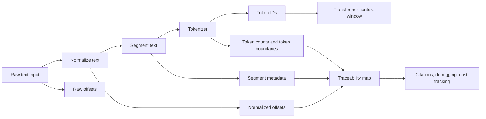

What the diagram is showing:

- The model only receives token IDs, not raw human text.
- Debugging requires metadata from every earlier step.
- Citation, retrieval, and cost bugs often come from broken boundary or offset tracking.

### 3) Real-World Industry Scenarios

#### Scenario A: Enterprise Support Chatbot With Multilingual Queries

Product/use case context:

A customer support assistant receives queries like:

- `I can't login!!!`
- `Cannot log in`
- `No puedo iniciar sesión`
- `login issue after MFA reset`
- `SSO error: AADSTS50011`

The assistant retrieves help articles, internal runbooks, and policy snippets before answering.

How the parameters affect the real system:

- Normalization affects whether `login`, `log in`, and `Log-In` match related documents.
- Unicode handling affects whether accented words and composed/decomposed characters match correctly.
- Segmentation affects whether an error code stays attached to the troubleshooting steps that explain it.
- Token boundaries affect cost and how much retrieved context fits into the prompt.

Constraints:

- Latency: support chat needs fast responses, so preprocessing must be cheap and deterministic.
- Cost: token inflation from noisy text, duplicated chunks, or bad segmentation increases every request cost.
- Reliability: query-time preprocessing must match ingestion-time preprocessing, or retrieval becomes inconsistent.
- Failure modes: multilingual text may be over-normalized, error codes may be split away, or punctuation removal may destroy technical meaning.
- Security/privacy: logs should capture preprocessing metadata without leaking sensitive user data.

What good looks like in production:

- The same preprocessing library runs during indexing and query handling.
- Error codes, product names, and domain terms are preserved.
- Token counts are monitored by language, route, and document type.
- Search quality tests include multilingual and technical-support examples.

#### Scenario B: Legal Contract Analysis With OCR Noise

Product/use case context:

A legal assistant extracts obligations from scanned contracts. The raw text may contain broken lines, page headers, footers, watermarks, OCR mistakes, section numbers, and strange whitespace.

Example input:

```text
Section 4.2(a) - Supplier shall provide notice within ten (10)
business days...
CONFIDENTIAL
Page 12 of 48
```

How the parameters affect the real system:

- Normalization can remove page noise, but if too aggressive, it may remove clause numbers or legal punctuation.
- Segmentation must preserve clause boundaries because legal meaning often depends on the section hierarchy.
- Token boundaries matter because citations and extracted obligations must map back to exact source spans.
- Offset tracking matters because normalized text and raw PDF text often differ.

Constraints:

- Latency: batch ingestion can be slower than chat, but query-time lookups still need predictable performance.
- Cost: legal documents are long, so bad chunking can multiply token usage quickly.
- Reliability: citations must point to the exact clause, not merely a nearby paragraph.
- Failure modes: headers pollute chunks, clauses split mid-sentence, offset maps break, or normalization changes legal identifiers.
- Security/privacy: contracts are sensitive; raw text, normalized text, and traces require controlled access.

What good looks like in production:

- Raw text is preserved exactly for audit.
- Normalized text is stored separately for retrieval and model input.
- Offset maps connect normalized spans back to raw document spans.
- Clause-aware segmentation is tested against real contracts.
- Extraction evaluations measure both answer correctness and citation correctness.

#### Scenario C: Code Assistant Over Repository Files

Product/use case context:

A coding assistant indexes source files and answers questions about functions, tests, configs, and error messages.

How the parameters affect the real system:

- Normalization must avoid corrupting code syntax.
- Segmentation should respect file, class, function, and symbol boundaries rather than arbitrary sentence breaks.
- Token boundaries affect how identifiers split, such as `getUserById`, `get_user_by_id`, and `get-user-by-id`.
- Context packing must preserve enough neighboring code to understand dependencies.

Constraints:

- Latency: developer tools need low-latency retrieval and prompt construction.
- Cost: repositories can be large, so duplicate chunks and oversized windows become expensive.
- Reliability: a wrong boundary can make the model hallucinate a function contract or miss an import.
- Failure modes: code comments are retrieved without code, function signatures are split from bodies, or casing is lowercased and symbol identity is damaged.
- Security/privacy: internal code snippets should not be over-logged.

What good looks like in production:

- The pipeline uses syntax-aware splitters when possible.
- Identifiers and punctuation are preserved.
- Token histograms are tracked per language and file type.
- Retrieval tests include exact-symbol queries and natural-language queries.

### 4) System View: Think Like a Systems Engineer

#### [Intermediate] Inputs -> Transformations -> Outputs

Inputs:

- user queries
- chat history
- uploaded documents
- OCR output
- repository files
- database records
- tool results
- locale and encoding metadata

Transformations:

- decode bytes into text with the correct encoding
- normalize Unicode forms, whitespace, casing, punctuation, and line endings as appropriate
- preserve or remove noise depending on domain rules
- segment into paragraphs, clauses, sections, functions, records, or retrieval chunks
- run the model-specific tokenizer
- count tokens before prompt packing
- maintain raw-to-normalized-to-token offset maps when citations or extraction are required

Outputs:

- normalized text
- segments/chunks with metadata
- token IDs
- token counts
- boundary maps
- offset maps
- prompt-ready context blocks

#### [Intermediate] Observability: What We Log, Trace, and Measure

Log carefully, with privacy controls:

- preprocessing version
- tokenizer name and version
- model family tied to the tokenizer
- raw character length vs normalized character length
- segment count per document/query
- average, p50, p95, and max tokens per segment
- percent of chunks truncated during prompt packing
- query normalization route
- citation offset mismatch rate
- retrieval quality by document type/language

Why these metrics matter:

- A sudden token-count increase often means chunking or normalization changed.
- A retrieval-quality drop after ingestion usually means representation drift.
- Citation errors often mean offset maps were computed on one text form and used against another.
- Long-tail token counts expose weird inputs before they become production incidents.

#### [Pro] Failure Points: Where It Breaks and How It Shows Up

1. Encoding failure

- How it shows up: replacement characters, missing accents, broken symbols, corrupted documents.
- Why it matters: the tokenizer sees different text from what the user intended.

2. Unicode normalization mismatch

- How it shows up: visually identical strings do not match in search or filtering.
- Why it matters: composed and decomposed forms can look the same but compare differently.

3. Over-aggressive normalization

- How it shows up: `C++` becomes `C`, `10 mg` becomes `10mg`, legal clause markers disappear.
- Why it matters: the system destroys domain meaning before retrieval or generation.

4. Poor segmentation

- How it shows up: retrieved chunks are related but not answer-bearing.
- Why it matters: the model receives context fragments that lack enough semantic completeness.

5. Tokenizer mismatch

- How it shows up: token counts differ between development and production, or context truncation appears unexpectedly.
- Why it matters: tokenizers are model-specific; the same text can have different token counts across model families.

6. Offset drift

- How it shows up: citations point to the wrong sentence or extracted spans cannot be verified.
- Why it matters: transformations changed text length or structure without preserving mapping metadata.

### 5) System Design Flavor

#### [Intermediate] Key Components and Interfaces

A production preprocessing layer often has these components:

- `TextDecoder`: converts bytes or documents into text.
- `Normalizer`: applies domain-specific, versioned text rules.
- `Segmenter`: splits text into units appropriate for the task.
- `TokenizerAdapter`: wraps the model-specific tokenizer.
- `OffsetMapper`: tracks alignment between raw, normalized, segmented, and tokenized forms.
- `PromptBudgeter`: decides what fits into the context window.
- `PreprocessingTrace`: records versions, counts, and boundary decisions.

Key interface idea:

The rest of the GenAI system should not receive anonymous strings. It should receive text plus metadata.

Example conceptual payload:

```json
{
  "raw_text_id": "doc_184",
  "preprocessing_version": "legal-v3.2.1",
  "tokenizer": "model-family-tokenizer-2026-05",
  "segment_id": "doc_184:section_4_2_a",
  "normalized_text": "Section 4.2(a) - Supplier shall provide notice within ten (10) business days...",
  "raw_span": [10244, 10493],
  "token_count": 32
}
```

#### [Intermediate] Tradeoff 1: Normalization Strength vs Fidelity

Layman version:

Cleaning more can help the machine compare text, but cleaning too much can erase meaning.

Choose stronger normalization when:

- text is noisy and meaning is robust to cleanup
- search should ignore casing/punctuation differences
- user queries are informal
- the domain is broad FAQ or support content

Choose higher fidelity when:

- symbols carry meaning
- exact wording matters
- citations or legal/medical/code evidence is required
- text contains identifiers, formulas, error codes, or units

Practical rule:

Normalize for matching, preserve for truth. Store raw text and normalized text separately when stakes are high.

#### [Intermediate] Tradeoff 2: Coarse Segmentation vs Fine Segmentation

Layman version:

Bigger chunks keep more context together, but they may include too much irrelevant material. Smaller chunks are precise, but they may lose the surrounding explanation.

Choose larger segments when:

- documents are narrative or explanatory
- meaning depends on surrounding paragraphs
- summarization is the main task
- retrieval can afford reranking

Choose smaller segments when:

- users ask narrow factual questions
- citations must be exact
- documents have strong structure
- token budget is tight

Practical rule:

Segment around meaning, not arbitrary character counts. If arbitrary chunking is necessary, add overlap carefully and measure duplicate token cost.

#### [Pro] Tradeoff 3: Token Accuracy vs Runtime Cost

Layman version:

Counting tokens exactly helps avoid truncation and cost surprises, but exact tokenization can add runtime overhead if done repeatedly at high traffic.

Choose exact tokenization when:

- prompts are near the context limit
- cost control matters
- tool results are variable length
- retrieval context is packed dynamically

Choose approximate counting only when:

- prompts are far below budget
- latency is extremely tight
- occasional overestimation does not hurt quality

Practical rule:

Use exact tokenization at prompt assembly boundaries. Cache token counts for indexed chunks.

#### [Pro] Scaling Consideration: What Changes at 10x Traffic or Data?

At 10x traffic/data, preprocessing becomes infrastructure.

You need:

- cached token counts for chunks
- batchable ingestion pipelines
- versioned preprocessing migrations
- dashboards for token inflation and boundary drift
- regression tests before changing normalization or segmentation rules
- sampling-based audits of raw vs normalized vs retrieved spans

The main risk is silent drift. A small preprocessing change can affect every indexed document and every future query.

### 6) Common Mistakes + Debugging

#### Mistake 1: Treating Normalization as Harmless Cleanup

- Symptom: retrieval misses exact terms, code symbols, drug dosages, legal clauses, or product identifiers.
- Likely cause: normalization removed or changed characters that carry domain meaning.
- First debugging step: compare raw text, normalized text, and retrieved text for 5 to 10 failing examples. Look specifically for removed punctuation, casing, units, accents, and identifiers.

#### Mistake 2: Using Different Preprocessing at Ingestion and Query Time

- Symptom: search works in tests but fails in production for similar user queries.
- Likely cause: documents were normalized one way during indexing, while live queries are normalized another way.
- First debugging step: run the same example through both pipelines and diff the normalized output, segment boundaries, tokenizer version, and token counts.

#### Mistake 3: Chunking by Character Count Instead of Meaning

- Symptom: retrieved chunks look related but do not contain enough information to answer correctly.
- Likely cause: segmentation split semantic units such as clauses, troubleshooting steps, tables, functions, or definitions.
- First debugging step: inspect the top retrieved chunks and mark whether each one is answer-bearing, merely related, or distracting.

#### Mistake 4: Ignoring Offset Mapping

- Symptom: answer content is correct, but citations point to the wrong location.
- Likely cause: citation spans were computed against normalized text but displayed against raw text, or the reverse.
- First debugging step: trace one citation from raw document -> normalized text -> segment -> tokenized prompt -> generated answer, checking span coordinates at each stage.

#### Mistake 5: Assuming Token Boundaries Are Word Boundaries

- Symptom: token cost is higher than expected, especially for code, URLs, IDs, multilingual text, emojis, or rare terms.
- Likely cause: the tokenizer splits unfamiliar strings into many smaller tokens.
- First debugging step: inspect the tokenizer output for the expensive examples and compare token counts against common English prose.

### 7) Hands-On Lab: Concept -> Build -> Break -> Measure -> Explain

#### [Pro] Goal

Build a tiny preprocessing experiment that shows how normalization and segmentation choices change retrieval matching, token estimates, and citation offsets.

This lab is intentionally small. The point is not to build a production tokenizer. The point is to feel why representation choices matter.

#### Build: Smallest Working Version

Create a scratch Python file or notebook cell and run this:

```python
import re
import unicodedata

raw_docs = [
    "Café login issue: User can't sign in after MFA reset.",
    "C# service throws AADSTS50011 during SSO callback.",
    "Section 4.2(a) - Supplier shall notify Buyer within ten (10) business days.",
]

queries = [
    "cafe login mfa",
    "C# AADSTS50011",
    "section 4.2(a) notice ten business days",
]

def conservative_normalize(text: str) -> str:
    text = unicodedata.normalize("NFC", text)
    text = re.sub(r"\s+", " ", text).strip()
    return text

def aggressive_normalize(text: str) -> str:
    text = unicodedata.normalize("NFKD", text)
    text = "".join(ch for ch in text if not unicodedata.combining(ch))
    text = text.lower()
    text = re.sub(r"[^a-z0-9\s]", "", text)
    text = re.sub(r"\s+", " ", text).strip()
    return text

def simple_segments(text: str) -> list[str]:
    return [part.strip() for part in re.split(r"[.:;-]", text) if part.strip()]

def rough_token_estimate(text: str) -> int:
    # Crude estimate for the lab only. Real systems should use the model tokenizer.
    return max(1, len(text) // 4)

for normalizer in [conservative_normalize, aggressive_normalize]:
    print("\nNORMALIZER:", normalizer.__name__)
    normalized_docs = [normalizer(doc) for doc in raw_docs]

    for raw_doc, normalized_doc in zip(raw_docs, normalized_docs):
        print("RAW: ", raw_doc)
        print("NORM:", normalized_doc)
        print("SEGMENTS:", simple_segments(normalized_doc))
        print("TOKENS~:", rough_token_estimate(normalized_doc))
        print()

    for query in queries:
        normalized_query = normalizer(query)
        matches = [doc for doc in normalized_docs if all(term in doc for term in normalized_query.split())]
        print("QUERY:", query)
        print("NORM QUERY:", normalized_query)
        print("MATCHES:", matches)
```

What to observe:

- `Café` becomes easier to match as `cafe` under aggressive normalization.
- `C#` may become `c`, which destroys the programming language meaning.
- `Section 4.2(a)` may become `section 42a` or similar, which damages legal traceability.
- Splitting on punctuation may split error codes, section numbers, and clauses badly.

#### Break: Force the Failure Mode

Modify `aggressive_normalize` so it removes all digits too:

```python
text = re.sub(r"[^a-z\s]", "", text)
```

Then rerun the script.

Expected breakage:

- `AADSTS50011` loses its exact identity.
- `4.2(a)` loses clause specificity.
- `ten (10)` loses the numeric cross-check.
- Matching may appear broader but less trustworthy.

#### Measure: Capture Concrete Signals

Track these signals manually or print them:

- normalized character length vs raw character length
- rough token estimate before and after normalization
- number of segments per document
- number of exact query matches
- count of critical symbols preserved: `#`, error code digits, section digits, parentheses

Add this small helper:

```python
critical_patterns = ["C#", "AADSTS50011", "4.2(a)", "10"]

for doc in raw_docs:
    normalized = aggressive_normalize(doc)
    lost = [pattern for pattern in critical_patterns if pattern in doc and pattern not in normalized]
    print({"raw": doc, "normalized": normalized, "lost_patterns": lost})
```

Interpretation warning:

This helper is intentionally naive because some patterns change form legitimately. In production, you would use domain-aware validators, not simple substring checks.

#### Explain: Why It Broke and What Prevents It

The pipeline broke because aggressive normalization optimized for broad matching while ignoring domain meaning. It made text easier to compare in some cases, but it destroyed symbols that the product depends on.

The production fix is not "never normalize." The fix is to separate goals:

- preserve raw text for truth, display, audit, and citations
- create normalized text for matching where appropriate
- use domain-specific allowlists for symbols that must survive
- version preprocessing behavior and test it with failing examples
- keep ingestion and query preprocessing identical unless divergence is intentional and documented

### 8) Active Recall

1. What is the difference between text normalization, segmentation, and token boundaries?
2. Why can visually identical text fail to match in a machine pipeline?
3. Why is lowercasing safe for some support queries but dangerous for code search?
4. What is offset drift, and why does it matter for citations?
5. Why should exact tokenization happen at prompt assembly boundaries?

#### Active Recall Answers

1. Normalization standardizes text; segmentation groups text into processing units; token boundaries are the tokenizer's final splits into model-facing pieces.
2. Unicode and encoding differences can make two strings look identical while having different underlying byte or code point representations.
3. Support queries often tolerate case loss, but code symbols and identifiers may use casing as part of meaning.
4. Offset drift happens when transformed text no longer lines up with raw text spans. Citations break because the system points to the wrong source location.
5. Because the final prompt must fit the target model's context window, and only the actual tokenizer can give reliable counts for that model.

### 9) Practice

#### Mini-Exercise

You own a RAG system for internal HR policies. After a preprocessing update, users report that answers are still fluent but citations are often wrong.

Answer these:

1. Which layer is most suspicious: model, retrieval, preprocessing, or UI?
2. What three artifacts do you inspect first?
3. What metric would you add to catch this earlier next time?

Suggested answer:

1. Preprocessing is most suspicious, especially offset mapping between raw and normalized text.
2. Inspect raw text, normalized text, and citation span maps for failing examples.
3. Add citation alignment error rate, measured by checking whether generated citation spans resolve to the claimed source sentence or chunk.

#### Capstone-Style System Design Question

Design a preprocessing layer for a multilingual enterprise RAG platform that supports support articles, PDFs, policy docs, and code snippets. The system must support retrieval, citations, cost tracking, and future tokenizer migrations.

Your answer should cover:

- normalization policy
- segmentation strategy
- tokenizer versioning
- raw/normalized/segment/token metadata
- observability
- migration strategy

Suggested answer outline:

- Use a shared preprocessing service or library for ingestion and query paths.
- Preserve raw text exactly; store normalized text separately.
- Use domain-specific normalization profiles: support text, legal/policy PDFs, code, and multilingual content.
- Segment with structure-aware splitters where possible: headings for policies, clauses for contracts, syntax-aware units for code.
- Pin tokenizer versions by model family and cache token counts for indexed chunks.
- Store offset maps from raw -> normalized -> segment -> token ranges.
- Log preprocessing version, tokenizer version, token histograms, truncation rate, segment length distribution, and citation alignment errors.
- Before migration, run offline regression on representative corpora and compare retrieval recall, citation accuracy, token cost, and truncation rate.

### 10) Production Reality Check

If this fails in prod, what's the first thing we inspect?

Inspect preprocessing parity between ingestion and query paths: normalization profile, segmentation rules, tokenizer version, and offset mapping.

Why:

Many failures that look like model weakness are representation mismatches. If the indexed documents and live queries are transformed differently, retrieval, citations, token budgeting, and answer quality can all degrade before the transformer ever sees the input.

### 11) Curiosity Bridge

This works well here, but breaks when token boundaries stop looking like human word boundaries.

That leads directly to BPE and SentencePiece: the machinery that explains why `unbelievable`, `AADSTS50011`, emojis, rare names, code identifiers, and multilingual text can have surprisingly different token costs and behavior.

### 12) Exit Check + Carry-Forward Review

Exit Check: You're done when you can inspect a bad RAG answer and explain whether the likely root cause is normalization, segmentation, token counting, offset mapping, retrieval, or the model itself.

Carry-Forward Review:

Question: From Module 1, why should we avoid saying "the model hallucinated" before inspecting retrieval and context?

Answer: Because a bad answer can be caused by missing evidence, poor retrieval, prompt/context overload, stale tool results, or preprocessing mismatch. The model output is only the visible symptom.

---

## Subtopic 2.1.b: BPE and SentencePiece Intuition

### ✅ Add to Knowledge Base

### 0) Reading Path + Level Tags

Beginner: read sections 1, 2, 6, 8, 10, and 11. Your goal is to understand why tokens are often word pieces instead of words.

Intermediate: add sections 3, 4, 5, 7, and 9. Your goal is to debug token-cost surprises, multilingual issues, and tokenizer mismatch problems.

Pro: do the full Hands-On Lab and capstone practice. Your goal is to reason about tokenizer algorithms as production contracts that affect cost, context, retrieval, latency, and model behavior.

### 1) Pre-Question Hook + The Intuition

Pause: before reading, why might `unbelievable` become something like `un`, `believ`, `able`, while `AADSTS50011` might become many tiny pieces?

#### [Beginner] Plain-English Mental Model

LLMs need a finite set of symbols they can process. They cannot have a unique symbol for every possible word, typo, name, code identifier, URL, emoji, language, and product ID humans may write.

So modern LLMs usually use **subword tokenization**: splitting text into pieces that are smaller than many words but larger than individual characters when possible.

Two important tokenizer families are:

- **BPE**: a method that starts with small units and repeatedly merges frequent neighboring pieces.
- **SentencePiece**: a tokenizer framework that can train tokenizers directly from raw text, commonly using BPE or a probabilistic unigram approach.

Simple mental model:

- Character-level tokenization is flexible but long.
- Word-level tokenization is compact but brittle.
- Subword tokenization is the practical middle ground.

Why this matters:

The tokenizer decides how much of your context window gets consumed before the transformer even starts. It also affects latency, cost, truncation, retrieval chunking, and how painful rare strings are for the model.

#### Analogy

Think of building words with reusable Lego pieces.

- Common words may have large ready-made pieces.
- Common prefixes and suffixes may have reusable pieces.
- Rare names, IDs, or typos may need many tiny pieces.

Where the analogy breaks down:

Tokenizer pieces are not guaranteed to be meaningful morphemes. A token can look like a word part, a whole word, whitespace plus a word, punctuation, bytes, or an odd fragment learned from training data frequency.

#### [Intermediate] Why Not Just Use Words?

Word-level tokenization sounds natural, but it breaks quickly.

Problems with word-level tokenization:

- New words appear constantly: product names, usernames, legal entities, slang, typos.
- Languages do not all use spaces between words.
- Code and logs contain identifiers that are not dictionary words.
- URLs, hashes, and IDs would explode the vocabulary.
- Every unknown word would need a fallback strategy.

Problems with character-level tokenization:

- It can represent anything, but sequences become much longer.
- Longer sequences cost more compute.
- Long sequences make context packing harder.
- The model must learn meaning over many more steps.

Subword tokenization is the compromise:

- frequent strings become short token sequences
- rare strings can still be represented
- vocabulary stays finite
- context cost remains manageable

#### [Pro] The Deep Intuition

Tokenization is learned compression under constraints.

A tokenizer builds a **vocabulary**: a fixed set of token pieces known to the model. During training, the model learns embeddings for those token IDs. During inference, the same tokenizer converts input text into those IDs.

This creates a strict contract:

- tokenizer choice affects token IDs
- token IDs select embedding vectors
- embedding vectors feed the transformer
- changing tokenizer behavior changes the model-facing input

So tokenizer mismatch is not a small formatting bug. It can change the actual sequence the model receives.

### 2) Visual Diagram

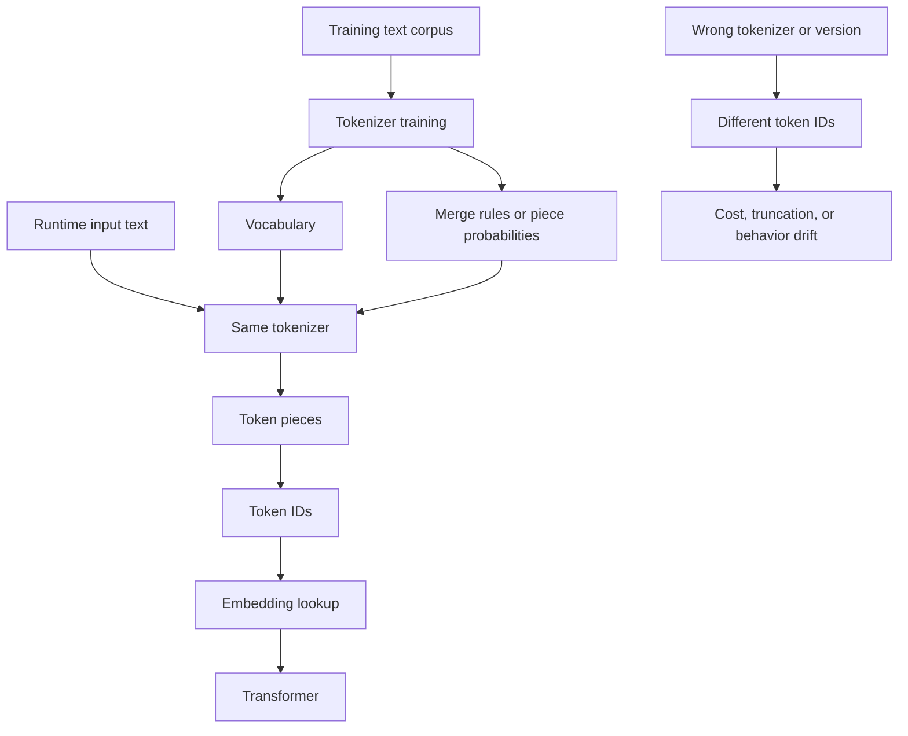

What the diagram is showing:

- Tokenization has a training side and an inference side.
- The model expects the same tokenizer contract it was trained with.
- Different tokenization can change token counts, truncation behavior, and model inputs.

### 3) Real-World Industry Scenarios

#### Scenario A: Multilingual Customer Support Assistant

Product/use case context:

A support assistant handles English, Spanish, Hindi, Japanese, emojis, product names, and user-typed mistakes. The team notices English queries fit comfortably in the prompt, while some multilingual queries consume more tokens than expected.

How tokenizer behavior affects the real system:

- A tokenizer trained heavily on English may represent English text compactly.
- Less common scripts or mixed-script text may split into more pieces.
- Emojis, accents, and rare names may inflate token counts.
- SentencePiece-style raw-text training can handle languages without relying entirely on whitespace.

Constraints:

- Latency: more tokens means more work for the model, especially during input processing.
- Cost: token-based pricing makes inflated token counts a direct budget issue.
- Reliability: if multilingual content gets truncated first, the answer may lose critical evidence.
- Failure modes: users in one language see worse answers because their text consumes more context.
- Security/privacy: token logging must avoid exposing private user text; aggregate token stats by locale are safer.

What good looks like in production:

- Token counts are monitored by language and route.
- Prompt budgets reserve space for high-token languages.
- Evaluation sets include multilingual and mixed-script examples.
- The team uses the exact tokenizer for the selected model family when estimating cost.

#### Scenario B: Coding Assistant Over Logs, IDs, and Symbols

Product/use case context:

A coding assistant explains errors like:

```text
AADSTS50011: reply URL mismatch in OAuth callback /api/v1/auth/callback
```

It also reads identifiers such as `getUserByTenantId`, `tenant_id`, `auth.callbackUrl`, and commit hashes.

How tokenizer behavior affects the real system:

- Common code tokens may be efficient if the tokenizer saw similar data during training.
- Long IDs and hashes can split into many pieces.
- CamelCase, snake_case, punctuation, and slashes affect boundaries.
- Token cost can rise sharply for stack traces and machine-generated strings.

Constraints:

- Latency: stack traces can be token-heavy and slow down requests.
- Cost: repeated logs in context are expensive.
- Reliability: if the exact error code is split or truncated, retrieval and reasoning degrade.
- Failure modes: the model answers about a similar but wrong error code, or context packing drops the line with the actual failure.
- Security/privacy: logs may contain tokens, secrets, hostnames, and user identifiers; preprocessing must redact before logging.

What good looks like in production:

- Logs are deduplicated and compressed before prompt insertion.
- Exact error codes are preserved.
- Token counts are measured on rendered prompts, not guessed from character counts.
- Retrieval treats IDs and symbols as high-value anchors.

#### Scenario C: Cost Engineering for a RAG Platform

Product/use case context:

A RAG platform retrieves 8 chunks per query. Each chunk is around 1,000 characters, but cost varies wildly across document types. Legal PDFs, code docs, and OCR text are much more expensive than FAQ prose.

How tokenizer behavior affects the real system:

- Character count is not token count.
- OCR noise can produce strange token splits.
- Tables, references, section numbers, and symbols can be token-dense.
- The same chunking policy can produce very different token budgets by domain.

Constraints:

- Latency: more retrieved tokens increase time-to-first-token and total response time.
- Cost: every extra retrieved token is paid repeatedly across queries.
- Reliability: expensive chunks may force truncation of later instructions or answer space.
- Failure modes: context fits in staging but overflows in production with different documents.
- Security/privacy: token accounting should avoid retaining raw sensitive text unnecessarily.

What good looks like in production:

- Token counts are cached per chunk using the actual tokenizer.
- Retrieval packing uses token budgets, not character budgets.
- Chunking policies are tuned by document type.
- Dashboards show p50, p95, and p99 prompt token usage.

### 4) System View: Think Like a Systems Engineer

#### [Intermediate] Inputs -> Transformations -> Outputs

Inputs:

- normalized text
- model family
- tokenizer version
- vocabulary files
- merge rules or piece scoring data
- prompt budget constraints
- retrieval chunks and tool results

Transformations:

- convert text into tokenizer-specific pieces
- map pieces to token IDs
- count tokens for prompt budgeting
- pack retrieved context within model limits
- optionally map token spans back to text spans for debugging or citations

Outputs:

- token pieces
- token IDs
- token count
- token span metadata
- prompt budget decisions
- truncation or overflow signals

#### [Intermediate] BPE: The Core Idea

**BPE** stands for Byte Pair Encoding in the LLM context. The intuition is simple:

1. Start with tiny units, often bytes or characters.
2. Count which adjacent pairs appear most frequently.
3. Merge the most frequent pair into a new token.
4. Repeat until the vocabulary reaches the target size.

Toy example:

```text
Training words: low, lower, lowest

Start pieces:
l o w
l o w e r
l o w e s t

Frequent pair: l + o -> lo
Next frequent pair: lo + w -> low

Possible learned pieces:
low, er, est
```

Result:

- common strings become compact
- rare strings fall back to smaller pieces
- the vocabulary remains finite

Important caveat:

BPE learns frequency, not truth. A learned piece is not automatically semantically meaningful.

#### [Intermediate] SentencePiece: The Core Idea

**SentencePiece** is a tokenizer framework, not just one algorithm. Its key idea is that tokenization can be learned from raw text without assuming that spaces define words.

This matters because not all languages separate words with spaces, and even in English, spaces are not enough for code, logs, URLs, and mixed-language text.

SentencePiece often represents spaces with a visible marker such as `▁` in tokenizer debug output.

Example intuition:

```text
Input: "New York"
Pieces might look like: ▁New ▁York
```

The marker helps the tokenizer remember word-start boundaries while still treating text as a stream of characters or bytes.

SentencePiece can use:

- BPE-style merging
- a **unigram language model tokenizer**, which keeps a vocabulary of candidate pieces and chooses a likely segmentation

Why this matters:

SentencePiece is especially useful for multilingual and whitespace-light text because it does not need a separate pre-tokenizer that says "split on spaces first."

#### [Pro] Observability: What We Log, Trace, and Measure

Measure:

- prompt token count by route
- retrieved-token count per chunk
- token count by language/document type
- token count by tool result type
- truncation rate
- token inflation ratio: tokens per character or tokens per byte
- percentage of requests close to context limit
- tokenizer version attached to each run

Debug traces should show:

- raw or redacted text sample
- token count
- tokenizer name/version
- rendered prompt token breakdown by section
- truncation decision
- high-cost chunks or tool outputs

Privacy note:

In production, prefer aggregate token metrics and redacted samples. Token traces can leak sensitive content if logged carelessly.

#### [Pro] Failure Points

1. Wrong tokenizer used for counting

- How it shows up: prompt passes local estimates but fails at model API with context overflow.
- Why it matters: tokenizers are model-specific.

2. Token-heavy inputs ignored during budgeting

- How it shows up: logs, code, OCR, or multilingual text cause sudden cost spikes.
- Why it matters: character count hides token density.

3. Tokenizer mismatch between index and query path

- How it shows up: chunk sizes look valid during ingestion but overflow during prompt assembly.
- Why it matters: cached counts are only valid for the tokenizer that produced them.

4. Treating tokens as meanings

- How it shows up: debugging focuses on token strings as if each token has a clean concept.
- Why it matters: meaning emerges from embeddings and context, not from token boundaries alone.

### 5) System Design Flavor

#### [Intermediate] Key Components and Interfaces

A tokenizer-aware GenAI system should include:

- `TokenizerRegistry`: maps model families to exact tokenizer implementations and versions.
- `TokenCounter`: counts prompt, chunk, query, and tool-result tokens.
- `TokenBudgeter`: allocates context space across instructions, chat history, retrieval, tools, and answer budget.
- `ChunkTokenCache`: stores token counts for indexed chunks.
- `PromptRenderer`: builds the final prompt and verifies exact token usage before model call.
- `TokenTelemetry`: tracks cost, latency, truncation, and token-density metrics.

Key interface idea:

Prompt assembly should operate on token budgets, not character budgets.

Example conceptual budget:

```json
{
  "model": "example-llm-large",
  "context_window": 128000,
  "system_and_developer_instructions": 1800,
  "chat_history_budget": 12000,
  "retrieval_budget": 60000,
  "tool_result_budget": 20000,
  "answer_budget": 4000,
  "safety_margin": 2000
}
```

#### [Intermediate] Tradeoff 1: Vocabulary Size vs Sequence Length

Layman version:

A bigger vocabulary gives the tokenizer more ready-made pieces, so common text may use fewer tokens. But the model must learn and store embeddings for more token IDs.

Choose larger vocabulary when:

- training supports it
- target languages/domains are broad
- reducing sequence length matters
- inference workload is token-heavy

Choose smaller vocabulary when:

- model size must stay small
- memory footprint matters
- the domain is narrow
- simplicity and robustness matter more than compactness

Practical rule:

Vocabulary size is a compression and modeling tradeoff. It is not automatically better just because it is larger.

#### [Intermediate] Tradeoff 2: Word-Aware Pre-Tokenization vs Raw Text Tokenization

Layman version:

Splitting on spaces first is simple for English-like text, but raw-text tokenization is more flexible across languages and messy inputs.

Choose word-aware pre-tokenization when:

- language uses clear whitespace boundaries
- tooling and debugging simplicity matter
- the domain is mostly standard prose

Choose raw-text tokenization when:

- multilingual support matters
- languages may not use spaces
- code, logs, OCR, and mixed scripts are common
- you want fewer assumptions before learning token pieces

Practical rule:

For modern multilingual LLM systems, avoid assuming spaces are universal word boundaries.

#### [Pro] Tradeoff 3: Exact Token Counting vs Approximate Estimation

Layman version:

Approximate token estimates are useful for quick planning, but exact tokenizer counts are necessary near context limits or cost-sensitive paths.

Use approximate estimates when:

- doing rough planning
- text is far below budget
- no model has been chosen yet

Use exact counting when:

- rendering the final prompt
- caching chunk counts
- enforcing model context limits
- estimating production cost
- comparing model/tokenizer families

Practical rule:

Use approximations for intuition, exact tokenizers for decisions.

#### [Pro] Scaling Consideration: What Changes at 10x Traffic or Data?

At 10x scale, tokenization becomes a cost and latency control plane.

You need:

- cached token counts for every indexed chunk
- per-model tokenizer registries
- prompt token breakdowns by component
- alerts for token inflation
- migration plans when changing model families
- token-aware retrieval packing
- p95 and p99 token telemetry by customer, route, language, and document type

The expensive failure is silent budget drift: prompts slowly get longer, retrieved chunks get noisier, tool outputs grow, and latency/cost rise before anyone changes the model.

### 6) Common Mistakes + Debugging

#### Mistake 1: Assuming One Token Means One Word

- Symptom: cost estimates are consistently wrong, especially for code, IDs, URLs, emojis, non-English text, or OCR.
- Likely cause: the system estimates tokens from word count or character count instead of the model tokenizer.
- First debugging step: run representative expensive examples through the exact tokenizer and compare tokens per character by input type.

#### Mistake 2: Using the Wrong Tokenizer for a Model

- Symptom: prompts overflow context despite passing local checks, or cost estimates differ from provider billing.
- Likely cause: counting with a tokenizer that does not match the deployed model family/version.
- First debugging step: inspect the tokenizer name/version used during prompt rendering and compare it with the deployed model's required tokenizer.

#### Mistake 3: Treating SentencePiece as a Different Kind of Model Knowledge

- Symptom: the team assumes SentencePiece tokens are semantic concepts and overinterprets token strings.
- Likely cause: confusing token pieces with meanings learned by model embeddings and layers.
- First debugging step: remind the team that tokenization only creates IDs; semantic behavior comes from learned embeddings plus transformer computation.

#### Mistake 4: Budgeting Retrieval Chunks by Characters

- Symptom: some document types frequently truncate instructions, answer space, or later chunks.
- Likely cause: chunk sizes are based on characters, but token density varies by language and content type.
- First debugging step: plot token counts per chunk by document type and inspect the top 20 most token-dense chunks.

#### Mistake 5: Changing Model Families Without Recounting Indexed Chunks

- Symptom: an index that worked with one model becomes slower, more expensive, or overflow-prone after migration.
- Likely cause: cached token counts came from the old tokenizer.
- First debugging step: rerun token counting for a sample of indexed chunks using the new model tokenizer and compare p50/p95/p99 token counts.

### 7) Hands-On Lab: Concept -> Build -> Break -> Measure -> Explain

#### [Pro] Goal

Build a toy BPE tokenizer so the merge logic becomes concrete, then compare how common words, rare IDs, and symbols behave under a small learned vocabulary.

This is not a production tokenizer. It is a mental model lab.

#### Build: Smallest Working Version

Run this dependency-free Python snippet:

```python
from collections import Counter

training_words = [
    "low", "lower", "lowest", "new", "newer", "newest",
    "login", "logged", "logging", "AADSTS50011", "C#"
]

def word_to_symbols(word: str) -> tuple[str, ...]:
    return tuple(word) + ("</w>",)

def get_pair_counts(vocab: Counter[tuple[str, ...]]) -> Counter[tuple[str, str]]:
    pair_counts = Counter()
    for symbols, count in vocab.items():
        for left, right in zip(symbols, symbols[1:]):
            pair_counts[(left, right)] += count
    return pair_counts

def merge_pair(symbols: tuple[str, ...], pair: tuple[str, str]) -> tuple[str, ...]:
    merged = []
    index = 0
    while index < len(symbols):
        if index < len(symbols) - 1 and (symbols[index], symbols[index + 1]) == pair:
            merged.append(symbols[index] + symbols[index + 1])
            index += 2
        else:
            merged.append(symbols[index])
            index += 1
    return tuple(merged)

def train_toy_bpe(words: list[str], merges_to_learn: int):
    vocab = Counter(word_to_symbols(word) for word in words)
    merges = []
    for _ in range(merges_to_learn):
        pair_counts = get_pair_counts(vocab)
        if not pair_counts:
            break
        best_pair, _ = pair_counts.most_common(1)[0]
        merges.append(best_pair)
        vocab = Counter({merge_pair(symbols, best_pair): count for symbols, count in vocab.items()})
    return merges

def encode_with_merges(word: str, merges: list[tuple[str, str]]) -> list[str]:
    symbols = word_to_symbols(word)
    for pair in merges:
        symbols = merge_pair(symbols, pair)
    return [symbol for symbol in symbols if symbol != "</w>"]

merges = train_toy_bpe(training_words, merges_to_learn=20)
print("MERGES")
for pair in merges:
    print(pair, "->", "".join(pair))

test_words = ["lowest", "newest", "login", "logging", "AADSTS50011", "AADSTS50012", "C#", "C++"]
print("\nENCODINGS")
for word in test_words:
    pieces = encode_with_merges(word, merges)
    print({"word": word, "pieces": pieces, "token_count": len(pieces)})
```

What to observe:

- Frequent training patterns merge into larger pieces.
- Similar words share pieces.
- Rare variants may still split into many pieces.
- `AADSTS50012` may not tokenize as compactly as `AADSTS50011` because the toy training data saw only one exact pattern.

#### Break: Force the Failure Mode

Now remove `AADSTS50011` and `C#` from `training_words`, then rerun.

Expected breakage:

- Error codes become more fragmented.
- Programming-language symbols become less compact.
- Token counts rise for machine-like strings.

This simulates a tokenizer trained on prose but used heavily on logs or code.

#### Measure: Capture Concrete Signals

Record these measurements before and after removing code/log-like strings:

- token count for `lowest`
- token count for `AADSTS50011`
- token count for `AADSTS50012`
- token count for `C#`
- token count for `C++`
- average token count across all `test_words`

Add this helper:

```python
def report(test_words: list[str], merges: list[tuple[str, str]]) -> None:
    total = 0
    for word in test_words:
        token_count = len(encode_with_merges(word, merges))
        total += token_count
        print(f"{word:12} tokens={token_count}")
    print("avg_tokens=", round(total / len(test_words), 2))
```

#### Explain: Why It Broke and What Prevents It

The toy tokenizer learned merges from frequency. When the training corpus included code/log-like strings, those patterns had a chance to become compact. When the corpus removed them, the tokenizer had to represent them with smaller pieces.

In production, this explains why tokenizer training data and model family matter. A model/tokenizer pair that is efficient for English prose may be less efficient for code, logs, OCR, or multilingual content.

The guardrail is to measure with the exact tokenizer on representative production inputs. Do not guess from words or characters.

### 8) Active Recall

1. Why do modern LLMs usually use subword tokenization instead of pure word tokenization?
2. What is the core intuition behind BPE?
3. What is SentencePiece, and why is it useful for multilingual text?
4. Why can two models have different token counts for the same text?
5. Why is it risky to budget RAG chunks by character count?

#### Active Recall Answers

1. Subword tokenization keeps the vocabulary finite while still representing rare words, typos, names, code, and multilingual text.
2. BPE repeatedly merges frequent neighboring pieces so common strings become compact token sequences.
3. SentencePiece is a tokenizer framework that can learn pieces from raw text without assuming spaces define words, which helps with multilingual and mixed-format text.
4. Different models can use different tokenizer vocabularies, merge rules, and versions, producing different token IDs and counts.
5. Character count hides token density. Code, OCR, IDs, emojis, and some languages may consume many more tokens than expected.

### 9) Practice

#### Mini-Exercise

You migrate a RAG system from Model A to Model B. The prompts are the same strings, but production latency and context-overflow errors increase.

Answer these:

1. What is the most suspicious tokenizer-related cause?
2. What measurements do you compare first?
3. What immediate fix and durable fix would you propose?

Suggested answer:

1. Model B likely uses a different tokenizer, so the same strings produce more tokens or different prompt-packing behavior.
2. Compare token counts for rendered prompts, indexed chunks, chat history, and tool outputs using both tokenizers at p50, p95, and p99.
3. Immediate fix: reduce retrieval/tool budgets and add a safety margin for Model B. Durable fix: build a tokenizer registry and recalculate cached chunk token counts during every model-family migration.

#### Capstone-Style System Design Question

Design a tokenizer-aware prompt budgeting service for a GenAI platform that supports chat, RAG, tool calls, multilingual users, and model-family migrations.

Your answer should cover:

- tokenizer registry
- exact token counting
- cached chunk token counts
- prompt section budgets
- fallback behavior near context limits
- observability
- migration testing

Suggested answer outline:

- Maintain a tokenizer registry keyed by model family and version.
- Count final rendered prompts with the exact tokenizer before every model call.
- Cache token counts for indexed chunks per tokenizer version.
- Allocate budgets across system instructions, user query, chat history, retrieval, tool results, and answer space.
- Near context limits, apply deterministic fallbacks: drop lowest-ranked chunks, compress history, summarize tool outputs, or ask for narrowing input.
- Monitor token count by route, language, document type, customer, and model.
- Before migration, replay representative traffic and compare token counts, truncation rates, latency, cost, and answer quality.

### 10) Production Reality Check

If this fails in prod, what's the first thing we inspect?

Inspect the exact tokenizer used at prompt rendering and compare token counts for the failing request against the deployed model's tokenizer contract.

Why:

BPE and SentencePiece behavior affects the actual token sequence, context usage, cost, and latency. If the system counts with the wrong tokenizer or budgets by characters, the model may receive a truncated or overloaded prompt even though the raw text looks reasonable.

### 11) Curiosity Bridge

This unlocks token-aware thinking, which leads directly to positional information and context windows.

Once text becomes a sequence of token IDs, the model still needs to know order. That is where position enters, and it explains why long context can fit technically but still fail behaviorally.

### 12) Exit Check + Carry-Forward Review

Exit Check: You're done when you can explain why a rare error code, a multilingual sentence, and an English FAQ paragraph can consume very different token budgets under the same model.

Carry-Forward Review:

Question: From 2.1.a, why must preprocessing stay consistent between ingestion and query time?

Answer: Because representation mismatch can break retrieval, citations, and prompt packing before the model sees the input.

Question: From Module 1, why is token cost a system constraint rather than only a billing detail?

Answer: Token count affects latency, context capacity, truncation risk, throughput, and the cheapest reliable design for the product.

---

## Subtopic 2.1.c: Positional Information, Context Windows, and Truncation Risks

### ✅ Add to Knowledge Base

### 0) Reading Path + Level Tags

Beginner: read sections 1, 2, 6, 8, 10, and 11. Your goal is to understand why token order matters and why a large context window is not automatic understanding.

Intermediate: add sections 3, 4, 5, 7, and 9. Your goal is to debug long-prompt failures, missing evidence, and silent truncation in real GenAI systems.

Pro: do the full Hands-On Lab and capstone practice. Your goal is to design context assembly as an engineered control plane with explicit budgets, ordering, truncation policy, and observability.

### 1) Pre-Question Hook + The Intuition

Pause: if an LLM receives 80,000 tokens and the answer is hidden at token 41,000, should we assume the model will use it correctly just because it technically fits?

#### [Beginner] Plain-English Mental Model

After text becomes token IDs, the model still needs order.

The tokens `dog bites man` and `man bites dog` contain the same words but mean different things. Without position, the model would know which tokens exist but not how they are arranged.

Three ideas matter here:

- **Positional information**: extra information that tells the model where each token appears in the sequence.
- **Context window**: the maximum number of tokens the model can receive and generate within one request.
- **Truncation**: cutting off tokens when the full input/output cannot fit within the available context budget.

Simple mental model:

- Tokens tell the model what pieces exist.
- Position tells the model where the pieces are.
- Context window tells the model how many pieces can fit.
- Truncation decides which pieces are lost.

The key lesson:

Context capacity is not the same as context usability. A model may accept a long prompt but still miss, underuse, or misprioritize important information inside it.

#### Analogy

Think of a long legal binder.

- Tokens are the words printed in the binder.
- Positional information is the page number, section number, paragraph order, and line order.
- The context window is the maximum number of pages you can place on the lawyer's desk at once.
- Truncation is what happens when pages do not fit and someone removes some.

Where the analogy breaks down:

An LLM does not literally flip pages or create perfect indexes. It uses mathematical representations of token order and attention patterns, so evidence can be present but still hard for the model to use reliably.

#### [Intermediate] Why Position Is Not a Small Detail

Transformer models process tokens in parallel. Parallel processing is powerful, but it creates a problem: the model needs a way to know sequence order.

If token embeddings only represented token identity, then these could look too similar:

```text
Alice approved Bob.
Bob approved Alice.
```

The model needs position-aware representations so it can learn relationships such as:

- subject before verb
- modifier near noun
- instruction before evidence
- table header before row values
- code import before function body
- policy exception after general rule

Position also affects prompt design. Where you place instructions, evidence, examples, conversation history, tool results, and final user request can change behavior.

#### [Pro] The Engineering Reality

Long context creates two separate questions:

1. Can the prompt fit?
2. Can the model reliably use the right information inside the prompt?

The first question is about token budget. The second is about attention behavior, evidence salience, ordering, distraction, conflicts, and task design.

Important distinction:

- **Context capacity**: the hard token limit advertised by the model or API.
- **Effective context**: the portion of context the model uses reliably for a specific task.

Production GenAI systems fail when engineers treat context capacity as if it guarantees effective context.

### 2) Visual Diagram

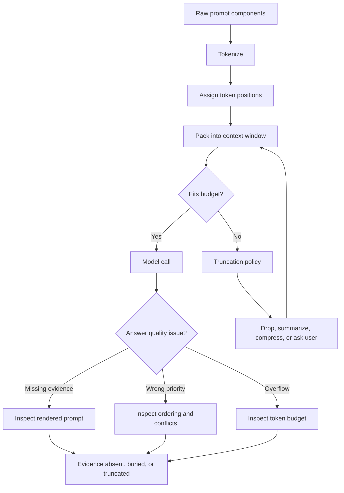

What the diagram is showing:

- Token position is part of the input representation.
- Context packing decides what gets included and where it appears.
- Truncation should be an explicit policy, not an accidental side effect.
- Debugging starts with the rendered prompt, not with a vague model complaint.

### 3) Real-World Industry Scenarios

#### Scenario A: Long Contract Review Assistant

Product/use case context:

A legal assistant receives a 120-page contract and must answer: "Can the supplier terminate for convenience, and what notice is required?"

The answer may depend on a termination clause, a definitions section, an amendment, and an exception buried later in the document.

How position/context affects the real system:

- If the termination clause is included but the amendment is truncated, the answer may be legally wrong.
- If general policy appears before a later exception, the model may over-prioritize the general rule.
- If evidence is buried in the middle of a very long context, the model may underuse it.
- Clause order matters because legal documents often override earlier language with later exceptions.

Constraints:

- Latency: long contexts are slower to process.
- Cost: every extra contract chunk increases input tokens.
- Reliability: legal answers require exact supporting evidence, not approximate summaries.
- Failure modes: silent truncation, lost exception clauses, wrong citation, or answer based on a similar clause.
- Security/privacy: contracts require careful prompt logging and access control.

What good looks like in production:

- Retrieval finds specific termination and amendment clauses first.
- Context packing places answer-bearing clauses close to the user question.
- Truncation policy preserves citations and high-confidence evidence.
- The system says when evidence is missing instead of guessing.

#### Scenario B: Support Assistant With Long Chat History

Product/use case context:

A customer support assistant has a 60-turn conversation. Early in the chat, the user says they are on the enterprise plan. Later, they mention a trial feature. The assistant must recommend the correct escalation route.

How position/context affects the real system:

- Early facts can be pushed far away from the current question.
- Recent turns may dominate even when older facts are decisive.
- Summaries may accidentally drop plan type, region, or entitlement details.
- If old history is truncated, the model may ask repeated questions or give wrong policy.

Constraints:

- Latency: long chat history should not be resent blindly every turn.
- Cost: repeated history becomes expensive.
- Reliability: user-specific constraints must survive summarization.
- Failure modes: stale assumptions, dropped entitlements, wrong escalation, or repeated troubleshooting.
- Security/privacy: chat history may contain personal or account data.

What good looks like in production:

- Chat history is summarized into stable state plus recent turns.
- Critical user facts are stored separately from conversational filler.
- The final rendered prompt shows current issue, durable facts, recent messages, and relevant policy.
- Truncation removes low-value history before high-value facts.

#### Scenario C: Agent With Large Tool Results

Product/use case context:

An incident-response agent queries logs, traces, metrics, deployment history, and runbooks. One tool returns 30,000 lines of logs. Another returns the suspected deployment diff.

How position/context affects the real system:

- Tool results can flood the context window.
- Important evidence may appear after irrelevant logs and get truncated.
- The model may summarize noisy logs instead of using the deployment diff.
- If tool outputs appear after the task instruction, they may overpower or distract from the original goal.

Constraints:

- Latency: large tool results slow the model call and can delay incident response.
- Cost: logs are token-heavy and repeated calls multiply cost.
- Reliability: the agent must preserve causal evidence, not just high-volume text.
- Failure modes: context overflow, wrong root cause, repeated tool calls, or missed error spike.
- Security/privacy: logs can contain secrets or user identifiers and require redaction.

What good looks like in production:

- Tools return structured, filtered summaries by default.
- Raw logs are sampled or retrieved on demand.
- Context packing prioritizes root-cause evidence, timeline, and current hypothesis.
- The agent logs which evidence was included, excluded, summarized, or truncated.

### 4) System View: Think Like a Systems Engineer

#### [Intermediate] Inputs -> Transformations -> Outputs

Inputs:

- user query
- system/developer instructions
- chat history
- retrieved documents
- tool results
- memory entries
- output schema
- model context limit
- reserved answer budget

Transformations:

- tokenize every prompt component
- assign positions after final prompt rendering
- rank components by task relevance and safety priority
- pack components into the context window
- reserve tokens for the answer
- apply truncation, summarization, compression, or refusal when content does not fit
- record what was included and excluded

Outputs:

- final rendered prompt
- prompt token count
- reserved output budget
- included component list
- excluded/truncated component list
- evidence order
- context assembly trace

#### [Intermediate] Positional Information: What the Model Needs

**Positional encoding** is the method used to inject token order into the model's representation.

Different model families use different position strategies, but the intuition is stable:

- token identity alone says what a token is
- positional information says where it is
- attention uses both to build context-aware representations

Common families of position methods include:

- **Absolute positional embeddings**: each position has a learned or fixed representation.
- **Relative positional information**: the model reasons more directly about distance between tokens.
- **RoPE**: Rotary Position Embedding, a common method that rotates token representations in a way that encodes relative position patterns.

You do not need to derive the math yet. The practical engineering lesson is:

Position affects how the model relates tokens across distance. Long distance, poor ordering, and cluttered context can reduce reliability even when everything fits.

#### [Intermediate] Observability: What We Log, Trace, and Measure

Measure:

- total prompt tokens
- prompt token breakdown by section
- reserved output tokens
- percentage of context window used
- truncation rate
- which component type is truncated most often
- answer-bearing evidence position in the prompt
- retrieval chunk rank vs prompt position
- lost-evidence rate in failed examples
- p50/p95/p99 prompt length by route

Trace:

- final rendered prompt or redacted prompt
- source components and token counts
- inclusion/exclusion decisions
- truncation policy applied
- summaries generated from old history or tool results
- citations/evidence spans included in context

Privacy note:

Rendered prompts often contain sensitive user data, documents, and tool outputs. In production, store redacted traces, hashes, metadata, or access-controlled samples.

#### [Pro] Failure Points: Where It Breaks and How It Shows Up

1. Hard overflow

- How it shows up: model/API rejects the request for exceeding context length.
- Why it matters: token counting or answer-budget reservation failed.

2. Silent truncation

- How it shows up: the request succeeds, but important evidence is absent from the final prompt.
- Why it matters: application or provider-level truncation removed content without a visible error.

3. Lost-in-the-middle behavior

- How it shows up: evidence is present but buried, and the model answers from easier-to-notice surrounding text.
- Why it matters: long context does not guarantee reliable attention to every region.

4. Recency over-prioritization

- How it shows up: the model follows a recent but lower-priority detail over earlier durable instructions or facts.
- Why it matters: prompt order changes behavior.

5. Output starvation

- How it shows up: input consumes almost the whole context window, leaving too little budget for a complete answer.
- Why it matters: context windows cover input plus output, depending on model/API accounting.

6. Boundary conflict

- How it shows up: system instructions, retrieved evidence, tool output, and user messages conflict, and the model follows the wrong one.
- Why it matters: context is not only quantity; it is a priority structure.

### 5) System Design Flavor

#### [Intermediate] Key Components and Interfaces

A position/context-aware GenAI system should include:

- `PromptRenderer`: builds the exact prompt sent to the model.
- `TokenCounter`: counts tokens using the deployed model tokenizer.
- `ContextAssembler`: selects and orders instructions, history, evidence, tools, and schemas.
- `TokenBudgeter`: reserves space for input sections and output.
- `TruncationPolicy`: defines what to drop, summarize, compress, or preserve.
- `EvidenceRanker`: orders context by answer relevance and trust.
- `PromptTrace`: records final prompt shape, token counts, and dropped content.

Key interface idea:

Do not let random component order decide model behavior. Context assembly should be deterministic, inspectable, and testable.

Example conceptual prompt assembly payload:

```json
{
  "model": "example-long-context-model",
  "context_window": 128000,
  "reserved_output_tokens": 4000,
  "input_budget": 124000,
  "sections": [
    {"name": "system", "priority": 100, "tokens": 900, "truncatable": false},
    {"name": "developer", "priority": 95, "tokens": 700, "truncatable": false},
    {"name": "current_user_task", "priority": 90, "tokens": 180, "truncatable": false},
    {"name": "retrieved_evidence", "priority": 80, "tokens": 18000, "truncatable": true},
    {"name": "chat_history_summary", "priority": 60, "tokens": 2500, "truncatable": true},
    {"name": "raw_tool_logs", "priority": 40, "tokens": 30000, "truncatable": true}
  ]
}
```

#### [Intermediate] Tradeoff 1: More Context vs Better Context

Layman version:

Adding more text can help if it includes missing evidence, but it can hurt if it adds clutter, contradictions, or low-value history.

Choose more context when:

- answer evidence is distributed across many sources
- the task requires comparison across documents
- retrieval confidence is low and reranking is available
- the model has shown it can use the extra context reliably

Choose tighter context when:

- answer evidence is specific
- latency/cost matters
- retrieved chunks are noisy or redundant
- the model is distracted by extra text

Practical rule:

Do not optimize for maximum context filled. Optimize for highest-value evidence per token.

#### [Intermediate] Tradeoff 2: Front-Loading Instructions vs Placing Task Near Evidence

Layman version:

Important instructions often belong near the top, but task-specific guidance and evidence may work better when placed close together.

Choose front-loaded instructions when:

- rules are global and must apply throughout
- safety or format constraints are non-negotiable
- you need consistent behavior across many routes

Place task and evidence close together when:

- the answer depends on specific retrieved snippets
- the model has been ignoring mid-context evidence
- the task asks for citations or extraction

Practical rule:

Keep global rules stable, then put the current task and answer-bearing evidence in a highly visible region of the rendered prompt.

#### [Pro] Tradeoff 3: Truncate vs Summarize vs Ask for Narrowing

Layman version:

When content does not fit, cutting is fastest, summarizing preserves some meaning, and asking the user preserves correctness when uncertainty is too high.

Truncate when:

- content is low priority
- ranking confidence is high
- omitted content is redundant
- the system can record what was dropped

Summarize when:

- conversation history is long
- tool results are verbose
- documents contain repeated boilerplate
- exact wording is not required

Ask for narrowing when:

- all candidate evidence is important
- truncation would change the answer
- the system cannot preserve citations
- stakes are high

Practical rule:

Truncation should be policy-driven. Silent truncation is a production bug.

#### [Pro] Scaling Consideration: What Changes at 10x Traffic or Data?

At 10x scale, context assembly becomes one of the main reliability controls.

You need:

- prompt rendering tests
- token-budget regression tests
- traces of dropped content
- prompt section telemetry
- model-specific context policies
- summaries with quality checks
- replay evaluation for long-context failures
- alerts for rising truncation or output-starvation rates

The risk is not just higher cost. The deeper risk is that prompt assembly becomes too large and dynamic to reason about without instrumentation.

### 6) Common Mistakes + Debugging

#### Mistake 1: Treating Context Window Size as Reliability

- Symptom: the model has a large context window, but still misses facts in long prompts.
- Likely cause: answer-bearing evidence is buried, surrounded by distractors, or competing with contradictory context.
- First debugging step: inspect the rendered prompt and mark the exact position of the evidence needed for the correct answer.

#### Mistake 2: Silent Truncation of Important Content

- Symptom: responses are fluent but omit constraints, citations, recent tool results, or user-specific facts.
- Likely cause: prompt assembly or provider behavior cut content without surfacing a clear error.
- First debugging step: compare intended prompt components with the final prompt sent to the model, including token counts and dropped sections.

#### Mistake 3: No Reserved Output Budget

- Symptom: answers stop early, schemas are incomplete, or the model fails to produce full reasoning/explanation.
- Likely cause: input consumed too much of the total context budget, leaving too little room for output.
- First debugging step: inspect total context accounting: input tokens plus reserved completion tokens.

#### Mistake 4: Keeping Entire Chat History Forever

- Symptom: assistant becomes slow, expensive, repetitive, or anchored to stale assumptions.
- Likely cause: old conversational filler is included instead of durable state plus recent turns.
- First debugging step: separate durable facts, current task state, and recent conversation; measure token usage for each.

#### Mistake 5: Letting Tool Outputs Flood the Prompt

- Symptom: agent ignores the most relevant tool result or gives a generic summary of noisy logs.
- Likely cause: raw tool outputs consume context and push important evidence into weak positions or out of the prompt.
- First debugging step: inspect tool-result token counts and replace raw dumps with structured summaries, filters, or top-k evidence.

### 7) Hands-On Lab: Concept -> Build -> Break -> Measure -> Explain

#### [Pro] Goal

Build a tiny context-packing simulator that shows how evidence can be included, buried, truncated, or starved by poor prompt assembly.

This lab does not require an LLM. The point is to make context budgeting visible.

#### Build: Smallest Working Version

Run this dependency-free Python snippet:

```python
from dataclasses import dataclass

@dataclass
class PromptPart:
    name: str
    text: str
    priority: int
    truncatable: bool = True

def rough_tokens(text: str) -> int:
    return max(1, len(text) // 4)

def pack_prompt(parts: list[PromptPart], context_window: int, reserved_output: int):
    input_budget = context_window - reserved_output
    included = []
    dropped = []
    used = 0

    for part in sorted(parts, key=lambda item: item.priority, reverse=True):
        tokens = rough_tokens(part.text)
        if used + tokens <= input_budget:
            included.append((part.name, tokens, part.text))
            used += tokens
        elif part.truncatable:
            dropped.append((part.name, tokens, "dropped: over budget"))
        else:
            raise ValueError(f"Required part does not fit: {part.name}")

    return included, dropped, used, input_budget

parts = [
    PromptPart("system", "Follow policy. Cite evidence. Do not guess.", 100, False),
    PromptPart("current_question", "Can supplier terminate for convenience?", 95, False),
    PromptPart("general_clause", "Supplier may terminate for material breach only. " * 80, 80),
    PromptPart("exception_clause", "IMPORTANT: Section 9.4 says supplier may terminate for convenience with 30 days notice. " * 12, 90),
    PromptPart("boilerplate", "Standard definitions and administrative text. " * 300, 20),
]

included, dropped, used, budget = pack_prompt(parts, context_window=1000, reserved_output=150)

print({"input_budget": budget, "used": used})
print("INCLUDED")
for name, tokens, _ in included:
    print(name, tokens)
print("DROPPED")
for name, tokens, reason in dropped:
    print(name, tokens, reason)
```

What to observe:

- The context window is not all available for input because output needs space.
- Priority determines whether the exception clause survives.
- Boilerplate can consume budget if you do not rank content.
- A required section that does not fit should fail loudly.

#### Break: Force the Failure Mode

Change the priorities so `boilerplate` has priority `92` and `exception_clause` has priority `30`.

Then rerun.

Expected breakage:

- The exception clause may be dropped.
- The prompt still contains lots of text.
- The answer would likely be wrong because the key exception is missing.

This is the core long-context failure: the prompt can look full and serious while missing the decisive evidence.

#### Measure: Capture Concrete Signals

Add this helper to check evidence survival and position:

```python
def inspect_evidence(included):
    rendered = "\n".join(text for _, _, text in included)
    target = "terminate for convenience with 30 days notice"
    found_at = rendered.find(target)
    return {
        "evidence_present": found_at != -1,
        "evidence_character_position": found_at if found_at != -1 else None,
        "rendered_characters": len(rendered),
        "rough_rendered_tokens": rough_tokens(rendered),
    }

print(inspect_evidence(included))
```

Track:

- input budget
- used tokens
- dropped sections
- evidence present or absent
- evidence position in rendered prompt
- reserved output budget

#### Explain: Why It Broke and What Prevents It

The broken version failed because context assembly optimized for inclusion volume instead of evidence value. The decisive exception was lower priority than boilerplate, so the system created a long prompt that looked complete but lacked the answer-bearing clause.

The production fix is to make context assembly explicit:

- rank evidence by answer relevance
- reserve output budget before packing input
- fail loudly when required evidence cannot fit
- summarize or drop low-value sections first
- trace exactly what was included, dropped, and where evidence appears

### 8) Active Recall

1. What is the difference between context capacity and effective context?
2. Why does a transformer need positional information?
3. What is silent truncation, and why is it dangerous?
4. Why should output tokens be reserved before packing input context?
5. What is the first thing to inspect when a model ignores evidence that should have been in context?

#### Active Recall Answers

1. Context capacity is the hard token limit; effective context is the portion the model can reliably use for the task.
2. Tokens alone do not encode order, so positional information tells the model where each token appears and helps it learn relationships across the sequence.
3. Silent truncation is content removal without a clear error. It is dangerous because the model may answer fluently using incomplete evidence.
4. The context window must leave room for the model's response; otherwise answers can stop early or fail schema requirements.
5. Inspect the final rendered prompt and locate whether the evidence is absent, buried, contradicted, or truncated.

### 9) Practice

#### Mini-Exercise

You have a 128k-token model. A user asks a question over 20 retrieved chunks. The correct answer is in chunk 17, but the model answers from chunk 3.

Answer these:

1. Why can this happen even if chunk 17 was included?
2. What prompt trace fields would you inspect?
3. What two fixes would you try before switching models?

Suggested answer:

1. Chunk 17 may be buried, less salient, contradicted by earlier chunks, or placed far from the user task. Inclusion does not guarantee effective use.
2. Inspect chunk ranks, prompt positions, token counts, truncation decisions, chunk relevance scores, and the exact rendered prompt.
3. Rerank evidence and move answer-bearing chunks closer to the task; reduce redundant chunks or summarize low-value context so the decisive evidence is more salient.

#### Capstone-Style System Design Question

Design a context assembly layer for a long-context RAG assistant that supports chat history, retrieved documents, tool results, citations, and structured JSON output.

Your answer should cover:

- prompt section ordering
- context and output budgets
- truncation policy
- evidence ranking
- chat history summarization
- tool result compression
- observability
- failure behavior when evidence cannot fit

Suggested answer outline:

- Put non-negotiable system/developer instructions first.
- Place current user task and answer format near the evidence used to answer.
- Reserve output budget before packing input.
- Rank retrieved evidence by relevance, trust, freshness, and citation need.
- Convert long chat history into durable state plus recent turns.
- Compress tool results into structured summaries with links or IDs for drill-down.
- Log prompt token breakdown, dropped sections, evidence positions, and truncation reasons.
- If required evidence cannot fit, ask for narrowing or return a limitation instead of guessing.

### 10) Production Reality Check

If this fails in prod, what's the first thing we inspect?

Inspect the final rendered prompt and context assembly trace: token counts, section ordering, reserved output budget, included evidence, dropped content, and truncation decisions.

Why:

Long-context failures usually begin before the model call. The model can only use what survives prompt assembly, and it may underuse evidence that is buried, contradicted, or surrounded by low-value context.

### 11) Curiosity Bridge

This works well here, but breaks when every useful component competes for the same limited context budget.

That leads directly to token budgeting for prompts, retrieval context, and tool results: the practical discipline of deciding what deserves space in the model's short-term working area.

### 12) Exit Check + Carry-Forward Review

Exit Check: You're done when you can debug a bad long-context answer by locating the evidence, checking whether it survived truncation, and explaining whether the failure is capacity, ordering, salience, or budgeting.

Carry-Forward Review:

Question: From 2.1.b, why can two prompts with the same character length consume different context budgets?

Answer: Tokenization depends on the model tokenizer and input type. Code, IDs, multilingual text, emojis, and OCR can produce more tokens per character than plain English prose.

Question: From 2.1.a, why can citation bugs appear even when the answer text is correct?

Answer: Offset drift can occur when spans are computed on raw text but displayed from normalized or segmented text, causing citations to point to the wrong source location.

---

## Subtopic 2.1.d: Token Budgeting for Prompts, Retrieval Context, and Tool Results

### ✅ Add to Knowledge Base

### 0) Reading Path + Level Tags

Beginner: read sections 1, 2, 6, 8, 10, and 11. Your goal is to understand why token budgeting is the practical control system behind reliable prompts.

Intermediate: add sections 3, 4, 5, 7, and 9. Your goal is to design prompt budgets across instructions, chat history, retrieval context, tool results, and answer space.

Pro: do the full Hands-On Lab and capstone practice. Your goal is to treat token budgeting as a production reliability, latency, and cost discipline rather than a rough estimate.

### 1) Pre-Question Hook + The Intuition

Pause: if your model supports 128k tokens, should you let retrieval, chat history, and tool results fill all 128k before asking the model to answer?

#### [Beginner] Plain-English Mental Model

**Token budgeting** means deciding how many tokens each part of a GenAI request is allowed to use.

A model request is not just the user's message. It often includes:

- system instructions
- developer instructions
- the current user request
- chat history
- retrieved documents
- tool results
- output format instructions
- safety constraints
- reserved answer space

All of these compete for the same context window.

Simple mental model:

- The context window is the total room.
- Token budgeting is the seating chart.
- Prompt assembly is deciding who gets a seat.
- Truncation is what happens when too many things arrive without a plan.

The key lesson:

A reliable GenAI system does not ask, "How much can we stuff into the prompt?" It asks, "What is the minimum high-value context needed for a correct, safe, cost-effective answer?"

#### Analogy

Think of packing for a flight with a strict baggage limit.

- System instructions are required documents.
- Current user request is the destination.
- Retrieved chunks are work materials.
- Tool results are field reports.
- Answer budget is the space you leave for what you bring back.

If you fill the bag with every possible item, you may leave no room for what matters.

Where the analogy breaks down:

In GenAI, every extra token also affects latency, cost, attention behavior, and failure risk. The penalty is not only "too heavy"; it can make the model slower, more expensive, and less accurate.

#### [Intermediate] Why Budgeting Is a System Design Problem

Token budgeting connects multiple layers:

- tokenizer behavior from 2.1.b
- context windows and truncation from 2.1.c
- retrieval quality from RAG systems
- tool-result control from agent systems
- cost and latency constraints from production operations

The same user question can become cheap and reliable or expensive and brittle depending on how context is budgeted.

Example:

```text
Model context window: 32,000 tokens
Reserved answer budget: 2,000 tokens
Safety margin: 1,000 tokens
Available input budget: 29,000 tokens
```

That 29,000 input tokens must cover instructions, user message, history, retrieval, tools, and schema constraints. If retrieval consumes 27,000 tokens, every other layer becomes fragile.

#### [Pro] The Deep Intuition

Token budgeting is not only about avoiding overflow. It is a policy for allocating scarce model attention.

Budgeting answers questions like:

- Which information is mandatory?
- Which information is useful but optional?
- Which context can be summarized?
- Which tool output must be bounded?
- Which evidence must stay close to the current task?
- How much output space is needed for the requested format?
- What should happen when the budget cannot fit the required evidence?

A mature system treats these as explicit product and reliability decisions, not accidental prompt formatting.

### 2) Visual Diagram

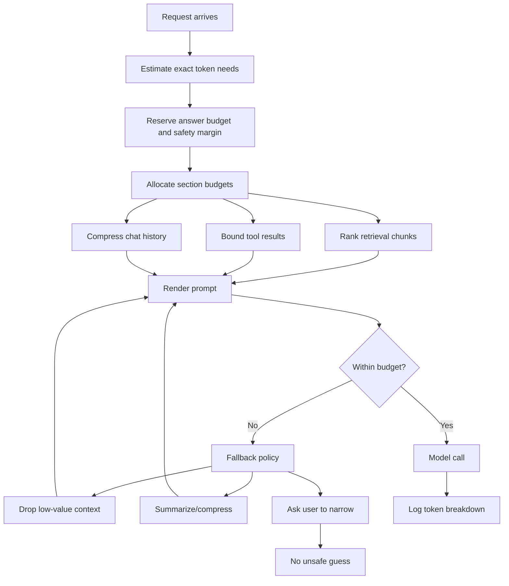

What the diagram is showing:

- Output budget is reserved before stuffing input context.
- Retrieval, tools, and history are separately budgeted.
- Over-budget behavior should be deterministic and observable.

### 3) Real-World Industry Scenarios

#### Scenario A: RAG Assistant With Citations

Product/use case context:

An enterprise policy assistant retrieves documents and must answer with citations. A user asks a benefits-policy question, and the retriever returns 20 candidate chunks.

How budgeting affects the real system:

- Too few retrieval tokens may omit the answer-bearing chunk.
- Too many retrieval tokens may crowd out instructions, the user question, or answer space.
- Citation instructions need budget too; otherwise the answer may be correct but uncited.
- Chunk overlap can silently duplicate content and waste tokens.

Constraints:

- Latency: every extra retrieved token increases prefill time.
- Cost: retrieved context is paid on every request.
- Reliability: the answer needs enough evidence, but not every related chunk.
- Failure modes: wrong chunk included, citation chunk dropped, answer clipped, or stale document included.
- Security/privacy: retrieved context may contain sensitive policy or employee-specific information.

What good looks like in production:

- Retrieval has a token budget, not only a top-k count.
- Chunks are reranked by answer-bearing likelihood.
- The system reserves citation and answer space.
- Prompt traces show included and dropped chunks with token counts.

#### Scenario B: Agent With Tool Calls and Large Results

Product/use case context:

An incident agent uses tools for logs, metrics, traces, deployments, and runbooks. One tool returns a giant log dump; another returns a short deployment diff that likely explains the issue.

How budgeting affects the real system:

- Raw logs can consume the entire tool-result budget.
- High-volume output can bury high-value output.
- Tool results may need compression before the model sees them.
- The agent must preserve enough budget for the next reasoning step or final recommendation.

Constraints:

- Latency: large tool outputs slow the response during incidents.
- Cost: repeated tool-output insertion gets expensive quickly.
- Reliability: the model needs the right evidence, not maximal evidence.
- Failure modes: context overflow, missed deployment diff, repeated tool calls, wrong root cause, or incomplete remediation.
- Security/privacy: logs may include secrets, user IDs, hostnames, or internal infrastructure details.

What good looks like in production:

- Tools return structured summaries by default.
- Raw results are capped, filtered, deduplicated, and redacted.
- The orchestrator enforces tool-result budgets outside the prompt.
- The agent trace records raw result size, summarized size, and included evidence.

#### Scenario C: Long Chat Assistant With Memory

Product/use case context:

A customer success copilot maintains long conversations across days. It has chat history, account metadata, previous decisions, current task details, and retrieved product docs.

How budgeting affects the real system:

- Old chat history competes with current task context.
- Memory summaries can save tokens but may drop important facts.
- Account metadata may be more important than conversational filler.
- The answer budget depends on the requested output: short answer, email draft, JSON, or full plan.

Constraints:

- Latency: sending full history every turn is slow.
- Cost: long conversations multiply token spend.
- Reliability: durable commitments and account facts must survive compression.
- Failure modes: stale assumptions, missing commitments, wrong account tier, or partial output.
- Security/privacy: memory should minimize sensitive data while preserving necessary facts.

What good looks like in production:

- Chat history is summarized into durable state plus recent turns.
- Current user request is kept verbatim.
- Budget policy changes based on task type.
- The system can explain what context it used without exposing private content broadly.

### 4) System View: Think Like a Systems Engineer

#### [Intermediate] Inputs -> Transformations -> Outputs

Inputs:

- model context window
- tokenizer version
- system/developer instructions
- current user request
- chat history
- retrieved chunks
- tool results
- memory records
- output schema or response format
- product latency and cost targets

Transformations:

- count tokens with the exact tokenizer
- reserve answer budget
- reserve safety margin
- classify prompt sections as mandatory, high value, optional, or droppable
- allocate section budgets
- rerank and pack retrieval chunks
- compress chat history
- summarize or bound tool results
- render final prompt
- validate final token count before model call

Outputs:

- final rendered prompt
- input token count
- reserved output budget
- section-level token breakdown
- included/dropped context list
- truncation/compression decisions
- estimated request cost and latency class

#### [Intermediate] Budget Types

**Answer budget** is the number of tokens reserved for the model's response.

**Prompt budget** is the total input token space available after reserving answer budget and safety margin.

**Retrieval budget** is the portion of the prompt budget allocated to retrieved documents or chunks.

**Tool-result budget** is the portion allocated to outputs from tools, APIs, databases, logs, or code execution.

**Safety margin** is extra unused space reserved to absorb token-count variance, provider-specific overhead, formatting changes, or minor prompt growth.

Example budget:

```text
Context window: 32,000
Answer budget: 2,000
Safety margin: 1,000
Prompt budget: 29,000

System/developer instructions: 2,000
Current user request: 500
Chat history/state: 4,000
Retrieval context: 15,000
Tool results: 5,000
Output schema/examples: 2,500
```

If the final prompt exceeds 29,000 input tokens, the system should not silently clip. It should apply a known policy.

#### [Intermediate] Observability: What We Log, Trace, and Measure

Measure:

- prompt tokens by section
- completion tokens by route
- total tokens by request
- retrieved candidate tokens vs included retrieval tokens
- tool raw tokens vs included tool tokens
- chat history raw tokens vs summary tokens
- truncation rate
- compression rate
- dropped answer-bearing chunk rate
- request cost by route/customer/model
- p50/p95/p99 latency vs token count

Trace:

- tokenizer name/version
- budget allocation
- final rendered prompt structure
- included/dropped retrieval chunks
- included/dropped tool results
- answer budget reservation
- fallback policy used when over budget

Privacy note:

Token telemetry can usually be stored without raw text. For sensitive systems, prefer section names, counts, hashes, and redacted samples over full prompt logs.

#### [Pro] Failure Points: Where It Breaks and How It Shows Up

1. No budget owner

- How it shows up: every feature adds more context until prompts become slow, expensive, and brittle.
- Why it matters: context grows by default unless someone enforces limits.

2. Top-k retrieval without token budget

- How it shows up: five chunks sometimes fit cheaply and sometimes overflow, depending on chunk size.
- Why it matters: `k` counts chunks, not tokens or answer value.

3. Tool results treated as trusted prompt text

- How it shows up: huge logs or API dumps crowd out instructions and evidence.
- Why it matters: tools can produce unbounded or noisy text.

4. Output budget forgotten

- How it shows up: JSON is incomplete, citations are missing, or responses stop early.
- Why it matters: the answer needs reserved space.

5. Safety margin removed

- How it shows up: prompts fail only for certain languages, formatting changes, or provider overhead.
- Why it matters: exact prompts shift as routes evolve.

### 5) System Design Flavor

#### [Intermediate] Key Components and Interfaces

A token-budgeted GenAI system should include:

- `TokenizerRegistry`: maps each model to its exact tokenizer.
- `BudgetPolicy`: defines context window, answer budget, safety margin, and per-section limits.
- `PromptBudgeter`: allocates token space across prompt sections.
- `RetrievalPacker`: selects chunks by relevance and token budget.
- `ToolResultLimiter`: caps, filters, summarizes, and redacts tool outputs.
- `HistoryCompressor`: converts old chat turns into compact durable state.
- `PromptRenderer`: assembles and validates the final prompt.
- `BudgetTrace`: records counts, decisions, dropped items, and fallback behavior.

Key interface idea:

Every context candidate should carry value, size, and fallback metadata.

Example conceptual payload:

```json
{
  "request_id": "req_827",
  "model": "example-model",
  "context_window": 32000,
  "answer_budget": 2000,
  "safety_margin": 1000,
  "prompt_budget": 29000,
  "sections": {
    "instructions": {"budget": 2000, "used": 1450, "required": true},
    "current_user_request": {"budget": 800, "used": 120, "required": true},
    "chat_history": {"budget": 4000, "used": 2600, "fallback": "summarize"},
    "retrieval_context": {"budget": 15000, "used": 12350, "fallback": "drop_lowest_ranked"},
    "tool_results": {"budget": 5000, "used": 1800, "fallback": "summarize_and_redact"},
    "schema_and_examples": {"budget": 2500, "used": 900, "required": true}
  }
}
```

#### [Intermediate] Tradeoff 1: Retrieval Recall vs Prompt Precision

Layman version:

More retrieved chunks increase the chance that evidence is included, but also increase noise and cost.

Choose higher retrieval budget when:

- evidence may be spread across sources
- the query asks for comparison or synthesis
- reranking quality is strong
- answer stakes justify cost

Choose tighter retrieval budget when:

- the question is narrow
- citations must be exact
- chunks are noisy or repetitive
- latency/cost matters

Practical rule:

Do not budget retrieval by top-k alone. Budget by token count and answer-bearing value.

#### [Intermediate] Tradeoff 2: Tool Completeness vs Tool Noise

Layman version:

Full tool output feels safer, but it can overwhelm the model. A filtered tool result is often more useful than a complete dump.

Choose fuller tool output when:

- exact data is small
- the model must inspect raw evidence
- the tool result is already structured and relevant
- the task requires auditability

Choose summarized or filtered tool output when:

- logs, tables, or API responses are large
- only anomalies or top matches matter
- raw output contains sensitive data
- the model has previously missed evidence in large dumps

Practical rule:

Tools should return bounded, structured evidence whenever possible.

#### [Pro] Tradeoff 3: Fixed Budgets vs Adaptive Budgets

Layman version:

Fixed budgets are predictable. Adaptive budgets are smarter but more complex.

Use fixed budgets when:

- product routes are stable
- compliance and predictability matter
- latency/cost limits are strict
- simple debugging is preferred

Use adaptive budgets when:

- tasks vary widely
- query complexity can be estimated
- retrieval confidence changes by request
- the system has strong observability and evaluation

Practical rule:

Start with fixed budgets per route, then adapt only where measurements prove the need.

#### [Pro] Scaling Consideration: What Changes at 10x Traffic or Data?

At 10x scale, token budgeting becomes financial and operational infrastructure.

You need:

- per-route token budgets
- per-customer cost envelopes
- token alerts and anomaly detection
- prompt-budget regression tests
- cached token counts for retrieval chunks
- bounded tool interfaces
- offline replay before budget changes
- dashboards tying token usage to latency, cost, and answer quality

The main scaling risk is budget creep: small additions to prompts, tools, history, and retrieval silently compound into high latency, high cost, and lower reliability.

### 6) Common Mistakes + Debugging

#### Mistake 1: Budgeting by Characters or Chunk Count

- Symptom: some requests overflow or become expensive even though they include the same number of chunks.
- Likely cause: chunk count and character length hide token density differences.
- First debugging step: count tokens for each final prompt section with the deployed model tokenizer.

#### Mistake 2: Forgetting Answer Budget

- Symptom: answers are clipped, JSON is invalid, or citations disappear at the end.
- Likely cause: input context consumed the space needed for completion.
- First debugging step: inspect input tokens, reserved output tokens, actual completion tokens, and max-output settings.

#### Mistake 3: Letting Tool Results Be Unbounded

- Symptom: tool-using agents become slow, expensive, repetitive, or wrong after large tool calls.
- Likely cause: raw tool output exceeds the intended budget and displaces higher-priority context.
- First debugging step: compare raw tool-result tokens vs included tool-result tokens and inspect the tool-result limiter.

#### Mistake 4: Using Top-k Retrieval Without Token-Aware Packing

- Symptom: retrieval quality seems good, but final answers miss the best evidence.
- Likely cause: the best chunk was retrieved but dropped, truncated, or buried during prompt packing.
- First debugging step: trace candidate chunks through reranking, token packing, prompt position, and final inclusion.

#### Mistake 5: One Global Budget for Every Route

- Symptom: short Q&A is over-expensive, while complex analysis lacks enough context.
- Likely cause: the system uses the same prompt budget for tasks with different evidence and output needs.
- First debugging step: segment traffic by route/task type and compare token usage, latency, cost, and success rate.

### 7) Hands-On Lab: Concept -> Build -> Break -> Measure -> Explain

#### [Pro] Goal

Build a tiny token-budget allocator that packs instructions, chat history, retrieval chunks, tool results, and answer budget into a fixed context window.

This lab uses token counts directly to focus on budgeting logic.

#### Build: Smallest Working Version

Run this dependency-free Python snippet:

```python
from dataclasses import dataclass

@dataclass
class Candidate:
    name: str
    section: str
    tokens: int
    priority: int
    required: bool = False
    answer_bearing: bool = False

CONTEXT_WINDOW = 8000
ANSWER_BUDGET = 1200
SAFETY_MARGIN = 400
PROMPT_BUDGET = CONTEXT_WINDOW - ANSWER_BUDGET - SAFETY_MARGIN

SECTION_BUDGETS = {
    "instructions": 1000,
    "user_request": 500,
    "chat_history": 1200,
    "retrieval": 3000,
    "tool_results": 1000,
    "schema": 700,
}

candidates = [
    Candidate("system", "instructions", 500, 100, required=True),
    Candidate("developer_rules", "instructions", 350, 95, required=True),
    Candidate("current_question", "user_request", 120, 100, required=True),
    Candidate("old_chat_summary", "chat_history", 700, 60),
    Candidate("recent_turns", "chat_history", 480, 90),
    Candidate("chunk_1_related", "retrieval", 900, 45),
    Candidate("chunk_2_answer", "retrieval", 850, 98, answer_bearing=True),
    Candidate("chunk_3_related", "retrieval", 900, 55),
    Candidate("chunk_4_duplicate", "retrieval", 850, 35),
    Candidate("tool_metrics_summary", "tool_results", 350, 85),
    Candidate("tool_logs_excerpt", "tool_results", 700, 70),
    Candidate("json_schema", "schema", 400, 100, required=True),
]

def pack(candidates: list[Candidate]) -> tuple[list[Candidate], list[tuple[Candidate, str]]]:
    used_by_section = {section: 0 for section in SECTION_BUDGETS}
    included: list[Candidate] = []
    dropped: list[tuple[Candidate, str]] = []

    for candidate in sorted(candidates, key=lambda item: (item.required, item.priority), reverse=True):
        section_budget = SECTION_BUDGETS[candidate.section]
        total_used = sum(item.tokens for item in included)

        if used_by_section[candidate.section] + candidate.tokens > section_budget:
            if candidate.required:
                raise ValueError(f"Required item exceeds section budget: {candidate.name}")
            dropped.append((candidate, "section budget exceeded"))
            continue

        if total_used + candidate.tokens > PROMPT_BUDGET:
            if candidate.required:
                raise ValueError(f"Required item exceeds prompt budget: {candidate.name}")
            dropped.append((candidate, "prompt budget exceeded"))
            continue

        included.append(candidate)
        used_by_section[candidate.section] += candidate.tokens

    return included, dropped

def report(included: list[Candidate], dropped: list[tuple[Candidate, str]]) -> None:
    print("context_window:", CONTEXT_WINDOW)
    print("answer_budget:", ANSWER_BUDGET)
    print("safety_margin:", SAFETY_MARGIN)
    print("prompt_budget:", PROMPT_BUDGET)
    print("used_prompt_tokens:", sum(item.tokens for item in included))
    print("answer_bearing_included:", any(item.answer_bearing for item in included))
    print("included:", [(item.section, item.name, item.tokens) for item in included])
    print("dropped:", [(item.name, reason) for item, reason in dropped])

included, dropped = pack(candidates)
report(included, dropped)
```

What to observe:

- Answer budget and safety margin are reserved before prompt packing.
- Required sections fail loudly if they cannot fit.
- Retrieval and tool results have separate budgets.
- The answer-bearing chunk should survive because it has high priority.

#### Break: Force the Failure Mode

Change `tool_logs_excerpt` from `700` tokens to `2500` tokens and increase the `tool_results` budget to `3000` without changing the overall `PROMPT_BUDGET`.

Then rerun.

Expected breakage:

- Tool results may crowd out useful retrieval or chat history.
- The prompt can remain technically under the total limit while becoming less reliable.
- A section-level budget change can create cross-section damage if the total budget is not protected.

Now try a second break:

Set `ANSWER_BUDGET = 100`.

Expected breakage:

- The prompt has more input room, but the final answer may not have enough space for citations, JSON, or explanation.

#### Measure: Capture Concrete Signals

Add this helper:

```python
def section_usage(included: list[Candidate]) -> dict[str, int]:
    usage = {section: 0 for section in SECTION_BUDGETS}
    for item in included:
        usage[item.section] += item.tokens
    return usage

print("section_usage:", section_usage(included))
print("section_budgets:", SECTION_BUDGETS)
print("candidate_tokens:", sum(item.tokens for item in candidates))
print("included_tokens:", sum(item.tokens for item in included))
print("dropped_tokens:", sum(item.tokens for item, _ in dropped))
```

Track:

- prompt budget
- answer budget
- safety margin
- section usage vs section budget
- included retrieval tokens
- included tool-result tokens
- dropped answer-bearing candidates
- total candidate tokens vs included tokens

#### Explain: Why It Broke and What Prevents It

The broken version fails because budget pressure is not evenly harmful. A noisy section, such as tool logs, can consume enough space to displace more valuable evidence. Reducing answer budget can make input packing look better while making final output worse.

The production fix is to make budget policy explicit:

- reserve answer budget first
- cap tool results outside the model
- pack retrieval by token budget and relevance
- fail loudly when required sections cannot fit
- track included and dropped evidence
- review budget changes with replay tests

### 8) Active Recall

1. What is token budgeting in a GenAI system?
2. Why is top-k retrieval not enough for prompt budgeting?
3. Why should tool results have a separate budget?
4. What is a safety margin, and why does it matter?
5. What is the first thing to inspect when cost and latency rise after adding a new prompt feature?

#### Active Recall Answers

1. Token budgeting is allocating limited context space across instructions, user request, history, retrieval, tool results, schemas, and answer space.
2. Top-k counts chunks, not tokens or value. Five chunks can have very different token sizes and relevance.
3. Tool outputs can be large, noisy, sensitive, and unbounded; a separate budget prevents them from crowding out higher-priority context.
4. A safety margin is reserved unused space that absorbs overhead, formatting changes, tokenizer variance, and prompt growth.
5. Inspect section-level token breakdown, especially the new feature's token use and what it displaced.

### 9) Practice

#### Mini-Exercise

You operate a RAG assistant with a 16k context window. A new feature adds tool results from a database query. After launch, answers are slower and citations are worse.

Answer these:

1. What likely happened?
2. What traces do you inspect first?
3. What two fixes would you apply?

Suggested answer:

1. Tool results likely consumed prompt budget, displacing retrieval chunks, citation instructions, or answer budget.
2. Inspect token breakdown by section, included/dropped retrieval chunks, raw vs included tool-result tokens, answer budget, and final rendered prompt.
3. Add a tool-result budget with summarization/redaction, and repack retrieval chunks by relevance within a fixed retrieval budget.

#### Capstone-Style System Design Question

Design a token-budgeting layer for a production GenAI platform that supports chat, RAG, tool use, structured output, and multiple model families.

Your answer should cover:

- model/tokenizer registry
- route-specific budgets
- answer budget reservation
- retrieval packing
- tool-result limits
- chat-history compression
- fallback behavior
- telemetry and cost controls
- migration testing

Suggested answer outline:

- Maintain a model/tokenizer registry with exact token counters per model family.
- Define route-specific budgets for Q&A, summarization, extraction, agent workflows, and long-form generation.
- Reserve answer budget and safety margin before packing input.
- Pack retrieval by token budget, reranked relevance, source trust, freshness, and citation need.
- Bound tool outputs with schemas, top-k evidence, summaries, redaction, and raw-result references.
- Compress chat history into durable state plus recent turns.
- When over budget, drop low-priority context, summarize, ask for narrowing, or refuse to guess if required evidence cannot fit.
- Track tokens by section, route, customer, model, language, document type, and tool.
- Before model migration, replay traffic and compare token counts, cost, latency, truncation rate, and quality.

### 10) Production Reality Check

If this fails in prod, what's the first thing we inspect?

Inspect the final prompt token breakdown by section, especially retrieval-context tokens, tool-result tokens, reserved answer budget, dropped context, and the tokenizer used for counting.

Why:

Token-budget failures usually show up as model quality problems, latency spikes, cost spikes, invalid outputs, or missing citations. The model may be fine; the system may have allocated its limited context to the wrong things.

### 11) Curiosity Bridge

This completes the text-processing foundation: raw text becomes tokens, tokens get positions, and budgets decide what reaches the model.

This unlocks Topic 2.2: transformer mechanics. Next we can open the model box and study embeddings, self-attention, heads, and layers, where those token IDs become internal representations and attention patterns.

### 12) Exit Check + Carry-Forward Review

Exit Check: You're done when you can design a prompt budget for a RAG plus tool-use request and explain what gets protected, compressed, dropped, or reserved for output.

Carry-Forward Review:

Question: From 2.1.c, why can a model with a large context window still miss the correct evidence?

Answer: The evidence may be absent after packing, buried in a weak position, contradicted by other context, surrounded by distractions, or competing with too much low-value text.

Question: From 2.1.b, why must budget calculations use the deployed model tokenizer?

Answer: Different tokenizers produce different token counts for the same string, so the wrong tokenizer can create overflow, truncation, latency, and cost surprises.

Question: From 2.1.a, why should raw text and normalized text both be preserved in high-stakes systems?

Answer: Normalized text helps matching, but raw text is needed for audit, display, citations, and exact source verification.

---

## Topic 2.2: Transformer Mechanics

**Topic time:** 12h

Subtopics in this topic:

- 2.2.a Embeddings, self-attention, heads, and layers - 3h
- 2.2.b Feed-forward blocks, residual connections, and normalization - 3h
- 2.2.c Why attention works, where it breaks, and long-context variants - 3h
- 2.2.d Inference behavior: KV cache, batching, latency, and throughput - 3h

Learning rule for this topic:

- We move from the outside of the model to the inside.
- First we explain how token IDs become vectors and how tokens exchange information.
- Then we cover the deeper layer machinery and inference behavior.

---

## Subtopic 2.2.a: Embeddings, Self-Attention, Heads, and Layers

### ✅ Add to Knowledge Base

### 0) Reading Path + Level Tags

Beginner: read sections 1, 2, 6, 8, 10, and 11. Your goal is to explain how tokens become vectors and how attention lets tokens use context.

Intermediate: add sections 3, 4, 5, 7, and 9. Your goal is to reason about attention behavior in real prompts, RAG contexts, code, and tool-heavy workflows.

Pro: do the full Hands-On Lab and capstone practice. Your goal is to connect embeddings, Q/K/V attention, heads, and layer stacking to production debugging without overclaiming what we can observe from a black-box model.

### 1) Pre-Question Hook + The Intuition

Pause: after tokenization turns `The refund policy changed` into token IDs, how does the model know that `refund` and `policy` belong together more than `refund` and an unrelated word 2,000 tokens away?

#### [Beginner] Plain-English Mental Model

A transformer does not process words as dictionary entries. It processes numbers.

The journey begins like this:

1. Text becomes token IDs.
2. Each token ID is looked up in an **embedding matrix**.
3. The lookup returns a **token embedding**: a dense vector that represents that token in model space.
4. Position information is added or encoded so order matters.
5. **Self-attention** lets each token look at other tokens in the same sequence and decide what matters.
6. Multiple **attention heads** look for different relationship patterns in parallel.
7. Multiple **transformer layers** repeat this process, gradually building richer context-aware representations.

Simple mental model:

- Embeddings give tokens meaning-shaped starting vectors.
- Self-attention lets tokens exchange information.
- Heads let the model inspect several kinds of relationships at once.
- Layers let the model refine representations step by step.

Important distinction:

Transformer token embeddings are internal model vectors used inside the LLM. Retrieval embeddings are external vectors used for semantic search. They are related in spirit because both represent text numerically, but they are not the same object and are not usually interchangeable.

#### Analogy

Think of a large meeting where every token is a participant.

- The embedding is each participant's name badge and starting expertise.
- Self-attention is everyone deciding whom to listen to for the current discussion.
- Heads are different discussion channels: grammar, entity links, instruction relevance, code structure, topic continuity.
- Layers are repeated meeting rounds where everyone updates their understanding after listening.

Where the analogy breaks down:

The model is not consciously discussing. It is applying learned matrix operations that transform vectors. The meeting analogy is useful only for intuition about information flow.

#### [Intermediate] Why Attention Changed Everything

Older sequence models had difficulty moving information across long distances. Transformers made long-range relationships easier because every token can directly compare itself with other tokens in the context.

Example:

```text
The employee submitted the reimbursement form after the manager approved the international travel request.
```

To answer `What was approved?`, the model must connect `approved` with `international travel request`, not merely the nearest noun.

Self-attention gives the model a mechanism to build that connection.

In a decoder-only LLM, attention is usually **causal self-attention**: a token can attend to previous tokens, but not future tokens. This preserves next-token prediction behavior.

#### [Pro] The Engineering Reality

At a practical level, attention is not magic reasoning. It is a learned relevance-weighting mechanism.

Each token representation creates three vectors:

- **Query**: what this token is looking for.
- **Key**: what this token offers for matching.
- **Value**: the information this token contributes if selected.

The model compares queries with keys, turns those scores into weights, then combines values using those weights.

High-level formula:

```text
Attention(Q, K, V) = softmax((QK^T) / sqrt(d_k)) V
```

Plain meaning:

- `QK^T` asks, "Which tokens are relevant to this token?"
- `/ sqrt(d_k)` keeps scores numerically stable.
- `softmax` turns scores into attention weights.
- multiplying by `V` builds a weighted mix of information.

The key production lesson:

Attention gives the model a way to use context. It does not guarantee the model uses the right context. Prompt order, evidence quality, token budget, conflicts, model training, and tool-result formatting still matter.

### 2) Visual Diagram

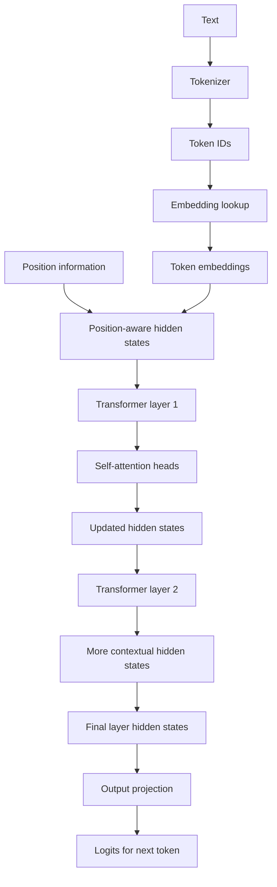

What the diagram is showing:

- Token IDs are not meaningful by themselves until mapped to vectors.
- Position-aware hidden states move through repeated transformer layers.
- Attention heads update each token representation using other tokens.
- The final hidden state is projected into next-token scores.

### 3) Real-World Industry Scenarios

#### Scenario A: RAG Assistant With Competing Evidence

Product/use case context:

A policy assistant receives a user question plus five retrieved chunks. One chunk contains the exact reimbursement deadline. Two chunks discuss older related rules. One chunk contains an exception. One chunk is irrelevant but shares many terms.

How embeddings and attention affect the real system:

- Token embeddings provide the initial vector representation for every token in the prompt.
- Self-attention lets the current answer tokens attend back to retrieved evidence, instructions, and the user question.
- Attention heads may learn different patterns, such as citation markers, date references, section titles, or exception wording.
- Layers progressively refine representations so later layers can combine relationships discovered earlier.

Constraints:

- Latency: longer retrieved context increases attention computation and prefill time.
- Cost: every retrieved token participates in model processing.
- Reliability: related-but-wrong chunks can compete with answer-bearing chunks.
- Failure modes: the model cites the related chunk, misses the exception, or answers from stale evidence.
- Security/privacy: prompt traces may include sensitive document snippets and must be controlled.

What good looks like in production:

- Retrieval sends fewer, more answer-bearing chunks.
- The prompt makes source freshness and authority explicit.
- The answer-bearing chunk is placed where the model can use it effectively.
- Evaluation checks whether the final answer uses the correct evidence, not merely any related evidence.

#### Scenario B: Code Assistant Understanding Function Dependencies

Product/use case context:

A coding assistant explains why a test fails. The relevant code includes an import, a helper function, a mocked dependency, and an assertion several files away.

How embeddings and attention affect the real system:

- Code tokens and identifiers become embeddings just like natural-language tokens.
- Self-attention lets usage sites connect to definitions, mocks, imports, and assertions present in context.
- Different heads can specialize in different relation patterns such as brackets, indentation, variable reuse, call chains, or comments.
- Layers allow the model to combine local syntax and broader intent.

Constraints:

- Latency: large code contexts and stack traces are token-heavy.
- Cost: repeated repository context can be expensive.
- Reliability: missing definitions or mocks can make the model infer a wrong contract.
- Failure modes: wrong symbol linked, helper behavior hallucinated, test assertion ignored, or stack trace over-weighted.
- Security/privacy: repository code and logs may contain secrets or internal details.

What good looks like in production:

- Context includes definitions, call sites, failing assertions, and minimal logs.
- Long stack traces are filtered to relevant frames.
- The assistant can cite exact files or snippets used as evidence.
- Tool traces show which code context was retrieved and packed.

#### Scenario C: Tool-Using Agent Choosing the Next Step

Product/use case context:

An operations agent receives a user request, system constraints, available tool schemas, previous tool results, and a current incident summary. It must decide whether to query logs, inspect deployment history, or recommend rollback.

How embeddings and attention affect the real system:

- Tool names, descriptions, arguments, and results are all tokens in the prompt.
- Self-attention lets the model connect the user's goal to available tools and previous evidence.
- Heads may attend to schema fields, error messages, timestamps, permissions, or instruction constraints.
- Layers refine the hidden state used to predict the next token, including a tool call or final answer.

Constraints:

- Latency: every extra tool description and result increases prompt processing.
- Cost: long tool schemas and verbose tool results are paid repeatedly.
- Reliability: ambiguous tool descriptions create attention competition.
- Failure modes: wrong tool selected, bad arguments generated, stale tool result treated as current, or permission constraint ignored.
- Security/privacy: sensitive tool outputs must be redacted before prompt insertion.

What good looks like in production:

- Tool schemas are concise and unambiguous.
- Tool results are bounded and structured.
- Permissions are enforced outside the model.
- Tool traces let engineers replay model decisions against the exact prompt.

### 4) System View: Think Like a Systems Engineer

#### [Intermediate] Inputs -> Transformations -> Outputs

Inputs:

- token IDs
- embedding matrix
- positional information
- layer weights
- attention projections for Q, K, and V
- attention mask
- model hyperparameters such as hidden size, number of heads, and number of layers

Transformations:

- map token IDs to embedding vectors
- combine embeddings with position information
- project hidden states into queries, keys, and values
- compute attention scores and attention weights
- combine value vectors according to attention weights
- repeat across multiple heads
- merge head outputs
- pass through repeated transformer layers
- project final hidden states to next-token logits

Outputs:

- context-aware hidden states
- next-token logits
- probability distribution over possible next tokens after softmax
- generated tokens after decoding/sampling policy

#### [Intermediate] Embeddings: From Token ID to Vector

An **embedding vector** is a list of learned numbers that represents a token in the model's internal space.

The embedding lookup is conceptually simple:

```text
token_id -> row in embedding matrix -> embedding vector
```

If the vocabulary has 100,000 tokens and the hidden size is 4,096, the embedding matrix has roughly:

```text
100,000 x 4,096 parameters
```

The embedding vector is not a dictionary definition. It is a learned starting representation that becomes useful when processed through layers and attention.

Important distinction:

- Internal token embeddings are part of the LLM.
- Retrieval embeddings are produced by embedding models for search.
- They both represent text numerically, but they serve different system roles.

#### [Intermediate] Self-Attention: Q, K, V in Plain English

For every token, the model computes:

- Query: what am I looking for?
- Key: what do I contain that others might match?
- Value: what information should I pass forward if others attend to me?

Example intuition:

In `The manager approved the request because it met policy`, the token `it` may query for the thing being referenced. The key for `request` may match strongly. The value from `request` contributes information to the updated representation of `it`.

This is not hard-coded grammar. It is learned behavior from training.

#### [Intermediate] Heads and Layers

An **attention head** is one attention mechanism with its own learned Q/K/V projections.

**Multi-head attention** runs several heads in parallel so the model can represent different relationships at the same time.

Examples of relationship patterns a head might help with:

- subject-verb links
- pronoun references
- instruction relevance
- code delimiters
- table column alignment
- citation markers
- tool schema fields

A **transformer layer** is a repeated processing block. In this subtopic, focus on the attention part. In the next subtopic, we will add feed-forward blocks, residual connections, and normalization.

Layer intuition:

- early layers often build local and surface-level representations
- middle layers combine broader relationships
- later layers shape task-specific next-token behavior

This is a simplification, not a strict rule. Real model internals are distributed and not perfectly separable by layer.

#### [Pro] Observability: What We Can and Cannot Inspect

In open-weight models, researchers can inspect attention weights, activations, hidden states, and layer behavior directly.

In hosted black-box APIs, production engineers usually cannot inspect internal attention weights. Instead, we debug through system-level evidence:

- final rendered prompt
- token counts
- context ordering
- included and dropped evidence
- output behavior under prompt ablations
- retrieval traces
- tool traces
- eval results across controlled prompt variants

Important caution:

Do not overinterpret visible attention weights as complete explanations. Attention weights can be useful signals, but model behavior comes from the full network, not attention alone.

### 5) System Design Flavor

#### [Intermediate] Key Components and Interfaces

A transformer-aware GenAI system should include:

- `Tokenizer`: converts text to token IDs.
- `PromptRenderer`: controls exact token sequence and order.
- `TokenBudgeter`: ensures the right evidence fits.
- `ContextRanker`: selects evidence worth attending to.
- `ModelRuntime`: executes transformer inference.
- `Sampler`: chooses output tokens from logits according to decoding settings.
- `TraceStore`: records prompt, retrieval, tool, token, and output behavior.
- `EvaluationHarness`: tests behavior under controlled prompt changes.

Key interface idea:

Because model internals are often not observable in hosted production systems, we design the external system so the model receives clean, ranked, bounded, and inspectable context.

Example conceptual trace:

```json
{
  "request_id": "req_914",
  "model": "example-transformer-model",
  "prompt_tokens": 8420,
  "answer_budget": 1200,
  "evidence_positions": [2100, 2400, 2780],
  "tool_schema_tokens": 620,
  "dropped_chunks": ["chunk_8", "chunk_9"],
  "ablation_result": "answer correct when stale chunk removed"
}
```

#### [Intermediate] Tradeoff 1: More Model Capacity vs Better Context

Layman version:

A larger model has more representational capacity, but it can still fail if the prompt contains weak, conflicting, or missing evidence.

Choose a stronger model when:

- the task requires complex synthesis
- evidence is subtle or multi-hop
- smaller models fail even with clean context
- latency/cost budgets allow it

Choose better context first when:

- the model is ignoring or misusing evidence
- retrieved chunks are noisy
- tool results are too verbose
- prompt order is unstable

Practical rule:

Do not use transformer capacity to compensate for preventable context mess.

#### [Intermediate] Tradeoff 2: Many Attention Heads vs Efficient Inference

Layman version:

More heads can let the model represent more relationship patterns, but model size and runtime cost also increase.

Choose larger attention capacity when:

- tasks require broad reasoning patterns
- code, tables, long documents, and tools are common
- quality matters more than raw speed

Choose smaller/faster models when:

- tasks are narrow
- latency is strict
- prompts are short and structured
- deterministic extraction or classification is enough

Practical rule:

Model architecture capacity should match task complexity and production constraints.

#### [Pro] Tradeoff 3: Black-Box Reliability vs Internal Interpretability

Layman version:

Hosted models are convenient and strong, but you usually debug them from the outside. Open-weight models can be inspected more deeply but require more infrastructure.

Choose hosted models when:

- speed to product matters
- quality is strong enough
- you can rely on external traces and evals
- infrastructure ownership should stay low

Choose open-weight models when:

- deeper control or inspection matters
- data locality requires self-hosting
- fine-tuning or activation-level research is needed
- cost at scale justifies runtime ownership

Practical rule:

Most product teams need strong prompt/retrieval/tool observability before they need attention-weight interpretability.

#### [Pro] Scaling Consideration: What Changes at 10x Traffic or Data?

At 10x scale, attention cost and prompt quality become operational concerns.

You need:

- prompt length controls
- retrieval quality gates
- tool-output caps
- model routing by task complexity
- regression evals for prompt changes
- latency and cost telemetry by prompt tokens
- ablation-based debugging for repeated failures

The main scaling risk is paying transformer compute over low-value tokens. Every noisy retrieved chunk, verbose tool result, or stale chat turn consumes model attention and production budget.

### 6) Common Mistakes + Debugging

#### Mistake 1: Confusing Retrieval Embeddings With Transformer Token Embeddings

- Symptom: the team assumes vector database embeddings are the same vectors the LLM uses internally.
- Likely cause: both are called embeddings, but they live in different parts of the system.
- First debugging step: map the flow: retrieval embeddings rank external documents; token embeddings are internal lookup vectors used after tokenization inside the LLM.

#### Mistake 2: Treating Attention as Guaranteed Evidence Use

- Symptom: the correct chunk is in the prompt, but the answer uses a weaker or stale chunk.
- Likely cause: attention is a learned relevance mechanism, not a guarantee of correct evidence selection.
- First debugging step: run a prompt ablation: remove distractor chunks, move the answer-bearing chunk closer to the task, and compare outputs.

#### Mistake 3: Assuming Attention Heads Have Human-Readable Jobs

- Symptom: debugging relies on claims like "this head handles citations" as if it is a stable product contract.
- Likely cause: overinterpreting interpretability examples.
- First debugging step: validate behavior with controlled examples instead of relying on head narratives.

#### Mistake 4: Ignoring Layered Representation Building

- Symptom: the team expects one local token relationship to explain a complex answer.
- Likely cause: forgetting that each layer updates hidden states, and final behavior comes from many transformations.
- First debugging step: simplify the prompt to isolate whether the failure is missing context, conflict, ordering, or task difficulty.

#### Mistake 5: Blaming the Base Model Before Inspecting Prompt Construction

- Symptom: output is wrong, so the team immediately escalates to a larger model.
- Likely cause: context, retrieval, tool results, or instructions are poorly assembled.
- First debugging step: inspect the exact rendered prompt and compare against a minimal prompt containing only the needed evidence.

### 7) Hands-On Lab: Concept -> Build -> Break -> Measure -> Explain

#### [Pro] Goal

Build a tiny self-attention simulation with no external dependencies. You will see how queries, keys, values, and attention weights create a context-aware vector.

This is not a real LLM. It is a small numerical intuition lab.

#### Build: Smallest Working Version

Run this dependency-free Python snippet:

```python
import math

tokens = ["manager", "approved", "travel", "request"]

# Tiny fake embeddings. Real embeddings have thousands of dimensions.
embeddings = {
    "manager": [1.0, 0.2, 0.0],
    "approved": [0.2, 1.0, 0.2],
    "travel": [0.0, 0.4, 1.0],
    "request": [0.1, 0.3, 0.9],
}

def dot(left, right):
    return sum(a * b for a, b in zip(left, right))

def softmax(scores):
    max_score = max(scores)
    exp_scores = [math.exp(score - max_score) for score in scores]
    total = sum(exp_scores)
    return [score / total for score in exp_scores]

def weighted_sum(weights, vectors):
    return [
        sum(weight * vector[index] for weight, vector in zip(weights, vectors))
        for index in range(len(vectors[0]))
    ]

def attend(query_token):
    query = embeddings[query_token]
    keys = [embeddings[token] for token in tokens]
    values = [embeddings[token] for token in tokens]
    scale = math.sqrt(len(query))

    scores = [dot(query, key) / scale for key in keys]
    weights = softmax(scores)
    output = weighted_sum(weights, values)

    return {
        "query_token": query_token,
        "scores": dict(zip(tokens, [round(score, 3) for score in scores])),
        "attention_weights": dict(zip(tokens, [round(weight, 3) for weight in weights])),
        "context_vector": [round(value, 3) for value in output],
    }

for token in tokens:
    print(attend(token))
```

What to observe:

- Each token uses its vector as a query.
- Similar vectors produce higher attention scores.
- Softmax converts scores into weights.
- The output is a weighted mix of value vectors.

#### Break: Force the Failure Mode

Add a distracting token with a large vector:

```python
tokens = ["manager", "approved", "travel", "request", "unrelated"]
embeddings["unrelated"] = [5.0, 5.0, 5.0]
```

Then rerun.

Expected breakage:

- The `unrelated` token may dominate attention because its vector magnitude creates large dot products.
- Attention weights become less aligned with the intuitive sentence meaning.
- This shows why real transformers need careful training, scaling, normalization, and learned projections.

#### Measure: Capture Concrete Signals

Track:

- highest attention-weight token for each query
- entropy of attention weights
- whether the intuitive relevant token receives high weight
- how attention changes after adding the distractor

Add this helper:

```python
def entropy(weights):
    return -sum(weight * math.log(weight + 1e-12) for weight in weights)

result = attend("approved")
weights = list(result["attention_weights"].values())
print("approved_attention_entropy:", round(entropy(weights), 3))
print("top_attention:", max(result["attention_weights"], key=result["attention_weights"].get))
```

Interpretation:

- Low entropy means attention is concentrated.
- High entropy means attention is spread out.
- Concentrated attention is not automatically correct; it depends on what receives the weight.

#### Explain: Why It Broke and What Prevents It

The toy system broke because raw dot products were distorted by vector magnitude. Real transformers do not use raw token embeddings directly for attention in this simple way. They use learned Q/K/V projections, scaling, normalization, residual pathways, feed-forward blocks, and training dynamics.

The production lesson is still useful:

- attention is a weighting mechanism, not a correctness guarantee
- irrelevant context can compete with relevant context
- prompt quality affects what relationships the model can use
- bigger context can add distraction if evidence is not ranked and structured
- debugging should inspect prompt construction before blaming model intelligence

### 8) Active Recall

1. What is the difference between a token ID and a token embedding?
2. What are Query, Key, and Value in self-attention?
3. Why does multi-head attention exist?
4. What does a transformer layer do at a high level?
5. Why should we avoid saying "the attention head understands citations" as a product guarantee?

#### Active Recall Answers

1. A token ID is an integer identifier; a token embedding is the learned vector retrieved for that ID.
2. Query represents what a token is looking for, Key represents what a token offers for matching, and Value is the information contributed when attended to.
3. Multi-head attention lets the model represent several relationship patterns in parallel.
4. A transformer layer updates token hidden states by applying attention and other transformations, making representations more context-aware.
5. Attention-head behavior is distributed, learned, and context-dependent. Product reliability should be validated with evals and traces, not assumed from a human-readable story.

### 9) Practice

#### Mini-Exercise

A RAG assistant includes the correct policy chunk, but answers from an older stale chunk with similar wording.

Answer these:

1. Why is this not disproven by saying "attention should find the right chunk"?
2. What prompt-level experiment would you run?
3. What system fix would you try first?

Suggested answer:

1. Attention can relate tokens, but it does not guarantee correct evidence priority when chunks are stale, similar, or poorly ordered.
2. Run an ablation: remove the stale chunk, move the correct chunk closer to the user task, and compare outputs.
3. Improve reranking and source metadata, then pack fresher answer-bearing evidence before related stale context.

#### Capstone-Style System Design Question

Design a debugging approach for a tool-using RAG assistant that gives wrong answers even though the model is strong and the relevant evidence appears somewhere in the prompt.

Your answer should cover:

- rendered prompt inspection
- evidence position
- distractor context
- tool-result formatting
- prompt ablations
- retrieval reranking
- model selection tradeoff
- evaluation design

Suggested answer outline:

- Inspect the exact rendered prompt and locate the answer-bearing evidence.
- Record its token position and surrounding distractors.
- Check whether tool outputs are verbose, stale, or conflicting.
- Run ablations with only the needed evidence, then add distractors back one at a time.
- Rerank retrieval by answer-bearing likelihood, freshness, and authority.
- Bound and structure tool results before inserting them into context.
- Try a stronger model only after prompt/evidence quality is controlled.
- Add eval cases with conflicting chunks, stale evidence, and tool-result noise.

### 10) Production Reality Check

If this fails in prod, what's the first thing we inspect?

Inspect the final rendered prompt and evidence layout before blaming transformer internals: which evidence was present, where it appeared, what distractors surrounded it, and whether tool or retrieval text competed with it.

Why:

Embeddings and attention give the model a mechanism for using context, but production failures often come from the context we provide. A model cannot reliably attend to missing, buried, stale, contradictory, or noisy evidence.

### 11) Curiosity Bridge

This unlocks the core information-flow picture: token IDs become vectors, attention lets vectors exchange information, heads run several relationship views, and layers refine the result.

This works well here, but it is not the full transformer block yet. Next we add feed-forward blocks, residual connections, and normalization, which explain how each layer preserves, transforms, and stabilizes information.

### 12) Exit Check + Carry-Forward Review

Exit Check: You're done when you can explain how a token ID becomes a vector, how Q/K/V attention updates it using context, why multiple heads help, and why layers make representations progressively richer.

Carry-Forward Review:

Question: From 2.1.d, why is token budgeting still important even when attention can theoretically compare tokens across the prompt?

Answer: Attention can only operate over included tokens, and noisy or excessive context competes for model capacity, latency, and cost.

Question: From 2.1.c, why does including evidence in a long prompt not guarantee the model will use it?

Answer: Evidence may be buried, contradicted, weakly positioned, surrounded by distractors, or beyond the model's effective context for that task.

Question: From 2.1.b, why do rare IDs or code strings matter for transformer mechanics?

Answer: They may split into many tokens, increasing sequence length and changing how much attention/context budget is spent representing the same visible text.

---

## Subtopic 2.2.b: Feed-Forward Blocks, Residual Connections, and Normalization

### ✅ Add to Knowledge Base

### 0) Reading Path + Level Tags

Beginner: read sections 1, 2, 6, 8, 10, and 11. Your goal is to understand what happens inside a transformer layer after attention.

Intermediate: add sections 3, 4, 5, 7, and 9. Your goal is to connect feed-forward blocks, residual connections, and normalization to reliability, training stability, and production behavior.

Pro: do the full Hands-On Lab and capstone practice. Your goal is to reason about transformer blocks as stable repeated computation units, not isolated attention tricks.

### 1) Pre-Question Hook + The Intuition

Pause: if attention lets tokens gather information from other tokens, what lets each token deeply transform that gathered information without destroying everything the previous layers already knew?

#### [Beginner] Plain-English Mental Model

Attention is only part of a transformer layer.

After attention mixes information across tokens, each token still needs internal processing. That is the job of the **feed-forward block**: a small neural network applied independently to each token position.

But deep models have a problem. If every layer completely rewrites the token representation, useful information can get damaged or training can become unstable.

That is why transformer blocks also use:

- **Residual connections**: add the original representation back after a transformation, so the model can preserve useful information.
- **Normalization**: keep vector values in a stable range so deep stacks train and run more predictably.

Simple mental model:

- Attention = gather useful context from other tokens.
- Feed-forward block = process each token's gathered information more deeply.
- Residual connection = preserve the original signal while adding an update.
- Normalization = keep the signal numerically stable.

The key lesson:

Transformers work not just because they have attention, but because they can repeat attention and feed-forward transformations many times without the signal collapsing, exploding, or losing a clean path through the network.

#### Analogy

Think of editing a technical document through many review rounds.

- Attention is reading comments from other sections of the document.
- The feed-forward block is rewriting your own paragraph based on what you learned.
- The residual connection is keeping the previous draft beside the rewrite so good content is not lost.
- Normalization is applying style and formatting rules so every round stays readable.

Where the analogy breaks down:

The model is not literally editing prose. It transforms vectors with learned matrices, nonlinear functions, additions, and scaling operations.

#### [Intermediate] Why Feed-Forward Blocks Matter

Self-attention mixes information across positions, but the feed-forward block adds per-token computation depth.

A common transformer block alternates between:

1. Attention: token-to-token communication.
2. Feed-forward: token-wise transformation.

The feed-forward block is usually a **multilayer perceptron** or MLP-style module. It often expands the hidden dimension, applies an **activation function**, then projects back down.

Simplified shape:

```text
hidden_size -> larger_intermediate_size -> hidden_size
```

Why expand then shrink?

The expansion gives the model more room to compute useful feature combinations. The projection back keeps the layer output compatible with the next transformer block.

#### [Pro] The Deep Intuition

A transformer layer is best understood as updating a shared **residual stream**.

At each layer, attention and feed-forward modules propose updates to the current hidden state. Residual connections add those updates back into the stream.

Simplified block intuition:

```text
x = x + Attention(Normalize(x))
x = x + FeedForward(Normalize(x))
```

This common style is called **pre-norm** because normalization happens before the sub-layer transformation.

The residual stream matters because it gives information and gradients a highway through the model. Without it, very deep transformer stacks would be much harder to train and could more easily lose useful early-layer information.

### 2) Visual Diagram

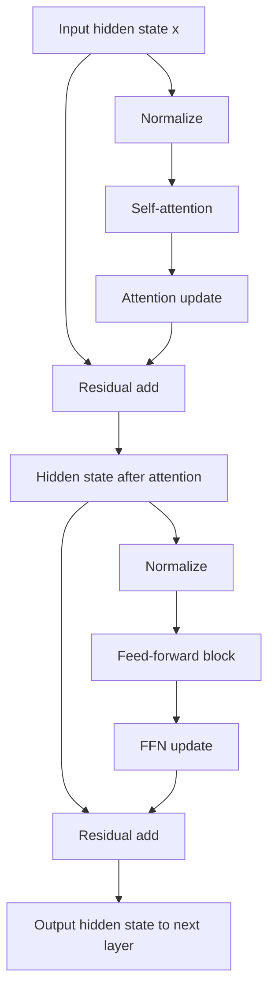

What the diagram is showing:

- A transformer layer usually has two major sub-blocks: attention and feed-forward.
- Each sub-block proposes an update.
- Residual connections add updates back to the existing hidden state.
- Normalization helps keep the repeated computation stable.

### 3) Real-World Industry Scenarios

#### Scenario A: Why Bigger Models Can Learn More Subtle Behavior

Product/use case context:

A legal assistant must distinguish between a general clause, an exception, an amendment, and an implied dependency across several sections. A small model often gives a broad answer; a stronger model handles the exception more reliably.

How these internals affect the real system:

- Attention helps connect related clauses across the prompt.
- Feed-forward blocks transform the attended information into richer internal features.
- Residual connections help preserve earlier signals while adding new layer updates.
- Normalization keeps the repeated layer stack stable enough for deep computation.

Constraints:

- Latency: larger hidden sizes and more layers increase compute.
- Cost: deeper and wider models cost more per token.
- Reliability: subtle legal distinctions may need richer representations.
- Failure modes: broad answer, missed exception, merged clauses, or overconfident citation.
- Security/privacy: legal prompts and traces must be handled with strict access control.

What good looks like in production:

- Use a model strong enough for the reasoning burden.
- Keep context precise so model capacity is spent on relevant evidence.
- Evaluate with exception-heavy and conflict-heavy legal examples.
- Use citations and validation to catch subtle misreadings.

#### Scenario B: Structured Output Reliability

Product/use case context:

A claims-processing assistant extracts data into JSON. It must follow a schema, preserve evidence, and avoid inventing missing fields.

How these internals affect the real system:

- Attention connects schema fields to evidence spans.
- Feed-forward blocks help transform context into output-ready features.
- Residual connections help preserve the schema instruction while processing evidence.
- Normalization supports stable behavior across many layers and long prompts.

Constraints:

- Latency: validation and retry loops add time.
- Cost: invalid JSON causes repair requests and extra tokens.
- Reliability: downstream systems may reject malformed or hallucinated fields.
- Failure modes: missing keys, wrong data type, schema drift, or unsupported extraction.
- Security/privacy: extracted claim data may contain sensitive personal details.

What good looks like in production:

- Use schema-constrained generation where available.
- Place the schema near the output instruction.
- Validate and repair with concise feedback.
- Measure exact-field accuracy, not only natural-language helpfulness.

#### Scenario C: Training and Serving Open-Weight Models

Product/use case context:

A platform team evaluates whether to self-host an open-weight model for internal code assistance. They compare model sizes, context length, GPU memory, latency, and quality.

How these internals affect the real system:

- Feed-forward blocks are a major source of model parameters and compute.
- Residual connections and normalization make deep models trainable and stable.
- Hidden size, intermediate size, number of layers, and activation choices affect memory and latency.
- Architecture details influence whether quantization or serving optimizations behave well.

Constraints:

- Latency: deeper models and larger feed-forward blocks increase per-token compute.
- Cost: GPU memory and throughput determine serving economics.
- Reliability: smaller models may fail on multi-hop code reasoning even with clean context.
- Failure modes: slow generation, out-of-memory errors, unstable fine-tuning, or degraded quantized quality.
- Security/privacy: self-hosting may improve data locality but increases operational responsibility.

What good looks like in production:

- Benchmark with realistic prompts, not toy examples.
- Track latency by input length and output length.
- Compare quality per dollar, not only raw model size.
- Use evals that represent actual code and tool workflows.

### 4) System View: Think Like a Systems Engineer

#### [Intermediate] Inputs -> Transformations -> Outputs

Inputs:

- hidden state from the previous layer
- attention output
- feed-forward weights
- activation function
- normalization parameters
- residual stream
- model architecture settings such as hidden size, intermediate size, and number of layers

Transformations:

- normalize the current hidden state
- compute attention update
- add attention update back through residual connection
- normalize the updated hidden state
- compute feed-forward transformation independently at each token position
- add feed-forward update back through residual connection
- pass the updated hidden state to the next layer

Outputs:

- stabilized hidden state for the next transformer layer
- richer per-token representation
- preserved residual information plus learned updates
- final layer representations used for next-token logits

#### [Intermediate] Feed-Forward Block: Token-Wise Computation

A feed-forward block is applied separately to each token position. It does not directly move information between tokens; attention already handled cross-token mixing.

Simplified formula:

```text
FFN(x) = W2 * activation(W1 * x + b1) + b2
```

Plain meaning:

- `W1` expands the representation into a larger intermediate space.
- The activation function adds nonlinearity.
- `W2` projects the representation back to hidden size.

Why nonlinearity matters:

Without activation functions, stacked linear transformations would collapse into another linear transformation. Nonlinearity lets the model learn more complex features.

Modern LLMs often use feed-forward variants with gated activations such as **SwiGLU**, rather than only older choices like **GELU**.

#### [Intermediate] Residual Connections: Preserving the Signal

A residual connection adds the input of a sub-layer back to its output:

```text
output = x + sublayer(x)
```

This helps in two ways:

- It preserves information from earlier layers.
- It improves gradient flow during training.

Plain intuition:

Each sub-layer does not need to reinvent the entire representation. It only needs to learn a useful update.

That matters because transformer models can have dozens or hundreds of layers. Without residual pathways, useful information and training gradients would have a harder time flowing through the stack.

#### [Intermediate] Normalization: Keeping the Signal Stable

Normalization keeps hidden-state values in a manageable numerical range.

The common historical method is **LayerNorm**. Many modern LLMs use **RMSNorm**, a simpler normalization variant that often works well and can be computationally efficient.

Why normalization matters:

- deep stacks can amplify or shrink values unpredictably
- unstable activations make training harder
- normalized inputs make sub-layer behavior more predictable
- serving and quantization can be more stable when activation ranges are controlled

Simplified practical view:

Normalization is like keeping every layer's input on a usable scale before transformation.

#### [Pro] Pre-Norm vs Post-Norm

There are two common ways to place normalization around a sub-layer.

**Post-norm** style:

```text
x = Normalize(x + Sublayer(x))
```

**Pre-norm** style:

```text
x = x + Sublayer(Normalize(x))
```

Many modern large transformers use pre-norm or pre-norm-like designs because they make very deep models easier to train.

Engineering intuition:

- post-norm normalizes after the update
- pre-norm normalizes before computing the update
- pre-norm gives the residual stream a cleaner direct path through depth

### 5) System Design Flavor

#### [Intermediate] Key Components and Interfaces

Transformer block internals show up in production through model-selection and serving choices:

- `ModelConfig`: hidden size, number of layers, number of heads, intermediate size, activation, normalization type.
- `ModelRuntime`: GPU memory, throughput, batching, quantization, and kernel support.
- `TokenizerAndPromptBudgeter`: sequence length controls how many layer computations run.
- `EvaluationHarness`: measures whether model capacity is enough for the task.
- `LatencyProfiler`: tracks prompt prefill time and generation speed.
- `FineTuningPipeline`: must preserve training stability when adapting a model.

Key interface idea:

Model architecture choices are not abstract. They change serving cost, latency, memory, and the kinds of tasks a model can handle reliably.

Example model-selection payload:

```json
{
  "model": "example-7b-instruct",
  "layers": 32,
  "hidden_size": 4096,
  "intermediate_size": 11008,
  "normalization": "RMSNorm",
  "activation": "SwiGLU",
  "target_route": "policy_rag_qa",
  "p95_latency_budget_ms": 2500
}
```

#### [Intermediate] Tradeoff 1: Model Depth/Width vs Latency

Layman version:

More layers and wider feed-forward blocks can represent more complex patterns, but every token costs more compute.

Choose deeper/wider models when:

- tasks require complex synthesis
- prompts contain subtle evidence interactions
- errors are expensive
- latency and budget allow it

Choose smaller/faster models when:

- tasks are narrow or structured
- retrieval context is clean
- outputs are constrained
- high throughput matters

Practical rule:

Benchmark quality and latency on realistic prompts. Toy prompts hide the real cost of deep transformer blocks.

#### [Intermediate] Tradeoff 2: Preserve vs Transform

Layman version:

Residual connections help preserve information, while attention and feed-forward blocks transform it. A good transformer block balances both.

Preservation matters when:

- exact wording matters
- schema instructions must survive
- citations depend on precise evidence
- long prompts contain fragile constraints

Transformation matters when:

- the model must infer relationships
- evidence must be combined
- code behavior must be reasoned through
- the answer requires abstraction

Practical rule:

Prompt design should help the model preserve exact facts and transform only the parts that need reasoning.

#### [Pro] Tradeoff 3: Architecture Optimization vs Product-Level Fixes

Layman version:

Changing model architecture or model family can help, but many failures are cheaper to fix through retrieval, prompt structure, validation, and routing.

Consider architecture/model changes when:

- clean prompts still fail systematically
- smaller models lack needed capacity
- latency/cost analysis supports switching
- fine-tuning or self-hosting is part of the strategy

Try product-level fixes first when:

- context is noisy
- tool outputs are verbose
- schema instructions are weak
- retrieval misses answer-bearing evidence

Practical rule:

Do not reach for architecture explanations until the external system is instrumented.

#### [Pro] Scaling Consideration: What Changes at 10x Traffic or Data?

At 10x scale, feed-forward compute and layer depth become cost multipliers.

You need:

- latency profiling by model and route
- token budget controls
- model routing by task difficulty
- quantization tests where appropriate
- batch-size and throughput tuning
- evaluation before model swaps
- monitoring for output quality regressions after serving optimizations

The main scaling risk is paying deep-model compute for tasks that a smaller model or cleaner context could handle.

### 6) Common Mistakes + Debugging

#### Mistake 1: Thinking Attention Is the Whole Transformer

- Symptom: explanations of model behavior ignore feed-forward blocks, residual paths, and normalization.
- Likely cause: attention is famous, so the rest of the block is treated as detail.
- First debugging step: redraw the transformer layer as attention plus feed-forward updates over a residual stream.

#### Mistake 2: Assuming Feed-Forward Blocks Move Information Between Tokens

- Symptom: the team credits the FFN with finding evidence in another chunk.
- Likely cause: confusing token-wise transformation with cross-token communication.
- First debugging step: separate the roles: attention mixes across positions; FFN transforms each position's representation.

#### Mistake 3: Ignoring Residual Connections When Thinking About Depth

- Symptom: the model is described as completely rewriting meaning at every layer.
- Likely cause: missing the idea that layers add updates to an ongoing residual stream.
- First debugging step: explain each layer as proposing an update, not replacing the entire representation from scratch.

#### Mistake 4: Treating Normalization as a Minor Math Detail

- Symptom: fine-tuning or serving changes create instability, quality loss, or sensitivity to quantization.
- Likely cause: normalization and activation ranges affect stability and numerical behavior.
- First debugging step: inspect model architecture details, training settings, quantization method, and activation/normalization statistics if available.

#### Mistake 5: Blaming Architecture for a Prompt-System Bug

- Symptom: team wants a larger model because outputs are inconsistent, but prompts contain conflicting instructions or unbounded tool results.
- Likely cause: external context quality is poor.
- First debugging step: run a minimal clean-context test before changing model family.

### 7) Hands-On Lab: Concept -> Build -> Break -> Measure -> Explain

#### [Pro] Goal

Build a tiny transformer-block simulator showing attention update, feed-forward update, residual addition, and normalization.

This is not a real transformer. It is a numerical intuition lab for stable repeated updates.

#### Build: Smallest Working Version

Run this dependency-free Python snippet:

```python
import math

def add(left, right):
    return [a + b for a, b in zip(left, right)]

def matvec(matrix, vector):
    return [sum(weight * value for weight, value in zip(row, vector)) for row in matrix]

def relu(vector):
    return [max(0.0, value) for value in vector]

def layer_norm(vector, eps=1e-6):
    mean = sum(vector) / len(vector)
    variance = sum((value - mean) ** 2 for value in vector) / len(vector)
    scale = math.sqrt(variance + eps)
    return [(value - mean) / scale for value in vector]

def feed_forward(vector):
    w1 = [
        [1.2, -0.4, 0.3],
        [0.1, 0.9, -0.2],
        [-0.5, 0.2, 1.0],
        [0.7, 0.3, 0.4],
    ]
    w2 = [
        [0.5, 0.1, -0.3, 0.2],
        [-0.2, 0.6, 0.1, 0.3],
        [0.4, -0.1, 0.7, -0.2],
    ]
    expanded = matvec(w1, vector)
    activated = relu(expanded)
    return matvec(w2, activated)

# Pretend attention has already produced this context update.
x = [0.8, 0.2, -0.1]
attention_update = [0.1, 0.4, 0.2]

after_attention = add(x, attention_update)
normalized = layer_norm(after_attention)
ffn_update = feed_forward(normalized)
after_ffn = add(after_attention, ffn_update)

print("x:", [round(value, 3) for value in x])
print("after_attention_residual:", [round(value, 3) for value in after_attention])
print("normalized:", [round(value, 3) for value in normalized])
print("ffn_update:", [round(value, 3) for value in ffn_update])
print("after_ffn_residual:", [round(value, 3) for value in after_ffn])
```

What to observe:

- The attention update is added to the original vector.
- Normalization rescales the representation before feed-forward processing.
- The feed-forward block expands, activates, and projects back down.
- The feed-forward update is added back through another residual connection.

#### Break: Force the Failure Mode

Remove normalization by replacing:

```python
normalized = layer_norm(after_attention)
```

with:

```python
normalized = after_attention
```

Then multiply the starting vector:

```python
x = [value * 20 for value in x]
```

Expected breakage:

- The feed-forward update becomes much larger or more uneven.
- The output scale becomes harder to reason about.
- Repeating this across many layers would amplify instability.

#### Measure: Capture Concrete Signals

Add these helpers:

```python
def l2_norm(vector):
    return math.sqrt(sum(value * value for value in vector))

for name, vector in [
    ("x", x),
    ("after_attention", after_attention),
    ("normalized", normalized),
    ("ffn_update", ffn_update),
    ("after_ffn", after_ffn),
]:
    print(name, "l2_norm=", round(l2_norm(vector), 3))
```

Track:

- vector norm before and after normalization
- feed-forward update size
- final output norm
- how these change when the input scale increases

#### Explain: Why It Broke and What Prevents It

The broken version shows why normalization and residual structure matter in deep stacks. Without normalization, a large input scale can create large feed-forward activations. Without residual connections, the model would have a harder time preserving useful information while applying transformations.

Real transformers use carefully designed normalization, initialization, residual paths, activation functions, and training procedures so thousands of repeated vector operations remain stable enough to learn useful behavior.

### 8) Active Recall

1. What does the feed-forward block do in a transformer layer?
2. Why are residual connections important?
3. What problem does normalization help solve?
4. What is the difference between attention and the feed-forward block?
5. Why is pre-norm commonly used in modern deep transformers?

#### Active Recall Answers

1. It applies a learned nonlinear transformation independently to each token's hidden state.
2. They preserve previous information and improve gradient flow by adding sub-layer updates back to the residual stream.
3. Normalization keeps hidden-state values on a stable scale, making deep training and serving behavior more predictable.
4. Attention mixes information across token positions; the feed-forward block transforms each token position independently.
5. Pre-norm gives the residual stream a cleaner path through many layers and often improves training stability for deep models.

### 9) Practice

#### Mini-Exercise

A team says, "The model failed because attention did not find the right fact." The prompt includes the right evidence, but the answer still merges two policy clauses incorrectly.

Answer these:

1. What transformer-block concept does this explanation miss?
2. What product-level debugging step should you take first?
3. What model-selection question might matter if the clean-context test still fails?

Suggested answer:

1. It misses that behavior comes from the full layer stack: attention, feed-forward transformations, residual stream, normalization, and later next-token dynamics.
2. Run a clean-context ablation with only the exact evidence, clear source labels, and the desired output format.
3. Ask whether the task requires more model capacity, better instruction tuning, or a model stronger at multi-clause synthesis.

#### Capstone-Style System Design Question

Design a model-selection and debugging strategy for an enterprise RAG assistant that must answer subtle policy questions with exceptions, citations, and structured output.

Your answer should cover:

- context quality controls
- eval cases that test exception handling
- model capacity tradeoffs
- latency/cost measurement
- validation strategy
- prompt ablations
- when to choose a larger model
- when to fix retrieval/prompting instead

Suggested answer outline:

- First ensure retrieval returns answer-bearing, current, deduplicated chunks.
- Create evals with general rule vs exception, stale vs current policy, and conflicting clauses.
- Compare models on exact answer accuracy, citation correctness, JSON validity, latency, and cost.
- Use prompt ablations to separate context-quality failures from model-capacity failures.
- Validate structured outputs and citations automatically.
- Choose a larger model when clean context still fails on synthesis or exception reasoning.
- Fix retrieval/prompting when evidence is missing, noisy, stale, poorly labeled, or badly ordered.

### 10) Production Reality Check

If this fails in prod, what's the first thing we inspect?

Inspect whether the failure reproduces with a minimal clean prompt containing only the necessary evidence, instructions, and output format.

Why:

Feed-forward blocks, residual connections, and normalization explain how transformers transform and stabilize internal representations, but most production failures still need to be separated into context quality, model capacity, decoding, validation, and serving issues before blaming architecture.

### 11) Curiosity Bridge

This unlocks the full transformer-block picture: attention moves information across tokens, feed-forward blocks transform each token, residual connections preserve signal, and normalization keeps deep stacks stable.

This works well here, but breaks under long context, distractors, sparse evidence, and scaling constraints. Next we study why attention works, where it breaks, and long-context variants.

### 12) Exit Check + Carry-Forward Review

Exit Check: You're done when you can draw a transformer block and explain how attention, feed-forward computation, residual connections, and normalization cooperate to update hidden states safely across many layers.

Carry-Forward Review:

Question: From 2.2.a, what is the role of self-attention compared with feed-forward blocks?

Answer: Self-attention mixes information across tokens; feed-forward blocks transform each token's resulting representation independently.

Question: From 2.1.d, why does deep transformer capacity not remove the need for token budgeting?

Answer: Every extra token still consumes compute, latency, cost, and attention capacity. Bad budgeting sends the model low-value context to process through every layer.

Question: From 2.1.c, why can long prompts become unreliable even when architecture is strong?

Answer: Important evidence may be buried, truncated, contradicted, or surrounded by distractors, making effective context smaller than raw context capacity.

---

## Subtopic 2.2.c: Why Attention Works, Where It Breaks, and Long-Context Variants

### ✅ Add to Knowledge Base

### 0) Reading Path + Level Tags

Beginner: read sections 1, 2, 6, 8, 10, and 11. Your goal is to understand why attention is powerful but not magic memory.

Intermediate: add sections 3, 4, 5, 7, and 9. Your goal is to debug long-prompt failures, distractor evidence, and attention-related cost/latency issues in real systems.

Pro: do the full Hands-On Lab and capstone practice. Your goal is to compare long-context strategies such as exact attention optimizations, sparse/local attention, RoPE scaling, retrieval, and compression as system design choices.

### 1) Pre-Question Hook + The Intuition

Pause: if self-attention lets every token look at every earlier token, why do long prompts still fail when the correct evidence is technically present?

#### [Beginner] Plain-English Mental Model

Attention works because it gives every token a way to ask: which other tokens matter for updating me right now?

That is powerful because language, code, documents, and tool traces contain relationships that are not always local:

- pronouns point backward to names
- exceptions override general rules
- function calls depend on definitions
- citations depend on source text
- a user request depends on earlier constraints
- a tool result may depend on a previous tool call

The core idea is **content-addressable routing**: tokens can route information based on learned relevance, not only based on physical closeness.

But attention breaks when the context becomes too large, noisy, repetitive, contradictory, or expensive to process.

Simple mental model:

- Attention works by letting tokens find useful context.
- Attention breaks when too many tokens compete or the useful token is hard to distinguish.
- Long-context variants try to make attention cheaper, longer, or more selective.

The key lesson:

Attention is a mechanism for using context. It is not a guarantee that the model will select the right evidence, ignore distractors, or scale cheaply to unlimited text.

#### Analogy

Think of a conference Q&A with thousands of people.

- Attention is the speaker deciding whose question or note to listen to.
- It works well when the right person is visible, relevant, and not drowned out.
- It breaks when the room is too crowded, many people say similar things, or the important person is hidden in the middle.
- Long-context variants are like microphones, seating zones, summaries, and moderator filters.

Where the analogy breaks down:

The model is not consciously choosing evidence. It computes relevance through learned vector operations, and those operations are shaped by training, prompt layout, position behavior, and architecture constraints.

#### [Intermediate] Why Attention Works

Attention works because it combines three useful properties.

1. Direct token-to-token comparison

- A token can compare its query against many keys in the context.
- This makes long-range relationships easier than purely sequential processing.

2. Weighted information mixing

- The model does not choose only one token.
- It can combine value vectors from several relevant tokens.

3. Parallel relationship views

- Multiple heads can track different relationship patterns at the same time.
- One head may help with local syntax while another helps with document structure or entity references.

This is why transformers became so effective for language, code, retrieval-augmented prompts, tool schemas, and structured output.

#### [Pro] Why Attention Breaks

Attention has practical limits:

- **Quadratic attention**: full attention compares many token pairs, so compute and memory grow quickly with sequence length.
- **Distractor competition**: similar but wrong context can steal relevance from answer-bearing evidence.
- **Lost-in-the-middle behavior**: useful evidence in the middle of long prompts can be underused.
- **Attention sink** behavior: some tokens can receive disproportionate attention for structural or learned reasons.
- Position generalization limits: models may not use faraway positions as reliably as nearby positions, especially outside training distribution.
- Context packing problems: the system may include too much low-value text and make the model's job harder.

Production translation:

A bigger context window raises capacity. It does not automatically raise evidence selection quality.

### 2) Visual Diagram

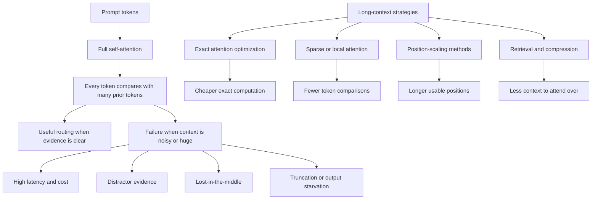

What the diagram is showing:

- Full attention is powerful because it allows broad token-to-token comparison.
- Long-context failures come from both computation and relevance problems.
- Long-context variants attack different bottlenecks, so they are not interchangeable.

### 3) Real-World Industry Scenarios

#### Scenario A: Enterprise RAG With Conflicting Policy Versions

Product/use case context:

An HR assistant retrieves current and old policy chunks. Both mention reimbursement deadlines. The current policy says 30 days; the old policy says 60 days. The model answers 60 days because the stale chunk is longer, appears earlier, or uses wording closer to the user query.

How attention behavior affects the system:

- Attention can connect the query to both chunks.
- If stale and current chunks are semantically similar, they compete.
- The model may merge evidence or select the wrong source if freshness metadata is weak.
- More chunks can worsen the problem by adding near-duplicate distractors.

Constraints:

- Latency: long retrieved contexts increase prefill time.
- Cost: stale chunks are paid for even when harmful.
- Reliability: answer must use current authoritative evidence.
- Failure modes: stale answer, merged policy, wrong citation, or overconfident unsupported answer.
- Security/privacy: policy context and employee questions may need controlled traces.

What good looks like in production:

- Retrieval reranks by freshness, authority, and answer-bearing likelihood.
- Prompt labels make source date and policy status explicit.
- Old policy is excluded unless the user asks for history or comparison.
- Evaluation includes conflicting-version examples.

#### Scenario B: Code Assistant With Long Repository Context

Product/use case context:

A coding assistant receives a stack trace, a source file, imported helpers, config snippets, and test output. The true issue is a small environment-variable default hidden in the middle of the context.

How attention behavior affects the system:

- Exact symbol names can help route attention to definitions and call sites.
- Long stack traces and repeated logs can distract from the actual config line.
- If the relevant line is buried between large snippets, the model may explain a nearby but wrong failure.
- Code identifiers can be token-dense, making long-context cost worse.

Constraints:

- Latency: repository context and stack traces are expensive to process.
- Cost: repeated code snippets and logs inflate tokens.
- Reliability: exact symbol linking matters.
- Failure modes: wrong function blamed, config ignored, stale test output used, or hallucinated dependency behavior.
- Security/privacy: code and logs may expose internal implementation details.

What good looks like in production:

- Retrieval is symbol-aware.
- Stack traces are filtered to relevant frames.
- The final prompt includes only definitions, call sites, failing assertions, and minimal evidence.
- The assistant cites the exact code snippets used.

#### Scenario C: Long-Context Document Analysis

Product/use case context:

A user uploads a 200-page annual report and asks for revenue-risk analysis. The model has a long context window, so the product team considers putting the whole document into one prompt.

How attention behavior affects the system:

- Full-document context may technically fit in a long-context model.
- Important tables, footnotes, and risk sections may still be underused.
- Repeated boilerplate can dominate token budget.
- The model may produce a broad summary instead of evidence-based analysis.

Constraints:

- Latency: long-context prefill can be slow.
- Cost: full-document prompts are expensive per request.
- Reliability: analysis must cite exact sections and figures.
- Failure modes: missed footnotes, wrong table values, generic summary, or unsupported risk claims.
- Security/privacy: uploaded reports may be confidential.

What good looks like in production:

- Use retrieval or map-reduce-style summarization before final synthesis.
- Preserve exact source spans for numeric claims.
- Compare full-context output against retrieval-based output in evals.
- Track citation accuracy and numeric consistency.

### 4) System View: Think Like a Systems Engineer

#### [Intermediate] Inputs -> Transformations -> Outputs

Inputs:

- token sequence
- positional information
- Q/K/V projections
- attention mask
- context-window policy
- retrieval chunks
- tool outputs
- prompt section ordering

Transformations:

- compute query-key similarity scores
- apply causal or custom attention mask
- normalize scores into attention weights
- mix value vectors into updated hidden states
- repeat across heads and layers
- optionally use long-context mechanisms to reduce cost or extend usable positions

Outputs:

- context-aware hidden states
- next-token logits
- generated answer or tool call
- latency/cost profile tied to sequence length
- failure traces when evidence was present but underused

#### [Intermediate] Why Full Attention Is Expensive

In full self-attention, tokens compare with many other tokens.

For a sequence length `n`, the attention score matrix is roughly `n x n`.

That means if sequence length doubles, attention comparisons grow about four times.

Example intuition:

```text
4k tokens  -> about 16 million pairwise positions
8k tokens  -> about 64 million pairwise positions
16k tokens -> about 256 million pairwise positions
```

This is why long prompts can create latency, memory, and cost pressure even before generation begins.

Important nuance:

Modern serving systems use optimized kernels and KV caching, so real latency is more complex than this simple math. But the engineering pressure remains: longer context is not free.

#### [Intermediate] Where Attention Breaks Behaviorally

Attention can fail even when compute succeeds.

Common behavioral failure patterns:

- answer-bearing evidence is present but buried
- evidence is contradicted by stronger-looking distractors
- repeated chunks dilute signal
- stale chat history overrides the current task
- tool output floods the prompt
- numeric evidence is copied from the wrong table
- the model summarizes instead of extracting the exact fact

First debugging principle:

Do not ask only, "Was the evidence in the source system?" Ask, "Was the evidence in the final rendered prompt, in a useful position, with enough contrast against distractors?"

#### [Pro] Long-Context Variants and Strategies

Long-context strategies solve different problems:

1. **FlashAttention**

- What it does: computes exact attention more memory-efficiently using optimized GPU memory access.
- What it helps: speed and memory efficiency for attention computation.
- What it does not solve alone: distractor evidence, bad retrieval, or poor prompt ordering.

2. **Sparse attention**

- What it does: attends to a subset of token pairs instead of every pair.
- What it helps: reduces compute for long sequences.
- What it risks: missing a relationship if the sparse pattern excludes the needed token pair.

3. **Local attention** or **sliding-window attention**

- What it does: each token attends mainly to nearby tokens.
- What it helps: efficient processing for local structure.
- What it risks: long-distance dependencies may be missed unless there are global or recurrence mechanisms.

4. **Global tokens**

- What they do: special positions can attend broadly or summarize sequence-wide information.
- What they help: document-level aggregation.
- What they risk: bottlenecking too much information through a small number of positions.

5. **RoPE scaling** and position extrapolation methods

- What they do: adjust positional behavior so a model can handle longer sequences than originally trained for.
- What they help: extending context length.
- What they risk: degraded reliability if the model was not trained or tuned for that length.

6. **ALiBi**

- What it does: adds attention biases that favor nearby tokens while supporting length extrapolation.
- What it helps: length generalization in some architectures.
- What it risks: it is an architecture/training choice, not a drop-in product fix for every model.

7. **Context compression** and retrieval

- What they do: reduce the amount of text the model must attend over.
- What they help: cost, latency, and relevance.
- What they risk: compression can delete important details if not evaluated.

Practical rule:

Use architectural long-context features to increase capacity, but use retrieval, reranking, compression, and prompt budgeting to increase usable context quality.

### 5) System Design Flavor

#### [Intermediate] Key Components and Interfaces

A long-context-aware GenAI system should include:

- `ContextPolicy`: defines max prompt length, answer budget, and long-context routing rules.
- `EvidenceRanker`: ranks candidate evidence by relevance, authority, freshness, and answer-bearing likelihood.
- `ContextCompressor`: summarizes or extracts high-value facts from large inputs.
- `PromptRenderer`: controls evidence order and final prompt layout.
- `ModelRouter`: chooses short-context, long-context, or retrieval-first paths.
- `LongContextEvaluator`: tests quality by evidence position and distractor load.
- `TraceStore`: records included/dropped context, token counts, source positions, and output behavior.

Key interface idea:

Long context should be a deliberate route, not the default destination for every hard problem.

Example routing policy:

```json
{
  "route": "policy_qa",
  "default_strategy": "retrieval_first",
  "long_context_allowed": true,
  "long_context_trigger": "multi_document_comparison",
  "max_retrieval_tokens": 12000,
  "max_tool_tokens": 3000,
  "required_evidence_position": "near_question",
  "fallback": "ask_for_narrowing_when_required_evidence_cannot_fit"
}
```

#### [Intermediate] Tradeoff 1: Full Context vs Retrieval-First

Layman version:

Giving the model everything feels safe, but it is slow, expensive, and can distract the model. Retrieval-first is cheaper and more focused, but it can miss evidence.

Choose full or long context when:

- the task needs broad document synthesis
- evidence is spread across many sections
- retrieval quality is uncertain
- latency and cost are acceptable

Choose retrieval-first when:

- the question is specific
- citations matter
- the document set is large
- latency and cost matter

Practical rule:

Use long context for broad synthesis; use retrieval-first for targeted evidence questions.

#### [Intermediate] Tradeoff 2: Sparse/Local Attention vs Exact Full Attention

Layman version:

Sparse or local attention can make long inputs cheaper, but it may prevent some faraway tokens from directly interacting.

Choose sparse/local strategies when:

- local structure dominates
- documents are long and repetitive
- latency and memory are strict
- architecture is trained for that pattern

Choose exact full attention when:

- faraway dependencies matter
- sequence length is manageable
- model quality is more important than speed
- the serving stack can handle the cost

Practical rule:

Efficiency patterns must match the task's dependency structure.

#### [Pro] Tradeoff 3: Position Extension vs Long-Context Training

Layman version:

Changing position scaling can make longer prompts fit, but the model may not have learned to use those lengths reliably.

Use position extension carefully when:

- the model family supports it
- evals show stable quality at target length
- the task does not require exact use of every faraway detail

Prefer models trained or tuned for long context when:

- faraway evidence is critical
- citations and exact extraction matter
- high-stakes decisions depend on long documents
- production evals expose position-related failures

Practical rule:

Length extension without long-context evaluation is a risk, not a capability guarantee.

#### [Pro] Scaling Consideration: What Changes at 10x Traffic or Data?

At 10x scale, long-context misuse becomes one of the fastest ways to burn money and latency.

You need:

- route-specific max context policies
- long-context model routing only when justified
- prompt-length alerts
- evidence-position evals
- distractor-heavy evals
- cost-per-success metrics
- caching or pre-compression for large documents
- regression tests before changing long-context strategy

The main scaling risk is using large context as a substitute for retrieval quality and system design.

### 6) Common Mistakes + Debugging

#### Mistake 1: Treating Long Context as Perfect Recall

- Symptom: the model misses evidence that was included somewhere in a huge prompt.
- Likely cause: effective context is smaller than context capacity, or evidence was buried among distractors.
- First debugging step: locate the evidence in the final prompt and rerun with only that evidence plus the task.

#### Mistake 2: Adding More Chunks Instead of Better Chunks

- Symptom: answer quality drops after increasing top-k retrieval.
- Likely cause: more distractor chunks compete with answer-bearing evidence.
- First debugging step: label each included chunk as answer-bearing, related, stale, duplicate, or distracting.

#### Mistake 3: Confusing FlashAttention With Better Reasoning

- Symptom: team expects an optimized attention kernel to fix wrong answers.
- Likely cause: confusing compute efficiency with evidence selection quality.
- First debugging step: separate serving metrics from quality metrics: did latency improve, and did answer correctness improve?

#### Mistake 4: Position-Scaling Without Evaluation

- Symptom: longer prompts fit, but quality becomes unstable at high token positions.
- Likely cause: context extension changed capacity without proving effective use.
- First debugging step: run evals where answer evidence appears at early, middle, late, and very late positions.

#### Mistake 5: Ignoring Tool and Retrieval Noise

- Symptom: agent responses become worse after adding more tools or larger tool outputs.
- Likely cause: tool results and retrieved chunks flood attention with low-value text.
- First debugging step: inspect token breakdown and run ablations with tool output removed, summarized, or capped.

### 7) Hands-On Lab: Concept -> Build -> Break -> Measure -> Explain

#### [Pro] Goal

Build a tiny attention-stress simulator that shows how the right evidence can lose attention when distractors are added, and how reranking or compression helps.

This is a toy model. It teaches the failure shape, not real LLM internals.

#### Build: Smallest Working Version

Run this dependency-free Python snippet:

```python
import math

query = "reimbursement deadline international travel"

chunks = [
    {"id": "current_answer", "text": "International travel reimbursement must be submitted within 30 days after manager approval.", "current": True},
    {"id": "old_policy", "text": "Travel reimbursement must be submitted within 60 days after approval.", "current": False},
    {"id": "related", "text": "Manager approval is required before booking international travel.", "current": True},
]

def tokenize(text):
    return set(text.lower().replace(".", "").split())

def relevance(query_text, chunk_text):
    query_tokens = tokenize(query_text)
    chunk_tokens = tokenize(chunk_text)
    return len(query_tokens & chunk_tokens) / max(1, len(query_tokens))

def softmax(scores):
    max_score = max(scores)
    exps = [math.exp(score - max_score) for score in scores]
    total = sum(exps)
    return [value / total for value in exps]

def attention_over_chunks(chunks):
    scores = []
    for chunk in chunks:
        freshness_bonus = 0.2 if chunk["current"] else 0.0
        scores.append(relevance(query, chunk["text"]) + freshness_bonus)
    weights = softmax(scores)
    return list(zip([chunk["id"] for chunk in chunks], scores, weights))

for chunk_id, score, weight in attention_over_chunks(chunks):
    print(chunk_id, "score=", round(score, 3), "weight=", round(weight, 3))
```

What to observe:

- The current answer chunk should receive strong weight.
- The stale policy may still receive meaningful weight because it shares query terms.
- Even simple relevance can confuse related evidence with answer-bearing evidence.

#### Break: Force the Failure Mode

Add distractor chunks:

```python
chunks.extend([
    {"id": "duplicate_old_1", "text": "International travel reimbursement deadline was 60 days under the old policy.", "current": False},
    {"id": "duplicate_old_2", "text": "Old reimbursement policy allowed 60 days for international travel claims.", "current": False},
    {"id": "expense_general", "text": "Expense reports require approval and documentation for travel reimbursement.", "current": True},
])
```

Then rerun.

Expected breakage:

- Attention mass spreads across multiple stale or related chunks.
- The answer-bearing chunk may no longer dominate.
- This mirrors how long prompts can dilute useful evidence with similar distractors.

#### Measure: Capture Concrete Signals

Add this helper:

```python
results = attention_over_chunks(chunks)
answer_weight = sum(weight for chunk_id, _, weight in results if chunk_id == "current_answer")
stale_weight = sum(weight for chunk_id, _, weight in results if "old" in chunk_id or "duplicate_old" in chunk_id)

print("answer_weight=", round(answer_weight, 3))
print("stale_weight=", round(stale_weight, 3))
print("top_chunk=", max(results, key=lambda row: row[2])[0])
```

Track:

- answer-bearing chunk weight
- stale/distractor weight
- top-weight chunk
- number of included chunks
- effect of removing duplicates

#### Explain: Why It Broke and What Prevents It

The toy system broke because multiple stale or related chunks competed with the answer-bearing chunk. A real model is much more sophisticated, but similar competition happens in long prompts: related evidence can be easier to use than precise evidence if the prompt is noisy.

Production fixes:

- rerank by answer-bearing likelihood, freshness, and authority
- remove duplicates and stale chunks
- label sources clearly
- place decisive evidence near the task
- use retrieval or compression instead of raw long context
- evaluate with distractor-heavy examples

### 8) Active Recall

1. Why does attention work well for language and code?
2. What is quadratic attention, and why does it matter?
3. Why can long context fail even when the correct evidence is included?
4. What does FlashAttention improve, and what does it not improve by itself?
5. Why should long-context strategies be evaluated by evidence position?

#### Active Recall Answers

1. Attention lets tokens compare with and mix information from other relevant tokens, making long-range dependencies easier to model.
2. Quadratic attention means full attention comparisons grow roughly with sequence length squared, creating memory and latency pressure.
3. Evidence can be buried, diluted by distractors, contradicted, weakly positioned, or outside the model's effective context for the task.
4. FlashAttention improves exact attention efficiency through better memory access, but it does not fix noisy retrieval, stale evidence, or bad prompt ordering.
5. Because models may behave differently when the answer appears early, middle, late, or very late in a long prompt.

### 9) Practice

#### Mini-Exercise

Your RAG assistant improves when using 6 retrieved chunks, but gets worse when using 20 chunks.

Answer these:

1. What is the most likely attention-related explanation?
2. What trace fields do you inspect?
3. What two fixes do you try first?

Suggested answer:

1. The extra chunks introduce distractor competition and dilute the answer-bearing evidence.
2. Inspect final prompt order, chunk relevance labels, source freshness, answer-bearing chunk position, token counts, and dropped/included chunks.
3. Rerank/deduplicate chunks and enforce a retrieval token budget based on answer-bearing likelihood rather than top-k alone.

#### Capstone-Style System Design Question

Design a long-context strategy for a GenAI assistant that handles 200-page documents, RAG citations, tool outputs, and high-stakes numeric claims.

Your answer should cover:

- when to use full long context vs retrieval-first
- evidence ranking and deduplication
- context compression
- numeric/citation validation
- long-context model routing
- evaluation by evidence position
- cost and latency controls
- fallback behavior when evidence cannot fit

Suggested answer outline:

- Use retrieval-first for targeted questions and long context for broad synthesis or multi-section comparison.
- Rerank by relevance, source authority, freshness, and answer-bearing likelihood.
- Deduplicate repeated sections and compress boilerplate while preserving raw source spans for claims.
- Validate numeric claims against retrieved source tables or spans.
- Route to long-context models only when task complexity justifies cost.
- Evaluate answer quality with evidence placed early, middle, late, and among distractors.
- Track token cost, prefill latency, citation accuracy, and answer correctness.
- If required evidence cannot fit, ask the user to narrow scope or produce a scoped partial answer with limitations.

### 10) Production Reality Check

If this fails in prod, what's the first thing we inspect?

Inspect the final rendered prompt and evidence trace: whether the answer-bearing evidence was included, where it appeared, what distractors surrounded it, and how much token budget retrieval/tool context consumed.

Why:

Attention failures in production often look like model weakness, but the root cause is usually context competition, poor ranking, stale evidence, noisy tool output, or long-context capacity being mistaken for reliable evidence use.

### 11) Curiosity Bridge

This unlocks the main long-context lesson: attention can route information across tokens, but every extra token adds compute pressure and potential distraction.

This leads directly to inference behavior: KV cache, batching, latency, and throughput. Next we connect transformer mechanics to what happens when a real system serves many requests under cost and speed constraints.

### 12) Exit Check + Carry-Forward Review

Exit Check: You're done when you can explain why attention enables long-range relationships, why it can fail under noisy long context, and which long-context strategy addresses which bottleneck.

Carry-Forward Review:

Question: From 2.2.b, why do residual connections and normalization matter when stacking many attention layers?

Answer: Residual connections preserve signal and gradient flow, while normalization keeps hidden-state scales stable so deep repeated computation remains trainable and usable.

Question: From 2.2.a, why does including more related tokens not guarantee better attention behavior?

Answer: Attention weights are learned relevance patterns, and related distractors can compete with or dilute answer-bearing evidence.

Question: From 2.1.d, why is token budgeting a long-context reliability tool?

Answer: It limits low-value context, reserves answer space, controls cost/latency, and forces explicit decisions about what evidence deserves model attention.

---

## Subtopic 2.2.d: Inference Behavior - KV Cache, Batching, Latency, and Throughput

### ✅ Add to Knowledge Base

### 0) Reading Path + Level Tags

Beginner: read sections 1, 2, 6, 8, 10, and 11. Your goal is to understand why generation speed is not just "model intelligence" but a serving pipeline problem.

Intermediate: add sections 3, 4, 5, 7, and 9. Your goal is to debug slow LLM responses by separating prefill, decode, KV cache, batching, latency, and throughput.

Pro: do the full Hands-On Lab and capstone practice. Your goal is to reason like a GenAI systems engineer about capacity, GPU memory, queueing, request shape, and cost-per-success.

### 1) Pre-Question Hook + The Intuition

Pause: why can a short answer to a huge prompt feel slow before the first token appears, while a long answer to a short prompt starts quickly but takes time to finish?

#### [Beginner] Plain-English Mental Model

LLM inference has two major phases:

- **Prefill**: the model reads and processes the input prompt.
- **Decode**: the model generates the output one token at a time.

These phases feel different to users.

- A long prompt increases time before the first output token.
- A long answer increases time after generation starts.

The model also uses a **KV cache**: stored key and value vectors from previous tokens. The cache prevents the model from recomputing attention information for the full history every time it generates a new token.

Simple mental model:

- Prefill = read the whole prompt.
- KV cache = remember useful attention state.
- Decode = generate one new token, update cache, repeat.
- Batching = serve multiple requests together to use hardware efficiently.
- Latency = how long one request takes.
- Throughput = how much work the system completes over time.

The key lesson:

Serving LLMs is not only about model quality. It is a scheduling, memory, batching, and token-shape problem.

#### Analogy

Think of a restaurant kitchen.

- Prefill is reading the full order ticket and preparing ingredients.
- Decode is plating each course one at a time.
- KV cache is keeping chopped ingredients ready so the chef does not repeat prep.
- Batching is cooking similar orders together.
- Latency is how long one table waits.
- Throughput is how many meals the kitchen serves per hour.

Where the analogy breaks down:

LLM serving is constrained by GPU memory, matrix operations, sequence length, cache layout, and scheduling. Cooking intuition helps, but the real bottlenecks are numerical computation and memory movement.

#### [Intermediate] Why Inference Feels Uneven

Two requests can have the same total token count but very different user experience.

Example A:

```text
Prompt: 20,000 tokens
Output: 100 tokens
```

This request may have high **time to first token** because the model must process a large prompt before generating.

Example B:

```text
Prompt: 500 tokens
Output: 2,000 tokens
```

This request may start quickly but take longer overall because decoding is sequential.

During decode, each new token depends on previously generated tokens. The model cannot generate all output tokens fully in parallel the way it can process many prompt tokens during prefill.

#### [Pro] The Deep Intuition

Inference has different bottlenecks at different phases.

- Prefill is often compute-heavy and benefits from parallel processing across prompt tokens.
- Decode is often memory-bandwidth and cache-management heavy because each step reads model weights and KV cache to produce one token.
- KV cache reduces repeated attention computation but consumes memory proportional to sequence length, layers, heads, and batch size.
- Batching improves hardware utilization, but too much batching can increase queueing delay or tail latency.

Production translation:

The same model can feel fast or slow depending on prompt length, output length, concurrent traffic, batch scheduling, cache memory, and serving runtime.

### 2) Visual Diagram

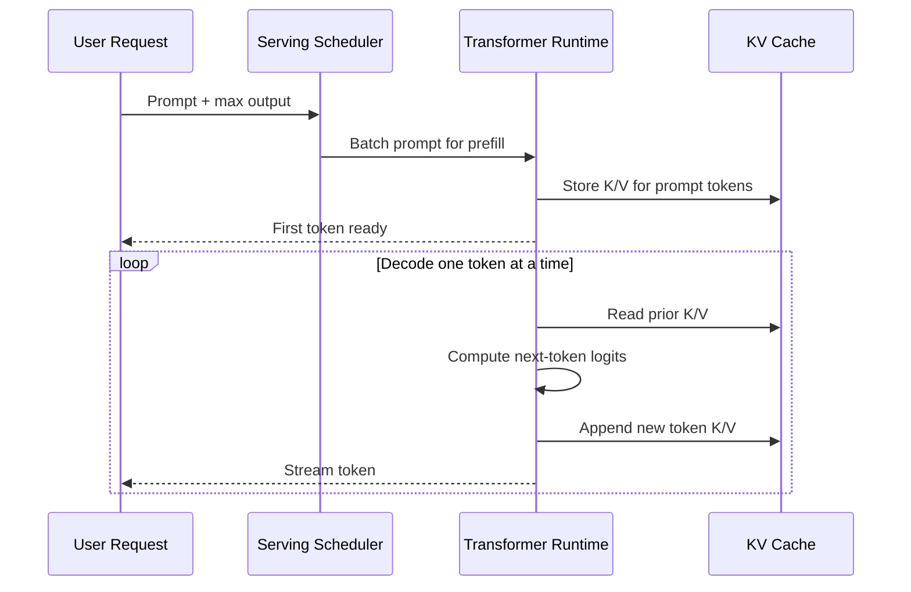

What the diagram is showing:

- Prefill processes the prompt and writes KV cache.
- Decode repeatedly reads and extends the KV cache.
- Streaming can begin after the first decoded token.
- Serving schedulers decide how requests share hardware.

### 3) Real-World Industry Scenarios

#### Scenario A: RAG Assistant With Slow First Token

Product/use case context:

A policy RAG assistant retrieves 12 chunks and sends a 24k-token prompt. The final answer is only 150 tokens, but users complain that nothing appears for several seconds.

How inference behavior affects the system:

- The long retrieved prompt increases prefill work.
- Time to first token rises before any streaming output appears.
- KV cache memory grows with prompt length.
- Retrieval chunks that do not improve answer quality still cost prefill latency.

Constraints:

- Latency: users notice delay before the first streamed token.
- Cost: every retrieved token must be processed.
- Reliability: trimming too aggressively can drop evidence.
- Failure modes: high TTFT, context overflow, missing citation after compression, or expensive low-value retrieval.
- Security/privacy: prompt traces may include sensitive policy content.

What good looks like in production:

- Use token-budgeted retrieval.
- Measure TTFT separately from total latency.
- Cache or precompute stable document summaries where useful.
- Track answer quality versus retrieved token count.

#### Scenario B: Agent Producing Long Structured Reports

Product/use case context:

An incident agent reads a concise incident summary but generates a 2,000-token remediation report with timeline, evidence, root cause, risk, and action items.

How inference behavior affects the system:

- Prefill may be modest because input is short.
- Decode dominates total time because output is long.
- Each output token must be generated sequentially.
- Validation or repair loops multiply decode cost.

Constraints:

- Latency: report generation may take a long time even with short input.
- Cost: output tokens are paid too.
- Reliability: long outputs can drift or repeat.
- Failure modes: slow completion, invalid JSON near the end, repeated sections, or user cancellation mid-generation.
- Security/privacy: incident details may include sensitive logs or infrastructure names.

What good looks like in production:

- Use structured templates and concise report sections.
- Stream partial output when useful.
- Validate smaller sections rather than one giant output when possible.
- Track tokens per second and completion length by route.

#### Scenario C: High-Traffic Support Chat

Product/use case context:

A customer support assistant receives hundreds of concurrent chats. Each request is moderate length, but traffic spikes during an outage.

How inference behavior affects the system:

- Batching improves GPU utilization.
- Queueing increases if requests arrive faster than the system can decode.
- Long-output requests can occupy decode slots and slow shorter requests.
- KV cache memory limits how many active sequences can run together.

Constraints:

- Latency: p95 and p99 latency matter more than average latency during spikes.
- Cost: overprovisioning GPUs is expensive.
- Reliability: timeouts and retries can amplify load.
- Failure modes: request queue buildup, tail latency spikes, out-of-memory errors, degraded streaming, or cascading retries.
- Security/privacy: multi-tenant serving requires isolation and careful logging.

What good looks like in production:

- Use continuous batching or dynamic batching.
- Route long jobs separately from short chat turns.
- Enforce max output budgets by route.
- Monitor queue delay, TTFT, tokens/sec, GPU utilization, and cache memory.

### 4) System View: Think Like a Systems Engineer

#### [Intermediate] Inputs -> Transformations -> Outputs

Inputs:

- prompt tokens
- max output tokens
- model weights
- tokenizer and context policy
- current traffic load
- batch scheduler policy
- GPU memory and compute capacity
- KV cache allocation

Transformations:

- tokenize request
- schedule request into a batch
- run prefill over prompt tokens
- write key/value tensors into KV cache
- repeatedly decode next token
- append each generated token to the cache
- stream or return output
- free cache when request completes

Outputs:

- generated tokens
- time to first token
- total latency
- tokens per second
- throughput per model/runtime
- GPU utilization
- KV cache memory usage
- queueing delay and timeout signals

#### [Intermediate] Prefill vs Decode

**Prefill** processes the entire prompt and builds the initial KV cache.

Prefill is strongly affected by:

- prompt token count
- attention implementation
- model size
- batch shape
- GPU compute
- prompt prefix reuse or caching when available

**Decode** generates one token at a time after prefill.

Decode is strongly affected by:

- output length
- KV cache size
- memory bandwidth
- active batch size
- sampling/decoding settings
- streaming and scheduler behavior

Production debugging rule:

Separate TTFT from total latency. TTFT usually points toward prompt/prefill/queueing issues; long total latency after streaming starts often points toward decode/output-length issues.

#### [Intermediate] KV Cache: Why It Matters

During attention, each token produces key and value vectors at each layer. During generation, the model repeatedly needs prior keys and values to attend to previous tokens.

Without a KV cache, every new generated token would require recomputing key/value states for all previous tokens.

With a KV cache:

- previous K/V tensors are stored
- each new token only adds its new K/V tensors
- decoding becomes much faster than full recomputation

But the cache consumes memory.

Cache memory grows with:

- number of active requests
- prompt length
- generated length
- number of layers
- number of attention heads or KV heads
- hidden dimensions
- precision/quantization format

This is why long-context serving is often memory-constrained, not just compute-constrained.

#### [Pro] Batching and Scheduling

**Batching** means processing multiple requests together so the hardware does more useful work per operation.

Important variants:

- **Static batching**: group fixed requests together and process them as a batch.
- **Dynamic batching**: wait briefly to collect compatible requests, then batch them.
- **Continuous batching**: add and remove sequences from an active batch as requests arrive and finish.

Continuous batching is especially useful for LLM serving because decode lengths vary. One request may finish after 20 tokens, while another needs 2,000 tokens. A good scheduler keeps the GPU busy without forcing all requests to wait for the longest one.

Tradeoff:

- Larger batches improve throughput.
- Larger or delayed batches can worsen latency for individual users.

#### [Pro] Throughput Metrics

Common metrics:

- **TTFT**: time to first token.
- **TPOT**: time per output token.
- **Tokens per second**: generation speed, often measured per request or globally.
- **Requests per second**: completed requests per unit time.
- **Throughput**: total useful work completed over time.
- **Tail latency**: high-percentile latency such as p95 or p99.
- **Queue delay**: time waiting before model execution starts.

Production rule:

Average latency can look fine while p99 users suffer. Always inspect route-level and percentile-level metrics.

### 5) System Design Flavor

#### [Intermediate] Key Components and Interfaces

An inference-aware GenAI system should include:

- `Tokenizer`: converts request text to prompt tokens.
- `PromptBudgeter`: controls prompt and output length before serving.
- `RequestQueue`: buffers incoming requests under load.
- `BatchScheduler`: groups requests for efficient execution.
- `ModelRuntime`: executes prefill and decode.
- `KVCacheManager`: allocates, reuses, and frees cache memory.
- `Streamer`: sends generated tokens to the client.
- `MetricsCollector`: tracks TTFT, TPOT, throughput, queue delay, errors, and cost.
- `Router`: sends requests to the right model or serving pool.

Key interface idea:

Every request should carry its expected token shape.

Example request-shape payload:

```json
{
  "route": "policy_rag_answer",
  "model": "example-llm-large",
  "prompt_tokens": 18400,
  "max_output_tokens": 600,
  "streaming": true,
  "latency_slo_ms": 3500,
  "priority": "interactive",
  "estimated_kv_cache_mb": 950
}
```

#### [Intermediate] Tradeoff 1: Latency vs Throughput

Layman version:

Latency is how fast one user gets served. Throughput is how many users the system serves overall.

Optimize for latency when:

- the interaction is real-time chat
- users are waiting actively
- short responses are common
- p95/p99 user experience matters

Optimize for throughput when:

- workloads are batch jobs
- users tolerate waiting
- cost efficiency matters more than immediacy
- offline processing dominates

Practical rule:

Interactive chat and offline document processing should not always share the same serving lane.

#### [Intermediate] Tradeoff 2: Long Prompt vs Long Output

Layman version:

A long prompt delays the start. A long output delays the finish.

Reduce prompt length when:

- TTFT is high
- retrieval context is bloated
- users see long blank waits before streaming
- KV cache memory is under pressure

Reduce output length when:

- streaming starts quickly but completion is slow
- reports are verbose or repetitive
- structured output fails near the end
- decode throughput is the bottleneck

Practical rule:

Measure input tokens and output tokens separately. They stress different parts of inference.

#### [Pro] Tradeoff 3: Bigger Batch vs Tail Latency

Layman version:

Bigger batches keep GPUs busy, but individual requests may wait longer or get stuck behind long generations.

Use larger batches when:

- workload is offline or asynchronous
- cost efficiency matters
- request shapes are similar
- latency SLOs are loose

Use smaller or priority-aware batches when:

- users need interactive responses
- request lengths vary widely
- p99 latency matters
- high-priority tasks must avoid queueing behind long jobs

Practical rule:

Batching policy is a product decision, not only an infrastructure setting.

#### [Pro] Scaling Consideration: What Changes at 10x Traffic or Data?

At 10x traffic, inference becomes capacity planning.

You need:

- traffic segmentation by route
- separate pools for interactive and batch workloads
- max prompt and max output policies
- KV cache memory monitoring
- autoscaling or admission control
- request prioritization
- backpressure and retry discipline
- p50/p95/p99 latency dashboards
- cost-per-success and tokens-per-success metrics

The main scaling risk is retry amplification. When latency rises, clients retry, retries increase load, and the serving system gets even slower.

### 6) Common Mistakes + Debugging

#### Mistake 1: Measuring Only Total Latency

- Symptom: responses feel slow, but the team cannot tell why.
- Likely cause: TTFT, queue delay, prefill time, and decode time are collapsed into one number.
- First debugging step: split latency into queue time, prefill time, TTFT, decode time, and total time.

#### Mistake 2: Blaming the Model When Retrieval Bloats the Prompt

- Symptom: RAG answers have high time to first token.
- Likely cause: retrieved context is too large, causing expensive prefill and KV cache pressure.
- First debugging step: inspect prompt token breakdown and compare answer quality at smaller retrieval budgets.

#### Mistake 3: Forgetting KV Cache Memory

- Symptom: serving crashes, batches shrink, or throughput drops under long-context traffic.
- Likely cause: active requests consume too much KV cache memory.
- First debugging step: estimate cache memory by prompt length, generated length, layers, KV heads, and concurrent sequences.

#### Mistake 4: Mixing Interactive and Batch Workloads

- Symptom: chat users see p99 latency spikes when large report jobs run.
- Likely cause: long jobs occupy decode capacity and queue slots.
- First debugging step: segment latency metrics by route and separate long-running workloads from interactive serving pools.

#### Mistake 5: Increasing Batch Size Without Watching Tail Latency

- Symptom: average throughput improves, but some users wait much longer.
- Likely cause: larger batches or batching delay improve hardware utilization while hurting p95/p99 latency.
- First debugging step: compare throughput gains against p95/p99 TTFT and total latency.

### 7) Hands-On Lab: Concept -> Build -> Break -> Measure -> Explain

#### [Pro] Goal

Build a tiny inference simulator that separates prefill time, decode time, queue delay, and throughput.

This is not a GPU simulator. It is a request-shape and bottleneck intuition lab.

#### Build: Smallest Working Version

Run this dependency-free Python snippet:

```python
from dataclasses import dataclass

@dataclass
class Request:
    name: str
    prompt_tokens: int
    output_tokens: int
    arrival_ms: int

requests = [
    Request("short_chat", 700, 120, 0),
    Request("rag_long_prompt", 18000, 180, 50),
    Request("report_long_output", 1200, 1800, 100),
]

PREFILL_TOKENS_PER_MS = 120
DECODE_TOKENS_PER_MS = 8

def estimate_request(request: Request):
    prefill_ms = request.prompt_tokens / PREFILL_TOKENS_PER_MS
    decode_ms = request.output_tokens / DECODE_TOKENS_PER_MS
    ttft_ms = prefill_ms
    total_ms = prefill_ms + decode_ms
    return {
        "name": request.name,
        "prompt_tokens": request.prompt_tokens,
        "output_tokens": request.output_tokens,
        "prefill_ms": round(prefill_ms, 1),
        "decode_ms": round(decode_ms, 1),
        "ttft_ms": round(ttft_ms, 1),
        "total_ms": round(total_ms, 1),
    }

for request in requests:
    print(estimate_request(request))
```

What to observe:

- `rag_long_prompt` has high prefill and TTFT.
- `report_long_output` has high decode and total latency.
- Token shape matters as much as total token count.

#### Break: Force the Failure Mode

Change `rag_long_prompt` from 18,000 prompt tokens to 60,000 prompt tokens.

Then add this rough KV cache estimate:

```python
LAYERS = 32
KV_HEADS = 8
HEAD_DIM = 128
BYTES_PER_VALUE = 2

def kv_cache_mb(total_sequence_tokens: int) -> float:
    # Stores K and V for every token, layer, KV head, and head dimension.
    bytes_used = total_sequence_tokens * LAYERS * KV_HEADS * HEAD_DIM * 2 * BYTES_PER_VALUE
    return bytes_used / (1024 * 1024)

for request in requests:
    sequence_tokens = request.prompt_tokens + request.output_tokens
    print(request.name, "kv_cache_mb=", round(kv_cache_mb(sequence_tokens), 1))
```

Expected breakage:

- The long prompt dominates TTFT.
- KV cache memory rises sharply.
- A few long-context requests can reduce how many concurrent requests fit on the same hardware.

#### Measure: Capture Concrete Signals

Track:

- prompt tokens
- output tokens
- prefill estimate
- decode estimate
- TTFT estimate
- total latency estimate
- KV cache estimate
- which request shape dominates the bottleneck

Add a basic throughput estimate:

```python
total_output_tokens = sum(request.output_tokens for request in requests)
total_decode_ms = sum(request.output_tokens / DECODE_TOKENS_PER_MS for request in requests)
print("approx_decode_tokens_per_second=", round(total_output_tokens / (total_decode_ms / 1000), 1))
```

#### Explain: Why It Broke and What Prevents It

The broken version shows that long prompts and long outputs stress different parts of serving. Long prompts hurt prefill, TTFT, and KV cache memory. Long outputs hurt decode time and total latency.

Production fixes:

- trim and rerank retrieval context
- reserve output budgets by route
- separate interactive and batch workloads
- cap tool results and report lengths
- monitor KV cache memory
- use batching policies that protect p95/p99 latency
- route long-context jobs deliberately

### 8) Active Recall

1. What is the difference between prefill and decode?
2. Why does the KV cache improve generation speed?
3. Why can a long prompt have high time to first token even if the answer is short?
4. Why does batching improve throughput but sometimes hurt latency?
5. What metric tells you users are waiting before generation starts?

#### Active Recall Answers

1. Prefill processes the input prompt and builds cache; decode generates output tokens one at a time.
2. It stores previous key/value tensors so the model does not recompute them for every new token.
3. The model must process the full prompt before the first generated token can be produced.
4. Batching uses hardware more efficiently, but requests may wait for batch formation or share capacity with longer requests.
5. TTFT, especially when separated from queue delay and prefill time.

### 9) Practice

#### Mini-Exercise

Your RAG assistant has acceptable total average latency, but users complain that it "takes forever to start typing." The average output length is only 120 tokens.

Answer these:

1. Which phase is most suspicious?
2. What metrics do you inspect first?
3. What two fixes do you try?

Suggested answer:

1. Prefill or queueing is most suspicious because the delay occurs before streaming starts.
2. Inspect TTFT, queue delay, prompt token count, retrieval-context token count, and KV cache memory pressure.
3. Reduce/rerank retrieval tokens and separate overloaded queues or use better batching/scheduling for interactive requests.

#### Capstone-Style System Design Question

Design an inference-serving plan for a GenAI platform with three routes: interactive support chat, long-document RAG analysis, and offline report generation.

Your answer should cover:

- route-specific prompt/output budgets
- model routing
- batching policy
- KV cache capacity
- latency and throughput metrics
- workload isolation
- overload behavior
- cost controls

Suggested answer outline:

- Support chat gets strict prompt/output budgets, streaming, priority scheduling, and low TTFT SLOs.
- Long-document RAG uses retrieval-first, compression, long-context routing only when justified, and higher latency budget.
- Offline reports use larger batches, relaxed latency, and strict max output tokens.
- KV cache capacity is estimated from sequence length and concurrency by route.
- Track queue delay, TTFT, TPOT, total latency, tokens/sec, requests/sec, GPU utilization, cache memory, and p95/p99 latency.
- Separate interactive and batch serving pools.
- Under overload, apply backpressure, reject or defer batch jobs, reduce max context, and avoid retry storms.
- Optimize cost by measuring tokens-per-success and routing easy tasks to smaller/faster models.

### 10) Production Reality Check

If this fails in prod, what's the first thing we inspect?

Inspect the latency breakdown by route: queue delay, prefill time, TTFT, decode time, total latency, prompt tokens, output tokens, batch size, and KV cache memory.

Why:

Inference failures often look like "the model is slow," but the root cause may be long prompts, long outputs, queueing, bad batching, KV cache pressure, route mixing, or retry amplification.

### 11) Curiosity Bridge

This completes Topic 2.2: we now understand the transformer block and how it behaves when served under real traffic.

This unlocks Topic 2.3: from pretraining to instruction following. Next we shift from architecture to training behavior: what next-token prediction teaches, and why post-training changes how models respond.

### 12) Exit Check + Carry-Forward Review

Exit Check: You're done when you can explain why one request is TTFT-bound, another is decode-bound, and how KV cache plus batching affect memory, latency, and throughput.

Carry-Forward Review:

Question: From 2.2.c, why is long context not free even when the model supports it?

Answer: Longer context increases attention/prefill work, KV cache memory, cost, and the risk of distractor competition.

Question: From 2.2.b, why do deeper/wider transformer blocks affect serving cost?

Answer: More layers, wider hidden states, and larger feed-forward blocks increase per-token compute and memory requirements.

Question: From 2.1.d, why does output budget matter for latency planning?

Answer: Output tokens dominate decode time, so long completions can make total latency high even when the prompt is short.

---

## Topic 2.3: From Pretraining to Instruction Following

**Topic time:** 12h

Subtopics in this topic:

- 2.3.a Next-token prediction and what pretraining actually teaches - 3h
- 2.3.b SFT, alignment, and preference optimization concepts - 3h
- 2.3.c Tool-use and reasoning behavior as trained capabilities - 3h
- 2.3.d Why smaller tuned models can beat larger untuned models on narrow tasks - 3h

Topic promise:

By the end of Topic 2.3, you should be able to explain why a pretrained base model can know a lot of patterns but still fail to behave like a helpful assistant until post-training reshapes its behavior.

---

## Subtopic 2.3.a: Next-Token Prediction and What Pretraining Actually Teaches

### ✅ Add to Knowledge Base

### 0) Reading Path + Level Tags

Beginner: read sections 1, 2, 6, 8, 10, and 11. Your goal is to understand why predicting the next token can produce broad language, coding, reasoning, and world-pattern abilities.

Intermediate: add sections 3, 4, 5, 7, and 9. Your goal is to reason about pretraining as a data, objective, optimization, and evaluation pipeline.

Pro: do the full Hands-On Lab and capstone practice. Your goal is to debug model behavior by separating pretraining knowledge, instruction-following behavior, retrieval grounding, and post-training alignment.

### 1) Pre-Question Hook + The Intuition

Pause: if a model is only trained to predict the next token, why does it learn grammar, facts, code structure, style, reasoning patterns, and even some tool-use-shaped behavior?

#### [Beginner] Plain-English Mental Model

**Pretraining** is the large-scale training stage where a model learns from huge text/code datasets before it is specialized into an assistant.

The most common objective for modern decoder-only LLMs is **next-token prediction**: given previous tokens, predict the next token.

That sounds simple, but the prediction task is dense with hidden structure.

To predict the next token well, the model must learn patterns such as:

- word meaning
- grammar
- facts that appear in text
- common reasoning steps
- code syntax and APIs
- document structure
- conversation patterns
- genre and style
- cause-and-effect language patterns
- mathematical and symbolic regularities

The key mental model:

Next-token prediction does not directly teach the model to be helpful. It teaches the model to continue text in ways that match the training distribution.

This distinction matters.

A pretrained base model is usually a powerful text continuation machine. A helpful chat model is a pretrained model whose behavior has been shaped further through instruction tuning, preference optimization, safety policies, and serving-time scaffolding.

#### Analogy

Think of pretraining like reading an enormous library and constantly guessing the next word of every sentence.

To become good at guessing, you would gradually learn language, topics, writing styles, logic patterns, and what usually follows what.

Where the analogy breaks down:

The model is not reading with human goals, memory, emotions, or explicit understanding. It is optimizing statistical prediction over tokens, and useful internal structure emerges because the prediction problem requires it.

#### [Intermediate] What Is Actually Learned?

Pretraining teaches a model a compressed statistical map of patterns in its training data.

It learns:

- token co-occurrence patterns
- syntactic structure
- semantic associations
- factual correlations
- code and markup regularities
- discourse patterns
- step-by-step solution templates
- likely continuations for many tasks
- latent representations that support generalization

But it does not inherently guarantee:

- truthfulness
- calibrated uncertainty
- obedience to user intent
- safety behavior
- stable tool use
- citation faithfulness
- refusal boundaries
- fresh knowledge after the training cutoff

Why not?

Because the loss function rewards predicting the dataset's next token, not necessarily telling the truth, obeying instructions, or solving the user's real-world problem.

#### [Pro] Why This Objective Scales So Well

Next-token prediction is powerful because the training signal is cheap and everywhere.

Every sequence of text provides many supervised examples:

```text
Input tokens:  The cat sat on the
Target token:  mat

Input tokens:  The cat sat on the mat
Target token:  .
```

One document becomes thousands of training examples. No human needs to label each one manually.

This is why pretraining can scale across trillions of tokens: the labels are already inside the data.

The deeper reason it works:

Language is not random. Text reflects knowledge, procedures, arguments, plans, mistakes, corrections, code, social conventions, and real-world regularities. To reduce prediction error, the model must learn internal features that help predict those structures.

But the objective is still indirect.

The model learns capabilities as a side effect of solving prediction at scale. It does not start with the explicit goal: "be a reliable assistant."

### 2) Visual Diagram

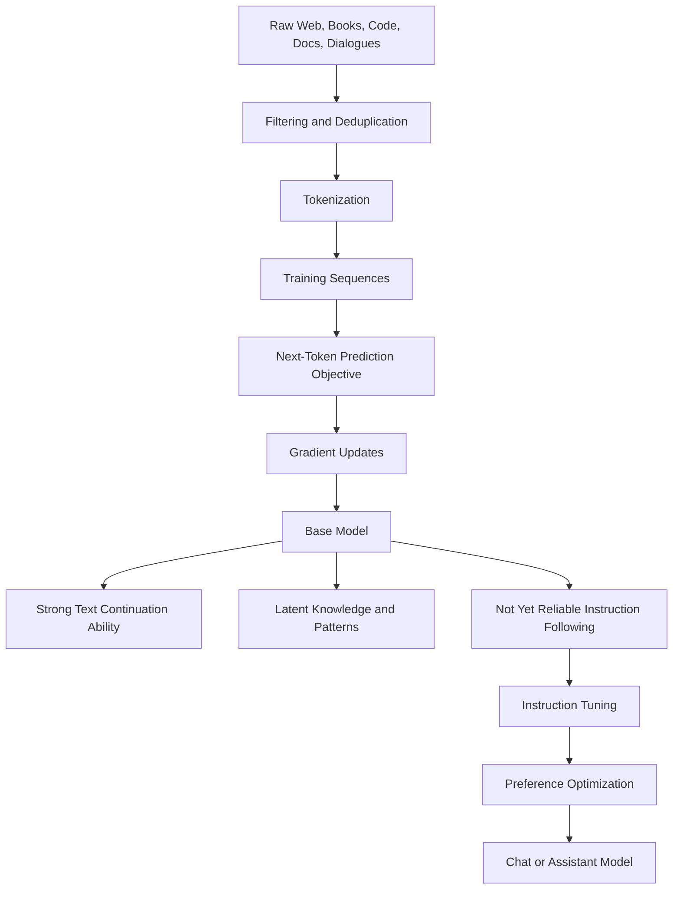

What the diagram is showing:

- Pretraining turns large text/code corpora into a base model.
- The objective is next-token prediction, not direct helpfulness.
- Base models can contain broad capabilities but need post-training to behave like assistants.

### 3) Real-World Industry Scenarios

#### Scenario A: Choosing Between Base Model and Chat Model for Enterprise Summarization

Product/use case context:

A company wants to summarize long policy documents. A base model and an instruction-tuned chat model are both available. The base model is cheaper and has strong language modeling ability, but the chat model follows instructions more consistently.

How pretraining affects the system:

- The base model learned policy-style text patterns during pretraining.
- It may continue the document instead of summarizing it if the prompt is not carefully framed.
- It may imitate examples from the prompt rather than obeying a concise instruction.
- The chat model has additional training that encourages instruction-following behavior.

Constraints:

- Latency: larger chat models may be slower or more expensive.
- Cost: base models can be cheaper but may need more prompt engineering or retries.
- Reliability: summaries must follow requested format and avoid inventing obligations.
- Failure modes: continuation instead of summary, unsupported claims, format drift, or missing caveats.
- Security/privacy: policy content may be confidential and should not be used in logs or unsafe training loops.

What good looks like in production:

- Use a chat/instruction model when user intent compliance matters.
- Evaluate output format adherence, faithfulness, and hallucination rate.
- Use retrieval or citations for factual grounding.
- Track retries and repair calls because cheap base-model calls can become expensive if reliability is low.

#### Scenario B: Code Assistant Explains APIs It Saw During Pretraining

Product/use case context:

A code assistant answers questions about common Python libraries. It often gives useful examples because the model saw many code snippets and docs-like patterns during pretraining.

How pretraining affects the system:

- The model learned syntax, idioms, common APIs, and documentation styles.
- It can infer likely usage patterns from similar code.
- It may hallucinate functions when library names and patterns are plausible.
- It may be outdated if APIs changed after the training cutoff.

Constraints:

- Latency: developers expect fast completions.
- Cost: frequent IDE calls require efficient routing and caching.
- Reliability: wrong code can waste engineering time or introduce bugs.
- Failure modes: nonexistent methods, outdated parameters, insecure examples, or fabricated imports.
- Security/privacy: proprietary code context must be handled carefully.

What good looks like in production:

- Ground answers in local repo context, docs, or tool results when precision matters.
- Run static checks/tests where possible.
- Prefer compact outputs for IDE latency.
- Track acceptance rate, edit distance, test pass rate, and hallucinated API reports.

#### Scenario C: Medical or Legal Assistant With High-Stakes Truthfulness Requirements

Product/use case context:

A medical intake assistant or legal research assistant must answer carefully and avoid unsupported claims.

How pretraining affects the system:

- The model may know common medical/legal language from pretraining.
- It may generate plausible but unsupported statements because plausibility was rewarded during pretraining.
- It may blend outdated, jurisdiction-specific, or context-inappropriate information.
- Instruction tuning helps style and caution, but does not magically verify facts.

Constraints:

- Latency: users may need timely responses, but grounding and verification add cost.
- Cost: high-stakes workflows often need retrieval, citations, validation, and review.
- Reliability: unsupported claims are unacceptable.
- Failure modes: hallucinated citations, overconfident advice, missing disclaimers, outdated facts, or unsafe recommendations.
- Security/privacy: sensitive personal or legal data requires strict handling.

What good looks like in production:

- Treat pretraining knowledge as a starting prior, not a source of authority.
- Use retrieval from approved sources.
- Require citations or evidence snippets.
- Add human review or escalation for high-risk cases.
- Monitor unsupported claim rate and citation faithfulness.

### 4) System View: Think Like a Systems Engineer

#### [Intermediate] Inputs -> Transformations -> Outputs

Inputs:

- raw text and code corpora
- data-quality filters
- deduplication policy
- tokenizer
- training sequence length
- model architecture
- optimizer and learning-rate schedule
- compute budget
- evaluation benchmark set

Transformations:

- collect and filter data
- remove duplicates and low-quality content
- tokenize documents
- create training sequences
- mask future tokens using causal attention
- predict next-token probability distribution
- compute **cross-entropy loss** against the true next token
- update model weights through gradient descent
- evaluate loss and downstream capability probes

Outputs:

- pretrained base model weights
- token probability distributions
- embeddings and internal representations
- broad text/code continuation ability
- learned world and domain patterns
- capability gaps and behavioral risks
- benchmark and eval results

#### [Intermediate] The Objective in One View

At each position in a sequence, the model sees previous tokens and predicts the next token.

Example:

```text
Tokens:     A   fever   with   rash   may   indicate
Targets:   fever with   rash   may    indicate ...
```

For every position, the model produces a probability distribution over the vocabulary.

If the correct next token gets high probability, loss is lower.
If the correct next token gets low probability, loss is higher.

The training process gradually changes model weights so the correct next token becomes more likely across billions or trillions of contexts.

#### [Intermediate] Observability: What We Log, Trace, and Measure

During pretraining, teams monitor:

- training loss
- validation loss
- perplexity
- data mixture performance
- gradient norms
- learning-rate behavior
- hardware utilization
- tokens processed per second
- checkpoint quality
- benchmark performance over time
- memorization and contamination indicators
- unsafe or low-quality data exposure

During product use, teams monitor whether pretraining-derived capability is enough:

- task success rate
- hallucination rate
- instruction-following failures
- citation faithfulness
- format adherence
- refusal correctness
- stale-knowledge failures
- user correction patterns

#### [Pro] Failure Points: Where It Breaks and How It Shows Up

Data failure:

- Low-quality or duplicated data teaches repetition, spam patterns, or shallow style mimicry.
- Contaminated benchmark data can make evaluation look better than true generalization.

Objective failure:

- The model optimizes likelihood, not truth.
- Plausible continuations may be wrong.

Coverage failure:

- Rare domains, languages, or APIs may be underrepresented.
- Model behavior becomes brittle in those areas.

Temporal failure:

- Knowledge freezes around the training data cutoff.
- The model may answer with outdated facts.

Behavior failure:

- A base model may continue text instead of following instructions.
- It may complete the user's prompt in an unexpected style.

### 5) System Design Flavor

#### [Intermediate] Key Components and Interfaces

Pretraining pipeline components:

- `DataCollector`: gathers raw text/code sources.
- `DataFilter`: removes spam, unsafe, duplicate, or low-value examples.
- `Deduplicator`: reduces memorization and train/test leakage risk.
- `TokenizerTrainer`: creates or selects the vocabulary and tokenization strategy.
- `SequencePacker`: packs tokenized documents into efficient training sequences.
- `TrainingRuntime`: runs distributed optimization.
- `CheckpointManager`: saves and evaluates model snapshots.
- `EvalHarness`: measures loss, benchmarks, safety probes, and contamination risk.
- `ModelRegistry`: stores model versions, metadata, and training lineage.

Product-facing components after pretraining:

- `PromptLayer`: shapes user intent into model-readable context.
- `RetrievalLayer`: supplies fresh or authoritative knowledge.
- `InstructionModel`: post-trained model that follows user/task instructions.
- `Verifier`: checks facts, citations, schema, or policy constraints.
- `TelemetryLayer`: tracks whether pretraining knowledge is sufficient for the task.

#### [Intermediate] Tradeoff 1: Scale vs Data Quality

Layman version:

More data helps the model see more patterns, but bad data also teaches bad patterns.

Choose more scale when:

- the domain is broad
- the model is undertrained
- validation loss still improves
- data quality remains acceptable

Choose stricter quality filtering when:

- spam/repetition contaminates behavior
- safety matters
- benchmark contamination risk is high
- domain precision matters more than broad fluency

Practical rule:

Data quality affects behavior as much as architecture does. A model trained on noisy patterns learns noisy continuations.

#### [Intermediate] Tradeoff 2: Base Model Flexibility vs Instruction Model Reliability

Layman version:

A base model is flexible because it continues many kinds of text. A chat model is more reliable for user instructions because it has been trained to behave that way.

Use a base model when:

- you need raw completion behavior
- you are doing domain-specific fine-tuning
- you control the prompt format tightly
- the use case is offline or experimental

Use an instruction/chat model when:

- users ask direct questions
- format adherence matters
- safety behavior matters
- the model must follow task intent reliably

Practical rule:

Most products should start with instruction-tuned models unless there is a clear reason to use a base model.

#### [Pro] Tradeoff 3: Pretraining Knowledge vs Retrieval Grounding

Layman version:

Pretraining gives broad memory-like pattern knowledge. Retrieval gives current, specific, inspectable evidence.

Rely more on pretraining when:

- the task is common and low risk
- facts are stable
- exact citations are not required
- speed and cost matter more than traceability

Use retrieval grounding when:

- facts change over time
- the domain is proprietary
- citations are required
- mistakes are costly
- the answer depends on user-specific data

Practical rule:

Do not ask pretraining to do the job of a database, policy repository, or source-of-truth system.

#### [Pro] Scaling Consideration: What Changes at 10x Data or 10x Model Size?

At 10x data/model scale, pretraining becomes a full infrastructure and governance problem.

You need:

- reproducible data lineage
- contamination checks
- distributed training reliability
- checkpoint evaluation cadence
- compute budgeting
- tokenizer/version control
- safety and privacy filtering
- data mixture experiments
- post-training plan
- model cards and release gates

The main scaling risk is spending enormous compute to learn the wrong distribution, then discovering behavior failures only after downstream testing.

### 6) Common Mistakes + Debugging

#### Mistake 1: Thinking Next-Token Prediction Directly Teaches Truth

- Symptom: the model gives plausible but false answers.
- Likely cause: pretraining optimized likely continuation, not verified truth.
- First debugging step: check whether the answer needs retrieval, citation verification, or a domain source of truth.

#### Mistake 2: Expecting a Base Model to Behave Like a Chat Assistant

- Symptom: the model continues the prompt, writes both sides of a conversation, or ignores direct instructions.
- Likely cause: base models are trained for continuation, not necessarily instruction compliance.
- First debugging step: compare behavior against an instruction-tuned model using the same prompt and task.

#### Mistake 3: Treating Pretraining Knowledge as Fresh Knowledge

- Symptom: model answers with outdated API behavior, old policies, or stale facts.
- Likely cause: the information changed after the training cutoff or was underrepresented in training data.
- First debugging step: inspect whether the answer should be grounded in current docs, database records, or retrieval results.

#### Mistake 4: Confusing Benchmark Score With Product Reliability

- Symptom: the model scores well on public benchmarks but fails on real user workflows.
- Likely cause: benchmarks do not match domain distribution, interaction style, risk level, or required output format.
- First debugging step: build route-specific evals using realistic prompts, source data, and failure labels.

#### Mistake 5: Ignoring Data Mixture Effects

- Symptom: the model is strong in some languages/domains but brittle in others.
- Likely cause: the training mixture overrepresented some content types and underrepresented others.
- First debugging step: segment evals by language, domain, document type, and task family.

### 7) Hands-On Lab: Concept -> Build -> Break -> Measure -> Explain

#### [Pro] Goal

Build a tiny next-token predictor so the pretraining objective becomes concrete.

This lab uses a simple bigram model, not a transformer. The point is to see how next-token prediction learns continuations from data distribution.

#### Build: Smallest Working Version

Run this dependency-free Python snippet:

```python
from collections import Counter, defaultdict

corpus = """
refund policy allows customers to request a refund within thirty days
refund policy requires proof of purchase
shipping policy estimates delivery within five business days
shipping policy provides tracking after dispatch
""".strip().splitlines()

transitions = defaultdict(Counter)

for line in corpus:
    tokens = line.split()
    for current_token, next_token in zip(tokens, tokens[1:]):
        transitions[current_token][next_token] += 1

def predict_next(current_token):
    candidates = transitions[current_token]
    total = sum(candidates.values())
    return [
        (token, round(count / total, 2))
        for token, count in candidates.most_common()
    ]

for token in ["refund", "policy", "within", "shipping"]:
    print(token, "->", predict_next(token))
```

What to observe:

- The model learns likely continuations from examples.
- It does not know truth independently.
- It predicts from the distribution it saw.

#### Break: Force the Failure Mode

Add noisy or misleading lines:

```python
corpus += [
    "refund policy always grants refunds without review",
    "refund policy always grants refunds without review",
    "refund policy always grants refunds without review",
]
```

Rebuild transitions and inspect predictions for `refund`, `policy`, and `always`.

Expected breakage:

- The repeated noisy pattern changes likely continuations.
- The predictor becomes more confident in the repeated but possibly false policy.
- This mirrors why data quality, duplication, and source trust matter in pretraining.

#### Measure: Capture Concrete Signals

Add this helper:

```python
def probability(current_token, expected_next):
    candidates = transitions[current_token]
    total = sum(candidates.values())
    return candidates[expected_next] / total if total else 0

print("P(policy | refund)=", round(probability("refund", "policy"), 2))
print("P(always | policy)=", round(probability("policy", "always"), 2))
print("P(requires | policy)=", round(probability("policy", "requires"), 2))
```

Measure before and after adding noisy repeated data.

Signals to capture:

- probability shift caused by duplicated data
- whether correct domain behavior becomes less likely
- how narrow data changes continuation behavior

#### Explain: Why It Broke and What Prevents It

The toy predictor learned from token statistics. When repeated noisy examples were added, the model's probability distribution shifted toward those examples.

Real LLMs are vastly more complex, but the core lesson remains: pretraining learns from the data distribution and objective. If the distribution contains repeated bad patterns, stale facts, or low-quality content, the model may learn those tendencies.

Production fixes:

- filter low-quality sources
- deduplicate aggressively
- evaluate by domain and source type
- use trusted retrieval for factual tasks
- post-train for instruction-following behavior
- add verifier/eval layers for high-risk outputs

### 8) Active Recall

1. What is next-token prediction?
2. Why can next-token prediction teach broad capabilities?
3. What is the difference between a base model and an instruction-tuned model?
4. Why does pretraining not guarantee truthfulness?
5. When should retrieval supplement or replace reliance on pretraining knowledge?

#### Active Recall Answers

1. It is the objective where the model predicts the next token given previous tokens.
2. Text contains grammar, facts, reasoning traces, code, procedures, and social patterns, so predicting tokens well requires learning useful internal structure.
3. A base model is trained mainly for continuation; an instruction-tuned model is further trained to follow user/task instructions.
4. The objective rewards likely continuations from data, not verified truth or calibrated uncertainty.
5. When facts are current, proprietary, high-risk, citation-dependent, or user-specific.

### 9) Practice

#### Mini-Exercise

You are building a product that answers questions about a company's internal HR policy. The model often gives fluent answers, but sometimes cites old policy rules.

Answer these:

1. Is this mainly a pretraining capability problem, instruction-following problem, or grounding problem?
2. What should the first production fix be?
3. What metric would prove the fix helped?

Suggested answer:

1. It is mainly a grounding problem. Pretraining may contain general HR language, but internal policy is proprietary and changes over time.
2. Add retrieval from the approved HR policy repository and require citation-backed answers.
3. Track citation faithfulness, unsupported-claim rate, stale-policy error rate, and answer correctness against a policy eval set.

#### Capstone-Style System Design Question

Design a model-selection and grounding strategy for a GenAI assistant that handles common knowledge questions, proprietary company policy questions, and high-risk legal/medical questions.

Your answer should cover:

- when pretraining knowledge is enough
- when retrieval is mandatory
- when human review is needed
- base model vs instruction model choice
- evals and telemetry
- failure handling

Suggested answer outline:

- Common low-risk stable questions can use an instruction model with minimal retrieval if product risk is low.
- Proprietary policy questions require retrieval from approved sources, citations, freshness checks, and refusal/escalation when evidence is missing.
- High-risk legal/medical questions require approved sources, guarded output templates, human review or escalation, and strict unsupported-claim monitoring.
- Use instruction/chat models for user-facing workflows because compliance with intent and format matters.
- Use base models only for controlled completion, experimentation, or downstream fine-tuning.
- Track hallucination rate, citation faithfulness, stale-knowledge failures, refusal correctness, user corrections, and route-level success.
- If evidence is missing, the assistant should say it cannot verify rather than relying on pretrained plausibility.

### 10) Production Reality Check

If this fails in prod, what's the first thing we inspect?

Inspect whether the failure came from relying on pretraining when the task required grounding, instruction-following, or verification.

Why:

Many model failures are misclassified as "the model is bad." The real issue may be that next-token pretraining supplied plausible continuation ability, but the product needed current evidence, strict instructions, citations, safety behavior, or calibrated uncertainty.

### 11) Curiosity Bridge

This works well for learning broad patterns, but breaks when users expect the model to behave like a cooperative assistant rather than a continuation engine.

That leads directly to instruction tuning: how supervised examples reshape a pretrained base model into something that follows tasks, formats, roles, and user intent more reliably.

### 12) Exit Check + Carry-Forward Review

Exit Check: You're done when you can explain why next-token prediction teaches broad capability while still requiring post-training, retrieval, and verification for reliable products.

Carry-Forward Review:

Question: From 2.2.d, why can a pretrained model with strong quality still feel slow in production?

Answer: Inference latency depends on prompt length, output length, KV cache memory, batching, queue delay, and serving throughput, not only model quality.

Question: From 2.2.a, why do embeddings matter for pretraining?

Answer: Embeddings are the learned token representations that the model updates through training so it can encode useful syntactic, semantic, and contextual patterns.

Question: From 2.1.b, why does tokenization affect what the model can learn efficiently?

Answer: Token boundaries determine the pieces the model sees and predicts, affecting compression, rare-word behavior, multilingual handling, and code/text representation.

---

## Subtopic 2.3.b: SFT, Alignment, and Preference Optimization Concepts

### ✅ Add to Knowledge Base

### 0) Reading Path + Level Tags

Beginner: read sections 1, 2, 6, 8, 10, and 11. Your goal is to understand why a pretrained model needs behavior shaping before it becomes a useful assistant.

Intermediate: add sections 3, 4, 5, 7, and 9. Your goal is to separate SFT, alignment, RLHF, DPO, reward models, and preference data in real system terms.

Pro: do the full Hands-On Lab and capstone practice. Your goal is to debug post-training failures such as format drift, over-refusal, sycophancy, reward hacking, and policy regressions.

### 1) Pre-Question Hook + The Intuition

Pause: if pretraining already teaches the model language, facts, code, and reasoning patterns, why do we still need SFT and preference optimization?

#### [Beginner] Plain-English Mental Model

**Supervised fine-tuning** or **SFT** is the post-training stage where a pretrained model is trained on examples of prompts and desired assistant responses.

SFT says:

```text
When the user asks this kind of thing, respond like this.
```

It teaches behavioral patterns such as:

- answer the user's question directly
- follow instructions
- use the requested format
- avoid continuing both sides of a conversation
- explain steps when asked
- refuse or redirect unsafe requests according to policy
- produce assistant-like style instead of raw text completion

**Alignment** is the broader process of shaping model behavior to match human, product, policy, and safety expectations.

Alignment asks:

```text
Does the model do what we want, in the way we want, under realistic pressure?
```

**Preference optimization** is post-training that uses comparisons between better and worse responses. Instead of only saying "copy this ideal answer," preference data says:

```text
For this prompt, response A is better than response B.
```

The key mental model:

- Pretraining gives broad capability.
- SFT teaches the model the assistant behavior pattern.
- Preference optimization teaches the model which responses humans or product policies prefer when multiple plausible answers exist.

#### Analogy

Think of training a talented new employee.

- Pretraining is broad education and exposure to many documents.
- SFT is onboarding with example tickets and ideal responses.
- Preference optimization is coaching: "This answer is better than that one because it is more accurate, concise, safe, and useful."
- Alignment is the whole operating standard: competence plus judgment plus policy compliance.

Where the analogy breaks down:

Models do not understand workplace norms like humans. They update statistical behavior through training objectives and data, and they can still fail outside the distribution of examples.

#### [Intermediate] The Three Behavior-Shaping Layers

Layer 1: SFT

- Input: prompt-response demonstrations.
- Objective: make the model more likely to produce the demonstrated assistant response.
- Strength: teaches format, task style, roles, and basic instruction following.
- Weakness: limited by demonstration quality and coverage.

Layer 2: Preference optimization

- Input: prompt plus chosen/rejected response pairs.
- Objective: make preferred responses more likely than less preferred ones.
- Strength: captures comparative judgment where there is no single perfect answer.
- Weakness: can overfit to preference labels, reward-model quirks, or annotator bias.

Layer 3: Product alignment

- Input: policies, evals, red-team cases, user feedback, telemetry, and release gates.
- Objective: make deployed behavior reliable for the actual product environment.
- Strength: catches real workflow failures.
- Weakness: expensive, ongoing, and never complete.

#### [Pro] Why SFT Alone Is Not Enough

SFT is imitation learning. It teaches the model to imitate demonstrations.

That is powerful, but real user prompts are messy. For many prompts, there are multiple possible responses:

- a verbose answer
- a concise answer
- a cautious answer
- a direct answer
- an answer with uncertainty
- an answer that asks a clarifying question
- a refusal
- a partial answer plus safety boundary

SFT can show examples, but preference optimization is better suited to teaching ranking: which answer is better under the desired behavior standard?

This is why post-training often moves from demonstrations to comparisons.

### 2) Visual Diagram

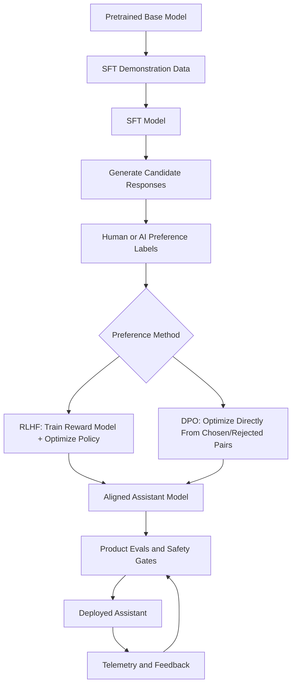

What the diagram is showing:

- SFT changes a base model into an instruction-following model.
- Preference optimization improves comparative behavior beyond imitation.
- Alignment is not one algorithm; it is a training, evaluation, policy, and feedback loop.

### 3) Real-World Industry Scenarios

#### Scenario A: Customer Support Assistant With Brand and Policy Requirements

Product/use case context:

A support assistant must answer refund, shipping, and account questions using company policy. It must be warm, concise, accurate, and avoid promising exceptions the company does not support.

How SFT and preference optimization affect the system:

- SFT teaches the assistant response shape: greeting, answer, next step, policy-safe wording.
- Preference optimization teaches tradeoffs: concise beats rambling, policy-grounded beats overly apologetic, escalation beats guessing.
- Alignment connects model behavior to real business rules and customer experience.

Constraints:

- Latency: support responses must stream quickly enough for live chat.
- Cost: high-volume support routes need efficient models and low retry rates.
- Reliability: wrong refund promises create operational and legal issues.
- Failure modes: overpromising, missing escalation, hallucinated policy, over-refusal, or inconsistent tone.
- Security/privacy: customer account details and support logs are sensitive.

What good looks like in production:

- SFT dataset contains realistic customer questions and ideal policy-grounded answers.
- Preference labels rank responses by correctness, tone, concision, and escalation quality.
- Evals test policy changes, edge cases, angry users, ambiguous requests, and unsupported claims.
- Telemetry tracks deflection quality, escalation correctness, CSAT, hallucinated promise rate, and retry rate.

#### Scenario B: Coding Assistant That Must Prefer Correct, Minimal, Safe Changes

Product/use case context:

A coding assistant helps developers modify repository code. Pretraining gives code knowledge, but product behavior requires following local context, preserving user changes, and avoiding broad refactors.

How SFT and preference optimization affect the system:

- SFT teaches examples of reading files, making scoped edits, and explaining changes.
- Preference optimization teaches that a minimal correct patch is better than a large clever rewrite.
- Alignment includes repository safety, user intent, test verification, and secure coding policies.

Constraints:

- Latency: developers expect interactive help.
- Cost: tool calls and model calls add up across many IDE turns.
- Reliability: bad edits can break builds or erase user work.
- Failure modes: hallucinated APIs, overediting, ignoring tests, reverting unrelated changes, or insecure code suggestions.
- Security/privacy: proprietary code must stay protected.

What good looks like in production:

- Demonstrations include realistic codebase navigation and patch discipline.
- Preference pairs compare small safe patches against overbroad rewrites.
- Evals include dirty worktrees, failing tests, ambiguous requirements, and security-sensitive code.
- Telemetry tracks accepted edits, test pass rate, reverted suggestions, and user correction rate.

#### Scenario C: Healthcare Triage Assistant With Strict Safety Boundaries

Product/use case context:

A healthcare assistant helps users understand symptoms and decide whether to seek care. It must be empathetic and useful while avoiding diagnosis, false reassurance, or dangerous advice.

How SFT and preference optimization affect the system:

- SFT teaches safe response templates, disclaimers, and escalation patterns.
- Preference optimization teaches nuanced choices: ask clarifying questions, recommend urgent care for red flags, avoid unsupported certainty.
- Alignment includes medical policy, risk tiers, compliance, review workflows, and continuous evaluation.

Constraints:

- Latency: users need quick guidance, but safety checks may add latency.
- Cost: high-risk cases may require retrieval or human escalation.
- Reliability: unsafe advice can cause harm.
- Failure modes: false reassurance, overdiagnosis, over-refusal, missing emergency symptoms, or unsupported medical claims.
- Security/privacy: health information requires strict privacy controls.

What good looks like in production:

- SFT examples cover benign, urgent, ambiguous, and out-of-scope cases.
- Preference labels prioritize safe escalation and calibrated uncertainty.
- High-risk prompts trigger retrieval, guardrails, or human handoff.
- Metrics track red-flag recall, unsafe-advice rate, over-refusal rate, and escalation accuracy.

### 4) System View: Think Like a Systems Engineer

#### [Intermediate] Inputs -> Transformations -> Outputs

Inputs:

- pretrained base model
- SFT prompt-response demonstrations
- preference pairs or rankings
- behavior policy
- safety policy
- annotator guidelines
- evaluation datasets
- product telemetry
- risk taxonomy

Transformations:

- curate instruction examples
- train model to imitate desired responses using SFT
- generate candidate responses from the SFT model
- label chosen and rejected responses
- train a reward model or optimize directly from preference pairs
- run safety and capability evals
- compare against baseline model
- deploy through release gates
- monitor production behavior and regressions

Outputs:

- instruction-following model
- preference-optimized model
- eval reports
- policy compliance metrics
- known failure modes
- release decision
- telemetry-driven improvement backlog

#### [Intermediate] What SFT Optimizes

SFT usually uses the same next-token objective, but on curated assistant demonstrations.

Instead of learning from arbitrary internet continuation, the model sees examples like:

```text
User: Summarize this policy in three bullets.
Assistant: - ...
```

The model is trained to make the demonstrated assistant tokens likely.

This teaches:

- role separation between user and assistant
- instruction following
- output formats
- tool-call schemas if included
- refusal style if included
- domain-specific answer patterns

But SFT does not automatically know which of two plausible answers is better unless the demonstrations cover that distinction.

#### [Intermediate] What Preference Optimization Adds

Preference optimization starts from comparisons.

Example:

```text
Prompt: Explain why the test is failing.

Chosen: The failure is caused by a missing fixture. Add the fixture or update the test setup.
Rejected: The app is broken. Rewrite the component.
```

The model learns that the chosen response should be more likely than the rejected response.

This is useful because many quality dimensions are comparative:

- more faithful vs less faithful
- safer vs riskier
- concise vs bloated
- helpful vs evasive
- calibrated vs overconfident
- instruction-following vs format-breaking

#### [Pro] RLHF vs DPO at Concept Level

**RLHF** means reinforcement learning from human feedback.

Typical flow:

1. Collect preference labels.
2. Train a **reward model** to score responses.
3. Optimize the assistant model to produce responses with higher reward.
4. Constrain the model so it does not drift too far from the reference model.

**DPO** means direct preference optimization.

Typical flow:

1. Collect chosen/rejected response pairs.
2. Optimize the model directly so chosen responses become more likely than rejected responses.
3. Use a reference model to stabilize training.

Conceptual difference:

- RLHF learns a separate reward scorer, then optimizes against it.
- DPO skips explicit reward-model training and learns directly from preference pairs.

Product translation:

You do not choose RLHF or DPO because the acronym is fashionable. You choose based on data availability, training complexity, controllability, stability, eval results, and operational maturity.

#### [Pro] Observability: What We Log, Trace, and Measure

For SFT:

- training loss
- validation loss
- instruction-following evals
- format adherence
- domain task success
- refusal correctness
- regression against base capability

For preference optimization:

- preference accuracy on held-out pairs
- win rate against prior model
- reward score distribution if using RLHF
- KL divergence or drift from reference behavior
- over-optimization indicators
- safety evals
- helpfulness/harmlessness tradeoffs
- annotator disagreement rate

For production:

- user satisfaction
- escalation correctness
- hallucination rate
- over-refusal rate
- unsafe compliance rate
- policy violation rate
- task completion rate
- user correction and retry patterns

### 5) System Design Flavor

#### [Intermediate] Key Components and Interfaces

Post-training system components:

- `BaseModel`: pretrained model checkpoint.
- `InstructionDataset`: prompt-response demonstrations for SFT.
- `SFTTrainer`: trains the model to imitate desired assistant responses.
- `CandidateGenerator`: samples multiple responses for preference labeling.
- `PreferenceDataset`: prompt plus chosen/rejected responses.
- `RewardModelTrainer`: trains a reward model from preferences when using RLHF.
- `PreferenceOptimizer`: runs RLHF, DPO, or related preference method.
- `ReferenceModel`: baseline model used to control drift.
- `EvalHarness`: measures capability, safety, format, and domain quality.
- `PolicyRegistry`: stores behavior and safety rules.
- `ReleaseGate`: blocks deployment when evals regress.
- `TelemetryLoop`: collects production feedback for the next improvement cycle.

Example preference pair:

```json
{
  "prompt": "A customer asks for a refund after 90 days. The policy allows refunds within 30 days.",
  "chosen": "I can explain the policy and help check if any documented exception applies, but standard refunds are available only within 30 days.",
  "rejected": "Sure, you can get a refund even after 90 days.",
  "labels": ["policy_faithful", "helpful", "does_not_overpromise"]
}
```

#### [Intermediate] Tradeoff 1: Demonstrations vs Preferences

Layman version:

Demonstrations show the model what good looks like. Preferences show which of two answers is better.

Use more SFT when:

- the model does not follow the basic task shape
- the output format is new
- you need domain-specific response patterns
- examples can clearly demonstrate the desired behavior

Use more preference optimization when:

- the model already follows instructions but quality is uneven
- there are many plausible answers
- you need better judgment, tone, safety, or concision
- ranking answers is easier than writing perfect answers

Practical rule:

SFT teaches the behavior lane. Preference optimization teaches lane discipline.

#### [Intermediate] Tradeoff 2: Helpfulness vs Safety

Layman version:

A model can be too permissive or too cautious. Alignment tries to avoid both extremes.

Favor stronger safety when:

- harm risk is high
- legal/compliance exposure is high
- user intent may be malicious or ambiguous
- wrong answers can cause real-world damage

Favor stronger helpfulness when:

- the task is low risk
- users need direct completion
- excessive refusal hurts the product
- policy allows safe partial help

Practical rule:

Measure both unsafe compliance and over-refusal. A model that refuses everything is not aligned; it is unusable.

#### [Pro] Tradeoff 3: Human Preferences vs Product Truth

Layman version:

Humans may prefer a confident answer, but the product may need a cautious, evidence-backed answer.

Use direct human preference when:

- the task is subjective
- tone and clarity matter
- users can judge answer quality reliably

Use expert or policy-labeled preference when:

- the domain is technical, legal, medical, financial, or safety-sensitive
- correctness is hard for general annotators
- policy compliance matters more than surface appeal

Practical rule:

Preference data must match the kind of judgment your product actually needs.

#### [Pro] Scaling Consideration: What Changes at 10x Users or 10x Risk?

At 10x usage or risk, alignment becomes lifecycle management.

You need:

- versioned datasets
- annotator guideline audits
- disagreement analysis
- route-specific evals
- safety regression tests
- red-team datasets
- release gates
- post-deployment monitoring
- rollback plans
- feedback triage
- policy update process

The main scaling risk is silent behavior drift: the model improves on broad preference metrics while getting worse on a critical product-specific failure mode.

### 6) Common Mistakes + Debugging

#### Mistake 1: Treating SFT as Magic Alignment

- Symptom: model follows example style but still gives unsafe, false, or policy-breaking answers.
- Likely cause: SFT taught imitation but did not encode enough comparative judgment or policy coverage.
- First debugging step: inspect failing prompts against SFT coverage and add preference/eval cases for the missing behavior.

#### Mistake 2: Optimizing for What Annotators Like Instead of What the Product Needs

- Symptom: responses sound polished but are wrong, too confident, or not source-grounded.
- Likely cause: preference labels rewarded surface quality over correctness or evidence.
- First debugging step: audit preference guidelines and measure faithfulness/correctness separately from user appeal.

#### Mistake 3: Over-Refusal After Safety Training

- Symptom: model refuses benign requests or gives vague safety disclaimers for normal tasks.
- Likely cause: safety examples or preference labels over-rewarded refusal.
- First debugging step: measure refusal correctness with benign, ambiguous, and unsafe prompt sets.

#### Mistake 4: Reward Hacking or Over-Optimization

- Symptom: model learns to produce responses that score well but feel formulaic, evasive, or low-value.
- Likely cause: model exploits reward-model or preference-pattern shortcuts.
- First debugging step: compare win-rate metrics against human review and route-specific task success.

#### Mistake 5: Forgetting Regression Testing

- Symptom: new aligned model improves safety but loses coding, math, retrieval, or formatting ability.
- Likely cause: post-training shifted behavior distribution without enough capability regression checks.
- First debugging step: run a fixed eval suite across old and new model versions before release.

### 7) Hands-On Lab: Concept -> Build -> Break -> Measure -> Explain

#### [Pro] Goal

Build a tiny preference-learning simulator that shows why demonstrations and comparisons teach different things.

This is not real RLHF or DPO. It is a compact behavior-ranking lab to make the concepts testable.

#### Build: Smallest Working Version

Run this dependency-free Python snippet:

```python
features = ["correct", "concise", "safe", "grounded", "format_ok"]

preference_pairs = [
    {
        "prompt": "Refund after 90 days when policy says 30 days",
        "chosen": {"correct", "safe", "grounded", "format_ok"},
        "rejected": {"concise", "format_ok"},
    },
    {
        "prompt": "Summarize policy in 3 bullets",
        "chosen": {"correct", "concise", "grounded", "format_ok"},
        "rejected": {"correct", "grounded"},
    },
    {
        "prompt": "User asks for unsupported medical diagnosis",
        "chosen": {"safe", "grounded", "format_ok"},
        "rejected": {"concise"},
    },
]

weights = {feature: 0 for feature in features}

def score(response_features):
    return sum(weights[feature] for feature in response_features)

def accuracy(pairs):
    wins = 0
    for pair in pairs:
        if score(pair["chosen"]) > score(pair["rejected"]):
            wins += 1
    return wins / len(pairs)

print("before", weights, "accuracy", accuracy(preference_pairs))

for pair in preference_pairs:
    for feature in pair["chosen"] - pair["rejected"]:
        weights[feature] += 1
    for feature in pair["rejected"] - pair["chosen"]:
        weights[feature] -= 1

print("after", weights, "accuracy", accuracy(preference_pairs))
```

What to observe:

- Before preference learning, the scorer has no behavioral judgment.
- After updates, features that appear in preferred responses receive higher weights.
- The system learns a rough preference standard from comparisons.

#### Break: Force the Failure Mode

Add biased preference data:

```python
preference_pairs += [
    {
        "prompt": "Simple password reset question",
        "chosen": {"safe", "format_ok"},
        "rejected": {"correct", "concise", "grounded", "format_ok"},
    },
    {
        "prompt": "Basic shipping ETA question",
        "chosen": {"safe", "format_ok"},
        "rejected": {"correct", "concise", "grounded", "format_ok"},
    },
]
```

Rerun training.

Expected breakage:

- The `safe` feature may become over-weighted.
- Correct and concise answers may be undervalued.
- This mirrors over-refusal or safety-overcorrection when preference data rewards caution even for benign prompts.

#### Measure: Capture Concrete Signals

Add a small eval set:

```python
eval_pairs = [
    {
        "name": "benign_helpful",
        "chosen": {"correct", "concise", "grounded", "format_ok"},
        "rejected": {"safe", "format_ok"},
    },
    {
        "name": "unsafe_request",
        "chosen": {"safe", "grounded", "format_ok"},
        "rejected": {"concise"},
    },
]

for pair in eval_pairs:
    print(
        pair["name"],
        "chosen_score=", score(pair["chosen"]),
        "rejected_score=", score(pair["rejected"]),
        "passes=", score(pair["chosen"]) > score(pair["rejected"]),
    )
```

Signals to capture:

- preference accuracy
- benign helpfulness pass/fail
- unsafe request pass/fail
- feature weights after training
- whether one feature dominates all others

#### Explain: Why It Broke and What Prevents It

The broken version shows that preference optimization learns the behavior implied by the preference data, not the behavior we wish the data represented. If labels over-reward caution, the model can become over-refusing. If labels over-reward confidence, the model can become overconfident.

Production fixes:

- balance preference data across benign, ambiguous, and unsafe prompts
- separate correctness, helpfulness, safety, and format metrics
- audit annotator guidelines
- use expert labels for high-risk domains
- run regression evals before release
- monitor over-refusal and unsafe-compliance rates in production

### 8) Active Recall

1. What does SFT teach that pretraining does not reliably teach?
2. Why is preference optimization useful after SFT?
3. What is the conceptual difference between RLHF and DPO?
4. Why can preference optimization cause over-refusal or reward hacking?
5. What is alignment in product terms?

#### Active Recall Answers

1. SFT teaches assistant-style behavior: following instructions, formats, roles, domain response patterns, and policy-shaped examples.
2. It teaches comparative judgment between plausible responses, such as which answer is safer, clearer, more faithful, or more helpful.
3. RLHF trains a reward model from preferences and then optimizes against it; DPO optimizes directly from chosen/rejected pairs.
4. The model can overfit to biased labels, reward-model shortcuts, or narrow preference patterns.
5. Alignment means shaping and validating model behavior so it matches user intent, product goals, policies, safety boundaries, and real-world risk constraints.

### 9) Practice

#### Mini-Exercise

Your instruction-tuned support model is polite and follows the requested format, but it often grants exceptions that company policy does not allow.

Answer these:

1. Is this mainly an SFT issue, preference issue, grounding issue, or policy/eval issue?
2. What data would you add?
3. What metric would you monitor after release?

Suggested answer:

1. It is likely a mix of grounding and preference/policy alignment. The model learned helpful tone but not strict policy faithfulness.
2. Add policy-grounded SFT examples, preference pairs where policy-faithful answers beat overpromising answers, and eval cases for edge-policy requests.
3. Monitor hallucinated promise rate, unsupported exception rate, escalation correctness, citation faithfulness, and user correction rate.

#### Capstone-Style System Design Question

Design a post-training plan for an enterprise assistant that must answer HR, IT, and finance questions with different risk levels.

Your answer should cover:

- SFT data design
- preference data design
- alignment policies
- eval gates
- route-specific risk handling
- telemetry
- rollback strategy

Suggested answer outline:

- Build SFT demonstrations for each route with realistic user prompts, approved answer style, citations, escalation patterns, and refusal boundaries.
- Create preference pairs that compare policy-faithful answers against overconfident, stale, verbose, evasive, or unsafe answers.
- Use stricter expert-labeled preferences for finance and HR edge cases.
- Define route-specific policies: IT troubleshooting can be more direct; HR/finance require stronger citation and escalation behavior.
- Run eval gates for correctness, citation faithfulness, format adherence, over-refusal, unsafe compliance, and task success.
- Monitor production by route: user corrections, escalation accuracy, unsupported claims, policy violations, and satisfaction.
- Keep previous model available for rollback and use canary releases before full deployment.

### 10) Production Reality Check

If this fails in prod, what's the first thing we inspect?

Inspect the failure slice: was it a demonstration coverage gap, a preference-label problem, a grounding/source-of-truth problem, or a policy/eval gap?

Why:

SFT and preference optimization can make behavior look polished while still being wrong. The first debugging move is to classify the failure by training signal and product requirement, then inspect the matching dataset, eval, and telemetry slice.

### 11) Curiosity Bridge

SFT and preference optimization explain how a base model becomes more assistant-like, but products need more than polite answers.

This leads into tool-use and reasoning behavior: how models learn when to call tools, how to structure intermediate work, and why those behaviors need training data, scaffolding, and evals.

### 12) Exit Check + Carry-Forward Review

Exit Check: You're done when you can explain why SFT teaches imitation, preference optimization teaches comparative judgment, and alignment is the full product process that validates behavior under real constraints.

Carry-Forward Review:

Question: From 2.3.a, why does pretraining alone not guarantee helpfulness?

Answer: Pretraining optimizes next-token likelihood over broad data, not user intent, product policy, safety, or verified truth.

Question: From 2.2.d, why can post-training improvements still fail to improve product experience?

Answer: Product experience also depends on serving latency, output length, queueing, KV cache memory, batching, and cost, not only model behavior quality.

Question: From 2.1.d, why do alignment datasets need token budgeting discipline too?

Answer: Long demonstrations and preference examples are expensive to train/evaluate and can teach verbosity or hide the behavior signal inside low-value context.

---

## Subtopic 2.3.c: Tool-Use and Reasoning Behavior as Trained Capabilities

### ✅ Add to Knowledge Base

### 0) Reading Path + Level Tags

Beginner: read sections 1, 2, 6, 8, 10, and 11. Your goal is to understand that tool use and reasoning are not automatic side effects of having a large model.

Intermediate: add sections 3, 4, 5, 7, and 9. Your goal is to separate model capability, training signal, tool schema design, orchestration, and evals.

Pro: do the full Hands-On Lab and capstone practice. Your goal is to debug tool-using agents by measuring tool selection, argument quality, result interpretation, reasoning reliability, and recovery behavior.

### 1) Pre-Question Hook + The Intuition

Pause: if an LLM only predicts tokens, how does it learn to call tools, use APIs, plan steps, and reason through multi-step tasks?

#### [Beginner] Plain-English Mental Model

**Tool use** is the model behavior of deciding that external help is needed, selecting a tool, producing valid tool arguments, reading the tool result, and continuing the task using that result.

The model does not inherently "know" your database, API, browser, code runner, or calculator. It learns patterns like:

```text
User needs current account status -> call account lookup
User asks arithmetic -> call calculator
User asks policy question -> retrieve policy
Tool returns evidence -> answer using evidence
Tool fails -> ask for missing info or recover
```

**Reasoning behavior** is the model behavior of decomposing a task, tracking constraints, comparing options, checking intermediate results, and producing an answer that follows from the available evidence.

The important wording is behavior.

In production, we cannot assume the model has reliable hidden reasoning just because it sounds thoughtful. We train, prompt, scaffold, and evaluate observable behaviors:

- Did it choose the right tool?
- Did it pass valid arguments?
- Did it wait for the result?
- Did it use the result faithfully?
- Did it avoid unsupported claims?
- Did it break the task into the right steps?
- Did it recover when a tool failed?

The key mental model:

Tool use and reasoning become reliable only when the model has learned the relevant patterns and the system gives it clear schemas, feedback, constraints, and evals.

#### Analogy

Think of a trained analyst using company systems.

- Pretraining gives broad knowledge of language and common work patterns.
- SFT teaches how to respond like an assistant.
- Tool-use training teaches when to open the CRM, calculator, search index, ticketing system, or code runner.
- Reasoning training teaches how to plan, compare, verify, and update the answer after seeing evidence.

Where the analogy breaks down:

Human analysts understand goals and accountability in a richer way. Models imitate and generalize from learned patterns; without scaffolding, they may fake tool results, skip verification, or produce plausible but wrong steps.

#### [Intermediate] Tool-Use Skill Is a Pipeline, Not One Skill

Tool use contains several sub-skills:

- **Tool selection**: deciding whether a tool is needed and which one to call.
- **Tool argument generation**: filling the tool input schema correctly.
- **Tool result interpretation**: reading tool output and extracting task-relevant facts.
- **Tool orchestration**: sequencing multiple tool calls when one call is not enough.
- **Tool recovery**: handling missing inputs, errors, timeouts, empty results, or permission failures.
- **Grounded response generation**: answering based on tool evidence instead of unsupported memory.

A model can be good at one sub-skill and bad at another.

Example:

- It may know to call `policy_lookup` but pass the wrong policy name.
- It may call the right API but ignore the returned evidence.
- It may call too many tools when a direct answer would be enough.
- It may stop after a tool error instead of asking a clarifying question.

#### [Pro] Reasoning Skill Is Also a Set of Trainable Behaviors

Reasoning is not a single switch.

Useful reasoning behaviors include:

- **Task decomposition**: splitting a complex goal into smaller steps.
- **Constraint tracking**: remembering limits, requirements, policies, and user preferences.
- **State tracking**: maintaining what is known, unknown, done, and blocked.
- **Evidence comparison**: comparing retrieved/tool evidence instead of choosing the most recent text.
- **Verification**: checking whether the answer follows from the evidence and constraints.
- **Backtracking**: revising a plan when a step fails.
- **Uncertainty calibration**: saying what is known, unknown, or needs external verification.

Training can make these behaviors more likely, but product systems should still externalize important state into explicit data structures, tool traces, plans, checklists, or workflow state.

Production rule:

Do not rely on vibes like "the model seems to reason." Measure the observable reasoning behaviors required by the route.

### 2) Visual Diagram

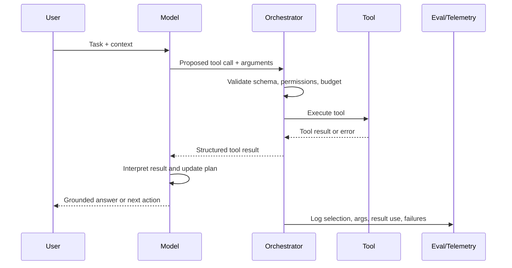

What the diagram is showing:

- The model proposes tool calls, but the orchestrator validates and executes them.
- Tool results become new context for the model.
- Reliability depends on model behavior plus schema validation, permissions, budgets, and telemetry.

### 3) Real-World Industry Scenarios

#### Scenario A: Enterprise Policy Assistant With Retrieval Tools

Product/use case context:

An employee asks, "Can I expense a hotel upgrade during a delayed flight?" The assistant must use current company policy, not only pretrained memory.

How tool-use and reasoning behavior affect the system:

- Tool selection decides whether to answer directly or call policy retrieval.
- Tool arguments decide whether the retrieval query targets travel, lodging, upgrades, or delays.
- Reasoning behavior decides whether the answer distinguishes normal upgrades from delay-related exceptions.
- Grounded response behavior decides whether the assistant cites the policy evidence instead of making a generic claim.

Constraints:

- Latency: retrieval and reranking add delay, but direct unsupported answers are risky.
- Cost: every retrieval/tool call consumes system resources.
- Reliability: policy answers must be grounded in approved sources.
- Failure modes: wrong retrieval query, stale policy, ignored evidence, hallucinated exception, or over-refusal.
- Security/privacy: employee context and policy access may be role-restricted.

What good looks like in production:

- The assistant calls retrieval for policy-dependent questions.
- Tool arguments include the right policy domain and relevant entities.
- The final answer cites evidence and states uncertainty if evidence is insufficient.
- Telemetry tracks retrieval needed vs used, citation faithfulness, and unsupported answer rate.

#### Scenario B: Coding Agent That Reads, Edits, and Tests

Product/use case context:

A developer asks an agent to fix a failing test. The agent must inspect files, understand the failure, edit the right module, and run verification.

How tool-use and reasoning behavior affect the system:

- Tool selection decides whether to search, read files, inspect diagnostics, edit, or run tests.
- Tool arguments decide which files, symbols, commands, or test names to inspect.
- Reasoning behavior decides whether the root cause is code, test setup, config, or environment.
- Recovery behavior decides what to do if tests fail again.

Constraints:

- Latency: developers want progress quickly, but blind edits are expensive.
- Cost: repeated searches and test runs consume time and model budget.
- Reliability: edits must be scoped and must not revert unrelated user changes.
- Failure modes: editing the wrong file, running irrelevant tests, ignoring diagnostics, fabricating code behavior, or stopping after the first failure.
- Security/privacy: proprietary code and secrets must be protected.

What good looks like in production:

- The agent gathers evidence before editing.
- It uses structured plans and updates status as steps complete.
- It validates changes with the narrowest relevant test first.
- Telemetry tracks tool-call success, edit acceptance, test pass rate, and user rollback rate.

#### Scenario C: Customer Support Agent With Transaction Tools

Product/use case context:

A customer asks, "Where is my order, and can I change the shipping address?" The assistant has tools for order lookup, shipping status, address validation, and escalation.

How tool-use and reasoning behavior affect the system:

- The model must identify missing authentication or order ID.
- It must call order lookup before making claims.
- It must reason about whether the order is still editable.
- It must avoid calling address-change tools without permission and confirmation.

Constraints:

- Latency: live support needs quick answers.
- Cost: too many tool calls slow the session and increase load.
- Reliability: wrong updates can affect real shipments.
- Failure modes: unauthorized action, wrong customer record, skipped confirmation, stale status, or action after cutoff.
- Security/privacy: account data and address changes require strong access control.

What good looks like in production:

- Tool calls are gated by identity, permission, and confirmation.
- The assistant separates information retrieval from state-changing actions.
- Reasoning state tracks order status, editability, and required confirmation.
- Telemetry tracks unauthorized-call blocks, confirmation success, and resolution rate.

### 4) System View: Think Like a Systems Engineer

#### [Intermediate] Inputs -> Transformations -> Outputs

Inputs:

- user request
- conversation context
- tool catalog
- tool schemas
- permissions and auth context
- prompt/system instructions
- learned tool-use patterns from training
- current workflow state
- budgets for tokens, latency, and tool calls
- eval and telemetry labels

Transformations:

- interpret user intent
- decide whether external information or action is required
- select tool or no tool
- generate structured arguments
- validate schema and permissions
- execute tool through orchestrator
- interpret result or error
- update state or plan
- decide next step or final response
- generate grounded answer

Outputs:

- tool call decision
- validated tool arguments
- tool result or error
- updated reasoning/workflow state
- final answer or next action
- logs for selection accuracy, argument validity, result use, and failures

#### [Intermediate] How Training Teaches Tool Use

Tool-use training examples often look like traces:

```text
User: What is the refund status for order 123?
Assistant tool call: order_lookup({"order_id": "123"})
Tool result: {"status": "refunded", "date": "2026-05-12"}
Assistant: Order 123 was refunded on 2026-05-12.
```

From many examples, the model learns patterns:

- when a lookup is required
- which tool name matches the task
- how to format arguments
- how to continue after a result
- how to answer when evidence is missing

But training examples must cover hard cases:

- missing arguments
- ambiguous user requests
- tool errors
- permission denial
- empty retrieval results
- conflicting tool results
- state-changing tools requiring confirmation

#### [Intermediate] How Training Teaches Reasoning Behavior

Reasoning training examples teach patterns of decomposition and verification.

Useful training traces can include:

- task plan
- selected evidence
- intermediate state
- tool calls
- verification checks
- final answer

Important distinction:

For production systems, the valuable artifact is often not a verbose hidden chain of thought. The valuable artifact is structured, auditable state: what the model decided, which evidence it used, which tools it called, what constraints it tracked, and why the final action is allowed.

This is why agent systems often use explicit workflow state rather than relying only on freeform reasoning text.

#### [Pro] Observability: What We Log, Trace, and Measure

Tool-use metrics:

- tool selection accuracy
- unnecessary tool-call rate
- missing tool-call rate
- argument validity rate
- argument correction rate
- tool error recovery rate
- permission-block rate
- state-changing confirmation rate
- grounded-answer rate
- cost and latency per tool call

Reasoning metrics:

- task decomposition correctness
- constraint satisfaction
- evidence use accuracy
- contradiction detection
- verification pass rate
- recovery after failed step
- final task success
- user correction rate

System metrics:

- end-to-end latency
- route-level success rate
- tool-call budget usage
- failed workflow states
- escalation rate
- p95/p99 latency with tools

### 5) System Design Flavor

#### [Intermediate] Key Components and Interfaces

Tool-using assistant components:

- `ToolCatalog`: lists available tools, descriptions, schemas, and examples.
- `ToolSchema`: defines required arguments, types, constraints, and return shape.
- `ToolRouter`: decides whether a request needs a tool and which one.
- `ArgumentBuilder`: creates structured tool inputs.
- `ToolValidator`: checks schema, permissions, confirmation, and safety constraints.
- `ToolExecutor`: runs the actual API, retrieval, code, database, or workflow action.
- `ResultInterpreter`: converts tool output into task-relevant facts.
- `ReasoningState`: stores plan, evidence, constraints, known facts, and next action.
- `Verifier`: checks groundedness, constraints, schema, and policy before final response.
- `TelemetryLayer`: logs tool decisions, failures, latency, and outcome labels.

Example tool schema:

```json
{
  "name": "policy_lookup",
  "description": "Search approved company policy documents.",
  "input_schema": {
    "type": "object",
    "required": ["policy_domain", "query"],
    "properties": {
      "policy_domain": {"type": "string", "enum": ["travel", "hr", "security", "finance"]},
      "query": {"type": "string"}
    }
  },
  "state_changing": false
}
```

#### [Intermediate] Tradeoff 1: Direct Answer vs Tool Call

Layman version:

Sometimes the model can answer from stable general knowledge. Sometimes it must check the source of truth.

Use direct answer when:

- the task is low risk
- facts are stable and generic
- no user-specific or current data is needed
- latency matters more than traceability

Use tool call when:

- data is current, private, or user-specific
- citations or auditability are required
- the task changes external state
- the model's memory is not authoritative

Practical rule:

Tool use is a reliability lever, but unnecessary tool use is a latency and cost tax.

#### [Intermediate] Tradeoff 2: Freeform Reasoning vs Structured State

Layman version:

Freeform reasoning can help the model think through a task, but structured state is easier to validate.

Use freeform reasoning patterns when:

- the task is exploratory
- the risk is low
- the reasoning does not need strict audit
- the product benefits from explanation

Use structured state when:

- tools/actions are involved
- the task has constraints
- auditability matters
- recovery and retries are needed
- policy or safety checks are required

Practical rule:

For serious agent workflows, represent important reasoning state explicitly.

#### [Pro] Tradeoff 3: Single-Step Tool Call vs Multi-Step Agent Loop

Layman version:

A single tool call is simpler and safer. A loop is more flexible but easier to lose control of.

Use single-step tool calls when:

- the task maps to one known operation
- the tool result directly answers the user
- low latency matters
- safety boundaries are tight

Use multi-step loops when:

- tasks require search, compare, edit, verify, and recover
- tool results determine the next step
- complex workflow state must be updated over time
- the product can tolerate higher latency and needs flexibility

Practical rule:

Every loop needs stop conditions, budgets, error handling, and telemetry.

#### [Pro] Scaling Consideration: What Changes at 10x Tools or 10x Workflows?

At 10x tools, tool descriptions and schemas become part of model-facing product design.

You need:

- clear tool naming
- non-overlapping descriptions
- schema validation
- route-specific tool availability
- permission-aware execution
- tool-call budgets
- tool selection evals
- action confirmation rules
- failure-mode playbooks
- audit logs
- versioned tool contracts

The main scaling risk is tool confusion. If tools overlap, schemas are vague, or return formats drift, the model may call the wrong tool confidently.

### 6) Common Mistakes + Debugging

#### Mistake 1: Assuming Tool Access Equals Tool Competence

- Symptom: the model has tools available but calls the wrong one or skips required tools.
- Likely cause: tool-use behavior was not trained, prompted, or evaluated for that route.
- First debugging step: inspect tool selection accuracy on a labeled eval set.

#### Mistake 2: Treating Reasoning Text as Proof of Correctness

- Symptom: the answer sounds well reasoned but contradicts tool evidence or policy.
- Likely cause: fluent explanation masked weak evidence use or constraint tracking.
- First debugging step: compare final claims against tool results, retrieved evidence, and required constraints.

#### Mistake 3: Weak Tool Schemas

- Symptom: tool calls fail validation or produce wrong records.
- Likely cause: schemas allow ambiguous arguments, missing required fields, or poorly typed inputs.
- First debugging step: log argument validation errors by tool and tighten schema/argument examples.

#### Mistake 4: No Recovery Training

- Symptom: model stops or fabricates an answer when a tool returns an error or empty result.
- Likely cause: training/evals covered happy paths but not tool failures.
- First debugging step: add eval cases for timeouts, empty results, permission denial, and conflicting evidence.

#### Mistake 5: Unbounded Agent Loops

- Symptom: agent keeps searching, calls tools repeatedly, or burns budget without finishing.
- Likely cause: missing stop conditions, budgets, and progress criteria.
- First debugging step: inspect tool-call traces for loop count, repeated actions, and missing termination rules.

### 7) Hands-On Lab: Concept -> Build -> Break -> Measure -> Explain

#### [Pro] Goal

Build a tiny tool-selection simulator that learns from tool-use demonstrations and measures selection plus argument validity.

This is not an LLM. It is a small, runnable way to make tool-use behavior visible and measurable.

#### Build: Smallest Working Version

Run this dependency-free Python snippet:

```python
import re
from collections import Counter, defaultdict

tools = {
    "calculator": {"required": ["expression"]},
    "policy_lookup": {"required": ["topic"]},
    "order_lookup": {"required": ["order_id"]},
    "no_tool": {"required": []},
}

training_examples = [
    ("what is 18 * 4", "calculator"),
    ("calculate 12 plus 30", "calculator"),
    ("can I expense a hotel upgrade", "policy_lookup"),
    ("what is the refund policy", "policy_lookup"),
    ("where is order 12345", "order_lookup"),
    ("check status for order 777", "order_lookup"),
    ("explain what latency means", "no_tool"),
]

def tokenize(text):
    return re.findall(r"[a-z0-9*+/-]+", text.lower())

weights = defaultdict(Counter)

for prompt, tool in training_examples:
    for token in tokenize(prompt):
        weights[tool][token] += 1

def select_tool(prompt):
    tokens = tokenize(prompt)
    scores = {
        tool: sum(weights[tool][token] for token in tokens)
        for tool in tools
    }
    return max(scores, key=scores.get), scores

def build_arguments(tool, prompt):
    if tool == "calculator":
        expression = " ".join(re.findall(r"[0-9+*/-]+", prompt))
        return {"expression": expression} if expression else {}
    if tool == "policy_lookup":
        return {"topic": prompt}
    if tool == "order_lookup":
        match = re.search(r"order\s+(\d+)", prompt.lower())
        return {"order_id": match.group(1)} if match else {}
    return {}

def arguments_valid(tool, arguments):
    return all(key in arguments and arguments[key] for key in tools[tool]["required"])

eval_examples = [
    ("can I expense a delayed flight hotel", "policy_lookup"),
    ("what is 9 * 9", "calculator"),
    ("where is order 2468", "order_lookup"),
    ("define transformer attention", "no_tool"),
]

correct = 0
valid_args = 0

for prompt, expected_tool in eval_examples:
    tool, scores = select_tool(prompt)
    arguments = build_arguments(tool, prompt)
    is_correct = tool == expected_tool
    is_valid = arguments_valid(tool, arguments)
    correct += int(is_correct)
    valid_args += int(is_valid)
    print(prompt, "->", tool, arguments, "correct=", is_correct, "valid_args=", is_valid)

print("tool_selection_accuracy=", correct / len(eval_examples))
print("argument_validity_rate=", valid_args / len(eval_examples))
```

What to observe:

- Tool selection is learned from examples.
- Argument validity is a separate metric from tool selection.
- A system can select the right tool and still fail if arguments are invalid.

#### Break: Force the Failure Mode

Add noisy demonstrations before training:

```python
training_examples += [
    ("what is 7 * 8", "policy_lookup"),
    ("where is order 999", "no_tool"),
    ("refund policy for order 123", "order_lookup"),
]
```

Rerun the script.

Expected breakage:

- Arithmetic may route to policy lookup.
- Order queries may route to no tool.
- Mixed prompts may route to the wrong operational tool.

This mirrors a real post-training problem: poor demonstrations or ambiguous tool descriptions teach the model unreliable routing behavior.

#### Measure: Capture Concrete Signals

Track:

- tool selection accuracy
- argument validity rate
- unnecessary tool-call rate
- missing tool-call rate
- confusion pairs such as `calculator -> policy_lookup`
- prompts where the right tool was selected but required arguments were missing

Add this small confusion report:

```python
confusions = Counter()
for prompt, expected_tool in eval_examples:
    tool, _ = select_tool(prompt)
    confusions[(expected_tool, tool)] += 1

print("confusions=")
for (expected, predicted), count in confusions.items():
    print(f"expected={expected} predicted={predicted} count={count}")
```

#### Explain: Why It Broke and What Prevents It

The broken version shows that tool-use behavior depends on the examples and labels the model learns from. If training data confuses arithmetic, policy lookup, and order lookup, the model learns confused routing.

Production fixes:

- use clear tool descriptions and non-overlapping schemas
- train on realistic happy paths and failure paths
- label tool selection separately from final answer quality
- validate arguments before execution
- log confusion pairs by tool
- gate state-changing tools with permissions and confirmations
- evaluate result interpretation and grounded response quality

### 8) Active Recall

1. Why is tool access different from tool competence?
2. Name three sub-skills inside tool use.
3. Why should production systems externalize important reasoning state?
4. What is one metric for tool selection and one metric for reasoning behavior?
5. Why do state-changing tools need extra safeguards?

#### Active Recall Answers

1. Access only makes tools available; competence requires selecting the right tool, generating valid arguments, using results faithfully, and recovering from failures.
2. Tool selection, argument generation, result interpretation, orchestration, recovery, and grounded response generation are valid examples.
3. Structured state is easier to validate, audit, retry, recover from, and enforce policy against than freeform reasoning text.
4. Tool selection accuracy or argument validity for tool use; constraint satisfaction, verification pass rate, or evidence use accuracy for reasoning.
5. They can affect real systems or users, so they require permissions, schema validation, confirmation, audit logs, and rollback or recovery paths.

### 9) Practice

#### Mini-Exercise

Your HR assistant answers benefits questions. It sometimes gives direct answers from memory even when the answer depends on the employee's region and employment type.

Answer these:

1. Is this a pretraining problem, tool-use problem, reasoning problem, or policy problem?
2. What tool-use behavior should be trained/evaluated?
3. What telemetry would prove improvement?

Suggested answer:

1. It is mainly a tool-use plus reasoning/policy problem. The assistant must know when employee-specific lookup or policy retrieval is required.
2. Train and evaluate region/employee-type detection, policy retrieval calls, argument validity, and final answer grounding.
3. Track missing-tool-call rate, correct policy-domain selection, argument validity, citation faithfulness, unsupported answer rate, and region-specific correctness.

#### Capstone-Style System Design Question

Design a tool-using assistant for IT support that can answer general questions, look up device status, create tickets, and run safe diagnostic checks.

Your answer should cover:

- tool catalog and schemas
- permission boundaries
- reasoning state
- when to answer directly vs call tools
- state-changing action confirmation
- failure recovery
- evals and telemetry

Suggested answer outline:

- Define separate tools for knowledge retrieval, device lookup, diagnostic read checks, and ticket creation.
- Make schemas explicit with required fields such as device ID, user ID, diagnostic type, and ticket category.
- Gate device-specific tools by authentication and permissions.
- Store reasoning state with user issue, known facts, missing facts, selected device, diagnostics run, evidence, and next action.
- Answer directly only for generic low-risk questions; use tools for user/device-specific status or current incidents.
- Require confirmation before ticket creation or any state-changing action.
- Recover from missing device IDs by asking clarifying questions; recover from tool errors by escalating or trying approved alternatives.
- Evaluate tool selection accuracy, argument validity, permission blocking, diagnostic appropriateness, ticket quality, final task success, and p95 latency.

### 10) Production Reality Check

If this fails in prod, what's the first thing we inspect?

Inspect the tool trace and reasoning state: whether the model should have called a tool, which tool it selected, what arguments it passed, what result came back, how it used the result, and whether the final answer followed the evidence and constraints.

Why:

Tool-using failures are rarely just "bad reasoning." They often come from a specific break in the chain: wrong routing, bad arguments, permission failure, ignored result, missing recovery, or unsupported final synthesis.

### 11) Curiosity Bridge

This works well when the model has learned the right tool-use traces and the system validates every action, but it breaks when we assume raw scale always beats task-specific tuning.

That leads into why smaller tuned models can beat larger untuned models on narrow tasks: the model that has learned the exact product behavior can outperform a larger model that only has broader generic capability.

### 12) Exit Check + Carry-Forward Review

Exit Check: You're done when you can explain tool-use and reasoning as observable trained behaviors, name their sub-skills, and design evals that catch failures before production.

Carry-Forward Review:

Question: From 2.3.b, why is SFT useful for tool use?

Answer: SFT can demonstrate the desired trace shape: user request, tool call, valid arguments, tool result, and grounded assistant response.

Question: From 2.3.a, why can pretraining alone produce fake tool-like behavior?

Answer: Pretraining teaches plausible text continuations, so the model may imitate API outputs or reasoning traces without actually executing tools or verifying results.

Question: From 2.2.d, why do tool-using agents often feel slower than direct chat?

Answer: Tool workflows add orchestration, validation, external calls, result interpretation, extra model turns, and sometimes longer context for tool results.

---

## Subtopic 2.3.d: Why Smaller Tuned Models Can Beat Larger Untuned Models on Narrow Tasks

### ✅ Add to Knowledge Base

### 0) Reading Path + Level Tags

Beginner: read sections 1, 2, 6, 8, 10, and 11. Your goal is to understand why model size is not the same thing as product fit.

Intermediate: add sections 3, 4, 5, 7, and 9. Your goal is to reason about tuning, routing, evals, latency, cost, and narrow-task reliability.

Pro: do the full Hands-On Lab and capstone practice. Your goal is to design a model-selection strategy that proves when a smaller tuned model is better than a larger untuned model, and when it is not.

### 1) Pre-Question Hook + The Intuition

Pause: if a larger model has more parameters and broader knowledge, how can a smaller model outperform it on a specific production task?

#### [Beginner] Plain-English Mental Model

**Parameter count** is the number of learned weights in a model. It often correlates with broad capability, but it does not guarantee best behavior for every task.

**Tuning** is adapting a model toward a target behavior or domain using task-specific examples, preferences, adapters, or other post-training methods.

**Narrow task** means a constrained workflow with a limited input/output shape, stable rules, and measurable success criteria.

Examples:

- classify support tickets into 12 categories
- extract invoice fields into JSON
- answer questions from one policy library
- route customer messages to the right queue
- generate a fixed incident-summary template
- call one of five tools with valid arguments

The key mental model:

A larger untuned model has broader general ability. A smaller tuned model can have better task fit.

The smaller model may win because it has learned exactly what the product wants:

- the allowed labels
- the required output format
- the domain vocabulary
- the edge-case policy rules
- the preferred tone
- the expected tool schema
- the examples that actually appear in production

This is not magic. It is distribution matching.

The tuned model has been moved closer to the **task distribution**: the real prompts, constraints, outputs, and success labels your product cares about.

#### Analogy

Think of a generalist doctor versus a trained lab technician for one narrow procedure.

The doctor has broader medical knowledge. But the technician may be faster and more consistent at one exact protocol because they repeat it all day with precise rules and tools.

Where the analogy breaks down:

Models do not gain human expertise or responsibility. A tuned model improves because its learned probability distribution and output behavior are shaped by examples and objectives, not because it truly understands the domain like a specialist human.

#### [Intermediate] Capability vs Fit

There are two different questions:

1. How much broad capability does the model have?
2. How well does the model fit this specific task?

A large untuned model may have high broad capability but poor fit:

- too verbose
- inconsistent format
- overgeneralizes
- ignores domain labels
- uses stale or generic knowledge
- misses product-specific policies
- needs long prompts to steer behavior

A smaller tuned model may have lower broad capability but high fit:

- stable schema output
- low ambiguity on allowed labels
- consistent style
- lower latency
- lower cost
- fewer prompt tokens needed
- fewer repair loops

Production lesson:

Model selection is not a leaderboard contest. It is a cost-quality-latency-reliability decision on your eval distribution.

#### [Pro] Why Tuning Can Beat Scale

Tuning changes the model's behavior in ways raw prompting cannot always match.

Reasons a smaller tuned model can win:

- **Distribution alignment**: the tuned model sees examples similar to production.
- **Output-space narrowing**: the model learns a smaller set of valid outputs, labels, schemas, or actions.
- **Prompt compression**: less instruction text is needed because behavior is inside the model weights or adapter.
- **Lower variance**: fewer random or stylistic deviations across similar requests.
- **Cheaper retries**: better first-pass validity reduces repair calls.
- **Latency advantage**: fewer parameters and shorter prompts can produce faster responses.
- **Policy specificity**: domain rules can be encoded through examples and preferences.
- **Better calibration on narrow cases**: the model learns when the task is out of scope if the tuning data includes boundaries.

But tuning does not create unlimited capability.

A smaller tuned model can lose when:

- the task requires broad world knowledge
- inputs are far outside the tuning distribution
- complex reasoning exceeds model capacity
- ambiguous cases require deep judgment
- the tuning data is noisy or incomplete
- the eval set is too narrow and hides failures

### 2) Visual Diagram

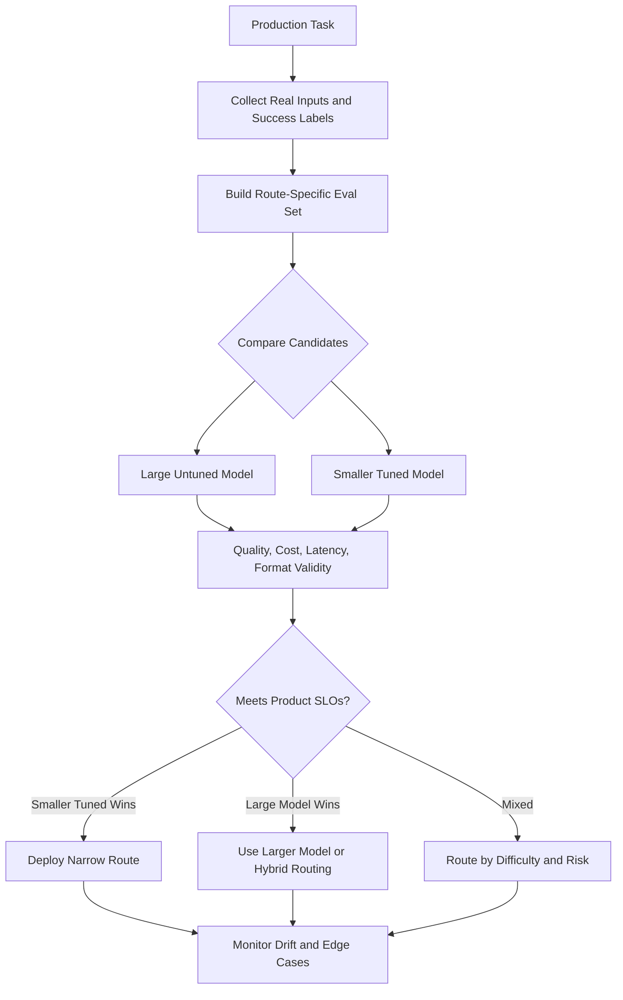

What the diagram is showing:

- The decision is made on route-specific evals, not assumptions about size.
- A smaller tuned model can win narrow routes.
- A hybrid system can route easy/narrow cases to the tuned model and hard/ambiguous cases to a larger model.

### 3) Real-World Industry Scenarios

#### Scenario A: Support Ticket Classification

Product/use case context:

A support platform must classify inbound messages into 12 queues: billing, login, refund, shipping, fraud, cancellation, technical issue, and so on. A large general chat model is accurate but slow and expensive. A smaller tuned classifier is trained on real historical tickets.

How tuning affects the system:

- The tuned model learns the exact queue taxonomy.
- It learns company-specific phrases such as "charged twice" -> billing and "can't access account" -> login.
- It outputs only allowed labels instead of freeform explanations.
- It can be evaluated with a simple route-level accuracy and escalation metric.

Constraints:

- Latency: classification happens before a customer reaches the right workflow, so delay hurts the whole support flow.
- Cost: every support ticket is classified, so per-call cost matters at scale.
- Reliability: wrong routing increases handle time and customer frustration.
- Failure modes: label drift, unseen new issue types, ambiguous tickets, multilingual tickets, or noisy training labels.
- Security/privacy: ticket text may contain customer data.

What good looks like in production:

- Smaller tuned model handles high-confidence common cases.
- Ambiguous or low-confidence cases route to a larger model or human triage.
- Metrics track label accuracy, confusion matrix, p95 latency, cost per ticket, and escalation correctness.

#### Scenario B: Invoice Field Extraction Into JSON

Product/use case context:

A finance workflow extracts vendor name, invoice date, invoice number, subtotal, tax, total, currency, and purchase-order ID from invoices. A larger untuned model understands invoices broadly but sometimes returns prose or extra fields. A smaller tuned model is trained on the company's invoice templates and target JSON schema.

How tuning affects the system:

- The tuned model learns the exact schema.
- It learns local vendor formats and common OCR mistakes.
- It reduces invalid JSON and post-processing repairs.
- It can be optimized for deterministic extraction rather than broad explanation.

Constraints:

- Latency: extraction may run on batches of thousands of invoices.
- Cost: per-document cost strongly affects ROI.
- Reliability: finance systems need exact fields and auditable failures.
- Failure modes: malformed JSON, field swaps, missing totals, OCR noise, currency confusion, or overfitting to known templates.
- Security/privacy: invoices contain vendor, tax, banking, or contract data.

What good looks like in production:

- Tuned model wins on schema validity and common-template accuracy.
- Larger model or human review handles novel templates and low-confidence extractions.
- Metrics track field-level F1, JSON validity, correction rate, review rate, and cost per accepted invoice.

#### Scenario C: Tool Argument Generation for a Narrow Agent Route

Product/use case context:

An IT assistant has one narrow route: create a password-reset ticket. It must gather user ID, device type, urgency, and contact method, then call `create_ticket` with valid arguments.

How tuning affects the system:

- The tuned model learns the required fields.
- It asks for missing values instead of guessing.
- It avoids unrelated troubleshooting chatter.
- It produces valid tool arguments more consistently than a large untuned chat model that is broadly helpful but less schema-disciplined.

Constraints:

- Latency: ticket creation should be fast.
- Cost: high-volume IT requests should not require a large model every time.
- Reliability: invalid tickets create downstream manual cleanup.
- Failure modes: missing fields, wrong urgency, unauthorized ticket creation, duplicate tickets, or failing to ask clarifying questions.
- Security/privacy: account and device details require access control.

What good looks like in production:

- Tuned small model handles the narrow ticket route.
- Schema validation blocks invalid calls.
- Larger model handles unusual IT problems outside the password-reset route.
- Metrics track argument validity, clarification rate, ticket acceptance, duplicate rate, and user resolution time.

### 4) System View: Think Like a Systems Engineer

#### [Intermediate] Inputs -> Transformations -> Outputs

Inputs:

- target production route
- task distribution samples
- ground-truth labels or accepted outputs
- baseline large model outputs
- candidate smaller model
- tuning dataset
- validation and test eval sets
- latency and cost targets
- risk policy
- fallback criteria

Transformations:

- define task boundaries
- collect representative examples
- label success and failure cases
- tune the smaller model with SFT, adapters, LoRA, preference data, or distillation
- evaluate tuned and untuned candidates on the same holdout set
- measure quality, validity, latency, and cost
- choose deployment route and fallback policy
- monitor drift and retrain as the task changes

Outputs:

- tuned narrow-task model
- baseline comparison report
- eval metrics by segment
- cost-quality-latency decision
- fallback and escalation policy
- monitoring dashboard
- retraining backlog

#### [Intermediate] Why Narrow Tasks Are Different

Narrow tasks are easier to optimize because success is more measurable.

For example:

- classification has accuracy and confusion matrix
- extraction has field-level precision/recall/F1
- schema generation has validity rate
- routing has correct-destination rate
- tool calls have argument validity and execution success
- support replies have policy-faithfulness and resolution metrics

Because the output space is constrained, tuning data can strongly shape behavior.

The smaller model does not need to be best at everything. It needs to be best at the route.

#### [Intermediate] Observability: What We Log, Trace, and Measure

Quality metrics:

- task success rate
- label accuracy
- field-level F1
- schema validity
- tool argument validity
- policy-faithfulness
- hallucination or unsupported-claim rate
- human correction rate

Operational metrics:

- p50/p95 latency
- cost per successful task
- tokens per success
- retry rate
- fallback rate
- GPU/CPU utilization
- batch throughput

Robustness metrics:

- out-of-distribution failure rate
- low-confidence rate
- segment-level performance
- multilingual or edge-case performance
- drift over time
- regression against previous model version

#### [Pro] Failure Points: Where It Breaks and How It Shows Up

Data coverage failure:

- Tuned model performs well on common cases but fails on rare or new cases.
- Shows up as high accuracy overall but poor segment-level performance.

Overfitting failure:

- Tuned model memorizes training patterns and fails on valid variations.
- Shows up as strong train/eval performance but poor production transfer.

Boundary failure:

- Tuned model answers outside its intended narrow route.
- Shows up as confident wrong answers on out-of-scope prompts.

Comparison failure:

- Team compares models on generic benchmarks instead of the product eval set.
- Shows up as choosing the larger model even though it is slower, costlier, and less reliable for the route.

Lifecycle failure:

- Production distribution changes but the tuned model is not refreshed.
- Shows up as slow quality drift, rising fallback rate, and more user corrections.

### 5) System Design Flavor

#### [Intermediate] Key Components and Interfaces

Narrow-task model system components:

- `TaskDefinition`: documents route boundaries, allowed inputs, outputs, and success criteria.
- `TrainingSet`: representative examples used to tune the smaller model.
- `HoldoutEvalSet`: examples never used for tuning, used for fair comparison.
- `SegmentedEvalSet`: slices by language, customer type, document template, risk, or issue category.
- `TuningPipeline`: SFT, LoRA, adapters, distillation, or preference optimization.
- `BaselineRunner`: evaluates the larger untuned model and current production model.
- `QualityGate`: blocks deployment if quality or safety regressions occur.
- `Router`: sends narrow/high-confidence cases to the tuned model and hard cases to fallback.
- `FallbackPolicy`: defines when to escalate to larger model, retrieval, human review, or refusal.
- `MonitoringLoop`: tracks drift, cost, latency, and production errors.

Example decision record:

```json
{
  "route": "invoice_extraction",
  "small_tuned_model": "invoice-small-v4",
  "large_baseline_model": "general-large-chat",
  "primary_metric": "field_level_f1",
  "small_tuned_score": 0.963,
  "large_baseline_score": 0.941,
  "json_validity_small": 0.992,
  "json_validity_large": 0.951,
  "p95_latency_ms_small": 420,
  "p95_latency_ms_large": 1800,
  "fallback": "large_baseline_for_low_confidence_or_new_template"
}
```

#### [Intermediate] Tradeoff 1: Broad Capability vs Task Specialization

Layman version:

The large model may know more overall. The tuned model may know this workflow better.

Choose a larger untuned model when:

- the task is broad or open-ended
- inputs are unpredictable
- reasoning depth matters more than format consistency
- rare edge cases dominate risk
- tuning data is weak or unavailable

Choose a smaller tuned model when:

- the task is narrow and repeated
- outputs are constrained
- latency and cost matter
- you have representative labels
- the route has clear eval metrics

Practical rule:

Use the smallest model that reliably meets the route's quality, safety, latency, and cost targets.

#### [Intermediate] Tradeoff 2: Tuning vs Prompting

Layman version:

Prompting tells the model what to do at runtime. Tuning teaches the behavior into the model.

Use prompting when:

- the task changes often
- you need fast iteration
- behavior can be steered with short instructions
- data is limited
- you are still discovering requirements

Use tuning when:

- the task is stable and high-volume
- prompts have become long and repetitive
- schema/format validity matters
- failure patterns are known
- you can build a representative dataset

Practical rule:

Start with prompting to learn the task. Tune when the task stabilizes and the eval set proves the ROI.

#### [Pro] Tradeoff 3: Specialization vs Robustness

Layman version:

Specialization improves known cases but can make unknown cases risky if the model does not know when to stop.

Favor specialization when:

- the task boundary is clear
- fallback is available
- out-of-scope detection is trained and evaluated
- users benefit from speed and consistency

Favor robust larger-model routing when:

- inputs are highly variable
- mistakes are high risk
- domain boundaries are fuzzy
- the small model lacks reliable uncertainty behavior

Practical rule:

A tuned model needs an exit ramp. Do not force it to answer everything.

#### [Pro] Scaling Consideration: What Changes at 10x Routes?

At 10x narrow routes, the problem becomes model portfolio management.

You need:

- route inventory
- per-route evals
- shared labeling standards
- model registry
- versioned datasets
- cost dashboards
- routing policy
- fallback hierarchy
- drift monitoring
- retraining cadence
- rollback strategy

The main scaling risk is model sprawl: many tuned models exist, but nobody knows which route they own, which evals prove their quality, or when they should be retrained.

### 6) Common Mistakes + Debugging

#### Mistake 1: Assuming Bigger Always Wins

- Symptom: team uses a large model for a high-volume narrow task and pays high cost for inconsistent outputs.
- Likely cause: model selection was based on generic reputation rather than route-specific evals.
- First debugging step: build a narrow eval set and compare large untuned, prompted, and smaller tuned candidates on quality, validity, latency, and cost.

#### Mistake 2: Tuning on Unrepresentative Data

- Symptom: tuned model looks good offline but fails in production.
- Likely cause: training/eval examples do not match real traffic, edge cases, languages, templates, or user phrasing.
- First debugging step: sample production failures and compare their distribution against the tuning and holdout sets.

#### Mistake 3: No Out-of-Scope Handling

- Symptom: narrow model confidently answers prompts outside its lane.
- Likely cause: tuning data taught positive task behavior but not refusal, escalation, or fallback boundaries.
- First debugging step: add out-of-scope evals and train boundary behavior.

#### Mistake 4: Optimizing Accuracy While Ignoring Operations

- Symptom: tuned model has good accuracy but poor business value.
- Likely cause: evaluation ignores latency, cost, retry rate, repair calls, or human review load.
- First debugging step: measure cost per successful task and p95 latency, not only quality score.

#### Mistake 5: Forgetting Drift

- Symptom: tuned model degrades slowly after policy, product, customer, or document-template changes.
- Likely cause: task distribution changed but model and eval set did not.
- First debugging step: monitor segment-level failure rates and refresh eval/tuning data from recent production samples.

### 7) Hands-On Lab: Concept -> Build -> Break -> Measure -> Explain

#### [Pro] Goal

Build a toy comparison where a small tuned classifier beats a generic untuned baseline on a narrow routing task.

This is not an LLM fine-tuning lab. It is a runnable model-selection intuition lab: task-specific data can beat broad generic heuristics on the target distribution.

#### Build: Smallest Working Version

Run this dependency-free Python snippet:

```python
import math
import re
from collections import Counter, defaultdict

labels = ["billing", "login", "shipping", "refund"]

train = [
    ("charged twice on my card", "billing"),
    ("invoice amount looks wrong", "billing"),
    ("cannot sign in to my account", "login"),
    ("password reset link is expired", "login"),
    ("where is my package", "shipping"),
    ("tracking says delayed", "shipping"),
    ("want money back for returned item", "refund"),
    ("refund has not arrived", "refund"),
]

test = [
    ("my card got charged two times", "billing"),
    ("reset password email does not work", "login"),
    ("package tracking stopped updating", "shipping"),
    ("returned order but no money back", "refund"),
]

def tokenize(text):
    return re.findall(r"[a-z]+", text.lower())

# Generic untuned baseline: broad keyword rules that are not adapted to this support taxonomy.
generic_rules = {
    "billing": {"card", "invoice", "charged"},
    "login": {"password", "account", "sign"},
    "shipping": {"package", "tracking", "delayed"},
    "refund": {"refund", "returned"},
}

def generic_predict(text):
    tokens = set(tokenize(text))
    scores = {label: len(tokens & words) for label, words in generic_rules.items()}
    return max(scores, key=scores.get)

# Small tuned model: a tiny Naive Bayes classifier trained only on the narrow route.
label_counts = Counter(label for _, label in train)
word_counts = defaultdict(Counter)
vocabulary = set()

for text, label in train:
    for token in tokenize(text):
        word_counts[label][token] += 1
        vocabulary.add(token)

def tuned_predict(text):
    tokens = tokenize(text)
    scores = {}
    for label in labels:
        score = math.log(label_counts[label] / len(train))
        total_words = sum(word_counts[label].values())
        for token in tokens:
            # Add-one smoothing keeps unseen words from zeroing the score.
            score += math.log((word_counts[label][token] + 1) / (total_words + len(vocabulary)))
        scores[label] = score
    return max(scores, key=scores.get)

def evaluate(name, predict_fn, dataset):
    correct = 0
    for text, expected in dataset:
        predicted = predict_fn(text)
        ok = predicted == expected
        correct += int(ok)
        print(name, repr(text), "predicted=", predicted, "expected=", expected, "ok=", ok)
    return correct / len(dataset)

print("generic_accuracy=", evaluate("generic", generic_predict, test))
print("tuned_accuracy=", evaluate("tuned", tuned_predict, test))
```

What to observe:

- The generic baseline uses broad heuristics.
- The tuned classifier learns from task-specific examples.
- The tuned system can win on the narrow distribution even though it is much simpler.

#### Break: Force the Failure Mode

Add out-of-scope and shifted examples:

```python
ood_test = [
    ("please delete my account permanently", "out_of_scope"),
    ("my promo code is not accepted", "out_of_scope"),
    ("refund my expedited shipping fee after delay", "refund"),
]

for text, expected in ood_test:
    print("tuned_ood", repr(text), "predicted=", tuned_predict(text), "expected=", expected)
```

Expected breakage:

- The tuned classifier is forced to choose one of its known labels.
- It may misclassify out-of-scope requests confidently.
- This mirrors narrow-model risk: specialization needs boundary detection and fallback.

#### Measure: Capture Concrete Signals

Add simple operational proxies:

```python
generic_cost = 10
tuned_cost = 1
generic_latency_ms = 1200
tuned_latency_ms = 120

generic_accuracy = evaluate("generic_final", generic_predict, test)
tuned_accuracy = evaluate("tuned_final", tuned_predict, test)

print("generic_cost_per_correct=", round((len(test) * generic_cost) / (generic_accuracy * len(test)), 2))
print("tuned_cost_per_correct=", round((len(test) * tuned_cost) / (tuned_accuracy * len(test)), 2))
print("generic_latency_ms=", generic_latency_ms)
print("tuned_latency_ms=", tuned_latency_ms)
```

Signals to capture:

- accuracy on target distribution
- out-of-scope failure rate
- cost per correct answer
- latency per request
- confusion matrix by label
- fallback rate if low-confidence detection is added

#### Explain: Why It Broke and What Prevents It

The tuned model wins on the narrow distribution because training examples match the target task. It breaks on out-of-scope cases because the label space and training data do not include boundary behavior.

Production fixes:

- add out-of-scope labels or fallback routing
- use confidence thresholds carefully
- evaluate by segment and edge case
- compare against a larger baseline on the same holdout set
- monitor drift from real traffic
- route hard or ambiguous cases to a larger model or human review

### 8) Active Recall

1. Why can a smaller tuned model beat a larger untuned model on a narrow task?
2. What is the difference between broad capability and task fit?
3. Name three metrics besides accuracy that matter in model selection.
4. What is the main risk of a highly specialized model?
5. Why should model comparisons use route-specific evals?

#### Active Recall Answers

1. Tuning moves the model closer to the task distribution, output format, domain rules, and success criteria.
2. Broad capability is general model power across many tasks; task fit is how well the model satisfies one product workflow's inputs, outputs, constraints, and evals.
3. Latency, cost per successful task, schema validity, fallback rate, correction rate, p95 latency, unsupported-claim rate, and field-level F1 are valid examples.
4. It may fail confidently outside its tuning distribution or miss rare edge cases.
5. Generic benchmarks do not measure the exact distribution, constraints, outputs, and failure costs of the production route.

### 9) Practice

#### Mini-Exercise

You own an email-routing workflow. A large model gets 92% accuracy with 1.8s p95 latency. A smaller tuned model gets 94% accuracy with 250ms p95 latency, but it performs poorly on new issue types.

Answer these:

1. Which model should serve the common route?
2. What fallback policy do you need?
3. What metric would you monitor weekly?

Suggested answer:

1. Use the smaller tuned model for common in-distribution cases if safety/risk is acceptable.
2. Route low-confidence, unseen-category, ambiguous, or high-risk messages to the larger model or human triage.
3. Monitor segment-level accuracy, unknown/new-issue fallback rate, confusion matrix drift, p95 latency, and cost per successfully routed email.

#### Capstone-Style System Design Question

Design a model portfolio for a GenAI platform with three routes: invoice extraction, open-ended analyst chat, and password-reset ticket creation.

Your answer should cover:

- which routes should use smaller tuned models
- which route should use a larger general model
- eval metrics for each route
- fallback criteria
- cost and latency strategy
- drift monitoring

Suggested answer outline:

- Invoice extraction can use a smaller tuned model if it wins on field-level F1, JSON validity, review rate, and cost per accepted invoice.
- Password-reset ticket creation can use a smaller tuned model because the workflow is narrow, schema-bound, and high-volume.
- Open-ended analyst chat likely needs a larger instruction model because inputs are broad, reasoning needs vary, and out-of-domain risk is higher.
- Fallback low-confidence invoice templates, invalid JSON, novel vendors, ambiguous tickets, and out-of-scope IT requests to larger models or humans.
- Measure p95 latency, cost per successful task, correction rate, schema validity, and task success by route.
- Monitor drift through recent production samples, template/version changes, issue-category changes, and rising fallback or correction rates.

### 10) Production Reality Check

If this fails in prod, what's the first thing we inspect?

Inspect the route-specific eval and production failure slices: did the tuned model fail because the example was outside its task distribution, because the tuning data was weak, because the boundary/fallback policy failed, or because the larger model should own that route?

Why:

Smaller tuned models fail most dangerously when teams treat them as generally capable instead of specialized. The first debugging step is to locate whether the failure is in task definition, data coverage, model capacity, boundary detection, or routing.

### 11) Curiosity Bridge

This completes Topic 2.3's arc from pretraining to instruction following, tool use, and task-specific specialization.

This unlocks the next module direction: once you understand how model behavior is trained and selected, the next engineering question is how to build reliable prompt, eval, RAG, and agent systems around those models.

### 12) Exit Check + Carry-Forward Review

Exit Check: You're done when you can justify, with eval metrics, when a smaller tuned model should own a narrow route and when a larger model or fallback should handle the task.

Carry-Forward Review:

Question: From 2.3.c, why does tool-use tuning help narrow models?

Answer: It teaches the exact trace pattern, tool selection, argument schema, result interpretation, and recovery behavior required by the route.

Question: From 2.3.b, why is preference data useful for narrow-task tuning?

Answer: It teaches comparative judgment, such as policy-faithful vs overpromising responses or valid concise outputs vs verbose invalid ones.

Question: From 2.2.d, why can smaller tuned models improve user experience even if quality is similar?

Answer: They can reduce latency, cost, prompt length, retry rate, and serving pressure while meeting the same route-specific quality target.

---

## Module Checkpoint: Module 2 Readiness Check

### ✅ Add to Knowledge Base

This checkpoint is not about memorizing definitions. It is about proving you can explain, diagnose, and choose designs like a GenAI systems engineer.

### 1) Explain Attention Clearly to a Beginner and to an Engineer

#### Beginner Explanation

Attention is how a model decides which earlier words or tokens matter most when understanding the current token or predicting the next one.

Simple version:

```text
Each token asks: "Which other tokens should I look at right now?"
```

Example:

```text
The trophy did not fit in the suitcase because it was too large.
```

To understand `it`, the model should pay more attention to `trophy` than `suitcase` because the phrase `too large` makes more sense for the trophy not fitting.

Beginner mental model:

- Every token has a current meaning.
- Attention lets tokens compare themselves with other tokens.
- The model gives higher weight to more relevant tokens.
- The token updates its meaning using a weighted mixture of useful information.
- Many attention heads let the model track different relationships at the same time.

One-sentence beginner answer:

Attention is the model's relevance system: it lets each token look at the most useful surrounding tokens before deciding what it means or what should come next.

#### Engineer Explanation

In a transformer layer, self-attention maps each token hidden state into query, key, and value vectors.

- Query: what this token is looking for.
- Key: what each token offers for matching.
- Value: the information each token contributes if attended to.

The model computes query-key similarity scores, applies masking if causal attention is required, normalizes scores with softmax, and uses the resulting weights to mix value vectors.

Engineer frame:

```text
hidden states -> Q/K/V projections -> attention scores -> masked softmax -> weighted value mix -> residual update
```

Multi-head attention repeats this process across several learned subspaces, allowing one head to track syntax, another to track entity references, another to track local structure, and another to track long-range dependencies.

Causal self-attention in decoder-only LLMs prevents future-token leakage: token position `t` can attend to positions `<= t`, not future positions.

One-sentence engineer answer:

Self-attention is content-addressed information routing over token hidden states, where Q/K similarities determine how much each value vector contributes to each token's next representation.

#### Common Explanation Mistakes

- Saying attention is just "focus" without explaining weighted information mixing.
- Forgetting causal masking in decoder-only LLMs.
- Treating attention weights as perfect explanations of model reasoning.
- Ignoring that attention sits inside a larger transformer block with residual connections, normalization, and feed-forward layers.

### 2) Reason About Why a Model Fails Under Long Context or Tool-Heavy Workloads

#### Long-Context Failure Frame

When a model fails under long context, inspect these first:

1. Token budget
2. Evidence placement
3. Distractor competition
4. Lost-in-the-middle behavior
5. Context truncation
6. Prefill latency and KV cache memory
7. Output budget pressure
8. Retrieval quality and chunk ranking

Symptoms and likely causes:

| Symptom | Likely Cause | First Debugging Step |
|---|---|---|
| Model ignores relevant evidence | Evidence buried, weakly ranked, or competing with distractors | Inspect prompt layout and retrieved chunks by relevance |
| Answer cites wrong source | Distractor competition or poor citation alignment | Compare final claims to source spans |
| High time to first token | Long prompt/prefill or queue delay | Split latency into queue, prefill, TTFT, decode |
| Context overflow | Prompt + tools + retrieval + output exceed window | Rebuild token budget with reserved answer space |
| Good answer on short prompt, bad on long prompt | Lost-in-the-middle or attention dilution | Move evidence positions and run ablation evals |

Long-context design rule:

Do not treat a larger context window as a substitute for retrieval quality, ranking, compression, and prompt budgeting.

#### Tool-Heavy Workload Failure Frame

When a model fails under heavy tool use, inspect the trace:

1. Should a tool have been called?
2. Was the correct tool selected?
3. Were arguments valid?
4. Did permissions or confirmation gates pass?
5. Did the tool return useful output?
6. Did the model interpret the result correctly?
7. Did the model update reasoning state?
8. Did it stop, retry, recover, or loop correctly?
9. Did the final answer follow the evidence?

Symptoms and likely causes:

| Symptom | Likely Cause | First Debugging Step |
|---|---|---|
| Wrong tool called | Tool descriptions overlap or training examples are weak | Inspect tool selection accuracy and confusion pairs |
| Tool call fails | Invalid arguments or schema mismatch | Log validation errors by tool and field |
| Model fabricates after tool error | No recovery training or missing failure-path evals | Add timeout, empty-result, and permission-denial cases |
| Agent loops repeatedly | Missing stop conditions or budgets | Inspect repeated tool traces and termination criteria |
| Final answer ignores tool result | Weak result interpretation or grounding | Compare claims against structured tool output |

Tool-heavy design rule:

Tool use is not just giving a model APIs. It requires schemas, orchestration, validation, permissions, tool-result budgets, recovery paths, and evals.

### 3) Describe How Pretraining, SFT, and Alignment Shape Model Behavior

#### Pretraining

Pretraining teaches broad continuation ability through next-token prediction over large text/code corpora.

It teaches:

- grammar
- syntax
- semantic associations
- factual correlations
- code patterns
- document structures
- common reasoning traces
- broad world-pattern priors

It does not guarantee:

- truthfulness
- instruction following
- safety behavior
- source grounding
- calibrated uncertainty
- product-specific policy compliance
- fresh knowledge after training cutoff

Checkpoint sentence:

Pretraining teaches the model to continue text according to learned data patterns; it creates broad capability but not reliable assistant behavior by itself.

#### SFT

SFT uses curated prompt-response demonstrations to teach assistant-style behavior.

It teaches:

- role separation
- direct answering
- output formats
- domain response style
- tool-call traces
- refusal examples
- task-specific patterns

SFT is imitation learning: it shows the model what good behavior looks like.

Checkpoint sentence:

SFT turns broad continuation ability into more predictable instruction-following by training the model on examples of desired assistant responses.

#### Alignment and Preference Optimization

Alignment is the larger process of shaping and validating model behavior against user intent, product goals, policies, safety boundaries, and real-world risk.

Preference optimization uses comparisons between better and worse responses to teach judgment.

It helps with:

- helpfulness
- safety
- concision
- tone
- faithfulness
- refusal correctness
- policy compliance
- choosing better responses among multiple plausible answers

But it can fail through:

- over-refusal
- sycophancy
- reward hacking
- annotator bias
- surface polish over truth
- regression on important capabilities

Checkpoint sentence:

Alignment is not one algorithm; it is the training, evaluation, policy, and monitoring loop that makes model behavior fit the product's real constraints.

### 4) Checkpoint Drill

#### Drill 1: Attention Explanation

Prompt:

Explain attention to a beginner in 60 seconds, then explain it to an engineer in 60 seconds.

Good answer should include:

- beginner: relevance, looking at useful tokens, weighted information mixing
- engineer: Q/K/V, attention scores, softmax, causal masking, multi-head attention, residual update

#### Drill 2: Long Context Failure

Prompt:

A RAG assistant has the right evidence in the prompt but answers using a less relevant chunk near the end. What do you inspect first?

Good answer:

Inspect prompt layout, chunk ranking, evidence position, distractor competition, citation alignment, and lost-in-the-middle behavior. Then run ablations: remove distractors, move evidence, shorten context, and compare answer correctness.

#### Drill 3: Tool-Heavy Failure

Prompt:

An agent calls the correct order lookup tool but gives the wrong final answer. What do you inspect first?

Good answer:

Inspect the tool trace: arguments, returned record, result interpretation, reasoning state update, final claims, and whether the answer used tool evidence faithfully.

#### Drill 4: Training Behavior

Prompt:

Why can a base model know many facts but fail to follow a user's instruction reliably?

Good answer:

Because pretraining optimizes next-token continuation over broad data, not instruction obedience. SFT and preference optimization reshape the model toward assistant behavior, task formats, safety boundaries, and preferred responses.

#### Drill 5: Smaller Tuned Model

Prompt:

When can a smaller tuned model beat a larger untuned model?

Good answer:

When the task is narrow, high-volume, schema-bound, and well represented by tuning/eval data. The smaller tuned model can win on task fit, latency, cost, validity, and first-pass success, while fallback handles ambiguous or out-of-scope cases.

### 5) Production Reality Check

If this checkpoint fails in prod, what's the first thing we inspect?

Inspect the exact failure slice and map it to the right layer:

- attention/context issue
- token budget issue
- inference serving issue
- tool trace issue
- reasoning state issue
- pretraining knowledge gap
- SFT coverage gap
- alignment/preference failure
- model selection or routing failure

Why:

Module 2's main production skill is localization. Do not say "the model failed" as the final explanation. Identify which mechanism failed and what evidence proves it.

### 6) Curiosity Bridge

You now have the core mental model for how modern LLMs process tokens, route attention, behave under inference constraints, and change through post-training.

This sets up the next layer of GenAI engineering: prompts, evals, RAG, agents, and production systems that use these model behaviors deliberately instead of hoping scale will cover every failure.

### 7) Exit Check

You're done with Module 2 when you can explain attention at two levels, diagnose long-context and tool-heavy failures from traces, and connect pretraining/SFT/alignment to observed model behavior in production.

---

## Module Glossary

- **Absolute positional embeddings**: Position representations tied to specific sequence positions.
- **Activation function**: A nonlinear function inside neural network blocks that lets stacked transformations model complex patterns.
- **Alignment**: The broader process of shaping and validating model behavior against user intent, product goals, policy, safety, and risk constraints.
- **ALiBi**: Attention with Linear Biases, a positional-bias method that can support length extrapolation in some transformer designs.
- **Argument validity**: Whether a tool call's generated arguments satisfy the tool schema and contain the required task-specific values.
- **Attention head**: One learned self-attention pathway with its own Q/K/V projections.
- **Attention score**: A similarity score, often query-key dot product based, used before softmax to compute attention weights.
- **Attention sink**: A pattern where certain tokens receive disproportionate attention for structural or learned reasons.
- **Backtracking**: Revising a plan or next step after evidence, tool output, or a failed action shows the current path is wrong.
- **Base model**: A pretrained model before instruction tuning or preference optimization, usually strongest as a text continuation model.
- **Causal self-attention**: Self-attention where each token can attend only to earlier tokens and itself, preserving next-token prediction.
- **Answer budget**: The number of tokens reserved for the model's generated response.
- **BPE**: Byte Pair Encoding, a tokenizer method that repeatedly merges frequent neighboring pieces to create compact subword tokens.
- **Batching**: Processing multiple requests together to improve hardware utilization.
- **Context capacity**: The hard token limit a model or API can accept for a request.
- **Context window**: The maximum token budget available for input and output within one model request.
- **Cost envelope**: A target or limit for token spend across a request, route, customer, or product workflow.
- **Content-addressable routing**: Routing information by learned content relevance rather than fixed physical position alone.
- **Contamination**: Evaluation or benchmark content leaking into training data, making measured performance look better than true generalization.
- **Constraint tracking**: Maintaining requirements, policies, limits, and user preferences while solving a task.
- **Context compression**: Reducing context length by summarizing, extracting, or filtering while trying to preserve task-critical information.
- **Continuous batching**: A serving strategy that adds and removes sequences from active batches as requests arrive and finish.
- **Cross-entropy loss**: A training loss that penalizes the model when it assigns low probability to the correct target token.
- **Data mixture**: The blend of domains, languages, formats, and source types used during model training.
- **Distillation**: Training a smaller model to imitate useful behavior from a larger model or stronger teacher signal.
- **DPO**: Direct Preference Optimization, a preference-training method that optimizes directly from chosen/rejected response pairs.
- **Decode**: The inference phase where the model generates output tokens one at a time after prompt processing.
- **Deduplication**: Removing repeated or near-repeated training examples to reduce memorization, leakage, and distribution skew.
- **Dynamic batching**: A serving strategy that briefly groups compatible incoming requests before execution.
- **Distractor competition**: A failure mode where related but wrong context competes with answer-bearing evidence.
- **Evidence comparison**: Comparing available evidence sources or tool outputs to decide which claims are supported.
- **Effective context**: The portion of the available context the model can reliably use for a specific task.
- **Embedding matrix**: The learned table that maps token IDs to token embedding vectors.
- **Embedding vector**: A learned dense vector representation for a token or text unit.
- **Fallback policy**: Rules that decide when a request should be routed to a larger model, human review, retrieval, refusal, or another recovery path.
- **Feed-forward block**: A token-wise neural network inside a transformer layer that transforms each hidden state independently.
- **FlashAttention**: An exact attention algorithm that improves speed and memory efficiency through optimized GPU memory access.
- **GELU**: Gaussian Error Linear Unit, an activation function used in many neural networks and earlier transformer designs.
- **Gradient flow**: How training signal moves backward through model layers during optimization.
- **Global tokens**: Special tokens or positions designed to exchange broader sequence-level information in some long-context architectures.
- **Gradient descent**: The optimization process that updates model weights in the direction that reduces training loss.
- **Grounding**: Connecting model outputs to specific evidence, tools, documents, databases, or other source-of-truth systems.
- **Grounded response generation**: Producing an answer that faithfully uses retrieved evidence or tool results rather than unsupported model memory.
- **Hidden state**: A token's current internal vector representation after embeddings and layer transformations.
- **Instruction tuning**: Supervised post-training on instruction-response examples that teaches a pretrained model to follow tasks and user intent.
- **Instruction-tuned model**: A model further trained after pretraining to follow instructions more reliably than a raw base model.
- **LayerNorm**: Layer normalization, a method that normalizes hidden-state values across features.
- **Key**: The attention vector describing what a token offers for matching.
- **KV cache**: Stored key and value tensors from prior tokens used to avoid recomputing attention state during generation.
- **KV cache memory**: GPU memory consumed by stored key/value tensors, growing with sequence length, layers, KV heads, and active requests.
- **Latency**: Time taken for a request or stage of a request to complete.
- **Logits**: Raw model scores for possible next tokens before probability normalization.
- **Multilayer perceptron**: A small feed-forward neural network made of linear projections and nonlinear activation functions.
- **Multi-head attention**: Running multiple attention heads in parallel so the model can represent different relationships at once.
- **Next-token prediction**: The language-modeling objective where the model predicts the next token from previous tokens.
- **Normalization**: Scaling hidden-state values into a stable numerical range for training and inference.
- **Local attention**: An attention pattern where tokens mainly attend to nearby tokens.
- **LoRA**: Low-Rank Adaptation, an efficient tuning method that learns small adapter matrices instead of updating all model weights.
- **Model portfolio**: A managed set of models assigned to different routes based on quality, cost, latency, risk, and task fit.
- **Model sprawl**: A governance problem where many tuned models exist without clear ownership, evals, routing rules, or retraining plans.
- **Narrow task**: A constrained workflow with limited input/output shape, stable rules, and measurable success criteria.
- **Out-of-scope handling**: Detecting requests outside a model or route's intended task and escalating, refusing, or routing appropriately.
- **Output-space narrowing**: Reducing the set of valid outputs, labels, schemas, or actions the model is expected to produce.
- **Parameter count**: The number of learned weights in a model, often correlated with broad capacity but not sufficient to determine task fit.
- **Perplexity**: A metric related to how surprised a language model is by text; lower perplexity usually means better next-token prediction on that data.
- **Post-norm**: A transformer layout where normalization happens after adding a sub-layer update to the residual stream.
- **Preference optimization**: Post-training that uses preference signals to make preferred responses more likely than less preferred ones.
- **Preference pair**: A training example containing a prompt, a chosen response, and a rejected response.
- **Reasoning behavior**: Observable model behavior for decomposing tasks, tracking constraints, using evidence, verifying results, and recovering from failures.
- **Reasoning state**: Explicit stored state for a task, such as plan, evidence, constraints, known facts, unknowns, and next action.
- **Reference model**: A baseline model used during preference optimization to limit unwanted drift from prior behavior.
- **Pre-norm**: A transformer layout where normalization happens before the sub-layer transformation.
- **Prefill**: The inference phase where the model processes the input prompt and builds the initial KV cache.
- **Pretraining**: The large-scale training stage where a model learns broad patterns from text/code before assistant-style specialization.
- **Prompt budget**: The input token budget available after reserving output space and safety margin.
- **Quadratic attention**: Full attention behavior where pairwise token comparisons grow roughly with sequence length squared.
- **Query**: The attention vector describing what a token is looking for.
- **Retrieval budget**: The portion of prompt budget allocated to retrieved documents, chunks, or evidence.
- **Reward hacking**: A failure mode where a model exploits the reward or preference signal without genuinely improving task quality.
- **Reward model**: A model trained to score responses according to preference labels, commonly used in RLHF.
- **RLHF**: Reinforcement Learning from Human Feedback, a post-training approach that optimizes model behavior using human preference signals.
- **Residual connection**: A skip path that adds a sub-layer's input back to its output so the layer learns an update rather than a full rewrite.
- **Residual stream**: The ongoing hidden-state pathway that carries information through transformer layers via residual updates.
- **RMSNorm**: Root Mean Square normalization, a normalization variant commonly used in modern LLMs.
- **Safety margin**: Reserved unused token space that protects against overhead, formatting changes, and small budget drift.
- **Segmented eval set**: An evaluation set split by important slices such as language, customer type, risk, template, or issue category.
- **SFT**: Supervised fine-tuning, post-training on prompt-response demonstrations to teach assistant-style behavior.
- **State tracking**: Maintaining what is known, unknown, completed, blocked, and pending during a multi-step workflow.
- **State-changing tool**: A tool that modifies an external system, requiring stronger validation, permissions, confirmation, and audit logs.
- **Sycophancy**: A failure mode where a model agrees with or flatters the user even when correction or disagreement would be more truthful.
- **Static batching**: A serving strategy that processes a fixed group of requests together.
- **Tail latency**: High-percentile latency, such as p95 or p99, representing the slowest user experiences.
- **Task distribution**: The real pattern of inputs, outputs, constraints, and labels a product route sees in production.
- **Task fit**: How well a model satisfies a specific route's inputs, outputs, constraints, evals, latency, cost, and risk requirements.
- **Tuning**: Adapting a model toward a target behavior or domain using task examples, preferences, adapters, or other post-training methods.
- **Lost-in-the-middle behavior**: A long-context failure pattern where relevant information present in the middle of the prompt is underused or ignored.
- **Positional encoding**: A method for adding token order information to model representations.
- **Positional information**: Information that tells the model where each token appears in the sequence.
- **Recency over-prioritization**: A failure mode where later prompt content dominates earlier but more important facts or instructions.
- **Relative positional information**: Position information based on token distance or relationships rather than only fixed absolute slots.
- **RoPE**: Rotary Position Embedding, a common method for encoding position through rotations in token representation space.
- **RoPE scaling**: Techniques that adjust rotary position behavior to support longer context lengths than the original training setup.
- **SentencePiece**: A tokenizer framework that learns token pieces from raw text, commonly using BPE or unigram methods, without relying on spaces as universal word boundaries.
- **Self-attention**: A mechanism where tokens in the same sequence compute relevance to one another and mix information accordingly.
- **Sliding-window attention**: A local attention pattern where each token attends within a moving neighborhood of nearby tokens.
- **Sparse attention**: An attention pattern that computes only selected token-token interactions instead of all pairs.
- **Softmax**: A function that converts scores into normalized weights that sum to one.
- **Subword tokenization**: Splitting text into reusable pieces that are often smaller than words but larger than characters.
- **SwiGLU**: A gated activation/feed-forward variant used in many modern transformer models.
- **Token embedding**: The internal learned vector looked up for a specific token ID.
- **Token budgeting**: Allocating finite context-window space across prompt sections, retrieved evidence, tool results, history, and output.
- **Tool argument generation**: Producing structured input values for a selected tool according to its schema.
- **Tool orchestration**: Sequencing tool calls, validations, results, and next actions across a workflow.
- **Tool recovery**: Handling missing inputs, empty results, errors, timeouts, permission denial, or conflicting evidence after a tool call.
- **Tool-result budget**: The portion of prompt budget allocated to outputs from tools, APIs, databases, logs, or code execution.
- **Tool result interpretation**: Reading tool output and extracting the facts needed for the current task.
- **Tool schema**: The contract defining a tool's name, purpose, required arguments, types, constraints, and return shape.
- **Tool selection**: Deciding whether a tool is needed and which available tool best matches the task.
- **Tool trace**: The recorded sequence of tool decisions, arguments, results, errors, and follow-up model actions.
- **Tool use**: Model behavior for selecting tools, generating valid arguments, using results, and recovering when external calls fail.
- **Throughput**: Amount of useful serving work completed over time, such as requests per second or tokens per second.
- **TPOT**: Time per output token, a decode-speed metric.
- **Training cutoff**: The approximate latest point in time represented by a model's training data.
- **Training loss**: The objective value being minimized during training, often used to monitor whether optimization is improving.
- **Transformer layer**: A repeated model block that updates hidden states through attention and other transformations.
- **TTFT**: Time to first token, the delay before the first generated token is available.
- **Truncation**: Removing tokens when the full prompt or response cannot fit within the available context budget.
- **Uncertainty calibration**: Communicating what is known, unknown, or needs verification in proportion to the available evidence.
- **Value**: The attention vector carrying information that is mixed into another token's updated representation.
- **Verification**: Checking whether an answer, action, or intermediate result satisfies the evidence, constraints, schema, or policy.
- **Vocabulary**: The fixed set of token pieces known to a tokenizer and mapped to token IDs used by the model.
- **Unigram language model tokenizer**: A tokenizer approach that keeps candidate pieces and chooses a likely segmentation rather than only applying deterministic merge rules.
- **Text normalization**: Standardizing raw text into a consistent representation while deciding which differences to preserve or remove.
- **Segmentation**: Splitting text into useful processing units such as paragraphs, clauses, functions, records, or retrieval chunks.
- **Token boundary**: The exact split point where a tokenizer divides text into model-facing units.