# Module 22 - Portfolio Packaging And Hiring Signal Design

> **Module time:** 16h
> **Why this module matters:** Good projects do not automatically become strong hiring signals. Packaging is what turns work into evidence, and evidence is what hiring loops can evaluate quickly under time pressure.

---

## Quick Topic Index

| # | Subtopic | Status |
|---|----------|--------|
| **Topic 22.1** | **Architecture storytelling assets (5h)** | |
| 22.1.a | Architecture diagrams that show system layers clearly (1.5h) | ✅ Done |
| 22.1.b | README structure for GenAI projects (1h) | ✅ Done |
| 22.1.c | Demo script design and narrative discipline (1.5h) | ✅ Done |
| 22.1.d | What to show first to recruiters, hiring managers, and engineers (1h) | ✅ Done |
| **Topic 22.2** | **Failure analysis and tradeoff documents (5h)** | |
| 22.2.a | Failure analysis writeups and postmortem-lite documents (1.25h) | ✅ Done |
| 22.2.b | Tradeoff justification: why this model, retrieval strategy, and workflow (1.25h) | ✅ Done |
| 22.2.c | Evaluation reports that show before-vs-after improvement (1.25h) | ✅ Done |
| 22.2.d | Rejected alternatives and why they lost (1.25h) | ✅ Done |
| **Topic 22.3** | **Hiring-facing packaging (6h)** | |
| 22.3.a | Resume bullets grounded in measurable system outcomes (1.5h) | ✅ Done |
| 22.3.b | Project case-study pages and portfolio summaries (1.5h) | ✅ Done |
| 22.3.c | Interview walkthroughs for architecture, failures, and tradeoffs (1.5h) | ✅ Done |
| 22.3.d | Open-source hygiene, visuals, and presentation quality (1.5h) | ✅ Done |

**Covered so far:**
- 22.1.a - Architecture diagrams that show system layers clearly: reading path by level, layered architecture storytelling model, strong-vs-weak diagram patterns, production constraints framing, review-loop system view, hiring tradeoffs, common mistakes and debugging checks, hands-on lab (Build -> Break -> Measure -> Explain), recall drills, practice prompts, production reality check, curiosity bridge, exit check, glossary
- 22.1.b - README structure for GenAI projects: README as hiring signal surface, reviewer-first information hierarchy, production-grade README template, architecture and evaluation evidence sections, trust and safety disclosure blocks, common README failures and debugging loop, hands-on README lab (Build -> Break -> Measure -> Explain), recall and practice drills, production reality check, curiosity bridge, glossary updates
- 22.1.c - Demo script design and narrative discipline: interviewer-time-aware demo arcs, scene-based runbook structure, narrative control under failure, metric-led storytelling, common demo collapse patterns and live-debug response, hands-on demo rehearsal lab (Build -> Break -> Measure -> Explain), recall and practice drills, production reality check, curiosity bridge, glossary updates
- 22.1.d - What to show first to recruiters, hiring managers, and engineers: audience-aware evidence prioritization, first-90-second asset ordering, role-specific trust triggers, sequencing matrix for portfolio reviews, failure-aware audience calibration, hands-on audience-packaging lab (Build -> Break -> Measure -> Explain), recall and practice drills, production reality check, curiosity bridge, glossary updates
- 22.2.a - Failure analysis writeups and postmortem-lite documents: lightweight incident narrative design, root-cause framing for hiring evidence, tradeoff-aware remediation notes, measurable learning loops, common postmortem-lite anti-patterns, hands-on writeup lab (Build -> Break -> Measure -> Explain), recall and practice drills, production reality check, curiosity bridge, glossary updates
- 22.2.b - Tradeoff justification: why this model, retrieval strategy, and workflow: decision matrix design for model and retrieval choices, workflow selection under latency/cost/reliability constraints, explicit rejected alternatives, measurable acceptance criteria, common tradeoff-justification anti-patterns, hands-on decision-doc lab (Build -> Break -> Measure -> Explain), recall and practice drills, production reality check, curiosity bridge, glossary updates
- 22.2.c - Evaluation reports that show before-vs-after improvement: baseline-to-intervention reporting design, metric and dataset integrity checks, significance-aware improvement framing, operational and user-impact deltas, common evaluation-reporting anti-patterns, hands-on before-after report lab (Build -> Break -> Measure -> Explain), recall and practice drills, production reality check, curiosity bridge, glossary updates
- 22.2.d - Rejected alternatives and why they lost: alternative-elimination framework, constraint-weighted rejection logic, anti-handwave decision narratives, comparative failure-risk analysis, common rejection-document anti-patterns, hands-on rejected-alternatives memo lab (Build -> Break -> Measure -> Explain), recall and practice drills, production reality check, curiosity bridge, glossary updates
- 22.3.a - Resume bullets grounded in measurable system outcomes: impact-first resume signal design, metric-backed bullet construction framework, recruiter and engineering keyword alignment, credibility guardrails for outcome claims, common bullet anti-patterns, hands-on bullet rewrite lab (Build -> Break -> Measure -> Explain), recall and practice drills, production reality check, curiosity bridge, glossary updates
- 22.3.b - Project case-study pages and portfolio summaries: case-study narrative architecture, evidence-first section ordering, recruiter-to-engineer progressive depth strategy, visual and metric proof packaging, common case-study anti-patterns, hands-on case-study assembly lab (Build -> Break -> Measure -> Explain), recall and practice drills, production reality check, curiosity bridge, glossary updates
- 22.3.c - Interview walkthroughs for architecture, failures, and tradeoffs: structured live walkthrough flow design, architecture-failure-tradeoff narrative sequencing, interruption handling and depth branching, evidence-backed verbal reasoning patterns, common walkthrough anti-patterns, hands-on mock-interview walkthrough lab (Build -> Break -> Measure -> Explain), recall and practice drills, production reality check, curiosity bridge, glossary updates
- 22.3.d - Open-source hygiene, visuals, and presentation quality: repository hygiene standards for hiring trust, visual communication quality bars for architecture and results, contribution and maintainability signaling, artifact polish without substance loss, common presentation anti-patterns, hands-on repo-polish and presentation lab (Build -> Break -> Measure -> Explain), recall and practice drills, production reality check, curiosity bridge, glossary updates

---

## Topic 22.1: Architecture Storytelling Assets

> **Topic time:** 5h
> Focus: Converting technical architecture into recruiter-friendly, interviewer-friendly, and panel-friendly artifacts that communicate impact, decisions, and engineering maturity in under 2 minutes.

---

## Subtopic 22.1.a: Architecture Diagrams That Show System Layers Clearly

### ✅ Add to Knowledge Base

### Reading Path + Level Tags

- **Beginner:** Read sections 0-2 and section 8 (Active Recall).
- **Intermediate:** Add sections 3-6 and section 9 (Practice).
- **Pro:** Complete section 7 (Hands-On Lab) and section 12 (Exit Check + Carry-Forward Review).

---

### 0. Pre-Question Hook [Beginner]

Pause: if an interviewer sees your architecture diagram for 20 seconds, can they identify where user traffic enters, where intelligence lives, where data persists, and where safety controls apply?

If not, your project may be technically good but weak as hiring evidence.

---

### 1. The Intuition (Plain English) [Beginner]

A portfolio architecture diagram is a compressed argument: it proves you can think in systems, not just write code.

A strong diagram makes a reviewer feel, "this engineer understands boundaries, dependencies, and failure handling." A weak diagram feels like a box collage.

Analogy: imagine airport signage. Good signage gets a tired traveler from entry to gate with minimal confusion. Your architecture diagram should do the same for a hiring panel: quick orientation, clear flow, and visible safety exits.

Where the analogy breaks: airport signs are static, but software systems are probabilistic and fail under load. So your diagram must include risk and observability hints, not only happy-path routing.

**Architecture Storytelling Asset:** a deliberately designed visual artifact that maps business goal -> system layers -> operational evidence so reviewers can assess engineering maturity quickly.

**Layer Clarity:** explicit visual separation between client, orchestration, model/tooling, data, and platform concerns.

**Signal Density:** amount of meaningful engineering evidence communicated per unit visual space.

---

### 2. Visual Diagram (Mermaid) [Beginner]

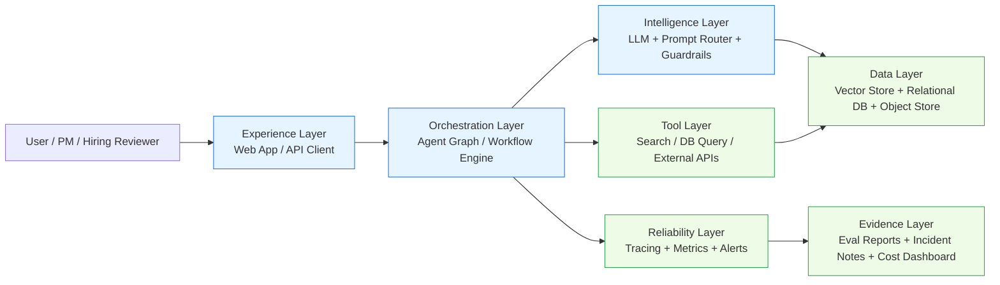

What this diagram must communicate in hiring context:
- Entry point and user interface boundary.
- Control brain (orchestration) vs reasoning brain (model layer).
- Tooling and storage as separate concerns.
- Reliability and evaluation as first-class, not afterthoughts.

---

### 3. Real-World Industry Scenarios [Intermediate]

#### Scenario A: Startup AI Copilot (seed-stage)

Product context:
- Team of 4 engineers shipping a customer support copilot.
- Need hiring-ready story for first senior platform hire.

Constraints and why they matter:
- Latency target: p95 < 3s, because agent assist must be near-realtime during live chat.
- Cost cap: fixed monthly inference budget; diagram must show budget control points (model router, cache, retrieval limits).
- Reliability: no dedicated SRE; simple but clear fallback paths are critical.
- Privacy: customer PII from tickets; diagram must show redaction and access boundaries.

What good looks like:
- Reviewer can point to where latency can be tuned.
- Reviewer can identify blast radius if the vector store is down.
- Diagram shows one concrete guardrail (PII redaction before model call).

#### Scenario B: Enterprise GenAI Platform (regulated domain)

Product context:
- Internal knowledge assistant for healthcare operations.
- Multi-team architecture review with security and compliance stakeholders.

Constraints and why they matter:
- Reliability: strict uptime expectations for business workflows.
- Security/privacy: PHI handling and auditability are non-negotiable.
- Failure modes: retrieval poisoning, stale indexes, authorization drift.
- Cost: large request volume makes architecture inefficiency expensive fast.

What good looks like:
- Diagram has trust boundaries and data classification zones.
- Reviewer can trace identity and authorization checks across layers.
- Diagram includes evaluation and incident feedback loop.

---

### 4. System View (Think Like a Systems Engineer) [Intermediate]

Inputs -> Transformations -> Outputs

- Inputs:
  - Business goal statement (what user value is delivered)
  - System components (API, orchestrator, model gateway, retriever, stores)
  - Non-functional requirements (latency, cost, privacy, reliability)
- Transformations:
  - Group components by layer.
  - Draw request and control flow separately from data flow.
  - Mark failure points and observability taps.
  - Annotate 2-3 important SLOs near relevant layers.
- Outputs:
  - One diagram for overview (layered view).
  - One diagram for runtime behavior (sequence view).
  - One short architecture note that maps decisions to constraints.

Observability signals to include in story:
- p95 latency per layer
- token and model cost per request
- retrieval hit rate / miss rate
- guardrail block rate
- fallback activation rate

Failure points and how they show up:
- Orchestrator misroutes requests -> high failure rate, inconsistent answers.
- Retrieval stale index -> answers look plausible but outdated.
- Guardrail false positives -> safe but unusable UX.
- Missing tracing correlation IDs -> impossible cross-service debugging.

---

### 5. System Design Flavor (Practical and Concise) [Intermediate]

Key components/interfaces:
- Client API: receives user request and metadata.
- Workflow/Agent Orchestrator: controls multi-step execution.
- Model Gateway: handles provider routing and retries.
- Retrieval Service: semantic + metadata filtering.
- Policy Service: safety checks and output validation.
- Observability Pipeline: logs, traces, metrics, evals.

Tradeoffs with plain-language guidance:
- Detail vs readability:
  - More boxes can show sophistication.
  - Too many boxes hide the story.
  - Choose readability for portfolio overview; reserve detail for appendix.
- Accuracy vs latency:
  - Deeper retrieval and multi-step tool use improve answer quality.
  - They also increase wait time.
  - Choose depth only where business impact justifies it.
- Safety strictness vs user completion:
  - Hard guardrails reduce risky output.
  - They can block valid user intents.
  - Use tiered policy (warn -> redact -> block) when possible.

Scaling consideration (10x growth):
- At 10x traffic, synchronous orchestration paths become bottlenecks.
- Diagram should evolve to show queue-based decoupling, caching layers, and async evaluation jobs.

---

### 6. Common Mistakes + Debugging [Intermediate]

Mistake 1:
- Symptom: interviewer says, "I cannot tell what is core vs supporting services."
- Likely cause: no layer separation; everything on one plane.
- First debugging step: redraw with 5 fixed lanes: Experience, Orchestration, Intelligence, Data, Reliability.

Mistake 2:
- Symptom: architecture looks clean but follow-up questions expose missing failure handling.
- Likely cause: only happy path drawn.
- First debugging step: mark 3 explicit failure nodes and one fallback for each.

Mistake 3:
- Symptom: recruiter sees complexity but no business signal.
- Likely cause: diagram has components but no measurable outcome annotations.
- First debugging step: add 2 outcome labels directly on diagram (example: p95 2.8s, cost $0.03/request).

---

### 7. Hands-On Lab (Concept -> Build -> Break -> Measure -> Explain) [Pro]

Goal:
- Create one architecture asset pack for a GenAI project that a hiring manager can understand in 2 minutes.

Build:
1. Choose one project (RAG assistant, voice agent, or multimodal workflow).
2. Draw one layered overview diagram with exactly 5 lanes.
3. Add 6-10 components only.
4. Annotate 3 constraints: latency, cost, privacy.
5. Add one evidence strip: eval score, incident metric, and user outcome.

Break:
1. Remove the reliability layer and re-review.
2. Overload diagram to 20+ components and re-review.
3. Hide all constraints and re-review.

Measure:
- Track three signals with 3 reviewers:
  - Time to explain complete flow (seconds)
  - Correctly identified failure points (count)
  - Confidence score (1-5): "Would you trust this engineer with production ownership?"

Explain:
- Why it broke:
  - No reliability layer removes operational credibility.
  - Too many components destroys cognitive scan speed.
  - No constraints disconnects architecture from business reality.
- Fix:
  - Layer clarity + annotated constraints + reliability evidence restores hiring signal density.

---

### 8. Active Recall (Spaced Repetition)

Questions:
1. What are the five fixed lanes that improve architecture readability in hiring reviews?
2. Why does a happy-path-only diagram weaken your hiring signal?
3. Which two metrics should you annotate to connect architecture to business impact?
4. If p95 latency is bad but quality is high, which architectural area do you inspect first?

Answer key:
1. Experience, Orchestration, Intelligence, Data, Reliability.
2. It hides failure thinking; reviewers cannot evaluate production readiness.
3. Any two from latency, cost per request, success rate, fallback rate, eval quality.
4. Orchestration and retrieval/tool path depth because multi-hop execution usually drives latency.

---

### 9. Practice

Mini-exercise:
- Take one existing project and write a one-sentence architecture narrative:
  - "For [user], the system uses [orchestration pattern] over [model + tools], stores [data], and stays reliable via [observability + fallback]."

Suggested answer outline:
- Include user, control pattern, intelligence path, data strategy, and reliability mechanism in one sentence.

Capstone-style question:
- Design a portfolio architecture asset pack for a regulated enterprise assistant where interviewers from platform, security, and product all need different evidence from the same artifact set.

Suggested answer outline:
1. Shared top-level layered diagram for all audiences.
2. Security overlay with trust boundaries, auth flow, and data classes.
3. Product overlay with latency/cost/quality outcomes.
4. Platform overlay with tracing, deployment topology, and failure playbooks.
5. A one-page decision log mapping constraints -> architecture choices -> measured outcomes.

---

### 10. Production Reality Check (Mandatory Ending)

If this fails in prod, what is the first thing we inspect?

- First inspect distributed traces for one failed request across orchestrator -> retrieval -> model gateway.
- Why: most architecture-story mismatches in prod come from control-flow drift (wrong route, missing context, or retry storms), and traces reveal that path fastest.

---

### 11. Curiosity Bridge (Mandatory Ending)

This works well when reviewers only need to understand system structure, but it breaks when they ask, "What exact engineering decisions did you personally make?"

That leads to the next layer of hiring signal design: decision logs, tradeoff narratives, and evidence-backed ownership stories.

---

### 12. Exit Check + Carry-Forward Review

Exit Check:
- You are done when you can present one architecture diagram in under 120 seconds and answer one failure-mode question plus one tradeoff question without changing your diagram.

Carry-Forward Review (interleaved):
- Q: From earlier modules, which retrieval metric is most useful to annotate on a RAG architecture diagram?
- A: retrieval hit rate (or recall@k) because it connects retrieval quality to answer reliability.
- Q: Which guardrail placement catches risky output latest but with maximum context?
- A: post-generation policy validation, since it sees full candidate output before user delivery.

---

## Subtopic 22.1.b: README Structure For GenAI Projects

### ✅ Add to Knowledge Base

### Reading Path + Level Tags

- **Beginner:** Read sections 0-2 and section 8 (Active Recall).
- **Intermediate:** Add sections 3-6 and section 9 (Practice).
- **Pro:** Complete section 7 (Hands-On Lab) and section 12 (Exit Check + Carry-Forward Review).

---

### 0. Pre-Question Hook [Beginner]

Pause: if a hiring manager opens your repo and reads only the first screen of your README, can they answer three questions immediately?

1. What does this system do?
2. Why is it technically non-trivial?
3. Is this engineer production-minded?

If the answer is no, your code may still be good but your hiring signal is weak.

---

### 1. The Intuition (Plain English) [Beginner]

A GenAI README is not documentation only. It is a decision narrative plus operational evidence, compressed for busy reviewers.

Think of it as the repo's landing page for trust. Strong READMEs reduce reviewer uncertainty quickly: they show purpose, architecture, constraints, results, and known limits.

Analogy: a product one-pager for an internal launch. A one-pager that has only feature claims but no metrics does not earn trust. Same with README claims without evals, latency, cost, and failure handling.

Where the analogy breaks: product one-pagers can stay high-level. Hiring READMEs must include runnable details and technical ownership proof.

**README Signal Surface:** the set of sections reviewers scan first to evaluate engineering maturity (problem, architecture, run steps, evals, constraints, risks).

**Evidence-Backed Claim:** a statement in README that includes measurable proof (benchmark, trace, eval score, failure report) rather than generic assertions.

**Reviewer Scan Path:** the likely reading order under time pressure, usually top summary -> quickstart -> architecture -> results -> limitations.

---

### 2. Visual Diagram (Mermaid) [Beginner]

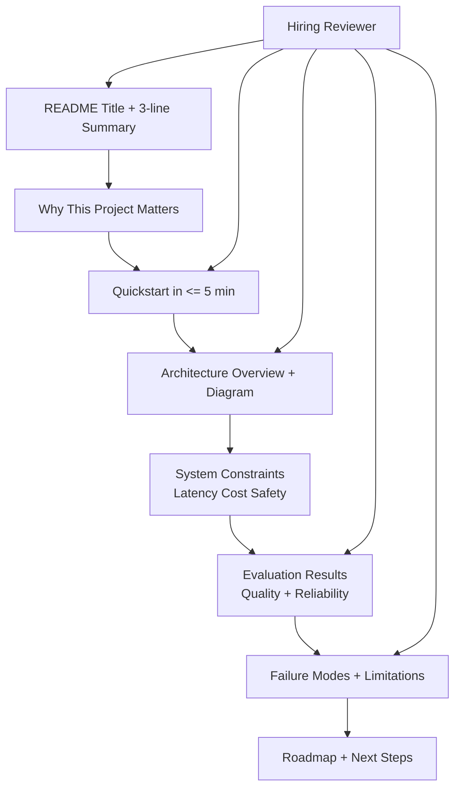

What this diagram communicates:
- The README should match reviewer scan behavior, not author writing order.
- Quickstart and architecture are early because they signal implementation depth.
- Results and limitations together signal honesty and production maturity.

---

### 3. Real-World Industry Scenarios [Intermediate]

#### Scenario A: Applied AI Engineer Portfolio Review

Product/use case context:
- Candidate submits 3 GenAI repos for an interview loop.
- Recruiter and hiring manager each spend ~5-8 minutes per repo in first pass.

Constraints and practical impact:
- Time constraint: reviewers cannot read source deeply first. README must front-load intent and evidence.
- Reliability signal: claims like "production ready" without failure notes are seen as junior overconfidence.
- Cost signal: no cost notes implies poor ownership of inference economics.
- Security/privacy signal: no data handling section is a red flag for enterprise roles.

What good looks like:
- First screen states problem, users, and measurable impact.
- Quickstart works in one command path.
- Architecture diagram aligns with actual folders/services.
- Evaluation section includes dataset or scenario scope and metric definitions.

#### Scenario B: Internal Team Handoff For A GenAI Prototype

Product/use case context:
- A prototype transitions from one engineer to platform team.
- README becomes the handoff contract.

Constraints and practical impact:
- Latency/cost targets are needed so platform can size infra.
- Failure modes are needed so on-call can triage correctly.
- Model/provider assumptions must be explicit to avoid environment drift.

What good looks like:
- README includes SLO assumptions and fallback behavior.
- Dependencies and model versions are pinned.
- Known limitations block prevents misuse expectations.

---

### 4. System View (Think Like a Systems Engineer) [Intermediate]

Inputs -> Transformations -> Outputs

- Inputs:
  - Codebase reality (what actually runs)
  - Metrics/evaluation artifacts (what actually performs)
  - Operational assumptions (latency, cost, privacy, scale)
- Transformations:
  - Compress into reviewer-first sections.
  - Convert implicit engineering choices into explicit tradeoffs.
  - Map each high-level claim to at least one measurable artifact.
- Outputs:
  - README that is both runnable and interview-defensible.

Observability for README quality (meta but useful):
- Time-to-first-understanding (seconds for reviewer to explain project back)
- Quickstart success rate across clean environments
- Question repetition rate in interview (high repetition implies unclear README)

Failure points and symptoms:
- Mismatch between README architecture and code -> trust loss during interview follow-ups.
- Quickstart drift -> reviewers cannot run demo quickly.
- Missing limitations section -> reviewers assume the author lacks failure awareness.

---

### 5. System Design Flavor (Practical and Concise) [Intermediate]

Recommended README component interfaces:
- Problem and users
- Demo and quickstart
- Architecture and request flow
- Data and prompt strategy
- Evaluation and metrics
- Reliability, safety, and limitations
- Roadmap and ownership notes

Key tradeoffs with plain-language guidance:
- Short README vs complete README:
  - Short is skimmable but can feel shallow.
  - Complete is credible but can feel heavy.
  - Use progressive disclosure: concise summary + expandable detail sections.
- Marketing tone vs engineering tone:
  - Marketing tone attracts interest.
  - Engineering tone builds trust.
  - Blend both: clear value statement, then hard evidence.
- Generic template vs project-specific narrative:
  - Templates save time.
  - Custom narrative distinguishes your ownership.
  - Keep structure standard but fill with project-specific decisions and numbers.

Scaling consideration (10x traffic/data):
- README should state what changes at 10x (queueing, batching, caching, model routing, eval automation).
- This single section strongly differentiates senior thinking.

---

### 6. Common Mistakes + Debugging [Intermediate]

Mistake 1:
- Symptom: reviewer asks, "What problem does this solve exactly?"
- Likely cause: README starts with stack details before user/problem framing.
- First debugging step: rewrite top section into 3 lines: user, problem, measurable outcome.

Mistake 2:
- Symptom: interview spends time on setup issues, not architecture discussion.
- Likely cause: quickstart missing prerequisites, env vars, or sample command.
- First debugging step: run README quickstart from a clean environment and log each friction point.

Mistake 3:
- Symptom: reviewer doubts production readiness.
- Likely cause: no explicit limitations/failure modes section.
- First debugging step: add a "Known Limits" table with trigger condition, observed behavior, and mitigation.

---

### 7. Hands-On Lab (Concept -> Build -> Break -> Measure -> Explain) [Pro]

Goal:
- Build a hiring-grade README for one GenAI project in under 60 minutes.

Build:
1. Create a top summary block (problem, user, outcome) in <= 6 lines.
2. Add quickstart with one happy path and one local fallback path.
3. Insert one architecture diagram and one request-flow sequence.
4. Add eval table with at least 3 metrics (quality, latency, cost).
5. Add "Known Limits" and "Safety/Privacy" sections.

Break:
1. Remove metrics and ask a peer to assess readiness.
2. Remove quickstart and ask a peer to run project.
3. Remove limitations and ask a peer for risk assessment.

Measure:
- Measure with 2-3 reviewers:
  - Time to understand purpose (seconds)
  - Time to run first demo (minutes)
  - Number of unanswered critical questions after README read

Explain:
- Why it broke:
  - Without metrics, claims are ungrounded.
  - Without quickstart, credibility drops because execution proof is missing.
  - Without limitations, maturity signal weakens.
- Preventive guardrail:
  - Every major claim should have a measurable companion artifact.

---

### 8. Active Recall (Spaced Repetition)

Questions:
1. What are the first four sections a hiring reviewer usually scans in a GenAI README?
2. Why is a limitations section a positive signal rather than a weakness?
3. Which three metrics best ground a GenAI project claim?
4. What is the fastest way to debug README clarity?

Answer key:
1. Summary, quickstart, architecture, results/evals.
2. It demonstrates production realism and failure awareness.
3. Quality metric, latency metric, and cost metric.
4. Run a timed peer scan-and-run test from a clean environment.

---

### 9. Practice

Mini-exercise:
- Write a 5-line README opener for your best GenAI project including user, problem, approach, and one measurable result.

Suggested answer outline:
- Line 1: project one-liner.
- Line 2: target user and pain.
- Line 3: system approach (agent/RAG/workflow).
- Line 4: measurable result.
- Line 5: one known limitation.

Capstone-style question:
- You have one week before interviews. You can improve either model quality by 8% or README evidence clarity by 40%. Which should you prioritize for hiring signal and why?

Suggested answer outline:
1. Prioritize README evidence clarity if quality is already acceptable and under-documented.
2. Hiring loops reward visible, defensible engineering judgment.
3. Quality gains matter more when they unlock a clearly better user outcome and are measurable.

---

### 10. Production Reality Check (Mandatory Ending)

If this fails in prod, what is the first thing we inspect?

- First inspect whether README operational assumptions match deployed reality (model version, env vars, rate limits, fallback behavior).
- Why: many GenAI incidents during handoff come from assumption drift, and README-deployment mismatch is the fastest root cause to confirm.

---

### 11. Curiosity Bridge (Mandatory Ending)

This structure works well for showing system scope, but it still does not prove your individual ownership depth under tough interview probing.

That naturally leads to the next packaging skill: decision logs and impact narratives that show what you chose, what you rejected, and why.

---

### 12. Exit Check + Carry-Forward Review

Exit Check:
- You are done when a new reviewer can understand your project in under 2 minutes and run a demo in under 10 minutes using only the README.

Carry-Forward Review (interleaved):
- Q: From 22.1.a, what lane should always appear even in a compact architecture diagram?
- A: Reliability lane, because it signals production ownership.
- Q: Which artifact best converts architecture claim into trust quickly?
- A: An evaluation/results section tied to concrete metrics and conditions.

---

## Subtopic 22.1.c: Demo Script Design And Narrative Discipline

### ✅ Add to Knowledge Base

### Reading Path + Level Tags

- **Beginner:** Read sections 0-2 and section 8 (Active Recall).
- **Intermediate:** Add sections 3-6 and section 9 (Practice).
- **Pro:** Complete section 7 (Hands-On Lab) and section 12 (Exit Check + Carry-Forward Review).

---

### 0. Pre-Question Hook [Beginner]

Pause: if your live demo fails halfway through, can you still leave the interviewer convinced that you have strong systems judgment?

If your answer depends on the UI behaving perfectly, your demo design is fragile.

---

### 1. The Intuition (Plain English) [Beginner]

A strong demo script is not a performance script. It is an engineering narrative with controlled evidence checkpoints.

Interview demos fail for two reasons: technical instability and story instability. You cannot eliminate all technical risk, but you can eliminate story drift with disciplined narrative structure.

Analogy: airline pre-flight checklist. Pilots do not rely on memory under pressure; they follow sequence and gates. Your demo script is the same: fixed scenes, success criteria, and fallback branches.

Where the analogy breaks: pilots execute standardized systems; your demo faces adversarial questions and unpredictable interviewer paths. So your script must include adaptive branching, not only a linear checklist.

**Demo Narrative Arc:** a planned progression from problem -> architecture -> evidence -> risk handling -> impact, optimized for interviewer cognition.

**Evidence Checkpoint:** a moment in the demo where you prove a claim with a visible artifact (metric, trace, output diff, failure recovery).

**Narrative Discipline:** the ability to keep explanation tied to objective and constraints, even during interruptions or partial system failure.

---

### 2. Visual Diagram (Mermaid) [Beginner]

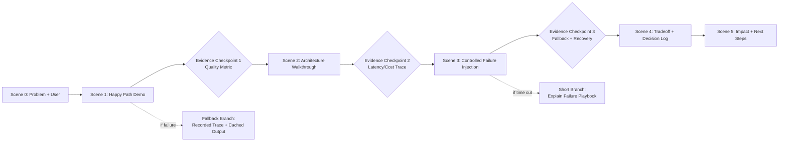

What this demonstrates:
- Demo flow should be scene-based, not ad hoc.
- Every major claim needs at least one visible checkpoint.
- Fallback branches protect hiring signal when runtime surprises happen.

---

### 3. Real-World Industry Scenarios [Intermediate]

#### Scenario A: 45-minute Senior AI Engineer Interview Loop

Product/use case context:
- Candidate gets 12-15 minutes for project demo within a broader technical round.
- Interviewer wants evidence of ownership, not only output quality.

Constraints and practical effects:
- Time budget is hard; overlong context-setting kills technical depth.
- Reliability risk: live APIs, model quotas, and network instability can break flow.
- Signal objective: show engineering judgment under constraints.

What good looks like:
- Candidate completes five scenes in <= 12 minutes.
- At least two metrics are shown with interpretation, not just numbers.
- One failure path is discussed or demonstrated with mitigation.

#### Scenario B: Internal Design Review Demo To Stakeholders

Product/use case context:
- Team presents GenAI feature to product, platform, and security in one session.

Constraints and practical effects:
- Different stakeholders value different evidence (UX, reliability, compliance).
- Narrative can fragment if presenter switches layers randomly.
- Safety/privacy concerns can derail the session if not addressed early.

What good looks like:
- Presenter uses scene transitions with explicit intent ("Now reliability evidence").
- Security controls and data boundaries are shown before Q/A.
- Tradeoff decisions are tied to business targets.

---

### 4. System View (Think Like a Systems Engineer) [Intermediate]

Inputs -> Transformations -> Outputs

- Inputs:
  - Working demo environment
  - Scripted scene list with timing budget
  - Supporting artifacts (metrics dashboard, trace screenshots, fallback outputs)
- Transformations:
  - Convert feature tour into claim-evidence sequence.
  - Insert explicit branch points for likely failure or interruption.
  - Tie each scene to one system concern (quality, latency, safety, resilience).
- Outputs:
  - Rehearsable demo runbook.
  - Repeatable narrative that stays strong even with runtime issues.

Observability signals for demo quality:
- Scene duration variance across rehearsals
- Number of filler transitions (high count implies weak narrative control)
- Interviewer clarification count per scene
- Failure recovery time during injected break tests

Failure points and symptoms:
- Scene sprawl -> presenter runs out of time before architecture and tradeoffs.
- Claim without evidence -> interviewer skepticism rises.
- No fallback branch -> one runtime error collapses the whole narrative.

---

### 5. System Design Flavor (Practical and Concise) [Intermediate]

Core components of a disciplined demo script:
- Scene card (objective, expected output, max time)
- Evidence card (metric/trace/screenshot tied to claim)
- Branch card (if X fails, show Y artifact)
- Closing card (tradeoff + next step)

Important tradeoffs with plain-language guidance:
- Live depth vs reliability:
  - Fully live demos feel authentic.
  - They are fragile under interview constraints.
  - Use hybrid mode: live core path + pre-captured fallback evidence.
- Breadth vs depth:
  - Covering many features feels impressive.
  - But shallow explanation weakens ownership signal.
  - Prioritize fewer scenes with deeper system reasoning.
- Polish vs honesty:
  - Highly polished demos can look rehearsed but ungrounded.
  - Honest limitations increase trust.
  - Include one known limitation and mitigation by design.

Scaling consideration (10x complexity):
- As project complexity grows, split demo into primary path (executive) and deep-dive appendices (engineering).
- This prevents main narrative overload while keeping depth available on demand.

---

### 6. Common Mistakes + Debugging [Intermediate]

Mistake 1:
- Symptom: interviewer says, "Can you summarize what you proved so far?"
- Likely cause: demo path is feature-by-feature, not claim-by-claim.
- First debugging step: rewrite each scene title as "Claim + evidence" instead of "Feature name".

Mistake 2:
- Symptom: demo crashes and presenter loses structure.
- Likely cause: no fallback branch rehearsed.
- First debugging step: define one fallback artifact per critical scene (trace image, cached response, log excerpt) and rehearse switching.

Mistake 3:
- Symptom: strong output demo but weak hiring outcome.
- Likely cause: no tradeoff articulation or ownership boundaries.
- First debugging step: add a 90-second closing segment: "What I chose, what I rejected, and why."

---

### 7. Hands-On Lab (Concept -> Build -> Break -> Measure -> Explain) [Pro]

Goal:
- Build a 12-minute demo runbook that survives one intentional runtime failure without losing hiring signal.

Build:
1. Define 5 scenes, each with objective and 90-150 second budget.
2. Attach one evidence checkpoint to each major claim.
3. Prepare fallback artifacts for 2 critical scenes.
4. Add a timed script with transition lines between scenes.

Break:
1. Disable one dependency (retrieval service or API key) mid-rehearsal.
2. Interrupt yourself with two unscripted interviewer questions.
3. Cut total demo time by 30% and rehearse compressed path.

Measure:
- Track across 3 rehearsals:
  - Completion rate within time budget
  - Number of claims demonstrated with evidence
  - Recovery time after injected failure

Explain:
- Why it broke:
  - Sequence without branch logic is brittle.
  - Unbounded scene times create narrative starvation at the end.
- Guardrail that prevents recurrence:
  - Time-boxed scenes + branch cards + evidence checkpoints stabilize the narrative under pressure.

---

### 8. Active Recall (Spaced Repetition)

Questions:
1. What is the minimum narrative arc for a hiring demo?
2. Why does every major claim require an evidence checkpoint?
3. What is the most practical fallback strategy for live-demo fragility?
4. How do you keep depth without overrunning time?

Answer key:
1. Problem -> solution path -> evidence -> failure handling -> impact/tradeoffs.
2. Claims without proof are interpreted as confidence without rigor.
3. Hybrid approach: live primary flow plus pre-captured proof artifacts.
4. Use scene time-boxes and maintain an explicit compressed branch.

---

### 9. Practice

Mini-exercise:
- Draft three scene cards for your project demo with objective, evidence, and fallback.

Suggested answer outline:
- Scene 1: user pain + baseline.
- Scene 2: system behavior + metric checkpoint.
- Scene 3: failure injection + recovery explanation.

Capstone-style question:
- You are asked to demo to a mixed panel (product, infra, security) in 10 minutes. Design a narrative that keeps all stakeholders engaged without losing technical rigor.

Suggested answer outline:
1. Start with one user-impact claim.
2. Show one architecture map with layer callouts per stakeholder concern.
3. Present one metric per concern (quality, latency/cost, safety).
4. Include one failure-and-recovery moment.
5. Close with decisions and next-risk mitigation.

---

### 10. Production Reality Check (Mandatory Ending)

If this fails in prod, what is the first thing we inspect?

- First inspect recent traces and logs for divergence between scripted happy path and actual runtime path used during the demoed workflow.
- Why: narrative confidence often masks control-flow drift, and the fastest validation is path-level trace comparison.

---

### 11. Curiosity Bridge (Mandatory Ending)

This gives you demo control, but interviewers still need evidence of long-term ownership beyond a single presentation window.

That leads directly to portfolio evidence systems: decision journals, postmortem snippets, and artifact timelines that prove sustained engineering judgment.

---

### 12. Exit Check + Carry-Forward Review

Exit Check:
- You are done when you can run a 12-minute demo, absorb one injected failure, and still complete your claim-evidence arc with clear tradeoff narration.

Carry-Forward Review (interleaved):
- Q: From 22.1.b, what is the first README section most reviewers use to calibrate relevance?
- A: The top summary block with user, problem, and measurable outcome.
- Q: From 22.1.a, what single omission most often weakens architecture credibility?
- A: Missing reliability layer and failure handling path.

---

## Subtopic 22.1.d: What To Show First To Recruiters, Hiring Managers, And Engineers

### ✅ Add to Knowledge Base

### Reading Path + Level Tags

- **Beginner:** Read sections 0-2 and section 8 (Active Recall).
- **Intermediate:** Add sections 3-6 and section 9 (Practice).
- **Pro:** Complete section 7 (Hands-On Lab) and section 12 (Exit Check + Carry-Forward Review).

---

### 0. Pre-Question Hook [Beginner]

Pause: if you had only 90 seconds to present your project, what would you show first to each of these three audiences?

- Recruiter
- Hiring manager
- Engineer interviewer

If your answer is the same for all three, you are likely losing hiring signal.

---

### 1. The Intuition (Plain English) [Beginner]

Different reviewers do not evaluate the same thing first. They run different risk filters.

- Recruiters filter for relevance and credibility quickly.
- Hiring managers filter for ownership, outcomes, and team fit.
- Engineers filter for depth, tradeoffs, and failure handling.

Your portfolio is strongest when you front-load the evidence each audience needs most, then progressively reveal deeper layers.

Analogy: triage in an emergency room. Different specialists check different vital signs first, but all decide from the same patient data. Your project artifacts are the patient data; audience-specific sequencing is the triage protocol.

Where the analogy breaks: interview loops are not standardized medical protocols. Different companies and interviewers vary, so your sequence must be adaptable while preserving a stable evidence core.

**Audience-First Sequencing:** ordering project artifacts based on evaluator role so first impressions maximize relevant trust signals.

**Trust Trigger:** the specific piece of evidence that quickly increases confidence for a given audience.

**Evidence Ladder:** a progressive reveal from high-level relevance to technical depth, designed to handle time cuts gracefully.

---

### 2. Visual Diagram (Mermaid) [Beginner]

```mermaid
flowchart TD
    P[Single Project Artifact Set] --> R[Recruiter View\nRole Fit + Proof of Completion]
    P --> H[Hiring Manager View\nOwnership + Outcomes + Tradeoffs]
    P --> E[Engineer View\nArchitecture + Failure Modes + Metrics]

    R --> R1[Show First:\n1) Problem/Domain\n2) Demo Link\n3) Clear Outcomes]
    H --> H1[Show First:\n1) Business Impact\n2) Decisions You Made\n3) Reliability/Safety Notes]
    E --> E1[Show First:\n1) Architecture Diagram\n2) Eval + Latency/Cost\n3) Failure Recovery Path]

    R1 --> X[Shared Deep Evidence\nREADME + Demo Script + Decision Log + Metrics]
    H1 --> X
    E1 --> X
```

What this diagram clarifies:
- You should not create three different projects.
- You should create one evidence base and three entry sequences.
- The first 60-90 seconds should be audience-adapted; deeper evidence can stay shared.

---

### 3. Real-World Industry Scenarios [Intermediate]

#### Scenario A: Recruiter screen before technical loop

Product/use case context:
- Recruiter screens 40+ profiles and spends limited time per repository.
- Goal is not deep architecture validation; goal is role-fit confidence and conversation handoff.

Constraints and practical effect:
- Time pressure is extreme; they may only read summary, outcome lines, and one demo artifact.
- Technical noise early can reduce clarity and perceived relevance.
- Missing proof of completion (no demo, no run instructions, no results) creates risk of project inflation.

What good looks like:
- Show first: role relevance statement, one-line project impact, clickable demo/run evidence.
- Recruiter can map project to job requirements quickly.

#### Scenario B: Hiring manager project deep-dive

Product/use case context:
- Hiring manager evaluates whether you can own ambiguous GenAI initiatives end-to-end.

Constraints and practical effect:
- They care about outcomes, decisions, prioritization, and delivery under constraints.
- If you start with low-level code details, they may miss leadership and ownership signals.

What good looks like:
- Show first: problem framing, decision tradeoffs, measurable outcomes, and one failure lesson.
- Manager should understand what you personally drove vs team context.

#### Scenario C: Engineer-to-engineer interview segment

Product/use case context:
- Engineers evaluate implementation quality, debugging maturity, and systems thinking.

Constraints and practical effect:
- Superficial storytelling without metrics and failure paths fails quickly.
- Strong architecture without observability evidence can still look fragile.

What good looks like:
- Show first: architecture layers, runtime flow, latency/cost metrics, known failure modes and mitigations.
- Engineer can ask deeper questions and receive concrete answers with artifacts.

---

### 4. System View (Think Like a Systems Engineer) [Intermediate]

Inputs -> Transformations -> Outputs

- Inputs:
  - Core artifact set (README, diagrams, demo script, metrics, decision notes)
  - Audience role (recruiter, hiring manager, engineer)
  - Time budget (90s, 5m, 15m)
- Transformations:
  - Map role -> highest-priority trust triggers.
  - Select first three artifacts/snippets for that role.
  - Prepare branch path if interviewer asks for depth early.
- Outputs:
  - Role-specific opening sequence that preserves one shared source of truth.

Observability for packaging quality:
- Conversion rate from recruiter screen to technical interview
- Interviewer follow-up quality (strategy vs basic clarification questions)
- Time-to-first-trust in mock interviews

Failure points and symptoms:
- Same opening for all audiences -> low engagement and mismatched depth.
- Over-rotation to technical detail with recruiters -> relevance signal drops.
- Over-rotation to high-level story with engineers -> depth signal drops.

---

### 5. System Design Flavor (Practical and Concise) [Intermediate]

Practical interface: First 90-second sequencing matrix

- Recruiter first:
  - Problem domain and user relevance
  - Outcome proof (metric or shipped result)
  - Demo/readme proof of completion
- Hiring manager first:
  - Decision you owned
  - Tradeoff under constraint (cost/latency/reliability)
  - Outcome and team/context impact
- Engineer first:
  - Architecture and flow diagram
  - Eval and operational metrics
  - Failure path and debugging approach

Important tradeoffs with plain-language guidance:
- Standardization vs personalization:
  - One script is easy to rehearse.
  - But role-personalized openings score better.
  - Keep a common core with role-specific first 90 seconds.
- Evidence depth vs speed:
  - Too much detail early can lose non-technical audiences.
  - Too little detail early can lose engineers.
  - Use staged depth: first trust trigger, then deeper evidence on demand.
- Confidence vs humility:
  - Confident framing is good.
  - Ignoring limits looks naive.
  - Always include one known limitation and mitigation.

Scaling consideration (many applications/interviews):
- Build reusable audience packets from one artifact source to avoid inconsistent narratives across companies.

---

### 6. Common Mistakes + Debugging [Intermediate]

Mistake 1:
- Symptom: recruiter says, "Interesting, but I am not sure how this maps to the role."
- Likely cause: opening focused on tooling stack, not role-relevant outcome.
- First debugging step: rewrite opening line as role-fit statement tied to one project outcome.

Mistake 2:
- Symptom: hiring manager asks repeatedly, "What did you personally own?"
- Likely cause: narrative describes system but not ownership boundaries.
- First debugging step: insert explicit ownership lines: decisions you made, alternatives rejected, impact delivered.

Mistake 3:
- Symptom: engineer interviewer moves on quickly with low confidence.
- Likely cause: claims are high-level without metrics or failure analysis.
- First debugging step: surface one metric table and one failure-recovery example in first technical minute.

---

### 7. Hands-On Lab (Concept -> Build -> Break -> Measure -> Explain) [Pro]

Goal:
- Build three audience-specific opening scripts (90 seconds each) from one shared project artifact set.

Build:
1. Create one core evidence sheet (problem, architecture, metrics, failures, outcomes).
2. Write three intros: recruiter, hiring manager, engineer.
3. For each intro, define three trust triggers and one branch-to-depth transition.

Break:
1. Intentionally swap intros (use recruiter intro for engineer, engineer intro for recruiter).
2. Remove ownership language from manager intro.
3. Remove metrics from engineer intro.

Measure:
- Run 3 mock reviews and score:
  - Clarity in first 90 seconds (1-5)
  - Perceived role fit (1-5)
  - Technical credibility (1-5)
  - Follow-up quality (basic vs deep questions)

Explain:
- Why it broke:
  - Wrong entry sequence mismatches audience risk filter.
  - Missing ownership and metrics weakens decision confidence.
- Guardrail:
  - Maintain a role sequencing matrix and rehearse transitions.

---

### 8. Active Recall (Spaced Repetition)

Questions:
1. What should recruiters usually see first in a project narrative?
2. What is the highest-signal first proof for hiring managers?
3. What are the first two things most engineers expect to validate?
4. Why use one shared evidence base instead of separate project stories?

Answer key:
1. Role relevance, clear outcome, and completion proof.
2. Ownership decisions tied to measurable impact under constraints.
3. Architecture flow and operational/eval metrics with failure handling.
4. It preserves consistency while allowing audience-specific entry points.

---

### 9. Practice

Mini-exercise:
- Take one project and write three first-90-second openers: recruiter, manager, engineer.

Suggested answer outline:
- Recruiter opener: role mapping + outcome.
- Manager opener: decision ownership + impact.
- Engineer opener: architecture + metrics + failure path.

Capstone-style question:
- You have a single portfolio page and a mixed 30-minute panel. How do you sequence artifacts so each audience gets its trust trigger without fragmenting the narrative?

Suggested answer outline:
1. Begin with shared problem-outcome anchor.
2. Rotate through three mini-segments mapped to each audience.
3. Use one architecture artifact as shared backbone.
4. Close with ownership decisions and production lessons.

---

### 10. Production Reality Check (Mandatory Ending)

If this fails in prod, what is the first thing we inspect?

- First inspect where audience expectation and delivered evidence diverged in the first 90 seconds (recorded mock or interview notes).
- Why: early trust failure compounds through the rest of the discussion, and fixing opening-sequence mismatch gives the fastest improvement.

---

### 11. Curiosity Bridge (Mandatory Ending)

Audience-first sequencing gives you better first impressions, but sustained hiring signal still depends on proving repeatable engineering judgment over time.

That opens the next packaging layer: artifact timelines and learning loops that show how your system and decisions evolved across iterations.

---

### 12. Exit Check + Carry-Forward Review

Exit Check:
- You are done when you can deliver three role-specific 90-second intros from one project and receive role-appropriate deep questions in mock interviews.

Carry-Forward Review (interleaved):
- Q: From 22.1.c, what protects demo quality under runtime instability?
- A: Evidence checkpoints with rehearsed fallback branches.
- Q: From 22.1.b, what README section most reduces initial reviewer uncertainty?
- A: A top summary with user, problem, and measurable outcome.

---

## Topic 22.2: Failure Analysis And Tradeoff Documents

> **Topic time:** 5h
> Focus: Turning failures, incidents, and design compromises into concise, credible evidence of engineering judgment and growth.

---

## Subtopic 22.2.a: Failure Analysis Writeups And Postmortem-Lite Documents

### ✅ Add to Knowledge Base

### Reading Path + Level Tags

- **Beginner:** Read sections 0-2 and section 8 (Active Recall).
- **Intermediate:** Add sections 3-6 and section 9 (Practice).
- **Pro:** Complete section 7 (Hands-On Lab) and section 12 (Exit Check + Carry-Forward Review).

---

### 0. Pre-Question Hook [Beginner]

Pause: when your GenAI system fails, do you only fix it, or can you clearly explain what happened, why it happened, what tradeoff was involved, and how you prevented recurrence?

Hiring signal comes from the explanation quality, not only from the fix.

---

### 1. The Intuition (Plain English) [Beginner]

Postmortem-lite documents are compact engineering narratives that convert a failure into evidence of judgment.

A strong writeup does four things:
1. Reconstructs the event clearly.
2. Separates symptom from root cause.
3. Explains the tradeoff that made the failure likely.
4. Shows measurable prevention steps.

Analogy: flight incident briefings. The point is not blame; the point is safer future operation through precise causal understanding and procedure updates.

Where the analogy breaks: software systems evolve faster than aviation procedures, and GenAI behaviors include model nondeterminism. So your writeup must include uncertainty boundaries and monitoring strategy, not only deterministic fixes.

**Postmortem-Lite:** a concise incident analysis document that captures timeline, impact, root cause, tradeoffs, and follow-up actions without heavyweight process overhead.

**Causal Chain:** ordered sequence from trigger condition -> system behavior -> user-visible impact.

**Tradeoff Debt:** latent risk created by an earlier speed/cost/scope decision that later amplifies incident probability.

---

### 2. Visual Diagram (Mermaid) [Beginner]

```mermaid
flowchart LR
    T0[Trigger\nConfig change / model swap / traffic spike] --> S1[Symptom\nLatency spike / wrong answers / failure rate]
    S1 --> I1[Impact\nUser trust drop / SLA breach / cost overrun]
    I1 --> R1[Root Cause\nControl-flow bug / stale index / guardrail gap]
    R1 --> TD[Tradeoff Debt\nSpeed over safety / cost over observability]
    TD --> A1[Actions\nHotfix + long-term remediation]
    A1 --> V1[Verification\nMetric recovery + regression test + alert]
    V1 --> L1[Learning Artifact\nPostmortem-lite in portfolio]
```

What this shows:
- Good incident notes are causal, not narrative-only.
- Tradeoff context is a first-class part of root-cause quality.
- Verification must close the loop, otherwise action items are unproven.

---

### 3. Real-World Industry Scenarios [Intermediate]

#### Scenario A: RAG assistant returns outdated policy guidance

Product/use case context:
- Internal policy assistant used by operations team.
- Users report answers citing old policy versions after a doc refresh.

Constraints and practical effects:
- Reliability: outdated guidance creates operational risk quickly.
- Latency/cost: aggressive caching improved speed but increased staleness risk.
- Failure mode: retrieval pipeline failed to invalidate embeddings for changed documents.

What good looks like:
- Postmortem-lite explains cache invalidation gap as root cause, not "LLM hallucination".
- Tradeoff debt is explicit: latency optimization introduced freshness risk.
- Follow-up includes freshness SLO and staleness alerting.

#### Scenario B: Multi-agent orchestration causes retry storm

Product/use case context:
- Workflow agent calls search, ranking, and summarization services.
- Intermittent downstream timeout triggers retries in multiple layers.

Constraints and practical effects:
- Cost: token and API spend spikes dramatically.
- Reliability: p95 latency breaches and user abandonment rise.
- Observability gap: missing request correlation IDs delays diagnosis.

What good looks like:
- Writeup captures retry amplification chain and timeout mismatch.
- Action plan includes retry budget, jittered backoff, and idempotency keys.
- Verification proves stabilization via latency and cost dashboards.

---

### 4. System View (Think Like a Systems Engineer) [Intermediate]

Inputs -> Transformations -> Outputs

- Inputs:
  - Incident logs/traces, user reports, metrics snapshots
  - System change history (deploys, config, model version changes)
  - Business impact data (SLA breach minutes, failed requests, cost deltas)
- Transformations:
  - Build precise timeline with timestamps.
  - Map symptom to causal chain and isolate root cause.
  - Identify enabling tradeoff debt and missing guardrails.
  - Convert findings to prioritized remediation with owners and deadlines.
- Outputs:
  - Postmortem-lite doc that is concise, technical, and decision-useful.
  - Portfolio-ready failure analysis artifact showing ownership maturity.

Observability to include:
- Incident start/end timestamps
- Error rate, p95 latency, and cost deltas during incident window
- Alert trigger times and response times
- Recovery verification metrics after fix

Failure points in the writeup process:
- Blame-oriented language -> weak learning signal.
- No timeline precision -> ambiguous causality.
- No verification section -> remediation credibility gap.

---

### 5. System Design Flavor (Practical and Concise) [Intermediate]

Recommended postmortem-lite template sections:
- Incident summary (2-4 lines)
- User/business impact
- Timeline (UTC, minute-level where possible)
- Root cause and contributing factors
- Tradeoff analysis (what was optimized, what risk increased)
- Actions: immediate, short-term, long-term
- Verification and prevention checks
- Ownership and follow-up dates

Tradeoffs with plain-language guidance:
- Speed of publication vs completeness:
  - Fast writeups keep context fresh.
  - Incomplete writeups can mislead actions.
  - Publish initial version fast, then update with verified details.
- Technical depth vs readability:
  - Deep analysis helps engineers.
  - Too much detail reduces cross-functional utility.
  - Keep main doc concise and link deep technical appendix.
- Individual ownership vs team sensitivity:
  - Clear ownership is a strong hiring signal.
  - Blame language harms trust and learning culture.
  - Frame actions by responsibility areas, not personal fault.

Scaling consideration (10x systems/teams):
- Standardize a lightweight schema for incident docs and tag by component, failure mode, and remediation class for retrieval and pattern mining.

---

### 6. Common Mistakes + Debugging [Intermediate]

Mistake 1:
- Symptom: writeup says "LLM hallucinated" as root cause.
- Likely cause: symptom labeling instead of system causality analysis.
- First debugging step: ask "What upstream condition made this likely?" and trace retrieval, prompt, model version, and guardrail path.

Mistake 2:
- Symptom: strong action list but repeat incidents continue.
- Likely cause: actions are tasks without measurable verification criteria.
- First debugging step: attach one success metric and one monitoring check to each remediation item.

Mistake 3:
- Symptom: interviewer doubts ownership depth from postmortem artifact.
- Likely cause: writeup lacks tradeoff reasoning and decision context.
- First debugging step: add a short "decision context" block: constraints, options considered, chosen path, and known risk accepted.

---

### 7. Hands-On Lab (Concept -> Build -> Break -> Measure -> Explain) [Pro]

Goal:
- Produce one postmortem-lite document that demonstrates causal analysis and tradeoff maturity in under 2 pages.

Build:
1. Choose one real project incident or plausible simulated failure.
2. Draft timeline with at least 6 timestamped events.
3. Write root cause plus 2 contributing factors.
4. Add tradeoff debt section and remediation plan with owners.
5. Define verification metrics and alert thresholds.

**Reference Artifact — filled postmortem-lite example:**

**Weak version (symptom labeling — avoid):**
> Root cause: LLM started giving outdated answers after document refresh.
> Action: We updated the pipeline.
> Verification: Tested and it seems better now.

*Why this is weak:* Names the symptom, not the causal mechanism. No timeline, no tradeoff debt, no measurable verification. Any senior reviewer can immediately see it was written retrospectively without rigour.

---

**Strong version (causal chain — target):**

> **Incident:** 2024-10-14 09:42 UTC — Policy assistant returning 2023 policy text for 18% of compliance queries. Flagged by 3 support agents within 22 minutes of policy document refresh deployment.
>
> **Root cause:** Embedding cache TTL was set to 7 days. Post-refresh invalidation job had a silent config bug that skipped documents in the "policy" document class. Model retrieved stale embeddings with high cosine similarity scores, producing answers that looked high-confidence but cited expired guidance.
>
> **Contributing factor 1:** Dense-only retrieval relies entirely on embedding freshness. No freshness validator existed in the pipeline to detect stale hits.
>
> **Contributing factor 2 — Tradeoff Debt:** The 7-day TTL was introduced in Sprint 21 explicitly to hit p95 <1.8s by reducing embedding recompute overhead. That performance optimization accepted a freshness risk that was never instrumented with an alert.
>
> **Timeline:**
> - 09:31 UTC — Policy doc refresh job initiated (automatic, scheduled).
> - 09:42 UTC — First agent reports wrong compliance answer.
> - 09:50 UTC — Three additional reports; on-call engineer paged.
> - 09:58 UTC — Root cause confirmed via cache logs (stale embeddings for "policy" class).
> - 10:08 UTC — Forced full cache invalidation for "policy" class deployed (+26 min from incident start).
> - 10:15 UTC — Staleness rate returns to <0.5%.
>
> **Remediation:**
> - Short-term (Owner: Platform Eng; Due: Same day): Force cache invalidation on any regulated document class immediately after refresh job completes.
> - Long-term (Owner: Eval team; Due: 2 weeks): Add freshness SLO alert — fire if cache hit rate for recently-modified docs exceeds 40% within 10 minutes of any refresh event.
>
> **Verification:** Freshness alert deployed 2024-10-16. Tested with synthetic doc refresh; alert fires within 8 minutes. Staleness metric monitored on daily dashboard.

*Why this is strong:* Timeline anchors causality precisely. Tradeoff debt explains **why** the vulnerability existed, showing design maturity not blame. Each remediation has a named owner and measurable done-signal. A reviewer can verify prevention was real, not aspirational.

---

Break:
1. Remove timeline precision and re-read for causal clarity.
2. Replace root cause with generic language ("system issue") and re-evaluate.
3. Remove verification criteria and ask whether prevention is provable.

Measure:
- Evaluate with 2-3 reviewers:
  - Root-cause clarity score (1-5)
  - Actionability score (1-5)
  - Credibility as hiring evidence (1-5)
  - Time to understand incident (minutes)

Explain:
- Why it broke:
  - Ambiguous timelines and generic causes hide real mechanisms.
  - Unmeasured action items cannot prove recurrence prevention.
- Guardrail:
  - Use fixed template with mandatory timeline, tradeoff, and verification fields.

---

### 8. Active Recall (Spaced Repetition)

Questions:
1. What is the difference between symptom and root cause in GenAI incident analysis?
2. Why should tradeoff debt be documented in postmortem-lite artifacts?
3. What three elements make remediation credible?
4. Why is a timeline mandatory even in short writeups?

Answer key:
1. Symptom is observed failure; root cause is the causal system mechanism that produced it.
2. It explains why failure risk existed and shows decision maturity.
3. Clear owner, due date, and measurable verification signal.
4. It anchors causality and prevents speculative or blame-driven narratives.

---

### 9. Practice

Mini-exercise:
- Write a 6-line incident summary with impact, root cause, tradeoff debt, and one measurable prevention action.

Suggested answer outline:
- Line 1: incident trigger and timeframe.
- Line 2: user/business impact.
- Line 3: root cause.
- Line 4: contributing factor/tradeoff debt.
- Line 5: remediation.
- Line 6: verification metric and alert.

Capstone-style question:
- You must present one incident from your GenAI project in an interview. How do you explain it to show accountability and systems depth without overfocusing on failure?

Suggested answer outline:
1. State impact briefly and objectively.
2. Walk the causal chain with one key diagram or timeline.
3. Explain tradeoff that enabled failure.
4. Show remediation and measured recovery.
5. Close with how the system is now safer/faster/more reliable.

---

### 10. Production Reality Check (Mandatory Ending)

If this fails in prod, what is the first thing we inspect?

- First inspect the incident timeline against trace and deployment events to validate causality before proposing fixes.
- Why: incorrect root-cause attribution is the most expensive failure mode in postmortem work and leads to false remediation.

---

### 11. Curiosity Bridge (Mandatory Ending)

Failure analysis explains what broke and how you responded, but strong hiring signals also require showing why a different design path may have prevented the incident entirely.

That naturally leads to tradeoff documents that compare alternatives before decisions are made.

---

### 12. Exit Check + Carry-Forward Review

Exit Check:
- You are done when you can present one incident in under 5 minutes with a defensible causal chain, explicit tradeoff debt, and verified prevention outcome.

Carry-Forward Review (interleaved):
- Q: From 22.1.d, what should change across recruiter, manager, and engineer conversations while preserving consistency?
- A: The first 90-second sequencing and trust triggers, while keeping one shared evidence base.
- Q: From 22.1.c, what protects credibility when a live demo path fails?
- A: Rehearsed fallback branches tied to evidence checkpoints.

---

## Subtopic 22.2.b: Tradeoff Justification: Why This Model, Retrieval Strategy, And Workflow

### ✅ Add to Knowledge Base

### Reading Path + Level Tags

- **Beginner:** Read sections 0-2 and section 8 (Active Recall).
- **Intermediate:** Add sections 3-6 and section 9 (Practice).
- **Pro:** Complete section 7 (Hands-On Lab) and section 12 (Exit Check + Carry-Forward Review).

---

### 0. Pre-Question Hook [Beginner]

Pause: if an interviewer asks, "Why did you choose this model and retrieval strategy instead of the obvious alternatives?", can you answer with measurable reasoning instead of preference language?

If not, your architecture can look accidental rather than engineered.

---

### 1. The Intuition (Plain English) [Beginner]

Tradeoff justification is the bridge between implementation and engineering judgment.

A good justification document makes it clear that your design came from constraint-aware evaluation, not tool popularity.

The goal is not to prove your choices were perfect. The goal is to prove they were appropriate for the context, with known risks and monitoring plans.

Analogy: choosing a vehicle for delivery routes. A sports car is fast but poor for heavy loads; a truck carries more but costs more fuel; a van is balanced. The best choice depends on route type, load, budget, and reliability requirements.

Where the analogy breaks: software choices are not static hardware assets. Model quality and cost curves shift rapidly, so your justification must include re-evaluation triggers.

**Decision Matrix:** a compact comparison of alternatives against weighted constraints such as latency, quality, cost, reliability, and privacy.

**Acceptance Criteria:** measurable conditions that a chosen design must satisfy before production adoption.

**Re-evaluation Trigger:** predefined signal that indicates a prior decision should be revisited (for example cost drift, quality regression, or traffic-scale shift).

---

### 2. Visual Diagram (Mermaid) [Beginner]

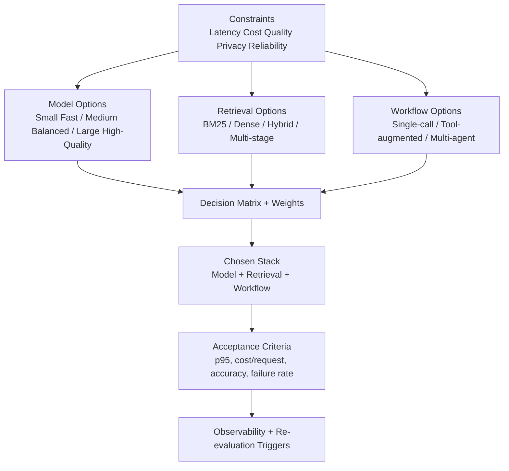

What this clarifies:
- Model, retrieval, and workflow should be justified together because they interact.
- Constraints drive selection logic.
- Decision quality is incomplete without acceptance criteria and monitoring triggers.

---

### 3. Real-World Industry Scenarios [Intermediate]

#### Scenario A: Customer support RAG assistant

Product/use case context:
- Assistant handles policy and troubleshooting questions from support agents.
- Needs high factuality and low response delay.

Constraints and practical effects:
- Latency: p95 target under 2.5 seconds.
- Cost: per-request budget capped to support high volume.
- Reliability: stale retrieval causes high-impact misinformation.

Tradeoff decision:
- Model: medium-size instruction model rather than largest frontier model.
- Retrieval: hybrid BM25 + dense retrieval to balance lexical exact matches and semantic recall.
- Workflow: single orchestration path with one verification step instead of multi-agent to reduce latency variance.

What good looks like:
- Document explains why larger model was rejected (cost/latency vs marginal quality gain).
- Retrieval choice is backed by recall@k and factuality comparisons.
- Workflow choice is justified with p95 stability evidence.

#### Scenario B: Research copilot for long-form analysis

Product/use case context:
- Analysts ask multi-document synthesis questions requiring nuanced reasoning.

Constraints and practical effects:
- Quality depth prioritized over strict latency.
- Token cost can spike with long contexts.
- Failure mode: shallow retrieval misses minority but critical sources.

Tradeoff decision:
- Model: higher-capability model for reasoning quality.
- Retrieval: multi-stage retrieval (coarse recall then reranking).
- Workflow: tool-augmented, multi-step plan-execute with source validation.

What good looks like:
- Decision doc states why slower and costlier stack is acceptable for analyst workflow.
- Includes guardrails for token budgeting and source-grounded outputs.

---

### 4. System View (Think Like a Systems Engineer) [Intermediate]

Inputs -> Transformations -> Outputs

- Inputs:
  - Candidate models, retrieval methods, and workflow patterns
  - Benchmark/evaluation results and operational constraints
  - Business risk tolerance and compliance requirements
- Transformations:
  - Normalize alternatives into a comparable matrix.
  - Weight constraints according to product objective.
  - Run comparative experiments and compute tradeoff scorecards.
  - Select stack and document rejected alternatives plus reasons.
- Outputs:
  - Decision justification artifact suitable for interview and design review.
  - Monitoring plan with re-evaluation triggers.

Observability signals to include:
- Quality metrics: exact match, groundedness, task success rate
- Ops metrics: p95 latency, error rate, cost/request
- Retrieval metrics: recall@k, MRR, stale-hit rate
- Workflow metrics: tool-call count, fallback rate, timeout frequency

Failure points in justification:
- No baseline comparison -> decision looks arbitrary.
- No rejected alternatives section -> weak tradeoff thinking signal.
- No re-evaluation triggers -> decision cannot adapt to changing conditions.

---

### 5. System Design Flavor (Practical and Concise) [Intermediate]

Recommended decision document sections:
- Decision context and constraints
- Alternatives considered
- Evaluation setup and metrics
- Chosen stack and explicit rationale
- Rejected options and why
- Risks accepted and mitigations
- Acceptance criteria and trigger-to-revisit rules

Key tradeoffs in lay terms:
- Model size vs responsiveness:
  - Larger models often reason better.
  - They are slower and costlier.
  - Choose the smallest model that meets quality thresholds.
- Hybrid retrieval vs simple retrieval:
  - Hybrid improves recall robustness.
  - Adds complexity and infra overhead.
  - Choose hybrid when question types vary and lexical precision matters.
- Multi-agent workflow vs single orchestration:
  - Multi-agent can handle complex decomposition.
  - It increases failure surface and latency variance.
  - Choose only when tasks materially benefit from decomposition.

Scaling consideration (10x usage):
- Add model routing tiers and adaptive retrieval depth so simple queries use cheaper paths while complex queries escalate selectively.

---

### 6. Common Mistakes + Debugging [Intermediate]

Mistake 1:
- Symptom: document says "we chose Model X because it performed best" without showing metrics or context.
- Likely cause: decision narrative written after implementation without evaluation rigor.
- First debugging step: reconstruct a minimal comparison table with at least 3 alternatives and 4 core metrics.

Mistake 2:
- Symptom: great offline metrics but poor production experience.
- Likely cause: evaluation ignored latency variance, cost spikes, or real query mix.
- First debugging step: compare offline benchmark distribution to production traffic slices and re-weight decision matrix.

Mistake 3:
- Symptom: architecture becomes outdated quickly and team confidence drops.
- Likely cause: no defined re-evaluation trigger when model pricing/performance changes.
- First debugging step: add threshold-based triggers (for example cost/request +20%, groundedness -5%, p95 +30%) that auto-open decision review.

---

### 7. Hands-On Lab (Concept -> Build -> Break -> Measure -> Explain) [Pro]

Goal:
- Produce one tradeoff-justification doc that defends your model, retrieval, and workflow choices with measurable evidence.

Build:
1. List 3 model options, 3 retrieval options, and 2 workflow options.
2. Define weighted constraints (quality, latency, cost, reliability, privacy).
3. Run a small evaluation set and populate a matrix.
4. Select one stack and write rationale with rejected alternatives.
5. Define acceptance criteria and re-evaluation triggers.

**Reference Artifact — filled decision matrix (support RAG assistant, 40k weekly queries):**

| Option | Quality (recall@5) | p95 Latency | Cost/req | Reliability | Verdict |
|---|---|---|---|---|---|
| gpt-4o + dense retrieval | 91% | 3.8s | $0.11 | High | ❌ Latency and cost exceed both targets |
| **gpt-4o-mini + hybrid BM25+dense + cross-encoder rerank** | **87%** | **1.9s** | **$0.04** | **High** | **✅ Chosen** |
| gpt-4o-mini + dense-only | 81% | 1.7s | $0.03 | High | ❌ Recall gap on lexical policy queries — 6pp below quality threshold |
| Local Llama 3.1 70B + hybrid | 83% | 2.4s | $0.01 | Medium | ❌ Infra ops overhead + 4pp quality shortfall + medium reliability |

**Constraint weights applied:** Latency 35% · Quality 30% · Cost 20% · Reliability 15%

**Acceptance criteria:** p95 <2.5s AND recall@5 ≥85% AND cost/req <$0.05

**Re-evaluation trigger:** cost/req rises above $0.06 OR recall@5 drops below 83% for 3 consecutive weekly evaluation runs

*Why this matrix is high-signal:* It shows not just the winner, but why every alternative was rejected on comparable evidence. The constraint weights reveal prioritisation logic. The re-evaluation trigger proves the decision is treated as time-bounded, not permanent — a mature production engineering signal.

---

Break:
1. Remove rejected alternatives and test if rationale still feels credible.
2. Remove latency/cost metrics and test if production readiness remains defensible.
3. Increase traffic assumptions by 10x and reassess selected stack.

Measure:
- With 2-3 reviewers score:
  - Decision clarity (1-5)
  - Evidence sufficiency (1-5)
  - Production plausibility (1-5)
  - Time to understand rationale (minutes)

Explain:
- Why it broke:
  - Without alternatives and constraints, decisions look preference-based.
  - Without ops metrics, quality-only choices can fail in production.
- Guardrail:
  - Use a fixed matrix template plus mandatory acceptance and re-evaluation sections.

---

### 8. Active Recall (Spaced Repetition)

Questions:
1. Why must model, retrieval, and workflow decisions be justified together?
2. What is the minimum evidence needed for a credible tradeoff choice?
3. What makes acceptance criteria different from generic goals?
4. Why are re-evaluation triggers essential in GenAI systems?

Answer key:
1. They are coupled; changing one shifts quality, latency, and cost behavior of the whole system.
2. Alternatives table, shared metrics, constraint weights, and explicit rationale.
3. They are measurable pass/fail thresholds tied to deployment decisions.
4. Model ecosystems change rapidly, so static decisions degrade without trigger-based review.

---

### 9. Practice

Mini-exercise:
- Write a 7-line decision summary: context, constraints, chosen stack, rejected option, risk, metric threshold, and revisit trigger.

Suggested answer outline:
- Line 1: product objective.
- Line 2: top 3 constraints.
- Line 3: chosen model + retrieval + workflow.
- Line 4: strongest rejected alternative.
- Line 5: tradeoff accepted.
- Line 6: acceptance metric thresholds.
- Line 7: trigger that forces re-evaluation.

Capstone-style question:
- You are challenged in an interview: "Why not use the largest model and multi-agent workflow everywhere?" Build a concise response that balances user impact, cost, and reliability.

Suggested answer outline:
1. State objective-specific constraints.
2. Show marginal quality gain vs latency/cost penalty.
3. Explain failure-surface expansion with multi-agent orchestration.
4. Present selective escalation strategy for complex queries.
5. Close with measurable acceptance criteria.

---

### 10. Production Reality Check (Mandatory Ending)

If this fails in prod, what is the first thing we inspect?

- First inspect whether real production traffic still matches the assumptions used in the decision matrix (query mix, latency budget, and cost envelope).
- Why: many "wrong architecture" incidents are actually "stale assumptions" incidents.

---

### 11. Curiosity Bridge (Mandatory Ending)

Tradeoff justification explains why you chose a path, but strong portfolio signaling also needs proof that you can communicate these decisions succinctly to mixed audiences.

That leads to executive-ready decision briefs and one-page architecture rationale artifacts.

---

### 12. Exit Check + Carry-Forward Review

Exit Check:
- You are done when you can defend one model-retrieval-workflow stack in under 4 minutes using constraints, alternatives, metrics, and revisit triggers.

Carry-Forward Review (interleaved):
- Q: From 22.2.a, what keeps remediation claims credible?
- A: Owner + due date + measurable verification checks.
- Q: From 22.1.d, what should be customized first for different interview audiences?
- A: The first 90-second sequence and trust triggers.

---

## Subtopic 22.2.c: Evaluation Reports That Show Before-Vs-After Improvement

### ✅ Add to Knowledge Base

### Reading Path + Level Tags

- **Beginner:** Read sections 0-2 and section 8 (Active Recall).
- **Intermediate:** Add sections 3-6 and section 9 (Practice).
- **Pro:** Complete section 7 (Hands-On Lab) and section 12 (Exit Check + Carry-Forward Review).

---

### 0. Pre-Question Hook [Beginner]

Pause: if you claim your system improved, can you prove it with a clean baseline, fair comparison, and meaningful metric deltas?

Without that, "improvement" sounds like marketing, not engineering evidence.

---

### 1. The Intuition (Plain English) [Beginner]

A before-vs-after evaluation report is your most direct hiring-proof artifact for impact.

It answers one hard question: what changed, by how much, under what conditions, and at what cost?

The strongest reports do not only show quality gains. They also show tradeoff movement in latency, cost, and reliability so decision quality can be judged holistically.

Analogy: clinical trial comparison between control and treatment groups. You need matched conditions and clear outcome measures to claim effect.

Where the analogy breaks: software systems evolve continuously, and traffic/data distributions drift. So your report needs repeated measurement windows and drift context, not one-off snapshots.

**Baseline Condition:** the reference system version and evaluation setup used to measure change.

**Intervention:** the specific modification introduced (model change, retrieval update, prompt/workflow redesign).

**Delta Stack:** the set of metric changes reported together (quality delta, latency delta, cost delta, failure-rate delta).

---

### 2. Visual Diagram (Mermaid) [Beginner]

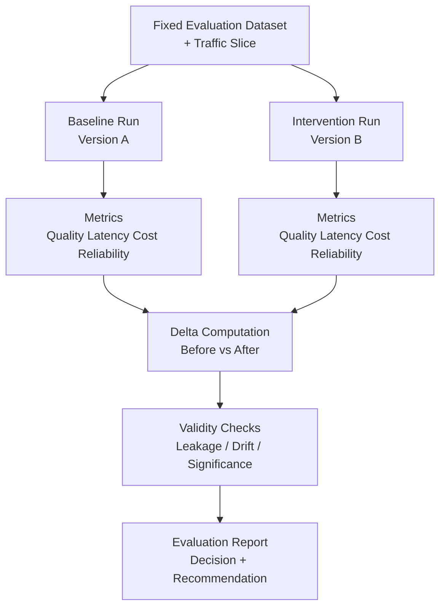

What this shows:
- Comparison is only valid when baseline and intervention are run under comparable conditions.
- Metric deltas need validity checks before they become decision evidence.
- Report should end in an actionable recommendation, not raw numbers only.

---

### 3. Real-World Industry Scenarios [Intermediate]

#### Scenario A: RAG retrieval upgrade (dense -> hybrid)

Product/use case context:
- Team upgrades retrieval from dense-only to hybrid retrieval.
- Goal is fewer factual misses on policy queries.

Constraints and practical effects:
- Quality target: increase grounded answer rate from a ~73% baseline to ≥80%. At 73%, roughly 1-in-4 answers lacks source grounding — unacceptable for compliance queries where agents act directly on the response without a secondary check.
- Latency budget: p95 must stay under 2.5s SLA. Current p95 is 1.71s; adding hybrid retrieval and a cross-encoder reranker adds ~400–500ms median overhead. The 0.79s headroom is enough to absorb this only if the reranker runs in-process rather than as a remote service hop.
- Cost budget: retrieval and reranking costs must stay within $0.05/request. BM25 is near-zero incremental cost; a lightweight cross-encoder reranker adds approximately $0.008/request, keeping the total within envelope.

What good looks like:
- Report shows dense-only baseline (recall@5 = 82%, grounded rate = 73.4%, p95 = 1.71s, cost = $0.031) vs hybrid + rerank (recall@5 = 87%, grounded rate = 84.1%, p95 = 2.18s, cost = $0.041) on 1,200 stratified queries from a production traffic sample.
- Quality improvement of +10.7 pp is validated; latency increase of +0.47s stays within SLA with 0.32s headroom; cost increase of +$0.010 is within budget.
- Segment analysis shows the bottom-20% hardest queries (multi-document synthesis) improved most — recall@5 from 58% to 71% — accounting for most of the overall grounded-rate gain.
- Error analysis identifies the remaining 15–16% non-grounded answers as concentrated on ambiguous or conflicting multi-policy queries; flagged for a routing experiment to a higher-capability model fallback.

#### Scenario B: Model downshift for cost optimization

Product/use case context:
- Team moves from large model to smaller model plus tighter prompting.
- Objective is cost reduction with minimal quality regression.

Constraints and practical effects:
- Cost target: reduce cost/request from $0.09 (gpt-4o default) to ≤$0.04. At 40,000 weekly queries, the current spend is ~$3,600/week ($187k/year). The target cost of $0.04/request brings this to ~$1,600/week — roughly $100k/year in savings for a single product. That makes the business case explicit and the tradeoff worth engineering effort.
- Quality floor: task success rate cannot drop below 88%. Current baseline is 93%; accepting a floor of 88% still delivers a strong user experience while capturing the cost reduction. Dropping below 88% would visibly degrade agent trust in the assistant.
- Reliability: refusal and error rates must not increase above 2%. Smaller models are more likely to refuse or produce empty responses on edge-case queries — this must be tracked explicitly, not assumed safe.

What good looks like:
- Report compares gpt-4o baseline (task success = 93%, cost = $0.09/req, p95 = 2.1s) vs gpt-4o-mini + tighter prompt structure (task success = 91%, cost = $0.037/req, p95 = 1.4s) on a stratified 1,000-query set.
- Cost savings of −59% confirmed; task success regression of −2pp is within the acceptable quality floor.
- Regression segment identified: complex multi-document synthesis queries drop from 87% to 74% success on gpt-4o-mini. Mitigation: route queries that retrieve >3 documents to gpt-4o as a targeted fallback — adds only $0.002 to the weighted average per-request cost, preserving the bulk of savings.
- Recommendation: ship to 100% traffic with the fallback routing rule active and a weekly task-success monitor against the 88% floor.

---

### 4. System View (Think Like a Systems Engineer) [Intermediate]

Inputs -> Transformations -> Outputs

- Inputs:
  - Baseline version and intervention version
  - Fixed evaluation set plus production slice sample
  - Metric definitions and thresholds
- Transformations:
  - Run both versions under controlled conditions.
  - Compute deltas across quality, latency, cost, and reliability.
  - Perform validity checks (leakage, drift, outlier dominance).
  - Segment results by query type/user cohort for interpretability.
- Outputs:
  - Before-vs-after evaluation report with decision recommendation.
  - Clear statement of where improvement holds and where it does not.

Observability signals to include:
- Quality: groundedness, task completion, exact match/pass@k
- Latency: p50/p95/p99 and timeout rate
- Cost: cost/request and token consumption by stage
- Reliability: failure/refusal/hallucination rate
- Segment coverage: proportion of traffic represented by each slice

Failure points in evaluation reporting:
- Baseline and intervention run on different data -> invalid comparison.
- Improvement reported on averages only -> hides regressions in critical segments.
- No operational metrics -> quality gains may be operationally unusable.

---

### 5. System Design Flavor (Practical and Concise) [Intermediate]

Recommended report structure:
- Objective and hypothesis
- Baseline and intervention definitions
- Dataset and traffic slice description
- Metric table (before, after, delta, threshold)
- Segment analysis and failure cases
- Decision recommendation and rollout plan
- Monitoring plan after rollout

Key tradeoffs in plain language:
- Quality gain vs latency regression:
  - Better answers are valuable.
  - Slow answers can break user experience.
  - Accept only when latency remains inside SLA or use selective routing.
- Cost savings vs quality drop:
  - Cheaper models reduce burn.
  - Quality regressions can erase business value.
  - Set explicit quality floor before approving cost optimization.
- Broad aggregate win vs critical-segment loss:
  - Overall averages may improve.
  - High-value user cohorts may degrade.
  - Use segment guardrails, not global metric only.

Scaling consideration (10x volume):
- Add continuous evaluation pipelines with periodic baseline refresh and automated drift alarms so improvements remain valid over time.

---

### 6. Common Mistakes + Debugging [Intermediate]

Mistake 1:
- Symptom: report shows improvement but rollout underperforms in production.
- Likely cause: offline eval set did not match live query distribution.
- First debugging step: compare evaluation slice distribution to production traffic and rebuild stratified test set.

Mistake 2:
- Symptom: "+5% quality" claim challenged in interview and not defensible.
- Likely cause: metric definition ambiguity or inconsistent measurement protocol.
- First debugging step: define metric formulas explicitly and re-run both variants with identical evaluation harness.

Mistake 3:
- Symptom: hidden regressions discovered after launch.
- Likely cause: report used macro averages without segment breakout.
- First debugging step: add per-segment delta table for critical cohorts and hard-query buckets.

---

### 7. Hands-On Lab (Concept -> Build -> Break -> Measure -> Explain) [Pro]

Goal:
- Build one decision-ready before-vs-after report that can withstand interviewer scrutiny.

Build:
1. Choose one intervention (model swap, retrieval change, or workflow adjustment).
2. Freeze baseline and intervention configs.
3. Evaluate on a fixed dataset and one sampled production slice.
4. Produce metric table with before, after, delta, and threshold status.
5. Add segment analysis plus recommendation (rollout, partial rollout, or reject).

**Reference Artifact — filled before-vs-after metric table:**

| Metric | Baseline (dense-only) | After (hybrid + rerank) | Delta | Threshold | Status |
|---|---|---|---|---|---|
| Grounded answer rate | 73.4% | 84.1% | +10.7 pp | ≥80% | ✅ Pass |
| Factual miss rate | 14.2% | 6.8% | −7.4 pp | ≤8% | ✅ Pass |
| p95 latency | 1.71s | 2.18s | +0.47s | ≤2.5s | ✅ Pass |
| Cost/request | $0.031 | $0.041 | +$0.010 | ≤$0.05 | ✅ Pass |
| Failure / timeout rate | 1.1% | 1.3% | +0.2 pp | ≤2% | ✅ Pass |
| recall@5 (hard queries, bottom 20%) | 58% | 71% | +13 pp | ≥65% | ✅ Pass |

**Evaluation set:** 1,200 stratified queries — production traffic sample, Q4 2024, held out from any tuning.

**Segment analysis:** The bottom-20% hardest queries (multi-policy synthesis) improved the most — recall@5 from 58% to 71%. Simple single-document lookups improved only marginally (+2 pp) since dense retrieval already solved them. This tells you where hybrid retrieval actually earns its overhead cost.

**Recommendation:** Ship to 100% traffic. Monitor p95 latency at 10× traffic milestone — reranker inference is the most pressure-sensitive component. Re-evaluate if grounded-answer rate drops below 80% for two consecutive weekly evaluation runs.

*Why this table is high-signal:* Every metric has a before value, an after value, an explicit threshold, and a binary pass/fail verdict. A reviewer immediately sees not just "it improved" but by precisely how much, at what operational cost, and whether it is production-ready. This is the format that closes an interview conversation.

---

Break:
1. Change dataset between baseline and intervention and observe comparison collapse.
2. Remove latency and cost columns and test decision confidence.
3. Remove segment analysis and test for hidden regressions.

Measure:
- Ask 2-3 reviewers to score:
  - Evidence credibility (1-5)
  - Decision readiness (1-5)
  - Clarity of tradeoffs (1-5)
  - Time to understand conclusion (minutes)

Explain:
- Why it broke:
  - Uncontrolled comparisons invalidate deltas.
  - Missing operational metrics yields incomplete decisions.
  - Missing segmentation masks business-critical regressions.
- Guardrail:
  - Standard report template with mandatory baseline lock, ops metrics, and cohort breakdowns.

---

### 8. Active Recall (Spaced Repetition)

Questions:
1. What three conditions make a before-vs-after claim credible?
2. Why is a quality-only delta insufficient for production decisions?
3. What is the purpose of segment-level analysis in eval reports?
4. What should a report conclude beyond presenting metrics?

Answer key:
1. Comparable conditions, clear metric definitions, and validated deltas.
2. Because latency, cost, and reliability can negate quality gains in real usage.
3. To detect hidden regressions in high-value or hard-query cohorts.
4. A rollout decision with thresholds, risks, and monitoring plan.

---

### 9. Practice

Mini-exercise:
- Write a 6-line before-vs-after summary for one intervention with one gain, one tradeoff, one risk, and one rollout recommendation.

Suggested answer outline:
- Line 1: intervention and objective.
- Line 2: baseline vs after on key quality metric.
- Line 3: latency and cost movement.
- Line 4: segment with regression.
- Line 5: mitigation or routing plan.
- Line 6: rollout recommendation and monitor trigger.

Capstone-style question:
- You improved groundedness by 7% but increased p95 latency by 35%. How do you decide whether to ship?

Suggested answer outline:
1. Check SLA boundary and user tolerance.
2. Evaluate gains by business-critical segments.
3. Consider selective enablement/routing for complex queries only.
4. Define guarded rollout with stop conditions.
5. Decide ship/partial/reject based on threshold policy.

---

### 10. Production Reality Check (Mandatory Ending)

If this fails in prod, what is the first thing we inspect?

- First inspect whether the deployed intervention matches the evaluated configuration and traffic assumptions.
- Why: config drift and traffic-shape drift are the most common reasons reported improvements fail to reproduce in production.

---

### 11. Curiosity Bridge (Mandatory Ending)

Before-vs-after reports prove change impact, but advanced hiring signal comes from showing how you operationalize this into continuous learning loops.

That leads to ongoing evaluation cadence, release gates, and dashboard-driven decision systems.

---

### 12. Exit Check + Carry-Forward Review

Exit Check:
- You are done when you can defend one intervention decision with a before-vs-after report that includes quality, latency, cost, reliability, and segment-level deltas.

Carry-Forward Review (interleaved):
- Q: From 22.2.b, what makes a tradeoff decision defensible over time?
- A: Clear acceptance criteria plus trigger-based re-evaluation.
- Q: From 22.2.a, what prevents remediation plans from becoming vague promises?
- A: Owner, due date, and measurable verification checks.

---

## Subtopic 22.2.d: Rejected Alternatives And Why They Lost

### ✅ Add to Knowledge Base

### Reading Path + Level Tags

- **Beginner:** Read sections 0-2 and section 8 (Active Recall).
- **Intermediate:** Add sections 3-6 and section 9 (Practice).
- **Pro:** Complete section 7 (Hands-On Lab) and section 12 (Exit Check + Carry-Forward Review).

---

### 0. Pre-Question Hook [Beginner]

Pause: can you explain not only what you chose, but also what you rejected and why those options were weaker for your constraints?

If you cannot, interviewers may assume your design process was shallow.

---

### 1. The Intuition (Plain English) [Beginner]

Rejected alternatives are not a side note. They are direct evidence of engineering decision quality.

A strong rejection narrative shows that you explored viable options, compared them under real constraints, and made a bounded decision with explicit risk acceptance.

Analogy: tournament brackets. The winner matters, but understanding why strong contenders were eliminated tells you whether the competition was rigorous.

Where the analogy breaks: architecture choices are not single-elimination forever. An alternative that loses today may win later when constraints change, so rejection should be documented as time-bound, not absolute.

**Alternative Elimination Log:** concise record of plausible options considered and the measurable reasons they were rejected.

**Constraint Mismatch:** the main reason an option loses because it violates key latency, cost, reliability, privacy, or complexity requirements.

**Time-Bound Rejection:** a rejected option that remains a candidate for future re-evaluation if assumptions change.

---

### 2. Visual Diagram (Mermaid) [Beginner]

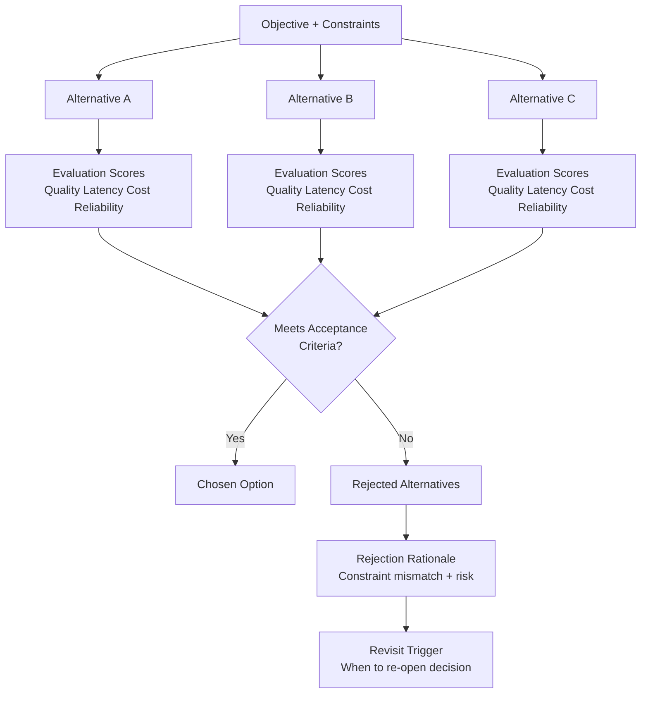

What this shows:
- Rejection should be criteria-driven, not preference-driven.
- Every rejected option needs a concrete reason category.
- Good rejection logs include a revisit trigger.

---

### 3. Real-World Industry Scenarios [Intermediate]

#### Scenario A: Why multi-agent orchestration was rejected

Product/use case context:
- Team building support assistant with strict p95 latency target.
- Multi-agent design tested for better decomposition quality.

Constraints and practical effects:
- Latency and reliability were primary constraints.
- Multi-agent flow increased tail latency and failure surface.
- Quality gains were present but marginal on most query buckets.

What good looks like:
- Rejection note states: "rejected for now due to p95 breach and retry amplification risk."
- Includes measured deltas and decision boundary.
- Marks as time-bound rejection if async experience is introduced later.

#### Scenario B: Why frontier model was rejected for default path

Product/use case context:
- Team compared large frontier model vs smaller model with retrieval augmentation.

Constraints and practical effects:
- Cost and throughput were critical for high-volume workload.
- Frontier model improved difficult-edge quality but exceeded cost envelope.

What good looks like:
- Rejection rationale highlights segment-based compromise:
  - Frontier model rejected as default.
  - Retained as escalation path for hard queries.

---

### 4. System View (Think Like a Systems Engineer) [Intermediate]

Inputs -> Transformations -> Outputs

- Inputs:
  - Set of feasible alternatives
  - Constraint weights and acceptance criteria
  - Evaluation evidence and operational risk observations
- Transformations:
  - Score alternatives against shared metrics.
  - Identify dominant failure modes per option.
  - Assign rejection reason category (cost, latency, risk, complexity, compliance).
  - Document whether rejection is permanent or time-bound.
- Outputs:
  - Rejected alternatives memo that strengthens design credibility.
  - Revisit policy for future decision updates.

Observability signals to capture:
- Delta vs chosen option on quality/latency/cost/reliability
- Failure-mode frequency during experiments
- Operational complexity indicators (components, retries, maintenance burden)

Failure points in rejection docs:
- "Rejected because overkill" with no evidence.
- Missing comparison baseline.
- No revisit criteria, causing stale decisions.

---

### 5. System Design Flavor (Practical and Concise) [Intermediate]

Recommended rejection memo fields:
- Alternative name and short description
- Why it seemed attractive
- Measured comparison vs selected option
- Primary rejection reason
- Risk if chosen anyway
- Revisit condition and owner

Key tradeoffs in plain terms:
- Simplicity vs capability:
  - Richer architectures can solve harder cases.
  - They may hurt reliability and maintainability.
  - Reject when complexity cost exceeds incremental value.
- Cost vs edge-case quality:
  - Premium models lift difficult examples.
  - Budget may not support default usage.
  - Reject as default, keep as selective escalation.
- Speed vs explainability:
  - Some options ship faster.
  - They may be harder to debug and justify.
  - Reject if incident response and governance become weak.

Scaling consideration (10x scale):
- At scale, alternatives that were "close enough" can diverge sharply in cost and ops burden, so keep rejection evidence queryable for rapid re-evaluation.

---

### 6. Common Mistakes + Debugging [Intermediate]

Mistake 1:
- Symptom: interviewer asks, "Did you actually test alternatives?"
- Likely cause: rejection section uses opinion language without metrics.
- First debugging step: add a compact table with at least 3 alternatives and 4 shared metrics.

Mistake 2:
- Symptom: team revisits same debates repeatedly.
- Likely cause: rejected alternatives documented without revisit triggers.
- First debugging step: add explicit trigger thresholds and review date/owner.

Mistake 3:
- Symptom: chosen design later fails under new traffic pattern.
- Likely cause: rejection assumed static constraints.
- First debugging step: run assumption drift check and re-score previously rejected options.

---

### 7. Hands-On Lab (Concept -> Build -> Break -> Measure -> Explain) [Pro]

Goal:
- Create a one-page rejected alternatives memo for one major project decision.

Build:
1. Select one decision (model, retrieval, or workflow).
2. List 3-5 alternatives that were realistically feasible.
3. Compare with shared metrics and constraints.
4. Write rejection reasons and revisit triggers.
5. Add one sentence on what would make each loser win later.

Break:
1. Remove measured comparisons and check credibility.
2. Remove revisit triggers and test future usefulness.
3. Replace rejection reasons with vague labels ("too complex") and test clarity.

Measure:
- Ask 2-3 reviewers to score:
  - Clarity of rejection logic (1-5)
  - Confidence in decision rigor (1-5)
  - Reusability for future decisions (1-5)
  - Time to understand (minutes)

Explain:
- Why it broke:
  - Vague rejection language cannot defend decisions.
  - Missing revisit logic turns docs into dead history.
- Guardrail:
  - Use fixed rejection template with metrics, reason category, and trigger-to-revisit.

---

### 8. Active Recall (Spaced Repetition)

Questions:
1. Why is documenting rejected alternatives a hiring signal?
2. What makes a rejection rationale defensible?
3. Why should rejection be time-bound in many GenAI decisions?
4. What is the minimum useful structure of a rejection memo?

Answer key:
1. It demonstrates comparative reasoning and non-accidental architecture choices.
2. Shared metrics, explicit constraint mismatch, and risk framing.
3. Because model and cost landscapes evolve quickly, changing what is optimal.
4. Alternative, evidence, rejection reason, risk, revisit trigger, and owner.

---

### 9. Practice

Mini-exercise:
- Write a 6-line rejection note for one alternative from your project.

Suggested answer outline:
- Line 1: alternative and attraction.
- Line 2: measured comparison.
- Line 3: main constraint mismatch.
- Line 4: risk if adopted anyway.
- Line 5: why chosen option won.
- Line 6: trigger that reopens this choice.

Capstone-style question:
- In an interview, you are asked: "What strong option did you reject, and what would need to change for you to adopt it?" Provide a concise but rigorous response.

Suggested answer outline:
1. Name the rejected option and why it was attractive.
2. Show measured mismatch to current constraints.
3. Explain risk tradeoff.
4. State concrete future trigger for reconsideration.

---

### 10. Production Reality Check (Mandatory Ending)

If this fails in prod, what is the first thing we inspect?

- First inspect whether the assumptions behind each rejection still hold under current production metrics and traffic mix.
- Why: stale rejection assumptions are a frequent root cause of "we chose wrong" outcomes.

---

### 11. Curiosity Bridge (Mandatory Ending)

Rejected alternatives show decision rigor, but final hiring signal strength comes from connecting all artifacts into a coherent portfolio narrative.

That points to the next layer: stitching README, demos, tradeoff docs, and eval reports into one interview-ready evidence stack.

---

### 12. Exit Check + Carry-Forward Review

Exit Check:
- You are done when you can explain one rejected alternative in under 2 minutes with measurable evidence, clear risk framing, and a valid revisit trigger.

Carry-Forward Review (interleaved):
- Q: From 22.2.c, what makes before-vs-after claims credible?
- A: Comparable baseline/intervention conditions with quality and operational deltas.
- Q: From 22.2.b, what keeps decisions adaptive instead of static?
- A: Trigger-based re-evaluation tied to metrics and context shifts.

---

## Topic 22.3: Hiring-Facing Packaging

> **Topic time:** 6h
> Focus: Translating technical work into recruiter-visible, manager-relevant, and engineer-credible hiring artifacts without losing technical truth.

---

## Subtopic 22.3.a: Resume Bullets Grounded In Measurable System Outcomes

### ✅ Add to Knowledge Base

### Reading Path + Level Tags

- **Beginner:** Read sections 0-2 and section 8 (Active Recall).
- **Intermediate:** Add sections 3-6 and section 9 (Practice).
- **Pro:** Complete section 7 (Hands-On Lab) and section 12 (Exit Check + Carry-Forward Review).

---

### 0. Pre-Question Hook [Beginner]

Pause: if an interviewer reads one bullet from your resume, will they see what you built, what changed, and why that change mattered?

If the bullet has no measurable outcome, your strongest work can look ordinary.

---

### 1. The Intuition (Plain English) [Beginner]

A strong resume bullet is a compressed system narrative: action + technical mechanism + measurable outcome.

In GenAI hiring, vague bullets like "built an LLM app" are low signal because many candidates can say the same. Measurable outcome bullets differentiate ownership and impact.

Analogy: commit messages. "Fixed bug" is weak; "reduced timeout retries by 42% by adding jittered backoff" is actionable and high-signal. Resume bullets should follow the same precision.

Where the analogy breaks: commit messages target engineers only; resume bullets must communicate value to recruiters, managers, and engineers simultaneously.

**Impact Bullet:** a concise statement that ties a concrete engineering action to a quantified business or system outcome.

**Outcome Metric:** measurable result tied to user value or platform performance (for example p95 latency, groundedness, cost/request, success rate).

**Evidence Anchor:** the source artifact supporting the claim (evaluation report, dashboard snapshot, incident record, or experiment log).

---

### 2. Visual Diagram (Mermaid) [Beginner]

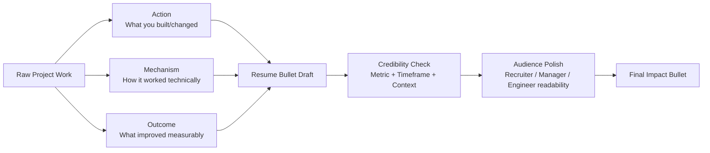

What this shows:
- Bullet quality comes from combining mechanism and impact, not impact-only language.
- Credibility checks prevent inflated or unverifiable claims.
- Audience polish improves readability without diluting technical truth.

---

### 3. Real-World Industry Scenarios [Intermediate]

#### Scenario A: RAG assistant optimization

Product/use case context:
- Candidate improved retrieval and prompt strategy for an internal support assistant.

Constraints and practical effects:
- Recruiter scan time is short; keywords and outcome clarity matter first.
- Hiring manager needs evidence of ownership and business effect.
- Engineer interviewer needs mechanism details and metric validity.

Weak bullet:
- "Improved RAG pipeline for customer support chatbot."

Strong bullet:
- "Redesigned RAG retrieval from dense-only to hybrid BM25+dense with reranking, improving grounded-answer rate from 71% to 84% while keeping p95 latency under 2.6s across 40k weekly support queries."

What good looks like:
- Action is specific.
- Mechanism is identifiable.
- Outcome is quantified with boundary conditions.

#### Scenario B: Cost optimization with controlled quality tradeoff

Product/use case context:
- Candidate reduced inference cost by model routing.

Constraints and practical effects:
- Cost wins without quality guardrails may look reckless.
- Need to show that degradation risk was managed.

Strong bullet:
- "Introduced tiered model routing (small model default, frontier fallback for complex queries), cutting cost/request by 38% while maintaining task success above 92% via weekly eval gates."

What good looks like:
- Tradeoff is acknowledged and bounded.
- Guardrail is visible (eval gate/threshold).

---

### 4. System View (Think Like a Systems Engineer) [Intermediate]

Inputs -> Transformations -> Outputs

- Inputs:
  - Project changes, metrics, and supporting artifacts
  - Target role and job description keywords
  - Space constraints (1-2 lines per bullet)
- Transformations:
  - Convert project work into action/mechanism/outcome structure.
  - Select one primary metric and one optional guardrail metric.
  - Add scope/timeframe to prevent ambiguity.
  - Validate claim against evidence anchors.
- Outputs:
  - Resume bullets that are concise, credible, and technically differentiated.

Observability for bullet quality:
- Interview callback rate change after bullet revision
- Interviewer follow-up depth (basic vs technical)
- Clarification requests caused by ambiguity

Failure points:
- Metric without context -> can look inflated or irrelevant.
- Mechanism without outcome -> reads like task list.
- Outcome without mechanism -> sounds ungrounded.

---

### 5. System Design Flavor (Practical and Concise) [Intermediate]

Recommended bullet formula:
- Action verb + technical mechanism + measurable outcome + scope/timeframe + guardrail

Example template:
- "[Actioned system change] by [mechanism], improving [metric] from [before] to [after] for [scope], while [guardrail condition]."

Tradeoffs in plain language:
- Precision vs brevity:
  - More numbers increase credibility.
  - Too many numbers reduce readability.
  - Keep one primary outcome metric plus one guardrail.
- Technical depth vs recruiter readability:
  - Deep terms show expertise.
  - Excess jargon can reduce first-pass clarity.
  - Use one core technical term and one plain-language impact phrase.
- Ambitious claims vs verification risk:
  - Big numbers attract attention.
  - Unverifiable claims hurt trust if challenged.
  - Only use metrics you can defend with evidence anchors.

Scaling consideration (many applications):
- Maintain a bullet bank mapped to role types so you can swap emphasis quickly without rewriting from scratch.

---

### 6. Common Mistakes + Debugging [Intermediate]

Mistake 1:
- Symptom: bullet sounds impressive but interviewers ask, "How was this measured?"
- Likely cause: no evidence anchor or unclear metric definition.
- First debugging step: attach source (eval report/dashboard) and define measurement window.

Mistake 2:
- Symptom: recruiters skip bullets despite strong project work.
- Likely cause: bullets are mechanism-heavy and value-light.
- First debugging step: rewrite opening phrase to foreground user/business/system impact.

Mistake 3:
- Symptom: engineering interview reveals overclaim risk.
- Likely cause: bullet omits guardrail tradeoff (for example latency or quality floor).
- First debugging step: add one balancing clause that shows constraint management.

---

### 7. Hands-On Lab (Concept -> Build -> Break -> Measure -> Explain) [Pro]

Goal:
- Convert 5 weak GenAI resume bullets into measurable, defensible impact bullets.

Build:
1. Collect 5 existing bullets from your project history.
2. For each bullet, extract action, mechanism, and outcome metric.
3. Add one scope/timeframe phrase and one guardrail clause.
4. Validate each metric against an evidence anchor.

Break:
1. Remove outcome metric and test distinctiveness.
2. Remove mechanism and test technical credibility.
3. Remove scope/timeframe and test interpretability.

Measure:
- Evaluate with 2-3 reviewers:
  - Clarity score (1-5)
  - Credibility score (1-5)
  - Technical depth score (1-5)
  - Time to understand each bullet (seconds)

Explain:
- Why it broke:
  - Missing metrics collapses impact proof.
  - Missing mechanism collapses ownership depth.
  - Missing context collapses comparability.
- Guardrail:
  - Use a fixed bullet checklist: mechanism, metric, scope, tradeoff, evidence anchor.

---

### 8. Active Recall (Spaced Repetition)

Questions:
1. What are the three mandatory parts of a high-signal GenAI resume bullet?
2. Why is a guardrail clause useful in an outcome bullet?
3. What makes a metric claim interview-safe?
4. How does scope/timeframe improve bullet quality?

Answer key:
1. Action/mechanism/outcome with measurable evidence.
2. It shows tradeoff awareness and production maturity.
3. Clear definition plus traceable evidence anchor.
4. It makes outcomes interpretable and less likely to be overstated.

---

### 9. Practice

Mini-exercise:
- Rewrite this weak bullet into a high-signal one: "Built an LLM chatbot for internal support."

Suggested answer outline:
- Include mechanism (RAG/agent/workflow), metric deltas, user scope, and constraint guardrail.

Capstone-style question:
- You have one resume line to summarize a complex GenAI project. How do you balance recruiter readability and engineering depth without using buzzword-heavy language?

Suggested answer outline:
1. Start with user-impact verb.
2. Add one key technical mechanism.
3. Add one primary quantified result.
4. Add one guardrail/constraint phrase.
5. Keep sentence under two lines.

---

### 10. Production Reality Check (Mandatory Ending)

If this fails in prod, what is the first thing we inspect?

- First inspect whether the metric in the resume bullet is still reproducible from current evaluation/dashboard data.
- Why: stale or non-reproducible claims are the fastest way to lose trust in interviews.

---

### 11. Curiosity Bridge (Mandatory Ending)

Strong bullets get attention, but hiring conversion improves most when bullets connect directly to demo artifacts and decision documents.

That leads to the next packaging layer: linking resume claims to evidence packets for fast interviewer verification.

---

### 12. Exit Check + Carry-Forward Review

Exit Check:
- You are done when you can defend every major resume bullet with a specific mechanism, a measurable outcome, and a concrete evidence anchor.

Carry-Forward Review (interleaved):
- Q: From 22.2.c, what makes improvement claims trustworthy?
- A: Controlled baseline-vs-intervention comparisons with quality and operational deltas.
- Q: From 22.2.d, what strengthens decision credibility beyond the final choice?
- A: Documented rejected alternatives with explicit constraint mismatch and revisit triggers.

---

## Subtopic 22.3.b: Project Case-Study Pages And Portfolio Summaries

### ✅ Add to Knowledge Base

### Reading Path + Level Tags

- **Beginner:** Read sections 0-2 and section 8 (Active Recall).
- **Intermediate:** Add sections 3-6 and section 9 (Practice).
- **Pro:** Complete section 7 (Hands-On Lab) and section 12 (Exit Check + Carry-Forward Review).

---

### 0. Pre-Question Hook [Beginner]

Pause: if someone reads your case-study page for 3 minutes, can they clearly answer these questions?

1. What problem did you solve?
2. What did you personally design and ship?
3. What measurable outcomes proved it worked?

If not, your project portfolio may look interesting but not hiring-convincing.

---

### 1. The Intuition (Plain English) [Beginner]

A project case-study page is the long-form version of a resume bullet: it expands claim -> mechanism -> evidence -> lesson.

Portfolio summaries are not blog posts and not raw docs dumps. They are structured evidence pages optimized for fast trust, then deeper technical validation.

Analogy: movie trailer and full film.
- Portfolio summary = trailer (high-signal overview).
- Case-study page = full film (technical depth and decision detail).

Where the analogy breaks: entertainment can hide behind emotion; hiring artifacts cannot. Every key claim must be traceable to measurable evidence.

**Case-Study Spine:** the fixed narrative backbone of a project page (problem, constraints, architecture, decisions, results, failures, next steps).

**Portfolio Summary Card:** compact project overview artifact linking to deeper case-study and supporting evidence.

**Progressive Depth:** information ordering strategy where early sections are broadly readable and later sections carry technical depth for engineers.

---

### 2. Visual Diagram (Mermaid) [Beginner]

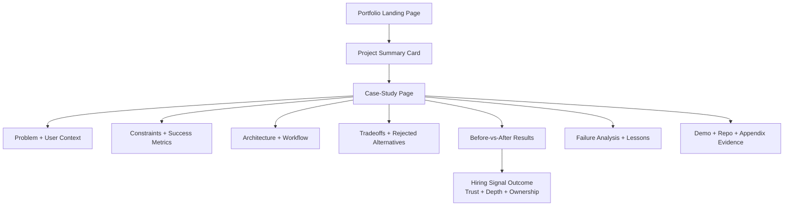

What this shows:
- Summary cards and case-study pages should work as a system.
- Case-study sections should follow a stable spine to reduce reviewer confusion.
- Results and failure lessons must be first-class sections, not hidden appendices.

---

### 3. Real-World Industry Scenarios [Intermediate]

#### Scenario A: Recruiter and hiring manager first pass

Product/use case context:
- Reviewer has limited time and checks multiple candidates in a short window.
- They need fast relevance and credibility signals.

Constraints and practical effects:
- Time: 2-5 minutes initial scan.
- Over-dense technical sections can delay core understanding.
- Missing outcomes makes project feel unfinished.

What good looks like:
- Summary card shows domain, role fit, and one measurable outcome.
- Case-study opening clearly states problem, your ownership, and outcome deltas.

#### Scenario B: Engineer deep-dive follow-up

Product/use case context:
- Engineer interviewer asks for architecture rationale and failure handling.

Constraints and practical effects:
- Needs technical truth with evidence links.
- High-level storytelling without artifacts loses confidence quickly.

What good looks like:
- Case-study has architecture diagram, tradeoff memo excerpt, and evaluation table.
- Includes one incident/failure section and mitigation proof.

---

### 4. System View (Think Like a Systems Engineer) [Intermediate]

Inputs -> Transformations -> Outputs

- Inputs:
  - Project artifacts (README, demos, eval reports, tradeoff docs, incident notes)
  - Target role expectations
  - Viewer time budgets (2 min summary, 10 min deep read)
- Transformations:
  - Map artifacts to case-study spine sections.
  - Prioritize summary card for quick trust trigger.
  - Layer technical depth progressively.
  - Link every major claim to evidence anchor.
- Outputs:
  - One portfolio summary card per project
  - One structured case-study page per project
  - Reusable interview evidence path

Observability for packaging quality:
- Click-through rate from summary cards to case-study pages
- Time-on-page by section
- Interview questions quality (surface-level vs systems-level)
- Number of clarification questions caused by missing context

Failure points:
- Case-study reads like chronological diary -> weak decision signal.
- No ownership separation -> unclear personal contribution.
- No measurable outcomes -> low hiring trust.

---

### 5. System Design Flavor (Practical and Concise) [Intermediate]

Recommended case-study page sections:
- TL;DR summary (3-5 lines)
- Problem and user context
- Constraints and success criteria
- Architecture and system flow
- Key decisions and rejected alternatives
- Evaluation and before-vs-after outcomes
- Failures, postmortem-lite insights, and mitigations
- What you owned and what changed because of your work
- Links to repo/demo/evidence appendix

Recommended summary card fields:
- Project title and one-line value proposition
- Stack tag (RAG, agent, multimodal, etc.)
- One high-impact metric delta
- Role-fit keywords
- Link to full case-study

Tradeoffs in plain language:
- Story richness vs scan speed:
  - Rich stories show nuance.
  - Long openings reduce first-pass retention.
  - Use TL;DR + expandable depth sections.
- Visual polish vs technical depth:
  - Beautiful pages attract attention.
  - Substance wins interviews.
  - Treat visuals as navigation, not evidence replacement.
- Single template vs project-specific narrative:
  - Templates improve consistency.
  - Over-template can hide unique impact.
  - Keep spine fixed, customize decision/results sections per project.

Scaling consideration (many projects):
- Build a shared case-study template and an evidence inventory table so updates propagate quickly across your portfolio.

---

### 6. Common Mistakes + Debugging [Intermediate]

Mistake 1:
- Symptom: reviewer says, "Interesting project, but what was the outcome?"
- Likely cause: page emphasizes build process but omits measurable impact.
- First debugging step: add a results block near top with before-vs-after metrics.

Mistake 2:
- Symptom: interviewer cannot tell your contribution from team work.
- Likely cause: ownership boundaries are implicit.
- First debugging step: add explicit "My role and ownership" subsection with decision and implementation scope.

Mistake 3:
- Symptom: case-study feels polished but not credible.
- Likely cause: claims are not linked to evidence anchors.
- First debugging step: add inline links to eval reports, dashboard captures, and tradeoff notes for each major claim.

---

### 7. Hands-On Lab (Concept -> Build -> Break -> Measure -> Explain) [Pro]

Goal:
- Produce one hiring-grade case-study page plus a summary card for a GenAI project in one iteration cycle.

Build:
1. Draft one summary card with role-fit headline and one measurable outcome.
2. Build case-study page using the spine (problem -> constraints -> architecture -> decisions -> outcomes -> failures -> ownership).
3. Attach at least 4 evidence anchors (demo, eval table, tradeoff note, incident note).
4. Add one "what I would improve next" section.

Break:
1. Remove outcome metrics and assess trust drop.
2. Remove ownership section and test interviewer clarity.
3. Remove evidence links and test credibility.

Measure:
- Have 2-3 reviewers score:
  - Clarity in first 2 minutes (1-5)
  - Technical credibility (1-5)
  - Ownership clarity (1-5)
  - Interview readiness (1-5)

Explain:
- Why it broke:
  - Missing outcomes weakens impact signal.
  - Missing ownership weakens accountability signal.
  - Missing evidence weakens truth signal.
- Guardrail:
  - Use a publishing checklist with mandatory sections and evidence anchors.

---

### 8. Active Recall (Spaced Repetition)

Questions:
1. What is the minimum spine of a high-signal case-study page?
2. Why should summary cards and case-study pages be designed together?
3. What section most improves ownership clarity?
4. Why are evidence anchors mandatory for case-study claims?

Answer key:
1. Problem, constraints, architecture, decisions, outcomes, failures, ownership.
2. They support fast trust first and deep validation next.
3. Explicit "my role and ownership" section.
4. They make claims verifiable and interview-safe.

---

### 9. Practice

Mini-exercise:
- Create a 5-line portfolio summary card for one project.

Suggested answer outline:
- Line 1: project title and user problem.
- Line 2: core technical approach.
- Line 3: measurable outcome.
- Line 4: your ownership statement.
- Line 5: link to full case-study and demo.

Capstone-style question:
- You must present one project to recruiter, hiring manager, and engineer using the same case-study page. How do you sequence sections so each audience sees its trust trigger first?

Suggested answer outline:
1. Start with TL;DR + impact metric for recruiter.
2. Move to ownership, constraints, and decisions for manager.
3. Deep dive into architecture, tradeoffs, and failure analysis for engineer.
4. Close with evidence links and next-step improvements.

---

### 10. Production Reality Check (Mandatory Ending)

If this fails in prod, what is the first thing we inspect?

- First inspect whether case-study claims remain aligned with current system behavior and latest evaluation evidence.
- Why: stale portfolio pages can create interview-time trust gaps even when the underlying project is strong.

---

### 11. Curiosity Bridge (Mandatory Ending)

Case-study pages and summaries package one project well, but final hiring leverage comes from connecting multiple projects into a coherent capability narrative.

That leads to cross-project portfolio architecture: sequencing projects to show breadth, depth, and growth trajectory.

---

### 12. Exit Check + Carry-Forward Review

Exit Check:
- You are done when a reviewer can understand your project in 2 minutes and verify your deepest claim within 10 minutes using linked evidence.

Carry-Forward Review (interleaved):
- Q: From 22.3.a, what makes a resume bullet interview-safe?
- A: Action-mechanism-outcome with a verifiable evidence anchor.
- Q: From 22.2.c, what must accompany quality improvement claims?
- A: Operational deltas (latency, cost, reliability) and segment-level checks.

---

## Subtopic 22.3.c: Interview Walkthroughs For Architecture, Failures, And Tradeoffs

### ✅ Add to Knowledge Base

### Reading Path + Level Tags

- **Beginner:** Read sections 0-2 and section 8 (Active Recall).
- **Intermediate:** Add sections 3-6 and section 9 (Practice).
- **Pro:** Complete section 7 (Hands-On Lab) and section 12 (Exit Check + Carry-Forward Review).

---

### 0. Pre-Question Hook [Beginner]

Pause: if an interviewer interrupts your architecture explanation and asks about a failure you had not planned to discuss yet, can you pivot without losing narrative clarity?

Strong interview walkthroughs are designed for interruption, not for perfect linear delivery.

---

### 1. The Intuition (Plain English) [Beginner]

An interview walkthrough is a controlled reasoning performance: you guide the listener through system architecture, known failures, and design tradeoffs while proving ownership and judgment.

The most effective pattern is architecture -> failure lens -> tradeoff justification -> measurable outcomes.

Analogy: city tour with detours. A good guide has a core route and optional detours based on audience questions, but always reconnects to the main route.

Where the analogy breaks: interviewers actively test weak points. Your walkthrough must survive adversarial questioning and evidence challenges, not just curiosity detours.

**Walkthrough Backbone:** the stable sequence of points you can deliver in 4-8 minutes regardless of interruptions.

**Interruption Pivot:** a practiced transition from unexpected question back to core narrative without losing structure.

**Depth Branch:** optional deep-dive segment entered when interviewers request details on failure analysis, metrics, or alternatives.

---

### 2. Visual Diagram (Mermaid) [Beginner]

```mermaid
flowchart LR
    S0[Start: Problem + Scope] --> S1[Architecture Overview]
    S1 --> S2[Critical Flow + Constraints]
    S2 --> S3[Failure Case + Root Cause]
    S3 --> S4[Tradeoff Decision + Rejected Option]
    S4 --> S5[Measured Outcomes + Guardrails]
    S5 --> S6[Close: Lessons + Next Iteration]

    S1 -. interviewer deep dive .-> D1[Depth Branch: Component Details]
    S3 -. interviewer challenge .-> D2[Depth Branch: Incident Timeline]
    S4 -. interviewer challenge .-> D3[Depth Branch: Decision Matrix]
    D1 --> S2
    D2 --> S4
    D3 --> S5
```

What this shows:
- Walkthroughs need a fixed backbone and intentional deep-dive branches.
- Failure and tradeoff sections are core, not optional add-ons.
- Good transitions reconnect every branch to outcomes.

---

### 3. Real-World Industry Scenarios [Intermediate]

#### Scenario A: Mid-level AI engineer technical round

Product/use case context:
- Candidate gets 20-25 minutes for one project walkthrough plus Q/A.

Constraints and practical effects:
- Time is limited; over-detail in architecture can starve failure/tradeoff discussion.
- Interviewer may intentionally jump to "what broke" to test maturity.
- Pure feature storytelling without tradeoffs looks junior.

What good looks like:
- Candidate completes backbone in <= 7 minutes.
- Uses one failure case and one tradeoff decision with metrics.
- Handles interruptions while preserving flow.

#### Scenario B: Senior-level loop with system ownership focus

Product/use case context:
- Panel expects incident handling, decision quality, and long-term thinking.

Constraints and practical effects:
- Need to prove operational judgment, not only architecture knowledge.
- Must show both what worked and what failed.
- Must defend rejected alternatives under pressure.

What good looks like:
- Candidate presents architecture and incident in integrated way.
- Tradeoff choices are framed with acceptance criteria and revisit triggers.
- Ends with measurable outcomes and improvement roadmap.

---

### 4. System View (Think Like a Systems Engineer) [Intermediate]

Inputs -> Transformations -> Outputs

- Inputs:
  - Architecture diagram, incident note, tradeoff document, evaluation results
  - Interview format and time budget
  - Common challenge questions
- Transformations:
  - Build a timed backbone (problem, architecture, failure, tradeoff, outcomes).
  - Attach evidence anchors to each segment.
  - Define interruption pivots and depth branches.
  - Rehearse transitions and concise answers.
- Outputs:
  - Interview walkthrough script that is concise, resilient, and evidence-backed.

Observability for walkthrough quality:
- Completion rate of full backbone in time
- Number of claims backed by evidence in live responses
- Recovery time after interruption
- Follow-up question depth (surface vs systems-level)

Failure points:
- Architecture-heavy monologue with no failure discussion.
- Failure discussion without root cause or prevention evidence.
- Tradeoff claims without rejected alternatives or metrics.

---

### 5. System Design Flavor (Practical and Concise) [Intermediate]

Recommended 6-part walkthrough structure:
- Problem and scope (30-45s)
- Architecture and critical path (90s)
- Failure case and diagnosis (90s)
- Tradeoff decision and rejected option (90s)
- Outcomes and guardrails (60s)
- Lessons and next iteration (30-45s)

Tradeoffs in plain language:
- Polished script vs adaptive reasoning:
  - Scripts improve timing.
  - Over-scripting sounds robotic.
  - Use structured points with flexible wording.
- Breadth vs depth:
  - Breadth shows range.
  - Depth proves ownership.
  - Use one project with one deep failure/tradeoff example.
- Confidence vs defensibility:
  - Confident delivery matters.
  - Unsupported claims collapse under questions.
  - Pair every major claim with an evidence anchor.

Scaling consideration (multiple interviews):
- Maintain role-specific variants (recruiter-friendly, manager-focused, engineer-deep) from the same evidence backbone.

---

### 6. Common Mistakes + Debugging [Intermediate]

Mistake 1:
- Symptom: interviewer says, "You explained what it is, but not why these choices were made."
- Likely cause: walkthrough focuses on components, not constraints and decisions.
- First debugging step: add explicit constraint statements before each major design decision.

Mistake 2:
- Symptom: failure section sounds vague and defensive.
- Likely cause: no clear causal chain or measurable remediation evidence.
- First debugging step: structure failure as symptom -> root cause -> fix -> verification.

Mistake 3:
- Symptom: candidate loses flow after interruptions.
- Likely cause: no rehearsed interruption pivots.
- First debugging step: prepare 3 pivot phrases that reconnect question answers back to the backbone.

---

### 7. Hands-On Lab (Concept -> Build -> Break -> Measure -> Explain) [Pro]

Goal:
- Build and rehearse a 7-minute interview walkthrough covering architecture, one failure, and one tradeoff with measurable outcomes.

Build:
1. Draft 6-part backbone with time boxes.
2. Attach one evidence anchor per part.
3. Add 3 likely interruption questions and pivot responses.
4. Rehearse with timer and record delivery.

**Reference Artifact — filled 7-minute walkthrough backbone:**

**Scene 1 — Problem + scope (45 seconds):**
> "We built a policy assistant for 240 support agents handling compliance queries. The baseline was dense-only RAG with gpt-3.5-turbo — 68% grounded-answer rate and $0.09/request. My objective was to push quality above 80% while keeping cost under $0.05/request and p95 under 2.5 seconds."

**Scene 2 — Architecture (90 seconds):**
> "The system has five layers: a React interface, a LangGraph orchestrator managing retrieval and generation state, a hybrid retrieval stage — BM25 plus dense embeddings with a cross-encoder reranker selecting top-5 chunks — gpt-4o-mini with a structured prompt enforcing source citation, and an observability stack logging every retrieval hit, model confidence score, and per-request cost. The critical path on each query is: hybrid search → rerank → prompt assembly → model call → citation validator → response delivery."

**Scene 3 — Failure case (90 seconds):**
> "In sprint 8, after a scheduled policy document refresh, 18% of answers cited outdated 2023 policy text. Support agents noticed wrong compliance guidance within 22 minutes of deployment. Root cause: the embedding cache had a 7-day TTL, and the invalidation job silently skipped the 'policy' document class due to a config bug. That TTL was introduced in Sprint 21 to hit p95 <1.8s — a performance optimisation that accepted freshness risk without adding an instrument to detect it. Fix: forced cache invalidation for regulated document classes after any refresh job, plus a freshness staleness alert. Recovery was 26 minutes from first report. The alert now detects similar drift within 8 minutes in test environments."

**Scene 4 — Tradeoff (90 seconds):**
> "We rejected gpt-4o as the default model. It scored 91% recall@5 against our 87% — a 4-point gap — but at $0.11/request versus $0.04, and p95 of 3.8 seconds against our 2.5s SLA. At 40,000 weekly queries, that $0.07 difference is roughly $145k/year. The 4-point quality increment did not justify that. We kept gpt-4o as a targeted fallback for multi-document synthesis queries — roughly 8% of traffic — adding $0.002 to the weighted average cost per request, which is still well within budget."

**Scene 5 — Outcomes (60 seconds):**
> "Post-rollout: grounded-answer rate from 73.4% to 84.1%, cost from $0.031 to $0.041/request, p95 from 1.71s to 2.18s, factual miss rate from 14% to 6.8%. All metrics within threshold. The hardest query cohort — bottom 20% by complexity — improved the most: recall@5 from 58% to 71%."

**Scene 6 — Lessons (45 seconds):**
> "Two things I'd enforce from day one on any future RAG system: freshness monitoring as a first-class SLO at design time, not retrofit; and the before-vs-after metric table built before committing to an architecture, so every architectural choice carries traceable evidence rather than retrospective narrative."

*Why this walkthrough is high-signal:* Every scene is time-boxed and grounded in real production numbers. The failure scene shows operational maturity beyond feature-level knowledge. The tradeoff scene demonstrates cost-aware engineering thinking. An interviewer can interrupt after any scene and you can answer a deep-dive question and pivot back to the backbone cleanly.

---

Break:
1. Interrupt yourself at random points and resume flow.
2. Remove metrics and test claim defensibility.
3. Remove rejected alternatives and test tradeoff credibility.

Measure:
- Have 2-3 mock interviewers score:
  - Clarity (1-5)
  - Technical depth (1-5)
  - Tradeoff rigor (1-5)
  - Interruption recovery (1-5)

Explain:
- Why it broke:
  - Without evidence anchors, confident delivery is insufficient.
  - Without pivots, interruptions fragment narrative coherence.
- Guardrail:
  - Use timed backbone + branch map + evidence checklist.

---

### 8. Active Recall (Spaced Repetition)

Questions:
1. What is the minimum backbone sequence for a high-signal walkthrough?
2. Why must failures be integrated into architecture explanation?
3. What makes tradeoff discussion credible in interviews?
4. How do interruption pivots improve interview performance?

Answer key:
1. Problem, architecture, failure, tradeoff, outcomes, lessons.
2. It proves operational maturity beyond feature implementation.
3. Constraint framing, rejected alternatives, and measurable outcomes.
4. They preserve structure and prevent narrative collapse under questioning.

---

### 9. Practice

Mini-exercise:
- Write a 60-second segment that transitions from architecture overview into a concrete failure case.

Suggested answer outline:
- Start with architecture critical path.
- Identify stress point.
- Describe observed failure symptom.
- Preview root-cause and mitigation.

Capstone-style question:
- You are challenged: "Your architecture seems over-engineered. Why not a simpler design?" Provide a concise response grounded in constraints, failure history, and measurable results.

Suggested answer outline:
1. State constraints that demanded current design.
2. Reference failure from simpler approach (or tested alternative).
3. Explain tradeoff and measured outcome improvements.
4. Acknowledge residual complexity and mitigation plan.

---

### 10. Production Reality Check (Mandatory Ending)

If this fails in prod, what is the first thing we inspect?

- First inspect whether your stated walkthrough backbone still matches the current production architecture, incident history, and evaluation metrics.
- Why: interview trust breaks quickly when the narrative and real system drift apart.

---

### 11. Curiosity Bridge (Mandatory Ending)

Strong walkthroughs prove you can explain one project deeply, but final hiring advantage comes from connecting multiple walkthroughs into a coherent capability trajectory.

That leads to portfolio sequencing across projects: showing increasing scope, reliability ownership, and decision sophistication over time.

---

### 12. Exit Check + Carry-Forward Review

Exit Check:
- You are done when you can deliver a 7-minute architecture-failure-tradeoff walkthrough, handle interruptions, and defend each major claim with evidence.

Carry-Forward Review (interleaved):
- Q: From 22.3.b, what keeps case-study pages both skimmable and deep?
- A: A stable case-study spine with progressive depth and linked evidence anchors.
- Q: From 22.3.a, what differentiates strong bullets from generic task statements?
- A: Action-mechanism-outcome with measurable, verifiable impact.

---

## Subtopic 22.3.d: Open-Source Hygiene, Visuals, And Presentation Quality

### ✅ Add to Knowledge Base

### Reading Path + Level Tags

- **Beginner:** Read sections 0-2 and section 8 (Active Recall).
- **Intermediate:** Add sections 3-6 and section 9 (Practice).
- **Pro:** Complete section 7 (Hands-On Lab) and section 12 (Exit Check + Carry-Forward Review).

---

### 0. Pre-Question Hook [Beginner]

Pause: if a hiring reviewer clones your repository, can they understand project purpose, run it safely, and trust your engineering discipline within 10 minutes?

Open-source hygiene and visual quality are often interpreted as proxies for production discipline.

---

### 1. The Intuition (Plain English) [Beginner]

Open-source hygiene is not cosmetic. It is an operational signal about how you organize, validate, and communicate software.

Visual and presentation quality matter because reviewers process structure before details. Clean visuals reduce cognitive load and make technical depth discoverable.

Analogy: clean lab notebook. In science, strong experiments lose credibility if records are disorganized. In portfolios, strong projects lose signal if repos are hard to navigate or results are poorly presented.

Where the analogy breaks: software portfolios are interactive systems, not static notebooks. Your presentation must support execution (quickstart, env setup, tests), not only readability.

**Repository Hygiene:** practices that make codebases predictable, runnable, maintainable, and safe to evaluate.

**Presentation Quality Bar:** minimum standard for visuals and artifacts so technical claims are understandable without confusion.

**Signal Friction:** avoidable reviewer effort caused by unclear structure, missing docs, broken setup, or inconsistent visuals.

---

### 2. Visual Diagram (Mermaid) [Beginner]

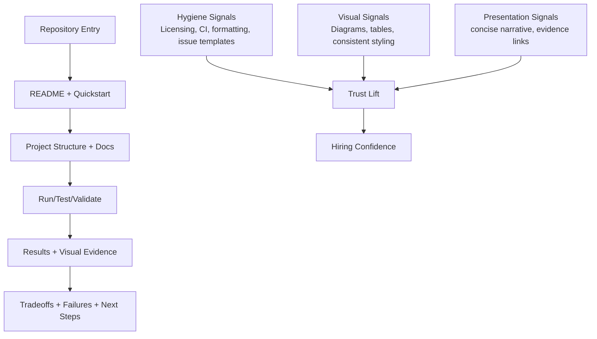

What this shows:
- Hygiene, visuals, and narrative are interconnected trust signals.
- Reviewers need both runnable structure and understandable evidence.
- Signal friction at any stage reduces perceived engineering maturity.

---

### 3. Real-World Industry Scenarios [Intermediate]

#### Scenario A: Recruiter and manager first-pass repo screen

Product/use case context:
- Reviewer opens your repo link directly from resume.
- Decision to move forward often happens in minutes.

Constraints and practical effects:
- If quickstart fails, reviewer rarely retries.
- Missing license, unclear dependencies, and stale docs reduce trust.
- Visual clutter obscures impact metrics and ownership story.

What good looks like:
- Clean README hierarchy with one-command quickstart.
- Clear architecture/result visuals and concise summary blocks.
- Obvious links to case-study, demo, and evaluation artifacts.

#### Scenario B: Engineer reviewer deep validation

Product/use case context:
- Engineer checks reproducibility and code quality signals.

Constraints and practical effects:
- Broken tests or inconsistent formatting suggest weak discipline.
- No contribution guidelines and no issue templates imply low maintainability.
- Inconsistent visual artifacts (different styles, unlabeled axes) weaken result credibility.

What good looks like:
- Standard repo hygiene files and passable CI checks.
- Consistent diagram/table style with clear labels and units.
- Changelog or release notes showing iterative maturity.

---

### 4. System View (Think Like a Systems Engineer) [Intermediate]

Inputs -> Transformations -> Outputs

- Inputs:
  - Existing repository, docs, visuals, and demo artifacts
  - Reviewer goals (scan, run, verify, challenge)
  - Quality standards for maintainability and presentation
- Transformations:
  - Normalize repo structure and top-level documentation.
  - Add reproducibility guardrails (setup, tests, env examples).
  - Standardize visual assets (labels, legends, consistent style).
  - Integrate evidence links and narrative clarity checks.
- Outputs:
  - Low-friction, high-trust portfolio repository.
  - Faster reviewer understanding and stronger interview conversion.

Observability signals:
- Setup success rate from clean environments
- Time-to-first-successful-run
- README navigation bounce points
- Reviewer clarification count on visuals

Failure points:
- Setup drift between docs and code.
- Visuals that communicate aesthetics but not measurement context.
- Over-polish with weak technical evidence.

---

### 5. System Design Flavor (Practical and Concise) [Intermediate]

Repository hygiene checklist components:
- Clear README with prerequisites and quickstart
- Dependency and environment pinning
- Basic tests and lint/format checks
- License, contribution guide, and issue templates
- Changelog or release notes
- Security/privacy notes where relevant

Visual quality checklist components:
- Diagrams with labeled boundaries and data flow direction
- Result charts with units, baseline, and timeframe
- Consistent color and typography choices across assets
- Captions that explain "what changed and why it matters"

Presentation quality checklist components:
- TL;DR summary for each major artifact
- Claim -> evidence link pairing
- Ownership and tradeoff clarity
- Known limitations and next steps

Tradeoffs in plain language:
- Polish vs shipping speed:
  - More polish improves readability.
  - Over-polish can delay learning and delivery.
  - Prioritize hygiene and evidence before visual refinements.
- Minimal docs vs comprehensive docs:
  - Minimal docs are fast.
  - Too minimal increases reviewer friction.
  - Keep docs concise but complete for setup and validation.
- Fancy visuals vs interpretability:
  - Fancy visuals attract attention.
  - Poor labeling destroys trust.
  - Favor clarity-first visual design.

Scaling consideration (multiple repos):
- Use a reusable repository quality template and visual style guide so every project meets the same trust baseline.

---

### 6. Common Mistakes + Debugging [Intermediate]

Mistake 1:
- Symptom: reviewer says, "I couldn't run this quickly."
- Likely cause: setup instructions stale or environment assumptions implicit.
- First debugging step: run quickstart on a clean machine and patch every missing prerequisite.

Mistake 2:
- Symptom: result chart looks good but interviewer challenges validity.
- Likely cause: missing baseline, units, or experimental context.
- First debugging step: add baseline lines, axis units, sample size/time window, and experiment notes.

Mistake 3:
- Symptom: repo feels polished but technical trust remains low.
- Likely cause: presentation quality overshadowed evidence and tradeoff discussion.
- First debugging step: add explicit claim-evidence pairs and one failure/tradeoff section near results.

---

### 7. Hands-On Lab (Concept -> Build -> Break -> Measure -> Explain) [Pro]

Goal:
- Upgrade one project repository to hiring-grade hygiene and presentation quality in a single iteration.

Build:
1. Apply repo hygiene checklist (README, setup, tests, license, contribution docs).
2. Standardize two visuals (architecture and results) with clarity labels.
3. Add one portfolio summary section linking key evidence artifacts.
4. Run clean-environment setup and validation pass.

Break:
1. Remove quickstart prerequisites and test onboarding failure.
2. Remove chart labels/baselines and test interpretability.
3. Remove evidence links and test trust degradation.

Measure:
- Ask 2-3 reviewers to score:
  - Setup friction (1-5, lower is better)
  - Visual clarity (1-5)
  - Perceived engineering discipline (1-5)
  - Hiring confidence (1-5)

Explain:
- Why it broke:
  - Missing hygiene creates immediate execution friction.
  - Missing visual context invalidates result interpretation.
  - Missing evidence linkage reduces credibility.
- Guardrail:
  - Use a pre-publish checklist for hygiene, visuals, and claim-evidence integrity.

---

### 8. Active Recall (Spaced Repetition)

Questions:
1. Why is open-source hygiene a hiring signal, not just a style preference?
2. What makes a result visual interview-safe?
3. What is signal friction and why does it matter?
4. Which three artifact classes should always be linked in a polished portfolio repo?

Answer key:
1. It reflects maintainability, reproducibility, and operational discipline.
2. Baseline, units, timeframe/context, and clear interpretation caption.
3. Extra reviewer effort from unclear structure; it reduces trust and conversion.
4. Setup docs, evidence artifacts, and decision/failure context.

---

### 9. Practice

Mini-exercise:
- Audit one project repository and list 5 hygiene gaps plus 3 visual clarity gaps.

Suggested answer outline:
- Hygiene gaps: setup, tests, docs, licensing, contribution guidance.
- Visual gaps: labeling, baseline/reference, explanatory captions.

Capstone-style question:
- You have two days before interviews. Do you improve model quality by a small margin or invest in repo hygiene and visual clarity? Explain your decision for maximizing hiring signal.

Suggested answer outline:
1. Assess current evidence quality and execution friction.
2. If setup/clarity is weak, prioritize hygiene and presentation first.
3. Pair with one measurable quality metric already achieved.
4. Explain that trust and reproducibility are multipliers for all other signals.

---

### 10. Production Reality Check (Mandatory Ending)

If this fails in prod, what is the first thing we inspect?

- First inspect reproducibility and documentation drift between repository claims and current runnable behavior.
- Why: presentation quality without executable truth creates rapid trust failure when reviewers validate hands-on.

---

### 11. Curiosity Bridge (Mandatory Ending)

With Topic 22.3 complete, you now have strong per-project packaging signals, but hiring leverage improves further when multiple projects are sequenced into a coherent growth narrative.

This naturally opens the next step: cross-project storyline design that shows expanding scope, deeper reliability ownership, and sharper tradeoff judgment over time.

---

### 12. Exit Check + Carry-Forward Review

Exit Check:
- You are done when a reviewer can clone, run, and understand your project evidence path with low friction and high confidence in under 10 minutes.

Carry-Forward Review (interleaved):
- Q: From 22.3.c, what keeps walkthroughs robust under interruptions?
- A: A stable walkthrough backbone with prepared pivots and depth branches.
- Q: From 22.3.b, what converts case-study claims into trust?
- A: Clear structure plus direct links to verifiable evidence anchors.

---

## Module Checkpoint (Comprehensive)

### ✅ Add to Knowledge Base

Use this checkpoint to verify Module 22 is complete in a hiring-relevant way.

### 1) Project Packaging Completeness

For each serious project, confirm all three artifacts exist and are interview-usable:
- Architecture diagram: clear layers, critical flow, and reliability boundaries.
- Failure analysis document: symptom -> root cause -> remediation -> verification.
- Tradeoff justification: chosen option, rejected alternatives, constraints, and measurable rationale.

Pass criteria:
- Every major technical claim in these artifacts has at least one evidence anchor.
- A reviewer can find all three artifacts within 2 clicks from your project summary.

### 2) Systems Evidence Over Feature Hype

Rewrite project presentation from "what feature exists" to "what system changed and what improved."

Required evidence pattern:
- Constraint context: latency/cost/reliability/privacy target.
- Engineering decision: what was changed and why.
- Measurable delta: before-vs-after outcome with guardrail metric.
- Operational reality: known failure mode and mitigation.

Pass criteria:
- Resume bullets, case-study sections, and walkthrough script all follow action-mechanism-outcome structure.
- At least one failure and one tradeoff are explained with measurable evidence, not generic claims.

### 3) Capstone Interview-Readiness Without Live Dependency

Select one capstone project and make it self-explanatory even without you in the room.

Capstone readiness pack:
- Recruiter pass: summary card + role relevance + one outcome metric.
- Hiring manager pass: ownership, constraints, decisions, and business impact.
- Engineer pass: architecture, failure case, tradeoff matrix, and eval report.
- Reproducibility pass: quickstart works, key claims are verifiable from linked artifacts.

Pass criteria:
- A reviewer can understand value in 2 minutes, verify core claims in 10 minutes, and run a basic path without external help.
- Your 7-minute walkthrough remains coherent under interruption using the same evidence pack.

### Final Exit Standard

You have completed Module 22 when:
- Each serious project is packaged with architecture + failure + tradeoff artifacts.
- Your narrative consistently communicates systems engineering evidence over feature hype.
- One capstone is interview-ready as a standalone evidence system, not dependent on live explanation quality.

---

## Module Glossary

- **Architecture Storytelling Asset:** A visual-plus-narrative artifact that translates system design into fast, evaluable hiring evidence.
- **Layer Clarity:** Intentional separation of system concerns so reviewers can map responsibilities and failure boundaries quickly.
- **Signal Density:** Ratio of meaningful engineering evidence to diagram complexity.
- **Trust Boundary:** A boundary where identity, authorization, or data classification policy changes.
- **Control-Flow Drift:** Runtime behavior diverging from intended architecture paths.
- **Fallback Path:** Alternate execution path used when the primary dependency fails or violates SLOs.
- **Decision Log:** Short record linking constraints, chosen architecture, rejected alternatives, and measured outcomes.
- **README Signal Surface:** The reviewer-first set of README sections used to judge engineering maturity quickly.
- **Evidence-Backed Claim:** A project claim accompanied by measurable proof such as eval metrics, latency traces, or incident data.
- **Reviewer Scan Path:** Typical reading sequence under time pressure, used to prioritize README information order.
- **Demo Narrative Arc:** A structured sequence that moves from problem to validated engineering evidence under a strict time budget.
- **Evidence Checkpoint:** A deliberate demo moment where a claim is validated with a concrete artifact or metric.
- **Narrative Discipline:** The ability to maintain objective-aligned technical storytelling despite interruptions or runtime issues.
- **Audience-First Sequencing:** Ordering portfolio evidence based on evaluator role to maximize early trust signals.
- **Trust Trigger:** The first high-signal artifact that increases confidence for a specific reviewer type.
- **Evidence Ladder:** A staged reveal from high-level relevance to deeper technical proof.
- **Postmortem-Lite:** A concise incident analysis format capturing impact, causality, tradeoffs, and verified remediation.
- **Causal Chain:** Ordered mapping from trigger to system behavior to user/business impact.
- **Tradeoff Debt:** Residual risk introduced by earlier optimization decisions that can later amplify failures.
- **Decision Matrix:** Structured comparison of alternatives against weighted constraints and measurable metrics.
- **Acceptance Criteria:** Explicit pass/fail thresholds a chosen design must satisfy before or during production use.
- **Re-evaluation Trigger:** Predefined metric threshold or context shift that forces a decision review.
- **Baseline Condition:** The reference version and setup used to measure change credibly.
- **Intervention:** The intentional system modification being evaluated against baseline.
- **Delta Stack:** Combined movement across quality, latency, cost, and reliability metrics.
- **Alternative Elimination Log:** Structured record of viable options that were considered and rejected with evidence.
- **Constraint Mismatch:** The decisive conflict between an option and critical system constraints.
- **Time-Bound Rejection:** A rejected option that is explicitly eligible for future reconsideration when assumptions shift.
- **Impact Bullet:** A resume statement linking technical action to measurable system or business outcome.
- **Outcome Metric:** Quantified result used to validate claimed impact.
- **Evidence Anchor:** Concrete artifact that verifies a metric claim.
- **Case-Study Spine:** Standard section sequence that keeps project narratives clear and decision-focused.
- **Portfolio Summary Card:** Compact project overview optimized for fast first-pass hiring review.
- **Progressive Depth:** Content layering strategy from broad readability to deep technical detail.
- **Walkthrough Backbone:** Fixed sequence for live project explanation that preserves clarity under time and interruptions.
- **Interruption Pivot:** Prepared transition that answers a detour question and reconnects to the main narrative.
- **Depth Branch:** Optional deep-dive path used when interviewers request detailed technical evidence.
- **Repository Hygiene:** Practices that keep a repo runnable, predictable, maintainable, and trustworthy for reviewers.
- **Presentation Quality Bar:** Minimum artifact clarity standard needed to communicate technical value without confusion.
- **Signal Friction:** Avoidable reviewer effort caused by poor structure, missing context, or broken reproducibility.
