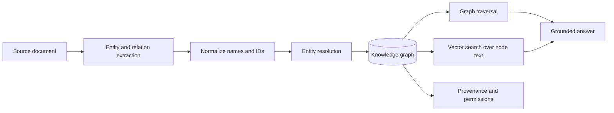
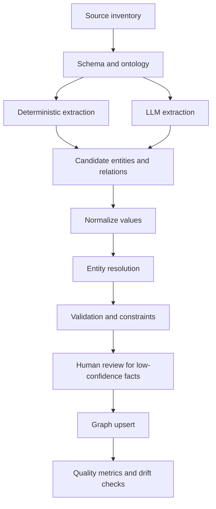
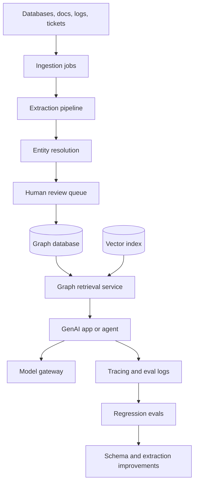

# Module 23 - Knowledge Graphs And GraphRAG Systems

> Module time: 36h
> Why this module matters: Knowledge graphs give GenAI systems structured memory about entities, relationships, provenance, constraints, and multi-hop facts. They are most useful when plain vector search retrieves related text but cannot reliably answer relationship-heavy, entity-centric, permissioned, temporal, or explainability-sensitive questions.

This module is designed as a working reference. If you are building a knowledge graph, GraphRAG system, entity-resolution pipeline, or graph-backed assistant, you should be able to come here and find the vocabulary, design choices, libraries, failure modes, and debugging flow.

---

## Quick Topic Index

| # | Topic | Status |
|---|---|---|
| 23.1 | Knowledge graph fundamentals | Reference |
| 23.1.a | Graph mental model: entities, relationships, properties, provenance | Reference |
| 23.1.b | Labeled property graph vs RDF/OWL and ontology thinking | Reference |
| 23.1.c | Schema design, constraints, identity, and canonical IDs | Reference |
| 23.1.d | When graph beats table, vector search, or plain document RAG | Reference |
| 23.2 | Knowledge graph construction | Reference |
| 23.2.a | Source inventory and graph modeling from real data | Reference |
| 23.2.b | Entity extraction, relation extraction, event extraction | Reference |
| 23.2.c | Entity resolution, deduplication, normalization, aliases | Reference |
| 23.2.d | Incremental updates, freshness, lineage, and versioning | Reference |
| 23.3 | Querying and GraphRAG retrieval | Reference |
| 23.3.a | Cypher, SPARQL, graph traversal, path queries | Reference |
| 23.3.b | Text-to-Cypher and natural-language graph querying | Reference |
| 23.3.c | Hybrid vector plus graph retrieval | Reference |
| 23.3.d | Local, global, community, and multi-hop GraphRAG patterns | Reference |
| 23.4 | Evaluation, observability, and debugging | Reference |
| 23.4.a | KG construction quality metrics | Reference |
| 23.4.b | Graph retrieval and answer quality metrics | Reference |
| 23.4.c | Trace design for graph-backed generation | Reference |
| 23.4.d | Production debugging playbook | Reference |
| 23.5 | Libraries, platforms, and production architecture | Reference |
| 23.5.a | Neo4j, Neo4j GraphRAG, Memgraph, Kuzu, RDF stores | Reference |
| 23.5.b | LlamaIndex PropertyGraphIndex and graph stores | Reference |
| 23.5.c | Microsoft GraphRAG and community-summary systems | Reference |
| 23.5.d | Security, permissions, governance, deployment, and cost | Reference |

---

## Reference Anchors

Use these as starting points when implementing:

- Neo4j GraphRAG for Python: `https://neo4j.com/docs/neo4j-graphrag-python/current/`
- LlamaIndex PropertyGraphIndex: `https://developers.llamaindex.ai/python/framework/module_guides/indexing/lpg_index_guide/`
- Microsoft GraphRAG: `https://microsoft.github.io/graphrag/`
- Memgraph docs and GraphRAG area: `https://memgraph.com/docs`
- Kuzu docs: `https://docs.kuzudb.com/`
- NetworkX docs: `https://networkx.org/documentation/stable/`
- RDFLib docs: `https://rdflib.readthedocs.io/`
- Graphistry docs: `https://docs.graphistry.com/`

The library ecosystem changes quickly. Treat these references as live implementation anchors, and validate versions before production use.

---

## Module Mental Model

A knowledge graph is a structured map of facts:

```text
entity --relationship--> entity
  |                         |
properties              properties
  |
source, timestamp, confidence, owner, permissions
```

The beginner view:

```text
graph = connected facts
```

The professional view:

```text
graph = governed entity memory with identity, provenance, constraints, permissions, query paths, and explainable retrieval
```

The most important distinction:

```text
vector retrieval finds related text
graph retrieval follows explicit relationships
```

You use graphs when relationships are the product:

- Who owns what?
- Which systems depend on this service?
- Which contract clauses conflict?
- Which vendors are connected to high-risk incidents?
- Which users accessed which resource through which role?
- Which policies apply to this user, region, product, and date?

---

## Topic 23.1: Knowledge Graph Fundamentals

### Add to Knowledge Base

### Reading Path + Level Tags

- Beginner: Read intuition, graph data model, and when to use a graph.
- Intermediate: Add schema, identity, and graph vs RAG tradeoffs.
- Pro: Complete the modeling drill and production scenario analysis.

### 1. The Intuition

A knowledge graph is like a city map for facts. A document says "Payments API depends on Kafka." A graph stores that as two entities and an explicit edge:

```text
(payments-api)-[:DEPENDS_ON]->(kafka)
```

That makes the fact queryable, traversable, explainable, and updatable.

Where the analogy breaks: city maps are usually objective and stable. Knowledge graphs built from messy documents are uncertain, versioned, incomplete, and sometimes contradictory.

### 2. Visual Diagram



### 3. Core Concepts

| Concept | Meaning | Interview trap |
|---|---|---|
| Entity | A thing: person, org, service, clause, document, event. | Treating every noun phrase as a reliable entity. |
| Relationship | A typed edge between entities. | Ignoring direction and semantics. |
| Property | Attribute on node or edge. | Storing everything as unstructured text. |
| Provenance | Source of the fact. | Returning graph facts without evidence. |
| Confidence | How reliable extraction or resolution is. | Treating LLM-extracted facts as ground truth. |
| Ontology/schema | Allowed entity and relation types. | Letting labels drift without governance. |
| Identity resolution | Deciding two mentions refer to the same entity. | Merging distinct entities because names are similar. |
| Traversal | Following edges to answer relationship questions. | Expanding too far and retrieving noise. |

### 4. Labeled Property Graph vs RDF/OWL

| Model | Best for | Tradeoff |
|---|---|---|
| Labeled property graph | Product systems, operational graphs, Neo4j/Memgraph/Kuzu, rich properties on nodes/edges. | Less formal semantic reasoning than RDF/OWL. |
| RDF triples | Standards-heavy linked data, semantic web, ontologies, interoperability. | Verbose and can feel less natural for app developers. |
| OWL ontology | Formal reasoning, class hierarchy, constraints, inference. | Higher modeling and tooling complexity. |

Most GenAI application teams start with a labeled property graph because it maps naturally to product entities and graph database queries. RDF/OWL becomes more attractive when semantic standards, formal ontologies, and cross-organization interoperability matter.

### 5. When To Use A Knowledge Graph

Strong fit:

- Multi-hop questions.
- Entity-centric investigation.
- Relationship-heavy domains.
- Provenance and explainability requirements.
- Complex access-control or policy questions.
- Temporal or event-driven reasoning.
- Data that already has relational structure.
- Need to combine structured records and unstructured text.

Weak fit:

- Simple FAQ retrieval.
- Small corpus with mostly independent documents.
- Pure semantic similarity search.
- No stable entities or relationships.
- You cannot afford graph construction and maintenance.

### 6. System Design Flavor

```text
Sources
  -> extract entities and relationships
  -> normalize and resolve identities
  -> store graph with source and confidence
  -> index nodes/edges for graph and vector retrieval
  -> route query to vector, graph, or hybrid retrieval
  -> synthesize answer with graph path evidence
  -> evaluate and trace every step
```

Key design choices:

- Schema-first vs schema-later extraction.
- Deterministic extraction vs LLM extraction.
- Property graph vs RDF.
- Store embeddings in graph DB vs external vector DB.
- Text-to-Cypher vs controlled query templates.
- Local subgraph retrieval vs global community summaries.

### 7. Common Mistakes + Debugging

| Mistake | Symptom | First debugging step |
|---|---|---|
| No canonical IDs | Duplicate nodes for same entity. | Inspect aliases, source IDs, and merge rules. |
| Unbounded extraction labels | Graph has messy relation types like `related_to`, `involved_with`, `has`. | Review ontology and extraction prompt/schema. |
| No provenance | Answer cannot explain where graph fact came from. | Inspect node/edge source fields and source spans. |
| Bad entity resolution | Two different entities are merged. | Audit merge decisions and similarity thresholds. |
| Over-traversal | Retrieval returns huge noisy subgraph. | Check depth, edge types, degree caps, and path scoring. |

### 8. Hands-On Lab: Build A Tiny Knowledge Graph

Build:

```python
import networkx as nx

g = nx.MultiDiGraph()

g.add_node("payments-api", type="Service", owner="payments", source="runbook.md")
g.add_node("kafka", type="Service", owner="platform", source="runbook.md")
g.add_node("checkout", type="Service", owner="commerce", source="incident.md")

g.add_edge("checkout", "payments-api", type="CALLS", source="architecture.md")
g.add_edge("payments-api", "kafka", type="DEPENDS_ON", source="runbook.md")

print(nx.shortest_path(g, "checkout", "kafka"))
```

Break:

```python
g.add_node("Kafka", type="Service", owner="platform", source="ticket.md")
g.add_edge("payments-api", "Kafka", type="DEPENDS_ON", source="ticket.md")
print(list(g.nodes))
```

Measure:

- Count duplicate canonical entities.
- Count edges missing source.
- Count relation types outside allowed schema.

Explain:

The graph looks simple until identity drift appears. `kafka` and `Kafka` may represent the same system, but the graph now has two nodes. Production KGs need canonical IDs, aliases, normalization, and resolution review.

### 9. Active Recall

1. What is the difference between semantic similarity and graph traversal?
2. Why does provenance matter in GraphRAG?
3. When would RDF/OWL be better than a property graph?
4. What is the first thing you inspect when a graph has duplicate entities?
5. Why can LLM-extracted relations be dangerous?

Answer key:

1. Similarity finds related candidates; traversal follows explicit relationships.
2. It lets the system cite and audit where graph facts came from.
3. When standards, formal reasoning, and ontology interoperability matter.
4. Canonical IDs, aliases, source IDs, and merge rules.
5. They can hallucinate relation types or overstate uncertain facts.

### 10. Production Reality Check

If this fails in prod, what is the first thing we inspect?

Inspect entity identity and provenance. Most graph failures start with incorrect node identity, missing source evidence, or relation labels that do not mean what the retrieval layer thinks they mean.

### 11. Curiosity Bridge

This works when the graph is clean. It breaks when construction is noisy. Next we need to learn how to build, validate, update, and repair the graph itself.

### 12. Exit Check

You are done when you can model a domain as nodes, edges, properties, constraints, source evidence, and query paths without defaulting to "just embed the documents."

---

## Topic 23.2: Knowledge Graph Construction

### Reading Path + Level Tags

- Beginner: Understand source inventory, extraction, normalization.
- Intermediate: Add entity resolution, confidence, lineage, and updates.
- Pro: Design a production KG pipeline with human review and regression tests.

### 1. Construction Pipeline



### 2. Source Types

| Source | Graph opportunity | Risk |
|---|---|---|
| Relational DB | Strong IDs and structured relations. | Business semantics may be hidden in app logic. |
| Logs/events | Temporal graph and causality hints. | High volume and noisy edges. |
| Tickets/incidents | Entity-event-service relationships. | Inconsistent names and free text. |
| Contracts/policies | Clauses, obligations, exceptions, parties. | Ambiguous language and cross-references. |
| Documents/wiki | Concepts and ownership. | Weak structure and stale content. |
| APIs/CMDB | Operational dependencies. | Staleness and partial coverage. |

### 3. Extraction Strategies

| Strategy | Use when | Weakness |
|---|---|---|
| Deterministic mapping | Source has strong schema or IDs. | Misses implicit relationships in text. |
| Rule/regex extraction | Patterns are stable and simple. | Brittle under wording changes. |
| NLP extraction | Entities/relations follow linguistic patterns. | May miss domain-specific meaning. |
| LLM extraction | Text is messy but semantically rich. | Cost, hallucination, inconsistency. |
| Hybrid extraction | Production-grade path. | More components to test. |

Professional rule:

```text
Use deterministic extraction for strong facts.
Use LLM extraction for weak candidate facts.
Never store weak facts without provenance and confidence.
```

### 4. Entity Resolution

Entity resolution answers:

```text
Are "OpenAI", "Open AI", "OpenAI Inc.", and "openai.com" the same entity?
```

Signals:

- Exact ID.
- Source system ID.
- Normalized name.
- Alias list.
- Domain/email/URL.
- Address or region.
- Embedding similarity.
- Shared neighbors.
- Human-approved merge history.

Failure modes:

- False merge: two different entities become one.
- False split: one entity becomes many nodes.
- Temporal merge error: entity changed identity over time.
- Tenant merge error: same-looking entity in different tenant should remain separate.

### 5. Graph Upsert Rules

Use stable keys:

```text
node_key = tenant_id + entity_type + canonical_id
edge_key = source_node + relation_type + target_node + source_id + valid_from
```

Store evidence:

```text
source_doc_id
source_span
extractor_version
confidence
created_at
valid_from
valid_to
owner
permissions
```

### 6. Common Mistakes + Debugging

| Mistake | Why it is wrong | Better approach |
|---|---|---|
| Letting LLM invent schema | Relation labels explode and retrieval becomes unreliable. | Use allowed entity/relation schema. |
| Merging on name only | Same names can mean different entities. | Use multi-signal resolution and human review. |
| No deletion strategy | Old facts remain forever. | Use valid-time, tombstones, source reconciliation. |
| No confidence field | Weak facts look authoritative. | Store extraction confidence and evidence type. |
| Rebuilding graph blindly | IDs shift and diffs become impossible. | Use stable IDs and incremental upserts. |

### 7. Quality Metrics

| Layer | Metrics |
|---|---|
| Entity extraction | Precision, recall, label accuracy, missing entity rate. |
| Relation extraction | Precision, recall, direction accuracy, allowed-schema rate. |
| Entity resolution | Pairwise precision/recall, false merge rate, false split rate. |
| Graph health | Duplicate rate, orphan node rate, missing provenance rate, constraint violations. |
| Freshness | Ingestion lag, stale fact count, source reconciliation errors. |
| Review | Low-confidence queue size, human overturn rate. |

### 8. Hands-On Lab: Extraction Contract

Build a typed extraction contract:

```python
from pydantic import BaseModel, Field

class Entity(BaseModel):
    name: str
    type: str
    canonical_id: str | None = None
    confidence: float = Field(ge=0, le=1)
    source_span: str

class Relation(BaseModel):
    source: str
    target: str
    type: str
    confidence: float = Field(ge=0, le=1)
    source_span: str

ALLOWED_ENTITY_TYPES = {"Service", "Team", "Incident", "Policy", "Vendor"}
ALLOWED_RELATIONS = {"OWNS", "DEPENDS_ON", "AFFECTS", "MENTIONS", "REQUIRES_APPROVAL"}
```

Break:

- Return relation type `is kind of related to`.
- Omit `source_span`.
- Use confidence `1.4`.
- Merge two services with same display name from different tenants.

Measure:

- Schema-valid extraction rate.
- Allowed-label rate.
- Missing-provenance rate.
- Human-review queue rate.

### 9. Production Reality Check

If this fails in prod, what is the first thing we inspect?

Inspect the extraction and resolution trace for the bad fact: source span, extractor version, schema version, confidence, merge decision, and upsert key.

---

## Topic 23.3: Querying And GraphRAG Retrieval

### 1. Query Modes

| Query mode | Best for | Example |
|---|---|---|
| Direct graph query | Known schema and precise question. | "Which services depend on Kafka?" |
| Text-to-Cypher | Natural-language graph exploration. | "Show teams affected by the Kafka incident." |
| Vector over node text | Fuzzy entity or concept lookup. | "Find docs about checkout latency." |
| Hybrid vector + graph | Most GraphRAG apps. | Find entity semantically, then traverse edges. |
| Community summary | Global questions over large corpora. | "What are the main risk themes?" |
| Multi-hop path retrieval | Relationship reasoning. | "How can this vendor affect payment outages?" |

### 2. GraphRAG Patterns

| Pattern | Flow | Good fit |
|---|---|---|
| Entity lookup + neighborhood | Query -> entity match -> 1-2 hop subgraph -> answer. | Operational dependency, ownership, support. |
| Path-constrained retrieval | Query -> source/target entities -> allowed paths -> evidence. | Compliance, lineage, impact analysis. |
| Vector-first, graph-expand | Vector search finds seed nodes, graph expands context. | Messy natural language queries. |
| Graph-first, vector-fill | Graph query finds entities, vector search fills textual evidence. | Known schema, rich documents. |
| Community GraphRAG | Build communities and summaries, retrieve local/global summaries. | Large corpora with thematic synthesis. |
| Text-to-Cypher with guardrails | LLM writes graph query within schema constraints. | Analyst copilots with known schema. |

### 3. Text-to-Cypher Safety

Text-to-Cypher is powerful, but risky.

Controls:

- Read-only query role.
- Schema whitelist.
- Query templates for common intents.
- Maximum traversal depth.
- Result count limit.
- Timeout and cost budget.
- Query plan inspection.
- No destructive clauses in generated queries.
- Human review for broad data export.

Common dangerous output:

```cypher
MATCH (n) RETURN n
```

Better route:

```text
intent = dependency_impact
seed = "kafka"
template = dependency_impact_template(seed, max_depth=2, tenant=user.tenant)
```

### 4. Graph Retrieval Trace

Capture:

```text
query_text
intent
seed_entities
entity_match_scores
generated_query_or_template
graph_db_latency_ms
node_count
edge_count
path_count
traversal_depth
source_docs
permission_filter
answer_citations
```

### 5. Common Mistakes + Debugging

| Mistake | Symptom | First inspection |
|---|---|---|
| Seed entity mismatch | Query about one vendor returns another. | Entity linker candidates and aliases. |
| Too much expansion | Context window filled with irrelevant neighbors. | Hop depth, edge filters, high-degree nodes. |
| Text-to-Cypher hallucination | Query fails or returns wrong shape. | Generated query, schema prompt, allowed clauses. |
| Missing textual evidence | Graph path exists but answer lacks citation. | Edge provenance and source spans. |
| Permission gap | Graph exposes restricted relationships. | Node/edge ACL and query role. |

### 6. Hands-On Lab: Hybrid Graph Retrieval

Build:

```python
def retrieve_subgraph(graph, seed, allowed_edges, max_depth=2):
    frontier = [(seed, 0)]
    seen = {seed}
    edges = []

    while frontier:
        node, depth = frontier.pop(0)
        if depth >= max_depth:
            continue
        for _, target, data in graph.out_edges(node, data=True):
            if data.get("type") not in allowed_edges:
                continue
            edges.append((node, target, data))
            if target not in seen:
                seen.add(target)
                frontier.append((target, depth + 1))

    return seen, edges
```

Break:

- Remove `allowed_edges`.
- Set `max_depth=5`.
- Use seed entity with many neighbors.

Measure:

- Number of nodes and edges retrieved.
- Percentage with provenance.
- Answer token count.
- Relevant path hit rate.

### 7. Production Reality Check

If this fails in prod, what is the first thing we inspect?

Inspect seed entity linking and traversal constraints. Most GraphRAG failures are caused by starting from the wrong entity or expanding through the wrong edge types.

---

## Topic 23.4: Evaluation, Observability, And Debugging

### 1. Evaluation Stack

| Layer | Questions |
|---|---|
| Construction | Did we extract the right entities and relationships? |
| Resolution | Did we merge and split entities correctly? |
| Retrieval | Did the graph query return the right nodes, edges, paths, and sources? |
| Synthesis | Did the answer use graph evidence faithfully? |
| Safety | Did permissions and query constraints hold? |
| Operations | Was latency/cost acceptable? |

### 2. Metrics

| Metric | Meaning |
|---|---|
| Entity precision/recall | Extracted entities vs gold labels. |
| Relation precision/recall | Extracted relations vs gold labels. |
| Direction accuracy | Edge direction matches ground truth. |
| Entity resolution pairwise F1 | Merge quality. |
| Path recall@k | Expected path appears in retrieved paths. |
| Subgraph precision | Retrieved subgraph nodes/edges are relevant. |
| Provenance coverage | Facts have source spans. |
| Cypher validity | Generated query parses and respects policy. |
| Answer faithfulness | Answer is supported by graph/source evidence. |
| Permission leak rate | Unauthorized nodes/edges exposed. |

### 3. Production Scenarios

| Scenario | First inspection | Likely fix |
|---|---|---|
| Duplicate vendor nodes | Canonical ID and alias resolver. | Add deterministic ID or human merge review. |
| False supply-chain risk path | Edge provenance and confidence. | Require verified edge types for risk answers. |
| Query returns huge subgraph | Traversal depth and high-degree nodes. | Cap depth, filter edges, summarize communities. |
| Text-to-Cypher returns all nodes | Query guardrails and templates. | Use read-only templates and row limits. |
| Graph answer lacks citation | Edge source spans. | Require source-backed answer generation. |
| Stale dependency answer | Source freshness and valid-time. | Reconcile source and expire old facts. |

### 4. Debugging Playbook

```text
Bad graph-backed answer
  -> verify user permissions
  -> inspect seed entity linking
  -> inspect generated query or template
  -> inspect retrieved nodes/edges/paths
  -> inspect provenance and source spans
  -> inspect context packing
  -> inspect answer faithfulness
  -> add failing case to graph eval set
```

### 5. Production Reality Check

If this fails in prod, what is the first thing we inspect?

Inspect whether the graph fact is true, current, and source-backed before changing the generator. A fluent answer over a wrong graph is still wrong.

---

## Topic 23.5: Libraries, Platforms, And Production Architecture

### 1. Library And Platform Map

| Tool | Use it for | Notes |
|---|---|---|
| Neo4j | Production property graph, Cypher, graph apps, vector and graph integrations. | Strong ecosystem and GraphRAG support. |
| Neo4j GraphRAG Python | GraphRAG features, retrievers, KG builder pipelines, Neo4j-first RAG. | Official Neo4j Python package. |
| LlamaIndex PropertyGraphIndex | Data-centric graph extraction, property graph stores, query engines. | Good when graph is part of document/RAG pipeline. |
| Microsoft GraphRAG | Graph construction plus community summaries for corpus-level reasoning. | Strong for global/local search over large text collections. |
| Memgraph | Real-time graph DB, Cypher-like querying, graph algorithms, GraphRAG docs. | Useful for streaming or operational graphs. |
| Kuzu | Embedded graph DB. | Useful for local, embedded, analytical graph use cases. |
| NetworkX | In-memory graph algorithms and prototypes. | Not a production graph DB. |
| RDFLib | RDF graph manipulation in Python. | Useful for RDF/SPARQL/semantic-web workflows. |
| Graphistry | Graph visualization and investigation. | Useful for analyst-facing graph exploration. |
| Qdrant/Pinecone/Weaviate | External vector store alongside graph DB. | Useful when graph DB vector support is not enough or standardization matters. |

### 2. Production Architecture



### 3. Security And Governance

Controls:

- Node and edge permission metadata.
- Tenant-aware query filters.
- Read-only roles for generated queries.
- No unrestricted text-to-Cypher execution.
- Audit log for every graph query.
- Provenance for every generated answer.
- PII and sensitive edge redaction.
- Human review for low-confidence critical facts.
- Source owner and data retention policy.

### 4. Cost And Latency

GraphRAG adds cost:

- Extraction cost.
- Entity resolution cost.
- Graph storage and index cost.
- Graph query latency.
- Additional context synthesis tokens.
- Human review for low-confidence facts.

Cost controls:

- Extract only useful entity/relation types.
- Use deterministic extraction where possible.
- Batch graph updates.
- Cache entity linking and common subgraphs.
- Limit traversal depth.
- Use templates for common graph queries.
- Avoid LLM text-to-Cypher for simple known intents.

### 5. Capstone Project Ideas

| Project | What it proves |
|---|---|
| Service dependency GraphRAG | Impact analysis, graph traversal, source-backed answer. |
| Contract obligation graph | Clause/entity extraction, obligations, exceptions, citations. |
| Vendor risk graph | Multi-hop risk paths, provenance, confidence, temporal facts. |
| Incident knowledge graph | Events, services, owners, runbooks, remediation history. |
| Policy applicability graph | User/role/region/product/date constraints and safe refusal. |

### 6. Interview Questions

1. When would you use GraphRAG instead of baseline RAG?
2. How would you build a KG from unstructured documents?
3. How do you prevent LLM extraction from polluting a graph?
4. How do you evaluate entity resolution quality?
5. How do you secure text-to-Cypher?
6. How do you combine vector search with graph traversal?
7. What does provenance mean in a graph-backed answer?
8. How do you handle stale graph facts?
9. How would you design a service dependency graph for incident response?
10. What are the tradeoffs between Neo4j, LlamaIndex PropertyGraphIndex, Microsoft GraphRAG, and NetworkX?

### 7. Strong Interview Answer: GraphRAG vs RAG

> I would use baseline RAG when the main problem is finding relevant passages. I would use GraphRAG when the question depends on explicit entities, relationships, paths, constraints, or multi-hop reasoning. The design starts with source inventory, a controlled graph schema, extraction with provenance, entity resolution, and graph storage. At query time I usually identify seed entities, traverse relevant edge types, retrieve source-backed paths, and combine that with vector evidence for answer synthesis. The tradeoff is higher construction and maintenance cost, so I would only use it when graph structure improves correctness, explainability, or permissions enough to justify the complexity.

---

## Module Checkpoint

You are ready to use this module when you can:

- Model a domain as entities, relationships, properties, source evidence, and constraints.
- Decide when GraphRAG is justified over baseline vector RAG.
- Design a KG construction pipeline with extraction, resolution, provenance, and updates.
- Query graphs with traversal, text-to-Cypher, or hybrid graph/vector retrieval.
- Evaluate construction quality, retrieval quality, answer faithfulness, and permission safety.
- Debug graph-backed answers by inspecting entity linking, traversal, provenance, and synthesis.
- Choose libraries with engineering reasons rather than hype.

---

## Module Glossary

| Term | Meaning |
|---|---|
| Knowledge graph | Structured representation of entities and relationships with properties and provenance. |
| Entity | A real or conceptual thing represented as a graph node. |
| Relationship | A typed edge between entities. |
| Property graph | Graph model where nodes and edges can have labels and key-value properties. |
| RDF | Triple-based graph model often used for linked data and semantic web systems. |
| Ontology | Formal model of entity types, relationships, constraints, and semantics. |
| Entity resolution | Process of deciding which mentions refer to the same canonical entity. |
| Provenance | Source evidence and lineage for a graph fact. |
| Graph traversal | Following edges from one node to connected nodes or paths. |
| Cypher | Query language commonly used with property graph databases such as Neo4j. |
| SPARQL | Query language for RDF graphs. |
| GraphRAG | Retrieval-augmented generation that uses graph structure as part of retrieval and grounding. |
| Text-to-Cypher | Translating natural language into Cypher queries. |
| Community summary | Summary of a cluster/community in a graph, often used in global GraphRAG. |
| Path recall | Whether expected graph paths are retrieved for a query. |
| Subgraph precision | How much of a retrieved subgraph is relevant to the question. |
