# Module 24 - Conversational Graphs And Dialogue State Systems

This is the evolving knowledge base for Module 24.

**Module time:** 34h

**Why this module matters:** Conversational graph design turns multi-turn assistants from fragile chat transcripts into controlled, inspectable, stateful systems. It is the missing layer between simple chat memory and production-grade dialogue flows with intent routing, slot filling, tool use, interruption, fallback, human handoff, analytics, and resumability. Raw chat history is not state: a production assistant must know what task is active, what information is still missing, what has been confirmed, which tools already ran, what action is pending approval, what to do when the user changes topic, and when to escalate to a human. This module takes you from "conversation graph = chatbot flowchart" to "conversation graph = stateful control plane for dialogue, tools, memory, safety, recovery, and analytics."

---

## Quick Topic Index

- [Topic 24.1: Conversational Graph Fundamentals](#topic-241-conversational-graph-fundamentals)
  - [Subtopic 24.1.a: Dialogue as States, Transitions, Events, and Memory](#subtopic-241a-dialogue-as-states-transitions-events-and-memory)
  - [Subtopic 24.1.b: Conversation Graph vs Workflow Graph vs Agent Graph](#subtopic-241b-conversation-graph-vs-workflow-graph-vs-agent-graph)
  - [Subtopic 24.1.c: Intents, Slots, Entities, Forms, and Context Variables](#subtopic-241c-intents-slots-entities-forms-and-context-variables)
  - [Subtopic 24.1.d: Deterministic, Probabilistic, and LLM-Driven Transitions](#subtopic-241d-deterministic-probabilistic-and-llm-driven-transitions)
- [Topic 24.2: Designing Multi-Turn Conversation Flows](#topic-242-designing-multi-turn-conversation-flows)
  - [Subtopic 24.2.a: Slot Filling, Clarification, Repair, and Confirmation](#subtopic-242a-slot-filling-clarification-repair-and-confirmation)
  - [Subtopic 24.2.b: Topic Switching, Interruption, Resumption, and Digression](#subtopic-242b-topic-switching-interruption-resumption-and-digression)
  - [Subtopic 24.2.c: Tool Use, Side Effects, Approval, and Human Handoff](#subtopic-242c-tool-use-side-effects-approval-and-human-handoff)
  - [Subtopic 24.2.d: Personalization, Memory, and Long-Lived State](#subtopic-242d-personalization-memory-and-long-lived-state)
- [Topic 24.3: Conversation-Aware Retrieval and Graph Memory](#topic-243-conversation-aware-retrieval-and-graph-memory)
  - [Subtopic 24.3.a: Conversation State for RAG and Context Carryover](#subtopic-243a-conversation-state-for-rag-and-context-carryover)
  - [Subtopic 24.3.b: Intent Transition Graphs and Next-Best-Action Systems](#subtopic-243b-intent-transition-graphs-and-next-best-action-systems)
  - [Subtopic 24.3.c: Conversational GraphRAG and Dual Retrieval](#subtopic-243c-conversational-graphrag-and-dual-retrieval)
  - [Subtopic 24.3.d: Evaluation for Multi-Turn and Conversation Trajectories](#subtopic-243d-evaluation-for-multi-turn-and-conversation-trajectories)
- [Topic 24.4: Libraries, Runtimes, and Production Platforms](#topic-244-libraries-runtimes-and-production-platforms)
  - [Subtopic 24.4.a: LangGraph for Stateful Conversational Agents](#subtopic-244a-langgraph-for-stateful-conversational-agents)
  - [Subtopic 24.4.b: Rasa, Dialogflow CX, Botpress, XState, Temporal-Style Workflows](#subtopic-244b-rasa-dialogflow-cx-botpress-xstate-temporal-style-workflows)
  - [Subtopic 24.4.c: Observability, Analytics, Testing, and CI](#subtopic-244c-observability-analytics-testing-and-ci)
  - [Subtopic 24.4.d: Voice, Realtime, and Channel-Specific Concerns](#subtopic-244d-voice-realtime-and-channel-specific-concerns)
- [Topic 24.5: Production Scenarios and Debugging](#topic-245-production-scenarios-and-debugging)
  - [Subtopic 24.5.a: Fallback Loops, Lost Context, Wrong Tool Action, Stuck Flows](#subtopic-245a-fallback-loops-lost-context-wrong-tool-action-stuck-flows)
  - [Subtopic 24.5.b: Latency, Handoff, Safety, and Compliance Incidents](#subtopic-245b-latency-handoff-safety-and-compliance-incidents)
  - [Subtopic 24.5.c: Conversation Graph Metrics and Dashboards](#subtopic-245c-conversation-graph-metrics-and-dashboards)
  - [Subtopic 24.5.d: Interview Answers and Capstone Project Ideas](#subtopic-245d-interview-answers-and-capstone-project-ideas)
- [Module 24 Checkpoint: End-to-End Conversational System Design](#module-24-checkpoint-end-to-end-conversational-system-design)
- [Module Glossary](#module-glossary)

**Covered so far:**
- Subtopic 24.1.a: Dialogue as states, transitions, events, and memory
- Subtopic 24.1.b: Conversation graph vs workflow graph vs agent graph
- Subtopic 24.1.c: Intents, slots, entities, forms, and context variables
- Subtopic 24.1.d: Deterministic, probabilistic, and LLM-driven transitions

---

## Reference Anchors

Use these as live implementation anchors. Product APIs change; the durable concepts are states, events, transitions, slots, tools, memory, handoff, evaluation, and traceability.

- LangGraph docs: `https://docs.langchain.com/oss/python/langgraph/overview`
- Rasa docs: `https://rasa.com/docs/rasa/`
- Dialogflow CX concepts: `https://cloud.google.com/dialogflow/cx/docs/concept/agent`
- Botpress nodes and workflows: `https://www.botpress.com/docs/studio/concepts/nodes/introduction`
- XState docs: `https://stately.ai/docs`
- LlamaIndex chat engines: `https://developers.llamaindex.ai/python/framework/module_guides/deploying/chat_engines/`

---

## Module Mental Model

A conversation graph is a map of possible dialogue states and transitions:

```text
state + user event + context -> transition -> next state + response/action
```

The beginner view:

```text
conversation graph = chatbot flowchart
```

The professional view:

```text
conversation graph = stateful control plane for dialogue, tool use, memory, safety, recovery, and analytics
```

The single most important distinction in this module:

```text
chat history = a transcript of what was said
conversation state = an inspectable, testable object of what is true, missing, confirmed, and pending
```

---

## Topic 24.1: Conversational Graph Fundamentals

**Topic time:** 7h

---

## Subtopic 24.1.a: Dialogue as States, Transitions, Events, and Memory

### Reading Path + Level Tags

- **Beginner:** Read sections 1–2 and Active Recall.
- **Intermediate:** Add sections 3–5 and the Hands-On Lab.
- **Pro:** Full lab with Break + Measure plus the capstone state-design question.

---

### 1. Pre-Question Hook + The Intuition [Beginner]

**Pause — before reading:** A bot asks "What's your order ID?", the user answers, and three turns later the bot asks again. The chat history clearly contains the ID. Why did it forget — and what would have prevented it?

**The core mental model:**
The bot forgot because it treated *chat history* as *state*. History is an ordered transcript; state is a structured, inspectable object that records what is true right now: the active task, which slots are filled, what's confirmed, what tools ran, what's pending. A conversation graph models dialogue as four things:
- **State:** the current stage/task (`collect_order_id`, `confirm`, `await_approval`).
- **Event:** something that happens — a user message, a tool result, a timeout, an approval.
- **Transition:** a rule mapping `(state, event, context) → next state + response/action`.
- **Memory:** the working context (slots, entities, history summary) carried across turns.

The professional habit: keep an *explicit state object* separate from the transcript, so behavior is predictable, testable, resumable, and debuggable.

**Real-world analogy:**
A conversation graph is a train network for dialogue: users enter at many stations, move between stops, take detours, and sometimes need assistance to get back on route. Where it breaks: real users don't follow tracks — they interrupt, contradict themselves, change goals, answer partially, abandon tasks, and return later. The graph's job is to always know "which station are we at, and what are the valid next moves?"

**Key terms:**
- **State object:** an explicit structure holding current task, slots, flags — not the raw transcript.
- **Event:** any trigger that may cause a transition.
- **Transition function:** deterministic-or-learned mapping to the next state.
- **Working memory:** slots, active entities, and a running summary.
- **Resumability:** the ability to continue a task after interruption because state is explicit.

---

### 2. Visual Diagram (Mermaid) [Beginner]

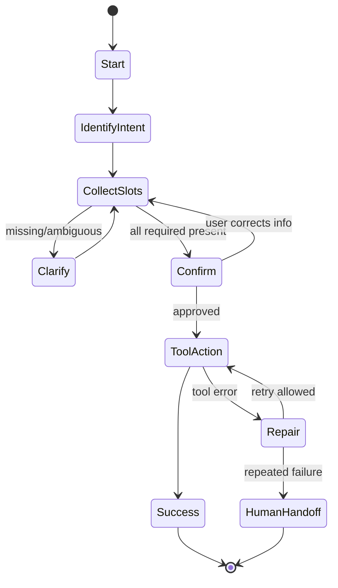

The diagram is the *state machine*; the state object is what tells you which node you're in and why.

---

### 3. Real-World Industry Scenarios [Intermediate]

**Scenario A — Support assistant (state prevents repetition)**

*Context:* Order-status bot collecting `order_id`, `email`.
- **Why explicit state:** slots persist in the state object, so the bot never re-asks a filled slot; the transcript is only for display/summary.
- **What "good" looks like:** each turn logs `state`, `slots_before`, `transition`, `next_state` — fully reconstructable.

**Scenario B — Long-lived incident assistant (resumability)**

*Context:* A user pauses mid-task, returns an hour later.
- **Why explicit state:** the suspended task and its slots are persisted; on return the bot resumes exactly where it was (if still valid), instead of restarting.

**Scenario C — Timeouts and system events (events beyond messages)**

*Context:* A tool call times out; a scheduled reminder fires.
- **Why events:** transitions aren't only user messages — timeouts and tool results are first-class events that drive the graph (retry, escalate, notify).

---

### 4. System View [Intermediate]

**Inputs → Transformations → Outputs**

```text
Event (user msg / tool result / timeout / approval)
   ↓ interpret (intent + entities) against current state
Updated working memory (slots, entities, summary)
   ↓ transition function: (state, event, context) → next state + action
Next state + response/tool call
   ↓ persist state object; log transition
Resumable, inspectable conversation
```

**Observability — log per turn:** `conversation_id`, `previous_state`, `event`, `intent_candidates`, `entities`, `slots_before`, `transition_decision`, `next_state`, `response_type`, `latency_ms`.

**Failure points:**

| Failure | Symptom | Root cause |
|---|---|---|
| History-as-state | Bot re-asks or forgets fields | No explicit state object |
| No event model | Timeouts/tool results ignored | Only user messages trigger logic |
| Unlogged transitions | Can't reconstruct what happened | No per-turn transition trace |
| Non-resumable | Interruptions restart the task | State not persisted |

---

### 5. System Design Flavor [Intermediate]

**Key design question:** What is the minimal explicit state object that makes every turn predictable, testable, and resumable — separate from the transcript?

**Tradeoffs:**

| Decision | Explicit state machine | Free LLM + history |
|---|---|---|
| Predictability | High (inspectable) | Low (implicit) |
| Testability | Unit-testable transitions | Hard to test |
| Flexibility of language | Needs interpretation layer | Naturally flexible |
| Debuggability | Trace per transition | Guesswork |

**Scaling consideration:** Persist state in a store keyed by `conversation_id` so sessions survive restarts and can be resumed or migrated. As traffic grows, the state store (not the LLM) becomes the reliability backbone — design its schema and retention early.

---

### 6. Common Mistakes + Debugging [Beginner]

**Mistake 1 — Treating chat history as state.**
- **Symptom:** the bot forgets required fields or repeats questions.
- **First step:** inspect the explicit state object and slot values, not the transcript.

**Mistake 2 — Only user messages count as events.**
- **Symptom:** tool timeouts and results don't drive recovery.
- **First step:** model timeouts/tool results/approvals as first-class events with transitions.

**Mistake 3 — No transition logging.**
- **Symptom:** a bad conversation can't be reconstructed.
- **First step:** log `(previous_state, event, decision, next_state)` every turn.

---

### 7. Hands-On Lab [Pro]

**Concept:** A tiny explicit-state conversation graph that survives digressions and invalid input.

#### Build — Minimal state machine

```python
from dataclasses import dataclass, field

@dataclass
class ConversationState:
    state: str = "start"
    slots: dict[str, str] = field(default_factory=dict)
    attempts: int = 0

def step(s: ConversationState, message: str) -> ConversationState:
    text = message.lower()
    if s.state == "start":
        s.state = "collect_order_id"
    elif s.state == "collect_order_id":
        if "ord-" in text:
            s.slots["order_id"] = text.split()[-1].upper()
            s.state = "confirm"; s.attempts = 0
        else:
            s.attempts += 1
            s.state = "handoff" if s.attempts >= 2 else "collect_order_id"
    elif s.state == "confirm":
        if "yes" in text: s.state = "done"
        elif "no" in text: s.state = "collect_order_id"
    return s

s = ConversationState()
for msg in ["hi", "my id is ord-1234", "yes"]:
    s = step(s, msg)
    print(f"after '{msg}': state={s.state} slots={s.slots}")
```

#### Break — Feed it real-user messiness

```python
s = ConversationState()
for msg in ["yes",                    # early confirmation before any slot
            "actually I need a refund",# topic switch (no handling yet)
            "ord-1 and ord-2",         # two IDs
            "nope"]:
    s = step(s, msg)
    print(f"after '{msg}': state={s.state} slots={s.slots}")
# Observe: early 'yes' does nothing useful; topic switch is ignored; two IDs mishandled.
```

#### Measure

- Turns to completion (happy path vs messy).
- Fallback/handoff count and rate.
- Slot-correction rate.
- Invalid-transition count (events with no valid transition).

#### Explain

The explicit state object makes the happy path clean and every decision inspectable. The break run exposes exactly what a real conversation graph must add: handling early confirmations, topic switches, and ambiguous input — the subjects of Topic 24.2. Crucially, because state is explicit, each failure is *observable* (you can see the state and slots at every turn) rather than buried in a transcript.

---

### 8. Active Recall [Beginner → Intermediate]

1. **[Beginner]** Why is an explicit state object better than relying on chat history?
2. **[Beginner]** Name the four elements a conversation graph models.
3. **[Intermediate]** Give two events that are *not* user messages.
4. **[Intermediate]** What makes a conversation resumable?
5. **[Pro]** Why does the state store become the reliability backbone at scale?

**Answer Key:**
1. It's inspectable, testable, resumable, and unambiguous; history is just a transcript that the bot must re-interpret each turn.
2. State, event, transition, and memory (working context).
3. Any two: tool result, timeout, approval decision, scheduled/system signal.
4. Persisting the explicit state object (task + slots) keyed by conversation, so it can continue after interruption.
5. Sessions must survive restarts and be resumable/migratable; the persisted state — not the LLM — guarantees continuity and correctness.

---

### 9. Practice [Intermediate / Pro]

**Mini-exercise:** List the fields of a minimal state object for a password-reset assistant and one event that is not a user message.

*Suggested answer:* `{state, slots:{username,email,verification_status}, attempts}`; non-message event = verification-email-sent timeout or MFA-service result.

**Capstone design question:** Design the explicit state object and top-level states for an appointment-scheduling assistant that must survive interruptions and resume later.

*Answer outline:* states `identify_intent → collect(slot: service, date, time, contact) → confirm → book(tool) → done/repair/handoff`; state object holds slots with confirmed flags, `active_task`, `suspended_task`, `attempts`; persisted by `conversation_id`; events include user messages, calendar-tool results, and reminder timeouts; resumption checks slot freshness before continuing.

---

### 10. Production Reality Check (Mandatory)

**If a bot repeats a question or forgets a field, what's the first thing we inspect?**

The explicit state object and the transition trace for that turn — `previous_state`, the interpreted event (intent/entities), `slots_before`, the transition decision, and `next_state`. Almost always the bug is that a slot update didn't persist to state, or logic read the transcript instead of the state object. Fix the state update, not the prompt.

---

### 11. Curiosity Bridge (Mandatory)

We've been calling this a "graph," but so are workflow graphs and agent graphs — and they are *not* the same thing. Conflating them is a top design mistake (letting an agent graph freely drive user-facing dialogue, or hard-coding a workflow where a conversation is needed). Distinguishing them cleanly is Subtopic 24.1.b.

---

### 12. Exit Check + Carry-Forward Review

**Exit check:** You can model a conversation as an explicit state object plus a transition function over events, log every transition, and explain why this beats history-as-state for predictability and resumability.

**Carry-forward:** This is Module 12's LangGraph state-graph thinking (explicit state, nodes, edges, transitions) applied specifically to *dialogue* — the state object is now the conversation's source of truth.

---

## Subtopic 24.1.b: Conversation Graph vs Workflow Graph vs Agent Graph

### Reading Path + Level Tags

- **Beginner:** Read sections 1–2 and Active Recall.
- **Intermediate:** Add sections 3–5 and the Hands-On Lab.
- **Pro:** Full lab plus the capstone separation-of-concerns question.

---

### 1. Pre-Question Hook + The Intuition [Beginner]

**Pause — before reading:** Your assistant collects a refund request, decides how to process it, and reasons about ambiguous cases with an LLM. Should all three live in one graph? What breaks if they do?

**The core mental model:**
Three graph types solve three different problems, and strong systems keep them separate:
- **Conversation graph:** manages *dialogue with the user* — slots, clarification, confirmation, handoff. Optimized for predictable interaction.
- **Workflow graph:** executes *business process steps* — triage, retrieve, approve, execute. Optimized for reliable side effects.
- **Agent graph:** coordinates *LLM/tool decision-making under uncertainty* — planner, tool caller, verifier. Optimized for flexible reasoning.

They interlock: the conversation graph gathers what's needed and confirms; it hands a well-formed request to a workflow graph to execute; the workflow may invoke an agent graph for the genuinely uncertain reasoning step. The failure is fusing them — e.g., letting an agent graph freely drive user-facing dialogue (unpredictable, unsafe) or hard-coding a rigid workflow where real conversation is required (frustrating, brittle).

**Key terms:**
- **Conversation graph:** dialogue-state control plane.
- **Workflow graph:** deterministic process/orchestration of steps and side effects.
- **Agent graph:** LLM-driven reasoning/tool loop.
- **Separation of concerns:** each graph owns one responsibility with clear handoffs.

---

### 2. Visual Diagram (Mermaid) [Beginner]

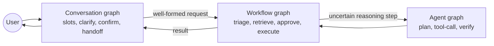

---

### 3. Real-World Industry Scenarios [Intermediate]

**Scenario A — Clean separation (refund assistant)**

*Context:* Collect request → execute refund → reason about edge cases.
- **Design:** conversation graph collects/ confirms; workflow graph executes the refund with idempotency and approval; agent graph only handles ambiguous eligibility reasoning.
- **What "good" looks like:** the user-facing behavior is deterministic and safe; LLM freedom is confined to the reasoning step.

**Scenario B — Anti-pattern (agent drives dialogue)**

*Context:* A single agent loop both talks to the user and executes actions.
- **Symptom:** unpredictable questions, unsafe tool calls, hard to test.
- **Fix:** wrap user interaction in a conversation graph; confine the agent to a bounded reasoning subtask.

**Scenario C — Anti-pattern (rigid workflow as chat)**

*Context:* A strict workflow forces users through fixed steps with no clarification/digression.
- **Symptom:** users get stuck; no repair; high abandonment.
- **Fix:** front it with a conversation graph that handles clarification, correction, and topic switches.

---

### 4. System View [Intermediate]

```text
User ⇄ Conversation graph  (dialogue state, slots, confirm, handoff)
             │ well-formed, confirmed request
             ▼
        Workflow graph      (deterministic steps + side effects + approvals)
             │ uncertain step
             ▼
        Agent graph         (LLM plan/tool/verify, bounded)
             ▲ result
             └──────────────► back up to workflow → conversation → user
```

**Ownership boundaries:**

| Graph | Owns | Must NOT own |
|---|---|---|
| Conversation | user dialogue, slots, confirmation, handoff | irreversible side effects, free reasoning |
| Workflow | process steps, side effects, approvals, retries | open-ended user dialogue |
| Agent | uncertain reasoning, tool choice | user-facing safety-critical dialogue, unbounded actions |

**Failure points:** blurred ownership (agent asks users arbitrary questions; workflow can't clarify), and missing handoffs (no clean request contract between graphs).

---

### 5. System Design Flavor [Intermediate]

**Key design question:** For each responsibility — talking to the user, executing steps, reasoning under uncertainty — which graph owns it, and what is the contract at each boundary?

**Tradeoffs:**

| Design | Separated graphs | One fused graph |
|---|---|---|
| Predictability | High | Low |
| Safety of side effects | Contained in workflow | Diffuse |
| Testability | Per-graph | Hard |
| Initial simplicity | More upfront structure | Quick but brittle |

**Scaling consideration:** Separated graphs let teams own and evolve each layer independently (dialogue designers vs backend vs ML), and let you swap the agent/reasoning layer without touching user-facing dialogue. Fused graphs couple everything and rot fast.

---

### 6. Common Mistakes + Debugging [Beginner]

**Mistake 1 — Letting an agent graph drive user dialogue.**
- **Symptom:** unpredictable questions and unsafe actions.
- **First step:** wrap interaction in a conversation graph; bound the agent to a subtask.

**Mistake 2 — Hard-coding conversation as a rigid workflow.**
- **Symptom:** no clarification/digression; users stuck.
- **First step:** add a conversation graph front layer for repair and topic handling.

**Mistake 3 — No request contract between graphs.**
- **Symptom:** malformed data crosses boundaries; brittle integration.
- **First step:** define a typed, confirmed request handed from conversation → workflow.

---

### 7. Hands-On Lab [Pro]

**Concept:** Separate the three concerns and see the clean handoff contract.

#### Build — Three graphs, explicit boundaries

```python
# Conversation graph: gathers + confirms a well-formed request
def conversation_graph(slots):
    required = {"order_id", "email"}
    if not required <= slots.keys():
        return {"status": "need_more", "missing": list(required - slots.keys())}
    return {"status": "confirmed_request", "request": {"action": "refund", **slots}}

# Workflow graph: deterministic execution with a guarded uncertain step
def workflow_graph(request, agent):
    if request["action"] != "refund":
        return {"status": "unsupported"}
    eligible = agent(request)                      # delegate ONLY the uncertain reasoning
    if not eligible:
        return {"status": "denied"}
    return {"status": "executed", "idempotency_key": f"rf-{request['order_id']}"}

# Agent graph: bounded LLM reasoning (stubbed)
def eligibility_agent(request):
    return request.get("order_id", "").startswith("ORD-")   # stand-in for LLM reasoning

req = conversation_graph({"order_id": "ORD-1234", "email": "a@b.com"})
print(req)
print(workflow_graph(req["request"], eligibility_agent))
```

#### Break — Fuse them (anti-pattern)

```python
def fused(slots, user_msg):
    # agent both talks AND executes -> unpredictable + unsafe
    if "refund" in user_msg:
        return "issuing refund now"      # no slots, no confirm, no idempotency
    return "what do you want?"
print(fused({}, "refund please"))        # executed with zero confirmation -> unsafe
```

#### Measure

- Boundary-contract validity: fraction of requests crossing graphs that are well-formed.
- Unsafe-action rate (side effects without confirmation) — should be 0 in the separated design.
- Testability: number of graphs unit-testable in isolation (3 vs 1).

#### Explain

The separated design confines the LLM to the eligibility decision, keeps user dialogue predictable, and executes with an idempotency key after a confirmed request. The fused version issues a refund from a single keyword with no slots, confirmation, or idempotency — the exact unsafe behavior separation prevents. Boundaries and contracts are the safety mechanism.

---

### 8. Active Recall [Beginner → Intermediate]

1. **[Beginner]** What does each of the three graph types optimize for?
2. **[Beginner]** Which graph should own irreversible side effects?
3. **[Intermediate]** Why is letting an agent graph drive dialogue dangerous?
4. **[Intermediate]** What is the contract handed from conversation to workflow?
5. **[Pro]** Why does separation help team ownership and evolution?

**Answer Key:**
1. Conversation = predictable user dialogue; workflow = reliable process/side effects; agent = flexible reasoning under uncertainty.
2. The workflow graph (with approvals, idempotency, retries) — not the conversation or agent graph.
3. It produces unpredictable questions and unsafe/unbounded actions that are hard to test or gate.
4. A typed, confirmed request (e.g., `{action, order_id, email}`) that the workflow can execute deterministically.
5. Each layer can be owned/evolved/swapped independently (dialogue vs backend vs reasoning) without breaking the others.

---

### 9. Practice [Intermediate / Pro]

**Mini-exercise:** Assign to conversation/workflow/agent: (a) asking the user to confirm a cancellation, (b) calling the payments API with an idempotency key, (c) deciding whether an ambiguous request means "cancel" or "pause."

*Suggested answer:* (a) conversation, (b) workflow, (c) agent.

**Capstone design question:** Design the three-graph separation for a travel-rebooking assistant, specifying each graph's ownership and the boundary contracts.

*Answer outline:* conversation graph collects trip, dates, preferences, confirms; hands a typed rebooking request to the workflow graph (search inventory → hold → pay → confirm, with approvals/idempotency); workflow delegates only fuzzy "best alternative" reasoning to a bounded agent graph; contracts = confirmed-request schema (conv→workflow) and a constrained reasoning query/response (workflow→agent); user-facing behavior stays deterministic and safe.

---

### 10. Production Reality Check (Mandatory)

**If the assistant behaves unpredictably or takes unsafe actions, what's the first thing we inspect?**

The graph boundaries — whether an agent/reasoning layer is driving user dialogue or executing side effects directly. Confirm that user interaction is owned by the conversation graph, side effects by the workflow graph (with confirmation/idempotency), and the LLM agent is confined to a bounded reasoning subtask. Blurred ownership is the root cause far more often than a bad prompt.

---

### 11. Curiosity Bridge (Mandatory)

A conversation graph's whole job is gathering and confirming structured information from messy language. That machinery — intents, slots, entities, forms, and context variables — is the vocabulary every dialogue system is built from. That's Subtopic 24.1.c.

---

### 12. Exit Check + Carry-Forward Review

**Exit check:** You can cleanly separate conversation, workflow, and agent graphs, assign responsibilities, define boundary contracts, and spot fusion anti-patterns.

**Carry-forward:** This is Module 10's "agent vs chain vs workflow" distinction and Module 16's coordination patterns, specialized to the dialogue layer: keep user interaction, execution, and reasoning in their own graphs.

---

## Subtopic 24.1.c: Intents, Slots, Entities, Forms, and Context Variables

### Reading Path + Level Tags

- **Beginner:** Read sections 1–2 and Active Recall.
- **Intermediate:** Add sections 3–5 and the Hands-On Lab.
- **Pro:** Full lab with Break + Measure plus the capstone slot-schema question.

---

### 1. Pre-Question Hook + The Intuition [Beginner]

**Pause — before reading:** A user says "cancel my order ORD-9 and email the receipt to me." What is the *goal*, what are the *values*, and what is *still missing*? Name each with the right term.

**The core mental model:**
Every dialogue system is built from a small, precise vocabulary:
- **Intent:** the user's *goal* (`cancel_order`, `reset_password`).
- **Slot:** a *required variable* to complete the task (`order_id`, `date`).
- **Entity:** an *extracted value* from user input (`ORD-9`, `2024-03-01`).
- **Form:** a structured *slot-collection flow* (collect name → email → issue).
- **Context variable:** working memory beyond slots (selected product, user role, last evidence).

Slots carry **metadata** that production systems depend on: type, required flag, validation rule, source, confidence, confirmed flag, redactable flag, and expiry. The discipline: never act on a slot that is unvalidated, unconfirmed (for side effects), or stale. Intent tells you *where to go*; slots tell you *what you still need*; entities *fill* slots; forms *orchestrate* the collection; context variables *disambiguate* references.

**Key terms:**
- **Intent classification:** mapping an utterance to a goal.
- **Slot filling:** collecting and validating required values.
- **Entity extraction:** pulling typed values from text.
- **Form:** a reusable ordered slot-collection procedure.
- **Slot metadata:** type, required, validation, source, confidence, confirmed, redactable, expiry.

---

### 2. Visual Diagram (Mermaid) [Beginner]

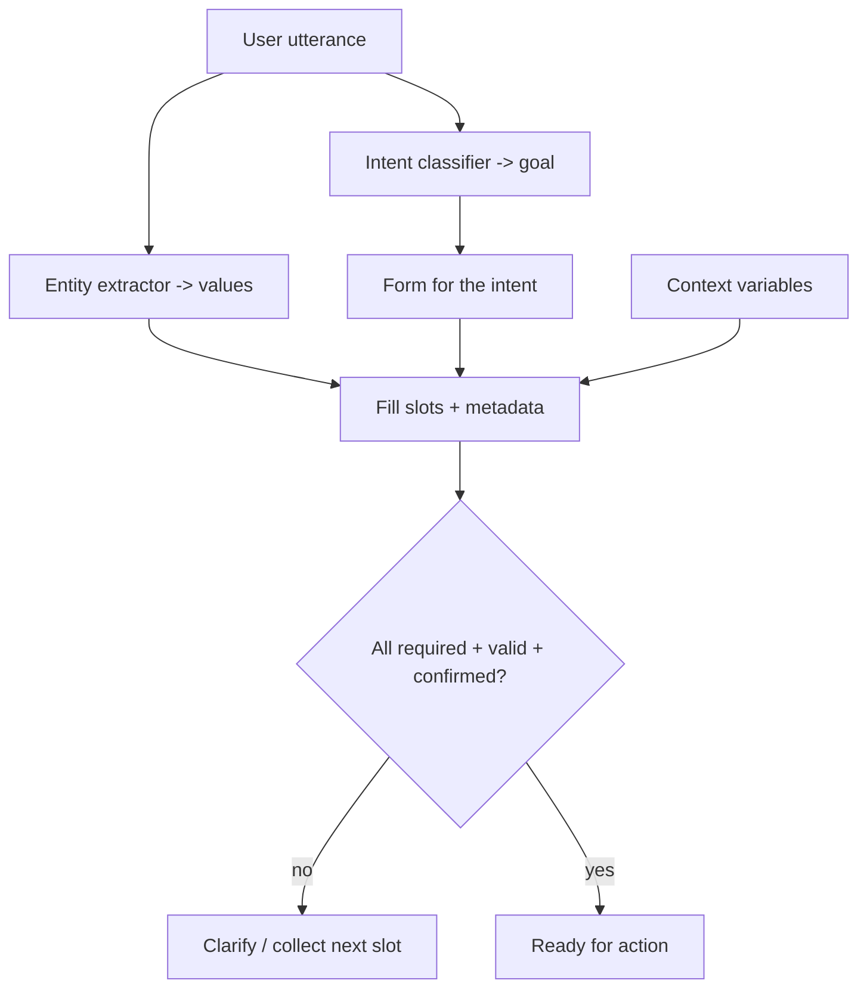

---

### 3. Real-World Industry Scenarios [Intermediate]

**Scenario A — Order cancellation (slot metadata matters)**

*Context:* `order_id` (validated `ORD-[0-9]+`, confirmed), `refund_method` (confirm if money moves).
- **Why metadata:** the confirmed + validation flags decide whether a side effect is allowed.

**Scenario B — Reference resolution (context variables)**

*Context:* "email the receipt to *me*" / "what about the *second one*?"
- **Why context vars:** `me` resolves to the authenticated user; `second one` resolves from the last presented list held in context.

**Scenario C — Multi-slot form (forms orchestrate)**

*Context:* Onboarding collects name, email, company, role.
- **Why forms:** a reusable form drives ordered collection, validation, and re-ask logic instead of ad-hoc branching.

---

### 4. System View [Intermediate]

```text
Utterance → intent classify + entity extract
   → map entities to slots (with metadata) via the intent's form
   → validate each slot; mark confirmed where side effects require it
   → resolve references using context variables
   → gate: all required + valid + (confirmed for side effects)? → action or clarify
```

**Slot metadata to track:**
```text
name · type · required · validation_rule · source · confidence · confirmed · redactable · expires_at
```

**Failure points:**

| Failure | Symptom | First inspection |
|---|---|---|
| Acting on unconfirmed slot | Side effect on wrong/uncertain value | confirmed flag + provenance |
| No validation | Invalid values accepted | validation_rule per slot |
| Stale slot | Old value reused | expires_at / freshness |
| Reference not resolved | "second one" fails | context variables (last list/entity) |

---

### 5. System Design Flavor [Intermediate]

**Key design question:** For each slot, what are its type, validation, confirmation requirement, and expiry — and which context variables are needed to resolve references?

**Tradeoffs:**

| Decision | Richer slot model | Leaner slot model |
|---|---|---|
| Metadata (confidence, expiry, confirmed) | Safer, more logic | Simpler, riskier |
| Confirmation policy | Confirm all side-effect slots | Confirm fewer (faster, riskier) |
| Context tracking | Robust reference resolution | Cheaper, more failures on ellipsis |

**Scaling consideration:** Store slot metadata (confidence, source, confirmed, expiry) in the state object so downstream logic and audits can reason about *why* a value is trusted — essential when a wrong slot triggers a real-world side effect.

---

### 6. Common Mistakes + Debugging [Beginner]

**Mistake 1 — Confusing intent and slot.**
- **Symptom:** goal treated as data or vice versa; broken routing.
- **First step:** separate the goal (intent) from the required values (slots).

**Mistake 2 — No slot provenance/confidence.**
- **Symptom:** the bot trusts stale or uncertain values.
- **First step:** track source, confidence, timestamp, and confirmed flag per slot.

**Mistake 3 — Ignoring context variables.**
- **Symptom:** pronouns/ellipsis ("that one", "me") fail.
- **First step:** maintain active entities/last-list in context for reference resolution.

---

### 7. Hands-On Lab [Pro]

**Concept:** A slot model with metadata + a gate that blocks action on invalid/unconfirmed slots.

#### Build — Slots with metadata and a readiness gate

```python
import re
from dataclasses import dataclass, field

@dataclass
class Slot:
    value: str | None = None
    required: bool = True
    validator: str = r".+"
    confirmed: bool = False
    needs_confirmation: bool = False
    source: str | None = None

def valid(slot): return slot.value is not None and re.fullmatch(slot.validator, slot.value) is not None

form = {
    "order_id": Slot(required=True, validator=r"ORD-\d+", needs_confirmation=True),
    "email":    Slot(required=True, validator=r"[^@]+@[^@]+\.[^@]+"),
}

def ready(form):
    for name, s in form.items():
        if s.required and not valid(s): return (False, f"{name} missing/invalid")
        if s.needs_confirmation and not s.confirmed: return (False, f"{name} unconfirmed")
    return (True, "ready")

form["order_id"].value, form["order_id"].source = "ORD-9", "user"
form["email"].value = "a@b.com"
print(ready(form))                         # (False, 'order_id unconfirmed')
form["order_id"].confirmed = True
print(ready(form))                         # (True, 'ready')
```

#### Break — Try to act on invalid/unconfirmed slots

```python
form2 = {"order_id": Slot(value="9", validator=r"ORD-\d+", needs_confirmation=True),  # invalid format
         "email": Slot(value="not-an-email", validator=r"[^@]+@[^@]+\.[^@]+")}
print(ready(form2))                        # (False, 'order_id missing/invalid') -> action blocked
```

#### Measure

- Slot validity rate and confirmation coverage for side-effect slots.
- Blocked-unsafe-action count (invalid/unconfirmed slots that were stopped).
- Reference-resolution success (context variables).
- Re-ask rate per slot (form friction).

#### Explain

The gate refuses to act until every required slot is valid and every side-effect slot is confirmed — turning "trust the extraction" into "verify before action." The invalid `order_id` ("9") and unconfirmed value are both stopped before any tool runs, which is exactly how you prevent acting on wrong or uncertain values.

---

### 8. Active Recall [Beginner → Intermediate]

1. **[Beginner]** Define intent, slot, and entity with one example each.
2. **[Beginner]** What is a form?
3. **[Intermediate]** Name four pieces of slot metadata and why each matters.
4. **[Intermediate]** What are context variables for?
5. **[Pro]** Why gate actions on confirmed + valid slots specifically?

**Answer Key:**
1. Intent = goal (`cancel_order`); slot = required variable (`order_id`); entity = extracted value (`ORD-9`).
2. A reusable, ordered slot-collection flow that handles collection, validation, and re-asks.
3. Any four: validation (reject bad values), confidence/source (trust), confirmed (safe side effects), expiry (avoid stale), redactable (PII handling).
4. Resolving references/ellipsis ("me", "that one", "the second one") and disambiguating using working memory.
5. Side effects on invalid or unconfirmed values cause real-world harm; gating ensures the system only acts on trusted, user-approved data.

---

### 9. Practice [Intermediate / Pro]

**Mini-exercise:** For a money-transfer intent, list the slots, which need confirmation, and one context variable you'd track.

*Suggested answer:* slots `amount` (validate numeric, confirm), `recipient` (validate, confirm), `source_account` (confirm); context variable = authenticated user (for "from my account") and last-shown recipient list.

**Capstone design question:** Design the intent + slot schema (with metadata and confirmation policy) for a healthcare appointment bot, and specify the context variables needed for reference resolution.

*Answer outline:* intents `book/reschedule/cancel`; slots `patient_id` (validate, confirm), `provider`, `date`/`time` (validate, confirm on booking), `reason` (optional, redactable); confirmation required for any calendar-changing slot; context variables = authenticated patient, last-offered slot list, active appointment; expiry on `date/time` to avoid stale holds.

---

### 10. Production Reality Check (Mandatory)

**If the bot acts on a wrong or stale value, what's the first thing we inspect?**

Slot provenance and confirmation state — the `source`, `confidence`, `confirmed`, and `expires_at` metadata for the offending slot. Multi-turn failures almost always trace to acting on an unvalidated, unconfirmed, or expired slot value, not to the tool or the model. Fix the slot gate and metadata handling.

---

### 11. Curiosity Bridge (Mandatory)

You now have intents, slots, and context. But *how* the graph decides the next move — a hard rule, a classifier, or an LLM — determines both flexibility and safety. Choosing the transition mechanism per situation is Subtopic 24.1.d.

---

### 12. Exit Check + Carry-Forward Review

**Exit check:** You can design an intent + slot schema with full metadata and a confirmation/validation gate, and use context variables to resolve references.

**Carry-forward:** This is Module 3's structured-output/schema discipline applied to dialogue inputs: slots are a typed, validated schema the conversation must fill before acting.

---

## Subtopic 24.1.d: Deterministic, Probabilistic, and LLM-Driven Transitions

### Reading Path + Level Tags

- **Beginner:** Read sections 1–2 and Active Recall.
- **Intermediate:** Add sections 3–5 and the Hands-On Lab.
- **Pro:** Full lab with Break + Measure plus the capstone transition-policy question.

---

### 1. Pre-Question Hook + The Intuition [Beginner]

**Pause — before reading:** Should an LLM decide whether to execute a refund? Should a hard-coded rule decide what a rambling, ambiguous user "really meant"? Which mechanism belongs where?

**The core mental model:**
A conversation graph chooses its next state via one of three transition mechanisms, and the skill is matching mechanism to situation:
- **Deterministic rule:** fixed logic — "required slot missing → clarify," "side effect → require approval," "tool failed → repair." Use for *safety, state, and side effects.*
- **Probabilistic / classifier policy:** a learned model predicts intent or next action. Use where patterns are learnable and you have training/eval data.
- **LLM router:** an LLM interprets messy, open-ended language to pick a branch. Use for *interpretation and flexible language*, not for safety-critical control.

The professional rule:
```text
Use deterministic transitions for safety, state, and side effects.
Use LLM transitions for interpretation and flexible language.
```
Production systems are **hybrid**: an LLM interprets the fuzzy user input into an intent/entities, then deterministic rules decide the safety-relevant transition. Never let a raw LLM decision directly trigger an irreversible action.

**Key terms:**
- **Deterministic transition:** rule-based, reproducible next-state logic.
- **Classifier/policy transition:** learned prediction of next action/intent.
- **LLM router:** LLM chooses among allowed branches.
- **Hybrid policy:** LLM interprets, rules control safety/side effects.

---

### 2. Visual Diagram (Mermaid) [Beginner]

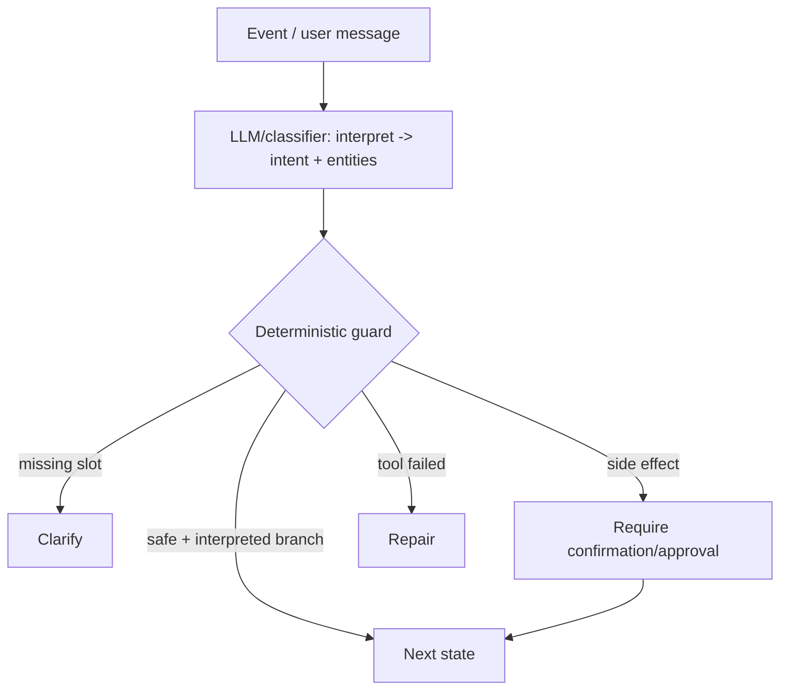

Interpretation can be probabilistic/LLM; the *control* over safety and side effects stays deterministic.

---

### 3. Real-World Industry Scenarios [Intermediate]

**Scenario A — Safety-critical (deterministic wins)**

*Context:* Executing a refund.
- **Design:** the LLM may classify intent, but a deterministic rule requires confirmed slots + approval before the side effect. No LLM decision triggers money movement directly.

**Scenario B — Messy language (LLM interpretation)**

*Context:* "ugh the thing I bought last week is broken, what do I do."
- **Design:** LLM router maps this to `report_defect` intent + extracts product/time; deterministic rules then drive the flow.

**Scenario C — Learnable routing (classifier)**

*Context:* High-volume support with clear historical intent patterns.
- **Design:** a trained intent classifier routes cheaply and consistently; LLM handles only low-confidence residual cases.

---

### 4. System View [Intermediate]

```text
Event → interpret (LLM/classifier → intent + entities + confidence)
      → deterministic guard:
          if missing required slot → clarify
          if side effect → require confirmation/approval
          if tool failed → repair (bounded)
          else → take interpreted branch
      → next state (+ log which mechanism decided)
```

**Log which mechanism decided each transition** — essential for debugging inconsistency and for knowing whether a bad transition was an interpretation error (LLM/classifier) or a control error (rule).

**Failure points:**

| Failure | Symptom | Root cause |
|---|---|---|
| LLM controls side effects | Unsafe/irreversible actions | No deterministic guard |
| All-deterministic | Rigid; fails on messy language | No interpretation layer |
| Uncalibrated classifier | Confident wrong routing | No confidence gating |
| Untraceable decisions | Can't tell why it branched | Mechanism not logged |

---

### 5. System Design Flavor [Intermediate]

**Key design question:** For each transition, is it safety/side-effect/state control (→ deterministic) or language interpretation (→ LLM/classifier), and how do the two compose?

**Tradeoffs:**

| Mechanism | Strength | Risk | Use for |
|---|---|---|---|
| Deterministic | Predictable, testable, safe | Rigid on messy input | Safety, state, side effects |
| Classifier | Cheap, consistent | Needs data; can be miscalibrated | Learnable intent/next-action |
| LLM router | Flexible, handles open language | Inconsistent, costly | Interpretation of fuzzy input |
| Hybrid | Best of both | More architecture | Production default |

**Scaling consideration:** LLM routing cost/latency adds up; use a cheap classifier for common intents and reserve the LLM for low-confidence cases. Cache/route by confidence to keep both cost and inconsistency down.

---

### 6. Common Mistakes + Debugging [Beginner]

**Mistake 1 — LLM decides side effects directly.**
- **Symptom:** the assistant executes risky actions too freely.
- **First step:** insert a deterministic guard requiring confirmation/approval for side effects.

**Mistake 2 — Pure deterministic on messy input.**
- **Symptom:** brittle failures on real-world phrasing.
- **First step:** add an LLM/classifier interpretation layer feeding the rules.

**Mistake 3 — Not logging the deciding mechanism.**
- **Symptom:** can't tell whether a bad branch was interpretation or control.
- **First step:** record which mechanism (rule/classifier/LLM) made each transition.

---

### 7. Hands-On Lab [Pro]

**Concept:** Hybrid transitions — LLM interprets, deterministic rules control safety.

#### Build — Interpretation + deterministic guard

```python
def interpret(msg):   # stand-in for LLM/classifier
    m = msg.lower()
    if "refund" in m or "money back" in m: return ("request_refund", 0.9)
    if "cancel" in m: return ("cancel_order", 0.8)
    return ("unknown", 0.3)

def transition(state, msg, slots):
    intent, conf = interpret(msg)
    # deterministic guards ALWAYS win for safety/state/side-effects:
    if intent == "request_refund":
        if "order_id" not in slots: return "collect_order_id"        # state rule
        if not slots.get("confirmed"): return "confirm_refund"       # side-effect rule
        return "execute_refund"
    if conf < 0.5: return "clarify"                                   # low-confidence -> clarify
    return f"handle_{intent}"

print(transition("start", "I want my money back", {}))                 # collect_order_id
print(transition("s", "refund", {"order_id":"ORD-9"}))                  # confirm_refund
print(transition("s", "refund", {"order_id":"ORD-9","confirmed":True})) # execute_refund
```

#### Break — Let the LLM decision execute directly

```python
def unsafe_transition(msg):
    intent, conf = interpret(msg)
    return "execute_refund" if intent == "request_refund" else "clarify"
print(unsafe_transition("refund please"))   # execute_refund with NO slots/confirmation -> unsafe
```

#### Measure

- Unsafe-transition rate (side effects without guard) — target 0 in hybrid.
- Clarify rate on low-confidence interpretations.
- Mechanism attribution: share of transitions decided by rule vs classifier vs LLM.
- Interpretation accuracy vs deterministic-control correctness (debug separately).

#### Explain

The hybrid design lets the LLM handle "I want my money back" (flexible language) while deterministic rules guarantee slots and confirmation before any refund — so interpretation errors can't cause unsafe actions. The unsafe version executes a refund straight from an LLM classification: exactly the failure the deterministic guard prevents. Interpret with intelligence; control with rules.

---

### 8. Active Recall [Beginner → Intermediate]

1. **[Beginner]** What should deterministic transitions be used for?
2. **[Beginner]** What should LLM transitions be used for?
3. **[Intermediate]** Why never let an LLM decision trigger a side effect directly?
4. **[Intermediate]** How does a hybrid policy compose the mechanisms?
5. **[Pro]** Why log which mechanism decided each transition?

**Answer Key:**
1. Safety, state, required data, validation, side effects, and recovery.
2. Interpreting messy, open-ended language into intents/entities/branches.
3. LLM decisions are inconsistent and manipulable; a wrong one could cause an irreversible action — a deterministic guard must gate side effects.
4. The LLM/classifier interprets input into intent/entities; deterministic rules then control safety/state/side-effect transitions.
5. To distinguish interpretation errors (LLM/classifier) from control errors (rules) when debugging bad transitions.

---

### 9. Practice [Intermediate / Pro]

**Mini-exercise:** Classify each transition as deterministic or LLM: (a) "required slot missing → clarify," (b) mapping "the thing broke" to `report_defect`, (c) "tool failed twice → handoff."

*Suggested answer:* (a) deterministic, (b) LLM/classifier interpretation, (c) deterministic.

**Capstone design question:** Design the transition policy for a banking assistant, specifying which decisions are deterministic vs LLM/classifier and how they compose safely.

*Answer outline:* LLM/classifier interprets utterances into intents (transfer, balance, dispute) with confidence; deterministic guards enforce: missing slot→clarify, any money movement→confirm+approval, auth failure→handoff, tool error→bounded repair; low-confidence intent→clarify; log deciding mechanism per transition; no LLM output ever triggers a transaction without the deterministic confirmation gate.

---

### 10. Production Reality Check (Mandatory)

**If the assistant takes an unsafe or inconsistent action, what's the first thing we inspect?**

Which mechanism drove the transition, from the per-transition log. If an LLM/classifier decision reached a side effect without a deterministic guard, that's the bug — add/repair the rule. If interpretation was wrong but the guard held, fix the interpreter. Separating "interpretation" from "control" in the trace is what makes this diagnosable.

---

### 11. Curiosity Bridge (Mandatory)

With fundamentals in hand — state, graph types, slots, and transitions — the real craft is designing robust *multi-turn flows*: filling slots gracefully, clarifying, repairing bad input, and confirming before side effects, all without frustrating loops. That's Topic 24.2.

---

### 12. Exit Check + Carry-Forward Review

**Exit check:** You can choose deterministic, classifier, or LLM transitions per situation, compose them into a safe hybrid policy, and log the deciding mechanism for debugging.

**Carry-forward:** This is Subtopic 23.3.b's "templates/deterministic first, constrained generation second" safety pattern, and Module 9's guardrails, applied to dialogue control: interpret with the LLM, gate with rules.

---

## Topic 24.2: Designing Multi-Turn Conversation Flows

**Topic time:** 8h

---

## Subtopic 24.2.a: Slot Filling, Clarification, Repair, and Confirmation

### Reading Path + Level Tags

- **Beginner:** Read sections 1–2 and Active Recall.
- **Intermediate:** Add sections 3–5 and the Hands-On Lab.
- **Pro:** Full lab with Break + Measure plus the capstone slot-policy question.

---

### 1. Pre-Question Hook + The Intuition [Beginner]

**Pause — before reading:** A bot asks "What's your order ID?", the user says "I don't know," and the bot asks the exact same question again. What are the four flow patterns that would have rescued this conversation?

**The core mental model:**
Robust multi-turn flows are built from four repeatable patterns:
- **Slot filling:** collect required values, but gracefully — offer alternatives when the user can't answer.
- **Clarification:** resolve ambiguous input without over-asking.
- **Repair:** recover from invalid input or tool failure with a *bounded* number of attempts before escalating.
- **Confirmation:** verify the *specific action and its consequences* before any side effect.

The failure modes are the mirror image of these: re-asking the same question, over-clarifying, infinite repair loops, and vague confirmations ("you said yes, but did you approve *this exact action*?"). The discipline: every collection has an alternative path, every clarification is targeted, every repair loop has a max-attempts escalation, and every side effect is confirmed against a concrete description.

**Key terms:**
- **Graceful slot filling:** offering alternate ways to provide a value.
- **Targeted clarification:** asking only the minimal disambiguating question.
- **Bounded repair:** limited retries before handoff/escalation.
- **Explicit confirmation:** confirming the specific action + consequence, not a bare "yes."

---

### 2. Visual Diagram (Mermaid) [Beginner]

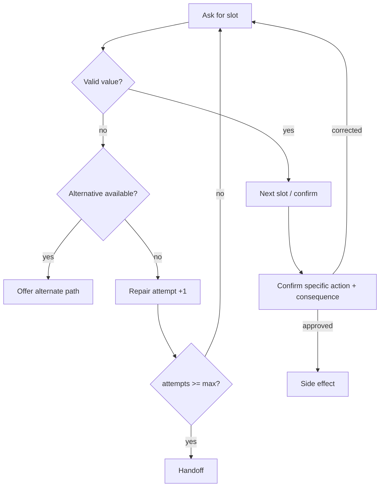

---

### 3. Real-World Industry Scenarios [Intermediate]

**Scenario A — Graceful slot filling**

*Context:* User doesn't know their order ID.
- **Bad:** re-ask "What's your order ID?"
- **Good:** "I can look it up another way — what email or phone number was used for the order?" (alternate path to the same slot).

**Scenario B — Bounded repair**

*Context:* User gives an invalid ID twice.
- **Good:** after `max_attempts`, escalate to human handoff with full context rather than looping forever.

**Scenario C — Explicit confirmation**

*Context:* Cancelling an order that involves a refund.
- **Bad:** "Confirm? (yes/no)".
- **Good:** "I'll cancel order ORD-1234 and refund $80 to your Visa ending 4242. Proceed?" — the user approves the *specific* action and consequence.

---

### 4. System View [Intermediate]

```text
For each required slot:
  ask → validate → if invalid: offer alternative OR repair (bounded) → escalate at max attempts
When all slots valid:
  confirm SPECIFIC action + consequences → on approval: side effect; on correction: back to collection
```

**Slot metadata that drives this (from 24.1.c):** `validation_rule`, `confirmed`, `attempts`, `source`, `expires_at`.

**Failure points:**

| Failure | Symptom | Better approach |
|---|---|---|
| Re-asking | Same question repeated | Offer alternative path to the slot |
| Over-clarifying | User frustrated by too many questions | Ask only the minimal disambiguator |
| Infinite repair | User stuck in fallback loop | Bounded attempts → handoff |
| Vague confirmation | User "approved" the wrong thing | Confirm concrete action + consequence |

---

### 5. System Design Flavor [Intermediate]

**Key design question:** For each slot, what's the primary prompt, the alternative path, the validation, the max repair attempts, and (for side-effect slots) the exact confirmation text?

**Tradeoffs:**

| Decision | More guardrails | Fewer guardrails |
|---|---|---|
| Alternative paths | Higher completion, more design | Simpler, more dead-ends |
| Clarification threshold | Fewer wrong actions | Faster, more misunderstandings |
| Repair cap | Escalates sooner (safer) | Persists longer (more frustration) |
| Confirmation specificity | Safer side effects | Faster but riskier |

**Scaling consideration:** Encode the slot policy (prompt, alternative, validation, max-attempts, confirmation text) as data/config, not scattered code, so flows are consistent, testable, and adjustable without rewrites.

---

### 6. Common Mistakes + Debugging [Beginner]

**Mistake 1 — No alternative path.**
- **Symptom:** dead-ends when the user can't answer directly.
- **First step:** add an alternate way to fill each critical slot.

**Mistake 2 — No max repair count.**
- **Symptom:** users trapped in fallback loops.
- **First step:** cap attempts and escalate to handoff with context.

**Mistake 3 — Vague confirmation.**
- **Symptom:** users approve, then dispute the action.
- **First step:** confirm the specific action and consequence, not a bare yes/no.

---

### 7. Hands-On Lab [Pro]

**Concept:** Slot filling with alternative paths, bounded repair, and explicit confirmation.

#### Build — Robust slot-filling loop

```python
import re
from dataclasses import dataclass, field

@dataclass
class SlotState:
    order_id: str | None = None
    attempts: int = 0
    confirmed: bool = False

MAX_ATTEMPTS = 2

def fill_order_id(s: SlotState, msg: str):
    m = msg.lower()
    if re.search(r"ord-\d+", m):
        s.order_id = re.search(r"ord-\d+", m).group().upper()
        return "confirm"
    if "don't know" in m or "dont know" in m:
        return "offer_alternative"           # graceful path, not a re-ask
    s.attempts += 1
    return "handoff" if s.attempts >= MAX_ATTEMPTS else "retry"

def confirmation_text(s):
    return f"I'll cancel order {s.order_id} and issue any eligible refund. Proceed? (yes/no)"

s = SlotState()
print(fill_order_id(s, "I don't know"))     # offer_alternative
print(fill_order_id(s, "it's ord-1234"))    # confirm
print(confirmation_text(s))                 # specific action + consequence
```

#### Break — Remove guardrails

```python
s2 = SlotState()
for msg in ["nope", "still no", "no idea"]:
    r = fill_order_id(s2, msg)
    print(msg, "->", r, "attempts:", s2.attempts)
# With MAX_ATTEMPTS it escalates to handoff instead of looping forever.
# Set MAX_ATTEMPTS huge and it would loop indefinitely (the anti-pattern).
```

#### Measure

- Completion rate (with vs without alternative paths).
- Correction rate (slots changed after entry).
- Repair-loop length distribution (should be bounded).
- Confirmation-dispute rate (vague vs specific confirmation).

#### Explain

The robust loop offers an alternative when the user can't answer, caps repair attempts before escalating, and confirms the *specific* action and consequence. Removing these produces the classic failures — dead-ends, infinite loops, and disputed actions. The four patterns turn a fragile happy-path flow into one that survives real users.

---

### 8. Active Recall [Beginner → Intermediate]

1. **[Beginner]** Name the four core multi-turn flow patterns.
2. **[Beginner]** What's wrong with re-asking the same slot question?
3. **[Intermediate]** Why must repair be bounded?
4. **[Intermediate]** What makes a confirmation "explicit" rather than vague?
5. **[Pro]** Why encode slot policy as config rather than code?

**Answer Key:**
1. Slot filling, clarification, repair, and confirmation.
2. It creates dead-ends; a graceful flow offers an alternative path to the same value.
3. Unbounded repair traps users in fallback loops; a max-attempts cap escalates to handoff instead.
4. It states the specific action and its consequences (e.g., "cancel ORD-1234 and refund $80"), so the user approves exactly what will happen.
5. Config makes flows consistent, testable, and adjustable without rewriting scattered logic.

---

### 9. Practice [Intermediate / Pro]

**Mini-exercise:** Design the slot policy row for `order_id` in a cancellation flow (prompt, alternative, validation, max attempts, confirmation).

*Suggested answer:* prompt "What's your order ID?"; alternative "email/phone used for the order"; validation `ORD-\d+`; max attempts 2 → handoff; confirmation "Cancel ORD-#### and refund $X to card ending ####?".

**Capstone design question:** Build the full slot policy table for an order-cancellation assistant (order_id, requester_email, refund_method) with validation and confirmation rules, and describe repair/escalation.

*Answer outline:* order_id (required, `ORD-\d+`, confirm, alt=email/phone, max 2→handoff); requester_email (required, email regex, no confirm); refund_method (conditional, enum, confirm if money moves); tool "already shipped" result → transition to alternate resolution; all repair loops bounded with context-rich handoff.

---

### 10. Production Reality Check (Mandatory)

**If a multi-turn flow fails or loops, what's the first thing we inspect?**

Slot provenance and confirmation state, plus the repair-attempt counter. Most multi-turn failures are acting on stale/unconfirmed slots or an unbounded repair loop. Check whether the offending slot was validated and confirmed, and whether the repair path has a max-attempts escalation. Fix the slot/repair policy, not the wording.

---

### 11. Curiosity Bridge (Mandatory)

Even a perfect slot-filling flow assumes the user stays on task. Real users switch topics mid-flow ("actually, first change my email"), then expect to resume. Handling interruption, digression, and resumption without losing the original task is Subtopic 24.2.b.

---

### 12. Exit Check + Carry-Forward Review

**Exit check:** You can design slot filling with alternative paths, targeted clarification, bounded repair with escalation, and explicit action-specific confirmation.

**Carry-forward:** This is Module 3's structured-generation repair loops and Module 6.3.b's refusal/insufficient-evidence behavior applied to dialogue: collect, validate, repair within bounds, and confirm before acting.

---

## Subtopic 24.2.b: Topic Switching, Interruption, Resumption, and Digression

### Reading Path + Level Tags

- **Beginner:** Read sections 1–2 and Active Recall.
- **Intermediate:** Add sections 3–5 and the Hands-On Lab.
- **Pro:** Full lab with Break + Measure plus the capstone task-stack question.

---

### 1. Pre-Question Hook + The Intuition [Beginner]

**Pause — before reading:** Mid-refund, the user says "wait, first update my email." After you handle that, should you silently resume the refund, restart it, or ask? And what if a slot expired in the meantime?

**The core mental model:**
Real conversations aren't linear. Users digress, switch goals, get interrupted, and return. Handling this needs a **task stack**: the active task can be *suspended* when a new intent arrives, the digression handled, and the original task *resumed* — but only after safety checks. The core structure:
```text
active_task = refund_status
interruption = update_email        # push onto stack
handle interruption
resume refund_status IF still valid
```
Resumption is not automatic. Before resuming you must check: is the previous task still open? Did any slot expire or change? Did the user confirm resumption? Is the pending action still safe? Has external state changed? Skipping these leads to resuming a *stale or unsafe* task — a serious bug.

**Key terms:**
- **Task stack:** structure tracking active and suspended tasks.
- **Digression:** a temporary topic shift away from the active task.
- **Interruption:** a new intent that suspends the current task.
- **Resumption:** returning to a suspended task after validity checks.

---

### 2. Visual Diagram (Mermaid) [Beginner]

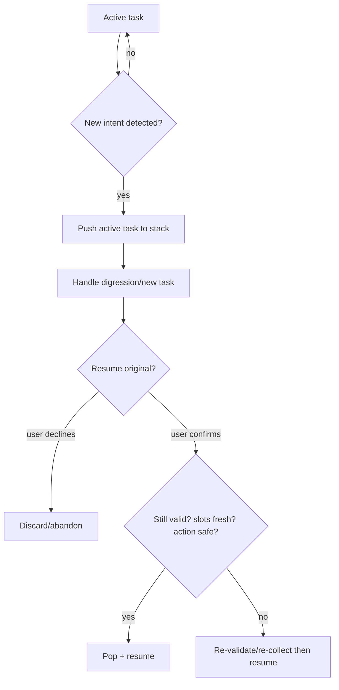

---

### 3. Real-World Industry Scenarios [Intermediate]

**Scenario A — Clean digression + resume**

*Context:* Mid-refund, user updates email, then returns.
- **Good:** push refund task, handle email update, confirm "want to continue your refund for ORD-1234?", resume if slots still valid.

**Scenario B — Stale resumption (the bug)**

*Context:* During the digression, the order shipped, making the refund path invalid.
- **Good:** resumption check detects external state change; re-evaluate instead of executing the now-invalid refund.

**Scenario C — Goal switch (abandon vs finish)**

*Context:* User abandons the refund entirely for a new task.
- **Good:** ask whether to finish or switch; if switching, preserve old slots safely but don't silently execute the old task later.

---

### 4. System View [Intermediate]

```text
On new intent while a task is active:
  push active task (+ its slots, state) onto task stack
  handle the new task/digression
  on completion: ask to resume → run resumption checks:
     task still open? slots fresh (not expired)? user confirmed? action still safe? external state unchanged?
  resume (pop) only if checks pass; else re-collect/re-validate
```

**Resumption checklist (all must hold):** open task, fresh slots, user confirmation, safe pending action, unchanged external state.

**Failure points:**

| Failure | Symptom | Root cause |
|---|---|---|
| No task stack | Interruption loses original task | Single active task only |
| Silent resume | Executes stale/unsafe pending action | No resumption checks |
| No expiry check | Acts on stale slot after digression | Slot freshness ignored |
| No user confirm | Resumes a task user abandoned | Resumption not confirmed |

---

### 5. System Design Flavor [Intermediate]

**Key design question:** When a new intent arrives mid-task, do you suspend-and-stack, and what checks must pass before resuming?

**Tradeoffs:**

| Decision | Full task stack + checks | Simple single-task |
|---|---|---|
| Handles digressions | Yes | No (loses task) |
| Safety on resume | High (validity checks) | Risky (stale actions) |
| Complexity | More state to manage | Simpler but brittle |
| Depth of nesting | Support multiple suspensions | One at a time |

**Scaling consideration:** Bound the task-stack depth and set suspension TTLs — infinitely nested or indefinitely-suspended tasks become confusing and unsafe. Persist the stack with the conversation state so interruptions survive across sessions (return-an-hour-later resumption).

---

### 6. Common Mistakes + Debugging [Beginner]

**Mistake 1 — No task stack.**
- **Symptom:** a topic switch loses the original task.
- **First step:** store active + suspended tasks; inspect the stack when context is "lost."

**Mistake 2 — Silent resumption.**
- **Symptom:** the bot executes a stale/unsafe pending action after a digression.
- **First step:** run resumption checks (open? fresh? confirmed? safe? unchanged?) before resuming.

**Mistake 3 — Ignoring slot expiry.**
- **Symptom:** acts on values that changed during the digression.
- **First step:** check `expires_at`/freshness on resume; re-collect if stale.

---

### 7. Hands-On Lab [Pro]

**Concept:** A task stack with safe resumption checks.

#### Build — Suspend / handle / resume

```python
from dataclasses import dataclass, field
import time

@dataclass
class Task:
    name: str
    slots: dict = field(default_factory=dict)
    created: float = field(default_factory=time.time)
    pending_action: str | None = None

class Dialogue:
    def __init__(self): self.stack = []; self.active = None
    def start(self, task): 
        if self.active: self.stack.append(self.active)     # suspend
        self.active = task
    def finish_active(self): self.active = None
    def can_resume(self, task, max_age=300, external_changed=False):
        fresh = (time.time() - task.created) < max_age
        safe = not external_changed
        return fresh and safe
    def resume(self, external_changed=False):
        if not self.stack: return None
        candidate = self.stack[-1]
        if self.can_resume(candidate, external_changed=external_changed):
            self.active = self.stack.pop(); return f"resumed {self.active.name}"
        return f"cannot safely resume {candidate.name} -> re-validate"

d = Dialogue()
d.start(Task("refund", {"order_id":"ORD-9"}, pending_action="issue_refund"))
d.start(Task("update_email", {"email":"new@x.com"}))    # interruption suspends refund
d.finish_active()                                        # email done
print(d.resume())                                        # resumed refund (fresh + safe)
```

#### Break — External state changed during digression

```python
d2 = Dialogue()
d2.start(Task("refund", {"order_id":"ORD-9"}, pending_action="issue_refund"))
d2.start(Task("track_package", {}))
d2.finish_active()
print(d2.resume(external_changed=True))   # order shipped mid-digression -> cannot safely resume
```

#### Measure

- Context-retention rate across digressions (task not lost).
- Unsafe-resume rate (stale/unsafe actions executed) — target 0.
- Re-validation rate on resume (freshness/external-change triggers).
- Task-stack depth distribution (should stay shallow/bounded).

#### Explain

The task stack preserves the refund across the email digression, and the resumption checks refuse to resume when external state changed (the order shipped) — preventing an unsafe refund on a now-invalid order. Without the stack the refund is lost; without the checks it executes stale. Both structures are required for real conversations.

---

### 8. Active Recall [Beginner → Intermediate]

1. **[Beginner]** What data structure handles interruptions?
2. **[Beginner]** Why isn't resumption automatic?
3. **[Intermediate]** List three resumption checks.
4. **[Intermediate]** What bug does ignoring slot expiry cause on resume?
5. **[Pro]** Why bound task-stack depth and set suspension TTLs?

**Answer Key:**
1. A task stack tracking active and suspended tasks.
2. The suspended task may be stale or unsafe; you must verify validity, freshness, safety, external state, and user intent first.
3. Any three: task still open, slots fresh/not expired, user confirmed resumption, pending action still safe, external state unchanged.
4. It acts on values that changed during the digression, producing wrong or unsafe actions.
5. Infinite nesting/indefinite suspension is confusing and unsafe; bounds and TTLs keep resumption comprehensible and safe.

---

### 9. Practice [Intermediate / Pro]

**Mini-exercise:** During a money transfer, the user digresses to check balance, then returns. What must you verify before resuming the transfer?

*Suggested answer:* transfer task still open, amount/recipient slots fresh and still confirmed, sufficient balance unchanged (external state), and explicit user confirmation to proceed with the specific transfer.

**Capstone design question:** Design interruption/resumption for a long-lived incident-response assistant where users pause and return across sessions.

*Answer outline:* persist task stack with conversation state (survives sessions); on new intent, suspend and stack current incident task; on return, run resumption checks (incident still open? slots/decisions fresh? pending action still safe? system state unchanged?) and confirm with the user; bounded stack depth + suspension TTL; re-validate rather than silently resume when checks fail.

---

### 10. Production Reality Check (Mandatory)

**If the bot loses context after a digression or resumes something stale, what's the first thing we inspect?**

The task stack and the resumption checks. Confirm the original task was suspended (not dropped) and that resumption verified freshness, safety, external state, and user confirmation before continuing. Lost context = no/broken task stack; stale action = missing resumption checks. Both are structural fixes, not prompt tweaks.

---

### 11. Curiosity Bridge (Mandatory)

Flows that stay in dialogue are one thing; the moment a conversation triggers a real-world **side effect** — charging a card, cancelling an order, paging a human — safety, approval, idempotency, and handoff become non-negotiable. That's Subtopic 24.2.c.

---

### 12. Exit Check + Carry-Forward Review

**Exit check:** You can implement a task stack with safe resumption checks that preserves tasks across digressions and refuses to resume stale or unsafe work.

**Carry-forward:** This is Module 12's durable-execution/interrupt-and-resume thinking (checkpointing, resumability) applied to *dialogue* tasks rather than workflow nodes.

---

## Subtopic 24.2.c: Tool Use, Side Effects, Approval, and Human Handoff

### Reading Path + Level Tags

- **Beginner:** Read sections 1–2 and Active Recall.
- **Intermediate:** Add sections 3–5 and the Hands-On Lab.
- **Pro:** Full lab with Break + Measure plus the capstone tool-safety question.

---

### 1. Pre-Question Hook + The Intuition [Beginner]

**Pause — before reading:** A conversational model decides to call `cancel_order(ORD-9)` on its own, twice, because the network retried. What guardrails should have stood between "the model wants to" and "the action happened"?

**The core mental model:**
When a conversation triggers a side effect, the tool call must pass through a disciplined lifecycle, never a raw model decision:
```text
collect slots → validate → risk-classify → confirm if side effect
  → call tool with idempotency key → handle result → update state → summarize to user
```
No conversational model should freely call side-effect tools without: a tool schema, required slots, a risk tier, a permission check, confirmation/approval, timeout + retry policy, an idempotency key, and an audit log. And when automation is unsafe or unhelpful, **human handoff** must transfer *full context* (transcript, state, slots, failed attempts) so the human doesn't restart from zero.

The two big failure classes: unsafe/duplicate side effects (no confirmation, no idempotency) and context-less handoffs (human asks the user to repeat everything).

**Key terms:**
- **Risk tier:** classification of an action's reversibility/impact.
- **Idempotency key:** ensures a retried call executes once.
- **Approval gate:** required confirmation before a side effect.
- **Handoff payload:** transcript + state + slots + failure history handed to a human.

---

### 2. Visual Diagram (Mermaid) [Beginner]

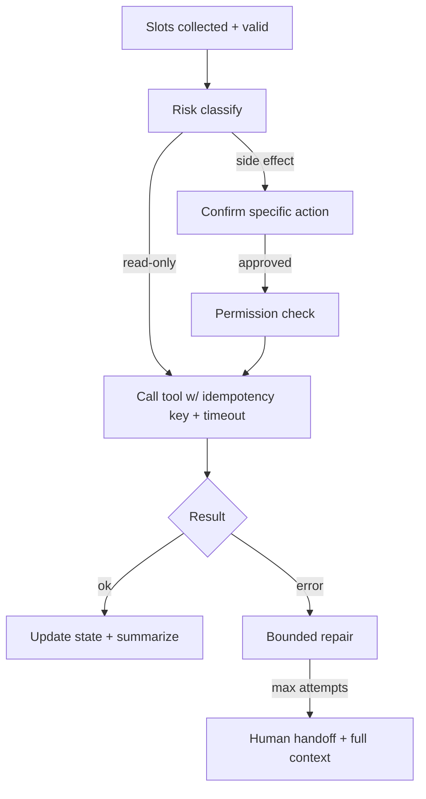

---

### 3. Real-World Industry Scenarios [Intermediate]

**Scenario A — Idempotent side effect**

*Context:* Network retry could double-charge/cancel.
- **Good:** every side-effect call carries an idempotency key (`rf-ORD-9`); a retry is a no-op server-side.

**Scenario B — Approval for irreversible action**

*Context:* Deleting an account.
- **Good:** high risk tier → explicit confirmation of the specific consequence → permission check → audit log.

**Scenario C — Context-rich handoff**

*Context:* Automation fails after two repairs.
- **Good:** handoff payload includes transcript, current state, collected slots, and the failed attempts, so the human continues seamlessly.

---

### 4. System View [Intermediate]

```text
collect → validate → risk-classify → (confirm if side effect) → permission check
   → call tool { idempotency_key, timeout, retry policy } → handle result
   → update state → audit log → summarize to user
   on repeated failure → human handoff { transcript, state, slots, failures }
```

**Tool-call safety checklist (all required for side effects):** tool schema, required slots, risk tier, permission check, confirmation/approval, timeout + retry, idempotency key, audit log.

**Failure points:**

| Failure | Symptom | Root cause |
|---|---|---|
| Free tool calls | Unsafe/irreversible actions | No approval gate / risk tier |
| Duplicate side effect | Double charge/cancel | No idempotency key |
| Context-less handoff | User repeats everything | No handoff payload |
| No audit | Can't reconstruct what happened | Missing tool audit log |

---

### 5. System Design Flavor [Intermediate]

**Key design question:** For each tool, what is its risk tier, required slots, confirmation policy, idempotency strategy, and handoff behavior on failure?

**Tradeoffs:**

| Decision | Stricter | Looser |
|---|---|---|
| Confirmation | Confirm all side effects | Confirm only high-risk (faster, riskier) |
| Retry/idempotency | Always idempotent | Only where "obviously" needed (bugs lurk) |
| Handoff richness | Full payload | Minimal (human re-works) |
| Reversibility handling | Compensation workflows | Manual cleanup |

**Scaling consideration:** Idempotency and audit are non-negotiable at scale — retries, at-least-once delivery, and concurrency make duplicate side effects inevitable without keys. Reversible-action metadata + compensation workflows let you handle "undo" requests safely.

---

### 6. Common Mistakes + Debugging [Beginner]

**Mistake 1 — LLM calls side-effect tools freely.**
- **Symptom:** the assistant executes risky tasks too freely.
- **First step:** insert risk tiering + confirmation + permission gates before any side-effect tool.

**Mistake 2 — No idempotency key.**
- **Symptom:** retries cause duplicate charges/cancellations.
- **First step:** attach an idempotency key derived from the action + entity.

**Mistake 3 — Handoff without context.**
- **Symptom:** the human agent makes the user repeat everything.
- **First step:** pass transcript, state, slots, and failed attempts in the handoff payload.

---

### 7. Hands-On Lab [Pro]

**Concept:** A gated, idempotent tool call with context-rich handoff.

#### Build — Tool lifecycle with gates

```python
AUDIT, EXECUTED = [], set()

def call_tool(action, entity, slots, confirmed, risk, user_roles, attempt=1):
    if risk == "high" and not confirmed:
        return {"status": "blocked", "reason": "needs confirmation"}
    if "agent" not in user_roles and risk == "high":
        return {"status": "blocked", "reason": "no permission"}
    key = f"{action}-{entity}"                       # idempotency key
    if key in EXECUTED:
        return {"status": "ok", "idempotent": True}  # retry no-op
    EXECUTED.add(key)
    AUDIT.append({"action": action, "entity": entity, "attempt": attempt})
    return {"status": "ok", "idempotent": False, "key": key}

print(call_tool("cancel", "ORD-9", {}, confirmed=False, risk="high", user_roles={"agent"}))  # blocked
print(call_tool("cancel", "ORD-9", {}, confirmed=True,  risk="high", user_roles={"agent"}))  # ok
print(call_tool("cancel", "ORD-9", {}, confirmed=True,  risk="high", user_roles={"agent"}))  # idempotent no-op
```

#### Build — Handoff payload

```python
def handoff(state, slots, transcript, failures):
    return {"reason": "max repairs exceeded", "state": state,
            "slots": slots, "transcript_tail": transcript[-3:], "failures": failures}
print(handoff("execute_refund", {"order_id":"ORD-9"},
              ["...","tool error","tool error"], failures=2))
```

#### Break — Remove idempotency

```python
CALLS = []
def unsafe_call(action, entity): CALLS.append((action, entity)); return "done"
for _ in range(3): unsafe_call("cancel", "ORD-9")   # retried 3x
print("duplicate side effects:", len(CALLS))         # 3 -> triple cancellation (BUG)
```

#### Measure

- Unsafe-action rate (side effects without confirmation/permission) — target 0.
- Duplicate-side-effect rate (idempotency working?).
- Handoff completeness (payload has transcript+state+slots+failures).
- Tool error + repair-to-handoff rate.

#### Explain

The gated call blocks the high-risk cancellation until it's confirmed and permitted, then executes exactly once — a retry is a no-op via the idempotency key. The handoff payload gives the human everything needed to continue. Removing idempotency triple-cancels on retry: the precise failure the key prevents. Side effects demand gates, keys, and audit — always.

---

### 8. Active Recall [Beginner → Intermediate]

1. **[Beginner]** List four items required before a side-effect tool call.
2. **[Beginner]** What does an idempotency key prevent?
3. **[Intermediate]** Why must a handoff carry a payload?
4. **[Intermediate]** What is a risk tier and how does it change the flow?
5. **[Pro]** How do you safely support "undo" for a completed action?

**Answer Key:**
1. Any four: tool schema, required slots, risk tier, permission check, confirmation/approval, timeout+retry, idempotency key, audit log.
2. Duplicate side effects when a call is retried (double charge/cancel).
3. So the human agent has transcript, state, slots, and failure history and doesn't force the user to repeat everything.
4. A classification of an action's reversibility/impact; high-risk actions require explicit confirmation and permission before executing.
5. Store reversible-action metadata and run a compensation workflow; route irreversible actions to human handoff.

---

### 9. Practice [Intermediate / Pro]

**Mini-exercise:** Give the idempotency key and confirmation text for a `refund(ORD-9, $80)` action.

*Suggested answer:* key `refund-ORD-9` (or including amount if partial refunds allowed); confirmation "Refund $80 to the card ending 4242 for order ORD-9. Proceed?".

**Capstone design question:** Design the tool-use and handoff policy for a banking assistant covering risk tiers, confirmation, idempotency, audit, and reversible-action handling.

*Answer outline:* risk tiers (read-only balance = low; transfer/close = high); high-risk requires specific confirmation + permission + idempotency key + audit; timeouts/retries with keys prevent duplicates; reversible actions get compensation workflows, irreversible ones route to human handoff with full payload; every tool call audit-logged with user, action, entity, result.

---

### 10. Production Reality Check (Mandatory)

**If the assistant performs an unsafe or duplicate action, what's the first thing we inspect?**

The tool-call gates and idempotency. Confirm the side effect passed risk-tier → confirmation → permission before executing, and that the call used an idempotency key so retries can't duplicate it. Unsafe actions = missing gates; duplicates = missing key. Check the tool audit log to scope impact. These are structural controls, not prompt fixes.

---

### 11. Curiosity Bridge (Mandatory)

Single-session flows are solved. But great assistants remember *across* sessions — preferences, history, long-lived task state — which raises personalization and memory design (and its privacy pitfalls). That's Subtopic 24.2.d.

---

### 12. Exit Check + Carry-Forward Review

**Exit check:** You can design a gated, idempotent, audited tool-call lifecycle and a context-rich human handoff, and classify actions by risk tier.

**Carry-forward:** This is Module 10.2.a's tool-schema/selection discipline and Module 16.2's approval/HITL patterns, specialized to conversational side effects with idempotency and handoff payloads.

---

## Subtopic 24.2.d: Personalization, Memory, and Long-Lived State

### Reading Path + Level Tags

- **Beginner:** Read sections 1–2 and Active Recall.
- **Intermediate:** Add sections 3–5 and the Hands-On Lab.
- **Pro:** Full lab with Break + Measure plus the capstone memory-design question.

---

### 1. Pre-Question Hook + The Intuition [Beginner]

**Pause — before reading:** Your assistant should remember a user prefers the enterprise plan and hates phone calls — but must *not* silently retain their credit card in plaintext forever. What memory design gives you the first without the second?

**The core mental model:**
Long-lived assistants layer memory:
- **Short-term (session) memory:** the current conversation's state, slots, and summary.
- **Long-term (cross-session) memory:** durable facts about the user — preferences, history, entitlements — keyed by user and scoped by consent.
- **Summary memory:** compressed running context to fit windows without losing constraints ("for the enterprise plan").

Personalization uses long-term memory to tailor behavior, but it comes with hard requirements: **consent, redaction, retention limits, and correctness.** The dangerous failure is *summary memory dropping a constraint* (the bot forgets "enterprise plan" and gives consumer answers), or retaining sensitive data (PII) beyond need. Memory must be selective (what's worth remembering), scoped (consent/permissions), and expiring (retention), not a plaintext hoard of everything.

**Key terms:**
- **Short-term vs long-term memory:** session state vs durable user facts.
- **Summary memory:** compressed history that must preserve constraints.
- **Consent & retention:** what you may store and for how long.
- **Redaction:** removing sensitive values before persistence.

---

### 2. Visual Diagram (Mermaid) [Beginner]

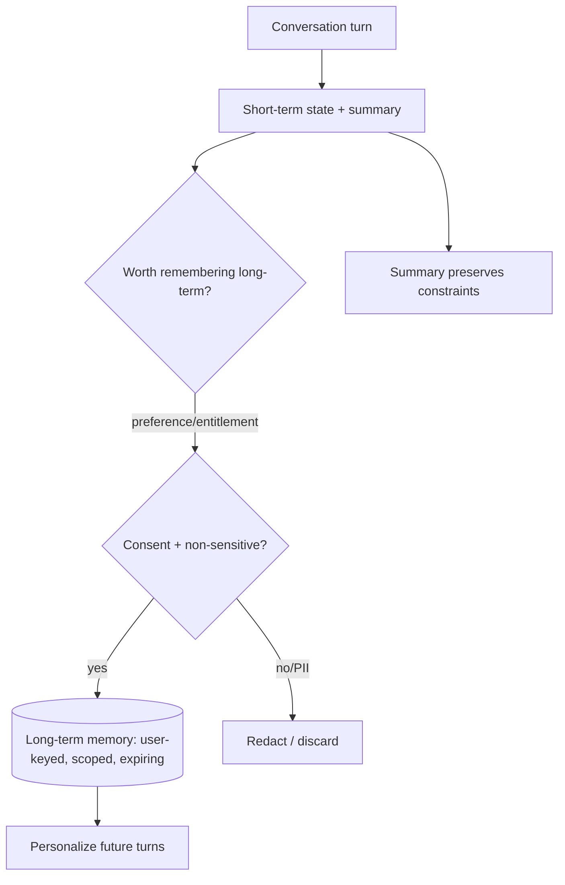

---

### 3. Real-World Industry Scenarios [Intermediate]

**Scenario A — Constraint-preserving summary**

*Context:* User said "I'm on the enterprise plan" 10 turns ago.
- **Good:** the running summary retains "plan=enterprise"; answers stay enterprise-scoped even as history is compressed.

**Scenario B — Consent-scoped personalization**

*Context:* Remembering communication preference ("no phone calls").
- **Good:** stored as a long-term preference with consent; applied to future sessions; user can view/delete it.

**Scenario C — Retention/redaction (privacy)**

*Context:* User provided a card number mid-flow.
- **Good:** the card is used transactionally and redacted from persisted memory; never retained in plaintext beyond need.

---

### 4. System View [Intermediate]

```text
Per turn: update short-term state + running summary (constraints preserved)
Selectively promote to long-term: only durable, consented, non-sensitive facts, user-keyed, with retention
Personalize: read long-term memory (scoped by permissions/consent) to tailor behavior
Govern: redact PII before persistence; honor retention/expiry; support view/delete
```

**What to store long-term (examples):** preferences, entitlements/plan, past-issue history, communication choices — **not** raw PII/secrets.

**Failure points:**

| Failure | Symptom | Root cause |
|---|---|---|
| Summary drops constraint | Wrong-scope answers ("consumer" for enterprise user) | Lossy summarization |
| PII retained | Privacy/compliance breach | No redaction/retention policy |
| No consent scoping | Personalization uses data it shouldn't | Consent not enforced |
| Stale long-term facts | Acts on outdated preference/entitlement | No expiry/refresh |

---

### 5. System Design Flavor [Intermediate]

**Key design question:** What is worth remembering long-term, under what consent, for how long, and how do you guarantee summaries never drop hard constraints?

**Tradeoffs:**

| Decision | More memory | Less memory |
|---|---|---|
| Long-term richness | Better personalization | Simpler, more private |
| Summary compression | Fits window | Risk dropping constraints |
| Retention | Longer history | Higher privacy risk |
| PII handling | Redact aggressively | Convenience but risk |

**Scaling consideration:** Separate *constraint memory* (must-not-drop facts like plan/entitlements — store as structured slots, not prose) from *soft summary* (compressible narrative). Enforce retention and consent centrally, and make long-term memory viewable/deletable by the user (privacy by design).

---

### 6. Common Mistakes + Debugging [Beginner]

**Mistake 1 — Summary drops constraints.**
- **Symptom:** the bot forgets "for the enterprise plan" and answers wrong-scope.
- **First step:** store hard constraints as structured state, not only in the prose summary.

**Mistake 2 — Retaining PII.**
- **Symptom:** sensitive values persisted beyond need.
- **First step:** redact before persistence; enforce retention limits.

**Mistake 3 — Personalizing without consent.**
- **Symptom:** using data the user didn't agree to store.
- **First step:** scope long-term memory by consent/permissions; support delete.

---

### 7. Hands-On Lab [Pro]

**Concept:** Layered memory that preserves constraints and redacts PII.

#### Build — Constraint-safe memory

```python
import re
from dataclasses import dataclass, field

@dataclass
class Memory:
    constraints: dict = field(default_factory=dict)   # must-not-drop (structured)
    summary: str = ""                                  # compressible prose
    long_term: dict = field(default_factory=dict)      # consented, non-PII

PII = re.compile(r"\b\d{13,16}\b")   # card-like

def observe(mem: Memory, text: str, consent=True):
    if "enterprise plan" in text.lower():
        mem.constraints["plan"] = "enterprise"          # hard constraint, structured
    if "no phone" in text.lower() and consent:
        mem.long_term["contact_pref"] = "no_phone"
    mem.summary = (mem.summary + " " + PII.sub("[REDACTED]", text)).strip()[-200:]  # redact + cap
    return mem

m = Memory()
m = observe(m, "I'm on the enterprise plan, no phone please, card 4242424242424242")
print("constraints:", m.constraints)     # {'plan': 'enterprise'}
print("long_term:", m.long_term)         # {'contact_pref': 'no_phone'}
print("summary:", m.summary)             # card redacted
```

#### Break — Compress summary and lose the constraint (anti-pattern)

```python
def lossy_summary(text): return text[:20]     # naive truncation
bad = lossy_summary("Answer scoped to the enterprise plan for compliance")
print("lossy summary:", bad)                  # 'Answer scoped to the' -> 'enterprise' dropped
# If 'plan' lived ONLY in prose, this truncation would silently break scoping.
```

#### Measure

- Constraint-retention rate across long conversations (should be ~100%).
- PII-in-persistence rate (should be 0).
- Consent-scoping correctness.
- Personalization lift (did remembered preferences improve outcomes?).

#### Explain

Storing `plan=enterprise` as a *structured constraint* (not just prose) means summary compression can never silently drop it — the lossy-truncation break shows how prose-only constraints vanish. PII is redacted before persistence, and preferences are consented and user-scoped. Memory must be selective, constraint-safe, and privacy-governed.

---

### 8. Active Recall [Beginner → Intermediate]

1. **[Beginner]** Name the three memory layers.
2. **[Beginner]** What is the danger of summary memory?
3. **[Intermediate]** Why store hard constraints as structured state, not prose?
4. **[Intermediate]** What three governance requirements does long-term memory carry?
5. **[Pro]** How do you keep long-term facts from going stale?

**Answer Key:**
1. Short-term (session) state, long-term (cross-session) memory, and summary memory.
2. Lossy compression can drop hard constraints (e.g., "enterprise plan"), causing wrong-scope answers.
3. Structured constraints survive summarization/compression, so they can't be silently dropped.
4. Consent (may we store it?), redaction (no PII/secrets), and retention/expiry (how long) — plus user view/delete.
5. Add expiry/refresh and re-validate durable facts (preferences/entitlements) rather than trusting them indefinitely.

---

### 9. Practice [Intermediate / Pro]

**Mini-exercise:** A user is on a trial plan and asks for a feature. What must memory retain, and what must it never persist?

*Suggested answer:* retain `plan=trial` as a structured constraint (so answers stay trial-scoped); never persist any payment details in plaintext — redact and keep only a token reference if needed, with retention limits.

**Capstone design question:** Design the memory architecture for a long-lived customer assistant, covering short/long-term/summary layers, constraint preservation, consent, redaction, and retention.

*Answer outline:* short-term = session state/slots; long-term = user-keyed consented facts (preferences, entitlements, issue history), viewable/deletable, with expiry; summary = compressible prose with hard constraints mirrored in structured state; redact PII before persistence; enforce retention centrally; personalization reads only consent-scoped memory; re-validate durable facts to avoid staleness.

---

### 10. Production Reality Check (Mandatory)

**If the assistant gives wrong-scope answers or leaks retained data, what's the first thing we inspect?**

For wrong-scope: whether the constraint lived only in a lossy summary vs structured state — mirror hard constraints into structured slots. For leaks: the redaction and retention policy on persisted memory. Wrong-scope answers are usually dropped constraints; leaks are usually retained PII. Both are memory-design fixes, not model fixes.

---

### 11. Curiosity Bridge (Mandatory)

Memory and state make single conversations smart. The next leap is retrieval that *uses* conversation state — resolving "the second one," carrying entities across turns, and scoping retrieval by the active task. Conversation-aware retrieval is Topic 24.3.

---

### 12. Exit Check + Carry-Forward Review

**Exit check:** You can design layered memory that preserves hard constraints, redacts PII, and applies consent/retention — enabling personalization without privacy or correctness failures.

**Carry-forward:** This is Module 10.2.c's short-term vs long-term memory and Module P5's privacy-safe capture (consent, redaction, retention) applied to conversational personalization.

---

## Topic 24.3: Conversation-Aware Retrieval and Graph Memory

**Topic time:** 7h

---

## Subtopic 24.3.a: Conversation State for RAG and Context Carryover

### Reading Path + Level Tags

- **Beginner:** Read sections 1–2 and Active Recall.
- **Intermediate:** Add sections 3–5 and the Hands-On Lab.
- **Pro:** Full lab with Break + Measure plus the capstone query-rewrite question.

---

### 1. Pre-Question Hook + The Intuition [Beginner]

**Pause — before reading:** A user asks "what about the second one?" Your RAG system embeds that exact string and retrieves garbage. Why — and what does it need to retrieve correctly?

**The core mental model:**
Single-turn RAG sees only the latest message. "What about the second one?" is meaningless in isolation — its meaning lives in the *conversation state*. Conversation-aware retrieval **rewrites the retrieval query** using state before embedding:
```text
retrieval_query = rewrite(
    latest_user_message,
    active_task,
    active_entities,
    relevant_history,
    user_permissions
)
```
The system must track the active topic (fixes pronoun/ellipsis failures), active entities (resolves "that vendor," "the second one"), the last evidence set (for comparisons/follow-ups), user role (permission-aware retrieval), task phase (what evidence is needed now), and a conversation summary (to control context size). Without carryover, follow-ups retrieve the wrong documents no matter how good the vector store is.

**Key terms:**
- **Query rewriting:** producing a self-contained retrieval query from a context-dependent message.
- **Context carryover:** propagating active entities/topic across turns.
- **Ellipsis/anaphora resolution:** resolving "it/that/the second one" to concrete entities.
- **Permission-aware retrieval:** scoping retrieval by the user's role.

---

### 2. Visual Diagram (Mermaid) [Beginner]

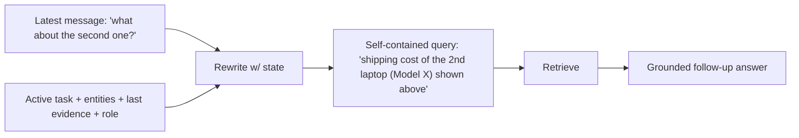

---

### 3. Real-World Industry Scenarios [Intermediate]

**Scenario A — Ellipsis follow-up**

*Context:* Bot listed three laptops; user says "compare the first two."
- **Carryover:** active entities = the listed laptops; rewrite to "compare Model A and Model B on price/specs"; retrieval now works.

**Scenario B — Constraint carryover**

*Context:* Earlier the user said "for the enterprise plan"; later asks "what's the storage limit?"
- **Carryover:** task/constraint state injects "enterprise plan" into the query so the retrieved limit is the enterprise one.

**Scenario C — Permission-scoped retrieval**

*Context:* A support agent vs an end user ask the same question.
- **Carryover:** user role scopes retrieval so restricted docs are only retrieved for authorized roles.

---

### 4. System View [Intermediate]

```text
Latest message + conversation state
   → resolve references (active entities) + inject constraints (task phase)
   → rewrite into a self-contained, permission-scoped query
   → retrieve → answer → update state (new active entities, last evidence)
```

**State items that drive retrieval:**

| State item | Why it matters |
|---|---|
| Active topic | Prevents pronoun/ellipsis failures |
| Active entities | Resolves "that vendor"/"second one" |
| Last evidence set | Enables compare/follow-up |
| User role | Permission-aware retrieval |
| Task phase | Changes what evidence is needed |
| Conversation summary | Controls context size |

**Failure points:** rewrite ignores history (follow-ups retrieve wrong docs); summary drops a constraint (wrong-scope retrieval); references unresolved (ellipsis fails).

---

### 5. System Design Flavor [Intermediate]

**Key design question:** What state does the query rewriter need to make each follow-up a self-contained, correctly-scoped retrieval query?

**Tradeoffs:**

| Decision | Rich rewrite | Minimal rewrite |
|---|---|---|
| Reference resolution | Robust on ellipsis | Fails on "that one" |
| Constraint injection | Correct scope | Wrong-scope answers |
| Cost/latency | Extra rewrite step | Cheaper, more failures |
| Permission scoping | Safe | Potential leaks |

**Scaling consideration:** Keep active entities and last-evidence in structured state (not just prose) so rewriting is reliable and cheap. Cache rewrites for repeated follow-up shapes; enforce permission scoping in the retrieval filter, not the rewriter alone.

---

### 6. Common Mistakes + Debugging [Beginner]

**Mistake 1 — Rewrite ignores history.**
- **Symptom:** follow-up questions retrieve wrong documents.
- **First step:** inspect the rewritten query and active entities.

**Mistake 2 — Summary drops constraints.**
- **Symptom:** the bot forgets "for enterprise plan" and retrieves consumer docs.
- **First step:** mirror constraints into structured state; diff the summary.

**Mistake 3 — No permission scoping in retrieval.**
- **Symptom:** restricted docs surface for unauthorized users.
- **First step:** apply the role filter in the retrieval query, not just the rewrite.

---

### 7. Hands-On Lab [Pro]

**Concept:** Rewrite a context-dependent message into a self-contained, scoped query.

#### Build — State-aware query rewriter

```python
from dataclasses import dataclass, field

@dataclass
class ConvState:
    active_entities: list = field(default_factory=list)   # e.g., ["Model A","Model B","Model C"]
    constraints: dict = field(default_factory=dict)        # e.g., {"plan":"enterprise"}
    role: str = "user"

def rewrite(msg, st: ConvState):
    q = msg
    if "second one" in msg.lower() and len(st.active_entities) >= 2:
        q = q.replace("the second one", st.active_entities[1])
    if "first two" in msg.lower() and len(st.active_entities) >= 2:
        q = f"compare {st.active_entities[0]} and {st.active_entities[1]}"
    for k, v in st.constraints.items():
        q += f" ({k}={v})"
    return {"query": q, "role_filter": st.role}

st = ConvState(active_entities=["Model A","Model B","Model C"], constraints={"plan":"enterprise"})
print(rewrite("what about the second one?", st))
print(rewrite("compare the first two", st))
```

#### Break — Rewrite without state

```python
def naive(msg): return {"query": msg}    # embeds the raw ellipsis
print(naive("what about the second one?"))   # meaningless query -> garbage retrieval
```

#### Measure

- Reference-resolution success rate on follow-ups.
- Constraint-carryover rate (scope preserved).
- Retrieval precision: with vs without state-aware rewrite.
- Permission-scoping correctness by role.

#### Explain

With state, "the second one" becomes "Model B (plan=enterprise)" — a self-contained, scoped query that retrieves correctly. Without state, the raw ellipsis embeds to nothing useful. Conversation-aware retrieval is mostly *query rewriting driven by structured state*, plus a permission filter; the vector store quality is irrelevant if the query is context-blind.

---

### 8. Active Recall [Beginner → Intermediate]

1. **[Beginner]** Why does single-turn RAG fail on "what about the second one?"
2. **[Beginner]** What does query rewriting produce?
3. **[Intermediate]** Name three state items that drive conversation-aware retrieval.
4. **[Intermediate]** Where should permission scoping be enforced?
5. **[Pro]** Why keep active entities in structured state rather than prose?

**Answer Key:**
1. It only sees the latest message; the meaning lives in conversation state (active entities/topic), so the raw ellipsis retrieves garbage.
2. A self-contained, correctly-scoped retrieval query independent of conversational context.
3. Any three: active topic, active entities, last evidence set, user role, task phase, conversation summary.
4. In the retrieval filter/query itself (not only the rewriter), so restricted docs are never retrieved for unauthorized roles.
5. Structured state makes reference resolution reliable and cheap and survives summary compression.

---

### 9. Practice [Intermediate / Pro]

**Mini-exercise:** The bot listed three vendors; user asks "which of those had incidents last quarter?" Write the rewritten query.

*Suggested answer:* "incidents in the last quarter for [Vendor1], [Vendor2], [Vendor3]" (active entities injected) with a date filter and the user's role scope.

**Capstone design question:** Design conversation-aware retrieval for a product-support assistant, covering state items tracked, the rewrite step, and permission scoping.

*Answer outline:* track active product entities, active plan/constraints, last evidence, user role, task phase; rewrite each message into a self-contained query resolving references and injecting constraints; apply role-based retrieval filter; update active entities/last-evidence after each turn; cache common follow-up rewrites; evaluate reference-resolution and retrieval precision per turn.

---

### 10. Production Reality Check (Mandatory)

**If a follow-up question retrieves the wrong documents, what's the first thing we inspect?**

The rewritten retrieval query and the active conversation state (entities, constraints, role). If the system misunderstood the active task or entity, retrieval will be wrong regardless of the vector store. Confirm the ellipsis/anaphora was resolved and constraints were injected before blaming embeddings or the index.

---

### 11. Curiosity Bridge (Mandatory)

Carryover handles *this* turn. Zoom out and conversations follow recurring *paths* of intents — patterns you can model as an intent transition graph to predict the next best action, detect drop-offs, and personalize. That's Subtopic 24.3.b.

---

### 12. Exit Check + Carry-Forward Review

**Exit check:** You can build a state-aware query rewriter that resolves references, injects constraints, and scopes by permission so follow-ups retrieve correctly.

**Carry-forward:** This is Module 7.2.a's query rewriting/expansion made *conversational* — the rewrite is driven by dialogue state, not just the standalone query.

---

## Subtopic 24.3.b: Intent Transition Graphs and Next-Best-Action Systems

### Reading Path + Level Tags

- **Beginner:** Read sections 1–2 and Active Recall.
- **Intermediate:** Add sections 3–5 and the Hands-On Lab.
- **Pro:** Full lab with Break + Measure plus the capstone NBA-design question.

---

### 1. Pre-Question Hook + The Intuition [Beginner]

**Pause — before reading:** Across thousands of conversations, users who ask about a login issue often go: password reset → MFA problem → support ticket. If you knew that pattern, what could you do proactively?

**The core mental model:**
An **intent transition graph** models the common *paths* users take between intents across many conversations:
```text
ask_refund_status → ask_refund_timing → request_human_agent
login_issue → password_reset → mfa_problem → support_ticket
```
It's built from aggregate conversation logs (transitions between intents), and it powers:
- **Next-best-action (NBA):** predict and proactively offer the likely next step.
- **Conversation repair:** detect when a user is off a successful path and nudge back.
- **Drop-off detection:** find where users abandon.
- **Personalization & training-data generation:** tailor flows and mine paths.
- **Trajectory evaluation:** judge whether a dialogue followed a known successful path.

The distinction from a single conversation's state machine: this is a *statistical* graph over *many* conversations — probabilities of moving intent→intent — used for prediction and analytics, not per-turn control.

**Key terms:**
- **Intent transition graph:** aggregate graph of intent→intent movements with probabilities.
- **Next-best-action:** predicted proactive step given the current intent path.
- **Drop-off point:** a state where users frequently abandon.
- **Trajectory:** the sequence of intents in one conversation.

---

### 2. Visual Diagram (Mermaid) [Beginner]

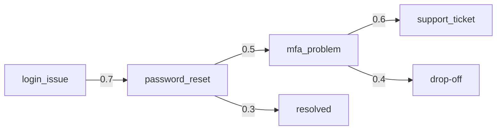

Edge weights are transition probabilities mined from logs; the low-to-`resolved` and high-to-`drop-off` edges reveal where to intervene.

---

### 3. Real-World Industry Scenarios [Intermediate]

**Scenario A — Proactive NBA**

*Context:* User completes a password reset.
- **Use:** the graph shows password_reset → mfa_problem is common; the bot proactively asks "Are you also able to complete MFA?" — resolving faster.

**Scenario B — Drop-off intervention**

*Context:* Many users abandon at `mfa_problem`.
- **Use:** drop-off detection flags it; the team adds a smoother MFA repair path or earlier handoff.

**Scenario C — Trajectory evaluation**

*Context:* Judging conversation quality.
- **Use:** compare each conversation's intent trajectory against known successful paths to flag anomalous or failing dialogues.

---

### 4. System View [Intermediate]

```text
Conversation logs → extract intent sequences (trajectories)
   → aggregate intent→intent transitions with counts/probabilities
   → intent transition graph
   → uses: NBA prediction, drop-off detection, repair nudges, trajectory eval, personalization
```

**What to compute:** transition probabilities, per-state drop-off rates, common successful vs failing trajectories, and NBA suggestions per current intent.

**Failure points:**

| Failure | Symptom | Root cause |
|---|---|---|
| Overfit to happy paths | Fails on real digressions | Graph built only from clean logs |
| Stale graph | NBA suggests outdated steps | Not refreshed as behavior shifts |
| NBA over-intervention | Annoying proactive prompts | Suggesting low-confidence next steps |
| Ignoring drop-offs | Persistent abandonment | No drop-off analysis loop |

---

### 5. System Design Flavor [Intermediate]

**Key design question:** What decisions (proactive NBA, repair, staffing, flow redesign) will the intent transition graph drive, and is it refreshed from real (messy) logs?

**Tradeoffs:**

| Decision | Use the graph aggressively | Use it conservatively |
|---|---|---|
| Proactive NBA | Faster resolution | Risk of annoying/wrong prompts |
| Repair nudges | Recover off-path users | Over-steering |
| Refresh cadence | Current behavior | Cost of recompute |
| Confidence threshold | Suggest more | Suggest only high-confidence |

**Scaling consideration:** Build the graph from *real* production trajectories (including digressions and failures), not idealized flows, and refresh it as user behavior shifts. Gate NBA on transition confidence to avoid over-intervening.

---

### 6. Common Mistakes + Debugging [Beginner]

**Mistake 1 — Overfitting to happy paths.**
- **Symptom:** the graph fails on real digressions.
- **First step:** rebuild from production transition logs including failures/digressions.

**Mistake 2 — Over-eager NBA.**
- **Symptom:** annoying or wrong proactive suggestions.
- **First step:** gate NBA on a confidence threshold.

**Mistake 3 — Ignoring drop-off signals.**
- **Symptom:** persistent abandonment at a state.
- **First step:** analyze per-state drop-off and add repair/handoff there.

---

### 7. Hands-On Lab [Pro]

**Concept:** Build an intent transition graph from logs and derive NBA + drop-off.

#### Build — Transition graph from trajectories

```python
from collections import defaultdict, Counter

trajectories = [
    ["login_issue","password_reset","mfa_problem","support_ticket"],
    ["login_issue","password_reset","resolved"],
    ["login_issue","password_reset","mfa_problem","drop_off"],
    ["login_issue","password_reset","mfa_problem","support_ticket"],
]

transitions = defaultdict(Counter)
for traj in trajectories:
    for a, b in zip(traj, traj[1:]):
        transitions[a][b] += 1

def next_best_action(intent, min_conf=0.5):
    c = transitions[intent]; total = sum(c.values())
    if not total: return None
    nxt, cnt = c.most_common(1)[0]
    conf = cnt/total
    return (nxt, round(conf,2)) if conf >= min_conf else None

def drop_off_rate(intent):
    c = transitions[intent]; total = sum(c.values())
    return round(c.get("drop_off",0)/total, 2) if total else 0

print("NBA after password_reset:", next_best_action("password_reset"))  # ('mfa_problem', 0.75)
print("drop-off at mfa_problem:", drop_off_rate("mfa_problem"))          # 0.33
```

#### Break — Low-confidence NBA over-intervenes

```python
# force a threshold of 0 -> always suggests, even weak transitions
def eager_nba(intent): 
    c = transitions[intent]; 
    return c.most_common(1)[0][0] if c else None
print("eager NBA after mfa_problem:", eager_nba("mfa_problem"))  # suggests even at ~0.5 -> may annoy
```

#### Measure

- NBA acceptance rate (are suggestions useful?).
- Drop-off reduction after interventions.
- Trajectory-match rate vs successful paths.
- Graph freshness (recompute cadence).

#### Explain

The graph reveals that most users go password_reset → mfa_problem (0.75) and that a third drop off at mfa_problem — actionable signals for proactive help and flow redesign. Gating NBA on confidence prevents annoying low-value prompts. Built from real trajectories, this graph turns aggregate behavior into concrete product improvements.

---

### 8. Active Recall [Beginner → Intermediate]

1. **[Beginner]** What does an intent transition graph model?
2. **[Beginner]** Name two uses of it.
3. **[Intermediate]** How is it different from a single conversation's state machine?
4. **[Intermediate]** Why gate next-best-action on confidence?
5. **[Pro]** Why build it from real (messy) logs, not idealized flows?

**Answer Key:**
1. The common intent→intent paths users take across many conversations, with transition probabilities.
2. Any two: next-best-action, conversation repair, drop-off detection, personalization, trajectory evaluation, training-data generation.
3. It's a statistical aggregate over many conversations for prediction/analytics, not per-turn control of one conversation.
4. Low-confidence suggestions over-intervene and annoy users; a threshold keeps NBA useful.
5. Idealized flows overfit happy paths; real logs capture digressions and failures where the value (drop-offs, repairs) actually lives.

---

### 9. Practice [Intermediate / Pro]

**Mini-exercise:** Given transitions `A→B (0.8)`, `B→drop_off (0.6)`, what NBA and what intervention do you propose?

*Suggested answer:* NBA after A = offer B proactively; but B has a high drop-off, so add a repair/handoff at B and investigate why users abandon there.

**Capstone design question:** Design a next-best-action system for a support assistant using an intent transition graph, covering data, confidence gating, interventions, and refresh.

*Answer outline:* mine intent trajectories from logs; build a probability transition graph; NBA suggests the top next intent above a confidence threshold; add repair/handoff at high drop-off states; personalize by segment; refresh the graph on a cadence as behavior shifts; measure NBA acceptance and drop-off reduction; feed failing trajectories back as fixtures.

---

### 10. Production Reality Check (Mandatory)

**If proactive suggestions annoy users or miss real paths, what's the first thing we inspect?**

The graph's data source and NBA confidence gating. Confirm it was built from real production trajectories (with digressions/failures) and is refreshed, and that NBA only fires above a confidence threshold. Annoying or wrong suggestions are usually a stale/overfit graph or an ungated NBA — not a generation issue.

---

### 11. Curiosity Bridge (Mandatory)

Conversation-aware retrieval and intent graphs handle text and paths. But the richest assistants combine *three* graphs — the conversation graph (state), a knowledge graph (entities/relations), and vector RAG (evidence). Fusing them is Conversational GraphRAG, Subtopic 24.3.c.

---

### 12. Exit Check + Carry-Forward Review

**Exit check:** You can build an intent transition graph from logs and use it for next-best-action, drop-off detection, and trajectory evaluation, gating suggestions on confidence.

**Carry-forward:** This is Module 8's trajectory/analytics thinking and Module 23's graph modeling combined: model *behavior* as a graph to drive product decisions.

---

## Subtopic 24.3.c: Conversational GraphRAG and Dual Retrieval

### Reading Path + Level Tags

- **Beginner:** Read sections 1–2 and Active Recall.
- **Intermediate:** Add sections 3–5 and the Hands-On Lab.
- **Pro:** Full lab with Break + Measure plus the capstone tri-graph design question.

---

### 1. Pre-Question Hook + The Intuition [Beginner]

**Pause — before reading:** A user asks "Did the *same vendor* cause the outage *last quarter*?" Answering needs the current conversation entity, a relationship path, source evidence, and a time filter. Which systems supply each piece?

**The core mental model:**
Conversational GraphRAG fuses three graphs, each answering a different sub-question:
```text
conversation graph:  what state/task/entity are we in?   (active vendor)
knowledge graph:     what entities/relationships/facts?   (vendor → incidents → services → time)
vector RAG:          what source text supports the answer? (incident reports + citations)
```
For "did the same vendor cause the outage last quarter?":
- **Conversation graph** resolves "the same vendor" to the active entity.
- **Knowledge graph** traverses `vendor → CAUSED → incident → AFFECTS → service`, filtered by a temporal constraint.
- **Vector RAG** fetches the supporting incident-report text for citations.

This is Module 23's hybrid vector+graph retrieval, but with the *conversation state* supplying the seed entity and constraints. The dual/tri retrieval produces answers grounded in structure (paths), text (evidence), and dialogue context (the right entity + time).

**Key terms:**
- **Tri-graph fusion:** conversation state + knowledge graph + vector RAG.
- **Conversational seed:** the active entity from dialogue state used to seed graph traversal.
- **Dual retrieval:** combining graph paths and text passages.
- **Temporal/constraint filter:** applying "last quarter" etc. from the conversation.

---

### 2. Visual Diagram (Mermaid) [Beginner]

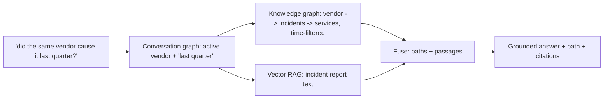

---

### 3. Real-World Industry Scenarios [Intermediate]

**Scenario A — Vendor-risk follow-up**

*Context:* Mid-conversation about Vendor V, user asks about last quarter's outage.
- **Fusion:** conversation supplies V + time; KG traverses risk path; vector supplies incident text; answer cites path + report.

**Scenario B — Entity-anchored comparison**

*Context:* "How does this service's dependency differ from the one we discussed earlier?"
- **Fusion:** conversation supplies both service entities; KG compares dependency subgraphs; vector fills descriptions.

**Scenario C — Permissioned tri-graph**

*Context:* Different roles ask the same relationship question.
- **Fusion:** conversation supplies role; KG traversal + vector retrieval both apply permission scoping.

---

### 4. System View [Intermediate]

```text
Message + conversation state (active entity, constraints, role)
   → seed KG traversal with the conversational entity + apply temporal/permission filters
   → traverse KG for paths (provenance)
   → vector-retrieve supporting text for the entities/edges
   → fuse (paths + passages) → rerank → grounded answer (path + citations)
```

**What to log:** resolved conversational seed, applied constraints (time/permission), KG paths, vector passages, fusion scores, and final citations.

**Failure points:** wrong conversational seed (whole answer wrong), missing temporal filter (stale/irrelevant paths), permission not propagated to both retrievers, and text/graph mismatch.

---

### 5. System Design Flavor [Intermediate]

**Key design question:** How does conversation state seed and constrain the knowledge-graph and vector retrievals, and how are their results fused and cited?

**Tradeoffs:**

| Decision | Full tri-graph | Simpler |
|---|---|---|
| Answer richness | Structure + text + context | Less grounded |
| Complexity/latency | High (three systems) | Lower |
| Reference resolution | Robust | Fails on "same vendor" |
| Explainability | Path + citations | Weaker |

**Scaling consideration:** The conversational seed is the linchpin (as in Module 23.3.c) — invest in resolving "the same vendor"/"that service" from dialogue state. Propagate constraints (time, permission) to *both* the KG traversal and the vector filter; cache resolved seeds and hot subgraphs.

---

### 6. Common Mistakes + Debugging [Beginner]

**Mistake 1 — Wrong conversational seed.**
- **Symptom:** answer about the wrong entity.
- **First step:** inspect how "the same vendor"/"that service" resolved from state.

**Mistake 2 — Constraint not applied to retrieval.**
- **Symptom:** "last quarter" ignored; stale paths returned.
- **First step:** confirm temporal/permission filters propagate to KG and vector.

**Mistake 3 — Only one grounding source.**
- **Symptom:** path without citations, or text without the relationship.
- **First step:** fuse both; require path provenance and supporting spans.

---

### 7. Hands-On Lab [Pro]

**Concept:** Fuse conversation seed + KG traversal + vector text with a temporal filter.

#### Build — Tri-graph retrieval

```python
import networkx as nx

# knowledge graph with time-stamped edges
kg = nx.MultiDiGraph()
kg.add_edge("vendorV","incident1",type="CAUSED",quarter="Q1",source="rep1")
kg.add_edge("incident1","checkout",type="AFFECTS",quarter="Q1",source="rep1")
kg.add_edge("vendorV","incident9",type="CAUSED",quarter="Q3",source="rep9")

DOCS = {"rep1":"Vendor V caused the Q1 checkout outage.","rep9":"Vendor V Q3 minor incident."}

conv_state = {"active_entity":"vendorV","quarter":"Q1","role":"analyst"}

def conversational_graphrag(state):
    seed, q = state["active_entity"], state["quarter"]
    paths = [(u,d["type"],v,d["source"]) for u,v,d in kg.out_edges(seed, data=True)
             if d.get("quarter")==q]                              # temporal filter from conversation
    passages = [DOCS[p[3]] for p in paths if p[3] in DOCS]
    return {"seed":seed,"paths":paths,"passages":passages}

print(conversational_graphrag(conv_state))   # only Q1 path + its report text
```

#### Break — Drop the conversational constraint

```python
def no_filter(state):
    seed = state["active_entity"]
    return [(u,d["type"],v) for u,v,d in kg.out_edges(seed, data=True)]  # ignores 'last quarter'
print(no_filter(conv_state))   # returns Q1 AND Q3 -> mixes in irrelevant incident
```

#### Measure

- Seed-resolution accuracy (from dialogue state).
- Constraint-application rate (temporal/permission).
- Grounding completeness (path + citation per claim).
- Answer relevance vs single-source retrieval.

#### Explain

The conversation state supplies both the seed (`vendorV`) and the constraint (`Q1`), so the KG traversal returns only the relevant path and the vector layer supplies its report text for citation. Dropping the constraint pulls in the irrelevant Q3 incident. Conversational GraphRAG's power — and its failure surface — is exactly this fusion of dialogue context with graph + text retrieval.

---

### 8. Active Recall [Beginner → Intermediate]

1. **[Beginner]** What three systems does Conversational GraphRAG fuse?
2. **[Beginner]** What does the conversation graph contribute to retrieval?
3. **[Intermediate]** Why must constraints propagate to both KG and vector retrieval?
4. **[Intermediate]** What is the linchpin of the whole flow?
5. **[Pro]** How is this different from Module 23's hybrid retrieval?

**Answer Key:**
1. The conversation graph (state), the knowledge graph (entities/relations), and vector RAG (text evidence).
2. The active entity (seed) and constraints (time/permission) that resolve references and scope retrieval.
3. Otherwise "last quarter" or role scoping is ignored, returning stale/irrelevant or unauthorized results.
4. Correctly resolving the conversational seed entity from dialogue state; a wrong seed makes the whole answer wrong.
5. It adds the conversation-state layer that supplies the seed and constraints, whereas Module 23 hybrid retrieval seeds from the standalone query.

---

### 9. Practice [Intermediate / Pro]

**Mini-exercise:** For "compare that service's dependencies to the one we discussed earlier," name what each of the three systems provides.

*Suggested answer:* conversation graph → the two service entities; knowledge graph → each service's dependency subgraph for comparison; vector RAG → textual descriptions/evidence for the differences.

**Capstone design question:** Design Conversational GraphRAG for an incident copilot, covering seed resolution, KG traversal, vector fill, constraint propagation, and citation policy.

*Answer outline:* resolve conversational seed from active entity; propagate temporal + permission constraints to KG traversal and vector filter; bounded traversal for paths with provenance; vector-fill supporting incident text; fuse + rerank; citation policy requires a path (with edge provenance) and supporting span per claim; cache resolved seeds/hot subgraphs; evaluate seed-resolution and grounding completeness.

---

### 10. Production Reality Check (Mandatory)

**If a Conversational GraphRAG answer is about the wrong thing or ignores a constraint, what's the first thing we inspect?**

Seed resolution and constraint propagation from conversation state. Check how the active entity ("the same vendor") resolved and whether the temporal/permission constraints reached both the graph traversal and the vector filter. Wrong-entity answers = bad seed; ignored-constraint answers = unpropagated filters. Both live in the conversation-to-retrieval handoff.

---

### 11. Curiosity Bridge (Mandatory)

Building all this is one thing; knowing it *works* across many turns is another. Multi-turn systems can end "successfully" while hiding bad turns, unsafe near-misses, and frustrating loops. Evaluating conversation trajectories properly is Subtopic 24.3.d.

---

### 12. Exit Check + Carry-Forward Review

**Exit check:** You can design Conversational GraphRAG that seeds and constrains KG + vector retrieval from dialogue state and fuses paths and passages into cited answers.

**Carry-forward:** This is Subtopic 23.3.c's hybrid vector+graph retrieval with a conversation-state front end — the dialogue supplies the seed and constraints the standalone query lacked.

---

## Subtopic 24.3.d: Evaluation for Multi-Turn and Conversation Trajectories

### Reading Path + Level Tags

- **Beginner:** Read sections 1–2 and Active Recall.
- **Intermediate:** Add sections 3–5 and the Hands-On Lab.
- **Pro:** Full lab with Break + Measure plus the capstone eval-suite question.

---

### 1. Pre-Question Hook + The Intuition [Beginner]

**Pause — before reading:** A conversation ends with the task completed, so it "passed." But along the way the bot re-asked twice, nearly executed an unsafe action, and looped once. Did it really pass?

**The core mental model:**
Multi-turn evaluation needs *both* turn-level and task-level metrics, because a conversation can succeed overall while individual turns fail:
- **Turn success:** did each turn do the right thing?
- **Task success:** did the full conversation complete the goal?
- **Context carryover accuracy:** were references resolved correctly?
- **Slot accuracy:** were collected values correct?
- **Transition accuracy:** did state changes match the expected path?
- **Repair success:** did the bot recover from bad input?
- **Handoff quality:** did the human receive useful context?
- **Safety gate correctness:** were risky actions blocked/approved correctly?
- **Conversation latency:** per-turn and end-to-end.

The key discipline: evaluate *trajectories* (turn-by-turn expected state/action), not just final outcomes — final success hides bad turns, unsafe near-misses, and loops.

**Key terms:**
- **Turn-level eval:** correctness of each individual turn.
- **Task-level eval:** whether the whole conversation succeeded.
- **Golden transcript:** a labeled conversation with expected states/actions per turn.
- **Trajectory match:** comparing actual vs expected intent/state sequence.

---

### 2. Visual Diagram (Mermaid) [Beginner]

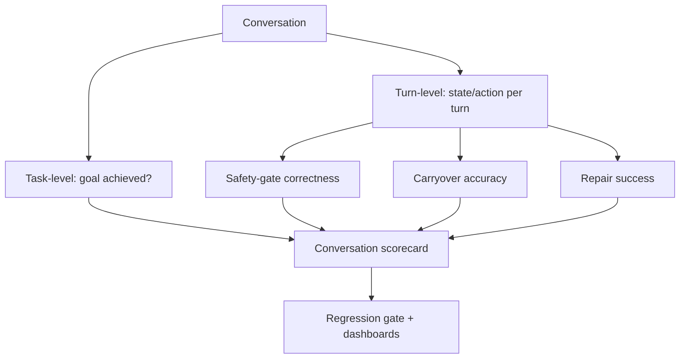

---

### 3. Real-World Industry Scenarios [Intermediate]

**Scenario A — Hidden bad turns**

*Context:* Task completed but with two re-asks and a near-miss.
- **Eval:** turn-level metrics flag the re-asks and the safety near-miss even though task success = 1.

**Scenario B — Carryover regression**

*Context:* A change breaks "the second one" resolution.
- **Eval:** context-carryover accuracy drops on the golden set; caught before release.

**Scenario C — Safety-gate correctness**

*Context:* An action that should require approval slipped through in one path.
- **Eval:** safety-gate correctness < 100% on adversarial transcripts — a hard fail regardless of task success.

---

### 4. System View [Intermediate]

```text
Golden transcripts (per-turn expected state/action + final goal)
   → replay conversation → compare per turn (turn success, transition acc, carryover, slot acc, safety gate)
   → compare final (task success, handoff quality)
   → scorecard + thresholds + regression gate + dashboards
```

**Metrics table:**

| Metric | Meaning |
|---|---|
| Turn success | Each turn did the right thing |
| Task success | Whole conversation achieved the goal |
| Context carryover accuracy | References resolved correctly |
| Slot accuracy | Collected values correct |
| Transition accuracy | State changes matched expected path |
| Repair success | Recovered from bad input |
| Handoff quality | Human received useful context |
| Safety gate correctness | Risky actions blocked/approved correctly |
| Conversation latency | Per-turn and end-to-end |

---

### 5. System Design Flavor [Intermediate]

**Key design question:** Which failures (unsafe near-miss, carryover regression, repair loop) would a task-only metric hide, and is each covered by a turn-level metric?

**Tradeoffs:**

| Decision | Rich turn-level eval | Task-only eval |
|---|---|---|
| Catches bad turns/near-misses | Yes | No (hidden) |
| Labeling cost | Higher (per-turn) | Lower |
| Safety confidence | High | Low |
| Regression detection | Fine-grained | Coarse |

**Scaling consideration:** Golden transcripts are expensive to label — stratify by flow and grow the set from real production failures (turn a failing conversation into a fixture). Run turn-level evals in CI as a regression gate, and calibrate any LLM-as-judge used for turn correctness.

---

### 6. Common Mistakes + Debugging [Beginner]

**Mistake 1 — Only measuring task success.**
- **Symptom:** bad turns and near-misses hidden behind a completed task.
- **First step:** add per-turn expected state/action evaluation.

**Mistake 2 — No safety-gate metric.**
- **Symptom:** unsafe near-misses undetected.
- **First step:** evaluate safety-gate correctness on adversarial transcripts.

**Mistake 3 — Static golden set.**
- **Symptom:** evals miss real failure shapes.
- **First step:** grow golden transcripts from production failures.

---

### 7. Hands-On Lab [Pro]

**Concept:** Turn-level trajectory evaluation vs task-only.

#### Build — Trajectory evaluator

```python
golden = [
    {"turn": 1, "expected_state": "collect_order_id"},
    {"turn": 2, "expected_state": "confirm"},
    {"turn": 3, "expected_state": "execute_refund", "safe": True},
]
actual = [
    {"turn": 1, "state": "collect_order_id"},
    {"turn": 2, "state": "collect_order_id"},   # re-ask! (should be confirm)
    {"turn": 3, "state": "execute_refund", "safe": True},
]

turn_success = [a["state"] == g["expected_state"] for g, a in zip(golden, actual)]
task_success = actual[-1]["state"] == golden[-1]["expected_state"]
safety_ok = all(a.get("safe", True) for a in actual)

print("turn success:", turn_success)             # [True, False, True]
print("turn accuracy:", sum(turn_success)/len(turn_success))  # 0.67
print("task success:", task_success)             # True  <-- hides the bad turn
print("safety ok:", safety_ok)                   # True
```

#### Break — Report only task success

```python
print("task-only verdict:", "PASS" if task_success else "FAIL")  # PASS -> hides re-ask on turn 2
```

#### Measure

- Turn accuracy vs task success (gap reveals hidden bad turns).
- Safety-gate correctness on adversarial transcripts.
- Carryover accuracy on ellipsis test cases.
- Regression: metric deltas run-over-run.

#### Explain

Task success reports PASS, but turn-level evaluation reveals a re-ask on turn 2 (accuracy 0.67) that a task-only view would hide. Real conversation quality lives at the turn level — re-asks, near-misses, and loops — so trajectory evaluation, not just final outcome, is what protects users and catches regressions.

---

### 8. Active Recall [Beginner → Intermediate]

1. **[Beginner]** Why isn't task success enough?
2. **[Beginner]** Name three turn-level metrics.
3. **[Intermediate]** What does a golden transcript contain?
4. **[Intermediate]** Why evaluate safety-gate correctness separately?
5. **[Pro]** How do you grow the golden set efficiently?

**Answer Key:**
1. A conversation can complete the goal while individual turns fail (re-asks, near-misses, loops) — hidden by a final-only metric.
2. Any three: turn success, transition accuracy, context-carryover accuracy, slot accuracy, repair success, safety-gate correctness.
3. Per-turn expected state/action plus the final goal, used to replay and score a conversation.
4. Unsafe near-misses are hard failures regardless of task success and must be caught explicitly on adversarial transcripts.
5. Stratify by flow and turn production failures into fixtures, growing the set from real behavior.

---

### 9. Practice [Intermediate / Pro]

**Mini-exercise:** A conversation completes the task but loops once at repair. Which two metrics reveal this?

*Suggested answer:* turn success/transition accuracy (the repair loop shows as an unexpected state repetition) and repair success/latency (extra turns), even though task success = 1.

**Capstone design question:** Design the evaluation suite for a refund assistant covering turn-level, task-level, safety, carryover, and regression gating.

*Answer outline:* golden transcripts with per-turn expected states + final goal; metrics = turn success, transition accuracy, slot accuracy, carryover accuracy, repair success, safety-gate correctness, handoff quality, latency; adversarial transcripts for safety near-misses; CI regression gate on metric deltas; grow golden set from production failures; calibrate any LLM-judge for turn correctness.

---

### 10. Production Reality Check (Mandatory)

**If metrics look good but users still complain, what's the first thing we inspect?**

Turn-level traces and per-state drop-off, not just final conversations. A conversation can end successfully while containing repeated bad turns, unsafe near-misses, or frustrating loops. Add conversation-level (trajectory) evals and slice by user journey; task-only success is the metric most likely to hide real dissatisfaction.

---

### 11. Curiosity Bridge (Mandatory)

You can now design, ground, and evaluate conversational systems. The next question is *what to build them with* — LangGraph, Rasa, Dialogflow CX, XState, Temporal-style workflows — and how to choose. That's Topic 24.4.

---

### 12. Exit Check + Carry-Forward Review

**Exit check:** You can build a trajectory evaluation suite with turn-level and task-level metrics, safety-gate correctness, and a regression gate, and explain why turn-level eval is essential.

**Carry-forward:** This is Module 8's evaluation/observability and Module 16.2.d's HITL intervention measurement applied to multi-turn dialogue: measure the trajectory, not just the destination.

---

## Topic 24.4: Libraries, Runtimes, and Production Platforms

**Topic time:** 6h

---

## Subtopic 24.4.a: LangGraph for Stateful Conversational Agents

### Reading Path + Level Tags

- **Beginner:** Read sections 1–2 and Active Recall.
- **Intermediate:** Add sections 3–5 and the Hands-On Lab.
- **Pro:** Full lab with Break + Measure plus the capstone graph-design question.

---

### 1. Pre-Question Hook + The Intuition [Beginner]

**Pause — before reading:** You need a code-first conversational assistant with explicit state, checkpointing so users can resume, human-in-the-loop interrupts, and persistence. Which framework is purpose-built for exactly this?

**The core mental model:**
LangGraph is the code-first framework for **stateful LLM workflows**: you define an explicit state schema, nodes (functions), and edges (transitions), with built-in **checkpointing/persistence**, **interrupts** (human-in-the-loop), and resumability. For conversational graphs it maps almost one-to-one to this module's concepts: the state object is LangGraph state, transitions are conditional edges, HITL approval is an interrupt, and resumability comes from checkpointers.

Why it fits conversation graphs: dialogue *is* a state machine with persistence and interrupts. LangGraph gives you the state store, the transition control, and the ability to pause for approval and resume across sessions — the exact machinery Topics 24.1–24.2 required — in code you fully control (versus a managed low-code platform).

**Key terms:**
- **State schema:** the typed conversation state LangGraph threads through nodes.
- **Node/edge:** a step / a transition (conditional edges = deterministic routing).
- **Checkpointer:** persistence enabling resumability across turns/sessions.
- **Interrupt:** a built-in pause point for human approval (HITL).

---

### 2. Visual Diagram (Mermaid) [Beginner]

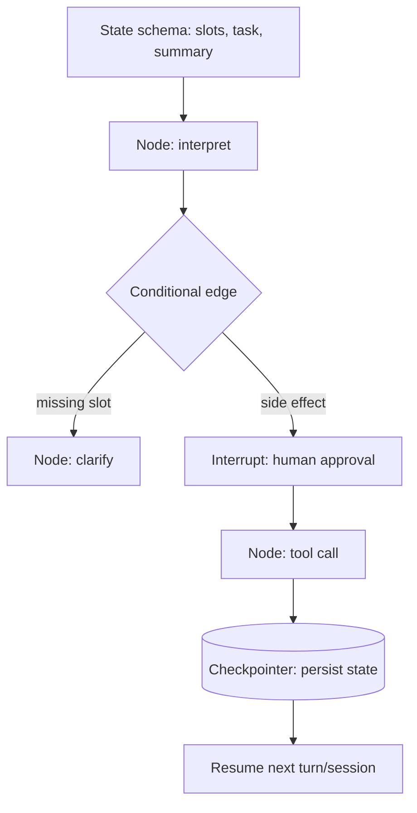

---

### 3. Real-World Industry Scenarios [Intermediate]

**Scenario A — Resumable assistant**

*Context:* Users pause mid-task and return later.
- **Fit:** a checkpointer persists conversation state keyed by thread; the graph resumes exactly where it left off.

**Scenario B — HITL approval gate**

*Context:* A refund needs human approval.
- **Fit:** an interrupt pauses the graph before the side-effect node; on approval, execution resumes with the approved action.

**Scenario C — Code-first control**

*Context:* Team needs full control over transitions, tools, and observability.
- **Fit:** LangGraph's explicit graph + tracing integrates with the team's stack, unlike a closed low-code platform.

---

### 4. System View [Intermediate]

```text
Define state schema (slots/task/summary) → nodes (interpret, clarify, tool, respond)
   → conditional edges (deterministic routing) + interrupts (HITL)
   → checkpointer persists state per thread → resume across turns/sessions
   → stream tokens/state; trace every node
```

**Maps directly to this module:** state object → state schema; transitions (24.1.d) → conditional edges; approval/HITL (24.2.c) → interrupts; resumability (24.2.b) → checkpointer.

**Failure points:** putting safety-critical routing in an LLM node instead of a deterministic conditional edge; not using a checkpointer (loses resumability); interrupts not wired for side effects (no approval gate).

---

### 5. System Design Flavor [Intermediate]

**Key design question:** Which transitions are deterministic conditional edges (safety/state) vs LLM nodes (interpretation), and where do interrupts gate side effects?

**Tradeoffs:**

| Decision | LangGraph (code-first) | Managed low-code |
|---|---|---|
| Control/observability | Full | Limited |
| Speed to first bot | Slower (code) | Faster (visual) |
| Custom tools/logic | Unrestricted | Platform-bound |
| Team skill fit | Engineers | Designers/analysts |

**Scaling consideration:** Choose a durable checkpointer backend (e.g., a database) for production so state survives restarts and scales across instances; keep safety routing in deterministic edges so behavior stays testable as the graph grows.

---

### 6. Common Mistakes + Debugging [Beginner]

**Mistake 1 — LLM node makes safety-critical routing.**
- **Symptom:** unpredictable/unsafe transitions.
- **First step:** move safety/state routing to deterministic conditional edges.

**Mistake 2 — No checkpointer.**
- **Symptom:** conversations can't resume; state lost on restart.
- **First step:** add a durable checkpointer keyed by thread/conversation.

**Mistake 3 — Side effects without interrupts.**
- **Symptom:** actions execute without human approval where required.
- **First step:** insert an interrupt before side-effect nodes.

---

### 7. Hands-On Lab [Pro]

**Concept:** Model the LangGraph pattern (state + conditional edges + interrupt + checkpoint) in plain Python so the mapping is explicit.

#### Build — State graph with interrupt + checkpoint

```python
from dataclasses import dataclass, field

@dataclass
class State:
    slots: dict = field(default_factory=dict)
    task: str = "start"
    approved: bool = False

CHECKPOINTS = {}   # thread_id -> State  (stand-in for a LangGraph checkpointer)

def interpret(s, msg):
    if "refund" in msg.lower(): s.task = "need_order_id" if "order_id" not in s.slots else "await_approval"
    return s

def route(s):   # deterministic conditional edge
    if s.task == "need_order_id": return "clarify"
    if s.task == "await_approval" and not s.approved: return "INTERRUPT"   # HITL gate
    if s.task == "await_approval" and s.approved: return "execute"
    return "respond"

def run(thread_id, msg, approval=None):
    s = CHECKPOINTS.get(thread_id, State())
    if approval is not None: s.approved = approval
    s = interpret(s, msg)
    decision = route(s)
    CHECKPOINTS[thread_id] = s                      # persist -> resumable
    return decision, s

print(run("t1", "refund order ord-9"))              # clarify (need order_id) ...
CHECKPOINTS["t1"].slots["order_id"] = "ORD-9"
print(run("t1", "refund"))                          # INTERRUPT (await approval)
print(run("t1", "", approval=True))                 # execute (resumed after approval)
```

#### Break — Remove the checkpoint

```python
def run_stateless(msg):
    s = State(); s = interpret(s, msg); return route(s)   # fresh state every call
print(run_stateless("refund"))   # always 'clarify' -> can never progress/resume
```

#### Measure

- Resumability: can a thread continue after restart (checkpoint present)?
- Interrupt coverage: side effects gated by an approval pause.
- Deterministic-routing share (safety edges vs LLM nodes).
- Trace completeness per node.

#### Explain

State + a checkpointer make the conversation resumable and the interrupt enforces human approval before the refund executes — the exact conversation-graph requirements, realized in LangGraph terms. The stateless version can never progress because it forgets everything each call: proof that persistence, not the LLM, is what makes stateful assistants work.

---

### 8. Active Recall [Beginner → Intermediate]

1. **[Beginner]** What is LangGraph purpose-built for?
2. **[Beginner]** What does a checkpointer provide?
3. **[Intermediate]** How do this module's concepts map to LangGraph primitives?
4. **[Intermediate]** Where should safety routing live in a LangGraph app?
5. **[Pro]** Why choose a durable checkpointer backend in production?

**Answer Key:**
1. Code-first stateful LLM workflows with explicit state, checkpointing/persistence, interrupts (HITL), and resumability.
2. Persistence of conversation state, enabling resumability across turns and sessions.
3. State object→state schema; transitions→conditional edges; approval/HITL→interrupts; resumability→checkpointer.
4. In deterministic conditional edges, not LLM nodes, so it's predictable and testable.
5. So state survives restarts and scales across instances, keeping conversations resumable in production.

---

### 9. Practice [Intermediate / Pro]

**Mini-exercise:** Which LangGraph primitive implements a human approval gate before a side effect?

*Suggested answer:* an interrupt (pause the graph before the side-effect node; resume on approval).

**Capstone design question:** Design a LangGraph conversational assistant for order cancellation, specifying state schema, deterministic vs LLM nodes, interrupts, and checkpointing.

*Answer outline:* state schema {slots, task, approved, summary}; LLM node for interpretation, deterministic conditional edges for slot/confirmation/safety routing; interrupt before the cancel tool for approval; durable checkpointer keyed by thread for cross-session resume; tracing per node; idempotency key on the tool call.

---

### 10. Production Reality Check (Mandatory)

**If a LangGraph assistant behaves unpredictably or can't resume, what's the first thing we inspect?**

Where routing decisions are made and whether a durable checkpointer is configured. Unpredictable behavior usually means safety routing lives in an LLM node instead of a deterministic conditional edge; failure to resume means no/ephemeral checkpointer. Both are structural fixes in the graph definition, not prompt changes.

---

### 11. Curiosity Bridge (Mandatory)

LangGraph is the code-first choice, but it's one of many runtimes — Rasa, Dialogflow CX, Botpress, XState, Temporal-style workflows each fit different teams and needs. Choosing among them with engineering reasons is Subtopic 24.4.b.

---

### 12. Exit Check + Carry-Forward Review

**Exit check:** You can map conversation-graph concepts onto LangGraph primitives (state schema, conditional edges, interrupts, checkpointer) and design a resumable, HITL-gated assistant.

**Carry-forward:** This is Module 12 (LangGraph Mastery) applied specifically to dialogue: the same state/edges/checkpoint/interrupt machinery, specialized for conversation.

---

## Subtopic 24.4.b: Rasa, Dialogflow CX, Botpress, XState, Temporal-Style Workflows

### Reading Path + Level Tags

- **Beginner:** Read sections 1–2 and Active Recall.
- **Intermediate:** Add sections 3–5 and the Hands-On Lab.
- **Pro:** Full lab plus the capstone runtime-selection question.

---

### 1. Pre-Question Hook + The Intuition [Beginner]

**Pause — before reading:** A contact-center team of non-engineers needs visual flows; a frontend team needs deterministic UI conversation state; a backend team needs reliable long-running side effects. Should all three use LangGraph? Why not?

**The core mental model:**
Conversational runtimes optimize for different teams and problem shapes; match the tool to the need:
- **LangGraph:** code-first GenAI state graphs (engineers).
- **Rasa:** traditional/ML-assisted assistants with NLU, stories, rules, forms, handoff (strong dialogue-management vocabulary).
- **Dialogflow CX:** enterprise, managed, visual flows/pages/routes (contact-center style).
- **Botpress:** low-code visual bot flows, nodes, workflows, knowledge bases.
- **XState / Stately:** deterministic statecharts in JS/TS (excellent for frontend/app conversation state).
- **Temporal-style / durable workflows:** long-running, reliable business processes with side effects (backend orchestration).
- **LlamaIndex chat engines:** data-centric conversational retrieval (chat over indexed data).

The skill is selecting by need — code-first vs low-code, managed vs self-hosted, NLU-centric vs statechart vs durable-execution — not by hype.

**Key terms:**
- **NLU-centric platform:** intent/entity/stories/forms focus (Rasa, Dialogflow CX).
- **Statechart:** formal deterministic state machine (XState).
- **Durable workflow:** reliable long-running execution with retries (Temporal-style).
- **Low-code/visual:** designer-friendly flow builders (Botpress, Dialogflow CX).

---

### 2. Visual Diagram (Mermaid) [Beginner]

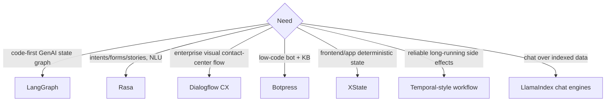

---

### 3. Real-World Industry Scenarios [Intermediate]

**Scenario A — Contact center (Dialogflow CX)**

*Context:* Non-engineers build and maintain flows at scale.
- **Fit:** managed, visual pages/routes; enterprise integrations; no code required.

**Scenario B — Frontend app state (XState)**

*Context:* A web app's conversational widget needs deterministic, testable state.
- **Fit:** XState statecharts — precise, visualizable, deterministic UI state.

**Scenario C — Backend side-effect reliability (Temporal-style)**

*Context:* A long-running, side-effect-heavy process behind the conversation.
- **Fit:** durable workflow engine for reliable retries, timeouts, and compensation — paired with a conversation graph on top.

**Scenario D — Traditional assistant (Rasa)**

*Context:* Intent/entity-driven assistant with forms and handoff, self-hosted.
- **Fit:** Rasa's NLU + stories/rules/forms vocabulary.

---

### 4. System View [Intermediate]

```text
Selection inputs:
  team skills (engineers vs designers) · code-first vs low-code · managed vs self-hosted
  · NLU-centric vs statechart vs durable-execution · GenAI orchestration needs · channel/enterprise integration
        ↓
Pick the runtime whose primary optimization matches the team + problem shape.
```

**Selection matrix:**

| Need | Strong fit |
|---|---|
| Code-first GenAI state graph | LangGraph |
| Intents/forms/stories, NLU | Rasa |
| Enterprise visual contact-center | Dialogflow CX |
| Low-code bot + knowledge base | Botpress |
| Frontend/app state machine | XState |
| Reliable long-running side effects | Temporal-style workflow |
| Chat over indexed data | LlamaIndex chat engines |

**Failure points:** forcing engineers' code-first tool on a designer team (or vice versa), and conflating durable backend execution with conversation control (they compose, not replace).

---

### 5. System Design Flavor [Intermediate]

**Key design question:** Who builds/maintains the bot (engineers vs designers), and what is the dominant need (GenAI orchestration, NLU, UI state, or durable execution)?

**Tradeoffs:**

| Dimension | Code-first (LangGraph/XState) | Low-code (Dialogflow CX/Botpress) | NLU (Rasa) | Durable (Temporal) |
|---|---|---|---|---|
| Builder | Engineers | Designers/analysts | ML/dialog | Backend eng |
| Control | High | Medium | Medium-high | High (execution) |
| Speed to first bot | Slower | Fast | Medium | N/A (backend) |
| Best for | GenAI graphs / UI state | Enterprise flows | Traditional assistants | Reliable side effects |

**Scaling consideration:** Real systems often *combine* runtimes — e.g., a LangGraph/Rasa conversation layer over a Temporal-style durable workflow for side effects, with LlamaIndex for retrieval. Choose per layer, and keep clean contracts between them (Subtopic 24.1.b).

---

### 6. Common Mistakes + Debugging [Beginner]

**Mistake 1 — Runtime-team mismatch.**
- **Symptom:** designers stuck in code, or engineers fighting a low-code ceiling.
- **First step:** pick by who builds/maintains it.

**Mistake 2 — Conflating durable execution with conversation control.**
- **Symptom:** trying to model dialogue in a workflow engine or side effects in a chat framework.
- **First step:** layer a conversation runtime over a durable workflow; keep contracts clean.

**Mistake 3 — Choosing by hype.**
- **Symptom:** a mismatched tool fights the problem shape.
- **First step:** classify the dominant need before selecting.

---

### 7. Hands-On Lab [Pro]

**Concept:** A weighted runtime-selection scorer.

#### Build — Selection scorer

```python
runtimes = {
    "langgraph":   {"code_first":1,"low_code":0,"nlu":0.5,"ui_state":0.4,"durable":0.5,"managed":0.3,"genai":1},
    "rasa":        {"code_first":0.7,"low_code":0.3,"nlu":1,"ui_state":0.2,"durable":0.3,"managed":0.2,"genai":0.6},
    "dialogflow":  {"code_first":0.2,"low_code":1,"nlu":0.8,"ui_state":0.2,"durable":0.3,"managed":1,"genai":0.5},
    "botpress":    {"code_first":0.3,"low_code":1,"nlu":0.7,"ui_state":0.2,"durable":0.3,"managed":0.7,"genai":0.6},
    "xstate":      {"code_first":1,"low_code":0.2,"nlu":0,"ui_state":1,"durable":0.2,"managed":0,"genai":0.2},
    "temporal":    {"code_first":1,"low_code":0,"nlu":0,"ui_state":0.1,"durable":1,"managed":0.4,"genai":0.2},
}
# Enterprise contact-center team (designers, managed, NLU): 
weights = {"code_first":0,"low_code":0.3,"nlu":0.25,"ui_state":0,"durable":0.05,"managed":0.3,"genai":0.1}

def score(r): return sum(weights[k]*r[k] for k in weights)
for name in sorted(runtimes, key=lambda n: score(runtimes[n]), reverse=True):
    print(f"{name:10} {score(runtimes[name]):.2f}")
```

#### Break — Change to an engineering GenAI team

```python
weights = {"code_first":0.3,"low_code":0,"nlu":0.1,"ui_state":0.1,"durable":0.1,"managed":0.1,"genai":0.3}
for name in sorted(runtimes, key=lambda n: score(runtimes[n]), reverse=True):
    print(f"{name:10} {score(runtimes[name]):.2f}")   # langgraph should rise
```

#### Measure

- Ranking sensitivity to team/need weights.
- Gap between top two (clear winner vs toss-up).
- Whether the top choice matches who maintains the bot.

#### Explain

The same candidates rank differently for a designer-led contact center (Dialogflow CX/Botpress rise) versus an engineering GenAI team (LangGraph rises). There's no universally best runtime — only the best fit for team + problem shape. The scorer makes that reasoning explicit and defensible, and real systems layer several runtimes.

---

### 8. Active Recall [Beginner → Intermediate]

1. **[Beginner]** Which runtime fits a non-engineer contact-center team?
2. **[Beginner]** Which fits deterministic frontend/app conversation state?
3. **[Intermediate]** How do conversation runtimes and durable workflow engines relate?
4. **[Intermediate]** What's the primary selection axis?
5. **[Pro]** Why do production systems often combine runtimes?

**Answer Key:**
1. Dialogflow CX (managed, visual) or Botpress (low-code).
2. XState/Stately (deterministic statecharts in JS/TS).
3. They compose: a conversation runtime controls dialogue on top; a durable workflow engine reliably executes side effects underneath.
4. Who builds/maintains it (engineers vs designers) and the dominant need (GenAI/NLU/UI state/durable execution).
5. Different layers (dialogue, retrieval, durable side effects) are best served by different specialized tools with clean contracts between them.

---

### 9. Practice [Intermediate / Pro]

**Mini-exercise:** A team needs reliable, long-running order-fulfillment side effects behind a chat assistant. Which two tools would you combine?

*Suggested answer:* a conversation runtime (LangGraph or Rasa) on top for dialogue, and a Temporal-style durable workflow underneath for reliable long-running side effects with retries/compensation.

**Capstone design question:** Recommend a runtime stack for an enterprise support assistant with a designer-led flow team, GenAI answers, and side-effect-heavy backend. Justify each layer.

*Answer outline:* Dialogflow CX or Botpress for the designer-maintained conversation flows; LlamaIndex/RAG for GenAI answers over indexed docs; a Temporal-style durable workflow for reliable side effects; clean contracts between layers; justify by team skills (designers), managed ops, and durable-execution needs.

---

### 10. Production Reality Check (Mandatory)

**If the chosen runtime is fighting the team or problem, what's the first thing we inspect?**

The team-and-need fit, not the framework internals. Confirm who builds/maintains the bot and the dominant need (GenAI orchestration vs NLU vs UI state vs durable execution), then check the runtime matches. Most runtime pain is a mismatch (designers on a code-first tool, or dialogue modeled in a workflow engine) — re-select or re-layer before optimizing.

---

### 11. Curiosity Bridge (Mandatory)

Whatever runtime you pick, a production conversational system lives or dies on *observability* — turn-level traces, analytics, testing, and CI. Without them you can't see drop-offs, loops, or regressions. That's Subtopic 24.4.c.

---

### 12. Exit Check + Carry-Forward Review

**Exit check:** You can select and justify a conversational runtime (or layered stack) from team skills and problem shape, and explain how conversation runtimes compose with durable workflow engines.

**Carry-forward:** This is Module 15's runtime-comparison/selection-rubric discipline applied to conversational platforms: choose by workload and team, not popularity.

---

## Subtopic 24.4.c: Observability, Analytics, Testing, and CI

### Reading Path + Level Tags

- **Beginner:** Read sections 1–2 and Active Recall.
- **Intermediate:** Add sections 3–5 and the Hands-On Lab.
- **Pro:** Full lab with Break + Measure plus the capstone observability-design question.

---

### 1. Pre-Question Hook + The Intuition [Beginner]

**Pause — before reading:** Your conversation-completion rate is 95%, yet complaints rise. Where do you look to find the frustrating loops and near-misses hiding behind that number?

**The core mental model:**
Conversational observability means **logging every turn**, not just conversations, so you can see *where* and *why* dialogues go wrong. The essential per-turn log:
```text
conversation_id · channel · previous_state · user_message · intent_candidates · entities
· slots_before · transition_decision · tool_calls · retrieval_query · next_state
· response_type · latency_ms · fallback_reason · handoff_reason
```
From these you build dashboards (completion by flow, drop-off by state, fallback-loop rate, handoff rate/reason, tool-error rate, slot-correction rate, average turns to resolution, p50/p95 per-turn latency, safety-block rate) and a **test suite** (golden transcripts, state-transition tests, slot-validation tests, tool side-effect tests, handoff tests, conversation-RAG follow-up tests, adversarial prompt-injection tests, latency/fallback budgets) run in **CI** as a regression gate.

The discipline: turn-level traces + per-state analytics + CI regression gating. Aggregate success hides bad turns; the trace and dashboards surface them.

**Key terms:**
- **Turn-level trace:** structured per-turn record.
- **Drop-off analysis:** where users abandon, by state.
- **Golden transcript tests:** replayed labeled conversations.
- **CI regression gate:** blocking releases on metric regressions.

---

### 2. Visual Diagram (Mermaid) [Beginner]

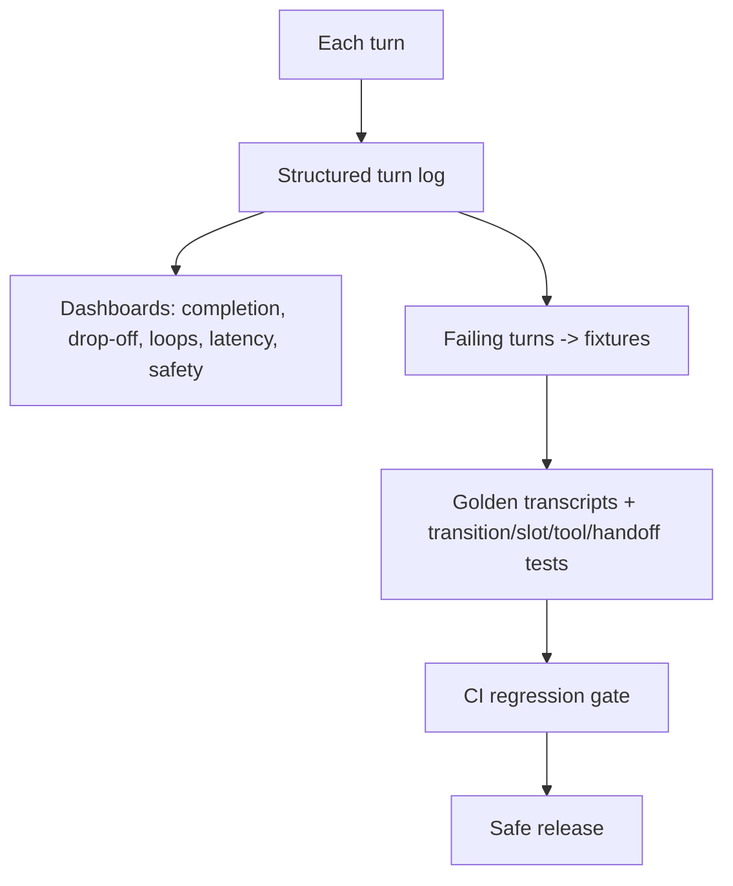

---

### 3. Real-World Industry Scenarios [Intermediate]

**Scenario A — Hidden loops behind a good number**

*Context:* 95% completion but rising complaints.
- **Use:** drop-off-by-state and fallback-loop-rate dashboards reveal a loop at one state; turn traces show the cause.

**Scenario B — Regression caught in CI**

*Context:* A prompt change breaks slot validation.
- **Use:** golden-transcript + slot-validation tests fail in CI before release.

**Scenario C — Safety near-miss surfaced**

*Context:* An action nearly executed without approval.
- **Use:** safety-block-rate metric + adversarial tests flag it.

---

### 4. System View [Intermediate]

```text
Every turn → structured log (state, event, intent, slots, tools, retrieval, next state, latency, fallback/handoff)
   → dashboards (completion/drop-off/loops/latency/safety) + analytics (per-state, per-flow)
   → failing turns become fixtures → test suite → CI regression gate → release
```

**Test types:** golden conversation transcripts, state-transition tests, slot-validation tests, tool side-effect tests, handoff tests, conversation-RAG follow-up tests, adversarial prompt-injection tests, latency/fallback budget checks.

**Failure points:** logging only whole conversations (bad turns hidden); no drop-off analysis (persistent abandonment); no CI gate (regressions ship); no adversarial tests (safety near-misses undetected).

---

### 5. System Design Flavor [Intermediate]

**Key design question:** For every failure I care about (loop, drop-off, near-miss, regression), is there a log field, a dashboard, and a test that would surface it?

**Tradeoffs:**

| Decision | Rich observability | Lean |
|---|---|---|
| Turn-level logging | Full diagnosability | Cheaper, blind spots |
| Test coverage | Catches regressions | Faster CI, more escapes |
| Dashboard granularity | Per-state insight | Coarse aggregates |
| Retention | Long (analysis) | Short (cheap) |

**Scaling consideration:** Sample high-volume success traffic but log 100% of failures/near-misses; grow the golden test set from real production failures (the data-flywheel loop). Keep PII out of logs (redact) per retention policy.

---

### 6. Common Mistakes + Debugging [Beginner]

**Mistake 1 — Logging conversations, not turns.**
- **Symptom:** can't localize where a dialogue went wrong.
- **First step:** add structured per-turn logs.

**Mistake 2 — No drop-off analysis.**
- **Symptom:** persistent abandonment unnoticed.
- **First step:** build drop-off-by-state dashboards.

**Mistake 3 — No CI regression gate.**
- **Symptom:** prompt/flow changes silently regress.
- **First step:** run golden-transcript + transition/slot tests in CI.

---

### 7. Hands-On Lab [Pro]

**Concept:** Emit turn logs, compute drop-off, and run a golden-transcript test.

#### Build — Turn logging + drop-off + golden test

```python
from collections import Counter

turn_logs = [
    {"conv":"c1","prev":"start","next":"collect_order_id","fallback":None},
    {"conv":"c1","prev":"collect_order_id","next":"collect_order_id","fallback":"invalid"},  # loop
    {"conv":"c1","prev":"collect_order_id","next":"confirm","fallback":None},
    {"conv":"c2","prev":"collect_order_id","next":"drop_off","fallback":"gave_up"},
]

def drop_off_by_state(logs):
    drops = Counter(l["prev"] for l in logs if l["next"]=="drop_off")
    return dict(drops)

def loop_rate(logs):
    loops = sum(1 for l in logs if l["prev"]==l["next"])
    return round(loops/len(logs), 2)

print("drop-off by state:", drop_off_by_state(turn_logs))   # {'collect_order_id': 1}
print("loop rate:", loop_rate(turn_logs))                   # 0.25

# golden-transcript test (CI): expected transitions
golden = [("start","collect_order_id"),("collect_order_id","confirm")]
actual = [(l["prev"],l["next"]) for l in turn_logs if l["conv"]=="c1" and l["prev"]!=l["next"]]
print("golden test pass:", all(g in actual for g in golden))
```

#### Break — Only track conversation-level success

```python
conv_success = {"c1": True, "c2": False}
print("conversation-level view:", conv_success)
# Hides the c1 loop entirely; a turn-level view exposes it.
```

#### Measure

- Loop rate and drop-off-by-state.
- Golden-transcript pass rate (CI gate).
- p50/p95 per-turn latency.
- Safety-block rate on adversarial tests.

#### Explain

Turn logs expose the loop at `collect_order_id` and the drop-off that a conversation-level success view completely hides. The golden-transcript test turns expected transitions into a CI gate. Observability plus tests plus a gate is what keeps a conversational system debuggable and regression-safe as it evolves.

---

### 8. Active Recall [Beginner → Intermediate]

1. **[Beginner]** Why log every turn instead of every conversation?
2. **[Beginner]** Name three conversational dashboards.
3. **[Intermediate]** Name three test types for conversation CI.
4. **[Intermediate]** What should a CI regression gate block on?
5. **[Pro]** How do you grow the test set and keep logs safe?

**Answer Key:**
1. Bad turns (loops, near-misses) hide behind conversation-level success; turn logs localize where/why it failed.
2. Any three: completion by flow, drop-off by state, fallback-loop rate, handoff rate, tool-error rate, latency, safety-block rate.
3. Any three: golden transcripts, state-transition, slot-validation, tool side-effect, handoff, conversation-RAG follow-up, adversarial injection, latency/fallback budgets.
4. Regressions in golden-transcript pass rate, transition/slot accuracy, safety-gate correctness, and latency/fallback budgets.
5. Turn production failures into fixtures (data flywheel), sample success but log all failures, and redact PII per retention policy.

---

### 9. Practice [Intermediate / Pro]

**Mini-exercise:** List the five most important fields to log per turn for debugging a wrong tool call.

*Suggested answer:* previous_state, intent_candidates/entities, slots_before, transition_decision, tool_calls (with args) — plus fallback/handoff reason.

**Capstone design question:** Design the observability + CI setup for a production support assistant, covering turn logging, dashboards, test types, and the release gate.

*Answer outline:* structured per-turn logs (state/event/intent/slots/tools/retrieval/next-state/latency/fallback/handoff); dashboards for completion, drop-off-by-state, loop rate, handoff, tool error, latency, safety block; test suite (golden transcripts, transition/slot/tool/handoff/RAG-followup/adversarial/latency); CI gate blocking on regressions; failing conversations become fixtures; PII redaction + retention.

---

### 10. Production Reality Check (Mandatory)

**If metrics look good but users complain, what's the first thing we inspect?**

Turn-level traces and per-state drop-off, not just final conversations. A conversation can end successfully while containing repeated bad turns, unsafe near-misses, or frustrating loops. Add conversation-level (trajectory) evals and slice by user journey to surface what aggregate success hides.

---

### 11. Curiosity Bridge (Mandatory)

Text channels are only part of the story. Voice and realtime add turn-taking, barge-in, endpointing, and streaming-state constraints that reshape the whole conversation graph. Channel-specific concerns are Subtopic 24.4.d.

---

### 12. Exit Check + Carry-Forward Review

**Exit check:** You can design turn-level logging, drop-off/loop dashboards, a conversation test suite, and a CI regression gate that surface what aggregate success hides.

**Carry-forward:** This is Module 8's observability/tracing and Module P2's eval-gate-as-merge-requirement applied to conversational systems: trace every turn, test trajectories, gate releases.

---

## Subtopic 24.4.d: Voice, Realtime, and Channel-Specific Concerns

### Reading Path + Level Tags

- **Beginner:** Read sections 1–2 and Active Recall.
- **Intermediate:** Add sections 3–5 and the Hands-On Lab.
- **Pro:** Full lab with Break + Measure plus the capstone voice-design question.

---

### 1. Pre-Question Hook + The Intuition [Beginner]

**Pause — before reading:** In a voice call, the user starts talking while the bot is still speaking, and a tool call is mid-flight. What does the conversation graph need that a text chat never worried about?

**The core mental model:**
Voice and realtime channels add constraints that reshape the conversation graph:
- **Turn-taking & endpointing:** detecting when the user has *finished* speaking (VAD/endpointing) — get it wrong and you interrupt or lag.
- **Barge-in:** the user interrupts the bot's speech; the system must stop talking and listen.
- **Streaming state:** responses and state stream token-by-token; a tool may be running while the user speaks.
- **Cancelable vs non-cancelable actions:** if the user barges in mid-tool-call, can you cancel it? (Money movement often can't.)
- **Latency sensitivity:** voice tolerates far less delay; time-to-first-token and filler audio matter.

Channel also shapes UX: voice needs status cues ("one moment…"), web can show buttons, Slack has threading. The graph must model these realtime events (barge-in, endpoint, cancel) as first-class transitions — text-only assumptions break in voice.

**Key terms:**
- **Endpointing/VAD:** detecting end of user speech.
- **Barge-in:** user interrupting bot speech.
- **Streaming state:** incremental response/state during a turn.
- **Cancelable action:** a tool call that can be safely aborted mid-flight.

---

### 2. Visual Diagram (Mermaid) [Beginner]

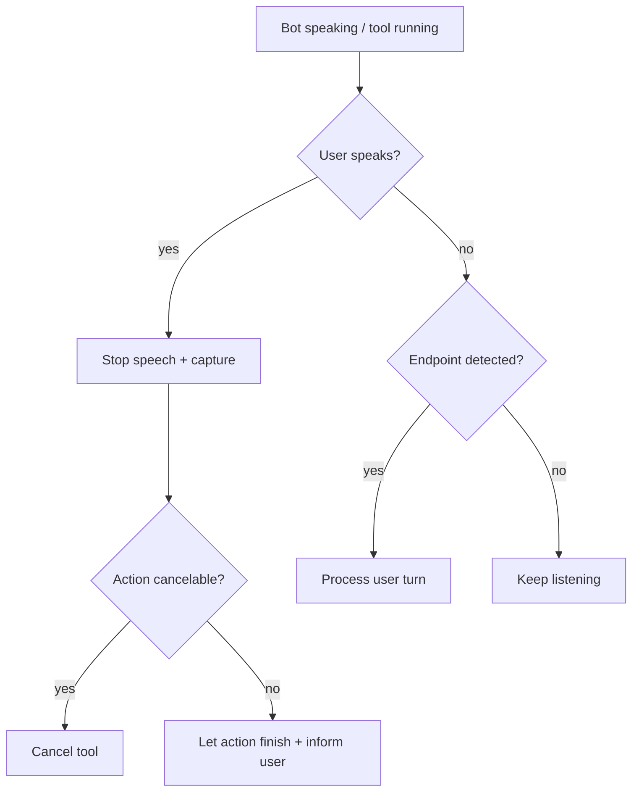

---

### 3. Real-World Industry Scenarios [Intermediate]

**Scenario A — Barge-in during speech**

*Context:* Bot is reading options; user interrupts with an answer.
- **Right behavior:** detect barge-in, stop TTS immediately, capture the user's speech, re-route.

**Scenario B — Interrupt during a non-cancelable action**

*Context:* User speaks while a payment is executing.
- **Right behavior:** payment is non-cancelable → let it finish, inform the user of status; never leave it in an ambiguous state.

**Scenario C — Endpointing tradeoff**

*Context:* User pauses mid-thought.
- **Right behavior:** tuned endpointing waits appropriately; too aggressive interrupts, too slow feels laggy — a channel-specific tuning problem.

---

### 4. System View [Intermediate]

```text
Realtime events (partial transcript, endpoint, barge-in, tool progress) as first-class transitions
   → on barge-in: stop TTS, capture; decide cancelable vs non-cancelable action
   → on endpoint: process turn (low latency; filler audio for tool waits)
   → stream response + status cues; adapt UX to channel (voice/web/Slack)
```

**What to measure:** time-to-first-token/response, barge-in handling correctness, endpointing accuracy (false cut-offs vs lag), cancel-vs-finish correctness, and per-channel latency.

**Failure points:** no barge-in model (bot talks over user); cancel a non-cancelable action (inconsistent state); endpointing too aggressive/slow; text-only latency assumptions applied to voice.

---

### 5. System Design Flavor [Intermediate]

**Key design question:** Which realtime events (barge-in, endpoint, tool-progress, cancel) does the graph model, and which actions are cancelable mid-turn?

**Tradeoffs:**

| Decision | Voice/realtime | Text |
|---|---|---|
| Turn-taking | Endpointing/barge-in required | Message boundaries are explicit |
| Latency budget | Very tight (TTFT, filler) | Looser |
| Interruption | Must stop TTS + reconcile action | Simpler |
| UX cues | Audio status | Buttons/threads |

**Scaling consideration:** Realtime channels need streaming state and low-latency paths; classify every side-effect tool as cancelable or not *up front* so barge-in handling is deterministic. Reuse the same conversation-state core across channels but add channel-specific event handling and UX.

---

### 6. Common Mistakes + Debugging [Beginner]

**Mistake 1 — No barge-in handling.**
- **Symptom:** the bot talks over the user.
- **First step:** model barge-in as an event; stop TTS and capture on user speech.

**Mistake 2 — Cancelling a non-cancelable action.**
- **Symptom:** inconsistent state (e.g., ambiguous payment).
- **First step:** classify actions cancelable/non-cancelable; let non-cancelable finish and inform the user.

**Mistake 3 — Text latency assumptions in voice.**
- **Symptom:** laggy, unnatural conversation.
- **First step:** optimize TTFT, add filler audio for tool waits, tune endpointing.

---

### 7. Hands-On Lab [Pro]

**Concept:** Barge-in handling with cancelable/non-cancelable action logic.

#### Build — Realtime event handler

```python
class VoiceTurn:
    def __init__(self): self.speaking=False; self.tool=None; self.tool_cancelable=True
    def bot_speak(self): self.speaking=True; return "TTS playing"
    def start_tool(self, name, cancelable): self.tool=name; self.tool_cancelable=cancelable
    def on_barge_in(self):
        actions=[]
        if self.speaking: self.speaking=False; actions.append("stop_TTS")
        if self.tool:
            if self.tool_cancelable: actions.append(f"cancel_{self.tool}"); self.tool=None
            else: actions.append(f"let_{self.tool}_finish + inform_user")
        actions.append("capture_user_speech")
        return actions

v = VoiceTurn(); v.bot_speak(); v.start_tool("lookup", cancelable=True)
print("barge-in (cancelable):", v.on_barge_in())

v2 = VoiceTurn(); v2.bot_speak(); v2.start_tool("payment", cancelable=False)
print("barge-in (non-cancelable):", v2.on_barge_in())
```

#### Break — Treat all actions as cancelable

```python
class NaiveTurn(VoiceTurn):
    def on_barge_in(self):
        if self.tool: self.tool=None; return ["cancel_tool"]   # cancels payment mid-flight!
        return ["capture"]
n = NaiveTurn(); n.start_tool("payment", cancelable=False)
print("naive barge-in on payment:", n.on_barge_in())   # cancels a non-cancelable action -> bad state
```

#### Measure

- Barge-in handling correctness (TTS stopped, right cancel/finish decision).
- Endpointing accuracy (false cut-offs vs lag).
- Time-to-first-token / response latency.
- Inconsistent-state rate from mishandled cancels (target 0).

#### Explain

The correct handler stops TTS on barge-in and *cancels the cancelable lookup* but *lets the non-cancelable payment finish* (informing the user) — keeping state consistent. The naive version cancels a payment mid-flight, leaving an ambiguous financial state. Voice forces realtime events and action-cancelability into the conversation graph as first-class concerns.

---

### 8. Active Recall [Beginner → Intermediate]

1. **[Beginner]** What is barge-in?
2. **[Beginner]** What is endpointing/VAD?
3. **[Intermediate]** Why classify actions as cancelable vs non-cancelable?
4. **[Intermediate]** Why is latency more critical in voice than text?
5. **[Pro]** How do you reuse a conversation graph across text and voice?

**Answer Key:**
1. The user interrupting the bot's speech; the system must stop talking and listen.
2. Detecting when the user has finished speaking so the bot can respond at the right moment.
3. On barge-in mid-action, cancelable tools can be aborted safely while non-cancelable ones (e.g., payments) must finish to avoid inconsistent state.
4. Voice tolerates far less delay; time-to-first-token and filler audio determine whether the conversation feels natural.
5. Keep a shared conversation-state core and add channel-specific event handling (barge-in/endpoint/cancel) and UX (audio cues vs buttons).

---

### 9. Practice [Intermediate / Pro]

**Mini-exercise:** A user barges in while the bot is reading a list and a read-only lookup is running. What should happen?

*Suggested answer:* stop TTS immediately, cancel the (cancelable) read-only lookup, capture and process the user's speech, then respond — all low-latency.

**Capstone design question:** Design the voice-specific additions to a conversation graph for a phone-based appointment scheduler, covering turn-taking, barge-in, action cancelability, and latency.

*Answer outline:* model endpoint/barge-in/tool-progress as first-class events; stop TTS + capture on barge-in; classify calendar-read (cancelable) vs booking-commit (non-cancelable, finish + inform); optimize TTFT with filler audio during lookups; tune endpointing to balance cut-offs vs lag; reuse the text conversation-state core with channel-specific handlers and audio status cues.

---

### 10. Production Reality Check (Mandatory)

**If a voice assistant talks over users or ends in an inconsistent state, what's the first thing we inspect?**

Barge-in handling and action cancelability. Confirm user speech triggers a barge-in event that stops TTS and captures input, and that mid-action interrupts respect cancelable vs non-cancelable classification (never abort a payment mid-flight). Talking-over = missing barge-in; inconsistent state = wrong cancel decision. Both are realtime-event modeling fixes.

---

### 11. Curiosity Bridge (Mandatory)

You've built, grounded, evaluated, and platformed conversational systems across channels. The final topic ties it together with the failures you'll actually hit in production — fallback loops, lost context, wrong actions, latency and safety incidents — and how to debug them. That's Topic 24.5.

---

### 12. Exit Check + Carry-Forward Review

**Exit check:** You can extend a conversation graph for voice/realtime with turn-taking, barge-in, action-cancelability, and latency handling, reusing a shared state core across channels.

**Carry-forward:** This is Module 17.2 (voice systems: STT→agent→TTS, turn-taking, interruption, realtime state) applied to the conversation-graph layer — realtime events become first-class transitions.

---

## Topic 24.5: Production Scenarios and Debugging

**Topic time:** 6h

---

## Subtopic 24.5.a: Fallback Loops, Lost Context, Wrong Tool Action, Stuck Flows

### Reading Path + Level Tags

- **Beginner:** Read sections 1–2 and Active Recall.
- **Intermediate:** Add sections 3–5 and the Hands-On Lab.
- **Pro:** Full lab with Break + Measure plus the capstone playbook question.

---

### 1. Pre-Question Hook + The Intuition [Beginner]

**Pause — before reading:** Four bugs, one debugging instinct: a bot loops on the same question, loses context after a digression, calls the wrong tool, and gets stuck. What single ordered procedure isolates all four?

**The core mental model:**
The most common conversational failures share a debugging procedure: **find the turn where it went wrong, then walk the layers in order.** The canonical failures and their first inspection:
- **Fallback loop:** bot repeats/keeps failing → inspect fallback count and failed states → add bounded repair + handoff.
- **Lost context:** digression loses the task → inspect task stack and active entities → add interruption/resumption.
- **Wrong tool action:** wrong tool/args → inspect intent, slots, risk classifier, tool schema → add tool gating + confirmation.
- **Stuck flow:** no valid transition → inspect the state and its outgoing transitions → fix missing/incorrect transition.

The debugging playbook:
```text
Bad conversation
  → identify the turn where it went wrong
  → inspect previous state and slots
  → inspect user event interpretation (intent/entities)
  → inspect transition rule/policy
  → inspect tool or retrieval call
  → inspect response generation
  → inspect guardrails and handoff
  → add the transcript to the regression suite
```

**Key terms:**
- **Fallback loop:** repeated failure/re-ask without progress.
- **Lost context:** dropped task/entities after a digression.
- **Wrong tool action:** incorrect tool or arguments executed.
- **Stuck flow:** a state with no valid/allowed transition.

---

### 2. Visual Diagram (Mermaid) [Beginner]

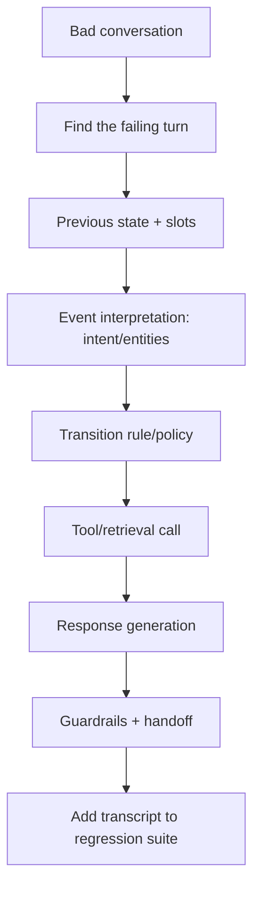

---

### 3. Real-World Industry Scenarios [Intermediate]

**Scenario A — Fallback loop**

*Context:* User stuck re-answering the same question.
- **Playbook:** inspect fallback count + failed state → the repair path has no max-attempts cap → add bounded repair → handoff.

**Scenario B — Lost context after digression**

*Context:* Topic switch loses the original task.
- **Playbook:** inspect task stack + active entities → task wasn't suspended → add interruption/resumption (24.2.b).

**Scenario C — Wrong tool action**

*Context:* Bot cancels the wrong order.
- **Playbook:** inspect intent, slots, risk classifier, tool schema → wrong slot/args reached the tool → add tool gating + confirmation (24.2.c).

---

### 4. System View [Intermediate]

```text
For each failure: locate failing turn (from turn logs) → walk layers in order:
   state+slots → interpretation → transition → tool/retrieval → response → guardrails/handoff
Stop at the first layer whose output is wrong; fix there; add transcript as a fixture.
```

**Scenario → first inspection map:**

| Scenario | First inspection | Likely mitigation |
|---|---|---|
| Repeats same question | state + slot values | fix slot validation/state update |
| Loses context after digression | task stack + active entities | add interruption/resumption |
| Calls wrong tool | intent, slots, risk classifier, schema | tool gating + confirmation |
| Stuck in fallback loop | fallback count + failed states | bounded repair + handoff |
| Stuck flow (no move) | state's outgoing transitions | add/repair transition |

---

### 5. System Design Flavor [Intermediate]

**Key design question:** Does the team have one ordered playbook, and does everyone locate the failing *turn* first instead of guessing at the prompt?

**Tradeoffs:**

| Decision | Ordered playbook | Ad-hoc |
|---|---|---|
| Speed to root cause | Fast, consistent | Luck-based |
| Onboarding | Followable steps | Tribal knowledge |
| Regression safety | Fixtures every time | Bugs recur |

**Scaling consideration:** Every fixed conversation becomes a regression fixture (turn-level golden transcript), so the same bug can't silently return; the fault-layer distribution tells you where to invest (e.g., most bugs in interpretation → improve NLU).

---

### 6. Common Mistakes + Debugging [Beginner]

**Mistake 1 — Debugging the whole conversation, not the failing turn.**
- **Symptom:** slow, unfocused debugging.
- **First step:** locate the exact turn from turn logs, then walk layers.

**Mistake 2 — Jumping to the prompt.**
- **Symptom:** tuning generation while the bug is in state/slots/transition.
- **First step:** follow the ordered playbook (state → interpretation → transition → tool → response).

**Mistake 3 — Fixing without a fixture.**
- **Symptom:** the failure returns later.
- **First step:** add the transcript to the regression suite.

---

### 7. Hands-On Lab [Pro]

**Concept:** Encode the conversational debugging playbook as a layer localizer.

#### Build — Ordered playbook over a turn trace

```python
def debug_turn(trace):
    if trace.get("slot_update_failed"): return ("state/slots", "slot didn't persist -> re-ask loop")
    if trace.get("intent_wrong"): return ("interpretation", "intent/entities misread")
    if trace.get("no_valid_transition"): return ("transition", "stuck flow: add transition")
    if trace.get("wrong_tool_args"): return ("tool", "gate + confirm before tool")
    if trace.get("context_lost"): return ("state/task-stack", "add interruption/resumption")
    if trace.get("unbounded_repair"): return ("transition", "bound repair -> handoff")
    return ("none", "no fault found")

loop = {"unbounded_repair": True}
print(debug_turn(loop))    # ('transition', 'bound repair -> handoff')

lost = {"context_lost": True}
print(debug_turn(lost))    # ('state/task-stack', 'add interruption/resumption')
```

#### Break — Skip to the response layer (anti-pattern)

```python
def wrong_first(trace):
    return "rewrite response prompt"    # ignores that the bug is a repair loop
print(wrong_first(loop))    # 'rewrite response prompt' -> wastes effort, loop persists
```

#### Measure

- Time-to-root-cause with vs without the playbook.
- Fixture-capture rate (every fix → a golden transcript).
- Recurrence rate of fixed bugs (trend to 0).
- Fault-layer distribution (where to invest).

#### Explain

The playbook localizes the fallback loop to the transition layer (missing repair bound) and the lost-context bug to the task stack — the true root causes. Jumping to the response prompt "fixes" nothing and the loop persists. Order and turn-level localization are what make conversational debugging fast and durable.

---

### 8. Active Recall [Beginner → Intermediate]

1. **[Beginner]** What's the first step when debugging a bad conversation?
2. **[Beginner]** First inspection for a fallback loop?
3. **[Intermediate]** First inspection for lost context after a digression?
4. **[Intermediate]** First inspection for a wrong tool call?
5. **[Pro]** Why add every fixed conversation to the regression suite?

**Answer Key:**
1. Identify the specific turn where it went wrong, then walk the layers in order.
2. Fallback count and failed states → add bounded repair + handoff.
3. Task stack and active entities → add interruption/resumption.
4. Intent, slots, risk classifier, and tool schema → add tool gating + confirmation.
5. So the same bug can't silently return; fixtures grow the golden set and protect against regressions.

---

### 9. Practice [Intermediate / Pro]

**Mini-exercise:** A bot is "stuck" (no response advances the flow). Which layer and what fix?

*Suggested answer:* the transition layer — the current state has no valid outgoing transition for the event; add/repair the transition (or a default fallback to clarify/handoff).

**Capstone design question:** Write the conversational debugging runbook for an on-call engineer, covering the ordered layer checks, the trace fields each reads, and the fixture step.

*Answer outline:* locate failing turn from logs; walk state/slots → interpretation → transition → tool/retrieval → response → guardrails/handoff; map each layer to trace fields and a fix (slot update, NLU, transition, tool gating, grounding, handoff payload); stop at first failing layer; add the transcript as a golden fixture; review fault-layer distribution monthly.

---

### 10. Production Reality Check (Mandatory)

**A conversation went wrong in production — what's the first thing we inspect?**

The turn where it broke, then the layers in order (state/slots → interpretation → transition → tool → response → guardrails). Do not start at the prompt. The overwhelming majority of conversational bugs are state/slot persistence, missing transitions, unbounded repair, or ungated tools — all upstream of generation. Fix the first failing layer and capture a fixture.

---

### 11. Curiosity Bridge (Mandatory)

Functional bugs are one class; the higher-stakes failures are *latency, handoff, safety, and compliance* incidents — where a slow or unsafe conversation causes real harm. Those need their own scenario playbooks. That's Subtopic 24.5.b.

---

### 12. Exit Check + Carry-Forward Review

**Exit check:** You can debug fallback loops, lost context, wrong tool actions, and stuck flows with an ordered, turn-level playbook and capture each as a regression fixture.

**Carry-forward:** This is Module 21's failure-taxonomy and layer-by-layer debugging specialized to conversational systems, and Subtopic 23.4.d's ordered-playbook discipline applied to dialogue.

---

## Subtopic 24.5.b: Latency, Handoff, Safety, and Compliance Incidents

### Reading Path + Level Tags

- **Beginner:** Read sections 1–2 and Active Recall.
- **Intermediate:** Add sections 3–5 and the Hands-On Lab.
- **Pro:** Full lab with Break + Measure plus the capstone incident-playbook question.

---

### 1. Pre-Question Hook + The Intuition [Beginner]

**Pause — before reading:** A conversation completes correctly but takes 30 seconds per turn, hands off to a human who gets no context, and nearly executes an unsafe action. The *task* succeeded — why is this still a serious incident?

**The core mental model:**
Beyond functional correctness, conversational systems face high-stakes incidents:
- **Latency incidents:** per-turn or end-to-end delay breaks the experience (especially voice). Decompose latency across NLU, retrieval, tools, and generation; budget each.
- **Handoff incidents:** the human receives no context and the user re-explains everything. Fix: rich handoff payload (transcript, state, slots, failures).
- **Safety incidents:** an unsafe or irreversible action nearly/actually executes. Fix: risk tiers, confirmation, guardrails, and blocking.
- **Compliance incidents:** PII exposure, missing consent, retention violations, or unauthorized data in responses. Fix: redaction, permission scoping, audit, retention.

These are the failures that cause real harm and are judged separately from task success. Each has a first-inspection and a mitigation, and each belongs in incident dashboards with alerts.

**Key terms:**
- **Latency decomposition:** attributing delay to pipeline stages.
- **Handoff payload:** full context transferred to a human.
- **Safety incident:** unsafe/irreversible action near-miss or occurrence.
- **Compliance incident:** PII/consent/retention/authorization violation.

---

### 2. Visual Diagram (Mermaid) [Beginner]

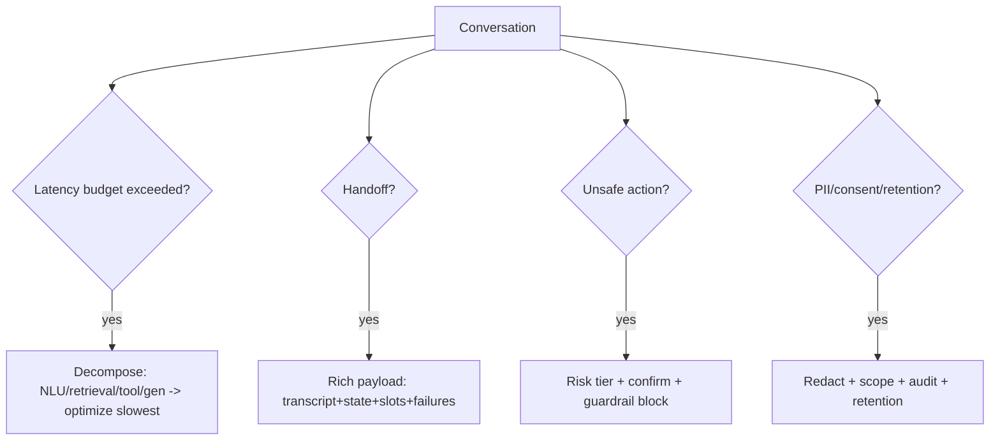

---

### 3. Real-World Industry Scenarios [Intermediate]

**Scenario A — Latency incident (voice)**

*Context:* 30s per turn on a phone assistant.
- **Playbook:** decompose latency; the tool call dominates → add caching/filler audio/timeout; budget each stage.

**Scenario B — Context-less handoff**

*Context:* Human agent makes the user repeat everything.
- **Playbook:** inspect handoff payload → it's empty → include transcript, state, slots, failed attempts.

**Scenario C — Safety near-miss**

*Context:* An irreversible action almost ran without approval.
- **Playbook:** inspect risk tiering + guardrails → missing gate → add confirmation/approval and block.

**Scenario D — Compliance incident**

*Context:* PII appeared in a response/log.
- **Playbook:** inspect redaction + retention + permission scoping → add/repair controls; audit exposure.

---

### 4. System View [Intermediate]

```text
Monitor incident classes with dashboards + alerts:
  latency (per-stage, p50/p95) · handoff quality · safety-block rate · compliance (PII/consent/retention)
On incident: run the class playbook (decompose/repair payload/gate/redact) → mitigate → post-incident fixture + review
```

**Scenario → mitigation map:**

| Incident | First inspection | Mitigation |
|---|---|---|
| Latency | per-stage latency decomposition | budget/optimize slowest stage; caching; filler audio |
| Handoff | handoff payload | transcript + state + slots + failures |
| Safety | risk tier + guardrails | confirmation/approval + block irreversible actions |
| Compliance | redaction/consent/retention/scoping | redact PII, enforce consent + retention, scope by role, audit |

---

### 5. System Design Flavor [Intermediate]

**Key design question:** For each incident class (latency/handoff/safety/compliance), is there a budget/control, a dashboard, an alert, and a playbook?

**Tradeoffs:**

| Decision | Stricter controls | Looser |
|---|---|---|
| Latency budgets | Better UX, more engineering | Simpler, riskier UX |
| Safety gating | Fewer incidents, more friction | Faster, riskier |
| Compliance controls | Audit-ready | Cheaper, legal risk |
| Handoff richness | Seamless human takeover | Human re-works |

**Scaling consideration:** Safety and compliance failures are the ones that end products and trigger legal/regulatory consequences — over-invest in gating, redaction, permission scoping, and audit relative to their frequency. Latency and handoff are UX-critical and should have explicit budgets and payload standards.

---

### 6. Common Mistakes + Debugging [Beginner]

**Mistake 1 — No latency decomposition.**
- **Symptom:** "it's slow" with no idea which stage.
- **First step:** measure NLU/retrieval/tool/generation separately; budget each.

**Mistake 2 — Empty handoff.**
- **Symptom:** users repeat everything to the human.
- **First step:** standardize a rich handoff payload.

**Mistake 3 — Safety/compliance as afterthoughts.**
- **Symptom:** near-misses and PII exposure in production.
- **First step:** add risk-tier gating, redaction, consent/retention, and audit; alert on each.

---

### 7. Hands-On Lab [Pro]

**Concept:** Latency decomposition + incident classification.

#### Build — Latency budget + incident classifier

```python
def latency_report(stages, budget_ms=3000):
    total = sum(stages.values())
    slowest = max(stages, key=stages.get)
    return {"total_ms": total, "over_budget": total > budget_ms,
            "slowest": slowest, "slowest_ms": stages[slowest]}

def classify_incident(event):
    if event.get("pii_in_output"): return ("compliance", "redact + audit + retention")
    if event.get("unsafe_action"): return ("safety", "risk tier + confirm + block")
    if event.get("handoff_payload_empty"): return ("handoff", "attach transcript+state+slots")
    if event.get("latency_ms",0) > 3000: return ("latency", "decompose + optimize slowest")
    return ("none", "ok")

print(latency_report({"nlu":200,"retrieval":600,"tool":2500,"gen":400}))  # tool dominates, over budget
print(classify_incident({"unsafe_action": True}))                         # safety
print(classify_incident({"pii_in_output": True}))                         # compliance
```

#### Break — Aggregate latency hides the culprit

```python
stages = {"nlu":200,"retrieval":600,"tool":2500,"gen":400}
print("aggregate only:", sum(stages.values()), "ms")   # 3700ms -> no idea it's the tool
# Decomposition reveals 'tool' at 2500ms as the target.
```

#### Measure

- Per-stage latency + p50/p95; over-budget rate.
- Safety-block rate and near-miss count.
- Compliance-incident rate (PII/consent/retention).
- Handoff-payload completeness.

#### Explain

Decomposition pinpoints the tool call (2500ms) as the latency culprit — an aggregate number would hide it. The incident classifier routes each event to its playbook. Safety and compliance incidents get first-class monitoring because they cause the most severe harm. High-stakes conversational reliability is about budgets, gates, and audits per incident class.

---

### 8. Active Recall [Beginner → Intermediate]

1. **[Beginner]** Why can a task-successful conversation still be a serious incident?
2. **[Beginner]** How do you fix a context-less handoff?
3. **[Intermediate]** How do you find the source of a latency incident?
4. **[Intermediate]** Name two compliance controls.
5. **[Pro]** Why over-invest in safety/compliance relative to frequency?

**Answer Key:**
1. It can be too slow, hand off without context, nearly execute an unsafe action, or expose PII — harms judged separately from task success.
2. Provide a rich handoff payload: transcript, current state, collected slots, and failed attempts.
3. Decompose latency across NLU, retrieval, tools, and generation and budget/optimize the slowest stage.
4. Any two: PII redaction, consent enforcement, retention limits, permission scoping, audit logging.
5. These failures cause the most severe harm (user trust, legal/regulatory consequences) and can end a product, so controls should exceed their raw frequency.

---

### 9. Practice [Intermediate / Pro]

**Mini-exercise:** Per-turn latency is 4s: NLU 300ms, retrieval 500ms, tool 3000ms, gen 200ms. What's the fix target?

*Suggested answer:* the tool call (3000ms) — cache results, set a timeout with filler audio (voice), or parallelize; budget the stage explicitly.

**Capstone design question:** Design the incident monitoring + response plan for a regulated conversational assistant covering latency, handoff, safety, and compliance.

*Answer outline:* dashboards + alerts per class (per-stage latency/p95, handoff-payload completeness, safety-block/near-miss rate, PII/consent/retention violations); budgets and controls (latency budgets, rich handoff payload standard, risk-tier gating + block, redaction/consent/retention/scoping + audit); per-class playbooks; post-incident fixtures + review; over-weight safety/compliance controls.

---

### 10. Production Reality Check (Mandatory)

**If a conversation is slow, unsafe, or exposes data, what's the first thing we inspect?**

The relevant incident class control: decompose latency by stage; check the handoff payload; verify risk-tier gating/guardrails for the action; check redaction/consent/retention/permission scoping for data exposure. These incidents are judged independently of task success and each has a specific first-inspection and control — start there, not at the prompt.

---

### 11. Curiosity Bridge (Mandatory)

To manage all these incident classes proactively, you need the *metrics and dashboards* that surface them early — the measurement layer that turns raw turn logs into operational insight. That's Subtopic 24.5.c.

---

### 12. Exit Check + Carry-Forward Review

**Exit check:** You can identify, monitor, and run playbooks for latency, handoff, safety, and compliance incidents, with budgets, controls, and post-incident fixtures.

**Carry-forward:** This is Module 20's latency budgeting, Module 9's safety, and Module P3's security/compliance applied to conversational incidents — judged separately from task success.

---

## Subtopic 24.5.c: Conversation Graph Metrics and Dashboards

### Reading Path + Level Tags

- **Beginner:** Read sections 1–2 and Active Recall.
- **Intermediate:** Add sections 3–5 and the Hands-On Lab.
- **Pro:** Full lab with Break + Measure plus the capstone dashboard question.

---

### 1. Pre-Question Hook + The Intuition [Beginner]

**Pause — before reading:** You have every turn logged. What handful of metrics would tell you, at a glance, whether the assistant is healthy — and *where* to intervene when it isn't?

**The core mental model:**
Metrics turn raw turn logs into operational insight. The core conversational dashboards:
- **Completion rate by flow** — are users achieving goals?
- **Drop-off by state** — where do they abandon?
- **Fallback-loop rate** — where do they get stuck?
- **Handoff rate and reason** — how often/why humans take over?
- **Tool error rate** — are actions failing?
- **Slot-correction rate** — are we misunderstanding inputs?
- **Average turns to resolution** — efficiency.
- **p50/p95 per-turn latency** — responsiveness.
- **Safety-block rate** — how often guardrails fire.

The discipline: each metric maps to an *intervention*. Drop-off at a state → fix that flow. High fallback-loop rate → add repair/handoff. Rising slot-correction → improve NLU/validation. Metrics without a "so what" are vanity; each should drive a decision.

**Key terms:**
- **Completion rate:** fraction of conversations achieving the goal.
- **Drop-off by state:** abandonment localized to states.
- **Turns to resolution:** efficiency metric.
- **Actionable metric:** one tied to a specific intervention.

---

### 2. Visual Diagram (Mermaid) [Beginner]

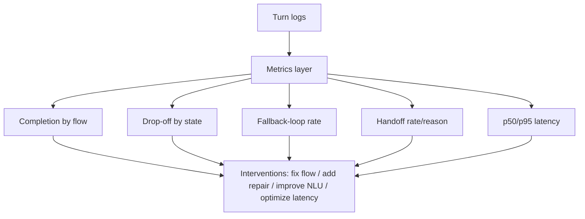

---

### 3. Real-World Industry Scenarios [Intermediate]

**Scenario A — Drop-off intervention**

*Context:* 30% abandon at `verify_identity`.
- **Action:** the drop-off dashboard localizes it; redesign that step or offer an alternative path.

**Scenario B — Rising slot-correction**

*Context:* Slot-correction rate climbs after a change.
- **Action:** signals NLU/validation regression; investigate extraction and validation.

**Scenario C — Latency watch (voice)**

*Context:* p95 per-turn latency creeps up.
- **Action:** latency dashboard triggers decomposition and optimization before UX degrades.

---

### 4. System View [Intermediate]

```text
Turn logs → aggregate into metrics → dashboards + alerts → each metric mapped to an intervention
   → slice by flow, channel, segment, time → detect regressions and drop-offs early
```

**Metric → intervention map:**

| Metric | Signals | Intervention |
|---|---|---|
| Completion by flow | goal achievement | redesign low-completion flows |
| Drop-off by state | abandonment point | fix/replace that step |
| Fallback-loop rate | users stuck | bounded repair + handoff |
| Handoff rate/reason | automation limits | improve flows/tools or staffing |
| Tool error rate | action failures | fix tools/retries |
| Slot-correction rate | misunderstanding | improve NLU/validation |
| Turns to resolution | efficiency | streamline flows |
| p50/p95 latency | responsiveness | decompose + optimize |
| Safety-block rate | guardrail firing | tune policies/UX |

---

### 5. System Design Flavor [Intermediate]

**Key design question:** For each metric, what intervention does it drive, and how is it sliced (flow/channel/segment) to be actionable?

**Tradeoffs:**

| Decision | More metrics/slices | Fewer |
|---|---|---|
| Insight granularity | High (targeted action) | Coarse |
| Dashboard complexity | More to maintain | Simpler |
| Alert noise | Risk of over-alerting | May miss issues |

**Scaling consideration:** Slice metrics by flow, channel, and user segment so an aggregate "healthy" number doesn't hide a broken segment. Set alert thresholds to catch regressions without alert fatigue; tie every dashboard to an owner and an intervention.

---

### 6. Common Mistakes + Debugging [Beginner]

**Mistake 1 — Vanity metrics.**
- **Symptom:** dashboards no one acts on.
- **First step:** map each metric to a concrete intervention.

**Mistake 2 — Aggregate-only (no slicing).**
- **Symptom:** a broken flow/segment hidden by a good average.
- **First step:** slice by flow, channel, and segment.

**Mistake 3 — No drop-off dashboard.**
- **Symptom:** persistent abandonment unnoticed.
- **First step:** build drop-off-by-state and act on the worst states.

---

### 7. Hands-On Lab [Pro]

**Concept:** Compute the core conversational metrics from turn logs.

#### Build — Metrics from logs

```python
from collections import Counter

convs = {
    "c1": [("start","collect_id"),("collect_id","confirm"),("confirm","done")],
    "c2": [("start","collect_id"),("collect_id","collect_id"),("collect_id","drop_off")],
    "c3": [("start","collect_id"),("collect_id","confirm"),("confirm","handoff")],
}

def completion_rate(convs):
    done = sum(1 for c in convs.values() if c[-1][1]=="done")
    return round(done/len(convs), 2)

def drop_off_by_state(convs):
    return dict(Counter(steps[-1][0] for steps in convs.values() if steps[-1][1]=="drop_off"))

def loop_rate(convs):
    total = sum(len(s) for s in convs.values())
    loops = sum(1 for s in convs.values() for a,b in s if a==b)
    return round(loops/total, 2)

def handoff_rate(convs):
    ho = sum(1 for c in convs.values() if c[-1][1]=="handoff")
    return round(ho/len(convs), 2)

print("completion:", completion_rate(convs))       # 0.33
print("drop-off by state:", drop_off_by_state(convs))  # {'collect_id': 1}
print("loop rate:", loop_rate(convs))              # >0 (c2 loops)
print("handoff rate:", handoff_rate(convs))        # 0.33
```

#### Break — Report only the average completion

```python
print("headline:", completion_rate(convs))   # 0.33 -> but WHERE it fails is invisible
# drop-off-by-state shows collect_id is the problem; the headline alone can't guide action.
```

#### Measure

- Each core metric + its slice (flow/channel/segment).
- Metric→intervention coverage (every metric actionable?).
- Regression deltas run-over-run.
- Alert precision (useful vs noisy).

#### Explain

Completion alone (0.33) says the assistant is unhealthy but not *why*; drop-off-by-state pinpoints `collect_id`, loop rate flags the stuck conversation, and handoff rate quantifies automation limits. Actionable metrics — sliced and tied to interventions — are what turn logs into decisions, not dashboards to admire.

---

### 8. Active Recall [Beginner → Intermediate]

1. **[Beginner]** Name four core conversational metrics.
2. **[Beginner]** What does drop-off-by-state tell you?
3. **[Intermediate]** What intervention does a rising slot-correction rate suggest?
4. **[Intermediate]** Why slice metrics by flow/channel/segment?
5. **[Pro]** What makes a metric "actionable" vs vanity?

**Answer Key:**
1. Any four: completion by flow, drop-off by state, fallback-loop rate, handoff rate, tool error rate, slot-correction rate, turns to resolution, latency, safety-block rate.
2. Where users abandon, localized to specific states, so you know which step to fix.
3. Improve NLU/validation — rising corrections signal misunderstanding of user inputs.
4. An aggregate "healthy" number can hide a broken flow/channel/segment; slicing exposes it.
5. It maps to a specific intervention and decision; vanity metrics are tracked but never acted upon.

---

### 9. Practice [Intermediate / Pro]

**Mini-exercise:** Handoff rate jumped from 5% to 20% after a release. Which two metrics do you slice to find the cause?

*Suggested answer:* handoff-reason (why humans take over) and drop-off/tool-error by flow — sliced by the changed flow — to localize the regression.

**Capstone design question:** Design the conversational analytics dashboard suite for a support assistant, mapping each metric to an owner and intervention, with slicing and alerts.

*Answer outline:* dashboards for completion, drop-off-by-state, loop rate, handoff rate/reason, tool error, slot-correction, turns-to-resolution, latency p50/p95, safety-block; each tied to an owner + intervention; sliced by flow/channel/segment; regression alerts with sensible thresholds; drilldown to turn traces; feed worst states into flow redesign and fixtures.

---

### 10. Production Reality Check (Mandatory)

**If the assistant seems healthy in aggregate but users are unhappy, what's the first thing we inspect?**

Sliced metrics — drop-off-by-state, per-flow completion, and loop rate by segment/channel — plus turn traces for the worst slices. Aggregate health routinely hides a broken flow or segment. Find the specific state/flow driving dissatisfaction and apply its mapped intervention, rather than trusting the headline number.

---

### 11. Curiosity Bridge (Mandatory)

You now have the full engineering picture. The last piece is communicating it — the interview answers that prove mastery and the capstone projects that demonstrate it end-to-end. That's Subtopic 24.5.d.

---

### 12. Exit Check + Carry-Forward Review

**Exit check:** You can define the core conversational metrics, slice them for action, map each to an intervention, and build dashboards/alerts that surface where to fix the system.

**Carry-forward:** This is Module 8's metrics discipline and Module 20's cost/latency measurement applied to conversations: every metric tied to a decision, sliced to be actionable.

---

## Subtopic 24.5.d: Interview Answers and Capstone Project Ideas

### Reading Path + Level Tags

- **Beginner:** Read sections 1–2 and Active Recall.
- **Intermediate:** Add sections 3–5 and the Hands-On Lab.
- **Pro:** Full lab plus the capstone portfolio-packaging question.

---

### 1. Pre-Question Hook + The Intuition [Beginner]

**Pause — before reading:** An interviewer asks "what's a conversation graph, and how is it different from an agent graph?" Can you answer in 45 seconds with substance, then prove it with a project?

**The core mental model:**
Mastery is demonstrated two ways: **crisp interview answers** grounded in this module's concepts, and **capstone projects** that prove end-to-end capability. Strong answers hit the durable ideas — explicit state over chat history, deterministic-vs-LLM transitions, slots/forms, interruption/resumption, tool gating/idempotency, conversation-aware retrieval, turn-level evaluation, and runtime selection. Strong capstones exercise those ideas on a realistic system with observability and safety.

The interview questions you should be able to answer:
1. What is a conversational graph?
2. How is it different from an agent graph?
3. Why is explicit state better than chat history?
4. How do you handle topic switching?
5. How do you design slot filling and validation?
6. How do you evaluate multi-turn conversations?
7. How do you debug a bot stuck in fallback?
8. How do you design human handoff?
9. When would you use LangGraph vs Rasa vs Dialogflow CX vs XState?
10. How does conversation-aware retrieval work?

**Key terms:**
- **Signal:** the concrete evidence (project + metrics) that proves a claim.
- **Trajectory story:** narrating a conversation's turn-by-turn handling.
- **Capstone:** an end-to-end project demonstrating the full skill set.

---

### 2. Visual Diagram (Mermaid) [Beginner]

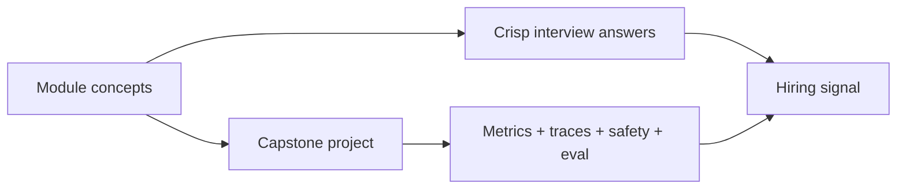

---

### 3. Real-World Industry Scenarios [Intermediate]

**Scenario A — The "graph vs agent" question**

*Strong answer:* "A conversation graph models dialogue as states, events, transitions, slots, and actions, optimized for predictable user interaction; an agent graph coordinates LLM/tool reasoning under uncertainty. I keep them separate — the conversation graph talks to the user and gathers/confirms; a bounded agent graph handles only uncertain reasoning — so user-facing behavior stays safe and testable."

**Scenario B — The "prove it" follow-up**

*Strong evidence:* a capstone (e.g., refund workflow assistant) with turn-level evals, tool gating + idempotency, interruption/resumption, and dashboards — narrated as a trajectory story.

**Scenario C — The runtime-choice question**

*Strong answer:* select by team + need (LangGraph code-first, Rasa NLU, Dialogflow CX enterprise visual, XState frontend state, Temporal-style durable side effects), and note real systems layer them.

---

### 4. System View [Intermediate]

```text
Concept mastery → crisp answers (durable ideas, not framework trivia)
Capstone project → demonstrates: state, transitions, slots, tools+idempotency, HITL,
   conversation-aware retrieval, turn-level eval, observability, safety
→ packaged with metrics, traces, and a trajectory narrative = hiring signal
```

**Capstone project ideas:**

| Project | What it proves |
|---|---|
| Customer-support conversation graph | Intent, slots, repair, handoff, analytics |
| Incident assistant with interruption/resumption | Long-lived state + human approval |
| Voice appointment scheduler | Realtime turn-taking + slot filling |
| Conversation-aware RAG assistant | Follow-up resolution + active-entity tracking |
| Refund workflow assistant | Tool use, confirmation, side-effect safety, idempotency |

---

### 5. System Design Flavor [Intermediate]

**Key design question:** Which single capstone best demonstrates the full stack (state, safety, retrieval, eval, observability) for your target role, and how do you narrate it?

**Tradeoffs:**

| Decision | Broad capstone | Deep capstone |
|---|---|---|
| Coverage | Touches everything | Excels at one area |
| Signal | Generalist | Specialist depth |
| Effort | Higher | Focused |

**Scaling consideration:** One well-instrumented capstone with real metrics, traces, safety, and a clear trajectory story beats several shallow demos. Package it (Module 22) with architecture diagram, failure analysis, and tradeoff memo.

---

### 6. Common Mistakes + Debugging [Beginner]

**Mistake 1 — Framework trivia over concepts.**
- **Symptom:** answers recite APIs, not durable ideas.
- **First step:** anchor answers in state/transitions/slots/eval, then mention tools.

**Mistake 2 — Demo without evidence.**
- **Symptom:** a project with no metrics/traces/safety.
- **First step:** add turn-level evals, dashboards, and safety gates.

**Mistake 3 — No trajectory story.**
- **Symptom:** can't narrate how a conversation is handled turn by turn.
- **First step:** practice walking a real transcript through the graph.

---

### 7. Hands-On Lab [Pro]

**Concept:** Draft a strong answer and a capstone spec.

#### Build — Strong interview answer

```text
Q: What is a conversational graph, and why explicit state?
A: "A conversation graph models dialogue as states, events, transitions, slots, and
   actions. I use it when a multi-turn assistant needs predictable behavior: collecting
   information, clarifying ambiguity, calling tools, handling interruptions, and handing
   off to humans. LLMs still interpret input and generate responses, but safety-critical
   transitions and side effects are explicit and testable. Explicit state beats chat
   history because it's inspectable, testable, resumable, and unambiguous. In production
   I trace every turn (previous state, intent, slots, transition, tool calls, next state,
   fallback reason); to debug a failure I find the turn where it went off path."
```

#### Build — Capstone spec

```text
Project: Refund workflow assistant
Proves: state machine, slot filling + validation, confirmation, tool gating + idempotency,
        interruption/resumption, human handoff with payload, turn-level evals, dashboards.
Deliverables: architecture diagram, golden transcripts + eval report, safety/guardrail notes,
        latency/handoff/safety dashboards, tradeoff memo, demo trajectory narrative.
```

#### Measure

- Answer completeness (durable concepts covered).
- Capstone evidence coverage (state/safety/retrieval/eval/observability).
- Trajectory-narrative clarity.
- Packaging completeness (diagram/eval/failure analysis/tradeoff memo).

#### Explain

The strong answer leads with concepts (state, transitions, safety, tracing) and only then tools — proving understanding, not memorization. The capstone spec forces end-to-end evidence: without turn-level evals, safety gates, and observability, a demo isn't a hiring signal. Concepts + instrumented capstone + trajectory story is the package.

---

### 8. Active Recall [Beginner → Intermediate]

1. **[Beginner]** In one sentence, what is a conversation graph?
2. **[Beginner]** Why is explicit state better than chat history (interview form)?
3. **[Intermediate]** How do you differentiate conversation vs agent graph in an interview?
4. **[Intermediate]** What evidence turns a demo into a hiring signal?
5. **[Pro]** What makes one capstone stronger than several shallow demos?

**Answer Key:**
1. A model of dialogue as states, events, transitions, slots, and actions that controls a multi-turn assistant predictably.
2. It's inspectable, testable, resumable, and unambiguous; history must be re-interpreted and hides required state.
3. Conversation graph = predictable user dialogue (slots/clarify/confirm/handoff); agent graph = flexible LLM/tool reasoning under uncertainty; keep them separate.
4. Turn-level evals, traces, safety gates, dashboards, and a clear trajectory narrative with metrics.
5. Depth and instrumentation: one well-evaluated, observable, safe end-to-end system proves the full skill set better than shallow breadth.

---

### 9. Practice [Intermediate / Pro]

**Mini-exercise:** Give a 30-second answer to "how do you evaluate multi-turn conversations?"

*Suggested answer:* "Both turn-level and task-level: turn success, transition/slot/carryover accuracy, repair success, and safety-gate correctness per turn, plus task success and handoff quality overall — evaluated against golden transcripts in CI, since a conversation can complete while individual turns fail."

**Capstone design question:** Choose one capstone from the table and write its full spec (goal, what it proves, deliverables, metrics) suitable for a portfolio.

*Answer outline:* pick e.g. the incident assistant with interruption/resumption; goal = long-lived, resumable, human-approved incident handling; proves state persistence, task stack, HITL approval, tool idempotency, conversation-aware retrieval, turn-level evals; deliverables = architecture diagram, golden transcripts + eval report, safety notes, dashboards, tradeoff memo, demo trajectory; metrics = task/turn success, safety-gate correctness, handoff quality, latency.

---

### 10. Production Reality Check (Mandatory)

**If your conversational project isn't landing as a strong signal, what's the first thing we inspect?**

The evidence, not the pitch. Confirm the capstone has turn-level evals, traces, safety gates, and dashboards, and that you can narrate a real conversation's turn-by-turn handling. Weak signals are usually demos without instrumentation or answers that recite framework APIs instead of durable concepts (state, transitions, safety, evaluation).

---

### 11. Curiosity Bridge (Mandatory)

You've completed the conversational-graph lifecycle — fundamentals, flows, retrieval, runtimes, and production. The module checkpoint ties it into a single end-to-end design challenge, and the glossary consolidates the vocabulary.

---

### 12. Exit Check + Carry-Forward Review

**Exit check:** You can deliver crisp, concept-grounded interview answers and specify an instrumented, end-to-end capstone that proves conversational-systems mastery.

**Carry-forward:** This is Module 22 (portfolio packaging and hiring-signal design) applied to conversational systems: concepts + an instrumented capstone + a trajectory narrative = the signal.

---

## Module 24 Checkpoint: End-to-End Conversational System Design

You are ready to leave this module when you can, without hand-waving:

- **Model** a conversation as an explicit state object with events, transitions, slots, and memory — never chat history as state.
- **Separate** conversation, workflow, and agent graphs with clean boundary contracts.
- **Design** slot filling with alternatives, targeted clarification, bounded repair, explicit confirmation, and interruption/resumption via a task stack with safety checks.
- **Gate** tool use with risk tiers, confirmation, permissions, idempotency, and audit, and design context-rich human handoff.
- **Layer** memory (short-term, long-term, summary) with constraint preservation, consent, redaction, and retention.
- **Retrieve** with conversation-aware query rewriting, intent transition graphs, and Conversational GraphRAG that seeds and constrains retrieval from dialogue state.
- **Evaluate** with turn-level and task-level metrics, safety-gate correctness, and CI regression gating.
- **Choose** a runtime (or layered stack) — LangGraph, Rasa, Dialogflow CX, Botpress, XState, Temporal-style — from team and problem shape.
- **Operate** with turn-level observability, actionable dashboards, incident playbooks (fallback/lost-context/wrong-tool/stuck, plus latency/handoff/safety/compliance), and an ordered debugging procedure.

**Capstone integration exercise:** Design a production, resumable, human-approved conversational assistant for a side-effect-heavy domain (e.g., refunds or incident response). Specify the state model and transition policy, the slot/confirmation design, interruption/resumption, tool gating with idempotency and handoff, memory and personalization with privacy controls, conversation-aware retrieval, the runtime stack, the evaluation suite, the observability/dashboards, and the incident playbooks. Justify every major decision against alternatives — including where deterministic control must override LLM freedom.

---

## Module Glossary

| Term | Meaning |
|---|---|
| Conversation graph | Graph of dialogue states and transitions controlling a multi-turn assistant. |
| State object | Explicit, inspectable structure of current task, slots, and flags (not the transcript). |
| State | Current phase of a conversation or task. |
| Event | User message, tool result, timeout, approval, or system signal that may trigger a transition. |
| Transition | Movement from one state to another based on event and context. |
| Deterministic / LLM / classifier transition | Rule-based / LLM-interpreted / learned next-state decision. |
| Intent | User goal inferred from input. |
| Slot | Structured value needed to complete a task. |
| Entity | Extracted value from a message. |
| Form | Reusable, ordered slot-collection flow. |
| Context variable | Working-memory value used to resolve references. |
| Digression | Temporary topic shift away from the active task. |
| Interruption / Resumption | Suspending a task for a new intent / returning to it after validity checks. |
| Task stack | Structure tracking active and suspended conversation tasks. |
| Confirmation | Verifying a specific action and its consequences before a side effect. |
| Repair | Bounded recovery from invalid input or tool failure. |
| Risk tier | Classification of an action's reversibility/impact. |
| Idempotency key | Ensures a retried side-effect call executes once. |
| Handoff / Handoff payload | Transfer to a human / the context (transcript, state, slots, failures) passed with it. |
| Short-term / long-term / summary memory | Session state / durable user facts / compressed running context. |
| Conversation-aware retrieval | Retrieval that uses dialogue state/history to rewrite and scope queries. |
| Intent transition graph | Aggregate graph of common intent→intent paths across conversations. |
| Next-best-action | Predicted proactive step given the current intent path. |
| Conversational GraphRAG | Fusion of conversation state, knowledge graph, and vector RAG for grounded multi-turn answers. |
| Turn success / Task success | Whether a single turn / the whole conversation behaved correctly. |
| Trajectory | The sequence of states/intents in one conversation. |
| Endpointing / Barge-in | Detecting end of user speech / user interrupting the bot's speech. |
| Cancelable action | A tool call that can be safely aborted mid-turn. |

---
