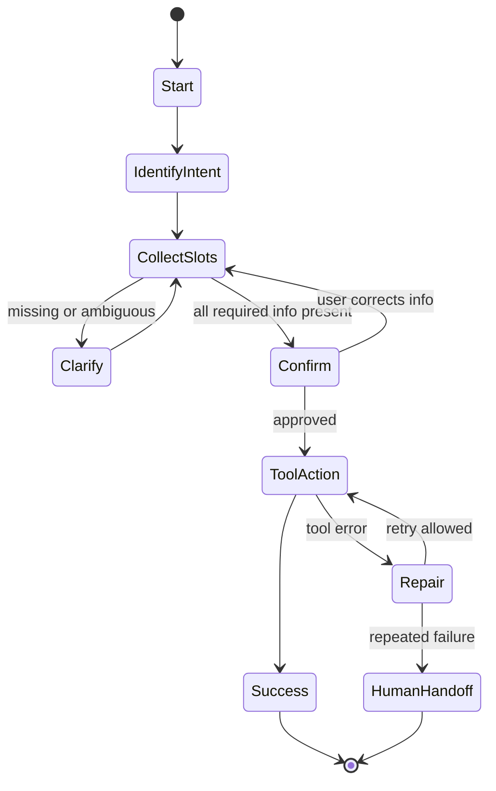
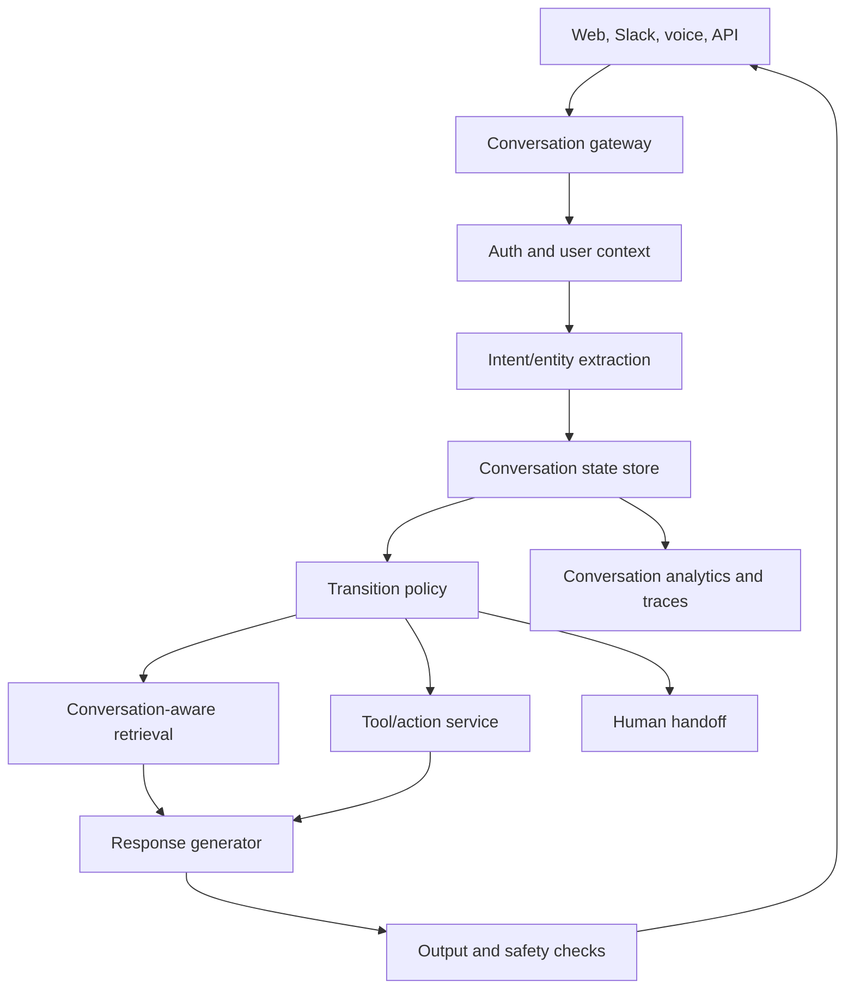

# Module 24 - Conversational Graphs And Dialogue State Systems

> Module time: 34h
> Why this module matters: Conversational graph design turns multi-turn assistants from fragile chat transcripts into controlled, inspectable, stateful systems. It is the missing layer between simple chat memory and production-grade dialogue flows with intent routing, slot filling, tool use, interruption, fallback, human handoff, analytics, and resumability.

This module is designed as a working reference. If you are building a customer-support bot, workflow assistant, voice agent, onboarding assistant, human-review system, or graph-controlled agent, you should be able to come here for design patterns, libraries, failure modes, and production scenarios.

---

## Quick Topic Index

| # | Topic | Status |
|---|---|---|
| 24.1 | Conversational graph fundamentals | Reference |
| 24.1.a | Dialogue as states, transitions, events, and memory | Reference |
| 24.1.b | Conversation graph vs workflow graph vs agent graph | Reference |
| 24.1.c | Intents, slots, entities, forms, and context variables | Reference |
| 24.1.d | Deterministic, probabilistic, and LLM-driven transitions | Reference |
| 24.2 | Designing multi-turn conversation flows | Reference |
| 24.2.a | Slot filling, clarification, repair, and confirmation | Reference |
| 24.2.b | Topic switching, interruption, resumption, and digression | Reference |
| 24.2.c | Tool use, side effects, approval, and human handoff | Reference |
| 24.2.d | Personalization, memory, and long-lived state | Reference |
| 24.3 | Conversation-aware retrieval and graph memory | Reference |
| 24.3.a | Conversation state for RAG and context carryover | Reference |
| 24.3.b | Intent transition graphs and next-best-action systems | Reference |
| 24.3.c | Conversational GraphRAG and dual retrieval | Reference |
| 24.3.d | Evaluation for multi-turn and conversation trajectories | Reference |
| 24.4 | Libraries, runtimes, and production platforms | Reference |
| 24.4.a | LangGraph for stateful conversational agents | Reference |
| 24.4.b | Rasa, Dialogflow CX, Botpress, XState, Temporal-style workflows | Reference |
| 24.4.c | Observability, analytics, testing, and CI | Reference |
| 24.4.d | Voice, realtime, and channel-specific concerns | Reference |
| 24.5 | Production scenarios and debugging | Reference |
| 24.5.a | Fallback loops, lost context, wrong tool action, stuck flows | Reference |
| 24.5.b | Latency, handoff, safety, and compliance incidents | Reference |
| 24.5.c | Conversation graph metrics and dashboards | Reference |
| 24.5.d | Interview answers and capstone project ideas | Reference |

---

## Reference Anchors

Use these as implementation anchors:

- LangGraph docs: `https://docs.langchain.com/oss/python/langgraph/overview`
- Rasa docs: `https://rasa.com/docs/rasa/`
- Dialogflow CX concepts: `https://cloud.google.com/dialogflow/cx/docs/concept/agent`
- Botpress nodes and workflows: `https://www.botpress.com/docs/studio/concepts/nodes/introduction`
- XState docs: `https://stately.ai/docs`
- LlamaIndex chat engines: `https://developers.llamaindex.ai/python/framework/module_guides/deploying/chat_engines/`

The exact product APIs change. The durable concepts are states, events, transitions, slots, tools, memory, handoff, evaluation, and traceability.

---

## Module Mental Model

A conversation graph is a map of possible dialogue states and transitions:

```text
state + user event + context -> transition -> next state + response/action
```

The beginner view:

```text
conversation graph = chatbot flowchart
```

The professional view:

```text
conversation graph = stateful control plane for dialogue, tool use, memory, safety, recovery, and analytics
```

Conversation graphs exist because raw chat history is not enough. A production assistant needs to know:

- What task is active?
- What information is missing?
- What has been confirmed?
- Which tools have already been called?
- What action is pending approval?
- What should happen if the user changes topic?
- When should the assistant escalate to a human?
- Which state should resume after interruption?

---

## Topic 24.1: Conversational Graph Fundamentals

### Add to Knowledge Base

### Reading Path + Level Tags

- Beginner: Read states, transitions, intents, and slots.
- Intermediate: Add graph vs workflow vs agent distinctions.
- Pro: Design fallback, interruption, and resumption behavior.

### 1. The Intuition

A conversation graph is like a train network for dialogue. The user can enter through many stations, move between stops, take detours, or need assistance. The graph helps the system know where it is, what should happen next, and how to recover if the user goes off route.

Where the analogy breaks: real users do not follow tracks cleanly. They interrupt, contradict themselves, change goals, answer partially, abandon tasks, and return later.

### 2. Visual Diagram



### 3. Core Concepts

| Concept | Meaning | Example |
|---|---|---|
| State | Current stage of the conversation. | `collect_shipping_address` |
| Event | Something that happens. | user message, timeout, tool result |
| Transition | Rule that moves from one state to another. | missing slot -> clarify |
| Intent | User goal classification. | reset password, cancel order |
| Slot | Required variable. | order_id, date, location |
| Entity | Extracted value from user input. | `ORD-1234` |
| Form | Structured slot-collection flow. | collect name, email, issue |
| Context | Working memory for current task. | selected product and user role |
| Policy | Logic choosing next action. | deterministic rule, classifier, LLM router |
| Handoff | Transfer to human or another system. | support agent handoff |

### 4. Conversation Graph vs Workflow Graph vs Agent Graph

| Graph type | Main purpose | Example |
|---|---|---|
| Conversation graph | Manage dialogue state and user interaction. | collect slots, clarify, confirm, handoff |
| Workflow graph | Execute business process steps. | triage, retrieve, approve, execute |
| Agent graph | Coordinate LLM/tool decision-making. | planner, tool caller, verifier |

They often overlap:

```text
conversation graph handles user dialogue
workflow graph handles task execution
agent graph handles uncertain reasoning/tool choice
```

Strong design separates them when possible.

### 5. Deterministic vs LLM-Driven Transitions

| Transition style | Use when | Risk |
|---|---|---|
| Deterministic rule | Required slot missing, approval needed, tool failed. | Can be rigid. |
| Classifier/policy | Intent or next action has learned patterns. | Needs training/eval data. |
| LLM router | User language is messy and open-ended. | Can be inconsistent. |
| Hybrid | Production default. | More architecture to test. |

Professional rule:

```text
Use deterministic transitions for safety, state, and side effects.
Use LLM transitions for interpretation and flexible language.
```

### 6. Common Mistakes + Debugging

| Mistake | Symptom | First debugging step |
|---|---|---|
| Treating chat history as state | Assistant forgets required fields or repeats questions. | Inspect explicit state object and slot values. |
| No repair path | User gives invalid value and flow collapses. | Check validation and clarification transitions. |
| LLM controls irreversible actions | Assistant executes risky task too freely. | Inspect approval and tool policy gates. |
| No interruption model | User changes topic and old task is lost. | Inspect active task stack and resume policy. |
| No conversation analytics | Team cannot tell where users drop off. | Add state transition logging. |

### 7. Hands-On Lab: Tiny Conversation Graph

Build:

```python
from dataclasses import dataclass, field

@dataclass
class ConversationState:
    state: str = "start"
    slots: dict[str, str] = field(default_factory=dict)
    attempts: int = 0

def step(s: ConversationState, message: str) -> ConversationState:
    text = message.lower()

    if s.state == "start":
        s.state = "collect_order_id"
        return s

    if s.state == "collect_order_id":
        if "ord-" in text:
            s.slots["order_id"] = text.split()[-1].upper()
            s.state = "confirm"
        else:
            s.attempts += 1
            s.state = "handoff" if s.attempts >= 2 else "collect_order_id"
        return s

    if s.state == "confirm":
        if "yes" in text:
            s.state = "done"
        elif "no" in text:
            s.state = "collect_order_id"
        return s

    return s
```

Break:

- User says "Actually I need help with a refund."
- User gives two IDs.
- User says "yes" before any slot is collected.

Measure:

- Number of turns to completion.
- Fallback count.
- Handoff rate.
- Slot correction rate.
- Invalid transition count.

Explain:

The graph must handle not just the happy path, but digressions, invalid values, early confirmations, and repeated failures.

### 8. Active Recall

1. Why is explicit state better than relying only on chat history?
2. What is the difference between an intent and a slot?
3. When should a transition be deterministic?
4. What is the first thing to inspect when a bot repeats a question?
5. Why do conversation graphs need analytics?

Answer key:

1. Explicit state is inspectable, testable, resumable, and less ambiguous.
2. Intent is the goal; slot is a required value.
3. For safety, required data, validation, side effects, approval, and recovery.
4. Current state, slot values, and transition log.
5. To find drop-offs, loops, failure states, and training gaps.

### 9. Production Reality Check

If this fails in prod, what is the first thing we inspect?

Inspect the state transition trace: previous state, event, extracted intent/entities, slot values, transition rule, next state, and response.

### 10. Curiosity Bridge

This works for clean flows. It breaks when users interrupt, switch goals, return later, or need external tools. Next we design robust multi-turn flows.

### 11. Exit Check

You are done when you can describe a conversation as states, events, transitions, slots, validations, fallbacks, and handoff paths.

---

## Topic 24.2: Designing Multi-Turn Conversation Flows

### 1. Core Flow Patterns

| Pattern | Use it for | Key risk |
|---|---|---|
| Slot filling | Collect required information. | Repeating questions or accepting invalid values. |
| Clarification | Resolve ambiguous input. | Over-clarifying and frustrating users. |
| Confirmation | Verify before side effect. | Confirming too late or too vaguely. |
| Repair | Recover from invalid input/tool failure. | Infinite repair loops. |
| Digression | Let user temporarily change topic. | Losing original task. |
| Resumption | Continue after interruption. | Resuming stale or unsafe task. |
| Human handoff | Escalate when automation is unsafe or unhelpful. | Losing transcript or context. |

### 2. Slot Filling Design

Bad slot filling:

```text
Bot: What is your order ID?
User: I do not know.
Bot: What is your order ID?
```

Better:

```text
Bot: I can look it up another way. What email or phone number was used for the order?
```

Slot metadata:

```text
name
type
required
validation rule
source
confidence
confirmed
redactable
expires_at
```

### 3. Interruption And Resumption

Use a task stack:

```text
active_task = refund_status
interruption = update_email
after interruption -> resume refund_status if still valid
```

Resumption checks:

- Is the previous task still open?
- Did any slot expire or change?
- Did user confirm resumption?
- Is the pending action still safe?
- Has external state changed?

### 4. Tool Use In Conversation Graphs

Tool call lifecycle:

```text
collect slots
  -> validate
  -> risk classify
  -> confirm if side effect
  -> call tool with idempotency key
  -> handle result
  -> update state
  -> summarize to user
```

Never let a conversational model freely call side-effect tools without:

- Tool schema.
- Required slots.
- Risk tier.
- Permission check.
- Confirmation or approval.
- Timeout and retry policy.
- Idempotency key.
- Audit log.

### 5. Common Mistakes + Debugging

| Mistake | Symptom | Better approach |
|---|---|---|
| No task stack | User interruption loses original task. | Store active and suspended tasks. |
| No slot provenance | Bot trusts stale or uncertain values. | Track source, confidence, timestamp, confirmation. |
| Vague confirmation | User says yes but did not approve exact action. | Confirm specific action and consequences. |
| No max repair count | User gets stuck in fallback loop. | Escalate after bounded attempts. |
| Handoff without context | Human agent asks user to repeat everything. | Pass transcript, state, slots, and failed path. |

### 6. Hands-On Lab: Slot Policy Table

Create a table for an order-cancellation assistant:

| Slot | Required | Validation | Confirmation |
|---|---|---|---|
| order_id | yes | matches `ORD-[0-9]+` | yes |
| requester_email | yes | email format | no |
| cancellation_reason | no | free text | no |
| refund_method | maybe | enum | yes if money movement |

Break:

- User provides invalid order ID.
- User changes order ID after confirmation.
- Tool reports order already shipped.

Measure:

- Completion rate.
- Correction rate.
- Human handoff rate.
- Unsafe action block rate.

### 7. Production Reality Check

If this fails in prod, what is the first thing we inspect?

Inspect slot provenance and confirmation state. Multi-turn failures often happen because the assistant acts on stale, unconfirmed, or incorrectly extracted slot values.

---

## Topic 24.3: Conversation-Aware Retrieval And Graph Memory

### 1. Why Conversation-Aware Retrieval Exists

Single-turn RAG sees only the latest user message:

```text
User: What about the second one?
```

The latest message alone is meaningless. A conversation-aware system needs:

- Conversation summary.
- Active entities.
- Active task.
- Previous retrieved evidence.
- User preferences.
- Pending decisions.
- Intent transition history.

### 2. Conversation State For RAG

```text
retrieval_query = rewrite(
    latest_user_message,
    active_task,
    active_entities,
    relevant_history,
    user_permissions
)
```

Track:

| State item | Why it matters |
|---|---|
| Active topic | Prevents pronoun and ellipsis failures. |
| Active entities | Helps resolve "that vendor" or "second one." |
| Last evidence set | Helps compare or follow up. |
| User role | Controls permission-aware retrieval. |
| Task phase | Changes what evidence is needed. |
| Conversation summary | Controls context size. |

### 3. Intent Transition Graphs

An intent transition graph models common paths:

```text
ask_refund_status -> ask_refund_timing -> request_human_agent
login_issue -> password_reset -> mfa_problem -> support_ticket
```

Use cases:

- Next-best-action prediction.
- Conversation repair.
- Drop-off detection.
- Personalization.
- Training data generation.
- Evaluating whether a dialogue follows a successful path.

### 4. Conversational GraphRAG

Conversational GraphRAG combines:

```text
conversation graph: what state/task/intent are we in?
knowledge graph: what entities/relationships/facts matter?
vector RAG: what source text supports the answer?
```

Example:

```text
User: Did the same vendor cause the outage last quarter?
```

Need:

- conversation entity: current vendor
- knowledge graph: vendor -> incidents -> services -> time
- vector evidence: incident reports and citations
- temporal filter: last quarter

### 5. Evaluation For Multi-Turn Systems

| Metric | Meaning |
|---|---|
| Turn success | Did each turn do the right thing? |
| Task success | Did the full conversation complete the goal? |
| Context carryover accuracy | Did the bot resolve references correctly? |
| Slot accuracy | Were collected values correct? |
| Transition accuracy | Did state changes match expected path? |
| Repair success | Did bot recover from bad input? |
| Handoff quality | Did human receive useful context? |
| Safety gate correctness | Were risky actions blocked or approved correctly? |
| Conversation latency | Per-turn and end-to-end delay. |

### 6. Common Mistakes + Debugging

| Mistake | Symptom | First inspection |
|---|---|---|
| Query rewrite ignores history | Follow-up questions retrieve wrong docs. | Rewritten query and active entities. |
| Summary memory drops constraints | Bot forgets "for enterprise plan." | Summary diff and state fields. |
| Intent graph overfits happy paths | Bot fails on real user digressions. | Production transition logs. |
| No turn-level eval | Final task success hides bad turns. | Per-turn expected state and action. |

### 7. Production Reality Check

If this fails in prod, what is the first thing we inspect?

Inspect the rewritten retrieval query and active conversation state. If the system misunderstood the current task or entity, retrieval will be wrong no matter how good the vector store is.

---

## Topic 24.4: Libraries, Runtimes, And Production Platforms

### 1. Tool Map

| Tool | Use it for | Notes |
|---|---|---|
| LangGraph | Stateful LLM workflows, agents, memory, interrupts, persistence. | Best fit for code-first GenAI orchestration. |
| Rasa | Traditional and ML-assisted conversational assistants, NLU, stories, rules, forms, handoff. | Strong dialogue-management vocabulary. |
| Dialogflow CX | Enterprise conversational agents with flows/pages/routes. | Managed platform for contact-center style flows. |
| Botpress | Visual bot flows, nodes, autonomous nodes, workflows, knowledge bases. | Useful for low-code bot building and workflow visualization. |
| XState/Stately | State machines and statecharts in JS/TS. | Excellent for deterministic UI/app conversation state. |
| Temporal/Durable workflows | Long-running, reliable business processes. | Good for side-effect-heavy backend orchestration. |
| LlamaIndex Chat Engines | Data-centric conversational retrieval. | Useful for chat over indexed data. |
| OpenAI Agents SDK / ADK | Runtime-specific agent patterns. | Compare by deployment, tools, sessions, guardrails, observability. |

### 2. Selection Matrix

| Need | Strong fit |
|---|---|
| Code-first GenAI state graph | LangGraph |
| Traditional chatbot with intents/forms/stories | Rasa |
| Enterprise contact center visual flow | Dialogflow CX |
| Low-code bot workflow and KB | Botpress |
| Frontend or app state machine | XState |
| Reliable long-running backend side effects | Temporal-style workflow |
| Data-heavy conversational retrieval | LlamaIndex |

### 3. Production Architecture



### 4. Observability

Log every turn:

```text
conversation_id
user_id or anonymized ID
channel
previous_state
user_message
intent_candidates
entities
slots_before
transition_decision
tool_calls
retrieval_query
next_state
response_type
latency_ms
fallback_reason
handoff_reason
```

Dashboards:

- Completion rate by flow.
- Drop-off by state.
- Fallback loop rate.
- Handoff rate and reason.
- Tool error rate.
- Slot correction rate.
- Average turns to resolution.
- p50/p95 per-turn latency.
- Safety block rate.

### 5. CI And Testing

Test types:

- Golden conversation transcripts.
- State transition tests.
- Slot validation tests.
- Tool side-effect tests.
- Handoff tests.
- Conversation RAG follow-up tests.
- Adversarial prompt injection tests.
- Latency and fallback budget checks.

### 6. Production Reality Check

If this fails in prod, what is the first thing we inspect?

Inspect turn-level traces, not just final conversations. A conversation can end successfully while still having repeated bad turns, unsafe near-misses, or frustrating loops.

---

## Topic 24.5: Production Scenarios And Debugging

### 1. Scenario Table

| Scenario | First inspection | Likely mitigation |
|---|---|---|
| Bot repeats same question | State and slot values. | Fix slot validation or state update. |
| Bot loses context after digression | Task stack and active entities. | Add interruption/resumption policy. |
| Bot calls wrong tool | Intent, slots, risk classifier, tool schema. | Add tool gating and confirmation. |
| User stuck in fallback loop | Fallback count and failed states. | Add bounded repair and handoff. |
| Human handoff poor | Handoff payload. | Pass transcript, state, slots, failed attempts. |
| Voice assistant interrupts user | Turn-taking and barge-in policy. | Tune endpointing and interruption rules. |
| Conversation RAG answers wrong follow-up | Rewritten query and active context. | Improve context carryover and query rewriting. |
| Metrics look good but users complain | Per-state drop-off and qualitative logs. | Add conversation-level evals and user journey slices. |

### 2. Debugging Playbook

```text
Bad conversation
  -> identify turn where it went wrong
  -> inspect previous state and slots
  -> inspect user event interpretation
  -> inspect transition rule/policy
  -> inspect tool or retrieval call
  -> inspect response generation
  -> inspect guardrails and handoff
  -> add transcript to regression suite
```

### 3. Hard Production Problems

#### Problem: User changes goal mid-task

Need:

- Detect new intent.
- Suspend old task.
- Ask whether to switch or finish current task.
- Preserve old slots safely.
- Resume only after confirmation.

#### Problem: User gives contradictory slot values

Need:

- Track slot history.
- Mark value as unconfirmed.
- Ask targeted clarification.
- Avoid side effects until confirmation.

#### Problem: Tool succeeds but user asks to undo

Need:

- Tool action audit.
- Reversible action metadata.
- Compensation workflow.
- Human handoff for irreversible actions.

#### Problem: Voice user interrupts while tool is running

Need:

- Streaming state.
- Interrupt policy.
- Cancelable vs non-cancelable tools.
- User-facing status.

### 4. Capstone Project Ideas

| Project | What it proves |
|---|---|
| Customer support conversation graph | Intent, slots, repair, handoff, analytics. |
| Incident assistant with interruption/resumption | Long-lived state and human approval. |
| Voice appointment scheduler | Realtime turn-taking and slot filling. |
| Conversation-aware RAG assistant | Follow-up resolution and active entity tracking. |
| Refund workflow assistant | Tool use, confirmation, side-effect safety. |

### 5. Interview Questions

1. What is a conversational graph?
2. How is it different from an agent graph?
3. Why is explicit state better than chat history?
4. How do you handle topic switching?
5. How do you design slot filling and validation?
6. How do you evaluate multi-turn conversations?
7. How do you debug a bot stuck in fallback?
8. How do you design human handoff?
9. When would you use LangGraph vs Rasa vs Dialogflow CX vs XState?
10. How does conversation-aware retrieval work?

### 6. Strong Interview Answer: Conversation Graph

> A conversation graph models dialogue as states, events, transitions, slots, and actions. I use it when a multi-turn assistant needs predictable behavior: collecting information, clarifying ambiguity, calling tools, handling interruptions, and handing off to humans. The model can still use LLMs for interpretation or response generation, but safety-critical transitions and side effects should be explicit and testable. In production, I trace every turn with previous state, extracted intent, slots, transition decision, tool calls, next state, and fallback reason. If the assistant fails, I debug the state transition where the conversation went off path.

---

## Module Checkpoint

You are ready to use this module when you can:

- Model a conversation as states, events, slots, transitions, tools, and handoff.
- Decide when to use deterministic transitions vs LLM routing.
- Design slot filling, clarification, repair, interruption, and resumption.
- Add conversation-aware retrieval for multi-turn RAG.
- Evaluate multi-turn systems with turn-level and task-level metrics.
- Debug production failures from trace data.
- Choose LangGraph, Rasa, Dialogflow CX, Botpress, XState, or other runtimes with engineering reasons.

---

## Module Glossary

| Term | Meaning |
|---|---|
| Conversation graph | Graph of dialogue states and transitions controlling a multi-turn assistant. |
| State | Current phase of a conversation or task. |
| Event | User message, tool result, timeout, approval, or system signal that may trigger transition. |
| Transition | Movement from one state to another based on event and context. |
| Intent | User goal inferred from input. |
| Slot | Structured value needed to complete a task. |
| Entity | Extracted value from a message. |
| Form | Reusable slot-collection flow. |
| Digression | Temporary topic shift away from active task. |
| Resumption | Returning to a suspended task after interruption. |
| Handoff | Transfer from automation to human or another system. |
| Task stack | Structure for tracking active and suspended conversation tasks. |
| Conversation-aware retrieval | Retrieval that uses dialogue state and history to rewrite or scope queries. |
| Intent transition graph | Graph of common user intent paths across conversations. |
| Turn success | Whether a single conversational turn behaved correctly. |
| Task success | Whether the full conversation achieved the user goal. |
