# Module 4 - Embeddings And Semantic Representations

> **Module time:** 24h
> **Why this module matters:** If you want to build RAG, search, memory, recommendation, clustering, deduplication, personalization, or retrieval systems, embeddings are unavoidable. They are the bridge between messy human meaning and numeric systems that can search, rank, compare, cluster, and retrieve.

---

## Quick Topic Index

| # | Subtopic | Status |
|---|----------|--------|
| **Topic 4.1** | **Embedding concepts and vector geometry (8h)** | |
| 4.1.a | What embeddings capture semantically and what they do not | Done |
| 4.1.b | Cosine similarity vs dot product vs Euclidean distance | Done |
| 4.1.c | Neighborhoods, clustering, and semantic drift | Done |
| 4.1.d | Polysemy, multilinguality, and domain-shift limitations | Done |
| **Topic 4.2** | **Embedding model selection and evaluation (8h)** | |
| 4.2.a | General-purpose vs domain-tuned embedding models | Done |
| 4.2.b | Dimensions, latency, cost, and multilingual support | Done |
| 4.2.c | Benchmarking with retrieval metrics instead of vibes | Done |
| 4.2.d | Re-embedding strategies, versioning, and migration planning | Done |
| **Topic 4.3** | **Embedding pipelines and chunk representations (8h)** | |
| 4.3.a | Chunk-level vs section-level vs document-level embeddings | Done |
| 4.3.b | Query embeddings vs passage embeddings | Done |
| 4.3.c | Metadata enrichment, titles, summaries, and hypothetical questions | Done |
| 4.3.d | Refresh policies, backfills, and embedding drift management | Done |

**Covered so far:**
- 4.1.a - What embeddings capture semantically and what they do not: embedding-as-coordinate mental model, semantic neighborhoods, distributional meaning, training-objective dependence, cosine/dot-product intuition, what embeddings capture well, what they fail to capture, truth vs similarity distinction, lexical mismatch, negation/numbers/recency pitfalls, production retrieval implications, debugging bad embeddings, hands-on semantic-space simulation, active recall, and interview-ready embedding design practice.
- 4.1.b - Cosine similarity vs dot product vs Euclidean distance: direction-vs-magnitude mental model, cosine formula, dot product formula, Euclidean/L2 distance formula, vector norm intuition, normalization effects, when cosine and dot product become equivalent, when cosine and Euclidean rankings match, metric/index compatibility, production retrieval implications, common metric mistakes, hands-on ranking comparison simulation, active recall, and metric-choice interview practice.
- 4.1.c - Neighborhoods, clustering, and semantic drift: local-neighborhood mental model, nearest-neighbor sets, cluster structure, centroid intuition, k-means/hierarchical/DBSCAN-style clustering trade-offs, dense regions and outliers, query-neighborhood stability, data drift, concept drift, corpus drift, model migration drift, semantic drift detection, monitoring strategies, hands-on drift simulation, active recall, and production embedding-health interview practice.
- 4.1.d - Polysemy, multilinguality, and domain-shift limitations: many-meanings mental model, context-dependent embeddings, ambiguous query handling, false friends, cross-lingual alignment, low-resource language risk, code-switching, transliteration, domain-specific vocabulary, acronym collision, out-of-domain failure modes, evaluation slices, mitigation patterns, hands-on ambiguity/domain-shift simulation, active recall, and Topic 4.1 embedding-geometry checkpoint.
- 4.2.a - General-purpose vs domain-tuned embedding models: baseline-vs-specialist mental model, broad semantic coverage, domain vocabulary fit, out-of-domain risk, biomedical/legal/code/enterprise jargon examples, model-selection criteria, benchmark vs local eval distinction, labeled query-document evaluation, latency/cost/dimension trade-offs, migration risk, domain-tuning decision tree, common mistakes, hands-on model bake-off simulation, active recall, and model-selection interview practice.
- 4.2.b - Dimensions, latency, cost, and multilingual support: vector dimension mental model, storage/index math, float precision, query and ingestion latency, online vs batch embedding cost, index memory overhead, bandwidth impact, multilingual coverage vs quality, cross-lingual retrieval trade-offs, code-switching and locale risks, cost-quality decision matrices, production capacity planning, hands-on cost estimator simulation, active recall, and model-selection constraint interview practice.
- 4.2.c - Benchmarking with retrieval metrics instead of vibes: eval-set mental model, query-document labels, must-have vs useful vs hard-negative judgments, recall@k, hit rate@k, precision@k, MRR, nDCG, MAP intuition, slice metrics, offline vs online evaluation, statistical caution, failure-review workflow, benchmark scorecards, hands-on retrieval metric calculator, active recall, and evidence-based model-selection interview practice.
- 4.2.d - Re-embedding strategies, versioning, and migration planning: embeddings-as-derived-data mental model, stable source IDs, chunk IDs, embedding model versions, chunking versions, index versions, full vs incremental re-embedding, backfills, dual-index migration, shadow reads, canary queries, score-threshold recalibration, rollback planning, cost/freshness trade-offs, migration runbooks, hands-on versioned-index simulation, active recall, and Topic 4.2 model-selection checkpoint.
- 4.3.a - Chunk-level vs section-level vs document-level embeddings: representation-resolution mental model, chunk embeddings, section embeddings, document embeddings, parent-child retrieval, summary vectors, multi-vector records, recall vs context trade-offs, precision vs completeness, metadata lineage, context reconstruction, failure modes from too-small/too-large representations, hands-on granularity simulation, active recall, and chunk-representation interview practice.
- 4.3.b - Query embeddings vs passage embeddings: information-need vs evidence mental model, symmetric vs asymmetric embedding spaces, single-encoder and dual-encoder retrieval, query/document instruction prefixes, query rewriting, passage enrichment, title/heading injection, query-time metadata context, passage-time source context, score calibration, failure modes from mismatched encoders or prefixes, hands-on query-vs-passage simulation, active recall, and query-passage retrieval interview practice.
- 4.3.c - Metadata enrichment, titles, summaries, and hypothetical questions: enrichment-as-context mental model, embedding text vs display text, title and heading injection, source metadata, generated summaries, hypothetical question generation, HyDE-style hypothetical document/query pivots, enrichment precision vs pollution trade-offs, versioned enrichment pipelines, eval-driven enrichment selection, failure modes from stale or hallucinated enrichment, hands-on enrichment simulation, active recall, and metadata-enriched retrieval interview practice.
- 4.3.d - Refresh policies, backfills, and embedding drift management: embeddings-as-indexed-projections mental model, freshness SLOs, event-driven and scheduled refresh, content hashes, change queues, incremental updates, full and priority backfills, lazy refresh, delete propagation, stale vector detection, embedding/enrichment/model/query drift monitoring, source-to-index reconciliation, canary query tracking, refresh failure modes, hands-on refresh scheduler simulation, active recall, and Topic 4.3 pipeline checkpoint.

---

## Topic 4.1: Embedding Concepts and Vector Geometry

> **Topic time:** 8h
> Focus: Learning what embeddings really are, why "semantic similarity" is useful but dangerous if misunderstood, and how vector geometry becomes the foundation for RAG, search, memory, recommendation, clustering, and retrieval systems.

---

## Subtopic 4.1.a: What Embeddings Capture Semantically and What They Do Not

### Add to Knowledge Base

An **embedding** is a numeric representation of an object, usually a vector of floating-point values, learned so that objects with related meaning or usage patterns land near each other in vector space.

Objects can be:

- words
- sentences
- document chunks
- images
- audio clips
- users
- products
- code snippets
- tickets
- database rows
- tool calls
- conversation memories

The core idea:

```text
raw object -> embedding model -> vector
```

Example:

```text
"How do I reset my password?"
    -> embedding model
    -> [0.12, -0.04, 0.88, ..., -0.31]
```

Once objects are vectors, systems can compare them mathematically:

```text
similar objects should have nearby vectors
different objects should have far-apart vectors
```

That gives us:

- semantic search
- RAG retrieval
- duplicate detection
- clustering
- recommendations
- memory lookup
- routing
- anomaly detection
- nearest-neighbor search

But the most important sentence in this whole lesson is:

> Embeddings capture learned similarity patterns, not guaranteed truth.

They are excellent at answering:

```text
"What is close to this?"
```

They are not automatically reliable at answering:

```text
"What is true?"
"What is authorized?"
"What is newest?"
"What is numerically correct?"
"What is legally binding?"
"What is the exact identifier?"
```

Reference anchors:
- Word2Vec paper: `https://arxiv.org/abs/1301.3781`
- GloVe paper: `https://nlp.stanford.edu/pubs/glove.pdf`
- Sentence-BERT paper: `https://arxiv.org/abs/1908.10084`
- CLIP paper: `https://arxiv.org/abs/2103.00020`
- MTEB benchmark paper: `https://arxiv.org/abs/2210.07316`

Key terms:

| Term | Meaning |
|---|---|
| Embedding | A learned numeric vector representing an object. |
| Vector space | The geometric space where embeddings live. |
| Dimension | One coordinate in a vector. Modern embeddings often have hundreds or thousands of dimensions. |
| Semantic similarity | Closeness based on meaning, usage, intent, topic, or learned association. |
| Distance metric | A function that compares vectors, such as cosine distance, dot product, or Euclidean distance. |
| Neighborhood | The nearby vectors around a query vector. |
| Dense vector | A vector where most dimensions contain non-zero values. |
| Sparse vector | A vector where most dimensions are zero, often tied to lexical terms or learned sparse features. |
| Training objective | The task used to teach the model what "similar" should mean. |
| Retrieval | Finding useful stored objects for a query. |
| Ground truth | What is actually correct or relevant according to the task, not just what is vector-near. |

The beginner mistake:

```text
embedding close = correct answer
```

The professional view:

```text
embedding close = candidate worth inspecting
```

That difference is the difference between a toy semantic search demo and a production retrieval system.

---

### Reading Path + Level Tags

- **Beginner:** Read sections 0-3 and Active Recall.
- **Intermediate:** Add sections 4-8 and complete the Build part of the Hands-On Lab.
- **Pro:** Complete the full Hands-On Lab, including Break and Measure, then answer the embedding design system question.

---

### 0. Pre-Question Hook [Beginner]

**Pause:** You are building a RAG system for a company knowledge base.

A user asks:

```text
Can contractors access production logs?
```

Your vector search returns these chunks:

```text
1. "Employees may access production logs after approval."
2. "Contractors can access staging logs for debugging."
3. "Production log access requires security review."
```

These are semantically related. They talk about contractors, employees, logs, production, access, and approval.

But only one may answer the exact question, and none may be sufficient by itself.

Before reading on, answer:

- Did the embedding understand the policy?
- Did it prove whether contractors are allowed?
- Did it know the latest policy version?
- Did it enforce permissions?
- Did it distinguish staging logs from production logs?
- Did it handle the difference between "employees" and "contractors"?
- Did it solve retrieval, or only produce candidates?

This is the mental shift.

Embeddings do not "know" in the way your production system needs to know. They place related things near each other. Your system must still handle:

- filtering
- ranking
- source authority
- freshness
- exact constraints
- permissions
- citations
- answer verification

---

### 1. The Intuition: Embeddings as Coordinates for Meaning [Beginner]

Imagine a giant map.

On a normal map, locations are placed by geography:

```text
San Francisco near Oakland
Paris far from Tokyo
```

In an embedding map, objects are placed by learned meaning:

```text
"reset password" near "forgot login credentials"
"cancel subscription" near "stop billing"
"API rate limit error" near "too many requests"
```

The embedding model converts messy objects into coordinates:

```text
text -> point in semantic space
```

Then search becomes geometry:

```text
find points near this query point
```

That is the beautiful part.

The dangerous part is that the map is not reality. It is a learned projection.

If the model learned from broad internet text, its map may be good at general language but weak at your company's internal acronyms. If the model was trained for sentence similarity, it may not be ideal for product recommendations. If the text says "do not grant access," the vector may still be near "grant access" because many words overlap.

So the safest intuition is:

> An embedding is a useful coordinate for similarity, not a certificate of correctness.

#### Beginner Explanation in 3 Lines

Embeddings turn text, images, or other objects into numeric vectors.
Similar meanings usually land close together in vector space.
But "close" means "related according to the model," not automatically true, current, authorized, or exact.

#### Where the Map Analogy Breaks

Real maps have two or three visible dimensions. Embeddings often have hundreds or thousands.

Real map coordinates have interpretable axes:

```text
latitude
longitude
altitude
```

Embedding dimensions usually do not have clean human labels:

```text
dimension 173 does not simply mean "billing"
dimension 812 does not simply mean "positive sentiment"
```

Meaning is distributed across many dimensions.

That is why embeddings are powerful and hard to debug.

---

### 2. Visual Diagram: From Text to Semantic Neighborhood [Beginner]

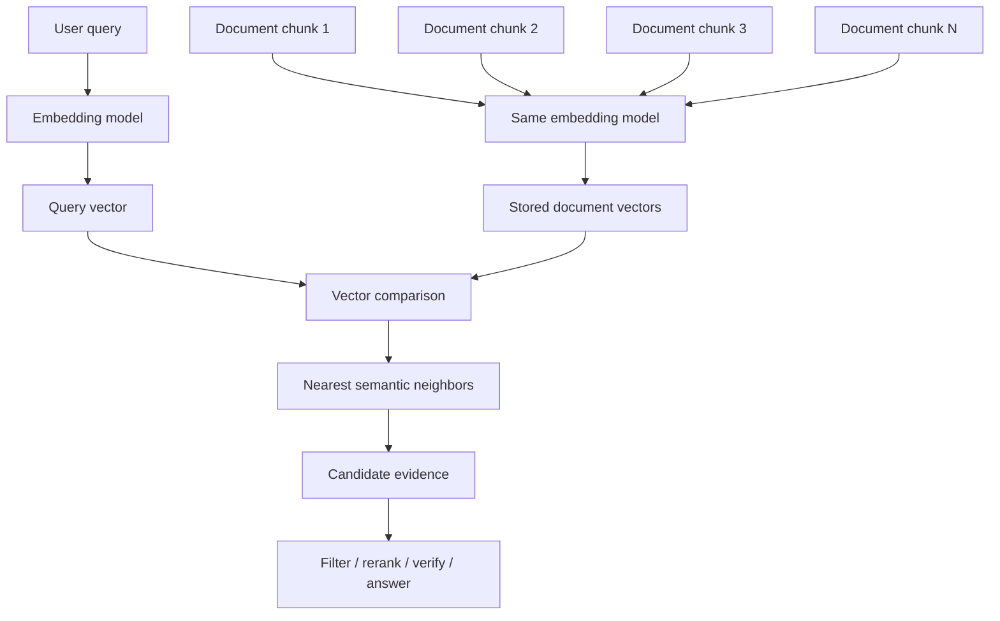

Important:

```text
embedding model produces candidates
retrieval system decides usefulness
answering system decides final response
```

Another view:

```text
Semantic space

                 [password reset]
                      *
         [forgot password] *
                         * [login recovery]


       [billing dispute]       [production log access]
             *                       *
                              * [staging log access]
                                * [security approval]
```

Nearby points are related. But related is not the same as identical.

---

### 3. What Embeddings Capture Well [Beginner]

Embeddings are useful because they capture patterns that keyword matching misses.

#### 3.1 Paraphrase and Rewording

These are lexically different:

```text
"How do I change my password?"
"I forgot my login credentials."
"Where can I reset account access?"
```

A good text embedding model can place them close together because they express related intent.

This is why embeddings are powerful for search. Users rarely phrase queries exactly the same way documents are written.

#### 3.2 Topic Similarity

Embeddings often group broad topics well:

```text
"refund policy"
"cancel subscription"
"billing issue"
```

They are not identical, but they belong in a shared billing/support region.

#### 3.3 Intent Similarity

Queries with different words may have the same action intent:

```text
"delete my account"
"remove my profile"
"close my user record"
```

For routing or support classification, this is extremely useful.

#### 3.4 Entity-Type Similarity

Embeddings can often recognize that objects belong to similar categories:

```text
"Postgres"
"MySQL"
"Oracle"
"SQL Server"
```

The model may place them near a "relational database" region because they appear in similar contexts.

#### 3.5 Style and Register

Embeddings can capture tone or format:

```text
formal policy language
casual support question
legal disclaimer
code comment
error message
```

This matters for routing, clustering, and content classification.

#### 3.6 Cross-Lingual Similarity

Some embedding models are trained so semantically similar text in different languages lands close:

```text
"reset password"
"restablecer contraseña"
"réinitialiser le mot de passe"
```

This depends on the model. Do not assume all embeddings are equally multilingual.

#### 3.7 Multi-Modal Alignment

Some models place images and text into compatible spaces.

Example:

```text
image of a red sneaker
text: "red running shoe"
```

This enables image search by text and text search by image.

Again, this depends on the training objective.

#### 3.8 Domain Patterns

If the model has seen enough domain language, embeddings can capture relationships such as:

```text
"HTTP 429" near "rate limit exceeded"
"OAuth callback" near "redirect URI"
"EOB" near "explanation of benefits"
```

If the domain is private, rare, or acronym-heavy, general embeddings may struggle.

---

### 4. What Embeddings Do Not Capture Reliably [Intermediate]

This section is where many production failures come from.

#### 4.1 Truth

Embedding similarity is not truth.

These two statements may be near each other:

```text
"Contractors can access production logs."
"Contractors cannot access production logs."
```

They share many words and topic structure. The difference is a single negation, but that negation changes the policy completely.

An embedding model may understand the difference somewhat, but vector similarity alone is not a safe truth engine.

Production rule:

> Use embeddings to retrieve candidate evidence. Use source authority, exact checks, rules, rerankers, LLM reasoning, and evaluation to decide correctness.

#### 4.2 Freshness

An embedding does not automatically know whether a document is current.

Example:

```text
"2022 contractor access policy"
"2026 contractor access policy"
```

They may be semantically close because they discuss the same policy. But only one may be valid.

Freshness must usually be handled with metadata:

- effective date
- version
- status
- source
- last updated timestamp
- deprecation flag

#### 4.3 Authorization and Permissions

Embeddings do not enforce access control.

If a chunk is in the index and close to the query, vector search may retrieve it unless your system filters it.

You need metadata filters such as:

```text
tenant_id
department
visibility
role
document_acl
data_classification
```

Never rely on semantic distance to protect data.

#### 4.4 Exact Identifiers

Embeddings are often weaker at exact tokens:

```text
"ERR-8492"
"ERR-8493"
"SKU-XT-901"
"SKU-XT-910"
"policy-17-B"
"policy-17-D"
```

These identifiers may be close or poorly represented.

For exact IDs, use:

- keyword search
- filters
- database lookup
- sparse retrieval
- hybrid search
- structured parsing

#### 4.5 Numbers and Comparisons

Embeddings are not reliable calculators.

These may be close:

```text
"refunds allowed within 30 days"
"refunds allowed within 90 days"
```

The difference matters.

Do not use vector similarity alone for:

- thresholds
- prices
- dates
- dosage
- SLA limits
- policy time windows
- version numbers

#### 4.6 Negation and Logical Operators

Negation is often fragile:

```text
"users with admin access"
"users without admin access"
```

So are conditions:

```text
"Only managers may approve expenses above $5,000."
"Managers may approve all expenses."
```

These are related but not equivalent.

#### 4.7 Causality

Embedding closeness does not prove one thing causes another.

Example:

```text
"high latency"
"database CPU spike"
```

They may be near because they often co-occur in incidents, but the embedding does not prove the CPU spike caused the latency.

#### 4.8 Completeness

Embedding retrieval may find relevant chunks but not all necessary chunks.

A policy answer may require:

```text
eligibility rule
exception rule
approval workflow
latest amendment
regional variation
```

One near chunk is not enough.

#### 4.9 Stable Meaning Across Models

Embedding spaces are model-specific.

Vectors from different models are usually not directly comparable:

```text
model A vector space != model B vector space
```

If you change embedding models, you often need to re-embed the corpus.

#### 4.10 Human Relevance

The nearest vector may not be the best user result.

User relevance can depend on:

- recency
- authority
- popularity
- permissions
- business priority
- diversity
- format
- document quality
- task context

Vector distance is one signal, not the whole ranking function.

---

### 5. The Deep Mental Model: Distributional Meaning [Intermediate]

Embeddings are based on a powerful idea:

> Things that appear in similar contexts tend to have related meanings.

Classic example:

```text
"doctor" and "physician" appear in similar contexts
"car" and "automobile" appear in similar contexts
"refund" and "return policy" appear in similar contexts
```

Models learn representations by solving training tasks. Depending on the model, the task might involve:

- predicting nearby words
- predicting masked tokens
- matching related sentence pairs
- contrasting positive and negative examples
- aligning image and text pairs
- predicting whether two passages are semantically related

The result is not a dictionary. It is a geometry induced by training pressure.

That is why "semantic" means:

```text
similar under the model's learned objective and data distribution
```

not:

```text
perfectly equivalent in the real world
```

#### Training Objective Matters

Two embedding models can organize the same text differently.

| Model trained for | What it may capture well |
|---|---|
| General sentence similarity | Paraphrases and broad meaning. |
| Retrieval | Query-document relevance. |
| Code search | Function intent, API usage, code semantics. |
| Image-text contrastive learning | Visual-textual alignment. |
| Recommendation | User-item preference patterns. |
| Domain-specific pairs | Specialized terminology and domain relevance. |

This means "embedding quality" is not universal.

Better question:

```text
Good embeddings for what task?
```

#### Example: Same Text, Different Task

Text:

```text
"Apple released a new chip."
```

A general language model may place this near:

```text
technology news
hardware
Apple products
```

A finance-focused model may place it near:

```text
earnings impact
supply chain
stock movement
```

A legal discovery model may place it near:

```text
corporate announcement
public disclosure
market-sensitive information
```

The text did not change. The representation goal changed.

---

### 6. Vector Geometry Basics [Intermediate]

Embeddings become useful because we can compare vectors.

#### 6.1 Vector

A vector is a list of numbers:

```text
v = [0.12, -0.04, 0.88, -0.31]
```

Real embedding vectors are much longer:

```text
384 dimensions
768 dimensions
1024 dimensions
1536 dimensions
3072 dimensions
```

Dimension count depends on the model.

#### 6.2 Distance and Similarity

Common comparisons:

| Metric | Intuition | Higher/lower means |
|---|---|---|
| Cosine similarity | Compare direction. | Higher = more similar. |
| Dot product | Compare direction and magnitude. | Higher = more similar, depending on normalization. |
| Euclidean distance | Straight-line distance. | Lower = more similar. |

Cosine similarity:

```text
cosine_similarity(a, b) = dot(a, b) / (||a|| * ||b||)
```

It asks:

```text
Are these vectors pointing in a similar direction?
```

For many text embedding systems, direction matters more than raw magnitude.

#### 6.3 Neighborhoods

For a query vector:

```text
q = embed("how do I rotate API keys?")
```

Search finds nearby vectors:

```text
doc_17: "API key rotation steps"
doc_42: "credential rollover without downtime"
doc_83: "revoking access tokens"
```

This neighborhood is a candidate set.

#### 6.4 Clusters

If many vectors are close, they form a cluster:

```text
billing questions
password reset questions
production access questions
database migration questions
```

Clusters are useful for:

- topic discovery
- dataset cleanup
- support-ticket grouping
- deduplication
- routing

But clusters are not always clean. Real data often has overlapping topics.

#### 6.5 Vector Arithmetic: Useful but Easy to Overstate

You may hear examples like:

```text
king - man + woman ≈ queen
```

This illustrates that embeddings can encode relational structure.

But do not treat vector arithmetic as a reliable reasoning engine.

In production systems, vector arithmetic is usually less important than:

- retrieval quality
- distance metric consistency
- chunking strategy
- metadata filters
- hybrid search
- reranking
- evaluation

---

### 7. What "Semantic Similarity" Really Means [Intermediate]

Semantic similarity can mean different things.

#### 7.1 Topic Similarity

```text
"How do I reset a password?"
"Password policy requires 12 characters."
```

Same topic, different intent.

#### 7.2 Intent Similarity

```text
"I forgot my password."
"Help me get back into my account."
```

Different words, same user need.

#### 7.3 Entailment or Answerability

```text
Question: "Can contractors access production logs?"
Chunk: "Contractors may access staging logs only."
```

This chunk is related but may answer "no" only with careful reasoning.

#### 7.4 Near-Duplicate Similarity

```text
"Reset your password from Settings > Security."
"Go to Settings > Security to reset your password."
```

Very close meaning, nearly duplicate.

#### 7.5 Complementary Relevance

```text
Question: "How do I migrate from API v1 to API v2?"
Chunk A: "Authentication changes in API v2"
Chunk B: "Deprecated v1 endpoints"
Chunk C: "SDK upgrade checklist"
```

Each chunk is not a paraphrase of the question, but each may be useful.

This is why retrieval relevance is broader than raw semantic similarity.

#### Practical Lesson

When building retrieval, ask:

```text
Should results be paraphrases?
Should results answer the query?
Should results contain exact terms?
Should results be supporting evidence?
Should results be diverse facets?
Should results be recent and authoritative?
```

The embedding model alone does not decide that. Your retrieval pipeline does.

---

### 8. System View: Embeddings in Production [Intermediate]

Embeddings sit inside a larger pipeline.

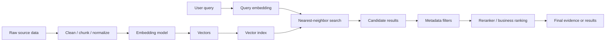

#### Inputs

Embedding inputs:

- text or object to represent
- model name/version
- preprocessing
- chunking strategy
- language
- domain vocabulary
- metadata

Search inputs:

- query text
- query vector
- distance metric
- top-k
- filters
- index settings
- reranking strategy

Business inputs:

- latency budget
- correctness risk
- freshness requirement
- access-control rules
- cost budget
- explainability needs

#### Outputs

Embedding systems produce:

- vector
- object ID
- metadata
- model version
- timestamp

Retrieval systems produce:

- candidate IDs
- similarity scores
- ranked results
- source metadata
- traces for debugging

#### Production Invariants

Treat these as non-negotiable:

1. Query and corpus vectors must use compatible embedding models.
2. Distance metric must match the embedding model's intended use.
3. Metadata filters must enforce permissions and scope.
4. Index must be refreshed when source data changes.
5. Evaluation must measure task success, not just vector closeness.

---

### 9. Common Mistakes + Debugging [Intermediate]

#### Mistake 1: Treating Embeddings as Meaning Itself

Bad:

```text
The model understands the document because it has an embedding.
```

Better:

```text
The embedding represents learned similarity signals that may help retrieve the document.
```

#### Mistake 2: Assuming Similar Means Correct

Bad:

```text
The nearest chunk must answer the question.
```

Better:

```text
The nearest chunk is a candidate. Verify answerability, authority, and freshness.
```

#### Mistake 3: Ignoring Negation

Problem:

```text
"allowed" and "not allowed" may be semantically close.
```

Fix:

- retrieve more candidates
- rerank with a stronger model
- use answer verification
- preserve exact policy language
- test negation-heavy queries

#### Mistake 4: Using Vector Search for Exact IDs

Bad:

```text
Use embeddings to find SKU-88391.
```

Better:

```text
Use exact lookup or sparse retrieval for exact IDs, then embeddings for semantic expansion.
```

#### Mistake 5: Mixing Embedding Models

Problem:

```text
old corpus vectors from model A
new query vectors from model B
```

These vectors may live in incompatible spaces.

Fix:

- store embedding model version
- re-embed during migrations
- run dual-index transitions when needed
- evaluate before switching traffic

#### Mistake 6: Ignoring Chunking

Bad chunk:

```text
entire 80-page policy document as one vector
```

The vector becomes a blurry average of many topics.

Better:

- chunk by semantic sections
- preserve headings
- attach metadata
- keep chunk size aligned with retrieval and answer needs

#### Mistake 7: Evaluating Only Pretty Demos

Demo query:

```text
"password reset"
```

Production query:

```text
"Can temp contractors rotate prod API credentials before SOC2 signoff?"
```

Fix:

- create realistic query sets
- include edge cases
- include exact IDs
- include negation
- include ambiguous terms
- include stale documents
- measure downstream task quality

#### Debugging Checklist

When embeddings retrieve bad results:

1. Are query and corpus embedded with the same model/version?
2. Is the distance metric correct?
3. Are vectors normalized if the metric expects normalization?
4. Is chunking too broad or too tiny?
5. Is important metadata missing?
6. Are exact identifiers being handled by vector search alone?
7. Is the query too ambiguous?
8. Are relevant documents actually indexed?
9. Are stale documents outranking current documents?
10. Does exact/sparse/hybrid retrieval perform better for this query type?
11. Is the top-k too small?
12. Is a reranker needed?

---

### 10. Failure Modes [Pro]

#### Failure Mode 1: Semantic Near Miss

What happens:

```text
The system retrieves documents about a similar topic but not the exact answer.
```

User sees:

```text
An answer that sounds plausible but cites weak evidence.
```

Mitigation:

- retrieve more candidates
- use reranking
- evaluate answerability
- add sparse/hybrid retrieval
- improve chunking

#### Failure Mode 2: Negation Collapse

What happens:

```text
"can access" and "cannot access" are close enough that the wrong chunk is retrieved or ranked highly.
```

User sees:

```text
Policy answer with reversed meaning.
```

Mitigation:

- include negation cases in evals
- rerank with cross-encoder or LLM judge
- use exact policy snippets
- require citation-backed answer synthesis

#### Failure Mode 3: Stale Semantic Match

What happens:

```text
Old policy chunk is semantically closer than the current policy chunk.
```

User sees:

```text
Outdated answer.
```

Mitigation:

- metadata filter by status/version
- boost recent authoritative sources
- remove deprecated documents
- track effective dates

#### Failure Mode 4: Unauthorized Retrieval

What happens:

```text
Restricted chunk is close to the query and appears in results.
```

User sees:

```text
Sensitive information leak.
```

Mitigation:

- enforce ACL filters before final ranking
- include tenant/user scope in metadata
- test permission boundaries
- log retrieval traces

#### Failure Mode 5: Model Migration Drift

What happens:

```text
New query embeddings are compared against old corpus embeddings.
```

User sees:

```text
Search quality suddenly degrades.
```

Mitigation:

- version vectors
- re-embed corpus
- run shadow evaluation
- dual-write or dual-index during migration

#### Failure Mode 6: Domain Vocabulary Blind Spot

What happens:

```text
The model does not understand internal acronyms or specialized terms.
```

User sees:

```text
Relevant documents missing from top results.
```

Mitigation:

- add glossary expansion
- use domain-specific embedding model
- use hybrid sparse+dense retrieval
- fine-tune if justified
- include domain queries in evaluation

---

### 11. Trade-offs [Pro]

| Choice | Gain | Cost |
|---|---|---|
| Dense embeddings | Capture paraphrase and semantic meaning. | Can miss exact tokens, negation, and structured constraints. |
| Larger embedding dimension | May capture richer representation. | More storage, memory, bandwidth, and search cost. |
| Smaller embedding dimension | Cheaper and faster. | May lose nuance or domain separation. |
| General embedding model | Broad language coverage. | May underperform on domain-specific language. |
| Domain-specific embeddings | Better specialized relevance. | More evaluation, maintenance, and possible model lock-in. |
| Vector-only retrieval | Simple semantic search. | Weak for exact identifiers and constraints. |
| Hybrid retrieval | Better coverage across semantic and lexical cases. | More system complexity and ranking logic. |
| Reranking | Better final ordering. | More latency and cost. |
| Re-embedding often | Fresher representation. | Compute cost and operational complexity. |

The constant trade-off:

```text
semantic flexibility vs exact control
```

Embeddings are great when language varies.
They are risky when correctness depends on exact boundaries.

---

### 12. What Problem It Solves

Primary problem solved:

> Embeddings let machines compare messy, high-dimensional human objects using numeric similarity.

Secondary benefits:

- reduces dependence on exact keyword overlap
- supports semantic retrieval
- enables clustering and deduplication
- allows recommendation-style matching
- powers memory lookup
- creates a common interface for text/image/audio/code representations

Systems impact:

> Embeddings turn retrieval from exact matching into candidate generation over learned meaning.

This is why they matter for RAG:

```text
user query -> embedding -> retrieve candidate evidence -> answer with context
```

Without embeddings, systems often struggle when the user and the document use different words for the same idea.

With embeddings alone, systems can still fail when semantic relatedness is not enough.

The real production skill is combining embeddings with:

- metadata
- keyword search
- exact lookup
- filters
- reranking
- evaluation
- observability

---

### 13. When to Rely on Embeddings

Embeddings are a strong fit when:

- users describe things in many different ways
- documents and queries do not share exact words
- you need semantic search
- you need clustering or deduplication
- you need recommendation candidates
- you need memory retrieval
- you need fuzzy matching across unstructured data
- you can evaluate retrieval quality
- approximate candidate generation is acceptable

Interviewer keywords that should trigger embeddings:

```text
semantic search
RAG
similar items
duplicate detection
find related documents
personalized recommendations
memory retrieval
natural-language search
unstructured knowledge base
paraphrase matching
```

Strong sentence:

> "I would use embeddings to generate semantically relevant candidates, then combine them with filters, keyword signals, reranking, and source validation depending on the risk of the system."

---

### 14. When Not to Use Embeddings Alone

Do not rely on embeddings alone when:

- exact ID lookup is required
- strict access control is required
- freshness is mandatory
- numerical thresholds determine the answer
- legal, medical, financial, or compliance rules need exact interpretation
- the query is primarily structured
- keyword match is already sufficient
- the corpus is tiny and exact matching works
- explainability requires deterministic logic
- the business cannot tolerate semantically plausible but wrong results

Use instead or alongside:

| Need | Better tool |
|---|---|
| Exact ID | Database lookup, keyword index, sparse retrieval. |
| Permissions | Metadata filters, ACL checks, policy engine. |
| Freshness | Version/status filters, source-of-truth rules. |
| Numeric calculation | Deterministic code or database query. |
| Legal/policy interpretation | Retrieval plus exact citation and verification. |
| Domain acronyms | Hybrid search, glossary expansion, domain embeddings. |
| Ranking by business value | Business ranking model or rules. |

Interview maturity:

> "Embeddings are not the database, not the permission system, not the source of truth, and not the judge. They are a representation layer."

---

### 15. Real-World Scenario [Intermediate]

#### Product / System

Internal enterprise support assistant.

Users ask:

```text
"Can I use my personal laptop for production access?"
"How do I rotate my database password?"
"What is the policy for contractors viewing logs?"
```

The knowledge base contains:

- security policies
- onboarding docs
- old archived policies
- team-specific runbooks
- incident reports
- access request forms

#### Why Embeddings Fit

Users will not phrase questions exactly like the documents.

Example:

```text
User: "Can contractors look at prod logs?"
Doc: "Temporary external staff are prohibited from accessing production observability data unless explicitly approved by Security."
```

Keyword search may miss this. Embeddings can connect:

```text
contractors -> temporary external staff
prod logs -> production observability data
look at -> access
```

#### What Would Go Wrong Without Understanding Their Limits

Vector search may retrieve:

```text
"Employees can access production logs after manager approval."
```

This is related but not enough. The entity class differs:

```text
employees != contractors
```

Production design:

1. Embed query.
2. Retrieve candidate policy chunks.
3. Filter by current policy status and user visibility.
4. Use hybrid retrieval for exact terms like "contractor" and "production logs."
5. Rerank candidates for answerability.
6. Ask the LLM to answer only from cited current policies.
7. If evidence is ambiguous, escalate or say the policy is unclear.

---

### 16. Code Sample: Cosine Similarity by Hand

This small example shows that embedding search is just vector comparison after representation.

```python
import math


def dot(a, b):
    return sum(x * y for x, y in zip(a, b))


def norm(a):
    return math.sqrt(sum(x * x for x in a))


def cosine_similarity(a, b):
    return dot(a, b) / (norm(a) * norm(b))


query = [0.9, 0.1, 0.0]

documents = {
    "password reset guide": [0.88, 0.12, 0.02],
    "billing refund policy": [0.05, 0.95, 0.03],
    "account login recovery": [0.78, 0.22, 0.01],
}

scores = []
for title, vector in documents.items():
    scores.append((cosine_similarity(query, vector), title))

scores.sort(reverse=True)

for score, title in scores:
    print(round(score, 3), title)
```

Expected intuition:

```text
password reset guide should be closest
account login recovery should also be close
billing refund policy should be farther
```

Notice what this code does not know:

- whether the guide is current
- whether the user can see it
- whether the guide actually answers the full question
- whether a better chunk exists outside this toy set

That is the point.

---

### 17. Mini Program: Simulate What Embeddings Capture and Miss [Pro]

This runnable toy simulation uses hand-written vectors so the mechanism is visible.

It deliberately creates a failure case where "allowed" and "not allowed" are semantically close.

```python
import math


def cosine(a, b):
    dot = sum(x * y for x, y in zip(a, b))
    norm_a = math.sqrt(sum(x * x for x in a))
    norm_b = math.sqrt(sum(x * x for x in b))
    return dot / (norm_a * norm_b)


documents = [
    {
        "id": "doc_current_contractors",
        "text": "Contractors cannot access production logs.",
        "status": "current",
        "vector": [0.90, 0.80, 0.10, -0.10],
    },
    {
        "id": "doc_employee_access",
        "text": "Employees can access production logs after approval.",
        "status": "current",
        "vector": [0.88, 0.78, 0.12, 0.20],
    },
    {
        "id": "doc_staging_contractors",
        "text": "Contractors can access staging logs.",
        "status": "current",
        "vector": [0.86, 0.74, 0.30, 0.18],
    },
    {
        "id": "doc_old_contractors",
        "text": "Contractors can access production logs with manager approval.",
        "status": "deprecated",
        "vector": [0.91, 0.79, 0.11, 0.22],
    },
]

query = {
    "text": "Can contractors access production logs?",
    "vector": [0.89, 0.79, 0.10, 0.05],
}


def search(query_vector, docs, top_k=4, status_filter=None):
    results = []
    for doc in docs:
        if status_filter and doc["status"] != status_filter:
            continue
        score = cosine(query_vector, doc["vector"])
        results.append((score, doc))

    results.sort(key=lambda item: item[0], reverse=True)
    return results[:top_k]


def print_results(title, results):
    print()
    print(title)
    print("-" * len(title))
    for score, doc in results:
        print(f"{score:.3f} | {doc['status']:<10} | {doc['text']}")


def main():
    print(f"Query: {query['text']}")

    raw_results = search(query["vector"], documents)
    print_results("Vector search without metadata filtering", raw_results)

    current_only = search(query["vector"], documents, status_filter="current")
    print_results("Vector search filtered to current documents", current_only)

    print()
    print("Lesson:")
    print("Vector closeness finds related policy chunks.")
    print("It does not automatically enforce freshness, negation, or final correctness.")


if __name__ == "__main__":
    main()
```

Expected learning:

- The deprecated document may look extremely relevant.
- The employee policy may look close but answer a different entity class.
- The staging policy may look close but uses the wrong environment.
- The correct contractor policy requires respecting negation.

This is why production retrieval needs more than "nearest vector wins."

---

### 18. Hands-On Lab: Build, Break, Measure [Pro]

#### Goal

Build intuition for embedding behavior by separating:

```text
semantic relatedness
answer correctness
metadata validity
```

#### Build

Create a small dataset with 12 short policy chunks:

- 3 about employees
- 3 about contractors
- 3 about staging systems
- 3 about production systems

Include:

- one current policy
- one deprecated policy
- one policy with negation
- one policy with a number or date
- one exact policy ID

For each chunk, store:

```text
id
text
status
audience
environment
effective_date
embedding vector
```

Use fake vectors if you are learning the mechanism. Use real embeddings later when tooling is available.

#### Break

Create queries that expose embedding weaknesses:

```text
"Can contractors access production logs?"
"Can employees access production logs?"
"Can contractors access staging logs?"
"What does policy SEC-17B say?"
"Is access allowed after 30 days or 90 days?"
"Which policy is current?"
```

Observe:

- which results are semantically close
- which are actually answerable
- which require exact match
- which require metadata filtering
- which require freshness handling

#### Measure

For each query, record:

| Query | Top vector result | Correct? | Failure reason | Fix |
|---|---|---|---|---|
| contractors production logs | old contractor policy | No | deprecated | status filter |
| policy SEC-17B | semantically similar policy | No | exact ID needed | keyword/DB lookup |
| 30 vs 90 days | related refund chunk | Maybe | number precision | exact extraction |

#### Improve

Try:

- status filter
- audience filter
- environment filter
- exact ID lookup
- hybrid keyword+dense retrieval
- reranking by answerability
- larger top-k before rerank

#### Reflection

Answer:

1. Which failures were embedding failures?
2. Which failures were metadata failures?
3. Which failures were ranking failures?
4. Which failures required exact lookup?
5. Which failures required reasoning after retrieval?

That separation is the professional skill.

---

### 19. Interview-Style Practical Question

> You are designing semantic search for an enterprise knowledge base. Users ask natural-language questions over policies, runbooks, and support documents. How would you use embeddings, and what limitations would you account for?

---

### 20. Strong Answer

1. **I would use embeddings for semantic candidate generation.**

   Users will not use the same words as the documents, so embeddings help connect paraphrases and related concepts.

2. **I would not treat vector similarity as correctness.**

   A close chunk is only a candidate. It may be stale, unauthorized, incomplete, or related but not answer the question.

3. **I would store metadata with every embedded chunk.**

   At minimum: source, document ID, chunk ID, version, status, timestamp, tenant, access scope, and document type.

4. **I would combine dense retrieval with exact and sparse signals.**

   Dense embeddings help with meaning. Keyword or sparse retrieval helps with policy IDs, error codes, acronyms, product names, and exact terms.

5. **I would rerank and verify candidates before answer generation.**

   For high-risk queries, I would check whether the chunk actually answers the query and whether it comes from an authoritative current source.

6. **I would evaluate by query class.**

   I would test paraphrases, negation, exact IDs, stale documents, permission boundaries, long-tail domain terms, and numerical constraints.

7. **I would track model/version compatibility.**

   Query and corpus embeddings must use compatible models. If the embedding model changes, I would re-embed or run a migration with shadow evaluation.

Short version:

```text
Embeddings are excellent for finding semantically related candidates.
They are not a replacement for filters, exact lookup, freshness, authorization, reranking, or evaluation.
```

---

### 21. Production Reality Check

A production embedding system is not:

```text
embed everything
nearest neighbor search
send top chunks to LLM
```

A production embedding system is closer to:

```text
source data
-> clean/chunk
-> embed with versioned model
-> store vector + metadata + source ID
-> search with query vector
-> enforce filters
-> combine lexical/exact signals when needed
-> rerank
-> verify freshness/authority
-> generate or return result
-> log traces
-> evaluate and improve
```

Important production questions:

| Question | Why it matters |
|---|---|
| What does the embedding model optimize for? | Similarity depends on training objective. |
| Are query and corpus embeddings compatible? | Mixed spaces break retrieval quality. |
| Are chunks the right size? | Bad chunks create blurry or fragmented vectors. |
| Is metadata complete? | Filters and freshness depend on metadata. |
| Are exact terms handled? | IDs and codes often need lexical search. |
| Is access control enforced before final answer? | Vector closeness must not leak data. |
| Are stale documents excluded or demoted? | Semantic closeness can surface old policies. |
| Is recall measured on realistic queries? | Pretty demos hide production failures. |
| Is downstream answer quality measured? | Retrieval metrics alone are not enough. |

---

### 22. Active Recall [Beginner]

Answer without looking:

1. What is an embedding?
2. What does it mean for two embeddings to be close?
3. Why is semantic closeness not the same as truth?
4. Name three things embeddings capture well.
5. Name five things embeddings do not reliably capture.
6. Why can negation be dangerous in vector search?
7. Why are exact identifiers often weak cases for dense embeddings?
8. Why does embedding model version matter?
9. Why is chunking important?
10. What is the difference between candidate generation and final ranking?
11. Why do embeddings need metadata?
12. When should you use hybrid retrieval?

Expected answers:

1. A learned numeric vector representation of an object.
2. The model considers them similar under its learned representation and metric.
3. Related statements can contradict each other, be stale, unauthorized, or incomplete.
4. Paraphrases, topics, intents, entity types, style, cross-lingual or multimodal relationships depending on model.
5. Truth, freshness, permissions, exact IDs, numbers, negation, causality, completeness, model-independent meaning.
6. "Allowed" and "not allowed" share most of their language but mean opposite things.
7. Dense vectors blur tokens; exact codes/SKUs/policy IDs need lexical or structured lookup.
8. Different models produce different vector spaces, so old corpus vectors may not match new query vectors.
9. A chunk that is too large becomes semantically blurry; too small may lose context.
10. Candidate generation finds plausible items; final ranking/verification decides what should actually be used.
11. Metadata enforces scope, permissions, freshness, source authority, and filtering.
12. When queries need both semantic matching and exact term matching.

---

### 23. Revision Notes

One-line summary:

> Embeddings turn meaning-like patterns into vectors, but vector similarity is only a candidate signal, not truth, authorization, freshness, or exact reasoning.

Three keywords:

```text
similarity
candidate
verification
```

One interview trap:

```text
Saying "the embedding understands the answer" instead of "the embedding retrieves semantically related candidates."
```

One memory trick:

```text
Embeddings find neighbors.
Systems decide answers.
```

---

### 24. Quick Self-Test

For each pair, decide whether embeddings are likely useful, risky, or insufficient alone.

| Pair / task | Likely judgment | Why |
|---|---|---|
| "forgot password" vs "reset login credentials" | Useful | Paraphrase/intent similarity. |
| "contractors can access logs" vs "contractors cannot access logs" | Risky | Negation flips meaning. |
| "SKU-11891" vs "SKU-11819" | Insufficient alone | Exact identifier problem. |
| "refund within 30 days" vs "refund within 90 days" | Risky | Numerical constraint matters. |
| "API key rotation" vs "credential rollover" | Useful | Semantic/domain similarity. |
| "2024 policy" vs "2026 policy" | Risky | Freshness/version must be metadata-driven. |

If you can explain each row, you understand the core concept.

---

## Subtopic 4.1.b: Cosine Similarity vs Dot Product vs Euclidean Distance

### Add to Knowledge Base

Once you have embeddings, you still need to decide how to compare them.

That comparison is not a tiny implementation detail. It defines what your system means by:

```text
similar
near
relevant
top result
nearest neighbor
```

The three most common vector comparison methods are:

| Metric | Main question it asks | Typical use |
|---|---|---|
| Cosine similarity | Are the vectors pointing in the same direction? | Semantic text similarity, especially when vector magnitude should not dominate. |
| Dot product | Are the vectors aligned, and how large are they? | Maximum inner product search, recommendation, learned scoring, embeddings where magnitude carries meaning. |
| Euclidean distance | How far apart are the points geometrically? | Clustering, geometry-heavy tasks, normalized embeddings, some ANN indexes. |

The core idea:

> A vector does not become meaningful until you define the comparison rule.

Same vectors, different metric, different ranking.

Example:

```text
query = [1, 0]

doc A = [10, 0]     same direction, much larger magnitude
doc B = [0.8, 0.6]  somewhat similar direction, closer as a point
```

Cosine says:

```text
doc A is maximally similar because it points in the same direction.
```

Dot product says:

```text
doc A is much stronger because it is aligned and large.
```

Euclidean distance says:

```text
doc B may be closer because it is physically near [1, 0].
```

That is why metric choice matters.

Key terms:

| Term | Meaning |
|---|---|
| Similarity | A score where higher usually means more alike. |
| Distance | A score where lower usually means closer. |
| Dot product | Sum of coordinate-wise products. |
| Vector norm | The length or magnitude of a vector. |
| Cosine similarity | Dot product divided by both vector norms. |
| Euclidean distance | Straight-line distance between two points. |
| Normalization | Scaling a vector to length 1. |
| Unit vector | A vector whose norm is 1. |
| MIPS | Maximum inner product search; finding vectors with largest dot product. |
| L2 distance | Another name for Euclidean distance. |

The beginner mistake:

```text
cosine, dot product, and Euclidean are basically interchangeable
```

The professional view:

```text
They become related under specific normalization assumptions, but they encode different ranking behavior.
```

---

### Reading Path + Level Tags

- **Beginner:** Read sections 0-4 and Active Recall.
- **Intermediate:** Add sections 5-10 and complete the Build part of the Hands-On Lab.
- **Pro:** Complete the full Hands-On Lab, including Break and Measure, then answer the metric-choice system design question.

---

### 0. Pre-Question Hook [Beginner]

**Pause:** You are building semantic search for a policy database.

The embedding model returns vectors for:

```text
query: "contractor production log access"
doc A: "contractor production log access policy"
doc B: "all production security policies"
doc C: "contractor staging log access guide"
```

Your vector database asks you to choose:

```text
cosine
dot product
Euclidean
```

Which one should you pick?

Bad answer:

> "It does not matter. They all compare vectors."

Also bad:

> "Cosine is always best for embeddings."

Production answer:

> "I would first check how the embedding model was trained and recommended to be searched. If the model expects normalized cosine-style comparison, I would use cosine or normalized dot product. If vector magnitude is meaningful, I would avoid blindly normalizing and consider dot product. If vectors are normalized, Euclidean ranking can be equivalent to cosine ranking. Then I would validate retrieval quality by query class."

Before reading on, answer:

- What does vector direction represent?
- What does vector magnitude represent?
- Does your embedding model make magnitude meaningful?
- Are the vectors normalized?
- Does the vector database return similarity or distance?
- Does your ANN index support the metric you choose?

This is where math becomes production behavior.

---

### 1. The Intuition: Direction, Magnitude, and Distance [Beginner]

Think of each embedding vector as an arrow from the origin.

An arrow has two major properties:

```text
direction
length
```

Cosine similarity mostly cares about direction.

```text
Do these arrows point the same way?
```

Dot product cares about direction and length.

```text
Do these arrows point the same way, and are they large?
```

Euclidean distance cares about point-to-point distance.

```text
How far apart are the arrow tips?
```

That is the whole mental model.

#### Simple Analogy

Imagine two people walking from the same starting point.

Cosine asks:

```text
Are they walking in the same direction?
```

Dot product asks:

```text
Are they walking in the same direction, and how far did they walk?
```

Euclidean distance asks:

```text
How far apart are they now?
```

These are not the same question.

#### Beginner Explanation in 3 Lines

Cosine compares vector direction.
Dot product compares direction plus magnitude.
Euclidean distance compares physical distance between vector endpoints.

When vectors are normalized to length 1, these metrics become closely related for ranking.

---

### 2. Visual Diagram [Beginner]

```text
2D intuition only. Real embeddings have hundreds or thousands of dimensions.

                 y
                 ^
                 |
          B      |       C
          *      |      *
                 |
                 |
origin *---------*----------> x
                 A
```

Suppose the query points toward A.

Cosine similarity cares about the angle:

```text
small angle = high similarity
large angle = low similarity
```

Dot product cares about:

```text
angle + vector lengths
```

Euclidean distance cares about:

```text
straight-line distance between endpoints
```

Mermaid view:

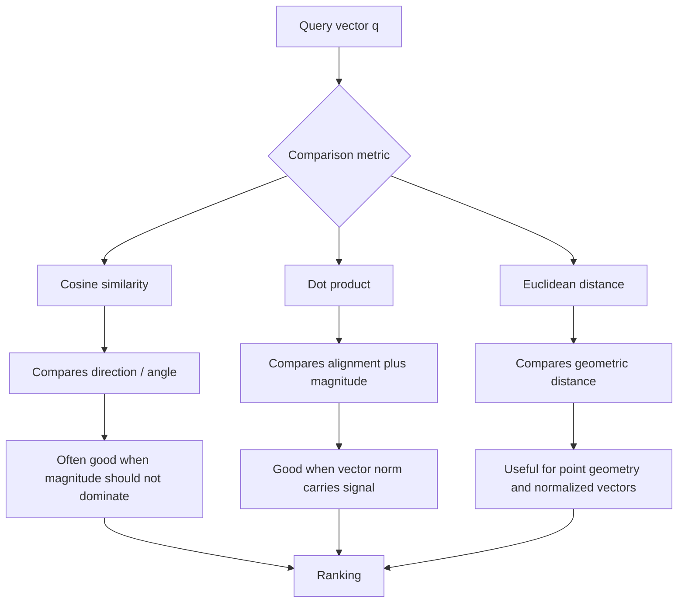

Important:

```text
metric choice -> ranking behavior -> retrieved evidence -> final answer quality
```

---

### 3. The Math Without Fear [Beginner]

Use two vectors:

```text
a = [a1, a2, a3]
b = [b1, b2, b3]
```

#### 3.1 Dot Product

Formula:

```text
dot(a, b) = a1*b1 + a2*b2 + a3*b3
```

Example:

```text
a = [1, 2]
b = [3, 4]

dot(a, b) = 1*3 + 2*4 = 11
```

Large positive dot product means:

- vectors are aligned
- and/or one or both vectors have large magnitude

Zero dot product often means:

```text
orthogonal directions
```

Negative dot product means:

```text
opposite-ish directions
```

#### 3.2 Vector Norm

Norm means vector length.

For vector:

```text
a = [3, 4]
```

Norm:

```text
||a|| = sqrt(3^2 + 4^2) = 5
```

This is the same idea as the Pythagorean theorem.

#### 3.3 Cosine Similarity

Formula:

```text
cosine(a, b) = dot(a, b) / (||a|| * ||b||)
```

It divides by vector lengths, so magnitude is removed.

Cosine focuses on direction:

| Cosine score | Meaning |
|---|---|
| 1 | Same direction. |
| 0 | Orthogonal / unrelated direction. |
| -1 | Opposite direction. |

For many embedding models, cosine usually falls in a narrower positive range for real text, not the full clean theoretical range.

#### 3.4 Euclidean Distance

Formula:

```text
euclidean(a, b) = sqrt((a1-b1)^2 + (a2-b2)^2 + (a3-b3)^2)
```

Example:

```text
a = [1, 2]
b = [4, 6]

euclidean(a, b) = sqrt((1-4)^2 + (2-6)^2)
                = sqrt(9 + 16)
                = 5
```

Euclidean distance is lower when points are closer.

#### 3.5 Similarity vs Distance Direction

This is a practical source of bugs.

| Metric | Better result means |
|---|---|
| Cosine similarity | Higher score. |
| Dot product | Higher score. |
| Euclidean distance | Lower score. |

Some databases return:

```text
distance = 1 - cosine_similarity
```

Others return raw similarity.

Always check score semantics before sorting, thresholding, or monitoring.

---

### 4. Normalization: The Bridge Between Metrics [Beginner]

Normalization means scaling a vector so its length becomes 1.

Example:

```text
v = [3, 4]
||v|| = 5

normalized(v) = [3/5, 4/5] = [0.6, 0.8]
```

Now:

```text
||normalized(v)|| = 1
```

#### Why Normalization Matters

If both vectors are normalized, then:

```text
cosine(a, b) = dot(a, b)
```

because:

```text
||a|| = 1
||b|| = 1
cosine(a, b) = dot(a, b) / (1 * 1)
```

So normalized dot product and cosine produce the same ranking.

Also, for normalized vectors:

```text
euclidean_distance(a, b)^2 = 2 - 2*cosine(a, b)
```

That means:

```text
higher cosine <-> lower Euclidean distance
```

for normalized vectors.

#### Important Production Translation

If all vectors are unit-normalized:

```text
cosine ranking
dot product ranking
Euclidean ranking
```

can become equivalent or nearly equivalent for nearest-neighbor ordering.

If vectors are not normalized, they can behave very differently.

This is why you must know:

- whether the embedding model returns normalized vectors
- whether your pipeline normalizes vectors before storage
- whether the vector database normalizes internally
- whether the chosen index expects normalized vectors

---

### 5. Metric-by-Metric Mental Model [Intermediate]

#### 5.1 Cosine Similarity

Cosine asks:

```text
Are these vectors pointing in the same semantic direction?
```

It is often a strong default for text embeddings because users usually care about meaning, not vector length.

Good fit:

- sentence similarity
- semantic search
- RAG candidate retrieval
- clustering by topic/intent
- comparing chunks of different lengths

Strength:

```text
It reduces the impact of vector magnitude.
```

Risk:

```text
It may discard useful magnitude information if the model intentionally encodes confidence, popularity, intensity, or frequency in the norm.
```

Interview sentence:

> "Cosine is useful when the direction of the embedding captures semantic content and vector magnitude should not dominate ranking."

#### 5.2 Dot Product

Dot product asks:

```text
Are these vectors aligned, and are their magnitudes large?
```

Good fit:

- recommendation systems
- learned retrieval systems trained with inner product objectives
- maximum inner product search
- cases where vector norm carries signal
- models whose documentation recommends dot product

Strength:

```text
It preserves magnitude information.
```

Risk:

```text
Large-norm vectors can dominate even when their direction is only moderately aligned.
```

This can be useful or harmful.

Example:

In recommendation:

```text
user vector dot item vector
```

might intentionally represent user preference strength and item popularity/appeal.

In semantic document search:

```text
large norm because of document length or model artifact
```

may produce bad ranking if magnitude is not meaningful.

Interview sentence:

> "Dot product is not just cosine without division; it allows magnitude to influence ranking, which is correct only if the embedding model and task make magnitude meaningful."

#### 5.3 Euclidean Distance

Euclidean asks:

```text
How far apart are these points?
```

Good fit:

- clustering
- geometric nearest-neighbor algorithms
- normalized embedding spaces
- tasks where absolute position matters
- algorithms/indexes designed around L2 distance

Strength:

```text
It has direct geometric intuition.
```

Risk:

```text
Without normalization, vector magnitude can heavily affect distance.
```

Euclidean can behave strangely if some embeddings have much larger norms than others.

Interview sentence:

> "Euclidean distance is useful when I want point-to-point geometric closeness, but for text embeddings I would check normalization and model guidance before using it."

---

### 6. Same Data, Different Rankings [Intermediate]

Consider:

```text
query = [1.0, 0.0]

doc_same_direction_large = [10.0, 0.0]
doc_nearby_point = [0.8, 0.6]
doc_opposite = [-1.0, 0.0]
```

#### Cosine

```text
cosine(query, same_direction_large) = 1.0
cosine(query, nearby_point) = 0.8
cosine(query, opposite) = -1.0
```

Cosine ranking:

```text
same_direction_large
nearby_point
opposite
```

#### Dot Product

```text
dot(query, same_direction_large) = 10.0
dot(query, nearby_point) = 0.8
dot(query, opposite) = -1.0
```

Dot product heavily favors the large vector.

#### Euclidean Distance

```text
distance(query, same_direction_large) = 9.0
distance(query, nearby_point) = sqrt((1-0.8)^2 + (0-0.6)^2)
                              = sqrt(0.04 + 0.36)
                              = 0.632
distance(query, opposite) = 2.0
```

Euclidean ranking:

```text
nearby_point
opposite
same_direction_large
```

That can surprise people.

The vector pointing in exactly the same direction can be far away as a point if its magnitude is very different.

#### Production Lesson

If vector norms vary, metric choice can completely reorder results.

So the question is not:

```text
Which metric is mathematically best?
```

The question is:

```text
Which metric matches the representation and task?
```

---

### 7. How Metric Choice Affects RAG [Intermediate]

RAG retrieval pipeline:

```text
query -> embedding -> nearest-neighbor search -> candidate chunks -> rerank/context -> answer
```

Metric choice affects the first candidate set.

If the candidate set is wrong, later stages may not recover.

#### Cosine in RAG

Often reasonable when:

- chunks have different lengths
- query is short, document chunks are longer
- embedding model is designed for semantic similarity
- you care about topic/intent direction

Example:

```text
query: "rotate API keys without downtime"
chunk: "credential rollover procedure"
```

Cosine can connect paraphrases.

#### Dot Product in RAG

Can be reasonable when:

- the embedding model was trained for dot-product retrieval
- vectors are normalized, making dot product equivalent to cosine
- vector norm intentionally encodes confidence or salience

Can be risky when:

- longer or generic chunks get larger norms
- high-magnitude chunks dominate
- retrieval returns broad high-energy documents instead of precise evidence

#### Euclidean in RAG

Can be reasonable when:

- embeddings are normalized
- the vector index is optimized for L2
- you have validated quality

Can be risky when:

- norms vary widely
- magnitude is an artifact
- nearest point is not the best semantic direction match

#### Practical RAG Rule

For a production RAG system:

1. Start with the metric recommended for the embedding model.
2. Confirm whether vectors are normalized.
3. Benchmark metric choices on realistic queries.
4. Measure retrieval hit rate, answer quality, and failure cases.
5. Do not compare scores across metrics as if they mean the same thing.

---

### 8. System View: Metric Choice Is a Contract [Intermediate]

Metric choice creates a contract across the whole retrieval stack.


If one part changes, the others may need to change.

#### Contract Elements

| Layer | Question |
|---|---|
| Embedding model | Was it trained for cosine, dot product, or L2-style retrieval? |
| Preprocessing | Are vectors normalized before storage? |
| Vector DB/index | Does the index support the chosen metric? |
| Query path | Is the query normalized the same way as documents? |
| Score interpretation | Is higher better or lower better? |
| Thresholds | Are thresholds calibrated for this metric? |
| Monitoring | Are score distributions tracked per metric and model version? |
| Evaluation | Does retrieval quality improve for real query classes? |

#### What Breaks When the Contract Is Violated

Common failure:

```text
corpus vectors normalized
query vectors not normalized
```

Another common failure:

```text
model recommended cosine
index configured for raw dot product
```

Another:

```text
threshold tuned for cosine distance
code later reads raw cosine similarity
```

Symptoms:

- sudden ranking degradation
- generic documents appearing at top
- relevant chunks disappearing
- score thresholds accepting too much or too little
- ANN recall changing after metric/index switch
- offline evals not matching production behavior

---

### 9. Common Mistakes + Debugging [Intermediate]

#### Mistake 1: Sorting Euclidean Distance Backwards

Bad:

```text
larger Euclidean distance = better
```

Correct:

```text
smaller Euclidean distance = closer
```

Fix:

- name variables clearly: `distance` vs `similarity`
- write tests with obvious vectors
- inspect top and bottom results

#### Mistake 2: Assuming Cosine and Dot Product Are Always the Same

They are the same for ranking only when vectors are normalized.

Bad:

```text
cosine = dot product
```

Better:

```text
cosine = dot product only for unit-normalized vectors
```

#### Mistake 3: Normalizing Away Useful Magnitude

If the model encodes signal in vector length, normalization can hurt.

Example signals may include:

- confidence
- frequency
- salience
- item popularity
- user preference strength

Fix:

- check model guidance
- run evaluation before normalizing
- compare metric choices by task outcome

#### Mistake 4: Letting Magnitude Dominate Accidentally

Raw dot product can over-rank large-norm vectors.

Symptoms:

- very broad documents rank too high
- popular/generic items dominate
- query results feel less precise

Fix:

- inspect vector norm distribution
- try normalization/cosine
- use reranking
- chunk documents more carefully

#### Mistake 5: Using Metric Scores as Universal Confidence

A cosine score of:

```text
0.82
```

does not universally mean "82% relevant."

Scores depend on:

- embedding model
- corpus
- query type
- metric
- normalization
- vector database score convention
- chunking

Fix:

- calibrate thresholds on labeled data
- monitor score distributions
- use query-class-specific thresholds when needed

#### Mistake 6: Changing Metric Without Rebuilding Index

Many ANN indexes are built for a specific metric.

Bad:

```text
Build HNSW with cosine, query as if it were L2.
```

Fix:

- rebuild or reconfigure index for the metric
- validate recall/latency after rebuild
- store index version with metric metadata

#### Mistake 7: Comparing Scores Across Metrics

Bad:

```text
cosine 0.78 is better than L2 distance 0.42
```

These are different scales and directions.

Fix:

- compare rankings and task outcomes
- do not mix raw metric scores in one threshold without calibration

#### Debugging Checklist

When vector rankings look wrong:

1. Which metric is configured in the database/index?
2. Which metric does the embedding model recommend?
3. Are corpus vectors normalized?
4. Are query vectors normalized the same way?
5. Are you sorting in the correct direction?
6. Are high-norm vectors dominating?
7. Are score thresholds calibrated for this metric?
8. Did an index rebuild happen after metric changes?
9. Do exact search and ANN search use the same metric?
10. Does quality differ by query class?

---

### 10. Failure Modes [Pro]

#### Failure Mode 1: Magnitude Dominance

What happens:

```text
Dot product ranks large-norm documents above more directionally relevant documents.
```

User sees:

```text
Generic but high-scoring results.
```

Mitigation:

- inspect vector norms
- normalize if appropriate
- use cosine
- improve chunking
- add reranking

#### Failure Mode 2: Normalization Mismatch

What happens:

```text
Documents are normalized but queries are not, or the reverse.
```

User sees:

```text
Inconsistent ranking and unstable scores.
```

Mitigation:

- centralize embedding normalization
- unit test query/document vector prep
- store normalization metadata
- compare exact toy examples

#### Failure Mode 3: Wrong Score Direction

What happens:

```text
System treats larger distance as better.
```

User sees:

```text
Obviously irrelevant results at top.
```

Mitigation:

- use explicit sort direction
- write sanity tests
- label score fields as `similarity_score` or `distance`

#### Failure Mode 4: Metric-Index Mismatch

What happens:

```text
ANN index was built for one metric and queried/evaluated as another.
```

User sees:

```text
Lower recall, confusing latency/quality behavior, hard-to-debug search misses.
```

Mitigation:

- rebuild index after metric change
- version index config
- run recall evaluation against exact baseline

#### Failure Mode 5: Threshold Drift After Model Change

What happens:

```text
Embedding model changes, but score thresholds remain the same.
```

User sees:

```text
Too many weak matches or too many empty results.
```

Mitigation:

- recalibrate thresholds per model version
- evaluate score distributions
- shadow test before migration

---

### 11. Trade-offs [Pro]

| Metric | Pros | Cons |
|---|---|---|
| Cosine similarity | Stable when magnitude should not matter; common for semantic text search; works well with normalized vectors. | Can discard useful magnitude; score thresholds are model/corpus-specific. |
| Dot product | Preserves magnitude; aligns with many learned retrieval/recommendation objectives; efficient with normalized vectors too. | Large norms can dominate; harder to interpret if magnitude is accidental. |
| Euclidean distance | Direct geometric distance; useful for clustering and some indexes; equivalent to cosine ranking on normalized vectors. | Sensitive to magnitude; lower is better, which causes sorting bugs; may not match text-model semantics if used blindly. |

The central trade-off:

```text
ignore magnitude vs use magnitude
```

Cosine largely ignores magnitude.
Dot product uses magnitude.
Euclidean is affected by magnitude as physical distance.

The production answer is not "always use one."

The production answer is:

```text
follow model guidance
make normalization explicit
evaluate ranking quality
lock metric/index/thresholds together
```

---

### 12. What Problem This Solves

Primary problem solved:

> Distance metrics define how a retrieval system ranks vector similarity.

Secondary benefits:

- makes vector search behavior explainable
- prevents silent ranking bugs
- helps choose the right vector DB/index configuration
- improves retrieval evaluation
- makes score thresholds less magical
- clarifies why normalization matters

Systems impact:

> The metric determines which candidates enter the retrieval pipeline, so it affects every downstream stage: reranking, context packing, LLM answer quality, recommendations, and business outcomes.

Without this understanding, teams often debug the wrong layer.

They blame:

```text
the LLM
the vector database
the embedding model
the chunking
```

when the actual bug is:

```text
wrong metric
wrong normalization
wrong score direction
wrong threshold
```

---

### 13. When to Use Each Metric

#### Use Cosine Similarity When

- the embedding model recommends cosine
- you care about semantic direction
- vector magnitude should not dominate
- chunks vary in length
- you are doing general text semantic search
- you normalize vectors before search

Interview trigger:

```text
semantic similarity over text chunks
```

#### Use Dot Product When

- the model was trained with inner product objective
- vector norm carries useful signal
- you are doing recommendation/user-item scoring
- you are using normalized vectors and want cosine-equivalent ranking efficiently
- documentation recommends dot product

Interview trigger:

```text
learned relevance score or user-item affinity
```

#### Use Euclidean Distance When

- model/index expects L2
- vectors are normalized and L2 ranking is equivalent enough
- you are doing clustering or geometry-oriented analysis
- absolute point distance matters
- you have validated quality against alternatives

Interview trigger:

```text
clustering points in vector space
```

---

### 14. When Not to Use a Metric Blindly

Do not use cosine blindly when:

- vector magnitude encodes important signal
- model documentation recommends dot product
- evaluation shows dot product performs better

Do not use dot product blindly when:

- norms vary for accidental reasons
- high-norm generic documents dominate
- model was intended for cosine search

Do not use Euclidean blindly when:

- vectors are unnormalized and norms vary widely
- you are using it only because the database defaulted to L2
- score thresholds were copied from cosine experiments

Do not use any metric blindly when:

- exact IDs matter
- permissions matter
- freshness matters
- downstream answer correctness is high risk

Metric choice solves similarity comparison.
It does not solve retrieval governance.

---

### 15. Real-World Scenario [Intermediate]

#### Product / System

An enterprise RAG assistant over engineering docs.

The team stores chunks like:

```text
API key rotation guide
OAuth callback troubleshooting
database credential migration checklist
old incident notes
deprecated v1 API docs
```

#### Initial Problem

The team uses raw dot product because the vector database default example used it.

Symptoms:

- long generic docs appear in top results
- broad architecture docs outrank precise runbooks
- similarity thresholds behave unpredictably
- users get plausible but weak evidence

#### Investigation

The team checks:

```text
embedding model guidance
vector norm distribution
query/document normalization
score direction
exact vs ANN metric config
retrieval quality by query class
```

They discover:

```text
large-norm generic docs dominate raw dot product
```

#### Fix

They test:

1. Normalize vectors and use dot product.
2. Use cosine distance directly.
3. Keep raw dot product but rerank top 100.

Evaluation shows:

```text
normalized cosine-style retrieval improves precise runbook hit rate
```

They choose cosine/normalized dot product, rebuild the index, recalibrate thresholds, and add norm monitoring.

#### What Would Go Wrong Without This Concept

The team might blame:

- bad LLM answer synthesis
- bad vector database
- bad documents
- bad prompt

But the root issue was ranking geometry.

---

### 16. Code Sample: Compare the Three Metrics

```python
import math


def dot(a, b):
    return sum(x * y for x, y in zip(a, b))


def norm(a):
    return math.sqrt(sum(x * x for x in a))


def cosine(a, b):
    return dot(a, b) / (norm(a) * norm(b))


def euclidean(a, b):
    return math.sqrt(sum((x - y) ** 2 for x, y in zip(a, b)))


query = [1.0, 0.0]

docs = {
    "same direction, huge norm": [10.0, 0.0],
    "nearby point": [0.8, 0.6],
    "opposite direction": [-1.0, 0.0],
}

print("Cosine similarity: higher is better")
for name, vector in sorted(docs.items(), key=lambda item: cosine(query, item[1]), reverse=True):
    print(round(cosine(query, vector), 3), name)

print()
print("Dot product: higher is better")
for name, vector in sorted(docs.items(), key=lambda item: dot(query, item[1]), reverse=True):
    print(round(dot(query, vector), 3), name)

print()
print("Euclidean distance: lower is better")
for name, vector in sorted(docs.items(), key=lambda item: euclidean(query, item[1])):
    print(round(euclidean(query, vector), 3), name)
```

Expected learning:

```text
cosine and dot product both like the same-direction vector
dot product rewards its large norm much more
Euclidean prefers the nearby endpoint
```

This is not a contradiction.
They are answering different questions.

---

### 17. Mini Program: Ranking Changes by Metric [Pro]

This program simulates a tiny retrieval system.

It shows how the "best" document can change depending on metric and normalization.

```python
import math


def dot(a, b):
    return sum(x * y for x, y in zip(a, b))


def norm(a):
    return math.sqrt(sum(x * x for x in a))


def normalize(a):
    length = norm(a)
    if length == 0:
        return a
    return [x / length for x in a]


def cosine(a, b):
    return dot(a, b) / (norm(a) * norm(b))


def euclidean(a, b):
    return math.sqrt(sum((x - y) ** 2 for x, y in zip(a, b)))


documents = [
    {
        "id": "precise_runbook",
        "text": "Rotate production API keys without downtime.",
        "vector": [0.90, 0.10, 0.00],
    },
    {
        "id": "generic_security_manual",
        "text": "Large security manual covering access, keys, logs, and compliance.",
        "vector": [8.00, 1.20, 0.20],
    },
    {
        "id": "nearby_but_wrong_environment",
        "text": "Rotate staging API keys.",
        "vector": [0.75, 0.35, 0.10],
    },
    {
        "id": "unrelated_billing",
        "text": "Refund and invoice support.",
        "vector": [0.05, 0.90, 0.10],
    },
]

query = {
    "text": "How do I rotate production API keys?",
    "vector": [1.00, 0.10, 0.00],
}


def rank(metric_name, query_vector, docs):
    if metric_name == "cosine":
        scored = [(cosine(query_vector, doc["vector"]), doc) for doc in docs]
        return sorted(scored, key=lambda item: item[0], reverse=True)

    if metric_name == "dot":
        scored = [(dot(query_vector, doc["vector"]), doc) for doc in docs]
        return sorted(scored, key=lambda item: item[0], reverse=True)

    if metric_name == "euclidean":
        scored = [(euclidean(query_vector, doc["vector"]), doc) for doc in docs]
        return sorted(scored, key=lambda item: item[0])

    raise ValueError(f"Unknown metric: {metric_name}")


def print_ranking(title, rows):
    print()
    print(title)
    print("-" * len(title))
    for score, doc in rows:
        print(f"{score:.3f} | {doc['id']:<28} | {doc['text']}")


def main():
    print(f"Query: {query['text']}")

    for metric in ["cosine", "dot", "euclidean"]:
        print_ranking(metric, rank(metric, query["vector"], documents))

    normalized_query = normalize(query["vector"])
    normalized_docs = [
        {**doc, "vector": normalize(doc["vector"])}
        for doc in documents
    ]

    print_ranking(
        "dot product after normalization",
        rank("dot", normalized_query, normalized_docs),
    )

    print()
    print("Lesson:")
    print("Raw dot product can favor large-norm vectors.")
    print("After normalization, dot product behaves like cosine.")
    print("Metric choice must match model behavior and task goals.")


if __name__ == "__main__":
    main()
```

Expected learning:

- Raw dot product may over-rank the generic security manual.
- Cosine may prefer the precise runbook.
- Euclidean may behave differently depending on norms.
- Normalized dot product becomes cosine-style ranking.

---

### 18. Hands-On Lab: Build, Break, Measure [Pro]

#### Goal

Learn how metric choice changes ranking and how to debug metric-related retrieval failures.

#### Build

Create 8 fake document vectors in 3 dimensions:

```text
precise doc with normal norm
generic doc with huge norm
wrong environment doc
near duplicate doc
opposite meaning doc
unrelated doc
old/deprecated doc
exact identifier doc
```

For each document store:

```text
id
text
vector
status
expected_relevance
```

Write functions for:

```text
dot product
norm
cosine similarity
Euclidean distance
normalization
ranking
```

#### Break

Run rankings using:

1. Raw cosine.
2. Raw dot product.
3. Raw Euclidean distance.
4. Dot product after normalization.
5. Euclidean distance after normalization.

Observe:

- which docs move up
- which docs move down
- whether large-norm docs dominate
- whether wrong-environment docs look too close
- whether old docs need metadata filtering

#### Measure

Create a small table:

| Metric | Top result | Correct? | Failure reason | Fix |
|---|---|---|---|---|
| raw dot | generic security manual | No | norm dominance | normalize/use cosine |
| cosine | precise runbook | Yes | n/a | keep and evaluate |
| raw L2 | nearby endpoint | Maybe | magnitude-sensitive | normalize/test |

#### Improve

Try:

- normalizing all vectors
- filtering deprecated docs before ranking
- retrieving top 5 then reranking manually
- adding an exact keyword match boost
- measuring hit rate at top 1, top 3, and top 5

#### Reflection

Answer:

1. Which metric gave the best top-1 result?
2. Which metric gave the best top-3 candidate set?
3. Did normalization help or hurt?
4. Did any metric solve freshness or permissions?
5. Which failures required metadata or reranking instead of metric changes?

This is the important lesson:

```text
Metric choice affects candidate generation, but it does not replace retrieval architecture.
```

---

### 19. Interview-Style Practical Question

> You are designing vector search for a RAG system over enterprise documents. The vector database supports cosine, dot product, and Euclidean distance. How would you choose the metric, and what trade-offs would you consider?

---

### 20. Strong Answer

1. **I would start with the embedding model's recommended metric.**

   Some models are trained and evaluated for cosine-style retrieval, some for dot product, and some assume normalized vectors.

2. **I would make normalization explicit.**

   If vectors are unit-normalized, cosine and dot product produce equivalent rankings, and Euclidean distance becomes monotonically related to cosine. If vectors are not normalized, the metrics can rank results very differently.

3. **For text RAG, cosine or normalized dot product is often a strong default.**

   It focuses on semantic direction and avoids large-norm chunks dominating accidentally.

4. **I would use dot product when magnitude is meaningful or the model was trained for inner product retrieval.**

   For recommendation or learned scoring systems, vector norm may encode useful preference or confidence signals.

5. **I would use Euclidean only if it matches model/index assumptions or evaluation proves it works.**

   L2 can be fine for normalized vectors and clustering, but I would not pick it just because it is available.

6. **I would validate with realistic queries.**

   I would measure hit rate, recall@k, answer quality, and failure cases across exact IDs, paraphrases, domain terms, stale documents, and permission-scoped queries.

7. **I would treat metric choice as part of the index contract.**

   Changing the metric can require rebuilding the ANN index and recalibrating thresholds.

Short version:

```text
Choose the metric that matches the embedding model and task.
Normalize deliberately.
Evaluate by retrieval quality, not by formula preference.
```

---

### 21. Production Reality Check

A real metric decision should create a small design record:

```text
embedding_model: name and version
vector_dimension: dimension count
normalization: yes/no/where
metric: cosine/dot/L2
index_type: HNSW/IVF/flat/etc.
score_direction: higher-is-better or lower-is-better
thresholds: calibrated on which dataset
eval_set: query classes covered
rebuild_required_on_change: yes/no
```

Production questions:

| Question | Why it matters |
|---|---|
| What metric does the model recommend? | Model objective shapes representation. |
| Are vectors normalized? | Determines whether metrics become equivalent. |
| Does magnitude carry meaning? | Decides whether dot product is safe. |
| Does the index support the metric? | ANN recall depends on metric/index alignment. |
| Are thresholds calibrated? | Raw scores are not universal confidence. |
| Is score direction clear? | Prevents sorting bugs. |
| Are metric changes versioned? | Prevents silent production regressions. |
| Is quality measured by query class? | Some query types fail differently. |

Operational checks:

- log metric name in retrieval traces
- log vector model version
- log top-k scores and score type
- monitor vector norm distribution
- test ranking on fixed canary queries
- rebuild indexes after metric changes
- compare exact vs ANN under the same metric

---

### 22. Active Recall [Beginner]

Answer without looking:

1. What does cosine similarity measure?
2. What does dot product measure?
3. What does Euclidean distance measure?
4. Why does vector norm matter?
5. When are cosine and dot product equivalent for ranking?
6. When are cosine and Euclidean rankings closely related?
7. Why can raw dot product over-rank generic documents?
8. Why can Euclidean distance surprise you with unnormalized vectors?
9. Why should you check the embedding model's recommended metric?
10. Why are raw metric scores not universal confidence values?
11. What can break when you change the metric but not the index?
12. What should you log in production retrieval traces?

Expected answers:

1. Directional similarity, or angle, between vectors.
2. Alignment plus magnitude.
3. Straight-line distance between vector endpoints.
4. Norm controls vector length and can affect dot product and Euclidean distance strongly.
5. When vectors are unit-normalized.
6. When vectors are unit-normalized; lower L2 corresponds to higher cosine.
7. Large vector norms can dominate the score even if semantic direction is not most precise.
8. A same-direction vector with huge magnitude can be far away as a point.
9. The model's training objective determines what comparison best matches its representation.
10. Scores depend on model, metric, corpus, normalization, and database conventions.
11. ANN recall and ranking can degrade because indexes are metric-specific.
12. Metric, model version, normalization status, score direction, top-k scores, filters, and index version.

---

### 23. Revision Notes

One-line summary:

> Cosine compares direction, dot product compares direction plus magnitude, and Euclidean compares point distance; normalization determines when their rankings align.

Three keywords:

```text
direction
magnitude
normalization
```

One interview trap:

```text
Saying the metrics are interchangeable without mentioning normalization and model training objective.
```

One memory trick:

```text
Cosine asks angle.
Dot asks angle times strength.
Euclidean asks endpoint distance.
```

---

### 24. Quick Self-Test

For each situation, pick the most likely concern.

| Situation | Concern | Why |
|---|---|---|
| Raw dot product ranks huge generic docs first. | Norm dominance. | Large magnitude is affecting ranking. |
| Cosine and dot product produce identical ranking. | Vectors may be normalized. | Unit vectors make dot equal cosine. |
| Euclidean returns a same-direction vector as far away. | Magnitude gap. | Endpoint distance is large. |
| Threshold worked last month but fails after embedding model change. | Threshold drift. | Score distributions changed. |
| ANN quality drops after metric switch. | Metric-index mismatch. | Index may need rebuild/reconfiguration. |
| Developer sorts L2 scores descending. | Score direction bug. | Lower distance is better. |

If you can explain this table, you can reason about vector metrics in production.

---

## Subtopic 4.1.c: Neighborhoods, Clustering, and Semantic Drift

### Add to Knowledge Base

Embeddings become useful because nearby vectors often represent related objects.

That local region around a vector is called its **neighborhood**.

If many related vectors gather together, we can call that a **cluster**.

If those neighborhoods or clusters change over time, we call that **drift**.

The core chain:

```text
embedding vectors -> neighborhoods -> clusters -> retrieval behavior -> drift monitoring
```

Simple definitions:

| Concept | Meaning |
|---|---|
| Neighborhood | The nearest vectors around a query or object. |
| k-nearest neighbors | The top k closest vectors under a metric. |
| Cluster | A group of vectors that are close to each other. |
| Centroid | A representative center point of a cluster. |
| Outlier | A vector far from most normal neighborhoods or clusters. |
| Semantic drift | A change in the meaning, distribution, or neighborhood structure of embeddings over time. |
| Data drift | Input data distribution changes. |
| Concept drift | The relationship between input and desired output changes. |
| Corpus drift | The indexed documents/items change over time. |
| Model drift | Representation behavior changes because the embedding model or preprocessing changes. |
| Neighborhood stability | How consistently the same or equivalent neighbors appear for a query over time. |

The key idea:

> Retrieval quality depends less on one vector by itself and more on the neighborhood that vector creates.

In RAG, search, recommendation, and memory systems, the top-k neighborhood is the candidate universe.

If the neighborhood is good, the system has useful evidence.
If the neighborhood is bad, later stages are forced to work with weak candidates.

The beginner mistake:

```text
The embedding for this document looks good, so retrieval is good.
```

The professional view:

```text
The embedding is only useful if its neighbors, cluster position, and drift behavior support the task.
```

Reference anchors:
- k-means clustering overview: `https://en.wikipedia.org/wiki/K-means_clustering`
- DBSCAN paper page: `https://aaai.org/papers/kdd96-037-a-density-based-algorithm-for-discovering-clusters-in-large-spatial-databases-with-noise/`
- UMAP paper: `https://arxiv.org/abs/1802.03426`
- t-SNE paper: `https://www.jmlr.org/papers/v9/vandermaaten08a.html`

---

### Reading Path + Level Tags

- **Beginner:** Read sections 0-4 and Active Recall.
- **Intermediate:** Add sections 5-10 and complete the Build part of the Hands-On Lab.
- **Pro:** Complete the full Hands-On Lab, including Break and Measure, then answer the semantic drift system design question.

---

### 0. Pre-Question Hook [Beginner]

**Pause:** You run a support-search system.

Last month, this query worked well:

```text
"rotate API keys without downtime"
```

Top results:

```text
1. Production API key rotation runbook
2. Credential rollover checklist
3. Zero-downtime secret migration guide
```

This month, the same query returns:

```text
1. General secrets management overview
2. Old API v1 credential note
3. Incident postmortem about leaked keys
```

Nothing crashed.
The vector database is online.
The LLM prompt did not change.

So what changed?

Possibilities:

- new documents entered the index
- old documents became stale
- chunking changed
- the embedding model changed
- the query distribution changed
- product terminology changed
- a broad generic document moved into the query neighborhood
- metadata filters changed the eligible neighbor set
- the ANN index was rebuilt differently

This is why neighborhoods and drift matter.

Before reading on, answer:

- What are the query's nearest neighbors?
- Are those neighbors stable over time?
- Which clusters does the query land near?
- Did the corpus change?
- Did the embedding model change?
- Did the business meaning of the query change?
- Did the user population change?
- How would you detect this before users complain?

That is the production layer of embedding geometry.

---

### 1. The Intuition: Neighborhoods Are Local Meaning [Beginner]

Think of an embedding space like a city.

One vector is one address.

The neighborhood around that address tells you what kind of area it is:

```text
restaurants nearby
schools nearby
offices nearby
parks nearby
```

In embedding space:

```text
documents nearby
queries nearby
products nearby
tickets nearby
memories nearby
```

The neighborhood gives local meaning.

Example:

```text
query: "reset password"
nearest neighbors:
1. "forgot login credentials"
2. "change account password"
3. "recover locked account"
```

This is a healthy neighborhood.

Bad neighborhood:

```text
query: "reset password"
nearest neighbors:
1. "password complexity policy"
2. "database root password rotation"
3. "security incident involving passwords"
```

These are related, but they may not answer the user's intent.

The key lesson:

> A vector's practical meaning is often revealed by its nearest neighbors, not by looking at the vector alone.

#### Beginner Explanation in 3 Lines

A neighborhood is the set of closest vectors around a query or object.
Clusters are larger groups of related neighborhoods.
Semantic drift happens when those neighborhoods or clusters change in a way that changes system behavior.

---

### 2. Visual Diagram: Neighborhoods and Clusters [Beginner]

```text
Embedding space, simplified to 2D

password/account cluster

       * forgot password
    * reset login
       Q reset password
    * account recovery


billing cluster

                         * refund policy
                      * invoice dispute
                         * subscription cancellation


security/access cluster

        * production log access
     * contractor access policy
        * API key rotation
```

The query point `Q` is interpreted by the vectors around it.

Mermaid view:

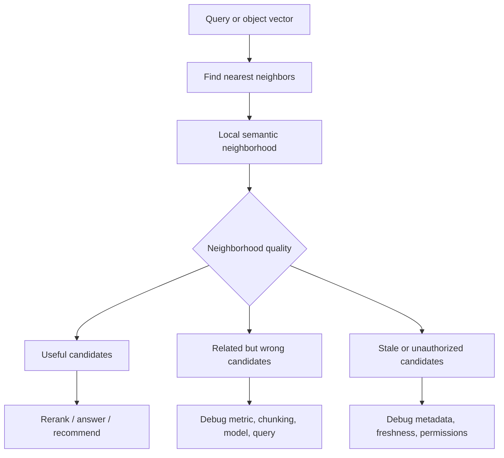

Cluster view:

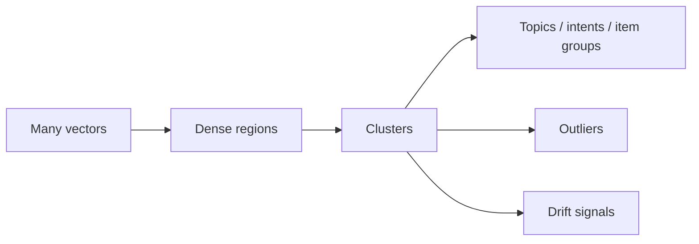

Important:

```text
nearest neighbors are local
clusters are regional
drift is temporal
```

---

### 3. Neighborhoods: The Top-k World [Beginner]

In retrieval, a neighborhood often means:

```text
the top k nearest vectors
```

Example:

```text
top_k = 5
```

For query:

```text
"how do I rotate production API keys?"
```

The top-5 neighborhood might be:

```text
1. API key rotation runbook
2. production secret rollover checklist
3. credential migration without downtime
4. old API key policy
5. staging key rotation guide
```

This neighborhood contains:

- very strong candidates
- maybe stale candidates
- maybe wrong-environment candidates
- maybe complementary candidates

Your RAG system does not retrieve the whole world.
It retrieves a neighborhood.

That means:

> The quality of top-k neighborhoods controls the quality ceiling of the retrieval pipeline.

#### Neighborhood Quality Questions

Ask:

- Are the nearest neighbors actually relevant?
- Are they answerable or just topically related?
- Are they current?
- Are they authorized?
- Are they diverse enough?
- Are they too redundant?
- Are they too generic?
- Are they from the right tenant/product/version?
- Do they include at least one correct evidence chunk?

#### Neighborhood Is Not Just Similarity

A healthy neighborhood for RAG should contain:

```text
relevance
authority
freshness
coverage
permission safety
low duplication
enough diversity
```

Vector distance only contributes to some of that.

---

### 4. Clustering: When Neighborhoods Become Regions [Beginner]

Clusters form when many vectors sit near each other.

In a support-ticket system, clusters might represent:

```text
password reset issues
billing disputes
API authentication problems
deployment failures
database connection errors
contractor access questions
```

In a product recommendation system:

```text
running shoes
formal shoes
laptop bags
wireless headphones
gaming keyboards
```

In an enterprise knowledge base:

```text
security policies
HR benefits
engineering runbooks
incident postmortems
customer contracts
```

Clusters help with:

- topic discovery
- routing
- deduplication
- dataset cleanup
- anomaly detection
- trend detection
- taxonomy building
- evaluation slicing
- memory organization

But clusters are not always clean.

Real embedding spaces often have:

- overlapping topics
- long-tail micro-clusters
- bridge documents between topics
- broad generic documents near many clusters
- stale documents inside current clusters
- outliers from bad parsing or bad chunking

Professional caution:

> A cluster is a useful signal, not a ground-truth category.

---

### 5. Common Clustering Mental Models [Intermediate]

You do not need to start by memorizing every clustering algorithm. You need to know what kind of structure each algorithm assumes.

#### 5.1 k-Means Intuition

k-means asks:

```text
Can I represent the data with k center points?
```

Flow:

1. Choose k cluster centers.
2. Assign each vector to the nearest center.
3. Move each center to the average of assigned vectors.
4. Repeat until assignments stabilize.

Good for:

- rough topic grouping
- balanced-ish clusters
- simple centroid-based summaries
- large-scale approximate organization

Weaknesses:

- you must choose k
- clusters are forced even if data has no clean clusters
- non-round shapes are poorly handled
- outliers can distort centers
- semantic clusters may not be equal-sized

Interview sentence:

> "k-means is useful when I want a coarse partition of embedding space, but the chosen k and centroid assumptions can hide long-tail or irregular semantic structure."

#### 5.2 Hierarchical Clustering Intuition

Hierarchical clustering asks:

```text
Can I build a tree of similarity?
```

It can group:

```text
all security docs
  -> access-control docs
    -> contractor access docs
    -> employee access docs
  -> incident response docs
```

Good for:

- taxonomy discovery
- browsing document collections
- nested topic structure
- small to medium analysis workflows

Weaknesses:

- can be expensive at large scale
- early merge/split choices can be hard to undo
- results depend on linkage method and distance metric

#### 5.3 Density-Based Clustering Intuition

DBSCAN-style methods ask:

```text
Where are dense regions, and what looks like noise?
```

Good for:

- discovering arbitrary-shaped clusters
- finding outliers
- avoiding forced assignment of every point
- detecting dense pockets of similar issues

Weaknesses:

- parameter sensitive
- struggles with varying density
- high-dimensional embeddings can be tricky
- may label sparse but important long-tail topics as noise

#### 5.4 Approximate Clustering for Large Systems

At large scale, teams often use:

- sampling
- approximate nearest neighbors
- mini-batch k-means
- vector quantization
- offline clustering jobs
- dimensionality reduction for visualization

Production note:

> Clustering is usually an analysis and organization tool, while nearest-neighbor search is the online retrieval tool.

They are related, but not the same.

---

### 6. Centroids, Dense Regions, and Outliers [Intermediate]

#### 6.1 Centroid

A centroid is a cluster center.

If a cluster contains:

```text
"reset password"
"forgot password"
"change login credentials"
```

the centroid is an average vector representing the region.

Centroids are useful for:

- summarizing clusters
- assigning new vectors to rough topics
- detecting topic movement
- creating cluster labels
- routing queries to corpora

But centroids can be misleading.

If a cluster contains mixed topics:

```text
API keys
database passwords
user passwords
SSH keys
```

the centroid may become a blurry "credential" point that is not precise enough for answering.

#### 6.2 Dense Region

A dense region has many vectors close together.

This can mean:

- common topic
- duplicate content
- repeated support issue
- popular product category
- many similar memories

Dense regions are useful signals.

But density can also reveal problems:

- too many duplicate chunks
- boilerplate repeated across documents
- generated content flooding the index
- one tenant dominating the space
- old versions not deleted

#### 6.3 Outlier

An outlier is far from normal neighborhoods.

Outliers can be:

- rare valuable content
- parsing errors
- wrong language
- corrupted text
- binary garbage
- badly chunked documents
- unsupported domain terms

Do not automatically delete outliers.

Outlier handling rule:

```text
inspect before discarding
```

Some outliers are the most important documents in the system.

---

### 7. Semantic Drift: What Changes Over Time [Intermediate]

Semantic drift means the vector neighborhood structure changes in a way that affects meaning or behavior.

There are several forms.

#### 7.1 Corpus Drift

The indexed corpus changes.

Examples:

- new policy documents added
- deprecated docs remain indexed
- duplicate docs are imported
- product docs reorganized
- old versions outnumber current versions
- new tenant data enters shared search

Effect:

```text
same query -> different nearest neighbors
```

#### 7.2 Query Drift

User queries change.

Examples:

- users adopt new product names
- a new incident creates new search behavior
- customers start asking about a new regulation
- internal teams use a new acronym
- seasonal traffic changes intent

Effect:

```text
old eval set no longer represents real traffic
```

#### 7.3 Concept Drift

The meaning or business interpretation changes.

Example:

```text
"remote work policy"
```

may mean something different before and after a company policy change.

Another:

```text
"contractor access"
```

may shift after a security incident.

Effect:

```text
previously correct retrieval may become outdated or unsafe
```

#### 7.4 Model Drift or Migration Drift

The embedding model changes.

Examples:

- switching embedding providers
- upgrading model version
- changing vector dimensions
- changing preprocessing
- normalizing vectors differently
- changing chunking before embedding

Effect:

```text
old neighborhoods are not comparable to new neighborhoods
```

This is not always "drift" in the accidental sense. Sometimes it is planned migration. But it still changes retrieval behavior.

#### 7.5 Metadata Drift

Metadata quality changes.

Examples:

- missing `status`
- wrong `tenant_id`
- inconsistent `product`
- stale `effective_date`
- access-control field no longer populated

Effect:

```text
the vector neighborhood may be fine, but the eligible candidate set becomes wrong
```

#### 7.6 Label Drift

Human labels or evaluation judgments change.

Example:

```text
Last quarter, runbook A was accepted as correct.
This quarter, runbook B is the required source.
```

Effect:

```text
retrieval metrics look stable but business quality changes
```

---

### 8. Neighborhood Stability [Intermediate]

A practical way to monitor drift is to track neighborhood stability.

For a fixed canary query:

```text
"rotate production API keys"
```

record top-k results every day:

```text
day 1: A, B, C, D, E
day 2: A, B, C, F, G
day 3: X, Y, A, B, C
```

Ask:

- How many neighbors stayed the same?
- Did authoritative docs remain near the top?
- Did deprecated docs appear?
- Did generic docs move upward?
- Did scores shift suddenly?
- Did a cluster boundary move?
- Did top-k diversity improve or degrade?

#### Stability Metrics

Useful metrics:

| Metric | Meaning |
|---|---|
| Top-k overlap | How many results are shared between two runs. |
| Rank correlation | Whether ordering stayed similar. |
| Hit rate | Whether at least one known good result appears. |
| Recall@k | Whether relevant labeled docs appear in top k. |
| Average score shift | Whether similarity distributions changed. |
| Cluster assignment change | Whether items move between clusters. |
| Outlier rate | Whether many new vectors land far from known regions. |

Simple top-k overlap:

```text
old top 5 = A, B, C, D, E
new top 5 = A, B, C, X, Y

overlap = 3 / 5 = 60%
```

Low overlap is not always bad. New documents may be better.

But unexplained low overlap is a signal to inspect.

---

### 9. System View: How Neighborhoods Drive Retrieval [Intermediate]

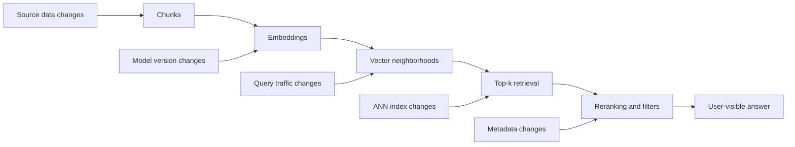

The retrieval system is sensitive to:

- source data
- chunking
- embedding model
- metric
- index algorithm
- filters
- reranking
- user query distribution
- product terminology

When quality drops, do not debug only the LLM.

Trace the path:

```text
query -> query embedding -> nearest neighbors -> filtered candidates -> reranked evidence -> answer
```

At each stage, ask:

```text
what changed?
```

#### Observable Artifacts

Store enough traces to answer:

- What query was embedded?
- Which model version embedded it?
- What vector index version was used?
- What top-k candidates were returned?
- What scores did they have?
- Which filters were applied?
- Which candidates were removed?
- Which candidates were reranked upward/downward?
- Which final chunks entered the prompt or result list?

Without these traces, semantic drift feels mysterious.

With traces, it becomes debuggable.

---

### 10. Common Mistakes + Debugging [Intermediate]

#### Mistake 1: Looking at One Result Instead of the Neighborhood

Bad:

```text
The top result is good, so retrieval is good.
```

Better:

```text
Inspect top 5, top 10, and top 50 neighborhoods by query type.
```

Why:

Rerankers and LLMs often need more than the first result.

#### Mistake 2: Treating Clusters as Ground Truth

Bad:

```text
The cluster says this is a billing document.
```

Better:

```text
The cluster suggests billing-like semantics; validate with metadata, labels, or inspection.
```

Why:

Clusters are discovered structure, not authoritative taxonomy.

#### Mistake 3: Ignoring Broad Generic Documents

Generic documents can sit near many queries:

```text
"Complete security overview"
"Full platform guide"
"All API concepts"
```

They may dominate neighborhoods while providing weak answer evidence.

Fix:

- chunk better
- down-rank broad docs
- use reranking
- require answerability
- use source/type boosts

#### Mistake 4: Mixing Old and New Embedding Spaces

Bad:

```text
old document vectors from model A
new query vectors from model B
```

Fix:

- version embeddings
- re-embed corpus
- dual-index during migration
- compare neighborhood overlap

#### Mistake 5: Monitoring Average Quality Only

Average metrics can hide cluster-level failure.

Example:

```text
overall recall@10 = 91%
security-policy recall@10 = 62%
exact-ID recall@10 = 34%
```

Fix:

- evaluate by topic cluster
- evaluate by query class
- evaluate by tenant/product/language
- track high-risk slices separately

#### Mistake 6: Treating Drift as Always Bad

Some drift is desired.

Example:

```text
new current policy should replace old policy in top results
```

Better question:

```text
Is the drift expected, explained, and beneficial?
```

#### Debugging Checklist

When neighborhoods look wrong:

1. Did the source corpus change?
2. Did chunking change?
3. Did the embedding model/version change?
4. Did the metric or normalization change?
5. Did the ANN index rebuild?
6. Did metadata filters change?
7. Did user query distribution change?
8. Did a new generic document enter many neighborhoods?
9. Did deprecated content remain indexed?
10. Did top-k shrink?
11. Did reranker behavior change?
12. Did evaluation labels or business policy change?

---

### 11. Failure Modes [Pro]

#### Failure Mode 1: Neighborhood Pollution

What happens:

```text
Broad or duplicated documents enter many query neighborhoods.
```

User sees:

```text
Generic answers with weak citations.
```

Mitigation:

- deduplicate chunks
- split broad documents
- down-rank boilerplate
- use reranking
- monitor top-k source diversity

#### Failure Mode 2: Stale Cluster Dominance

What happens:

```text
Old documents form a large dense cluster and outrank current documents.
```

User sees:

```text
Outdated policy answers.
```

Mitigation:

- filter by status/version
- remove deprecated chunks
- boost authoritative current sources
- track freshness in evals

#### Failure Mode 3: Cluster Boundary Ambiguity

What happens:

```text
A query sits between two clusters.
```

Example:

```text
"contractor production log access"
```

could sit between:

```text
contractor access
production observability
security approval
```

User sees:

```text
Mixed evidence, incomplete answer, or wrong interpretation.
```

Mitigation:

- retrieve diversified candidates
- use query decomposition
- rerank for answerability
- ask clarification for ambiguous queries

#### Failure Mode 4: Silent Model Migration Drift

What happens:

```text
Embedding model changes and neighborhoods reorder.
```

User sees:

```text
Search feels different, but no obvious error is logged.
```

Mitigation:

- shadow evaluate new model
- compare top-k overlap
- keep canary query set
- dual-index rollout
- version metrics and thresholds

#### Failure Mode 5: Long-Tail Outlier Loss

What happens:

```text
Rare but important documents are treated as outliers or noise.
```

User sees:

```text
Common docs retrieved, rare critical docs missed.
```

Mitigation:

- protect high-value documents with metadata boosts
- evaluate long-tail queries
- use hybrid retrieval for rare terms
- do not blindly delete outliers

#### Failure Mode 6: Query Distribution Drift

What happens:

```text
Users start asking about new topics not covered by old evals.
```

User sees:

```text
Poor results for emerging needs while dashboards look healthy.
```

Mitigation:

- sample real queries continuously
- cluster recent queries
- detect new query clusters
- update eval sets
- add missing content

---

### 12. Trade-offs [Pro]

| Choice | Gain | Cost |
|---|---|---|
| Monitor fixed canary neighborhoods | Easy drift detection for important queries. | May miss new query classes. |
| Cluster the corpus | Helps discover topics, duplicates, and outliers. | Clusters can be misleading or expensive. |
| Use many small clusters | More precise topic slices. | More operational complexity and noisy boundaries. |
| Use fewer large clusters | Simpler mental model. | Can hide important subtopics. |
| Re-cluster often | Detects changes quickly. | More compute and more churn. |
| Re-cluster rarely | Stable labels and dashboards. | Drift may go unnoticed. |
| Remove outliers aggressively | Cleaner index. | Risk of deleting rare valuable content. |
| Keep all outliers | Preserves long-tail recall. | More noise and storage. |
| Strict neighborhood stability | Detects regressions quickly. | May resist beneficial content updates. |

The central trade-off:

```text
semantic stability vs semantic freshness
```

You want neighborhoods stable enough that retrieval is reliable.
You also want them flexible enough to reflect new knowledge.

---

### 13. What Problem This Solves

Primary problem solved:

> Neighborhood and clustering analysis lets you understand the structure of embedding space beyond individual similarity scores.

Secondary benefits:

- reveals topic regions
- supports retrieval debugging
- detects duplicate or generic content
- finds outliers
- helps build evaluation slices
- supports query routing
- detects drift before user complaints
- guides corpus cleanup

Systems impact:

> It turns embedding search from a black-box nearest-neighbor call into an observable system with local behavior, regional structure, and time-based health.

Without this concept, teams often ask:

```text
Why did search get worse?
```

but cannot answer:

```text
Which neighborhoods changed?
Which clusters degraded?
Which query slices are affected?
What changed in data, model, index, or metadata?
```

---

### 14. When to Use Neighborhood and Cluster Analysis

Use it when:

- building semantic search
- building RAG over changing documents
- debugging retrieval regressions
- migrating embedding models
- clustering support tickets
- deduplicating content
- routing queries by topic
- detecting emerging trends
- monitoring recommendation quality
- organizing long-term memory
- discovering corpus structure
- auditing tenant/product/language slices

Interviewer keywords:

```text
semantic search quality dropped
embedding model migration
topic discovery
duplicate documents
outlier detection
emerging query trends
retrieval monitoring
clustered support tickets
long-tail recall
```

Strong sentence:

> "I would inspect not only individual top results but also neighborhood stability and cluster-level behavior by query slice, especially after corpus, model, metric, or indexing changes."

---

### 15. When Not to Overuse It

Neighborhood and cluster analysis can be overkill when:

- corpus is tiny
- keyword search already solves the problem
- data is static and low-risk
- retrieval quality is not user-facing
- exact lookup is the actual requirement
- there is no evaluation or operational loop

It can also mislead when:

- embeddings are poor
- dimensions are reduced for visualization and overinterpreted
- clusters are treated as labels
- outliers are deleted automatically
- drift alerts fire without business context

Important caution:

> A 2D visualization of embeddings is an explanation aid, not the real high-dimensional geometry.

Tools like t-SNE and UMAP can help humans see patterns, but distances and cluster shapes in the plot should not be treated as exact production truth.

---

### 16. Real-World Scenario [Intermediate]

#### Product / System

A company runs a RAG assistant over security policies and engineering runbooks.

Key query:

```text
"Can contractors access production logs?"
```

#### Initial Healthy Neighborhood

Top results:

```text
1. Current contractor access policy
2. Production observability access rules
3. Security approval workflow
4. Contractor exception process
5. Audit logging policy
```

This neighborhood is useful because it covers:

- contractor status
- production environment
- logs/observability
- approval workflow
- audit requirements

#### Drift Event

After a document migration, top results become:

```text
1. Old contractor access policy
2. Generic production security overview
3. Employee log access guide
4. Staging observability guide
5. Current contractor access policy
```

The correct document is still present, but it moved down.

#### Why It Happened

Possible causes:

- old policy was not marked deprecated
- generic overview had many overlapping terms
- new chunking made current policy less focused
- top-k was too small before reranking
- reranker favored broad documents
- metadata filter did not require current status

#### Production Fix

1. Add canary query for contractor log access.
2. Track top-10 neighborhood weekly.
3. Filter to `status = current`.
4. Add document-type boosts for policy over overview.
5. Use hybrid retrieval for exact terms: `contractor`, `production`, `logs`.
6. Rerank by answerability.
7. Add eval cases for contractor vs employee and production vs staging.

#### What Would Go Wrong Without This Concept

The team might only inspect the final LLM answer and blame prompt quality.

But the real issue is:

```text
the evidence neighborhood drifted
```

---

### 17. Code Sample: Top-k Neighborhood Overlap

This example compares old and new top-k result sets.

```python
def top_k_overlap(old_results, new_results, k):
    old_top_k = set(old_results[:k])
    new_top_k = set(new_results[:k])
    return len(old_top_k & new_top_k) / k


old_top_5 = [
    "current_contractor_access_policy",
    "production_observability_rules",
    "security_approval_workflow",
    "contractor_exception_process",
    "audit_logging_policy",
]

new_top_5 = [
    "old_contractor_access_policy",
    "generic_production_security_overview",
    "employee_log_access_guide",
    "staging_observability_guide",
    "current_contractor_access_policy",
]

overlap = top_k_overlap(old_top_5, new_top_5, k=5)

print(f"Top-5 overlap: {overlap:.0%}")
print("Shared results:", set(old_top_5) & set(new_top_5))
```

Expected output:

```text
Top-5 overlap: 20%
Shared results: {'current_contractor_access_policy'}
```

Interpretation:

```text
The query did not fail completely, but its neighborhood changed a lot.
```

That is a drift signal worth inspecting.

---

### 18. Mini Program: Simulate Neighborhood Drift [Pro]

This small simulation uses hand-written vectors so you can see the mechanism clearly.

```python
import math


def dot(a, b):
    return sum(x * y for x, y in zip(a, b))


def norm(a):
    return math.sqrt(sum(x * x for x in a))


def cosine(a, b):
    return dot(a, b) / (norm(a) * norm(b))


def rank(query_vector, docs, k=5):
    scored = [
        (cosine(query_vector, doc["vector"]), doc["id"], doc["text"], doc["status"])
        for doc in docs
    ]
    return sorted(scored, reverse=True)[:k]


def overlap(old_ranked, new_ranked):
    old_ids = {row[1] for row in old_ranked}
    new_ids = {row[1] for row in new_ranked}
    return len(old_ids & new_ids) / len(old_ids)


def print_results(title, rows):
    print()
    print(title)
    print("-" * len(title))
    for score, doc_id, text, status in rows:
        print(f"{score:.3f} | {status:<10} | {doc_id:<32} | {text}")


query = [1.00, 0.80, 0.10]

old_docs = [
    {
        "id": "current_contractor_access",
        "text": "Current contractor production log access policy.",
        "status": "current",
        "vector": [0.99, 0.78, 0.10],
    },
    {
        "id": "prod_observability_rules",
        "text": "Production observability access rules.",
        "status": "current",
        "vector": [0.94, 0.75, 0.12],
    },
    {
        "id": "security_approval_workflow",
        "text": "Security approval workflow for sensitive access.",
        "status": "current",
        "vector": [0.88, 0.70, 0.14],
    },
    {
        "id": "audit_logging_policy",
        "text": "Audit logging policy.",
        "status": "current",
        "vector": [0.82, 0.65, 0.12],
    },
]

new_docs = old_docs + [
    {
        "id": "old_contractor_access",
        "text": "Deprecated contractor production log access policy.",
        "status": "deprecated",
        "vector": [1.01, 0.79, 0.11],
    },
    {
        "id": "generic_security_overview",
        "text": "Large security overview covering production, access, logs, credentials, and policy.",
        "status": "current",
        "vector": [0.98, 0.76, 0.20],
    },
    {
        "id": "employee_log_access",
        "text": "Employee production log access guide.",
        "status": "current",
        "vector": [0.96, 0.77, 0.08],
    },
]


def main():
    old_ranked = rank(query, old_docs)
    new_ranked = rank(query, new_docs)

    print_results("Old neighborhood", old_ranked)
    print_results("New neighborhood after corpus change", new_ranked)

    print()
    print(f"Top-k overlap: {overlap(old_ranked, new_ranked):.0%}")

    current_only = [doc for doc in new_docs if doc["status"] == "current"]
    print_results("New neighborhood with current-only filter", rank(query, current_only))

    print()
    print("Lesson:")
    print("Adding documents can change a query neighborhood without any code failure.")
    print("Metadata filters and neighborhood monitoring make that change visible.")


if __name__ == "__main__":
    main()
```

Expected learning:

- Adding new vectors can reorder the top-k neighborhood.
- Deprecated documents can become strong semantic neighbors.
- Generic documents can compete with precise documents.
- Metadata filters can repair part of the problem.
- Filtering alone may not solve generic-document dominance.

---

### 19. Hands-On Lab: Build, Break, Measure [Pro]

#### Goal

Learn how neighborhoods, clusters, and drift show up in a retrieval system before final answers fail.

#### Build

Create a small synthetic corpus with 24 chunks:

- 6 password/account chunks
- 6 billing chunks
- 6 production access chunks
- 6 API credential chunks

For each chunk store:

```text
id
text
topic
status
version
vector
```

Use simple 3D or 4D fake vectors arranged into topic regions.

#### Create Canary Queries

Use:

```text
"reset password"
"refund invoice"
"contractor production log access"
"rotate API keys without downtime"
```

For each query, record:

- top 5 IDs
- scores
- topics
- statuses
- whether each result is useful

#### Break

Introduce drift:

1. Add deprecated documents close to important queries.
2. Add one broad generic document near several clusters.
3. Change one query vector slightly to simulate terminology change.
4. Re-embed a subset with slightly different vectors.
5. Remove metadata from a few chunks.

#### Measure

Create a table:

| Canary query | Old top-5 | New top-5 | Overlap | Quality changed? | Likely cause |
|---|---|---|---|---|---|
| contractor production log access | A,B,C,D,E | X,Y,A,Z,B | 40% | Yes | stale/generic docs |
| reset password | P,Q,R,S,T | P,Q,R,S,T | 100% | No | stable |

Also measure:

- cluster membership changes
- outlier count
- deprecated-doc rate in top-k
- generic-doc frequency across queries
- known-good hit rate

#### Improve

Try:

- status filters
- source-type boosts
- removing duplicates
- better chunking
- hybrid retrieval
- reranking
- larger top-k before reranking
- canary query monitoring

#### Reflection

Answer:

1. Which query neighborhood changed the most?
2. Was the drift expected or unexpected?
3. Did drift improve or degrade quality?
4. Was the root cause corpus, query, model, metadata, or index behavior?
5. Which mitigation fixed the actual cause?

---

### 20. Interview-Style Practical Question

> You are running a RAG system over a fast-changing enterprise knowledge base. Users report that search quality slowly degraded over the last month, especially for security-policy questions. How would you use neighborhoods, clustering, and drift monitoring to debug and prevent this?

---

### 21. Strong Answer

1. **I would start by tracing query neighborhoods.**

   For failing security-policy queries, I would compare old and current top-k results, scores, filters, model versions, and index versions.

2. **I would separate possible drift causes.**

   I would check corpus changes, new stale documents, chunking changes, embedding model changes, metadata changes, query distribution changes, and ANN index rebuilds.

3. **I would monitor canary queries.**

   For high-risk topics like contractor access, production logs, and security approvals, I would track top-k overlap, known-good hit rate, deprecated-doc rate, and score shifts over time.

4. **I would analyze clusters by topic and risk.**

   I would cluster documents and queries to see whether the security-policy region changed, whether generic docs polluted many neighborhoods, and whether long-tail queries are now outliers.

5. **I would evaluate by slice, not only average quality.**

   Overall retrieval quality may look fine while security-policy quality degrades. I would track topic, tenant, language, document type, and query class separately.

6. **I would fix the retrieval pipeline based on root cause.**

   If stale docs dominate, I would enforce status filters. If generic docs dominate, I would improve chunking or rerank. If model migration caused drift, I would dual-index, compare neighborhoods, and recalibrate thresholds.

7. **I would add production guardrails.**

   I would log retrieval traces, version embedding models and indexes, maintain canary query dashboards, and require shadow evaluation before corpus or model migrations.

Short version:

```text
Debug the neighborhood, not just the final answer.
Cluster to find affected regions.
Monitor drift by query slice.
Fix the layer that actually changed.
```

---

### 22. Production Reality Check

A mature embedding system tracks neighborhoods over time.

Minimum production signals:

| Signal | Why it matters |
|---|---|
| Top-k overlap for canary queries | Detects sudden neighborhood changes. |
| Known-good hit rate | Ensures critical evidence remains retrievable. |
| Deprecated-doc rate | Catches stale content entering top results. |
| Generic-doc frequency | Detects broad documents polluting many queries. |
| Cluster-level recall | Finds topic-specific degradation. |
| Outlier rate | Detects malformed, rare, or shifted content. |
| Query-cluster emergence | Finds new user needs. |
| Score distribution shift | Detects model, metric, or corpus changes. |
| Vector norm distribution | Helps catch embedding/preprocessing changes. |
| Metadata completeness | Protects filtering, freshness, and permissions. |

Design record for drift-sensitive systems:

```text
embedding_model_version:
index_version:
metric:
normalization:
corpus_snapshot:
chunking_version:
metadata_schema_version:
canary_queries:
expected_neighbors:
cluster_eval_slices:
drift_alert_thresholds:
rollback_plan:
```

Operational rule:

> Any embedding model migration, chunking migration, or major corpus import should be treated as a retrieval behavior change, not just a data update.

---

### 23. Active Recall [Beginner]

Answer without looking:

1. What is a vector neighborhood?
2. Why is the top-k neighborhood important in RAG?
3. What is a cluster?
4. What is a centroid?
5. Why can generic documents pollute neighborhoods?
6. What is semantic drift?
7. Name four types of drift that affect embedding systems.
8. Why is top-k overlap useful?
9. Why can drift be good sometimes?
10. Why should clusters not be treated as ground-truth labels?
11. Why are outliers not always bad?
12. What should you monitor during embedding model migration?

Expected answers:

1. The set of nearest vectors around a query or object.
2. It defines the candidate evidence available to rerankers and LLMs.
3. A group of vectors close to one another.
4. A representative center point of a cluster.
5. They overlap with many topics and may rank near many queries without being precise.
6. A change in embedding neighborhoods, clusters, data meaning, or representation behavior over time.
7. Corpus drift, query drift, concept drift, model/migration drift, metadata drift, label drift.
8. It shows how much a query's neighborhood changed between runs.
9. New current documents should sometimes replace older weaker results.
10. Clusters are discovered patterns, not authoritative categories.
11. They may be rare but important documents or emerging topics.
12. Top-k overlap, known-good hit rate, score shifts, cluster changes, threshold behavior, and model/index versions.

---

### 24. Revision Notes

One-line summary:

> Neighborhoods show local semantic meaning, clusters show regional structure, and drift shows how that structure changes over time.

Three keywords:

```text
neighborhood
cluster
drift
```

One interview trap:

```text
Debugging only the LLM response when the retrieved neighborhood changed upstream.
```

One memory trick:

```text
Neighbors decide candidates.
Clusters reveal regions.
Drift explains change.
```

---

### 25. Quick Self-Test

For each situation, identify the likely concept.

| Situation | Concept | Why |
|---|---|---|
| Same query returns a different top-5 after a corpus import. | Neighborhood drift | Local nearest neighbors changed. |
| Many password reset chunks sit close together. | Cluster | Dense region of related vectors. |
| A huge security overview appears for many unrelated security queries. | Neighborhood pollution | Generic document overlaps many neighborhoods. |
| Rare compliance doc is far from all clusters. | Outlier | Could be rare value or data issue. |
| New embedding model changes most top-k results. | Model migration drift | Representation space changed. |
| Recent user queries form a new topic group. | Query drift / emerging cluster | User needs changed. |
| Deprecated docs outrank current docs. | Corpus/freshness drift | Old content remained semantically strong. |

If you can explain this table, you can reason about embedding behavior over time.

---

## Subtopic 4.1.d: Polysemy, Multilinguality, and Domain-Shift Limitations

### Add to Knowledge Base

Embeddings are powerful because they compress meaning-like patterns into vectors.

But language is messy:

- one word can have many meanings
- one meaning can appear in many languages
- one domain can redefine common words
- one acronym can mean different things in different teams
- one model can work well on public text and poorly on private jargon

This subtopic is about those limits.

Three core failure families:

| Limitation | Meaning | Example |
|---|---|---|
| Polysemy | One word or phrase has multiple meanings. | `bank` = financial institution or river edge. |
| Multilinguality | Meaning must work across languages, scripts, cultures, and mixed-language text. | "refund policy" vs "politica de reembolso". |
| Domain shift | The deployment domain differs from the model's training/evaluation world. | `claim`, `member`, `EOB`, or `provider` in healthcare. |

The core idea:

> Embeddings represent meaning through learned context, but ambiguous language, cross-language gaps, and domain-specific usage can bend that meaning in the wrong direction.

The beginner mistake:

```text
The embedding model is semantic, so it should understand all meanings in all domains.
```

The professional view:

```text
Embedding quality is conditional on context, language coverage, domain fit, and evaluation slices.
```

Key terms:

| Term | Meaning |
|---|---|
| Polysemy | A word or phrase with multiple related or unrelated meanings. |
| Homonym | Same spelling/sound with different meanings, often unrelated. |
| Sense | One specific meaning of a word or phrase in context. |
| Contextual embedding | A representation that depends on surrounding text. |
| Cross-lingual embedding | Embedding space designed to align semantically similar content across languages. |
| Multilingual model | Model trained to handle multiple languages. |
| Code-switching | Mixing languages in one query or document. |
| Transliteration | Writing words from one language using another script or spelling system. |
| False friend | Word that looks similar across languages but has different meaning. |
| Domain shift | Deployment data differs from training/evaluation data. |
| Acronym collision | Same acronym means different things in different contexts. |
| Out-of-domain query | Query whose vocabulary or meaning is poorly covered by the model. |

Reference anchors:
- BERT paper: `https://arxiv.org/abs/1810.04805`
- Sentence-BERT paper: `https://arxiv.org/abs/1908.10084`
- XLM-R paper: `https://arxiv.org/abs/1911.02116`
- LaBSE paper: `https://arxiv.org/abs/2007.01852`
- BEIR retrieval benchmark: `https://arxiv.org/abs/2104.08663`
- MTEB benchmark: `https://arxiv.org/abs/2210.07316`

---

### Reading Path + Level Tags

- **Beginner:** Read sections 0-4 and Active Recall.
- **Intermediate:** Add sections 5-10 and complete the Build part of the Hands-On Lab.
- **Pro:** Complete the full Hands-On Lab, including Break and Measure, then answer the production limitation system design question and the Topic 4.1 checkpoint.

---

### 0. Pre-Question Hook [Beginner]

**Pause:** You are building semantic search for a global enterprise knowledge base.

User query:

```text
How do I file a claim for a provider issue?
```

That sounds straightforward.

But in different domains:

```text
claim = insurance claim
claim = legal assertion
claim = database lock claim
claim = user claim in authentication token

provider = healthcare provider
provider = cloud provider
provider = identity provider
provider = service provider
```

Now add multilinguality:

```text
User query in English.
Relevant document in Spanish.
Policy acronym from US healthcare.
Internal ticket written in mixed English/Hindi.
Team-specific abbreviation copied from Slack.
```

Before reading on, answer:

- Which meaning of `claim` should the embedding choose?
- Does the query contain enough context?
- Was the embedding model trained for this domain?
- Does it align English and Spanish well?
- Does it handle mixed-language text?
- Does it understand internal acronyms?
- How would you evaluate this before production?

This is the real problem.

Embeddings do not fail only because of bad math. They fail when language meaning depends on context the model does not have.

---

### 1. The Intuition: One Word, Many Worlds [Beginner]

Polysemy means one word can point to multiple meanings.

Example:

```text
bank
```

Possible meanings:

```text
financial institution
river edge
tilt an airplane
store something for later
```

If a user searches:

```text
bank access policy
```

Does `bank` mean:

```text
accessing a financial account
accessing a data bank
accessing a river bank construction site
```

The embedding model uses surrounding context to guess.

More context:

```text
"How do I reset my online bank password?"
```

likely means financial institution.

More context:

```text
"How do we stabilize the river bank near the site?"
```

likely means river edge.

The core rule:

> Embeddings become more reliable when the surrounding context disambiguates the intended sense.

#### Beginner Explanation in 3 Lines

Polysemy is when one word has multiple meanings.
Multilinguality is when the same or similar meaning must work across languages.
Domain shift is when the model's learned meaning does not match your production domain.

---

### 2. Visual Diagram: Ambiguity Routes [Beginner]

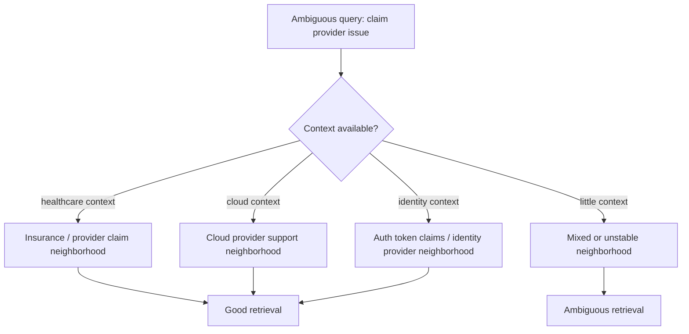

Polysemy problem:

```text
same surface word -> multiple possible neighborhoods
```

Multilingual problem:

```text
same meaning -> different surface forms/languages/scripts
```

Domain-shift problem:

```text
same word -> domain-specific meaning not learned well by the model
```

The retrieval system must help the embedding model by adding:

- context
- metadata filters
- query routing
- domain-specific corpora
- hybrid search
- reranking
- evaluation slices
- clarification when ambiguity is too high

---

### 3. Polysemy: Many Meanings in One Surface Form [Beginner]

Polysemy is not rare. It is everywhere.

Common examples:

| Word | Possible meanings |
|---|---|
| bank | finance, river edge, aircraft movement. |
| claim | insurance request, legal assertion, auth token property. |
| token | LLM token, auth token, payment token, game token. |
| model | ML model, data model, business model, fashion model. |
| member | user, insurance member, class field, team participant. |
| provider | healthcare provider, cloud provider, identity provider. |
| plan | subscription plan, project plan, treatment plan, query plan. |
| policy | security policy, insurance policy, HR policy, IAM policy. |

Embeddings can handle polysemy better when text includes context.

Compare:

```text
"claim status"
```

with:

```text
"check insurance claim status for out-of-network provider"
```

The second query gives the model more disambiguating evidence.

#### Static vs Contextual Embeddings

Older word embeddings often gave one vector per word:

```text
bank -> one vector
```

That is hard for polysemy because one vector must average multiple meanings.

Modern contextual embeddings represent a token or text based on context:

```text
"river bank" -> bank vector influenced by river
"bank account" -> bank vector influenced by account
```

Sentence/document embeddings compress the whole input into one vector:

```text
"How do I access my bank account?" -> sentence vector
```

This helps, but does not eliminate ambiguity.

Why?

- query may be short
- chunk may mix senses
- domain meaning may be rare
- model may not know internal usage
- final vector may still blur competing meanings

#### Practical Rule

For ambiguous terms:

```text
short query + broad corpus = high ambiguity risk
```

Fix with:

- query expansion
- metadata routing
- user context
- clarification
- hybrid lexical search
- reranking
- domain-specific evaluation

---

### 4. Multilinguality: Same Meaning, Many Language Surfaces [Beginner]

Multilingual embeddings try to place semantically similar content from different languages near each other.

Example:

```text
English: "reset password"
Spanish: "restablecer contrasena"
French: "reinitialiser le mot de passe"
```

A good multilingual embedding model should put these near each other.

This enables:

- cross-language search
- global support search
- multilingual RAG
- document deduplication across translations
- routing support tickets by intent across languages

But multilinguality has limits.

#### Limit 1: Language Coverage Is Uneven

Models often perform better on high-resource languages than low-resource languages.

High-resource examples:

```text
English
Spanish
French
German
Chinese
```

Lower-resource or domain-specific language varieties may have weaker coverage.

Production implication:

```text
Do not assume English retrieval quality transfers to every language.
```

#### Limit 2: Cross-Lingual Alignment Is Imperfect

Even if a model supports two languages, the spaces may not align perfectly.

Symptoms:

- English queries retrieve English docs better than translated docs
- semantically equivalent docs in another language rank lower
- code-switched queries behave unpredictably
- named entities and acronyms dominate

#### Limit 3: Translation Is Not Always Equivalent

Translation can lose:

- legal nuance
- policy wording
- product names
- local regulation terms
- cultural meaning
- domain-specific abbreviations

Example:

```text
"provider" in US healthcare
```

may not map cleanly to a single term in another language or region.

#### Limit 4: Code-Switching

Real users mix languages:

```text
"prod logs access ka policy kya hai?"
"mi invoice refund status check karna hai"
"API key rotation para staging"
```

Multilingual models may handle some code-switching, but quality is workload-dependent.

#### Limit 5: Transliteration and Spelling Variation

Users may write words from one language in another script or spelling style.

Example:

```text
Hindi/Urdu words written in Latin characters
names transliterated multiple ways
product names localized inconsistently
```

This can hurt retrieval because the model may not map variants reliably.

---

### 5. Domain Shift: When Meaning Changes by Environment [Intermediate]

Domain shift happens when the data in production differs from the data the model was trained or evaluated on.

General model understanding:

```text
claim = statement or assertion
```

Healthcare system:

```text
claim = request for payment/reimbursement processed through insurance workflows
```

Identity system:

```text
claim = attribute inside an authentication token
```

Legal system:

```text
claim = legal demand/assertion
```

Same word.
Different operational meaning.

#### Common Domain-Shift Sources

| Source | Example |
|---|---|
| Industry jargon | EOB, CPT, ICD, prior auth, deductible. |
| Internal acronyms | RCM, MPM, ODD, CDE, P0. |
| Product-specific terms | workspace, tenant, org, namespace, project. |
| Compliance language | consent, retention, minimum necessary, audit trail. |
| Code terms | token, class, provider, model, plan, schema. |
| Regional language | benefits terms vary by country. |
| Evolving business terms | product rename or policy update. |

#### Why Domain Shift Hurts Embeddings

The model may:

- map domain terms to general meanings
- miss rare acronyms
- over-rank general documents
- under-rank exact internal docs
- confuse teams or products
- fail on short expert queries
- ignore subtle regulatory distinctions

Example:

```text
Query: "EOB not generated for OON provider"
```

General model may not fully understand:

```text
EOB = explanation of benefits
OON = out of network
provider = healthcare provider
```

If the relevant document says:

```text
"Explanation of Benefits creation fails for non-participating clinicians..."
```

semantic retrieval may or may not connect the dots.

Hybrid retrieval and domain evaluation become critical.

---

### 6. Failure Patterns by Limitation [Intermediate]

#### 6.1 Polysemy Failure

Query:

```text
"token expiration issue"
```

Corpus contains:

```text
LLM token limits
OAuth access tokens
payment tokenization
CSRF tokens
```

Failure:

```text
vector search retrieves semantically related "token" docs from the wrong sense.
```

Fix:

- route by product/domain
- use metadata filters
- include query context
- use lexical constraints
- ask clarification

#### 6.2 Multilingual Failure

Query:

```text
"cancelar suscripcion"
```

Relevant English doc:

```text
"How to cancel a subscription"
```

Failure:

```text
cross-lingual alignment is weak, so relevant English docs rank too low.
```

Fix:

- use multilingual embedding model
- translate query as fallback
- evaluate by language
- store language metadata
- retrieve from same-language and cross-language corpora

#### 6.3 Code-Switching Failure

Query:

```text
"prod logs access ka approval process"
```

Failure:

```text
mixed English/domain/Hindi text confuses embedding or sparse retrieval.
```

Fix:

- language detection with code-switch support
- query rewriting
- multilingual embeddings
- preserve exact English domain terms
- evaluate real user queries

#### 6.4 Domain-Shift Failure

Query:

```text
"member claim denied due to COB"
```

General result:

```text
legal claim denial
```

Desired result:

```text
healthcare claim coordination-of-benefits denial workflow
```

Fix:

- domain-specific embeddings or fine-tuning
- glossary expansion
- hybrid retrieval
- metadata routing to healthcare corpus
- labeled domain eval set

#### 6.5 Acronym Collision Failure

Acronym:

```text
PIP
```

Possible meanings:

```text
Python package installer
performance improvement plan
personal injury protection
product improvement proposal
```

Failure:

```text
embedding retrieves the dominant public meaning, not the internal meaning.
```

Fix:

- acronym dictionary
- domain routing
- query expansion
- exact-term boost
- team/product metadata

---

### 7. System View: Ambiguity-Aware Retrieval [Intermediate]

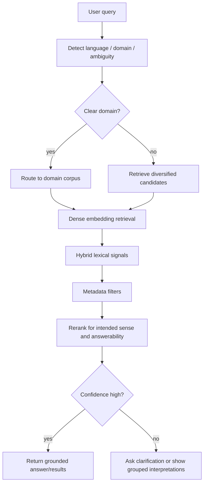

Key production pattern:

```text
detect ambiguity early
retrieve across plausible senses
rerank with context
clarify when needed
```

For ambiguous queries, a single nearest-neighbor list can be misleading.

Better:

```text
top results grouped by sense/domain
```

Example:

```text
Query: "token limit"

Group 1: LLM context/token limits
Group 2: OAuth token expiration
Group 3: Payment tokenization limits
```

This is more honest than pretending the system knows the user's intended sense.

---

### 8. How to Evaluate These Limitations [Intermediate]

You cannot evaluate embedding quality with only easy English queries.

Create evaluation slices.

#### Polysemy Slice

Queries:

```text
"token expiration"
"claim status"
"provider setup"
"model validation"
"plan change"
```

For each query, label intended sense:

```text
auth token vs LLM token
insurance claim vs legal claim
healthcare provider vs cloud provider
ML model vs data model
subscription plan vs care plan
```

Measure:

- top-k sense accuracy
- wrong-sense rate
- clarification need
- reranker recovery

#### Multilingual Slice

Include:

- English queries
- same-language non-English queries
- English query to non-English documents
- non-English query to English documents
- code-switched queries
- transliterated queries
- locale-specific terminology

Measure:

- recall@k by language
- cross-lingual hit rate
- language-specific zero-result rate
- translation fallback success
- answer quality by language

#### Domain-Shift Slice

Include:

- acronyms
- internal product names
- expert shorthand
- regulatory terms
- rare workflows
- team-specific vocabulary
- renamed products

Measure:

- domain-term hit rate
- acronym disambiguation accuracy
- exact-term preservation
- general-doc over-ranking
- expert query success

#### Production Dashboard

Track:

| Slice | Metric |
|---|---|
| Polysemy | wrong-sense rate |
| Multilingual | recall@k by language |
| Code-switching | hit rate and reranker success |
| Domain acronyms | exact/acronym match rate |
| Internal jargon | known-good doc hit rate |
| Product renames | old-term/new-term retrieval parity |
| Ambiguous short queries | clarification rate |

If you do not slice evaluation, average metrics will hide the problem.

---

### 9. Mitigation Patterns [Intermediate]

#### 9.1 Add Context Before Embedding

Bad query:

```text
"claim issue"
```

Better rewritten query:

```text
"healthcare insurance claim issue for provider reimbursement"
```

Sources of context:

- user role
- product area
- current page
- tenant
- locale
- previous conversation turns
- selected corpus
- metadata filters

Be careful:

```text
context injection should clarify, not invent intent
```

#### 9.2 Route by Domain

If user is in the identity product, route:

```text
token -> auth token
provider -> identity provider
claim -> JWT claim
```

If user is in healthcare, route:

```text
provider -> clinician/facility
claim -> insurance claim
member -> insured person
```

Routing can happen through:

- URL/page context
- user/team metadata
- classifier
- explicit product selection
- query terms
- corpus selection

#### 9.3 Use Hybrid Retrieval

Dense embeddings help with semantic variants.

Sparse/keyword retrieval helps with:

- acronyms
- IDs
- exact product names
- rare terms
- multilingual named entities
- code symbols

Hybrid retrieval is often the best practical mitigation for domain shift.

#### 9.4 Use Glossary Expansion

Example:

```text
EOB -> explanation of benefits
OON -> out of network
COB -> coordination of benefits
IdP -> identity provider
JWT -> JSON Web Token
```

Expansion can be:

- query-time
- indexing-time
- metadata-based
- reranker-aware

Do not blindly expand every acronym globally.

Expansion must be domain-aware.

#### 9.5 Use Multilingual Strategy, Not Hope

Options:

- multilingual embeddings
- query translation
- document translation
- dual retrieval: original language plus translated query
- language-specific indexes
- language metadata filters
- same-language preference with cross-language fallback

Production rule:

```text
measure each language instead of assuming parity
```

#### 9.6 Ask Clarifying Questions

For ambiguous high-risk queries:

```text
"Do you mean OAuth token, LLM token, or payment token?"
```

Clarification is better than wrong confidence.

Useful when:

- short query
- multiple plausible senses
- high-risk domain
- no user context
- top results split across clusters

#### 9.7 Use Reranking for Sense and Answerability

Dense retrieval may gather candidates from multiple meanings.

A stronger reranker can choose candidates that best match:

- full query context
- intended sense
- domain metadata
- answerability
- source authority

But remember:

```text
reranking cannot fix candidates that were never retrieved
```

---

### 10. Common Mistakes + Debugging [Intermediate]

#### Mistake 1: Assuming Context-Free Words Have One Meaning

Bad:

```text
"provider" has one embedding meaning.
```

Better:

```text
"provider" must be interpreted through domain and surrounding context.
```

#### Mistake 2: Evaluating Only in English

Bad:

```text
English recall is high, so global search is ready.
```

Better:

```text
Measure retrieval quality by language, locale, and cross-language direction.
```

#### Mistake 3: Treating Multilingual as Binary

Bad:

```text
The model supports 100 languages, so all languages work equally well.
```

Better:

```text
Support is not equal quality. Evaluate each important language and query type.
```

#### Mistake 4: Ignoring Internal Acronyms

Bad:

```text
The model will infer the acronym from context.
```

Better:

```text
Use glossary expansion, exact search, metadata routing, and domain evals.
```

#### Mistake 5: Fine-Tuning Too Early

Bad:

```text
Domain shift exists, so we must fine-tune embeddings immediately.
```

Better:

Try first:

- better chunking
- metadata routing
- hybrid retrieval
- glossary expansion
- query rewriting
- reranking
- evaluation slices

Fine-tuning is powerful, but it adds data, training, deployment, and migration complexity.

#### Mistake 6: Translating Everything Blindly

Translation can help.

But blind translation can:

- lose product names
- distort legal wording
- alter acronyms
- erase code-switching
- create mismatched citations

Use translation deliberately and evaluate it.

#### Debugging Checklist

When retrieval fails on ambiguity, language, or domain:

1. Is the query ambiguous without user/product context?
2. Do top-k results split across multiple senses?
3. Is the intended domain known?
4. Are relevant docs in the correct language indexed?
5. Does same-language retrieval work better than cross-language retrieval?
6. Are acronyms expanded or preserved?
7. Are exact rare terms handled by sparse retrieval?
8. Are metadata filters routing to the right corpus?
9. Are failures concentrated in one language or domain?
10. Does reranking recover the intended sense?
11. Is the eval set realistic enough?
12. Is the model simply out-of-domain?

---

### 11. Failure Modes [Pro]

#### Failure Mode 1: Wrong Sense Retrieval

What happens:

```text
"token issue" retrieves LLM token docs when the user meant OAuth token.
```

User sees:

```text
Confident but irrelevant answer.
```

Mitigation:

- domain routing
- context-aware query rewriting
- grouped results by sense
- clarification
- reranking

#### Failure Mode 2: Cross-Lingual Recall Drop

What happens:

```text
English query fails to retrieve relevant Spanish policy.
```

User sees:

```text
Missing or incomplete answer.
```

Mitigation:

- multilingual embeddings
- translation fallback
- language-specific evaluation
- language metadata
- cross-language retrieval tests

#### Failure Mode 3: Code-Switching Confusion

What happens:

```text
Mixed-language query does not land near either language's best documents.
```

User sees:

```text
Weak or generic results.
```

Mitigation:

- collect real code-switched queries
- query rewriting
- multilingual model testing
- preserve domain terms
- rerank with full context

#### Failure Mode 4: Domain Acronym Collision

What happens:

```text
Same acronym maps to wrong public or cross-team meaning.
```

User sees:

```text
Wrong department or wrong product results.
```

Mitigation:

- acronym dictionary by domain
- metadata routing
- exact acronym search
- product/team filters
- expert-labeled eval set

#### Failure Mode 5: General Meaning Overpowers Domain Meaning

What happens:

```text
The model retrieves general web-like content instead of specialized internal docs.
```

User sees:

```text
Broad explanations instead of operational answer.
```

Mitigation:

- domain-specific embeddings
- hybrid retrieval
- authority/source boosts
- reranking
- domain-specific chunk labels

#### Failure Mode 6: Locale-Specific Policy Error

What happens:

```text
The model retrieves semantically similar policy from the wrong country or region.
```

User sees:

```text
Incorrect compliance guidance.
```

Mitigation:

- locale metadata filters
- jurisdiction-aware routing
- language plus region evaluation
- citation validation

---

### 12. Trade-offs [Pro]

| Mitigation | Gain | Cost |
|---|---|---|
| Add more query context | Better sense disambiguation. | Risk of injecting wrong assumptions. |
| Ask clarifying questions | Avoids wrong confident answer. | Adds friction. |
| Domain routing | Stronger precision. | Routing errors can hide relevant docs. |
| Hybrid retrieval | Better acronyms/exact terms. | More ranking complexity. |
| Glossary expansion | Handles jargon. | Must be maintained and domain-scoped. |
| Multilingual embeddings | Cross-language search. | Uneven quality by language. |
| Translation fallback | Can improve recall. | May lose nuance or distort terms. |
| Domain-specific model | Better specialized meaning. | Extra cost, eval, migration, lock-in. |
| Fine-tuned embeddings | Task/domain alignment. | Requires labeled data and lifecycle management. |

The central trade-off:

```text
general semantic coverage vs domain-specific precision
```

General models are flexible.
Domain-specific systems are precise.

Production retrieval often needs both.

---

### 13. What Problem This Solves

Primary problem solved:

> Understanding these limitations helps you predict when embedding similarity will be semantically plausible but operationally wrong.

Secondary benefits:

- safer RAG design
- better multilingual search
- better domain-specific retrieval
- better query routing
- stronger evaluation datasets
- fewer wrong-sense answers
- improved acronym handling
- better global product support

Systems impact:

> Polysemy, multilinguality, and domain shift define where embeddings need help from context, filters, lexical signals, rerankers, and human clarification.

Without this understanding, teams mistake:

```text
embedding demo success
```

for:

```text
production semantic reliability
```

Those are not the same.

---

### 14. When to Pay Special Attention

Pay special attention when your system has:

- short ambiguous queries
- multiple products sharing vocabulary
- multiple departments using the same acronyms
- global users
- multilingual documents
- code-switched queries
- regulated domains
- healthcare, legal, finance, insurance, security, or compliance content
- internal jargon
- product renames
- expert users who write shorthand
- customer-facing search

Interviewer keywords:

```text
global search
domain-specific terminology
ambiguous acronyms
multilingual support
cross-language retrieval
healthcare/legal/finance RAG
internal knowledge base
expert shorthand
same word different meaning
low-resource language
```

Strong sentence:

> "I would treat polysemy, multilinguality, and domain shift as evaluation slices, not edge cases, because they are exactly where semantic retrieval becomes plausible but wrong."

---

### 15. When Not to Overcomplicate

You may not need heavy mitigation when:

- corpus is single-language
- vocabulary is simple
- domain is general
- users write long clear queries
- exact lookup dominates
- corpus is small and curated
- ambiguity has low user impact
- wrong results are harmless

Start simple when risk is low:

```text
good embedding model
clean chunks
metadata filters
basic evals
```

Add complexity when evaluation shows failures:

```text
hybrid retrieval
query rewriting
domain routing
translation fallback
glossary expansion
reranking
fine-tuning
```

Architectural maturity is not adding every technique.
It is adding the right mitigation for the observed failure.

---

### 16. Real-World Scenario [Intermediate]

#### Product / System

Global enterprise help assistant for healthcare operations, cloud identity, and internal engineering docs.

Users ask:

```text
"provider claim issue"
"token expired"
"member plan change"
"COB denial"
"IdP setup for external providers"
```

#### Why This Is Hard

Same terms cross domains:

```text
provider = healthcare provider or identity provider
claim = insurance claim or JWT claim
member = insurance member or team member
plan = benefit plan or subscription plan
token = auth token or LLM token
```

Language adds another layer:

- Spanish documents for LATAM operations
- English queries from US support
- code-switched tickets from global teams
- internal acronyms that are not in public training data

#### Production Design

1. Detect product/domain from user context and query.
2. Store language, locale, product, tenant, and source metadata.
3. Use dense embeddings for semantic matching.
4. Use sparse retrieval for acronyms and exact domain terms.
5. Add domain glossary expansion.
6. Retrieve from same-language corpus and cross-language fallback.
7. Rerank by intended sense, source authority, and answerability.
8. Ask clarification when top results split across senses.
9. Evaluate by domain, language, and ambiguous term.

#### What Would Go Wrong Without This Concept

The system might retrieve:

```text
JWT claim docs for an insurance claim query
cloud provider docs for a healthcare provider query
English docs only for Spanish users
general token docs for OAuth incidents
```

All of these can look semantically reasonable while being wrong.

---

### 17. Code Sample: Ambiguous Term Routing

This example is intentionally simple. It shows how context can route an ambiguous word before retrieval.

```python
def infer_domain(query, user_context):
    text = f"{query} {user_context}".lower()

    healthcare_terms = {"claim", "member", "provider", "eob", "cob", "benefit"}
    identity_terms = {"jwt", "oauth", "idp", "saml", "token", "claims"}
    cloud_terms = {"aws", "azure", "gcp", "cloud", "region", "iam"}

    scores = {
        "healthcare": sum(term in text for term in healthcare_terms),
        "identity": sum(term in text for term in identity_terms),
        "cloud": sum(term in text for term in cloud_terms),
    }

    best_domain = max(scores, key=scores.get)

    if scores[best_domain] == 0:
        return "unknown"

    return best_domain


examples = [
    ("claim status for provider", "healthcare operations"),
    ("claim missing from JWT", "identity platform"),
    ("provider outage in us-east", "cloud infrastructure"),
]

for query, context in examples:
    print(query, "->", infer_domain(query, context))
```

Expected lesson:

```text
The same word can be routed differently when context is available.
```

This is not a replacement for embeddings.
It is a support layer that helps embeddings search the right semantic world.

---

### 18. Mini Program: Simulate Wrong-Sense Retrieval [Pro]

This toy program uses fake vectors to show how an ambiguous query can retrieve mixed senses.

```python
import math


def dot(a, b):
    return sum(x * y for x, y in zip(a, b))


def norm(a):
    return math.sqrt(sum(x * x for x in a))


def cosine(a, b):
    return dot(a, b) / (norm(a) * norm(b))


docs = [
    {
        "id": "healthcare_claim_denial",
        "domain": "healthcare",
        "text": "Insurance claim denied due to coordination of benefits.",
        "vector": [0.90, 0.80, 0.10],
    },
    {
        "id": "jwt_claim_missing",
        "domain": "identity",
        "text": "JWT claim missing from access token.",
        "vector": [0.88, 0.12, 0.75],
    },
    {
        "id": "legal_claim_process",
        "domain": "legal",
        "text": "Legal claim review and evidence submission process.",
        "vector": [0.86, 0.50, 0.30],
    },
    {
        "id": "provider_reimbursement",
        "domain": "healthcare",
        "text": "Provider reimbursement workflow for member claims.",
        "vector": [0.92, 0.78, 0.12],
    },
]

ambiguous_query = {
    "text": "claim provider issue",
    "vector": [0.89, 0.55, 0.38],
}

healthcare_context_query = {
    "text": "healthcare insurance claim provider reimbursement issue",
    "vector": [0.93, 0.80, 0.12],
}


def search(query, docs, domain_filter=None):
    candidates = []
    for doc in docs:
        if domain_filter and doc["domain"] != domain_filter:
            continue
        score = cosine(query["vector"], doc["vector"])
        candidates.append((score, doc))
    return sorted(candidates, key=lambda item: item[0], reverse=True)


def print_results(title, results):
    print()
    print(title)
    print("-" * len(title))
    for score, doc in results:
        print(f"{score:.3f} | {doc['domain']:<10} | {doc['text']}")


def main():
    print_results(
        "Ambiguous query, no domain routing",
        search(ambiguous_query, docs),
    )

    print_results(
        "Query rewritten with healthcare context",
        search(healthcare_context_query, docs),
    )

    print_results(
        "Ambiguous query with healthcare domain filter",
        search(ambiguous_query, docs, domain_filter="healthcare"),
    )

    print()
    print("Lesson:")
    print("Ambiguous terms can create mixed-sense neighborhoods.")
    print("Context, routing, filters, and rewriting can make retrieval safer.")


if __name__ == "__main__":
    main()
```

Expected learning:

- The ambiguous query may retrieve multiple meanings of `claim`.
- Adding healthcare context improves the intended sense.
- Domain filtering can remove wrong-sense candidates.
- The best fix often combines embedding retrieval with routing and metadata.

---

### 19. Hands-On Lab: Build, Break, Measure [Pro]

#### Goal

Learn to evaluate polysemy, multilinguality, and domain shift as first-class retrieval risks.

#### Build

Create a mini corpus with 30 chunks:

- 10 healthcare chunks
- 10 identity/cloud chunks
- 5 legal chunks
- 5 multilingual or translated chunks

Include ambiguous terms:

```text
claim
provider
token
member
plan
policy
model
```

For each chunk store:

```text
id
text
domain
language
locale
acronyms
status
vector
```

Use fake vectors if needed to learn the mechanism.

#### Break

Create query groups:

Polysemy:

```text
"claim issue"
"provider setup"
"token expired"
"member plan"
```

Multilingual:

```text
"cancel subscription"
"cancelar suscripcion"
"refund policy"
"politica de reembolso"
```

Domain shift:

```text
"EOB missing"
"COB denial"
"IdP token claim"
"OON provider reimbursement"
```

#### Measure

For each query, record:

| Query | Intended sense/domain | Top result domain | Correct? | Failure reason | Fix |
|---|---|---|---|---|---|
| claim issue | healthcare | legal | No | polysemy | domain routing |
| token expired | identity | LLM docs | No | acronym/sense collision | metadata + hybrid |
| cancelar suscripcion | billing | none | No | multilingual recall | multilingual/translation |

#### Improve

Test:

- domain filters
- language filters
- query rewriting
- glossary expansion
- hybrid retrieval
- grouped results by sense
- translation fallback
- reranking
- clarification prompts

#### Measure Again

Track:

- wrong-sense rate
- cross-language recall@k
- domain-term hit rate
- acronym disambiguation accuracy
- clarification rate
- final answer quality

#### Reflection

Answer:

1. Which ambiguous terms caused most failures?
2. Which language pairs performed worst?
3. Which domain acronyms needed glossary support?
4. Did domain routing improve precision or hurt recall?
5. Did hybrid retrieval help exact terms?
6. Which failures still need human clarification?

---

### 20. Interview-Style Practical Question

> You are designing semantic search for a multilingual enterprise knowledge base used by healthcare, cloud, identity, and legal teams. The same words and acronyms mean different things across teams. How would you design embedding retrieval to handle polysemy, multilinguality, and domain shift?

---

### 21. Strong Answer

1. **I would not rely on raw dense similarity alone.**

   Dense embeddings are useful, but ambiguous terms like `claim`, `provider`, and `token` can land near the wrong semantic neighborhood.

2. **I would route by context when possible.**

   I would use user role, product area, page context, tenant, locale, and query terms to select likely corpora or apply domain metadata filters.

3. **I would use hybrid retrieval.**

   Dense retrieval handles paraphrases, while sparse retrieval preserves acronyms, exact terms, product names, and identifiers.

4. **I would design a multilingual strategy.**

   I would test multilingual embeddings, language-specific indexes, translation fallback, and same-language preference with cross-language fallback. I would evaluate by language and locale, not just globally.

5. **I would add domain glossary expansion.**

   Acronyms like EOB, COB, IdP, JWT, and OON should be expanded in a domain-aware way, not globally.

6. **I would rerank and clarify.**

   If top results split across senses, I would group interpretations or ask a clarifying question instead of pretending confidence.

7. **I would build targeted eval slices.**

   Separate metrics for ambiguous terms, multilingual queries, code-switching, domain acronyms, and expert shorthand are necessary because average recall hides these failures.

Short version:

```text
Use embeddings for semantic candidates.
Use context, metadata, hybrid retrieval, multilingual strategy, glossary expansion, reranking, and clarification to control ambiguity.
Evaluate by language and domain slice.
```

---

### 22. Production Reality Check

A production system should have a limitation-aware retrieval checklist:

| Area | Production question |
|---|---|
| Polysemy | Which terms have multiple meanings across corpora? |
| Domain | Which product/team/tenant context disambiguates them? |
| Acronyms | Which acronyms need domain-scoped expansion? |
| Multilingual | Which languages and locales must be supported? |
| Cross-lingual | Should queries retrieve documents in other languages? |
| Code-switching | Do real users mix languages or scripts? |
| Translation | When is translation fallback safe or unsafe? |
| Evaluation | Are metrics sliced by language, domain, and ambiguity type? |
| UX | When should the system ask a clarifying question? |
| Safety | Which wrong-sense answers are high risk? |

Minimum monitoring:

- wrong-sense rate for ambiguous terms
- recall@k by language
- cross-language hit rate
- zero-result rate by language
- exact acronym hit rate
- domain routing accuracy
- clarification frequency
- high-risk query failure rate
- user feedback by locale/domain

Operational rule:

> If a term means different things in different corpora, retrieval must use context or show ambiguity instead of pretending the nearest vector is the intended meaning.

---

### 23. Active Recall [Beginner]

Answer without looking:

1. What is polysemy?
2. Why do short queries make polysemy harder?
3. What is domain shift?
4. Why can `claim` be risky in enterprise search?
5. Why is multilingual embedding quality not uniform?
6. What is code-switching?
7. What is acronym collision?
8. Why is hybrid retrieval useful for domain shift?
9. Why should glossary expansion be domain-scoped?
10. When should the system ask a clarifying question?
11. Why can translation fallback be risky?
12. What evaluation slices should you create for this topic?

Expected answers:

1. One word or phrase having multiple possible meanings.
2. Short queries lack enough surrounding context to choose the intended sense.
3. Production data or meaning differs from the model's training/evaluation distribution.
4. It can mean insurance claim, legal claim, auth token claim, or general assertion.
5. Models usually perform better for some languages, scripts, and domains than others.
6. Mixing languages in a single query or document.
7. Same acronym having different meanings across domains or teams.
8. Sparse retrieval preserves exact terms and acronyms while dense retrieval handles semantics.
9. The same acronym can mean different things in different domains.
10. When multiple plausible senses remain and the risk of wrong answer is meaningful.
11. It can distort legal/domain nuance, acronyms, product names, and citations.
12. Polysemy, multilingual, code-switching, domain acronym, locale, expert shorthand, and cross-language retrieval slices.

---

### 24. Revision Notes

One-line summary:

> Polysemy, multilinguality, and domain shift are the places where embeddings can be semantically close but operationally wrong.

Three keywords:

```text
ambiguity
language
domain
```

One interview trap:

```text
Claiming that a multilingual semantic model automatically solves all languages and internal jargon.
```

One memory trick:

```text
Same word, many senses.
Same meaning, many languages.
Same model, different domain.
```

---

### 25. Quick Self-Test

For each situation, identify the likely limitation.

| Situation | Limitation | Why |
|---|---|---|
| `token issue` retrieves LLM context-window docs instead of OAuth docs. | Polysemy / domain shift | Same word, wrong technical sense. |
| Spanish query fails to retrieve English equivalent policy. | Cross-lingual recall gap | Meaning did not align across languages. |
| `PIP` retrieves Python docs for an HR query. | Acronym collision | Same acronym, different domain. |
| Mixed English/Hindi support query gets generic results. | Code-switching limitation | Model struggles with mixed-language query. |
| Healthcare `provider` retrieves cloud provider docs. | Domain shift | General/domain meanings conflict. |
| Translation changes a legal policy term. | Translation nuance risk | Exact wording matters. |

If you can explain this table, you can reason about where embedding models need architectural support.

---

## Topic 4.1 Checkpoint: Embedding Concepts and Vector Geometry

You should now be able to explain:

```text
what embeddings capture
what they do not capture
how vector metrics define similarity
how neighborhoods and clusters shape retrieval
how drift changes embedding behavior over time
why ambiguity, language, and domain shift create production failures
```

### Checkpoint 1: Explain What Embeddings Capture and What They Do Not

Strong answer:

> "Embeddings capture learned similarity patterns. They are good at connecting paraphrases, topics, intents, and related objects, but they do not guarantee truth, freshness, permissions, numerical correctness, exact identifiers, or legal/policy validity. A nearby vector is a candidate, not a verified answer."

### Checkpoint 2: Compare Cosine, Dot Product, and Euclidean Distance

Strong answer:

> "Cosine compares direction, dot product compares direction plus magnitude, and Euclidean compares endpoint distance. If vectors are normalized, cosine and dot product produce equivalent rankings, and Euclidean becomes closely related. If vectors are not normalized, metric choice can reorder results dramatically, so I would follow model guidance and validate retrieval quality."

### Checkpoint 3: Explain Neighborhoods, Clusters, and Drift

Strong answer:

> "A query's top-k neighborhood is the candidate evidence available to the retrieval pipeline. Clusters reveal larger semantic regions, but they are not ground-truth categories. Drift occurs when neighborhoods or clusters change due to corpus updates, query changes, model migration, metadata changes, or business meaning changes. I would monitor canary query neighborhoods and evaluate by topic slice."

### Checkpoint 4: Explain Polysemy, Multilinguality, and Domain Shift

Strong answer:

> "Embedding models can confuse words with multiple meanings, unevenly support languages, and underperform on domain-specific jargon. In production I would use context, metadata routing, hybrid retrieval, domain glossaries, multilingual evaluation, reranking, and clarification for ambiguous high-risk queries."

### Full Topic 4.1 Mental Model

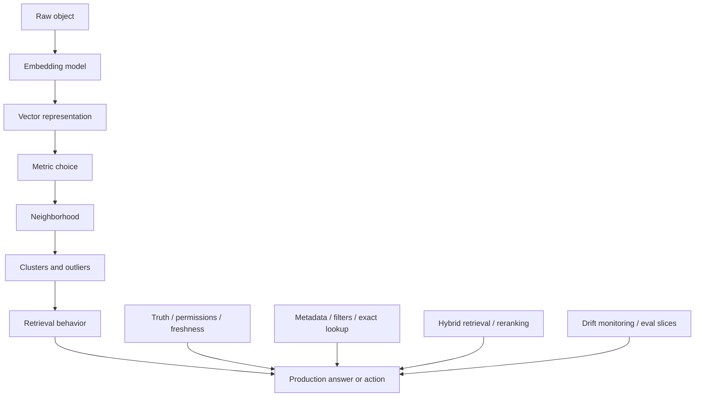

Memory card:

```text
Embeddings map meaning-like patterns into vectors.
Metrics decide what near means.
Neighborhoods decide candidates.
Clusters reveal structure.
Drift explains change.
Ambiguity, language, and domain shift define the limits.
Production systems add filters, exact signals, reranking, evaluation, and monitoring.
```

### Topic 4.1 Active Recall

Answer without looking:

1. Why is "semantically close" not the same as "correct"?
2. When do cosine and dot product produce the same ranking?
3. Why can Euclidean distance behave differently from cosine?
4. What is a top-k neighborhood?
5. Why can generic documents pollute neighborhoods?
6. What is semantic drift?
7. Why can clusters mislead you?
8. Why is polysemy dangerous for short queries?
9. Why is multilingual support not binary?
10. Why does domain shift hurt general embedding models?
11. When should you use hybrid retrieval?
12. What should be in a production embedding trace?

Expected answers:

1. Related text can be stale, unauthorized, contradictory, incomplete, or from the wrong sense.
2. When vectors are unit-normalized.
3. Euclidean measures endpoint distance and is sensitive to magnitude unless normalized.
4. The nearest candidate vectors around a query or object.
5. They overlap with many topics but may not answer any specific question precisely.
6. Change in neighborhood, cluster, data, model, metadata, or business meaning over time.
7. Clusters are discovered structure, not authoritative labels.
8. Short queries lack context needed to disambiguate the intended sense.
9. Quality varies by language, script, domain, and cross-language direction.
10. Domain terms and acronyms may mean something different from general training data.
11. When exact terms, acronyms, IDs, or rare domain vocabulary matter alongside semantic meaning.
12. Query, model version, metric, normalization, index version, top-k candidates, scores, filters, reranker actions, and final evidence.

One-line topic summary:

> Embedding geometry is useful only when you understand what the vector means, how it is compared, what neighborhood it creates, how that neighborhood changes, and where language/domain limitations require architectural support.

---

## Topic 4.2: Embedding Model Selection and Evaluation

> **Topic time:** 8h
> Focus: Learning how to choose embedding models using workload fit, evaluation data, latency, cost, dimensionality, domain vocabulary, multilingual needs, and production constraints instead of leaderboard hype.

---

## Subtopic 4.2.a: General-Purpose vs Domain-Tuned Embedding Models

### Add to Knowledge Base

An **embedding model** is not just a commodity text-to-vector function.

It defines:

- what semantic patterns are captured
- which languages work well
- which domains are understood
- which distance metric is appropriate
- how much each vector costs to store and search
- how well queries retrieve the right documents
- how much domain jargon survives representation

The first selection question is usually:

```text
Should we use a general-purpose embedding model or a domain-tuned embedding model?
```

Simple distinction:

| Model type | Core idea | Best fit |
|---|---|---|
| General-purpose embedding model | Trained for broad language, broad topics, and broad retrieval/similarity tasks. | Starting point, mixed corpora, broad enterprise search, prototypes, general RAG. |
| Domain-tuned embedding model | Adapted or trained for a specialized domain, vocabulary, or retrieval task. | High-value domain jargon, expert queries, regulated domains, code, biomedical, legal, finance, internal acronyms. |

The core idea:

> General-purpose models are strong baselines. Domain-tuned models are justified when local evaluation proves the general model misses important domain meaning.

The beginner mistake:

```text
Pick the model with the highest public leaderboard score.
```

The professional view:

```text
Pick the model that performs best on your retrieval workload under your latency, cost, privacy, language, and maintenance constraints.
```

Reference anchors:
- MTEB benchmark paper: `https://arxiv.org/abs/2210.07316`
- BEIR retrieval benchmark paper: `https://arxiv.org/abs/2104.08663`
- Sentence-BERT paper: `https://arxiv.org/abs/1908.10084`
- BioASQ biomedical semantic indexing benchmark: `https://www.bioasq.org/`

Key terms:

| Term | Meaning |
|---|---|
| General-purpose model | Embedding model intended to work across many domains and tasks. |
| Domain-tuned model | Embedding model adapted for a specific field, vocabulary, or data distribution. |
| In-domain data | Data similar to production data. |
| Out-of-domain data | Data different from the model's training/evaluation distribution. |
| Zero-shot | Using a model without task-specific training. |
| Fine-tuning | Updating model weights using task/domain examples. |
| Contrastive training | Training where positive pairs are pulled closer and negative pairs are pushed apart. |
| Query-document pair | A query and a relevant document/chunk used for retrieval evaluation. |
| Hard negative | A document that looks related but is not the correct result. |
| Benchmark | Standard evaluation set used to compare models. |
| Local eval | Evaluation built from your own queries, documents, labels, and constraints. |

Important sentence:

> Public benchmarks help you shortlist models; local evaluation decides production fit.

---

### Reading Path + Level Tags

- **Beginner:** Read sections 0-4 and Active Recall.
- **Intermediate:** Add sections 5-10 and complete the Build part of the Hands-On Lab.
- **Pro:** Complete the full Hands-On Lab, including Break and Measure, then answer the model-selection system design question.

---

### 0. Pre-Question Hook [Beginner]

**Pause:** You are building RAG for a healthcare operations knowledge base.

Documents contain:

```text
EOB
COB
OON provider
prior auth
member responsibility
claim adjudication
CPT code
ICD diagnosis code
```

A general-purpose embedding model retrieves:

```text
1. generic insurance overview
2. legal claim article
3. broad provider onboarding page
4. unrelated customer complaint process
```

A domain-tuned healthcare model retrieves:

```text
1. EOB generation workflow
2. coordination-of-benefits denial guide
3. out-of-network provider claim handling
4. prior authorization exception process
```

Which model should you choose?

Bad answer:

> "Always choose the domain model because it knows healthcare."

Also bad:

> "Always choose the general model because it scores well on benchmarks."

Production answer:

> "I would run a local retrieval eval on realistic healthcare queries, including acronyms, expert shorthand, multilingual terms if needed, stale policies, and hard negatives. If the domain-tuned model meaningfully improves high-risk query success within acceptable latency, cost, privacy, and maintenance constraints, I would choose it or use it for routed domain-specific retrieval. Otherwise I would keep the general-purpose model."

Before reading on, answer:

- Is your corpus broad or specialized?
- Are users asking expert shorthand queries?
- Do exact acronyms matter?
- Does a general model retrieve known-good documents?
- Does a domain model improve recall or just look better anecdotally?
- What is the latency and storage cost difference?
- Can your team maintain a domain-tuned model lifecycle?

This is model selection.

---

### 1. The Intuition: Generalist vs Specialist [Beginner]

Think of embedding models like people helping in a library.

A generalist librarian can help with many topics:

```text
history
software
travel
business
basic medicine
general policy
```

A specialist librarian knows one area deeply:

```text
oncology literature
tax law
Kubernetes internals
insurance claims
financial derivatives
```

If your library contains a little bit of everything, the generalist is valuable.

If your users ask expert questions in one specialized field, the specialist may be better.

But specialists have trade-offs:

- may be weaker outside their specialty
- may cost more to run or maintain
- may require special deployment
- may need labeled data
- may create model/version migration work
- may overfit to narrow phrasing

The senior-engineer instinct:

```text
start with a strong general baseline
measure domain failures
specialize only where the evidence justifies it
```

#### Beginner Explanation in 3 Lines

General-purpose embedding models are broad, flexible baselines.
Domain-tuned embedding models can understand specialized language better.
Choose by local retrieval evaluation, not by vibes or leaderboard rank.

---

### 2. Visual Diagram: Selection Funnel [Beginner]

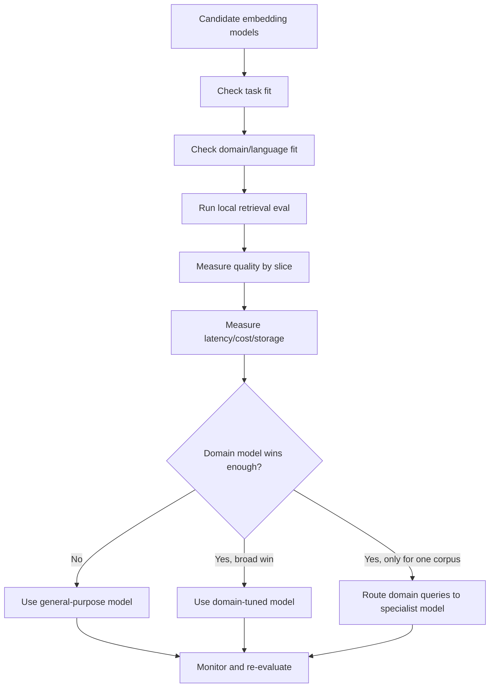

The important part:

```text
model choice is an evaluation loop
```

not:

```text
model choice is a one-time shopping decision
```

---

### 3. What General-Purpose Models Are Good At [Beginner]

General-purpose embedding models are usually strong at:

- common language
- paraphrases
- broad semantic search
- everyday support queries
- mixed-topic enterprise corpora
- getting started quickly
- zero-shot use
- multilingual support if designed for it
- baseline RAG retrieval
- prototypes and early product validation

Example queries:

```text
"how do I reset my password?"
"cancel subscription"
"rotate API keys"
"what is the vacation policy?"
"troubleshoot login error"
```

General-purpose models often work well here because the language is common enough and the meaning is not deeply specialized.

#### Why They Are Strong Baselines

They usually provide:

- broad coverage
- easier setup
- less training data need
- simpler operations
- easier vendor/model replacement
- good performance across many query types

For many teams, the best first production version is:

```text
strong general-purpose embeddings
+ good chunking
+ metadata filters
+ hybrid retrieval
+ reranking
+ evaluation
```

not immediate fine-tuning.

#### Where They Struggle

General-purpose models can struggle with:

- rare acronyms
- domain-specific abbreviations
- expert shorthand
- specialized regulatory language
- internal product names
- private company jargon
- code symbols and APIs
- biomedical/legal/financial nuance
- very short technical queries

When they fail, the result often looks semantically plausible but operationally wrong.

---

### 4. What Domain-Tuned Models Are Good At [Beginner]

Domain-tuned models are trained, adapted, or selected for a particular field or task.

Examples of domains:

```text
biomedical literature
legal contracts
financial filings
source code
healthcare operations
security policies
customer support tickets
internal enterprise knowledge
e-commerce product search
```

They can improve:

- acronym understanding
- expert query recall
- domain-specific synonyms
- subtle term distinctions
- retrieval over specialized documents
- ranking of authoritative domain evidence
- handling of field-specific concepts

Example:

General language:

```text
"claim" = assertion or demand
```

Healthcare:

```text
"claim" = insurance reimbursement record/workflow
```

Identity:

```text
"claim" = attribute in an identity token
```

A domain-tuned model can learn the intended neighborhood for that domain.

#### Domain-Tuned Does Not Mean Always Better

A healthcare-tuned model may be worse for:

- general HR policy
- software engineering docs
- finance documents
- multilingual casual support
- broad enterprise search

Specialization can create blind spots.

Production pattern:

```text
use general model for broad search
use specialist model for routed specialist corpora
```

when one model cannot serve all workloads well.

---

### 5. Selection Criteria [Intermediate]

Use this checklist before choosing a model.

#### 5.1 Task Type

What are you doing?

| Task | What matters |
|---|---|
| RAG over documents | Query-document relevance, answerability, source authority. |
| Semantic search | User-perceived result relevance. |
| Duplicate detection | Near-duplicate separation and threshold calibration. |
| Clustering | Stable topic neighborhoods and useful cluster structure. |
| Recommendation | User-item relevance and business outcome. |
| Code search | API names, symbols, intent, exact identifiers. |
| Multilingual search | Cross-language alignment and language-specific quality. |

Do not assume one embedding model wins every task.

#### 5.2 Domain Specificity

Ask:

- Is the vocabulary common or specialized?
- Are acronyms important?
- Are users experts?
- Do documents use internal terms?
- Does ambiguity cross domains?
- Are there high-risk wrong-sense errors?

The more specialized and high-risk the domain, the more likely a domain-tuned model deserves evaluation.

#### 5.3 Query Style

Different users write differently.

Examples:

```text
beginner: "how do I submit a medical claim?"
expert: "COB denial for OON provider"
engineer: "jwt aud claim mismatch idp"
support agent: "mbr resp not calc on eob"
```

General models may handle beginner queries better than expert shorthand.

Domain-tuned models may shine on expert shorthand.

#### 5.4 Language and Locale

Ask:

- Which languages matter?
- Are documents translated?
- Are queries code-switched?
- Are locales legally different?
- Should cross-language retrieval be allowed?

A domain-tuned English model may not help multilingual retrieval.

A multilingual general model may outperform a monolingual domain model for global support.

#### 5.5 Vector Dimension and Storage

Higher-dimensional vectors often cost more:

- more storage
- more memory
- more bandwidth
- slower exact search
- larger indexes
- higher backup/replication cost

Example intuition:

```text
10 million vectors * 1536 dimensions * 4 bytes ~= 61 GB raw vector data
10 million vectors * 384 dimensions * 4 bytes ~= 15 GB raw vector data
```

Raw vector storage is only part of total cost. Index overhead can add much more.

#### 5.6 Latency and Throughput

Embedding model choice affects:

- ingestion throughput
- query embedding latency
- search latency through dimension/index size
- reranking budget
- batch processing time

For online RAG:

```text
query embedding latency + retrieval latency + reranking latency + LLM generation latency
```

must fit the user experience.

#### 5.7 Privacy and Deployment

Ask:

- Can text leave your environment?
- Is a managed API allowed?
- Do you need self-hosting?
- Are logs stored by provider?
- Is data regulated?
- Do you need regional deployment?

Domain-tuned models may require self-hosting or specialized infrastructure.

Managed general models may be easier but constrained by data policy.

#### 5.8 Maintenance

Domain-tuned systems need lifecycle management:

- training data collection
- labeled eval sets
- model versioning
- re-embedding migrations
- rollback plans
- drift monitoring
- specialist knowledge updates

If your team cannot maintain this, a strong general model plus retrieval engineering may be safer.

---

### 6. Benchmarks vs Local Evaluation [Intermediate]

Public benchmarks are useful.

They help answer:

```text
Which models are broadly strong?
Which model families are promising?
Which tasks does a model claim to handle?
What are reasonable baseline expectations?
```

But benchmarks do not answer:

```text
Will this model retrieve our payroll policy correctly?
Will it understand our internal acronym?
Will it handle our code-switched support tickets?
Will it meet our p95 latency and storage budget?
Will it behave safely under our permissions and metadata filters?
```

That is why you need local evaluation.

#### Public Benchmark Role

Use MTEB/BEIR-style benchmarks to shortlist:

- broad retrieval strength
- clustering capability
- classification support
- multilingual coverage
- model size/performance trade-offs

Do not use them as final proof.

#### Local Evaluation Role

Use local evals to decide:

- relevant document hit rate
- answerability
- domain acronym handling
- wrong-sense rate
- language and locale performance
- freshness behavior
- hard negative separation
- cost and latency under your traffic

Senior sentence:

> "I would use public benchmarks to create a candidate set, then make the final decision with a local labeled query-document eval and production constraints."

---

### 7. How to Build a Local Embedding Eval [Intermediate]

Start small but real.

#### Step 1: Collect Queries

Sources:

- search logs
- support tickets
- customer questions
- SME-written queries
- failed RAG examples
- sales/support scenarios
- security/compliance cases

Include query types:

- easy paraphrase
- exact acronyms
- short ambiguous queries
- expert shorthand
- multilingual queries
- stale-document traps
- permission-sensitive queries
- long-tail domain queries

#### Step 2: Label Relevant Documents

For each query, label:

```text
must retrieve
useful
related but insufficient
wrong
forbidden/unauthorized
stale
```

This is more useful than binary relevant/not relevant.

#### Step 3: Include Hard Negatives

Hard negatives are related but wrong.

Example:

Query:

```text
"contractor production log access"
```

Hard negatives:

```text
"employee production log access"
"contractor staging log access"
"old contractor access policy"
"generic production security overview"
```

Hard negatives reveal whether the embedding model understands the actual distinction.

#### Step 4: Run Multiple Models

For each model:

- embed corpus
- embed query set
- search with correct metric
- apply same filters
- compare top-k results
- measure quality and latency

Keep the pipeline identical except for the model when possible.

#### Step 5: Measure by Slice

Do not only report one average score.

Report:

```text
overall
domain acronyms
expert shorthand
multilingual
ambiguous terms
high-risk policy
exact IDs
stale-doc traps
long-tail topics
```

The best general model may win overall while failing a critical slice.

#### Step 6: Inspect Failures

For each failure:

Ask:

- Did the model miss a synonym?
- Did it choose the wrong sense?
- Did it fail an acronym?
- Did it over-rank generic docs?
- Did chunking cause blur?
- Did metadata filtering remove the right doc?
- Did reranking recover it?
- Is the corpus missing content?

The model is not always the cause.

---

### 8. Metrics for Model Selection [Intermediate]

Useful retrieval metrics:

| Metric | What it tells you |
|---|---|
| Recall@k | Did relevant docs appear in the top k? |
| Hit rate@k | Did at least one useful result appear in top k? |
| MRR | How high did the first relevant result rank? |
| nDCG | Did ranking place highly relevant docs near the top? |
| Precision@k | How many top-k results were useful? |
| Wrong-sense rate | How often did ambiguous terms retrieve the wrong meaning? |
| Stale-doc rate | How often did old docs outrank current docs? |
| Forbidden-doc rate | Whether unauthorized candidates appeared before filters/final answer. |
| Latency p50/p95/p99 | User-facing performance and SLO fit. |
| Cost per million queries | Operating cost. |
| Storage/index size | Infra cost and scalability. |

#### Recall@k

If:

```text
Recall@10 = 0.92
```

it means relevant documents appear in the top 10 for 92% of cases, depending on label definition.

Good for RAG because rerankers and answer generators can use larger candidate sets.

#### MRR

MRR rewards the first relevant result appearing early.

Good when:

```text
the top result matters a lot
```

#### nDCG

nDCG supports graded relevance:

```text
must-answer doc > useful supporting doc > merely related doc
```

Good when top-k has mixed usefulness.

#### Business Metrics

For production, also measure:

- answer correctness
- citation quality
- user click-through
- support deflection
- escalation reduction
- task completion
- hallucination rate
- analyst review time

Embedding metrics are necessary but not sufficient.

---

### 9. Decision Matrix: General vs Domain-Tuned [Intermediate]

| Situation | Likely choice |
|---|---|
| Broad mixed knowledge base | Start with general-purpose model. |
| Early prototype | General-purpose model. |
| No labeled data yet | General-purpose model plus eval-building. |
| Strong domain jargon and expert shorthand | Evaluate domain-tuned model. |
| Regulated/high-risk domain | Evaluate domain-tuned model and strong retrieval controls. |
| Multilingual global support | Evaluate multilingual general and multilingual domain options. |
| Code-heavy corpus | Evaluate code-aware embeddings and hybrid retrieval. |
| Acronym-heavy internal docs | Evaluate domain model, glossary, and hybrid retrieval. |
| General model already passes local eval | Do not specialize prematurely. |
| Domain model wins one slice but loses broadly | Use routing or multiple indexes. |

Decision rule:

```text
specialize when domain-specific retrieval errors are frequent, important, and not fixed enough by chunking, metadata, hybrid retrieval, or reranking
```

Do not specialize because:

```text
the word "domain" sounds more advanced
```

Specialize because:

```text
local eval shows meaningful improvement on business-critical slices
```

---

### 10. Common Mistakes + Debugging [Intermediate]

#### Mistake 1: Choosing by Leaderboard Alone

Bad:

```text
Model A is #1 on a public benchmark, so it is best for us.
```

Better:

```text
Use benchmarks to shortlist, then run local evals.
```

Why:

Benchmarks may not match your domain, query style, languages, corpus, filters, latency, or cost.

#### Mistake 2: Fine-Tuning Before Fixing Retrieval Basics

Bad:

```text
Retrieval is bad, so fine-tune embeddings.
```

Check first:

- chunking
- metadata filters
- metric/normalization
- hybrid retrieval
- reranking
- stale docs
- missing documents
- bad labels
- query rewriting

Fine-tuning bad data or bad chunking makes a more expensive bad system.

#### Mistake 3: Ignoring Domain Hard Negatives

Easy negative:

```text
healthcare claim query vs pizza recipe
```

Hard negative:

```text
healthcare claim query vs legal claim document
```

Hard negatives reveal whether the model understands domain boundaries.

#### Mistake 4: Evaluating Only Top-1

RAG often retrieves:

```text
top 50 -> rerank -> top 5 context
```

Top-1 is not enough.

Measure:

- recall@10
- recall@50
- reranker recovery
- final context quality

#### Mistake 5: Ignoring Cost of Re-Embedding

Changing models means:

- re-embed corpus
- rebuild index
- recalibrate scores
- rerun evals
- migrate storage
- update monitoring
- possibly maintain dual indexes

Model selection has migration cost.

#### Mistake 6: Assuming Domain-Tuned Means Safer

A domain model can still:

- retrieve stale docs
- miss permissions
- confuse acronyms
- overfit common workflows
- underperform multilingual queries
- fail outside its specialty

Safety needs retrieval architecture, not just a specialist model.

#### Debugging Checklist

When a model underperforms:

1. Are queries representative?
2. Are labels trustworthy?
3. Are hard negatives included?
4. Is the metric correct?
5. Are vectors normalized as expected?
6. Is chunking creating blurry vectors?
7. Are domain terms expanded or preserved?
8. Are relevant docs actually indexed?
9. Are filters too strict or too loose?
10. Does reranking recover missed candidates?
11. Is failure concentrated in one slice?
12. Is model specialization actually the right fix?

---

### 11. Failure Modes [Pro]

#### Failure Mode 1: General Model Misses Expert Shorthand

What happens:

```text
"COB denial OON provider" retrieves generic insurance docs.
```

User sees:

```text
Broad explanation instead of operational workflow.
```

Mitigation:

- domain-tuned model eval
- glossary expansion
- hybrid retrieval
- expert query eval slice
- reranking

#### Failure Mode 2: Domain Model Over-Specializes

What happens:

```text
Domain model improves healthcare queries but worsens HR/general policy queries.
```

User sees:

```text
Good specialist results, worse broad search.
```

Mitigation:

- route by corpus/domain
- maintain general and specialist indexes
- fallback to general model
- evaluate mixed workloads

#### Failure Mode 3: Benchmark Winner Loses Locally

What happens:

```text
Public benchmark score is high, but local acronym/domain recall is low.
```

User sees:

```text
Production search misses known-good docs.
```

Mitigation:

- local labeled eval
- hard negatives
- business-slice metrics
- model bake-off

#### Failure Mode 4: Re-Embedding Migration Regression

What happens:

```text
New model changes vector space and neighborhoods.
```

User sees:

```text
Search results shift unexpectedly.
```

Mitigation:

- shadow evaluation
- dual-index rollout
- top-k overlap monitoring
- rollback plan
- threshold recalibration

#### Failure Mode 5: Latency/Cost Surprise

What happens:

```text
Higher-quality model has larger vectors or slower embedding latency.
```

User sees:

```text
Slow search, expensive ingestion, or infrastructure pressure.
```

Mitigation:

- benchmark p95/p99 latency
- calculate storage/index overhead
- batch ingestion
- use smaller model if quality difference is negligible
- route expensive model only to high-value queries

#### Failure Mode 6: Privacy Constraint Blocks Best Model

What happens:

```text
Best-scoring managed model cannot receive regulated text.
```

User sees:

```text
Architecture cannot pass security review.
```

Mitigation:

- self-hosted model evaluation
- redaction where safe
- regional deployment
- data processing agreement
- privacy-aware model shortlist

---

### 12. Trade-offs [Pro]

| Choice | Gain | Cost |
|---|---|---|
| General-purpose model | Broad coverage, fast start, simpler ops. | May miss domain jargon and expert shorthand. |
| Domain-tuned model | Better specialized recall and term understanding. | More eval, deployment, maintenance, and possible narrowness. |
| Larger model/vector | Potentially richer representation. | Higher latency, storage, memory, and search cost. |
| Smaller model/vector | Faster and cheaper. | May lose nuance or domain separation. |
| Managed API | Easy scaling and updates. | Privacy/vendor/cost constraints. |
| Self-hosted model | More control and privacy. | Infra, scaling, monitoring, and upgrade burden. |
| One model for all corpora | Simpler architecture. | May underperform specialized slices. |
| Multiple routed models | Better workload fit. | Routing complexity and multiple indexes. |
| Fine-tuned model | Strong task/domain alignment. | Requires data, training, eval, migration, lifecycle ownership. |

The central trade-off:

```text
breadth and simplicity vs specialized precision and ownership cost
```

---

### 13. What Problem This Solves

Primary problem solved:

> Model selection determines whether your embeddings represent your users' actual retrieval needs well enough for production.

Secondary benefits:

- avoids premature fine-tuning
- avoids leaderboard-driven architecture
- improves domain-specific recall
- exposes language/domain weaknesses
- clarifies cost and latency trade-offs
- reduces wrong-sense retrieval
- supports safer RAG design

Systems impact:

> The embedding model is the first ranking model in many retrieval systems. If it fails to produce a good candidate set, the rest of the pipeline starts from weak evidence.

---

### 14. When to Start with General-Purpose Models

Start with a general-purpose model when:

- you are prototyping
- corpus is broad
- domain language is moderate
- no labeled eval set exists yet
- latency/cost simplicity matters
- team wants fast iteration
- multilingual breadth matters more than one-domain precision
- retrieval errors are not yet understood
- strong chunking/filtering/reranking may solve the problem

Strong sentence:

> "I would begin with a strong general-purpose baseline, build a local eval set, and only specialize after the failure analysis shows domain-specific representation gaps."

---

### 15. When to Consider Domain-Tuned Models

Consider domain-tuned models when:

- expert shorthand is common
- acronyms carry critical meaning
- wrong-sense retrieval is frequent
- domain-specific synonyms matter
- general model misses known-good documents
- hard negatives confuse the general model
- business risk is high
- local eval shows clear gaps
- the improvement justifies operational cost

Examples:

```text
biomedical literature search
legal contract retrieval
source-code search
financial filings analysis
insurance claim workflows
security incident runbooks
internal enterprise acronyms
```

Do not decide from anecdotes alone.

Use:

```text
eval slice -> measured failure -> candidate mitigation -> measured improvement
```

---

### 16. Real-World Scenario [Intermediate]

#### Product / System

RAG assistant for a healthcare payer operations team.

Users ask:

```text
"Why did EOB not generate for OON provider?"
"COB denial for secondary plan"
"member responsibility mismatch after claim adjustment"
```

#### Candidate Models

Model A:

```text
general-purpose multilingual embedding model
```

Model B:

```text
healthcare/domain-tuned embedding model
```

#### Evaluation Set

The team creates:

- 300 real support queries
- 100 expert shorthand queries from SMEs
- 100 acronym-heavy queries
- 100 hard negatives
- 50 Spanish/English cross-language queries
- current vs deprecated policy traps

#### Results

General model:

- strong on broad policy questions
- weak on EOB/COB/OON shorthand
- better multilingual coverage
- cheaper and simpler

Domain model:

- better on healthcare acronyms
- better on expert shorthand
- weaker on multilingual queries
- larger vectors and slower ingestion

#### Architecture Decision

Use:

```text
general model for broad/global queries
domain model for routed healthcare operations corpus
hybrid retrieval for acronyms
reranker for final evidence ordering
```

#### Why This Is Mature

The team did not ask:

```text
Which model is best?
```

They asked:

```text
Which model is best for which slice, under which constraints?
```

---

### 17. Code Sample: Simple Model Bake-Off Scoring

This toy example compares two candidate models using labeled top-k results.

```python
eval_cases = [
    {
        "query": "COB denial for OON provider",
        "must_retrieve": {"cob_denial_workflow", "oon_provider_claims"},
        "general_top_5": [
            "generic_insurance_overview",
            "legal_claim_denial",
            "oon_provider_claims",
            "member_portal_help",
            "benefits_summary",
        ],
        "domain_top_5": [
            "cob_denial_workflow",
            "oon_provider_claims",
            "secondary_plan_rules",
            "claim_adjustment_process",
            "eob_generation",
        ],
    },
    {
        "query": "reset password",
        "must_retrieve": {"password_reset_guide"},
        "general_top_5": [
            "password_reset_guide",
            "account_recovery",
            "mfa_setup",
            "login_troubleshooting",
            "security_policy",
        ],
        "domain_top_5": [
            "member_portal_login",
            "password_reset_guide",
            "claim_portal_access",
            "provider_login",
            "account_recovery",
        ],
    },
]


def hit_rate_at_k(cases, field, k):
    hits = 0
    for case in cases:
        top_k = set(case[field][:k])
        if top_k & case["must_retrieve"]:
            hits += 1
    return hits / len(cases)


for model_field in ["general_top_5", "domain_top_5"]:
    print(model_field)
    print("hit@1:", hit_rate_at_k(eval_cases, model_field, 1))
    print("hit@5:", hit_rate_at_k(eval_cases, model_field, 5))
```

Expected lesson:

```text
Evaluate models by labeled retrieval behavior, not by model name.
```

---

### 18. Mini Program: Slice-Based Model Comparison [Pro]

This program shows why averages can hide domain-specific wins and losses.

```python
from collections import defaultdict


cases = [
    {
        "query": "COB denial for OON provider",
        "slice": "domain_acronym",
        "relevant": {"cob_denial", "oon_provider"},
        "general": ["generic_insurance", "legal_claim", "oon_provider"],
        "domain": ["cob_denial", "oon_provider", "eob_workflow"],
    },
    {
        "query": "member responsibility mismatch",
        "slice": "domain_acronym",
        "relevant": {"member_responsibility"},
        "general": ["member_portal", "benefits_overview", "claim_status"],
        "domain": ["member_responsibility", "claim_adjustment", "eob_workflow"],
    },
    {
        "query": "reset password",
        "slice": "general_support",
        "relevant": {"password_reset"},
        "general": ["password_reset", "account_recovery", "mfa_setup"],
        "domain": ["member_portal_login", "password_reset", "provider_login"],
    },
    {
        "query": "cancelar suscripcion",
        "slice": "multilingual",
        "relevant": {"cancel_subscription"},
        "general": ["cancel_subscription", "billing_help", "refund_policy"],
        "domain": ["claim_cancellation", "member_plan", "provider_contract"],
    },
]


def hit_at_k(case, model_name, k):
    return bool(set(case[model_name][:k]) & case["relevant"])


def report(model_name, k=1):
    by_slice = defaultdict(list)
    for case in cases:
        by_slice[case["slice"]].append(hit_at_k(case, model_name, k))

    print()
    print(f"{model_name} hit@{k}")
    print("-" * 20)
    all_hits = []
    for slice_name, hits in by_slice.items():
        score = sum(hits) / len(hits)
        all_hits.extend(hits)
        print(f"{slice_name:<18} {score:.0%}")
    print(f"{'overall':<18} {sum(all_hits) / len(all_hits):.0%}")


def main():
    report("general", k=1)
    report("domain", k=1)
    print()
    print("Lesson:")
    print("A domain model can win domain acronyms and lose multilingual/general slices.")
    print("Model selection should be slice-aware.")


if __name__ == "__main__":
    main()
```

Expected learning:

- Domain-tuned model wins the domain acronym slice.
- General model may win general support and multilingual slices.
- Overall metrics can hide the right architecture.
- A routed two-model design may beat one universal choice.

---

### 19. Hands-On Lab: Build, Break, Measure [Pro]

#### Goal

Create a small local model-selection process that compares a general model and a domain-tuned model fairly.

#### Build

Create a table of 40 evaluation queries:

- 10 general support queries
- 10 domain acronym queries
- 10 ambiguous term queries
- 5 multilingual queries
- 5 stale/current policy traps

For each query, define:

```text
query
slice
must_retrieve_docs
useful_docs
hard_negative_docs
business_risk
```

#### Simulate or Run Models

Option A:

```text
Use real embedding models if available.
```

Option B:

```text
Use saved top-k result lists or fake vectors to learn the evaluation logic.
```

For each candidate model, record:

```text
top_10_results
scores
latency_ms
vector_dimension
estimated_storage
notes
```

#### Break

Include hard cases:

```text
"claim status"
"provider setup"
"token expired"
"EOB missing for OON provider"
"politica de reembolso"
"old contractor access policy"
```

#### Measure

Create a scorecard:

| Slice | General hit@10 | Domain hit@10 | Winner | Notes |
|---|---:|---:|---|---|
| general support | 95% | 85% | general | broad language |
| domain acronyms | 55% | 88% | domain | expert shorthand |
| multilingual | 90% | 50% | general | language coverage |
| stale traps | 70% | 72% | tie | needs metadata |

Also record:

- p95 query embedding latency
- ingestion throughput
- vector dimension
- index size
- monthly cost estimate
- privacy/deployment fit

#### Decide

Choose one:

1. General model only.
2. Domain model only.
3. Routed general + domain models.
4. General model plus hybrid/glossary/reranking.
5. Delay specialization and improve eval/chunking first.

#### Reflection

Answer:

1. Which model wins overall?
2. Which model wins high-risk slices?
3. Which model is cheaper to operate?
4. Which failures are not model failures?
5. Would routing be worth the complexity?
6. What would trigger reevaluation in three months?

---

### 20. Interview-Style Practical Question

> You are designing RAG for a legal and healthcare enterprise knowledge base. A general-purpose embedding model performs well on public benchmarks, but SMEs say it misses internal acronyms and expert queries. How would you decide whether to use a domain-tuned embedding model?

---

### 21. Strong Answer

1. **I would start with the general-purpose model as a baseline.**

   It gives broad coverage and simple operations, and public benchmarks are useful for shortlisting.

2. **I would build a local labeled retrieval eval.**

   The eval would include real queries, SME-written expert queries, acronyms, ambiguous terms, hard negatives, multilingual cases if required, stale/current document traps, and high-risk policy questions.

3. **I would compare candidate models under the same pipeline.**

   Same chunks, metadata filters, metric, top-k, reranking setup, and corpus snapshot wherever possible.

4. **I would measure by slice.**

   Overall score is not enough. I would separately measure domain acronyms, expert shorthand, ambiguous terms, multilingual queries, and high-risk legal/healthcare queries.

5. **I would include operational constraints.**

   Latency, vector dimension, storage/index size, cost, privacy, deployment, re-embedding, and maintenance all matter.

6. **I would choose specialization only if it materially improves business-critical failures.**

   If the domain model only wins one slice, I might route those queries to a domain-specific index while keeping a general model for broad search.

7. **I would avoid fine-tuning until simpler fixes are tested.**

   Chunking, glossary expansion, hybrid retrieval, metadata routing, and reranking may solve much of the problem with lower operational burden.

Short version:

```text
Benchmarks shortlist.
Local eval decides.
Slice metrics explain.
Operational constraints govern.
Specialize only when the measured domain gain is worth ownership cost.
```

---

### 22. Production Reality Check

A production model-selection decision should be documented.

Design record:

```text
selected_model:
model_version:
model_type: general-purpose/domain-tuned
embedding_dimension:
recommended_metric:
normalization:
supported_languages:
deployment_mode: managed/self-hosted
privacy_review:
local_eval_dataset_version:
overall_metrics:
slice_metrics:
latency_p95:
estimated_monthly_cost:
index_size:
reembedding_plan:
rollback_plan:
next_review_date:
```

Minimum production monitoring:

- hit rate by query slice
- recall@k by domain
- wrong-sense rate
- acronym query success
- multilingual success
- stale-doc rate
- score distribution shift
- embedding latency
- index size growth
- model version drift
- user feedback by domain/language

Operational rule:

> Treat embedding model changes like search relevance migrations, not harmless library upgrades.

Any model change can alter:

- neighborhoods
- score distributions
- thresholds
- index size
- latency
- reranker inputs
- final answer quality

---

### 23. Active Recall [Beginner]

Answer without looking:

1. What is a general-purpose embedding model?
2. What is a domain-tuned embedding model?
3. Why should public benchmarks not be the final decision?
4. What is a local embedding eval?
5. What is a hard negative?
6. When should you consider a domain-tuned model?
7. Why can domain-tuned models be worse outside their domain?
8. Why does vector dimension matter?
9. What metrics would you use for retrieval model selection?
10. Why should evaluation be sliced?
11. What are simpler alternatives to fine-tuning?
12. Why is model migration risky?

Expected answers:

1. A model intended to work broadly across many topics/tasks.
2. A model adapted for a specialized domain, vocabulary, or retrieval task.
3. Benchmarks may not match your data, language, domain, cost, latency, or filters.
4. An eval built from your own queries, documents, labels, and constraints.
5. A related but incorrect document used to test whether retrieval can distinguish subtle differences.
6. When local eval shows important domain-specific failures not solved by simpler retrieval improvements.
7. Specialization can reduce broad coverage and bias neighborhoods toward domain meanings.
8. It affects storage, memory, index size, bandwidth, and search latency.
9. Recall@k, hit rate@k, MRR, nDCG, precision@k, wrong-sense rate, latency, cost, and storage.
10. Overall averages hide failures in critical domains, languages, acronyms, or high-risk queries.
11. Better chunking, metadata routing, hybrid retrieval, glossary expansion, query rewriting, and reranking.
12. New vector spaces change neighborhoods, thresholds, indexes, and downstream answer behavior.

---

### 24. Revision Notes

One-line summary:

> General-purpose embedding models are strong baselines; domain-tuned models are justified when local evals prove important specialized retrieval gains that outweigh operational cost.

Three keywords:

```text
baseline
domain-fit
local-eval
```

One interview trap:

```text
Choosing by leaderboard rank instead of workload-specific retrieval evidence.
```

One memory trick:

```text
Start general.
Measure local.
Specialize only when the slices demand it.
```

---

### 25. Quick Self-Test

For each situation, choose the likely decision.

| Situation | Likely decision | Why |
|---|---|---|
| Broad HR, IT, engineering, policy corpus with no labels yet. | Start general-purpose. | Need baseline and eval data first. |
| Biomedical corpus with acronym-heavy expert queries failing. | Evaluate domain-tuned. | Domain jargon is central. |
| Domain model wins acronyms but loses multilingual queries. | Consider routing/two-model design. | One model does not fit all slices. |
| Retrieval misses docs because chunks are huge. | Fix chunking before tuning. | Model is not the root cause yet. |
| Public benchmark winner misses internal acronyms. | Trust local eval over leaderboard. | Production data differs. |
| New model has better recall but doubles index size. | Evaluate business trade-off. | Quality gain must justify cost. |

If you can explain this table, you can reason about embedding model selection like a production engineer.

---

## Subtopic 4.2.b: Dimensions, Latency, Cost, and Multilingual Support

### Add to Knowledge Base

Embedding model selection is not only about quality.

It is also about:

- vector dimension
- embedding latency
- search latency
- storage cost
- index memory
- ingestion throughput
- bandwidth
- multilingual coverage
- multilingual quality
- operational complexity

The core idea:

> An embedding model is a quality and infrastructure decision at the same time.

A larger or more specialized model may improve retrieval quality, but it can also increase:

```text
embedding time
vector size
index size
memory pressure
network transfer
backup size
re-embedding cost
query latency
monthly bill
```

And multilingual support is not binary.

Bad assumption:

```text
model supports many languages = model works equally well for all users
```

Better:

```text
language support must be evaluated by language, locale, script, code-switching behavior, and cross-language retrieval direction
```

Key terms:

| Term | Meaning |
|---|---|
| Dimension | Number of numeric coordinates in each vector. |
| Embedding latency | Time to convert input text/object into a vector. |
| Search latency | Time to retrieve nearest vectors from an index. |
| Ingestion latency | Time to embed and store corpus items. |
| Throughput | Number of embeddings or searches processed per second. |
| Vector storage | Raw bytes needed to store vectors. |
| Index overhead | Extra memory/disk used by ANN structures such as graph links or partitions. |
| Precision | Numeric storage type, such as float32, float16, or int8. |
| Multilingual coverage | Which languages the model can process. |
| Multilingual quality | How well the model performs for each language/task. |
| Cross-lingual retrieval | Query and document can be in different languages. |
| Same-language retrieval | Query and document are in the same language. |
| Code-switching | Mixing languages in one query or document. |

Reference anchors:
- MTEB benchmark paper: `https://arxiv.org/abs/2210.07316`
- BEIR retrieval benchmark paper: `https://arxiv.org/abs/2104.08663`
- XLM-R paper: `https://arxiv.org/abs/1911.02116`
- LaBSE paper: `https://arxiv.org/abs/2007.01852`

The beginner mistake:

```text
Choose the highest-quality model and worry about cost later.
```

The professional view:

```text
Choose the smallest, fastest, cheapest model that meets quality requirements for your important slices, including multilingual slices.
```

---

### Reading Path + Level Tags

- **Beginner:** Read sections 0-4 and Active Recall.
- **Intermediate:** Add sections 5-10 and complete the Build part of the Hands-On Lab.
- **Pro:** Complete the full Hands-On Lab, including Break and Measure, then answer the model-capacity system design question.

---

### 0. Pre-Question Hook [Beginner]

**Pause:** You have 50 million document chunks.

Candidate model A:

```text
384-dimensional vectors
fast query embedding
good English support
moderate multilingual support
```

Candidate model B:

```text
1536-dimensional vectors
slower query embedding
better retrieval quality
stronger multilingual benchmark results
```

Candidate model C:

```text
3072-dimensional vectors
best quality on your eval set
highest cost and largest index
```

Which should you choose?

Bad answer:

> "Choose C because it is best."

Also bad:

> "Choose A because it is cheapest."

Production answer:

> "I would compare quality, latency, storage, index overhead, ingestion cost, and multilingual slice performance. If C improves answer quality only slightly but doubles storage and p95 latency, it may not be worth it. If multilingual or high-risk queries improve materially, I might route only those slices to the larger model while using a smaller model for broad traffic."

Before reading on, answer:

- How many vectors will you store?
- How many dimensions per vector?
- What numeric precision is used?
- How large is the ANN index overhead?
- What is your p95 search latency budget?
- How often do documents change?
- What languages must work?
- Is cross-language retrieval required?
- Is the quality gain worth the infrastructure cost?

That is the real model-selection question.

---

### 1. The Intuition: Dimensions Are Width [Beginner]

A vector's dimension is the number of coordinates it has.

Example:

```text
3-dimensional vector:
[0.12, -0.44, 0.91]

768-dimensional vector:
[0.03, -0.18, 0.42, ..., 0.07]
```

Think of dimension as the width of the representation.

More dimensions can give the model more room to encode patterns.

But more dimensions also mean:

- more numbers per vector
- more bytes per item
- more memory read during search
- larger indexes
- slower backups
- higher network transfer
- more expensive re-embedding and migration

The key intuition:

```text
dimension is quality capacity and infrastructure weight
```

Larger is not automatically better.

Smaller is not automatically worse.

What matters is:

```text
quality per dollar
quality per millisecond
quality per GB
quality per operational complexity
```

#### Beginner Explanation in 3 Lines

Vector dimension controls how many numbers represent each object.
Higher dimensions can capture richer patterns but increase storage, memory, bandwidth, and search work.
Choose dimension based on measured quality under your latency and cost constraints.

---

### 2. Visual Diagram: Dimension Ripples Through the System [Beginner]

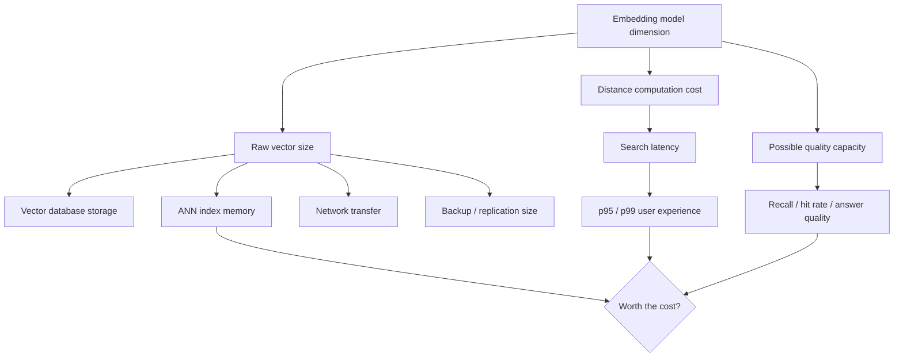

Model choice is not isolated:

```text
dimension -> storage -> index size -> latency -> cost -> architecture
```

Multilingual support adds another branch:

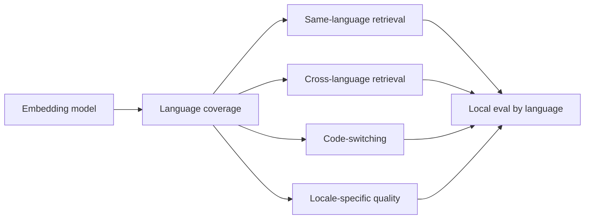

---

### 3. Storage Math [Beginner]

Raw vector storage is easy to estimate.

Formula:

```text
raw_vector_bytes = number_of_vectors * dimensions * bytes_per_dimension
```

Common numeric sizes:

| Precision | Bytes per dimension | Note |
|---|---:|---|
| float32 | 4 | Common default, higher precision. |
| float16 | 2 | Smaller, may be enough for many workloads. |
| int8 | 1 | Quantized, much smaller, may reduce quality. |

Example:

```text
10,000,000 vectors
1536 dimensions
float32

10,000,000 * 1536 * 4 bytes
= 61,440,000,000 bytes
~= 61.4 GB raw vector data
```

For 384 dimensions:

```text
10,000,000 * 384 * 4 bytes
= 15,360,000,000 bytes
~= 15.4 GB raw vector data
```

That is a 4x difference.

But raw vectors are not the whole story.

Real systems also store:

- document IDs
- metadata
- payloads
- inverted indexes
- ANN graph links
- partitions
- deleted/tombstoned entries
- replicas
- snapshots
- caches
- logs

Production estimate:

```text
total_storage ~= raw_vectors + metadata + index_overhead + replicas + backups
```

For some ANN indexes, index overhead can be substantial.

So do not say:

```text
raw vectors are 61 GB, so the database needs 61 GB
```

Say:

```text
raw vectors are 61 GB before index overhead, metadata, replication, and backups
```

---

### 4. Latency Math [Beginner]

There are multiple latencies in an embedding system.

#### 4.1 Query Embedding Latency

When a user asks:

```text
"How do I rotate API keys?"
```

the system must embed the query.

This adds:

```text
query_embedding_latency
```

to the online path.

#### 4.2 Search Latency

After embedding:

```text
query vector -> vector database -> nearest neighbors
```

Search latency depends on:

- number of vectors
- dimension
- metric
- index algorithm
- search parameters
- filters
- hardware
- cache state
- concurrency

#### 4.3 Reranking Latency

If you retrieve top 100 and rerank:

```text
retrieval latency + reranker latency
```

must fit your request budget.

#### 4.4 End-to-End RAG Latency

RAG path:

```text
query embedding
-> vector retrieval
-> metadata filtering
-> reranking
-> context packing
-> LLM generation
```

Even if vector search is fast, the total path may be slow.

Example budget:

```text
query embedding: 50 ms
retrieval: 80 ms
reranking: 200 ms
LLM generation: 2000 ms
```

If you double retrieval and reranking latency, the user may notice.

#### 4.5 Ingestion Latency

When documents are added or updated:

```text
chunk -> embed -> store -> index
```

If ingestion must be near-real-time, model speed matters.

If ingestion is offline batch, slower embedding may be acceptable.

---

### 5. Cost Dimensions [Intermediate]

Embedding cost is not one line item.

Cost categories:

| Cost area | Driver |
|---|---|
| Query embedding | Number of user queries and query length. |
| Corpus embedding | Number and size of chunks. |
| Re-embedding | Model migrations, chunking changes, content refreshes. |
| Vector storage | Number of vectors, dimensions, precision, replicas. |
| Index memory | ANN algorithm overhead and parameters. |
| Search compute | QPS, dimension, candidate count, filters. |
| Reranking | Candidate count and reranker model cost. |
| Network transfer | Moving vectors/results across services. |
| Backups/snapshots | Corpus/index size and retention policy. |
| Observability | Logs, traces, score distributions, evals. |

#### Online vs Offline Cost

Online cost:

```text
every user query pays query embedding + search + rerank
```

Offline cost:

```text
corpus ingestion and re-embedding jobs
```

A model can be cheap online but expensive to re-embed at scale if the corpus is huge and changes often.

#### Re-Embedding Cost

If you change:

- embedding model
- chunking strategy
- preprocessing
- normalization policy
- language translation strategy

you may need to re-embed.

Re-embedding cost includes:

- embedding compute/API cost
- batch job runtime
- duplicate storage during migration
- index rebuild
- eval reruns
- deployment coordination
- rollback support

Senior sentence:

> "I treat embedding model changes as data migrations, not just model upgrades."

---

### 6. Dimensions vs Quality [Intermediate]

More dimensions can help, but only if the model uses them well.

Do not assume:

```text
3072 dimensions > 1536 dimensions > 384 dimensions
```

for every workload.

A smaller model can beat a larger model if it is:

- better trained for retrieval
- better matched to the domain
- better multilingual fit
- better metric/index configuration
- paired with hybrid retrieval/reranking
- easier to run with higher top-k

#### Quality Saturation

You may see:

```text
384 dims -> recall@10 87%
768 dims -> recall@10 91%
1536 dims -> recall@10 92%
3072 dims -> recall@10 92.4%
```

The last jump may not justify doubled storage and latency.

This is called diminishing returns.

Decision:

```text
pay for quality where it changes business outcomes
```

not where it only improves a benchmark decimal.

#### Smaller Vectors Can Enable Better Architecture

A smaller vector can allow:

- higher top-k retrieval
- more replicas
- lower p99 latency
- cheaper shadow indexes
- more frequent re-embedding
- better tenant isolation
- larger corpus coverage

Sometimes:

```text
smaller embedding + better retrieval pipeline
```

beats:

```text
largest embedding + weak pipeline
```

---

### 7. Multilingual Support [Intermediate]

Multilingual support has several layers.

#### 7.1 Language Coverage

Can the model process the language at all?

Example:

```text
English
Spanish
French
Hindi
Japanese
Arabic
Portuguese
German
```

But support does not mean equal quality.

#### 7.2 Same-Language Retrieval

Query and document are in the same language:

```text
Spanish query -> Spanish documents
```

Often easier than cross-language retrieval.

#### 7.3 Cross-Language Retrieval

Query and document are in different languages:

```text
English query -> Spanish document
Spanish query -> English document
```

This requires aligned multilingual embedding space or translation strategy.

#### 7.4 Code-Switching

Real users mix language and domain terms:

```text
"prod logs access ka approval process"
"cancelar subscription renewal"
"API key rotation para staging"
```

Evaluate this directly if your users write this way.

#### 7.5 Locale and Region

Same language, different rules:

```text
English US policy
English UK policy
Spanish Mexico policy
Spanish Spain policy
```

Language matching is not enough.

You need locale metadata and policy routing.

#### 7.6 Multilingual Cost Trade-off

A multilingual model may be:

- larger
- slower
- slightly weaker on English-only queries than a strong English-specialized model
- better overall for global use

Decision depends on the product.

If 95% of traffic is English but 5% is high-value multilingual compliance traffic, you may route multilingual queries to a stronger multilingual model.

---

### 8. Multilingual Evaluation [Intermediate]

Do not report only:

```text
overall recall@10
```

Report by language and direction:

| Slice | Example |
|---|---|
| English -> English | English query retrieves English doc. |
| Spanish -> Spanish | Spanish query retrieves Spanish doc. |
| Spanish -> English | Spanish query retrieves English doc. |
| English -> Spanish | English query retrieves Spanish doc. |
| Code-switched -> English | Mixed query retrieves English doc. |
| Transliterated -> native script | Latin-script query retrieves native-script doc. |
| Locale-specific | Query retrieves correct region policy. |

Measure:

- recall@k
- hit rate@k
- wrong-language rate
- wrong-locale rate
- translation fallback success
- answer quality by language
- citation correctness
- user feedback by language

Important:

```text
multilingual retrieval quality can be asymmetric
```

English query to Spanish docs may perform differently from Spanish query to English docs.

Also:

```text
translation fallback can improve recall but introduce nuance risk
```

Especially in:

- legal
- healthcare
- finance
- HR policy
- compliance

---

### 9. Decision Matrix [Intermediate]

| Constraint | Prefer |
|---|---|
| Huge corpus, tight budget | Smaller dimensions, compression, careful eval. |
| High-risk domain queries | Larger/domain model if eval gain is material. |
| Very high QPS | Fast query embedding and efficient index. |
| Frequent corpus updates | Lower ingestion cost and fast batch embedding. |
| Global users | Multilingual model or language-specific routing. |
| Cross-language search required | Cross-lingual eval and/or translation fallback. |
| Low-latency chat UX | Keep query embedding + retrieval budget small. |
| Exact acronyms dominate | Hybrid retrieval may matter more than dimensions. |
| Privacy constraints | Self-hosted model or approved deployment path. |
| Mixed workload | Routed models or tiered retrieval. |

Strong production rule:

```text
do not optimize one axis in isolation
```

Example:

```text
best quality model
```

may fail because:

- p95 latency is too high
- storage/index cost is too high
- multilingual performance is uneven
- self-hosting is too hard
- re-embedding migrations are too expensive

Best means:

```text
best fit under constraints
```

---

### 10. Common Mistakes + Debugging [Intermediate]

#### Mistake 1: Ignoring Raw Storage Math

Bad:

```text
The vector database will handle it.
```

Better:

```text
Estimate raw vectors, index overhead, replicas, snapshots, and growth.
```

#### Mistake 2: Treating Dimension as Pure Quality

Bad:

```text
More dimensions means better retrieval.
```

Better:

```text
More dimensions means more capacity and cost; quality must be measured.
```

#### Mistake 3: Measuring Only Average Latency

Average latency hides user pain.

Track:

- p50
- p95
- p99
- timeout rate
- queue time
- ingestion backlog

#### Mistake 4: Forgetting Ingestion and Re-Embedding

Teams often benchmark query search but forget:

```text
How long to embed 100 million chunks?
How expensive to re-embed after model migration?
Can freshness requirements be met?
```

#### Mistake 5: Assuming Multilingual Support Is Equal

Bad:

```text
The model supports multilingual embeddings, so every language is solved.
```

Better:

```text
Evaluate quality by language, locale, code-switching, and cross-language direction.
```

#### Mistake 6: Choosing One Model for Incompatible Workloads

One model may not be optimal for:

```text
English HR docs
Spanish legal policies
code search
healthcare claims
high-QPS autocomplete
```

Fix:

- route by workload
- use multiple indexes
- use smaller model for cheap broad retrieval
- use larger/specialist model for high-risk slices

#### Debugging Checklist

When model cost or latency is painful:

1. How many vectors are stored?
2. What is vector dimension?
3. What precision is used?
4. What is raw vector size?
5. What is index overhead?
6. How many replicas and backups exist?
7. What is p95/p99 query embedding latency?
8. What is p95/p99 search latency?
9. Are filters increasing search cost?
10. How often do you re-embed?
11. Which languages actually need support?
12. Can routing reduce cost without hurting quality?

---

### 11. Failure Modes [Pro]

#### Failure Mode 1: Index Size Surprise

What happens:

```text
The team estimates raw vector storage but ignores ANN overhead and replicas.
```

User/system sees:

```text
memory pressure, slow indexing, higher bill, capacity incident.
```

Mitigation:

- calculate raw vector size
- benchmark index overhead
- include replicas/snapshots
- load test realistic corpus

#### Failure Mode 2: p99 Latency Regression

What happens:

```text
Larger vectors and heavier search parameters improve recall but hurt tail latency.
```

User sees:

```text
intermittently slow RAG responses.
```

Mitigation:

- monitor p95/p99
- tune ANN parameters
- reduce dimensions if quality allows
- use caching
- route expensive search only to high-risk queries

#### Failure Mode 3: Re-Embedding Backlog

What happens:

```text
Corpus updates arrive faster than the embedding pipeline can process.
```

User sees:

```text
new documents missing from search or stale answers.
```

Mitigation:

- batch processing
- priority queues
- incremental indexing
- faster model for hot path
- freshness SLOs

#### Failure Mode 4: Multilingual Quality Gap

What happens:

```text
English eval passes but Spanish, Hindi, or code-switched queries fail.
```

User sees:

```text
global users get weaker search and answers.
```

Mitigation:

- language-specific evals
- multilingual model comparison
- translation fallback
- language metadata
- routed indexes

#### Failure Mode 5: Wrong Locale Retrieval

What happens:

```text
Spanish Mexico query retrieves Spanish Spain policy.
```

User sees:

```text
wrong compliance or HR guidance.
```

Mitigation:

- locale metadata filters
- region-specific ranking
- jurisdiction-aware routing
- citation validation

#### Failure Mode 6: Overpaying for Marginal Quality

What happens:

```text
Largest model improves recall@10 by 0.5% but doubles cost.
```

User sees:

```text
no visible improvement, but infra spend rises.
```

Mitigation:

- measure business outcome
- use smaller model
- route large model selectively
- invest in reranking or hybrid retrieval instead

---

### 12. Trade-offs [Pro]

| Choice | Gain | Cost |
|---|---|---|
| Higher dimensions | More representation capacity, possible quality gain. | More storage, memory, bandwidth, and search cost. |
| Lower dimensions | Cheaper, faster, easier to scale. | Possible loss of nuance or recall. |
| float32 vectors | Higher numeric precision. | More storage and memory. |
| float16/int8/quantized vectors | Lower storage and faster search potential. | Possible quality loss, needs eval. |
| Strong multilingual model | Better global retrieval. | May be larger/slower or weaker for some monolingual slices. |
| Translation fallback | Can improve cross-language recall. | Nuance/citation/legal risks. |
| One model for all languages | Simpler architecture. | Uneven quality may hurt some users. |
| Routed language/domain models | Better slice fit. | More routing, indexes, evals, and operations. |
| Larger top-k | Better chance of including relevant docs. | More search/rerank cost. |
| Smaller top-k | Faster and cheaper. | Higher miss risk. |

Central trade-off:

```text
quality headroom vs operational weight
```

---

### 13. What Problem This Solves

Primary problem solved:

> This helps you choose embedding models that fit real production constraints, not just offline quality claims.

Secondary benefits:

- prevents surprise storage bills
- improves latency planning
- clarifies re-embedding cost
- exposes multilingual gaps
- supports capacity planning
- guides model routing decisions
- avoids overbuying model quality
- prevents underpowered retrieval for high-risk slices

Systems impact:

> Dimension, latency, cost, and multilingual support determine whether your embedding system remains affordable, fast, and useful as corpus size and traffic grow.

---

### 14. When to Prefer Smaller/Faster Models

Prefer smaller or faster models when:

- corpus is huge
- QPS is high
- latency budget is tight
- quality difference is small
- queries are low-risk
- language/domain is simple
- re-embedding happens often
- storage/index budget is constrained
- reranking can recover quality
- hybrid retrieval handles exact terms

Strong sentence:

> "If a smaller model passes the local eval and cuts storage or p95 latency materially, I would prefer it for the main path."

---

### 15. When to Pay for Larger/Stronger Models

Pay for larger or stronger models when:

- quality gain is meaningful on business-critical slices
- high-risk RAG answers depend on better recall
- multilingual coverage materially improves
- domain ambiguity is reduced
- the model reduces downstream human review
- fewer escalations or failures justify cost
- latency remains acceptable
- storage and re-embedding are manageable

Strong sentence:

> "I would pay for the larger model when the measured improvement changes user or business outcomes, not just because it has higher theoretical capacity."

---

### 16. Real-World Scenario [Intermediate]

#### Product / System

Global enterprise RAG assistant over:

- English engineering docs
- Spanish HR policies
- Japanese support docs
- healthcare claims operations docs
- multilingual support tickets

#### Candidate Models

Model A:

```text
384 dimensions
low cost
fast
good English
weak cross-language retrieval
```

Model B:

```text
1024 dimensions
moderate cost
good multilingual support
good overall retrieval
```

Model C:

```text
3072 dimensions
best recall
high storage/index cost
slower query embedding
```

#### Evaluation

The team measures:

- English hit@10
- Spanish hit@10
- Japanese hit@10
- English -> Spanish cross-language recall
- code-switched support query success
- healthcare acronym recall
- p95 query embedding latency
- index size
- monthly cost

#### Decision

They choose:

```text
Model B for global production retrieval
Model C only for high-risk healthcare operations eval/routed path
Model A for low-risk autocomplete-like semantic suggestions
```

Why:

- A is cheap but weak globally.
- B meets most quality/latency/cost needs.
- C is too expensive for all traffic but valuable for high-risk slices.

This is mature model selection:

```text
different constraints -> different retrieval paths
```

---

### 17. Code Sample: Vector Storage Estimator

```python
def raw_vector_gb(num_vectors, dimensions, bytes_per_dimension=4):
    total_bytes = num_vectors * dimensions * bytes_per_dimension
    return total_bytes / 1_000_000_000


num_vectors = 10_000_000

for dimensions in [384, 768, 1536, 3072]:
    gb = raw_vector_gb(num_vectors, dimensions)
    print(f"{dimensions:>4} dims -> {gb:>6.1f} GB raw float32 vectors")
```

Expected output intuition:

```text
384 dimensions are 4x smaller than 1536 dimensions.
3072 dimensions are 2x larger than 1536 dimensions.
```

Production note:

```text
raw vector GB is not total database GB
```

You still need to account for:

- metadata
- ANN index overhead
- replicas
- snapshots
- deleted entries
- logs

---

### 18. Mini Program: Model Cost/Quality Trade-off Simulation [Pro]

This program compares candidate models using quality, latency, storage, and multilingual scores.

```python
def raw_vector_gb(num_vectors, dimensions, bytes_per_dimension=4):
    return num_vectors * dimensions * bytes_per_dimension / 1_000_000_000


models = [
    {
        "name": "small_general",
        "dimensions": 384,
        "english_hit_at_10": 0.90,
        "multilingual_hit_at_10": 0.70,
        "domain_hit_at_10": 0.62,
        "query_embedding_ms": 35,
    },
    {
        "name": "balanced_multilingual",
        "dimensions": 1024,
        "english_hit_at_10": 0.92,
        "multilingual_hit_at_10": 0.86,
        "domain_hit_at_10": 0.74,
        "query_embedding_ms": 60,
    },
    {
        "name": "large_domain",
        "dimensions": 3072,
        "english_hit_at_10": 0.94,
        "multilingual_hit_at_10": 0.82,
        "domain_hit_at_10": 0.91,
        "query_embedding_ms": 120,
    },
]


def weighted_quality(model):
    return (
        0.40 * model["english_hit_at_10"]
        + 0.35 * model["multilingual_hit_at_10"]
        + 0.25 * model["domain_hit_at_10"]
    )


def main():
    num_vectors = 50_000_000

    print("Model comparison")
    print("-" * 80)
    for model in models:
        storage_gb = raw_vector_gb(num_vectors, model["dimensions"])
        quality = weighted_quality(model)
        print(
            f"{model['name']:<24}"
            f"quality={quality:.3f}  "
            f"latency={model['query_embedding_ms']:>3}ms  "
            f"raw_storage={storage_gb:>7.1f}GB"
        )

    print()
    print("Lesson:")
    print("The highest-quality model may not be the best default path.")
    print("Slice-aware routing can use expensive models only where they matter.")


if __name__ == "__main__":
    main()
```

Expected learning:

- Storage scales linearly with dimension.
- Quality may not scale linearly.
- Multilingual and domain quality can move differently.
- Weighted business priorities affect the decision.

---

### 19. Hands-On Lab: Build, Break, Measure [Pro]

#### Goal

Create a capacity-aware embedding model comparison.

#### Build

Create a candidate model table:

```text
model_name
dimensions
bytes_per_dimension
english_hit_at_10
multilingual_hit_at_10
domain_hit_at_10
query_embedding_p95_ms
search_p95_ms
estimated_monthly_embedding_cost
self_hosted_or_api
```

Use 3 to 5 candidate models.

#### Add Workload Assumptions

Define:

```text
num_vectors
monthly_queries
monthly_new_chunks
monthly_updated_chunks
replication_factor
backup_retention_count
languages_required
latency_budget_ms
```

#### Calculate

For each model:

- raw vector GB
- replicated vector GB
- rough backup GB
- p95 online retrieval budget
- ingestion throughput need
- quality by slice
- cost per quality point

#### Break

Create failure scenarios:

1. Corpus doubles in size.
2. Spanish traffic grows from 5% to 25%.
3. Freshness SLO requires new docs searchable within 5 minutes.
4. Model migration requires full re-embedding.
5. p95 latency budget tightens.

#### Measure

Create a decision table:

| Model | Quality | Multilingual | Domain | p95 latency | Raw GB | Risk | Decision |
|---|---:|---:|---:|---:|---:|---|---|
| small | ok | weak | weak | great | low | multilingual gap | not global |
| balanced | good | good | ok | good | moderate | manageable | default |
| large | best | good | best | risky | high | cost/latency | routed |

#### Reflect

Answer:

1. Which model is the best default?
2. Which model is best for high-risk domain queries?
3. Which model fails multilingual requirements?
4. Which model fails latency/cost constraints?
5. Would routing reduce cost?
6. What future growth would force a new decision?

---

### 20. Interview-Style Practical Question

> You are choosing an embedding model for a global RAG system with 100 million chunks, high QPS, English and Spanish users, and some high-risk healthcare queries. One model is smaller and faster, one is balanced and multilingual, and one is large with the best domain recall. How would you decide?

---

### 21. Strong Answer

1. **I would define quality and system constraints first.**

   I need corpus size, QPS, latency budget, update frequency, languages, privacy constraints, and high-risk query slices.

2. **I would estimate infrastructure cost from vector dimension.**

   Raw storage is `num_vectors * dimensions * bytes_per_dimension`, then I would add index overhead, metadata, replicas, snapshots, and growth.

3. **I would measure end-to-end latency.**

   Query embedding, vector search, filters, reranking, and LLM generation all matter. I would focus on p95 and p99, not just average latency.

4. **I would evaluate multilingual support by slice.**

   English-to-English, Spanish-to-Spanish, Spanish-to-English, English-to-Spanish, code-switched queries, and locale-specific policy retrieval should be measured separately.

5. **I would compare quality against cost.**

   If the largest model improves high-risk healthcare recall significantly but is too expensive for all traffic, I would route only those queries to that model.

6. **I would choose the simplest model that meets requirements.**

   If the balanced multilingual model meets most constraints, it becomes the default. Specialist/larger models can be routed for critical slices.

7. **I would plan for migration and re-embedding.**

   Any model change means re-embedding, index rebuild, threshold recalibration, evaluation, and rollback planning.

Short version:

```text
Dimension drives storage and latency.
Latency drives user experience.
Multilingual quality must be sliced.
Cost must be tied to business-critical quality gain.
Use routing when one model is not optimal for every workload.
```

---

### 22. Production Reality Check

Production capacity sheet:

```text
num_vectors:
dimensions:
bytes_per_dimension:
raw_vector_gb:
index_overhead_estimate:
metadata_gb:
replication_factor:
snapshot_retention:
monthly_new_vectors:
monthly_updated_vectors:
query_qps:
query_embedding_p95_ms:
search_p95_ms:
rerank_p95_ms:
supported_languages:
cross_language_required:
language_slice_metrics:
```

Minimum production monitoring:

- vector count
- index size
- memory usage
- disk usage
- embedding throughput
- ingestion backlog
- query embedding p95/p99
- search p95/p99
- cost per day/month
- language-specific hit rate
- multilingual zero-result rate
- cross-language recall
- stale-data lag

Operational rule:

> A model that is best in a notebook can be wrong in production if it violates latency, cost, freshness, or multilingual requirements.

---

### 23. Active Recall [Beginner]

Answer without looking:

1. What does embedding dimension mean?
2. Why do dimensions affect storage?
3. What is the raw vector storage formula?
4. Why is raw vector size not total database size?
5. Name four latency components in a RAG retrieval path.
6. Why can a smaller model be the better production choice?
7. Why is multilingual support not binary?
8. What is cross-language retrieval?
9. Why should multilingual evals be sliced by direction?
10. What does re-embedding cost include?
11. When should you route to a larger model?
12. What production metrics should you monitor?

Expected answers:

1. The number of numeric coordinates in each vector.
2. More dimensions means more numbers stored and compared per vector.
3. `num_vectors * dimensions * bytes_per_dimension`.
4. Index overhead, metadata, replicas, snapshots, tombstones, and logs add more.
5. Query embedding, vector search, filtering, reranking, context packing, LLM generation.
6. It may meet quality needs while reducing latency, storage, cost, and migration burden.
7. Languages vary in quality by resource level, script, locale, domain, and query style.
8. Query and document are in different languages.
9. Spanish -> English may perform differently from English -> Spanish.
10. Embedding compute/API cost, batch runtime, index rebuild, duplicate storage, eval, deployment, rollback.
11. When high-risk or specialized slices gain meaningful quality that justifies cost.
12. Vector count, index size, p95/p99 latency, ingestion backlog, cost, language hit rate, cross-language recall, stale-data lag.

---

### 24. Revision Notes

One-line summary:

> Embedding dimensions buy representation capacity but spend storage, memory, bandwidth, and latency; multilingual support must be proven by language-specific evaluation.

Three keywords:

```text
dimension
latency
multilingual
```

One interview trap:

```text
Choosing the largest model without calculating storage, index overhead, p95 latency, re-embedding cost, and multilingual slice quality.
```

One memory trick:

```text
Every extra dimension is a number you store, move, compare, index, back up, and pay for.
```

---

### 25. Quick Self-Test

For each situation, identify the likely architectural move.

| Situation | Move | Why |
|---|---|---|
| Large model improves recall by 0.3% but doubles storage. | Prefer smaller/default model. | Marginal quality may not justify cost. |
| Spanish queries fail despite strong English metrics. | Add multilingual eval/routing. | Overall quality hides language gaps. |
| High-risk healthcare queries improve 15% with large model. | Route high-risk slice to large model. | Business-critical gain may justify cost. |
| Corpus updates lag by 24 hours. | Optimize ingestion/re-embedding path. | Freshness SLO is failing. |
| Search p99 spikes after dimension increase. | Revisit model/index/search params. | Larger vectors increase search pressure. |
| English query must retrieve Spanish policy. | Test cross-language retrieval or translation fallback. | Same-language eval is insufficient. |

If you can explain this table, you can reason about embedding model selection under real production constraints.

---

## Subtopic 4.2.c: Benchmarking with Retrieval Metrics Instead of Vibes

### Add to Knowledge Base

Embedding model evaluation should not sound like this:

```text
"The results look pretty good."
"This model feels more semantic."
"The top result seems better."
"The demo worked on my query."
```

That is vibes.

Production retrieval evaluation should sound like this:

```text
"On 400 labeled queries, model B improved recall@10 from 82% to 91%."
"For acronym-heavy healthcare queries, wrong-sense rate dropped from 24% to 9%."
"MRR improved, but p95 latency increased by 80 ms."
"Spanish -> English cross-language hit@5 is still below launch threshold."
"The model regressed on exact-ID queries, so we need hybrid retrieval."
```

That is benchmarking.

The core idea:

> Retrieval quality becomes engineerable only when queries, expected documents, rankings, slices, and failure reasons are measured explicitly.

Key retrieval metrics:

| Metric | Main question |
|---|---|
| Hit rate@k | Did at least one relevant result appear in the top k? |
| Recall@k | How many relevant results did we retrieve in the top k? |
| Precision@k | How many of the top k results were relevant? |
| MRR | How early did the first relevant result appear? |
| nDCG@k | Did highly relevant results appear near the top? |
| MAP | How good is ranking quality across many relevant results? |
| Wrong-sense rate | Did retrieval choose the wrong meaning/domain? |
| Stale-doc rate | Did outdated documents appear above current ones? |
| Slice metric | Any metric broken down by query type, language, tenant, domain, or risk. |

Reference anchors:
- BEIR benchmark paper: `https://arxiv.org/abs/2104.08663`
- MTEB benchmark paper: `https://arxiv.org/abs/2210.07316`
- nDCG overview: `https://en.wikipedia.org/wiki/Discounted_cumulative_gain`
- Mean reciprocal rank overview: `https://en.wikipedia.org/wiki/Mean_reciprocal_rank`

The beginner mistake:

```text
I tried five queries and liked the answers.
```

The professional view:

```text
I measured retrieval quality on labeled, sliced, representative queries and inspected failures before choosing the model or pipeline.
```

---

### Reading Path + Level Tags

- **Beginner:** Read sections 0-4 and Active Recall.
- **Intermediate:** Add sections 5-10 and complete the Build part of the Hands-On Lab.
- **Pro:** Complete the full Hands-On Lab, including Break and Measure, then answer the retrieval benchmarking system design question.

---

### 0. Pre-Question Hook [Beginner]

**Pause:** You are comparing two embedding models for an internal RAG system.

You test one query:

```text
"How do I rotate API keys?"
```

Model A returns:

```text
1. API key rotation guide
2. credential rollover checklist
3. secret management overview
```

Model B returns:

```text
1. credential rollover checklist
2. API key rotation guide
3. zero-downtime secret migration
```

Which model is better?

You cannot know yet.

Why?

- one query is not representative
- both returned useful documents
- you do not know which result is authoritative
- you do not know performance on hard queries
- you do not know multilingual behavior
- you do not know stale-document behavior
- you do not know latency/cost trade-offs
- you do not know whether final answer quality improves

Now imagine 300 labeled queries:

```text
100 general support queries
50 exact acronym queries
50 ambiguous domain queries
50 multilingual queries
50 stale/current policy traps
```

Now you can ask:

```text
Which model retrieves known-good evidence more often?
Which model ranks it earlier?
Which slices regress?
Which failures matter to the business?
```

That is the shift from vibes to metrics.

---

### 1. The Intuition: Retrieval Evaluation Is a Search Exam [Beginner]

Think of retrieval evaluation like an exam.

Each question is a user query.

The answer key says which documents are:

```text
must-have
useful
related but insufficient
wrong
stale
forbidden
```

The retrieval system takes the exam by returning a ranked list.

Example:

```text
Query: "Can contractors access production logs?"

Must-have:
- current_contractor_production_log_policy

Useful:
- security_approval_workflow
- production_observability_access_rules

Hard negatives:
- employee_production_log_policy
- contractor_staging_log_policy
- deprecated_contractor_policy
```

The metrics grade the ranked list.

Different metrics grade different behaviors:

- Did it find anything useful?
- Did it find all required docs?
- Did it rank the best doc first?
- Did it avoid wrong-sense docs?
- Did it work for high-risk slices?

#### Beginner Explanation in 3 Lines

Benchmarking means testing retrieval against labeled queries.
Metrics like recall@k, hit rate, MRR, and nDCG turn rankings into measurable quality.
Slice metrics prevent averages from hiding failures in important query types.

---

### 2. Visual Diagram: Evaluation Pipeline [Beginner]

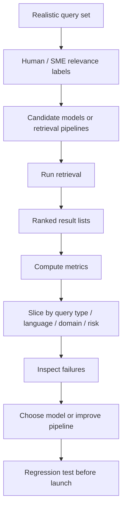

Important:

```text
metrics do not replace failure inspection
```

They guide it.

Another view:

```text
query + labels + retrieved ranking -> metric score
```

Without labels, you only have impressions.

---

### 3. Relevance Labels: The Foundation [Beginner]

Bad eval labels produce bad decisions.

Do not label only:

```text
relevant / not relevant
```

when the real task has nuance.

Use graded labels:

| Label | Meaning |
|---|---|
| Must-have | Required evidence to answer safely. |
| Useful | Helpful supporting evidence. |
| Related | Same topic but not enough to answer. |
| Hard negative | Looks relevant but is wrong for the query. |
| Stale | Was relevant once but no longer current. |
| Forbidden | User should not see this result. |
| Wrong-sense | Right word, wrong meaning/domain. |

Example:

```text
Query: "Can contractors access production logs?"
```

Labels:

| Document | Label | Why |
|---|---|---|
| current_contractor_log_policy | Must-have | Direct current policy. |
| security_approval_process | Useful | Provides approval workflow. |
| employee_log_access_policy | Hard negative | Different user class. |
| contractor_staging_log_policy | Hard negative | Wrong environment. |
| old_contractor_policy_2022 | Stale | Deprecated. |
| production_observability_overview | Related | Broad topic but not enough. |

This lets you detect subtle retrieval failures.

#### Who Should Label?

Use:

- subject matter experts
- support agents
- policy owners
- engineers for technical docs
- legal/compliance reviewers for high-risk domains
- product teams for customer-facing search

LLM-assisted labeling can help draft labels, but high-risk eval sets need human review.

---

### 4. Core Retrieval Metrics [Beginner]

Assume a query returns ranked results:

```text
rank 1: doc_A
rank 2: doc_B
rank 3: doc_C
rank 4: doc_D
rank 5: doc_E
```

And known relevant docs are:

```text
doc_B
doc_D
doc_Z
```

#### 4.1 Hit Rate@k

Question:

```text
Did at least one relevant document appear in the top k?
```

If top 5 contains doc_B and doc_D:

```text
hit@5 = 1
```

If top 5 contains no relevant docs:

```text
hit@5 = 0
```

Good for:

- RAG candidate generation
- simple "did we find something useful?" evaluation
- early model comparisons

Weakness:

```text
Does not care whether one or many relevant docs were found.
```

#### 4.2 Recall@k

Question:

```text
Of all relevant documents, how many appeared in the top k?
```

Formula:

```text
recall@k = relevant_docs_in_top_k / total_relevant_docs
```

Example:

```text
relevant docs = {B, D, Z}
top 5 includes {B, D}

recall@5 = 2 / 3 = 0.667
```

Good for:

- retrieval candidate generation
- RAG where reranker can use top 20/top 50
- "did we include enough evidence?" checks

Weakness:

```text
Does not strongly punish bad ordering inside top k.
```

#### 4.3 Precision@k

Question:

```text
Of the top k retrieved documents, how many are relevant?
```

Formula:

```text
precision@k = relevant_docs_in_top_k / k
```

Example:

```text
top 5 includes 2 relevant docs

precision@5 = 2 / 5 = 0.4
```

Good for:

- search result pages
- context packing quality
- reducing noise sent to an LLM

Weakness:

```text
Can penalize systems where many relevant docs exist but only a few are needed.
```

#### 4.4 MRR: Mean Reciprocal Rank

Question:

```text
How early does the first relevant result appear?
```

For one query:

```text
reciprocal_rank = 1 / rank_of_first_relevant_result
```

Example:

```text
first relevant doc at rank 2
reciprocal_rank = 1/2 = 0.5
```

If first relevant result is rank 1:

```text
1 / 1 = 1.0
```

If first relevant result is rank 10:

```text
1 / 10 = 0.1
```

MRR averages this over queries.

Good for:

- systems where first useful result matters
- search UI
- routing to one best doc
- single-answer lookup

Weakness:

```text
Only cares about the first relevant document, not the rest.
```

#### 4.5 nDCG@k

Question:

```text
Are the most valuable results ranked near the top?
```

nDCG supports graded relevance:

```text
must-have = 3
useful = 2
related = 1
wrong = 0
```

It gives more credit when high-value docs appear earlier.

Good for:

- ranked search quality
- graded relevance
- comparing nuanced result lists
- evaluating top-k ordering

Weakness:

```text
Harder to explain and requires graded labels.
```

#### 4.6 MAP: Mean Average Precision

Question:

```text
Across the ranked list, how consistently are relevant documents ranked before irrelevant ones?
```

Good for:

- information retrieval benchmarks
- tasks with multiple relevant documents

Weakness:

```text
Less intuitive for product teams than hit rate or recall@k.
```

---

### 5. Which Metric Should You Use? [Intermediate]

Choose metrics based on the product behavior.

| Product need | Useful metrics |
|---|---|
| RAG candidate generation | Recall@k, hit rate@k, known-good hit rate. |
| Search result page | nDCG@k, MRR, precision@k, click metrics. |
| One best answer/document | MRR, hit@1, precision@1. |
| Reranker input quality | Recall@50, stale-doc rate, wrong-sense rate. |
| Context packing | Precision@k, nDCG@k, answerability labels. |
| Legal/policy RAG | Must-have recall, stale-doc rate, forbidden-doc rate. |
| Multilingual search | Recall@k by language/direction, wrong-language rate. |
| Domain jargon | Acronym hit rate, wrong-sense rate, hard-negative error rate. |

For RAG, a common pattern is:

```text
retriever: optimize recall@k
reranker: optimize nDCG / precision in final top-k
generator: optimize grounded answer quality
```

Why?

The retriever's job is to avoid missing evidence.

The reranker's job is to order evidence.

The generator's job is to answer from evidence.

Do not use one metric for every stage.

---

### 6. Slices: The Cure for Misleading Averages [Intermediate]

Overall score:

```text
recall@10 = 88%
```

sounds good.

But slice scores may reveal:

```text
general support: 96%
password reset: 98%
healthcare acronyms: 61%
contractor policy: 54%
Spanish queries: 68%
exact IDs: 42%
```

This is why averages lie politely.

Create slices by:

- query type
- domain
- language
- locale
- tenant
- product
- document type
- risk level
- exact identifiers
- ambiguous terms
- freshness sensitivity
- user role

Important slice examples:

| Slice | Why it matters |
|---|---|
| High-risk policy | Wrong answer can harm users/business. |
| Domain acronyms | Tests internal jargon and expert shorthand. |
| Exact IDs | Dense embeddings often struggle here. |
| Multilingual | Global quality can vary sharply. |
| Code-switched | Real global users mix languages. |
| Stale/current traps | Tests freshness handling. |
| Hard negatives | Tests subtle distinctions. |
| Long-tail topics | Tests rare but important coverage. |

Senior sentence:

> "I would not launch on a single aggregate retrieval score; I would require key slices to meet thresholds."

---

### 7. Offline vs Online Evaluation [Intermediate]

#### Offline Evaluation

Offline eval uses:

```text
fixed query set
fixed corpus snapshot
known labels
repeatable metrics
```

Good for:

- comparing models
- regression testing
- tuning retrieval parameters
- evaluating migrations
- catching obvious failures before launch

Limitations:

- labels can become stale
- query set may not match future traffic
- user behavior is not measured directly
- downstream answer quality may differ

#### Online Evaluation

Online eval uses production behavior:

- clicks
- dwell time
- thumbs up/down
- user reformulation
- task completion
- support deflection
- escalation rate
- A/B tests
- human review outcomes

Good for:

- real user impact
- business outcomes
- ranking changes
- UX-level measurement

Limitations:

- noisy
- slow to collect
- can expose users to bad variants
- biased by position and UI
- harder to attribute causality

Production pattern:

```text
offline eval gates launch
online eval validates impact
```

Do both.

---

### 8. Building a Retrieval Benchmark [Intermediate]

#### Step 1: Define the Task

Examples:

```text
retrieve evidence chunks for RAG
retrieve top search results for humans
retrieve duplicate tickets
retrieve code examples
retrieve multilingual policy docs
```

The task decides the metric.

#### Step 2: Freeze a Corpus Snapshot

Keep track of:

```text
corpus version
chunking version
metadata schema
embedding model
index version
filters
```

If the corpus changes, scores may change.

#### Step 3: Build Query Set

Sources:

- production search logs
- customer support questions
- SME-written edge cases
- failed answer traces
- incident reviews
- product docs
- compliance scenarios

Include:

- common queries
- rare queries
- ambiguous queries
- exact IDs
- acronyms
- multilingual queries
- stale-current traps
- permission-sensitive queries

#### Step 4: Label Documents

For each query, label:

- must-have
- useful
- related
- hard negative
- stale
- forbidden
- wrong-sense

Document why.

#### Step 5: Run Candidate Pipelines

Compare:

- embedding model A vs B
- cosine vs dot product if relevant
- top_k 10 vs 50
- dense only vs hybrid
- with vs without reranker
- different chunking strategies
- different metadata filters

Change one major thing at a time where possible.

#### Step 6: Compute Metrics

Report:

- overall metrics
- slice metrics
- latency
- cost
- failure examples
- confidence notes

#### Step 7: Inspect Failures

Metrics say where.

Inspection says why.

Failure reasons:

- missing document
- bad chunking
- wrong metric
- embedding model misses jargon
- exact ID not handled
- stale doc outranks current doc
- metadata filter removed good doc
- reranker demoted good evidence
- query ambiguous
- label is wrong

#### Step 8: Create a Regression Gate

Before changing production retrieval:

```text
new pipeline must not regress critical slices
```

Example gate:

```text
overall recall@20 >= 90%
security-policy recall@20 >= 95%
stale-doc rate <= 2%
Spanish hit@10 >= 85%
p95 retrieval latency <= 200 ms
```

---

### 9. Common Benchmark Scorecard [Intermediate]

Use a scorecard like this:

| Metric | Model A | Model B | Winner | Notes |
|---|---:|---:|---|---|
| Overall hit@10 | 88% | 91% | B | small gain |
| Overall recall@20 | 81% | 89% | B | meaningful |
| MRR | 0.62 | 0.65 | B | mild |
| nDCG@10 | 0.71 | 0.74 | B | mild |
| Healthcare acronym hit@10 | 55% | 84% | B | critical |
| Exact ID hit@10 | 79% | 52% | A | B regresses |
| Spanish hit@10 | 83% | 80% | A | slight |
| Stale-doc rate | 7% | 5% | B | still too high |
| p95 retrieval latency | 140 ms | 210 ms | A | B may violate SLO |
| Cost estimate | lower | higher | A | trade-off |

This is how model choice becomes a design discussion.

Possible decision:

```text
Use Model B for healthcare acronym queries.
Keep Model A for exact-ID-heavy traffic.
Add hybrid retrieval for exact IDs.
Fix stale-doc filtering before launch.
```

Not:

```text
Model B is better because the average is higher.
```

---

### 10. Common Mistakes + Debugging [Intermediate]

#### Mistake 1: Testing Only Favorite Queries

Bad:

```text
I tested my five favorite demo queries.
```

Better:

```text
Use representative queries from logs, SMEs, failures, and edge cases.
```

#### Mistake 2: No Hard Negatives

Without hard negatives, the benchmark is too easy.

Example:

```text
query: contractor production access
easy negative: lunch menu
hard negative: employee production access
```

Hard negatives expose real model weakness.

#### Mistake 3: Looking Only at Top-1

For RAG, top-1 may be less important than:

```text
is the right evidence somewhere in top 20 or top 50 before reranking?
```

Measure based on pipeline stage.

#### Mistake 4: Ignoring Stale and Forbidden Results

A retrieved stale or unauthorized document may look relevant.

Label it separately.

Do not let the metric count it as success.

#### Mistake 5: Mixing Corpus Versions

If model A is evaluated on one corpus snapshot and model B on another, comparison is unreliable.

Fix:

- freeze corpus
- version chunks
- version labels
- version filters
- version indexes

#### Mistake 6: Optimizing Retrieval Metric Only

High recall does not guarantee final answer quality.

Also measure:

- context quality
- citation correctness
- answer groundedness
- hallucination rate
- user task success

#### Mistake 7: Treating Small Metric Differences as Truth

If Model A recall@10 is 90.1% and Model B is 90.4%, that may be noise.

Inspect:

- query count
- slice impact
- confidence
- failure severity
- latency/cost difference

Do not overfit tiny differences.

#### Debugging Checklist

When benchmark results are confusing:

1. Are labels correct?
2. Are query slices balanced?
3. Are hard negatives present?
4. Is the corpus snapshot identical?
5. Are filters identical?
6. Is the metric appropriate for the stage?
7. Are stale/forbidden docs labeled separately?
8. Are score differences meaningful or tiny?
9. Did latency/cost change?
10. Did one slice regress badly?
11. Did reranking change the conclusion?
12. Did final answer quality improve?

---

### 11. Failure Modes [Pro]

#### Failure Mode 1: Demo-Query Overfitting

What happens:

```text
Team tunes retrieval until demo queries look great.
```

User sees:

```text
Real-world queries fail.
```

Mitigation:

- use production query samples
- add hidden holdout set
- include edge cases
- track slice metrics

#### Failure Mode 2: Average Metric Hides Critical Slice Failure

What happens:

```text
Overall recall@10 improves, but security-policy recall drops.
```

User sees:

```text
high-risk answers become worse.
```

Mitigation:

- require slice gates
- weight high-risk queries
- inspect regressions before launch

#### Failure Mode 3: Stale Documents Count as Success

What happens:

```text
Deprecated policy is labeled relevant because it matches the topic.
```

User sees:

```text
outdated answer.
```

Mitigation:

- label stale separately
- filter by status
- evaluate freshness traps

#### Failure Mode 4: Forbidden Documents Leak into Eval Success

What happens:

```text
Retriever finds the right restricted doc for a user who should not see it.
```

User/system sees:

```text
security risk hidden behind high relevance.
```

Mitigation:

- include permission-aware labels
- evaluate post-filter results
- track forbidden-doc rate

#### Failure Mode 5: Metric Improves, Product Gets Worse

What happens:

```text
Recall@50 improves but final context has too much noise.
```

User sees:

```text
LLM answers with weak or mixed evidence.
```

Mitigation:

- evaluate reranked top-k
- measure context precision
- measure final answer quality
- tune candidate count and reranker

#### Failure Mode 6: Online Metrics Mislead

What happens:

```text
Click rate improves because top result is flashy, not correct.
```

User sees:

```text
engagement rises but task success falls.
```

Mitigation:

- pair online behavior with quality review
- measure task completion
- use human eval for high-risk results

---

### 12. Trade-offs [Pro]

| Choice | Gain | Cost |
|---|---|---|
| More labeled queries | More reliable metrics. | More labeling time. |
| Expert labels | Better domain correctness. | Expensive and slower. |
| Graded labels | Enables nDCG and nuanced eval. | Harder labeling process. |
| Hard negatives | Reveals subtle failures. | Requires careful construction. |
| Many slices | Catches hidden regressions. | More reporting complexity. |
| Strict launch gates | Safer releases. | May slow iteration. |
| Online A/B testing | Measures real user behavior. | Risk/noise/experimentation overhead. |
| Offline-only eval | Fast, repeatable. | May miss real behavior. |
| Metric optimization | Clear targets. | Can overfit if metrics are narrow. |

Central trade-off:

```text
evaluation rigor vs iteration speed
```

For low-risk prototypes, lightweight eval may be enough.

For production RAG over legal, healthcare, finance, or security content, weak eval is not maturity. It is hidden risk.

---

### 13. What Problem This Solves

Primary problem solved:

> Retrieval metrics turn embedding and retrieval quality from subjective impressions into measurable, debuggable system behavior.

Secondary benefits:

- fair model comparisons
- regression testing
- better launch gates
- hard-negative discovery
- slice-specific reliability
- clearer latency/cost trade-offs
- safer model migrations
- improved RAG answer quality

Systems impact:

> Good retrieval evaluation prevents teams from shipping systems that look impressive in demos but fail under real production queries.

---

### 14. When to Use Retrieval Benchmarking

Use retrieval benchmarking when:

- selecting an embedding model
- changing chunking strategy
- changing vector database/index
- changing distance metric
- adding hybrid retrieval
- adding reranking
- migrating embedding models
- supporting new languages
- launching RAG over important docs
- debugging search regressions
- proving quality to stakeholders

Interviewer keywords:

```text
choose embedding model
evaluate RAG retrieval
compare vector databases
search quality regression
benchmark retrieval
measure semantic search
hard negatives
multilingual quality
high-risk policy answers
```

Strong sentence:

> "I would not choose the embedding model by demo output. I would build a labeled query-document eval, measure recall@k, MRR, nDCG, and slice-specific failure rates, then inspect failures before deciding."

---

### 15. When Metrics Are Not Enough

Metrics are necessary, but not sufficient.

They can fail when:

- labels are wrong
- eval set is stale
- queries are unrepresentative
- relevance is subjective
- downstream LLM uses evidence poorly
- online behavior differs from offline eval
- product goals are not captured

So combine:

```text
offline retrieval metrics
+ failure review
+ final answer eval
+ online user metrics
+ business outcome metrics
```

Do not worship metrics.

Use metrics to make uncertainty visible.

---

### 16. Real-World Scenario [Intermediate]

#### Product / System

Internal RAG assistant for security policy and engineering runbooks.

Candidate changes:

```text
Model A -> Model B
dense-only -> hybrid retrieval
top_k 20 -> top_k 50
reranker added
```

#### Eval Set

500 labeled queries:

- 150 general IT support
- 100 security policy
- 75 API/runbook
- 75 exact IDs/acronyms
- 50 multilingual
- 50 stale/current traps

#### Metrics

The team tracks:

- hit@10
- recall@50
- MRR
- nDCG@10
- stale-doc rate
- wrong-sense rate
- p95 retrieval latency
- final answer groundedness

#### Result

New pipeline:

```text
overall recall@50 improves from 84% to 92%
security policy recall improves from 71% to 91%
exact ID hit@10 drops from 88% to 62%
p95 latency increases from 140 ms to 230 ms
```

#### Decision

Do not blindly launch.

Action:

- keep new embedding model
- add sparse exact-ID retrieval
- tune reranker for exact IDs
- set latency budget
- retest exact-ID slice
- launch if all gates pass

The metric did its job.

It did not say:

```text
launch or do not launch
```

It said:

```text
here is exactly where the pipeline improved and regressed
```

---

### 17. Code Sample: Hit Rate, Recall, Precision, and MRR

```python
eval_cases = [
    {
        "query": "contractor production log access",
        "relevant": {"current_contractor_policy", "security_approval_workflow"},
        "results": [
            "employee_log_policy",
            "current_contractor_policy",
            "staging_log_policy",
            "security_approval_workflow",
        ],
    },
    {
        "query": "reset password",
        "relevant": {"password_reset_guide"},
        "results": [
            "password_reset_guide",
            "mfa_setup",
            "account_recovery",
        ],
    },
]


def metrics_at_k(case, k):
    top_k = case["results"][:k]
    relevant = case["relevant"]
    retrieved_relevant = [doc for doc in top_k if doc in relevant]

    hit = 1 if retrieved_relevant else 0
    recall = len(retrieved_relevant) / len(relevant)
    precision = len(retrieved_relevant) / k

    reciprocal_rank = 0
    for index, doc in enumerate(case["results"], start=1):
        if doc in relevant:
            reciprocal_rank = 1 / index
            break

    return {
        "hit": hit,
        "recall": recall,
        "precision": precision,
        "reciprocal_rank": reciprocal_rank,
    }


for case in eval_cases:
    print(case["query"])
    print(metrics_at_k(case, k=3))
```

Expected learning:

```text
Different metrics reward different ranking behavior.
```

---

### 18. Mini Program: Slice-Based Retrieval Benchmark [Pro]

This program compares two retrieval pipelines by slice.

```python
from collections import defaultdict


cases = [
    {
        "query": "contractor production log access",
        "slice": "security_policy",
        "relevant": {"current_contractor_policy"},
        "model_a": ["employee_policy", "current_contractor_policy", "staging_policy"],
        "model_b": ["current_contractor_policy", "security_approval", "employee_policy"],
    },
    {
        "query": "ERR-8492 timeout",
        "slice": "exact_id",
        "relevant": {"err_8492_runbook"},
        "model_a": ["err_8492_runbook", "timeout_overview", "network_debugging"],
        "model_b": ["timeout_overview", "err_8493_runbook", "err_8492_runbook"],
    },
    {
        "query": "cancelar suscripcion",
        "slice": "multilingual",
        "relevant": {"cancel_subscription"},
        "model_a": ["refund_policy", "billing_overview", "cancel_subscription"],
        "model_b": ["cancel_subscription", "subscription_help", "refund_policy"],
    },
    {
        "query": "COB denial OON provider",
        "slice": "domain_acronym",
        "relevant": {"cob_denial_workflow", "oon_provider_claims"},
        "model_a": ["generic_claims", "legal_claims", "oon_provider_claims"],
        "model_b": ["cob_denial_workflow", "oon_provider_claims", "eob_generation"],
    },
]


def hit_at_k(case, model_name, k):
    return int(bool(set(case[model_name][:k]) & case["relevant"]))


def recall_at_k(case, model_name, k):
    return len(set(case[model_name][:k]) & case["relevant"]) / len(case["relevant"])


def reciprocal_rank(case, model_name):
    for rank, doc_id in enumerate(case[model_name], start=1):
        if doc_id in case["relevant"]:
            return 1 / rank
    return 0


def report(model_name, k):
    by_slice = defaultdict(list)
    all_rows = []

    for case in cases:
        row = {
            "hit": hit_at_k(case, model_name, k),
            "recall": recall_at_k(case, model_name, k),
            "rr": reciprocal_rank(case, model_name),
        }
        by_slice[case["slice"]].append(row)
        all_rows.append(row)

    print()
    print(f"{model_name} @ {k}")
    print("-" * 30)
    for slice_name, rows in by_slice.items():
        hit = sum(row["hit"] for row in rows) / len(rows)
        recall = sum(row["recall"] for row in rows) / len(rows)
        mrr = sum(row["rr"] for row in rows) / len(rows)
        print(f"{slice_name:<18} hit={hit:.0%} recall={recall:.0%} mrr={mrr:.2f}")

    overall_hit = sum(row["hit"] for row in all_rows) / len(all_rows)
    overall_recall = sum(row["recall"] for row in all_rows) / len(all_rows)
    overall_mrr = sum(row["rr"] for row in all_rows) / len(all_rows)
    print(f"{'overall':<18} hit={overall_hit:.0%} recall={overall_recall:.0%} mrr={overall_mrr:.2f}")


def main():
    report("model_a", k=3)
    report("model_b", k=3)
    print()
    print("Lesson:")
    print("Overall metrics are useful, but slice metrics explain product risk.")


if __name__ == "__main__":
    main()
```

Expected learning:

- Model B may win domain and multilingual slices.
- Model A may still win exact-ID behavior.
- Averages do not tell the whole story.
- Model choice should include mitigation for regressed slices.

---

### 19. Hands-On Lab: Build, Break, Measure [Pro]

#### Goal

Build a retrieval benchmark that can compare embedding models or retrieval pipelines without relying on vibes.

#### Build

Create 30 labeled queries:

- 8 general support queries
- 6 domain acronym queries
- 6 exact-ID queries
- 4 multilingual queries
- 3 stale/current policy traps
- 3 ambiguous wrong-sense queries

For each query, define:

```text
query
slice
must_have_docs
useful_docs
hard_negative_docs
stale_docs
forbidden_docs
risk_level
```

#### Run

Compare two retrieval pipelines:

```text
pipeline_a = dense only
pipeline_b = dense + hybrid + reranker
```

Or:

```text
model_a vs model_b
```

Record:

```text
top_10_results
top_50_results
latency_ms
failure_notes
```

#### Measure

Calculate:

- hit@5
- recall@10
- recall@50
- precision@5
- MRR
- nDCG@10 if using graded labels
- stale-doc rate
- forbidden-doc rate
- wrong-sense rate
- p95 latency

#### Break

Add hard cases:

```text
"policy SEC-17B"
"contractor production logs"
"contractor staging logs"
"COB denial OON provider"
"token expired"
"cancelar suscripcion"
```

Watch which slices fail.

#### Improve

Try:

- larger top-k
- hybrid retrieval
- metadata filters
- reranking
- query rewriting
- better chunking
- domain glossary expansion

#### Decide

Create a launch gate:

```text
overall recall@20 >= 90%
high-risk recall@20 >= 95%
stale-doc rate <= 2%
forbidden-doc rate = 0%
exact-ID hit@10 >= 90%
p95 retrieval latency <= 200 ms
```

#### Reflect

Answer:

1. Which pipeline wins overall?
2. Which pipeline wins high-risk slices?
3. Which metric best matched user value?
4. Which failures were model failures?
5. Which failures were chunking, metadata, or ranking failures?
6. What should block launch?

---

### 20. Interview-Style Practical Question

> You are choosing an embedding model and retrieval pipeline for a RAG system over enterprise policy docs. The demo looks good, but leadership wants proof that retrieval quality is production-ready. How would you benchmark it?

---

### 21. Strong Answer

1. **I would build a labeled local retrieval eval.**

   I would collect realistic queries from logs, support tickets, SMEs, and known failure cases. Each query would have must-have docs, useful docs, hard negatives, stale docs, and forbidden docs where relevant.

2. **I would measure metrics that match the retrieval stage.**

   For candidate generation, I would use recall@k and hit rate@k. For final ranked results or context, I would use precision@k, MRR, and nDCG. For policy systems, I would also track stale-doc and forbidden-doc rates.

3. **I would evaluate by slice.**

   I would break results down by domain, language, exact IDs, ambiguous terms, high-risk policies, stale/current traps, and user role. I would not trust only the aggregate score.

4. **I would compare complete pipelines, not only models.**

   Dense only, hybrid retrieval, metadata filters, reranking, and chunking changes should be evaluated because failures are not always caused by the embedding model.

5. **I would inspect failures manually.**

   Metrics show where quality changed. Failure review explains whether the cause is bad labels, missing docs, chunking, exact-ID weakness, wrong sense, stale content, or poor reranking.

6. **I would set launch gates.**

   Example: high-risk policy recall@20 must exceed a threshold, forbidden-doc rate must be zero, stale-doc rate must be below tolerance, and p95 latency must meet the SLO.

7. **I would validate online after offline gates pass.**

   User feedback, task success, escalation rate, and answer groundedness should confirm production impact.

Short version:

```text
No vibes.
Use labeled queries.
Measure the right metric for the stage.
Slice the results.
Inspect failures.
Gate launch on critical quality and latency thresholds.
```

---

### 22. Production Reality Check

A production retrieval benchmark should be versioned.

Benchmark record:

```text
eval_dataset_version:
corpus_snapshot:
chunking_version:
embedding_model:
metric:
index_version:
retrieval_pipeline:
filters:
reranker:
top_k:
labeling_guidelines:
slice_definitions:
overall_metrics:
slice_metrics:
latency_metrics:
failure_review_notes:
launch_gate_result:
```

Minimum benchmark dashboard:

- overall recall@k
- hit@k
- MRR
- nDCG@k
- precision@k
- high-risk slice recall
- multilingual recall
- exact-ID hit rate
- stale-doc rate
- forbidden-doc rate
- wrong-sense rate
- p95/p99 retrieval latency
- cost estimate
- regression vs previous version

Operational rule:

> Every retrieval pipeline change should run against the benchmark before production rollout.

Changes include:

- embedding model
- chunking
- metadata filters
- vector DB/index
- ANN parameters
- metric/normalization
- hybrid retrieval
- reranker
- top-k
- corpus import process

---

### 23. Active Recall [Beginner]

Answer without looking:

1. Why are vibes dangerous for retrieval evaluation?
2. What is hit rate@k?
3. What is recall@k?
4. What is precision@k?
5. What does MRR measure?
6. Why is nDCG useful?
7. What is a hard negative?
8. Why should stale documents be labeled separately?
9. Why do slice metrics matter?
10. What is the difference between offline and online evaluation?
11. Why can improving recall@50 hurt final answer quality?
12. What should be in a launch gate for high-risk RAG?

Expected answers:

1. A few good-looking examples do not represent production query diversity or failure risk.
2. Whether at least one relevant result appears in the top k.
3. The fraction of all relevant documents retrieved in the top k.
4. The fraction of top-k retrieved documents that are relevant.
5. How early the first relevant result appears.
6. It rewards highly relevant results appearing near the top using graded relevance.
7. A related-looking but wrong document that tests subtle distinctions.
8. Stale docs may be topically relevant but unsafe or incorrect.
9. Averages hide failures in critical domains, languages, exact IDs, or high-risk queries.
10. Offline uses fixed labeled data; online uses real user behavior and outcomes.
11. More candidates can add noise if reranking/context packing is weak.
12. Critical slice recall, stale-doc rate, forbidden-doc rate, latency, and regression thresholds.

---

### 24. Revision Notes

One-line summary:

> Retrieval benchmarking replaces "looks good" with labeled queries, ranking metrics, slice analysis, and failure review.

Three keywords:

```text
labels
metrics
slices
```

One interview trap:

```text
Reporting one aggregate recall score without hard negatives, stale-doc labels, slice metrics, or latency.
```

One memory trick:

```text
Hit finds any.
Recall finds enough.
MRR finds early.
nDCG ranks best.
Slices reveal risk.
```

---

### 25. Quick Self-Test

For each situation, choose the right evaluation response.

| Situation | Response | Why |
|---|---|---|
| Demo queries look good. | Build labeled eval. | Demos are not representative. |
| Overall recall improves but exact IDs regress. | Add slice gate / hybrid retrieval. | Aggregate hides exact-ID failure. |
| Deprecated policy ranks first. | Track stale-doc rate. | Topic relevance is not freshness. |
| First relevant result moves from rank 5 to rank 1. | MRR improves. | First relevant rank matters. |
| Top 10 has many related but weak docs. | Check precision/nDCG/answerability. | Noise hurts final context. |
| Model B wins by 0.2% but costs 2x. | Inspect significance/business value. | Tiny gains may not justify cost. |

If you can explain this table, you can benchmark retrieval systems instead of trusting vibes.

---

## Subtopic 4.2.d: Re-Embedding Strategies, Versioning, and Migration Planning

### Add to Knowledge Base

Embeddings are **derived data**.

They are generated from:

```text
source content
+ preprocessing
+ chunking
+ embedding model
+ normalization
+ metadata
+ index configuration
```

If any of those change, the vector may no longer represent the same retrieval behavior.

That means re-embedding is not just:

```text
run a script again
```

It is a production data migration.

The core idea:

> Every vector should be traceable to the source content, chunking version, embedding model version, metric, and index version that produced it.

Without this, you cannot answer:

- Which model created this vector?
- Which chunking logic produced this text?
- Is this vector stale?
- Can old and new vectors be compared?
- Which index is serving production?
- Can we roll back?
- Did retrieval quality improve or regress?
- Are thresholds still valid?

Key terms:

| Term | Meaning |
|---|---|
| Re-embedding | Regenerating vectors for existing content. |
| Source ID | Stable ID for the original document/object. |
| Chunk ID | Stable ID for a specific chunk derived from a source object. |
| Content hash | Hash used to detect whether content changed. |
| Embedding model version | Exact model/version used to generate the vector. |
| Chunking version | Version of the chunking/preprocessing logic. |
| Vector schema version | Shape and metadata contract for stored vector records. |
| Index version | Specific vector index built from a vector set and config. |
| Backfill | Batch job that creates missing or new-version vectors for existing data. |
| Dual index | Running old and new vector indexes side by side during migration. |
| Shadow read | Querying a new index without showing results to users. |
| Cutover | Switching production traffic to the new index/model. |
| Rollback | Returning traffic to the old working version. |
| Reconciliation | Checking that indexed vectors match the source of truth. |

The beginner mistake:

```text
We changed the embedding model; just overwrite the old vectors.
```

The professional view:

```text
Keep versions explicit, build the new index safely, evaluate it, cut over gradually, and preserve rollback until the new retrieval behavior is proven.
```

Reference anchors:
- MTEB benchmark paper: `https://arxiv.org/abs/2210.07316`
- BEIR retrieval benchmark paper: `https://arxiv.org/abs/2104.08663`
- HNSW paper: `https://arxiv.org/abs/1603.09320`

---

### Reading Path + Level Tags

- **Beginner:** Read sections 0-4 and Active Recall.
- **Intermediate:** Add sections 5-10 and complete the Build part of the Hands-On Lab.
- **Pro:** Complete the full Hands-On Lab, including Break and Measure, then answer the migration-planning system design question and Topic 4.2 checkpoint.

---

### 0. Pre-Question Hook [Beginner]

**Pause:** Your company has 80 million embedded document chunks.

You want to upgrade from:

```text
embedding_model_v1
```

to:

```text
embedding_model_v2
```

because local evals show:

```text
overall recall@20 improves from 84% to 91%
healthcare acronym recall improves from 58% to 83%
```

Sounds great.

But production reality asks:

- How long will re-embedding 80 million chunks take?
- How much will it cost?
- Where do new vectors go while old vectors still serve traffic?
- Can v1 and v2 vectors be searched in the same index?
- Do score thresholds still mean the same thing?
- Do metadata filters still work?
- What happens to deleted documents during backfill?
- How do you verify quality before cutover?
- How do you roll back?

Bad answer:

> "Overwrite the vectors and deploy."

Production answer:

> "Treat this as a versioned retrieval migration. Build v2 vectors and a v2 index side by side, run offline evals and shadow reads, compare neighborhood changes, recalibrate thresholds, canary traffic, monitor slices, then cut over with rollback to v1 preserved."

This is what we are learning.

---

### 1. The Intuition: Embeddings Are Compiled Artifacts [Beginner]

Think of source documents like source code.

Embeddings are like compiled binaries.

If you change the compiler:

```text
embedding model
```

or build settings:

```text
chunking, normalization, metadata, metric
```

you need a new compiled artifact.

You would not mix binaries built with incompatible compilers and pretend they are the same runtime.

Similarly:

```text
vectors from model A
```

usually should not be mixed with:

```text
vectors from model B
```

in the same semantic index unless the model explicitly supports compatibility and you have evaluated it.

The safe mental model:

```text
source document -> chunking version -> embedding model version -> vector set -> index version
```

Every step is versioned.

#### Beginner Explanation in 3 Lines

Embeddings are generated artifacts, not source truth.
When model, chunking, metric, or preprocessing changes, retrieval behavior can change.
Safe migration requires versioned vectors, side-by-side evaluation, controlled cutover, and rollback.

---

### 2. Visual Diagram: Versioned Embedding Pipeline [Beginner]

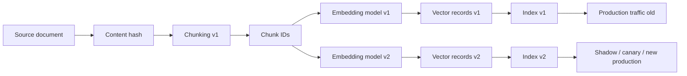

Important:

```text
old vectors and new vectors are separate versions
```

Migration view:

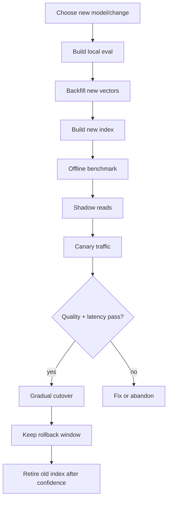

---

### 3. What Must Be Versioned [Beginner]

Every vector record should carry enough metadata to explain how it was created.

Minimum fields:

```text
source_id
chunk_id
content_hash
chunking_version
embedding_model
embedding_model_version
embedding_dimension
normalization
metric
vector_schema_version
created_at
source_updated_at
is_deleted
metadata_version
```

Example vector record:

```json
{
  "source_id": "policy_123",
  "chunk_id": "policy_123:v3:chunk_004",
  "content_hash": "a7c9...",
  "chunking_version": "chunker_v3",
  "embedding_model": "embedding_model_x",
  "embedding_model_version": "2026-04-15",
  "embedding_dimension": 1024,
  "normalization": "unit_norm",
  "metric": "cosine",
  "vector_schema_version": "vector_schema_v2",
  "created_at": "2026-06-25T10:00:00Z",
  "source_updated_at": "2026-06-20T18:30:00Z",
  "is_deleted": false,
  "metadata_version": "metadata_v5"
}
```

Why this matters:

| Field | Why it matters |
|---|---|
| source_id | Links vector back to source truth. |
| chunk_id | Enables updates/deletes for exact chunk. |
| content_hash | Detects whether re-embedding is needed. |
| chunking_version | Explains text boundary behavior. |
| model/version | Prevents mixed incompatible vectors. |
| dimension | Ensures index schema compatibility. |
| metric/normalization | Prevents wrong search configuration. |
| created_at | Supports freshness and debugging. |
| is_deleted | Helps prevent stale/deleted retrieval. |

Without version fields, retrieval debugging becomes archaeology. Tiny shovel, giant ruins.

---

### 4. When Re-Embedding Is Needed [Beginner]

Re-embedding may be needed when:

| Change | Why re-embed? |
|---|---|
| Embedding model changes | New vector space. |
| Model version changes | Neighborhoods and score distributions may change. |
| Chunking logic changes | Text represented by each vector changes. |
| Preprocessing changes | Cleaned text differs. |
| Normalization changes | Metric behavior changes. |
| Language strategy changes | Translated or multilingual text differs. |
| Source content changes | Vector no longer matches text. |
| Metadata schema changes | Filters/routing may need rebuilt records. |
| Dimension changes | Existing index schema may not fit. |
| Domain fine-tuning occurs | Representation space changes. |

Re-embedding may not be needed when:

- only unrelated metadata changes
- display title changes but searchable text does not
- permissions change and filters live outside vectors
- ranking boosts change outside vector generation
- reranker changes but candidate vectors are still valid

But be careful:

```text
metadata changes can still require index updates if filters are stored inside the vector database payload
```

The rule:

> Re-embed when the text representation changes; update metadata/index records when retrieval eligibility changes.

---

### 5. Re-Embedding Strategies [Intermediate]

#### 5.1 Full Re-Embedding

Re-embed everything.

Good when:

- embedding model changes
- chunking changes globally
- vector dimension changes
- old vectors are incompatible
- corpus is not huge
- migration can run offline

Pros:

- clean consistent vector set
- simpler reasoning
- easier index build

Cons:

- expensive
- slow
- requires large temporary storage
- needs cutover planning

#### 5.2 Incremental Re-Embedding

Re-embed only changed or missing content.

Good when:

- source documents update frequently
- model stays the same
- content hash detects changes
- freshness matters

Pros:

- cheaper
- faster
- supports continuous ingestion

Cons:

- can leave mixed versions if not controlled
- harder reconciliation
- version tracking must be precise

#### 5.3 Priority Backfill

Re-embed high-value content first.

Priority order:

```text
high-traffic docs
high-risk policies
recently updated docs
customer-facing docs
known failure areas
long-tail critical docs
remaining cold corpus
```

Good when full migration takes days or weeks.

#### 5.4 Lazy Re-Embedding

Re-embed when content is accessed or queried.

Good when:

- huge cold corpus
- many documents rarely used
- freshness is less critical
- cost must be spread out

Risk:

- first access may be slow
- retrieval may remain inconsistent
- hard to evaluate full coverage

#### 5.5 Dual-Index Migration

Build new vectors/index separately.

```text
index_v1 serves production
index_v2 builds in parallel
```

Then:

- run offline eval
- run shadow reads
- canary traffic
- gradual cutover
- rollback if needed

This is the safest common production strategy for model changes.

#### 5.6 Dual-Write for New Content

During migration, new/updated documents are embedded into both old and new versions.

```text
new document -> embedding v1 -> index v1
             -> embedding v2 -> index v2
```

This keeps both indexes fresh during the transition.

---

### 6. Migration Flow: Safe Cutover [Intermediate]

#### Step 1: Define the Change

Document:

```text
old model/version
new model/version
dimension change
metric/normalization change
chunking change
expected quality gain
expected cost/latency change
```

#### Step 2: Build Eval Gates

Before backfill, define launch criteria:

```text
overall recall@20 >= old version
high-risk recall@20 improves or does not regress
exact-ID slice does not regress beyond tolerance
stale-doc rate <= threshold
forbidden-doc rate = 0
p95 retrieval latency <= SLO
cost within approved range
```

#### Step 3: Backfill New Vectors

Run batch jobs:

```text
read source snapshot
chunk with versioned chunker
embed with new model
write vector records v2
track progress
record failures
```

#### Step 4: Build New Index

Build:

```text
index_v2
```

with:

- correct dimension
- correct metric
- correct metadata filters
- expected ANN settings
- snapshot/version tag

#### Step 5: Offline Benchmark

Run eval:

- overall metrics
- slice metrics
- latency
- score distribution
- top-k overlap
- failure review

#### Step 6: Shadow Reads

For production queries:

```text
serve v1 results to user
also query v2 silently
log both
```

Compare:

- top-k overlap
- known-good hits if labels exist
- latency
- score distributions
- new failure patterns

#### Step 7: Canary Traffic

Send small traffic percentage to v2:

```text
1% -> 5% -> 25% -> 50% -> 100%
```

Monitor:

- user feedback
- answer quality
- p95/p99 latency
- error rates
- high-risk slice behavior
- cost

#### Step 8: Cutover

Switch default to:

```text
index_v2
```

Keep:

```text
index_v1
```

available during rollback window.

#### Step 9: Retire Old Index

Only after:

- quality stable
- no rollback needed
- cost accepted
- monitoring clean
- source/index reconciliation passed

Then delete/archive v1 according to retention policy.

---

### 7. Score Threshold Recalibration [Intermediate]

Scores are not stable across embedding models.

Old model:

```text
cosine >= 0.82 means likely relevant
```

New model:

```text
cosine >= 0.82 may mean something different
```

Why?

- vector distribution changed
- model training objective changed
- normalization changed
- dimension changed
- corpus neighborhoods changed
- metric/index changed

So thresholds must be recalibrated.

Thresholds affected:

- "no good result" cutoff
- similarity confidence
- duplicate detection thresholds
- memory retrieval thresholds
- reranker candidate thresholds
- alerting thresholds
- clustering/outlier thresholds

Migration rule:

> Do not copy score thresholds from old embedding model to new embedding model without calibration.

Better:

```text
plot score distributions
compare labeled relevant vs irrelevant scores
choose threshold based on precision/recall trade-off
validate by slice
```

---

### 8. Reconciliation and Data Correctness [Intermediate]

Re-embedding can fail silently.

You need reconciliation checks.

#### Source-to-Index Checks

Ask:

- How many source docs exist?
- How many chunks should exist?
- How many vector records exist?
- Are all current chunks embedded?
- Are deleted docs removed or tombstoned?
- Are deprecated docs filtered correctly?
- Are all vector records from the expected model version?
- Are there duplicate chunk IDs?
- Are there orphan vectors with no source?

#### Example Counts

```text
source documents: 1,000,000
expected chunks: 12,400,000
embedded chunks v2: 12,390,000
missing chunks: 10,000
deleted-but-indexed chunks: 340
wrong-model-version vectors: 0
duplicate chunk IDs: 12
```

This should block cutover until understood.

#### Failure Queue

Any failed embedding job should produce records like:

```text
source_id
chunk_id
error_type
retry_count
last_error
next_retry_at
blocked_reason
```

Do not let embedding failures disappear into logs.

---

### 9. Common Mistakes + Debugging [Intermediate]

#### Mistake 1: Mixing Incompatible Vector Spaces

Bad:

```text
store v1 and v2 vectors in same index and search them together
```

unless compatibility is explicit and evaluated.

Better:

```text
separate vector versions or separate indexes
```

#### Mistake 2: Overwriting Without Rollback

Bad:

```text
replace old vectors in place
```

If quality regresses, you are trapped.

Better:

```text
build new index side by side and keep old index through rollback window
```

#### Mistake 3: Forgetting New Content During Migration

Migration may take days.

If new docs only go to v1, v2 becomes stale before launch.

Fix:

```text
dual-write new content to v1 and v2 during migration
```

#### Mistake 4: Copying Old Thresholds

Bad:

```text
same cosine threshold after model change
```

Better:

```text
recalibrate thresholds with labeled eval data
```

#### Mistake 5: Evaluating Only Overall Recall

Migration can improve average quality and break critical slices.

Evaluate:

- high-risk policies
- exact IDs
- multilingual
- domain acronyms
- stale-current traps
- tenant filters

#### Mistake 6: Ignoring Deletes

Bad:

```text
backfill only inserts new vectors
```

Deleted source data may remain searchable.

Fix:

- tombstone deleted chunks
- purge according to policy
- reconcile source vs index
- test deletion visibility

#### Mistake 7: Not Versioning Chunking

If chunking changes, chunk IDs and content boundaries change.

Without chunking version, you cannot know why retrieval changed.

#### Debugging Checklist

When migration behaves badly:

1. Are query and corpus vectors from the same model version?
2. Is the index using the correct dimension?
3. Is the metric correct?
4. Is normalization consistent?
5. Did chunking change?
6. Are source IDs and chunk IDs stable?
7. Are metadata filters preserved?
8. Are deleted docs still indexed?
9. Did score thresholds get recalibrated?
10. Did high-risk slices regress?
11. Is v2 fresh with latest documents?
12. Can you roll back to v1?

---

### 10. Failure Modes [Pro]

#### Failure Mode 1: Silent Quality Regression

What happens:

```text
new model improves average recall but worsens high-risk policy queries
```

User sees:

```text
wrong or weak answers for critical questions
```

Mitigation:

- slice eval gates
- canary queries
- shadow reads
- failure review before cutover

#### Failure Mode 2: Mixed-Version Index

What happens:

```text
some vectors are v1, some are v2, and search treats them as comparable
```

User sees:

```text
unstable, confusing rankings
```

Mitigation:

- version field enforcement
- separate indexes
- migration validation
- reject mixed-version writes

#### Failure Mode 3: Freshness Regression During Backfill

What happens:

```text
new index is built from old snapshot and misses recent documents
```

User sees:

```text
new policies missing after cutover
```

Mitigation:

- dual-write during backfill
- replay change log
- final catch-up job
- freshness validation

#### Failure Mode 4: Deleted Data Reappears

What happens:

```text
deleted source chunks are copied into the new index
```

User sees:

```text
stale or unauthorized data retrieval
```

Mitigation:

- source-of-truth delete checks
- tombstones
- purge validation
- deletion regression tests

#### Failure Mode 5: Threshold Drift

What happens:

```text
old "good enough" score threshold is reused with new embeddings
```

User sees:

```text
too many empty results or too many weak matches
```

Mitigation:

- score distribution analysis
- labeled threshold calibration
- per-slice thresholds if needed

#### Failure Mode 6: Cost Explosion

What happens:

```text
full re-embedding and dual-index storage exceed budget
```

User/system sees:

```text
migration paused, stale indexes, capacity incident
```

Mitigation:

- capacity plan
- priority backfill
- temporary storage budget
- batch scheduling
- route only critical slices if needed

---

### 11. Trade-offs [Pro]

| Strategy | Gain | Cost |
|---|---|---|
| Full re-embedding | Clean consistent vector set. | Expensive, slow, needs storage. |
| Incremental re-embedding | Lower cost and continuous freshness. | More version/reconciliation complexity. |
| Priority backfill | Critical content improves sooner. | Temporary uneven coverage. |
| Lazy re-embedding | Spreads cost over time. | Inconsistent retrieval and first-hit latency. |
| Dual-index migration | Safe eval/cutover/rollback. | Double storage and operational complexity. |
| In-place overwrite | Simple and cheap. | Dangerous rollback and mixed-state risk. |
| Shadow reads | Production query comparison without user impact. | Extra query cost and logging. |
| Canary traffic | Real user validation. | Requires monitoring and rollback discipline. |
| Long rollback window | Safer migration. | Higher storage cost. |

Central trade-off:

```text
migration safety vs migration cost
```

For high-risk retrieval, safety usually wins.

---

### 12. What Problem This Solves

Primary problem solved:

> Re-embedding strategy and versioning let you change embedding models, chunking, and indexes without losing retrieval correctness, freshness, or rollback ability.

Secondary benefits:

- safer model upgrades
- explainable retrieval changes
- reproducible evals
- better deletion handling
- cost/freshness planning
- stable source-to-vector lineage
- easier incident debugging
- controlled cutovers

Systems impact:

> Embedding migration is where prototype RAG becomes production search infrastructure.

If you cannot migrate embeddings safely, you cannot evolve your retrieval system safely.

---

### 13. When to Use Each Migration Pattern

| Situation | Recommended pattern |
|---|---|
| Small corpus, low risk | Full rebuild may be enough. |
| Large corpus, model change | Dual-index migration. |
| Frequent source updates | Incremental re-embedding with content hashes. |
| Long migration window | Dual-write new changes to old and new indexes. |
| High-risk docs | Priority backfill and canary eval. |
| Cold archive corpus | Lazy or low-priority backfill. |
| Dimension change | New index required. |
| Chunking change | New chunk IDs/version and full/targeted re-embedding. |
| Threshold-dependent app | Recalibrate thresholds before cutover. |
| Strict delete requirements | Reconciliation and deletion tests before launch. |

Strong sentence:

> "For a large production model change, I would avoid in-place overwrite and use a dual-index migration with offline evals, shadow reads, canary traffic, threshold recalibration, and rollback."

---

### 14. Real-World Scenario [Intermediate]

#### Product / System

Enterprise RAG assistant over:

- 30 million policy chunks
- 20 million engineering runbook chunks
- 10 million support-ticket chunks
- 5 million multilingual HR chunks

Current setup:

```text
embedding_model_v1
chunker_v2
cosine metric
index_v1
```

New setup:

```text
embedding_model_v2
chunker_v3
cosine metric
index_v2
```

#### Why Migration Is Needed

Local eval shows:

```text
domain acronym recall improves 18%
multilingual recall improves 9%
general support stays flat
exact-ID retrieval regresses 6%
```

#### Migration Plan

1. Freeze corpus snapshot for backfill start.
2. Version chunker v3 and create new chunk IDs.
3. Backfill v2 vectors into separate storage.
4. Dual-write new document updates to v1 and v2.
5. Build index_v2 with correct metric and filters.
6. Run offline eval and compare slices.
7. Add hybrid retrieval mitigation for exact-ID regression.
8. Run shadow reads on production queries.
9. Canary 5% of low-risk traffic.
10. Canary high-risk traffic after slice gates pass.
11. Gradual cutover.
12. Keep v1 for rollback for 30 days.
13. Retire v1 after quality and cost are stable.

#### What Would Go Wrong Without This

The team might:

- overwrite old vectors
- lose rollback
- mix chunking versions
- miss new documents during migration
- reuse thresholds
- ship exact-ID regression
- serve deleted documents

This is why migration planning is part of embedding mastery.

---

### 15. Code Sample: Decide What Needs Re-Embedding

```python
import hashlib


TARGET_MODEL_VERSION = "embedding_v2"
TARGET_CHUNKING_VERSION = "chunker_v3"


def content_hash(text):
    return hashlib.sha256(text.encode("utf-8")).hexdigest()


def needs_reembedding(source_text, vector_record):
    current_hash = content_hash(source_text)

    if vector_record["content_hash"] != current_hash:
        return True, "content changed"

    if vector_record["embedding_model_version"] != TARGET_MODEL_VERSION:
        return True, "model version changed"

    if vector_record["chunking_version"] != TARGET_CHUNKING_VERSION:
        return True, "chunking version changed"

    return False, "up to date"


record = {
    "chunk_id": "policy_123:v2:chunk_004",
    "content_hash": "old_hash",
    "embedding_model_version": "embedding_v1",
    "chunking_version": "chunker_v2",
}

source_text = "Contractors cannot access production logs without security approval."

print(needs_reembedding(source_text, record))
```

Expected lesson:

```text
Re-embedding should be driven by explicit version and content checks, not guesswork.
```

---

### 16. Mini Program: Simulate Dual-Index Cutover [Pro]

This toy program compares old and new index results for canary queries.

```python
canary_queries = [
    {
        "query": "contractor production log access",
        "must_have": {"current_contractor_policy"},
        "v1": ["employee_policy", "current_contractor_policy", "staging_policy"],
        "v2": ["current_contractor_policy", "security_approval", "employee_policy"],
    },
    {
        "query": "ERR-8492 timeout",
        "must_have": {"err_8492_runbook"},
        "v1": ["err_8492_runbook", "timeout_overview", "err_8493_runbook"],
        "v2": ["timeout_overview", "err_8493_runbook", "err_8492_runbook"],
    },
    {
        "query": "COB denial OON provider",
        "must_have": {"cob_denial_workflow"},
        "v1": ["generic_claims", "legal_claims", "cob_denial_workflow"],
        "v2": ["cob_denial_workflow", "oon_provider_claims", "eob_generation"],
    },
]


def hit_at_k(results, must_have, k):
    return bool(set(results[:k]) & must_have)


def top_k_overlap(old_results, new_results, k):
    return len(set(old_results[:k]) & set(new_results[:k])) / k


def evaluate(version, k):
    hits = []
    for case in canary_queries:
        hits.append(hit_at_k(case[version], case["must_have"], k))
    return sum(hits) / len(hits)


def main():
    k = 3

    print(f"v1 hit@{k}: {evaluate('v1', k):.0%}")
    print(f"v2 hit@{k}: {evaluate('v2', k):.0%}")
    print()

    for case in canary_queries:
        overlap = top_k_overlap(case["v1"], case["v2"], k)
        print(f"{case['query']:<35} top-{k} overlap: {overlap:.0%}")

    print()
    print("Lesson:")
    print("A new index can improve quality while changing neighborhoods.")
    print("Canary queries reveal both wins and regressions before cutover.")


if __name__ == "__main__":
    main()
```

Expected learning:

- v2 can improve some queries and regress others.
- Top-k overlap reveals neighborhood churn.
- Hit rate alone is not enough.
- Migration needs slice gates and failure review.

---

### 17. Hands-On Lab: Build, Break, Measure [Pro]

#### Goal

Design a safe re-embedding migration plan for a production RAG system.

#### Build

Create a vector record schema with:

```text
source_id
chunk_id
content_hash
chunking_version
embedding_model_version
embedding_dimension
metric
normalization
metadata_version
created_at
source_updated_at
is_deleted
```

Create two index configs:

```text
index_v1
index_v2
```

#### Plan

Write a migration plan:

1. Why are we migrating?
2. What changes?
3. What data volume is affected?
4. What is the backfill strategy?
5. How are new writes handled during migration?
6. What eval gates must pass?
7. How are thresholds recalibrated?
8. How do we canary?
9. How do we rollback?
10. When do we delete the old index?

#### Break

Simulate failures:

- 2% embedding job failures
- deleted docs copied into new index
- exact-ID slice regression
- score threshold drift
- v2 missing newest documents
- p95 latency regression

#### Measure

Create a migration dashboard:

| Signal | Target | Current | Status |
|---|---:|---:|---|
| backfill completion | 100% | 92% | blocked |
| failed chunks | 0 | 12,400 | investigate |
| high-risk recall@20 | >= 95% | 96% | pass |
| exact-ID hit@10 | >= 90% | 83% | fail |
| deleted indexed chunks | 0 | 37 | fail |
| p95 latency | <= 200 ms | 185 ms | pass |

#### Decide

Would you cut over?

Good answer:

```text
No, because exact-ID and deleted-doc gates fail.
```

#### Improve

Fix:

- add hybrid exact-ID retrieval
- purge/tombstone deleted chunks
- run final catch-up job
- recalibrate thresholds
- rerun eval

#### Reflection

Answer:

1. Which migration risks are quality risks?
2. Which are data correctness risks?
3. Which are cost/latency risks?
4. Which should block cutover?
5. What must stay available for rollback?

---

### 18. Interview-Style Practical Question

> You are upgrading the embedding model for a production RAG system with 100 million vectors. The new model improves benchmark recall, but vectors have a different dimension and score distribution. How would you plan the migration?

---

### 19. Strong Answer

1. **I would treat it as a versioned data migration.**

   I would not overwrite vectors in place. I would create a new vector version and a new index because the model and dimension changed.

2. **I would version the full pipeline.**

   Each vector record should include source ID, chunk ID, content hash, chunking version, embedding model version, dimension, metric, normalization, metadata version, and creation time.

3. **I would build the new index side by side.**

   The old index keeps serving production while a backfill creates v2 vectors and index_v2. New document writes should be dual-written or replayed so v2 stays fresh.

4. **I would run offline evals before serving traffic.**

   I would compare recall@k, MRR, nDCG, wrong-sense rate, stale-doc rate, exact-ID performance, multilingual slices, and latency against v1.

5. **I would recalibrate thresholds.**

   Score distributions change across models, so similarity cutoffs, duplicate thresholds, and "no result" thresholds must be revalidated.

6. **I would use shadow reads and canaries.**

   Query v2 silently on production traffic, compare neighborhoods and latency, then gradually route canary traffic if gates pass.

7. **I would keep rollback.**

   Keep index_v1 available during the rollback window and only retire it after quality, latency, cost, delete handling, and freshness are stable.

Short version:

```text
Do not overwrite.
Version the pipeline.
Backfill into a new index.
Evaluate and shadow.
Recalibrate thresholds.
Canary and cut over gradually.
Keep rollback until stable.
```

---

### 20. Production Reality Check

Migration design record:

```text
migration_id:
reason:
old_embedding_model:
new_embedding_model:
old_dimension:
new_dimension:
old_metric:
new_metric:
old_chunking_version:
new_chunking_version:
affected_vector_count:
estimated_backfill_time:
estimated_backfill_cost:
temporary_storage_needed:
dual_write_plan:
delete_handling_plan:
eval_dataset_version:
launch_gates:
threshold_recalibration_plan:
shadow_read_plan:
canary_plan:
rollback_plan:
old_index_retention_until:
```

Minimum migration dashboard:

- backfill completion percentage
- embedding job failure count
- missing vector count
- duplicate chunk ID count
- deleted-but-indexed count
- wrong-model-version count
- v1 vs v2 recall@k
- high-risk slice metrics
- exact-ID slice metrics
- multilingual slice metrics
- top-k overlap
- score distribution shift
- p95/p99 latency
- cost burn
- freshness lag
- canary user feedback

Operational rule:

> A re-embedding migration is not complete when the batch job finishes. It is complete when the new index is correct, evaluated, serving safely, rollback is no longer needed, and the old index is retired intentionally.

---

### 21. Active Recall [Beginner]

Answer without looking:

1. Why are embeddings considered derived data?
2. Why is in-place overwrite risky?
3. What fields should every vector record include?
4. When is full re-embedding needed?
5. When is incremental re-embedding enough?
6. What is a dual-index migration?
7. What is a shadow read?
8. Why do thresholds need recalibration after model migration?
9. Why should new writes be dual-written during long migrations?
10. What reconciliation checks should run before cutover?
11. What should block cutover?
12. When is it safe to retire the old index?

Expected answers:

1. They are generated from source content, chunking, model, normalization, and metadata.
2. It destroys rollback and can create mixed or unexplainable retrieval state.
3. Source ID, chunk ID, content hash, chunking version, model version, dimension, metric, normalization, metadata version, timestamps, deletion status.
4. Model, dimension, chunking, preprocessing, or representation changes.
5. Source content changes while model/chunking remain compatible.
6. Building old and new indexes side by side and cutting over after eval/canary.
7. Querying the new index silently while still serving old results.
8. New embeddings have different score distributions and neighborhoods.
9. To keep both old and new indexes fresh while migration runs.
10. Missing vectors, duplicates, wrong model versions, deleted indexed docs, source/vector count mismatch.
11. Failed high-risk slice gates, deleted data present, freshness failure, major latency regression, no rollback.
12. After stable quality, latency, cost, freshness, delete handling, and rollback window completion.

---

### 22. Revision Notes

One-line summary:

> Re-embedding is a versioned search migration: build new vectors and indexes safely, evaluate behavior, recalibrate thresholds, canary traffic, and preserve rollback.

Three keywords:

```text
version
backfill
cutover
```

One interview trap:

```text
Saying "just re-run embeddings" without discussing versioning, dual indexes, eval gates, threshold drift, delete handling, and rollback.
```

One memory trick:

```text
Source is truth.
Vectors are builds.
Indexes are releases.
Migrations need rollback.
```

---

### 23. Quick Self-Test

For each situation, choose the right migration response.

| Situation | Response | Why |
|---|---|---|
| Model dimension changes from 768 to 1536. | Build a new index. | Existing index schema/config may not fit. |
| Chunking logic changes. | New chunking version and re-embedding. | Text boundaries changed. |
| Content hash unchanged and model unchanged. | No re-embedding needed. | Vector still represents same text under same model. |
| New model improves average recall but exact IDs regress. | Block or mitigate before cutover. | Critical slice regression. |
| Backfill takes one week. | Dual-write/replay new updates. | New index must stay fresh. |
| Old threshold reused with new model. | Recalibrate thresholds. | Score distributions changed. |
| Deleted docs appear in v2. | Block cutover and reconcile deletes. | Data correctness/safety failure. |

If you can explain this table, you can plan embedding migrations safely.

---

## Topic 4.2 Checkpoint: Embedding Model Selection and Evaluation

You should now be able to explain:

```text
how to choose between general-purpose and domain-tuned embedding models
how dimension affects latency, cost, storage, and multilingual strategy
how to benchmark retrieval with metrics instead of vibes
how to plan re-embedding, versioning, migration, cutover, and rollback
```

### Checkpoint 1: General-Purpose vs Domain-Tuned Models

Strong answer:

> "I would start with a strong general-purpose baseline, build a local eval set, and specialize only when the domain-tuned model materially improves important slices such as acronyms, expert shorthand, or high-risk domain queries. Public benchmarks shortlist models, but local evals decide production fit."

### Checkpoint 2: Dimensions, Latency, Cost, and Multilingual Support

Strong answer:

> "Vector dimensions affect raw storage, index overhead, memory, bandwidth, search latency, and migration cost. I would choose the smallest and fastest model that meets quality requirements, while evaluating multilingual quality by language, locale, and cross-language direction rather than assuming support is equal."

### Checkpoint 3: Benchmarking with Retrieval Metrics

Strong answer:

> "I would use labeled query-document evals with hard negatives and graded relevance. For retrieval I would measure hit@k, recall@k, precision@k, MRR, nDCG, stale-doc rate, forbidden-doc rate, and slice metrics. I would inspect failures and set launch gates instead of relying on demo queries."

### Checkpoint 4: Re-Embedding and Migration Planning

Strong answer:

> "I would treat re-embedding as a versioned data migration. I would track source IDs, chunk IDs, content hashes, model versions, chunking versions, metrics, and index versions. For major model changes, I would use dual indexes, backfill, shadow reads, canaries, threshold recalibration, reconciliation checks, and rollback."

### Full Topic 4.2 Mental Model

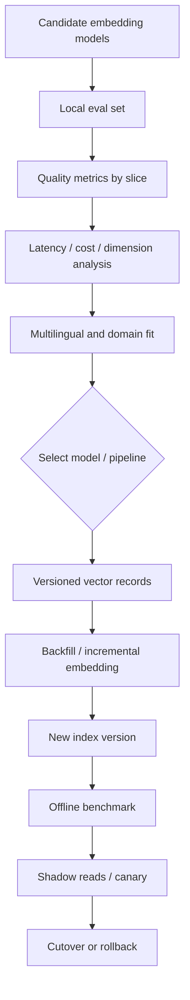

Memory card:

```text
Benchmarks shortlist.
Local eval decides.
Dimensions price the system.
Slices reveal risk.
Versions make migration possible.
Dual indexes make rollback possible.
```

### Topic 4.2 Active Recall

Answer without looking:

1. Why should you not choose an embedding model from leaderboard rank alone?
2. When is a domain-tuned model justified?
3. Why does vector dimension affect cost?
4. Why must multilingual quality be sliced?
5. What does recall@k measure?
6. What does MRR measure?
7. Why are hard negatives important?
8. Why are stale docs not simply relevant docs?
9. Why should vector records include model version and chunking version?
10. Why should score thresholds be recalibrated after migration?
11. What is a dual-index migration?
12. What should block production cutover?

Expected answers:

1. Public benchmarks may not match your domain, language, query style, cost, or constraints.
2. When local eval shows important domain-specific gains that simpler retrieval fixes do not solve.
3. More dimensions mean more bytes stored, moved, indexed, searched, replicated, and backed up.
4. Languages, locales, scripts, and cross-language directions perform differently.
5. The fraction of relevant documents retrieved in the top k.
6. How early the first relevant result appears.
7. They test subtle distinctions that easy negatives hide.
8. They may be topically related but unsafe or incorrect.
9. To reproduce, debug, filter, migrate, and avoid mixing incompatible vector spaces.
10. New models change score distributions and neighborhood structure.
11. Running old and new indexes side by side before cutover.
12. High-risk slice regression, deleted/forbidden data, freshness failure, latency failure, missing rollback, or failed reconciliation.

One-line topic summary:

> Embedding model selection is a measured production decision: evaluate locally, account for cost and multilingual constraints, benchmark with real retrieval metrics, and migrate with explicit versioning and rollback.

---

## Topic 4.3: Embedding Pipelines and Chunk Representations

> **Topic time:** 8h
> Focus: Learning how source documents become searchable vector records, why representation granularity controls retrieval quality, and how to design chunk, section, and document embeddings that preserve enough meaning without flooding retrieval with noise.

---

## Subtopic 4.3.a: Chunk-Level vs Section-Level vs Document-Level Embeddings

### Add to Knowledge Base

An embedding pipeline does not embed "knowledge" directly.

It embeds a **representation unit**.

That unit might be:

- a small chunk
- a paragraph
- a section
- a heading plus section body
- a whole document
- a document summary
- a table row
- a code function
- a support ticket
- a conversation memory

The representation unit decides what the vector means.

The core choice:

```text
chunk-level embedding
section-level embedding
document-level embedding
```

Simple distinction:

| Representation | What it embeds | Main strength | Main risk |
|---|---|---|---|
| Chunk-level | Small passage or chunk. | Precise retrieval. | May lose surrounding context. |
| Section-level | Logical section with heading/body. | Balanced context and specificity. | May still be too broad or too large. |
| Document-level | Entire document or summary. | Good for broad discovery. | Blurry representation for multi-topic docs. |

The core idea:

> Embedding granularity controls the trade-off between precision and context.

Small units are precise but may be incomplete.
Large units are complete but may be semantically blurry.

The beginner mistake:

```text
Just split every document every 1,000 characters and embed it.
```

The professional view:

```text
Choose representation granularity based on document structure, query type, answer needs, context window, metadata, and evaluation results.
```

Key terms:

| Term | Meaning |
|---|---|
| Chunk | A smaller piece of source content embedded as a searchable unit. |
| Section | A logical document region, often under a heading. |
| Document embedding | One vector representing an entire document or document summary. |
| Granularity | Size/level of the representation unit. |
| Parent-child retrieval | Retrieve small child chunks but return larger parent sections/documents as context. |
| Multi-vector document | Store multiple vectors for one source document. |
| Context reconstruction | Rebuilding useful surrounding context after retrieving a small chunk. |
| Chunk metadata | Source ID, section path, heading, page, timestamp, permissions, etc. |
| Semantic blur | Loss of precision when too many topics are averaged into one vector. |
| Context fragmentation | Loss of meaning when a chunk is too small or separated from needed context. |

Reference anchors:
- Retrieval-Augmented Generation paper: `https://arxiv.org/abs/2005.11401`
- REALM retrieval-augmented pretraining paper: `https://arxiv.org/abs/2002.08909`
- ColBERT late interaction retrieval paper: `https://arxiv.org/abs/2004.12832`

Important sentence:

> Retrieval does not find the best document in the abstract; it finds the best indexed representation you created.

---

### Reading Path + Level Tags

- **Beginner:** Read sections 0-4 and Active Recall.
- **Intermediate:** Add sections 5-10 and complete the Build part of the Hands-On Lab.
- **Pro:** Complete the full Hands-On Lab, including Break and Measure, then answer the chunk-representation system design question.

---

### 0. Pre-Question Hook [Beginner]

**Pause:** You have a 40-page security policy document.

It contains:

```text
section 1: employee access
section 2: contractor access
section 3: production log access
section 4: staging log access
section 5: approval process
section 6: exceptions
section 7: audit requirements
```

User asks:

```text
Can contractors access production logs?
```

What should your vector search retrieve?

Option A:

```text
one vector for the whole 40-page document
```

Risk:

```text
the document vector is a blurry average of many topics
```

Option B:

```text
one vector for every small chunk
```

Risk:

```text
the retrieved chunk may mention contractors but omit the production-log exception
```

Option C:

```text
section-level vectors plus child chunks and parent context reconstruction
```

Potential:

```text
retrieve precise evidence but return enough surrounding policy context
```

Before reading on, answer:

- What is the unit of retrieval?
- What is the unit of answer context?
- What metadata links chunks back to sections?
- What happens if a chunk is too small?
- What happens if a document vector is too broad?
- Should retrieval return a chunk, section, or full document?

That is this lesson.

---

### 1. The Intuition: Camera Zoom Levels [Beginner]

Think of embeddings like taking photos of a document.

Document-level embedding:

```text
wide-angle photo of the whole building
```

You know the general place, but not the exact room.

Section-level embedding:

```text
photo of one floor or department
```

You get structure and context.

Chunk-level embedding:

```text
close-up photo of one desk
```

You get detail, but may miss the surrounding room.

Retrieval is about choosing the right zoom level.

If the query is broad:

```text
"What is the security access policy about?"
```

document or section-level retrieval may work.

If the query is precise:

```text
"Can contractors access production logs?"
```

chunk or section-level retrieval is usually better.

If the answer needs multiple rules:

```text
contractor rule + production log rule + approval exception
```

you may need:

```text
chunk retrieval + section/document reconstruction
```

#### Beginner Explanation in 3 Lines

Chunk embeddings are precise but can lose context.
Document embeddings preserve broad meaning but blur multi-topic documents.
Section embeddings and parent-child retrieval often balance precision with enough context.

---

### 2. Visual Diagram: Three Representation Levels [Beginner]

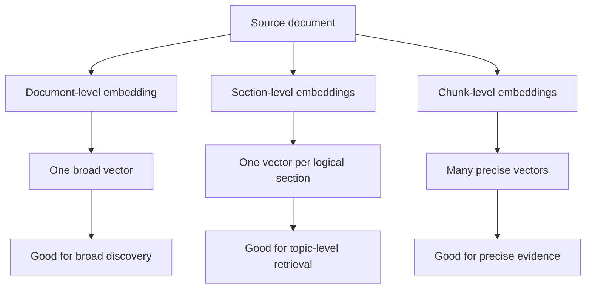

Parent-child retrieval:


Core separation:

```text
retrieval unit != context unit
```

You can retrieve a small chunk and return a larger section.

That is often the right move.

---

### 3. Chunk-Level Embeddings [Beginner]

Chunk-level embeddings represent small passages.

Examples:

```text
paragraph
200-token window
500-token window
table row
code function
policy clause
support-ticket message
```

Strengths:

- precise semantic matching
- better for specific questions
- lower semantic blur
- good for RAG evidence retrieval
- can retrieve small facts
- supports fine-grained citations

Weaknesses:

- may miss surrounding context
- can split definitions from exceptions
- can split table headers from rows
- can split code comments from code
- increases vector count
- increases index size
- can produce many near-duplicate chunks

Example good chunk:

```text
Contractors may not access production logs unless Security grants a time-limited exception.
All exceptions must be logged in the access review system.
```

Example bad split:

```text
Chunk A: Contractors may not access production logs unless
Chunk B: Security grants a time-limited exception.
```

Neither chunk alone is safe.

#### When Chunk-Level Is Best

Use chunk-level embeddings when:

- users ask precise questions
- citations matter
- documents are long
- documents contain many topics
- RAG context window is limited
- answer needs exact evidence
- you can reconstruct context after retrieval

#### Chunk-Level Rule

> Chunk small enough to be specific, but large enough to preserve the smallest answerable idea.

---

### 4. Section-Level Embeddings [Beginner]

Section-level embeddings represent a logical section.

Example:

```text
## Contractor Access to Production Logs

Contractors may not access production logs by default...
Exceptions require Security approval...
Temporary access expires after 24 hours...
Audit records must be retained...
```

Strengths:

- preserves heading context
- captures related clauses together
- good balance for policies/runbooks
- fewer vectors than chunk-level
- better for answer completeness
- natural citation unit

Weaknesses:

- sections can still be too broad
- long sections can become blurry
- precise facts may be buried
- one section may cover multiple subtopics
- updates may require re-embedding large sections

#### When Section-Level Is Best

Use section-level embeddings when:

- documents have meaningful headings
- answer needs the full rule context
- sections are not too long
- citation should point to a whole section
- policies/runbooks are organized hierarchically

#### Add Heading Context

A section body alone may be ambiguous.

Bad:

```text
Access is allowed after approval.
```

Better representation:

```text
Document: Security Access Policy
Section: Contractor Access > Production Logs
Text: Access is allowed after approval...
```

Embedding should include enough title/heading path to disambiguate the section.

---

### 5. Document-Level Embeddings [Intermediate]

Document-level embeddings represent an entire document or document summary.

Strengths:

- useful for broad discovery
- good for document recommendation
- fewer vectors
- cheap to store/search
- good for routing to candidate documents
- supports high-level clustering

Weaknesses:

- multi-topic documents become blurry
- specific facts may not dominate the vector
- answer evidence may be hard to locate
- long documents exceed model input limits
- document updates may require full re-embedding

Example:

```text
40-page security policy -> one vector
```

The vector may represent:

```text
security + access + logs + approval + employees + contractors + staging + production
```

But a user asks:

```text
contractor production log exception duration
```

The exact answer may be one paragraph buried deep inside.

Document-level retrieval may find the right document but not the right evidence.

#### When Document-Level Is Best

Use document-level embeddings when:

- queries are broad
- users need document discovery
- corpus has short single-topic documents
- first stage routes to candidate docs
- second stage searches within documents
- you need clustering or recommendation

Production pattern:

```text
document-level retrieval -> choose candidate docs
section/chunk-level retrieval -> find evidence inside docs
```

---

### 6. Multi-Level Retrieval Patterns [Intermediate]

The best production systems often use multiple representation levels.

#### Pattern 1: Chunk Search, Section Context

Search:

```text
small chunk vectors
```

Return:

```text
parent section or neighboring chunks
```

Good for:

- RAG over policies
- precise questions
- preserving enough context

#### Pattern 2: Document Search, Chunk Drill-Down

Stage 1:

```text
retrieve candidate documents using document embeddings
```

Stage 2:

```text
search chunks inside those documents
```

Good for:

- huge corpora
- document routing
- hierarchical search

#### Pattern 3: Section Search + Chunk Reranking

Stage 1:

```text
retrieve sections
```

Stage 2:

```text
select best chunks inside section
```

Good for:

- structured docs
- manuals
- policies
- runbooks

#### Pattern 4: Multi-Vector Document

Store several vectors for each document:

```text
document summary vector
section vectors
chunk vectors
title vector
keyword/sparse vector
```

Good for:

- mixed query granularity
- broad and precise search
- recommendation plus evidence retrieval

Risk:

- more storage
- more complex ranking
- duplicate candidates
- harder evaluation

#### Pattern 5: Summary Vector + Evidence Chunks

Create:

```text
summary embedding for broad retrieval
chunk embeddings for evidence
```

Good when:

- documents are long
- document-level raw embedding is too blurry
- summaries are reliable

Risk:

- bad summary loses important details
- summary may overgeneralize
- summary generation adds cost and versioning

---

### 7. Choosing Granularity by Query Type [Intermediate]

| Query type | Best starting representation |
|---|---|
| "What docs explain API auth?" | Document or section-level. |
| "How do I rotate API keys?" | Section or chunk-level. |
| "What is the timeout for SEC-17B?" | Chunk-level + exact lookup. |
| "Compare employee and contractor access." | Multiple section/chunk retrieval. |
| "Find all docs about production observability." | Document + section-level. |
| "What changed in the 2026 policy?" | Section/chunk with version metadata. |
| "Show related runbooks." | Document-level or summary-level. |

Rule:

```text
broad query -> broader representation can help
precise query -> smaller representation usually needed
multi-part query -> multiple chunks/sections needed
```

But do not rely on rules alone.

Use retrieval eval.

---

### 8. Metadata and Lineage [Intermediate]

Representation granularity only works if every vector carries lineage metadata.

Chunk record:

```text
source_id
document_title
document_type
section_id
section_heading
heading_path
chunk_id
chunk_index
char_start
char_end
page_number
version
status
tenant_id
acl
created_at
updated_at
```

Why it matters:

| Metadata | Use |
|---|---|
| source_id | Reconstruct document context. |
| section_id | Retrieve parent section. |
| heading_path | Disambiguate short chunks. |
| chunk_index | Fetch neighboring chunks. |
| char/page range | Citation and highlighting. |
| version/status | Avoid stale content. |
| tenant/ACL | Enforce permissions. |

Without lineage, chunk retrieval creates orphan snippets.

Orphan snippet problem:

```text
"Access is allowed after approval."
```

Allowed for whom?
Which access?
Which environment?
Which policy version?

Metadata and parent context answer those questions.

---

### 9. Context Reconstruction [Intermediate]

Retrieval often finds a small chunk.

Answer generation often needs surrounding context.

Context reconstruction means:

```text
retrieved chunk -> fetch parent/neighbor context -> build final evidence packet
```

Common strategies:

#### Neighbor Expansion

If chunk 12 is retrieved:

```text
return chunks 11, 12, 13
```

Good for:

- preserving flow
- avoiding split sentences
- adding definitions/exceptions

Risk:

- can add noise
- can exceed context budget

#### Parent Section Expansion

If a child chunk is retrieved:

```text
return the parent section
```

Good for:

- policy/rule completeness
- section-level citations
- hierarchical docs

Risk:

- long sections may be too much

#### Heading Path Injection

Add:

```text
Document > Section > Subsection
```

to the retrieved text.

Good for:

- disambiguating short chunks
- improving answer grounding

#### Compression/Summarization

Retrieve full section, then compress relevant parts.

Good for:

- long sections
- limited context windows

Risk:

- summarizer can omit critical exception

Production rule:

> Search can be fine-grained; context should be coherent.

---

### 10. Common Mistakes + Debugging [Intermediate]

#### Mistake 1: Embedding Whole Long Documents

Bad:

```text
one vector for a 40-page mixed-topic policy
```

Why it fails:

- semantic blur
- poor evidence localization
- weak citations

Better:

```text
section/chunk vectors with document-level routing if needed
```

#### Mistake 2: Chunks Too Small to Answer

Bad:

```text
"unless approved by Security"
```

This chunk is meaningless alone.

Better:

```text
include enough surrounding clause/context
```

#### Mistake 3: Losing Headings

Bad:

```text
embed body text without section title
```

Example:

```text
"Access requires approval."
```

Better:

```text
"Contractor Access > Production Logs: Access requires approval."
```

#### Mistake 4: Returning Retrieved Chunk Without Parent Context

Bad:

```text
send isolated top chunks to the LLM
```

Better:

```text
expand to parent/neighbor context and preserve citations
```

#### Mistake 5: Not Evaluating Granularity

Do not decide chunk size by taste.

Evaluate:

- chunk-level
- section-level
- document-level
- parent-child
- with/without heading path
- with/without neighbor expansion

#### Mistake 6: Duplicate Chunk Flooding

Repeated boilerplate can create many similar chunks.

Symptoms:

- top-k filled with duplicates
- poor diversity
- same document dominates retrieval

Fix:

- deduplicate
- diversify by source/section
- collapse siblings
- rerank

#### Debugging Checklist

When retrieval misses or gives weak context:

1. Is the answer split across chunks?
2. Are chunks too small?
3. Are chunks too large and blurry?
4. Are headings included in embedding text?
5. Is metadata lineage complete?
6. Can you fetch parent section?
7. Are nearby chunks needed?
8. Are duplicates flooding top-k?
9. Is document-level routing needed?
10. Is section-level retrieval better for this corpus?
11. Are tables/code split safely?
12. Does final context answer the query, or only match it?

---

### 11. Failure Modes [Pro]

#### Failure Mode 1: Semantic Blur

What happens:

```text
long document or section covers too many topics, so vector represents an average.
```

User sees:

```text
broad but weak matches.
```

Mitigation:

- chunk/section split
- summary plus evidence chunks
- hierarchical retrieval

#### Failure Mode 2: Context Fragmentation

What happens:

```text
small chunks split rule from exception.
```

User sees:

```text
answer misses caveat or condition.
```

Mitigation:

- larger semantic chunks
- overlap
- neighbor expansion
- parent section context

#### Failure Mode 3: Heading Loss

What happens:

```text
chunk text lacks section title, so meaning is ambiguous.
```

User sees:

```text
wrong policy interpretation.
```

Mitigation:

- prepend heading path
- store heading metadata
- include title/section in final context

#### Failure Mode 4: Document-Level Recall But Evidence Failure

What happens:

```text
retriever finds the right document but not the answer paragraph.
```

User sees:

```text
LLM gets too much text or misses evidence.
```

Mitigation:

- second-stage chunk retrieval inside document
- section indexing
- citations by paragraph

#### Failure Mode 5: Chunk Duplication

What happens:

```text
boilerplate creates many near-identical vectors.
```

User sees:

```text
top results lack diversity.
```

Mitigation:

- deduplication
- source diversity constraints
- boilerplate removal
- sibling collapsing

#### Failure Mode 6: Table/Header Split

What happens:

```text
table rows embedded without headers.
```

User sees:

```text
numbers or policy limits without meaning.
```

Mitigation:

- repeat table headers in each row representation
- table-aware chunking
- structured metadata

---

### 12. Trade-offs [Pro]

| Representation | Pros | Cons |
|---|---|---|
| Chunk-level | Precise, citeable, good for specific RAG. | More vectors, context fragmentation risk. |
| Section-level | Balanced context, natural document structure. | Sections can be too broad or long. |
| Document-level | Cheap, broad discovery, fewer vectors. | Semantic blur and weak evidence localization. |
| Parent-child | Precise retrieval plus coherent context. | More pipeline complexity. |
| Multi-vector document | Handles broad and precise queries. | More storage/ranking complexity. |
| Summary embedding | Good broad routing for long docs. | Summary quality risk and added generation cost. |

Central trade-off:

```text
precision vs context
```

Small units improve precision.
Large units improve context.
Production systems often combine both.

---

### 13. What Problem This Solves

Primary problem solved:

> Representation granularity determines whether vector search can retrieve precise, complete, and usable evidence.

Secondary benefits:

- better citations
- less semantic blur
- safer context construction
- better handling of long documents
- improved RAG answer quality
- lower hallucination risk
- clearer document lineage
- more debuggable retrieval

Systems impact:

> Chunking and representation design are as important as embedding model choice. A strong model embedded over weak units still produces weak retrieval.

---

### 14. When to Use Each Level

Use chunk-level when:

- facts are localized
- citations matter
- documents are long
- questions are precise
- answer context can be reconstructed

Use section-level when:

- documents have meaningful headings
- rules span several paragraphs
- section is natural citation unit
- query needs context but not whole document

Use document-level when:

- documents are short and single-topic
- query is broad
- you need document discovery
- first-stage routing is enough
- storage/cost must be low

Use multi-level retrieval when:

- corpus has mixed document lengths
- queries vary from broad to precise
- both discovery and evidence retrieval matter
- production quality requires robust context reconstruction

---

### 15. Real-World Scenario [Intermediate]

#### Product / System

RAG assistant over enterprise policies and engineering runbooks.

Documents:

- access-control policy
- API key rotation runbook
- incident response guide
- contractor onboarding policy
- production observability rules

#### Query

```text
Can contractors access production logs?
```

#### Bad Design 1: Document-Level Only

Retrieves:

```text
Security Access Policy
```

Problem:

```text
right document, too much text, weak evidence localization
```

#### Bad Design 2: Tiny Chunk Only

Retrieves:

```text
"Access requires approval."
```

Problem:

```text
missing who, what, environment, exception duration
```

#### Better Design

Index:

- section embeddings
- child chunk embeddings
- heading path metadata
- source/version/status metadata

Retrieve:

```text
child chunks about contractor + production logs
```

Reconstruct:

```text
parent section: Contractor Access > Production Logs
neighboring chunks: exception duration, approval workflow, audit requirement
```

Final context:

```text
coherent policy evidence with source citation
```

---

### 16. Code Sample: Build Chunk Records with Parent Lineage

```python
def make_chunk_records(source_id, title, section_heading, section_id, paragraphs):
    records = []
    for index, paragraph in enumerate(paragraphs):
        chunk_id = f"{section_id}:chunk_{index:03d}"
        embedding_text = f"{title}\n{section_heading}\n{paragraph}"

        records.append(
            {
                "source_id": source_id,
                "section_id": section_id,
                "chunk_id": chunk_id,
                "chunk_index": index,
                "title": title,
                "section_heading": section_heading,
                "embedding_text": embedding_text,
                "display_text": paragraph,
            }
        )
    return records


paragraphs = [
    "Contractors may not access production logs by default.",
    "Security may approve a time-limited exception for incident response.",
    "All exceptions must be recorded in the access review system.",
]

records = make_chunk_records(
    source_id="security_policy",
    title="Security Access Policy",
    section_heading="Contractor Access > Production Logs",
    section_id="security_policy:contractor_prod_logs",
    paragraphs=paragraphs,
)

for record in records:
    print(record["chunk_id"])
    print(record["embedding_text"])
    print()
```

Expected lesson:

```text
Embedding text can include heading context while display text stays clean.
```

---

### 17. Mini Program: Granularity Retrieval Simulation [Pro]

This toy simulation shows how different representation levels retrieve differently.

```python
import math


def dot(a, b):
    return sum(x * y for x, y in zip(a, b))


def norm(a):
    return math.sqrt(sum(x * x for x in a))


def cosine(a, b):
    return dot(a, b) / (norm(a) * norm(b))


representations = [
    {
        "id": "doc_security_policy",
        "level": "document",
        "text": "Security policy covering employees, contractors, staging, production, logs, approvals, and audits.",
        "vector": [0.75, 0.75, 0.60],
    },
    {
        "id": "section_contractor_prod_logs",
        "level": "section",
        "text": "Contractor Access > Production Logs: contractors cannot access production logs except with Security approval.",
        "vector": [0.96, 0.92, 0.20],
    },
    {
        "id": "chunk_contractor_rule",
        "level": "chunk",
        "text": "Contractors may not access production logs by default.",
        "vector": [0.98, 0.90, 0.05],
    },
    {
        "id": "chunk_exception",
        "level": "chunk",
        "text": "Security may approve a time-limited exception for incident response.",
        "vector": [0.70, 0.85, 0.15],
    },
    {
        "id": "section_employee_prod_logs",
        "level": "section",
        "text": "Employee Access > Production Logs: employees may access logs after manager approval.",
        "vector": [0.78, 0.92, 0.30],
    },
]

query = {
    "text": "Can contractors access production logs?",
    "vector": [1.00, 0.93, 0.08],
}


def search(level=None, top_k=3):
    candidates = []
    for item in representations:
        if level and item["level"] != level:
            continue
        candidates.append((cosine(query["vector"], item["vector"]), item))

    return sorted(candidates, key=lambda row: row[0], reverse=True)[:top_k]


def print_results(title, rows):
    print()
    print(title)
    print("-" * len(title))
    for score, item in rows:
        print(f"{score:.3f} | {item['level']:<8} | {item['id']} | {item['text']}")


def main():
    print(f"Query: {query['text']}")
    print_results("All representations", search())
    print_results("Document-level only", search(level="document"))
    print_results("Section-level only", search(level="section"))
    print_results("Chunk-level only", search(level="chunk"))

    print()
    print("Lesson:")
    print("Document-level retrieval finds broad context.")
    print("Chunk-level retrieval finds precise evidence.")
    print("Section/parent context often gives the safest RAG input.")


if __name__ == "__main__":
    main()
```

Expected learning:

- Document-level may find the right source but not the exact answer.
- Chunk-level may find the precise clause.
- Section-level can preserve rule context.
- Best production design may retrieve child chunks and return parent sections.

---

### 18. Hands-On Lab: Build, Break, Measure [Pro]

#### Goal

Compare chunk-level, section-level, and document-level embeddings for a small RAG corpus.

#### Build

Create 5 documents:

- security access policy
- API key rotation runbook
- contractor onboarding guide
- incident response guide
- production observability policy

For each document, create:

```text
document-level record
section-level records
chunk-level records
```

Each record should include:

```text
source_id
level
section_id
chunk_id
heading_path
embedding_text
display_text
metadata
```

#### Queries

Test:

```text
"Can contractors access production logs?"
"How do I rotate API keys without downtime?"
"What is the exception approval process?"
"Which docs cover production observability?"
"What audit records are required?"
```

#### Measure

Compare:

| Strategy | Hit@5 | Context quality | Failure |
|---|---:|---|---|
| document-only | ? | broad | weak evidence localization |
| section-only | ? | good | may be too broad |
| chunk-only | ? | precise | missing context |
| chunk + parent section | ? | strong | more pipeline complexity |

#### Break

Create bad cases:

- remove headings from chunk embedding text
- split sentences across chunks
- embed whole long document only
- add duplicate boilerplate chunks
- retrieve chunk without parent context

#### Improve

Try:

- heading path injection
- neighbor expansion
- parent section expansion
- source diversity
- chunk deduplication
- section-level fallback

#### Reflect

Answer:

1. Which granularity had best hit rate?
2. Which produced best answer context?
3. Which failed on broad queries?
4. Which failed on precise queries?
5. Did parent-child retrieval improve quality?
6. What metadata was essential?

---

### 19. Interview-Style Practical Question

> You are designing a RAG system over long enterprise policies and engineering runbooks. How would you decide whether to use chunk-level, section-level, or document-level embeddings?

---

### 20. Strong Answer

1. **I would not use one granularity blindly.**

   The right unit depends on query type, document structure, answer needs, context budget, and citation requirements.

2. **For long multi-topic documents, I would avoid document-level only retrieval.**

   A whole-document vector can be too blurry and may not locate exact evidence.

3. **For precise RAG questions, I would use chunk-level or section-level retrieval.**

   Chunks are good for precise clauses, but they need heading metadata and context reconstruction.

4. **I would preserve section structure.**

   For policies and runbooks, section-level embeddings often provide a strong balance because headings and nearby clauses matter.

5. **I would use parent-child retrieval when needed.**

   Search child chunks for precision, then return parent sections or neighboring chunks for coherent answer context.

6. **I would version and evaluate the chunking strategy.**

   Chunk size, overlap, heading injection, and context reconstruction should be tested with retrieval metrics and answer-quality evals.

7. **I would keep lineage metadata.**

   Source ID, section path, chunk index, version, status, permissions, and page/character ranges are required for citations, filters, updates, and debugging.

Short version:

```text
Document-level finds broad sources.
Section-level balances context and specificity.
Chunk-level finds precise evidence.
Production RAG often retrieves small and returns larger coherent context.
```

---

### 21. Production Reality Check

Chunk representation design record:

```text
chunking_version:
representation_levels:
document_embedding_enabled:
section_embedding_enabled:
chunk_embedding_enabled:
heading_injection:
chunk_size_target:
chunk_overlap:
parent_context_strategy:
neighbor_expansion:
metadata_fields:
deduplication_strategy:
eval_dataset_version:
launch_metrics:
```

Minimum production monitoring:

- hit@k by query type
- final context answerability
- duplicate chunk rate
- average chunks per document
- vector count growth
- top-k source diversity
- parent expansion size
- context token usage
- citation correctness
- stale chunk rate
- chunking-version distribution

Operational rule:

> Any chunking or representation change is an embedding migration, because the vector meaning changes.

---

### 22. Active Recall [Beginner]

Answer without looking:

1. What is chunk-level embedding?
2. What is section-level embedding?
3. What is document-level embedding?
4. Why can document-level embeddings be blurry?
5. Why can chunk-level embeddings lose context?
6. What is parent-child retrieval?
7. Why should headings be included in embedding text?
8. What metadata links a chunk to its source?
9. What is context reconstruction?
10. When is document-level retrieval useful?
11. When is chunk-level retrieval useful?
12. Why should chunking strategy be versioned?

Expected answers:

1. Embedding a small passage or content unit.
2. Embedding a logical document section, often with heading and body.
3. Embedding a whole document or document summary.
4. Multi-topic content gets averaged into one broad vector.
5. Small chunks may omit definitions, conditions, exceptions, or headings.
6. Searching child chunks but returning parent section/document context.
7. Headings disambiguate short or generic body text.
8. Source ID, section ID, heading path, chunk ID, chunk index, page/char range, version/status.
9. Fetching parent or neighboring context around retrieved chunks.
10. Broad discovery, routing, clustering, short single-topic docs.
11. Precise facts, citations, long documents, specific RAG questions.
12. Changing chunking changes vector meaning and requires migration/evaluation.

---

### 23. Revision Notes

One-line summary:

> Chunk, section, and document embeddings are different retrieval resolutions; production RAG often searches precise chunks and returns coherent parent context.

Three keywords:

```text
granularity
lineage
context
```

One interview trap:

```text
Treating chunk size as a fixed magic number instead of an evaluated representation design.
```

One memory trick:

```text
Documents discover.
Sections explain.
Chunks prove.
Parents restore context.
```

---

### 24. Quick Self-Test

For each situation, choose the best representation move.

| Situation | Move | Why |
|---|---|---|
| 40-page policy has many topics. | Avoid document-only embeddings. | Semantic blur. |
| Retrieved chunk says "approval is required" without context. | Add heading/parent context. | Meaning is ambiguous. |
| Query asks for exact exception rule. | Chunk-level retrieval. | Needs precise evidence. |
| Query asks "which docs cover observability?" | Document/section-level retrieval. | Broad discovery. |
| Chunks split rule and exception. | Larger semantic chunks or neighbor expansion. | Context fragmentation. |
| Top-k has repeated boilerplate chunks. | Deduplicate/diversify. | Duplicate flooding. |

If you can explain this table, you can design embedding representations for RAG instead of just splitting text randomly.

---

## Subtopic 4.3.b: Query Embeddings vs Passage Embeddings

### Add to Knowledge Base

In retrieval systems, the **query** and the **passage** are not the same kind of text.

A query usually represents an information need:

```text
"Can contractors access production logs?"
```

A passage usually represents possible evidence:

```text
"Contractors may not access production logs unless Security grants a time-limited exception."
```

The query asks.
The passage answers.

That difference matters.

Some embedding systems treat query and passage text symmetrically:

```text
same encoder
same preprocessing
same instruction
same vector space
```

Other systems treat them asymmetrically:

```text
query encoder / query instruction
passage encoder / passage instruction
shared comparable space
```

The core idea:

> Query embeddings represent intent; passage embeddings represent evidence. Retrieval works when the model maps compatible intents and evidence near each other.

Key terms:

| Term | Meaning |
|---|---|
| Query embedding | Vector representation of the user's information need. |
| Passage embedding | Vector representation of a stored chunk/section/document. |
| Symmetric retrieval | Same representation style for both sides, often used for similarity. |
| Asymmetric retrieval | Query and passage are encoded differently but compared in the same space. |
| Bi-encoder / dual encoder | Separate or role-aware encoders create query and passage vectors independently. |
| Cross-encoder | Model scores query-passage pairs together, often used for reranking. |
| Query prefix | Instruction or label prepended before embedding a query. |
| Passage prefix | Instruction or label prepended before embedding a passage/document. |
| Query rewriting | Rewriting a user query into a clearer retrieval query. |
| Passage enrichment | Adding titles, headings, metadata, or summaries to passage embedding text. |
| Retrieval asymmetry | The fact that questions and answers may use different words and structure. |

The beginner mistake:

```text
The query and document are both text, so embed them exactly the same way.
```

The professional view:

```text
Check whether the embedding model expects query/document roles, use role-specific instructions when appropriate, and evaluate query-passage retrieval directly.
```

Reference anchors:
- Dense Passage Retrieval paper: `https://arxiv.org/abs/2004.04906`
- Sentence-BERT paper: `https://arxiv.org/abs/1908.10084`
- Contriever paper: `https://arxiv.org/abs/2112.09118`
- ColBERT late interaction paper: `https://arxiv.org/abs/2004.12832`

---

### Reading Path + Level Tags

- **Beginner:** Read sections 0-4 and Active Recall.
- **Intermediate:** Add sections 5-10 and complete the Build part of the Hands-On Lab.
- **Pro:** Complete the full Hands-On Lab, including Break and Measure, then answer the query-passage retrieval system design question.

---

### 0. Pre-Question Hook [Beginner]

**Pause:** A user asks:

```text
"How do I rotate API keys without downtime?"
```

Relevant passage:

```text
"Use staged credential rollover. First create a secondary key, deploy it to all services, verify traffic, then revoke the old key."
```

The query does not say:

```text
staged credential rollover
secondary key
verify traffic
revoke old key
```

The passage does not say:

```text
without downtime
```

But they should still match.

That is the retrieval challenge:

```text
query language != passage language
```

Before reading on, answer:

- Is the query a complete statement or an information need?
- Does the passage answer the query using different words?
- Should the query be embedded with a "search query" instruction?
- Should the passage include its title and headings?
- Should we rewrite the query?
- Should a reranker verify answerability?

This is the query-vs-passage distinction.

---

### 1. The Intuition: Lock and Key [Beginner]

Think of a query as a key.

Think of a passage as a lock.

Retrieval works when the key shape matches the lock shape.

But a user query and an evidence passage often look different.

Query:

```text
"Can contractors access production logs?"
```

Passage:

```text
"Temporary external staff are prohibited from accessing production observability data unless Security grants an exception."
```

The words differ:

```text
contractors -> temporary external staff
production logs -> production observability data
can access -> prohibited unless exception
```

A good retrieval model maps the query intent near the passage evidence.

That is not the same as sentence-similarity matching.

Sentence-similarity task:

```text
"Contractors can access logs."
"Temporary workers may view observability data."
```

Retrieval task:

```text
query/question -> answer/evidence passage
```

The deepest idea:

> Retrieval is often asymmetric because the query asks for something the passage may answer indirectly.

#### Beginner Explanation in 3 Lines

Query embeddings represent what the user wants to find.
Passage embeddings represent stored evidence that may satisfy that need.
Some models require role-specific query and passage formatting so both sides land in compatible retrieval space.

---

### 2. Visual Diagram: Query-Passage Retrieval [Beginner]

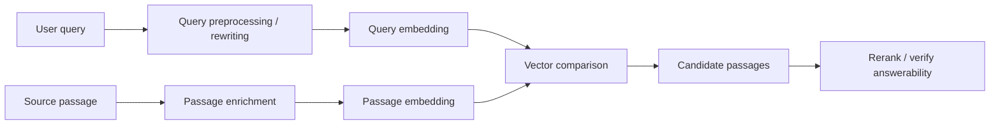

Two role-aware paths:

```text
query path:
user words -> intent vector

passage path:
evidence text + title/heading -> evidence vector
```

The vectors must be comparable.

Important:

```text
different preprocessing is okay
incompatible vector spaces are not okay
```

If the model expects:

```text
"query: ..."
"passage: ..."
```

then forgetting the prefix can degrade retrieval.

If the model uses separate query and document encoders, mixing them incorrectly can break retrieval.

---

### 3. Symmetric vs Asymmetric Retrieval [Beginner]

#### Symmetric Retrieval

Both sides are treated similarly.

Example task:

```text
find duplicate questions
find similar documents
cluster related tickets
recommend similar products
```

Input examples:

```text
"How do I reset my password?"
"I forgot my login credentials."
```

They are similar texts.

Symmetric setup:

```text
same encoder
same formatting
same kind of object
```

Good for:

- semantic similarity
- duplicate detection
- clustering
- near-neighbor recommendations

#### Asymmetric Retrieval

The two sides have different roles.

Example:

```text
query: "How do I rotate API keys?"
passage: "Credential rollover requires creating a secondary key..."
```

The query is short and intent-like.
The passage is longer and evidence-like.

Asymmetric setup may use:

- query-specific instruction
- passage-specific instruction
- separate encoders
- different preprocessing
- query rewriting
- passage title/heading injection

Good for:

- search
- RAG
- question answering
- query-document retrieval
- code search
- product search

#### Practical Rule

If you are retrieving answers/evidence for questions:

```text
assume asymmetry matters until eval proves otherwise
```

---

### 4. Query Embeddings [Beginner]

A query embedding should represent the user's information need.

User query:

```text
"Can contractors access production logs?"
```

Information need:

```text
Find current policy evidence about contractor permission for production log access.
```

The raw user query may be:

- short
- ambiguous
- misspelled
- multilingual
- code-switched
- full of acronyms
- missing domain context
- phrased as a question
- phrased as keywords
- influenced by previous chat turns

#### Query Embedding Inputs

You may embed:

```text
raw query
```

or:

```text
rewritten query
```

or:

```text
query + conversation context
```

or:

```text
query + product/domain metadata
```

Example:

Raw:

```text
"token expired"
```

Better with context:

```text
"OAuth access token expiration troubleshooting for identity provider integration"
```

But be careful:

```text
query rewriting should clarify intent, not invent intent
```

#### Query Prefixes

Some embedding models benefit from or require role instructions:

```text
"query: Can contractors access production logs?"
```

or:

```text
"Represent this question for retrieving relevant policy passages: Can contractors access production logs?"
```

The exact format depends on the model.

Rule:

> Follow the model's recommended query formatting and test it in local retrieval evals.

---

### 5. Passage Embeddings [Intermediate]

A passage embedding should represent evidence.

Passage:

```text
"Contractors may not access production logs unless Security grants a time-limited exception."
```

The passage should often be enriched before embedding.

#### Passage Enrichment

Add context that helps meaning:

```text
Document: Security Access Policy
Section: Contractor Access > Production Logs
Version: current
Text: Contractors may not access production logs unless Security grants a time-limited exception.
```

Why?

The raw passage:

```text
"Access is not allowed by default."
```

is too vague.

Enriched:

```text
"Security Access Policy > Contractor Access > Production Logs: Access is not allowed by default."
```

is much clearer.

#### Passage Prefixes

Some models expect:

```text
"passage: ..."
```

or:

```text
"Represent this document for retrieval: ..."
```

If the model was trained with prefixes, using the wrong prefix can shift vectors.

#### Passage Text vs Display Text

You can embed enriched text but display clean text.

Embedding text:

```text
Security Access Policy > Contractor Access > Production Logs:
Contractors may not access production logs unless Security grants a time-limited exception.
```

Display text:

```text
Contractors may not access production logs unless Security grants a time-limited exception.
```

This gives the model context while keeping citations readable.

---

### 6. Single Encoder vs Dual Encoder [Intermediate]

#### Single Encoder

One model encodes both queries and passages.

```text
query -> encoder -> query vector
passage -> same encoder -> passage vector
```

Good for:

- simpler deployment
- shared vector space
- broad semantic retrieval
- many modern embedding APIs/models

Role difference may be handled with:

- prefixes
- instructions
- input formatting

#### Dual Encoder / Bi-Encoder

Two role-specific encoders or towers:

```text
query -> query encoder -> query vector
passage -> passage encoder -> passage vector
```

The vectors are trained to be comparable.

Good for:

- query-document retrieval
- question-answer retrieval
- search systems
- domains where query and document language differ strongly

Risk:

- more model complexity
- more deployment complexity
- cannot swap encoders independently without evaluation
- using wrong encoder for a side breaks quality

#### Cross-Encoder Reranker

Cross-encoder scores query and passage together:

```text
[query, passage] -> model -> relevance score
```

It is usually too expensive to run over the whole corpus.

Common pattern:

```text
bi-encoder retrieves top 100
cross-encoder reranks top 100
LLM receives top 5
```

This works because:

- query/passage embeddings generate candidates quickly
- reranker checks richer query-passage interaction

---

### 7. Query Rewriting vs Passage Enrichment [Intermediate]

Query rewriting changes the query side.

Passage enrichment changes the document side.

Both can help.

#### Query Rewriting

Raw:

```text
"COB denial OON provider"
```

Rewritten:

```text
"coordination of benefits denial for out-of-network healthcare provider claim"
```

Good for:

- acronyms
- ambiguous terms
- conversational references
- short queries
- multilingual normalization
- product/domain context

Risk:

- hallucinated intent
- over-expanded query
- lost exact terms
- slower query path

#### Passage Enrichment

Raw passage:

```text
"This code is required on the claim."
```

Enriched:

```text
"Healthcare Claims > Coordination of Benefits: This code is required on the claim."
```

Good for:

- short passages
- headings
- tables
- code functions
- policy clauses
- ambiguous terms

Risk:

- metadata pollution
- over-weighting headings
- stale metadata
- inconsistent enrichment format

#### Best Practice

Keep both:

```text
raw_text
embedding_text
display_text
metadata
```

so the retrieval system is explainable.

---

### 8. Score Calibration and Thresholds [Intermediate]

Query-passage scores are not universal confidence.

A score depends on:

- embedding model
- query formatting
- passage formatting
- prefix/instruction
- metric
- normalization
- corpus
- chunking
- language
- domain

Changing query formatting can shift scores.

Example:

```text
raw query embedding score: 0.74
instruction-prefixed query score: 0.82
```

This does not automatically mean:

```text
instruction version is 8% more correct
```

It means score distribution changed.

You must evaluate:

- ranking quality
- threshold behavior
- no-result cutoffs
- reranker candidate quality
- slice metrics

Rule:

> Any query or passage formatting change is a retrieval pipeline change and should run through eval.

---

### 9. Common Mistakes + Debugging [Intermediate]

#### Mistake 1: Missing Required Prefixes

Bad:

```text
model expects "query:" and "passage:", but pipeline embeds raw text
```

Symptoms:

- weak retrieval
- good model performs badly
- eval differs from published examples

Fix:

- follow model instructions
- version formatting
- evaluate with and without prefixes

#### Mistake 2: Using Passage Formatting for Queries

Bad:

```text
embed user query as if it were a document
```

Fix:

```text
use query role/instruction when model supports it
```

#### Mistake 3: Over-Rewriting Queries

Bad:

```text
"token issue" -> "OAuth access token issue"
```

when user meant:

```text
LLM token limit
```

Fix:

- use context carefully
- preserve original terms
- retrieve diversified senses
- ask clarification when needed

#### Mistake 4: Passage Without Title/Heading

Bad:

```text
"It is allowed after approval."
```

Better:

```text
"Security Access Policy > Contractor Access > Production Logs: It is allowed after approval."
```

#### Mistake 5: Query and Passage from Incompatible Spaces

Bad:

```text
query vectors from model v2
passage vectors from model v1
```

Fix:

- version vectors
- re-embed corpus
- use dual-index migration

#### Mistake 6: Evaluating Similarity Instead of Retrieval

Bad eval:

```text
Are query and passage sentences paraphrases?
```

Better eval:

```text
Does the query retrieve answerable evidence passages?
```

#### Debugging Checklist

When query-passage retrieval is poor:

1. Does the model expect query/passsage prefixes?
2. Are prefixes applied consistently?
3. Are query and passage vectors from compatible model versions?
4. Is query rewriting changing intent?
5. Are exact query terms preserved?
6. Are passage titles/headings included?
7. Are passages too short to carry evidence?
8. Are passages too long and blurry?
9. Are scores recalibrated after formatting changes?
10. Does reranking recover candidates?
11. Are failures concentrated in short queries?
12. Are failures caused by missing relevant passages?

---

### 10. Failure Modes [Pro]

#### Failure Mode 1: Intent-Evidence Mismatch

What happens:

```text
query describes user need but passage uses different evidence language
```

User sees:

```text
related but non-answering passages.
```

Mitigation:

- query-aware embedding model
- query rewriting
- passage enrichment
- reranking for answerability

#### Failure Mode 2: Prefix Regression

What happens:

```text
deployment removes "query:" or "passage:" instruction.
```

User sees:

```text
search relevance drops with no corpus change.
```

Mitigation:

- version embedding format
- unit tests for embedding inputs
- canary evals
- trace embedding_text

#### Failure Mode 3: Hallucinated Query Rewrite

What happens:

```text
rewriter adds a domain or intent the user did not mean.
```

User sees:

```text
wrong-sense retrieval.
```

Mitigation:

- preserve original query
- add context conservatively
- retrieve multiple interpretations
- ask clarification

#### Failure Mode 4: Passage Context Loss

What happens:

```text
passage embedding omits heading/title.
```

User sees:

```text
ambiguous or wrong evidence selected.
```

Mitigation:

- heading path injection
- metadata lineage
- section context expansion

#### Failure Mode 5: Query/Passage Version Skew

What happens:

```text
query path upgraded to v2, passage index still v1.
```

User sees:

```text
retrieval quality collapse or unpredictable ranking.
```

Mitigation:

- versioned query path
- index version routing
- dual-index migration
- compatibility tests

#### Failure Mode 6: Symmetric Model Used for Strongly Asymmetric Task

What happens:

```text
model good at sentence similarity but weak at query-document retrieval.
```

User sees:

```text
paraphrase-like results instead of answer evidence.
```

Mitigation:

- evaluate retrieval task directly
- use retrieval-trained model
- add reranker
- improve query/passage formatting

---

### 11. Trade-offs [Pro]

| Choice | Gain | Cost |
|---|---|---|
| Raw query embedding | Simple and fast. | Ambiguity and shorthand may hurt recall. |
| Query rewriting | Clarifies intent and expands acronyms. | Can alter intent and add latency. |
| Query prefixes/instructions | Aligns with role-aware model training. | Must be versioned and consistent. |
| Passage enrichment | Adds title/heading/context. | Can over-weight metadata or increase tokens. |
| Single encoder | Simpler deployment. | May be weaker for asymmetric retrieval. |
| Dual encoder | Better query-document alignment. | More complexity and migration risk. |
| Cross-encoder reranking | Strong query-passage interaction. | Too expensive for full-corpus search. |
| Multiple query interpretations | Handles ambiguity. | More retrieval cost and ranking complexity. |

Central trade-off:

```text
simplicity vs role-aware retrieval quality
```

---

### 12. What Problem This Solves

Primary problem solved:

> Query/passage role awareness helps retrieval find evidence that answers the user's information need, even when the query and passage use different wording.

Secondary benefits:

- better RAG candidate generation
- fewer wrong-sense matches
- improved short-query retrieval
- better acronym/domain handling
- stronger answerability
- clearer retrieval debugging
- safer model/prefix migrations

Systems impact:

> A strong embedding model can underperform if query and passage formatting are wrong. The retrieval pipeline must preserve the model's intended query/document contract.

---

### 13. When to Treat Query and Passage Differently

Treat them differently when:

- model documentation recommends query/passsage roles
- queries are short
- passages are long
- passage language differs from query language
- users ask questions but docs are procedural
- acronyms need expansion
- conversation context matters
- evidence answerability matters
- query-document retrieval is the main task

Treat them similarly when:

- doing duplicate detection
- clustering similar objects
- finding similar documents
- comparing same-type texts
- model is designed for symmetric similarity
- eval proves symmetric formatting works best

Strong sentence:

> "For RAG, I assume query-passage asymmetry matters because a question and its evidence are different text roles."

---

### 14. Real-World Scenario [Intermediate]

#### Product / System

RAG assistant over engineering runbooks.

User query:

```text
"How do I deploy without downtime?"
```

Relevant passage:

```text
"Use blue-green rollout. Deploy the new version to the idle environment, warm caches, switch traffic gradually, monitor errors, then decommission the old environment."
```

#### Failure

Raw query embedding retrieves:

```text
generic uptime SLA docs
incident postmortems mentioning downtime
deployment overview docs
```

It misses:

```text
blue-green rollout runbook
```

#### Fix

Query rewrite:

```text
"zero-downtime deployment blue-green rollout traffic switching runbook"
```

Passage enrichment:

```text
"Deployment Runbooks > Blue-Green Rollout: Use blue-green rollout..."
```

Reranker:

```text
checks whether passage actually answers the deployment procedure question
```

Result:

```text
better evidence retrieval
```

#### Lesson

The issue was not only model quality.

It was:

```text
query intent language did not match passage evidence language
```

---

### 15. Code Sample: Role-Specific Embedding Text Builders

```python
def build_query_embedding_text(query, domain=None, conversation_summary=None):
    parts = ["query:"]

    if domain:
        parts.append(f"domain: {domain}")

    if conversation_summary:
        parts.append(f"context: {conversation_summary}")

    parts.append(f"text: {query}")
    return "\n".join(parts)


def build_passage_embedding_text(title, heading_path, passage):
    return "\n".join(
        [
            "passage:",
            f"title: {title}",
            f"section: {heading_path}",
            f"text: {passage}",
        ]
    )


query_text = build_query_embedding_text(
    query="Can contractors access production logs?",
    domain="security policy",
)

passage_text = build_passage_embedding_text(
    title="Security Access Policy",
    heading_path="Contractor Access > Production Logs",
    passage="Contractors may not access production logs unless Security grants a time-limited exception.",
)

print(query_text)
print()
print(passage_text)
```

Expected lesson:

```text
The query and passage can have different embedding text formats while still being compared in the same retrieval space, if the model supports that contract.
```

---

### 16. Mini Program: Query Rewrite vs Passage Enrichment Simulation [Pro]

This simulation uses fake vectors to show how query and passage preparation can change ranking.

```python
import math


def dot(a, b):
    return sum(x * y for x, y in zip(a, b))


def norm(a):
    return math.sqrt(sum(x * x for x in a))


def cosine(a, b):
    return dot(a, b) / (norm(a) * norm(b))


passages = [
    {
        "id": "generic_downtime_sla",
        "text": "Service uptime and downtime SLA policy.",
        "raw_vector": [0.70, 0.20, 0.80],
        "enriched_vector": [0.68, 0.22, 0.78],
    },
    {
        "id": "blue_green_runbook",
        "text": "Blue-green rollout: deploy new version, switch traffic gradually, monitor errors.",
        "raw_vector": [0.55, 0.90, 0.30],
        "enriched_vector": [0.82, 0.95, 0.20],
    },
    {
        "id": "incident_postmortem",
        "text": "Postmortem for downtime during failed deployment.",
        "raw_vector": [0.78, 0.30, 0.70],
        "enriched_vector": [0.76, 0.32, 0.68],
    },
]

raw_query = {
    "text": "How do I deploy without downtime?",
    "vector": [0.72, 0.35, 0.72],
}

rewritten_query = {
    "text": "zero-downtime deployment blue-green rollout traffic switching runbook",
    "vector": [0.84, 0.92, 0.22],
}


def rank(query, vector_field):
    rows = []
    for passage in passages:
        score = cosine(query["vector"], passage[vector_field])
        rows.append((score, passage["id"], passage["text"]))
    return sorted(rows, reverse=True)


def print_results(title, rows):
    print()
    print(title)
    print("-" * len(title))
    for score, passage_id, text in rows:
        print(f"{score:.3f} | {passage_id:<24} | {text}")


def main():
    print_results("Raw query vs raw passages", rank(raw_query, "raw_vector"))
    print_results("Rewritten query vs raw passages", rank(rewritten_query, "raw_vector"))
    print_results("Rewritten query vs enriched passages", rank(rewritten_query, "enriched_vector"))

    print()
    print("Lesson:")
    print("Query rewriting and passage enrichment can move answer evidence upward.")
    print("But both must be evaluated because they can also change intent or over-weight metadata.")


if __name__ == "__main__":
    main()
```

Expected learning:

- Raw query may match generic downtime content.
- Rewritten query can better match procedure evidence.
- Passage enrichment can improve heading-sensitive retrieval.
- Eval is required to prove the change helps.

---

### 17. Hands-On Lab: Build, Break, Measure [Pro]

#### Goal

Compare raw query embeddings, rewritten query embeddings, raw passage embeddings, and enriched passage embeddings.

#### Build

Create 20 query-passage eval cases.

Each case should include:

```text
raw_query
rewritten_query
must_have_passages
hard_negative_passages
slice
```

Create passage variants:

```text
raw_passage_text
enriched_passage_text_with_title_heading
display_text
metadata
```

#### Test Four Pipelines

```text
1. raw query -> raw passage
2. raw query -> enriched passage
3. rewritten query -> raw passage
4. rewritten query -> enriched passage
```

#### Measure

For each pipeline:

- hit@5
- recall@10
- MRR
- wrong-sense rate
- latency
- query rewrite error rate

Slice by:

- short queries
- acronym queries
- procedural queries
- policy questions
- multilingual/code-switched queries

#### Break

Create bad cases:

- query rewrite adds wrong domain
- passage heading is stale
- model prefix removed
- query uses passage prefix
- v2 query vectors searched against v1 passage vectors

#### Improve

Try:

- conservative query rewriting
- preserving original terms
- heading path injection
- multi-query retrieval
- reranking
- clarification for ambiguous queries

#### Reflection

Answer:

1. Did query rewriting improve recall?
2. Did passage enrichment improve MRR?
3. Did any rewrite change user intent?
4. Did headings help or over-dominate?
5. Which slice benefited most?
6. What formatting must be versioned?

---

### 18. Interview-Style Practical Question

> You are building RAG over enterprise runbooks and policies. Users ask short natural-language questions, while documents use formal procedural language. How would you handle query embeddings versus passage embeddings?

---

### 19. Strong Answer

1. **I would treat the query and passage as different roles.**

   The query is an information need; the passage is possible evidence. I would check whether the embedding model expects query/document prefixes or role-specific instructions.

2. **I would format query embeddings deliberately.**

   For short or ambiguous queries, I might include domain context, conversation summary, or a conservative rewritten query while preserving original terms.

3. **I would enrich passage embeddings.**

   I would include title, heading path, section name, and important metadata in the embedding text so short passages are not ambiguous.

4. **I would keep raw, embedding, and display text separate.**

   The model can embed enriched text while the UI/LLM citation uses clean source text.

5. **I would evaluate formatting choices.**

   Raw query vs rewritten query, raw passage vs enriched passage, and prefix/no-prefix should be compared using retrieval metrics and failure review.

6. **I would use reranking for answerability.**

   Embeddings generate candidates. A reranker can better judge whether a passage actually answers the query.

7. **I would version the query and passage formatting.**

   Changing prefixes, rewriting logic, or passage enrichment can shift score distributions and should go through eval and migration discipline.

Short version:

```text
Queries express intent.
Passages contain evidence.
Format each side for its role.
Keep vectors compatible.
Evaluate the retrieval behavior.
```

---

### 20. Production Reality Check

Query/passage embedding design record:

```text
embedding_model:
model_version:
query_format_version:
passage_format_version:
query_prefix:
passage_prefix:
query_rewrite_enabled:
query_context_fields:
passage_enrichment_fields:
title_heading_injection:
raw_text_preserved:
display_text_preserved:
score_thresholds:
eval_dataset_version:
```

Minimum production monitoring:

- hit@k by query type
- MRR for short queries
- rewrite success/failure rate
- wrong-sense rate
- prefix/version distribution
- passage enrichment version distribution
- score distribution shift
- no-result rate
- reranker recovery rate
- query latency impact

Operational rule:

> Query formatting and passage formatting are part of the retrieval model contract. Changing either one should trigger evaluation.

---

### 21. Active Recall [Beginner]

Answer without looking:

1. What does a query embedding represent?
2. What does a passage embedding represent?
3. Why is query-passage retrieval often asymmetric?
4. What is symmetric retrieval good for?
5. What is asymmetric retrieval good for?
6. What is a query prefix?
7. What is passage enrichment?
8. Why should raw text and embedding text be stored separately?
9. What is query rewriting?
10. What can go wrong with query rewriting?
11. Why can missing prefixes hurt retrieval?
12. Why should formatting changes be versioned?

Expected answers:

1. The user's information need or search intent.
2. Stored evidence that may satisfy the information need.
3. Questions and answer passages often use different language and structure.
4. Duplicate detection, clustering, similar-document search.
5. Search, RAG, question-answer retrieval, query-document retrieval.
6. Role-specific instruction such as `query:` before embedding.
7. Adding title, heading, source context, or metadata to passage embedding text.
8. Embedding may need context while display/citation should stay clean and faithful.
9. Rewriting a user query to clarify retrieval intent.
10. It can invent or shift intent, over-expand, or lose exact terms.
11. Some models are trained with role prefixes; missing them changes representation.
12. Formatting affects vector behavior, thresholds, evals, and migration compatibility.

---

### 22. Revision Notes

One-line summary:

> Query embeddings encode intent, passage embeddings encode evidence, and retrieval quality depends on formatting both sides according to the model's query-document contract.

Three keywords:

```text
intent
evidence
format
```

One interview trap:

```text
Embedding queries and passages with arbitrary raw text while ignoring model-required prefixes or role-specific formatting.
```

One memory trick:

```text
Query asks.
Passage answers.
Reranker verifies.
```

---

### 23. Quick Self-Test

For each situation, choose the likely fix.

| Situation | Fix | Why |
|---|---|---|
| Short query retrieves generic docs. | Query rewrite or add context. | Raw intent is underspecified. |
| Passage says "approval is required" with no subject. | Passage heading enrichment. | Evidence lacks context. |
| Model expects `query:` and `passage:` but pipeline omits them. | Add/version prefixes and rerun eval. | Model contract is violated. |
| Query rewrite changes `token` to OAuth but user meant LLM token. | Preserve original terms / clarify. | Rewrite changed intent. |
| Query v2 vectors search passage v1 index. | Use compatible version/index. | Vector spaces may not match. |
| Dense retrieval finds candidates but answerability is weak. | Add reranker. | Pairwise query-passage scoring helps. |

If you can explain this table, you can design query-passage embedding pipelines instead of treating all text as the same.

---

## Subtopic 4.3.c: Metadata Enrichment, Titles, Summaries, and Hypothetical Questions

### Add to Knowledge Base

An embedding model only sees the text you give it.

If a passage says:

```text
"Access is allowed after approval."
```

the model may not know:

- access to what?
- approval by whom?
- for employees or contractors?
- staging or production?
- which policy?
- current or deprecated?

So embedding pipelines often enrich the text before embedding.

Enrichment means adding helpful context:

```text
title
heading path
document type
source system
product name
domain
summary
hypothetical questions
metadata-derived labels
```

The core idea:

> Metadata enrichment makes sparse or ambiguous chunks more self-describing before they become vectors.

But enrichment has a danger:

> Extra context can improve retrieval, or it can pollute the vector with stale, generic, hallucinated, or over-weighted information.

Key distinction:

| Thing | Purpose |
|---|---|
| Stored metadata | Used for filtering, permissions, grouping, display, routing, and debugging. |
| Embedding enrichment | Text intentionally included in the embedding input to shape vector meaning. |
| Display text | Clean source text shown to users or passed as cited evidence. |

Do not collapse these into one field.

Professional record shape:

```text
raw_text
embedding_text
display_text
metadata
enrichment_version
```

Key terms:

| Term | Meaning |
|---|---|
| Metadata enrichment | Adding source/context fields to text before embedding. |
| Title injection | Including document title in embedding text. |
| Heading path injection | Including hierarchy such as `Policy > Contractor Access > Production Logs`. |
| Summary embedding | Embedding a generated or authored summary. |
| Hypothetical question | Generated question that a passage could answer. |
| HyDE | Hypothetical Document Embeddings; generate a hypothetical answer/document from query and embed that to retrieve real documents. |
| Embedding text | The actual text sent to the embedding model. |
| Display text | The text shown or cited after retrieval. |
| Enrichment pollution | Retrieval degradation caused by excessive, wrong, stale, or generic enrichment. |
| Enrichment version | Version tag for the enrichment logic used to create embedding text. |

Reference anchor:
- HyDE paper: `https://arxiv.org/abs/2212.10496`

The beginner mistake:

```text
More context in the embedding text is always better.
```

The professional view:

```text
Add only context that improves retrieval on evals, version the enrichment logic, and keep raw/display text separate from embedding text.
```

---

### Reading Path + Level Tags

- **Beginner:** Read sections 0-4 and Active Recall.
- **Intermediate:** Add sections 5-10 and complete the Build part of the Hands-On Lab.
- **Pro:** Complete the full Hands-On Lab, including Break and Measure, then answer the enrichment design system question.

---

### 0. Pre-Question Hook [Beginner]

**Pause:** You are embedding this chunk:

```text
"It expires after 24 hours and must be reviewed by Security."
```

As raw text, this is nearly useless.

What expires?

Now enrich it:

```text
Document: Security Access Policy
Section: Contractor Access > Production Logs > Temporary Exceptions
Text: It expires after 24 hours and must be reviewed by Security.
```

Now the chunk becomes meaningful.

But suppose you enrich it with too much:

```text
Document: Security Access Policy
All topics: employees, contractors, interns, vendors, API keys, production logs, staging logs,
SSH keys, database passwords, HR access, finance access, office access, building badges...
Text: It expires after 24 hours and must be reviewed by Security.
```

Now the vector may become broad and noisy.

Before reading on, answer:

- Which metadata helps disambiguate the passage?
- Which metadata should be used only for filtering?
- Should generated summaries be embedded?
- Should generated hypothetical questions be indexed?
- How do you prevent hallucinated enrichment?
- How do you evaluate whether enrichment helped?

That is this lesson.

---

### 1. The Intuition: Give the Chunk Its Name Tag [Beginner]

Imagine meeting someone at a conference.

If their badge says only:

```text
Alex
```

you know very little.

If it says:

```text
Alex
Security Engineering
Production Access Review
Speaker: Contractor Log Access Policy
```

you immediately understand context.

Metadata enrichment is the chunk's name tag.

Raw chunk:

```text
"Approval is required."
```

Enriched chunk:

```text
"Security Access Policy > Contractor Access > Production Logs: Approval is required."
```

The enriched version is easier for the embedding model to place correctly.

But a badge can also be overloaded.

If the badge lists every project Alex has ever touched, it becomes noisy.

That is the enrichment trade-off.

#### Beginner Explanation in 3 Lines

Metadata enrichment adds helpful context such as title, heading, source, or summary before embedding.
It helps short chunks become self-describing.
But stale, excessive, or generated context can pollute vectors, so enrichment must be versioned and evaluated.

---

### 2. Visual Diagram: Raw vs Enriched Embedding Text [Beginner]

```mermaid
flowchart TD
    A[Raw source chunk] --> B[Metadata fields]
    B --> C[Enrichment builder]
    A --> C
    C --> D[Embedding text]
    D --> E[Embedding model]
    E --> F[Vector]

    A --> G[Display text]
    B --> H[Filter metadata]

    F --> I[Vector search]
    H --> I
    G --> J[Citation / final context]
```

Important separation:

```text
embedding_text shapes vector meaning
metadata controls filtering/routing
display_text preserves source fidelity
```

Bad pipeline:

```text
source text -> mutate with generated summary -> show mutated text as citation
```

Better pipeline:

```text
source text -> create enriched embedding text
source text -> preserve display/citation text
metadata -> preserve filters and lineage
```

---

### 3. Titles and Heading Paths [Beginner]

Titles and headings are usually the safest enrichment.

Why?

They are authored source context, not generated guesses.

Example:

```text
Title: Security Access Policy
Heading path: Contractor Access > Production Logs > Temporary Exceptions
Chunk: It expires after 24 hours and must be reviewed by Security.
```

Embedding text:

```text
Security Access Policy
Contractor Access > Production Logs > Temporary Exceptions
It expires after 24 hours and must be reviewed by Security.
```

This helps the model understand:

- domain
- policy area
- subject
- environment
- scope
- relationship to parent section

#### When Heading Injection Helps

It helps when chunks contain:

- pronouns
- short clauses
- table rows
- exception language
- "this/that" references
- generic words like "access", "approval", "limit"
- code snippets without function names

#### When Heading Injection Can Hurt

It can hurt when:

- headings are wrong
- headings are too generic
- heading path is very long
- boilerplate title dominates every chunk
- many chunks from same doc become too similar

Example bad heading:

```text
General Information > Details > More Details
```

Not useful.

Professional rule:

> Include the shortest heading path that disambiguates the chunk.

---

### 4. Metadata Enrichment vs Metadata Filtering [Beginner]

Not all metadata belongs in embedding text.

Some metadata should shape semantic meaning.

Some metadata should filter eligibility.

#### Good Embedding Enrichment Candidates

Often useful:

- title
- heading path
- product/module name
- document type
- glossary expansion
- table headers
- code function/class name
- domain label if meaningful
- short source-authored summary

Example:

```text
Product: Identity Platform
Section: OAuth Token Expiration
```

This helps meaning.

#### Good Filtering Metadata

Should usually remain structured:

- tenant_id
- user_acl
- document_status
- region
- language
- effective_date
- source_system
- confidentiality_level
- owner_team

Example:

```text
tenant_id = acme
status = current
acl = security_team
```

These should not be relied on semantically.
They should be enforced as filters.

Bad:

```text
Embedding text includes "tenant acme confidential security team only"
and no actual ACL filter exists.
```

Security is not a vibe. Use filters.

#### Decision Rule

Ask:

```text
Does this field help the model understand meaning?
Or does this field decide whether the result is eligible?
```

Meaning fields may be enrichment.
Eligibility fields must be structured filters.

---

### 5. Summaries as Embedding Representations [Intermediate]

Summaries can help represent long or complex content.

Instead of embedding a long section directly:

```text
full section with 3,000 tokens
```

you may embed:

```text
summary of the section
```

or store both:

```text
summary vector
evidence chunk vectors
```

#### Why Summaries Help

Summaries can:

- reduce semantic blur
- compress long sections
- expose implicit topics
- improve broad discovery
- help document-level routing
- make multi-topic docs searchable

Example summary:

```text
This section defines when contractors may receive temporary production log access,
who must approve it, how long it lasts, and how audit records are retained.
```

This is much better than a vague raw section if the raw section is long and scattered.

#### Why Summaries Are Risky

Generated summaries can:

- omit exceptions
- hallucinate policy meaning
- overgeneralize
- erase numerical limits
- weaken exact terms
- become stale when source changes

Bad summary:

```text
Contractors can access production logs with approval.
```

Source:

```text
Contractors may not access production logs except during active incidents,
with Security approval, for a maximum of 24 hours.
```

The summary lost constraints.

#### Safe Summary Pattern

Use summaries for:

```text
broad routing / discovery
```

Use source chunks for:

```text
final evidence / citations
```

Rule:

> Generated summaries can help retrieval, but final answers should be grounded in source text.

---

### 6. Hypothetical Questions [Intermediate]

A hypothetical question is a generated question that a passage could answer.

Passage:

```text
Contractors may not access production logs unless Security grants a time-limited exception during an active incident.
```

Generated hypothetical questions:

```text
Can contractors access production logs?
When can contractors get temporary production log access?
Who approves contractor access to production logs?
Are contractors allowed to view prod observability data?
```

Why this helps:

Users ask questions.
Documents often state answers.

Hypothetical questions create query-like representations for passages.

Indexing pattern:

```text
passage -> generate possible questions -> embed questions -> link back to passage
```

At search time:

```text
user query -> matches generated question -> retrieve source passage
```

This can improve recall for:

- FAQs
- support docs
- policies
- troubleshooting guides
- procedural runbooks
- short clauses that answer common questions

#### Risks

Generated questions can:

- ask questions the passage does not really answer
- overemphasize one aspect
- miss rare query forms
- become stale
- create many duplicate vectors
- increase storage cost
- retrieve passage for unsupported questions

Bad generated question:

```text
Can all contractors freely access production logs?
```

That contradicts the source.

#### Safe Pattern

For each generated question store:

```text
question_text
source_passage_id
generation_model_version
generation_prompt_version
confidence/review_status
```

And evaluate:

- hit@k improvement
- wrong-question retrieval
- duplicate vector rate
- answerability

---

### 7. HyDE and Hypothetical Documents [Intermediate]

HyDE stands for **Hypothetical Document Embeddings**.

The idea:

```text
user query
-> generate a hypothetical answer/document
-> embed that generated document
-> use it to retrieve real documents
```

Example query:

```text
"How do I rotate API keys without downtime?"
```

Hypothetical document:

```text
To rotate API keys without downtime, create a secondary key, deploy it to all services,
verify traffic, then revoke the old key after rollout.
```

Embedding this hypothetical document may land closer to real runbooks because it uses evidence-like language.

This is query-time enrichment, not index-time enrichment.

Compare:

| Technique | When generated | What is embedded |
|---|---|---|
| Hypothetical questions | Index time | Questions generated from passage. |
| Summary vectors | Index time | Summary generated from document/section. |
| HyDE | Query time | Hypothetical answer/document generated from query. |

#### Why HyDE Can Help

It bridges:

```text
short query language -> document-like evidence language
```

#### Why HyDE Is Risky

Generated hypothetical documents may contain false details.

The retrieval step grounds the search back to real documents, but:

- false details can steer retrieval wrong
- generation adds latency
- generation adds cost
- high-risk domains need care
- query-time behavior is harder to cache

Safe rule:

> HyDE can improve candidate retrieval, but generated hypothetical text is not evidence.

Evidence must come from retrieved source documents.

---

### 8. Enrichment Design Patterns [Intermediate]

#### Pattern 1: Title + Heading + Chunk

Embedding text:

```text
Title: Security Access Policy
Section: Contractor Access > Production Logs
Text: Contractors may not access production logs...
```

Best default for:

- policies
- docs
- runbooks
- manuals

#### Pattern 2: Table Header + Row

Raw row:

```text
24 hours | Security | Required
```

Embedding text:

```text
Table: Temporary Access Exceptions
Columns: duration, approver, audit required
Row: 24 hours | Security | Required
```

Best for:

- tables
- pricing
- policy limits
- compatibility matrices

#### Pattern 3: Code Symbol + Docstring + Function Body

Embedding text:

```text
File: auth/tokens.py
Function: rotate_api_key
Docstring: Rotates API key without downtime by creating secondary credential.
Code: ...
```

Best for:

- code search
- API docs
- developer support

#### Pattern 4: Summary Vector + Evidence Vectors

Store:

```text
section_summary_vector
chunk_evidence_vectors
```

Use:

```text
summary for routing
chunks for citations
```

#### Pattern 5: Hypothetical Questions Linked to Source

Store generated questions as extra vectors:

```text
question_vector -> source_passage_id
```

When matched, return:

```text
original source passage
```

not the generated question as evidence.

---

### 9. Versioning and Governance [Intermediate]

Enrichment logic must be versioned.

Fields:

```text
enrichment_version
title_strategy_version
heading_strategy_version
summary_model_version
summary_prompt_version
hypothetical_question_model_version
hypothetical_question_prompt_version
embedding_text_hash
source_content_hash
```

Why?

Changing enrichment changes vector meaning.

Example changes:

- add title to embedding text
- remove document type
- add generated questions
- change summary prompt
- change table formatting
- change glossary expansion

All require:

- eval
- possible re-embedding
- index versioning
- threshold review
- migration plan

Generated enrichment needs governance:

- prompt version
- model version
- review status if high-risk
- source linkage
- expiration/recompute policy

Rule:

> Generated enrichment is derived data and must be traceable.

---

### 10. Common Mistakes + Debugging [Intermediate]

#### Mistake 1: Using Metadata as Security

Bad:

```text
embed "confidential" into vector text and assume it prevents retrieval
```

Better:

```text
use structured ACL filters
```

#### Mistake 2: Showing Generated Summary as Source

Bad:

```text
LLM cites generated summary as policy text
```

Better:

```text
use summary for retrieval/routing, cite source passage
```

#### Mistake 3: Hallucinated Hypothetical Questions

Bad:

```text
generated question asks something the passage does not answer
```

Fix:

- validate generated questions
- limit generation prompt
- sample audit
- evaluate wrong-question retrieval

#### Mistake 4: Over-Enrichment

Too much metadata makes chunks similar to everything.

Symptoms:

- generic docs rank high
- top-k lacks precision
- many chunks from same source dominate

Fix:

- shorten enrichment
- remove generic metadata
- evaluate variants

#### Mistake 5: Stale Enrichment

Source changes but summary/questions remain old.

Fix:

- content hash dependency
- regeneration on source change
- enrichment freshness checks

#### Mistake 6: No Separate Display Text

Bad:

```text
show enriched embedding text to user as citation
```

This may include artificial fields or generated content.

Better:

```text
show source display text with metadata/citation separately
```

#### Debugging Checklist

When enrichment hurts retrieval:

1. What exact embedding text was sent?
2. Is raw/display text preserved?
3. Which metadata fields were injected?
4. Are titles/headings accurate?
5. Are summaries generated or authored?
6. Did generated questions stay answerable?
7. Did enrichment make many chunks too similar?
8. Did score distributions shift?
9. Did exact-term retrieval regress?
10. Are enrichment versions mixed?
11. Are stale generated artifacts present?
12. Did final answers cite generated text or source text?

---

### 11. Failure Modes [Pro]

#### Failure Mode 1: Enrichment Pollution

What happens:

```text
too much generic metadata is injected into every chunk
```

User sees:

```text
broad, weak, repetitive results
```

Mitigation:

- minimal enrichment
- source diversity
- deduplication
- eval variants

#### Failure Mode 2: Stale Summary Retrieval

What happens:

```text
summary says old policy, source changed
```

User sees:

```text
retrieval favors outdated meaning
```

Mitigation:

- regenerate summaries on content hash change
- version summaries
- cite source, not summary

#### Failure Mode 3: Hypothetical Question Overreach

What happens:

```text
generated question implies source answers more than it does
```

User sees:

```text
passage retrieved for unsupported question
```

Mitigation:

- generation constraints
- answerability eval
- human review for high-risk docs
- reranking against source passage

#### Failure Mode 4: Metadata Leakage into Meaning

What happens:

```text
tenant, ACL, or confidentiality fields are embedded as text and affect semantic ranking
```

User sees:

```text
weird retrieval clusters or unsafe assumptions
```

Mitigation:

- keep eligibility metadata structured
- do not rely on embedding for permissions

#### Failure Mode 5: Generated Text Becomes Citation

What happens:

```text
system returns summary/hypothetical question as if it were source
```

User sees:

```text
non-source text presented as evidence
```

Mitigation:

- separate display_text/source_text
- citation validator
- source-only answer policy

#### Failure Mode 6: Enrichment Migration Regression

What happens:

```text
new enrichment format changes vectors and thresholds
```

User sees:

```text
search behavior shifts after "metadata-only" change
```

Mitigation:

- enrichment versioning
- re-embedding plan
- benchmark before rollout
- threshold recalibration

---

### 12. Trade-offs [Pro]

| Enrichment | Gain | Cost/Risk |
|---|---|---|
| Title injection | Strong low-risk context. | Can over-dominate if generic. |
| Heading path | Disambiguates chunks. | Long/bad headings add noise. |
| Document type | Helps route meaning. | May create broad clusters. |
| Glossary expansion | Handles acronyms. | Domain-scoping required. |
| Generated summary | Improves broad routing. | Omission/hallucination/staleness risk. |
| Hypothetical questions | Improves query-like matching. | More vectors and unsupported-question risk. |
| HyDE query-time generation | Bridges query to document language. | Latency, cost, false-detail steering. |
| Table header injection | Makes rows meaningful. | Longer embedding text. |
| Code symbol injection | Improves code search. | Needs parser accuracy. |

Central trade-off:

```text
disambiguation vs pollution
```

Good enrichment clarifies meaning.
Bad enrichment dilutes it.

---

### 13. What Problem This Solves

Primary problem solved:

> Enrichment makes embedded units self-describing enough for reliable retrieval.

Secondary benefits:

- better short-chunk retrieval
- better table/code retrieval
- improved section disambiguation
- better recall for user-style questions
- support for broad routing via summaries
- more robust query-passage matching
- clearer lineage and debugging

Systems impact:

> Enrichment is one of the highest-leverage parts of an embedding pipeline because it changes what the vector actually represents.

A better embedding model cannot fully fix bad representation text.

---

### 14. When to Use Each Enrichment

Use titles/headings when:

- chunks are short
- documents are structured
- headings are meaningful
- policy/runbook sections matter

Use summaries when:

- documents/sections are long
- broad discovery or routing is needed
- final answer will still cite source chunks

Use hypothetical questions when:

- users ask natural-language questions
- passages answer common questions indirectly
- you can tolerate extra vectors
- you evaluate answerability

Use HyDE when:

- query language differs from document language
- zero-shot retrieval is weak
- latency/cost budget allows generation
- generated hypothetical text is treated only as retrieval aid

Avoid enrichment when:

- metadata is stale or unreliable
- exact source fidelity is required
- added fields are generic boilerplate
- eval shows ranking degradation

---

### 15. Real-World Scenario [Intermediate]

#### Product / System

RAG assistant over security policies.

Raw chunk:

```text
"It expires after 24 hours."
```

Without enrichment, this matches poorly.

#### Enriched Embedding Text

```text
Title: Security Access Policy
Heading: Contractor Access > Production Logs > Temporary Exceptions
Text: It expires after 24 hours.
```

Now the chunk can match:

```text
"How long can contractors keep temporary production log access?"
```

#### Hypothetical Questions

Generated:

```text
How long does temporary contractor access to production logs last?
When does a contractor production log access exception expire?
```

These question vectors link back to the source chunk.

#### Safe Final Answer

The LLM receives and cites source text:

```text
"It expires after 24 hours."
```

plus heading/source context.

It does not cite the generated hypothetical question as evidence.

---

### 16. Code Sample: Build Enriched Embedding Text

```python
def build_embedding_text(record):
    parts = []

    if record.get("title"):
        parts.append(f"Title: {record['title']}")

    if record.get("heading_path"):
        parts.append(f"Section: {record['heading_path']}")

    if record.get("document_type"):
        parts.append(f"Type: {record['document_type']}")

    parts.append(f"Text: {record['raw_text']}")
    return "\n".join(parts)


record = {
    "title": "Security Access Policy",
    "heading_path": "Contractor Access > Production Logs > Temporary Exceptions",
    "document_type": "policy",
    "raw_text": "It expires after 24 hours and must be reviewed by Security.",
}

print(build_embedding_text(record))
```

Expected lesson:

```text
Embedding text can be enriched without changing the raw source text.
```

---

### 17. Mini Program: Enrichment Strategy Simulation [Pro]

This toy simulation compares raw chunks, title/heading enrichment, and hypothetical-question vectors.

```python
import math


def cosine(a, b):
    dot = sum(x * y for x, y in zip(a, b))
    norm_a = math.sqrt(sum(x * x for x in a))
    norm_b = math.sqrt(sum(x * x for x in b))
    return dot / (norm_a * norm_b)


query = {
    "text": "How long can contractors keep temporary production log access?",
    "vector": [0.95, 0.90, 0.20],
}

records = [
    {
        "id": "raw_chunk",
        "kind": "raw",
        "text": "It expires after 24 hours.",
        "vector": [0.35, 0.20, 0.80],
        "source_id": "policy_chunk_7",
    },
    {
        "id": "enriched_chunk",
        "kind": "enriched",
        "text": "Security Access Policy > Contractor Access > Production Logs: It expires after 24 hours.",
        "vector": [0.90, 0.85, 0.25],
        "source_id": "policy_chunk_7",
    },
    {
        "id": "hypothetical_question",
        "kind": "generated_question",
        "text": "How long does temporary contractor access to production logs last?",
        "vector": [0.97, 0.88, 0.18],
        "source_id": "policy_chunk_7",
    },
    {
        "id": "generic_policy",
        "kind": "enriched",
        "text": "Security policy overview for all access requests.",
        "vector": [0.70, 0.65, 0.55],
        "source_id": "policy_overview",
    },
]


def main():
    scored = []
    for record in records:
        scored.append((cosine(query["vector"], record["vector"]), record))

    scored.sort(key=lambda item: item[0], reverse=True)

    for score, record in scored:
        print(f"{score:.3f} | {record['kind']:<18} | {record['id']:<24} | source={record['source_id']}")

    print()
    print("Lesson:")
    print("Raw chunks can be too context-poor.")
    print("Enrichment and hypothetical questions can improve recall.")
    print("Retrieved generated artifacts should point back to source evidence.")


if __name__ == "__main__":
    main()
```

Expected learning:

- Raw chunk is weak because it lacks context.
- Enriched chunk is stronger.
- Hypothetical question can match user wording.
- All generated records must link back to source evidence.

---

### 18. Hands-On Lab: Build, Break, Measure [Pro]

#### Goal

Compare enrichment strategies for the same corpus.

#### Build

Create 20 chunks from policies/runbooks.

For each chunk, create variants:

```text
raw_text_only
title_plus_raw_text
title_heading_plus_raw_text
summary_vector
hypothetical_questions
```

Store:

```text
source_id
chunk_id
raw_text
embedding_text
display_text
metadata
enrichment_version
generated_artifact_type
```

#### Test Queries

Use:

```text
"How long does contractor log access last?"
"Who approves temporary production access?"
"What is required for API key rotation?"
"How do I debug ERR-8492?"
"Which policy covers audit retention?"
```

#### Measure

Compare:

- hit@5
- recall@10
- MRR
- wrong-artifact rate
- duplicate vector rate
- stale generated artifact rate
- final answer citation quality

#### Break

Create failures:

- stale title
- wrong heading
- hallucinated summary
- hypothetical question that overclaims
- too much generic metadata
- generated artifact shown as citation

#### Improve

Try:

- shorter heading paths
- source-authored summaries only
- generated question filtering
- source citation enforcement
- enrichment versioning
- eval gates for high-risk docs

#### Reflection

Answer:

1. Which enrichment improved recall most?
2. Which enrichment improved MRR?
3. Which caused pollution?
4. Which generated artifacts were unsafe?
5. Did final answers cite only source text?
6. What enrichment should be versioned?

---

### 19. Interview-Style Practical Question

> You are building a RAG system over long policies where many chunks are short and ambiguous. How would you use metadata enrichment, titles, summaries, and hypothetical questions without corrupting retrieval quality?

---

### 20. Strong Answer

1. **I would separate raw text, embedding text, display text, and metadata.**

   The model may need enriched embedding text, but final citations should use source display text.

2. **I would start with low-risk enrichment.**

   Titles, heading paths, document type, table headers, and code symbols are usually safer because they come from source structure.

3. **I would keep eligibility metadata structured.**

   Tenant, ACL, status, region, and confidentiality should be filters, not semantic suggestions inside embedding text.

4. **I would use summaries carefully.**

   Summaries can help route long sections or documents, but final answers should cite source chunks because summaries can omit constraints or hallucinate.

5. **I would use hypothetical questions when user queries differ from document language.**

   Generated questions can improve matching, but each question must link back to source evidence and be evaluated for answerability.

6. **I would consider HyDE for query-time retrieval gaps.**

   A hypothetical document can bridge query language to document language, but the generated text is not evidence and adds latency/cost.

7. **I would version and evaluate enrichment.**

   Any enrichment change alters vector meaning, so I would benchmark hit@k, MRR, wrong-artifact rate, stale artifact rate, and final citation quality.

Short version:

```text
Enrich to clarify, not to invent.
Filter with metadata, do not secure with embeddings.
Use generated text for retrieval help, not evidence.
Version and evaluate every enrichment strategy.
```

---

### 21. Production Reality Check

Enrichment design record:

```text
enrichment_version:
included_fields:
excluded_fields:
title_strategy:
heading_strategy:
summary_enabled:
summary_model_version:
summary_prompt_version:
hypothetical_questions_enabled:
hypothetical_question_model_version:
hypothetical_question_prompt_version:
hyde_enabled:
raw_text_preserved:
display_text_preserved:
source_citation_policy:
eval_dataset_version:
```

Minimum production monitoring:

- hit@k by enrichment version
- MRR by query type
- generated artifact retrieval rate
- source citation correctness
- stale summary/question rate
- duplicate question vector rate
- wrong-question retrieval rate
- score distribution shift
- no-result rate
- source diversity
- enrichment build failures

Operational rule:

> Generated enrichment may help retrieval, but source text remains the authority.

---

### 22. Active Recall [Beginner]

Answer without looking:

1. What is metadata enrichment?
2. What is the difference between metadata filtering and embedding enrichment?
3. Why are titles and heading paths useful?
4. Why can over-enrichment hurt retrieval?
5. What is a summary embedding?
6. Why can generated summaries be risky?
7. What is a hypothetical question?
8. How do hypothetical questions improve retrieval?
9. What is HyDE?
10. Why should generated text not be treated as evidence?
11. What fields should be versioned for enrichment?
12. Why keep raw text, embedding text, and display text separate?

Expected answers:

1. Adding helpful context to text before embedding.
2. Filtering controls eligibility; enrichment shapes vector meaning.
3. They disambiguate short chunks and preserve document structure.
4. Extra generic or stale context can dilute precise meaning.
5. A vector created from a summary of a section/document.
6. They can omit constraints, hallucinate, or become stale.
7. A generated question that a passage could answer.
8. They make passage retrieval match user question wording.
9. Query-time generation of a hypothetical document/answer that is embedded to retrieve real documents.
10. It may contain false or generated details; source documents are authoritative.
11. Enrichment logic, summary prompt/model, hypothetical question prompt/model, embedding text hash, source hash.
12. Embedding needs context, citations need source fidelity, metadata needs structured filtering.

---

### 23. Revision Notes

One-line summary:

> Enrichment improves retrieval by making chunks self-describing, but generated or excessive context must be versioned, evaluated, and kept separate from source evidence.

Three keywords:

```text
enrichment
source
version
```

One interview trap:

```text
Letting generated summaries or hypothetical questions become cited evidence instead of retrieval aids linked back to source text.
```

One memory trick:

```text
Titles clarify.
Summaries route.
Questions match.
Source proves.
```

---

### 24. Quick Self-Test

For each situation, choose the best response.

| Situation | Response | Why |
|---|---|---|
| Chunk says "It expires after 24 hours." | Add title/heading context. | Raw text is ambiguous. |
| Tenant ACL is embedded as text. | Use structured filter instead. | Permissions are eligibility, not semantics. |
| Summary says contractors can access logs, but source has exceptions. | Do not cite summary; cite source. | Summary lost constraints. |
| Users ask questions that docs answer indirectly. | Generate hypothetical questions linked to source. | Improves query-like matching. |
| HyDE generated answer includes false detail. | Use only for retrieval, not evidence. | Generated text is not authoritative. |
| Enrichment change shifts rankings. | Version, benchmark, recalibrate. | Vector meaning changed. |

If you can explain this table, you can use enrichment as a retrieval tool without letting it quietly corrupt evidence.

---

## Subtopic 4.3.d: Refresh Policies, Backfills, and Embedding Drift Management

### Add to Knowledge Base

An embedding index is not the source of truth.

It is a searchable projection of source data.

Source truth:

```text
documents
policies
tickets
code
database rows
product catalog
conversation memories
```

Embedding projection:

```text
chunks
embedding text
vectors
metadata payloads
ANN index
generated summaries/questions
```

When source data changes, the embedding projection can become stale.

The core idea:

> A production embedding pipeline needs explicit refresh policies, backfill strategies, and drift monitoring so the vector index stays aligned with source truth.

This matters because users do not care that your vector index was correct yesterday.

They care that:

- deleted content is not returned
- new content is searchable soon enough
- updated policies replace old ones
- generated summaries/questions are refreshed
- score thresholds remain calibrated
- model/chunking/enrichment changes do not silently degrade retrieval

Key terms:

| Term | Meaning |
|---|---|
| Refresh policy | Rule for when changed source content gets reprocessed and re-embedded. |
| Freshness SLO | Target maximum delay before source changes appear in retrieval. |
| Backfill | Batch process that embeds existing content, often after model/chunking/enrichment changes. |
| Incremental refresh | Re-embedding only changed/new/deleted items. |
| Full refresh | Reprocessing the entire corpus. |
| Priority backfill | Refreshing high-value or high-risk content first. |
| Lazy refresh | Refreshing only when content is accessed or queried. |
| Change queue | Queue of source changes waiting for embedding/index update. |
| Content hash | Hash used to detect whether searchable content changed. |
| Stale vector | Vector that no longer matches current source content or enrichment logic. |
| Drift | Change in data, query behavior, model behavior, score distributions, or neighborhoods over time. |
| Reconciliation | Checking source truth against vector index state. |
| Tombstone | Marker that content is deleted and must not be retrieved. |

The beginner mistake:

```text
Once the vectors are built, retrieval is done.
```

The professional view:

```text
Embedding indexes are living systems. They need freshness rules, failure queues, backfills, delete handling, reconciliation, and drift dashboards.
```

---

### Reading Path + Level Tags

- **Beginner:** Read sections 0-4 and Active Recall.
- **Intermediate:** Add sections 5-10 and complete the Build part of the Hands-On Lab.
- **Pro:** Complete the full Hands-On Lab, including Break and Measure, then answer the refresh/drift system design question and Topic 4.3 checkpoint.

---

### 0. Pre-Question Hook [Beginner]

**Pause:** Your RAG system answers HR policy questions.

At 9:00 AM, HR updates a policy:

```text
Old policy: Contractors may request production log access for 72 hours.
New policy: Contractors may request production log access for 24 hours.
```

At 9:05 AM, a user asks:

```text
How long can contractors keep production log access?
```

What should happen?

Bad system:

```text
retrieves the old vector because the index refresh runs nightly
```

Better system:

```text
detects policy update
queues re-embedding
updates affected chunks
marks old chunks stale/deleted
refreshes generated summaries/questions
updates index
passes freshness checks
```

Before reading on, answer:

- How fast must policy updates appear in retrieval?
- What happens to old vectors?
- How do we detect which chunks changed?
- Do generated summaries and hypothetical questions need refresh?
- How do we know the index matches source truth?
- What if the embedding job fails?
- What if drift changes retrieval quality without a source update?

This is the operational side of embedding pipelines.

---

### 1. The Intuition: Embedding Index as a Search Cache [Beginner]

Think of the embedding index like a cache.

It is useful because it makes search fast.

But a cache can become stale.

Source system:

```text
the official database/document store
```

Embedding index:

```text
a derived search copy
```

If source changes and the index does not, retrieval lies.

Not because the embedding model is bad.

Because the projection is stale.

The safe mental model:

```text
source truth -> embedding pipeline -> vector index -> retrieval
```

Every arrow needs operational guarantees.

#### Beginner Explanation in 3 Lines

Refresh policies decide when source changes become new vectors.
Backfills rebuild vectors for existing content after model/chunking/enrichment changes.
Drift management watches whether retrieval behavior changes over time even when the system appears healthy.

---

### 2. Visual Diagram: Refresh Pipeline [Beginner]

```mermaid
flowchart LR
    A[Source change] --> B[Change detector]
    B --> C[Refresh queue]
    C --> D[Chunk / enrich / embed]
    D --> E[Vector records]
    E --> F[Vector index update]
    F --> G[Retrieval]

    H[Delete event] --> I[Tombstone / purge]
    I --> F

    J[Reconciliation job] --> B
    K[Drift dashboard] --> G
```

Refresh has two jobs:

```text
keep source and index aligned
keep retrieval behavior healthy
```

Backfill view:

```mermaid
flowchart TD
    A[New model/chunking/enrichment version] --> B[Select corpus scope]
    B --> C[Plan full/priority/incremental backfill]
    C --> D[Generate new vectors]
    D --> E[Build/update index]
    E --> F[Run eval and reconciliation]
    F --> G{Cut over?}
    G -->|yes| H[Serve new version]
    G -->|no| I[Fix, rollback, or pause]
```

---

### 3. Refresh Policies [Beginner]

A refresh policy answers:

```text
When should this source item be reprocessed?
How quickly must retrieval reflect the change?
What happens if refresh fails?
```

#### 3.1 Event-Driven Refresh

Trigger:

```text
source system emits create/update/delete event
```

Good for:

- policies
- product docs
- tickets
- knowledge base articles
- frequently updated systems

Pros:

- low freshness lag
- efficient
- good for high-value content

Cons:

- needs reliable events
- missed events cause stale index
- queue/retry logic required

#### 3.2 Scheduled Refresh

Trigger:

```text
hourly / nightly / weekly batch
```

Good for:

- low-risk content
- stable docs
- large periodic imports
- systems without event feeds

Pros:

- simple
- predictable
- easier to operate

Cons:

- freshness lag
- may reprocess unchanged content
- bad for urgent policy updates

#### 3.3 Hybrid Refresh

Use both:

```text
event-driven for hot/high-risk content
scheduled reconciliation for missed events
```

This is often the production choice.

#### 3.4 Lazy Refresh

Trigger:

```text
when document is accessed, queried, or about to be retrieved
```

Good for:

- huge cold corpora
- archives
- low-traffic documents

Risk:

- first query may see stale or delayed result
- harder to guarantee freshness

#### 3.5 Manual Refresh

Trigger:

```text
operator or content owner requests re-index
```

Good for:

- emergency corrections
- incident response
- compliance takedowns
- urgent policy fixes

Must include:

- audit trail
- priority queue
- verification
- confirmation that old vectors are gone

---

### 4. Freshness SLOs [Beginner]

Not every corpus needs the same freshness.

Examples:

| Corpus | Possible freshness SLO |
|---|---|
| Security policy | New/current within minutes. |
| HR policy | Same day or within hours. |
| Product docs | Minutes to hours. |
| Incident runbooks | Minutes. |
| Blog archive | Days may be fine. |
| Legal/compliance docs | Depends on risk, often strict. |
| Deleted/private content | Immediate or near-immediate removal. |

Freshness SLO:

```text
95% of policy updates searchable within 10 minutes
99% of deletes unqueryable within 2 minutes
```

Important:

```text
delete freshness is often stricter than update freshness
```

Because stale content is bad.
Deleted sensitive content is worse.

#### Freshness Metrics

Track:

- source update time
- event received time
- embedding job start/end
- index update time
- searchable time
- freshness lag
- queue age
- failed refresh count
- delete propagation time

Formula:

```text
freshness_lag = searchable_at - source_updated_at
```

---

### 5. Change Detection [Intermediate]

Change detection decides what needs refresh.

Methods:

#### 5.1 Timestamps

Use:

```text
updated_at
```

Risk:

- timestamp changes for non-searchable metadata
- clock skew
- missed updates

#### 5.2 Content Hashes

Hash the searchable text:

```text
hash(title + headings + raw_text + enrichment inputs)
```

If hash changes, re-embed.

Good because:

- avoids re-embedding unchanged text
- detects meaningful representation changes
- supports reconciliation

#### 5.3 Version Fields

Refresh when any version differs:

```text
chunking_version
enrichment_version
embedding_model_version
metadata_schema_version
normalization_version
```

#### 5.4 Source Change Logs

Read an ordered stream:

```text
document_created
document_updated
document_deleted
permission_changed
```

Good for:

- incremental refresh
- replay after outages
- auditability

#### 5.5 Reconciliation Scans

Periodic job compares:

```text
source truth vs vector index
```

to catch missed events.

Production rule:

> Event-driven refresh gives speed; reconciliation gives correctness.

---

### 6. Backfill Strategies [Intermediate]

Backfills are needed when existing vectors must be rebuilt or completed.

Common reasons:

- new embedding model
- new chunking strategy
- new enrichment format
- missing historical vectors
- index corruption
- metadata schema migration
- new language support
- generated summaries/questions added

#### 6.1 Full Backfill

Reprocess everything.

Good when:

- representation changes globally
- corpus is manageable
- old/new vectors are incompatible

Risk:

- expensive
- long-running
- needs temporary storage
- can create freshness gap if not dual-written

#### 6.2 Incremental Backfill

Only process records that are missing/outdated.

Condition:

```text
target_model_version != record.model_version
or target_enrichment_version != record.enrichment_version
or content_hash changed
```

Good for:

- large corpora
- partial migrations
- continuous refresh

#### 6.3 Priority Backfill

Process important records first:

```text
high-risk policies
high-traffic docs
recent docs
known failure areas
hot tenants
long-tail critical docs
cold archives last
```

Good when:

```text
full backfill takes too long
```

#### 6.4 Parallel Backfill

Use workers partitioned by:

- source ID ranges
- tenant
- document type
- updated_at windows
- corpus shard

Need:

- idempotent writes
- retry policy
- rate limiting
- progress tracking
- failure queue

#### 6.5 Backfill with Dual Index

Build new vectors into:

```text
index_v2
```

while:

```text
index_v1
```

serves production.

This is safest for large migrations.

---

### 7. Delete and Permission Refresh [Intermediate]

Deletes and permission changes deserve special handling.

#### Delete Event

If source document is deleted:

```text
remove vectors
or mark tombstone immediately
```

Do not wait for normal nightly refresh if content is sensitive.

#### Permission Change

If ACL changes:

```text
update metadata filters immediately
```

Re-embedding may not be needed if text did not change.

But vector payload/index metadata must reflect new eligibility.

#### Deprecated Content

If document becomes deprecated:

Options:

- exclude with status filter
- downrank
- archive
- keep only for historical queries
- remove from production retrieval

Must be explicit.

#### Common Rule

```text
content changes -> re-embed
eligibility changes -> update metadata/filter state
delete changes -> purge or tombstone immediately
```

---

### 8. Embedding Drift Management [Intermediate]

Drift means retrieval behavior changes over time.

Types:

| Drift type | Meaning |
|---|---|
| Source drift | Corpus content changes. |
| Query drift | User queries change. |
| Model drift | Embedding model/version changes. |
| Enrichment drift | Titles, summaries, generated questions, or formatting changes. |
| Score drift | Similarity score distributions shift. |
| Neighborhood drift | Top-k results for canary queries change. |
| Metadata drift | Filters/metadata completeness or meaning changes. |
| Label drift | What counts as correct/relevant changes. |

#### Drift Signals

Track:

- canary query top-k overlap
- known-good hit rate
- recall@k on fixed eval set
- score distribution shift
- zero-result rate
- stale-doc rate
- forbidden-doc rate
- language/domain slice regressions
- embedding vector norm distribution
- query cluster emergence
- source mix in top-k

#### Canary Queries

Maintain fixed queries:

```text
"Can contractors access production logs?"
"How do I rotate API keys without downtime?"
"What does SEC-17B require?"
"COB denial OON provider"
```

Run daily/hourly against current index.

Compare:

- top-k IDs
- rank order
- score distribution
- source status
- answerability

Drift is not always bad.

Good drift:

```text
new current policy replaces old policy
```

Bad drift:

```text
generic overview replaces precise policy
```

The dashboard should show change, and humans/evals decide whether it is acceptable.

---

### 9. Refresh Architecture [Intermediate]

A production refresh pipeline often includes:

```text
source connector
change detector
dedupe/idempotency layer
priority queue
chunker/enricher
embedding worker
vector writer
metadata writer
delete/tombstone handler
reconciliation job
eval/drift monitor
failure queue
operator dashboard
```

Mermaid view:

```mermaid
flowchart TD
    A[Source systems] --> B[Connectors]
    B --> C[Change detector]
    C --> D[Priority refresh queue]
    D --> E[Chunk + enrich]
    E --> F[Embed workers]
    F --> G[Vector DB / index]

    C --> H[Delete / ACL handler]
    H --> G

    I[Reconciliation scanner] --> C
    G --> J[Canary query monitor]
    G --> K[Retrieval eval dashboard]
    F --> L[Failure queue]
```

Design requirements:

- idempotent jobs
- retries with backoff
- dead-letter queue
- content hash checks
- stable IDs
- versioned pipeline
- source-to-index reconciliation
- freshness SLO monitoring
- manual priority override

---

### 10. Common Mistakes + Debugging [Intermediate]

#### Mistake 1: Nightly Refresh for High-Risk Policies

Bad:

```text
policy updates appear tomorrow
```

Better:

```text
event-driven refresh with strict freshness SLO for high-risk docs
```

#### Mistake 2: Re-Embedding Everything for Metadata-Only Changes

If only ACL changes:

```text
update metadata/filter payload
```

not necessarily vector content.

#### Mistake 3: Missing Delete Propagation

Bad:

```text
deleted source remains in vector index
```

Fix:

- tombstones
- delete queue
- reconciliation
- delete freshness SLO

#### Mistake 4: No Failure Queue

Embedding jobs fail.

If failures only live in logs, stale vectors persist silently.

Fix:

- failure table
- retry count
- alerting
- manual repair

#### Mistake 5: No Content Hash

Without content hash, you cannot easily know:

```text
does this vector match current source text?
```

Fix:

```text
store source_content_hash and embedding_text_hash
```

#### Mistake 6: Ignoring Generated Enrichment Refresh

If source changes, generated summaries/questions may also need regeneration.

Fix:

- generated artifact depends on source hash
- refresh artifacts with source
- mark stale artifacts invalid

#### Mistake 7: No Drift Monitoring

System can be "healthy" while retrieval quality declines.

Fix:

- canary queries
- fixed eval set
- slice metrics
- score/neighborhood drift

#### Debugging Checklist

When users report stale or weird retrieval:

1. Did the source content change?
2. Did the vector content hash match source?
3. Is the vector model/chunking/enrichment version current?
4. Is the update event stuck in queue?
5. Did embedding job fail?
6. Did index write succeed?
7. Did delete/tombstone propagate?
8. Did permission metadata update?
9. Are generated summaries/questions stale?
10. Did canary query neighborhoods drift?
11. Did score thresholds drift?
12. Is the issue freshness, ranking, or missing source content?

---

### 11. Failure Modes [Pro]

#### Failure Mode 1: Stale Vector

What happens:

```text
source text changed, vector still represents old text
```

User sees:

```text
outdated answer
```

Mitigation:

- content hashes
- event refresh
- reconciliation scans
- freshness SLOs

#### Failure Mode 2: Deleted Content Retrieved

What happens:

```text
source was deleted but vectors remain
```

User sees:

```text
sensitive or invalid content
```

Mitigation:

- immediate tombstone/purge
- delete propagation monitoring
- source-index reconciliation

#### Failure Mode 3: Backfill Starves Hot Updates

What happens:

```text
large migration consumes workers and delays new critical updates
```

User sees:

```text
fresh documents missing
```

Mitigation:

- priority queues
- separate worker pools
- rate limits
- hot-path refresh lane

#### Failure Mode 4: Generated Artifact Drift

What happens:

```text
summary/hypothetical questions were generated from old source
```

User sees:

```text
retrieval pulled toward outdated meaning
```

Mitigation:

- source hash dependency
- artifact regeneration
- artifact versioning
- source-only citations

#### Failure Mode 5: Silent Quality Drift

What happens:

```text
canary query top-k changes after corpus growth or enrichment changes
```

User sees:

```text
less precise evidence, more generic answers
```

Mitigation:

- top-k overlap monitoring
- known-good hit rate
- eval gates
- failure review

#### Failure Mode 6: Refresh Loop Explosion

What happens:

```text
non-semantic metadata updates trigger full re-embedding repeatedly
```

User/system sees:

```text
cost spike and queue backlog
```

Mitigation:

- separate searchable content hash from metadata update time
- update filters without embedding when possible
- debounce refresh events

---

### 12. Trade-offs [Pro]

| Strategy | Gain | Cost/Risk |
|---|---|---|
| Event-driven refresh | Low freshness lag. | Requires reliable events and queues. |
| Scheduled refresh | Simple and predictable. | Higher staleness. |
| Hybrid refresh | Speed plus reconciliation. | More moving parts. |
| Full backfill | Clean consistency. | Expensive and slow. |
| Incremental refresh | Efficient. | Needs precise version/hash logic. |
| Priority backfill | Critical docs improve first. | Temporary uneven coverage. |
| Lazy refresh | Cheap for cold data. | Inconsistent freshness. |
| Immediate deletes | Safer. | Requires robust delete pipeline. |
| Drift monitoring | Catches silent quality changes. | Requires canaries/evals and review. |

Central trade-off:

```text
freshness vs cost
```

and:

```text
operational simplicity vs retrieval correctness
```

For high-risk RAG, correctness usually deserves the extra machinery.

---

### 13. What Problem This Solves

Primary problem solved:

> Refresh and drift management keep the vector index aligned with changing source truth and changing retrieval behavior.

Secondary benefits:

- fewer stale answers
- safer deletes
- lower hallucination risk from old evidence
- predictable freshness
- cleaner migrations
- less hidden index corruption
- better observability
- controlled backfill cost
- measurable retrieval health

Systems impact:

> Without refresh policy and drift management, an embedding system slowly decays from a search index into a stale memory dump.

---

### 14. When to Use Each Refresh Pattern

Use event-driven refresh when:

- updates are frequent
- freshness matters
- source emits reliable events
- content is user-facing or high-risk

Use scheduled refresh when:

- content is stable
- freshness tolerance is high
- simple operations matter

Use priority backfill when:

- migration is large
- some content is more important
- high-risk docs need earlier quality gains

Use lazy refresh when:

- corpus is huge and cold
- most docs are rarely queried
- first-hit latency is acceptable

Use reconciliation always when:

- source truth and vector index can diverge
- missed events are possible
- deletes or permissions matter

Strong sentence:

> "I would combine event-driven refresh for hot/high-risk content with scheduled reconciliation to catch missed updates."

---

### 15. Real-World Scenario [Intermediate]

#### Product / System

RAG assistant over security policies and runbooks.

Freshness requirements:

```text
security policy updates searchable within 10 minutes
deleted restricted docs unqueryable within 2 minutes
engineering runbook updates searchable within 1 hour
archive docs refreshed weekly
```

#### Pipeline

1. Source emits update/delete events.
2. Change detector computes content hash.
3. High-risk docs go to priority queue.
4. Embedding workers chunk, enrich, embed, and write vectors.
5. Delete handler tombstones/purges immediately.
6. Reconciliation job scans daily for mismatches.
7. Canary queries monitor top-k drift.
8. Eval dashboard tracks recall and stale-doc rate.

#### Failure

A policy update event is missed.

Nightly reconciliation finds:

```text
source_hash != vector_record.source_hash
```

It queues refresh and alerts:

```text
freshness SLO breach for high-risk policy
```

This is the difference between:

```text
silent stale retrieval
```

and:

```text
observable, recoverable freshness failure
```

---

### 16. Code Sample: Refresh Decision with Hashes and Versions

```python
import hashlib


TARGETS = {
    "embedding_model_version": "embedding_v2",
    "chunking_version": "chunker_v4",
    "enrichment_version": "enrich_v3",
}


def sha256(text):
    return hashlib.sha256(text.encode("utf-8")).hexdigest()


def refresh_reason(source_text, vector_record):
    source_hash = sha256(source_text)

    if vector_record.get("is_deleted"):
        return "deleted vector should not be refreshed"

    if vector_record["source_hash"] != source_hash:
        return "source content changed"

    for key, target_value in TARGETS.items():
        if vector_record.get(key) != target_value:
            return f"{key} outdated"

    return "up to date"


record = {
    "source_hash": "old_hash",
    "embedding_model_version": "embedding_v1",
    "chunking_version": "chunker_v4",
    "enrichment_version": "enrich_v3",
    "is_deleted": False,
}

source_text = "Contractors may request production log access for 24 hours."

print(refresh_reason(source_text, record))
```

Expected lesson:

```text
Refresh decisions should be deterministic and explainable.
```

---

### 17. Mini Program: Priority Refresh Queue Simulation [Pro]

This simulation shows how refresh policy can prioritize high-risk updates over cold backfill work.

```python
from dataclasses import dataclass, field
from heapq import heappop, heappush


PRIORITY = {
    "delete": 0,
    "security_policy_update": 1,
    "hot_doc_update": 2,
    "normal_update": 3,
    "backfill": 4,
    "cold_archive": 5,
}


@dataclass(order=True)
class RefreshJob:
    priority: int
    created_at: int
    source_id: str = field(compare=False)
    job_type: str = field(compare=False)
    reason: str = field(compare=False)


def enqueue(queue, created_at, source_id, job_type, reason):
    heappush(
        queue,
        RefreshJob(
            priority=PRIORITY[job_type],
            created_at=created_at,
            source_id=source_id,
            job_type=job_type,
            reason=reason,
        ),
    )


def main():
    queue = []

    enqueue(queue, 1, "archive_91", "backfill", "model migration")
    enqueue(queue, 2, "policy_17", "security_policy_update", "source content changed")
    enqueue(queue, 3, "restricted_44", "delete", "source deleted")
    enqueue(queue, 4, "runbook_12", "hot_doc_update", "frequent query doc updated")
    enqueue(queue, 5, "archive_92", "cold_archive", "weekly refresh")

    print("Processing order")
    print("-" * 40)

    while queue:
        job = heappop(queue)
        print(f"{job.job_type:<24} {job.source_id:<14} {job.reason}")

    print()
    print("Lesson:")
    print("Backfills should not starve deletes or high-risk updates.")


if __name__ == "__main__":
    main()
```

Expected learning:

- Deletes must outrank normal backfill.
- Security policy updates should outrank cold archive refresh.
- Refresh scheduling is part of retrieval correctness.

---

### 18. Hands-On Lab: Build, Break, Measure [Pro]

#### Goal

Design a refresh and drift management plan for an embedding pipeline.

#### Build

Create a mini source table:

```text
source_id
document_type
risk_level
updated_at
deleted_at
source_text
source_hash
acl_version
```

Create a vector table:

```text
chunk_id
source_id
source_hash
embedding_model_version
chunking_version
enrichment_version
indexed_at
is_deleted
last_refresh_status
```

#### Define Refresh SLOs

Example:

```text
delete: 2 minutes
security policy: 10 minutes
runbook: 1 hour
normal docs: 24 hours
archive: 7 days
```

#### Simulate Changes

Add:

- source text update
- metadata-only ACL update
- delete event
- enrichment version update
- full model backfill
- missed update event
- embedding job failure

#### Measure

Track:

| Metric | Target |
|---|---|
| freshness lag p95 | below SLO |
| delete propagation | strict |
| stale vector count | decreasing |
| failed refresh jobs | alert |
| queue age by priority | bounded |
| source-index mismatch | zero before cutover |
| canary top-k overlap | explain drift |
| high-risk recall@20 | no regression |

#### Break

Create bad cases:

- backfill blocks deletes
- generated summary not refreshed
- vector has old source hash
- ACL update not propagated
- canary query retrieves deprecated doc
- score threshold changes after enrichment refresh

#### Improve

Try:

- priority queue
- dead-letter queue
- reconciliation scan
- content hash checks
- separate delete lane
- canary query dashboard
- refresh version gates

#### Reflection

Answer:

1. Which changes require re-embedding?
2. Which require metadata-only index updates?
3. Which should trigger immediate purge/tombstone?
4. Which SLOs should be strictest?
5. Which drift signal caught quality change first?
6. What would block production cutover?

---

### 19. Interview-Style Practical Question

> You are operating a RAG system over policies, runbooks, and support docs. Documents change daily, some are deleted for security reasons, and the embedding model is upgraded quarterly. How would you design refresh policies, backfills, and drift management?

---

### 20. Strong Answer

1. **I would treat the vector index as a derived projection.**

   The source document store remains authoritative. Every vector should carry source ID, chunk ID, content hash, model version, chunking version, enrichment version, indexed timestamp, and deletion/status metadata.

2. **I would define freshness SLOs by content risk.**

   Deletes and ACL changes get the strictest path. Security policies and incident runbooks refresh quickly. Archive content can refresh more slowly.

3. **I would use hybrid refresh.**

   Event-driven refresh handles normal updates quickly, while scheduled reconciliation scans catch missed events and source/index mismatches.

4. **I would separate content refresh from metadata refresh.**

   Text/chunk/enrichment/model changes require re-embedding. ACL/status/tenant changes may only require metadata payload updates and filter refresh.

5. **I would design backfills with priority and isolation.**

   Large model or enrichment migrations should not starve urgent deletes or high-risk updates. I would use priority queues, separate worker pools, failure queues, and progress dashboards.

6. **I would monitor drift continuously.**

   Canary queries, top-k overlap, known-good hit rate, score distribution shifts, stale-doc rate, forbidden-doc rate, and slice-level recall should be tracked.

7. **I would gate migrations.**

   Before cutover, source-index reconciliation must pass, high-risk retrieval slices must not regress, delete handling must be verified, thresholds must be recalibrated, and rollback must be available.

Short version:

```text
Source is truth.
Vectors are projections.
Refresh keeps them current.
Backfills evolve them safely.
Drift monitoring proves retrieval is still healthy.
```

---

### 21. Production Reality Check

Refresh design record:

```text
source_systems:
refresh_policy_by_document_type:
freshness_slo_by_risk:
delete_slo:
change_detection_method:
content_hash_fields:
queue_priority_policy:
worker_pool_strategy:
retry_policy:
dead_letter_policy:
backfill_strategy:
reconciliation_frequency:
drift_canary_queries:
eval_dataset_version:
cutover_gates:
rollback_plan:
```

Minimum production dashboard:

- refresh queue depth by priority
- oldest job age by priority
- freshness lag p50/p95/p99
- delete propagation p95/p99
- failed job count
- dead-letter count
- stale vector count
- source-index mismatch count
- wrong model/chunking/enrichment version count
- generated artifact stale count
- canary top-k overlap
- known-good hit rate
- score distribution shift
- high-risk slice recall
- forbidden-doc rate

Operational rule:

> The embedding pipeline is not healthy just because workers are running. It is healthy when source truth, vector records, index state, and retrieval behavior agree within defined SLOs.

---

### 22. Active Recall [Beginner]

Answer without looking:

1. Why is a vector index a projection, not source truth?
2. What is a refresh policy?
3. What is a freshness SLO?
4. Why are deletes often stricter than normal updates?
5. What is a content hash used for?
6. What is a backfill?
7. Why should backfills use priorities?
8. What is reconciliation?
9. Name four types of embedding drift.
10. What are canary queries used for?
11. What changes require re-embedding?
12. What changes may only require metadata updates?

Expected answers:

1. It is generated from source data and can become stale or inconsistent.
2. A rule for when and how source changes update vectors/indexes.
3. A target delay before source changes appear or disappear in retrieval.
4. Deleted sensitive content must stop being retrievable quickly.
5. To detect whether searchable content changed and re-embedding is needed.
6. Batch process to embed existing or outdated content.
7. Urgent deletes/high-risk updates should not wait behind cold corpus work.
8. Comparing source truth to index state to find mismatches.
9. Source, query, model, enrichment, score, neighborhood, metadata, label drift.
10. To monitor stable important queries for retrieval behavior changes.
11. Source text, model, chunking, enrichment, preprocessing, normalization changes.
12. ACL, tenant, status, or routing fields if text representation is unchanged.

---

### 23. Revision Notes

One-line summary:

> Refresh policies keep vectors current, backfills evolve existing vectors safely, and drift management detects when retrieval behavior changes before users find the break.

Three keywords:

```text
freshness
backfill
drift
```

One interview trap:

```text
Ignoring deletes, failed refresh jobs, generated-artifact staleness, and source-index reconciliation while claiming the RAG index is production-ready.
```

One memory trick:

```text
Updates refresh.
Migrations backfill.
Canaries catch drift.
Reconciliation catches lies.
```

---

### 24. Quick Self-Test

For each situation, choose the best response.

| Situation | Response | Why |
|---|---|---|
| Policy text changes. | Re-embed affected chunks/artifacts. | Vector content is stale. |
| ACL changes but text does not. | Update metadata/filter payload. | Eligibility changed, not meaning. |
| Document is deleted. | Tombstone/purge immediately. | Deleted content must not be retrieved. |
| Embedding model changes. | Backfill into versioned index. | Vector space changed. |
| Backfill delays urgent updates. | Add priority queues/separate workers. | Hot updates should not starve. |
| Canary query top-k changes suddenly. | Inspect drift and source/index changes. | Retrieval behavior shifted. |
| Source and index counts differ. | Run reconciliation and block cutover if needed. | Index may be incomplete/stale. |

If you can explain this table, you can operate embedding pipelines instead of merely building them.

---

## Topic 4.3 Checkpoint: Embedding Pipelines and Chunk Representations

You should now be able to explain:

```text
how representation granularity affects retrieval
how query and passage embeddings differ
how metadata enrichment improves or pollutes vectors
how refresh policies and drift management keep the index healthy
```

### Checkpoint 1: Chunk-Level vs Section-Level vs Document-Level Embeddings

Strong answer:

> "Chunk-level embeddings give precise evidence but can lose context. Section-level embeddings balance specificity and coherent context. Document-level embeddings are useful for broad discovery but can blur multi-topic documents. For production RAG, I often retrieve precise chunks and reconstruct parent section context."

### Checkpoint 2: Query Embeddings vs Passage Embeddings

Strong answer:

> "A query embedding represents the user's information need, while a passage embedding represents possible evidence. Because questions and evidence often use different language, query-passage retrieval can be asymmetric. I would follow the model's query/document formatting contract, preserve compatible vector versions, and evaluate query rewriting and passage enrichment."

### Checkpoint 3: Metadata Enrichment, Titles, Summaries, and Hypothetical Questions

Strong answer:

> "Enrichment makes chunks self-describing by adding titles, headings, summaries, table headers, or generated hypothetical questions. But eligibility metadata like ACLs must remain structured filters, and generated summaries/questions must link back to source evidence. Enrichment changes vector meaning, so it must be versioned and evaluated."

### Checkpoint 4: Refresh Policies, Backfills, and Drift Management

Strong answer:

> "The vector index is a derived projection of source truth. I would use content hashes, versioned records, event-driven refresh for hot content, scheduled reconciliation for correctness, priority backfills for migrations, strict delete handling, canary queries, and drift dashboards to keep retrieval fresh and safe."

### Full Topic 4.3 Mental Model

```mermaid
flowchart TD
    A[Source document] --> B[Chunk / section / document representation]
    B --> C[Enrich embedding text]
    C --> D[Embed passage records]
    E[User query] --> F[Query formatting / rewriting]
    F --> G[Query embedding]
    D --> H[Vector search]
    G --> H
    H --> I[Context reconstruction]
    I --> J[Rerank / answer]

    A --> K[Change detection]
    K --> L[Refresh queue / backfill]
    L --> D
    H --> M[Drift monitoring]
```

Memory card:

```text
Documents discover.
Sections explain.
Chunks prove.
Queries ask.
Passages answer.
Enrichment clarifies.
Refresh keeps truth current.
Drift monitoring keeps behavior honest.
```

### Topic 4.3 Active Recall

Answer without looking:

1. Why are document-level embeddings risky for long documents?
2. Why can chunk-level embeddings lose important context?
3. What is parent-child retrieval?
4. Why are query and passage embeddings different roles?
5. What can go wrong with query rewriting?
6. Why should passage headings be included in embedding text?
7. What is the difference between embedding text and display text?
8. Why should generated summaries not be cited as source?
9. What is HyDE used for?
10. What is a freshness SLO?
11. Why are content hashes useful?
12. What should canary queries monitor?

Expected answers:

1. Multi-topic documents become semantic averages and precise evidence is hard to locate.
2. Small chunks can split rules from exceptions or omit headings/definitions.
3. Retrieve small child chunks, then return parent sections or neighboring context.
4. Queries express intent; passages contain evidence.
5. It can invent intent, over-expand, lose exact terms, or pick the wrong domain.
6. Headings disambiguate short or generic text.
7. Embedding text shapes vectors; display text preserves source/citation fidelity.
8. Generated summaries can omit or hallucinate; source text is authoritative.
9. It generates a hypothetical document from a query to retrieve real source documents.
10. Target delay for source changes to appear/disappear in retrieval.
11. They detect whether searchable content changed and vectors are stale.
12. Top-k overlap, known-good hits, score shifts, stale docs, and quality regressions.

One-line topic summary:

> Embedding pipelines are production data systems: choose the right representation, format query and passage roles carefully, enrich without corrupting evidence, and keep vectors fresh through refresh, backfill, and drift controls.

---

## Module 4 Checkpoint: Embeddings and Semantic Representations

This checkpoint connects the full module into one interview-ready system design story.

By the end of this module, you should be able to:

```text
choose an embedding model based on task fit, not brand preference
explain similarity metrics and when they actually matter
describe how bad chunk representation poisons downstream retrieval
design an embedding pipeline that can be evaluated, migrated, refreshed, and debugged
```

---

### 1. The One-Sentence Module Mental Model

Embeddings turn messy meaning into searchable geometry, but the quality of that geometry depends on the model, metric, corpus, query shape, chunk representation, enrichment strategy, and operational freshness.

Shorter version:

```text
Embeddings are useful only when representation, metric, retrieval, and maintenance agree.
```

---

### 2. Full Module Map

```mermaid
flowchart TD
    A[User / system need] --> B[Choose embedding model]
    B --> C[Choose metric and index behavior]
    C --> D[Represent source content]
    D --> E[Chunk / section / document records]
    E --> F[Enrich embedding text]
    F --> G[Embed and version records]
    G --> H[Search / retrieve]
    H --> I[Rerank / answer / recommend]
    I --> J[Evaluate with retrieval metrics]
    J --> K[Refresh, backfill, and monitor drift]
    K --> G
```

The important point:

> Embedding quality is not a property of the model alone. It is a property of the whole retrieval pipeline.

---

### 3. Checkpoint Outcome 1: Choose an Embedding Model with Task-Fit Reasoning

Weak answer:

> "I would use the best or most popular embedding model."

Strong answer:

> "I would choose an embedding model by testing it against my actual retrieval task, corpus, query patterns, languages, latency target, cost limit, dimensionality constraints, and migration risk. Brand reputation is a starting signal, not a production decision."

#### Model-Choice Decision Framework

| Question | Why It Matters |
|---|---|
| What is the task? | Search, RAG, clustering, deduplication, recommendations, and memory have different needs. |
| What is the corpus? | Legal, medical, support tickets, code, product catalogs, and general web text behave differently. |
| What do queries look like? | Short keyword queries, natural-language questions, multilingual queries, and domain jargon stress models differently. |
| What languages matter? | Multilingual support must be evaluated per language and per cross-lingual direction. |
| What are the quality metrics? | Recall@k, MRR, nDCG, hit rate, and slice-level recall beat subjective demos. |
| What are the latency and cost limits? | Larger vectors and slower embedding calls affect both online query speed and batch ingestion cost. |
| What are the storage and index constraints? | Dimension count affects vector storage, memory, index size, and network transfer. |
| How often will the corpus change? | Frequent updates require refresh policies, versioning, and backfill planning. |
| How painful is migration? | Model changes require re-embedding and threshold recalibration. |

#### Good Model Selection Flow

1. Start with a general-purpose baseline.
2. Build a small labeled evaluation set from real queries and relevant documents.
3. Include hard negatives, ambiguous queries, multilingual examples, and domain-specific vocabulary.
4. Compare candidate models with retrieval metrics.
5. Check latency, cost, dimension, and operational complexity.
6. Inspect failure cases manually.
7. Run a shadow or canary migration before replacing production embeddings.

Decision rule:

```text
Pick the model that wins on the target retrieval task under production constraints.
```

Not:

```text
Pick the model that sounds most advanced.
```

#### Interview-Ready Model Choice Answer

> "I would not choose the embedding model by brand alone. I would define the retrieval task first, collect representative query-document pairs, measure recall@k, MRR, and nDCG, then compare models across quality, latency, cost, dimension, language support, and migration complexity. If the corpus has specialized terminology, I would test a domain-tuned model against a strong general baseline. I would version the model and index so rollback and re-embedding are possible."

---

### 4. Checkpoint Outcome 2: Explain Similarity Metrics and When They Matter

Similarity metrics decide how the vector database interprets "near."

The three core metrics:

| Metric | Core Idea | Best Mental Model |
|---|---|---|
| Cosine similarity | Compares vector direction | "Do these vectors point toward the same meaning?" |
| Dot product | Compares direction and magnitude | "Are they aligned, and how strong is the vector?" |
| Euclidean distance | Compares physical distance | "How far apart are these points?" |

#### Cosine Similarity

Cosine focuses on angle. If two vectors point in the same direction, they are similar even if one has a larger norm.

Use it when:

- vector magnitude is not meaningful
- embeddings are normalized
- semantic direction matters more than strength
- the model documentation recommends cosine

Risk:

- if the model encodes useful confidence/popularity/strength in vector norms, cosine may discard that signal

#### Dot Product

Dot product increases when vectors point in the same direction and have larger norms.

Use it when:

- the model was trained or documented for dot product
- vector norms encode useful signal
- the retrieval system expects maximum inner product search

Risk:

- high-norm vectors can dominate rankings even when semantic match is weaker

#### Euclidean Distance

Euclidean distance measures geometric distance between points.

Use it when:

- the model and index are built for L2 distance
- vectors are normalized and L2 behaves similarly to cosine ranking
- clustering or geometric algorithms expect distance

Risk:

- with unnormalized high-dimensional vectors, distance can behave unintuitively

#### When Metrics Matter Most

Metrics matter when:

- vectors are not normalized
- the model was trained with a specific similarity objective
- score thresholds are used for filtering or routing
- you migrate models or vector databases
- you compare indexes across systems
- you use ANN indexes that require a metric choice
- ranking quality is close and small ordering changes matter

Metrics matter less when:

- the embedding provider normalizes vectors
- cosine and dot product produce equivalent rankings after normalization
- a reranker dominates final ranking quality
- you are only doing rough candidate generation and evaluating end-to-end quality

Important rule:

```text
The metric must match the embedding model and the index configuration.
```

Common mistake:

```text
Using cosine in one environment, dot product in another, then comparing scores as if they mean the same thing.
```

Better approach:

```text
Keep metric, model version, normalization policy, and index version together as one retrieval contract.
```

#### Interview-Ready Similarity Metric Answer

> "Cosine compares direction, dot product compares direction plus magnitude, and Euclidean compares distance. The right metric depends on how the embedding model was trained and whether vector norms carry meaning. In production, I would follow the model's recommended metric, keep normalization consistent, avoid assuming thresholds transfer across models, and validate ranking quality with retrieval metrics rather than relying on score intuition."

---

### 5. Checkpoint Outcome 3: Explain How Bad Chunk Representation Poisons Retrieval

A vector index retrieves representations, not source documents directly.

That means:

```text
bad representation -> bad vectors -> bad neighbors -> bad retrieved context -> bad answer
```

Chunking is not just preprocessing. It is retrieval design.

#### How Bad Chunking Fails

| Bad Representation | What Happens |
|---|---|
| Chunk too small | The vector loses headings, definitions, exceptions, table context, or product identity. |
| Chunk too large | Multiple topics average together and precise evidence becomes hard to retrieve. |
| Missing title or heading | Generic text becomes ambiguous. |
| Splitting tables badly | Values lose column meaning. |
| Splitting code badly | Function intent separates from implementation details. |
| Ignoring parent context | Retrieved text is technically relevant but not enough to answer. |
| Embedding display text only | Important metadata context is missing from the vector. |
| Embedding too much metadata | The vector matches metadata noise instead of evidence. |
| Embedding generated summaries blindly | Retrieval follows stale or hallucinated artifacts. |
| Losing source IDs | Retrieved context cannot be cited, refreshed, or debugged. |

#### The Poisoning Chain

```mermaid
flowchart TD
    A[Poor chunk boundaries] --> B[Weak embedding text]
    B --> C[Wrong semantic neighborhood]
    C --> D[Low recall or noisy recall]
    D --> E[Bad reranker candidates]
    E --> F[Missing or misleading answer context]
    F --> G[Hallucination / low trust / bad product behavior]
```

The key insight:

> The generator can only answer from what retrieval gives it. If chunk representation hides the answer, no prompt can reliably recover it.

#### Better Representation Patterns

| Problem | Better Pattern |
|---|---|
| Long multi-topic documents | Chunk by semantic sections, not fixed size alone. |
| Short ambiguous chunks | Add titles, headings, product names, or source context to embedding text. |
| Need precise evidence and broader context | Use parent-child retrieval. |
| Tables | Preserve headers, row labels, units, and surrounding explanation. |
| Code | Include function/class name, docstring, imports, and local call context when useful. |
| Policies | Keep rule, exception, effective date, and scope together. |
| Generated summaries | Store as enrichment, not as source truth. |
| Frequent changes | Use stable source IDs, content hashes, and refresh policies. |

#### Interview-Ready Chunk Representation Answer

> "Bad chunking poisons retrieval because the embedding represents the chunk, not the original document. If chunks are too small, they lose meaning; if too large, unrelated topics blur together. I would chunk around semantic boundaries, preserve titles and headings in embedding text, keep source IDs and parent-child links, reconstruct context after retrieval, and evaluate recall by query slice. Chunking should be treated as a model decision, not a file-splitting detail."

---

### 6. The Three Hard Questions You Should Ask in Any Embedding Design

#### Question 1: What exactly is being embedded?

Possible answers:

- raw chunk text
- title plus chunk text
- heading path plus chunk text
- summary plus chunk text
- hypothetical questions
- table-aware representation
- code-aware representation
- document summary vector
- section vector plus child chunk vectors

Why it matters:

```text
Embedding text controls semantic position.
```

#### Question 2: What exactly is being compared?

Possible answers:

- query vector against passage vectors
- rewritten query against enriched chunks
- hypothetical document vector against source chunks
- multilingual query against English corpus
- short user memory query against long memory records

Why it matters:

```text
Query and passage representations may not live in the same practical shape unless the pipeline formats them correctly.
```

#### Question 3: How do we know retrieval is working?

Possible answers:

- labeled query-document pairs
- recall@k
- MRR
- nDCG
- slice-level metrics
- canary queries
- drift dashboards
- source-index reconciliation
- user feedback and online tests

Why it matters:

```text
Without retrieval metrics, embedding quality becomes vibes.
```

---

### 7. End-to-End Design Checklist

Use this checklist when designing a RAG, search, memory, or recommendation system.

#### Model

- What candidate embedding models are being compared?
- What metric does each model recommend?
- What dimension does each model produce?
- What are query-time and ingestion-time costs?
- Does the model handle domain vocabulary?
- Does it handle required languages?
- How will model upgrades be versioned?

#### Metric

- Are vectors normalized?
- Is the index configured for cosine, dot product, or L2?
- Do thresholds depend on raw scores?
- Are thresholds recalibrated after model changes?
- Are offline and production metrics consistent?

#### Representation

- Are chunks too small, too large, or semantically coherent?
- Are titles/headings included in embedding text?
- Are tables/code/policies represented carefully?
- Is display text separated from embedding text?
- Are generated enrichments versioned?
- Can each vector map back to source truth?

#### Evaluation

- Is there a labeled eval set?
- Are hard negatives included?
- Are metrics sliced by domain, language, document type, and query type?
- Are failures reviewed manually?
- Are candidate retrieval changes tested before rollout?

#### Operations

- Are source IDs, chunk IDs, model versions, and enrichment versions stored?
- Are refresh policies defined?
- Are deletes handled quickly?
- Are backfills prioritized?
- Is drift monitored?
- Is rollback possible?

---

### 8. Common Interview Traps

| Trap | Why It Is Weak | Stronger Answer |
|---|---|---|
| "Use embeddings for semantic search." | Too generic. | Explain model, metric, chunking, eval, and refresh. |
| "Use the latest model." | Brand/prestige bias. | Choose by task-fit metrics and constraints. |
| "Cosine is always best." | Metric depends on model and normalization. | Match model training/recommendation and validate rankings. |
| "Chunk by 500 tokens." | Fixed sizes ignore document structure. | Chunk by semantic boundaries with overlap/context when useful. |
| "Store metadata in text." | Eligibility metadata can pollute vectors. | Use structured filters for ACLs/status/tenant fields. |
| "The vector DB solves retrieval." | Vector DB stores/indexes vectors; representation decides meaning. | Treat indexing and representation as separate design choices. |
| "Re-embedding is simple." | Migration affects cost, freshness, thresholds, rollback. | Use versioned indexes, backfills, canaries, and cutover gates. |

---

### 9. Strong System Design Answer

Question:

> You are designing semantic retrieval for an enterprise knowledge assistant. How would you choose embeddings, similarity metrics, and chunk representation?

Strong answer:

> "I would start from the retrieval task, not the embedding brand. The assistant needs high recall for support, policy, and internal documentation, so I would create a labeled eval set of real queries and relevant passages, including hard negatives, ambiguous acronyms, and permission-sensitive examples. I would compare embedding models using recall@k, MRR, nDCG, latency, cost, vector dimension, multilingual support, and domain vocabulary performance."

> "For the metric, I would follow the embedding model's recommended similarity function. If vectors are normalized, cosine and dot product may rank similarly, but I would still keep normalization, metric, model version, and index version explicit. I would avoid hard-coding score thresholds until I calibrate them on production-like data."

> "For representation, I would chunk by document structure rather than token count alone. Chunks should include headings, title path, and enough surrounding context to stand alone. For long documents, I would use parent-child retrieval: retrieve precise chunks but return the parent section or neighboring context. I would keep ACLs, tenant IDs, status, and source lineage as structured metadata filters, not mixed into semantic text."

> "Finally, I would make the pipeline operationally safe. Each vector should store source ID, chunk ID, model version, chunking version, enrichment version, and content hash. Refresh policies should keep updates fresh, deletes should propagate quickly, and model migrations should use backfills, canary queries, and rollback. Retrieval quality should be monitored by slice, not just by average score."

Why this is strong:

- It ties model choice to task fit.
- It explains metrics without pretending one metric is universally best.
- It treats chunking as representation design.
- It includes evaluation and operations.
- It shows production maturity.

---

### 10. Final Diagnostic Table

| Symptom | Likely Cause | What to Check |
|---|---|---|
| Relevant document never appears | Model/domain mismatch or bad chunk representation | Recall@k, query examples, chunk text, model comparison |
| Similar but wrong documents dominate | Metric mismatch, metadata pollution, or weak hard negatives | Normalization, score distribution, filters, eval negatives |
| Answers cite irrelevant sections | Chunks too large or document-level vectors too broad | Chunk boundaries, parent-child design, section retrieval |
| Answers miss caveats/exceptions | Chunks too small or split rules from exceptions | Neighbor context, overlap, section reconstruction |
| Multilingual queries fail | Weak multilingual alignment or missing language slices | Per-language eval and cross-lingual retrieval tests |
| Scores changed after migration | New vector space or metric/index mismatch | Model version, metric, normalization, threshold recalibration |
| Old content keeps appearing | Refresh/delete pipeline failure | Content hashes, tombstones, refresh queue, reconciliation |
| Quality silently decays | Drift | Canary queries, score shifts, top-k overlap, stale vector rate |

---

### 11. Final Active Recall

Answer without looking:

1. Why is embedding model choice a task-fit decision?
2. Why are brand preference and leaderboard scores not enough?
3. What does cosine similarity compare?
4. What does dot product add beyond direction?
5. When can cosine and dot product behave similarly?
6. Why can Euclidean distance be misleading in high-dimensional retrieval?
7. Why should metric choice match the embedding model?
8. Why are score thresholds not portable across model migrations?
9. Why can document-level embeddings blur meaning?
10. Why can tiny chunks lose meaning?
11. What is parent-child retrieval?
12. What is the difference between embedding text and display text?
13. Why should ACL metadata usually be a structured filter?
14. Why do generated summaries need versioning?
15. What is a content hash used for?
16. What is the purpose of a backfill?
17. What does embedding drift monitoring catch?
18. What metrics would you use to evaluate retrieval quality?

Expected answers:

1. Because different tasks, corpora, query shapes, languages, and constraints need different vector behavior.
2. They may not reflect your corpus, queries, latency, cost, or failure modes.
3. Vector direction or angle.
4. Magnitude or vector norm influence.
5. When vectors are normalized.
6. Distance can concentrate or be affected by norm/scale unless the model and index are designed for it.
7. The model was trained/evaluated under assumptions about similarity.
8. New vector spaces produce different score distributions.
9. Long documents contain many topics that average into a broad vector.
10. They lose headings, scope, definitions, and exceptions.
11. Retrieve precise child chunks, then return broader parent context.
12. Embedding text shapes retrieval; display text preserves what users/citations see.
13. ACLs determine eligibility, not semantic meaning.
14. Generated artifacts can become stale or change vector meaning.
15. To detect whether searchable content changed and needs refresh.
16. To reprocess existing data after model, chunking, enrichment, or schema changes.
17. Retrieval behavior changes caused by corpus, query, model, enrichment, or index changes.
18. Recall@k, hit rate@k, MRR, nDCG, slice metrics, and canary query stability.

---

### 12. Final Memory Card

```text
Model choice is task fit.
Metric choice is retrieval geometry.
Chunking is representation design.
Enrichment is controlled context.
Evaluation beats vibes.
Versioning makes migration possible.
Refresh keeps vectors current.
Drift monitoring keeps retrieval honest.
```

One-line module summary:

> Embeddings are not magic similarity; they are a production representation layer whose usefulness depends on model fit, metric alignment, chunk quality, evaluation discipline, and operational maintenance.
