# Module 5 - Vector Search And Vector Datastores

> **Module time:** 28h
> **Why this module matters:** This is where embeddings become usable systems. Embeddings by themselves are just dense numeric vectors; vector search and vector datastores turn those vectors into fast retrieval, recommendation, clustering, deduplication, semantic search, and RAG infrastructure.

---

## Quick Topic Index

| # | Subtopic | Status |
|---|----------|--------|
| **Topic 5.1** | **Similarity search fundamentals (8h)** | |
| 5.1.a | Exact search vs approximate nearest neighbor search | Done |
| 5.1.b | HNSW and IVFFlat intuition | Done |
| 5.1.c | Recall vs latency vs memory tradeoffs | Done |
| 5.1.d | Dense, sparse, and late-interaction retrieval basics | Done |
| **Topic 5.2** | **Vector database ecosystem (10h)** | |
| 5.2.a | Chroma for local experimentation and prototypes | Done |
| 5.2.b | pgvector for Postgres-native vector search | Done |
| 5.2.c | Qdrant, Pinecone, and dedicated vector engines | Done |
| 5.2.d | Multitenancy, namespaces, and metadata filters | Done |
| **Topic 5.3** | **Filtering, hybrid retrieval, and scale tradeoffs (10h)** | |
| 5.3.a | Metadata filtering and partitioning patterns | Done |
| 5.3.b | Hybrid dense plus sparse search designs | Done |
| 5.3.c | Reranking after retrieval and its quality impact | Done |
| 5.3.d | Index maintenance, cold data, deletes, and refresh costs | Done |
| **Module checkpoint** | **Module 5 checkpoint: vector search and vector datastore synthesis** | Done |

**Covered so far:**
- 5.1.a - Exact search vs approximate nearest neighbor search: nearest-neighbor mental model, brute-force/exhaustive search, ANN intuition, latency/recall/memory trade-off, high-dimensional scaling, HNSW/IVF/PQ overview, recall@k, candidate generation vs reranking, production scenarios, common mistakes, hands-on exact vs approximate simulation lab, active recall, and interview-ready vector search design practice.
- 5.1.b - HNSW and IVFFlat intuition: graph-navigation vs partition-probing mental models, HNSW layers and greedy search, IVFFlat cells and probes, M/efConstruction/efSearch parameters, nlist/nprobe parameters, build/search/update trade-offs, memory and recall behavior, filter interaction, production selection heuristics, common mistakes, hands-on HNSW-vs-IVFFlat simulation lab, active recall, and index-choice interview practice.
- 5.1.c - Recall vs latency vs memory tradeoffs: trade-off triangle mental model, recall@k vs latency vs memory, p50/p95/p99 search latency, candidate count, HNSW efSearch/M memory behavior, IVFFlat nprobe/nlist behavior, compression and quantization intuition, build/update costs, filtered-search impact, production tuning workflow, benchmark curves, common mistakes, hands-on trade-off sweep lab, active recall, and search-parameter tuning practice.
- 5.1.d - Dense, sparse, and late-interaction retrieval basics: retrieval-family mental model, BM25 and inverted-index sparse retrieval, dense dual-encoder retrieval, learned sparse retrieval, ColBERT-style late interaction, exact-term vs semantic matching, single-vector vs token-vector representations, hybrid retrieval, fusion and reranking, production scenarios, common mistakes, hands-on retriever comparison lab, active recall, and Topic 5.1 checkpoint.
- 5.2.a - Chroma for local experimentation and prototypes: local vector database mental model, in-memory vs persistent vs client-server clients, collections as storage/query units, add/upsert/query/get workflow, embedding functions, metadata and document filters, prototype RAG use cases, local persistence boundaries, notebook/dev ergonomics, common mistakes, hands-on Chroma prototype lab, active recall, and vector DB ecosystem practice.
- 5.2.b - pgvector for Postgres-native vector search: vectors inside relational tables, Postgres extension mental model, vector columns, distance operators, exact vs HNSW/IVFFlat search, SQL filtering and joins, metadata indexing, hybrid full-text plus vector retrieval, production tuning, EXPLAIN-driven debugging, recall monitoring, common mistakes, hands-on SQL lab, and Postgres-native vector search interview practice.
- 5.2.c - Qdrant, Pinecone, and dedicated vector engines: dedicated vector engine mental model, Qdrant collections/points/payloads, Pinecone indexes/namespaces/records/documents, managed vs self-hosted trade-offs, metadata filtering, hybrid search, multitenancy, scaling, snapshots/backups, source-of-truth synchronization, operational failure modes, hands-on comparison lab, and dedicated vector database interview practice.
- 5.2.d - Multitenancy, namespaces, and metadata filters: tenant isolation mental model, namespace vs collection vs metadata-filter strategies, Qdrant payload partitioning, Pinecone namespaces, Chroma `where` filters, pgvector SQL filtering, access-control metadata, filter selectivity, filtered ANN recall, noisy-neighbor risk, tenant offboarding, common mistakes, hands-on tenant-routing lab, and Topic 5.2 ecosystem checkpoint.
- 5.3.a - Metadata filtering and partitioning patterns: filter selectivity mental model, pre-filter vs post-filter vs integrated filtered ANN, partitioning by tenant/time/category/model, namespace/collection/index/table partition trade-offs, hot metadata fields, payload/metadata/SQL indexes, overpartitioning risks, filtered recall debugging, cost and latency impacts, hands-on partitioning simulation, and production filtering design practice.
- 5.3.b - Hybrid dense plus sparse search designs: dense semantic vs sparse lexical retrieval mental model, exact identifiers vs paraphrases, single-index dense+sparse design, separate dense/sparse indexes with merge, BM25 plus vector search, alpha weighting, score normalization, reciprocal rank fusion, query-adaptive routing, reranking, filtered hybrid retrieval, common mistakes, hands-on hybrid fusion simulation, and production hybrid-search design practice.
- 5.3.c - Reranking after retrieval and its quality impact: two-stage retrieval mental model, bi-encoder retrieval vs cross-encoder reranking, candidate generation vs final ordering, reranker input size, top-k/top-n design, latency and cost trade-offs, reranking dense/hybrid candidates, structured-field reranking, truncation risk, score interpretation, evaluation with MRR/nDCG/answer quality, common mistakes, hands-on reranking simulation, and production reranker runbook.
- 5.3.d - Index maintenance, cold data, deletes, and refresh costs: mutable vector index mental model, upsert/delete/update lifecycle, soft deletes and tombstones, compaction/vacuum/optimizer behavior, HNSW maintenance costs, cold vs hot data tiers, on-disk/memmap storage, eventual consistency and freshness lag, tenant offboarding, reindex/rebuild strategies, snapshot/backup restore, cost metrics, hands-on maintenance simulation, and Topic 5.3 production retrieval checkpoint.
- Module checkpoint - Module 5 checkpoint: vector search and vector datastore synthesis: Chroma prototype boundary, pgvector vs dedicated engine comparison, ANN recall-latency-memory-cost reasoning, business-context trade-offs, tool-choice decision matrix, production retrieval architecture summary, interview synthesis answer, design review checklist, and active recall.

---

## Topic 5.1: Similarity Search Fundamentals

> **Topic time:** 8h
> Focus: Learning how vector search actually finds "similar" items, why exact search becomes expensive, why approximate nearest neighbor indexes exist, and how to reason about quality/speed trade-offs in production systems.

---

## Subtopic 5.1.a: Exact Search vs Approximate Nearest Neighbor Search

### Add to Knowledge Base

**Similarity search** is the process of finding stored vectors that are closest to a query vector under a chosen distance or similarity function.

If documents, images, products, tickets, users, or chunks are represented as embeddings, then search becomes:

```text
given query vector q
find database vectors x1, x2, ..., xn
that are closest to q
```

There are two major ways to do that:

| Search type | Core idea | Guarantee |
|---|---|---|
| Exact search | Compare the query against every stored vector. | Returns the true nearest neighbors for the chosen metric. |
| Approximate nearest neighbor search | Search an index that avoids checking every vector. | Usually returns very close neighbors, but may miss the true nearest ones. |

The core idea:

> Exact search optimizes correctness. ANN search optimizes speed and scale by accepting controlled imperfection.

Reference anchor:
- Faiss library paper: `https://arxiv.org/abs/2401.08281`
- Billion-scale similarity search with GPUs: `https://arxiv.org/abs/1702.08734`
- HNSW paper: `https://arxiv.org/abs/1603.09320`
- ANN survey: `https://arxiv.org/abs/1806.09823`

Key terms:

| Term | Meaning |
|---|---|
| Vector | A numeric representation of an object, often an embedding. |
| Query vector | The embedding for the user's query or target object. |
| Corpus vectors | Stored embeddings searched against the query vector. |
| Nearest neighbor | The vector with smallest distance or highest similarity to the query. |
| Top-k | The k closest results returned by the search. |
| Exact search | Exhaustive comparison against all vectors. |
| ANN | Approximate nearest neighbor search; faster search that may miss true neighbors. |
| Recall@k | Fraction of true top-k neighbors recovered by the approximate method. |
| Latency | Time to answer one query. |
| Throughput | Number of queries served per second. |
| Index | Data structure that speeds up search. |
| Reranking | Re-scoring a smaller candidate set with a more accurate method. |

The beginner mistake is thinking:

```text
approximate = low quality
```

Better:

```text
approximate = tunable trade-off between recall, latency, memory, and build cost
```

In many semantic systems, the difference between the true nearest neighbor and the 3rd or 8th nearest neighbor is not meaningful to the user. If the approximate method finds highly relevant candidates faster, it can be the right production choice.

---

### Reading Path + Level Tags

- **Beginner:** Read sections 0-2 and Active Recall.
- **Intermediate:** Add sections 3-6 and complete the Build part of the Hands-On Lab.
- **Pro:** Complete the full Hands-On Lab, including Break and Measure, then answer the exact-vs-ANN system-design question.

---

### 0. Pre-Question Hook [Beginner]

**Pause:** You have 50 million customer-support document chunks embedded as 1,536-dimensional vectors.

A user asks:

```text
How do I rotate API keys without downtime?
```

Your system embeds the question and must find the most relevant chunks.

Option A:

```text
Compare the query vector to all 50 million vectors.
```

Option B:

```text
Use an index that checks only a tiny fraction of promising vectors.
```

Which one should you use?

Bad answer:

> "Always use exact because it is more accurate."

Also bad:

> "Always use approximate because it is faster."

Production answer:

> "Use exact search when the dataset is small, correctness matters more than latency, or you need ground truth for evaluation. Use ANN when scale or latency makes exhaustive comparison too expensive, then measure recall@k and optionally rerank candidates exactly."

Before reading on, answer:

- How many distance computations does exact search require?
- What does ANN skip?
- What can ANN get wrong?
- Why might ANN still produce a better user experience?
- How would you know whether the approximation is acceptable?

Those are the fundamentals.

---

### 1. The Intuition (Plain English) [Beginner]

Imagine trying to find the closest restaurant to your house.

Exact search:

```text
measure distance to every restaurant in the city
sort all distances
return the closest ones
```

ANN search:

```text
use a city map, neighborhoods, roads, and shortcuts
look in promising areas first
return restaurants that are probably closest
```

Exact search is simple and trustworthy. It checks everything.

ANN search is clever and practical. It uses structure to avoid checking everything.

The trade-off:

```text
exact = slower but guaranteed
approximate = faster but probabilistic/tunable
```

For 1,000 vectors, exact search is usually fine.

For 100 million vectors, exact search may be too slow, too expensive, or too hardware-intensive for interactive search.

That is why vector systems use indexes.

**The simplest explanation:**

> Exact search compares the query to every vector. Approximate search uses an index to avoid most comparisons, usually finding nearly the same results much faster.

**Where the analogy breaks down:** Real vector spaces are high-dimensional. There is no simple city map. Distances become less intuitive, many points can be similarly far apart, and index algorithms must create artificial structure through graphs, partitions, hashes, quantization, or compression.

**Important intuition:**

ANN does not make embeddings smarter. It only makes search faster.

If embeddings are bad, ANN finds bad neighbors quickly.

If distance metric is wrong, ANN optimizes the wrong notion of closeness.

If metadata filters are wrong, ANN can return unauthorized or irrelevant candidates.

ANN solves search scalability, not semantic correctness by itself.

---

### 2. Visual Diagram (Mermaid) [Beginner]

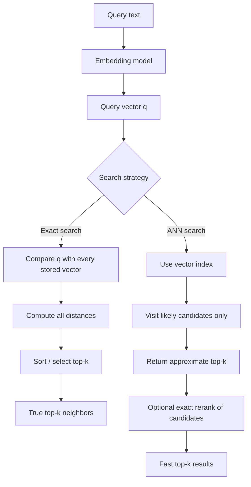

Exact path:

```text
q -> distance(q, x1)
  -> distance(q, x2)
  -> distance(q, x3)
  ...
  -> distance(q, xn)
  -> top-k
```

ANN path:

```text
q -> index navigation/partition/probe
  -> candidate set
  -> candidate scoring
  -> top-k
```

The key difference:

```text
Exact search scores all n vectors.
ANN search scores a selected subset of n vectors.
```

If exact checks 50,000,000 vectors and ANN checks 20,000 candidates, ANN can be dramatically faster. But it may miss a true nearest neighbor that was not visited.

---

### 3. Real-World Industry Scenarios [Intermediate]

#### Scenario 1: RAG Over Internal Documentation

Use case:

```text
Support agent answers employee questions using 500,000 internal chunks.
```

Exact search:

- possible during prototyping
- useful to create a ground-truth baseline
- maybe acceptable if traffic is low and hardware is strong

ANN search:

- likely needed for low-latency production
- HNSW or IVF-like indexes reduce comparisons
- top-50 candidates can be reranked before sending top-5 to the LLM

What can go wrong:

- ANN recall misses the one policy chunk needed
- top-k contains semantically similar but outdated docs
- exact rerank is skipped, so weak candidates reach the LLM

Production fix:

- measure recall@k against exact baseline
- use metadata filters for department/version
- retrieve more candidates than final context
- rerank exactly or with a cross-encoder/reranker
- evaluate answer groundedness, not just vector recall

#### Scenario 2: E-Commerce Similar Products

Use case:

```text
Given one product, show visually or semantically similar products from 100 million items.
```

Exact search:

- too expensive for every request
- useful offline for small samples and quality audits

ANN search:

- enables interactive recommendations
- can trade recall for latency based on page type
- may use approximate candidates plus business reranking

What can go wrong:

- ANN returns near-duplicates but not diverse alternatives
- popular items dominate reranking
- cold-start items have poor embeddings

Production fix:

- candidate generation via ANN
- rerank by relevance, availability, price, margin, diversity
- monitor click-through, add-to-cart, and long-term satisfaction

#### Scenario 3: Fraud / Identity Similarity

Use case:

```text
Find accounts similar to a suspicious account based on behavior embeddings.
```

Exact search:

- attractive because missing true matches can be costly
- often used in offline investigations or smaller filtered subsets

ANN search:

- useful for real-time screening at large scale
- must be tuned for high recall
- may retrieve a large candidate set for exact rerank

What can go wrong:

- approximate index misses a close fraud cluster
- score thresholds are poorly calibrated
- false positives overwhelm analysts

Production fix:

- use ANN as candidate generation, not final verdict
- exact rerank candidates
- combine vector similarity with rules/features
- set different thresholds by risk tier
- audit recall against exact search on samples

---

### 4. System View: Think Like a Systems Engineer [Intermediate]

Exact vs ANN is a system design trade-off.

#### Inputs

Search inputs:

- query vector
- corpus vectors
- distance metric
- top-k
- filters
- latency budget
- recall target
- hardware constraints

Index inputs:

- number of vectors
- vector dimension
- memory budget
- index algorithm
- build parameters
- search parameters
- update frequency
- deletion strategy

Business inputs:

- user-facing latency SLA
- correctness risk
- traffic volume
- cost budget
- failure tolerance
- need for freshness
- auditability requirements

#### Transformations

Exact search transformation:

```text
query vector
-> compute distance to every vector
-> keep smallest distances / largest similarities
-> return true top-k
```

ANN transformation:

```text
query vector
-> navigate/probe approximate index
-> collect candidate vectors
-> compute distances for candidates
-> return approximate top-k
-> optionally rerank candidates exactly
```

#### Outputs

Both methods return:

- IDs
- scores/distances
- top-k order
- maybe metadata

Production systems should also record:

- search strategy
- index version
- number of candidates scanned
- latency
- filter conditions
- recall estimate if available
- rerank status

#### Complexity Intuition

Let:

- `n` = number of stored vectors
- `d` = vector dimension
- `k` = number of results

Exact search cost is roughly:

```text
O(n * d)
```

because every stored vector needs a distance computation.

ANN search tries to make query-time work closer to:

```text
O(candidate_count * d + index_navigation_cost)
```

where `candidate_count` is much smaller than `n`.

This is not free:

- index needs memory
- index takes time to build
- index must be updated
- recall is not perfect
- search parameters need tuning

#### Observability

Track:

| Metric | Why it matters |
|---|---|
| p50/p95/p99 search latency | User experience and SLA. |
| QPS | Throughput capacity. |
| recall@k vs exact baseline | ANN quality. |
| candidate count scanned | Search effort. |
| index memory size | Infrastructure cost. |
| index build time | Operational freshness. |
| update/delete latency | Real-time data support. |
| filter selectivity | Metadata filtering impact. |
| zero-result rate | Search or filtering failures. |
| downstream answer success | Retrieval quality in context. |

#### Failure Points

Search can fail because:

- embeddings are poor
- metric is wrong
- exact search is too slow
- ANN recall is too low
- index is stale
- filters remove true neighbors
- top-k is too small
- reranker is missing
- vector normalization is inconsistent
- high-dimensional distances are not meaningful enough
- query distribution differs from evaluation set

Exact search guarantees nearest neighbors only under the vectors and metric you give it. It does not guarantee user relevance.

ANN gives up even that strict guarantee, so it must be measured.

---

### 5. System Design Flavor [Intermediate]

A senior engineer answers exact vs ANN with trade-offs, not slogans.

#### Decision 1: Dataset size

| Dataset size | Likely choice |
|---|---|
| hundreds to thousands | Exact search is usually fine. |
| tens/hundreds of thousands | Exact may still work with optimized linear algebra or GPU. |
| millions | ANN usually becomes attractive. |
| tens/hundreds of millions | ANN is usually required for interactive latency. |
| billions | ANN plus sharding, compression, GPU/disk strategies, or specialized infra. |

These are not hard thresholds. Hardware, dimension, latency budget, traffic, and filtering change the decision.

#### Decision 2: Latency budget

If the request is offline batch processing, exact search may be acceptable.

If the request is interactive:

```text
user query -> retrieval -> LLM generation -> response
```

retrieval may only get tens of milliseconds to a few hundred milliseconds.

ANN helps preserve latency budget for reranking and generation.

#### Decision 3: Correctness risk

Exact search fits when:

- missing the nearest neighbor is unacceptable
- corpus is small enough
- search is offline
- exact baseline is needed for evaluation

ANN fits when:

- near-neighbor is good enough
- latency/scale matters
- recall can be measured
- candidate reranking can recover quality

High-risk systems often use:

```text
ANN candidate generation -> exact rerank -> human/rule/model decision
```

#### Decision 4: Recall target

ANN must be tuned.

Example:

```text
recall@10 = 0.95
```

means:

> Across evaluation queries, the approximate top-10 includes 95% of the true exact top-10 neighbors.

But retrieval systems may care about:

- recall@5 for LLM context
- recall@50 before reranking
- hit rate: did we retrieve at least one relevant doc?
- downstream answer accuracy

Vector recall is necessary but not sufficient.

#### Decision 5: Index family

Common ANN families:

| Index family | Intuition | Trade-off |
|---|---|---|
| Graph-based, e.g. HNSW | Navigate a proximity graph toward close vectors. | Strong recall/latency, high memory. |
| Inverted file, e.g. IVF | Partition vectors into clusters, search selected clusters. | Good scale, needs training/tuning. |
| Quantization, e.g. PQ | Compress vectors to reduce memory and speed search. | Saves memory, may reduce accuracy. |
| Hashing, e.g. LSH | Similar vectors likely share buckets. | Theoretical appeal, workload-dependent. |
| Flat/exact | Store all vectors and scan all. | Accurate, expensive at scale. |

You do not need to memorize every algorithm first. You need to understand the trade-off surface:

```text
recall vs latency vs memory vs build/update cost
```

#### Decision 6: Reranking

In production, ANN often acts as candidate generation.

Example:

```text
ANN retrieves top 100
exact distance reranks top 100
business/relevance model reranks top 20
LLM receives top 5 chunks
```

This gives:

- speed from ANN
- accuracy from reranking
- control from filtering/business logic

Interview sentence:

> "I would use exact search for small corpora and as a ground-truth baseline. At production scale I would use ANN to generate candidates, measure recall@k against exact on a representative sample, and rerank candidates before final use."

---

### 6. Common Mistakes + Debugging [Intermediate]

#### Mistake 1: Treating ANN as magically correct

Bad:

```text
ANN result = nearest neighbor truth
```

Why it is wrong:

ANN may miss true nearest neighbors depending on index parameters, data distribution, filters, and updates.

Better:

```text
measure recall@k against exact search on representative evaluation queries
```

#### Mistake 2: Using exact search as production default at large scale

Exact search is simple, but at large scale it can become:

- slow
- expensive
- hard to scale with QPS
- wasteful when approximate candidates are good enough

Better:

- use exact for baseline/evaluation/small filtered subsets
- use ANN for interactive large-scale candidate generation

#### Mistake 3: Ignoring vector dimension

Distance computation cost grows with dimension.

Searching 10 million vectors of 384 dimensions is different from 10 million vectors of 3,072 dimensions.

Dimension affects:

- memory
- CPU/GPU work
- cache behavior
- index size
- query latency

#### Mistake 4: Measuring only latency

Fast retrieval is useless if it misses relevant results.

Track:

- latency
- recall@k
- hit rate
- downstream task success
- user satisfaction

#### Mistake 5: Measuring only recall

High recall can be useless if latency/cost is unacceptable.

Track:

- p95/p99 latency
- memory footprint
- QPS
- index build/update time
- operational complexity

#### Mistake 6: Forgetting exact search is metric-relative

Exact search gives the exact nearest neighbor under the chosen metric.

If the metric is wrong, exact search returns exactly the wrong thing.

Example:

- using dot product when cosine similarity was intended
- not normalizing vectors for cosine search
- mixing embeddings from different models

#### Mistake 7: Evaluating on toy queries only

ANN quality depends on data distribution.

Use evaluation queries that include:

- common queries
- rare queries
- long-tail domain language
- short ambiguous queries
- multilingual queries if relevant
- filtered searches
- freshness-sensitive queries

#### Debugging Checklist

When vector search returns bad results:

1. Are embeddings from the same model/version?
2. Is the query vector normalized consistently?
3. Is the distance metric correct?
4. Does exact search find the expected neighbor?
5. Does ANN miss what exact finds?
6. Are metadata filters removing good results?
7. Is top-k too small?
8. Is the index stale?
9. Did chunking create weak vectors?
10. Does reranking fix candidates?
11. Are results bad because search failed or because generation used them badly?

The fastest debugging question:

> Does exact search on the same vectors and metric find the right result?

If exact search fails, the problem is embeddings, metric, data, or expectation.

If exact search succeeds but ANN fails, the problem is index/search tuning.

---

### 7. Hands-On Lab: Simulate Exact Search vs ANN [Pro]

Goal:

> Build a tiny simulation that compares exact vector search with a deliberately approximate cluster-based search, then measure latency intuition and recall@k.

This lab is not meant to beat real ANN libraries. It teaches the mechanism.

#### Build

Create synthetic vectors:

```python
import math
import random
import time


def dot(a, b):
    return sum(x * y for x, y in zip(a, b))


def l2_distance(a, b):
    return math.sqrt(sum((x - y) ** 2 for x, y in zip(a, b)))


def make_vector(dim):
    return [random.random() for _ in range(dim)]


def make_dataset(n=10_000, dim=64):
    return [
        {"id": f"vec-{i}", "vector": make_vector(dim)}
        for i in range(n)
    ]
```

Exact top-k:

```python
def exact_search(query, dataset, k=5):
    scored = []

    for item in dataset:
        distance = l2_distance(query, item["vector"])
        scored.append((distance, item["id"]))

    scored.sort(key=lambda pair: pair[0])
    return scored[:k]
```

Create simple random clusters:

```python
def assign_clusters(dataset, num_clusters=100):
    clusters = {cluster_id: [] for cluster_id in range(num_clusters)}

    for item in dataset:
        cluster_id = random.randrange(num_clusters)
        clusters[cluster_id].append(item)

    return clusters
```

Approximate search by probing only a few clusters:

```python
def approximate_search(query, clusters, k=5, probes=5):
    candidate_clusters = random.sample(list(clusters.keys()), probes)
    candidates = []

    for cluster_id in candidate_clusters:
        candidates.extend(clusters[cluster_id])

    scored = []
    for item in candidates:
        distance = l2_distance(query, item["vector"])
        scored.append((distance, item["id"]))

    scored.sort(key=lambda pair: pair[0])
    return scored[:k], len(candidates)
```

Measure recall@k:

```python
def recall_at_k(exact_results, approx_results):
    exact_ids = {item_id for _, item_id in exact_results}
    approx_ids = {item_id for _, item_id in approx_results}

    return len(exact_ids & approx_ids) / len(exact_ids)
```

Run experiment:

```python
def main():
    random.seed(42)
    dataset = make_dataset(n=20_000, dim=64)
    clusters = assign_clusters(dataset, num_clusters=200)
    query = make_vector(64)

    start = time.perf_counter()
    exact = exact_search(query, dataset, k=10)
    exact_ms = (time.perf_counter() - start) * 1000

    for probes in [1, 5, 20, 50, 100]:
        start = time.perf_counter()
        approx, scanned = approximate_search(query, clusters, k=10, probes=probes)
        approx_ms = (time.perf_counter() - start) * 1000
        recall = recall_at_k(exact, approx)

        print(
            f"probes={probes:3d} "
            f"scanned={scanned:5d} "
            f"latency_ms={approx_ms:8.2f} "
            f"recall@10={recall:.2f}"
        )

    print(f"exact_latency_ms={exact_ms:.2f}")


if __name__ == "__main__":
    main()
```

Expected lesson:

```text
More probes -> more candidates scanned -> higher recall -> higher latency.
Fewer probes -> fewer candidates scanned -> lower latency -> lower recall.
```

This random-cluster ANN is intentionally bad. Real ANN indexes use smarter structure. But the trade-off shape is real.

#### Improve the Approximation

Make clusters meaningful instead of random:

1. Create cluster centroids.
2. Assign vectors to nearest centroid.
3. At query time, find nearest centroids.
4. Search only those clusters.

That is the intuition behind inverted-file style indexes.

#### Add Exact Reranking

Change the flow:

```text
ANN retrieves candidates
exact distance reranks candidates
return top-k
```

In our simple simulation, candidate scoring already uses exact distance once candidates are selected. The approximation is only in which candidates are considered.

In real systems, approximate methods may also compress vectors or use approximate scores, so reranking with original vectors can improve result quality.

#### Break

Break the system intentionally:

1. Use a different metric in exact and approximate search.
2. Use a tiny number of probes.
3. Increase vector dimension but keep hardware fixed.
4. Evaluate only one query.
5. Use random clusters and assume production quality.
6. Return top-3 to the LLM without retrieving more candidates.
7. Skip recall measurement.
8. Mix vectors from two embedding models.

For each break, explain:

- what fails
- whether exact search detects it
- whether ANN tuning can fix it
- what metric reveals the issue
- what production mitigation is needed

#### Measure

Add:

```text
exact_latency_ms
ann_latency_ms
candidate_count
recall@k
memory_estimate
queries_per_second
```

Then compare:

| Setting | Expected behavior |
|---|---|
| More probes | Higher recall, higher latency |
| Fewer probes | Lower latency, lower recall |
| Higher dimension | More distance-computation cost |
| Larger dataset | Exact grows linearly |
| Candidate rerank | Better final ordering |

#### Capstone Prompt

> You are building semantic search over 100 million support-document chunks. Users expect sub-300ms retrieval before an LLM answers. How do you choose between exact search and ANN?

Strong answer structure:

1. **Start with exact search as baseline.**
   - use smaller representative subset or offline jobs
   - establish true top-k for evaluation

2. **Use ANN for production candidate generation.**
   - exact over 100 million vectors is too expensive for interactive traffic
   - choose HNSW/IVF/PQ-style index depending on memory, update, and latency needs

3. **Measure quality.**
   - recall@k against exact baseline
   - hit rate for relevant docs
   - downstream answer quality

4. **Tune trade-offs.**
   - adjust search parameters
   - retrieve more candidates than final context
   - rerank candidates
   - use metadata filters carefully

5. **Watch operations.**
   - p95/p99 latency
   - memory
   - build/update time
   - index freshness
   - embedding/model version

Interview-ready summary:

> "Exact search gives ground-truth nearest neighbors but scales linearly with corpus size and dimension. For 100 million vectors, I would use ANN for low-latency candidate generation, measure recall against exact on representative queries, and rerank a larger candidate set before sending final context to the LLM."

---

### 8. Active Recall

Answer without looking:

1. What does exact vector search do?
2. What does ANN skip?
3. Why can ANN be acceptable even if it may miss the true nearest neighbor?
4. What is recall@k?
5. What is the fastest way to debug whether ANN is the problem?
6. Why is exact search still useful in ANN systems?
7. What are the main trade-offs in ANN?
8. Why is vector recall not the same as RAG answer quality?
9. What does reranking do?
10. Why does vector dimension matter?

Answers:

1. It compares the query vector against every stored vector and returns the true nearest neighbors under the chosen metric.
2. It avoids checking many vectors by using an index to visit likely candidates.
3. Many semantic tasks only need sufficiently relevant neighbors, and ANN can deliver them much faster at scale.
4. The fraction of true exact top-k neighbors recovered by the approximate top-k.
5. Run exact search on the same vectors/metric and compare results.
6. It provides a ground-truth baseline, supports small datasets, and helps evaluate/tune ANN recall.
7. Recall, latency, memory, build time, update cost, and operational complexity.
8. The nearest vector may still be irrelevant to the user's task, stale, unauthorized, or poorly used by the generator.
9. It re-scores a smaller candidate set with a more accurate or task-specific method.
10. Higher dimension increases memory and distance-computation cost and can affect index behavior.

---

### 9. Practice

#### Practice 1: Choose Exact or ANN

| Scenario | Better starting point |
|---|---|
| 5,000 vectors, offline analysis | Exact search |
| 5 million vectors, interactive app | ANN |
| Need ground truth for recall benchmark | Exact search |
| Fraud screening over 200 million vectors | ANN candidate generation plus exact rerank |
| Low-traffic admin tool over 80,000 vectors | Exact may be enough |
| RAG over 50 million chunks with p95 retrieval SLA | ANN |

#### Practice 2: Explain the Trade-off

Prompt:

> ANN returned results in 20ms but recall@10 is 0.55. Exact search returns better results in 900ms. What do you do?

Strong answer:

> "I would not ship the 0.55 recall configuration blindly. I would tune ANN search parameters, retrieve a larger candidate set, rerank candidates, inspect whether filters or metric choices are hurting recall, and evaluate downstream answer quality. If latency remains too high at acceptable recall, I would consider a different index family, sharding, compression, GPU acceleration, or narrower filtered search."

#### Practice 3: Debug Result Quality

Bad result:

```text
User asks about API key rotation.
Vector search returns password reset docs.
```

Debug order:

1. Check exact search result.
2. Check embedding model/version.
3. Check metric and normalization.
4. Check chunking and document metadata.
5. Check ANN recall vs exact.
6. Check filters.
7. Check top-k and reranking.
8. Check whether generator ignored better context.

#### Practice 4: Interview Drill

Question:

> Why not use exact search for all vector retrieval?

Strong answer:

> "Exact search is simple and accurate, but it requires comparing each query against every stored vector. That cost grows with corpus size and vector dimension. At millions or billions of vectors and interactive QPS, exhaustive search can become too slow or expensive. ANN indexes reduce comparisons by using graph, partition, hashing, or compression structures. The trade-off is that recall is not guaranteed, so we measure recall@k against exact baselines and often rerank candidates."

---

### 10. Production Reality Check

**If this fails in prod, what is the first thing we inspect?**

Inspect whether exact search would have found the desired result.

Three cases:

1. **Exact search also fails**
   - embedding quality problem
   - metric/normalization problem
   - chunking/data problem
   - relevance expectation problem

2. **Exact search succeeds but ANN fails**
   - index tuning problem
   - recall too low
   - candidate count too small
   - stale index
   - filter/index interaction problem

3. **ANN finds good candidates but final system fails**
   - reranker problem
   - context packing problem
   - LLM generation problem
   - citation/grounding problem

The production debugging question:

> Is this a semantic representation problem, a search/index problem, or a downstream ranking/generation problem?

#### Vector Search Runbook

1. Capture query, filters, index version, and embedding model version.
2. Run exact search on the same vector set if possible.
3. Compare exact top-k with ANN top-k.
4. Compute recall@k.
5. Inspect candidate count and search parameters.
6. Check metric and normalization.
7. Check whether filters were applied correctly.
8. Check index freshness.
9. Rerank candidates and inspect changes.
10. Add the query to a regression set.

#### What Good Looks Like

A mature vector search system can answer:

- What metric are we using?
- Are vectors normalized?
- What index algorithm/version is serving?
- What is recall@k against exact baseline?
- What is p95/p99 latency?
- How many candidates are scanned?
- How fresh is the index?
- What filters were applied?
- Does reranking improve results?
- Does downstream RAG answer quality improve?

That is the bar.

---

### 11. Curiosity Bridge

Exact vs ANN teaches the first deep trade-off in vector search: correctness guarantee versus scalable latency. The next question is how approximate indexes actually avoid checking every vector.

Two of the most important mental models are **HNSW** and **IVFFlat**. HNSW searches by walking a proximity graph. IVFFlat searches by partitioning vectors into cells and probing only some cells.

That leads directly to **HNSW and IVFFlat intuition**: the two shapes you must understand before vector indexes stop feeling magical.

---

### 12. Exit Check + Carry-Forward Review

**Exit check - you are done when you can:**
Given a vector search workload, decide whether exact search, ANN, or ANN plus reranking is appropriate; explain the recall/latency/memory/build/update trade-offs; define recall@k; and debug whether bad retrieval comes from embeddings, metric choice, ANN tuning, filters, or downstream generation.

**Carry-Forward Review:**

Question: Why is exact search useful even when production uses ANN?

Answer: Exact search provides the ground-truth nearest neighbors under the chosen metric. It is useful for small datasets, offline audits, regression tests, and measuring ANN recall. Production may use ANN for latency and scale, but exact search helps prove how much quality the approximation is losing.

---

## Subtopic 5.1.b: HNSW and IVFFlat Intuition

### Add to Knowledge Base

**HNSW** and **IVFFlat** are two major approximate nearest neighbor index patterns.

They answer the same production question:

> How can we avoid comparing a query vector with every stored vector while still finding very similar results?

They use different strategies:

| Index | Mental model | How it skips work |
|---|---|---|
| HNSW | Navigable proximity graph | Walks through graph links toward closer vectors. |
| IVFFlat | Clustered buckets / inverted lists | Searches only selected vector clusters. |

The core idea:

> HNSW reduces search by navigation. IVFFlat reduces search by partitioning.

Reference anchor:
- HNSW paper: `https://arxiv.org/abs/1603.09320`
- Faiss indexes docs: `https://github.com/facebookresearch/faiss/wiki/Faiss-indexes`
- Faiss index selection guidance: `https://github.com/facebookresearch/faiss/wiki/Guidelines-to-choose-an-index`
- Faiss library paper: `https://arxiv.org/abs/2401.08281`

Key terms:

| Term | Meaning |
|---|---|
| HNSW | Hierarchical Navigable Small World, a graph-based ANN index. |
| Proximity graph | Graph where vectors connect to nearby vectors. |
| Layer | HNSW level; upper layers are sparse shortcuts, lower layers are dense. |
| Greedy search | Move from current node to a neighbor closer to the query. |
| `M` | HNSW graph connectivity parameter; more neighbors improves recall but uses memory. |
| `efConstruction` | HNSW build-time exploration depth. |
| `efSearch` | HNSW query-time exploration depth. |
| IVFFlat | Inverted File Flat; partition vectors into lists and store original vectors. |
| `nlist` | Number of IVF clusters/lists. |
| `nprobe` | Number of IVF lists searched for a query. |
| Coarse quantizer | Model/index that assigns vectors to IVF clusters. |
| Cell-probe method | Search method that probes selected partitions instead of all data. |
| Candidate set | Subset of vectors considered before final top-k selection. |

The beginner mistake:

```text
HNSW and IVFFlat are both just "ANN indexes."
```

Better:

```text
HNSW is a graph you walk.
IVFFlat is a set of buckets you probe.
```

That one distinction explains most of their trade-offs.

---

### Reading Path + Level Tags

- **Beginner:** Read sections 0-2 and Active Recall.
- **Intermediate:** Add sections 3-6 and complete the Build part of the Hands-On Lab.
- **Pro:** Complete the full Hands-On Lab, including Break and Measure, then answer the HNSW-vs-IVFFlat system-design question.

---

### 0. Pre-Question Hook [Beginner]

**Pause:** You have 20 million embeddings for support documents.

You need sub-100ms search.

Two index options are proposed:

```text
Option A: HNSW
Option B: IVFFlat
```

Someone says:

> "They are both approximate, so they are basically the same."

That is wrong.

Before reading on, guess:

- Which one builds a graph?
- Which one builds clusters?
- Which one has a parameter like `efSearch`?
- Which one has a parameter like `nprobe`?
- Which one tends to use more memory?
- Which one needs training on representative vectors?
- Which one is easier to explain as "search a few buckets"?

The point of this subtopic is not to memorize every vector DB setting. The point is to feel how the two indexes search.

---

### 1. The Intuition (Plain English) [Beginner]

#### HNSW Intuition: Search by Walking a Friend Network

Imagine every vector is a person in a huge city.

Each person knows some nearby people.

Some people also have long-distance shortcut connections.

To find the person closest to your query, you:

1. Start somewhere in the graph.
2. Ask: "Which of your neighbors is closer to what I want?"
3. Move to the closer neighbor.
4. Repeat.
5. Use upper layers for big jumps.
6. Use lower layers for local refinement.

That is HNSW.

It is like navigating a social network where nearby people point you toward even better nearby people.

The hierarchy matters:

```text
top layers = sparse express highways
bottom layer = dense local streets
```

HNSW avoids scanning everything because it follows links through promising neighborhoods.

#### IVFFlat Intuition: Search by Looking in Nearby Buckets

Imagine the city is divided into neighborhoods.

Every restaurant belongs to exactly one neighborhood.

When you ask for nearby restaurants, the system:

1. Finds the neighborhoods closest to you.
2. Looks only inside those neighborhoods.
3. Ignores far-away neighborhoods.
4. Scores restaurants inside the selected neighborhoods exactly.

That is IVFFlat.

It is an inverted file because each cluster has a list of vectors assigned to it.

The "Flat" part means:

> Vectors inside the selected lists are stored and compared without compression.

IVFFlat avoids scanning everything because it searches only some clusters.

#### The One-Line Difference

```text
HNSW: walk a graph toward the answer.
IVFFlat: choose buckets, then scan those buckets.
```

**Where the analogy breaks down:** Vector spaces are high-dimensional, not normal cities. A graph edge or cluster assignment is built from mathematical distance, not human geography. Real performance depends on vector distribution, metric, dimensionality, index parameters, hardware, updates, filters, and recall targets.

---

### 2. Visual Diagram (Mermaid) [Beginner]

#### HNSW Search

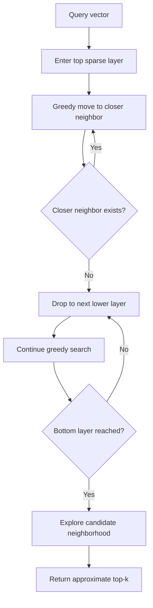

Read this as:

```text
big jumps first
local refinement later
```

HNSW is good because it often finds high-quality neighbors without scanning large parts of the corpus.

#### IVFFlat Search

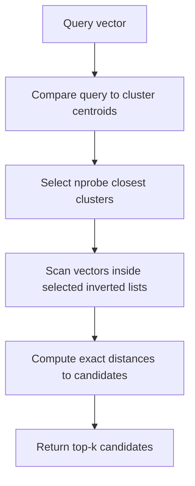

Read this as:

```text
find promising buckets
scan only those buckets
```

IVFFlat is good because it makes the amount of searched data roughly controllable.

---

### 3. Real-World Industry Scenarios [Intermediate]

#### Scenario 1: RAG Over 5 Million Policy Chunks

Need:

```text
High recall, low latency, frequent queries, moderate update volume.
```

HNSW fit:

- strong recall/latency balance
- often works well without training a coarse quantizer
- good default choice in many vector DBs

HNSW risk:

- graph memory overhead can be high
- deletion/update behavior can be operationally tricky depending on implementation
- filtered search may reduce graph navigation quality

IVFFlat fit:

- simpler bucket-probe explanation
- can tune `nprobe`
- original vectors are available for exact scoring inside selected buckets

IVFFlat risk:

- needs training/clustering
- poor clusters reduce recall
- if nearest neighbor's cluster is not probed, it is missed

Production design:

```text
benchmark HNSW and IVFFlat on real support queries
measure recall@k vs exact
track p95 latency and memory
rerank top candidates
```

#### Scenario 2: E-Commerce Similar Products at 100 Million Scale

Need:

```text
Large corpus, high QPS, ranking can tolerate near-neighbors, business reranking matters.
```

HNSW fit:

- fast candidate retrieval
- high recall possible with higher `efSearch`

HNSW risk:

- memory can become expensive at very large scale
- graph construction and maintenance matter

IVFFlat fit:

- partitions data into many lists
- can control scanned fraction with `nprobe`
- pairs naturally with large-scale sharding and reranking

IVFFlat risk:

- low `nprobe` misses cross-cluster neighbors
- unbalanced lists create uneven latency

Production design:

```text
ANN candidates -> exact/vector rerank -> business rerank -> diversity filter
```

#### Scenario 3: Fraud Similarity Search

Need:

```text
Very high recall because missing a close match may be expensive.
```

HNSW fit:

- strong high-recall behavior when tuned carefully
- `efSearch` can be increased for risky queries

IVFFlat fit:

- can probe more clusters for high-risk queries
- simple to reason about scan fraction

Production design:

- ANN is only candidate generation
- exact rerank larger candidate set
- combine vector similarity with rule and graph features
- use different search parameters by risk tier

High-risk query:

```text
increase efSearch or nprobe
retrieve more candidates
rerank exactly
```

Low-risk query:

```text
use cheaper search settings
```

---

### 4. System View: Think Like a Systems Engineer [Intermediate]

HNSW and IVFFlat are not just algorithms. They are operational choices.

#### HNSW Build Flow

```text
new vector arrives
-> search graph to find neighbors
-> connect vector to selected neighbors
-> maybe assign vector to upper layers
-> update graph links
```

Important parameters:

| Parameter | Meaning | Trade-off |
|---|---|---|
| `M` | Number of graph neighbors per point. | Higher recall, more memory. |
| `efConstruction` | Search depth while building graph. | Better graph, slower build. |
| `efSearch` | Search depth at query time. | Higher recall, higher latency. |

HNSW query-time intuition:

```text
higher efSearch = explore more candidates = better recall = slower query
```

HNSW build-time intuition:

```text
higher efConstruction = better graph = slower indexing
```

#### IVFFlat Build Flow

```text
sample training vectors
-> train centroids with clustering
-> assign each vector to nearest centroid
-> store vector in that centroid's inverted list
```

Important parameters:

| Parameter | Meaning | Trade-off |
|---|---|---|
| `nlist` | Number of clusters/lists. | More lists = smaller lists, more centroid-choice complexity. |
| `nprobe` | Number of lists searched per query. | Higher recall, higher latency. |
| training sample | Data used to learn centroids. | Better clusters if representative. |

IVFFlat query-time intuition:

```text
higher nprobe = search more buckets = better recall = slower query
```

IVFFlat build-time intuition:

```text
bad clustering = bad buckets = lower recall
```

#### Outputs

Both indexes return:

- vector IDs
- distances/similarity scores
- approximate top-k

Production systems should also log:

- index type
- index version
- `efSearch` or `nprobe`
- candidate count
- filter conditions
- latency
- recall sample if available

#### Observability

Track:

| Metric | HNSW relevance | IVFFlat relevance |
|---|---|---|
| recall@k | Tune `M`/`efSearch` | Tune `nlist`/`nprobe` |
| p95/p99 latency | Explore depth cost | Probed-list scan cost |
| memory per vector | Graph edge overhead | Vector storage + list IDs |
| index build time | Graph insertion cost | Clustering + assignment |
| update/delete behavior | Graph maintenance | List assignment/maintenance |
| filtered recall | Graph path may be affected | Lists may have few valid filtered results |
| candidate count | Controlled by search exploration | Controlled by probed lists |

#### Failure Points

HNSW failure modes:

- `efSearch` too low
- `M` too low
- poor graph due to low `efConstruction`
- memory too high
- filtered search hurts navigation
- deletions not supported or handled poorly by implementation
- insertion order/data distribution affects recall

IVFFlat failure modes:

- `nprobe` too low
- `nlist` too high or too low
- unrepresentative training sample
- unbalanced clusters
- nearest neighbor is in an unprobed list
- filters make selected lists too sparse
- stale centroid assignments after distribution shift

The key diagnostic:

> HNSW fails by not exploring enough graph neighborhood. IVFFlat fails by not probing the right buckets.

---

### 5. System Design Flavor [Intermediate]

#### When HNSW Is a Strong Fit

Use HNSW when:

- you want high recall at low latency
- memory budget can tolerate graph overhead
- you want a strong default ANN index
- dataset is not so huge that graph memory becomes painful
- query workload needs fast interactive retrieval
- you can tune `efSearch` by latency/recall target

Interview sentence:

> "HNSW is a graph-based ANN index. It often gives excellent recall-latency behavior by navigating from sparse upper layers to denser lower layers, but the graph uses memory and needs tuning."

#### When IVFFlat Is a Strong Fit

Use IVFFlat when:

- you want partition-based candidate generation
- you can train clusters on representative data
- you want to control searched fraction via `nprobe`
- exact vectors should be scanned inside selected buckets
- large-scale search needs simpler bucket-level control
- you plan to rerank candidates after retrieval

Interview sentence:

> "IVFFlat partitions vectors into inverted lists. At query time it searches the nearest `nprobe` lists and compares the query to vectors inside them. It is simple and tunable, but recall depends heavily on cluster quality and how many lists are probed."

#### HNSW vs IVFFlat Trade-off Table

| Dimension | HNSW | IVFFlat |
|---|---|---|
| Core structure | Proximity graph | Clustered inverted lists |
| Search action | Navigate graph | Probe buckets |
| Main query knob | `efSearch` | `nprobe` |
| Main build knobs | `M`, `efConstruction` | `nlist`, training data |
| Memory | Often high due to edges | Stores vectors plus list/id overhead |
| Training | No k-means training required in the same way | Requires clustering/training |
| Recall behavior | Often strong at high recall | Depends on probing right lists |
| Update behavior | Insertions okay; deletions implementation-sensitive | Assign to lists; retraining may be needed after drift |
| Best mental picture | Road network | Neighborhood buckets |

#### Production Selection Heuristic

Use this as a starting point, not a law:

```text
small dataset -> exact search
medium/large interactive search -> benchmark HNSW first
very large scale or partition-friendly system -> benchmark IVF/IVFFlat
strict memory limit -> consider compression/PQ later
high-risk recall -> ANN candidates + exact rerank
```

The right answer is measured, not guessed.

#### Filters Matter

Metadata filters can change index behavior.

Example:

```text
tenant_id = "acme"
doc_type = "policy"
region = "EU"
```

If the index first searches globally and then filters, it may retrieve candidates that are later removed.

That can hurt recall.

Production strategies:

- pre-filter when supported
- use separate indexes per tenant/domain when justified
- over-retrieve candidates before filtering
- tune `efSearch` or `nprobe` under filtered workloads
- evaluate recall with real filters, not only unfiltered queries

---

### 6. Common Mistakes + Debugging [Intermediate]

#### Mistake 1: Thinking HNSW is always better

HNSW is often excellent, but not free.

Costs:

- memory overhead
- graph build cost
- update/deletion complexity
- parameter tuning

Better:

```text
benchmark HNSW against alternatives on your vectors and queries
```

#### Mistake 2: Thinking IVFFlat means compressed vectors

The "Flat" in IVFFlat means the selected list vectors are stored without compression and compared directly.

IVFFlat approximates by selecting only some lists, not by compressing vector values.

Compression appears in variants like IVFPQ, not plain IVFFlat.

#### Mistake 3: Setting `nprobe=1` and blaming embeddings

If IVFFlat searches only one list, it can miss relevant neighbors in nearby lists.

Better:

```text
increase nprobe and measure recall/latency
```

#### Mistake 4: Setting `efSearch` too low

Low `efSearch` makes HNSW explore too little.

Symptoms:

- very fast queries
- poor recall
- exact search finds better neighbors

Better:

```text
sweep efSearch values and plot recall vs latency
```

#### Mistake 5: Training IVF on a bad sample

IVFFlat clustering depends on representative training data.

Bad sample:

- old embedding model
- one tenant only
- one language only
- missing long-tail docs
- distribution differs from production

Better:

- train on representative vector sample
- monitor distribution drift
- retrain/rebuild when corpus changes significantly

#### Mistake 6: Ignoring unbalanced lists

If some IVF lists are huge and others tiny:

- latency becomes uneven
- recall can vary by query
- scanned fraction is harder to predict

Monitor list sizes.

#### Mistake 7: Evaluating without filters

Unfiltered recall may look excellent.

Filtered recall may be poor.

Always evaluate:

```text
recall@k with production filters applied
```

#### Debugging Checklist

When HNSW results are weak:

1. Does exact search find the right neighbors?
2. Is `efSearch` too low?
3. Is `M` too low?
4. Was `efConstruction` too low?
5. Are filters applied after graph search?
6. Is the graph stale or partially built?
7. Is memory pressure causing degraded settings?

When IVFFlat results are weak:

1. Does exact search find the right neighbors?
2. Is `nprobe` too low?
3. Is `nlist` poorly chosen?
4. Was clustering trained on representative vectors?
5. Are lists unbalanced?
6. Are filters removing selected-list candidates?
7. Is the nearest neighbor in an unprobed list?

The fastest debugging question:

> For the failed query, does increasing `efSearch` or `nprobe` recover the exact neighbor?

If yes, tuning/index search depth is likely the issue.

---

### 7. Hands-On Lab: Simulate HNSW vs IVFFlat Intuition [Pro]

Goal:

> Build simple toy versions of graph navigation and bucket probing so HNSW and IVFFlat become intuitive.

This is not a production ANN implementation. It is a mental-model lab.

#### Build

Create points in 2D for easy reasoning:

```python
import math
import random


def distance(a, b):
    return math.sqrt((a[0] - b[0]) ** 2 + (a[1] - b[1]) ** 2)


def make_points(n=1_000):
    return [(random.random(), random.random()) for _ in range(n)]
```

Exact search:

```python
def exact_search(query, points, k=5):
    scored = [(distance(query, point), idx) for idx, point in enumerate(points)]
    scored.sort(key=lambda item: item[0])
    return scored[:k]
```

#### Toy IVFFlat

Create random centroids:

```python
def make_centroids(num_centroids=20):
    return [(random.random(), random.random()) for _ in range(num_centroids)]
```

Assign each point to nearest centroid:

```python
def build_ivf(points, centroids):
    lists = {i: [] for i in range(len(centroids))}

    for idx, point in enumerate(points):
        closest_centroid = min(
            range(len(centroids)),
            key=lambda c: distance(point, centroids[c]),
        )
        lists[closest_centroid].append(idx)

    return lists
```

Search nearest centroid lists:

```python
def ivf_search(query, points, centroids, lists, k=5, nprobe=2):
    centroid_order = sorted(
        range(len(centroids)),
        key=lambda c: distance(query, centroids[c]),
    )
    selected = centroid_order[:nprobe]

    candidates = []
    for centroid_id in selected:
        candidates.extend(lists[centroid_id])

    scored = [(distance(query, points[idx]), idx) for idx in candidates]
    scored.sort(key=lambda item: item[0])
    return scored[:k], len(candidates), selected
```

Lesson:

```text
increase nprobe -> search more lists -> scan more points -> improve recall
```

#### Toy HNSW-Like Graph

Build a simple neighbor graph:

```python
def build_neighbor_graph(points, m=8):
    graph = {}

    for i, point in enumerate(points):
        neighbors = []
        for j, other in enumerate(points):
            if i == j:
                continue
            neighbors.append((distance(point, other), j))
        neighbors.sort(key=lambda item: item[0])
        graph[i] = [idx for _, idx in neighbors[:m]]

    return graph
```

Greedy graph search:

```python
def greedy_graph_search(query, points, graph, entry=0, ef=20, k=5):
    visited = set()
    candidates = [entry]
    best = []

    while candidates and len(visited) < ef:
        current = min(
            candidates,
            key=lambda idx: distance(query, points[idx]),
        )
        candidates.remove(current)

        if current in visited:
            continue

        visited.add(current)
        best.append((distance(query, points[current]), current))

        for neighbor in graph[current]:
            if neighbor not in visited:
                candidates.append(neighbor)

    best.sort(key=lambda item: item[0])
    return best[:k], len(visited)
```

Lesson:

```text
increase ef -> explore more graph nodes -> improve recall -> increase latency
```

Measure recall:

```python
def recall_at_k(exact, approx):
    exact_ids = {idx for _, idx in exact}
    approx_ids = {idx for _, idx in approx}
    return len(exact_ids & approx_ids) / len(exact_ids)
```

Run experiment:

```python
def main():
    random.seed(7)
    points = make_points(1_000)
    query = (0.72, 0.31)

    exact = exact_search(query, points, k=10)

    centroids = make_centroids(40)
    ivf_lists = build_ivf(points, centroids)

    print("IVFFlat-like search")
    for nprobe in [1, 2, 5, 10, 20]:
        result, scanned, lists = ivf_search(
            query, points, centroids, ivf_lists, k=10, nprobe=nprobe
        )
        print(nprobe, scanned, recall_at_k(exact, result))

    graph = build_neighbor_graph(points, m=8)

    print("HNSW-like graph search")
    for ef in [10, 20, 50, 100, 200]:
        result, visited = greedy_graph_search(
            query, points, graph, entry=0, ef=ef, k=10
        )
        print(ef, visited, recall_at_k(exact, result))


if __name__ == "__main__":
    main()
```

Expected lesson:

```text
IVFFlat quality depends on probing enough good buckets.
HNSW quality depends on exploring enough graph neighborhood.
Both expose a recall/latency knob.
```

#### Break

Break the lab intentionally:

1. Use too few centroids.
2. Use too many centroids and `nprobe=1`.
3. Use unrepresentative centroids.
4. Set graph `m=1`.
5. Set `ef=5`.
6. Start graph search from a poor disconnected area.
7. Evaluate one query only.
8. Compare recall without exact baseline.

For each break, explain:

- whether it hurts HNSW-like or IVFFlat-like search
- whether recall or latency changes
- whether tuning can recover quality
- what production parameter it maps to

#### Measure

Track:

```text
recall@k
candidate_count
visited_nodes
selected_lists
distance_computations
latency_ms
memory_estimate
```

Compare:

| Change | Expected effect |
|---|---|
| Increase `efSearch` / `ef` | Better HNSW recall, higher latency. |
| Increase `M` / graph degree | Better navigation, higher memory/build cost. |
| Increase `nprobe` | Better IVFFlat recall, higher latency. |
| Increase `nlist` too much | Smaller lists, but higher risk if too few probes. |
| Poor IVF training sample | Worse cluster assignments and recall. |

#### Capstone Prompt

> You need to choose between HNSW and IVFFlat for a vector search system serving 30 million embeddings with p95 latency under 100ms. How do you decide?

Strong answer structure:

1. **Benchmark both on real vectors and queries.**
   - use exact search on samples as baseline
   - measure recall@k, latency, memory, build time

2. **Understand HNSW trade-offs.**
   - tune `M`, `efConstruction`, `efSearch`
   - expect strong recall/latency
   - watch memory and deletion/update behavior

3. **Understand IVFFlat trade-offs.**
   - train representative clusters
   - tune `nlist` and `nprobe`
   - recall depends on probing correct lists
   - watch unbalanced lists and training drift

4. **Test filtered workloads.**
   - tenant/product/time filters can change recall
   - evaluate under production metadata filters

5. **Use reranking if quality matters.**
   - retrieve larger candidate set
   - exact rerank candidates
   - downstream rerank by business or RAG quality

Interview-ready summary:

> "HNSW is graph navigation; IVFFlat is bucket probing. I would benchmark both against exact search on representative queries, tune `efSearch` or `nprobe` to hit recall and latency targets, and include memory/build/update behavior in the decision."

---

### 8. Active Recall

Answer without looking:

1. What is the core mental model of HNSW?
2. What is the core mental model of IVFFlat?
3. What does `efSearch` control?
4. What does `M` control?
5. What does `nprobe` control?
6. What does `nlist` control?
7. Why does IVFFlat need training?
8. Why can HNSW use more memory?
9. What is the main IVFFlat failure case?
10. What is the main HNSW tuning move when recall is too low?

Answers:

1. HNSW walks a hierarchical proximity graph toward nearby vectors.
2. IVFFlat partitions vectors into inverted lists and searches selected lists.
3. Query-time graph exploration depth.
4. Number of graph neighbors/connections per vector.
5. Number of IVF lists/buckets searched for a query.
6. Number of IVF clusters/lists.
7. It needs centroids/clusters learned from representative vectors.
8. It stores graph connections in addition to vector data.
9. The true neighbor is in a list that was not probed.
10. Increase `efSearch`, and if needed revisit `M`/`efConstruction`.

---

### 9. Practice

#### Practice 1: Choose the Index Shape

| Situation | Likely starting point |
|---|---|
| Need strong default recall/latency and can afford memory | HNSW |
| Want simple cluster/probe search and can train centroids | IVFFlat |
| Need exact baseline | Flat/exact |
| Need very high recall in risky flow | HNSW or IVFFlat with larger candidate set plus exact rerank |
| Memory pressure is severe | Consider IVF plus compression/PQ later |
| Heavy filtering by tenant | Benchmark filtered recall carefully |

#### Practice 2: Tune the Knob

Question:

```text
HNSW recall@10 is too low but latency is excellent.
```

Likely first move:

```text
increase efSearch
```

Question:

```text
IVFFlat recall@10 is too low but latency is excellent.
```

Likely first move:

```text
increase nprobe
```

Question:

```text
IVFFlat latency is unstable.
```

Inspect:

```text
list size imbalance
filter selectivity
nprobe
candidate count
```

#### Practice 3: Explain to an Interviewer

Prompt:

> Explain HNSW and IVFFlat without equations.

Strong answer:

> "HNSW builds a graph where each vector connects to nearby vectors, with sparse upper layers for fast navigation and dense lower layers for local search. Querying means walking the graph toward closer neighbors. IVFFlat clusters the vector space into inverted lists. Querying means finding the nearest cluster centroids and scanning only those lists. HNSW's main query knob is `efSearch`; IVFFlat's main query knob is `nprobe`."

#### Practice 4: Debug Bad Results

Problem:

```text
IVFFlat misses exact nearest neighbors for EU policy queries.
```

Debug:

1. Run exact search on same filtered corpus.
2. Increase `nprobe`.
3. Inspect whether good results live in unprobed lists.
4. Check if clustering was trained on global docs but EU policy docs are a small cluster.
5. Check list balance.
6. Evaluate recall with production filters.

---

### 10. Production Reality Check

**If this fails in prod, what is the first thing we inspect?**

Inspect whether the index searched the right neighborhood.

For HNSW:

```text
Did graph search explore enough candidates?
```

For IVFFlat:

```text
Did bucket probing include the list containing relevant neighbors?
```

#### HNSW Runbook

1. Compare with exact search.
2. Increase `efSearch`.
3. Check `M` and `efConstruction`.
4. Inspect memory pressure.
5. Check filtered recall.
6. Check index freshness/update path.
7. Add failed query to recall benchmark.

#### IVFFlat Runbook

1. Compare with exact search.
2. Increase `nprobe`.
3. Inspect `nlist`.
4. Check cluster training sample.
5. Inspect list size distribution.
6. Check filtered recall.
7. Add failed query to recall benchmark.

#### What Good Looks Like

A mature team can answer:

- Are we using HNSW, IVFFlat, or another index?
- What are `M`, `efSearch`, `nlist`, and `nprobe`?
- What is recall@k vs exact?
- What is p95/p99 latency?
- What is memory per vector?
- How often do filters reduce recall?
- How often does reranking recover misses?
- When was the index trained/built?

That is operational vector search.

---

### 11. Curiosity Bridge

HNSW and IVFFlat explain how approximate indexes avoid exhaustive search: one navigates a graph, the other probes clusters. But knowing the algorithm is not enough; production vector search is mostly tuning trade-offs.

Every tuning knob moves three things:

```text
recall
latency
memory
```

That leads directly to **recall vs latency vs memory tradeoffs**: how to choose search parameters using measured curves instead of wishful thinking.


---

### 12. Exit Check + Carry-Forward Review

**Exit check - you are done when you can:**
Explain HNSW as graph navigation, IVFFlat as bucket probing, identify the key tuning knobs (`M`, `efConstruction`, `efSearch`, `nlist`, `nprobe`), describe failure modes, and choose a reasonable index strategy based on recall, latency, memory, build/update cost, and filter behavior.

**Carry-Forward Review:**

Question: How does this build on exact vs ANN from 5.1.a?

Answer: Exact vs ANN explained why approximation exists. HNSW and IVFFlat explain two concrete approximation strategies. HNSW skips work by graph navigation; IVFFlat skips work by selecting a subset of clusters. Both must be measured against exact search to understand recall loss.

---

## Subtopic 5.1.c: Recall vs Latency vs Memory Tradeoffs

### Add to Knowledge Base

Vector search tuning is a three-way trade-off:

```text
recall
latency
memory
```

You rarely improve all three at once.

The core idea:

> Higher recall usually requires searching more candidates or storing more index structure. That usually increases latency, memory, build cost, or all three.

The main production question is not:

```text
Which index is best?
```

It is:

```text
Which configuration reaches our recall target within our latency and memory budget?
```

Reference anchor:
- Faiss indexes docs: `https://github.com/facebookresearch/faiss/wiki/Faiss-indexes`
- Faiss index selection guidance: `https://github.com/facebookresearch/faiss/wiki/Guidelines-to-choose-an-index`
- ANN-Benchmarks paper: `https://arxiv.org/abs/1807.05614`
- Faiss library paper: `https://arxiv.org/abs/2401.08281`

Key terms:

| Term | Meaning |
|---|---|
| Recall@k | Fraction of exact top-k neighbors recovered by approximate top-k. |
| Latency | Time taken to answer one query. |
| p50 latency | Median latency. Half of requests are faster. |
| p95 latency | 95th percentile latency. Important for user experience. |
| p99 latency | Tail latency. Often reveals painful production spikes. |
| Memory footprint | RAM/disk needed for vectors, index structures, IDs, metadata, and overhead. |
| Candidate count | Number of vectors actually scored or considered during search. |
| Build cost | Time/compute needed to construct the index. |
| Update cost | Time/complexity to add, delete, or refresh vectors. |
| Search knob | Parameter that changes query-time effort, such as `efSearch` or `nprobe`. |
| Index knob | Parameter that changes stored structure, such as `M`, `nlist`, or compression. |
| Pareto frontier | Set of configurations where you cannot improve one metric without hurting another. |

The beginner mistake:

```text
Set recall as high as possible.
```

Production answer:

```text
Set recall high enough for the task, then minimize latency, memory, and operational cost.
```

If recall@10 moves from 0.97 to 0.99 but p95 latency doubles, that may be a bad trade for a chatbot. If the system screens fraud cases, that same recall gain may be worth it.

---

### Reading Path + Level Tags

- **Beginner:** Read sections 0-2 and Active Recall.
- **Intermediate:** Add sections 3-6 and complete the Build part of the Hands-On Lab.
- **Pro:** Complete the full Hands-On Lab, including Break and Measure, then answer the tuning system-design question.

---

### 0. Pre-Question Hook [Beginner]

**Pause:** Your vector search system has this benchmark:

| Config | Recall@10 | p95 latency | Memory |
|---|---:|---:|---:|
| A | 0.82 | 20 ms | 16 GB |
| B | 0.92 | 45 ms | 22 GB |
| C | 0.97 | 110 ms | 35 GB |
| D | 0.985 | 230 ms | 60 GB |

Which one should you ship?

Bad answer:

> "D, because recall is highest."

Also bad:

> "A, because latency is lowest."

Production answer:

> "It depends on the product goal. Pick the cheapest configuration that meets the required recall and latency SLA, then verify downstream task quality. If this is RAG, maybe B or C is enough after reranking. If this is fraud detection, D may be justified."

Before reading on, answer:

- What recall is good enough?
- Which latency percentile matters?
- Is memory cost acceptable?
- Does reranking recover lower-recall configs?
- What happens under metadata filters?
- Is downstream answer quality stable?

Those questions are the real trade-off.

---

### 1. The Intuition (Plain English) [Beginner]

Think of vector search like searching for a missing book in a huge library.

Low-latency, low-memory approach:

```text
look quickly in the most likely shelf
```

High-recall approach:

```text
check many shelves carefully
```

High-memory approach:

```text
build detailed maps, shortcuts, labels, and cross-references so searching is easier
```

You can search faster if you look in fewer places.

You can find more true neighbors if you look in more places.

You can search faster and better if you store more structure, but that costs memory and build time.

That is the triangle:

```text
recall wants more work
latency wants less work
memory buys shortcuts
```

**The simplest explanation:**

> Vector index tuning is choosing how much work to do at query time and how much structure to store ahead of time.

HNSW example:

```text
increase efSearch -> explore more graph nodes -> better recall -> slower query
increase M -> more graph links -> better navigation -> more memory
```

IVFFlat example:

```text
increase nprobe -> scan more lists -> better recall -> slower query
increase nlist -> more buckets -> smaller lists, but more training/centroid complexity
```

**Where the analogy breaks down:** Memory is not always a simple trade for speed. More structure can improve recall but also increase cache misses. Compression reduces memory but may hurt distance accuracy. Filters can make a high-recall unfiltered index perform poorly. Hardware and data distribution matter.

---

### 2. Visual Diagram (Mermaid) [Beginner]

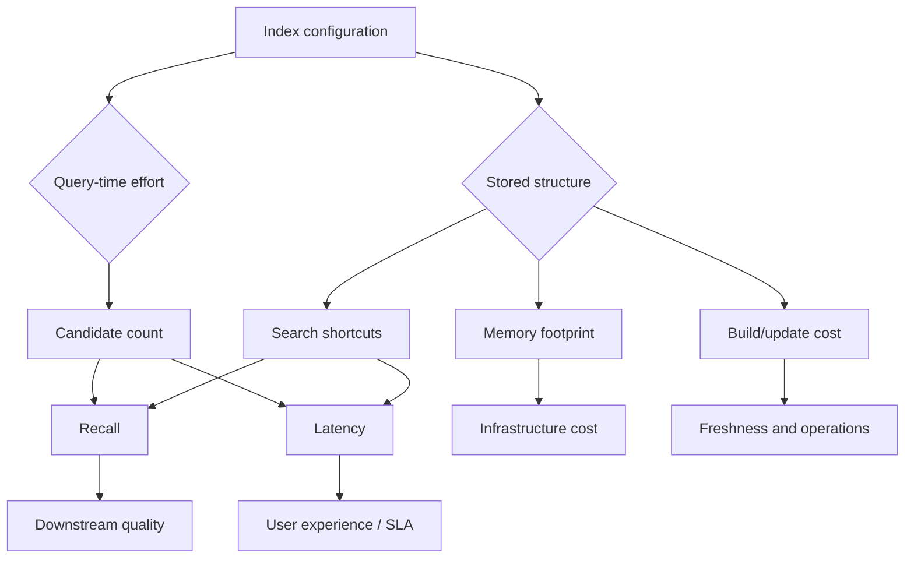

Read this as:

1. Query-time effort improves recall but increases latency.
2. Stored structure can improve search but increases memory/build cost.
3. Downstream quality depends on recall, but not only recall.
4. Production decisions must include latency percentiles and infra budget.

The tuning loop:

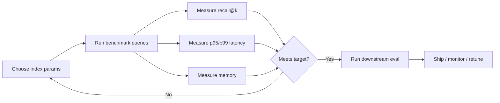

No curve, no confidence.

---

### 3. Real-World Industry Scenarios [Intermediate]

#### Scenario 1: Customer Support RAG

Goal:

```text
Retrieve enough relevant chunks for good answers under 150ms p95 retrieval latency.
```

Recall need:

- high enough to include at least one useful chunk
- not necessarily exact top-10 overlap
- downstream answer quality matters more than pure recall@k

Latency need:

- retrieval is only one part of user response
- LLM generation may take seconds
- retrieval should not waste the full latency budget

Memory need:

- index should fit in provisioned RAM
- multiple tenants or environments multiply cost

Likely approach:

```text
ANN top-50 -> rerank top-10 -> send top-5 to LLM
```

Trade-off:

- moderate ANN recall can be acceptable if reranking and chunk quality are strong
- high tail latency hurts chat UX

#### Scenario 2: Fraud Similarity Search

Goal:

```text
Find behaviorally similar suspicious accounts with very high recall.
```

Recall need:

- much higher than casual search
- missed neighbor can mean missed fraud ring

Latency need:

- real-time path may need fast candidate generation
- offline investigation can use slower, higher-recall search

Memory need:

- extra memory may be justified for risk reduction

Likely approach:

```text
high-recall ANN -> large candidate set -> exact rerank -> risk model
```

Trade-off:

- accept higher latency/memory for high-risk flows
- use cheaper settings for low-risk flows

#### Scenario 3: Semantic Product Recommendations

Goal:

```text
Show similar products quickly at high QPS.
```

Recall need:

- "good enough" semantic neighbors often work
- exact top-k overlap may matter less than click/conversion quality

Latency need:

- low p95/p99 because this is page-serving path
- high QPS makes small latency/cost changes expensive

Memory need:

- catalog may be huge
- compression or partitioning may be needed

Likely approach:

```text
fast ANN candidate generation -> business rerank -> diversity filter
```

Trade-off:

- lower recall may be acceptable if final ranking performs well
- memory-heavy HNSW may be expensive at catalog scale

---

### 4. System View: Think Like a Systems Engineer [Intermediate]

Trade-off tuning is a measurement system.

#### Inputs

Workload inputs:

- number of vectors
- vector dimension
- query rate
- query distribution
- filters
- top-k
- recall target
- latency SLA
- memory budget

Index inputs:

- index type
- `M`, `efConstruction`, `efSearch`
- `nlist`, `nprobe`
- compression/quantization
- shard count
- replica count
- batch size
- hardware type

Business inputs:

- risk of missed neighbor
- user latency expectation
- infrastructure budget
- freshness requirement
- correctness/audit requirement

#### Transformations

Index tuning changes four surfaces:

1. **Search depth**
   - HNSW `efSearch`
   - IVFFlat `nprobe`
   - more depth usually improves recall and latency cost

2. **Index structure**
   - HNSW `M`
   - IVF `nlist`
   - graph/list structure changes memory, build time, and recall

3. **Representation size**
   - float32 vectors
   - float16/scalar quantization
   - product quantization
   - compression saves memory but can reduce distance accuracy

4. **Post-processing**
   - exact reranking
   - cross-encoder reranking
   - business reranking
   - improves final quality but adds latency

#### Outputs

Benchmark outputs:

- recall@k
- p50/p95/p99 latency
- QPS
- memory per vector
- index size
- build time
- update time
- candidate count
- filter success/failure rate
- downstream quality metric

Do not accept aggregate-only results.

Break down by:

- query type
- tenant
- language
- document type
- filter selectivity
- vector density/cluster
- short vs long query
- high-risk vs low-risk path

#### Trade-off Curves

A useful benchmark does not produce one number.

It produces a curve:

```text
efSearch: 16  -> recall 0.82 -> p95 20ms
efSearch: 64  -> recall 0.93 -> p95 55ms
efSearch: 128 -> recall 0.97 -> p95 120ms
```

or:

```text
nprobe: 1  -> recall 0.70 -> p95 15ms
nprobe: 8  -> recall 0.90 -> p95 50ms
nprobe: 32 -> recall 0.97 -> p95 160ms
```

Then choose a point based on business constraints.

#### Observability

Track in production:

| Metric | Why it matters |
|---|---|
| recall@k sample | Offline/periodic quality tracking. |
| p95/p99 latency | User-facing reliability. |
| candidate count | Search effort. |
| memory per vector | Infra cost. |
| index build time | Freshness. |
| update lag | Staleness risk. |
| filter selectivity | Hybrid search behavior. |
| rerank gain | Whether candidate quality is enough. |
| zero-hit rate | Filtering or search failure. |
| downstream success | Real user/task value. |

---

### 5. System Design Flavor [Intermediate]

#### Trade-off 1: Recall vs Latency

Higher recall usually needs more query-time work.

HNSW:

```text
higher efSearch -> more graph exploration -> higher recall -> higher latency
```

IVFFlat:

```text
higher nprobe -> more lists scanned -> higher recall -> higher latency
```

Interview sentence:

> "The first tuning curve I want is recall@k versus p95 latency as I sweep the query-time search parameter."

#### Trade-off 2: Recall vs Memory

Memory can buy recall.

HNSW:

```text
higher M -> more graph edges -> better navigation -> more memory
```

Flat vectors:

```text
float32 memory ~= n * d * 4 bytes
```

Example:

```text
10M vectors * 1536 dims * 4 bytes ~= 61.4 GB for raw vectors
```

That excludes:

- graph edges
- IDs
- metadata
- allocator overhead
- replicas
- caches

IVFFlat stores original vectors plus IDs/list structure. HNSW stores vectors plus graph links. Compression reduces memory but introduces accuracy trade-offs.

Interview sentence:

> "Memory is not just vector size. Index structures, IDs, metadata, replicas, and caches all count."

#### Trade-off 3: Latency vs Memory

More memory can reduce latency if it stores helpful structure or keeps the index in RAM.

But:

- bigger graph can hurt cache locality
- more replicas increase cost
- compressed vectors may reduce memory but require decode/approximate scoring
- disk-backed search changes tail latency

Memory is a lever, not a magic fix.

#### Trade-off 4: Recall vs Build/Update Cost

Better indexes can be slower to build.

HNSW:

```text
higher efConstruction -> better graph -> slower indexing
```

IVFFlat:

```text
more/better clusters -> better partitioning -> more training/build complexity
```

If your corpus updates every minute, build/update behavior matters as much as query speed.

#### Trade-off 5: Recall vs Downstream Utility

Recall@k measures overlap with exact nearest neighbors.

But user utility may depend on:

- did we retrieve at least one answer-supporting chunk?
- did reranking place it in top context?
- did LLM use it correctly?
- did answer pass citation audit?
- did user click or resolve issue?

Production rule:

> Use recall@k to tune search, but use downstream metrics to choose the product configuration.

#### Decision Workflow

Use this sequence:

1. Build exact baseline on representative sample.
2. Choose index candidates.
3. Sweep query-time knobs.
4. Measure recall@k vs p95/p99 latency.
5. Measure memory and build/update cost.
6. Test with production filters.
7. Add reranking and measure downstream quality.
8. Pick the cheapest config that meets product target.
9. Monitor drift and retune.

---

### 6. Common Mistakes + Debugging [Intermediate]

#### Mistake 1: Optimizing for recall@k only

Recall@k is useful, but high recall can be too expensive.

Better:

```text
choose recall target under latency and memory constraints
```

#### Mistake 2: Optimizing for latency only

Fast bad results are still bad.

Better:

```text
latency target + minimum recall target + downstream quality check
```

#### Mistake 3: Ignoring tail latency

p50 can look great while p99 is painful.

Why p99 spikes:

- unbalanced IVF lists
- hard queries need more exploration
- filters cause over-fetching
- cache misses
- disk or network fetch
- reranker overload

Better:

```text
measure p50, p95, and p99
```

#### Mistake 4: Forgetting replicas multiply memory

If one index is 80 GB and you run:

```text
3 replicas * 2 regions * 2 environments
```

the real footprint is much larger.

Better:

```text
capacity plan index_size * replicas * regions * environments
```

#### Mistake 5: Tuning unfiltered, shipping filtered

Recall/latency curves can change drastically when filters are applied.

Better:

```text
benchmark with real metadata filters
```

#### Mistake 6: Not measuring candidate count

Candidate count explains recall and latency.

If latency spikes, ask:

- did candidate count grow?
- did list size grow?
- did filter over-fetch grow?
- did rerank candidate count grow?

#### Mistake 7: One config for all query risk levels

Not all queries need the same recall.

Examples:

| Query type | Search config |
|---|---|
| casual recommendation | faster/lower recall |
| customer support answer | moderate/high recall |
| compliance/legal answer | high recall + rerank + review |
| fraud investigation | very high recall + exact rerank |

Use risk-aware tuning.

#### Debugging Checklist

When recall is too low:

1. Compare against exact baseline.
2. Increase `efSearch` or `nprobe`.
3. Increase candidate count before rerank.
4. Check `M`/`nlist`.
5. Check filters.
6. Check embedding/metric mismatch.

When latency is too high:

1. Check candidate count.
2. Check p95/p99 by query type.
3. Lower `efSearch` or `nprobe`.
4. Add rerank to smaller candidate set.
5. Reduce context/candidate fanout.
6. Use caching/batching/hardware tuning.

When memory is too high:

1. Calculate raw vector memory.
2. Add index overhead.
3. Add metadata/ID overhead.
4. Add replicas/regions.
5. Consider compression/PQ/scalar quantization.
6. Consider sharding or index family change.

The fastest debugging question:

> Which constraint are we violating: recall target, latency SLA, or memory budget?

---

### 7. Hands-On Lab: Sweep the Trade-off Curve [Pro]

Goal:

> Simulate how a query-time search knob changes recall and latency, then choose a configuration from a measured curve.

This uses a toy cluster search. The point is the tuning process.

#### Build

Create vectors and exact search:

```python
import math
import random
import time


def l2(a, b):
    return math.sqrt(sum((x - y) ** 2 for x, y in zip(a, b)))


def make_vector(dim):
    return [random.random() for _ in range(dim)]


def make_dataset(n=20_000, dim=64):
    return [make_vector(dim) for _ in range(n)]


def exact_search(query, vectors, k):
    scored = [(l2(query, vector), idx) for idx, vector in enumerate(vectors)]
    scored.sort(key=lambda item: item[0])
    return scored[:k]
```

Create toy IVF-like lists:

```python
def make_centroids(nlist, dim):
    return [make_vector(dim) for _ in range(nlist)]


def build_lists(vectors, centroids):
    lists = {i: [] for i in range(len(centroids))}

    for idx, vector in enumerate(vectors):
        centroid_id = min(
            range(len(centroids)),
            key=lambda c: l2(vector, centroids[c]),
        )
        lists[centroid_id].append(idx)

    return lists
```

Approximate search:

```python
def approx_search(query, vectors, centroids, lists, k, nprobe):
    centroid_order = sorted(
        range(len(centroids)),
        key=lambda c: l2(query, centroids[c]),
    )
    selected = centroid_order[:nprobe]

    candidates = []
    for centroid_id in selected:
        candidates.extend(lists[centroid_id])

    scored = [(l2(query, vectors[idx]), idx) for idx in candidates]
    scored.sort(key=lambda item: item[0])
    return scored[:k], len(candidates)
```

Recall:

```python
def recall_at_k(exact, approx):
    exact_ids = {idx for _, idx in exact}
    approx_ids = {idx for _, idx in approx}
    return len(exact_ids & approx_ids) / len(exact_ids)
```

Memory estimate:

```python
def raw_vector_memory_bytes(num_vectors, dim, bytes_per_dim=4):
    return num_vectors * dim * bytes_per_dim
```

Run sweep:

```python
def main():
    random.seed(11)
    n = 20_000
    dim = 64
    k = 10
    vectors = make_dataset(n=n, dim=dim)
    queries = [make_vector(dim) for _ in range(25)]

    nlist = 200
    centroids = make_centroids(nlist, dim)
    lists = build_lists(vectors, centroids)

    memory_mb = raw_vector_memory_bytes(n, dim) / (1024 * 1024)
    print(f"raw_vector_memory_mb={memory_mb:.2f}")

    for nprobe in [1, 2, 5, 10, 20, 50, 100]:
        recalls = []
        latencies = []
        candidates = []

        for query in queries:
            exact = exact_search(query, vectors, k)

            start = time.perf_counter()
            approx, candidate_count = approx_search(
                query, vectors, centroids, lists, k, nprobe
            )
            latency_ms = (time.perf_counter() - start) * 1000

            recalls.append(recall_at_k(exact, approx))
            latencies.append(latency_ms)
            candidates.append(candidate_count)

        avg_recall = sum(recalls) / len(recalls)
        p95_latency = sorted(latencies)[int(0.95 * len(latencies)) - 1]
        avg_candidates = sum(candidates) / len(candidates)

        print(
            f"nprobe={nprobe:3d} "
            f"recall@{k}={avg_recall:.2f} "
            f"p95_ms={p95_latency:.2f} "
            f"avg_candidates={avg_candidates:.0f}"
        )


if __name__ == "__main__":
    main()
```

Expected lesson:

```text
Increasing nprobe improves recall but increases candidate count and latency.
```

#### Choose a Configuration

Suppose your target is:

```text
recall@10 >= 0.90
p95 latency <= 50ms
memory <= provisioned RAM
```

Pick the lowest `nprobe` that satisfies the target.

If no setting satisfies all targets, change the system:

- different index
- more memory
- compression
- GPU/CPU tuning
- reranking strategy
- lower recall target
- higher latency budget
- filtered/sharded index

#### Break

Break the tuning process intentionally:

1. Evaluate one query only.
2. Report p50 but not p95/p99.
3. Ignore memory overhead.
4. Use no exact baseline.
5. Tune unfiltered but ship filtered.
6. Choose max recall even when latency doubles.
7. Choose lowest latency even when recall collapses.
8. Ignore downstream answer quality.

For each break, explain:

- which metric lies
- what production failure appears
- how to repair the benchmark

#### Measure

Add:

```text
recall@k
p50_latency_ms
p95_latency_ms
p99_latency_ms
avg_candidate_count
max_candidate_count
raw_vector_memory
index_memory_estimate
build_time
update_time
downstream_success_rate
```

#### Capstone Prompt

> You are tuning vector search for a RAG product with 30 million chunks. Current config gives recall@10 = 0.96, p95 latency = 220ms, and index memory = 90GB. Product wants p95 under 100ms without a big answer-quality drop. What do you do?

Strong answer structure:

1. **Confirm the bottleneck.**
   - break down retrieval vs rerank vs generation latency
   - inspect p95/p99 by query type/filter

2. **Sweep search knobs.**
   - reduce `efSearch` or `nprobe`
   - measure recall/latency curve
   - track candidate count

3. **Use reranking wisely.**
   - lower ANN recall may be acceptable if reranker recovers quality
   - evaluate downstream answer quality, not only recall@10

4. **Check memory levers.**
   - raw vector memory
   - index overhead
   - replicas
   - compression/quantization options

5. **Segment by risk.**
   - low-risk queries use faster config
   - high-risk/legal queries use higher recall config

6. **Validate with production-like filters.**
   - filtered recall and tail latency may differ

Interview-ready summary:

> "I would generate recall-latency-memory curves, pick the cheapest config that satisfies product quality, and validate downstream RAG answers. If p95 must drop below 100ms, I would tune query-time search depth, candidate count, reranking, and possibly risk-based configs rather than blindly maximizing recall."

---

### 8. Active Recall

Answer without looking:

1. Why do recall, latency, and memory conflict?
2. What does increasing `efSearch` usually do?
3. What does increasing `nprobe` usually do?
4. What does increasing HNSW `M` usually do?
5. Why is p95 more important than p50 for user experience?
6. Why is recall@k not the same as downstream quality?
7. Why do filters change the tuning problem?
8. What is the Pareto frontier?
9. What should you do when no config meets recall and latency targets?
10. Why should memory planning include replicas?

Answers:

1. Higher recall usually needs more candidates or more stored structure, increasing query work or memory.
2. It explores more graph candidates, usually improving recall and increasing latency.
3. It probes more IVF lists, usually improving recall and increasing latency.
4. It stores more graph connections, often improving recall/navigation but increasing memory/build cost.
5. p50 hides slow tail requests; users and SLAs often feel p95/p99.
6. Exact-neighbor overlap may not equal answer relevance, grounding, or user satisfaction.
7. Filters can remove candidates or change which neighborhoods/lists matter.
8. Configurations where one metric cannot improve without another getting worse.
9. Change index, hardware, compression, reranking, risk segmentation, recall target, or latency budget.
10. Memory cost multiplies by replicas, regions, environments, and caches.

---

### 9. Practice

#### Practice 1: Pick a Config

| Config | Recall@10 | p95 latency | Memory | Decision |
|---|---:|---:|---:|---|
| A | 0.86 | 30ms | 20GB | Too low recall for most RAG. |
| B | 0.92 | 60ms | 24GB | Good candidate if answer quality passes. |
| C | 0.97 | 130ms | 40GB | Better quality but may violate latency. |
| D | 0.99 | 300ms | 80GB | Use only if high-risk recall justifies cost. |

If this is customer-support RAG with p95 target under 100ms, start with B and test downstream answer quality.

#### Practice 2: Diagnose Metric Conflict

Problem:

```text
Increasing nprobe from 8 to 32 improves recall@10 from 0.91 to 0.96,
but p95 latency jumps from 70ms to 180ms.
```

Strong answer:

> "I would check whether the 0.05 recall gain improves downstream answer quality enough to justify latency. If not, keep nprobe around 8-16 and use reranking or better query/chunking. If high-risk queries need 0.96, use dynamic nprobe by route/risk."

#### Practice 3: Memory Estimate

Question:

```text
How much raw memory for 50M vectors, 768 dimensions, float32?
```

Calculation:

```text
50,000,000 * 768 * 4 bytes = 153,600,000,000 bytes
~= 153.6 GB decimal
~= 143 GB GiB
```

That excludes index overhead, IDs, metadata, replicas, and caches.

#### Practice 4: Interview Drill

Prompt:

> How do you tune an ANN vector index?

Strong answer:

> "I start with an exact-search baseline on representative queries. Then I sweep index/search parameters such as `efSearch` for HNSW or `nprobe` for IVF, measuring recall@k, p95/p99 latency, candidate count, memory, and build/update cost. I evaluate under production filters and check downstream task quality. I choose the cheapest configuration that meets the product's recall and latency requirements."

---

### 10. Production Reality Check

**If this fails in prod, what is the first thing we inspect?**

Inspect which constraint is being violated:

1. Recall too low
2. Latency too high
3. Memory too high
4. Build/update too slow
5. Downstream quality poor despite good recall

Then map to levers:

| Failure | First levers |
|---|---|
| Recall low | Increase `efSearch`/`nprobe`, candidate count, rerank, fix filters. |
| Latency high | Reduce search depth, reduce candidates, optimize rerank, cache, shard. |
| Memory high | Compress, reduce graph degree, change index, shard, reduce replicas. |
| Build slow | Lower build-time knobs, batch builds, GPU training, incremental strategy. |
| Quality poor | Check embeddings, chunking, metric, reranker, downstream generation. |

#### Tuning Runbook

1. Define product target:
   - recall target
   - p95/p99 target
   - memory budget
   - downstream quality metric

2. Build exact baseline.

3. Sweep parameters:
   - HNSW: `efSearch`, `M`, `efConstruction`
   - IVFFlat: `nprobe`, `nlist`

4. Plot recall vs latency.

5. Add memory/build/update measurements.

6. Evaluate with production filters.

7. Evaluate downstream quality.

8. Choose Pareto-efficient config.

9. Monitor drift in production.

10. Retune when data/query distribution changes.

#### What Good Looks Like

A mature team can answer:

- What recall target did we choose and why?
- What p95/p99 latency target did we choose and why?
- What is memory per vector and total index memory?
- Which parameter sweep produced the selected config?
- What is the exact baseline?
- What is filtered recall?
- What is rerank gain?
- What downstream metric confirms user value?
- What happens for high-risk queries?

That is production tuning maturity.

---

### 11. Curiosity Bridge

Recall, latency, and memory trade-offs tell us how hard the search system works and how much structure it stores. But vector indexes are only one family of retrieval. Production search systems often combine multiple retrieval families.

The next decision is:

```text
Should we retrieve by exact terms, semantic vectors, or token-level interactions?
```

That leads directly to **dense, sparse, and late-interaction retrieval basics**: the three retrieval families you must understand before designing serious RAG and search systems.

---

### 12. Exit Check + Carry-Forward Review

**Exit check - you are done when you can:**
Given a vector search workload, define recall, latency, and memory targets; sweep ANN parameters; read a recall-latency curve; explain HNSW and IVFFlat tuning knobs; estimate raw vector memory; account for replicas and filters; and choose a Pareto-efficient configuration based on product requirements.

**Carry-Forward Review:**

Question: How do HNSW and IVFFlat from 5.1.b expose the recall/latency/memory trade-off?

Answer: HNSW exposes the trade-off through graph exploration and graph structure: increasing `efSearch` improves recall but increases latency, while increasing `M` can improve navigation but increases memory. IVFFlat exposes it through bucket probing and partitioning: increasing `nprobe` improves recall but scans more vectors, while `nlist` changes bucket size, training cost, and recall behavior.

---

## Subtopic 5.1.d: Dense, Sparse, and Late-Interaction Retrieval Basics

### Add to Knowledge Base

Retrieval systems do not all work the same way.

The three retrieval families you must understand are:

| Family | Representation | Matching style |
|---|---|---|
| Sparse retrieval | Huge sparse term vectors / inverted index | Exact or weighted lexical matching |
| Dense retrieval | One dense vector per query/document chunk | Semantic nearest-neighbor matching |
| Late-interaction retrieval | Many token vectors per query/document | Fine-grained token-level semantic matching |

The core idea:

> Sparse retrieval is strong at exact words. Dense retrieval is strong at semantic similarity. Late interaction keeps token-level detail while still allowing precomputed document representations.

Reference anchor:
- Lucene BM25Similarity docs: `https://lucene.apache.org/core/9_9_1/core/org/apache/lucene/search/similarities/BM25Similarity.html`
- Dense Passage Retrieval paper: `https://arxiv.org/abs/2004.04906`
- SPLADE paper: `https://arxiv.org/abs/2107.05720`
- ColBERT paper: `https://arxiv.org/abs/2004.12832`

Key terms:

| Term | Meaning |
|---|---|
| Sparse retrieval | Retrieval using term-based sparse vectors and inverted indexes. |
| Inverted index | Map from term to documents containing that term. |
| BM25 | Classic sparse ranking function using term frequency, inverse document frequency, and length normalization. |
| Dense retrieval | Retrieval using learned dense embeddings, usually with vector search. |
| Dual encoder | Separate encoders for query and document, enabling precomputed document vectors. |
| Learned sparse retrieval | Neural model produces sparse term-weight vectors, often compatible with inverted indexes. |
| SPLADE | Learned sparse model that can expand terms while staying sparse. |
| Late interaction | Query and document are encoded separately, but token-level similarities are computed at search/ranking time. |
| ColBERT | Late-interaction retriever using contextual token embeddings and MaxSim scoring. |
| MaxSim | For each query token, take maximum similarity over document tokens, then aggregate. |
| Hybrid retrieval | Combining sparse and dense, or multiple retrievers, before reranking. |

The beginner mistake:

```text
vector search = all retrieval
```

Production answer:

```text
retrieval = lexical matching + semantic matching + token-level matching + reranking
```

Dense vector search is powerful, but it is not a replacement for every retrieval problem.

---

### Reading Path + Level Tags

- **Beginner:** Read sections 0-2 and Active Recall.
- **Intermediate:** Add sections 3-6 and complete the Build part of the Hands-On Lab.
- **Pro:** Complete the full Hands-On Lab, including Break and Measure, then answer the retrieval-family system-design question.

---

### 0. Pre-Question Hook [Beginner]

**Pause:** A user searches internal docs:

```text
SOC2 CC6.6 evidence for API key rotation
```

Your dense retriever returns:

```text
general security best practices
password reset documentation
multi-factor authentication overview
```

Why did it miss?

Possible reason:

> Dense retrieval understood the broad semantic domain but missed rare exact tokens: `SOC2`, `CC6.6`, and `API key rotation`.

Now another user asks:

```text
How do I change credentials without causing downtime?
```

Sparse BM25 may miss the best document titled:

```text
Zero-downtime API key rotation guide
```

because the query uses different words.

So which retriever should you use?

Production answer:

> "Use the retriever family that matches the failure mode. Sparse handles exact terms and identifiers. Dense handles paraphrase and semantic similarity. Late interaction handles token-level semantic matching with more precision. Many production systems use hybrid retrieval plus reranking."

Before reading on, answer:

- Which retriever handles exact IDs best?
- Which handles paraphrase best?
- Which preserves token-level matching?
- Which is cheapest at large scale?
- Which uses the most storage?
- Why do RAG systems often combine sparse and dense retrieval?

---

### 1. The Intuition (Plain English) [Beginner]

Imagine searching a library.

Sparse retrieval is like searching the catalog by exact words:

```text
find books containing "SOC2", "CC6.6", "API key rotation"
```

It is precise when the query and document share terms.

Dense retrieval is like asking a librarian:

```text
find documents about changing credentials without downtime
```

The librarian can understand that this may mean API key rotation even if the words differ.

Late interaction is like a careful reviewer who compares each part of your question against each part of the document:

```text
"change credentials" matches "API key rotation"
"without downtime" matches "zero-downtime"
```

It keeps more detail than one dense vector, but costs more.

**The simplest explanation:**

> Sparse retrieval matches words. Dense retrieval matches meaning. Late interaction matches meanings at the token level.

**Where the analogy breaks down:** Modern sparse retrieval can be neural and include learned expansion terms. Modern dense retrieval can be domain-tuned and very strong. Late-interaction systems use optimized indexes and compression to be practical. These are not rigid boxes; they are design families.

---

### 2. Visual Diagram (Mermaid) [Beginner]

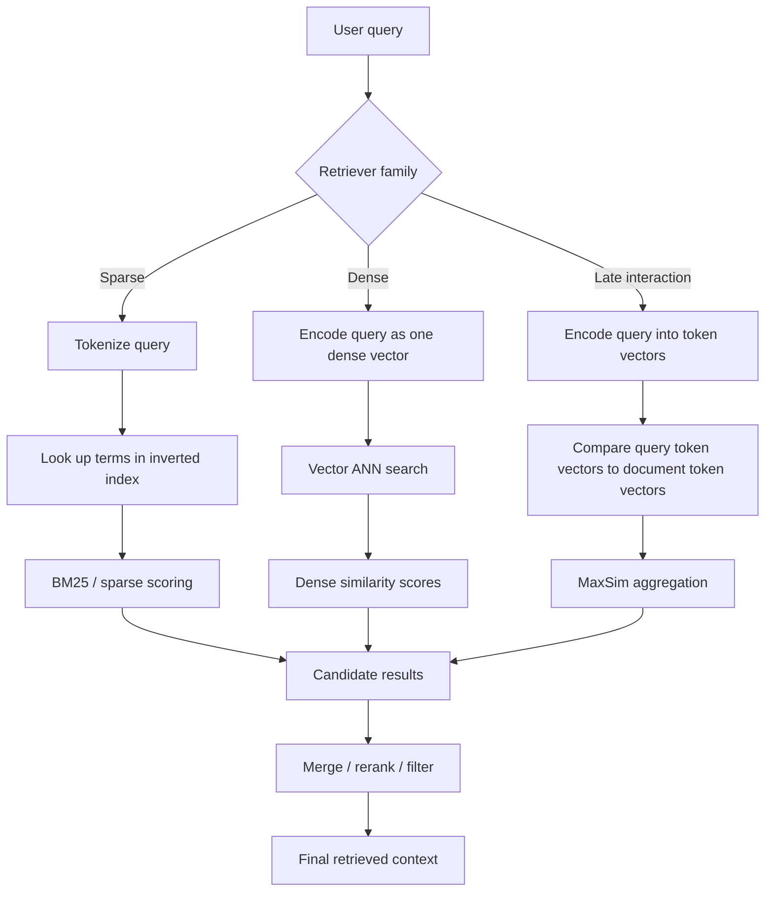

The diagram shows the difference:

- sparse retrieval searches terms
- dense retrieval searches one vector
- late interaction scores many token-vector matches

Hybrid retrieval often does:

```text
sparse top-k + dense top-k -> merge/fuse -> rerank -> final top-k
```

---

### 3. Real-World Industry Scenarios [Intermediate]

#### Scenario 1: API Documentation Search

Query:

```text
ERR_AUTH_429 rotate keys
```

Sparse strength:

- exact error code
- exact API names
- field names
- version strings

Dense weakness:

- may retrieve general auth-rate-limit docs but miss exact code

Best design:

```text
sparse retrieval for exact tokens
dense retrieval for semantic variants
merge candidates
rerank by code/version/document freshness
```

#### Scenario 2: Customer Support RAG

Query:

```text
How can I change login credentials without breaking production?
```

Dense strength:

- paraphrase recognition
- semantic match to "zero-downtime API key rotation"
- better with natural-language questions

Sparse weakness:

- may not match if terms differ

Best design:

```text
dense retrieval first
sparse backup for exact product terms
rerank with support-doc metadata
```

#### Scenario 3: Legal/Compliance Retrieval

Query:

```text
Find policy support for SOC2 CC6.6 and privileged access review.
```

Sparse strength:

- compliance control IDs
- exact clause names
- proper nouns

Dense strength:

- related policy language
- paraphrased control descriptions

Late-interaction strength:

- can match exact-ish tokens and semantic phrase alignment
- useful when fine-grained query/document matching matters

Best design:

```text
sparse + dense hybrid candidate generation
late-interaction or cross-encoder rerank for high-risk answers
human review if evidence is weak
```

---

### 4. System View: Think Like a Systems Engineer [Intermediate]

Retrieval family choice affects the whole system.

#### Sparse Retrieval System

Index:

```text
term -> postings list of document IDs, frequencies, positions, fields
```

Query:

```text
tokenize query -> lookup terms -> score documents -> return top-k
```

Strengths:

- exact terms
- rare identifiers
- explainability
- mature infrastructure
- efficient inverted indexes
- strong filters and boolean logic

Weaknesses:

- synonyms
- paraphrases
- semantic mismatch
- vocabulary mismatch
- user phrasing differences

#### Dense Retrieval System

Index:

```text
document chunk -> one dense embedding vector
```

Query:

```text
embed query -> ANN vector search -> return nearest chunks
```

Strengths:

- paraphrase
- semantic similarity
- natural-language questions
- multilingual/domain embeddings when trained
- concept matching beyond exact words

Weaknesses:

- rare identifiers
- exact codes
- numerical/version precision
- interpretability
- embedding drift
- vector index tuning

#### Late-Interaction System

Index:

```text
document -> many token embeddings
```

Query:

```text
query token embeddings -> token-level similarity -> MaxSim aggregation -> score
```

Strengths:

- finer-grained matching
- preserves token-level evidence
- stronger retrieval quality than single-vector dense in many settings
- can precompute document token vectors

Weaknesses:

- more storage than single-vector dense
- more expensive scoring
- more complex indexing
- harder operational footprint

#### Observability

Track by retriever:

| Metric | Sparse | Dense | Late interaction |
|---|---|---|---|
| exact-term hit rate | Very important | Weakness signal | Important |
| semantic paraphrase hit rate | Weakness signal | Very important | Very important |
| candidate latency | Usually strong | ANN-dependent | Higher |
| storage footprint | Postings/metadata | vector index | token-vector index |
| explainability | High | Lower | Medium/high token-level |
| zero-hit rate | Useful | Less common | Useful |
| downstream answer success | Required | Required | Required |

---

### 5. System Design Flavor [Intermediate]

#### Sparse Retrieval: When to Use

Use sparse retrieval when:

- queries include exact terms
- IDs/codes/version strings matter
- documents use consistent terminology
- boolean filters matter
- explainability is important
- infrastructure should be cheap and mature

Examples:

- error codes
- legal clause IDs
- API names
- product SKUs
- ticket IDs
- compliance controls

Interview sentence:

> "Sparse retrieval is still critical because exact tokens, rare identifiers, and lexical constraints are often the highest-signal part of enterprise search."

#### Dense Retrieval: When to Use

Use dense retrieval when:

- queries are natural language
- users use synonyms/paraphrases
- semantic similarity matters
- exact words differ between query and document
- domain-tuned embeddings are available

Examples:

- support Q&A
- semantic document search
- similar tickets
- recommendations
- knowledge-base RAG

Interview sentence:

> "Dense retrieval is strong when the user and the document talk about the same concept using different words."

#### Late Interaction: When to Use

Use late interaction when:

- retrieval quality matters more than lowest cost
- token-level matching is important
- single dense vectors lose too much detail
- you need stronger ranking before generation
- high-risk RAG needs better evidence selection

Examples:

- legal/compliance evidence retrieval
- high-quality passage search
- research assistants
- reranking candidate sets

Interview sentence:

> "Late interaction keeps query and document token details separate until scoring, so it can capture fine-grained relevance that one-vector dense retrieval may compress away."

#### Hybrid Retrieval

Production RAG often uses:

```text
BM25 top 100
dense top 100
merge and dedupe
rerank top 50
send top 5-10 to LLM
```

Fusion approaches:

- weighted score combination
- reciprocal rank fusion
- union plus reranker
- route-specific retriever choice

Rule:

> Hybrid retrieval is not automatically better. It is better when each retriever contributes different useful candidates.

#### Selection Table

| Query type | Best starting retrieval |
|---|---|
| "ERR_AUTH_429 timeout" | Sparse |
| "How do I change credentials without downtime?" | Dense |
| "SOC2 CC6.6 privileged access review" | Sparse + dense |
| "Find exact customer contract clause 4.2" | Sparse / structured lookup |
| "Summarize docs related to zero-trust access" | Dense + rerank |
| High-risk legal evidence | Hybrid + late-interaction or cross-encoder rerank |

---

### 6. Common Mistakes + Debugging [Intermediate]

#### Mistake 1: Replacing BM25 with dense retrieval everywhere

Dense retrieval can miss:

- exact codes
- rare names
- IDs
- field names
- version strings

Better:

```text
keep sparse retrieval for lexical precision and combine with dense when needed
```

#### Mistake 2: Assuming sparse retrieval cannot be semantic

Classic sparse retrieval is lexical. Learned sparse retrieval can add expansion and learned term weights.

SPLADE-style systems can produce sparse vectors that still use inverted indexes while capturing richer signals.

#### Mistake 3: Treating late interaction as just dense retrieval

Dense retrieval usually stores one vector per chunk.

Late interaction stores many vectors per document/chunk and scores query-token to document-token matches.

That changes:

- storage
- latency
- scoring
- index design
- retrieval quality

#### Mistake 4: Merging dense and sparse scores naively

BM25 scores and dense similarity scores are not naturally comparable.

Better:

- normalize scores carefully
- use rank fusion
- rerank merged candidates
- evaluate per query type

#### Mistake 5: Evaluating only aggregate recall

Dense may win aggregate recall but fail exact-code queries.

Sparse may win exact-code queries but fail paraphrases.

Evaluate slices:

- exact ID queries
- natural-language paraphrases
- legal/control references
- product/API names
- ambiguous questions
- multilingual queries

#### Mistake 6: Forgetting storage cost

Storage footprint usually increases:

```text
sparse postings < single-vector dense < late-interaction token vectors
```

This is not always exact, but it is the right intuition.

#### Debugging Checklist

When retrieval fails:

1. Does the query contain exact identifiers?
2. Did sparse retrieval find the target?
3. Did dense retrieval find semantic paraphrases?
4. Did each retriever return different useful candidates?
5. Are scores being fused correctly?
6. Would late interaction or reranking fix ordering?
7. Is the failure from candidate generation or final ranking?
8. Are slices hiding under aggregate metrics?
9. Are exact terms lost in preprocessing?
10. Are embeddings domain-tuned enough?

The fastest debugging question:

> Did the retriever fail because it needed exact lexical matching, semantic matching, or fine-grained token matching?

---

### 7. Hands-On Lab: Compare Sparse, Dense, and Late-Interaction Retrieval [Pro]

Goal:

> Build a toy retriever comparison that shows why sparse, dense, and late-interaction retrieval retrieve different candidates.

This is a conceptual lab. It intentionally uses simple scoring so the retrieval behavior is visible.

#### Build

Create a tiny corpus:

```python
DOCS = [
    {
        "id": "d1",
        "text": "Zero-downtime API key rotation guide for production services.",
    },
    {
        "id": "d2",
        "text": "Password reset and account recovery instructions.",
    },
    {
        "id": "d3",
        "text": "SOC2 CC6.6 privileged access review evidence policy.",
    },
    {
        "id": "d4",
        "text": "How to update credentials safely without service interruption.",
    },
]
```

Tokenize:

```python
import math
from collections import Counter, defaultdict


def tokenize(text):
    return [
        token.strip(".,!?").lower()
        for token in text.split()
    ]
```

Sparse scoring with simple term overlap:

```python
def sparse_score(query, doc):
    query_terms = set(tokenize(query))
    doc_terms = set(tokenize(doc["text"]))
    return len(query_terms & doc_terms)
```

Toy dense representation using synonym groups:

```python
CONCEPTS = {
    "credential_change": {"rotate", "rotation", "change", "update", "credentials", "key", "api"},
    "no_downtime": {"downtime", "zero-downtime", "interruption", "production"},
    "compliance": {"soc2", "cc6.6", "policy", "evidence", "review"},
    "password_reset": {"password", "reset", "account", "recovery"},
}


def dense_vector(text):
    terms = set(tokenize(text))
    return [
        1.0 if terms & concept_terms else 0.0
        for concept_terms in CONCEPTS.values()
    ]


def dot(a, b):
    return sum(x * y for x, y in zip(a, b))


def dense_score(query, doc):
    return dot(dense_vector(query), dense_vector(doc["text"]))
```

Toy late-interaction scoring:

```python
SYNONYMS = {
    "change": {"update", "rotate", "rotation"},
    "credentials": {"key", "api"},
    "downtime": {"interruption", "zero-downtime"},
    "soc2": {"cc6.6", "compliance"},
}


def token_similarity(q_token, d_token):
    if q_token == d_token:
        return 1.0

    if d_token in SYNONYMS.get(q_token, set()):
        return 0.8

    if q_token in SYNONYMS.get(d_token, set()):
        return 0.8

    return 0.0


def late_interaction_score(query, doc):
    query_tokens = tokenize(query)
    doc_tokens = tokenize(doc["text"])

    score = 0.0
    for q_token in query_tokens:
        score += max(
            token_similarity(q_token, d_token)
            for d_token in doc_tokens
        )

    return score
```

Rank:

```python
def rank(query, scorer):
    scored = [
        (scorer(query, doc), doc["id"], doc["text"])
        for doc in DOCS
    ]
    scored.sort(reverse=True, key=lambda item: item[0])
    return scored
```

Compare:

```python
def show(query):
    print("QUERY:", query)

    for name, scorer in [
        ("sparse", sparse_score),
        ("dense", dense_score),
        ("late", late_interaction_score),
    ]:
        print("\n", name)
        for score, doc_id, text in rank(query, scorer):
            print(score, doc_id, text)


if __name__ == "__main__":
    show("change credentials without downtime")
    show("SOC2 CC6.6 access review")
```

Expected lesson:

```text
Sparse wins exact overlap.
Dense can match broad concepts.
Late interaction rewards per-token alignments.
```

#### Add Hybrid Retrieval

Merge sparse and dense candidates:

```python
def reciprocal_rank_fusion(rankings, k=60):
    scores = defaultdict(float)

    for ranking in rankings:
        for rank_idx, (_, doc_id, _) in enumerate(ranking, start=1):
            scores[doc_id] += 1.0 / (k + rank_idx)

    return sorted(scores.items(), key=lambda item: item[1], reverse=True)
```

Use:

```python
query = "change credentials without downtime"
sparse_ranking = rank(query, sparse_score)
dense_ranking = rank(query, dense_score)
print(reciprocal_rank_fusion([sparse_ranking, dense_ranking]))
```

#### Break

Break the system intentionally:

1. Remove exact terms like `SOC2` from tokenization.
2. Use dense retrieval only for error-code queries.
3. Use sparse retrieval only for paraphrase queries.
4. Merge scores by raw numeric value without normalization.
5. Ignore duplicate documents after fusion.
6. Use late interaction for every query without considering latency.
7. Evaluate only aggregate results, not slices.

For each break, explain:

- which retriever family fails
- what production symptom appears
- what metric or slice catches it
- what hybrid/reranking fix helps

#### Measure

Track:

```text
sparse_hit_rate
dense_hit_rate
late_interaction_hit_rate
hybrid_recall@k
exact_identifier_query_success
paraphrase_query_success
candidate_latency_ms
storage_per_document
rerank_gain
```

#### Capstone Prompt

> You are building retrieval for an enterprise RAG assistant. Queries include natural-language questions, exact error codes, legal clause IDs, and compliance controls. How do you choose dense, sparse, late-interaction, or hybrid retrieval?

Strong answer structure:

1. **Use sparse for exactness.**
   - error codes
   - clause IDs
   - API names
   - compliance controls

2. **Use dense for semantic match.**
   - paraphrased user questions
   - concept search
   - natural language support queries

3. **Use late interaction or reranking for high-quality ranking.**
   - fine-grained evidence selection
   - legal/compliance retrieval
   - high-risk RAG

4. **Use hybrid candidate generation.**
   - sparse top-k + dense top-k
   - merge/dedupe/fuse
   - rerank final candidates

5. **Evaluate by slice.**
   - exact-code queries
   - paraphrase queries
   - legal/control queries
   - downstream answer grounding

Interview-ready summary:

> "Sparse retrieval gives lexical precision, dense retrieval gives semantic recall, and late interaction gives fine-grained token-level semantic matching. I would use hybrid retrieval plus reranking for enterprise RAG because user queries mix exact identifiers and natural-language intent."

---

### 8. Active Recall

Answer without looking:

1. What is sparse retrieval good at?
2. What is dense retrieval good at?
3. What is late interaction?
4. Why can dense retrieval miss exact identifiers?
5. Why can sparse retrieval miss paraphrases?
6. What does BM25 use at a high level?
7. What does a dual encoder enable?
8. What is MaxSim in ColBERT-style retrieval?
9. Why is hybrid retrieval common?
10. Why should retrieval evaluation be sliced?

Answers:

1. Exact lexical terms, rare identifiers, codes, names, and explainable matching.
2. Semantic similarity, paraphrases, natural-language queries, and concept matching.
3. Retrieval that encodes query/document separately but scores token-level interactions later.
4. A single dense vector can blur rare tokens, codes, and exact strings.
5. It depends on term overlap unless expansion or synonyms are used.
6. Term frequency, inverse document frequency, and document length normalization.
7. Precomputing document embeddings and searching with query embeddings efficiently.
8. For each query token, take the maximum similarity to any document token and aggregate.
9. Dense and sparse retrieve different useful candidates.
10. Aggregate metrics can hide failures on exact-code, paraphrase, or legal-control queries.

---

### 9. Practice

#### Practice 1: Choose the Retriever

| Query | Best starting retriever |
|---|---|
| `ERR_AUTH_429` | Sparse |
| "How do I change credentials without downtime?" | Dense |
| `SOC2 CC6.6 privileged access` | Sparse + dense |
| "Find docs similar to this incident summary" | Dense |
| "Clause 4.2 limitation of liability" | Sparse / structured lookup |
| High-risk legal evidence search | Hybrid + late-interaction/rerank |

#### Practice 2: Debug Retrieval Miss

Problem:

```text
Dense retriever misses document containing exact API name `client.responses.stream`.
```

Strong answer:

> "This is likely an exact-token failure. I would add sparse retrieval or fielded search over API names, merge with dense candidates, and evaluate exact API-name queries separately."

#### Practice 3: Explain Late Interaction

Prompt:

> Explain ColBERT-style late interaction in simple terms.

Strong answer:

> "Instead of compressing a passage into one vector, late interaction stores contextual token vectors. At query time, each query token looks for its best matching document token, and those MaxSim scores are aggregated. This preserves fine-grained matching but costs more storage and scoring than single-vector dense retrieval."

#### Practice 4: Hybrid Design

Prompt:

> Design retrieval for support docs where users ask both natural language questions and exact error-code searches.

Strong answer:

> "Use sparse retrieval for exact codes/API names and dense retrieval for natural-language paraphrases. Merge candidates with rank fusion or a reranker, dedupe by document/chunk ID, then apply metadata filters and final reranking. Evaluate exact-code and paraphrase query slices separately."

---

### 10. Production Reality Check

**If this fails in prod, what is the first thing we inspect?**

Inspect the query type:

1. Exact identifier?
2. Natural-language paraphrase?
3. Legal/compliance reference?
4. Multi-concept query?
5. Ambiguous query?

Then inspect retriever behavior:

| Failure | Likely fix |
|---|---|
| Exact code missed | Add/tune sparse retrieval. |
| Paraphrase missed | Add/tune dense retrieval. |
| Good candidates bad order | Add late interaction or reranker. |
| Hybrid duplicates dominate | Dedupe and rank-fuse. |
| Scores don't combine well | Use rank fusion or calibrated reranker. |
| High storage/latency | Use late interaction selectively. |

#### Retrieval Family Runbook

1. Label query type.
2. Run sparse retrieval alone.
3. Run dense retrieval alone.
4. Compare candidate overlap.
5. Check whether each retriever contributes unique relevant docs.
6. Try hybrid fusion.
7. Try late-interaction/rerank on candidates.
8. Evaluate by query slice.
9. Measure latency and storage.
10. Add failed query to retrieval regression set.

#### What Good Looks Like

A mature retrieval system can answer:

- Which query types need sparse matching?
- Which query types need dense semantic matching?
- Which flows justify late interaction?
- How are dense and sparse candidates fused?
- What is the reranker gain?
- What slices fail for each retriever?
- What is latency/storage per retriever?
- Does downstream RAG quality improve?

That is retrieval architecture maturity.

---

### 11. Curiosity Bridge

Dense, sparse, and late-interaction retrieval complete the first layer of similarity-search fundamentals. You now know how search can be exact or approximate, how HNSW and IVFFlat skip work, how recall/latency/memory tuning works, and why different retrieval families find different evidence.

The next layer is the **vector database ecosystem**: how these retrieval choices show up in real tools, from local prototype databases like Chroma to managed services and self-hosted engines.

---

### 12. Exit Check + Carry-Forward Review

**Exit check - you are done when you can:**
Explain sparse retrieval, dense retrieval, learned sparse retrieval, and late interaction; choose the right retriever family for exact-token, semantic, and high-risk evidence queries; design a hybrid retrieval pipeline; and debug whether a miss comes from lexical mismatch, semantic mismatch, ranking, fusion, or downstream generation.

**Carry-Forward Review:**

Question: How does this connect to recall vs latency vs memory from 5.1.c?

Answer: Retriever families have different quality/cost shapes. Sparse retrieval is often efficient and exact-token strong. Dense retrieval depends on vector indexes and ANN tuning. Late interaction can improve fine-grained ranking but costs more storage and scoring. Choosing retrieval architecture is another recall/latency/memory trade-off.

---

## Topic 5.1 Checkpoint: Similarity Search Fundamentals

### Checkpoint Q1: Why does ANN exist?

**Reference answer:** Exact search compares a query vector to every stored vector, which becomes expensive as corpus size, dimension, and QPS grow. ANN indexes reduce query-time work by navigating graphs, probing partitions, hashing, or compressing/searching candidate sets, trading perfect recall for scale and latency.

### Checkpoint Q2: Explain HNSW and IVFFlat in one sentence each.

**Reference answer:** HNSW builds a navigable proximity graph and searches by walking toward closer vectors. IVFFlat partitions vectors into inverted lists and searches only the closest selected lists.

### Checkpoint Q3: How do recall, latency, and memory interact?

**Reference answer:** Higher recall usually requires more query-time work or more stored structure, which increases latency, memory, build cost, or update complexity. Production tuning means choosing the cheapest configuration that meets the product's recall, latency, and memory targets.

### Checkpoint Q4: What is the difference between sparse, dense, and late-interaction retrieval?

**Reference answer:** Sparse retrieval matches lexical terms through inverted indexes and BM25-like scoring. Dense retrieval maps query and document chunks to dense vectors for semantic nearest-neighbor search. Late interaction keeps token-level embeddings and computes fine-grained query-token to document-token matches at scoring time.

### Checkpoint Q5: Why is hybrid retrieval common in RAG?

**Reference answer:** Real queries mix exact identifiers and semantic intent. Sparse retrieval catches exact terms, dense retrieval catches paraphrases, and rerankers or late-interaction models improve final ordering. Hybrid retrieval improves coverage when each retriever contributes unique relevant candidates.

### Topic 5.1 Self-Assessment

| Skill | Can you answer without notes? | Confidence (1-5) |
|---|---|---|
| Explain exact search vs ANN search | | |
| Define recall@k and use exact search as ANN baseline | | |
| Explain HNSW as graph navigation | | |
| Explain IVFFlat as bucket probing | | |
| Tune `efSearch`, `M`, `nprobe`, and `nlist` conceptually | | |
| Read recall-latency-memory trade-off curves | | |
| Estimate raw vector memory | | |
| Choose sparse, dense, late-interaction, or hybrid retrieval | | |
| Debug retrieval misses by query type and retriever family | | |

---

## Topic 5.2: Vector Database Ecosystem

> **Topic time:** 10h
> Focus: Learning how real vector databases differ by ergonomics, deployment model, filtering, indexing, scaling, operations, and integration fit. The goal is to know which tool is good for prototypes, which is good for managed production, which is good for self-hosted control, and how to avoid locking your retrieval architecture to one vendor too early.

---

## Subtopic 5.2.a: Chroma for Local Experimentation and Prototypes

### Add to Knowledge Base

**Chroma** is an open-source vector database/data infrastructure tool designed for AI applications. It is especially useful when you want to build local semantic search, small RAG prototypes, notebook experiments, and fast retrieval demos without operating a heavy external system.

The core idea:

> Chroma is excellent for learning and prototyping because it lets you create collections, add documents/embeddings, query by semantic similarity, and filter by metadata with very little setup.

Chroma gives you three important local/development modes:

| Mode | Client | Best fit |
|---|---|---|
| In-memory | `chromadb.Client()` | Quick experiments, notebooks, disposable demos. |
| Local persistent | `chromadb.PersistentClient(path=...)` | Local prototypes where data should survive process restart. |
| Client-server | `chroma run --path ...` + `chromadb.HttpClient(...)` | Local app/server separation, JS/TS/Rust clients, closer to deployment shape. |

Reference anchor:
- Chroma Getting Started docs: `https://docs.trychroma.com/docs/overview/getting-started`
- Chroma Clients docs: `https://docs.trychroma.com/docs/run-chroma/clients`
- Chroma Client-Server docs: `https://docs.trychroma.com/docs/run-chroma/client-server`
- Chroma Manage Collections docs: `https://docs.trychroma.com/docs/collections/manage-collections`
- Chroma Metadata Filtering docs: `https://docs.trychroma.com/docs/querying-collections/metadata-filtering`

Key terms:

| Term | Meaning |
|---|---|
| Chroma client | Object used to create/get collections and run operations. |
| In-memory client | Local ephemeral Chroma instance; data disappears when process ends. |
| Persistent client | Local Chroma client that stores database files on disk. |
| HTTP client | Client that connects to a separate Chroma server process. |
| Collection | Fundamental storage/query unit for embeddings, documents, IDs, and metadata. |
| ID | Unique string identifier for a record in a collection. |
| Document | Text stored with a vector record. |
| Embedding function | Function/model used by collection to embed documents/query text. |
| Metadata | Key-value fields stored with records for filtering and organization. |
| `add` | Insert new records. |
| `upsert` | Insert or update records idempotently. |
| `query` | Similarity search operation. |
| `get` | Retrieve records directly, often with filters. |

The beginner mistake:

```text
Chroma prototype = production architecture
```

Better:

```text
Chroma is great for local experiments and prototypes; production readiness depends on scale, deployment mode, persistence, auth, backup, SLAs, and operational requirements.
```

---

### Reading Path + Level Tags

- **Beginner:** Read sections 0-2 and Active Recall.
- **Intermediate:** Add sections 3-6 and complete the Build part of the Hands-On Lab.
- **Pro:** Complete the full Hands-On Lab, including Break and Measure, then answer the Chroma prototype design question.

---

### 0. Pre-Question Hook [Beginner]

**Pause:** You want to test a RAG idea this afternoon.

You have:

- 20 markdown docs
- a Python notebook
- a local laptop
- no database team
- no production SLA
- no need for multi-region deployment yet

What should you use?

Bad answer:

> "Start by designing a sharded, replicated production vector database architecture."

Better answer:

> "Use Chroma locally. Create a collection, add documents with IDs and metadata, query it, inspect results, measure retrieval quality, and only later decide whether production needs managed Chroma Cloud, another vector DB, or a self-hosted engine."

Before reading on, answer:

- Should the data survive process restart?
- Do you need a separate server?
- Will Chroma embed documents for you, or will you provide embeddings?
- What metadata should you store?
- What queries prove the prototype works?
- What limitations must you not forget before production?

Those are prototype design questions.

---

### 1. The Intuition (Plain English) [Beginner]

Chroma is like a local workbench for vector search.

Instead of setting up a full production search stack, you can quickly:

1. Install `chromadb`.
2. Create a client.
3. Create a collection.
4. Add documents.
5. Query by semantic similarity.
6. Inspect IDs, distances, documents, and metadata.

That is enough to test whether your chunks, metadata, embeddings, and queries are even in the right ballpark.

**In-memory Chroma** is like writing notes on a whiteboard:

```text
fast, easy, disposable
```

**Persistent Chroma** is like saving the notebook:

```text
still local, but survives restart
```

**Client-server Chroma** is like putting the workbench in another room and calling it over HTTP:

```text
separate server process, closer to app architecture
```

**The simplest explanation:**

> Chroma lets you build a local vector-search prototype with collections, documents, embeddings, metadata, and similarity queries before you commit to a production vector database architecture.

**Where the analogy breaks down:** Chroma can also be run in client-server mode and Chroma Cloud exists for managed production. But this subtopic focuses on why Chroma is especially useful at the local/prototype stage.

---

### 2. Visual Diagram (Mermaid) [Beginner]

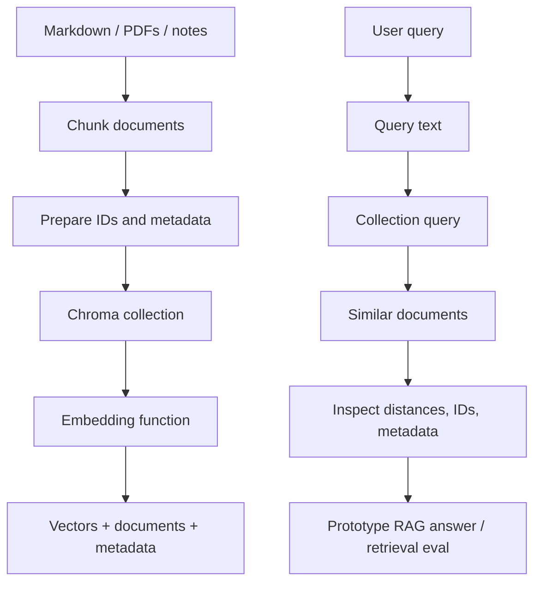

Client modes:

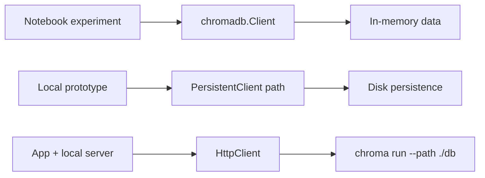

Read this as a maturity ladder:

```text
in-memory -> persistent local -> client-server -> managed/self-hosted production decision
```

---

### 3. Real-World Industry Scenarios [Intermediate]

#### Scenario 1: Notebook RAG Prototype

Goal:

```text
Test whether internal onboarding docs can answer employee questions.
```

Why Chroma fits:

- fast install
- minimal local setup
- collections are easy to create
- can use default embedding behavior or custom embedding function
- query output is easy to inspect

Prototype workflow:

```text
load docs -> chunk -> add to Chroma -> query -> inspect misses -> improve chunking/metadata
```

What not to assume:

- good notebook results prove production scale
- local persistence equals backup strategy
- default embedding choice is final
- one collection design handles all tenants/domains

#### Scenario 2: Backend RAG Spike

Goal:

```text
Build a small FastAPI endpoint that retrieves top-k chunks for product docs.
```

Why Chroma fits:

- `PersistentClient` can keep data across restarts
- `HttpClient` can connect to a local Chroma server
- metadata filters can model product/version/doc type
- easy enough for a one-week engineering spike

Prototype workflow:

```text
run chroma server -> ingest docs -> endpoint queries collection -> return chunks
```

What not to assume:

- local server mode has production-grade ops by default
- no auth/tenant/backup decisions are needed later
- latency on laptop predicts cloud performance

#### Scenario 3: Retrieval Evaluation Sandbox

Goal:

```text
Compare chunking strategies and embedding models on 200 test questions.
```

Why Chroma fits:

- create separate collections for each experiment
- store metadata such as chunker version and source ID
- query each collection with same questions
- compare hit rate, recall@k, and source coverage

Example collection names:

```text
support_docs_chunk_500
support_docs_chunk_1000
support_docs_openai_small
support_docs_local_embedder
```

What not to assume:

- scores are comparable across embedding models without care
- collection names are an experiment registry
- manual inspection is enough for final evaluation

---

### 4. System View: Think Like a Systems Engineer [Intermediate]

Chroma prototype architecture has a few moving parts.

#### Inputs

Data inputs:

- documents
- chunks
- IDs
- metadata
- optional embeddings
- embedding function

Query inputs:

- query text
- query embeddings, if embedding manually
- `n_results`
- metadata filter
- document filter

Operational inputs:

- client mode
- persistence path
- collection name
- embedding model choice
- dev/prototype dataset size
- reset/rebuild policy

#### Transformations

Chroma transforms:

```text
documents + IDs + metadata
-> collection records
-> embeddings
-> indexed vectors
-> similarity query results
```

At query time:

```text
query text
-> query embedding
-> similarity search
-> return IDs/documents/distances/metadatas
```

If you provide embeddings directly:

```text
your app owns embedding generation and consistency
```

If Chroma collection has an embedding function:

```text
Chroma embeds documents and query text for that collection
```

#### Outputs

Chroma query results commonly include:

- `ids`
- `documents`
- `distances`
- `metadatas`
- optionally embeddings depending on include/options

Prototype evaluation should store:

- query text
- expected source IDs
- returned IDs
- returned distances
- metadata filters
- collection/embedding/chunking version

#### Observability

Even in prototypes, track:

| Metric | Why it matters |
|---|---|
| ingestion count | Did all chunks load? |
| duplicate ID count | Are upserts safe? |
| query latency | Is prototype shape plausible? |
| top-k hit rate | Does retrieval find expected chunks? |
| zero-result rate | Filters or chunking may be wrong. |
| source coverage | Are all docs represented? |
| metadata coverage | Filters depend on metadata quality. |
| distance distribution | Helps spot weird embeddings/chunks. |

#### Failure Points

Chroma prototypes fail when:

- using in-memory client but expecting persistence
- using `add` repeatedly with duplicate IDs
- forgetting stable IDs
- mixing embeddings from different models in one collection
- changing chunking but not rebuilding the collection
- missing metadata needed for filters
- trusting default embeddings without evaluation
- treating local prototype performance as production proof
- deleting/resetting local DB accidentally
- storing secrets or sensitive docs without governance

Prototype does not mean careless.

---

### 5. System Design Flavor [Intermediate]

#### When Chroma Is a Strong Fit

Use Chroma when:

- you need a local vector DB quickly
- you are testing chunking/retrieval ideas
- dataset is small or moderate
- you want notebook-friendly ergonomics
- you want persistence without external infrastructure
- you want easy add/query/filter flow
- you are comparing embedding functions
- you are teaching vector search/RAG concepts

Interview sentence:

> "I would use Chroma early because it reduces setup friction and lets the team validate retrieval behavior before committing to production datastore architecture."

#### When Chroma Is Not Enough By Itself

Be careful when you need:

- strict production SLA
- multi-tenant isolation
- enterprise auth/RBAC
- backup/restore guarantees
- heavy concurrent writes
- billion-scale search
- multi-region replication
- mature operational dashboards
- formal disaster recovery
- team-managed migration path

This does not mean Chroma cannot be part of a production story. It means local Chroma prototype choices are not automatically the production architecture.

#### Client Choice

| Need | Client/mode |
|---|---|
| Disposable notebook experiment | `chromadb.Client()` |
| Local data survives restart | `chromadb.PersistentClient(path=...)` |
| App connects to separate process | `chromadb.HttpClient(host, port)` |
| Managed service | `chromadb.CloudClient(...)` |

#### Collection Design

A collection should usually represent a coherent retrieval space:

Good collections:

```text
product_docs_v1
security_policies_v1
support_kb_experiment_chunk_800
```

Bad collections:

```text
everything
random_test
docs_old_new_mixed
```

Collection design questions:

- same embedding model?
- same distance metric/config?
- same document domain?
- same filtering strategy?
- same lifecycle/rebuild cadence?

#### ID and Metadata Strategy

Stable IDs matter.

Example:

```text
source_id: docs/api_keys.md
chunk_id: docs/api_keys.md#chunk-003
version: 2026-06-25
```

Useful metadata:

- source path
- title
- product
- version
- tenant/customer
- doc type
- created/updated date
- chunk index
- experiment name

Metadata lets you filter and debug retrieval.

#### Add vs Upsert

Use `add` when:

```text
you know IDs are new
```

Use `upsert` when:

```text
you want idempotent ingestion during repeated prototype runs
```

In notebooks and scripts, `upsert` is often friendlier because rerunning cells should not break on existing IDs.

---

### 6. Common Mistakes + Debugging [Intermediate]

#### Mistake 1: Using in-memory Chroma and expecting data to persist

Bad:

```python
client = chromadb.Client()
```

then expecting data after process restart.

Better:

```python
client = chromadb.PersistentClient(path="./chroma_dev")
```

Use in-memory only when disposable data is intended.

#### Mistake 2: Duplicate IDs from repeated `add`

Bad notebook pattern:

```python
collection.add(ids=["doc1"], documents=["..."])
```

rerun repeatedly.

Better:

```python
collection.upsert(ids=["doc1"], documents=["..."])
```

or rebuild the collection intentionally.

#### Mistake 3: No metadata

Bad:

```python
collection.add(ids=ids, documents=chunks)
```

Better:

```python
collection.upsert(
    ids=ids,
    documents=chunks,
    metadatas=[
        {"source": "api_keys.md", "product": "platform", "version": "v2"}
    ],
)
```

Without metadata, debugging and filtering become painful.

#### Mistake 4: Mixing embedding models in one collection

If half the collection uses embedding model A and half uses model B, distances become unreliable.

Better:

- one embedding model per collection
- collection metadata records embedding model
- rebuild when embedding model changes

#### Mistake 5: Using Chroma results without inspection

Always inspect:

- returned documents
- distances
- metadata
- missing expected chunks
- weird near-neighbors

Prototype goal is learning, not just making a demo answer.

#### Mistake 6: Forgetting metadata filters

If product/version/tenant matters, test filters early.

Example:

```python
collection.query(
    query_texts=["rotate API keys"],
    n_results=5,
    where={"product": "platform"},
)
```

#### Mistake 7: Calling destructive reset casually

Chroma client `reset()` empties and completely resets the database.

Treat it as destructive.

Use explicit scripts and paths for rebuilds.

#### Debugging Checklist

When Chroma prototype retrieval looks wrong:

1. Did all documents ingest?
2. Are IDs unique and stable?
3. Is the collection using the intended embedding function?
4. Did you change chunking or embeddings without rebuilding?
5. Are metadata filters too strict?
6. Are documents too large or too small?
7. Are returned distances reasonable?
8. Are expected source IDs present at all?
9. Does query wording need sparse/hybrid retrieval instead?
10. Are you using in-memory when you expected persistence?

The fastest debugging question:

> Is the expected document actually in the collection with the expected metadata and embedding model?

---

### 7. Hands-On Lab: Build a Local Chroma Prototype [Pro]

Goal:

> Build a small local Chroma prototype that stores documents, persists them locally, queries by semantic similarity, filters by metadata, and demonstrates idempotent ingestion.

#### Build

Install:

```bash
pip install chromadb
```

Create a persistent local client:

```python
import chromadb


client = chromadb.PersistentClient(path="./chroma_module5_demo")
```

Create or get a collection:

```python
collection = client.get_or_create_collection(
    name="support_docs_demo",
    metadata={
        "description": "Module 5 local Chroma prototype",
        "embedding_policy": "default Chroma embedding function for prototype",
    },
)
```

Prepare chunks:

```python
records = [
    {
        "id": "api_keys.md#chunk-001",
        "document": "API keys can be rotated without downtime by creating a new key, deploying it, and then revoking the old key.",
        "metadata": {
            "source": "api_keys.md",
            "product": "platform",
            "doc_type": "guide",
            "version": "v2",
        },
    },
    {
        "id": "auth_errors.md#chunk-001",
        "document": "ERR_AUTH_429 means authentication requests are being rate limited. Retry with exponential backoff.",
        "metadata": {
            "source": "auth_errors.md",
            "product": "platform",
            "doc_type": "reference",
            "version": "v2",
        },
    },
    {
        "id": "billing.md#chunk-001",
        "document": "Invoices are generated monthly and include usage-based charges for the billing period.",
        "metadata": {
            "source": "billing.md",
            "product": "billing",
            "doc_type": "guide",
            "version": "v1",
        },
    },
]
```

Use `upsert` so rerunning the script is safe:

```python
collection.upsert(
    ids=[record["id"] for record in records],
    documents=[record["document"] for record in records],
    metadatas=[record["metadata"] for record in records],
)
```

Query semantically:

```python
results = collection.query(
    query_texts=["How do I change API credentials without outage?"],
    n_results=2,
)

print(results["ids"])
print(results["documents"])
print(results["distances"])
print(results["metadatas"])
```

Query with metadata filter:

```python
filtered = collection.query(
    query_texts=["authentication rate limit error"],
    n_results=2,
    where={"doc_type": "reference"},
)

print(filtered["ids"])
print(filtered["documents"])
```

Get records directly:

```python
stored = collection.get(
    ids=["api_keys.md#chunk-001"],
)

print(stored)
```

#### Compare In-Memory vs Persistent

In-memory:

```python
memory_client = chromadb.Client()
```

Persistent:

```python
persistent_client = chromadb.PersistentClient(path="./chroma_module5_demo")
```

Run the same script twice.

Expected:

- in-memory data disappears after process ends
- persistent data loads from disk on next run

#### Optional Client-Server Mode

Start server:

```bash
chroma run --path ./chroma_server_demo
```

Connect:

```python
import chromadb

client = chromadb.HttpClient(host="localhost", port=8000)
```

Use the same collection/add/query flow.

#### Break

Break the prototype intentionally:

1. Use `chromadb.Client()` and expect persistence.
2. Use `add` and rerun the script with same IDs.
3. Remove metadata and try to filter by product.
4. Change chunking but reuse old collection.
5. Change embedding function but reuse collection.
6. Set `n_results=1` and miss a relevant second chunk.
7. Query with overly strict filter.
8. Call `reset()` accidentally.

For each break, explain:

- what fails
- what the user sees
- how to detect it
- how to fix the prototype

#### Measure

Add simple measurements:

```python
import time


start = time.perf_counter()
results = collection.query(
    query_texts=["How do I rotate keys without downtime?"],
    n_results=3,
)
latency_ms = (time.perf_counter() - start) * 1000

print("latency_ms", latency_ms)
print("ids", results["ids"])
print("distances", results["distances"])
```

Track:

```text
ingested_count
query_latency_ms
expected_source_hit_rate
zero_result_rate
metadata_filter_success
distance_distribution
```

#### Capstone Prompt

> You are asked to prototype a RAG assistant over 50 internal markdown files in one day. Would you use Chroma, and how would you structure the prototype?

Strong answer structure:

1. **Use Chroma locally.**
   - start with `PersistentClient` so data survives restarts
   - use `get_or_create_collection`
   - use `upsert` for idempotent ingestion

2. **Design stable records.**
   - IDs from source path and chunk index
   - documents as chunks
   - metadata for source, product, version, doc type

3. **Test retrieval before generation.**
   - inspect top-k documents, distances, metadata
   - create a small query set with expected source IDs
   - tune chunking and metadata filters

4. **Use client-server if app separation matters.**
   - run `chroma run --path ...`
   - connect with `HttpClient`

5. **Avoid overclaiming production readiness.**
   - local prototype proves retrieval concept
   - production still needs auth, persistence policy, backups, scaling, monitoring, and migration strategy

Interview-ready summary:

> "I would use Chroma for the prototype because it minimizes setup and gives me collections, embeddings, documents, metadata, and similarity queries locally. I would use persistent storage, stable IDs, metadata filters, and a small retrieval eval set so the prototype teaches us whether the RAG design works before we choose production infrastructure."

---

### 8. Active Recall

Answer without looking:

1. What is Chroma best used for in this subtopic?
2. What is the difference between `chromadb.Client()` and `PersistentClient`?
3. What is a Chroma collection?
4. Why are stable IDs important?
5. When should you use `upsert` instead of `add`?
6. What metadata should a RAG prototype store?
7. Why should you inspect distances and metadata?
8. When would you use `HttpClient`?
9. What is the fastest way to debug a missing result?
10. Why should local Chroma prototype success not be treated as full production proof?

Answers:

1. Local experimentation, prototypes, notebooks, small RAG demos, and retrieval evaluation.
2. `Client()` is in-memory/ephemeral; `PersistentClient` stores data on disk and reloads it.
3. The storage/query unit for embeddings, documents, IDs, and metadata.
4. They make ingestion idempotent, debugging easier, and updates/rebuilds traceable.
5. When rerunning ingestion scripts or updating records with the same IDs.
6. Source path, chunk index, title, product, version, doc type, tenant/customer if relevant, and experiment/chunking info.
7. To see whether retrieval is semantically plausible and filters/source coverage are correct.
8. When connecting to a separate Chroma server process.
9. Check whether the expected document exists in the collection with correct metadata and embedding setup.
10. Production also needs auth, backup, monitoring, scaling, concurrency, SLAs, and operational governance.

---

### 9. Practice

#### Practice 1: Choose the Client

| Scenario | Client/mode |
|---|---|
| Disposable notebook test | `chromadb.Client()` |
| Local RAG prototype across restarts | `chromadb.PersistentClient(path=...)` |
| FastAPI app connects to local DB process | `chromadb.HttpClient(host, port)` |
| Managed hosted Chroma database | `chromadb.CloudClient(...)` |

#### Practice 2: Design IDs

Prompt:

> You chunk `docs/security/api_keys.md` into 4 chunks. Design IDs.

Good IDs:

```text
docs/security/api_keys.md#chunk-000
docs/security/api_keys.md#chunk-001
docs/security/api_keys.md#chunk-002
docs/security/api_keys.md#chunk-003
```

Bad IDs:

```text
1
2
3
4
```

Reason:

Stable source-based IDs make debugging and reingestion clearer.

#### Practice 3: Metadata Filter

Prompt:

> Query only platform product docs, version v2.

Example:

```python
collection.query(
    query_texts=["rotate API keys"],
    n_results=5,
    where={
        "$and": [
            {"product": "platform"},
            {"version": "v2"},
        ]
    },
)
```

#### Practice 4: Prototype Review

Question:

> A Chroma prototype returns the right answer for 5 manual queries. Is it ready for production?

Strong answer:

> "No. It proves the idea may work. Before production, I need representative retrieval evals, stable ingestion, metadata/filter tests, persistence and backup plan, auth/tenant model, monitoring, scaling plan, and a decision about whether local Chroma, Chroma server, Chroma Cloud, or another vector DB fits the workload."

---

### 10. Production Reality Check

**If this fails in prod, what is the first thing we inspect?**

For a Chroma prototype, inspect:

1. Client mode
2. Persistence path
3. Collection name
4. Ingested count
5. Stable IDs
6. Embedding function/model
7. Metadata fields
8. Query filter
9. Returned distances
10. Expected source presence

The production debugging question:

> Is this a prototype ingestion problem, retrieval-quality problem, metadata/filter problem, or deployment-mode problem?

#### Chroma Prototype Runbook

1. Verify collection exists.
2. Count records.
3. `get` expected document by ID.
4. Inspect metadata.
5. Run query without filter.
6. Run query with filter.
7. Compare returned IDs and distances.
8. Check embedding/chunking version.
9. Rebuild collection if chunking/embedding changed.
10. Add failed query to retrieval eval set.

#### What Good Looks Like

A mature Chroma prototype can answer:

- What collection contains this data?
- What embedding function/model was used?
- What IDs and metadata were stored?
- What queries are in the eval set?
- Which expected source IDs are hit?
- Which filters are tested?
- Does the data persist after restart?
- What would need to change for production?

That is a prototype worth trusting.

---

### 11. Curiosity Bridge

Chroma gives us the local-first end of the vector database ecosystem: fast setup, easy collections, document storage, embeddings, metadata filtering, and quick iteration.

But many real products already have a relational source of truth. They store users, documents, tickets, products, permissions, tenants, versions, audit fields, and business metadata in Postgres.

That leads directly to **pgvector for Postgres-native vector search**: when vectors should live beside relational data, when SQL filtering and joins matter more than a separate retrieval service, and where the Postgres-native approach starts to strain.

---

### 12. Exit Check + Carry-Forward Review

**Exit check - you are done when you can:**
Use Chroma for a local RAG/vector-search prototype; choose in-memory vs persistent vs client-server mode; design collections, IDs, metadata, and filters; use add/upsert/query/get correctly; debug missing results; and explain where the local prototype ends and production datastore architecture begins.

**Carry-Forward Review:**

Question: How does Chroma connect to Topic 5.1 similarity-search fundamentals?

Answer: Topic 5.1 explains what retrieval is doing conceptually: exact/ANN search, recall/latency/memory trade-offs, and dense/sparse/late-interaction retrieval. Chroma gives you a concrete local system where you can create collections, store embeddings/documents/metadata, query for nearest neighbors, and observe those fundamentals in a real prototype.

---

## Subtopic 5.2.b: pgvector for Postgres-Native Vector Search

### Add to Knowledge Base

**pgvector** is a Postgres extension that adds vector similarity search to PostgreSQL.

The core idea:

> pgvector lets you store embeddings in normal Postgres tables, query them with SQL, combine vector similarity with relational filters and joins, and add approximate nearest neighbor indexes when exact search becomes too slow.

This matters because many applications already trust Postgres for:

- source-of-truth records
- permissions
- tenants
- metadata
- transactions
- backups
- migrations
- auditability
- reporting
- operational tooling

With pgvector, vector search becomes part of that database story instead of a totally separate service.

Reference anchor:
- pgvector official repository and README: `https://github.com/pgvector/pgvector`
- PostgreSQL extensions documentation: `https://www.postgresql.org/docs/current/sql-createextension.html`
- PostgreSQL full text search documentation: `https://www.postgresql.org/docs/current/textsearch.html`

The simplest example:

```sql
CREATE EXTENSION IF NOT EXISTS vector;

CREATE TABLE documents (
    id bigserial PRIMARY KEY,
    tenant_id text NOT NULL,
    title text NOT NULL,
    body text NOT NULL,
    embedding vector(1536),
    created_at timestamptz DEFAULT now()
);

SELECT id, title
FROM documents
ORDER BY embedding <=> $1
LIMIT 5;
```

Key distance operators:

| Operator | Meaning | Common use |
|---|---|---|
| `<->` | L2 distance | Euclidean distance search |
| `<#>` | Negative inner product | Inner product similarity, returned as a distance-like value |
| `<=>` | Cosine distance | Most common for normalized text embeddings |
| `<+>` | L1 distance | Manhattan distance |
| `<~>` | Hamming distance | Binary vector use cases |
| `<%>` | Jaccard distance | Binary set-like similarity |

Key index families:

| Index | Mental model | Best fit |
|---|---|---|
| Exact scan | Compare rows directly | Small tables, correctness baseline, debugging recall |
| HNSW | Navigable proximity graph | Strong general-purpose ANN performance |
| IVFFlat | Cluster into lists, probe some lists | Large static-ish collections, lower memory than HNSW in some cases |

Core distinction:

```text
Dedicated vector DB:
    vectors are the main product

pgvector:
    vectors are one column inside the relational product database
```

The beginner mistake:

```text
Postgres has pgvector, therefore it is automatically the best vector database for every workload.
```

Better:

```text
pgvector is excellent when relational data, SQL filters, transactions, and operational simplicity matter. It is not automatically the best choice for every high-scale, high-QPS, multi-tenant retrieval workload.
```

---

### Reading Path + Level Tags

- **Beginner:** Read sections 0-2, the basic SQL examples, and Active Recall.
- **Intermediate:** Add sections 3-7 and complete the Build part of the Hands-On Lab.
- **Pro:** Complete the full lab, use `EXPLAIN`, compare exact vs indexed recall, and answer the production design question.

---

### 0. Pre-Question Hook [Beginner]

**Pause:** You are building semantic search for internal support tickets.

Each ticket already lives in Postgres:

- `ticket_id`
- `tenant_id`
- `customer_id`
- `status`
- `priority`
- `created_at`
- `assigned_team`
- `body`
- `resolution_notes`
- row-level permissions

You want semantic search like:

> "Find tickets similar to this outage report, but only for tenant A, only closed tickets, only from the last 90 days, and join the result with customer tier."

What should your vector database be?

Bad answer:

> "Always move all embeddings to a separate vector database."

Better answer:

> "First consider pgvector. The vector query needs relational filters, joins, permissions, and source-of-truth metadata. Keeping vectors in Postgres may be simpler and safer, at least until scale or latency demands a separate retrieval system."

Before reading on, answer:

- Is the source of truth already in Postgres?
- Do vector queries require SQL filters?
- Do results need joins with relational tables?
- Is transactional consistency important?
- Is the retrieval workload moderate enough for Postgres?
- Can we isolate retrieval load from OLTP load if it grows?

These are the real pgvector design questions.

---

### 1. The Intuition (Plain English) [Beginner]

pgvector turns Postgres into a semantic search engine by adding one new kind of column:

```text
embedding vector(1536)
```

That column stores the numeric representation of a document, product, ticket, user profile, image, or chunk.

Once the vector is in the row, SQL can ask:

```text
Which rows have embeddings closest to this query embedding?
```

The powerful part is not just vector search.

The powerful part is vector search plus SQL:

```sql
SELECT id, title
FROM documents
WHERE tenant_id = 'acme'
  AND doc_type = 'policy'
  AND published = true
ORDER BY embedding <=> $1
LIMIT 10;
```

That one query combines:

- tenant filtering
- business metadata
- document state
- semantic similarity
- ranking
- limiting

**The simplest explanation:**

> pgvector is the choice when your vectors belong next to relational records and you want semantic search to behave like a normal SQL query.

**Mental model:**

```text
Postgres row:
    relational facts + text + metadata + embedding

pgvector query:
    SQL filters first in your design thinking
    vector distance for semantic ranking
    joins when the business object lives elsewhere
```

**Where the analogy breaks down:** Postgres is not magically free compute. Vector indexes consume memory, index builds take time, queries can compete with OLTP traffic, and approximate indexes need tuning.

---

### 2. Visual Diagram (Mermaid) [Beginner]

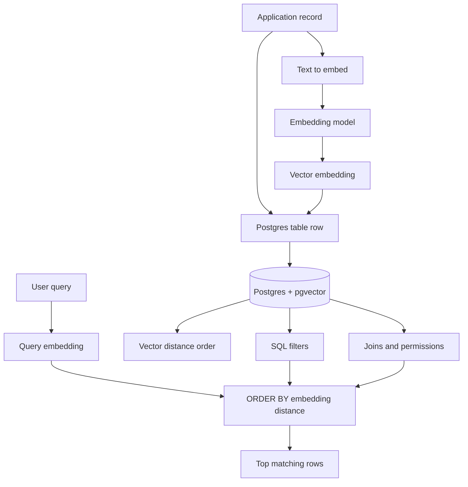

Exact vs indexed search:

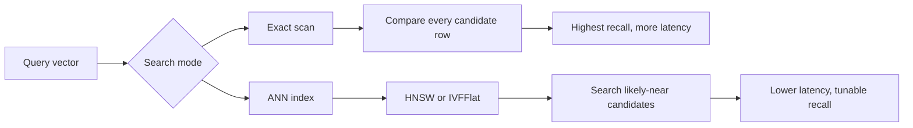

Postgres-native architecture:

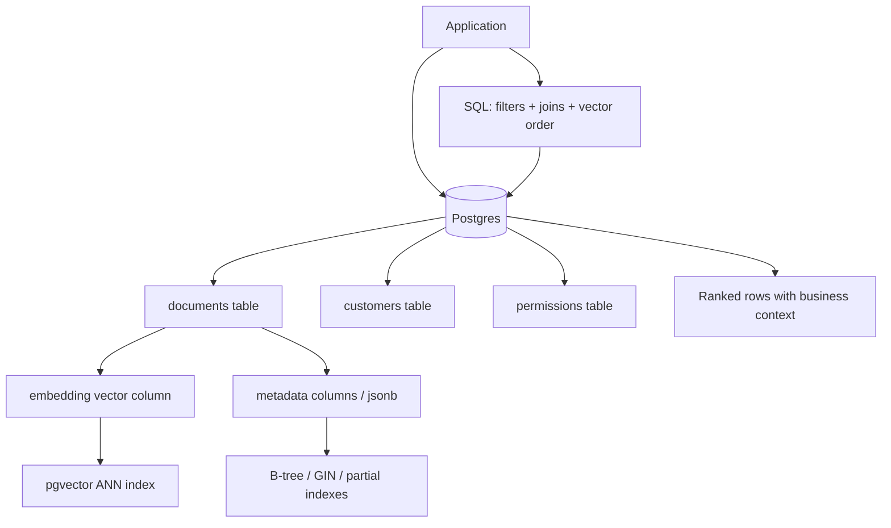

Notice the difference from Chroma:

| Chroma | pgvector |
|---|---|
| Collection-first | Table-first |
| Great local prototype ergonomics | Great relational integration |
| Vector DB owns documents/metadata in collections | Postgres owns rows, columns, indexes, joins, transactions |
| Good for fast experiments | Good when app data already lives in Postgres |

---

### 3. Real-World Scenarios [Intermediate]

#### Scenario A: Internal Knowledge Base Search

You store company docs in Postgres:

- document table
- chunk table
- author table
- access-control table
- version table

pgvector fits because:

- each chunk can have an embedding
- access control can be joined in SQL
- versions and publication status are relational facts
- search can filter by workspace, department, document type, and language

Example query shape:

```sql
SELECT c.id, c.document_id, c.body, d.title
FROM document_chunks c
JOIN documents d ON d.id = c.document_id
JOIN document_acl acl ON acl.document_id = d.id
WHERE acl.user_id = $1
  AND d.status = 'published'
ORDER BY c.embedding <=> $2
LIMIT 10;
```

What would be harder in a separate vector DB:

- keeping ACLs synchronized
- debugging mismatched metadata
- ensuring deleted documents disappear from search
- joining search hits back to relational context

#### Scenario B: E-commerce Semantic Product Search

Products already live in Postgres:

- product ID
- category
- price
- inventory
- merchant
- region
- compliance flags

pgvector can answer:

> "Find visually/syntactically similar products, but only in stock, in this region, under this price, and from allowed merchants."

Example:

```sql
SELECT product_id, name, price
FROM products
WHERE region = 'us'
  AND in_stock = true
  AND price BETWEEN 20 AND 100
ORDER BY description_embedding <=> $1
LIMIT 20;
```

The vector is not replacing SQL.

The vector is adding semantic ranking to SQL.

#### Scenario C: Support Ticket Deduplication

When a new ticket arrives:

1. Insert the ticket.
2. Generate an embedding from the ticket text.
3. Store it in the ticket row.
4. Search similar recent tickets.
5. Show likely duplicates or related incidents.

pgvector fits because:

- ticket lifecycle is transactional
- similarity search needs status/time/team filters
- support tools already use Postgres
- duplicate detection can run near the source of truth

---

### 4. System View [Intermediate]

#### Data Flow

```text
source text
  -> chunk / normalize
  -> embedding model
  -> Postgres row with vector column
  -> optional ANN index
  -> query embedding
  -> SQL filters + vector distance
  -> ranked rows
  -> optional reranker / LLM answer
```

#### Control Flow

1. Application receives a document, ticket, product, or chunk.
2. Application generates an embedding.
3. Application writes row and vector to Postgres.
4. Background jobs may backfill missing embeddings.
5. Query path embeds the user query.
6. SQL query applies filters and orders by vector distance.
7. Postgres may use exact scan or ANN index.
8. Application receives ranked rows.
9. Optional reranker or LLM consumes retrieved context.

#### Important States

| State | Meaning |
|---|---|
| `embedding is null` | Row exists but has not been embedded yet. |
| `embedding_model_version` | Which model produced the vector. |
| `chunk_version` | Which chunking strategy produced the row. |
| `index exists` | ANN query can use pgvector index when query shape matches. |
| `stale embedding` | Source text changed but vector was not regenerated. |
| `deleted source` | Row or chunk must disappear from retrieval. |
| `tenant filter applied` | Search is scoped safely. |

#### Recommended Table Shape

```sql
CREATE TABLE document_chunks (
    id bigserial PRIMARY KEY,
    tenant_id text NOT NULL,
    document_id bigint NOT NULL,
    chunk_index integer NOT NULL,
    body text NOT NULL,
    embedding vector(1536),
    embedding_model text NOT NULL DEFAULT 'text-embedding-model-name',
    chunk_version integer NOT NULL DEFAULT 1,
    metadata jsonb NOT NULL DEFAULT '{}'::jsonb,
    created_at timestamptz NOT NULL DEFAULT now(),
    updated_at timestamptz NOT NULL DEFAULT now(),
    UNIQUE (document_id, chunk_index, chunk_version)
);
```

Practical indexes:

```sql
CREATE INDEX document_chunks_tenant_idx
ON document_chunks (tenant_id);

CREATE INDEX document_chunks_doc_idx
ON document_chunks (document_id);

CREATE INDEX document_chunks_metadata_gin_idx
ON document_chunks
USING gin (metadata);
```

Vector index for cosine distance:

```sql
CREATE INDEX document_chunks_embedding_hnsw_idx
ON document_chunks
USING hnsw (embedding vector_cosine_ops);
```

The business lesson:

> In pgvector, relational indexes and vector indexes work together. The vector index does not remove the need for careful SQL schema design.

---

### 5. How It Works [Intermediate]

#### Step 1: Enable Extension

```sql
CREATE EXTENSION IF NOT EXISTS vector;
```

This makes vector types, operators, and index methods available in the database.

#### Step 2: Add a Vector Column

```sql
CREATE TABLE items (
    id bigserial PRIMARY KEY,
    content text NOT NULL,
    embedding vector(3)
);
```

For real embedding models, dimensions are much larger:

```sql
embedding vector(1536)
```

The dimension must match the embedding model output.

#### Step 3: Insert Embeddings

```sql
INSERT INTO items (content, embedding)
VALUES
    ('reset password instructions', '[0.10, 0.20, 0.30]'),
    ('billing invoice question', '[0.90, 0.10, 0.05]'),
    ('login error troubleshooting', '[0.12, 0.18, 0.33]');
```

In production, the application usually generates embeddings and sends them to Postgres.

#### Step 4: Query by Distance

```sql
SELECT id, content, embedding <=> '[0.11, 0.19, 0.31]' AS distance
FROM items
ORDER BY embedding <=> '[0.11, 0.19, 0.31]'
LIMIT 2;
```

Important:

```text
ORDER BY distance operator + LIMIT
```

This shape is what lets pgvector indexes help nearest-neighbor queries.

#### Step 5: Add Filters

```sql
SELECT id, content
FROM document_chunks
WHERE tenant_id = 'acme'
  AND metadata->>'language' = 'en'
ORDER BY embedding <=> $1
LIMIT 10;
```

SQL filters restrict the search space.

Vector distance ranks what remains.

#### Step 6: Add ANN Index When Needed

Exact search is often enough for small datasets.

When the table grows, add HNSW or IVFFlat.

HNSW:

```sql
CREATE INDEX CONCURRENTLY document_chunks_embedding_hnsw_idx
ON document_chunks
USING hnsw (embedding vector_cosine_ops)
WITH (m = 16, ef_construction = 64);
```

At query time:

```sql
SET LOCAL hnsw.ef_search = 100;

SELECT id, body
FROM document_chunks
WHERE tenant_id = 'acme'
ORDER BY embedding <=> $1
LIMIT 10;
```

IVFFlat:

```sql
CREATE INDEX CONCURRENTLY document_chunks_embedding_ivfflat_idx
ON document_chunks
USING ivfflat (embedding vector_cosine_ops)
WITH (lists = 100);
```

At query time:

```sql
SET LOCAL ivfflat.probes = 10;
```

#### Step 7: Measure

Use:

```sql
EXPLAIN (ANALYZE, BUFFERS)
SELECT id, body
FROM document_chunks
WHERE tenant_id = 'acme'
ORDER BY embedding <=> $1
LIMIT 10;
```

You want to understand:

- was the vector index used?
- were filters selective?
- how many rows were scanned?
- how much memory was used?
- how long did planning take?
- how long did execution take?
- are returned results good enough?

---

### 6. System Design Flavor [Intermediate]

#### Design Question

> Should vector search live in Postgres or in a separate vector database?

Do not answer with tool loyalty.

Answer with workload shape.

#### Use pgvector When

Use pgvector when:

- your source of truth is already Postgres
- vectors belong to relational entities
- SQL filters are central to correctness
- joins are needed at query time
- access control is relational
- transactional consistency matters
- retrieval scale is moderate
- the team wants fewer moving parts
- existing Postgres backups and operations are valuable

Interview signal:

> "Because the query needs tenant filters, permissions, and joins, I would strongly consider pgvector before introducing a separate vector store."

#### Be Careful When

Be careful when:

- vector QPS is high
- vector table is extremely large
- queries require very low p99 latency
- OLTP traffic and retrieval traffic compete
- many tenants need noisy-neighbor isolation
- index rebuilds are frequent
- embeddings are updated constantly
- retrieval must scale independently from relational writes

Interview signal:

> "pgvector reduces architectural complexity, but it couples retrieval load to Postgres. I would monitor CPU, memory, IO, p95/p99 latency, index size, and query plans before committing at high scale."

#### Common Architecture Pattern

```text
Phase 1: Postgres + pgvector
    simplest working architecture
    relational filters are easy
    source-of-truth consistency is strong

Phase 2: Postgres primary + async vector index
    Postgres remains source of truth
    vector DB/search system becomes read-optimized projection
    CDC/backfill keeps systems synchronized

Phase 3: Dedicated retrieval platform
    separate scaling, caching, reranking, evals, monitoring
```

This is a mature migration path.

Do not start at phase 3 unless the workload justifies it.

---

### 7. What Problem It Solves [Intermediate]

Primary problem solved:

> Add semantic search to Postgres-resident application data without creating a separate retrieval datastore.

Secondary benefits:

- simple deployment for Postgres-first teams
- transactional writes for data and embeddings
- SQL filtering and joins
- familiar migrations and backups
- easy exact-search baseline
- fewer synchronization bugs
- easier local development if Postgres is already used

Systems impact:

| Dimension | Impact |
|---|---|
| Simplicity | Fewer services to operate. |
| Consistency | Embeddings can live with source rows. |
| Query expressiveness | SQL filters, joins, and ranking combine naturally. |
| Latency | Good for many workloads, but must be measured. |
| Scale | Strong enough for many applications; not infinite. |
| Operations | Uses Postgres tooling, but vector indexes add new tuning work. |

The key architectural point:

> pgvector is not just a vector index. It is semantic retrieval embedded into the relational database boundary.

---

### 8. When to Rely on It [Intermediate]

Rely on pgvector when the interview or system says:

- "Data is already in Postgres"
- "Need semantic search with filters"
- "Need tenant isolation"
- "Need permission-aware retrieval"
- "Need joins with existing tables"
- "Prototype should become production without adding a new service"
- "Moderate corpus size"
- "Internal tool"
- "RAG over business records"
- "Search support tickets/products/docs/customers"

Strong fit examples:

| Use case | Why pgvector fits |
|---|---|
| Support ticket similarity | Ticket metadata and lifecycle already in Postgres. |
| Internal docs RAG | ACLs, versions, and workspace filters are relational. |
| Product semantic search | Price, stock, region, and merchant filters are SQL-native. |
| CRM note search | Customer/account joins matter. |
| Deduplication | Similarity is attached to existing transactional records. |

Architecture phrase to remember:

> Use pgvector when semantic similarity is a ranking feature inside a relational application.

---

### 9. When Not to Use It [Pro]

Avoid or outgrow pgvector when:

- vector search must scale independently from Postgres
- retrieval QPS is much larger than OLTP QPS
- p99 latency targets are very strict
- corpus size is huge and dedicated ANN infrastructure is needed
- index memory pressure hurts the main database
- multiple embedding modalities require specialized serving
- teams need managed vector-specific operations
- application already uses a dedicated search/retrieval platform
- cross-region vector serving is a core requirement

What to use instead:

| Condition | Alternative |
|---|---|
| Need managed vector scale | Managed vector DB or managed search service |
| Need hybrid lexical/vector search at scale | Search engine with vector support or hybrid retrieval platform |
| Need full operational isolation | Separate vector datastore fed from Postgres CDC |
| Need local prototype only | Chroma |
| Need custom ANN research/control | Faiss or specialized ANN library behind a service |

The maturity point:

> pgvector is often the best first production move, not always the final search architecture.

---

### 10. Pros and Cons [Intermediate]

| Pros | Cons |
|---|---|
| Keeps vectors beside relational data | Couples retrieval load to Postgres |
| SQL filters and joins are natural | Requires query plan and index tuning |
| Uses existing Postgres backups and migrations | ANN index memory can be significant |
| Reduces service count | Dedicated vector DBs may scale retrieval independently |
| Easy exact baseline for recall checks | Approximate search can miss relevant rows |
| Good for permission-aware retrieval | Filtering plus ANN can be subtle |
| Works with existing app transactions | Embedding backfills and reindexing need planning |

Simple summary:

```text
pgvector trades specialized vector-system separation for Postgres-native simplicity and relational correctness.
```

---

### 11. Trade-offs and Common Mistakes [Pro]

#### Trade-offs

##### Simplicity vs Independent Scaling

pgvector reduces infrastructure:

```text
app -> Postgres
```

instead of:

```text
app -> Postgres
app -> vector DB
sync job between them
```

But the cost is coupling:

```text
bad vector queries can affect the same database serving core app traffic
```

Mitigation:

- read replicas
- workload isolation
- connection pool limits
- query timeouts
- partial indexes
- partitioning
- separate Postgres instance for retrieval projection

##### SQL Power vs Query Planner Complexity

SQL gives you filters and joins.

But the planner must choose an efficient plan.

You need to inspect:

```sql
EXPLAIN (ANALYZE, BUFFERS)
```

Do not assume the index is used.

##### Exactness vs Speed

Exact query:

```sql
SELECT id
FROM document_chunks
ORDER BY embedding <=> $1
LIMIT 10;
```

Without ANN index use, this compares many rows.

ANN query:

```sql
CREATE INDEX ... USING hnsw ...
```

Faster, but recall depends on tuning.

##### Filtering vs Recall

Filters are essential:

```sql
WHERE tenant_id = 'acme'
```

But approximate indexes can retrieve candidates first and then filters may remove many of them.

If the filter is very selective, you may need:

- higher `hnsw.ef_search`
- iterative scan settings where appropriate
- partial indexes
- partitioning by tenant/category/time
- exact scan for small filtered subsets

##### One Database vs Projection Architecture

Early architecture:

```text
Postgres table has everything
```

Later architecture:

```text
Postgres remains source of truth
retrieval projection is optimized separately
```

This migration path is healthy.

#### Common Mistakes

##### Mistake 1: Forgetting the Vector Dimension

Bad:

```sql
embedding vector(1536)
```

but application sends 3072-dimensional embeddings.

Why it is wrong:

The vector column dimension must match stored vectors.

Better:

- lock the embedding model version
- store `embedding_model`
- test insertion during migration
- plan re-embedding when changing models

##### Mistake 2: Missing `ORDER BY ... LIMIT`

Bad:

```sql
SELECT id
FROM documents
WHERE embedding <=> $1 < 0.2;
```

Why it is wrong:

Nearest-neighbor indexes are designed around ordering by distance and limiting results.

Better:

```sql
SELECT id
FROM documents
ORDER BY embedding <=> $1
LIMIT 10;
```

If you need a threshold, combine it carefully:

```sql
SELECT *
FROM (
    SELECT id, body, embedding <=> $1 AS distance
    FROM documents
    ORDER BY embedding <=> $1
    LIMIT 100
) candidates
WHERE distance < 0.25;
```

##### Mistake 3: Treating `metadata jsonb` as a Magic Filter Layer

Bad:

```sql
metadata->>'tenant_id'
```

for every hot query.

Why it is wrong:

Frequently filtered fields deserve typed columns and normal indexes.

Better:

```sql
tenant_id text NOT NULL,
doc_type text NOT NULL,
language text NOT NULL,
metadata jsonb NOT NULL
```

Use `jsonb` for flexible, less-critical fields.

##### Mistake 4: No Exact Baseline

Bad:

> "The indexed query is fast, so it must be good."

Why it is wrong:

ANN can miss true nearest neighbors.

Better:

- sample queries
- compare ANN results to exact results
- compute recall@k
- tune `hnsw.ef_search` or `ivfflat.probes`

##### Mistake 5: Putting Retrieval Load on Primary OLTP Without Limits

Bad:

```text
all app writes + all vector queries hit primary Postgres
```

Why it is wrong:

Vector search can consume CPU, memory, and IO.

Better:

- start with limits and observability
- use read replicas for retrieval if appropriate
- isolate heavy backfills
- batch embedding writes
- monitor p95/p99 query latency

##### Mistake 6: Forgetting Re-embedding Is a Data Migration

Changing the embedding model is not a one-line code change.

It means:

- new vector dimension may differ
- old and new vectors are not comparable
- index may need rebuild
- evaluation must be rerun
- application must know which vector column/version to query

Better:

```sql
embedding_v1 vector(1536),
embedding_v2 vector(3072),
embedding_model_version text
```

or a separate embedding table:

```sql
CREATE TABLE chunk_embeddings (
    chunk_id bigint NOT NULL,
    model_version text NOT NULL,
    embedding vector(1536) NOT NULL,
    PRIMARY KEY (chunk_id, model_version)
);
```

##### Mistake 7: Indexing Before Data Exists for IVFFlat

IVFFlat needs data distribution to create meaningful lists.

Better:

- load representative data first
- create IVFFlat index after loading
- choose lists/probes based on table size and recall tests

HNSW can be created with less dependence on preloaded data, but still needs measurement.

---

### 12. Key Numbers [Pro]

These numbers vary by workload, hardware, Postgres configuration, and pgvector version, but they are useful interview anchors.

| Concept | Practical anchor |
|---|---|
| Common text embedding dimensions | Hundreds to a few thousand dimensions |
| pgvector `vector` indexed dimensions | Up to 2,000 dimensions for HNSW/IVFFlat vector indexes |
| `halfvec` indexed dimensions | Up to 4,000 dimensions |
| `bit` indexed dimensions | Up to 64,000 dimensions |
| `sparsevec` non-zero elements | Up to 1,000 non-zero elements |
| HNSW default `m` | 16 |
| HNSW default `ef_construction` | 64 |
| HNSW default `ef_search` | 40 |
| IVFFlat default `probes` | 1 |
| IVFFlat lists heuristic | around `rows / 1000` up to 1M rows, `sqrt(rows)` over 1M rows |
| IVFFlat probes heuristic | around `sqrt(lists)` as a starting point |

Memory intuition:

```text
raw vector bytes ~= row_count * dimensions * 4 bytes
```

Example:

```text
1,000,000 rows * 1,536 dimensions * 4 bytes
~= 6.1 GB raw vector values
```

That excludes:

- table overhead
- indexes
- HNSW graph edges
- metadata
- WAL
- bloat
- cache behavior
- replication storage

Index tuning intuition:

| Knob | Increasing it usually does |
|---|---|
| `hnsw.ef_search` | Higher recall, higher latency |
| HNSW `m` | More graph edges, better recall, more memory |
| HNSW `ef_construction` | Better index quality, slower build |
| `ivfflat.probes` | Higher recall, higher latency |
| `ivfflat.lists` | More partitions, can improve search if tuned, affects build/query behavior |

Interview phrasing:

> "I would size raw vector memory first, then measure exact baseline, then tune ANN recall and latency with realistic filters."

---

### 13. Failure Modes [Pro]

#### Failure Mode 1: Query Is Slow

Symptoms:

- high p95/p99 latency
- sequential scans
- CPU spikes
- buffer reads high
- OLTP traffic slows down

First checks:

```sql
EXPLAIN (ANALYZE, BUFFERS)
```

Check:

- is the vector index used?
- does the query shape use `ORDER BY embedding <=> query LIMIT k`?
- are filters selective?
- are needed B-tree/GIN indexes present?
- is the filtered subset small enough for exact search?
- is `ef_search` or `probes` too high?

Mitigations:

- add relational indexes
- add partial vector indexes
- partition by tenant/category/time
- use read replicas
- tune ANN parameters
- cap result windows
- add query timeouts

#### Failure Mode 2: Results Are Fast But Bad

Symptoms:

- latency looks good
- expected documents missing
- answer quality is poor
- ANN result set changes after tuning

Checks:

- compare to exact baseline
- compute recall@k
- inspect distances
- verify embedding model version
- verify chunking version
- verify filter correctness
- increase `hnsw.ef_search` or `ivfflat.probes`

Mitigations:

- tune ANN
- retrieve more candidates
- add reranking
- improve chunking
- improve metadata filters
- use hybrid lexical + vector search

#### Failure Mode 3: Tenant Leakage Risk

Symptoms:

- query returns rows from wrong tenant
- app filters after retrieval instead of inside SQL
- permission filtering is inconsistent

Bad:

```text
retrieve top 100 globally
then filter tenant in application
```

Why bad:

It can leak metadata or produce poor recall for the correct tenant.

Better:

```sql
SELECT id, body
FROM document_chunks
WHERE tenant_id = $1
ORDER BY embedding <=> $2
LIMIT 10;
```

Mitigations:

- enforce tenant filters in SQL
- use row-level security where appropriate
- test cross-tenant queries
- consider partitioning by tenant for large tenants

#### Failure Mode 4: Stale Embeddings

Symptoms:

- text changed but search still finds old meaning
- deleted content appears in results
- re-embedded rows mix incompatible model versions

Mitigations:

- store embedding version
- maintain `updated_at`
- enqueue re-embedding on source changes
- use constraints or jobs to detect null/stale embeddings
- rebuild indexes after major embedding migration

#### Failure Mode 5: Index Build Hurts Production

Symptoms:

- index build consumes CPU/memory
- writes slow down
- lock surprises
- build takes longer than expected

Mitigations:

- use `CREATE INDEX CONCURRENTLY` where appropriate
- build during low-traffic windows
- adjust maintenance memory carefully
- test build time on production-like data
- create new index before dropping old one
- monitor progress and database health

---

### 14. Scenario [Intermediate]

#### Product / System

Design semantic search for a SaaS helpdesk product.

Requirements:

- customers have separate tenants
- tickets live in Postgres
- each ticket has title, body, status, team, timestamps, customer ID
- users can only search tickets they are allowed to see
- query should find semantically similar past tickets
- results must filter by tenant, status, and time window
- support agents need results under a few hundred milliseconds for common cases

#### Why pgvector Fits

pgvector fits because:

- the source data already lives in Postgres
- tenant and permission filters are SQL-native
- the query needs business metadata
- similarity is attached to tickets
- exact baseline is easy to test
- operational complexity stays low

Initial schema:

```sql
CREATE TABLE tickets (
    id bigserial PRIMARY KEY,
    tenant_id text NOT NULL,
    customer_id bigint NOT NULL,
    status text NOT NULL,
    assigned_team text,
    title text NOT NULL,
    body text NOT NULL,
    embedding vector(1536),
    embedding_model text NOT NULL,
    created_at timestamptz NOT NULL DEFAULT now(),
    updated_at timestamptz NOT NULL DEFAULT now()
);

CREATE INDEX tickets_tenant_status_created_idx
ON tickets (tenant_id, status, created_at DESC);

CREATE INDEX tickets_embedding_hnsw_idx
ON tickets
USING hnsw (embedding vector_cosine_ops);
```

Search:

```sql
SELECT id, title, status, created_at, embedding <=> $2 AS distance
FROM tickets
WHERE tenant_id = $1
  AND status = 'closed'
  AND created_at >= now() - interval '90 days'
ORDER BY embedding <=> $2
LIMIT 10;
```

#### What Would Go Wrong Without pgvector

If you use only keyword search:

- "payment failure" may not match "card authorization declined"
- semantic duplicates are missed
- support agents lose prior-resolution context

If you use a separate vector DB too early:

- ticket metadata must be synchronized
- ACL bugs become more likely
- deletes and updates require dual writes or async sync
- debugging crosses two systems

The best first design:

```text
Postgres source of truth + pgvector similarity search + eval set + observability
```

Then migrate only if scale demands it.

---

### 15. Code Sample [Intermediate]

#### Minimal SQL Demo

```sql
CREATE EXTENSION IF NOT EXISTS vector;

DROP TABLE IF EXISTS support_articles;

CREATE TABLE support_articles (
    id bigserial PRIMARY KEY,
    tenant_id text NOT NULL,
    title text NOT NULL,
    body text NOT NULL,
    embedding vector(3)
);

INSERT INTO support_articles (tenant_id, title, body, embedding)
VALUES
    (
        'acme',
        'Reset password',
        'Steps to reset a forgotten password',
        '[0.10, 0.20, 0.30]'
    ),
    (
        'acme',
        'Login troubleshooting',
        'How to fix sign-in and authentication errors',
        '[0.12, 0.19, 0.31]'
    ),
    (
        'acme',
        'Invoice questions',
        'Where to find billing invoices',
        '[0.88, 0.10, 0.05]'
    ),
    (
        'other',
        'Password policy',
        'Password complexity requirements',
        '[0.11, 0.21, 0.29]'
    );

SELECT
    id,
    title,
    embedding <=> '[0.11, 0.20, 0.30]' AS cosine_distance
FROM support_articles
WHERE tenant_id = 'acme'
ORDER BY embedding <=> '[0.11, 0.20, 0.30]'
LIMIT 2;
```

Expected idea:

```text
The password/login articles should rank ahead of invoice content,
and the row from tenant 'other' should not appear.
```

#### HNSW Index

```sql
CREATE INDEX support_articles_embedding_hnsw_idx
ON support_articles
USING hnsw (embedding vector_cosine_ops);
```

For real tables, prefer:

```sql
CREATE INDEX CONCURRENTLY support_articles_embedding_hnsw_idx
ON support_articles
USING hnsw (embedding vector_cosine_ops);
```

#### Query With Tuned Search Breadth

```sql
BEGIN;

SET LOCAL hnsw.ef_search = 100;

SELECT id, title
FROM support_articles
WHERE tenant_id = 'acme'
ORDER BY embedding <=> '[0.11, 0.20, 0.30]'
LIMIT 2;

COMMIT;
```

---

### 16. Mini Program / Simulation [Pro]

This is a runnable-style Python example for a local Postgres database with pgvector enabled. It assumes:

- PostgreSQL is running
- pgvector extension is installed
- `psycopg` is installed
- connection string is available as `DATABASE_URL`

```python
import os

import psycopg


DATABASE_URL = os.environ["DATABASE_URL"]


def setup(conn):
    with conn.cursor() as cur:
        cur.execute("CREATE EXTENSION IF NOT EXISTS vector")
        cur.execute("DROP TABLE IF EXISTS demo_chunks")
        cur.execute(
            """
            CREATE TABLE demo_chunks (
                id bigserial PRIMARY KEY,
                tenant_id text NOT NULL,
                body text NOT NULL,
                embedding vector(3)
            )
            """
        )
        cur.execute(
            """
            INSERT INTO demo_chunks (tenant_id, body, embedding)
            VALUES
                ('acme', 'reset password and login help', '[0.10, 0.20, 0.30]'),
                ('acme', 'authentication error troubleshooting', '[0.12, 0.18, 0.33]'),
                ('acme', 'billing invoice and payment support', '[0.90, 0.10, 0.05]'),
                ('other', 'password policy for another tenant', '[0.11, 0.21, 0.29]')
            """
        )
        cur.execute(
            """
            CREATE INDEX demo_chunks_embedding_hnsw_idx
            ON demo_chunks
            USING hnsw (embedding vector_cosine_ops)
            """
        )
    conn.commit()


def search(conn, tenant_id, query_vector, limit=2):
    with conn.cursor() as cur:
        cur.execute("SET LOCAL hnsw.ef_search = 100")
        cur.execute(
            """
            SELECT id, body, embedding <=> %s::vector AS distance
            FROM demo_chunks
            WHERE tenant_id = %s
            ORDER BY embedding <=> %s::vector
            LIMIT %s
            """,
            (query_vector, tenant_id, query_vector, limit),
        )
        return cur.fetchall()


def main():
    with psycopg.connect(DATABASE_URL) as conn:
        setup(conn)
        rows = search(conn, "acme", "[0.11, 0.20, 0.30]")
        for row in rows:
            print(row)


if __name__ == "__main__":
    main()
```

What this demonstrates:

- vectors stored in SQL rows
- tenant filtering inside SQL
- vector similarity ranking
- ANN index available to the planner
- query result includes distance for inspection

What this does not demonstrate:

- real embedding generation
- production connection pooling
- migrations
- index build planning
- recall evaluation
- auth/RLS

That gap is intentional.

Small demo first, production thinking next.

---

### 17. Hands-On Lab [Pro]

#### Goal

Build a Postgres-native semantic search prototype with pgvector, then reason about when it should remain in Postgres and when it should move to a dedicated vector system.

#### Build

1. Create the extension.

```sql
CREATE EXTENSION IF NOT EXISTS vector;
```

2. Create a chunk table.

```sql
CREATE TABLE kb_chunks (
    id bigserial PRIMARY KEY,
    tenant_id text NOT NULL,
    source_id text NOT NULL,
    chunk_index integer NOT NULL,
    title text NOT NULL,
    body text NOT NULL,
    doc_type text NOT NULL,
    embedding vector(3),
    created_at timestamptz NOT NULL DEFAULT now(),
    UNIQUE (source_id, chunk_index)
);
```

3. Insert sample rows.

```sql
INSERT INTO kb_chunks
    (tenant_id, source_id, chunk_index, title, body, doc_type, embedding)
VALUES
    ('acme', 'auth.md', 0, 'Password reset', 'How to reset a user password', 'runbook', '[0.10, 0.20, 0.30]'),
    ('acme', 'auth.md', 1, 'Login failures', 'How to debug login and MFA errors', 'runbook', '[0.12, 0.18, 0.33]'),
    ('acme', 'billing.md', 0, 'Invoices', 'How to download billing invoices', 'faq', '[0.90, 0.10, 0.05]'),
    ('acme', 'security.md', 0, 'API keys', 'How to rotate API keys safely', 'runbook', '[0.20, 0.25, 0.35]'),
    ('other', 'auth.md', 0, 'Password reset', 'Password reset for another tenant', 'runbook', '[0.11, 0.21, 0.29]');
```

4. Run exact search with filters.

```sql
SELECT id, source_id, title, embedding <=> '[0.11, 0.20, 0.31]' AS distance
FROM kb_chunks
WHERE tenant_id = 'acme'
ORDER BY embedding <=> '[0.11, 0.20, 0.31]'
LIMIT 3;
```

5. Add relational indexes.

```sql
CREATE INDEX kb_chunks_tenant_type_idx
ON kb_chunks (tenant_id, doc_type);
```

6. Add vector index.

```sql
CREATE INDEX kb_chunks_embedding_hnsw_idx
ON kb_chunks
USING hnsw (embedding vector_cosine_ops);
```

7. Inspect query plan.

```sql
EXPLAIN (ANALYZE, BUFFERS)
SELECT id, source_id, title
FROM kb_chunks
WHERE tenant_id = 'acme'
  AND doc_type = 'runbook'
ORDER BY embedding <=> '[0.11, 0.20, 0.31]'
LIMIT 3;
```

#### Break

Break 1: Remove the tenant filter.

Question:

> Could another tenant appear in the result?

Expected lesson:

Tenant filters belong inside SQL, not as an afterthought.

Break 2: Query with the wrong vector dimension.

```sql
SELECT id
FROM kb_chunks
ORDER BY embedding <=> '[0.1, 0.2]'
LIMIT 3;
```

Expected lesson:

Embedding dimension is a schema contract.

Break 3: Add a highly selective filter.

```sql
SELECT id
FROM kb_chunks
WHERE tenant_id = 'acme'
  AND doc_type = 'nonexistent'
ORDER BY embedding <=> '[0.11, 0.20, 0.31]'
LIMIT 3;
```

Expected lesson:

Filters can dominate behavior. Sometimes exact scan over a tiny filtered subset is fine.

#### Measure

Measure:

- exact latency before vector index
- indexed latency after HNSW
- `EXPLAIN` plan shape
- returned distances
- recall against exact baseline for sample queries

Evaluation table:

| Query | Expected source | Exact top 3 | HNSW top 3 | Recall@3 | Notes |
|---|---|---|---|---|---|
| password help | auth.md | | | | |
| billing invoice | billing.md | | | | |
| rotate API key | security.md | | | | |

#### Capstone

Design the schema for a production pgvector-based RAG system:

- source documents
- chunks
- embeddings
- embedding model versions
- tenant filters
- access control
- deleted/archived documents
- evaluation queries
- HNSW index
- metadata indexes
- migration path to a separate vector DB if needed

---

### 18. Active Recall [Beginner]

Answer without looking:

1. What does pgvector add to Postgres?
2. Why is pgvector attractive for apps already using Postgres?
3. What is the difference between Chroma and pgvector?
4. What does `embedding vector(1536)` represent?
5. Which operator is commonly used for cosine distance?
6. Why do vector queries usually need `ORDER BY ... LIMIT`?
7. What are HNSW and IVFFlat used for?
8. Why should tenant filters happen inside SQL?
9. What is the risk of changing embedding models?
10. When should you consider moving away from pgvector?

Expected answers:

1. Vector types, distance operators, and vector indexes for PostgreSQL.
2. It keeps embeddings near relational data, filters, joins, transactions, and operational tooling.
3. Chroma is collection/prototype-oriented; pgvector is table/SQL/Postgres-oriented.
4. A 1536-dimensional embedding column.
5. `<=>`.
6. Nearest-neighbor indexes are designed to rank by distance and return top-k results.
7. Approximate nearest neighbor indexing.
8. To avoid leakage and preserve recall within the allowed scope.
9. Old and new vectors may not be comparable, dimensions may change, and indexes/evals may need rebuild.
10. When scale, latency, QPS, isolation, or specialized retrieval needs exceed what Postgres should handle.

---

### 19. Practice [Intermediate]

#### Practice 1: Tool Choice

Prompt:

> You have 50k internal docs in Postgres and need permission-aware RAG. Chroma, pgvector, or managed vector DB?

Strong answer:

> "I would start with pgvector because the data and permissions are already relational. It gives SQL filters and joins without sync complexity. I would add an eval set, measure exact and indexed retrieval, and only move to a separate vector DB if retrieval load or latency exceeds Postgres capacity."

#### Practice 2: Query Shape

Bad query:

```sql
SELECT id
FROM chunks
WHERE tenant_id = 'acme';
```

Improve it for semantic search.

Strong answer:

```sql
SELECT id, body, embedding <=> $1 AS distance
FROM chunks
WHERE tenant_id = 'acme'
ORDER BY embedding <=> $1
LIMIT 10;
```

#### Practice 3: Schema Design

Prompt:

> Design a table for chunk embeddings where you may change embedding models later.

Strong answer:

```sql
CREATE TABLE chunk_embeddings (
    chunk_id bigint NOT NULL,
    model_version text NOT NULL,
    embedding vector(1536) NOT NULL,
    created_at timestamptz NOT NULL DEFAULT now(),
    PRIMARY KEY (chunk_id, model_version)
);
```

Add note:

> If the new model has a different dimension, use a separate column/table or migration path rather than mixing incompatible vectors.

#### Practice 4: Production Concern

Question:

> What is your biggest concern with pgvector in a high-traffic product database?

Strong answer:

> "Vector retrieval can compete with OLTP traffic for CPU, memory, IO, and cache. I would use query limits, observability, read replicas or workload isolation, careful indexes, and recall/latency benchmarks. If retrieval becomes independently large, I would move to a separate retrieval projection."

---

### 20. Production Reality Check

**If this fails in prod, what is the first thing we inspect?**

For pgvector, inspect:

1. Query plan
2. Query shape
3. Index usage
4. Filter selectivity
5. Vector dimension
6. Embedding model version
7. Relational indexes
8. ANN tuning knobs
9. Recall vs exact baseline
10. OLTP impact

The production debugging question:

> Is this a SQL planning problem, ANN recall problem, filter/selectivity problem, embedding-quality problem, or database-load problem?

#### pgvector Runbook

1. Verify extension exists.
2. Verify table row count.
3. Verify vector dimension.
4. Verify no unexpected null embeddings.
5. Verify embedding model/version.
6. Run exact query on a small subset.
7. Run indexed query.
8. Compare recall@k.
9. Run `EXPLAIN (ANALYZE, BUFFERS)`.
10. Inspect relational filters and indexes.
11. Tune `hnsw.ef_search` or `ivfflat.probes`.
12. Check primary database load.
13. Move heavy queries to read replica/projection if needed.

#### What Good Looks Like

A mature pgvector deployment can answer:

- Which tables store vectors?
- Which model generated them?
- Which dimension are they?
- Which distance metric is used?
- Which queries use exact vs ANN search?
- What are recall@k and latency targets?
- What happens when the source text changes?
- How are deletes handled?
- How are tenant and permission filters enforced?
- How do vector queries affect Postgres load?
- What is the migration path if retrieval outgrows Postgres?

That is production thinking.

---

### 21. Curiosity Bridge

pgvector shows the Postgres-native path:

```text
semantic search inside the relational database boundary
```

This is powerful when data, permissions, and filters already live in Postgres.

But some systems need a separate retrieval engine with vector-first data structures, vector-specific filtering, hybrid retrieval, distributed scaling, managed operations, and independent search capacity.

That leads to **Qdrant, Pinecone, and dedicated vector engines**: when the vector database becomes its own subsystem instead of a local prototype or a Postgres column.

---

### 22. Exit Check + Carry-Forward Review

**Exit check - you are done when you can:**
Explain what pgvector adds to Postgres; design a table with vector columns and metadata; write SQL for filtered semantic search; explain exact vs HNSW/IVFFlat behavior; tune recall/latency knobs conceptually; debug slow or low-quality pgvector queries; and decide when pgvector is enough versus when a dedicated vector database is justified.

**Carry-Forward Review:**

Question: How does pgvector connect to Chroma and Topic 5.1?

Answer: Topic 5.1 gave the retrieval fundamentals: exact search, ANN, recall, latency, memory, and retrieval families. Chroma made those ideas easy to prototype locally. pgvector brings them into Postgres, where semantic search must coexist with relational schema design, SQL filters, joins, transactions, and production database operations.

---

## Subtopic 5.2.c: Qdrant, Pinecone, and Dedicated Vector Engines

### Add to Knowledge Base

**Dedicated vector engines** are systems built specifically to store, index, filter, search, scale, and operate vector retrieval workloads.

They sit between two simpler worlds:

```text
Chroma:
    easiest local prototype

pgvector:
    vector search inside Postgres

Dedicated vector engine:
    separate retrieval subsystem optimized for vector search
```

The core idea:

> A dedicated vector engine is justified when retrieval is important enough to need its own scaling, indexing, filtering, multitenancy, hybrid search, backup, monitoring, and operational lifecycle.

This subtopic focuses on two important examples:

| Engine | Strong mental model |
|---|---|
| Qdrant | Open-source/vector-first engine with collections, points, payload filtering, dense/sparse vectors, HNSW, and self-hosted or cloud deployment options. |
| Pinecone | Managed/serverless vector database with indexes, namespaces, records/documents, metadata filtering, hosted inference options, and operational abstraction. |

Reference anchor:
- Qdrant Overview docs: `https://qdrant.tech/documentation/overview/`
- Qdrant Filtering docs: `https://qdrant.tech/documentation/search/filtering/`
- Qdrant Points docs: `https://qdrant.tech/documentation/concepts/points/`
- Pinecone Concepts docs: `https://docs.pinecone.io/guides/get-started/concepts`
- Pinecone Create Index docs: `https://docs.pinecone.io/guides/index-data/create-an-index`
- Pinecone Metadata Filtering docs: `https://docs.pinecone.io/guides/search/filter-by-metadata`

Key vocabulary:

| Concept | Qdrant wording | Pinecone wording | Meaning |
|---|---|---|---|
| Search container | Collection | Index | Logical unit where vectors are stored and searched. |
| Stored object | Point | Record / document | One searchable item with ID, vector(s), and metadata. |
| Metadata | Payload | Metadata fields | Non-vector fields used for filtering, display, and context. |
| Tenant partition | Collection/shard/payload strategy | Namespace | Isolation boundary for customer/data groups. |
| Search method | Query/search over vectors | Search/query over index | Return top-k nearest records. |
| Hybrid retrieval | Dense + sparse / fusion queries | Dense, sparse, full-text, hybrid patterns | Combine semantic and lexical signals. |
| Operations | Self-host, Cloud, Hybrid, Private | Managed serverless, pods, BYOC options | Deployment and ownership model. |

The beginner mistake:

```text
Dedicated vector database = automatically better retrieval
```

Better:

```text
Dedicated vector database = better operational boundary for some retrieval workloads, but quality still depends on chunking, embeddings, metadata, filters, candidate counts, reranking, and evaluation.
```

---

### Reading Path + Level Tags

- **Beginner:** Read sections 0-2 and Active Recall.
- **Intermediate:** Add sections 3-8 and complete the design comparison practice.
- **Pro:** Complete the Hands-On Lab, answer the production question, and explain the migration path from pgvector to a dedicated engine.

---

### 0. Pre-Question Hook [Beginner]

**Pause:** You built a RAG system on Postgres + pgvector.

It works, but now:

- vector queries are rising faster than OLTP traffic
- tenants have very different retrieval volumes
- p99 latency is becoming visible to users
- product wants hybrid retrieval
- indexing/backfills compete with the main database
- search teams want independent scaling and observability
- SREs do not want retrieval experiments to risk the source-of-truth database

What changes?

Bad answer:

> "Just increase Postgres CPU and hope the planner behaves."

Better answer:

> "Consider a dedicated vector engine. Keep Postgres as source of truth, project searchable records into Qdrant/Pinecone, and operate retrieval as its own read-optimized subsystem."

Before reading on, answer:

- What is the source of truth?
- What gets copied into the vector engine?
- What metadata must be filterable?
- What tenant isolation boundary do we need?
- What recall/latency target matters?
- Who owns backups and index lifecycle?
- How do deletes and updates propagate?
- What happens if the vector engine is temporarily stale?

These are dedicated retrieval system questions.

---

### 1. The Intuition (Plain English) [Beginner]

A dedicated vector engine is like moving from:

```text
"search is a feature inside my app database"
```

to:

```text
"search is its own service with its own data model and operations"
```

That separation gives you power:

- tune search without disturbing OLTP
- scale reads independently
- use vector-specific indexes and payload filtering
- support high-QPS retrieval workloads
- support hybrid dense/sparse/full-text patterns
- isolate tenants or namespaces
- run backups/snapshots/index migration workflows
- monitor retrieval as its own system

But it adds cost:

- another service
- another data copy
- eventual consistency
- synchronization bugs
- vendor/runtime-specific APIs
- more operational decisions

**The simplest explanation:**

> Use a dedicated vector engine when vector retrieval is important enough that it deserves its own storage, indexing, scaling, and operational boundary.

**Mental model:**

```text
Postgres:
    source of truth

Vector engine:
    retrieval projection

LLM/RAG app:
    queries vector engine for candidates
    checks source/permissions when needed
    generates or ranks final answer
```

The mature architect does not ask:

```text
Which vector DB is coolest?
```

They ask:

```text
What retrieval workload am I operating, and which engine boundary makes it reliable?
```

---

### 2. Visual Diagram (Mermaid) [Beginner]

Dedicated vector engine architecture:

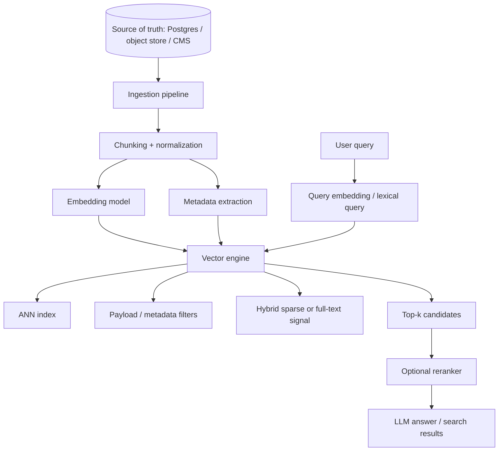

Qdrant mental model:

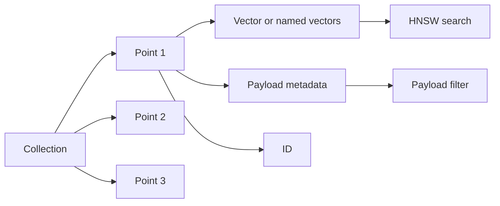

Pinecone mental model:

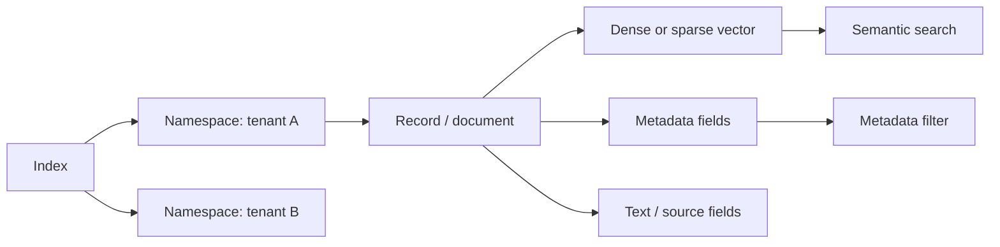

The big design shift:

```text
pgvector query:
    SQL table + vector column

Dedicated vector engine query:
    vector index + metadata filter + source ID back to system of record
```

---

### 3. Real-World Scenarios [Intermediate]

#### Scenario A: High-Traffic RAG Platform

You have:

- 100M chunks
- many customers
- thousands of queries per minute
- frequent re-embedding jobs
- hybrid retrieval
- query-specific reranking
- product teams experimenting with search settings

Dedicated engine fits because:

- retrieval load should not compete with source-of-truth database writes
- search index can scale separately
- backfills can be isolated
- search teams can own relevance and latency
- filtering/indexing can be tuned around retrieval needs

#### Scenario B: Multi-Tenant SaaS Search

Each customer needs:

- data isolation
- separate deletion workflows
- tenant-specific metadata
- predictable latency
- usage/cost attribution

Pinecone namespaces can be a strong fit for tenant partitioning when using Pinecone.

Qdrant can model tenancy with separate collections, payload filters, custom sharding, or deployment-level isolation depending on scale and isolation needs.

The interview point:

> Tenant strategy is not just a field named `tenant_id`; it is a latency, deletion, scaling, and security decision.

#### Scenario C: Search Over Product Catalog

You need:

- dense semantic search
- sparse/keyword recall for SKUs and model numbers
- metadata filters for inventory, region, price, brand
- reranking for final ordering
- frequent inventory updates

A dedicated vector engine fits because:

- hybrid search matters
- metadata filters are central
- search QPS can be large
- retrieval experiments should not risk transactional systems

#### Scenario D: Regulated Enterprise RAG

You need:

- customer-managed deployment
- private network connectivity
- audit controls
- backup/restore
- strict tenant boundaries
- deletion guarantees

The decision may favor:

- Qdrant self-hosted/private deployment
- Qdrant managed/hybrid/private models
- Pinecone BYOC or enterprise controls
- another dedicated engine that matches enterprise constraints

The tool choice follows governance.

---

### 4. Qdrant Mental Model [Intermediate]

Qdrant is a vector-first database that organizes data around:

| Concept | Meaning |
|---|---|
| Collection | Named set of points searched together. |
| Point | Searchable object with ID, vector(s), and optional payload. |
| Payload | Metadata stored with points for filtering and context. |
| Vector | Dense, sparse, or named vector representation. |
| HNSW index | Graph-based ANN index for fast vector search. |
| Payload index | Index on payload fields used for performant filtering. |
| Segment | Internal storage/index unit. |
| Shard | Partition used for distributed scaling. |
| Replica | Copy of shard for availability and read scaling. |

Example point:

```json
{
  "id": "doc-42#chunk-003",
  "vector": [0.12, 0.91, 0.03],
  "payload": {
    "tenant_id": "acme",
    "source_id": "doc-42",
    "doc_type": "policy",
    "language": "en",
    "version": "2026-06"
  }
}
```

Qdrant strength:

```text
vector-first control with open-source/self-host and cloud deployment choices
```

Good Qdrant fit:

- you want an open-source vector engine
- you care about self-hosting or private deployment
- filtering is important
- dense/sparse or multi-vector designs matter
- you want explicit control over collections, shards, replicas, payload indexes, quantization, and storage behavior

Qdrant design questions:

- one collection or many?
- one vector or named vectors?
- which payload fields need indexes?
- how should tenants map to collections/shards/filters?
- should vectors or indexes live on disk?
- what shard and replica strategy fits growth?
- how do snapshots/backups work?
- how are deletes and updates propagated?

Qdrant filtering example shape:

```python
from qdrant_client import QdrantClient, models

client = QdrantClient(url="http://localhost:6333")

results = client.query_points(
    collection_name="kb_chunks",
    query=[0.11, 0.20, 0.31],
    query_filter=models.Filter(
        must=[
            models.FieldCondition(
                key="tenant_id",
                match=models.MatchValue(value="acme"),
            ),
            models.FieldCondition(
                key="doc_type",
                match=models.MatchValue(value="policy"),
            ),
        ]
    ),
    limit=10,
)
```

What matters:

```text
vector query + payload filter + top-k limit
```

Payload indexes matter because filtering is usually part of the retrieval path, not a decorative feature.

---

### 5. Pinecone Mental Model [Intermediate]

Pinecone is a managed vector database focused on reducing operational burden.

Core concepts:

| Concept | Meaning |
|---|---|
| Organization | Billing and permission boundary. |
| Project | Container for indexes and API keys. |
| Index | Search container for records/documents. |
| Namespace | Partition inside an index, commonly used for multitenancy. |
| Record | ID, vector, optional metadata. |
| Document | JSON object with `_id`, ranking fields, and metadata fields in newer document-schema workflows. |
| Metadata | Fields used for filtering and context. |
| Dense vector | Semantic embedding. |
| Sparse vector | Token-aware sparse representation. |
| Full-text field | BM25/Lucene-style text retrieval in document-schema indexes. |
| Read/write units | Serverless usage and cost measurement units. |

Pinecone strength:

```text
managed vector search with serverless operations, namespaces, metadata filtering, and integrated embedding options
```

Good Pinecone fit:

- you want managed operations
- search must scale without running your own vector cluster
- teams prefer API-level integration over infrastructure ownership
- namespaces map cleanly to tenants
- hosted embedding/reranking options are useful
- predictable operational ownership matters more than low-level engine control

Pinecone query example shape:

```python
from pinecone.grpc import PineconeGRPC as Pinecone

pc = Pinecone(api_key="YOUR_API_KEY")
index = pc.Index(host="INDEX_HOST")

results = index.query(
    namespace="tenant-acme",
    vector=[0.11, 0.20, 0.31],
    top_k=10,
    filter={
        "doc_type": {"$eq": "policy"},
        "language": {"$eq": "en"},
    },
    include_metadata=True,
    include_values=False,
)
```

For indexes with integrated embedding, the query may send text input instead of a raw vector.

Important Pinecone design questions:

- one index per use case or shared index?
- namespace per tenant or metadata field per tenant?
- dense, sparse, full-text, or hybrid?
- bring your own embeddings or use integrated embedding?
- what metadata fields are filterable?
- how are read/write units and costs monitored?
- what backup and restore strategy is needed?
- what API/key/project boundary matches security needs?

The strong mental model:

```text
Pinecone owns much of the database operation.
You still own data modeling, retrieval quality, metadata design, evals, and cost control.
```

---

### 6. Dedicated Engine vs Chroma vs pgvector [Intermediate]

| Dimension | Chroma | pgvector | Qdrant / Pinecone / dedicated engines |
|---|---|---|---|
| Best first use | Local prototype | Postgres-native production path | Separate retrieval subsystem |
| Main container | Collection | Table | Collection/index |
| Stored object | Document/record in collection | SQL row | Point/record/document |
| Query language | Client API | SQL | Engine API |
| Filtering | Metadata filters | SQL filters/joins | Payload/metadata filters |
| Source of truth | Usually prototype copy | Often same database | Usually external source of truth |
| Scaling boundary | Local/server process | Postgres scaling | Retrieval engine scaling |
| Operations | Low for local | Postgres ops | Vector DB ops or managed platform ops |
| Strongest reason | Speed of learning | Relational correctness | Independent retrieval performance and features |
| Biggest risk | Mistaking prototype for prod | Coupling search to OLTP | Sync, cost, vendor/runtime complexity |

Use this progression:

```text
Need to learn quickly?
    Chroma

Data already in Postgres and relational filters dominate?
    pgvector

Retrieval needs independent scale, hybrid search, vector-specific ops, or high QPS?
    dedicated vector engine
```

The architecture trap:

> Moving to a dedicated engine does not remove the need for a source of truth. It creates a read-optimized projection that must be kept correct.

---

### 7. System Design Flavor [Intermediate]

#### Design Question

> We need semantic search for a fast-growing multi-tenant SaaS product. Should we use Qdrant, Pinecone, or keep pgvector?

Strong answer structure:

1. Start with workload.
2. Identify source of truth.
3. Define tenant isolation.
4. Define retrieval features.
5. Define scale/latency targets.
6. Compare operational ownership.
7. Choose a migration path.

#### Workload Questions

Ask:

- How many vectors now?
- How many vectors in 12 months?
- What embedding dimension?
- What write/update rate?
- What query QPS?
- What p95/p99 latency target?
- How selective are filters?
- Is hybrid retrieval needed?
- How many tenants?
- Are deletes frequent and legally important?
- Can retrieval be eventually consistent?

#### Source-of-Truth Pattern

Most serious systems should think like this:

```text
Postgres / object store / CMS:
    authoritative records

Embedding pipeline:
    converts authoritative records into searchable projection

Vector engine:
    top-k candidate retrieval

Application:
    verifies permissions/source state and composes final result
```

This reduces confusion.

The vector engine is not the business database.

It is the retrieval index.

#### Qdrant vs Pinecone Framing

| Question | Qdrant leaning | Pinecone leaning |
|---|---|---|
| Need open-source/self-host control? | Strong | Less central |
| Want managed serverless API and less ops? | Possible with Cloud | Strong |
| Need to run in private/on-prem environment? | Strong option | Depends on enterprise/BYOC fit |
| Want low-level engine/deployment tuning? | Strong | Less direct |
| Want usage-based managed service ergonomics? | Possible | Strong |
| Team has infra/SRE capacity? | Qdrant self-host can fit | Pinecone may reduce ops burden |
| Team wants to avoid cluster ownership? | Use Qdrant Cloud or managed option | Strong |

Do not overstate it:

```text
Qdrant can be managed.
Pinecone can support enterprise deployment patterns.
The real decision is workload + operations + governance.
```

#### Data Modeling Pattern

A good vector record has:

```json
{
  "id": "source_type/source_id/chunk_index/model_version",
  "vector": [0.01, 0.02, 0.03],
  "metadata": {
    "tenant_id": "acme",
    "source_id": "doc-123",
    "chunk_index": 7,
    "doc_type": "runbook",
    "language": "en",
    "source_version": "v14",
    "embedding_model": "text-embedding-model",
    "chunk_version": 3,
    "deleted": false
  }
}
```

Why this matters:

- stable IDs support idempotent upsert
- tenant filters protect isolation
- source IDs support traceability
- version fields support migrations
- metadata supports filtering and evaluation
- deletion fields support safe cleanup workflows

---

### 8. What Problem It Solves [Intermediate]

Primary problem solved:

> Run vector retrieval as an independent, search-optimized subsystem rather than embedding it inside a local prototype or relational database.

Secondary benefits:

- independent scaling
- search-specific indexing
- payload/metadata filtering
- hybrid retrieval
- multitenancy patterns
- lower blast radius for retrieval experiments
- managed operations if using hosted platforms
- better separation between source-of-truth writes and retrieval reads
- vector-specific monitoring, backups, snapshots, and migration workflows

Systems impact:

| Dimension | Impact |
|---|---|
| Latency | Can improve p95/p99 when tuned and isolated. |
| Throughput | Can scale read-heavy retrieval workloads separately. |
| Availability | Replication/managed operations can improve retrieval availability. |
| Consistency | Often becomes eventually consistent with source of truth. |
| Cost | Adds service/vendor/infrastructure cost. |
| Complexity | Adds synchronization and data lifecycle complexity. |
| Relevance | Enables richer retrieval patterns, but does not guarantee quality. |

Key interview phrase:

> "I would treat the vector database as a read-optimized retrieval projection fed from the system of record."

---

### 9. When to Rely on Dedicated Vector Engines [Intermediate]

Rely on them when:

- vector search QPS is high
- vector corpus is large and growing
- retrieval needs independent scaling
- metadata filtering is central
- hybrid dense/sparse/full-text search matters
- tenants need clear isolation
- source-of-truth database should not carry retrieval load
- p99 latency matters
- search experiments are frequent
- re-embedding/backfills are operationally heavy
- you need managed backups, replicas, snapshots, or hosted operations
- application teams want retrieval APIs rather than database-specific SQL

Interview keywords:

- "billions of vectors"
- "high-QPS semantic search"
- "multi-tenant RAG platform"
- "metadata filtering at scale"
- "hybrid search"
- "independent retrieval scaling"
- "source DB under pressure"
- "index lifecycle management"
- "re-embedding pipeline"
- "managed vector database"

Strong answer:

> "At this scale, I would keep Postgres as the source of truth and move searchable chunks into a dedicated vector engine. The engine handles top-k retrieval with metadata filters, while the app verifies source state and permissions before generating an answer."

---

### 10. When Not to Use Them [Pro]

Do not rush to a dedicated vector engine when:

- the project is still a notebook/prototype
- corpus is small
- QPS is low
- relational joins are the core requirement
- Postgres already handles the workload well
- team has no operational capacity for another system
- data synchronization would be riskier than query load
- strict transactional consistency is required
- cost predictability is more important than retrieval specialization

Better alternatives:

| Condition | Better first move |
|---|---|
| Learning/prototyping | Chroma |
| Postgres app with moderate search | pgvector |
| Keyword-heavy search | Full-text search or search engine |
| Need reranking only | Keep current retriever and add reranker |
| Small filtered subsets | Exact vector search may be enough |
| No eval set yet | Build evaluation before changing database |

The professional warning:

> Do not use a vector database migration to hide bad chunking, weak metadata, missing evals, or poor embedding choice.

---

### 11. Pros and Cons [Intermediate]

| Pros | Cons |
|---|---|
| Independent retrieval scaling | Another system to operate or pay for |
| Vector-first indexing and filtering | Source-of-truth sync complexity |
| Better isolation from OLTP workloads | Eventual consistency |
| Stronger fit for high-QPS search | Vendor/runtime-specific APIs |
| Supports advanced retrieval patterns | More data lifecycle work |
| Managed platforms reduce infra burden | Cost can surprise without monitoring |
| Self-hosted engines offer control | Self-hosting requires SRE maturity |
| Helps build search/relevance ownership | Does not automatically improve answer quality |

Simple summary:

```text
Dedicated vector engines trade architectural simplicity for retrieval specialization and independent operations.
```

---

### 12. Trade-offs and Common Mistakes [Pro]

#### Trade-offs

##### Simplicity vs Separation

Simple:

```text
app -> Postgres + pgvector
```

Separated:

```text
app -> source DB
app -> vector engine
pipeline keeps them synchronized
```

Separation helps scale retrieval.

Separation also creates consistency and sync problems.

##### Managed vs Self-Hosted

Managed vector DB:

- less infrastructure work
- faster production path
- built-in operational tooling
- vendor cost and platform constraints

Self-hosted vector engine:

- more control
- private/on-prem options
- tune deployment deeply
- must own upgrades, backups, scaling, monitoring, incidents

Architectural question:

```text
Do we want to operate retrieval infrastructure, or consume retrieval as a managed service?
```

##### Filtering vs Recall

Metadata filtering is not optional in real systems.

But filters interact with ANN behavior.

If only a tiny percentage of records match a filter, retrieval quality and latency may change.

Mitigations:

- index filter fields
- isolate tenants/namespaces/collections
- retrieve more candidates
- tune search parameters
- use hybrid exact/ANN fallback
- evaluate recall under real filters

##### Search Quality vs Search Infrastructure

Better infrastructure does not fix:

- bad chunking
- wrong embedding model
- missing metadata
- wrong top-k
- no reranker
- stale records
- weak evaluation set

The correct loop:

```text
measure retrieval quality
then tune data, model, index, filters, and reranking
```

##### Vendor API Power vs Portability

Vector databases differ in:

- record model
- metadata filter syntax
- namespace/collection model
- hybrid search support
- indexing controls
- backup/restore model
- cost model
- SDK behavior

Abstraction helps, but the lowest common denominator can hide important features.

Better:

```text
own your retrieval contract
wrap vendor APIs at the boundary
keep source-of-truth data independent
store stable IDs and model versions
```

#### Common Mistakes

##### Mistake 1: Treating the Vector DB as Source of Truth

Bad:

```text
Only store chunks and metadata in the vector DB.
No authoritative source elsewhere.
```

Why it is wrong:

Vector indexes are optimized retrieval projections, not usually the best system for full business truth.

Better:

- keep source records in Postgres/object store/CMS
- store source IDs in vector records
- rehydrate or verify critical data from source when needed

##### Mistake 2: No Idempotent Upsert Strategy

Bad IDs:

```text
random UUID every ingestion run
```

Why it is wrong:

Reingestion creates duplicates and stale records.

Better IDs:

```text
tenant_id/source_id/chunk_index/chunk_version/embedding_model_version
```

or:

```text
tenant_id/source_id/chunk_index
```

with explicit update semantics.

##### Mistake 3: Filtering After Retrieval in Application Code

Bad:

```text
retrieve top 100 globally
then filter tenant_id in app
```

Why it is wrong:

- security risk
- poor tenant recall
- wasted compute
- wrong candidate set

Better:

```text
apply tenant and permission filters inside the vector query
```

For strict permissions, also verify source state before final answer.

##### Mistake 4: Ignoring Delete Propagation

Bad:

```text
document deleted in source DB
vector record remains searchable
```

Why it is wrong:

The RAG system can cite deleted, private, expired, or legally removed content.

Better:

- deletion events
- tombstones
- idempotent delete jobs
- periodic reconciliation
- source verification before final answer

##### Mistake 5: Comparing Engines Without Workload

Bad:

> "Which is better, Qdrant or Pinecone?"

Better:

> "For our workload, we need self-host/private control, payload-filter tuning, and SRE capacity, so Qdrant may fit. If we want managed serverless operations and namespace-based multitenancy, Pinecone may fit. We should benchmark using our corpus, filters, top-k, and latency targets."

##### Mistake 6: No Recall Benchmark Under Filters

Bad:

```text
benchmark global vector search only
```

Real queries use:

- tenant filters
- date filters
- language filters
- document type filters
- permission filters
- hybrid search

Better:

```text
benchmark the real query shapes
```

##### Mistake 7: No Cost Model

Bad:

```text
only estimate storage
```

Better estimate:

- vector count
- vector dimension
- metadata size
- replicas
- indexes
- read QPS
- write QPS
- batch imports
- backups
- cross-region/network costs
- managed read/write unit pricing where relevant

---

### 13. Key Numbers [Pro]

These are planning anchors, not universal limits.

| Concept | Useful planning anchor |
|---|---|
| Raw vector memory | `rows * dimensions * 4 bytes` for float32 values |
| 1M vectors x 1536 dims | about 6.1 GB raw vector values before indexes/metadata/replicas |
| Replication factor 2 | roughly doubles stored vector/index footprint, improves availability/read capacity |
| Top-k | Often 5-50 for RAG candidate retrieval before reranking |
| Candidate pool before reranking | Often 20-200 depending on cost and recall needs |
| Metadata filters | Should be included in benchmarks, not treated as an afterthought |
| Re-embedding | Treat as a data migration/backfill, not a normal update |
| Delete propagation | Should be measured and monitored like correctness |

Qdrant-specific planning ideas:

- collections contain points
- points have IDs, vectors, and payload
- payload indexes help filter performance
- dense and sparse vectors can be modeled
- sharding and replication matter in distributed deployments
- memory/disk choices affect latency and cost

Pinecone-specific planning ideas:

- indexes contain records/documents
- namespaces partition data inside an index
- metadata fields support filtering
- serverless usage is tied to reads/writes/storage patterns
- integrated embedding can simplify pipelines but changes ownership boundaries
- index schema choices affect dense/sparse/full-text retrieval patterns

Interview sentence:

> "I would estimate raw vector size, multiply by index and replication overhead, then benchmark real filtered top-k queries at target p95 and p99."

---

### 14. Failure Modes [Pro]

#### Failure Mode 1: Vector Engine Is Stale

Symptoms:

- source document updated but old chunk appears
- deleted content still retrieved
- answer cites outdated policy
- search result points to missing source ID

Causes:

- async pipeline lag
- failed upsert/delete events
- duplicate IDs
- no reconciliation job

Mitigation:

- event-driven ingestion
- idempotent upserts
- tombstones
- periodic source-vs-index reconciliation
- source-state verification before final answer
- lag metrics

#### Failure Mode 2: Tenant Leakage

Symptoms:

- wrong customer record appears
- global top-k retrieval happens before tenant filtering
- namespace/collection routing bug

Mitigation:

- tenant partition strategy
- filter inside vector query
- namespace/collection per tenant where appropriate
- authorization tests
- final permission check against source of truth

#### Failure Mode 3: Low Recall Under Filters

Symptoms:

- global retrieval looks good
- filtered retrieval misses expected docs
- rare tenants/categories perform badly

Causes:

- filter selectivity
- missing payload/metadata indexes
- insufficient candidate search breadth
- poor tenant partitioning
- weak embeddings for filtered domain

Mitigation:

- benchmark filtered queries
- add payload/metadata indexes
- retrieve more candidates
- tune engine parameters
- use hybrid search
- add reranking
- consider tenant-specific collection/namespace strategy

#### Failure Mode 4: Cost Spike

Symptoms:

- read/write cost jumps
- batch re-embedding causes high write usage
- top-k/candidate count increases cost
- metadata filters create expensive queries

Mitigation:

- usage dashboards
- query budgets
- top-k limits
- batch ingestion windows
- caching for repeated queries
- cost-per-query monitoring
- separate dev/staging/prod indexes

#### Failure Mode 5: Index Migration Incident

Symptoms:

- new embedding model performs worse
- mixed vector dimensions
- old and new embeddings compared together
- search downtime during rebuild

Mitigation:

- versioned index/collection
- blue-green retrieval deployment
- dual-write during migration
- offline evaluation before cutover
- rollback plan
- stable source IDs

#### Failure Mode 6: Operational Ownership Gap

Symptoms:

- nobody owns vector DB backups
- no SLO for retrieval
- no runbook for failed ingestion
- no metric for recall
- no alert for stale index

Mitigation:

- define retrieval service owner
- define SLOs
- add dashboard and alerts
- write runbooks
- add evals to CI/CD or release process
- document vendor/cluster recovery steps

---

### 15. Scenario [Intermediate]

#### Product / System

Design retrieval for an enterprise RAG platform.

Requirements:

- 500 enterprise tenants
- 80M chunks now, 300M projected
- docs come from Google Drive, Confluence, SharePoint, Git repos, and internal databases
- users can only retrieve docs they have access to
- retrieval should combine semantic search and keyword search
- p95 under 300 ms for retrieval candidate generation
- deletes must disappear quickly
- source systems remain authoritative
- search team wants independent experiments

#### Why Dedicated Vector Engine Fits

A dedicated vector engine fits because:

- retrieval load is large
- source-of-truth systems are diverse
- search index is a projection
- hybrid search matters
- tenant isolation matters
- ingestion and re-embedding are separate workflows
- Postgres should not carry all retrieval traffic
- retrieval needs its own SLO and observability

#### Architecture

```text
Source connectors
  -> ingestion queue
  -> chunker
  -> embedder
  -> vector engine upsert
  -> reconciliation jobs

Query path
  -> user query
  -> auth context
  -> query embedding + lexical query
  -> vector engine search with tenant/ACL filters
  -> reranker
  -> source verification
  -> LLM answer with citations
```

#### Qdrant-Like Design

Possible mapping:

```text
collection: enterprise_kb_chunks
point id: tenant/source/chunk/model_version
vector: dense text embedding
payload: tenant_id, source_id, acl_hash, doc_type, language, updated_at
payload indexes: tenant_id, doc_type, language, acl_hash
replication: production RF >= 2
shards: chosen based on cluster size and tenant/query distribution
```

#### Pinecone-Like Design

Possible mapping:

```text
index: enterprise-kb
namespace: tenant_id or tenant partition
record/document id: source/chunk/model_version
vector: dense and possibly sparse/full-text ranking fields
metadata: source_id, doc_type, language, acl labels, updated_at
```

#### What Would Go Wrong Without a Dedicated Engine

If using only Postgres:

- OLTP and retrieval workloads compete
- embedding backfills are risky
- search scale is tied to relational scale
- hybrid retrieval may become awkward
- search team cannot independently operate relevance

If using only local Chroma:

- no production-grade scaling boundary
- poor fit for multi-tenant enterprise operations
- backup/security/SLO story is weak

Dedicated engine is not chosen because it sounds advanced.

It is chosen because the workload deserves its own system boundary.

---

### 16. Code Sample [Intermediate]

#### Qdrant-Style Upsert and Filtered Search

```python
from qdrant_client import QdrantClient, models


client = QdrantClient(url="http://localhost:6333")

collection_name = "kb_chunks"

client.recreate_collection(
    collection_name=collection_name,
    vectors_config=models.VectorParams(
        size=3,
        distance=models.Distance.COSINE,
    ),
)

client.upsert(
    collection_name=collection_name,
    points=[
        models.PointStruct(
            id="acme/doc-1/0",
            vector=[0.10, 0.20, 0.30],
            payload={
                "tenant_id": "acme",
                "doc_type": "runbook",
                "source_id": "doc-1",
                "chunk_index": 0,
            },
        ),
        models.PointStruct(
            id="acme/doc-2/0",
            vector=[0.90, 0.10, 0.05],
            payload={
                "tenant_id": "acme",
                "doc_type": "billing",
                "source_id": "doc-2",
                "chunk_index": 0,
            },
        ),
    ],
)

results = client.query_points(
    collection_name=collection_name,
    query=[0.11, 0.20, 0.31],
    query_filter=models.Filter(
        must=[
            models.FieldCondition(
                key="tenant_id",
                match=models.MatchValue(value="acme"),
            ),
            models.FieldCondition(
                key="doc_type",
                match=models.MatchValue(value="runbook"),
            ),
        ]
    ),
    limit=5,
)

print(results)
```

What to notice:

- collection is the search boundary
- point ID is stable
- payload carries filterable metadata
- query includes filter and top-k limit

#### Pinecone-Style Filtered Query

```python
from pinecone.grpc import PineconeGRPC as Pinecone


pc = Pinecone(api_key="YOUR_API_KEY")
index = pc.Index(host="INDEX_HOST")

results = index.query(
    namespace="tenant-acme",
    vector=[0.11, 0.20, 0.31],
    top_k=5,
    filter={
        "doc_type": {"$eq": "runbook"},
        "language": {"$eq": "en"},
    },
    include_metadata=True,
    include_values=False,
)

print(results)
```

What to notice:

- namespace can isolate tenant data
- metadata filter narrows results
- the managed index owns vector search
- app still owns source IDs, permissions, and answer composition

---

### 17. Mini Program / Simulation [Pro]

This simulation does not require Qdrant or Pinecone. It models the architecture problem: syncing a source-of-truth database into a vector index projection, then handling updates and deletes safely.

```python
from dataclasses import dataclass


@dataclass
class SourceChunk:
    id: str
    tenant_id: str
    text: str
    version: int
    deleted: bool = False


class SourceOfTruth:
    def __init__(self):
        self.rows = {}

    def upsert(self, chunk):
        self.rows[chunk.id] = chunk

    def delete(self, chunk_id):
        chunk = self.rows[chunk_id]
        self.rows[chunk_id] = SourceChunk(
            id=chunk.id,
            tenant_id=chunk.tenant_id,
            text=chunk.text,
            version=chunk.version + 1,
            deleted=True,
        )


class VectorProjection:
    def __init__(self):
        self.records = {}

    def upsert_from_source(self, chunk):
        if chunk.deleted:
            self.records.pop(chunk.id, None)
            return

        self.records[chunk.id] = {
            "id": chunk.id,
            "tenant_id": chunk.tenant_id,
            "text": chunk.text,
            "source_version": chunk.version,
            "embedding": fake_embed(chunk.text),
        }

    def search(self, tenant_id, query):
        query_embedding = fake_embed(query)
        candidates = [
            record
            for record in self.records.values()
            if record["tenant_id"] == tenant_id
        ]
        return sorted(
            candidates,
            key=lambda record: l2(record["embedding"], query_embedding),
        )[:3]


def fake_embed(text):
    words = text.lower().split()
    return [
        len(words),
        sum(1 for word in words if "password" in word or "login" in word),
        sum(1 for word in words if "invoice" in word or "billing" in word),
    ]


def l2(a, b):
    return sum((x - y) ** 2 for x, y in zip(a, b)) ** 0.5


def reconcile(source, projection):
    for chunk in source.rows.values():
        projected = projection.records.get(chunk.id)
        if chunk.deleted:
            projection.records.pop(chunk.id, None)
        elif projected is None or projected["source_version"] < chunk.version:
            projection.upsert_from_source(chunk)


def main():
    source = SourceOfTruth()
    projection = VectorProjection()

    source.upsert(SourceChunk("acme/doc-1/0", "acme", "reset password login help", 1))
    source.upsert(SourceChunk("acme/doc-2/0", "acme", "billing invoice support", 1))
    source.upsert(SourceChunk("other/doc-3/0", "other", "password reset policy", 1))

    reconcile(source, projection)
    print("Initial:", projection.search("acme", "password login issue"))

    source.delete("acme/doc-1/0")
    print("Before reconcile:", projection.search("acme", "password login issue"))

    reconcile(source, projection)
    print("After reconcile:", projection.search("acme", "password login issue"))


if __name__ == "__main__":
    main()
```

What this teaches:

- vector DB is a projection
- tenant filter belongs in retrieval
- deletes must propagate
- source version prevents stale records
- reconciliation catches missed events

This is the hidden architecture behind every serious vector database choice.

---

### 18. Hands-On Lab [Pro]

#### Goal

Compare the dedicated-vector-engine mindset against Chroma and pgvector by designing the same retrieval system three ways.

#### Build

Design a `kb_chunks` record shape:

```json
{
  "id": "tenant/source/chunk/model_version",
  "vector": [0.1, 0.2, 0.3],
  "text": "How to reset a password",
  "metadata": {
    "tenant_id": "acme",
    "source_id": "auth-runbook",
    "chunk_index": 0,
    "doc_type": "runbook",
    "language": "en",
    "source_version": 12,
    "embedding_model": "model-v1",
    "deleted": false
  }
}
```

Map it into:

| System | Container | Record ID | Metadata/filter model |
|---|---|---|---|
| Chroma | Collection | ID string | Metadata dict |
| pgvector | Table row | Primary key | SQL columns/jsonb |
| Qdrant | Collection | Point ID | Payload |
| Pinecone | Index/namespace | Record/document ID | Metadata fields |

#### Compare

For each system, answer:

1. How do we isolate tenants?
2. How do we delete one source document?
3. How do we re-embed with a new model?
4. How do we filter by `doc_type` and `language`?
5. How do we measure recall@k?
6. How do we recover from missed ingestion events?
7. How do we keep source truth separate from retrieval projection?

#### Break

Break 1: Duplicate IDs.

```text
Every ingestion run creates new random IDs.
```

Expected lesson:

Reingestion becomes duplication. Stable IDs are not optional.

Break 2: Missing tenant filter.

```text
Search runs globally and filters after retrieval.
```

Expected lesson:

This is both a security and recall failure.

Break 3: Stale delete.

```text
Source deletes a document, vector engine keeps it.
```

Expected lesson:

Deletion propagation and reconciliation are production requirements.

Break 4: No eval set.

```text
Team migrates from pgvector to Pinecone/Qdrant and only measures latency.
```

Expected lesson:

Faster wrong results are still wrong.

#### Measure

Build this evaluation table:

| Query | Tenant | Filter | Expected source | Engine top 10 | Recall@10 | Latency | Notes |
|---|---|---|---|---|---|---|---|
| reset password | acme | runbook | auth-runbook | | | | |
| billing invoice | acme | faq | billing-faq | | | | |
| rotate API key | acme | security | api-key-policy | | | | |

Then add:

- stale delete test
- tenant isolation test
- re-embedding test
- hybrid keyword test
- high-selectivity filter test

#### Capstone

Write a one-page design:

> We are moving from pgvector to a dedicated vector engine for a multi-tenant RAG platform. Describe the source-of-truth model, ingestion pipeline, vector record schema, tenant isolation strategy, search query path, deletion handling, evaluation plan, and rollback path.

---

### 19. Active Recall [Beginner]

Answer without looking:

1. What is a dedicated vector engine?
2. Why might pgvector stop being enough?
3. What is a Qdrant collection?
4. What is a Qdrant point?
5. What is Qdrant payload?
6. What is a Pinecone index?
7. What is a Pinecone namespace?
8. Why should the vector engine usually not be the source of truth?
9. Why are stable IDs important?
10. What is the biggest operational risk of a separate vector engine?

Expected answers:

1. A separate system optimized for storing, indexing, filtering, and searching vectors.
2. Retrieval load, scale, p99 latency, hybrid search, or operational isolation may outgrow Postgres.
3. A named set of points searched together.
4. A searchable object with ID, vector(s), and payload.
5. Metadata attached to points for filtering/context.
6. A search container that stores records/documents.
7. A partition inside an index, often used for tenant isolation.
8. It is usually a read-optimized projection; source records, permissions, and lifecycle belong elsewhere.
9. They make upserts idempotent and prevent duplicates/stale records.
10. Synchronization correctness between source of truth and retrieval index.

---

### 20. Practice [Intermediate]

#### Practice 1: Tool Choice

Prompt:

> You have 5M chunks, moderate QPS, all data and permissions in Postgres, and a small team. Qdrant, Pinecone, pgvector, or Chroma?

Strong answer:

> "I would start with pgvector if Postgres can meet latency targets, because permissions and metadata are already relational. I would build evals and monitor database load. If retrieval grows or starts affecting OLTP, I would move to a dedicated engine."

#### Practice 2: Dedicated Engine Justification

Prompt:

> You have 300M chunks, high-QPS RAG, frequent re-embedding, and search load affecting the product database.

Strong answer:

> "I would use a dedicated vector engine. Postgres remains source of truth; a pipeline projects chunks, embeddings, and filterable metadata into Qdrant or Pinecone. Search uses tenant/ACL filters, retrieves candidates, reranks, and verifies source state before answering."

#### Practice 3: Qdrant vs Pinecone

Prompt:

> When would you lean Qdrant, and when would you lean Pinecone?

Strong answer:

> "I would lean Qdrant when open-source control, self-hosting/private deployment, and lower-level engine/deployment tuning matter. I would lean Pinecone when managed serverless operations, hosted features, namespace-based multitenancy, and reduced infrastructure ownership are more valuable. I would benchmark with our corpus, filters, and target latency."

#### Practice 4: Sync Correctness

Question:

> What must happen when a source document is deleted?

Strong answer:

> "The vector projection must delete all related chunk records or mark them unreachable, and a reconciliation process should verify that the vector engine no longer returns them. The query path should also verify critical source state before using content in the final answer."

#### Practice 5: Bad Architecture Review

Bad design:

```text
All chunks are stored only in Pinecone metadata.
Source docs are not retained elsewhere.
Deletes are manual.
Tenant filter is applied after retrieval.
No eval set exists.
```

What is wrong?

Strong answer:

> "The vector DB is being treated as the source of truth, delete correctness is weak, tenant isolation is unsafe, recall under tenant filters will be poor, and there is no way to measure quality. I would restore a source-of-truth system, use stable IDs, filter inside the vector query, automate deletes, and build evals."

---

### 21. Production Reality Check

**If this fails in prod, what is the first thing we inspect?**

For dedicated vector engines, inspect:

1. Source-to-vector sync lag
2. Query filter correctness
3. Tenant partition routing
4. Returned source IDs
5. Metadata/payload fields
6. Delete propagation
7. Index health
8. Recall@k against eval set
9. p95/p99 latency
10. Cost/usage metrics

The production debugging question:

> Is this a retrieval-quality problem, sync problem, filter/tenant problem, engine-capacity problem, or cost/usage problem?

#### Dedicated Vector Engine Runbook

1. Check service health.
2. Check ingestion lag.
3. Check latest successful upsert time.
4. Check failed upsert/delete events.
5. Query by known source ID.
6. Query with and without tenant filter.
7. Verify metadata/payload fields.
8. Compare top-k to exact/eval baseline if available.
9. Check latency and timeout metrics.
10. Check usage/cost spike.
11. Verify source document still exists and user can access it.
12. Reconcile source and vector index if mismatch appears.

#### What Good Looks Like

A mature dedicated vector system can answer:

- What is the source of truth?
- What is the vector record schema?
- Which IDs are stable?
- Which metadata fields are filterable?
- How are tenants isolated?
- How are deletes propagated?
- How is ingestion lag measured?
- How is recall measured?
- What is the p95/p99 target?
- What is the cost per query?
- How do we re-embed safely?
- How do we migrate engines if needed?

That is the difference between a demo and a search platform.

---

### 22. Curiosity Bridge

Now we have three major vector datastore options:

```text
Chroma:
    local experimentation

pgvector:
    Postgres-native semantic search

Qdrant / Pinecone / dedicated engines:
    independent retrieval subsystem
```

The next skill is not memorizing tool names.

The next skill is learning how these tools protect tenant boundaries and narrow retrieval with filters:

- namespaces
- collections
- payload fields
- metadata filters
- SQL `WHERE` clauses
- access-control labels
- tenant offboarding
- filtered ANN recall

That leads directly to **multitenancy, namespaces, and metadata filters**: the difference between "we store vectors" and "we can safely retrieve the right vectors for the right user."

---

### 23. Exit Check + Carry-Forward Review

**Exit check - you are done when you can:**
Explain what makes Qdrant and Pinecone dedicated vector engines; map Qdrant collections/points/payloads and Pinecone indexes/namespaces/records/documents; compare Chroma, pgvector, and dedicated engines; design a vector record schema; reason about tenant isolation and metadata filtering; explain source-of-truth synchronization; identify failure modes; and justify when a separate vector engine is worth the cost.

**Carry-Forward Review:**

Question: How does this connect to the earlier Topic 5.2 tools?

Answer: Chroma helps you learn and prototype quickly. pgvector keeps semantic search inside Postgres when relational filters and source-of-truth simplicity dominate. Qdrant, Pinecone, and other dedicated engines become compelling when retrieval needs its own scaling boundary, operational lifecycle, filtering strategy, hybrid search features, and reliability story.

---

## Subtopic 5.2.d: Multitenancy, Namespaces, and Metadata Filters

### Add to Knowledge Base

**Multitenancy** means one system serves multiple tenants while keeping each tenant's data isolated, queryable, deletable, and observable in a controlled way.

In vector search, multitenancy is not just an auth concept. It changes retrieval behavior.

The core idea:

> Tenant boundaries and metadata filters decide which vectors are even eligible for similarity search. Bad tenant/filter design can cause security leaks, poor recall, slow queries, noisy-neighbor problems, and painful tenant offboarding.

Three concepts matter:

| Concept | Meaning |
|---|---|
| Tenant | Customer, workspace, org, user group, or isolation unit. |
| Namespace / collection / partition | Storage or query boundary used to separate records. |
| Metadata filter | Query condition that narrows candidate records by fields like tenant, doc type, language, ACL, date, or status. |

Reference anchor:
- Pinecone multitenancy docs: `https://docs.pinecone.io/guides/index-data/implement-multitenancy`
- Pinecone metadata filtering docs: `https://docs.pinecone.io/guides/search/filter-by-metadata`
- Qdrant multitenancy docs: `https://qdrant.tech/documentation/manage-data/multitenancy/`
- Qdrant filtering docs: `https://qdrant.tech/documentation/search/filtering/`
- Chroma metadata filtering docs: `https://docs.trychroma.com/docs/querying-collections/metadata-filtering`
- pgvector README filtering guidance: `https://github.com/pgvector/pgvector`
- Curator multi-tenant vector index paper: `https://arxiv.org/abs/2401.07119`

The storage choices:

| Strategy | Example | Best fit |
|---|---|---|
| Separate index/database | one index per large enterprise tenant | strongest isolation, highest operational overhead |
| Separate namespace | Pinecone namespace per tenant | strong tenant partitioning inside one index |
| Separate collection | Qdrant collection per tenant | useful for limited tenants needing isolation, but many collections can add overhead |
| Shared collection/index + tenant metadata | `tenant_id` payload/metadata filter | efficient for many tenants, needs disciplined filtering/indexing |
| SQL tenant column | pgvector `WHERE tenant_id = ?` | Postgres-native multitenancy and permission joins |

The beginner mistake:

```text
Multitenancy = add tenant_id metadata
```

Better:

```text
Multitenancy = choose a storage/query/isolation strategy, enforce it on every read/write/delete path, benchmark filtered recall, and make tenant offboarding safe.
```

---

### Reading Path + Level Tags

- **Beginner:** Read sections 0-2 and Active Recall.
- **Intermediate:** Add sections 3-8 and complete the tenant-routing examples.
- **Pro:** Complete the Hands-On Lab, failure modes, and Topic 5.2 checkpoint.

---

### 0. Pre-Question Hook [Beginner]

**Pause:** You are building RAG for a SaaS product with 5,000 customers.

Each customer has private documents.

A user asks:

> "How do I rotate my API keys?"

The retrieval system must not search every customer's docs and then filter later. It must search only the eligible data for this user's tenant and permissions.

Bad answer:

> "Retrieve top 100 globally, then remove records the user cannot see."

Better answer:

> "Route the query into the right tenant boundary first, apply metadata/ACL filters inside the vector query, retrieve candidates, and optionally verify source permissions before the final answer."

Before reading on, answer:

- Is tenant isolation physical, logical, or metadata-based?
- Can one tenant affect another tenant's latency or cost?
- How do we delete a tenant's data?
- How do we query across tenants for admin analytics?
- Are permissions coarse-grained or document-level?
- Are filters selective enough to affect recall?
- What happens if a filter field is missing?
- How do we test that cross-tenant leakage is impossible?

These are the real questions.

---

### 1. The Intuition (Plain English) [Beginner]

Vector search without filters asks:

```text
Which vectors are closest to this query?
```

Multitenant vector search asks:

```text
Which vectors is this user allowed to search,
and among those vectors, which are closest?
```

That order matters.

If you search globally first, the best global matches may belong to other tenants. Filtering afterward can remove them and leave weak candidates.

Correct mental model:

```text
tenant boundary + permission boundary + metadata filters
    define eligible candidate space

vector distance
    ranks candidates inside that eligible space
```

**The simplest explanation:**

> Metadata filters are not just convenience filters. In multitenant vector search, they define safety, cost, latency, and recall.

**Where the analogy breaks down:** Some engines implement tenant boundaries as physical partitions, some as namespaces, some as collection choices, some as payload/metadata filters, and some as SQL clauses. The right choice depends on tenant count, tenant size, query pattern, offboarding needs, and isolation requirements.

---

### 2. Visual Diagram (Mermaid) [Beginner]

Correct tenant-scoped retrieval:

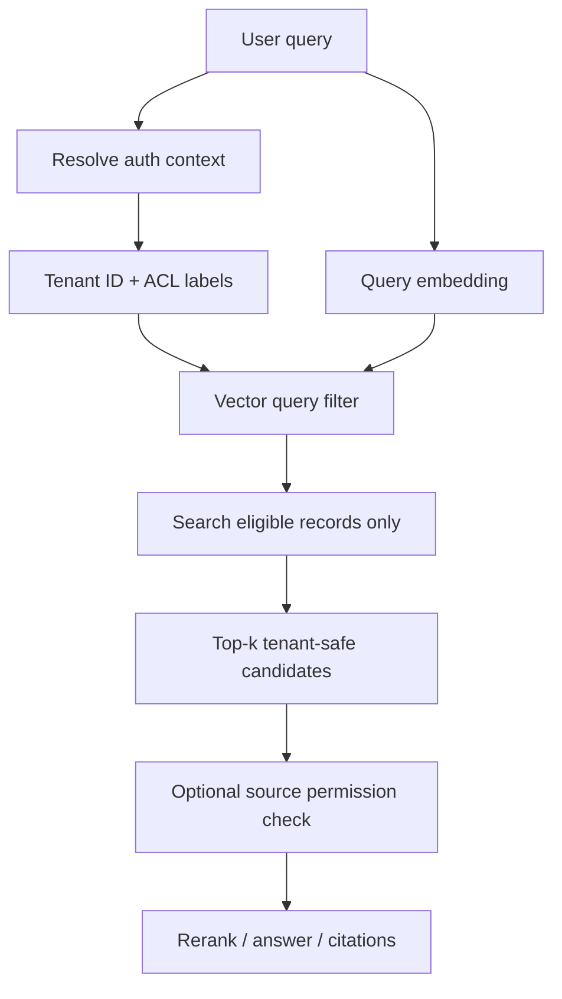

Common broken flow:

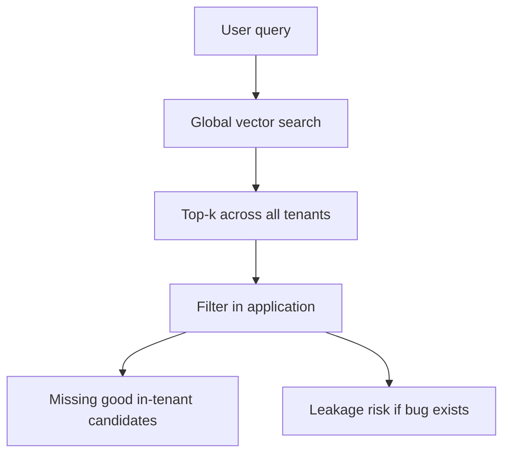

Strategy spectrum:

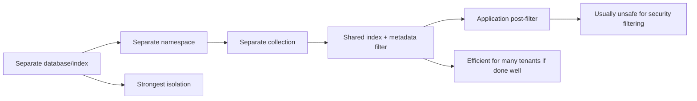

The key:

```text
Application post-filtering is not a tenant isolation strategy for sensitive data.
```

---

### 3. Real-World Scenarios [Intermediate]

#### Scenario A: B2B SaaS RAG

Each customer has private support docs.

Good pattern:

- namespace or tenant payload partition
- `tenant_id` filter always required
- document status filter
- ACL group filter
- source verification before answer
- tenant offboarding test

Bad pattern:

- one shared global index
- no required tenant filter
- app strips disallowed results after global search

Failure:

- wrong customer content appears in candidates
- even if final answer hides it, ranking quality suffers
- one bug can create cross-tenant leakage

#### Scenario B: Marketplace Search

A marketplace supports multiple regions and sellers.

Metadata filters:

- `region`
- `seller_id`
- `category`
- `in_stock`
- `price_range`
- `compliance_status`

These are not just business filters.

They shape recall and latency.

Example:

```text
semantic query: "waterproof hiking jacket"
filters: region=us, in_stock=true, category=outerwear, price<200
```

If only 0.5% of records match the filters, the ANN engine must handle highly selective filtered search.

#### Scenario C: Enterprise Permission-Aware Search

A user can access documents through:

- workspace membership
- group membership
- document ACL
- data sensitivity label
- source connector permissions

Metadata may include:

```json
{
  "tenant_id": "acme",
  "acl_groups": ["engineering", "security"],
  "source_system": "confluence",
  "sensitivity": "internal",
  "doc_status": "published"
}
```

This can work if ACLs are coarse.

But if every document has a unique ACL list with thousands of users, metadata filters become heavy.

Better:

- use access groups
- use permission tokens/ACL hashes
- precompute authorization scopes
- verify against source for sensitive answers

#### Scenario D: Tenant Offboarding

Customer asks:

> "Delete all our data."

If each tenant has a namespace:

```text
delete namespace
```

If each tenant is a payload filter inside one shared collection:

```text
delete points where tenant_id = tenant
verify no remaining records
reconcile against source
```

Offboarding is a design requirement, not a cleanup script.

---

### 4. System View [Intermediate]

#### Data Flow

```text
source document
  -> auth/tenant metadata
  -> chunking
  -> embedding
  -> vector record with stable ID
  -> tenant boundary and metadata fields
  -> filtered vector query
  -> ranked candidates
  -> source/permission verification
```

#### Control Flow

1. Ingest source record.
2. Determine tenant, source, status, language, ACL, and version.
3. Create stable chunk IDs.
4. Store vectors with filterable metadata.
5. Build or update metadata/payload indexes where needed.
6. At query time, resolve user authorization.
7. Route to namespace/collection/index if applicable.
8. Apply metadata filters inside retrieval.
9. Retrieve enough candidates for recall.
10. Verify source and permissions for sensitive contexts.
11. Rerank or answer.
12. Log query shape, latency, and filter selectivity.

#### Important States

| State | Why it matters |
|---|---|
| Tenant ID present | Required for isolation. |
| ACL labels present | Required for permission-aware retrieval. |
| Metadata field missing | Can cause accidental exclusion or inclusion depending on filter syntax. |
| Tenant offboarded | Records should be deleted or unreachable. |
| Source deleted | Vector projection must be removed or tombstoned. |
| Filter selectivity high | ANN recall can degrade if few candidates match. |
| Namespace/collection routed wrong | Severe tenant isolation incident. |
| Metadata index missing | Filtered queries can become slow or expensive. |

#### Good Record Shape

```json
{
  "id": "tenant-acme/source-doc-42/chunk-003/model-v1",
  "vector": [0.01, 0.02, 0.03],
  "metadata": {
    "tenant_id": "tenant-acme",
    "source_id": "source-doc-42",
    "chunk_index": 3,
    "doc_type": "runbook",
    "language": "en",
    "status": "published",
    "acl_groups": ["support", "security"],
    "source_version": 17,
    "embedding_model": "model-v1",
    "deleted": false
  }
}
```

The mature pattern:

```text
stable ID + tenant boundary + filterable metadata + source verification
```

---

### 5. How It Works Across Engines [Intermediate]

#### Pinecone: Namespaces as Tenant Boundaries

Pinecone's multitenancy guidance uses one namespace per tenant for serverless indexes.

Write path:

```python
index.upsert(
    vectors=[
        {
            "id": "doc-42#chunk-003",
            "values": [0.10, 0.20, 0.30],
            "metadata": {
                "doc_type": "runbook",
                "language": "en",
                "status": "published",
            },
        }
    ],
    namespace="tenant-acme",
)
```

Query path:

```python
results = index.query(
    namespace="tenant-acme",
    vector=[0.11, 0.19, 0.31],
    top_k=10,
    filter={
        "doc_type": {"$eq": "runbook"},
        "language": {"$eq": "en"},
    },
    include_metadata=True,
)
```

Tenant offboarding:

```python
index.delete(delete_all=True, namespace="tenant-acme")
```

Design intuition:

```text
namespace = tenant-scoped search space
metadata filter = business/permission narrowing inside tenant
```

#### Qdrant: Payload-Based Partitioning for Many Tenants

Qdrant recommends avoiding hundreds or thousands of collections per cluster because collection count adds overhead. For most cases, use one collection per embedding model with tenant partitioning via payload.

Write path:

```python
client.upsert(
    collection_name="kb_chunks",
    points=[
        models.PointStruct(
            id="tenant-acme/doc-42/chunk-003",
            vector=[0.10, 0.20, 0.30],
            payload={
                "tenant_id": "tenant-acme",
                "doc_type": "runbook",
                "language": "en",
            },
        )
    ],
)
```

Query path:

```python
results = client.query_points(
    collection_name="kb_chunks",
    query=[0.11, 0.19, 0.31],
    query_filter=models.Filter(
        must=[
            models.FieldCondition(
                key="tenant_id",
                match=models.MatchValue(value="tenant-acme"),
            ),
            models.FieldCondition(
                key="doc_type",
                match=models.MatchValue(value="runbook"),
            ),
        ]
    ),
    limit=10,
)
```

Design intuition:

```text
collection = shared search container
payload tenant field = logical partition
payload indexes = filter performance support
```

Use separate Qdrant collections when:

- tenant count is limited
- isolation requirement is stronger
- tenants have very different schemas/models
- tenant-level operations justify the overhead

#### Chroma: Metadata `where` Filters

Chroma queries use `where` to filter by metadata.

Example:

```python
collection.query(
    query_texts=["rotate API keys"],
    n_results=5,
    where={
        "$and": [
            {"tenant_id": "tenant-acme"},
            {"doc_type": "runbook"},
            {"language": "en"},
        ]
    },
)
```

Chroma is great for local prototypes, but for serious multitenancy you still need to decide:

- who enforces tenant routing?
- how are credentials separated?
- how are deletes verified?
- how are tenants offboarded?
- what production deployment model exists?

#### pgvector: SQL `WHERE` and Relational Indexes

pgvector handles tenant filtering through SQL:

```sql
SELECT id, body
FROM document_chunks
WHERE tenant_id = $1
  AND doc_type = 'runbook'
  AND status = 'published'
ORDER BY embedding <=> $2
LIMIT 10;
```

Supporting relational index:

```sql
CREATE INDEX document_chunks_tenant_type_status_idx
ON document_chunks (tenant_id, doc_type, status);
```

For larger tenants or strict isolation:

```sql
CREATE TABLE document_chunks (
    tenant_id text NOT NULL,
    id bigint NOT NULL,
    body text NOT NULL,
    embedding vector(1536)
) PARTITION BY LIST (tenant_id);
```

Design intuition:

```text
SQL filters and indexes define candidate scope.
Vector distance ranks rows inside that scope.
```

---

### 6. System Design Flavor [Intermediate]

#### Design Question

> Should tenant isolation be implemented with namespaces, collections, metadata filters, or separate indexes?

Do not answer by tool first.

Answer by isolation requirement and workload.

#### Isolation Ladder

| Isolation level | Example | Pros | Cons |
|---|---|---|---|
| Separate account/project/cluster | enterprise-dedicated deployment | strongest blast-radius control | highest cost/ops |
| Separate index/database | index per major tenant | strong isolation and offboarding | index sprawl |
| Separate namespace | Pinecone namespace per tenant | clean tenant routing and delete | provider-specific boundary |
| Separate collection | Qdrant collection per tenant | explicit tenant containers | many collections add overhead |
| Shared collection + tenant filter | Qdrant payload/Chroma metadata | efficient for many tenants | must enforce filters perfectly |
| SQL tenant column | pgvector/Postgres | joins/RLS/indexes available | retrieval load coupled to DB |
| App post-filter only | filter after retrieval | easy to code | unsafe for security and poor recall |

Professional rule:

> Use the strongest isolation boundary that your risk model needs, and the simplest one your workload can afford.

#### Tenant Count vs Tenant Size

| Shape | Better strategy |
|---|---|
| Few huge tenants | separate indexes, namespaces, collections, or clusters |
| Many small tenants | shared index/collection with tenant partitioning or namespaces |
| One tenant dominates traffic | isolate that tenant |
| Regulated enterprise tenant | dedicated deployment or strong namespace/index boundary |
| Need cross-tenant search | metadata filters or admin-only aggregate index |
| Frequent tenant offboarding | namespace/index/collection deletion can simplify cleanup |

#### Permission Granularity

| Permission type | Good filter shape |
|---|---|
| Tenant-level only | namespace or `tenant_id` filter |
| Workspace-level | `tenant_id` + `workspace_id` |
| Group-level ACL | `tenant_id` + `acl_group in user_groups` |
| User-level per document | avoid massive user lists; precompute groups/tokens |
| Highly sensitive data | retrieve with filters and verify source permissions |

The hidden trap:

```text
Fine-grained ACLs can become retrieval infrastructure problems.
```

If every query includes a huge `$in` list of user IDs or document IDs, latency, cost, and filter limits can become a problem.

Better:

- access groups
- permission tokens
- ACL hashes
- precomputed visibility sets
- tenant/workspace routing
- source verification

---

### 7. What Problem It Solves [Intermediate]

Primary problem solved:

> Ensure vector search returns only records from the correct tenant, permission scope, and business slice while preserving retrieval quality and performance.

Secondary benefits:

- prevents cross-tenant leakage
- reduces noisy-neighbor effects
- improves tenant offboarding
- controls query cost
- narrows candidate search space
- supports business filters like language/status/date/type
- makes evals realistic
- enables tenant-specific scaling decisions

Systems impact:

| Dimension | Impact |
|---|---|
| Security | Tenant filters and namespaces protect data boundaries. |
| Recall | Highly selective filters can reduce ANN candidate quality. |
| Latency | Smaller partitions can be faster; complex filters can be slower. |
| Cost | Namespaces/partitions can reduce scanned data; many indexes can add overhead. |
| Operations | Tenant offboarding and migrations become explicit workflows. |
| Debuggability | Good metadata makes search results explainable. |

Core architecture phrase:

> Retrieval scope first, similarity ranking second.

---

### 8. When to Rely on Each Strategy [Intermediate]

#### Use Namespaces When

Namespaces are a strong fit when:

- the engine supports them as first-class partitions
- one tenant maps naturally to one namespace
- queries always target one tenant
- tenant offboarding should be simple
- isolation and noisy-neighbor protection matter
- cross-tenant search is rare or admin-only

Pinecone example:

```text
index: rag-prod
namespace: tenant-acme
metadata: doc_type, language, status, acl_group
```

#### Use Metadata/Payload Tenant Filters When

Shared collection/index + tenant filter works when:

- tenant count is high
- tenants are small or medium
- collection/index sprawl would be costly
- query engine handles filtered search well
- filter fields are indexed where needed
- your code guarantees tenant filters on every request

Qdrant example:

```text
collection: kb_chunks_model_v1
payload tenant_id: tenant-acme
payload indexes: tenant_id, doc_type, language
```

#### Use Separate Collections or Indexes When

Separate containers make sense when:

- tenants are few and large
- tenants require different embedding models
- regulatory isolation is strong
- tenant-specific backup/restore is needed
- tenant-specific scaling is needed
- noisy-neighbor risk is high

#### Use SQL Filters When

pgvector is appropriate when:

- source data is already in Postgres
- tenant and permission logic are relational
- joins are needed
- row-level security or SQL policies matter
- workload fits Postgres capacity

#### Use Source Verification When

Always consider source verification when:

- content is sensitive
- permissions can change quickly
- source systems are authoritative
- vector index is eventually consistent
- stale retrieval would be dangerous

Pattern:

```text
vector DB returns source IDs
application verifies source state and permissions
then answer is composed
```

---

### 9. When Not to Use Metadata Filters Alone [Pro]

Metadata filters alone may be insufficient when:

- tenant isolation has legal/regulatory requirements
- one tenant has much larger data than others
- per-tenant delete/offboarding must be instant and auditable
- filters require huge `$in` lists
- ACLs are too fine-grained
- high-selectivity filters hurt recall
- query cost scans too much shared data
- the engine cannot index the filter fields effectively
- a bug in request construction could omit tenant filters

Warning signs:

```text
filter={"tenant_id": {"$in": [thousands of tenant IDs]}}
filter={"allowed_user_ids": {"$in": [thousands of users]}}
retrieve top 100 globally, then filter
same namespace contains all tenants and all query paths rely on app discipline
```

Better options:

- namespace per tenant
- collection/index per large tenant
- access groups instead of user lists
- permission-token fields
- dedicated enterprise deployment
- source verification before final answer
- separate admin index for cross-tenant analytics

---

### 10. Pros and Cons [Intermediate]

| Strategy | Pros | Cons |
|---|---|---|
| Namespace per tenant | Clear routing, easy offboarding, reduced cross-tenant blast radius | May be provider-specific and needs namespace lifecycle management |
| Collection/index per tenant | Strong isolation and tenant-level operations | Can create sprawl and overhead |
| Shared index + tenant filter | Efficient for many small tenants | Requires strict enforcement and good filter performance |
| SQL tenant column | Rich relational permissions and joins | Coupled to Postgres capacity/planner |
| App post-filter | Simple to add after the fact | Unsafe for sensitive data and can destroy recall |

Simple summary:

```text
Multitenancy trades off isolation, cost, query performance, operational overhead, and retrieval quality.
```

---

### 11. Trade-offs and Common Mistakes [Pro]

#### Trade-offs

##### Isolation vs Cost

Strong isolation:

```text
separate cluster/index/namespace
```

Costs more operationally, but reduces risk.

Shared storage:

```text
tenant_id metadata filter
```

Efficient, but correctness depends on every query being scoped.

##### Filter Selectivity vs Recall

If a filter matches 50% of records, ANN search usually has many candidates.

If a filter matches 0.01%, the engine may struggle unless it has a good filtered-search strategy.

Measure recall under real filters:

```text
global recall is not tenant-filtered recall
```

##### Fine-Grained ACLs vs Query Simplicity

Coarse filters:

```json
{"tenant_id": "acme", "acl_group": {"$in": ["support", "security"]}}
```

Large per-user filters:

```json
{"allowed_user_ids": {"$in": ["u1", "u2", "... thousands ..."]}}
```

Large lists can hurt latency, hit provider limits, or make requests too large.

##### Tenant Offboarding vs Shared Index Efficiency

Namespace delete:

```text
simple and fast
```

Shared collection delete:

```text
delete by filter, verify, compact/optimize if needed
```

Shared storage can be efficient day to day, but offboarding requires stronger process.

#### Common Mistakes

##### Mistake 1: Filtering After Vector Search

Bad:

```text
global top-k -> application filters tenant
```

Why wrong:

- can leak data
- reduces recall
- wastes compute
- hides bugs until production

Better:

```text
tenant boundary and metadata filters inside vector query
```

##### Mistake 2: Optional Tenant Filter

Bad:

```python
filter = request.get("filter", {})
```

Why wrong:

The caller can omit the tenant filter.

Better:

```python
filter = {
    "$and": [
        {"tenant_id": auth_context.tenant_id},
        user_supplied_safe_filter,
    ]
}
```

The server owns tenant scoping.

##### Mistake 3: Using Metadata for Everything

Bad:

```json
{
  "metadata": {
    "tenant_id": "acme",
    "allowed_user_ids": ["u1", "u2", "..."],
    "entire_document": "..."
  }
}
```

Why wrong:

Metadata should support filtering and context, not become an unbounded business database.

Better:

- store source text in source system or controlled fields
- store compact filter fields
- store IDs for rehydration
- keep large ACL logic in auth/source systems where appropriate

##### Mistake 4: Missing Filter Indexes

Bad:

```text
hot filters exist, but engine has no payload/metadata/SQL index support configured
```

Better:

- Qdrant payload indexes for hot fields
- Postgres B-tree/GIN/partial indexes
- Pinecone namespace strategy where tenant filtering is primary
- benchmark Chroma filters for prototype use

##### Mistake 5: No Tenant Offboarding Test

Bad:

> "We can probably delete records by tenant later."

Better:

Write an automated test:

1. Ingest tenant records.
2. Query and confirm results exist.
3. Delete/offboard tenant.
4. Query again.
5. Verify zero results.
6. Reconcile against source.

##### Mistake 6: No Cross-Tenant Negative Test

Bad:

Only test that tenant A can find tenant A docs.

Better:

Also test:

```text
tenant A query must never return tenant B source IDs
tenant B query must never return tenant A source IDs
missing tenant context must fail closed
```

##### Mistake 7: Confusing Metadata Filters with Authorization

Metadata filters help enforce retrieval scope.

But authorization still belongs in your application/security model.

Better:

```text
auth context -> safe retrieval filter -> vector search -> source verification if needed
```

---

### 12. Key Numbers [Pro]

Numbers vary by engine and plan, but these are useful reasoning anchors.

| Concept | Practical anchor |
|---|---|
| Tenant count | Drives namespace/collection/index strategy. |
| Tenant size distribution | One huge tenant can justify isolation. |
| Filter selectivity | Percent of records matching the filter; critical for recall and latency. |
| Top-k | Usually 5-50 for final candidates, often higher before reranking. |
| Candidate pool | Often 20-200 before reranking, depending on quality/cost. |
| Pinecone `$in`/`$nin` limit | 10,000 values per operator in documented metadata filters. |
| Qdrant Cloud collection count note | Docs warn against hundreds/thousands of collections; Cloud limit mentioned as 1000 collections per cluster. |
| Raw vector size | `rows * dimensions * 4 bytes` for float32 values. |
| Offboarding SLA | Time to make a tenant's data unreachable and verifiably deleted. |
| Ingestion lag | Time between source update/delete and vector projection update. |

Filter selectivity examples:

```text
tenant filter matches 20% of index:
    moderately selective

tenant + doc_type + ACL filter matches 0.05%:
    highly selective, must benchmark recall

one namespace per tenant:
    tenant selectivity handled by partition routing
```

Interview sentence:

> "I would benchmark recall and latency under realistic tenant and ACL filters, not just global nearest-neighbor search."

---

### 13. Failure Modes [Pro]

#### Failure Mode 1: Cross-Tenant Leakage

Symptoms:

- returned source ID belongs to another tenant
- logs show missing tenant filter
- namespace parameter is wrong
- source verification catches mismatch

Mitigation:

- server-side tenant filter injection
- fail closed when tenant context is missing
- namespace/collection routing tests
- source permission verification
- negative tests for cross-tenant retrieval
- audit logs for tenant, namespace, and filters

#### Failure Mode 2: Low Recall for Small Tenants

Symptoms:

- global search works
- small tenant search misses obvious docs
- filtered query returns too few candidates

Mitigation:

- partition by namespace or collection
- increase candidate pool
- tune filtered ANN parameters
- add payload/metadata indexes
- use exact search for tiny tenant partitions
- add lexical/hybrid fallback

#### Failure Mode 3: Noisy Neighbor

Symptoms:

- one tenant's traffic slows others
- one tenant's reindexing/backfill affects shared index
- cost spikes caused by one customer

Mitigation:

- isolate large tenants
- per-tenant rate limits
- namespace/index split
- dedicated deployment for enterprise tenants
- usage attribution
- query budgets

#### Failure Mode 4: Tenant Offboarding Fails

Symptoms:

- deleted tenant still appears in search
- namespace delete did not cover all indexes
- stale projection remains after source deletion

Mitigation:

- centralized tenant inventory
- delete across all indexes/collections/namespaces
- reconciliation queries
- tombstones
- deletion audit logs
- offboarding integration test

#### Failure Mode 5: Filter Field Drift

Symptoms:

- old records use `tenant`
- new records use `tenant_id`
- some records missing `status`
- query filters silently exclude or include unexpected records

Mitigation:

- metadata schema contract
- validation at ingestion
- backfill/migration jobs
- filter field dashboards
- fail ingestion on missing required fields

#### Failure Mode 6: ACL Filter Explosion

Symptoms:

- query contains thousands of allowed IDs
- provider filter limit hit
- request payload too large
- latency increases sharply

Mitigation:

- access groups
- precomputed permission tokens
- namespace/workspace routing
- source verification
- split indexes for sensitive domains

---

### 14. Scenario [Intermediate]

#### Product / System

Design multitenant retrieval for a customer-support AI product.

Requirements:

- 2,000 SaaS customers
- each customer has private docs
- users belong to teams
- some docs are support-only, some engineering-only
- customers can request deletion
- most queries are tenant-local
- admin analytics occasionally needs cross-tenant aggregate search

#### Recommended Design

For Pinecone:

```text
index: support-rag-prod
namespace: tenant_id
metadata: doc_type, language, status, acl_group, source_id, source_version
```

For Qdrant:

```text
collection: support_rag_model_v1
payload: tenant_id, doc_type, language, status, acl_group, source_id, source_version
payload indexes: tenant_id, doc_type, language, acl_group
```

For pgvector:

```sql
tenant_id text NOT NULL,
doc_type text NOT NULL,
language text NOT NULL,
status text NOT NULL,
acl_group text[] NOT NULL,
embedding vector(1536)
```

Query scope:

```text
tenant_id = user's tenant
status = published
acl_group overlaps user's groups
language = user's language preference
```

Admin analytics:

- separate admin path
- explicit cross-tenant permission
- aggregate or anonymize where possible
- do not reuse normal user query path

#### What Would Go Wrong Without This

Without tenant scoping:

- customer data can leak
- recall becomes unstable
- offboarding becomes unreliable
- cost attribution is impossible
- one tenant can affect another

Strong system design answer:

> "I would make tenant scope a required server-side query parameter, use namespace or payload partitioning depending on engine and tenant shape, index hot metadata fields, verify source permissions for sensitive answers, and test cross-tenant negative cases."

---

### 15. Code Sample [Intermediate]

#### Safe Filter Builder

This example models the idea that application code should own tenant filters. User-supplied filters can narrow results, but cannot remove the tenant boundary.

```python
def build_safe_filter(auth_context, user_filter=None):
    required = [
        {"tenant_id": {"$eq": auth_context["tenant_id"]}},
        {"status": {"$eq": "published"}},
    ]

    if auth_context.get("groups"):
        required.append({"acl_group": {"$in": auth_context["groups"]}})

    if user_filter:
        required.append(user_filter)

    return {"$and": required}


auth_context = {
    "tenant_id": "tenant-acme",
    "groups": ["support", "security"],
}

user_filter = {
    "doc_type": {"$eq": "runbook"}
}

safe_filter = build_safe_filter(auth_context, user_filter)

print(safe_filter)
```

Expected output shape:

```python
{
    "$and": [
        {"tenant_id": {"$eq": "tenant-acme"}},
        {"status": {"$eq": "published"}},
        {"acl_group": {"$in": ["support", "security"]}},
        {"doc_type": {"$eq": "runbook"}},
    ]
}
```

The important pattern:

```text
user can narrow scope
user cannot expand scope
```

#### Pinecone Query Shape

```python
safe_filter = {
    "$and": [
        {"doc_type": {"$eq": "runbook"}},
        {"status": {"$eq": "published"}},
        {"acl_group": {"$in": ["support", "security"]}},
    ]
}

results = index.query(
    namespace="tenant-acme",
    vector=query_vector,
    top_k=20,
    filter=safe_filter,
    include_metadata=True,
)
```

#### Qdrant Query Shape

```python
results = client.query_points(
    collection_name="kb_chunks",
    query=query_vector,
    query_filter=models.Filter(
        must=[
            models.FieldCondition(
                key="tenant_id",
                match=models.MatchValue(value="tenant-acme"),
            ),
            models.FieldCondition(
                key="status",
                match=models.MatchValue(value="published"),
            ),
        ],
        should=[
            models.FieldCondition(
                key="acl_group",
                match=models.MatchValue(value="support"),
            ),
            models.FieldCondition(
                key="acl_group",
                match=models.MatchValue(value="security"),
            ),
        ]
    ),
    limit=20,
)
```

#### pgvector Query Shape

```sql
SELECT id, source_id, body
FROM document_chunks
WHERE tenant_id = $1
  AND status = 'published'
  AND acl_groups && $2
ORDER BY embedding <=> $3
LIMIT 20;
```

---

### 16. Mini Program / Simulation [Pro]

This simulation shows why filtering after global search is wrong.

```python
from math import sqrt


RECORDS = [
    {
        "id": "tenant-a/auth-1",
        "tenant_id": "tenant-a",
        "text": "reset password login help",
        "vector": [0.10, 0.20, 0.30],
    },
    {
        "id": "tenant-a/billing-1",
        "tenant_id": "tenant-a",
        "text": "billing invoice payment help",
        "vector": [0.80, 0.10, 0.05],
    },
    {
        "id": "tenant-b/auth-1",
        "tenant_id": "tenant-b",
        "text": "perfect password reset guide",
        "vector": [0.11, 0.20, 0.31],
    },
]


def distance(a, b):
    return sqrt(sum((x - y) ** 2 for x, y in zip(a, b)))


def global_then_filter(query_vector, tenant_id, k):
    global_top = sorted(
        RECORDS,
        key=lambda record: distance(record["vector"], query_vector),
    )[:k]
    return [record for record in global_top if record["tenant_id"] == tenant_id]


def filter_then_search(query_vector, tenant_id, k):
    scoped = [
        record
        for record in RECORDS
        if record["tenant_id"] == tenant_id
    ]
    return sorted(
        scoped,
        key=lambda record: distance(record["vector"], query_vector),
    )[:k]


def main():
    query = [0.11, 0.20, 0.31]

    print("Global then filter:")
    for record in global_then_filter(query, "tenant-a", k=1):
        print(record["id"])

    print("Filter then search:")
    for record in filter_then_search(query, "tenant-a", k=1):
        print(record["id"])


if __name__ == "__main__":
    main()
```

Expected lesson:

```text
Global top-1 belongs to tenant B.
If you take global top-1 and then filter to tenant A, you get no result.
If you filter to tenant A first, you get the best tenant-safe result.
```

This is the retrieval-quality version of the security problem.

---

### 17. Hands-On Lab [Pro]

#### Goal

Design and test tenant-safe vector retrieval.

#### Build

Create a small dataset:

| ID | Tenant | Doc type | ACL group | Text |
|---|---|---|---|---|
| a-1 | tenant-a | runbook | support | reset password |
| a-2 | tenant-a | faq | billing | invoice payment |
| a-3 | tenant-a | runbook | security | rotate API keys |
| b-1 | tenant-b | runbook | support | reset password |
| b-2 | tenant-b | faq | billing | invoice payment |

Implement four query shapes:

1. Global search.
2. Tenant-filtered search.
3. Tenant + doc type search.
4. Tenant + doc type + ACL group search.

#### Break

Break 1: Omit tenant filter.

Expected result:

```text
cross-tenant records can appear
```

Break 2: Filter after top-k.

Expected result:

```text
tenant-safe recall drops
```

Break 3: Use a huge ACL list.

Expected result:

```text
query payload and filter complexity become design problems
```

Break 4: Delete tenant data incompletely.

Expected result:

```text
offboarding requires verification
```

#### Measure

Build this table:

| Query | Tenant | Filter | Expected source | Results | Cross-tenant leak? | Recall@k |
|---|---|---|---|---|---|---|
| reset password | tenant-a | tenant only | a-1 | | | |
| reset password | tenant-a | tenant + runbook | a-1 | | | |
| invoice | tenant-b | tenant + billing | b-2 | | | |
| rotate API key | tenant-a | tenant + security | a-3 | | | |

#### Capstone

Write a design for:

> 10,000-tenant RAG system with 100 small tenants, 20 huge tenants, strict tenant deletion, group-level ACLs, and occasional admin cross-tenant analytics.

Your answer must choose:

- namespace vs metadata filter vs collection/index
- large-tenant isolation strategy
- required metadata fields
- ACL representation
- delete/offboarding flow
- cross-tenant admin search path
- recall/latency test plan

---

### 18. Active Recall [Beginner]

Answer without looking:

1. What is multitenancy?
2. Why is post-filtering after global vector search dangerous?
3. What is a namespace?
4. When is namespace-per-tenant a strong fit?
5. How does Qdrant commonly model many tenants?
6. How does pgvector model tenant filtering?
7. What is filter selectivity?
8. Why can highly selective filters hurt recall?
9. What is tenant offboarding?
10. Why should the server build the tenant filter instead of trusting the client?

Expected answers:

1. One system serving multiple tenants while preserving isolation.
2. It risks leakage and can remove globally retrieved candidates without finding the best in-tenant ones.
3. A partition inside an index/search container.
4. When queries are tenant-local and tenant deletion/isolation matter.
5. Shared collection with tenant payload fields and filters, with payload indexes where needed.
6. SQL `WHERE tenant_id = ...` plus relational indexes/partitions.
7. The fraction of records matching a filter.
8. ANN may not find enough good candidates if few records match after/inside filtered search.
9. Removing a tenant's data and making it unreachable/verifiably deleted.
10. The tenant boundary must be enforced, not user-controlled.

---

### 19. Practice [Intermediate]

#### Practice 1: Tenant Strategy

Prompt:

> You have 2,000 small tenants and most queries target one tenant. What strategy would you consider in Pinecone?

Strong answer:

> "Use one namespace per tenant inside the relevant index, with metadata filters for doc type, language, status, and ACL group. Namespace routing gives tenant-local reads and simpler offboarding."

#### Practice 2: Qdrant Strategy

Prompt:

> You have 50,000 small tenants in Qdrant. Should you create 50,000 collections?

Strong answer:

> "Usually no. Qdrant warns against many collections due to overhead. I would use a shared collection per embedding model with tenant payload partitioning, payload indexes for hot filters, and isolate unusually large or regulated tenants separately."

#### Practice 3: Access Control

Prompt:

> A user belongs to groups `support` and `security`. Write the retrieval scope.

Strong answer:

```text
tenant_id = user's tenant
status = published
acl_group in ["support", "security"]
```

Also mention:

> "For sensitive data, verify source permissions before final answer."

#### Practice 4: Offboarding

Question:

> What should happen when tenant `acme` is deleted?

Strong answer:

> "Delete or make unreachable all `acme` records across every namespace, collection, index, and source projection; verify zero retrievable records; record an audit trail; and reconcile against source inventories."

#### Practice 5: Interview Trap

Question:

> Why not just store `tenant_id` in metadata and call it done?

Strong answer:

> "Because the filter must be enforced on every read/write/delete path, indexed or partitioned for performance, tested for leakage, evaluated for filtered recall, and designed for offboarding. `tenant_id` is a field, not a complete multitenancy strategy."

---

### 20. Production Reality Check

**If this fails in prod, what is the first thing we inspect?**

For multitenant vector search, inspect:

1. Auth context
2. Namespace/collection/index routing
3. Tenant filter construction
4. Metadata field presence
5. ACL filter shape
6. Returned source tenant IDs
7. Filter selectivity
8. Payload/metadata/SQL indexes
9. Delete/offboarding logs
10. Source permission verification

The production debugging question:

> Is this an isolation problem, filter-construction problem, filter-performance problem, recall-under-filter problem, or source-permission problem?

#### Multitenancy Runbook

1. Confirm tenant context exists.
2. Confirm missing tenant context fails closed.
3. Log namespace/collection/index used.
4. Log final server-built filter.
5. Query known tenant A document as tenant A.
6. Query known tenant B document as tenant A and verify no result.
7. Check metadata field names and values.
8. Check filter index support.
9. Compare filter-then-search vs global-then-filter behavior.
10. Verify source permissions for returned IDs.
11. Run tenant offboarding test.
12. Reconcile vector projection against source of truth.

#### What Good Looks Like

A mature multitenant vector system can answer:

- What is the tenant boundary?
- Who constructs the tenant filter?
- Can a client remove the tenant filter?
- Are hot metadata fields indexed?
- How are ACLs represented?
- What is filter selectivity by tenant?
- How is recall measured under filters?
- How are large tenants isolated?
- How is tenant offboarding verified?
- How is cross-tenant admin search separated?
- What happens if metadata is missing?

That is production-grade retrieval safety.

---

### 21. Topic 5.2 Checkpoint: Vector Database Ecosystem

You should now be able to compare the ecosystem:

| Tool / concept | Best mental model |
|---|---|
| Chroma | Local-first experimentation and RAG prototype workbench. |
| pgvector | Semantic search inside Postgres and SQL business logic. |
| Qdrant | Vector-first engine with collections, points, payloads, filtering, and self-host/cloud options. |
| Pinecone | Managed vector database with indexes, namespaces, records/documents, and metadata filtering. |
| Multitenancy | Tenant-safe retrieval scope before similarity ranking. |
| Metadata filters | Business, safety, and retrieval-quality constraints inside the query. |

Checkpoint prompts:

1. When would you use Chroma?
2. When would you use pgvector?
3. When would you use Qdrant or Pinecone?
4. What is the source of truth?
5. What is the retrieval projection?
6. How do tenant boundaries affect recall?
7. Why is metadata filter design part of system design?
8. How do you delete a tenant safely?

Strong synthesis:

> "I would start with Chroma for fast local learning, pgvector when semantic search belongs near relational data and SQL filters, and a dedicated engine when retrieval needs independent scaling, vector-specific operations, hybrid search, or stronger tenant isolation. In production, I would treat the vector database as a retrieval projection, enforce tenant scope inside every query, verify sensitive source permissions, and benchmark recall/latency under realistic metadata filters."

---

### 22. Curiosity Bridge

Now embeddings have become real infrastructure:

```text
similarity search fundamentals
    -> vector datastore choices
    -> tenant-safe filtered retrieval
```

The next layer is filtering, hybrid retrieval, and scale tradeoffs:

- how filters change candidate sets
- how partitions change latency and cost
- how hybrid retrieval combines dense and lexical signals
- how recall, latency, memory, and cost fight each other
- how production teams tune retrieval behavior

That moves us from "which vector database?" to "how do we make retrieval correct, fast, and affordable under real filters?"

---

### 23. Exit Check + Carry-Forward Review

**Exit check - you are done when you can:**
Design tenant-safe vector retrieval; choose namespace vs collection/index vs metadata filter vs SQL tenant column; explain why post-filtering is unsafe; model ACL metadata without huge filter explosions; reason about filter selectivity and recall; design tenant offboarding; and explain how multitenancy connects Chroma, pgvector, Qdrant, and Pinecone into one ecosystem view.

**Carry-Forward Review:**

Question: How does multitenancy connect to vector search fundamentals?

Answer: Similarity search ranks nearest vectors, but multitenancy decides which vectors are eligible to be ranked. Tenant boundaries, namespaces, metadata filters, and SQL `WHERE` clauses shape the candidate set before distance ranking, so they directly affect safety, recall, latency, cost, and production correctness.

---

## Topic 5.3: Filtering, Hybrid Retrieval, and Scale Tradeoffs

> **Topic time:** 10h
> Focus: Learning how production vector search behaves when queries include metadata filters, tenant boundaries, partitions, hybrid dense/sparse retrieval, reranking, and scale constraints. The goal is to reason beyond "nearest vectors" and design retrieval systems that stay correct, fast, measurable, and affordable.

---

## Subtopic 5.3.a: Metadata Filtering and Partitioning Patterns

### Add to Knowledge Base

**Metadata filtering** narrows which records are eligible for retrieval based on fields such as tenant, document type, language, status, date, access group, product category, region, or source system.

**Partitioning** physically or logically divides the searchable corpus so queries touch a smaller and more relevant portion of data.

The core idea:

> Filtering defines the candidate set; partitioning changes where that candidate set lives. Together, they decide safety, recall, latency, cost, and operational complexity.

A pure vector query asks:

```text
find the nearest vectors in the whole corpus
```

A production query usually asks:

```text
find the nearest vectors among:
    this tenant
    this user permission scope
    this document type
    this language
    this time range
    this product/category/region
```

That is a different problem.

Reference anchor:
- Pinecone multitenancy docs: `https://docs.pinecone.io/guides/index-data/implement-multitenancy`
- Pinecone metadata filtering docs: `https://docs.pinecone.io/guides/search/filter-by-metadata`
- Qdrant multitenancy docs: `https://qdrant.tech/documentation/manage-data/multitenancy/`
- Qdrant indexing docs: `https://qdrant.tech/documentation/concepts/indexing/`
- Qdrant filtering docs: `https://qdrant.tech/documentation/search/filtering/`
- Chroma metadata filtering docs: `https://docs.trychroma.com/docs/querying-collections/metadata-filtering`
- pgvector README filtering guidance: `https://github.com/pgvector/pgvector`
- Curator multi-tenant vector index paper: `https://arxiv.org/abs/2401.07119`

Key vocabulary:

| Term | Meaning |
|---|---|
| Filter | Predicate that restricts eligible records. |
| Filter selectivity | Fraction of records that match a filter. |
| Hot filter field | Metadata field used frequently in queries. |
| Partition | Logical/physical division of data. |
| Namespace | Provider-specific partition inside an index, commonly used for tenants. |
| Collection/index/table partition | Engine-specific container boundary. |
| Payload/metadata index | Index that accelerates filtering on metadata fields. |
| Pre-filter | Apply filter before vector ranking. |
| Post-filter | Retrieve candidates first, then filter. |
| Integrated filtered ANN | Engine searches vectors while respecting filters. |
| Overpartitioning | Too many partitions, causing operational overhead and low recall per partition. |

The beginner mistake:

```text
Filtering is just a WHERE clause added after vector search.
```

Better:

```text
Filtering changes the retrieval problem. It affects which candidates exist, whether ANN recall is good, how much data is searched, how partitions are routed, and whether the system is safe.
```

---

### Reading Path + Level Tags

- **Beginner:** Read sections 0-2 and Active Recall.
- **Intermediate:** Add sections 3-8 and complete the design examples.
- **Pro:** Complete the Hands-On Lab, failure modes, and production runbook.

---

### 0. Pre-Question Hook [Beginner]

**Pause:** You have 100 million document chunks in a vector database.

A user asks:

> "How do I rotate production API keys?"

But the query must search only:

- tenant = `acme`
- language = `en`
- document status = `published`
- source type = `security_runbook`
- access group in `["platform", "security"]`
- updated in the last 18 months

What is the actual retrieval problem?

Bad answer:

> "Run vector search over 100M chunks and filter afterward."

Better answer:

> "Resolve the eligible candidate set first through partition routing and metadata filters, then run vector search inside that scoped data. The design must preserve tenant safety, filtered recall, and latency."

Before reading on, answer:

- How selective is each filter?
- Which filters are always present?
- Which fields deserve indexes?
- Should tenant be a namespace, collection, partition, or metadata field?
- Does date filtering belong in metadata or time partitions?
- What happens when filters match very few records?
- Is exact search better for tiny filtered subsets?
- How do we benchmark filtered recall?

This is where production retrieval begins.

---

### 1. The Intuition (Plain English) [Beginner]

Imagine a giant library.

Vector search is like asking:

```text
Which books are semantically closest to this question?
```

Metadata filtering is like asking:

```text
Only search:
    this floor
    this department
    this language
    books published after 2024
    books the reader is allowed to access
```

Partitioning is like deciding how the library is physically organized:

```text
one building
separate floors by tenant
separate rooms by topic
separate shelves by date
special vaults for sensitive documents
```

The best layout depends on how people search.

If every query starts with a tenant, tenant partitioning can help.

If every query filters by language and status, those fields need fast filtering.

If every query combines many filters, you must test whether the engine still finds good nearest neighbors.

**The simplest explanation:**

> Metadata filters decide what can be searched. Partitions decide where searchable data lives. Good systems align both with real query patterns.

**The key mental model:**

```text
retrieval quality = candidate set quality + ranking quality
```

Filters and partitions shape candidate set quality.

Embedding distance shapes ranking quality.

If the candidate set is wrong, even a perfect embedding model cannot fix the result.

---

### 2. Visual Diagram (Mermaid) [Beginner]

Filter-first retrieval:

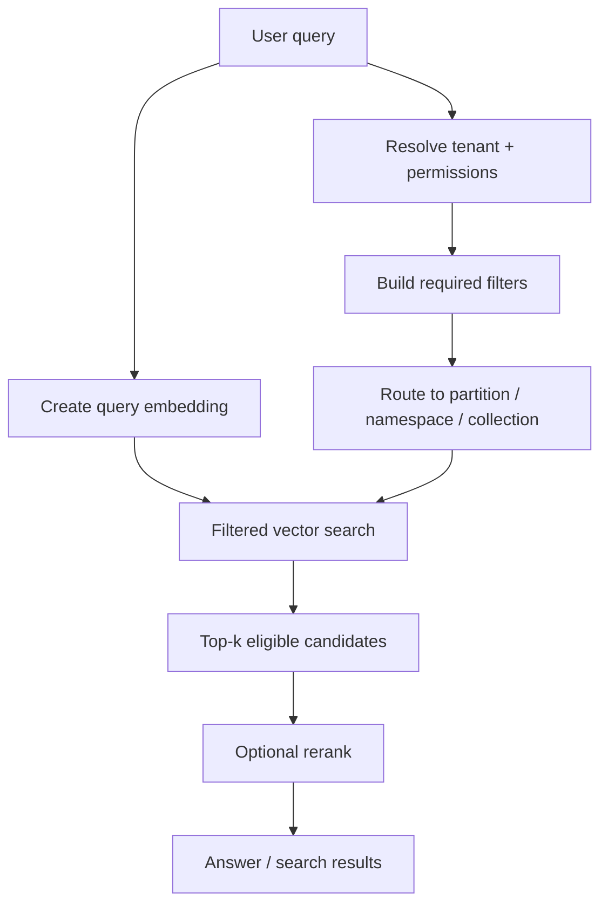

Three ways filters interact with ANN:

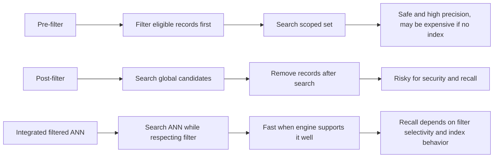

Partitioning options:

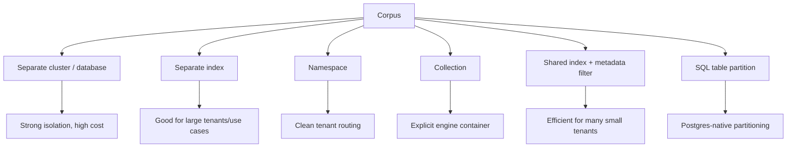

The production truth:

```text
No partitioning strategy is universally best.
The right one follows query shape, tenant shape, and operational constraints.
```

---

### 3. Real-World Scenarios [Intermediate]

#### Scenario A: Tenant-Local Enterprise RAG

Query shape:

```text
tenant_id = always present
doc_status = published
acl_group in user's groups
language = user's language
vector search over eligible chunks
```

Good partitioning choices:

- Pinecone namespace per tenant
- Qdrant shared collection with `tenant_id` payload index for many tenants
- Qdrant separate collection for a few large regulated tenants
- pgvector `tenant_id` column with B-tree index or table partitioning

Bad choice:

```text
global index, retrieve top 100, filter tenant later
```

Why:

- cross-tenant risk
- poor in-tenant recall
- no clean offboarding

#### Scenario B: Product Search With Business Filters

Query:

```text
"lightweight waterproof hiking jacket"
region = us
category = outerwear
in_stock = true
price <= 200
brand in allowed_brands
```

Important filter fields:

- region
- category
- stock status
- price bucket
- brand
- compliance status

Partitioning idea:

```text
region/category may be good partition or index candidates
price may be a filter/range field
stock status changes too often to drive physical partitioning
```

Design lesson:

> Frequently changing fields can be expensive partition keys.

#### Scenario C: Time-Bounded Search

Query:

```text
find similar incidents from last 90 days
```

Options:

- metadata range filter on `created_at`
- time-based partitions
- separate hot/recent index and cold/archive index
- exact search over recent subset if small

Trade-off:

```text
time filters are common, but time partitions can create many partitions and complicate rebalancing
```

#### Scenario D: Mixed Tenant Sizes

Tenant distribution:

```text
10 tenants have 50M chunks each
50,000 tenants have fewer than 10k chunks each
```

Better strategy:

- isolate huge tenants into separate namespaces/indexes/collections
- keep small tenants in shared partitioned structure
- enforce tenant filters in all paths
- track per-tenant latency/cost

Design lesson:

> A single partitioning strategy may be wrong for a skewed tenant distribution.

---

### 4. System View [Intermediate]

#### Data Flow

```text
source record
  -> extract metadata
  -> validate required filter fields
  -> choose partition / namespace / collection
  -> embed content
  -> upsert vector + metadata
  -> build/update metadata indexes
  -> query with scoped filters
  -> inspect recall/latency/cost
```

#### Control Flow

1. Define required filters from product/security rules.
2. Identify optional user filters.
3. Map required filters to partitioning strategy.
4. Map frequently queried fields to metadata/payload/SQL indexes.
5. Ingest records with required metadata validation.
6. At query time, resolve tenant and permission scope.
7. Route query to correct partition/container.
8. Apply required filters inside the vector query.
9. Retrieve enough candidates for the filter selectivity.
10. Rerank or verify source permissions if needed.
11. Log query shape, filter selectivity, top-k, latency, and result quality.

#### Important States

| State | Meaning |
|---|---|
| Required metadata present | Record can be safely searched. |
| Metadata missing | Record should fail ingestion or go to quarantine. |
| Hot field indexed | Filter can be efficient. |
| Filter selectivity known | Query tuning can be reasoned about. |
| Partition routed correctly | Query touches the intended data slice. |
| Tiny candidate set | Exact search may be cheaper/better than ANN. |
| Huge candidate set | ANN and partitioning matter more. |
| Highly selective filter | Recall must be measured carefully. |
| Overpartitioned corpus | Too many tiny partitions increase overhead and reduce flexibility. |

#### Metadata Schema Contract

A good metadata contract distinguishes:

```text
required fields:
    tenant_id
    source_id
    source_version
    status
    embedding_model
    chunk_version

hot filter fields:
    doc_type
    language
    acl_group
    region
    category

cold context fields:
    author
    title
    source_url
    section_path
```

Important:

> Do not put every possible field into the hot filtering path. Hot filters deserve indexing and tests. Cold metadata can exist for context and debugging.

---

### 5. Filtering Strategies [Intermediate]

#### Strategy 1: Pre-Filter Then Search

```text
filter records first
then rank by vector distance
```

Example SQL:

```sql
SELECT id, body
FROM chunks
WHERE tenant_id = $1
  AND doc_type = 'runbook'
  AND status = 'published'
ORDER BY embedding <=> $2
LIMIT 20;
```

Pros:

- safe
- semantically correct
- works well when filtered set is small enough

Cons:

- can be slow if filtering is not indexed
- can limit ANN index usefulness depending on engine/query

Best fit:

- Postgres/pgvector
- exact search over small filtered subsets
- strong security filters

#### Strategy 2: Integrated Filtered ANN

```text
ANN search understands metadata filter during search
```

Example Qdrant/Pinecone shape:

```text
query vector + top_k + metadata filter
```

Pros:

- fast when engine supports it well
- avoids unsafe app post-filtering
- natural for vector databases

Cons:

- recall can vary with filter selectivity
- hot fields may need payload/metadata indexes
- engine-specific behavior matters

Best fit:

- dedicated vector engines
- metadata filters used on most queries
- tenant-safe retrieval with good engine support

#### Strategy 3: Partition Route Then Search

```text
route query to tenant namespace / collection / partition
then apply smaller filters inside it
```

Example:

```text
namespace = tenant_id
filter = doc_type + language + status
```

Pros:

- clean tenant scope
- smaller search space
- easier offboarding
- can reduce noisy-neighbor effects

Cons:

- many partitions require lifecycle management
- cross-partition search becomes harder
- tiny partitions may reduce recall or waste overhead

Best fit:

- tenant-local queries
- clear isolation boundary
- frequent tenant deletes/offboarding

#### Strategy 4: Retrieve More, Then Safe Secondary Filter

Sometimes you retrieve a larger candidate set and then apply a non-security secondary filter or reranker.

Acceptable:

```text
engine filter: tenant_id, status, permission
retrieve top 100
reranker/filter: diversity, freshness, citation quality
```

Dangerous:

```text
engine search: global
app filter: tenant_id, permission
```

Rule:

> Security and tenant filters must be inside the retrieval scope. Soft ranking preferences can happen after retrieval.

---

### 6. Partitioning Patterns [Intermediate]

#### Pattern 1: Tenant Namespace

```text
index: kb-prod
namespace: tenant-acme
```

Good for:

- tenant-local queries
- clean offboarding
- managed engines with namespace support
- reducing cross-tenant risk

Risk:

- many namespaces need lifecycle and observability
- cross-tenant admin search needs separate path

#### Pattern 2: Shared Collection With Tenant Payload

```text
collection: kb_chunks_model_v1
payload: tenant_id
```

Good for:

- many small tenants
- engines that optimize payload filtering
- avoiding collection/index sprawl

Risk:

- every query must enforce tenant filter
- payload index and filter performance matter
- large tenants can dominate unless isolated

#### Pattern 3: Separate Index/Collection for Large Tenants

```text
small tenants -> shared index
enterprise tenant -> dedicated index
```

Good for:

- skewed tenant sizes
- noisy-neighbor control
- enterprise isolation
- custom retention/indexing policies

Risk:

- more operational complexity
- routing table required
- migrations and monitoring per tenant

#### Pattern 4: Time-Based Partitioning

```text
recent index: last 90 days
archive index: older records
```

Good for:

- recent-first search
- incident/support logs
- temporal retention policies
- reducing hot query cost

Risk:

- relevant old records may be missed
- query fanout across time partitions can increase latency
- partition rollover must be managed

#### Pattern 5: Category/Domain Partitioning

```text
index per product family
collection per domain
partition by source system
```

Good for:

- very different semantic domains
- separate embedding models
- different metadata schemas
- different teams owning search quality

Risk:

- query routing mistakes
- cross-domain queries require fanout/fusion
- overpartitioning can hide relevant results

#### Pattern 6: Embedding Model Version Partitioning

```text
collection: chunks_text_embedding_v1
collection: chunks_text_embedding_v2
```

Good for:

- migration safety
- avoiding comparison across incompatible vector spaces
- blue-green re-embedding rollouts

Risk:

- dual storage during migration
- query path must choose version
- evals needed before cutover

---

### 7. System Design Flavor [Intermediate]

#### Design Question

> We have 200M chunks, 20k tenants, strong tenant isolation, language filters, doc-type filters, and high QPS. How should we design filtering and partitioning?

Strong answer structure:

1. Identify required filters.
2. Estimate filter selectivity.
3. Choose tenant isolation strategy.
4. Choose hot metadata indexes.
5. Define large-tenant exceptions.
6. Benchmark filtered recall and latency.
7. Define offboarding and migration paths.

#### Filter Classification

| Filter | Classification | Design implication |
|---|---|---|
| `tenant_id` | required security/isolation | must be enforced server-side |
| `acl_group` | required permission | must be inside retrieval or source verification |
| `status` | required business safety | usually hot indexed field |
| `language` | common quality filter | index if frequently used |
| `doc_type` | common relevance filter | index or partition if highly used |
| `created_at` | range/freshness | consider time index/partition |
| `price` | range/business | careful with update frequency |
| `author` | context/debug | usually not partition key |

#### Selectivity Reasoning

Example:

```text
total chunks: 200M
tenant filter: 1M chunks
status=published: 700k
language=en: 500k
doc_type=runbook: 80k
acl_group in user's groups: 12k
```

Actual search problem:

```text
find nearest neighbors inside about 12k eligible chunks
```

If the eligible set is 12k:

- exact search may be acceptable in some systems
- ANN may be useful if QPS is high
- filtered recall must be measured
- top-k should be large enough before reranking

If eligible set is 12:

- exact search is likely better
- vector distance may be less meaningful
- fallback to lexical/reranking may matter

If eligible set is 50M:

- partitioning and ANN are essential
- metadata indexes must be strong
- cost and latency are major concerns

#### Large-Tenant Exception Pattern

```text
routing table:
    tenant_small_* -> shared index/collection
    tenant_acme_big -> dedicated namespace/index
    tenant_bank_regulated -> dedicated cluster
```

This is common in real systems.

One size does not fit all tenants.

---

### 8. What Problem It Solves [Intermediate]

Primary problem solved:

> Retrieve from the correct subset of vectors efficiently and safely.

Secondary benefits:

- tenant isolation
- permission-aware retrieval
- better latency
- lower query cost
- improved recall inside the right domain
- easier tenant offboarding
- better operational routing
- easier debugging through explicit query scopes

Systems impact:

| Dimension | Impact |
|---|---|
| Safety | Required filters prevent unauthorized candidates. |
| Recall | Candidate set quality determines what can be retrieved. |
| Latency | Smaller partitions can reduce work; complex filters can add overhead. |
| Cost | Search over fewer records can reduce cost; too many partitions can increase ops cost. |
| Memory | Metadata indexes and partitions add storage overhead. |
| Complexity | Routing and lifecycle management become part of retrieval architecture. |
| Observability | Filter/partition logs explain why results appear or disappear. |

The core production statement:

> Filter and partition design is retrieval architecture, not query decoration.

---

### 9. When to Rely on Filtering and Partitioning [Intermediate]

Rely on filtering/partitioning when:

- tenant isolation matters
- permission-aware retrieval matters
- corpus is large
- queries are scoped by business fields
- source systems have different schemas
- latency targets cannot be met globally
- some tenants/domains dominate traffic
- freshness/time range matters
- metadata fields are required for correctness
- offboarding/deletion is a requirement

Interview triggers:

- "multi-tenant"
- "only documents user can access"
- "filter by region/category/status"
- "high QPS"
- "large corpus"
- "delete one customer's data"
- "support enterprise customers"
- "recent incidents only"
- "per-tenant latency"

Strong answer:

> "I would not search the whole vector corpus. I would route to the right tenant/domain partition, apply required metadata filters inside the retrieval query, index hot filter fields, and measure recall/latency under those real filtered query shapes."

---

### 10. When Not to Overuse Partitioning [Pro]

Partitioning can hurt when:

- partitions are too small
- queries often need cross-partition search
- query routing is ambiguous
- tenants are numerous and tiny
- partitions create index sprawl
- every new metadata field becomes a partition key
- operational team cannot manage lifecycle
- partitioning hides relevant candidates

Warning signs:

```text
one collection per user
one index per document type when queries span document types
one partition per day when queries often need a year
one namespace per small workspace with millions of namespaces
partitioning by fields that change frequently
```

Better:

- shared index with indexed metadata filters
- partition only on stable, high-value boundaries
- isolate only large or regulated tenants
- use routing table for exceptions
- use filters/reranking for softer preferences

Architectural maturity:

> Partition by things that define stable query boundaries, not by every field that appears in metadata.

---

### 11. Pros and Cons [Intermediate]

| Approach | Pros | Cons |
|---|---|---|
| Metadata filtering | Flexible, expressive, easy to add fields | Can be slow or low-recall if not indexed/tuned |
| Namespace per tenant | Clean routing and offboarding | Namespace lifecycle and cross-tenant search complexity |
| Collection/index per tenant | Strong isolation | Operational sprawl |
| Shared collection + tenant filter | Efficient for many tenants | Filter enforcement must be perfect |
| Time partitioning | Good for recent-first workloads | Fanout and rollover complexity |
| Domain partitioning | Better relevance within domain | Cross-domain queries become harder |
| Exact search on small filtered set | High recall and simple reasoning | Slow if filtered set grows |
| Integrated filtered ANN | Fast and scalable | Engine behavior and tuning matter |

Simple summary:

```text
Filters add precision and safety.
Partitions add routing and isolation.
Both add complexity that must be justified by query shape.
```

---

### 12. Trade-offs and Common Mistakes [Pro]

#### Trade-offs

##### Candidate Set Size vs Recall

Too broad:

```text
search all tenant docs even when user asked for security runbooks
```

Result:

- irrelevant candidates
- reranker does too much work
- higher latency/cost

Too narrow:

```text
status=published AND language=en AND doc_type=runbook AND updated_after=30 days AND acl_group=security
```

Result:

- few candidates
- important older docs may be missed
- vector search may have little to rank

Better:

- understand required vs optional filters
- use fallbacks when candidate count is too low
- log candidate counts by filter shape

##### Partitioning vs Query Fanout

One partition:

```text
simple query path, large search space
```

Many partitions:

```text
smaller search spaces, more routing/fanout
```

If a query must hit 20 partitions, latency may rise.

##### Metadata Indexes vs Write Cost

Indexing hot fields improves filters.

But each index can add:

- storage
- write overhead
- build time
- migration complexity

Do not index every metadata field by default.

##### Security Filters vs Ranking Preferences

Security filters:

```text
tenant_id, permissions, source status
```

Must be hard constraints.

Ranking preferences:

```text
freshness, preferred source, author reputation
```

Can often be applied after retrieval or in reranking.

Confusing the two creates brittle systems.

#### Common Mistakes

##### Mistake 1: Post-Filtering Security Constraints

Bad:

```text
global top-k -> app removes unauthorized records
```

Why wrong:

- leakage risk
- poor recall
- wrong candidate set

Better:

```text
tenant/permission filters inside vector query
```

##### Mistake 2: No Filter Selectivity Metrics

Bad:

> "Queries are slow sometimes."

Better:

Log:

- filter fields
- estimated/actual matched records
- namespace/partition
- top-k
- returned count
- latency
- recall slice

##### Mistake 3: Partitioning by Volatile Fields

Bad:

```text
partition by in_stock
partition by price
partition by status that changes constantly
```

Why wrong:

Frequent movement between partitions creates operational churn.

Better:

- keep volatile fields as indexed filters
- partition by stable boundaries like tenant/domain/model/time window when justified

##### Mistake 4: Treating Missing Metadata as Harmless

Bad:

```json
{"tenant_id": "acme"}
```

but missing:

```json
{"status": "published"}
```

Why wrong:

Filters may include or exclude records unexpectedly.

Better:

- validate required metadata at ingestion
- quarantine bad records
- monitor missing field rate
- fail closed for security fields

##### Mistake 5: One Strategy for Every Tenant

Bad:

```text
all tenants share one partition no matter size or risk
```

Better:

- shared path for small tenants
- dedicated path for huge tenants
- isolated deployment for regulated tenants

##### Mistake 6: No Fallback for Empty Candidate Sets

Bad:

> "No results."

Better:

Fallback ladder:

1. Relax optional filters.
2. Expand time window.
3. Search broader doc types.
4. Use lexical/hybrid search.
5. Ask clarification.
6. Show transparent empty-state reason.

Do not relax security filters.

---

### 13. Key Numbers [Pro]

Use these as reasoning anchors:

| Metric | Why it matters |
|---|---|
| Total vector count | Baseline scale. |
| Vectors per tenant | Tenant partition strategy. |
| Tenant size skew | Large-tenant isolation decisions. |
| Filter selectivity | Recall and latency under filters. |
| Top-k | Final result count. |
| Candidate count before rerank | Recall/cost balance. |
| Metadata index count | Storage/write overhead. |
| Partitions/namespaces/collections count | Operational complexity. |
| Query fanout | Latency and failure surface. |
| Empty-result rate | Over-filtering signal. |
| Cross-tenant negative-test pass rate | Safety signal. |
| Delete/offboarding lag | Compliance and correctness signal. |

Selectivity examples:

```text
tenant_id matches 1% of corpus:
    strong filter

doc_type matches 20%:
    moderate filter

language=en matches 70%:
    weak filter

tenant + ACL + doc_type matches 0.005%:
    highly selective; benchmark carefully
```

Candidate count intuition:

```text
eligible candidates < final top-k:
    vector ranking has little room to work

eligible candidates ~= 10x final top-k:
    often enough for basic ranking, still evaluate

eligible candidates huge:
    ANN/index/partitioning matters
```

Interview sentence:

> "I would log filter selectivity and evaluate recall by query slice, because global recall can look good while tenant-filtered recall is broken."

---

### 14. Failure Modes [Pro]

#### Failure Mode 1: Filtered Recall Collapse

Symptoms:

- unfiltered search looks good
- filtered search misses expected docs
- small tenants have bad search
- strict ACL filters return weak candidates

Causes:

- low filter selectivity
- post-filtering top-k too small
- missing payload/metadata indexes
- wrong partitioning strategy
- sparse candidate set

Mitigations:

- apply filters inside search
- increase candidate pool
- benchmark filtered recall
- use exact search for small partitions
- add hybrid retrieval
- adjust partitioning

#### Failure Mode 2: Query Latency Spikes

Symptoms:

- some filters are slow
- one tenant is slower than others
- range filters are expensive
- query fanout across partitions is high

Mitigations:

- index hot filter fields
- isolate large tenants
- reduce fanout
- use time/domain partitions carefully
- cache common filters
- cap query complexity

#### Failure Mode 3: Cross-Partition Missing Results

Symptoms:

- relevant doc exists but query searched wrong partition
- domain routing misclassified query
- old data in archive was not searched

Mitigations:

- explicit routing rules
- fanout with score fusion for ambiguous queries
- fallback to broader search
- query classification confidence thresholds
- logging of partition decisions

#### Failure Mode 4: Overpartitioning

Symptoms:

- too many indexes/collections/namespaces
- operational overhead rises
- migrations are painful
- cross-partition queries are common
- tiny partitions return poor results

Mitigations:

- merge small partitions
- use metadata filters instead
- isolate only large/sensitive tenants
- define partition lifecycle policy

#### Failure Mode 5: Missing Metadata

Symptoms:

- records disappear from filtered search
- security filters fail open or fail closed unexpectedly
- inconsistent field names

Mitigations:

- ingestion validation
- schema registry/contract
- required field tests
- missing metadata dashboard
- quarantine invalid records

---

### 15. Scenario [Intermediate]

#### Product / System

Design vector retrieval for a multi-tenant developer-support platform.

Requirements:

- 5,000 tenants
- 80M chunks
- docs include API references, runbooks, support tickets, and release notes
- most queries are tenant-local
- every query filters by tenant and published status
- many queries filter by language and doc type
- permissions are group-based
- a few tenants are much larger than the rest
- p95 retrieval target is 250 ms

#### Proposed Design

Tenant strategy:

```text
small/medium tenants:
    shared index/collection with tenant metadata filter or namespace per tenant depending on engine

large tenants:
    dedicated namespace/index/collection

regulated tenants:
    dedicated deployment or stronger isolation boundary
```

Required metadata:

```json
{
  "tenant_id": "acme",
  "source_id": "doc-42",
  "doc_type": "runbook",
  "language": "en",
  "status": "published",
  "acl_group": "platform",
  "updated_at": "2026-06-01",
  "embedding_model": "model-v1",
  "chunk_version": 3
}
```

Query:

```text
route tenant
apply tenant + status + ACL filters
apply optional doc_type/language filters
retrieve top 50 candidates
rerank top 50 to top 8
verify sensitive source permissions
```

Metrics:

- p50/p95/p99 by tenant
- recall@10 by query slice
- empty result rate
- filter selectivity
- candidate count
- latency by partition
- large-tenant cost
- offboarding lag

#### Why This Fits

The design:

- avoids global search
- protects tenant boundaries
- handles tenant size skew
- indexes hot metadata fields
- makes filtered recall measurable
- keeps optional filters separate from security filters

What would go wrong without it:

- large tenants slow everyone else
- small tenant recall collapses
- app post-filtering creates leakage risk
- missing metadata silently breaks search
- no one can explain why a result was absent

---

### 16. Code Sample [Intermediate]

#### Filter Builder With Required and Optional Filters

```python
def build_retrieval_scope(auth, options):
    required = {
        "tenant_id": auth["tenant_id"],
        "status": "published",
    }

    if auth.get("groups"):
        required["acl_group"] = {"$in": auth["groups"]}

    optional = {}

    if options.get("doc_type"):
        optional["doc_type"] = options["doc_type"]

    if options.get("language"):
        optional["language"] = options["language"]

    return {
        "required": required,
        "optional": optional,
    }


auth_context = {
    "tenant_id": "tenant-acme",
    "groups": ["platform", "security"],
}

query_options = {
    "doc_type": "runbook",
    "language": "en",
}

scope = build_retrieval_scope(auth_context, query_options)
print(scope)
```

The important design choice:

```text
required filters can never be relaxed automatically
optional filters may be relaxed if candidate count is too low
```

#### Candidate Fallback Ladder

```python
def choose_filter_ladder(scope):
    required = scope["required"]
    optional = scope["optional"]

    ladders = []

    strict = {**required, **optional}
    ladders.append(("strict", strict))

    if "language" in optional:
        without_language = dict(strict)
        without_language.pop("language")
        ladders.append(("relax_language", without_language))

    if "doc_type" in optional:
        without_doc_type = dict(required)
        if "language" in optional:
            without_doc_type["language"] = optional["language"]
        ladders.append(("relax_doc_type", without_doc_type))

    ladders.append(("required_only", required))

    return ladders
```

Use this only for optional filters.

Never relax:

- tenant
- permission
- deleted/published safety

#### Query Log Shape

```json
{
  "tenant_id": "tenant-acme",
  "partition": "namespace:tenant-acme",
  "required_filters": ["tenant_id", "status", "acl_group"],
  "optional_filters": ["doc_type", "language"],
  "filter_ladder_step": "strict",
  "top_k": 20,
  "candidate_count": 20,
  "latency_ms": 143,
  "empty_result": false
}
```

Production retrieval without logs is guessing.

---

### 17. Mini Program / Simulation [Pro]

This simulation shows how filtering before search and filtering after search can produce different recall.

```python
from math import sqrt


RECORDS = [
    {"id": "a-runbook-1", "tenant": "a", "type": "runbook", "vector": [0.10, 0.20]},
    {"id": "a-faq-1", "tenant": "a", "type": "faq", "vector": [0.50, 0.50]},
    {"id": "a-runbook-2", "tenant": "a", "type": "runbook", "vector": [0.14, 0.22]},
    {"id": "b-runbook-perfect", "tenant": "b", "type": "runbook", "vector": [0.11, 0.21]},
    {"id": "c-runbook-perfect", "tenant": "c", "type": "runbook", "vector": [0.12, 0.20]},
]


def distance(a, b):
    return sqrt(sum((x - y) ** 2 for x, y in zip(a, b)))


def matches(record, filters):
    return all(record.get(key) == value for key, value in filters.items())


def search_then_filter(query, filters, global_k, final_k):
    global_hits = sorted(
        RECORDS,
        key=lambda record: distance(record["vector"], query),
    )[:global_k]
    return [record for record in global_hits if matches(record, filters)][:final_k]


def filter_then_search(query, filters, final_k):
    eligible = [record for record in RECORDS if matches(record, filters)]
    return sorted(
        eligible,
        key=lambda record: distance(record["vector"], query),
    )[:final_k]


def main():
    query = [0.11, 0.21]
    filters = {"tenant": "a", "type": "runbook"}

    print("Search globally top-1, then filter:")
    print([hit["id"] for hit in search_then_filter(query, filters, global_k=1, final_k=2)])

    print("Filter first, then search:")
    print([hit["id"] for hit in filter_then_search(query, filters, final_k=2)])


if __name__ == "__main__":
    main()
```

Expected lesson:

```text
The globally nearest records belong to other tenants.
Post-filtering can return nothing even though tenant A has good runbook matches.
Filter-first retrieval preserves tenant-local recall.
```

---

### 18. Hands-On Lab [Pro]

#### Goal

Design and evaluate filtering/partitioning behavior for a production-like vector retrieval system.

#### Build

Create a synthetic dataset with:

- 3 tenants
- 3 document types
- 2 languages
- 2 statuses
- 2 ACL groups
- 20 documents per slice

Required fields:

```text
tenant_id
source_id
doc_type
language
status
acl_group
embedding_model
chunk_version
```

Implement three search modes:

1. Global search then filter.
2. Filter then exact search.
3. Partition route then filter then search.

#### Break

Break 1: Remove `tenant_id` from 10% of records.

Expected result:

```text
records should fail ingestion or become unreachable
```

Break 2: Make `doc_type` highly selective.

Expected result:

```text
candidate count drops; recall and empty-result rate must be measured
```

Break 3: Create one huge tenant.

Expected result:

```text
large-tenant isolation may become necessary
```

Break 4: Query across all doc types but route to one doc-type partition.

Expected result:

```text
partition routing can hide relevant records
```

#### Measure

Build this table:

| Query | Filters | Eligible count | Search mode | Top-k | Expected IDs | Recall@k | Latency proxy |
|---|---|---:|---|---:|---|---:|---:|
| reset password | tenant + runbook | | global then filter | 10 | | | |
| reset password | tenant + runbook | | filter first | 10 | | | |
| invoice | tenant + faq + language | | partition route | 10 | | | |

Add logs:

- partition chosen
- required filters
- optional filters
- candidate count
- empty-result flag
- fallback step

#### Capstone

Design partitioning for:

> 500M chunks, 50k tenants, 20 huge tenants, strict tenant isolation, group ACLs, language/doc-type filters, recent-first queries, and p95 under 250 ms.

Your answer must include:

- tenant strategy
- large-tenant exception strategy
- required metadata fields
- hot filter indexes
- optional filter fallback ladder
- cross-partition query strategy
- filtered recall benchmark
- offboarding workflow

---

### 19. Active Recall [Beginner]

Answer without looking:

1. What is metadata filtering?
2. What is partitioning?
3. What is filter selectivity?
4. Why is post-filtering after global vector search dangerous?
5. When is namespace-per-tenant useful?
6. When is shared collection plus tenant filter useful?
7. Why can highly selective filters hurt recall?
8. What is overpartitioning?
9. Which filters must never be relaxed automatically?
10. Why should filtered recall be benchmarked separately from global recall?

Expected answers:

1. Restricting eligible records by metadata fields.
2. Dividing data into logical or physical search slices.
3. The fraction of records matching a filter.
4. It can leak data and miss good in-scope candidates.
5. Tenant-local queries, clean offboarding, and strong tenant routing.
6. Many small tenants and engines with good filtered search support.
7. Few eligible candidates make ANN search and ranking harder.
8. Creating too many partitions so operations and query fanout become painful.
9. Tenant, permission, deleted/published safety filters.
10. Real production queries are filtered; global recall can hide filtered failures.

---

### 20. Practice [Intermediate]

#### Practice 1: Filter Classification

Prompt:

> Classify these filters: tenant, language, doc type, ACL group, author, updated date.

Strong answer:

```text
tenant: required isolation
ACL group: required permission
language: common quality filter
doc type: common relevance filter
updated date: range/freshness filter
author: usually context or optional filter
```

#### Practice 2: Partitioning Choice

Prompt:

> You have 100k tiny tenants. Should you create one collection per tenant?

Strong answer:

> "Usually no. That risks collection sprawl. I would use a shared collection/index with tenant payload/metadata filtering or provider namespaces if appropriate, then isolate large or regulated tenants separately."

#### Practice 3: Empty Results

Question:

> A query returns no results after applying tenant, ACL, language, doc type, and last-30-days filters. What do you do?

Strong answer:

> "I would keep tenant/ACL/status filters fixed, then consider relaxing optional filters such as time window, doc type, or language depending on product rules. I would log candidate counts and show a transparent fallback reason."

#### Practice 4: Hot Fields

Question:

> Which metadata fields deserve indexes?

Strong answer:

> "Fields used frequently in retrieval filters and with meaningful selectivity: tenant, status, doc type, language, ACL group, region/category. I would avoid indexing every field by default because indexes add storage and write overhead."

#### Practice 5: Interview Trap

Question:

> Is filtering just a performance optimization?

Strong answer:

> "No. Filtering is correctness, security, relevance, and performance. It decides which records are eligible before vector ranking, so it shapes both safety and answer quality."

---

### 21. Production Reality Check

**If this fails in prod, what is the first thing we inspect?**

For filtering and partitioning, inspect:

1. Final server-built filter
2. Partition/namespace/collection routing
3. Required metadata presence
4. Filter selectivity
5. Candidate count
6. Returned source IDs
7. Hot metadata indexes
8. Empty result rate
9. Recall by filtered query slice
10. Query fanout and latency

The production debugging question:

> Is this a bad candidate-set problem, a partition-routing problem, a filter-performance problem, or a vector-ranking problem?

#### Filtering and Partitioning Runbook

1. Reconstruct the final filter.
2. Verify tenant and permission filters are present.
3. Verify optional filters are intended.
4. Check partition routing.
5. Count eligible records if possible.
6. Run query without optional filters.
7. Compare global search vs filtered search for diagnosis only.
8. Check metadata indexes.
9. Compare exact filtered results against ANN filtered results.
10. Check large-tenant/noisy-neighbor metrics.
11. Add failed query to eval set.
12. Decide whether to adjust filters, partitioning, or candidate count.

#### What Good Looks Like

A mature filtering/partitioning design can answer:

- Which filters are required?
- Which filters are optional?
- Which filters are indexed?
- Which fields define partitions?
- What is the tenant routing strategy?
- What is filter selectivity by query slice?
- How is recall measured under filters?
- What happens when candidate count is too low?
- How are large tenants isolated?
- How do we avoid overpartitioning?
- How is tenant offboarding verified?

That is the difference between a vector query and a production retrieval system.

---

### 22. Curiosity Bridge

Filtering and partitioning decide the candidate set.

But production retrieval often needs more than dense vector similarity.

Some queries need exact terms:

- API names
- error codes
- product IDs
- file paths
- legal clauses
- medical terms
- customer-specific jargon

Dense retrieval may understand paraphrase, but sparse/lexical retrieval is often better for exact identifiers.

That leads directly to **hybrid dense plus sparse search designs**: combining dense semantic search with sparse lexical retrieval so the retriever can handle both meaning and exact language.

---

### 23. Exit Check + Carry-Forward Review

**Exit check - you are done when you can:**
Explain why filtering changes the retrieval problem; distinguish pre-filter, post-filter, integrated filtered ANN, and partition routing; choose namespace/collection/index/table partition strategies; classify required vs optional filters; reason about filter selectivity; avoid overpartitioning; debug filtered recall failures; and design a production-safe filter/partition architecture.

**Carry-Forward Review:**

Question: How does metadata filtering connect to multitenancy from Topic 5.2?

Answer: Multitenancy defines who is allowed to search what. Metadata filtering and partitioning implement that rule at retrieval time while also shaping recall, latency, cost, and operational complexity. Tenant filters are not just labels; they define the candidate set before vector ranking.

---

## Subtopic 5.3.b: Hybrid Dense Plus Sparse Search Designs

### Add to Knowledge Base

**Hybrid retrieval** combines dense semantic retrieval and sparse lexical retrieval so search can match both meaning and exact language.

The core idea:

> Dense retrieval is good at paraphrases and semantic similarity. Sparse retrieval is good at exact terms, rare identifiers, acronyms, numbers, codes, filenames, and domain-specific words. Hybrid retrieval uses both so the candidate set is stronger than either retriever alone.

Dense retrieval answers:

```text
What means the same thing?
```

Sparse retrieval answers:

```text
What says the same words or identifiers?
```

Hybrid retrieval answers:

```text
What is relevant by meaning, exact terms, or both?
```

Reference anchor:
- Pinecone hybrid search docs: `https://docs.pinecone.io/guides/search/hybrid-search`
- Qdrant hybrid queries docs: `https://qdrant.tech/documentation/search/hybrid-queries/`
- Weaviate hybrid search docs: `https://docs.weaviate.io/weaviate/search/hybrid`
- Reciprocal Rank Fusion paper: `https://plg.uwaterloo.ca/~gvcormac/cormacksigir09-rrf.pdf`
- Fusion functions for hybrid retrieval paper: `https://arxiv.org/abs/2210.11934`

Key terms:

| Term | Meaning |
|---|---|
| Dense retriever | Uses embedding vectors to capture semantic similarity. |
| Sparse retriever | Uses sparse term-weight vectors, BM25, learned sparse models, or keyword indexes. |
| Lexical match | Match based on exact words, tokens, identifiers, or term weights. |
| Hybrid search | Retrieval that combines dense and sparse signals. |
| Score fusion | Combine numeric dense and sparse scores. |
| Rank fusion | Combine ranked lists without trusting raw score scales. |
| Alpha weighting | Weight dense vs sparse contribution, often `alpha * dense + (1 - alpha) * sparse`. |
| RRF | Reciprocal Rank Fusion; combines ranks using `1 / (k + rank)`. |
| Candidate merge | Union/dedupe candidates from dense and sparse retrievers. |
| Reranker | Second-stage model that reorders retrieved candidates using richer relevance signals. |

The beginner mistake:

```text
Dense embeddings understand meaning, so sparse retrieval is obsolete.
```

Better:

```text
Dense retrieval and sparse retrieval solve different failure modes. Production search often needs both.
```

---

### Reading Path + Level Tags

- **Beginner:** Read sections 0-2 and Active Recall.
- **Intermediate:** Add sections 3-8 and complete the design patterns.
- **Pro:** Complete the Hands-On Lab, fusion simulation, failure modes, and production runbook.

---

### 0. Pre-Question Hook [Beginner]

**Pause:** Your RAG system uses only dense embeddings.

Users complain:

```text
"It does not find ERR_CONN_RESET."
"It misses API method createUserV2."
"It paraphrases well, but fails on exact SKU ABC-9912."
"It cannot find clause 7.3.4 in the policy."
"It returns similar docs, but not the exact incident ID."
```

What is wrong?

Bad answer:

> "Use a bigger embedding model and hope exact identifiers become semantic."

Better answer:

> "Add sparse or lexical retrieval and combine it with dense retrieval. Dense search finds semantic paraphrases; sparse search protects exact terms. Then merge, normalize, fuse, and rerank candidates."

Before reading on, answer:

- Which query types need exact matching?
- Which query types need semantic matching?
- Should dense and sparse vectors live in one index or separate indexes?
- Will we combine scores or ranks?
- How will filters apply to both retrievers?
- Do we need a reranker after hybrid retrieval?
- How will we evaluate exact-code queries separately from paraphrase queries?

These are real hybrid-search design questions.

---

### 1. The Intuition (Plain English) [Beginner]

Dense retrieval is like asking a person:

```text
Find documents that are about the same idea.
```

Sparse retrieval is like pressing Ctrl+F with intelligence:

```text
Find documents that contain these important terms.
```

Dense retrieval can connect:

```text
"forgot password" -> "reset credentials"
```

Sparse retrieval can protect:

```text
"ERR-8492"
"create_user_v2"
"HIPAA"
"Section 7.3.4"
"SKU XG-192"
```

Hybrid retrieval says:

```text
Use dense retrieval for meaning.
Use sparse retrieval for exact language.
Merge them before the answer stage.
```

**The simplest explanation:**

> Hybrid search is how production retrieval avoids choosing between semantic understanding and exact matching.

**The key mental model:**

```text
Dense failure:
    misses exact rare terms

Sparse failure:
    misses paraphrases and synonyms

Hybrid goal:
    candidate set covers both
```

The answer quality improves because the reranker/LLM receives better candidates.

---

### 2. Visual Diagram (Mermaid) [Beginner]

Hybrid retrieval flow:

```mermaid
flowchart TD
    Q[User query] --> A[Dense embedding]
    Q --> B[Sparse / lexical representation]
    A --> C[Dense vector search]
    B --> D[Sparse / BM25 search]
    C --> E[Dense candidates]
    D --> F[Sparse candidates]
    E --> G[Merge + dedupe]
    F --> G
    G --> H[Fusion scoring]
    H --> I[Optional reranker]
    I --> J[Top context for answer]
```

Three deployment patterns:

```mermaid
flowchart LR
    A[Single hybrid index] --> A1[One record stores dense + sparse signals]
    B[Separate dense and sparse indexes] --> B1[Two searches + merge]
    C[Text search + vector search] --> C1[BM25/search engine + vector DB + reranker]
```

Fusion options:

```mermaid
flowchart TD
    A[Dense results] --> C{Fusion method}
    B[Sparse results] --> C
    C --> D[Weighted score fusion]
    C --> E[Rank fusion / RRF]
    C --> F[Learned reranker]
    D --> G[Final candidate order]
    E --> G
    F --> G
```

Important:

```text
Hybrid is not just "run two searches."
Hybrid means designing how the signals combine.
```

---

### 3. Real-World Scenarios [Intermediate]

#### Scenario A: Developer Documentation Search

Queries:

```text
"how do I rotate API keys"
"OPENAI_API_KEY not found"
"client.beta.threads.create"
"429 rate limit"
"ERR_TLS_CERT_ALTNAME_INVALID"
```

Dense helps:

- "rotate API keys" matches "regenerate credentials"
- "rate limit" matches "too many requests"

Sparse helps:

- exact environment variable names
- API method names
- error codes
- command flags

Hybrid design:

```text
dense top 50 + sparse top 50 -> RRF -> rerank top 40 -> answer with top 8
```

#### Scenario B: E-Commerce Search

Queries:

```text
"comfortable running shoes"
"Nike Pegasus 41 size 10"
"SKU ABC-9912"
"waterproof jacket under 200"
```

Dense helps:

- "comfortable" and "cushioned"
- "rainproof" and "waterproof"

Sparse helps:

- SKU
- brand/model
- size
- exact product names

Hybrid design:

```text
lexical boost for exact product identifiers
dense retrieval for descriptive needs
metadata filters for price, stock, region
reranker for final order
```

#### Scenario C: Legal / Compliance Search

Queries:

```text
"data retention exceptions"
"Section 7.3.4"
"GDPR Article 15"
"audit log retention policy"
```

Dense helps:

- policy concepts and paraphrases

Sparse helps:

- section numbers
- statute names
- exact clauses

Hybrid design:

```text
never rely on dense retrieval alone for legal identifiers
```

#### Scenario D: Support Ticket Similarity

Queries:

```text
"customer cannot login after SSO migration"
"SAMLResponse invalid"
"INC-2026-00491"
```

Dense helps:

- semantically similar incidents

Sparse helps:

- exact error fields
- incident IDs
- product component names

Hybrid design:

```text
retrieve semantically similar tickets and exact matching incidents together
```

---

### 4. System View [Intermediate]

#### Data Flow

```text
source document
  -> chunking
  -> dense embedding
  -> sparse representation / BM25 index
  -> metadata fields
  -> dense index + sparse index or single hybrid index
  -> query dense vector + sparse query
  -> filtered hybrid retrieval
  -> merge/fusion
  -> rerank
  -> answer/search results
```

#### Control Flow

1. Ingest source record.
2. Create stable chunk ID.
3. Generate dense embedding.
4. Generate sparse vector or index text in lexical engine.
5. Store filterable metadata consistently for both signals.
6. At query time, resolve filters and tenant scope.
7. Run dense retrieval.
8. Run sparse retrieval or hybrid single-index query.
9. Merge and dedupe by stable source/chunk ID.
10. Fuse scores or ranks.
11. Rerank candidate pool if needed.
12. Log dense hits, sparse hits, overlap, final ranking, and evaluation labels.

#### Important States

| State | Meaning |
|---|---|
| Dense-only hit | Found by semantic similarity but not exact terms. |
| Sparse-only hit | Found by lexical match but not semantic vector similarity. |
| Overlap hit | Found by both; often strong candidate. |
| Score scale mismatch | Dense and sparse scores cannot be combined naively. |
| Missing sparse field | Exact-match signal unavailable. |
| Missing dense vector | Semantic signal unavailable. |
| Filter mismatch | Dense and sparse retrievers searched different scopes. |
| Duplicate candidate | Same source/chunk returned by both retrievers. |

#### Good Hybrid Record Shape

```json
{
  "id": "tenant-acme/doc-42/chunk-003/model-v1",
  "dense_vector": [0.01, 0.02, 0.03],
  "sparse_vector": {
    "indices": [101, 9091, 42424],
    "values": [0.7, 2.1, 1.4]
  },
  "text": "Rotate API keys by creating a new key, updating services, then revoking the old key.",
  "metadata": {
    "tenant_id": "tenant-acme",
    "doc_type": "runbook",
    "language": "en",
    "status": "published",
    "source_id": "doc-42",
    "chunk_index": 3
  }
}
```

The essential point:

> Hybrid retrieval requires consistent IDs and filters across dense and sparse signals.

---

### 5. Hybrid Design Patterns [Intermediate]

#### Pattern 1: Single Hybrid Index

One record stores:

```text
dense vector + sparse vector + metadata
```

Query sends:

```text
dense query vector + sparse query vector + metadata filter
```

Common fusion shape:

```text
combined = alpha * dense_score + (1 - alpha) * sparse_score
```

Pinecone's hybrid docs describe this kind of single-index vector API pattern and emphasize explicit weighting because dense and sparse score ranges differ.

Best fit:

- one system supports both dense and sparse vectors
- one-request latency matters
- dense and sparse signals are always paired per record
- simple architecture is preferred

Pros:

- fewer moving parts
- one query path
- implicit linkage between dense and sparse record
- lower orchestration complexity

Cons:

- score normalization matters
- less flexible sparse-only behavior in some systems
- engine-specific requirements
- alpha tuning becomes important

Use when:

```text
most records have both dense and sparse signals
you want a simple hybrid vector DB path
```

#### Pattern 2: Separate Dense and Sparse Indexes

Two indexes:

```text
dense index:
    semantic vectors

sparse index:
    BM25 / sparse vectors / keyword search
```

Query path:

```text
dense top 50
sparse top 50
merge by ID
fuse/rerank
```

Best fit:

- you already have a search engine
- sparse-only queries are needed
- dense and sparse engines scale differently
- teams want independent tuning
- reranking is a standard second stage

Pros:

- maximum flexibility
- independent indexes
- independent scaling
- easy to add hybrid to existing lexical search
- supports separate evals for dense and sparse

Cons:

- two query paths
- score fusion or rank fusion required
- deduping required
- filters must be kept consistent
- higher latency unless parallelized

Use when:

```text
search architecture already has BM25 or keyword search,
or dense and sparse retrieval need independent control
```

#### Pattern 3: Dense Retrieval Plus Lexical Must-Match Filter

Sometimes sparse retrieval is used as a constraint rather than a second candidate generator.

Example:

```text
dense vector search over docs matching "ERR_CONN_RESET"
```

Best fit:

- exact term is mandatory
- query contains a strong identifier
- user explicitly searches for code, method, ID, or section number

Pros:

- protects exactness
- narrows dense search to relevant subset

Cons:

- can miss semantic matches that do not contain the term
- brittle if tokenization differs

Use when:

```text
the exact token is the user's intent, not just a hint
```

#### Pattern 4: Query-Adaptive Hybrid

Not every query needs the same dense/sparse balance.

Examples:

| Query | Better weighting |
|---|---|
| "how do I reset credentials" | dense-leaning |
| "ERR_CONN_RESET" | sparse-leaning |
| "createUserV2 timeout" | balanced or sparse-leaning |
| "explain key rotation policy" | dense-leaning |
| "Section 7.3.4" | sparse-leaning |

Signals for sparse-leaning:

- uppercase identifiers
- code-like tokens
- numbers
- underscores/camelCase
- error codes
- quoted strings
- SKU/product IDs
- exact section references

Signals for dense-leaning:

- natural language question
- vague description
- synonym-heavy wording
- conceptual question

Use when:

```text
query distribution is mixed and one alpha cannot serve all query types
```

#### Pattern 5: Hybrid Retrieval Plus Reranker

Hybrid retrieval is often a candidate-generation stage.

Final ranking can use a reranker:

```text
dense top 50
sparse top 50
merge to 80 unique candidates
rerank top 80 with cross-encoder/LLM reranker
return top 8
```

Best fit:

- high answer quality matters
- candidate pool is manageable
- latency budget allows reranking
- dense/sparse scores are not reliable final rankings

Pros:

- best quality in many RAG/search systems
- reranker can inspect query and text together
- reduces dependence on fragile score fusion

Cons:

- extra latency
- extra cost
- reranker has context/window limits
- still depends on candidate generation recall

Rule:

> Reranking improves ordering; it cannot recover documents that dense and sparse retrieval both missed.

---

### 6. Fusion Methods [Intermediate]

#### Method 1: Weighted Score Fusion

Formula:

```text
combined_score = alpha * dense_score + (1 - alpha) * sparse_score
```

Where:

```text
alpha = 1.0 -> dense only
alpha = 0.0 -> sparse only
alpha = 0.5 -> equal weighting
```

Pinecone's hybrid docs warn that dense and sparse scores can have very different numeric ranges, so explicit weighting/normalization matters.

Good for:

- single hybrid index
- calibrated or normalized scores
- tunable alpha

Risk:

```text
raw sparse scores can dominate dense scores
```

Better:

- normalize
- tune alpha on labeled eval set
- evaluate by query slice

#### Method 2: Reciprocal Rank Fusion

RRF ignores raw score scales and uses ranks.

Formula:

```text
RRF(d) = sum over rankers 1 / (k + rank_of_d)
```

If a document appears high in either dense or sparse results, it gets a useful boost.

Good for:

- separate dense and sparse result lists
- uncalibrated scores
- simple robust fusion
- quick baseline

Risk:

- loses score magnitude information
- `k` affects how much high ranks dominate
- may not beat tuned score fusion on your domain

Use when:

```text
you do not trust dense and sparse score scales to be comparable
```

#### Method 3: Relative Score Fusion

Relative score fusion normalizes each retriever's scores within its result list before combining.

Good for:

- keeping more information than pure ranks
- fusing scores with different ranges
- engines that provide this directly

Risk:

- outliers can affect normalization
- per-query score distributions can be unstable

#### Method 4: Learned Fusion / Reranking

Train or configure a model to combine:

- dense score
- sparse score
- rank positions
- overlap signal
- metadata
- freshness
- popularity
- source quality
- click/relevance labels

Good for:

- high-volume search
- labeled relevance data
- product search/feed ranking
- mature search teams

Risk:

- needs labels
- adds complexity
- can overfit
- must monitor drift

#### Method 5: Rule-Based Boosting

Example:

```text
if query contains exact error code and candidate contains exact error code:
    boost candidate
```

Good for:

- high-precision identifiers
- domain-specific rules
- early production systems

Risk:

- brittle
- rule explosion
- hidden ranking behavior

Use sparingly and log it.

---

### 7. System Design Flavor [Intermediate]

#### Design Question

> We are building RAG search for developer docs. Should we use dense retrieval, sparse retrieval, or hybrid retrieval?

Strong answer:

> "I would use hybrid retrieval. Dense search covers conceptual questions and paraphrases; sparse search protects API names, error codes, flags, environment variables, and exact identifiers. I would apply tenant/doc filters to both retrievers, merge by stable chunk ID, use RRF or tuned alpha fusion, then rerank the merged candidate pool."

#### Query Taxonomy

Create query slices:

| Query slice | Example | Retrieval need |
|---|---|---|
| Conceptual | "how does rate limiting work" | dense strong |
| Paraphrase | "forgot password" vs "reset credentials" | dense strong |
| Exact identifier | `ERR_CONN_RESET` | sparse strong |
| Mixed | `createUserV2 timeout` | hybrid |
| Numeric/legal | "section 7.3.4" | sparse strong |
| Jargon/domain | "blue-green deploy rollback" | hybrid |

Evaluate each slice separately.

If you only measure average recall, exact-identifier failures can hide.

#### Candidate Budget

Common pattern:

```text
dense top 50
sparse top 50
merge/dedupe
rerank top 60-100
return top 5-10
```

Tune:

- dense candidate count
- sparse candidate count
- alpha or RRF parameters
- reranker candidate count
- final top-k

Do not assume:

```text
dense top 10 + sparse top 10 = enough
```

Hybrid needs enough candidate breadth for fusion and reranking to work.

#### Filter Interaction

Every retriever must search the same authorized scope.

Bad:

```text
dense search uses tenant filter
sparse search searches globally
merge results
```

Better:

```text
dense search: tenant + ACL + metadata filters
sparse search: same tenant + ACL + metadata filters
merge only authorized candidates
```

If filters differ, hybrid search can reintroduce the security and recall bugs from Topic 5.3.a.

---

### 8. What Problem It Solves [Intermediate]

Primary problem solved:

> Improve retrieval candidate recall across both semantic paraphrases and exact lexical matches.

Secondary benefits:

- better support for technical docs
- better exact-code retrieval
- better product/SKU search
- better legal/medical/domain term retrieval
- reduced dependence on one embedding model
- stronger candidate pool for rerankers
- more interpretable retrieval diagnostics

Systems impact:

| Dimension | Impact |
|---|---|
| Recall | Usually improves candidate coverage across query types. |
| Precision | Can improve after fusion/reranking, but naive merge can add noise. |
| Latency | Often increases if two retrievers run, unless parallelized or single-index hybrid is used. |
| Cost | Adds sparse index, query, storage, or reranking cost. |
| Complexity | Requires fusion, dedupe, and evaluation by query slice. |
| Debuggability | Dense-only, sparse-only, and overlap hits reveal failure modes. |

Core production statement:

> Hybrid retrieval is about candidate coverage. Final ranking still needs fusion, reranking, and evaluation.

---

### 9. When to Rely on Hybrid Search [Intermediate]

Use hybrid search when:

- exact identifiers matter
- dense retrieval misses codes/names/numbers
- lexical retrieval misses paraphrases
- users search technical docs
- product/SKU search matters
- legal/medical/regulatory terms matter
- query distribution is mixed
- sparse-only or dense-only eval slices fail
- reranker quality depends on candidate diversity

Interview triggers:

- "error codes"
- "API names"
- "SKUs"
- "legal clause"
- "exact phrase"
- "domain-specific terminology"
- "semantic search misses keyword matches"
- "keyword search misses synonyms"
- "RAG over technical documentation"

Strong answer:

> "I would use hybrid retrieval because the corpus has both conceptual language and exact identifiers. Dense retrieval handles semantic similarity; sparse retrieval protects exact terms. I would fuse results with tuned weighting or RRF, dedupe by source ID, rerank, and evaluate query slices separately."

---

### 10. When Not to Use Hybrid Search [Pro]

Hybrid may be unnecessary when:

- corpus is tiny
- dense-only already meets slice-level recall
- sparse-only is enough for keyword-heavy search
- latency budget is extremely tight
- team lacks evals to tune fusion
- exact identifiers do not matter
- candidate generation is not the bottleneck
- reranker already receives enough good candidates

Better first moves:

| Problem | Better first move |
|---|---|
| Poor chunking | Fix chunking before adding hybrid complexity |
| Missing metadata | Fix filters/metadata |
| Low dense recall on paraphrases | Improve embedding model or query rewriting |
| Exact-code failures only | Add sparse/keyword fallback before full hybrid |
| Ranking bad but candidates good | Add reranker |
| No evals | Build query slices and relevance labels |

Maturity point:

> Hybrid search is not a substitute for measuring retrieval quality.

---

### 11. Pros and Cons [Intermediate]

| Pros | Cons |
|---|---|
| Handles meaning and exact terms | More moving parts |
| Improves candidate coverage | Fusion must be tuned |
| Better for technical/domain corpora | Score scales can be incompatible |
| Supports query-adaptive behavior | Higher latency/cost if two searches run |
| Stronger reranker input | Requires dedupe and stable IDs |
| Easier failure diagnosis by signal type | Evaluation must be slice-specific |
| Can reduce dense-model blind spots | Sparse indexes add storage/write overhead |

Simple summary:

```text
Hybrid retrieval trades simplicity for broader recall across semantic and lexical query types.
```

---

### 12. Trade-offs and Common Mistakes [Pro]

#### Trade-offs

##### Recall vs Noise

Dense and sparse together find more candidates.

But more candidates can mean more noise.

Mitigation:

- fusion
- candidate caps
- metadata filters
- reranking
- query-slice evaluation

##### Score Fusion vs Rank Fusion

Score fusion:

```text
uses numeric scores
needs normalization/calibration
```

Rank fusion:

```text
uses positions
robust to score scale mismatch
loses score magnitude
```

##### Single Index vs Separate Indexes

Single hybrid index:

- simpler
- one request
- implicit linkage
- less flexible

Separate indexes:

- more flexible
- independent tuning
- parallel retrieval possible
- more orchestration

##### Static Alpha vs Query-Adaptive Alpha

Static alpha:

```text
simple and predictable
```

Query-adaptive alpha:

```text
better for mixed query types
harder to test and explain
```

##### Hybrid vs Reranking

Hybrid improves candidate generation.

Reranking improves ordering.

You often need both.

But if candidate generation misses the document, the reranker cannot recover it.

#### Common Mistakes

##### Mistake 1: Adding Dense and Sparse Raw Scores Directly

Bad:

```text
final = dense_score + sparse_score
```

Why wrong:

Dense and sparse scores often live on different numeric scales.

Better:

- normalize
- use alpha weighting
- use RRF
- use reranker
- tune on labels

##### Mistake 2: Same Top-k Too Small for Both Retrievers

Bad:

```text
dense top 5 + sparse top 5 -> rerank
```

Why wrong:

The combined candidate pool may be too small.

Better:

```text
dense top 50 + sparse top 50 -> merge -> rerank top 60
```

Tune with latency and recall.

##### Mistake 3: No Dedupe by Stable ID

Bad:

```text
same chunk appears twice: once from dense, once from sparse
```

Better:

```text
dedupe by source_id + chunk_id + version
```

Preserve signal metadata:

```json
{
  "id": "doc-42#chunk-003",
  "dense_rank": 4,
  "sparse_rank": 1,
  "found_by": ["dense", "sparse"]
}
```

##### Mistake 4: Sparse Search Without Filters

Bad:

```text
dense query applies tenant filter
sparse query does not
```

Why wrong:

Hybrid can leak unauthorized candidates or distort ranking.

Better:

```text
same required filters across all retrievers
```

##### Mistake 5: One Alpha for Every Query Forever

Bad:

```text
alpha = 0.5 because it sounds balanced
```

Better:

- tune alpha on eval set
- evaluate by query slice
- consider sparse-leaning for identifiers
- consider dense-leaning for natural language

##### Mistake 6: Measuring Only Average Recall

Bad:

```text
overall recall@10 looks good
```

but:

```text
error-code queries fail
SKU queries fail
legal clause queries fail
```

Better:

Evaluate:

- paraphrase queries
- exact identifier queries
- mixed queries
- long natural-language questions
- domain jargon
- filtered tenant queries

##### Mistake 7: Treating Hybrid as Final Ranking

Hybrid retrieval is usually candidate generation.

For high-quality answers:

```text
hybrid retrieval -> reranker -> answer
```

---

### 13. Key Numbers [Pro]

Useful starting anchors:

| Knob | Starting intuition |
|---|---|
| Dense candidate count | 20-100 before merge/rerank |
| Sparse candidate count | 20-100 before merge/rerank |
| Reranker candidate pool | 20-100 depending on latency/cost |
| Final RAG context | often 5-12 chunks, depending on model/context budget |
| Alpha = 1.0 | dense only |
| Alpha = 0.0 | sparse only |
| Alpha around 0.75 | dense-leaning natural-language default candidate |
| Alpha around 0.5 | balanced starting point |
| Alpha around 0.25 | sparse-leaning exact-identifier starting point |
| RRF k | original paper used 60; tune or use engine defaults |
| Overlap rate | percent of final candidates found by both dense and sparse |

Metrics to log:

- dense-only hit count
- sparse-only hit count
- overlap count
- final fused rank
- alpha or fusion method
- reranker input count
- recall by query slice
- latency by retriever
- merge/dedupe count
- filtered candidate count

Interview sentence:

> "I would not choose alpha by taste. I would tune dense/sparse weighting against labeled query slices, especially exact-identifier and paraphrase queries."

---

### 14. Failure Modes [Pro]

#### Failure Mode 1: Sparse Signal Dominates Everything

Symptoms:

- exact-term matches always outrank semantically better docs
- keyword stuffing wins
- dense signal appears ignored

Causes:

- raw sparse scores larger than dense scores
- no alpha weighting
- no normalization

Mitigation:

- normalize scores
- tune alpha
- use rank fusion
- add reranker

#### Failure Mode 2: Dense Signal Hides Exact Identifiers

Symptoms:

- paraphrase results look good
- error codes/API names missing
- exact section references absent

Mitigation:

- increase sparse weight
- query-adaptive alpha
- sparse must-match for exact tokens
- exact phrase retrieval path
- evaluate identifier query slice

#### Failure Mode 3: Fusion Duplicates Results

Symptoms:

- same chunk appears multiple times
- final context wastes space
- LLM sees repeated evidence

Mitigation:

- dedupe by stable chunk ID
- merge signal metadata
- diversify by source/section

#### Failure Mode 4: Filters Differ Across Retrievers

Symptoms:

- sparse candidates from wrong tenant
- dense candidates scoped correctly
- final merge includes unsafe records

Mitigation:

- central filter builder
- test filters per retriever
- source permission verification
- log final filters

#### Failure Mode 5: Hybrid Improves Recall But Hurts Precision

Symptoms:

- more relevant docs appear somewhere
- top results are noisy
- reranker struggles

Mitigation:

- tune candidate counts
- adjust alpha/RRF
- add reranker
- use metadata filters
- use query classifier

#### Failure Mode 6: Latency Doubles

Symptoms:

- dense and sparse retrieval run sequentially
- reranker input too large
- p95/p99 spikes

Mitigation:

- run retrievers in parallel
- use single-index hybrid where appropriate
- cap candidate counts
- cache lexical results for repeated queries
- rerank fewer candidates
- apply filters before retrieval

---

### 15. Scenario [Intermediate]

#### Product / System

Design search for an AI developer assistant over:

- API docs
- SDK reference
- troubleshooting runbooks
- error-code catalog
- GitHub issues
- support tickets

Requirements:

- natural-language questions should work
- exact API method names must work
- error codes must be found exactly
- tenant and version filters apply
- p95 retrieval under 300 ms
- reranker allowed for top 80 candidates

#### Design

Indexing:

```text
record ID:
    tenant/source/chunk/version

dense signal:
    embedding of chunk text

sparse signal:
    BM25 or learned sparse representation over chunk text

metadata:
    tenant_id, doc_type, product, version, language, status
```

Query path:

```text
1. Resolve tenant/product/version filters.
2. Detect query type.
3. Generate dense query embedding.
4. Generate sparse query representation.
5. Run dense and sparse retrieval in parallel.
6. Merge and dedupe candidates.
7. Fuse with RRF or tuned alpha.
8. Rerank top 80.
9. Return top 8 context chunks.
```

Query-adaptive behavior:

| Query | Strategy |
|---|---|
| "how to rotate API keys" | dense-leaning hybrid |
| `OPENAI_API_KEY missing` | sparse-leaning hybrid |
| `client.chat.completions.create` | sparse must-match or high sparse weight |
| "why am I being rate limited" | dense-leaning hybrid |
| `429 retry-after header` | balanced hybrid |

What would go wrong with dense only:

- exact API names and error codes may be missed

What would go wrong with sparse only:

- paraphrases and conceptual questions may fail

Why hybrid fits:

- query distribution includes both natural language and exact technical identifiers

---

### 16. Code Sample [Intermediate]

#### RRF Fusion

```python
def reciprocal_rank_fusion(result_lists, k=60):
    scores = {}
    metadata = {}

    for source_name, results in result_lists.items():
        for rank, result in enumerate(results, start=1):
            doc_id = result["id"]
            scores[doc_id] = scores.get(doc_id, 0.0) + 1.0 / (k + rank)
            metadata.setdefault(doc_id, {"id": doc_id, "found_by": []})
            metadata[doc_id]["found_by"].append(source_name)
            metadata[doc_id][f"{source_name}_rank"] = rank

    return sorted(
        metadata.values(),
        key=lambda item: scores[item["id"]],
        reverse=True,
    )


dense_results = [
    {"id": "doc-a"},
    {"id": "doc-b"},
    {"id": "doc-c"},
]

sparse_results = [
    {"id": "doc-c"},
    {"id": "doc-x"},
    {"id": "doc-a"},
]

fused = reciprocal_rank_fusion(
    {
        "dense": dense_results,
        "sparse": sparse_results,
    }
)

print(fused)
```

What this shows:

- scores do not need to be comparable
- overlap candidates get credit from both retrievers
- ranks matter, not raw score scale

#### Alpha Weighted Fusion

```python
def min_max_normalize(scores):
    if not scores:
        return {}

    values = list(scores.values())
    low = min(values)
    high = max(values)

    if high == low:
        return {key: 1.0 for key in scores}

    return {
        key: (value - low) / (high - low)
        for key, value in scores.items()
    }


def weighted_fusion(dense_scores, sparse_scores, alpha):
    dense_norm = min_max_normalize(dense_scores)
    sparse_norm = min_max_normalize(sparse_scores)
    doc_ids = set(dense_norm) | set(sparse_norm)

    combined = {}
    for doc_id in doc_ids:
        combined[doc_id] = (
            alpha * dense_norm.get(doc_id, 0.0)
            + (1 - alpha) * sparse_norm.get(doc_id, 0.0)
        )

    return sorted(combined.items(), key=lambda item: item[1], reverse=True)


dense_scores = {
    "doc-a": 0.82,
    "doc-b": 0.77,
    "doc-c": 0.60,
}

sparse_scores = {
    "doc-c": 14.2,
    "doc-x": 9.7,
    "doc-a": 2.1,
}

print(weighted_fusion(dense_scores, sparse_scores, alpha=0.5))
```

What this shows:

- raw score ranges differ
- normalization is required before weighted fusion
- alpha controls dense vs sparse influence

---

### 17. Mini Program / Simulation [Pro]

This simulation shows why dense-only retrieval misses exact identifiers and sparse-only retrieval misses paraphrases.

```python
import math
from collections import Counter


DOCS = [
    {
        "id": "doc-reset",
        "text": "reset credentials when a user forgets their password",
        "dense": [0.10, 0.90],
    },
    {
        "id": "doc-api-key",
        "text": "rotate API keys by creating a new key and revoking the old key",
        "dense": [0.20, 0.80],
    },
    {
        "id": "doc-error",
        "text": "ERR_CONN_RESET occurs when the network connection is reset",
        "dense": [0.85, 0.10],
    },
    {
        "id": "doc-timeout",
        "text": "connection timeout troubleshooting for unstable network links",
        "dense": [0.80, 0.20],
    },
]


def tokenize(text):
    return text.lower().replace("_", " ").split()


def sparse_score(query, text):
    query_terms = Counter(tokenize(query))
    text_terms = Counter(tokenize(text))
    return sum(query_terms[term] * text_terms[term] for term in query_terms)


def cosine(a, b):
    dot = sum(x * y for x, y in zip(a, b))
    na = math.sqrt(sum(x * x for x in a))
    nb = math.sqrt(sum(x * x for x in b))
    return dot / (na * nb)


def dense_search(query_vector, k):
    return sorted(
        DOCS,
        key=lambda doc: cosine(query_vector, doc["dense"]),
        reverse=True,
    )[:k]


def sparse_search(query, k):
    return sorted(
        DOCS,
        key=lambda doc: sparse_score(query, doc["text"]),
        reverse=True,
    )[:k]


def rrf(dense_hits, sparse_hits, k=60):
    scores = {}
    docs_by_id = {doc["id"]: doc for doc in DOCS}

    for hits in [dense_hits, sparse_hits]:
        for rank, doc in enumerate(hits, start=1):
            scores[doc["id"]] = scores.get(doc["id"], 0.0) + 1 / (k + rank)

    return [
        docs_by_id[doc_id]
        for doc_id, _ in sorted(scores.items(), key=lambda item: item[1], reverse=True)
    ]


def main():
    query = "ERR_CONN_RESET troubleshooting"
    query_vector = [0.75, 0.25]

    dense_hits = dense_search(query_vector, k=3)
    sparse_hits = sparse_search(query, k=3)
    hybrid_hits = rrf(dense_hits, sparse_hits)

    print("Dense:", [doc["id"] for doc in dense_hits])
    print("Sparse:", [doc["id"] for doc in sparse_hits])
    print("Hybrid:", [doc["id"] for doc in hybrid_hits])


if __name__ == "__main__":
    main()
```

Expected lesson:

```text
Dense can find related network troubleshooting.
Sparse protects the exact error code.
Hybrid keeps both signals in the candidate set.
```

---

### 18. Hands-On Lab [Pro]

#### Goal

Build and evaluate a hybrid retrieval design for a technical documentation corpus.

#### Dataset

Create 30 sample chunks across:

- conceptual docs
- API reference docs
- error-code docs
- troubleshooting runbooks
- release notes

Include terms like:

```text
ERR_CONN_RESET
OPENAI_API_KEY
createUserV2
section 7.3.4
rate limit
retry-after
```

#### Build

Implement:

1. Dense retrieval simulation.
2. Sparse retrieval simulation.
3. RRF fusion.
4. Alpha weighted fusion.
5. Dedupe by stable ID.
6. Query-slice evaluation.

#### Query Slices

| Slice | Example query | Expected behavior |
|---|---|---|
| Paraphrase | "forgot password" | dense should help |
| Exact identifier | `ERR_CONN_RESET` | sparse should help |
| Mixed | `OPENAI_API_KEY rotation` | hybrid should help |
| Conceptual | "why am I rate limited" | dense should help |
| Legal/numeric | "section 7.3.4" | sparse should help |

#### Break

Break 1: Add raw dense and sparse scores without normalization.

Expected result:

```text
one score family dominates
```

Break 2: Remove stable IDs.

Expected result:

```text
dedupe becomes unreliable
```

Break 3: Apply filters only to dense retrieval.

Expected result:

```text
sparse retrieval can return unsafe/out-of-scope candidates
```

Break 4: Use dense top 5 and sparse top 5 only.

Expected result:

```text
candidate recall may be too low for reranking
```

#### Measure

Build this table:

| Query | Slice | Dense recall@10 | Sparse recall@10 | Hybrid recall@10 | Best fusion | Notes |
|---|---|---:|---:|---:|---|---|
| forgot password | paraphrase | | | | | |
| ERR_CONN_RESET | exact | | | | | |
| OPENAI_API_KEY rotation | mixed | | | | | |
| rate limit retry-after | mixed | | | | | |

#### Capstone

Design hybrid retrieval for:

> A multi-tenant developer-support RAG system with API docs, error codes, support tickets, and runbooks. It must support exact identifiers, paraphrases, tenant filters, version filters, and p95 retrieval under 300 ms.

Your answer must include:

- dense retriever
- sparse retriever
- single-index vs separate-index choice
- metadata filter enforcement
- candidate counts
- fusion method
- reranker strategy
- query-slice eval plan
- fallback behavior for exact identifiers

---

### 19. Active Recall [Beginner]

Answer without looking:

1. What does dense retrieval do well?
2. What does sparse retrieval do well?
3. Why use hybrid retrieval?
4. What is alpha weighting?
5. Why are raw dense and sparse scores hard to combine?
6. What is RRF?
7. When should a query be sparse-leaning?
8. Why do dense and sparse retrievers need the same filters?
9. What does a reranker do after hybrid retrieval?
10. Why evaluate query slices separately?

Expected answers:

1. Semantic similarity, paraphrases, concepts.
2. Exact terms, identifiers, rare words, codes, numbers.
3. To improve candidate coverage across semantic and lexical query types.
4. Weighted blend of dense and sparse signals.
5. Their score ranges and distributions differ.
6. Reciprocal Rank Fusion, a rank-based list-combination method.
7. Exact identifiers, API names, SKUs, section numbers, error codes.
8. To preserve tenant/security scope and comparable candidate sets.
9. Reorders candidate documents using richer query-document relevance.
10. Averages can hide exact-code or paraphrase failures.

---

### 20. Practice [Intermediate]

#### Practice 1: Query Classification

Classify each query:

```text
"how do I reset credentials"
"ERR_CONN_RESET"
"client.chat.completions.create timeout"
"section 7.3.4"
"why am I being rate limited"
```

Strong answer:

```text
reset credentials: dense-leaning
ERR_CONN_RESET: sparse-leaning
client.chat.completions.create timeout: hybrid/sparse-leaning
section 7.3.4: sparse-leaning
rate limited: dense-leaning or hybrid
```

#### Practice 2: Fusion Choice

Question:

> Dense and sparse scores are not comparable. What fusion method is a good simple baseline?

Strong answer:

> "RRF, because it combines ranks rather than raw scores. I would use it as a baseline, then compare against normalized weighted score fusion on labeled query slices."

#### Practice 3: System Design

Prompt:

> Design hybrid search for product catalog search with SKUs and natural language descriptions.

Strong answer:

> "Use sparse retrieval for SKU, brand, model, and exact product names; dense retrieval for descriptive queries. Apply inventory/region/price filters to both signals, merge by product ID, use query-adaptive weighting, and rerank with product metadata."

#### Practice 4: Debugging

Question:

> Hybrid search returns only keyword-heavy documents and ignores semantically relevant ones. What do you inspect?

Strong answer:

> "Check score normalization, sparse score scale, alpha, query type, candidate counts, dense results before fusion, sparse results before fusion, and reranker behavior."

#### Practice 5: Interview Trap

Question:

> Does hybrid search remove the need for reranking?

Strong answer:

> "No. Hybrid improves candidate generation. Reranking is still valuable for final ordering because it can compare query and document text more directly."

---

### 21. Production Reality Check

**If this fails in prod, what is the first thing we inspect?**

For hybrid retrieval, inspect:

1. Query slice
2. Dense results before fusion
3. Sparse results before fusion
4. Required filters on both retrievers
5. Candidate counts
6. Score normalization
7. Fusion method
8. Dedupe by stable ID
9. Reranker input/output
10. Recall by query slice

The production debugging question:

> Is this a dense-recall problem, sparse-recall problem, fusion problem, filter mismatch problem, or reranking problem?

#### Hybrid Retrieval Runbook

1. Classify query type.
2. Run dense-only retrieval.
3. Run sparse-only retrieval.
4. Confirm same filters applied to both.
5. Inspect overlap between result sets.
6. Check raw score ranges.
7. Check normalized scores or RRF ranks.
8. Vary alpha or fusion method.
9. Increase candidate counts.
10. Inspect reranker input and output.
11. Add failed query to correct eval slice.
12. Decide whether to change embeddings, sparse model, fusion, filters, or reranker.

#### What Good Looks Like

A mature hybrid system can answer:

- Which query slices need sparse retrieval?
- Which query slices need dense retrieval?
- What fusion method is used?
- How was alpha tuned?
- How many candidates come from each retriever?
- What is dense-only vs sparse-only vs hybrid recall?
- Are filters identical across retrievers?
- How are duplicates merged?
- Does the reranker improve final quality?
- What is the latency/cost of each stage?

That is production-grade hybrid retrieval.

---

### 22. Curiosity Bridge

Hybrid retrieval improves candidate coverage.

But candidate coverage is not the same as final ranking quality.

After dense, sparse, or hybrid retrieval gives us a broad candidate pool, we often need a stronger model to inspect query-document pairs more carefully and reorder the final results.

That leads directly to **reranking after retrieval and its quality impact**: why production systems commonly retrieve fast, then rerank smart.

---

### 23. Exit Check + Carry-Forward Review

**Exit check - you are done when you can:**
Explain dense vs sparse retrieval failure modes; design single-index and separate-index hybrid search; apply filters consistently to both retrievers; choose score fusion, rank fusion, or reranking; tune alpha conceptually; debug score-scale problems; evaluate query slices separately; and justify when hybrid retrieval is worth the added complexity.

**Carry-Forward Review:**

Question: How does hybrid retrieval connect to metadata filtering and partitioning?

Answer: Filtering and partitioning define the eligible candidate set. Hybrid retrieval decides how to generate candidates inside that scope using both semantic and lexical signals. In production, tenant/ACL/metadata filters must apply to dense and sparse retrieval alike before candidates are merged, fused, reranked, and passed to the answer stage.

---

## Subtopic 5.3.c: Reranking After Retrieval and Its Quality Impact

### Add to Knowledge Base

**Reranking** is a second-stage retrieval step where a stronger relevance model reorders a smaller set of candidates returned by a faster first-stage retriever.

The core idea:

> First-stage retrieval optimizes recall and speed. Reranking optimizes final ordering quality by scoring each query-document pair more deeply.

A production retrieval pipeline often looks like this:

```text
retrieve top 50-200 candidates quickly
rerank those candidates carefully
return top 5-10 to the user or LLM
```

Why this works:

- vector/BM25/hybrid retrieval can scan large corpora quickly
- rerankers can afford deeper reasoning because they inspect only a small candidate set
- the final top results become more relevant
- RAG answers get better context
- bad ordering from raw similarity scores can be corrected

Reference anchor:
- Pinecone rerank docs: `https://docs.pinecone.io/guides/search/rerank-results`
- Cohere rerank docs: `https://docs.cohere.com/docs/reranking-with-cohere`
- SentenceTransformers Cross-Encoder docs: `https://www.sbert.net/examples/cross_encoder/applications/README.html`
- HYRR reranking paper: `https://arxiv.org/abs/2212.10528`
- Retrieve and rerank cross-modal paper: `https://arxiv.org/abs/2103.11920`

Key terms:

| Term | Meaning |
|---|---|
| First-stage retriever | Fast candidate generator: dense, sparse, hybrid, or exact search. |
| Candidate pool | Initial retrieved records sent to reranker. |
| Reranker | Model that scores query-candidate pairs for relevance. |
| Cross-encoder | Reranker architecture that reads query and document together. |
| Bi-encoder | Embedding model that encodes query and document separately for fast search. |
| Top-k | Number retrieved from first stage. |
| Top-n | Number returned after reranking. |
| Rank field | Document field used for reranking, such as `chunk_text`. |
| Truncation | Cutting long documents to fit reranker token limits. |
| nDCG/MRR | Ranking metrics that measure ordering quality. |

The beginner mistake:

```text
Retriever score = final relevance score
```

Better:

```text
Retriever score is good for candidate generation. Reranker score is better for final ordering, but only among candidates the retriever already found.
```

---

### Reading Path + Level Tags

- **Beginner:** Read sections 0-2 and Active Recall.
- **Intermediate:** Add sections 3-8 and complete the two-stage retrieval examples.
- **Pro:** Complete the Hands-On Lab, quality metrics, failure modes, and production runbook.

---

### 0. Pre-Question Hook [Beginner]

**Pause:** Your hybrid retriever returns the right document somewhere in the top 50.

But the LLM only receives the top 6 chunks, and the right chunk is ranked 23rd.

What happens?

Bad answer:

> "Retrieval worked because the document was in the top 50."

Better answer:

> "Candidate recall worked, but final ranking failed. Add a reranker to reorder the top 50-100 candidates so the best chunks move into the final context window."

Before reading on, answer:

- How many candidates should the first-stage retriever return?
- How many should the reranker return?
- What field should the reranker score?
- Do long chunks get truncated?
- Is reranking needed for every query?
- What latency and cost budget does reranking consume?
- Which metric shows ranking improvement?
- What happens if the retriever never finds the right candidate?

These are reranking design questions.

---

### 1. The Intuition (Plain English) [Beginner]

Think of retrieval as a hiring funnel.

First-stage retrieval is the recruiter:

```text
quickly find 100 plausible resumes from millions
```

Reranking is the hiring manager:

```text
read those 100 resumes more carefully and choose the top 10
```

The recruiter must not miss good candidates.

The hiring manager must order them well.

In retrieval terms:

```text
retriever:
    broad, fast, approximate

reranker:
    narrow, slower, more precise
```

Dense embeddings are efficient because query and document embeddings are computed separately and compared quickly.

Cross-encoder rerankers are stronger because they read the query and document together:

```text
query + candidate text -> relevance score
```

But they are too expensive to run over millions of documents.

So the pattern is:

```text
retrieve fast
rerank smart
```

**The simplest explanation:**

> Reranking improves the order of already-retrieved candidates; it does not replace retrieval.

---

### 2. Visual Diagram (Mermaid) [Beginner]

Two-stage retrieval:

```mermaid
flowchart TD
    Q[User query] --> A[First-stage retriever]
    A --> B[Top 100 candidates]
    B --> C[Reranker scores query + candidate pairs]
    C --> D[Top 10 reranked candidates]
    D --> E[LLM context / search results]
```

Bi-encoder vs cross-encoder:

```mermaid
flowchart LR
    A[Bi-encoder retrieval] --> B[Encode query separately]
    A --> C[Encode docs separately]
    B --> D[Fast vector similarity]
    C --> D
    D --> E[Scalable candidate generation]

    F[Cross-encoder reranking] --> G[Read query + doc together]
    G --> H[Deeper relevance score]
    H --> I[Better final ordering, slower]
```

RAG quality impact:

```mermaid
flowchart TD
    A[Candidate recall] --> B{Right evidence in pool?}
    B -->|No| C[Reranker cannot recover it]
    B -->|Yes| D[Reranker can move it up]
    D --> E[Better top context]
    E --> F[Better grounded answer]
```

Key warning:

```text
Reranking fixes ordering.
It does not fix missing candidates.
```

---

### 3. Real-World Scenarios [Intermediate]

#### Scenario A: RAG Context Window Is Small

You retrieve 80 chunks, but the LLM receives only 8.

Problem:

```text
the best chunk may be present but buried
```

Reranking helps by:

- reading query and chunks together
- selecting the most directly answer-bearing passages
- reducing irrelevant semantic neighbors
- improving citation quality

Best pattern:

```text
hybrid top 80 -> rerank top 8 -> LLM answer
```

#### Scenario B: Dense Search Finds Related But Not Answer-Bearing Chunks

Query:

```text
"How do I rotate production API keys safely?"
```

Dense retrieval may return:

- authentication overview
- security best practices
- API key introduction
- unrelated credential docs

Reranker can prefer:

- step-by-step rotation guide
- chunk with "create new key, deploy, revoke old key"
- incident runbook for key leakage

Quality impact:

```text
from topically similar to directly useful
```

#### Scenario C: Hybrid Candidate Pool Has Noise

Hybrid retrieval adds:

- dense semantic matches
- sparse exact matches
- overlapping matches
- lexical false positives

Reranker helps decide:

```text
which candidates truly answer this specific query
```

Fusion gives a good pool.

Reranking gives better order.

#### Scenario D: Enterprise Search With Structured Fields

Candidates have:

```json
{
  "title": "API key rotation",
  "section": "Emergency key revocation",
  "chunk_text": "...",
  "source": "security runbook",
  "updated_at": "2026-04-20"
}
```

Reranking can score:

- only `chunk_text`
- `title + chunk_text`
- multiple ranked fields depending on model support
- serialized YAML/JSON document

The design question:

> Which fields should the reranker see?

Too little context:

```text
misses title/source clues
```

Too much context:

```text
truncation, cost, noise
```

---

### 4. System View [Intermediate]

#### Data Flow

```text
query
  -> filters/auth context
  -> dense/sparse/hybrid retrieval
  -> candidate pool with text + metadata
  -> reranker input construction
  -> reranker scores
  -> top-n reranked results
  -> optional diversity/citation selection
  -> LLM/search UI
```

#### Control Flow

1. Build safe filter scope.
2. Retrieve enough candidates from dense, sparse, or hybrid search.
3. Fetch text fields needed for reranking.
4. Remove duplicates.
5. Trim or format candidates for reranker.
6. Score query-candidate pairs.
7. Sort by reranker score.
8. Return top-n results.
9. Optional: diversify by source or section.
10. Log retrieval rank vs rerank rank.
11. Evaluate ranking quality.

#### Important States

| State | Meaning |
|---|---|
| Candidate pool too small | Reranker has nothing useful to reorder. |
| Candidate pool too noisy | Reranker may waste budget. |
| Right document absent | Reranker cannot recover it. |
| Right document buried | Reranker can improve quality. |
| Text field missing | Reranker scores weak or wrong content. |
| Truncated input | Relevant passage may be cut off. |
| Duplicate chunks | Rerank budget wasted. |
| Reranker latency high | Need smaller pool, batching, caching, or selective reranking. |

#### Good Reranker Input

```json
{
  "id": "doc-42#chunk-003",
  "text": "To rotate production API keys, create a new key, update dependent services, verify traffic, then revoke the old key.",
  "title": "API key rotation runbook",
  "source": "security-runbook",
  "retrieval_rank": 23,
  "retrieval_score": 0.71
}
```

The reranker usually needs the query and the candidate text:

```text
query: "How do I rotate production API keys safely?"
document: "To rotate production API keys..."
score: relevance to query
```

---

### 5. How It Works [Intermediate]

#### Step 1: Retrieve Broadly

Use dense, sparse, or hybrid retrieval:

```text
hybrid top 80
```

The first stage should optimize candidate recall.

If the answer-bearing chunk is not in the pool, reranking cannot help.

#### Step 2: Prepare Candidate Text

Candidate text should be:

- answer-bearing
- not too long
- not missing title/section if those matter
- consistently formatted
- deduped by stable ID

Example:

```text
Title: API key rotation
Section: Production rollout
Text: Create a new key, deploy it to all services, verify traffic, then revoke the old key.
```

#### Step 3: Score Query-Candidate Pairs

Cross-encoder style:

```text
model(query, candidate_text) -> relevance score
```

This is more expensive than vector similarity because the model reads the query and candidate together for every pair.

#### Step 4: Sort and Cut

Example:

```text
rerank 80 candidates
return top 8
```

The top 8 go to:

- LLM context
- search UI
- citation selector
- answer generator

#### Step 5: Evaluate Impact

Compare:

```text
retriever top 8
vs
retriever top 80 -> reranker top 8
```

Measure:

- recall@k
- MRR
- nDCG
- answer correctness
- citation correctness
- latency
- cost

---

### 6. Reranking Design Patterns [Intermediate]

#### Pattern 1: Always Rerank

```text
retrieve top 80 -> rerank top 8
```

Best fit:

- high-value RAG
- answer quality matters
- latency budget allows it
- traffic volume is manageable

Pros:

- consistent quality
- simple control flow
- easier evaluation

Cons:

- extra latency/cost on every query

#### Pattern 2: Selective Reranking

Rerank only when:

- query is complex
- retriever scores are close
- hybrid dense/sparse disagreement is high
- answer confidence is low
- user tier justifies quality cost
- candidate pool has enough candidates

Pros:

- cost control
- lower latency for easy queries

Cons:

- routing logic can be wrong
- harder to evaluate

#### Pattern 3: Rerank After Hybrid Merge

```text
dense top 50 + sparse top 50
-> RRF/merge
-> rerank top 80
-> return top 8
```

Best fit:

- mixed natural-language and exact-term queries
- technical docs
- candidate diversity matters

Pros:

- broad candidate coverage
- reranker cleans up noise

Cons:

- highest cost/latency among simple designs

#### Pattern 4: Rerank Per Source Then Merge

```text
rerank docs
rerank support tickets
rerank API references
merge final results
```

Best fit:

- very different source types
- different quality needs per source
- source-specific reranker fields

Risk:

- final cross-source ordering can be hard

#### Pattern 5: Rerank With Structured Fields

Serialize important fields:

```yaml
title: API key rotation runbook
section: Emergency key revocation
source: Security handbook
text: Create a new key, update services, verify, revoke old key.
```

Good when:

- title/section/source improve relevance
- candidate text alone is ambiguous

Risk:

- too much metadata adds noise
- token limits and truncation

---

### 7. Quality Impact [Intermediate]

Reranking usually improves:

| Quality dimension | Why |
|---|---|
| Precision@k | Top results become more directly relevant. |
| MRR | First correct result moves higher. |
| nDCG | Highly relevant chunks move above weak chunks. |
| RAG answer correctness | Better evidence enters the context window. |
| Citation quality | More answer-bearing chunks are selected. |
| User trust | Results feel less "near topic but not useful." |

But reranking does not automatically improve:

| Problem | Why reranking may not help |
|---|---|
| Missing candidate | Reranker cannot score what it never sees. |
| Bad chunking | Candidate text may lack full answer. |
| Wrong filters | Correct docs excluded before reranking. |
| Stale index | Old content still appears. |
| Long docs truncated | Relevant part may be removed. |
| Weak reranker domain fit | Model may not understand domain relevance. |

The quality formula:

```text
final quality = candidate recall * reranking quality * context selection quality
```

If candidate recall is zero, reranking quality cannot save the system.

---

### 8. System Design Flavor [Intermediate]

#### Design Question

> Should we add reranking to our RAG pipeline?

Strong answer:

> "I would add reranking if the right evidence is often present in the candidate pool but not high enough in the final context. I would retrieve 50-100 candidates using dense/sparse/hybrid search, rerank the candidate texts, return the top 5-10 chunks, and measure nDCG/MRR, answer correctness, latency, and cost."

#### Candidate Pool Reasoning

Example:

```text
retrieve top 20:
    lower cost, but may miss relevant evidence

retrieve top 100:
    better candidate recall, higher rerank cost

retrieve top 300:
    likely too expensive unless batched/selective
```

Practical pattern:

```text
start with top 50 or top 100
measure recall@candidate_pool
tune pool size by query slice
```

#### Top-n Reasoning

For RAG:

```text
rerank top 50-100 candidates
return top 5-12 chunks
```

For search UI:

```text
rerank top 100
return top 10-20
```

For high-stakes answer generation:

```text
rerank + source verification + citation filtering
```

#### Evaluation Question

Do not ask only:

```text
Did reranking improve average relevance?
```

Ask:

- Does answer-bearing evidence move into top 5?
- Does first relevant result move up?
- Does reranking help exact-code queries?
- Does it help paraphrase queries?
- Does it hurt latency too much?
- Does it overprefer short chunks?
- Does it handle long documents/truncation?

---

### 9. When to Rely on Reranking [Intermediate]

Use reranking when:

- top retrieved candidates are noisy
- answer-bearing chunk is often buried
- final context window is small
- hybrid retrieval creates a broad but messy pool
- search quality matters more than minimal latency
- user-facing search needs good top results
- RAG answers cite weak context
- dense/sparse scores are not reliable final rankings
- domain relevance requires query-document interaction

Interview triggers:

- "The right doc is in top 50 but not top 5"
- "RAG answer uses weak context"
- "Need better citation quality"
- "Hybrid retrieval returns noisy candidates"
- "Search results are topically related but not answer-bearing"
- "Can afford 100-300 ms extra latency"

Strong answer:

> "I would use reranking when candidate recall is decent but ranking quality is weak. The retriever finds plausible candidates; the reranker chooses the best evidence for the final answer."

---

### 10. When Not to Use Reranking [Pro]

Do not add reranking first when:

- candidate recall is poor
- filters exclude the correct records
- chunks are badly formed
- data is stale
- latency budget is extremely tight
- traffic volume makes rerank cost unacceptable
- query is simple exact lookup
- final ranking is already good enough
- no eval set exists to prove quality impact

Better first moves:

| Problem | Better first move |
|---|---|
| Right doc absent from top 100 | Improve retrieval/chunking/hybrid strategy |
| Wrong tenant docs appear | Fix filters and authorization |
| Chunks lack answers | Fix chunking and source preprocessing |
| Exact IDs missing | Add sparse retrieval |
| Reranker too slow | Reduce candidate pool or use selective reranking |
| No quality labels | Build eval set before spending rerank budget |

Professional warning:

> Reranking is a ranking fix, not a retrieval, filtering, or data-quality fix.

---

### 11. Pros and Cons [Intermediate]

| Pros | Cons |
|---|---|
| Improves final top-k relevance | Adds latency |
| Better RAG context selection | Adds cost |
| Corrects weak retriever ordering | Cannot recover missing candidates |
| Works well after hybrid retrieval | Needs candidate pool tuning |
| Improves citation quality | Token limits/truncation matter |
| Easier than retraining retriever | May need domain-specific evaluation |
| Can be hosted or self-managed | Another production dependency |

Simple summary:

```text
Reranking trades extra latency and cost for better final ordering quality.
```

---

### 12. Trade-offs and Common Mistakes [Pro]

#### Trade-offs

##### Candidate Pool Size vs Cost

Larger pool:

```text
better chance the right evidence is present
more reranker calls/tokens/latency
```

Smaller pool:

```text
lower cost
more likely to miss buried evidence
```

Tune by measuring:

```text
candidate recall@50
candidate recall@100
reranked nDCG@10
latency and cost
```

##### Quality vs Latency

Reranking can add:

- model inference time
- network call time
- tokenization time
- batching overhead
- truncation decisions

Mitigations:

- parallel first-stage retrieval
- batch reranker calls
- selective reranking
- smaller candidate pool
- caching
- smaller/faster reranker
- timeout fallback to retriever order

##### Text Fields vs Token Budget

Too little text:

```text
reranker lacks context
```

Too much text:

```text
truncation and cost
```

Better:

- rank compact chunks
- include title/section when useful
- avoid dumping full documents
- test truncation behavior

##### Hosted vs Self-Hosted Reranker

Hosted:

- fast to integrate
- managed model
- easy scaling
- vendor/cost/data-boundary concerns

Self-hosted:

- more control
- private data path
- tuning possible
- infra/latency/ops burden

#### Common Mistakes

##### Mistake 1: Reranking Too Few Candidates

Bad:

```text
retrieve top 10 -> rerank top 10
```

Why wrong:

If the correct answer is rank 30, reranker never sees it.

Better:

```text
retrieve top 50-100 -> rerank top 5-10
```

Tune by eval.

##### Mistake 2: Reranking Too Many Candidates

Bad:

```text
retrieve top 1000 -> rerank all
```

Why wrong:

Latency and cost can explode.

Better:

- use candidate recall curves
- cap rerank pool
- rerank selectively

##### Mistake 3: Wrong Rank Field

Bad:

```text
rerank on title only when answer is in body
```

Better:

```text
rank_fields = ["title", "chunk_text"]
```

or serialize fields intentionally if the model supports only one text field.

##### Mistake 4: Ignoring Truncation

Bad:

```text
send 10k-token document to reranker
important answer is near the end
model truncates it
```

Better:

- rerank chunks, not huge docs
- use chunk windows
- inspect truncation settings
- keep answer-bearing text near the front if serialized

##### Mistake 5: Measuring Only Retrieval Recall

Bad:

```text
recall@100 improved
```

but final top 5 did not improve.

Better:

Measure:

- MRR
- nDCG@k
- precision@k
- answer correctness
- citation correctness

##### Mistake 6: Reranker Without Source Verification

Bad:

```text
reranker selects stale or unauthorized chunk
```

Better:

- enforce filters before reranking
- verify sensitive source permissions
- check source status/deletion

##### Mistake 7: Treating Reranker Score as Universal Truth

Reranker scores are model outputs, not absolute truth.

They can be:

- poorly calibrated
- domain-sensitive
- affected by chunk formatting
- biased toward certain phrasing

Use them for ordering, and validate with evals.

---

### 13. Key Numbers [Pro]

Useful starting anchors:

| Knob | Practical starting point |
|---|---|
| First-stage candidate pool | 50-100 for many RAG pipelines |
| Reranked output | 5-12 chunks for final LLM context |
| Search UI output | 10-20 results |
| Reranker candidate cap | Often 100-200 depending on model and latency budget |
| Pinecone `bge-reranker-v2-m3` max docs | 100 in current hosted model docs |
| Pinecone `pinecone-rerank-v0` max docs | 100 in current hosted model docs |
| Pinecone-hosted `cohere-rerank-3.5` max docs | 200 in current hosted model docs |
| Reranking metrics | MRR, nDCG@k, precision@k, answer/citation correctness |
| Timeout fallback | Return retriever order if reranker times out |

Candidate-pool curve:

```text
recall@20:
    maybe too low

recall@50:
    common starting point

recall@100:
    stronger but costlier

recall@200:
    useful for hard queries, maybe too expensive for all traffic
```

Interview sentence:

> "I would tune rerank pool size by measuring candidate recall and final nDCG/answer quality, not by picking a round number."

---

### 14. Failure Modes [Pro]

#### Failure Mode 1: Reranker Does Not Improve Quality

Symptoms:

- same bad results remain top-ranked
- nDCG/MRR unchanged
- answer quality unchanged

Causes:

- candidate pool missing correct evidence
- reranker sees wrong field
- domain mismatch
- chunks too long/truncated
- eval metric not sensitive

Mitigation:

- inspect candidate pool
- verify rank fields
- test on labeled examples
- improve chunking/retrieval first
- try domain-specific reranker

#### Failure Mode 2: Latency Spike

Symptoms:

- p95/p99 retrieval latency increases
- reranker timeout
- queue buildup

Mitigation:

- reduce candidate pool
- batch calls
- use faster reranker
- selective reranking
- cache reranked frequent queries
- timeout fallback

#### Failure Mode 3: Cost Spike

Symptoms:

- rerank usage grows with traffic
- long candidates increase token cost
- top 200 reranked for every query

Mitigation:

- cap candidates
- truncate intentionally
- selective reranking
- route only high-value queries
- monitor rerank units/tokens

#### Failure Mode 4: Truncation Removes Answer

Symptoms:

- relevant doc is reranked low
- answer text is near end of long candidate
- reranker input silently truncated

Mitigation:

- chunk smaller
- pass answer-bearing fields first
- inspect truncation policy
- use chunk windows

#### Failure Mode 5: Reranker Overfits Surface Similarity

Symptoms:

- exact wording wins even when answer is weak
- boilerplate chunks rank high
- source quality ignored

Mitigation:

- include metadata/source signals carefully
- rerank diversified pool
- add source-quality post-processing
- tune on domain labels

#### Failure Mode 6: Reranker Selects Unauthorized/Stale Content

Symptoms:

- reranked top result should not be visible
- stale source appears high

Mitigation:

- enforce filters before reranking
- source verification after reranking
- remove deleted/stale records from candidate pool

---

### 15. Scenario [Intermediate]

#### Product / System

Design reranking for a technical RAG assistant over:

- docs
- runbooks
- API references
- support tickets
- incident reports

Requirements:

- retrieve from 30M chunks
- hybrid retrieval is already in place
- final LLM context can include only 8 chunks
- right chunk is often in top 80 but not top 8
- p95 retrieval budget is 400 ms
- high-value enterprise users need best answer quality

#### Proposed Design

Pipeline:

```text
1. Apply tenant/product/version filters.
2. Dense retrieval top 60.
3. Sparse retrieval top 60.
4. Merge with RRF and dedupe.
5. Take top 80 merged candidates.
6. Rerank query + candidate text.
7. Return top 8 chunks.
8. Verify source permissions for sensitive sources.
9. Generate answer with citations.
```

Reranker input:

```yaml
title: API key rotation runbook
section: Safe production rollout
source_type: security_runbook
text: Create a new API key, deploy it to all services, verify traffic, then revoke the old key.
```

Metrics:

- candidate recall@80
- reranked nDCG@8
- answer correctness
- citation correctness
- p95 latency
- rerank cost per query
- timeout rate

Fallback:

```text
if reranker times out:
    return RRF order
```

Why this fits:

- candidate recall exists
- final ranking is weak
- context budget is small
- answer quality matters enough to pay rerank cost

---

### 16. Code Sample [Intermediate]

#### Simple Reranking Skeleton

```python
def retrieve_candidates(query, top_k=80):
    # Placeholder for dense/sparse/hybrid retrieval.
    return [
        {
            "id": "doc-1",
            "text": "General authentication overview.",
            "retrieval_score": 0.88,
        },
        {
            "id": "doc-2",
            "text": "To rotate API keys, create a new key, update services, verify traffic, then revoke the old key.",
            "retrieval_score": 0.75,
        },
        {
            "id": "doc-3",
            "text": "API keys authenticate requests to the platform.",
            "retrieval_score": 0.82,
        },
    ][:top_k]


def fake_reranker_score(query, document_text):
    query_terms = set(query.lower().split())
    doc_terms = set(document_text.lower().replace(",", "").replace(".", "").split())
    return len(query_terms & doc_terms) / max(len(query_terms), 1)


def rerank(query, candidates, top_n=2):
    scored = []

    for candidate in candidates:
        score = fake_reranker_score(query, candidate["text"])
        scored.append({**candidate, "rerank_score": score})

    return sorted(scored, key=lambda item: item["rerank_score"], reverse=True)[:top_n]


query = "How do I rotate API keys safely?"
candidates = retrieve_candidates(query, top_k=80)
reranked = rerank(query, candidates, top_n=2)

for item in reranked:
    print(item["id"], item["rerank_score"], item["text"])
```

What this demonstrates:

- retriever order and reranker order can differ
- reranker sees query and document text together
- final top-n can improve context quality

#### Hosted Reranker Shape

```python
documents = [
    {"id": item["id"], "text": item["text"]}
    for item in candidates
]

# Shape only: provider APIs differ.
reranked = rerank_model.rerank(
    query=query,
    documents=documents,
    top_n=8,
)
```

Design concern:

```text
The important part is not the SDK call.
The important part is candidate pool size, rank field, truncation, latency, and evaluation.
```

---

### 17. Mini Program / Simulation [Pro]

This simulation shows a common RAG failure: the right chunk is retrieved but too low, and reranking moves it into the final context.

```python
def fake_retriever(query):
    return [
        {"id": "auth-overview", "text": "API keys are used to authenticate requests."},
        {"id": "security-general", "text": "Follow security best practices for credentials."},
        {"id": "billing-api", "text": "Billing API keys are visible in account settings."},
        {
            "id": "key-rotation",
            "text": "Rotate API keys by creating a new key, updating every service, verifying traffic, and revoking the old key.",
        },
        {"id": "login-help", "text": "Reset user passwords from the admin console."},
    ]


def reranker_score(query, text):
    required_phrases = [
        "rotate",
        "new key",
        "updating",
        "verifying",
        "revoking",
    ]
    lower = text.lower()
    return sum(phrase in lower for phrase in required_phrases)


def rerank(query, candidates):
    return sorted(
        candidates,
        key=lambda candidate: reranker_score(query, candidate["text"]),
        reverse=True,
    )


def main():
    query = "How do I rotate API keys without breaking production?"
    candidates = fake_retriever(query)

    print("Retriever top 3:")
    for item in candidates[:3]:
        print("-", item["id"])

    reranked = rerank(query, candidates)

    print("\nReranked top 3:")
    for item in reranked[:3]:
        print("-", item["id"])


if __name__ == "__main__":
    main()
```

Expected lesson:

```text
The answer-bearing chunk was in the candidate pool but outside the top context.
Reranking moves it up.
```

---

### 18. Hands-On Lab [Pro]

#### Goal

Measure when reranking improves RAG/search quality and when it only adds cost.

#### Build

Create 20 sample chunks:

- 5 topic-adjacent but not answer-bearing
- 5 exact-answer chunks
- 5 outdated/stale chunks
- 5 distractors with keyword overlap

Implement:

1. First-stage retrieval order.
2. Reranker score.
3. Reranked order.
4. Metrics before/after reranking.

#### Query Set

| Query | Expected answer-bearing chunk |
|---|---|
| rotate API keys safely | key rotation runbook |
| troubleshoot 429 rate limits | rate limit runbook |
| fix ERR_CONN_RESET | connection reset troubleshooting |
| update SAML certificate | SAML certificate rotation |

#### Measure

Build this table:

| Query | Candidate recall@50 | Retriever MRR | Reranker MRR | Retriever nDCG@5 | Reranker nDCG@5 | Latency delta |
|---|---:|---:|---:|---:|---:|---:|
| rotate API keys | | | | | | |
| 429 rate limits | | | | | | |
| ERR_CONN_RESET | | | | | | |

#### Break

Break 1: Remove the correct candidate from the pool.

Expected:

```text
reranker cannot recover it
```

Break 2: Send only titles to reranker.

Expected:

```text
ranking may degrade if answer is in body
```

Break 3: Rerank 500 candidates.

Expected:

```text
latency/cost becomes a problem
```

Break 4: Use very long chunks.

Expected:

```text
truncation may remove answer-bearing text
```

#### Capstone

Design a reranking strategy for:

> A multi-tenant enterprise RAG product where hybrid retrieval returns top 100 candidates, the LLM can use 8 chunks, queries range from exact error codes to conceptual questions, and p95 retrieval must stay under 400 ms.

Your answer must include:

- candidate pool size
- reranked output size
- rank fields
- selective vs always rerank
- timeout fallback
- metrics
- cost controls
- source verification
- query-slice evaluation

---

### 19. Active Recall [Beginner]

Answer without looking:

1. What is reranking?
2. What does first-stage retrieval optimize?
3. What does reranking optimize?
4. Why can a cross-encoder reranker be more accurate than a bi-encoder retriever?
5. Why can reranking not recover missing candidates?
6. What is candidate pool size?
7. What is the difference between top-k and top-n?
8. What is truncation risk?
9. Which metrics show ranking improvement?
10. When should you avoid reranking?

Expected answers:

1. Second-stage reordering of retrieved candidates using a stronger relevance model.
2. Fast, broad candidate recall.
3. Final ordering quality.
4. It reads query and document together.
5. It only scores candidates it receives.
6. Number of first-stage results sent to reranker.
7. Top-k is retrieved; top-n is returned after reranking.
8. Long candidate text may be cut, removing relevant evidence.
9. MRR, nDCG@k, precision@k, answer/citation correctness.
10. When candidate recall is poor, latency budget is too tight, or no evals exist.

---

### 20. Practice [Intermediate]

#### Practice 1: Diagnose

Prompt:

> The correct chunk is usually in top 100 but rarely in top 8. What do you add?

Strong answer:

> "Add reranking. Retrieve enough candidates for recall, rerank query-candidate pairs, and return the top chunks to the LLM."

#### Practice 2: Candidate Pool

Question:

> Should we rerank top 10 or top 100?

Strong answer:

> "Measure candidate recall. If correct evidence is often below top 10, top 10 is too small. Start with 50-100, measure quality and latency, then tune."

#### Practice 3: Reranker Limitation

Question:

> The right document is not in top 200 retrieval results. Will reranking help?

Strong answer:

> "No. Reranking cannot score missing candidates. Improve retrieval, filters, chunking, hybrid search, or query rewriting first."

#### Practice 4: Rank Fields

Question:

> Should reranker see title, body, metadata, or all of them?

Strong answer:

> "It should see the fields needed to judge relevance, usually title/section plus chunk text. Too little context hurts quality; too much can cause truncation and noise."

#### Practice 5: Interview Trap

Question:

> Does reranking replace hybrid retrieval?

Strong answer:

> "No. Hybrid retrieval improves candidate coverage. Reranking improves final ordering of those candidates. They solve different stages of the pipeline."

---

### 21. Production Reality Check

**If this fails in prod, what is the first thing we inspect?**

For reranking, inspect:

1. Candidate recall
2. Candidate pool size
3. Rank fields
4. Truncation behavior
5. Reranker score distribution
6. Before/after ranks
7. Reranker latency
8. Reranker cost
9. Timeout fallback rate
10. Answer/citation quality

The production debugging question:

> Is this a candidate recall problem, reranker scoring problem, input formatting problem, truncation problem, or latency/cost problem?

#### Reranking Runbook

1. Log original retrieval rank.
2. Log reranked rank.
3. Verify correct candidate is in rerank pool.
4. Check rank field content.
5. Check text length and truncation.
6. Compare retriever top-n vs reranker top-n.
7. Measure MRR/nDCG before and after.
8. Check latency and cost.
9. Check timeout fallback behavior.
10. Inspect bad examples manually.
11. Add failures to eval set.
12. Tune pool size, fields, model, or retrieval stage.

#### What Good Looks Like

A mature reranking system can answer:

- What candidate pool size is used?
- Why that size?
- What fields are reranked?
- What is the top-n output?
- How often does reranking improve MRR/nDCG?
- Which query slices benefit most?
- What is the latency/cost overhead?
- What happens on timeout?
- Does truncation affect quality?
- Does reranking improve final answer correctness?

That is production-grade reranking.

---

### 22. Curiosity Bridge

Reranking improves final ordering, but every retrieval quality improvement has a systems price:

```text
larger candidate pool -> better recall, more rerank cost
reranker -> better ordering, more latency
hybrid retrieval -> better coverage, more infrastructure
metadata filters -> safer scope, sometimes harder recall
larger indexes -> better coverage, more memory/storage
```

There is one more production cost hiding underneath all of this:

```text
the index is not static
```

Documents change. Tenants delete data. Embedding models migrate. Cold data ages out. Index segments accumulate deleted records. Rebuilds and compaction consume resources.

That leads directly to **index maintenance, cold data, deletes, and refresh costs**: the operational layer that keeps retrieval correct over time.

---

### 23. Exit Check + Carry-Forward Review

**Exit check - you are done when you can:**
Explain reranking as second-stage retrieval; distinguish candidate recall from final ranking quality; explain bi-encoder vs cross-encoder trade-offs; choose candidate pool and top-n sizes; design reranker inputs; reason about latency/cost/truncation; measure quality impact with MRR/nDCG and answer correctness; and know when reranking will not help.

**Carry-Forward Review:**

Question: How does reranking connect to hybrid retrieval?

Answer: Hybrid retrieval improves the breadth and diversity of the candidate pool by combining dense and sparse signals. Reranking then reads the query and candidates more carefully to reorder that pool for final use. Hybrid helps find candidates; reranking helps choose the best ones.

---

## Subtopic 5.3.d: Index Maintenance, Cold Data, Deletes, and Refresh Costs

### Add to Knowledge Base

**Index maintenance** is the ongoing work required to keep a vector datastore correct, fast, compact, fresh, and recoverable as data changes.

The core idea:

> Vector indexes are not static files. They are living retrieval structures that must absorb inserts, updates, deletes, re-embeddings, tenant offboarding, cold-data movement, compaction, snapshots, rebuilds, and freshness guarantees.

In prototypes, retrieval feels simple:

```text
embed docs
insert vectors
query top-k
```

In production, the real lifecycle is:

```text
ingest
upsert
index
serve
update
delete
compact / vacuum / optimize
snapshot
rebuild
migrate
verify freshness
```

Reference anchor:
- Qdrant storage docs: `https://qdrant.tech/documentation/manage-data/storage/`
- Qdrant optimizer docs: `https://qdrant.tech/documentation/operations/optimizer/`
- Qdrant snapshots docs: `https://qdrant.tech/documentation/operations/snapshots/`
- Qdrant points/delete docs: `https://qdrant.tech/documentation/concepts/points/`
- Pinecone delete records docs: `https://docs.pinecone.io/guides/manage-data/delete-data`
- pgvector README maintenance guidance: `https://github.com/pgvector/pgvector`
- Weaviate vector index docs: `https://docs.weaviate.io/weaviate/concepts/vector-index`
- Weaviate delete docs: `https://docs.weaviate.io/weaviate/manage-objects/delete`
- Ghost Vectors paper: `https://arxiv.org/abs/2606.18497`

Key terms:

| Term | Meaning |
|---|---|
| Upsert | Insert or replace a record by stable ID. |
| Delete | Remove record from query visibility and eventually from storage/index internals. |
| Soft delete | Mark a record deleted without immediately rewriting index/storage structures. |
| Tombstone | Marker indicating a record should be treated as deleted. |
| Compaction / vacuum / optimizer | Background process that rewrites storage/index segments to remove dead data and improve layout. |
| Refresh lag | Delay before writes/deletes become visible to queries. |
| Cold data | Older or rarely queried data that can move to cheaper/slower storage or archive index. |
| Hot data | Frequently queried or recently updated data that needs low latency. |
| Reindex | Rebuild an index structure from stored records. |
| Snapshot / backup | Point-in-time copy used for restore, migration, or disaster recovery. |
| Re-embedding | Regenerating vectors due to model, chunking, or content changes. |

The beginner mistake:

```text
Delete means the vector immediately disappears from every storage layer and every future query.
```

Better:

```text
Delete usually means "not visible to queries soon"; physical cleanup, compaction, snapshots, backups, replicas, and compliance guarantees are separate design concerns.
```

---

### Reading Path + Level Tags

- **Beginner:** Read sections 0-2 and Active Recall.
- **Intermediate:** Add sections 3-8 and complete the lifecycle examples.
- **Pro:** Complete the Hands-On Lab, failure modes, and Topic 5.3 checkpoint.

---

### 0. Pre-Question Hook [Beginner]

**Pause:** A customer deletes a private document.

Your app removes the document from Postgres.

But the vector index still contains 47 chunks from that document for 20 minutes.

During that window, RAG can still retrieve and cite the deleted text.

What failed?

Bad answer:

> "The vector database is bad."

Better answer:

> "The system has no clear delete propagation, freshness, compaction, and source-verification design. Deleting from the source of truth is not enough; the retrieval projection must be updated, verified, and monitored."

Before reading on, answer:

- What is the source of truth?
- What is the retrieval projection?
- How are deletes sent to the vector index?
- How quickly must deleted data become unqueryable?
- How do we verify deletion?
- Does physical storage cleanup matter for compliance?
- Are deleted records still in snapshots/backups?
- What happens during reindex or restore?
- How does cold data move without breaking recall?

These are production maintenance questions.

---

### 1. The Intuition (Plain English) [Beginner]

A vector index is like a city road network.

Adding a document is like building a new building and connecting roads to it.

Updating a document is like changing the building and repainting the signs.

Deleting a document is not always like instantly erasing the building from the map.

Often the system first says:

```text
do not route traffic here anymore
```

Then later a cleanup crew:

```text
removes old signs
repairs roads
compacts the map
frees space
rebalances traffic
```

That cleanup costs CPU, memory, disk IO, and sometimes search performance.

**The simplest explanation:**

> Index maintenance is the price you pay for keeping vector search correct while the underlying data changes.

**The key mental model:**

```text
query visibility is fast
physical cleanup is slower
operational correctness requires both
```

For RAG, there is a third concern:

```text
source truth verification
```

Even if the vector index returns a chunk, the application may need to confirm the source still exists, is current, and is authorized.

---

### 2. Visual Diagram (Mermaid) [Beginner]

Mutable vector lifecycle:

```mermaid
flowchart TD
    A[Source document] --> B[Chunk + embed]
    B --> C[Upsert vector records]
    C --> D[Search index]
    D --> E[Queries]

    A --> F[Source update/delete]
    F --> G[Event / sync job]
    G --> H[Update/delete vector records]
    H --> I[Freshness lag]
    I --> J[Query visibility updated]
    J --> K[Background optimizer / compaction]
    K --> L[Physical cleanup / smaller index]
```

Delete propagation:

```mermaid
flowchart LR
    A[Delete source] --> B[Emit delete event]
    B --> C[Delete by stable IDs or filter]
    C --> D[Record hidden from search]
    D --> E[Verify no retrieval]
    E --> F[Compaction / vacuum later]
    F --> G[Backups/snapshots handled by retention policy]
```

Hot and cold data:

```mermaid
flowchart TD
    A[All vectors] --> B[Hot index]
    A --> C[Warm / recent index]
    A --> D[Cold archive]
    B --> E[Low latency, high cost]
    C --> F[Moderate latency/cost]
    D --> G[Cheap storage, slower restore/search]
```

Important:

```text
The delete path is as important as the ingest path.
```

---

### 3. Real-World Scenarios [Intermediate]

#### Scenario A: Customer Offboarding

Customer says:

> "Delete all our data."

The system must remove:

- source documents
- chunks
- dense vectors
- sparse vectors
- metadata/payload
- namespace or collection records
- cached retrieval results
- reranker logs if they contain text
- backups according to retention/legal policy

Good pattern:

```text
tenant inventory -> delete all vector records -> verify zero search results -> write audit log -> respect backup retention policy
```

Bad pattern:

```text
delete source DB rows and assume vector DB is fine
```

#### Scenario B: Re-embedding Migration

You change embedding model from `model-v1` to `model-v2`.

This is not a normal update.

It may require:

- new vector dimension
- new collection/index
- dual-write
- backfill
- evaluation
- blue-green cutover
- rollback plan
- deleting old vectors after confidence

Good pattern:

```text
build v2 index in parallel
evaluate
shadow query
cut traffic
retain v1 rollback window
delete v1 after retention
```

#### Scenario C: Cold Data Archive

Support tickets older than 2 years are rarely queried.

Options:

- keep everything in one hot HNSW index
- move old tickets to a cold index
- keep only summaries hot
- store vectors on disk/memmap
- archive and restore on demand
- query hot first, then cold fallback

Trade-off:

```text
lower cost and memory vs higher latency and possible recall loss
```

#### Scenario D: Heavy Delete Workload

A marketplace deletes expired listings every hour.

If deletes accumulate:

- index contains many dead entries
- query latency can degrade
- storage usage may not drop immediately
- compaction/vacuum consumes resources

Good pattern:

- batch deletes by stable ID
- avoid random IDs that create duplicates
- monitor deleted-record ratio
- schedule compaction/reindex during lower load
- isolate volatile data into its own index/partition

---

### 4. System View [Intermediate]

#### Data Flow

```text
source change
  -> event / CDC / scheduled sync
  -> chunk inventory
  -> vector record IDs
  -> upsert / delete / tombstone
  -> query visibility change
  -> background cleanup
  -> freshness verification
  -> snapshot / retention lifecycle
```

#### Control Flow

1. Source record is created, updated, or deleted.
2. Change event enters ingestion pipeline.
3. Pipeline computes affected chunk IDs.
4. Vector store receives upsert/delete request.
5. Query path starts respecting new visibility after freshness delay.
6. Background optimizer/vacuum/cleanup removes dead data or merges segments.
7. Monitoring verifies count, freshness, and delete success.
8. Backup/snapshot policy governs old physical copies.
9. Reconciliation jobs compare source truth with vector projection.

#### Important States

| State | Meaning |
|---|---|
| Source exists, vector missing | Fresh document not searchable yet. |
| Source deleted, vector visible | Dangerous stale retrieval. |
| Vector tombstoned | Hidden from query but may still occupy storage/index internals. |
| Vector physically compacted | Dead data removed from active storage/index structures. |
| Snapshot contains old vector | Restore/retention must be considered. |
| Re-embedding in progress | Two vector versions may coexist. |
| Cold archived | Data may require slower query or restore. |
| Index rebuilding | Query performance/availability may change. |

#### Stable ID Pattern

Stable vector IDs make maintenance possible:

```text
tenant_id/source_id/chunk_index/chunk_version/embedding_model
```

Example:

```text
tenant-acme/doc-42/chunk-003/v3/model-v2
```

Bad:

```text
random UUID on every ingestion run
```

Why bad:

- duplicate chunks
- stale records
- deletes cannot find all old records
- reingestion creates index bloat

---

### 5. How It Works Across Engines [Intermediate]

#### Qdrant: Segments, Deletes, Optimizers, and Storage Choices

Qdrant stores collection data in segments. Segments contain vector storage, payload storage, indexes, and ID mapping.

Important behavior:

- deletes can mark records as deleted before physical cleanup
- deleted records can accumulate
- vacuum optimizer removes too many deleted records from segments
- merge optimizer reduces too many small segments
- memmap/on-disk vector storage can reduce RAM pressure
- HNSW index can also be configured on disk
- snapshots capture collection data/configuration at a point in time

Operational intuition:

```text
delete visibility is not the same as segment cleanup
```

Relevant maintenance knobs:

```yaml
storage:
  optimizers:
    deleted_threshold: 0.2
    vacuum_min_vector_number: 1000
```

Cold-data strategy:

```text
hot collection:
    in-memory vectors/index for low latency

cold collection:
    on-disk vectors or lower-cost storage
```

#### Pinecone: Delete APIs and Eventual Freshness

Pinecone supports:

- delete by ID
- delete by metadata filter
- delete all records in a namespace
- delete namespace
- delete index

Important current guidance:

- deleting by ID is efficient when IDs are known
- delete-by-metadata has different limits than delete-by-ID
- data is eventually consistent, so new or changed records can have a slight visibility delay
- index stats can be used to check data freshness

Operational intuition:

```text
namespace design affects delete/offboarding design
```

If tenant = namespace:

```text
delete namespace or delete_all in namespace
```

If tenant = metadata:

```text
delete by metadata filter and verify
```

#### pgvector: Reindex and Vacuum

pgvector lives inside Postgres, so maintenance also means Postgres maintenance.

Important guidance from pgvector README:

```sql
REINDEX INDEX CONCURRENTLY index_name;
VACUUM table_name;
```

This can speed up vacuuming HNSW indexes.

Operational intuition:

```text
vector index maintenance becomes database maintenance
```

You need to think about:

- `VACUUM`
- `REINDEX`
- `CREATE INDEX CONCURRENTLY`
- table bloat
- write amplification
- read replicas
- maintenance windows
- Postgres autovacuum behavior

#### Weaviate: HNSW Cleanup and Async Indexing

Weaviate docs describe delete cleanup as an async process that rebuilds the HNSW graph after deletes and updates. Before cleanup, objects can be marked as deleted while still connected to the graph; cleanup reassigns edges and removes objects physically.

Operational intuition:

```text
HNSW supports updates/deletes, but graph cleanup is real work
```

Weaviate also discusses memory footprint of HNSW, dynamic index behavior, disk-based options, and async indexing.

Takeaway across systems:

> Every vector engine has a maintenance story. You cannot design production retrieval only from the query API.

---

### 6. Maintenance Patterns [Intermediate]

#### Pattern 1: Stable-ID Upserts

Use deterministic IDs:

```text
tenant/source/chunk/model
```

Then updates can replace existing records.

Pros:

- idempotent ingestion
- easy delete
- easy reconciliation
- avoids duplicate bloat

#### Pattern 2: Tombstone Then Compact

Delete path:

```text
mark hidden from query
later compact/vacuum/optimize storage
```

Pros:

- fast query visibility change
- avoids expensive immediate rewrites

Cons:

- deleted data may occupy resources until cleanup
- compliance may require stronger guarantees
- snapshots/backups may still contain old data

#### Pattern 3: Hot/Cold Split

```text
hot index:
    recent/frequent/critical data

cold index:
    old/rare/archive data
```

Query path:

```text
search hot first
fallback or fanout to cold if needed
```

Pros:

- lower memory cost
- faster hot queries
- clearer retention

Cons:

- recall may suffer if cold not searched
- query routing is harder
- cold restore can be slow

#### Pattern 4: Blue-Green Reindex

Build a new index/collection:

```text
index_v1 serving traffic
index_v2 building in background
shadow queries
quality checks
cutover alias/router
rollback if needed
```

Use for:

- embedding model migration
- chunking strategy migration
- index parameter change
- major schema change

#### Pattern 5: Source-to-Index Reconciliation

Periodic job:

```text
source inventory vs vector index inventory
```

Find:

- missing vectors
- extra stale vectors
- wrong metadata
- wrong embedding version
- deleted source still indexed

This catches missed events.

#### Pattern 6: Delete Verification

For each delete/offboarding:

1. Delete by known IDs or tenant namespace.
2. Query by source ID.
3. Query by tenant filter.
4. Verify no retrievable records.
5. Write audit event.
6. Track backup/snapshot retention separately.

---

### 7. Cold Data Design [Intermediate]

Cold data is not useless data.

It is data with lower access frequency or lower latency priority.

Cold data examples:

- old support tickets
- historical incidents
- outdated docs retained for audit
- closed customer projects
- previous embedding versions
- archived legal records

#### Hot/Warm/Cold Tiers

| Tier | Storage/query behavior | Example |
|---|---|---|
| Hot | Low-latency, high-memory, frequently queried | current docs/runbooks |
| Warm | Searchable but less optimized | last 12 months support tickets |
| Cold | Archived, slower, cheaper, maybe not queried by default | old tickets/legal archive |

#### Query Strategies

Hot-first:

```text
search hot
if weak/no answer, search warm/cold
```

Fanout:

```text
search hot + cold in parallel
merge/rerank
```

Restore-on-demand:

```text
restore tenant/archive index for audit query
```

Summary-hot:

```text
keep summaries in hot index
archive full chunks cold
```

#### Design Warning

If cold data can contain the only correct answer, do not silently exclude it.

Better:

- show fallback reason
- broaden time range when needed
- log cold misses
- evaluate cold-query slices

---

### 8. Refresh Costs and Freshness [Intermediate]

Freshness asks:

```text
How long after a source change until retrieval reflects it?
```

Refresh costs ask:

```text
What resources are consumed to make retrieval fresh?
```

Sources of freshness lag:

- embedding generation
- ingestion queue
- vector DB write latency
- async indexing
- replica propagation
- cache invalidation
- compaction/optimizer delays
- source connector polling interval

Freshness SLO examples:

| Use case | Freshness target |
|---|---|
| public docs update | minutes may be acceptable |
| deleted private document | should be unqueryable very quickly |
| support ticket update | seconds to minutes |
| compliance deletion | strict, audited, policy-driven |
| cold archive | hours/days may be acceptable |

Refresh cost examples:

- embedding API cost
- write throughput
- index rebuild CPU
- HNSW insert/update cost
- segment compaction IO
- replica sync
- snapshot storage
- cache invalidation
- reranking stale candidates

The design rule:

> Different data changes need different freshness guarantees. Deletes usually need stricter freshness than normal content updates.

---

### 9. System Design Flavor [Intermediate]

#### Design Question

> We are building RAG over customer documents. How do we handle updates, deletes, cold data, and index refresh?

Strong answer:

> "I would treat the vector DB as a read-optimized projection. Source changes emit events; the ingestion pipeline upserts or deletes deterministic vector IDs; deletes are verified and audited; background compaction/reindexing is monitored; cold data moves to lower-cost searchable tiers; and source verification prevents stale/deleted content from being used in final answers."

#### Lifecycle Design

For each source document:

```text
created -> embedded -> indexed -> queried
updated -> re-embedded -> old chunks removed/replaced
deleted -> vector chunks deleted/tombstoned -> verified
archived -> moved to cold tier or excluded by default
```

#### Delete Design

Required decisions:

- delete by ID or by filter?
- delete chunk vectors or entire namespace?
- how quickly must delete affect query visibility?
- how to verify delete?
- how to handle backups/snapshots?
- what audit record proves deletion?
- does compliance require physical purge or cryptographic deletion?

#### Rebuild Design

Required decisions:

- rebuild in place or blue-green?
- can reads continue during rebuild?
- how to compare recall before/after?
- what is rollback?
- what is rebuild cost?
- what are maintenance windows?

---

### 10. What Problem It Solves [Intermediate]

Primary problem solved:

> Keep a mutable vector search system correct, performant, compact, fresh, and recoverable as data changes.

Secondary benefits:

- prevents stale retrieval
- reduces index bloat
- controls storage/memory cost
- supports tenant offboarding
- supports embedding migrations
- improves disaster recovery
- keeps hot queries fast
- makes delete behavior auditable
- makes refresh lag measurable

Systems impact:

| Dimension | Impact |
|---|---|
| Correctness | Source and vector projection stay aligned. |
| Latency | Compaction/rebuild/indexing can affect query performance. |
| Cost | Dead data, snapshots, replicas, and cold tiers affect spend. |
| Compliance | Delete semantics and backup retention matter. |
| Availability | Rebuilds and restores need safe rollout plans. |
| Recall | Cold-tier routing and reindex migrations can change results. |

Core production statement:

> A vector database is not just a query engine; it is a lifecycle-managed projection of changing source data.

---

### 11. When to Rely on Maintenance Patterns [Intermediate]

Use formal maintenance patterns when:

- data changes frequently
- deletes matter
- tenant offboarding is required
- privacy/compliance matters
- corpus is large
- cold data is significant
- embeddings are re-generated periodically
- index size grows after deletes
- query latency degrades over time
- restore/migration matters
- vector DB is a production dependency

Interview triggers:

- "documents can be deleted"
- "GDPR/right to erasure"
- "customer offboarding"
- "millions of updates per day"
- "re-embed with new model"
- "old tickets rarely queried"
- "index size keeps growing"
- "stale results appear"
- "backup and restore"
- "refresh delay"

Strong answer:

> "I would design update/delete/rebuild as first-class workflows, not background details. The source of truth emits changes, the vector index is updated idempotently, and reconciliation verifies the projection."

---

### 12. When Not to Overcomplicate [Pro]

Do not build a complex maintenance platform when:

- corpus is small and mostly static
- prototype is local
- deletes are rare and low-risk
- full rebuild is cheap
- freshness requirements are loose
- single nightly rebuild satisfies product needs
- cold data does not exist

Simpler options:

| Situation | Simple strategy |
|---|---|
| Tiny static docs | Rebuild whole index on deploy |
| Local prototype | Drop and recreate collection |
| Small daily updates | Batch nightly upsert/delete |
| No strict freshness | Scheduled sync and reconciliation |
| Few tenants | Namespace/collection deletion may be enough |

Maturity point:

> Maintenance complexity should match data volatility, risk, and scale.

---

### 13. Pros and Cons [Intermediate]

| Pattern | Pros | Cons |
|---|---|---|
| Stable upsert IDs | Idempotent, easy delete/reconcile | Requires disciplined ID design |
| Delete by ID | Precise and efficient when IDs known | Need chunk inventory |
| Delete by metadata | Useful for tenant/source bulk delete | Can be slower/limited by engine |
| Namespace delete | Clean tenant offboarding | Requires tenant namespace design |
| Background compaction | Keeps writes fast | Dead data remains until cleanup |
| Blue-green rebuild | Safer migrations | Double storage during build |
| Cold tier | Lower cost/memory | Higher query complexity/latency |
| Snapshots/backups | Disaster recovery | Retention and stale data policy needed |

Simple summary:

```text
Maintenance trades immediate simplicity for long-term correctness, cost control, and operational safety.
```

---

### 14. Trade-offs and Common Mistakes [Pro]

#### Trade-offs

##### Immediate Delete vs Background Cleanup

Immediate physical removal:

- stronger privacy story
- expensive in graph indexes
- can hurt latency/write performance

Soft delete + compaction:

- fast visibility change
- efficient writes
- dead data remains until cleanup

Compliance-sensitive systems need explicit policy here.

##### Hot Index vs Cold Archive

Hot everything:

- simple query path
- high memory/storage cost

Cold archive:

- cheaper
- harder recall/routing story

##### In-Place Reindex vs Blue-Green

In-place:

- less storage
- more operational risk

Blue-green:

- safer cutover/rollback
- double storage/compute during migration

##### Freshness vs Cost

Near-real-time updates:

- better correctness
- more embedding/write/index cost

Batch updates:

- cheaper
- stale retrieval window

#### Common Mistakes

##### Mistake 1: Random IDs on Reingestion

Bad:

```text
new random ID every time document is indexed
```

Why wrong:

- stale chunks remain
- deletes cannot find old vectors
- duplicates pollute retrieval

Better:

```text
tenant/source/chunk/model
```

##### Mistake 2: Delete Source Only

Bad:

```text
DELETE FROM documents WHERE id = ...
```

but no vector delete.

Better:

- delete source
- delete vector projection
- verify no search result
- log audit event

##### Mistake 3: Assuming Storage Shrinks Immediately

Bad:

> "We deleted 20% of vectors, so memory/disk should drop now."

Reality:

Many systems mark deletes first and clean later through optimizer/vacuum/compaction.

Better:

- monitor deleted ratio
- run/schedule compaction/reindex
- understand engine behavior

##### Mistake 4: No Reconciliation Job

Bad:

> "The event pipeline never drops messages."

Better:

Run source-vs-index reconciliation:

```text
missing vectors
extra vectors
wrong metadata
wrong model version
deleted source still indexed
```

##### Mistake 5: No Backup Retention Policy for Deletes

Bad:

> "Deleted from live index means deleted everywhere."

Better:

- define backup retention
- document restore behavior
- know whether deleted data can reappear after restore
- apply deletion replay after restore

##### Mistake 6: Cold Data Silently Excluded

Bad:

```text
search hot index only
```

when the answer lives in archive.

Better:

- hot-first plus cold fallback
- clear UI/answer behavior
- evaluate cold queries

##### Mistake 7: Re-embedding Without Versioning

Bad:

```text
mix old and new embeddings in same vector space
```

Better:

- store embedding model version
- build new collection/index
- dual-run evaluation
- cut over safely

---

### 15. Key Numbers [Pro]

Useful maintenance metrics:

| Metric | Why it matters |
|---|---|
| Ingest lag | Time from source change to vector write. |
| Query freshness lag | Time until query reflects change. |
| Delete visibility lag | Time until deleted record is not retrievable. |
| Physical purge lag | Time until deleted data is removed from active storage/index. |
| Deleted-record ratio | Signals need for vacuum/compaction. |
| Segment count / shard count | Too many small units can hurt query performance. |
| Index build time | Maintenance window and migration planning. |
| Reindex duration | Determines blue-green cost and risk. |
| Snapshot size | Backup cost and restore time. |
| Restore time objective | Disaster recovery planning. |
| Cold data percentage | Hot/cold tiering opportunity. |
| Re-embedding throughput | Migration duration. |
| Duplicate ID rate | Ingestion correctness signal. |

Practical anchors from current docs:

- Pinecone delete by ID limit: up to 1000 IDs per request in documented limits.
- Pinecone delete by ID rate: documented as 5000 records per second per index or namespace.
- Pinecone delete by metadata rate: documented separately, including namespace and index limits.
- Pinecone notes eventual consistency for data visibility.
- Qdrant vacuum optimizer uses deleted-vector thresholds such as `deleted_threshold`.
- pgvector README recommends reindexing HNSW indexes before vacuuming when vacuum takes a while.
- Weaviate describes HNSW delete cleanup as asynchronous graph cleanup.

Interview sentence:

> "I would define freshness and deletion SLOs separately, because normal content updates and private-data deletes have different risk profiles."

---

### 16. Failure Modes [Pro]

#### Failure Mode 1: Stale Deleted Content Appears in RAG

Symptoms:

- deleted document cited
- source fetch fails after vector hit
- customer reports removed content still searchable

Mitigation:

- delete vector records on source delete
- source verification before answer
- freshness/delete lag metrics
- reconciliation job
- delete audit trail

#### Failure Mode 2: Index Bloat After Deletes

Symptoms:

- disk/memory does not drop
- query latency worsens
- many tombstones/deleted records

Mitigation:

- schedule optimizer/vacuum/compaction
- reindex where appropriate
- isolate volatile data
- monitor deleted ratio

#### Failure Mode 3: Re-embedding Breaks Search

Symptoms:

- recall drops after model migration
- mixed vector dimensions
- old and new vectors compared

Mitigation:

- versioned indexes
- blue-green cutover
- eval before cutover
- rollback window

#### Failure Mode 4: Cold Data Missing

Symptoms:

- old but relevant answers absent
- hot index has no result
- user expects historical search

Mitigation:

- hot/cold fallback
- query time-range expansion
- archive search path
- evaluate historical query slice

#### Failure Mode 5: Restore Resurrects Deleted Data

Symptoms:

- backup restore brings back records deleted after snapshot
- compliance/audit mismatch

Mitigation:

- deletion event log
- replay deletes after restore
- retention policy
- restore validation

#### Failure Mode 6: Maintenance Job Hurts Serving

Symptoms:

- p95/p99 spikes during reindex/compaction
- CPU/IO saturation
- write queue grows

Mitigation:

- maintenance windows
- resource limits
- read replicas
- blue-green builds
- staggered compaction
- backpressure

#### Failure Mode 7: Soft-Delete Privacy Gap

Symptoms:

- API queries hide deleted records
- physical index/storage still contains recoverable embeddings

Mitigation:

- understand engine delete semantics
- encrypt sensitive vector data where appropriate
- use cryptographic deletion/key rotation for strict erasure requirements
- purge/rebuild indexes when necessary
- align with legal/compliance policy

Recent research has highlighted that soft-deleted embeddings in some HNSW implementations can remain physically recoverable from storage. Treat this as a design caution for regulated systems, not as a reason to panic for every prototype.

---

### 17. Scenario [Intermediate]

#### Product / System

Design index maintenance for a multi-tenant enterprise RAG platform.

Requirements:

- 10,000 tenants
- 300M chunks
- docs update daily
- customer offboarding required
- deletion must be unqueryable within 5 minutes
- cold docs older than 3 years are rarely queried
- embedding model changes every 12-18 months
- p95 retrieval must remain stable during maintenance

#### Proposed Design

Source of truth:

```text
Postgres/object store/CMS
```

Vector projection:

```text
dedicated vector engine with stable IDs and tenant metadata/namespace
```

Change pipeline:

```text
source event -> queue -> chunk inventory -> upsert/delete vector IDs -> verify freshness
```

Delete path:

```text
delete source
delete vector records by known IDs
verify no hits by source_id
write audit event
track backup retention
```

Cold data:

```text
hot index: last 3 years and current docs
cold archive: older docs with search-on-demand or fallback
summaries remain hot if useful
```

Re-embedding:

```text
build model_v2 index in parallel
run shadow queries
compare eval metrics
cut over router
retain model_v1 for rollback window
delete model_v1 after retention
```

Maintenance controls:

- deleted-record ratio dashboard
- compaction/reindex windows
- ingest lag alert
- delete visibility lag alert
- restore drill
- source-vs-index reconciliation

Why this fits:

- deletes are auditable
- cold data reduces hot cost
- model migration is reversible
- maintenance does not surprise serving path

---

### 18. Code Sample [Intermediate]

#### Stable ID and Delete Inventory

```python
def chunk_id(tenant_id, source_id, chunk_index, chunk_version, embedding_model):
    return f"{tenant_id}/{source_id}/chunk-{chunk_index:04d}/v{chunk_version}/{embedding_model}"


def build_delete_ids(tenant_id, source_id, chunk_count, chunk_version, embedding_model):
    return [
        chunk_id(
            tenant_id=tenant_id,
            source_id=source_id,
            chunk_index=i,
            chunk_version=chunk_version,
            embedding_model=embedding_model,
        )
        for i in range(chunk_count)
    ]


ids = build_delete_ids(
    tenant_id="tenant-acme",
    source_id="doc-42",
    chunk_count=3,
    chunk_version=2,
    embedding_model="embed-v1",
)

print(ids)
```

Expected:

```text
tenant-acme/doc-42/chunk-0000/v2/embed-v1
tenant-acme/doc-42/chunk-0001/v2/embed-v1
tenant-acme/doc-42/chunk-0002/v2/embed-v1
```

The lesson:

```text
If you can predict IDs, you can update and delete safely.
```

#### Delete Verification Shape

```python
def verify_deleted(search_by_source_id, source_id):
    hits = search_by_source_id(source_id)

    if hits:
        raise RuntimeError(
            f"Delete verification failed for {source_id}: {len(hits)} hits remain"
        )

    return True
```

Production version:

- queries vector store by source ID
- checks all namespaces/collections/indexes
- records audit result
- retries or escalates if hits remain

---

### 19. Mini Program / Simulation [Pro]

This simulation models soft deletes, query visibility, and later compaction.

```python
class VectorProjection:
    def __init__(self):
        self.records = {}

    def upsert(self, record_id, text):
        self.records[record_id] = {
            "text": text,
            "deleted": False,
        }

    def delete(self, record_id):
        if record_id in self.records:
            self.records[record_id]["deleted"] = True

    def search(self, term):
        return [
            record_id
            for record_id, record in self.records.items()
            if not record["deleted"] and term.lower() in record["text"].lower()
        ]

    def physical_size(self):
        return len(self.records)

    def compact(self):
        self.records = {
            record_id: record
            for record_id, record in self.records.items()
            if not record["deleted"]
        }


def main():
    index = VectorProjection()
    index.upsert("doc-1#chunk-0", "API key rotation guide")
    index.upsert("doc-2#chunk-0", "Billing invoice FAQ")

    print("Before delete search:", index.search("API key"))
    print("Before delete physical size:", index.physical_size())

    index.delete("doc-1#chunk-0")

    print("After delete search:", index.search("API key"))
    print("After delete physical size:", index.physical_size())

    index.compact()

    print("After compact search:", index.search("API key"))
    print("After compact physical size:", index.physical_size())


if __name__ == "__main__":
    main()
```

Expected lesson:

```text
delete can remove query visibility before physical size changes
compaction is a separate maintenance step
```

---

### 20. Hands-On Lab [Pro]

#### Goal

Design and simulate lifecycle maintenance for a vector retrieval system.

#### Build

Create a small source inventory:

| Source ID | Tenant | Chunks | Status | Age |
|---|---|---:|---|---|
| doc-1 | acme | 4 | active | hot |
| doc-2 | acme | 3 | deleted | hot |
| doc-3 | beta | 5 | active | cold |
| doc-4 | beta | 2 | archived | cold |

Implement:

1. Stable chunk IDs.
2. Upsert records.
3. Delete records.
4. Query visibility.
5. Physical compaction.
6. Hot/cold split.
7. Reconciliation between source and vector projection.

#### Break

Break 1: Use random IDs.

Expected:

```text
delete cannot find old chunks reliably
```

Break 2: Delete source but not vector.

Expected:

```text
stale retrieval appears
```

Break 3: Move cold data but do not query cold fallback.

Expected:

```text
historical questions miss correct answers
```

Break 4: Restore snapshot without replaying deletes.

Expected:

```text
deleted records reappear
```

#### Measure

Build this table:

| Metric | Value | Target | Notes |
|---|---:|---:|---|
| ingest lag | | | |
| delete visibility lag | | | |
| physical purge lag | | | |
| deleted-record ratio | | | |
| stale hit count | | 0 | |
| duplicate ID count | | 0 | |
| hot index size | | | |
| cold index size | | | |
| restore validation pass | | yes | |

#### Capstone

Design maintenance for:

> A 300M-vector enterprise RAG platform with daily document updates, customer offboarding, hot/cold data tiers, quarterly snapshot testing, and an embedding-model migration next quarter.

Your answer must include:

- stable ID scheme
- upsert/delete pipeline
- delete verification
- tombstone/compaction strategy
- hot/cold tiering
- snapshot/restore policy
- re-embedding migration plan
- freshness SLOs
- monitoring and alerts

---

### 21. Active Recall [Beginner]

Answer without looking:

1. What is index maintenance?
2. Why is delete visibility different from physical cleanup?
3. What is a tombstone?
4. Why do stable IDs matter?
5. What is cold data?
6. What is refresh lag?
7. Why can re-embedding require a new index?
8. What does compaction/vacuum/optimizer do?
9. Why can backup restore resurrect deleted data?
10. What is the first thing to check when deleted content appears in RAG?

Expected answers:

1. Ongoing work to keep a mutable vector index correct, fast, compact, fresh, and recoverable.
2. Systems can hide deleted records from queries before physically rewriting storage/index structures.
3. A marker that a record should be treated as deleted.
4. They make upsert, delete, reconciliation, and migration reliable.
5. Older or rarely queried data that can move to cheaper/slower storage or archive.
6. Delay before source changes are visible in retrieval.
7. New vectors may have different dimensions or vector-space semantics.
8. Removes dead data, merges/rebuilds structures, and improves storage/query health.
9. Snapshot may predate deletion unless deletes are replayed or retention policy handles it.
10. Source-to-vector delete propagation and source verification.

---

### 22. Practice [Intermediate]

#### Practice 1: Delete Path

Prompt:

> A user deletes `doc-42`. What should happen in the vector system?

Strong answer:

> "Compute all stable chunk IDs for `doc-42`, delete them from the vector index, verify no hits remain by source ID, record an audit event, and let compaction/backup retention follow the configured policy."

#### Practice 2: Cold Data

Question:

> Should old support tickets stay in the hot vector index forever?

Strong answer:

> "Not necessarily. If old tickets are rarely queried, move them to a cold tier or archive index, keep summaries hot if useful, and provide fallback search for historical queries."

#### Practice 3: Rebuild

Prompt:

> We need to change embedding models. What is the safe migration path?

Strong answer:

> "Build a new model-version index in parallel, dual-run or shadow-query, evaluate recall/answer quality, cut traffic over with rollback, and delete old vectors after the retention window."

#### Practice 4: Maintenance Debugging

Question:

> Index size keeps growing even after deletes. What do you inspect?

Strong answer:

> "Deleted-record ratio, tombstones, compaction/vacuum/optimizer status, segment count, reindex requirements, duplicate IDs from bad ingestion, and snapshots/backups separately."

#### Practice 5: Interview Trap

Question:

> Is deleting from the vector DB enough for compliance?

Strong answer:

> "Not always. You must understand whether deletes are soft or physical, how backups/snapshots retain data, whether embeddings remain recoverable, and what the legal policy requires. Query invisibility and physical erasure are different."

---

### 23. Production Reality Check

**If this fails in prod, what is the first thing we inspect?**

For index maintenance, inspect:

1. Source change event
2. Stable vector IDs
3. Upsert/delete success
4. Delete verification query
5. Ingestion lag
6. Delete visibility lag
7. Deleted-record ratio
8. Compaction/vacuum/optimizer status
9. Snapshot/restore retention
10. Source verification in RAG path

The production debugging question:

> Is this a source-sync problem, vector-projection problem, delete-lag problem, physical-cleanup problem, cold-tier routing problem, or restore/backup problem?

#### Index Maintenance Runbook

1. Check source record state.
2. Check emitted event or CDC record.
3. Compute expected vector IDs.
4. Fetch/search vector index by source ID.
5. Verify records are deleted or updated.
6. Check ingestion/delete lag metrics.
7. Check optimizer/vacuum/compaction status.
8. Check duplicate records by source ID.
9. Check hot/cold routing.
10. Check snapshot/restore policy if data reappeared.
11. Add stale-hit example to eval/reconciliation tests.
12. Decide whether to replay event, delete manually, reindex, or rebuild.

#### What Good Looks Like

A mature vector maintenance system can answer:

- What is the stable ID scheme?
- How are updates applied?
- How are deletes applied?
- How fast do deletes become unqueryable?
- How is physical cleanup handled?
- How are snapshots and backups retained?
- How is cold data searched?
- How are embedding migrations performed?
- How is source-vs-index drift detected?
- What happens during restore?
- What metrics prove freshness?

That is production-grade vector operations.

---

### 24. Topic 5.3 Checkpoint: Filtering, Hybrid Retrieval, and Scale Tradeoffs

You should now be able to connect the whole topic:

| Layer | Core question |
|---|---|
| Metadata filtering and partitioning | Which records are eligible to be searched? |
| Hybrid dense plus sparse search | How do we generate a broad candidate pool across meaning and exact terms? |
| Reranking | How do we reorder candidates for final answer quality? |
| Index maintenance | How do we keep the retrieval projection correct as data changes? |

Checkpoint prompts:

1. Why is post-filtering after global search unsafe?
2. When should tenant be a namespace vs metadata filter?
3. Why does hybrid retrieval improve candidate coverage?
4. Why do dense and sparse retrievers need identical required filters?
5. What does reranking improve?
6. What can reranking not fix?
7. Why do stable IDs matter for maintenance?
8. Why is delete visibility different from physical purge?
9. How would you move cold data without breaking recall?
10. How would you migrate to a new embedding model?

Strong synthesis:

> "I would design retrieval as a lifecycle-managed system. Filters and partitions define the safe candidate scope; hybrid retrieval generates candidates using semantic and lexical signals; reranking improves final ordering; and index maintenance keeps the projection aligned with source truth through stable IDs, upserts, deletes, compaction, cold tiers, snapshots, and re-embedding migrations."

---

### 25. Curiosity Bridge

Module 5 has now moved from vector math into vector systems:

```text
similarity search
ANN indexes
retrieval families
vector database choices
tenant-safe filters
hybrid retrieval
reranking
index lifecycle
```

The next production layer is building complete retrieval systems:

- ingestion architecture
- chunk lifecycle
- embedding pipelines
- retrieval evaluation
- observability
- cost dashboards
- incident response
- RAG integration

That is where vector search becomes reliable product infrastructure.

---

### 26. Exit Check + Carry-Forward Review

**Exit check - you are done when you can:**
Explain why vector indexes need maintenance; design stable upsert/delete IDs; distinguish query invisibility from physical cleanup; reason about tombstones, compaction, vacuum, and optimizers; design hot/cold data tiers; plan safe reindex/re-embedding migrations; handle snapshots and restore; define freshness and delete SLOs; and debug stale retrieval in a production RAG system.

**Carry-Forward Review:**

Question: How does index maintenance connect to reranking and hybrid retrieval?

Answer: Hybrid retrieval and reranking improve what the system returns, but maintenance determines whether the system is searching the correct data in the first place. If the index is stale, bloated, missing updates, or still serving deleted records, better retrieval and reranking only make the wrong projection look more polished.

---

## Module 5 Checkpoint: Vector Search and Vector Datastore Synthesis

### Module Checkpoint

By the end of this module, you should be able to:

1. Explain why Chroma is good for learning but not always the final production choice.
2. Compare pgvector and dedicated vector engines without hype.
3. Reason about ANN quality trade-offs in a business context.

This checkpoint is not about memorizing vector database names.

It is about being able to say:

> "Given this product, this data shape, this query pattern, this latency target, this deletion requirement, and this team, I can choose and defend a vector retrieval architecture."

---

### Add to Knowledge Base: The Full Module 5 Mental Model

Vector search turns embeddings into usable retrieval systems.

The full stack looks like this:

```text
source data
  -> chunking
  -> embeddings
  -> vector storage
  -> ANN index
  -> metadata filters
  -> dense/sparse/hybrid retrieval
  -> reranking
  -> source verification
  -> answer/search result
  -> maintenance over time
```

Module 5's core lesson:

> Embeddings do not become product value until they are stored, indexed, filtered, retrieved, reranked, evaluated, and maintained under real system constraints.

The three checkpoint outcomes map to three architect questions:

| Checkpoint outcome | Architect question |
|---|---|
| Chroma is great for learning but not always final production | Are we prototyping or operating a durable retrieval system? |
| pgvector vs dedicated engines without hype | Should vector search live inside Postgres or as its own retrieval subsystem? |
| ANN quality trade-offs in business context | What recall/latency/memory/cost balance does the product actually need? |

---

### 1. Why Chroma Is Good for Learning but Not Always the Final Production Choice

Chroma is excellent for learning because it removes setup friction.

You can quickly:

- create a collection
- add documents
- store embeddings and metadata
- run similarity search
- filter by metadata
- test chunking and retrieval behavior
- build a small RAG prototype

The learning value is huge:

```text
Chroma lets you feel vector search quickly.
```

It helps you answer early questions:

- Does semantic retrieval work for this corpus?
- Are the chunks too large or too small?
- Which metadata fields matter?
- Do user queries hit expected documents?
- Do we need hybrid retrieval?
- Does a small eval set show promise?

But production asks different questions:

- How much data will we store?
- How many queries per second?
- What are p95 and p99 latency targets?
- Is data multi-tenant?
- Are deletes legally important?
- How do we back up and restore?
- How do we monitor freshness?
- How do we isolate customers?
- How do we handle re-embedding?
- How do we control cost?
- What happens when the vector service fails?

That is the boundary.

Chroma is not "bad for production."

The mature statement is:

> Chroma is a strong local/prototype choice. Whether it is the final production choice depends on scale, deployment model, durability, access control, monitoring, operations, and organizational requirements.

#### Chroma Decision Frame

| Situation | Chroma fit |
|---|---|
| Notebook experiment | Strong |
| Local RAG prototype | Strong |
| Teaching similarity search | Strong |
| Small internal prototype | Often strong |
| Production service with strict tenant isolation | Needs careful review |
| High-QPS retrieval platform | Usually evaluate dedicated options |
| Regulated deletion/offboarding requirements | Needs serious operational proof |
| Existing Postgres source with SQL permissions | pgvector may be simpler |

Interview sentence:

> "I would use Chroma to prove retrieval quality and iterate on chunking/metadata quickly. Before production, I would reassess durability, auth, backup, multitenancy, scaling, observability, and maintenance needs."

---

### 2. Compare pgvector and Dedicated Vector Engines Without Hype

The honest comparison:

```text
pgvector:
    vector search inside Postgres

dedicated vector engine:
    vector search as its own retrieval subsystem
```

Neither is automatically better.

They optimize for different system boundaries.

#### pgvector Is Strong When

Use pgvector when:

- source data already lives in Postgres
- relational filters are central
- joins matter
- tenant and permission logic are SQL-native
- transactional simplicity matters
- query volume is moderate
- team wants fewer services
- exact baseline and SQL debugging are valuable

Example:

```text
Support tickets already live in Postgres.
Search must filter by tenant, status, team, customer, and time window.
pgvector is a natural first production move.
```

The business value:

- less infrastructure
- fewer sync bugs
- faster development
- easier audit/debug through SQL

The risk:

- retrieval load competes with OLTP
- vector indexes consume memory/storage
- high-QPS search may outgrow the primary database boundary
- scaling retrieval separately is harder

#### Dedicated Vector Engines Are Strong When

Use Qdrant, Pinecone, or another dedicated vector engine when:

- retrieval QPS is high
- vector corpus is large
- search needs independent scaling
- hybrid retrieval matters
- tenant isolation strategy is central
- ingestion/backfills are heavy
- search experimentation should not risk source DB
- managed vector operations are valuable
- vector-specific filtering/indexing/maintenance is needed

Example:

```text
Enterprise RAG platform has 300M chunks, 10k tenants, hybrid retrieval,
frequent re-embedding, and strict p99 targets.
A dedicated engine becomes a serious candidate.
```

The business value:

- independent retrieval scaling
- lower blast radius for search experiments
- vector-first operations
- managed or self-hosted deployment choices

The risk:

- synchronization complexity
- eventual consistency
- vendor/runtime coupling
- extra cost
- more operational surface

#### No-Hype Comparison Table

| Dimension | pgvector | Dedicated vector engine |
|---|---|---|
| Best mental model | Vector column in relational app DB | Read-optimized retrieval projection |
| Source of truth | Often same Postgres database | Usually external source system |
| Filtering | SQL `WHERE`, joins, indexes | Metadata/payload filters, namespaces, collections |
| Operational simplicity | Fewer services | More specialized system |
| Independent scaling | Limited by Postgres architecture | Stronger |
| Tenant isolation | SQL/RLS/partitioning | Namespace/collection/index/deployment strategies |
| High-QPS retrieval | Possible, must benchmark | Usually stronger fit |
| Sync complexity | Lower | Higher |
| Debuggability | SQL plans and relational tools | Engine-specific metrics and APIs |
| Migration path | Good first production step | Good retrieval platform step |

Mature comparison:

> pgvector is strongest when vector search is a feature inside a relational product. Dedicated engines are strongest when retrieval becomes its own product-scale subsystem.

---

### 3. Reason About ANN Quality Trade-offs in a Business Context

ANN search exists because exact search becomes too slow or expensive at scale.

But ANN is not free.

It trades:

```text
perfect nearest-neighbor correctness
for speed, scale, and cost control
```

The technical knobs:

- recall@k
- latency
- memory
- index build time
- update cost
- filtered-search behavior
- candidate count
- reranking quality

The business knobs:

- user trust
- missed answer cost
- wrong answer cost
- revenue impact
- support workload
- compliance risk
- compute budget
- p95/p99 experience
- freshness expectations

The point:

> ANN quality is not an abstract benchmark. It is a product-risk decision.

#### Business Context Examples

| Product | Recall vs latency decision |
|---|---|
| Shopping recommendations | Slightly lower recall may be acceptable if latency is fast and results are diverse. |
| Legal research RAG | Higher recall is worth more latency because missing a clause is costly. |
| Support ticket suggestions | Moderate recall with fast latency may be acceptable if humans review results. |
| Medical knowledge assistant | Missed evidence risk is high; recall, verification, and citation quality matter more. |
| Autocomplete/search-as-you-type | Latency is extremely important; smaller candidate pool may be acceptable. |
| Internal document RAG | Balance recall and latency; reranking may be worth it for final answers. |

#### ANN Trade-off Triangle

```text
higher recall
    often needs more candidates, higher efSearch/nprobe, reranking, or hybrid retrieval
    costs more latency and compute

lower latency
    often needs smaller candidate sets, lower search breadth, caching, or simpler indexes
    may reduce recall

lower memory/cost
    often needs compression, on-disk storage, fewer replicas, or cold tiers
    may increase latency or reduce quality
```

There is no universally correct point.

The right point is product-specific.

#### How to Explain It in an Interview

Strong answer:

> "I would not tune ANN only for average latency. I would define business-critical query slices, measure recall@k and p95/p99 latency under real filters, then choose index/search parameters based on the cost of missed results. For high-risk domains, I would retrieve more candidates, use hybrid retrieval, and rerank. For low-risk high-QPS surfaces, I may accept lower recall for lower latency and cost."

---

### 4. End-to-End Decision Flow

Use this flow when choosing a vector datastore:

```mermaid
flowchart TD
    A[Need vector retrieval] --> B{Prototype or production?}
    B -->|Prototype / learning| C[Start with Chroma]
    B -->|Production| D{Source data already in Postgres?}
    D -->|Yes| E{Do SQL filters / joins / permissions dominate?}
    E -->|Yes| F[Start with pgvector]
    E -->|No or high scale| G[Evaluate dedicated engine]
    D -->|No| G
    G --> H{Need managed ops?}
    H -->|Yes| I[Managed vector DB such as Pinecone]
    H -->|No / need control| J[Self-host or private engine such as Qdrant]
    F --> K{Retrieval outgrows Postgres?}
    K -->|Yes| L[Project to dedicated vector engine]
    K -->|No| M[Keep pgvector and monitor]
```

Use this flow when tuning quality:

```mermaid
flowchart TD
    A[Query quality problem] --> B{Correct docs in candidate pool?}
    B -->|No| C[Improve chunking, embeddings, filters, hybrid retrieval, ANN breadth]
    B -->|Yes but ranked low| D[Add/tune reranking]
    D --> E{Latency too high?}
    E -->|Yes| F[Reduce candidate pool, selective rerank, cache, faster model]
    E -->|No| G[Measure nDCG/MRR and answer correctness]
    C --> H[Measure recall@k by query slice]
```

Use this flow when debugging production retrieval:

```mermaid
flowchart TD
    A[Bad retrieval result] --> B[Check filters and tenant scope]
    B --> C[Check candidate recall]
    C --> D[Check dense/sparse/hybrid behavior]
    D --> E[Check reranker before/after ranks]
    E --> F[Check freshness and deletes]
    F --> G[Add case to eval set]
```

---

### 5. Full-Module Scenario

#### Product

Build vector search for an enterprise customer-support AI product.

Requirements:

- 5,000 tenants
- support tickets and docs
- data already in Postgres
- natural-language and exact error-code queries
- permission-aware retrieval
- p95 retrieval under 300 ms
- deleted customer data must become unqueryable quickly
- corpus may grow from 2M to 200M chunks

#### Phase 1: Prototype

Use Chroma to test:

- chunking
- metadata fields
- initial embeddings
- query examples
- expected source hits
- dense vs hybrid need

Decision:

```text
Chroma is for learning and fast iteration.
It is not yet the production architecture decision.
```

#### Phase 2: First Production Shape

Because data and permissions live in Postgres:

```text
start with pgvector if workload fits
```

Use:

- `tenant_id`
- `status`
- `acl_group`
- `created_at`
- vector column
- SQL filters
- exact baseline
- HNSW index when needed

Monitor:

- p95/p99 latency
- Postgres CPU/IO
- recall@k
- filter selectivity
- OLTP impact

#### Phase 3: Retrieval Grows

If retrieval traffic or corpus size grows:

```text
Postgres remains source of truth
dedicated vector engine becomes retrieval projection
```

Use Qdrant/Pinecone depending on:

- managed vs self-hosted preference
- tenant isolation model
- hybrid retrieval support
- operational team
- cost model
- security/governance

#### Phase 4: Quality Improvements

Add:

- metadata filtering and partitioning
- dense+sparse hybrid retrieval
- reranking
- query-slice evals

Do not tune only global recall.

Measure:

- exact error-code queries
- paraphrase queries
- tenant-filtered queries
- recent-ticket queries
- permission-sensitive queries

#### Phase 5: Maintenance

Add:

- stable vector IDs
- delete propagation
- source verification
- reconciliation
- hot/cold tiering
- snapshot/restore policy
- re-embedding migration plan

Final architecture statement:

> "The vector DB is a retrieval projection, not the only source of truth. Production quality depends on retrieval correctness, tenant-safe filters, hybrid candidate coverage, reranking quality, and lifecycle maintenance."

---

### 6. Checkpoint Answers

#### Checkpoint 1: Explain why Chroma is good for learning but not always final production choice.

Reference answer:

> "Chroma is excellent for learning because it gives fast local setup for collections, documents, embeddings, metadata, and similarity queries. It helps validate chunking, metadata, and retrieval quality before heavy infrastructure decisions. But final production choice depends on scale, durability, multitenancy, auth, backups, observability, deletion guarantees, latency targets, and operational ownership. Chroma proves the retrieval idea; production requirements decide the retrieval platform."

#### Checkpoint 2: Compare pgvector and dedicated vector engines without hype.

Reference answer:

> "pgvector is a strong choice when vector search belongs next to relational data: Postgres source of truth, SQL filters, joins, permissions, transactions, and moderate retrieval scale. Dedicated engines like Qdrant or Pinecone are stronger when retrieval needs independent scaling, vector-specific operations, hybrid search, high QPS, tenant isolation, or managed/self-hosted retrieval infrastructure. pgvector reduces service complexity; dedicated engines increase retrieval specialization. The right choice follows workload shape, not tool popularity."

#### Checkpoint 3: Reason about ANN quality trade-offs in a business context.

Reference answer:

> "ANN trades exactness for speed and scale. I would choose search parameters by measuring recall, latency, memory, and cost under realistic filters and query slices. In low-risk high-QPS surfaces, lower recall may be acceptable for fast responses. In legal, medical, compliance, or critical support workflows, missed evidence is expensive, so I would retrieve more candidates, increase search breadth, use hybrid retrieval, rerank, and verify sources. The business cost of a missed or wrong result determines the acceptable ANN trade-off."

---

### 7. Interview-Ready Synthesis

If an interviewer asks:

> "How would you design vector search for a production RAG system?"

Strong answer:

> "I would start by separating prototype validation from production architecture. For learning and early experiments, I might use Chroma to test chunking, metadata, embeddings, and retrieval quality quickly. If production data already lives in Postgres and queries rely heavily on SQL filters, joins, tenant scope, and permissions, pgvector is a strong first production option. If retrieval grows into a high-QPS, large-corpus, multi-tenant subsystem with hybrid search, independent scaling, and operational SLOs, I would move to a dedicated vector engine such as Qdrant or Pinecone while keeping the source system authoritative."

Then continue:

> "For quality, I would not treat ANN as magic. I would measure recall@k, p95/p99 latency, memory, and cost by query slice. Metadata filters and partitions define the safe candidate set; hybrid dense+sparse retrieval improves candidate coverage; reranking improves final ordering; and index maintenance keeps the projection aligned with source truth through stable IDs, deletes, compaction, cold tiers, and re-embedding migrations."

Short version:

```text
prototype with Chroma
use pgvector when relational correctness dominates
use dedicated engines when retrieval needs its own scale boundary
tune ANN based on business risk, not benchmark vanity
```

---

### 8. Common Checkpoint Mistakes

#### Mistake 1: Treating Chroma as Either Toy or Universal Answer

Bad:

```text
Chroma is only for demos.
```

Also bad:

```text
Chroma worked locally, so production is solved.
```

Better:

> "Chroma is excellent for learning and prototypes. Production fit depends on operational requirements."

#### Mistake 2: Saying Dedicated Vector DBs Are Always Better

Bad:

```text
Pinecone/Qdrant is more specialized, so it must always beat pgvector.
```

Better:

> "Specialization helps when retrieval needs independent scale and vector-first operations. pgvector can be better when SQL filters, joins, and source-of-truth simplicity dominate."

#### Mistake 3: Ignoring Sync Complexity

Dedicated engines introduce:

- source-to-index sync
- delete propagation
- eventual consistency
- reconciliation
- duplicate/stale vector risk

Do not pretend the separate engine is free.

#### Mistake 4: Optimizing ANN for Average Recall Only

Bad:

```text
Recall@10 is 92% overall, so we are done.
```

Better:

- recall for exact-code queries
- recall for paraphrase queries
- recall under tenant filters
- recall for rare products
- recall for compliance-critical documents
- recall after deletes/updates

#### Mistake 5: Forgetting Maintenance

Bad:

```text
Once vectors are indexed, retrieval is solved.
```

Better:

> "Vectors are a projection of changing source data. Upserts, deletes, cold tiers, reindexing, compaction, snapshots, and freshness are part of the architecture."

---

### 9. Design Review Checklist

Use this before saying a vector search system is production-ready:

| Area | Question |
|---|---|
| Prototype proof | Did Chroma/prototype eval show retrieval works? |
| Source of truth | Where does authoritative data live? |
| Datastore choice | Why Chroma, pgvector, Qdrant, Pinecone, or another engine? |
| Filters | Are tenant/ACL/status filters enforced inside retrieval? |
| ANN quality | What are recall@k and p95/p99 latency by query slice? |
| Hybrid retrieval | Do exact identifiers require sparse retrieval? |
| Reranking | Is the right evidence present but ranked too low? |
| Maintenance | How are updates, deletes, and re-embedding handled? |
| Freshness | How long until changes affect retrieval? |
| Deletes | How quickly is deleted data unqueryable? |
| Cold data | Is old data searchable, archived, summarized, or excluded? |
| Observability | Can we explain why a result appeared or disappeared? |
| Cost | What drives storage, memory, query, rerank, and maintenance cost? |

---

### 10. Active Recall

Answer without looking:

1. Why is Chroma useful early in a vector search project?
2. What production questions does Chroma not automatically answer?
3. When is pgvector a strong fit?
4. When is a dedicated vector engine a strong fit?
5. Why is "best vector database" the wrong question?
6. What does ANN trade away to gain speed?
7. Why should ANN tuning use business query slices?
8. How do metadata filters affect recall?
9. Why does hybrid retrieval often help technical corpora?
10. What does reranking improve?
11. What can reranking not fix?
12. Why do stable vector IDs matter?

Expected answers:

1. It minimizes setup and lets you test collections, documents, embeddings, metadata, and similarity search quickly.
2. Scale, auth, multitenancy, durability, backups, observability, deletion guarantees, and operations.
3. When data is already in Postgres and SQL filters, joins, permissions, and moderate scale dominate.
4. When retrieval needs independent scaling, high QPS, vector-first operations, hybrid search, and strong tenant/isolation strategy.
5. The right tool depends on workload shape, team, data model, risk, and operations.
6. Perfect nearest-neighbor correctness.
7. Different query types have different costs for missed or wrong results.
8. Filters define the eligible candidate set before vector ranking.
9. Dense helps meaning; sparse protects exact API names, error codes, SKUs, and identifiers.
10. Final ordering of retrieved candidates.
11. Missing candidates, bad filters, stale data, or poor chunking.
12. They make upserts, deletes, reingestion, reconciliation, and migrations reliable.

---

### 11. Final Module 5 Memory Card

One-line summary:

> Vector search is not just nearest-neighbor math; it is a production retrieval system with datastore choice, ANN tuning, filtering, hybrid retrieval, reranking, and lifecycle maintenance.

Three keywords:

```text
candidate set
trade-off
projection
```

One interview trap:

```text
Choosing a vector database by brand name instead of workload shape.
```

One memory trick:

```text
Chroma teaches.
pgvector joins.
Dedicated engines scale.
ANN trades.
Filters scope.
Hybrid widens.
Rerank orders.
Maintenance keeps truth.
```
