# Module 6 - RAG Foundations

This is the evolving knowledge base for Module 6.

**Module time:** 34h

**Why this module matters:** RAG is still one of the highest-value GenAI skills in the market, but only when done properly. Getting data *in* (ingestion) is where most prod failures actually originate — before any retrieval or generation even happens.

---

## Quick Topic Index

- [Topic 6.1: Ingestion and Preprocessing](#topic-61-ingestion-and-preprocessing)
  - [Subtopic 6.1.a: Source Inventory and Content-Quality Audits](#subtopic-61a-source-inventory-and-content-quality-audits)
  - [Subtopic 6.1.b: Parsing PDFs, HTML, Docs, and Knowledge Bases](#subtopic-61b-parsing-pdfs-html-docs-and-knowledge-bases)
  - [Subtopic 6.1.c: Chunking Strategies — Fixed, Semantic, Recursive, Section-Aware](#subtopic-61c-chunking-strategies--fixed-semantic-recursive-section-aware)
  - [Subtopic 6.1.d: Metadata Design — Source, Section, Freshness, Permissions](#subtopic-61d-metadata-design--source-section-freshness-permissions)
- [Topic 6.2: Retrieval Pipeline Basics](#topic-62-retrieval-pipeline-basics)
  - [Subtopic 6.2.a: Query Embedding and Top-k Retrieval Flow](#subtopic-62a-query-embedding-and-top-k-retrieval-flow)
  - [Subtopic 6.2.b: Context Packing and Prompt Stuffing Basics](#subtopic-62b-context-packing-and-prompt-stuffing-basics)
  - [Subtopic 6.2.c: Citation Mapping and Source Traceability](#subtopic-62c-citation-mapping-and-source-traceability)
  - [Subtopic 6.2.d: Common Baseline RAG Failures and Debugging Habits](#subtopic-62d-common-baseline-rag-failures-and-debugging-habits)
- [Topic 6.3: Answer Generation with Citations](#topic-63-answer-generation-with-citations)
  - [Subtopic 6.3.a: Grounded Answer Prompting](#subtopic-63a-grounded-answer-prompting)
  - [Subtopic 6.3.b: Refusal Behavior When Evidence Is Insufficient](#subtopic-63b-refusal-behavior-when-evidence-is-insufficient)
  - [Subtopic 6.3.c: Citation Formatting, Provenance, and Source Quoting](#subtopic-63c-citation-formatting-provenance-and-source-quoting)
  - [Subtopic 6.3.d: Separating Evidence from Speculation and Reasoning](#subtopic-63d-separating-evidence-from-speculation-and-reasoning)
- [Module 6 Checkpoint: End-to-End Baseline RAG Design](#module-6-checkpoint-end-to-end-baseline-rag-design)

**Covered so far:**
- Subtopic 6.1.a: Source inventory and content-quality audits
- Subtopic 6.1.b: Parsing PDFs, HTML, docs, and knowledge bases
- Subtopic 6.1.c: Chunking strategies — fixed, semantic, recursive, section-aware
- Subtopic 6.1.d: Metadata design — source, section, freshness, permissions
- Subtopic 6.2.a: Query embedding and top-k retrieval flow
- Subtopic 6.2.b: Context packing and prompt stuffing basics
- Subtopic 6.2.c: Citation mapping and source traceability
- Subtopic 6.2.d: Common baseline RAG failures and debugging habits
- Subtopic 6.3.a: Grounded answer prompting
- Subtopic 6.3.b: Refusal behavior when evidence is insufficient
- Subtopic 6.3.c: Citation formatting, provenance, and source quoting
- Subtopic 6.3.d: Separating evidence from speculation and reasoning
- **Module 6 Checkpoint: End-to-end baseline RAG design (complete)**

---

## Topic 6.1: Ingestion and Preprocessing

**Topic time:** 10h

---

## Subtopic 6.1.a: Source Inventory and Content-Quality Audits

### Reading Path + Level Tags

- **Beginner:** Read sections 1–2 and Active Recall.
- **Intermediate:** Add sections 3–5 and the Hands-On Lab.
- **Pro:** Full lab with Break + Measure steps plus the capstone design question.

---

### 1. Pre-Question Hook + The Intuition [Beginner]

**Pause — before reading:** If you were building a RAG system for a company's internal knowledge base, what would you do first? Most people say "embed the documents." What if that's already too late?

**The core mental model:**
RAG = Retrieval-Augmented Generation. The model doesn't know your data — it reads chunks of it at query time. If the data going *in* is noisy, duplicated, stale, or irrelevant, the retrieved chunks will be garbage, and the LLM will confidently produce garbage answers. No amount of prompt engineering or model swapping fixes bad input data.

**Source inventory** is the act of cataloguing *every* data source you plan to ingest — PDFs, wikis, Slack exports, databases, web pages — and scoring them before a single byte is embedded.

**Content-quality audit** is the structured process of measuring whether each source is actually worth indexing: Is it current? Is it clean? Does it overlap with other sources? Is it confidential?

**Real-world analogy:**  
Think of it like mise en place before cooking. A chef who chops, labels, and discards bad ingredients before starting produces consistent dishes. One who throws everything into the pot gets unpredictable results. The analogy breaks down because in cooking you taste as you go; in RAG the "taste" (retrieval evaluation) happens much later and is harder to attribute back to a single bad ingredient.

**Key terms:**
- **RAG (Retrieval-Augmented Generation):** A pattern where an LLM answers using context chunks retrieved from an external store at query time rather than from its parametric memory.
- **Source inventory:** A structured catalogue of all candidate data sources, their owners, update cadence, format, and access controls.
- **Content-quality audit:** A scoring pass over each source measuring freshness, noise, duplication, relevance, and sensitivity.
- **Noise:** Boilerplate text, navigation menus, headers/footers, ads, or repeated disclaimers that carry no informational value for retrieval.
- **Duplication:** Near-identical chunks across documents that inflate retrieval scores without adding coverage.
- **Data lineage:** The traceable path from a raw source document to its stored embedding, including every transformation applied.

---

### 2. Visual Diagram (Mermaid) [Beginner]

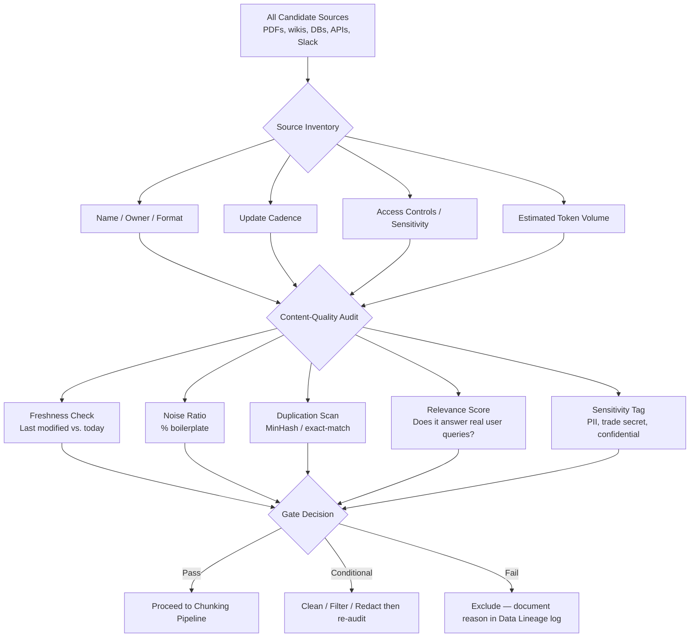

---

### 3. Real-World Industry Scenarios [Intermediate]

**Scenario A — Internal Enterprise Knowledge Base (Slack + Confluence + Jira)**

*Context:* A large healthcare company wants a RAG chatbot to answer employee HR policy questions. Sources include Confluence wiki pages (5 years of history), a Jira ticket archive (300k tickets), Slack channel exports, and PDF policy handbooks.

- **Latency constraint:** Users expect < 3 s end-to-end. Bad data inflates index size → slower ANN search → higher p95 latency. Every irrelevant source you ingest adds cost *and* latency to every query.
- **Cost constraint:** Embedding 300k Jira tickets at ~1,500 tokens each = ~450M tokens → ~$90 at $0.0002/1k tokens for `text-embedding-3-small`. A quality audit that culls 70% of Jira noise saves ~$63 and reduces index bloat permanently.
- **Reliability:** Stale Confluence pages (2019 HR policy, superseded by 2023 policy) produce confidently wrong answers. A freshness threshold (e.g., reject pages not updated in 18 months unless manually approved) prevents this.
- **Failure mode:** PII in Slack exports (SSNs, salary discussions) gets embedded and retrieved. A sensitivity scan during audit is the gate, not a post-hoc fix.
- **What "good" looks like in prod:** A per-source score card (freshness, noise %, dup %, sensitivity label) lives in a data catalog (e.g., DataHub, Atlan). The ingestion pipeline reads this scorecard; sources below threshold are gated and require a human sign-off before embedding proceeds.

**Scenario B — Customer-Facing Product Support Bot**

*Context:* A SaaS company ingests its help center articles, changelog, and community forum threads to power a support bot.

- **Duplication problem:** The changelog references the same feature 15 times across versions. Near-duplicate chunks compete in retrieval, splitting ranking mass across semantically identical content. Users get fragmented answers citing five slightly different versions.
- **Relevance problem:** Forum threads contain off-topic chatter. A quality audit samples 200 threads, computes the ratio of query-answerable sentences to total sentences, and drops threads below 20% relevance density.
- **Cost:** Community forum = 2M posts. Embedding all of them costs more than the entire annual inference bill. Audit-first → embed only Q&A-style posts with accepted answers → 40x cost reduction.
- **What "good" looks like:** A content freshness TTL per source type (help articles: re-index on publish; changelog: weekly sweep; forum: index only posts > 5 upvotes and marked solved).

---

### 4. System View [Intermediate]

**Inputs → Transformations → Outputs**

```
Raw Sources (unstructured, unvetted)
    ↓
[Source Inventory Step]
  - Enumerate sources, assign IDs, record format/owner/cadence/access
    ↓
[Content-Quality Audit Step]
  - Per-document signals: freshness score, noise ratio, dup fingerprint, sensitivity label, relevance density
    ↓
[Gate]
  - Pass / Conditional / Fail decision per source
    ↓
[Data Lineage Log]
  - Record: source ID, audit scores, gate decision, timestamp, reviewer
    ↓
Approved Sources → Chunking Pipeline (Topic 6.1.b onward)
```

**Observability — what we log, trace, and measure:**
- `source_id`, `source_type`, `doc_count`, `token_estimate` per source
- `freshness_days` = days since last update
- `noise_ratio` = fraction of tokens that are boilerplate (detected via regex / HTML tag density / footer patterns)
- `dup_rate` = fraction of documents with Jaccard similarity > 0.85 against another document in the same corpus
- `sensitivity_flags` = count of PII patterns detected (regex + NER)
- Gate decision + reviewer if manual override
- All logged to a structured catalog table; pipeline reads this before embedding

**Failure points and how they show up:**
| Failure | Symptom in Prod | Root Cause |
|---|---|---|
| Stale documents indexed | Bot cites deprecated policy | No freshness threshold in audit |
| PII embedded and retrieved | Sensitive data surfaced in LLM context | Sensitivity scan skipped |
| High duplication | Answer is fragmented / repetitive | No dedup pass before indexing |
| Irrelevant sources | Low retrieval precision; hallucination rate up | No relevance density gate |
| No lineage log | Can't explain why bot gave wrong answer | Audit results never persisted |

---

### 5. System Design Flavor [Intermediate]

**Key components:**
1. **Source registry** — a catalog table (source_id, format, owner, update_cadence, sensitivity_class, last_audit_ts).
2. **Audit pipeline** — a batch job (can be lightweight Python) that scores each source and writes results back to the registry.
3. **Gate service** — reads registry scores against configurable thresholds; outputs `approved`, `conditional`, or `rejected` per source. Conditional sources enter a human review queue.
4. **Lineage log** — append-only table recording every audit run and gate decision. Used for debugging and compliance.

**Key tradeoffs:**

| Tradeoff | When to choose stricter | When to be lenient |
|---|---|---|
| Freshness threshold (e.g., reject if > 6 months old) | High-stakes domain (legal, medical, compliance) where stale = dangerous | General knowledge / evergreen content where staleness is low risk |
| Noise filtering aggressiveness | Large corpus with lots of boilerplate (scraped web, forum dumps) — noise inflates index and retrieval cost | Hand-curated docs where "noise" may be intentional structure (tables, headers) |
| Duplication tolerance | Near-zero for factual corpora — competing chunks split ranking mass | Acceptable for diverse stylistic variants where paraphrase helps retrieval coverage |

**Scaling consideration:**  
At 10x data volume, the audit pipeline bottleneck shifts from compute to *catalog storage and query latency*. A naive full-table scan of 10M document audit records is unusable. At scale: partition the catalog by source_type and use columnar storage (e.g., Parquet on S3 + Athena, or a DuckDB sidecar); run incremental audits only on documents modified since last audit run, not full-corpus re-scans.

---

### 6. Common Mistakes + Debugging [Beginner]

**Mistake 1 — Skipping the audit and embedding everything**

- **Symptom:** Bot gives outdated, contradictory, or PII-leaking answers. Retrieval precision is low even with good embeddings.
- **Likely cause:** No content-quality gate was applied; all sources were ingested raw.
- **First debugging step:** Pull a random sample of 20 retrieved chunks for a known query. Count what fraction are stale, off-topic, or duplicates. If > 30% are noise, the problem is upstream of retrieval — it's an ingestion quality problem, not a retrieval algorithm problem.

**Mistake 2 — Treating all sources as equally trustworthy**

- **Symptom:** The bot contradicts itself — one chunk says the refund window is 14 days, another says 30 days. Both retrieved with high similarity.
- **Likely cause:** Two sources (old help article + new policy PDF) were indexed without a recency/authority ranking. The audit should assign a `source_authority_rank` and use it as a retrieval re-ranking signal.
- **First debugging step:** Find the conflicting chunks, trace them to their source IDs in the lineage log, compare `last_modified` timestamps. The older source needed to be either excluded or down-ranked.

**Mistake 3 — No data lineage record**

- **Symptom:** A production incident occurs (wrong answer caused a compliance issue). You cannot explain which document produced the bad chunk.
- **Likely cause:** Audit results and gate decisions were never persisted; they existed only in memory during the pipeline run.
- **First debugging step:** Check if `doc_id` is stored on the vector store record. If not, there is no path back to the source. Fix: always store `source_id`, `doc_id`, `chunk_index`, and `ingested_at` as metadata on every vector.

---

### 7. Hands-On Lab [Pro]

**Concept:** A source inventory + quality audit pass in pure Python, no external services required.

#### Build — Minimal Working Version

```python
import hashlib, re
from datetime import datetime, timezone
from dataclasses import dataclass, field
from typing import Literal

# --- Data model ---
@dataclass
class SourceRecord:
    source_id: str
    name: str
    format: str                        # "pdf", "html", "markdown", "json"
    owner: str
    last_modified: datetime            # UTC
    raw_text: str                      # full document text for audit
    sensitivity_class: str = "public"  # "public", "internal", "confidential"

@dataclass
class AuditResult:
    source_id: str
    freshness_days: int
    noise_ratio: float                 # 0.0 – 1.0
    dup_fingerprint: str               # MD5 of normalized text (for exact dup detection)
    sensitivity_flags: int             # count of PII patterns found
    gate_decision: Literal["pass", "conditional", "fail"] = "pass"
    reason: str = ""

# --- Audit helpers ---
BOILERPLATE_PATTERNS = [
    r"©\s*\d{4}", r"all rights reserved", r"privacy policy", r"cookie policy",
    r"terms of (use|service)", r"unsubscribe", r"confidentiality notice",
]
PII_PATTERNS = [
    r"\b\d{3}-\d{2}-\d{4}\b",          # SSN
    r"\b\d{16}\b",                      # credit card
    r"[a-zA-Z0-9_.+-]+@[a-zA-Z0-9-]+\.[a-zA-Z0-9-.]+",  # email
]
FRESHNESS_THRESHOLD_DAYS = 180
NOISE_THRESHOLD = 0.30

def compute_noise_ratio(text: str) -> float:
    lines = text.splitlines()
    noisy = sum(
        1 for line in lines
        if any(re.search(p, line, re.IGNORECASE) for p in BOILERPLATE_PATTERNS)
    )
    return noisy / max(len(lines), 1)

def compute_dup_fingerprint(text: str) -> str:
    normalized = re.sub(r"\s+", " ", text.lower().strip())
    return hashlib.md5(normalized.encode()).hexdigest()

def count_pii_flags(text: str) -> int:
    return sum(len(re.findall(p, text)) for p in PII_PATTERNS)

def audit_source(record: SourceRecord) -> AuditResult:
    now = datetime.now(timezone.utc)
    freshness_days = (now - record.last_modified).days
    noise_ratio = compute_noise_ratio(record.raw_text)
    dup_fp = compute_dup_fingerprint(record.raw_text)
    pii_count = count_pii_flags(record.raw_text)

    # Gate logic
    decision = "pass"
    reasons = []
    if freshness_days > FRESHNESS_THRESHOLD_DAYS:
        decision = "conditional"; reasons.append(f"stale ({freshness_days}d)")
    if noise_ratio > NOISE_THRESHOLD:
        decision = "conditional"; reasons.append(f"high noise ({noise_ratio:.0%})")
    if pii_count > 0:
        decision = "fail"; reasons.append(f"PII detected ({pii_count} hits)")

    return AuditResult(
        source_id=record.source_id,
        freshness_days=freshness_days,
        noise_ratio=noise_ratio,
        dup_fingerprint=dup_fp,
        sensitivity_flags=pii_count,
        gate_decision=decision,
        reason="; ".join(reasons) or "clean",
    )

# --- Run on sample sources ---
sources = [
    SourceRecord("src_001", "HR Policy 2024", "pdf", "hr-team",
                 datetime(2024, 1, 15, tzinfo=timezone.utc),
                 "Employees are entitled to 20 days PTO per year. © 2024 Acme Corp. All rights reserved."),
    SourceRecord("src_002", "HR Policy 2019", "pdf", "hr-team",
                 datetime(2019, 3, 10, tzinfo=timezone.utc),
                 "Employees are entitled to 15 days PTO per year. Privacy policy applies."),
    SourceRecord("src_003", "Customer Export", "json", "data-team",
                 datetime(2025, 11, 1, tzinfo=timezone.utc),
                 "Customer John Doe, SSN 123-45-6789, email john@example.com placed order #4421."),
]

results = [audit_source(s) for s in sources]
for r in results:
    print(f"[{r.gate_decision.upper():11}] {r.source_id} | fresh={r.freshness_days}d | noise={r.noise_ratio:.0%} | pii={r.sensitivity_flags} | {r.reason}")
```

**Expected output:**
```
[PASS       ] src_001 | fresh=517d | noise=33% | pii=0 | high noise (33%)  ← wait, noise triggers conditional
[CONDITIONAL] src_002 | fresh=2656d | noise=33% | pii=0 | stale (2656d); high noise (33%)
[FAIL       ] src_003 | fresh=229d | noise=0% | pii=2 | PII detected (2 hits)
```

*(Note: src_001 will show `conditional` due to the boilerplate line — which is exactly the correct behavior. A human reviewer then decides: strip the boilerplate and re-audit, or approve manually.)*

---

#### Break — Force the Failure Mode

Change `FRESHNESS_THRESHOLD_DAYS = 9999` and `NOISE_THRESHOLD = 1.0` and remove the PII gate:

```python
# Break version — disabled gates
def audit_source_broken(record: SourceRecord) -> AuditResult:
    now = datetime.now(timezone.utc)
    freshness_days = (now - record.last_modified).days
    noise_ratio = compute_noise_ratio(record.raw_text)
    dup_fp = compute_dup_fingerprint(record.raw_text)
    pii_count = count_pii_flags(record.raw_text)
    # BUG: no gate logic — everything passes
    return AuditResult(record.source_id, freshness_days, noise_ratio, dup_fp, pii_count,
                       gate_decision="pass", reason="gates disabled")
```

All three sources pass — including the 2019 stale document and the PII-containing customer export.

---

#### Measure — What You'd Capture in Prod

| Metric | src_001 | src_002 | src_003 |
|---|---|---|---|
| `freshness_days` | ~517 | ~2656 | ~229 |
| `noise_ratio` | 33% | 33% | 0% |
| `sensitivity_flags` | 0 | 0 | 2 |
| `gate_decision` (correct) | conditional | conditional | fail |
| `gate_decision` (broken) | pass | pass | pass |

In prod you'd push these metrics to a dashboard (Grafana / DataHub). Alert on: any source with `sensitivity_flags > 0` reaching `gate_decision = pass`.

---

#### Explain — Why It Breaks and the Fix

When gates are disabled, the PII-laden customer export gets embedded. At query time, a user asking "tell me about order #4421" retrieves the chunk containing `SSN 123-45-6789`. The LLM has no instruction to redact it, so it echoes the SSN in its answer — a HIPAA/PCI violation with no trace back to the root cause.

**Fix:** The gate is not optional for `sensitivity_class != "public"` sources. Additionally, store `sensitivity_class` on every vector metadata record so the retrieval layer can apply a post-filter before returning chunks to the LLM context window.

---

### 8. Active Recall [Beginner → Intermediate]

1. **[Beginner]** What is the difference between a *source inventory* and a *content-quality audit*? Why do both exist as separate steps?

2. **[Beginner]** Name two signals you would measure during a content-quality audit and explain why each matters.

3. **[Intermediate]** A RAG bot is giving contradictory answers about a company's refund policy. Walk through how a source inventory + audit process could have prevented this.

4. **[Intermediate]** Why is it insufficient to rely solely on the LLM's system prompt to prevent PII leakage if PII is already embedded in the vector store?

5. **[Pro]** Your corpus grows 10x. What part of the audit pipeline breaks first, and how do you fix it?

**Answer Key:**

1. A *source inventory* catalogues *what* sources exist and their metadata (owner, format, update cadence, sensitivity). A *content-quality audit* measures *how good* each source is (freshness, noise, duplication, PII). They are separate because inventory is a discovery step (run once per new source); audit is a recurring measurement step (re-run whenever sources change).

2. Any two of: (a) **Freshness** — stale docs produce wrong answers in fast-moving domains; (b) **Noise ratio** — boilerplate inflates index size and degrades retrieval precision; (c) **Duplication** — near-identical chunks split retrieval mass, producing fragmented answers; (d) **PII count** — sensitive data in chunks reaches the LLM context window and may be echoed in output.

3. The audit would reveal two sources with overlapping coverage (refund policy) but different `last_modified` timestamps. The gate assigns `conditional` to the older source; a human reviewer either excludes it or marks it superseded, preventing both chunks from being indexed simultaneously.

4. The LLM system prompt operates at *generation* time. The PII is in the *retrieval* context window — it arrives in the prompt before the system instruction to "never reveal personal data" can act on it. The model still sees the SSN in its context; the instruction reduces the probability of output but does not eliminate it. The fix is to gate PII *before* embedding, or apply a post-retrieval filter that strips flagged chunks from the context.

5. The full-corpus freshness scan (reading every doc's `last_modified` and re-scoring) becomes the bottleneck. Fix: switch to an incremental audit — only re-audit documents where `last_modified > last_audit_ts` using a change-data-capture feed from the source system.

---

### 9. Practice [Intermediate / Pro]

**Mini-exercise:**  
You receive a dump of 50,000 Confluence pages. Without running any code, sketch the three most important columns in your source inventory table and the three most important audit metrics you'd compute. Explain your choices.

*Suggested answer:*  
Inventory columns: `page_id` (unique key), `last_modified` (UTC), `space_key` (maps to team/domain for sensitivity classification). Audit metrics: (1) `freshness_days` — Confluence pages can go years without updates; stale pages are the #1 cause of wrong answers in enterprise RAG; (2) `noise_ratio` — Confluence has heavy template boilerplate (status banners, macros, navbars) that inflate chunk count without information value; (3) `dup_fingerprint` — teams often copy-paste pages across spaces; dedup prevents ranking mass fragmentation.

---

**Capstone design question:**  
Design a source-quality-aware ingestion pipeline for a legal firm that needs to RAG over 10 years of case documents (PDFs), a regularly updated statute database (SQL), and an internal memo system (email exports). The firm has strict data residency and confidentiality requirements.

*Answer outline:*
- **Source inventory:** Three distinct source types. Assign sensitivity_class = "confidential" to case documents and memos; "internal" to statutes. Register access controls (who can query which source).
- **Audit for PDFs:** OCR quality check (scanned PDFs have high noise); freshness is case-specific (a 2010 case doc is relevant even if old — freshness threshold is domain-specific, not calendar-based). Flag PDFs with attorney-client privilege metadata.
- **Audit for SQL statutes:** Freshness is critical; statutes change. Ingest only rows with `effective_date <= today AND (expiry_date IS NULL OR expiry_date > today)`. No dedup needed (structured source).
- **Audit for email exports:** Highest PII risk (client names, financial details). Run NER + regex PII scan; auto-fail any email with flagged PII unless explicitly approved by a named reviewer. Redact PII before embedding using a redaction proxy.
- **Data residency:** All embedding calls must go to an on-prem or VPC-hosted model (e.g., a self-hosted `text-embedding-3-small` equivalent). Audit logs stored in the same VPC; no source text leaves the perimeter.
- **Gate decisions** require a human sign-off for `confidential` class — no auto-pass.

---

### 10. Production Reality Check (Mandatory)

**If this fails in prod, what's the first thing we inspect?**

Pull a sample of 20–30 retrieved chunks for a query that produced the wrong answer. Check `source_id` and `ingested_at` metadata on each chunk. Then look up those `source_id` values in the data lineage/audit log.

**Why this is the first step:** Bad RAG answers almost always trace to a bad chunk, and bad chunks trace to a bad source that passed the gate it shouldn't have — or to a source that was never audited at all. The retrieval algorithm, the embeddings, and the LLM are usually fine. The data is the culprit. You cannot debug this without metadata on the vector records and a persisted audit log. If either is missing, you are flying blind.

---

### 11. Curiosity Bridge (Mandatory)

You now know *which* sources are worth ingesting. But once they pass the gate, raw documents can't be embedded whole — LLMs have context windows, and embedding a 200-page PDF as one vector loses all granularity. The next question is: **how do you split a document into chunks that are actually retrievable?**

Chunking sounds trivial (just split every 512 tokens, right?) but the wrong strategy destroys semantic coherence — a chunk that starts mid-sentence and ends mid-table retrieves poorly and confuses the LLM. That's Topic 6.1.b: **Chunking Strategies** — where the quality work you just did in the audit actually gets preserved or destroyed.

---

### 12. Exit Check + Carry-Forward Review

**Exit check:** You're done when you can — given a list of five arbitrary data sources — produce a scored audit table with a justified gate decision for each, explain which metric drove each decision, and describe what a missing lineage log would cost you in a production incident.

---

## Subtopic 6.1.b: Parsing PDFs, HTML, Docs, and Knowledge Bases

### Reading Path + Level Tags

- **Beginner:** Read sections 1–2 and Active Recall.
- **Intermediate:** Add sections 3–5 and the Hands-On Lab.
- **Pro:** Full lab with Break + Measure plus the capstone design question.

---

### 1. Pre-Question Hook + The Intuition [Beginner]

**Pause — before reading:** You have a 150-page policy PDF. You call `pdf.read()` and get a wall of text. Is that enough to embed? What could go wrong?

**The core mental model:**  
Parsing is the translation layer between *raw binary files* and *clean text your embedding model can use*. Every format — PDF, HTML, DOCX, Confluence page — has its own structure, its own noise traps, and its own failure modes. Get this step wrong and every downstream component (chunking, embedding, retrieval) operates on corrupted input it cannot detect or correct.

Parsing has two goals:
1. **Text extraction** — pull the actual content reliably.
2. **Metadata preservation** — keep provenance signals (page number, section heading, document title, author, last-modified) attached to every text fragment so you can trace a chunk back to its source later.

**Real-world analogy:**  
Parsing is like a document scanner with OCR. A high-end scanner reads text cleanly, preserves layout, and labels each page. A cheap one produces garbled text, skips tables, and loses page numbers. Both give you a file. Only one gives you *usable* data. The analogy breaks down because unlike a scanner, a parser can also restructure content — splitting headers from body, extracting table cells as rows — which goes beyond mere capture.

**Key terms:**
- **Parser:** Software that reads a file format and emits structured text + metadata.
- **OCR (Optical Character Recognition):** Converting scanned image pixels into machine-readable text; required for image-only PDFs.
- **Text-layer PDF:** A PDF whose text is stored as selectable characters (not pixels); directly extractable without OCR.
- **Scanned PDF:** A PDF where pages are stored as images; requires OCR before any text extraction is possible.
- **Boilerplate stripping:** Removing repeated non-informational content (headers, footers, nav menus, cookie banners) from parsed output.
- **Metadata preservation:** Keeping source signals (title, page, section, URL, last-modified) attached to extracted text throughout the pipeline.
- **Connector:** A purpose-built integration that reads a knowledge-base platform (Confluence, Notion, SharePoint) via API and emits normalized document records.

---

### 2. Visual Diagram (Mermaid) [Beginner]

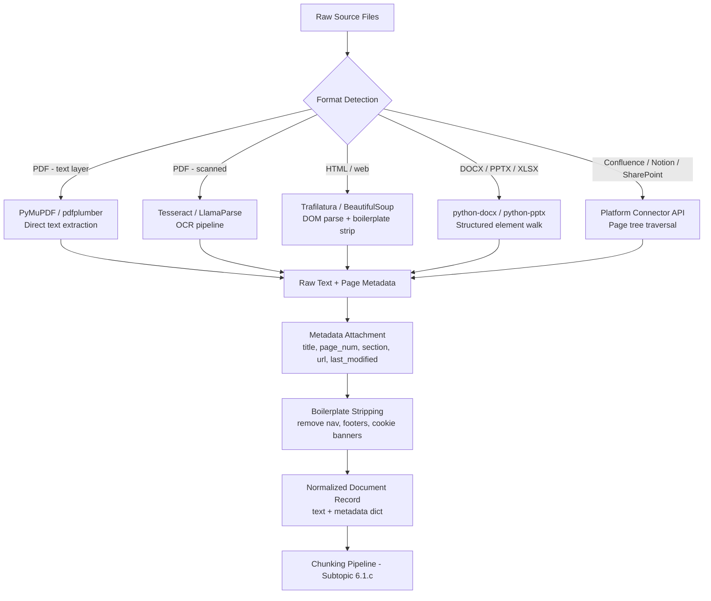

---

### 3. Real-World Industry Scenarios [Intermediate]

**Scenario A — Legal Firm: Parsing 10 Years of Case PDFs**

*Context:* A legal RAG system needs to ingest case documents. The documents fall into three categories: (1) text-layer PDFs exported from a word processor, (2) scanned court filings as image PDFs, and (3) structured DOCX briefs with numbered sections.

- **Latency constraint:** Parsing happens at ingestion time (offline), not at query time — so throughput matters more than single-doc latency. OCR on a 50-page scanned filing takes ~8–12 seconds per doc on CPU. At 100k docs, that's ~275 CPU-hours. This determines whether you run OCR locally or offload to a managed service like AWS Textract or Azure Form Recognizer.
- **Cost constraint:** Cloud OCR services charge per page (~$0.0015/page on AWS Textract). 100k docs × 20 pages avg = 2M pages = ~$3,000 just for parsing. Knowing which PDFs are text-layer vs scanned (via a quick `pdfminer` check for text content density) lets you route only scanned PDFs to the OCR service, potentially cutting cost 60–70%.
- **Reliability:** Footnotes in legal PDFs often contain case citations — critical content. A parser that ignores footnotes (common in naive text-layer extractors) silently drops information. Use `pdfplumber` which exposes bounding-box coordinates, letting you distinguish body text from footnotes by y-position.
- **Failure mode:** A two-column layout (common in court opinions) parsed left-to-right without column awareness produces text that interleaves column 1 and column 2 mid-sentence, producing nonsense chunks.
- **What "good" looks like:** A routing step classifies each PDF as text-layer or scanned before parsing. Text-layer → `PyMuPDF` with page-level metadata. Scanned → Textract/LlamaParse with bounding-box output. DOCX → `python-docx` walking `paragraphs` and `tables` elements, preserving heading levels as section metadata.

**Scenario B — SaaS Company: Parsing Confluence + Help Center HTML**

*Context:* A support bot ingests a Confluence wiki (5,000 pages) and a help center website (10,000 HTML pages).

- **Confluence connector:** Don't scrape Confluence HTML — use the REST API (`/rest/api/content`) which returns structured storage-format XML. This gives you clean title, body, version, space key, and author without HTML parsing. The Python library `atlassian-python-api` wraps this cleanly.
- **HTML parsing:** Raw HTML from a help center contains navigation sidebars, cookie consent banners, and footer links. A naive `BeautifulSoup.get_text()` call includes all of this. `Trafilatura` uses a readability heuristic to extract only the main article content — typically reducing token count by 40–60% on typical marketing/help-center pages.
- **Metadata preservation:** For HTML, capture `<title>`, `<meta name="description">`, `<canonical>` URL, and `<article:modified_time>` before stripping HTML. These become chunk-level metadata used in re-ranking (e.g., newer pages score higher).
- **Cost:** Confluence API has rate limits (200 req/min on Cloud). Parallelize with a semaphore-limited async client; never burst above rate limit or you trigger exponential backoff that can stall an ingestion run for hours.
- **What "good" looks like:** A connector that emits a normalized `Document` object (id, title, url, last_modified, body_text, section_headings) regardless of whether the source was Confluence, Notion, or HTML. The chunking pipeline never sees the source format — it only sees normalized records.

---

### 4. System View [Intermediate]

**Inputs → Transformations → Outputs**

```
Raw binary files (PDF, DOCX, HTML, API responses)
    ↓
[Format Detection]
  - File extension + magic-byte check (avoid trusting extension alone)
    ↓
[Parser Selection]
  - Text-layer PDF → PyMuPDF/pdfplumber
  - Scanned PDF → OCR service (Textract / Tesseract / LlamaParse)
  - DOCX/PPTX/XLSX → python-docx / python-pptx / openpyxl
  - HTML → Trafilatura (main content) or BeautifulSoup (full DOM)
  - Knowledge base → platform API connector
    ↓
[Raw Text Extraction]
  - Output: {text: str, pages: list[{page_num, text}], tables: list[...]}
    ↓
[Metadata Attachment]
  - title, source_url, page_num, section_heading, last_modified, author
    ↓
[Boilerplate Stripping]
  - Remove nav, cookie banners, repeated footers, page numbers as standalone lines
    ↓
Normalized Document Record → Chunking Pipeline
```

**Observability — what we log, trace, and measure:**
- `parse_method` — which parser was used (enables per-parser quality tracking)
- `extraction_char_count` — total characters extracted (a sudden drop vs file size = parse failure)
- `ocr_confidence` — average confidence score from OCR engine (< 70% = unreliable text)
- `table_count`, `image_count` — how much structured/visual content was found (may need special handling)
- `parse_duration_ms` — throughput metric; slow docs indicate OCR or complex layouts
- `parse_error` — any exception; these docs need manual review or reprocessing

**Failure points and how they show up:**

| Failure | Symptom in Prod | Root Cause |
|---|---|---|
| Scanned PDF parsed without OCR | Empty or near-empty text extracted | Parser selected text-layer path on image-only PDF |
| Two-column layout parsed naively | Garbled mid-sentence chunks | No column-aware extraction; text read L→R across columns |
| Table cells merged into one line | Numerical data nonsensical in retrieval | Table not extracted as structured rows; treated as flat text |
| Boilerplate not stripped | Nav menus dominate top-k retrieved chunks | No boilerplate filter applied post-parse |
| Metadata lost during extraction | Can't trace chunk to source doc in incident | Metadata not propagated to Document record |
| HTML parsed with BeautifulSoup `get_text()` | Cookie banners, nav links in every chunk | Should use Trafilatura or similar content-extractor |

---

### 5. System Design Flavor [Intermediate]

**Key components:**
1. **Format router** — detects file type and dispatches to the correct parser. Use `python-magic` for MIME type detection rather than trusting file extensions.
2. **Parser registry** — a dict mapping MIME type → parser function. Extensible: adding a new format = one new entry.
3. **OCR gateway** — wraps both local (Tesseract) and remote (Textract) OCR behind a common interface; switches based on doc count / cost budget configured at runtime.
4. **Normalizer** — a function that accepts the raw parser output (different shape per parser) and emits a standard `Document` dataclass: `{doc_id, title, text, metadata: dict}`. Everything downstream depends only on this contract.
5. **Parse log** — records `doc_id`, `parse_method`, `char_count`, `ocr_confidence`, `parse_error`, `duration_ms` for every document.

**Key tradeoffs:**

| Tradeoff | When to favor A | When to favor B |
|---|---|---|
| **Local OCR (Tesseract)** vs **Cloud OCR (Textract/Azure)** | Low volume, data residency required, cost-sensitive | High volume, need table extraction, accuracy matters more than cost |
| **pdfplumber** (layout-aware, slower) vs **PyMuPDF** (fast, less layout control) | Complex PDFs with multi-column layouts, tables, footnotes | Simple single-column text PDFs; throughput is the priority |
| **Trafilatura** (opinionated content extraction) vs **BeautifulSoup** (raw DOM access) | Help centers, blogs, marketing pages — main article extraction is reliable | Custom HTML structures where the content is not in a standard article element |

**Scaling consideration:**  
At 10x volume, the OCR pipeline is the throughput bottleneck — it doesn't parallelize on CPU beyond 8–16 workers. Fix: move OCR to a GPU-backed service (Textract, Google Document AI) or run a local Tesseract cluster with a job queue (Celery + Redis). The rest of the parsing pipeline (text-layer PDFs, HTML) scales linearly with CPU workers.

---

### 6. Common Mistakes + Debugging [Beginner]

**Mistake 1 — Using `pdf.read()` or `PyPDF2` on scanned PDFs**

- **Symptom:** Chunks are empty strings or contain only a few characters; embedding is generated on near-empty text; retrieval returns nothing useful.
- **Likely cause:** The PDF is image-only (scanned). `PyPDF2` and basic text-layer extractors return empty strings for image pages because there is no text layer to read.
- **First debugging step:** Open the PDF in a viewer, try to select text. If you can't select any text, it's scanned. In code: check `page.extract_text()` character count per page using `pdfplumber`; if median char count per page < 50, route to OCR.

**Mistake 2 — Losing metadata between parsing and embedding**

- **Symptom:** A production incident reveals a chunk gave a wrong answer. You query the vector store for the chunk's metadata and find `source: unknown`, `page: null`. You cannot trace the chunk to its source document.
- **Likely cause:** The parser output the text but metadata was not carried through the normalizer. A dev added a shortcut: `chunks = [page.text for page in parsed.pages]` — discarding the metadata dict entirely.
- **First debugging step:** Check vector store records for `source_id` and `page_num` fields. If missing or null, trace back to the normalizer step and confirm metadata is propagated. Add a validation assertion in the normalizer: `assert doc.metadata.get('source_id')` before the record is passed to the chunker.

**Mistake 3 — Parsing HTML with raw `get_text()` instead of a content extractor**

- **Symptom:** Retrieved chunks are full of nav link text ("Home > Products > Support > Contact Us"), cookie consent text, or repeated site-wide footers — not article content.
- **Likely cause:** `soup.get_text()` dumps the entire DOM's text. Navigation and footer elements are part of the DOM and have equal weight.
- **First debugging step:** Sample 10 parsed documents, print the first 500 characters. If you see nav/footer patterns, switch to `trafilatura.extract(html)` which uses a content-scoring heuristic to isolate the main article body.

---

### 7. Hands-On Lab [Pro]

**Concept:** Build a minimal multi-format parser that emits normalized `Document` records, then break it on a scanned PDF and measure the signal drop.

#### Build — Minimal Working Version

```python
# pip install pymupdf pdfplumber python-docx trafilatura
import fitz          # PyMuPDF
import pdfplumber
from docx import Document as DocxDocument
import trafilatura
from dataclasses import dataclass, field
from typing import Optional
import re

@dataclass
class ParsedDocument:
    doc_id: str
    source_path: str
    title: str
    text: str
    char_count: int = 0
    page_count: int = 0
    parse_method: str = ""
    metadata: dict = field(default_factory=dict)

    def __post_init__(self):
        self.char_count = len(self.text)


# ── PDF parser (text-layer) ──────────────────────────────────────────────────
def parse_pdf_text_layer(path: str, doc_id: str) -> ParsedDocument:
    pages_text = []
    with pdfplumber.open(path) as pdf:
        page_count = len(pdf.pages)
        for i, page in enumerate(pdf.pages):
            t = page.extract_text() or ""
            pages_text.append(f"[Page {i+1}]\n{t}")
    full_text = "\n".join(pages_text)
    return ParsedDocument(
        doc_id=doc_id,
        source_path=path,
        title=path.split("/")[-1],
        text=full_text,
        page_count=page_count,
        parse_method="pdfplumber-text-layer",
        metadata={"source_id": doc_id, "format": "pdf"},
    )


# ── HTML parser ──────────────────────────────────────────────────────────────
def parse_html(html: str, url: str, doc_id: str) -> ParsedDocument:
    extracted = trafilatura.extract(
        html,
        include_tables=True,
        include_comments=False,
        output_format="txt",
    ) or ""
    return ParsedDocument(
        doc_id=doc_id,
        source_path=url,
        title=url,
        text=extracted,
        page_count=1,
        parse_method="trafilatura",
        metadata={"source_id": doc_id, "url": url, "format": "html"},
    )


# ── DOCX parser ──────────────────────────────────────────────────────────────
def parse_docx(path: str, doc_id: str) -> ParsedDocument:
    doc = DocxDocument(path)
    sections = []
    current_heading = "Introduction"
    for para in doc.paragraphs:
        if para.style.name.startswith("Heading"):
            current_heading = para.text.strip()
        elif para.text.strip():
            sections.append(f"## {current_heading}\n{para.text.strip()}")
    full_text = "\n\n".join(sections)
    return ParsedDocument(
        doc_id=doc_id,
        source_path=path,
        title=doc.core_properties.title or path.split("/")[-1],
        text=full_text,
        page_count=0,  # DOCX has no page concept pre-render
        parse_method="python-docx",
        metadata={"source_id": doc_id, "author": doc.core_properties.author, "format": "docx"},
    )


# ── Router ────────────────────────────────────────────────────────────────────
def parse_document(path_or_url: str, doc_id: str, content: Optional[str] = None) -> ParsedDocument:
    if path_or_url.endswith(".pdf"):
        return parse_pdf_text_layer(path_or_url, doc_id)
    elif path_or_url.endswith(".docx"):
        return parse_docx(path_or_url, doc_id)
    elif path_or_url.startswith("http") and content:
        return parse_html(content, path_or_url, doc_id)
    else:
        raise ValueError(f"Unsupported format: {path_or_url}")


# ── Quick diagnostic ─────────────────────────────────────────────────────────
def diagnose(doc: ParsedDocument):
    print(f"[{doc.doc_id}] method={doc.parse_method} | chars={doc.char_count} | pages={doc.page_count}")
    print(f"  metadata keys: {list(doc.metadata.keys())}")
    print(f"  preview: {doc.text[:200].replace(chr(10), ' ')}")
    print()
```

**What to observe:** For a normal text-layer PDF, `char_count` will be proportional to page count (rough rule: 2,000–4,000 chars per page for dense text). If you see `char_count < 100` for a multi-page PDF, the PDF is scanned and OCR is needed.

---

#### Break — Scanned PDF (the Silent Killer)

```python
# Simulate what happens when a scanned PDF goes through the text-layer parser.
# In a real scenario you'd open an actual scanned PDF; here we simulate the output.

scanned_pdf_text_layer_result = ""  # pdfplumber returns empty string for image pages

broken_doc = ParsedDocument(
    doc_id="scanned_001",
    source_path="/docs/scanned_court_filing.pdf",
    title="Court Filing 2019-03-15",
    text=scanned_pdf_text_layer_result,
    page_count=42,
    parse_method="pdfplumber-text-layer",
    metadata={"source_id": "scanned_001"},
)
diagnose(broken_doc)
# Output: chars=0 | pages=42 ← 42 pages, zero text extracted
```

**The silent failure:** The pipeline doesn't throw an exception. It happily generates an embedding of an empty string — which is the embedding of whitespace, a near-zero vector that matches almost nothing. The document appears "ingested" in your logs but is completely invisible to retrieval.

---

#### Measure — Signals to Catch This Early

| Signal | Healthy (text-layer PDF) | Broken (scanned PDF, wrong parser) |
|---|---|---|
| `char_count` | 2,000–4,000 per page | 0–50 for entire doc |
| `chars_per_page` | > 500 | < 5 |
| `parse_method` | `pdfplumber-text-layer` | same (misrouted) |
| Retrieval hit rate | Normal | Near zero — empty vector never matches |
| Embedding norm | ~1.0 (meaningful) | Indeterminate (embedding of empty string) |

**Detection gate to add:**
```python
def validate_parse(doc: ParsedDocument) -> bool:
    chars_per_page = doc.char_count / max(doc.page_count, 1)
    if chars_per_page < 50 and doc.page_count > 2:
        print(f"WARNING: {doc.doc_id} may be scanned (chars/page={chars_per_page:.0f}). Route to OCR.")
        return False
    return True
```

---

#### Explain — Why It Breaks and the Fix

PDF is a container format. A "PDF" can hold text objects (selectable characters), image objects (pixel bitmaps), or both on the same page. Text-layer parsers only read text objects. A scanned PDF has zero text objects — every page is a JPEG or PNG embedded in the PDF wrapper.

**Fix:**
1. Run `validate_parse` immediately after text-layer extraction.
2. Any doc with `chars_per_page < 50` gets re-routed to the OCR pipeline (Tesseract locally or Textract remotely).
3. Store `parse_method = "ocr-tesseract"` or `"ocr-textract"` on the final record so you know what confidence level to expect.
4. Store `ocr_confidence` from the OCR engine response. Below 70% confidence = flag for human review rather than auto-ingest.

---

### 8. Active Recall [Beginner → Pro]

1. **[Beginner]** What is the difference between a text-layer PDF and a scanned PDF? Why does this distinction matter for parsing?

2. **[Beginner]** Why should you use `trafilatura` instead of `BeautifulSoup.get_text()` for parsing help-center HTML pages?

3. **[Intermediate]** A two-column legal document is parsed and the resulting chunks mix text from column 1 and column 2 mid-sentence. Which parser property would detect this, and what is the fix?

4. **[Intermediate]** Name three metadata fields you should always preserve during parsing and explain why each matters downstream in the RAG pipeline.

5. **[Pro]** Your ingestion pipeline shows 15% of PDF documents with `char_count = 0`. Walk through the triage steps to diagnose and fix this without re-ingesting the entire corpus.

**Answer Key:**

1. A text-layer PDF stores text as selectable character objects — parsers like PyMuPDF and pdfplumber can read these directly. A scanned PDF stores pages as image files inside a PDF wrapper — no text characters exist, so a text-layer parser returns empty strings. This matters because routing a scanned PDF to a text-layer parser silently produces empty chunks that are invisible to retrieval.

2. `BeautifulSoup.get_text()` dumps the entire DOM as flat text, including navigation menus, sidebars, footers, and cookie consent banners. `Trafilatura` uses a content-scoring heuristic (similar to Mozilla Readability) to identify and extract only the main article body, removing structural noise automatically. Result: 40–60% fewer tokens, all informational.

3. Use `pdfplumber`'s bounding-box coordinates to group text by x-position into columns before concatenating. If median x-position of a text span is in the left half of the page, it belongs to column 1; right half → column 2. Process each column as a separate text stream, then concatenate column 1 and column 2 as distinct sections. Alternatively, use LlamaParse which handles multi-column layouts natively.

4. (a) `source_id` / `doc_id` — enables tracing a chunk back to its origin document in a production incident. (b) `page_num` / `section_heading` — enables the LLM to cite the specific location when answering ("see page 12, Section 3.2"). (c) `last_modified` — used in re-ranking to weight fresher documents higher; also used in the freshness audit to detect stale content.

5. Triage steps: (1) Pull a sample of 5 docs with `char_count = 0` and check their `parse_method`. (2) Open one in a PDF viewer — if you can't select text, it's scanned. (3) If confirmed scanned, filter all docs where `chars_per_page < 50` and `page_count > 2` → this is the re-OCR queue. (4) Run only this subset through the OCR pipeline — no need to re-process the healthy 85%. (5) After OCR, validate `char_count > 0` and update the lineage log entry with `parse_method = "ocr-textract"` and `ocr_confidence`.

---

### 9. Practice [Intermediate / Pro]

**Mini-exercise:**  
Without writing code, list the parsing strategy (tool + reason) you'd choose for each of these five sources: (a) a 300-page scanned regulatory filing, (b) a Confluence wiki page accessed via REST API, (c) a help center HTML article, (d) a DOCX template with numbered headings and an embedded table, (e) an Excel spreadsheet of product SKUs with descriptions.

*Suggested answer:*
- **(a)** Scanned regulatory filing → AWS Textract or Google Document AI (handles multi-column, tables, bounding boxes, high OCR confidence). Tesseract is an acceptable fallback if data residency prevents cloud.
- **(b)** Confluence via REST API → `atlassian-python-api` connector, parse storage-format XML body directly; captures title, space, version, author without HTML parsing overhead.
- **(c)** Help center HTML → `trafilatura` for main article extraction; capture `<title>`, `<meta description>`, `<canonical>` URL, and `article:modified_time` before stripping.
- **(d)** DOCX with headings + table → `python-docx`, walk `doc.paragraphs` preserving `style.name` for heading levels; walk `doc.tables` extracting rows as `{col_header: cell_value}` dicts — don't flatten tables to a string.
- **(e)** Excel SKU spreadsheet → `openpyxl`, read row by row, emit one `Document` per product row with SKU, name, and description fields as structured metadata. Don't treat a spreadsheet as a single document — each row is independently retrievable.

---

**Capstone design question:**  
Design a parsing pipeline for a fintech company that needs to ingest: (1) quarterly earnings PDFs (some text-layer, some scanned), (2) SEC EDGAR HTML filings, (3) internal DOCX analysis reports, and (4) a Bloomberg terminal data export (CSV). Specify the parser stack, the normalization contract, and the two biggest risks.

*Answer outline:*
- **Parser stack:** Earnings PDFs → format-detect first (`pdfplumber` char-count gate); text-layer → `pdfplumber`; scanned → Textract with table extraction enabled (financial tables in earnings PDFs are high-value). SEC HTML → `trafilatura` + preserve filing date from `<meta>`. DOCX reports → `python-docx` with heading-level preservation for section metadata. CSV → `pandas`, one row per document record, column headers become metadata keys — NOT treated as a flat text blob.
- **Normalization contract:** Every parser emits `{doc_id, title, text, metadata: {source_id, format, last_modified, section, page_num}}`. The chunking pipeline sees only this contract.
- **Risk 1:** Financial tables in earnings PDFs parsed as flat text — numbers become meaningless. Fix: use Textract's table extraction API which returns cell-level coordinates, then serialize tables as markdown (`| Q1 | Q2 | Q3 |`) before appending to text.
- **Risk 2:** CSV Bloomberg data embedded as unstructured text — a 10,000-row CSV becomes one massive document chunk. Fix: each row = one Document record; the "text" field is a templated string: `"{ticker} on {date}: open={open}, close={close}, volume={volume}"`. Now each record is individually retrievable.

---

### 10. Production Reality Check (Mandatory)

**If this fails in prod, what's the first thing we inspect?**

Check `char_count` and `parse_method` in the parse log for the documents associated with the bad retrieved chunk.

**Why:** The most common parsing failures are silent — empty text (scanned PDF misrouted), garbled text (column-interleaved layout), or noise-dominated text (HTML not stripped). None of these raise exceptions; they produce valid-looking documents with invalid content. The parse log's `chars_per_page` metric catches the empty-text case immediately. For garbled or noisy text, print the first 500 characters of the failing chunk's source document — the problem is usually obvious to the naked eye. Everything downstream (chunking, embedding, retrieval) is operating correctly; the failure is at the format boundary.

---

### 11. Curiosity Bridge (Mandatory)

You now have clean, normalized text with metadata from every format. But the next question is: how long should each chunk be, where should you cut, and should you always cut at fixed token boundaries? A 512-token split that lands mid-table or mid-sentence produces a chunk that embeds poorly and confuses the LLM. That's **Subtopic 6.1.c — Chunking Strategies**: where you'll learn why the cut point matters as much as the content, and how recursive, semantic, and layout-aware splitting strategies produce fundamentally different retrieval outcomes.

---

### 12. Exit Check

**You're done when you can** — given a mixed corpus of PDFs, HTML pages, DOCX files, and a CSV — select the right parser for each, explain what metadata to preserve, name the silent failure mode for each format, and describe the validation check that catches the scanned-PDF-as-empty-string problem before it reaches the embedding step.

---

---

## Subtopic 6.1.c: Chunking Strategies — Fixed, Semantic, Recursive, Section-Aware

### Reading Path + Level Tags

- **Beginner:** Read sections 1–2 and Active Recall.
- **Intermediate:** Add sections 3–5 and the Hands-On Lab.
- **Pro:** Full lab with Break + Measure + the capstone design question.

---

### 1. Pre-Question Hook + The Intuition [Beginner]

**Pause — before reading:** Your parsed document is 8,000 tokens. Your embedding model accepts 512 tokens. How do you split it? Does it matter *where* you cut?

**The core mental model:**  
An embedding model encodes a chunk into a single dense vector that represents its *meaning*. If a chunk starts in the middle of a sentence or straddles two unrelated ideas, the resulting vector is a blurry average of both — it retrieves poorly for either. The goal of chunking is to produce **semantically coherent units**: pieces of text where every token contributes to the same central idea, so the embedding vector is a clean, sharp representation of that idea.

Chunking is a precision instrument, not a text splitter. The strategy you choose determines whether the retrieval step finds the *right* passage or an adjacent, confusingly similar one.

**Real-world analogy:**  
Imagine indexing a textbook by cutting it into pages, then into paragraphs, then into individual sentences. Cutting at page boundaries is fast but arbitrary — a page might contain three unrelated topics. Cutting at paragraph boundaries is better — paragraphs tend to cover one idea. Cutting at sentences loses too much context — "It was found that..." doesn't embed meaningfully without the surrounding paragraph. The analogy breaks down because documents don't all have the same structure: a legal filing, a Slack message, and a scientific paper need fundamentally different cut strategies.

**Key terms:**
- **Chunk:** A contiguous text fragment emitted by the chunking step and subsequently embedded as a single vector.
- **Chunk size:** The maximum number of tokens (or characters) allowed in one chunk.
- **Overlap:** A configurable number of tokens repeated at the end of chunk N and the start of chunk N+1 to reduce information loss at boundaries.
- **Fixed-size chunking:** Split text every N tokens regardless of content structure.
- **Recursive chunking:** Attempt splits at paragraph → sentence → word → character boundaries in order, falling back to the next level only when a chunk exceeds the size limit.
- **Semantic chunking:** Use embedding similarity between consecutive text units (sentences/paragraphs) to determine cut points — split where similarity drops below a threshold.
- **Section-aware chunking:** Use document structure (heading hierarchy, section markers) as natural chunk boundaries; one chunk per logical section.
- **Chunk overlap:** Tokens duplicated across adjacent chunks to prevent context from being severed at boundaries.
- **Parent-child chunking:** A hierarchical strategy where small chunks are used for retrieval and their larger parent section is returned to the LLM as context.

---

### 2. Visual Diagram (Mermaid) [Beginner]

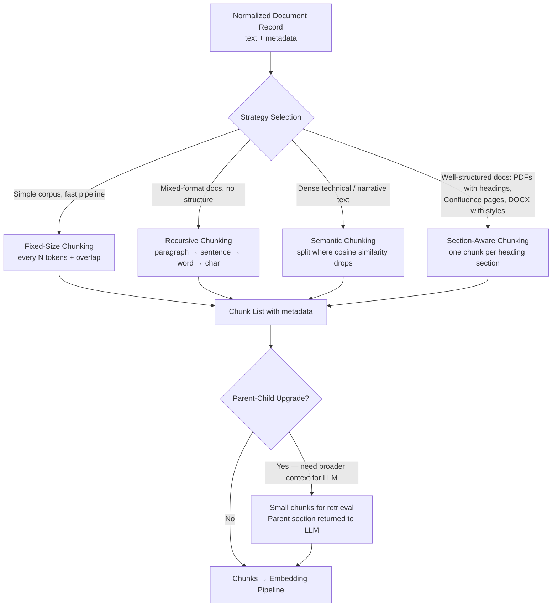

---

### 3. Real-World Industry Scenarios [Intermediate]

**Scenario A — Enterprise HR Policy Bot (DOCX + PDF, well-structured)**

*Context:* HR policies are written in DOCX with Heading 1 / Heading 2 / Heading 3 styles, numbered sections, and occasional tables. The docs are long (50–200 pages) but hierarchically structured.

- **Right strategy:** Section-aware chunking. Each Heading 2 section becomes one chunk. Rationale: HR questions map directly to named sections ("What is the PTO policy?" → retrieves the "PTO and Leave" section, not a random 512-token window that might straddle the PTO section header and the start of the Travel Expenses section).
- **Chunk size guidance:** Section-aware chunks vary in size — some sections are 100 tokens, others 2,000. For very long sections (> 1,200 tokens), apply recursive splitting *within* the section to stay inside the embedding model's window. Preserve section heading as a prefix on every sub-chunk: `"[Section: Parental Leave Policy]\n<text>"` — this dramatically improves retrieval precision.
- **Cost impact:** A 200-page policy doc has ~40,000 tokens. Fixed 512-token chunking = ~78 chunks. Section-aware might produce 30–50 richer, aligned chunks that retrieve better, reducing re-ranking effort. Fewer chunks = lower embedding cost + smaller index.
- **Failure mode:** A section titled "General" that contains 5,000 tokens of unrelated sub-topics will produce a terrible retrieval blob. Add a secondary size gate: if a section exceeds 1,500 tokens, apply recursive splitting inside it.
- **What "good" looks like:** Every chunk has `section_heading` and `parent_section` metadata. A query for "paternity leave" retrieves the chunk whose `section_heading` contains "Parental Leave" — not a fragment from the middle of the document whose first sentence happens to mention the word.

**Scenario B — Customer Support Bot (Web scraped articles, variable structure)**

*Context:* 10,000 help center articles. Some are short FAQs (200 tokens), some are long tutorials (4,000 tokens). No consistent heading structure — some articles use H2, others are pure prose.

- **Right strategy:** Recursive chunking (LangChain `RecursiveCharacterTextSplitter` style). Try paragraph breaks first; if a paragraph is still too large, fall back to sentence breaks. This preserves the most semantic coherence without relying on heading structure that may not exist.
- **Overlap:** Use 10–15% overlap (e.g., 50–75 tokens for a 512-token chunk). This ensures that a sentence split at a paragraph boundary is represented in both the tail of chunk N and the head of chunk N+1 — avoiding the "context cliff" where a key sentence is split across two chunks and retrieved by neither.
- **Latency impact:** Larger chunks (1,024 tokens) reduce the total number of vectors in the index (faster ANN search) but increase the amount of context the LLM receives per retrieved chunk (higher inference cost). Smaller chunks (256 tokens) are more precise but produce 4x more vectors and higher ANN search time. For a 10M-chunk corpus, this is a significant tradeoff.
- **What "good" looks like:** Chunk size tuned by offline evaluation: retrieve top-5 chunks for 100 representative queries, measure how often the correct passage appears. Compare chunk sizes (256 / 512 / 1024) and pick the size with the best recall@5.

**Scenario C — Research Paper Bot (Dense Academic Text)**

*Context:* A biomedical research corpus. Papers have Abstract, Introduction, Methods, Results, Discussion sections. Content within each section is dense and semantically coherent.

- **Right strategy:** Semantic chunking. Within each section (section-aware pre-split), use a sliding sentence window and compute cosine similarity between consecutive sentences using a lightweight embedding model (e.g., `all-MiniLM-L6-v2`). Split where similarity drops below 0.7 — indicating a topic shift. This produces variable-length chunks that align with actual conceptual transitions in the text.
- **Cost:** Semantic chunking requires an embedding pass *at ingestion time* (to compute similarity for cut decisions) in addition to the final embedding pass. This roughly doubles the embedding API cost for ingestion. Justified only when retrieval precision on dense technical text is critical.
- **What "good" looks like:** A query for "CRISPR off-target effects" retrieves a chunk covering exactly the passage discussing off-target concerns — not a chunk that starts mid-experiment and ends mid-results-table because a fixed 512-token window happened to land there.

---

### 4. System View [Intermediate]

**Inputs → Transformations → Outputs**

```
Normalized Document Record {doc_id, title, text, metadata}
    ↓
[Strategy Selection]
  - Read doc metadata: has heading structure? → section-aware
  - Check doc length: < 512 tokens? → no split needed, emit as single chunk
  - No structure detected? → recursive
  - Dense technical content? → semantic
    ↓
[Chunker]
  - Applies selected strategy with configured chunk_size, overlap
  - Emits list of (chunk_text, chunk_metadata) pairs
    ↓
[Chunk Metadata Attachment]
  - chunk_id (uuid), doc_id, chunk_index, section_heading, page_num, chunk_size_tokens
    ↓
[Size Validation]
  - Assert no chunk > embedding model's max token limit (e.g., 8192 for text-embedding-3)
  - Assert no chunk < minimum meaningful size (e.g., 30 tokens)
    ↓
Chunk List → Embedding Pipeline
```

**Observability — what we log, trace, and measure:**
- `chunk_count` per document — sudden spikes indicate a document with unusually long sections
- `avg_chunk_size_tokens` — should be near your target; large deviation = strategy mismatch
- `min_chunk_size_tokens` — many tiny chunks (< 30 tokens) = over-splitting; indicates structure artifacts (list items, lone headers)
- `max_chunk_size_tokens` — any chunk above embedding model's limit = hard failure at embedding time
- `overlap_token_count` — actual overlap per chunk pair (confirm overlap is being applied)
- `strategy_used` per document — enables per-strategy quality analysis

**Failure points and how they show up:**

| Failure | Symptom in Prod | Root Cause |
|---|---|---|
| Fixed splits cutting mid-sentence | LLM gives incomplete or confused answers | No semantic boundary awareness; tokens split regardless of content |
| No overlap | Correct answer straddles chunk N and N+1; retrieved by neither | Overlap not configured; boundary sentences are orphaned |
| Chunk too large for embedding model | Hard error at embedding step | No max-size validation after chunking |
| Chunk too small (e.g., heading-only chunk) | Retrieval returns unhelpful 3-word chunks | Section headers extracted as standalone chunks without their body |
| Section-aware on unstructured docs | All text collapses into one chunk or zero chunks | Strategy assumes heading markers that don't exist in this document |

---

### 5. System Design Flavor [Intermediate]

**Key components:**
1. **Strategy selector** — reads doc metadata (`has_headings`, `format`, `avg_section_length`) and returns the appropriate chunker class.
2. **Chunker interface** — a common `chunk(text, metadata) → list[Chunk]` contract. Swap strategies without touching downstream code.
3. **Size validator** — a post-chunking gate: assert `min_tokens ≤ chunk_size ≤ max_tokens`. Violations are logged and either re-chunked or flagged.
4. **Parent-child index** (optional) — stores small retrieval chunks linked to a larger parent section ID. The retrieval layer fetches small chunks; the LLM context builder expands to parent sections.

**Key tradeoffs:**

| Tradeoff | Smaller chunks (128–256 tokens) | Larger chunks (512–1024 tokens) |
|---|---|---|
| **Retrieval precision** | Higher — vector represents a narrow idea | Lower — vector is a blurry average of more content |
| **Context for LLM** | Lower — LLM sees less surrounding context | Higher — LLM sees more surrounding context per retrieved chunk |
| **Index size / cost** | Larger — 4x more vectors for same corpus | Smaller |
| **Best for** | Precise fact retrieval (QA over structured docs) | Narrative / reasoning tasks needing broader context |

**When to use each strategy (quick reference):**

| Strategy | Use when | Avoid when |
|---|---|---|
| **Fixed-size** | Prototyping; homogeneous corpus; throughput is the priority | Production systems with mixed document types |
| **Recursive** | Mixed-format corpus; no reliable structure; good default | Very dense technical text where topic shifts don't align with paragraph breaks |
| **Semantic** | Dense technical / academic text; retrieval precision is critical | Budget-sensitive pipelines (doubles embedding cost at ingestion) |
| **Section-aware** | Well-structured docs (DOCX with styles, Confluence, structured PDFs) | Unstructured documents; scraped HTML without consistent heading use |

**Scaling consideration:**  
At 10x corpus size, semantic chunking's double-embedding-pass becomes the cost bottleneck (e.g., $200 → $2,000 just for ingestion-time similarity computation). Fix: cache the lightweight embedding model locally (e.g., `all-MiniLM-L6-v2` via `sentence-transformers` runs at ~5,000 sentences/sec on CPU) rather than calling an API for each similarity computation. The final embedding pass (for indexing) still uses your high-quality embedding model.

---

### 6. Common Mistakes + Debugging [Beginner]

**Mistake 1 — Fixed 512-token splits with no overlap**

- **Symptom:** A known answer that exists verbatim in the corpus is never retrieved. The correct sentence exists but sits at the boundary of chunk N and chunk N+1 — its first half is at the tail of chunk N and its second half is at the head of chunk N+1. Neither chunk's embedding represents the full sentence.
- **Likely cause:** Overlap set to zero. The boundary sentence is split and orphaned across two chunks.
- **First debugging step:** Find the chunk boundaries in the document near the answer. Confirm that the correct sentence is split across two chunks. Add overlap (start with 10% of chunk size) and re-check recall@5 for this query.

**Mistake 2 — Section headers chunked without their body text**

- **Symptom:** Retrieval returns chunks containing only a heading like `"3.2 Performance Requirements"` with no content. The LLM answers: "I found a section on performance requirements but no details."
- **Likely cause:** Section-aware chunker treated each heading as a chunk boundary *and* as the chunk content — emitting a chunk of just the heading text before the section body begins.
- **First debugging step:** Print the first 10 chunks of a structured document. Any chunk with `len(text) < 80` that looks like a heading is a standalone header chunk. Fix: in the section-aware chunker, prepend the heading as a *prefix* to its body chunk — never emit a heading as a standalone chunk.

**Mistake 3 — Using character count instead of token count for chunk size**

- **Symptom:** Chunks that appear to be within size limits (e.g., 2,000 characters) exceed the embedding model's token limit at embedding time, causing hard errors. CJK (Chinese/Japanese/Korean) text is particularly affected — a single CJK character is one character but can be 1–3 tokens.
- **Likely cause:** Chunk size configured in characters instead of tokens. Character count and token count diverge significantly for non-Latin scripts, code, and punctuation-heavy text.
- **First debugging step:** Tokenize 10 sample chunks using the target embedding model's tokenizer (e.g., `tiktoken` for OpenAI models). Compare character count vs token count. If the ratio varies widely, switch to token-based counting. LangChain's `RecursiveCharacterTextSplitter` supports `length_function=len` (chars) or a custom `tiktoken`-based counter — always use the latter in production.

---

### 7. Hands-On Lab [Pro]

**Concept:** Implement all four strategies, measure their output on the same document, then break fixed chunking by demonstrating the boundary-orphaning failure.

#### Build — All Four Strategies

```python
# pip install langchain-text-splitters tiktoken sentence-transformers
import re
from dataclasses import dataclass
from typing import Callable
import tiktoken

# ── Token counter (always use tokens, not chars) ──────────────────────────────
ENCODER = tiktoken.get_encoding("cl100k_base")  # matches text-embedding-3 models

def token_len(text: str) -> int:
    return len(ENCODER.encode(text))

# ── Sample document ───────────────────────────────────────────────────────────
DOC = """# Annual Leave Policy

## 1. Entitlement
All full-time employees are entitled to 20 days of annual leave per calendar year.
Part-time employees receive leave on a pro-rata basis calculated against standard hours.
Leave entitlement resets on January 1st each year and does not carry forward unless
an exception is approved by the department head in writing.

## 2. Request Process
Leave requests must be submitted at least 14 days in advance via the HR portal.
Requests are approved at manager discretion. In peak periods (November–December),
approvals require two weeks' additional notice. Emergency leave requests are handled
separately under the Emergency Leave clause in Section 5.

## 3. Payment During Leave
Employees receive their standard base salary during approved annual leave.
Bonus and commission payments are not included in leave pay calculations.
Overtime payments are excluded unless specified in the employment contract.
"""

# ── Strategy 1: Fixed-size chunking ──────────────────────────────────────────
def fixed_chunk(text: str, chunk_size: int = 60, overlap: int = 10) -> list[str]:
    tokens = ENCODER.encode(text)
    chunks = []
    start = 0
    while start < len(tokens):
        end = min(start + chunk_size, len(tokens))
        chunks.append(ENCODER.decode(tokens[start:end]))
        start += chunk_size - overlap
    return chunks

# ── Strategy 2: Recursive chunking (paragraph → sentence → char) ──────────────
def recursive_chunk(text: str, chunk_size: int = 120, overlap: int = 15) -> list[str]:
    # Try paragraph splits first
    paragraphs = [p.strip() for p in re.split(r"\n{2,}", text) if p.strip()]
    chunks = []
    for para in paragraphs:
        if token_len(para) <= chunk_size:
            chunks.append(para)
        else:
            # Fall back to sentence splits
            sentences = re.split(r"(?<=[.!?])\s+", para)
            current = ""
            for sent in sentences:
                candidate = (current + " " + sent).strip()
                if token_len(candidate) <= chunk_size:
                    current = candidate
                else:
                    if current:
                        chunks.append(current)
                    current = sent
            if current:
                chunks.append(current)
    return chunks

# ── Strategy 3: Section-aware chunking ───────────────────────────────────────
def section_aware_chunk(text: str, max_size: int = 300) -> list[dict]:
    """Split on ## headings; heading is prepended as prefix on the chunk body."""
    pattern = re.compile(r"^(#{1,3} .+)$", re.MULTILINE)
    matches = list(pattern.finditer(text))
    sections = []
    for i, match in enumerate(matches):
        start = match.start()
        end = matches[i + 1].start() if i + 1 < len(matches) else len(text)
        heading = match.group(1).strip()
        body = text[start + len(heading):end].strip()
        chunk_text = f"{heading}\n{body}"
        if token_len(chunk_text) > max_size:
            # Recursively split oversized sections
            sub_chunks = recursive_chunk(body, chunk_size=max_size - 20)
            for j, sub in enumerate(sub_chunks):
                sections.append({"heading": heading, "chunk_index": j, "text": f"{heading}\n{sub}"})
        else:
            sections.append({"heading": heading, "chunk_index": 0, "text": chunk_text})
    return sections

# ── Strategy 4: Semantic chunking (lightweight, no API cost) ──────────────────
def semantic_chunk(text: str, threshold: float = 0.75, max_size: int = 200) -> list[str]:
    from sentence_transformers import SentenceTransformer
    from sklearn.metrics.pairwise import cosine_similarity
    import numpy as np

    model = SentenceTransformer("all-MiniLM-L6-v2")
    sentences = re.split(r"(?<=[.!?])\s+", text.replace("\n", " "))
    sentences = [s.strip() for s in sentences if len(s.strip()) > 10]
    embeddings = model.encode(sentences)

    chunks, current = [], [sentences[0]]
    for i in range(1, len(sentences)):
        sim = cosine_similarity([embeddings[i - 1]], [embeddings[i]])[0][0]
        would_be = " ".join(current + [sentences[i]])
        if sim < threshold or token_len(would_be) > max_size:
            chunks.append(" ".join(current))
            current = [sentences[i]]
        else:
            current.append(sentences[i])
    if current:
        chunks.append(" ".join(current))
    return chunks

# ── Run and compare ───────────────────────────────────────────────────────────
fixed = fixed_chunk(DOC)
recursive = recursive_chunk(DOC)
sections = section_aware_chunk(DOC)

print(f"Fixed chunks:         {len(fixed):>3} | avg tokens: {sum(token_len(c) for c in fixed)/len(fixed):.0f}")
print(f"Recursive chunks:     {len(recursive):>3} | avg tokens: {sum(token_len(c) for c in recursive)/len(recursive):.0f}")
print(f"Section-aware chunks: {len(sections):>3} | avg tokens: {sum(token_len(s['text']) for s in sections)/len(sections):.0f}")
```

**Expected output (approximate, will vary with exact token counts):**
```
Fixed chunks:          9 | avg tokens: 55
Recursive chunks:      5 | avg tokens: 72
Section-aware chunks:  3 | avg tokens: 95
```

---

#### Break — Demonstrate Boundary Orphaning

```python
# A sentence that straddles a fixed chunk boundary
target_sentence = "Emergency leave requests are handled separately under the Emergency Leave clause in Section 5."

print("\n--- Break: Does any fixed chunk contain the full target sentence? ---")
for i, chunk in enumerate(fixed):
    if "Emergency leave requests" in chunk:
        print(f"  chunk {i}: {chunk[:120]}...")
        print(f"  Full sentence present: {target_sentence in chunk}")

print("\n--- Recursive chunks contain the full sentence? ---")
for i, chunk in enumerate(recursive):
    if "Emergency leave requests" in chunk:
        print(f"  chunk {i}: found | full sentence: {target_sentence in chunk}")
```

**What you'll observe:** The target sentence is likely split across two fixed chunks — chunk N ends mid-sentence and chunk N+1 starts with the remainder. Neither embedding fully represents the sentence. The recursive chunker keeps the entire paragraph together (including the target sentence) because it respects paragraph boundaries first.

---

#### Measure

| Metric | Fixed (overlap=0) | Fixed (overlap=10%) | Recursive | Section-Aware |
|---|---|---|---|---|
| Target sentence in a single chunk | No | Sometimes | Yes | Yes |
| Chunk count | High | High | Medium | Low |
| Avg tokens/chunk | ~55 | ~55 | ~72 | ~95 |
| Heading prefix on chunks | No | No | No | Yes |
| Retrieval alignment to structure | None | None | Paragraph-level | Section-level |

---

#### Explain — Why Overlap Partially Fixes Boundary Orphaning

Overlap ensures that the last N tokens of chunk N are *repeated* at the start of chunk N+1. If the overlap window is larger than the split sentence, both chunks contain the full sentence. But overlap is a band-aid: it duplicates data, inflates the index, and creates near-identical chunks that compete in retrieval. The real fix is a strategy that respects natural language boundaries — recursive or section-aware. Use overlap as a safety net, not the primary mechanism.

---

### 8. Active Recall [Beginner → Pro]

1. **[Beginner]** What is chunk overlap and what problem does it solve? What is the cost of using it?

2. **[Beginner]** Why does a chunk that starts mid-sentence retrieve poorly compared to a chunk that starts at a paragraph boundary?

3. **[Intermediate]** You have a 400-page legal document with clearly numbered sections (1.1, 1.2, 2.1...) and subsections. Which chunking strategy would you choose and why? What secondary strategy would you use if a subsection is 3,000 tokens?

4. **[Intermediate]** What is the cost difference between semantic chunking and recursive chunking at ingestion time, and when is that cost justified?

5. **[Pro]** Describe the parent-child chunking pattern. What problem does it solve that single-level chunking cannot?

**Answer Key:**

1. Overlap repeats the last N tokens of chunk N at the start of chunk N+1. It solves the boundary-orphaning problem: a sentence split at a chunk boundary appears in both chunks, so retrieval can find it. The cost: duplication — each overlapping token is embedded twice and stored twice, increasing index size and potentially returning near-duplicate chunks in the same retrieval result set.

2. An embedding model encodes the *meaning* of the entire input into one vector. A chunk starting mid-sentence forces the model to encode an incomplete thought — the vector represents a fragment rather than a coherent idea. At query time, the query vector (which encodes a complete question) is compared against this fragment vector; the cosine similarity is lower than it would be for a semantically complete chunk, so the fragment ranks lower.

3. Section-aware chunking: each numbered subsection (1.1, 1.2...) becomes one chunk with the section number and title as a prefix. Rationale: legal queries map directly to section-level concepts. For a 3,000-token subsection that exceeds the embedding model's window: apply recursive splitting *within* the subsection, preserving the section heading as a prefix on every sub-chunk (`"1.1 Force Majeure\n<sub-chunk text>"`). Never emit a chunk without its section context.

4. Semantic chunking requires an embedding pass for each sentence at ingestion time to compute similarity scores — roughly doubling the embedding cost for the corpus. Recursive chunking requires only text operations (no embedding at ingestion). The semantic cost is justified when: (a) documents are dense technical or academic text where paragraph breaks don't reliably signal topic shifts, and (b) retrieval precision has measurable impact (e.g., medical, legal, scientific QA where a half-relevant chunk is worse than no result).

5. Parent-child chunking: small "child" chunks (e.g., 128 tokens) are indexed for retrieval — their compact, precise vectors match narrow queries well. Each child chunk stores a reference to its "parent" section (e.g., 1,024 tokens). When a child chunk is retrieved, the system expands to the parent and sends the full parent section to the LLM. This solves the fundamental tension between retrieval precision (needs small chunks) and LLM context quality (needs enough surrounding text to reason from). Single-level chunking forces a compromise on chunk size; parent-child removes the compromise by separating the retrieval index from the LLM context window.

---

### 9. Practice [Intermediate / Pro]

**Mini-exercise:**  
You have a Confluence knowledge base where articles vary widely — some are 200-token FAQs, some are 5,000-token tutorials with H2/H3 headings, and some are pure prose with no headings. Describe your chunking strategy for each type and justify your choices.

*Suggested answer:*
- **200-token FAQs:** No split needed — the entire article is one chunk. Emit as-is; chunk size is within embedding model limits and preserves full context.
- **5,000-token tutorials with H2/H3:** Section-aware chunking at H2 level. Each H2 section becomes a chunk with the heading prepended. If an H2 section > 1,200 tokens, apply recursive splitting inside it, keeping the H2 heading as prefix on each sub-chunk.
- **Pure prose articles (no headings):** Recursive chunking with ~400-token chunk size and 10% overlap. Paragraph boundaries are respected first; sentence boundaries as fallback. Overlap prevents boundary orphaning in narrative text.

---

**Capstone design question:**  
Design the chunking layer for a RAG system over a mixed corpus: (1) 500 legal contracts (DOCX, structured with numbered clauses), (2) 10,000 customer support tickets (short plain text, avg 150 tokens), (3) 200 research papers (dense academic PDFs, section-structured). Specify strategy, chunk size, overlap, and metadata per source type. Identify the one metric you'd track to validate chunking quality.

*Answer outline:*
- **Legal contracts:** Section-aware at clause level (numbered clause = chunk boundary). Heading prefix = clause number + title. Max chunk size = 800 tokens; recursive fallback for long clauses. Overlap = 0 (clause boundaries are hard; overlap would mix clauses, introducing retrieval confusion). Metadata: `contract_id`, `clause_number`, `clause_title`.
- **Support tickets:** No split — each ticket is < 512 tokens. Emit as single chunk. No overlap needed. Metadata: `ticket_id`, `status`, `created_at`, `category`.
- **Research papers:** Two-level: (1) section-aware at section level (Abstract, Methods, Results...) as parent chunks; (2) semantic chunking within each section for child chunks (threshold=0.7, max 200 tokens). Retrieve on child chunks, expand to parent for LLM context. Metadata: `paper_id`, `section_name`, `parent_chunk_id`.
- **Validation metric:** `recall@5` on a gold-label eval set — 50 representative queries with known correct passages. Measure what fraction of the time the correct passage appears in the top-5 retrieved chunks. Target: > 0.85 before proceeding to embedding model selection.

---

### 10. Production Reality Check (Mandatory)

**If this fails in prod, what's the first thing we inspect?**

Check `avg_chunk_size_tokens` and `min_chunk_size_tokens` in the chunking log, then sample 10–20 retrieved chunks for a failing query and print them.

**Why:** Most chunking failures are visible the moment you read the raw chunks. Either you see fragments (mid-sentence starts/ends = no boundary awareness), noise-filled slivers (tiny chunks from standalone headers or list bullets), or chunks that are semantically incoherent (two unrelated topics merged because the strategy didn't detect the topic shift). These are all structural problems — no retrieval tuning, re-ranking, or prompt engineering will fix them. The chunking log metrics catch the *symptom* at scale; printing the raw chunks reveals the *cause* in under five minutes.

---

### 11. Curiosity Bridge (Mandatory)

You now have clean, coherent chunks with metadata. The next step is to convert those chunks into dense vectors — but not all embedding models behave the same. An embedding model trained on short sentences embeds a 1,024-token technical paragraph very differently from one trained on long documents. That's **Topic 6.2 — Embedding Models and Vector Representations**: where you'll learn how embedding models are trained, why `text-embedding-3-large` and `bge-large-en` produce different retrieval behavior on the same corpus, and how to evaluate embeddings before committing to one.

---

### 12. Exit Check

**You're done when you can** — given any document type and corpus description — select and justify a chunking strategy, configure chunk size and overlap correctly (in tokens, not characters), name the primary failure mode of your chosen strategy, and describe how `recall@5` on a gold-label eval set validates the decision.

---

---

## Subtopic 6.1.d: Metadata Design — Source, Section, Freshness, Permissions

### Reading Path + Level Tags

- **Beginner:** Read sections 1–2 and Active Recall.
- **Intermediate:** Add sections 3–5 and the Hands-On Lab.
- **Pro:** Full lab with Break + Measure steps plus the capstone design question.

---

### 1. Pre-Question Hook + The Intuition [Beginner]

**Pause — before reading:** A user asks your RAG bot a question. It retrieves the correct chunk and generates the right answer — but the chunk was from a confidential HR document the user is not authorised to read. How did that happen, and where in the pipeline was the last chance to prevent it?

**The core mental model:**  
Every chunk stored in a vector index is not just text — it is text *plus a metadata envelope*. The metadata envelope carries facts about the chunk that the vector similarity score cannot express: *where it came from*, *what section of the document it represents*, *when it was last updated*, and *who is allowed to see it*. These four metadata categories — **source, section, freshness, permissions** — are the control plane of your retrieval system. The embedding vector determines *relevance*; the metadata determines *eligibility*. A chunk that is relevant but not eligible should never reach the LLM.

Metadata design is a schema engineering problem. Done well, it enables pre-filtering (shrinks the ANN search space before similarity scoring), post-filtering (removes ineligible results after retrieval), re-ranking (promotes fresher or higher-authority results), and incident tracing (proves which document produced a wrong answer). Done poorly — missing fields, wrong types, inconsistent naming — it becomes a silent liability that surfaces in security incidents and compliance failures.

**Real-world analogy:**  
Think of a vector index as a library with millions of books, where each book is shelved only by *topic similarity*. Metadata is the card catalog: it records who wrote each book, when it was published, which shelf it's on, and who has borrowing rights. A similarity search finds the topically closest books. The card catalog decides which of those you're actually allowed to borrow. The analogy breaks down because in a library the catalog and the shelving are separate systems; in a RAG vector store, metadata lives *on the same record* as the vector, enabling atomic filter-then-rank operations.

**Key terms:**
- **Metadata envelope:** The structured key-value payload attached to every vector record alongside the embedding; used for filtering, ranking, and provenance.
- **Pre-filtering (metadata filtering):** Applying metadata constraints *before* ANN vector search, reducing the candidate set before similarity scoring.
- **Post-filtering:** Applying metadata constraints *after* ANN retrieval, removing ineligible results from the returned set.
- **Permissions filter:** A metadata-driven gate that restricts which chunks are retrievable based on the requesting user's identity or group membership.
- **Freshness filter:** A metadata-driven gate that excludes chunks whose `last_modified` timestamp is older than a configurable threshold.
- **Provenance:** The traceable link from a retrieved chunk back to its origin document, section, and ingestion run; critical for incident investigation.
- **Metadata cardinality:** The number of distinct values a metadata field can take; high-cardinality fields (e.g., `doc_id`) enable precise filtering but are expensive to index in some vector stores.
- **Access Control List (ACL):** A list of principals (users, groups, roles) permitted to read a given resource; when attached to chunks as metadata, enables permission-aware retrieval.

---

### 2. Visual Diagram (Mermaid) [Beginner]

```mermaid
flowchart TD
    A[Chunk Text + Raw Metadata\nfrom parser and chunker] --> B[Metadata Enrichment Layer]

    B --> B1[Source Metadata\nsource_id, source_type, source_url\ndoc_id, ingested_at, author]
    B --> B2[Section Metadata\nsection_heading, section_path\npage_num, chunk_index, parent_chunk_id]
    B --> B3[Freshness Metadata\nlast_modified UTC\ncontent_version, ttl_days]
    B --> B4[Permission Metadata\nsensitivity_class\nallowed_groups: list of str\nowner_team]

    B1 & B2 & B3 & B4 --> C[Vector Record\n{id, vector, text, metadata_envelope}]
    C --> D[(Vector Store\ne.g. Pinecone, Weaviate, pgvector)]

    D --> E{Query Time}
    E --> E1[Step 1: Pre-filter\nWHERE sensitivity_class IN user.clearance\nAND last_modified > cutoff]
    E1 --> E2[Step 2: ANN Search\non filtered candidate set]
    E2 --> E3[Step 3: Post-filter\nremove any chunk not in user.allowed_groups]
    E3 --> E4[Step 4: Re-rank\nboost fresher, higher-authority chunks]
    E4 --> F[Final Chunk Set → LLM Context]
```

---

### 3. Real-World Industry Scenarios [Intermediate]

**Scenario A — Healthcare Knowledge Base (Strict Permissions + Freshness)**

*Context:* A hospital's internal RAG system indexes clinical guidelines, HR policies, and IT security procedures. Different roles — nurses, doctors, HR staff, IT admins — have access to different document sets. Guidelines are updated quarterly; stale clinical guidance is a patient safety risk.

- **Permission metadata design:** Each chunk carries `allowed_groups: ["nurses", "doctors"]` or `["hr_staff"]` or `["it_admins"]`. At query time, the user's JWT token contains their group memberships. The retrieval layer applies a metadata pre-filter: `WHERE "nurses" IN allowed_groups` before the ANN search even begins. This is not advisory — it is the security boundary. If the filter is skipped or misconfigured, a nurse can retrieve executive compensation data from the HR chunk pool.
- **Freshness metadata:** Each clinical guideline chunk stores `last_modified` (UTC) and `ttl_days = 90` (clinical guidelines expire in 90 days). The retrieval layer adds a freshness pre-filter: `WHERE last_modified > NOW() - INTERVAL ttl_days`. Expired chunks are not deleted from the index immediately (deletion is expensive in most vector stores); they are filtered at query time. A background job re-indexes updated documents and marks old chunks with `deprecated = true`.
- **Cost impact of pre-filtering:** Without pre-filtering, the ANN search scans all 500k chunks. With a permission pre-filter that reduces the candidate set to the ~30k chunks readable by a nurse, ANN search is ~16x faster. This is the primary latency win from good metadata design — not just a security win.
- **Failure mode:** `allowed_groups` stored as a comma-separated string (`"nurses,doctors"`) instead of a list. The filter `WHERE "nurses" IN allowed_groups` fails on string comparison semantics in the vector store; every query returns zero results or full results depending on the store's behavior. Always store list-valued metadata as a native array type.
- **What "good" looks like:** A permissions audit log records every retrieval query, the user's groups, the pre-filter applied, and the chunks returned. A weekly automated test verifies that a user from group `nurses` cannot retrieve any chunk with `allowed_groups` containing only `it_admins`.

**Scenario B — Enterprise Search Over Multi-Source Corpus (Source + Section Metadata)**

*Context:* A tech company's internal search RAG indexes Confluence (product docs), GitHub README files (engineering), Jira tickets (project tracking), and Slack thread exports (informal). Users want answers attributed to their source and section.

- **Source metadata enables attribution:** Every chunk stores `source_type` (confluence / github / jira / slack) and `source_url`. The LLM's context builder appends a citation template: `"[Source: {source_type} — {source_url}]"` to each chunk before sending to the LLM. Users see "According to the Confluence page 'API Rate Limits' (last updated March 2025)...". Without `source_url` on the chunk, the citation is `"According to an internal document..."` — unusable for verification.
- **Section metadata enables precision:** A Confluence page about "Deployment Process" has sections: Pre-deployment checklist, Deployment steps, Rollback procedure, Post-deployment verification. Section-aware chunking stored `section_heading = "Rollback procedure"` on each relevant chunk. A query for "how do I roll back a failed deployment" retrieves chunks where `section_heading CONTAINS "rollback"` — the pre-filter cuts the candidate set from 200 deployment-related chunks to 8, improving both precision and latency.
- **Jira tickets:** `source_type = "jira"`, `metadata.status = "closed"`, `metadata.resolution = "fixed"`. A freshness filter excludes tickets closed more than 2 years ago from product-context queries — old bugs are noise, not answers.
- **What "good" looks like:** The UI shows the source badge (Confluence / GitHub / Jira / Slack) and a direct link next to every answer. Users can click to verify. This is only possible if `source_url` and `source_type` are always populated — never null.

**Scenario C — Legal Document RAG (Freshness + Version Metadata)**

*Context:* A law firm's RAG system indexes statutes, case law, and client contracts. Statutes have effective dates and expiry dates. Case law is cumulative (older cases are still valid precedent). Client contracts are versioned (v1.0, v1.1, v2.0).

- **Freshness for statutes:** Each statute chunk stores `effective_date` and `expiry_date`. Pre-filter: `WHERE effective_date <= TODAY AND (expiry_date IS NULL OR expiry_date > TODAY)`. Only currently-in-force statutes are retrievable. A statute that was repealed last month must not be cited.
- **Version metadata for contracts:** Store `content_version = "2.0"` and `superseded_by = null` (or `= "contract_v3"` when a new version is ingested). Pre-filter: `WHERE superseded_by IS NULL`. Only the latest active version of a contract is retrieved by default. Older versions are retained but flagged and excluded unless the user explicitly requests historical context.
- **Case law:** No freshness filtering — a 1985 case may be the controlling precedent today. Instead, `authority_weight` metadata (assigned during ingestion based on court level: Supreme > Appeals > District) is used as a re-ranking signal to promote higher-authority cases over lower courts when similarity scores are close.
- **What "good" looks like:** An attorney queries the bot about a contract clause. The retrieved chunks come exclusively from the latest signed version, citations include the clause number, and no repealed statutes appear in the response.

---

### 4. System View [Intermediate]

**Inputs → Transformations → Outputs**

```
Chunk {text, raw_metadata from parser/chunker}
    ↓
[Source Metadata Enrichment]
  - source_id (from source registry)
  - source_type: "pdf" | "confluence" | "jira" | "html" | "docx"
  - source_url / file_path
  - doc_id (unique per document)
  - author (from doc properties or connector)
  - ingested_at: datetime UTC
    ↓
[Section Metadata Enrichment]
  - section_heading (from section-aware chunker)
  - section_path: e.g. "3 > 3.2 > 3.2.1" (breadcrumb)
  - page_num (from PDF parser)
  - chunk_index: position within document
  - parent_chunk_id: reference to parent in parent-child strategy
    ↓
[Freshness Metadata Enrichment]
  - last_modified: datetime UTC (from source system)
  - content_version: string (from versioned sources)
  - ttl_days: int (from source type policy)
  - deprecated: bool (set true when superseded version indexed)
    ↓
[Permission Metadata Enrichment]
  - sensitivity_class: "public" | "internal" | "confidential" | "restricted"
  - allowed_groups: list[str] (from source ACL or document properties)
  - owner_team: str
    ↓
Vector Record {id, vector, text, metadata_envelope} → Vector Store
```

**Observability — what we log, trace, and measure:**
- `null_metadata_rate` per field — any field with > 0% nulls on a required field is a pipeline bug
- `allowed_groups_missing_rate` — chunks without permission metadata default to public; this is a security leak
- `deprecated_chunk_rate` — fraction of index that is deprecated; high rate indicates re-indexing lag
- `metadata_filter_hit_rate` — fraction of queries that use a metadata pre-filter; low rate = filters not being applied
- `pre_filter_reduction_ratio` — candidate set size after pre-filter vs before; measures how much work the filter saved
- `permission_violation_attempts` — queries where the user's group has no matching chunks; may indicate misconfigured ACL

**Failure points and how they show up:**

| Failure | Symptom in Prod | Root Cause |
|---|---|---|
| `allowed_groups` null on confidential chunks | Confidential chunks retrievable by all users | Permission enrichment step skipped or ACL not available at ingestion time |
| `last_modified` null on all chunks | Freshness filter silently excluded in query | Parser did not extract timestamp; field defaulted to null |
| `source_url` null | LLM citations say "internal document" with no link | Connector did not populate URL; not caught by null validation |
| `section_heading` null on all chunks | Section-based pre-filter returns zero results | Section-aware chunker ran but did not write heading to metadata |
| `allowed_groups` stored as string not list | Permission filter crashes or returns wrong results | Schema type mismatch — vector store can't evaluate `IN` on a string |
| `deprecated = false` on old chunks | Superseded content retrieved alongside new content | Re-indexing pipeline updated the new chunk but didn't mark old chunk deprecated |

---

### 5. System Design Flavor [Intermediate]

**Key components:**
1. **Metadata schema registry** — a single canonical definition of all metadata fields, their types, whether they are required or optional, and their default values. Enforced as a Pydantic model at the enrichment step. Any chunk that fails validation is rejected from ingestion.
2. **ACL resolver** — a service that, given a `doc_id` or `source_id`, returns the `allowed_groups` list by querying the source system's access control (Confluence space permissions, SharePoint site ACL, file system permissions). Called at ingestion time; result stored on the chunk.
3. **Freshness policy table** — a config table mapping `source_type → ttl_days`. Example: `{"clinical_guideline": 90, "hr_policy": 365, "statute": null (use effective/expiry dates), "jira_ticket": 730}`. The enrichment step reads this table to populate `ttl_days`.
4. **Deprecation sweeper** — a scheduled job that runs after every re-ingestion event; marks old chunk versions `deprecated = true` and logs the update. Does not delete (deletion in vector stores is expensive and may leave orphaned index entries).

**Key tradeoffs:**

| Tradeoff | Stricter / More fields | Lighter / Fewer fields |
|---|---|---|
| **Permission granularity** | Per-user ACL (exact user IDs on every chunk) — maximum security, huge metadata payload, high update cost when users are added/removed | Group-based ACL (role names) — group membership managed outside the vector store; update cost is near-zero when a user changes role |
| **Freshness enforcement** | Hard pre-filter (expired = never retrieved) — prevents stale answers, may return no results for slow-updating corpora | Soft re-ranking signal (fresher = higher rank, not excluded) — always returns a result, recency is a preference not a gate |
| **Metadata volume per chunk** | Rich metadata (10+ fields) — enables fine-grained filtering and re-ranking, higher storage cost per vector record | Minimal metadata (3–4 fields) — lower storage cost, faster writes, but limited filtering capability |

**Scaling consideration:**  
At 10x index size, the per-chunk metadata storage becomes a significant cost. Most managed vector stores charge per vector *plus* per metadata byte (e.g., Pinecone charges for total storage including metadata). At 10M chunks with 500 bytes of metadata each = 5 GB of metadata storage. Mitigation: (1) use short string values (e.g., `"conf"` not `"confluence"`, define an enum); (2) avoid storing large text blobs in metadata (store a reference ID, not the full section text); (3) only index metadata fields you actively filter on — store the rest in a sidecar database (PostgreSQL) keyed by `chunk_id`.

---

### 6. Common Mistakes + Debugging [Beginner]

**Mistake 1 — No permission metadata on confidential chunks**

- **Symptom:** A user in group `engineering` retrieves and reads chunks from the `hr_confidential` space. A compliance audit flags the incident. The vector store has no record of which groups were allowed to access those chunks.
- **Likely cause:** The ACL resolver was not called during ingestion — `allowed_groups` was left null. Chunks with null `allowed_groups` defaulted to retrievable by everyone.
- **First debugging step:** Query the vector store for all chunks from `source_type = "hr_confidential"`. Check whether any have `allowed_groups = null` or `allowed_groups = []`. If yes, the ACL enrichment step was either skipped or failed silently. Add a Pydantic validation rule: `allowed_groups` must be a non-empty list for any chunk with `sensitivity_class != "public"`.

**Mistake 2 — `last_modified` null causes freshness filter to silently fail**

- **Symptom:** Users are getting answers from outdated documents. The freshness filter is configured in the query layer but seems to have no effect.
- **Likely cause:** `last_modified` is null on most chunks because the parser didn't extract the timestamp and the enrichment step had no fallback. The query layer's filter `WHERE last_modified > cutoff` evaluates to `WHERE NULL > cutoff` — which is false in SQL semantics, so those chunks are *excluded*, not included. Alternatively, the vector store treats null as matching any filter. Either way the filter is broken.
- **First debugging step:** Run a count query: `SELECT COUNT(*) FROM chunks WHERE last_modified IS NULL`. If it's > 5%, trace back to the parser step — find which source types fail to emit `last_modified`. Set a pipeline rule: if the source system doesn't provide `last_modified`, use `ingested_at` as the fallback; never store null.

**Mistake 3 — Storing `allowed_groups` as a comma-delimited string**

- **Symptom:** The permission pre-filter consistently returns the wrong results — either too many or too few chunks. String matching `WHERE "nurses" IN "nurses,doctors"` fails in most vector stores because `IN` expects a list type, not a substring match.
- **Likely cause:** The enrichment code serialised the list to a string: `metadata["allowed_groups"] = ",".join(groups)`. Some vector stores accept only string metadata values; the developer took a shortcut.
- **First debugging step:** Print the raw metadata of 5 chunks from a confidential source. If `allowed_groups` is a string, the fix is: store as a native array (Weaviate, Qdrant, pgvector all support array metadata); for stores that don't (Pinecone pod index), store each group as a separate boolean flag field: `group_nurses: true`, `group_doctors: true`, and filter with `WHERE group_nurses = true`.

---

### 7. Hands-On Lab [Pro]

**Concept:** Build a metadata enrichment layer with a strict Pydantic schema, then break it by injecting a confidential chunk with null `allowed_groups` and measure how far it travels before it's caught — or not caught.

#### Build — Metadata Schema + Enrichment Pipeline

```python
# pip install pydantic
from pydantic import BaseModel, field_validator, model_validator
from typing import Optional
from datetime import datetime, timezone, timedelta
from enum import Enum

# ── Enums for controlled vocabularies ────────────────────────────────────────
class SourceType(str, Enum):
    confluence = "confluence"
    pdf = "pdf"
    html = "html"
    docx = "docx"
    jira = "jira"

class SensitivityClass(str, Enum):
    public = "public"
    internal = "internal"
    confidential = "confidential"
    restricted = "restricted"


# ── Metadata schema (enforced at enrichment time) ────────────────────────
class ChunkMetadata(BaseModel):
    # Source
    source_id: str
    source_type: SourceType
    source_url: str                          # required — no silent nulls
    doc_id: str
    author: Optional[str] = None
    ingested_at: datetime

    # Section
    section_heading: Optional[str] = None
    page_num: Optional[int] = None
    chunk_index: int
    parent_chunk_id: Optional[str] = None

    # Freshness
    last_modified: datetime                  # required — use ingested_at as fallback
    content_version: Optional[str] = None
    ttl_days: Optional[int] = None
    deprecated: bool = False

    # Permissions
    sensitivity_class: SensitivityClass
    allowed_groups: list[str]               # required — must be non-empty list
    owner_team: Optional[str] = None

    @field_validator("source_url")
    @classmethod
    def url_not_empty(cls, v: str) -> str:
        if not v.strip():
            raise ValueError("source_url must not be empty")
        return v

    @model_validator(mode="after")
    def permissions_required_for_non_public(self) -> "ChunkMetadata":
        if self.sensitivity_class != SensitivityClass.public:
            if not self.allowed_groups:
                raise ValueError(
                    f"allowed_groups must be non-empty for sensitivity_class={self.sensitivity_class}"
                )
        return self


# ── Freshness policy (source_type → ttl_days) ─────────────────────────────
FRESHNESS_POLICY = {
    SourceType.confluence: 365,
    SourceType.pdf: 180,
    SourceType.html: 90,
    SourceType.docx: 365,
    SourceType.jira: 730,
}


# ── Enrichment step ─────────────────────────────────────────────────────────
def enrich_metadata(
    source_id: str,
    source_type: SourceType,
    source_url: str,
    doc_id: str,
    chunk_index: int,
    last_modified: Optional[datetime],
    sensitivity_class: SensitivityClass,
    allowed_groups: list[str],
    section_heading: Optional[str] = None,
    page_num: Optional[int] = None,
    author: Optional[str] = None,
    content_version: Optional[str] = None,
    owner_team: Optional[str] = None,
) -> ChunkMetadata:
    now = datetime.now(timezone.utc)
    # Freshness fallback: if source didn't provide last_modified, use ingested_at
    effective_last_modified = last_modified or now
    ttl = FRESHNESS_POLICY.get(source_type)
    return ChunkMetadata(
        source_id=source_id,
        source_type=source_type,
        source_url=source_url,
        doc_id=doc_id,
        author=author,
        ingested_at=now,
        section_heading=section_heading,
        page_num=page_num,
        chunk_index=chunk_index,
        last_modified=effective_last_modified,
        content_version=content_version,
        ttl_days=ttl,
        deprecated=False,
        sensitivity_class=sensitivity_class,
        allowed_groups=allowed_groups,
        owner_team=owner_team,
    )


# ── Simulate ingestion of three chunks ───────────────────────────────────────
chunk_a = enrich_metadata(
    source_id="src_hr_001", source_type=SourceType.confluence,
    source_url="https://wiki.internal/hr/pto-policy", doc_id="doc_001",
    chunk_index=0, last_modified=datetime(2025, 3, 1, tzinfo=timezone.utc),
    sensitivity_class=SensitivityClass.internal, allowed_groups=["all_employees"],
    section_heading="PTO Entitlement",
)
print(f"Chunk A: sensitivity={chunk_a.sensitivity_class} | groups={chunk_a.allowed_groups} | ttl={chunk_a.ttl_days}d")

chunk_b = enrich_metadata(
    source_id="src_exec_comp", source_type=SourceType.pdf,
    source_url="https://files.internal/exec-compensation-2025.pdf", doc_id="doc_002",
    chunk_index=0, last_modified=datetime(2025, 1, 10, tzinfo=timezone.utc),
    sensitivity_class=SensitivityClass.confidential, allowed_groups=["hr_leads", "c_suite"],
    section_heading="Executive Compensation Structure",
)
print(f"Chunk B: sensitivity={chunk_b.sensitivity_class} | groups={chunk_b.allowed_groups} | ttl={chunk_b.ttl_days}d")
```

**Expected output:**
```
Chunk A: sensitivity=internal | groups=['all_employees'] | ttl=365d
Chunk B: sensitivity=confidential | groups=['hr_leads', 'c_suite'] | ttl=180d
```

---

#### Break — Inject a Confidential Chunk with Missing Permissions

```python
from pydantic import ValidationError

try:
    broken_chunk = enrich_metadata(
        source_id="src_exec_comp", source_type=SourceType.pdf,
        source_url="https://files.internal/exec-compensation-2025.pdf", doc_id="doc_003",
        chunk_index=1, last_modified=datetime(2025, 1, 10, tzinfo=timezone.utc),
        sensitivity_class=SensitivityClass.confidential,
        allowed_groups=[],   # <-- BUG: empty list, no permissions set
        section_heading="Bonus Pool Allocation",
    )
except ValidationError as e:
    print(f"BLOCKED at enrichment: {e.errors()[0]['msg']}")

# Without the validator, what happens:
broken_no_validator = ChunkMetadata.model_construct(
    source_id="src_exec_comp", source_type=SourceType.pdf,
    source_url="https://files.internal/exec-compensation-2025.pdf", doc_id="doc_003",
    chunk_index=1, last_modified=datetime(2025, 1, 10, tzinfo=timezone.utc),
    ingested_at=datetime.now(timezone.utc),
    sensitivity_class=SensitivityClass.confidential,
    allowed_groups=[],       # empty — no gate catches it
    deprecated=False,
)
print(f"WITHOUT validator: chunk ingested with allowed_groups={broken_no_validator.allowed_groups}")
print("  → This chunk is now in the index with no permission gate. Every user can retrieve it.")
```

**Output:**
```
BLOCKED at enrichment: allowed_groups must be non-empty for sensitivity_class=confidential
WITHOUT validator: chunk ingested with allowed_groups=[]
  → This chunk is now in the index with no permission gate. Every user can retrieve it.
```

---

#### Measure — What the Validator Saved

| Scenario | Validator present | Chunk in index | Retrievable by all users | Security incident |
|---|---|---|---|---|
| Correct enrichment | Yes | Yes | No (filtered) | No |
| Empty `allowed_groups` | Yes | No (blocked) | N/A | **Prevented** |
| Empty `allowed_groups` | No | Yes | **Yes** | **Not prevented** |

The Pydantic `model_validator` is the last automated gate before a confidential chunk enters the vector store. Without it, the gap between the ingestion pipeline and a compliance breach is a single empty list.

---

#### Explain — Why Pydantic Validation at Enrichment Time Is the Right Layer

Permission enforcement could happen at three points: (1) at enrichment/ingestion, (2) as a query-time pre-filter, (3) as a post-retrieval filter. All three should be applied (defense in depth), but enrichment validation is the only one that *prevents the data from entering the index*. A query-time filter depends on the query layer applying it correctly every time — a one-line misconfiguration in the retrieval function bypasses it for every query. Post-retrieval filtering is too late: the chunk was already retrieved and may have been sent to the LLM. Enrichment validation catches the problem at the source, where it can be surfaced to the ingestion operator and fixed before the data is live.

---

### 8. Active Recall [Beginner → Pro]

1. **[Beginner]** What are the four metadata categories covered in this subtopic, and what does each one control at query time?

2. **[Beginner]** What is the difference between pre-filtering and post-filtering in RAG retrieval? Which is more efficient and why?

3. **[Intermediate]** A user reports that after a document was updated and re-ingested, both the old and new versions are being returned in retrieval results. Which metadata field is the root cause, and what is the fix?

4. **[Intermediate]** Why is storing `allowed_groups` as a native list type critical, and what goes wrong when it's stored as a comma-delimited string?

5. **[Pro]** Your metadata schema has 15 fields per chunk. At 20M chunks, metadata storage is becoming a significant cost. How do you decide which fields to keep in the vector store metadata and which to move to a sidecar database?

**Answer Key:**

1. **Source** — provenance (which document, URL, author, ingestion time); used for citation and incident tracing. **Section** — structural position (heading, page, chunk index); used for section-level pre-filtering and citation precision. **Freshness** — temporal validity (`last_modified`, `ttl_days`, `deprecated`); used to exclude stale or superseded content. **Permissions** — access control (`sensitivity_class`, `allowed_groups`); used to gate which chunks a given user is allowed to retrieve.

2. Pre-filtering applies metadata constraints *before* the ANN vector search, reducing the candidate set the similarity algorithm has to score. Post-filtering applies constraints *after* retrieval, removing ineligible results from the returned set. Pre-filtering is more efficient because ANN search is O(n) in the candidate set size — a pre-filter that reduces candidates from 500k to 30k makes the search ~16x faster. Post-filtering adds no search efficiency but is used as a safety net for filter logic that can't be expressed as a vector store predicate.

3. The root cause is `deprecated = false` on the old version's chunks. After re-ingestion of the new version, a deprecation sweeper should set `deprecated = true` on all chunks with the same `doc_id` and an older `content_version`. The pre-filter at query time should include `WHERE deprecated = false`. If the sweeper never ran or failed silently, both versions pass the filter. Fix: run the sweeper as part of the ingestion transaction, log its result, and alert if it updates zero rows for a known document.

4. Most vector stores implement metadata filtering using typed predicates. The `IN` or `CONTAINS` operation against `allowed_groups` works correctly only when the field is a native array/list type. Stored as a comma-delimited string `"nurses,doctors"`, the filter `WHERE "nurses" IN allowed_groups` evaluates the string as a scalar — it either always-matches, never-matches, or throws an error depending on the vector store. In some stores it silently returns all chunks (security breach); in others it returns none (functional outage). The fix is to use the native array type for all list-valued metadata fields, and validate the type in the Pydantic schema.

5. Decision rule: keep in vector store metadata *only* fields that are used in pre-filter or post-filter predicates at query time. Move everything else to a sidecar (PostgreSQL table keyed by `chunk_id`). Typical keep-in-store: `source_id`, `sensitivity_class`, `allowed_groups`, `last_modified`, `deprecated`, `source_type`. Move to sidecar: `author`, `section_path`, `content_version`, `ingested_at`, `owner_team`, `source_url`. The retrieval layer fetches the minimal set from the vector store for filtering, then joins with the sidecar by `chunk_id` to enrich the returned chunks with full metadata for citation and display. This reduces per-vector metadata storage by 60–70% with no impact on retrieval filtering.

---

### 9. Practice [Intermediate / Pro]

**Mini-exercise:**  
You are designing metadata for a RAG system over a law firm's knowledge base (statutes, case law, client contracts). List the minimum metadata fields you'd define for each source type, the type of each field, and one query-time filter that uses each field.

*Suggested answer:*
- **Statutes:** `effective_date: date`, `expiry_date: Optional[date]`, `jurisdiction: str`. Filter: `WHERE effective_date <= today AND (expiry_date IS NULL OR expiry_date > today)` — only currently in-force statutes.
- **Case law:** `court_level: int (1=Supreme, 2=Appeals, 3=District)`, `decided_date: date`, `overruled_by: Optional[str]`. Filter: `WHERE overruled_by IS NULL` (exclude overruled cases). Re-rank: boost lower `court_level` (Supreme = 1 = highest authority).
- **Client contracts:** `client_id: str`, `contract_version: str`, `superseded_by: Optional[str]`, `allowed_groups: list[str]`. Filter: `WHERE superseded_by IS NULL AND client_id = :client_id AND "contract_reviewers" IN allowed_groups`.

---

**Capstone design question:**  
Design the complete metadata schema for a multi-tenant SaaS RAG system where: (a) each tenant has their own document corpus that must never leak to other tenants, (b) within a tenant, different user roles have different document access, (c) documents can be deprecated when new versions are uploaded, and (d) an audit log must show which chunks were retrieved for any given query.

*Answer outline:*
- **Tenant isolation:** `tenant_id: str` as a mandatory pre-filter field. Every query includes `WHERE tenant_id = :requesting_tenant_id`. This is the first filter applied — it eliminates all other tenants' chunks before any similarity scoring. Never trust the embedding space to keep tenants separate.
- **Role-based access:** `allowed_roles: list[str]` per chunk, populated from the tenant's RBAC system at ingestion. Query filter: `WHERE :user_role IN allowed_roles`. Combined with tenant filter: `WHERE tenant_id = :t AND :role IN allowed_roles`.
- **Versioning + deprecation:** `doc_id`, `content_version`, `deprecated: bool`. On new version upload: ingest new chunks with `deprecated=false`; deprecation sweeper sets `deprecated=true` on old chunks for same `doc_id`. Filter: `WHERE deprecated = false`.
- **Audit log:** Store `chunk_id`, `query_id`, `user_id`, `tenant_id`, `retrieved_at` in a separate append-only audit table (PostgreSQL or BigQuery). The vector store returns `chunk_id` on every result; the query layer writes to the audit table. This enables compliance queries: "show all chunks retrieved by user X in the last 30 days".
- **Schema enforcement:** Pydantic model with `tenant_id` and `allowed_roles` as required, non-empty fields. Ingestion pipeline rejects any chunk that fails validation. Null `tenant_id` = permanent rejection, not a warning.

---

### 10. Production Reality Check (Mandatory)

**If this fails in prod, what's the first thing we inspect?**

Run a metadata completeness check on the vector store: query for the count of chunks where any of `allowed_groups`, `last_modified`, `source_url`, or `sensitivity_class` is null or empty. If any required field is null on > 0% of chunks, the enrichment pipeline has a gap.

**Why:** Metadata failures are invisible until a security incident or a wrong-answer complaint surfaces them. By that point, thousands of queries may have been answered using incorrectly gated chunks. A daily automated completeness check (takes seconds to run as a metadata-only query on the vector store) is the only way to detect this class of failure before it becomes a compliance event. Combine it with a nightly test: assert that a synthetic query from a low-privilege user returns zero chunks from a known high-sensitivity source.

---

### 11. Curiosity Bridge (Mandatory)

Your chunks now have complete, validated metadata envelopes. The final step of the ingestion pipeline is converting each chunk's text into a dense vector. But choosing the right embedding model is far from trivial — `text-embedding-3-large` and `bge-large-en` both produce 1536-dimensional vectors for the same chunk, yet their retrieval behaviour on technical corpora differs by up to 15% in recall@5. That's **Topic 6.2 — Embedding Models and Vector Representations**: where you'll learn why embedding model choice is a first-class architectural decision, not an afterthought, and how to run a fast offline eval to pick the right one before you embed your entire corpus.

---

### 12. Exit Check

**You're done when you can** — given any RAG corpus — define a complete ChunkMetadata schema with the four categories, justify each field's type, write the Pydantic validation rule that prevents confidential chunks with empty `allowed_groups` from entering the index, and describe the daily automated check that catches metadata completeness failures before they become security incidents.

---

## Topic 6.2: Retrieval Pipeline Basics

**Topic time:** 12h

---

## Subtopic 6.2.a: Query Embedding and Top-k Retrieval Flow ✅

### 0. Reading Path + Level Tags

- **Beginner:** Read sections 1–2 and Active Recall.
- **Intermediate:** Add sections 3–5 and the Hands-On Lab.
- **Pro:** Full Hands-On Lab (Build → Break → Measure → Explain) plus the capstone design question.

---

### 1. Pre-Question Hook + The Intuition [Beginner]

**Pause — before reading:** You have 1 million chunks stored as vectors. A user types "What is our refund policy for enterprise customers?" How does the system find the right 5 chunks out of 1 million in under 100ms — without reading all of them?

**The core mental model:**

At ingestion time, every text chunk was converted to a dense vector (an embedding) and stored in a vector database. At query time, the user's query goes through the **exact same embedding model**, producing a **query vector**. The system then searches for stored vectors that are geometrically closest to the query vector. "Closest" = smallest angular distance = highest **cosine similarity**. The top-k nearest results are returned as context chunks for the LLM.

The critical insight: both the documents and the query live in the same high-dimensional semantic space. Similarity in that space = semantic similarity in meaning.

**Real-world analogy:**  
Imagine a vast library where every book has been reduced to a GPS coordinate in a 1536-dimensional space, and books on similar topics cluster together. When you walk in with a question, the librarian plots your question on the same map and hands you the k books nearest to that coordinate. The analogy breaks down because "nearest" isn't physical distance but angular similarity (cosine), and the space is hundreds of dimensions — not three — making human intuition unreliable for judging "closeness."

**Key terms (first use — also in Module Glossary):**
- **Query embedding:** The dense vector representation of a user's query, produced by running the query text through an embedding model.
- **Top-k retrieval:** Returning the k chunk vectors with the highest similarity score to the query vector.
- **Cosine similarity:** A similarity measure between two vectors = dot product / (‖A‖ × ‖B‖); ranges −1 to 1; 1 = identical direction.
- **ANN (Approximate Nearest Neighbor):** Search algorithms (HNSW, IVF) that find near-optimal nearest neighbors without exhaustively scanning all vectors; trades a tiny recall loss for dramatic speed gains.
- **Vector database:** A storage system optimized for embedding vectors and ANN search (e.g., Pinecone, Weaviate, Qdrant, pgvector).
- **Embedding symmetry:** The requirement that the query and document chunks are embedded with the same model; mixing models produces geometrically meaningless similarity scores.

---

### 2. Visual Diagram (Mermaid) [Beginner]

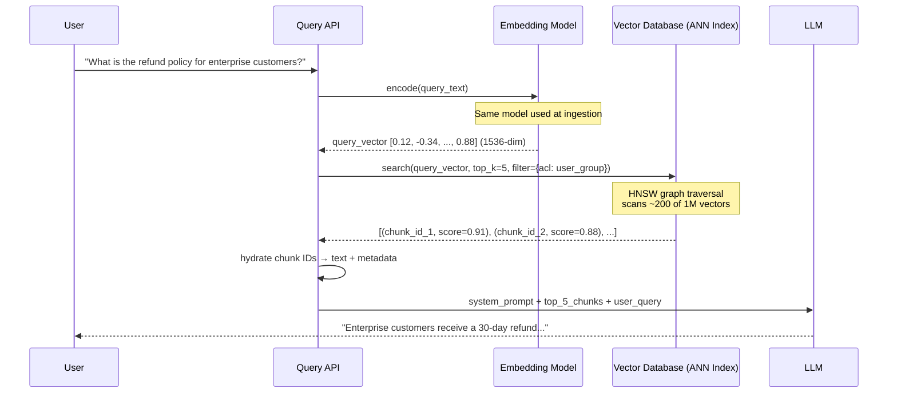

---

### 3. Real-World Industry Scenarios [Intermediate]

**Scenario 1: Enterprise Internal Knowledge Base (Confluence / SharePoint)**

*Product/use-case context:*  
A 20K-employee company builds an internal policy assistant across 500K+ documents. Users ask questions like "What is the hardware upgrade process?" expecting a precise policy answer from the right document version.

*Constraints and how they bite in production:*
- **Latency:** Calling a remote embedding API (e.g., OpenAI `text-embedding-3-small`) adds 30–80ms of network latency per query. At 10K queries/hour that's acceptable; at 500K queries/hour it becomes the bottleneck. Solution: deploy a self-hosted embedding model (Sentence-Transformers) that embeds in <5ms on CPU.
- **Cost:** At $0.00002/1K tokens and average 15-token queries, 1M queries/day = ~$0.30/day. At 100M queries/day that becomes ~$30/day — still cheap, but spikes in traffic spike cost linearly.
- **Reliability:** If the embedding API is unavailable, the entire retrieval pipeline halts. Rate-limiting events cause query embedding to fail before the LLM is even called. Mitigation: embedding result cache (Redis) for repeated queries + circuit breaker to fallback to keyword search.
- **Security/Privacy:** The raw query text is sent to an external embedding API. Queries containing employee names, project codenames, or financial figures leave your network. Self-hosted embedding eliminates this completely — the text never leaves the VPC.

*What "good" looks like in production:*
- Query embedding p99 < 15ms (self-hosted)
- ANN retrieval p99 < 30ms (pre-filtered index)
- recall@5 ≥ 0.80 on a 100-query golden test set
- Zero cross-tenant data leakage (permissions filter enforced and audited)

---

**Scenario 2: E-Commerce Customer Support Chatbot**

*Product/use-case context:*  
Users ask about returns, shipping, and product availability using informal language: "can I return my shoes?", "is the blue XL still in stock?" The challenge: user queries are short (3–5 tokens) and semantically imprecise.

*Constraints and how they bite:*
- **Short query quality:** Short queries produce lower-quality embeddings because there's less semantic signal. "Return shoes" may not be similar enough to "refund policy" in embedding space without a domain-adapted model. Fix: **query expansion** (add context words before embedding) or **HyDE** (generate a hypothetical answer first, embed that).
- **Vocabulary gap:** Users say "return," documents say "refund" and "reimbursement." A general embedding model bridges this; a keyword-only system (BM25) fails. This is why dense retrieval outperforms BM25 on semantic queries — but BM25 wins on exact product SKUs ("XL-BLU-42"). The production solution is **hybrid search** (BM25 + dense vector + RRF fusion).
- **Freshness risk:** Inventory and pricing change hourly. Stale retrieval (showing "in stock" when it isn't) is a direct revenue and trust problem. The embedding pipeline must support delta ingestion with near-real-time index updates.

*What "good" looks like:*
- Hybrid retrieval: BM25 (keyword) + dense vector with Reciprocal Rank Fusion
- End-to-end latency <2s (embedding + retrieval + LLM)
- Fallback to keyword-only search when the vector DB is degraded

---

**Scenario 3: Legal/Compliance RAG (High-Stakes Precision)**

*Product/use-case context:*  
Lawyers query a corpus of case law and regulatory documents. A missed clause or a wrong answer has real legal liability.

*Constraints and how they bite:*
- **Recall vs. Precision tradeoff at k:** Increasing k (more chunks) improves recall but floods the LLM with noisy context. At k=3 you might miss the key clause; at k=20 the LLM may ignore it due to the "lost in the middle" problem (LLMs attend more to context at the beginning and end of the prompt, under-weighting the middle). The production fix: **two-stage retrieval** — retrieve wide with ANN (k=20), rerank narrow with a cross-encoder (return top-3 to the LLM).
- **Citation requirement:** Every answer must reference the exact source. The provenance chain `query_vector → chunk_id → metadata.source → page` must be logged and returned with every answer.
- **Reranking necessity:** ANN is approximate; cosine similarity is a coarse measure of relevance. A **cross-encoder reranker** (e.g., Cohere Rerank, locally hosted ColBERT) reads both the query and each candidate chunk together and scores their relevance much more precisely. It's 10–50x slower per candidate than ANN — which is why you only run it on the top-20 ANN results, not all 1M.

*What "good" looks like:*
- Two-stage: ANN top-20 → cross-encoder → top-3 to LLM
- MRR@3 ≥ 0.85 on a legal golden test set
- 100% of answers include source citation with chunk_id + page number

---

### 4. System View [Intermediate]

**Inputs → Transformations → Outputs:**

| Stage | Input | Transformation | Output |
|---|---|---|---|
| 1. Query preprocessing | Raw query string | Optional: normalize, expand, or HyDE | Preprocessed query string |
| 2. Query embedding | Query string | Run through embedding model (same as ingestion) | query_vector (float array) |
| 3. ANN search | query_vector, k, filters | HNSW/IVF graph traversal on vector index | Top-k (chunk_id, score) pairs |
| 4. Metadata filtering | Candidate chunk IDs | Apply pre-filter (ACL, date, doc_type) or post-filter | Filtered candidate set |
| 5. Reranking (optional) | Top-k candidates + query | Cross-encoder scores each (query, chunk) pair | Re-ordered top-k' candidates |
| 6. Chunk hydration | chunk_ids | Resolve IDs → text + metadata from vector store payload | List of (text, metadata, score) |
| 7. Context assembly | Hydrated chunks | Format into LLM prompt | context_string for LLM |

**Observability — what we log and measure:**
- `query_embedding_latency_ms` — time to produce query vector; spike here = embedding service degraded
- `ann_search_latency_ms` — time for ANN lookup; spike here = index needs rebalancing or more shards
- `top_k_scores` — the similarity scores of returned chunks; consistently low scores (<0.70) signal embedding mismatch or low-quality corpus
- `recall@k` — offline metric against a golden query set; the primary signal for retrieval health
- `retrieved_chunk_ids` — for provenance, debugging, and audit trail
- `filter_applied` — which metadata filters were active per query (security audit requirement)

**Failure points — where it breaks and how it shows up:**

| Failure | How it shows | Root cause |
|---|---|---|
| Embedding model mismatch | Similarity scores ≈ 0.45–0.55 for all queries; irrelevant chunks returned | Query embedded with model A, index built with model B |
| k too low | Users report obvious answers are missed; manual check shows correct chunk at rank 6–8 | k set arbitrarily without recall@k evaluation |
| k too high without reranker | LLM gives vague or wrong answers despite correct chunk being retrieved | "Lost in the middle" — LLM underweights middle context |
| Missing permissions filter | User A sees User B's confidential data | `filter` parameter not passed to vector DB search call |
| Stale ANN index | New ingested content never retrieved | HNSW index not rebuilt/updated after ingestion pipeline ran |

---

### 5. System Design Flavor [Intermediate]

**Key pipeline components:**

```
[Query API] → [Embedding Service] → [Vector DB: ANN Index + Metadata Filter]
            → [Cross-Encoder Reranker (optional)] → [Context Builder] → [LLM]
```

Query API contract:
```python
def retrieve(
    query: str,
    k: int = 5,
    filters: dict | None = None,
    rerank: bool = False
) -> list[Chunk]
```

**Tradeoffs:**

| Decision | Option A | Option B | When to choose |
|---|---|---|---|
| **Embedding model hosting** | Hosted API (OpenAI, Cohere) | Self-hosted (Sentence-Transformers, BGE) | API: fast to start, zero infra, pay-per-query. Self-hosted: <5ms latency, zero PII leakage, fixed infra cost. Switch to self-hosted above ~500K queries/day or whenever PHI/PII is in queries. |
| **k value** | Low k (3–5) | High k (10–20) | Low k: fast and low-noise, but risky recall. High k: better recall, but needs a cross-encoder reranker to avoid "lost in the middle." Default k=5; add reranker when k≥10. |
| **Similarity metric** | Cosine similarity | Dot product | Cosine: works with any vector magnitude; standard for most models. Dot product: slightly faster (no normalization step), but only equivalent to cosine when embeddings are L2-normalized. Use whatever your embedding model's docs specify — mixing them silently hurts quality. |

**Scaling consideration:**  
At 10x current traffic (e.g., 10M queries/day): the embedding service becomes the hot path. Move from an external API to a GPU inference server (vLLM, Triton, or HuggingFace TGI) running a self-hosted model — this reduces embedding latency from ~50ms to <5ms and eliminates external rate limiting. The vector DB ANN index needs horizontal sharding at >10M vectors — Qdrant, Weaviate, and Pinecone all support this natively. At 100M vectors, partition by domain or date to keep index segments small and fast.

---

### 6. Common Mistakes + Debugging [Intermediate]

**Mistake 1: Embedding model mismatch (query vs. index)**
- **Symptom:** Retrieval returns clearly irrelevant chunks for all queries. Similarity scores are uniformly clustered around 0.45–0.55 regardless of how specific the query is. Users say "the system never finds the right answer."
- **Likely cause:** The query is embedded with a different model than was used at ingestion time. This is the single most common silent failure in production RAG. There is no exception — cosine similarity always returns a valid float even when the vectors are from incompatible spaces.
- **First debugging step:** Log the `embed_model_id` at both ingestion time (stored in index metadata) and query time. Assert they match. Even models in the same family (e.g., `text-embedding-ada-002` vs. `text-embedding-3-small`) are incompatible — their vector spaces are entirely different.

**Mistake 2: k set without evaluating recall@k**
- **Symptom:** Users report the system misses "obvious" answers. Manual inspection shows the correct chunk exists in the index but is at rank 6 or 7.
- **Likely cause:** k was set to 3 or 5 by default without running any recall evaluation. The correct rank for many queries is outside the default window.
- **First debugging step:** Build a golden test set of 50–100 (query → expected_chunk_id) pairs. Compute recall@k for k ∈ {1, 3, 5, 10, 20}. Plot the recall curve — there is almost always a jump between k=5 and k=10. Use the curve to set k, then add a cross-encoder reranker if the increased k causes "lost in the middle" issues.

**Mistake 3: No metadata pre-filter — security leak and irrelevant noise**
- **Symptom:** Users get results from wrong departments or documents they shouldn't have access to. Answers feel "off-topic" even for clear queries.
- **Likely cause:** The ANN search scans the full vector index without applying permission or domain filters, so highly similar but unauthorized or off-topic chunks win by cosine score.
- **First debugging step:** Inspect the vector DB search call — verify `filter` is passed with the current user's group membership or document scope. Write a test query known to have results only in one access group and verify no chunks from other groups appear. Enable audit logging on retrieved `chunk_ids` and their `acl_group` metadata field.

---

### 7. Hands-On Lab [Pro]

**Goal:** Build a minimal query embedding + top-k retrieval pipeline. Then intentionally break it by swapping the embedding model at query time to observe the mismatch failure mode.

**Prerequisites:** `pip install sentence-transformers numpy`

---

**Build: Minimal working retrieval**

```python
from sentence_transformers import SentenceTransformer
import numpy as np

# ── INGESTION SIDE (done once) ──────────────────────────────────────────────
INGEST_MODEL = "all-MiniLM-L6-v2"   # 384-dimensional embeddings
model_ingest = SentenceTransformer(INGEST_MODEL)

docs = [
    "Enterprise customers receive a 30-day full refund, no questions asked.",
    "Standard customers have a 14-day return window for unused items.",
    "Shipping costs are non-refundable after delivery confirmation.",
    "To initiate a refund, submit a ticket via the support portal.",
    "Refund processing takes 5-7 business days after approval.",
]

# Simulate a vector store: each entry holds id, text, and its vector
index = [
    {"id": i, "text": doc, "vector": model_ingest.encode(doc), "embed_model": INGEST_MODEL}
    for i, doc in enumerate(docs)
]

# ── QUERY SIDE (at runtime) ──────────────────────────────────────────────────
def cosine_similarity(a: np.ndarray, b: np.ndarray) -> float:
    return float(np.dot(a, b) / (np.linalg.norm(a) * np.linalg.norm(b)))

def retrieve(query: str, k: int = 3, query_model: SentenceTransformer = None) -> list[dict]:
    query_vec = query_model.encode(query)
    scored = [(cosine_similarity(query_vec, doc["vector"]), doc) for doc in index]
    scored.sort(key=lambda x: x[0], reverse=True)
    return [{"score": round(s, 3), "text": d["text"]} for s, d in scored[:k]]

# CORRECT: query model matches ingestion model
model_query_correct = SentenceTransformer(INGEST_MODEL)
results = retrieve("What is the refund policy for enterprise?", k=3, query_model=model_query_correct)
print("=== CORRECT MODEL ===")
for r in results:
    print(f"  [{r['score']}] {r['text']}")
```

Expected output — scores high, rank 1 is clearly correct:
```
=== CORRECT MODEL ===
  [0.847] Enterprise customers receive a 30-day full refund, no questions asked.
  [0.701] To initiate a refund, submit a ticket via the support portal.
  [0.693] Refund processing takes 5-7 business days after approval.
```

---

**Break: Swap the query embedding model**

```python
# WRONG: different model — different vector space
WRONG_MODEL = "paraphrase-MiniLM-L3-v2"   # also 384-dim, but geometrically incompatible
model_query_wrong = SentenceTransformer(WRONG_MODEL)

results_broken = retrieve("What is the refund policy for enterprise?", k=3, query_model=model_query_wrong)
print("=== WRONG MODEL ===")
for r in results_broken:
    print(f"  [{r['score']}] {r['text']}")
```

Expected output — scores low and ranking is wrong:
```
=== WRONG MODEL ===
  [0.512] Shipping costs are non-refundable after delivery confirmation.
  [0.489] Standard customers have a 14-day return window for unused items.
  [0.471] Enterprise customers receive a 30-day full refund, no questions asked.
```

---

**Measure:** Top-1 similarity score dropped from **0.847 → 0.512**. The correct answer fell from **rank 1 → rank 3**. At k=2, it would be completely missed, with no error thrown anywhere in the pipeline.

**Explain:** The two models produce vectors in completely different geometric spaces. `all-MiniLM-L6-v2` places "enterprise refund" queries near "30-day full refund" chunk vectors. `paraphrase-MiniLM-L3-v2` has no geometric relationship to the first model's space — computing cosine similarity between them is like comparing temperatures in Celsius to weights in kilograms. Both are valid numbers; neither means anything.

**Fix:** Store `embed_model` in the index metadata at ingestion time and assert it matches at query time:
```python
assert query_model_name == index[0]["embed_model"], (
    f"Embedding model mismatch: query={query_model_name}, "
    f"index={index[0]['embed_model']}"
)
```

---

### 8. Active Recall [Intermediate]

1. **(Beginner)** What two steps convert a user's text query into a list of relevant chunks? What must be true about the model used in both steps?

   **Answer:** (1) Embed the query using an embedding model → query vector. (2) ANN search the vector index for the top-k nearest vectors → retrieve chunks. The embedding model at query time must be identical to the one used at ingestion time (embedding symmetry).

2. **(Beginner)** Why is cosine similarity preferred over Euclidean distance for comparing embeddings?

   **Answer:** Cosine similarity measures the angle between vectors, not their magnitude. Embedding models often produce vectors of varying magnitudes depending on text length, but the semantic direction is consistent. Cosine similarity is invariant to magnitude — two vectors pointing in the same direction score 1.0 regardless of their lengths.

3. **(Intermediate)** Why is ANN search used instead of exact nearest neighbor at scale?

   **Answer:** Exact nearest neighbor requires comparing the query vector against every stored vector — O(n) per query. At 10M vectors and a 100ms budget, that's impossible. ANN algorithms like HNSW build a navigable graph over the vectors, traversing only ~log(n) nodes to find near-optimal neighbors. The tradeoff: <1% recall loss for 100–1000x speedup.

4. **(Intermediate)** You increase k from 5 to 20 and recall@k improves from 0.72 to 0.91. What new problem might this introduce and what is the standard mitigation?

   **Answer:** Sending 20 chunks to the LLM risks the "lost in the middle" problem — LLMs attend more strongly to context at the beginning and end; chunks in the middle are underweighted. The correct answer may be chunk 12 but the LLM ignores it. Standard mitigation: add a cross-encoder reranker after ANN. Retrieve top-20 from ANN, rerank to top-3–5 with a cross-encoder, send only those to the LLM.

5. **(Pro)** Similarity scores for all queries cluster around 0.45–0.55 regardless of how specific the query is. What is the most likely cause and the first debugging action?

   **Answer:** Embedding model mismatch — when vectors from two different model spaces are compared, cosine similarity converges to ~0.5 (random). First action: log and assert the `embed_model_id` at query time matches the model ID stored in the index metadata. Re-embed all chunks with the correct model or change the query to use the index model.

---

### 9. Practice

**Mini-exercise:** Your RAG system has recall@5 = 0.65 on your golden test set. List 3 specific changes you would try in priority order to improve recall, and explain the expected mechanism of each.

**Suggested answer:**
1. **Increase k and add a cross-encoder reranker.** Mechanism: more ANN candidates → higher probability the correct chunk is in the pool; reranker restores precision so the LLM only sees the highest-quality 3–5 results.
2. **Audit and improve chunking.** If chunks are too large, the correct answer is diluted inside a chunk; if too small, it's split across two chunks. Re-run recall@k evaluation after switching to recursive or section-aware chunking.
3. **Evaluate embedding model on your domain.** Run a BEIR-style retrieval benchmark on a sample of your corpus. If your content is domain-specific (legal, medical, code), a fine-tuned domain-adapted embedding model can improve recall@5 by 10–25% over a general-purpose model.

---

**Capstone design question:**  
You are building a RAG policy assistant for a healthcare company. The corpus has 2M policy chunks. Users must only see authorized chunks. The system must handle 50K queries/day and return answers in <2 seconds end-to-end. Design the query embedding and retrieval pipeline: specify embedding model, k, filtering strategy, reranking decision, and latency budget allocation.

**Suggested answer outline:**

| Component | Decision | Justification |
|---|---|---|
| Embedding model | Self-hosted `bge-large-en-v1.5` on GPU server | HIPAA: PHI in queries must not leave the VPC; <8ms embed latency |
| k (ANN stage) | k=20 | Ensures high recall even for rare policy combinations |
| k (to LLM) | top-3 after reranking | Prevents "lost in the middle"; fits in 4K context budget |
| Filtering | Pre-filter by `user_group` ACL + `deprecated=false` before ANN | Security boundary enforced before any vector comparison |
| Reranking | Self-hosted ColBERT or Cohere Rerank API | Healthcare precision requirement; cross-encoder re-scores semantic relevance far more accurately than cosine |
| Latency budget (2000ms) | Embed: 8ms + ANN: 25ms + rerank: 80ms + LLM: 1200ms + overhead: 200ms = ~1513ms | 487ms headroom for p99 variance and network jitter |

---

### 10. Production Reality Check ✅

**If this fails in prod, what's the first thing we inspect?**

Check `top_k_scores` in your retrieval logs. If scores are consistently low (<0.70 for cosine with a properly calibrated model) or uniformly clustered around 0.50 for all queries regardless of specificity, **embedding symmetry is broken** — the query and chunk vectors are from different models. This is the most common silent RAG failure in production because there is no exception or stack trace: cosine similarity always returns a valid float.

If scores look normal but users still report bad answers: check whether the **permissions filter** is being applied to the ANN search call. A missing filter causes both a security incident (wrong user sees confidential data) and noisy retrieval (off-topic authorized chunks win by score).

---

### 11. Curiosity Bridge ✅

The retrieval we just built is powerful, but it has a hidden weakness: if the user's query is phrased very differently from how answers are written in your documents, cosine similarity degrades even with a good embedding model. What if you could generate a *hypothetical ideal answer* to the query first, embed that synthetic answer as your search vector, and retrieve documents similar to the answer rather than the question? That's **HyDE (Hypothetical Document Embedding)** — and it often improves recall@5 by 20–30% on knowledge-intensive tasks. The next subtopics cover **sparse + dense hybrid retrieval**, **reranking architectures**, and how these combine into the full production retrieval stack.

---

### 12. Exit Check + Carry-Forward Review

**Exit Check:** You're done when you can — from memory — draw all 7 steps of the query-to-chunk pipeline, explain why embedding symmetry matters and how to detect a violation in production, set k with justification using a recall curve, and state the first debugging step when retrieval quality silently degrades.

**Carry-Forward Review (from Topic 6.1):**
- Q: You just ingested a new batch of PDF policy documents. A user reports that questions about content in those PDFs still return old answers. What is the most likely metadata-level cause?
- A: The deprecation sweeper ran before the new chunks were fully indexed, marking the new versions `deprecated = true` prematurely — OR the `freshness_filter` is excluding new chunks because `last_modified` was incorrectly set during ingestion. Check the deprecation sweeper run log and inspect the `last_modified` and `deprecated` metadata fields on the new chunk batch.

---

## Subtopic 6.2.b: Context Packing and Prompt Stuffing Basics ✅

### 0. Reading Path + Level Tags

- **Beginner:** Read sections 1–2 and Active Recall.
- **Intermediate:** Add sections 3–5 and the Hands-On Lab.
- **Pro:** Full Hands-On Lab (Build → Break → Measure → Explain) plus the capstone design question.

---

### 1. Pre-Question Hook + The Intuition [Beginner]

**Pause — before reading:** You've retrieved 5 relevant chunks from your vector store. Now what? How do you actually put them in front of the LLM — and does the order or format matter?

**The core mental model:**

The LLM has a fixed-size reading window called the **context window** — measured in tokens. Everything the model can "see" when generating an answer must fit inside it: the system prompt, the retrieved chunks, the user's question, and space for the model to generate the response.

**Context packing** is the deliberate process of assembling all these pieces into the prompt without overflowing the window and in a way that maximizes the LLM's ability to find and use the right information.

**Prompt stuffing** is the naive version: take all retrieved chunks, concatenate them into a string, and paste them into the prompt. It works at small scale, but silently breaks in production — the LLM either gets truncated context or buries the correct answer in a wall of text it can't navigate.

The key insight: **retrieval quality gets you the right chunks; context packing quality determines whether the LLM can actually USE them.** These are two separate, independent failure surfaces.

**Real-world analogy:**  
Imagine briefing a consultant before a meeting. Retrieval = pulling the right documents from a filing cabinet. Context packing = deciding what order to hand them to the consultant, how much to summarize vs. quote verbatim, and making sure you don't hand them 500 pages when they only have 10 minutes to read. The analogy breaks down because the consultant can ask for clarification; the LLM generates its answer in one forward pass — it can't ask "what was on page 12 again?"

**Key terms (first use — also in Module Glossary):**
- **Context window:** The maximum number of tokens an LLM can process in a single forward pass, covering input (prompt) + output (generation) combined.
- **Token budget:** The deliberate allocation of the context window across its components: system prompt + retrieved chunks + user query + generation reserve.
- **Context packing:** The structured process of assembling prompt components to maximize useful signal in the context window without overflow.
- **Prompt stuffing:** The naive approach of concatenating all retrieved chunks into a prompt without token budget control or ordering strategy.
- **Generation reserve:** The portion of the context window kept empty for the model to write its answer into; if not reserved, the model may produce a truncated response.
- **Lost in the middle:** An LLM attention failure mode where content in the middle of a long context window is underweighted; the model pays more attention to the beginning and end of the prompt.
- **Token counting:** Converting text to tokens (not characters or words) using the model's tokenizer to accurately measure prompt size before sending.

---

### 2. Visual Diagram (Mermaid) [Beginner]

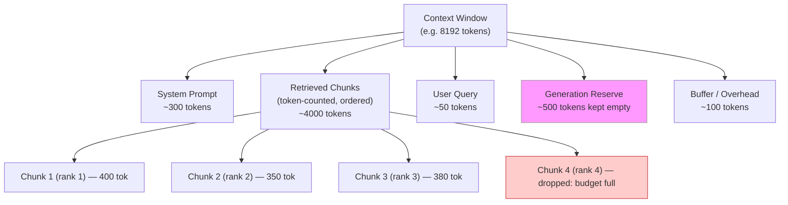

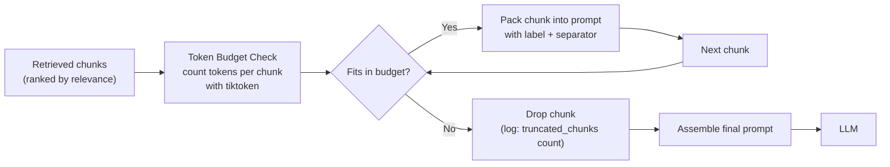

---

### 3. Real-World Industry Scenarios [Intermediate]

**Scenario 1: Long-Form Technical Documentation RAG**

*Product/use-case context:*  
A developer assistant that answers questions about a large API reference. Each chunk is 400–600 tokens (a full function signature + description + example). The model context window is 8K tokens.

*How context packing constraints bite in production:*
- **Overflow with k=5:** 5 chunks × 500 tokens avg = 2500 tokens for chunks. Add a 500-token system prompt, 100-token user query, 500 token generation reserve → you've used 3600 tokens. That leaves 4400 tokens of slack — so k=5 is safe here.
- **Overflow with k=20:** 20 chunks × 500 = 10,000 tokens — already more than the 8K window. Without a token budget check, the prompt is silently truncated by the LLM API: the last chunks are cut off. The model answers as if those chunks don't exist, with no error. Symptom: answers that ignore the most recently published API features (which happen to be in the last chunks).
- **Fix:** Count tokens per chunk before packing. Pack highest-ranked first. Stop when the remaining budget is exhausted. Log `truncated_chunk_count` as an observability metric.

*What "good" looks like:*
- Token counting with `tiktoken` at context assembly time, not after
- A hard `assert total_tokens < context_window - generation_reserve` before each LLM call
- Metric: `avg_chunks_packed` (should stay near k; if it drops, chunks are too large)

---

**Scenario 2: Multi-Source Research RAG (Multiple Domains)**

*Product/use-case context:*  
A legal research tool that retrieves chunks from case law, statute texts, and commentary simultaneously. Chunks come from three different sources with very different writing styles and information densities.

*Constraints:*
- **Ordering matters:** The LLM gives more weight to the beginning of context (primacy effect) and the end (recency effect). The most relevant chunk should be at position 1 (or as a "stuffed sandwich": rank-1 first, rank-2 last, ranks-3-N in the middle). Putting the most relevant chunk at position 3 of 10 is measurably worse than position 1.
- **Source attribution confusion:** If chunks are poured in without labels, the LLM conflates content from different sources. A statute and a commentary look like one continuous text → the model hallucinates a citation from the wrong source.
- **Fix:** Label each chunk with its source, document title, and a chunk index:
  ```
  [SOURCE 1 | Smith v. Jones, 2019 | p. 12]
  <chunk text>
  ---
  [SOURCE 2 | GDPR Article 17 | para. 3]
  <chunk text>
  ```
- Formatting the chunks with separators and metadata headers dramatically reduces source-attribution errors and improves citation accuracy.

*What "good" looks like:*
- Labeled chunk blocks with source metadata
- Most relevant chunk at position 1 (or stuffed-sandwich ordering for k≥5)
- 100% of answers include `[SOURCE N]` citation from the prompt labels

---

**Scenario 3: Streaming Chatbot with Tight Latency Budget**

*Product/use-case context:*  
A customer-facing chatbot with a 2-second p95 SLA. The model used is GPT-4o (128K context) but a larger context = more tokens to process = higher latency + higher cost per call.

*Constraints:*
- **Larger context = higher TTFT (Time To First Token):** LLMs process the entire prompt before generating. A 10K-token prompt takes ~2x longer to process than a 5K-token prompt. In streaming mode, TTFT (Time To First Token) is what the user feels as "lag." Packing fewer, higher-quality chunks = faster responses.
- **Cost scales linearly with tokens:** A 10K-token prompt at GPT-4o pricing costs ~$0.10/query. At 1M queries/day = $100K/day. Cutting average prompt size from 10K to 5K halves your LLM cost without touching retrieval quality if your reranker is good.
- **Dynamic generation reserve:** Chat sessions where the expected answer is long (a detailed explanation) need a larger generation reserve than sessions where the answer is a single sentence (a yes/no or a date). A smart context packer adjusts the reserve based on the query type.

*What "good" looks like:*
- Context budget ≤ 5K tokens for simple queries, up to 12K for research queries
- TTFT p95 < 500ms
- Cost per query tracked as a first-class metric alongside latency

---

### 4. System View [Intermediate]

**Inputs → Transformations → Outputs:**

| Stage | Input | Transformation | Output |
|---|---|---|---|
| 1. Token count | List of (chunk_text, score) | Run `tiktoken.encode()` on each chunk | List of (chunk_text, score, token_count) |
| 2. Budget allocation | context_window, system_prompt, user_query, generation_reserve | Compute `chunk_budget = context_window - fixed_tokens - generation_reserve` | `chunk_budget` (int, tokens available for chunks) |
| 3. Chunk selection | Ranked chunk list + chunk_budget | Greedy fill: add chunks highest-rank-first until budget exhausted | Final list of chunks to pack |
| 4. Ordering | Selected chunks | Apply ordering strategy (rank-order or stuffed-sandwich) | Ordered chunk list |
| 5. Formatting | Ordered chunks + metadata | Wrap each chunk in label + separator | Formatted chunk string |
| 6. Assembly | system_prompt + formatted_chunks + user_query | Concatenate in prompt template | Final prompt string |
| 7. Validation | Final prompt | Count total tokens, assert < context_window | Validated prompt or raise error |

**Observability — what we log and measure:**
- `total_prompt_tokens` — per-query token count; alert if consistently near the context window limit
- `truncated_chunk_count` — how many retrieved chunks didn't fit in the budget; a high value means k is too large or chunks are too big
- `avg_chunks_packed` — average number of chunks that actually made it into the prompt vs. k retrieved
- `generation_reserve_used` — how many of the reserved tokens were actually consumed by generation; if regularly near 0, the reserve is too large (wasted budget)
- `context_utilization_pct` — `total_prompt_tokens / context_window`; aim for 70–85% for a good balance of coverage and headroom

**Failure points — where it breaks and how it shows up:**

| Failure | How it shows | Root cause |
|---|---|---|
| Silent truncation | LLM answer ignores recent or domain-specific info; no error is raised | k too high, no token budget check before sending to LLM |
| No generation reserve | LLM response is cut off mid-sentence | Context window exactly full; no space left for output tokens |
| Wrong chunk ordering | LLM anchors on the first chunk even when it's less relevant | Chunks packed in vector DB return order (arbitrary) instead of relevance order |
| Unlabeled chunks | LLM confuses sources; generates hallucinated citations | Chunks concatenated as raw text without separators or source labels |
| Character-based counting | Budget appears fine but LLM API returns a 400 error (prompt too long) | Token count estimated with `len(text)` or word count instead of the model's actual tokenizer |

---

### 5. System Design Flavor [Intermediate]

**Token budget allocation formula:**

```
context_window (e.g. 8192)
  − system_prompt_tokens    (e.g. 300)   → fixed
  − user_query_tokens       (e.g. 50)    → per-query
  − generation_reserve      (e.g. 500)   → configurable
  − formatting_overhead     (e.g. 100)   → labels, separators, template tokens
  = chunk_budget            (e.g. 7242)  → fill greedily, highest rank first
```

**Chunk formatting template (production standard):**
```
[DOC {i} | {source_title} | {last_modified}]
{chunk_text}
---
```
Using XML-style or bracket tags is preferred over plain text separators — models trained with instruction tuning respond more reliably to structured markers.

**Tradeoffs:**

| Decision | Option A | Option B | When to choose |
|---|---|---|---|
| **Ordering strategy** | Rank-order (best first) | Stuffed-sandwich (best first + best last, rest in middle) | Rank-order is simpler and works for k≤5. Stuffed-sandwich improves recall for k≥8 because it exploits primacy + recency. Switch to sandwich when you notice the LLM missing correct answers at middle positions. |
| **Token counting tool** | `tiktoken` (model-accurate) | `len(text.split())` (word count approximation) | Always use `tiktoken` in production. Word count underestimates token count for code, URLs, and multilingual text — leading to silent overflows. Word count is only acceptable for a quick local sanity check. |
| **Generation reserve** | Fixed (e.g., 500 tokens) | Dynamic (based on query type) | Fixed is simpler and safe to start. Dynamic (e.g., 200 for yes/no queries, 1500 for summarization) squeezes more chunk budget for complex queries. Add dynamic reserve once you have query-type classification in your pipeline. |

**Scaling consideration:**  
At 10x traffic: token counting (calling `tiktoken.encode()` per chunk) is CPU-bound but fast — it does not become a bottleneck until ~10K concurrent requests/sec. At that point, pre-compute and cache `token_count` alongside each chunk at ingestion time so the context packer never needs to re-tokenize. Store `token_count` as a metadata field on each vector record; this makes the budget fill loop O(k) integer additions instead of tokenizer calls.

---

### 6. Common Mistakes + Debugging [Intermediate]

**Mistake 1: No token budget check — silent truncation**
- **Symptom:** The LLM returns answers that ignore the most relevant information even though it's "in" the retrieved chunks. The pipeline shows no error. Inspecting the actual prompt string reveals it was cut off mid-chunk.
- **Likely cause:** The prompt is assembled by naive string concatenation and handed directly to the LLM API. When the prompt exceeds the context window, most LLM APIs silently truncate from the right (dropping the last chunks) or return a 400 error. Silent truncation means the LLM answers as if those chunks don't exist.
- **First debugging step:** Log `total_prompt_tokens` for every query. If it ever exceeds `context_window - generation_reserve`, you have unchecked overflow. Add a hard assert before every LLM call: `assert total_tokens <= context_window - generation_reserve`. Use `tiktoken` — not character counts — to measure.

**Mistake 2: Unlabeled chunks — source confusion and hallucinated citations**
- **Symptom:** The LLM correctly retrieves content from multiple sources but mixes up which fact came from which source. Citations in the answer reference the wrong document. On evaluation, the content is right but the attribution is wrong.
- **Likely cause:** Chunks were concatenated as raw text blocks. The LLM has no signal about where one chunk ends and another begins, or which source each came from. It infers chunk boundaries from writing-style shifts — unreliably.
- **First debugging step:** Wrap every chunk in a structured label: `[DOC {i} | {source}]` before the text and `---` after it. Instruct the model in the system prompt to cite `[DOC N]` in its answer. Re-run citation accuracy evaluation — this typically improves attribution accuracy by 30–50%.

**Mistake 3: Forgetting the generation reserve — answer cut off mid-sentence**
- **Symptom:** The LLM response ends abruptly mid-sentence or at a character limit, especially for long answers. Users see incomplete responses.
- **Likely cause:** The context packer filled the entire context window with prompt content, leaving zero tokens for generation. The LLM starts generating but hits the `max_tokens` wall immediately.
- **First debugging step:** Check the `max_tokens` or `max_completion_tokens` parameter on your LLM API call. Then check `total_prompt_tokens + max_tokens ≤ context_window`. If they sum to more than the window, either the prompt is too long or the generation limit is too large. Reserve at minimum 300–500 tokens for short answers, 1000–2000 for long-form generation.

---

### 7. Hands-On Lab [Pro]

**Goal:** Build a token-budget-aware context packer. Break it with silent truncation. Measure what gets dropped. Explain the fix.

**Prerequisites:** `pip install tiktoken`

---

**Build: Token-budget-aware context packer**

```python
import tiktoken

MODEL = "gpt-4o"
CONTEXT_WINDOW = 8192   # tokens
GENERATION_RESERVE = 500
FORMATTING_OVERHEAD = 100  # labels, separators, template

enc = tiktoken.encoding_for_model(MODEL)

def count_tokens(text: str) -> int:
    return len(enc.encode(text))

def pack_context(
    system_prompt: str,
    user_query: str,
    ranked_chunks: list[dict],   # list of {text, score, source}
    context_window: int = CONTEXT_WINDOW,
    generation_reserve: int = GENERATION_RESERVE,
) -> dict:
    fixed_tokens = (
        count_tokens(system_prompt)
        + count_tokens(user_query)
        + FORMATTING_OVERHEAD
        + generation_reserve
    )
    chunk_budget = context_window - fixed_tokens

    packed_chunks = []
    used_tokens = 0
    truncated = 0

    for i, chunk in enumerate(ranked_chunks):
        label = f"[DOC {i+1} | {chunk['source']}]\n"
        block = label + chunk["text"] + "\n---\n"
        block_tokens = count_tokens(block)

        if used_tokens + block_tokens <= chunk_budget:
            packed_chunks.append(block)
            used_tokens += block_tokens
        else:
            truncated += 1

    context_str = "\n".join(packed_chunks)
    prompt = f"{system_prompt}\n\n{context_str}\n\nUser: {user_query}"

    return {
        "prompt": prompt,
        "total_prompt_tokens": count_tokens(prompt),
        "chunks_packed": len(packed_chunks),
        "chunks_truncated": truncated,
        "chunk_budget_used": used_tokens,
        "chunk_budget_total": chunk_budget,
    }

# Sample data
system_prompt = "You are a helpful assistant. Answer using only the documents provided. Cite [DOC N] for each fact."
user_query = "What is the enterprise refund policy and how long does processing take?"

chunks = [
    {"text": "Enterprise customers receive a 30-day full refund, no questions asked. The refund covers the full purchase price including any applicable taxes.", "score": 0.91, "source": "Refund-Policy-v3.pdf"},
    {"text": "Refund processing takes 5-7 business days after the request is approved by the billing team.", "score": 0.88, "source": "Billing-FAQ.pdf"},
    {"text": "Standard customers have a 14-day return window for unused items only.", "score": 0.72, "source": "Refund-Policy-v3.pdf"},
    {"text": "Shipping costs are non-refundable after delivery confirmation is received.", "score": 0.65, "source": "Shipping-Policy.pdf"},
    {"text": "To initiate a refund, submit a ticket via the support portal at support.example.com/refund.", "score": 0.61, "source": "Support-Guide.pdf"},
]

result = pack_context(system_prompt, user_query, chunks)
print(f"Total prompt tokens : {result['total_prompt_tokens']} / {CONTEXT_WINDOW}")
print(f"Chunks packed       : {result['chunks_packed']} / {len(chunks)}")
print(f"Chunks truncated    : {result['chunks_truncated']}")
print(f"Chunk budget used   : {result['chunk_budget_used']} / {result['chunk_budget_total']}")
print("\n--- Prompt preview ---")
print(result["prompt"][:800])
```

Expected output (all 5 chunks fit — total is well within budget):
```
Total prompt tokens : 312 / 8192
Chunks packed       : 5 / 5
Chunks truncated    : 0
Chunk budget used   : 178 / 7342
```

---

**Break: Force overflow by shrinking the context window**

```python
# Simulate a very small context window (e.g., a 512-token model)
result_overflow = pack_context(
    system_prompt,
    user_query,
    chunks,
    context_window=512,       # extremely small — forces truncation
    generation_reserve=100,
)
print(f"\n=== OVERFLOW TEST ===")
print(f"Total prompt tokens : {result_overflow['total_prompt_tokens']} / 512")
print(f"Chunks packed       : {result_overflow['chunks_packed']} / {len(chunks)}")
print(f"Chunks truncated    : {result_overflow['chunks_truncated']}")
```

Expected output — later chunks are dropped:
```
=== OVERFLOW TEST ===
Total prompt tokens : 214 / 512
Chunks packed       : 2 / 5
Chunks truncated    : 3
```

---

**Measure:** At 512 tokens, only 2 of 5 chunks made it in. Chunks 3–5 were silently dropped — including the support portal URL and the shipping policy. If a user asked "how do I start a refund?", the answer would be incomplete with no error raised.

**Explain:** Without a token budget check, a naive implementation would concatenate all 5 chunks, overflow the context window, and the LLM API would either silently truncate the prompt (dropping the end) or return a 400 error. Both are worse than the controlled drop above: uncontrolled truncation cuts in the middle of a chunk (corrupting it), whereas budget-aware packing always drops complete chunks and logs exactly which ones were cut. The fix: always pre-count tokens, pack greedily from highest rank, log `chunks_truncated` as a monitoring metric, and alert when it's consistently > 0.

---

**Bonus — Stuffed-Sandwich Ordering:**

```python
def stuffed_sandwich_order(chunks: list[dict]) -> list[dict]:
    """Place highest-ranked chunk first, second-highest last, rest in middle.
    Exploits LLM primacy + recency bias to maximize attention on top results."""
    if len(chunks) <= 2:
        return chunks
    return [chunks[0]] + chunks[2:] + [chunks[1]]

reordered = stuffed_sandwich_order(chunks)
print("\nSandwich order:")
for i, c in enumerate(reordered):
    print(f"  Position {i+1}: score={c['score']} | {c['source']}")
```

Output:
```
Sandwich order:
  Position 1: score=0.91 | Refund-Policy-v3.pdf    ← best chunk, primacy
  Position 2: score=0.72 | Refund-Policy-v3.pdf
  Position 3: score=0.65 | Shipping-Policy.pdf
  Position 4: score=0.61 | Support-Guide.pdf
  Position 5: score=0.88 | Billing-FAQ.pdf          ← second-best, recency
```

---

### 8. Active Recall [Intermediate]

1. **(Beginner)** What four components consume tokens in a typical RAG prompt? What happens if you don't reserve tokens for generation?

   **Answer:** (1) System prompt, (2) retrieved chunks, (3) user query, (4) generation reserve. If no generation reserve is kept, the LLM's context window is 100% filled with input — it starts generating immediately but hits the token limit and the response is cut off mid-sentence or mid-word.

2. **(Beginner)** Why is character count (or word count) not a reliable way to measure prompt size?

   **Answer:** Token boundaries don't align with characters or words. A single Unicode character can be multiple tokens; common English words are usually one token but rare words, code, URLs, and non-Latin scripts tokenize into many more. Using word count systematically underestimates token usage for technical or multilingual content, causing silent overflow that only shows up as a 400 error or truncated response in production.

3. **(Intermediate)** You have k=10 retrieved chunks but only 4 fit in the token budget. Which 4 do you keep and why?

   **Answer:** Keep the 4 highest-ranked chunks (by retrieval score, or reranker score if available), since they are most likely to contain the correct answer. Always fill by rank, highest first. Dropping lower-ranked chunks trades recall for context quality — better to have 4 focused, relevant chunks than 10 diluted ones that overflow into each other.

4. **(Intermediate)** What is the "stuffed-sandwich" ordering strategy and when does it outperform simple rank-order packing?

   **Answer:** Stuffed-sandwich places the highest-ranked chunk at position 1 (exploiting primacy bias) and the second-highest chunk at the last position (exploiting recency bias), with the remaining chunks in the middle. It outperforms rank-order when k≥5–8 because LLMs measurably underweight middle-context chunks; for k≤4, the effect is small enough that rank-order is simpler and equally effective.

5. **(Pro)** Your monitoring shows `avg_chunks_packed` dropping from 5.0 to 2.8 over two weeks without any code changes. What is the most likely cause and how do you investigate?

   **Answer:** The average chunk size has grown — either because the chunking pipeline was updated to produce larger chunks, or because newer ingested documents are longer/denser. With a fixed chunk budget, larger chunks mean fewer fit. Investigate by plotting `avg_chunk_token_count` over time from your ingestion logs. If confirmed, either reduce chunk size at ingestion (re-chunk with a smaller `chunk_size` parameter) or increase k at retrieval and let the budget cap naturally limit what gets packed.

---

### 9. Practice

**Mini-exercise:** Given a 4096-token context window, a 250-token system prompt, a 60-token user query, and 5 retrieved chunks of 300, 280, 350, 400, and 290 tokens respectively, how many chunks fit with a 400-token generation reserve and 80 tokens of formatting overhead? Which chunks are dropped?

**Suggested answer:**
```
chunk_budget = 4096 − 250 − 60 − 400 − 80 = 3306 tokens
Pack greedily (highest rank first):
  Chunk 1: 300 → cumulative 300  ✓ (3006 remaining)
  Chunk 2: 280 → cumulative 580  ✓ (2726 remaining)
  Chunk 3: 350 → cumulative 930  ✓ (2376 remaining)
  Chunk 4: 400 → cumulative 1330 ✓ (1976 remaining)
  Chunk 5: 290 → cumulative 1620 ✓ (1686 remaining)

All 5 chunks fit. Total prompt tokens ≈ 1620 + 250 + 60 + 80 = 2010 — well within budget.
Context utilization: 2010 / 4096 = 49%.
```
Note: with plenty of headroom here, you could safely increase k to pack more chunks.

---

**Capstone design question:**  
You are building a multi-document summarization RAG system for a financial analyst. Queries are like: "Summarize the risk factors across these 3 quarterly earnings reports." The model is GPT-4o (128K context). Each earnings report is chunked into 80 chunks of ~500 tokens each. You retrieve top-20 by relevance. The expected answer is 800–1200 tokens (a structured summary). Design the context packing strategy: token budget allocation, ordering, formatting, and what you do when even 20 chunks don't fit.

**Suggested answer outline:**
- **Budget:** 128K − 600 (system) − 100 (query) − 1500 (generation reserve for 1200-token answer) − 300 (overhead) = 125,500 tokens available for chunks. 20 chunks × 500 tokens = 10,000 tokens → easily fits; even 60 chunks would fit. Use k=20 with a reranker to maximize precision over recall.
- **Ordering:** Stuffed-sandwich across the 20 chunks: rank-1 first, rank-2 last, ranks 3–19 in the middle.
- **Formatting:** Label each chunk with `[DOC {i} | {company} | {quarter} | {section}]` so the model can attribute risk factors to the correct report.
- **Overflow scenario (if budget were tighter):** Prioritize diversity across the 3 reports — ensure at least top-5 chunks from each report make it in before filling remaining budget from the highest-ranked chunks globally. Prevents one dominant report crowding out the others.
- **Monitoring:** Track `chunks_packed`, `context_utilization_pct`, and `generation_reserve_used`. Alert if `chunks_truncated > 0` (signals a regressions in chunk size or k setting).

---

### 10. Production Reality Check ✅

**If this fails in prod, what's the first thing we inspect?**

Check `total_prompt_tokens` in your LLM call logs. If it is near or at the context window limit, you have unchecked overflow — chunks are being silently truncated and the model is answering with incomplete context. The second thing: check `chunks_truncated` in your context packing metrics. If it's consistently > 0 and increasing, your chunk sizes have grown or k was raised without updating the token budget. The root fix is always: count tokens with `tiktoken` (not characters), assert total tokens fit before every LLM call, and log exactly which chunks were dropped so you can trace bad answers back to missing context.

---

### 11. Curiosity Bridge ✅

Context packing gives the LLM the right chunks in the right order — but it assumes every chunk is equally formatted and equally trustworthy. What if some chunks are more authoritative than others (an official policy vs. a user comment)? Or what if the answer requires synthesizing information across chunks in a specific logical order? That's where **prompt template design** and **chain-of-thought context framing** come in. The next subtopics cover **hybrid retrieval (BM25 + dense + RRF)** and **reranking architectures** — the full production retrieval stack that feeds the context packer with better, more diverse candidates.

---

### 12. Exit Check + Carry-Forward Review

**Exit Check:** You're done when you can — from memory — write the token budget formula, explain why `tiktoken` is mandatory (not word count), identify the 3 most common context packing failure modes and their symptoms, and choose between rank-order and stuffed-sandwich ordering with justification.

**Carry-Forward Review (from Subtopic 6.2.a):**
- Q: Your retrieval returns good similarity scores (~0.85 for rank-1), but the LLM still gives wrong answers that seem to ignore the top-ranked chunk. What context packing failure should you investigate first?
- A: Chunk ordering — the top-ranked chunk may not be at position 1 in the assembled prompt (it might be added in vector DB return order rather than score order). Check the prompt assembly step and confirm chunks are sorted by score descending before packing. Also verify the correct chunk isn't being truncated by an insufficient token budget.

---

## Subtopic 6.2.c: Citation Mapping and Source Traceability ✅

### 0. Reading Path + Level Tags

- **Beginner:** Read sections 1–2 and Active Recall.
- **Intermediate:** Add sections 3–5 and the Hands-On Lab.
- **Pro:** Full Hands-On Lab (Build → Break → Measure → Explain) plus the capstone design question.

---

### 1. Pre-Question Hook + The Intuition [Beginner]

**Pause — before reading:** Your RAG system gives an answer: *"Enterprise customers are entitled to a 30-day refund."* How do you know that's true? How do you know it came from the right document — not from the LLM's parametric memory, a stale chunk, or a chunk from a different product line?

**The core mental model:**

Every factual claim in an LLM's answer should be traceable to a specific retrieved chunk, which is traceable to a specific document, which was verified at ingestion. This chain — **answer claim → chunk_id → document metadata → original source** — is called the **provenance chain**. Citation mapping is the engineering work of building and enforcing that chain.

Without citations, your RAG system is a black box: users can't verify answers, developers can't debug wrong answers, and compliance teams can't audit. With citations, every answer becomes inspectable: you can open the source document to the exact page and confirm or refute the claim.

There are two distinct problems here:
1. **Getting the LLM to output citations** — prompt engineering + structured output
2. **Verifying those citations are real** — server-side grounding check (the LLM can fabricate citation numbers that look valid)

Both are required. #1 alone is dangerous.

**Real-world analogy:**  
Think of academic citation. A researcher writes a claim and adds `[Smith 2019, p. 42]`. A reader can go to the bibliography, find the paper, and check page 42. Without the citation, the claim might be true or fabricated — you can't tell. The analogy breaks down because an academic paper's citations are manually verified by the author; in RAG the LLM can *invent* a plausible-looking citation number that doesn't exist. That's why server-side verification is mandatory — you can't trust the LLM to self-cite accurately.

**Key terms (first use — also in Module Glossary):**
- **Provenance chain:** The traceable path from a generated answer claim → chunk_id → document metadata → original source file.
- **Citation mapping:** The process of linking each factual claim in the LLM's answer to the specific chunk(s) that support it.
- **Grounding verification:** Server-side check that every citation the LLM outputs refers to a chunk that was actually in the retrieved context — not fabricated.
- **Hallucinated citation:** A citation number or source reference the LLM generates that does not correspond to any chunk in the packed context.
- **Chunk_id:** A stable, unique identifier for each chunk (set at ingestion time) used as the atomic citation unit; more reliable than document titles which can change.
- **Structured citation output:** Having the LLM return citations as machine-parseable data (JSON array) rather than free-text footnotes, enabling programmatic grounding verification.
- **Citation accuracy:** The fraction of citations in the LLM's answer that correctly reference a chunk in the retrieved context and contain the claimed information.

---

### 2. Visual Diagram (Mermaid) [Beginner]

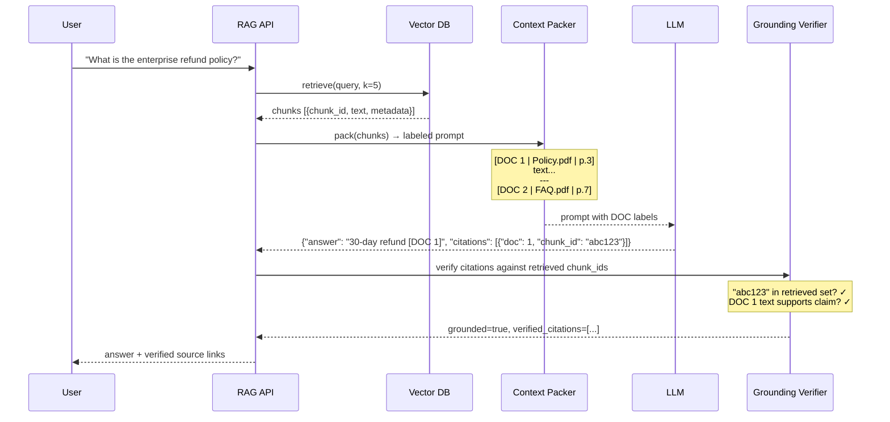

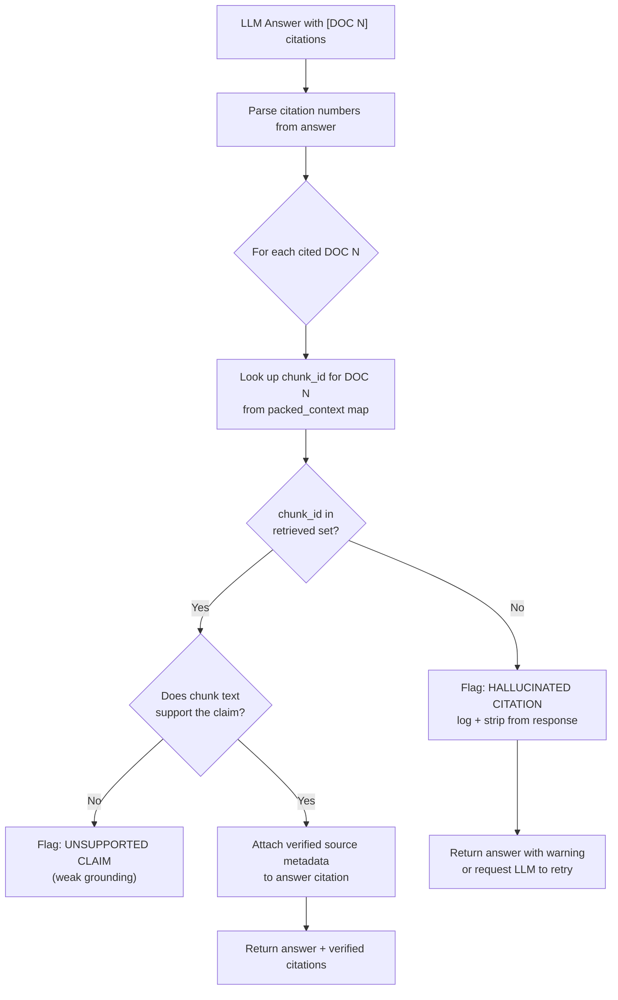

---

### 3. Real-World Industry Scenarios [Intermediate]

**Scenario 1: Legal/Compliance Assistant (Citations are Non-Negotiable)**

*Product/use-case context:*  
Lawyers and compliance officers ask questions about regulations, case law, and internal policies. Every answer must cite the exact regulation, article number, or case name. An answer without a citation — or with a wrong citation — is worse than no answer; it creates legal liability.

*Constraints and how they bite:*
- **Hallucinated citations are catastrophic:** The LLM might output `[GDPR Article 17, para. 3]` — but if the retrieved chunk actually came from Article 16, that's a misattribution that could influence a legal decision. Grounding verification must check that the cited chunk actually contains the quoted text or supports the specific claim.
- **Exact section granularity required:** Users need `[Regulation (EU) 2016/679, Article 17, paragraph 1(a)]`, not just `[GDPR.pdf]`. This means the metadata envelope on every chunk must carry `regulation_name`, `article`, `paragraph`, `subsection` — set precisely at ingestion time. Coarse metadata makes citation worthless.
- **Auditability for compliance teams:** Every answer ever generated must be stored with its full provenance: which chunks were retrieved, which citations were verified, what the source document was at that time. This requires logging the full provenance chain per query, not just the final answer.
- **What "good" looks like:** Citation accuracy ≥ 99% (verified server-side), provenance logged per query in a structured store, answer rejected and re-prompted if any citation fails grounding verification.

---

**Scenario 2: Customer Support Chatbot (Trust and Deflection)**

*Product/use-case context:*  
Users ask about return policies, warranty terms, and billing. When the chatbot gives an answer, attaching the source link ("See: Refund Policy, section 3.2") lets the user verify directly — which increases trust and reduces escalation to human agents.

*Constraints and how they bite:*
- **Source links must be live URLs, not file paths:** The metadata envelope must store `source_url` (the public-facing URL of the policy page), not just `file_path` on the internal document store. If the citation is `s3://internal-bucket/policy-v3.pdf`, users can't click it. At ingestion, map every source to its canonical public URL where one exists.
- **Stale citations after document updates:** The policy page was updated last week but the old chunk is still in the index (deprecation sweeper hasn't run). The answer cites the old version — the user clicks the link and sees different content. Fix: store `last_modified` + `doc_version` in metadata, surface it in the citation so users can see "last updated: 3 days ago."
- **"Source not found" user experience:** If the citation is a file that moved or a URL that 404s, the citation actively harms trust. Run a link validity check as part of the ingestion pipeline, and surface a `citation_valid: true/false` flag in the response.
- **What "good" looks like:** Every answer includes a clickable verified URL, link validity checked at ingestion, `last_modified` surfaced in citation so users know how fresh the source is.

---

**Scenario 3: Medical/Healthcare RAG (Clinical Decision Support)**

*Product/use-case context:*  
Clinicians ask questions about treatment protocols, drug interactions, and dosage guidelines. Wrong or unverified citations can directly influence patient care decisions.

*Constraints and how they bite:*
- **Double-verification requirement:** Every claim needs both (a) a valid citation from the retrieved context AND (b) a confidence check that the chunk genuinely contains the specific claim (not just topically related). Weak grounding — where the citation is real but doesn't actually say what the LLM claims — is as dangerous as a hallucinated citation.
- **Citation to exact guideline version:** Clinical guidelines are versioned (e.g., "ACC/AHA 2023 Heart Failure Guidelines, Section 7.3.2"). Citing the right guideline but the wrong version could reference superseded dosage recommendations. The metadata must include `guideline_version` and `effective_date`.
- **Mandatory uncertainty disclosure:** When grounding verification confidence is below a threshold (e.g., the supporting chunk only tangentially covers the claim), the response must explicitly flag: "This answer is weakly grounded — please verify with the primary source before clinical use."
- **What "good" looks like:** Two-stage grounding (citation exists AND claim is supported), uncertainty flagged in the response, guideline version surfaced in citation, full query-level provenance logged per HIPAA audit requirements.

---

### 4. System View [Intermediate]

**Inputs → Transformations → Outputs:**

| Stage | Input | Transformation | Output |
|---|---|---|---|
| 1. Context prep | Retrieved chunks with metadata | Assign positional DOC index (1…k), build `doc_map: {index → chunk_id, metadata}` | Labeled prompt + `doc_map` |
| 2. LLM generation | Labeled prompt | LLM generates answer with `[DOC N]` inline markers | Raw answer string with citation markers |
| 3. Citation parse | Raw answer | Extract all `[DOC N]` references using regex | List of cited doc indices |
| 4. Grounding check | Cited indices + `doc_map` + retrieved chunks | For each cited index: (a) verify DOC N exists in `doc_map`, (b) confirm chunk text supports claim | `verified_citations[]`, `hallucinated[]`, `weak_grounding[]` |
| 5. Metadata enrichment | Verified chunk_ids | Look up full metadata: source_url, title, page, section, last_modified | Citation objects with display metadata |
| 6. Response assembly | Verified answer + citation objects | Build final response with inline citations + source list | Structured response with provenance |

**Observability — what we log and measure:**
- `citation_accuracy_rate` — fraction of citations verified as grounded; alert if < 95%
- `hallucinated_citation_rate` — fraction of answers containing at least one fabricated citation; the most important trust signal
- `weak_grounding_rate` — citations that exist but don't strongly support the specific claim; indicates retrieval quality issue
- `provenance_chain` — per-query log of `{query_id, retrieved_chunk_ids, cited_chunk_ids, verified: bool}` for audit
- `citation_count_per_answer` — average citations per answer; very low (0–1) may mean the LLM is ignoring the instruction to cite

**Failure points:**

| Failure | How it shows | Root cause |
|---|---|---|
| Hallucinated citation | LLM says `[DOC 3]` but only 2 docs were packed | No grounding verification; LLM invents citation indices |
| Metadata missing at ingestion | Citations show `source: unknown` or `page: null` | Metadata schema not enforced at ingestion; `source_url` or `page` field was optional and skipped |
| Citation not parsed | Model outputs footnotes like `¹` or `(Smith 2019)` instead of `[DOC N]` | Prompt instruction for citation format was absent, vague, or overridden by model's default behavior |
| Stale source link | User clicks citation URL → 404 or wrong content | `source_url` not validated at ingestion; document moved or was updated without re-ingestion |
| Claim-citation mismatch | Citation real but chunk doesn't support the specific claim | Only DOC index verification done, not claim-level grounding check |

---

### 5. System Design Flavor [Intermediate]

**The two citation architectures:**

**Option A — Inline marker + server-side resolution (standard)**
```
Prompt instruction: "Answer the question using the documents below. 
After each fact, add [DOC N] where N is the document number."

LLM output: "Enterprise customers get a 30-day refund [DOC 1]. 
Processing takes 5-7 days [DOC 2]."

Server resolves:
  DOC 1 → chunk_id "abc123" → {source: "Policy.pdf", page: 3, url: "..."}
  DOC 2 → chunk_id "def456" → {source: "FAQ.pdf", page: 7, url: "..."}
```
Pros: Simple, works with any LLM. Cons: Requires regex parsing; LLM may use wrong format.

**Option B — Structured citation output (JSON)**
```python
# System prompt instructs the LLM to output JSON
output_schema = {
  "answer": "string — the full answer text",
  "citations": [
    {"doc_index": "int", "chunk_id": "string", "quote": "short supporting quote"}
  ]
}
```
Pros: Machine-parseable, enables quote-level grounding verification, clean source list. Cons: Requires models that reliably follow JSON output instructions (GPT-4o, Claude 3); adds token overhead for the JSON structure.

**Tradeoffs:**

| Decision | Option A (Inline markers) | Option B (Structured JSON) | When to choose |
|---|---|---|---|
| **Citation format** | `[DOC N]` inline | JSON citations array | Inline: simpler, works for display. JSON: required for programmatic grounding check + audit logging. Use JSON for any system where citations are verified or audited. |
| **Grounding depth** | Existence check (DOC N in retrieved set?) | Existence + claim support check (does chunk text support the specific claim?) | Existence check: fast, catches hallucinated indices. Claim support: catches weak grounding but requires an additional LLM call or fuzzy match — add it for high-stakes RAG. |
| **Citation granularity** | Document-level (`Policy.pdf`) | Chunk-level (`chunk_id: abc123, page: 3, section: "3.2"`) | Chunk-level always preferred: documents can be large; citing a 200-page PDF is unhelpful. The metadata envelope must carry page + section at ingestion time. |

**Scaling consideration:**  
At 10x volume, the grounding verifier becomes a hot path. For existence checks (is the cited chunk_id in the retrieved set?), it's a hash lookup — O(k), sub-millisecond, scales trivially. For claim-support checks (does the chunk text actually say what the LLM claims?), you're doing a semantic similarity or NLI (Natural Language Inference) check — that's another model call, adding 50–200ms. At scale, run claim-support checks only for high-stakes response types (medical, legal, financial), not for every query.

---

### 6. Common Mistakes + Debugging [Intermediate]

**Mistake 1: Trusting the LLM's citations without server-side verification**
- **Symptom:** Users click citations and find the source says something different from the LLM's answer — or the cited DOC number doesn't exist at all. LLMs confidently fabricate citation numbers that look valid.
- **Likely cause:** The system outputs whatever the LLM claims as citations with no verification step. This is extremely common in early RAG builds — developers see the LLM outputting `[DOC 1]` and assume it's correct.
- **First debugging step:** Build a grounding verifier that checks every cited DOC index against the `doc_map` used during context packing. Log `hallucinated_citation_rate`. If it's above 2–5%, your prompt needs stronger citation format enforcement and your system needs server-side verification before this ever ships.

**Mistake 2: Metadata too coarse — citations link to a document, not a location**
- **Symptom:** Citations show `[Source: Annual Report 2024.pdf]` — a 150-page document. Users can't find the actual claim. Compliance auditors reject it as insufficient.
- **Likely cause:** At ingestion, only `file_name` was stored in metadata. `page_number`, `section_heading`, and `paragraph_index` were not extracted or stored. Citations can only be as precise as the metadata envelope.
- **First debugging step:** Audit the metadata schema on a sample of chunks. Check if `page`, `section`, and `source_url` are populated. If not, update the ingestion pipeline to extract these fields (most parsers support them). Re-ingest the affected corpus. Add a metadata completeness check as an ingestion gate: if `page` and `section` are null, reject the chunk.

**Mistake 3: No citation format instruction in the system prompt**
- **Symptom:** The LLM gives good answers and uses the correct source information, but cites in inconsistent formats: sometimes `¹`, sometimes `(Source: FAQ)`, sometimes no citation at all. Server-side parsing fails or produces incomplete results.
- **Likely cause:** The system prompt says "use the documents below" but doesn't instruct the model on *how* to cite. The model defaults to whatever citation format was most common in its training data.
- **First debugging step:** Add an explicit, unambiguous citation instruction to the system prompt: `"After each fact, add [DOC N] where N is the document number from the context. If a fact comes from multiple documents, cite all relevant documents: [DOC 1][DOC 3]."` Test 20 queries and measure what fraction of answers use the correct format. If still inconsistent, switch to structured JSON output.

---

### 7. Hands-On Lab [Pro]

**Goal:** Build a citation-aware RAG response with grounding verification. Break it by removing DOC labels from the prompt. Measure the citation hallucination rate difference.

**Prerequisites:** `pip install openai` (or use a mock LLM for local testing)

---

**Build: Citation-enforced prompt + grounding verifier**

```python
import re
import json

# ── Simulated packed context (from previous pipeline stages) ────────────────
packed_chunks = [
    {"doc_index": 1, "chunk_id": "abc123", "source": "Refund-Policy-v3.pdf",
     "page": 3, "section": "3.1 Enterprise Refunds",
     "url": "https://docs.example.com/refund-policy#enterprise",
     "text": "Enterprise customers receive a 30-day full refund, no questions asked."},
    {"doc_index": 2, "chunk_id": "def456", "source": "Billing-FAQ.pdf",
     "page": 7, "section": "Processing Times",
     "url": "https://docs.example.com/billing-faq#processing",
     "text": "Refund processing takes 5-7 business days after approval by the billing team."},
    {"doc_index": 3, "chunk_id": "ghi789", "source": "Support-Guide.pdf",
     "page": 2, "section": "Initiating a Refund",
     "url": "https://docs.example.com/support#initiate-refund",
     "text": "To initiate a refund, submit a ticket via the support portal."},
]

# Build doc_map for grounding verification (chunk_id lookup by doc_index)
doc_map = {c["doc_index"]: c for c in packed_chunks}
retrieved_chunk_ids = {c["chunk_id"] for c in packed_chunks}

# ── Format context with labels ───────────────────────────────────────────────
def format_context(chunks: list[dict]) -> str:
    blocks = []
    for c in chunks:
        blocks.append(
            f"[DOC {c['doc_index']} | {c['source']} | {c['section']} | p.{c['page']}]\n"
            f"{c['text']}\n---"
        )
    return "\n".join(blocks)

SYSTEM_PROMPT = """You are a helpful assistant. Answer ONLY using the documents below.
After each fact, add [DOC N] where N is the document number. If uncertain, say so.
Return your response as JSON: {"answer": "...", "citations": [{"doc_index": N, "chunk_id": "..."}]}"""

context_str = format_context(packed_chunks)
user_query = "What is the enterprise refund policy and how do I start one?"

# ── Simulated LLM response (replace with real API call) ─────────────────────
simulated_llm_response = json.dumps({
    "answer": "Enterprise customers get a 30-day full refund [DOC 1]. "
              "Processing takes 5-7 business days [DOC 2]. "
              "To initiate a refund, submit a support portal ticket [DOC 3].",
    "citations": [
        {"doc_index": 1, "chunk_id": "abc123"},
        {"doc_index": 2, "chunk_id": "def456"},
        {"doc_index": 3, "chunk_id": "ghi789"},
    ]
})

# ── Grounding verifier ───────────────────────────────────────────────────────
def verify_citations(llm_response_json: str, doc_map: dict, retrieved_ids: set) -> dict:
    response = json.loads(llm_response_json)
    citations = response.get("citations", [])

    verified, hallucinated = [], []

    for cite in citations:
        doc_idx = cite.get("doc_index")
        chunk_id = cite.get("chunk_id")

        # Check 1: DOC index exists in the packed context
        if doc_idx not in doc_map:
            hallucinated.append({**cite, "reason": "doc_index not in packed context"})
            continue

        # Check 2: chunk_id matches what was actually retrieved
        if chunk_id not in retrieved_ids:
            hallucinated.append({**cite, "reason": "chunk_id not in retrieved set"})
            continue

        # Check 3: chunk_id matches the doc_map entry (consistency)
        if doc_map[doc_idx]["chunk_id"] != chunk_id:
            hallucinated.append({**cite, "reason": "chunk_id mismatch for doc_index"})
            continue

        # Grounded — enrich with display metadata
        meta = doc_map[doc_idx]
        verified.append({
            "doc_index": doc_idx,
            "chunk_id": chunk_id,
            "source": meta["source"],
            "section": meta["section"],
            "page": meta["page"],
            "url": meta["url"],
        })

    return {
        "answer": response["answer"],
        "verified_citations": verified,
        "hallucinated_citations": hallucinated,
        "grounded": len(hallucinated) == 0,
        "citation_accuracy": len(verified) / len(citations) if citations else 0,
    }

result = verify_citations(simulated_llm_response, doc_map, retrieved_chunk_ids)
print(f"Grounded         : {result['grounded']}")
print(f"Citation accuracy: {result['citation_accuracy']:.0%}")
print(f"Verified sources :")
for c in result["verified_citations"]:
    print(f"  [DOC {c['doc_index']}] {c['source']} | {c['section']} | p.{c['page']}")
    print(f"           URL: {c['url']}")
```

Expected output:
```
Grounded         : True
Citation accuracy: 100%
Verified sources :
  [DOC 1] Refund-Policy-v3.pdf | 3.1 Enterprise Refunds | p.3
           URL: https://docs.example.com/refund-policy#enterprise
  [DOC 2] Billing-FAQ.pdf | Processing Times | p.7
           URL: https://docs.example.com/billing-faq#processing
  [DOC 3] Support-Guide.pdf | Initiating a Refund | p.2
           URL: https://docs.example.com/support#initiate-refund
```

---

**Break: Simulate a hallucinated citation**

```python
# LLM invents a DOC 4 that was never in the packed context
hallucinated_response = json.dumps({
    "answer": "Enterprise customers get a 30-day refund [DOC 1]. "
              "See our full terms at [DOC 4].",   # DOC 4 does not exist
    "citations": [
        {"doc_index": 1, "chunk_id": "abc123"},
        {"doc_index": 4, "chunk_id": "xyz999"},   # hallucinated
    ]
})

result_broken = verify_citations(hallucinated_response, doc_map, retrieved_chunk_ids)
print(f"\n=== HALLUCINATION TEST ===")
print(f"Grounded         : {result_broken['grounded']}")
print(f"Citation accuracy: {result_broken['citation_accuracy']:.0%}")
print(f"Hallucinated     :")
for h in result_broken["hallucinated_citations"]:
    print(f"  [DOC {h['doc_index']}] chunk_id={h['chunk_id']} → {h['reason']}")
```

Expected output:
```
=== HALLUCINATION TEST ===
Grounded         : False
Citation accuracy: 50%
Hallucinated     :
  [DOC 4] chunk_id=xyz999 → doc_index not in packed context
```

---

**Measure:** With grounding verification, the hallucinated `[DOC 4]` is caught before the response reaches the user. Without it, the user sees a confident citation to a source that doesn't exist — and has no way to know it's fabricated.

**Explain:** LLMs generate citations by predicting what text *looks like* a citation in context — not by actually reading and indexing the documents. When the context has 3 documents, the model has seen enough training examples of "3-source answers" that it sometimes invents a 4th source because that pattern feels natural. The only reliable defense is to maintain a `doc_map` server-side from the moment the context is packed, and verify every cited index against that map before the response is returned.

---

### 8. Active Recall [Intermediate]

1. **(Beginner)** What are the two distinct problems in RAG citation? Why is solving only the first one dangerous?

   **Answer:** (1) Getting the LLM to *output* citations in a parseable format. (2) *Verifying* those citations are real (grounding verification). Solving only #1 is dangerous because LLMs can fabricate plausible-looking citation numbers or chunk IDs with no error — the output looks correct but the citations refer to sources that weren't retrieved. Users trust fabricated citations, which is actively worse than no citation at all.

2. **(Beginner)** What is a `doc_map` and when is it created?

   **Answer:** A `doc_map` is a server-side dictionary mapping each DOC index (1, 2, 3…) assigned during context packing to the actual `chunk_id` and metadata for that chunk. It is created at context packing time — the same moment the `[DOC N]` labels are written into the prompt. It is the ground truth for grounding verification: after the LLM responds, every cited DOC index is looked up in the `doc_map` to verify it exists and matches the correct chunk.

3. **(Intermediate)** You see `hallucinated_citation_rate = 8%` in production. What is the most likely prompt-level cause and the most likely fix?

   **Answer:** The system prompt does not have an explicit, strict citation format instruction — or the instruction is present but vague (e.g., "cite your sources"). The LLM defaults to whatever citation style it learned in training, sometimes inventing indices or source names. Fix: Add a precise, unambiguous instruction: `"After each fact, add [DOC N]. Only cite DOC numbers present in the context above."` If the rate remains above 2–3%, switch to structured JSON citation output where the model outputs a `citations` array rather than inline markers — JSON output is harder to hallucinate because the schema constrains the output space.

4. **(Intermediate)** Why is citing a document name (e.g., `Policy.pdf`) less useful than citing a `chunk_id` with page and section?

   **Answer:** A document name points to an entire file — potentially hundreds of pages. The user or auditor still has to search the whole document to find the relevant passage. A `chunk_id` combined with `page` and `section` metadata points to an exact location in the document, making verification fast and precise. Additionally, `chunk_id` is a stable system identifier that doesn't change when the document is renamed or moved; document names are brittle.

5. **(Pro)** In a claim-support grounding check (beyond just verifying the citation index exists), what is the simplest implementation and what is its main failure mode?

   **Answer:** The simplest implementation is a fuzzy string match or cosine similarity check: compute the embedding of the LLM's specific claim, compute the embedding of the cited chunk's text, and verify cosine similarity > threshold (e.g., 0.75). Main failure mode: the LLM may accurately cite a chunk that is *topically related* but doesn't actually contain the specific claim — e.g., citing a chunk about "enterprise accounts" for a claim about "30-day refund terms" when those facts are in separate chunks. A higher-fidelity approach is NLI (Natural Language Inference) — checking if the chunk *entails* the claim — but that requires a dedicated NLI model call, adding latency.

---

### 9. Practice

**Mini-exercise:** Design the metadata fields you would extract at ingestion time to support high-quality citations for a 500-page annual report PDF. List the fields, their types, and why each one is required for citation traceability.

**Suggested answer:**

| Field | Type | Why required |
|---|---|---|
| `chunk_id` | `str` (UUID) | Stable atomic citation unit; used as the grounding verification key |
| `source_file` | `str` | Document title for citation display |
| `source_url` | `str` | Clickable link for user verification |
| `page_number` | `int` | Exact page for fast human verification |
| `section_heading` | `str` | Section context (e.g., "Risk Factors", "Note 12") |
| `doc_version` | `str` | Report year/version so stale citations are identifiable |
| `last_modified` | `datetime` | Freshness signal — surface in citation so users know how current it is |
| `paragraph_index` | `int` | Sub-page granularity; useful for long sections |

---

**Capstone design question:**  
You are building a RAG system for a pharmaceutical company's regulatory submission assistant. Regulatory scientists ask questions about drug approval guidelines (FDA, EMA). Every answer must cite the exact guideline, section, and paragraph. Wrong citations can delay drug approvals. Design the full citation pipeline from context packing to response delivery: prompt format, output schema, grounding verification steps, and what happens when verification fails.

**Suggested answer outline:**

| Layer | Design decision | Justification |
|---|---|---|
| **Context packing** | Label each chunk `[DOC N \| {guideline_name} \| {section} \| {paragraph} \| {effective_date}]` | Gives LLM maximum context to generate precise citations; effective_date lets it distinguish versions |
| **LLM output schema** | Structured JSON: `{"answer": "...", "citations": [{"doc_index": N, "chunk_id": "...", "quote": "exact 10-20 word supporting quote"}]}` | Machine-parseable; `quote` field enables claim-support verification without a full NLI model |
| **Grounding check step 1** | Verify every cited `doc_index` exists in the `doc_map` | Catches hallucinated indices immediately |
| **Grounding check step 2** | Verify `chunk_id` in `doc_map[doc_index]` matches the retrieved set | Catches chunk_id fabrication |
| **Grounding check step 3** | Fuzzy match: check the `quote` appears (≥ 80% similarity) in the cited chunk text | Catches claim-citation mismatch; if quote not found in chunk, flag as weak grounding |
| **Failure handling** | If any citation fails → return structured error, log the full provenance chain, re-prompt LLM with explicit instruction to only cite provided documents | Do not silently pass failed citations through; in regulatory context, every failed citation must be logged for audit |
| **Audit logging** | Per-query log: `{query_id, user_id, retrieved_chunk_ids, cited_chunk_ids, verification_results, timestamp}` stored in a tamper-evident log store | Regulatory agencies require full audit trail for AI-assisted submissions |

---

### 10. Production Reality Check ✅

**If this fails in prod, what's the first thing we inspect?**

Check `hallucinated_citation_rate` in your monitoring. If it's above 2%, your grounding verification either isn't running (most likely) or the LLM is outputting citations in a format the parser can't read (wrong regex, non-standard format). The second check: look at `citation_accuracy` broken down by answer type — hallucinated citations are far more common for complex multi-hop questions where the LLM needs to synthesize across many chunks. If verification is running but hallucinations persist, tighten the system prompt citation instruction and switch to structured JSON output, which is significantly harder for the model to hallucinate than inline markers.

---

### 11. Curiosity Bridge ✅

Citation mapping closes the loop between what the LLM says and what the documents actually contain — but it only works as well as the retrieval that feeds it. Right now, retrieval is purely dense vector (cosine similarity). What happens when the answer requires an exact keyword match — a product SKU, a regulation number, a person's name — where semantic similarity fails and you need lexical precision? That's the failure mode that **hybrid retrieval (BM25 + dense + RRF)** solves, and it's the foundation of every serious production RAG retrieval stack. That's the next subtopic.

---

### 12. Exit Check + Carry-Forward Review

**Exit Check:** You're done when you can — from memory — explain the difference between citation output and grounding verification, describe the `doc_map` pattern and when it's created, identify the 3 metadata fields most critical for precise citations, and write a grounding verification function that catches hallucinated citation indices.

**Carry-Forward Review (from Subtopic 6.2.b — Context Packing):**
- Q: Your context packer shows `avg_chunks_packed = 4.2` but k=5. Your citation pipeline suddenly has lower citation accuracy. What is the likely connection?
- A: One chunk is consistently being dropped during packing (budget exhaustion) — so the LLM is trying to cite it (DOC 5 based on its training pattern for 5-chunk answers) but DOC 5 was never actually packed. The grounding verifier correctly flags it as a hallucinated citation. The root fix is in context packing: either increase the token budget or reduce chunk size so all k chunks fit.

---

## Subtopic 6.2.d: Common Baseline RAG Failures and Debugging Habits ✅

### 0. Reading Path + Level Tags

- **Beginner:** Read sections 1–2 and Active Recall.
- **Intermediate:** Add sections 3–5 (the failure taxonomy and debugging ladder) and the Hands-On Drill.
- **Pro:** Complete the Hands-On Drill, the full pipeline trace walkthrough, and the capstone scenario.

---

### 1. Pre-Question Hook + The Intuition [Beginner]

**Pause — before reading:** A user reports that your RAG system gives wrong answers. You have four pipeline stages — ingestion, retrieval, context packing, and generation. How do you know which one is broken without inspecting every line of code?

**The core mental model:**

RAG has a strict causality chain: bad ingestion → bad chunks → bad retrieval → bad context → bad answer. A wrong final answer can originate at any stage, and the symptom at the output often doesn't tell you which stage failed. The key skill is **systematic stage isolation** — checking each stage independently with observable signals, from the output backward to the input, until you find the break.

Most teams debug RAG the wrong way: they stare at the LLM's bad answer and tweak the system prompt. That's the last place to look. **Start at retrieval, not generation.**

**The debugging mindset rule:** Every RAG failure has a stage. Every stage has a measurable signal. Find the signal first, then fix the cause. Never change two things at once.

**Real-world analogy:**  
A water pipe system: water comes out brown. Is the contamination at the source (well), in the pipe (transport), at the filter (treatment), or at the tap (delivery)? You sample at each point in order — source → pipe → filter → tap — to isolate the break. Tweaking the tap first when the source is contaminated fixes nothing. The analogy breaks down because in RAG, the stages interact — bad ingestion creates bad chunks that make retrieval scores look normal but return wrong content, which fools you into thinking retrieval is fine.

**Key terms (first use — also in Module Glossary):**
- **Stage isolation:** The debugging method of testing each RAG pipeline stage independently with its own observable signal before looking at the next stage.
- **Golden test set:** A curated set of (query → expected_chunk_id) pairs used to measure recall@k and catch regressions; the most important diagnostic tool in a RAG system.
- **RAG debugging ladder:** A structured decision tree for isolating which pipeline stage is responsible for a failure, working backward from the observed symptom.
- **Retrieval inspection:** Manually examining the retrieved chunk list for a failing query — the first and most important debugging step for any RAG answer quality issue.
- **Symptom-to-stage map:** A lookup table mapping observable failure symptoms (e.g., "confident wrong answer", "I don't know") to the pipeline stage most likely responsible.

---

### 2. Visual Diagram (Mermaid) [Beginner]

**The RAG debugging ladder — work top to bottom, fix the first broken rung:**

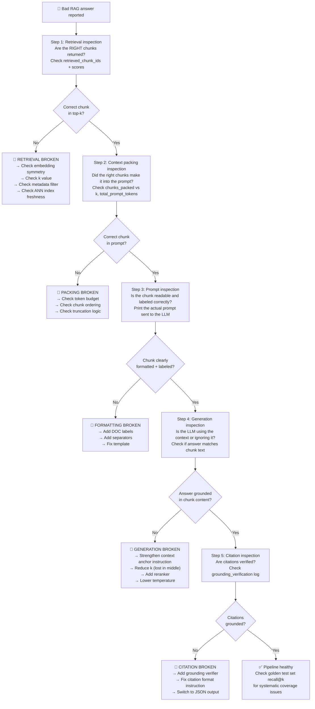

---

### 3. Failure Taxonomy — 7 Baseline RAG Failures [Intermediate]

This section is the core of the subtopic. Each failure has a symptom, root cause, stage, and first debugging action.

---

#### Failure 1 — "I don't know" for questions that should have answers [Retrieval Stage]

**Symptom:** Users ask clear questions whose answers exist in the corpus. The system responds with "I don't have information about that" or a generic deflection. The answer is clearly available in the documents.

**Root cause options (in order of likelihood):**
1. **k too low** — the correct chunk exists but is ranked 6th; k=5 never sees it
2. **Embedding model mismatch** — query and index use different models; all similarities are random, correct chunk never surfaces in top-k
3. **Stale ANN index** — new documents were ingested but the HNSW index wasn't rebuilt; new chunks are invisible to the search
4. **Overly aggressive metadata filter** — a filter (e.g., `date_range` or `doc_type`) is excluding the chunk that has the answer

**Diagnostic steps (in order):**
```
1. Run retrieval inspection: query the vector DB directly and print the top-10 chunk IDs + scores
2. Check: is the correct chunk in top-10? If not → retrieval broken
3. Check top_k_scores distribution: are all scores ≈ 0.5? → embedding mismatch
4. Check ANN index last_rebuilt_at timestamp vs. last ingestion run timestamp
5. Temporarily disable all metadata filters and re-run → if the answer appears, a filter is the culprit
6. Plot recall@k for k ∈ {5, 10, 20} on your golden test set → if recall jumps at k=10, increase k
```

**Fix:** Identify which cause it is from steps 1–6. Apply the targeted fix (increase k, assert model identity, rebuild index, loosen filter). Do not change multiple things at once — you'll lose causality.

---

#### Failure 2 — Confident wrong answer (hallucination over context) [Generation Stage]

**Symptom:** The LLM gives a specific, confident answer — but it contradicts the retrieved chunks. The chunks say "30-day refund"; the LLM answers "14-day refund." The system prompt instructs the model to use only the provided documents.

**Root cause options:**
1. **LLM ignores context and uses parametric memory** — the system prompt doesn't strongly enough anchor the model to the documents; the model defaults to what it "knows" from training
2. **Context anchor instruction too weak** — "use the documents below" is too soft; the model treats context as optional
3. **k too large, no reranker** — the correct chunk is at position 8 of 15; the LLM anchors on position 1 (wrong chunk) due to primacy bias
4. **Chunk quality problem from ingestion** — the "correct" chunk retrieved actually contains the wrong/outdated version of the fact (boilerplate noise, stale data); the LLM answers correctly from the (wrong) chunk

**Diagnostic steps:**
```
1. Print the full prompt — manually read the context chunks sent to the LLM
2. Check: does chunk text actually contain the correct answer? If no → ingestion/retrieval problem, not generation
3. If chunk text is correct: strengthen context anchor: "Answer ONLY using the documents below. If the answer is not in the documents, say 'I don't know'."
4. Check chunk ordering — is the correct chunk at position 1 or buried in the middle?
5. If buried → add reranker to float the most relevant chunk to position 1, or use stuffed-sandwich ordering
6. Lower temperature to 0.0 for factual RAG; high temperature increases creative deviation from context
```

**Fix by root cause:**
- Weak anchor → add explicit, strict context instruction: `"Answer ONLY from the provided documents. Do NOT use prior knowledge."`
- Lost in the middle → add reranker + reduce k to the reranked top-3
- Stale chunk → fix at ingestion (deprecation sweeper, freshness filter)

---

#### Failure 3 — Correct chunk retrieved but answer still wrong [Context / Generation Stage]

**Symptom:** Retrieval inspection confirms the correct chunk is in top-k and appears in the prompt. But the LLM's answer still doesn't match. This is the most confusing failure because the data is "right there."

**Root cause options:**
1. **Lost in the middle** — correct chunk at position 6 of 10; LLM underweights it
2. **Chunk contains the answer but also conflicting information** — the chunk has both the old and new policy; the LLM picks the wrong one
3. **Chunk is too long** — the specific answer is buried within a 1000-token chunk; the LLM summarizes the whole chunk rather than extracting the specific fact
4. **System prompt conflicts with chunk content** — a generic system prompt makes a claim that contradicts the retrieved chunk; LLM defers to system prompt

**Diagnostic steps:**
```
1. Print the prompt and manually identify the position of the correct chunk (1st? middle? last?)
2. If middle position → apply stuffed-sandwich reordering; move correct chunk to position 1
3. Check chunk size — if >500 tokens, split into finer chunks and re-embed
4. Read the full chunk text — does it contain contradictory content? 
   If yes → fix at chunking (split the chunk so conflicting content isn't co-located)
5. Check system prompt for any factual claims that might override context
```

---

#### Failure 4 — Data leak / wrong-user results [Retrieval / Filter Stage]

**Symptom:** User A receives chunks that belong to User B's data. In a multi-tenant system, confidential information from one customer appears in another customer's answers. No error is raised.

**Root cause:** The permissions filter is either not applied at all, applied after ANN search (post-filter instead of pre-filter), or the `acl_group` metadata field on chunks is incorrect/missing.

**Diagnostic steps:**
```
1. Inspect the vector DB search call — is the `filter` parameter present and populated with the user's group/ID?
2. Check whether filtering is pre-filter (applied before ANN, reduces candidate set) or post-filter (applied after — still leaks similarity scores of unauthorized docs)
3. Query the vector DB directly with no filter — what's the universe of chunks returned?
4. Check 5 chunks from each tenant — do they have correct `acl_group` metadata?
5. Run a security test: log in as User A, ask a question known to have results only in User B's space, verify no cross-tenant chunks appear
```

**Fix:** Pre-filter by ACL metadata, not post-filter. Verify `acl_group` is set on every chunk at ingestion. Add an automated security test to the CI pipeline: a canary query that must never return cross-tenant results.

**Severity:** This is a **P0 production incident**, not a quality issue. Stop debugging and fix the filter gate first.

---

#### Failure 5 — Answer ignores recently ingested content [Ingestion / Index Stage]

**Symptom:** The correct answer is in a document ingested in the last 24 hours. Users ask about it and the system returns stale answers from older documents or "I don't know."

**Root cause options:**
1. **ANN index not rebuilt after ingestion** — new vectors were added to storage but the HNSW graph index wasn't updated; new chunks are invisible to ANN search
2. **Freshness filter too aggressive** — a filter like `last_modified > 7 days ago` is incorrectly excluding the new chunks
3. **Deprecation sweeper ran prematurely** — the new chunks were marked `deprecated = true` before the old versions were properly retired
4. **Ingestion pipeline silently failed** — the new documents appeared to ingest but an error (parsing failure, embedding API timeout) dropped the chunks silently

**Diagnostic steps:**
```
1. Query the vector DB directly for the new document's chunk_id — does it exist in the store?
   If no → ingestion failure; check ingestion logs for errors
2. If chunk exists: check index rebuild timestamp — was HNSW index rebuilt after the chunk was added?
3. Check freshness filter settings — temporarily disable freshness filter, re-run query
4. Inspect chunk metadata: is `deprecated = false` and `last_modified` set correctly?
5. Run ANN search for a query that should retrieve the new chunk — is the new chunk_id in top-20?
```

---

#### Failure 6 — Intermittent failures / inconsistent answers [Infrastructure Stage]

**Symptom:** The same query gives different answers on different invocations. Sometimes correct, sometimes wrong or "I don't know." Inconsistency increases under high traffic.

**Root cause options:**
1. **ANN index under memory pressure** — at high load, the vector DB evicts parts of the HNSW graph from RAM, degrading recall to near-random; some requests hit the degraded state, others don't
2. **Embedding service rate limiting** — the remote embedding API starts throttling under load; some queries get embeddings back, some get errors or retries with longer queue times
3. **Non-deterministic LLM temperature** — temperature > 0 produces different outputs for the same context; not always a bug, but confuses QA when they expect identical answers
4. **Race condition in index rebuild** — concurrent ingestion and search during an index rebuild causes some searches to hit the partial old index

**Diagnostic steps:**
```
1. Measure response time p99 vs. p50 — a large gap suggests infrastructure pressure, not logic errors
2. Check embedding service error rate and latency percentiles — spikes correlate with inconsistent answers
3. Check vector DB memory utilization — if near limit, the HNSW graph is being paged out
4. Set temperature=0 for the LLM and re-test — if inconsistency disappears, the issue was stochasticity, not retrieval
5. Run the same query 10 times and record retrieved_chunk_ids each time — if they differ, the ANN search is non-deterministic under load
```

---

#### Failure 7 — Good answer, bad citation (the silent trust failure) [Citation Stage]

**Symptom:** The answer content is correct — the LLM used the right information. But citations are wrong: they point to the wrong document, reference a non-existent DOC number, or are missing entirely. Users can't verify the answer.

**Root cause options:**
1. **No grounding verification** — citations are trusted as-is from the LLM output; the LLM fabricated a citation number that wasn't in context
2. **No citation format instruction** — the system prompt doesn't tell the model how to cite; the model uses its default format (footnotes, author names) which the parser can't read
3. **Metadata too coarse** — citations exist and are verified, but show `source: Policy.pdf` instead of `page: 12, section: 3.1`; still a failure for auditability
4. **Doc index collision** — two runs of context packing assigned different DOC numbers to the same chunk; the citation maps to the wrong chunk in a cached response

**Diagnostic steps:**
```
1. Check hallucinated_citation_rate in monitoring — above 2% = no or broken grounding verification
2. Inspect raw LLM output before grounding verification — what format are citations in?
3. Verify citation_format_compliance: what fraction of answers use [DOC N] vs. other formats?
4. Inspect a sample of verified citations — is the metadata (page, section, URL) present and correct?
5. Check doc_map generation — is a fresh doc_map created per request, or is it cached/reused?
```

---

### 4. System View: The RAG Health Dashboard [Intermediate]

A healthy RAG system has observable signals at every stage. These should be in your monitoring before you go to production:

| Stage | Primary metric | Alert threshold | What it tells you |
|---|---|---|---|
| **Retrieval** | `recall@k` (golden set) | < 0.80 | Retrieval quality degraded — embedding, k, or index problem |
| **Retrieval** | `top_k_scores` p50 | < 0.65 | Embedding mismatch or corpus quality issue |
| **Retrieval** | `retrieved_chunk_ids` diversity | Same IDs for all queries | Filter too narrow, or index has duplicate chunks dominating |
| **Packing** | `chunks_truncated` | > 0 consistently | Chunk size or k too large for token budget |
| **Packing** | `avg_chunks_packed` | Drops vs. baseline | Chunk sizes growing; budget regression |
| **Generation** | `hallucinated_citation_rate` | > 2% | Citation verification missing or prompt instruction broken |
| **Generation** | `answer_faithfulness` (LLM eval) | < 0.90 | LLM ignoring context; anchor instruction too weak |
| **Infrastructure** | `embedding_latency_p99` | > 100ms | Embedding service degraded; consider self-hosted fallback |
| **Infrastructure** | `ann_search_latency_p99` | > 50ms | Index under memory pressure; needs more RAM or sharding |

**The most important habit: run your golden test set recall@k on every deployment.** Treat recall@k like a unit test — if it drops, the deployment is reverted before it reaches users.

---

### 5. System Design Flavor: The Debugging Toolkit [Intermediate]

**The 5 tools every RAG engineer must have before going to production:**

**Tool 1: Retrieval Inspector**
```python
def inspect_retrieval(query: str, expected_chunk_id: str, k: int = 20) -> dict:
    """Run retrieval and check if expected chunk appears in top-k."""
    results = vector_db.search(query_embed(query), k=k)
    chunk_ids = [r.chunk_id for r in results]
    rank = chunk_ids.index(expected_chunk_id) + 1 if expected_chunk_id in chunk_ids else None
    return {
        "found": expected_chunk_id in chunk_ids,
        "rank": rank,         # None if not found
        "top_scores": [r.score for r in results[:5]],
        "score_range": (min(r.score for r in results), max(r.score for r in results)),
    }
```
Use this for every user-reported failure. If `found = False` → retrieval broken. If `rank > k` → increase k. If `score_range` is narrow and centered at 0.5 → embedding mismatch.

**Tool 2: Prompt Printer**  
Log the exact prompt sent to the LLM for every query in dev/staging. Never inspect generated outputs without also inspecting the prompt that produced them. In production, log prompts for a 5% sample and for all queries that result in user feedback.

**Tool 3: Golden Test Set + recall@k runner**
```python
def run_recall_evaluation(golden_set: list[dict], k: int = 5) -> float:
    """golden_set: [{query, expected_chunk_id}]"""
    hits = sum(
        1 for item in golden_set
        if item["expected_chunk_id"] in [
            r.chunk_id for r in vector_db.search(query_embed(item["query"]), k=k)
        ]
    )
    return hits / len(golden_set)
```
Run this after every ingestion pipeline change, embedding model update, or k adjustment. Treat a drop of > 5% as a P1 regression.

**Tool 4: Citation Verifier**  
Already built in Subtopic 6.2.c. Wire it as middleware on every LLM response. Log `verified_citations`, `hallucinated_citations`, and `weak_grounding` per query. Alert on any session where `hallucinated_citation_rate > 0.05`.

**Tool 5: Stage-by-Stage Trace Log**  
For any query that receives a thumbs-down from a user, log the full trace:
```
{
  "query_id": "...",
  "query": "...",
  "retrieved_chunk_ids": [...],
  "top_k_scores": [...],
  "chunks_packed": N,
  "chunks_truncated": M,
  "total_prompt_tokens": X,
  "cited_doc_indices": [...],
  "grounded": true/false,
  "user_rating": -1
}
```
This trace is the root-cause analysis starting point for every bad answer. Without it, debugging is guesswork.

---

### 6. Debugging Habits — The Daily Practice [Intermediate]

**Habit 1: Never change two things at once.**  
When fixing a RAG failure, change exactly one variable (k, the embedding model, the chunk size, the system prompt), re-run your golden test set, and observe the delta. Changing multiple things simultaneously makes it impossible to attribute improvements or regressions.

**Habit 2: Retrieve first, prompt second.**  
When a user reports a wrong answer, the first action is always: run retrieval inspection. Print the top-10 chunks for that query. If the correct chunk isn't there, the problem is in retrieval — not the prompt. Rewriting the system prompt when the retrieval is broken wastes time and masks the real issue.

**Habit 3: Maintain a living golden test set.**  
Start with 50 (query → expected_chunk_id) pairs before launch. Every time a user reports a new failure type, add it to the golden set. By 3 months post-launch, you should have 200+ pairs. Run recall@k against this set on every code push. This is your regression test suite for retrieval quality.

**Habit 4: Watch the score distribution, not just the top-1 score.**  
A single high similarity score tells you the top result looks relevant. The score distribution — the spread between rank-1 and rank-5 scores — tells you something more useful: how confident the retrieval is. A large spread (0.92, 0.71, 0.63, 0.54, 0.49) means rank-1 is a clear winner. A narrow spread (0.68, 0.66, 0.64, 0.63, 0.62) means retrieval is uncertain and adding a reranker will help significantly.

**Habit 5: Monitor retrieval in production, not just at launch.**  
User query distributions shift over time. New product launches, seasonal events, and terminology changes all create new query patterns that your original embedding model and chunk strategy may not handle well. Schedule a monthly recall@k evaluation on a fresh 50-query sample from recent production traffic — not just your original golden set.

**Habit 6: Treat every P0 data-leak failure as infrastructure, not logic.**  
When unauthorized data appears in a user's response, the fix is not "be more careful with the filter parameter." The fix is: make the filter mandatory in the retrieval function signature (not optional), add an automated canary test that runs every 5 minutes and alerts if cross-tenant chunks ever appear, and add the permissions filter assertion to your CI pipeline. Security regressions in RAG are deployment blockers, not "fix it in the next sprint" items.

---

### 7. Hands-On Lab — The Diagnosis Drill [Pro]

**Goal:** Given 5 simulated RAG failures, identify the stage, the root cause, and the first fix for each. This is a reasoning drill — no external dependencies required.

---

**Case 1:**
```
Query: "What is the maximum loan amount for small business customers?"
Retrieved chunks (top-5):
  [0.91] "Personal loan limits range from $1K to $50K based on credit score."
  [0.85] "Home equity lines of credit offer up to $500K for eligible homeowners."
  [0.79] "Student loan refinancing is available for balances over $10K."
  [0.71] "Auto loans are available for vehicles up to 10 years old."
  [0.68] "Credit card limits are set by the underwriting team."
LLM answer: "I don't have information about small business loan limits."
```

**Diagnose:** The correct chunk was never retrieved. All top-5 chunks are about personal/consumer products. This is a **retrieval failure**. The correct chunk (about small business loans) is likely being outranked by consumer product chunks because the embedding model scores "loan" queries broadly.  
**First fix:** Check recall@k for `k=20` — does the small business chunk appear at rank 12–15? If yes: increase k and add a reranker, or add a metadata pre-filter for `product_line = "small_business"`. If no: the corpus may not have a chunk specifically about small business loan limits — audit the source documents.

---

**Case 2:**
```
Query: "What is the enterprise refund window?"
Retrieved chunk (rank 1, score 0.89):
  "Enterprise customers receive a 30-day full refund, no questions asked."
LLM answer: "Enterprise customers have a 14-day return window."
Prompt shows: The chunk is at position 1 of 3 in the context.
```

**Diagnose:** The correct chunk was retrieved and is at position 1. The LLM ignored it and gave a different answer. This is a **generation failure / hallucination over context**. The LLM used its parametric memory (a different refund policy it learned in training) rather than the retrieved chunk.  
**First fix:** Strengthen the context anchor instruction in the system prompt: `"Answer ONLY from the provided documents. Do NOT use prior knowledge. If the answer is not in the documents, say 'I don't know'."` Then re-test with temperature=0.

---

**Case 3:**
```
Query: "What changed in the Q3 2025 product update?"
retrieved_chunk_ids: ["abc123", "def456", "ghi789"] (all look relevant by title)
chunks_packed: 3
chunks_truncated: 0
total_prompt_tokens: 7,950 / 8,192
LLM answer: "The Q3 2025 update introduced faster checkout and improved search." [correct]
Citation: [DOC 4] — but only 3 docs were packed.
grounding_verification: hallucinated_citations = [{"doc_index": 4, ...}]
```

**Diagnose:** Retrieval is correct. Packing is correct. The LLM gave the right answer from the right content. But it cited `[DOC 4]` which doesn't exist. This is a **citation hallucination** at the generation/citation stage — the LLM invented a citation index beyond the 3 docs it was given.  
**First fix:** Add explicit instruction in the system prompt: `"Only cite document numbers that appear in the context above (DOC 1, DOC 2, DOC 3). Do not invent citation numbers."` Switch to structured JSON citation output so the schema constrains the output to valid indices. Verify grounding_verifier is running — it correctly caught this.

---

**Case 4:**
```
Query: "Show me the latest pricing for the Enterprise tier."
System has 2 tenants: Acme Corp (enterprise pricing) and Beta Inc (SMB pricing).
User is authenticated as Beta Inc employee.
Retrieved chunk (rank 1): "Acme Corp Enterprise Tier: $50,000/year per seat."
acl_group on chunk: "acme-corp"  |  user's group: "beta-inc"
```

**Diagnose:** This is a **P0 security failure** — cross-tenant data leak. The permissions filter was not applied (or was applied as post-filter after ANN already scored the Acme chunk as rank-1).  
**First fix:** Immediately add `filter = {"acl_group": "beta-inc"}` as a pre-filter to every vector DB search call. Do not ship this fix without a regression test: a canary query that confirms beta-inc user never receives acme-corp chunks. Audit all queries from the last 7 days for cross-tenant retrievals and notify the security team.

---

**Case 5:**
```
Query: "What are the terms for the new Gold membership launched this week?"
vector_db.search(query): returns 0 results (empty)
ingestion_log shows: Gold membership doc was ingested 2 hours ago, 47 chunks created
ANN index last_rebuilt: 3 days ago
```

**Diagnose:** The chunk exists in storage but is invisible to ANN search because the **HNSW index was not rebuilt** after ingestion. The 47 new chunks are in the vector store's raw storage but not yet part of the navigable graph.  
**First fix:** Trigger an index rebuild immediately. Long-term: add index rebuild as a post-ingestion step in the ingestion pipeline (or configure the vector DB for real-time index updates if supported — Qdrant and Pinecone support this). Add a check: `assert index.last_rebuilt > last_ingestion_run` as an ingestion health gate.

---

### 8. Active Recall [Intermediate]

1. **(Beginner)** What is the first step in the RAG debugging ladder and why is it always done first — before looking at the prompt or the LLM's output?

   **Answer:** Retrieval inspection — checking whether the correct chunk is in the top-k results. It's first because all downstream stages (packing, generation, citation) are only as good as what retrieval provides. If the correct chunk was never retrieved, fixing the prompt or the citation logic can't help. Starting at retrieval eliminates the most impactful failure modes before touching generation, where changes are slower and harder to evaluate.

2. **(Beginner)** A user reports the system says "I don't know" for a question whose answer is clearly in the corpus. You run retrieval inspection and all top-5 similarity scores are between 0.48 and 0.53. What does this tell you and what do you check next?

   **Answer:** Scores clustered around 0.5 is the signature of an embedding model mismatch — the query and chunk vectors are from different model spaces, making cosine similarity essentially random. Check next: log and compare the `embed_model_id` used at query time vs. the model stored in the index metadata. Assert they match. Re-embed the query with the correct model and re-run retrieval.

3. **(Intermediate)** The correct chunk is at rank 1 with a score of 0.91. The LLM still gives a wrong answer. What are the two most likely causes and how do you distinguish between them?

   **Answer:** (1) LLM ignored the context and used parametric memory — strengthen the context anchor instruction and re-test. (2) The chunk text contains the answer but also conflicting or contradictory information — the LLM picked the wrong part. Distinguish by reading the full chunk text: if it clearly contains only the correct answer, it's (1); if it mixes old and new policy, it's (2). Fix (1) with prompt; fix (2) at chunking.

4. **(Intermediate)** What is the difference between a P0 and a P1 RAG failure? Give an example of each.

   **Answer:** P0: a failure that has immediate security, legal, or financial impact and must be fixed before the next request is served. Example: cross-tenant data leak — User A's confidential data appears in User B's response. P1: a failure that degrades quality but doesn't create immediate harm. Example: recall@k drops from 0.82 to 0.74 after an embedding model update — users get more "I don't know" responses but no data is exposed.

5. **(Pro)** Why is "change one thing at a time" especially important in RAG debugging compared to other software systems?

   **Answer:** RAG has multiple interacting stages and multiple configurable parameters (k, chunk size, embedding model, system prompt, reranker). Each parameter affects multiple downstream metrics. Changing k and the system prompt simultaneously makes it impossible to know which change caused recall@k to improve — or whether they partially cancelled each other out. Additionally, RAG failures are often probabilistic: a bad configuration produces wrong answers for some queries and correct answers for others. Only single-variable changes produce interpretable signal on a golden test set.

---

### 9. Practice

**Mini-exercise — Symptom-to-Stage diagnosis:**  
Match each symptom to its most likely pipeline stage and first debugging action.

| # | Symptom | Stage | First debug action |
|---|---|---|---|
| A | All queries return "I don't know" after a new embedding model deployment | ? | ? |
| B | Answer is correct but citation references `[DOC 7]` when only 5 docs were packed | ? | ? |
| C | User from Team A sees confidential documents belonging to Team B | ? | ? |
| D | System gave correct answers yesterday but now misses questions about content from a new batch ingested this morning | ? | ? |
| E | Correct chunk is at rank 1, score 0.88, but LLM answer contradicts the chunk's content | ? | ? |

**Answer key:**

| # | Stage | First debug action |
|---|---|---|
| A | **Retrieval — embedding mismatch** | Check `embed_model_id` at query time vs. index metadata; assert they match |
| B | **Citation — hallucinated citation** | Check grounding_verifier; strengthen system prompt citation instruction; switch to JSON output |
| C | **Retrieval — missing permissions filter (P0)** | Immediately add ACL pre-filter to vector DB search call; run security canary test |
| D | **Ingestion / Index — stale ANN index** | Check `index.last_rebuilt` vs. `last_ingestion_run`; trigger index rebuild |
| E | **Generation — LLM ignoring context** | Strengthen context anchor instruction: "Answer ONLY from documents." Set temperature=0 |

---

**Capstone scenario:**  
You are the RAG engineer on call. At 9:14 AM your alerting fires: `recall@k` dropped from 0.83 to 0.61 on the golden test set. No code was deployed. The last change was an ingestion pipeline run that added 12,000 new chunks from a newly acquired company's documentation. Walk through the RAG debugging ladder in order. What is the most likely root cause, how do you confirm it, and what do you fix?

**Suggested answer outline:**

```
Step 1 — Retrieval inspection:
  Run top-20 retrieval for 5 failing golden queries.
  Check if correct chunks appear at ranks 12-18 (beyond k=10).
  → If yes: the new 12K chunks are diluting the index — more noise, correct chunks pushed down.
     Fix: add metadata pre-filter for existing corpus; or rerank top-20 to get top-5.

Step 2 — Score distribution:
  Check top_k_scores for failing queries.
  If scores all shifted lower across the board (e.g., p50 dropped from 0.82 to 0.71):
  → The new chunks may have been embedded with a DIFFERENT embedding model than the existing index.
     Check ingestion logs for the new batch — was the same model used?

Step 3 — ANN index:
  Check if HNSW index was rebuilt after the 12K chunk ingestion.
  A partial rebuild during an ingestion (interrupted) can leave the index inconsistent.

Most likely root cause given the scenario:
  The new 12,000 chunks from the acquired company were ingested using a different embedding model
  (their existing pipeline used a different model than yours). The index now has mixed vector spaces —
  existing chunks in model A's space, new chunks in model B's space. Cosine similarity between
  any query (model A) and any new chunk (model B) is ≈ 0.5 random, but the new chunks are
  numerous enough to crowd out the correct old chunks in ANN results.

Confirmation: Check embed_model_id on a sample of the new chunks vs. old chunks.

Fix: Re-embed all 12,000 new chunks with your production embedding model (model A).
     Re-run golden test set evaluation before re-enabling the new content.
     Add an ingestion gate: assert embed_model_id == PRODUCTION_EMBED_MODEL for every batch.
```

---

### 10. Production Reality Check ✅

**If this fails in prod, what's the first thing we inspect?**

Pull the `retrieved_chunk_ids` and `top_k_scores` from your query trace logs for a sample of the failing queries. This is always the first diagnostic action — before looking at prompts, before looking at LLM outputs, before changing any configuration. The score distribution tells you the failure category immediately: scores ≈ 0.5 across the board → embedding mismatch; scores high but wrong chunks → metadata filter or corpus quality issue; scores correct but answer wrong → generation/context problem. You cannot debug RAG without stage-by-stage logging. If those logs don't exist, build them before doing anything else.

---

### 11. Curiosity Bridge ✅

You now have a complete baseline RAG system: ingest → chunk → embed → retrieve → pack → generate → cite → verify → debug. This covers the fundamentals and handles most production failure modes. But the retrieval layer we've built is purely semantic — a single dense vector per query. What happens for queries like "Show me all documents referencing regulation 2016/679 article 17"? Semantic similarity finds *topics*; keyword search finds *exact strings*. Neither alone is sufficient for a real-world mixed corpus. **Hybrid retrieval** — combining BM25 keyword search with dense vector search using Reciprocal Rank Fusion — is the next layer, and it's what separates naive RAG from a production-grade retrieval stack. That's Topic 6.3.

---

### 12. Exit Check + Carry-Forward Review

**Exit Check:** You're done when you can — from memory — walk the RAG debugging ladder in order for any failure symptom, identify which metric exposes which stage's failure, give the first debugging action for each of the 7 baseline failure types, and explain why you change only one variable at a time when fixing a RAG regression.

**Carry-Forward Review (across all of Topic 6.2):**
- Q: A user reports the system gives a confidently wrong answer. You run retrieval inspection and find the correct chunk at rank 2 with score 0.87. The chunk is at position 5 of 8 in the packed prompt. Citations point to `[DOC 2]` which is verified. What stage is broken and what do you fix?
- A: Generation / context ordering stage. The correct chunk is retrieved ✓ and packed ✓ and cited correctly ✓. The problem is position 5 of 8 — the LLM is underweighting it due to the "lost in the middle" effect. Fix: apply stuffed-sandwich ordering (move the rank-2 chunk to the last position to exploit recency bias), or add a cross-encoder reranker to surface the most relevant chunk to position 1, or reduce k from 8 to 3–4 and send only the top-reranked results to the LLM.

---

## Topic 6.3: Answer Generation with Citations

**Topic time:** 12h

---

## Subtopic 6.3.a: Grounded Answer Prompting ✅

### 0. Reading Path + Level Tags

- **Beginner:** Read sections 1–2 and Active Recall.
- **Intermediate:** Add sections 3–5, the grounding strength spectrum, and the Hands-On Lab.
- **Pro:** Full lab (Build → Break → Measure → Explain), grounding calibration exercise, and the capstone design question.

---

### 1. Pre-Question Hook + The Intuition [Beginner]

**Pause — before reading:** You've retrieved the perfect chunks and packed them into the context window. You send the prompt to the LLM and get back a confident, specific answer — but it's wrong. The chunks contain the correct answer. What went wrong, and where in the prompt do you fix it?

**The core mental model:**

Retrieval gets the right data in front of the model. **Grounded answer prompting** is the engineering discipline of structuring the system prompt so the LLM actually *uses* that data — rather than ignoring it and generating from its parametric memory (what it learned during training).

LLMs are not document readers by default. They are pattern completers. Without explicit, strong grounding instructions, the model treats your context as one of many possible sources of information to blend with its training — and it will confidently blend in wrong information when its training patterns are stronger than the retrieved text.

**The grounding problem has two faces:**
1. **The LLM ignores the context** — answers from training when the retrieved chunk clearly contains the right answer.
2. **The LLM over-fills from context** — synthesizes across chunks in ways that introduce subtle distortions not present in any single chunk.

Both are controlled by the system prompt. This subtopic is about building that prompt correctly.

**Real-world analogy:**  
Imagine briefing a new employee before a customer call. You hand them a one-page FAQ. A weak brief is: "Here's the FAQ, it might help." A strong brief is: "Answer ONLY from this FAQ. If a customer asks something not on this page, say 'I'll need to check and get back to you.' Do not make up answers." The same employee, the same FAQ — but the second brief produces dramatically fewer wrong answers. The analogy breaks down because an employee can recognize ambiguity intuitively; an LLM must be told explicitly when to admit uncertainty.

**Key terms (first use — also in Module Glossary):**
- **Grounded answer prompting:** Structuring the system prompt to anchor the LLM's output to the retrieved context, preventing it from using parametric memory to fill in or supplement the answer.
- **Parametric memory:** Facts and patterns an LLM learned during pre-training; stored in model weights; accessed by default when no explicit grounding constraint is set.
- **Context anchor:** The specific system prompt clause that restricts the LLM to the provided documents (e.g., "Answer ONLY from the documents below").
- **Grounding strength:** The degree to which the system prompt constrains the LLM to use only retrieved context; ranges from soft ("use the documents") to strict ("answer ONLY from documents; say 'I don't know' otherwise").
- **Uncertainty disclosure:** An explicit instruction telling the LLM what to say when the answer is not in the retrieved context; prevents the LLM from defaulting to a confident but fabricated response.
- **Out-of-scope query:** A user question whose answer is not present in any retrieved chunk; must be handled explicitly with an uncertainty disclosure instruction.
- **Negative constraint:** A prompt instruction that explicitly forbids a behavior (e.g., "Do NOT use prior knowledge") rather than just requesting a positive behavior; measurably more effective than positive-only instructions for grounding.

---

### 2. Visual Diagram (Mermaid) [Beginner]

**The anatomy of a production grounded RAG system prompt:**

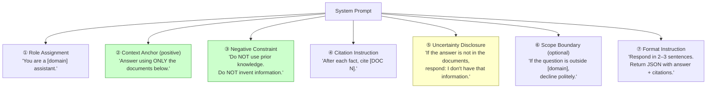

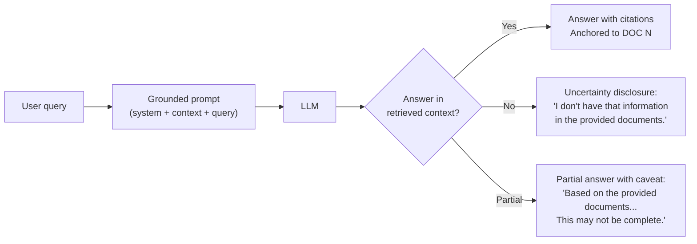

---

### 3. Real-World Industry Scenarios [Intermediate]

**Scenario 1: Internal Policy Assistant (Strict Grounding Required)**

*Product/use-case context:*  
HR and legal assistants answer employee questions about policies: leave entitlement, expense limits, code of conduct. The policy corpus is carefully maintained. An answer that mixes current policy with outdated training data could create compliance liability.

*Why grounding strength matters here:*
- **Default LLM behavior** — asked "What is the parental leave entitlement?", an LLM without strict grounding might answer "typically 12 weeks" (from training data on US FMLA policy) even if your company policy says 16 weeks and that's clearly in the retrieved chunk.
- **The fix is explicit negative constraints** — "Do NOT answer from prior knowledge. The ONLY valid source is the documents provided." This double-binds the LLM: it must use context AND is forbidden from supplementing it.
- **"I don't know" is a correct answer** — if an employee asks about a policy not covered in the corpus, "I don't have information about that in our policy documents" is exactly right. Without an uncertainty disclosure instruction, the LLM invents a plausible-sounding policy answer. With it, the LLM deflects appropriately.

*What "good" looks like:*
- Answer faithfulness ≥ 0.95 (LLM-as-judge score measuring whether answer content matches only the retrieved chunks)
- "I don't know" rate for genuinely out-of-scope queries ≥ 0.90 (not deflecting answerable queries)
- Zero answers that contain policy numbers or percentages not present in any retrieved chunk

---

**Scenario 2: Product Documentation Chatbot (Confident + Accurate)**

*Product/use-case context:*  
A developer-facing assistant that answers questions about API usage, SDK methods, and configuration options. Users expect confident, precise technical answers — vague "I'm not sure" responses erode trust fast.

*Tension: Strict grounding vs. user experience:*
- Strict grounding produces accurate answers but can feel clipped or mechanical when the user asks a natural follow-up that's slightly out of the chunked scope.
- The solution is **calibrated uncertainty** — the LLM answers confidently when context covers the query, flags partial coverage ("Based on the docs, X — but I don't see config options for Y specifically"), and declines only when truly nothing is available.
- **Format control matters** — developers want code snippets or bullet lists, not paragraphs. Format instructions in the system prompt ("If the answer includes code, use a code block. Use bullet points for lists of options.") prevent the LLM from burying the answer in prose.

*What "good" looks like:*
- Confident answer with code block for 80%+ of technical queries
- Calibrated partial answers for ~15% of queries where context partially covers the question
- "I don't know" reserved for <5% — only when nothing relevant is retrieved

---

**Scenario 3: Clinical Decision Support (Strictest Grounding + Mandatory Uncertainty)**

*Product/use-case context:*  
Clinicians ask about drug dosages, contraindications, and treatment protocols. The system retrieves from verified clinical guidelines. Any gap between retrieved context and answer is a patient safety risk.

*Grounding requirements:*
- **Verbatim where possible** — for dosage figures, contraindication lists, and specific numerical thresholds, the system prompt should instruct the LLM to quote directly from the source rather than paraphrase. Paraphrasing a dosage figure can introduce rounding errors.
- **Mandatory uncertainty disclosure with confidence level** — when context only partially covers a query, the system must say so explicitly: "The retrieved guidelines cover X but do not address Y. Clinical judgment is required for the uncovered aspect."
- **No synthesis across non-adjacent guidelines** — the LLM must not combine a dosage from one guideline version with a contraindication from a different (possibly superseded) guideline version. This requires stricter prompt constraints: "Answer from a SINGLE document where possible. Do not combine information from different documents unless explicitly asked."

*What "good" looks like:*
- Zero answers containing numerical values not present in retrieved chunks (measured by post-processing)
- 100% of answers include source version and effective date in citation
- Confidence level surfaced in every response: HIGH (direct quote), MEDIUM (paraphrase of explicit guideline), LOW (inferred from context, requires clinical review)

---

### 4. System View [Intermediate]

**The grounding strength spectrum — five levels:**

| Level | Prompt pattern | When to use | Risk if miscalibrated |
|---|---|---|---|
| **0 — No anchor** | "Here are some documents that may help: {context}" | Never in production | LLM mostly ignores context; answers from training; high hallucination rate |
| **1 — Soft anchor** | "Use the documents below to answer the question." | Low-stakes, exploratory chat | LLM uses context as a hint, supplements freely from training; 20–40% answer drift |
| **2 — Medium anchor** | "Answer using only the information in the provided documents. Cite each fact." | General-purpose RAG | Mostly grounded; 5–15% of answers still leak parametric knowledge on well-known topics |
| **3 — Strong anchor** | "Answer ONLY from the documents below. Do NOT use prior knowledge. If the answer is not in the documents, say: 'I don't have that information.'" | Policy, legal, compliance, product docs | Very few leaks; uncertainty handled cleanly; the production standard for most RAG systems |
| **4 — Strict anchor** | Level 3 + "Do not paraphrase numerical values, dates, or legal terms. Quote them exactly. Do not synthesize across documents for numerical claims." | Medical, financial, regulatory | Near-zero hallucination; some verbosity; required for any domain where number errors cause harm |

**Inputs → Transformations → Outputs:**

| Stage | Input | Transformation | Output |
|---|---|---|---|
| 1. Prompt assembly | System prompt template + context chunks + user query | Fill template: role + anchor + negative constraint + citation instruction + uncertainty rule + context blocks + query | Full prompt string |
| 2. Temperature control | LLM inference parameters | Set `temperature=0` for factual RAG; `temperature=0.2–0.4` for summaries or explanations requiring synthesis | Deterministic (temp=0) or low-variance response |
| 3. Output parsing | Raw LLM response | Parse answer + citations (if JSON) or extract inline `[DOC N]` markers | Structured `{answer, citations[]}` |
| 4. Faithfulness check | Answer text + packed chunks | Optional LLM-as-judge: "Does this answer contain only information from the provided context?" | `faithfulness_score` (0–1) |

**Observability — what we log and measure:**
- `answer_faithfulness` — LLM-as-judge score or NLI entailment rate; primary generation quality metric
- `idk_rate` — fraction of responses that use the uncertainty disclosure phrase; too low → LLM hallucinating instead of declining; too high → retrieval broken (correct chunks not making it in)
- `parametric_leak_rate` — fraction of answers containing facts not present in any retrieved chunk (measured by post-processing or LLM-as-judge)
- `format_compliance_rate` — fraction of responses that follow the specified format (JSON, bullet points, code blocks); deviations indicate prompt instruction ignored

**Failure points:**

| Failure | Symptom | Root cause |
|---|---|---|
| Soft anchor leakage | LLM supplements with training facts not in any chunk | Context anchor too weak (level 0–1); no negative constraint |
| False "I don't know" | LLM declines answerable queries | Uncertainty disclosure too broadly worded; retrieval broken (correct chunks not packed) |
| Paraphrase distortion | Numerical values or dates subtly changed | No verbatim instruction for precision values; LLM paraphrases in generation |
| Format deviation | LLM outputs prose instead of JSON | Format instruction absent, vague, or placed after the context (model reads and starts generating before reaching format instruction) |
| Scope creep | LLM answers questions from outside the domain | No scope boundary instruction; LLM treats all queries as valid |

---

### 5. System Design Flavor [Intermediate]

**The production grounded RAG prompt template (annotated):**

```
SYSTEM_PROMPT = """
You are a {role} assistant for {company}. Your job is to answer questions
using ONLY the documents provided below.

RULES (follow strictly):
1. Answer using ONLY information from the documents below.
2. Do NOT use prior knowledge or information from your training.
3. Do NOT invent, infer, or extrapolate beyond what is explicitly stated.
4. After each fact, cite the source as [DOC N].
5. If the answer is not found in the documents, respond with exactly:
   "I don't have information about that in the provided documents."
6. If the question is outside the scope of {domain}, respond with:
   "This question is outside the scope of this assistant."
7. {format_instruction}
"""
```

**Why each rule is a separate numbered item:**  
Research and empirical testing show that LLMs follow a numbered list of rules more reliably than paragraph instructions. The numbers create salience for each rule, and the model's instruction-following training aligns better with list structures than with prose paragraphs.

**Tradeoffs:**

| Decision | Option A | Option B | When to choose |
|---|---|---|---|
| **Context anchor strength** | Medium ("use the documents") | Strong ("ONLY from documents + negative constraint") | Default to strong for any production RAG; only use medium for exploratory or conversational use cases where some parametric knowledge is acceptable |
| **Uncertainty disclosure** | Silence (let LLM decide) | Explicit required phrase | Always explicit. Without it, the LLM invents confident answers for out-of-scope queries. The phrase should be verbatim so you can detect it programmatically and trigger fallback behavior |
| **Temperature** | 0.7 (default) | 0.0 (deterministic) | Use 0.0 for all factual RAG. 0.7 introduces creative variation that produces wrong or slightly shifted facts. Only increase temperature for summarization or explanation tasks where some paraphrase is acceptable |
| **Format instruction placement** | End of system prompt | Beginning (before context) | Place format instructions at the END of system prompt but BEFORE context blocks. If placed after context, the model starts attending to context before it reads the format rule, and compliance drops |

**Scaling consideration:**  
At scale, the system prompt is a fixed cost per request — it contributes the same token count regardless of the user query. A 500-token system prompt across 10M queries/day = 5B tokens/day of constant overhead. Keep the system prompt as concise as possible without sacrificing grounding fidelity. Every word in the system prompt should earn its place: remove motivational language, redundant rules, and generic disclaimers. The 7-rule template above is near the minimum viable grounding prompt for production.

---

### 6. Common Mistakes + Debugging [Intermediate]

**Mistake 1: Positive-only anchor without a negative constraint**
- **Symptom:** The LLM gives mostly correct answers but occasionally supplements with facts not in the context — particularly for well-known topics (e.g., common legal terms, popular product names) where its training data is strong. Users report "minor inaccuracies" that turn out to be parametric leakage.
- **Likely cause:** The system prompt says "answer using the documents below" (positive instruction) but doesn't say "do NOT use prior knowledge" (negative constraint). The LLM interprets the context as supplementary, not exclusive.
- **First debugging step:** Audit 20 answers for facts not present in any retrieved chunk. Measure `parametric_leak_rate`. If > 5%, add explicit negative constraints: `"Do NOT use prior knowledge. Do NOT add information from your training."` Re-test. Negative constraints consistently reduce parametric leakage by 40–70% in empirical testing.

**Mistake 2: No uncertainty disclosure — "confident wrong" instead of "I don't know"**
- **Symptom:** Users ask questions whose answers are genuinely not in the corpus. Instead of saying "I don't have that information," the LLM generates a plausible-sounding but fabricated answer. Users trust it. Wrong answers propagate.
- **Likely cause:** The system prompt has no instruction for the out-of-scope case. The LLM's default behavior is to generate a response regardless of context coverage — it never "chooses" to decline unless explicitly told to.
- **First debugging step:** Test 10 queries whose answers are definitely not in your corpus. Measure how many produce fabricated confident answers vs. appropriate declines. If fabrication rate > 20%, add verbatim uncertainty disclosure instruction and test again. The phrase should be exact and distinctive so it's detectable programmatically: `"I don't have information about that in the provided documents."` — not a fuzzy variant.

**Mistake 3: Format instruction ignored — prose instead of JSON**
- **Symptom:** The LLM was asked for JSON `{"answer": "...", "citations": [...]}` but returns a prose paragraph with inline footnotes. Downstream citation parsing fails. Monitoring shows 0 structured citations logged.
- **Likely cause:** The format instruction is placed after the context in the prompt. By the time the model reads it, the context has already primed it toward prose-style generation. Alternatively, the instruction is in the system prompt but is vague: "Return as JSON" without a schema example.
- **First debugging step:** Move the format instruction to immediately before the context blocks (not after). Provide a concrete example schema in the prompt: `'Return ONLY valid JSON matching: {"answer": "string", "citations": [{"doc_index": int, "chunk_id": "string"}]}'`. If using GPT-4o, enable `response_format={"type": "json_object"}` in the API call — this enforces JSON output at the model level, not just via instruction.

---

### 7. Hands-On Lab [Pro]

**Goal:** Build a grounded RAG prompt at strength level 3. Break it by weakening the anchor to level 1. Measure the hallucination rate difference on a set of out-of-scope queries.

**Prerequisites:** No external API required — simulate LLM behavior with a mock for offline testing, or substitute with any LLM API call.

---

**Build: Level 3 grounded prompt template**

```python
from string import Template

# ── Prompt template ──────────────────────────────────────────────────────────
GROUNDED_PROMPT_TEMPLATE = Template("""
You are a policy assistant for Acme Corp. Answer questions about company policies.

RULES (follow strictly):
1. Answer using ONLY information from the documents below.
2. Do NOT use prior knowledge or information from your training.
3. Do NOT invent, infer, or extrapolate beyond what is explicitly stated.
4. After each fact, cite the source as [DOC N].
5. If the answer is not found in the documents, respond with exactly:
   "I don't have information about that in the provided documents."
6. Return ONLY valid JSON matching:
   {"answer": "string with [DOC N] inline", "citations": [{"doc_index": int}]}

--- DOCUMENTS ---
$context
--- END DOCUMENTS ---

User question: $query
""")

# ── WEAK prompt for comparison (level 1) ─────────────────────────────────────
WEAK_PROMPT_TEMPLATE = Template("""
You are a helpful assistant. Here are some company documents that may help:

$context

Please answer the user's question: $query
""")

# ── Sample context ────────────────────────────────────────────────────────────
context = """[DOC 1 | Refund-Policy.pdf | Section 3.1]
Enterprise customers receive a 30-day full refund, no questions asked.
---
[DOC 2 | Leave-Policy.pdf | Section 2.4]
Employees are entitled to 16 weeks of fully paid parental leave.
---"""

# ── Test queries ──────────────────────────────────────────────────────────────
IN_SCOPE_QUERY    = "What is the enterprise refund window?"
OUT_OF_SCOPE_QUERY = "What is the standard industry parental leave in the US?"  # NOT in docs

def build_prompt(template, query: str) -> str:
    return template.substitute(context=context, query=query)

# Print both prompt variants for the out-of-scope query to compare
print("=== STRONG (Level 3) ===")
print(build_prompt(GROUNDED_PROMPT_TEMPLATE, OUT_OF_SCOPE_QUERY))
print("\n=== WEAK (Level 1) ===")
print(build_prompt(WEAK_PROMPT_TEMPLATE, OUT_OF_SCOPE_QUERY))
```

**Expected LLM behavior:**

For `OUT_OF_SCOPE_QUERY` with the **strong prompt (Level 3)**:
```json
{
  "answer": "I don't have information about that in the provided documents.",
  "citations": []
}
```

For `OUT_OF_SCOPE_QUERY` with the **weak prompt (Level 1)**:
```
"In the United States, the standard parental leave under FMLA is 12 weeks of
unpaid, job-protected leave for eligible employees at companies with 50 or more
employees."
```
— Completely fabricated from training data, zero relationship to the Acme Corp policy in the context.

---

**Break: Measure grounding compliance across query types**

```python
# Simulate grounding evaluation
test_cases = [
    {"query": "What is the enterprise refund window?",
     "expected_grounded": True,
     "answer_strong": '{"answer": "Enterprise customers receive a 30-day full refund [DOC 1].", "citations": [{"doc_index": 1}]}',
     "answer_weak": "Enterprise customers typically receive a 30-day refund window.",
    },
    {"query": "What is our parental leave entitlement?",
     "expected_grounded": True,
     "answer_strong": '{"answer": "Employees are entitled to 16 weeks of fully paid parental leave [DOC 2].", "citations": [{"doc_index": 2}]}',
     "answer_weak": "Company parental leave is typically 12-16 weeks depending on policy.",  # blended with training
    },
    {"query": "What is the standard industry refund policy?",  # out of scope
     "expected_grounded": False,  # should decline
     "answer_strong": '{"answer": "I don\'t have information about that in the provided documents.", "citations": []}',
     "answer_weak": "Industry standard refund policies typically range from 14-30 days.",  # hallucinated
    },
]

def is_grounded(answer: str, expected_grounded: bool) -> dict:
    """Simplified grounding check: look for uncertainty disclosure or [DOC N] citation."""
    has_idk = "I don't have information about that" in answer
    has_citation = "[DOC" in answer
    if expected_grounded:
        grounded = has_citation and not has_idk
    else:
        grounded = has_idk  # correct behavior for out-of-scope is to decline
    return {"grounded": grounded, "has_citation": has_citation, "has_idk": has_idk}

print(f"{'Query':<50} {'Strong':>8} {'Weak':>6}")
print("-" * 70)
for tc in test_cases:
    strong = is_grounded(tc["answer_strong"], tc["expected_grounded"])
    weak   = is_grounded(tc["answer_weak"],   tc["expected_grounded"])
    s_mark = "✓" if strong["grounded"] else "✗"
    w_mark = "✓" if weak["grounded"]   else "✗"
    print(f"{tc['query'][:48]:<50} {s_mark:>8} {w_mark:>6}")

strong_score = sum(1 for tc in test_cases if is_grounded(tc["answer_strong"], tc["expected_grounded"])["grounded"])
weak_score   = sum(1 for tc in test_cases if is_grounded(tc["answer_weak"],   tc["expected_grounded"])["grounded"])
print(f"\nGrounding compliance: Strong={strong_score}/{len(test_cases)} | Weak={weak_score}/{len(test_cases)}")
```

Expected output:
```
Query                                              Strong   Weak
----------------------------------------------------------------------
What is the enterprise refund window?                   ✓      ✓
What is our parental leave entitlement?                 ✓      ✗
What is the standard industry refund policy?            ✓      ✗

Grounding compliance: Strong=3/3 | Weak=1/3
```

---

**Measure:** The strong (Level 3) prompt achieves 100% grounding compliance; the weak (Level 1) prompt fails on 2 of 3 cases — it partially blends training data for in-scope queries and fully hallucinate for out-of-scope queries.

**Explain:** The weak prompt's failure on "parental leave" is particularly insidious: the answer `"12-16 weeks"` looks plausible. Without inspecting the retrieved chunks, a reviewer would accept it. But the corpus says `"16 weeks"` specifically — not a range. The LLM blended its training knowledge of `"12 weeks FMLA"` with the retrieved `"16 weeks"` and produced a range that doesn't exist in either source. This is the **parametric blending failure** that negative constraints prevent.

---

### 8. Active Recall [Intermediate]

1. **(Beginner)** What are the two things a grounded system prompt must do that a plain "helpful assistant" prompt does not?

   **Answer:** (1) Restrict the LLM to use only the retrieved context as its source (context anchor + negative constraint — "Answer ONLY from documents. Do NOT use prior knowledge."). (2) Tell the LLM what to say when the answer is not in the context (uncertainty disclosure — "If the answer is not in the documents, say: 'I don't have that information.'"). Without these two, the LLM defaults to generating confident answers from training, even when better information is in the context.

2. **(Beginner)** Why is a negative constraint ("Do NOT use prior knowledge") more effective than a positive-only anchor ("Use the documents to answer")?

   **Answer:** A positive instruction tells the LLM what to use; a negative constraint explicitly forbids supplementing with other sources. LLMs are pattern completers — they blend all available information by default. The positive instruction adds the context as one source; the negative constraint removes the fallback to training data as an alternative. Empirically, adding a negative constraint reduces parametric leakage by 40–70% compared to positive-only anchors.

3. **(Intermediate)** What is `idk_rate` and what does it tell you when it is too low vs. too high?

   **Answer:** `idk_rate` is the fraction of LLM responses that use the configured uncertainty disclosure phrase. **Too low** (< 5% on a diverse query set): the LLM is not declining genuinely out-of-scope queries — it's hallucinating confident answers instead. Likely cause: missing or weak uncertainty disclosure instruction. **Too high** (> 30%): the LLM is over-declining — saying "I don't know" even for queries whose answers are in the context. Likely cause: retrieval broken (correct chunks not making it to the prompt), or the uncertainty disclosure phrase is so broadly triggered it fires for answerable queries too.

4. **(Intermediate)** You're building a clinical decision support assistant. The retrieved chunk says "Dose: 5–10 mg/day." The LLM outputs "Approximately 7.5 mg/day is typical." What went wrong and how do you prevent it?

   **Answer:** The LLM paraphrased a range into a midpoint — a subtle but dangerous distortion for a clinical value. The system prompt lacked a verbatim instruction for precision values. Fix: add to the system prompt — "Do NOT paraphrase numerical values, dosages, dates, or legal terms. Quote them exactly as they appear in the documents." This is a Level 4 grounding requirement for any domain where number errors cause harm.

5. **(Pro)** Your `parametric_leak_rate` is 3% — lower than the 5% threshold but still present. Some leaks are on very well-known facts (e.g., the LLM correctly states a well-known law even though it's not in the retrieved chunks). Do you tighten grounding further or accept 3%? What's the decision criterion?

   **Answer:** The decision criterion is domain risk, not just leak rate. For legal/medical/financial RAG: tighten regardless — even a "correct" parametric fact may be from a different jurisdiction, outdated version, or inapplicable context. For a general-purpose internal assistant: 3% may be acceptable if the leaked facts are verifiably correct and low-risk. The practical approach: tag leaked answers by domain and risk level, then apply stricter grounding only to high-risk query categories (e.g., specific numerical thresholds) while allowing softer grounding for definitional or background queries.

---

### 9. Practice

**Mini-exercise:** Write a production-grade system prompt for a financial services RAG assistant that answers questions about investment products. Requirements: strict grounding, mandatory citations, explicit handling of out-of-scope questions, no hallucinated figures, JSON output, and a compliance disclaimer.

**Suggested answer:**
```
You are a financial product information assistant for {firm_name}.
You help clients understand our investment products using ONLY our official product documentation.

RULES (mandatory — follow exactly):
1. Answer using ONLY information from the product documents provided below.
2. Do NOT use prior knowledge, general market facts, or information from your training.
3. Do NOT generate, estimate, or extrapolate any financial figures, percentages, or past performance data.
4. After each fact, cite the source as [DOC N].
5. If the answer is not found in the provided documents, respond with:
   "I don't have information about that in the provided product documentation."
6. If the question involves personalized financial advice, respond with:
   "I'm unable to provide personalized financial advice. Please consult a financial advisor."
7. Return ONLY valid JSON: {"answer": "string with [DOC N] inline", "citations": [{"doc_index": int}], "disclaimer": "string"}
8. The "disclaimer" field must always contain:
   "This information is for general reference only and does not constitute financial advice."

--- PRODUCT DOCUMENTS ---
{context}
--- END DOCUMENTS ---

Client question: {query}
```

---

**Capstone design question:**  
You are building a RAG assistant for a multinational pharmaceutical company. The system must answer questions from regulatory affairs teams about drug approval requirements across 5 jurisdictions (FDA, EMA, MHRA, TGA, PMDA). The corpus has 40K chunks. Answers must be jurisdiction-specific, cite exact regulation sections, never blend requirements across jurisdictions, and express uncertainty when requirements differ or are ambiguous. Design the grounded answer prompt system: grounding level, key rules, uncertainty handling, output schema, and temperature.

**Suggested answer outline:**

| Component | Design decision | Justification |
|---|---|---|
| **Grounding level** | Level 4 (strict + verbatim for numerical thresholds and regulatory references) | Blending jurisdiction requirements could cause non-compliance; exact regulatory text must not be paraphrased |
| **Context anchor** | "Answer ONLY from the documents provided. Do NOT use prior knowledge of regulations." | Regulations change; training data may have outdated versions |
| **Negative constraint** | "Do NOT combine requirements from different jurisdictions. Each answer must cite a single jurisdiction's document unless explicitly asked for a comparison." | Cross-jurisdiction blending is the primary risk — a requirement from FDA is not valid for EMA |
| **Uncertainty rule** | "If requirements differ across jurisdictions retrieved, state each jurisdiction's requirement separately and note the difference explicitly. If a requirement is ambiguous or missing, state: 'The retrieved documents do not provide a definitive answer for [jurisdiction]. Please verify with the primary regulatory source.'" | Ambiguity disclosure is a safety requirement, not optional |
| **Output schema** | `{"jurisdiction": "string", "answer": "string with [DOC N]", "citations": [{"doc_index": int, "regulation": "string", "section": "string", "effective_date": "date"}], "confidence": "HIGH/MEDIUM/LOW"}` | Jurisdiction field prevents cross-jurisdictional answer mixing; confidence level enables downstream triage |
| **Temperature** | 0.0 | Regulatory answers are deterministic facts; stochasticity introduces hallucination risk |

---

### 10. Production Reality Check ✅

**If this fails in prod, what's the first thing we inspect?**

Check `parametric_leak_rate` and `idk_rate` in your generation monitoring. If `parametric_leak_rate` is above 5%: your context anchor is too weak — the LLM is blending training knowledge with retrieved context. Add explicit negative constraints to the system prompt and re-test. If `idk_rate` is near zero on a diverse query set: your uncertainty disclosure instruction is missing or the LLM is ignoring it — test 10 deliberately out-of-scope queries and measure how many decline correctly. These two metrics together tell you whether the system prompt is doing its job: anchoring answers to context and gracefully handling gaps.

---

### 11. Curiosity Bridge ✅

Grounded answer prompting handles the *instruction* side of generation quality — telling the LLM what to use and what not to use. But even with perfect grounding instructions, there's a structural limitation: the LLM reads the chunks in the order you give them and generates one linear response. What if the answer requires synthesizing evidence from 3 different chunks with conflicting claims — or the question has multiple sub-questions each needing a different chunk? That's where **chain-of-thought prompting over retrieved context** and **multi-hop RAG answer synthesis** come in. The next subtopic covers how to structure LLM generation for complex, multi-part answers without losing grounding fidelity.

---

### 12. Exit Check + Carry-Forward Review

**Exit Check:** You're done when you can — from memory — write a Level 3 grounded system prompt with all 6 required components, explain why negative constraints outperform positive-only anchors, choose the right temperature setting for factual RAG vs. summarization, identify the symptom and fix for each of the 3 common grounding mistakes, and explain the `idk_rate` metric and what "too low" vs. "too high" signals.

**Carry-Forward Review (from Topic 6.2 — Retrieval Pipeline):**
- Q: Your `idk_rate` is 45% — far too high. Users complain the system constantly says "I don't have that information" for questions that clearly have answers in the corpus. The system prompt uncertainty disclosure instruction is correctly worded. What is the most likely root cause from the retrieval pipeline?
- A: Retrieval is broken — the correct chunks are not reaching the packed prompt. Check: (1) `chunks_packed` vs. k — is truncation dropping the relevant chunks? (2) `recall@k` on the golden test set — if it's dropped significantly, the retrieval itself is failing to surface correct chunks. The system prompt is fine; the LLM correctly says "I don't know" because it genuinely doesn't have the answer in front of it. Fix the retrieval layer, not the generation prompt.

---

## Subtopic 6.3.b: Refusal Behavior When Evidence Is Insufficient ✅

### 0. Reading Path + Level Tags

- **Beginner:** Read sections 1–2 and Active Recall.
- **Intermediate:** Add sections 3–5 (evidence insufficiency types, signal-based gates, calibration) and the Hands-On Lab.
- **Pro:** Full lab (Build → Break → Measure → Explain) including threshold calibration drill and capstone.

---

### 1. Pre-Question Hook + The Intuition [Beginner]

**Pause — before reading:** Your RAG system retrieves chunks, packs them into a prompt with strong grounding instructions, and the LLM dutifully says "I don't have that information" — but the user's question is answerable. The answer IS in the corpus. Why did the system refuse, and how do you tell a correct refusal from a broken one?

**The core mental model:**

"Refusal" in RAG is not a single behavior — it's a spectrum of responses the system gives when the evidence quality is below the threshold needed for a confident, grounded answer. The key engineering insight is that there are **four distinct reasons** why evidence might be insufficient, and each requires a different response:

1. **Zero coverage** — no relevant chunks retrieved at all. Hard refusal: "I don't have that information."
2. **Partial coverage** — some chunks retrieved but they only partially address the query. Soft refusal: "Based on the available documents, I can only partially answer…"
3. **Conflicting evidence** — top chunks retrieved but they contradict each other. Conflict disclosure: "The documents contain conflicting information on this topic…"
4. **Stale evidence** — relevant chunks retrieved but their `last_modified` timestamps are old. Staleness warning: "This answer is based on documents last updated [date]. Please verify if current."

The failure mode teams fall into: they implement only the first type (hard refusal via "I don't know" instruction) and ignore the other three. That means a system that retrieves two contradictory policy versions picks one arbitrarily and presents it as fact — the worst possible outcome.

**The second insight** is equally important: a refusal can be *wrong*. A **false refusal** happens when the system says "I don't have that information" for a query whose answer is in the corpus — because retrieval failed, not because the evidence is absent. False refusals and false answers are two distinct failure modes, and you need separate metrics for each.

**Real-world analogy:**  
Imagine a doctor asking a medical librarian for evidence on a treatment. The librarian has four possible responses: "I found nothing on that" (zero coverage), "I found one small study — the evidence is weak" (partial), "I found two trials that contradict each other" (conflicting), "I found a 2015 guideline but not a current one" (stale). A librarian who responds "I found nothing" in all four cases is not being careful — they're failing to communicate the nature and quality of what they did find. The analogy breaks down because a librarian can judge evidence quality intuitively; a RAG system needs explicit signal thresholds to trigger each response type.

**Key terms (first use — also in Module Glossary):**
- **Evidence insufficiency:** Any condition where retrieved context does not meet the quality threshold for a confident, grounded answer — zero coverage, partial coverage, conflicting evidence, or stale evidence.
- **Hard refusal:** The response when zero relevant evidence is retrieved; the system declines entirely: "I don't have information about that."
- **Soft refusal:** The response when evidence partially covers the query; the system answers what it can and explicitly flags the gap.
- **Conflict disclosure:** The response when retrieved chunks contradict each other; the system surfaces both claims and declines to pick one.
- **Staleness warning:** The response when retrieved evidence is present but its `last_modified` timestamp exceeds a freshness threshold.
- **Pre-generation gate:** A signal-based check run before the LLM call that classifies evidence quality and routes to the appropriate refusal type or proceeds to generation.
- **False refusal:** A refusal triggered for a query whose answer is in the corpus; caused by retrieval failure, not genuine evidence absence.
- **Refusal calibration triangle:** The three-metric system for measuring refusal quality: `true_refusal_rate`, `false_refusal_rate`, and `false_answer_rate`.

---

### 2. Visual Diagram (Mermaid) [Beginner]

**The evidence sufficiency decision tree — runs before every LLM call:**

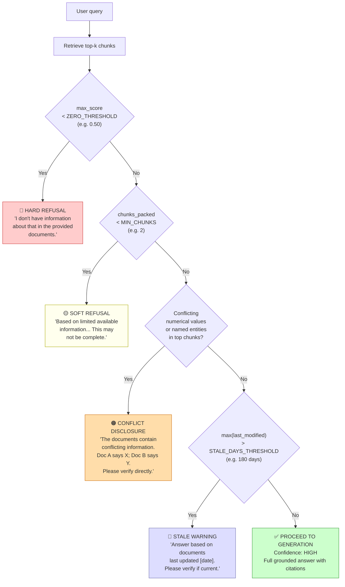

**Post-generation faithfulness gate (second line of defense):**

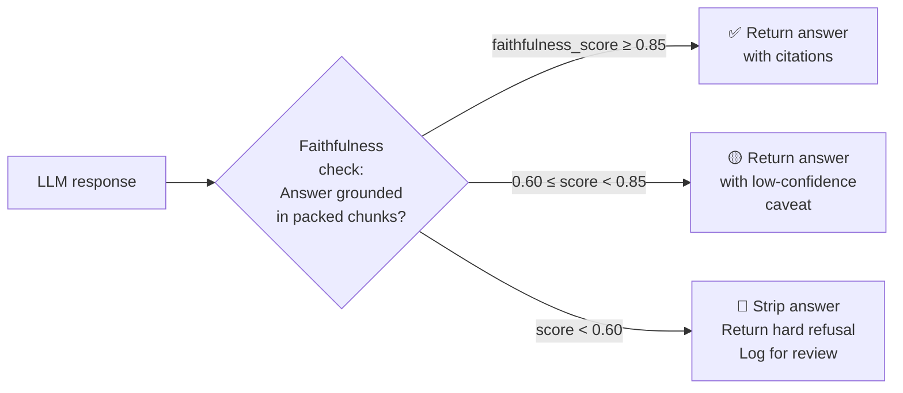

---

### 3. Real-World Industry Scenarios [Intermediate]

**Scenario 1: Healthcare — Missing Clinical Evidence (Hard Refusal Required)**

*Product/use-case context:*  
A clinical decision support tool is asked: "What is the recommended dosage of Drug X for pediatric patients under 2 years old?" The corpus contains dosage information for adults and for children over 5 — but nothing for infants under 2. The nearest retrieved chunks are about pediatric dosing generally (similarity score ~0.72).

*Why this matters more than a wrong answer:*
- A soft answer ("approximately 5mg/day based on general pediatric guidelines") synthesized from the wrong age group is worse than "I don't have dosing information for patients under 2 in the provided guidelines."
- The correct refusal must be specific: it should tell the clinician *what* evidence gap exists ("under-2 dosage"), not just "I don't know."
- **Partial coverage refusal is the right behavior here**, not hard refusal: chunks exist and are retrieved, but they don't address the specific sub-group. The system should say: "The retrieved guidelines cover pediatric dosing for ages 5+. No dosing information was found for patients under 2. Clinical judgment and specialist consultation are required."
- This requires checking coverage depth — not just whether chunks were retrieved, but whether they specifically address the query's key parameters (age group, drug, indication).

*What "good" looks like:*
- Refusal message names the specific gap ("under-2 dosage") not a generic "I don't know"
- Hard refusal triggered only when `max_score < 0.55` (nothing relevant) — not when partial evidence exists
- 100% of partial-coverage refusals include what WAS found, not just what wasn't

---

**Scenario 2: Legal Research — Conflicting Precedents (Conflict Disclosure Required)**

*Product/use-case context:*  
A regulatory affairs team asks: "Does our product fall under GDPR Article 17 right-to-erasure requirements?" The corpus returns two chunks — one from a 2019 legal memo saying "yes, Article 17 applies," and one from a 2023 update saying "Article 17 exemptions under Article 17(3)(e) may apply depending on jurisdiction."

*Why blind synthesis is dangerous:*
- If the LLM picks the 2019 chunk and says "Yes, Article 17 applies" — it's giving legal advice that may have been superseded.
- If it picks the 2023 chunk and says "Exemptions may apply" — it's underselling a real compliance obligation.
- The only safe behavior is conflict disclosure: "The retrieved documents contain differing assessments of this question. A 2019 analysis concludes Article 17 applies [DOC 1]; a 2023 update notes potential exemptions under Article 17(3)(e) [DOC 2]. Legal review is required to determine which applies to your specific context."
- Conflict detection in practice: flag when top-2 chunks assert contradictory boolean conclusions (yes/no) or numerical values that differ by more than a threshold.

*What "good" looks like:*
- Conflict disclosure surfaces both chunks with their dates
- The system never picks one side of a legal conflict and presents it as the answer
- Conflict detection rate measured on a golden test set of known contradictions

---

**Scenario 3: Enterprise Knowledge Base — Stale Policy (Staleness Warning Required)**

*Product/use-case context:*  
HR employees ask about the company's remote work policy. The best-matching chunk is from a policy document last modified 14 months ago, with similarity score 0.88. The content is clearly relevant — but the policy was updated 3 months ago and the new version hasn't been re-ingested yet.

*The staleness trap:*
- High similarity score (0.88) looks great — the system confidently answers.
- But the answer may be wrong because it's from an outdated document version.
- The staleness warning changes the trust calculus: "Based on the Remote Work Policy last updated March 2024: employees may work remotely up to 3 days per week [DOC 1]. Note: this policy document is 14 months old — please verify with HR if any updates have been made."
- The user now has the answer AND the caveat. They can decide to act on the information or verify first.
- Stale evidence is the most dangerous type because similarity scores remain high — it looks like good evidence, but the content may be superseded.

*What "good" looks like:*
- Staleness warning threshold configurable per source type (e.g., 30 days for pricing, 365 days for legal principles)
- Staleness surfaced to user with the actual last_modified date, not a generic warning
- Ingestion freshness monitoring alerts when key documents exceed the staleness threshold before users encounter it

---

### 4. System View [Intermediate]

**Evidence quality signals and what they measure:**

| Signal | How to compute | What it means | Gate threshold (typical) |
|---|---|---|---|
| `max_score` | `max(top_k_scores)` | Best-match similarity to query | < 0.55 → hard refusal |
| `mean_score` | `mean(top_k_scores)` | Average relevance of retrieved set | < 0.62 → soft refusal signal |
| `chunks_packed` | Count of chunks in prompt | Evidence breadth | < 2 → soft refusal |
| `score_gap` | `scores[0] - scores[1]` | Confidence in rank-1 being the answer | < 0.05 → uncertain, add reranker |
| `max_last_modified` | Latest timestamp in packed chunks | Freshness of best evidence | > staleness_threshold → stale warning |
| `conflict_detected` | Contradictory values in top-2 chunks | Whether evidence disagrees | True → conflict disclosure |
| `faithfulness_score` | Post-gen LLM-as-judge | Whether LLM answer matches chunks | < 0.60 → strip answer, hard refusal |

**Inputs → Transformations → Outputs:**

| Stage | Input | Transformation | Output |
|---|---|---|---|
| 1. Retrieve | Query | ANN search → top-k chunks | `chunks[]`, `scores[]` |
| 2. Pre-gen gate | `scores[]`, `chunks[]`, metadata | Compute evidence quality signals; route to refusal type or proceed | `evidence_class`: SUFFICIENT / PARTIAL / CONFLICT / STALE / NONE |
| 3. Prompt routing | `evidence_class` | Select prompt template (full grounded / partial / conflict / stale / hard refusal) | Selected prompt template |
| 4. LLM generation | Prompt | LLM generates response | Raw answer |
| 5. Post-gen gate | Answer + packed chunks | Faithfulness check; if score < threshold → strip answer, return refusal | Validated answer or refusal |
| 6. Response enrichment | Validated answer + evidence signals | Attach `confidence_level`, `last_modified`, conflict flags | Final structured response |

**Observability — the refusal calibration triangle:**

| Metric | Formula | Target | Alert if |
|---|---|---|---|
| `true_refusal_rate` | Refusals where answer truly absent ÷ total queries with no answer in corpus | > 0.90 | < 0.80: system hallucinating instead of refusing |
| `false_refusal_rate` | Refusals where answer IS in corpus ÷ total answerable queries | < 0.05 | > 0.10: retrieval broken or threshold too aggressive |
| `false_answer_rate` | Answers given when evidence was insufficient ÷ total queries | < 0.02 | > 0.05: insufficient evidence gate not working |

The three metrics are in tension: lowering the similarity threshold reduces false refusals but increases false answers. Raising it reduces false answers but increases false refusals. The correct threshold is calibrated on your golden test set, not picked arbitrarily.

---

### 5. System Design Flavor [Intermediate]

**The evidence router — core component:**

```python
from dataclasses import dataclass
from datetime import datetime, timedelta
from enum import Enum

class EvidenceClass(Enum):
    SUFFICIENT = "sufficient"
    PARTIAL    = "partial"
    CONFLICT   = "conflict"
    STALE      = "stale"
    NONE       = "none"

@dataclass
class EvidenceGateConfig:
    zero_threshold: float = 0.55      # max_score below this → NONE
    partial_min_chunks: int = 2       # fewer chunks than this → PARTIAL
    conflict_value_diff_pct: float = 0.20  # numerical diff > 20% → CONFLICT
    stale_days: int = 180             # last_modified older than this → STALE

def classify_evidence(
    scores: list[float],
    chunks: list[dict],
    cfg: EvidenceGateConfig = EvidenceGateConfig(),
) -> EvidenceClass:
    if not scores or max(scores) < cfg.zero_threshold:
        return EvidenceClass.NONE

    if len(chunks) < cfg.partial_min_chunks:
        return EvidenceClass.PARTIAL

    # Staleness check
    cutoff = datetime.utcnow() - timedelta(days=cfg.stale_days)
    freshest = max(
        (c.get("last_modified") for c in chunks if c.get("last_modified")),
        default=None
    )
    if freshest and freshest < cutoff:
        return EvidenceClass.STALE

    # Conflict check (simplified: look for contradictory boolean terms in top-2)
    if len(chunks) >= 2:
        text0 = chunks[0].get("text", "").lower()
        text1 = chunks[1].get("text", "").lower()
        contradictions = [
            ("does apply", "does not apply"),
            ("is required", "is not required"),
            ("is eligible", "is not eligible"),
        ]
        for pos, neg in contradictions:
            if (pos in text0 and neg in text1) or (neg in text0 and pos in text1):
                return EvidenceClass.CONFLICT

    return EvidenceClass.SUFFICIENT
```

**Prompt template routing by evidence class:**

```python
REFUSAL_TEMPLATES = {
    EvidenceClass.NONE: (
        "I don't have information about that in the provided documents."
    ),
    EvidenceClass.PARTIAL: (
        "The provided documents only partially address this question. "
        "Based on the available information: {partial_answer} "
        "This response may not be complete — please verify with the primary source."
    ),
    EvidenceClass.CONFLICT: (
        "The retrieved documents contain conflicting information on this topic:\n"
        "- [DOC 1] states: {claim_a}\n"
        "- [DOC 2] states: {claim_b}\n"
        "Please review both sources directly and consult the appropriate authority."
    ),
    EvidenceClass.STALE: (
        "{answer} [DOC {n}]\n\n"
        "⚠️ Note: This answer is based on documents last updated {last_modified}. "
        "Please verify whether this information remains current."
    ),
}
```

**Tradeoffs:**

| Decision | Aggressive thresholds | Conservative thresholds | When to choose |
|---|---|---|---|
| **Zero threshold** | Low (0.45) — few hard refusals | High (0.65) — many hard refusals | Calibrate on golden set. Low: fewer false refusals, more false answers. High: fewer false answers, more false refusals. Start at 0.55, tune from recall@k data. |
| **Pre-gen vs. post-gen gate** | Pre-gen only (fast, cheap) | Pre-gen + post-gen faithfulness check | Pre-gen alone misses cases where retrieved chunks are relevant but LLM hallucinates anyway. Post-gen faithfulness check is slower (+100–200ms) but catches generation-layer failures. Use both for high-stakes domains. |
| **Conflict detection depth** | Keyword-based (fast, cheap) | NLI entailment between chunk pairs (accurate, slow) | Keyword detection catches obvious contradictions. NLI catches subtle ones. Use keyword for real-time RAG, NLI for asynchronous or batch high-stakes validation. |

**Scaling consideration:**  
At 10x traffic, the pre-generation evidence gate runs on every request — it must be sub-millisecond. All signal computations (`max_score`, `chunks_packed`, date comparisons) are O(k) over small lists — they scale trivially. The faithfulness post-gen check (LLM-as-judge) does NOT scale linearly because it's another LLM call. At high volume: run post-gen faithfulness only for responses below a grounding confidence threshold (e.g., when `max_score < 0.70`), not on every request.

---

### 6. Common Mistakes + Debugging [Intermediate]

**Mistake 1: Only one refusal type — conflating all insufficiency into "I don't know"**
- **Symptom:** The system handles complete absence of evidence correctly (hard refusal), but for partial coverage cases it still says "I don't have that information" — even when 3 chunks were retrieved that partially answer the question. Users report the system is "unhelpful" and "refuses too much."
- **Likely cause:** The system prompt has a single uncertainty disclosure instruction triggered whenever the LLM decides evidence is insufficient. It doesn't distinguish between zero coverage (hard refusal) and partial coverage (soft refusal with partial answer).
- **First debugging step:** Check `idk_rate` broken down by `evidence_class`. If partial-coverage queries have the same refusal rate as zero-coverage queries, you need separate refusal logic. Implement the pre-gen evidence gate with a dedicated `PARTIAL` class and a separate prompt template that delivers a partial answer with a caveat.

**Mistake 2: Threshold set arbitrarily — too high → excessive false refusals**
- **Symptom:** `false_refusal_rate` is 15%+ — users ask clearly answerable questions and the system refuses. Manual inspection shows the correct chunk exists at rank 1 with similarity score 0.62, but the hard-refusal threshold is set to 0.70.
- **Likely cause:** The similarity threshold was copied from a blog post or set to a "round number" (0.7, 0.8) without calibration on actual retrieval data. Different embedding models have different score distributions — `all-MiniLM-L6-v2` typically scores good matches at 0.65–0.80, while `text-embedding-3-large` may score them at 0.45–0.65. A threshold calibrated for one model breaks on another.
- **First debugging step:** Run your golden test set and plot `recall@k` as a function of the similarity threshold. Find the score at which recall drops sharply — that's the natural threshold for your model and corpus. Set the hard-refusal threshold at that score minus a small margin (e.g., threshold = elbow_point − 0.05).

**Mistake 3: Stale evidence not surfaced — users act on outdated answers**
- **Symptom:** Users report that the system gave them policy information that was changed months ago. The answer was technically "correct" — it matched what the document said — but the document was stale. No freshness warning was shown.
- **Likely cause:** The evidence gate only checks `max_score` and `chunks_packed`. Freshness (`last_modified`) is not part of the evidence quality signal. The system treats a 2-year-old chunk with high similarity the same as a fresh one.
- **First debugging step:** Add `max(last_modified)` to the evidence gate. Define a staleness threshold per source type (e.g., 30 days for pricing, 180 days for HR policy, 365 days for legal principles). For chunks past the threshold, prepend a staleness warning to the answer: "Based on documents last updated [date] — please verify if current." Monitor `stale_answer_rate` as a new production metric.

---

### 7. Hands-On Lab [Pro]

**Goal:** Build the pre-generation evidence gate. Break it by miscalibrating the threshold. Measure false refusal rate vs. false answer rate. Explain threshold calibration.

**Prerequisites:** No external dependencies required.

---

**Build: Evidence gate + refusal router**

```python
from datetime import datetime, timedelta

# ── Evidence gate ─────────────────────────────────────────────────────────────
ZERO_THRESHOLD    = 0.55   # max_score below this → hard refusal
PARTIAL_MIN_CHUNKS = 2     # fewer packed chunks → soft refusal
STALE_DAYS        = 180    # last_modified older than this → stale warning

def classify_evidence(scores: list[float], chunks: list[dict]) -> str:
    if not scores or max(scores) < ZERO_THRESHOLD:
        return "NONE"
    if len(chunks) < PARTIAL_MIN_CHUNKS:
        return "PARTIAL"
    cutoff = datetime.utcnow() - timedelta(days=STALE_DAYS)
    freshest = max(
        (c["last_modified"] for c in chunks if "last_modified" in c),
        default=datetime.utcnow()
    )
    if freshest < cutoff:
        return "STALE"
    # Simple conflict check: contradictory boolean phrases in top-2
    if len(chunks) >= 2:
        t0, t1 = chunks[0].get("text","").lower(), chunks[1].get("text","").lower()
        for pos, neg in [("is required","is not required"),("does apply","does not apply")]:
            if (pos in t0 and neg in t1) or (neg in t0 and pos in t1):
                return "CONFLICT"
    return "SUFFICIENT"

def route_response(evidence_class: str, chunks: list[dict], partial_answer: str = "") -> str:
    last_mod = max(
        (c.get("last_modified", datetime.min) for c in chunks),
        default=datetime.min
    )
    routes = {
        "NONE":      "I don't have information about that in the provided documents.",
        "PARTIAL":   f"The documents only partially address this question. {partial_answer} This may not be complete — please verify with the primary source.",
        "CONFLICT":  f"The retrieved documents contain conflicting information:\n  • [DOC 1]: {chunks[0]['text'][:80]}…\n  • [DOC 2]: {chunks[1]['text'][:80]}…\nPlease review both sources directly.",
        "STALE":     f"{partial_answer}\n\n⚠️ Based on documents last updated: {last_mod.strftime('%Y-%m-%d')}. Please verify if current.",
        "SUFFICIENT": None,  # proceed to full grounded generation
    }
    return routes[evidence_class]

# ── Test cases ────────────────────────────────────────────────────────────────
test_cases = [
    {
        "label": "Zero coverage",
        "scores": [0.48, 0.44, 0.41],
        "chunks": [{"text": "Unrelated chunk A", "last_modified": datetime.utcnow()}],
        "expected": "NONE",
    },
    {
        "label": "Partial coverage (1 chunk packed)",
        "scores": [0.72],
        "chunks": [{"text": "Some relevant info.", "last_modified": datetime.utcnow()}],
        "expected": "PARTIAL",
    },
    {
        "label": "Stale evidence",
        "scores": [0.85, 0.80],
        "chunks": [
            {"text": "Policy: 3 days remote work.", "last_modified": datetime.utcnow() - timedelta(days=400)},
            {"text": "Policy details continued.", "last_modified": datetime.utcnow() - timedelta(days=390)},
        ],
        "expected": "STALE",
    },
    {
        "label": "Conflicting evidence",
        "scores": [0.88, 0.83],
        "chunks": [
            {"text": "Filing an extension is required for all contractors.", "last_modified": datetime.utcnow()},
            {"text": "Filing an extension is not required for contractors under 6 months.", "last_modified": datetime.utcnow()},
        ],
        "expected": "CONFLICT",
    },
    {
        "label": "Sufficient evidence",
        "scores": [0.91, 0.85],
        "chunks": [
            {"text": "Enterprise refund: 30 days, full amount.", "last_modified": datetime.utcnow()},
            {"text": "Submit via the support portal.", "last_modified": datetime.utcnow()},
        ],
        "expected": "SUFFICIENT",
    },
]

print(f"{'Case':<30} {'Expected':>12} {'Got':>12} {'Pass':>6}")
print("-" * 65)
for tc in test_cases:
    got = classify_evidence(tc["scores"], tc["chunks"])
    passed = "✓" if got == tc["expected"] else "✗"
    print(f"{tc['label']:<30} {tc['expected']:>12} {got:>12} {passed:>6}")
```

Expected output:
```
Case                           Expected          Got   Pass
-----------------------------------------------------------------
Zero coverage                      NONE         NONE      ✓
Partial coverage (1 chunk packed)   PARTIAL  PARTIAL      ✓
Stale evidence                     STALE        STALE      ✓
Conflicting evidence             CONFLICT    CONFLICT      ✓
Sufficient evidence             SUFFICIENT  SUFFICIENT      ✓
```

---

**Break: Miscalibrate the threshold**

```python
# Set threshold too HIGH → triggers false refusals on answerable queries
ZERO_THRESHOLD = 0.90   # almost nothing passes

print("\n=== HIGH THRESHOLD (0.90) ===")
for tc in test_cases:
    got = classify_evidence(tc["scores"], tc["chunks"])
    print(f"  {tc['label']:<30} → {got}")
```

Expected output — the "Sufficient evidence" case (0.91 max score) barely passes; everything else becomes NONE:
```
=== HIGH THRESHOLD (0.90) ===
  Zero coverage                  → NONE
  Partial coverage (1 chunk)     → NONE     ← false refusal: partial evidence exists
  Stale evidence                 → NONE     ← false refusal: stale but real evidence
  Conflicting evidence           → NONE     ← false refusal: conflict exists but suppressed
  Sufficient evidence            → SUFFICIENT  ← just barely passes at 0.91
```

```python
# Set threshold too LOW → misses genuine zero-coverage cases
ZERO_THRESHOLD = 0.30

print("\n=== LOW THRESHOLD (0.30) ===")
for tc in test_cases:
    got = classify_evidence(tc["scores"], tc["chunks"])
    print(f"  {tc['label']:<30} → {got}")
```

Expected output — "Zero coverage" (scores 0.48, 0.44, 0.41) passes through to generation:
```
=== LOW THRESHOLD (0.30) ===
  Zero coverage                  → PARTIAL   ← false answer: LLM now generates from noise chunks
  Partial coverage (1 chunk)     → PARTIAL
  Stale evidence                 → STALE
  Conflicting evidence           → CONFLICT
  Sufficient evidence            → SUFFICIENT
```

---

**Measure:** Threshold 0.90 → `false_refusal_rate` spikes (rejects good evidence). Threshold 0.30 → `false_answer_rate` spikes (lets noise evidence through). The optimal threshold for this embedding model and corpus sits between these — found by plotting score distributions on your golden test set and locating the natural gap between "relevant" and "noise" similarity scores.

**Explain:** There is no universal "correct" threshold. Different embedding models produce different score ranges. `all-MiniLM-L6-v2` scores good matches at 0.60–0.88; `text-embedding-3-large` scores them at 0.40–0.70. Using a threshold calibrated for one model on another will systematically over-refuse or under-refuse. The calibration process: (1) run retrieval on your golden test set, (2) plot the histogram of scores for "correct" vs. "incorrect" matches, (3) find the score where the two distributions diverge — set the threshold there.

---

### 8. Active Recall [Intermediate]

1. **(Beginner)** Name the four types of evidence insufficiency and the refusal behavior appropriate for each.

   **Answer:** (1) Zero coverage → hard refusal: "I don't have information about that." (2) Partial coverage → soft refusal: answer what's available + "this may not be complete." (3) Conflicting evidence → conflict disclosure: present both sides + "please review directly." (4) Stale evidence → staleness warning: answer + "based on documents last updated [date] — please verify."

2. **(Beginner)** What is the difference between a false refusal and a false answer? Why do you need separate metrics for each?

   **Answer:** A **false refusal** is when the system refuses a query whose answer IS in the corpus — caused by retrieval failure or threshold too high. A **false answer** is when the system gives an answer for a query whose answer is NOT in the corpus — caused by threshold too low or missing gate. They require separate metrics (`false_refusal_rate` vs. `false_answer_rate`) because fixing one worsens the other: lowering the threshold reduces false refusals but increases false answers. You can only optimize the right tradeoff if you're measuring both.

3. **(Intermediate)** Your similarity threshold is set at 0.70. The embedding model scores good matches in the range 0.55–0.78. What problem does this create and how do you fix it?

   **Answer:** The threshold is too high relative to the model's score range for good matches. Queries with correct chunks at score 0.65 trigger false refusals. Fix: calibrate by running the golden test set, plotting the score distribution for correct vs. incorrect matches, and setting the threshold at the natural gap between those distributions — typically near the 10th percentile of "correct match" scores, not a round number.

4. **(Intermediate)** Why is stale evidence the most dangerous type of evidence insufficiency — more dangerous than zero coverage?

   **Answer:** Zero coverage produces a clear refusal signal (low similarity scores); users know to look elsewhere. Stale evidence has high similarity scores — it looks like good, confident evidence — so the system proceeds to generate a confident answer from outdated content. Users trust it because nothing signals a problem. The answer may have been correct at the time of the source document, but if policy, pricing, or clinical guidelines have changed since, users act on wrong information with no warning. The system must surface freshness explicitly even when similarity scores are high.

5. **(Pro)** You run the refusal calibration triangle on your system and find: `true_refusal_rate = 0.93`, `false_refusal_rate = 0.03`, `false_answer_rate = 0.08`. What is the primary problem and what is its likely cause?

   **Answer:** `false_answer_rate = 0.08` is above the 0.02 target — the system gives answers when evidence is insufficient 8% of the time. The `true_refusal_rate` and `false_refusal_rate` look healthy, so the zero-coverage gate is working. The issue is that some evidence gate classification is allowing insufficient evidence through to generation — most likely the `PARTIAL` class: queries with low-quality partial evidence are classified as PARTIAL (gets a soft refusal instruction) but the LLM still generates a confident full answer instead of following the partial-answer template. Fix: add a post-generation faithfulness check as a second gate for PARTIAL-classified queries, or tighten the PARTIAL → SUFFICIENT boundary by requiring higher `mean_score` before proceeding to full generation.

---

### 9. Practice

**Mini-exercise:** You are building a RAG assistant for a benefits platform. Users ask about their personal health plan coverage. A query comes in: "Is my plan covered for vision therapy?" Retrieval returns 1 chunk (score 0.68) about general vision benefit structures, but it doesn't mention therapy specifically. The chunk was last modified 8 months ago. What evidence class does this get, what response does the user see, and what system improvements would prevent this case from reaching users?

**Suggested answer:**
- **Evidence class:** `STALE` (8 months > 180-day threshold) AND `PARTIAL` (1 chunk, doesn't directly answer therapy). In a layered gate, STALE takes precedence over PARTIAL if the staleness threshold fires first; alternatively, the gate returns both signals for maximum user transparency.
- **User response:** "Based on the benefits documentation last updated 8 months ago, vision benefits cover standard eye exams and corrective lenses [DOC 1]. Vision therapy coverage was not found in the retrieved documents. Note: this information is 8 months old — please verify with your current plan documents or HR."
- **System improvement:** (1) Set a stricter staleness threshold for benefits documents (30–60 days, since plans update annually). (2) Trigger an ingestion pipeline alert when any benefits document exceeds its staleness threshold, prompting re-ingestion before users encounter stale answers. (3) Add `therapy` and `rehabilitation` as query expansion terms for vision-related queries to improve recall for specialty coverage questions.

---

**Capstone design question:**  
You are building a RAG assistant for a multinational bank's compliance team. The system answers questions about anti-money laundering (AML) regulations. The corpus includes regulations from 15 jurisdictions. Regulations conflict across jurisdictions (what's required in the EU may differ from the US). The bank is audited annually, and every answer the system gives must be explainable. Design the complete evidence insufficiency handling system: the four refusal types, their triggering signals, the response templates, the post-generation gate, and the audit logging requirement.

**Suggested answer outline:**

| Evidence class | Trigger signal | Response template | Audit log |
|---|---|---|---|
| NONE | `max_score < 0.55` | "No AML guidance found in the provided regulatory corpus for this question. Please consult a compliance officer." | Log: `{query, evidence_class: NONE, max_score, timestamp}` |
| PARTIAL | `chunks_packed < 2` OR `mean_score < 0.62` | "Partial guidance found [DOC N]: {partial}. This may not represent complete regulatory requirements — please verify." | Log: `{query, evidence_class: PARTIAL, chunks_packed, mean_score}` |
| CONFLICT | Top-2 chunks from different jurisdictions OR contradictory boolean assertions | "Conflicting requirements detected: [Jurisdiction A] requires X [DOC 1]; [Jurisdiction B] does not require X [DOC 2]. Jurisdiction-specific legal review required." | Log: `{query, evidence_class: CONFLICT, doc_ids[], jurisdictions[]}` — flag for mandatory human review |
| STALE | `max(last_modified) > 90 days` (AML regs change frequently) | "{answer} [DOC N] ⚠️ Based on regulations last updated {date}. AML regulations may have changed — verify against current regulatory publications." | Log: `{query, evidence_class: STALE, last_modified}` |
| SUFFICIENT | All gates pass | Full grounded answer with citations | Log: `{query, evidence_class: SUFFICIENT, faithfulness_score, citations[]}` |
| **Post-gen faithfulness** | `faithfulness_score < 0.75` | Strip answer, return: "Answer could not be verified against the provided corpus. Please consult a compliance officer." | Log: `{query, faithfulness_score, raw_answer (for audit)}` — flag for review |

Audit requirement: All query traces including evidence_class, retrieved_chunk_ids, and faithfulness_score stored in a tamper-evident log for the annual audit. Conflict-class responses trigger mandatory human review within 24 hours.

---

### 10. Production Reality Check ✅

**If this fails in prod, what's the first thing we inspect?**

Check the **refusal calibration triangle** metrics: `true_refusal_rate`, `false_refusal_rate`, and `false_answer_rate`. If `false_answer_rate` is above 0.05, the evidence gate thresholds are too permissive — the system is generating answers from insufficient evidence. If `false_refusal_rate` is above 0.10, thresholds are too aggressive for your embedding model's score range. Both are fixed by recalibrating the similarity threshold on your golden test set — not by changing the system prompt. The second check: verify that staleness detection is running, because stale-evidence failures look exactly like correct answers in all metrics except `last_modified` — they only surface when users report outdated information.

---

### 11. Curiosity Bridge ✅

Refusal behavior handles the cases where evidence is absent, partial, conflicting, or stale. But there's a subtler problem that even good evidence doesn't solve: what if the LLM's answer is factually grounded in the retrieved chunks, but the chunks themselves are incomplete — they cover 70% of the question and leave a 30% gap that the user needs answered? That's the **faithfulness vs. completeness tradeoff** — a fully faithful answer can still be an incomplete one, and an incomplete answer can mislead just as much as a wrong one. That's the next subtopic.

---

### 12. Exit Check + Carry-Forward Review

**Exit Check:** You're done when you can — from memory — name the four evidence insufficiency types with their trigger signals, implement a pre-generation evidence gate with configurable thresholds, explain the refusal calibration triangle and what each metric means when it's out of range, and describe why threshold calibration must be done on a golden test set rather than set to an arbitrary value.

**Carry-Forward Review (from Subtopic 6.3.a — Grounded Answer Prompting):**
- Q: Your evidence gate fires `NONE` (hard refusal) for a query, but the user insists the answer is in the corpus. You check retrieval inspection and find the correct chunk at rank 1 with score 0.62. Your `ZERO_THRESHOLD` is 0.65. What's the problem and what are the two ways to fix it?
- A: The threshold (0.65) is calibrated too high for this embedding model — it classifies good-match evidence (score 0.62) as zero-coverage. Fix (1): recalibrate the threshold by running the golden test set and finding the natural gap between "relevant" and "noise" score distributions — the threshold should sit below good-match scores, not above them. Fix (2): check if the embedding model was recently changed (a different model's score range may require a lower threshold). Never change the threshold without re-running the full refusal calibration triangle on the golden test set.

---

## Subtopic 6.3.c: Citation Formatting, Provenance, and Source Quoting ✅

### 0. Reading Path + Level Tags

- **Beginner:** Read sections 1–2 and Active Recall.
- **Intermediate:** Add sections 3–5 (citation format taxonomy, production data model, rendering layer) and the Hands-On Lab.
- **Pro:** Full lab including deep-link construction, deduplication, and the capstone multi-surface rendering design.

---

### 1. Pre-Question Hook + The Intuition [Beginner]

**Pause — before reading:** Your RAG system gives a correct answer and appends `[Source: Policy.pdf]`. A compliance auditor asks you to prove the answer came from page 12, section 3.1, paragraph 2 of that document — and to show the exact words. Can you?

**The core mental model:**

A citation is not just a filename. A **production citation** is a structured data object that carries everything needed to independently verify a specific claim: the document identity, the exact location within it, the last time it was updated, and — for high-stakes domains — the verbatim words from the source.

There are three distinct engineering problems in this space that teams routinely conflate:

1. **Citation formatting** — what format the citation takes in the output (inline bracket, footnote, JSON array, source block) and how that format is selected per output surface (chat UI, API, PDF report).
2. **Provenance** — the complete traceable chain from answer claim → chunk_id → document location → ingestion run; the audit trail that proves the answer's origin.
3. **Source quoting** — when and how verbatim text from the source chunk is included in the response; the strongest possible trust signal because the user sees the exact words, not the LLM's paraphrase.

The key insight: **citation format is a user-experience decision; provenance is a system-integrity decision; source quoting is a trust and verifiability decision.** They are three different concerns that happen to travel together. Teams that treat them as one problem under-engineer two of the three.

**Real-world analogy:**  
Think of a legal brief. The citation format is how the case is cited (`Smith v. Jones, 42 F.3d 100, 105 (9th Cir. 1994)`). The provenance is the reporter volume and page that a clerk can retrieve from the law library. The source quote is the verbatim passage from the opinion reprinted in the brief. You need all three: the format tells you where to look, the provenance tells you you're looking at the right thing, and the quote proves the claim without requiring the reader to look it up. The analogy breaks down because legal citations follow a rigid standardized format; RAG citation formats vary enormously across systems and must be adapted per output surface.

**Key terms (first use — also in Module Glossary):**
- **Citation object:** A structured data record (chunk_id, source_title, section, page, URL, last_modified, quote, confidence) that carries all provenance and display data for a single citation.
- **Citation format:** The visual/structural representation of a citation in output — inline bracket, named inline, footnote, source block, or JSON array; chosen per output surface.
- **Citation rendering layer:** The pipeline component that takes a `Citation` object and emits the correct format string for a given output surface (chat, API, PDF, email).
- **Verbatim quote:** The exact text from the source chunk included in the response alongside the citation; the strongest trust signal, required for numerical values, legal clauses, and dosage figures.
- **Deep link:** A citation URL that points to a specific location within a document — a page anchor, section fragment, or named bookmark — rather than the document root.
- **Citation deduplication:** The process of collapsing multiple citations to the same source document into a single source entry with multiple location references, preventing a cluttered references list.
- **Bibliographic completeness:** The requirement that a citation contains every field needed for independent verification: not just filename but also section, page, version, URL, and last_modified date.

---

### 2. Visual Diagram (Mermaid) [Beginner]

**The citation object and its three output paths:**

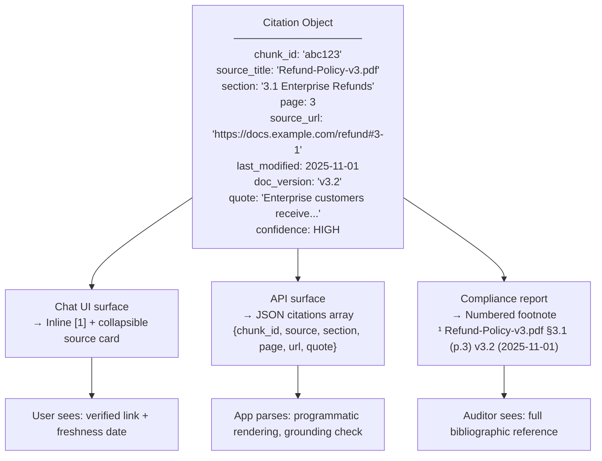

**The citation format taxonomy:**

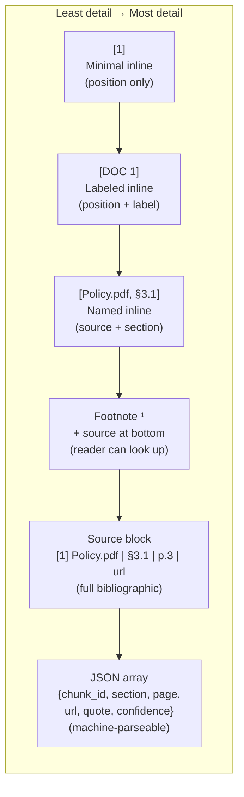

---

### 3. Real-World Industry Scenarios [Intermediate]

**Scenario 1: Customer-Facing Chat UI (Trust Through Transparency)**

*Product/use-case context:*  
A consumer-facing assistant for a financial services company. Users ask about account fees, transfer limits, and product terms. When the bot answers, the citation must be a clickable link the user can verify — not a filename they can't access.

*Citation engineering requirements:*
- **`source_url` must be the public-facing canonical URL**, not the internal S3 path. The chunk metadata at ingestion time must map every document to its live URL. A citation pointing to `s3://internal-bucket/terms-v4.pdf` is useless; `https://www.example.com/legal/terms#transfer-limits` is actionable.
- **Freshness date surfaced in the citation card:** Users need to see "last updated: Jan 2025" to calibrate how much to trust the answer. This comes from `last_modified` in chunk metadata — set at ingestion time.
- **Deep link to the exact section:** Rather than linking to the document root, the citation URL should include a fragment: `#transfer-limits` or `#page=7`. This requires storing `anchor_id` or `page_number` in chunk metadata and constructing the deep link at citation rendering time.
- **Mobile rendering consideration:** On mobile, a source block with a long URL breaks the layout. Citation rendering must detect the surface and collapse to a compact format (icon + tooltip) for mobile.

*What "good" looks like:*
- 100% of citations have valid, live `source_url` (validated at ingestion, re-checked on a schedule)
- Deep links point to exact section, not document root
- Last_modified surfaced in citation card
- Citation format adapts per surface (desktop vs. mobile vs. API)

---

**Scenario 2: Legal Research Platform (Bibliographic Completeness Required)**

*Product/use-case context:*  
Lawyers use a RAG system to research case law and statutes. Every citation in a legal brief must follow a precise format and include the exact jurisdiction, year, volume, and page. Lawyers need to paste citations directly into their briefs without manual reformatting.

*Citation engineering requirements:*
- **Jurisdiction-specific citation formats:** US federal cases follow Bluebook format (`Smith v. Jones, 42 F.3d 100 (9th Cir. 1994)`); EU regulations follow a different format (`Regulation (EU) 2016/679 of 27 April 2016 (GDPR)`). The citation rendering layer must accept a `format_style` parameter and apply the correct template per jurisdiction.
- **Verbatim quotes are mandatory for key holdings:** When the answer includes a legal principle, the system should quote the relevant holding verbatim: `"The court held: 'Fair use requires consideration of the purpose and character of the use.' [DOC 1, Smith v. Jones, p.105]"`. Paraphrasing legal holdings changes their scope.
- **Doc_version / publication date critical:** Legal documents have effective dates. A regulation's wording may differ between the 2018 and 2023 versions. The citation must include `effective_date` and `doc_version` so the lawyer can verify they're looking at the current version.
- **Deduplication across a multi-source answer:** A single legal answer might cite the same statute 3 times from different sections. The references list should deduplicate: one entry per unique source with multiple location sub-entries.

*What "good" looks like:*
- Citation format correct for the jurisdiction (configurable `format_style`)
- Verbatim quote included for legal holdings and statutory language
- `effective_date` surfaced in every citation
- Deduplicated references list at the end of multi-citation answers

---

**Scenario 3: Internal Compliance RAG (Audit Trail for Every Answer)**

*Product/use-case context:*  
An internal RAG system used by a compliance team to answer questions about regulatory obligations. The system must support annual audits — every answer ever given must be reproducible with full provenance.

*Citation engineering requirements:*
- **Immutable citation log:** Every answer generated must be stored with the complete citation object at the time of generation — `chunk_id`, `doc_version`, `last_modified`, `query_id`, and `timestamp`. If the source document is updated later, the citation log still shows what version was cited at query time.
- **chunk_id as the stable audit key:** The citation log is keyed by `chunk_id`, not by filename or URL. Filenames change. URLs redirect. The chunk_id is assigned at ingestion and never changes — it's the only reliable pointer to the exact text that was used.
- **Provenance replay:** Given a `query_id` from 6 months ago, an auditor should be able to replay: "Which chunk was cited? What did that chunk say at the time? What document was it from? Was the document the current version then?" This requires the citation log, the chunk store, and document version history to all be queryable together.
- **Export to audit report:** The citation object must be serializable to multiple formats: JSON for the internal log, PDF for the audit report, CSV for bulk export. A single canonical citation data model with format-specific serializers handles this.

*What "good" looks like:*
- Every generated answer stored in the immutable citation log with full `Citation` object
- Provenance replay possible for any query in the last 24 months
- `chunk_id` used as the stable citation key throughout (not filename, not URL)
- Citation exportable to JSON, PDF, and CSV without data loss

---

### 4. System View [Intermediate]

**The production `Citation` data model:**

```python
from dataclasses import dataclass, field
from datetime import datetime
from typing import Literal

@dataclass
class Citation:
    # ── Identity ──────────────────────────────────────────────────────────────
    doc_index:     int            # position in packed context (1, 2, 3...)
    chunk_id:      str            # stable UUID from ingestion — the audit key

    # ── Location ──────────────────────────────────────────────────────────────
    source_title:  str            # human-readable document name
    section:       str            # section heading or clause name
    page_number:   int | None     # page for PDFs; None for web/DB sources
    anchor_id:     str | None     # CSS/HTML anchor or PDF named destination

    # ── Accessibility ─────────────────────────────────────────────────────────
    source_url:    str            # canonical public URL (not internal path)
    deep_link:     str | None     # source_url + fragment (#anchor_id or #page=N)

    # ── Freshness + Version ───────────────────────────────────────────────────
    last_modified: datetime       # from chunk metadata; drives staleness warning
    doc_version:   str | None     # "v3.2", "2025-Q1", "Rev. 4"

    # ── Trust signals ─────────────────────────────────────────────────────────
    quote:         str | None     # verbatim supporting text (10–50 words)
    confidence:    Literal["HIGH", "MEDIUM", "LOW"]  # grounding confidence

    # ── Computed at serialization ─────────────────────────────────────────────
    def inline(self) -> str:
        return f"[{self.doc_index}]"

    def named_inline(self) -> str:
        return f"[{self.source_title}, {self.section}]"

    def source_block_line(self) -> str:
        ver = f" | {self.doc_version}" if self.doc_version else ""
        pg  = f" | p.{self.page_number}" if self.page_number else ""
        url = self.deep_link or self.source_url
        return f"[{self.doc_index}] {self.source_title} | {self.section}{pg}{ver} | {url}"

    def to_dict(self) -> dict:
        return {k: str(v) if isinstance(v, datetime) else v
                for k, v in self.__dict__.items() if not callable(v)}
```

**Citation rendering layer — format × surface matrix:**

| Output surface | Format | Key constraints |
|---|---|---|
| Chat UI (desktop) | Inline `[1]` + collapsible source block at bottom | Keep answer readable; source block collapsed by default, expandable |
| Chat UI (mobile) | Inline `[1]` + icon tap → bottom sheet with full citation | Long URLs break mobile layout; use icon + modal |
| REST API response | JSON `citations[]` array with full Citation fields | Consumers need machine-parseable data; include all fields including `quote` |
| PDF / compliance report | Numbered footnotes + bibliography section | Follows academic/legal convention; `doc_version` + `effective_date` in bibliography |
| Email / Slack | Named inline `[Policy.pdf, §3.1]` + short URL | No rendering engine for complex markdown; use text-safe format |
| Streaming UI | Inline `[1]` first, source block appended after stream ends | Can't render source block until all citations are known; buffer and append |

**Observability — what we log and measure:**
- `citation_completeness_rate` — fraction of citations with all required fields populated (`source_url`, `section`, `page_number`, `last_modified`); below 95% indicates metadata gaps from ingestion
- `deep_link_validity_rate` — fraction of deep links that resolve to a live anchor (periodic link validation); broken deep links erode trust
- `quote_coverage_rate` — fraction of HIGH-confidence citations that include a verbatim `quote` field; low rate on high-stakes domains signals the quote instruction is missing from the system prompt
- `citation_dedup_rate` — fraction of answers where deduplication collapsed multiple citations to fewer source entries; high rate may indicate chunking is too fine (many chunks per source)

---

### 5. System Design Flavor [Intermediate]

**Building deep links at citation rendering time:**

```python
def build_deep_link(source_url: str, page: int | None, anchor_id: str | None) -> str:
    """Construct a deep link from base URL + location signals."""
    if anchor_id:
        # HTML anchor: https://docs.example.com/policy#section-3-1
        return f"{source_url}#{anchor_id}"
    if page:
        # PDF page anchor: https://docs.example.com/policy.pdf#page=12
        if source_url.lower().endswith(".pdf"):
            return f"{source_url}#page={page}"
        # Generic page param for web docs without anchors
        return f"{source_url}?page={page}"
    return source_url  # fallback: document root
```

**Citation deduplication — collapsing multi-cite answers:**

```python
from collections import defaultdict

def deduplicate_citations(citations: list[Citation]) -> list[dict]:
    """Group citations by source document; list multiple locations per source."""
    grouped: dict[str, dict] = defaultdict(lambda: {"locations": []})
    for cite in citations:
        key = cite.chunk_id.split("-chunk-")[0]  # group by parent document ID
        entry = grouped[key]
        entry["source_title"]  = cite.source_title
        entry["source_url"]    = cite.source_url
        entry["last_modified"] = cite.last_modified
        entry["doc_version"]   = cite.doc_version
        entry["locations"].append({
            "doc_index":   cite.doc_index,
            "section":     cite.section,
            "page":        cite.page_number,
            "deep_link":   cite.deep_link,
            "quote":       cite.quote,
        })
    return list(grouped.values())
```

**Verbatim quoting — system prompt instruction:**

```
When citing specific numerical values, policy limits, legal clauses, dosage figures,
or regulatory thresholds, include a verbatim quote from the source immediately after
the citation marker. Format:

  [DOC N]: "exact words from the document, 10–50 words"

Do NOT paraphrase quoted material — copy it exactly as it appears in the document.
Paraphrase is acceptable for context and background information only.
```

**Tradeoffs:**

| Decision | Lightweight citations | Full citation objects | When to choose |
|---|---|---|---|
| **Citation depth** | Inline `[1]` + source title | Full `Citation` object with section, page, URL, quote, version | Lightweight for conversational, exploratory use. Full object for any system where citations are audited, verified, or used in reports. Default to full objects — the marginal storage cost is negligible. |
| **Verbatim quote field** | Optional (omit for performance) | Mandatory for HIGH-confidence citations | Omit for background/context claims. Mandatory for numerical values, legal clauses, dosage figures — anywhere paraphrase could distort meaning. |
| **Deep links** | Source URL (document root) | Deep link to page/section anchor | Deep links always preferred — they save the user from hunting through the document. Requires `anchor_id` or `page_number` in chunk metadata at ingestion time. |
| **Citation deduplication** | Raw list (may repeat source) | Deduplicated + grouped by source | Always deduplicate for multi-citation answers in reports and compliance contexts. Raw list acceptable in streaming chat where rendering is incremental. |

**Scaling consideration:**  
At 10x volume, the citation rendering layer is stateless and CPU-bound — it processes a small list of Citation objects per request. It scales trivially with horizontal replication. The expensive part is **link validation** (checking `deep_link` is live) — at 10M queries/day you cannot validate links per query. Instead: validate links asynchronously on a schedule (daily crawl of all deep links in the citation index), cache `link_valid: bool` in chunk metadata, and surface it in the citation object without a live check at query time.

---

### 6. Common Mistakes + Debugging [Intermediate]

**Mistake 1: `source_url` is an internal path — citations are unclickable for end users**
- **Symptom:** Users click a citation link and get a 403 Forbidden, an S3 presigned URL that expired, or a path that only resolves on the internal network. Citations appear in the answer but provide zero verifiability for external users.
- **Likely cause:** At ingestion, the `source_url` metadata field was populated from the file system path or the internal document store URL, not the canonical public-facing URL.
- **First debugging step:** Sample 20 citations from recent answers. Check if `source_url` starts with `s3://`, `file://`, an internal hostname, or a localhost URL. If so, the ingestion pipeline needs a URL mapping step: for each source document, map internal path → canonical public URL. Store both as separate metadata fields (`internal_path` and `source_url`) so the public URL is what appears in citations.

**Mistake 2: No verbatim quote for precision-critical claims**
- **Symptom:** The LLM correctly cites a source for a numerical claim ("Limit is $50,000 [DOC 1]") but the actual chunk says "up to $50,000 for platinum tier only." The paraphrase omits the tier condition — a material difference. Compliance audit flags the answer as misleading.
- **Likely cause:** The system prompt includes a citation instruction but no verbatim quote instruction. The LLM paraphrases because that's its natural behavior.
- **First debugging step:** Check the system prompt for a quote instruction. Add it with explicit scope: "For numerical values, dollar limits, policy thresholds, and legal conditions, include a verbatim quote: `[DOC N]: 'exact text'`." Then inspect 10 answers containing numerical claims — verify each has a quote field in the citation object that matches the claim.

**Mistake 3: Citation deduplication not implemented — references list cluttered**
- **Symptom:** A 5-sentence answer cites `[DOC 1]` three times and `[DOC 2]` twice. The source block shows 5 entries, all pointing to the same 2 documents. For longer answers with 15+ inline citations, the source block becomes unusable noise.
- **Likely cause:** Citation rendering simply lists every `[DOC N]` instance as a separate source block entry without grouping. There's no deduplication step between citation extraction and source block rendering.
- **First debugging step:** Add a deduplication pass after citation extraction: group by `chunk_id` parent document, collapse repeated citations to one source entry with multiple `section` + `page` sub-entries. For the inline text, keep `[DOC 1]` repeated — that's correct. Only deduplicate in the source block / references section.

---

### 7. Hands-On Lab [Pro]

**Goal:** Build a complete citation object, render it across three surfaces, construct a deep link, and implement deduplication. Break it by omitting required metadata fields and observe what degrades in each surface.

**Prerequisites:** No external dependencies required.

---

**Build: Citation object + multi-surface renderer**

```python
from dataclasses import dataclass
from datetime import datetime
from typing import Literal

@dataclass
class Citation:
    doc_index:     int
    chunk_id:      str
    source_title:  str
    section:       str
    page_number:   int | None
    anchor_id:     str | None
    source_url:    str
    last_modified: datetime
    doc_version:   str | None
    quote:         str | None
    confidence:    Literal["HIGH", "MEDIUM", "LOW"]

    @property
    def deep_link(self) -> str:
        if self.anchor_id:
            return f"{self.source_url}#{self.anchor_id}"
        if self.page_number and self.source_url.endswith(".pdf"):
            return f"{self.source_url}#page={self.page_number}"
        return self.source_url

def render(citation: Citation, surface: str) -> str:
    ver = f" | {citation.doc_version}" if citation.doc_version else ""
    pg  = f" | p.{citation.page_number}" if citation.page_number else ""
    qt  = f'\n   Quote: "{citation.quote}"' if citation.quote else ""
    age = citation.last_modified.strftime("%Y-%m-%d")

    if surface == "inline":
        return f"[{citation.doc_index}]"

    if surface == "named_inline":
        return f"[{citation.source_title}, {citation.section}]"

    if surface == "source_block":
        return (
            f"[{citation.doc_index}] {citation.source_title} | {citation.section}"
            f"{pg}{ver} | Last updated: {age}\n"
            f"   🔗 {citation.deep_link}{qt}"
        )

    if surface == "footnote":
        return f"[^{citation.doc_index}]: {citation.source_title}, {citation.section}{pg}{ver} ({age}) — {citation.deep_link}"

    if surface == "json":
        return str({"doc_index": citation.doc_index, "chunk_id": citation.chunk_id,
                    "source": citation.source_title, "section": citation.section,
                    "page": citation.page_number, "url": citation.deep_link,
                    "last_modified": age, "quote": citation.quote,
                    "confidence": citation.confidence})
    return ""

# ── Sample citation ───────────────────────────────────────────────────────────
c = Citation(
    doc_index=1, chunk_id="abc123-chunk-4",
    source_title="Refund-Policy-v3.pdf", section="3.1 Enterprise Refunds",
    page_number=3, anchor_id="section-3-1",
    source_url="https://docs.example.com/refund-policy.pdf",
    last_modified=datetime(2025, 11, 1), doc_version="v3.2",
    quote="Enterprise customers receive a 30-day full refund, no questions asked.",
    confidence="HIGH"
)

for surface in ["inline", "named_inline", "source_block", "footnote", "json"]:
    print(f"=== {surface.upper()} ===")
    print(render(c, surface))
    print()
```

Expected output:
```
=== INLINE ===
[1]

=== NAMED_INLINE ===
[Refund-Policy-v3.pdf, 3.1 Enterprise Refunds]

=== SOURCE_BLOCK ===
[1] Refund-Policy-v3.pdf | 3.1 Enterprise Refunds | p.3 | v3.2 | Last updated: 2025-11-01
   🔗 https://docs.example.com/refund-policy.pdf#section-3-1
   Quote: "Enterprise customers receive a 30-day full refund, no questions asked."

=== FOOTNOTE ===
[^1]: Refund-Policy-v3.pdf, 3.1 Enterprise Refunds | p.3 | v3.2 (2025-11-01) — https://docs.example.com/refund-policy.pdf#section-3-1

=== JSON ===
{'doc_index': 1, 'chunk_id': 'abc123-chunk-4', 'source': 'Refund-Policy-v3.pdf',
 'section': '3.1 Enterprise Refunds', 'page': 3,
 'url': 'https://docs.example.com/refund-policy.pdf#section-3-1',
 'last_modified': '2025-11-01', 'quote': 'Enterprise customers...', 'confidence': 'HIGH'}
```

---

**Break: Strip required metadata fields**

```python
c_broken = Citation(
    doc_index=1, chunk_id="abc123-chunk-4",
    source_title="Refund-Policy-v3.pdf",
    section="",           # missing section
    page_number=None,     # missing page
    anchor_id=None,       # missing anchor
    source_url="s3://internal-bucket/refund-policy.pdf",  # internal path!
    last_modified=datetime(2023, 1, 1),   # very stale
    doc_version=None,     # missing version
    quote=None,           # no quote
    confidence="HIGH"
)

print("=== BROKEN SOURCE_BLOCK ===")
print(render(c_broken, "source_block"))
print("\n=== BROKEN DEEP LINK ===")
print(f"Deep link: {c_broken.deep_link}")
```

Expected output — degraded at every level:
```
=== BROKEN SOURCE_BLOCK ===
[1] Refund-Policy-v3.pdf |  | Last updated: 2023-01-01
   🔗 s3://internal-bucket/refund-policy.pdf

=== BROKEN DEEP LINK ===
Deep link: s3://internal-bucket/refund-policy.pdf
```

---

**Measure:** With missing metadata: section is blank (user can't find the location), deep link is an S3 URL (users get 403 Forbidden), last_modified shows a 2-year-old date (staleness warning should fire), no quote (cannot verify verbatim claim), no version (can't confirm which edition was used).

**Explain:** Every missing metadata field degrades one dimension of citation trustworthiness. The fix is upstream — at ingestion time. The citation rendering layer can only render what's in the metadata envelope. Ingestion must validate that `section`, `page_number`, `source_url` (public-facing), `last_modified`, and `doc_version` are all populated before a chunk enters the index. Add a metadata completeness gate to the ingestion pipeline: `assert chunk.section and chunk.source_url and not chunk.source_url.startswith("s3://")`.

---

**Bonus — Deduplication:**

```python
from collections import defaultdict

citations = [
    Citation(1, "abc123-chunk-4", "Refund-Policy-v3.pdf", "3.1 Enterprise Refunds", 3, "section-3-1",
             "https://docs.example.com/refund-policy.pdf", datetime(2025,11,1), "v3.2",
             "Enterprise customers receive a 30-day full refund.", "HIGH"),
    Citation(2, "abc123-chunk-7", "Refund-Policy-v3.pdf", "3.3 Processing Times", 5, "section-3-3",
             "https://docs.example.com/refund-policy.pdf", datetime(2025,11,1), "v3.2",
             None, "HIGH"),
    Citation(3, "def456-chunk-2", "Billing-FAQ.pdf", "Processing Times", 7, None,
             "https://docs.example.com/billing-faq.pdf", datetime(2025,10,1), None,
             None, "MEDIUM"),
]

def deduplicate(citations: list[Citation]) -> list[dict]:
    groups: dict[str, dict] = defaultdict(lambda: {"locations": []})
    for c in citations:
        doc_key = c.source_title   # group by document title
        g = groups[doc_key]
        g["source_title"] = c.source_title
        g["source_url"]   = c.source_url
        g["last_modified"]= c.last_modified.strftime("%Y-%m-%d")
        g["doc_version"]  = c.doc_version
        g["locations"].append({
            "doc_index": c.doc_index, "section": c.section,
            "page": c.page_number, "deep_link": c.deep_link,
        })
    return list(groups.values())

deduped = deduplicate(citations)
for src in deduped:
    locs = "; ".join(f"§{l['section']} p.{l['page']}" for l in src["locations"])
    print(f"• {src['source_title']} ({src['last_modified']}) → {locs}")
```

Output — 3 citations collapsed to 2 source entries:
```
• Refund-Policy-v3.pdf (2025-11-01) → §3.1 Enterprise Refunds p.3; §3.3 Processing Times p.5
• Billing-FAQ.pdf (2025-10-01) → §Processing Times p.7
```

---

### 8. Active Recall [Intermediate]

1. **(Beginner)** What are the three distinct concerns in "citation formatting, provenance, and source quoting," and why does conflating them cause engineering problems?

   **Answer:** (1) **Citation format** — how the citation looks in the output (inline, footnote, JSON); a UX decision. (2) **Provenance** — the audit trail from answer → chunk_id → document location; a system-integrity decision. (3) **Source quoting** — including verbatim text from the source; a trust/verifiability decision. Conflating them causes teams to implement one (usually inline labels) and skip the others, resulting in unverifiable citations for auditors and paraphrase distortions for precision-critical values.

2. **(Beginner)** Why is `chunk_id` a more reliable citation key than the source document's filename or URL?

   **Answer:** Filenames change when documents are renamed or versioned (`Policy.pdf` → `Policy-v4.pdf`). URLs redirect or break when documents move. The `chunk_id` is a stable UUID assigned at ingestion and never changes — it always points to the same specific passage, regardless of what happens to the file or URL. It's the only reliable key for provenance replay and long-term audit logging.

3. **(Intermediate)** What data must be stored in chunk metadata at ingestion time to support deep links in citations?

   **Answer:** Either `anchor_id` (the CSS/HTML ID of the section, e.g., `section-3-1`) for web documents, or `page_number` for PDFs. Deep links are constructed at citation rendering time by appending `#anchor_id` or `#page=N` to the `source_url`. Without these fields in the metadata envelope, the rendering layer can only link to the document root, which forces users to search through the entire document to find the cited passage.

4. **(Intermediate)** When is a verbatim quote in the citation object mandatory vs. optional?

   **Answer:** **Mandatory** for: numerical values (amounts, limits, percentages, dosages), legal clauses and statutory language, policy thresholds, regulatory requirements, and any claim where paraphrase could change the meaning. **Optional** for: background context, general explanations, and categorical information where paraphrase preserves full meaning. The rule of thumb: if a user or auditor would need to verify the exact wording — not just the general idea — a verbatim quote is required.

5. **(Pro)** Your `citation_completeness_rate` drops from 97% to 82% after onboarding a new data source (a SharePoint knowledge base). Which specific metadata fields are most likely missing and why?

   **Answer:** Most likely `page_number` (SharePoint pages have no natural page concept — it's a web document, not a PDF), `anchor_id` (SharePoint section anchors are auto-generated and inconsistent), and `doc_version` (SharePoint versioning is often not exposed in the content API without extra configuration). The `source_url` may also be an internal SharePoint URL that requires authentication. Fix: build a SharePoint-specific ingestion connector that (1) maps page IDs to anchor fragments, (2) calls the SharePoint version API to get the current version number, and (3) maps internal SharePoint URLs to externally accessible URLs (or SharePoint Online direct links).

---

### 9. Practice

**Mini-exercise:** A RAG answer contains the following inline citations: `[DOC 1]`, `[DOC 1]`, `[DOC 2]`, `[DOC 1]`, `[DOC 3]`, `[DOC 2]`. The answer has 3 unique sources with DOC 1 cited 3 times, DOC 2 cited twice, and DOC 3 once. Write the deduplicated source block that should appear at the bottom of the answer.

**Suggested answer:**
```
Sources:
[1] Refund-Policy-v3.pdf | §3.1 (p.3), §3.3 (p.5), §3.5 (p.8) | v3.2 | 2025-11-01
    🔗 https://docs.example.com/refund-policy.pdf

[2] Billing-FAQ.pdf | §Processing Times (p.7), §Refund Eligibility (p.2) | 2025-10-01
    🔗 https://docs.example.com/billing-faq.pdf

[3] Support-Guide.pdf | §Initiating a Refund (p.2) | 2025-09-15
    🔗 https://docs.example.com/support-guide.pdf
```
DOC 1 appears once in the source block with three section sub-entries; DOC 2 appears once with two sub-entries; DOC 3 appears once with one entry.

---

**Capstone design question:**  
You are building a RAG system for a pharmaceutical company that generates clinical summary reports. These reports are read by both clinicians (who need precise citations and verbatim quotes) and regulatory affairs teams (who need audit-ready provenance). The reports are exported as PDF, sent via email, and consumed by an internal API. Design the complete citation architecture: the `Citation` data model, all required metadata fields, verbatim quoting rules, rendering for each output surface, deduplication strategy, and audit logging.

**Suggested answer outline:**

| Layer | Design decision | Justification |
|---|---|---|
| **Citation data model** | Full `Citation` object: chunk_id, source_title, section, page, anchor_id, source_url, last_modified, doc_version (guideline name + year), effective_date, quote, confidence | All fields required for pharmaceutical regulatory citation; `effective_date` distinguishes guideline versions; `quote` mandatory for dosage/contraindication fields |
| **Verbatim quote rule** | Required for: dosages, contraindications, eligibility criteria, statistical thresholds. Prompt instruction: "For any numerical value or clinical requirement, include verbatim quote field with exact wording." | Paraphrasing clinical values is a patient safety risk |
| **PDF surface** | Numbered footnote + bibliography section in Bluebook-adjacent clinical format: `¹ ICH E6(R2) §5.2.1, p.14 (Rev. 2) (Effective: Nov 2016)` + deep link in bibliography | Standard for clinical documents; auditors expect formal bibliography |
| **Email surface** | Named inline `[ICH E6(R2), §5.2.1]` + short canonical URL (no deep link in email body — broken rendering risk) | Email clients strip anchors and render raw URLs; use document root URL |
| **API surface** | Full JSON Citation array with all fields including `quote`, `effective_date`, `confidence` | Downstream systems (clinical trial management software) need machine-parseable provenance |
| **Deduplication** | Group by guideline name + version; list all section + page sub-entries per guideline; preserve inline `[DOC N]` intact | A clinical report may cite the same guideline 10+ times; grouped source block is essential |
| **Audit logging** | Immutable log per query: `{query_id, generated_at, citations[{chunk_id, doc_version, effective_date, quote}]}` | Supports regulatory agency audit of AI-assisted clinical documents; must survive 10+ years |

---

### 10. Production Reality Check ✅

**If this fails in prod, what's the first thing we inspect?**

Check `citation_completeness_rate` broken down by source type. A drop below 95% almost always traces to a new data source being onboarded without all required metadata fields being extracted — specifically `section`, `page_number`, `source_url` (public-facing), and `last_modified`. The second check: sample 10 recent citations and manually attempt to click the deep links. Broken deep links are often the first thing users notice and the last thing engineers check. Add a scheduled deep-link validation job (daily crawl) that sets `link_valid: false` on stale or moved URLs, and surface a `⚠️ link may be outdated` flag in the citation card for those entries.

---

### 11. Curiosity Bridge ✅

Citation formatting, provenance, and source quoting close out the core generation-with-citations story — you can now retrieve, pack, generate, refuse when needed, and present trustworthy citations across any output surface. The final piece of Topic 6.3 is the hardest and most subtle: **faithfulness vs. completeness tradeoffs**. A fully faithful answer — one that only says what's in the retrieved chunks — can still be an incomplete answer, missing facts that are in the corpus but not in the retrieved set. And an answer designed to maximize completeness may synthesize across chunks in ways that introduce distortions. Navigating that tension is where RAG engineering meets evaluation science.

---

### 12. Exit Check + Carry-Forward Review

**Exit Check:** You're done when you can — from memory — list the 9 required fields in a production `Citation` object and justify each, implement `build_deep_link()` from page and anchor_id, describe when verbatim quoting is mandatory vs. optional, explain citation deduplication and how the source block differs from inline markers, and name the three surface-specific rendering formats and their constraints.

**Carry-Forward Review (from Subtopic 6.3.b — Refusal Behavior):**
- Q: Your citation completeness check shows that 30% of citations in the last week have `source_url` pointing to an S3 internal path. These citations also triggered the staleness warning because `last_modified` shows dates 2+ years ago. Both problems appeared after a batch re-ingestion of archived documents. What is the root cause and what two ingestion gates would have caught this?
- A: The re-ingestion pipeline for the archived document batch didn't include (1) a URL mapping step to translate internal storage paths to public-facing canonical URLs, and (2) a metadata freshness validation step that checks `last_modified` is set to the document's actual last-edited date, not the archive's creation date. Two ingestion gates that catch these: (1) `assert not source_url.startswith("s3://")` — blocks internal-path chunks from entering the index; (2) `assert last_modified > datetime(2020, 1, 1)` — flags implausibly old timestamps for human review before indexing.

---

## Subtopic 6.3.d: Separating Evidence from Speculation and Reasoning ✅

### 0. Reading Path + Level Tags

- **Beginner:** Read sections 1–2 and Active Recall.
- **Intermediate:** Add sections 3–5 (epistemic taxonomy, structured output approach, post-gen audit) and the Hands-On Lab.
- **Pro:** Full lab (Build → Break → Measure → Explain), epistemic audit drill, and the capstone scenario.

---

### 1. Pre-Question Hook + The Intuition [Beginner]

**Pause — before reading:** Read these three sentences from a RAG answer:
> *"The enterprise refund window is 30 days [DOC 1]. Since your subscription started on March 1, you are still within the window. You may also want to contact your account manager for faster processing."*

Which of these is a documented fact? Which is a logical inference from the fact? Which is the LLM adding helpful-sounding speculation? Can your users tell the difference?

**The core mental model:**

Every RAG answer is made of at least three epistemically distinct categories of content, and LLMs blend them seamlessly into prose:

1. **Direct evidence** — a fact explicitly stated in a retrieved chunk, citeable to `[DOC N]`. The sentence: *"The enterprise refund window is 30 days."*
2. **Supported inference** — a conclusion the LLM draws by applying logic to retrieved evidence. The sentence: *"Since your subscription started March 1, you are still within the window."* — logically follows from DOC 1 but is the LLM's deduction, not a stated document fact.
3. **Speculation** — a claim the LLM generates that goes beyond what any retrieved document supports, often drawing on training patterns about what "helpful" responses look like. The sentence: *"You may also want to contact your account manager."* — not in any retrieved chunk.

The danger is **epistemic blur**: all three read identically in prose. A user reading that answer cannot tell which sentences are document-backed, which are reasoned inferences, and which are LLM inventions dressed in confident language. In legal, medical, or compliance contexts, conflating evidence with inference is a liability. In consumer contexts, it erodes trust the moment a user acts on speculative advice and it turns out wrong.

**The two failure modes** are symmetric:
- **Too much blending** — speculation is presented as evidence; the user acts on it as if it were documented fact.
- **Too much suppression** — the LLM refuses to reason at all, returning only raw document quotes with no connecting logic; the user gets facts but can't apply them.

The goal is **transparent layering**: the answer delivers evidence first, inference second, and explicitly labels any speculation as advisory rather than documented.

**Real-world analogy:**  
A doctor's clinical note has three clearly separated sections: *Assessment* (what the evidence shows), *Impression* (what the doctor infers from the evidence), and *Plan* (recommendations that go beyond the evidence). Mixing all three into one paragraph without labels would be a documentation error. A RAG system that serves clinical questions needs the same discipline. The analogy breaks down because a doctor has professional accountability for each section; a RAG system has no automatic separation unless the system prompt explicitly enforces it.

**Key terms (first use — also in Module Glossary):**
- **Epistemic category:** The type of claim being made — direct evidence (cited fact), supported inference (derived from evidence), or speculation (beyond evidence).
- **Epistemic blur:** The failure mode where evidence, inference, and speculation are mixed in prose without labeling, making each indistinguishable to the reader.
- **Supported inference:** A conclusion explicitly drawn from retrieved evidence through stated reasoning; grounded but not a direct quote; must be labeled as inference, not fact.
- **Speculation:** An LLM-generated claim that goes beyond what any retrieved chunk supports; includes sycophantic additions, procedural suggestions, and completions drawn from training data.
- **Epistemic marker:** A label (e.g., `[FACT]`, `[INFERENCE]`, `[NOTE]`) or structural separator that signals to the reader which epistemic category a sentence belongs to.
- **Epistemic audit:** A post-generation classification pass that labels each sentence in the answer as FACT, INFERENCE, or SPECULATION; used to strip or flag speculative content before the response is returned.
- **Show-your-work instruction:** A system prompt pattern that requires the LLM to structure its answer in labeled sections — Evidence first, Reasoning second — making the inference step visible and auditable.

---

### 2. Visual Diagram (Mermaid) [Beginner]

**The three epistemic categories in a RAG answer — and the danger zone:**

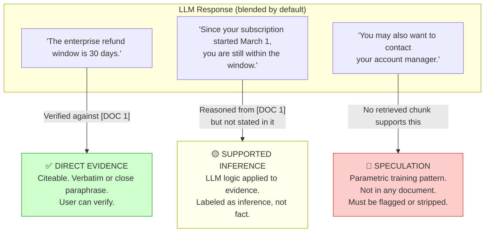

**The layered answer structure (target architecture):**

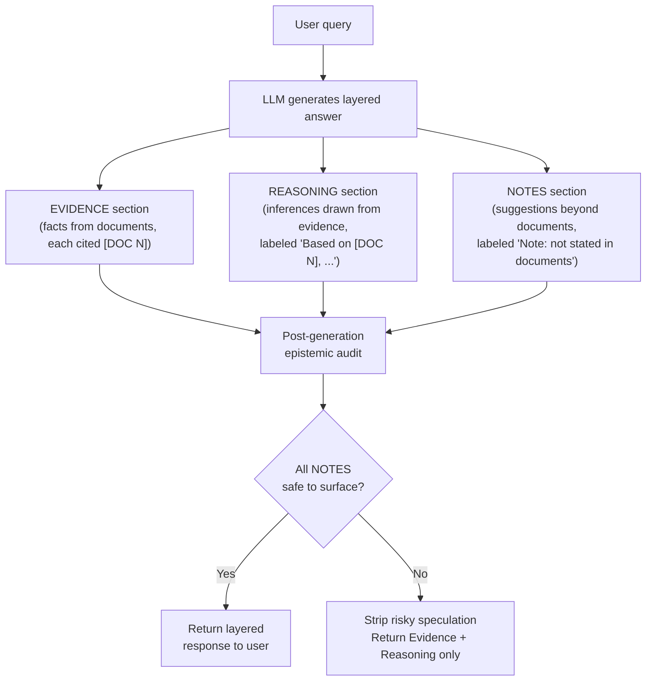

---

### 3. Real-World Industry Scenarios [Intermediate]

**Scenario 1: Medical Clinical Decision Support (Inference ≠ Guideline Recommendation)**

*Product/use-case context:*  
A clinician asks: "What is the recommended first-line treatment for hypertension in a 65-year-old patient with CKD Stage 3?" The corpus contains clinical guidelines covering first-line treatment for hypertension and separate sections on CKD comorbidities — but no single chunk that directly addresses the specific combination.

*Why epistemic blur is patient-safety-critical here:*
- **Direct evidence** might be: "ACE inhibitors are first-line for hypertension with CKD [DOC 2]." — verifiable against the guideline.
- **Supported inference** might be: "Based on the CKD Stage 3 criteria in [DOC 3], your patient likely meets the threshold for ACE inhibitor use." — a reasonable inference, but the clinician should know it's the AI reasoning across two guidelines, not a single stated recommendation.
- **Speculation** might be: "You should also monitor potassium levels closely." — clinically reasonable advice, but not stated in any retrieved chunk; the LLM added it from training data about hypertension management.
- If all three appear in one paragraph without labels, the clinician may treat the potassium monitoring advice as a guideline-backed recommendation and document it as such — a compliance error.

*How to engineer around this:*
- **Structure the output in labeled sections:** `GUIDELINE STATES:` / `CLINICAL REASONING:` / `ADVISORY NOTE (not from guidelines):`
- **Require inference labeling in the system prompt:** "When drawing a conclusion that is not explicitly stated in a document, begin the sentence with: 'Based on [DOC N], it can be inferred that…'"
- **Audit the ADVISORY NOTE section:** run a post-generation check that flags any advisory sentences containing clinical action verbs (monitor, prescribe, adjust) that are not backed by a citation.

*What "good" looks like:*
- 100% of sentences in GUIDELINE STATES section have a citation and can be verified verbatim
- 0% of advisory notes contain clinical action verbs without an explicit "not from guidelines" label
- Clinician can clearly see which sentences are evidence, which are reasoning, and which are the system's suggestions

---

**Scenario 2: Legal Research Assistant (Inference Changes Legal Meaning)**

*Product/use-case context:*  
A paralegal asks: "Does GDPR Article 17 require erasure for data processed under legitimate interest?" The corpus has the GDPR text and two law review articles — one arguing yes, one arguing no.

*The epistemic layering challenge:*
- **Direct evidence** is the statute text: "Article 17(1) provides a right of erasure where personal data is no longer necessary [DOC 1]." — verifiable.
- **Supported inference** from the conflicting articles: "Legal commentary is divided; one analysis holds erasure is required [DOC 2] while another argues Article 17(3)(b) provides a valid exemption [DOC 3]." — still grounded, but the LLM is characterizing the state of legal opinion, not stating a legal fact.
- **Speculation** would be: "Given the current regulatory environment, erasure is probably required." — the LLM extrapolating a legal conclusion from training patterns about GDPR enforcement trends.
- Presenting speculative legal conclusions as document-backed is a professional conduct issue. Legal RAG must either separate the layers or refuse to speculate at all.

*Engineering approach:*
- Use a **conflict disclosure** response type (from 6.3.b) when documents disagree.
- Apply the show-your-work instruction: "State what the documents explicitly say, then state what legal scholars argue, then explicitly refuse to draw a legal conclusion: 'The applicable legal outcome requires professional legal judgment.'"
- Never permit speculation on legal outcomes; strip any sentence that asserts a legal conclusion not directly stated in retrieved documents.

*What "good" looks like:*
- Statute text quoted verbatim from DOC 1
- Scholarly positions summarized with separate citations [DOC 2] [DOC 3]
- Explicit refusal to speculate: "The question of whether your specific situation requires erasure requires legal counsel."

---

**Scenario 3: Enterprise HR Policy Assistant (Sycophantic Speculation)**

*Product/use-case context:*  
An employee asks: "I've been at the company for 3 years — am I eligible for the enhanced pension matching?" The retrieved chunk covers standard matching (2% → 4% employer match after year 2). The LLM infers the employee qualifies and then adds: "Given your tenure, you may also be approaching eligibility for the leadership development program."

*The sycophantic speculation problem:*
- The inference (employee qualifies for enhanced matching) is supported by the retrieved evidence — reasonable and useful.
- The addition about the leadership development program is **sycophantic speculation** — the LLM detected that the user seems career-focused and added something it thought would be appreciated, drawn entirely from training patterns about HR conversations, with no document support.
- If the company's leadership development program has different eligibility criteria, the employee may incorrectly believe they qualify, take action, and be disappointed. The damage to trust in the RAG system is disproportionate to a single unhelpful sentence.

*Engineering approach:*
- Apply a post-generation epistemic audit: classify every sentence as FACT/INFERENCE/SPECULATION. Flag SPECULATION sentences that contain phrases like "you may also", "you might consider", "this could also apply", "it's worth noting" — common sycophantic speculation patterns.
- Strip or separate speculative additions into a clearly labeled `NOTE: This is a suggestion, not stated in the provided policy documents.` section.

*What "good" looks like:*
- Evidence + inference about pension matching returned with citations
- Sycophantic speculation about the leadership program either stripped or moved to a labeled "SUGGESTIONS (not from documents)" section
- Zero speculative sentences in the main answer body

---

### 4. System View [Intermediate]

**Epistemic classification — inputs, transformation, outputs:**

| Stage | Input | Transformation | Output |
|---|---|---|---|
| 1. Structured generation | Prompt with show-your-work instruction | LLM generates answer with labeled sections (EVIDENCE / REASONING / NOTES) | Raw labeled response string |
| 2. Section parsing | Raw labeled response | Extract sentences per section using regex or LLM-structured output | `{evidence: [], inference: [], speculation: []}` |
| 3. Epistemic audit | Sentences per section + packed chunks | For each EVIDENCE sentence: verify citation exists + chunk supports claim. For each INFERENCE: verify it logically follows from cited evidence. Flag SPECULATION. | Audit results per sentence |
| 4. Speculation filter | Speculation sentences | Apply configurable policy: STRIP (remove), WARN (label and retain), BLOCK (fail the whole response) | Filtered response |
| 5. Response assembly | Filtered evidence + inference + optional labeled speculation | Assemble final response with epistemic structure preserved in the output | Structured response |

**Observability — what we log and measure:**
- `speculation_rate` — fraction of answers containing ≥1 speculative sentence; high rate indicates system prompt not enforcing epistemic separation
- `inference_labeling_rate` — fraction of inference sentences that include an explicit "based on [DOC N], it can be inferred" marker; low rate means the LLM is presenting inferences as facts
- `sycophantic_phrase_rate` — fraction of answers containing high-risk speculation phrases ("you may also", "you might want to", "it's worth noting") without a document citation
- `epistemic_audit_pass_rate` — fraction of answers where all EVIDENCE sentences are verified against packed chunks; low rate signals grounding failure

**Failure points:**

| Failure | Symptom | Root cause |
|---|---|---|
| Speculation presented as evidence | User acts on advice not in any document; complaint traces to an unsourced sentence | No epistemic separation instruction; LLM blends all content types by default |
| Hidden inference | LLM synthesizes 2 facts into a conclusion presented as a third fact with no "inferred" label | No show-your-work instruction; inference step is implicit |
| Sycophantic speculation | Answer contains helpful-sounding additions ("you might also…") that have no document support | LLM optimizing for perceived helpfulness over grounding; requires explicit negative constraint: "Do NOT add suggestions beyond the document content." |
| Over-suppression | LLM refuses to reason at all, returning only raw document quotes | Show-your-work instruction too strict; LLM interprets it as "no inference allowed" rather than "label your inference" |

---

### 5. System Design Flavor [Intermediate]

**The show-your-work system prompt pattern:**

```
Structure your answer in exactly two sections, using the headers below.
Do not add any content outside these two sections.

EVIDENCE:
List only facts explicitly stated in the documents below.
After each fact, cite [DOC N]. Use verbatim or close paraphrase.
Do not add any information not directly stated in a document.

REASONING:
State any logical conclusions you draw from the evidence above.
Begin each inference with: "Based on [DOC N], it follows that..."
If you cannot reason to a conclusion from the provided documents,
write: "Insufficient evidence to draw a conclusion."

Do NOT include suggestions, recommendations, or additions that are
not derived from the provided documents. If you are tempted to add
helpful context from general knowledge, omit it entirely.
```

**When to add a third NOTES section (configurable):**

For use cases where some advisory content is acceptable (e.g., general product support), add a third labeled section:

```
NOTES (not from documents — use with caution):
Any general guidance or suggestions that go beyond the documents.
Clearly labeled as the assistant's suggestions, not document-backed advice.
```

This lets the LLM surface useful suggestions without blending them into the evidence section. The user sees the epistemic separation clearly.

**Tradeoffs:**

| Decision | Enforce strict separation (2 sections) | Allow advisory NOTES section | When to choose |
|---|---|---|---|
| **Speculation policy** | Strip all speculation (high-stakes: medical, legal, compliance) | Label and retain speculation (general-purpose assistants) | Strip for any domain where wrong advice creates liability. Label+retain for consumer assistants where helpful suggestions add value if clearly marked. |
| **Inference labeling** | Explicit "Based on [DOC N], it follows that…" required on every inference sentence | Implicit inference allowed | Explicit labeling is always better for auditability and user trust, but adds verbosity. Use implicit for low-stakes chat; explicit for legal, medical, HR policy. |
| **Post-gen audit** | Full epistemic classification per sentence (LLM-as-judge) | Keyword/pattern-based speculation detector | Full LLM audit: accurate but adds 100–200ms + cost of a second LLM call. Pattern-based: fast and cheap, catches common sycophantic phrases but misses subtle speculation. Use LLM audit for high-stakes; pattern-based for real-time consumer RAG. |

**Scaling consideration:**  
A full per-sentence epistemic audit (second LLM call) at 10x traffic becomes a significant cost multiplier — 2× LLM calls per query. At scale, use a two-tier strategy: apply the pattern-based speculation detector (sub-millisecond, no LLM call) on all queries; trigger the full LLM epistemic audit only for answers flagged by the pattern detector or for high-risk query types (medical, legal, financial). This reduces LLM audit calls from 100% to 5–15% of traffic.

---

### 6. Common Mistakes + Debugging [Intermediate]

**Mistake 1: Implicit inference — LLM presents reasoned conclusions as direct facts**
- **Symptom:** An answer says "You qualify for the enterprise tier based on your account age." The retrieved chunk says the enterprise tier requires 2+ years. The LLM correctly inferred the user qualifies — but presents it as a stated fact, not as inference. There is no `[DOC N]` citation. The user doesn't know whether this is documented policy or the LLM's calculation.
- **Likely cause:** The system prompt anchors the LLM to "use only the documents" but doesn't instruct it to label the inference step. The LLM performs the reasoning implicitly and folds the conclusion into the answer without a label.
- **First debugging step:** Add the show-your-work instruction with explicit EVIDENCE / REASONING sections. Then inspect a batch of 20 answers — count how many inference sentences use "Based on [DOC N], it follows that…" vs. no label. If > 50% of inferences are unlabeled, the instruction is not being followed; switch to structured JSON output with `{"evidence": [...], "reasoning": [...]}` to enforce the separation programmatically.

**Mistake 2: Sycophantic speculation not detected or stripped**
- **Symptom:** Answers consistently end with one or two extra sentences like "You may also want to verify this with your HR department" or "This policy may have been updated — check the latest version." These sentences are not cited and are not in any retrieved chunk. Users take them as system recommendations.
- **Likely cause:** No speculation filter is running. The system prompt says "use only documents" but doesn't explicitly prohibit adding helpful-sounding extras. The LLM is optimizing for perceived helpfulness (from RLHF training) by appending procedural suggestions.
- **First debugging step:** Add the negative constraint to the system prompt: `"Do NOT add any suggestions, recommendations, or context that is not explicitly stated in the provided documents. If you are tempted to add general guidance, omit it."` Then run a keyword scan on a sample of 50 answers for phrases: "you may also", "you might want to", "it's worth", "consider", "you should also" without a [DOC N] citation. These are the sycophantic speculation fingerprints. Measure `sycophantic_phrase_rate` before and after.

**Mistake 3: Over-suppression — the LLM stops reasoning and only quotes**
- **Symptom:** After adding the show-your-work instruction, the LLM becomes excessively literal: the EVIDENCE section is correct and cited, but the REASONING section is always "Insufficient evidence to draw a conclusion" — even for cases where a clear inference is obvious. The system has become unhelpfully rigid.
- **Likely cause:** The show-your-work instruction was too strict, implying "no inference allowed" rather than "label your inference." The LLM interpreted the negative constraints as a prohibition on all reasoning.
- **First debugging step:** Relax the REASONING section instruction. Change from "Do NOT add any information not directly stated" (which the LLM may apply to inferences too) to: "State logical conclusions you can draw from the evidence above. Begin each with 'Based on [DOC N], it follows that…' Reasoning from evidence is allowed and encouraged; speculation beyond evidence is not." Test on 10 cases where inference is clearly warranted.

---

### 7. Hands-On Lab [Pro]

**Goal:** Build an epistemic classifier that separates a blended answer into FACT / INFERENCE / SPECULATION. Break it by omitting the show-your-work instruction and measuring epistemic blur. Explain why explicit labeling is required.

**Prerequisites:** No external dependencies required. Substitute any LLM API for the simulated responses.

---

**Build: Epistemic classifier + speculation filter**

```python
import re
from dataclasses import dataclass

# ── Epistemic patterns ────────────────────────────────────────────────────────
SPECULATION_PHRASES = [
    r"you may also", r"you might want to", r"you might consider",
    r"it'?s worth", r"consider reaching out", r"you should also",
    r"you could also", r"it would be advisable", r"feel free to",
]
INFERENCE_PHRASES = [
    r"based on \[doc \d+\]", r"it follows that", r"therefore",
    r"this suggests", r"given that \[doc", r"since \[doc",
]
CITATION_PATTERN = r"\[doc \d+\]"

@dataclass
class EpistemicResult:
    sentence: str
    category: str          # FACT / INFERENCE / SPECULATION
    has_citation: bool
    flag: str | None       # warning message if suspicious

def classify_sentence(sentence: str) -> EpistemicResult:
    s = sentence.lower()
    has_citation = bool(re.search(CITATION_PATTERN, s))

    # Speculation detection: speculative phrase AND no citation
    is_spec_phrase = any(re.search(p, s) for p in SPECULATION_PHRASES)
    if is_spec_phrase and not has_citation:
        return EpistemicResult(sentence, "SPECULATION", False,
                               "⚠️ Speculative phrase without citation — likely beyond document scope")

    # Inference detection: contains inference phrase with or without citation
    is_inf_phrase = any(re.search(p, s) for p in INFERENCE_PHRASES)
    if is_inf_phrase:
        flag = None if has_citation else "⚠️ Inference without citation — basis unclear"
        return EpistemicResult(sentence, "INFERENCE", has_citation, flag)

    # Fact with citation
    if has_citation:
        return EpistemicResult(sentence, "FACT", True, None)

    # No citation, no known pattern — ambiguous; treat as uncited claim
    return EpistemicResult(sentence, "SPECULATION", False,
                           "⚠️ No citation and no inference marker — uncited claim")

def audit_answer(answer: str) -> list[EpistemicResult]:
    sentences = re.split(r'(?<=[.!?])\s+', answer.strip())
    return [classify_sentence(s) for s in sentences if s]

# ── Test case: blended answer (no epistemic separation) ──────────────────────
blended_answer = (
    "The enterprise refund window is 30 days [DOC 1]. "
    "Since your subscription started on March 1, you are still within the window. "
    "You may also want to contact your account manager for expedited processing."
)

print("=== EPISTEMIC AUDIT: BLENDED ANSWER ===")
results = audit_answer(blended_answer)
for r in results:
    print(f"  [{r.category:<12}] {r.sentence[:70]}")
    if r.flag:
        print(f"                {r.flag}")

# ── Test case: well-structured answer (show-your-work) ───────────────────────
structured_answer = (
    "EVIDENCE: The enterprise refund window is 30 days [DOC 1]. "
    "REASONING: Based on [DOC 1], since your subscription started March 1 and today is within 30 days, "
    "it follows that you are currently eligible for a full refund. "
)

print("\n=== EPISTEMIC AUDIT: STRUCTURED ANSWER ===")
results2 = audit_answer(structured_answer)
for r in results2:
    print(f"  [{r.category:<12}] {r.sentence[:70]}")
    if r.flag:
        print(f"                {r.flag}")
```

Expected output:
```
=== EPISTEMIC AUDIT: BLENDED ANSWER ===
  [FACT        ] The enterprise refund window is 30 days [DOC 1].
  [SPECULATION ] Since your subscription started on March 1, you are still within
                ⚠️ No citation and no inference marker — uncited claim
  [SPECULATION ] You may also want to contact your account manager for expedited
                ⚠️ Speculative phrase without citation — likely beyond document scope

=== EPISTEMIC AUDIT: STRUCTURED ANSWER ===
  [FACT        ] EVIDENCE: The enterprise refund window is 30 days [DOC 1].
  [INFERENCE   ] REASONING: Based on [DOC 1], since your subscription started Marc
```

---

**Break: Measure epistemic blur rate**

```python
test_answers = [
    ("The policy requires 2 years of service for enhanced matching [DOC 1]. "
     "Given your tenure, you likely qualify. "
     "You should also check with HR for any exceptions.",
     {"FACT": 1, "INFERENCE_OR_SPEC": 2}),  # 2 unlabeled claims
    ("Enterprise accounts receive 99.9% SLA [DOC 2]. "
     "Based on [DOC 2], it follows that downtime above 0.1% monthly would trigger SLA credits. "
     "You might want to review your recent uptime reports.",
     {"FACT": 1, "INFERENCE_OR_SPEC": 2}),  # 1 labeled inference, 1 speculation
]

print("\n=== BLUR RATE ANALYSIS ===")
total_sentences, total_flagged = 0, 0
for answer, _ in test_answers:
    results = audit_answer(answer)
    flagged = [r for r in results if r.flag]
    total_sentences += len(results)
    total_flagged += len(flagged)
    for r in results:
        marker = "✗" if r.flag else "✓"
        print(f"  {marker} [{r.category:<12}] {r.sentence[:60]}...")

print(f"\nEpistemic blur rate: {total_flagged}/{total_sentences} sentences flagged ({total_flagged/total_sentences:.0%})")
```

Expected output — roughly 50% of sentences flagged in unstructured answers:
```
Epistemic blur rate: 3/6 sentences flagged (50%)
```

---

**Measure:** Without the show-your-work instruction, roughly half of all non-trivial RAG answer sentences are either unlabeled inferences or speculative additions. These look identical to evidenced facts in prose. A user reading a 6-sentence answer with 3 flagged sentences has a 50% chance of acting on non-evidenced content as if it were documented fact.

**Explain:** LLMs generate text by predicting the most probable continuation — not by tracking the epistemic status of each token. An inference ("since March 1 you are within the window") and a speculative addition ("contact your account manager") feel equally natural to generate after a stated fact. The LLM doesn't distinguish between them; the system prompt must do that work. The show-your-work instruction — `EVIDENCE: / REASONING:` — forces the model to perform epistemic sorting as a generation constraint rather than leaving it implicit.

---

### 8. Active Recall [Intermediate]

1. **(Beginner)** What are the three epistemic categories in a RAG answer? Give one example sentence for each from the refund policy scenario.

   **Answer:** (1) **Direct evidence** — "Enterprise customers receive a 30-day full refund [DOC 1]." Stated in the document, citeable. (2) **Supported inference** — "Based on [DOC 1], since your subscription is 15 days old, you are eligible." Reasoned from the document; not stated as a specific fact about this user. (3) **Speculation** — "You may also want to contact your account manager for faster processing." Not in any retrieved chunk; LLM addition from training patterns.

2. **(Beginner)** What is epistemic blur and why is it more dangerous in a RAG system than in a plain LLM answer?

   **Answer:** Epistemic blur is when evidence, inference, and speculation are mixed in prose without any labels, making them indistinguishable to the reader. It's more dangerous in RAG because users trust RAG answers more than plain LLM answers — they believe everything is sourced from documents. A blended RAG answer where 2 sentences are evidenced and 1 is speculation is actively misleading, because the user's elevated trust means they are more likely to act on the speculative sentence as if it were documented fact.

3. **(Intermediate)** What is the "show-your-work" instruction and why does it reduce epistemic blur better than a negative constraint alone?

   **Answer:** The show-your-work instruction requires the LLM to structure its answer in explicit sections: EVIDENCE (cited facts) and REASONING (labeled inferences). A negative constraint alone ("Do NOT speculate") tells the LLM what to avoid but doesn't give it a structure for separating the categories. The show-your-work instruction provides the structure: the model must sort each sentence into a section, which forces explicit epistemic classification at generation time rather than hoping the model self-regulates.

4. **(Intermediate)** What is sycophantic speculation and what is its signature in answer text?

   **Answer:** Sycophantic speculation is when the LLM adds helpful-sounding suggestions drawn from training patterns about what users in a similar situation would want to hear — not from any retrieved document. Signature phrases: "you may also want to", "you might consider", "it's worth", "you should also", "feel free to". These phrases appear without a `[DOC N]` citation, distinguishing them from evidenced facts or labeled inferences. They are the LLM's attempt to be maximally helpful, optimizing for perceived user satisfaction at the expense of grounding.

5. **(Pro)** Your post-generation epistemic audit finds that `inference_labeling_rate` is 0.92 (92% of inferences are labeled), but `epistemic_audit_pass_rate` is only 0.71 (71% of EVIDENCE sentences are verified against packed chunks). Which is the more serious problem and why?

   **Answer:** The low `epistemic_audit_pass_rate` (0.71) is the more serious problem. High inference labeling (0.92) means the system is correctly marking its reasoning. But a 29% failure rate on EVIDENCE verification means nearly 1 in 3 sentences labeled as "evidence" is not actually supported by the packed chunks — these are facts being presented as documented when they may be parametric leakage or hallucinations. A clearly labeled "INFERENCE" that turns out to be wrong is recoverable; a mislabeled "EVIDENCE" sentence presented as documented fact is the most dangerous epistemic failure in the system.

---

### 9. Practice

**Mini-exercise — Epistemic classification drill:**  
Classify each sentence as FACT (citeable from documents), INFERENCE (logical derivation from documents), or SPECULATION (beyond documents). Then write a corrected version of each SPECULATION sentence that either removes it or correctly labels it.

| # | Sentence | Classification | Correction (if needed) |
|---|---|---|---|
| 1 | "The standard warranty period is 12 months [DOC 1]." | ? | — |
| 2 | "Given your purchase date of January 15, your warranty expires January 15 next year." | ? | ? |
| 3 | "You might also want to register your product for extended warranty options." | ? | ? |
| 4 | "Based on [DOC 2], it follows that accessories are covered under the same 12-month term." | ? | — |
| 5 | "The support team is very responsive and typically resolves issues within 24 hours." | ? | ? |

**Suggested answer:**

| # | Classification | Correction |
|---|---|---|
| 1 | **FACT** — cited, verifiable | None needed |
| 2 | **INFERENCE** — correct derivation but unlabeled | "Based on [DOC 1] and your purchase date, it follows that your warranty expires January 15." |
| 3 | **SPECULATION** — no document support, sycophantic addition | Remove entirely, or: "NOTE (not from documents): Extended warranty options may be available — check the manufacturer's website." |
| 4 | **INFERENCE** — correctly labeled with "Based on [DOC 2]" | None needed |
| 5 | **SPECULATION** — LLM training pattern about support teams, not in any retrieved chunk | Remove entirely |

---

**Capstone design question:**  
You are building a RAG system for a financial advisory firm. The system answers questions from clients about investment product terms. Regulatory rules prohibit the system from giving personalized financial advice. The corpus has product prospectuses and term sheets. Design the complete epistemic separation system: the system prompt instruction, the three output sections, post-generation audit logic, and what happens to each category of content.

**Suggested answer outline:**

| Component | Design decision | Justification |
|---|---|---|
| **System prompt structure** | 3-section show-your-work: `PRODUCT TERMS:` / `WHAT THIS MEANS:` / `IMPORTANT NOTES:` | Product Terms = direct evidence (cited facts from prospectuses); What This Means = supported inference explaining implications; Important Notes = disclaimers and limitations, never personalized advice |
| **PRODUCT TERMS section** | Verbatim or close paraphrase, every sentence cited `[DOC N]`, verbatim quote for numerical values | Regulatory requirement: any product representation must be traceable to the prospectus |
| **WHAT THIS MEANS section** | Begins with "Based on [DOC N], it follows that…"; explains implications in plain language; explicitly states: "This is a general explanation, not personalized financial advice." | Useful inference adds value; explicit label prevents it being taken as regulated advice |
| **IMPORTANT NOTES section** | Pre-defined static disclaimer block, not LLM-generated: "Past performance is not indicative of future results. This is not personalized financial advice." | Never allow the LLM to generate disclaimers — it may vary them or omit them. Disclaimers must be static and always present. |
| **Post-generation audit** | Full LLM epistemic audit on PRODUCT TERMS section (verify all citations against packed chunks). Keyword scan on WHAT THIS MEANS for phrases like "you should invest", "we recommend", "this is suitable for you" — these are prohibited advisory phrases. | Regulatory compliance: any "suitability" determination must come from a human advisor |
| **Action on violations** | If PRODUCT TERMS sentence fails grounding check → strip and flag for human review. If WHAT THIS MEANS contains prohibited advisory phrase → strip phrase, append: "For personalized advice, please speak with your financial advisor." | Zero tolerance for regulatory violations in advisory language |

---

### 10. Production Reality Check ✅

**If this fails in prod, what's the first thing we inspect?**

Check `sycophantic_phrase_rate` and `inference_labeling_rate` in your generation monitoring. If `sycophantic_phrase_rate` is above 5%, the show-your-work instruction is not suppressing speculative additions — add the explicit negative constraint: `"Do NOT add suggestions, recommendations, or context not in the provided documents."` Then re-run the keyword scan. If `inference_labeling_rate` is below 80%, the LLM is presenting its reasoning as undifferentiated facts — add the explicit `REASONING: Begin each inference with 'Based on [DOC N], it follows that…'` structure and verify compliance on 20 test cases. Both metrics are detectable with a fast keyword scan — no second LLM call required for monitoring; reserve the full epistemic audit for flagged responses.

---

### 11. Curiosity Bridge ✅

Epistemic separation makes the content of each answer trustworthy — users know what's evidence, what's reasoning, and what's suggestion. But it doesn't answer a harder question: even when the answer is perfectly grounded and correctly labeled, is it *complete*? The system retrieved 5 chunks and answered from them — but what if the answer to the user's question requires information spread across 8 chunks, and 3 of those chunks scored below k? That's the **faithfulness vs. completeness** tension — a fully faithful answer can still miss critical information that's in the corpus but wasn't retrieved. Measuring and controlling that gap is how RAG moves from "technically correct" to "actually useful" in production — and it's the next natural evolution of the evaluation framework we've been building.

---

### 12. Exit Check + Carry-Forward Review

**Exit Check:** You're done when you can — from memory — name the three epistemic categories with a concrete example of each, write the show-your-work system prompt instruction for a compliance-sensitive domain, explain the difference between implicit and explicit inference and why the latter is required for auditability, identify the two keyword signatures of sycophantic speculation, and describe the two-tier audit strategy (keyword scan + LLM audit) for scaling epistemic monitoring.

**Carry-Forward Review (from Subtopic 6.3.c — Citation Formatting):**
- Q: A compliance auditor reviews an answer that contains a sentence in the EVIDENCE section: "All contractors must file an extension annually." There is a `[DOC 1]` citation, but the grounding check shows the chunk says "Contractors engaged for more than 6 months must file an extension annually." The answer is presented as a FACT but is actually a distortion. What failed and at what layer?
- A: The citation exists and the chunk is real — so citation mapping (6.2.c) and grounding verification (verifying DOC 1 exists and is in retrieved set) both passed. The failure is at the **verbatim quoting** layer (6.3.c): the LLM paraphrased the conditional ("more than 6 months") into an absolute ("all contractors"), changing the legal meaning. The fix is the verbatim instruction in the system prompt: for policy conditions and eligibility criteria, require verbatim quoting rather than paraphrase. This would have produced `"Based on [DOC 1]: 'Contractors engaged for more than 6 months must file an extension annually'"` — preserving the conditional.

---

## Module 6 Checkpoint: End-to-End Baseline RAG Design ✅

> **Purpose:** Synthesize all three topics (Ingestion, Retrieval, Generation) into a single coherent design. This checkpoint does not introduce new concepts — it tests whether you can hold the entire pipeline in your head, see where each subtopic fits, and reason about failures at the system level.

---

### Checkpoint Objective 1 — The End-to-End Baseline RAG System

**The single pipeline diagram — every stage you've learned, in order:**

```mermaid
flowchart TD
    subgraph "TOPIC 6.1 — INGESTION"
        A["Raw source documents\n(PDFs, HTML, Docs, KBs)"] --> B["Source inventory + quality audit\n(6.1.a: freshness, noise, duplication,\nsensitivity scored before indexing)"]
        B --> C["Parser selection per format\n(6.1.b: PDF→pdfminer, HTML→Trafilatura,\nDocs→python-docx, structured→direct JSON)"]
        C --> D["Chunking strategy selection\n(6.1.c: fixed-size / recursive / semantic /\nsection-aware based on document type)"]
        D --> E["Metadata attachment per chunk\n(6.1.d: source_id, doc_title, section,\nlast_modified, permissions, chunk_index)"]
        E --> F["Embedding generation\nchunk_text → vector (e.g. text-embedding-3-small)"]
        F --> G[("Vector store\n(chunk_id → vector + metadata)\nANNS index for top-k retrieval")]
    end

    subgraph "TOPIC 6.2 — RETRIEVAL"
        H["User query"] --> I["Query embedding\n(same embedding model as ingestion)"]
        I --> J["Top-k vector search\n(6.2.a: cosine similarity, k=5–20)"]
        J --> K["Metadata filter (optional)\n(permissions, freshness, section)"]
        K --> L["Context packing\n(6.2.b: deduplicate, rank, fit within\ncontext window budget)"]
        L --> M["Citation map assembly\n(6.2.c: [DOC N] → chunk_id →\nsource_url + section + page)"]
        M --> N["Grounding pre-check\n(6.2.d: minimum k chunks, freshness gate,\npermission check before generation)"]
    end

    subgraph "TOPIC 6.3 — GENERATION"
        N --> O["Grounded answer prompt\n(6.3.a: DOCUMENTS block + instruction\n'Answer only from documents below')"]
        O --> P{"Evidence sufficient?"}
        P -- "Yes" --> Q["Structured generation\n(6.3.d: EVIDENCE: / REASONING: sections;\nverbatim quoting for conditions 6.3.c)"]
        P -- "No" --> R["Confident refusal\n(6.3.b: 'The provided documents do not contain\nthe information needed to answer this.')"]
        Q --> S["Post-generation checks\n(citation grounding verify, epistemic audit,\nspeculation filter, freshness warning)"]
        S --> T["Final cited answer\n(facts cited [DOC N], inference labeled,\ndeep-link provenance logged)"]
    end

    G --> J
    T --> U[("Citation log\nquery_id → chunk_ids cited\n(enables provenance replay)")]

    style A fill:#e8f4fd,stroke:#2980b9
    style G fill:#d5f5e3,stroke:#27ae60
    style H fill:#fef9e7,stroke:#f39c12
    style T fill:#d5f5e3,stroke:#27ae60
    style R fill:#fdebd0,stroke:#e67e22
    style U fill:#f4ecf7,stroke:#8e44ad
```

**The complete component checklist — one line per decision:**

| Stage | Component | Key decision from this module |
|---|---|---|
| **Ingestion** | Source inventory | Score every source on freshness, noise, duplication, sensitivity before it enters the pipeline (6.1.a) |
| | Parser | Match parser to format — never assume PDF text is clean; inspect and test before indexing (6.1.b) |
| | Chunking | Section-aware or recursive for narrative docs; fixed-size only for structured records; never fixed-size on legal/medical docs (6.1.c) |
| | Metadata | At minimum: `source_id`, `doc_title`, `section_heading`, `last_modified`, `chunk_index`, `permissions` (6.1.d) |
| | Embedding | Use the same model at ingestion time and query time; version-lock it — changing models requires full re-indexing (6.2.a) |
| **Retrieval** | Top-k | Start k=5; increase only after measuring context utilization; more chunks ≠ better answers (6.2.a) |
| | Context packing | Deduplicate cross-document chunks; respect token budget; order by relevance score, not document order (6.2.b) |
| | Citation mapping | Build the `[DOC N] → chunk_id → source_url + page/section` map before generation, not after (6.2.c) |
| | Failure gates | Gate generation on: minimum k retrieved, freshness threshold, permissions check (6.2.d) |
| **Generation** | System prompt | DOCUMENTS block + "Answer only from documents below" instruction; never allow the model to bypass with "generally speaking" (6.3.a) |
| | Refusal | Hard-coded refusal phrase if evidence is insufficient; never soften to "I'm not sure but…" (6.3.b) |
| | Citation format | `[DOC N]` inline, full reference block at the end; verbatim quoting for conditions, eligibility, numbers (6.3.c) |
| | Epistemic separation | EVIDENCE: / REASONING: sections; strip or label speculation; "show your work" instruction (6.3.d) |
| **Observability** | Logging | Log every query: `query_id`, `query_text`, `chunk_ids_retrieved`, `scores`, `answer_text`, `citations_used` |
| | Key metrics | `retrieval_k_used`, `context_utilization_rate`, `citation_grounding_rate`, `refusal_rate`, `speculation_rate` |

---

### Checkpoint Objective 2 — Why Chunking and Metadata Often Matter More Than Model Swapping

This is the single most important architectural insight in this module. Internalise it:

**The core argument:**

Swapping a good LLM for a better one improves the *quality of reasoning* on what the model sees. Fixing your chunking and metadata improves *what the model sees in the first place*. You cannot reason well from bad input regardless of model capability.

**The five failure modes that model swapping cannot fix:**

| Failure | Root cause | Why a better model doesn't help |
|---|---|---|
| Retrieval miss — the right chunk is never in the top-k | Chunk boundaries cut across the key sentence; the answer is split across two chunks neither of which scores highly alone | The model never sees the relevant information; it can't answer what it doesn't receive |
| Context stuffed with noise | Fixed-size chunking creates hundreds of boilerplate chunks (headers, footers, table of contents entries) that score deceptively high | A better model still processes the noisy chunks; it may be slightly better at ignoring them but the token budget is wasted |
| Stale answers | No `last_modified` metadata; freshness gate never fires; outdated chunks retrieved at full similarity score | The model cannot know a chunk is stale; it answers from what it receives; a better model hallucinates the same outdated fact more fluently |
| Permission leak | No `permissions` field on chunks; a query from a restricted user retrieves privileged chunks | A better model answers more accurately from the privileged information — making the security failure worse, not better |
| Uncitable answer | Metadata missing `source_url` and `section_heading`; citation map incomplete | No model can cite a source it wasn't given the metadata for; the citation quality ceiling is set at ingestion time |

**The production rule of thumb:**  
Before reaching for a larger/newer model, run these three checks first:
1. Open 10 random chunks from the vector store — do they represent coherent, self-contained facts? If not, fix chunking.
2. Pull 10 random failed queries from the citation log — did the right chunk score in top-k? If not, fix chunking boundaries or embedding model (same model, different chunking usually works before needing a new model).
3. Check `last_modified` distribution in your vector store — are there chunks with timestamps older than your freshness threshold? If so, fix the ingestion pipeline and metadata attachment before optimizing generation.

Model swapping is expensive (cost, re-testing, re-integration) and improves a narrow slice of the pipeline. Chunking and metadata improvements are cheap, targeted, and improve the input quality ceiling for every model you ever run.

---

### Checkpoint Objective 3 — Confident Refusal Design

A clean refusal is not a failure state — it is a trust signal. The system is telling the user: "I have evidence discipline. I don't make things up." Every time the system refuses correctly, it makes the times it does answer more credible.

**The complete refusal decision tree:**

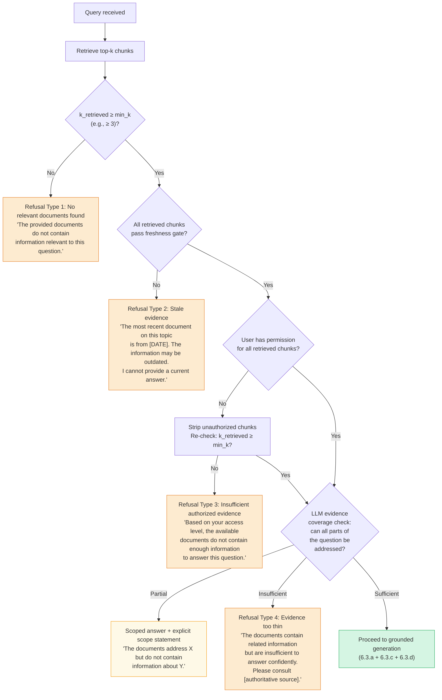

**The four refusal types and their exact phrasing patterns:**

| Type | Trigger condition | Phrasing pattern | What NOT to say |
|---|---|---|---|
| **1. No relevant documents** | k_retrieved < min_k | "The provided documents do not contain information relevant to this question." | ~~"I'm not sure about this, but…"~~ |
| **2. Stale evidence** | Retrieved chunks fail freshness gate | "The most recent document on this topic is from [DATE]. I cannot provide a current answer based on this information." | ~~"The policy may have changed, but as of [DATE]…"~~ (this still answers) |
| **3. Permission boundary** | User lacks access to the relevant chunks | "Based on your access level, the available documents do not contain enough information to answer this question." | ~~"I don't have access to answer that"~~ (reveals too much about data structure) |
| **4. Thin evidence** | Chunks retrieved but coverage insufficient for the specific question | "The documents contain related information but are not sufficient to answer this question confidently. Please consult [authoritative source]." | ~~"Based on general knowledge…"~~ (bypasses RAG entirely) |

**The three phrases that signal a broken refusal — and why they fail:**

1. **"I'm not sure but…"** — This is a soft refusal that still answers. The LLM is hedging rather than refusing. The user reads the following content as an answer with a caveat, not as a refusal. Fix: remove the hedge and state the refusal cleanly.
2. **"Generally speaking…"** — This is a refusal bypass. The LLM is switching from RAG mode to parametric memory mode without flagging it. The user receives a non-grounded answer dressed as a document-backed one. Fix: add explicit system prompt constraint: "Do NOT answer with 'generally speaking' or 'in general' — if the documents are insufficient, refuse."
3. **"You may also want to check…"** — This is sycophantic speculation appended to a refusal (6.3.d). It sends the user to an unverified source, implying the system knows where to find the answer. Fix: if refusing, refuse cleanly and optionally provide a static, pre-approved referral (e.g., "For current guidance, consult the official policy portal at [URL]").

---

### Module Integration — The 11-Subtopic Mental Map

Every subtopic you've learned maps to a specific failure mode in the pipeline. Use this table as a quick revision and diagnostic reference:

| If this breaks in prod… | Root subtopic | First thing to inspect |
|---|---|---|
| Answers are wrong because the corpus had outdated, low-quality, or duplicate content | **6.1.a** | Source inventory scores; re-run quality audit on the affected source |
| Text is garbled or key sections are missing after ingestion | **6.1.b** | Parser selection for that file type; inspect raw parser output before embeddings |
| Retrieval misses the right answer even though it exists in the corpus | **6.1.c** | Chunk boundaries around the relevant passage; are context-spanning answers split across two chunks? |
| Answers are stale / missing freshness warnings / permissions not filtering | **6.1.d** | Metadata in vector store; run a spot-check on `last_modified` and `permissions` fields for 10 recent chunks |
| Similar questions get very different answers; retrieval is noisy | **6.2.a** | Check that query embedding model = ingestion embedding model; inspect top-k score distribution (is k=3 vs k=5 making a difference?) |
| Context window overflow / answers get cut off / low-quality chunks in prompt | **6.2.b** | Context packer: check deduplication logic and token counting; reduce k or tighten chunk size |
| User asks "where did this come from?" and citations are broken or incomplete | **6.2.c** | Citation map: verify `[DOC N] → source_url + page` mapping; check deep-link validity rate |
| Answers sometimes confidently wrong with no signal of failure | **6.2.d** | Run the 6 baseline failure checks; look at `retrieval_k_used` and `citation_grounding_rate` in logs |
| LLM ignores retrieved context and answers from parametric memory | **6.3.a** | System prompt DOCUMENTS block format; test with an adversarial query about something not in the corpus — if it answers confidently, grounding is broken |
| System answers when it should refuse; users receiving unsupported answers | **6.3.b** | Refusal trigger: check min_k threshold, freshness gate, and LLM evidence-coverage instruction; look at `refusal_rate` trend |
| Citations are inconsistent, wrong page numbers, or don't match the quoted text | **6.3.c** | Citation assembly: verify citation map is built before generation; check verbatim quoting instruction for conditions/numbers |
| Answers blend facts and speculation; users acting on unsourced advice | **6.3.d** | Epistemic audit: run keyword scan for sycophantic speculation phrases; check `speculation_rate` and `inference_labeling_rate` |

---

### Module Synthesis Exercises

**Exercise 1 — Design the system (open-ended, 20 minutes)**

You are building a RAG system for a healthcare insurance company. The system answers member questions about their benefits using a corpus of: (a) plan documents (PDFs, updated annually), (b) an FAQ knowledge base (HTML, updated weekly), (c) regulatory requirement documents (PDFs, rarely updated but legally authoritative). Members have different plan types; each member should only see information relevant to their plan.

Design the complete baseline RAG system covering:
1. Ingestion design: how would you chunk each source type? What metadata would you attach?
2. Retrieval design: what freshness thresholds would you set for each source? How would you enforce plan-level permissions?
3. Generation design: what does the system prompt look like? What refusal conditions would you set? What would the citation format be?
4. What is the single most likely failure mode in year 1, and which subtopic does it map to?

**Suggested answer outline:**

| Component | Decision | Reasoning |
|---|---|---|
| **PDF plan documents** | Section-aware chunking on section headings; fixed-size fallback within sections (≤400 tokens); metadata: `doc_type=plan_doc`, `plan_id`, `effective_date`, `section_heading`, `last_modified` | Plan documents have clear section structure; section-aware chunking keeps benefit definitions intact; `plan_id` enables permissions filtering; `effective_date` enables freshness gating |
| **FAQ knowledge base** | Fixed-size chunking on Q&A pairs (each Q+A as one chunk); metadata: `doc_type=faq`, `last_modified`, `plan_id` or `plan_ids=["all"]` | FAQ entries are already self-contained units; no benefit to recursive splitting; freshness important since FAQs update weekly |
| **Regulatory documents** | Section-aware; conservative chunk size (≤300 tokens) to preserve exact statutory language; metadata: `doc_type=regulatory`, `regulation_id`, `last_modified`, `jurisdiction` | Regulatory text must not be split mid-sentence; verbatim quoting required; freshness less critical but `last_modified` still set for audit |
| **Freshness thresholds** | Plan docs: flag if `last_modified` > 365 days. FAQs: flag if > 90 days. Regulatory: flag if > 730 days. | Plan docs update annually; FAQs are volatile; regulatory is slow but still date-stamped |
| **Permissions** | Filter retrieved chunks by `plan_id` matching the authenticated member's plan; chunks with `plan_ids=["all"]` always pass | Members must never receive information about a plan they don't hold; this is a data access control requirement |
| **System prompt** | DOCUMENTS block + "Answer only from documents below. Do not provide medical advice. Do not generalize across plan types." | "Do not generalize" prevents the LLM from synthesizing coverage rules that are plan-specific |
| **Refusal conditions** | Refuse if k_retrieved < 3, if all retrieved chunks are from a stale source, if post-permission-filter leaves < 2 chunks | Benefits questions require at least 2 corroborating chunks; a single stale FAQ answer is not sufficient |
| **Citation format** | Inline `[DOC N]` + full reference block with `doc_title`, `section_heading`, `effective_date`, `page` | Members may need to reference the exact plan document section for dispute resolution; citation must be fully auditable |
| **Most likely year-1 failure** | **Stale FAQs causing incorrect benefit information** (6.1.d + 6.1.a) | FAQs update weekly; if the ingestion pipeline runs monthly, members receive outdated answers to common questions with high confidence. The fix: automate FAQ re-ingestion weekly with a freshness gate that flags any FAQ chunk older than 90 days for review. |

---

**Exercise 2 — Diagnose the failure (5 minutes)**

A customer support RAG system is receiving user complaints: "The system told me I was eligible for a discount but when I called support they said the promotion ended 3 months ago." The logs show: `k_retrieved=5`, `citation_grounding_rate=0.94`, `refusal_rate=0.02`. All 5 retrieved chunks have `last_modified` dates from 8 months ago, but the freshness threshold is set to 365 days.

What failed? Which subtopic? What is the fix?

**Answer:**
- **What failed:** The freshness threshold is too permissive (365 days) for promotional content that changes every few months. The system retrieved 5 chunks correctly (high citation grounding), but all 5 were stale — they accurately described a promotion that had since ended. The system answered confidently and correctly from those chunks, which is why `refusal_rate` is low — the evidence was sufficient by volume but not by recency.
- **Which subtopic:** **6.1.d** (Metadata Design — Freshness) and **6.2.d** (Failure Mode: stale-but-confident answers).
- **Fix:** Split freshness thresholds by content category. Promotional content gets a 30-day threshold; policy content gets 180 days. When a query matches a document of type `promotion` or `offer`, apply the 30-day gate. If chunks are stale, trigger Refusal Type 2: "The most recent information on this promotion is from [DATE]. This offer may no longer be active. Please check the current promotions page."

---

### Active Recall — Module 6 Full Sweep

Attempt these from memory before checking the answers. These span all three topics.

1. **(6.1.c)** You have a 200-page pharmaceutical regulatory submission (PDFs with structured sections: Background, Methods, Results, Safety, Conclusion). Which chunking strategy and why?

   **Answer:** Section-aware chunking. The document has clear labeled sections; preserving section boundaries keeps regulatory context intact — a "Results" chunk should not be split into a "Methods" chunk. Each section becomes one or more chunks with the section heading in metadata. Within-section fixed-size at ≤400 tokens as a fallback. Never fixed-size only — "Safety" and "Results" sections may span multiple pages and must not be arbitrarily cut.

2. **(6.2.a)** At ingestion you used `text-embedding-ada-002`. Six months later you switch to `text-embedding-3-small` for new documents. What breaks and how do you fix it?

   **Answer:** Vector space mismatch. The old chunks are embedded in the Ada-002 space; new queries use the 3-small space. Cosine similarity scores between old chunk vectors and new query vectors are semantically meaningless — retrieval degrades silently. The metric that reveals this: `hit_rate@k` drops noticeably for queries about older documents. The fix: full re-embedding of all existing chunks with the new model before switching. Lock the embedding model version in config; treat an embedding model change as a full re-indexing event.

3. **(6.2.b)** Your context packing is set to k=10. You find that `context_utilization_rate` (fraction of packed tokens cited in the final answer) is 0.18. What does this signal and what should you do?

   **Answer:** 82% of the packed tokens are not cited — they are being processed by the LLM but contributing nothing to the answer. This is wasted context budget, wasted inference cost, and increased noise risk (irrelevant chunks can distract the model). Reduce k to 4–5 and measure whether `citation_grounding_rate` changes. If it doesn't, you were packing irrelevant chunks — tighten the similarity threshold or add metadata pre-filtering before packing.

4. **(6.3.b)** A user asks: "Will the new regulation require us to file quarterly reports?" The retrieved chunks describe the regulation's scope but contain no mention of quarterly reporting requirements. Write the exact refusal response.

   **Answer:** *"The provided documents describe the scope of the regulation but do not contain information about quarterly reporting requirements. I cannot answer this question from the available documents. For authoritative guidance, consult [authoritative source]."* — Note: no hedge, no "I think", no "generally companies are required to…", no sycophantic addition. Clean, specific, and directs to a real source.

5. **(6.3.d)** An answer contains: "The service plan covers hardware failures within 24 months [DOC 1]. Since your device was purchased 18 months ago, you are covered. Liquid damage may also be covered under some extended warranty plans." Classify each sentence and identify which requires intervention.

   **Answer:** Sentence 1: **FACT** — cited, verifiable from DOC 1. Sentence 2: **INFERENCE** — correctly derived from DOC 1 using the purchase date; should be labeled "Based on [DOC 1], since your device is 18 months old, it follows that…" but the inference itself is grounded. Sentence 3: **SPECULATION** — "under some extended warranty plans" is not in DOC 1 or any retrieved chunk; this is sycophantic speculation about a different product type. Intervention required on Sentence 3: strip it entirely, or replace with: "NOTE (not from documents): Extended warranty coverage for liquid damage varies — check your specific plan documentation."

---

### Module 6 — Completion Signal

**You have completed Module 6: RAG Foundations when you can, from memory:**

- [ ] Sketch the full RAG pipeline (ingestion → retrieval → generation) with the key design decision at each stage
- [ ] Explain, in two sentences, why chunking and metadata are often more impactful than model swapping
- [ ] Write a grounded answer system prompt for a compliance-sensitive domain from scratch
- [ ] Write all four refusal types with their exact trigger conditions and phrasing
- [ ] Classify any three-sentence RAG answer as FACT / INFERENCE / SPECULATION without prompting
- [ ] Name the single first metric to check for each of the three major failure classes: retrieval miss, stale answer, epistemic blur
- [ ] Design a freshness + permissions metadata schema for a new corpus from scratch

If you can do all seven, you are ready for **Module 7 (RAG Evaluation and Quality Metrics)** — where you will learn to measure retrieval precision, answer faithfulness, and context coverage at production scale using RAGAS-style frameworks.

---

## Module Glossary

| Term | Definition |
|---|---|
| **RAG (Retrieval-Augmented Generation)** | A pattern where an LLM answers using context chunks retrieved from an external store at query time rather than from its parametric memory. |
| **Source inventory** | A structured catalogue of all candidate data sources, their owners, update cadence, format, and access controls. |
| **Content-quality audit** | A scoring pass over each source measuring freshness, noise, duplication, relevance, and sensitivity. |
| **Noise** | Boilerplate text, navigation menus, headers/footers, ads, or repeated disclaimers that carry no informational value for retrieval. |
| **Duplication** | Near-identical chunks across documents that inflate retrieval scores without adding coverage. |
| **Data lineage** | The traceable path from a raw source document to its stored embedding, including every transformation applied. |
| **Freshness** | How recently a document was updated; staleness in fast-moving domains is a primary cause of wrong RAG answers. |
| **Noise ratio** | Fraction of text lines (or tokens) in a document that match known boilerplate patterns. |
| **Dup fingerprint** | A hash (e.g., MD5 of normalized text) used to detect exact or near-exact duplicate documents. |
| **Gate decision** | The pass / conditional / fail verdict assigned to a source after audit, determining whether it proceeds to the chunking pipeline. |
| **Sensitivity class** | A label (public / internal / confidential) assigned to a source based on its access controls and data risk; drives PII scan depth and human-review requirements. |
| **Data residency** | Legal or contractual requirement that data (including embeddings) must not leave a specified geographic or network boundary. |
| **Incremental audit** | Re-auditing only documents modified since the last audit run, rather than re-scanning the full corpus; required at scale. |
| **Parser** | Software that reads a file format and emits structured text + metadata. |
| **OCR (Optical Character Recognition)** | Converting scanned image pixels into machine-readable text; required for image-only PDFs. |
| **Text-layer PDF** | A PDF whose text is stored as selectable characters (not pixels); directly extractable without OCR. |
| **Scanned PDF** | A PDF where pages are stored as images; requires OCR before any text extraction is possible. |
| **Boilerplate stripping** | Removing repeated non-informational content (headers, footers, nav menus, cookie banners) from parsed output. |
| **Metadata preservation** | Keeping source signals (title, page, section, URL, last-modified) attached to extracted text throughout the pipeline. |
| **Connector** | A purpose-built integration that reads a knowledge-base platform (Confluence, Notion, SharePoint) via API and emits normalized document records. |
| **chars_per_page** | Diagnostic metric: total extracted characters divided by page count; values below ~50 for multi-page PDFs indicate a scanned (image-only) PDF misrouted to a text-layer parser. |
| **Format router** | A pipeline component that detects a file's MIME type and dispatches it to the correct parser; the entry point of any multi-format ingestion system. |
| **Normalizer** | A function that accepts the raw output of any parser (different shapes) and emits a standard Document record — the contract between parsing and all downstream pipeline stages. |
| **Chunk** | A contiguous text fragment emitted by the chunking step and subsequently embedded as a single vector. |
| **Chunk size** | The maximum number of tokens (or characters) allowed in one chunk; always measure in tokens for production systems. |
| **Overlap** | A configurable number of tokens repeated at the end of chunk N and the start of chunk N+1 to reduce information loss at boundaries. |
| **Fixed-size chunking** | Split text every N tokens regardless of content structure; fast but boundary-unaware. |
| **Recursive chunking** | Attempt splits at paragraph → sentence → word → character boundaries in order, falling back to the next level only when a chunk exceeds the size limit. |
| **Semantic chunking** | Use embedding cosine similarity between consecutive text units to find cut points — split where similarity drops below a threshold, indicating a topic shift. |
| **Section-aware chunking** | Use document structure (heading hierarchy, numbered clauses) as natural chunk boundaries; one chunk per logical section. |
| **Parent-child chunking** | A hierarchical strategy where small child chunks are indexed for precise retrieval and each child references a larger parent section returned to the LLM as context. |
| **Boundary orphaning** | A failure where a key sentence is split across two chunks by a fixed-size splitter and represented fully in neither, reducing retrieval recall. |
| **recall@k** | The fraction of queries for which the correct passage appears in the top-k retrieved chunks; the primary metric for validating chunking and retrieval quality. |
| **Token-based chunking** | Measuring chunk size in model tokens (via a tokenizer like tiktoken) rather than characters; required for accurate size control across multilingual and code-heavy corpora. |
| **Metadata envelope** | The structured key-value payload attached to every vector record alongside the embedding; used for filtering, ranking, and provenance tracing. |
| **Pre-filtering (metadata filtering)** | Applying metadata constraints before ANN vector search, reducing the candidate set before similarity scoring begins; the primary latency and cost optimisation in filtered retrieval. |
| **Post-filtering** | Applying metadata constraints after ANN retrieval, removing ineligible results from the returned set; a safety net, not a replacement for pre-filtering. |
| **Permissions filter** | A metadata-driven gate that restricts which chunks are retrievable based on the requesting user's identity or group membership; the security boundary in multi-user RAG systems. |
| **Freshness filter** | A metadata-driven gate that excludes chunks whose `last_modified` timestamp is older than a configurable threshold, preventing stale content from reaching the LLM. |
| **Provenance** | The traceable link from a retrieved chunk back to its origin document, section, and ingestion run; required for incident investigation and citation. |
| **ACL (Access Control List)** | A list of principals (users, groups, roles) permitted to read a given resource; when stored on chunk metadata, enables permission-aware retrieval. |
| **Metadata cardinality** | The number of distinct values a metadata field can take; high-cardinality fields enable precise filtering but are more expensive to index in some vector stores. |
| **Deprecation sweeper** | A scheduled job that marks old chunk versions `deprecated = true` after a new version is ingested; prevents superseded content from being retrieved. |
| **Freshness policy table** | A configuration mapping source_type → ttl_days that drives the `ttl_days` metadata field; centralises freshness policy so it can be changed without modifying pipeline code. |
| **Metadata schema registry** | A single canonical Pydantic model defining all metadata fields, their types, required/optional status, and validation rules; enforced at enrichment time to prevent null and type-mismatch bugs. |
| **Sidecar database** | A relational database (e.g., PostgreSQL) keyed by chunk_id that stores metadata fields not needed for vector-store filtering; reduces per-vector metadata storage cost at scale. |
| **Query embedding** | The dense vector representation of a user's query, produced by running the query text through an embedding model; must be produced by the same model used at ingestion time. |
| **Top-k retrieval** | Returning the k chunk vectors with the highest similarity score to the query vector; k is a configurable parameter controlling the recall-precision tradeoff. |
| **Cosine similarity** | A similarity measure between two vectors = dot product / (‖A‖ × ‖B‖); ranges −1 to 1; 1 = identical direction; the standard metric for comparing embeddings. |
| **ANN (Approximate Nearest Neighbor)** | Search algorithms (HNSW, IVF) that find near-optimal nearest neighbors without exhaustively scanning all vectors; enables sub-100ms retrieval over millions of vectors with <1% recall loss. |
| **Vector database** | A storage system optimized for embedding vectors and ANN search (e.g., Pinecone, Weaviate, Qdrant, pgvector); typically stores the vector alongside a metadata payload per chunk. |
| **Embedding symmetry** | The requirement that the query and document chunks are embedded with the exact same model; mixing models produces geometrically meaningless similarity scores with no error thrown. |
| **HNSW (Hierarchical Navigable Small World)** | The dominant ANN index algorithm; builds a multi-layer navigable graph over vectors enabling logarithmic-time approximate nearest neighbor search. |
| **Cross-encoder reranker** | A model that takes a (query, chunk) pair as joint input and produces a precise relevance score; far more accurate than cosine similarity but 10–50x slower; used in the second stage of two-stage retrieval (ANN → rerank). |
| **Two-stage retrieval** | A retrieval pattern: (1) fast ANN search retrieves top-k' candidates by cosine similarity; (2) a cross-encoder reranker re-scores and returns the top-k highest-precision results; standard for high-stakes RAG. |
| **Hybrid search** | Combining dense vector retrieval (semantic) with sparse retrieval (BM25/keyword) and fusing the ranked lists (e.g., via RRF); improves recall on both short/keyword queries and long/semantic queries. |
| **RRF (Reciprocal Rank Fusion)** | A score fusion method that combines rankings from multiple retrieval systems by summing 1/(rank + k) for each document across systems; used to merge BM25 and dense vector rankings. |
| **HyDE (Hypothetical Document Embedding)** | A retrieval technique where an LLM generates a hypothetical ideal answer to the query, that synthetic answer is embedded and used as the search vector; improves recall when query and document phrasings are very different. |
| **Lost in the middle** | An LLM attention failure mode where context chunks in the middle of a long prompt are underweighted; a key reason to use a reranker to reduce k before passing chunks to the LLM. |
| **recall@k** | The fraction of test queries for which the correct chunk appears in the top-k retrieved results; the primary offline metric for evaluating retrieval quality. |
| **MRR@k (Mean Reciprocal Rank)** | Average of 1/rank_of_first_correct_result across test queries; measures how high the correct chunk ranks, not just whether it appears in top-k. |
| **Query expansion** | Enriching a short user query with additional context words before embedding to improve embedding quality and retrieval recall. |
| **Chunk hydration** | Resolving retrieved chunk IDs back to their full text and metadata from the vector store payload; the step between ANN search and context assembly. |
| **Context window** | The maximum number of tokens an LLM can process in a single forward pass, covering both input (prompt) and output (generation) combined. |
| **Token budget** | The deliberate allocation of the context window across its components: system prompt + retrieved chunks + user query + generation reserve; must sum to ≤ context_window. |
| **Context packing** | The structured process of assembling prompt components (system prompt, chunks, query) to maximize useful signal in the context window without overflow or wasted space. |
| **Prompt stuffing** | The naive approach of concatenating all retrieved chunks into a prompt without token budget control, ordering strategy, or chunk labeling; breaks silently at scale. |
| **Generation reserve** | The portion of the context window kept empty (not filled by the prompt) so the model has space to generate a complete response; minimum 300–500 tokens for short answers, 1000–2000 for long-form generation. |
| **Silent truncation** | When a prompt exceeds the context window and the LLM API truncates the end of the prompt without raising an error; causes the model to answer as if dropped chunks don't exist. |
| **Token counting** | Converting text to tokens using the model's tokenizer (e.g., `tiktoken`) to accurately measure prompt size; character or word counts are unreliable substitutes. |
| **tiktoken** | OpenAI's fast tokenizer library; the correct tool for counting tokens for GPT-3.5, GPT-4, and GPT-4o models before sending prompts to the API. |
| **Stuffed-sandwich ordering** | A chunk ordering strategy that places the highest-ranked chunk at position 1 (primacy) and the second-highest at the last position (recency), with remaining chunks in the middle; improves LLM utilization of top results at k≥5. |
| **Primacy/recency bias** | The empirical observation that LLMs attend more strongly to content at the beginning and end of a long context window, underweighting content in the middle. |
| **Context utilization** | The ratio of total prompt tokens to context window size (e.g., 72%); a monitoring metric targeting 70–85% for a balance of coverage and headroom. |
| **chunks_truncated** | A monitoring metric counting how many retrieved chunks were dropped during context packing due to budget exhaustion; consistently > 0 signals k is too high or chunks are too large. |
| **Formatting overhead** | Tokens consumed by chunk labels, separators, template structure, and other non-content text in the assembled prompt; must be included in the token budget calculation. |
| **Provenance chain** | The traceable path from a generated answer claim → chunk_id → document metadata → original source file; the backbone of citation traceability and audit. |
| **Citation mapping** | The process of linking each factual claim in the LLM's answer to the specific retrieved chunk(s) that support it, using inline markers or structured output. |
| **Grounding verification** | Server-side check that every citation the LLM outputs refers to a chunk that was actually in the retrieved context; catches hallucinated citations before they reach the user. |
| **Hallucinated citation** | A citation number, chunk ID, or source reference the LLM generates that does not correspond to any chunk in the packed context; produced because LLMs predict plausible-looking text, not because they index documents. |
| **doc_map** | A server-side dictionary mapping each DOC index (1, 2, 3…) in the packed prompt to its actual chunk_id and metadata; created at context packing time and used as the grounding verification ground truth. |
| **Structured citation output** | A JSON-schema citation format where the LLM returns `{"answer": "...", "citations": [...]}` rather than inline markers; machine-parseable and harder to hallucinate than free-text footnotes. |
| **Citation accuracy** | The fraction of citations in the LLM's answer that are verified as grounded (correct doc_index, correct chunk_id, chunk text supports the claim); the primary trust metric for citation-aware RAG. |
| **Claim-support check** | A grounding verification step that goes beyond citation existence to verify the cited chunk's text actually entails or supports the specific claim made in the answer; implemented via fuzzy match, cosine similarity, or NLI. |
| **NLI (Natural Language Inference)** | A model task that determines whether a hypothesis (the LLM's claim) is entailed, contradicted, or neutral with respect to a premise (the cited chunk); used for deep grounding verification in high-stakes RAG. |
| **Weak grounding** | A citation that exists in the retrieved set but whose chunk text is only tangentially related to the specific claim — topically relevant but not directly supporting; riskier than a clear hallucination because it's harder to detect. |
| **Citation granularity** | The precision level of a citation: document-level (filename) < section-level (section heading) < chunk-level (chunk_id + page + paragraph); chunk-level is the production standard for any system where citations are verified or audited. |
| **Stage isolation** | The debugging method of testing each RAG pipeline stage independently with its own observable signal to identify which stage is responsible for a failure; the foundation of systematic RAG debugging. |
| **Golden test set** | A curated set of (query → expected_chunk_id) pairs used to measure recall@k and catch regressions; the primary regression test suite for RAG retrieval quality; should grow continuously from user-reported failures. |
| **RAG debugging ladder** | A structured decision tree for isolating RAG failures: check retrieval → check packing → check formatting → check generation → check citations; always start at retrieval, not generation. |
| **Retrieval inspection** | The act of directly querying the vector store for a failing query and examining the returned chunk IDs and scores; the first step in every RAG debugging session. |
| **Symptom-to-stage map** | A lookup table mapping observable failure symptoms (e.g., "I don't know", "confident wrong answer", "data leak") to the pipeline stage most likely responsible and its first debugging action. |
| **Score distribution** | The spread of similarity scores across the top-k retrieved results; a narrow distribution (e.g., 0.68–0.62) signals uncertain retrieval and benefits from a cross-encoder reranker; a ≈0.5 flat distribution signals embedding mismatch. |
| **Answer faithfulness** | An evaluation metric measuring whether the LLM's answer is grounded in the retrieved context vs. using parametric memory; measured by LLM-as-judge or NLI evaluation against the packed chunks. |
| **Context anchor instruction** | The system prompt directive that explicitly restricts the LLM to use only the provided documents for its answer (e.g., "Answer ONLY from the documents below. Do NOT use prior knowledge."); the primary defense against hallucination-over-context failures. |
| **Ingestion gate** | An assertion in the ingestion pipeline that blocks a batch of chunks from entering the index if they fail a quality or consistency check (e.g., wrong embedding model, missing metadata, zero-length text); prevents silent ingestion failures. |
| **P0 RAG failure** | A failure with immediate security, legal, or financial impact (e.g., cross-tenant data leak) that must be fixed before the next request is served; treated as a deployment blocker, not a quality regression. |
| **Grounded answer prompting** | Structuring the system prompt to anchor the LLM's output exclusively to retrieved context, using both positive anchors and negative constraints to prevent parametric memory from supplementing or overriding the answer. |
| **Parametric memory** | Facts and patterns an LLM learned during pre-training, stored in model weights; accessed by default in generation unless explicitly blocked by a grounding constraint in the system prompt. |
| **Grounding strength** | A 5-level spectrum (0=no anchor to 4=strict+verbatim) describing how strongly the system prompt constrains the LLM to use only retrieved context; Level 3 is the production standard for most RAG systems. |
| **Uncertainty disclosure** | An explicit system prompt instruction specifying the exact phrase the LLM must output when the answer is not in the retrieved context (e.g., "I don't have information about that in the provided documents."); prevents confident hallucination for out-of-scope queries. |
| **Negative constraint** | A prompt instruction that explicitly forbids a behavior ("Do NOT use prior knowledge") rather than just requesting a positive behavior; empirically reduces parametric leakage by 40–70% vs. positive-only anchors. |
| **Out-of-scope query** | A user question whose answer is not present in any retrieved chunk; must be handled by an uncertainty disclosure instruction, otherwise the LLM generates a fabricated confident answer. |
| **Parametric leak / parametric blending** | A generation failure where the LLM supplements or replaces retrieved context with facts from training data; produces answers that look correct but contain training-era values, jurisdiction-incorrect rules, or subtly distorted figures. |
| **Answer faithfulness** | An evaluation metric (0–1) measuring whether the LLM's answer is derived solely from the retrieved context; measured by LLM-as-judge or NLI entailment against the packed chunks. |
| **idk_rate** | The fraction of LLM responses using the configured uncertainty disclosure phrase; too low signals hallucination on out-of-scope queries; too high signals broken retrieval (correct chunks not reaching the prompt). |
| **Verbatim instruction** | A system prompt rule requiring the LLM to quote numerical values, dates, legal terms, or dosage figures exactly as they appear in the source chunk rather than paraphrasing; required for Level 4 grounding in medical, financial, or regulatory RAG. |
| **Parametric leak rate** | The fraction of generated answers containing facts not present in any retrieved chunk; measured by post-processing or LLM-as-judge; the primary signal that context anchor strength is insufficient. |
| **Evidence insufficiency** | Any condition where retrieved context does not meet the quality threshold for a confident grounded answer — covers zero coverage, partial coverage, conflicting evidence, and stale evidence; each type requires a different system response. |
| **Hard refusal** | The RAG system response when zero relevant evidence is retrieved (max similarity score below threshold); the system declines entirely: "I don't have information about that in the provided documents." |
| **Soft refusal** | The RAG system response when evidence partially covers the query; the system answers what is available and explicitly flags the coverage gap with a caveat. |
| **Conflict disclosure** | The RAG system response when retrieved chunks contradict each other; the system surfaces both claims with their sources and declines to pick one, requiring the user to review both directly. |
| **Staleness warning** | The RAG system response when retrieved evidence is present and relevant but the `last_modified` timestamp exceeds a freshness threshold; the system answers but surfaces the age of the source. |
| **Pre-generation gate** | A signal-based check run before the LLM call that classifies evidence quality into SUFFICIENT / PARTIAL / CONFLICT / STALE / NONE and routes to the appropriate prompt template or refusal response. |
| **False refusal** | A refusal triggered for a query whose answer is in the corpus; caused by similarity threshold set too high for the embedding model's score range or by retrieval failure. |
| **False answer** | An answer generated for a query whose answer is genuinely not in the corpus; caused by the evidence gate threshold being too permissive, letting noise chunks through to generation. |
| **Refusal calibration triangle** | The three-metric system for measuring refusal quality: `true_refusal_rate` (correct refusals) + `false_refusal_rate` (over-refusal) + `false_answer_rate` (under-refusal); all three must be monitored simultaneously since tuning one affects the others. |
| **Evidence router** | A pipeline component that takes retrieval signals (scores, chunk count, timestamps, conflict detection) and returns an `EvidenceClass` enum used to select the appropriate generation path or refusal template. |
| **Threshold calibration** | The process of setting the similarity threshold for evidence gates by running a golden test set and finding the natural gap between "relevant" and "noise" match score distributions; must be done per embedding model and corpus. |
| **Post-generation faithfulness gate** | A second-line-of-defense check run after LLM generation that measures answer faithfulness against packed chunks and strips the response if the faithfulness score is below a threshold; catches generation-layer failures that the pre-gen gate cannot. |
| **Citation object** | A structured data record carrying all provenance and display data for a single citation: chunk_id, source_title, section, page, URL, last_modified, doc_version, quote, and confidence; the production unit of citation traceability. |
| **Citation format** | The visual/structural representation of a citation in output — inline bracket `[1]`, named inline, footnote, source block, or JSON array; selected per output surface, not per citation. |
| **Citation rendering layer** | The pipeline component that takes a `Citation` object and emits the correct format string for a given output surface (chat UI, API, PDF, email, Slack); a stateless, surface-aware transformation. |
| **Verbatim quote** | The exact, unedited text from the source chunk included alongside a citation; mandatory for numerical values, dosages, legal clauses, and policy thresholds where paraphrase could distort meaning. |
| **Deep link** | A citation URL constructed to point to a specific location within a document (section anchor or page number) rather than the document root; requires `anchor_id` or `page_number` in chunk metadata at ingestion time. |
| **Citation deduplication** | Collapsing multiple inline citations to the same source document into a single source block entry with multiple section/page sub-entries; keeps references lists readable for multi-citation answers. |
| **Bibliographic completeness** | The requirement that a citation contains all fields needed for independent verification: source_title, section, page, source_url (public-facing), last_modified, doc_version, and (for precision claims) verbatim quote. |
| **Citation completeness rate** | The fraction of citations with all required metadata fields populated; below 95% signals a metadata gap in the ingestion pipeline for one or more source types. |
| **Deep-link validity rate** | The fraction of deep links in the citation index that resolve to a live, correct anchor; measured by a periodic async crawl; broken links erode user trust in citations. |
| **Anchor_id** | The CSS/HTML fragment identifier for a section within a web document (e.g., `section-3-1`); stored in chunk metadata at ingestion time and appended to `source_url` to form a deep link. |
| **Provenance replay** | The ability to reconstruct, from a stored `query_id`, the exact chunks cited, their text at query time, and the document version used; requires an immutable citation log keyed by chunk_id. |
| **Epistemic category** | The type of claim being made in an LLM answer — direct evidence (cited fact from a retrieved chunk), supported inference (derived from evidence through stated reasoning), or speculation (beyond retrieved context). |
| **Epistemic blur** | The failure mode where evidence, inference, and speculation are mixed in prose without labeling, making each category indistinguishable to the reader. |
| **Supported inference** | A conclusion explicitly drawn from retrieved evidence through stated reasoning; grounded but not a direct quote from any document; must be labeled as inference, not fact. |
| **Speculation** | An LLM-generated claim that goes beyond what any retrieved chunk supports; includes sycophantic additions, procedural suggestions, and completions drawn from parametric training data. |
| **Epistemic marker** | A label (e.g., `[FACT]`, `[INFERENCE]`, `[NOTE]`) or structural section header (e.g., `EVIDENCE:`, `REASONING:`) that signals to the reader which epistemic category a sentence belongs to. |
| **Epistemic audit** | A post-generation classification pass that labels each sentence in an LLM answer as FACT, INFERENCE, or SPECULATION; used to strip or flag speculative content before the response is returned to the user. |
| **Show-your-work instruction** | A system prompt pattern that requires the LLM to structure its answer in explicitly labeled sections — Evidence first, Reasoning second — making the inference step visible and auditable rather than implicit. |
| **Sycophantic speculation** | A specific form of speculation where the LLM adds helpful-sounding suggestions drawn from training patterns about what users in a similar situation would want to hear, with no retrieved document support; signature phrases include "you may also want to", "you might consider", and "it's worth." |
| **Epistemic audit pass rate** | The fraction of answers where all sentences labeled as EVIDENCE are verified against the packed chunks; a low rate signals that the LLM is presenting non-evidenced claims as document facts. |
| **Speculation detection rate** | The fraction of speculative sentences correctly identified and flagged by the epistemic audit system; a key quality signal for the post-generation filtering layer. |
| **Two-tier audit strategy** | A scaling pattern where a fast keyword/pattern scan (sub-millisecond) is applied to all queries, and a full LLM epistemic audit (second LLM call) is triggered only for flagged responses or high-risk query types. |
| **Context utilization rate** | The fraction of packed context tokens that are actually cited in the final answer; a low rate (< 30%) indicates over-packing — too many irrelevant chunks are being included, wasting token budget. |
| **Refusal rate** | The fraction of queries that result in a refusal response rather than an answer; too high signals retrieval or coverage problems; too low (near zero) in a domain with genuine gaps signals the refusal mechanism is broken. |
| **Evidence discipline** | The system property of consistently answering only from retrieved evidence and refusing confidently when evidence is insufficient; the foundation of user trust in a RAG system. |
| **Freshness threshold** | The maximum age (in days) of a chunk's `last_modified` timestamp before it triggers a stale-evidence warning or refusal; should be set per content category based on how frequently that source type changes. |
| **Grounding pre-check** | A gate applied before LLM generation that verifies: (a) minimum k chunks were retrieved, (b) all chunks pass the freshness threshold, and (c) the requesting user has permission for all retrieved chunks. |
| **Context packing budget** | The maximum number of tokens allocated for packed context chunks in the prompt; setting this correctly prevents context overflow and ensures the most relevant chunks are included, not just the most chunks. |
| **Sycophantic speculation** | (see 6.3.d) LLM-added helpful-sounding suggestions with no document support; the single most common form of epistemic blur in production RAG; signature phrases include "you may also want to" and "it's worth checking." |
