# Module 7 - Advanced Retrieval Engineering

This is the evolving knowledge base for Module 7.

**Module time:** 40h

**Why this module matters:** This is the module that turns simple RAG knowledge into market-relevant retrieval engineering.

---

## Quick Topic Index

- [Topic 7.1: Chunking, Metadata, and Hierarchical Retrieval](#topic-71-chunking-metadata-and-hierarchical-retrieval)
    - [Subtopic 7.1.a: Parent-Child Retrieval Patterns](#subtopic-71a-parent-child-retrieval-patterns)
    - [Subtopic 7.1.b: Document Hierarchy and Section Graph Modeling](#subtopic-71b-document-hierarchy-and-section-graph-modeling)
    - [Subtopic 7.1.c: Metadata-Driven Recall Improvements](#subtopic-71c-metadata-driven-recall-improvements)
    - [Subtopic 7.1.d: Chunk Overlap, Redundancy, and Context Compaction](#subtopic-71d-chunk-overlap-redundancy-and-context-compaction)
- [Topic 7.2: Query Transformation and Reranking](#topic-72-query-transformation-and-reranking)
    - [Subtopic 7.2.a: Query Rewriting and Expansion Strategies](#subtopic-72a-query-rewriting-and-expansion-strategies)
    - [Subtopic 7.2.b: Multi-Query Retrieval and Fusion](#subtopic-72b-multi-query-retrieval-and-fusion)
    - [Subtopic 7.2.c: Cross-Encoder and LLM Reranking](#subtopic-72c-cross-encoder-and-llm-reranking)
    - [Subtopic 7.2.d: Reciprocal Rank Fusion and Late Fusion](#subtopic-72d-reciprocal-rank-fusion-and-late-fusion)
- [Topic 7.3: Advanced RAG Patterns](#topic-73-advanced-rag-patterns)
    - [Subtopic 7.3.a: HyDE, Self-RAG, and Agentic Retrieval Patterns](#subtopic-73a-hyde-self-rag-and-agentic-retrieval-patterns)
    - [Subtopic 7.3.b: Multi-Hop Retrieval and Decomposition](#subtopic-73b-multi-hop-retrieval-and-decomposition)
    - [Subtopic 7.3.c: Knowledge Graph and GraphRAG Fundamentals](#subtopic-73c-knowledge-graph-and-graphrag-fundamentals)
    - [Subtopic 7.3.d: Conversation-Aware and Personalized Retrieval](#subtopic-73d-conversation-aware-and-personalized-retrieval)
- [Module 7 Checkpoint: Retrieval Quality Engineering](#module-7-checkpoint-retrieval-quality-engineering)
- [Module Glossary](#module-glossary)

**Covered so far:**
- Subtopic 7.1.a: Parent-child retrieval patterns
- Subtopic 7.1.b: Document hierarchy and section graph modeling
- Subtopic 7.1.c: Metadata-driven recall improvements
- Subtopic 7.1.d: Chunk overlap, redundancy, and context compaction
- Subtopic 7.2.a: Query rewriting and expansion strategies
- Subtopic 7.2.b: Multi-query retrieval and fusion
- Subtopic 7.2.c: Cross-encoder and LLM reranking
- Subtopic 7.2.d: Reciprocal rank fusion and late fusion
- Subtopic 7.3.a: HyDE, self-RAG, and agentic retrieval patterns
- Subtopic 7.3.b: Multi-hop retrieval and decomposition
- Subtopic 7.3.c: Knowledge graph and GraphRAG fundamentals
- Subtopic 7.3.d: Conversation-aware and personalized retrieval
- Module 7 checkpoint: Retrieval quality engineering all-round review

---

## Topic 7.1: Chunking, Metadata, and Hierarchical Retrieval

**Topic time:** 12h

Planned subtopics:
- Parent-child retrieval patterns - 3h
- Document hierarchy and section graph modeling - 3h
- Metadata-driven recall improvements - 3h
- Chunk overlap, redundancy, and context compaction - 3h

---

## Subtopic 7.1.a: Parent-Child Retrieval Patterns

Added to Knowledge Base.

**Subtopic time:** 3h

### 0. Reading Path + Level Tags

- **Beginner:** Read sections 1-2, section 6, and Active Recall.
- **Intermediate:** Add sections 3-5 and the Hands-On Lab.
- **Pro:** Do the full lab, inspect the failure cases, and answer the capstone system-design question.

---

### 1. Pre-Question Hook + The Intuition [Beginner]

**Pause: before reading, how would you retrieve a specific sentence from a 30-page policy while still giving the LLM enough surrounding context to answer correctly?**

**Parent-child retrieval** is a RAG retrieval pattern where the system searches over small, precise **child chunks** but returns larger **parent chunks** to the LLM. The child chunk is optimized for matching the user's query. The parent chunk is optimized for answer quality because it carries surrounding context, definitions, caveats, and citations.

The core tension is simple:

- Small chunks improve matching because they contain fewer unrelated words.
- Large chunks improve answer generation because they preserve context.
- Parent-child retrieval gives you both by separating the chunk used for search from the chunk used for generation.

**Real-world analogy:** Think of a book index. You search the index for a precise term like "termination without cause," but you do not read only the index entry. You jump to the full page or section where the term appears. The analogy breaks down because a vector index does not store exact alphabetical entries; it stores semantic coordinates that can match approximate meaning, not just exact terms.

Key terms:
- **Parent-child retrieval:** A hierarchical retrieval pattern that searches small child chunks, then expands each hit to a larger parent chunk before context packing.
- **Child chunk:** A small text unit embedded into the vector index for precise semantic matching.
- **Parent chunk:** A larger text unit, usually a section or page, fetched after a child match so the LLM receives enough surrounding evidence.
- **Hierarchical retrieval:** Retrieval that preserves document structure across levels such as document -> section -> paragraph -> sentence.
- **Context expansion:** The step where a retrieved child hit is expanded into its parent, neighbors, or another larger evidence unit.

The mental model to keep permanently: **search small, answer big.**

---

### 2. Visual Diagram (Mermaid) [Beginner]

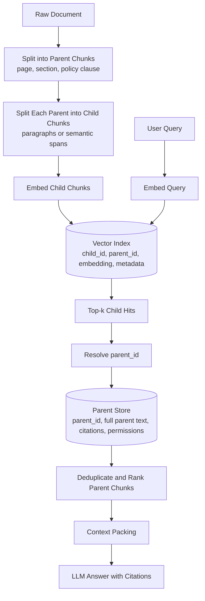

What the diagram is really saying:

- The vector index stores children because children are better retrieval targets.
- The parent store preserves larger text because parents are better answer context.
- `parent_id` is the bridge. If that mapping is wrong, the whole pattern breaks.

---

### 3. Real-World Industry Scenarios [Intermediate]

#### Scenario A - Enterprise Policy Assistant

**Product/use case context:** A healthcare company builds an internal assistant for HR, compliance, and security policies. Users ask questions like "Can a contractor access production data from a personal laptop?" The exact answer may live in one paragraph, but the conditions and exceptions may be in the same section or adjacent section.

**Why parent-child matters:** If you embed whole policies as large chunks, the query vector becomes diluted by many unrelated topics. The system may retrieve a broad "Security Policy" chunk but miss the exact contractor clause. If you embed tiny paragraphs only, the LLM may see the contractor sentence but not the exception about temporary access approvals. Parent-child retrieval searches the precise paragraph and returns the full policy section.

**Constraints:**
- **Latency:** Parent expansion adds a second lookup after vector search. In production, parent fetch should be a fast key-value or document-store lookup, usually single-digit milliseconds if cached.
- **Cost:** Larger parent chunks consume more prompt tokens. This pattern improves answer quality, but careless expansion can double or triple LLM input cost.
- **Reliability:** Parent chunks must preserve authority and freshness. A child from an old policy version must not expand into a stale parent or mix with a newer parent.
- **Security/privacy:** Parent expansion must re-check permissions. A user authorized for one paragraph is usually authorized for the section, but this is not always true in legal, medical, HR, or customer-specific systems.

**What good looks like in production:** The assistant retrieves child chunks with high semantic precision, expands only to approved parent sections, deduplicates repeated parent hits, and logs both child hit IDs and final parent IDs. Debugging a bad answer should show: query -> child hits -> parent expansions -> final context -> cited answer.

#### Scenario B - Developer Documentation Search

**Product/use case context:** A cloud platform has thousands of docs pages. A user asks, "How do I configure OAuth callback URLs for staging and production?" The exact phrase might appear in a short bullet, but the answer needs the surrounding setup sequence.

**Why parent-child matters:** Developer docs often have procedure context. A tiny matching bullet may say "Add callback URLs," but the parent section explains where in the dashboard, required URL format, environment-specific caveats, and validation errors. Returning only the child produces incomplete answers. Returning the full page may overwhelm the prompt with navigation, examples for other languages, and unrelated settings.

**Constraints:**
- **Latency:** Docs search often needs sub-second retrieval before generation. Child vector search plus parent lookup must stay predictable at p95, not just average latency.
- **Cost:** Parent size can be controlled by using section-level parents instead of page-level parents.
- **Reliability:** Docs change frequently. Parent-child IDs need versioning so child embeddings do not point to deleted or modified parent text.
- **Failure modes:** The system may retrieve the correct page but the wrong section if children are too large, or retrieve the correct child but pack too many sibling parents if deduping is weak.

**What good looks like in production:** Parent granularity is usually heading-section level, not full page. The answer cites the exact section and includes enough setup steps to be executable.

#### Scenario C - Legal Contract Review

**Product/use case context:** A legal AI tool helps users ask, "Which clauses limit liability for indirect damages?" The exact terms are often in short spans, but interpretation depends on neighboring definitions, exceptions, and governing-law clauses.

**Why parent-child matters:** Legal retrieval is precision-sensitive. A child chunk can match "indirect damages" exactly, while the parent clause supplies the full legal scope. Without parent expansion, the model may quote a sentence without the exception. With too-large parents, the model may blend unrelated clauses.

**Constraints:**
- **Latency:** Lawyers may tolerate a few more seconds for quality, but interactive review still needs stable response time.
- **Cost:** Legal documents can be long. Expansion should be clause-level, not full contract-level.
- **Reliability:** Citations must map to exact clause IDs. If parent IDs are unstable, legal auditability collapses.
- **Security/privacy:** Contract access is often client-specific. Every parent fetch must enforce tenant and document permissions.

**What good looks like in production:** Retrieval returns clause-level parents with exact source offsets, versioned contract IDs, and strict tenant filters applied before retrieval and again during parent fetch.

---

### 4. System View [Intermediate]

#### Inputs -> Transformations -> Outputs

```text
Raw document
  -> parse into structural units
  -> create parent chunks with parent_id
  -> split each parent into child chunks with child_id + parent_id
  -> embed child chunks only
  -> store child vectors in vector index
  -> store parent text in parent store

User query
  -> query embedding
  -> top-k child vector search
  -> metadata and permission filtering
  -> parent_id resolution
  -> parent fetch
  -> parent deduplication and optional reranking
  -> context packing
  -> answer generation
```

#### What We Store

In the child vector record:

```json
{
  "child_id": "policy-2026-sec-04-p03-c02",
  "parent_id": "policy-2026-sec-04",
  "doc_id": "policy-2026",
  "embedding": "<vector>",
  "child_text": "Contractors may not access production systems from unmanaged personal devices.",
  "metadata": {
    "source": "security-policy",
    "section_title": "Contractor access",
    "version": "2026-05-14",
    "tenant_id": "global",
    "sensitivity": "internal",
    "start_offset": 18420,
    "end_offset": 18504
  }
}
```

In the parent store:

```json
{
  "parent_id": "policy-2026-sec-04",
  "doc_id": "policy-2026",
  "parent_text": "Full Contractor access section...",
  "citation": {
    "title": "Security Policy 2026",
    "section": "4. Contractor access",
    "url": "https://docs.example.com/security-policy#contractor-access"
  },
  "metadata": {
    "version": "2026-05-14",
    "tenant_id": "global",
    "allowed_roles": ["employee", "security", "hr"]
  }
}
```

#### Observability: What We Log, Trace, and Measure

- `query_id`: lets us join retrieval logs, LLM logs, and user feedback.
- `child_hit_ids`: the exact small chunks returned by vector search.
- `child_scores`: similarity scores before expansion.
- `parent_ids`: the expanded evidence units sent toward context packing.
- `parent_token_count`: token cost introduced by expansion.
- `dedup_count`: how many child hits collapsed into the same parent.
- `permission_filter_count`: how many child or parent records were removed for access reasons.
- `retrieval_latency_ms`: vector search + parent fetch + rerank latency.
- `answer_citation_ids`: citations actually used in the final answer.

The most useful production trace is not just "retrieved documents." It is the full chain: query -> child hits -> parent expansions -> packed context -> answer citations. This lets you locate whether a failure came from matching, expansion, packing, or generation.

#### Failure Points and How They Show Up

| Failure point | Prod symptom | Why it happens |
|---|---|---|
| Child chunks too small | Correct keyword retrieved, answer lacks nuance | The parent was too narrow or expansion was disabled |
| Child chunks too large | Retrieval misses precise clauses | The embedding represents too many topics at once |
| Parent chunks too large | LLM ignores important evidence or cost spikes | Context packing becomes bloated; relevant text is buried |
| Broken `parent_id` mapping | Good child hit expands to wrong context | IDs changed during re-index or parent store is stale |
| No parent deduplication | Same section appears multiple times in prompt | Several child hits point to one parent but all expansions are packed |
| Permission filter only on children | Unauthorized parent text leaks | Parent fetch bypasses access-control checks |
| No versioning | Answer cites old policy after update | Child embeddings and parent text are from different versions |

---

### 5. System Design Flavor [Intermediate]

#### Key Components and Interfaces

1. **Parser and structure extractor:** Converts PDFs, HTML, docs, or markdown into document structure: title, headings, sections, paragraphs, tables, and offsets.
2. **Parent chunker:** Builds answer-sized units. Common choices are page-level parents, section-level parents, clause-level parents, or sliding parent windows.
3. **Child chunker:** Splits each parent into search-sized units. Common choices are 100-300 token semantic chunks, paragraphs, or sentence groups.
4. **Embedding service:** Embeds child chunks. Parents are often not embedded in the basic pattern, though some systems also embed parents for fallback.
5. **Vector index:** Stores child embeddings plus metadata such as `child_id`, `parent_id`, `doc_id`, source, version, and permissions.
6. **Parent store:** Stores the full parent text and citation metadata. This can be Postgres, Elasticsearch/OpenSearch, a document DB, object storage with a cache, or the vector DB payload if parent text is small.
7. **Expansion service:** Resolves child hits to parent chunks, enforces permissions, deduplicates parents, and controls token budget.
8. **Context packer:** Chooses which parent chunks fit into the model context and orders them to reduce lost-in-the-middle risk.

#### Important Tradeoffs

| Tradeoff | Choose smaller child chunks when... | Choose larger child chunks when... |
|---|---|---|
| Retrieval precision vs semantic completeness | Queries are specific and facts are localized, such as policies, APIs, and clauses | Queries are broad and require multi-sentence concepts, such as tutorials or explanations |
| Parent size vs prompt cost | You need low cost, low latency, and exact citations | The answer requires definitions, caveats, tables, or neighboring context |
| Section parents vs page parents | Docs have clear headings and sections map to user intent | Pages are short or section extraction is unreliable |
| Expand top child only vs expand many children | User asks a narrow question and top score is strong | User asks a broad question and evidence may be distributed |

In layman's terms: use small children when search feels like finding a needle; use larger parents when answering requires reading the label on the whole box. If the model is missing nuance, expand more context. If the model is distracted or expensive, shrink parents or rerank harder.

#### Practical Defaults

- Child chunk size: 100-300 tokens for dense factual docs; 250-500 tokens for narrative docs.
- Parent chunk size: one heading section, one policy clause, or 800-2,000 tokens depending on domain.
- Initial vector search: top 10-30 child hits.
- Expansion: collapse child hits to 3-8 unique parents before packing.
- Deduplication: group by `parent_id`, keep the best child score per parent.
- Reranking: rerank parents when top child scores are close or the corpus has many near-duplicates.

These are starting points, not laws. You tune them with retrieval evaluation, not vibes.

#### Scaling Consideration: What Changes at 10x Traffic or Data

At small scale, parent-child retrieval feels like a simple vector lookup plus a map lookup. At 10x data and traffic, the bottlenecks become:

- Parent fetch fanout: top 30 child hits may require many parent lookups unless batched.
- Payload size: returning full parent text from the vector DB can become expensive and slow.
- Index rebuild complexity: parent-child version mismatches become common during incremental ingestion.
- Cache strategy: hot parent chunks should be cached by `parent_id` because many queries expand to the same policy or docs sections.

At scale, keep child vectors and parent content physically separable, batch parent reads, cache parent records, and version every chunk ID.

---

### 6. Common Mistakes + Debugging [Beginner]

#### Mistake 1 - Using Parent-Child Retrieval Without Stable IDs

- **Symptom:** The top child hit looks correct, but the final answer uses unrelated context.
- **Likely cause:** `parent_id` changed during re-indexing, or the parent store was updated while the vector index still contains older child records.
- **First debugging step:** Pick one bad answer and trace `query_id -> child_id -> parent_id -> parent_text`. Confirm that the child text is actually contained inside the parent text for the same document version. If not, the bug is lineage/versioning, not embeddings.

#### Mistake 2 - Expanding Too Much Context

- **Symptom:** Retrieval finds the right section, but the LLM answers vaguely, misses the exact clause, or cites the wrong paragraph.
- **Likely cause:** Parent chunks are too large, too many parents are packed, or evidence ordering buries the relevant text in the middle.
- **First debugging step:** Log `parent_token_count` and inspect the final prompt. If the exact child hit is surrounded by thousands of irrelevant tokens, reduce parent size, reorder context around the matched child, or rerank parents before packing.

#### Mistake 3 - Filtering Permissions Before Retrieval but Not After Expansion

- **Symptom:** A user sees sensitive context from a parent section even though the child chunk looked allowed.
- **Likely cause:** The child vector record passed the metadata filter, but the expanded parent contained mixed-sensitivity content or belonged to a different access boundary.
- **First debugging step:** Compare `allowed_roles` and `tenant_id` on the child record and parent record. Enforce access control at both vector search and parent fetch. If parents contain mixed permissions, parent granularity is too broad.

#### Mistake 4 - Assuming Better Embeddings Fix Hierarchy Problems

- **Symptom:** Switching embedding models improves some top-k scores, but answers are still incomplete or overbroad.
- **Likely cause:** The chunk hierarchy is wrong. Retrieval can find text, but the expansion unit is not the right answer unit.
- **First debugging step:** Manually label 20 queries with ideal answer spans. Compare them to child chunks and parent chunks. If ideal spans usually cross chunk boundaries or occupy only 5% of a parent, redesign chunk boundaries before changing models.

---

### 7. Hands-On Lab: Build -> Break -> Measure -> Explain [Pro]

This lab is intentionally small and runnable. It uses lexical scoring instead of embeddings so you can see the parent-child mechanics without API keys. In a production system, replace the lexical scorer with embeddings plus vector search.

#### Build: Smallest Working Parent-Child Retriever

```python
from collections import defaultdict
import re


documents = [
    {
        "doc_id": "security-policy-2026",
        "parents": [
            {
                "parent_id": "sec-4",
                "title": "Contractor access",
                "text": (
                    "Contractors may not access production systems from unmanaged personal devices. "
                    "Temporary exceptions require written approval from Security and must expire within 7 days. "
                    "All contractor access must use company-managed identity and device posture checks."
                ),
            },
            {
                "parent_id": "sec-7",
                "title": "Employee remote access",
                "text": (
                    "Employees may access approved internal tools from managed laptops. "
                    "Production access requires VPN, MFA, and active device compliance."
                ),
            },
        ],
    }
]


def tokenize(text):
    return set(re.findall(r"[a-z0-9]+", text.lower()))


def make_children(parent, max_words=12):
    words = parent["text"].split()
    children = []
    for start in range(0, len(words), max_words):
        child_text = " ".join(words[start : start + max_words])
        child_id = f"{parent['parent_id']}-c{len(children)}"
        children.append(
            {
                "child_id": child_id,
                "parent_id": parent["parent_id"],
                "title": parent["title"],
                "text": child_text,
            }
        )
    return children


parents_by_id = {}
children = []

for document in documents:
    for parent in document["parents"]:
        parents_by_id[parent["parent_id"]] = parent
        children.extend(make_children(parent))


def score(query, text):
    query_terms = tokenize(query)
    text_terms = tokenize(text)
    return len(query_terms & text_terms)


def retrieve_parent_child(query, top_k_children=4, max_parents=2):
    child_hits = sorted(
        [(score(query, child["text"]), child) for child in children],
        key=lambda item: item[0],
        reverse=True,
    )[:top_k_children]

    best_child_score_by_parent = defaultdict(int)
    for child_score, child in child_hits:
        if child_score > best_child_score_by_parent[child["parent_id"]]:
            best_child_score_by_parent[child["parent_id"]] = child_score

    ranked_parent_ids = sorted(
        best_child_score_by_parent,
        key=lambda parent_id: best_child_score_by_parent[parent_id],
        reverse=True,
    )[:max_parents]

    return [parents_by_id[parent_id] for parent_id in ranked_parent_ids]


query = "Can a contractor use a personal laptop for production access?"
for parent in retrieve_parent_child(query):
    print(parent["title"])
    print(parent["text"])
```

Expected behavior: the query matches a small child containing "Contractors," "production," and "personal devices," then expands to the full "Contractor access" parent. The answer context includes both the prohibition and the temporary exception.

#### Break Case 1: Return Only Child Chunks

Change the retriever to print `child["text"]` instead of parent text.

What breaks:
- You may retrieve the sentence saying contractors cannot use unmanaged personal devices.
- You may miss the approval exception and expiry rule.
- The LLM may answer too absolutely: "No, never," when the real policy says temporary exceptions exist.

#### Break Case 2: Make Parents Too Large

Combine both parent texts into one giant parent. Now every useful child expands to the whole policy.

What breaks:
- Prompt token count rises.
- The LLM sees employee remote access near contractor access and may blur the distinction.
- Citations become less specific because the answer context is too broad.

#### Measure: Signals to Capture

For a real system, track these numbers per evaluation set:

| Metric | What it tells you | Healthy direction |
|---|---|---|
| `child_recall@k` | Did the correct small evidence span appear in top-k child hits? | Higher |
| `parent_recall@k` | Did expansion include the correct answer section? | Higher |
| `parent_token_count` | How many prompt tokens expansion adds | Lower, while preserving answer quality |
| `unique_parent_count` | Whether many children collapse to the same parent | Balanced; too high means broad context |
| `answer_groundedness` | Whether final answer is supported by returned parents | Higher |
| `p95_retrieval_latency_ms` | User-visible retrieval stability | Lower and predictable |

#### Explain: Why It Broke and How to Fix It

Returning only child chunks breaks because retrieval precision is not the same as answer sufficiency. The child knows where the answer starts; the parent carries the evidence needed to answer safely. Oversized parents break because context expansion stops being surgical and becomes prompt stuffing. The fix is to tune child size for matching, parent size for answer sufficiency, and context packing for token budget.

Production guardrail: every retrieved parent should be explainable by at least one child hit. If a parent cannot be traced back to a child and score, it should not be in the prompt.

---

### 8. Active Recall (Spaced Repetition) [Beginner]

1. What is the core idea of parent-child retrieval?
2. Why not just embed and retrieve large parent chunks directly?
3. What metadata field connects a child hit to the larger context sent to the LLM?
4. Name one security bug that can happen during parent expansion.
5. How do you know if your parent chunks are too large?

Answer key:

1. Search over small child chunks, then expand hits to larger parent chunks for answer generation.
2. Large chunks often mix many topics, which dilutes the embedding and reduces precise retrieval.
3. `parent_id`, usually alongside `doc_id`, version, offsets, and access metadata.
4. Filtering permissions on child records but fetching a parent that contains unauthorized or cross-tenant content.
5. Token counts spike, answers become vague, citations are broad, and the matched child is buried in the final prompt.

---

### 9. Practice [Intermediate]

#### Mini-Exercise

You are building RAG for API docs. Each page has multiple headings: Overview, Authentication, Webhooks, Error Codes, and SDK Examples. A user asks, "How do I validate webhook signatures?"

Design the parent-child retrieval setup.

Suggested answer outline:

- Parent chunks: heading-level sections, especially the "Webhooks" section and maybe subsections under it.
- Child chunks: paragraphs or short semantic spans inside each section, around 150-300 tokens.
- Metadata: `doc_id`, `parent_id`, `section_title`, `product`, `version`, `language`, `url_anchor`, `last_modified`, and permissions if docs are private.
- Retrieval flow: embed query -> retrieve top child chunks -> group by `parent_id` -> fetch unique webhook sections -> rerank if multiple sections mention signatures -> pack the best parent with citations.
- Debug check: confirm the child hit containing "signature" or "validate" expands to the webhook parent, not the generic Authentication parent.

#### Capstone-Style System Design Question

Design a retrieval layer for a company knowledge assistant used by HR, legal, engineering, and customer support. It must answer with citations, enforce permissions, and handle documents that change weekly. Where would you use parent-child retrieval, and what would you log?

Suggested answer outline:

- Use parent-child retrieval for long policies, legal contracts, engineering docs, and support manuals where precise clauses need surrounding context.
- Use child chunks for vector search and parent chunks for answer context.
- Keep parents aligned with natural permission boundaries: HR policy section, legal clause, engineering doc heading, support article section.
- Store stable IDs: `doc_id`, `parent_id`, `child_id`, `version`, `start_offset`, `end_offset`.
- Enforce permissions at both vector search and parent fetch.
- Log `query_id`, child hits, child scores, parent expansions, parent token count, filtered records, final context IDs, citations used, latency, and user feedback.
- Re-index incrementally with versioned IDs so old child embeddings cannot expand into new parent text incorrectly.

---

### 10. Production Reality Check [Pro]

**If this fails in prod, what's the first thing we inspect?**

Inspect the retrieval trace for one failed query: `query -> top child hits -> parent_id expansion -> final packed context -> answer citations`. This is the fastest way to locate the failing layer. If the correct child never appears, fix child chunking, embeddings, or query transformation. If the child appears but the wrong parent is packed, fix ID mapping, versioning, permission filters, or expansion logic. If the right parent is packed but the answer is wrong, inspect context ordering, prompt instructions, and generation behavior.

---

### 11. Curiosity Bridge [Beginner]

This works well when documents have clean parent-child structure, but breaks when the structure itself is messy: PDFs with fake headings, tables split across pages, duplicated sections, or policies that reference other policies. That leads naturally to document hierarchy and section graph modeling, where retrieval starts using the shape of the document, not just chunks of text.

---

### 12. Exit Check + Carry-Forward Review [Beginner]

**You're done when you can:** design a parent-child retriever for a long document corpus, choose child and parent sizes, explain the failure modes, and debug a bad answer from trace logs.

Carry-forward review from Module 6:

1. Why does ingestion quality still matter if parent-child retrieval is strong?
   - Because parent-child retrieval can only expand what was parsed, chunked, labeled, and permissioned correctly. Bad source quality or bad metadata becomes bad expansion.
2. How does citation mapping from baseline RAG become harder here?
   - Citations must map from final parent context back to exact child hits, parent IDs, source offsets, and document versions. A broad parent citation is often not enough.

---

## Subtopic 7.1.b: Document Hierarchy and Section Graph Modeling

Added to Knowledge Base.

**Subtopic time:** 3h

### 0. Reading Path + Level Tags

- **Beginner:** Read sections 1-2, section 6, and Active Recall.
- **Intermediate:** Add sections 3-5 and the Hands-On Lab.
- **Pro:** Do the full lab, graph-trace the failure cases, and answer the capstone system-design question.

---

### 1. Pre-Question Hook + The Intuition [Beginner]

**Pause: before reading, if a policy says "exceptions are listed in Section 8" and Section 8 says "approval rules are in Appendix B," how should a RAG system retrieve the full answer without stuffing the whole document?**

**Document hierarchy** is the structural map of a document: document -> chapter -> section -> subsection -> paragraph -> table -> row -> sentence. It tells the system where a chunk lives and what larger or smaller units surround it.

**Section graph modeling** represents document structure as connected nodes and edges. A node can be a section, paragraph, table, figure, appendix, or clause. An edge explains the relationship: containment, next section, previous section, cross-reference, table continuation, or citation reference.

The plain-English idea: baseline RAG treats text like a bag of chunks. Advanced retrieval treats a document like a building with rooms, doors, hallways, and signs. If the answer is in one room but the definition is in another, the retriever should follow the doorway instead of guessing.

Real-world analogy: A city map is more useful than a pile of street photos. A street photo tells you what one place looks like. The map tells you how places connect, what is nearby, and how to navigate. The analogy breaks down because document graphs are often messy and inferred from imperfect parsing, while city maps usually have stable physical roads.

Key terms:
- **Section graph:** A graph where document parts are nodes and structural or semantic relationships are edges.
- **Node:** A graph unit such as a section, paragraph, table, appendix, or figure.
- **Edge:** A relationship between two nodes, such as contains, next, previous, references, defines, or continues.
- **Containment edge:** An edge showing parent-child structure, such as Section 4 contains paragraph 4.2.
- **Adjacency edge:** An edge showing order, such as Section 4.1 comes before Section 4.2.
- **Reference edge:** An edge created from cross-references like "see Appendix B" or "as defined in Section 2."
- **Heading path:** The full breadcrumb path from document title to a node, such as Security Policy > Access Control > Contractor Access.
- **Structural confidence:** A score estimating how reliable the parsed hierarchy is.

The mental model to keep permanently: **chunks are evidence; hierarchy is navigation.**

---

### 2. Visual Diagram (Mermaid) [Beginner]

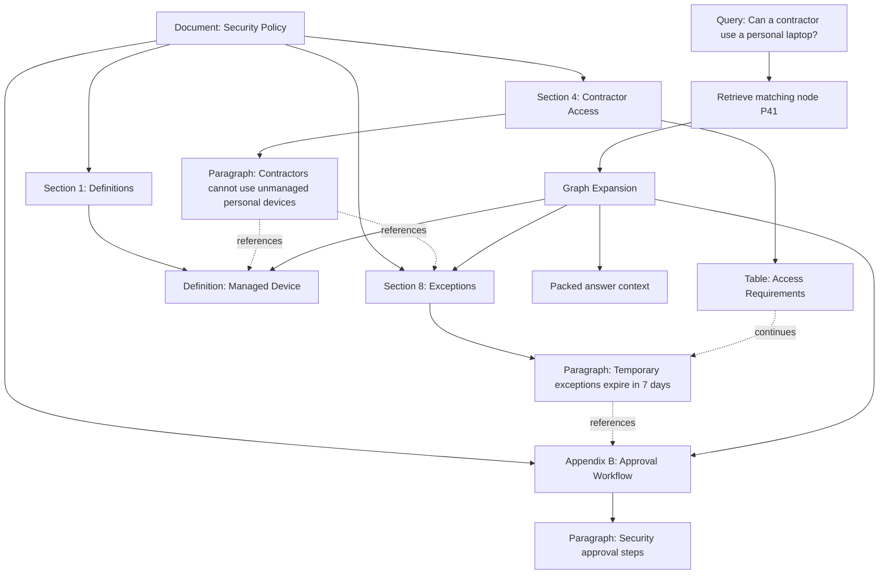

What the diagram is really saying:

- Matching one paragraph is not enough when the paragraph depends on definitions, exceptions, or appendices.
- The graph tells retrieval which nearby or referenced nodes are worth expanding.
- Graph expansion should be budgeted and explainable; otherwise it becomes uncontrolled prompt stuffing.

---

### 3. Real-World Industry Scenarios [Intermediate]

#### Scenario A - Compliance Policy Assistant

**Product/use case context:** A regulated enterprise has policies with definitions at the front, rules in the middle, exception processes near the end, and approval workflows in appendices. Users ask questions like "Can a contractor access production data during an incident?" The literal match might appear in one policy section, but the correct answer depends on definitions, exceptions, severity level, and approval authority.

**How hierarchy and graph modeling help:** A flat chunk store may retrieve the contractor paragraph and miss the exception process. A section graph can retrieve the matching paragraph, climb to its parent section, follow a "see exceptions" reference edge, pull the definition of "production data," and include the approval workflow from the appendix. This is higher-quality retrieval because the expansion path mirrors how a human would read the policy.

**Constraints:**
- **Latency:** Graph expansion adds traversal work after initial retrieval. The system should limit traversal depth, batch node fetches, and cache common subgraphs such as popular policy sections.
- **Cost:** Each followed edge can add tokens. The retriever needs an expansion budget, for example: matched node + parent section + up to two referenced nodes + one definition.
- **Reliability:** Cross-references can be stale. If Section 8 was renamed to Section 9, a broken reference edge can silently omit critical exception text.
- **Security/privacy:** A graph edge can cross access boundaries. For example, a public support article may reference an internal runbook. Expansion must enforce permissions on every destination node.

**What good looks like in production:** The assistant produces a cited answer using the exact rule, the definition, and the exception workflow. The trace shows the graph path: matched paragraph -> parent section -> referenced exception section -> appendix approval workflow. When a policy is updated, graph edges are rebuilt and broken links are reported.

#### Scenario B - API Documentation Assistant

**Product/use case context:** Developer docs often have nested headings, tabs for programming languages, tables of parameters, examples, and links to authentication docs. A user asks, "Why is my webhook signature validation failing in Node?"

**How hierarchy and graph modeling help:** The retriever needs to know that a Node example belongs under the Webhook Signature section, not the generic Authentication page. It also needs to connect the parameter table, the code example, the timestamp tolerance note, and the error-code page. A section graph can connect these nodes through heading paths, adjacency, and explicit links.

**Constraints:**
- **Latency:** Developer-facing search should feel fast. Precompute heading paths and graph edges during ingestion so query-time traversal is a small lookup, not a parse job.
- **Cost:** Code examples are token-heavy. Include only the language-specific example requested by the user, not every language tab.
- **Reliability:** Docs are versioned. A webhook answer for API v2 must not traverse into API v1 parameter tables.
- **Failure modes:** If tabbed content is parsed without its parent heading, the Node example can become an orphan chunk and retrieve without the signature-validation explanation.

**What good looks like in production:** The system retrieves the Webhook Signature section, the Node-specific code example, the timestamp tolerance note, and the relevant error-code entry, all under the same API version and product metadata.

#### Scenario C - Research and Scientific PDFs

**Product/use case context:** A biomedical researcher asks, "What evidence supports the adverse-event conclusion?" The answer may require the Results section, a table, a figure caption, and the Methods section that explains cohort selection.

**How hierarchy and graph modeling help:** Scientific PDFs are not just paragraphs. Tables and figures carry evidence, captions explain them, and methods constrain interpretation. A section graph can link a result statement to Table 2, the table caption, and the Methods subsection defining the population.

**Constraints:**
- **Latency:** Table parsing and PDF layout extraction are expensive, so they must happen offline during ingestion.
- **Cost:** Tables can be long. The graph should retrieve only relevant rows or compact table summaries when possible.
- **Reliability:** PDF parsing can misorder columns, split captions, or attach a table to the wrong section. Structural confidence should decide whether to use the extracted edge automatically or require fallback.
- **Security/privacy:** In medical or clinical trial contexts, source access and patient-level details may be restricted.

**What good looks like in production:** The answer cites the claim, table, caption, and methods node separately. The trace shows whether table extraction was high-confidence enough to trust.

---

### 4. System View [Intermediate]

#### Inputs -> Transformations -> Outputs

```text
Raw document
  -> parse layout and text
  -> detect headings, paragraphs, tables, figures, code blocks, appendices
  -> assign stable node IDs and source offsets
  -> build containment edges from hierarchy
  -> build adjacency edges from reading order
  -> build reference edges from links and cross-references
  -> score structural confidence
  -> store nodes in a document graph store
  -> create retrieval chunks that point back to node IDs

User query
  -> retrieve matching child chunks or nodes
  -> map hits to graph nodes
  -> traverse selected edges under budget
  -> filter by permissions, version, tenant, and freshness
  -> rank expanded nodes
  -> pack context with heading paths and citations
  -> generate grounded answer
```

#### Node Record Example

```json
{
  "node_id": "policy-2026:s4:p3",
  "doc_id": "policy-2026",
  "node_type": "paragraph",
  "heading_path": ["Security Policy", "Contractor Access"],
  "text": "Contractors may not access production systems from unmanaged personal devices.",
  "source_offsets": {"start": 18420, "end": 18504},
  "version": "2026-05-14",
  "structural_confidence": 0.96,
  "metadata": {
    "tenant_id": "global",
    "sensitivity": "internal",
    "allowed_roles": ["employee", "security", "hr"]
  }
}
```

#### Edge Record Example

```json
{
  "edge_id": "policy-2026:s4:p3->policy-2026:s8",
  "from_node_id": "policy-2026:s4:p3",
  "to_node_id": "policy-2026:s8",
  "edge_type": "references",
  "evidence_text": "Temporary exceptions are described in Section 8.",
  "confidence": 0.92,
  "version": "2026-05-14"
}
```

#### Observability: What We Log, Trace, and Measure

- `parser_version`: which parser created the hierarchy.
- `node_count_by_type`: sections, paragraphs, tables, figures, code blocks, appendices.
- `edge_count_by_type`: containment, adjacency, reference, continuation, definition.
- `orphan_node_count`: nodes with no reliable parent or heading path.
- `structural_confidence_avg`: average confidence of parsed hierarchy.
- `broken_reference_count`: cross-references that could not be resolved.
- `graph_expansion_path`: exact nodes followed after initial retrieval.
- `expansion_depth`: how many hops were followed.
- `expanded_token_count`: cost introduced by graph expansion.
- `filtered_edge_count`: edges removed because of permissions, version, tenant, or freshness.

The most useful trace is not just "these chunks were retrieved." It is: initial hit -> node mapping -> followed edges -> rejected edges -> final packed nodes. That trace tells you whether the system navigated the document intelligently.

#### Failure Points and How They Show Up

| Failure point | Prod symptom | Why it happens |
|---|---|---|
| Fake or missing headings | Correct text retrieves but citations are vague | Parser could not infer real hierarchy |
| Orphan nodes | Code examples or tables appear without explanation | Node lost its parent section during parsing |
| Broken reference edges | Answer misses exceptions, definitions, or appendices | Cross-reference changed or was parsed incorrectly |
| Over-traversal | Prompt contains too many loosely related sections | Expansion follows every nearby edge without budget |
| Under-traversal | Answer quotes rule but misses definition or exception | Expansion ignores reference or definition edges |
| Cross-version traversal | Answer mixes old and new docs | Edges do not enforce version metadata |
| Cross-permission traversal | Sensitive section leaks through a graph edge | Destination node was not permission-checked |

---

### 5. System Design Flavor [Intermediate]

#### Key Components and Interfaces

1. **Structural parser:** Extracts headings, paragraphs, tables, figures, code blocks, links, page numbers, and source offsets from raw files.
2. **Node builder:** Assigns stable IDs and metadata to every structural unit worth retrieving or citing.
3. **Edge builder:** Creates relationships: contains, next, previous, references, defines, continues, example-of, table-for, figure-for.
4. **Graph store:** Stores nodes and edges. This can be a graph database, relational tables, document store, or even adjacency lists if the graph is small.
5. **Retrieval index:** Embeds selected nodes or child chunks while preserving `node_id`, `parent_node_id`, `heading_path`, version, and access metadata.
6. **Graph expansion policy:** Decides which edges to follow, how far to traverse, and how many tokens to spend.
7. **Context packer:** Orders expanded nodes with breadcrumbs so the LLM sees evidence in a human-readable structure.
8. **Citation mapper:** Converts answer claims back to node IDs, source offsets, headings, page numbers, and URLs.

#### Important Tradeoffs

| Tradeoff | Choose simpler hierarchy when... | Choose section graph modeling when... |
|---|---|---|
| Engineering complexity vs retrieval quality | Docs are short, clean, and mostly self-contained | Answers depend on definitions, exceptions, tables, references, or appendices |
| Offline parse cost vs query-time speed | Corpus is tiny or changes constantly | Corpus is large and reused often; precomputed graph makes query-time retrieval faster |
| Strict graph traversal vs semantic expansion | Structure is trustworthy and references are explicit | User intent may require related concepts not linked in the source |
| More edges vs more noise | You need maximum recall and can rerank later | You need high precision and low token cost |

In layman's terms: use a simple tree when the document reads top-to-bottom cleanly. Use a graph when answering requires jumping around: definitions, exceptions, tables, examples, appendices, or cross-document references.

#### Practical Defaults

- Start with tree hierarchy: document -> heading section -> paragraph/table/code block.
- Add reference edges only for explicit links or patterns like "see Section X," "as defined in," "except as provided in," and "shown in Table Y."
- Keep traversal depth small: one or two hops for most Q&A.
- Rank edge types: direct match > parent section > explicit reference > definition > adjacent section > broad sibling section.
- Attach `heading_path` to every chunk sent to the LLM.
- Store source offsets for every node that can be cited.
- Treat low-confidence table or PDF extraction as a risk signal, not as normal text.

#### Scaling Consideration: What Changes at 10x Traffic or Data

At 10x data, graph construction becomes an ingestion and quality-control problem. You cannot manually inspect all edges. You need parser versioning, graph diffing, broken-reference checks, and sampled human review. At 10x traffic, query-time graph expansion needs caching and budget control. Popular nodes, like HR policy definitions or API authentication sections, should be cached with their one-hop neighborhoods.

At scale, the graph should support incremental updates. When one section changes, you should rebuild affected nodes and edges, not the entire corpus. This is why stable IDs, source offsets, and versioned edges matter.

---

### 6. Common Mistakes + Debugging [Beginner]

#### Mistake 1 - Treating Parsed Text Order as True Document Structure

- **Symptom:** The answer cites a paragraph under the wrong heading, or a table appears before the section that explains it.
- **Likely cause:** PDF or HTML parsing preserved text but lost layout hierarchy.
- **First debugging step:** Inspect the parsed nodes for one failed document: heading path, page number, source offsets, and reading order. If the heading path is wrong, fix parsing before tuning retrieval.

#### Mistake 2 - Building a Tree When the Document Needs a Graph

- **Symptom:** The retriever finds the main rule but misses definitions, exceptions, or appendix workflows.
- **Likely cause:** The system only follows containment edges and ignores cross-references.
- **First debugging step:** Search the matched parent text for phrases like "as defined in," "except," "see," and "Appendix." If those references exist but no edges were followed, add reference-edge extraction.

#### Mistake 3 - Following Too Many Edges

- **Symptom:** The prompt contains a maze of loosely related context, and the model gives a generic or blended answer.
- **Likely cause:** Graph traversal expanded every neighbor instead of using an edge budget and edge priority.
- **First debugging step:** Log the graph expansion path with edge types and token counts. Remove low-value edge types first, usually broad sibling or weak semantic-similarity edges.

#### Mistake 4 - Ignoring Permissions During Traversal

- **Symptom:** A user sees internal-only runbook details because a public page linked to them.
- **Likely cause:** Access control was enforced on initial retrieval but not on destination nodes during graph expansion.
- **First debugging step:** For every expanded node, compare user permissions against destination-node metadata. Graph traversal must behave like retrieval: every node and edge is checked before it reaches the prompt.

---

### 7. Hands-On Lab: Build -> Break -> Measure -> Explain [Pro]

This lab uses a tiny in-memory graph. It shows why hierarchy and references matter even before embeddings enter the picture.

#### Build: Smallest Working Section Graph Retriever

```python
from collections import defaultdict, deque


nodes = {
    "s1": {
        "type": "section",
        "heading_path": ["Security Policy", "Definitions"],
        "text": "A managed device is a company-controlled laptop with active compliance checks.",
    },
    "s4": {
        "type": "section",
        "heading_path": ["Security Policy", "Contractor Access"],
        "text": "Contractors may not access production systems from unmanaged personal devices. See Section 8 for temporary exceptions.",
    },
    "s8": {
        "type": "section",
        "heading_path": ["Security Policy", "Temporary Exceptions"],
        "text": "Temporary exceptions require written Security approval and expire within 7 days. Approval steps are listed in Appendix B.",
    },
    "app_b": {
        "type": "appendix",
        "heading_path": ["Security Policy", "Appendix B", "Approval Workflow"],
        "text": "A Security manager must approve the exception request before production access is granted.",
    },
}


edges = [
    ("s4", "s1", "references_definition"),
    ("s4", "s8", "references_exception"),
    ("s8", "app_b", "references_workflow"),
]


neighbors = defaultdict(list)
for from_node, to_node, edge_type in edges:
    neighbors[from_node].append((to_node, edge_type))


def lexical_score(query, text):
    query_terms = set(query.lower().replace("?", "").split())
    text_terms = set(text.lower().replace(".", "").split())
    return len(query_terms & text_terms)


def retrieve_start_node(query):
    return max(nodes, key=lambda node_id: lexical_score(query, nodes[node_id]["text"]))


def expand_graph(start_node_id, max_depth=2, edge_budget=3):
    visited = {start_node_id}
    selected = [start_node_id]
    queue = deque([(start_node_id, 0)])

    while queue and len(selected) <= edge_budget:
        node_id, depth = queue.popleft()
        if depth == max_depth:
            continue

        for next_node_id, edge_type in neighbors[node_id]:
            if next_node_id in visited:
                continue
            visited.add(next_node_id)
            selected.append(next_node_id)
            queue.append((next_node_id, depth + 1))

            if len(selected) > edge_budget:
                break

    return selected


query = "Can a contractor use a personal laptop for production access during an exception?"
start_node = retrieve_start_node(query)
context_node_ids = expand_graph(start_node)

for node_id in context_node_ids:
    node = nodes[node_id]
    print(" > ".join(node["heading_path"]))
    print(node["text"])
    print()
```

Expected behavior: the retriever starts at Contractor Access, then follows graph edges to Definitions, Temporary Exceptions, and Appendix B. That gives the answer enough structure to say: normally no, but a temporary exception can be approved under a workflow and time limit.

#### Break Case 1: Remove Reference Edges

Delete these two edges:

```python
("s4", "s8", "references_exception")
("s8", "app_b", "references_workflow")
```

What breaks:
- The system retrieves the main rule but misses the exception and approval workflow.
- The answer becomes too strict or incomplete.
- This is a hierarchy failure, not an embedding failure.

#### Break Case 2: Set `max_depth=10` and Add Many Weak Sibling Edges

Add edges from `s4` to unrelated sections such as VPN, employee access, audit logging, and data retention. Then increase traversal depth.

What breaks:
- The prompt becomes bloated.
- The LLM may blend contractor rules with employee rules.
- Retrieval cost and latency rise without improving answer quality.

#### Measure: Signals to Capture

| Metric | What it tells you | Healthy direction |
|---|---|---|
| `node_recall@k` | Did initial retrieval find the right starting node? | Higher |
| `edge_recall` | Did traversal include required definition, exception, or appendix nodes? | Higher |
| `expansion_precision` | Of expanded nodes, how many were actually needed? | Higher |
| `expanded_token_count` | How much prompt budget graph traversal consumed | Lower, while preserving answer quality |
| `broken_reference_count` | How many cross-references failed to resolve | Lower |
| `orphan_node_rate` | How much parsed content lacks a reliable parent | Lower |
| `p95_graph_expansion_ms` | Query-time cost of traversal and node fetches | Lower and predictable |

#### Explain: Why It Broke and How to Fix It

Removing reference edges breaks because the answer depends on linked structure, not just nearby text. Over-traversal breaks because graph navigation without a budget becomes another form of prompt stuffing. The fix is to build explicit, typed edges during ingestion and use a query-time expansion policy that prioritizes high-value edges under a token budget.

Production guardrail: every expanded node should have a reason code, such as `direct_match`, `parent_section`, `referenced_exception`, `definition`, or `table_continuation`. If the reason code cannot justify the token cost, the node should not enter the prompt.

---

### 8. Active Recall (Spaced Repetition) [Beginner]

1. What is the difference between document hierarchy and a section graph?
2. Why can a flat chunk store miss correct answers even when embeddings are good?
3. Name three edge types useful for advanced retrieval.
4. What is an orphan node, and why is it dangerous?
5. What is the first thing to inspect when graph expansion returns bad context?

Answer key:

1. Hierarchy is the tree-like structure of document parts; a section graph adds cross-links such as references, definitions, continuation, and adjacency.
2. Some answers require definitions, exceptions, tables, or appendices located outside the matched chunk.
3. Containment, adjacency, reference, definition, continuation, table-for, figure-for, or example-of edges.
4. An orphan node is parsed content without a reliable parent or heading path; it can retrieve without enough context or receive the wrong citation.
5. Inspect the expansion path: start node, followed edges, rejected edges, destination nodes, permissions, versions, and token counts.

---

### 9. Practice [Intermediate]

#### Mini-Exercise

You are ingesting a 70-page customer-support manual with headings, troubleshooting tables, screenshots, and links to warranty policies. A user asks, "Why does error E42 appear after a firmware update, and is it covered under warranty?"

Design the section graph.

Suggested answer outline:

- Nodes: product manual sections, error-code table rows, firmware update notes, troubleshooting procedure, warranty policy sections, screenshot captions.
- Edges: error table row -> troubleshooting section, firmware note -> affected devices, troubleshooting section -> warranty policy, screenshot -> procedure step, adjacent edges between ordered troubleshooting steps.
- Metadata: product model, firmware version, region, warranty version, source offsets, page numbers, last modified, permissions.
- Retrieval flow: retrieve E42 table row or firmware note -> follow troubleshooting and warranty reference edges -> filter by product model and firmware version -> pack compact table row, procedure steps, and warranty section.
- Debug check: make sure warranty context comes from the correct region and policy version.

#### Capstone-Style System Design Question

Design a retrieval system for an enterprise assistant that must answer questions across PDFs, Confluence pages, and API docs. Many documents contain tables, appendices, and cross-links. How would you model hierarchy and graph relationships, and how would you prevent graph expansion from becoming noisy or unsafe?

Suggested answer outline:

- Parse all sources into typed nodes: document, page, heading section, paragraph, table, row, figure, code block, appendix.
- Assign stable node IDs, source offsets, heading paths, document versions, tenant IDs, and permission metadata.
- Build containment edges from hierarchy, adjacency edges from order, reference edges from links and cross-references, continuation edges for split tables, and definition edges for glossary terms.
- Embed child chunks or selected nodes with `node_id` and `heading_path` metadata.
- At query time, retrieve start nodes, traverse only high-priority edge types under depth and token budgets, enforce permissions at every destination node, and rerank expanded nodes before packing.
- Prevent noise with edge confidence thresholds, reason codes, expansion budgets, version filters, and sampled evaluation of graph paths.
- Log parser version, node and edge counts, orphan rate, broken references, expansion path, rejected edges, token count, latency, and final citations.

---

### 10. Production Reality Check [Pro]

**If this fails in prod, what's the first thing we inspect?**

Inspect the graph expansion trace for one failed query: start node -> heading path -> followed edge types -> destination nodes -> rejected nodes -> final packed context. If the start node is wrong, debug retrieval and chunking. If the start node is right but missing context, debug edge extraction or traversal policy. If the expanded context is noisy, tighten edge priority, depth, confidence, and token budgets. If sensitive or stale nodes appear, inspect permission and version filters on every traversal step.

---

### 11. Curiosity Bridge [Beginner]

This unlocks structure-aware retrieval, but it still assumes the graph tells us where to go. The next problem is deciding which metadata signals should actively improve recall and ranking: freshness, authority, product version, permissions, tenant, language, region, and user role. That leads directly into metadata-driven recall improvements.

---

### 12. Exit Check + Carry-Forward Review [Beginner]

**You're done when you can:** model a messy document as nodes and edges, explain which edges retrieval should follow, and debug a bad answer by reading the graph expansion trace.

Carry-forward review from 7.1.a:

1. How does section graph modeling extend parent-child retrieval?
   - Parent-child retrieval mainly expands from small child to larger parent. Section graph modeling adds typed navigation across definitions, exceptions, tables, appendices, examples, and adjacent sections.
2. Why is stable ID design even more important with graphs?
   - Because nodes and edges depend on IDs. If IDs drift across versions, traversal can connect old children to new parents, wrong references, or unsafe destination nodes.

---

## Subtopic 7.1.c: Metadata-Driven Recall Improvements

Added to Knowledge Base.

**Subtopic time:** 3h

### 0. Reading Path + Level Tags

- **Beginner:** Read sections 1-2, section 6, and Active Recall.
- **Intermediate:** Add sections 3-5 and the Hands-On Lab.
- **Pro:** Do the full lab, compare hard filters vs soft boosts, and answer the capstone system-design question.

---

### 1. Pre-Question Hook + The Intuition [Beginner]

**Pause: before reading, if a user asks "How do I rotate API keys in EU for v2?", should retrieval search every document, or should it know that region, product version, and doc type matter before ranking starts?**

**Metadata-driven recall** means using structured document facts to help retrieval find the right evidence more often. Metadata includes fields like product, version, region, language, source type, authority, freshness, tenant, permissions, page, section, and document owner.

The subtle idea: metadata is not just for filtering bad results. It can improve recall by helping the retriever search the right slice of the corpus, expand the right context, and recover relevant documents that pure semantic similarity would miss.

**Recall** is the share of truly relevant evidence that retrieval successfully finds. **Precision** is the share of retrieved evidence that is actually relevant. Metadata often improves both, but the danger is different: a good metadata filter can rescue recall; a bad hard filter can destroy recall by excluding the only correct answer.

Real-world analogy: Search without metadata is like asking a librarian, "Find me a book about keys." Metadata-aware retrieval is like saying, "Find the latest EU v2 developer documentation about API key rotation, not the old US admin policy." The analogy breaks down because users rarely state all metadata cleanly; the system often has to infer it from query text, user profile, app context, or conversation history.

Key terms:
- **Metadata-driven recall:** Improving retrieval coverage by using structured fields to filter, boost, route, expand, or rerank evidence.
- **Hard filter:** A metadata condition that must be satisfied, such as `tenant_id = user.tenant_id`.
- **Soft boost:** A ranking preference that raises matching documents without excluding others, such as boosting newer docs.
- **Pre-filtering:** Applying metadata constraints before vector search.
- **Post-filtering:** Applying metadata constraints after candidate retrieval.
- **Filter recall cliff:** A failure where one wrong or overly strict filter removes the correct evidence completely.
- **Metadata coverage:** The percentage of documents or chunks that have a usable value for a metadata field.
- **Authority signal:** Metadata that indicates source trust, such as official docs over forum posts.
- **Freshness signal:** Metadata that indicates whether evidence is current enough for the query.

The mental model to keep permanently: **embeddings find meaning; metadata defines the search boundary.**

---

### 2. Visual Diagram (Mermaid) [Beginner]

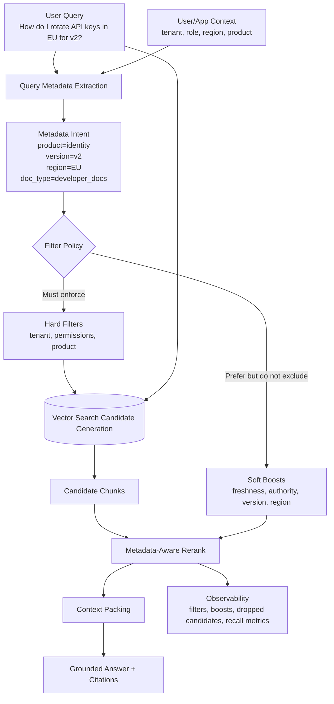

What the diagram is really saying:

- Metadata starts before vector search, but not every metadata signal should become a hard filter.
- Security and tenant boundaries are hard filters.
- Freshness, authority, language, region, and version often begin as soft boosts unless the query clearly requires them.
- The retriever must log which metadata decisions shaped the candidate set.

---

### 3. Real-World Industry Scenarios [Intermediate]

#### Scenario A - Multi-Version Developer Docs

**Product/use case context:** A cloud platform has docs for API v1, v2, beta, multiple SDK languages, public docs, partner-only docs, and region-specific compliance notes. A user asks, "How do I rotate API keys in EU for v2 using Python?"

**How metadata improves recall:** Pure semantic search may retrieve a highly similar v1 page because the wording is nearly identical. Metadata can route retrieval toward `version=v2`, `region=EU`, `language=python`, and `doc_type=developer_docs`. This improves recall of the correct evidence because the candidate pool is no longer dominated by semantically similar but wrong-version docs.

**Constraints:**
- **Latency:** Filtering by high-cardinality fields like product, version, and region can speed search if the vector store supports efficient pre-filters. If not, heavy post-filtering can increase latency because the system must over-retrieve many candidates.
- **Cost:** Better metadata reduces wasted prompt tokens by keeping wrong-version chunks out of context. But extracting metadata from queries may require an extra classifier or LLM call unless rule-based parsing is enough.
- **Reliability:** Version metadata must be accurate. A stale `version=v1` label on a v2 page is worse than no metadata because it creates false confidence.
- **Security/privacy:** Partner-only docs must be hard-filtered by entitlement, not merely downranked.

**What good looks like in production:** The answer uses v2 EU Python docs, excludes v1 unless explicitly asked for migration, cites the exact page version, and logs whether each metadata field came from query text, user context, or system defaults.

#### Scenario B - Enterprise Knowledge Assistant

**Product/use case context:** Employees ask questions across HR, legal, security, IT, finance, and engineering docs. The same words can mean different things by department. "Access review" in HR might mean employee access to benefits; in security it means quarterly permission review.

**How metadata improves recall:** User role, department, source authority, and document owner help disambiguate. If the user is in engineering and asks about production access review, retrieval should boost security and engineering runbooks over generic HR policy pages. Metadata gives retrieval a better first guess about intent.

**Constraints:**
- **Latency:** Department and source filters are usually cheap because they have low cardinality. Permission checks can be more expensive if they depend on dynamic group membership.
- **Cost:** Authority boosts reduce the number of low-quality chunks sent to the LLM.
- **Reliability:** Over-personalization can hide generally relevant corporate policies. If the user asks a broad policy question, department should be a boost, not a hard boundary.
- **Security/privacy:** User role, tenant, clearance, and group membership must be enforced before context reaches the LLM.

**What good looks like in production:** The retriever hard-filters unauthorized docs, boosts official policy sources, includes department-specific docs when query intent supports it, and falls back to cross-department search when strict metadata produces no strong candidates.

#### Scenario C - Healthcare Clinical Knowledge Retrieval

**Product/use case context:** A clinical assistant retrieves guidelines, hospital protocols, drug references, and internal care pathways. A clinician asks, "What is the pediatric dosing guidance for medication X?"

**How metadata improves recall:** The retriever must distinguish adult vs pediatric, medication name, source authority, publication date, hospital region, and guideline type. Semantic similarity alone may retrieve adult dosing because adult pages are more common and worded similarly.

**Constraints:**
- **Latency:** Clinical workflows need fast answers, but safety matters more than shaving milliseconds. Hard filters for patient group and jurisdiction may be justified when query intent is explicit.
- **Cost:** Metadata-aware retrieval reduces unnecessary long guideline sections in the prompt.
- **Reliability:** Freshness is critical. Outdated clinical guidance can be dangerous even if semantically relevant.
- **Security/privacy:** Retrieval should never mix patient-specific records with general medical guidelines unless the product is explicitly designed and authorized for that workflow.

**What good looks like in production:** Pediatric and current-authority sources are prioritized, adult-only sources are excluded or clearly marked as not applicable, and the system refuses or escalates when the required metadata is ambiguous.

---

### 4. System View [Intermediate]

#### Inputs -> Transformations -> Outputs

```text
Ingestion time
  -> parse document
  -> extract metadata from source system, path, headings, front matter, owner, ACLs, timestamps
  -> validate metadata coverage and allowed values
  -> attach metadata to document, parent, child, and graph nodes
  -> index child chunks with searchable metadata
  -> store parent/node records with the same permission and version metadata

Query time
  -> read user query and app context
  -> extract metadata intent from query text and session
  -> classify metadata fields as hard filters, soft boosts, or ignored
  -> retrieve candidates using vector/hybrid search
  -> apply filters and metadata-aware boosts
  -> rerank and pack evidence
  -> answer with citations and metadata-aware caveats
```

#### Metadata Record Example

```json
{
  "chunk_id": "identity-v2-eu-api-keys-c07",
  "parent_id": "identity-v2-eu-api-keys",
  "doc_id": "identity-api-key-rotation",
  "text": "To rotate an API key in v2, create a replacement key before revoking the old key...",
  "metadata": {
    "product": "identity",
    "version": "v2",
    "region": "EU",
    "language": "python",
    "doc_type": "developer_docs",
    "source_authority": "official",
    "last_modified": "2026-05-10",
    "freshness_days": 42,
    "tenant_id": "public",
    "allowed_roles": ["developer", "admin"],
    "section_title": "API key rotation",
    "heading_path": ["Identity", "API keys", "Rotate keys"]
  }
}
```

#### Hard Filters vs Soft Boosts

Use hard filters when a field is a correctness or safety boundary:

- Tenant or customer boundary
- Permissions and access control
- Product when the product is explicit and mutually exclusive
- Version when the query explicitly asks for a version and older versions are not applicable
- Region or jurisdiction when policy differs legally
- Language when code examples are language-specific and the query names a language

Use soft boosts when a field is a preference or confidence signal:

- Freshness when older docs may still be useful
- Authority when community posts can still explain errors but official docs should rank higher
- Department when user context suggests intent but does not fully determine it
- Region when the user did not specify region but profile has a default
- Document popularity or feedback score when relevance is uncertain

#### Observability: What We Log, Trace, and Measure

- `metadata_extraction_source`: query text, user profile, route, UI filter, conversation memory, or default.
- `hard_filters_applied`: fields that constrained candidate generation.
- `soft_boosts_applied`: fields used for ranking, with weights.
- `candidate_count_before_filter` and `candidate_count_after_filter`.
- `dropped_relevant_candidate_count` during offline evaluation.
- `metadata_coverage_by_field`: percentage of chunks with valid product, version, region, freshness, permissions, and authority.
- `unknown_metadata_rate`: how often fields are missing or set to unknown.
- `filter_zero_result_rate`: how often hard filters produce no candidates.
- `fallback_activation_rate`: how often retrieval relaxes optional metadata constraints.
- `recall@k_by_slice`: recall by product, version, region, tenant, language, and source type.

#### Failure Points and How They Show Up

| Failure point | Prod symptom | Why it happens |
|---|---|---|
| Missing metadata | Correct doc exists but never ranks | Retriever cannot filter or boost the right slice |
| Wrong metadata | Wrong version or region wins confidently | Bad ingestion labels are treated as truth |
| Over-strict hard filter | No answer or irrelevant fallback | The correct chunk was excluded before ranking |
| Under-strict filtering | Semantically similar but wrong-scope docs dominate | Metadata was ignored or only applied after too few candidates |
| Metadata drift | Old docs still rank as current | Freshness or version fields were not updated during re-index |
| Permission metadata mismatch | Sensitive context leaks or valid docs disappear | Child and parent/node access fields disagree |

---

### 5. System Design Flavor [Intermediate]

#### Key Components and Interfaces

1. **Metadata schema registry:** Defines allowed fields, types, required/optional status, default behavior, and valid values.
2. **Metadata enrichment pipeline:** Extracts fields from source systems, file paths, front matter, headings, URLs, owners, timestamps, ACLs, and classifiers.
3. **Metadata validator:** Measures coverage, detects unknown values, flags invalid combinations, and blocks unsafe ingestion.
4. **Query metadata extractor:** Reads query text and app context to infer fields like product, version, region, role, language, and doc type.
5. **Filter policy engine:** Decides hard filter vs soft boost vs ignore for each inferred field.
6. **Vector or hybrid retriever:** Generates candidate chunks with metadata-aware pre-filtering where supported.
7. **Metadata-aware reranker:** Combines semantic score with freshness, authority, version match, source type, and user context.
8. **Fallback controller:** Relaxes optional filters when recall collapses, while never relaxing security filters.
9. **Evaluation harness:** Measures recall@k and answer quality by metadata slice, not just global averages.

#### Important Tradeoffs

| Tradeoff | Choose hard filters when... | Choose soft boosts when... |
|---|---|---|
| Safety vs recall | The field is a security, tenant, legal, or explicit version boundary | The field is a preference like freshness, source authority, or user department |
| Pre-filter vs post-filter | The vector store supports efficient filtering and the filter is reliable | You need broad candidate generation before deciding which metadata matters |
| Rich metadata vs ingestion complexity | The corpus has repeated ambiguity: versions, products, regions, roles | The corpus is small, clean, and users rarely need scoped answers |
| Defaults vs explicit query intent | Product context is fixed by the UI route or authenticated workspace | Users may ask cross-product or comparative questions |

In layman's terms: hard filters are locked doors; soft boosts are recommendation weights. Lock the doors for security and legal boundaries. Use weights when the signal helps but might be wrong.

#### Practical Defaults

- Always hard-filter tenant, permissions, and explicit access boundaries.
- Start with soft boosts for freshness and authority unless stale answers are dangerous.
- Treat query-explicit metadata as stronger than profile defaults.
- Use fallback only for optional filters, never for security filters.
- Track `unknown` as a real metadata value; missing is not the same as false.
- Evaluate recall per slice, especially underrepresented products, regions, languages, and versions.
- Store metadata at document, parent, child, and graph-node levels when the fields can differ.

#### Scaling Consideration: What Changes at 10x Traffic or Data

At 10x data, metadata quality matters more than embedding quality in many domains because the index contains many semantically similar but scope-wrong documents. Versioned docs, regional policies, language variants, and tenant data create false positives that look semantically perfect.

At 10x traffic, query-time metadata extraction and filter decisions must be fast and observable. Move deterministic metadata into app context where possible: product route, selected version, logged-in tenant, UI language, and user role. Use LLM-based extraction only for ambiguous query intent, and cache common query classifications.

At scale, build dashboards for metadata coverage, zero-result filters, recall by slice, and answer failures by metadata field. Global recall can look healthy while one region or product version is broken.

---

### 6. Common Mistakes + Debugging [Beginner]

#### Mistake 1 - Turning Every Metadata Signal into a Hard Filter

- **Symptom:** Retrieval frequently returns no useful candidates, especially for vague or conversational queries.
- **Likely cause:** The system hard-filtered on inferred product, department, region, freshness, or language even when the query did not clearly require it.
- **First debugging step:** Inspect `candidate_count_before_filter` and `candidate_count_after_filter`. If the correct document appears before filtering and disappears after filtering, move that field from hard filter to soft boost or add a safe fallback.

#### Mistake 2 - Ignoring Metadata Coverage

- **Symptom:** Some products, regions, or document types retrieve well, while others seem invisible.
- **Likely cause:** The retrieval policy depends on metadata fields that are missing for part of the corpus.
- **First debugging step:** Check `metadata_coverage_by_field`. If only 60% of chunks have `version`, a version filter can silently erase 40% of your possible evidence.

#### Mistake 3 - Applying Metadata Only After Top-k Is Too Small

- **Symptom:** The system retrieves top 5 semantically similar chunks, filters out 4 wrong-scope chunks, and sends one weak candidate to the LLM.
- **Likely cause:** Post-filtering was applied after too narrow a candidate set.
- **First debugging step:** Increase candidate generation depth, such as top 50 before post-filtering, or use pre-filtering if the metadata is reliable and supported by the index.

#### Mistake 4 - Letting Parent Metadata Disagree with Child Metadata

- **Symptom:** Child retrieval looks correct, but expansion returns wrong-version, unauthorized, or stale parent context.
- **Likely cause:** Metadata was attached to child chunks but not synchronized with parent chunks or graph nodes.
- **First debugging step:** Trace `child_id -> parent_id -> node_id` and compare version, tenant, allowed roles, freshness, and source authority at each level.

---

### 7. Hands-On Lab: Build -> Break -> Measure -> Explain [Pro]

This lab uses a small lexical retriever so the metadata mechanics are visible without vector database setup. In production, replace lexical scoring with embedding or hybrid search and keep the same metadata policy ideas.

#### Build: Metadata-Aware Retriever with Hard Filters and Soft Boosts

```python
import re


docs = [
    {
        "id": "identity-v1-us",
        "text": "Rotate API keys by creating a new key, updating clients, and deleting the old key.",
        "metadata": {"product": "identity", "version": "v1", "region": "US", "language": "python", "authority": "official", "freshness_days": 500},
    },
    {
        "id": "identity-v2-eu",
        "text": "For v2 in EU, rotate API keys by creating a replacement key, validating audit logs, then revoking the old key.",
        "metadata": {"product": "identity", "version": "v2", "region": "EU", "language": "python", "authority": "official", "freshness_days": 30},
    },
    {
        "id": "identity-v2-us",
        "text": "For v2 in US, rotate API keys by creating a replacement key before revoking the old key.",
        "metadata": {"product": "identity", "version": "v2", "region": "US", "language": "python", "authority": "official", "freshness_days": 25},
    },
    {
        "id": "forum-eu-key-error",
        "text": "A forum user fixed API key rotation errors by waiting for audit log propagation.",
        "metadata": {"product": "identity", "version": "v2", "region": "EU", "language": "python", "authority": "forum", "freshness_days": 10},
    },
]


def tokens(text):
    return set(re.findall(r"[a-z0-9]+", text.lower()))


def semantic_score(query, text):
    return len(tokens(query) & tokens(text))


def metadata_policy(query):
    query_lower = query.lower()
    hard_filters = {}
    soft_boosts = {}

    if "v2" in query_lower:
        hard_filters["version"] = "v2"
    if "eu" in query_lower:
        hard_filters["region"] = "EU"
    if "identity" in query_lower or "api key" in query_lower:
        hard_filters["product"] = "identity"

    soft_boosts["authority"] = {"official": 2, "forum": 0}
    soft_boosts["freshness_days"] = lambda days: 1 if days <= 90 else 0
    return hard_filters, soft_boosts


def passes_filters(doc, hard_filters):
    return all(doc["metadata"].get(field) == value for field, value in hard_filters.items())


def metadata_boost(doc, soft_boosts):
    score = 0
    authority_boosts = soft_boosts.get("authority", {})
    score += authority_boosts.get(doc["metadata"].get("authority"), 0)

    freshness_boost = soft_boosts.get("freshness_days")
    if freshness_boost:
        score += freshness_boost(doc["metadata"].get("freshness_days", 9999))

    return score


def retrieve(query, top_k=3):
    hard_filters, soft_boosts = metadata_policy(query)
    candidates_before_filter = len(docs)
    filtered_docs = [doc for doc in docs if passes_filters(doc, hard_filters)]

    ranked = sorted(
        filtered_docs,
        key=lambda doc: semantic_score(query, doc["text"]) + metadata_boost(doc, soft_boosts),
        reverse=True,
    )[:top_k]

    return {
        "hard_filters": hard_filters,
        "candidates_before_filter": candidates_before_filter,
        "candidates_after_filter": len(filtered_docs),
        "results": ranked,
    }


query = "How do I rotate API keys in EU for v2?"
trace = retrieve(query)

print(trace["hard_filters"])
print(trace["candidates_before_filter"], "->", trace["candidates_after_filter"])
for result in trace["results"]:
    print(result["id"], result["metadata"], result["text"])
```

Expected behavior: the retriever keeps the EU v2 identity docs, ranks official fresh documentation above forum content, and avoids the semantically similar v1 or US page.

#### Break Case 1: Make Region a Wrong Hard Filter

Change the query policy so it sets `region = "US"` even when the query says EU.

What breaks:
- The correct EU doc is excluded before ranking.
- The retriever confidently returns the wrong regional policy.
- This is a filter recall cliff: ranking cannot recover evidence that filtering removed.

#### Break Case 2: Remove Version Metadata from Half the Docs

Delete the `version` field from `identity-v2-eu`.

What breaks:
- A strict version filter removes the correct doc because missing metadata fails equality.
- The system may return no answer or a weaker forum answer.
- The real root cause is metadata coverage, not semantic search.

#### Measure: Signals to Capture

| Metric | What it tells you | Healthy direction |
|---|---|---|
| `recall@k_by_slice` | Whether retrieval works per product, version, region, language, or tenant | Higher across all slices |
| `metadata_coverage_by_field` | Whether fields are populated enough to support filters | Higher |
| `candidate_count_after_filter` | Whether filters leave enough candidates to rank | Not zero; enough for reranking |
| `filter_zero_result_rate` | How often hard filters erase the candidate set | Lower |
| `fallback_activation_rate` | How often optional filters need relaxation | Low but nonzero is normal |
| `dropped_relevant_candidate_count` | How often filtering removed known-good evidence | Lower |
| `answer_scope_error_rate` | How often answers cite wrong version, region, tenant, or product | Lower |

#### Explain: Why It Broke and How to Fix It

Wrong hard filters break because retrieval is a staged system: once the correct evidence is excluded, embeddings and reranking cannot rescue it. Missing metadata breaks because filters treat unknown values as non-matches unless you design explicit fallback behavior. The fix is to classify metadata signals carefully: enforce safety fields, boost preference fields, measure coverage, and relax only optional constraints when candidate recall collapses.

Production guardrail: every answer should carry a scope trace. For example: `product=identity`, `version=v2`, `region=EU`, `source_authority=official`, `filters=product/version/region`, `boosts=authority/freshness`. If the trace does not match the user's intent, the answer is suspect.

---

### 8. Active Recall (Spaced Repetition) [Beginner]

1. How can metadata improve recall instead of only improving precision?
2. What is the difference between a hard filter and a soft boost?
3. What is a filter recall cliff?
4. Why should metadata coverage be measured before relying on metadata filters?
5. Which metadata fields should almost always be hard filters?

Answer key:

1. Metadata helps retrieval search the correct slice of the corpus, recover scope-specific evidence, and avoid semantically similar wrong-scope documents.
2. A hard filter excludes non-matching documents; a soft boost increases ranking preference without excluding documents.
3. A failure where an incorrect or overly strict filter removes the correct evidence before ranking can see it.
4. Low coverage means filters can silently exclude correct documents that simply lack labels.
5. Tenant, permissions, access control, and explicit security/legal boundaries.

---

### 9. Practice [Intermediate]

#### Mini-Exercise

You are building retrieval for a SaaS support assistant. Docs vary by product, plan tier, region, language, version, and source type. A user asks, "Can Enterprise customers in Canada export audit logs in the new console?"

Design the metadata policy.

Suggested answer outline:

- Hard filters: tenant/permissions, product if known, plan tier if the feature is plan-gated, region if Canada changes compliance behavior, console version if "new console" maps reliably to a version.
- Soft boosts: official docs over forum posts, fresher docs, docs with positive support feedback, docs owned by compliance or product.
- Metadata fields: product, plan_tier, region, console_version, feature, doc_type, authority, last_modified, language, tenant_id, allowed_roles.
- Fallback: if no candidates remain after optional version or feature filters, relax version first, then feature, but never relax tenant or permissions.
- Debug trace: query metadata extraction -> hard filters -> candidates before/after filter -> boosts -> final citations.

#### Capstone-Style System Design Question

Design a metadata-driven retrieval layer for a global enterprise assistant used across HR, IT, legal, and engineering. The corpus has confidential docs, region-specific policies, old and new versions, and unofficial Q&A posts. How do you improve recall without causing scope errors or leaks?

Suggested answer outline:

- Build a metadata schema with required security fields: tenant, permissions, sensitivity, owner, source system, doc version, last modified.
- Add retrieval scope fields: department, region, language, policy type, product/service, authority, freshness, document status.
- Ingest and validate metadata coverage before indexing; block or quarantine docs missing security metadata.
- At query time, extract metadata from query, user profile, UI route, and conversation context.
- Enforce hard filters for tenant, permissions, sensitivity, and explicit legal/security boundaries.
- Use soft boosts for authority, freshness, department, popularity, and profile-derived defaults.
- Use fallback only for optional filters and log every relaxation.
- Evaluate recall@k by department, region, version, and source type; do not trust one global metric.
- Keep metadata synchronized across child chunks, parent chunks, graph nodes, and citations.

---

### 10. Production Reality Check [Pro]

**If this fails in prod, what's the first thing we inspect?**

Inspect the retrieval trace around metadata decisions: extracted metadata intent -> hard filters -> candidates before and after filtering -> soft boosts -> dropped candidates -> final citations. If the correct evidence was never in the candidate set, debug metadata extraction, coverage, or hard filters. If the correct evidence was present but ranked low, debug boost weights, reranking, and semantic scoring. If unauthorized or wrong-scope evidence appears, inspect permission, tenant, version, and region filters at child, parent, and graph-node levels.

---

### 11. Curiosity Bridge [Beginner]

This works well when metadata points retrieval toward the right scope, but it creates a new pressure: every expanded chunk costs tokens, and repeated or overlapping chunks can crowd out better evidence. That leads into chunk overlap, redundancy, and context compaction: how to keep enough context without drowning the model.

---

### 12. Exit Check + Carry-Forward Review [Beginner]

**You're done when you can:** decide which metadata fields should be hard filters, soft boosts, or fallbacks, then debug a recall failure by reading candidate counts and filter traces.

Carry-forward review from 7.1.b:

1. How does metadata-driven retrieval interact with section graph modeling?
   - Metadata constrains which graph nodes and edges are eligible. Graph traversal should not cross tenant, permission, version, region, or freshness boundaries unless the policy explicitly allows it.
2. Why is `unknown` metadata safer than pretending missing values do not matter?
   - Unknown values reveal coverage gaps. Treating missing metadata as normal can cause silent leaks, wrong-scope answers, or recall loss under filters.

---

## Subtopic 7.1.d: Chunk Overlap, Redundancy, and Context Compaction

Added to Knowledge Base.

**Subtopic time:** 3h

### 0. Reading Path + Level Tags

- **Beginner:** Read sections 1-2, section 6, and Active Recall.
- **Intermediate:** Add sections 3-5 and the Hands-On Lab.
- **Pro:** Do the full lab, compare overlap and compaction settings, and answer the capstone system-design question.

---

### 1. Pre-Question Hook + The Intuition [Beginner]

**Pause: before reading, if the answer is split across the last sentence of one chunk and the first sentence of the next, how do you keep retrieval from missing it without filling the prompt with repeated text?**

**Chunk overlap** means intentionally repeating some tokens between neighboring chunks so boundary-crossing ideas are not lost. If chunk A ends with "temporary exceptions require" and chunk B begins with "Security approval," overlap can make either chunk contain enough meaning to retrieve correctly.

**Redundancy** is repeated or near-repeated evidence in the retrieved set. Some redundancy is useful because it protects recall. Too much redundancy is harmful because repeated chunks crowd out diverse evidence, inflate token cost, and can make the LLM over-weight one source.

**Context compaction** is the process of turning a noisy retrieved set into a smaller, answer-sufficient context. It includes deduplicating repeated chunks, merging adjacent chunks, selecting only relevant spans, preserving citations, and ordering evidence so the model sees the right facts without drowning in tokens.

The core tension:

- More overlap improves recall at chunk boundaries.
- More overlap increases index size, duplicate retrieval, and prompt waste.
- Compaction tries to keep the answer-critical evidence while removing repeated or low-value text.

Real-world analogy: Taking notes from a textbook. You may copy a few lines before and after an important paragraph so the note still makes sense later. But if every note repeats half the previous page, your study packet becomes bloated and harder to review. The analogy breaks down because an LLM does not read like a human; long repeated context can change attention patterns and ranking behavior, not just study time.

Key terms:
- **Chunk overlap:** Repeated tokens or sentences between neighboring chunks to preserve context across boundaries.
- **Redundancy:** Duplicate or near-duplicate evidence retrieved or packed into the prompt.
- **Context compaction:** Reducing retrieved evidence into a smaller, answer-sufficient context while preserving grounding and citations.
- **Evidence coverage:** The degree to which packed context contains all facts needed to answer correctly.
- **Compression loss:** Relevant evidence removed or distorted during compaction.
- **Adjacent merge:** Combining neighboring chunks from the same source when together they form a better evidence unit.
- **Near-duplicate:** Text that is not exactly identical but carries the same meaning or source content.
- **Token budget:** The maximum input tokens available for retrieved context after reserving space for instructions, conversation, and model output.

The mental model to keep permanently: **overlap protects recall; compaction protects attention.**

---

### 2. Visual Diagram (Mermaid) [Beginner]

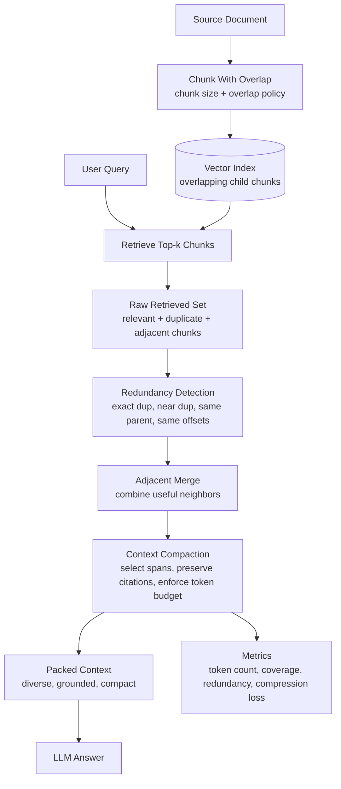

What the diagram is really saying:

- Overlap is an ingestion-time recall strategy.
- Redundancy is a retrieval-time side effect.
- Compaction is a prompt-time quality control step.
- You need metrics at all three points because a good overlap policy can still produce bad packed context.

---

### 3. Real-World Industry Scenarios [Intermediate]

#### Scenario A - Customer Support Knowledge Base

**Product/use case context:** A SaaS company has support articles with troubleshooting steps, warnings, screenshots, and region-specific notes. A user asks, "Why does export fail after enabling SSO, and what should I check first?"

**How overlap and compaction help:** The cause may be at the end of one section and the fix may start in the next. Chunk overlap helps retrieve both. But support docs often repeat the same warning in multiple articles. Without redundancy control, the prompt may contain five versions of "check admin permissions" and miss the region-specific SSO setting.

**Constraints:**
- **Latency:** Compaction must be fast enough for interactive support. Exact dedupe and adjacent merge are cheap; LLM summarization-based compaction is slower and should be reserved for long contexts.
- **Cost:** Repeated chunks directly increase prompt cost. A 30% redundancy rate can become a recurring inference tax.
- **Reliability:** Compaction must preserve step order. Removing step 1 because it looks generic can make step 2 unsafe or confusing.
- **Security/privacy:** If retrieved chunks include tenant-specific logs or private notes, compaction must not merge them with public docs or strip away access labels.

**What good looks like in production:** The answer includes one compact troubleshooting sequence, cites the specific support article, and avoids repeated boilerplate. Retrieval logs show raw candidates, deduped candidates, merged neighbors, and final token count.

#### Scenario B - Legal and Policy Retrieval

**Product/use case context:** A legal assistant retrieves contract clauses and company policies. A user asks, "What are the exceptions to termination without cause?" Exceptions may be spread across adjacent clauses, definitions, and appendix references.

**How overlap and compaction help:** Overlap prevents retrieval from losing boundary text like "except where..." or "subject to Section 12." Adjacent merge can combine clause 11.2 and 11.3 when the exception is split. Compaction can remove repeated definitions while preserving the exact exception language and citation offsets.

**Constraints:**
- **Latency:** Legal workflows may tolerate extra milliseconds for better evidence integrity, but not unbounded traversal or compression.
- **Cost:** Contracts are long. Whole-section stuffing is expensive and can blur clause boundaries.
- **Reliability:** Compression loss is dangerous. If a caveat like "except for gross negligence" is removed, the answer becomes legally wrong.
- **Security/privacy:** Contract clauses may be client-specific. Deduplication must not collapse similar clauses from different clients or agreements.

**What good looks like in production:** The system preserves exact clause text for answer-critical exceptions, merges only adjacent same-document clauses, and cites precise sections. Summaries can supplement, but exact source spans remain in context.

#### Scenario C - Engineering Runbooks and Incident Response

**Product/use case context:** An SRE assistant retrieves runbooks during incidents. A user asks, "What should I do if database failover stalls after leader election?" Relevant evidence may include symptoms, warnings, rollback steps, and command snippets.

**How overlap and compaction help:** Overlap keeps commands attached to warnings. Redundancy control prevents the same rollback warning from occupying half the prompt. Compaction should keep commands, preconditions, and safety checks in order, not summarize them into vague prose.

**Constraints:**
- **Latency:** Incident workflows need low p95 latency. Prefer deterministic compaction: dedupe, merge, and span selection before any LLM compression.
- **Cost:** During incidents, many users may query the same runbook. Cache compacted contexts by runbook section and query class.
- **Reliability:** The model must not receive incomplete command blocks. Removing flags or preconditions can cause operational harm.
- **Security/privacy:** Runbooks may contain internal hostnames, secrets references, or privileged operations. Access metadata must remain attached after compaction.

**What good looks like in production:** The packed context contains the relevant symptom, one ordered action path, the required safety checks, and exact command blocks. It excludes repeated intro text and unrelated failover scenarios.

---

### 4. System View [Intermediate]

#### Inputs -> Transformations -> Outputs

```text
Ingestion time
    -> parse document and structure
    -> choose chunk size and overlap policy by source type
    -> create chunks with source offsets and overlap metadata
    -> fingerprint chunks for exact and near-duplicate detection
    -> index chunks with parent_id, node_id, offsets, and metadata

Query time
    -> retrieve top-k candidates
    -> group by source, parent, node, and offset range
    -> remove exact duplicates and near-duplicates
    -> merge adjacent chunks when boundaries split evidence
    -> select answer-relevant spans under token budget
    -> preserve citation mappings and permission metadata
    -> pack compact context in a stable order
    -> answer with citations
```

#### Chunk Record Example

```json
{
    "chunk_id": "runbook-db-failover-c12",
    "parent_id": "runbook-db-failover",
    "node_id": "runbook-db-failover:rollback",
    "text": "Before forcing failover, verify replication lag is below 30 seconds...",
    "source_offsets": {"start": 8420, "end": 8960},
    "chunk_policy": {
        "chunk_size_tokens": 300,
        "overlap_tokens": 60,
        "overlap_ratio": 0.2
    },
    "fingerprints": {
        "exact_hash": "sha256:...",
        "near_duplicate_hash": "simhash:..."
    },
    "metadata": {
        "source_type": "runbook",
        "version": "2026-05-01",
        "sensitivity": "internal",
        "allowed_roles": ["sre", "incident_commander"]
    }
}
```

#### Compaction Trace Example

```json
{
    "query_id": "q-1849",
    "raw_candidate_count": 20,
    "deduped_candidate_count": 11,
    "merged_candidate_count": 7,
    "packed_context_tokens": 2400,
    "removed_reason_counts": {
        "exact_duplicate": 3,
        "near_duplicate": 4,
        "low_relevance": 2,
        "token_budget": 4
    },
    "preserved_citation_count": 5,
    "compaction_strategy": "dedupe_merge_span_select"
}
```

#### Observability: What We Log, Trace, and Measure

- `overlap_tokens` and `overlap_ratio` by source type.
- `index_token_growth`: how much overlap increases indexed tokens.
- `raw_candidate_count`: retrieved chunks before dedupe.
- `unique_source_count`: how many distinct sources survive compaction.
- `redundancy_rate`: fraction of retrieved chunks that duplicate or near-duplicate other chunks.
- `adjacent_merge_count`: how often neighboring chunks are merged.
- `packed_context_tokens`: final context size.
- `evidence_coverage_score`: whether packed context contains all labeled answer facts.
- `compression_loss_rate`: how often compaction removes necessary evidence in evaluation.
- `citation_preservation_rate`: whether final context can still cite source offsets correctly.

#### Failure Points and How They Show Up

| Failure point | Prod symptom | Why it happens |
|---|---|---|
| Too little overlap | Boundary-crossing answers are missed | Key facts split across chunks with no shared context |
| Too much overlap | Top-k is full of repeated chunks | Neighboring chunks become near-duplicates |
| No dedupe | Prompt repeats one source and misses diverse evidence | Retrieval returns multiple overlapping chunks from same parent |
| Bad adjacent merge | Unrelated sections are stitched together | Merge logic ignores headings, offsets, or metadata boundaries |
| Aggressive compaction | Answer loses caveats, steps, or citations | Span selection removes text that looked low-value but was necessary |
| Summary-only compaction | Model cannot cite exact evidence | Compaction replaced source text with unsupported summary |
| Metadata dropped during compaction | Leaks or wrong-scope citations | Permission, version, or source metadata was not carried forward |

---

### 5. System Design Flavor [Intermediate]

#### Key Components and Interfaces

1. **Overlap-aware chunker:** Applies source-specific chunk sizes and overlaps while preserving source offsets.
2. **Fingerprinting service:** Computes exact hashes and near-duplicate fingerprints for chunks and source spans.
3. **Candidate grouper:** Groups retrieved chunks by document, parent, graph node, heading path, and offset range.
4. **Deduplication layer:** Removes exact duplicates and collapses near-duplicates while keeping the best-scoring or most authoritative version.
5. **Adjacent merge policy:** Merges neighboring chunks only when they share document, version, permission scope, and heading path.
6. **Span selector:** Keeps the answer-relevant parts of large chunks while preserving enough local context.
7. **Compaction controller:** Chooses deterministic compaction, extractive compaction, or LLM summarization based on risk and token budget.
8. **Citation mapper:** Maintains links from compacted spans back to source offsets and chunk IDs.
9. **Evaluation harness:** Measures recall, evidence coverage, redundancy rate, and compression loss.

#### Important Tradeoffs

| Tradeoff | Choose more overlap when... | Choose less overlap when... |
|---|---|---|
| Recall vs index size | Answers often cross paragraph or sentence boundaries | Documents are cleanly sectioned and chunks are already self-contained |
| Redundancy vs robustness | Missing a caveat is costly, such as legal, clinical, or incident response | Token cost and latency dominate, and answers are localized |
| Deterministic compaction vs LLM compaction | You need speed, exact citations, and low risk | Context is long, messy, and extractive selection is not enough |
| Extractive spans vs summaries | Exact wording matters for policy, legal, commands, or citations | The answer needs broad synthesis rather than exact language |

In layman's terms: overlap is insurance. Buy enough to protect the boundary cases, but not so much that every retrieved result says the same thing. Compaction is editing: remove repetition, keep proof.

#### Practical Defaults

- Start with 10-20% token overlap for general documentation.
- Use lower overlap for clean heading-based docs where sections are self-contained.
- Use higher overlap for legal clauses, runbooks, transcripts, and PDFs with unreliable boundaries.
- Deduplicate by exact hash first, then near-duplicate fingerprint, then same parent/offset overlap.
- Merge only adjacent chunks from the same document version and permission scope.
- Preserve exact source spans for citations; do not rely only on generated summaries.
- Keep compacted context diverse: prefer one strong chunk from each necessary source over five repeated chunks from one source.

#### Scaling Consideration: What Changes at 10x Traffic or Data

At 10x data, overlap can quietly explode index size. A 20% overlap does not just add storage; it also increases embedding cost, duplicate candidate frequency, and reranking load. Track `index_token_growth` as a first-class cost metric.

At 10x traffic, compaction becomes a latency and cost lever. Deterministic compaction should be the default path because it is cheap and predictable. LLM-based compression should be cached, reserved for high-value or long-context cases, and evaluated for compression loss.

At scale, build source-type-specific policies. A code runbook, legal contract, transcript, FAQ page, and API reference should not share one chunk size, one overlap ratio, and one compaction strategy.

---

### 6. Common Mistakes + Debugging [Beginner]

#### Mistake 1 - Setting Overlap by Habit Instead of Evaluation

- **Symptom:** Retrieval either misses boundary answers or returns many repeated neighboring chunks.
- **Likely cause:** A fixed overlap like 50 tokens was copied from a tutorial without measuring the corpus.
- **First debugging step:** Build a small eval set of boundary-crossing questions and compare recall@k at 0%, 10%, 20%, and 30% overlap. Track both recall and redundancy rate.

#### Mistake 2 - Treating Redundancy as Harmless

- **Symptom:** The model cites the same idea repeatedly, misses secondary evidence, or gives overconfident answers from one source.
- **Likely cause:** Top-k retrieval is dominated by overlapping chunks from the same parent or near-duplicate documents.
- **First debugging step:** Group raw candidates by `parent_id`, source offsets, and near-duplicate hash. If one parent dominates the prompt, dedupe and diversify before packing.

#### Mistake 3 - Compressing Away the Caveat

- **Symptom:** The answer is fluent but wrong because an exception, warning, or condition disappeared.
- **Likely cause:** Compaction selected the main rule but removed nearby caveat text.
- **First debugging step:** Compare raw retrieved chunks with compacted context for a failed query. Look specifically for words like "except," "unless," "before," "must," "do not," and "requires."

#### Mistake 4 - Losing Citation and Permission Metadata During Compaction

- **Symptom:** The answer cannot cite exact sources, or it cites a compacted summary with unclear provenance.
- **Likely cause:** Compaction transformed text but did not preserve source offsets, chunk IDs, version, and access metadata.
- **First debugging step:** Trace every packed span back to `doc_id`, `chunk_id`, offsets, version, and permission scope. If any span lacks provenance, it should not be used for grounded answers.

---

### 7. Hands-On Lab: Build -> Break -> Measure -> Explain [Pro]

This lab simulates overlap, redundant retrieval, adjacent merge, and extractive compaction with plain Python. It is intentionally small so the mechanics are visible.

#### Build: Overlap-Aware Chunking and Simple Compaction

```python
import re


document = """
Contractors may not access production systems from unmanaged personal devices.
Temporary exceptions require written Security approval and expire within 7 days.
Before approval, the contractor must use company-managed identity and device posture checks.
Employees may access approved internal tools from managed laptops.
Production access requires VPN, MFA, and active device compliance.
""".strip()


def words(text):
        return re.findall(r"[A-Za-z0-9'-]+", text)


def chunk_with_overlap(text, chunk_size=14, overlap=4):
        tokens = words(text)
        chunks = []
        step = chunk_size - overlap
        for start in range(0, len(tokens), step):
                end = min(start + chunk_size, len(tokens))
                chunk_text = " ".join(tokens[start:end])
                chunks.append({"start": start, "end": end, "text": chunk_text})
                if end == len(tokens):
                        break
        return chunks


def score(query, text):
        query_terms = set(word.lower() for word in words(query))
        text_terms = set(word.lower() for word in words(text))
        return len(query_terms & text_terms)


def retrieve(query, chunks, top_k=5):
        return sorted(
                chunks,
                key=lambda chunk: score(query, chunk["text"]),
                reverse=True,
        )[:top_k]


def overlap_ratio(left, right):
        overlap_start = max(left["start"], right["start"])
        overlap_end = min(left["end"], right["end"])
        overlap_size = max(0, overlap_end - overlap_start)
        smaller_size = min(left["end"] - left["start"], right["end"] - right["start"])
        return overlap_size / smaller_size if smaller_size else 0


def compact(candidates, max_chunks=3):
        compacted = []
        for candidate in sorted(candidates, key=lambda chunk: chunk["start"]):
                if any(overlap_ratio(candidate, kept) > 0.5 for kept in compacted):
                        continue
                compacted.append(candidate)
                if len(compacted) == max_chunks:
                        break
        return compacted


query = "Can a contractor use a personal device for production access with an exception?"
chunks = chunk_with_overlap(document, chunk_size=14, overlap=4)
raw_hits = retrieve(query, chunks)
packed = compact(raw_hits)

print("Raw hits:")
for chunk in raw_hits:
        print(chunk)

print("\nCompacted context:")
for chunk in packed:
        print(chunk["text"])
```

Expected behavior: overlap helps retrieve the contractor rule and exception text even if they cross boundaries. Compaction removes heavily overlapping candidates so the final context is smaller and more diverse.

#### Break Case 1: Set `overlap=0`

What breaks:
- Boundary-crossing facts may split across chunks.
- The retriever may get the contractor rule without the exception, or the exception without the contractor rule.
- This shows recall loss caused by chunk boundaries.

#### Break Case 2: Set `overlap=12` with `chunk_size=14`

What breaks:
- Neighboring chunks become almost identical.
- Top-k fills with repeated text.
- Context packing wastes tokens and may exclude employee or approval details that would clarify the answer.

#### Break Case 3: Change Compaction to Keep Only the Highest-Scoring Chunk

What breaks:
- The answer may preserve the main rule but drop the exception or approval condition.
- The model becomes fluent but incomplete.
- This shows compression loss.

#### Measure: Signals to Capture

| Metric | What it tells you | Healthy direction |
|---|---|---|
| `boundary_recall@k` | Whether questions spanning chunk boundaries retrieve enough evidence | Higher |
| `redundancy_rate` | How much of the retrieved set repeats other retrieved text | Lower after compaction |
| `index_token_growth` | How much overlap inflates indexed token volume | Controlled |
| `packed_context_tokens` | How much context reaches the LLM | Lower while preserving coverage |
| `evidence_coverage_score` | Whether packed context contains all required facts | Higher |
| `compression_loss_rate` | How often compaction removes required evidence | Lower |
| `citation_preservation_rate` | Whether compacted spans still map to exact sources | Higher |

#### Explain: Why It Broke and How to Fix It

No overlap breaks because the retriever sees artificial boundaries that the original document did not have. Excessive overlap breaks because retrieval starts returning many copies of the same evidence. Over-aggressive compaction breaks because the highest-scoring span is not always the complete answer. The fix is to tune overlap with boundary-specific evals, dedupe redundant hits, merge adjacent evidence when needed, and measure compaction loss before trusting a smaller context.

Production guardrail: compaction should never remove all instances of an answer-critical fact. For high-risk domains, keep exact extracted source spans plus citation metadata, even if you also include a compact summary.

---

### 8. Active Recall (Spaced Repetition) [Beginner]

1. Why do we use chunk overlap?
2. When does overlap become harmful?
3. What is context compaction trying to preserve?
4. Why is summary-only compaction risky for grounded RAG?
5. What metric tells you compaction removed necessary evidence?

Answer key:

1. To preserve meaning when relevant facts cross chunk boundaries.
2. When it creates many near-duplicate chunks that crowd out diverse evidence and inflate cost.
3. Answer-critical evidence, source provenance, citations, ordering, and enough local context.
4. Summaries can remove exact wording, caveats, and source offsets, making citations weaker or unsupported.
5. `compression_loss_rate`, ideally measured against labeled required evidence.

---

### 9. Practice [Intermediate]

#### Mini-Exercise

You are indexing incident runbooks. Each runbook has symptoms, warnings, commands, rollback steps, and related alerts. Users often ask urgent questions where missing a warning is dangerous. Design the overlap and compaction policy.

Suggested answer outline:

- Use moderate-to-high overlap around warnings, commands, and rollback sections because boundaries are risky.
- Preserve code blocks and command sequences as atomic units; do not split flags from commands.
- Deduplicate repeated warnings across nearby chunks, but keep one exact warning span with citation.
- Merge adjacent chunks when a symptom, warning, and command belong to the same procedure.
- Use deterministic compaction first: exact dedupe, near-dedupe, adjacent merge, span selection.
- Avoid summary-only compaction for commands. If summarizing, keep exact command blocks alongside the summary.
- Track boundary_recall@k, redundancy_rate, packed_context_tokens, compression_loss_rate, and citation_preservation_rate.

#### Capstone-Style System Design Question

Design a context-packing layer for an enterprise RAG assistant that retrieves from policies, API docs, runbooks, and support articles. How would you tune overlap, reduce redundancy, and compact context without losing important evidence?

Suggested answer outline:

- Use source-specific chunk policies: lower overlap for clean API reference pages, higher overlap for PDFs, runbooks, legal policies, and transcripts.
- Store source offsets, parent IDs, node IDs, heading paths, versions, and access metadata on every chunk.
- Retrieve a broad candidate set, then group by document, parent, node, offset, and near-duplicate fingerprint.
- Remove exact duplicates, collapse near-duplicates, and keep the best candidate by relevance, authority, freshness, and citation quality.
- Merge adjacent chunks only when same document/version/permission/heading path and when boundary context is needed.
- Compact by extractive span selection for high-risk domains; use LLM summarization only with exact cited spans retained.
- Preserve citation mappings through every transformation.
- Evaluate by source type and query class: boundary questions, multi-evidence questions, high-risk caveat questions, and normal fact lookup.

---

### 10. Production Reality Check [Pro]

**If this fails in prod, what's the first thing we inspect?**

Inspect the context packing trace: raw retrieved chunks -> overlap/duplicate groups -> adjacent merges -> removed chunks and reasons -> final packed context -> answer citations. If the correct evidence never appeared, debug chunk size, overlap, retrieval, and metadata filters. If it appeared but was removed, debug compaction rules and compression loss. If the context is repetitive, debug redundancy grouping and diversity constraints. If citations are weak, inspect whether compaction preserved source offsets and exact spans.

---

### 11. Curiosity Bridge [Beginner]

This completes the first advanced retrieval layer: better chunks, hierarchy, metadata, and context packing. But even with excellent indexed evidence, users often ask messy queries that do not match corpus language. That is why the next topic moves from document-side engineering to query-side engineering: query rewriting, expansion, multi-query retrieval, and reranking.

---

### 12. Exit Check + Carry-Forward Review [Beginner]

**You're done when you can:** tune overlap for a source type, explain how redundancy hurts context quality, and debug a failed answer by comparing raw retrieval against compacted context.

Carry-forward review from 7.1.c:

1. Why can metadata and compaction conflict?
     - Compaction can accidentally drop or merge metadata boundaries. A compacted span must preserve tenant, permissions, version, region, freshness, and citation metadata.
2. Why is overlap not a substitute for parent-child retrieval or section graphs?
     - Overlap only protects local boundaries. Parent-child retrieval and section graphs handle larger structural context such as sections, definitions, appendices, and cross-references.

---

## Topic 7.2: Query Transformation and Reranking

**Topic time:** 14h

Planned subtopics:
- Query rewriting and expansion strategies - 3.5h
- Multi-query retrieval and fusion - 3.5h
- Cross-encoder and LLM reranking - 3.5h
- Reciprocal rank fusion and late fusion - 3.5h

---

## Subtopic 7.2.a: Query Rewriting and Expansion Strategies

Added to Knowledge Base.

**Subtopic time:** 3.5h

### 0. Reading Path + Level Tags

- **Beginner:** Read sections 1-2, section 6, and Active Recall.
- **Intermediate:** Add sections 3-5 and the Hands-On Lab.
- **Pro:** Do the full lab, compare rewrite variants, and answer the capstone system-design question.

---

### 1. Pre-Question Hook + The Intuition [Beginner]

**Pause: before reading, if a user asks "why is login broken after SSO?" but your docs say "SAML assertion audience mismatch," how should retrieval bridge that vocabulary gap?**

**Query rewriting** means transforming the user's query into a clearer, more retrievable form before searching. It can resolve ambiguity, add missing context, normalize phrasing, convert conversational follow-ups into standalone questions, or map user language to corpus language.

**Query expansion** means adding related terms, synonyms, acronyms, entities, product names, error codes, or domain vocabulary so retrieval has more ways to match relevant evidence. Rewriting changes the shape of the query. Expansion broadens the query's match surface.

The core retrieval problem is not always that the index is bad. Often the evidence exists, but the user's words do not look like the words in the corpus. A human support engineer knows that "login broken after SSO" may mean SAML, OIDC, identity provider, callback URL, assertion, audience, issuer, or redirect URI. The retriever needs a controlled way to add that domain knowledge.

Real-world analogy: A skilled librarian does not search only the words you said. If you ask for "books about heart attacks," they may also search "myocardial infarction" because the library catalog uses clinical language. The analogy breaks down because a retriever can over-expand mechanically and search many wrong meanings, while a librarian uses context and asks clarifying questions.

Key terms:
- **Query rewriting:** Transforming a user query into a clearer or more retrievable query while preserving intent.
- **Query expansion:** Adding related terms, synonyms, acronyms, entities, or domain vocabulary to improve recall.
- **Lexical mismatch:** A failure where the user and corpus describe the same concept with different words.
- **Conversational rewrite:** Turning a follow-up like "what about EU?" into a standalone query using conversation context.
- **Retrieval intent:** The kind of evidence the query is asking for, such as definition, procedure, troubleshooting, comparison, policy, or code example.
- **Controlled vocabulary:** A curated mapping of domain terms, synonyms, acronyms, and canonical labels.
- **Query drift:** A failure where rewriting or expansion changes the user's original intent.
- **Expansion budget:** A limit on how many extra terms, rewrites, or generated queries are allowed.
- **Recall-oriented rewrite:** A rewrite designed to find more potentially relevant evidence.
- **Precision-oriented rewrite:** A rewrite designed to narrow retrieval toward the exact scope.

The mental model to keep permanently: **rewrite to clarify intent; expand to bridge vocabulary.**

---

### 2. Visual Diagram (Mermaid) [Beginner]

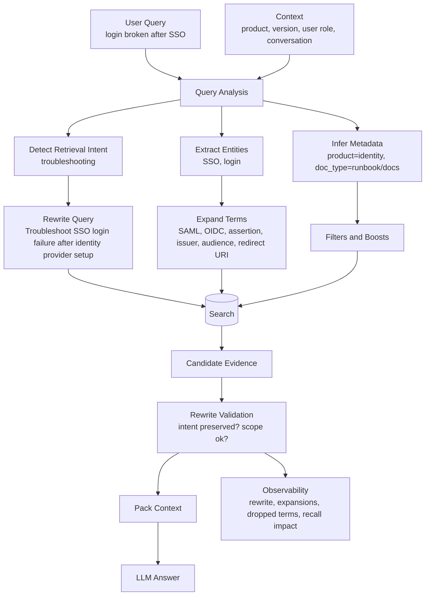

What the diagram is really saying:

- Query transformation is not one magic prompt. It is a small retrieval subsystem.
- The safest systems separate intent detection, entity extraction, metadata extraction, rewriting, and expansion.
- Every rewrite should be traceable. If a transformed query causes a bad answer, you need to know exactly what changed.

---

### 3. Real-World Industry Scenarios [Intermediate]

#### Scenario A - Developer Support Search

**Product/use case context:** A developer asks, "webhook signature failing node." The docs use headings like "Verify webhook HMAC signatures in Node.js" and "timestamp tolerance." A raw semantic search may still work, but it may miss parameter tables or error-code docs because the query is too short and underspecified.

**How rewriting and expansion help:** The system rewrites the query to "troubleshoot webhook HMAC signature verification failure in Node.js" and expands terms like `HMAC`, `signature header`, `timestamp tolerance`, `secret`, `payload`, `Node.js`, and `verifyWebhookSignature`. It can also infer retrieval intent as troubleshooting, which boosts error-code docs and examples over conceptual overview pages.

**Constraints:**
- **Latency:** Query rewriting adds time before retrieval. Rule-based expansions from a controlled vocabulary are fast. LLM-generated rewrites are slower and should be cached or used only when ambiguity is high.
- **Cost:** A single rewrite is cheap. Multiple rewrites and expansions can multiply vector searches. Keep an expansion budget and measure whether recall improves enough to justify the extra search calls.
- **Reliability:** Over-expansion can pull in unrelated authentication docs because "signature" appears in OAuth or JWT pages too.
- **Security/privacy:** User context may contain tenant or entitlement metadata. It can guide filters, but it must not be exposed in generated rewrite text sent to logs or third-party services without controls.

**What good looks like in production:** The retriever finds the exact Node.js webhook verification docs, relevant error codes, and timestamp caveat. The trace shows raw query, rewritten query, expansion terms, metadata filters, and whether the final answer cited evidence that matched the user's intent.

#### Scenario B - Enterprise HR and IT Assistant

**Product/use case context:** An employee asks, "Can I get a laptop for my contractor?" The corpus contains IT procurement docs, contractor onboarding policies, device management standards, and security exceptions. A simple search for "laptop contractor" may retrieve procurement forms but miss the security policy requirement for managed devices.

**How rewriting and expansion help:** The system detects policy/procedure intent and rewrites to "contractor laptop request, managed device requirement, procurement and onboarding approval." It expands "laptop" to "managed device," "endpoint," and "corporate device," and expands "contractor" to "non-employee worker" if that is the official HR term. Metadata can boost IT and security docs while keeping HR onboarding docs as supporting evidence.

**Constraints:**
- **Latency:** Enterprise assistants often run several retrieval steps. Query transformation should not create a heavy branch explosion for every casual question.
- **Cost:** If each expansion triggers a separate retrieval call, cost rises quickly. A controlled vocabulary can add high-value terms into one hybrid query before moving to multi-query retrieval in later patterns.
- **Reliability:** Expansion must preserve policy scope. "Contractor" should not become "employee" just because both are workforce categories.
- **Security/privacy:** If the employee lacks access to security exception runbooks, expansion must not route them into restricted documents.

**What good looks like in production:** The answer explains the laptop request process and security requirement, cites official IT/security policies, and does not overstate exceptions. The rewrite should be inspectable by support teams.

#### Scenario C - Clinical or Regulated Knowledge Search

**Product/use case context:** A clinician asks, "heart attack discharge meds." The corpus uses terms like "myocardial infarction," "post-MI discharge therapy," "antiplatelet therapy," and "beta-blocker." Raw user language may not retrieve the most authoritative guideline if the exact lay phrase is absent.

**How rewriting and expansion help:** The system maps "heart attack" to "myocardial infarction" and "discharge meds" to "post-discharge pharmacotherapy." It can expand to clinically relevant medication classes while preserving patient context and guideline jurisdiction.

**Constraints:**
- **Latency:** Clinical systems must be responsive, but correctness matters more. Use curated terminology where possible instead of open-ended generated expansions.
- **Cost:** Medical expansion dictionaries are cheaper and safer than asking an LLM to invent related terms on every query.
- **Reliability:** Expansion drift is dangerous. Adding too many medication classes can retrieve unrelated contraindication pages or adult guidance when pediatric guidance was intended.
- **Security/privacy:** Patient-specific context must be handled under strict privacy rules and should not be mixed casually with general knowledge retrieval.

**What good looks like in production:** The system retrieves current authoritative guidelines, preserves the user's patient group and jurisdiction, and records which terminology mapping was used. If the query lacks critical patient context, the assistant asks a clarifying question instead of guessing.

---

### 4. System View [Intermediate]

#### Inputs -> Transformations -> Outputs

```text
Query time
  -> raw user query
  -> conversation and app context
  -> query normalization
  -> retrieval intent classification
  -> entity and metadata extraction
  -> rewrite generation
  -> controlled vocabulary expansion
  -> safety and drift validation
  -> retrieval using rewritten/expanded query
  -> trace transformed query, expansions, filters, and results
```

#### Query Transformation Record Example

```json
{
  "query_id": "q-2042",
  "raw_query": "webhook signature failing node",
  "retrieval_intent": "troubleshooting",
  "standalone_query": "Troubleshoot webhook signature verification failures in Node.js.",
  "entities": {
    "feature": "webhooks",
    "language": "nodejs"
  },
  "metadata_intent": {
    "doc_type_boosts": ["troubleshooting", "developer_docs", "error_codes"],
    "language": "nodejs"
  },
  "expansion_terms": [
    "HMAC",
    "signature header",
    "timestamp tolerance",
    "webhook secret",
    "raw request body"
  ],
  "blocked_expansion_terms": ["JWT", "OAuth signature"],
  "transformation_strategy": "normalize_rewrite_expand_controlled_vocab"
}
```

#### Common Rewrite and Expansion Strategies

| Strategy | What it does | Best fit | Main risk |
|---|---|---|---|
| Query normalization | Fixes casing, typos, acronyms, punctuation, and product names | Short or noisy queries | Can normalize away meaningful exact strings |
| Standalone rewrite | Converts follow-up queries into self-contained queries | Conversational RAG | Can inject wrong previous context |
| Intent rewrite | Reframes query as definition, procedure, troubleshooting, comparison, or policy | Mixed corpora | Misclassified intent boosts wrong docs |
| Synonym expansion | Adds equivalent user/corpus terms | Vocabulary mismatch | Adds ambiguous terms |
| Acronym expansion | Maps SSO -> SAML/OIDC or MFA -> multi-factor authentication | Enterprise and technical docs | Acronyms can mean different things by domain |
| Entity expansion | Adds product, API, feature, error code, region, or version variants | Product docs | Wrong entity resolution creates scope errors |
| Controlled vocabulary expansion | Uses curated domain mappings | High-risk domains | Requires maintenance |
| LLM rewrite | Generates a clearer query using instructions/context | Ambiguous natural language | Query drift, latency, cost |

#### Observability: What We Log, Trace, and Measure

- `raw_query`: the user's original words.
- `standalone_query`: the rewritten query used for retrieval.
- `retrieval_intent`: procedure, troubleshooting, definition, policy, comparison, code example, etc.
- `expansion_terms`: added terms and their source: dictionary, rules, LLM, user context.
- `blocked_expansion_terms`: terms rejected by validation.
- `rewrite_latency_ms`: transformation time before retrieval.
- `rewrite_strategy`: rule-based, dictionary, LLM, hybrid, or none.
- `candidate_recall_delta`: recall improvement compared with raw query baseline.
- `query_drift_rate`: how often the rewrite changes intent in evaluation.
- `no_rewrite_needed_rate`: how often raw query is already good enough.
- `rewrite_failure_examples`: stored samples where transformation hurt retrieval.

#### Failure Points and How They Show Up

| Failure point | Prod symptom | Why it happens |
|---|---|---|
| No rewrite | Relevant evidence exists but is not retrieved | User vocabulary differs from corpus vocabulary |
| Over-expansion | Retrieval returns many broad or unrelated docs | Expansion terms are ambiguous or too numerous |
| Query drift | Answer solves a nearby but wrong problem | Rewrite changed original intent or scope |
| Bad conversation rewrite | Follow-up query inherits wrong context | Conversation state was stale or ambiguous |
| Wrong acronym expansion | Search jumps to wrong domain | Acronym has multiple meanings |
| Metadata inference error | Correct docs are filtered out | Query transformation inferred wrong product, version, or region |
| Unlogged transformation | Bad answer is hard to debug | Raw query and transformed query are not traceable |

---

### 5. System Design Flavor [Intermediate]

#### Key Components and Interfaces

1. **Query normalizer:** Handles casing, spelling variants, punctuation, product aliases, and obvious acronym normalization.
2. **Conversation rewriter:** Converts follow-up questions into standalone questions using only relevant recent context.
3. **Intent classifier:** Labels the query as definition, procedure, troubleshooting, policy, comparison, code example, or broad exploration.
4. **Entity extractor:** Pulls product, feature, version, region, language, role, error code, and resource names.
5. **Controlled vocabulary service:** Maps user terms to canonical domain terms, synonyms, acronyms, and safe expansions.
6. **Rewrite generator:** Uses rules or an LLM to produce a retrieval-optimized query.
7. **Drift validator:** Checks that transformed queries preserve user intent and do not add unsupported scope.
8. **Expansion budget controller:** Limits number of expansion terms, rewrites, and retrieval calls.
9. **Retrieval orchestrator:** Sends raw, rewritten, or expanded queries into vector/hybrid search.
10. **Evaluation harness:** Compares raw query retrieval against transformed query retrieval using labeled test sets.

#### Important Tradeoffs

| Tradeoff | Choose rewriting when... | Choose expansion when... |
|---|---|---|
| Clarifying vs broadening | The user query is vague, conversational, or underspecified | The user query is clear but corpus uses different terms |
| Rule-based vs LLM-based | Domain mappings are stable and safety matters | User wording is highly variable and rules are too brittle |
| Recall vs precision | Missing relevant evidence is more harmful than extra candidates | Wrong-scope evidence is more harmful than missing a weak candidate |
| Single rewritten query vs multiple variants | Latency and cost are tight | Query is ambiguous and evidence may use several vocabularies |

In layman's terms: rewriting edits the question; expansion adds search handles. Use rewriting when the question itself needs cleanup. Use expansion when the question is understandable but needs domain vocabulary.

#### Practical Defaults

- Always log raw query, transformed query, expansions, and strategy.
- Start with deterministic normalization and controlled vocabulary before LLM rewrites.
- Use LLM rewrites mainly for conversational, ambiguous, or natural-language-heavy queries.
- Keep expansion terms small and high confidence; broad expansion belongs in multi-query retrieval, not blind term stuffing.
- Preserve exact user entities like error codes, API names, IDs, and quoted phrases.
- Validate rewrites against metadata: do not infer product, version, region, or role too aggressively.
- Evaluate raw vs rewritten retrieval side by side. A rewrite system must prove it improves recall without unacceptable drift.

#### Scaling Consideration: What Changes at 10x Traffic or Data

At 10x data, vocabulary mismatch becomes more painful because many documents are semantically close. Query transformation must also become more precise: a vague expansion can retrieve a large pile of plausible but wrong evidence.

At 10x traffic, LLM-based query rewriting can become a latency and cost bottleneck. Cache common rewrites, use rule-based expansions for high-frequency terms, and route only uncertain queries to heavier rewriting. You should also maintain query-transformation eval sets from real failed searches, not only synthetic examples.

At scale, track transformation quality by query class. Troubleshooting queries, policy queries, code queries, and comparison queries fail differently and need different rewrite policies.

---

### 6. Common Mistakes + Debugging [Beginner]

#### Mistake 1 - Expanding with Every Possible Synonym

- **Symptom:** Retrieval gets broader but worse. The prompt contains loosely related docs and the answer feels generic.
- **Likely cause:** Expansion added too many ambiguous terms without intent or metadata constraints.
- **First debugging step:** Inspect expansion terms and remove the lowest-confidence terms. Compare recall@k and precision@k before and after each expansion group.

#### Mistake 2 - Letting LLM Rewrites Change Intent

- **Symptom:** The answer is polished but solves a different problem than the user asked.
- **Likely cause:** The rewrite added assumptions, changed scope, or converted a question into a more common neighboring question.
- **First debugging step:** Diff `raw_query` and `standalone_query`. Look for added product names, versions, regions, entities, or goals that the user did not provide.

#### Mistake 3 - Rewriting Follow-Up Questions with Stale Conversation Context

- **Symptom:** User asks "what about EU?" and the system answers about the previous product even though the conversation changed.
- **Likely cause:** The conversational rewrite used too much old context or failed to detect topic shift.
- **First debugging step:** Log which conversation turns were used. Rewrite follow-ups with a small, relevant context window and ask for clarification when the antecedent is unclear.

#### Mistake 4 - Not Measuring Raw Query Baseline

- **Symptom:** The team assumes rewriting helps, but some queries perform worse after launch.
- **Likely cause:** Transformations were added without comparing against raw retrieval.
- **First debugging step:** Run A/B evaluation: raw query vs normalized query vs rewritten query vs expanded query. Keep the simplest strategy that improves recall without drift.

---

### 7. Hands-On Lab: Build -> Break -> Measure -> Explain [Pro]

This lab shows why expansion can help vocabulary mismatch and why uncontrolled expansion causes drift. It uses a tiny lexical retriever so the transformation effect is visible.

#### Build: Query Expansion with a Controlled Vocabulary

```python
import re


docs = [
    {
        "id": "saml-audience",
        "text": "SAML login can fail when the assertion audience does not match the service provider entity ID.",
    },
    {
        "id": "oidc-redirect",
        "text": "OIDC sign-in fails when the redirect URI is not registered with the identity provider.",
    },
    {
        "id": "password-reset",
        "text": "Users can reset a forgotten password from the account recovery page.",
    },
    {
        "id": "webhook-hmac",
        "text": "Webhook HMAC signature verification requires the raw request body and timestamp tolerance check.",
    },
]


controlled_vocabulary = {
    "sso": ["saml", "oidc", "identity provider", "service provider"],
    "login": ["sign-in", "authentication"],
    "broken": ["fail", "failure", "error"],
}


def tokens(text):
    return re.findall(r"[a-z0-9-]+", text.lower())


def expand_query(query, vocabulary, max_terms=6):
    expanded_terms = []
    query_terms = set(tokens(query))

    for term in query_terms:
        expanded_terms.extend(vocabulary.get(term, []))

    unique_expansions = []
    for term in expanded_terms:
        if term not in unique_expansions:
            unique_expansions.append(term)

    return query + " " + " ".join(unique_expansions[:max_terms])


def score(query, text):
    return len(set(tokens(query)) & set(tokens(text)))


def retrieve(query, top_k=2):
    return sorted(
        docs,
        key=lambda doc: score(query, doc["text"]),
        reverse=True,
    )[:top_k]


raw_query = "login broken after sso"
expanded_query = expand_query(raw_query, controlled_vocabulary)

print("Raw query:", raw_query)
print([doc["id"] for doc in retrieve(raw_query)])

print("Expanded query:", expanded_query)
print([doc["id"] for doc in retrieve(expanded_query)])
```

Expected behavior: the raw query has weak lexical overlap with the SAML/OIDC docs. Expansion adds corpus vocabulary like SAML, OIDC, identity provider, sign-in, and failure, which improves candidate retrieval.

#### Break Case 1: Add Bad Expansion Terms

Change the vocabulary entry for `login` to include `password reset`, `account recovery`, and `profile update`.

What breaks:
- The password reset doc may outrank SSO docs.
- The system answers a nearby but wrong authentication problem.
- This is query drift from careless expansion.

#### Break Case 2: Remove the Expansion Budget

Let every related term enter the query with no `max_terms` limit.

What breaks:
- The query becomes a bag of broad identity words.
- Retrieval pulls many authentication docs but loses the specific SSO failure intent.
- More terms do not automatically mean better recall.

#### Break Case 3: Rewrite the Query Too Aggressively

Replace `login broken after sso` with `How do I reset a user password after failed login?`

What breaks:
- The rewrite is grammatical but changes the user's problem.
- Retrieval improves for the wrong target.
- This is why rewrite validation matters.

#### Measure: Signals to Capture

| Metric | What it tells you | Healthy direction |
|---|---|---|
| `recall@k_raw` | Baseline retrieval quality before transformation | Measure first |
| `recall@k_rewritten` | Whether rewriting improves evidence coverage | Higher than raw |
| `precision@k_rewritten` | Whether added candidates stay relevant | Stable or higher |
| `query_drift_rate` | How often transformed query changes intent | Lower |
| `expansion_term_hit_rate` | Which expansion terms actually retrieve useful docs | Higher |
| `rewrite_latency_ms` | Cost of query transformation | Low and predictable |
| `no_rewrite_needed_rate` | How often raw query is sufficient | Useful for routing |

#### Explain: Why It Broke and How to Fix It

Good expansion helps because it bridges user language and corpus language. Bad expansion hurts because it adds alternate intents, not just alternate vocabulary. Aggressive rewriting hurts because retrieval can become excellent for the wrong question. The fix is to use controlled vocabulary, expansion budgets, drift validation, and raw-vs-transformed retrieval evaluation.

Production guardrail: every transformed query should preserve user intent, exact entities, and explicit scope. If the transformation adds unsupported entities or changes the task type, do not use it without clarification.

---

### 8. Active Recall (Spaced Repetition) [Beginner]

1. What is the difference between query rewriting and query expansion?
2. What problem does lexical mismatch create?
3. Why can query expansion reduce answer quality even if it increases recall?
4. What is query drift?
5. Why should raw query retrieval be measured as a baseline?

Answer key:

1. Rewriting changes the query into a clearer form; expansion adds related terms to broaden matching.
2. The user and corpus describe the same concept with different words, so retrieval misses relevant evidence.
3. Over-expansion can retrieve loosely related or wrong-scope evidence that crowds out precise context.
4. Query drift is when transformation changes the user's original intent or scope.
5. Without a raw baseline, you cannot prove the transformation helps instead of hurting.

---

### 9. Practice [Intermediate]

#### Mini-Exercise

You are building retrieval for API docs. A user asks, "payment callback not hitting my server." The docs use terms like webhook endpoint, event delivery, retry policy, signing secret, and endpoint URL.

Design the rewrite and expansion strategy.

Suggested answer outline:

- Retrieval intent: troubleshooting.
- Standalone rewrite: "Troubleshoot payment webhook endpoint not receiving event delivery callbacks."
- Expansion terms: webhook endpoint, event delivery, callback URL, endpoint URL, retry policy, signing secret, delivery logs.
- Metadata: product=payments, doc_type boost for troubleshooting/error docs, language/framework only if user specified it.
- Blocked expansions: generic server outage, OAuth callback, browser redirect unless evidence indicates those are relevant.
- Guardrails: preserve "payment" and "callback not hitting server" intent; do not rewrite into payment failure or checkout redirect issue.
- Metrics: compare raw query vs rewritten/expanded retrieval on recall@k and drift examples.

#### Capstone-Style System Design Question

Design a query transformation layer for an enterprise RAG assistant across HR, IT, security, legal, and engineering docs. Users ask vague questions, use acronyms, and often ask follow-ups. How do you improve recall without query drift?

Suggested answer outline:

- Start with query normalization and acronym/domain alias mapping from a controlled vocabulary.
- Use conversation rewriting only when the antecedent is clear; otherwise ask a clarifying question.
- Classify retrieval intent: policy, procedure, troubleshooting, definition, comparison, code/example.
- Extract entities and metadata: department, product, version, region, role, error code, source type.
- Apply expansion budgets and source-specific vocabularies to avoid broad drift.
- Use hard filters only for tenant, permission, and explicit boundaries; use boosts for inferred context.
- Validate rewrites by checking that exact user entities and intent survive.
- Log raw query, rewritten query, expansion terms, blocked terms, strategy, latency, candidate recall delta, and final citations.
- Maintain an eval set of real failed queries and compare raw vs rewritten retrieval continuously.

---

### 10. Production Reality Check [Pro]

**If this fails in prod, what's the first thing we inspect?**

Inspect the query transformation trace: raw query -> normalized query -> standalone rewrite -> expansion terms -> inferred metadata -> retrieved candidates. If the correct evidence appears for the raw query but disappears after transformation, debug query drift or filters. If neither raw nor transformed query finds it, debug corpus vocabulary, chunking, metadata, or index coverage. If transformed retrieval finds too much unrelated evidence, reduce expansion terms, add intent constraints, or route to multi-query retrieval with fusion instead of stuffing one query.

---

### 11. Curiosity Bridge [Beginner]

This works when one transformed query is enough. But many real queries have multiple plausible meanings or require evidence from several phrasings at once. That leads directly to multi-query retrieval and fusion: run several focused searches, then combine their results without letting one noisy rewrite dominate.

---

### 12. Exit Check + Carry-Forward Review [Beginner]

**You're done when you can:** explain when to rewrite, when to expand, how query drift happens, and how to debug a bad retrieval by comparing raw and transformed queries.

Carry-forward review from Topic 7.1:

1. Why does query rewriting not replace good chunking and metadata?
   - Rewriting can only improve how we ask the index. If the corpus is badly chunked, missing metadata, or compacted poorly, better queries still retrieve weak evidence.
2. How can metadata reduce query drift?
   - Metadata can constrain expansions to the correct product, version, region, role, source type, or permission boundary, so added vocabulary does not pull retrieval into unrelated areas.

---

## Subtopic 7.2.b: Multi-Query Retrieval and Fusion

Added to Knowledge Base.

**Subtopic time:** 3.5h

### 0. Reading Path + Level Tags

- **Beginner:** Read sections 1-2, section 6, and Active Recall.
- **Intermediate:** Add sections 3-5 and the Hands-On Lab.
- **Pro:** Do the full lab, compare fusion strategies, and answer the capstone system-design question.

---

### 1. Pre-Question Hook + The Intuition [Beginner]

**Pause: before reading, if a user asks "payment callback not hitting my server," should we trust one rewritten query, or should we search from several angles: webhook delivery, endpoint URL, retry logs, signing secret, and server response codes?**

**Multi-query retrieval** runs multiple retrieval branches for one user request, then combines their candidate results. Each branch searches from a different useful angle: raw user wording, canonical rewrite, domain expansion, exact keyword search, vector search, metadata-scoped search, or error-code search.

**Fusion** combines those branch results into one ranked candidate set. The goal is not to stuff the prompt with everything found. The goal is to improve recall while controlling noise, duplicates, latency, and token cost.

Why this matters: one query often reflects only one interpretation. Real user questions are messy, short, ambiguous, and vocabulary-poor. Multi-query retrieval gives the system several chances to find the right evidence. Fusion decides which candidates deserve to survive.

Real-world analogy: A good investigator does not search one database with one phrase. They search names, aliases, dates, locations, and related case numbers, then merge the leads and remove duplicates. The analogy breaks down because retrieval systems must do this in milliseconds, under cost constraints, and without letting noisy leads dominate the answer.

Key terms:
- **Multi-query retrieval:** Running multiple query variants or retrieval branches for one user request, then combining their results.
- **Query branch:** One retrieval path, such as raw query, rewritten query, keyword query, vector query, metadata-scoped query, or error-code query.
- **Fusion:** Combining candidate results from multiple retrieval branches into one ranked set.
- **Candidate union:** The pooled set of unique candidates gathered across retrieval branches.
- **Rank aggregation:** Combining ranked lists into one final ranked list.
- **Fusion weight:** A coefficient that controls how much one retrieval branch influences final ranking.
- **Branch diversity:** The degree to which query branches search meaningfully different angles instead of repeating the same query.
- **Recall lift:** The improvement in finding relevant evidence compared with a single-query baseline.
- **Fusion noise:** Irrelevant candidates introduced because extra branches searched too broadly.

The mental model to keep permanently: **multi-query widens the net; fusion decides what is worth keeping.**

---

### 2. Visual Diagram (Mermaid) [Beginner]

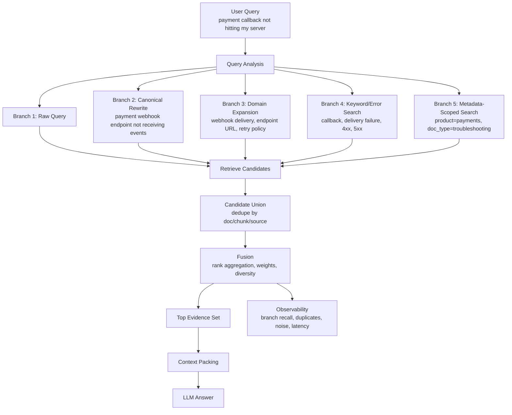

What the diagram is really saying:

- Each branch should have a reason to exist.
- Fusion is not optional; otherwise multi-query retrieval becomes multi-query clutter.
- The trace must show which branch found each final piece of evidence.

---

### 3. Real-World Industry Scenarios [Intermediate]

#### Scenario A - Developer Documentation Troubleshooting

**Product/use case context:** A developer asks, "payment callback not hitting my server." The correct answer may live across webhook docs, endpoint configuration docs, delivery logs, retry policy, firewall/network notes, and signing-secret troubleshooting.

**How multi-query retrieval helps:** A single rewrite might search "payment webhook endpoint not receiving events" and retrieve the main webhook page. But separate branches can retrieve complementary evidence: one branch searches delivery logs, another searches HTTP response codes, another searches endpoint URL configuration, and another searches retry behavior. Fusion can then keep the most relevant pieces from each branch.

**Constraints:**
- **Latency:** Five branches can mean five retrieval calls. To keep p95 latency stable, run branches in parallel, cap top-k per branch, and use cheaper keyword branches when appropriate.
- **Cost:** Extra branches can increase vector search, reranking, and context-packing cost. The system should measure whether each branch adds unique relevant evidence.
- **Reliability:** Branches can introduce conflicting evidence, such as generic webhook docs from another product. Metadata filters and fusion weights should keep product scope intact.
- **Security/privacy:** User-specific delivery logs are sensitive. If one branch searches customer telemetry, it must enforce tenant and role permissions separately from public docs search.

**What good looks like in production:** The answer combines endpoint URL setup, delivery log inspection, retry schedule, and expected server response behavior, citing each source. The trace shows which branch found each citation and whether duplicate candidates were collapsed.

#### Scenario B - Enterprise Internal Assistant with Acronyms

**Product/use case context:** An employee asks, "QBR access review for vendors." In one department, QBR means Quarterly Business Review. In security docs, the relevant concept may be quarterly access certification. In vendor management, it may be third-party access recertification.

**How multi-query retrieval helps:** Rather than betting on one acronym interpretation, the system can run controlled branches: one for raw QBR, one for quarterly access certification, one for vendor access review, and one scoped to security/compliance docs. Fusion favors documents that appear across multiple high-confidence branches or match user context.

**Constraints:**
- **Latency:** Branch count should depend on ambiguity. Clear queries do not need many branches.
- **Cost:** Acronym ambiguity can create branch explosion if every meaning is searched equally.
- **Reliability:** Fusion must not average unrelated meanings into one answer. If branches find separate interpretations, the assistant may need to ask a clarifying question.
- **Security/privacy:** Vendor-access policies may be restricted. Each branch must keep permission filters.

**What good looks like in production:** The assistant retrieves security/vendor recertification docs, not sales QBR templates, and explains if the acronym is ambiguous. Fusion does not hide ambiguity; it surfaces it when needed.

#### Scenario C - Legal and Policy Search

**Product/use case context:** A legal user asks, "What exceptions limit termination without cause?" The wording may appear as "termination for convenience," "without cause," "early termination," "carve-outs," and "exceptions" across contracts.

**How multi-query retrieval helps:** Branches search legal synonyms and clause patterns separately: "termination without cause exceptions," "termination for convenience carve-outs," "early termination limitations," and exact phrase search for "without cause." Fusion can prioritize clauses that appear in multiple branches or belong to the same contract section.

**Constraints:**
- **Latency:** Legal users may tolerate more retrieval work, but contract review still needs predictable interaction.
- **Cost:** Contracts are long; extra retrieval branches must be followed by strict dedupe and context compaction.
- **Reliability:** Branches may retrieve similar clauses from different agreements. Fusion must preserve contract identity and not blend client-specific terms.
- **Security/privacy:** Multi-query must not search across client boundaries unless the user is authorized.

**What good looks like in production:** The system finds the exact clause, synonymous clauses, related definitions, and exceptions, then cites only the authorized contract. Fusion preserves source boundaries and does not mix agreements.

---

### 4. System View [Intermediate]

#### Inputs -> Transformations -> Outputs

```text
Inputs
  -> raw user query
  -> query analysis: intent, entities, constraints, ambiguity
  -> domain dictionaries and rewrite rules
  -> metadata filters and user permissions

Transformations
  -> generate query branches with reason codes
  -> retrieve top-k candidates per branch
  -> normalize scores per branch
  -> pool candidates into candidate union
  -> deduplicate by chunk, parent, node, source, and offsets
  -> fuse rankings using branch weights or rank aggregation
  -> apply diversity and metadata constraints
  -> pass final candidates to reranking/context packing

Outputs
  -> fused ranked evidence set
  -> branch-level trace
  -> dropped candidates and reasons
  -> final context-ready candidates
```

#### Multi-Query Trace Example

```json
{
  "query_id": "q-9811",
  "raw_query": "payment callback not hitting my server",
  "branches": [
    {
      "branch_id": "raw",
      "query": "payment callback not hitting my server",
      "reason": "preserve_user_language",
      "top_k": 10
    },
    {
      "branch_id": "rewrite",
      "query": "payment webhook endpoint not receiving event deliveries",
      "reason": "canonical_support_language",
      "top_k": 10
    },
    {
      "branch_id": "delivery_logs",
      "query": "webhook delivery logs endpoint response status retry policy",
      "reason": "troubleshooting_diagnostics",
      "top_k": 10
    }
  ],
  "candidate_union_count": 24,
  "deduped_candidate_count": 13,
  "fused_top_candidate_ids": ["payments-webhook-delivery", "endpoint-url-config", "retry-policy"]
}
```

#### Common Fusion Strategies

| Strategy | What it does | Best fit | Main risk |
|---|---|---|---|
| Simple union | Pool all candidates and dedupe | Small candidate sets | No ranking discipline |
| Max score fusion | Keep each candidate's best branch score | Similar scoring scales | One noisy branch can dominate |
| Weighted fusion | Weight trusted branches more heavily | Branch confidence differs | Weights require tuning |
| Rank aggregation | Combine candidate ranks across branches | Scores are not comparable | Can reward mediocre repeated appearances |
| Reciprocal rank style fusion | Rewards candidates appearing high in multiple ranked lists | Heterogeneous retrievers | Needs careful constants and dedupe |
| Diversity-aware fusion | Limits over-representation from one source or branch | Redundant corpora | Can drop useful repeated evidence |

We will go deeper on reciprocal rank fusion and late fusion later in Topic 7.2. For now, the key idea is that fusion must combine evidence without allowing one broad branch to flood the final context.

#### Observability: What We Log, Trace, and Measure

- `branch_count`: how many retrieval branches ran.
- `branch_reason_codes`: why each branch exists.
- `branch_latency_ms`: retrieval latency per branch.
- `branch_recall@k`: which branches found labeled relevant evidence.
- `branch_unique_hit_count`: how much unique evidence each branch contributed.
- `candidate_union_count`: pooled candidates before dedupe.
- `dedupe_rate`: how many candidates collapsed across branches.
- `fusion_noise_rate`: irrelevant candidates introduced by extra branches.
- `fused_recall@k`: recall after fusion.
- `fused_precision@k`: precision after fusion.
- `branch_dominance`: whether one branch supplies most final candidates.
- `answer_citation_branch_ids`: which branches produced cited evidence.

#### Failure Points and How They Show Up

| Failure point | Prod symptom | Why it happens |
|---|---|---|
| Too many branches | Latency and noise increase | Every synonym or interpretation becomes a retrieval call |
| Low branch diversity | Multi-query gives no recall lift | Branches are near-duplicates of each other |
| Bad fusion weights | Wrong branch dominates final ranking | Trusted branch weights are poorly tuned |
| No dedupe before fusion | Same source appears repeatedly | Candidate IDs, parent IDs, or offsets are not collapsed |
| No ambiguity detection | Answer blends conflicting interpretations | Branches represent different meanings but are fused as one |
| Weak metadata filters | Scope-wrong docs enter from broad branches | Product, version, tenant, or permission constraints are not applied per branch |
| No branch tracing | Debugging is blind | Final candidates do not record which branch found them |

---

### 5. System Design Flavor [Intermediate]

#### Key Components and Interfaces

1. **Branch planner:** Decides whether the query needs one branch or multiple branches based on ambiguity, query length, intent, and retrieval confidence.
2. **Branch generator:** Creates raw, rewritten, expanded, keyword, vector, metadata-scoped, and domain-specific query branches.
3. **Branch budget controller:** Limits branch count, top-k per branch, and total retrieval latency.
4. **Parallel retrieval executor:** Runs independent branches concurrently where the infrastructure supports it.
5. **Candidate normalizer:** Converts results from different retrievers into a common candidate schema with IDs, scores, ranks, source, and metadata.
6. **Deduplication layer:** Collapses repeated chunks, parent chunks, graph nodes, and near-duplicate source spans.
7. **Fusion engine:** Combines candidates using scores, ranks, weights, branch confidence, and diversity constraints.
8. **Ambiguity detector:** Detects when branches found different interpretations that should not be merged into one answer.
9. **Evaluation harness:** Compares single-query baseline against multi-query recall, precision, latency, and answer quality.

#### Important Tradeoffs

| Tradeoff | Choose multi-query when... | Stay with single-query when... |
|---|---|---|
| Recall vs latency | Missing evidence is common or costly | Query is clear and single-query recall is already high |
| Coverage vs noise | Corpus uses many vocabularies for same concept | Extra branches bring mostly generic docs |
| Branch diversity vs branch count | Branches search genuinely different evidence angles | Branches are near-duplicate rewrites |
| Fusion simplicity vs ranking quality | Candidate set is small and clean | Branches use different retrievers or score scales |

In layman's terms: multi-query is useful when one search phrase is too fragile. But every branch is a bill: latency, cost, noise, and debugging complexity. Add branches only when they bring unique evidence.

#### Practical Defaults

- Always include the raw query branch for traceability.
- Add one canonical rewrite branch for messy natural language.
- Add one controlled expansion branch for domain vocabulary.
- Add keyword or exact-match branches for error codes, stack traces, IDs, quoted phrases, legal clauses, and API names.
- Apply metadata and permission filters independently inside every branch.
- Cap top-k per branch and dedupe before context packing.
- Prefer fewer high-quality branches over many broad branches.
- Measure unique relevant contribution per branch; remove branches that do not improve recall or answer quality.

#### Scaling Consideration: What Changes at 10x Traffic or Data

At 10x data, multi-query can rescue recall because relevant documents may be buried under many near-matches. But it can also amplify noise if broad branches retrieve from every corner of the corpus. Fusion must become stricter: metadata constraints, source diversity, branch weights, and dedupe are mandatory.

At 10x traffic, branch planning must be adaptive. Do not run five branches for every query. Use a cheap first pass to decide whether the query is ambiguous, short, acronym-heavy, zero-result, or high-risk enough to justify extra branches. Cache common branch results and run parallel retrieval when possible.

At scale, branch observability becomes a product-quality tool. If one branch never contributes cited evidence, remove it. If one branch contributes most incidents, tune it or isolate it behind confidence checks.

---

### 6. Common Mistakes + Debugging [Beginner]

#### Mistake 1 - Thinking More Queries Automatically Means Better Retrieval

- **Symptom:** Recall improves slightly, but precision drops and answers become vague.
- **Likely cause:** Branches are too broad or redundant, and fusion lets noisy candidates survive.
- **First debugging step:** Inspect branch-level contribution. For each final cited chunk, record which branch found it. Remove branches that add noise without unique relevant evidence.

#### Mistake 2 - Fusing Different Interpretations Without Detecting Ambiguity

- **Symptom:** The answer mixes two possible meanings of an acronym or symptom.
- **Likely cause:** Branches represented separate interpretations, but fusion treated them as complementary evidence.
- **First debugging step:** Cluster branch results by intent, source type, or entity. If branches disagree on meaning, ask a clarifying question or present alternatives instead of blending them.

#### Mistake 3 - Comparing Scores Across Branches Naively

- **Symptom:** One retriever or branch always dominates because its scores are numerically larger.
- **Likely cause:** Dense scores, BM25 scores, and reranker scores were combined without normalization.
- **First debugging step:** Use ranks or normalized scores instead of raw scores. Check whether branch dominance changes after normalization.

#### Mistake 4 - Forgetting Dedupe Before Packing

- **Symptom:** The final prompt contains the same paragraph from multiple query branches.
- **Likely cause:** Candidate union did not collapse results by chunk ID, parent ID, source offsets, or near-duplicate fingerprint.
- **First debugging step:** Group fused candidates by `doc_id`, `parent_id`, `node_id`, and source offset overlap. Collapse duplicates before context compaction.

---

### 7. Hands-On Lab: Build -> Break -> Measure -> Explain [Pro]

This lab simulates multi-query retrieval with lexical scoring and a simple rank-fusion method. It keeps the mechanics visible: branch generation, candidate union, dedupe, and fused ranking.

#### Build: Multi-Query Retrieval with Simple Rank Fusion

```python
import re
from collections import defaultdict


docs = [
    {
        "id": "webhook-delivery",
        "text": "Payment webhook event delivery fails when the endpoint URL is unreachable or returns non-2xx responses.",
    },
    {
        "id": "webhook-retry",
        "text": "Webhook retry policy sends failed event deliveries again using exponential backoff.",
    },
    {
        "id": "signing-secret",
        "text": "Webhook signing secret verification requires the raw request body and signature header.",
    },
    {
        "id": "oauth-callback",
        "text": "OAuth callback URL mismatch can cause browser redirect failures after login.",
    },
    {
        "id": "server-firewall",
        "text": "Inbound firewall rules can block payment webhook callbacks from reaching your server endpoint.",
    },
]


def tokens(text):
    return set(re.findall(r"[a-z0-9-]+", text.lower()))


def score(query, text):
    return len(tokens(query) & tokens(text))


def retrieve_branch(branch_id, query, top_k=3):
    ranked = sorted(
        docs,
        key=lambda doc: score(query, doc["text"]),
        reverse=True,
    )[:top_k]

    return [
        {
            "doc_id": doc["id"],
            "branch_id": branch_id,
            "rank": rank,
            "score": score(query, doc["text"]),
            "text": doc["text"],
        }
        for rank, doc in enumerate(ranked, start=1)
    ]


branches = [
    ("raw", "payment callback not hitting my server"),
    ("rewrite", "payment webhook endpoint not receiving event deliveries"),
    ("diagnostics", "webhook delivery logs endpoint response non-2xx retry policy"),
    ("network", "server firewall inbound endpoint unreachable payment webhook"),
]


def fuse(branch_results, k=60):
    fused_scores = defaultdict(float)
    evidence = {}
    branch_hits = defaultdict(list)

    for result in branch_results:
        doc_id = result["doc_id"]
        fused_scores[doc_id] += 1 / (k + result["rank"])
        evidence[doc_id] = result["text"]
        branch_hits[doc_id].append(result["branch_id"])

    ranked_doc_ids = sorted(fused_scores, key=fused_scores.get, reverse=True)
    return [
        {
            "doc_id": doc_id,
            "fusion_score": round(fused_scores[doc_id], 4),
            "branches": branch_hits[doc_id],
            "text": evidence[doc_id],
        }
        for doc_id in ranked_doc_ids
    ]


all_results = []
for branch_id, query in branches:
    all_results.extend(retrieve_branch(branch_id, query))

for item in fuse(all_results):
    print(item)
```

Expected behavior: documents about webhook delivery, retry policy, and server reachability should rise because multiple branches find them. The OAuth callback doc may appear in raw wording, but should not dominate because it is a different callback concept.

#### Break Case 1: Add a Broad Branch

Add this branch:

```python
("broad", "callback server login authentication application error")
```

What breaks:
- Generic callback/authentication docs get extra rank support.
- The OAuth callback page may rise even though the user meant payment webhooks.
- This shows fusion noise from a broad branch.

#### Break Case 2: Remove Dedupe by `doc_id`

Instead of accumulating scores per `doc_id`, print all branch results directly.

What breaks:
- The same document can appear multiple times.
- Context packing wastes space on repeated evidence.
- This mirrors real systems that forget to dedupe by chunk, parent, or source offsets.

#### Break Case 3: Use Raw Scores Across Branches

Change fusion to add `result["score"]` directly.

What breaks:
- Longer or broader branch queries may dominate because they overlap more terms.
- Scores become unfair across branches.
- This is why rank-based or normalized fusion is safer with heterogeneous branches.

#### Measure: Signals to Capture

| Metric | What it tells you | Healthy direction |
|---|---|---|
| `recall@k_single` | Baseline recall from the best single query | Measure first |
| `fused_recall@k` | Recall after combining branches | Higher than single-query baseline |
| `fused_precision@k` | Whether fusion kept top results relevant | Stable or acceptable drop |
| `branch_unique_hit_count` | How much unique evidence each branch contributes | Higher for useful branches |
| `branch_dominance` | Whether one branch floods the final list | Lower unless intentional |
| `dedupe_rate` | How many repeated candidates were collapsed | Nonzero in multi-query systems |
| `fusion_noise_rate` | Irrelevant candidates introduced by extra branches | Lower |
| `p95_retrieval_latency_ms` | User-visible cost of multi-branch retrieval | Predictable and within budget |

#### Explain: Why It Broke and How to Fix It

The broad branch breaks because it adds weakly related candidates that rank well by generic overlap. Removing dedupe breaks context quality because repeated evidence consumes prompt budget. Raw-score fusion breaks because branch scores are not always comparable. The fix is to plan branches with reason codes, dedupe before packing, use rank-based or normalized fusion, and measure branch contribution against latency and precision cost.

Production guardrail: every retrieval branch should justify itself with unique relevant contribution. If a branch adds latency and noise but rarely contributes cited evidence, remove or gate it.

---

### 8. Active Recall (Spaced Repetition) [Beginner]

1. What is multi-query retrieval?
2. Why is fusion necessary after running multiple retrieval branches?
3. What is branch diversity?
4. Why is raw score addition risky across branches?
5. What is the first sign that multi-query retrieval is hurting instead of helping?

Answer key:

1. Running several query variants or retrieval branches for one user request, then combining the results.
2. Without fusion, the system has a noisy pile of candidates with duplicates and inconsistent ranks.
3. Branches search meaningfully different evidence angles instead of repeating the same query.
4. Different branches or retrievers may produce scores on incompatible scales.
5. Precision drops, latency rises, and final answers cite noisy or duplicated evidence without meaningful recall lift.

---

### 9. Practice [Intermediate]

#### Mini-Exercise

You are building retrieval for a security assistant. A user asks, "prod access review vendor exception." Design four query branches and a fusion policy.

Suggested answer outline:

- Branch 1 raw: preserve exact user language.
- Branch 2 canonical rewrite: "vendor production access review exception process."
- Branch 3 policy terminology: "third-party production access certification exception approval."
- Branch 4 metadata-scoped: security/compliance docs with `doc_type=policy` and `source_authority=official`.
- Hard filters: tenant, permissions, sensitivity, current policy version.
- Fusion: dedupe by policy section/parent/node, weight official policy branch higher, keep raw branch for exact phrase hits, limit candidates from any one branch.
- Debug trace: branch reason, top hits per branch, dedupe groups, fused ranking, final citations.

#### Capstone-Style System Design Question

Design a multi-query retrieval layer for a global developer documentation assistant. Users ask ambiguous questions with product aliases, old feature names, error codes, and symptom descriptions. How do you decide branches, fuse results, and control cost?

Suggested answer outline:

- Use a branch planner that detects ambiguity, query length, acronyms, error codes, and low confidence from a first-pass retrieval.
- Branches: raw query, canonical rewrite, controlled vocabulary expansion, exact keyword/error-code search, metadata-scoped product/version search.
- Run branches in parallel with top-k caps and strict metadata filters.
- Normalize candidate schema across vector, BM25, and exact-match retrievers.
- Dedupe by chunk ID, parent ID, source offsets, and near-duplicate fingerprints.
- Fuse with rank aggregation or weighted fusion; do not compare raw scores blindly.
- Track unique relevant contribution per branch, latency, recall lift, precision drop, and final citation branch IDs.
- Gate expensive branches behind ambiguity or zero-result triggers.

---

### 10. Production Reality Check [Pro]

**If this fails in prod, what's the first thing we inspect?**

Inspect the branch-level retrieval trace: branch plan -> query text per branch -> top candidates per branch -> candidate union -> dedupe groups -> fusion scores -> final citations. If the correct evidence appears in one branch but disappears after fusion, debug fusion weights, dedupe, or diversity constraints. If no branch finds it, debug branch generation, query rewriting, metadata filters, or corpus coverage. If answers become noisy, inspect broad branches and branch dominance.

---

### 11. Curiosity Bridge [Beginner]

Multi-query retrieval improves coverage, but it still mostly uses retrieval-stage signals. The next layer asks: once we have a candidate pool, can a stronger model judge relevance more precisely? That leads to cross-encoder and LLM reranking, where candidate quality is refined after retrieval but before context packing.

---

### 12. Exit Check + Carry-Forward Review [Beginner]

**You're done when you can:** design retrieval branches for an ambiguous query, fuse their results without duplicate clutter, and debug whether multi-query improved recall enough to justify its cost.

Carry-forward review from 7.2.a:

1. How is multi-query retrieval different from query expansion?
   - Query expansion adds terms to a query. Multi-query retrieval runs multiple separate retrieval branches, often with different intents, vocabularies, retrievers, or metadata scopes, then fuses results.
2. Why must query drift be checked before fusion?
   - If a branch drifts into a different intent, fusion may treat wrong evidence as complementary and produce a blended answer.

---

## Subtopic 7.2.c: Cross-Encoder and LLM Reranking

Added to Knowledge Base.

**Subtopic time:** 3.5h

### 0. Reading Path + Level Tags

- **Beginner:** Read sections 1-2, section 6, and Active Recall.
- **Intermediate:** Add sections 3-5 and the Hands-On Lab.
- **Pro:** Do the full lab, compare rerank depths, and answer the capstone system-design question.

---

### 1. Pre-Question Hook + The Intuition [Beginner]

**Pause: before reading, if vector search retrieves 30 plausible chunks, how do we decide which 5 deserve the LLM's limited context window?**

First-stage retrieval is usually designed for speed and recall. It asks: "Which candidates might be relevant?" **Reranking** is the second-stage process that reorders those candidates using a stronger relevance judge before context packing. It asks: "Among the candidates we already found, which ones best answer this query?"

The reason reranking exists is simple: fast retrievers are approximate. Dense retrieval can retrieve semantically similar but scope-wrong chunks. Keyword retrieval can retrieve exact words without answering the question. Multi-query retrieval can produce a noisy candidate pool. Reranking is the quality gate between candidate generation and prompt construction.

**Cross-encoder reranking** uses a model that reads the query and candidate text together and scores their relevance. This is different from a **bi-encoder**, where the query and document are embedded separately and compared with vector similarity. A cross-encoder is slower, but it can inspect token-level interactions like negation, exact entity matches, conditions, and whether the chunk actually answers the query.

**LLM reranking** asks an LLM to score, compare, or order candidate chunks using a rubric. It is flexible and can reason about intent, citations, and answer sufficiency, but it is slower, costlier, and more vulnerable to prompt design, position bias, and inconsistent scoring.

Real-world analogy: First-stage retrieval is like quickly collecting 30 resumes that match keywords. Reranking is the senior interviewer reading the top resumes carefully and deciding which 5 are actually relevant. The analogy breaks down because rerankers must make that decision at machine speed, often without full conversation context or human judgment.

Key terms:
- **Reranking:** A second-stage process that reorders retrieved candidates using a stronger relevance model or scoring method.
- **Candidate generation:** The first retrieval stage that produces a broad candidate pool, usually optimized for recall and speed.
- **Cross-encoder:** A reranking model that reads the query and candidate together and outputs a relevance score.
- **Bi-encoder:** A retrieval model that embeds query and documents separately, then compares vectors.
- **LLM reranking:** Using an LLM to score, compare, or order candidate evidence before context packing.
- **Rerank depth:** The number of candidates sent from first-stage retrieval into reranking.
- **Pointwise reranking:** Scoring each candidate independently against the query.
- **Pairwise reranking:** Comparing two candidates at a time and choosing the better one.
- **Listwise reranking:** Ranking a list of candidates together in one pass.
- **Position bias:** A failure where a reranker favors candidates based on order rather than relevance.
- **Score calibration:** Making reranker scores comparable enough to support thresholds and ranking decisions.

The mental model to keep permanently: **retrieve broadly, rerank carefully, pack selectively.**

---

### 2. Visual Diagram (Mermaid) [Beginner]

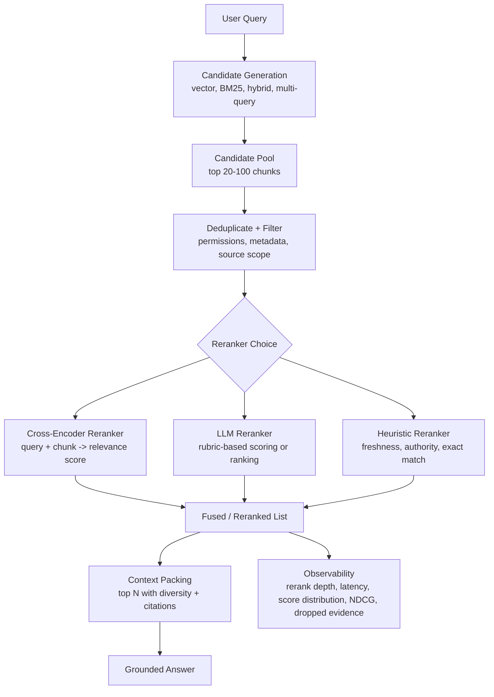

What the diagram is really saying:

- Reranking does not replace retrieval. It improves ordering after retrieval has found candidates.
- Reranking should happen after hard security filters and dedupe.
- The reranker must be evaluated against labeled relevance, not just answer vibes.

---

### 3. Real-World Industry Scenarios [Intermediate]

#### Scenario A - Developer Documentation Search

**Product/use case context:** A developer asks, "Why is my webhook signature validation failing in Node?" First-stage retrieval finds chunks about webhooks, Node examples, HMAC signatures, OAuth signatures, retry policies, and request body parsing.

**How reranking helps:** Dense retrieval may rank a generic webhook overview high because it is semantically related. A cross-encoder can score the Node HMAC validation section higher because it sees direct query-candidate interactions: `webhook`, `signature`, `validation`, `Node`, and `raw request body`. An LLM reranker can apply a rubric like: "prefer chunks that explain failure causes and contain Node-specific verification details."

**Constraints:**
- **Latency:** Cross-encoders are slower than vector search because they score each query-candidate pair. If you rerank 100 chunks, latency can spike. Rerank only the top candidate pool, often 20-50 items.
- **Cost:** Hosted LLM reranking can be expensive if every candidate is sent to an LLM. Use cross-encoders or smaller rerankers for routine traffic, reserve LLM reranking for hard cases.
- **Reliability:** LLM rerankers can overvalue fluent chunks over exact technical details. The rubric must prioritize answerability, exact product/version, and citations.
- **Security/privacy:** Reranking must happen after permission filters. Do not send unauthorized or sensitive candidate text to an external LLM reranker.

**What good looks like in production:** The top packed context contains the Node-specific signature verification procedure, raw body warning, timestamp tolerance note, and relevant error entry. The trace shows first-stage rank vs reranked rank and explains why generic webhook content was pushed down.

#### Scenario B - Enterprise Policy Assistant

**Product/use case context:** An employee asks, "Can a contractor use a personal laptop for production access during an emergency?" Candidate generation retrieves contractor access policy, employee remote-access policy, emergency exception process, device compliance standard, and unrelated laptop procurement pages.

**How reranking helps:** First-stage retrieval may be confused because many chunks mention access, laptop, production, and emergency. A reranker can prioritize chunks that jointly satisfy contractor + personal device + production + emergency exception. It can demote employee-only chunks and procurement pages even if they share keywords.

**Constraints:**
- **Latency:** Enterprise assistants may tolerate moderate reranking latency, but interactive chat still needs stable p95.
- **Cost:** Reranking can reduce downstream LLM cost by packing fewer irrelevant chunks.
- **Reliability:** Policy answers require caveats. The reranker should prefer chunks that include rule + exception + approval condition over chunks with only the main rule.
- **Security/privacy:** Reranker inputs must preserve role, tenant, and policy version filters.

**What good looks like in production:** The reranked top chunks include the contractor rule, temporary exception clause, and approval workflow. Employee access and procurement docs are demoted or omitted.

#### Scenario C - Legal Contract Review

**Product/use case context:** A legal user asks, "Which clauses limit liability for indirect damages?" Candidate generation finds many clauses containing "liability," "damages," "indirect," "consequential," "limitation," and "exclusion."

**How reranking helps:** A cross-encoder can prioritize clauses that actually answer the limitation question rather than every clause mentioning damages. An LLM reranker can evaluate whether a candidate contains direct limitation language, exceptions, definitions, and governing scope.

**Constraints:**
- **Latency:** Legal review may allow deeper reranking, but large contracts still need bounded candidate pools.
- **Cost:** LLM reranking long clauses can be costly; use extractive candidate spans and clause-level parents.
- **Reliability:** Reranking must not blend clauses from different agreements. Candidate metadata and contract ID are part of relevance.
- **Security/privacy:** Contract data is sensitive; prefer local or approved rerankers for confidential content.

**What good looks like in production:** The final context contains only authorized clauses from the correct contract, ranked by direct answerability and citation specificity. The system preserves exact clause text for legal review.

---

### 4. System View [Intermediate]

#### Inputs -> Transformations -> Outputs

```text
Inputs
  -> user query
  -> candidate pool from vector/BM25/hybrid/multi-query retrieval
  -> metadata: product, version, permissions, source authority, freshness
  -> relevance rubric or trained reranker model

Transformations
  -> hard-filter unauthorized candidates
  -> deduplicate candidates by source, parent, node, and offsets
  -> choose rerank depth based on query difficulty and latency budget
  -> score query-candidate pairs with cross-encoder, LLM, or hybrid reranker
  -> normalize or calibrate scores if needed
  -> apply diversity and metadata constraints
  -> select top candidates for context packing

Outputs
  -> reranked candidate list
  -> relevance scores and reason codes
  -> dropped candidates and why they were dropped
  -> final context-ready evidence set
```

#### Reranking Trace Example

```json
{
  "query_id": "q-5520",
  "query": "webhook signature validation failing in Node",
  "first_stage_top_k": 40,
  "rerank_depth": 25,
  "reranker_type": "cross_encoder",
  "candidates": [
    {
      "chunk_id": "webhooks-node-signature-c03",
      "first_stage_rank": 8,
      "reranked_rank": 1,
      "rerank_score": 0.94,
      "reason": "direct Node signature verification failure guidance"
    },
    {
      "chunk_id": "webhooks-overview-c01",
      "first_stage_rank": 1,
      "reranked_rank": 12,
      "rerank_score": 0.41,
      "reason": "related overview but not diagnostic"
    }
  ],
  "latency_ms": {
    "candidate_generation": 42,
    "reranking": 118
  }
}
```

#### Cross-Encoder vs LLM Reranking

| Reranker | Best for | Strength | Main risk |
|---|---|---|---|
| Cross-encoder | High-volume query-candidate relevance scoring | Strong relevance at lower cost than LLMs | Still slower than vector search; limited context length |
| LLM pointwise reranker | Flexible scoring with rubric | Can judge answerability, caveats, and intent | Cost, latency, score inconsistency |
| LLM pairwise reranker | Choosing between close candidates | Good for hard comparisons | Many comparisons become expensive |
| LLM listwise reranker | Ranking a small list holistically | Can reason about diversity and sufficiency | Position bias and context limits |
| Heuristic reranker | Freshness, authority, exact match, metadata boosts | Fast and predictable | Cannot deeply judge semantic answerability |

#### Observability: What We Log, Trace, and Measure

- `first_stage_top_k`: how many candidates retrieval produced.
- `rerank_depth`: how many candidates were reranked.
- `reranker_type`: cross-encoder, LLM pointwise, LLM pairwise, LLM listwise, heuristic, or hybrid.
- `rerank_latency_ms`: time spent reranking.
- `score_distribution`: min, max, mean, and spread of reranker scores.
- `rank_movement`: how far candidates moved between first-stage rank and reranked rank.
- `dropped_relevant_candidate_count`: relevant candidates dropped after reranking in evaluation.
- `NDCG@k`: ranking-quality metric that rewards placing highly relevant evidence near the top.
- `MRR`: mean reciprocal rank, useful when one best answer chunk matters.
- `reranker_disagreement_rate`: how often cross-encoder, heuristic, and LLM rerankers disagree.
- `citation_recall_after_rerank`: whether cited evidence appears in the reranked top-k.

---

### 5. System Design Flavor [Intermediate]

#### Key Components and Interfaces

1. **Candidate generator:** Produces a broad candidate pool using vector, BM25, hybrid, metadata, and multi-query retrieval.
2. **Security and metadata filter:** Removes unauthorized, wrong-tenant, wrong-version, or invalid candidates before reranking.
3. **Candidate deduper:** Collapses duplicates and near-duplicates so rerank depth is not wasted.
4. **Rerank-depth controller:** Decides how many candidates to rerank based on latency budget, query difficulty, and candidate quality.
5. **Cross-encoder service:** Scores query-candidate pairs with a trained relevance model.
6. **LLM reranking service:** Applies a rubric to score or order candidates when cross-encoder signals are insufficient.
7. **Score normalizer/calibrator:** Makes thresholds and score comparisons more reliable.
8. **Diversity controller:** Prevents one source, parent, or query branch from monopolizing final context.
9. **Evaluation harness:** Measures ranking quality, answer quality, latency, cost, and regressions.

#### Important Tradeoffs

| Tradeoff | Choose cross-encoder reranking when... | Choose LLM reranking when... |
|---|---|---|
| Cost vs reasoning depth | You need reliable relevance scoring at traffic scale | Candidates require nuanced rubric judgment or answer sufficiency checks |
| Latency vs quality | You can rerank 20-50 candidates within p95 budget | Query is high-value, ambiguous, or risky enough to spend extra latency |
| Pointwise vs listwise | Candidates can be scored independently | Diversity, contradiction, or coverage across candidates matters |
| Rerank depth vs recall | First-stage retrieval has high recall in top 20-50 | Relevant evidence may be buried deeper and latency budget allows more depth |

In layman's terms: cross-encoders are the workhorse relevance judges. LLM rerankers are the flexible senior reviewers. Use the workhorse for volume and the senior reviewer for hard, high-value, or ambiguous cases.

#### Practical Defaults

- Rerank after hard permission and tenant filters, never before.
- Start with rerank depth 20-50 for normal RAG; tune with evaluation.
- Deduplicate before reranking so compute is spent on unique evidence.
- Use cross-encoder reranking for routine relevance improvement.
- Use LLM reranking for small candidate sets, high-risk answers, ambiguous intent, or answer-sufficiency checks.
- Keep exact metadata and citation IDs attached to candidates through reranking.
- Evaluate ranking metrics and final answer metrics; reranking can improve NDCG while still hurting answer quality if diversity is lost.

#### Scaling Consideration: What Changes at 10x Traffic or Data

At 10x data, first-stage retrieval will surface more semantically similar but wrong-scope candidates. Reranking becomes more important because the top-k pool gets noisier. But rerank depth cannot grow without limit; you need better candidate generation, metadata filters, and dedupe before reranking.

At 10x traffic, reranker latency and cost become product constraints. Cache rerank results for common queries and stable corpora, batch cross-encoder calls, use smaller rerankers for common paths, and reserve LLM reranking for high-risk or low-confidence cases.

At scale, track slice metrics: reranking may help docs search but hurt legal clauses, or help English docs but fail multilingual content. Do not trust global NDCG alone.

---

### 6. Common Mistakes + Debugging [Beginner]

#### Mistake 1 - Reranking Too Few Candidates

- **Symptom:** Reranker looks weak because the correct chunk never appears in its input.
- **Likely cause:** First-stage top-k or rerank depth is too small.
- **First debugging step:** Check whether the labeled relevant chunk appears in `first_stage_top_k`. If not, reranking cannot fix recall. Improve query transformation, metadata, multi-query, or candidate generation.

#### Mistake 2 - Reranking Before Security Filtering

- **Symptom:** Unauthorized candidates are sent to an external reranker or appear in traces.
- **Likely cause:** The pipeline reranked raw candidates before tenant and permission filters.
- **First debugging step:** Inspect pipeline order. Hard filters must run before reranking, especially with external LLM rerankers.

#### Mistake 3 - Trusting LLM Reranker Scores as Calibrated Probabilities

- **Symptom:** Thresholds behave unpredictably across query types, and similar candidates receive inconsistent scores.
- **Likely cause:** LLM score outputs are not naturally calibrated.
- **First debugging step:** Plot score distributions by query class and compare with human labels. Use ranking order more than absolute thresholds unless calibrated.

#### Mistake 4 - Letting Reranking Destroy Evidence Diversity

- **Symptom:** Top context contains five chunks from one source and misses a necessary definition, exception, or table.
- **Likely cause:** Reranker optimized individual relevance but not coverage across evidence types.
- **First debugging step:** Group reranked candidates by source, parent, node type, and query branch. Add diversity constraints or coverage-aware packing.

---

### 7. Hands-On Lab: Build -> Break -> Measure -> Explain [Pro]

This lab simulates first-stage retrieval followed by a stronger interaction-aware reranker. It does not require model downloads. The point is to make the two-stage pattern visible.

#### Build: Candidate Generation + Interaction-Aware Reranking

```python
import re


docs = [
    {
        "id": "webhook-overview",
        "text": "Webhooks send event notifications to your server endpoint for payments, invoices, and disputes.",
    },
    {
        "id": "node-signature-raw-body",
        "text": "In Node.js, webhook signature verification fails if middleware parses the request before HMAC validation. Use the raw request body.",
    },
    {
        "id": "retry-policy",
        "text": "Webhook retry policy redelivers failed events when your endpoint returns a non-2xx response.",
    },
    {
        "id": "oauth-signature",
        "text": "OAuth signed requests use a signature base string and consumer secret for authorization.",
    },
    {
        "id": "python-signature",
        "text": "Python webhook signature verification requires the signing secret and raw payload bytes.",
    },
]


def tokens(text):
    return re.findall(r"[a-z0-9.]+", text.lower())


def first_stage_score(query, text):
    return len(set(tokens(query)) & set(tokens(text)))


def interaction_rerank_score(query, text):
    query_tokens = set(tokens(query))
    text_tokens = set(tokens(text))
    score = len(query_tokens & text_tokens)

    query_lower = query.lower()
    text_lower = text.lower()

    if "node" in query_lower and "node.js" in text_lower:
        score += 4
    if "signature" in query_lower and "raw request body" in text_lower:
        score += 4
    if "webhook" in query_lower and "webhook" in text_lower:
        score += 2
    if "oauth" in text_lower and "webhook" in query_lower:
        score -= 3
    if "python" in text_lower and "node" in query_lower:
        score -= 2

    return score


def retrieve_then_rerank(query, first_stage_k=5, rerank_k=3):
    first_stage = sorted(
        docs,
        key=lambda doc: first_stage_score(query, doc["text"]),
        reverse=True,
    )[:first_stage_k]

    reranked = sorted(
        first_stage,
        key=lambda doc: interaction_rerank_score(query, doc["text"]),
        reverse=True,
    )[:rerank_k]

    return first_stage, reranked


query = "webhook signature validation failing in Node"
first_stage, reranked = retrieve_then_rerank(query)

print("First-stage order:")
for doc in first_stage:
    print(doc["id"], first_stage_score(query, doc["text"]))

print("\nReranked order:")
for doc in reranked:
    print(doc["id"], interaction_rerank_score(query, doc["text"]))
```

Expected behavior: first-stage retrieval may rank broad webhook or signature-related docs reasonably high. The reranker should push `node-signature-raw-body` up because it jointly matches webhook + signature + Node + raw body failure cause.

#### Break Case 1: Set `first_stage_k=2`

What breaks:
- If the correct document is not in the first two candidates, reranking never sees it.
- This demonstrates that reranking cannot repair candidate-generation recall.

#### Break Case 2: Remove Negative Signals

Remove the penalties for OAuth and Python.

What breaks:
- Scope-wrong candidates can remain near the top because they share generic signature terms.
- This mirrors rerankers that ignore product, language, version, or domain constraints.

#### Break Case 3: Rerank by Score Only and Pack Top 5 from One Source

Imagine the top five candidates all come from the same overview page.

What breaks:
- The answer may lose diversity: procedure, warning, error code, and example evidence.
- This shows why reranking and context packing must work together.

#### Measure: Signals to Capture

| Metric | What it tells you | Healthy direction |
|---|---|---|
| `first_stage_recall@k` | Whether the relevant candidate reaches reranking | Higher |
| `NDCG@k` | Whether highly relevant candidates move near the top | Higher |
| `MRR` | How early the first correct candidate appears | Higher |
| `rerank_latency_ms` | Added latency from reranking | Within budget |
| `rank_movement` | How much reranking changes first-stage order | Useful but not automatically good |
| `dropped_relevant_candidate_count` | Whether reranking removes needed evidence | Lower |
| `answer_success_rate` | Whether final answers improve after reranking | Higher |

#### Explain: Why It Broke and How to Fix It

Small candidate pools break reranking because relevance judges cannot score missing evidence. Missing negative signals breaks relevance because the reranker fails to distinguish same-topic from same-answer. Diversity loss happens because individual relevance is not the same as answer sufficiency. The fix is to tune candidate generation, rerank depth, metadata constraints, and context-packing diversity together.

Production guardrail: never judge a reranker only by whether scores look plausible. Evaluate whether it improves the final cited answer under latency and cost budgets.

---

### 8. Active Recall (Spaced Repetition) [Beginner]

1. What problem does reranking solve in a retrieval pipeline?
2. How is a cross-encoder different from a bi-encoder?
3. Why can LLM reranking be useful but risky?
4. What does rerank depth control?
5. Why can reranking fail even with a strong model?

Answer key:

1. It reorders retrieved candidates with a stronger relevance judge before context packing.
2. A bi-encoder embeds query and document separately; a cross-encoder reads query and document together and scores their interaction.
3. It can apply flexible rubrics and judge answer sufficiency, but it adds cost, latency, inconsistency, and position-bias risk.
4. How many first-stage candidates are sent into reranking.
5. If the correct evidence is not in the candidate pool, if filters are wrong, if scores are uncalibrated, or if reranking destroys evidence diversity.

---

### 9. Practice [Intermediate]

#### Mini-Exercise

You are building a support assistant. First-stage retrieval for "SSO login loop after cert rotation" returns: generic SSO overview, SAML certificate rotation guide, Okta redirect-loop troubleshooting, password reset article, and IdP metadata validation page. Design a reranking policy.

Suggested answer outline:

- Rerank depth: at least top 20 if available, because first-stage candidates are mixed.
- Prefer candidates that jointly match SSO + login loop + certificate rotation.
- Demote generic SSO overview unless needed for definitions.
- Demote password reset because it shares login vocabulary but not the issue.
- Boost official troubleshooting docs and current product/version metadata.
- Preserve diversity: top context should include certificate rotation, redirect-loop troubleshooting, and IdP metadata validation if all are relevant.
- Log first-stage rank, reranked rank, score, reason, and final citation IDs.

#### Capstone-Style System Design Question

Design a reranking layer for a multi-tenant enterprise RAG assistant that uses vector search, BM25, and multi-query retrieval. It must be secure, low-latency, and citation-friendly. Where do cross-encoders and LLM rerankers fit?

Suggested answer outline:

- Candidate generation retrieves broad candidates from vector/BM25/multi-query.
- Apply tenant, permission, sensitivity, version, and metadata filters before reranking.
- Deduplicate by chunk, parent, node, offsets, and near-duplicate fingerprint.
- Use cross-encoder reranking for normal traffic over top 20-50 candidates.
- Use LLM reranking for high-risk, ambiguous, or low-confidence cases over a smaller candidate set with a strict rubric.
- Preserve citation IDs and metadata through reranking.
- Add diversity constraints before context packing.
- Track first-stage recall, NDCG@k, MRR, rank movement, rerank latency, cost, dropped relevant candidates, and final answer success.
- Do not send restricted candidates to external rerankers unless approved by policy.

---

### 10. Production Reality Check [Pro]

**If this fails in prod, what's the first thing we inspect?**

Inspect the reranking trace: first-stage candidates -> security-filtered candidates -> deduped candidate pool -> rerank depth -> reranker scores -> rank movement -> final packed context. If the correct evidence never reached reranking, debug candidate generation. If it reached reranking but was pushed down, debug the reranker rubric, score calibration, metadata constraints, and negative examples. If the top reranked context is relevant but incomplete, debug diversity and context packing.

---

### 11. Curiosity Bridge [Beginner]

Cross-encoder and LLM reranking improve candidate ordering, but the next question is how to combine rankings from different branches and retrievers in a principled way. That leads directly to reciprocal rank fusion and late fusion: methods for merging ranked evidence when scores are not naturally comparable.

---

### 12. Exit Check + Carry-Forward Review [Beginner]

**You're done when you can:** explain why reranking belongs after candidate generation, choose between cross-encoder and LLM reranking, and debug whether failures come from recall, reranking, or context packing.

Carry-forward review from 7.2.b:

1. Why does multi-query retrieval often need reranking afterward?
   - Multi-query retrieval improves coverage but creates a larger, noisier candidate pool. Reranking decides which candidates are truly relevant enough to pack.
2. Why should reranking happen after hard filters?
   - Unauthorized candidates should not be scored, logged, sent to external models, or risk entering context. Security filters are a boundary, not a ranking preference.

---

## Subtopic 7.2.d: Reciprocal Rank Fusion and Late Fusion

Added to Knowledge Base.

**Subtopic time:** 3.5h

### 0. Reading Path + Level Tags

- **Beginner:** Read sections 1-2, section 6, and Active Recall.
- **Intermediate:** Add sections 3-5 and the Hands-On Lab.
- **Pro:** Do the full lab, tune the RRF constant, and answer the capstone system-design question.

---

### 1. Pre-Question Hook + The Intuition [Beginner]

**Pause: before reading, if BM25 ranks a chunk #1 with score 18.7 and vector search ranks another chunk #1 with cosine similarity 0.82, can we safely compare 18.7 and 0.82?**

No. Those scores live on different scales. A BM25 score, vector cosine score, cross-encoder score, and LLM score do not mean the same thing. If we combine raw scores naively, the branch with larger-looking numbers can dominate, even when it is not more relevant.

**Reciprocal rank fusion (RRF)** solves this by using ranks instead of raw scores. A candidate gets credit for appearing high in each ranked list. If a chunk appears near the top of both BM25 and vector search, it gets strong combined evidence. If it appears high in only one branch, it still gets some credit, but less.

**Late fusion** means each retriever or branch produces its own ranked list first, and then the system merges those rankings afterward. This contrasts with **early fusion**, where signals are combined before or during retrieval, such as building one hybrid score inside the retriever.

The intuition: RRF trusts position more than raw score. Being rank #2 in a retriever's own list is meaningful, even if that retriever's score scale is not comparable to another retriever's score scale.

Real-world analogy: Imagine three expert reviewers each independently rank job candidates. One reviewer uses a 10-point scale, another uses letter grades, and another gives written recommendations. Instead of trying to compare "8.7" with "A-", you look at who appears near the top of multiple reviewers' lists. The analogy breaks down because retrieval rankings are not independent human opinions; they can share the same corpus bias, duplication, or metadata mistakes.

Key terms:
- **Reciprocal rank fusion (RRF):** A rank-based fusion method that sums `1 / (k + rank)` across retrieval lists for each candidate.
- **Late fusion:** Combining ranked candidate lists after separate retrievers or query branches have already produced results.
- **Early fusion:** Combining retrieval signals before or during retrieval, often by computing one hybrid score.
- **Rank-based fusion:** Fusion that uses candidate positions in ranked lists rather than raw scores.
- **Score-based fusion:** Fusion that combines normalized scores from different retrievers or models.
- **RRF constant:** The `k` value in RRF that controls how much top ranks dominate over lower ranks.
- **Retriever ensemble:** Multiple retrieval methods or query branches used together, such as BM25, dense vectors, metadata search, and reranked candidates.
- **Candidate provenance:** The record of which retriever, query branch, rank, and score produced a candidate.
- **Fusion threshold:** A rule for keeping or dropping candidates after fusion based on rank, score, source diversity, or minimum evidence.

The mental model to keep permanently: **when scores disagree, fuse ranks.**

---

### 2. Visual Diagram (Mermaid) [Beginner]

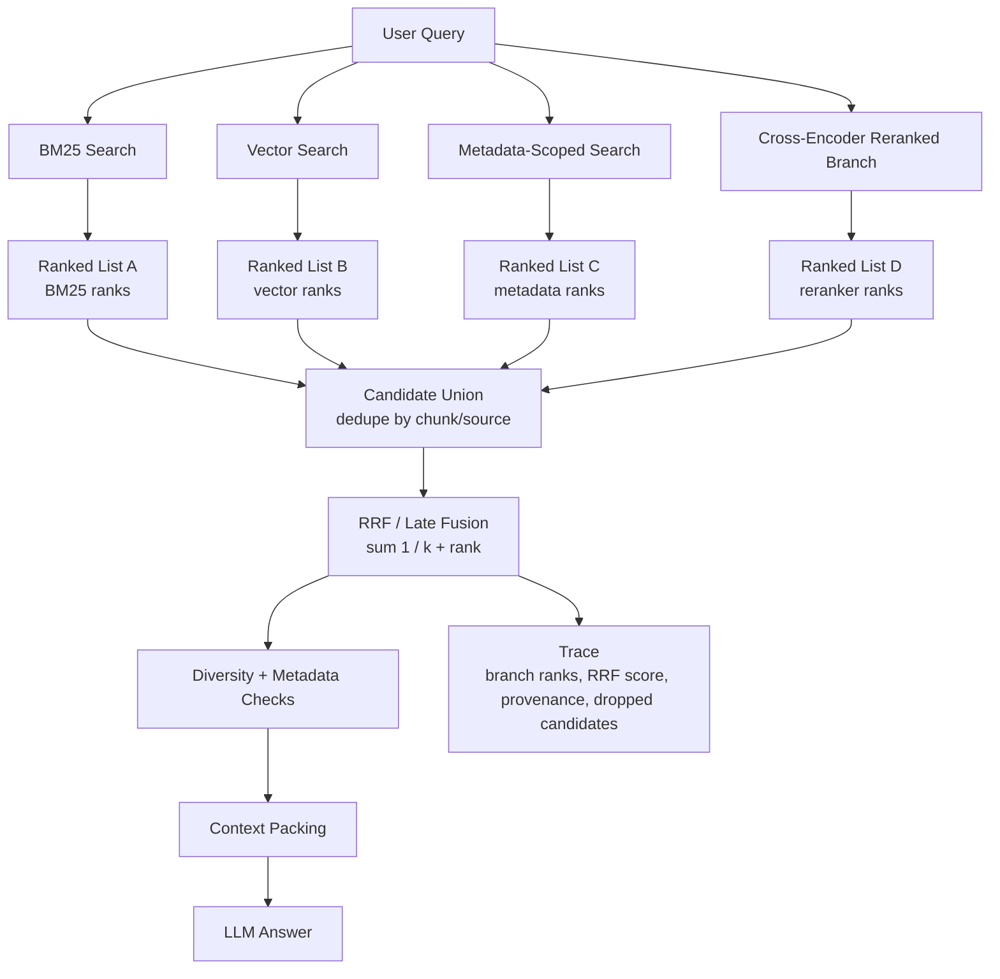

What the diagram is really saying:

- Each retriever gets to rank candidates in its own language.
- Late fusion merges lists after retrieval, not raw score scales.
- Candidate provenance is essential because you need to know why a chunk survived.

---

### 3. Real-World Industry Scenarios [Intermediate]

#### Scenario A - Hybrid Developer Docs Search

**Product/use case context:** A developer asks, "Node webhook signature raw body error." BM25 is strong because exact terms like `raw body`, `signature`, and `Node` matter. Dense vector search is strong because it can find semantically related phrasing like "request payload must not be parsed before validation." A cross-encoder branch may rerank a small candidate set by answerability.

**How RRF and late fusion help:** BM25, dense search, and reranked lists each produce different score scales. RRF can merge their ranked lists without comparing BM25 score 17.2 to cosine 0.78 to cross-encoder 0.91. If a chunk ranks high in multiple lists, it rises. If a chunk ranks high only in a broad semantic branch but not in exact keyword or reranked branch, it may still appear but with less confidence.

**Constraints:**
- **Latency:** Late fusion itself is cheap. The expensive part is running multiple retrievers. Run branches in parallel and cap per-branch top-k.
- **Cost:** RRF can reduce downstream cost by selecting better context, but the retriever ensemble still has compute cost.
- **Reliability:** If all branches share the same bad metadata filter, RRF will confidently fuse the wrong candidate pool. Fusion cannot fix missing evidence.
- **Security/privacy:** All branch results must pass tenant and permission filters before fusion or before any external reranking.

**What good looks like in production:** The final top candidates include exact Node webhook signature guidance, raw-body warning, and relevant error troubleshooting. The trace shows ranks from BM25, dense retrieval, and reranking, plus the final RRF score.

#### Scenario B - Enterprise Knowledge Assistant

**Product/use case context:** An employee asks, "contractor laptop production exception." Keyword search retrieves exact policy pages. Dense search retrieves semantically similar access-control documents. Metadata-scoped search retrieves current security policy sections. Multi-query branches retrieve vendor and non-employee wording.

**How RRF and late fusion help:** Each branch is useful but imperfect. Keyword search may overvalue procurement pages. Dense search may overvalue employee access docs. Metadata-scoped search may retrieve official policies but miss user language. RRF rewards candidates that appear high across complementary branches.

**Constraints:**
- **Latency:** Enterprise assistants often need stable p95. Fusion is fine; too many branches are the issue.
- **Cost:** RRF can let you use cheaper retrievers first and reserve LLM reranking for the fused top set.
- **Reliability:** The system should not treat repeated near-duplicate policy chunks as independent agreement. Deduplicate before fusion or the same source can overvote.
- **Security/privacy:** Permission filters must run per branch and again before context packing.

**What good looks like in production:** The official contractor access section ranks above laptop procurement and employee remote-access pages. The answer cites current policy and exception workflow without blending unrelated employee rules.

#### Scenario C - Legal Contract Search

**Product/use case context:** A legal user asks about "limitation of liability for indirect damages." Exact phrase search finds clauses with "indirect damages." Dense search finds "consequential damages" and "special damages." A clause-type classifier finds limitation-of-liability sections. A reranker orders candidates by answerability.

**How RRF and late fusion help:** Legal language has many near-synonyms. A chunk that appears high in exact phrase, dense synonym search, and clause-type search is a strong candidate. RRF helps combine those views while avoiding score-scale problems.

**Constraints:**
- **Latency:** Contract review may allow deeper search, but not unbounded branch growth.
- **Cost:** Late fusion should happen before expensive LLM reranking so only the fused top candidates are judged deeply.
- **Reliability:** Candidate provenance must preserve contract ID. Fusion must not combine similar clauses from different agreements as if they support the same answer.
- **Security/privacy:** Contract search must be scoped by client, matter, and user authorization.

**What good looks like in production:** Fused results show the exact limitation clause, related definitions, and carve-outs from the correct contract only. The trace explains which retrievers surfaced each clause.

---

### 4. System View [Intermediate]

#### Inputs -> Transformations -> Outputs

```text
Inputs
    -> user query
    -> retriever ensemble: BM25, dense vector, hybrid, metadata, multi-query, reranker branches
    -> per-branch ranked lists
    -> candidate IDs, source offsets, metadata, permissions, scores, and ranks

Transformations
    -> apply hard filters per branch
    -> collect candidate union
    -> deduplicate by chunk, parent, node, source offsets, and near-duplicate fingerprint
    -> convert per-branch positions into rank-based evidence
    -> compute RRF score: sum 1 / (k + rank)
    -> apply optional branch weights, diversity constraints, and metadata checks
    -> select fused top candidates for reranking or context packing

Outputs
    -> fused ranked list
    -> candidate provenance by branch
    -> fusion scores and dropped-candidate reasons
    -> final candidates for reranker or context packer
```

#### RRF Formula

```text
RRF(candidate) = sum over ranked lists: 1 / (k + rank_in_that_list)
```

If a candidate does not appear in a list, it contributes `0` for that list.

Typical `k` values are often around `60`, but this is not magic. Larger `k` smooths the difference between rank 1 and rank 10. Smaller `k` makes the very top positions matter more.

#### Fusion Trace Example

```json
{
    "query_id": "q-4430",
    "fusion_strategy": "rrf",
    "rrf_constant": 60,
    "branches": ["bm25", "dense", "metadata_scoped", "cross_encoder_reranked"],
    "candidate": {
        "chunk_id": "webhook-node-signature-c03",
        "provenance": [
            {"branch": "bm25", "rank": 2, "score": 14.8},
            {"branch": "dense", "rank": 5, "score": 0.79},
            {"branch": "cross_encoder_reranked", "rank": 1, "score": 0.94}
        ],
        "rrf_score": 0.0484,
        "final_rank": 1
    }
}
```

#### Observability: What We Log, Trace, and Measure

- `fusion_strategy`: RRF, weighted RRF, score fusion, max score, union, or custom.
- `rrf_constant`: the `k` value used for RRF.
- `branch_top_k`: how many candidates each branch contributes.
- `candidate_provenance`: branch, rank, raw score, query text, and retriever type for each candidate.
- `candidate_union_count`: total candidates before dedupe.
- `dedupe_rate`: how much overlap exists across branches.
- `branch_coverage`: how often each branch contributes to fused top-k.
- `branch_dominance`: whether one branch controls the final list.
- `fused_recall@k`: recall after fusion.
- `fused_precision@k`: precision after fusion.
- `NDCG@k`: whether highly relevant candidates are near the top.
- `fusion_latency_ms`: time to merge and score candidates.

#### Failure Points and How They Show Up

| Failure point | Prod symptom | Why it happens |
|---|---|---|
| Raw score fusion across incompatible retrievers | One branch dominates for numeric reasons | BM25, cosine, and reranker scores are not comparable |
| No dedupe before fusion | Same document overvotes itself | Near-duplicates appear in several branches as separate candidates |
| RRF constant too small | Rank 1 candidates dominate too strongly | Top rank is over-rewarded compared with broad agreement |
| RRF constant too large | Top ranks are not rewarded enough | Strong top candidates become too similar to mediocre candidates |
| Branches are not diverse | RRF adds little recall lift | Lists mostly contain the same candidates |
| Broad branch noise | Generic chunks survive fusion | A noisy branch contributes many plausible but irrelevant candidates |
| Missing provenance | Fusion cannot be debugged | Final candidates do not retain branch and rank history |

---

### 5. System Design Flavor [Intermediate]

#### Key Components and Interfaces

1. **Retriever ensemble:** Runs BM25, dense retrieval, hybrid retrieval, metadata-scoped retrieval, multi-query branches, or reranked branches.
2. **Candidate schema normalizer:** Converts every result into a common record: candidate ID, source, rank, raw score, branch ID, metadata, and provenance.
3. **Security filter:** Enforces tenant, permission, and sensitivity boundaries per branch before fusion.
4. **Deduplication layer:** Collapses exact and near-duplicate chunks by chunk ID, parent ID, node ID, source offsets, and fingerprint.
5. **Fusion engine:** Computes RRF, weighted RRF, rank aggregation, score fusion, or custom merge rules.
6. **Branch-weight controller:** Applies trust or quality weights to branches when evaluation proves some branches are stronger.
7. **Diversity controller:** Prevents one source, parent, or branch from monopolizing context.
8. **Fusion evaluator:** Measures fused recall, precision, NDCG, latency, branch contribution, and answer impact.

#### Important Tradeoffs

| Tradeoff | Choose RRF / rank-based fusion when... | Choose score-based fusion when... |
|---|---|---|
| Robustness vs score detail | Retrievers have incompatible score scales | Scores are calibrated or come from the same model family |
| Simplicity vs tuning | You need a strong default with little calibration | You have labeled data to tune score normalization and weights |
| Late fusion vs early fusion | You combine separate retrievers or branches | The retrieval backend natively supports reliable hybrid scoring |
| Branch equality vs branch weighting | Branches have similar quality | Some branches are consistently more reliable in evaluation |

In layman's terms: use RRF when you trust each retriever's ordering more than its numbers. Use score fusion only when you have a reason to believe the scores can be compared fairly.

#### Practical Defaults

- Use late fusion when combining BM25, vector search, metadata-scoped branches, and reranked branches.
- Start with RRF before custom score fusion unless you have calibrated scores.
- Use `k=60` as a reasonable starting point, then tune with evaluation.
- Deduplicate before or during fusion so one repeated source does not overvote.
- Preserve candidate provenance: branch ID, rank, raw score, query text, and metadata.
- Add branch weights only after slice-level evaluation proves a branch is more reliable.
- Feed fused top candidates into cross-encoder or LLM reranking when answer quality needs another quality gate.

#### Scaling Consideration: What Changes at 10x Traffic or Data

At 10x data, fused search becomes more valuable because relevant evidence may appear through different retrieval views: exact terms, semantic synonyms, metadata scopes, and reranker judgments. But more branches also create more duplicates and more broad false positives.

At 10x traffic, RRF itself is cheap, but the retriever ensemble is not. Gate expensive branches behind ambiguity, low-confidence retrieval, high-risk query classes, or zero-result recovery. Cache stable branch results where possible.

At scale, monitor branch contribution. If dense search contributes most citations for conceptual queries but BM25 contributes most citations for error-code queries, use adaptive branch plans instead of one static ensemble for every query.

---

### 6. Common Mistakes + Debugging [Beginner]

#### Mistake 1 - Adding Raw Scores from Different Retrievers

- **Symptom:** BM25 or one reranker dominates the final list even when its results are not better.
- **Likely cause:** Raw scores from different systems were summed without calibration.
- **First debugging step:** Compare final ranking using raw-score fusion vs rank-based RRF. If branch dominance changes dramatically, score scales were misleading you.

#### Mistake 2 - Letting Duplicates Vote Multiple Times

- **Symptom:** The fused top-k contains many versions of the same paragraph, source page, or parent section.
- **Likely cause:** Dedupe happened after fusion or only by chunk ID, missing near-duplicates and overlapping offsets.
- **First debugging step:** Group candidates by parent ID, node ID, URL, source offsets, and near-duplicate hash before fusion. Collapse duplicates and keep provenance from all branches.

#### Mistake 3 - Treating RRF as a Magic Fix for Bad Branches

- **Symptom:** Fusion still returns noisy results or wrong-scope documents.
- **Likely cause:** The branch set itself is weak, broad, or incorrectly filtered.
- **First debugging step:** Inspect per-branch top-k and branch reason codes. Remove or gate branches that rarely contribute cited evidence.

#### Mistake 4 - Losing Provenance During Fusion

- **Symptom:** A bad answer cannot be traced back to which retriever or branch promoted the cited chunk.
- **Likely cause:** Fusion output kept only final score and dropped branch ranks, raw scores, query variants, and metadata.
- **First debugging step:** Add candidate provenance to the fused result schema. Every final candidate should explain which branches found it and at what rank.

---

### 7. Hands-On Lab: Build -> Break -> Measure -> Explain [Pro]

This lab implements RRF directly. It shows why rank-based fusion is safer than raw score fusion when retrievers use different score scales.

#### Build: Reciprocal Rank Fusion from Multiple Ranked Lists

```python
from collections import defaultdict


ranked_lists = {
        "bm25": [
                ("node-raw-body", 18.7),
                ("webhook-overview", 12.1),
                ("oauth-callback", 9.4),
        ],
        "dense": [
                ("webhook-overview", 0.84),
                ("node-raw-body", 0.82),
                ("python-signature", 0.79),
        ],
        "cross_encoder": [
                ("node-raw-body", 0.96),
                ("python-signature", 0.61),
                ("webhook-overview", 0.44),
        ],
}


def reciprocal_rank_fusion(lists, k=60):
        fused_scores = defaultdict(float)
        provenance = defaultdict(list)

        for branch_name, ranked_candidates in lists.items():
                for rank, (candidate_id, raw_score) in enumerate(ranked_candidates, start=1):
                        fused_scores[candidate_id] += 1 / (k + rank)
                        provenance[candidate_id].append(
                                {"branch": branch_name, "rank": rank, "raw_score": raw_score}
                        )

        return [
                {
                        "candidate_id": candidate_id,
                        "rrf_score": round(score, 5),
                        "provenance": provenance[candidate_id],
                }
                for candidate_id, score in sorted(
                        fused_scores.items(), key=lambda item: item[1], reverse=True
                )
        ]


for result in reciprocal_rank_fusion(ranked_lists):
        print(result)
```

Expected behavior: `node-raw-body` should rank highest because it appears near the top of multiple lists, including the cross-encoder list. RRF uses ranks, so BM25's large raw score does not overpower cosine or cross-encoder scores.

#### Break Case 1: Use Raw Score Addition

Replace RRF with raw-score summation across branches.

What breaks:
- BM25 scores dominate because they are numerically larger.
- The fused ranking reflects score scale, not relevance.
- This is the classic reason RRF is useful.

#### Break Case 2: Add Duplicate Candidate IDs Under Different Names

Add `node-raw-body-copy` to BM25 and dense lists, representing the same source span.

What breaks:
- The same evidence can occupy multiple fused positions.
- If dedupe is missing, context packing wastes tokens and source diversity collapses.

#### Break Case 3: Add a Broad Noisy Branch

Add a branch called `broad_auth` with `oauth-callback` at rank 1 for a webhook query.

What breaks:
- The broad branch gives a wrong-scope candidate rank support.
- RRF does not know branch intent; it only sees ranks.
- This shows why branch planning and metadata constraints still matter.

#### Measure: Signals to Capture

| Metric | What it tells you | Healthy direction |
|---|---|---|
| `fused_recall@k` | Whether fusion finds relevant evidence better than any single branch | Higher |
| `fused_precision@k` | Whether fused top results stay relevant | Stable or higher |
| `NDCG@k` | Whether highly relevant evidence appears near the top | Higher |
| `branch_contribution_rate` | How often each branch contributes final cited evidence | Useful branches contribute |
| `dedupe_rate` | How much repeated evidence is collapsed before or during fusion | Nonzero and monitored |
| `branch_dominance` | Whether one branch controls final ranking | Lower unless intentional |
| `fusion_latency_ms` | Cost of merging results | Low; usually not the bottleneck |

#### Explain: Why It Broke and How to Fix It

Raw score addition breaks because scores are not comparable across retrievers. Duplicate candidates break because evidence can overvote itself and crowd the context. Broad noisy branches break because RRF is only as good as the lists it receives. The fix is to use rank-based fusion for incompatible retrievers, dedupe aggressively, preserve provenance, and evaluate branch contribution.

Production guardrail: a fused candidate should never be just `chunk_id + final_score`. It should carry branch provenance, ranks, raw scores, source metadata, and dedupe lineage.

---

### 8. Active Recall (Spaced Repetition) [Beginner]

1. Why is raw-score fusion risky across BM25, dense search, and rerankers?
2. What does reciprocal rank fusion use instead of raw scores?
3. What is late fusion?
4. Why must dedupe happen before or during fusion?
5. What does the RRF constant control?

Answer key:

1. Different retrievers produce scores on incompatible scales, so numeric size does not mean comparable relevance.
2. Candidate rank positions in each ranked list, summed as `1 / (k + rank)`.
3. Combining ranked lists after separate retrievers or branches have already produced results.
4. Otherwise repeated or near-duplicate evidence can vote multiple times and crowd the final context.
5. How strongly top ranks dominate lower ranks; smaller values emphasize top ranks more.

---

### 9. Practice [Intermediate]

#### Mini-Exercise

You are combining BM25, vector search, and cross-encoder-reranked results for API docs. The query is "Node webhook signature raw body error." Design the fusion policy.

Suggested answer outline:

- Run BM25 for exact terms: Node, webhook, signature, raw body.
- Run dense search for semantic variants: payload parsing, request body validation, HMAC verification.
- Run cross-encoder reranking on the union or top candidates.
- Hard-filter product/version/language if explicit.
- Deduplicate by chunk ID, parent ID, URL, source offsets, and near-duplicate hash.
- Use RRF or weighted RRF for late fusion because raw scores are not comparable.
- Preserve provenance: branch, rank, raw score, query variant, metadata.
- Apply diversity after fusion so the packed context includes procedure, warning, and troubleshooting evidence.

#### Capstone-Style System Design Question

Design a fusion layer for an enterprise RAG system that combines BM25, dense retrieval, multi-query branches, metadata-scoped search, and cross-encoder reranking. The system must be secure, explainable, and low-latency. How would you implement and evaluate it?

Suggested answer outline:

- Normalize all branch outputs into a common candidate schema.
- Apply permission, tenant, sensitivity, product, and version filters before fusion.
- Deduplicate exact and near-duplicate candidates before or during fusion.
- Start with RRF for BM25+dense+branch rankings because raw scores are incompatible.
- Add branch weights only after evaluation proves consistent quality differences.
- Preserve candidate provenance for debugging and compliance.
- Gate expensive branches and rerankers based on query ambiguity, risk, and low-confidence retrieval.
- Evaluate fused recall@k, precision@k, NDCG@k, answer success, branch contribution, dedupe rate, latency, and cost by query slice.
- Feed fused top candidates into context packing or a final reranker depending on quality budget.

---

### 10. Production Reality Check [Pro]

**If this fails in prod, what's the first thing we inspect?**

Inspect the fusion trace: per-branch ranked lists -> candidate union -> dedupe groups -> RRF constant and branch weights -> fused ranking -> final citations. If the correct evidence appears in a branch but not after fusion, debug dedupe, RRF tuning, branch weights, or diversity rules. If it appears in no branch, debug candidate generation. If wrong-scope evidence rises, inspect broad branches, metadata filters, and candidate provenance.

---

### 11. Curiosity Bridge [Beginner]

This completes Topic 7.2: transforming queries, running multiple retrieval angles, reranking candidates, and fusing ranked evidence. The next topic asks a bigger question: what if retrieval itself becomes more active, hypothetical, self-checking, multi-hop, graph-based, or conversation-aware? That leads into advanced RAG patterns.

---

### 12. Exit Check + Carry-Forward Review [Beginner]

**You're done when you can:** explain why RRF avoids raw-score comparison, design a late-fusion layer for BM25+dense+reranked lists, and debug a fused result using branch provenance.

Carry-forward review from 7.2.c:

1. Why can late fusion happen before a cross-encoder reranker?
     - Late fusion can create a stronger candidate pool from multiple retrievers, then the cross-encoder spends compute only on the fused top candidates.
2. Why can late fusion happen after reranking?
     - Separate branches may each be reranked first, then their ranked lists can be fused when their raw scores are not comparable.

---

## Topic 7.3: Advanced RAG Patterns

**Topic time:** 14h

Planned subtopics:
- HyDE, self-RAG, and agentic retrieval patterns - 3.5h
- Multi-hop retrieval and decomposition - 3.5h
- Knowledge graph and GraphRAG fundamentals - 3.5h
- Conversation-aware and personalized retrieval - 3.5h

---

## Subtopic 7.3.a: HyDE, Self-RAG, and Agentic Retrieval Patterns

Added to Knowledge Base.

**Subtopic time:** 3.5h

### 0. Reading Path + Level Tags

- **Beginner:** Read sections 1-2, section 6, and Active Recall.
- **Intermediate:** Add sections 3-5 and the Hands-On Lab.
- **Pro:** Do the full lab, compare the three patterns, and answer the capstone system-design question.

---

### 1. Pre-Question Hook + The Intuition [Beginner]

**Pause: before reading, if the user asks a vague question and the retriever cannot find good chunks, should the system rewrite the query, invent a hypothetical answer to search with, critique its own evidence, or let an agent decide the next retrieval step?**

This subtopic covers three advanced RAG patterns that make retrieval more active than simple "embed query -> top-k search": **HyDE**, **self-RAG**, and **agentic retrieval**.

**HyDE (Hypothetical Document Embeddings)** generates a hypothetical answer or document for the user's query, embeds that generated text, and retrieves real documents similar to it. The trick is that a generated hypothetical answer can contain richer vocabulary than the user's short query. The danger is that the hypothetical text can drift into unsupported assumptions.

**Self-RAG** adds self-checking behavior around retrieval and generation. The system can decide whether retrieval is needed, evaluate whether retrieved evidence is useful, and critique whether the generated answer is grounded. The goal is not just to retrieve more, but to retrieve when useful and reject weak evidence when necessary.

**Agentic retrieval** uses a planner/controller to choose retrieval tools, issue multiple searches, inspect intermediate results, and decide the next retrieval action. It is useful when the path to evidence is not obvious at the start, but it adds latency, cost, and control-flow complexity.

Real-world analogy: baseline RAG is like searching a library catalog once. HyDE is like first writing a sample paragraph of what you expect the answer might look like, then searching for books similar to that paragraph. Self-RAG is like pausing to ask, "Do I have enough reliable sources yet?" Agentic retrieval is like a research assistant who searches, reads, notices gaps, and searches again. The analogy breaks down because LLM-generated hypotheses and decisions can be wrong unless constrained and evaluated.

Key terms:
- **HyDE (Hypothetical Document Embeddings):** A retrieval pattern that generates a hypothetical answer/document, embeds it, and retrieves real documents similar to that hypothetical text.
- **Hypothetical document:** Generated text that represents what a relevant answer or document might look like before real evidence is retrieved.
- **Self-RAG:** A retrieval pattern where the system decides when to retrieve, evaluates retrieved evidence, and critiques answer grounding.
- **Retrieval critique:** A judgment about whether retrieved evidence is relevant, sufficient, fresh, authoritative, and safe to use.
- **Evidence sufficiency:** Whether retrieved context contains enough information to answer without unsupported speculation.
- **Agentic retrieval:** A retrieval pattern where a planner/controller chooses retrieval actions, tools, and follow-up searches iteratively.
- **Retrieval controller:** The component that decides which retrieval strategy or tool to use next.
- **Retrieval budget:** A limit on retrieval calls, tokens, latency, and cost during a retrieval workflow.
- **Stop condition:** A rule that tells an iterative retrieval workflow when to stop searching and answer, refuse, or ask for clarification.

The mental model to keep permanently: **HyDE improves the search representation; self-RAG checks retrieval quality; agentic retrieval plans the search process.**

---

### 2. Visual Diagram (Mermaid) [Beginner]

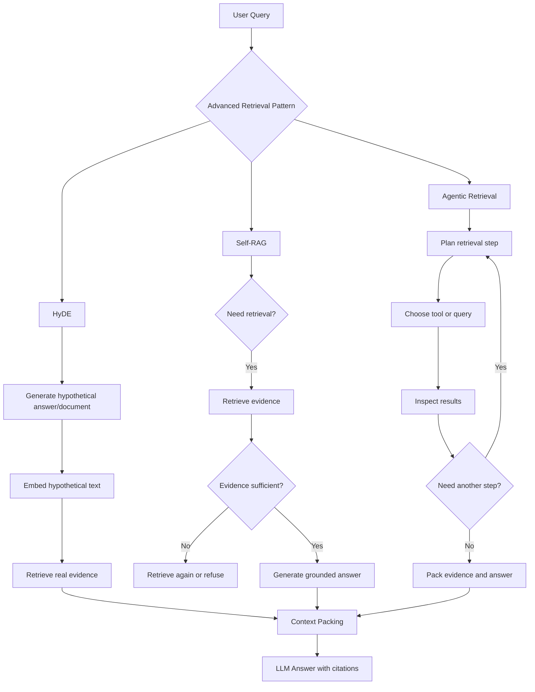

What the diagram is really saying:

- HyDE changes the query representation before retrieval.
- Self-RAG adds decision and critique gates around retrieval.
- Agentic retrieval turns retrieval into a controlled loop.
- All three still need metadata filters, reranking, context packing, and citations.

---

### 3. Real-World Industry Scenarios [Intermediate]

#### Scenario A - Developer Docs for Vague Symptom Queries

**Product/use case context:** A developer asks, "Why is my callback silently failing?" The docs use precise terms like webhook event delivery, endpoint response status, retry policy, signing secret, timeout, and payload parsing.

**How the patterns help:** HyDE can generate a hypothetical troubleshooting explanation mentioning webhook endpoint URLs, delivery logs, non-2xx responses, and retries, then retrieve real docs with that vocabulary. Self-RAG can inspect retrieved chunks and decide whether they actually explain silent failures or only define webhooks. Agentic retrieval can first search webhook docs, then delivery logs docs, then endpoint response-code docs if the first results are incomplete.

**Constraints:**
- **Latency:** HyDE adds one generation step before retrieval. Agentic retrieval can add several retrieval steps. Self-RAG critique can add model calls. Use these patterns only when baseline retrieval confidence is low or query risk is high.
- **Cost:** HyDE is usually cheaper than a long agent loop. Agentic retrieval needs strict budgets: max tool calls, max candidates, max tokens.
- **Reliability:** HyDE can hallucinate a likely cause and retrieve around that cause even when the real issue differs. Self-RAG can over-trust its own critique unless evaluated.
- **Security/privacy:** Generated hypothetical text should not include secrets or customer-specific details. Agentic tool access must enforce permissions on every retrieval step.

**What good looks like in production:** The final answer cites real docs, not the hypothetical document. The trace shows whether HyDE, self-critique, or agentic follow-up changed the retrieved evidence, and why.

#### Scenario B - Enterprise Policy Assistant

**Product/use case context:** An employee asks, "Can a vendor get emergency production access?" The answer spans contractor policy, production-access standards, emergency exception workflow, and approval authority.

**How the patterns help:** HyDE can generate a policy-shaped hypothetical answer with terms like vendor, emergency exception, production access, approval, expiry, and audit trail. Self-RAG can check whether retrieved context includes the rule, exception, approver, and expiry condition. Agentic retrieval can deliberately search policy, exception workflow, and access-request system docs.

**Constraints:**
- **Latency:** Policy assistants need conversational latency, so agent loops should be short and bounded.
- **Cost:** Self-RAG evidence critique may be worth it because wrong policy answers have high business risk.
- **Reliability:** The system must not let the hypothetical answer become the answer. HyDE text is a retrieval aid, not evidence.
- **Security/privacy:** Agentic retrieval must not cross into restricted security runbooks unless the user is authorized.

**What good looks like in production:** The assistant answers only from retrieved policy evidence, states caveats, cites official sections, and refuses or asks for clarification if self-RAG determines evidence is insufficient.

#### Scenario C - Research Assistant for Scientific Literature

**Product/use case context:** A researcher asks, "What mechanisms explain treatment resistance in this subtype?" Relevant evidence may be scattered across papers with different terminology.

**How the patterns help:** HyDE can create a rich scientific hypothesis using likely mechanism vocabulary, improving semantic retrieval. Self-RAG can critique whether the retrieved papers actually support the mechanism or merely mention related terms. Agentic retrieval can iteratively search for mechanism papers, clinical evidence, contradictory findings, and review articles.

**Constraints:**
- **Latency:** Research workflows can tolerate deeper retrieval than chat support, but long loops still need a budget.
- **Cost:** Agentic retrieval may be appropriate for high-value research tasks but too expensive for routine fact lookup.
- **Reliability:** Hypotheses are especially dangerous in science. The system must separate generated hypotheses from cited evidence.
- **Security/privacy:** Proprietary literature access and user-uploaded research notes may have access boundaries.

**What good looks like in production:** The system retrieves real papers, distinguishes evidence strength, surfaces contradictions, and clearly separates hypothesis from citation-backed claims.

---

### 4. System View [Intermediate]

#### Inputs -> Transformations -> Outputs

```text
Inputs
    -> user query
    -> conversation context and metadata constraints
    -> corpus/retriever capabilities
    -> latency, cost, and safety budget

HyDE path
    -> generate hypothetical document
    -> validate constraints and remove unsafe content
    -> embed hypothetical document
    -> retrieve real candidates
    -> discard hypothetical document as evidence

Self-RAG path
    -> decide whether retrieval is needed
    -> retrieve candidates if needed
    -> critique relevance and sufficiency
    -> retrieve more, answer, refuse, or ask clarification

Agentic retrieval path
    -> plan retrieval actions
    -> choose tools and query variants
    -> inspect intermediate evidence
    -> iterate until stop condition or budget limit

Outputs
    -> retrieved evidence with citations
    -> decision trace
    -> critique results
    -> final answer or refusal
```

#### Trace Record Example

```json
{
    "query_id": "q-7731",
    "pattern": "self_rag_plus_agentic_retrieval",
    "raw_query": "Can a vendor get emergency production access?",
    "hyde_used": false,
    "retrieval_decision": "retrieve_required",
    "agent_steps": [
        {"step": 1, "tool": "policy_search", "query": "vendor production access emergency exception"},
        {"step": 2, "tool": "workflow_search", "query": "emergency access approval expiry audit trail"}
    ],
    "evidence_critique": {
        "rule_present": true,
        "exception_present": true,
        "approver_present": true,
        "expiry_present": false,
        "sufficient": false
    },
    "stop_condition": "insufficient_evidence_for_expiry_rule"
}
```

#### Pattern Comparison

| Pattern | What it changes | Best fit | Main risk |
|---|---|---|---|
| HyDE | Query representation | Short, vague, vocabulary-poor queries | Hypothetical drift |
| Self-RAG | Retrieval and grounding decisions | High-risk answers needing sufficiency checks | Over-trusting model self-critique |
| Agentic retrieval | Retrieval control flow | Multi-step evidence gathering across tools | Latency, loops, tool misuse |

#### Observability: What We Log, Trace, and Measure

- `pattern_used`: baseline, HyDE, self-RAG, agentic, or hybrid.
- `hyde_text_hash`: store a hash or redacted text for debugging without treating it as evidence.
- `hypothesis_drift_score`: whether HyDE introduced unsupported entities, products, versions, or causes.
- `retrieval_decision`: retrieve, skip retrieval, retrieve more, refuse, or ask clarification.
- `evidence_sufficiency_score`: whether retrieved context covers required answer facts.
- `agent_step_count`: number of retrieval/tool steps.
- `budget_exhausted`: whether retrieval stopped because of latency/cost/tool-call limit.
- `evidence_added_per_step`: how much useful evidence each step contributed.
- `final_answer_groundedness`: whether final answer claims are supported by retrieved evidence.

---

### 5. System Design Flavor [Intermediate]

#### Key Components and Interfaces

1. **Pattern router:** Chooses baseline retrieval, HyDE, self-RAG, agentic retrieval, or a hybrid based on query type, confidence, and risk.
2. **HyDE generator:** Produces a hypothetical document with strict instructions to preserve user constraints and avoid unsupported specifics.
3. **HyDE validator:** Checks for drift, sensitive content, forbidden assumptions, and metadata mismatch before embedding the hypothetical text.
4. **Retrieval decision model:** Decides whether retrieval is needed and whether retrieved evidence is sufficient.
5. **Evidence critique module:** Scores relevance, authority, freshness, coverage, contradiction, and citation quality.
6. **Agent planner:** Chooses retrieval tools, query variants, metadata filters, and next steps.
7. **Budget controller:** Enforces max retrieval calls, max tokens, max latency, and max cost.
8. **Stop-condition evaluator:** Stops when evidence is sufficient, ambiguous, unsafe, or budget-exhausted.
9. **Trace logger:** Records decisions, tool calls, evidence, critiques, and final citations.

#### Important Tradeoffs

| Tradeoff | Choose simpler retrieval when... | Choose advanced patterns when... |
|---|---|---|
| Latency vs retrieval intelligence | Queries are direct and baseline recall is strong | Queries are vague, multi-step, ambiguous, or high-risk |
| HyDE recall vs drift | Vocabulary mismatch is the main failure | The query requires exact facts, dates, or legal/medical constraints |
| Self-critique vs cost | Wrong answers are low-risk | Evidence sufficiency and refusal quality matter |
| Agentic flexibility vs control | One retriever can answer reliably | Evidence lives across multiple tools, sources, or reasoning steps |

In layman's terms: do not make every query an agent. Use advanced retrieval when the retrieval problem is genuinely hard enough to justify extra reasoning, cost, and control logic.

#### Practical Defaults

- Try strong baseline retrieval, metadata, reranking, and fusion before agentic loops.
- Use HyDE for short, vague, vocabulary-poor queries, not for highly constrained legal or clinical facts unless tightly validated.
- Treat HyDE output as search text only, never as evidence.
- Use self-RAG style critique for high-risk answers: policy, legal, medical, security, financial, or user-impacting operations.
- Use agentic retrieval when the system must choose among tools or retrieve in stages.
- Set hard budgets: max steps, max time, max tokens, and max tool calls.
- Log why the system retrieved more, stopped, refused, or asked for clarification.

#### Scaling Consideration: What Changes at 10x Traffic or Data

At 10x data, HyDE may improve recall for vague queries, but it can also retrieve plausible wrong areas if the generated hypothesis drifts. Self-RAG becomes valuable for deciding whether evidence is enough, especially when the corpus has many near-matches. Agentic retrieval becomes expensive unless routed selectively.

At 10x traffic, advanced patterns need gating. Use retrieval confidence, query risk, zero-result rate, and ambiguity detection to decide when to invoke HyDE, critique, or agentic loops. Cache safe HyDE outputs and retrieval plans for common queries, but never cache across permission boundaries.

At scale, evaluate advanced patterns by query class. HyDE may help support symptoms but hurt exact policy questions. Agentic retrieval may help research tasks but be wasteful for simple FAQ queries.

---

### 6. Common Mistakes + Debugging [Beginner]

#### Mistake 1 - Treating HyDE Output as Evidence

- **Symptom:** The final answer contains a plausible claim that appears in the hypothetical text but not in retrieved sources.
- **Likely cause:** The pipeline allowed generated HyDE text into context as if it were a source document.
- **First debugging step:** Inspect final packed context. If the hypothetical document is present as evidence, remove it. HyDE text should only guide retrieval.

#### Mistake 2 - Using Agentic Retrieval for Every Query

- **Symptom:** Latency and cost spike, but answer quality barely improves.
- **Likely cause:** The system runs tool-planning loops even when baseline retrieval is sufficient.
- **First debugging step:** Compare baseline retrieval vs agentic retrieval by query class. Gate agentic retrieval behind ambiguity, low confidence, high risk, or multi-tool need.

#### Mistake 3 - Trusting Self-Critique Without External Evaluation

- **Symptom:** The model says evidence is sufficient, but answers remain unsupported or incomplete.
- **Likely cause:** The critique prompt is weak, or the model is biased toward proceeding.
- **First debugging step:** Evaluate critique decisions against human-labeled sufficiency. Track false sufficient and false insufficient rates.

#### Mistake 4 - No Stop Condition in Agentic Retrieval

- **Symptom:** The system keeps searching, repeats similar queries, or burns tool-call budget.
- **Likely cause:** The retrieval loop lacks clear stopping rules.
- **First debugging step:** Add stop conditions: evidence sufficient, no new evidence, contradiction detected, clarification needed, or budget exhausted.

---

### 7. Hands-On Lab: Build -> Break -> Measure -> Explain [Pro]

This lab simulates HyDE, self-RAG, and agentic retrieval with simple lexical search. The goal is not model quality; it is understanding control flow and failure modes.

#### Build: Tiny Advanced Retrieval Controller

```python
import re


docs = [
        {
                "id": "webhook-delivery",
                "text": "Webhook event delivery can fail when the endpoint returns non-2xx responses or times out.",
        },
        {
                "id": "webhook-logs",
                "text": "Delivery logs show response status, retry attempts, timestamps, and endpoint URLs.",
        },
        {
                "id": "signing-secret",
                "text": "Webhook signature verification requires the raw request body and signing secret.",
        },
        {
                "id": "oauth-callback",
                "text": "OAuth callback URL mismatch causes browser redirect failures after login.",
        },
]


def tokens(text):
        return set(re.findall(r"[a-z0-9-]+", text.lower()))


def search(query, top_k=2):
        query_terms = tokens(query)
        return sorted(
                docs,
                key=lambda doc: len(query_terms & tokens(doc["text"])),
                reverse=True,
        )[:top_k]


def hyde(query):
        if "callback" in query and "server" in query:
                return (
                        "A webhook callback may fail to reach a server when event delivery "
                        "times out, the endpoint URL is wrong, or delivery logs show non-2xx responses."
                )
        return query


def evidence_sufficient(query, results):
        joined = " ".join(doc["text"] for doc in results).lower()
        required_terms = ["delivery", "logs"] if "not hitting" in query else []
        return all(term in joined for term in required_terms)


def agentic_retrieve(query, max_steps=2):
        trace = []
        results = []

        first_query = hyde(query)
        first_results = search(first_query)
        results.extend(first_results)
        trace.append({"step": 1, "query": first_query, "results": [doc["id"] for doc in first_results]})

        if evidence_sufficient(query, results):
                return results, trace, "sufficient_after_hyde"

        if max_steps > 1:
                follow_up_query = "webhook delivery logs endpoint response status retry attempts"
                follow_up_results = search(follow_up_query)
                results.extend(follow_up_results)
                trace.append({"step": 2, "query": follow_up_query, "results": [doc["id"] for doc in follow_up_results]})

        final_status = "sufficient" if evidence_sufficient(query, results) else "insufficient"
        return results, trace, final_status


query = "payment callback not hitting my server"
results, trace, status = agentic_retrieve(query)
print(trace)
print(status)
print([doc["id"] for doc in results])
```

Expected behavior: HyDE generates webhook-delivery vocabulary from a vague callback query. Self-RAG-style sufficiency checking notices whether delivery logs are present. The agentic step retrieves delivery logs if the first retrieval is incomplete.

#### Break Case 1: Let HyDE Mention OAuth

Change HyDE to generate text about OAuth callback URL mismatch.

What breaks:
- Retrieval drifts toward `oauth-callback`, which is the wrong callback meaning.
- The hypothetical text made the retriever confidently search the wrong area.

#### Break Case 2: Make `evidence_sufficient` Always Return `True`

What breaks:
- The system stops too early and may answer without delivery logs.
- This simulates weak self-RAG critique.

#### Break Case 3: Remove `max_steps`

What breaks:
- The agent can keep searching without a stop condition.
- This simulates uncontrolled agentic retrieval.

#### Measure: Signals to Capture

| Metric | What it tells you | Healthy direction |
|---|---|---|
| `hyde_recall_lift` | Whether HyDE improves recall over raw query | Higher when query is vague |
| `hypothesis_drift_rate` | How often HyDE changes scope or adds unsupported assumptions | Lower |
| `evidence_sufficiency_accuracy` | Whether self-critique matches human sufficiency labels | Higher |
| `agent_step_count` | How many retrieval steps the agent uses | Low but enough |
| `evidence_added_per_step` | Whether each step contributes useful new evidence | Higher |
| `budget_exhaustion_rate` | How often retrieval stops because budget ran out | Lower |
| `final_groundedness` | Whether final claims are supported by retrieved evidence | Higher |

#### Explain: Why It Broke and How to Fix It

HyDE drift breaks retrieval because the generated hypothesis becomes the search target. Weak self-critique breaks reliability because the system believes evidence is sufficient too early. Missing stop conditions break production behavior because the system can loop or overspend. The fix is to validate HyDE text, evaluate sufficiency checks, and enforce strict retrieval budgets.

Production guardrail: every advanced retrieval step needs a reason code and a stop condition. If the system cannot explain why it searched again or stopped, the workflow is not production-ready.

---

### 8. Active Recall (Spaced Repetition) [Beginner]

1. What does HyDE generate, and why?
2. Why must HyDE output not be treated as evidence?
3. What does self-RAG add to a retrieval pipeline?
4. When is agentic retrieval useful?
5. What is the biggest production risk of agentic retrieval?

Answer key:

1. A hypothetical answer/document that contains richer retrieval vocabulary for embedding/search.
2. It is generated and may contain unsupported claims; only retrieved real sources count as evidence.
3. Decisions about whether to retrieve, whether evidence is sufficient, and whether the answer is grounded.
4. When evidence requires tool choice, iterative search, or multiple retrieval steps.
5. Unbounded loops, latency/cost spikes, tool misuse, and hard-to-debug control flow.

---

### 9. Practice [Intermediate]

#### Mini-Exercise

You are building RAG for an internal security assistant. A user asks, "Can we bypass prod access approval during sev1?" Decide whether to use HyDE, self-RAG, agentic retrieval, or baseline retrieval.

Suggested answer outline:

- Use baseline retrieval plus strong metadata filters first: security policy, incident policy, current version, user permissions.
- Avoid unconstrained HyDE because the query is high-risk and exact policy language matters.
- Use self-RAG critique to verify required evidence: normal rule, severity exception, approver, expiry, audit trail, and citation authority.
- Use short agentic retrieval only if the first policy search lacks incident exception workflow or approval details.
- Stop condition: answer only when rule + exception + approver + expiry are cited; otherwise ask clarification or refuse to speculate.

#### Capstone-Style System Design Question

Design an advanced retrieval router for a product-support assistant. It can use baseline RAG, HyDE, self-RAG critique, and agentic retrieval. How do you decide which pattern to invoke, and how do you keep the system reliable?

Suggested answer outline:

- Start with baseline retrieval confidence: top score, reranker margin, source authority, and evidence coverage.
- Route short vague symptom queries to HyDE if they lack corpus vocabulary.
- Route high-risk or policy-impacting answers to self-RAG critique.
- Route multi-tool or multi-step problems to agentic retrieval with strict budgets.
- Validate HyDE for drift and never pack hypothetical text as evidence.
- Require every agent step to have a reason code, tool choice, query, results, and stop condition.
- Track recall lift, drift rate, sufficiency accuracy, step count, latency, cost, and grounded answer success.

---

### 10. Production Reality Check [Pro]

**If this fails in prod, what's the first thing we inspect?**

Inspect the advanced retrieval decision trace: pattern selected -> reason code -> generated HyDE text if any -> retrieval calls -> evidence critique -> agent steps -> stop condition -> final packed evidence. If the answer contains unsupported claims, check whether hypothetical text leaked into context. If retrieval wandered, check HyDE drift and agent step queries. If latency spiked, inspect step count, budget controls, and routing thresholds.

---

### 11. Curiosity Bridge [Beginner]

These patterns make retrieval more active, but many hard questions require evidence from multiple facts connected in sequence. That leads to multi-hop retrieval and decomposition: breaking a question into subquestions, retrieving each part, and composing the evidence without losing grounding.

---

### 12. Exit Check + Carry-Forward Review [Beginner]

**You're done when you can:** compare HyDE, self-RAG, and agentic retrieval, choose the right pattern for a retrieval failure, and debug drift, weak critique, or uncontrolled retrieval loops.

Carry-forward review from Topic 7.2:

1. Why might HyDE still need reranking or fusion afterward?
     - HyDE can improve candidate generation, but retrieved candidates may still be noisy, duplicated, or scope-wrong. Reranking and fusion decide what survives.
2. Why is candidate provenance still important in agentic retrieval?
     - Agentic workflows have multiple steps and tools. Provenance shows which step found which evidence and whether final citations are traceable.

---

## Subtopic 7.3.b: Multi-Hop Retrieval and Decomposition

Added to Knowledge Base.

**Subtopic time:** 3.5h

### 0. Reading Path + Level Tags

- **Beginner:** Read sections 1-2, section 6, and Active Recall.
- **Intermediate:** Add sections 3-5 and the Hands-On Lab.
- **Pro:** Do the full lab, compare parallel vs sequential decomposition, and answer the capstone system-design question.

---

### 1. Pre-Question Hook + The Intuition [Beginner]

**Pause: before reading, if a question needs three separate facts from three different documents, should retrieval search once for the whole question, or break the question into smaller evidence goals?**

**Multi-hop retrieval** is retrieval for questions that need multiple connected pieces of evidence, not just one matching chunk. A **hop** is one evidence-seeking step in the chain: retrieve fact A, use fact A to find fact B, then combine A and B into the final answer.

**Decomposition** is the act of breaking a complex user question into smaller **subquestions** that can each retrieve a clearer piece of evidence. Instead of asking one retriever to solve the entire problem, we give it smaller targets.

Example:

```text
User question:
Can a vendor get emergency production access during a SEV1, who approves it, and when must it expire?

Decomposed retrieval goals:
1. What is the normal vendor production access rule?
2. Is there a SEV1 emergency exception?
3. Who approves the exception?
4. What expiry or audit rule applies?
```

The key idea: one big query often retrieves broad, mixed, or partially relevant results. Multi-hop retrieval turns the question into an **evidence chain**: each subquestion finds a specific piece of evidence, and the final answer is composed only after the chain is complete.

Real-world analogy: answering a multi-hop question is like preparing a legal memo. You do not search once and write from memory. You identify claims, find the rule for each claim, check exceptions, connect them, and cite each source. The analogy breaks down because LLM decomposition can create the wrong subquestions unless the system validates them against evidence.

Key terms:
- **Multi-hop retrieval:** A retrieval pattern where a question is answered by gathering multiple connected evidence pieces across two or more retrieval steps.
- **Hop:** One retrieval step or reasoning step that resolves part of a multi-hop question.
- **Decomposition:** Breaking a complex query into smaller subquestions or evidence goals.
- **Subquestion:** A smaller query created from the original question to retrieve one specific fact or evidence slice.
- **Compositional query:** A query whose answer depends on combining multiple facts, constraints, or entities.
- **Evidence chain:** The ordered set of retrieved evidence pieces used to support a multi-hop answer.
- **Intermediate answer:** A temporary answer to a subquestion that may guide later retrieval but must still be grounded in evidence.
- **Bridge entity:** An entity discovered in one hop that is needed to retrieve the next hop, such as a policy name, product ID, paper title, person, clause, or system component.
- **Sequential decomposition:** A decomposition strategy where later subquestions depend on evidence found in earlier hops.
- **Parallel decomposition:** A decomposition strategy where independent subquestions are retrieved at the same time.
- **Dependency graph:** A graph showing which subquestions depend on which earlier answers or evidence.
- **Answer composition:** Combining hop-level evidence into one final grounded answer.
- **Hop budget:** A limit on how many retrieval steps, model calls, tokens, or seconds a multi-hop workflow can use.

The mental model to keep permanently: **multi-hop retrieval is not about retrieving more chunks; it is about retrieving the right evidence chain.**

---

### 2. Visual Diagram (Mermaid) [Beginner]

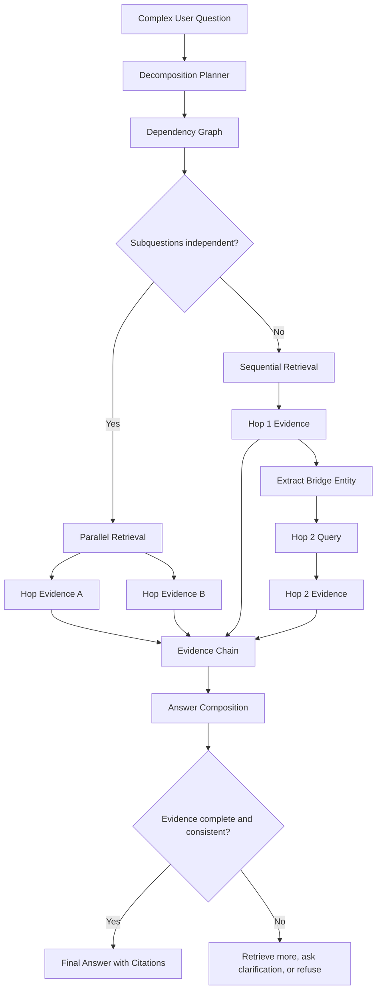

What the diagram is really saying:

- Decomposition creates retrieval jobs, not final claims.
- Parallel decomposition is faster when subquestions are independent.
- Sequential decomposition is needed when one hop discovers the key for the next hop.
- The final answer should cite the evidence chain, not the decomposition prompt or intermediate guesses.

---

### 3. Real-World Industry Scenarios [Intermediate]

#### Scenario A - Enterprise Policy Assistant

**Product/use case context:** An employee asks, "Can a vendor get emergency production access during SEV1, who approves it, and when does access expire?" The answer is not in one chunk. It may require vendor-access rules, incident exception rules, approval-matrix docs, and audit/expiry policy.

**How multi-hop retrieval works:** The system decomposes the question into policy subquestions. Some can run in parallel: normal vendor access rule, emergency exception rule, approval matrix, expiry/audit rule. The answer composition step then connects them: vendor access is normally restricted, SEV1 has an exception, approval requires a named role, and expiry must happen within a specific window if the evidence says so.

**Constraints:**
- **Latency:** Four independent hops can run in parallel, but reranking and verification still add time. Policy assistants should cap total retrieval steps and avoid unbounded follow-up searches.
- **Cost:** Each hop can trigger vector search, keyword search, reranking, and critique. Multi-hop should be routed to questions that actually need multiple facts.
- **Reliability:** The system must not answer from only one policy chunk. Missing the expiry rule can produce a dangerously incomplete answer.
- **Security/privacy:** Each hop must apply the same access control filters. A user authorized for general HR docs may not be authorized for production incident runbooks.

**What good looks like in production:** The answer cites each required policy component separately and states when evidence is missing. The trace shows every subquestion, retrieved source, and whether the evidence chain was complete.

#### Scenario B - Product Support Troubleshooting

**Product/use case context:** A customer asks, "Why did my payment webhook stop firing after enabling region failover?" Relevant evidence may live in webhook docs, payment event docs, region failover docs, and a known-issues page.

**How multi-hop retrieval works:** The system first retrieves docs for payment webhook firing. Then it extracts the bridge entity `region failover` and retrieves failover behavior. A third hop may search known issues for the combination of payment webhooks and failover.

**Constraints:**
- **Latency:** Support chat needs fast responses. Sequential hops can be expensive because hop 2 waits for hop 1. Use a hybrid: run obvious branches in parallel, then do one targeted sequential follow-up if needed.
- **Cost:** Known-issue retrieval and reranking can be expensive if done for every support query. Trigger it when product/version metadata suggests a recent incident or release.
- **Reliability:** A single broad query might retrieve webhook docs but miss the failover interaction. Decomposition improves coverage of cross-feature failures.
- **Security/privacy:** Customer-specific logs must be fetched through authorized tools, not mixed into public-doc retrieval without permission checks.

**What good looks like in production:** The assistant explains the interaction, cites webhook and failover evidence, and separates documented behavior from inferred troubleshooting steps.

#### Scenario C - Scientific Literature Research

**Product/use case context:** A researcher asks, "Which mechanism links biomarker X to drug resistance in subtype Y, and what evidence contradicts it?" The answer requires mechanism papers, subtype-specific studies, treatment outcomes, and contradictory findings.

**How multi-hop retrieval works:** The system decomposes into mechanism evidence, subtype evidence, treatment-resistance evidence, and contradiction search. Sequential retrieval may be needed if the first hop discovers a pathway or gene name used in later searches.

**Constraints:**
- **Latency:** Research workflows can tolerate deeper retrieval, but users need progress and traceability.
- **Cost:** Multi-hop retrieval over papers can be expensive because each hop may retrieve long abstracts or full text.
- **Reliability:** The system must distinguish supported findings from hypotheses. Intermediate answers should not become final claims without citations.
- **Security/privacy:** Licensed paper access and private notes must preserve permissions and source restrictions.

**What good looks like in production:** The system shows an evidence chain, identifies contradictions, and labels evidence strength instead of pretending all retrieved papers agree.

---

### 4. System View [Intermediate]

#### Inputs -> Transformations -> Outputs

```text
Inputs
  -> user question
  -> conversation context
  -> metadata constraints and permissions
  -> retriever capabilities
  -> latency/cost/hop budget

Transformations
  -> classify whether question is compositional
  -> decompose into subquestions
  -> build dependency graph
  -> retrieve evidence per hop
  -> extract bridge entities when needed
  -> rerank and filter hop candidates
  -> build evidence chain
  -> verify coverage and consistency
  -> compose final answer with citations

Outputs
  -> final answer or clarification/refusal
  -> cited evidence chain
  -> decomposition trace
  -> missing-hop report if incomplete
```

#### Trace Record Example

```json
{
  "query_id": "q-9214",
  "pattern": "multi_hop_retrieval",
  "raw_query": "Can a vendor get emergency production access during SEV1, who approves it, and when does access expire?",
  "compositional": true,
  "subquestions": [
    {"id": "sq1", "question": "What is the vendor production access rule?", "depends_on": []},
    {"id": "sq2", "question": "Is there a SEV1 emergency exception?", "depends_on": []},
    {"id": "sq3", "question": "Who approves emergency production access?", "depends_on": ["sq2"]},
    {"id": "sq4", "question": "When must emergency access expire?", "depends_on": ["sq2"]}
  ],
  "hop_results": {
    "sq1": ["policy-vendor-access#section-2"],
    "sq2": ["incident-exception#section-4"],
    "sq3": ["approval-matrix#security-ops"],
    "sq4": []
  },
  "evidence_chain_complete": false,
  "missing_evidence": ["expiry rule"],
  "decision": "answer_partial_with_caveat_or_retrieve_more"
}
```

#### Observability: What We Log, Trace, and Measure

- `compositionality_score`: likelihood that the query needs multiple evidence pieces.
- `subquestion_count`: number of decomposed retrieval goals.
- `dependency_graph`: which subquestions depend on earlier hops.
- `hop_recall`: whether each hop retrieved the expected evidence.
- `bridge_entity_accuracy`: whether extracted entities correctly guide later retrieval.
- `chain_completeness`: whether all required evidence slots are filled.
- `citation_coverage`: whether each final claim has supporting source evidence.
- `contradiction_count`: whether hop evidence conflicts across sources.
- `hop_budget_used`: retrieval calls, model calls, tokens, and latency consumed.
- `answer_composition_failures`: final answers that ignore a missing hop or overstate evidence.

#### Failure Points: Where It Breaks and How It Shows Up

| Failure point | How it shows up | First signal to inspect |
|---|---|---|
| Bad decomposition | Subquestions miss an important constraint | Subquestion list vs user query |
| Over-decomposition | Too many tiny hops increase latency and noise | Subquestion count and duplicate evidence |
| Wrong bridge entity | Later hops retrieve the wrong source area | Extracted bridge entity trace |
| Missing evidence slot | Final answer lacks one required fact | Chain completeness report |
| Citation loss | Final answer cites only one hop | Claim-to-citation mapping |
| Contradictory hops | Sources disagree but answer hides it | Contradiction detector output |

---

### 5. System Design Flavor [Intermediate]

#### Key Components and Interfaces

1. **Compositionality classifier:** Decides whether the question needs multi-hop retrieval or can use simpler RAG.
2. **Decomposition planner:** Converts a complex question into subquestions and expected evidence slots.
3. **Dependency graph builder:** Marks whether subquestions are independent, sequential, or require bridge entities.
4. **Subquery generator:** Produces retrieval-ready queries for each hop, optionally with metadata filters.
5. **Hop retriever:** Runs vector, keyword, hybrid, or metadata search per subquestion.
6. **Bridge extractor:** Pulls entities, IDs, policy names, dates, clauses, products, or authors from earlier hop evidence.
7. **Evidence chain builder:** Stores hop evidence, citations, provenance, and missing slots.
8. **Answer composer:** Produces the final answer from the evidence chain.
9. **Verifier:** Checks whether each final claim is supported and whether any required hop is missing.
10. **Budget controller:** Caps hop count, retrieved candidates, reranking depth, tokens, latency, and cost.

#### Important Tradeoffs

| Tradeoff | Choose the first option when... | Choose the second option when... |
|---|---|---|
| Single-query RAG vs multi-hop RAG | One source likely contains the whole answer | The question has multiple facts, conditions, comparisons, or exceptions |
| Parallel vs sequential decomposition | Subquestions are independent | Later retrieval depends on an entity or result discovered earlier |
| Fewer hops vs better coverage | Latency and cost are strict | Missing one evidence slot creates a wrong or unsafe answer |
| Intermediate answers vs raw evidence | You need compact reasoning state | You cannot risk unsupported intermediate claims guiding later retrieval |
| Broad decomposition vs precise decomposition | Corpus vocabulary is unpredictable | The domain has exact policy, legal, medical, or compliance wording |

In layman's terms: use multi-hop retrieval when the answer is more like assembling a case than looking up one fact. Keep it simple when the answer is likely in one document section.

#### Practical Defaults

- Detect compositional queries with cues like "and", "compare", "why", "what changed", "who approves", "when does it expire", "given X", or "for customers affected by Y".
- Require each subquestion to map back to a phrase or constraint in the original user query.
- Start with parallel decomposition when subquestions are independent.
- Use sequential hops only when a bridge entity must be discovered first.
- Do not let intermediate answers replace evidence. Store the source citation for every intermediate answer.
- Track missing evidence slots and answer with caveats or clarification when the chain is incomplete.
- Put a hop budget in the router: for example, max 4 subquestions, max 2 sequential rounds, max 20 candidates, max 5 seconds.

#### Scaling Consideration: What Changes at 10x Traffic or Data

At 10x data, single-query retrieval becomes more likely to find partial matches that look relevant but miss a required condition. Multi-hop retrieval helps because each hop has a smaller target. But more hops also mean more opportunities for noise, stale evidence, and permission mistakes.

At 10x traffic, multi-hop must be routed selectively. Use it for compositional, high-risk, or low-confidence queries. Cache decomposition templates for common question patterns, but not evidence across user permissions. Evaluate by query class because multi-hop can help policy and troubleshooting questions while wasting cost on simple definitions.

---

### 6. Common Mistakes + Debugging [Beginner]

#### Mistake 1 - Searching Once for a Compositional Question

- **Symptom:** The answer is partially correct but misses one condition, exception, approver, date, or comparison side.
- **Likely cause:** The system used one broad retrieval query for a question that needed multiple evidence slots.
- **First debugging step:** Write the required answer slots manually. Check whether retrieved context contains evidence for each slot.

#### Mistake 2 - Over-Decomposing into Too Many Hops

- **Symptom:** Latency increases, context fills with repetitive evidence, and final quality does not improve.
- **Likely cause:** The decomposition planner split the query into tiny or overlapping subquestions.
- **First debugging step:** Inspect subquestion count and overlap. Merge subquestions that retrieve the same source or answer the same evidence goal.

#### Mistake 3 - Using an Intermediate Answer as Ground Truth

- **Symptom:** Later retrieval follows a plausible but unsupported intermediate claim.
- **Likely cause:** The system used a generated intermediate answer instead of a cited bridge entity from retrieved evidence.
- **First debugging step:** Check whether each intermediate answer has citation provenance. If not, use only extracted entities from retrieved sources.

#### Mistake 4 - Losing the Evidence Chain During Answer Composition

- **Symptom:** The final answer cites one source even though multiple hops were required.
- **Likely cause:** Context packing or answer composition dropped hop-level provenance.
- **First debugging step:** Inspect claim-to-citation mapping. Each final claim should point to the hop evidence that supports it.

---

### 7. Hands-On Lab: Build -> Break -> Measure -> Explain [Pro]

This lab simulates multi-hop retrieval with simple lexical search. The goal is to see why decomposition, evidence slots, and chain completeness matter.

#### Build: Tiny Multi-Hop Retriever

```python
import re


docs = [
    {
        "id": "vendor-access",
        "text": "Vendors do not receive standing production access. Access requires a named sponsor and ticket.",
    },
    {
        "id": "sev1-exception",
        "text": "During SEV1 incidents, emergency production access may be granted for incident mitigation.",
    },
    {
        "id": "approval-matrix",
        "text": "Emergency production access requires approval from the incident commander and security operations lead.",
    },
    {
        "id": "expiry-audit",
        "text": "Emergency production access must expire within 4 hours and be reviewed in the audit log.",
    },
    {
        "id": "contractor-onboarding",
        "text": "Vendor onboarding requires identity verification, NDA completion, and procurement approval.",
    },
]


def tokens(text):
    return set(re.findall(r"[a-z0-9]+", text.lower()))


def search(query, top_k=2):
    query_terms = tokens(query)
    scored = []
    for doc in docs:
        score = len(query_terms & tokens(doc["text"]))
        scored.append((score, doc))
    return [doc for score, doc in sorted(scored, key=lambda item: item[0], reverse=True)[:top_k] if score > 0]


def decompose(question):
    return [
        {"slot": "normal_rule", "query": "vendor production access rule standing access sponsor ticket"},
        {"slot": "sev1_exception", "query": "SEV1 emergency production access exception incident mitigation"},
        {"slot": "approver", "query": "emergency production access approval incident commander security operations"},
        {"slot": "expiry", "query": "emergency production access expire audit log"},
    ]


def multi_hop_retrieve(question):
    chain = []
    for subquestion in decompose(question):
        results = search(subquestion["query"], top_k=1)
        chain.append({
            "slot": subquestion["slot"],
            "query": subquestion["query"],
            "evidence": results,
        })
    return chain


def chain_completeness(chain):
    required_slots = {"normal_rule", "sev1_exception", "approver", "expiry"}
    filled_slots = {hop["slot"] for hop in chain if hop["evidence"]}
    return filled_slots, required_slots - filled_slots


def compose_answer(chain):
    filled, missing = chain_completeness(chain)
    citations = {hop["slot"]: [doc["id"] for doc in hop["evidence"]] for hop in chain}
    return {
        "complete": not missing,
        "missing": sorted(missing),
        "citations": citations,
    }


question = "Can a vendor get emergency production access during SEV1, who approves it, and when does it expire?"
chain = multi_hop_retrieve(question)
print(compose_answer(chain))
```

Expected behavior: each subquestion retrieves one evidence slot. The final output should show whether normal rule, exception, approver, and expiry evidence were all found.

#### Break Case 1: Replace Decomposition with One Broad Query

Change `multi_hop_retrieve` to search only the original question once.

What breaks:
- The top result may mention vendor access or SEV1, but not all required evidence slots.
- The answer can become partially correct while missing approval or expiry details.

#### Break Case 2: Remove the Expiry Document

Delete `expiry-audit` from `docs`.

What breaks:
- Chain completeness should report the missing `expiry` slot.
- A production system should not invent the expiry rule. It should retrieve more, ask clarification, or answer with a caveat.

#### Break Case 3: Make the Approver Query Too Broad

Change the approver query to `vendor approval`.

What breaks:
- The retriever may return contractor onboarding instead of emergency production approval.
- This simulates a bad subquery that drops the emergency context.

#### Measure: Signals to Capture

| Metric | What it tells you | Healthy direction |
|---|---|---|
| `slot_recall` | Share of required evidence slots with at least one correct source | Higher |
| `chain_completeness` | Whether all required hops have evidence | True for answerable questions |
| `subquestion_overlap` | Whether subquestions retrieve the same evidence repeatedly | Lower unless evidence is intentionally shared |
| `bridge_entity_accuracy` | Whether entities extracted from earlier hops guide the right later hops | Higher |
| `citation_coverage` | Whether final claims map to hop evidence | Higher |
| `hop_latency_p95` | Tail latency from multi-hop retrieval | Lower |
| `budget_exhaustion_rate` | How often hop budget runs out before the chain is complete | Lower |

#### Explain: Why It Broke and How to Fix It

One broad query breaks because it asks retrieval to solve multiple evidence goals at once. Missing documents break answer composition because a required slot has no support. Bad subqueries break retrieval by dropping important constraints. The fix is to represent required evidence slots explicitly, preserve constraints in each subquery, and verify chain completeness before answering.

Production guardrail: never let the final answer hide a missing hop. If the chain is incomplete, the answer should say what evidence was found and what evidence is missing.

---

### 8. Active Recall (Spaced Repetition) [Beginner]

1. What makes a question multi-hop instead of single-hop?
2. What is the difference between parallel and sequential decomposition?
3. Why is a bridge entity important?
4. What is chain completeness?
5. Why can multi-hop retrieval still hallucinate if answer composition is weak?

Answer key:

1. It needs multiple connected evidence pieces or reasoning steps, not one retrieved chunk.
2. Parallel decomposition retrieves independent subquestions at the same time; sequential decomposition uses earlier hop evidence to guide later hops.
3. It is the discovered entity, clause, product, paper, or ID that connects one retrieval step to the next.
4. Whether all required evidence slots have supporting retrieved evidence.
5. The system may combine partial evidence, use unsupported intermediate answers, or drop citations during final synthesis.

---

### 9. Practice [Intermediate]

#### Mini-Exercise

Decompose this query into subquestions and identify whether each hop is parallel or sequential:

```text
Which customers affected by incident INC-442 also use the deprecated API version, and what migration guide should support link them to?
```

Suggested answer outline:

- Hop 1: Retrieve incident INC-442 affected services/customers. Sequential if customer/service list must be discovered first.
- Hop 2: Retrieve deprecated API version usage for those customers or services. Sequential because it depends on Hop 1 entities.
- Hop 3: Retrieve migration guide for the deprecated API version. Sequential if the version is discovered in Hop 2; parallel if the version is already known.
- Final composition: customer list + deprecated version evidence + migration guide citation.
- Guardrail: do not list customers unless both incident impact and deprecated-version evidence are present.

#### Capstone-Style System Design Question

Design a multi-hop retrieval system for an enterprise assistant that answers policy, support, and incident questions. How do you detect multi-hop questions, decompose them, retrieve evidence, and prevent incomplete answers?

Suggested answer outline:

- Use a compositionality classifier based on query structure, risk, and baseline retrieval confidence.
- Decompose into evidence slots that map back to user constraints.
- Build a dependency graph so independent subquestions run in parallel and dependent hops run sequentially.
- Preserve permissions and metadata filters on every hop.
- Use reranking per hop and track evidence provenance.
- Build an evidence chain with slot coverage and citation mapping.
- Verify answer composition with chain completeness, contradiction checks, and claim-to-citation validation.
- Enforce hop budget and return partial/caveated answers only when missing evidence is explicitly stated.

---

### 10. Production Reality Check [Pro]

**If this fails in prod, what's the first thing we inspect?**

Inspect the decomposition trace and evidence chain: original query -> subquestions -> dependency graph -> hop results -> bridge entities -> missing slots -> final claim-to-citation mapping. If the answer is incomplete, check whether the required evidence slots were defined correctly. If retrieval wandered, check whether a subquery dropped a constraint or used a wrong bridge entity. If citations are weak, inspect answer composition and context packing.

---

### 11. Curiosity Bridge [Beginner]

Multi-hop retrieval builds evidence chains, but some domains have relationships that are already graph-shaped: people, policies, systems, clauses, citations, dependencies, and events. This unlocks knowledge graphs and GraphRAG, where retrieval follows explicit relationships instead of relying only on text similarity.

---

### 12. Exit Check + Carry-Forward Review [Beginner]

**You're done when you can:** decompose a complex query into evidence slots, decide which hops are parallel or sequential, and verify whether the final answer has a complete cited evidence chain.

Carry-forward review from 7.3.a:

1. How is multi-hop retrieval different from agentic retrieval?
   - Multi-hop retrieval focuses on gathering multiple connected evidence pieces. Agentic retrieval focuses on a controller choosing tools and next actions. They can overlap, but they solve different design problems.
2. Where can HyDE fit into multi-hop retrieval?
   - HyDE can improve one hop's search representation, especially for vague subquestions, but its generated text must not become evidence.

---

## Subtopic 7.3.c: Knowledge Graph and GraphRAG Fundamentals

Added to Knowledge Base.

**Subtopic time:** 3.5h

### 0. Reading Path + Level Tags

- **Beginner:** Read sections 1-2, section 6, and Active Recall.
- **Intermediate:** Add sections 3-5 and the Hands-On Lab.
- **Pro:** Do the full lab, compare local vs global GraphRAG, and answer the capstone system-design question.

---

### 1. Pre-Question Hook + The Intuition [Beginner]

**Pause: before reading, if the answer depends on relationships between people, systems, policies, incidents, versions, and documents, is chunk similarity enough, or should retrieval understand the relationship map?**

**Knowledge graph** means a structured representation of things and relationships. Instead of storing only text chunks, a graph stores **entities** such as services, teams, policies, customers, incidents, people, papers, clauses, products, and regions, plus **relationships** such as owns, depends_on, affected_by, approves, cites, located_in, replaces, violates, and mitigates.

**GraphRAG** is a family of retrieval-augmented generation patterns that use graph structure to retrieve, traverse, summarize, or reason over related evidence before giving context to an LLM. Normal vector RAG asks, "Which chunks are semantically similar to this query?" GraphRAG asks, "Which entities and relationships are relevant, and what connected evidence should the model see?"

A **triple** is a simple graph fact in the form subject -> relationship -> object:

```text
Service Checkout -> depends_on -> Payment API
Incident INC-442 -> affected -> Payment API
Payment API -> owned_by -> Payments Platform Team
```

The key idea: vector search is excellent at finding similar language. Graph retrieval is better when the user asks about relationships, dependencies, ownership, impact paths, conflicting evidence, or global summaries across many documents.

Real-world analogy: vector RAG is like searching a pile of documents by keyword and meaning. GraphRAG is like using a city map: you can see roads, neighborhoods, intersections, and routes. The analogy breaks down because graph edges are extracted or curated, and bad edges create confidently wrong routes.

Key terms:
- **Knowledge graph:** A structured graph of entities and relationships used to represent domain knowledge.
- **GraphRAG:** A RAG pattern that uses graph structure, entity relationships, traversal, or graph summaries to retrieve and ground answers.
- **Entity:** A distinct thing in the domain, such as a person, system, policy, product, customer, paper, incident, or clause.
- **Relationship:** A typed connection between entities, such as owns, depends_on, cites, approves, contains, or affected_by.
- **Triple:** A subject-relationship-object fact used to represent a graph edge.
- **Ontology:** The schema of allowed entity types, relationship types, properties, and constraints in a graph.
- **Entity resolution:** The process of deciding whether two names or mentions refer to the same real entity.
- **Relationship extraction:** Extracting typed relationships from text, metadata, code, logs, tickets, or databases.
- **Graph traversal:** Moving through graph edges from one entity to related entities.
- **Path retrieval:** Retrieving evidence by following one or more graph paths between entities.
- **Local GraphRAG:** GraphRAG focused on a small neighborhood around query-relevant entities.
- **Global GraphRAG:** GraphRAG focused on broad corpus-level themes, communities, or summaries across many entities.
- **Community detection:** Grouping graph nodes into clusters that are densely connected or semantically related.
- **Community summary:** A generated or curated summary of a graph community used for broad questions.
- **Graph grounding:** Ensuring final answer claims are supported by graph-linked source evidence, not just graph labels.

The mental model to keep permanently: **GraphRAG is useful when the shape of the evidence matters as much as the text of the evidence.**

---

### 2. Visual Diagram (Mermaid) [Beginner]

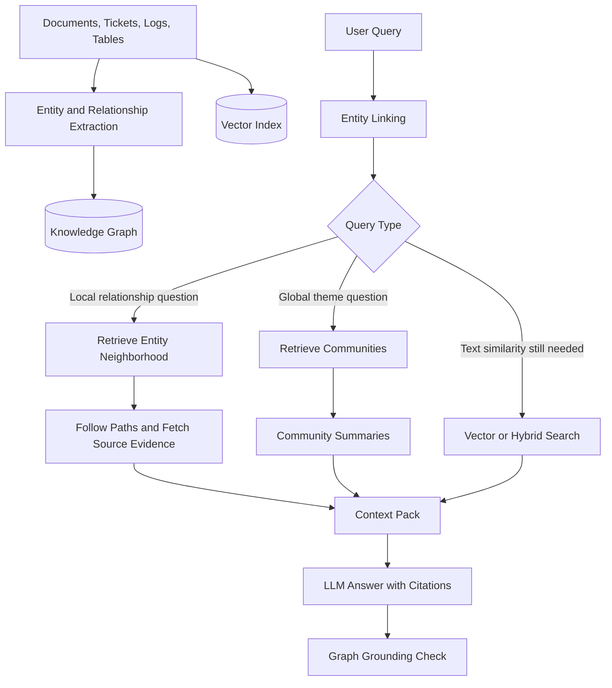

What the diagram is really saying:

- GraphRAG usually needs both a graph index and source documents.
- The graph helps find connected evidence, but the final answer still needs source grounding.
- Local GraphRAG follows neighborhoods and paths around entities.
- Global GraphRAG uses communities and summaries for broad questions.
- Vector search remains useful, especially when entity linking is weak or the question is text-heavy.

---

### 3. Real-World Industry Scenarios [Intermediate]

#### Scenario A - Incident Impact Analysis

**Product/use case context:** An SRE asks, "Which customer-facing workflows are affected if Payment API is degraded, and which teams own the dependencies?" Relevant evidence is spread across service catalogs, incident tickets, ownership data, architecture docs, runbooks, and customer-impact mappings.

**How GraphRAG helps:** A knowledge graph can model services, APIs, teams, workflows, customers, regions, and incidents. Graph traversal starts at `Payment API`, follows depends_on edges to upstream workflows, follows owned_by edges to teams, and fetches source evidence for each relationship. Vector RAG alone may retrieve Payment API docs, but it may miss the dependency path from Checkout -> Payment API -> Ledger Service -> Payments Platform Team.

**Constraints:**
- **Latency:** Traversal can be fast if the graph is indexed, but source evidence fetching and reranking still cost time. Cache stable service-dependency neighborhoods, but refresh incident edges frequently.
- **Cost:** Graph queries are usually cheaper than repeated LLM planning, but graph construction and maintenance are expensive.
- **Reliability:** A stale dependency edge can make the assistant list the wrong impacted workflow. Every edge needs provenance and freshness.
- **Security/privacy:** Ownership data, incident details, and customer-impact mappings may have different permission boundaries. Every graph node, edge, and source fetch needs authorization.

**What good looks like in production:** The answer shows affected workflows, dependency paths, owning teams, and cited sources for each edge. If one path is inferred or stale, the system marks it as uncertain.

#### Scenario B - Enterprise Policy Reasoning

**Product/use case context:** A compliance user asks, "Which AI data-use policies apply to contractors in the EU working on model evaluation?" The answer requires relationships among role, region, data type, activity, policy version, exception, and approval workflow.

**How GraphRAG helps:** The graph can represent Contractor -> has_role -> External Worker, EU -> governed_by -> EU Privacy Policy, Model Evaluation -> uses -> Customer Data, and Policy V4 -> supersedes -> Policy V3. Path retrieval can find the connected policy chain and avoid mixing old policy versions with current rules.

**Constraints:**
- **Latency:** Policy queries can tolerate slightly more retrieval if correctness matters. The system should avoid deep unconstrained traversals.
- **Cost:** Entity extraction and version-aware graph maintenance are ongoing costs.
- **Reliability:** False edges are dangerous. If the graph incorrectly links contractors to employees, the answer may be noncompliant.
- **Security/privacy:** Policy visibility may be broad, but specific audit records or approval histories may be restricted.

**What good looks like in production:** The assistant cites current policy sections, shows the relation path, applies version/freshness constraints, and refuses to answer if policy scope is ambiguous.

#### Scenario C - Research and Literature Exploration

**Product/use case context:** A researcher asks, "What mechanisms connect biomarker X to resistance in subtype Y, and which papers challenge that mechanism?" Relevant evidence involves papers, genes, pathways, diseases, treatments, cohorts, and contradictory findings.

**How GraphRAG helps:** A graph can link biomarker -> pathway -> resistance mechanism -> paper -> cohort -> finding. Local GraphRAG retrieves the neighborhood around biomarker X. Global GraphRAG can summarize communities of papers around mechanisms. Contradictory edges can surface papers that refute or limit the finding.

**Constraints:**
- **Latency:** Research tasks can tolerate slower graph traversal and summarization, but users need transparent evidence paths.
- **Cost:** Extracting high-quality scientific relationships requires specialized models, curation, or domain ontologies.
- **Reliability:** Entity resolution is hard: gene aliases, disease subtype names, and paper claims can be ambiguous.
- **Security/privacy:** Licensed literature and private notes must preserve source and access restrictions.

**What good looks like in production:** The answer distinguishes mechanisms, supporting papers, contradictory papers, and evidence strength, with citations attached to each relationship.

---

### 4. System View [Intermediate]

#### Inputs -> Transformations -> Outputs

```text
Inputs
  -> raw documents, tables, tickets, logs, code, metadata
  -> existing databases or service catalogs
  -> ontology/schema
  -> user query and conversation context
  -> access control and freshness constraints

Index-time transformations
  -> extract entities
  -> resolve aliases and duplicates
  -> extract typed relationships
  -> attach source provenance and timestamps
  -> build graph index
  -> build vector/hybrid index over source evidence
  -> optionally build community summaries

Query-time transformations
  -> link query mentions to graph entities
  -> classify local vs global vs hybrid query
  -> traverse graph paths or retrieve communities
  -> fetch source documents for graph facts
  -> rerank and pack evidence
  -> generate answer with citations
  -> verify graph grounding

Outputs
  -> answer with source citations
  -> graph paths or communities used
  -> provenance for nodes and edges
  -> missing/ambiguous entity report if needed
```

#### Graph Record Example

```json
{
  "entity": {
    "id": "service:payment-api",
    "type": "service",
    "name": "Payment API",
    "aliases": ["payments-api", "pay-api"]
  },
  "edge": {
    "source": "workflow:checkout",
    "relationship": "depends_on",
    "target": "service:payment-api",
    "provenance": ["architecture-doc-2026#payments"],
    "confidence": 0.91,
    "valid_from": "2026-03-01"
  }
}
```

#### Local vs Global GraphRAG

| Mode | Main question shape | Retrieval behavior | Risk |
|---|---|---|---|
| Local GraphRAG | "How is entity X connected to Y?" | Link entities, traverse paths, fetch sources | Wrong entity or stale edge |
| Global GraphRAG | "What are the major themes/risks across this corpus?" | Retrieve graph communities and summaries | Summary drift or overgeneralization |
| Hybrid GraphRAG | "Find text and explain relationships" | Combine vector hits, graph paths, and reranking | Conflicting signals and complex debugging |

#### Observability: What We Log, Trace, and Measure

- `entity_linking_candidates`: possible graph entities for query mentions.
- `selected_entities`: final linked entities used for retrieval.
- `traversal_depth`: how many graph hops were followed.
- `paths_returned`: graph paths used in the answer.
- `edge_provenance_coverage`: percentage of edges with source citations.
- `edge_freshness`: whether graph facts are current enough.
- `community_ids`: communities used for global GraphRAG.
- `summary_age`: age of community summaries.
- `source_fetch_success`: whether graph facts led back to usable source text.
- `claim_to_edge_mapping`: which answer claims map to which graph facts and sources.

---

### 5. System Design Flavor [Intermediate]

#### Key Components and Interfaces

1. **Graph builder:** Extracts entities and relationships from documents, metadata, tables, logs, or curated systems.
2. **Ontology manager:** Defines allowed entity types, relationship types, constraints, and versioning rules.
3. **Entity resolver:** Merges aliases and prevents separate nodes for the same real entity.
4. **Graph store:** Stores nodes, edges, properties, provenance, permissions, and timestamps.
5. **Vector or hybrid source index:** Stores source chunks so graph facts can be grounded in text evidence.
6. **Entity linker:** Maps query mentions to graph entities.
7. **Graph retriever:** Traverses neighborhoods, paths, communities, or graph queries.
8. **Community summarizer:** Produces or refreshes summaries for graph clusters used by global GraphRAG.
9. **Evidence fetcher:** Pulls source documents behind nodes and edges.
10. **Graph-aware context packer:** Packs paths, source snippets, and summaries into a coherent prompt.
11. **Grounding verifier:** Checks that final claims map to graph facts and source evidence.

#### Important Tradeoffs

| Tradeoff | Choose simpler RAG when... | Choose GraphRAG when... |
|---|---|---|
| Build cost vs relationship quality | The answer usually lives in one chunk | Answers depend on entities, paths, dependencies, ownership, or impact |
| Flexibility vs schema control | Domain changes constantly and graph schema is unclear | Domain has stable entity and relationship types |
| Local precision vs global coverage | User asks about one concrete fact | User asks broad questions across many documents or communities |
| Extracted graph vs curated graph | Some noise is acceptable | Wrong edges create compliance, security, financial, or operational risk |
| Graph retrieval vs vector retrieval | Language similarity is enough | Similar text misses the relationship or path needed to answer |

In plain terms: use GraphRAG when the relationship map is the product. Do not build a graph just because graphs sound sophisticated; build one when relationships, paths, communities, or provenance materially improve answers.

#### Practical Defaults

- Start with a narrow ontology: a few high-value entity types and relationships.
- Attach provenance to every edge. An edge without source evidence is a debugging liability.
- Keep source chunks alongside graph facts because the LLM should answer from evidence, not just labels.
- Use local GraphRAG for entity-specific questions: impact, ownership, dependency, citation, policy scope.
- Use global GraphRAG for corpus-level questions: major themes, systemic risks, clusters, repeated issues.
- Keep traversal depth small by default, often 1-3 hops.
- Prefer authoritative/curated edges for high-risk domains.
- Evaluate entity resolution separately from answer quality.

#### Scaling Consideration: What Changes at 10x Traffic or Data

At 10x data, graph construction becomes a pipeline problem: extraction quality, deduplication, schema evolution, incremental updates, and provenance matter more than the graph query itself. A graph with stale or duplicate entities can be worse than no graph because it gives wrong answers with confidence.

At 10x traffic, query-time traversal must be bounded. Cache common neighborhoods, path results, and community summaries, but invalidate them when source documents, permissions, or graph edges change. Use routing so only graph-shaped questions use GraphRAG; simple definition questions can stay on cheaper vector or hybrid RAG.

---

### 6. Common Mistakes + Debugging [Beginner]

#### Mistake 1 - Building a Graph Without Provenance

- **Symptom:** The answer cites a relationship, but nobody can find where that relationship came from.
- **Likely cause:** Edges were stored without source document IDs, offsets, timestamps, or extraction confidence.
- **First debugging step:** Inspect the edge record. If the edge lacks provenance, do not use it for grounded answers.

#### Mistake 2 - Confusing Graph Labels with Evidence

- **Symptom:** The final answer says "Service A depends on Service B" because the graph edge says so, but no source text is provided.
- **Likely cause:** Context packing included graph triples but not source snippets.
- **First debugging step:** Check whether every answer claim maps to both graph edge and source evidence.

#### Mistake 3 - Bad Entity Resolution

- **Symptom:** The assistant mixes two similarly named products, teams, customers, genes, policies, or incidents.
- **Likely cause:** Aliases were merged incorrectly or not merged when they should have been.
- **First debugging step:** Inspect entity linking candidates, aliases, IDs, metadata, and disambiguation rules.

#### Mistake 4 - Over-Traversal

- **Symptom:** The answer includes loosely related entities and noisy relationship chains.
- **Likely cause:** Traversal depth is too high or relationship filters are too broad.
- **First debugging step:** Reduce traversal depth, restrict relationship types, and rerank paths by query relevance and source authority.

---

### 7. Hands-On Lab: Build -> Break -> Measure -> Explain [Pro]

This lab builds a tiny local GraphRAG workflow. It links a query entity, traverses graph edges, fetches source evidence, and checks whether the answer has grounded paths.

#### Build: Tiny Local GraphRAG Retriever

```python
from collections import defaultdict, deque


nodes = {
    "workflow:checkout": {"type": "workflow", "name": "Checkout"},
    "service:payment-api": {"type": "service", "name": "Payment API"},
    "service:ledger": {"type": "service", "name": "Ledger Service"},
    "team:payments-platform": {"type": "team", "name": "Payments Platform Team"},
    "incident:inc-442": {"type": "incident", "name": "INC-442"},
}

edges = [
    {
        "source": "workflow:checkout",
        "relationship": "depends_on",
        "target": "service:payment-api",
        "source_doc": "arch-doc#checkout-payments",
    },
    {
        "source": "service:payment-api",
        "relationship": "writes_to",
        "target": "service:ledger",
        "source_doc": "arch-doc#payment-ledger",
    },
    {
        "source": "service:payment-api",
        "relationship": "owned_by",
        "target": "team:payments-platform",
        "source_doc": "service-catalog#payment-api",
    },
    {
        "source": "incident:inc-442",
        "relationship": "affected",
        "target": "service:payment-api",
        "source_doc": "incident-inc-442#impact",
    },
]

source_text = {
    "arch-doc#checkout-payments": "Checkout depends on Payment API for payment authorization.",
    "arch-doc#payment-ledger": "Payment API writes completed payment records to Ledger Service.",
    "service-catalog#payment-api": "Payment API is owned by Payments Platform Team.",
    "incident-inc-442#impact": "INC-442 affected Payment API availability in us-east.",
}


def build_adjacency(edges):
    adjacency = defaultdict(list)
    for edge in edges:
        adjacency[edge["source"]].append(edge)
        reverse = {
            "source": edge["target"],
            "relationship": "reverse_" + edge["relationship"],
            "target": edge["source"],
            "source_doc": edge["source_doc"],
        }
        adjacency[edge["target"]].append(reverse)
    return adjacency


def link_entity(query):
    query_lower = query.lower()
    for node_id, node in nodes.items():
        if node["name"].lower() in query_lower:
            return node_id
    return None


def traverse(start_node, allowed_relationships, max_depth=2):
    adjacency = build_adjacency(edges)
    queue = deque([(start_node, [])])
    paths = []

    while queue:
        current, path = queue.popleft()
        if len(path) >= max_depth:
            continue
        for edge in adjacency[current]:
            if edge["relationship"] not in allowed_relationships:
                continue
            new_path = path + [edge]
            paths.append(new_path)
            queue.append((edge["target"], new_path))
    return paths


def local_graphrag(query):
    start = link_entity(query)
    if not start:
        return {"status": "no_entity_link", "paths": [], "evidence": []}

    allowed = {"depends_on", "reverse_depends_on", "owned_by", "affected", "reverse_affected"}
    paths = traverse(start, allowed_relationships=allowed, max_depth=2)
    evidence = []
    for path in paths:
        for edge in path:
            evidence.append({
                "triple": (edge["source"], edge["relationship"], edge["target"]),
                "source_doc": edge["source_doc"],
                "text": source_text[edge["source_doc"]],
            })
    return {"status": "ok", "start": start, "paths": paths, "evidence": evidence}


query = "If Payment API is affected, what workflows and teams should we inspect?"
result = local_graphrag(query)

print("start:", result["start"])
print("evidence:")
for item in result["evidence"]:
    print(item["triple"], "->", item["text"])
```

Expected behavior: the retriever links `Payment API`, traverses dependency and ownership relationships, and fetches source evidence for each graph edge.

#### Break Case 1: Remove `source_doc` from One Edge

What breaks:
- The graph still knows the relationship, but the answer cannot cite source evidence.
- This simulates graph labels without grounding.

#### Break Case 2: Add a Wrong Edge

Add this edge:

```python
{
    "source": "service:payment-api",
    "relationship": "owned_by",
    "target": "team:random-team",
    "source_doc": "unknown-doc"
}
```

What breaks:
- The graph traversal may return a false ownership path.
- This simulates stale or hallucinated relationship extraction.

#### Break Case 3: Set `max_depth=5`

What breaks:
- The retriever can wander into loosely related nodes and pack noisy context.
- This simulates over-traversal.

#### Measure: Signals to Capture

| Metric | What it tells you | Healthy direction |
|---|---|---|
| `entity_linking_accuracy` | Whether query mentions map to the right graph entities | Higher |
| `edge_precision` | Share of retrieved edges that are correct and relevant | Higher |
| `edge_provenance_coverage` | Share of edges with usable source evidence | Near 100 percent for grounded answers |
| `path_recall` | Whether expected relationship paths are retrieved | Higher |
| `false_path_rate` | How often traversal returns misleading paths | Lower |
| `summary_freshness` | Whether community summaries reflect current sources | Higher freshness |
| `claim_to_edge_coverage` | Whether answer claims map to graph facts and sources | Higher |

#### Explain: Why It Broke and How to Fix It

GraphRAG breaks when entity linking chooses the wrong node, traversal follows stale or false edges, or context packing includes graph facts without source evidence. The fix is to attach provenance to edges, bound traversal, verify entity resolution, and fetch source snippets for every graph-supported claim.

Production guardrail: never let graph edges become uncited facts. A graph path is a retrieval route; source evidence is what grounds the answer.

---

### 8. Active Recall (Spaced Repetition) [Beginner]

1. What problem does GraphRAG solve that plain vector RAG often struggles with?
2. What is the difference between an entity and a relationship?
3. Why is provenance mandatory for graph edges?
4. When would you use local GraphRAG vs global GraphRAG?
5. What is the first risk to inspect when GraphRAG gives a wrong answer?

Answer key:

1. It handles relationship-heavy questions where paths, dependencies, ownership, citations, or communities matter.
2. An entity is a thing; a relationship is a typed connection between things.
3. Without provenance, the system cannot ground graph facts in source evidence or debug wrong edges.
4. Local GraphRAG is for entity-specific relationship questions; global GraphRAG is for broad corpus-level themes or summaries.
5. Entity linking, edge correctness, and whether graph facts had source evidence.

---

### 9. Practice [Intermediate]

#### Mini-Exercise

You are building GraphRAG for an incident assistant. The user asks:

```text
If INC-442 affected Payment API, which customer workflows and owning teams are impacted?
```

Design the graph schema and retrieval plan.

Suggested answer outline:

- Entities: incident, service, workflow, team, customer segment, region, runbook.
- Relationships: affected, depends_on, owned_by, serves, mitigated_by, located_in.
- Start by linking `INC-442` and `Payment API`.
- Traverse incident -> affected service -> reverse depends_on workflows -> owned_by teams.
- Fetch source evidence for every edge: incident ticket, service catalog, architecture docs, ownership records.
- Stop if the graph lacks a current dependency edge or permission blocks customer-impact data.

#### Capstone-Style System Design Question

Design a GraphRAG system for an enterprise AI assistant that answers policy, service ownership, incident impact, and dependency questions. What are the major components and how do you keep answers grounded?

Suggested answer outline:

- Define a narrow ontology first: services, teams, policies, incidents, workflows, customers, regions, and approved relationship types.
- Build graph extraction from curated systems first, then documents, then LLM extraction where needed.
- Store node/edge provenance, timestamps, permissions, confidence, and source document IDs.
- Maintain a vector or hybrid index over source evidence.
- At query time, link entities, classify local/global/hybrid query, traverse bounded paths, fetch sources, rerank, and pack evidence.
- Use community summaries only for broad corpus questions and refresh them when source clusters change.
- Verify every answer claim against graph edges and source snippets.
- Monitor entity linking accuracy, edge precision, path recall, provenance coverage, freshness, and false path rate.

---

### 10. Production Reality Check [Pro]

**If this fails in prod, what's the first thing we inspect?**

Inspect the graph retrieval trace: query entity linking -> selected entities -> traversal depth -> returned paths -> edge provenance -> source snippets -> final claim-to-edge mapping. Most GraphRAG failures start with wrong entity linking, stale or false edges, over-broad traversal, or graph facts being used without source evidence.

---

### 11. Curiosity Bridge [Beginner]

GraphRAG gives retrieval a relationship map, but users rarely ask isolated questions. They ask follow-ups, bring preferences, reuse context, and expect the assistant to remember what matters to them. That leads to conversation-aware and personalized retrieval.

---

### 12. Exit Check + Carry-Forward Review [Beginner]

**You're done when you can:** explain when GraphRAG beats vector RAG, design a small graph schema, choose local vs global GraphRAG, and debug entity-linking, edge-provenance, and traversal failures.

Carry-forward review from 7.3.b:

1. How does GraphRAG relate to multi-hop retrieval?
   - Multi-hop retrieval gathers multiple connected evidence pieces. GraphRAG can make those connections explicit by traversing entities and relationships instead of relying only on generated subquestions.
2. Why can GraphRAG still need vector search or reranking?
   - The graph finds paths and entities, but source evidence still needs text retrieval, ranking, filtering, and context packing.

---

## Subtopic 7.3.d: Conversation-Aware and Personalized Retrieval

Added to Knowledge Base.

**Subtopic time:** 3.5h

### 0. Reading Path + Level Tags

- **Beginner:** Read sections 1-2, section 6, and Active Recall.
- **Intermediate:** Add sections 3-5 and the Hands-On Lab.
- **Pro:** Do the full lab, compare session-only vs long-term personalization, and answer the capstone system-design question.

---

### 1. Pre-Question Hook + The Intuition [Beginner]

**Pause: before reading, if a user asks "what about the second one?" or "use my usual format," what exactly should retrieval remember, and what should it intentionally forget?**

**Conversation-aware retrieval** means retrieval uses the current conversation context to understand the user's latest query. It handles follow-ups, pronouns, ellipsis, earlier constraints, referenced entities, and the user's current task. Without it, the query "what about the second one?" is impossible to retrieve against because the retriever does not know what "second one" means.

**Personalized retrieval** means retrieval uses durable user-specific or account-specific context to improve relevance. This can include preferences, role, permissions, projects, region, product usage, past issues, saved documents, expertise level, or preferred output style.

The hard part is not storing more context. The hard part is deciding which context is relevant, allowed, fresh, and safe to use. Conversation-aware retrieval is usually short-lived and session-scoped. Personalized retrieval can be long-lived, so it needs stronger controls: consent, privacy boundaries, memory write policy, memory read policy, deletion, and auditability.

Example:

```text
Turn 1: Compare API gateway options for our EU healthcare workload.
Turn 2: Focus on the cheaper one, but keep HIPAA and EU residency in mind.

Bad retrieval query:
    cheaper one

Conversation-aware retrieval query:
    cheaper API gateway option from the previous comparison for an EU healthcare workload, considering HIPAA and EU data residency

Personalized retrieval addition, if allowed:
    user works on Project Atlas, prefers AWS-native services, and cannot use non-approved vendors
```

Real-world analogy: conversation-aware retrieval is like a colleague following the meeting notes from the last ten minutes. Personalized retrieval is like a teammate who knows your role, current project, constraints, and preferences. The analogy breaks down because software memory must be permissioned, inspectable, erasable, and resistant to stale or sensitive context leaks.

Key terms:
- **Conversation-aware retrieval:** Retrieval that uses current dialogue context to interpret and retrieve for the latest user query.
- **Personalized retrieval:** Retrieval that uses user-specific, account-specific, or preference-specific context to improve relevance.
- **Session context:** Short-lived context from the current conversation or task.
- **Long-term memory:** Durable stored context that can be reused across sessions when permitted.
- **User profile:** A structured representation of stable user attributes, preferences, permissions, projects, and constraints.
- **Memory retrieval:** Retrieving stored memories or profile facts that may help answer the current query.
- **Memory write policy:** Rules that decide what information is allowed to be saved as memory.
- **Memory read policy:** Rules that decide which saved memory can be retrieved for a request.
- **Consent gate:** A control that requires user or policy permission before saving or using certain personal context.
- **Privacy boundary:** A rule separating what context can and cannot cross between users, tenants, roles, sessions, or tools.
- **Context carryover:** Bringing relevant earlier conversation facts into the current retrieval request.
- **Query contextualization:** Rewriting a follow-up query into a standalone retrieval query using relevant context.
- **Preference signal:** A stored or inferred indication of what the user prefers, such as style, region, tool, product, or depth.
- **Salience scoring:** Estimating which memories or conversation facts matter for the current query.
- **Recency weighting:** Favoring newer context when older context may be stale.
- **Personalization drift:** A failure where old, weak, or overfit preferences distort retrieval away from the user's actual current need.
- **Memory provenance:** Metadata showing where a memory came from, when it was written, and why it is trusted.

The mental model to keep permanently: **conversation-aware retrieval resolves the current dialogue; personalized retrieval adapts retrieval to the user, but only within explicit safety and relevance boundaries.**

---

### 2. Visual Diagram (Mermaid) [Beginner]

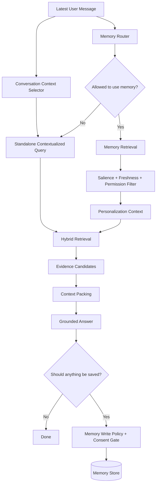

What the diagram is really saying:

- The latest message is rarely enough for retrieval in a conversation.
- Conversation context is used to make the query standalone.
- Personalized memory is optional, permissioned, and filtered.
- Retrieval should still ground answers in source evidence, not memory alone.
- Memory writes need stronger rules than temporary context carryover.

---

### 3. Real-World Industry Scenarios [Intermediate]

#### Scenario A - Enterprise Copilot for Internal Support

**Product/use case context:** An employee asks, "Can I use that for Project Atlas?" The previous turns compared two data-processing tools. The user's profile says they work in the EU healthcare division and Project Atlas has restricted vendor rules.

**How the pattern works:** Conversation-aware retrieval resolves "that" to the selected tool from the previous turn. Personalized retrieval adds permitted project and region constraints. Retrieval then searches policy docs, approved vendor lists, and project-specific architecture standards.

**Constraints:**
- **Latency:** Contextualization and memory retrieval add steps, so keep the session-context selector cheap and memory top-k small.
- **Cost:** Most follow-ups only need conversation context, not long-term memory. Route memory retrieval only when the query mentions personal/project/account scope or when user profile materially changes the answer.
- **Reliability:** The system must not use stale project rules or infer sensitive role information without permission.
- **Security/privacy:** Project membership, region, and restricted vendor rules must be tenant- and role-scoped. Memory cannot cross users or projects.

**What good looks like in production:** The answer applies the correct previous tool, current project policy, and approved source citations. The trace shows which conversation facts and profile facts were used.

#### Scenario B - Customer Support Assistant

**Product/use case context:** A customer says, "This is the same export issue as last week. Can you check the faster workaround?" The support assistant may know the customer's product plan, connector version, recent tickets, and support entitlements.

**How the pattern works:** Conversation-aware retrieval resolves the current issue in the active chat. Personalized retrieval may retrieve recent ticket summaries, connector version, and account-specific configuration if authorized. Retrieval searches docs and known issues for the exact connector version and allowed workaround.

**Constraints:**
- **Latency:** Support users expect fast response. Recent ticket lookup should be targeted by account ID and issue type.
- **Cost:** Long-term account memory can reduce repeated diagnostic questions but must not fetch all customer history.
- **Reliability:** A workaround from last week may no longer apply after a patch or plan change.
- **Security/privacy:** Account history and configuration are sensitive. The assistant must enforce account isolation and avoid exposing another customer's history.

**What good looks like in production:** The assistant cites current docs or ticket evidence, states whether the workaround still applies, and avoids treating stale ticket notes as current truth.

#### Scenario C - Learning Assistant

**Product/use case context:** A learner asks, "Can you explain it at my level and connect it to what we covered yesterday?" The system may know the learner's module progress, weak areas, preferred examples, and previous mistakes.

**How the pattern works:** Conversation-aware retrieval uses recent dialogue. Personalized retrieval pulls learning progress and prior misconceptions. The retriever selects module notes, exercises, and examples at the right depth.

**Constraints:**
- **Latency:** Learning systems can tolerate modest memory retrieval, but interaction should feel responsive.
- **Cost:** Personalized retrieval improves instruction quality but should be filtered to the current topic.
- **Reliability:** Over-personalization can trap the learner at an old skill level.
- **Security/privacy:** Learning history may be personal. The user should be able to inspect, correct, or delete it.

**What good looks like in production:** The answer uses current module context, retrieves only relevant prior concepts, and updates memory only for durable learning signals, not every transient message.

---

### 4. System View [Intermediate]

#### Inputs -> Transformations -> Outputs

```text
Inputs
    -> latest user message
    -> current conversation turns
    -> task/session state
    -> user/account/profile memory
    -> permissions, consent, retention rules
    -> corpus indexes and tools

Transformations
    -> select relevant conversation facts
    -> contextualize the query into standalone form
    -> decide whether personalization is needed
    -> retrieve memory candidates
    -> filter by permission, consent, freshness, and salience
    -> combine query + conversation + memory constraints
    -> retrieve source evidence
    -> rerank and pack context
    -> answer with citations and context-use trace
    -> decide whether to write/update/delete memory

Outputs
    -> grounded answer
    -> contextualized query
    -> used conversation facts
    -> used memory facts with provenance
    -> memory write/no-write decision
```

#### Trace Record Example

```json
{
    "query_id": "q-1772",
    "latest_message": "Can I use that for Project Atlas?",
    "contextualized_query": "Can the selected streaming ETL tool from the previous comparison be used for Project Atlas?",
    "conversation_facts_used": [
        {"fact": "selected_tool=Tool B", "source_turn": 6},
        {"fact": "comparison_scope=streaming ETL", "source_turn": 3}
    ],
    "memory_retrieval": {
        "used": true,
        "facts": [
            {"fact": "Project Atlas requires EU data residency", "provenance": "project_profile", "freshness_days": 14},
            {"fact": "User belongs to EU healthcare division", "provenance": "user_profile", "freshness_days": 30}
        ],
        "filtered_out": ["old_preference_for_tool_a"]
    },
    "retrieval_filters": {
        "region": "EU",
        "project": "Atlas",
        "source_authority": "approved_policy"
    },
    "memory_write_decision": "no_write_transient_question"
}
```

#### Conversation-Aware vs Personalized Retrieval

| Pattern | Main context source | Best for | Main risk |
|---|---|---|---|
| Conversation-aware retrieval | Current dialogue/session | Follow-ups, pronouns, earlier constraints | Carrying irrelevant stale turns |
| Personalized retrieval | User/account/project memory | Preferences, roles, projects, history | Privacy leaks and personalization drift |
| Account-aware retrieval | Account/customer metadata | Support, billing, configuration, entitlements | Cross-account data exposure |
| Task-aware retrieval | Current workflow state | Multi-step tools, coding, analysis workflows | Using incomplete state as truth |

#### Observability: What We Log, Trace, and Measure

- `contextualized_query`: the standalone query produced from conversation context.
- `conversation_facts_used`: which previous turns influenced retrieval.
- `memory_candidates`: memory facts considered before filtering.
- `memory_facts_used`: memory facts actually used in retrieval or answer generation.
- `memory_provenance`: source, timestamp, confidence, and write reason for each memory.
- `consent_status`: whether memory use was allowed.
- `privacy_filter_decisions`: memories or data excluded by boundary rules.
- `salience_score`: relevance of a memory to the current query.
- `freshness_score`: whether memory is current enough.
- `personalization_lift`: quality gain from personalization compared with non-personalized retrieval.
- `personalization_harm_rate`: cases where memory made retrieval worse, biased, stale, or unsafe.

---

### 5. System Design Flavor [Intermediate]

#### Key Components and Interfaces

1. **Conversation context selector:** Selects the few prior turns/facts needed to interpret the latest query.
2. **Query contextualizer:** Rewrites follow-ups into standalone retrieval queries while preserving constraints.
3. **Memory router:** Decides whether long-term memory is relevant and allowed for the request.
4. **Memory store:** Stores user, account, project, task, or preference facts with metadata.
5. **Memory retriever:** Retrieves candidate memories by semantic match, structured keys, or recency.
6. **Salience ranker:** Scores memory candidates by relevance, freshness, authority, and task fit.
7. **Privacy filter:** Enforces tenant, user, role, consent, retention, and tool-access boundaries.
8. **Personalized retrieval composer:** Combines query, conversation facts, memory facts, and source filters.
9. **Source retriever:** Retrieves grounded evidence from documents, databases, tools, or graphs.
10. **Memory writer:** Decides whether new durable memory should be saved, updated, ignored, or deleted.
11. **Memory auditor:** Lets systems and users inspect what memory was used and why.

#### Important Tradeoffs

| Tradeoff | Choose lighter context when... | Choose deeper personalization when... |
|---|---|---|
| Latency vs continuity | The query is standalone | The query references previous turns, project, account, or preferences |
| Privacy vs relevance | User context is sensitive or ambiguous | The user has consented and memory materially improves correctness |
| Recency vs stability | Current conversation contradicts old memory | Stable preferences or roles are more reliable than a transient turn |
| Personalization vs grounding | The answer depends on facts from sources | Personal context only scopes retrieval, not replaces evidence |
| Write more vs write less | The fact is transient, emotional, or sensitive | The fact is stable, user-approved, useful, and non-sensitive enough to store |

In plain terms: use the conversation to understand the question; use personalization only when it changes retrieval in a justified, permissioned, inspectable way.

#### Practical Defaults

- Always contextualize ambiguous follow-ups before retrieval.
- Prefer session context over long-term memory when both can resolve the query.
- Retrieve memories only when they are relevant to task, account, role, project, preferences, or prior durable user constraints.
- Never let memory override source evidence for factual claims.
- Store memory only when it is stable, useful later, allowed by policy, and ideally user-confirmed.
- Attach provenance, timestamp, confidence, and deletion/update path to every durable memory.
- Filter memories by user, tenant, role, tool, region, and consent.
- Use recency and salience scoring to avoid stale personalization.
- Make memory use auditable: the system should be able to answer, "What did you remember and why?"

#### Scaling Consideration: What Changes at 10x Traffic or Data

At 10x users, personalized retrieval becomes an isolation problem. The biggest risk is not slow retrieval; it is cross-user, cross-tenant, or stale-memory leakage. Memory stores need strong partitioning, retention rules, access controls, and deletion workflows.

At 10x memory volume, salience scoring matters. A user may have thousands of past interactions, but only a few facts should influence retrieval. Use memory types, structured keys, recency, source authority, and task matching to retrieve a small, high-signal set.

At 10x product complexity, personalization must be evaluated by segment. A preference that helps one workflow may harm another. Measure personalized vs non-personalized retrieval quality, refusal quality, privacy incidents, and user correction rates.

---

### 6. Common Mistakes + Debugging [Beginner]

#### Mistake 1 - Retrieving with the Raw Follow-Up Query

- **Symptom:** The retriever returns irrelevant results for queries like "what about the second one?" or "does that apply to us?"
- **Likely cause:** The system skipped query contextualization and sent the ambiguous message directly to retrieval.
- **First debugging step:** Inspect the contextualized query. If it does not include the referenced entity and constraints, fix the context selector or rewrite prompt.

#### Mistake 2 - Treating Memory as Ground Truth

- **Symptom:** The assistant answers from a stored user preference or old ticket note instead of current source evidence.
- **Likely cause:** Memory was packed into the answer context without fetching authoritative evidence.
- **First debugging step:** Check claim-to-source mapping. Memory can scope retrieval, but factual claims need current source citations.

#### Mistake 3 - Personalization Drift

- **Symptom:** The assistant keeps assuming an old preference, role, project, or tech stack even after the user has moved on.
- **Likely cause:** Old memory has too much weight or no expiration/update path.
- **First debugging step:** Inspect memory age, provenance, confidence, and contradiction with recent turns. Add recency weighting and correction handling.

#### Mistake 4 - Privacy Boundary Leakage

- **Symptom:** Retrieval uses another user's, tenant's, account's, or project team's memory.
- **Likely cause:** Memory retrieval missed partition filters or tool-level authorization checks.
- **First debugging step:** Audit memory read policy and filters: user ID, tenant ID, role, project, region, and consent status.

---

### 7. Hands-On Lab: Build -> Break -> Measure -> Explain [Pro]

This lab simulates conversation-aware and personalized retrieval with a tiny memory store. The goal is to see how contextualization, memory filters, and stale-memory controls change retrieval.

#### Build: Tiny Conversation-Aware Personalized Retriever

```python
import re


docs = [
        {
                "id": "policy-eu-residency",
                "text": "Project Atlas workloads must use EU data residency for customer data.",
                "metadata": {"project": "Atlas", "region": "EU", "authority": "policy"},
        },
        {
                "id": "tool-b-approval",
                "text": "Tool B is approved for streaming ETL when EU residency controls are enabled.",
                "metadata": {"tool": "Tool B", "region": "EU", "authority": "approved_vendor"},
        },
        {
                "id": "tool-a-legacy",
                "text": "Tool A was previously used for batch ETL but is not approved for new Atlas workloads.",
                "metadata": {"tool": "Tool A", "project": "Atlas", "authority": "approved_vendor"},
        },
]

conversation = [
        {"turn": 1, "text": "Compare Tool A and Tool B for streaming ETL."},
        {"turn": 2, "text": "Tool B is cheaper and has better EU controls."},
        {"turn": 3, "text": "Can I use that for Project Atlas?"},
]

memory_store = [
        {
                "fact": "User works on Project Atlas",
                "user_id": "u1",
                "tenant_id": "t1",
                "salience": 0.95,
                "age_days": 7,
                "sensitive": False,
        },
        {
                "fact": "User used to prefer Tool A",
                "user_id": "u1",
                "tenant_id": "t1",
                "salience": 0.40,
                "age_days": 240,
                "sensitive": False,
        },
        {
                "fact": "Another tenant uses Tool C",
                "user_id": "u2",
                "tenant_id": "t2",
                "salience": 0.99,
                "age_days": 1,
                "sensitive": False,
        },
]


def tokens(text):
        return set(re.findall(r"[a-z0-9]+", text.lower()))


def contextualize(conversation):
        latest = conversation[-1]["text"]
        if "that" in latest.lower():
                return "Can Tool B be used for Project Atlas streaming ETL with EU controls?"
        return latest


def retrieve_memories(query, user_id, tenant_id):
        query_terms = tokens(query)
        candidates = []
        for memory in memory_store:
                if memory["user_id"] != user_id or memory["tenant_id"] != tenant_id:
                        continue
                if memory["age_days"] > 180:
                        continue
                overlap = len(query_terms & tokens(memory["fact"]))
                score = overlap + memory["salience"]
                if score > 0.5:
                        candidates.append((score, memory))
        return [memory for score, memory in sorted(candidates, reverse=True, key=lambda item: item[0])]


def search_docs(query, memories):
        expanded = query + " " + " ".join(memory["fact"] for memory in memories)
        query_terms = tokens(expanded)
        scored = []
        for doc in docs:
                score = len(query_terms & tokens(doc["text"]))
                scored.append((score, doc))
        return [doc for score, doc in sorted(scored, reverse=True, key=lambda item: item[0]) if score > 0]


query = contextualize(conversation)
memories = retrieve_memories(query, user_id="u1", tenant_id="t1")
results = search_docs(query, memories)

print("contextualized query:", query)
print("memories used:", [memory["fact"] for memory in memories])
print("docs:", [doc["id"] for doc in results])
```

Expected behavior: the raw follow-up becomes a standalone query about Tool B and Project Atlas. Memory retrieval includes the Project Atlas fact, excludes another tenant's memory, and excludes the stale Tool A preference.

#### Break Case 1: Skip Contextualization

Set `query = conversation[-1]["text"]`.

What breaks:
- Retrieval searches for "that" without knowing it refers to Tool B.
- The system may retrieve project docs but miss the selected tool.

#### Break Case 2: Remove Tenant/User Filters

Remove the `user_id` and `tenant_id` checks in `retrieve_memories`.

What breaks:
- Another tenant's memory can influence retrieval.
- This simulates a serious privacy boundary failure.

#### Break Case 3: Remove the Staleness Check

Remove `if memory["age_days"] > 180: continue`.

What breaks:
- The old Tool A preference can re-enter retrieval and distort results.
- This simulates personalization drift.

#### Measure: Signals to Capture

| Metric | What it tells you | Healthy direction |
|---|---|---|
| `contextualization_accuracy` | Whether follow-up queries become correct standalone queries | Higher |
| `memory_relevance_precision` | Share of retrieved memories that truly help this query | Higher |
| `privacy_filter_pass_rate` | Whether unauthorized memories are excluded | Near 100 percent |
| `stale_memory_use_rate` | How often old memories influence retrieval incorrectly | Lower |
| `personalization_lift` | Quality improvement over no-memory retrieval | Positive for memory-worthy queries |
| `personalization_harm_rate` | Cases where memory worsens answer quality or safety | Lower |
| `memory_write_precision` | Share of saved memories that are stable and useful later | Higher |

#### Explain: Why It Broke and How to Fix It

Skipping contextualization breaks retrieval because the latest message lacks the entity and constraints. Missing privacy filters can leak another user's context into retrieval. Removing freshness controls lets old preferences overpower current needs. The fix is to contextualize ambiguous queries, partition memory by authorization boundaries, and rank memory by relevance, recency, provenance, and consent.

Production guardrail: every memory used in retrieval should answer four questions: is it relevant, allowed, current, and sourceable?

---

### 8. Active Recall (Spaced Repetition) [Beginner]

1. What is the difference between conversation-aware retrieval and personalized retrieval?
2. Why should memory usually scope retrieval rather than replace source evidence?
3. What causes personalization drift?
4. What should a memory read policy enforce?
5. When should a system avoid writing a durable memory?

Answer key:

1. Conversation-aware retrieval uses current dialogue context; personalized retrieval uses durable user/account/project context when allowed.
2. Memory can be stale, subjective, or preference-like. Factual answers still need authoritative source evidence.
3. Old, weak, or over-weighted memories keep influencing retrieval after the user's needs change.
4. User, tenant, role, consent, sensitivity, freshness, task relevance, and tool-access boundaries.
5. When the fact is transient, sensitive, unconfirmed, low utility, or not permitted by policy/user consent.

---

### 9. Practice [Intermediate]

#### Mini-Exercise

For this conversation, write the contextualized retrieval query and decide whether long-term memory should be used:

```text
Turn 1: Compare vector databases for our clinical search app.
Turn 2: We chose Option B because it supports hybrid search and EU deployment.
Turn 3: Does it fit my team's usual compliance constraints?
```

Suggested answer outline:

- Contextualized query: "Does Option B, the selected vector database for the clinical search app with hybrid search and EU deployment, satisfy the user's/team's compliance constraints?"
- Use conversation context: selected option, clinical search app, hybrid search, EU deployment.
- Use long-term memory only if the user's team compliance constraints are stored with consent and are current.
- Retrieve authoritative compliance docs, approved vendor list, regional data residency policy, and team-specific standards.
- Do not answer from memory alone; memory should point retrieval toward the right constraints.

#### Capstone-Style System Design Question

Design a retrieval system for an enterprise assistant that supports follow-up questions, user preferences, project context, and account-specific support history. How do you personalize safely?

Suggested answer outline:

- Start with conversation-aware contextualization for every ambiguous follow-up.
- Add a memory router that decides whether durable memory is needed.
- Partition memory by user, tenant, project, account, role, and tool authorization.
- Store memory with provenance, timestamp, confidence, consent status, sensitivity, and deletion/update path.
- Retrieve memories by salience, recency, structured keys, and task relevance.
- Use memory to shape filters, query expansion, source selection, and answer style, but require source evidence for factual claims.
- Log memory facts used and expose them for audit/debugging.
- Measure contextualization accuracy, memory relevance, personalization lift, stale-memory harm, privacy incidents, and correction rates.

---

### 10. Production Reality Check [Pro]

**If this fails in prod, what's the first thing we inspect?**

Inspect the context and memory trace: raw latest message -> contextualized query -> conversation facts used -> memory candidates -> memory filters -> memory facts used -> retrieval filters -> source evidence -> final claims. If the answer is wrong, the likely first failure is missing query contextualization, irrelevant/stale memory, or memory crossing a privacy boundary.

---

### 11. Curiosity Bridge [Beginner]

This completes the advanced retrieval pattern arc: hierarchy, query transformation, reranking, HyDE/self-RAG/agents, multi-hop, GraphRAG, and personalization. The next natural step is evaluation: proving which retrieval pattern helped, where it failed, and how to measure quality beyond vibes.

---

### 12. Exit Check + Carry-Forward Review [Beginner]

**You're done when you can:** contextualize ambiguous follow-ups, decide when personalization is justified, design memory read/write policies, and debug stale memory, privacy leakage, or personalization drift.

Carry-forward review from 7.3.c:

1. Why might personalized retrieval still need GraphRAG?
     - A user's project or account context may identify seed entities, but GraphRAG may still be needed to follow relationships like dependencies, ownership, or policy scope.
2. Why must both GraphRAG and personalized retrieval preserve provenance?
     - Graph edges and memories are both claims. Production systems need to know where each claim came from, when it was created, and whether it is allowed and current.

---

## Module 7 Checkpoint: Retrieval Quality Engineering

Added to Knowledge Base.

### Checkpoint Goal

By the end of this checkpoint, you should be able to:

- Improve retrieval quality using retrieval techniques, not only better prompts.
- Explain when reranking is mandatory.
- Compare baseline RAG, multi-hop RAG, and GraphRAG without confusing them.

The core checkpoint idea: retrieval quality is a system property. A better prompt can hide retrieval weakness for a demo, but production RAG improves when the retrieval pipeline finds the right evidence, filters the wrong evidence, ranks candidates correctly, packs context deliberately, and exposes traces when it fails.

---

### 1. One-Page Mental Model

RAG quality is usually limited by one of five retrieval failures:

1. The right evidence was never indexed correctly.
2. The query did not match the corpus language.
3. The first-stage retriever found the right evidence but buried it.
4. Context packing dropped, duplicated, or poorly ordered the evidence.
5. The question needed relationships, multiple hops, or personalization that simple retrieval could not represent.

Prompting helps after evidence is present. Retrieval engineering helps make sure the evidence is present in the first place.

Use this simple rule:

```text
If the model cannot see the right evidence, fix retrieval.
If the model sees too much noisy evidence, fix reranking and packing.
If the model sees the evidence but answers badly, fix generation, grounding, or evaluation.
```

---

### 2. Retrieval Strategy Decision Flow

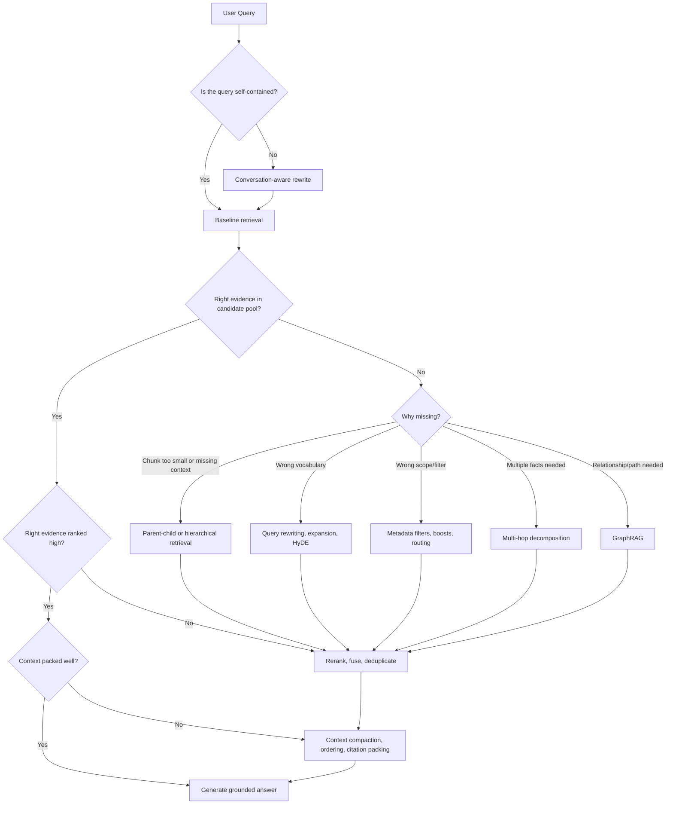

Read the diagram as a debugging sequence. Do not jump to agents, GraphRAG, or long prompts before checking whether simple retrieval, metadata, and reranking already solve the failure.

---

### 3. Improve Retrieval Quality Without Reaching for Prompts First

| Symptom | Likely retrieval cause | Best first move |
|---|---|---|
| Answer is confident but unsupported | Wrong or missing evidence in context | Inspect retrieved chunks and claim-to-citation mapping |
| Answer is too generic | Retrieval returned broad overview chunks | Use metadata filters, parent-child expansion, and better context packing |
| Correct document exists but is not found | Query-corpus vocabulary mismatch | Use query rewriting, expansion, controlled vocabulary, or HyDE |
| Correct chunk is found but ranked low | First-stage retriever optimized for recall, not precision | Add reranking and tune rerank depth |
| Many duplicate chunks crowd the prompt | Overlap and near-duplicate retrieval | Deduplicate and compact context |
| Important evidence is split across chunks | Chunk boundary problem | Use parent-child retrieval, adjacency merge, or section graph expansion |
| Policy answer misses an exception | Single query missed one evidence slot | Use multi-hop decomposition with required evidence slots |
| Incident impact answer misses dependencies | Relationships are the real evidence | Use GraphRAG or graph-backed retrieval |
| Follow-up query retrieves nonsense | Query depends on prior turns | Use conversation-aware query contextualization |
| Personalized answer uses wrong project/account | Memory or profile leak/staleness | Inspect memory scope, freshness, consent, and provenance |

Retrieval quality improves when you can name the failure mode. If the only diagnosis is "the model hallucinated," the debugging is too shallow.

---

### 4. When Reranking Is Mandatory

Reranking is mandatory when candidate generation is not enough to decide what the model should trust.

Use reranking when any of these are true:

- The answer depends on exact evidence selection, not just rough relevance.
- The corpus has many near-duplicates, versions, policy variants, or similar product docs.
- Top vector results are semantically similar but not answer-sufficient.
- You use multi-query retrieval, fusion, HyDE, or query expansion and need to sort noisy candidates.
- You have a tight context budget and can only pack a few candidates.
- The task is high-risk: policy, legal, medical, security, financial, compliance, access control, or customer-impacting workflows.
- You need to choose between old and current docs, official and unofficial sources, or general and project-specific sources.
- You need evidence diversity: rule + exception + approver + expiry, not four copies of the same paragraph.

Reranking is less urgent when:

- The corpus is small and clean.
- Queries are direct and exact.
- Metadata filters already narrow the candidate pool to a few authoritative documents.
- The answer is low-risk and the top candidate is clearly sufficient.

Reranking rule of thumb:

```text
First-stage retrieval should maximize recall.
Reranking should maximize answer-useful precision.
Context packing should maximize grounded coverage under the token budget.
```

---

### 5. Baseline RAG vs Multi-Hop RAG vs GraphRAG

| Pattern | What it retrieves | Best for | Do not confuse it with | Main failure mode |
|---|---|---|---|---|
| Baseline RAG | Top chunks for one query | Simple factual or procedural questions | Multi-hop reasoning | Missing evidence when the answer spans sources |
| Multi-hop RAG | Multiple evidence slots or sequential subquestions | Questions needing rule + exception, cause + effect, comparison, or chained facts | GraphRAG | Bad decomposition or missing evidence slot |
| GraphRAG | Entities, relationships, paths, neighborhoods, or communities plus source evidence | Dependency, ownership, impact, citation, policy scope, and relationship-heavy questions | Generic multi-step retrieval | Bad entity resolution, stale edge, or unsupported graph fact |

Practical distinction:

- Baseline RAG asks: "Which chunks answer this query?"
- Multi-hop RAG asks: "Which pieces of evidence are needed, and in what dependency order?"
- GraphRAG asks: "Which entities and relationships connect the evidence, and what source text proves those edges?"

Use baseline RAG when one source likely contains the answer. Use multi-hop when the answer needs multiple evidence slots. Use GraphRAG when explicit relationships are the retrieval target.

---

### 6. Retrieval Technique Selection Matrix

| Need | Technique | Why it helps | What to measure |
|---|---|---|---|
| Preserve context around small matches | Parent-child retrieval | Search precise child chunks, answer from larger parents | parent recall@k, citation correctness |
| Use document structure | Section graphs and hierarchy | Expands across headings, tables, adjacent sections, and references | graph expansion precision, structural confidence |
| Enforce scope | Metadata filters and boosts | Routes by version, region, tenant, source, authority, freshness | filter recall cliff, precision, permission violations |
| Fix vocabulary mismatch | Query rewriting and expansion | Aligns user language with corpus language | rewrite recall lift, query drift rate |
| Search multiple angles | Multi-query retrieval and fusion | Captures different intents or terms | branch diversity, recall lift, fusion noise |
| Rank candidates precisely | Cross-encoder or LLM reranking | Reads query and candidate together | reranker accuracy, latency, score calibration |
| Combine ranked lists | RRF and late fusion | Avoids brittle score normalization | MRR, NDCG, candidate provenance |
| Help vague queries | HyDE | Generates richer search text | recall lift, hypothesis drift rate |
| Decide if more retrieval is needed | Self-RAG | Critiques evidence sufficiency | false sufficient rate, groundedness |
| Plan retrieval steps | Agentic retrieval | Chooses tools and follow-up searches | step count, evidence added per step |
| Answer chained questions | Multi-hop decomposition | Retrieves required evidence slots | chain completeness, slot recall |
| Follow relationships | GraphRAG | Traverses entities, edges, paths, communities | edge precision, path validity, provenance coverage |
| Handle follow-ups and preferences | Conversation-aware/personalized retrieval | Resolves dialogue and allowed memory context | contextualization accuracy, personalization harm rate |

---

### 7. Production Debugging Checklist

When a RAG answer fails, inspect in this order:

1. User query and contextualized query.
2. Metadata filters, permissions, tenant scope, freshness, and source authority.
3. Candidate pool before reranking.
4. Candidate pool after reranking and fusion.
5. Deduplication and context packing order.
6. Final prompt context and citations.
7. Claim-to-evidence mapping.
8. Missing evidence slots for multi-hop questions.
9. Graph paths, edge provenance, and entity resolution for GraphRAG.
10. Memory facts used, freshness, consent, and scope for personalized retrieval.

The first question is not "what prompt did we use?" The first question is "what evidence did the model actually receive, and why?"

---

### 8. Checkpoint Drills

#### Drill A - Choose the Retrieval Fix

Scenario: A policy assistant answers whether vendors can get emergency production access. It retrieves the normal vendor policy but misses the SEV1 exception and expiry rule.

Suggested answer:

- This is not primarily a prompt problem.
- The query needs multiple evidence slots: normal vendor rule, SEV1 exception, approver, expiry/audit rule.
- Use multi-hop decomposition and chain completeness checks.
- Add reranking after each hop if policy documents are noisy or versioned.
- Final answer should refuse or caveat if any required slot is missing.

#### Drill B - Explain Reranking Requirement

Scenario: A search system retrieves 30 candidate chunks from hybrid search across old docs, new docs, examples, release notes, and forum posts. Only 5 chunks fit in context.

Suggested answer:

- Reranking is mandatory because first-stage retrieval has high recall but low answer-useful precision.
- The system must choose current, authoritative, answer-sufficient chunks.
- Reranking should prefer official, fresh, directly relevant evidence and maintain diversity across required facts.
- Measure NDCG/MRR, grounded answer success, source authority selection, and latency.

#### Drill C - Baseline vs Multi-Hop vs GraphRAG

Scenario: An SRE asks, "If Payment API is degraded, which checkout workflows and owning teams are affected?"

Suggested answer:

- Baseline RAG may retrieve Payment API docs but miss dependency and ownership paths.
- Multi-hop RAG could decompose into affected services, workflows, and owners.
- GraphRAG is stronger if a service graph exists because the answer depends on explicit relationships: workflow -> depends_on -> service -> owned_by -> team.
- The final answer still needs source evidence for each edge.

---

### 9. Capstone System Design Prompt

Design a retrieval-quality layer for an enterprise assistant that answers support, policy, incident, and learning questions. It has vector search, keyword search, metadata filters, reranking, graph data, user memory, and tool access.

Suggested answer outline:

- Classify the query: direct fact, troubleshooting, policy application, comparison, relationship, follow-up, personalized/account-specific, or high-risk.
- Contextualize follow-ups before retrieval.
- Apply hard filters first: permissions, tenant, region, version, source authority, freshness.
- Use baseline hybrid retrieval for simple direct questions.
- Use query rewriting, expansion, or HyDE for vocabulary mismatch.
- Use multi-query retrieval and RRF when multiple lexical/semantic branches help.
- Use reranking whenever candidate selection affects answer correctness.
- Use multi-hop decomposition when multiple evidence slots are required.
- Use GraphRAG when entities and relationships are the evidence.
- Use personalized retrieval only when memory is allowed, relevant, current, and provenance-backed.
- Pack context by coverage, authority, diversity, and citation traceability.
- Log every decision: query rewrite, filters, candidates, reranks, graph paths, memories, and final citations.
- Evaluate by query class, not one blended average.

---

### 10. Production Reality Check

If retrieval quality fails in production, the first thing we inspect is the retrieval trace: contextualized query, filters, candidate generation, reranking, context packing, citations, graph paths, memory facts, and final claim-to-evidence mapping.

Why: almost every RAG failure leaves a fingerprint before generation. The right evidence was missing, buried, filtered out, duplicated, stale, unauthorized, unsupported, or packed poorly. Fixing that fingerprint is more reliable than asking the model to "be more accurate."

---

### 11. Final Active Recall

1. Why is better prompting not enough to fix most retrieval failures?
2. What condition makes reranking mandatory?
3. How do baseline RAG, multi-hop RAG, and GraphRAG differ?
4. Why can GraphRAG still hallucinate?
5. What should be logged for personalized retrieval?

Answer key:

1. If the model does not receive the right evidence, a better prompt cannot reliably create grounded facts.
2. Reranking is mandatory when candidate selection affects correctness, especially in noisy, high-risk, multi-branch, or tight-context settings.
3. Baseline RAG retrieves chunks for one query; multi-hop retrieves multiple evidence slots; GraphRAG retrieves entities, relationships, paths, or communities plus source evidence.
4. Graph edges can be wrong, stale, unsupported, or over-traversed; the answer must still cite source evidence.
5. Log memory candidates, memory facts used, scope, consent, freshness, provenance, and how memory changed retrieval.

---

### 12. Exit Check + Carry-Forward

You are done with Module 7 when you can diagnose a bad RAG answer by reading its retrieval trace, choose the smallest retrieval technique that fixes the failure, justify when reranking is mandatory, and explain baseline RAG vs multi-hop RAG vs GraphRAG without mixing them up.

Carry-forward into the next module: retrieval engineering is only half the production story. The next layer is evaluation: building datasets, metrics, traces, and failure taxonomies that prove whether a retrieval change actually improved quality.

---

## Module Glossary

- **access control filter:** A retrieval-time or fetch-time rule that removes records the user is not allowed to see.
- **adjacency edge:** An edge showing reading order or neighborhood, such as one section coming before another.
- **adjacent merge:** Combining neighboring chunks from the same source when together they form a better evidence unit.
- **answer composition:** Combining hop-level evidence into one final grounded answer.
- **answer composer:** A component that produces the final answer from the verified evidence chain.
- **answer groundedness:** The degree to which the generated answer is supported by retrieved evidence.
- **agent planner:** The component that decides the next retrieval action, tool, query, or stopping move in an agentic workflow.
- **agentic retrieval:** A retrieval pattern where a planner/controller chooses retrieval actions, tools, and follow-up searches iteratively.
- **authority signal:** Metadata that indicates source trust, such as official docs over forum posts.
- **branch diversity:** The degree to which query branches search meaningfully different angles instead of repeating the same query.
- **bridge entity:** An entity discovered in one hop that is needed to retrieve the next hop, such as a policy name, product ID, paper title, clause, or system component.
- **bridge extractor:** A component that extracts entities, IDs, clauses, dates, products, or other join handles from earlier hop evidence.
- **budget controller:** A component that enforces limits on retrieval calls, reranking depth, tokens, latency, and cost.
- **candidate union:** The pooled set of unique candidates gathered across retrieval branches.
- **bi-encoder:** A retrieval model that embeds query and documents separately, then compares vectors.
- **candidate generation:** The first retrieval stage that produces a broad candidate pool, usually optimized for recall and speed.
- **candidate provenance:** The record of which retriever, query branch, rank, and score produced a candidate.
- **child chunk:** A small text unit embedded into the vector index for precise semantic matching.
- **child recall@k:** The fraction of queries where the correct child evidence appears in the top-k retrieved child hits.
- **citation provenance:** The trace from an answer citation back to source document, section, chunk, offsets, and version.
- **chunk overlap:** Repeated tokens or sentences between neighboring chunks to preserve context across boundaries.
- **community detection:** Grouping graph nodes into clusters that are densely connected or semantically related.
- **community summarizer:** A component that creates or refreshes summaries for graph clusters used in global GraphRAG.
- **community summary:** A generated or curated summary of a graph community used for broad questions.
- **compression loss:** Relevant evidence removed or distorted during context compaction.
- **compositional query:** A query whose answer depends on combining multiple facts, constraints, or entities.
- **compositionality classifier:** A component that decides whether a query likely needs multiple evidence pieces or a simpler retrieval path.
- **consent gate:** A control that requires user or policy permission before saving or using certain personal context.
- **context carryover:** Bringing relevant earlier conversation facts into the current retrieval request.
- **context expansion:** The step where a retrieved child hit is expanded into a parent, neighboring chunk, or larger evidence unit.
- **context compaction:** Reducing retrieved evidence into a smaller, answer-sufficient context while preserving grounding and citations.
- **context packing:** The process of selecting, ordering, and fitting retrieved evidence into the LLM prompt budget.
- **context window:** The maximum amount of input and output tokens a model can process in one request.
- **conversation-aware retrieval:** Retrieval that uses current dialogue context to interpret and retrieve for the latest user query.
- **conversation context selector:** A component that selects the prior turns or facts needed to interpret the latest query.
- **containment edge:** An edge showing parent-child structure, such as a section containing a paragraph or table.
- **cross-encoder:** A reranking model that reads the query and candidate together and outputs a relevance score.
- **deduplication:** Collapsing repeated or equivalent retrieval results so the prompt does not waste space on duplicate evidence.
- **decomposition:** Breaking a complex query into smaller subquestions or evidence goals.
- **decomposition planner:** A component that converts a complex question into subquestions and expected evidence slots.
- **dependency graph:** A graph showing which subquestions depend on which earlier answers or evidence.
- **dependency graph builder:** A component that marks whether subquestions are independent, sequential, or require bridge entities.
- **document hierarchy:** The structural relationship between document levels such as document, chapter, section, paragraph, table, and sentence.
- **edge:** A relationship between two graph nodes, such as contains, references, defines, continues, next, or previous.
- **early fusion:** Combining retrieval signals before or during retrieval, often by computing one hybrid score.
- **embedding:** A numeric vector representation of text used for semantic similarity search.
- **entity:** A distinct thing in the domain, such as a person, system, policy, product, customer, paper, incident, or clause.
- **entity linking:** Mapping a query mention to the correct graph entity.
- **entity resolution:** Deciding whether two names, aliases, or mentions refer to the same real entity.
- **entity resolver:** A component that merges aliases and prevents unrelated entities from being collapsed together.
- **evidence chain:** The ordered set of retrieved evidence pieces used to support a multi-hop answer.
- **evidence chain builder:** A component that stores hop evidence, citations, provenance, and missing evidence slots.
- **evidence critique module:** A component that evaluates retrieved evidence for relevance, sufficiency, authority, freshness, and contradictions.
- **evidence coverage:** The degree to which packed context contains all facts needed to answer correctly.
- **evidence fetcher:** A component that retrieves source documents or snippets behind graph nodes and edges.
- **evidence sufficiency:** Whether retrieved context contains enough information to answer without unsupported speculation.
- **filter recall cliff:** A failure where one wrong or overly strict filter removes the correct evidence completely.
- **freshness signal:** Metadata that indicates whether evidence is current enough for the query.
- **fusion:** Combining candidate results from multiple retrieval branches into one ranked set.
- **fusion threshold:** A rule for keeping or dropping candidates after fusion based on rank, score, source diversity, or minimum evidence.
- **fusion noise:** Irrelevant candidates introduced because extra branches searched too broadly.
- **fusion weight:** A coefficient that controls how much one retrieval branch influences final ranking.
- **global GraphRAG:** GraphRAG focused on broad corpus-level themes, communities, or summaries across many entities.
- **graph-aware context packer:** A context packer that organizes graph paths, source snippets, summaries, confidence, and citations for the LLM prompt.
- **graph builder:** A pipeline component that extracts or imports entities and relationships into a knowledge graph.
- **graph expansion path:** The traced sequence of nodes and edges followed after initial retrieval.
- **graph grounding:** Ensuring final answer claims are supported by graph-linked source evidence, not just graph labels.
- **graph retriever:** A component that retrieves graph neighborhoods, paths, communities, or graph query results.
- **graph store:** A database or index that stores nodes, edges, properties, permissions, provenance, and freshness metadata.
- **graph traversal:** Moving through graph edges from one entity to related entities.
- **GraphRAG:** A RAG pattern that uses graph structure, entity relationships, traversal, or graph summaries to retrieve and ground answers.
- **grounding verifier:** A component that checks final claims against graph facts and source evidence.
- **hard filter:** A metadata condition that must be satisfied before evidence can be retrieved or used.
- **heading path:** The breadcrumb path from document title to a node, such as document -> section -> subsection.
- **hierarchical retrieval:** Retrieval that preserves and uses document structure across levels such as document -> section -> paragraph -> sentence.
- **hop:** One retrieval or reasoning step that resolves part of a multi-hop question.
- **hop budget:** A limit on how many retrieval steps, model calls, tokens, or seconds a multi-hop workflow can use.
- **hop retriever:** A component that runs vector, keyword, hybrid, or metadata search for one subquestion.
- **HyDE (Hypothetical Document Embeddings):** A retrieval pattern that generates a hypothetical answer/document, embeds it, and retrieves real documents similar to that hypothetical text.
- **HyDE generator:** The component that creates hypothetical search text used to improve retrieval vocabulary.
- **HyDE validator:** The component that checks generated hypothetical text for drift, unsafe content, and unsupported assumptions before retrieval.
- **hypothetical document:** Generated text that represents what a relevant answer or document might look like before real evidence is retrieved.
- **LLM reranking:** Using an LLM to score, compare, or order candidate evidence before context packing.
- **late fusion:** Combining ranked candidate lists after separate retrievers or query branches have already produced results.
- **intermediate answer:** A temporary answer to a subquestion that may guide later retrieval but must still be grounded in evidence.
- **knowledge graph:** A structured graph of entities and relationships used to represent domain knowledge.
- **local GraphRAG:** GraphRAG focused on a small neighborhood around query-relevant entities.
- **long-term memory:** Durable stored context that can be reused across sessions when permitted.
- **lost-in-the-middle:** A failure mode where the model pays less attention to important evidence placed deep in the middle of a long context.
- **listwise reranking:** Ranking a list of candidates together in one pass.
- **metadata:** Structured fields attached to chunks or documents, such as source, section, version, permissions, freshness, and offsets.
- **metadata coverage:** The percentage of documents or chunks that have a usable value for a metadata field.
- **metadata-driven recall:** Improving retrieval coverage by using structured fields to filter, boost, route, expand, or rerank evidence.
- **memory auditor:** A component that makes memory use inspectable for debugging, compliance, or user control.
- **memory provenance:** Metadata showing where a memory came from, when it was written, and why it is trusted.
- **memory read policy:** Rules that decide which saved memory can be retrieved for a request.
- **memory retrieval:** Retrieving stored memories or profile facts that may help answer the current query.
- **memory router:** A component that decides whether long-term memory is relevant and allowed for a request.
- **memory store:** Storage for user, account, project, task, or preference facts with scope and provenance.
- **memory write policy:** Rules that decide what information is allowed to be saved as memory.
- **memory writer:** A component that decides whether new durable memory should be saved, updated, ignored, or deleted.
- **multi-hop retrieval:** A retrieval pattern where a question is answered by gathering multiple connected evidence pieces across two or more retrieval steps.
- **multi-query retrieval:** Running multiple query variants or retrieval branches for one user request, then combining their results.
- **node:** A graph unit such as a section, paragraph, table, appendix, figure, code block, or clause.
- **near-duplicate:** Text that is not exactly identical but carries the same meaning or source content.
- **ontology:** The schema of allowed entity types, relationship types, properties, and constraints in a graph.
- **ontology manager:** A component that defines and governs graph entity types, relationship types, constraints, and versioning rules.
- **orphan node:** Parsed content that lacks a reliable parent, heading path, or structural relationship.
- **parent chunk:** A larger text unit, usually a section or page, fetched after a child match so the LLM receives enough surrounding evidence.
- **parent recall@k:** The fraction of queries where the correct parent evidence unit appears among the expanded top-k parents.
- **parent-child retrieval:** A hierarchical retrieval pattern that searches small child chunks, then expands each hit to a larger parent chunk before context packing.
- **parallel decomposition:** A decomposition strategy where independent subquestions are retrieved at the same time.
- **path retrieval:** Retrieving evidence by following one or more graph paths between entities.
- **pattern router:** A routing component that selects baseline retrieval, HyDE, self-RAG, agentic retrieval, or a hybrid based on query risk and confidence.
- **personalization drift:** A failure where old, weak, or overfit preferences distort retrieval away from the user's actual current need.
- **personalized retrieval:** Retrieval that uses user-specific, account-specific, or preference-specific context to improve relevance.
- **personalized retrieval composer:** A component that combines query, conversation facts, memory facts, and source filters for retrieval.
- **pairwise reranking:** Comparing two candidates at a time and choosing the better one.
- **pointwise reranking:** Scoring each candidate independently against the query.
- **position bias:** A failure where a reranker favors candidates based on order rather than relevance.
- **precision:** The share of retrieved results that are actually relevant.
- **preference signal:** A stored or inferred indication of what the user prefers, such as style, region, tool, product, or depth.
- **privacy boundary:** A rule separating what context can and cannot cross between users, tenants, roles, sessions, or tools.
- **privacy filter:** A component that enforces tenant, user, role, consent, retention, and tool-access boundaries.
- **post-filtering:** Applying metadata constraints after candidate retrieval.
- **pre-filtering:** Applying metadata constraints before vector or hybrid search.
- **controlled vocabulary:** A curated mapping of domain terms, synonyms, acronyms, and canonical labels.
- **conversational rewrite:** Turning a follow-up query into a standalone query using relevant conversation context.
- **expansion budget:** A limit on how many extra terms, rewrites, or generated queries are allowed.
- **lexical mismatch:** A failure where the user and corpus describe the same concept with different words.
- **query transformation:** Rewriting or expanding a user query to improve retrieval coverage or match the corpus language.
- **query drift:** A failure where rewriting or expansion changes the user's original intent.
- **query expansion:** Adding related terms, synonyms, acronyms, entities, or domain vocabulary to improve recall.
- **query branch:** One retrieval path, such as raw query, rewritten query, keyword query, vector query, metadata-scoped query, or error-code query.
- **query contextualization:** Rewriting a follow-up query into a standalone retrieval query using relevant context.
- **query contextualizer:** A component that rewrites follow-up or ambiguous requests into standalone retrieval queries.
- **query rewriting:** Transforming a user query into a clearer or more retrievable query while preserving intent.
- **precision-oriented rewrite:** A rewrite designed to narrow retrieval toward the exact scope.
- **recall-oriented rewrite:** A rewrite designed to find more potentially relevant evidence.
- **retrieval intent:** The kind of evidence the query is asking for, such as definition, procedure, troubleshooting, comparison, policy, or code example.
- **sequential decomposition:** A decomposition strategy where later subquestions depend on evidence found in earlier hops.
- **retrieval budget:** A limit on retrieval calls, tokens, latency, and cost during a retrieval workflow.
- **retrieval controller:** The component that decides which retrieval strategy, tool, or next action to use.
- **retrieval critique:** A judgment about whether retrieved evidence is relevant, sufficient, fresh, authoritative, and safe to use.
- **retrieval decision model:** A model or rule set that decides whether to retrieve, retrieve more, answer, refuse, or ask for clarification.
- **recall:** The share of all relevant evidence that retrieval successfully finds.
- **recall lift:** The improvement in finding relevant evidence compared with a single-query baseline.
- **recency weighting:** Favoring newer context when older context may be stale.
- **relationship:** A typed connection between entities, such as owns, depends_on, cites, approves, contains, or affected_by.
- **relationship extraction:** Extracting typed relationships from text, metadata, code, logs, tickets, or databases.
- **rank aggregation:** Combining ranked lists into one final ranked list.
- **rank-based fusion:** Fusion that uses candidate positions in ranked lists rather than raw scores.
- **redundancy:** Duplicate or near-duplicate evidence retrieved or packed into the prompt.
- **rerank depth:** The number of candidates sent from first-stage retrieval into reranking.
- **reciprocal rank fusion (RRF):** A rank-based fusion method that sums `1 / (k + rank)` across retrieval lists for each candidate.
- **retriever ensemble:** Multiple retrieval methods or query branches used together, such as BM25, dense vectors, metadata search, and reranked candidates.
- **RRF constant:** The `k` value in RRF that controls how much top ranks dominate over lower ranks.
- **score calibration:** Making reranker scores comparable enough to support thresholds and ranking decisions.
- **score-based fusion:** Fusion that combines normalized scores from different retrievers or models.
- **salience ranker:** A component that scores memory candidates by relevance, freshness, authority, and task fit.
- **salience scoring:** Estimating which memories or conversation facts matter for the current query.
- **reference edge:** An edge created from explicit document references such as links, "see Section X," or "as defined in Y."
- **reranking:** A second-stage ranking step that reorders retrieved candidates using a stronger but usually slower model or scoring method.
- **section graph:** A graph where document parts are nodes and structural or semantic relationships are edges.
- **Self-RAG:** A retrieval pattern where the system decides when to retrieve, evaluates retrieved evidence, and critiques answer grounding.
- **semantic embedding:** An embedding intended to place similar meanings near each other in vector space.
- **session context:** Short-lived context from the current conversation or task.
- **soft boost:** A ranking preference that raises matching documents without excluding non-matching documents.
- **source retriever:** A component that retrieves grounded evidence from documents, databases, tools, or graphs.
- **stable ID:** An identifier that remains consistent enough across ingestion, indexing, retrieval, expansion, and citation mapping to preserve traceability.
- **stop condition:** A rule that tells an iterative retrieval workflow when to stop searching and answer, refuse, or ask for clarification.
- **stop-condition evaluator:** The component that decides whether an iterative retrieval workflow should continue, stop, refuse, or ask for clarification.
- **structural confidence:** A score estimating how reliable a parsed node, edge, heading path, or reading order is.
- **subquestion:** A smaller query created from the original question to retrieve one specific fact or evidence slice.
- **subquery generator:** A component that produces retrieval-ready queries for each hop, optionally with metadata filters.
- **tenant filter:** A metadata constraint that prevents cross-customer or cross-organization data leakage.
- **token budget:** The maximum input tokens available for retrieved context after reserving space for instructions, conversation, and output.
- **trace logger:** A component that records retrieval decisions, tool calls, evidence, critiques, and citations for debugging and evaluation.
- **triple:** A subject-relationship-object fact used to represent a graph edge.
- **user profile:** A structured representation of stable user attributes, preferences, permissions, projects, and constraints.
- **vector index:** A search structure optimized for nearest-neighbor lookup over embeddings.
- **verifier:** A component that checks whether each final claim is supported and whether any required hop is missing.
- **versioning:** Recording document and chunk versions so retrieval does not mix old child vectors with newer parent text.