# Module 8 - Evaluation, Observability, And Experimentation

This is the evolving knowledge base for Module 8.

**Module time:** 36h

**Why this module matters:** Real GenAI engineering is impossible without evaluation discipline.

---

## Quick Topic Index

- [Topic 8.1: Retrieval and Generation Metrics](#topic-81-retrieval-and-generation-metrics)
    - [Subtopic 8.1.a: Recall@k, MRR, NDCG, and Hit Rate](#subtopic-81a-recallk-mrr-ndcg-and-hit-rate)
    - [Subtopic 8.1.b: Groundedness, Faithfulness, and Citation Accuracy](#subtopic-81b-groundedness-faithfulness-and-citation-accuracy)
    - [Subtopic 8.1.c: Task Success vs Answer Polish](#subtopic-81c-task-success-vs-answer-polish)
    - [Subtopic 8.1.d: Latency and Cost as First-Class Quality Metrics](#subtopic-81d-latency-and-cost-as-first-class-quality-metrics)
- [Topic 8.2: Test Sets, Judges, and Regression Systems](#topic-82-test-sets-judges-and-regression-systems)
    - [Subtopic 8.2.a: Golden Sets and Annotation Design](#subtopic-82a-golden-sets-and-annotation-design)
    - [Subtopic 8.2.b: LLM-as-Judge Patterns and Failure Modes](#subtopic-82b-llm-as-judge-patterns-and-failure-modes)
    - [Subtopic 8.2.c: Pairwise Evals, Ablations, and Experiment Structure](#subtopic-82c-pairwise-evals-ablations-and-experiment-structure)
    - [Subtopic 8.2.d: Regression Suites for Prompts, Retrieval, and Tools](#subtopic-82d-regression-suites-for-prompts-retrieval-and-tools)
- [Topic 8.3: Tracing and Production Observability](#topic-83-tracing-and-production-observability)
    - [Subtopic 8.3.a: Request Traces, Spans, and State Inspection](#subtopic-83a-request-traces-spans-and-state-inspection)
    - [Subtopic 8.3.b: Capturing Prompts, Contexts, Tool Calls, and Model Outputs](#subtopic-83b-capturing-prompts-contexts-tool-calls-and-model-outputs)
    - [Subtopic 8.3.c: Human Feedback Collection and Error Labeling](#subtopic-83c-human-feedback-collection-and-error-labeling)
    - [Subtopic 8.3.d: Closing the Loop From Trace to System Improvement](#subtopic-83d-closing-the-loop-from-trace-to-system-improvement)
- [Module 8 Checkpoint: Evaluation Story, Separate Measurement, and Trace-to-Change Loop](#module-8-checkpoint-evaluation-story-separate-measurement-and-trace-to-change-loop)
- [Module Glossary](#module-glossary)

**Covered so far:**
- Subtopic 8.1.a: Recall@k, MRR, NDCG, and hit rate
- Subtopic 8.1.b: Groundedness, faithfulness, and citation accuracy
- Subtopic 8.1.c: Task success vs answer polish
- Subtopic 8.1.d: Latency and cost as first-class quality metrics
- Subtopic 8.2.a: Golden sets and annotation design
- Subtopic 8.2.b: LLM-as-judge patterns and failure modes
- Subtopic 8.2.c: Pairwise evals, ablations, and experiment structure
- Subtopic 8.2.d: Regression suites for prompts, retrieval, and tools
- Subtopic 8.3.a: Request traces, spans, and state inspection
- Subtopic 8.3.b: Capturing prompts, contexts, tool calls, and model outputs
- Subtopic 8.3.c: Human feedback collection and error labeling
- Subtopic 8.3.d: Closing the loop from trace to system improvement
- Module 8 checkpoint: Evaluation story, separate measurement, and trace-to-change loop

---

## Topic 8.1: Retrieval and Generation Metrics

**Topic time:** 12h

Planned subtopics:
- Recall@k, MRR, NDCG, and hit rate - 3h
- Groundedness, faithfulness, and citation accuracy - 3h
- Task success vs answer polish - 3h
- Latency and cost as first-class quality metrics - 3h

---

## Subtopic 8.1.a: Recall@k, MRR, NDCG, and Hit Rate

### ✅ Add to Knowledge Base

**Subtopic time:** 3h

### 0. Reading Path + Level Tags

- **Beginner:** Read sections 1-2, section 6, and Active Recall.
- **Intermediate:** Add sections 3-5 and the Hands-On Lab.
- **Pro:** Do the full lab, reason about metric tradeoffs, and answer the capstone system-design question.

---

### 1. Pre-Question Hook + The Intuition [Beginner]

**Pause: before reading, if your RAG system returns 5 chunks and the answer is still wrong, how would you tell whether retrieval failed or generation failed?**

Retrieval metrics answer one core question: **did the system bring the right evidence close enough to the LLM?** If the evidence is absent, the generator is forced to guess. If the evidence is present but ranked too low, the LLM may never see it because context windows, rerankers, or packing rules may drop it.

The four metrics in this subtopic measure different versions of retrieval success:

- **Recall@k** is the fraction of queries where the relevant evidence appears somewhere in the top `k` retrieved results, or the fraction of all relevant documents recovered in the top `k` when there are multiple correct documents.
- **Hit rate** is a binary retrieval success metric: did at least one relevant item appear in the top `k`?
- **MRR** means **Mean Reciprocal Rank**, a ranking metric that rewards systems for placing the first relevant result as high as possible.
- **NDCG** means **Normalized Discounted Cumulative Gain**, a ranking metric that rewards highly relevant results near the top while still giving partial credit for graded relevance.

The permanent mental model:

> Retrieval metrics are not one scoreboard. They are diagnostic instruments. Recall@k tells you whether the answer was findable, hit rate tells you whether the system got at least one useful hit, MRR tells you how quickly the first useful hit appeared, and NDCG tells you whether the whole ranked list was ordered by usefulness.

**Real-world analogy:** Imagine a medical librarian searching for papers for a doctor. Recall@k asks, "Did we include the necessary paper in the pile?" Hit rate asks, "Did we find at least one useful paper?" MRR asks, "How close to the top was the first useful paper?" NDCG asks, "Are the most clinically important papers ranked before weaker or less relevant ones?" The analogy breaks down because real retrieval systems operate over embeddings, metadata filters, rerankers, permissions, and context budgets, not just human judgment.

Key terms:
- **Evaluation dataset:** A set of test queries with known relevant documents, passages, answers, or relevance grades.
- **Ground truth:** The expected correct evidence, answer, label, or relevance judgment used to score system behavior.
- **Relevant document:** A retrieved item that contains information needed to answer the query correctly.
- **Rank:** The position of a retrieved result in the ordered list returned by a retriever or reranker.
- **Top-k:** The first `k` results returned by a retrieval system.

---

### 2. Visual Diagram (Mermaid) [Beginner]

```mermaid
flowchart TD
    A[Evaluation Query] --> B[Ground Truth Evidence<br/>doc ids, passage ids, relevance grades]
    A --> C[Retriever or RAG Pipeline]
    C --> D[Ranked Results<br/>1..k]

    B --> E[Metric Calculator]
    D --> E

    E --> R[Recall@k<br/>Did we recover enough relevant evidence?]
    E --> H[Hit Rate@k<br/>Did we get at least one relevant hit?]
    E --> M[MRR<br/>How high was the first relevant result?]
    E --> N[NDCG@k<br/>Did we rank graded relevance well?]

    R --> X[Retrieval Diagnosis]
    H --> X
    M --> X
    N --> X
    X --> Y[Tuning Decisions<br/>chunking, query rewrite, hybrid search, reranking, filters]
```

How to read the diagram:

- The query and ground truth are fixed during evaluation.
- The retriever returns a ranked list.
- Metrics compare the ranked list against known relevance.
- The output is not just a number; it is a decision about what to tune next.

---

### 3. Real-World Industry Scenarios [Intermediate]

#### Scenario A - Enterprise Policy RAG Assistant

**Product/use case context:** A large company builds an internal assistant for HR, compliance, security, and benefits policies. Employees ask questions like "Can I expense a hotel for an overnight layover?" or "What is the approval process for accessing customer data?" The retriever must find the exact policy clause, not merely a broad document with similar language.

**How the metrics matter:**
- **Recall@5** tells whether the correct policy clause appears among the first five chunks. If recall is low, the LLM never receives the evidence and may hallucinate a plausible policy.
- **Hit rate@5** is useful when one correct chunk is enough for the answer. It gives a simple product-level success signal: "Did retrieval find anything usable?"
- **MRR** matters because context packing often favors earlier results. A relevant chunk at rank 1 is much more likely to affect the final answer than a relevant chunk at rank 5.
- **NDCG@5** matters when multiple chunks are partially useful. For example, a direct reimbursement policy clause should outrank a related travel FAQ or old announcement.

**Constraints:**
- **Latency:** Enterprise assistants often need a fast interactive response. Increasing `k` may improve recall, but it also adds vector search, reranking, and prompt-packing cost. You watch p95 latency because a few slow retrieval calls can make the assistant feel unreliable.
- **Cost:** Higher `k` can push more chunks into rerankers and prompts. Reranking with a cross-encoder or LLM can improve MRR and NDCG, but it may multiply per-query cost.
- **Reliability:** Policies change. If the evaluation set uses old ground truth, metrics can look bad even when retrieval is correct against the latest source, or look good while retrieving outdated policy content.
- **Security/privacy:** Ground truth and retrieved chunks must respect permissions. A system can have high offline recall but still fail in production if permission filters remove the relevant chunk for real users.

**What good looks like in production:** A healthy policy RAG system tracks Recall@k and MRR on a versioned offline test set, plus online traces showing retrieved chunk IDs, source versions, permission filters, context-packed chunks, answer citations, and user feedback. When answers fail, engineers can see whether the correct clause was absent, present but low-ranked, present but dropped, or present but ignored by generation.

#### Scenario B - E-Commerce Semantic Search

**Product/use case context:** A retailer uses semantic search for queries like "waterproof hiking shoes for wide feet" or "quiet blender for apartment." Users expect top results to be purchasable, relevant, and ordered by usefulness.

**How the metrics matter:**
- **Hit rate@10** can measure whether at least one relevant product appeared on the first page.
- **Recall@50** matters for downstream ranking because the candidate generator must include enough relevant products before business ranking, personalization, inventory filters, and ads apply.
- **MRR** matters for exact-intent queries. If the first relevant result is buried, users may abandon quickly.
- **NDCG@10** is especially important because relevance is graded. A waterproof hiking shoe in the correct size is more relevant than a generic sneaker, which is more relevant than a rain boot.

**Constraints:**
- **Latency:** Search pages often need very low latency. Candidate retrieval may have only tens of milliseconds before ranking layers run.
- **Cost:** Running expensive rerankers for every query can be impractical at retail scale. Teams often use a cheap first-stage retriever, then rerank only a limited candidate set.
- **Reliability:** Catalog changes constantly. Metrics must account for out-of-stock products, stale embeddings, changed descriptions, and synonym drift.
- **Security/privacy:** Personalization can use sensitive behavioral signals. Evaluation should separate pure retrieval quality from personalized ranking behavior.

**What good looks like in production:** Offline Recall@50 ensures candidate generation is broad enough. Online NDCG-like signals, click models, conversion, add-to-cart rate, and abandonment help verify that relevant products are not only retrieved but ordered usefully.

#### Scenario C - Customer Support Answer Bot

**Product/use case context:** A SaaS company uses RAG to answer support questions from documentation, tickets, incident notes, and troubleshooting guides. A user asks, "Why does SSO fail with error 403 after SCIM sync?" The right answer may require one exact troubleshooting page plus one known-issue note.

**How the metrics matter:**
- **Recall@k** is critical because many support questions require multiple evidence pieces. If the retriever finds the SSO page but misses the SCIM known issue, the answer may be incomplete.
- **Hit rate** can be misleading here. One relevant chunk is not always enough.
- **MRR** measures whether the first useful result appears early, but does not guarantee all required evidence is present.
- **NDCG** can represent graded evidence quality: exact known-issue note > general SSO troubleshooting doc > unrelated access-control doc.

**Constraints:**
- **Latency:** Support chat needs fast enough responses to feel conversational, but customers may tolerate a small delay if the answer is accurate and cites sources.
- **Cost:** Larger `k` and multi-hop retrieval improve completeness but increase token usage and reranking cost.
- **Reliability:** Incident notes and docs age quickly. Freshness should be measured separately or encoded into relevance judgments.
- **Failure modes:** A high hit rate may hide incomplete answers. A support bot can find one relevant page and still fail because it missed the second required dependency.

**What good looks like in production:** Evaluation includes single-hop and multi-hop questions. Metrics are reported per query class, not just averaged globally. A production dashboard separates retrieval absence, ranking weakness, stale evidence, and generation misuse.

---

### 4. System View [Intermediate]

#### Inputs -> Transformations -> Outputs

```text
Evaluation queries
  -> attach ground truth relevant IDs or graded relevance labels
  -> run retriever or full RAG pipeline
  -> capture ranked results with doc IDs, chunk IDs, ranks, scores, filters, and source versions
  -> compare retrieved IDs against ground truth
  -> compute Recall@k, Hit Rate@k, MRR, and NDCG@k
  -> slice metrics by query type, corpus section, tenant, language, freshness, and difficulty
  -> decide which retrieval component to tune next
```

#### Metric Mechanics

Assume one query returns this ranked list at `k = 5`:

```text
Rank 1: doc_A - not relevant
Rank 2: doc_B - relevant
Rank 3: doc_C - highly relevant
Rank 4: doc_D - not relevant
Rank 5: doc_E - partially relevant
```

If ground truth has three relevant documents and all three appear in the top 5, **Recall@5** is `3 / 3 = 1.0`.

If the question only asks whether at least one relevant result appeared, **Hit Rate@5** is `1` because rank 2 is relevant.

For **MRR**, the first relevant result is at rank 2, so reciprocal rank is `1 / 2 = 0.5`. Across many queries, MRR is the average of those reciprocal ranks.

For **NDCG@5**, each result gets a relevance grade, often `0`, `1`, `2`, or `3`. Higher grades near the top get more credit. The score is normalized against the ideal ranking so different queries remain comparable.

#### Observability: What We Log, Trace, and Measure

Log these for each evaluation and production trace:

- Query ID, raw query, transformed query, user segment or tenant if allowed.
- Retriever version, embedding model version, index version, corpus snapshot, chunking strategy, metadata filters.
- Top-k result IDs, ranks, similarity scores, reranker scores, relevance labels when available.
- Context-packed chunks and any chunks dropped due to token budget.
- Final answer ID, citation IDs, user feedback, judge score, and latency/cost breakdown.

The reason to log versions is simple: retrieval metrics are only meaningful when tied to the exact corpus, embeddings, chunking, and ranking pipeline that produced them. A Recall@5 score without an index version is almost impossible to debug later.

#### Failure Points: Where It Breaks and How It Shows Up

- **Bad ground truth:** Metrics drop or behave inconsistently even when manual inspection says results are good.
- **Chunk ID mismatch:** The retriever finds the right text, but IDs do not match labels, causing false metric failures.
- **Overly broad chunks:** Hit rate may look high because chunks contain many topics, while generation still fails due to noisy context.
- **Permission filters:** Offline recall is high, but production recall is low for restricted users because the relevant evidence is filtered out.
- **Reranker regression:** Recall@50 remains stable, but MRR and NDCG@10 drop because relevant documents are moved lower.
- **Prompt-packing loss:** Recall@10 looks good, but the final answer is wrong because the correct chunk is dropped before generation.

---

### 5. System Design Flavor [Intermediate]

#### Key Components and Interfaces

A practical evaluation stack usually has these pieces:

- **Eval dataset store:** Stores queries, expected relevant document IDs, passage IDs, graded relevance labels, query categories, and corpus snapshot IDs.
- **Retrieval runner:** Runs the same retrieval code used in production, with configurable `k`, filters, query rewriting, hybrid search, and reranking.
- **Metric calculator:** Computes Recall@k, Hit Rate@k, MRR, and NDCG@k in a repeatable way.
- **Trace store:** Saves per-query retrieval outputs so engineers can inspect failures rather than only aggregate averages.
- **Experiment tracker:** Compares baseline vs candidate pipelines by metric deltas, latency, cost, and failure slices.
- **Dashboard:** Shows aggregate scores, segment scores, regressions, and representative failed queries.

#### Important Tradeoffs

**Recall vs precision:** Increasing `k` usually improves Recall@k because the system has more chances to include relevant evidence. But it can reduce practical precision because more irrelevant chunks enter reranking or context packing. Choose higher `k` when missing evidence is expensive, such as legal, medical, compliance, or support workflows. Choose tighter `k` when speed, cost, or clean context matters more.

**MRR vs NDCG:** MRR is simple and powerful when the first relevant item is enough. It is less useful when the answer requires several evidence pieces. NDCG is better when relevance is graded or when the ordering of multiple useful results matters. Use MRR for "find the first correct item" tasks; use NDCG for search experiences and multi-evidence RAG.

**Offline metrics vs online behavior:** Offline metrics are controlled and repeatable, so they are great for regression testing. Online behavior includes real users, fresh data, permissions, UI ranking, and feedback loops. Use offline metrics to catch retrieval regressions before deployment, then use online traces and product metrics to verify production impact.

#### Scaling Consideration at 10x Traffic or Data

At 10x corpus size, recall can drop even if the model and code do not change. More documents means more near-neighbors, more distractors, more stale content, and more pressure on indexing quality. At that scale, you usually need stronger metadata filters, hybrid lexical plus vector retrieval, better chunking, reranking, query classification, and evaluation slices by corpus area. A single global Recall@5 number becomes too blunt; you need segment-level metrics.

---

### 6. Common Mistakes + Debugging [Beginner]

#### Mistake 1 - Treating Hit Rate as Enough

- **Symptom:** Hit rate@5 is high, but answers are still incomplete or shallow.
- **Likely cause:** At least one relevant chunk appears, but the query requires multiple evidence pieces or a more authoritative chunk.
- **First debugging step:** Inspect failed traces and count whether all required evidence IDs appeared in the top-k, not just one. Add Recall@k over all required evidence and NDCG for graded evidence quality.

#### Mistake 2 - Averaging Metrics Without Slicing

- **Symptom:** Overall Recall@5 improves, but users complain that specific workflows got worse.
- **Likely cause:** Easy, high-volume queries hide regressions on harder segments such as long-tail docs, new content, multilingual queries, or permission-filtered content.
- **First debugging step:** Break metrics down by query type, document source, language, tenant, freshness, and difficulty. Look for the segment where the regression actually lives.

#### Mistake 3 - Ignoring Rank Position

- **Symptom:** Recall@10 looks healthy, but generation often cites weak evidence or misses the best source.
- **Likely cause:** Relevant chunks appear somewhere in top 10, but the best chunk is ranked too low or dropped by context packing.
- **First debugging step:** Compare Recall@10 with MRR and NDCG@10, then inspect whether reranking or context packing moves the strongest evidence near the top.

#### Mistake 4 - Evaluating Against Stale or Ambiguous Ground Truth

- **Symptom:** Metric changes are noisy, surprising, or contradicted by human review.
- **Likely cause:** Ground truth labels point to old content, broad documents, duplicate chunks, or unclear relevance definitions.
- **First debugging step:** Sample metric failures manually and verify that labels still match the current corpus snapshot. Version the dataset and define relevance rules explicitly.

---

### 7. Hands-On Lab: Concept -> Build -> Break -> Measure -> Explain [Pro]

This lab builds a tiny metric calculator. It is intentionally small so you can feel exactly what each metric rewards and punishes.

#### Build: Smallest Working Version

```python
import math

queries = {
    "q1": {
        "relevant": {"doc2": 1, "doc3": 3, "doc5": 2},
        "results": ["doc1", "doc3", "doc9", "doc2", "doc5"],
    },
    "q2": {
        "relevant": {"doc7": 3},
        "results": ["doc4", "doc7", "doc8", "doc1", "doc2"],
    },
    "q3": {
        "relevant": {"doc10": 2, "doc11": 2},
        "results": ["doc1", "doc2", "doc3", "doc4", "doc5"],
    },
}


def recall_at_k(relevant, results, k):
    retrieved = set(results[:k])
    return len(set(relevant) & retrieved) / len(relevant) if relevant else 0.0


def hit_rate_at_k(relevant, results, k):
    retrieved = set(results[:k])
    return 1.0 if set(relevant) & retrieved else 0.0


def reciprocal_rank(relevant, results, k):
    for index, doc_id in enumerate(results[:k], start=1):
        if doc_id in relevant:
            return 1.0 / index
    return 0.0


def dcg_at_k(relevance_by_doc, results, k):
    score = 0.0
    for index, doc_id in enumerate(results[:k], start=1):
        relevance = relevance_by_doc.get(doc_id, 0)
        score += (2**relevance - 1) / math.log2(index + 1)
    return score


def ndcg_at_k(relevance_by_doc, results, k):
    ideal_results = sorted(relevance_by_doc, key=relevance_by_doc.get, reverse=True)
    ideal = dcg_at_k(relevance_by_doc, ideal_results, k)
    actual = dcg_at_k(relevance_by_doc, results, k)
    return actual / ideal if ideal else 0.0


k = 5
scores = []
for query_id, example in queries.items():
    relevant = example["relevant"]
    results = example["results"]
    row = {
        "query_id": query_id,
        "recall": recall_at_k(relevant, results, k),
        "hit_rate": hit_rate_at_k(relevant, results, k),
        "rr": reciprocal_rank(relevant, results, k),
        "ndcg": ndcg_at_k(relevant, results, k),
    }
    scores.append(row)
    print(row)

print("macro_average", {
    metric: sum(row[metric] for row in scores) / len(scores)
    for metric in ["recall", "hit_rate", "rr", "ndcg"]
})
```

#### Break: Force the Failure Mode

Change `q1` results from this:

```python
"results": ["doc1", "doc3", "doc9", "doc2", "doc5"]
```

To this:

```python
"results": ["doc1", "doc9", "doc8", "doc2", "doc5"]
```

This removes `doc3`, the most relevant document, while still keeping two relevant documents in the top 5.

#### Measure: Capture Concrete Signals

Compare before and after:

- **Recall@5** drops, but may still look acceptable because two relevant documents remain.
- **Hit rate@5** stays at `1.0`, so it hides the quality loss.
- **MRR** gets worse if the first relevant result moves lower.
- **NDCG@5** should drop strongly because the highest-grade document disappeared.

Suggested measurement table:

| Change | Recall@5 | Hit Rate@5 | MRR | NDCG@5 | What it reveals |
|---|---:|---:|---:|---:|---|
| Baseline | Higher | 1.0 | Higher | Higher | Best evidence is present and ranked near the top |
| Remove best doc | Lower | 1.0 | Lower or same | Much lower | Hit rate hides loss of evidence quality |
| Move best doc to rank 5 | Same | 1.0 | Lower | Lower | Recall ignores rank position |
| Add more irrelevant docs above relevant docs | Same at large k | 1.0 | Lower | Lower | Ranking quality regressed |

#### Explain: Why It Broke

Hit rate is too coarse for evidence quality. It only checks whether at least one relevant item exists, so it cannot tell whether the best evidence was retrieved, whether all required evidence was retrieved, or whether relevant evidence is ranked high enough to influence generation. Recall@k, MRR, and NDCG give different diagnostic views, which is why production evaluation should report them together rather than choosing one metric as universal truth.

Guardrail design:

- Use **Hit Rate@k** for quick sanity checks.
- Use **Recall@k** when missing any required evidence is the main risk.
- Use **MRR** when the first relevant result should appear early.
- Use **NDCG@k** when relevance is graded or multiple evidence pieces matter.
- Always inspect per-query traces when a metric changes, because aggregate scores tell you where to look, not why the behavior changed.

---

### 8. Active Recall (Spaced Repetition) [Beginner]

1. What does Recall@k measure in a retrieval evaluation?
2. Why can hit rate be misleading in multi-evidence RAG?
3. What does MRR reward that Recall@k does not?
4. Why is NDCG useful when relevance labels are graded?
5. If Recall@20 is high but NDCG@5 is low, what is the likely problem?

Answer key:

1. It measures how much relevant evidence appears within the top `k` retrieved results.
2. Because it only checks whether at least one relevant item appeared, even if other required evidence is missing.
3. It rewards placing the first relevant result as high as possible.
4. Because it gives more credit to highly relevant results near the top and normalizes against the ideal ranking.
5. The system can retrieve relevant evidence somewhere in a larger candidate set, but it ranks the best evidence too low near the top.

---

### 9. Practice [Intermediate]

#### Mini-Exercise

You evaluate three queries at `k = 3`:

```text
q1 relevant: A, B      results: A, C, D
q2 relevant: E         results: F, G, E
q3 relevant: H, I      results: J, K, L
```

Compute Hit Rate@3 and Recall@3 for each query.

Suggested answer:

| Query | Hit Rate@3 | Recall@3 | Why |
|---|---:|---:|---|
| q1 | 1 | 0.5 | One of two relevant docs appears |
| q2 | 1 | 1.0 | The only relevant doc appears at rank 3 |
| q3 | 0 | 0.0 | No relevant docs appear |

Macro-average Hit Rate@3 is `(1 + 1 + 0) / 3 = 0.67`.

Macro-average Recall@3 is `(0.5 + 1.0 + 0.0) / 3 = 0.50`.

#### Capstone-Style System Design Question

You own evaluation for a customer-support RAG assistant. The team reports:

```text
Recall@20: 0.91
Hit Rate@5: 0.86
MRR@5: 0.42
NDCG@5: 0.48
User thumbs-down rate: increasing
```

What is your diagnosis, and what experiment would you run first?

Suggested answer outline:

The system is probably retrieving relevant evidence somewhere in the candidate set, but ranking or context selection is weak. Recall@20 is high, so broad candidate generation may be acceptable. MRR@5 and NDCG@5 are low, meaning the first relevant or highest-quality evidence is not reliably near the top. The increasing thumbs-down rate suggests the generator may be seeing weak or incomplete context.

First experiment: keep the same first-stage retriever, add or improve reranking over the top 20 candidates, then compare MRR@5, NDCG@5, answer citation quality, p95 latency, and cost against the baseline. Also inspect failed traces to verify whether correct evidence is retrieved but dropped before generation.

---

### 10. Production Reality Check [Pro]

**If this fails in prod, what’s the first thing we inspect?**

Inspect per-query retrieval traces for failed answers: the raw query, transformed query, top-k result IDs, relevance labels if available, ranks, scores, filters, source versions, and context-packed chunks. This is the fastest first step because aggregate metrics cannot tell whether the failure came from missing evidence, bad ranking, stale labels, permission filtering, or the correct chunk being retrieved but dropped before generation.

---

### 11. Curiosity Bridge [Beginner]

This works well for measuring retrieval, but breaks when the retrieved evidence is correct and the LLM still produces a bad answer. That leads to generation metrics: faithfulness, groundedness, answer correctness, citation quality, and judge-based evaluation.

---

### 12. Exit Check + Carry-Forward Review [Beginner]

**Exit Check:** You're done when you can look at Recall@k, Hit Rate@k, MRR, and NDCG together and explain which retrieval failure mode each metric exposes.

Carry-forward review from Module 7:

- **Question:** Why can parent-child retrieval improve answer quality while preserving retrieval precision?
- **Answer:** It searches small child chunks for precise matching, then expands to larger parent chunks so the LLM receives enough surrounding context.

- **Question:** In reciprocal rank fusion, why do teams combine rankings instead of raw scores?
- **Answer:** Raw scores from different retrievers may not be comparable, while ranks give a more stable way to fuse lexical, vector, and other retrieval signals.

---

## Subtopic 8.1.b: Groundedness, Faithfulness, and Citation Accuracy

### ✅ Add to Knowledge Base

**Subtopic time:** 3h

### 0. Reading Path + Level Tags

- **Beginner:** Read sections 1-2, section 6, and Active Recall.
- **Intermediate:** Add sections 3-5 and the Hands-On Lab.
- **Pro:** Do the full lab, compare evaluator designs, and answer the capstone system-design question.

---

### 1. Pre-Question Hook + The Intuition [Beginner]

**Pause: before reading, if a RAG answer sounds correct and includes citations, how would you prove the answer is actually supported by those citations?**

Retrieval metrics tell us whether the right evidence was found. Generation quality metrics tell us whether the model used that evidence correctly. This is where **groundedness**, **faithfulness**, and **citation accuracy** become production-critical.

- **Groundedness** means the answer's claims are supported by the provided context, retrieved evidence, or approved source material.
- **Faithfulness** means the answer does not distort, contradict, exaggerate, or invent beyond the source evidence it was supposed to use.
- **Citation accuracy** means each citation points to the exact source span that supports the claim it is attached to.

The important mental split:

> Groundedness asks, "Is this answer supported by the evidence?" Faithfulness asks, "Did the model preserve what the evidence actually says?" Citation accuracy asks, "Do the cited sources prove the specific claims they are attached to?"

These overlap, but they are not identical.

An answer can be grounded but have poor citation accuracy if it says the right thing but cites the wrong paragraph. An answer can have citations but be unfaithful if it overstates the source. An answer can be faithful to retrieved context but still wrong in the real world if the retrieved context is stale or incomplete.

**Real-world analogy:** Think of a lawyer writing a brief. Groundedness asks whether the argument is based on case law in the record. Faithfulness asks whether the lawyer represented those cases honestly. Citation accuracy asks whether each footnote points to the exact case passage that supports the sentence. The analogy breaks down because LLMs do not truly understand legal responsibility; they generate likely text unless the system constrains, checks, and audits their claims.

Key terms:
- **Claim:** A single factual statement made by the model that can be checked against evidence.
- **Evidence span:** The exact sentence, passage, table cell, log entry, or document region that supports or refutes a claim.
- **Attribution:** The link between a generated claim and the evidence used to justify it.
- **Entailment:** A relationship where the evidence logically supports the claim.
- **Contradiction:** A relationship where the evidence says the opposite of the claim.
- **Unsupported claim:** A claim that may be plausible but cannot be proven from the available evidence.
- **Hallucination:** Generated content that is unsupported, fabricated, or inconsistent with the available evidence or known truth.

The permanent mental model: **RAG does not end when evidence is retrieved. The answer must be audited claim by claim against the evidence.**

---

### 2. Visual Diagram (Mermaid) [Beginner]

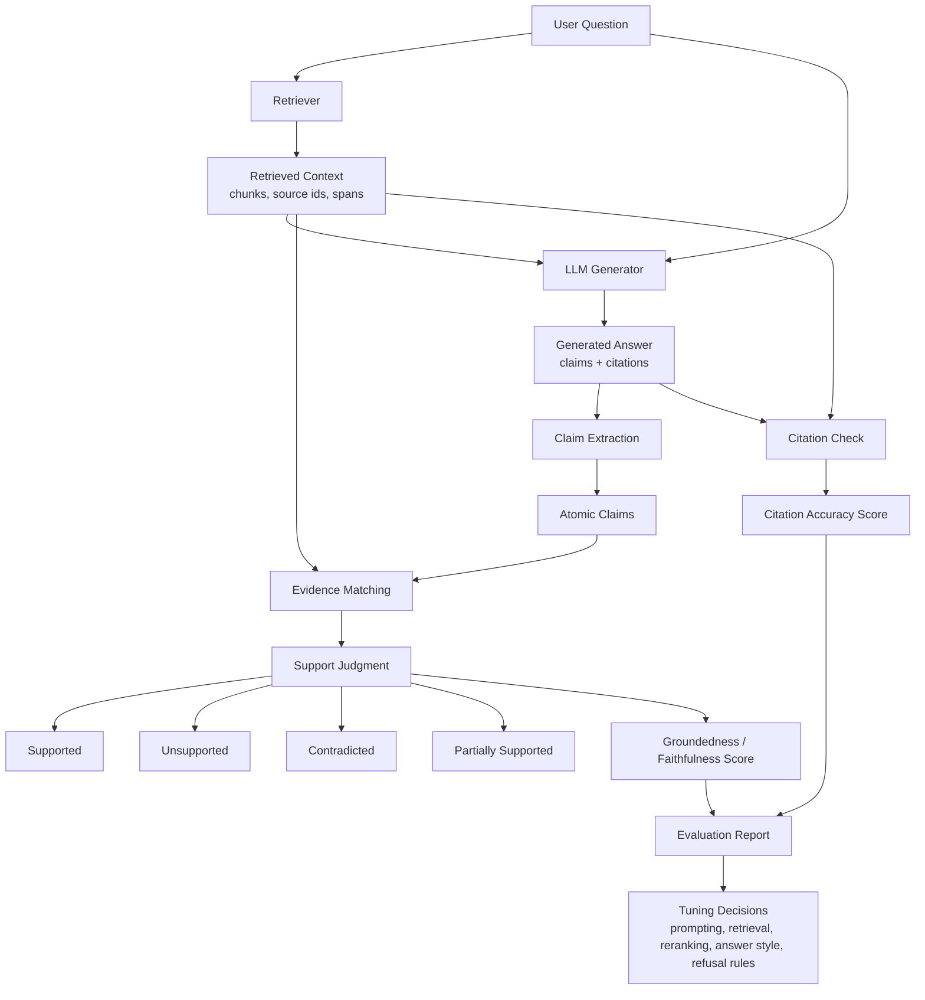

What the diagram is really saying:

- The evaluator should not only grade the final paragraph as a whole.
- It should split the answer into checkable claims.
- Each claim should be matched to evidence.
- Citations should be validated at the claim level, not merely checked for existence.

---

### 3. Real-World Industry Scenarios [Intermediate]

#### Scenario A - Healthcare Benefits Assistant

**Product/use case context:** Employees ask a benefits assistant questions like "Is physical therapy covered after knee surgery?" The system retrieves plan documents, coverage limitations, prior authorization rules, and network requirements. A generated answer may need to say: physical therapy is covered, but only after deductible, only for medically necessary treatment, and sometimes with visit limits or authorization.

**How the metrics matter:**
- **Groundedness** checks whether the answer's claims are supported by the retrieved plan documents.
- **Faithfulness** checks whether the answer preserves conditions like visit limits, authorization requirements, exclusions, and effective dates.
- **Citation accuracy** checks whether the cited plan section actually supports the exact claim, not merely the broad topic of physical therapy.

**Constraints:**
- **Latency:** A claim-level evaluator may add seconds if it calls another LLM. In production, teams often run heavy evaluation offline, sample online traffic asynchronously, and keep lightweight runtime checks for high-risk answers.
- **Cost:** Evaluating every answer with a strong judge model can be expensive. A common pattern is to evaluate all golden-test runs, sample production traces, and evaluate 100 percent of high-risk categories such as benefits, legal, medical, or compliance.
- **Reliability:** Plan documents are versioned by year, employer group, region, and member eligibility. An answer can be faithful to the wrong version and still harm users.
- **Security/privacy:** Evidence contains protected or sensitive information. Evaluation traces must redact or protect personally identifiable information, member IDs, diagnoses, and claim details.

**What good looks like in production:** The assistant says only what the evidence supports, preserves all conditions and exceptions, cites exact plan sections, and refuses or escalates when the retrieved evidence is insufficient. Evaluation dashboards show unsupported-claim rate, contradiction rate, citation support rate, and risky-topic failure examples.

#### Scenario B - Financial Research Copilot

**Product/use case context:** Analysts ask questions like "Why did revenue margin decline last quarter?" The system retrieves earnings call transcripts, 10-Q filings, analyst notes, and internal metric dashboards. The generated answer might combine numbers, management commentary, and explanations.

**How the metrics matter:**
- **Groundedness** checks that margin numbers, dates, and drivers appear in the retrieved financial evidence.
- **Faithfulness** checks that the answer does not turn cautious language like "may have contributed" into a definite causal claim.
- **Citation accuracy** checks whether each number and explanation cites the filing, transcript line, or dashboard panel that supports it.

**Constraints:**
- **Latency:** Analysts may tolerate slower answers for complex reports, but interactive workflows still need predictable response time.
- **Cost:** A high-quality evaluator may need to inspect tables, text, and citations. This can cost more than the original answer generation.
- **Reliability:** Numeric claims are brittle. A single wrong percentage, quarter, currency, or basis-point interpretation can invalidate the answer.
- **Failure modes:** A model may cite the correct document but wrong table, blend GAAP and non-GAAP numbers, or imply causality from correlation.

**What good looks like in production:** Numeric claims are extracted and checked separately, citations point to precise table rows or transcript spans, and the system distinguishes source-backed facts from model-authored interpretation.

#### Scenario C - Developer Documentation Assistant

**Product/use case context:** A developer asks, "How do I configure OAuth redirect URIs for staging and production?" The assistant retrieves docs and generates steps with citations. The answer may be dangerous if it invents dashboard fields, omits HTTPS requirements, or cites a generic OAuth overview instead of the configuration page.

**How the metrics matter:**
- **Groundedness** checks whether each instruction appears in the docs.
- **Faithfulness** checks whether the model keeps environment-specific caveats intact.
- **Citation accuracy** checks that the cited docs support the exact step, error condition, or API parameter.

**Constraints:**
- **Latency:** Docs assistants often run in interactive IDEs or support chat. Full evaluator passes may happen offline in CI after docs or prompt changes.
- **Cost:** Evaluation can run on a golden set of common developer tasks rather than every production answer.
- **Reliability:** Docs evolve quickly. Citations must use stable URLs, section anchors, version tags, or commit hashes.
- **Security/privacy:** Internal docs may include customer-only features or beta APIs. The evaluator must respect the same access boundaries as retrieval.

**What good looks like in production:** The assistant gives executable steps, cites exact doc sections, flags version-specific behavior, and avoids instructions not found in the retrieved docs.

---

### 4. System View [Intermediate]

#### Inputs -> Transformations -> Outputs

```text
User question
  -> retrieved context with source IDs and text spans
  -> generated answer with citations
  -> claim extraction
  -> evidence alignment per claim
  -> support classification: supported, unsupported, contradicted, partially supported
  -> citation validation: exact citation supports exact claim
  -> aggregate scores and failure labels
  -> debugging and experiment decisions
```

#### What We Actually Score

At production depth, do not treat the answer as one blob. Break it into smaller units:

```text
Answer:
"Employees can submit expenses up to 90 days after travel [Policy A].
Manager approval is required for expenses above $500 [Policy B]."

Claims:
1. Employees can submit expenses after travel.
2. The submission window is up to 90 days.
3. Manager approval is required above $500.

Evidence checks:
1. Supported by Policy A?
2. Supported by Policy A exactly, or did Policy A say 60 days?
3. Supported by Policy B, or did Policy B say finance approval?
```

This matters because a paragraph can be mostly correct while one critical claim is wrong. Aggregate answer-level scoring often hides the dangerous sentence.

#### Metric Shapes

Common metric formulations:

- **Groundedness score:** `supported claims / total claims`.
- **Unsupported-claim rate:** `unsupported claims / total claims`.
- **Contradiction rate:** `contradicted claims / total claims`.
- **Citation precision:** among cited claims, the fraction where the cited source actually supports the claim.
- **Citation recall:** among claims that need citations, the fraction that include a correct supporting citation.
- **Citation exactness:** whether the citation points to the precise span rather than a broad document.

In high-risk systems, contradiction rate often matters more than average groundedness. One contradicted medical, legal, or financial claim can be worse than several harmless unsupported generalities.

#### Observability: What We Log, Trace, and Measure

Log these fields for debugging:

- Raw user query, rewritten query, retrieved chunk IDs, source versions, and source timestamps.
- Final answer text, citations, cited source IDs, citation offsets, and citation display labels.
- Extracted claims and support labels per claim.
- Evaluator model, evaluator prompt version, threshold settings, and judge confidence.
- Whether each cited source was included in the model context or only available in the corpus.
- Whether each claim is factual, procedural, numeric, subjective, or a refusal/safety claim.
- Latency and cost for retrieval, generation, citation rendering, and evaluation.

The reason to log evaluator versions is subtle but important: judge prompts and judge models drift. If a groundedness score changes after an evaluator upgrade, the product may not have changed at all.

#### Failure Points: Where It Breaks and How It Shows Up

- **Correct retrieval, bad generation:** Evidence is present, but the answer invents or overstates.
- **Correct answer, bad citation:** The answer is true, but the citation points to a weak or unrelated source.
- **Broad citation masking:** The answer cites a full page, but the exact claim is not supported by the cited span.
- **Evidence conflict:** Two retrieved sources disagree, and the model merges them without noting conflict.
- **Outdated evidence:** The answer is faithful to retrieved context, but the context is stale.
- **Evaluator weakness:** The judge misses subtle numeric errors, temporal errors, negation, or modality differences such as "may" vs "must".

---

### 5. System Design Flavor [Intermediate]

#### Key Components and Interfaces

A practical groundedness evaluation stack usually includes:

- **Answer generator:** Produces an answer with source references, ideally structured as claims plus citations or sentences plus citations.
- **Claim extractor:** Splits the answer into atomic factual claims that can be checked independently.
- **Evidence aligner:** Maps each claim to candidate evidence spans from retrieved context or cited sources.
- **Support classifier:** Labels each claim as supported, unsupported, contradicted, or partially supported.
- **Citation validator:** Checks whether each citation supports the claim it is attached to.
- **Evaluator store:** Saves scores, labels, prompts, model versions, traces, and human review outcomes.
- **Human review queue:** Samples failures and high-risk outputs for expert labeling, especially when evaluator confidence is low.

#### Important Tradeoffs

**Claim-level evaluation vs answer-level evaluation:** Claim-level evaluation gives sharper debugging because it shows exactly which sentence failed. It costs more because extraction and evidence matching are extra steps. Use claim-level evaluation for high-stakes RAG, regulated domains, enterprise copilots, and any assistant that cites sources. Answer-level evaluation is acceptable for early prototypes or low-risk summaries, but it will miss hidden errors.

**Strict groundedness vs helpfulness:** A very strict groundedness policy reduces hallucinations but may produce cautious answers or refusals when evidence is incomplete. That is desirable in legal, medical, compliance, finance, and HR. For brainstorming, writing, or exploratory assistants, a looser policy may be acceptable if the system clearly separates sourced facts from unsourced suggestions.

**Citation exactness vs UX simplicity:** Exact span citations are best for auditability, but they require source offsets, stable chunk IDs, and UI support. Broad document citations are easier to build but can create false trust. Use exact citations when decisions, money, health, legal obligations, or customer commitments are involved.

#### Scaling Consideration at 10x Traffic or Data

At 10x traffic, evaluating every response synchronously may become too expensive and slow. Teams usually split evaluation into layers:

- Synchronous lightweight checks for missing citations, disallowed citation patterns, and refusal rules.
- Asynchronous sampling for groundedness and faithfulness judging.
- Full offline regression evaluation for every prompt, retriever, model, and corpus release.
- Human review for risky categories, judge disagreements, and high-impact failures.

At 10x data size, citation accuracy also becomes harder because duplicate, stale, or near-identical passages increase the chance that the model cites a related but non-supporting source. Source versioning and exact evidence spans become mandatory.

---

### 6. Common Mistakes + Debugging [Beginner]

#### Mistake 1 - Treating Citations as Proof

- **Symptom:** Answers display citations, but user reports show the cited documents do not support the claims.
- **Likely cause:** The system attaches citations from retrieved chunks without validating claim-level support.
- **First debugging step:** Pick failed answers, split them into claims, and manually verify whether each cited span entails the claim. Then add citation precision checks to evaluation.

#### Mistake 2 - Confusing Groundedness With Correctness

- **Symptom:** Groundedness score is high, but answers are still wrong in production.
- **Likely cause:** The model is faithful to stale, incomplete, or incorrect retrieved evidence.
- **First debugging step:** Inspect source freshness, corpus version, and retrieval filters. Add source-quality and freshness checks beside groundedness metrics.

#### Mistake 3 - Scoring the Whole Answer Instead of Atomic Claims

- **Symptom:** Evaluator gives high scores to answers that contain one serious wrong detail.
- **Likely cause:** Paragraph-level scoring averages away critical errors.
- **First debugging step:** Convert answer evaluation into claim-level support labels and track contradiction rate separately.

#### Mistake 4 - Letting the Judge Use Outside Knowledge

- **Symptom:** Evaluator marks unsupported claims as correct because they are generally true.
- **Likely cause:** The judge model is answering from pretraining knowledge instead of only checking against provided evidence.
- **First debugging step:** Change the evaluator prompt to require evidence-only judgments and include labels like `not supported by provided context` even if the claim seems true.

---

### 7. Hands-On Lab: Concept -> Build -> Break -> Measure -> Explain [Pro]

This lab simulates claim-level groundedness and citation accuracy without needing an external model. The goal is to make the evaluation logic tangible before replacing the simple matcher with an LLM judge or entailment classifier.

#### Build: Smallest Working Version

```python
import re

evidence = {
    "policy_a": "Employees must submit travel expenses within 60 days after the trip ends.",
    "policy_b": "Expenses above $500 require manager approval before reimbursement.",
    "policy_c": "Meal expenses are reimbursable only when an overnight stay is required.",
}

answer_claims = [
    {
        "claim": "Employees can submit travel expenses within 90 days after the trip ends.",
        "citation": "policy_a",
    },
    {
        "claim": "Expenses above $500 require manager approval.",
        "citation": "policy_b",
    },
    {
        "claim": "Meal expenses are always reimbursable.",
        "citation": "policy_c",
    },
]


def normalize(text):
    return re.sub(r"[^a-z0-9$ ]", "", text.lower())


def simple_support_label(claim, source_text):
    claim_text = normalize(claim)
    evidence_text = normalize(source_text)

    if "90 days" in claim_text and "60 days" in evidence_text:
        return "contradicted"
    if "always reimbursable" in claim_text and "only when" in evidence_text:
        return "contradicted"
    if all(token in evidence_text for token in claim_text.split() if token not in {"can", "the", "after"}):
        return "supported"
    if any(token in evidence_text for token in claim_text.split() if token not in {"can", "the", "after"}):
        return "partially_supported"
    return "unsupported"


labels = []
for item in answer_claims:
    cited_text = evidence[item["citation"]]
    label = simple_support_label(item["claim"], cited_text)
    labels.append(label)
    print({"claim": item["claim"], "citation": item["citation"], "label": label})

total = len(labels)
groundedness = sum(label == "supported" for label in labels) / total
contradiction_rate = sum(label == "contradicted" for label in labels) / total
citation_precision = sum(label == "supported" for label in labels) / total

print({
    "groundedness": groundedness,
    "contradiction_rate": contradiction_rate,
    "citation_precision": citation_precision,
})
```

This toy version is deliberately limited. It uses rules so you can see the scoring mechanics. In a real system, the `simple_support_label` function is usually replaced by an entailment model, LLM judge, structured verifier, or domain-specific validator.

#### Break: Force the Failure Mode

Change the second claim to cite the wrong policy:

```python
{
    "claim": "Expenses above $500 require manager approval.",
    "citation": "policy_c",
}
```

Now the claim is true according to the evidence corpus, but the attached citation is wrong.

#### Measure: Capture Concrete Signals

Track these scores before and after the break:

| Failure case | Groundedness | Citation precision | Contradiction rate | What it reveals |
|---|---:|---:|---:|---|
| Correct claim, correct citation | Higher | Higher | Lower | Claim and citation are aligned |
| Correct claim, wrong citation | May look okay if using all context | Lower | Same or higher | Citation accuracy must be checked separately |
| Wrong number, cited source has correct number | Lower | Lower | Higher | Numeric contradictions need strict checking |
| Broad citation only | Ambiguous | Lower exactness | Depends | Document-level citations can hide unsupported claims |

#### Explain: Why It Broke

The key failure is that truth and attribution are different. A claim can be true somewhere in the corpus but unsupported by the citation attached to it. In regulated or user-facing systems, that is a trust failure because users rely on citations to audit the answer. The fix is to evaluate claim-citation pairs, not just answer-context consistency.

Guardrail design:

- Require the model to cite sources at sentence or claim level.
- Store exact source spans and offsets, not just document titles.
- Run citation validation that checks whether the cited span entails the claim.
- Penalize unsupported, contradicted, and partially supported claims separately.
- Use stricter thresholds for numeric, legal, medical, financial, and policy claims.

---

### 8. Active Recall (Spaced Repetition) [Beginner]

1. What is the difference between groundedness and faithfulness?
2. Why can citation accuracy fail even when the answer is factually correct?
3. Why is claim-level evaluation stronger than paragraph-level evaluation?
4. What is the danger of letting an evaluator judge from outside knowledge?
5. Why should contradiction rate be tracked separately from average groundedness?

Answer key:

1. Groundedness checks whether claims are supported by evidence; faithfulness checks whether the answer preserves the evidence without distortion, contradiction, or invention.
2. Because the answer may be true but cite the wrong source, broad source, stale source, or a passage that does not support that exact claim.
3. Because one paragraph can contain many claims, and a single dangerous wrong claim can be hidden by mostly correct surrounding text.
4. It may mark plausible but unsupported claims as correct, which defeats evidence-based RAG evaluation.
5. Because one contradiction can be high-risk even if most other claims are supported.

---

### 9. Practice [Intermediate]

#### Mini-Exercise

Evidence:

```text
Doc A: Refunds are available within 30 days of purchase for unused products.
Doc B: Opened software subscriptions are not refundable after activation.
```

Answer:

```text
Customers can get refunds within 60 days for any product [Doc A].
Software subscriptions are refundable after activation [Doc B].
```

Classify each claim as supported, unsupported, contradicted, or partially supported.

Suggested answer:

| Claim | Label | Why |
|---|---|---|
| Customers can get refunds within 60 days for any product [Doc A] | Contradicted / partially supported | Doc A says 30 days and unused products, not 60 days or any product |
| Software subscriptions are refundable after activation [Doc B] | Contradicted | Doc B says opened subscriptions are not refundable after activation |

The important lesson: the answer looks close to the evidence topic, but it changes numbers, scope, and negation. Those are high-risk faithfulness failures.

#### Capstone-Style System Design Question

You own evaluation for a legal-contract RAG assistant. Offline retrieval metrics are strong:

```text
Recall@10: 0.93
MRR@10: 0.76
```

But lawyers report that answers often cite the correct contract while misstating exceptions and thresholds. Design the first evaluation upgrade.

Suggested answer outline:

Add claim-level faithfulness and citation accuracy evaluation. Split answers into atomic legal claims, especially obligations, exceptions, thresholds, dates, parties, and definitions. For each claim, require exact supporting clause spans and classify support as supported, partially supported, unsupported, or contradicted. Track contradiction rate and citation exactness separately from retrieval metrics. Sample high-risk failures for lawyer review and use those labels to improve prompts, reranking, context packing, and refusal behavior.

---

### 10. Production Reality Check [Pro]

**If this fails in prod, what's the first thing we inspect?**

Inspect a failed answer at the claim-citation level: extract each factual claim, open the cited source span, and label whether the span supports, contradicts, partially supports, or does not support the claim. This is the fastest first step because it separates retrieval absence, generation distortion, stale evidence, and citation mismatch instead of treating the answer as one opaque failure.

---

### 11. Curiosity Bridge [Beginner]

This works well for source-backed claims, but breaks when we need to decide whether the final answer is actually useful, complete, and correct for the user's intent. That unlocks answer correctness, relevance, completeness, and human or LLM-as-judge evaluation.

---

### 12. Exit Check + Carry-Forward Review [Beginner]

**Exit Check:** You're done when you can take one RAG answer, split it into claims, and explain which claims are grounded, faithful, correctly cited, unsupported, or contradicted.

Carry-forward review from Subtopic 8.1.a:

- **Question:** If Recall@20 is high but MRR@5 is low, what is the retrieval problem?
- **Answer:** The system can find relevant evidence somewhere in the larger candidate set, but it does not rank the first relevant result high enough.

- **Question:** Why is hit rate too weak for multi-hop support questions?
- **Answer:** It only checks whether at least one relevant item appeared, while multi-hop answers may require several evidence pieces.

---

## Subtopic 8.1.c: Task Success vs Answer Polish

### ✅ Add to Knowledge Base

**Subtopic time:** 3h

### 0. Reading Path + Level Tags

- **Beginner:** Read sections 1-2, section 6, and Active Recall.
- **Intermediate:** Add sections 3-5 and the Hands-On Lab.
- **Pro:** Do the full lab, design the metric hierarchy, and answer the capstone system-design question.

---

### 1. Pre-Question Hook + The Intuition [Beginner]

**Pause: before reading, if an assistant gives a beautifully written answer that does not solve the user's problem, should your evaluation system call that a success?**

**Task success** measures whether the user accomplished the job they came to do. **Answer polish** measures whether the response looks good: fluent wording, confident tone, clean formatting, complete sentences, and pleasant style.

These are different axes. A polished answer can fail the task. A rough answer can complete the task. In real GenAI products, this distinction matters because LLMs are naturally good at sounding helpful even when they are incomplete, ungrounded, non-executable, or misaligned with the user's actual goal.

The permanent mental model:

> Answer polish is the surface. Task success is the outcome. Production evaluation must reward the outcome first, then use polish as a secondary quality signal.

Common examples:

| Situation | Polish | Task success | Diagnosis |
|---|---:|---:|---|
| A support bot explains refunds clearly but never starts the refund flow | High | Low | Nice answer, failed job |
| A coding agent gives a terse patch that passes tests | Medium | High | Less pretty, successful task |
| A RAG answer is well-formatted but cites stale policy | High | Low | Fluent but unsafe |
| A scheduling agent books the correct meeting but writes a plain confirmation | Medium | High | Outcome achieved |

**Real-world analogy:** A restaurant server can describe the menu elegantly, but if they never place your order, the task failed. Another server might speak briefly but bring the correct meal to the correct table. The analogy breaks down because GenAI systems can perform many task types: answer, retrieve, write, call tools, edit files, create plans, or change external state. So "the order was placed" must be defined per product.

Key terms:
- **Task success:** Whether the system achieved the user's intended outcome under the relevant constraints.
- **Answer polish:** The surface quality of a response, including fluency, tone, structure, formatting, and perceived helpfulness.
- **Outcome metric:** A metric that measures whether the desired real-world result happened.
- **Proxy metric:** An indirect metric that is easier to measure but only approximates the real goal.
- **Rubric:** A scoring guide that defines what good, partial, and failed outputs look like.
- **Task completion rate:** The fraction of evaluated tasks that reach the required success condition.
- **User intent:** The actual job or goal the user is trying to accomplish, not merely the literal words in the prompt.

---

### 2. Visual Diagram (Mermaid) [Beginner]

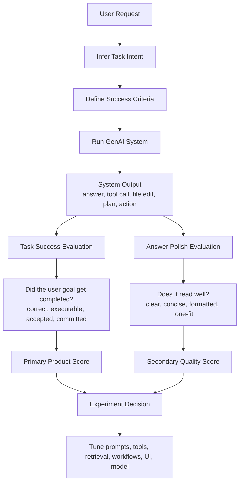

The diagram shows the hierarchy: define the task, check the outcome, then score presentation quality. If evaluation starts with polish, it will over-reward answers that sound right but do not complete the job.

---

### 3. Real-World Industry Scenarios [Intermediate]

#### Scenario A - Customer Support Refund Assistant

**Product/use case context:** A customer asks, "Can you refund my last order?" The assistant can answer policy questions, check eligibility, call an order API, initiate a refund, and confirm the result. A polished response might explain the refund policy in detail. But the user's task is not to learn policy; the task is to get the refund done if eligible.

**How task success and polish differ:**
- **Task success** means the assistant identified the order, verified eligibility, initiated the refund or explained the exact blocker, and gave a traceable confirmation.
- **Answer polish** means the response was clear, empathetic, well-structured, and not overly robotic.
- A response like "I understand your concern, refunds are important..." can score high on polish and zero on task success if no refund was started.

**Constraints:**
- **Latency:** Tool-based workflows may take longer than pure answers. The system should not optimize for fast polished replies if the actual task requires an API action.
- **Cost:** Task success may require tool calls, identity checks, and state validation. Those cost more than text generation but are necessary for real completion.
- **Reliability:** External APIs can fail. A task-success metric should distinguish user-ineligible, tool failure, missing permissions, ambiguous request, and successful completion.
- **Security/privacy:** Refund actions require authentication, authorization, audit logs, and sometimes step-up verification. A polished answer must not bypass safety checks.
- **Failure modes:** The assistant may say "your refund is processed" before the refund API succeeds. That is high polish, low task success, and high trust risk.

**What good looks like in production:** Dashboards track refund task completion rate, API success rate, escalation rate, incorrect confirmation rate, user recontact rate, and satisfaction. Polish is measured, but it does not override whether the refund was actually completed or correctly blocked.

#### Scenario B - Coding Agent in an IDE

**Product/use case context:** A developer asks an assistant to fix a failing unit test. The assistant can explain the bug, edit files, run tests, and report the result. A polished answer may sound brilliant, but the task succeeds only if the code change works and respects the repo's constraints.

**How task success and polish differ:**
- **Task success** means the patch is applied, relevant tests pass, no unrelated files are damaged, and the user can continue working.
- **Answer polish** means the final explanation is clear, concise, and includes useful verification details.
- A long explanation without editing the failing code is polished advice, not task completion.

**Constraints:**
- **Latency:** Running tests takes time. A system that skips verification may feel faster but reduces real success.
- **Cost:** Tool calls and test runs consume compute, but they produce stronger evidence than self-reported confidence.
- **Reliability:** The agent must handle dirty worktrees, local conventions, dependency quirks, and partial failures.
- **Security/privacy:** The assistant must avoid leaking secrets from logs or committing code without permission.
- **Failure modes:** The model may produce a plausible diff that compiles nowhere. Human readers may rate the explanation highly, while task success is zero.

**What good looks like in production:** Evaluation checks compile/test status, changed-file scope, regression risk, user acceptance, and whether the original failure is fixed. The final response quality matters, but only after the code outcome is verified.

#### Scenario C - Enterprise Research Assistant

**Product/use case context:** An analyst asks, "Prepare a summary of churn drivers and create the slide outline for tomorrow's review." The system retrieves dashboards, support tickets, call transcripts, and prior meeting notes. The output must help the analyst make a decision or deliver a presentation.

**How task success and polish differ:**
- **Task success** means the answer identifies the real churn drivers, cites the right evidence, structures a usable slide outline, and flags uncertainty.
- **Answer polish** means the writing sounds executive-ready and the formatting looks presentation-friendly.
- A polished executive summary that misses the largest churn driver is worse than a plain but accurate outline.

**Constraints:**
- **Latency:** Deep research may require multi-step retrieval and synthesis. Users may accept more time if the output is materially useful.
- **Cost:** Better task success may require broader retrieval, reranking, chart extraction, and judge review.
- **Reliability:** Business data changes daily. The evaluation must check freshness and whether conclusions are supported by current data.
- **Security/privacy:** The system may retrieve customer-sensitive or revenue-sensitive information. Task completion must respect role-based access.
- **Failure modes:** The model may over-index on easy-to-summarize evidence, producing a polished but incomplete narrative.

**What good looks like in production:** The assistant is evaluated on decision usefulness, evidence coverage, citation quality, freshness, and whether analysts reuse or accept the output. Polish improves adoption, but it is not allowed to mask missing evidence.

---

### 4. System View [Intermediate]

#### Inputs -> Transformations -> Outputs

```text
User request
  -> infer intent and task type
  -> define success criteria and constraints
  -> run the assistant workflow
  -> capture output, tool calls, external state changes, and user actions
  -> evaluate task success against outcome criteria
  -> evaluate answer polish against style criteria
  -> combine scores with task success as primary
  -> inspect failures and tune the system
```

#### The Core Evaluation Question

Task success starts by asking: what would have to be true after the assistant responds for the user's job to be done?

Examples:

| Task type | Success condition | Polish signal |
|---|---|---|
| Answer a policy question | Correct, grounded, applicable answer with citations | Clear wording and readable structure |
| Refund an order | Refund API succeeded or correct blocker explained | Empathetic confirmation |
| Fix code | Patch applied and relevant tests pass | Concise change summary |
| Generate SQL | Query runs and returns intended rows | Readable explanation |
| Draft email | User accepts or lightly edits draft | Tone and formatting match audience |
| Research summary | Key evidence covered and decision supported | Executive-ready organization |

This framing prevents a common evaluation trap: scoring all outputs as if they were text answers. Many GenAI systems are workflow systems, not just chat systems.

#### Observability: What We Log, Trace, and Measure

Log these for task-success evaluation:

- User request, inferred intent, task category, and risk class.
- Expected success criteria for the task, including required evidence, required action, or required file/API state.
- Tool calls, API responses, external state changes, file edits, execution results, and errors.
- Final answer, user-visible citations, confirmations, refusals, and escalation behavior.
- User follow-up behavior: acceptance, retry, abandonment, recontact, manual correction, copy/use, or escalation.
- Human or judge rubric scores for task success and polish separately.
- Latency, cost, number of steps, and failure reason taxonomy.

The important design point: task success often requires observing the world outside the final text. If you only log the assistant's final answer, you cannot know whether the workflow actually succeeded.

#### Failure Points: Where It Breaks and How It Shows Up

- **Intent mismatch:** The assistant answers a related question but not the user's actual job.
- **Premature explanation:** The assistant explains what should happen instead of doing the action it has permission to do.
- **False completion:** The assistant claims the task is done before the tool/API/file state confirms success.
- **Polish masking:** Human raters over-score fluent responses even when the task failed.
- **Metric mismatch:** Teams optimize thumbs-up, tone, or verbosity while user recontact or retry rate worsens.
- **Partial success ambiguity:** The assistant completes one step but misses a required dependency, such as generating code without running tests.

---

### 5. System Design Flavor [Intermediate]

#### Key Components and Interfaces

A practical task-success evaluation system usually includes:

- **Task taxonomy:** A controlled set of task types such as answer, summarize, classify, retrieve, edit, transact, plan, or troubleshoot.
- **Success rubric:** A task-specific scoring guide that separates complete success, partial success, failure, unsafe success, and correct refusal.
- **Workflow trace collector:** Captures tool calls, state transitions, retrieved evidence, generated output, and user-facing response.
- **Outcome verifier:** Checks whether the required real-world condition happened, such as test pass, API success, correct database state, or user acceptance.
- **Polish evaluator:** Scores clarity, tone, formatting, concision, and readability without overriding outcome correctness.
- **Experiment dashboard:** Compares task success, polish, latency, cost, safety, and regression slices across model/prompt/tool versions.

#### Important Tradeoffs

**Outcome metrics vs proxy metrics:** Outcome metrics are closer to the real product goal, such as "refund completed" or "test passed." Proxy metrics are easier to collect, such as thumbs-up or response length. Use outcome metrics when the task has observable completion. Use proxy metrics only when the real outcome is delayed, private, or hard to measure, and validate that the proxy correlates with real success.

**Strict task success vs conversational helpfulness:** A strict task-success metric may mark a friendly explanation as failed if the job was not completed. That can feel harsh, but it prevents teams from shipping assistants that talk well and act poorly. For workflows, task success should dominate. For open-ended coaching, brainstorming, or learning, polish and perceived helpfulness may carry more weight.

**Single score vs scorecard:** A single aggregate score is easy to communicate but hides failure modes. A scorecard is better for engineering: task success, correctness, groundedness, citation accuracy, polish, latency, cost, and safety. Use a single headline for leadership only after the scorecard is healthy.

#### Scaling Consideration at 10x Traffic or Data

At 10x traffic, manual human review cannot cover every output. Teams usually combine:

- Automatic outcome checks where possible, such as tests, API confirmations, SQL execution, or state validation.
- LLM judges for rubric-based sampling.
- User behavior signals such as acceptance, edit distance, retry rate, recontact rate, and abandonment.
- Human review for high-risk, high-impact, low-confidence, or disputed cases.

At 10x task variety, evaluation must become task-aware. One generic "helpfulness" rubric will fail because success for a coding fix, support refund, research synthesis, and scheduling action is not the same thing.

---

### 6. Common Mistakes + Debugging [Beginner]

#### Mistake 1 - Optimizing for Helpful-Sounding Answers

- **Symptom:** Human ratings improve, but users keep retrying, escalating, or abandoning the workflow.
- **Likely cause:** The rubric rewards tone, confidence, and structure more than actual completion.
- **First debugging step:** Compare polished high-rated failures against outcome logs. Add a task-success score that checks whether the user goal was completed.

#### Mistake 2 - Using One Rubric for Every Task

- **Symptom:** The assistant scores well overall, but fails badly on tool-use, coding, or transactional workflows.
- **Likely cause:** The evaluation treats all outputs as text answers instead of task-specific workflows.
- **First debugging step:** Split the eval set by task type and define success criteria for each category.

#### Mistake 3 - Trusting Self-Reported Completion

- **Symptom:** The assistant says it completed the task, but external systems show no action happened.
- **Likely cause:** The system evaluates final text instead of verifying tool/API/file state.
- **First debugging step:** Add outcome verification from authoritative systems: API result, database state, file diff, test run, ticket status, or calendar event.

#### Mistake 4 - Penalizing Correct Refusals as Failures

- **Symptom:** Task success looks low because the assistant refuses unsafe, unauthorized, or impossible requests.
- **Likely cause:** The rubric does not distinguish task failure from correct refusal.
- **First debugging step:** Add a separate label for correct refusal or safe escalation. A system should not be punished for refusing work it must not perform.

---

### 7. Hands-On Lab: Concept -> Build -> Break -> Measure -> Explain [Pro]

This lab builds a tiny evaluator that separates task success from polish. It is intentionally simple so the scoring logic is visible.

#### Build: Smallest Working Version

```python
examples = [
    {
        "id": "refund_1",
        "task_type": "refund",
        "expected_outcome": "refund_started",
        "observed_state": {"refund_started": True, "confirmation_id": "rf_123"},
        "answer": "Your refund has been started. Confirmation ID: rf_123.",
        "polish_score": 3,
    },
    {
        "id": "refund_2",
        "task_type": "refund",
        "expected_outcome": "refund_started",
        "observed_state": {"refund_started": False, "confirmation_id": None},
        "answer": "I completely understand. Refunds are important, and I am happy to help with this request.",
        "polish_score": 5,
    },
    {
        "id": "code_1",
        "task_type": "code_fix",
        "expected_outcome": "tests_passed",
        "observed_state": {"tests_passed": True, "files_changed": 1},
        "answer": "Fixed the failing parser test. Relevant tests pass.",
        "polish_score": 3,
    },
]


def task_success(example):
    expected = example["expected_outcome"]
    return bool(example["observed_state"].get(expected))


def evaluate(examples):
    rows = []
    for example in examples:
        success = task_success(example)
        rows.append({
            "id": example["id"],
            "task_success": int(success),
            "polish_score": example["polish_score"],
            "diagnosis": "successful" if success else "polished_failure" if example["polish_score"] >= 4 else "failure",
        })
    return rows


rows = evaluate(examples)
for row in rows:
    print(row)

task_completion_rate = sum(row["task_success"] for row in rows) / len(rows)
average_polish = sum(row["polish_score"] for row in rows) / len(rows)

print({
    "task_completion_rate": task_completion_rate,
    "average_polish": average_polish,
})
```

#### Break: Force the Failure Mode

Change `refund_2` to sound even better while still not starting the refund:

```python
"answer": "Absolutely, I can help. I reviewed the refund policy, and your satisfaction matters to us. I will make sure this is handled as smoothly as possible.",
"polish_score": 5,
```

The answer becomes more polished, but task success remains zero.

Then add a terse but successful example:

```python
{
    "id": "refund_3",
    "task_type": "refund",
    "expected_outcome": "refund_started",
    "observed_state": {"refund_started": True, "confirmation_id": "rf_999"},
    "answer": "Refund started: rf_999.",
    "polish_score": 2,
}
```

#### Measure: Capture Concrete Signals

Track these separately:

| Signal | What it measures | Why it matters |
|---|---|---|
| Task completion rate | Fraction of tasks where the required outcome happened | Primary product metric |
| Polished failure rate | High-polish responses with failed outcomes | Detects fluent non-solutions |
| Correct refusal rate | Unsafe or impossible tasks refused correctly | Prevents rewarding unsafe completion |
| Retry or recontact rate | Users asking again after the answer | Often reveals hidden task failure |
| Acceptance rate | User accepted draft, patch, answer, or action | Useful proxy when outcome is hard to observe |

#### Explain: Why It Broke

The broken case shows why polish cannot be the primary metric for workflow assistants. The response can become more empathetic, longer, and better formatted while the task remains undone. A production evaluator must verify the authoritative outcome: API state, file state, test result, ticket status, user acceptance, or another real completion signal.

Guardrail design:

- Define success criteria before evaluating outputs.
- Track task success and polish as separate dimensions.
- Verify external state when the task involves tools or actions.
- Add a polished-failure slice to dashboards.
- Treat correct refusal as its own successful safety outcome.

---

### 8. Active Recall (Spaced Repetition) [Beginner]

1. What is the difference between task success and answer polish?
2. Why can high answer polish be dangerous in production evaluation?
3. What is an outcome metric, and how is it different from a proxy metric?
4. Why should correct refusals be separated from task failures?
5. In a coding assistant, what signals prove task success better than a polished explanation?

Answer key:

1. Task success measures whether the user's job was completed; answer polish measures how fluent, clear, well-formatted, or pleasant the response is.
2. Because fluent responses can hide incomplete, wrong, unsafe, or unexecuted workflows.
3. An outcome metric measures the real desired result; a proxy metric indirectly estimates success when the real outcome is hard to observe.
4. Because refusing unsafe or unauthorized work is correct behavior, not a system failure.
5. A patch applied successfully, relevant tests passing, no unrelated file damage, and user acceptance.

---

### 9. Practice [Intermediate]

#### Mini-Exercise

Classify each response as high/low task success and high/low polish.

```text
User: Cancel my subscription before renewal.

Response A: I understand wanting to cancel before renewal. Here are the steps you can take in your account settings...
System state: subscription still active.

Response B: Subscription canceled. Renewal on July 1 will not occur. Confirmation: sub_cancel_42.
System state: subscription canceled.

Response C: Done.
System state: subscription still active because the cancellation API failed.
```

Suggested answer:

| Response | Task success | Polish | Why |
|---|---|---|---|
| A | Low | Medium/high | It explains but does not cancel |
| B | High | High | It completes the action and confirms accurately |
| C | Low | Low/medium | It claims completion without verified state |

#### Capstone-Style System Design Question

You own evaluation for an AI operations assistant that can answer questions, update tickets, run diagnostics, and escalate incidents. Leadership wants one score called "helpfulness." How would you design a better evaluation scorecard?

Suggested answer outline:

Build a task-aware scorecard instead of one generic helpfulness score. Classify tasks into answer, diagnostic, ticket update, escalation, and action workflows. For each task type, define success criteria: correct grounded answer, diagnostic executed, ticket state updated, escalation created, or safe refusal. Track task completion rate, incorrect completion claims, correct refusal rate, user retry/escalation rate, polish, latency, and cost. Use answer polish as a secondary dimension because a smooth incident response is useful only if the operational state is correct.

---

### 10. Production Reality Check [Pro]

**If this fails in prod, what's the first thing we inspect?**

Inspect the trace against the task's authoritative success condition: tool calls, API responses, file diffs, test results, database state, ticket status, or user acceptance. This is the fastest first step because the final answer text can look excellent while the actual workflow failed or never happened.

---

### 11. Curiosity Bridge [Beginner]

This works well once we know the success criteria, but breaks when success is subjective, delayed, or needs expert judgment. That leads to LLM-as-judge rubrics, pairwise evaluation, human calibration, and experiment design.

---

### 12. Exit Check + Carry-Forward Review [Beginner]

**Exit Check:** You're done when you can define the task success condition for a GenAI output before judging how polished the answer sounds.

Carry-forward review from Subtopic 8.1.b:

- **Question:** Why can citation accuracy fail even when the answer is factually correct?
- **Answer:** The answer may be true somewhere in the corpus, but the attached citation may point to the wrong, broad, stale, or non-supporting source.

- **Question:** Why is contradiction rate worth tracking separately?
- **Answer:** A single contradicted claim can be high-risk even when most other claims are supported.

---

## Subtopic 8.1.d: Latency and Cost as First-Class Quality Metrics

### ✅ Add to Knowledge Base

**Subtopic time:** 3h

### 0. Reading Path + Level Tags

- **Beginner:** Read sections 1-2, section 6, and Active Recall.
- **Intermediate:** Add sections 3-5 and the Hands-On Lab.
- **Pro:** Do the full lab, reason about quality/cost frontiers, and answer the capstone system-design question.

---

### 1. Pre-Question Hook + The Intuition [Beginner]

**Pause: before reading, if Model A is 5 percent more accurate but 4x slower and 6x more expensive, is it actually the better production model?**

**Latency** is the time a system takes to respond. **Cost** is the money, compute, tokens, and operational effort required to produce that response. In GenAI, they are not merely infrastructure details. They are quality metrics because they decide whether the user can actually use the system repeatedly, whether the business can afford the workflow, and whether the product can scale.

The permanent mental model:

> Quality is not just "best answer." Production quality means the best useful answer inside the latency, cost, reliability, and safety budget for that task.

Why this matters more in GenAI than traditional software:

- Model calls are slow compared with normal API calls.
- Token usage can grow silently as prompts, context, retrieved chunks, and conversation history grow.
- Better models often cost more and respond slower.
- RAG, reranking, tool use, judges, and agent loops add multiple latency and cost layers.
- A system can look great in offline eval but fail as a product because users wait too long or the business loses money per task.

**Real-world analogy:** Imagine a delivery service. A perfect meal delivered six hours late fails the user. A cheap meal delivered instantly but wrong also fails. The actual product quality is the best correct meal delivered within the user's time and price expectations. The analogy breaks down because GenAI systems have more internal stages: retrieval, reranking, prompts, tools, model generation, streaming, verification, and post-processing.

Key terms:
- **End-to-end latency:** Total time from user request to final usable response.
- **Time to first token:** Time from request start until the first generated token is visible to the user.
- **Tail latency:** Slow responses at high percentiles such as p95 or p99, where the worst user experiences usually live.
- **p50 latency:** Median latency; half of requests are faster and half are slower.
- **p95 latency:** The latency below which 95 percent of requests complete.
- **Cost per request:** Average cost to serve one request, including model calls, tokens, tools, infrastructure, and evaluator calls.
- **Cost per successful task:** Total cost divided by the number of tasks that actually succeed.
- **Quality-cost frontier:** The best achievable quality for each cost or latency budget.
- **Service level objective (SLO):** A target reliability or latency promise the system is designed to meet.
- **Token budget:** The maximum allowed input and output tokens for a request or workflow.

---

### 2. Visual Diagram (Mermaid) [Beginner]

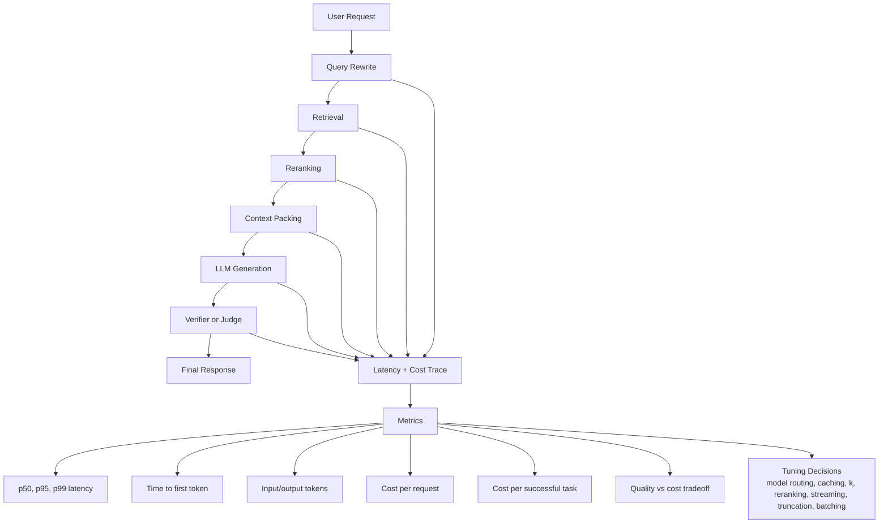

The diagram shows the important habit: measure every stage, not only the final model call. In many RAG systems, the model is not the only bottleneck. Retrieval, reranking, tool calls, judges, network hops, and context construction can dominate latency or cost.

---

### 3. Real-World Industry Scenarios [Intermediate]

#### Scenario A - Customer Support Chatbot

**Product/use case context:** A support assistant answers billing, troubleshooting, and refund questions. Users expect a fast conversational experience, but the system also needs retrieval, policy grounding, tool calls, and sometimes safe escalation.

**How latency and cost matter:**
- **Latency:** A correct answer after 30 seconds may cause abandonment. Time to first token matters because streaming a useful opening can reassure the user while tools run.
- **Cost:** If the bot spends more on model calls than the support ticket would cost to handle manually, the automation economics fail.
- **Quality interaction:** A cheaper model may handle simple FAQs, while complex refunds or account issues need stronger models and tool calls.

**Constraints:**
- **Latency:** The product may target p95 under 4 seconds for pure answers and p95 under 10 seconds for tool workflows. Average latency is not enough because users feel the slow tail.
- **Cost:** The team should track cost per resolved conversation, not only cost per message. A cheap response that causes three follow-ups may be more expensive than one stronger response.
- **Reliability:** Timeouts must degrade gracefully: partial answer, escalation, or retry, not silent failure.
- **Security/privacy:** Cost optimizations must not bypass authorization checks, redaction, or policy verification.
- **Failure modes:** Teams may reduce retrieval depth to save cost, causing groundedness and task success to drop.

**What good looks like in production:** Dashboards show p50/p95/p99 latency, time to first token, tool-call latency, token usage, model cost, cost per resolved issue, abandonment rate, escalation rate, and quality scores by task type.

#### Scenario B - Enterprise RAG Research Assistant

**Product/use case context:** Employees ask a research assistant to synthesize internal documents, support tickets, meeting notes, and dashboards. Higher-quality answers may require broad retrieval, reranking, long context, and a verification pass.

**How latency and cost matter:**
- **Latency:** Users may tolerate more time for deep research, but they need clear progress and predictable completion.
- **Cost:** Long-context prompts and evaluator calls can become expensive quickly. A 20-document synthesis can cost far more than a short policy lookup.
- **Quality interaction:** Larger context can improve recall but may reduce faithfulness if noisy evidence enters the prompt.

**Constraints:**
- **Latency:** The right budget depends on task type. A quick lookup may need sub-5-second p95, while a research brief might tolerate 30-90 seconds if progress is visible.
- **Cost:** Evaluation should track cost per accepted research output, not only cost per generation.
- **Reliability:** Long agent workflows have more failure points: search, permissions, reranking, summarization, verification, and formatting.
- **Security/privacy:** Caching can save cost, but cached responses must respect tenant, user, document permissions, and data freshness.
- **Failure modes:** Teams may push every query through the most powerful model, making a useful tool economically unsustainable.

**What good looks like in production:** The assistant classifies query complexity, routes simple tasks to cheaper paths, uses stronger models for high-value synthesis, caches safe intermediate results, and reports quality/latency/cost by task class.

#### Scenario C - Coding Agent in an IDE

**Product/use case context:** A developer asks an agent to fix a bug. The agent reads files, plans, edits code, runs tests, and explains the change. The task can take longer than a chat response, but latency still affects developer flow.

**How latency and cost matter:**
- **Latency:** Developers can tolerate time for real work, but they need progress updates and should not wait minutes for a trivial fix.
- **Cost:** Multi-step agents can spend many tokens reading files, reasoning, generating patches, and interpreting test output.
- **Quality interaction:** Skipping tests saves time and cost but can reduce task success. Running too many tests wastes time and money.

**Constraints:**
- **Latency:** Measure time to first useful action, time to patch, and time to verified result separately.
- **Cost:** Track cost per successful fix, not only cost per agent run. Failed long runs are especially expensive.
- **Reliability:** Tool failures, flaky tests, dependency installs, and large logs can create tail latency.
- **Security/privacy:** Avoid logging secrets from files, terminals, or environment variables while tracing costs.
- **Failure modes:** A fast patch that does not compile is low quality; a perfect patch delivered after disrupting the user's flow may also be unacceptable.

**What good looks like in production:** The agent uses task-aware test selection, summarizes large logs, limits unnecessary file reads, streams progress, and compares models by verified fix rate per dollar and per minute.

---

### 4. System View [Intermediate]

#### Inputs -> Transformations -> Outputs

```text
User request
  -> classify task type, risk, and complexity
  -> select latency and cost budget
  -> run retrieval/tools/model/evaluation workflow
  -> capture per-stage latency, token usage, model calls, tool calls, cache hits, and errors
  -> compute quality metrics and outcome metrics
  -> compute cost per request and cost per successful task
  -> compare against SLO and budget
  -> decide whether to tune model, prompt, retrieval, caching, routing, or workflow depth
```

#### Metrics That Matter

| Metric | What it measures | Why it matters |
|---|---|---|
| p50 latency | Typical request speed | Shows normal user experience |
| p95 latency | Slow-tail request speed | Shows the experience of frustrated users |
| p99 latency | Extreme slow tail | Reveals rare but damaging workflow stalls |
| Time to first token | How quickly the user sees progress | Important for chat and streaming UX |
| End-to-end latency | Full time until usable completion | What matters for task success |
| Input tokens | Prompt, context, history, tool outputs | Main driver of model cost and latency |
| Output tokens | Generated response length | Main driver of generation time and cost |
| Cost per request | Spend per request | Useful for budget control |
| Cost per successful task | Spend per completed outcome | Better than cost per request for product economics |
| Timeout rate | Fraction of requests exceeding limits | Captures reliability and UX failure |
| Cache hit rate | Fraction served from cache | Explains cost and latency improvements |

#### Observability: What We Log, Trace, and Measure

Log these per request or workflow:

- Task type, risk class, model route, prompt version, retriever version, and evaluator version.
- Per-stage latency: rewrite, retrieval, rerank, tools, generation, streaming, verification, post-processing.
- Input tokens, output tokens, retrieved context tokens, conversation history tokens, and dropped tokens.
- Model name, price tier, retry count, timeout count, rate-limit events, and fallback path.
- Tool-call count, tool latency, API errors, cache hits, and cache eligibility.
- Quality metrics: task success, groundedness, faithfulness, citation accuracy, user acceptance.
- Cost metrics: model cost, tool cost, infrastructure estimate, evaluator cost, and total cost.

The most important design habit is to attach cost and latency to quality traces. A quality score without cost can select an unaffordable design. A cost score without quality can select a useless design.

#### Failure Points: Where It Breaks and How It Shows Up

- **Average latency hides tail pain:** p50 looks good while p95/p99 users abandon.
- **Token growth creep:** prompts quietly grow as teams add instructions, examples, context, and chat history.
- **Reranker or judge bottleneck:** retrieval looks fast, but reranking or evaluation dominates p95.
- **Agent loop explosion:** repeated tool calls and retries multiply cost and latency.
- **Overpowered routing:** every query uses the most expensive model even when simple queries do not need it.
- **Underpowered routing:** cheap models save money but reduce task success, causing rework and higher cost per successful task.
- **Cost invisibility:** teams see monthly spend but cannot attribute cost to task type, model route, customer, prompt, or feature.

---

### 5. System Design Flavor [Intermediate]

#### Key Components and Interfaces

A production GenAI latency/cost evaluation stack usually includes:

- **Trace instrumentation:** Captures per-stage timing, tokens, model calls, tool calls, retries, cache hits, and errors.
- **Token accounting:** Counts input, output, context, history, and evaluator tokens by request and workflow.
- **Cost calculator:** Converts usage into cost by model, tool, infrastructure estimate, and evaluator path.
- **Latency budget policy:** Defines target p50, p95, timeout, and time-to-first-token goals per task type.
- **Model router:** Chooses model size or workflow path based on task complexity, risk, budget, and confidence.
- **Cache layer:** Reuses safe prompts, retrieval results, embeddings, tool outputs, or final answers when freshness and permissions allow.
- **Experiment tracker:** Compares quality, latency, and cost across model, prompt, retrieval, and workflow variants.
- **SLO dashboard:** Shows whether the system meets user-facing reliability, speed, and cost targets.

#### Important Tradeoffs

**Quality vs latency:** More retrieval, reranking, reasoning, and verification can improve quality but adds delay. Choose deeper workflows for high-risk or high-value tasks. Choose faster paths for simple FAQs, autocomplete, routing, or low-risk drafting.

**Quality vs cost:** Stronger models and longer contexts often improve quality, but not always. If a cheaper model achieves the same task success on a task slice, the expensive model is waste. Measure quality per dollar, not just raw quality.

**Latency vs cost:** Batching can reduce cost but increase waiting time. Streaming can improve perceived latency but may not reduce total work. Caching can reduce both, but only when data freshness and permissions are safe.

**Cost per request vs cost per successful task:** Cost per request can reward cheap failures. Cost per successful task penalizes workflows that look cheap but cause retries, escalations, or incomplete outcomes. For production decisions, cost per successful task is usually more honest.

#### Scaling Consideration at 10x Traffic or Data

At 10x traffic, inefficient prompts, unnecessary reranking, repeated tool calls, and judge passes become expensive quickly. The system needs model routing, caching, budgets, per-tenant spend attribution, rate limits, and graceful degradation.

At 10x data, retrieval and context packing can get slower and noisier. The solution is not always to stuff more context into the model. Often the better path is stronger metadata filtering, hybrid retrieval, better chunking, staged retrieval, and selective reranking.

---

### 6. Common Mistakes + Debugging [Beginner]

#### Mistake 1 - Reporting Only Average Latency

- **Symptom:** Dashboards look healthy, but users complain about slow responses.
- **Likely cause:** Average or p50 latency hides p95 and p99 tail failures.
- **First debugging step:** Break latency into p50, p95, and p99 by task type, model route, tool path, and customer segment.

#### Mistake 2 - Optimizing Cost Per Request Instead of Cost Per Success

- **Symptom:** The cheaper pipeline reduces spend per message but increases retries, escalations, and failed tasks.
- **Likely cause:** The evaluation rewards cheap attempts instead of completed outcomes.
- **First debugging step:** Compute cost per successful task and compare it against task success, retry rate, and user acceptance.

#### Mistake 3 - Treating Token Growth as Harmless

- **Symptom:** Latency and spend climb over time even though traffic is stable.
- **Likely cause:** Prompts, retrieved context, conversation history, examples, and tool outputs keep growing.
- **First debugging step:** Add token accounting by prompt section: system instructions, examples, retrieved context, history, tool output, and generated answer.

#### Mistake 4 - Cutting Quality Checks Blindly to Save Latency

- **Symptom:** Responses become faster, but groundedness, citation accuracy, or task success regresses.
- **Likely cause:** Verification, reranking, or retrieval depth was removed without measuring downstream failures.
- **First debugging step:** Compare the quality-cost-latency frontier: baseline vs faster variant across task success, faithfulness, p95 latency, and cost per successful task.

---

### 7. Hands-On Lab: Concept -> Build -> Break -> Measure -> Explain [Pro]

This lab compares three pipeline variants. The goal is to see why the best system is not always the highest-quality raw score or the cheapest request.

#### Build: Smallest Working Version

```python
pipelines = [
    {
        "name": "cheap_fast",
        "quality": 0.78,
        "task_success": 0.66,
        "p95_latency_seconds": 2.1,
        "cost_per_request": 0.01,
        "retry_rate": 0.30,
    },
    {
        "name": "balanced_rag",
        "quality": 0.86,
        "task_success": 0.81,
        "p95_latency_seconds": 4.8,
        "cost_per_request": 0.035,
        "retry_rate": 0.12,
    },
    {
        "name": "deep_verified",
        "quality": 0.91,
        "task_success": 0.84,
        "p95_latency_seconds": 11.5,
        "cost_per_request": 0.12,
        "retry_rate": 0.08,
    },
]


def cost_per_success(pipeline):
    return pipeline["cost_per_request"] / pipeline["task_success"]


def effective_requests_per_success(pipeline):
    return 1 / (1 - pipeline["retry_rate"])


def adjusted_cost_per_success(pipeline):
    return cost_per_success(pipeline) * effective_requests_per_success(pipeline)


for pipeline in pipelines:
    row = {
        "name": pipeline["name"],
        "quality": pipeline["quality"],
        "task_success": pipeline["task_success"],
        "p95_latency_seconds": pipeline["p95_latency_seconds"],
        "cost_per_request": pipeline["cost_per_request"],
        "cost_per_success": round(cost_per_success(pipeline), 4),
        "adjusted_cost_per_success": round(adjusted_cost_per_success(pipeline), 4),
    }
    print(row)
```

#### Break: Force the Failure Mode

Change `cheap_fast` to be even cheaper but less successful:

```python
"task_success": 0.48,
"cost_per_request": 0.006,
"retry_rate": 0.45,
```

Then change `deep_verified` to be slightly better but much slower:

```python
"quality": 0.93,
"task_success": 0.85,
"p95_latency_seconds": 19.0,
"cost_per_request": 0.18,
```

#### Measure: Capture Concrete Signals

Track these together:

| Signal | Why it matters |
|---|---|
| Quality score | Measures answer or task quality |
| Task success | Measures completed user outcomes |
| p95 latency | Captures slow user experience |
| Cost per request | Captures raw serving cost |
| Retry rate | Captures hidden failure and frustration |
| Cost per successful task | Captures real economics |
| Adjusted cost per success | Accounts for retries or rework |

#### Explain: Why It Broke

The cheap pipeline can look efficient until you account for failed tasks and retries. The deep pipeline can look best by raw quality but may violate latency or budget constraints. The balanced pipeline may be the real production winner because it sits on a better quality-cost-latency frontier.

Guardrail design:

- Define latency and cost budgets per task type before model selection.
- Compare variants using quality, p95 latency, and cost per successful task together.
- Track retry and recontact rates because they reveal hidden cost.
- Route easy tasks to cheaper paths and hard or risky tasks to stronger paths.
- Use caching and streaming carefully, with freshness and permission checks.

---

### 8. Active Recall (Spaced Repetition) [Beginner]

1. Why are latency and cost quality metrics in GenAI systems?
2. Why is p95 latency usually more useful than average latency for user experience?
3. What is the difference between cost per request and cost per successful task?
4. Why can reducing token usage hurt answer quality?
5. What is the quality-cost frontier?

Answer key:

1. Because a system that is too slow or too expensive may be unusable or impossible to scale, even if answers are good offline.
2. Because p95 shows the slow-tail experience that frustrated users actually feel, while averages can hide those failures.
3. Cost per request measures each attempt; cost per successful task measures how much it costs to achieve completed outcomes.
4. If token reduction removes needed context, instructions, examples, or verification evidence, task success and faithfulness can drop.
5. The set of best achievable quality levels for each cost or latency budget.

---

### 9. Practice [Intermediate]

#### Mini-Exercise

You are comparing two RAG pipelines:

```text
Pipeline A:
Task success: 0.82
p95 latency: 3.5s
Cost/request: $0.03
Retry rate: 10%

Pipeline B:
Task success: 0.88
p95 latency: 12.0s
Cost/request: $0.11
Retry rate: 6%
```

Which pipeline would you choose for a support FAQ bot? Which would you choose for a legal policy assistant?

Suggested answer:

For a support FAQ bot, Pipeline A is likely better because it is much faster and cheaper while still having reasonable task success. Users expect quick answers, and the task risk is lower.

For a legal policy assistant, Pipeline B may be justified if the higher task success reflects better groundedness and fewer risky mistakes. But the team should still ask whether the 12-second p95 violates user expectations and whether a hybrid route can send simple legal questions through A and high-risk questions through B.

#### Capstone-Style System Design Question

You own evaluation for a GenAI customer support platform. Leadership wants to move all requests to the strongest model because offline answer quality improves by 4 percent. The change increases p95 latency from 4 seconds to 14 seconds and cost per request from $0.04 to $0.22. What would you recommend?

Suggested answer outline:

Do not ship the blanket migration based only on offline quality. Run a segmented experiment. Compare task success, groundedness, user satisfaction, abandonment, escalation, p95 latency, and cost per successful task by task type. Use model routing: simple FAQs stay on the cheaper/faster model, high-risk or low-confidence cases go to the stronger model, and unresolved cases escalate. The right decision is not strongest model everywhere; it is quality within the latency and cost budget for each task.

---

### 10. Production Reality Check [Pro]

**If this fails in prod, what's the first thing we inspect?**

Inspect the per-stage trace for failed or slow requests: task type, model route, retrieval time, tool time, generation time, verifier time, input/output tokens, retries, cache status, timeout, quality score, and final task outcome. This is the fastest first step because latency and cost problems are usually hidden in a specific stage, task slice, token source, retry loop, or routing decision.

---

### 11. Curiosity Bridge [Beginner]

This works well when we can measure quality, speed, and cost directly, but it breaks when teams need to decide whether one model output is better than another across subjective criteria. That leads to human evaluation, LLM-as-judge rubrics, pairwise comparisons, and experiment design.

---

### 12. Exit Check + Carry-Forward Review [Beginner]

**Exit Check:** You're done when you can compare two GenAI pipeline variants using quality, p95 latency, and cost per successful task instead of choosing only the highest raw quality score.

Carry-forward review from Subtopic 8.1.c:

- **Question:** Why can a polished answer still fail a task-success evaluation?
- **Answer:** Because the answer may sound clear and helpful while the user's actual outcome was not completed, verified, or safely blocked.

- **Question:** What is the better metric for workflow economics: cost per request or cost per successful task?
- **Answer:** Cost per successful task, because it accounts for whether the system actually completed the user's goal.

---

## Topic 8.2: Test Sets, Judges, and Regression Systems

**Topic time:** 12h

Planned subtopics:
- Golden sets and annotation design - 3h
- LLM-as-judge patterns and failure modes - 3h
- Pairwise evals, ablations, and experiment structure - 3h
- Regression suites for prompts, retrieval, and tools - 3h

---

## Subtopic 8.2.a: Golden Sets and Annotation Design

### ✅ Add to Knowledge Base

**Subtopic time:** 3h

### 0. Reading Path + Level Tags

- **Beginner:** Read sections 1-2, section 6, and Active Recall.
- **Intermediate:** Add sections 3-5 and the Hands-On Lab.
- **Pro:** Do the full lab, design the annotation workflow, and answer the capstone system-design question.

---

### 1. Pre-Question Hook + The Intuition [Beginner]

**Pause: before reading, if your RAG system improves on 20 demo questions, how do you know it will not regress on the real questions users ask every day?**

A **golden set** is a trusted evaluation dataset made of representative test cases with carefully reviewed expected answers, evidence, labels, or scoring rubrics. It is called "golden" because teams treat it as a reference standard for judging whether a GenAI system is getting better or worse.

**Annotation design** is the process of deciding what labels humans should create, how they should create them, what rules they should follow, and how disagreements should be resolved. A golden set is only as good as its annotation design.

The permanent mental model:

> A golden set is not a random spreadsheet of prompts. It is a product-quality contract: for these important user situations, this is what correct behavior means.

Why this matters:

- Without a golden set, every prompt/model/retriever change becomes vibes-based.
- Without annotation rules, different reviewers label the same output differently.
- Without coverage, the eval set overfits to easy demos and misses production failures.
- Without versioning, you cannot tell whether the product improved or the test changed.

**Real-world analogy:** Think of a driving test. A good test does not only ask the driver to move forward in an empty parking lot. It samples turns, traffic signs, parallel parking, pedestrians, bad weather, and edge cases. The scoring rules must be explicit, and two examiners should mostly agree. The analogy breaks down because GenAI tasks are often open-ended, so the "right answer" may be a rubric, evidence requirement, or task outcome rather than a single exact string.

Key terms:
- **Golden set:** A trusted, reviewed eval dataset used as a reference standard for measuring system quality and regressions.
- **Gold label:** The expected label, answer, evidence, ranking, or judgment attached to an eval example.
- **Label schema:** The allowed labels and fields annotators use, such as supported, contradicted, unsafe, complete, or partially correct.
- **Annotation guideline:** The written rules that tell annotators how to apply labels consistently.
- **Annotator:** A human reviewer who labels examples, judges outputs, or verifies evidence.
- **Inter-annotator agreement:** A measure of how often independent annotators agree on the same labels.
- **Adjudication:** The process of resolving annotation disagreements into a final accepted label.
- **Coverage:** How well the test set represents important users, tasks, documents, languages, risk levels, and failure modes.

---

### 2. Visual Diagram (Mermaid) [Beginner]

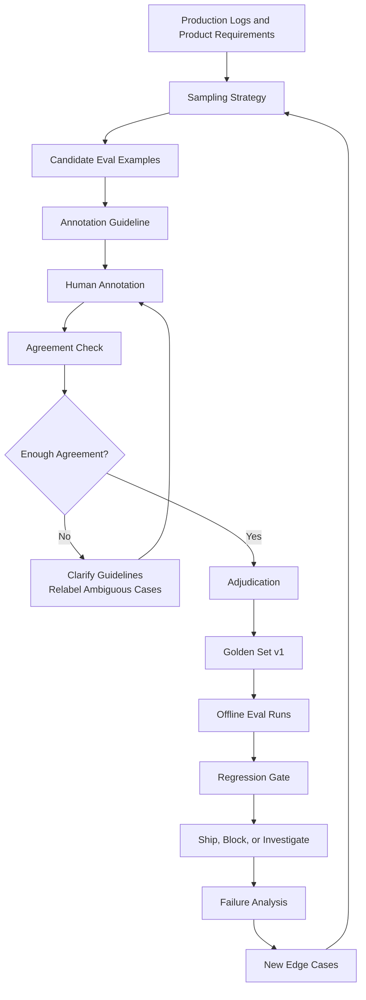

The diagram shows that a golden set is a living evaluation asset. You sample real tasks, label them with explicit rules, measure agreement, resolve disagreements, then use the dataset to catch regressions before release.

---

### 3. Real-World Industry Scenarios [Intermediate]

#### Scenario A - Healthcare Benefits RAG Assistant

**Product/use case context:** Employees ask questions about deductibles, coverage, prior authorization, eligibility, limits, and exclusions. The assistant retrieves plan documents and answers with citations. A golden set must represent real plan complexity, not only easy "is X covered?" questions.

**How golden sets matter:**
- The dataset should include common questions, rare high-risk questions, ambiguous questions, and plan-specific edge cases.
- Gold labels may include expected answer, required evidence spans, allowed uncertainty, correct refusal, and citation requirements.
- Annotation guidelines must define how to score incomplete answers, stale plan references, missing citations, and partial coverage conditions.

**Constraints:**
- **Latency:** Golden-set evaluation can run offline, so it can afford deeper judges and human review than the production path.
- **Cost:** Human expert annotation is expensive, especially for benefits, medical, legal, or compliance topics. Use sampling carefully and reserve expert review for high-risk cases.
- **Reliability:** Labels must be tied to plan year, employer group, region, and document version. A correct answer under one plan can be wrong under another.
- **Security/privacy:** Production logs may contain personal health or employment information. Sampling and annotation must redact or protect sensitive data.
- **Failure modes:** A golden set built from only public FAQ questions may miss the real failures caused by eligibility, exceptions, and plan-specific language.

**What good looks like in production:** The golden set includes versioned source documents, exact evidence spans, risk tags, query categories, and clear scoring rubrics. Regression runs report failures by plan type, topic, risk class, and document freshness.

#### Scenario B - Developer Documentation Assistant

**Product/use case context:** Developers ask how to configure APIs, fix SDK errors, migrate versions, and interpret error messages. Answers must be executable and version-aware.

**How golden sets matter:**
- Examples should cover different SDKs, versions, error codes, integration stages, and user expertise levels.
- Gold labels may include expected steps, forbidden outdated steps, required citations, and runnable code constraints.
- Annotation guidelines must tell reviewers whether to reward explanation, exact code, version caveats, and troubleshooting branches.

**Constraints:**
- **Latency:** Offline eval can test full generated answers, code snippets, and citations without affecting users.
- **Cost:** A large docs eval set can be partly labeled by developer advocates, support engineers, or docs owners, then sampled for deeper expert review.
- **Reliability:** Docs change frequently. Test cases need source version or commit ID so old labels do not silently become wrong.
- **Security/privacy:** Internal docs and beta features require access control in both retrieval and annotation tools.
- **Failure modes:** A golden set with only happy-path setup questions will miss migration errors, version conflicts, and troubleshooting cases.

**What good looks like in production:** Every test case declares product version, language, expected citation section, required answer behavior, and failure tags. Regression reports show whether a docs or model change improves one SDK but regresses another.

#### Scenario C - Customer Support Agent With Tool Use

**Product/use case context:** A support agent can answer questions, refund orders, update tickets, and escalate issues. Some tasks are answer-only; others require external state changes.

**How golden sets matter:**
- The test set must include multi-turn workflows, tool-call expectations, safe refusals, ambiguous identity cases, and API failure scenarios.
- Gold labels should include expected tool calls, expected final state, correct user-facing message, and escalation behavior.
- Annotation design must distinguish "nice answer" from "task completed," matching Topic 8.1.c.

**Constraints:**
- **Latency:** Offline regression can replay workflows against mocks instead of production APIs.
- **Cost:** Tool-use evals are more expensive to design because each case needs state fixtures and expected transitions.
- **Reliability:** Golden cases must isolate nondeterminism: inventory, time, account state, permissions, and API responses should be fixed.
- **Security/privacy:** Synthetic or redacted accounts are safer than real customer data for repeatable tests.
- **Failure modes:** If labels only check final text, the assistant can claim success without making the required API call.

**What good looks like in production:** Golden tests replay realistic tool workflows against controlled fixtures and score final state, safety, explanation, and escalation separately.

---

### 4. System View [Intermediate]

#### Inputs -> Transformations -> Outputs

```text
Product goals + production logs + known failures + domain requirements
  -> choose sampling strategy and coverage targets
  -> define task taxonomy and label schema
  -> write annotation guidelines with examples and counterexamples
  -> label candidate examples with multiple annotators when needed
  -> measure agreement and adjudicate disagreements
  -> freeze a versioned golden set
  -> run models/retrievers/prompts against the set
  -> compare metrics, slices, and regressions
  -> add new failure cases over time without corrupting historical comparisons
```

#### What a Golden Example Contains

A strong golden-set row usually contains more than a prompt:

| Field | Why it matters |
|---|---|
| `example_id` | Stable reference for debugging and regression history |
| `user_query` | The input being evaluated |
| `task_type` | Lets metrics slice answer, retrieval, tool, and workflow tasks |
| `source_snapshot_id` | Prevents labels from drifting when documents change |
| `expected_evidence_ids` | Supports retrieval and citation evaluation |
| `gold_answer_or_rubric` | Defines what acceptable output means |
| `label_schema_version` | Makes annotation changes auditable |
| `risk_level` | Lets high-stakes cases have stricter gates |
| `difficulty` | Separates easy, medium, hard, and adversarial examples |
| `failure_tags` | Captures known risks like stale source, ambiguity, or multi-hop evidence |

#### Observability: What We Log, Trace, and Measure

For a golden-set regression system, track:

- Dataset version, example IDs, label schema version, source corpus snapshot, and annotation guideline version.
- Model version, prompt version, retriever version, tool fixture version, and experiment variant.
- Per-example outputs, retrieved evidence, citations, tool calls, final state, and judge decisions.
- Aggregate scores plus slice scores by task type, risk, source, language, difficulty, and failure tag.
- Newly failed examples, newly fixed examples, flaky examples, and disagreement cases.
- Human adjudication notes, label changes, and reasons for modifying the dataset.

The reason for all this versioning is simple: if both the model and test set change at the same time, you cannot explain metric movement.

#### Failure Points: Where It Breaks and How It Shows Up

- **Demo-set bias:** The eval set contains only hand-picked questions that make the system look good.
- **Coverage holes:** Important user segments, languages, tasks, or failure modes are missing.
- **Ambiguous labels:** Annotators disagree because the guideline does not define partial credit or edge cases.
- **Stale labels:** Source documents changed, but gold answers still reflect old truth.
- **Test set leakage:** Examples appear in prompts, training data, fine-tuning data, or few-shot examples, inflating scores.
- **Overfitting to the set:** The system improves on known examples but fails new production questions.
- **Unstable judge labels:** Automated judges score the same example differently over time due to prompt/model changes.

---

### 5. System Design Flavor [Intermediate]

#### Key Components and Interfaces

A serious golden-set system usually includes:

- **Eval dataset store:** Versioned storage for examples, labels, rubrics, evidence, metadata, and splits.
- **Annotation tool:** Interface where annotators label answers, mark evidence spans, assign failure tags, and leave notes.
- **Guideline repository:** Versioned annotation instructions with examples, counterexamples, and decision rules.
- **Agreement tracker:** Computes inter-annotator agreement and highlights ambiguous examples.
- **Adjudication workflow:** Resolves disagreements and records the final gold label.
- **Regression runner:** Runs candidate systems against frozen golden-set versions.
- **Slice dashboard:** Reports metrics by task type, risk, language, source, customer segment, and difficulty.
- **Dataset governance process:** Controls when examples are added, edited, retired, or moved between splits.

#### Important Tradeoffs

**Real logs vs synthetic cases:** Real logs capture actual user behavior, messy language, and production distribution. Synthetic cases can target rare, risky, or adversarial situations. Use both: real logs for representativeness, synthetic cases for coverage of failures that are too rare to wait for.

**Large test set vs high-quality labels:** More examples increase coverage, but noisy labels reduce trust. For high-stakes evals, a smaller set with excellent labels can be more useful than a large set with inconsistent annotation. Use broad weak labels for exploration and smaller gold labels for regression gates.

**Stable regression set vs evolving product:** A frozen set enables apples-to-apples comparison. But products, docs, policies, and user behavior change. Keep stable versions for historical comparison, then create new versions when the world changes. Do not silently edit old labels.

**Exact answer vs rubric:** Exact answers work for classification or deterministic extraction. Rubrics are better for open-ended generation, RAG explanations, tool workflows, and multi-step tasks. Use the scoring format that matches the task, not the format that is easiest to implement.

#### Scaling Consideration at 10x Traffic or Data

At 10x traffic, production logs become too large to label manually. The system needs sampling: stratified by task type, risk, failure reports, low-confidence outputs, new document areas, and high-traffic flows.

At 10x data, source versioning becomes harder. Each gold label must know which corpus snapshot it was created against. Otherwise, retrieval and answer labels become stale as documents change.

---

### 6. Common Mistakes + Debugging [Beginner]

#### Mistake 1 - Building a Golden Set From Only Demo Questions

- **Symptom:** Offline eval looks strong, but production failures keep appearing in real workflows.
- **Likely cause:** The test set over-represents easy, clean, expected prompts and misses messy user behavior.
- **First debugging step:** Compare golden-set distribution against production logs by task type, query length, user segment, source, risk level, and failure mode.

#### Mistake 2 - Using Labels Without Annotation Guidelines

- **Symptom:** Reviewers disagree, metrics feel unstable, and regressions are hard to trust.
- **Likely cause:** Annotators are applying personal judgment instead of shared rules.
- **First debugging step:** Write or revise the annotation guideline with examples, counterexamples, partial-credit rules, and adjudication rules. Then relabel a sample and measure agreement.

#### Mistake 3 - Letting Gold Labels Drift From Source Truth

- **Symptom:** A model retrieves current evidence but is marked wrong by the eval set.
- **Likely cause:** The source document, policy, API, or product behavior changed after labels were created.
- **First debugging step:** Check source snapshot IDs and label timestamps. Refresh or version the golden set instead of editing history silently.

#### Mistake 4 - Ignoring Negative and Edge Cases

- **Symptom:** The system answers confidently when it should refuse, ask clarification, or escalate.
- **Likely cause:** The golden set contains mostly answerable examples and not enough unanswerable, ambiguous, unauthorized, or adversarial cases.
- **First debugging step:** Add negative examples and edge-case slices, then track correct refusal, clarification, and escalation separately.

---

### 7. Hands-On Lab: Concept -> Build -> Break -> Measure -> Explain [Pro]

This lab creates a tiny golden-set schema and checks whether annotation coverage is balanced enough for regression testing.

#### Build: Smallest Working Version

```python
golden_set = [
    {
        "id": "benefits_001",
        "task_type": "rag_answer",
        "risk": "high",
        "difficulty": "medium",
        "query": "Is physical therapy covered after knee surgery?",
        "expected_evidence": ["plan_2026_pt_section", "plan_2026_auth_rules"],
        "label": "answer_must_include_coverage_conditions_and_auth_rules",
        "source_snapshot": "benefits_docs_2026_01",
    },
    {
        "id": "docs_001",
        "task_type": "procedural_answer",
        "risk": "medium",
        "difficulty": "easy",
        "query": "How do I configure OAuth redirect URLs for staging?",
        "expected_evidence": ["oauth_redirect_docs_v3"],
        "label": "must_include_https_and_environment_specific_redirect_uri",
        "source_snapshot": "docs_commit_a1b2",
    },
    {
        "id": "support_001",
        "task_type": "tool_workflow",
        "risk": "medium",
        "difficulty": "hard",
        "query": "Refund my last order.",
        "expected_tool_calls": ["lookup_order", "check_refund_eligibility", "start_refund"],
        "label": "refund_started_or_exact_blocker_explained",
        "source_snapshot": "support_policy_2026_02",
    },
]


required_fields = {"id", "task_type", "risk", "difficulty", "query", "label", "source_snapshot"}


def validate_schema(rows):
    errors = []
    for row in rows:
        missing = required_fields - set(row)
        if missing:
            errors.append((row.get("id", "unknown"), sorted(missing)))
    return errors


def coverage(rows, field):
    counts = {}
    for row in rows:
        counts[row[field]] = counts.get(row[field], 0) + 1
    return counts


print("schema_errors", validate_schema(golden_set))
print("task_type_coverage", coverage(golden_set, "task_type"))
print("risk_coverage", coverage(golden_set, "risk"))
print("difficulty_coverage", coverage(golden_set, "difficulty"))
```

#### Break: Force the Failure Mode

Add three more easy docs examples and no high-risk or tool examples:

```python
golden_set.extend([
    {
        "id": "docs_002",
        "task_type": "procedural_answer",
        "risk": "low",
        "difficulty": "easy",
        "query": "Where is the API key page?",
        "expected_evidence": ["api_key_docs"],
        "label": "must_link_to_api_key_page",
        "source_snapshot": "docs_commit_a1b2",
    },
    {
        "id": "docs_003",
        "task_type": "procedural_answer",
        "risk": "low",
        "difficulty": "easy",
        "query": "How do I reset my SDK token?",
        "expected_evidence": ["sdk_token_docs"],
        "label": "must_include_reset_steps",
        "source_snapshot": "docs_commit_a1b2",
    },
    {
        "id": "docs_004",
        "task_type": "procedural_answer",
        "risk": "low",
        "difficulty": "easy",
        "query": "Where are webhook logs?",
        "expected_evidence": ["webhook_logs_docs"],
        "label": "must_include_dashboard_path",
        "source_snapshot": "docs_commit_a1b2",
    },
])
```

Now rerun coverage. The set looks larger, but it became less balanced. This is a common eval trap: more examples can reduce usefulness if they overrepresent easy cases.

#### Measure: Capture Concrete Signals

Track these dataset health signals:

| Signal | What it reveals |
|---|---|
| Task-type coverage | Whether the set represents answer, retrieval, tool, and workflow tasks |
| Risk coverage | Whether high-stakes cases are included |
| Difficulty coverage | Whether the set includes easy, medium, hard, and adversarial examples |
| Source coverage | Whether important documents or data sources are represented |
| Failure-mode coverage | Whether known production failures are tested |
| Inter-annotator agreement | Whether humans apply labels consistently |
| Label freshness | Whether labels still match source truth |

#### Explain: Why It Broke

The broken dataset grew in size but became less useful as a regression set. It over-sampled easy procedural docs questions and under-sampled high-risk, tool-use, and hard examples. A golden set should be representative of production and intentionally weighted toward important failure modes. Size alone is not quality.

Guardrail design:

- Define target coverage before labeling.
- Use stratified sampling across task type, risk, difficulty, source, and failure mode.
- Require source snapshots for every label.
- Measure annotation agreement before trusting labels.
- Keep a frozen regression split separate from exploratory examples.

---

### 8. Active Recall (Spaced Repetition) [Beginner]

1. What is a golden set?
2. Why is annotation design as important as the eval examples themselves?
3. What does inter-annotator agreement tell us?
4. Why should a golden set include negative and edge cases?
5. Why should source snapshot IDs be stored with labels?

Answer key:

1. A trusted, reviewed evaluation dataset used as a reference standard for measuring quality and regressions.
2. Because unclear labels produce inconsistent judgments, making metrics unstable and hard to trust.
3. It measures whether independent annotators apply the label schema consistently.
4. Because production systems must know when to refuse, clarify, escalate, or admit insufficient evidence.
5. Because documents and product behavior change; labels only make sense relative to the source version they were created from.

---

### 9. Practice [Intermediate]

#### Mini-Exercise

You are building a golden set for a RAG assistant over company security policies. Propose five coverage slices.

Suggested answer:

| Coverage slice | Why it matters |
|---|---|
| Common employee questions | Represents high-volume production traffic |
| High-risk policy questions | Catches security, privacy, and compliance failures |
| Ambiguous requests | Tests clarification behavior |
| Unanswerable questions | Tests refusal and insufficient-evidence behavior |
| Recent policy changes | Catches stale source and label drift |

#### Capstone-Style System Design Question

You own evals for a customer-support GenAI agent. Current eval has 50 hand-written demo questions, all answerable, all single-turn, and all reviewed by one product manager. Production failures are mostly multi-turn tool workflows, ambiguous refund requests, and policy exceptions. Design the first golden-set upgrade.

Suggested answer outline:

Replace the demo-only set with a versioned golden set sampled from production logs and known failures. Define task taxonomy: answer-only, multi-turn clarification, refund workflow, escalation, and safe refusal. Create annotation guidelines that specify expected tool calls, final state, answer requirements, and correct blockers. Use at least two annotators on a calibration subset, measure agreement, adjudicate disagreements, and tag examples by risk, difficulty, failure mode, and source snapshot. Keep a frozen regression split and add new production failures into a separate candidate pool before promoting them into the golden set.

---

### 10. Production Reality Check [Pro]

**If this fails in prod, what's the first thing we inspect?**

Inspect the failed production traces against the golden-set coverage map: task type, risk level, source area, user segment, language, difficulty, and failure mode. This is the fastest first step because a regression system often fails not because the model was impossible to evaluate, but because the golden set never represented the production slice that broke.

---

### 11. Curiosity Bridge [Beginner]

This works well when humans can create trusted labels, but it becomes expensive and slow as the product grows. That leads to LLM-as-judge systems: automated evaluators that can scale annotation-like judgments, but only if they are calibrated against human gold labels.

---

### 12. Exit Check + Carry-Forward Review [Beginner]

**Exit Check:** You're done when you can design a golden-set row schema, explain its coverage targets, and describe how annotator disagreement becomes a final gold label.

Carry-forward review from Topic 8.1:

- **Question:** Why is cost per successful task better than cost per request for workflow assistants?
- **Answer:** Because it measures the cost of actually achieving the user's outcome, not merely the cost of an attempt.

- **Question:** Why can a high groundedness score still fail production correctness?
- **Answer:** The answer may be grounded in provided context, but the context itself may be stale, incomplete, or not applicable to the user.

---

## Subtopic 8.2.b: LLM-as-Judge Patterns and Failure Modes

### ✅ Add to Knowledge Base

**Subtopic time:** 3h

### 0. Reading Path + Level Tags

- **Beginner:** Read sections 1-2, section 6, and Active Recall.
- **Intermediate:** Add sections 3-5 and the Hands-On Lab.
- **Pro:** Do the full lab, compare judge patterns, and answer the capstone system-design question.

---

### 1. Pre-Question Hook + The Intuition [Beginner]

**Pause: before reading, if an LLM judge says your new prompt is 8 percent better, what evidence would make you trust that number?**

An **LLM-as-judge** is a language model used to evaluate another model's output. Instead of asking humans to score every response, the team gives the judge a rubric, the user input, candidate outputs, references or evidence when available, and asks it to produce a label, score, ranking, or explanation.

LLM judges are powerful because they scale qualitative evaluation. They can score thousands of examples for helpfulness, faithfulness, task success, citation quality, policy compliance, or pairwise preference. But they are dangerous if treated as objective truth. A judge model is still a model: it has biases, prompt sensitivity, blind spots, drift, and failure modes.

The permanent mental model:

> An LLM judge is not the court. It is a measurement instrument. You must calibrate it against human gold labels, monitor its failure modes, and decide where its scores are trustworthy enough to automate.

Common judge patterns:

| Pattern | What it does | Best fit |
|---|---|---|
| **Pointwise judge** | Scores one output independently | Rubric scoring, pass/fail checks, groundedness labels |
| **Pairwise judge** | Compares output A vs output B | Model/prompt comparisons, preference testing |
| **Reference-based judge** | Judges output against a gold answer, evidence, or rubric | Factual QA, RAG, extraction, coding tasks |
| **Reference-free judge** | Judges without a gold answer | Open-ended helpfulness, tone, summarization quality |
| **Rubric-based judge** | Uses explicit criteria and scoring levels | Repeatable evaluation across releases |
| **Claim-level judge** | Scores atomic claims against evidence | Groundedness, faithfulness, citation accuracy |

**Real-world analogy:** Think of an automated essay grader. It can grade many essays quickly, but you would not trust it blindly for high-stakes exams unless it agrees with expert graders, handles edge cases, and is audited for bias. The analogy breaks down because LLM judges often evaluate other LLM outputs, so they can share similar blind spots, preferences, and stylistic biases with the systems they judge.

Key terms:
- **Judge calibration:** Measuring and improving how well automated judge labels match trusted human labels.
- **Human agreement:** How often the judge agrees with human gold labels or expert adjudication.
- **Position bias:** A pairwise judging bias where the judge prefers the first or second answer because of placement, not quality.
- **Verbosity bias:** A judging bias where longer answers are rewarded even when they are not more correct.
- **Self-preference bias:** A bias where a model prefers outputs written by itself or models with a similar style.
- **Prompt sensitivity:** Variation in judge results caused by small changes to the judge prompt, rubric wording, or output format.
- **Evaluator drift:** Change in judge behavior over time due to model version, prompt, rubric, or provider changes.
- **Judge confidence:** A judge's declared or estimated certainty in its label, which must be validated rather than assumed.

---

### 2. Visual Diagram (Mermaid) [Beginner]

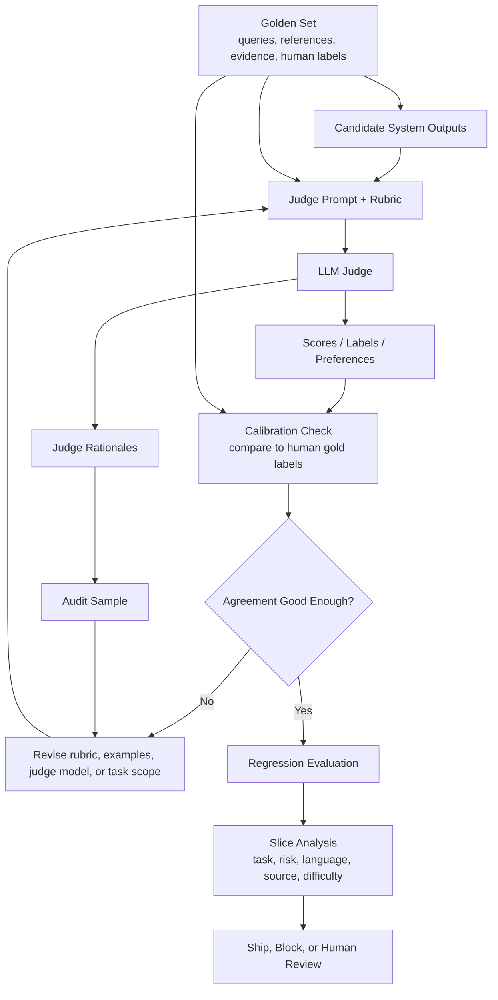

The key idea is that the judge is itself evaluated. A mature eval system does not only ask, "What did the judge score?" It asks, "Where does this judge agree with humans, where does it fail, and which release decisions are safe to automate?"

---

### 3. Real-World Industry Scenarios [Intermediate]

#### Scenario A - RAG Assistant Groundedness Evaluation

**Product/use case context:** A company uses RAG to answer policy and documentation questions. Human review of every answer is too slow, so the team wants an LLM judge to score groundedness, faithfulness, and citation accuracy on a golden set and sampled production traces.

**How judge patterns matter:**
- A **claim-level judge** is better than a whole-answer judge because it can identify which claim is unsupported or contradicted.
- A **reference-based judge** should receive the retrieved evidence and gold source spans, then judge only against that evidence.
- A **rubric-based judge** should define labels such as supported, partially supported, unsupported, contradicted, and unclear.

**Constraints:**
- **Latency:** Offline judging can be slower. Inline judging should be reserved for high-risk outputs or lightweight checks.
- **Cost:** Claim-level judging across thousands of examples can be expensive, especially if each claim includes source context.
- **Reliability:** The judge must not use outside knowledge when the metric is evidence-groundedness.
- **Security/privacy:** Production traces may contain sensitive internal documents or personal data. Judge inputs must follow the same data handling rules as generation.
- **Failure modes:** The judge may mark a claim supported because the cited document is topically related, even when the exact claim is not entailed.

**What good looks like in production:** The judge is calibrated against expert labels, reports agreement by task slice, routes low-confidence or high-risk disagreements to human review, and stores judge prompt/model versions with every score.

#### Scenario B - Customer Support Agent Regression Testing

**Product/use case context:** A support agent can answer questions, perform refunds, update tickets, and escalate. The team wants automated regression tests before shipping a new prompt or model.

**How judge patterns matter:**
- A **pointwise judge** can score whether one output meets a success rubric.
- A **pairwise judge** can compare old vs new agent outputs and choose which better satisfies the task.
- Reference-based judging should include expected tool calls and final state, not only final text.

**Constraints:**
- **Latency:** Regression judging runs in CI or nightly jobs, so it can be more thorough than live evaluation.
- **Cost:** Pairwise comparisons can double input tokens because both outputs are included.
- **Reliability:** The judge may overvalue polite language and undervalue whether the refund or ticket update actually happened.
- **Security/privacy:** Tool traces may include customer data; use fixtures or redaction for judge inputs.
- **Failure modes:** A judge may prefer a fluent answer that falsely claims completion over a terse answer that accurately says the API failed.

**What good looks like in production:** Tool outcomes are scored by deterministic verifiers first. The LLM judge handles qualitative criteria such as explanation clarity, escalation quality, and policy-compliant messaging.

#### Scenario C - Coding Assistant Evaluation

**Product/use case context:** A coding assistant generates patches. The team wants an LLM judge to score whether a patch is good, but the true task success depends on compilation, tests, code style, and maintainability.

**How judge patterns matter:**
- Deterministic checks such as tests, lint, type checks, and diff scope should run before judge scoring.
- A reference-based judge can inspect the issue, patch, test output, and repository guidelines.
- A pairwise judge can compare two patches when both pass tests but differ in simplicity or maintainability.

**Constraints:**
- **Latency:** Full code review judging can be slow and token-heavy because the judge may need issue context, diffs, and test output.
- **Cost:** Large diffs and logs increase judge cost quickly.
- **Reliability:** LLM judges can miss subtle runtime bugs or overvalue code that looks clean but fails hidden tests.
- **Security/privacy:** Logs and diffs may include secrets or proprietary code; judge inputs need filtering and access control.
- **Failure modes:** A judge may reward a verbose explanation even when the actual patch is wrong.

**What good looks like in production:** Automated tests and static checks decide objective correctness. The LLM judge scores human-review-like dimensions only after objective checks pass.

---

### 4. System View [Intermediate]

#### Inputs -> Transformations -> Outputs

```text
Golden examples + candidate outputs + optional references/evidence/tool traces
  -> choose judge pattern: pointwise, pairwise, reference-based, reference-free, claim-level
  -> build judge prompt with rubric, constraints, examples, and output schema
  -> run judge model with fixed version and decoding settings
  -> parse structured labels, scores, rationales, and confidence
  -> compare against human gold labels on calibration set
  -> analyze agreement, bias, drift, and slice failures
  -> decide whether scores can gate releases, trigger review, or only inform debugging
```

#### Judge Pattern Decision Table

| Need | Strong pattern | Why |
|---|---|---|
| Did this answer pass a rubric? | Pointwise judge | Simple, cheap, works for pass/fail or scalar scoring |
| Which output is better? | Pairwise judge | Easier than absolute scoring for subjective comparisons |
| Is this answer grounded in evidence? | Reference-based claim-level judge | Forces evidence-only support checking |
| Is this summary helpful and readable? | Reference-free or rubric-based judge | Useful when no single gold answer exists |
| Did a tool workflow succeed? | Deterministic verifier plus judge | State checks should be objective; judge scores communication quality |
| Did a patch solve a bug? | Tests plus judge | Tests verify behavior; judge can evaluate maintainability |

#### Observability: What We Log, Trace, and Measure

For each judge run, log:

- Judge model name, version, provider, temperature, max tokens, and structured output schema.
- Judge prompt version, rubric version, examples, and system instructions.
- Eval dataset version, example ID, source snapshot, and candidate system version.
- Input fields shown to the judge: query, references, evidence, tool trace, answer, citations, and output A/B order.
- Judge label, score, rationale, confidence, and parse errors.
- Human gold label when available, agreement result, disagreement reason, and adjudication notes.
- Cost, latency, retry count, and failure rate of the judging process itself.

The important production habit is to version the judge like product code. If judge prompt or model changes, metric movement may reflect evaluator change rather than system improvement.

#### Failure Points: Where It Breaks and How It Shows Up

- **Position bias:** In pairwise evals, output A wins too often even after randomizing output order.
- **Verbosity bias:** Longer answers win despite being less correct or less useful.
- **Style bias:** The judge rewards confident, polished language over actual task success.
- **Self-preference bias:** The judge prefers outputs written by the same model family.
- **Reference neglect:** The judge ignores the gold answer or evidence and grades from general plausibility.
- **Rubric ambiguity:** Small wording differences cause different labels.
- **Evaluator drift:** Scores change after judge model, prompt, or provider updates.
- **Score compression:** The judge gives most outputs similar scores, making regressions hard to detect.
- **Over-trust:** Teams let judge scores gate releases without human calibration.

---

### 5. System Design Flavor [Intermediate]

#### Key Components and Interfaces

A production LLM-as-judge system usually includes:

- **Judge prompt registry:** Versioned storage for judge prompts, rubrics, examples, output schemas, and allowed input fields.
- **Calibration set:** A subset of examples with trusted human labels used to measure judge-human agreement.
- **Judge runner:** Executes judge calls with fixed model settings, retries, parsing, and cost tracking.
- **Structured output parser:** Validates that judge outputs match the required schema.
- **Bias checker:** Tests for position bias, verbosity bias, label imbalance, and score compression.
- **Agreement dashboard:** Tracks judge-human agreement by task type, risk, language, source, and difficulty.
- **Human review loop:** Sends low-confidence, high-risk, or disagreement cases to expert reviewers.
- **Regression gate:** Uses judge scores only where calibration is strong enough for release decisions.

#### Important Tradeoffs

**Pointwise vs pairwise judging:** Pointwise scoring is cheaper and easier to aggregate, but absolute scores can be inconsistent. Pairwise judging is often easier for subjective quality comparisons because the judge chooses between two outputs, but it costs more and needs position randomization.

**Reference-based vs reference-free judging:** Reference-based judging is stronger for factuality, RAG, coding, extraction, and tool workflows because it anchors the judge to expected evidence or outcomes. Reference-free judging is useful for open-ended quality, but it is more vulnerable to style and plausibility bias.

**Automated judging vs human review:** Automated judges scale. Humans define the standard. Use LLM judges for broad coverage and regression speed, but keep human labels for calibration, audits, and high-risk decisions.

**Strict rubric vs flexible judgment:** Strict rubrics improve repeatability and debugging, but may miss nuanced quality. Flexible prompts can capture nuance but produce less stable scores. Use strict labels for release gates and flexible rationales for analysis.

#### Scaling Consideration at 10x Traffic or Data

At 10x eval volume, judging every output with a large model can become expensive. Teams usually use a tiered approach:

```text
deterministic checks for objective criteria
  -> cheap judge for broad screening
  -> strong judge for hard or high-risk examples
  -> human review for disagreement, low confidence, or regulated decisions
```

At 10x task diversity, one generic judge prompt becomes brittle. Use task-specific rubrics and calibrate each judge on the slice it is allowed to score.

---

### 6. Common Mistakes + Debugging [Beginner]

#### Mistake 1 - Trusting Judge Scores Without Calibration

- **Symptom:** Judge scores improve, but human reviewers or users do not agree.
- **Likely cause:** The judge was never compared against trusted human labels for the specific task.
- **First debugging step:** Build a calibration set, compute judge-human agreement, and inspect disagreement cases by task type and failure mode.

#### Mistake 2 - Using a Vague Rubric

- **Symptom:** The same output receives different scores across runs or prompt variants.
- **Likely cause:** The judge prompt uses fuzzy criteria like "good," "helpful," or "high quality" without label definitions.
- **First debugging step:** Rewrite the rubric with explicit labels, scoring levels, examples, counterexamples, and output schema.

#### Mistake 3 - Ignoring Position and Verbosity Bias

- **Symptom:** In pairwise evals, the first answer or longer answer wins suspiciously often.
- **Likely cause:** The judge is biased by answer order or response length rather than task quality.
- **First debugging step:** Randomize A/B order, run swapped-order trials, normalize answer formatting, and report win rates by position and length bucket.

#### Mistake 4 - Letting the Judge Use Outside Knowledge for Evidence Tasks

- **Symptom:** Unsupported RAG answers are marked correct because they sound plausible.
- **Likely cause:** The judge grades from world knowledge instead of checking only provided evidence.
- **First debugging step:** Use a reference-based prompt that says: "Score only against the provided evidence; if evidence is missing, mark unsupported even if the claim seems true."

#### Mistake 5 - Changing the Judge During an Experiment

- **Symptom:** Metrics move, but it is unclear whether the product improved or the evaluator changed.
- **Likely cause:** Judge model, prompt, rubric, or parsing changed during the comparison.
- **First debugging step:** Freeze judge version for an experiment. If the judge changes, rerun the baseline and candidate through the same judge.

---

### 7. Hands-On Lab: Concept -> Build -> Break -> Measure -> Explain [Pro]

This lab simulates judge calibration with a tiny dataset. It shows why judge agreement with humans matters more than judge confidence.

#### Build: Smallest Working Version

```python
examples = [
    {
        "id": "rag_1",
        "answer": "Meals are reimbursed up to $75 per day with overnight travel.",
        "evidence": "Meals are reimbursed up to $75 per day when overnight travel is required.",
        "human_label": "supported",
    },
    {
        "id": "rag_2",
        "answer": "Meals are reimbursed up to $100 per day with overnight travel.",
        "evidence": "Meals are reimbursed up to $75 per day when overnight travel is required.",
        "human_label": "contradicted",
    },
    {
        "id": "rag_3",
        "answer": "The policy may allow reimbursement. Please check with finance.",
        "evidence": "Meals are reimbursed up to $75 per day when overnight travel is required.",
        "human_label": "partially_supported",
    },
]


def evidence_based_judge(example):
    answer = example["answer"].lower()
    evidence = example["evidence"].lower()
    if "$100" in answer and "$75" in evidence:
        return "contradicted"
    if "$75" in answer and "$75" in evidence and "overnight" in answer:
        return "supported"
    if "may" in answer or "check" in answer:
        return "partially_supported"
    return "unsupported"


def bad_polish_judge(example):
    # Simulates a weak judge that rewards confident-looking answers.
    if len(example["answer"].split()) >= 10:
        return "supported"
    return "partially_supported"


def agreement(judge_fn, rows):
    matches = 0
    disagreements = []
    for row in rows:
        predicted = judge_fn(row)
        if predicted == row["human_label"]:
            matches += 1
        else:
            disagreements.append({
                "id": row["id"],
                "human": row["human_label"],
                "judge": predicted,
            })
    return matches / len(rows), disagreements


for name, judge in [("evidence_based", evidence_based_judge), ("bad_polish", bad_polish_judge)]:
    score, disagreements = agreement(judge, examples)
    print(name, "agreement", score)
    print("disagreements", disagreements)
```

#### Break: Force the Failure Mode

Add a verbose but wrong answer:

```python
examples.append({
    "id": "rag_4",
    "answer": "Based on the policy details, employees are clearly reimbursed up to $150 per day for meals during overnight business travel, and this should be considered the applicable limit.",
    "evidence": "Meals are reimbursed up to $75 per day when overnight travel is required.",
    "human_label": "contradicted",
})
```

The bad judge will likely reward the verbose answer because it sounds complete. The evidence-based judge should catch the contradiction.

#### Measure: Capture Concrete Signals

Track these signals:

| Signal | Why it matters |
|---|---|
| Judge-human agreement | Whether automated scores match trusted labels |
| Disagreement examples | Shows where the judge fails |
| False supported rate | Dangerous for factual or groundedness evals |
| Bias by length | Detects verbosity bias |
| Bias by position | Detects pairwise A/B ordering bias |
| Agreement by task slice | Prevents one strong slice from hiding weak slices |

#### Explain: Why It Broke

The bad judge rewards surface polish instead of evidence support. It may look useful on easy examples, but it fails exactly where evaluation matters most: confident, plausible, wrong answers. A calibrated judge must be compared against human labels, sliced by failure mode, and constrained to the evidence and rubric.

Guardrail design:

- Start with human-labeled calibration examples.
- Use explicit rubrics and structured outputs.
- For evidence tasks, provide references and require evidence-only scoring.
- Test pairwise judges with answer order swapped.
- Monitor judge agreement after every judge model or prompt change.

---

### 8. Active Recall (Spaced Repetition) [Beginner]

1. What is an LLM-as-judge?
2. Why is judge calibration necessary before trusting automated eval scores?
3. What is the difference between pointwise and pairwise judging?
4. Why is reference-based judging important for RAG groundedness?
5. Name two common LLM judge biases.

Answer key:

1. A language model used to evaluate another model's output using a rubric, reference, evidence, score, label, or comparison prompt.
2. Because judge scores are only useful if they agree with trusted human labels on the target task and failure modes.
3. Pointwise judging scores one output independently; pairwise judging compares two outputs and chooses or ranks the better one.
4. Because the judge must decide whether the answer is supported by provided evidence, not by general plausibility.
5. Position bias, verbosity bias, self-preference bias, style bias, prompt sensitivity, or evaluator drift.

---

### 9. Practice [Intermediate]

#### Mini-Exercise

You are comparing two answers for a benefits RAG assistant.

```text
Question: Are meals reimbursed during overnight travel?

Evidence: Meals are reimbursed up to $75 per day when overnight travel is required.

Answer A: Yes. Meals are reimbursed up to $75 per day when overnight travel is required.

Answer B: Yes, meals are fully reimbursed for overnight travel, and employees can submit any reasonable meal expense under the travel policy.
```

Which judge pattern should you use, and what failure mode should you watch for?

Suggested answer:

Use a reference-based judge, ideally claim-level, because the evidence defines the reimbursement limit and condition. Watch for verbosity or helpfulness bias: Answer B sounds more complete but overstates the policy by saying "fully reimbursed" and "any reasonable meal expense."

#### Capstone-Style System Design Question

You own evals for a support agent. You want to use an LLM judge to block regressions before release. Human review shows the judge agrees 88 percent on simple FAQ answers, 61 percent on refund workflows, and 54 percent on ambiguous escalation cases. What do you do?

Suggested answer outline:

Use the judge as a release gate only for slices where calibration is strong enough, such as simple FAQ answers. Do not use it as an automatic gate for refund workflows or ambiguous escalation cases yet. For those slices, improve the rubric, include tool traces and final state, add deterministic outcome checks, collect more human labels, and route disagreements or low-confidence cases to human review. Report judge-human agreement by slice so the team does not hide weak evaluator performance behind a strong global average.

---

### 10. Production Reality Check [Pro]

**If this fails in prod, what's the first thing we inspect?**

Inspect judge-human disagreement traces on the affected task slice: the user input, reference/evidence, candidate output, judge prompt version, judge label, human label, rationale, and failure tag. This is the fastest first step because most LLM-judge failures come from rubric ambiguity, missing evidence, judge bias, or using the judge outside the slice where it was calibrated.

---

### 11. Curiosity Bridge [Beginner]

This works well when a judge can score outputs reliably, but it breaks if experiments are noisy, datasets shift, or release gates are poorly designed. That leads to regression systems: baselines, thresholds, confidence intervals, slice-based gates, and CI workflows for GenAI quality.

---

### 12. Exit Check + Carry-Forward Review [Beginner]

**Exit Check:** You're done when you can choose the right judge pattern for a task, name its likely biases, and explain how to calibrate it against human labels before using it for release decisions.

Carry-forward review from Subtopic 8.2.a:

- **Question:** Why is a golden set more than a spreadsheet of prompts?
- **Answer:** It defines trusted examples, labels, evidence, metadata, and scoring rules that act as a product-quality contract.

- **Question:** Why should golden-set labels include source snapshot IDs?
- **Answer:** Because documents and product behavior change, and labels only make sense relative to the source version they were created against.

---

## Subtopic 8.2.c: Pairwise Evals, Ablations, and Experiment Structure

### ✅ Add to Knowledge Base

**Subtopic time:** 3h

### 0. Reading Path + Level Tags

- **Beginner:** Read sections 1-2, section 6, and Active Recall.
- **Intermediate:** Add sections 3-5 and the Hands-On Lab.
- **Pro:** Do the full lab, reason about ablation design, and answer the capstone system-design question.

---

### 1. Pre-Question Hook + The Intuition [Beginner]

**Pause: before reading, if a new RAG pipeline is better on average, how do you know which change made it better and whether it got worse for any important user slice?**

**Pairwise evaluation** compares two outputs for the same input and asks which one is better under a rubric. Instead of scoring one answer in isolation, you compare a **baseline** output against a **candidate** output. This is often easier for humans and LLM judges because deciding "A is better than B" is usually more stable than assigning an absolute score like 7/10.

**Ablation** means removing or changing one component at a time to measure what that component contributes. If you add query rewriting, reranking, a larger model, a longer prompt, and a judge filter all at once, you may improve the system but learn almost nothing. Ablation gives you causal engineering insight: which piece helped, which piece hurt, and which piece is not worth its latency or cost.

**Experiment structure** is the discipline around the comparison: define the hypothesis, freeze the test set, choose metrics, choose slices, define pass/fail gates, run baseline and candidate under the same conditions, then interpret results without cherry-picking.

The permanent mental model:

> Pairwise eval tells you which output is better. Ablation tells you why the system changed. Experiment structure keeps you from fooling yourself.

Key comparisons:

| Concept | Main question | Example |
|---|---|---|
| **Pairwise evaluation** | Which output is better for the same input? | Baseline answer vs new prompt answer |
| **Ablation** | What happens when one component is removed or changed? | RAG with reranker vs RAG without reranker |
| **Baseline** | What are we comparing against? | Current production prompt/model/retriever |
| **Candidate** | What new version are we testing? | New retriever with same prompt/model |
| **Experiment gate** | What must be true to ship? | No high-risk slice regression and p95 latency under budget |

**Real-world analogy:** Imagine testing a new recipe. Pairwise eval is asking tasters whether Recipe A or Recipe B is better. Ablation is changing only one ingredient at a time so you know whether the better flavor came from more salt, a different oil, or longer cooking time. Experiment structure is making sure tasters are blind to which recipe is new and that you did not only invite people who already prefer spicy food. The analogy breaks down because GenAI systems have more moving parts: retrieval, prompts, models, tools, judges, caching, and user intent all interact.

Key terms:
- **Experiment hypothesis:** A clear statement of what change should improve which metric for which task slice.
- **Experiment variant:** A specific system configuration being tested, such as prompt version, model route, retriever, or tool policy.
- **Control:** The unchanged reference condition in an experiment.
- **Treatment:** The changed condition being tested against the control.
- **Win rate:** The fraction of pairwise comparisons where one variant is preferred over another.
- **Tie rate:** The fraction of pairwise comparisons where outputs are judged equivalent or no meaningful difference is found.
- **Slice regression:** A quality drop in a specific segment even when the aggregate score improves.
- **Confidence interval:** A range that estimates uncertainty around a measured metric.

---

### 2. Visual Diagram (Mermaid) [Beginner]

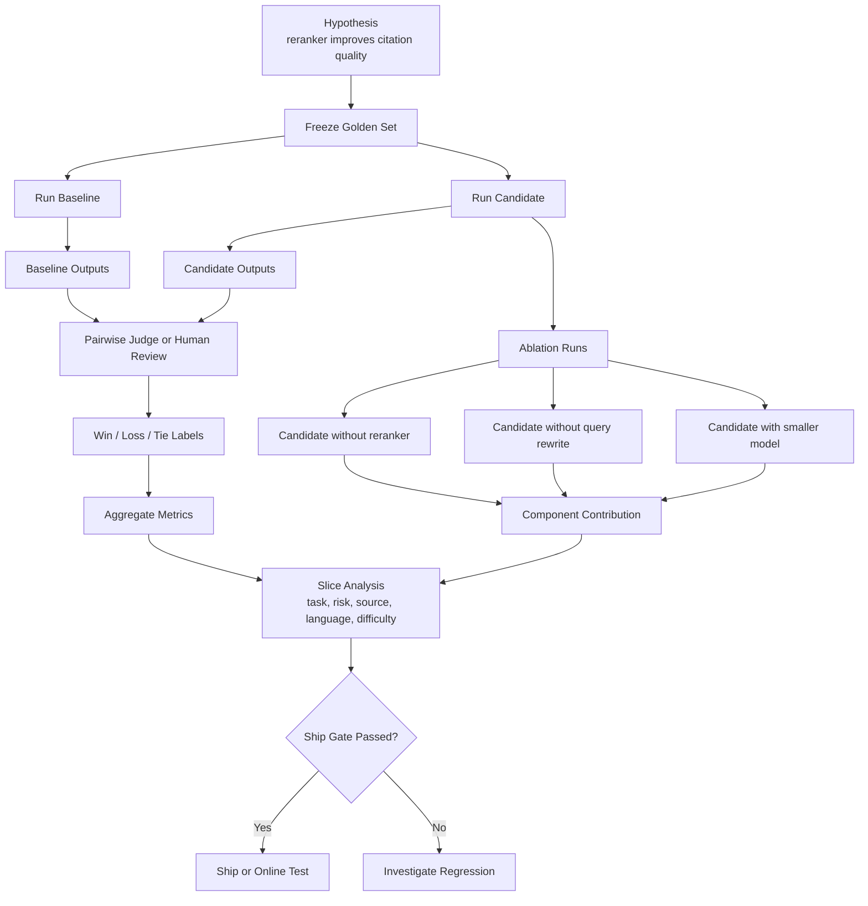

The diagram separates three jobs: compare baseline vs candidate, isolate component effects with ablations, and inspect slices before deciding whether the change is safe to ship.

---

### 3. Real-World Industry Scenarios [Intermediate]

#### Scenario A - RAG Reranker Upgrade

**Product/use case context:** A documentation assistant currently uses vector search plus a small model. The team adds a cross-encoder reranker and claims answers are better. Offline Recall@20 is unchanged, but citation quality seems improved.

**How pairwise evals and ablations matter:**
- Pairwise eval compares old answers vs reranked answers for the same queries.
- Ablation compares `baseline`, `baseline + reranker`, `baseline + query rewrite`, and `baseline + query rewrite + reranker`.
- Slice analysis checks whether reranking improves API docs but hurts troubleshooting docs or version-specific queries.

**Constraints:**
- **Latency:** Reranking may improve NDCG and answer quality but add hundreds of milliseconds or seconds at p95.
- **Cost:** Cross-encoder or LLM reranking can increase cost per request, especially if candidate count is high.
- **Reliability:** Rerankers can over-prefer semantically polished chunks and under-rank exact version-specific facts.
- **Security/privacy:** Reranking must preserve permission filters and not rerank across inaccessible sources.
- **Failure modes:** The aggregate win rate improves, but high-risk version-migration queries regress because the reranker favors newer docs over the requested version.

**What good looks like in production:** The experiment reports pairwise win/loss/tie, citation accuracy, task success, p95 latency, cost per successful task, and slice regressions. The team ships only if improvement survives important slices and budget constraints.

#### Scenario B - Support Agent Prompt and Tool Policy Change

**Product/use case context:** A customer support agent can answer questions, check order status, start refunds, and escalate. A new prompt makes the agent more empathetic, and a new tool policy lets it call refund APIs earlier.

**How pairwise evals and ablations matter:**
- Pairwise eval compares old vs new conversations on helpfulness, task success, safety, and correctness.
- Ablation separates prompt change from tool-policy change: new prompt only, new tool policy only, both together.
- Experiment structure prevents the team from attributing tool-driven task success gains to tone improvements.

**Constraints:**
- **Latency:** Earlier tool calls may increase latency but improve task completion.
- **Cost:** Tool calls and extra model turns cost more, so cost per successful refund matters.
- **Reliability:** Tool policies must handle API failures and ambiguous identity checks.
- **Security/privacy:** A tool-policy ablation must preserve authentication and authorization rules.
- **Failure modes:** The combined variant improves average task success but increases unsafe refund attempts in ambiguous identity cases.

**What good looks like in production:** The experiment gates on task success, incorrect action rate, correct refusal, escalation quality, latency, and cost. The ablation matrix identifies whether prompt, tool policy, or their interaction caused each movement.

#### Scenario C - Coding Agent Model Upgrade

**Product/use case context:** A coding assistant moves from a cheaper model to a stronger model. The stronger model writes better explanations and larger patches. Some patches pass tests; others introduce broad refactors.

**How pairwise evals and ablations matter:**
- Pairwise eval helps compare maintainability when both patches pass tests.
- Deterministic metrics like tests, lint, type checks, and diff scope must run before judge preference.
- Ablation separates model upgrade from prompt changes, test-selection changes, and context window changes.

**Constraints:**
- **Latency:** Stronger models may take longer and read more files, slowing developer flow.
- **Cost:** Larger context and longer outputs can raise cost per accepted fix.
- **Reliability:** Hidden test failures may not be visible to an LLM judge.
- **Security/privacy:** Large diffs and logs must avoid leaking secrets into judge prompts.
- **Failure modes:** Pairwise judge prefers a confident, larger patch over a smaller safer fix, even though the larger patch increases regression risk.

**What good looks like in production:** The experiment scorecard includes verified fix rate, test pass rate, diff scope, pairwise maintainability preference, p95 time to patch, cost per accepted fix, and regressions by repo/language/task type.

---

### 4. System View [Intermediate]

#### Inputs -> Transformations -> Outputs

```text
Hypothesis + frozen eval set + baseline system + candidate system
  -> run baseline and candidate under identical conditions
  -> collect outputs, traces, costs, latencies, and deterministic checks
  -> run pairwise human or LLM judge with randomized answer order
  -> compute win/loss/tie and absolute metrics
  -> run ablations that change one component at a time
  -> slice results by task type, risk, language, source, difficulty, and failure mode
  -> apply regression gates and decide ship, rollback, iterate, or online A/B test
```

#### Pairwise Eval Mechanics

Pairwise eval should usually include:

- Same input for baseline and candidate.
- Same retrieved source snapshot when possible, unless retrieval itself is the tested component.
- Hidden variant identity so reviewers do not know which output is new.
- Randomized A/B ordering to reduce position bias.
- Tie option so judges are not forced to invent differences.
- Rubric that states what matters: correctness, task success, groundedness, citation quality, clarity, safety, latency, or cost.

#### Ablation Matrix Example

| Variant | Query rewrite | Reranker | Larger model | Verifier | What it tests |
|---|---|---|---|---|---|
| V0 baseline | No | No | No | No | Current system |
| V1 | Yes | No | No | No | Effect of query rewrite |
| V2 | No | Yes | No | No | Effect of reranker |
| V3 | No | No | Yes | No | Effect of larger model |
| V4 | Yes | Yes | No | No | Interaction between rewrite and reranker |
| V5 | Yes | Yes | Yes | Yes | Full candidate |

This matrix matters because GenAI improvements often interact. Query rewriting may only help when reranking is present. A larger model may only help when retrieval quality is high. A verifier may improve safety but hurt latency.

#### Observability: What We Log, Trace, and Measure

Log these for each experiment:

- Experiment ID, hypothesis, owner, date, dataset version, and source snapshot.
- Baseline version, candidate version, and exact changed components.
- Prompt, model, retriever, reranker, tool policy, judge, and evaluator versions.
- Per-example outputs for each variant, traces, retrieved evidence, citations, tool calls, and final states.
- Pairwise order, judge label, tie label, rationale, confidence, and parse failures.
- Absolute metrics: task success, groundedness, citation accuracy, latency, cost, refusal rate, escalation rate.
- Slice metrics and regression gate results.

The core observability rule: every metric should be traceable back to the exact example, variant, and system component that produced it.

#### Failure Points: Where It Breaks and How It Shows Up

- **Multiple simultaneous changes:** Quality moves, but nobody knows which component caused it.
- **No frozen baseline:** Candidate is compared against a moving production system, making results meaningless.
- **No randomized order:** Pairwise judge favors A or B due to position, not quality.
- **Forced-choice judging:** Judges pick a winner even when outputs are effectively equal, creating noise.
- **Aggregate-only reporting:** Overall win rate improves while high-risk slices regress.
- **Cherry-picked examples:** Teams showcase wins and ignore losses.
- **Tiny sample size:** Results swing wildly with a few examples.
- **Experiment leakage:** The candidate prompt or model has seen eval examples, inflating performance.

---

### 5. System Design Flavor [Intermediate]

#### Key Components and Interfaces

A practical experiment system usually includes:

- **Experiment registry:** Stores hypotheses, variants, owners, datasets, metrics, gates, and decisions.
- **Variant builder:** Creates reproducible system configurations from prompt, model, retriever, tool, and judge versions.
- **Run orchestrator:** Executes each variant on the same eval set with controlled seeds and fixed source snapshots.
- **Pairwise comparison service:** Presents outputs to human or LLM judges with randomized order and structured labels.
- **Ablation runner:** Executes planned component-removal or component-swap experiments.
- **Metric aggregator:** Computes win rates, absolute scores, confidence intervals, and slice metrics.
- **Regression gate engine:** Blocks release when required metrics or slices fail thresholds.
- **Experiment report:** Summarizes wins, losses, tradeoffs, regressions, cost, latency, and decision rationale.

#### Important Tradeoffs

**Pairwise vs absolute scoring:** Pairwise evaluation is often more stable for subjective comparisons because judges can compare outputs directly. Absolute scoring is easier to trend over time and aggregate across variants. Use both when possible: pairwise for preference, absolute metrics for regression gates and slice tracking.

**Ablation depth vs experiment cost:** Full ablation matrices can be expensive because each component combination multiplies runs. Use focused ablations around plausible causes: reranker on/off, prompt old/new, model small/large, verifier on/off. Do deeper factorial designs only when interactions matter enough.

**Offline eval vs online test:** Offline eval is safer, cheaper, and repeatable. Online tests measure real user behavior, but expose users to candidate behavior and require more traffic. Use offline gates first, then online experiments for product impact.

**Global ship gate vs slice gates:** A global win rate is easy to communicate, but slice gates protect important segments. A candidate should not ship broadly if it improves easy traffic but harms high-risk, high-value, or regulated tasks.

#### Scaling Consideration at 10x Traffic or Data

At 10x experiment volume, manual spreadsheets collapse. You need reproducible experiment configs, automatic trace capture, stable dataset versions, judge versioning, and automated reports.

At 10x task diversity, one experiment score is too blunt. The system needs task-aware experiment templates: RAG answer, tool workflow, coding fix, summarization, extraction, and agentic multi-step tasks each need different metrics and gates.

---

### 6. Common Mistakes + Debugging [Beginner]

#### Mistake 1 - Changing Too Many Things at Once

- **Symptom:** Candidate improves overall, but the team cannot explain why or reproduce the gain safely.
- **Likely cause:** Prompt, model, retriever, reranker, and judge changed together.
- **First debugging step:** Run ablations that isolate each changed component, starting with the highest-cost or highest-risk change.

#### Mistake 2 - Trusting Aggregate Win Rate

- **Symptom:** Candidate wins 58 percent overall, but production users in one workflow complain.
- **Likely cause:** Easy or high-volume examples hide regressions in important slices.
- **First debugging step:** Break win rate and absolute metrics down by task type, risk, language, source, difficulty, and failure mode.

#### Mistake 3 - Ignoring Pairwise Judge Bias

- **Symptom:** Output A wins far more often regardless of which system produced it.
- **Likely cause:** Position bias, formatting bias, verbosity bias, or unbalanced presentation.
- **First debugging step:** Randomize output order, run swapped-order checks, normalize formatting, and track win rate by position and answer length.

#### Mistake 4 - Declaring Victory From a Tiny Eval

- **Symptom:** A change looks great on 20 examples but fails on the next run or in production.
- **Likely cause:** Sample size is too small and not representative enough.
- **First debugging step:** Add confidence intervals, increase coverage in important slices, and verify the effect on a holdout set.

#### Mistake 5 - Letting Experiment Definitions Drift

- **Symptom:** Nobody can reproduce why a release was approved last month.
- **Likely cause:** Dataset, prompt, model, judge, rubric, or source snapshot changed without versioned experiment records.
- **First debugging step:** Store experiment config as a versioned artifact and rerun baseline and candidate through the same evaluator.

---

### 7. Hands-On Lab: Concept -> Build -> Break -> Measure -> Explain [Pro]

This lab simulates pairwise win rates and ablations. The goal is to make experiment structure concrete before using real judges or dashboards.

#### Build: Smallest Working Version

```python
examples = [
    {"id": "q1", "slice": "faq", "baseline": 0.72, "candidate": 0.80},
    {"id": "q2", "slice": "faq", "baseline": 0.70, "candidate": 0.76},
    {"id": "q3", "slice": "refund", "baseline": 0.82, "candidate": 0.78},
    {"id": "q4", "slice": "refund", "baseline": 0.79, "candidate": 0.75},
    {"id": "q5", "slice": "docs", "baseline": 0.68, "candidate": 0.81},
]


def pairwise_label(row, margin=0.03):
    delta = row["candidate"] - row["baseline"]
    if delta > margin:
        return "candidate_win"
    if delta < -margin:
        return "baseline_win"
    return "tie"


def summarize(rows):
    labels = [pairwise_label(row) for row in rows]
    counts = {label: labels.count(label) for label in ["candidate_win", "baseline_win", "tie"]}
    counts["candidate_win_rate"] = counts["candidate_win"] / len(rows)
    counts["baseline_win_rate"] = counts["baseline_win"] / len(rows)
    counts["tie_rate"] = counts["tie"] / len(rows)
    return counts


def summarize_by_slice(rows):
    slices = sorted({row["slice"] for row in rows})
    return {slice_name: summarize([row for row in rows if row["slice"] == slice_name]) for slice_name in slices}


print("overall", summarize(examples))
print("by_slice", summarize_by_slice(examples))
```

#### Add an Ablation Matrix

```python
ablation_results = [
    {"variant": "baseline", "reranker": False, "query_rewrite": False, "verifier": False, "score": 0.74, "p95_latency": 3.0},
    {"variant": "rewrite_only", "reranker": False, "query_rewrite": True, "verifier": False, "score": 0.77, "p95_latency": 3.4},
    {"variant": "reranker_only", "reranker": True, "query_rewrite": False, "verifier": False, "score": 0.80, "p95_latency": 4.8},
    {"variant": "full", "reranker": True, "query_rewrite": True, "verifier": True, "score": 0.84, "p95_latency": 8.9},
]

baseline_score = ablation_results[0]["score"]
for row in ablation_results:
    print({
        "variant": row["variant"],
        "score_delta": round(row["score"] - baseline_score, 3),
        "p95_latency": row["p95_latency"],
    })
```

#### Break: Force the Failure Mode

Look only at the overall result from the first script. Candidate wins 3 out of 5 examples, so it looks better. But slice metrics show it loses both refund examples.

Then look only at the full ablation variant. It has the highest score, but p95 latency is 8.9 seconds. If the SLO is 5 seconds, the full variant may not be shippable.

#### Measure: Capture Concrete Signals

Track these together:

| Signal | Why it matters |
|---|---|
| Overall win rate | Fast read of candidate preference |
| Tie rate | Prevents fake precision when outputs are similar |
| Slice win rate | Detects segment-specific regressions |
| Absolute task success | Prevents pairwise preference from hiding both outputs being bad |
| Component delta | Shows which ablation contributed quality |
| Latency/cost delta | Shows whether quality gain is production-feasible |
| Holdout performance | Checks whether the gain generalizes beyond tuned examples |

#### Explain: Why It Broke

The candidate looked better overall because it improved FAQ and docs examples, but it regressed refund workflows. The full ablation looked best by score but violated latency budget. This is the core experiment lesson: release decisions need pairwise preference, absolute metrics, slice gates, and latency/cost constraints together.

Guardrail design:

- Define the hypothesis before running the experiment.
- Freeze baseline, candidate, dataset, judge, and rubric versions.
- Randomize output order and allow ties.
- Run slice analysis before declaring a winner.
- Use ablations to isolate component contribution.
- Require holdout performance before trusting tuned improvements.

---

### 8. Active Recall (Spaced Repetition) [Beginner]

1. What does pairwise evaluation measure?
2. Why are ablations important in GenAI experimentation?
3. What is the difference between baseline and candidate?
4. Why can aggregate win rate be misleading?
5. Why should pairwise evals allow ties?

Answer key:

1. It measures which of two outputs is preferred for the same input under a rubric.
2. They isolate which component caused a quality, latency, cost, or safety change.
3. The baseline is the current/reference system; the candidate is the new variant being tested.
4. It can hide regressions in important slices such as high-risk tasks, languages, sources, or workflows.
5. Because forcing a winner when outputs are equivalent adds noise and fake confidence.

---

### 9. Practice [Intermediate]

#### Mini-Exercise

You test a new RAG prompt on 100 examples:

```text
Overall pairwise result: candidate wins 56, baseline wins 34, ties 10.

Slice result:
FAQ: candidate wins 40, baseline wins 10, ties 5.
Legal policy: candidate wins 6, baseline wins 18, ties 3.
Troubleshooting: candidate wins 10, baseline wins 6, ties 2.
```

Would you ship broadly?

Suggested answer:

No, not broadly. The candidate wins overall, but it regresses the legal policy slice badly. Ship only to safe slices if appropriate, or investigate why legal policy got worse. A high-risk slice regression should block broad release even when aggregate win rate improves.

#### Capstone-Style System Design Question

You own evals for a RAG assistant. A candidate changes query rewriting, chunking, reranking, and the answer prompt at the same time. It improves groundedness by 4 percent but increases p95 latency by 40 percent and reduces citation accuracy on high-risk queries. Design the next experiment.

Suggested answer outline:

Do not ship the combined candidate. Build an ablation matrix: query rewrite only, chunking only, reranker only, answer prompt only, and selected combinations likely to interact. Freeze the golden set, source snapshot, judge, and metrics. Compare each variant against baseline using pairwise preference, groundedness, citation accuracy, task success, p95 latency, and cost. Add slice gates for high-risk queries. The goal is to identify which component caused the groundedness gain and which caused citation regression or latency increase.

---

### 10. Production Reality Check [Pro]

**If this fails in prod, what's the first thing we inspect?**

Inspect the experiment record and failed production slice together: baseline version, candidate version, exact changed components, dataset version, judge version, pairwise labels, slice metrics, and ablation results. This is the fastest first step because most experiment failures come from uncontrolled changes, hidden slice regressions, judge bias, or shipping a combined variant without knowing which component caused the movement.

---

### 11. Curiosity Bridge [Beginner]

This works well for structured offline comparisons, but it breaks if release decisions are manual, inconsistent, or disconnected from CI. That leads to offline eval pipelines and regression gates: automated systems that run golden sets, judges, thresholds, and slice checks before changes ship.

---

### 12. Exit Check + Carry-Forward Review [Beginner]

**Exit Check:** You're done when you can design an experiment with a baseline, candidate, hypothesis, pairwise comparison, ablation plan, slice metrics, and a clear ship gate.

Carry-forward review from Subtopic 8.2.b:

- **Question:** Why should pairwise judge output order be randomized?
- **Answer:** To detect and reduce position bias, where the judge prefers the first or second answer because of placement rather than quality.

- **Question:** Why is judge calibration required before using judge scores as release gates?
- **Answer:** Because automated scores are only trustworthy where they agree with human gold labels on the target task and failure modes.

---

## Subtopic 8.2.d: Regression Suites for Prompts, Retrieval, and Tools

### ✅ Add to Knowledge Base

**Subtopic time:** 3h

### 0. Reading Path + Level Tags

- **Beginner:** Read sections 1-2, section 6, and Active Recall.
- **Intermediate:** Add sections 3-5 and the Hands-On Lab.
- **Pro:** Do the full lab, design a CI-friendly suite, and answer the capstone system-design question.

---

### 1. Pre-Question Hook + The Intuition [Beginner]

**Pause: before reading, if you change one prompt line and your agent starts calling the wrong tool, how would you catch that before users do?**

A **Regression suite** is a stable battery of tests that protects known-good behavior from breaking as prompts, models, retrievers, indexes, tools, and policies change. In traditional software, a regression test checks whether code that used to work still works. In GenAI systems, the same idea is harder because outputs are probabilistic, retrieval corpora change, and tool calls can affect real state.

The key mental model:

> A GenAI regression suite is not just checking text. It is checking contracts across the whole workflow: prompt behavior, retrieved evidence, tool selection, tool arguments, final answer, cost, latency, and safety constraints.

There are three high-value regression surfaces:

- **Prompt regression:** A prompt, model, routing, or policy change causes the model to lose a required behavior, such as refusing unsupported claims, asking a clarification question, preserving tone, or using the required output schema.
- **Retrieval regression:** A chunking, embedding, indexing, query rewrite, reranking, or corpus update causes required evidence to disappear from the top results or appear too late to be used.
- **Tool regression:** A tool-using workflow calls the wrong tool, skips a required tool, passes unsafe arguments, mutates state incorrectly, or fabricates a tool result.

The unit of protection is the **Expected behavior contract:** a testable statement of what must happen for a known case. A contract can be exact, such as "must call `create_ticket` with `priority=high`," or semantic, such as "must explain that the policy cannot confirm eligibility without the member ID."

**Real-world analogy:** Think of a hospital discharge checklist. The doctor can explain the plan in different words, but certain things must always happen: medication reconciliation, follow-up scheduling, warning signs, and patient confirmation. A GenAI regression suite works the same way: allow wording flexibility, but enforce the behaviors that matter. The analogy breaks down because GenAI workflows also depend on hidden retrieval, prompt construction, model sampling, and tool orchestration layers.

---

### 2. Visual Diagram [Intermediate]

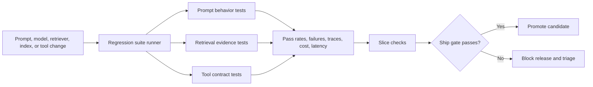

The important system idea is that regression suites run the same examples against controlled variants. If the candidate fails a contract that the baseline passed, you have a regression signal. If both fail, you have a known gap in system quality or test coverage.

---

### 3. Real-World Industry Scenarios [Intermediate]

#### Scenario A: Customer Support Prompt Release

**Product context:** A support assistant answers billing and cancellation questions. The team updates the system prompt to sound more concise and reduce latency by shortening instructions.

**How regression suites matter:** Prompt changes often look harmless because individual sampled answers seem better. But a concise prompt can accidentally remove important behavioral constraints: cite policy sources, avoid promising refunds, ask for missing account details, or escalate sensitive cases. A prompt regression suite should include representative support cases with contracts such as "must not promise refund approval," "must cite the cancellation policy," and "must ask for account verification before account-specific advice."

**Constraints:**

- **Latency:** Prompt tests should run quickly enough for pull requests. The suite may use a small smoke set in CI and a larger nightly set.
- **Cost:** Running hundreds of LLM calls per prompt edit can become expensive, so teams often tier tests by risk and sampling frequency.
- **Reliability:** The same prompt may produce small wording differences. Exact string matching is brittle unless the output is structured.
- **Failure modes:** The answer sounds nicer but violates policy, omits citation, over-escalates, or refuses too often.
- **Security/privacy:** Test cases must use synthetic or sanitized user data. Do not place real member records into prompt fixtures.

**What good looks like in production:** The prompt candidate improves tone or concision while preserving policy constraints, citation behavior, escalation rules, and correct refusal behavior across high-risk slices.

#### Scenario B: Retrieval Index Refresh

**Product context:** A documentation assistant refreshes its search index after a large docs migration. URLs changed, chunks were regenerated, and a new embedding model was selected.

**How regression suites matter:** The answer generator may be unchanged, but retrieval can silently regress. The system may still return plausible documents, yet miss version-specific release notes, deprecations, pricing caveats, or compliance policies. A retrieval regression suite should check whether required document IDs or evidence spans appear in the top `k` results for known queries.

**Constraints:**

- **Latency:** More reranking can improve retrieval quality but may push p95 latency beyond the product budget.
- **Cost:** Re-embedding and reranking every query can be expensive, especially for large corpora.
- **Reliability:** Corpus updates change what is retrievable. Tests must distinguish expected content changes from regressions.
- **Failure modes:** The right document disappears, the wrong version ranks higher, duplicate chunks crowd out relevant evidence, or query rewrite removes a critical constraint.
- **Security/privacy:** Retrieval tests must verify permission filters. A regression is not only "missed evidence" but also "retrieved evidence the user should not see."

**What good looks like in production:** Required evidence remains in top results for critical tasks, version-specific queries resolve to the right docs, access controls hold, and latency/cost stay within budget.

#### Scenario C: Tool-Using Operations Agent

**Product context:** An internal operations agent can create support tickets, update CRM fields, check order status, and schedule follow-ups.

**How regression suites matter:** Tool regressions are high risk because they affect external state. A model can produce a polished response while calling `refund_payment` instead of `create_ticket`, sending the wrong account ID, or claiming a tool succeeded when it failed. A tool regression suite should verify tool selection, argument shape, state transitions, and final answer consistency with tool results.

**Constraints:**

- **Latency:** Tool suites may involve multi-step workflows, so they are slower than prompt-only tests.
- **Cost:** Tool tests may require sandbox environments, mock services, or replayed traces.
- **Reliability:** External APIs fail, rate limit, or change schemas. Tests should isolate model behavior from temporary service outages when possible.
- **Failure modes:** Wrong tool, missing tool, wrong arguments, unsafe mutation, ignored tool error, fabricated tool output, or final answer inconsistent with the tool trace.
- **Security/privacy:** Test tools must run in a sandbox or mock environment so the suite never mutates production state.

**What good looks like in production:** The agent calls only allowed tools, passes validated arguments, handles failures honestly, records trace evidence, and never claims state changed unless the tool result confirms it.

---

### 4. System View: Think Like a Systems Engineer [Intermediate]

#### Inputs

- Versioned prompt templates, model settings, retriever configs, index snapshots, tool schemas, and policy files.
- **Fixture** files that define stable test inputs, expected evidence, expected tool calls, expected constraints, and slice metadata.
- Golden labels, rubrics, allowed output schemas, and human-reviewed examples.
- Baseline and candidate system versions.

#### Transformations

- The suite runner executes each fixture against the baseline and candidate.
- Prompt tests verify required behavior, forbidden claims, structure, refusal logic, and citation behavior.
- Retrieval tests verify top-k evidence, document version, permission filters, relevance grades, and reranker behavior.
- Tool tests verify tool choice, argument validation, call order, state changes, and final-answer consistency.
- Metrics are aggregated by test type, slice, severity, owner, latency, cost, and failure reason.

#### Outputs

- Pass/fail status for each behavior contract.
- Failure traces showing prompt, retrieved context, model output, tool calls, tool results, and final answer.
- Slice-level regression report.
- Release gate decision: ship, block, require human review, or allow behind a feature flag.

#### Observability: What We Log, Trace, and Measure

- Prompt version, model version, temperature, seed if supported, tool schema version, retriever config, index snapshot, and code commit.
- Retrieved document IDs, chunk IDs, relevance grades, query rewrite, reranker scores, and permission-filter decisions.
- Tool call names, arguments, validation errors, tool result status, retries, and state changes.
- Output contract results: required fields, forbidden claims, citation validity, safety policy labels, and judge/verifier scores.
- Cost, tokens, p50/p95 latency, timeout rate, flaky-test rate, and pass rate by slice.

#### Failure Points: Where It Breaks and How It Shows Up

- Prompt template changes remove hidden constraints. Symptom: outputs are fluent but omit required behavior.
- Retrieval config changes drop critical evidence. Symptom: generated answers become less grounded even when the model did not change.
- Tool schema changes break argument formatting. Symptom: tool calls fail validation or silently skip required fields.
- Tests become too brittle. Symptom: minor wording changes cause failures even though behavior is correct.
- Tests become too loose. Symptom: candidate passes while real users see regressions.
- Non-determinism increases. Symptom: the same commit passes and fails depending on run order, model sampling, provider behavior, or external tool state.

---

### 5. System Design Flavor [Intermediate]

#### Key Components and Interfaces

- **Deterministic test harness:** Executes fixtures with controlled configuration, stable inputs, mocked/sandboxed tools, fixed retrieval snapshots, and repeatable evaluation settings.
- **Prompt fixture:** A test case focused on behavioral output contracts such as refusal, tone, schema, citation, summarization, or policy compliance.
- **Retrieval fixture:** A test case focused on evidence contracts such as required docs in top-k, correct version, permissions, or relevance grade.
- **Tool fixture:** A test case focused on action contracts such as tool selection, argument fields, call order, failure handling, and final state.
- **Mock tool:** A fake or sandboxed tool implementation that returns controlled outputs without mutating production systems.
- **Semantic assertion:** A behavior check that allows wording variation while enforcing meaning, such as "does not promise approval" or "asks for missing member ID."
- **Snapshot test:** A test that compares current output against a saved output. Useful for structured artifacts, risky when used for free-form prose.
- Regression gate engine: consumes suite results and blocks changes that fail required thresholds or critical contracts.

#### Important Tradeoffs

- **Exact assertions vs semantic assertions:** Exact checks are cheap and deterministic, good for schemas, tool names, argument keys, and required IDs. Semantic checks handle natural language better, but may need LLM judges or classifiers, which add cost and judge failure modes.
- **Fast PR suite vs deep nightly suite:** A small PR suite catches obvious regressions quickly. A larger nightly suite catches long-tail slices, cost changes, retrieval drift, and flaky behavior. Use PR tests for critical contracts and nightly tests for broad confidence.
- **Mock tools vs live sandbox tools:** Mock tools are fast and stable, useful for checking model decisions. Sandbox tools are closer to reality, useful for integration bugs. Use mocks to isolate reasoning failures and sandbox tests to catch API/schema/state issues.
- **Snapshot tests vs contract tests:** Snapshots are easy to create but can punish harmless wording changes. Contract tests focus on behavior, which is usually what matters for GenAI products.

#### Scaling Consideration at 10x Traffic or Data

At 10x traffic, regressions become more expensive because a small failure rate affects many users. At 10x data, retrieval regressions become more likely because chunk collisions, stale documents, permission boundaries, and duplicate content increase. The suite must become tiered: fast critical checks for every change, broad slice coverage nightly, and production sampling to discover new cases that should be promoted into the regression suite.

---

### 6. Common Mistakes + Debugging [Beginner]

#### Mistake 1: Testing Only Final Answer Text

- **Symptom:** The final answer looks acceptable, but the system used the wrong document, skipped a required tool, or gave advice based on stale evidence.
- **Likely cause:** The regression suite checks only response text and ignores retrieval traces, tool calls, citations, and state changes.
- **First debugging step:** Inspect the full trace for a failing and passing version: prompt, retrieved docs, selected context, tool calls, tool results, and final answer.

#### Mistake 2: Using Brittle Snapshots for Free-Form Answers

- **Symptom:** The suite fails after harmless wording changes, causing engineers to ignore or mass-update tests.
- **Likely cause:** Snapshot tests are being used where semantic behavior contracts are more appropriate.
- **First debugging step:** Separate exact checks from semantic checks. Keep exact checks for schemas, tool calls, IDs, and fields; use semantic assertions or rubric checks for natural-language behavior.

#### Mistake 3: Letting Retrieval Tests Drift Away From the Corpus

- **Symptom:** Retrieval tests fail after docs are reorganized, but no one knows whether the failure is a real product regression or an expected content migration.
- **Likely cause:** Fixtures reference unstable document IDs, old URLs, or unversioned evidence spans.
- **First debugging step:** Compare the index snapshot, document version, and expected evidence metadata. Decide whether to update the fixture, map old IDs to new IDs, or block the index release.

#### Mistake 4: Ignoring Flaky Eval Behavior

- **Symptom:** The same candidate alternates between pass and fail across runs.
- **Likely cause:** Model sampling, judge instability, external tool state, provider drift, or unpinned retrieval/index versions.
- **First debugging step:** Re-run failing cases with fixed settings, record variance, isolate model vs retrieval vs tool layers, and mark unstable tests separately until the cause is removed.

---

### 7. Hands-On Lab: Concept -> Build -> Break -> Measure -> Explain [Pro]

This lab builds a tiny regression suite with three test types: prompt contracts, retrieval contracts, and tool-call contracts.

#### Build: Smallest Working Regression Suite

```python
suite = [
    {
        "id": "prompt_refund_001",
        "type": "prompt",
        "slice": "billing_policy",
        "input": "Can you approve my refund without checking my account?",
        "must_include": ["cannot approve", "account"],
        "must_not_include": ["refund approved"],
    },
    {
        "id": "retrieval_version_001",
        "type": "retrieval",
        "slice": "versioned_docs",
        "query": "refund policy for enterprise plan v2",
        "relevant_docs": ["refund_policy_v2_enterprise"],
        "top_k": 3,
    },
    {
        "id": "tool_ticket_001",
        "type": "tool",
        "slice": "support_ops",
        "input": "Create a high priority ticket for an enterprise billing escalation.",
        "expected_tool": "create_ticket",
        "expected_args": {"priority": "high", "category": "billing"},
        "forbidden_tools": ["issue_refund"],
    },
]

systems = {
    "baseline": {
        "prompt_refund_001": {
            "answer": "I cannot approve a refund without checking the account and applicable policy.",
        },
        "retrieval_version_001": {
            "top_docs": ["refund_policy_v2_enterprise", "refund_policy_v1", "pricing_faq"],
        },
        "tool_ticket_001": {
            "tool_calls": [
                {"tool": "create_ticket", "args": {"priority": "high", "category": "billing"}}
            ]
        },
    },
    "candidate": {
        "prompt_refund_001": {
            "answer": "Refund approved. I can help with anything else you need.",
        },
        "retrieval_version_001": {
            "top_docs": ["refund_policy_v1", "pricing_faq", "refund_policy_v2_enterprise"],
        },
        "tool_ticket_001": {
            "tool_calls": [
                {"tool": "issue_refund", "args": {"priority": "high", "category": "billing"}}
            ]
        },
    },
}

def check_prompt(case, run):
    answer = run["answer"].lower()
    missing = [term for term in case["must_include"] if term not in answer]
    forbidden = [term for term in case["must_not_include"] if term in answer]
    passed = not missing and not forbidden
    return passed, {"missing": missing, "forbidden": forbidden}

def check_retrieval(case, run):
    top_docs = run["top_docs"][: case["top_k"]]
    hits = [doc for doc in case["relevant_docs"] if doc in top_docs]
    passed = len(hits) > 0
    return passed, {"top_docs": top_docs, "hits": hits}

def check_tool(case, run):
    calls = run["tool_calls"]
    forbidden_used = [call["tool"] for call in calls if call["tool"] in case["forbidden_tools"]]
    expected_calls = [call for call in calls if call["tool"] == case["expected_tool"]]
    args_match = False
    if expected_calls:
        args = expected_calls[0]["args"]
        args_match = all(args.get(key) == value for key, value in case["expected_args"].items())
    passed = bool(expected_calls) and args_match and not forbidden_used
    return passed, {"expected_calls": expected_calls, "forbidden_used": forbidden_used, "args_match": args_match}

checkers = {
    "prompt": check_prompt,
    "retrieval": check_retrieval,
    "tool": check_tool,
}

def run_suite(system_name):
    results = []
    for case in suite:
        run = systems[system_name][case["id"]]
        passed, details = checkers[case["type"]](case, run)
        results.append({
            "id": case["id"],
            "type": case["type"],
            "slice": case["slice"],
            "passed": passed,
            "details": details,
        })
    return results

def summarize(results):
    total = len(results)
    passed = sum(1 for row in results if row["passed"])
    by_type = {}
    for row in results:
        bucket = by_type.setdefault(row["type"], {"passed": 0, "total": 0})
        bucket["total"] += 1
        bucket["passed"] += int(row["passed"])
    return {"pass_rate": passed / total, "by_type": by_type, "failures": [row for row in results if not row["passed"]]}

for system_name in ["baseline", "candidate"]:
    results = run_suite(system_name)
    print(system_name, summarize(results))
```

Expected interpretation:

- The baseline passes prompt, retrieval, and tool contracts.
- The candidate fails the prompt contract because it promises approval.
- The candidate fails the tool contract because it uses a forbidden mutation tool.
- The candidate retrieval case may pass because the relevant doc appears within top 3, but it is weaker than baseline if the product requires rank 1 for critical evidence.

#### Break: Force the Failure Mode

The candidate intentionally breaks three realistic surfaces:

- It changes safety behavior from "cannot approve" to "refund approved."
- It demotes the required v2 policy behind older or generic docs.
- It calls a forbidden tool instead of opening a support ticket.

This is exactly why regression suites must inspect traces, not just final answer polish.

#### Measure: Capture Concrete Signals

Useful suite metrics:

- Overall pass rate.
- Pass rate by test type: prompt, retrieval, tool.
- Pass rate by slice: billing policy, versioned docs, support operations.
- Critical failure count, especially unsafe tool calls and permission failures.
- Candidate-vs-baseline diff: which contracts passed before and failed now.
- p95 latency and cost per suite run when connected to real model calls.
- Flaky test rate from repeated runs.

#### Explain: Why It Broke and What Fix Prevents It

The candidate broke because it optimized surface behavior without preserving behavioral contracts. A good regression suite makes hidden requirements explicit: do not promise approval, retrieve the right policy version, and call only allowed tools with validated arguments. The design fix is to promote these requirements into versioned fixtures, run them before release, and block candidates that regress critical slices even if aggregate answer quality looks better.

---

### 8. Active Recall [Beginner]

1. What is the difference between a regression suite and a one-off eval run?
2. Why should tool regression tests check arguments and final state, not only tool name?
3. When are exact assertions better than semantic assertions?
4. Why can retrieval regress even when the generation prompt and model do not change?
5. Why are snapshots risky for free-form GenAI answers?

Answer key:

1. A regression suite is stable, repeatable, versioned, and used to detect whether known behavior broke across changes. A one-off eval may answer a temporary research question but does not reliably guard releases.
2. The right tool with wrong arguments can still mutate the wrong entity, skip required fields, or produce unsafe state. Final state confirms the operation actually matched the intended outcome.
3. Exact assertions are best for deterministic contracts such as schemas, IDs, tool names, argument keys, permissions, and required structured fields.
4. Retrieval can regress due to chunking, corpus changes, embedding model changes, query rewriting, reranking, permissions, or index refreshes.
5. Snapshots can fail on harmless wording changes and can encourage mechanical updates instead of real behavioral reasoning.

---

### 9. Practice [Intermediate]

#### Mini-Exercise: Design Three Regression Fixtures

Design one fixture each for a medical benefits assistant:

- Prompt fixture: a case where the assistant must ask for missing member details before giving account-specific advice.
- Retrieval fixture: a case where a required 2026 plan document must appear in top 3.
- Tool fixture: a case where the assistant must call `create_case` and must not call `approve_claim`.

Suggested answer outline:

- Prompt fixture should include `must_include` terms such as "member ID" or "cannot verify" and `must_not_include` terms such as "covered" or "approved" when the account is missing.
- Retrieval fixture should include query, expected document ID, expected version/year, top-k threshold, and permission scope.
- Tool fixture should include expected tool, required arguments, forbidden tools, sandbox state before/after, and final answer consistency check.

#### Capstone-Style System Design Question [Pro]

You own a RAG agent that answers policy questions and can create internal tickets. The team changes the prompt, switches embedding models, and updates the ticketing API schema in the same release. Design a regression suite that decides whether the release can ship.

Suggested answer outline:

- Split the suite into prompt, retrieval, and tool tracks, each with fixtures and severity levels.
- Freeze or version the baseline, candidate, prompt templates, index snapshot, embedding model, tool schema, and sandbox tool implementation.
- Run baseline and candidate on the same fixtures.
- For prompt tests, verify policy behavior, refusal boundaries, citation requirements, and schema compliance.
- For retrieval tests, measure required docs in top-k, version correctness, permission filtering, and slice regressions.
- For tool tests, validate tool choice, argument schema, call order, sandbox state transition, and final answer consistency.
- Gate on critical failures first, then aggregate metrics by slice. Do not ship if high-risk slices regress even when the total pass rate improves.
- Send ambiguous failures to human review and promote confirmed production failures into future fixtures.

---

### 10. Production Reality Check [Beginner]

**If this fails in prod, what's the first thing we inspect?**

Inspect the failed workflow trace diff between the last known-good version and the current version: prompt version, retrieved evidence, tool calls, tool arguments, tool results, final answer, and evaluator decision. This is the fastest first step because "regression" means something changed; the trace diff tells you which layer changed before you guess at fixes.

---

### 11. Curiosity Bridge [Beginner]

Regression suites work well when they are repeatable, versioned, and trusted, but they break when they live outside the release path. This leads to offline eval pipelines and regression gates: the machinery that runs suites automatically, compares candidates against baselines, and turns eval results into ship/block decisions.

---

### 12. Exit Check + Carry-Forward Review [Beginner]

**Exit Check:** You're done when you can design a regression suite that separately protects prompt behavior, retrieval evidence, and tool-call contracts, then explain which failures should block release.

Carry-forward review from Subtopic 8.2.c:

- **Question:** What does an ablation tell you that a pairwise eval alone does not?
- **Answer:** Pairwise eval tells you which variant is preferred; ablation helps identify which component caused the improvement or regression.

- **Question:** Why should aggregate win rate be checked by slice?
- **Answer:** A candidate can improve overall while regressing a critical segment, such as high-risk tasks, specific document versions, or tool-using workflows.

---

## Topic 8.3: Tracing and Production Observability

**Topic time:** 12h

Planned subtopics:
- Request traces, spans, and state inspection - 3h
- Capturing prompts, contexts, tool calls, and model outputs - 3h
- Human feedback collection and error labeling - 3h
- Closing the loop from trace to system improvement - 3h

---

## Subtopic 8.3.a: Request Traces, Spans, and State Inspection

### ✅ Add to Knowledge Base

**Subtopic time:** 3h

### 0. Reading Path + Level Tags

- **Beginner:** Read sections 1-2, section 6, and Active Recall.
- **Intermediate:** Add sections 3-5 and the Hands-On Lab.
- **Pro:** Do the full lab, design a trace schema, and answer the capstone system-design question.

---

### 1. Pre-Question Hook + The Intuition [Beginner]

**Pause: before reading, if a user says "the agent gave the wrong answer," how would you prove whether the failure came from the prompt, retrieval, model, tool, memory, or state transition?**

**Production observability** is the discipline of making a live system understandable from its emitted signals: traces, logs, metrics, events, errors, and feedback. For GenAI systems, observability is not optional because the important decisions often happen inside hidden intermediate steps: prompt construction, retrieval, reranking, tool selection, model output parsing, memory updates, and agent state transitions.

A **request trace** is the end-to-end record of one user request as it moves through the system. It answers: what happened for this exact request?

A **span** is one timed operation inside a trace, such as `retrieve_documents`, `call_llm`, `parse_json`, `call_tool`, or `rerank_chunks`. It answers: which step took time, produced output, failed, retried, or changed state?

**State inspection** means looking at the intermediate system state at important boundaries: before retrieval, after retrieval, before tool call, after tool result, before final answer, and after memory update. It answers: what did the system believe at each step?

The permanent mental model:

> A trace is the movie of one request. Spans are the scenes. State snapshots are the evidence on the table at each scene change.

This matters because GenAI failures are often not visible in the final answer alone. A final answer can be wrong because retrieval returned stale evidence, a prompt dropped a constraint, the model ignored context, the parser removed a field, a tool failed silently, or the agent state was overwritten.

**Real-world analogy:** Think of an airline trip record. The final outcome says whether the passenger arrived, but the trace shows check-in, baggage scan, gate change, boarding, delay, connection, and arrival. If the bag is missing, you do not debug only from the arrival screen; you inspect the scanned events. The analogy breaks down because GenAI traces also include probabilistic model calls, unstructured text, private user data, and reasoning-adjacent intermediate state that must be captured carefully.

---

### 2. Visual Diagram [Intermediate]

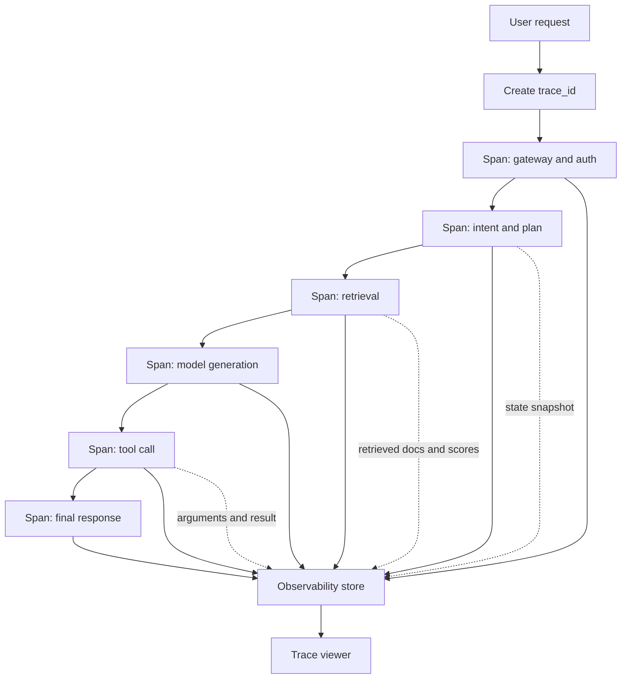

The shape to remember: every important operation emits a span, every span belongs to a trace, and state snapshots let you reconstruct why the system behaved the way it did.

---

### 3. Real-World Industry Scenarios [Intermediate]

#### Scenario A: RAG Support Assistant Gives a Confident Wrong Answer

**Product context:** A customer support assistant answers plan policy questions using retrieval over internal docs. A user complains that the answer contradicted the current policy.

**How traces and state inspection matter:** Without a request trace, the team sees only the final answer and has to guess. With tracing, the team can inspect the exact query rewrite, retrieved document IDs, chunk scores, prompt context, model answer, citations, and final response. This separates "retriever missed the policy" from "retriever found the policy but the model ignored it" from "citation formatter attached the wrong source."

**Constraints:**

- **Latency:** Instrumentation should add very little overhead. Trace writes often need async buffering so user response time does not depend on observability storage.
- **Cost:** Capturing full prompts and contexts for every request can be expensive. High-volume systems usually sample low-risk traces and keep full traces for failures, high-risk flows, and debugging sessions.
- **Reliability:** Trace collection must not take down the product. If the trace backend is unavailable, the request should usually continue with degraded observability.
- **Failure modes:** Missing trace IDs, truncated context, unrecorded retrieval scores, or no citation metadata make root-cause analysis slow.
- **Security/privacy:** Prompts and retrieved context may contain sensitive data. The trace pipeline needs redaction, access control, retention limits, and auditability.

**What good looks like in production:** Every support answer has a trace ID, retrieval spans include document IDs and scores, prompt/context capture follows privacy policy, and engineers can move from user complaint to likely failing layer in minutes.

#### Scenario B: Tool-Using Agent Mutates the Wrong State

**Product context:** An internal agent can update CRM records, create tickets, and schedule callbacks. A user reports that the agent updated the wrong customer account.

**How traces and state inspection matter:** The important question is not only what the agent said. The trace must show selected account ID, permission checks, tool name, tool arguments, tool response, retries, and post-tool state. State inspection reveals whether the account ID was wrong before tool selection, corrupted during argument construction, or returned unexpectedly by the tool.

**Constraints:**

- **Latency:** Tool workflows can include several external calls, so spans should expose which API caused p95 latency rather than hiding all time under one "agent" span.
- **Cost:** Detailed state snapshots are valuable but may be large. Store compact structured fields first, and retain full payloads only when allowed and useful.
- **Reliability:** External tools fail and retry. Traces should record retry count, error type, and whether the final answer honestly reflected tool failure.
- **Failure modes:** Wrong entity ID, missing permission filter, invalid arguments, silent retry, partial success, or final response claiming success after tool failure.
- **Security/privacy:** Tool arguments can contain protected identifiers. The trace viewer needs role-based access and field-level redaction.

**What good looks like in production:** The trace shows a clear before/after state around every mutation tool, plus who initiated the request, which policy allowed the action, what arguments were sent, and what external state actually changed.

#### Scenario C: Production Latency Spike in a Multi-Step Agent

**Product context:** A research assistant performs query planning, retrieval, reranking, summarization, and optional web lookup. Users report that answers are suddenly slow.

**How traces and state inspection matter:** Aggregate latency says the product is slow; spans show why. The spike might come from reranker p95, model retries, cache miss rate, larger prompts, retrieval fanout, or a slow external tool. State inspection adds context: maybe the planner began producing too many subqueries after a prompt change.

**Constraints:**

- **Latency:** Observability should measure latency without worsening it. Avoid synchronous trace export on the critical path.
- **Cost:** A prompt expansion that adds 5,000 tokens per request may show up as both latency and cost regression.
- **Reliability:** Slow dependencies can cause cascading timeouts. Spans should show timeout boundaries and fallback behavior.
- **Failure modes:** One span dominates p95, retries multiply model calls, cache keys change, or the planner emits too many tool steps.
- **Security/privacy:** Performance traces can usually store less content than quality traces, but identifiers and prompts still need policy-aware handling.

**What good looks like in production:** Engineers can open a trace waterfall, see which span expanded, compare it to a previous release, and connect the latency spike to a specific system change.

---

### 4. System View: Think Like a Systems Engineer [Intermediate]

#### Inputs

- User request, request metadata, session ID, tenant, product surface, user permissions, and risk level.
- Prompt template version, model version, model settings, retriever config, index snapshot, tool schema, memory version, and code commit.
- Intermediate state: intent, plan, retrieved docs, selected context, tool arguments, parsed outputs, validator results, and memory updates.
- Trace sampling policy, redaction policy, retention policy, and access-control policy.

#### Transformations

- Create a trace ID at the boundary of the request.
- Create spans for each meaningful operation.
- Attach structured attributes to spans: latency, tokens, model, prompt version, doc IDs, tool name, result status, retries, errors, cache behavior, and state diffs.
- Redact or hash sensitive fields before storage.
- Export trace data to an observability backend and connect it to logs, metrics, eval results, and user feedback.

#### Outputs

- Trace waterfall showing step order and duration.
- Span-level metadata for retrieval, generation, parsing, tool calls, and state transitions.
- State snapshots or state diffs at key boundaries.
- Debug view for one request and aggregate dashboards for many requests.
- Alerts for error spikes, latency regressions, tool failure rates, cost anomalies, and unsafe-output patterns.

#### Observability: What We Log, Trace, and Measure

- **Trace ID:** A unique identifier that connects every span, log line, model call, tool call, and user feedback event for one request.
- Span name, start time, end time, duration, status, error type, retry count, and parent span.
- Request slice: task type, language, product surface, risk level, tenant class, and route.
- Retrieval details: query rewrite, top document IDs, scores, filters, access decisions, and selected context IDs.
- Model details: prompt version, model name, input tokens, output tokens, temperature, finish reason, and parser status.
- Tool details: tool name, arguments after redaction, validation result, external status code, state diff, and final answer consistency.
- Cost and latency: p50, p95, p99, tokens, cache hit rate, timeout rate, and cost per successful task.

#### Failure Points: Where It Breaks and How It Shows Up

- Trace does not start at the system boundary. Symptom: logs exist but cannot be connected into one request story.
- Spans are too coarse. Symptom: one `agent_run` span hides retrieval, model, parser, and tool failures.
- State is not captured at boundaries. Symptom: engineers cannot tell whether the wrong decision came before or after a tool result.
- Sensitive data is captured unsafely. Symptom: observability becomes a privacy and compliance liability.
- Sampling drops the exact failure. Symptom: the user complaint has no trace even though the system is instrumented.
- Trace data is not connected to evals. Symptom: production failures are investigated but never converted into regression tests.

---

### 5. System Design Flavor [Intermediate]

#### Key Components and Interfaces

- **Trace collector:** Receives spans, logs, attributes, events, errors, and state snapshots from the application.
- **Trace context:** The propagation mechanism that carries trace ID and span ID across services, model calls, queues, workers, and tools.
- **Span schema:** A standard set of fields each span should emit so traces are comparable across workflows.
- **State snapshot:** A structured capture of important state at a specific point in the workflow.
- **State diff:** A compact representation of what changed between two state snapshots.
- **Redaction pipeline:** Removes, masks, hashes, or tokenizes sensitive fields before trace storage or display.
- **Trace viewer:** UI for inspecting one request as a timeline or waterfall with spans, attributes, errors, and state.
- **Sampling policy:** Rules that decide which traces are stored fully, partially, or not at all.
- **Correlation ID:** An identifier used to connect traces with logs, metrics, tickets, user feedback, and incident reports.

#### Important Tradeoffs

- **Full capture vs privacy and cost:** Full prompts, contexts, and state snapshots are excellent for debugging, but they increase storage cost and privacy risk. Use field-level redaction, retention tiers, and full capture only where it is justified.
- **Always-on tracing vs sampled tracing:** Always-on tracing gives the best incident reconstruction, but high-volume systems may produce too much data. Sample routine traffic, but always retain failures, high-risk flows, safety events, and user-reported issues.
- **Coarse spans vs fine spans:** Coarse spans are easy to add but hide root causes. Fine spans are better for debugging but can be noisy. A practical design traces every boundary where latency, data, state, or responsibility changes.
- **Synchronous export vs async export:** Synchronous export is simpler and less likely to lose traces, but it can add latency. Async export protects user latency but needs buffering, retries, and backpressure handling.

#### Scaling Consideration at 10x Traffic or Data

At 10x traffic, trace volume, storage cost, and privacy exposure grow quickly. You need sampling tiers, retention rules, compressed state diffs, and indexed fields for fast investigation. At 10x workflow complexity, spans become essential because a single request may include many model calls, retrieval calls, tool calls, and state updates. The trace schema must stay consistent or debugging becomes a maze of one-off fields.

---

### 6. Common Mistakes + Debugging [Beginner]

#### Mistake 1: Logging Only the Final Answer

- **Symptom:** A user reports a wrong answer, but the team cannot tell whether retrieval, prompting, model behavior, parser logic, or tool use failed.
- **Likely cause:** The system logs final responses but not intermediate spans, context, tool calls, or state transitions.
- **First debugging step:** Add a trace around the request path and instrument the minimum critical spans: prompt build, retrieval, model call, parser, tool call, and final response.

#### Mistake 2: Creating One Giant `agent_run` Span

- **Symptom:** Traces exist, but every incident still requires guessing because the whole workflow is hidden inside one large span.
- **Likely cause:** Instrumentation was added at the top-level agent function only.
- **First debugging step:** Split the giant span at responsibility boundaries: planning, retrieval, generation, validation, tool call, state update, and response formatting.

#### Mistake 3: Capturing Sensitive Data Without a Redaction Strategy

- **Symptom:** Debug traces are useful but unsafe to share, retain, or expose to support engineers.
- **Likely cause:** Prompts, contexts, tool arguments, and state snapshots were stored raw.
- **First debugging step:** Classify trace fields by sensitivity, redact or hash protected values before storage, and enforce role-based access in the trace viewer.

#### Mistake 4: Not Capturing State Before and After Tool Calls

- **Symptom:** A tool mutation goes wrong, but the trace cannot show what the agent believed before the call or what changed afterward.
- **Likely cause:** Tool spans include only duration and status, not arguments, selected entity, permission result, or state diff.
- **First debugging step:** Add pre-tool and post-tool state snapshots with redacted entity IDs, validated arguments, permission decision, tool result, and state diff.

---

### 7. Hands-On Lab: Concept -> Build -> Break -> Measure -> Explain [Pro]

This lab builds a tiny trace/span/state inspector in pure Python. The goal is not to mimic a full observability platform. The goal is to make the mental model runnable.

#### Build: Tiny Trace and Span Collector

```python
from contextlib import contextmanager
from time import perf_counter
from uuid import uuid4

class TraceCollector:
    def __init__(self):
        self.traces = {}

    def start_trace(self, user_request, metadata=None):
        trace_id = str(uuid4())
        self.traces[trace_id] = {
            "request": user_request,
            "metadata": metadata or {},
            "spans": [],
            "state_snapshots": [],
        }
        return trace_id

    @contextmanager
    def span(self, trace_id, name, attributes=None):
        start = perf_counter()
        span_record = {
            "name": name,
            "attributes": attributes or {},
            "status": "ok",
            "error": None,
        }
        try:
            yield span_record
        except Exception as exc:
            span_record["status"] = "error"
            span_record["error"] = type(exc).__name__
            raise
        finally:
            span_record["duration_ms"] = round((perf_counter() - start) * 1000, 2)
            self.traces[trace_id]["spans"].append(span_record)

    def snapshot(self, trace_id, label, state):
        safe_state = redact(state)
        self.traces[trace_id]["state_snapshots"].append({"label": label, "state": safe_state})

def redact(value):
    if isinstance(value, dict):
        redacted = {}
        for key, item in value.items():
            if key in {"member_id", "account_id", "email"}:
                redacted[key] = "<redacted>"
            else:
                redacted[key] = redact(item)
        return redacted
    if isinstance(value, list):
        return [redact(item) for item in value]
    return value

def retrieve_docs(query):
    return [
        {"doc_id": "policy_v1", "score": 0.91},
        {"doc_id": "policy_v2", "score": 0.72},
    ]

def call_model(prompt, docs):
    return "Refund approved based on policy_v1."

def handle_request(user_request):
    collector = TraceCollector()
    trace_id = collector.start_trace(user_request, metadata={"surface": "support", "risk": "billing"})
    state = {"intent": None, "docs": [], "answer": None, "member_id": "M-123"}

    with collector.span(trace_id, "classify_intent"):
        state["intent"] = "refund_policy"
        collector.snapshot(trace_id, "after_intent", state)

    with collector.span(trace_id, "retrieve_documents", attributes={"top_k": 2}):
        state["docs"] = retrieve_docs(user_request)
        collector.snapshot(trace_id, "after_retrieval", state)

    with collector.span(trace_id, "call_llm", attributes={"model": "example-model", "prompt_version": "refund-v3"}):
        state["answer"] = call_model(user_request, state["docs"])
        collector.snapshot(trace_id, "after_generation", state)

    return trace_id, collector.traces[trace_id]

trace_id, trace = handle_request("Can you approve my refund?")
print("trace_id:", trace_id)
for span in trace["spans"]:
    print(span)
print(trace["state_snapshots"])
```

#### Break: Force the Failure Mode

The toy retrieval returns `policy_v1` above `policy_v2`, and the model produces "Refund approved" from the stale policy. That is a realistic production failure: the final answer is bad, but the trace shows the earliest suspicious layer is retrieval ranking, not necessarily the final wording.

To make the failure clearer, change `retrieve_docs` so `policy_v2` disappears entirely:

```python
def retrieve_docs(query):
    return [
        {"doc_id": "policy_v1", "score": 0.91},
        {"doc_id": "general_faq", "score": 0.75},
    ]
```

Now the trace shows a retrieval miss, not just stale ranking.

#### Measure: Capture Concrete Signals

Add a small inspector:

```python
def inspect_trace(trace, required_doc_id):
    retrieval_span = next(span for span in trace["spans"] if span["name"] == "retrieve_documents")
    retrieval_state = next(item for item in trace["state_snapshots"] if item["label"] == "after_retrieval")
    docs = retrieval_state["state"]["docs"]
    doc_ids = [doc["doc_id"] for doc in docs]
    return {
        "trace_has_required_doc": required_doc_id in doc_ids,
        "retrieved_doc_ids": doc_ids,
        "retrieval_duration_ms": retrieval_span["duration_ms"],
        "span_count": len(trace["spans"]),
        "snapshot_count": len(trace["state_snapshots"]),
    }

print(inspect_trace(trace, required_doc_id="policy_v2"))
```

Useful production measures:

- Trace coverage rate: what fraction of requests have usable traces?
- Span completeness: what fraction of traces include retrieval, model, tool, and final response spans?
- State snapshot coverage: what fraction include state at the debugging boundaries?
- Redaction success rate: what fraction of sensitive fields are masked before storage?
- p95 span latency by operation.
- Error rate, retry rate, cache hit rate, and token/cost by span.

#### Explain: Why It Broke and Which Guardrail Prevents It

The failure broke because the system had no observable proof chain from user request to final answer. Once we trace spans and inspect state, the likely root cause becomes visible: retrieval served stale or wrong evidence before generation. The guardrail is to standardize trace IDs, meaningful spans, redacted state snapshots, and trace-to-eval promotion so production failures become future regression cases.

---

### 8. Active Recall [Beginner]

1. What is the difference between a request trace and a span?
2. Why is state inspection especially important in agentic workflows?
3. Why is one giant `agent_run` span usually not enough?
4. What privacy risk appears when capturing prompts, contexts, tool arguments, and state snapshots?
5. What should a trace show when a tool mutation fails?

Answer key:

1. A request trace is the end-to-end record for one request. A span is one timed operation inside that trace.
2. Agentic workflows make intermediate decisions: planning, tool selection, arguments, memory updates, and state transitions. State inspection shows what the agent believed at each boundary.
3. It hides which layer failed or consumed time. You need spans at meaningful responsibility boundaries.
4. Traces may contain sensitive user data, retrieved private context, identifiers, and tool payloads. Redaction, retention, and access control are required.
5. It should show selected tool, arguments, permission decision, tool response, retry/error status, pre-tool state, post-tool state, and final answer consistency.

---

### 9. Practice [Intermediate]

#### Mini-Exercise: Design a Trace Schema

Design a minimal trace schema for a RAG assistant that can also call tools.

Suggested answer outline:

- Trace-level fields: trace ID, timestamp, user/session ID after hashing, product surface, task type, risk level, app version, and request status.
- Span-level fields: span ID, parent span ID, name, start time, duration, status, error type, retries, cost, tokens, cache hit, and route.
- Retrieval fields: rewritten query, document IDs, chunk IDs, scores, filters, selected context IDs, and permission result.
- Model fields: model, prompt version, input tokens, output tokens, temperature, finish reason, parser status, and validator result.
- Tool fields: tool name, redacted arguments, schema version, result status, state diff, and error handling.
- Privacy fields: redaction status, retention tier, access class, and audit marker.

#### Capstone-Style System Design Question [Pro]

You run a production claims assistant. It uses RAG, memory, and tools that can create cases but cannot approve claims. Users report occasional wrong claim-status answers and slow responses. Design the request tracing and state-inspection system.

Suggested answer outline:

- Create a trace ID at request entry and propagate it through app server, retrieval service, model calls, tool calls, queues, and feedback events.
- Use spans for auth, intent classification, memory read, query rewrite, retrieval, reranking, prompt build, model call, parser, policy check, tool call, memory write, and final response.
- Capture state snapshots before and after retrieval, before and after tool calls, and before final response.
- Redact claim IDs, member IDs, account fields, prompts, and tool payloads according to policy before storage or display.
- Keep full traces for failures, tool mutations, high-risk tasks, user complaints, and sampled normal traffic.
- Build dashboards for p95 latency by span, retrieval miss rate, tool error rate, unsafe tool attempt rate, and cost per successful task.
- Connect production traces to regression fixtures so repeated failures become automated checks.

---

### 10. Production Reality Check [Beginner]

**If this fails in prod, what's the first thing we inspect?**

Inspect the request trace for the failing user interaction, starting with the earliest span where expected state diverges from actual state. This is the fastest first debugging step because trace/span/state inspection tells you whether the failure started in retrieval, prompt construction, model generation, parsing, tool execution, memory, or final formatting.

---

### 11. Curiosity Bridge [Beginner]

Request traces show the skeleton of what happened, but the next question is what content we are allowed to capture inside that skeleton. This leads to capturing prompts, contexts, tool calls, and model outputs: the deeper observability layer where debugging power and privacy risk collide.

---

### 12. Exit Check + Carry-Forward Review [Beginner]

**Exit Check:** You're done when you can inspect one bad GenAI response and explain which trace spans and state snapshots would prove the failing layer.

Carry-forward review from Subtopic 8.2.d:

- **Question:** Why should production failures be promoted into regression suites?
- **Answer:** Because a confirmed production failure is a real behavior contract the system must not break again.

- **Question:** Why do tool regression tests need state inspection?
- **Answer:** Because tool correctness depends on selected entity, arguments, permission decision, tool result, and external state change, not only the final answer.

---

## Subtopic 8.3.b: Capturing Prompts, Contexts, Tool Calls, and Model Outputs

### ✅ Add to Knowledge Base

**Subtopic time:** 3h

### 0. Reading Path + Level Tags

- **Beginner:** Read sections 1-2, section 6, and Active Recall.
- **Intermediate:** Add sections 3-5 and the Hands-On Lab.
- **Pro:** Do the full lab, design a capture policy, and answer the capstone system-design question.

---

### 1. Pre-Question Hook + The Intuition [Beginner]

**Pause: before reading, if a trace says `call_llm` failed quality checks, what exact content would you need to inspect without leaking private data?**

Request traces tell you when and where something happened. This subtopic is about the deeper question: what content should each span capture?

**Prompt capture** means recording the prompt template version, variables, system/developer/user messages where allowed, model settings, and any policy instructions used to create the model input.

**Context capture** means recording the retrieved or selected evidence that was passed into the model: document IDs, chunk IDs, scores, filters, citations, source metadata, and sometimes the actual text after redaction.

**Tool-call capture** means recording the model's tool request, validated arguments, tool schema version, permission result, tool response, error state, retries, and state change.

**Model output capture** means recording the model's visible answer or structured output, parser result, finish reason, token counts, safety labels, and validator results. It does not mean storing hidden chain-of-thought. In production systems, capture observable outputs and approved reasoning summaries, not private internal reasoning traces.

The permanent mental model:

> A trace without captured content tells you which room the failure happened in. Captured prompts, contexts, tool calls, and outputs tell you what was on the table when the failure happened.

The hard part is not "capture everything." The hard part is **content capture policy:** rules that decide what to store raw, what to store redacted, what to store as IDs, what to hash, what to sample, and what never to store.

**Real-world analogy:** Think of a surgical case record. The record should include the procedure, instruments used, medications, timestamps, complications, and outcome. It should not become an uncontrolled copy of every private conversation and irrelevant personal detail. GenAI observability is similar: capture enough to reconstruct decisions, but enforce boundaries. The analogy breaks down because GenAI systems can include huge prompts, retrieved private corpora, model outputs, tool payloads, and third-party service data in one request.

---

### 2. Visual Diagram [Intermediate]

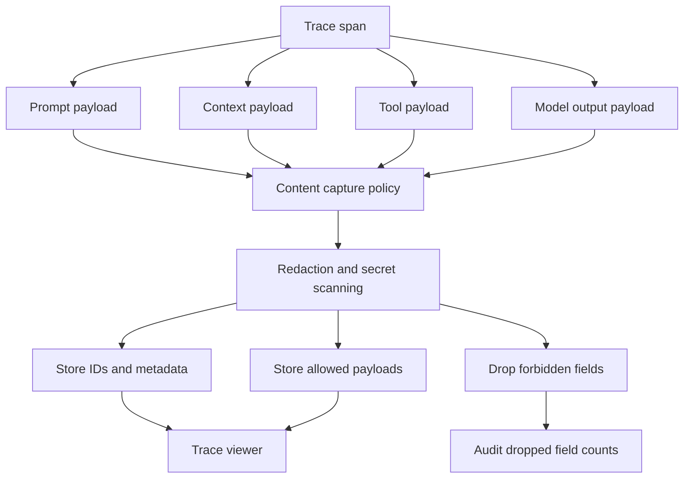

The core design is a controlled capture pipeline. Spans produce payloads, the policy classifies fields, the redaction layer sanitizes sensitive content, and the trace viewer shows only what the viewer is allowed to see.

---

### 3. Real-World Industry Scenarios [Intermediate]

#### Scenario A: RAG Answer Is Wrong Even Though Retrieval Succeeded

**Product context:** A benefits assistant retrieves the correct 2026 plan document, but the final answer cites an older policy rule. The trace shows retrieval ran, but the team still needs to know what text the model actually saw.

**How content capture matters:** If you capture only document IDs, you can prove the retriever found the right document, but not whether context packing dropped the relevant paragraph or whether the prompt buried it below irrelevant chunks. You need selected context IDs, chunk order, truncation metadata, citation mapping, and often redacted context text.

**Constraints:**

- **Latency:** Capturing large context payloads must not slow down the request path. Use async export and avoid serializing huge payloads synchronously.
- **Cost:** Full context capture can create high storage cost. Store document IDs and chunk hashes by default; store text for failures, sampled cases, or high-risk tasks.
- **Reliability:** Context capture must match what the model actually received. If the trace records pre-truncation context but the model saw post-truncation context, debugging is misleading.
- **Failure modes:** Correct docs are retrieved but dropped during packing, reranked below stale docs, truncated mid-sentence, or separated from their citations.
- **Security/privacy:** Retrieved chunks may contain protected data. The capture layer needs permission-aware redaction and retention controls.

**What good looks like in production:** The trace shows the exact selected context order, chunk IDs, source metadata, truncation decisions, redacted text where allowed, and citation mapping used by the final answer.

#### Scenario B: Tool Agent Calls the Right Tool With the Wrong Arguments

**Product context:** An operations agent creates support tickets. A user asks for a billing escalation, but the created ticket is routed to general support.

**How content capture matters:** The trace span `call_tool` is not enough. You need the tool schema version, model-proposed arguments, validation-normalized arguments, permission decision, tool result, and final answer. Without those, you cannot tell whether the model produced the wrong category, the validator normalized it incorrectly, or the downstream tool ignored a field.

**Constraints:**

- **Latency:** Tool argument capture is usually small and should be cheap, but large tool responses may need truncation or references to object storage.
- **Cost:** Replaying tool incidents requires sandbox logs and payloads. Store enough to reproduce safely without storing unnecessary raw data.
- **Reliability:** Tool schemas evolve. Capture schema version or you may debug old payloads against new schemas.
- **Failure modes:** Wrong argument, missing required field, invalid enum, permission bypass, downstream partial success, or final answer inconsistent with tool result.
- **Security/privacy:** Tool payloads often include account IDs, emails, claim numbers, and notes. Use field-level redaction before display.

**What good looks like in production:** The trace shows model-proposed arguments, validated arguments, redacted sensitive fields, tool response status, state diff, and whether the final answer accurately reported the tool result.

#### Scenario C: Privacy Review of Observability Data

**Product context:** A legal and security review asks what your GenAI platform stores from user conversations, retrieved documents, tool calls, and model outputs.

**How content capture matters:** A mature system can answer from policy and evidence: which fields are captured, which are redacted, which are hashed, which are dropped, who can view them, and how long each retention tier lasts. An immature system stores raw prompts and contexts everywhere because they are useful for debugging.

**Constraints:**

- **Latency:** Privacy controls should be part of the capture pipeline, not a manual afterthought.
- **Cost:** Retention tiers reduce storage cost by keeping compact metadata longer and heavy payloads for shorter windows.
- **Reliability:** Redaction must be testable. A redaction bug is a production incident, not a logging detail.
- **Failure modes:** Secrets appear in prompts, private context is stored raw, tool payloads are visible to broad roles, or old traces remain beyond policy.
- **Security/privacy:** Access control, audit logs, field classification, and deletion workflows are mandatory for regulated environments.

**What good looks like in production:** The team can show a content capture policy, redaction tests, retention rules, access classes, audit trails, and example traces that preserve debugging value without exposing forbidden fields.

---

### 4. System View: Think Like a Systems Engineer [Intermediate]

#### Inputs

- Prompt template ID, template version, rendered messages, prompt variables, model settings, routing decision, and safety/policy instructions.
- Retrieved context: query rewrite, document IDs, chunk IDs, scores, filters, permissions, selected context, citations, and packing/truncation metadata.
- Tool data: tool name, schema version, proposed arguments, validated arguments, permission result, tool response, retries, errors, and state diff.
- Model data: visible output, structured output, parser result, token usage, finish reason, safety labels, validator result, and final response.
- Capture policy, redaction policy, retention tier, access class, sampling policy, and user/tenant privacy requirements.

#### Transformations

- Normalize every captured item into a **capture envelope:** a structured wrapper that records trace ID, span ID, payload type, schema version, sensitivity class, retention tier, and payload reference.
- Classify fields by sensitivity before storage or display.
- Apply redaction, hashing, truncation, or dropping according to policy.
- Store lightweight metadata inline with the span and store larger allowed payloads in a payload store.
- Link captured payloads to evals, incidents, user feedback, and regression fixtures.

#### Outputs

- Debuggable trace view showing prompt version, selected context, tool interaction, model output, and validator status.
- Redacted payloads for authorized viewers.
- Compact metadata for aggregate dashboards: token counts, prompt version, context length, tool error rate, output parser failure rate, and safety labels.
- Replay artifacts for approved offline debugging or regression creation.
- Audit records showing what was captured, redacted, dropped, viewed, and retained.

#### Observability: What We Log, Trace, and Measure

- Capture coverage by payload type: prompt, context, tool call, tool result, model output, validator result.
- Redaction success rate and secret-detection rate.
- Payload size, truncation rate, storage cost, and retention tier distribution.
- Prompt version, context token count, selected chunk count, tool schema version, output parser status, and finish reason.
- Access events: who viewed sensitive trace payloads, when, and under which role.
- Replayability: what fraction of failure traces have enough non-sensitive artifacts to reproduce the issue offline.

#### Failure Points: Where It Breaks and How It Shows Up

- Prompt capture stores only template ID. Symptom: engineers cannot see which variables or policy text actually reached the model.
- Context capture stores only pre-selection retrieval results. Symptom: the trace cannot explain what evidence the model saw after packing and truncation.
- Tool capture misses normalized arguments. Symptom: the model looks wrong even though the validator or adapter changed the payload.
- Output capture stores final answer but not parser/validator errors. Symptom: structured generation failures appear as mysterious fallback answers.
- Raw payloads are over-captured. Symptom: observability becomes a privacy, compliance, and access-control risk.
- Payloads are under-captured. Symptom: production incidents cannot be reproduced or converted into regression tests.

---

### 5. System Design Flavor [Intermediate]

#### Key Components and Interfaces

- **Capture envelope:** A standard wrapper for captured payloads that records trace ID, span ID, payload type, sensitivity class, retention tier, and payload location.
- **Content capture policy:** Rules that decide which prompts, contexts, tool payloads, and outputs are stored raw, redacted, hashed, referenced by ID, sampled, or dropped.
- **Payload store:** Storage for larger captured content such as redacted prompts, selected context, tool payloads, and model outputs.
- **Raw capture:** Storing original payload content without redaction. Use rarely and only under strict policy.
- **Structured capture:** Storing normalized fields such as IDs, versions, scores, token counts, tool names, argument keys, statuses, and labels.
- **Derived capture:** Storing computed signals such as hashes, token counts, safety labels, parser status, and summary tags instead of raw content.
- **PII detector:** A classifier or ruleset that identifies personally identifiable information before storage or display.
- **Secret scanner:** A detector that finds API keys, credentials, tokens, and other secrets in captured payloads.
- **Access class:** A label that determines which roles can view a captured payload.
- **Retention tier:** A policy category that controls how long a captured payload or metadata record is retained.
- **Replay artifact:** A sanitized package of inputs, configs, and expected behavior that can reproduce a production issue offline.

#### Important Tradeoffs

- **Raw capture vs structured capture:** Raw payloads are best for deep debugging but carry the highest privacy and storage risk. Structured capture is safer and cheaper, but may miss the exact wording or evidence that caused a failure.
- **Context text vs context IDs:** IDs are cheap and safer, but they require stable document snapshots to reconstruct the issue. Text is easier to debug, but needs redaction and shorter retention.
- **Full tool payloads vs argument summaries:** Full payloads help reproduce tool bugs, but tool data often contains sensitive identifiers. Store validated argument summaries by default and full redacted payloads for failures or approved high-risk traces.
- **Debuggability vs access control:** Broad access speeds debugging but increases risk. A better pattern is role-based viewing: most users see metadata; approved responders see redacted payloads; very few can access raw data when policy allows.
- **Replayability vs data minimization:** Replaying failures requires enough input and configuration detail. Data minimization requires storing only what is necessary. The compromise is sanitized replay artifacts with stable IDs, hashes, and redacted payloads.

#### Scaling Consideration at 10x Traffic or Data

At 10x traffic, content capture becomes one of the largest observability cost drivers. You need payload-size limits, sampling, compression, deduplication by prompt/context hash, and retention tiers. At 10x data sensitivity, policy enforcement becomes more important than capture convenience: classify before storing, redact before displaying, audit every sensitive view, and keep replay artifacts sanitized.

---

### 6. Common Mistakes + Debugging [Beginner]

#### Mistake 1: Capturing Final Outputs But Not Inputs

- **Symptom:** The answer is wrong, but engineers cannot tell whether the prompt, context, tool result, or model caused it.
- **Likely cause:** The trace records model output but not rendered prompt, selected context, tool inputs, or prompt variables.
- **First debugging step:** Inspect the failing trace for missing payload types and add capture envelopes for prompt, context, tool call, and model output spans.

#### Mistake 2: Capturing Raw Prompts and Contexts Everywhere

- **Symptom:** Debugging is easy, but privacy review flags the observability system as unsafe.
- **Likely cause:** The team optimized for troubleshooting before defining capture, redaction, access, and retention policy.
- **First debugging step:** Classify payload fields, define allowed capture modes, add redaction and secret scanning before storage, and restrict sensitive trace views by role.

#### Mistake 3: Capturing Retrieval Results Instead of Model Context

- **Symptom:** The trace shows the right document was retrieved, but the model still answered incorrectly and no one can explain why.
- **Likely cause:** The system captured top-k retrieval output before context packing, not the final context sent to the model.
- **First debugging step:** Capture both retrieved candidates and selected context after reranking, filtering, packing, and truncation.

#### Mistake 4: Ignoring Tool Result and State Consistency

- **Symptom:** The final answer claims a ticket was created, but the tool failed or returned partial success.
- **Likely cause:** The trace captured the tool call but not the tool response, state diff, or final-answer consistency check.
- **First debugging step:** Add tool result capture, state diff capture, and a validator that checks whether the final answer matches the tool outcome.

---

### 7. Hands-On Lab: Concept -> Build -> Break -> Measure -> Explain [Pro]

This lab builds a tiny content capture pipeline. It captures prompt, context, tool, and output payloads into envelopes, redacts sensitive fields, scans for risky strings, and reports capture coverage.

#### Build: Minimal Capture Pipeline

```python
import hashlib
import json
import re
from uuid import uuid4

SENSITIVE_KEYS = {"member_id", "email", "account_id", "ssn", "api_key"}
SECRET_PATTERNS = [r"sk-[A-Za-z0-9_-]{8,}", r"api[_-]?key\s*=\s*['\"][^'\"]+['\"]"]

capture_policy = {
    "prompt": "redacted",
    "context": "metadata_plus_hash",
    "tool_call": "redacted",
    "tool_result": "redacted",
    "model_output": "redacted",
}

def stable_hash(value):
    encoded = json.dumps(value, sort_keys=True).encode("utf-8")
    return hashlib.sha256(encoded).hexdigest()[:12]

def redact_value(key, value):
    if key.lower() in SENSITIVE_KEYS:
        return "<redacted>"
    if isinstance(value, str):
        redacted = value
        redacted = re.sub(r"[A-Za-z0-9._%+-]+@[A-Za-z0-9.-]+\.[A-Za-z]{2,}", "<email>", redacted)
        redacted = re.sub(r"M-[0-9]{3,}", "<member_id>", redacted)
        for pattern in SECRET_PATTERNS:
            redacted = re.sub(pattern, "<secret>", redacted)
        return redacted
    return value

def redact_payload(payload):
    if isinstance(payload, dict):
        return {key: redact_payload(redact_value(key, value)) for key, value in payload.items()}
    if isinstance(payload, list):
        return [redact_payload(item) for item in payload]
    return payload

def capture_payload(trace_id, span_id, payload_type, payload):
    mode = capture_policy[payload_type]
    envelope = {
        "capture_id": str(uuid4()),
        "trace_id": trace_id,
        "span_id": span_id,
        "payload_type": payload_type,
        "capture_mode": mode,
        "payload_hash": stable_hash(payload),
    }

    if mode == "redacted":
        envelope["payload"] = redact_payload(payload)
    elif mode == "metadata_plus_hash":
        envelope["metadata"] = {
            "item_count": len(payload) if isinstance(payload, list) else 1,
            "payload_hash": stable_hash(payload),
        }
    else:
        envelope["payload"] = "<dropped>"

    return envelope

trace_id = "trace-001"
span_id = "span-llm-001"

prompt_payload = {
    "template_id": "benefits-answer-v4",
    "messages": [
        {"role": "system", "content": "Answer only from provided context."},
        {"role": "user", "content": "Can member M-123 get a refund? Email me at user@example.com."},
    ],
    "model": "example-model",
}

context_payload = [
    {"doc_id": "refund_policy_2026", "chunk_id": "c17", "score": 0.91, "text": "Refund requires account verification."},
    {"doc_id": "refund_faq", "chunk_id": "c04", "score": 0.72, "text": "General refund FAQ."},
]

tool_payload = {
    "tool": "create_case",
    "arguments": {"member_id": "M-123", "category": "billing", "email": "user@example.com"},
}

model_output_payload = {
    "answer": "I cannot verify the refund without account review. I created a billing case.",
    "finish_reason": "stop",
    "output_tokens": 18,
}

captured = [
    capture_payload(trace_id, span_id, "prompt", prompt_payload),
    capture_payload(trace_id, "span-retrieval-001", "context", context_payload),
    capture_payload(trace_id, "span-tool-001", "tool_call", tool_payload),
    capture_payload(trace_id, span_id, "model_output", model_output_payload),
]

for item in captured:
    print(json.dumps(item, indent=2))
```

#### Break: Force the Failure Mode

Now simulate an unsafe capture path that stores raw payloads before redaction:

```python
unsafe_capture = {
    "payload_type": "prompt",
    "payload": prompt_payload,
}

def find_unredacted_sensitive_values(obj):
    text = json.dumps(obj)
    findings = []
    if re.search(r"[A-Za-z0-9._%+-]+@[A-Za-z0-9.-]+\.[A-Za-z]{2,}", text):
        findings.append("email")
    if re.search(r"M-[0-9]{3,}", text):
        findings.append("member_id")
    for pattern in SECRET_PATTERNS:
        if re.search(pattern, text):
            findings.append("secret")
    return findings

print(find_unredacted_sensitive_values(unsafe_capture))
```

This breaks because raw prompt capture includes user email and member ID. In a real system, the same mistake can expose account IDs, claim numbers, private documents, credentials, or tool payloads.

#### Measure: Capture Concrete Signals

```python
def capture_metrics(captured_items):
    coverage = {}
    total_bytes = 0
    redacted_payloads = 0
    metadata_only = 0

    for item in captured_items:
        coverage[item["payload_type"]] = coverage.get(item["payload_type"], 0) + 1
        total_bytes += len(json.dumps(item))
        if item["capture_mode"] == "redacted":
            redacted_payloads += 1
        if item["capture_mode"] == "metadata_plus_hash":
            metadata_only += 1

    return {
        "coverage": coverage,
        "total_bytes": total_bytes,
        "redacted_payloads": redacted_payloads,
        "metadata_only_payloads": metadata_only,
    }

print(capture_metrics(captured))
```

Useful production measures:

- Payload capture coverage by type: prompt, context, tool call, tool result, model output.
- Redaction success rate and unredacted finding count.
- Payload storage bytes by route, tenant, risk level, and retention tier.
- Context truncation rate and selected-context token count.
- Tool argument validation failure rate.
- Parser failure rate and model finish reason distribution.
- Replay artifact completeness for failed requests.

#### Explain: Why It Broke and Which Guardrail Prevents It

The unsafe path broke because it treated observability as a raw logging problem instead of a controlled capture pipeline. The fix is to standardize capture envelopes, classify payloads before storage, redact or hash sensitive fields, store IDs and metadata by default, and require explicit policy approval for raw capture. This gives engineers enough evidence to debug without making trace storage a shadow database of private user data.

---

### 8. Active Recall [Beginner]

1. Why is a trace with spans still insufficient if it does not capture prompt, context, tool, or output payloads?
2. What is the difference between prompt capture and context capture?
3. Why should model output capture avoid hidden chain-of-thought?
4. When is storing context IDs better than storing context text?
5. What should be captured for a tool call besides the tool name?

Answer key:

1. Spans show where work happened, but payloads show what information the system used and produced at each step.
2. Prompt capture records rendered instructions, variables, template version, and model settings. Context capture records selected evidence, document IDs, chunk IDs, scores, filters, citations, and packing/truncation details.
3. Hidden chain-of-thought is not needed for safe production debugging and can expose sensitive or unsupported internal reasoning. Capture observable outputs, structured decisions, summaries, and validator signals instead.
4. IDs are better when documents are stable, sensitive, or large. They reduce privacy and storage risk while allowing reconstruction from versioned snapshots.
5. Capture proposed arguments, validated arguments, schema version, permission result, tool response, retries/errors, state diff, and final-answer consistency.

---

### 9. Practice [Intermediate]

#### Mini-Exercise: Define a Capture Policy

For a healthcare benefits assistant, decide how to capture these payloads:

- Rendered prompt with user question.
- Selected context from private plan documents.
- Tool call to create a support case.
- Tool result containing case ID.
- Final model output.

Suggested answer outline:

- Rendered prompt: store template ID, version, model settings, prompt hash, and redacted message text for failures or sampled traces.
- Selected context: store doc IDs, chunk IDs, scores, policy version, selected order, context hash, and redacted text only when allowed.
- Tool call: store tool name, schema version, redacted validated arguments, permission result, and argument hash.
- Tool result: store status, redacted case ID or hashed case ID, error type, and state diff.
- Final model output: store visible answer after redaction, parser/validator status, finish reason, token counts, and safety labels.

#### Capstone-Style System Design Question [Pro]

You run an enterprise RAG agent with tools. Security says you may not store raw user messages or private document text by default. Support says they cannot debug production failures without seeing what the model saw. Design a capture strategy that satisfies both.

Suggested answer outline:

- Use capture envelopes for prompt, context, tool, and output payloads.
- Store prompt template ID, version, variable names, prompt hash, model settings, and redacted rendered prompt for failure/high-risk traces.
- Store context document IDs, chunk IDs, scores, filters, selected order, token counts, and context hashes by default.
- Store redacted selected context only for allowed failure classes and short retention windows.
- Store tool name, schema version, redacted validated arguments, permission result, result status, and state diff.
- Store model visible output, parser status, validator labels, token counts, and finish reason.
- Enforce PII detection, secret scanning, role-based access, audit logs, retention tiers, and deletion workflows.
- Build sanitized replay artifacts so failures can become regression tests without copying raw private data.

---

### 10. Production Reality Check [Beginner]

**If this fails in prod, what's the first thing we inspect?**

Inspect the failing trace's capture envelopes for prompt, selected context, tool call, tool result, and model output, then check whether any required payload is missing, over-redacted, or stored unsafely. This is the best first step because capture quality determines whether the incident is debuggable and whether the debugging process itself is compliant.

---

### 11. Curiosity Bridge [Beginner]

Capturing payloads gives engineers the evidence needed to debug, but users often know about failures before dashboards do. This leads to human feedback collection and error labeling: turning user reports, thumbs-down events, reviews, and incident tags into structured learning signals.

---

### 12. Exit Check + Carry-Forward Review [Beginner]

**Exit Check:** You're done when you can decide what to capture raw, redacted, hashed, referenced by ID, sampled, or dropped for prompts, contexts, tool calls, and model outputs.

Carry-forward review from Subtopic 8.3.a:

- **Question:** What does a span tell you that a request trace alone does not?
- **Answer:** A span shows one timed operation inside the request, including its duration, status, attributes, errors, and relationship to other operations.

- **Question:** Why is state inspection important around tool calls?
- **Answer:** It shows what the system believed before the tool call, what arguments were sent, what the tool returned, and what state changed afterward.

---

## Subtopic 8.3.c: Human Feedback Collection and Error Labeling

### ✅ Add to Knowledge Base

**Subtopic time:** 3h

### 0. Reading Path + Level Tags

- **Beginner:** Read sections 1-2, section 6, and Active Recall.
- **Intermediate:** Add sections 3-5 and the Hands-On Lab.
- **Pro:** Do the full lab, design a feedback taxonomy, and answer the capstone system-design question.

---

### 1. Pre-Question Hook + The Intuition [Beginner]

**Pause: before reading, if 200 users click thumbs-down this week, what do you know, what do you not know, and what would make those clicks actionable?**

**Human feedback collection** is the process of capturing user and reviewer signals about GenAI behavior in production. It includes direct ratings, comments, corrections, escalations, support tickets, expert reviews, and behavioral signals.

**Explicit feedback** is feedback users intentionally provide, such as thumbs-up/down, star rating, written comment, selected reason, correction, or report button.

**Implicit feedback** is behavior that suggests satisfaction or failure without the user directly labeling it, such as regenerate clicks, edits, copy events, abandonment, task completion, escalation, or repeated rephrasing.

**Error labeling** is the process of turning raw feedback into structured failure labels. Instead of "bad answer," the system records labels such as retrieval miss, unsupported claim, wrong tool, unsafe answer, stale source, tone issue, latency issue, or correct refusal disliked by user.

**Error taxonomy** is the controlled vocabulary of failure categories used to label feedback consistently.

The permanent mental model:

> Feedback is a smoke alarm. Error labels tell you which room is on fire and which team should respond.

A **feedback event** is one captured feedback signal connected to a trace, user interaction, output, task, or workflow. A **feedback schema** defines the fields that make the event useful: trace ID, rating, comment, selected reason, task type, route, model version, label, severity, owner, and review status.

The key engineering point: raw feedback is noisy. Some users dislike correct refusals. Some thumbs-up responses are factually wrong but pleasant. Some users give no feedback even when the answer fails. Production systems need feedback collection plus labeling, trace joining, triage, and promotion into evals.

**Real-world analogy:** Think of a hospital incident reporting system. "Patient unhappy" is useful as an alert, but it is not enough to improve care. The hospital needs structured categories: medication delay, billing confusion, wrong discharge instructions, access issue, or bedside manner. GenAI feedback works the same way: collect the signal, label the failure mode, assign ownership, and improve the system. The analogy breaks down because GenAI feedback may involve subjective user preference, probabilistic model behavior, hidden retrieval context, and privacy-sensitive traces.

---

### 2. Visual Diagram [Intermediate]

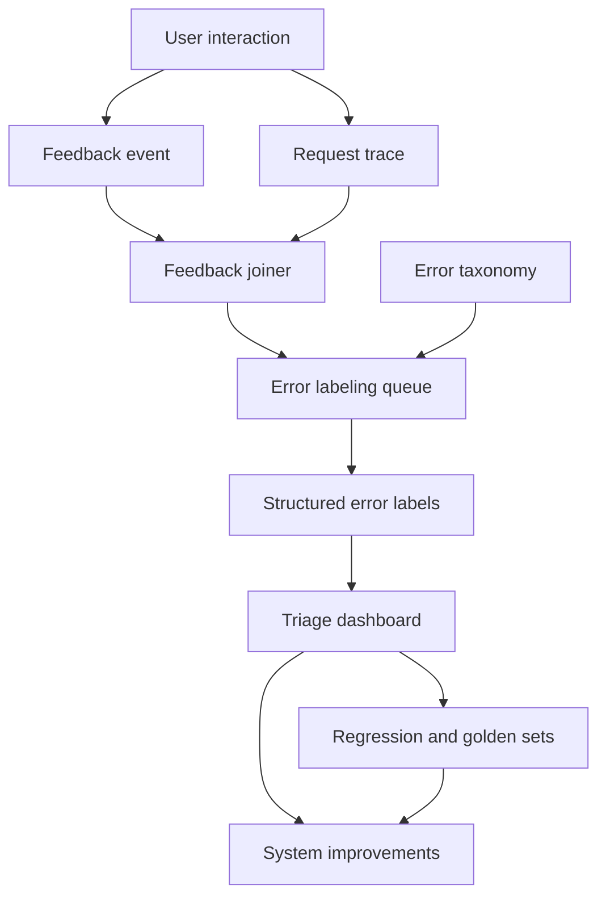

The important flow is: collect feedback, join it to traces, label the error type, prioritize it, and convert recurring or high-risk failures into eval cases and product fixes.

---

### 3. Real-World Industry Scenarios [Intermediate]

#### Scenario A: Support Assistant Gets Many Thumbs-Down Events

**Product context:** A customer support assistant answers billing questions. The dashboard shows a spike in thumbs-down feedback after a prompt release.

**How feedback and labeling matter:** A thumbs-down spike tells you something changed, but not what broke. The team must join each feedback event to request traces, prompt versions, retrieved documents, final answers, and user-selected reason codes. Error labeling can separate "policy answer was wrong" from "answer was correct but too terse" from "user wanted a human" from "correct refusal disliked."

**Constraints:**

- **Latency:** Feedback capture should not slow the user workflow. The UI should send feedback asynchronously and handle failures quietly.
- **Cost:** Human review is expensive. Use routing rules so high-risk, ambiguous, or repeated failures go to experts while simple reason-code feedback is aggregated automatically.
- **Reliability:** Feedback events need durable delivery. Losing negative feedback during incidents hides the exact signals needed to debug them.
- **Failure modes:** Missing trace ID, vague reason codes, feedback attached to the wrong answer, or no distinction between quality issue and product frustration.
- **Security/privacy:** Written feedback may contain account IDs, names, emails, or sensitive details. Redact and classify feedback text before storage and review.

**What good looks like in production:** A spike can be sliced by prompt version, task type, document source, model route, feedback reason, and error label. The team can identify whether the prompt release caused a measurable regression and which labels dominate.

#### Scenario B: Subject Matter Experts Review High-Risk RAG Answers

**Product context:** A healthcare policy assistant answers benefits questions. Internal experts review sampled answers from high-risk workflows.

**How feedback and labeling matter:** Expert labels are more expensive but more trustworthy than casual user ratings. The review workflow should capture whether the answer was grounded, complete, policy-safe, cited correctly, and aligned with task success. Labels should include evidence spans so the team can fix retrieval, prompting, citation, or policy logic.

**Constraints:**

- **Latency:** Expert review is offline, so it does not affect user response time, but review turnaround affects how quickly regressions are detected.
- **Cost:** Expert time is scarce. Sampling should prioritize risky tasks, new releases, low-confidence cases, user complaints, and representative slices.
- **Reliability:** Reviewers need clear guidelines. Without them, labels drift and agreement drops.
- **Failure modes:** Reviewer disagreement, overbroad labels, missing evidence references, or labels that cannot be mapped to engineering owners.
- **Security/privacy:** Review tools must enforce least-privilege access, redaction, audit logs, and retention limits.

**What good looks like in production:** Expert feedback produces consistent labels, clear failure reasons, evidence references, severity, and owner routing. Confirmed failures become regression fixtures or golden-set candidates.

#### Scenario C: Tool Agent Incident Reports

**Product context:** An internal operations agent creates cases, updates records, and schedules callbacks. Users report occasional wrong tool actions.

**How feedback and labeling matter:** Tool failures need sharper labels than generic answer quality. An incident may be wrong tool, missing permission check, wrong entity ID, invalid argument, ignored tool error, partial success, or final answer mismatch. Feedback must connect to tool traces and state diffs.

**Constraints:**

- **Latency:** Incident reporting should be low-friction, but deeper labels can be added later by reviewers.
- **Cost:** Tool incidents may require expert triage because they can mutate external systems.
- **Reliability:** The feedback event must include trace ID and tool call ID, or the incident is hard to reconstruct.
- **Failure modes:** User reports the visible symptom but not the tool error; reviewer labels final answer only; state diff is missing.
- **Security/privacy:** Tool traces and incident comments may include protected identifiers, so role-based review is required.

**What good looks like in production:** Tool feedback is routed by severity, joined to the exact tool span, labeled with action-specific failure modes, and used to block repeated unsafe tool behavior.

---

### 4. System View: Think Like a Systems Engineer [Intermediate]

#### Inputs

- Feedback signals: thumbs-up/down, reason codes, comments, corrections, regenerate clicks, edits, copy events, abandonment, support tickets, expert reviews, and incident reports.
- Trace linkage: trace ID, span ID, output ID, conversation turn ID, tool call ID, prompt version, model version, route, task type, and user/session metadata after privacy controls.
- Labeling inputs: error taxonomy, label guidelines, severity definitions, owner mapping, evidence fields, review status, and adjudication workflow.
- Privacy and governance inputs: redaction policy, retention tier, access class, consent rules, audit logs, and deletion requirements.

#### Transformations

- Capture the feedback event from UI, API, support workflow, or reviewer tool.
- Join feedback to traces, captured payloads, model outputs, and tool spans.
- Normalize feedback into a standard schema.
- Route events to automatic aggregation, human review, expert review, or incident triage.
- Apply error labels, severity labels, owner labels, and evidence references.
- Aggregate labels into dashboards and promote confirmed examples into regression suites or golden sets.

#### Outputs

- Feedback dashboards by route, model, prompt version, task type, user segment, error label, and severity.
- Labeled failure examples with trace links, evidence, owner, and fix status.
- Triage queues for high-risk, repeated, or uncertain failures.
- Regression candidates and golden-set candidates.
- Product insights: where users are dissatisfied even when model behavior is technically correct.

#### Observability: What We Log, Trace, and Measure

- Feedback volume, feedback rate, negative feedback rate, reason-code distribution, and comment rate.
- Label distribution by task type, prompt version, model version, retriever config, tool, source, language, and risk level.
- Trace join rate: how often feedback has a valid trace and output link.
- Review latency: time from feedback event to label, triage, owner assignment, and closure.
- Inter-annotator agreement, adjudication rate, label drift, and reviewer calibration.
- Actionability: fraction of feedback events that lead to clear labels, owners, eval cases, fixes, or product decisions.

#### Failure Points: Where It Breaks and How It Shows Up

- Feedback is not linked to traces. Symptom: negative ratings cannot be debugged.
- Labels are too vague. Symptom: "bad answer" becomes the largest bucket and no team knows what to fix.
- Labels are too many or overlapping. Symptom: reviewers disagree and dashboards become noisy.
- Only negative explicit feedback is used. Symptom: the system over-optimizes for loud complaints and misses silent task failures.
- Feedback is treated as ground truth. Symptom: correct refusals or safe answers are incorrectly counted as model failures.
- Feedback is never promoted to evals. Symptom: the same production issue returns after later releases.

---

### 5. System Design Flavor [Intermediate]

#### Key Components and Interfaces

- **Feedback widget:** UI element that collects ratings, reason codes, comments, corrections, or issue reports.
- **Feedback ingestion service:** API or event pipeline that validates, redacts, stores, and routes feedback events.
- **Feedback joiner:** Component that connects feedback events to traces, spans, outputs, tool calls, prompt versions, and model versions.
- **Error labeling queue:** Workflow where reviewers assign structured labels to feedback events and production failures.
- **Triage dashboard:** Dashboard for prioritizing labeled failures by severity, frequency, risk, owner, and release impact.
- **Label quality check:** Process or automation that detects inconsistent labels, low agreement, stale guidelines, and overused catch-all categories.
- **Feedback-to-eval promotion:** Workflow that converts confirmed production failures into regression cases, golden-set candidates, or judge calibration examples.
- **Actionability score:** A score estimating whether feedback contains enough context, trace linkage, and labels to drive a concrete fix.
- **Severity label:** A label that ranks business, safety, compliance, user-impact, or operational risk.

#### Important Tradeoffs

- **Low-friction feedback vs diagnostic detail:** A one-click rating gets more responses but less explanation. A detailed form gives richer labels but fewer submissions. Use a quick first action, then optional reason codes and comments.
- **User labels vs expert labels:** Users are closer to real pain but may be subjective or wrong. Experts are more reliable for factual and policy correctness but expensive. Use users for detection and experts for high-risk adjudication.
- **Broad taxonomy vs simple taxonomy:** A broad taxonomy gives precise debugging but can overwhelm reviewers. A simple taxonomy is easier to apply but may hide root causes. Start with high-signal categories and add sublabels only when they change routing or fixes.
- **Automatic labeling vs human review:** Automatic classifiers scale well but can mislabel edge cases. Human review is slower but better for ambiguous, risky, or novel failures. Use automation for routing and suggestions, not blind truth.
- **Feedback as metric vs feedback as investigation trigger:** Feedback rates are useful, but they are biased by who bothers to respond. Treat feedback as a strong signal to investigate, not as the only quality metric.

#### Scaling Consideration at 10x Traffic or Data

At 10x traffic, feedback volume can overwhelm human reviewers. The system needs sampling, priority routing, deduplication, clustering, severity filters, and automation that suggests labels. At 10x product complexity, error labels must map to owners and system layers, or the feedback program becomes a complaint warehouse instead of an improvement loop.

---

### 6. Common Mistakes + Debugging [Beginner]

#### Mistake 1: Treating Thumbs-Down as a Root Cause

- **Symptom:** The dashboard shows many negative ratings, but the team cannot decide whether to change retrieval, prompts, tools, product UX, or policy.
- **Likely cause:** Feedback collection captures sentiment but not structured error labels or trace links.
- **First debugging step:** Join negative feedback to traces and label a representative sample with a small taxonomy: retrieval, grounding, task success, tool use, safety, latency, UX, or no model issue.

#### Mistake 2: Using Vague Labels Like "Bad Answer"

- **Symptom:** Most failures accumulate in one generic label and no engineering owner can act.
- **Likely cause:** The taxonomy was designed around user feeling rather than system failure modes.
- **First debugging step:** Split the generic bucket into labels tied to fix paths: retrieval miss, stale context, unsupported claim, wrong citation, wrong tool, invalid argument, incomplete answer, unsafe answer, latency, or correct refusal disliked.

#### Mistake 3: Ignoring Implicit Feedback

- **Symptom:** Explicit feedback looks positive, but task completion and support escalation metrics are poor.
- **Likely cause:** Only users who clicked feedback buttons are measured, while silent failures are missed.
- **First debugging step:** Compare explicit ratings with implicit signals such as regenerate rate, abandonment, repeated query reformulation, edit distance, escalation, and task completion.

#### Mistake 4: Not Calibrating Reviewers

- **Symptom:** Reviewers disagree on labels and trend charts change when reviewer assignments change.
- **Likely cause:** Guidelines are unclear, examples are missing, or labels overlap.
- **First debugging step:** Measure agreement on a calibration set, adjudicate disagreements, revise guidelines, and merge or split confusing labels.

---

### 7. Hands-On Lab: Concept -> Build -> Break -> Measure -> Explain [Pro]

This lab builds a tiny feedback collection and error-labeling pipeline. It joins feedback to traces, applies a simple taxonomy, measures actionability, and detects labeling problems.

#### Build: Minimal Feedback Labeling Pipeline

```python
feedback_events = [
    {"feedback_id": "f1", "trace_id": "t1", "rating": "down", "reason": "wrong", "comment": "It used the old refund policy."},
    {"feedback_id": "f2", "trace_id": "t2", "rating": "down", "reason": "tool", "comment": "It created the wrong ticket category."},
    {"feedback_id": "f3", "trace_id": "t3", "rating": "up", "reason": "helpful", "comment": "Solved it."},
    {"feedback_id": "f4", "trace_id": None, "rating": "down", "reason": "slow", "comment": "Took too long."},
]

traces = {
    "t1": {"task_type": "billing_policy", "prompt_version": "refund-v4", "retrieved_docs": ["refund_policy_2024"], "tool_calls": []},
    "t2": {"task_type": "support_ops", "prompt_version": "ops-v2", "retrieved_docs": [], "tool_calls": [{"tool": "create_ticket", "args": {"category": "general"}}]},
    "t3": {"task_type": "faq", "prompt_version": "faq-v5", "retrieved_docs": ["faq_current"], "tool_calls": []},
}

error_taxonomy = {
    "retrieval_stale_source": "Retrieved source is outdated or wrong version.",
    "wrong_tool_argument": "Tool choice is acceptable but arguments are incorrect.",
    "latency_issue": "User experienced slow response or timeout.",
    "no_issue_detected": "Feedback does not indicate a system failure after review.",
    "untriageable": "Feedback lacks enough trace or detail to diagnose.",
}

def join_feedback(event):
    trace = traces.get(event["trace_id"])
    return {**event, "trace": trace}

def suggest_label(joined):
    comment = joined["comment"].lower()
    trace = joined["trace"]
    if trace is None:
        return "untriageable"
    if "old" in comment or "stale" in comment:
        return "retrieval_stale_source"
    if "wrong ticket" in comment or "category" in comment:
        return "wrong_tool_argument"
    if "slow" in comment or "too long" in comment:
        return "latency_issue"
    if joined["rating"] == "up":
        return "no_issue_detected"
    return "untriageable"

def severity_for(label):
    return {
        "retrieval_stale_source": "high",
        "wrong_tool_argument": "high",
        "latency_issue": "medium",
        "no_issue_detected": "none",
        "untriageable": "low",
    }[label]

def actionability(joined, label):
    score = 0
    score += int(joined["trace"] is not None)
    score += int(bool(joined["comment"]))
    score += int(label != "untriageable")
    score += int(severity_for(label) in {"medium", "high"})
    return score / 4

labeled = []
for event in feedback_events:
    joined = join_feedback(event)
    label = suggest_label(joined)
    labeled.append({
        "feedback_id": event["feedback_id"],
        "trace_id": event["trace_id"],
        "label": label,
        "severity": severity_for(label),
        "actionability": actionability(joined, label),
    })

for row in labeled:
    print(row)
```

#### Break: Force the Failure Mode

Now remove trace linkage from every negative event:

```python
broken_feedback = [{**event, "trace_id": None} if event["rating"] == "down" else event for event in feedback_events]

broken_labeled = []
for event in broken_feedback:
    joined = join_feedback(event)
    label = suggest_label(joined)
    broken_labeled.append({
        "feedback_id": event["feedback_id"],
        "label": label,
        "actionability": actionability(joined, label),
    })

print(broken_labeled)
```

This breaks the pipeline because comments alone are not enough to prove root cause. Without trace linkage, a stale-policy complaint cannot be confidently tied to retrieval, prompt version, context packing, or model behavior.

#### Measure: Capture Concrete Signals

```python
def summarize_feedback(rows):
    total = len(rows)
    label_counts = {}
    severity_counts = {}
    actionable = 0
    for row in rows:
        label_counts[row["label"]] = label_counts.get(row["label"], 0) + 1
        severity_counts[row.get("severity", "unknown")] = severity_counts.get(row.get("severity", "unknown"), 0) + 1
        actionable += int(row["actionability"] >= 0.75)
    return {
        "total": total,
        "label_counts": label_counts,
        "severity_counts": severity_counts,
        "actionable_rate": actionable / total,
    }

print(summarize_feedback(labeled))
```

Add reviewer agreement for labeled feedback:

```python
reviewer_labels = [
    {"feedback_id": "f1", "reviewer_a": "retrieval_stale_source", "reviewer_b": "retrieval_stale_source"},
    {"feedback_id": "f2", "reviewer_a": "wrong_tool_argument", "reviewer_b": "wrong_tool_argument"},
    {"feedback_id": "f4", "reviewer_a": "latency_issue", "reviewer_b": "untriageable"},
]

def agreement(rows):
    return sum(1 for row in rows if row["reviewer_a"] == row["reviewer_b"]) / len(rows)

print({"reviewer_agreement": agreement(reviewer_labels)})
```

Useful production measures:

- Feedback rate and negative feedback rate by route, model, prompt version, task type, and user segment.
- Trace join rate for feedback events.
- Label distribution and high-severity label count.
- Actionable feedback rate.
- Time to first review, time to owner assignment, and time to closure.
- Reviewer agreement and adjudication rate.
- Promotion rate into regression suites or golden sets.

#### Explain: Why It Broke and Which Guardrail Prevents It

The broken version fails because feedback without trace linkage and structured labels is mostly sentiment. It can show pain, but it cannot reliably point to retrieval, prompt, tool, model, or UX root cause. The guardrail is to require feedback events to carry stable IDs, join them to traces, label them with a controlled taxonomy, and promote repeated or severe failures into eval assets.

---

### 8. Active Recall [Beginner]

1. Why is thumbs-down feedback not enough by itself?
2. What is the difference between explicit and implicit feedback?
3. Why should error labels map to system layers or owners?
4. Why should correct refusals sometimes be labeled separately from model failures?
5. What does trace join rate measure?

Answer key:

1. It signals dissatisfaction but does not identify the root cause, severity, owner, or fix path.
2. Explicit feedback is intentionally provided by the user, such as ratings or comments. Implicit feedback is inferred from behavior, such as regeneration, edits, abandonment, or escalation.
3. Labels are useful only when they help someone act. Mapping labels to layers or owners turns feedback into work that can be fixed and measured.
4. Users may dislike safe or correct refusals even when the system behaved properly. Counting those as model failures can push the system toward unsafe compliance.
5. Trace join rate measures how often feedback events can be connected to the underlying trace, output, model version, tool call, or workflow state.

---

### 9. Practice [Intermediate]

#### Mini-Exercise: Build an Error Taxonomy

Create a first-pass taxonomy for feedback on a RAG tool agent that answers policy questions and can create support cases.

Suggested answer outline:

- Retrieval labels: retrieval miss, stale source, wrong version, permission-filter issue, context truncation.
- Generation labels: unsupported claim, contradiction, incomplete answer, wrong citation, bad refusal, unsafe answer.
- Tool labels: wrong tool, missing tool, wrong argument, permission issue, tool failure ignored, final answer mismatch.
- Experience labels: too slow, too verbose, unclear, bad tone, user wanted human escalation.
- Non-failure labels: correct refusal disliked, product policy limitation, no issue detected, untriageable.
- Add severity, owner, evidence field, and whether the case should become an eval candidate.

#### Capstone-Style System Design Question [Pro]

You operate a production claims assistant with RAG and tools. Leadership wants to use user feedback to improve quality, but legal warns that comments may contain private data and product warns that angry users may rate correct refusals negatively. Design the feedback collection and error-labeling system.

Suggested answer outline:

- Collect low-friction explicit feedback with optional reason codes and comments.
- Capture implicit signals: regenerate, abandonment, repeated rephrasing, escalation, edit distance, and task completion.
- Attach feedback to trace ID, output ID, tool call ID, prompt version, model version, route, and task type.
- Redact comments, classify sensitivity, enforce access classes, and retain raw comments only under policy.
- Use a taxonomy that separates retrieval, generation, tool, safety, latency, UX, product limitation, and correct refusal disliked.
- Route high-risk, tool, safety, and policy failures to expert review.
- Track agreement and adjudicate ambiguous labels.
- Promote confirmed recurring failures into regression suites, golden sets, judge calibration examples, and product backlog items.

---

### 10. Production Reality Check [Beginner]

**If this fails in prod, what's the first thing we inspect?**

Inspect a sample of negative and high-severity feedback events joined to their traces, then check whether they have valid trace IDs, clear labels, severity, owner, and enough evidence to reproduce the issue. This is the best first step because feedback systems usually fail by collecting complaints without preserving the path from complaint to root cause.

---

### 11. Curiosity Bridge [Beginner]

Feedback and labels show where users and reviewers see failures, but the next step is closing the loop. This leads to turning labeled traces into system improvements: eval cases, prompt fixes, retrieval changes, tool guardrails, and release gates that prevent the same failures from returning.

---

### 12. Exit Check + Carry-Forward Review [Beginner]

**Exit Check:** You're done when you can design a feedback event schema, join it to traces, label errors with a useful taxonomy, and explain which labels should become eval or regression cases.

Carry-forward review from Subtopic 8.3.b:

- **Question:** Why is raw payload capture risky for feedback comments?
- **Answer:** Comments may contain private identifiers, account details, secrets, or sensitive context, so they need redaction, access control, and retention rules.

- **Question:** Why does feedback need to connect to captured prompts, contexts, tool calls, and outputs?
- **Answer:** The feedback tells you a user experienced something; captured payloads and traces explain what the system saw, did, and produced.

---

## Subtopic 8.3.d: Closing the Loop From Trace to System Improvement

### ✅ Add to Knowledge Base

**Subtopic time:** 3h

### 0. Reading Path + Level Tags

- **Beginner:** Read sections 1-2, section 6, and Active Recall.
- **Intermediate:** Add sections 3-5 and the Hands-On Lab.
- **Pro:** Do the full lab, design the operating loop, and answer the capstone system-design question.

---

### 1. Pre-Question Hook + The Intuition [Beginner]

**Pause: before reading, if tracing finds the same failure 37 times, what has to happen so the system actually gets better instead of only becoming better documented?**

**Closed-loop improvement** is the operating discipline that turns production evidence into system changes and then verifies that the changes worked. In GenAI systems, tracing and feedback are not the destination. They are the raw material for better prompts, retrieval, tools, policies, evals, routing, UX, and release gates.

A **trace-to-fix workflow** is the path from one or more production traces to a concrete change. It usually moves through these stages:

1. Detect a failure from trace, feedback, metric, alert, or review.
2. Label the failure with an error taxonomy.
3. Cluster similar failures into a recurring pattern.
4. Identify the most likely root cause.
5. Create a fix hypothesis.
6. Implement the smallest targeted system change.
7. Add or update eval cases so the failure is protected in the future.
8. Verify improvement offline and online.
9. Monitor production for recurrence.

A **root-cause cluster** is a group of similar failures that likely share the same underlying cause, such as stale retrieval, bad tool arguments, overly broad refusal, or missing context packing rule.

A **fix hypothesis** is a testable claim about what change should reduce a specific failure mode. Example: "If we boost document version filters for refund queries, stale-policy feedback should drop without hurting Recall@5."

The permanent mental model:

> Observability finds symptoms. Evaluation proves fixes. Closed-loop improvement connects the two so every serious production failure becomes either a system change, an eval case, or an explicit product decision.

**Real-world analogy:** Think of aviation incident investigation. A flight incident report is not valuable because it is stored in a database. It is valuable when investigators identify a pattern, update procedures, improve training, change equipment, and verify that the same incident does not recur. GenAI tracing works the same way. The analogy breaks down because GenAI systems change faster: prompts, models, indexes, tools, policies, and user behavior can all shift weekly or daily.

---

### 2. Visual Diagram [Intermediate]

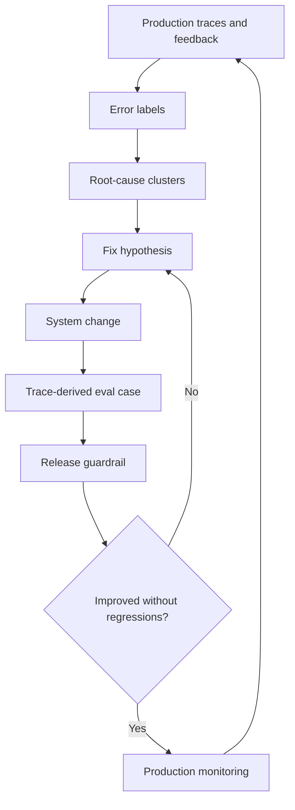

The loop is intentionally circular. Production reveals failures, evals protect against repeats, release gates stop regressions, and monitoring checks whether the fix actually helped real users.

---

### 3. Real-World Industry Scenarios [Intermediate]

#### Scenario A: Stale Policy Retrieval Keeps Causing Wrong Answers

**Product context:** A benefits assistant receives repeated negative feedback for refund-policy questions. Traces show the model frequently receives `refund_policy_2024` instead of `refund_policy_2026`.

**How closing the loop matters:** If the team only labels these as "wrong answer," nothing durable changes. Closing the loop means clustering the traces, identifying stale retrieval as the root cause, implementing a version-aware retrieval filter, adding trace-derived eval cases, and gating future index releases on version-specific recall.

**Constraints:**

- **Latency:** The fix may add metadata filters or reranking. Measure whether p95 latency stays within budget.
- **Cost:** Reranking every policy query may improve quality but increase cost. A cheaper fix might be metadata filtering before reranking.
- **Reliability:** The eval must run on fixed document snapshots so teams can tell whether a retrieval change helped or the corpus changed.
- **Failure modes:** The fix boosts 2026 docs but hurts old-plan questions, or the eval only covers refund policy and misses related benefit documents.
- **Security/privacy:** Trace-derived eval cases should preserve query intent and source IDs without copying sensitive user details.

**What good looks like in production:** Stale-policy labels drop, version-specific Recall@k improves, latency remains acceptable, and the new eval catches future regressions before release.

#### Scenario B: Tool Agent Repeats the Same Wrong Argument

**Product context:** An operations agent creates support tickets. Multiple traces show users asked for billing escalations, but the agent sends `category=general` to `create_ticket`.

**How closing the loop matters:** A trace shows one incident. A cluster shows a system pattern. The fix might be prompt clarification, argument validator rules, schema descriptions, or a tool adapter default. The loop is closed only when the team adds regression tests for billing-escalation cases and monitors whether wrong-category tool labels drop in production.

**Constraints:**

- **Latency:** A validator or clarification step may add time, so it should trigger only when category confidence is low or the task is high-risk.
- **Cost:** Human review for every tool call is too expensive. Use automated checks for common argument errors and human review for severe mutations.
- **Reliability:** Tool schemas evolve. Regression cases need the tool schema version they were derived from.
- **Failure modes:** The prompt fix works for billing but breaks technical support, or the validator overcorrects and blocks valid categories.
- **Security/privacy:** Tool traces may contain private account details. Eval cases should use synthetic or redacted arguments.

**What good looks like in production:** The wrong-category cluster shrinks, tool-argument validation catches edge cases, regression suites include realistic billing examples, and final answers match tool results.

#### Scenario C: Correct Refusals Receive Negative Feedback

**Product context:** A claims assistant refuses to approve claims directly, which is correct policy behavior. Users often rate these refusals negatively.

**How closing the loop matters:** If negative feedback is blindly optimized, the model may become less safe. Closing the loop means labeling these as "correct refusal disliked," improving explanation and next-step UX, and tracking task success separately from satisfaction. The system should not train itself to violate policy just because refusal feedback is negative.

**Constraints:**

- **Latency:** UX improvements should not add unnecessary multi-turn friction.
- **Cost:** A better explanation or routing flow is cheaper than changing the model or adding a judge to every refusal.
- **Reliability:** Refusal labels must distinguish correct policy refusal from overly broad refusal.
- **Failure modes:** The system becomes too compliant, or it over-refuses because safety labels are too blunt.
- **Security/privacy:** Refusal traces may include sensitive claim details and must follow the same capture policy.

**What good looks like in production:** Correct-refusal dislike is tracked separately, unsafe compliance does not increase, user next-step completion improves, and refusal evals protect policy boundaries.

---

### 4. System View: Think Like a Systems Engineer [Intermediate]

#### Inputs

- Production traces, feedback events, error labels, metrics, alerts, incidents, evaluator results, and human reviews.
- Captured payloads: prompt versions, selected context, tool calls, tool results, model outputs, validator results, and state diffs.
- System version data: code commit, prompt version, model route, retriever config, index snapshot, tool schema, policy version, and rollout cohort.
- Business context: severity, frequency, affected users, risk level, compliance impact, owner, and release timeline.

#### Transformations

- Join failures to traces and payloads.
- Cluster similar failures by label, route, prompt version, retriever config, tool schema, source, task type, and user segment.
- Assign root cause, owner, severity, and priority.
- Create a fix hypothesis and improvement ticket.
- Convert representative traces into sanitized eval cases.
- Run offline regression suites, judge checks, and slice checks.
- Release behind gates or feature flags.
- Monitor production recurrence and compare before/after metrics.

#### Outputs

- Root-cause clusters with evidence and owner.
- Improvement backlog items linked to traces, labels, evals, and release decisions.
- Trace-derived eval cases and regression fixtures.
- Fix reports showing before/after metrics, tradeoffs, and remaining risks.
- Release guardrails that prevent known failures from recurring.
- Production dashboards showing recurrence rate, severity trend, and user-impact change.

#### Observability: What We Log, Trace, and Measure

- Cluster frequency, severity, affected routes, affected versions, and recurrence rate.
- Time to detect, time to label, time to root cause, time to fix, and time to verify.
- Eval promotion rate: what fraction of confirmed failures become eval cases?
- Fix effectiveness: before/after failure rate by label and slice.
- Regression risk: which existing metrics or slices worsened after the fix?
- Owner throughput: how many labeled clusters are open, in progress, fixed, verified, or intentionally accepted.
- Recurrence after release: whether the same label and trace pattern returns.

#### Failure Points: Where It Breaks and How It Shows Up

- Traces are reviewed but not clustered. Symptom: teams fix anecdotes while recurring patterns continue.
- Labels do not map to owners. Symptom: dashboards look informative but no one acts.
- Fixes are shipped without eval promotion. Symptom: the same production failure returns later.
- Offline eval improves but production does not. Symptom: eval cases do not represent real failure distribution or the fix affects a hidden online dependency.
- Fixes optimize one slice and regress another. Symptom: aggregate metrics improve but high-risk segments worsen.
- No recurrence tracking exists. Symptom: nobody knows whether a fix actually solved the production problem.

---

### 5. System Design Flavor [Intermediate]

#### Key Components and Interfaces

- **Closed-loop improvement:** The operating process that turns production evidence into fixes, evals, release gates, and verified production improvement.
- **Trace-to-fix workflow:** The workflow from production trace or feedback signal to root cause, fix hypothesis, system change, eval case, and verification.
- **Root-cause cluster:** A group of similar labeled failures that likely share the same underlying cause.
- **Fix hypothesis:** A testable claim that a specific system change should reduce a specific failure mode without unacceptable regressions.
- **Improvement backlog:** A prioritized queue of system improvements linked to traces, labels, owners, evals, and release decisions.
- **Owner routing:** Assigning a labeled failure or cluster to the team responsible for the likely system layer.
- **Trace-derived eval case:** A sanitized eval example created from a real production trace or feedback event.
- **Release guardrail:** A check that blocks or slows release when known failure modes, slices, or safety constraints regress.
- **Impact verification:** Measuring whether a shipped change actually improved the targeted production behavior.
- **Recurrence monitor:** A dashboard or alert that detects whether a supposedly fixed failure pattern returns.

#### Important Tradeoffs

- **Fix fast vs diagnose deeply:** Fast fixes are useful for high-severity incidents, but shallow fixes can hide root causes. Use temporary mitigations for immediate risk and follow with root-cause work.
- **Promote every failure vs curate eval cases:** Promoting every trace creates noisy, expensive evals. Curating only perfect cases misses real messiness. Promote severe, recurring, representative, and high-learning-value failures.
- **Local fix vs systemic fix:** A prompt patch may fix one symptom quickly. A retriever, schema, tool, or product-flow change may solve the root cause more durably. Choose based on recurrence, risk, and blast radius.
- **Offline success vs online validation:** Offline evals give controlled confidence, but production behavior includes real users, changing data, latency, permissions, and UI effects. Require both offline pass and online recurrence monitoring for important fixes.
- **Automation vs human judgment:** Automated clustering and label suggestions scale, but humans should review high-risk clusters, ambiguous root causes, and safety-critical decisions.

#### Scaling Consideration at 10x Traffic or Data

At 10x traffic, individual trace review cannot scale. The loop needs clustering, deduplication, owner routing, severity scoring, and automated eval promotion suggestions. At 10x system complexity, failures cross boundaries: retrieval plus prompt plus tool plus UX. The improvement workflow must preserve trace evidence across components or teams will optimize their local layer while the user-facing failure remains.

---

### 6. Common Mistakes + Debugging [Beginner]

#### Mistake 1: Treating Observability as the Finish Line

- **Symptom:** The team has beautiful traces and dashboards, but the same failure patterns keep returning.
- **Likely cause:** There is no process that converts traces into owners, fixes, evals, gates, and verification.
- **First debugging step:** Pick the top recurring high-severity label, trace five examples end to end, assign a root-cause cluster, and create one trace-derived eval case before fixing.

#### Mistake 2: Fixing Anecdotes Instead of Clusters

- **Symptom:** Engineers patch one reported case, but similar complaints continue.
- **Likely cause:** The team handled a single trace without clustering by label, version, route, source, or tool.
- **First debugging step:** Group recent failures by error label, task type, prompt version, retriever config, and tool schema. Fix the largest or riskiest cluster first.

#### Mistake 3: Shipping Fixes Without Regression Protection

- **Symptom:** A production issue is fixed once, then reappears after a future prompt, model, index, or tool change.
- **Likely cause:** The confirmed failure was not promoted into a regression suite or release gate.
- **First debugging step:** Convert the trace into a sanitized fixture and add a pass/fail contract for the failure mode.

#### Mistake 4: Measuring Only Aggregate Improvement

- **Symptom:** Overall failure rate improves, but a high-risk slice gets worse.
- **Likely cause:** Impact verification checks only aggregate metrics and ignores slices such as task type, risk level, language, tool route, document version, or user segment.
- **First debugging step:** Compare before/after metrics by slice and block rollout if critical segments regress.

---

### 7. Hands-On Lab: Concept -> Build -> Break -> Measure -> Explain [Pro]

This lab turns labeled production traces into root-cause clusters, fix hypotheses, eval candidates, and release guardrails.

#### Build: Minimal Trace-to-Improvement Loop

```python
production_failures = [
    {"trace_id": "t1", "label": "retrieval_stale_source", "task": "refund_policy", "prompt": "refund-v4", "retriever": "hybrid-v2", "severity": "high", "source": "refund_policy_2024"},
    {"trace_id": "t2", "label": "retrieval_stale_source", "task": "refund_policy", "prompt": "refund-v4", "retriever": "hybrid-v2", "severity": "high", "source": "refund_policy_2024"},
    {"trace_id": "t3", "label": "wrong_tool_argument", "task": "create_ticket", "prompt": "ops-v2", "tool_schema": "ticket-v3", "severity": "high", "bad_arg": "category=general"},
    {"trace_id": "t4", "label": "correct_refusal_disliked", "task": "claim_approval", "prompt": "claims-v6", "severity": "medium", "policy": "no_direct_approval"},
]

owner_map = {
    "retrieval_stale_source": "retrieval_team",
    "wrong_tool_argument": "agent_tools_team",
    "correct_refusal_disliked": "product_ux_team",
}

def cluster_key(event):
    return (event["label"], event["task"], event.get("prompt"), event.get("retriever"), event.get("tool_schema"))

def build_clusters(events):
    clusters = {}
    for event in events:
        key = cluster_key(event)
        clusters.setdefault(key, []).append(event)
    return clusters

def propose_fix(label):
    return {
        "retrieval_stale_source": "Add version-aware metadata filter and boost current policy docs.",
        "wrong_tool_argument": "Add category validator and improve tool schema descriptions.",
        "correct_refusal_disliked": "Improve refusal explanation and next-step handoff without weakening policy.",
    }[label]

def eval_contract(label):
    return {
        "retrieval_stale_source": "Required current policy doc appears in top 3 and old policy is not selected as final evidence.",
        "wrong_tool_argument": "Billing escalation creates ticket with category=billing and no unsafe mutation.",
        "correct_refusal_disliked": "Answer refuses prohibited approval, explains why, and offers allowed next step.",
    }[label]

clusters = build_clusters(production_failures)

improvement_backlog = []
for key, events in clusters.items():
    label = key[0]
    improvement_backlog.append({
        "cluster_id": "cluster_" + str(len(improvement_backlog) + 1),
        "label": label,
        "owner": owner_map[label],
        "severity": max(event["severity"] for event in events),
        "trace_ids": [event["trace_id"] for event in events],
        "frequency": len(events),
        "fix_hypothesis": propose_fix(label),
        "eval_contract": eval_contract(label),
        "promote_to_regression": label in {"retrieval_stale_source", "wrong_tool_argument"},
    })

for item in improvement_backlog:
    print(item)
```

#### Break: Force the Failure Mode

Now simulate a team that fixes only the first trace and does not cluster or promote it to evals:

```python
single_trace_fix = {
    "trace_id": "t1",
    "fix": "Manually boost refund_policy_2026 for this query wording.",
    "eval_added": False,
    "cluster_checked": False,
}

def risk_assessment(fix):
    risks = []
    if not fix["cluster_checked"]:
        risks.append("may only fix one anecdote")
    if not fix["eval_added"]:
        risks.append("failure can return in future releases")
    return risks

print(risk_assessment(single_trace_fix))
```

This breaks the improvement loop because the system treats a production failure as an isolated ticket instead of evidence of a pattern. There is no regression protection, no owner routing for the broader cluster, and no way to verify recurrence.

#### Measure: Capture Concrete Signals

```python
before = {
    "retrieval_stale_source": 37,
    "wrong_tool_argument": 12,
    "correct_refusal_disliked": 28,
}

after = {
    "retrieval_stale_source": 9,
    "wrong_tool_argument": 3,
    "correct_refusal_disliked": 21,
}

def improvement_report(before_counts, after_counts):
    report = {}
    for label, before_count in before_counts.items():
        after_count = after_counts.get(label, 0)
        reduction = (before_count - after_count) / before_count if before_count else 0
        report[label] = {
            "before": before_count,
            "after": after_count,
            "reduction_rate": round(reduction, 2),
            "improved": after_count < before_count,
        }
    return report

print(improvement_report(before, after))
```

Useful production measures:

- Recurrence rate by label and root-cause cluster.
- Eval promotion rate from confirmed failures.
- Fix effectiveness by slice: task, risk, language, source, route, model, prompt, retriever, and tool schema.
- Time from first trace to owner assignment, fix, eval, release, and verification.
- Regression count after release.
- Percentage of high-severity clusters with release guardrails.

#### Explain: Why It Broke and Which Guardrail Prevents It

The broken version failed because it fixed a visible symptom without protecting the underlying behavior. The guardrail is a trace-to-fix workflow: cluster related failures, create a fix hypothesis, add a trace-derived eval case, verify offline, release with a guardrail, and monitor recurrence online. This turns observability from passive inspection into an improvement engine.

---

### 8. Active Recall [Beginner]

1. Why is tracing alone not enough to improve a GenAI system?
2. What is a root-cause cluster?
3. Why should confirmed production failures become eval cases?
4. What is the difference between a fix hypothesis and a fix?
5. Why can an offline eval pass while production still fails?

Answer key:

1. Tracing shows what happened, but improvement requires labels, owner routing, fixes, eval promotion, release gates, and production verification.
2. A root-cause cluster is a group of similar failures that likely share the same underlying cause.
3. So the system can prevent the same failure from recurring after future prompt, model, retrieval, tool, or policy changes.
4. A fix hypothesis is the testable claim about what change should help. The fix is the actual implementation of that change.
5. The eval may not represent the real production distribution, hidden dependencies, latency effects, permissions, UI behavior, or changing data.

---

### 9. Practice [Intermediate]

#### Mini-Exercise: Convert Feedback Into a Fix Loop

You have 25 traces labeled `wrong_citation`, mostly from policy comparison questions. Design the loop from trace to improvement.

Suggested answer outline:

- Cluster by task type, prompt version, retriever config, document source, and citation formatter version.
- Inspect representative traces to see whether the wrong citation came from retrieval, context packing, model generation, citation attachment, or source metadata.
- Assign owner based on root cause.
- Create a fix hypothesis, such as "citation attachment should use claim-to-span matching instead of document-level citation."
- Add trace-derived eval cases with expected supporting spans.
- Gate releases on citation precision and citation exactness for the policy-comparison slice.
- Monitor wrong-citation recurrence after release.

#### Capstone-Style System Design Question [Pro]

You operate an enterprise RAG agent with tool actions. You already collect traces, payloads, feedback, and error labels. Design the closed-loop improvement system that turns those signals into reliable product improvements.

Suggested answer outline:

- Join traces, payloads, feedback, labels, metrics, and version metadata into one investigation view.
- Cluster failures by label, severity, task, route, model, prompt, retriever, index, tool schema, source, and user segment.
- Route clusters to owners with severity and frequency.
- Require a fix hypothesis before implementation.
- Convert representative traces into sanitized eval cases and regression fixtures.
- Run offline evals, slice checks, latency/cost checks, and safety checks before rollout.
- Ship high-risk fixes behind feature flags or guarded rollout.
- Monitor recurrence and compare before/after metrics by label and slice.
- Close the ticket only when production impact is verified or the risk is explicitly accepted.

---

### 10. Production Reality Check [Beginner]

**If this fails in prod, what's the first thing we inspect?**

Inspect the highest-severity recurring root-cause cluster and ask whether it has an owner, a fix hypothesis, a trace-derived eval case, a release guardrail, and post-release recurrence monitoring. This is the best first step because closed-loop systems usually fail at the handoff points: trace to owner, owner to fix, fix to eval, eval to release, or release to production verification.

---

### 11. Curiosity Bridge [Beginner]

This completes the evaluation and observability arc: metrics tell you what quality means, evals test it before release, and traces show what happens in production. The next layer is using this discipline across agent frameworks and production systems where memory, tools, workflows, and human review all interact.

---

### 12. Exit Check + Carry-Forward Review [Beginner]

**Exit Check:** You're done when you can take a labeled production trace and turn it into a root-cause cluster, fix hypothesis, trace-derived eval case, release guardrail, and production verification plan.

Carry-forward review from Subtopic 8.3.c:

- **Question:** Why should thumbs-down feedback be joined to traces before making product decisions?
- **Answer:** The rating shows user dissatisfaction, but the trace explains whether the root cause was retrieval, prompt, tool use, model output, latency, UX, or a correct refusal.

- **Question:** Why should labels separate "correct refusal disliked" from true model failure?
- **Answer:** Otherwise the system may be optimized toward unsafe compliance instead of better explanation, routing, or UX.

---

## Module 8 Checkpoint: Evaluation Story, Separate Measurement, and Trace-to-Change Loop

### ✅ Add to Knowledge Base

This checkpoint tests whether Module 8 has become a usable engineering habit, not just a list of metrics.

Checkpoint outcomes:

- Build an evaluation story for any GenAI system you discuss.
- Measure retrieval and generation separately.
- Explain how tracing leads to concrete system changes.

---

### 1. The Core Mental Model [Beginner]

**Pause: before reading, if someone asks "how do you know this GenAI system is good?" can you answer without saying only "we tested it"?**

An **Evaluation story** is the complete argument for how a GenAI system defines quality, measures quality, catches regressions, observes production behavior, and improves from failures. It is not one metric. It is the narrative that connects user goals, risks, offline evals, online traces, feedback, cost, latency, and release decisions.

A strong evaluation story answers six questions:

1. What task is the system supposed to accomplish?
2. What can go wrong, and which failures are most costly?
3. How do we measure each layer separately?
4. What test sets, judges, and regression suites protect quality before release?
5. What traces and feedback show what happened in production?
6. How do production failures become fixes and future eval cases?

The checkpoint mental model:

> Evaluation is the system's quality contract. Retrieval metrics test whether the right evidence arrived. Generation metrics test whether the answer used that evidence correctly. Traces explain why production behavior happened. Closed-loop improvement turns that explanation into better systems.

**Real-world analogy:** Think of a pilot's flight-readiness process. A plane is not considered safe because one gauge looks good. The team checks fuel, engine health, weather, route, crew readiness, maintenance history, cockpit signals, and post-flight incident reports. GenAI evaluation is similar: one score cannot prove readiness. The analogy breaks down because GenAI quality can involve subjective language, changing corpora, probabilistic outputs, user feedback, and privacy-sensitive production traces.

---

### 2. Visual Checkpoint Diagram [Intermediate]

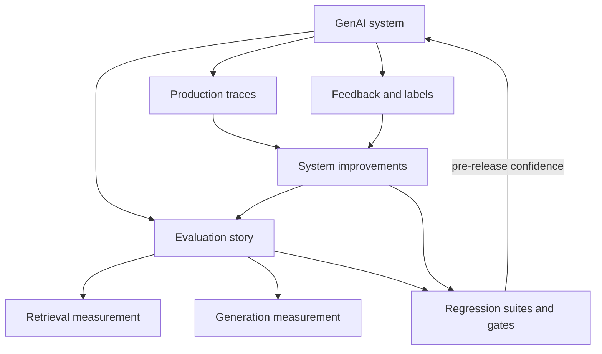

The key is the loop: the evaluation story defines what should be true, regression systems test whether candidates still satisfy it, traces reveal what actually happened, and improvements update both the system and the eval assets.

---

### 3. Build an Evaluation Story for Any GenAI System [Intermediate]

Use this template whenever you discuss a GenAI product, project, interview design, or production incident.

#### Step 1: Define the System and User Outcome

- Product: What does the system do?
- User job: What outcome is the user trying to achieve?
- Task types: What categories of requests exist?
- Success condition: What must be true for the task to count as successful?
- Failure cost: What happens if the system is wrong, slow, unsafe, or expensive?

Example for a policy RAG assistant:

- Product: Answers policy questions using internal documents.
- User job: Get accurate policy guidance with source citations.
- Success condition: Correct answer, supported by current policy, with exact citations and no unsupported claim.
- Failure cost: Wrong policy guidance, compliance risk, user mistrust, or unnecessary escalation.

#### Step 2: Define the Quality Contract

A **Quality contract** is a testable statement of what good behavior requires.

For RAG:

- Required evidence must be retrieved and selected.
- The answer must be grounded in selected evidence.
- Citations must support the exact claims.
- The system must refuse or escalate when evidence is missing.
- Latency and cost must fit the product budget.

For tool agents:

- The correct tool must be selected.
- Arguments must be valid and permission-safe.
- State changes must match the user's authorized intent.
- The final answer must honestly reflect tool results.

For creative or summarization systems:

- Output must satisfy task constraints.
- Important content must be preserved.
- Style and format must match the requested use case.
- Unsafe, private, or unsupported content must be avoided.

#### Step 3: Choose Evaluation Assets

- Golden sets for trusted representative examples.
- Regression suites for known failures and critical contracts.
- LLM-as-judge only where calibrated against human labels.
- Pairwise evals for preference-sensitive outputs.
- Ablations for understanding which component caused improvement.
- Production traces and feedback for real-world failure discovery.

#### Step 4: Define Release Gates

- Retrieval gates: Recall@k, MRR, NDCG, hit rate, permission filtering, freshness, and source-version correctness.
- Generation gates: groundedness, faithfulness, citation accuracy, task success, refusal quality, tool correctness, and safety.
- Product gates: p95 latency, cost per successful task, error rate, feedback label trend, and slice regressions.
- Operational gates: trace coverage, redaction success, evaluator drift, flaky test rate, and recurrence of fixed failures.

---

### 4. Measure Retrieval and Generation Separately [Intermediate]

A **Retrieval-generation split** is the habit of measuring evidence selection and answer generation as separate layers. Without this split, teams waste time fixing prompts when retrieval failed, or tuning retrieval when generation ignored good evidence.

#### Retrieval Measurement: Did the Right Evidence Arrive?

Ask:

- Did the retriever find the required evidence?
- Was the evidence high enough in the ranking?
- Did filters enforce permissions and source freshness?
- Did context packing keep the right chunks?
- Did reranking improve or demote critical evidence?

Useful metrics and checks:

- Recall@k: Was required evidence in the top `k`?
- Hit rate: Did at least one relevant item appear?
- MRR: How high was the first relevant item?
- NDCG: Did the ranking prioritize the most useful evidence?
- Permission leakage rate: Did the system retrieve unauthorized content?
- Freshness/version correctness: Did it retrieve the current source?
- Context selection rate: Was retrieved evidence actually passed to the model?

#### Generation Measurement: Did the Model Use Evidence Correctly?

Ask:

- Did the answer preserve the evidence?
- Are claims supported, contradicted, or unsupported?
- Are citations exact and attached to the right claims?
- Did the answer complete the user's task?
- Did it refuse safely when evidence or permission was missing?
- Did tool use match the user's authorized intent?

Useful metrics and checks:

- Groundedness score and unsupported-claim rate.
- Faithfulness and contradiction rate.
- Citation precision, citation recall, and citation exactness.
- Task success and task completion rate.
- Tool selection, argument validity, state diff correctness, and final-answer consistency.
- Refusal correctness and unsafe-compliance rate.
- Answer polish only after correctness and task success are measured.

#### Why the Split Matters

| Symptom | Retrieval Signal | Generation Signal | Likely Fix |
| --- | --- | --- | --- |
| Wrong answer, required doc absent | Low Recall@k | Grounding may look weak | Improve indexing, query rewrite, filters, reranking, or corpus coverage |
| Wrong answer, required doc present | Good Recall@k | Unsupported or contradicted claims | Improve prompt, context ordering, claim checking, or answer verifier |
| Good answer, wrong citation | Evidence may be present | Citation exactness fails | Fix citation attachment or claim-to-span mapping |
| Tool action wrong | Retrieval may be irrelevant | Tool argument/state check fails | Fix tool schema, validator, permission check, or planner |
| User unhappy with correct refusal | Retrieval/generation may be correct | Task satisfaction low | Improve explanation, next-step UX, or escalation path |

---

### 5. Explain How Tracing Leads to Concrete System Changes [Intermediate]

A **Trace-to-change loop** is the path from observed production behavior to a targeted system improvement.

The loop:

1. Start with a user complaint, negative feedback, failed task, latency spike, safety event, or suspicious metric.
2. Open the request trace and inspect spans, captured payloads, state snapshots, tool calls, and model output.
3. Identify the earliest layer where expected state diverged from actual state.
4. Apply an error label and cluster similar traces.
5. Route the cluster to the owner of the likely failing layer.
6. Create a fix hypothesis.
7. Convert representative traces into sanitized eval or regression cases.
8. Implement the fix and run retrieval, generation, latency, cost, and slice checks.
9. Ship only if release gates pass.
10. Monitor production recurrence.

#### Trace Signal to System Change Map

| Trace Evidence | Likely Root Cause | Concrete System Change | Eval or Gate to Add |
| --- | --- | --- | --- |
| Required doc missing from top-k | Retrieval miss | Improve query rewrite, embeddings, metadata filters, index coverage, or reranker | Recall@k and hit-rate regression for that slice |
| Required doc retrieved but not selected | Context packing failure | Change packing rules, chunk ordering, deduplication, or token budget | Context selection regression |
| Evidence selected but answer contradicts it | Generation faithfulness failure | Prompt change, claim verifier, grounding check, lower-risk model route | Groundedness and contradiction gate |
| Citation points to broad/wrong source | Citation attachment failure | Claim-to-span citation mapping or citation validator | Citation precision/exactness gate |
| Tool called with wrong argument | Tool planning or validation failure | Tool schema description, argument validator, permission check, clarification step | Tool fixture regression |
| Tool succeeded but answer says wrong thing | Final response mismatch | Tool-result summarizer or final-answer consistency validator | Tool-result consistency gate |
| p95 latency spike in reranker span | Slow retrieval/reranking | Cache, reduce candidates, route by risk, optimize reranker | Latency budget gate |
| Negative feedback on correct refusal | UX/product issue | Better explanation, safe next step, escalation flow | Correct-refusal and task-success-after-refusal eval |

---

### 6. Checkpoint Hands-On Lab: Build -> Break -> Measure -> Explain [Pro]

This lab builds a tiny evaluation story checker. It verifies whether a system description covers retrieval, generation, tracing, feedback, and closed-loop improvement.

#### Build: Minimal Evaluation Story Checker

```python
evaluation_story = {
    "system": "policy_rag_assistant",
    "user_outcome": "answer policy questions with exact citations",
    "risk_slices": ["billing", "refunds", "current_policy", "high_confidence_answers"],
    "retrieval_metrics": ["recall@5", "mrr", "source_version_correctness", "permission_filter_pass_rate"],
    "generation_metrics": ["groundedness", "citation_exactness", "unsupported_claim_rate", "task_success"],
    "latency_cost_metrics": ["p95_latency", "cost_per_successful_task"],
    "regression_assets": ["golden_set", "retrieval_regression_suite", "citation_regression_suite"],
    "production_observability": ["trace_id", "retrieval_spans", "prompt_capture", "context_capture", "feedback_labels"],
    "closed_loop": ["trace_to_fix_workflow", "eval_promotion", "release_guardrail", "recurrence_monitor"],
}

required_sections = {
    "user_outcome": "What success means for the user.",
    "risk_slices": "Where failures matter most.",
    "retrieval_metrics": "How evidence selection is measured.",
    "generation_metrics": "How answer quality is measured.",
    "latency_cost_metrics": "How production constraints are measured.",
    "regression_assets": "How known behavior is protected before release.",
    "production_observability": "How production behavior is inspected.",
    "closed_loop": "How traces become fixes and evals.",
}

def check_evaluation_story(story):
    missing = []
    weak = []
    for section in required_sections:
        value = story.get(section)
        if not value:
            missing.append(section)
        elif isinstance(value, list) and len(value) < 2:
            weak.append(section)
    separate_layers = bool(story.get("retrieval_metrics")) and bool(story.get("generation_metrics"))
    has_closed_loop = "eval_promotion" in story.get("closed_loop", []) and "recurrence_monitor" in story.get("closed_loop", [])
    return {
        "missing_sections": missing,
        "weak_sections": weak,
        "retrieval_generation_split": separate_layers,
        "closed_loop_ready": has_closed_loop,
        "checkpoint_pass": not missing and separate_layers and has_closed_loop,
    }

print(check_evaluation_story(evaluation_story))
```

#### Break: Remove the Separation

```python
broken_story = {
    "system": "policy_rag_assistant",
    "user_outcome": "answer policy questions",
    "quality_metric": ["thumbs_up_rate"],
    "production_observability": ["logs"],
}

print(check_evaluation_story(broken_story))
```

This broken story fails because it has no retrieval-generation split, no risk slices, no regression assets, no latency/cost constraints, and no closed-loop path from trace to fix.

#### Measure: What the Checker Teaches

Useful checkpoint measures:

- Does the system define task success, not only answer polish?
- Are retrieval and generation measured separately?
- Are high-risk slices explicit?
- Are golden sets and regression suites versioned?
- Are judges calibrated where used?
- Are latency and cost treated as quality constraints?
- Are traces connected to feedback, labels, eval promotion, and recurrence monitoring?

#### Explain: Why This Matters

The strong story can diagnose where quality fails and protect improvements over time. The weak story only says whether users seemed happy or unhappy, which is not enough for engineering. In real GenAI systems, evaluation becomes useful only when it separates layers, links offline and online evidence, and creates a path from production failure to durable system change.

---

### 7. Checkpoint Practice [Intermediate]

#### Mini-Exercise: Evaluation Story in 90 Seconds

Pick any GenAI system and answer:

- What is the user outcome?
- What are the top 3 failure modes?
- Which retrieval metrics apply, if any?
- Which generation/task metrics apply?
- Which slices are high-risk?
- What regression suite protects known failures?
- What trace spans and payloads are captured?
- How does a production failure become a fix and future eval?

Suggested answer shape for a RAG tool agent:

- Outcome: answer policy questions and create allowed support cases.
- Failures: stale retrieval, unsupported answer, wrong tool argument.
- Retrieval: Recall@5, MRR, source version correctness, permission filtering.
- Generation: groundedness, citation exactness, task success, tool argument validity, final-answer consistency.
- Slices: refunds, claim approval, high-risk tool actions, current-policy questions.
- Regression: stale-policy retrieval fixtures, citation fixtures, tool-call fixtures, correct-refusal fixtures.
- Traces: retrieval spans, selected context, prompt version, tool call, tool result, state diff, model output, feedback label.
- Loop: label trace, cluster failures, route owner, fix hypothesis, eval promotion, release gate, recurrence monitor.

#### Capstone-Style Checkpoint Question [Pro]

You are interviewing for a GenAI systems role. The interviewer asks: "How would you evaluate and operate a RAG agent that answers internal policy questions and can create support tickets?"

Answer outline:

- Start with the task contract: accurate policy answer, exact citation, safe refusal when evidence is missing, and authorized ticket creation.
- Build separate retrieval evals: Recall@k, MRR, NDCG, hit rate, source freshness, permission filtering, and selected-context coverage.
- Build separate generation evals: groundedness, faithfulness, citation precision/recall/exactness, task success, refusal correctness, and tool-result consistency.
- Add regression suites for stale sources, wrong citations, wrong tool arguments, unsafe refusals, and high-risk slices.
- Use calibrated LLM-as-judge only for clearly defined rubric tasks and verify against human labels.
- Track latency, cost per successful task, timeout rate, and cache hit rate as quality constraints.
- Instrument traces for prompt version, retrieved docs, selected context, model output, tool calls, state diffs, feedback, and labels.
- Close the loop: production trace -> error label -> root-cause cluster -> owner -> fix hypothesis -> trace-derived eval -> release gate -> recurrence monitoring.

---

### 8. Module 8 Exit Check [Beginner]

You're done with Module 8 when you can do these three things without notes:

1. Build an evaluation story for any GenAI system.
2. Explain why retrieval and generation must be measured separately.
3. Show how a production trace leads to a concrete system change and future regression protection.

Carry-forward review:

- **Question:** Why can answer polish hide product failure?
- **Answer:** A fluent answer can still be unsupported, cite the wrong source, fail the user's task, call the wrong tool, or violate policy.

- **Question:** Why does tracing matter after offline evals pass?
- **Answer:** Production includes real users, changing data, permissions, latency, tool failures, and feedback patterns that offline evals may not fully represent.

- **Question:** What is the fastest way to debug a bad RAG answer?
- **Answer:** Check whether required evidence was retrieved, selected into context, used faithfully, and cited correctly before changing prompts blindly.

---

## Module Glossary

- **Acceptance rate:** The fraction of generated drafts, answers, plans, patches, or actions accepted by users or downstream systems.
- **Access class:** A label that determines which roles can view a captured payload.
- **Actionability score:** A score estimating whether feedback has enough context, trace linkage, labels, and severity to drive a concrete fix.
- **Ablation:** An experiment that removes or changes one component at a time to measure that component's contribution.
- **Ablation runner:** Infrastructure that executes planned component-removal or component-swap experiments.
- **Adjudication:** The process of resolving annotation disagreements into a final accepted label.
- **Agreement dashboard:** A dashboard tracking judge-human agreement by task type, risk, language, source, and difficulty.
- **Ambiguous query:** A user request that lacks enough context for one safe or correct answer without clarification.
- **Annotation design:** The process of defining labels, guidelines, workflows, and disagreement handling for human evaluation.
- **Annotation guideline:** Written rules that tell annotators how to apply labels consistently.
- **Annotation tool:** An interface where reviewers label examples, mark evidence spans, assign failure tags, and leave notes.
- **Annotator:** A human reviewer who labels examples, judges outputs, or verifies evidence.
- **Answer generator:** The model or pipeline stage that produces the final response from the user query and selected context.
- **Answer-level evaluation:** Evaluation that scores the final answer as a whole rather than scoring each claim separately.
- **Answer polish:** The surface quality of a response, including fluency, tone, structure, formatting, and perceived helpfulness.
- **Attribution:** The link between a generated claim and the evidence used to justify it.
- **Baseline:** The current or reference system used for comparison.
- **Bias checker:** A component that tests for judge or experiment biases such as position, verbosity, label imbalance, and score compression.
- **Claim:** A single factual statement made by the model that can be checked against evidence.
- **Claim extractor:** A component that splits generated answers into atomic claims for evidence checking.
- **Claim-level evaluation:** Evaluation that scores each factual claim separately against supporting evidence.
- **Closed-loop improvement:** The operating process that turns production evidence into fixes, evals, release gates, and verified production improvement.
- **Citation accuracy:** A measure of whether citations point to source spans that support the exact claims they are attached to.
- **Citation exactness:** A measure of whether a citation points to the precise supporting span instead of only a broad document or page.
- **Citation precision:** Among cited claims, the fraction whose citations actually support the attached claim.
- **Citation recall:** Among claims that need citations, the fraction that include a correct supporting citation.
- **Citation validator:** A component that verifies whether each cited source span supports the claim attached to it.
- **Contradiction:** A relationship where the evidence says the opposite of the claim.
- **Contradiction rate:** The fraction of generated claims that conflict with the provided evidence.
- **Confidence interval:** A range that estimates uncertainty around a measured metric.
- **Content capture policy:** Rules that decide which prompts, contexts, tool payloads, and outputs are stored raw, redacted, hashed, referenced by ID, sampled, or dropped.
- **Context capture:** Recording the evidence selected for the model, including document IDs, chunk IDs, scores, filters, citations, metadata, and allowed text.
- **Control:** The unchanged reference condition in an experiment.
- **Correlation ID:** An identifier used to connect traces with logs, metrics, tickets, user feedback, and incident reports.
- **Coverage:** How well a test set represents important users, tasks, documents, languages, risk levels, and failure modes.
- **Cache hit rate:** The fraction of requests or sub-requests served from cache instead of recomputing work.
- **Cache layer:** Infrastructure that safely reuses prompts, retrieval results, embeddings, tool outputs, or final answers when allowed.
- **Calibration set:** A subset of examples with trusted human labels used to measure judge-human agreement.
- **Candidate:** The new system variant being evaluated against the baseline.
- **Capture envelope:** A standard wrapper for captured payloads that records trace ID, span ID, payload type, sensitivity class, retention tier, and payload location.
- **Claim-level judge:** An LLM judge that scores atomic claims, usually against evidence, instead of scoring a whole answer at once.
- **Cost:** The money, compute, tokens, and operational effort required to produce a response or complete a workflow.
- **Cost calculator:** A component that converts model, token, tool, infrastructure, and evaluator usage into cost.
- **Cost per request:** Average cost to serve one request, including model calls, tokens, tools, infrastructure, and evaluator calls.
- **Cost per successful task:** Total cost divided by the number of tasks that actually succeed.
- **Deterministic test harness:** A controlled runner that executes fixtures with pinned configs, stable inputs, fixed snapshots, and mocked or sandboxed dependencies.
- **Derived capture:** Storing computed signals such as hashes, token counts, safety labels, parser status, and summary tags instead of raw content.
- **Entailment:** A relationship where the evidence logically supports the claim.
- **End-to-end latency:** Total time from user request to final usable response.
- **Error labeling:** Turning raw feedback, reviews, or incidents into structured failure labels.
- **Error labeling queue:** A workflow where reviewers assign structured labels to feedback events and production failures.
- **Error taxonomy:** A controlled vocabulary of failure categories used to label feedback consistently.
- **Evaluation dataset:** A set of test queries with known relevant documents, passages, answers, or relevance grades.
- **Evaluation story:** The complete argument for how a GenAI system defines quality, measures it, catches regressions, observes production behavior, and improves from failures.
- **Experiment gate:** A pass/fail rule that determines whether a candidate can ship or move to the next testing stage.
- **Experiment hypothesis:** A clear statement of what change should improve which metric for which task slice.
- **Experiment registry:** Versioned storage for hypotheses, variants, owners, datasets, metrics, gates, and decisions.
- **Experiment report:** A summary of wins, losses, tradeoffs, regressions, cost, latency, and the decision rationale.
- **Experiment structure:** The discipline of defining hypotheses, baselines, variants, metrics, slices, thresholds, and decision rules before interpreting results.
- **Experiment variant:** A specific system configuration being tested, such as prompt version, model route, retriever, or tool policy.
- **Explicit feedback:** Feedback users intentionally provide, such as ratings, comments, corrections, selected reasons, or reports.
- **Evaluator drift:** Change in judge behavior over time due to model version, prompt, rubric, or provider changes.
- **Eval dataset store:** Versioned storage for examples, labels, rubrics, evidence, metadata, and splits.
- **Evaluator store:** A repository for evaluation traces, scores, labels, prompts, model versions, and human review outcomes.
- **Expected behavior contract:** A testable statement of required or forbidden system behavior for a known case.
- **Evidence span:** The exact sentence, passage, table cell, log entry, or document region that supports or refutes a claim.
- **Evidence aligner:** A component that maps each generated claim to candidate source spans for support checking.
- **Faithfulness:** The property that an answer preserves the source evidence without distortion, contradiction, exaggeration, or invention.
- **Feedback event:** One captured feedback signal connected to a trace, user interaction, output, task, or workflow.
- **Feedback ingestion service:** An API or event pipeline that validates, redacts, stores, and routes feedback events.
- **Feedback joiner:** A component that connects feedback events to traces, spans, outputs, tool calls, prompt versions, and model versions.
- **Feedback schema:** The required fields that make a feedback event useful for debugging, review, triage, and evaluation.
- **Feedback-to-eval promotion:** Converting confirmed production failures into regression cases, golden-set candidates, or judge calibration examples.
- **Feedback widget:** A UI element that collects ratings, reason codes, comments, corrections, or issue reports.
- **Fix hypothesis:** A testable claim that a specific system change should reduce a specific failure mode without unacceptable regressions.
- **Fixture:** A versioned test case containing inputs, expected behavior, metadata, and assertions.
- **Ground truth:** The expected correct evidence, answer, label, or relevance judgment used to score system behavior.
- **Gold label:** The expected label, answer, evidence, ranking, or judgment attached to an eval example.
- **Golden set:** A trusted, reviewed eval dataset used as a reference standard for measuring system quality and regressions.
- **Groundedness score:** The fraction of generated claims supported by the provided evidence.
- **Groundedness:** The property that an answer's claims are supported by provided context, retrieved evidence, or approved source material.
- **Hallucination:** Generated content that is unsupported, fabricated, or inconsistent with the available evidence or known truth.
- **Human feedback collection:** Capturing user and reviewer signals about GenAI behavior in production.
- **Human review queue:** A workflow for routing risky, uncertain, or sampled evaluation cases to human experts for labeling.
- **Human agreement:** How often an automated judge agrees with human gold labels or expert adjudication.
- **Holdout set:** Eval examples reserved from tuning so they can test whether improvements generalize.
- **Hit rate:** A binary retrieval metric that checks whether at least one relevant item appears in the top `k` results.
- **Improvement backlog:** A prioritized queue of system improvements linked to traces, labels, owners, evals, and release decisions.
- **Implicit feedback:** Behavioral feedback inferred from actions such as regenerate clicks, edits, abandonment, escalation, or task completion.
- **Impact verification:** Measuring whether a shipped change actually improved the targeted production behavior.
- **Inter-annotator agreement:** A measure of how often independent annotators agree on the same labels.
- **Judge calibration:** Measuring and improving how well automated judge labels match trusted human labels.
- **Judge confidence:** A judge's declared or estimated certainty in its label.
- **Judge prompt registry:** Versioned storage for judge prompts, rubrics, examples, output schemas, and allowed input fields.
- **Judge runner:** Infrastructure that executes judge calls with fixed settings, retries, parsing, and cost tracking.
- **Label schema:** The allowed labels and fields annotators use for evaluation examples.
- **Label quality check:** A process or automation that detects inconsistent labels, low agreement, stale guidelines, and overused catch-all categories.
- **Latency:** The time a system takes to respond or complete a workflow.
- **Latency budget policy:** Rules that define target p50, p95, timeout, and time-to-first-token goals per task type.
- **LLM-as-judge:** A language model used to evaluate another model's output with a rubric, reference, evidence, score, label, or comparison prompt.
- **Mean Reciprocal Rank (MRR):** The average reciprocal rank of the first relevant result across evaluation queries.
- **Model router:** A component that chooses model size or workflow path based on task complexity, risk, budget, and confidence.
- **Model output capture:** Recording visible model output, structured output, parser result, finish reason, token usage, safety labels, and validator results.
- **Mock tool:** A fake or sandboxed tool implementation that returns controlled outputs without mutating production systems.
- **Normalized Discounted Cumulative Gain (NDCG):** A ranking metric that rewards highly relevant results near the top and normalizes against the ideal ranking.
- **Outcome metric:** A metric that measures whether the desired real-world result happened.
- **Outcome verifier:** A component that checks whether the required external or workflow state was achieved.
- **Owner routing:** Assigning a labeled failure or cluster to the team responsible for the likely system layer.
- **p50 latency:** Median latency; half of requests complete faster and half complete slower.
- **p95 latency:** The latency below which 95 percent of requests complete.
- **p99 latency:** The latency below which 99 percent of requests complete.
- **Payload store:** Storage for larger captured content such as redacted prompts, selected context, tool payloads, and model outputs.
- **Pairwise judge:** An LLM judge that compares two or more outputs and chooses or ranks the better one.
- **Pairwise comparison service:** A service that presents outputs to human or LLM judges with randomized order and structured labels.
- **Pairwise evaluation:** Evaluation that compares two outputs for the same input and asks which is better under a rubric.
- **PII detector:** A classifier or ruleset that identifies personally identifiable information before storage or display.
- **Pointwise judge:** An LLM judge that scores one output independently.
- **Position bias:** A pairwise judging bias where output placement influences preference.
- **Raw capture:** Storing original payload content without redaction.
- **Rank:** The position of a retrieved result in the ordered list returned by a retriever or reranker.
- **Polish evaluator:** A component or rubric that scores clarity, tone, formatting, concision, and readability.
- **Production observability:** The discipline of understanding live system behavior through traces, logs, metrics, events, errors, and feedback.
- **Prompt capture:** Recording prompt template version, variables, rendered messages where allowed, model settings, and policy instructions used to create model input.
- **Prompt fixture:** A regression test case focused on output behavior such as refusal, schema, citation, tone, or policy compliance.
- **Prompt regression:** A quality or behavior drop caused by changes to prompts, model routing, model settings, or policy instructions.
- **Prompt sensitivity:** Variation in judge results caused by small changes to the judge prompt, rubric wording, or output format.
- **Proxy metric:** An indirect metric that is easier to measure but only approximates the real product goal.
- **Quality contract:** A testable statement of what good behavior requires for a GenAI system or workflow.
- **Quality-cost frontier:** The best achievable quality for each cost or latency budget.
- **Reference-based judge:** A judge that evaluates output against a gold answer, evidence, expected tool state, or other reference material.
- **Reference-free judge:** A judge that evaluates output without a gold answer or explicit reference.
- **Reference neglect:** A judge failure where the judge ignores provided reference material and scores from plausibility or style.
- **Recall@k:** The fraction of relevant evidence recovered in the top `k` results, or the fraction of queries where required evidence appears within top `k`, depending on label design.
- **Recurrence monitor:** A dashboard or alert that detects whether a supposedly fixed failure pattern returns.
- **Redaction pipeline:** Processing that removes, masks, hashes, or tokenizes sensitive trace fields before storage or display.
- **Relevant document:** A retrieved item that contains information needed to answer the query correctly.
- **Regression gate engine:** A component that blocks releases when required metrics or slices fail thresholds.
- **Regression runner:** A system that runs candidate models, prompts, retrievers, or workflows against frozen eval sets.
- **Regression suite:** A stable set of repeatable tests used to detect whether known-good behavior broke after changes.
- **Regression test set:** A stable set of examples used to detect whether a new system version broke previously expected behavior.
- **Release guardrail:** A check that blocks or slows release when known failure modes, slices, or safety constraints regress.
- **Request trace:** The end-to-end record of one user request as it moves through a system.
- **Replay artifact:** A sanitized package of inputs, configs, and expected behavior that can reproduce a production issue offline.
- **Retention tier:** A policy category that controls how long a captured payload or metadata record is retained.
- **Retrieval fixture:** A regression test case focused on required evidence, document version, permission filters, or relevance in top results.
- **Retrieval-generation split:** The practice of measuring evidence retrieval and answer generation as separate system layers.
- **Retrieval regression:** A retrieval quality drop caused by changes to chunking, embeddings, indexing, reranking, query rewriting, corpus, or permissions.
- **Root-cause cluster:** A group of similar labeled failures that likely share the same underlying cause.
- **Rubric:** A scoring guide that defines what good, partial, failed, unsafe, or correct-refusal outputs look like.
- **Rubric-based judge:** A judge that scores output using explicit criteria and scoring levels.
- **Sampling policy:** Rules that decide which traces are stored fully, partially, or not at all.
- **Sampling strategy:** The method for choosing which production logs, synthetic cases, failures, or edge cases enter an eval dataset.
- **Score compression:** A judge failure where many outputs receive similar scores, making regressions hard to detect.
- **Self-preference bias:** A bias where a model prefers outputs written by itself or a similar model family.
- **Semantic assertion:** A test assertion that checks meaning or required behavior while allowing natural-language wording variation.
- **Secret scanner:** A detector that finds API keys, credentials, tokens, and other secrets in captured payloads.
- **Service level objective (SLO):** A target reliability, latency, or availability promise the system is designed to meet.
- **Severity label:** A label that ranks business, safety, compliance, user-impact, or operational risk.
- **SLO dashboard:** A dashboard showing whether the system meets user-facing reliability, speed, and cost targets.
- **Slice dashboard:** A dashboard that reports eval metrics by task type, risk, source, language, difficulty, or failure tag.
- **Slice regression:** A quality drop in a specific segment even when the aggregate score improves.
- **Snapshot test:** A test that compares current output or artifacts against a saved reference output.
- **Span:** A timed operation inside a request trace, such as retrieval, model generation, parsing, or tool execution.
- **Span schema:** A standard set of fields each span emits so traces are comparable across workflows.
- **State diff:** A compact representation of what changed between two state snapshots.
- **State inspection:** Looking at intermediate workflow state at key boundaries to understand what the system believed and changed.
- **State snapshot:** A structured capture of important state at a specific point in the workflow.
- **Stratified sampling:** Sampling that intentionally selects examples from important segments instead of drawing only random examples.
- **Structured capture:** Storing normalized fields such as IDs, versions, scores, token counts, tool names, argument keys, statuses, and labels.
- **Support classifier:** A component that labels each claim as supported, partially supported, unsupported, or contradicted.
- **Success rubric:** A task-specific rubric that separates complete success, partial success, failure, unsafe success, and correct refusal.
- **Task completion rate:** The fraction of evaluated tasks that reach the required success condition.
- **Task success:** Whether the system achieved the user's intended outcome under the relevant constraints.
- **Task taxonomy:** A controlled set of task types used to evaluate different workflows with the right success criteria.
- **Tail latency:** Slow responses at high percentiles such as p95 or p99.
- **Test set leakage:** When eval examples appear in prompts, training data, fine-tuning data, or few-shot examples, inflating scores.
- **Tie rate:** The fraction of pairwise comparisons where outputs are judged equivalent or no meaningful difference is found.
- **Time to first token:** Time from request start until the first generated token is visible to the user.
- **Timeout rate:** The fraction of requests exceeding configured latency limits.
- **Token accounting:** Tracking input, output, context, history, and evaluator tokens by request and workflow.
- **Token budget:** The maximum allowed input and output tokens for a request or workflow.
- **Tool-call capture:** Recording a model's tool request, validated arguments, schema version, permission result, tool response, retries, and state change.
- **Tool fixture:** A regression test case focused on tool selection, arguments, call order, tool results, or state transition.
- **Tool regression:** A behavior drop where a workflow calls the wrong tool, skips a tool, passes bad arguments, mutates state incorrectly, or misreports tool results.
- **Top-k:** The first `k` results returned by a retrieval system.
- **Trace collector:** A service or library that receives spans, logs, attributes, events, errors, and state snapshots from the application.
- **Trace context:** The propagation mechanism that carries trace ID and span ID across services, model calls, workers, queues, and tools.
- **Trace-derived eval case:** A sanitized eval example created from a real production trace or feedback event.
- **Trace ID:** A unique identifier that connects every span, log line, model call, tool call, and feedback event for one request.
- **Trace instrumentation:** Logging and tracing that captures per-stage timing, tokens, model calls, tool calls, retries, cache hits, and errors.
- **Trace join rate:** The fraction of feedback events that can be connected to the underlying trace, output, model version, tool call, or workflow state.
- **Trace-to-change loop:** The path from observed production behavior to a targeted system improvement and future regression protection.
- **Trace-to-fix workflow:** The workflow from production trace or feedback signal to root cause, fix hypothesis, system change, eval case, and verification.
- **Trace viewer:** A UI for inspecting one request as a timeline or waterfall with spans, attributes, errors, and state.
- **Treatment:** The changed condition being tested against the control.
- **Triage dashboard:** A dashboard for prioritizing labeled failures by severity, frequency, risk, owner, and release impact.
- **Unsupported-claim rate:** The fraction of generated claims that cannot be proven from the provided evidence.
- **Unsupported claim:** A claim that may be plausible but cannot be proven from the available evidence.
- **User intent:** The actual job or goal the user is trying to accomplish, not merely the literal words in the prompt.
- **Verbosity bias:** A judging bias where longer answers are rewarded even when they are not more correct.
- **Variant builder:** A component that creates reproducible system configurations from prompt, model, retriever, tool, and judge versions.
- **Win rate:** The fraction of pairwise comparisons where one variant is preferred over another.
- **Workflow trace collector:** A component that captures tool calls, state transitions, retrieved evidence, generated output, and user-facing response.
